ANCOVA test for debate (engajamento no debate)
================
Geiser C. Challco <geiser@alumni.usp.br>

- [Descriptive Statistics of Initial
  Data](#descriptive-statistics-of-initial-data)
- [Checking of Assumptions](#checking-of-assumptions)
  - [Assumption: Normality distribution of
    data](#assumption-normality-distribution-of-data)
  - [Assumption: Homogeneity of data
    distribution](#assumption-homogeneity-of-data-distribution)
- [Computation of ANCOVA test and Pairwise
  Comparison](#computation-of-ancova-test-and-pairwise-comparison)
  - [ANCOVA tests for one factor](#ancova-tests-for-one-factor)
  - [ANCOVA tests for two factors](#ancova-tests-for-two-factors)
  - [ANCOVA tests for grupo=“WordGen”](#ancova-tests-for-grupowordgen)
  - [Pairwise comparisons for one
    factor](#pairwise-comparisons-for-one-factor)
    - [factor: **grupo**](#factor-grupo)
    - [factor: **genero**](#factor-genero)
    - [factor: **idade**](#factor-idade)
    - [factor: **zona.participante**](#factor-zonaparticipante)
    - [factor: **escola**](#factor-escola)
    - [factor: **zona.escola**](#factor-zonaescola)
  - [Pairwise comparisons for two
    factors](#pairwise-comparisons-for-two-factors)
    - [factores: **grupo:genero**](#factores-grupogenero)
    - [factores: **grupo:idade**](#factores-grupoidade)
    - [factores:
      **grupo:zona.participante**](#factores-grupozonaparticipante)
    - [factores: **grupo:escola**](#factores-grupoescola)
    - [factores: **grupo:zona.escola**](#factores-grupozonaescola)
  - [Pairwise comparisons for
    grupo=“Experimental”](#pairwise-comparisons-for-grupoexperimental)
    - [factores:
      **grupo=“Experimental”:monitor**](#factores-grupoexperimentalmonitor)
    - [factores:
      **grupo=“Experimental”:monitor.genero**](#factores-grupoexperimentalmonitorgenero)
    - [factores:
      **grupo=“Experimental”:monitor.area**](#factores-grupoexperimentalmonitorarea)
    - [factores:
      **grupo=“Experimental”:monitor.formacao**](#factores-grupoexperimentalmonitorformacao)
    - [factores:
      **grupo=“Experimental”:monitor.experiencia**](#factores-grupoexperimentalmonitorexperiencia)

**NOTE**

- Teste ANCOVA para determinar se houve diferenças significativas em
  referência ao engajamento no debate (medido como estado de fluxo).
- ANCOVA test to determine whether there were significant differences in
  reference to engagement in debate (measured as flow state).

# Descriptive Statistics of Initial Data

| grupo    | genero | idade | zona.participante | escola | zona.escola | variable   |   n |  mean | median |   min |   max |    sd |    se |    ci |   iqr |
|:---------|:-------|:------|:------------------|:-------|:------------|:-----------|----:|------:|-------:|------:|------:|------:|------:|------:|------:|
| Controle | F      |       |                   |        |             | fss.debate |  60 | 3.533 |  3.556 | 2.444 | 4.333 | 0.492 | 0.063 | 0.127 | 0.580 |
| Controle | M      |       |                   |        |             | fss.debate |  62 | 3.322 |  3.333 | 2.111 | 4.222 | 0.501 | 0.064 | 0.127 | 0.667 |
| WordGen  | F      |       |                   |        |             | fss.debate |  52 | 3.683 |  3.667 | 2.111 | 4.750 | 0.529 | 0.073 | 0.147 | 0.694 |
| WordGen  | M      |       |                   |        |             | fss.debate |  63 | 3.442 |  3.444 | 2.111 | 5.000 | 0.573 | 0.072 | 0.144 | 0.667 |
| Controle | F      |       |                   |        |             | dfs.debate |  60 | 3.481 |  3.556 | 2.333 | 4.556 | 0.542 | 0.070 | 0.140 | 0.795 |
| Controle | M      |       |                   |        |             | dfs.debate |  62 | 3.444 |  3.444 | 2.000 | 4.556 | 0.586 | 0.074 | 0.149 | 0.750 |
| WordGen  | F      |       |                   |        |             | dfs.debate |  52 | 3.560 |  3.667 | 2.222 | 4.667 | 0.520 | 0.072 | 0.145 | 0.472 |
| WordGen  | M      |       |                   |        |             | dfs.debate |  63 | 3.356 |  3.250 | 2.375 | 4.556 | 0.535 | 0.067 | 0.135 | 0.889 |
| Controle |        | 10y   |                   |        |             | fss.debate |  24 | 3.440 |  3.444 | 2.111 | 4.333 | 0.629 | 0.128 | 0.266 | 1.139 |
| Controle |        | 11y   |                   |        |             | fss.debate |  65 | 3.424 |  3.444 | 2.111 | 4.333 | 0.479 | 0.059 | 0.119 | 0.639 |
| Controle |        | 12y   |                   |        |             | fss.debate |  17 | 3.515 |  3.444 | 2.778 | 4.333 | 0.456 | 0.111 | 0.235 | 0.667 |
| Controle |        | 13y   |                   |        |             | fss.debate |   7 | 3.349 |  3.222 | 2.889 | 3.889 | 0.360 | 0.136 | 0.333 | 0.500 |
| Controle |        | 14y   |                   |        |             | fss.debate |   1 | 3.667 |  3.667 | 3.667 | 3.667 |       |       |       | 0.000 |
| Controle |        | 15y   |                   |        |             | fss.debate |   1 | 2.222 |  2.222 | 2.222 | 2.222 |       |       |       | 0.000 |
| Controle |        | 16y   |                   |        |             | fss.debate |   1 | 3.111 |  3.111 | 3.111 | 3.111 |       |       |       | 0.000 |
| Controle |        |       |                   |        |             | fss.debate |   6 | 3.434 |  3.444 | 2.714 | 4.111 | 0.495 | 0.202 | 0.519 | 0.556 |
| WordGen  |        | 10y   |                   |        |             | fss.debate |  22 | 3.470 |  3.444 | 2.556 | 4.444 | 0.487 | 0.104 | 0.216 | 0.500 |
| WordGen  |        | 11y   |                   |        |             | fss.debate |  70 | 3.601 |  3.556 | 2.111 | 5.000 | 0.592 | 0.071 | 0.141 | 0.618 |
| WordGen  |        | 12y   |                   |        |             | fss.debate |  14 | 3.603 |  3.667 | 2.667 | 4.444 | 0.483 | 0.129 | 0.279 | 0.528 |
| WordGen  |        | 13y   |                   |        |             | fss.debate |   6 | 3.123 |  3.111 | 2.625 | 3.778 | 0.385 | 0.157 | 0.404 | 0.250 |
| WordGen  |        | 14y   |                   |        |             | fss.debate |   1 | 4.667 |  4.667 | 4.667 | 4.667 |       |       |       | 0.000 |
| WordGen  |        |       |                   |        |             | fss.debate |   2 | 3.056 |  3.056 | 2.889 | 3.222 | 0.236 | 0.167 | 2.118 | 0.167 |
| Controle |        | 10y   |                   |        |             | dfs.debate |  24 | 3.513 |  3.556 | 2.444 | 4.556 | 0.538 | 0.110 | 0.227 | 0.611 |
| Controle |        | 11y   |                   |        |             | dfs.debate |  65 | 3.485 |  3.556 | 2.000 | 4.556 | 0.565 | 0.070 | 0.140 | 0.667 |
| Controle |        | 12y   |                   |        |             | dfs.debate |  17 | 3.533 |  3.444 | 2.778 | 4.500 | 0.533 | 0.129 | 0.274 | 0.667 |
| Controle |        | 13y   |                   |        |             | dfs.debate |   7 | 3.450 |  3.444 | 2.556 | 4.375 | 0.581 | 0.220 | 0.537 | 0.556 |
| Controle |        | 14y   |                   |        |             | dfs.debate |   1 | 2.556 |  2.556 | 2.556 | 2.556 |       |       |       | 0.000 |
| Controle |        | 15y   |                   |        |             | dfs.debate |   1 | 2.111 |  2.111 | 2.111 | 2.111 |       |       |       | 0.000 |
| Controle |        | 16y   |                   |        |             | dfs.debate |   1 | 3.556 |  3.556 | 3.556 | 3.556 |       |       |       | 0.000 |
| Controle |        |       |                   |        |             | dfs.debate |   6 | 3.185 |  3.056 | 2.667 | 4.000 | 0.515 | 0.210 | 0.540 | 0.667 |
| WordGen  |        | 10y   |                   |        |             | dfs.debate |  22 | 3.343 |  3.500 | 2.333 | 4.444 | 0.519 | 0.111 | 0.230 | 0.722 |
| WordGen  |        | 11y   |                   |        |             | dfs.debate |  70 | 3.550 |  3.611 | 2.222 | 4.667 | 0.548 | 0.065 | 0.131 | 0.667 |
| WordGen  |        | 12y   |                   |        |             | dfs.debate |  14 | 3.310 |  3.222 | 2.778 | 4.111 | 0.436 | 0.117 | 0.252 | 0.750 |
| WordGen  |        | 13y   |                   |        |             | dfs.debate |   6 | 3.157 |  3.167 | 2.500 | 3.778 | 0.475 | 0.194 | 0.498 | 0.611 |
| WordGen  |        | 14y   |                   |        |             | dfs.debate |   1 | 2.750 |  2.750 | 2.750 | 2.750 |       |       |       | 0.000 |
| WordGen  |        |       |                   |        |             | dfs.debate |   2 | 3.222 |  3.222 | 2.778 | 3.667 | 0.629 | 0.444 | 5.647 | 0.444 |
| Controle |        |       | Urbana            |        |             | fss.debate |  51 | 3.443 |  3.375 | 2.111 | 4.333 | 0.525 | 0.073 | 0.148 | 0.604 |
| Controle |        |       | Rural             |        |             | fss.debate |  43 | 3.364 |  3.444 | 2.111 | 4.333 | 0.523 | 0.080 | 0.161 | 0.667 |
| Controle |        |       |                   |        |             | fss.debate |  28 | 3.488 |  3.646 | 2.556 | 4.222 | 0.446 | 0.084 | 0.173 | 0.583 |
| WordGen  |        |       | Urbana            |        |             | fss.debate |  43 | 3.588 |  3.556 | 2.625 | 4.778 | 0.504 | 0.077 | 0.155 | 0.611 |
| WordGen  |        |       | Rural             |        |             | fss.debate |  47 | 3.456 |  3.444 | 2.111 | 4.750 | 0.572 | 0.083 | 0.168 | 0.715 |
| WordGen  |        |       |                   |        |             | fss.debate |  25 | 3.667 |  3.667 | 2.111 | 5.000 | 0.635 | 0.127 | 0.262 | 0.778 |
| Controle |        |       | Urbana            |        |             | dfs.debate |  51 | 3.365 |  3.444 | 2.000 | 4.500 | 0.628 | 0.088 | 0.177 | 0.833 |
| Controle |        |       | Rural             |        |             | dfs.debate |  43 | 3.532 |  3.556 | 2.444 | 4.556 | 0.526 | 0.080 | 0.162 | 0.889 |
| Controle |        |       |                   |        |             | dfs.debate |  28 | 3.531 |  3.500 | 2.778 | 4.556 | 0.476 | 0.090 | 0.185 | 0.556 |
| WordGen  |        |       | Urbana            |        |             | dfs.debate |  43 | 3.393 |  3.444 | 2.222 | 4.667 | 0.578 | 0.088 | 0.178 | 0.833 |
| WordGen  |        |       | Rural             |        |             | dfs.debate |  47 | 3.441 |  3.444 | 2.556 | 4.556 | 0.541 | 0.079 | 0.159 | 0.722 |
| WordGen  |        |       |                   |        |             | dfs.debate |  25 | 3.557 |  3.667 | 2.500 | 4.222 | 0.443 | 0.089 | 0.183 | 0.500 |
| Controle |        |       |                   | E1     |             | fss.debate |  12 | 3.361 |  3.333 | 2.222 | 4.333 | 0.596 | 0.172 | 0.379 | 0.778 |
| Controle |        |       |                   | E2     |             | fss.debate |  22 | 3.363 |  3.333 | 2.111 | 4.333 | 0.610 | 0.130 | 0.271 | 0.851 |
| Controle |        |       |                   | E3     |             | fss.debate |  15 | 3.421 |  3.444 | 2.778 | 4.333 | 0.417 | 0.108 | 0.231 | 0.389 |
| Controle |        |       |                   | E4     |             | fss.debate |  15 | 3.393 |  3.222 | 2.778 | 4.333 | 0.482 | 0.125 | 0.267 | 0.778 |
| Controle |        |       |                   | E5     |             | fss.debate |  47 | 3.474 |  3.444 | 2.111 | 4.333 | 0.510 | 0.074 | 0.150 | 0.604 |
| Controle |        |       |                   | E6     |             | fss.debate |  11 | 3.465 |  3.667 | 2.556 | 3.778 | 0.358 | 0.108 | 0.240 | 0.333 |
| WordGen  |        |       |                   | E1     |             | fss.debate |  10 | 3.779 |  3.611 | 2.500 | 4.667 | 0.645 | 0.204 | 0.461 | 0.608 |
| WordGen  |        |       |                   | E2     |             | fss.debate |  24 | 3.448 |  3.444 | 2.625 | 4.222 | 0.432 | 0.088 | 0.182 | 0.556 |
| WordGen  |        |       |                   | E3     |             | fss.debate |  15 | 3.231 |  3.333 | 2.111 | 4.222 | 0.576 | 0.149 | 0.319 | 0.611 |
| WordGen  |        |       |                   | E4     |             | fss.debate |   9 | 3.775 |  3.556 | 3.111 | 4.750 | 0.616 | 0.205 | 0.473 | 0.778 |
| WordGen  |        |       |                   | E5     |             | fss.debate |  46 | 3.555 |  3.667 | 2.111 | 5.000 | 0.562 | 0.083 | 0.167 | 0.556 |
| WordGen  |        |       |                   | E6     |             | fss.debate |  11 | 3.808 |  3.889 | 3.111 | 4.444 | 0.531 | 0.160 | 0.357 | 0.889 |
| Controle |        |       |                   | E1     |             | dfs.debate |  12 | 3.139 |  3.333 | 2.111 | 4.111 | 0.545 | 0.157 | 0.346 | 0.611 |
| Controle |        |       |                   | E2     |             | dfs.debate |  22 | 3.505 |  3.556 | 2.375 | 4.444 | 0.476 | 0.102 | 0.211 | 0.556 |
| Controle |        |       |                   | E3     |             | dfs.debate |  15 | 3.643 |  3.556 | 2.778 | 4.556 | 0.555 | 0.143 | 0.308 | 0.778 |
| Controle |        |       |                   | E4     |             | dfs.debate |  15 | 3.403 |  3.556 | 2.111 | 4.375 | 0.638 | 0.165 | 0.353 | 0.556 |
| Controle |        |       |                   | E5     |             | dfs.debate |  47 | 3.476 |  3.556 | 2.000 | 4.556 | 0.611 | 0.089 | 0.179 | 0.944 |
| Controle |        |       |                   | E6     |             | dfs.debate |  11 | 3.505 |  3.444 | 2.778 | 4.111 | 0.349 | 0.105 | 0.235 | 0.278 |
| WordGen  |        |       |                   | E1     |             | dfs.debate |  10 | 3.179 |  3.222 | 2.375 | 3.778 | 0.417 | 0.132 | 0.298 | 0.500 |
| WordGen  |        |       |                   | E2     |             | dfs.debate |  24 | 3.498 |  3.500 | 2.500 | 4.667 | 0.545 | 0.111 | 0.230 | 0.694 |
| WordGen  |        |       |                   | E3     |             | dfs.debate |  15 | 3.496 |  3.778 | 2.556 | 4.556 | 0.696 | 0.180 | 0.386 | 1.000 |
| WordGen  |        |       |                   | E4     |             | dfs.debate |   9 | 3.537 |  3.444 | 3.000 | 4.500 | 0.441 | 0.147 | 0.339 | 0.444 |
| WordGen  |        |       |                   | E5     |             | dfs.debate |  46 | 3.414 |  3.556 | 2.222 | 4.222 | 0.548 | 0.081 | 0.163 | 0.778 |
| WordGen  |        |       |                   | E6     |             | dfs.debate |  11 | 3.591 |  3.667 | 2.889 | 4.111 | 0.355 | 0.107 | 0.239 | 0.361 |
| Controle |        |       |                   |        | Urbana      | fss.debate |  81 | 3.427 |  3.444 | 2.111 | 4.333 | 0.547 | 0.061 | 0.121 | 0.667 |
| Controle |        |       |                   |        | Rural       | fss.debate |  41 | 3.422 |  3.444 | 2.556 | 4.333 | 0.418 | 0.065 | 0.132 | 0.556 |
| WordGen  |        |       |                   |        | Urbana      | fss.debate |  80 | 3.551 |  3.556 | 2.111 | 5.000 | 0.540 | 0.060 | 0.120 | 0.580 |
| WordGen  |        |       |                   |        | Rural       | fss.debate |  35 | 3.552 |  3.444 | 2.111 | 4.750 | 0.623 | 0.105 | 0.214 | 0.889 |
| Controle |        |       |                   |        | Urbana      | dfs.debate |  81 | 3.434 |  3.444 | 2.000 | 4.556 | 0.575 | 0.064 | 0.127 | 0.889 |
| Controle |        |       |                   |        | Rural       | dfs.debate |  41 | 3.518 |  3.556 | 2.111 | 4.556 | 0.540 | 0.084 | 0.171 | 0.667 |
| WordGen  |        |       |                   |        | Urbana      | dfs.debate |  80 | 3.410 |  3.444 | 2.222 | 4.667 | 0.535 | 0.060 | 0.119 | 0.778 |
| WordGen  |        |       |                   |        | Rural       | dfs.debate |  35 | 3.537 |  3.667 | 2.556 | 4.556 | 0.533 | 0.090 | 0.183 | 0.694 |

# Checking of Assumptions

## Assumption: Normality distribution of data

| var        |   n |   skewness |   kurtosis | symmetry | statistic | method     |         p | p.signif | normality |
|:-----------|----:|-----------:|-----------:|:---------|----------:|:-----------|----------:|:---------|:----------|
| fss.debate | 237 |  0.0581079 |  0.0517534 | YES      | 0.3618463 | D’Agostino | 0.8344995 | ns       | \-        |
| fss.debate | 229 | -0.0718357 |  0.1996869 | YES      | 1.0044923 | D’Agostino | 0.6051698 | ns       | \-        |
| fss.debate | 184 |  0.1918401 |  0.0408362 | YES      | 1.4236289 | D’Agostino | 0.4907530 | ns       | QQ        |
| fss.debate | 237 |  0.0134525 | -0.0490396 | YES      | 0.0283578 | D’Agostino | 0.9859211 | ns       | \-        |
| fss.debate | 237 |  0.0377817 |  0.0307007 | YES      | 0.2225611 | D’Agostino | 0.8946877 | ns       | \-        |

## Assumption: Homogeneity of data distribution

| var        | method         | formula                             |   n | DFn.df1 | DFd.df2 | statistic |         p | p.signif |
|:-----------|:---------------|:------------------------------------|----:|--------:|--------:|----------:|----------:|:---------|
| fss.debate | Levene’s test  | `.res`~`grupo`\*`genero`            | 237 |       3 |     233 | 1.1514008 | 0.3291336 | ns       |
| fss.debate | Anova’s slopes | `.res`~`grupo`\*`genero`            | 237 |       3 |     229 | 0.6360000 | 0.5930000 | ns       |
| fss.debate | Levene’s test  | `.res`~`grupo`\*`idade`             | 229 |      11 |     217 | 1.3290062 | 0.2096949 | ns       |
| fss.debate | Anova’s slopes | `.res`~`grupo`\*`idade`             | 229 |       7 |     209 | 0.7620000 | 0.6200000 | ns       |
| fss.debate | Levene’s test  | `.res`~`grupo`\*`zona.participante` | 184 |       3 |     180 | 0.8155691 | 0.4867925 | ns       |
| fss.debate | Anova’s slopes | `.res`~`grupo`\*`zona.participante` | 184 |       3 |     176 | 0.8260000 | 0.4810000 | ns       |
| fss.debate | Levene’s test  | `.res`~`grupo`\*`escola`            | 237 |      11 |     225 | 0.6158700 | 0.8144816 | ns       |
| fss.debate | Anova’s slopes | `.res`~`grupo`\*`escola`            | 237 |      11 |     213 | 1.5620000 | 0.1120000 | ns       |
| fss.debate | Levene’s test  | `.res`~`grupo`\*`zona.escola`       | 237 |       3 |     233 | 0.7717322 | 0.5108562 | ns       |
| fss.debate | Anova’s slopes | `.res`~`grupo`\*`zona.escola`       | 237 |       3 |     229 | 2.4560000 | 0.0640000 | ns       |

# Computation of ANCOVA test and Pairwise Comparison

## ANCOVA tests for one factor

|     | Effect            | DFn | DFd |   SSn |    SSd |      F | p       |   ges | p\<.05 |
|:----|:------------------|----:|----:|------:|-------:|-------:|:--------|------:|:-------|
| 1   | dfs.debate        |   1 | 234 | 9.200 | 57.937 | 37.158 | \<0.001 | 0.137 | \*     |
| 2   | grupo             |   1 | 234 | 1.008 | 57.937 |  4.071 | 0.045   | 0.017 | \*     |
| 4   | genero            |   1 | 234 | 1.881 | 57.064 |  7.715 | 0.006   | 0.032 | \*     |
| 6   | idade             |   6 | 221 | 3.347 | 54.000 |  2.283 | 0.037   | 0.058 | \*     |
| 8   | zona.participante |   1 | 181 | 0.791 | 45.457 |  3.148 | 0.078   | 0.017 |        |
| 10  | escola            |   5 | 230 | 2.782 | 56.163 |  2.279 | 0.048   | 0.047 | \*     |
| 12  | zona.escola       |   1 | 234 | 0.102 | 58.843 |  0.404 | 0.525   | 0.002 |        |

## ANCOVA tests for two factors

|     | Effect                  | DFn | DFd |   SSn |    SSd |      F | p       |   ges | p\<.05 |
|:----|:------------------------|----:|----:|------:|-------:|-------:|:--------|------:|:-------|
| 1   | dfs.debate              |   1 | 232 | 8.198 | 55.935 | 34.002 | \<0.001 | 0.128 | \*     |
| 4   | grupo:genero            |   1 | 232 | 0.010 | 55.935 |  0.042 | 0.837   | 0.000 |        |
| 8   | grupo:idade             |   4 | 216 | 0.565 | 52.412 |  0.583 | 0.676   | 0.011 |        |
| 12  | grupo:zona.participante |   1 | 179 | 0.002 | 44.696 |  0.008 | 0.927   | 0.000 |        |
| 16  | grupo:escola            |   5 | 224 | 1.368 | 53.655 |  1.142 | 0.339   | 0.025 |        |
| 20  | grupo:zona.escola       |   1 | 232 | 0.001 | 57.854 |  0.005 | 0.946   | 0.000 |        |

## ANCOVA tests for grupo=“WordGen”

|     | Effect              | DFn | DFd |   SSn |    SSd |      F | p       |   ges | p\<.05 |
|:----|:--------------------|----:|----:|------:|-------:|-------:|:--------|------:|:-------|
| 1   | dfs.debate          |   1 | 100 | 5.006 | 25.056 | 19.977 | \<0.001 | 0.167 | \*     |
| 2   | monitor             |   9 | 100 | 5.738 | 25.056 |  2.544 | 0.011   | 0.186 | \*     |
| 4   | monitor.genero      |   1 | 108 | 1.282 | 29.513 |  4.690 | 0.033   | 0.042 | \*     |
| 6   | monitor.area        |   8 | 101 | 5.097 | 25.698 |  2.504 | 0.016   | 0.166 | \*     |
| 8   | monitor.formacao    |   2 | 107 | 0.332 | 30.462 |  0.583 | 0.56    | 0.011 |        |
| 10  | monitor.experiencia |   1 | 108 | 0.001 | 30.793 |  0.004 | 0.952   | 0.000 |        |

## Pairwise comparisons for one factor

### factor: **grupo**

| var        | grupo    |   n | M (pre) | SE (pre) | M (unadj) | SE (unadj) | M (adj) | SE (adj) |
|:-----------|:---------|----:|--------:|---------:|----------:|-----------:|--------:|---------:|
| fss.debate | Controle | 122 |   3.462 |    0.051 |     3.426 |      0.046 |   3.423 |    0.045 |
| fss.debate | WordGen  | 115 |   3.448 |    0.050 |     3.551 |      0.053 |   3.554 |    0.046 |

| .y.        | group1   | group2  | estimate | conf.low | conf.high |    se | statistic |     p | p.adj | p.adj.signif |
|:-----------|:---------|:--------|---------:|---------:|----------:|------:|----------:|------:|------:|:-------------|
| fss.debate | Controle | WordGen |   -0.131 |   -0.258 |    -0.003 | 0.065 |    -2.018 | 0.045 | 0.045 | \*           |
| dfs.debate | Controle | WordGen |    0.014 |   -0.127 |     0.155 | 0.071 |     0.195 | 0.846 | 0.846 | ns           |

| .y.         | grupo    | group1 | group2 | estimate | conf.low | conf.high |    se | statistic |    p | p.adj | p.adj.signif |
|:------------|:---------|:-------|:-------|---------:|---------:|----------:|------:|----------:|-----:|------:|:-------------|
| flow.debate | Controle | pre    | pos    |    0.036 |   -0.100 |     0.173 | 0.069 |     0.524 | 0.60 |  0.60 | ns           |
| flow.debate | WordGen  | pre    | pos    |   -0.103 |   -0.243 |     0.037 | 0.071 |    -1.441 | 0.15 |  0.15 | ns           |

    ## Scale for colour is already present.
    ## Adding another scale for colour, which will replace the existing scale.

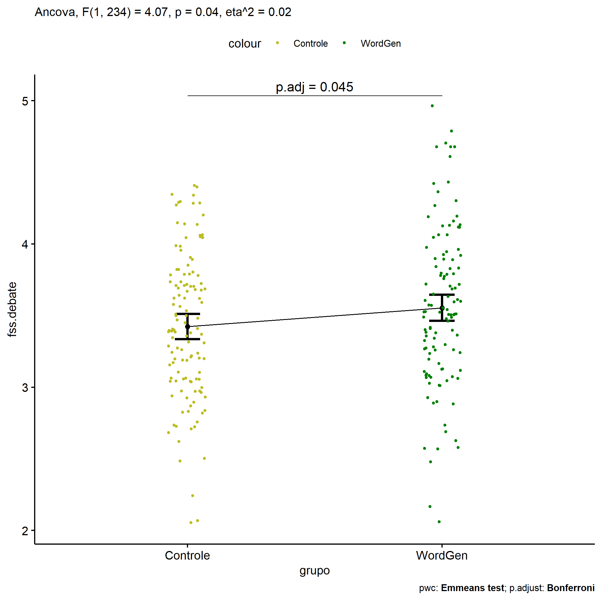<!-- -->

<!-- -->

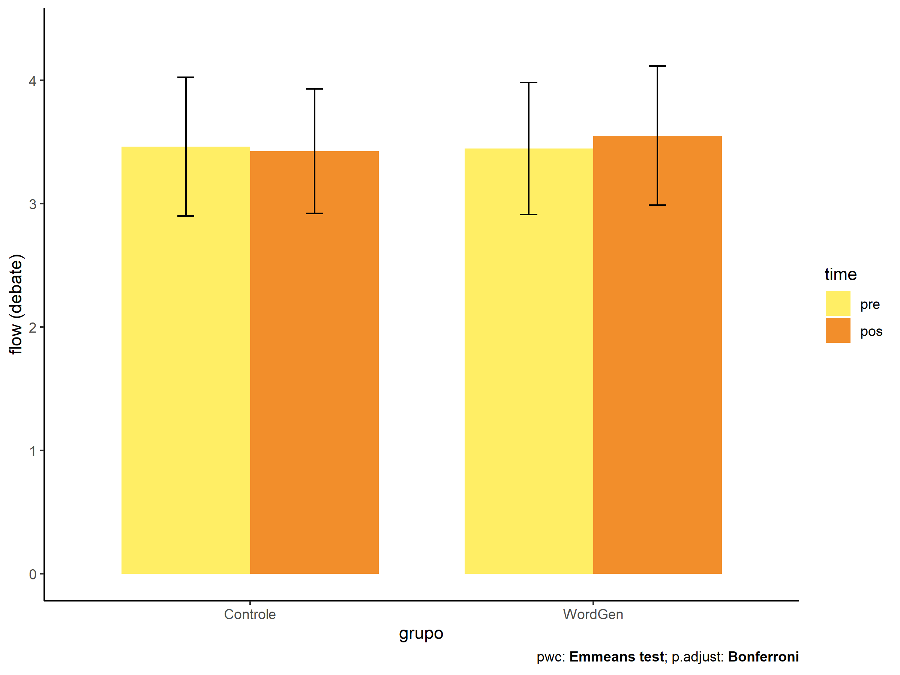<!-- -->

### factor: **genero**

| var        | genero |   n | M (pre) | SE (pre) | M (unadj) | SE (unadj) | M (adj) | SE (adj) |
|:-----------|:-------|----:|--------:|---------:|----------:|-----------:|--------:|---------:|
| fss.debate | F      | 112 |   3.518 |     0.05 |     3.603 |      0.048 |   3.581 |    0.047 |
| fss.debate | M      | 125 |   3.399 |     0.05 |     3.383 |      0.048 |   3.402 |    0.044 |

| .y.        | group1 | group2 | estimate | conf.low | conf.high |    se | statistic |     p | p.adj | p.adj.signif |
|:-----------|:-------|:-------|---------:|---------:|----------:|------:|----------:|------:|------:|:-------------|
| fss.debate | F      | M      |    0.180 |    0.052 |     0.307 | 0.065 |     2.778 | 0.006 | 0.006 | \*\*         |
| dfs.debate | F      | M      |    0.118 |   -0.022 |     0.258 | 0.071 |     1.664 | 0.097 | 0.097 | ns           |

| .y.         | genero | group1 | group2 | estimate | conf.low | conf.high |    se | statistic |     p | p.adj | p.adj.signif |
|:------------|:-------|:-------|:-------|---------:|---------:|----------:|------:|----------:|------:|------:|:-------------|
| flow.debate | F      | pre    | pos    |   -0.085 |   -0.226 |     0.056 | 0.072 |    -1.183 | 0.237 | 0.237 | ns           |
| flow.debate | M      | pre    | pos    |    0.017 |   -0.117 |     0.150 | 0.068 |     0.246 | 0.805 | 0.805 | ns           |

    ## Scale for colour is already present.
    ## Adding another scale for colour, which will replace the existing scale.

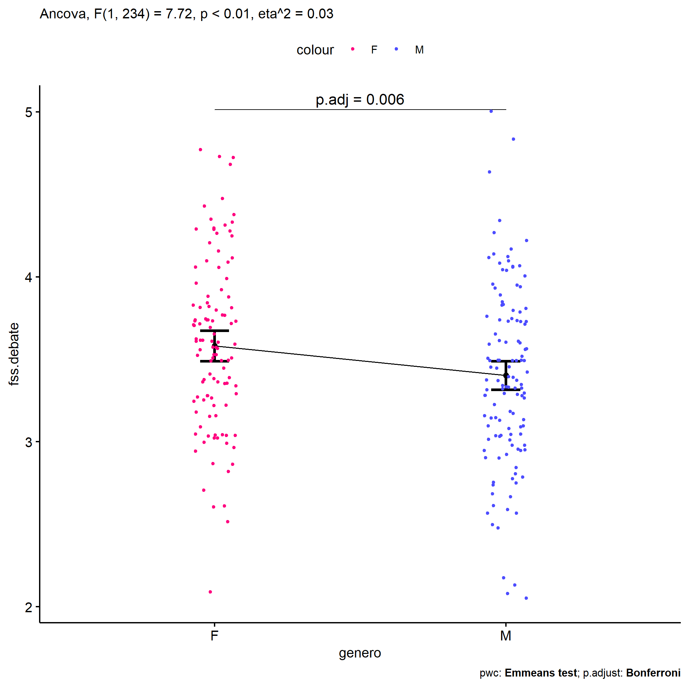<!-- -->

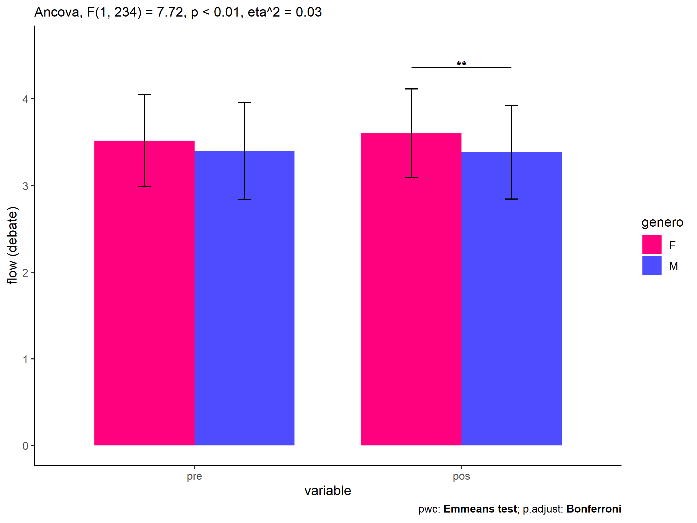<!-- -->

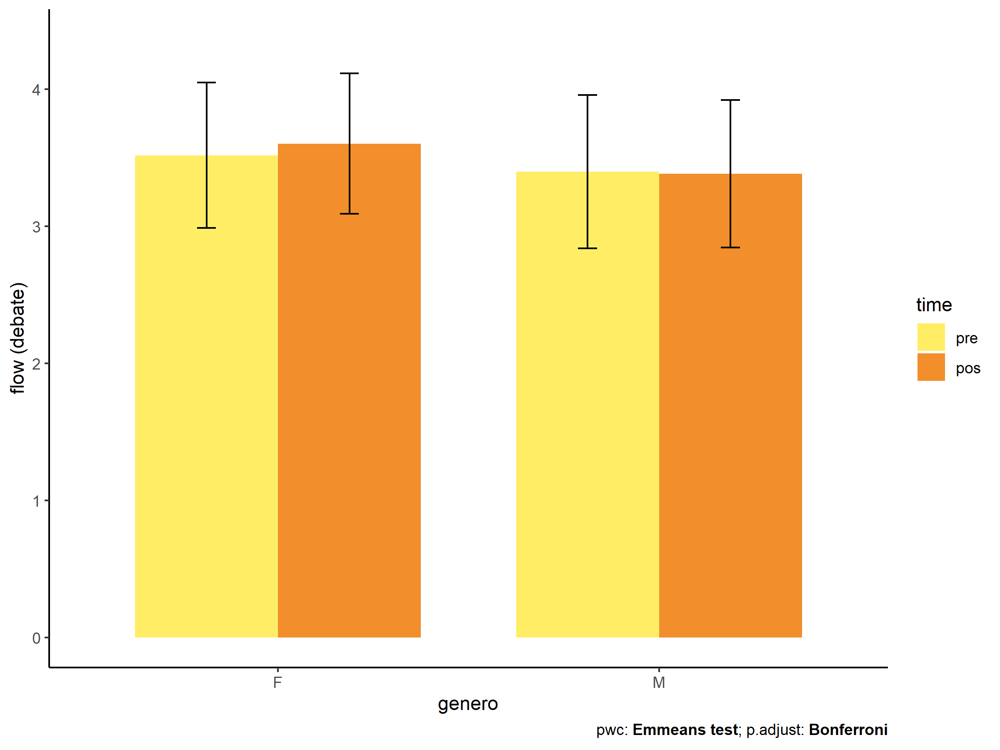<!-- -->

### factor: **idade**

| var        | idade |   n | M (pre) | SE (pre) | M (unadj) | SE (unadj) | M (adj) | SE (adj) |
|:-----------|:------|----:|--------:|---------:|----------:|-----------:|--------:|---------:|
| fss.debate | 10y   |  46 |   3.432 |    0.078 |     3.454 |      0.083 |   3.471 |    0.073 |
| fss.debate | 11y   | 135 |   3.519 |    0.048 |     3.516 |      0.047 |   3.501 |    0.043 |
| fss.debate | 12y   |  31 |   3.432 |    0.089 |     3.555 |      0.083 |   3.571 |    0.089 |
| fss.debate | 13y   |  13 |   3.315 |    0.148 |     3.245 |      0.104 |   3.304 |    0.137 |

| .y.        | group1 | group2 | estimate | conf.low | conf.high |    se | statistic |     p | p.adj | p.adj.signif |
|:-----------|:-------|:-------|---------:|---------:|----------:|------:|----------:|------:|------:|:-------------|
| fss.debate | 10y    | 11y    |   -0.030 |   -0.196 |     0.136 | 0.084 |    -0.354 | 0.723 | 1.000 | ns           |
| fss.debate | 10y    | 12y    |   -0.100 |   -0.326 |     0.126 | 0.115 |    -0.874 | 0.383 | 1.000 | ns           |
| fss.debate | 10y    | 13y    |    0.167 |   -0.139 |     0.473 | 0.155 |     1.078 | 0.282 | 1.000 | ns           |
| fss.debate | 11y    | 12y    |   -0.070 |   -0.264 |     0.124 | 0.098 |    -0.714 | 0.476 | 1.000 | ns           |
| fss.debate | 11y    | 13y    |    0.197 |   -0.086 |     0.481 | 0.144 |     1.371 | 0.172 | 1.000 | ns           |
| fss.debate | 12y    | 13y    |    0.267 |   -0.054 |     0.589 | 0.163 |     1.639 | 0.103 | 0.616 | ns           |
| dfs.debate | 10y    | 11y    |   -0.087 |   -0.269 |     0.095 | 0.092 |    -0.942 | 0.347 | 1.000 | ns           |
| dfs.debate | 10y    | 12y    |    0.000 |   -0.248 |     0.248 | 0.126 |    -0.001 | 0.999 | 1.000 | ns           |
| dfs.debate | 10y    | 13y    |    0.117 |   -0.218 |     0.452 | 0.170 |     0.686 | 0.494 | 1.000 | ns           |
| dfs.debate | 11y    | 12y    |    0.087 |   -0.125 |     0.299 | 0.108 |     0.806 | 0.421 | 1.000 | ns           |
| dfs.debate | 11y    | 13y    |    0.204 |   -0.106 |     0.513 | 0.157 |     1.296 | 0.196 | 1.000 | ns           |
| dfs.debate | 12y    | 13y    |    0.117 |   -0.236 |     0.469 | 0.179 |     0.653 | 0.515 | 1.000 | ns           |

| .y.         | idade | group1 | group2 | estimate | conf.low | conf.high |    se | statistic |     p | p.adj | p.adj.signif |
|:------------|:------|:-------|:-------|---------:|---------:|----------:|------:|----------:|------:|------:|:-------------|
| flow.debate | 10y   | pre    | pos    |   -0.023 |   -0.242 |     0.197 | 0.112 |    -0.203 | 0.839 | 0.839 | ns           |
| flow.debate | 11y   | pre    | pos    |    0.003 |   -0.125 |     0.131 | 0.065 |     0.043 | 0.966 | 0.966 | ns           |
| flow.debate | 12y   | pre    | pos    |   -0.123 |   -0.390 |     0.145 | 0.136 |    -0.902 | 0.368 | 0.368 | ns           |
| flow.debate | 13y   | pre    | pos    |    0.071 |   -0.343 |     0.484 | 0.210 |     0.336 | 0.737 | 0.737 | ns           |

    ## Scale for colour is already present.
    ## Adding another scale for colour, which will replace the existing scale.

<!-- -->

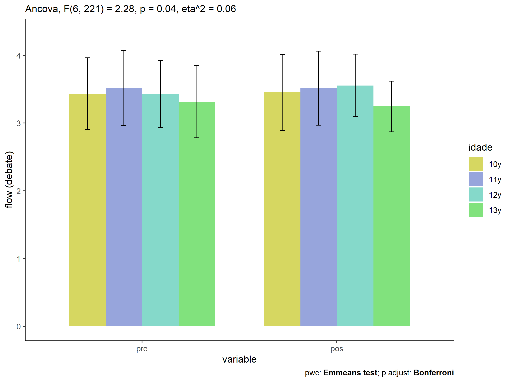<!-- -->

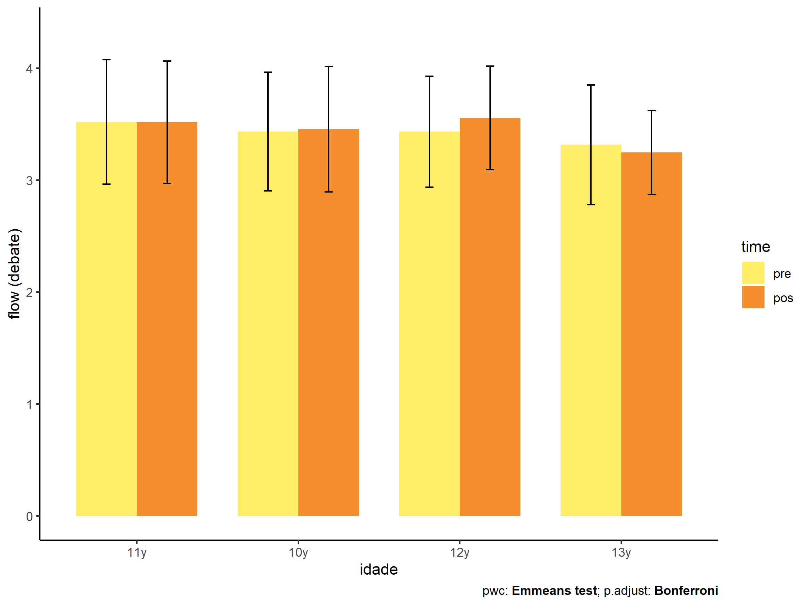<!-- -->

### factor: **zona.participante**

| var        | zona.participante |   n | M (pre) | SE (pre) | M (unadj) | SE (unadj) | M (adj) | SE (adj) |
|:-----------|:------------------|----:|--------:|---------:|----------:|-----------:|--------:|---------:|
| fss.debate | Rural             |  90 |   3.484 |    0.056 |     3.412 |      0.058 |   3.395 |    0.053 |
| fss.debate | Urbana            |  94 |   3.378 |    0.062 |     3.509 |      0.053 |   3.526 |    0.052 |

| .y.        | group1 | group2 | estimate | conf.low | conf.high |    se | statistic |     p | p.adj | p.adj.signif |
|:-----------|:-------|:-------|---------:|---------:|----------:|------:|----------:|------:|------:|:-------------|
| fss.debate | Urbana | Rural  |    0.132 |   -0.015 |     0.278 | 0.074 |     1.774 | 0.078 | 0.078 | ns           |
| dfs.debate | Urbana | Rural  |   -0.106 |   -0.272 |     0.059 | 0.084 |    -1.267 | 0.207 | 0.207 | ns           |

| .y.         | zona.participante | group1 | group2 | estimate | conf.low | conf.high |    se | statistic |     p | p.adj | p.adj.signif |
|:------------|:------------------|:-------|:-------|---------:|---------:|----------:|------:|----------:|------:|------:|:-------------|
| flow.debate | Urbana            | pre    | pos    |   -0.132 |    -0.29 |     0.027 | 0.080 |    -1.635 | 0.103 | 0.103 | ns           |
| flow.debate | Rural             | pre    | pos    |    0.072 |    -0.09 |     0.234 | 0.082 |     0.878 | 0.381 | 0.381 | ns           |

    ## Scale for colour is already present.
    ## Adding another scale for colour, which will replace the existing scale.

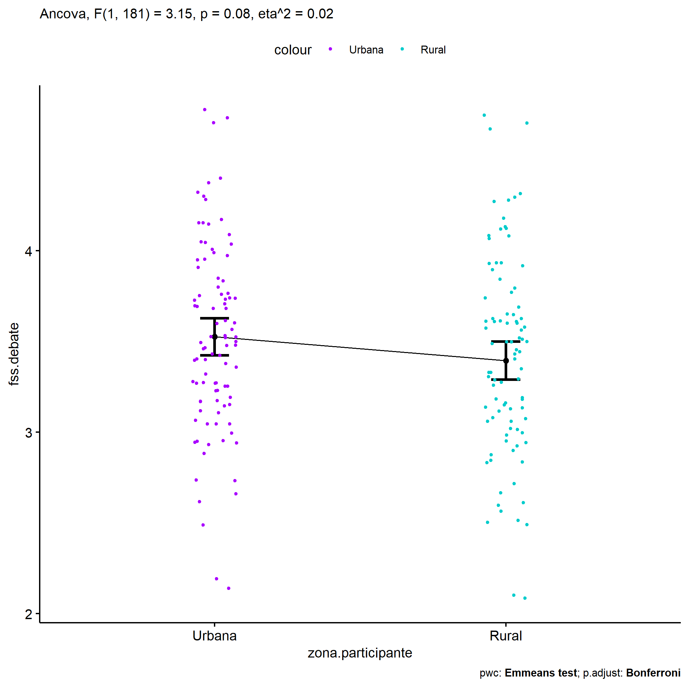<!-- -->

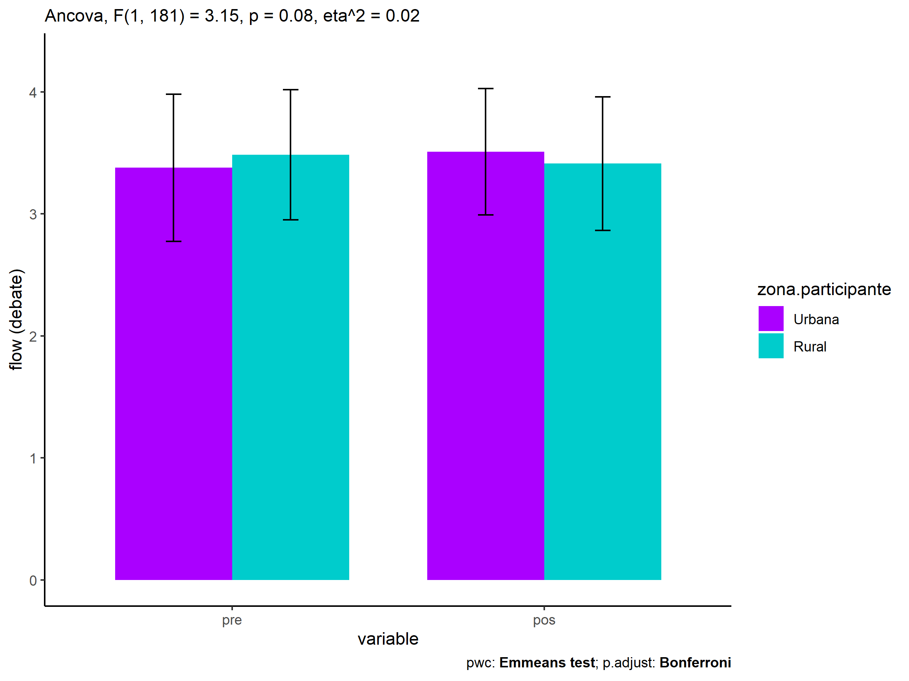<!-- -->

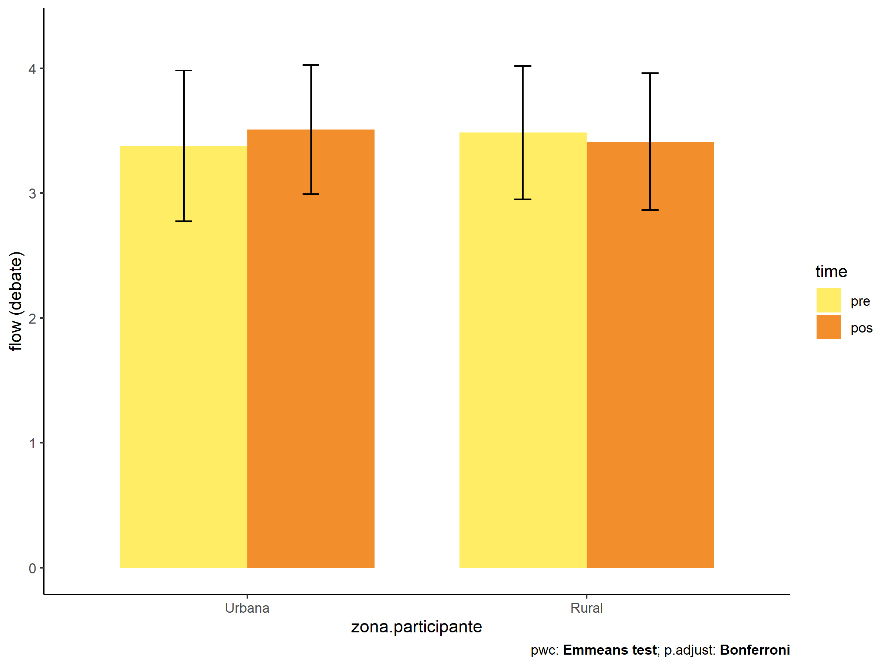<!-- -->

### factor: **escola**

| var        | escola |   n | M (pre) | SE (pre) | M (unadj) | SE (unadj) | M (adj) | SE (adj) |
|:-----------|:-------|----:|--------:|---------:|----------:|-----------:|--------:|---------:|
| fss.debate | E1     |  22 |   3.157 |    0.102 |     3.551 |      0.136 |   3.666 |    0.107 |
| fss.debate | E2     |  46 |   3.501 |    0.075 |     3.408 |      0.077 |   3.390 |    0.073 |
| fss.debate | E3     |  30 |   3.569 |    0.114 |     3.326 |      0.092 |   3.282 |    0.090 |
| fss.debate | E4     |  24 |   3.453 |    0.115 |     3.536 |      0.113 |   3.537 |    0.101 |
| fss.debate | E5     |  93 |   3.445 |    0.060 |     3.514 |      0.055 |   3.518 |    0.051 |
| fss.debate | E6     |  22 |   3.548 |    0.074 |     3.636 |      0.101 |   3.601 |    0.105 |

| .y.        | group1 | group2 | estimate | conf.low | conf.high |    se | statistic |     p | p.adj | p.adj.signif |
|:-----------|:-------|:-------|---------:|---------:|----------:|------:|----------:|------:|------:|:-------------|
| fss.debate | E1     | E2     |    0.276 |    0.020 |     0.532 | 0.130 |     2.127 | 0.034 | 0.517 | ns           |
| fss.debate | E1     | E3     |    0.384 |    0.106 |     0.662 | 0.141 |     2.725 | 0.007 | 0.104 | ns           |
| fss.debate | E1     | E4     |    0.129 |   -0.160 |     0.419 | 0.147 |     0.879 | 0.380 | 1.000 | ns           |
| fss.debate | E1     | E5     |    0.148 |   -0.085 |     0.381 | 0.118 |     1.249 | 0.213 | 1.000 | ns           |
| fss.debate | E1     | E6     |    0.065 |   -0.232 |     0.362 | 0.151 |     0.433 | 0.666 | 1.000 | ns           |
| fss.debate | E2     | E3     |    0.108 |   -0.121 |     0.337 | 0.116 |     0.930 | 0.353 | 1.000 | ns           |
| fss.debate | E2     | E4     |   -0.147 |   -0.392 |     0.098 | 0.124 |    -1.179 | 0.239 | 1.000 | ns           |
| fss.debate | E2     | E5     |   -0.128 |   -0.304 |     0.048 | 0.089 |    -1.437 | 0.152 | 1.000 | ns           |
| fss.debate | E2     | E6     |   -0.211 |   -0.463 |     0.042 | 0.128 |    -1.645 | 0.101 | 1.000 | ns           |
| fss.debate | E3     | E4     |   -0.255 |   -0.522 |     0.012 | 0.136 |    -1.880 | 0.061 | 0.921 | ns           |
| fss.debate | E3     | E5     |   -0.236 |   -0.441 |    -0.031 | 0.104 |    -2.270 | 0.024 | 0.362 | ns           |
| fss.debate | E3     | E6     |   -0.319 |   -0.592 |    -0.045 | 0.139 |    -2.298 | 0.022 | 0.337 | ns           |
| fss.debate | E4     | E5     |    0.019 |   -0.204 |     0.242 | 0.113 |     0.165 | 0.869 | 1.000 | ns           |
| fss.debate | E4     | E6     |   -0.064 |   -0.352 |     0.224 | 0.146 |    -0.438 | 0.662 | 1.000 | ns           |
| fss.debate | E5     | E6     |   -0.083 |   -0.314 |     0.149 | 0.117 |    -0.704 | 0.482 | 1.000 | ns           |
| dfs.debate | E1     | E2     |   -0.344 |   -0.622 |    -0.066 | 0.141 |    -2.440 | 0.015 | 0.231 | ns           |
| dfs.debate | E1     | E3     |   -0.412 |   -0.713 |    -0.111 | 0.153 |    -2.701 | 0.007 | 0.112 | ns           |
| dfs.debate | E1     | E4     |   -0.296 |   -0.612 |     0.020 | 0.161 |    -1.844 | 0.067 | 0.998 | ns           |
| dfs.debate | E1     | E5     |   -0.288 |   -0.542 |    -0.034 | 0.129 |    -2.232 | 0.027 | 0.398 | ns           |
| dfs.debate | E1     | E6     |   -0.391 |   -0.714 |    -0.068 | 0.164 |    -2.383 | 0.018 | 0.270 | ns           |
| dfs.debate | E2     | E3     |   -0.068 |   -0.320 |     0.183 | 0.128 |    -0.535 | 0.593 | 1.000 | ns           |
| dfs.debate | E2     | E4     |    0.048 |   -0.222 |     0.318 | 0.137 |     0.351 | 0.726 | 1.000 | ns           |
| dfs.debate | E2     | E5     |    0.056 |   -0.137 |     0.249 | 0.098 |     0.573 | 0.567 | 1.000 | ns           |
| dfs.debate | E2     | E6     |   -0.047 |   -0.325 |     0.231 | 0.141 |    -0.332 | 0.740 | 1.000 | ns           |
| dfs.debate | E3     | E4     |    0.116 |   -0.177 |     0.410 | 0.149 |     0.781 | 0.436 | 1.000 | ns           |
| dfs.debate | E3     | E5     |    0.124 |   -0.101 |     0.349 | 0.114 |     1.089 | 0.277 | 1.000 | ns           |
| dfs.debate | E3     | E6     |    0.021 |   -0.279 |     0.322 | 0.153 |     0.141 | 0.888 | 1.000 | ns           |
| dfs.debate | E4     | E5     |    0.008 |   -0.237 |     0.253 | 0.125 |     0.065 | 0.948 | 1.000 | ns           |
| dfs.debate | E4     | E6     |   -0.095 |   -0.411 |     0.221 | 0.161 |    -0.591 | 0.555 | 1.000 | ns           |
| dfs.debate | E5     | E6     |   -0.103 |   -0.357 |     0.151 | 0.129 |    -0.798 | 0.425 | 1.000 | ns           |

| .y.         | escola | group1 | group2 | estimate | conf.low | conf.high |    se | statistic |     p | p.adj | p.adj.signif |
|:------------|:-------|:-------|:-------|---------:|---------:|----------:|------:|----------:|------:|------:|:-------------|
| flow.debate | E1     | pre    | pos    |   -0.394 |   -0.714 |    -0.074 | 0.163 |    -2.420 | 0.016 | 0.016 | \*           |
| flow.debate | E2     | pre    | pos    |    0.094 |   -0.128 |     0.315 | 0.113 |     0.832 | 0.406 | 0.406 | ns           |
| flow.debate | E3     | pre    | pos    |    0.244 |   -0.030 |     0.517 | 0.139 |     1.747 | 0.081 | 0.081 | ns           |
| flow.debate | E4     | pre    | pos    |   -0.083 |   -0.389 |     0.223 | 0.156 |    -0.531 | 0.596 | 0.596 | ns           |
| flow.debate | E5     | pre    | pos    |   -0.069 |   -0.225 |     0.086 | 0.079 |    -0.872 | 0.383 | 0.383 | ns           |
| flow.debate | E6     | pre    | pos    |   -0.088 |   -0.408 |     0.231 | 0.163 |    -0.543 | 0.587 | 0.587 | ns           |

    ## Scale for colour is already present.
    ## Adding another scale for colour, which will replace the existing scale.

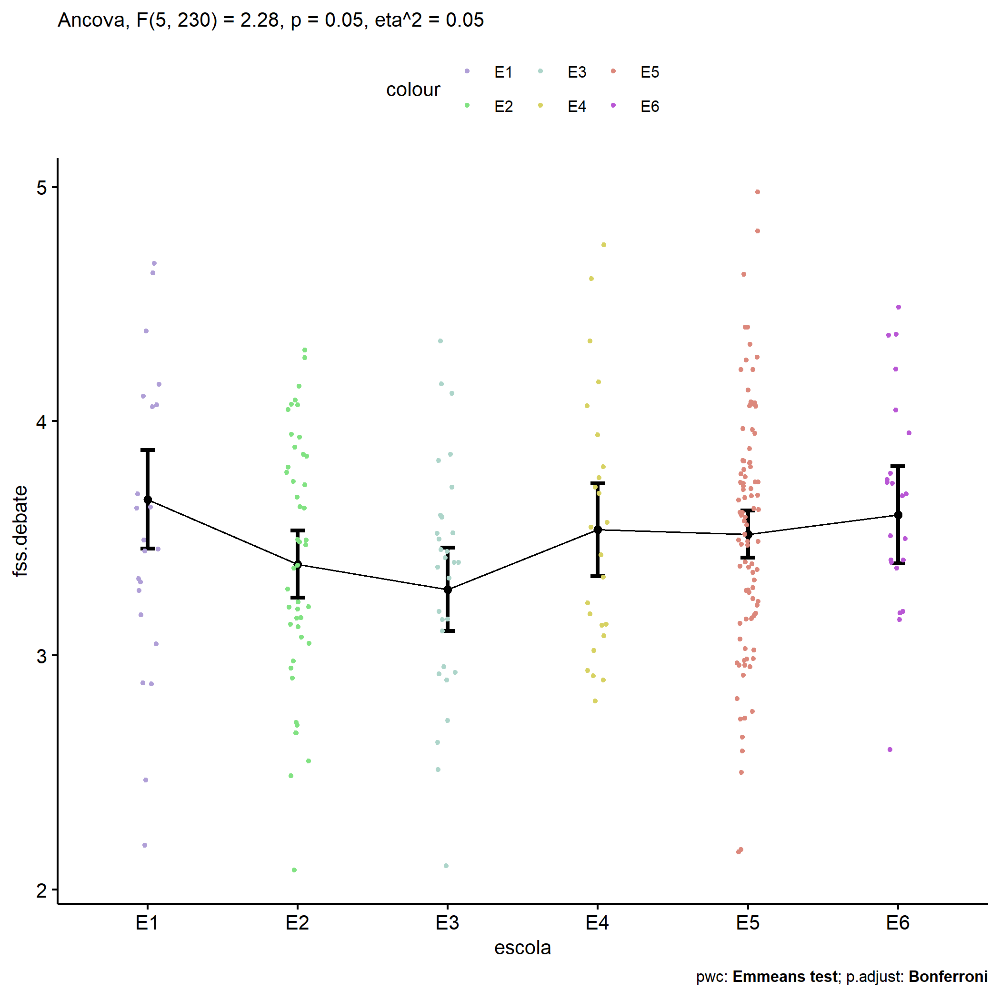<!-- -->

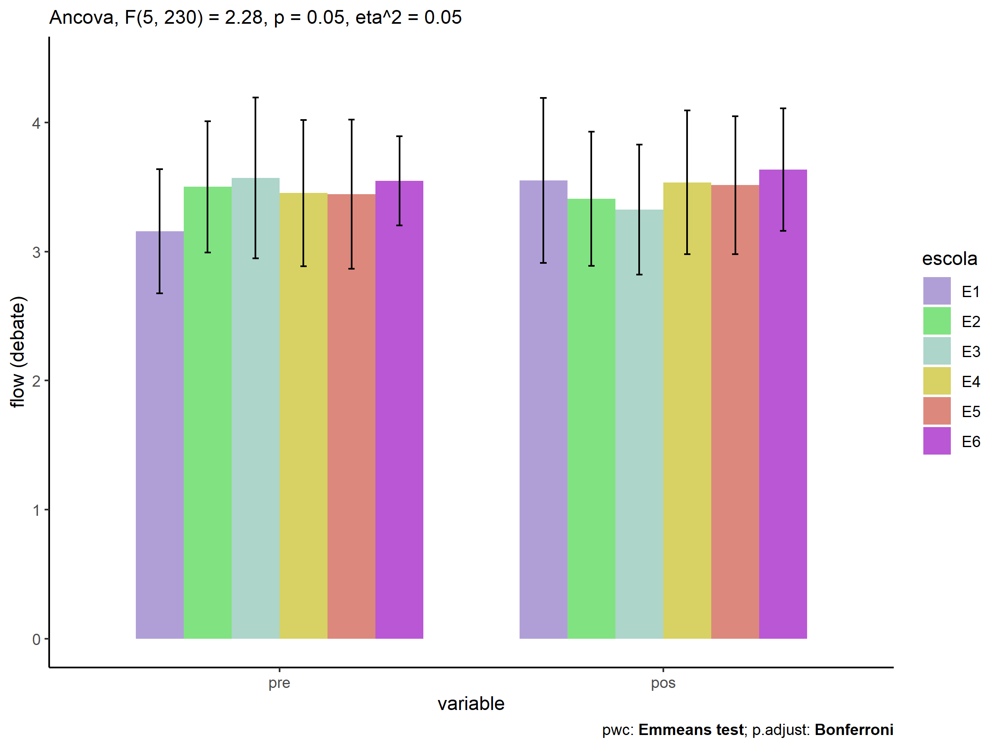<!-- -->

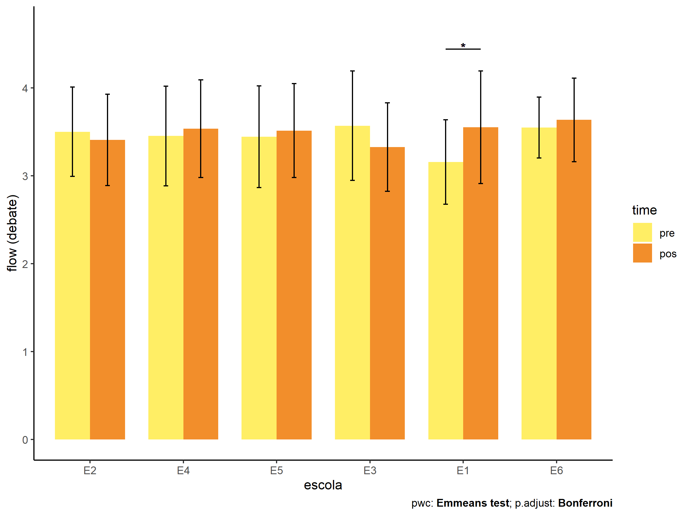<!-- -->

### factor: **zona.escola**

| var        | zona.escola |   n | M (pre) | SE (pre) | M (unadj) | SE (unadj) | M (adj) | SE (adj) |
|:-----------|:------------|----:|--------:|---------:|----------:|-----------:|--------:|---------:|
| fss.debate | Rural       |  76 |   3.526 |    0.061 |     3.482 |      0.060 |   3.456 |    0.058 |
| fss.debate | Urbana      | 161 |   3.422 |    0.044 |     3.489 |      0.043 |   3.501 |    0.040 |

| .y.        | group1 | group2 | estimate | conf.low | conf.high |    se | statistic |     p | p.adj | p.adj.signif |
|:-----------|:-------|:-------|---------:|---------:|----------:|------:|----------:|------:|------:|:-------------|
| fss.debate | Urbana | Rural  |    0.045 |   -0.093 |     0.183 | 0.070 |     0.636 | 0.525 | 0.525 | ns           |
| dfs.debate | Urbana | Rural  |   -0.105 |   -0.255 |     0.045 | 0.076 |    -1.375 | 0.170 | 0.170 | ns           |

| .y.         | zona.escola | group1 | group2 | estimate | conf.low | conf.high |    se | statistic |     p | p.adj | p.adj.signif |
|:------------|:------------|:-------|:-------|---------:|---------:|----------:|------:|----------:|------:|------:|:-------------|
| flow.debate | Urbana      | pre    | pos    |   -0.067 |   -0.186 |     0.052 | 0.060 |    -1.107 | 0.269 | 0.269 | ns           |
| flow.debate | Rural       | pre    | pos    |    0.044 |   -0.129 |     0.217 | 0.088 |     0.504 | 0.614 | 0.614 | ns           |

    ## Scale for colour is already present.
    ## Adding another scale for colour, which will replace the existing scale.

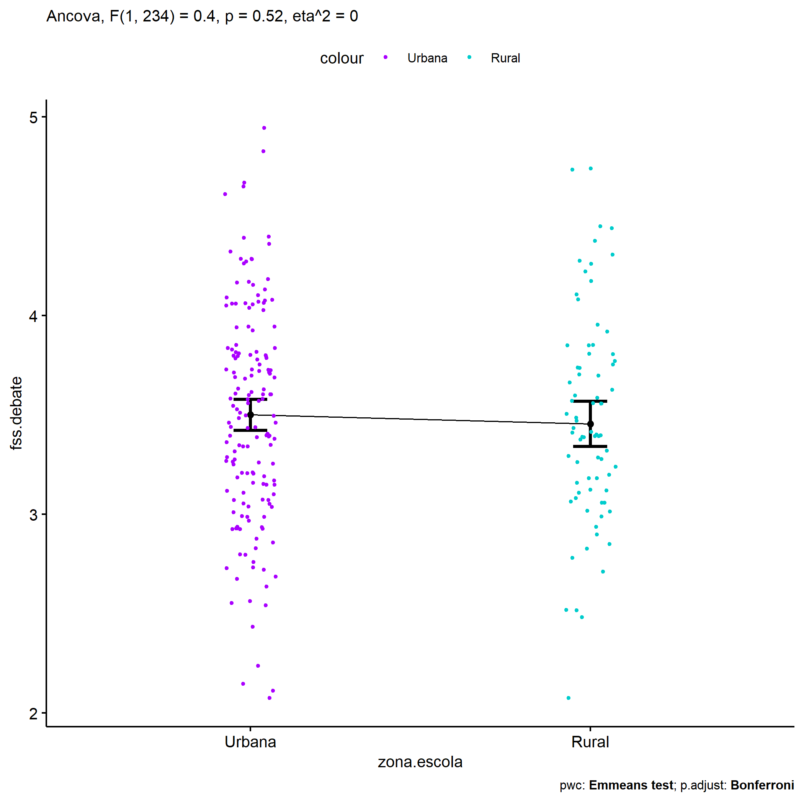<!-- -->

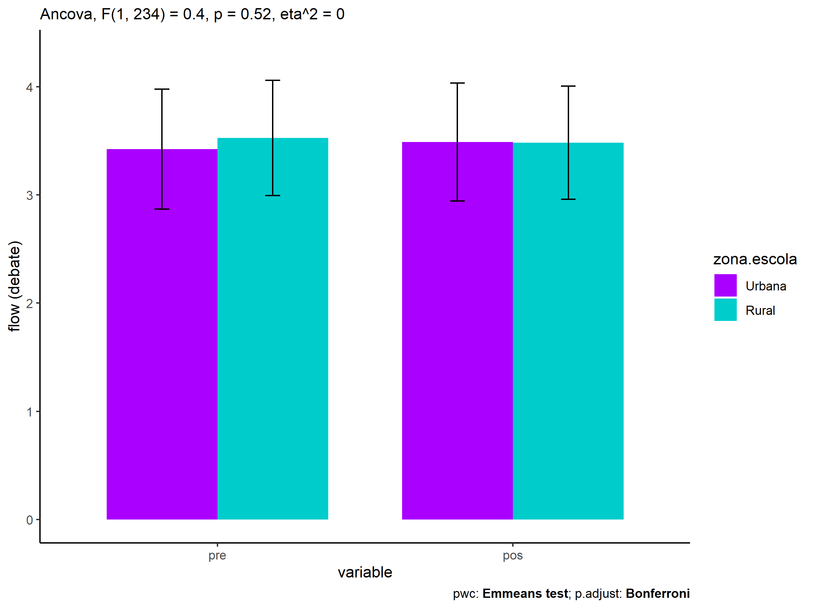<!-- -->

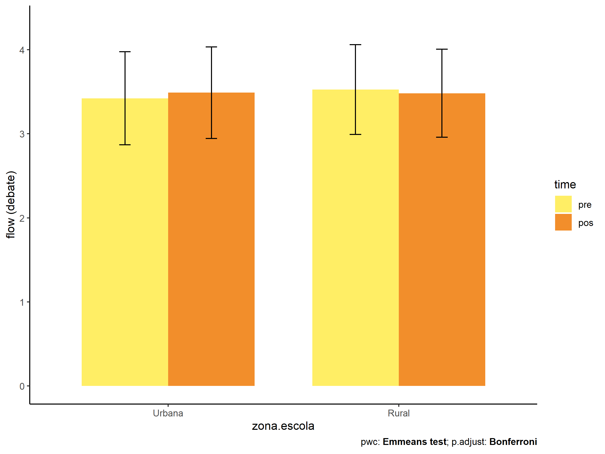<!-- -->

## Pairwise comparisons for two factors

### factores: **grupo:genero**

| var        | grupo    | genero |   n | M (pre) | SE (pre) | M (unadj) | SE (unadj) | M (adj) | SE (adj) |
|:-----------|:---------|:-------|----:|--------:|---------:|----------:|-----------:|--------:|---------:|
| fss.debate | Controle | F      |  60 |   3.481 |    0.070 |     3.533 |      0.063 |   3.524 |    0.063 |
| fss.debate | Controle | M      |  62 |   3.444 |    0.074 |     3.322 |      0.064 |   3.326 |    0.062 |
| fss.debate | WordGen  | F      |  52 |   3.560 |    0.072 |     3.683 |      0.073 |   3.647 |    0.068 |
| fss.debate | WordGen  | M      |  63 |   3.356 |    0.067 |     3.442 |      0.072 |   3.476 |    0.062 |

| .y.        | grupo    | genero | group1   | group2  | estimate | conf.low | conf.high |    se | statistic |     p | p.adj | p.adj.signif |
|:-----------|:---------|:-------|:---------|:--------|---------:|---------:|----------:|------:|----------:|------:|------:|:-------------|
| fss.debate |          | F      | Controle | WordGen |   -0.124 |   -0.307 |     0.060 | 0.093 |    -1.327 | 0.186 | 0.186 | ns           |
| fss.debate |          | M      | Controle | WordGen |   -0.150 |   -0.323 |     0.023 | 0.088 |    -1.705 | 0.090 | 0.090 | ns           |
| dfs.debate |          | F      | Controle | WordGen |   -0.079 |   -0.283 |     0.126 | 0.104 |    -0.758 | 0.449 | 0.449 | ns           |
| dfs.debate |          | M      | Controle | WordGen |    0.088 |   -0.105 |     0.280 | 0.098 |     0.894 | 0.372 | 0.372 | ns           |
| fss.debate | Controle |        | F        | M       |    0.197 |    0.022 |     0.373 | 0.089 |     2.220 | 0.027 | 0.027 | \*           |
| fss.debate | WordGen  |        | F        | M       |    0.171 |   -0.012 |     0.354 | 0.093 |     1.844 | 0.066 | 0.066 | ns           |
| dfs.debate | Controle |        | F        | M       |    0.038 |   -0.157 |     0.233 | 0.099 |     0.381 | 0.704 | 0.704 | ns           |
| dfs.debate | WordGen  |        | F        | M       |    0.204 |    0.002 |     0.406 | 0.102 |     1.988 | 0.048 | 0.048 | \*           |

| .y.         | grupo    | genero | group1 | group2 | estimate | conf.low | conf.high |    se | statistic |     p | p.adj | p.adj.signif |
|:------------|:---------|:-------|:-------|:-------|---------:|---------:|----------:|------:|----------:|------:|------:|:-------------|
| flow.debate | Controle | F      | pre    | pos    |   -0.051 |   -0.244 |     0.141 | 0.098 |    -0.525 | 0.600 | 0.600 | ns           |
| flow.debate | Controle | M      | pre    | pos    |    0.121 |   -0.068 |     0.310 | 0.096 |     1.260 | 0.208 | 0.208 | ns           |
| flow.debate | WordGen  | F      | pre    | pos    |   -0.123 |   -0.330 |     0.083 | 0.105 |    -1.174 | 0.241 | 0.241 | ns           |
| flow.debate | WordGen  | M      | pre    | pos    |   -0.086 |   -0.274 |     0.101 | 0.095 |    -0.903 | 0.367 | 0.367 | ns           |

    ## Scale for colour is already present.
    ## Adding another scale for colour, which will replace the existing scale.

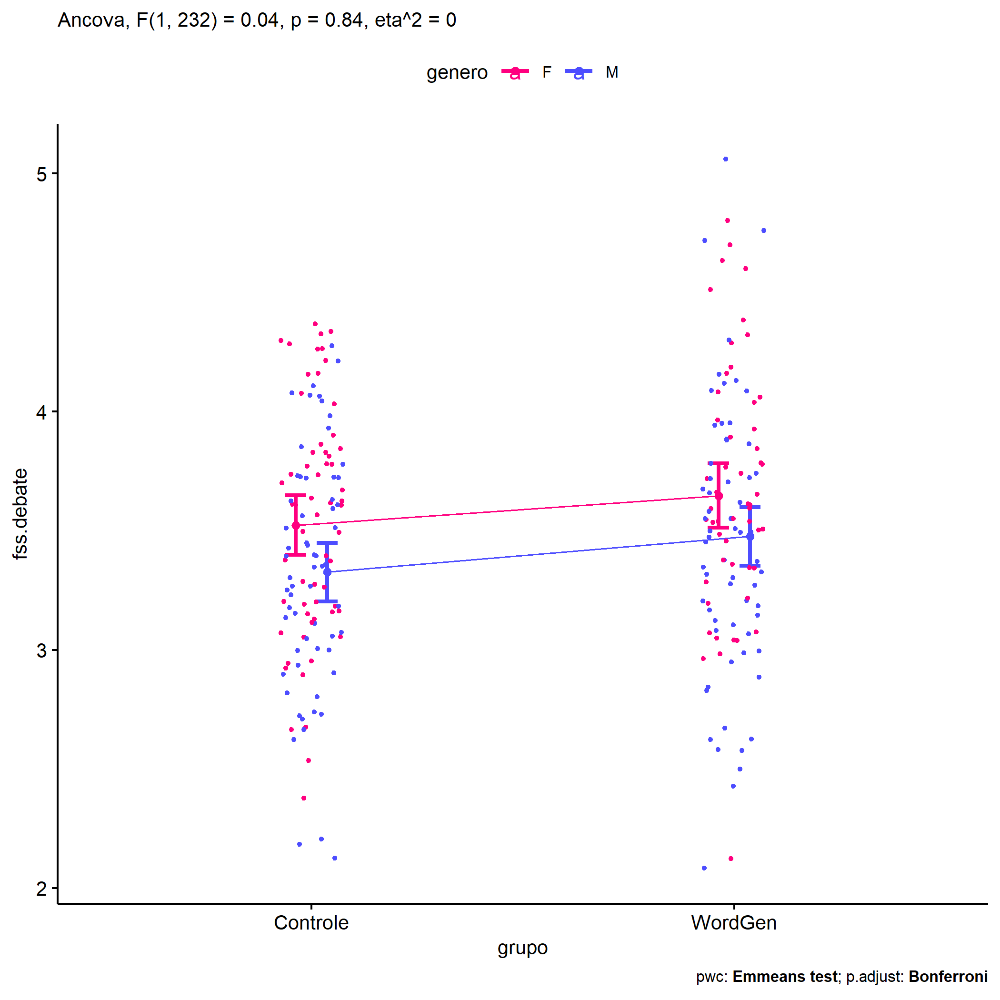<!-- -->

    ## Scale for colour is already present.
    ## Adding another scale for colour, which will replace the existing scale.

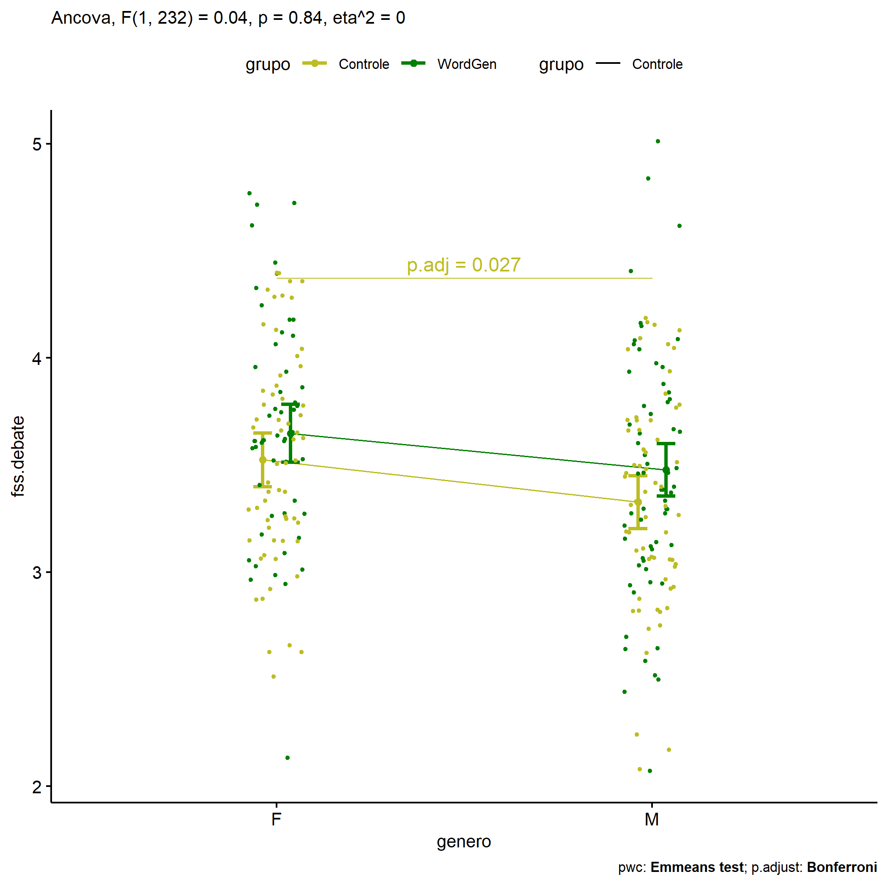<!-- -->

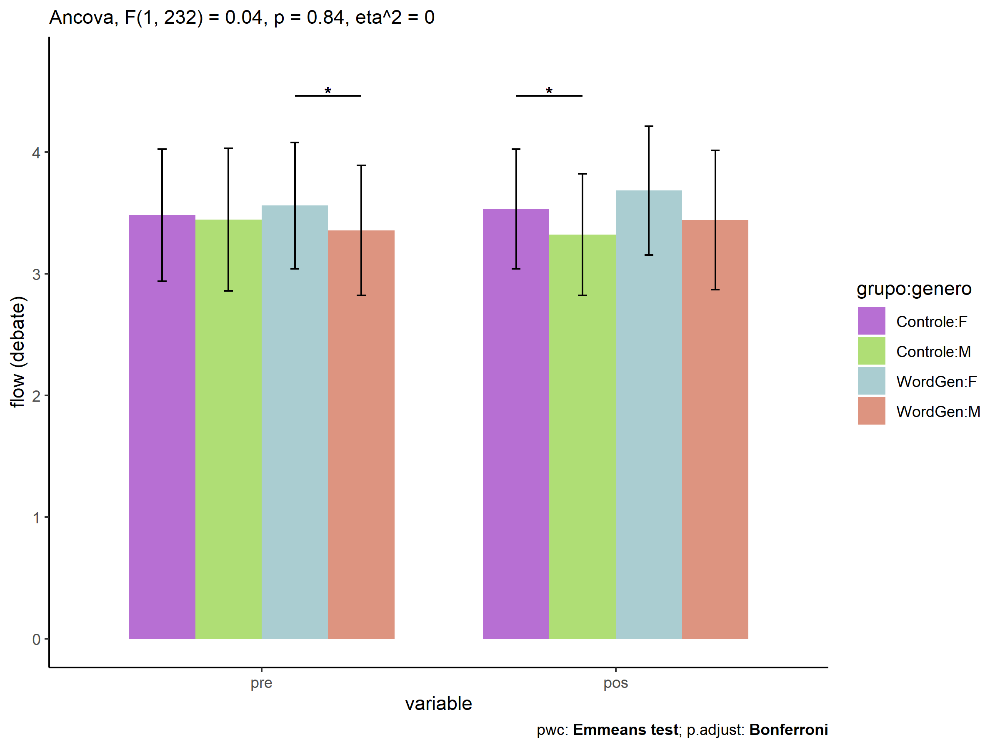<!-- -->

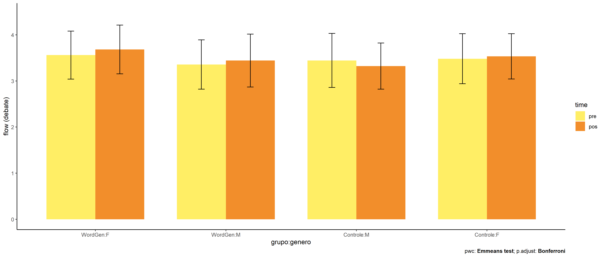<!-- -->

### factores: **grupo:idade**

| var        | grupo    | idade |   n | M (pre) | SE (pre) | M (unadj) | SE (unadj) | M (adj) | SE (adj) |
|:-----------|:---------|:------|----:|--------:|---------:|----------:|-----------:|--------:|---------:|
| fss.debate | Controle | 10y   |  24 |   3.513 |    0.110 |     3.440 |      0.128 |   3.427 |    0.101 |
| fss.debate | Controle | 11y   |  65 |   3.485 |    0.070 |     3.424 |      0.059 |   3.421 |    0.061 |
| fss.debate | Controle | 12y   |  17 |   3.533 |    0.129 |     3.515 |      0.111 |   3.494 |    0.120 |
| fss.debate | Controle | 13y   |   7 |   3.450 |    0.220 |     3.349 |      0.136 |   3.359 |    0.186 |
| fss.debate | WordGen  | 10y   |  22 |   3.343 |    0.111 |     3.470 |      0.104 |   3.519 |    0.105 |
| fss.debate | WordGen  | 11y   |  70 |   3.550 |    0.065 |     3.601 |      0.071 |   3.575 |    0.059 |
| fss.debate | WordGen  | 12y   |  14 |   3.310 |    0.117 |     3.603 |      0.129 |   3.664 |    0.132 |
| fss.debate | WordGen  | 13y   |   6 |   3.157 |    0.194 |     3.123 |      0.157 |   3.239 |    0.202 |

| .y.        | grupo    | idade | group1   | group2  | estimate | conf.low | conf.high |    se | statistic |     p | p.adj | p.adj.signif |
|:-----------|:---------|:------|:---------|:--------|---------:|---------:|----------:|------:|----------:|------:|------:|:-------------|
| fss.debate |          | 10y   | Controle | WordGen |   -0.091 |   -0.378 |     0.196 | 0.146 |    -0.625 | 0.533 | 0.533 | ns           |
| fss.debate |          | 11y   | Controle | WordGen |   -0.153 |   -0.321 |     0.014 | 0.085 |    -1.807 | 0.072 | 0.072 | ns           |
| fss.debate |          | 12y   | Controle | WordGen |   -0.170 |   -0.521 |     0.182 | 0.178 |    -0.953 | 0.342 | 0.342 | ns           |
| fss.debate |          | 13y   | Controle | WordGen |    0.120 |   -0.422 |     0.661 | 0.275 |     0.436 | 0.664 | 0.664 | ns           |
| dfs.debate |          | 10y   | Controle | WordGen |    0.169 |   -0.146 |     0.484 | 0.160 |     1.059 | 0.291 | 0.291 | ns           |
| dfs.debate |          | 11y   | Controle | WordGen |   -0.065 |   -0.249 |     0.119 | 0.093 |    -0.699 | 0.485 | 0.485 | ns           |
| dfs.debate |          | 12y   | Controle | WordGen |    0.223 |   -0.162 |     0.608 | 0.195 |     1.142 | 0.255 | 0.255 | ns           |
| dfs.debate |          | 13y   | Controle | WordGen |    0.293 |   -0.301 |     0.887 | 0.301 |     0.973 | 0.332 | 0.332 | ns           |
| fss.debate | Controle |       | 10y      | 11y     |    0.006 |   -0.226 |     0.238 | 0.118 |     0.052 | 0.958 | 1.000 | ns           |
| fss.debate | Controle |       | 10y      | 12y     |   -0.067 |   -0.375 |     0.241 | 0.156 |    -0.429 | 0.668 | 1.000 | ns           |
| fss.debate | Controle |       | 10y      | 13y     |    0.068 |   -0.349 |     0.486 | 0.212 |     0.323 | 0.747 | 1.000 | ns           |
| fss.debate | Controle |       | 11y      | 12y     |   -0.073 |   -0.338 |     0.191 | 0.134 |    -0.545 | 0.586 | 1.000 | ns           |
| fss.debate | Controle |       | 11y      | 13y     |    0.062 |   -0.324 |     0.449 | 0.196 |     0.318 | 0.751 | 1.000 | ns           |
| fss.debate | Controle |       | 12y      | 13y     |    0.135 |   -0.301 |     0.572 | 0.221 |     0.612 | 0.541 | 1.000 | ns           |
| fss.debate | WordGen  |       | 10y      | 11y     |   -0.056 |   -0.295 |     0.182 | 0.121 |    -0.465 | 0.643 | 1.000 | ns           |
| fss.debate | WordGen  |       | 10y      | 12y     |   -0.146 |   -0.478 |     0.186 | 0.168 |    -0.866 | 0.387 | 1.000 | ns           |
| fss.debate | WordGen  |       | 10y      | 13y     |    0.279 |   -0.169 |     0.727 | 0.227 |     1.229 | 0.220 | 1.000 | ns           |
| fss.debate | WordGen  |       | 11y      | 12y     |   -0.090 |   -0.375 |     0.196 | 0.145 |    -0.618 | 0.537 | 1.000 | ns           |
| fss.debate | WordGen  |       | 11y      | 13y     |    0.335 |   -0.080 |     0.751 | 0.211 |     1.590 | 0.113 | 0.680 | ns           |
| fss.debate | WordGen  |       | 12y      | 13y     |    0.425 |   -0.049 |     0.899 | 0.241 |     1.767 | 0.079 | 0.472 | ns           |
| dfs.debate | Controle |       | 10y      | 11y     |    0.028 |   -0.227 |     0.283 | 0.129 |     0.214 | 0.831 | 1.000 | ns           |
| dfs.debate | Controle |       | 10y      | 12y     |   -0.020 |   -0.358 |     0.318 | 0.172 |    -0.116 | 0.908 | 1.000 | ns           |
| dfs.debate | Controle |       | 10y      | 13y     |    0.062 |   -0.396 |     0.521 | 0.233 |     0.268 | 0.789 | 1.000 | ns           |
| dfs.debate | Controle |       | 11y      | 12y     |   -0.048 |   -0.338 |     0.243 | 0.147 |    -0.323 | 0.747 | 1.000 | ns           |
| dfs.debate | Controle |       | 11y      | 13y     |    0.035 |   -0.390 |     0.459 | 0.215 |     0.161 | 0.872 | 1.000 | ns           |
| dfs.debate | Controle |       | 12y      | 13y     |    0.082 |   -0.397 |     0.561 | 0.243 |     0.338 | 0.735 | 1.000 | ns           |
| dfs.debate | WordGen  |       | 10y      | 11y     |   -0.207 |   -0.468 |     0.054 | 0.132 |    -1.563 | 0.120 | 0.718 | ns           |
| dfs.debate | WordGen  |       | 10y      | 12y     |    0.034 |   -0.331 |     0.399 | 0.185 |     0.183 | 0.855 | 1.000 | ns           |
| dfs.debate | WordGen  |       | 10y      | 13y     |    0.186 |   -0.305 |     0.677 | 0.249 |     0.746 | 0.456 | 1.000 | ns           |
| dfs.debate | WordGen  |       | 11y      | 12y     |    0.241 |   -0.072 |     0.553 | 0.158 |     1.518 | 0.130 | 0.782 | ns           |
| dfs.debate | WordGen  |       | 11y      | 13y     |    0.393 |   -0.061 |     0.847 | 0.230 |     1.706 | 0.090 | 0.537 | ns           |
| dfs.debate | WordGen  |       | 12y      | 13y     |    0.152 |   -0.369 |     0.673 | 0.264 |     0.576 | 0.565 | 1.000 | ns           |

| .y.         | grupo    | idade | group1 | group2 | estimate | conf.low | conf.high |    se | statistic |     p | p.adj | p.adj.signif |
|:------------|:---------|:------|:-------|:-------|---------:|---------:|----------:|------:|----------:|------:|------:|:-------------|
| flow.debate | Controle | 10y   | pre    | pos    |    0.072 |   -0.232 |     0.376 | 0.155 |     0.468 | 0.640 | 0.640 | ns           |
| flow.debate | Controle | 11y   | pre    | pos    |    0.061 |   -0.124 |     0.246 | 0.094 |     0.648 | 0.517 | 0.517 | ns           |
| flow.debate | Controle | 12y   | pre    | pos    |    0.018 |   -0.343 |     0.379 | 0.184 |     0.098 | 0.922 | 0.922 | ns           |
| flow.debate | Controle | 13y   | pre    | pos    |    0.101 |   -0.461 |     0.664 | 0.286 |     0.353 | 0.724 | 0.724 | ns           |
| flow.debate | WordGen  | 10y   | pre    | pos    |   -0.126 |   -0.444 |     0.191 | 0.161 |    -0.782 | 0.435 | 0.435 | ns           |
| flow.debate | WordGen  | 11y   | pre    | pos    |   -0.051 |   -0.229 |     0.127 | 0.091 |    -0.565 | 0.572 | 0.572 | ns           |
| flow.debate | WordGen  | 12y   | pre    | pos    |   -0.294 |   -0.691 |     0.104 | 0.202 |    -1.451 | 0.148 | 0.148 | ns           |
| flow.debate | WordGen  | 13y   | pre    | pos    |    0.035 |   -0.573 |     0.642 | 0.309 |     0.112 | 0.911 | 0.911 | ns           |

    ## Scale for colour is already present.
    ## Adding another scale for colour, which will replace the existing scale.

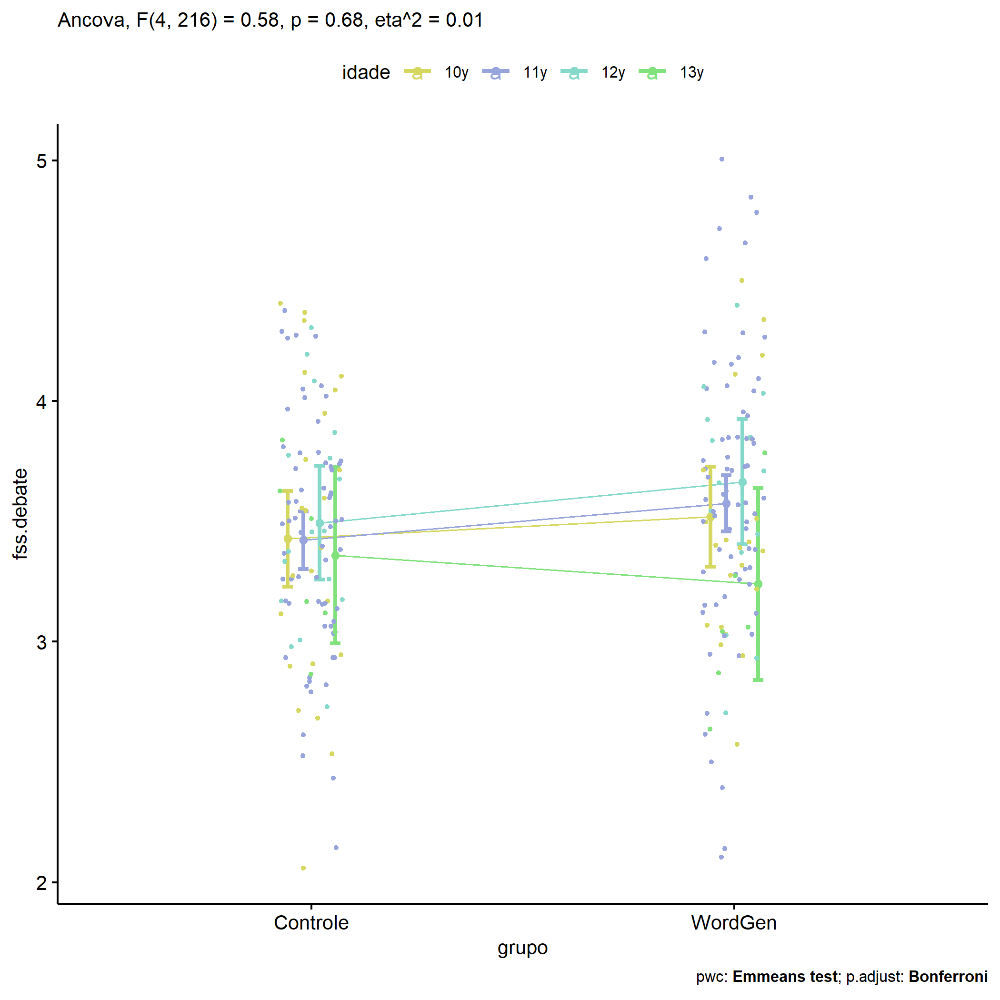<!-- -->

    ## Scale for colour is already present.
    ## Adding another scale for colour, which will replace the existing scale.

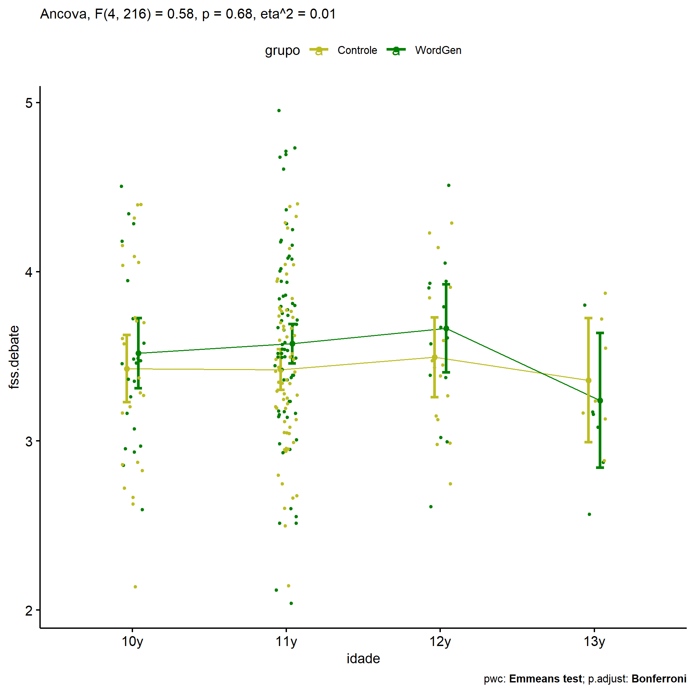<!-- -->

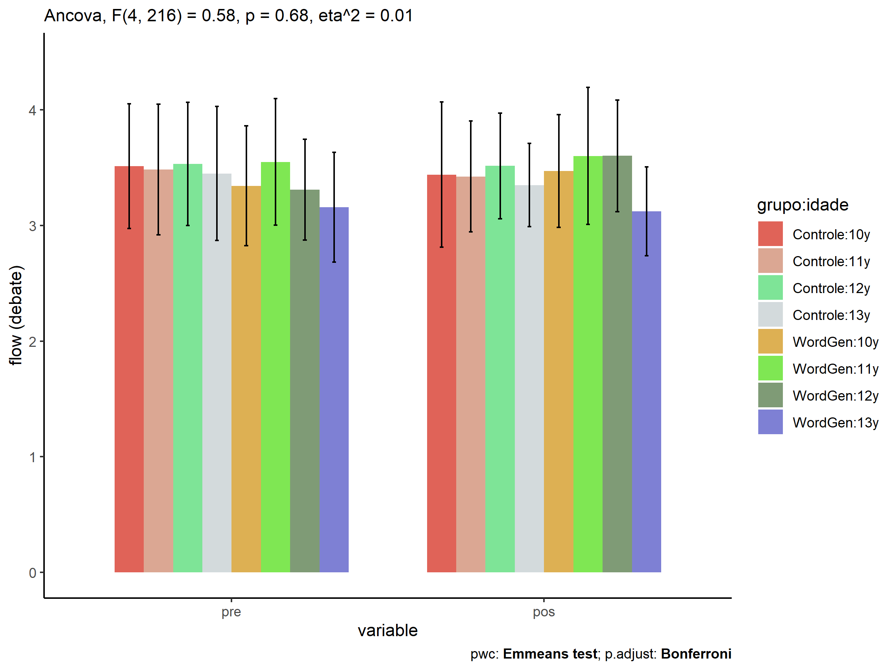<!-- -->

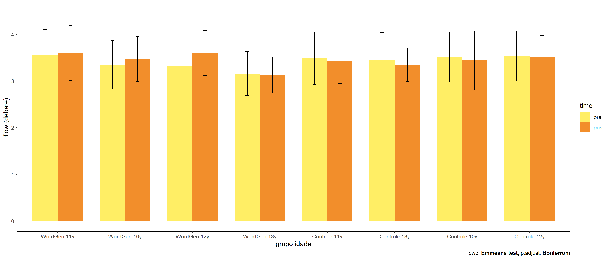<!-- -->

### factores: **grupo:zona.participante**

| var        | grupo    | zona.participante |   n | M (pre) | SE (pre) | M (unadj) | SE (unadj) | M (adj) | SE (adj) |
|:-----------|:---------|:------------------|----:|--------:|---------:|----------:|-----------:|--------:|---------:|
| fss.debate | Controle | Rural             |  43 |   3.532 |    0.080 |     3.364 |      0.080 |   3.331 |    0.076 |
| fss.debate | Controle | Urbana            |  51 |   3.365 |    0.088 |     3.443 |      0.073 |   3.465 |    0.070 |
| fss.debate | WordGen  | Rural             |  47 |   3.441 |    0.079 |     3.456 |      0.083 |   3.453 |    0.073 |
| fss.debate | WordGen  | Urbana            |  43 |   3.393 |    0.088 |     3.588 |      0.077 |   3.600 |    0.076 |

| .y.        | grupo    | zona.participante | group1   | group2  | estimate | conf.low | conf.high |    se | statistic |     p | p.adj | p.adj.signif |
|:-----------|:---------|:------------------|:---------|:--------|---------:|---------:|----------:|------:|----------:|------:|------:|:-------------|
| fss.debate |          | Urbana            | Controle | WordGen |   -0.135 |   -0.340 |     0.069 | 0.103 |    -1.308 | 0.192 | 0.192 | ns           |
| fss.debate |          | Rural             | Controle | WordGen |   -0.122 |   -0.330 |     0.087 | 0.106 |    -1.154 | 0.250 | 0.250 | ns           |
| dfs.debate |          | Urbana            | Controle | WordGen |   -0.028 |   -0.262 |     0.206 | 0.118 |    -0.236 | 0.814 | 0.814 | ns           |
| dfs.debate |          | Rural             | Controle | WordGen |    0.091 |   -0.147 |     0.329 | 0.121 |     0.755 | 0.451 | 0.451 | ns           |
| fss.debate | Controle |                   | Urbana   | Rural   |    0.134 |   -0.072 |     0.339 | 0.104 |     1.285 | 0.200 | 0.200 | ns           |
| fss.debate | WordGen  |                   | Urbana   | Rural   |    0.147 |   -0.061 |     0.355 | 0.105 |     1.395 | 0.165 | 0.165 | ns           |
| dfs.debate | Controle |                   | Urbana   | Rural   |   -0.167 |   -0.400 |     0.067 | 0.118 |    -1.409 | 0.161 | 0.161 | ns           |
| dfs.debate | WordGen  |                   | Urbana   | Rural   |   -0.048 |   -0.286 |     0.190 | 0.121 |    -0.396 | 0.692 | 0.692 | ns           |

| .y.         | grupo    | zona.participante | group1 | group2 | estimate | conf.low | conf.high |    se | statistic |     p | p.adj | p.adj.signif |
|:------------|:---------|:------------------|:-------|:-------|---------:|---------:|----------:|------:|----------:|------:|------:|:-------------|
| flow.debate | Controle | Urbana            | pre    | pos    |   -0.078 |   -0.293 |     0.137 | 0.109 |    -0.715 | 0.475 | 0.475 | ns           |
| flow.debate | Controle | Rural             | pre    | pos    |    0.168 |   -0.066 |     0.402 | 0.119 |     1.409 | 0.160 | 0.160 | ns           |
| flow.debate | WordGen  | Urbana            | pre    | pos    |   -0.195 |   -0.429 |     0.040 | 0.119 |    -1.635 | 0.103 | 0.103 | ns           |
| flow.debate | WordGen  | Rural             | pre    | pos    |   -0.015 |   -0.239 |     0.209 | 0.114 |    -0.135 | 0.893 | 0.893 | ns           |

    ## Scale for colour is already present.
    ## Adding another scale for colour, which will replace the existing scale.

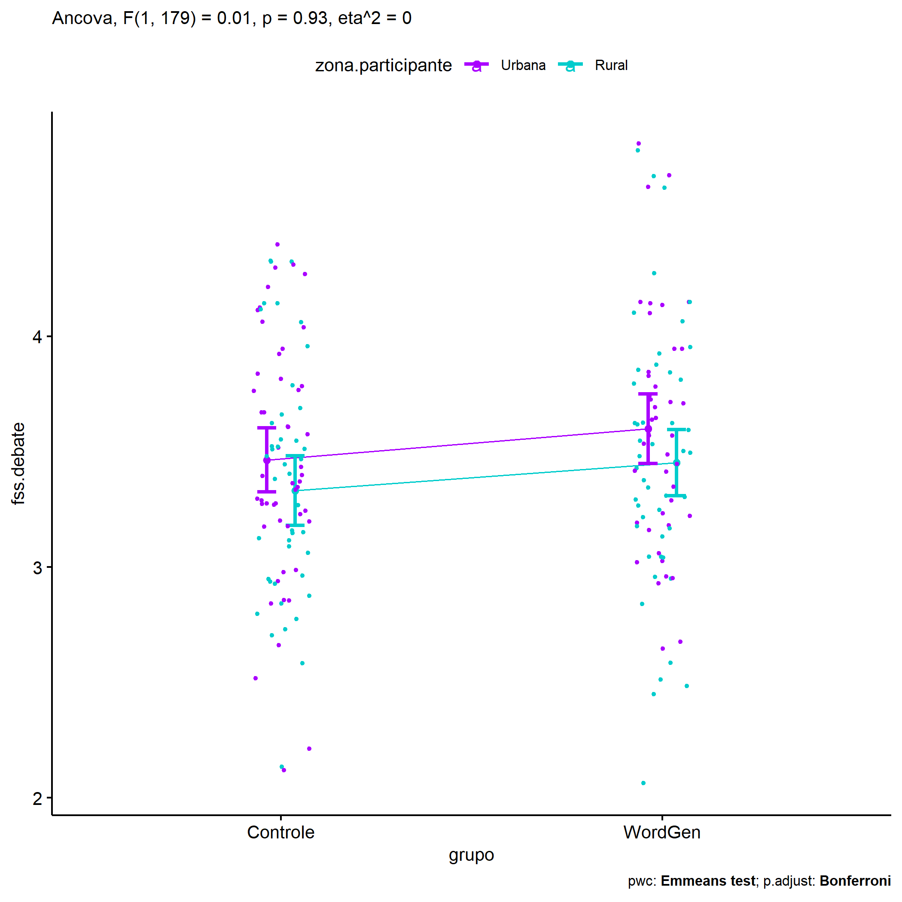<!-- -->

    ## Scale for colour is already present.
    ## Adding another scale for colour, which will replace the existing scale.

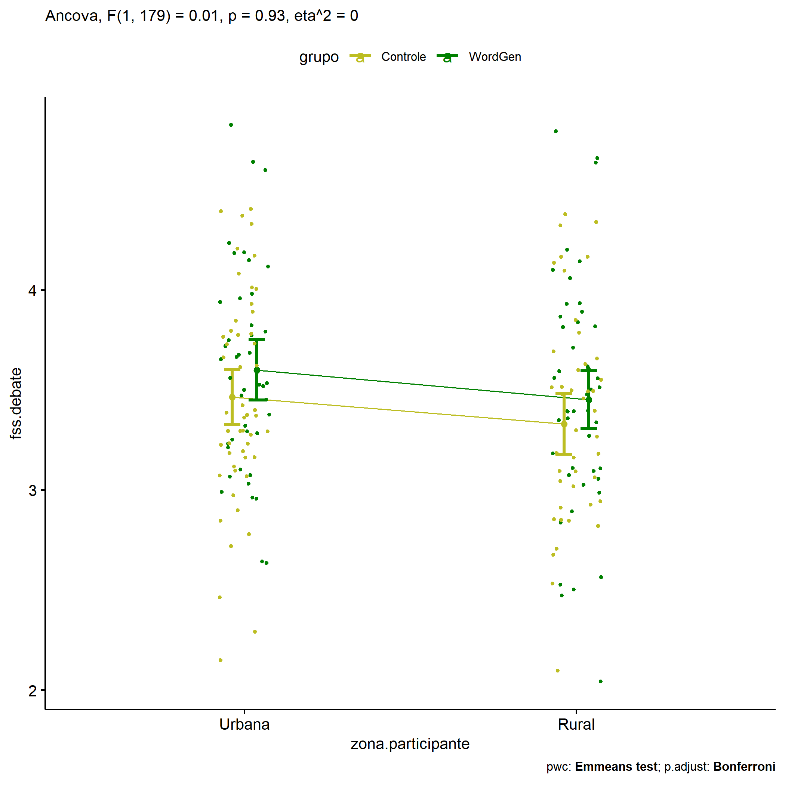<!-- -->

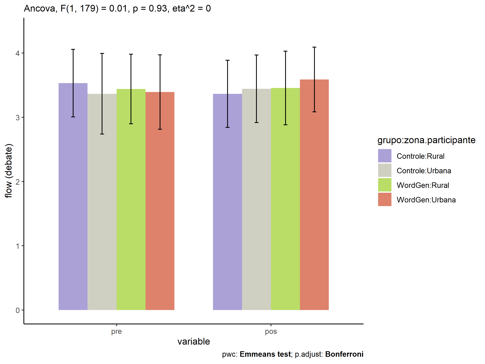<!-- -->

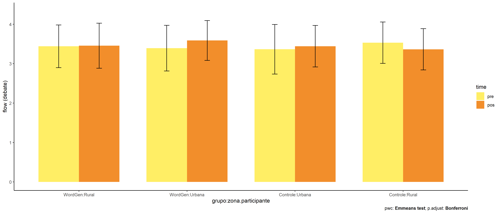<!-- -->

### factores: **grupo:escola**

| var        | grupo    | escola |   n | M (pre) | SE (pre) | M (unadj) | SE (unadj) | M (adj) | SE (adj) |
|:-----------|:---------|:-------|----:|--------:|---------:|----------:|-----------:|--------:|---------:|
| fss.debate | Controle | E1     |  12 |   3.139 |    0.157 |     3.361 |      0.172 |   3.481 |    0.143 |
| fss.debate | Controle | E2     |  22 |   3.505 |    0.102 |     3.363 |      0.130 |   3.344 |    0.104 |
| fss.debate | Controle | E3     |  15 |   3.643 |    0.143 |     3.421 |      0.108 |   3.350 |    0.127 |
| fss.debate | Controle | E4     |  15 |   3.403 |    0.165 |     3.393 |      0.125 |   3.412 |    0.126 |
| fss.debate | Controle | E5     |  47 |   3.476 |    0.089 |     3.474 |      0.074 |   3.467 |    0.071 |
| fss.debate | Controle | E6     |  11 |   3.505 |    0.105 |     3.465 |      0.108 |   3.446 |    0.148 |
| fss.debate | WordGen  | E1     |  10 |   3.179 |    0.132 |     3.779 |      0.204 |   3.884 |    0.156 |
| fss.debate | WordGen  | E2     |  24 |   3.498 |    0.111 |     3.448 |      0.088 |   3.432 |    0.100 |
| fss.debate | WordGen  | E3     |  15 |   3.496 |    0.180 |     3.231 |      0.149 |   3.215 |    0.126 |
| fss.debate | WordGen  | E4     |   9 |   3.537 |    0.147 |     3.775 |      0.205 |   3.744 |    0.163 |
| fss.debate | WordGen  | E5     |  46 |   3.414 |    0.081 |     3.555 |      0.083 |   3.570 |    0.072 |
| fss.debate | WordGen  | E6     |  11 |   3.591 |    0.107 |     3.808 |      0.160 |   3.757 |    0.148 |

| .y.        | grupo    | escola | group1   | group2  | estimate | conf.low | conf.high |    se | statistic |     p | p.adj | p.adj.signif |
|:-----------|:---------|:-------|:---------|:--------|---------:|---------:|----------:|------:|----------:|------:|------:|:-------------|
| fss.debate |          | E1     | Controle | WordGen |   -0.403 |   -0.816 |     0.010 | 0.210 |    -1.922 | 0.056 | 0.056 | ns           |
| fss.debate |          | E2     | Controle | WordGen |   -0.088 |   -0.373 |     0.196 | 0.144 |    -0.611 | 0.542 | 0.542 | ns           |
| fss.debate |          | E3     | Controle | WordGen |    0.135 |   -0.217 |     0.488 | 0.179 |     0.757 | 0.450 | 0.450 | ns           |
| fss.debate |          | E4     | Controle | WordGen |   -0.331 |   -0.738 |     0.076 | 0.207 |    -1.604 | 0.110 | 0.110 | ns           |
| fss.debate |          | E5     | Controle | WordGen |   -0.104 |   -0.304 |     0.096 | 0.102 |    -1.021 | 0.308 | 0.308 | ns           |
| fss.debate |          | E6     | Controle | WordGen |   -0.311 |   -0.722 |     0.100 | 0.209 |    -1.490 | 0.138 | 0.138 | ns           |
| dfs.debate |          | E1     | Controle | WordGen |   -0.040 |   -0.504 |     0.423 | 0.235 |    -0.171 | 0.864 | 0.864 | ns           |
| dfs.debate |          | E2     | Controle | WordGen |    0.007 |   -0.312 |     0.327 | 0.162 |     0.045 | 0.964 | 0.964 | ns           |
| dfs.debate |          | E3     | Controle | WordGen |    0.146 |   -0.249 |     0.542 | 0.201 |     0.729 | 0.467 | 0.467 | ns           |
| dfs.debate |          | E4     | Controle | WordGen |   -0.134 |   -0.591 |     0.322 | 0.232 |    -0.580 | 0.563 | 0.563 | ns           |
| dfs.debate |          | E5     | Controle | WordGen |    0.062 |   -0.162 |     0.287 | 0.114 |     0.545 | 0.586 | 0.586 | ns           |
| dfs.debate |          | E6     | Controle | WordGen |   -0.086 |   -0.548 |     0.376 | 0.234 |    -0.366 | 0.714 | 0.714 | ns           |
| fss.debate | Controle |        | E1       | E2      |    0.137 |   -0.212 |     0.485 | 0.177 |     0.772 | 0.441 | 1.000 | ns           |
| fss.debate | Controle |        | E1       | E3      |    0.130 |   -0.248 |     0.508 | 0.192 |     0.679 | 0.498 | 1.000 | ns           |
| fss.debate | Controle |        | E1       | E4      |    0.068 |   -0.307 |     0.443 | 0.190 |     0.359 | 0.720 | 1.000 | ns           |
| fss.debate | Controle |        | E1       | E5      |    0.014 |   -0.300 |     0.328 | 0.160 |     0.088 | 0.930 | 1.000 | ns           |
| fss.debate | Controle |        | E1       | E6      |    0.035 |   -0.370 |     0.440 | 0.205 |     0.170 | 0.865 | 1.000 | ns           |
| fss.debate | Controle |        | E2       | E3      |   -0.006 |   -0.330 |     0.317 | 0.164 |    -0.038 | 0.969 | 1.000 | ns           |
| fss.debate | Controle |        | E2       | E4      |   -0.068 |   -0.391 |     0.255 | 0.164 |    -0.416 | 0.678 | 1.000 | ns           |
| fss.debate | Controle |        | E2       | E5      |   -0.122 |   -0.372 |     0.127 | 0.126 |    -0.969 | 0.334 | 1.000 | ns           |
| fss.debate | Controle |        | E2       | E6      |   -0.102 |   -0.458 |     0.255 | 0.181 |    -0.562 | 0.574 | 1.000 | ns           |
| fss.debate | Controle |        | E3       | E4      |   -0.062 |   -0.415 |     0.291 | 0.179 |    -0.346 | 0.730 | 1.000 | ns           |
| fss.debate | Controle |        | E3       | E5      |   -0.116 |   -0.403 |     0.170 | 0.145 |    -0.799 | 0.425 | 1.000 | ns           |
| fss.debate | Controle |        | E3       | E6      |   -0.095 |   -0.479 |     0.288 | 0.194 |    -0.490 | 0.624 | 1.000 | ns           |
| fss.debate | Controle |        | E4       | E5      |   -0.054 |   -0.340 |     0.232 | 0.145 |    -0.373 | 0.709 | 1.000 | ns           |
| fss.debate | Controle |        | E4       | E6      |   -0.033 |   -0.416 |     0.350 | 0.194 |    -0.172 | 0.864 | 1.000 | ns           |
| fss.debate | Controle |        | E5       | E6      |    0.021 |   -0.302 |     0.344 | 0.164 |     0.127 | 0.899 | 1.000 | ns           |
| fss.debate | WordGen  |        | E1       | E2      |    0.451 |    0.086 |     0.816 | 0.185 |     2.436 | 0.016 | 0.234 | ns           |
| fss.debate | WordGen  |        | E1       | E3      |    0.669 |    0.273 |     1.064 | 0.201 |     3.331 | 0.001 | 0.015 | \*           |
| fss.debate | WordGen  |        | E1       | E4      |    0.140 |   -0.305 |     0.585 | 0.226 |     0.619 | 0.537 | 1.000 | ns           |
| fss.debate | WordGen  |        | E1       | E5      |    0.313 |   -0.024 |     0.651 | 0.171 |     1.828 | 0.069 | 1.000 | ns           |
| fss.debate | WordGen  |        | E1       | E6      |    0.127 |   -0.297 |     0.551 | 0.215 |     0.589 | 0.556 | 1.000 | ns           |
| fss.debate | WordGen  |        | E2       | E3      |    0.217 |   -0.100 |     0.535 | 0.161 |     1.350 | 0.178 | 1.000 | ns           |
| fss.debate | WordGen  |        | E2       | E4      |   -0.311 |   -0.688 |     0.066 | 0.191 |    -1.627 | 0.105 | 1.000 | ns           |
| fss.debate | WordGen  |        | E2       | E5      |   -0.138 |   -0.381 |     0.105 | 0.123 |    -1.118 | 0.265 | 1.000 | ns           |
| fss.debate | WordGen  |        | E2       | E6      |   -0.324 |   -0.676 |     0.027 | 0.178 |    -1.819 | 0.070 | 1.000 | ns           |
| fss.debate | WordGen  |        | E3       | E4      |   -0.529 |   -0.935 |    -0.122 | 0.206 |    -2.562 | 0.011 | 0.166 | ns           |
| fss.debate | WordGen  |        | E3       | E5      |   -0.355 |   -0.642 |    -0.068 | 0.146 |    -2.441 | 0.015 | 0.232 | ns           |
| fss.debate | WordGen  |        | E3       | E6      |   -0.542 |   -0.925 |    -0.159 | 0.194 |    -2.787 | 0.006 | 0.087 | ns           |
| fss.debate | WordGen  |        | E4       | E5      |    0.173 |   -0.178 |     0.525 | 0.179 |     0.971 | 0.333 | 1.000 | ns           |
| fss.debate | WordGen  |        | E4       | E6      |   -0.013 |   -0.447 |     0.421 | 0.220 |    -0.059 | 0.953 | 1.000 | ns           |
| fss.debate | WordGen  |        | E5       | E6      |   -0.186 |   -0.511 |     0.138 | 0.165 |    -1.132 | 0.259 | 1.000 | ns           |
| dfs.debate | Controle |        | E1       | E2      |   -0.366 |   -0.755 |     0.022 | 0.197 |    -1.857 | 0.065 | 0.969 | ns           |
| dfs.debate | Controle |        | E1       | E3      |   -0.504 |   -0.923 |    -0.084 | 0.213 |    -2.367 | 0.019 | 0.282 | ns           |
| dfs.debate | Controle |        | E1       | E4      |   -0.264 |   -0.683 |     0.155 | 0.213 |    -1.240 | 0.216 | 1.000 | ns           |
| dfs.debate | Controle |        | E1       | E5      |   -0.337 |   -0.687 |     0.013 | 0.178 |    -1.896 | 0.059 | 0.889 | ns           |
| dfs.debate | Controle |        | E1       | E6      |   -0.366 |   -0.818 |     0.086 | 0.229 |    -1.597 | 0.112 | 1.000 | ns           |
| dfs.debate | Controle |        | E2       | E3      |   -0.138 |   -0.500 |     0.225 | 0.184 |    -0.748 | 0.455 | 1.000 | ns           |
| dfs.debate | Controle |        | E2       | E4      |    0.102 |   -0.260 |     0.465 | 0.184 |     0.556 | 0.579 | 1.000 | ns           |
| dfs.debate | Controle |        | E2       | E5      |    0.029 |   -0.250 |     0.309 | 0.142 |     0.206 | 0.837 | 1.000 | ns           |
| dfs.debate | Controle |        | E2       | E6      |    0.000 |   -0.400 |     0.400 | 0.203 |     0.000 | 1.000 | 1.000 | ns           |
| dfs.debate | Controle |        | E3       | E4      |    0.240 |   -0.156 |     0.635 | 0.201 |     1.195 | 0.233 | 1.000 | ns           |
| dfs.debate | Controle |        | E3       | E5      |    0.167 |   -0.154 |     0.488 | 0.163 |     1.024 | 0.307 | 1.000 | ns           |
| dfs.debate | Controle |        | E3       | E6      |    0.138 |   -0.292 |     0.567 | 0.218 |     0.631 | 0.529 | 1.000 | ns           |
| dfs.debate | Controle |        | E4       | E5      |   -0.073 |   -0.394 |     0.248 | 0.163 |    -0.448 | 0.655 | 1.000 | ns           |
| dfs.debate | Controle |        | E4       | E6      |   -0.102 |   -0.532 |     0.328 | 0.218 |    -0.469 | 0.640 | 1.000 | ns           |
| dfs.debate | Controle |        | E5       | E6      |   -0.029 |   -0.392 |     0.333 | 0.184 |    -0.159 | 0.874 | 1.000 | ns           |
| dfs.debate | WordGen  |        | E1       | E2      |   -0.319 |   -0.726 |     0.089 | 0.207 |    -1.540 | 0.125 | 1.000 | ns           |
| dfs.debate | WordGen  |        | E1       | E3      |   -0.317 |   -0.759 |     0.125 | 0.224 |    -1.414 | 0.159 | 1.000 | ns           |
| dfs.debate | WordGen  |        | E1       | E4      |   -0.358 |   -0.855 |     0.140 | 0.252 |    -1.418 | 0.158 | 1.000 | ns           |
| dfs.debate | WordGen  |        | E1       | E5      |   -0.234 |   -0.612 |     0.143 | 0.192 |    -1.223 | 0.223 | 1.000 | ns           |
| dfs.debate | WordGen  |        | E1       | E6      |   -0.412 |   -0.885 |     0.061 | 0.240 |    -1.715 | 0.088 | 1.000 | ns           |
| dfs.debate | WordGen  |        | E2       | E3      |    0.001 |   -0.355 |     0.358 | 0.181 |     0.008 | 0.994 | 1.000 | ns           |
| dfs.debate | WordGen  |        | E2       | E4      |   -0.039 |   -0.463 |     0.384 | 0.215 |    -0.183 | 0.855 | 1.000 | ns           |
| dfs.debate | WordGen  |        | E2       | E5      |    0.084 |   -0.189 |     0.357 | 0.138 |     0.607 | 0.544 | 1.000 | ns           |
| dfs.debate | WordGen  |        | E2       | E6      |   -0.093 |   -0.487 |     0.301 | 0.200 |    -0.466 | 0.642 | 1.000 | ns           |
| dfs.debate | WordGen  |        | E3       | E4      |   -0.041 |   -0.497 |     0.416 | 0.232 |    -0.176 | 0.861 | 1.000 | ns           |
| dfs.debate | WordGen  |        | E3       | E5      |    0.083 |   -0.239 |     0.405 | 0.163 |     0.506 | 0.613 | 1.000 | ns           |
| dfs.debate | WordGen  |        | E3       | E6      |   -0.095 |   -0.524 |     0.335 | 0.218 |    -0.434 | 0.665 | 1.000 | ns           |
| dfs.debate | WordGen  |        | E4       | E5      |    0.123 |   -0.271 |     0.518 | 0.200 |     0.616 | 0.538 | 1.000 | ns           |
| dfs.debate | WordGen  |        | E4       | E6      |   -0.054 |   -0.540 |     0.433 | 0.247 |    -0.218 | 0.828 | 1.000 | ns           |
| dfs.debate | WordGen  |        | E5       | E6      |   -0.177 |   -0.541 |     0.186 | 0.184 |    -0.961 | 0.337 | 1.000 | ns           |

| .y.         | grupo    | escola | group1 | group2 | estimate | conf.low | conf.high |    se | statistic |     p | p.adj | p.adj.signif |
|:------------|:---------|:-------|:-------|:-------|---------:|---------:|----------:|------:|----------:|------:|------:|:-------------|
| flow.debate | Controle | E1     | pre    | pos    |   -0.222 |   -0.656 |     0.211 | 0.221 |    -1.008 | 0.314 | 0.314 | ns           |
| flow.debate | Controle | E2     | pre    | pos    |    0.142 |   -0.178 |     0.462 | 0.163 |     0.872 | 0.384 | 0.384 | ns           |
| flow.debate | Controle | E3     | pre    | pos    |    0.221 |   -0.166 |     0.609 | 0.197 |     1.122 | 0.262 | 0.262 | ns           |
| flow.debate | Controle | E4     | pre    | pos    |    0.010 |   -0.377 |     0.398 | 0.197 |     0.052 | 0.959 | 0.959 | ns           |
| flow.debate | Controle | E5     | pre    | pos    |    0.001 |   -0.218 |     0.220 | 0.111 |     0.012 | 0.990 | 0.990 | ns           |
| flow.debate | Controle | E6     | pre    | pos    |    0.040 |   -0.412 |     0.493 | 0.230 |     0.175 | 0.861 | 0.861 | ns           |
| flow.debate | WordGen  | E1     | pre    | pos    |   -0.600 |   -1.075 |    -0.125 | 0.242 |    -2.484 | 0.013 | 0.013 | \*           |
| flow.debate | WordGen  | E2     | pre    | pos    |    0.049 |   -0.257 |     0.356 | 0.156 |     0.315 | 0.753 | 0.753 | ns           |
| flow.debate | WordGen  | E3     | pre    | pos    |    0.266 |   -0.122 |     0.653 | 0.197 |     1.347 | 0.179 | 0.179 | ns           |
| flow.debate | WordGen  | E4     | pre    | pos    |   -0.238 |   -0.738 |     0.263 | 0.255 |    -0.933 | 0.351 | 0.351 | ns           |
| flow.debate | WordGen  | E5     | pre    | pos    |   -0.141 |   -0.362 |     0.080 | 0.113 |    -1.252 | 0.211 | 0.211 | ns           |
| flow.debate | WordGen  | E6     | pre    | pos    |   -0.217 |   -0.670 |     0.235 | 0.230 |    -0.943 | 0.346 | 0.346 | ns           |

    ## Scale for colour is already present.
    ## Adding another scale for colour, which will replace the existing scale.

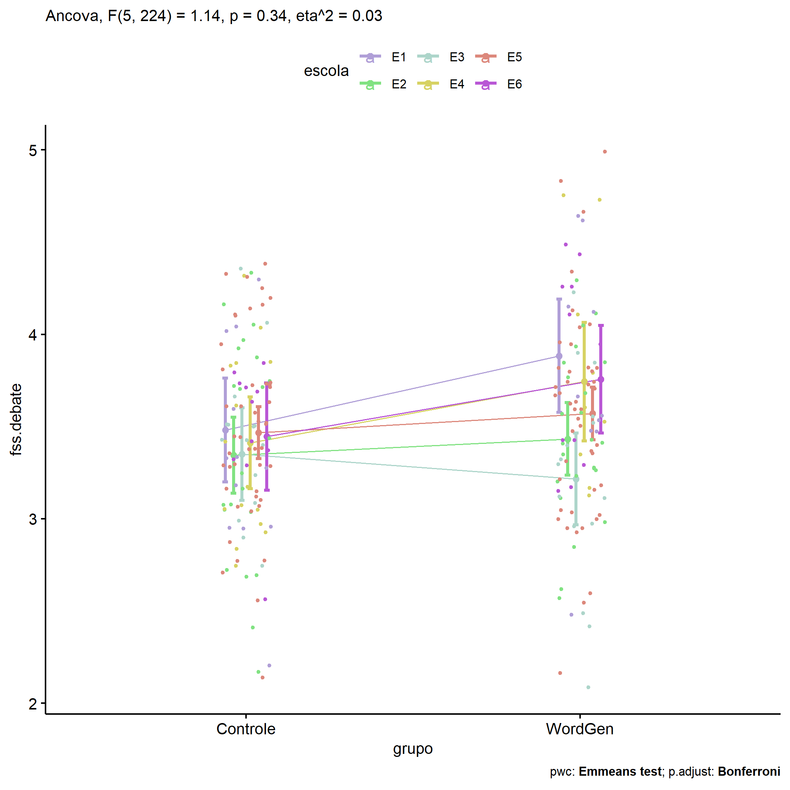<!-- -->

    ## Scale for colour is already present.
    ## Adding another scale for colour, which will replace the existing scale.

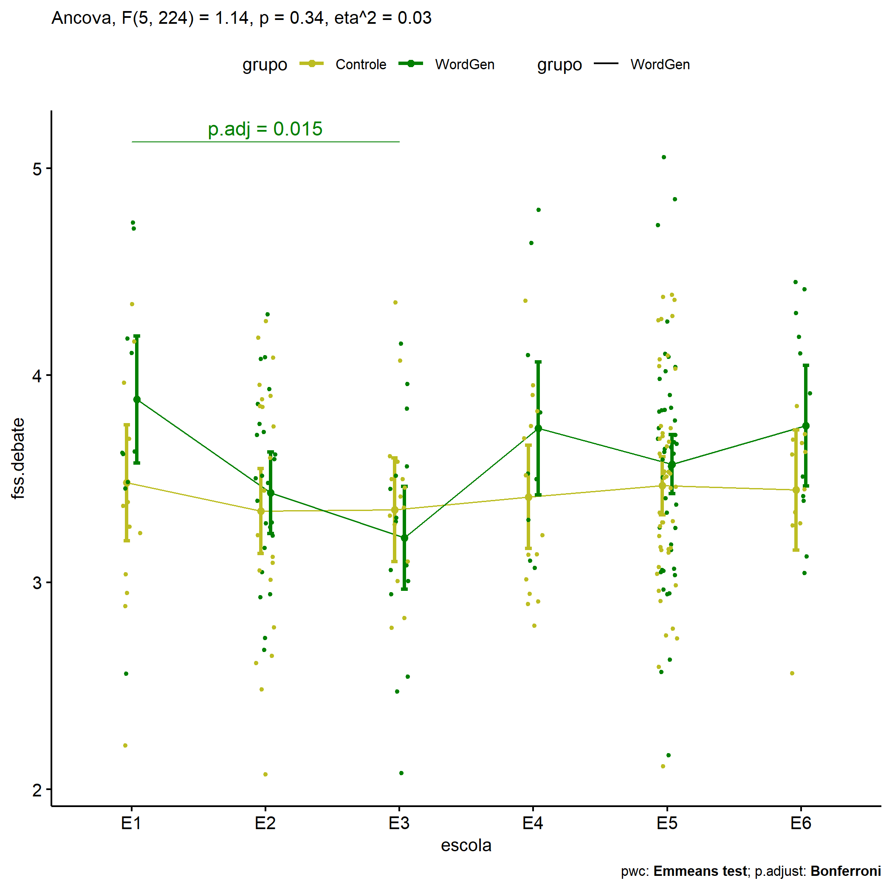<!-- -->

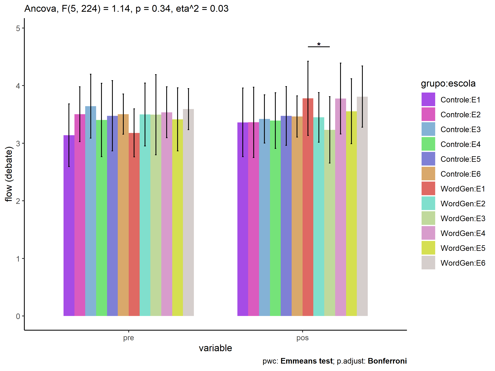<!-- -->

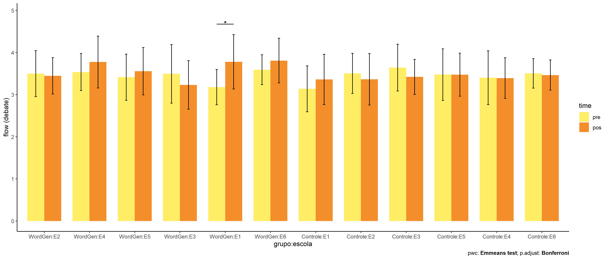<!-- -->

### factores: **grupo:zona.escola**

| var        | grupo    | zona.escola |   n | M (pre) | SE (pre) | M (unadj) | SE (unadj) | M (adj) | SE (adj) |
|:-----------|:---------|:------------|----:|--------:|---------:|----------:|-----------:|--------:|---------:|
| fss.debate | Controle | Rural       |  41 |   3.518 |    0.084 |     3.422 |      0.065 |   3.400 |    0.078 |
| fss.debate | Controle | Urbana      |  81 |   3.434 |    0.064 |     3.427 |      0.061 |   3.435 |    0.056 |
| fss.debate | WordGen  | Rural       |  35 |   3.537 |    0.090 |     3.552 |      0.105 |   3.523 |    0.085 |
| fss.debate | WordGen  | Urbana      |  80 |   3.410 |    0.060 |     3.551 |      0.060 |   3.568 |    0.056 |

| .y.        | grupo    | zona.escola | group1   | group2  | estimate | conf.low | conf.high |    se | statistic |     p | p.adj | p.adj.signif |
|:-----------|:---------|:------------|:---------|:--------|---------:|---------:|----------:|------:|----------:|------:|------:|:-------------|
| fss.debate |          | Urbana      | Controle | WordGen |   -0.132 |   -0.287 |     0.023 | 0.079 |    -1.681 | 0.094 | 0.094 | ns           |
| fss.debate |          | Rural       | Controle | WordGen |   -0.123 |   -0.349 |     0.104 | 0.115 |    -1.069 | 0.286 | 0.286 | ns           |
| dfs.debate |          | Urbana      | Controle | WordGen |    0.024 |   -0.146 |     0.195 | 0.087 |     0.280 | 0.780 | 0.780 | ns           |
| dfs.debate |          | Rural       | Controle | WordGen |   -0.019 |   -0.268 |     0.231 | 0.126 |    -0.147 | 0.883 | 0.883 | ns           |
| fss.debate | Controle |             | Urbana   | Rural   |    0.036 |   -0.153 |     0.224 | 0.096 |     0.370 | 0.711 | 0.711 | ns           |
| fss.debate | WordGen  |             | Urbana   | Rural   |    0.045 |   -0.155 |     0.245 | 0.101 |     0.443 | 0.658 | 0.658 | ns           |
| dfs.debate | Controle |             | Urbana   | Rural   |   -0.084 |   -0.292 |     0.123 | 0.105 |    -0.799 | 0.425 | 0.425 | ns           |
| dfs.debate | WordGen  |             | Urbana   | Rural   |   -0.127 |   -0.346 |     0.092 | 0.111 |    -1.140 | 0.255 | 0.255 | ns           |

| .y.         | grupo    | zona.escola | group1 | group2 | estimate | conf.low | conf.high |    se | statistic |     p | p.adj | p.adj.signif |
|:------------|:---------|:------------|:-------|:-------|---------:|---------:|----------:|------:|----------:|------:|------:|:-------------|
| flow.debate | Controle | Urbana      | pre    | pos    |    0.006 |   -0.161 |     0.174 | 0.085 |     0.075 | 0.940 | 0.940 | ns           |
| flow.debate | Controle | Rural       | pre    | pos    |    0.096 |   -0.140 |     0.331 | 0.120 |     0.796 | 0.426 | 0.426 | ns           |
| flow.debate | WordGen  | Urbana      | pre    | pos    |   -0.141 |   -0.310 |     0.027 | 0.086 |    -1.645 | 0.101 | 0.101 | ns           |
| flow.debate | WordGen  | Rural       | pre    | pos    |   -0.015 |   -0.271 |     0.240 | 0.130 |    -0.119 | 0.905 | 0.905 | ns           |

    ## Scale for colour is already present.
    ## Adding another scale for colour, which will replace the existing scale.

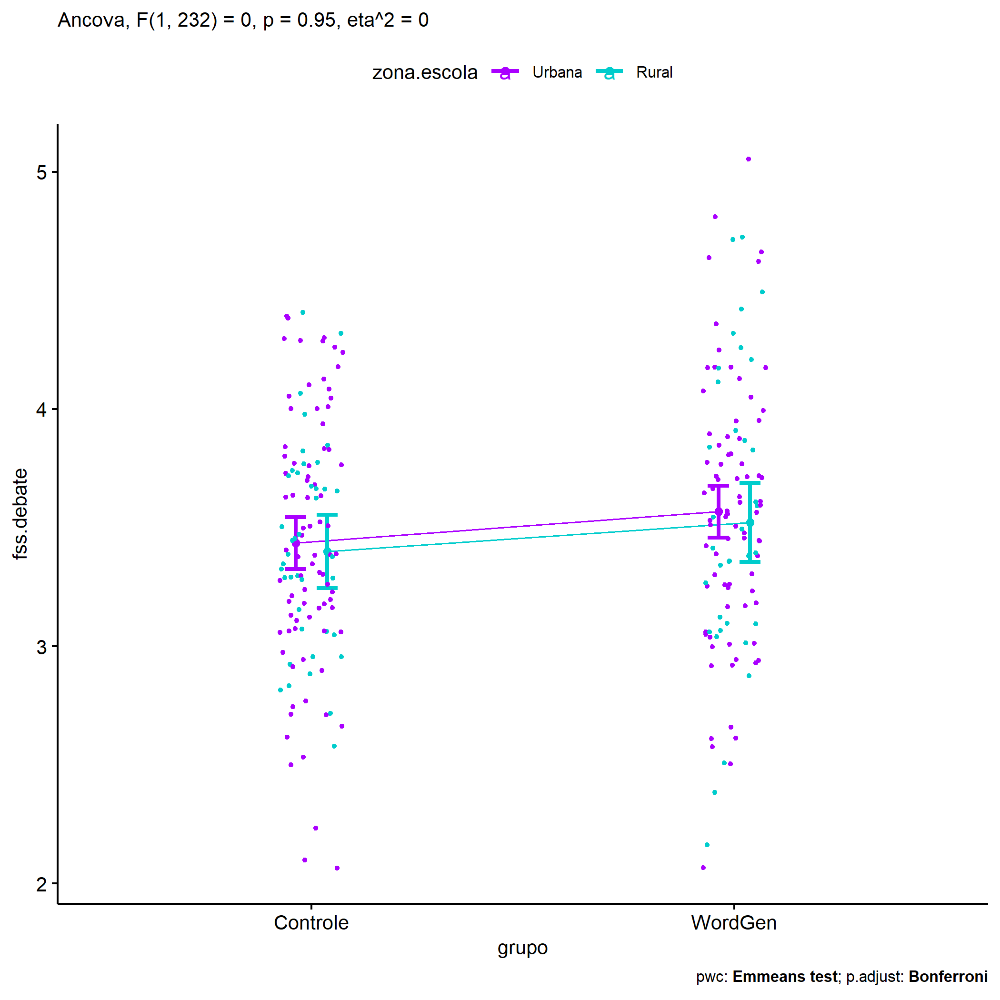<!-- -->

    ## Scale for colour is already present.
    ## Adding another scale for colour, which will replace the existing scale.

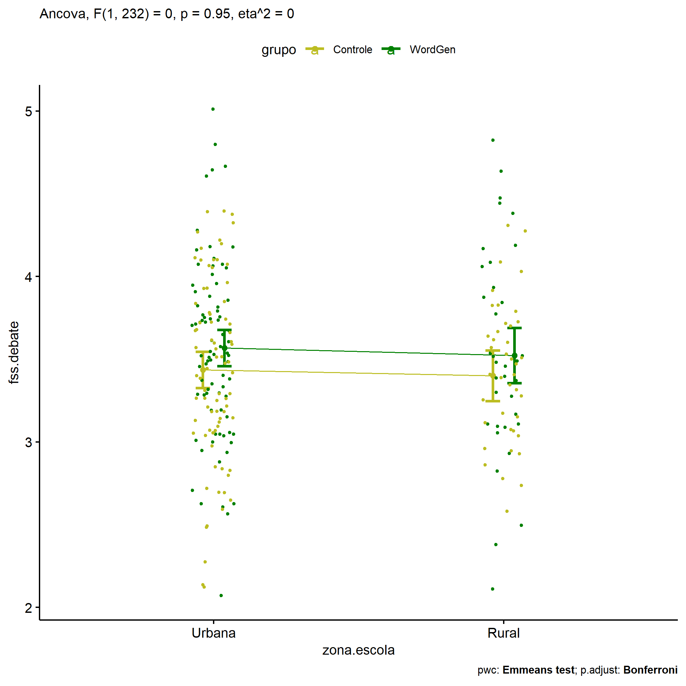<!-- -->

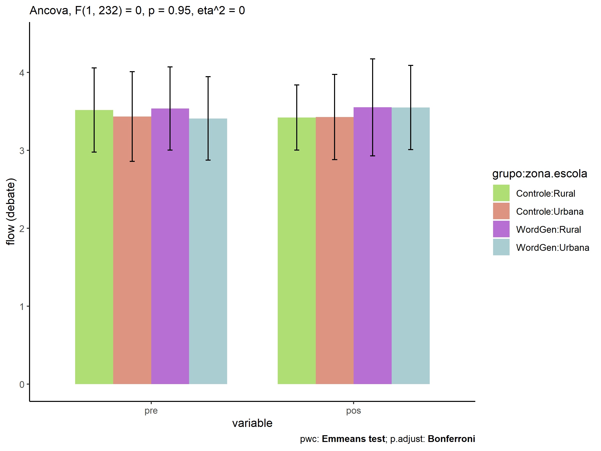<!-- -->

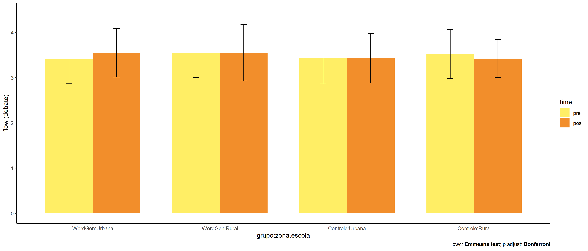<!-- -->

## Pairwise comparisons for grupo=“Experimental”

### factores: **grupo=“Experimental”:monitor**

| var        | monitor |   n | M (pre) | SE (pre) | M (unadj) | SE (unadj) | M (adj) | SE (adj) |
|:-----------|:--------|----:|--------:|---------:|----------:|-----------:|--------:|---------:|
| fss.debate | AC      |  11 |   3.788 |    0.133 |     3.427 |      0.129 |   3.289 |    0.154 |
| fss.debate | CE      |   9 |   3.537 |    0.147 |     3.775 |      0.205 |   3.743 |    0.167 |
| fss.debate | EA      |   9 |   3.315 |    0.126 |     3.827 |      0.199 |   3.888 |    0.167 |
| fss.debate | GR      |  15 |   3.474 |    0.149 |     3.556 |      0.102 |   3.550 |    0.129 |
| fss.debate | JC      |   9 |   3.346 |    0.243 |     3.295 |      0.145 |   3.343 |    0.167 |
| fss.debate | MF      |  10 |   3.578 |    0.152 |     3.656 |      0.239 |   3.606 |    0.159 |
| fss.debate | ML      |  15 |   3.496 |    0.180 |     3.231 |      0.149 |   3.216 |    0.129 |
| fss.debate | MM      |  12 |   3.255 |    0.155 |     3.497 |      0.132 |   3.583 |    0.146 |
| fss.debate | PR      |  10 |   3.179 |    0.132 |     3.779 |      0.204 |   3.897 |    0.160 |
| fss.debate | VL      |  11 |   3.591 |    0.107 |     3.808 |      0.160 |   3.753 |    0.151 |

| .y.        | group1 | group2 | estimate | conf.low | conf.high |    se | statistic |     p | p.adj | p.adj.signif |
|:-----------|:-------|:-------|---------:|---------:|----------:|------:|----------:|------:|------:|:-------------|
| fss.debate | AC     | CE     |   -0.453 |   -0.902 |    -0.004 | 0.226 |    -2.003 | 0.048 | 1.000 | ns           |
| fss.debate | AC     | EA     |   -0.599 |   -1.054 |    -0.144 | 0.229 |    -2.611 | 0.010 | 0.468 | ns           |
| fss.debate | AC     | GR     |   -0.260 |   -0.659 |     0.138 | 0.201 |    -1.297 | 0.198 | 1.000 | ns           |
| fss.debate | AC     | JC     |   -0.054 |   -0.507 |     0.400 | 0.229 |    -0.234 | 0.815 | 1.000 | ns           |
| fss.debate | AC     | MF     |   -0.317 |   -0.753 |     0.119 | 0.220 |    -1.443 | 0.152 | 1.000 | ns           |
| fss.debate | AC     | ML     |    0.074 |   -0.324 |     0.472 | 0.201 |     0.368 | 0.713 | 1.000 | ns           |
| fss.debate | AC     | MM     |   -0.294 |   -0.720 |     0.133 | 0.215 |    -1.366 | 0.175 | 1.000 | ns           |
| fss.debate | AC     | PR     |   -0.608 |   -1.056 |    -0.159 | 0.226 |    -2.689 | 0.008 | 0.378 | ns           |
| fss.debate | AC     | VL     |   -0.464 |   -0.889 |    -0.039 | 0.214 |    -2.166 | 0.033 | 1.000 | ns           |
| fss.debate | CE     | EA     |   -0.146 |   -0.616 |     0.324 | 0.237 |    -0.615 | 0.540 | 1.000 | ns           |
| fss.debate | CE     | GR     |    0.193 |   -0.226 |     0.612 | 0.211 |     0.913 | 0.364 | 1.000 | ns           |
| fss.debate | CE     | JC     |    0.400 |   -0.070 |     0.869 | 0.237 |     1.689 | 0.094 | 1.000 | ns           |
| fss.debate | CE     | MF     |    0.136 |   -0.320 |     0.593 | 0.230 |     0.592 | 0.555 | 1.000 | ns           |
| fss.debate | CE     | ML     |    0.527 |    0.108 |     0.946 | 0.211 |     2.497 | 0.014 | 0.638 | ns           |
| fss.debate | CE     | MM     |    0.160 |   -0.281 |     0.601 | 0.222 |     0.718 | 0.474 | 1.000 | ns           |
| fss.debate | CE     | PR     |   -0.155 |   -0.616 |     0.307 | 0.232 |    -0.665 | 0.507 | 1.000 | ns           |
| fss.debate | CE     | VL     |   -0.011 |   -0.457 |     0.436 | 0.225 |    -0.048 | 0.962 | 1.000 | ns           |
| fss.debate | EA     | GR     |    0.338 |   -0.081 |     0.758 | 0.212 |     1.599 | 0.113 | 1.000 | ns           |
| fss.debate | EA     | JC     |    0.545 |    0.077 |     1.014 | 0.236 |     2.311 | 0.023 | 1.000 | ns           |
| fss.debate | EA     | MF     |    0.282 |   -0.177 |     0.741 | 0.231 |     1.219 | 0.226 | 1.000 | ns           |
| fss.debate | EA     | ML     |    0.673 |    0.253 |     1.093 | 0.212 |     3.177 | 0.002 | 0.089 | ns           |
| fss.debate | EA     | MM     |    0.305 |   -0.133 |     0.743 | 0.221 |     1.383 | 0.170 | 1.000 | ns           |
| fss.debate | EA     | PR     |   -0.009 |   -0.466 |     0.448 | 0.230 |    -0.039 | 0.969 | 1.000 | ns           |
| fss.debate | EA     | VL     |    0.135 |   -0.314 |     0.584 | 0.226 |     0.596 | 0.553 | 1.000 | ns           |
| fss.debate | GR     | JC     |    0.207 |   -0.212 |     0.626 | 0.211 |     0.979 | 0.330 | 1.000 | ns           |
| fss.debate | GR     | MF     |   -0.056 |   -0.462 |     0.349 | 0.205 |    -0.276 | 0.783 | 1.000 | ns           |
| fss.debate | GR     | ML     |    0.334 |   -0.028 |     0.697 | 0.183 |     1.829 | 0.070 | 1.000 | ns           |
| fss.debate | GR     | MM     |   -0.033 |   -0.420 |     0.354 | 0.195 |    -0.170 | 0.866 | 1.000 | ns           |
| fss.debate | GR     | PR     |   -0.347 |   -0.756 |     0.062 | 0.206 |    -1.684 | 0.095 | 1.000 | ns           |
| fss.debate | GR     | VL     |   -0.204 |   -0.598 |     0.191 | 0.199 |    -1.023 | 0.309 | 1.000 | ns           |
| fss.debate | JC     | MF     |   -0.263 |   -0.722 |     0.195 | 0.231 |    -1.140 | 0.257 | 1.000 | ns           |
| fss.debate | JC     | ML     |    0.127 |   -0.292 |     0.547 | 0.212 |     0.602 | 0.548 | 1.000 | ns           |
| fss.debate | JC     | MM     |   -0.240 |   -0.678 |     0.198 | 0.221 |    -1.086 | 0.280 | 1.000 | ns           |
| fss.debate | JC     | PR     |   -0.554 |   -1.012 |    -0.097 | 0.231 |    -2.404 | 0.018 | 0.812 | ns           |
| fss.debate | JC     | VL     |   -0.410 |   -0.859 |     0.038 | 0.226 |    -1.815 | 0.073 | 1.000 | ns           |
| fss.debate | MF     | ML     |    0.391 |   -0.015 |     0.797 | 0.204 |     1.911 | 0.059 | 1.000 | ns           |
| fss.debate | MF     | MM     |    0.023 |   -0.406 |     0.453 | 0.216 |     0.108 | 0.914 | 1.000 | ns           |
| fss.debate | MF     | PR     |   -0.291 |   -0.741 |     0.159 | 0.227 |    -1.282 | 0.203 | 1.000 | ns           |
| fss.debate | MF     | VL     |   -0.147 |   -0.581 |     0.287 | 0.219 |    -0.672 | 0.503 | 1.000 | ns           |
| fss.debate | ML     | MM     |   -0.367 |   -0.755 |     0.020 | 0.195 |    -1.882 | 0.063 | 1.000 | ns           |
| fss.debate | ML     | PR     |   -0.682 |   -1.091 |    -0.272 | 0.207 |    -3.301 | 0.001 | 0.060 | ns           |
| fss.debate | ML     | VL     |   -0.538 |   -0.932 |    -0.143 | 0.199 |    -2.704 | 0.008 | 0.362 | ns           |
| fss.debate | MM     | PR     |   -0.314 |   -0.740 |     0.111 | 0.214 |    -1.466 | 0.146 | 1.000 | ns           |
| fss.debate | MM     | VL     |   -0.170 |   -0.590 |     0.249 | 0.211 |    -0.807 | 0.422 | 1.000 | ns           |
| fss.debate | PR     | VL     |    0.144 |   -0.297 |     0.584 | 0.222 |     0.648 | 0.519 | 1.000 | ns           |
| dfs.debate | AC     | CE     |    0.251 |   -0.222 |     0.724 | 0.238 |     1.052 | 0.295 | 1.000 | ns           |
| dfs.debate | AC     | EA     |    0.473 |    0.000 |     0.946 | 0.238 |     1.984 | 0.050 | 1.000 | ns           |
| dfs.debate | AC     | GR     |    0.314 |   -0.104 |     0.732 | 0.211 |     1.490 | 0.139 | 1.000 | ns           |
| dfs.debate | AC     | JC     |    0.442 |   -0.031 |     0.915 | 0.238 |     1.854 | 0.067 | 1.000 | ns           |
| dfs.debate | AC     | MF     |    0.210 |   -0.250 |     0.670 | 0.232 |     0.906 | 0.367 | 1.000 | ns           |
| dfs.debate | AC     | ML     |    0.292 |   -0.126 |     0.709 | 0.211 |     1.384 | 0.169 | 1.000 | ns           |
| dfs.debate | AC     | MM     |    0.533 |    0.094 |     0.973 | 0.221 |     2.408 | 0.018 | 0.804 | ns           |
| dfs.debate | AC     | PR     |    0.609 |    0.149 |     1.069 | 0.232 |     2.626 | 0.010 | 0.450 | ns           |
| dfs.debate | AC     | VL     |    0.197 |   -0.252 |     0.646 | 0.226 |     0.871 | 0.386 | 1.000 | ns           |
| dfs.debate | CE     | EA     |    0.222 |   -0.274 |     0.718 | 0.250 |     0.888 | 0.376 | 1.000 | ns           |
| dfs.debate | CE     | GR     |    0.063 |   -0.381 |     0.507 | 0.224 |     0.281 | 0.779 | 1.000 | ns           |
| dfs.debate | CE     | JC     |    0.191 |   -0.305 |     0.688 | 0.250 |     0.765 | 0.446 | 1.000 | ns           |
| dfs.debate | CE     | MF     |   -0.041 |   -0.524 |     0.443 | 0.244 |    -0.167 | 0.868 | 1.000 | ns           |
| dfs.debate | CE     | ML     |    0.041 |   -0.403 |     0.485 | 0.224 |     0.182 | 0.856 | 1.000 | ns           |
| dfs.debate | CE     | MM     |    0.282 |   -0.182 |     0.747 | 0.234 |     1.207 | 0.230 | 1.000 | ns           |
| dfs.debate | CE     | PR     |    0.358 |   -0.126 |     0.841 | 0.244 |     1.468 | 0.145 | 1.000 | ns           |
| dfs.debate | CE     | VL     |   -0.054 |   -0.527 |     0.419 | 0.238 |    -0.226 | 0.822 | 1.000 | ns           |
| dfs.debate | EA     | GR     |   -0.159 |   -0.603 |     0.285 | 0.224 |    -0.712 | 0.478 | 1.000 | ns           |
| dfs.debate | EA     | JC     |   -0.031 |   -0.527 |     0.465 | 0.250 |    -0.123 | 0.902 | 1.000 | ns           |
| dfs.debate | EA     | MF     |   -0.263 |   -0.747 |     0.221 | 0.244 |    -1.079 | 0.283 | 1.000 | ns           |
| dfs.debate | EA     | ML     |   -0.181 |   -0.625 |     0.262 | 0.224 |    -0.811 | 0.419 | 1.000 | ns           |
| dfs.debate | EA     | MM     |    0.060 |   -0.404 |     0.524 | 0.234 |     0.257 | 0.798 | 1.000 | ns           |
| dfs.debate | EA     | PR     |    0.136 |   -0.348 |     0.619 | 0.244 |     0.556 | 0.579 | 1.000 | ns           |
| dfs.debate | EA     | VL     |   -0.276 |   -0.749 |     0.197 | 0.238 |    -1.158 | 0.250 | 1.000 | ns           |
| dfs.debate | GR     | JC     |    0.128 |   -0.315 |     0.572 | 0.224 |     0.574 | 0.567 | 1.000 | ns           |
| dfs.debate | GR     | MF     |   -0.104 |   -0.533 |     0.326 | 0.217 |    -0.479 | 0.633 | 1.000 | ns           |
| dfs.debate | GR     | ML     |   -0.022 |   -0.407 |     0.362 | 0.194 |    -0.115 | 0.909 | 1.000 | ns           |
| dfs.debate | GR     | MM     |    0.219 |   -0.188 |     0.627 | 0.205 |     1.068 | 0.288 | 1.000 | ns           |
| dfs.debate | GR     | PR     |    0.295 |   -0.135 |     0.725 | 0.217 |     1.361 | 0.176 | 1.000 | ns           |
| dfs.debate | GR     | VL     |   -0.117 |   -0.535 |     0.301 | 0.211 |    -0.555 | 0.580 | 1.000 | ns           |
| dfs.debate | JC     | MF     |   -0.232 |   -0.716 |     0.251 | 0.244 |    -0.952 | 0.343 | 1.000 | ns           |
| dfs.debate | JC     | ML     |   -0.151 |   -0.594 |     0.293 | 0.224 |    -0.673 | 0.502 | 1.000 | ns           |
| dfs.debate | JC     | MM     |    0.091 |   -0.373 |     0.555 | 0.234 |     0.389 | 0.698 | 1.000 | ns           |
| dfs.debate | JC     | PR     |    0.167 |   -0.317 |     0.650 | 0.244 |     0.683 | 0.496 | 1.000 | ns           |
| dfs.debate | JC     | VL     |   -0.245 |   -0.718 |     0.228 | 0.238 |    -1.028 | 0.306 | 1.000 | ns           |
| dfs.debate | MF     | ML     |    0.081 |   -0.348 |     0.511 | 0.217 |     0.376 | 0.708 | 1.000 | ns           |
| dfs.debate | MF     | MM     |    0.323 |   -0.128 |     0.774 | 0.227 |     1.422 | 0.158 | 1.000 | ns           |
| dfs.debate | MF     | PR     |    0.399 |   -0.072 |     0.869 | 0.237 |     1.680 | 0.096 | 1.000 | ns           |
| dfs.debate | MF     | VL     |   -0.013 |   -0.473 |     0.447 | 0.232 |    -0.057 | 0.955 | 1.000 | ns           |
| dfs.debate | ML     | MM     |    0.242 |   -0.166 |     0.649 | 0.205 |     1.176 | 0.242 | 1.000 | ns           |
| dfs.debate | ML     | PR     |    0.317 |   -0.113 |     0.747 | 0.217 |     1.464 | 0.146 | 1.000 | ns           |
| dfs.debate | ML     | VL     |   -0.095 |   -0.512 |     0.323 | 0.211 |    -0.449 | 0.654 | 1.000 | ns           |
| dfs.debate | MM     | PR     |    0.075 |   -0.375 |     0.526 | 0.227 |     0.332 | 0.740 | 1.000 | ns           |
| dfs.debate | MM     | VL     |   -0.336 |   -0.776 |     0.103 | 0.221 |    -1.518 | 0.132 | 1.000 | ns           |
| dfs.debate | PR     | VL     |   -0.412 |   -0.872 |     0.048 | 0.232 |    -1.776 | 0.079 | 1.000 | ns           |

| .y.         | monitor | group1 | group2 | estimate | conf.low | conf.high |    se | statistic |     p | p.adj | p.adj.signif |
|:------------|:--------|:-------|:-------|---------:|---------:|----------:|------:|----------:|------:|------:|:-------------|
| flow.debate | AC      | pre    | pos    |    0.361 |   -0.091 |     0.814 | 0.229 |     1.574 | 0.117 | 0.117 | ns           |
| flow.debate | CE      | pre    | pos    |   -0.238 |   -0.738 |     0.263 | 0.254 |    -0.937 | 0.350 | 0.350 | ns           |
| flow.debate | EA      | pre    | pos    |   -0.512 |   -1.013 |    -0.012 | 0.254 |    -2.020 | 0.045 | 0.045 | \*           |
| flow.debate | GR      | pre    | pos    |   -0.081 |   -0.469 |     0.306 | 0.196 |    -0.415 | 0.679 | 0.679 | ns           |
| flow.debate | JC      | pre    | pos    |    0.051 |   -0.449 |     0.551 | 0.254 |     0.201 | 0.841 | 0.841 | ns           |
| flow.debate | MF      | pre    | pos    |   -0.078 |   -0.552 |     0.397 | 0.241 |    -0.323 | 0.747 | 0.747 | ns           |
| flow.debate | ML      | pre    | pos    |    0.266 |   -0.122 |     0.653 | 0.196 |     1.352 | 0.178 | 0.178 | ns           |
| flow.debate | MM      | pre    | pos    |   -0.242 |   -0.675 |     0.191 | 0.220 |    -1.101 | 0.272 | 0.272 | ns           |
| flow.debate | PR      | pre    | pos    |   -0.600 |   -1.075 |    -0.125 | 0.241 |    -2.493 | 0.013 | 0.013 | \*           |
| flow.debate | VL      | pre    | pos    |   -0.217 |   -0.670 |     0.235 | 0.229 |    -0.946 | 0.345 | 0.345 | ns           |

    ## Scale for colour is already present.
    ## Adding another scale for colour, which will replace the existing scale.

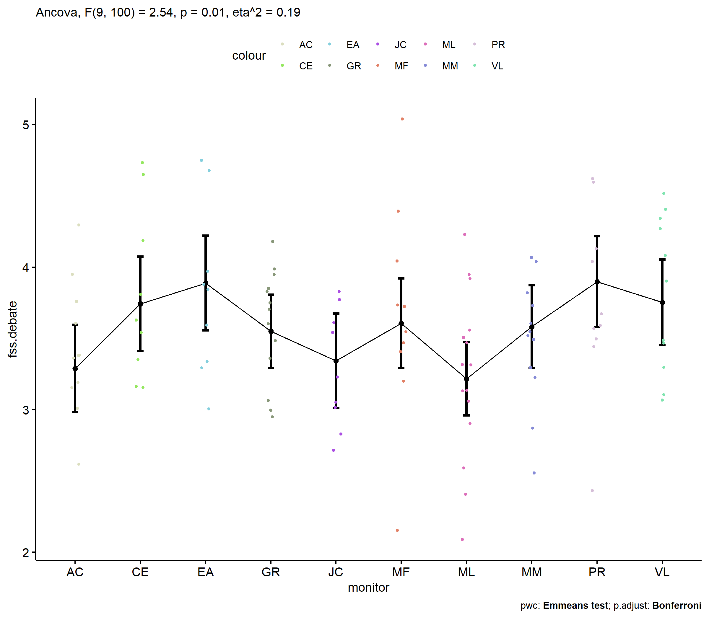<!-- -->

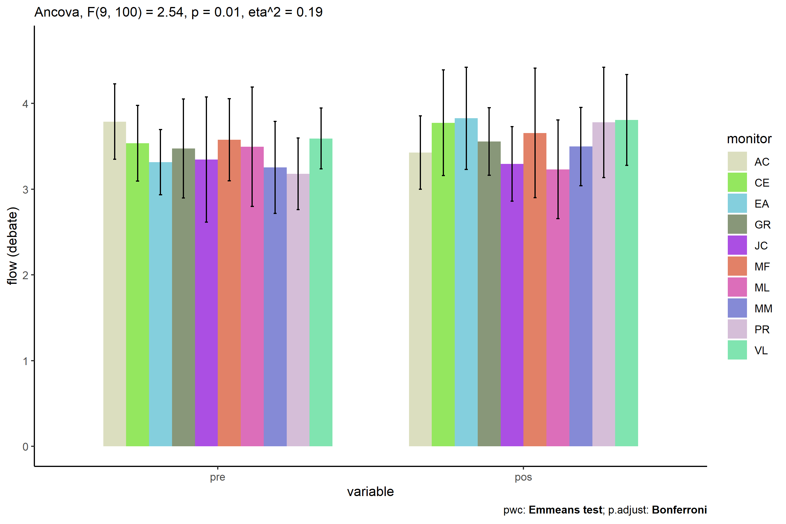<!-- -->

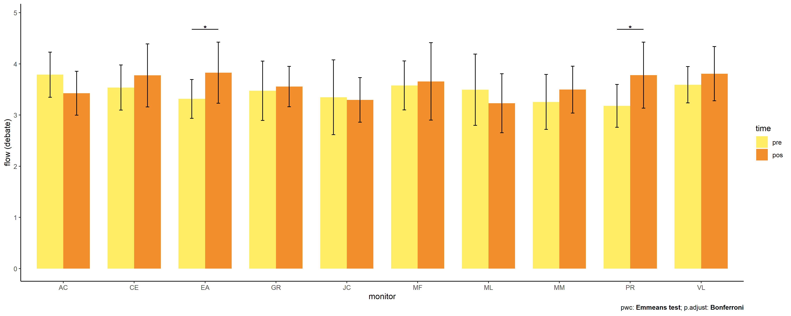<!-- -->

### factores: **grupo=“Experimental”:monitor.genero**

| var        | monitor.genero |   n | M (pre) | SE (pre) | M (unadj) | SE (unadj) | M (adj) | SE (adj) |
|:-----------|:---------------|----:|--------:|---------:|----------:|-----------:|--------:|---------:|
| fss.debate | F              |  74 |   3.521 |    0.063 |     3.512 |      0.063 |   3.488 |    0.061 |
| fss.debate | M              |  37 |   3.340 |    0.083 |     3.672 |      0.098 |   3.719 |    0.087 |

| .y.        | group1 | group2 | estimate | conf.low | conf.high |    se | statistic |     p | p.adj | p.adj.signif |
|:-----------|:-------|:-------|---------:|---------:|----------:|------:|----------:|------:|------:|:-------------|
| fss.debate | F      | M      |   -0.231 |   -0.442 |    -0.020 | 0.107 |    -2.166 | 0.033 | 0.033 | \*           |
| dfs.debate | F      | M      |    0.181 |   -0.031 |     0.393 | 0.107 |     1.694 | 0.093 | 0.093 | ns           |

| .y.         | monitor.genero | group1 | group2 | estimate | conf.low | conf.high |    se | statistic |    p | p.adj | p.adj.signif |
|:------------|:---------------|:-------|:-------|---------:|---------:|----------:|------:|----------:|-----:|------:|:-------------|
| flow.debate | F              | pre    | pos    |    0.009 |   -0.168 |     0.186 | 0.090 |     0.100 | 0.92 |  0.92 | ns           |
| flow.debate | M              | pre    | pos    |   -0.332 |   -0.583 |    -0.082 | 0.127 |    -2.616 | 0.01 |  0.01 | \*\*         |

    ## Scale for colour is already present.
    ## Adding another scale for colour, which will replace the existing scale.

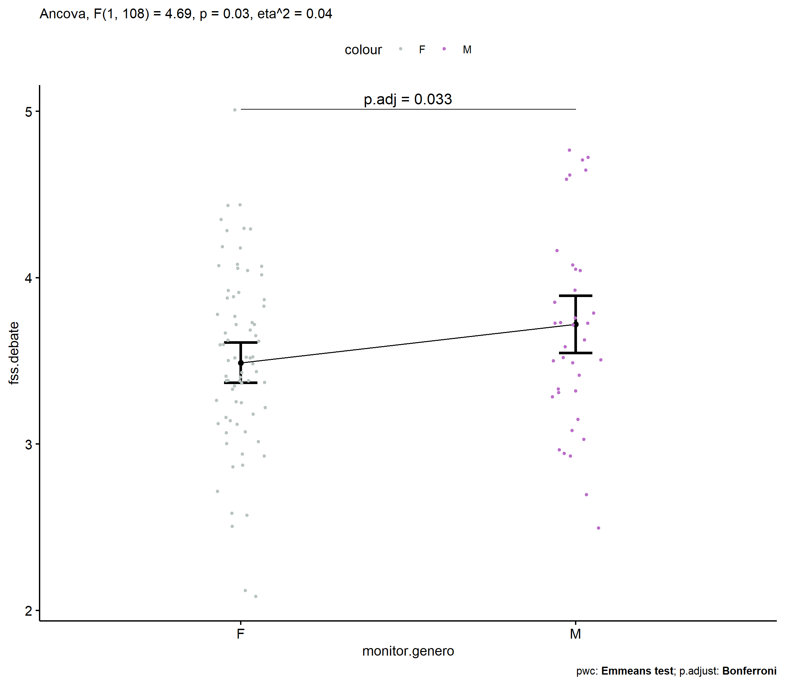<!-- -->

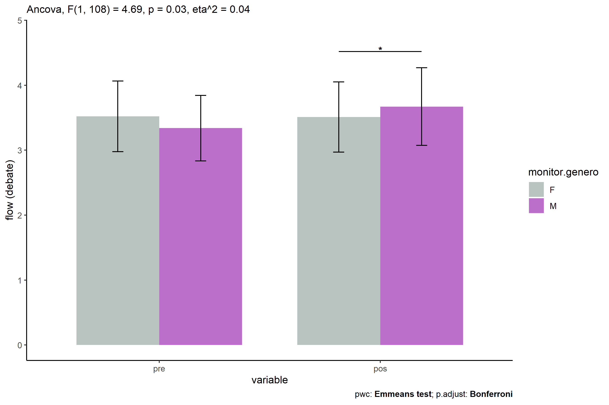<!-- -->

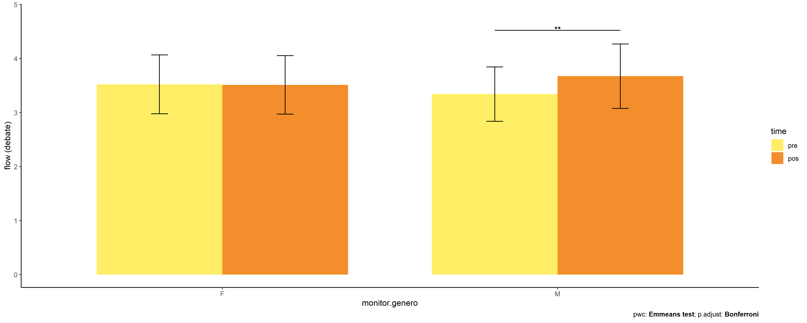<!-- -->

### factores: **grupo=“Experimental”:monitor.area**

| var        | monitor.area               |   n | M (pre) | SE (pre) | M (unadj) | SE (unadj) | M (adj) | SE (adj) |
|:-----------|:---------------------------|----:|--------:|---------:|----------:|-----------:|--------:|---------:|
| fss.debate | Arquitetura e Urbanismo    |   9 |   3.346 |    0.243 |     3.295 |      0.145 |   3.342 |    0.168 |
| fss.debate | Ciencias Biologicas        |  15 |   3.496 |    0.180 |     3.231 |      0.149 |   3.216 |    0.130 |
| fss.debate | Comunicacao Social         |   9 |   3.537 |    0.147 |     3.775 |      0.205 |   3.743 |    0.168 |
| fss.debate | Historia                   |  10 |   3.179 |    0.132 |     3.779 |      0.204 |   3.894 |    0.162 |
| fss.debate | Letras - Lingua Portuguesa |  10 |   3.578 |    0.152 |     3.656 |      0.239 |   3.608 |    0.160 |
| fss.debate | Matematica                 |  24 |   3.414 |    0.104 |     3.657 |      0.099 |   3.676 |    0.103 |
| fss.debate | Nutricao                   |  12 |   3.255 |    0.155 |     3.497 |      0.132 |   3.581 |    0.147 |
| fss.debate | Pedagogia                  |  11 |   3.788 |    0.133 |     3.427 |      0.129 |   3.293 |    0.155 |
| fss.debate | Servico Social             |  11 |   3.591 |    0.107 |     3.808 |      0.160 |   3.755 |    0.153 |

| .y.        | group1                  | group2              | estimate | conf.low | conf.high |    se | statistic |     p | p.adj | p.adj.signif |
|:-----------|:------------------------|:--------------------|---------:|---------:|----------:|------:|----------:|------:|------:|:-------------|
| fss.debate | Arquitetura e Urbanismo | Ciencias Biologicas |    0.126 |   -0.297 |     0.549 | 0.213 |     0.590 | 0.556 | 1.000 | ns           |
| fss.debate | Arquitetura e Urbanismo | Comunicacao Social  |   -0.402 |   -0.875 |     0.071 | 0.238 |    -1.684 | 0.095 | 1.000 | ns           |
| fss.debate | Arquitetura e Urbanismo | Historia            |   -0.553 |   -1.013 |    -0.092 | 0.232 |    -2.379 | 0.019 | 0.693 | ns           |
| fss.debate | Arquitetura e Urbanismo | Letras              |   -0.266 |   -0.728 |     0.196 | 0.233 |    -1.142 | 0.256 | 1.000 | ns           |
| fss.debate | Arquitetura e Urbanismo | Matematica          |   -0.335 |   -0.726 |     0.057 | 0.197 |    -1.696 | 0.093 | 1.000 | ns           |
| fss.debate | Arquitetura e Urbanismo | Nutricao            |   -0.239 |   -0.681 |     0.203 | 0.223 |    -1.074 | 0.285 | 1.000 | ns           |
| fss.debate | Arquitetura e Urbanismo | Pedagogia           |    0.049 |   -0.408 |     0.506 | 0.231 |     0.212 | 0.833 | 1.000 | ns           |
| fss.debate | Arquitetura e Urbanismo | Servico Social      |   -0.413 |   -0.865 |     0.039 | 0.228 |    -1.812 | 0.073 | 1.000 | ns           |
| fss.debate | Ciencias Biologicas     | Comunicacao Social  |   -0.527 |   -0.949 |    -0.106 | 0.213 |    -2.480 | 0.015 | 0.533 | ns           |
| fss.debate | Ciencias Biologicas     | Historia            |   -0.678 |   -1.091 |    -0.266 | 0.208 |    -3.260 | 0.002 | 0.055 | ns           |
| fss.debate | Ciencias Biologicas     | Letras              |   -0.392 |   -0.800 |     0.017 | 0.206 |    -1.901 | 0.060 | 1.000 | ns           |
| fss.debate | Ciencias Biologicas     | Matematica          |   -0.460 |   -0.790 |    -0.131 | 0.166 |    -2.770 | 0.007 | 0.240 | ns           |
| fss.debate | Ciencias Biologicas     | Nutricao            |   -0.365 |   -0.755 |     0.025 | 0.197 |    -1.855 | 0.067 | 1.000 | ns           |
| fss.debate | Ciencias Biologicas     | Pedagogia           |   -0.077 |   -0.478 |     0.324 | 0.202 |    -0.381 | 0.704 | 1.000 | ns           |
| fss.debate | Ciencias Biologicas     | Servico Social      |   -0.539 |   -0.936 |    -0.141 | 0.200 |    -2.688 | 0.008 | 0.302 | ns           |
| fss.debate | Comunicacao Social      | Historia            |   -0.151 |   -0.615 |     0.314 | 0.234 |    -0.644 | 0.521 | 1.000 | ns           |
| fss.debate | Comunicacao Social      | Letras              |    0.136 |   -0.324 |     0.596 | 0.232 |     0.586 | 0.559 | 1.000 | ns           |
| fss.debate | Comunicacao Social      | Matematica          |    0.067 |   -0.325 |     0.459 | 0.197 |     0.340 | 0.735 | 1.000 | ns           |
| fss.debate | Comunicacao Social      | Nutricao            |    0.163 |   -0.282 |     0.607 | 0.224 |     0.726 | 0.469 | 1.000 | ns           |
| fss.debate | Comunicacao Social      | Pedagogia           |    0.451 |   -0.002 |     0.903 | 0.228 |     1.976 | 0.051 | 1.000 | ns           |
| fss.debate | Comunicacao Social      | Servico Social      |   -0.011 |   -0.461 |     0.438 | 0.227 |    -0.050 | 0.960 | 1.000 | ns           |
| fss.debate | Historia                | Letras              |    0.287 |   -0.167 |     0.740 | 0.229 |     1.253 | 0.213 | 1.000 | ns           |
| fss.debate | Historia                | Matematica          |    0.218 |   -0.161 |     0.597 | 0.191 |     1.140 | 0.257 | 1.000 | ns           |
| fss.debate | Historia                | Nutricao            |    0.314 |   -0.115 |     0.742 | 0.216 |     1.451 | 0.150 | 1.000 | ns           |
| fss.debate | Historia                | Pedagogia           |    0.601 |    0.150 |     1.053 | 0.228 |     2.640 | 0.010 | 0.346 | ns           |
| fss.debate | Historia                | Servico Social      |    0.139 |   -0.304 |     0.583 | 0.224 |     0.623 | 0.535 | 1.000 | ns           |
| fss.debate | Letras                  | Lingua Portuguesa   |   -0.069 |   -0.447 |     0.309 | 0.190 |    -0.361 | 0.719 | 1.000 | ns           |
| fss.debate | Letras                  | Lingua Portuguesa   |    0.027 |   -0.406 |     0.460 | 0.218 |     0.123 | 0.902 | 1.000 | ns           |
| fss.debate | Letras                  | Lingua Portuguesa   |    0.315 |   -0.124 |     0.754 | 0.221 |     1.422 | 0.158 | 1.000 | ns           |
| fss.debate | Letras                  | Lingua Portuguesa   |   -0.147 |   -0.584 |     0.290 | 0.220 |    -0.668 | 0.506 | 1.000 | ns           |
| fss.debate | Matematica              | Nutricao            |    0.096 |   -0.259 |     0.451 | 0.179 |     0.534 | 0.595 | 1.000 | ns           |
| fss.debate | Matematica              | Pedagogia           |    0.383 |    0.012 |     0.754 | 0.187 |     2.050 | 0.043 | 1.000 | ns           |
| fss.debate | Matematica              | Servico Social      |   -0.078 |   -0.444 |     0.287 | 0.184 |    -0.425 | 0.671 | 1.000 | ns           |
| fss.debate | Nutricao                | Pedagogia           |    0.288 |   -0.142 |     0.717 | 0.216 |     1.330 | 0.187 | 1.000 | ns           |
| fss.debate | Nutricao                | Servico Social      |   -0.174 |   -0.596 |     0.248 | 0.213 |    -0.817 | 0.416 | 1.000 | ns           |
| fss.debate | Pedagogia               | Servico Social      |   -0.462 |   -0.890 |    -0.034 | 0.216 |    -2.139 | 0.035 | 1.000 | ns           |
| dfs.debate | Arquitetura e Urbanismo | Ciencias Biologicas |   -0.151 |   -0.593 |     0.292 | 0.223 |    -0.675 | 0.501 | 1.000 | ns           |
| dfs.debate | Arquitetura e Urbanismo | Comunicacao Social  |   -0.191 |   -0.686 |     0.304 | 0.250 |    -0.767 | 0.445 | 1.000 | ns           |
| dfs.debate | Arquitetura e Urbanismo | Historia            |    0.167 |   -0.316 |     0.649 | 0.243 |     0.685 | 0.495 | 1.000 | ns           |
| dfs.debate | Arquitetura e Urbanismo | Letras              |   -0.232 |   -0.714 |     0.250 | 0.243 |    -0.954 | 0.342 | 1.000 | ns           |
| dfs.debate | Arquitetura e Urbanismo | Matematica          |   -0.069 |   -0.479 |     0.342 | 0.207 |    -0.332 | 0.741 | 1.000 | ns           |
| dfs.debate | Arquitetura e Urbanismo | Nutricao            |    0.091 |   -0.372 |     0.554 | 0.233 |     0.390 | 0.697 | 1.000 | ns           |
| dfs.debate | Arquitetura e Urbanismo | Pedagogia           |   -0.442 |   -0.914 |     0.030 | 0.238 |    -1.859 | 0.066 | 1.000 | ns           |
| dfs.debate | Arquitetura e Urbanismo | Servico Social      |   -0.245 |   -0.717 |     0.227 | 0.238 |    -1.031 | 0.305 | 1.000 | ns           |
| dfs.debate | Ciencias Biologicas     | Comunicacao Social  |   -0.041 |   -0.483 |     0.402 | 0.223 |    -0.183 | 0.856 | 1.000 | ns           |
| dfs.debate | Ciencias Biologicas     | Historia            |    0.317 |   -0.111 |     0.746 | 0.216 |     1.468 | 0.145 | 1.000 | ns           |
| dfs.debate | Ciencias Biologicas     | Letras              |   -0.081 |   -0.510 |     0.347 | 0.216 |    -0.377 | 0.707 | 1.000 | ns           |
| dfs.debate | Ciencias Biologicas     | Matematica          |    0.082 |   -0.264 |     0.427 | 0.174 |     0.470 | 0.639 | 1.000 | ns           |
| dfs.debate | Ciencias Biologicas     | Nutricao            |    0.242 |   -0.165 |     0.648 | 0.205 |     1.179 | 0.241 | 1.000 | ns           |
| dfs.debate | Ciencias Biologicas     | Pedagogia           |   -0.292 |   -0.708 |     0.125 | 0.210 |    -1.388 | 0.168 | 1.000 | ns           |
| dfs.debate | Ciencias Biologicas     | Servico Social      |   -0.095 |   -0.511 |     0.322 | 0.210 |    -0.450 | 0.653 | 1.000 | ns           |
| dfs.debate | Comunicacao Social      | Historia            |    0.358 |   -0.124 |     0.840 | 0.243 |     1.472 | 0.144 | 1.000 | ns           |
| dfs.debate | Comunicacao Social      | Letras              |   -0.041 |   -0.523 |     0.442 | 0.243 |    -0.168 | 0.867 | 1.000 | ns           |
| dfs.debate | Comunicacao Social      | Matematica          |    0.123 |   -0.288 |     0.533 | 0.207 |     0.593 | 0.554 | 1.000 | ns           |
| dfs.debate | Comunicacao Social      | Nutricao            |    0.282 |   -0.181 |     0.745 | 0.233 |     1.210 | 0.229 | 1.000 | ns           |
| dfs.debate | Comunicacao Social      | Pedagogia           |   -0.251 |   -0.723 |     0.221 | 0.238 |    -1.054 | 0.294 | 1.000 | ns           |
| dfs.debate | Comunicacao Social      | Servico Social      |   -0.054 |   -0.526 |     0.418 | 0.238 |    -0.226 | 0.821 | 1.000 | ns           |
| dfs.debate | Historia                | Letras              |   -0.399 |   -0.868 |     0.071 | 0.237 |    -1.684 | 0.095 | 1.000 | ns           |
| dfs.debate | Historia                | Matematica          |   -0.235 |   -0.630 |     0.160 | 0.199 |    -1.181 | 0.241 | 1.000 | ns           |
| dfs.debate | Historia                | Nutricao            |   -0.075 |   -0.525 |     0.374 | 0.227 |    -0.333 | 0.740 | 1.000 | ns           |
| dfs.debate | Historia                | Pedagogia           |   -0.609 |   -1.067 |    -0.150 | 0.231 |    -2.632 | 0.010 | 0.353 | ns           |
| dfs.debate | Historia                | Servico Social      |   -0.412 |   -0.870 |     0.047 | 0.231 |    -1.780 | 0.078 | 1.000 | ns           |
| dfs.debate | Letras                  | Lingua Portuguesa   |    0.163 |   -0.232 |     0.559 | 0.199 |     0.820 | 0.414 | 1.000 | ns           |
| dfs.debate | Letras                  | Lingua Portuguesa   |    0.323 |   -0.126 |     0.773 | 0.227 |     1.426 | 0.157 | 1.000 | ns           |
| dfs.debate | Letras                  | Lingua Portuguesa   |   -0.210 |   -0.669 |     0.249 | 0.231 |    -0.908 | 0.366 | 1.000 | ns           |
| dfs.debate | Letras                  | Lingua Portuguesa   |   -0.013 |   -0.472 |     0.446 | 0.231 |    -0.057 | 0.955 | 1.000 | ns           |
| dfs.debate | Matematica              | Nutricao            |    0.160 |   -0.211 |     0.531 | 0.187 |     0.854 | 0.395 | 1.000 | ns           |
| dfs.debate | Matematica              | Pedagogia           |   -0.374 |   -0.756 |     0.009 | 0.193 |    -1.938 | 0.055 | 1.000 | ns           |
| dfs.debate | Matematica              | Servico Social      |   -0.177 |   -0.559 |     0.206 | 0.193 |    -0.916 | 0.362 | 1.000 | ns           |
| dfs.debate | Nutricao                | Pedagogia           |   -0.533 |   -0.971 |    -0.095 | 0.221 |    -2.414 | 0.018 | 0.633 | ns           |
| dfs.debate | Nutricao                | Servico Social      |   -0.336 |   -0.775 |     0.102 | 0.221 |    -1.522 | 0.131 | 1.000 | ns           |
| dfs.debate | Pedagogia               | Servico Social      |    0.197 |   -0.251 |     0.645 | 0.226 |     0.873 | 0.385 | 1.000 | ns           |

| .y.         | monitor.area               | group1 | group2 | estimate | conf.low | conf.high |    se | statistic |     p | p.adj | p.adj.signif |
|:------------|:---------------------------|:-------|:-------|---------:|---------:|----------:|------:|----------:|------:|------:|:-------------|
| flow.debate | Arquitetura e Urbanismo    | pre    | pos    |    0.051 |   -0.449 |     0.551 | 0.254 |     0.201 | 0.841 | 0.841 | ns           |
| flow.debate | Ciencias Biologicas        | pre    | pos    |    0.266 |   -0.122 |     0.653 | 0.196 |     1.353 | 0.178 | 0.178 | ns           |
| flow.debate | Comunicacao Social         | pre    | pos    |   -0.238 |   -0.738 |     0.262 | 0.254 |    -0.937 | 0.350 | 0.350 | ns           |
| flow.debate | Historia                   | pre    | pos    |   -0.600 |   -1.074 |    -0.126 | 0.241 |    -2.494 | 0.013 | 0.013 | \*           |
| flow.debate | Letras - Lingua Portuguesa | pre    | pos    |   -0.078 |   -0.552 |     0.397 | 0.241 |    -0.323 | 0.747 | 0.747 | ns           |
| flow.debate | Matematica                 | pre    | pos    |   -0.243 |   -0.549 |     0.063 | 0.155 |    -1.565 | 0.119 | 0.119 | ns           |
| flow.debate | Nutricao                   | pre    | pos    |   -0.242 |   -0.675 |     0.191 | 0.220 |    -1.101 | 0.272 | 0.272 | ns           |
| flow.debate | Pedagogia                  | pre    | pos    |    0.361 |   -0.091 |     0.813 | 0.229 |     1.574 | 0.117 | 0.117 | ns           |
| flow.debate | Servico Social             | pre    | pos    |   -0.217 |   -0.669 |     0.235 | 0.229 |    -0.947 | 0.345 | 0.345 | ns           |

    ## Scale for colour is already present.
    ## Adding another scale for colour, which will replace the existing scale.

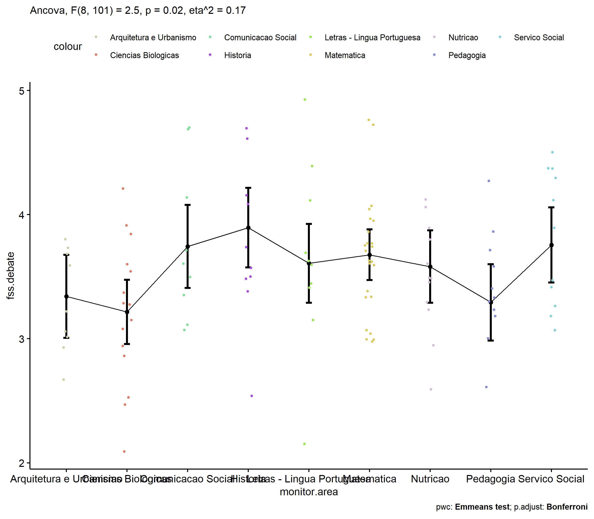<!-- -->

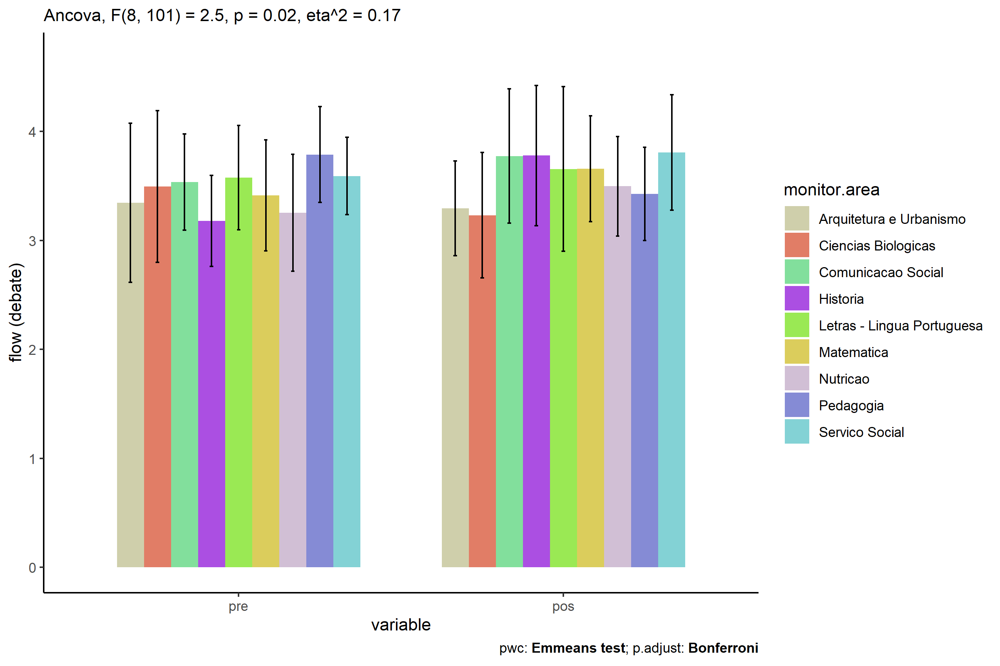<!-- -->

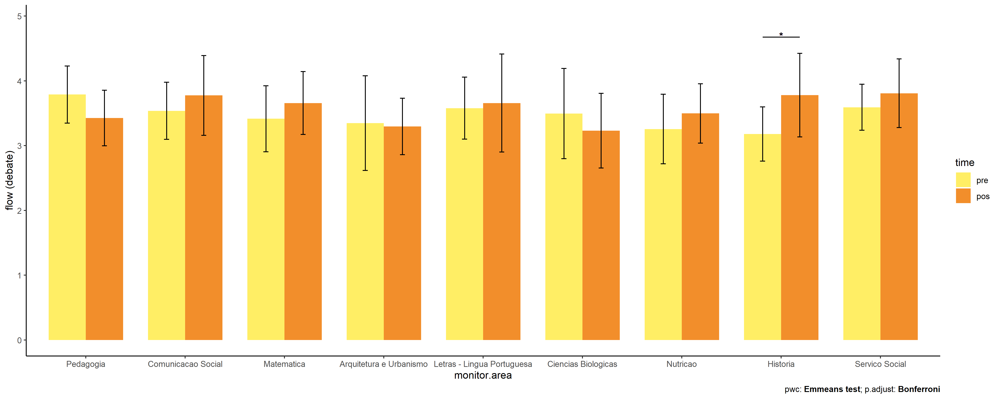<!-- -->

### factores: **grupo=“Experimental”:monitor.formacao**

| var        | monitor.formacao |   n | M (pre) | SE (pre) | M (unadj) | SE (unadj) | M (adj) | SE (adj) |
|:-----------|:-----------------|----:|--------:|---------:|----------:|-----------:|--------:|---------:|
| fss.debate | ensino medio     |  82 |   3.424 |    0.062 |     3.532 |      0.062 |   3.545 |    0.059 |
| fss.debate | especializacao   |   9 |   3.537 |    0.147 |     3.775 |      0.205 |   3.748 |    0.178 |
| fss.debate | graduacao        |  20 |   3.575 |    0.105 |     3.607 |      0.120 |   3.567 |    0.120 |

| .y.        | group1         | group2         | estimate | conf.low | conf.high |    se | statistic |     p | p.adj | p.adj.signif |
|:-----------|:---------------|:---------------|---------:|---------:|----------:|------:|----------:|------:|------:|:-------------|
| fss.debate | ensino medio   | especializacao |   -0.203 |   -0.575 |     0.169 | 0.188 |    -1.080 | 0.283 | 0.848 | ns           |
| fss.debate | ensino medio   | graduacao      |   -0.022 |   -0.287 |     0.244 | 0.134 |    -0.161 | 0.872 | 1.000 | ns           |
| fss.debate | especializacao | graduacao      |    0.181 |   -0.243 |     0.606 | 0.214 |     0.846 | 0.400 | 1.000 | ns           |
| dfs.debate | ensino medio   | especializacao |   -0.113 |   -0.487 |     0.261 | 0.189 |    -0.597 | 0.551 | 1.000 | ns           |
| dfs.debate | ensino medio   | graduacao      |   -0.151 |   -0.416 |     0.115 | 0.134 |    -1.124 | 0.263 | 0.790 | ns           |
| dfs.debate | especializacao | graduacao      |   -0.038 |   -0.466 |     0.390 | 0.216 |    -0.176 | 0.861 | 1.000 | ns           |

| .y.         | monitor.formacao | group1 | group2 | estimate | conf.low | conf.high |    se | statistic |     p | p.adj | p.adj.signif |
|:------------|:-----------------|:-------|:-------|---------:|---------:|----------:|------:|----------:|------:|------:|:-------------|
| flow.debate | ensino medio     | pre    | pos    |   -0.108 |   -0.277 |     0.062 | 0.086 |    -1.254 | 0.211 | 0.211 | ns           |
| flow.debate | especializacao   | pre    | pos    |   -0.238 |   -0.749 |     0.274 | 0.260 |    -0.915 | 0.361 | 0.361 | ns           |
| flow.debate | graduacao        | pre    | pos    |   -0.032 |   -0.375 |     0.311 | 0.174 |    -0.183 | 0.855 | 0.855 | ns           |

    ## Scale for colour is already present.
    ## Adding another scale for colour, which will replace the existing scale.

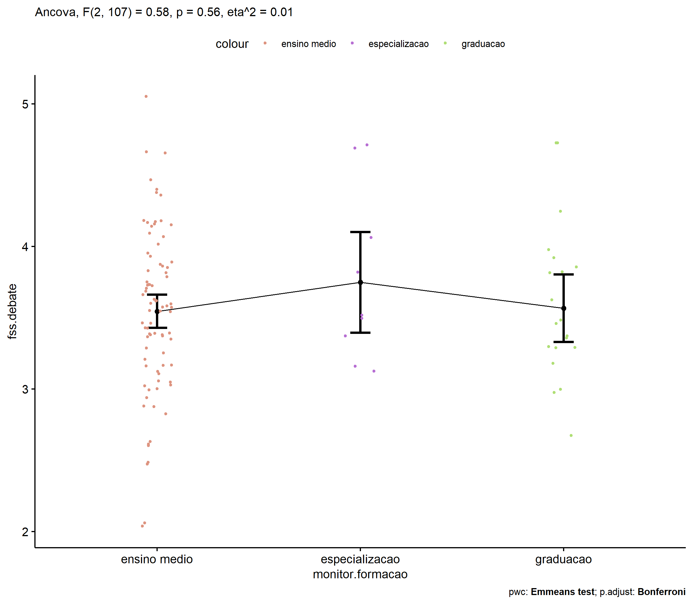<!-- -->

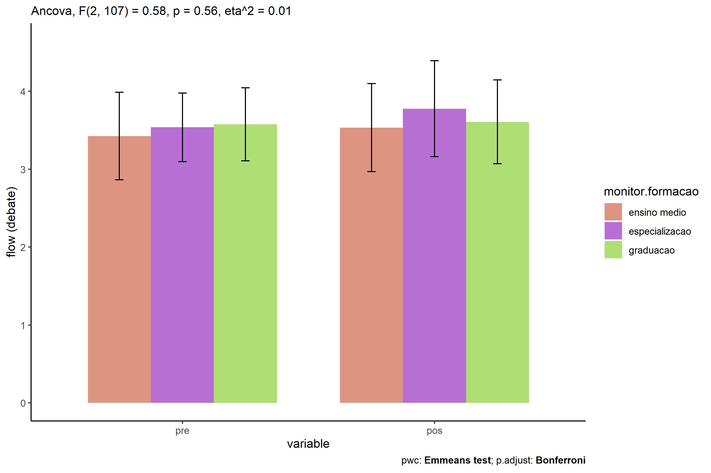<!-- -->

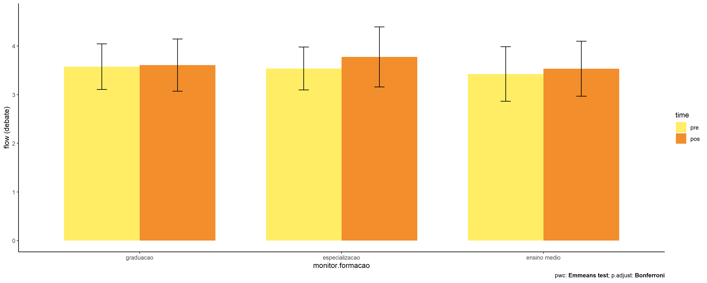<!-- -->

### factores: **grupo=“Experimental”:monitor.experiencia**

| var        | monitor.experiencia |   n | M (pre) | SE (pre) | M (unadj) | SE (unadj) | M (adj) | SE (adj) |
|:-----------|:--------------------|----:|--------:|---------:|----------:|-----------:|--------:|---------:|
| fss.debate | maior 01 ano        |  79 |   3.487 |    0.060 |     3.573 |      0.066 |   3.563 |    0.060 |
| fss.debate | menor 01 ano        |  32 |   3.396 |    0.097 |     3.547 |      0.090 |   3.570 |    0.095 |

| .y.        | group1       | group2       | estimate | conf.low | conf.high |    se | statistic |     p | p.adj | p.adj.signif |
|:-----------|:-------------|:-------------|---------:|---------:|----------:|------:|----------:|------:|------:|:-------------|
| fss.debate | maior 01 ano | menor 01 ano |   -0.007 |   -0.229 |     0.216 | 0.112 |    -0.061 | 0.952 | 0.952 | ns           |
| dfs.debate | maior 01 ano | menor 01 ano |    0.091 |   -0.132 |     0.314 | 0.113 |     0.809 | 0.421 | 0.421 | ns           |

| .y.         | monitor.experiencia | group1 | group2 | estimate | conf.low | conf.high |    se | statistic |     p | p.adj | p.adj.signif |
|:------------|:--------------------|:-------|:-------|---------:|---------:|----------:|------:|----------:|------:|------:|:-------------|
| flow.debate | maior 01 ano        | pre    | pos    |   -0.086 |   -0.259 |     0.087 | 0.088 |    -0.980 | 0.328 | 0.328 | ns           |
| flow.debate | menor 01 ano        | pre    | pos    |   -0.151 |   -0.423 |     0.121 | 0.138 |    -1.096 | 0.274 | 0.274 | ns           |

    ## Scale for colour is already present.
    ## Adding another scale for colour, which will replace the existing scale.

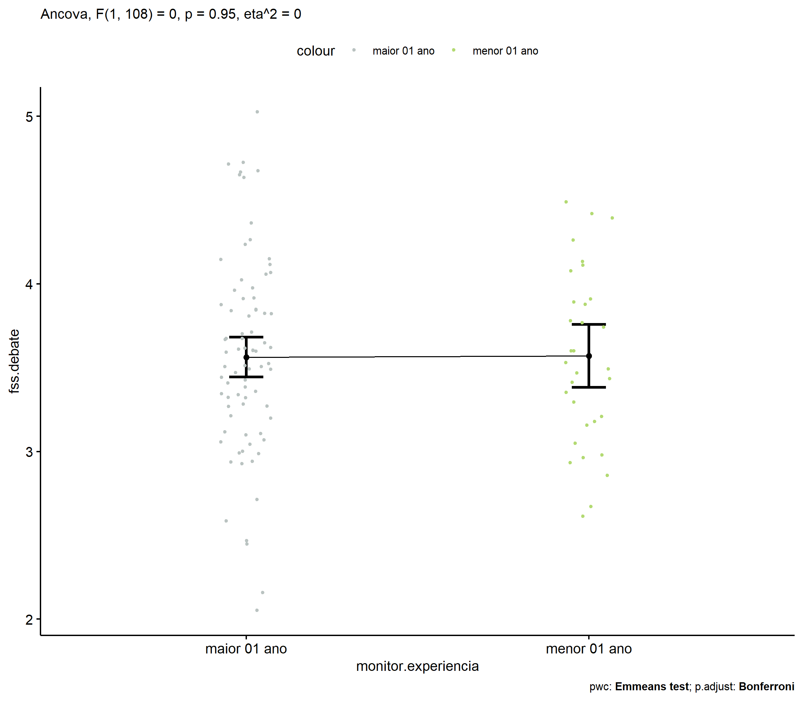<!-- -->

<!-- -->

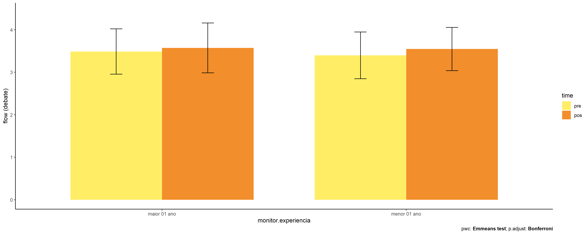<!-- -->
