ANCOVA test for debate (engajamento no debate)
================
Geiser C. Challco <geiser@alumni.usp.br>

- [Descriptive Statistics of Initial
  Data](#descriptive-statistics-of-initial-data)
- [Checking of Assumptions](#checking-of-assumptions)
  - [Assumption: Normality distribution of
    data](#assumption-normality-distribution-of-data)
  - [Assumption: Homogeneity of data
    distribution](#assumption-homogeneity-of-data-distribution)
- [Computation of ANCOVA test and Pairwise
  Comparison](#computation-of-ancova-test-and-pairwise-comparison)
  - [ANCOVA tests for one factor](#ancova-tests-for-one-factor)
  - [ANCOVA tests for two factors](#ancova-tests-for-two-factors)
  - [ANCOVA tests for
    grupo=“Experimental”](#ancova-tests-for-grupoexperimental)
  - [Pairwise comparisons for one
    factor](#pairwise-comparisons-for-one-factor)
    - [factor: **grupo**](#factor-grupo)
    - [factor: **genero**](#factor-genero)
    - [factor: **idade**](#factor-idade)
    - [factor: **zona.participante**](#factor-zonaparticipante)
    - [factor: **escola**](#factor-escola)
    - [factor: **zona.escola**](#factor-zonaescola)
  - [Pairwise comparisons for two
    factors](#pairwise-comparisons-for-two-factors)
    - [factores: **grupo:genero**](#factores-grupogenero)
    - [factores: **grupo:idade**](#factores-grupoidade)
    - [factores:
      **grupo:zona.participante**](#factores-grupozonaparticipante)
    - [factores: **grupo:escola**](#factores-grupoescola)
    - [factores: **grupo:zona.escola**](#factores-grupozonaescola)
  - [Pairwise comparisons for
    grupo=“Experimental”](#pairwise-comparisons-for-grupoexperimental)
    - [factores:
      **grupo=“Experimental”:monitor**](#factores-grupoexperimentalmonitor)
    - [factores:
      **grupo=“Experimental”:monitor.genero**](#factores-grupoexperimentalmonitorgenero)
    - [factores:
      **grupo=“Experimental”:monitor.area**](#factores-grupoexperimentalmonitorarea)
    - [factores:
      **grupo=“Experimental”:monitor.formacao**](#factores-grupoexperimentalmonitorformacao)
    - [factores:
      **grupo=“Experimental”:monitor.experiencia**](#factores-grupoexperimentalmonitorexperiencia)

**NOTE**

- Teste ANCOVA para determinar se houve diferenças significativas em
  referência ao engajamento no debate (medido como estado de fluxo).
- ANCOVA test to determine whether there were significant differences in
  reference to engagement in debate (measured as flow state).

# Descriptive Statistics of Initial Data

| grupo        | genero | idade | zona.participante | escola | zona.escola | variable   |   n |  mean | median |   min |   max |    sd |    se |    ci |   iqr |
|:-------------|:-------|:------|:------------------|:-------|:------------|:-----------|----:|------:|-------:|------:|------:|------:|------:|------:|------:|
| Controle     | F      |       |                   |        |             | fss.debate |  60 | 3.533 |  3.556 | 2.444 | 4.333 | 0.492 | 0.063 | 0.127 | 0.580 |
| Controle     | M      |       |                   |        |             | fss.debate |  62 | 3.322 |  3.333 | 2.111 | 4.222 | 0.501 | 0.064 | 0.127 | 0.667 |
| Experimental | F      |       |                   |        |             | fss.debate |  56 | 3.658 |  3.611 | 2.111 | 4.750 | 0.554 | 0.074 | 0.148 | 0.722 |
| Experimental | M      |       |                   |        |             | fss.debate |  75 | 3.433 |  3.444 | 2.111 | 5.000 | 0.554 | 0.064 | 0.127 | 0.667 |
| Controle     | F      |       |                   |        |             | dfs.debate |  60 | 3.481 |  3.556 | 2.333 | 4.556 | 0.542 | 0.070 | 0.140 | 0.795 |
| Controle     | M      |       |                   |        |             | dfs.debate |  62 | 3.444 |  3.444 | 2.000 | 4.556 | 0.586 | 0.074 | 0.149 | 0.750 |
| Experimental | F      |       |                   |        |             | dfs.debate |  56 | 3.512 |  3.667 | 1.889 | 4.667 | 0.560 | 0.075 | 0.150 | 0.556 |
| Experimental | M      |       |                   |        |             | dfs.debate |  75 | 3.305 |  3.222 | 2.375 | 4.556 | 0.532 | 0.061 | 0.122 | 0.833 |
| Controle     |        | 10y   |                   |        |             | fss.debate |  24 | 3.440 |  3.444 | 2.111 | 4.333 | 0.629 | 0.128 | 0.266 | 1.139 |
| Controle     |        | 11y   |                   |        |             | fss.debate |  65 | 3.424 |  3.444 | 2.111 | 4.333 | 0.479 | 0.059 | 0.119 | 0.639 |
| Controle     |        | 12y   |                   |        |             | fss.debate |  17 | 3.515 |  3.444 | 2.778 | 4.333 | 0.456 | 0.111 | 0.235 | 0.667 |
| Controle     |        | 13y   |                   |        |             | fss.debate |   7 | 3.349 |  3.222 | 2.889 | 3.889 | 0.360 | 0.136 | 0.333 | 0.500 |
| Controle     |        | 14y   |                   |        |             | fss.debate |   1 | 3.667 |  3.667 | 3.667 | 3.667 |       |       |       | 0.000 |
| Controle     |        | 15y   |                   |        |             | fss.debate |   1 | 2.222 |  2.222 | 2.222 | 2.222 |       |       |       | 0.000 |
| Controle     |        | 16y   |                   |        |             | fss.debate |   1 | 3.111 |  3.111 | 3.111 | 3.111 |       |       |       | 0.000 |
| Controle     |        |       |                   |        |             | fss.debate |   6 | 3.434 |  3.444 | 2.714 | 4.111 | 0.495 | 0.202 | 0.519 | 0.556 |
| Experimental |        | 10y   |                   |        |             | fss.debate |  24 | 3.519 |  3.444 | 2.556 | 4.444 | 0.497 | 0.101 | 0.210 | 0.694 |
| Experimental |        | 11y   |                   |        |             | fss.debate |  79 | 3.550 |  3.556 | 2.111 | 5.000 | 0.590 | 0.066 | 0.132 | 0.660 |
| Experimental |        | 12y   |                   |        |             | fss.debate |  16 | 3.653 |  3.667 | 2.667 | 4.556 | 0.511 | 0.128 | 0.273 | 0.500 |
| Experimental |        | 13y   |                   |        |             | fss.debate |   9 | 3.125 |  3.111 | 2.625 | 3.778 | 0.345 | 0.115 | 0.265 | 0.333 |
| Experimental |        | 14y   |                   |        |             | fss.debate |   1 | 4.667 |  4.667 | 4.667 | 4.667 |       |       |       | 0.000 |
| Experimental |        |       |                   |        |             | fss.debate |   2 | 3.056 |  3.056 | 2.889 | 3.222 | 0.236 | 0.167 | 2.118 | 0.167 |
| Controle     |        | 10y   |                   |        |             | dfs.debate |  24 | 3.513 |  3.556 | 2.444 | 4.556 | 0.538 | 0.110 | 0.227 | 0.611 |
| Controle     |        | 11y   |                   |        |             | dfs.debate |  65 | 3.485 |  3.556 | 2.000 | 4.556 | 0.565 | 0.070 | 0.140 | 0.667 |
| Controle     |        | 12y   |                   |        |             | dfs.debate |  17 | 3.533 |  3.444 | 2.778 | 4.500 | 0.533 | 0.129 | 0.274 | 0.667 |
| Controle     |        | 13y   |                   |        |             | dfs.debate |   7 | 3.450 |  3.444 | 2.556 | 4.375 | 0.581 | 0.220 | 0.537 | 0.556 |
| Controle     |        | 14y   |                   |        |             | dfs.debate |   1 | 2.556 |  2.556 | 2.556 | 2.556 |       |       |       | 0.000 |
| Controle     |        | 15y   |                   |        |             | dfs.debate |   1 | 2.111 |  2.111 | 2.111 | 2.111 |       |       |       | 0.000 |
| Controle     |        | 16y   |                   |        |             | dfs.debate |   1 | 3.556 |  3.556 | 3.556 | 3.556 |       |       |       | 0.000 |
| Controle     |        |       |                   |        |             | dfs.debate |   6 | 3.185 |  3.056 | 2.667 | 4.000 | 0.515 | 0.210 | 0.540 | 0.667 |
| Experimental |        | 10y   |                   |        |             | dfs.debate |  24 | 3.296 |  3.333 | 2.333 | 4.444 | 0.522 | 0.107 | 0.220 | 0.833 |
| Experimental |        | 11y   |                   |        |             | dfs.debate |  79 | 3.475 |  3.556 | 1.889 | 4.667 | 0.579 | 0.065 | 0.130 | 0.833 |
| Experimental |        | 12y   |                   |        |             | dfs.debate |  16 | 3.333 |  3.222 | 2.778 | 4.111 | 0.424 | 0.106 | 0.226 | 0.722 |
| Experimental |        | 13y   |                   |        |             | dfs.debate |   9 | 3.154 |  3.111 | 2.500 | 4.000 | 0.533 | 0.178 | 0.409 | 0.778 |
| Experimental |        | 14y   |                   |        |             | dfs.debate |   1 | 2.750 |  2.750 | 2.750 | 2.750 |       |       |       | 0.000 |
| Experimental |        |       |                   |        |             | dfs.debate |   2 | 3.222 |  3.222 | 2.778 | 3.667 | 0.629 | 0.444 | 5.647 | 0.444 |
| Controle     |        |       | Urbana            |        |             | fss.debate |  51 | 3.443 |  3.375 | 2.111 | 4.333 | 0.525 | 0.073 | 0.148 | 0.604 |
| Controle     |        |       | Rural             |        |             | fss.debate |  43 | 3.364 |  3.444 | 2.111 | 4.333 | 0.523 | 0.080 | 0.161 | 0.667 |
| Controle     |        |       |                   |        |             | fss.debate |  28 | 3.488 |  3.646 | 2.556 | 4.222 | 0.446 | 0.084 | 0.173 | 0.583 |
| Experimental |        |       | Urbana            |        |             | fss.debate |  49 | 3.586 |  3.556 | 2.625 | 4.778 | 0.513 | 0.073 | 0.147 | 0.556 |
| Experimental |        |       | Rural             |        |             | fss.debate |  52 | 3.440 |  3.389 | 2.111 | 4.750 | 0.568 | 0.079 | 0.158 | 0.691 |
| Experimental |        |       |                   |        |             | fss.debate |  30 | 3.589 |  3.611 | 2.111 | 5.000 | 0.628 | 0.115 | 0.234 | 0.833 |
| Controle     |        |       | Urbana            |        |             | dfs.debate |  51 | 3.365 |  3.444 | 2.000 | 4.500 | 0.628 | 0.088 | 0.177 | 0.833 |
| Controle     |        |       | Rural             |        |             | dfs.debate |  43 | 3.532 |  3.556 | 2.444 | 4.556 | 0.526 | 0.080 | 0.162 | 0.889 |
| Controle     |        |       |                   |        |             | dfs.debate |  28 | 3.531 |  3.500 | 2.778 | 4.556 | 0.476 | 0.090 | 0.185 | 0.556 |
| Experimental |        |       | Urbana            |        |             | dfs.debate |  49 | 3.388 |  3.444 | 2.222 | 4.667 | 0.572 | 0.082 | 0.164 | 0.778 |
| Experimental |        |       | Rural             |        |             | dfs.debate |  52 | 3.393 |  3.292 | 2.556 | 4.556 | 0.537 | 0.074 | 0.149 | 0.778 |
| Experimental |        |       |                   |        |             | dfs.debate |  30 | 3.405 |  3.556 | 1.889 | 4.222 | 0.562 | 0.103 | 0.210 | 0.639 |
| Controle     |        |       |                   | E1     |             | fss.debate |  12 | 3.361 |  3.333 | 2.222 | 4.333 | 0.596 | 0.172 | 0.379 | 0.778 |
| Controle     |        |       |                   | E2     |             | fss.debate |  22 | 3.363 |  3.333 | 2.111 | 4.333 | 0.610 | 0.130 | 0.271 | 0.851 |
| Controle     |        |       |                   | E3     |             | fss.debate |  15 | 3.421 |  3.444 | 2.778 | 4.333 | 0.417 | 0.108 | 0.231 | 0.389 |
| Controle     |        |       |                   | E4     |             | fss.debate |  15 | 3.393 |  3.222 | 2.778 | 4.333 | 0.482 | 0.125 | 0.267 | 0.778 |
| Controle     |        |       |                   | E5     |             | fss.debate |  47 | 3.474 |  3.444 | 2.111 | 4.333 | 0.510 | 0.074 | 0.150 | 0.604 |
| Controle     |        |       |                   | E6     |             | fss.debate |  11 | 3.465 |  3.667 | 2.556 | 3.778 | 0.358 | 0.108 | 0.240 | 0.333 |
| Experimental |        |       |                   | E1     |             | fss.debate |  10 | 3.779 |  3.611 | 2.500 | 4.667 | 0.645 | 0.204 | 0.461 | 0.608 |
| Experimental |        |       |                   | E2     |             | fss.debate |  26 | 3.427 |  3.389 | 2.625 | 4.222 | 0.424 | 0.083 | 0.171 | 0.528 |
| Experimental |        |       |                   | E3     |             | fss.debate |  15 | 3.231 |  3.333 | 2.111 | 4.222 | 0.576 | 0.149 | 0.319 | 0.611 |
| Experimental |        |       |                   | E4     |             | fss.debate |  14 | 3.714 |  3.653 | 2.778 | 4.750 | 0.572 | 0.153 | 0.330 | 0.653 |
| Experimental |        |       |                   | E5     |             | fss.debate |  53 | 3.504 |  3.556 | 2.111 | 5.000 | 0.580 | 0.080 | 0.160 | 0.778 |
| Experimental |        |       |                   | E6     |             | fss.debate |  13 | 3.786 |  3.889 | 3.111 | 4.444 | 0.496 | 0.138 | 0.300 | 0.778 |
| Controle     |        |       |                   | E1     |             | dfs.debate |  12 | 3.139 |  3.333 | 2.111 | 4.111 | 0.545 | 0.157 | 0.346 | 0.611 |
| Controle     |        |       |                   | E2     |             | dfs.debate |  22 | 3.505 |  3.556 | 2.375 | 4.444 | 0.476 | 0.102 | 0.211 | 0.556 |
| Controle     |        |       |                   | E3     |             | dfs.debate |  15 | 3.643 |  3.556 | 2.778 | 4.556 | 0.555 | 0.143 | 0.308 | 0.778 |
| Controle     |        |       |                   | E4     |             | dfs.debate |  15 | 3.403 |  3.556 | 2.111 | 4.375 | 0.638 | 0.165 | 0.353 | 0.556 |
| Controle     |        |       |                   | E5     |             | dfs.debate |  47 | 3.476 |  3.556 | 2.000 | 4.556 | 0.611 | 0.089 | 0.179 | 0.944 |
| Controle     |        |       |                   | E6     |             | dfs.debate |  11 | 3.505 |  3.444 | 2.778 | 4.111 | 0.349 | 0.105 | 0.235 | 0.278 |
| Experimental |        |       |                   | E1     |             | dfs.debate |  10 | 3.179 |  3.222 | 2.375 | 3.778 | 0.417 | 0.132 | 0.298 | 0.500 |
| Experimental |        |       |                   | E2     |             | dfs.debate |  26 | 3.461 |  3.444 | 2.500 | 4.667 | 0.540 | 0.106 | 0.218 | 0.750 |
| Experimental |        |       |                   | E3     |             | dfs.debate |  15 | 3.496 |  3.778 | 2.556 | 4.556 | 0.696 | 0.180 | 0.386 | 1.000 |
| Experimental |        |       |                   | E4     |             | dfs.debate |  14 | 3.464 |  3.389 | 2.889 | 4.500 | 0.460 | 0.123 | 0.266 | 0.694 |
| Experimental |        |       |                   | E5     |             | dfs.debate |  53 | 3.330 |  3.333 | 1.889 | 4.222 | 0.587 | 0.081 | 0.162 | 0.889 |
| Experimental |        |       |                   | E6     |             | dfs.debate |  13 | 3.491 |  3.667 | 2.667 | 4.111 | 0.421 | 0.117 | 0.254 | 0.556 |
| Controle     |        |       |                   |        | Urbana      | fss.debate |  81 | 3.427 |  3.444 | 2.111 | 4.333 | 0.547 | 0.061 | 0.121 | 0.667 |
| Controle     |        |       |                   |        | Rural       | fss.debate |  41 | 3.422 |  3.444 | 2.556 | 4.333 | 0.418 | 0.065 | 0.132 | 0.556 |
| Experimental |        |       |                   |        | Urbana      | fss.debate |  89 | 3.512 |  3.556 | 2.111 | 5.000 | 0.550 | 0.058 | 0.116 | 0.667 |
| Experimental |        |       |                   |        | Rural       | fss.debate |  42 | 3.564 |  3.528 | 2.111 | 4.750 | 0.594 | 0.092 | 0.185 | 0.774 |
| Controle     |        |       |                   |        | Urbana      | dfs.debate |  81 | 3.434 |  3.444 | 2.000 | 4.556 | 0.575 | 0.064 | 0.127 | 0.889 |
| Controle     |        |       |                   |        | Rural       | dfs.debate |  41 | 3.518 |  3.556 | 2.111 | 4.556 | 0.540 | 0.084 | 0.171 | 0.667 |
| Experimental |        |       |                   |        | Urbana      | dfs.debate |  89 | 3.351 |  3.444 | 1.889 | 4.667 | 0.558 | 0.059 | 0.118 | 0.889 |
| Experimental |        |       |                   |        | Rural       | dfs.debate |  42 | 3.484 |  3.611 | 2.556 | 4.556 | 0.533 | 0.082 | 0.166 | 0.792 |

# Checking of Assumptions

## Assumption: Normality distribution of data

| var        |   n |   skewness |   kurtosis | symmetry | statistic | method     |         p | p.signif | normality |
|:-----------|----:|-----------:|-----------:|:---------|----------:|:-----------|----------:|:---------|:----------|
| fss.debate | 253 |  0.0864540 |  0.0235729 | YES      | 0.4751693 | D’Agostino | 0.7885301 | ns       | \-        |
| fss.debate | 245 | -0.0244359 |  0.2034209 | YES      | 0.8543179 | D’Agostino | 0.6523598 | ns       | \-        |
| fss.debate | 195 |  0.2215811 |  0.0126754 | YES      | 1.8372674 | D’Agostino | 0.3990639 | ns       | QQ        |
| fss.debate | 253 |  0.0540845 | -0.0432749 | YES      | 0.1540031 | D’Agostino | 0.9258884 | ns       | \-        |
| fss.debate | 253 |  0.0721635 |  0.0289832 | YES      | 0.3870111 | D’Agostino | 0.8240653 | ns       | \-        |

## Assumption: Homogeneity of data distribution

| var        | method         | formula                             |   n | DFn.df1 | DFd.df2 | statistic |         p | p.signif |
|:-----------|:---------------|:------------------------------------|----:|--------:|--------:|----------:|----------:|:---------|
| fss.debate | Levene’s test  | `.res`~`grupo`\*`genero`            | 253 |       3 |     249 | 0.7496590 | 0.5234572 | ns       |
| fss.debate | Anova’s slopes | `.res`~`grupo`\*`genero`            | 253 |       3 |     245 | 1.0510000 | 0.3710000 | ns       |
| fss.debate | Levene’s test  | `.res`~`grupo`\*`idade`             | 245 |      11 |     233 | 1.3600121 | 0.1929457 | ns       |
| fss.debate | Anova’s slopes | `.res`~`grupo`\*`idade`             | 245 |       7 |     225 | 0.4530000 | 0.8670000 | ns       |
| fss.debate | Levene’s test  | `.res`~`grupo`\*`zona.participante` | 195 |       3 |     191 | 0.7552954 | 0.5205315 | ns       |
| fss.debate | Anova’s slopes | `.res`~`grupo`\*`zona.participante` | 195 |       3 |     187 | 0.7770000 | 0.5080000 | ns       |
| fss.debate | Levene’s test  | `.res`~`grupo`\*`escola`            | 253 |      11 |     241 | 0.6647433 | 0.7711715 | ns       |
| fss.debate | Anova’s slopes | `.res`~`grupo`\*`escola`            | 253 |      11 |     229 | 1.4520000 | 0.1510000 | ns       |
| fss.debate | Levene’s test  | `.res`~`grupo`\*`zona.escola`       | 253 |       3 |     249 | 0.8985271 | 0.4425323 | ns       |
| fss.debate | Anova’s slopes | `.res`~`grupo`\*`zona.escola`       | 253 |       3 |     245 | 2.1080000 | 0.1000000 | ns       |

# Computation of ANCOVA test and Pairwise Comparison

## ANCOVA tests for one factor

|     | Effect            | DFn | DFd |    SSn |    SSd |      F | p       |   ges | p\<.05 |
|:----|:------------------|----:|----:|-------:|-------:|-------:|:--------|------:|:-------|
| 1   | dfs.debate        |   1 | 250 | 10.757 | 61.361 | 43.828 | \<0.001 | 0.149 | \*     |
| 2   | grupo             |   1 | 250 |  1.040 | 61.361 |  4.237 | 0.041   | 0.017 | \*     |
| 4   | genero            |   1 | 250 |  1.705 | 60.696 |  7.024 | 0.009   | 0.027 | \*     |
| 6   | idade             |   6 | 237 |  3.654 | 57.143 |  2.526 | 0.022   | 0.060 | \*     |
| 8   | zona.participante |   1 | 192 |  0.867 | 48.247 |  3.449 | 0.065   | 0.018 |        |
| 10  | escola            |   5 | 246 |  3.050 | 59.351 |  2.529 | 0.03    | 0.049 | \*     |
| 12  | zona.escola       |   1 | 250 |  0.018 | 62.383 |  0.074 | 0.786   | 0.000 |        |

## ANCOVA tests for two factors

|     | Effect                  | DFn | DFd |   SSn |    SSd |      F | p       |   ges | p\<.05 |
|:----|:------------------------|----:|----:|------:|-------:|-------:|:--------|------:|:-------|
| 1   | dfs.debate              |   1 | 248 | 9.683 | 59.460 | 40.388 | \<0.001 | 0.140 | \*     |
| 4   | grupo:genero            |   1 | 248 | 0.032 | 59.460 |  0.133 | 0.715   | 0.001 |        |
| 8   | grupo:idade             |   4 | 232 | 0.612 | 55.383 |  0.641 | 0.634   | 0.011 |        |
| 12  | grupo:zona.participante |   1 | 190 | 0.002 | 47.438 |  0.008 | 0.93    | 0.000 |        |
| 16  | grupo:escola            |   5 | 240 | 1.430 | 56.790 |  1.208 | 0.306   | 0.025 |        |
| 20  | grupo:zona.escola       |   1 | 248 | 0.020 | 61.325 |  0.082 | 0.775   | 0.000 |        |

## ANCOVA tests for grupo=“Experimental”

|     | Effect              | DFn | DFd |   SSn |    SSd |      F | p       |   ges | p\<.05 |
|:----|:--------------------|----:|----:|------:|-------:|-------:|:--------|------:|:-------|
| 1   | dfs.debate          |   1 | 111 | 5.856 | 27.343 | 23.771 | \<0.001 | 0.176 | \*     |
| 2   | monitor             |   9 | 111 | 5.839 | 27.343 |  2.634 | 0.008   | 0.176 | \*     |
| 4   | monitor.genero      |   1 | 119 | 0.925 | 32.257 |  3.412 | 0.067   | 0.028 |        |
| 6   | monitor.area        |   8 | 112 | 5.416 | 27.766 |  2.731 | 0.009   | 0.163 | \*     |
| 8   | monitor.formacao    |   2 | 118 | 0.362 | 32.820 |  0.650 | 0.524   | 0.011 |        |
| 10  | monitor.experiencia |   1 | 119 | 0.000 | 33.182 |  0.001 | 0.975   | 0.000 |        |

## Pairwise comparisons for one factor

### factor: **grupo**

| var        | grupo        |   n | M (pre) | SE (pre) | M (unadj) | SE (unadj) | M (adj) | SE (adj) |
|:-----------|:-------------|----:|--------:|---------:|----------:|-----------:|--------:|---------:|
| fss.debate | Controle     | 122 |   3.462 |    0.051 |     3.426 |      0.046 |   3.413 |    0.045 |
| fss.debate | Experimental | 131 |   3.394 |    0.048 |     3.529 |      0.049 |   3.541 |    0.043 |

| .y.        | group1   | group2       | estimate | conf.low | conf.high |    se | statistic |     p | p.adj | p.adj.signif |
|:-----------|:---------|:-------------|---------:|---------:|----------:|------:|----------:|------:|------:|:-------------|
| fss.debate | Controle | Experimental |   -0.129 |   -0.252 |    -0.006 | 0.062 |    -2.058 | 0.041 | 0.041 | \*           |
| dfs.debate | Controle | Experimental |    0.068 |   -0.070 |     0.206 | 0.070 |     0.976 | 0.330 | 0.330 | ns           |

| .y.         | grupo        | group1 | group2 | estimate | conf.low | conf.high |    se | statistic |     p | p.adj | p.adj.signif |
|:------------|:-------------|:-------|:-------|---------:|---------:|----------:|------:|----------:|------:|------:|:-------------|
| flow.debate | Controle     | pre    | pos    |    0.036 |   -0.101 |     0.174 | 0.070 |     0.520 | 0.603 | 0.603 | ns           |
| flow.debate | Experimental | pre    | pos    |   -0.135 |   -0.268 |    -0.002 | 0.068 |    -2.001 | 0.046 | 0.046 | \*           |

    ## Scale for colour is already present.
    ## Adding another scale for colour, which will replace the existing scale.

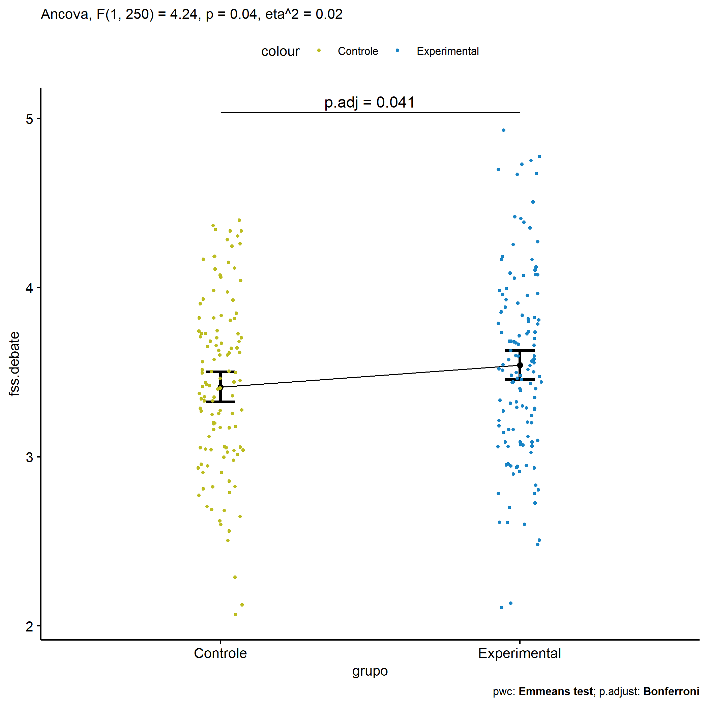<!-- -->

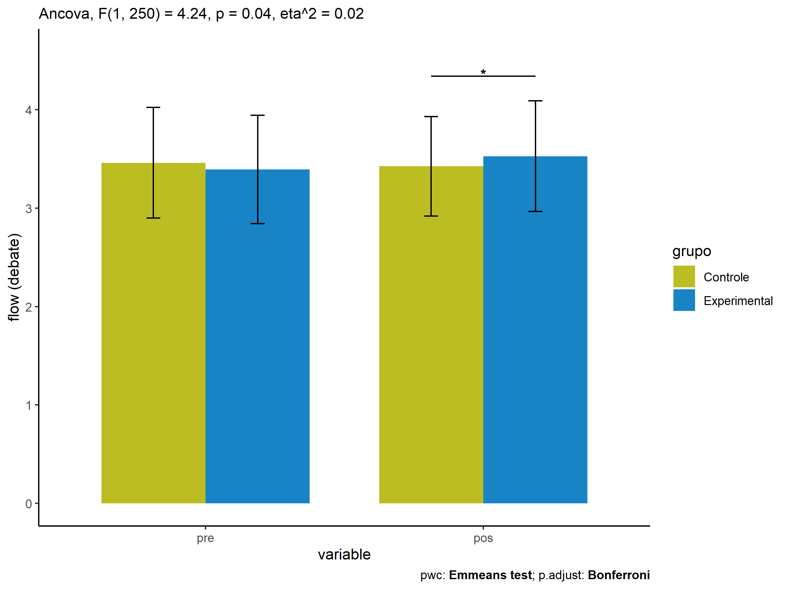<!-- -->

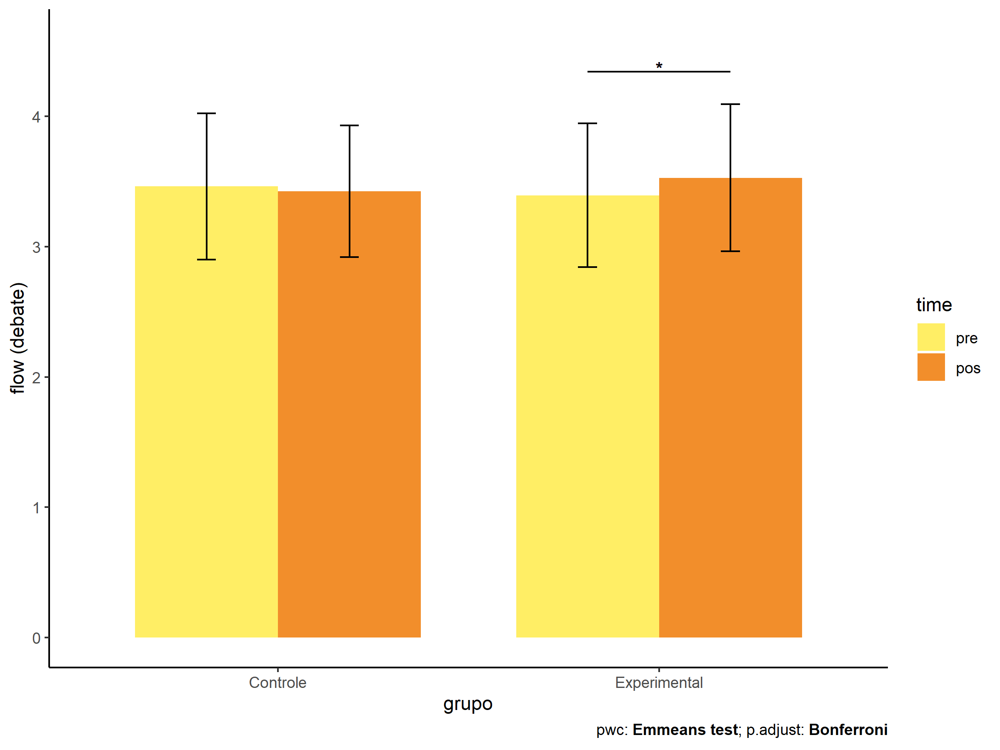<!-- -->

### factor: **genero**

| var        | genero |   n | M (pre) | SE (pre) | M (unadj) | SE (unadj) | M (adj) | SE (adj) |
|:-----------|:-------|----:|--------:|---------:|----------:|-----------:|--------:|---------:|
| fss.debate | F      | 116 |   3.496 |    0.051 |     3.593 |      0.049 |   3.569 |    0.046 |
| fss.debate | M      | 137 |   3.368 |    0.048 |     3.383 |      0.045 |   3.403 |    0.042 |

| .y.        | group1 | group2 | estimate | conf.low | conf.high |    se | statistic |     p | p.adj | p.adj.signif |
|:-----------|:-------|:-------|---------:|---------:|----------:|------:|----------:|------:|------:|:-------------|
| fss.debate | F      | M      |    0.166 |    0.043 |     0.289 | 0.063 |     2.650 | 0.009 | 0.009 | \*\*         |
| dfs.debate | F      | M      |    0.128 |   -0.010 |     0.266 | 0.070 |     1.832 | 0.068 | 0.068 | ns           |

| .y.         | genero | group1 | group2 | estimate | conf.low | conf.high |    se | statistic |     p | p.adj | p.adj.signif |
|:------------|:-------|:-------|:-------|---------:|---------:|----------:|------:|----------:|------:|------:|:-------------|
| flow.debate | F      | pre    | pos    |   -0.097 |   -0.237 |     0.043 | 0.071 |    -1.364 | 0.173 | 0.173 | ns           |
| flow.debate | M      | pre    | pos    |   -0.015 |   -0.143 |     0.114 | 0.065 |    -0.225 | 0.822 | 0.822 | ns           |

    ## Scale for colour is already present.
    ## Adding another scale for colour, which will replace the existing scale.

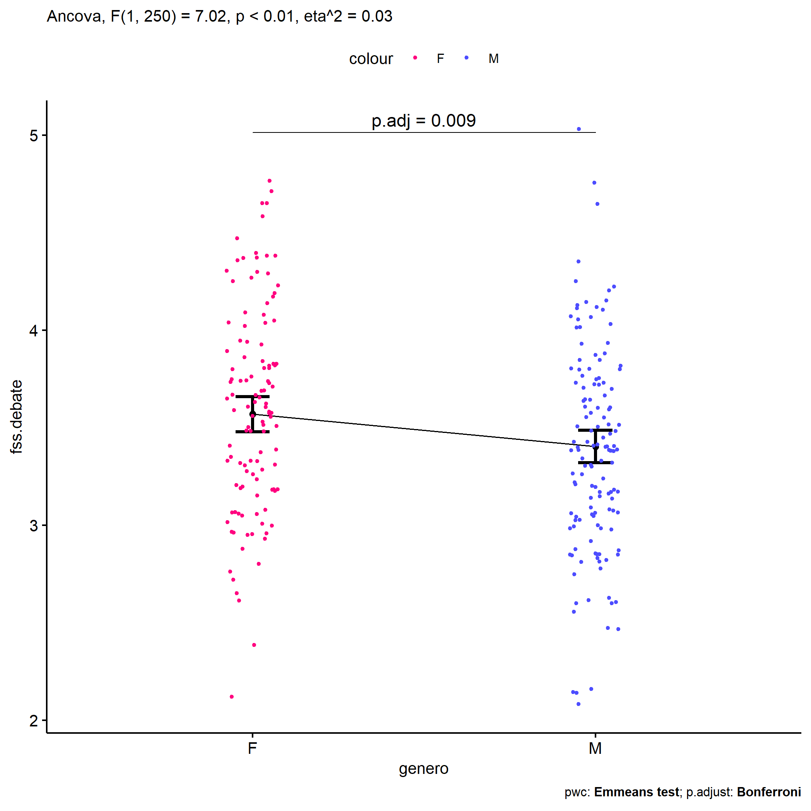<!-- -->

<!-- -->

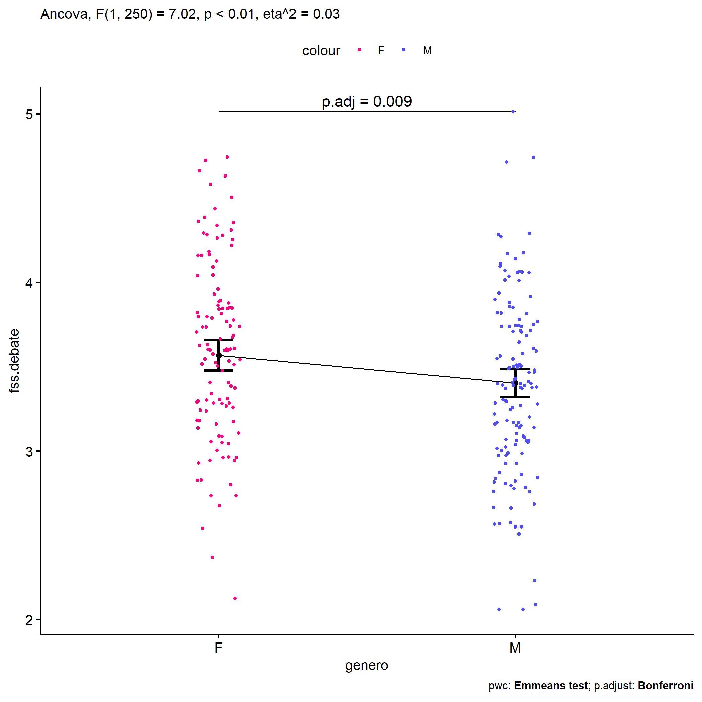<!-- -->

### factor: **idade**

| var        | idade |   n | M (pre) | SE (pre) | M (unadj) | SE (unadj) | M (adj) | SE (adj) |
|:-----------|:------|----:|--------:|---------:|----------:|-----------:|--------:|---------:|
| fss.debate | 10y   |  48 |   3.405 |    0.077 |     3.479 |      0.081 |   3.495 |    0.071 |
| fss.debate | 11y   | 144 |   3.480 |    0.048 |     3.493 |      0.045 |   3.481 |    0.041 |
| fss.debate | 12y   |  33 |   3.436 |    0.085 |     3.582 |      0.084 |   3.585 |    0.085 |
| fss.debate | 13y   |  16 |   3.284 |    0.139 |     3.223 |      0.090 |   3.283 |    0.123 |

| .y.        | group1 | group2 | estimate | conf.low | conf.high |    se | statistic |     p | p.adj | p.adj.signif |
|:-----------|:-------|:-------|---------:|---------:|----------:|------:|----------:|------:|------:|:-------------|
| fss.debate | 10y    | 11y    |    0.014 |   -0.147 |     0.175 | 0.082 |     0.168 | 0.867 | 1.000 | ns           |
| fss.debate | 10y    | 12y    |   -0.091 |   -0.309 |     0.128 | 0.111 |    -0.817 | 0.415 | 1.000 | ns           |
| fss.debate | 10y    | 13y    |    0.212 |   -0.067 |     0.491 | 0.142 |     1.495 | 0.136 | 0.817 | ns           |
| fss.debate | 11y    | 12y    |   -0.104 |   -0.291 |     0.082 | 0.095 |    -1.102 | 0.271 | 1.000 | ns           |
| fss.debate | 11y    | 13y    |    0.198 |   -0.057 |     0.454 | 0.130 |     1.528 | 0.128 | 0.768 | ns           |
| fss.debate | 12y    | 13y    |    0.302 |    0.008 |     0.597 | 0.150 |     2.022 | 0.044 | 0.266 | ns           |
| dfs.debate | 10y    | 11y    |   -0.075 |   -0.256 |     0.106 | 0.092 |    -0.817 | 0.415 | 1.000 | ns           |
| dfs.debate | 10y    | 12y    |   -0.032 |   -0.278 |     0.215 | 0.125 |    -0.252 | 0.801 | 1.000 | ns           |
| dfs.debate | 10y    | 13y    |    0.121 |   -0.193 |     0.435 | 0.159 |     0.757 | 0.450 | 1.000 | ns           |
| dfs.debate | 11y    | 12y    |    0.044 |   -0.166 |     0.254 | 0.107 |     0.410 | 0.683 | 1.000 | ns           |
| dfs.debate | 11y    | 13y    |    0.196 |   -0.091 |     0.483 | 0.146 |     1.346 | 0.180 | 1.000 | ns           |
| dfs.debate | 12y    | 13y    |    0.152 |   -0.179 |     0.484 | 0.168 |     0.905 | 0.367 | 1.000 | ns           |

| .y.         | idade | group1 | group2 | estimate | conf.low | conf.high |    se | statistic |     p | p.adj | p.adj.signif |
|:------------|:------|:-------|:-------|---------:|---------:|----------:|------:|----------:|------:|------:|:-------------|
| flow.debate | 10y   | pre    | pos    |   -0.075 |   -0.292 |     0.142 | 0.110 |    -0.678 | 0.498 | 0.498 | ns           |
| flow.debate | 11y   | pre    | pos    |   -0.014 |   -0.139 |     0.112 | 0.064 |    -0.216 | 0.829 | 0.829 | ns           |
| flow.debate | 12y   | pre    | pos    |   -0.146 |   -0.407 |     0.116 | 0.133 |    -1.093 | 0.275 | 0.275 | ns           |
| flow.debate | 13y   | pre    | pos    |    0.061 |   -0.315 |     0.437 | 0.191 |     0.318 | 0.751 | 0.751 | ns           |

    ## Scale for colour is already present.
    ## Adding another scale for colour, which will replace the existing scale.

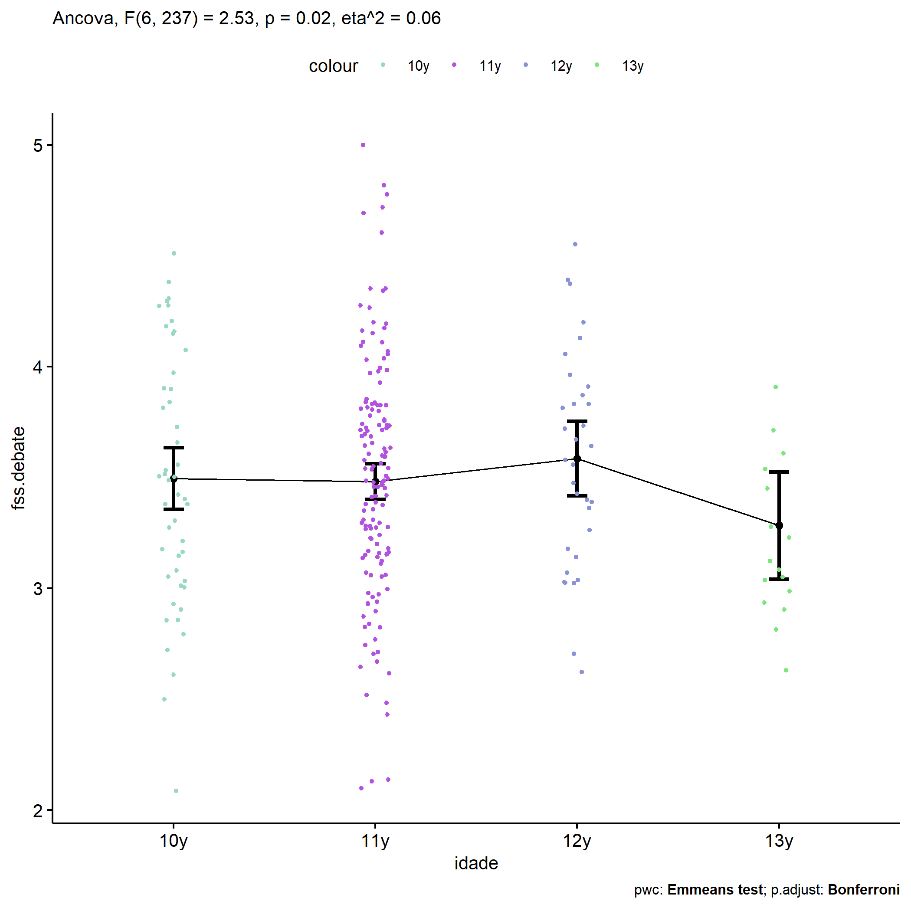<!-- -->

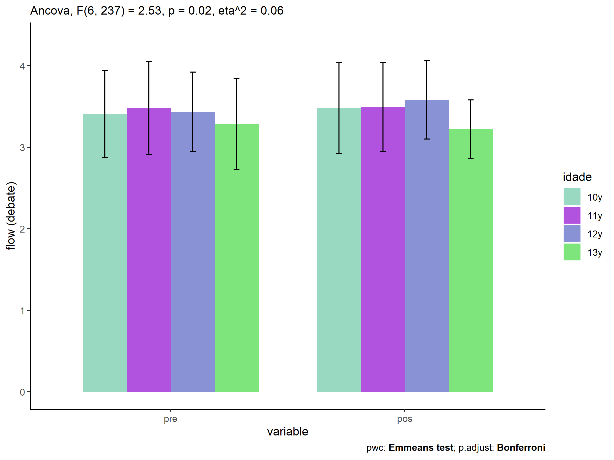<!-- -->

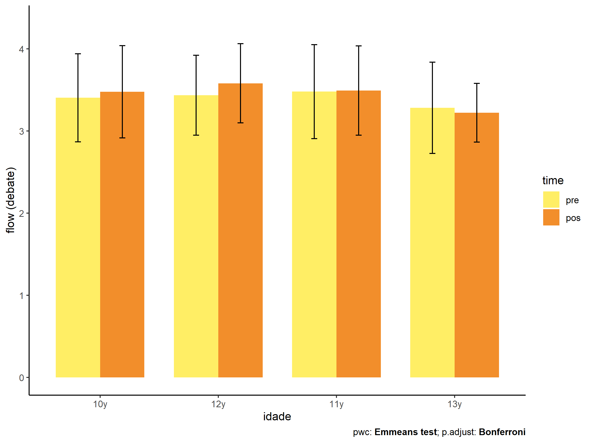<!-- -->

### factor: **zona.participante**

| var        | zona.participante |   n | M (pre) | SE (pre) | M (unadj) | SE (unadj) | M (adj) | SE (adj) |
|:-----------|:------------------|----:|--------:|---------:|----------:|-----------:|--------:|---------:|
| fss.debate | Rural             |  95 |   3.456 |    0.055 |     3.406 |      0.056 |   3.392 |    0.051 |
| fss.debate | Urbana            | 100 |   3.376 |    0.060 |     3.513 |      0.052 |   3.526 |    0.050 |

| .y.        | group1 | group2 | estimate | conf.low | conf.high |    se | statistic |     p | p.adj | p.adj.signif |
|:-----------|:-------|:-------|---------:|---------:|----------:|------:|----------:|------:|------:|:-------------|
| fss.debate | Urbana | Rural  |    0.134 |   -0.008 |     0.276 | 0.072 |     1.857 | 0.065 | 0.065 | ns           |
| dfs.debate | Urbana | Rural  |   -0.079 |   -0.240 |     0.081 | 0.081 |    -0.976 | 0.331 | 0.331 | ns           |

| .y.         | zona.participante | group1 | group2 | estimate | conf.low | conf.high |    se | statistic |     p | p.adj | p.adj.signif |
|:------------|:------------------|:-------|:-------|---------:|---------:|----------:|------:|----------:|------:|------:|:-------------|
| flow.debate | Urbana            | pre    | pos    |   -0.137 |   -0.290 |     0.016 | 0.078 |    -1.757 | 0.080 | 0.080 | ns           |
| flow.debate | Rural             | pre    | pos    |    0.050 |   -0.107 |     0.207 | 0.080 |     0.625 | 0.532 | 0.532 | ns           |

    ## Scale for colour is already present.
    ## Adding another scale for colour, which will replace the existing scale.

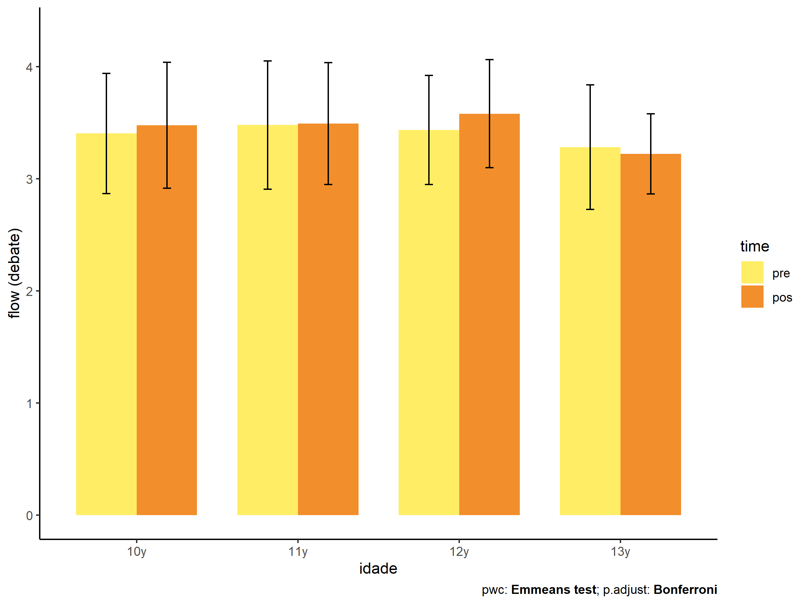<!-- -->

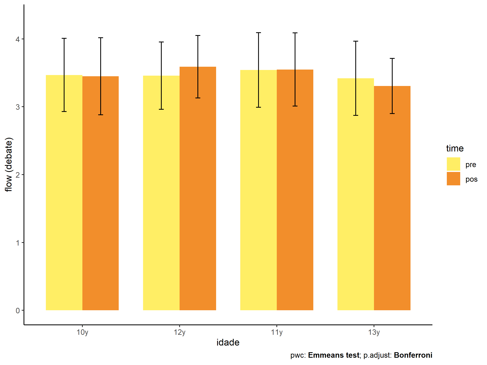<!-- -->

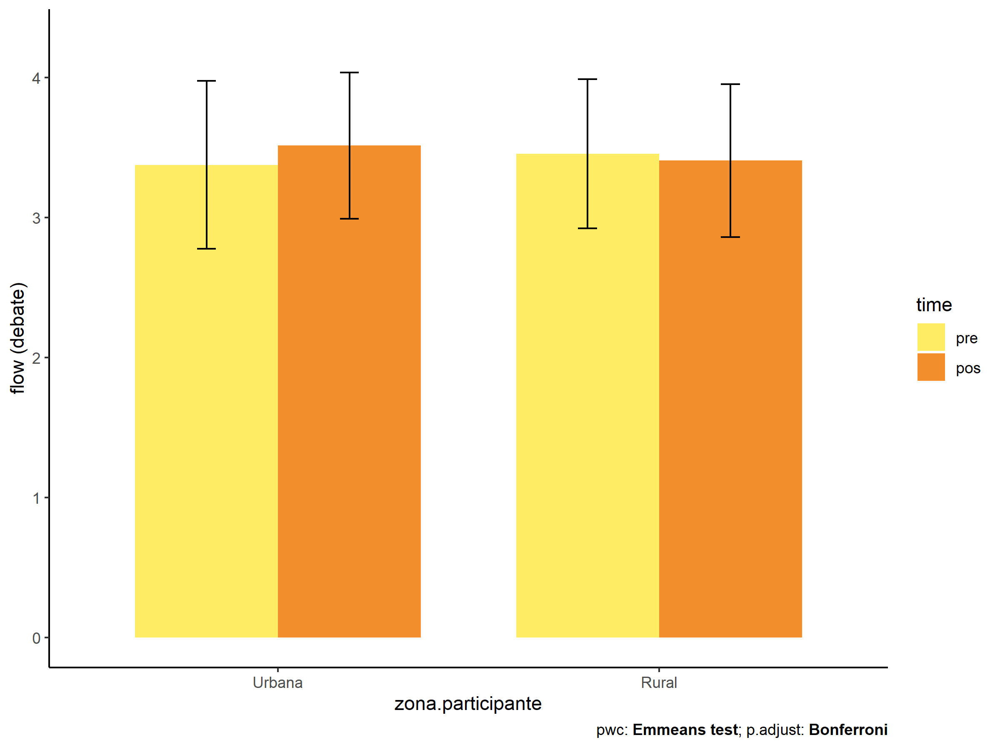<!-- -->

### factor: **escola**

| var        | escola |   n | M (pre) | SE (pre) | M (unadj) | SE (unadj) | M (adj) | SE (adj) |
|:-----------|:-------|----:|--------:|---------:|----------:|-----------:|--------:|---------:|
| fss.debate | E1     |  22 |   3.157 |    0.102 |     3.551 |      0.136 |   3.656 |    0.106 |
| fss.debate | E2     |  48 |   3.481 |    0.073 |     3.398 |      0.074 |   3.376 |    0.071 |
| fss.debate | E3     |  30 |   3.569 |    0.114 |     3.326 |      0.092 |   3.270 |    0.090 |
| fss.debate | E4     |  29 |   3.432 |    0.102 |     3.548 |      0.101 |   3.546 |    0.091 |
| fss.debate | E5     | 100 |   3.398 |    0.060 |     3.490 |      0.055 |   3.501 |    0.049 |
| fss.debate | E6     |  24 |   3.498 |    0.078 |     3.639 |      0.094 |   3.611 |    0.100 |

| .y.        | group1 | group2 | estimate | conf.low | conf.high |    se | statistic |     p | p.adj | p.adj.signif |
|:-----------|:-------|:-------|---------:|---------:|----------:|------:|----------:|------:|------:|:-------------|
| fss.debate | E1     | E2     |    0.280 |    0.028 |     0.532 | 0.128 |     2.192 | 0.029 | 0.440 | ns           |
| fss.debate | E1     | E3     |    0.386 |    0.111 |     0.662 | 0.140 |     2.763 | 0.006 | 0.093 | ns           |
| fss.debate | E1     | E4     |    0.111 |   -0.164 |     0.386 | 0.140 |     0.793 | 0.429 | 1.000 | ns           |
| fss.debate | E1     | E5     |    0.155 |   -0.074 |     0.385 | 0.116 |     1.333 | 0.184 | 1.000 | ns           |
| fss.debate | E1     | E6     |    0.045 |   -0.243 |     0.333 | 0.146 |     0.310 | 0.757 | 1.000 | ns           |
| fss.debate | E2     | E3     |    0.106 |   -0.119 |     0.332 | 0.114 |     0.928 | 0.354 | 1.000 | ns           |
| fss.debate | E2     | E4     |   -0.169 |   -0.397 |     0.058 | 0.116 |    -1.465 | 0.144 | 1.000 | ns           |
| fss.debate | E2     | E5     |   -0.125 |   -0.295 |     0.045 | 0.086 |    -1.445 | 0.150 | 1.000 | ns           |
| fss.debate | E2     | E6     |   -0.235 |   -0.477 |     0.007 | 0.123 |    -1.912 | 0.057 | 0.856 | ns           |
| fss.debate | E3     | E4     |   -0.275 |   -0.528 |    -0.023 | 0.128 |    -2.150 | 0.033 | 0.488 | ns           |
| fss.debate | E3     | E5     |   -0.231 |   -0.433 |    -0.029 | 0.103 |    -2.249 | 0.025 | 0.381 | ns           |
| fss.debate | E3     | E6     |   -0.341 |   -0.606 |    -0.076 | 0.135 |    -2.534 | 0.012 | 0.179 | ns           |
| fss.debate | E4     | E5     |    0.044 |   -0.160 |     0.249 | 0.104 |     0.429 | 0.668 | 1.000 | ns           |
| fss.debate | E4     | E6     |   -0.066 |   -0.333 |     0.202 | 0.136 |    -0.483 | 0.629 | 1.000 | ns           |
| fss.debate | E5     | E6     |   -0.110 |   -0.330 |     0.110 | 0.112 |    -0.984 | 0.326 | 1.000 | ns           |
| dfs.debate | E1     | E2     |   -0.324 |   -0.604 |    -0.043 | 0.142 |    -2.273 | 0.024 | 0.358 | ns           |
| dfs.debate | E1     | E3     |   -0.412 |   -0.718 |    -0.106 | 0.155 |    -2.655 | 0.008 | 0.127 | ns           |
| dfs.debate | E1     | E4     |   -0.275 |   -0.583 |     0.033 | 0.156 |    -1.760 | 0.080 | 1.000 | ns           |
| dfs.debate | E1     | E5     |   -0.241 |   -0.498 |     0.015 | 0.130 |    -1.851 | 0.065 | 0.981 | ns           |
| dfs.debate | E1     | E6     |   -0.340 |   -0.662 |    -0.019 | 0.163 |    -2.085 | 0.038 | 0.571 | ns           |
| dfs.debate | E2     | E3     |   -0.088 |   -0.342 |     0.165 | 0.129 |    -0.687 | 0.493 | 1.000 | ns           |
| dfs.debate | E2     | E4     |    0.049 |   -0.208 |     0.305 | 0.130 |     0.373 | 0.710 | 1.000 | ns           |
| dfs.debate | E2     | E5     |    0.083 |   -0.109 |     0.274 | 0.097 |     0.851 | 0.396 | 1.000 | ns           |
| dfs.debate | E2     | E6     |   -0.017 |   -0.289 |     0.256 | 0.138 |    -0.121 | 0.904 | 1.000 | ns           |
| dfs.debate | E3     | E4     |    0.137 |   -0.147 |     0.421 | 0.144 |     0.951 | 0.343 | 1.000 | ns           |
| dfs.debate | E3     | E5     |    0.171 |   -0.056 |     0.398 | 0.115 |     1.486 | 0.139 | 1.000 | ns           |
| dfs.debate | E3     | E6     |    0.072 |   -0.227 |     0.370 | 0.152 |     0.474 | 0.636 | 1.000 | ns           |
| dfs.debate | E4     | E5     |    0.034 |   -0.196 |     0.264 | 0.117 |     0.293 | 0.770 | 1.000 | ns           |
| dfs.debate | E4     | E6     |   -0.065 |   -0.366 |     0.235 | 0.153 |    -0.427 | 0.670 | 1.000 | ns           |
| dfs.debate | E5     | E6     |   -0.099 |   -0.347 |     0.148 | 0.126 |    -0.790 | 0.430 | 1.000 | ns           |

| .y.         | escola | group1 | group2 | estimate | conf.low | conf.high |    se | statistic |     p | p.adj | p.adj.signif |
|:------------|:-------|:-------|:-------|---------:|---------:|----------:|------:|----------:|------:|------:|:-------------|
| flow.debate | E1     | pre    | pos    |   -0.394 |   -0.717 |    -0.071 | 0.164 |    -2.399 | 0.017 | 0.017 | \*           |
| flow.debate | E2     | pre    | pos    |    0.083 |   -0.135 |     0.302 | 0.111 |     0.750 | 0.453 | 0.453 | ns           |
| flow.debate | E3     | pre    | pos    |    0.244 |   -0.033 |     0.520 | 0.141 |     1.732 | 0.084 | 0.084 | ns           |
| flow.debate | E4     | pre    | pos    |   -0.115 |   -0.396 |     0.166 | 0.143 |    -0.807 | 0.420 | 0.420 | ns           |
| flow.debate | E5     | pre    | pos    |   -0.092 |   -0.243 |     0.060 | 0.077 |    -1.191 | 0.234 | 0.234 | ns           |
| flow.debate | E6     | pre    | pos    |   -0.141 |   -0.450 |     0.168 | 0.157 |    -0.898 | 0.369 | 0.369 | ns           |

    ## Scale for colour is already present.
    ## Adding another scale for colour, which will replace the existing scale.

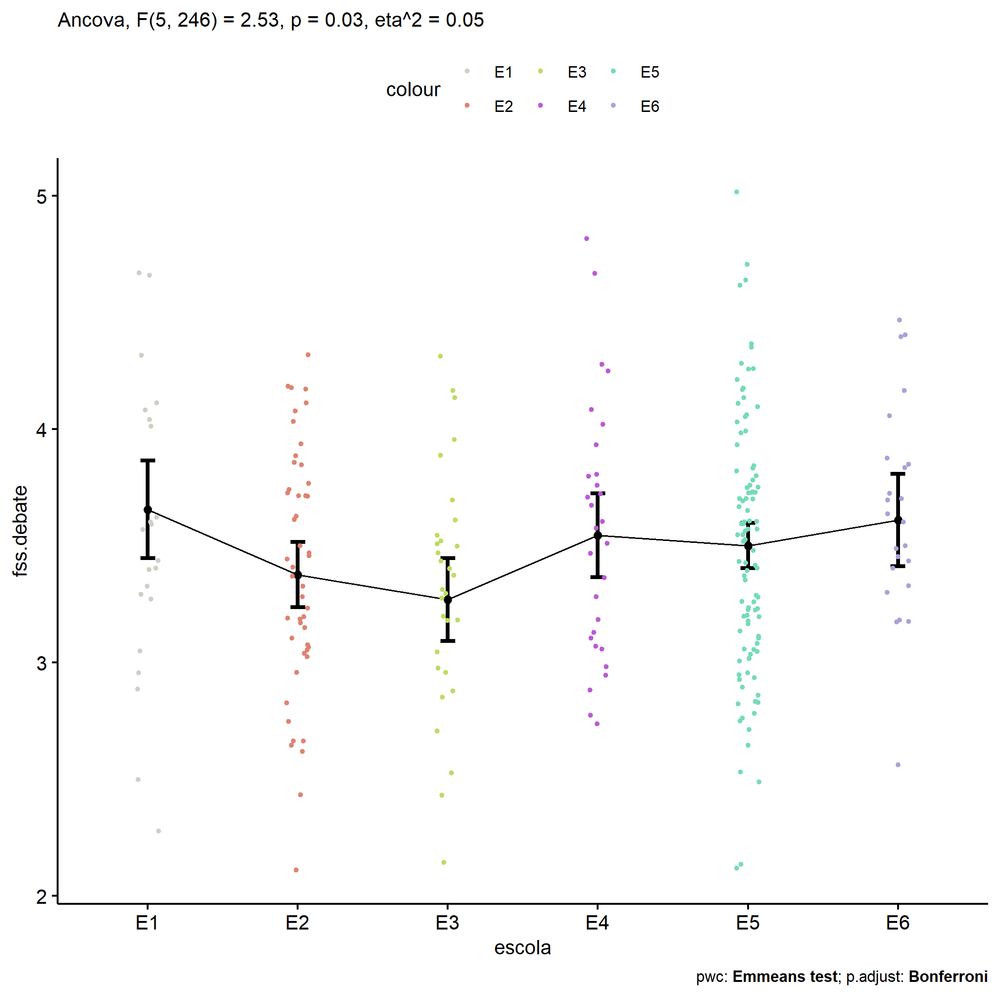<!-- -->

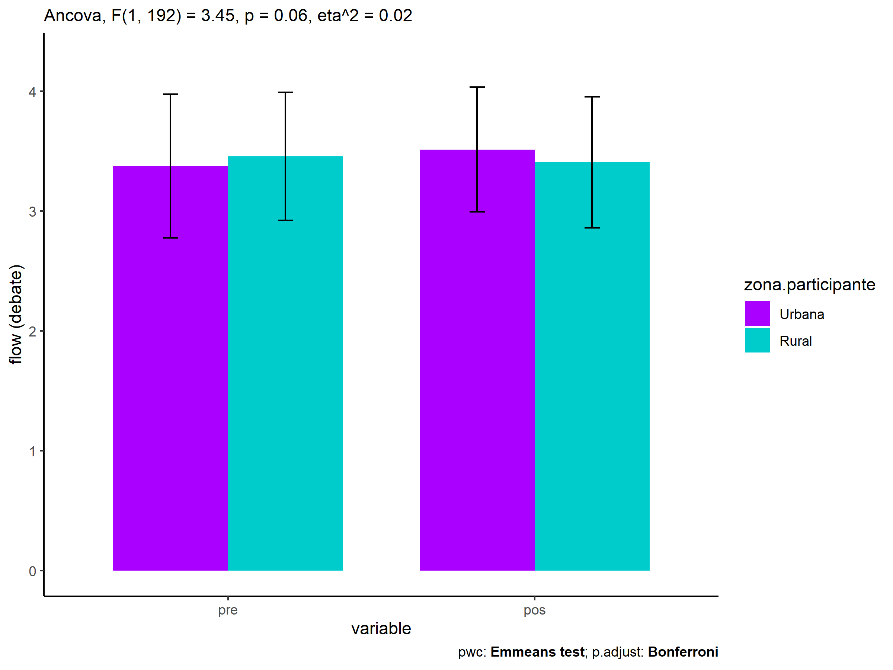<!-- -->

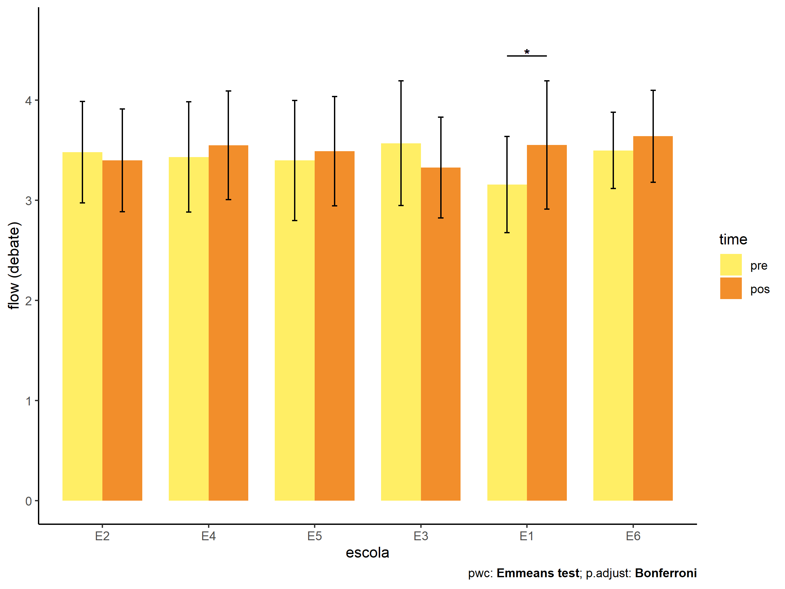<!-- -->

### factor: **zona.escola**

| var        | zona.escola |   n | M (pre) | SE (pre) | M (unadj) | SE (unadj) | M (adj) | SE (adj) |
|:-----------|:------------|----:|--------:|---------:|----------:|-----------:|--------:|---------:|
| fss.debate | Rural       |  83 |   3.501 |    0.059 |     3.494 |      0.057 |   3.467 |    0.055 |
| fss.debate | Urbana      | 170 |   3.390 |    0.043 |     3.472 |      0.042 |   3.485 |    0.038 |

| .y.        | group1 | group2 | estimate | conf.low | conf.high |    se | statistic |     p | p.adj | p.adj.signif |
|:-----------|:-------|:-------|---------:|---------:|----------:|------:|----------:|------:|------:|:-------------|
| fss.debate | Urbana | Rural  |    0.018 |   -0.114 |     0.151 | 0.067 |     0.272 | 0.786 | 0.786 | ns           |
| dfs.debate | Urbana | Rural  |   -0.110 |   -0.257 |     0.036 | 0.074 |    -1.484 | 0.139 | 0.139 | ns           |

| .y.         | zona.escola | group1 | group2 | estimate | conf.low | conf.high |    se | statistic |     p | p.adj | p.adj.signif |
|:------------|:------------|:-------|:-------|---------:|---------:|----------:|------:|----------:|------:|------:|:-------------|
| flow.debate | Urbana      | pre    | pos    |   -0.081 |   -0.198 |     0.035 | 0.059 |    -1.372 | 0.171 | 0.171 | ns           |
| flow.debate | Rural       | pre    | pos    |    0.007 |   -0.160 |     0.174 | 0.085 |     0.081 | 0.936 | 0.936 | ns           |

    ## Scale for colour is already present.
    ## Adding another scale for colour, which will replace the existing scale.

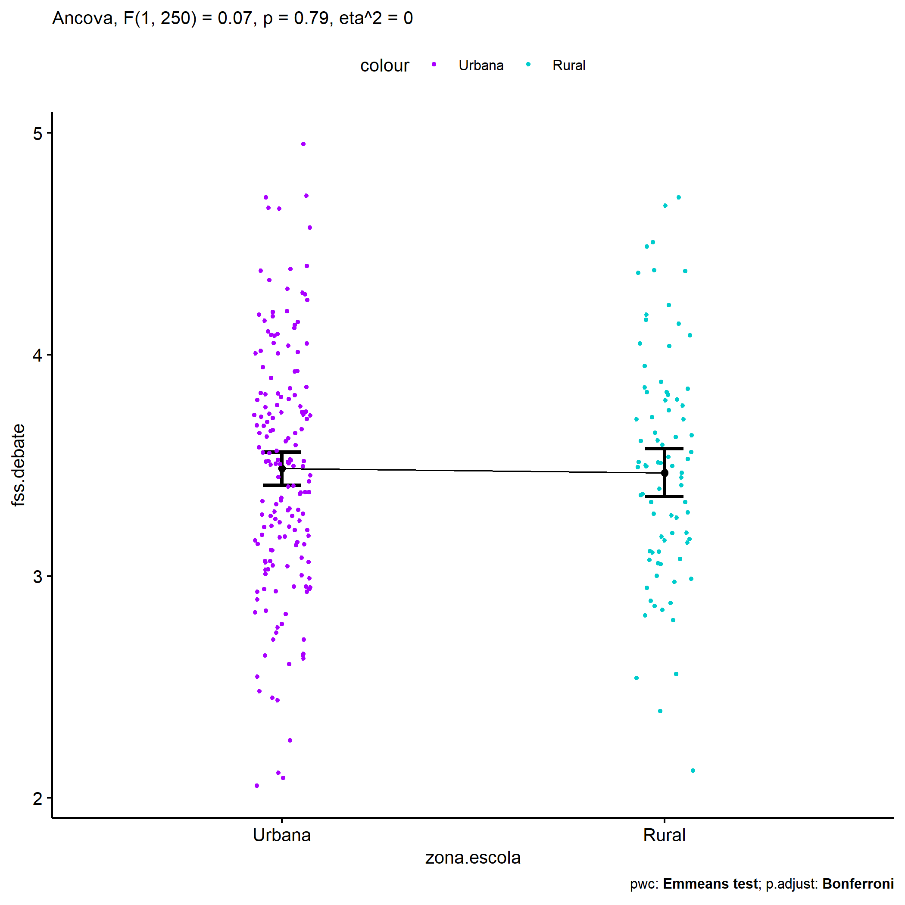<!-- -->

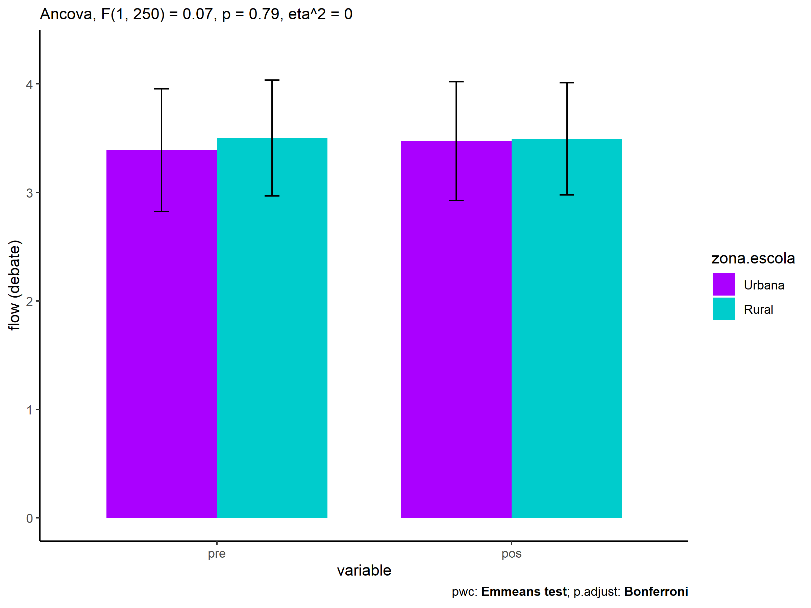<!-- -->

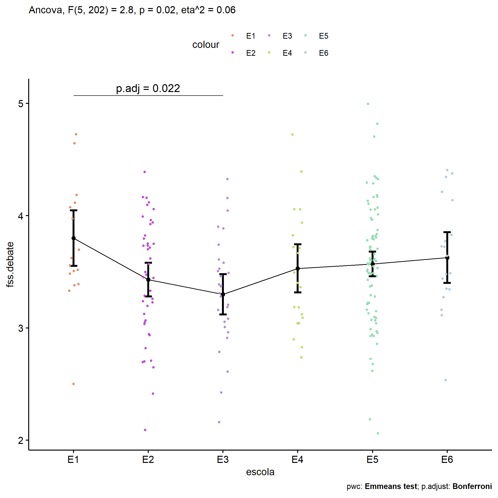<!-- -->

## Pairwise comparisons for two factors

### factores: **grupo:genero**

| var        | grupo        | genero |   n | M (pre) | SE (pre) | M (unadj) | SE (unadj) | M (adj) | SE (adj) |
|:-----------|:-------------|:-------|----:|--------:|---------:|----------:|-----------:|--------:|---------:|
| fss.debate | Controle     | F      |  60 |   3.481 |    0.070 |     3.533 |      0.063 |   3.513 |    0.063 |
| fss.debate | Controle     | M      |  62 |   3.444 |    0.074 |     3.322 |      0.064 |   3.316 |    0.062 |
| fss.debate | Experimental | F      |  56 |   3.512 |    0.075 |     3.658 |      0.074 |   3.627 |    0.066 |
| fss.debate | Experimental | M      |  75 |   3.305 |    0.061 |     3.433 |      0.064 |   3.476 |    0.057 |

| .y.        | grupo        | genero | group1   | group2       | estimate | conf.low | conf.high |    se | statistic |     p | p.adj | p.adj.signif |
|:-----------|:-------------|:-------|:---------|:-------------|---------:|---------:|----------:|------:|----------:|------:|------:|:-------------|
| fss.debate |              | F      | Controle | Experimental |   -0.114 |   -0.293 |     0.065 | 0.091 |    -1.255 | 0.211 | 0.211 | ns           |
| fss.debate |              | M      | Controle | Experimental |   -0.160 |   -0.326 |     0.007 | 0.084 |    -1.890 | 0.060 | 0.060 | ns           |
| dfs.debate |              | F      | Controle | Experimental |   -0.031 |   -0.233 |     0.172 | 0.103 |    -0.298 | 0.766 | 0.766 | ns           |
| dfs.debate |              | M      | Controle | Experimental |    0.138 |   -0.049 |     0.325 | 0.095 |     1.452 | 0.148 | 0.148 | ns           |
| fss.debate | Controle     |        | F        | M            |    0.197 |    0.022 |     0.372 | 0.089 |     2.221 | 0.027 | 0.027 | \*           |
| fss.debate | Experimental |        | F        | M            |    0.152 |   -0.020 |     0.323 | 0.087 |     1.738 | 0.083 | 0.083 | ns           |
| dfs.debate | Controle     |        | F        | M            |    0.038 |   -0.160 |     0.235 | 0.100 |     0.376 | 0.707 | 0.707 | ns           |
| dfs.debate | Experimental |        | F        | M            |    0.206 |    0.014 |     0.399 | 0.098 |     2.110 | 0.036 | 0.036 | \*           |

| .y.         | grupo        | genero | group1 | group2 | estimate | conf.low | conf.high |    se | statistic |     p | p.adj | p.adj.signif |
|:------------|:-------------|:-------|:-------|:-------|---------:|---------:|----------:|------:|----------:|------:|------:|:-------------|
| flow.debate | Controle     | F      | pre    | pos    |   -0.051 |   -0.245 |     0.143 | 0.099 |    -0.521 | 0.603 | 0.603 | ns           |
| flow.debate | Controle     | M      | pre    | pos    |    0.121 |   -0.069 |     0.312 | 0.097 |     1.249 | 0.212 | 0.212 | ns           |
| flow.debate | Experimental | F      | pre    | pos    |   -0.146 |   -0.347 |     0.055 | 0.102 |    -1.427 | 0.154 | 0.154 | ns           |
| flow.debate | Experimental | M      | pre    | pos    |   -0.127 |   -0.301 |     0.046 | 0.088 |    -1.440 | 0.150 | 0.150 | ns           |

    ## Scale for colour is already present.
    ## Adding another scale for colour, which will replace the existing scale.

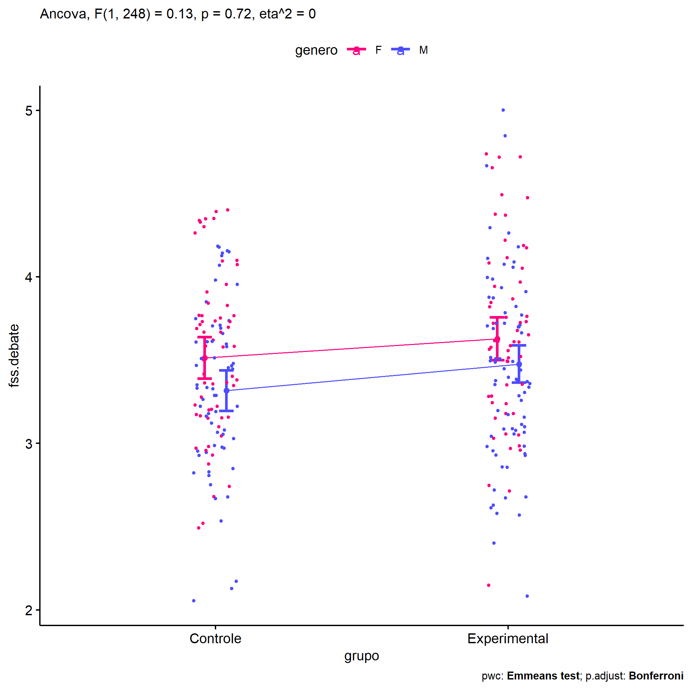<!-- -->

    ## Scale for colour is already present.
    ## Adding another scale for colour, which will replace the existing scale.

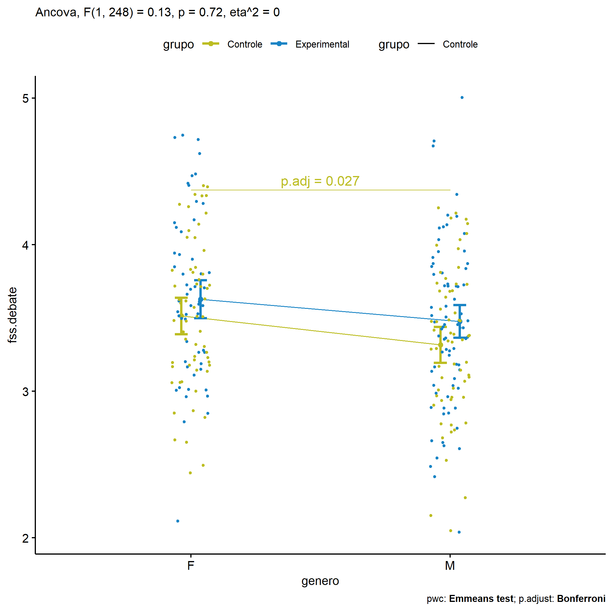<!-- -->

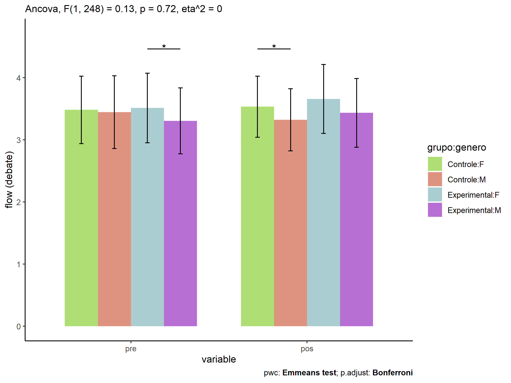<!-- -->

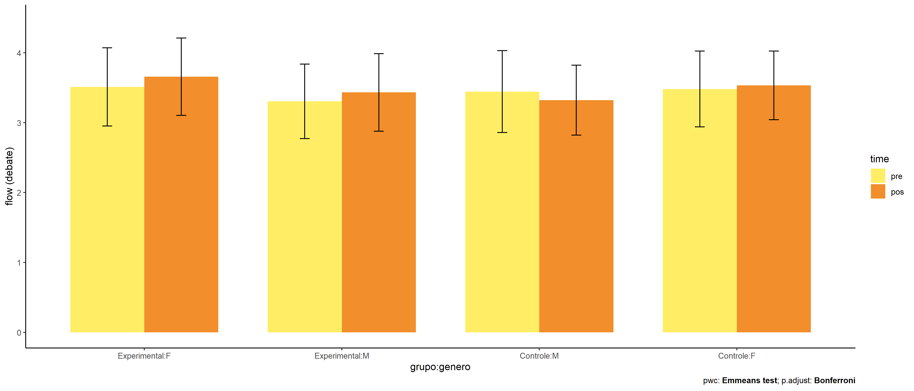<!-- -->

### factores: **grupo:idade**

| var        | grupo        | idade |   n | M (pre) | SE (pre) | M (unadj) | SE (unadj) | M (adj) | SE (adj) |
|:-----------|:-------------|:------|----:|--------:|---------:|----------:|-----------:|--------:|---------:|
| fss.debate | Controle     | 10y   |  24 |   3.513 |    0.110 |     3.440 |      0.128 |   3.415 |    0.100 |
| fss.debate | Controle     | 11y   |  65 |   3.485 |    0.070 |     3.424 |      0.059 |   3.409 |    0.061 |
| fss.debate | Controle     | 12y   |  17 |   3.533 |    0.129 |     3.515 |      0.111 |   3.482 |    0.119 |
| fss.debate | Controle     | 13y   |   7 |   3.450 |    0.220 |     3.349 |      0.136 |   3.347 |    0.185 |
| fss.debate | Experimental | 10y   |  24 |   3.296 |    0.107 |     3.519 |      0.101 |   3.575 |    0.100 |
| fss.debate | Experimental | 11y   |  79 |   3.475 |    0.065 |     3.550 |      0.066 |   3.539 |    0.055 |
| fss.debate | Experimental | 12y   |  16 |   3.333 |    0.106 |     3.653 |      0.128 |   3.695 |    0.122 |
| fss.debate | Experimental | 13y   |   9 |   3.154 |    0.178 |     3.125 |      0.115 |   3.235 |    0.164 |

| .y.        | grupo        | idade | group1   | group2       | estimate | conf.low | conf.high |    se | statistic |     p | p.adj | p.adj.signif |
|:-----------|:-------------|:------|:---------|:-------------|---------:|---------:|----------:|------:|----------:|------:|------:|:-------------|
| fss.debate |              | 10y   | Controle | Experimental |   -0.160 |   -0.439 |     0.119 | 0.142 |    -1.130 | 0.260 | 0.260 | ns           |
| fss.debate |              | 11y   | Controle | Experimental |   -0.130 |   -0.291 |     0.031 | 0.082 |    -1.589 | 0.113 | 0.113 | ns           |
| fss.debate |              | 12y   | Controle | Experimental |   -0.214 |   -0.550 |     0.123 | 0.171 |    -1.252 | 0.212 | 0.212 | ns           |
| fss.debate |              | 13y   | Controle | Experimental |    0.112 |   -0.374 |     0.598 | 0.247 |     0.454 | 0.650 | 0.650 | ns           |
| dfs.debate |              | 10y   | Controle | Experimental |    0.216 |   -0.098 |     0.530 | 0.159 |     1.358 | 0.176 | 0.176 | ns           |
| dfs.debate |              | 11y   | Controle | Experimental |    0.010 |   -0.172 |     0.192 | 0.092 |     0.106 | 0.916 | 0.916 | ns           |
| dfs.debate |              | 12y   | Controle | Experimental |    0.199 |   -0.180 |     0.578 | 0.192 |     1.036 | 0.301 | 0.301 | ns           |
| dfs.debate |              | 13y   | Controle | Experimental |    0.296 |   -0.252 |     0.844 | 0.278 |     1.064 | 0.288 | 0.288 | ns           |
| fss.debate | Controle     |       | 10y      | 11y          |    0.006 |   -0.224 |     0.236 | 0.117 |     0.049 | 0.961 | 1.000 | ns           |
| fss.debate | Controle     |       | 10y      | 12y          |   -0.067 |   -0.372 |     0.238 | 0.155 |    -0.431 | 0.667 | 1.000 | ns           |
| fss.debate | Controle     |       | 10y      | 13y          |    0.068 |   -0.346 |     0.481 | 0.210 |     0.322 | 0.748 | 1.000 | ns           |
| fss.debate | Controle     |       | 11y      | 12y          |   -0.073 |   -0.335 |     0.190 | 0.133 |    -0.545 | 0.586 | 1.000 | ns           |
| fss.debate | Controle     |       | 11y      | 13y          |    0.062 |   -0.321 |     0.445 | 0.194 |     0.318 | 0.751 | 1.000 | ns           |
| fss.debate | Controle     |       | 12y      | 13y          |    0.134 |   -0.298 |     0.567 | 0.219 |     0.612 | 0.541 | 1.000 | ns           |
| fss.debate | Experimental |       | 10y      | 11y          |    0.036 |   -0.190 |     0.261 | 0.114 |     0.313 | 0.755 | 1.000 | ns           |
| fss.debate | Experimental |       | 10y      | 12y          |   -0.120 |   -0.431 |     0.190 | 0.158 |    -0.762 | 0.447 | 1.000 | ns           |
| fss.debate | Experimental |       | 10y      | 13y          |    0.340 |   -0.037 |     0.716 | 0.191 |     1.778 | 0.077 | 0.461 | ns           |
| fss.debate | Experimental |       | 11y      | 12y          |   -0.156 |   -0.420 |     0.108 | 0.134 |    -1.163 | 0.246 | 1.000 | ns           |
| fss.debate | Experimental |       | 11y      | 13y          |    0.304 |   -0.037 |     0.645 | 0.173 |     1.758 | 0.080 | 0.480 | ns           |
| fss.debate | Experimental |       | 12y      | 13y          |    0.460 |    0.058 |     0.862 | 0.204 |     2.257 | 0.025 | 0.150 | ns           |
| dfs.debate | Controle     |       | 10y      | 11y          |    0.028 |   -0.232 |     0.288 | 0.132 |     0.210 | 0.834 | 1.000 | ns           |
| dfs.debate | Controle     |       | 10y      | 12y          |   -0.020 |   -0.365 |     0.325 | 0.175 |    -0.114 | 0.909 | 1.000 | ns           |
| dfs.debate | Controle     |       | 10y      | 13y          |    0.062 |   -0.405 |     0.530 | 0.237 |     0.263 | 0.793 | 1.000 | ns           |
| dfs.debate | Controle     |       | 11y      | 12y          |   -0.048 |   -0.344 |     0.249 | 0.150 |    -0.317 | 0.752 | 1.000 | ns           |
| dfs.debate | Controle     |       | 11y      | 13y          |    0.035 |   -0.398 |     0.467 | 0.220 |     0.158 | 0.875 | 1.000 | ns           |
| dfs.debate | Controle     |       | 12y      | 13y          |    0.082 |   -0.406 |     0.571 | 0.248 |     0.332 | 0.740 | 1.000 | ns           |
| dfs.debate | Experimental |       | 10y      | 11y          |   -0.179 |   -0.433 |     0.075 | 0.129 |    -1.391 | 0.166 | 0.994 | ns           |
| dfs.debate | Experimental |       | 10y      | 12y          |   -0.037 |   -0.388 |     0.314 | 0.178 |    -0.208 | 0.836 | 1.000 | ns           |
| dfs.debate | Experimental |       | 10y      | 13y          |    0.142 |   -0.283 |     0.567 | 0.216 |     0.658 | 0.511 | 1.000 | ns           |
| dfs.debate | Experimental |       | 11y      | 12y          |    0.142 |   -0.156 |     0.440 | 0.151 |     0.938 | 0.349 | 1.000 | ns           |
| dfs.debate | Experimental |       | 11y      | 13y          |    0.321 |   -0.062 |     0.704 | 0.194 |     1.652 | 0.100 | 0.599 | ns           |
| dfs.debate | Experimental |       | 12y      | 13y          |    0.179 |   -0.274 |     0.632 | 0.230 |     0.778 | 0.437 | 1.000 | ns           |

| .y.         | grupo        | idade | group1 | group2 | estimate | conf.low | conf.high |    se | statistic |     p | p.adj | p.adj.signif |
|:------------|:-------------|:------|:-------|:-------|---------:|---------:|----------:|------:|----------:|------:|------:|:-------------|
| flow.debate | Controle     | 10y   | pre    | pos    |    0.072 |   -0.235 |     0.379 | 0.156 |     0.463 | 0.644 | 0.644 | ns           |
| flow.debate | Controle     | 11y   | pre    | pos    |    0.061 |   -0.126 |     0.248 | 0.095 |     0.641 | 0.522 | 0.522 | ns           |
| flow.debate | Controle     | 12y   | pre    | pos    |    0.018 |   -0.347 |     0.383 | 0.186 |     0.097 | 0.923 | 0.923 | ns           |
| flow.debate | Controle     | 13y   | pre    | pos    |    0.101 |   -0.467 |     0.670 | 0.289 |     0.350 | 0.727 | 0.727 | ns           |
| flow.debate | Experimental | 10y   | pre    | pos    |   -0.222 |   -0.529 |     0.085 | 0.156 |    -1.422 | 0.156 | 0.156 | ns           |
| flow.debate | Experimental | 11y   | pre    | pos    |   -0.075 |   -0.244 |     0.094 | 0.086 |    -0.873 | 0.383 | 0.383 | ns           |
| flow.debate | Experimental | 12y   | pre    | pos    |   -0.319 |   -0.696 |     0.057 | 0.191 |    -1.669 | 0.096 | 0.096 | ns           |
| flow.debate | Experimental | 13y   | pre    | pos    |    0.029 |   -0.472 |     0.531 | 0.255 |     0.115 | 0.909 | 0.909 | ns           |

    ## Scale for colour is already present.
    ## Adding another scale for colour, which will replace the existing scale.

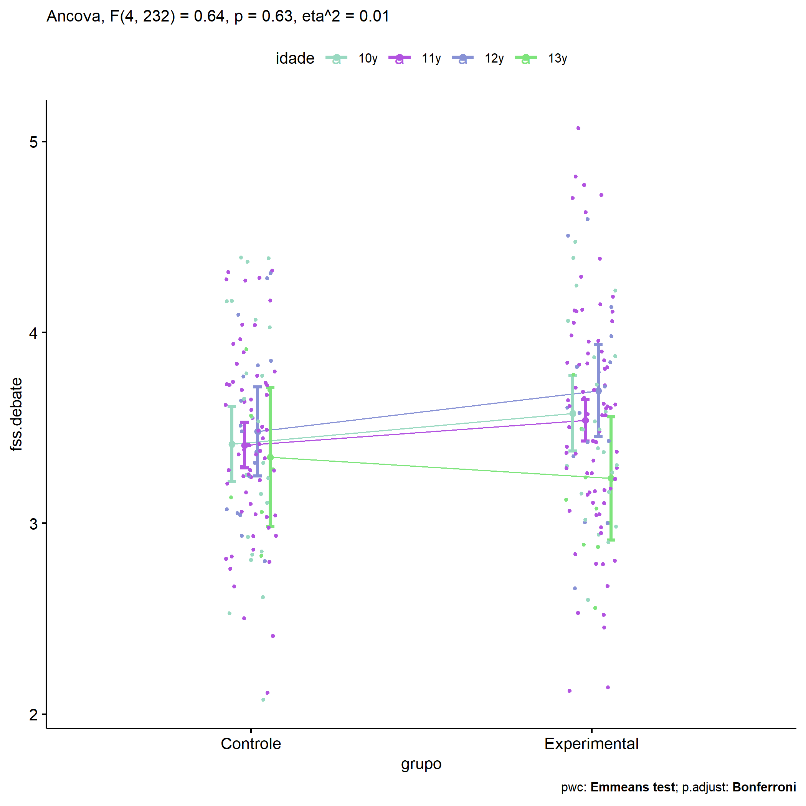<!-- -->

    ## Scale for colour is already present.
    ## Adding another scale for colour, which will replace the existing scale.

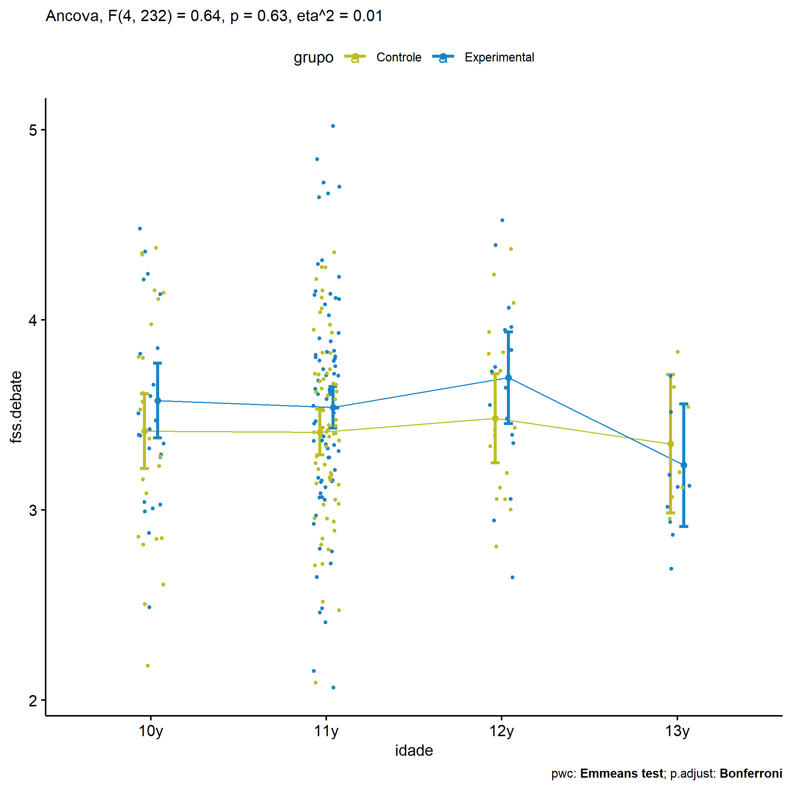<!-- -->

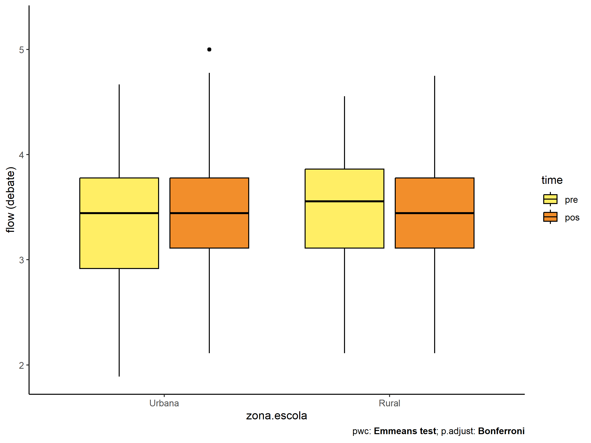<!-- -->

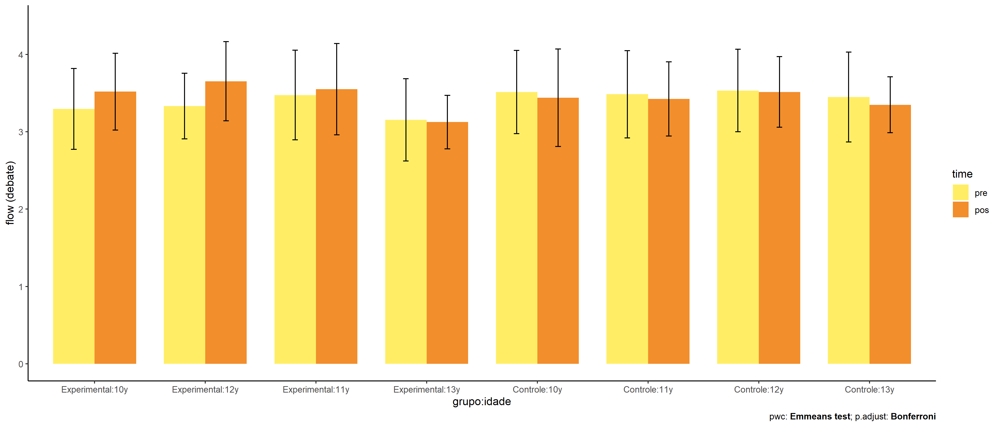<!-- -->

### factores: **grupo:zona.participante**

| var        | grupo        | zona.participante |   n | M (pre) | SE (pre) | M (unadj) | SE (unadj) | M (adj) | SE (adj) |
|:-----------|:-------------|:------------------|----:|--------:|---------:|----------:|-----------:|--------:|---------:|
| fss.debate | Controle     | Rural             |  43 |   3.532 |    0.080 |     3.364 |      0.080 |   3.325 |    0.077 |
| fss.debate | Controle     | Urbana            |  51 |   3.365 |    0.088 |     3.443 |      0.073 |   3.460 |    0.070 |
| fss.debate | Experimental | Rural             |  52 |   3.393 |    0.074 |     3.440 |      0.079 |   3.448 |    0.069 |
| fss.debate | Experimental | Urbana            |  49 |   3.388 |    0.082 |     3.586 |      0.073 |   3.595 |    0.071 |

| .y.        | grupo        | zona.participante | group1   | group2       | estimate | conf.low | conf.high |    se | statistic |     p | p.adj | p.adj.signif |
|:-----------|:-------------|:------------------|:---------|:-------------|---------:|---------:|----------:|------:|----------:|------:|------:|:-------------|
| fss.debate |              | Urbana            | Controle | Experimental |   -0.135 |   -0.332 |     0.062 | 0.100 |    -1.352 | 0.178 | 0.178 | ns           |
| fss.debate |              | Rural             | Controle | Experimental |   -0.123 |   -0.327 |     0.081 | 0.103 |    -1.186 | 0.237 | 0.237 | ns           |
| dfs.debate |              | Urbana            | Controle | Experimental |   -0.023 |   -0.247 |     0.201 | 0.114 |    -0.201 | 0.841 | 0.841 | ns           |
| dfs.debate |              | Rural             | Controle | Experimental |    0.139 |   -0.092 |     0.370 | 0.117 |     1.188 | 0.236 | 0.236 | ns           |
| fss.debate | Controle     |                   | Urbana   | Rural        |    0.135 |   -0.070 |     0.340 | 0.104 |     1.298 | 0.196 | 0.196 | ns           |
| fss.debate | Experimental |                   | Urbana   | Rural        |    0.148 |   -0.049 |     0.344 | 0.099 |     1.483 | 0.140 | 0.140 | ns           |
| dfs.debate | Controle     |                   | Urbana   | Rural        |   -0.167 |   -0.399 |     0.065 | 0.118 |    -1.417 | 0.158 | 0.158 | ns           |
| dfs.debate | Experimental |                   | Urbana   | Rural        |   -0.005 |   -0.228 |     0.219 | 0.113 |    -0.041 | 0.967 | 0.967 | ns           |

| .y.         | grupo        | zona.participante | group1 | group2 | estimate | conf.low | conf.high |    se | statistic |     p | p.adj | p.adj.signif |
|:------------|:-------------|:------------------|:-------|:-------|---------:|---------:|----------:|------:|----------:|------:|------:|:-------------|
| flow.debate | Controle     | Urbana            | pre    | pos    |   -0.078 |   -0.293 |     0.136 | 0.109 |    -0.716 | 0.474 | 0.474 | ns           |
| flow.debate | Controle     | Rural             | pre    | pos    |    0.168 |   -0.066 |     0.402 | 0.119 |     1.412 | 0.159 | 0.159 | ns           |
| flow.debate | Experimental | Urbana            | pre    | pos    |   -0.198 |   -0.417 |     0.021 | 0.111 |    -1.779 | 0.076 | 0.076 | ns           |
| flow.debate | Experimental | Rural             | pre    | pos    |   -0.047 |   -0.260 |     0.165 | 0.108 |    -0.439 | 0.661 | 0.661 | ns           |

    ## Scale for colour is already present.
    ## Adding another scale for colour, which will replace the existing scale.

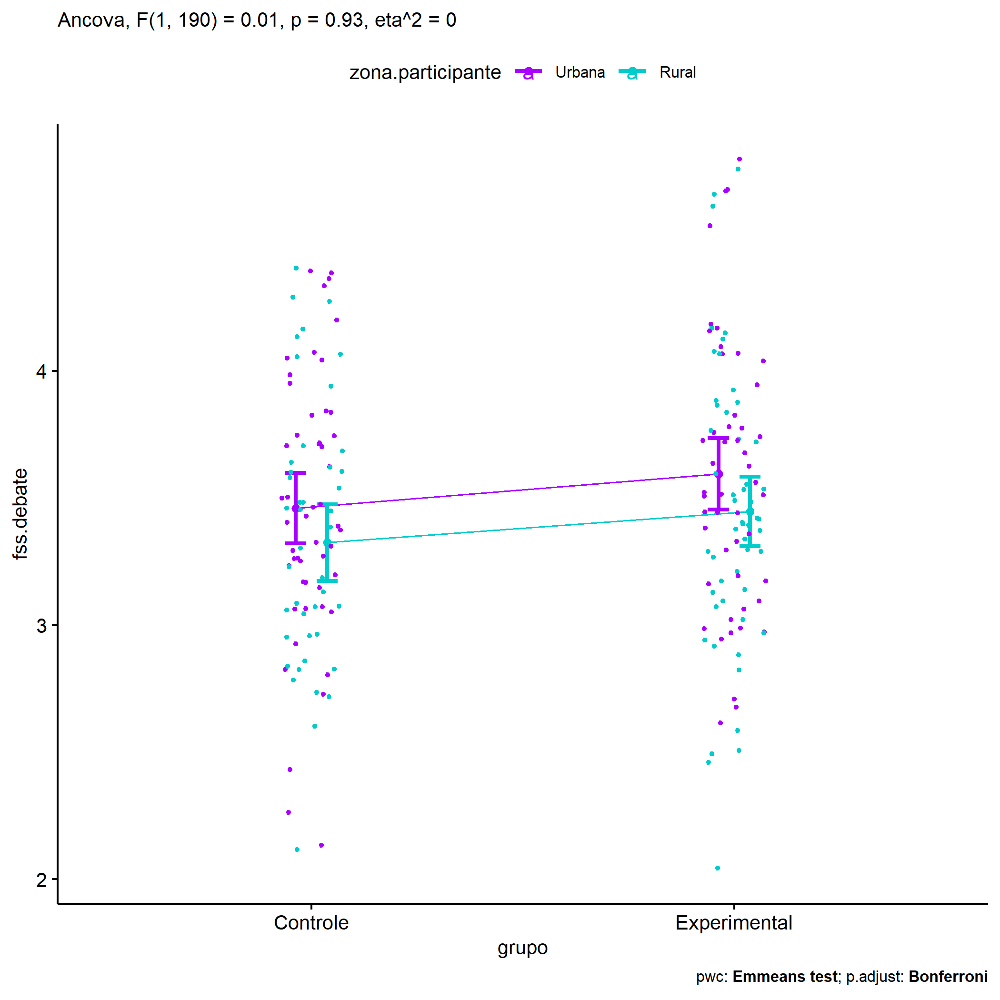<!-- -->

    ## Scale for colour is already present.
    ## Adding another scale for colour, which will replace the existing scale.

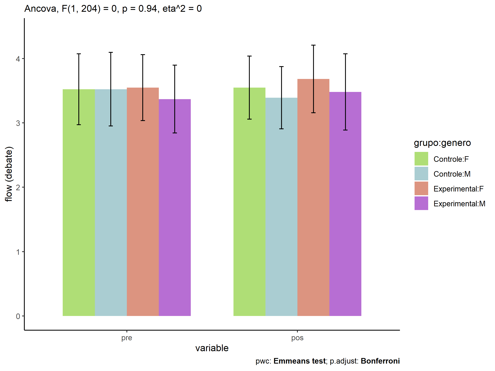<!-- -->

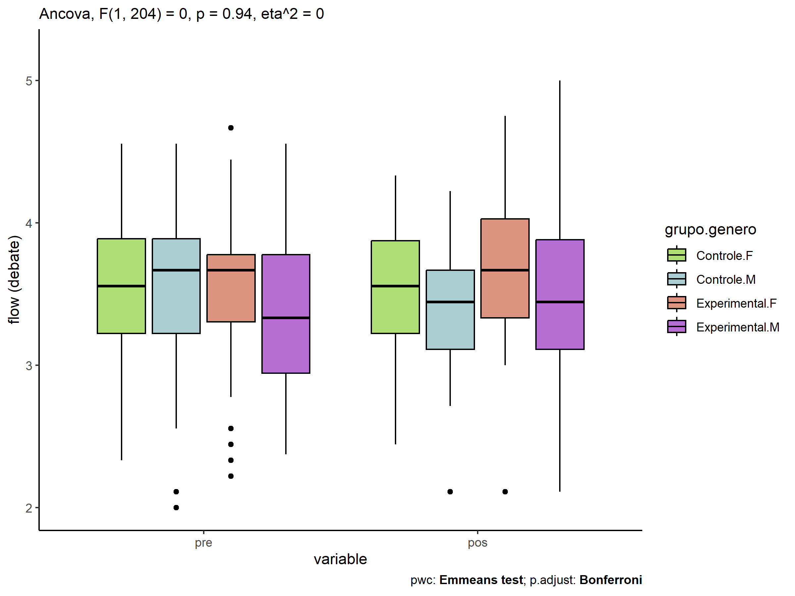<!-- -->

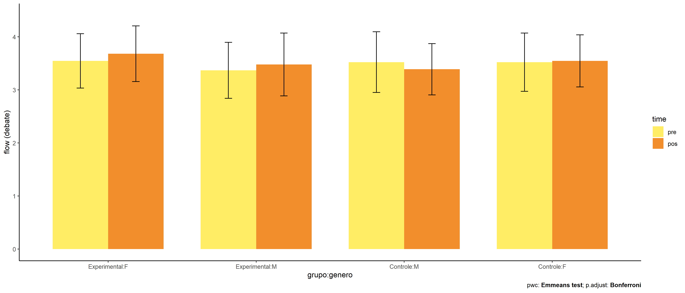<!-- -->

### factores: **grupo:escola**

| var        | grupo        | escola |   n | M (pre) | SE (pre) | M (unadj) | SE (unadj) | M (adj) | SE (adj) |
|:-----------|:-------------|:-------|----:|--------:|---------:|----------:|-----------:|--------:|---------:|
| fss.debate | Controle     | E1     |  12 |   3.139 |    0.157 |     3.361 |      0.172 |   3.474 |    0.141 |
| fss.debate | Controle     | E2     |  22 |   3.505 |    0.102 |     3.363 |      0.130 |   3.332 |    0.104 |
| fss.debate | Controle     | E3     |  15 |   3.643 |    0.143 |     3.421 |      0.108 |   3.337 |    0.126 |
| fss.debate | Controle     | E4     |  15 |   3.403 |    0.165 |     3.393 |      0.125 |   3.402 |    0.126 |
| fss.debate | Controle     | E5     |  47 |   3.476 |    0.089 |     3.474 |      0.074 |   3.455 |    0.071 |
| fss.debate | Controle     | E6     |  11 |   3.505 |    0.105 |     3.465 |      0.108 |   3.434 |    0.147 |
| fss.debate | Experimental | E1     |  10 |   3.179 |    0.132 |     3.779 |      0.204 |   3.876 |    0.154 |
| fss.debate | Experimental | E2     |  26 |   3.461 |    0.106 |     3.427 |      0.083 |   3.414 |    0.095 |
| fss.debate | Experimental | E3     |  15 |   3.496 |    0.180 |     3.231 |      0.149 |   3.203 |    0.126 |
| fss.debate | Experimental | E4     |  14 |   3.464 |    0.123 |     3.714 |      0.153 |   3.700 |    0.130 |
| fss.debate | Experimental | E5     |  53 |   3.330 |    0.081 |     3.504 |      0.080 |   3.542 |    0.067 |
| fss.debate | Experimental | E6     |  13 |   3.491 |    0.117 |     3.786 |      0.138 |   3.761 |    0.135 |

| .y.        | grupo        | escola | group1   | group2       | estimate | conf.low | conf.high |    se | statistic | p       | p.adj | p.adj.signif |
|:-----------|:-------------|:-------|:---------|:-------------|---------:|---------:|----------:|------:|----------:|:--------|------:|:-------------|
| fss.debate |              | E1     | Controle | Experimental |   -0.402 |   -0.813 |     0.008 | 0.208 |    -1.931 | 0.055   | 0.055 | ns           |
| fss.debate |              | E2     | Controle | Experimental |   -0.081 |   -0.359 |     0.196 | 0.141 |    -0.576 | 0.565   | 0.565 | ns           |
| fss.debate |              | E3     | Controle | Experimental |    0.134 |   -0.217 |     0.484 | 0.178 |     0.751 | 0.453   | 0.453 | ns           |
| fss.debate |              | E4     | Controle | Experimental |   -0.298 |   -0.654 |     0.059 | 0.181 |    -1.646 | 0.101   | 0.101 | ns           |
| fss.debate |              | E5     | Controle | Experimental |   -0.087 |   -0.279 |     0.106 | 0.098 |    -0.886 | 0.377   | 0.377 | ns           |
| fss.debate |              | E6     | Controle | Experimental |   -0.327 |   -0.720 |     0.066 | 0.199 |    -1.641 | 0.102   | 0.102 | ns           |
| dfs.debate |              | E1     | Controle | Experimental |   -0.040 |   -0.510 |     0.430 | 0.239 |    -0.169 | 0.866   | 0.866 | ns           |
| dfs.debate |              | E2     | Controle | Experimental |    0.044 |   -0.274 |     0.362 | 0.161 |     0.275 | 0.783   | 0.783 | ns           |
| dfs.debate |              | E3     | Controle | Experimental |    0.146 |   -0.255 |     0.547 | 0.203 |     0.719 | 0.473   | 0.473 | ns           |
| dfs.debate |              | E4     | Controle | Experimental |   -0.062 |   -0.469 |     0.346 | 0.207 |    -0.297 | 0.767   | 0.767 | ns           |
| dfs.debate |              | E5     | Controle | Experimental |    0.146 |   -0.074 |     0.366 | 0.112 |     1.309 | 0.192   | 0.192 | ns           |
| dfs.debate |              | E6     | Controle | Experimental |    0.014 |   -0.436 |     0.463 | 0.228 |     0.060 | 0.953   | 0.953 | ns           |
| fss.debate | Controle     |        | E1       | E2           |    0.141 |   -0.205 |     0.488 | 0.176 |     0.804 | 0.422   | 1.000 | ns           |
| fss.debate | Controle     |        | E1       | E3           |    0.137 |   -0.239 |     0.512 | 0.191 |     0.718 | 0.474   | 1.000 | ns           |
| fss.debate | Controle     |        | E1       | E4           |    0.072 |   -0.301 |     0.444 | 0.189 |     0.379 | 0.705   | 1.000 | ns           |
| fss.debate | Controle     |        | E1       | E5           |    0.018 |   -0.294 |     0.331 | 0.158 |     0.116 | 0.908   | 1.000 | ns           |
| fss.debate | Controle     |        | E1       | E6           |    0.040 |   -0.362 |     0.442 | 0.204 |     0.194 | 0.846   | 1.000 | ns           |
| fss.debate | Controle     |        | E2       | E3           |   -0.005 |   -0.326 |     0.317 | 0.163 |    -0.028 | 0.978   | 1.000 | ns           |
| fss.debate | Controle     |        | E2       | E4           |   -0.070 |   -0.391 |     0.251 | 0.163 |    -0.427 | 0.67    | 1.000 | ns           |
| fss.debate | Controle     |        | E2       | E5           |   -0.123 |   -0.370 |     0.125 | 0.126 |    -0.978 | 0.329   | 1.000 | ns           |
| fss.debate | Controle     |        | E2       | E6           |   -0.102 |   -0.455 |     0.252 | 0.180 |    -0.566 | 0.572   | 1.000 | ns           |
| fss.debate | Controle     |        | E3       | E4           |   -0.065 |   -0.416 |     0.286 | 0.178 |    -0.365 | 0.715   | 1.000 | ns           |
| fss.debate | Controle     |        | E3       | E5           |   -0.118 |   -0.403 |     0.166 | 0.145 |    -0.819 | 0.414   | 1.000 | ns           |
| fss.debate | Controle     |        | E3       | E6           |   -0.097 |   -0.478 |     0.284 | 0.193 |    -0.503 | 0.616   | 1.000 | ns           |
| fss.debate | Controle     |        | E4       | E5           |   -0.053 |   -0.338 |     0.231 | 0.144 |    -0.369 | 0.712   | 1.000 | ns           |
| fss.debate | Controle     |        | E4       | E6           |   -0.032 |   -0.413 |     0.348 | 0.193 |    -0.166 | 0.868   | 1.000 | ns           |
| fss.debate | Controle     |        | E5       | E6           |    0.021 |   -0.300 |     0.342 | 0.163 |     0.130 | 0.896   | 1.000 | ns           |
| fss.debate | Experimental |        | E1       | E2           |    0.462 |    0.104 |     0.820 | 0.182 |     2.545 | 0.012   | 0.173 | ns           |
| fss.debate | Experimental |        | E1       | E3           |    0.673 |    0.280 |     1.065 | 0.199 |     3.373 | \<0.001 | 0.013 | \*           |
| fss.debate | Experimental |        | E1       | E4           |    0.176 |   -0.222 |     0.574 | 0.202 |     0.873 | 0.384   | 1.000 | ns           |
| fss.debate | Experimental |        | E1       | E5           |    0.334 |    0.003 |     0.665 | 0.168 |     1.989 | 0.048   | 0.717 | ns           |
| fss.debate | Experimental |        | E1       | E6           |    0.115 |   -0.290 |     0.519 | 0.205 |     0.560 | 0.576   | 1.000 | ns           |
| fss.debate | Experimental |        | E2       | E3           |    0.210 |   -0.101 |     0.521 | 0.158 |     1.333 | 0.184   | 1.000 | ns           |
| fss.debate | Experimental |        | E2       | E4           |   -0.286 |   -0.604 |     0.032 | 0.161 |    -1.774 | 0.077   | 1.000 | ns           |
| fss.debate | Experimental |        | E2       | E5           |   -0.128 |   -0.358 |     0.102 | 0.117 |    -1.099 | 0.273   | 1.000 | ns           |
| fss.debate | Experimental |        | E2       | E6           |   -0.347 |   -0.673 |    -0.022 | 0.165 |    -2.103 | 0.037   | 0.548 | ns           |
| fss.debate | Experimental |        | E3       | E4           |   -0.496 |   -0.852 |    -0.140 | 0.181 |    -2.745 | 0.007   | 0.098 | ns           |
| fss.debate | Experimental |        | E3       | E5           |   -0.339 |   -0.619 |    -0.058 | 0.143 |    -2.374 | 0.018   | 0.276 | ns           |
| fss.debate | Experimental |        | E3       | E6           |   -0.558 |   -0.921 |    -0.195 | 0.184 |    -3.025 | 0.003   | 0.041 | \*           |
| fss.debate | Experimental |        | E4       | E5           |    0.158 |   -0.131 |     0.446 | 0.146 |     1.078 | 0.282   | 1.000 | ns           |
| fss.debate | Experimental |        | E4       | E6           |   -0.061 |   -0.431 |     0.308 | 0.187 |    -0.328 | 0.743   | 1.000 | ns           |
| fss.debate | Experimental |        | E5       | E6           |   -0.219 |   -0.516 |     0.078 | 0.151 |    -1.453 | 0.148   | 1.000 | ns           |
| dfs.debate | Controle     |        | E1       | E2           |   -0.366 |   -0.760 |     0.028 | 0.200 |    -1.831 | 0.068   | 1.000 | ns           |
| dfs.debate | Controle     |        | E1       | E3           |   -0.504 |   -0.929 |    -0.079 | 0.216 |    -2.334 | 0.02    | 0.306 | ns           |
| dfs.debate | Controle     |        | E1       | E4           |   -0.264 |   -0.689 |     0.161 | 0.216 |    -1.223 | 0.223   | 1.000 | ns           |
| dfs.debate | Controle     |        | E1       | E5           |   -0.337 |   -0.692 |     0.018 | 0.180 |    -1.869 | 0.063   | 0.942 | ns           |
| dfs.debate | Controle     |        | E1       | E6           |   -0.366 |   -0.824 |     0.092 | 0.233 |    -1.574 | 0.117   | 1.000 | ns           |
| dfs.debate | Controle     |        | E2       | E3           |   -0.138 |   -0.505 |     0.230 | 0.187 |    -0.737 | 0.462   | 1.000 | ns           |
| dfs.debate | Controle     |        | E2       | E4           |    0.102 |   -0.265 |     0.470 | 0.187 |     0.548 | 0.584   | 1.000 | ns           |
| dfs.debate | Controle     |        | E2       | E5           |    0.029 |   -0.254 |     0.313 | 0.144 |     0.203 | 0.839   | 1.000 | ns           |
| dfs.debate | Controle     |        | E2       | E6           |    0.000 |   -0.405 |     0.405 | 0.206 |     0.000 | 1       | 1.000 | ns           |
| dfs.debate | Controle     |        | E3       | E4           |    0.240 |   -0.161 |     0.641 | 0.203 |     1.179 | 0.24    | 1.000 | ns           |
| dfs.debate | Controle     |        | E3       | E5           |    0.167 |   -0.159 |     0.492 | 0.165 |     1.009 | 0.314   | 1.000 | ns           |
| dfs.debate | Controle     |        | E3       | E6           |    0.138 |   -0.298 |     0.573 | 0.221 |     0.622 | 0.535   | 1.000 | ns           |
| dfs.debate | Controle     |        | E4       | E5           |   -0.073 |   -0.399 |     0.253 | 0.165 |    -0.442 | 0.659   | 1.000 | ns           |
| dfs.debate | Controle     |        | E4       | E6           |   -0.102 |   -0.538 |     0.333 | 0.221 |    -0.462 | 0.644   | 1.000 | ns           |
| dfs.debate | Controle     |        | E5       | E6           |   -0.029 |   -0.397 |     0.338 | 0.187 |    -0.157 | 0.875   | 1.000 | ns           |
| dfs.debate | Experimental |        | E1       | E2           |   -0.281 |   -0.690 |     0.127 | 0.207 |    -1.357 | 0.176   | 1.000 | ns           |
| dfs.debate | Experimental |        | E1       | E3           |   -0.317 |   -0.765 |     0.131 | 0.228 |    -1.394 | 0.165   | 1.000 | ns           |
| dfs.debate | Experimental |        | E1       | E4           |   -0.285 |   -0.740 |     0.169 | 0.231 |    -1.236 | 0.218   | 1.000 | ns           |
| dfs.debate | Experimental |        | E1       | E5           |   -0.150 |   -0.529 |     0.228 | 0.192 |    -0.783 | 0.434   | 1.000 | ns           |
| dfs.debate | Experimental |        | E1       | E6           |   -0.312 |   -0.774 |     0.149 | 0.234 |    -1.332 | 0.184   | 1.000 | ns           |
| dfs.debate | Experimental |        | E2       | E3           |   -0.036 |   -0.392 |     0.320 | 0.181 |    -0.197 | 0.844   | 1.000 | ns           |
| dfs.debate | Experimental |        | E2       | E4           |   -0.004 |   -0.368 |     0.360 | 0.185 |    -0.020 | 0.984   | 1.000 | ns           |
| dfs.debate | Experimental |        | E2       | E5           |    0.131 |   -0.132 |     0.394 | 0.133 |     0.981 | 0.327   | 1.000 | ns           |
| dfs.debate | Experimental |        | E2       | E6           |   -0.031 |   -0.404 |     0.342 | 0.189 |    -0.163 | 0.871   | 1.000 | ns           |
| dfs.debate | Experimental |        | E3       | E4           |    0.032 |   -0.376 |     0.440 | 0.207 |     0.155 | 0.877   | 1.000 | ns           |
| dfs.debate | Experimental |        | E3       | E5           |    0.167 |   -0.154 |     0.488 | 0.163 |     1.022 | 0.308   | 1.000 | ns           |
| dfs.debate | Experimental |        | E3       | E6           |    0.005 |   -0.411 |     0.421 | 0.211 |     0.023 | 0.982   | 1.000 | ns           |
| dfs.debate | Experimental |        | E4       | E5           |    0.135 |   -0.195 |     0.464 | 0.167 |     0.804 | 0.422   | 1.000 | ns           |
| dfs.debate | Experimental |        | E4       | E6           |   -0.027 |   -0.450 |     0.396 | 0.215 |    -0.127 | 0.899   | 1.000 | ns           |
| dfs.debate | Experimental |        | E5       | E6           |   -0.162 |   -0.502 |     0.178 | 0.172 |    -0.938 | 0.349   | 1.000 | ns           |

| .y.         | grupo        | escola | group1 | group2 | estimate | conf.low | conf.high |    se | statistic |     p | p.adj | p.adj.signif |
|:------------|:-------------|:-------|:-------|:-------|---------:|---------:|----------:|------:|----------:|------:|------:|:-------------|
| flow.debate | Controle     | E1     | pre    | pos    |   -0.222 |   -0.659 |     0.215 | 0.222 |    -0.999 | 0.318 | 0.318 | ns           |
| flow.debate | Controle     | E2     | pre    | pos    |    0.142 |   -0.181 |     0.465 | 0.164 |     0.865 | 0.388 | 0.388 | ns           |
| flow.debate | Controle     | E3     | pre    | pos    |    0.221 |   -0.170 |     0.612 | 0.199 |     1.112 | 0.267 | 0.267 | ns           |
| flow.debate | Controle     | E4     | pre    | pos    |    0.010 |   -0.381 |     0.401 | 0.199 |     0.051 | 0.959 | 0.959 | ns           |
| flow.debate | Controle     | E5     | pre    | pos    |    0.001 |   -0.219 |     0.222 | 0.112 |     0.012 | 0.990 | 0.990 | ns           |
| flow.debate | Controle     | E6     | pre    | pos    |    0.040 |   -0.416 |     0.497 | 0.232 |     0.174 | 0.862 | 0.862 | ns           |
| flow.debate | Experimental | E1     | pre    | pos    |   -0.600 |   -1.079 |    -0.121 | 0.244 |    -2.463 | 0.014 | 0.014 | \*           |
| flow.debate | Experimental | E2     | pre    | pos    |    0.034 |   -0.263 |     0.331 | 0.151 |     0.224 | 0.823 | 0.823 | ns           |
| flow.debate | Experimental | E3     | pre    | pos    |    0.266 |   -0.125 |     0.657 | 0.199 |     1.336 | 0.182 | 0.182 | ns           |
| flow.debate | Experimental | E4     | pre    | pos    |   -0.250 |   -0.655 |     0.155 | 0.206 |    -1.214 | 0.225 | 0.225 | ns           |
| flow.debate | Experimental | E5     | pre    | pos    |   -0.174 |   -0.382 |     0.034 | 0.106 |    -1.647 | 0.100 | 0.100 | ns           |
| flow.debate | Experimental | E6     | pre    | pos    |   -0.295 |   -0.715 |     0.125 | 0.214 |    -1.380 | 0.168 | 0.168 | ns           |

    ## Scale for colour is already present.
    ## Adding another scale for colour, which will replace the existing scale.

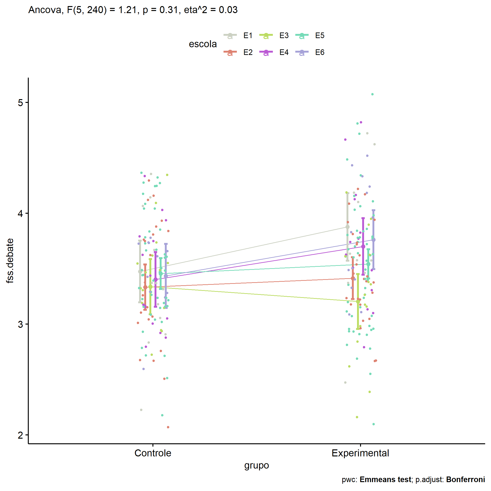<!-- -->

    ## Scale for colour is already present.
    ## Adding another scale for colour, which will replace the existing scale.

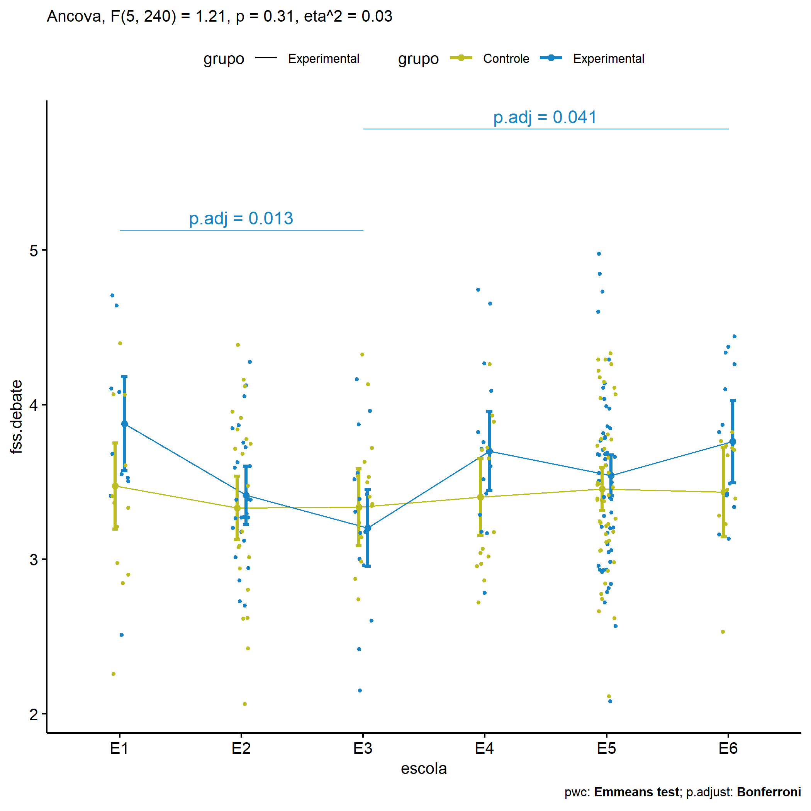<!-- -->

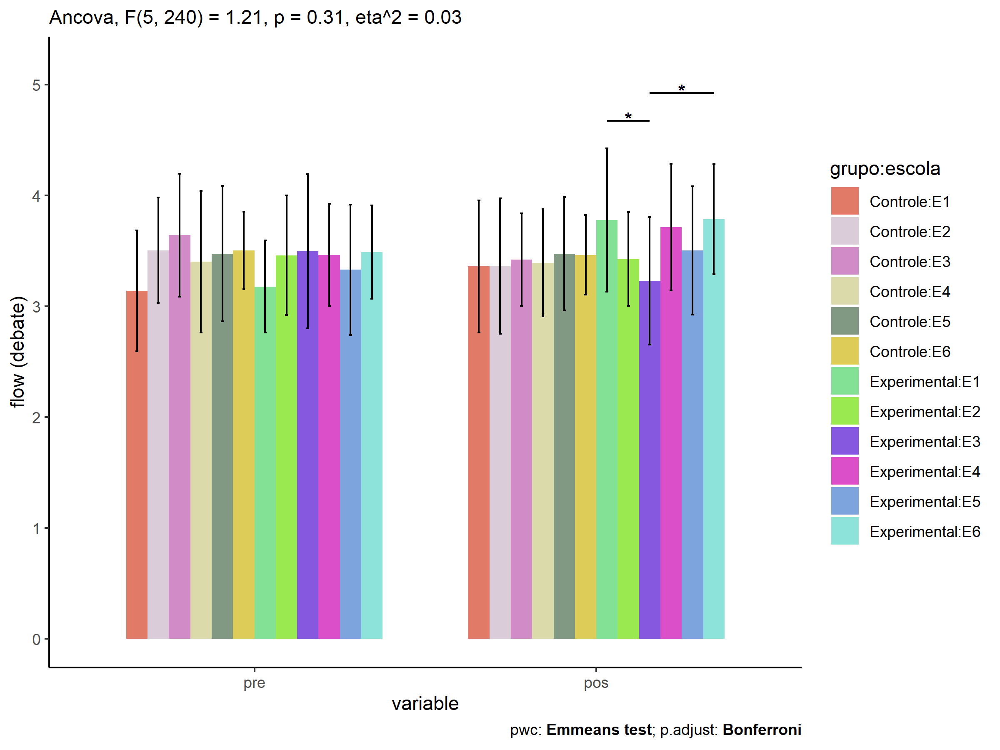<!-- -->

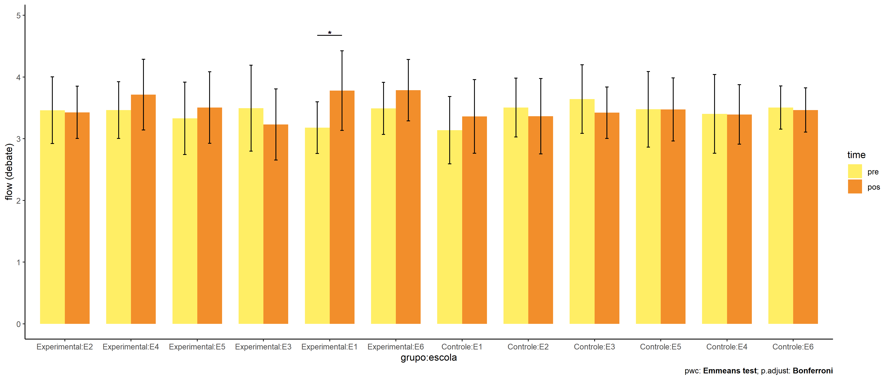<!-- -->

### factores: **grupo:zona.escola**

| var        | grupo        | zona.escola |   n | M (pre) | SE (pre) | M (unadj) | SE (unadj) | M (adj) | SE (adj) |
|:-----------|:-------------|:------------|----:|--------:|---------:|----------:|-----------:|--------:|---------:|
| fss.debate | Controle     | Rural       |  41 |   3.518 |    0.084 |     3.422 |      0.065 |   3.388 |    0.078 |
| fss.debate | Controle     | Urbana      |  81 |   3.434 |    0.064 |     3.427 |      0.061 |   3.425 |    0.055 |
| fss.debate | Experimental | Rural       |  42 |   3.484 |    0.082 |     3.564 |      0.092 |   3.542 |    0.077 |
| fss.debate | Experimental | Urbana      |  89 |   3.351 |    0.059 |     3.512 |      0.058 |   3.541 |    0.053 |

| .y.        | grupo        | zona.escola | group1   | group2       | estimate | conf.low | conf.high |    se | statistic |     p | p.adj | p.adj.signif |
|:-----------|:-------------|:------------|:---------|:-------------|---------:|---------:|----------:|------:|----------:|------:|------:|:-------------|
| fss.debate |              | Urbana      | Controle | Experimental |   -0.116 |   -0.267 |     0.035 | 0.077 |    -1.514 | 0.131 | 0.131 | ns           |
| fss.debate |              | Rural       | Controle | Experimental |   -0.154 |   -0.369 |     0.061 | 0.109 |    -1.410 | 0.160 | 0.160 | ns           |
| dfs.debate |              | Urbana      | Controle | Experimental |    0.083 |   -0.086 |     0.251 | 0.085 |     0.969 | 0.334 | 0.334 | ns           |
| dfs.debate |              | Rural       | Controle | Experimental |    0.034 |   -0.207 |     0.275 | 0.122 |     0.277 | 0.782 | 0.782 | ns           |
| fss.debate | Controle     |             | Urbana   | Rural        |    0.036 |   -0.152 |     0.224 | 0.095 |     0.380 | 0.704 | 0.704 | ns           |
| fss.debate | Experimental |             | Urbana   | Rural        |   -0.002 |   -0.186 |     0.182 | 0.093 |    -0.020 | 0.984 | 0.984 | ns           |
| dfs.debate | Controle     |             | Urbana   | Rural        |   -0.084 |   -0.294 |     0.126 | 0.107 |    -0.789 | 0.431 | 0.431 | ns           |
| dfs.debate | Experimental |             | Urbana   | Rural        |   -0.133 |   -0.338 |     0.072 | 0.104 |    -1.277 | 0.203 | 0.203 | ns           |

| .y.         | grupo        | zona.escola | group1 | group2 | estimate | conf.low | conf.high |    se | statistic |     p | p.adj | p.adj.signif |
|:------------|:-------------|:------------|:-------|:-------|---------:|---------:|----------:|------:|----------:|------:|------:|:-------------|
| flow.debate | Controle     | Urbana      | pre    | pos    |    0.006 |   -0.163 |     0.175 | 0.086 |     0.075 | 0.940 | 0.940 | ns           |
| flow.debate | Controle     | Rural       | pre    | pos    |    0.096 |   -0.142 |     0.333 | 0.121 |     0.790 | 0.430 | 0.430 | ns           |
| flow.debate | Experimental | Urbana      | pre    | pos    |   -0.161 |   -0.323 |     0.000 | 0.082 |    -1.966 | 0.050 | 0.050 | \*           |
| flow.debate | Experimental | Rural       | pre    | pos    |   -0.080 |   -0.314 |     0.155 | 0.119 |    -0.667 | 0.505 | 0.505 | ns           |

    ## Scale for colour is already present.
    ## Adding another scale for colour, which will replace the existing scale.

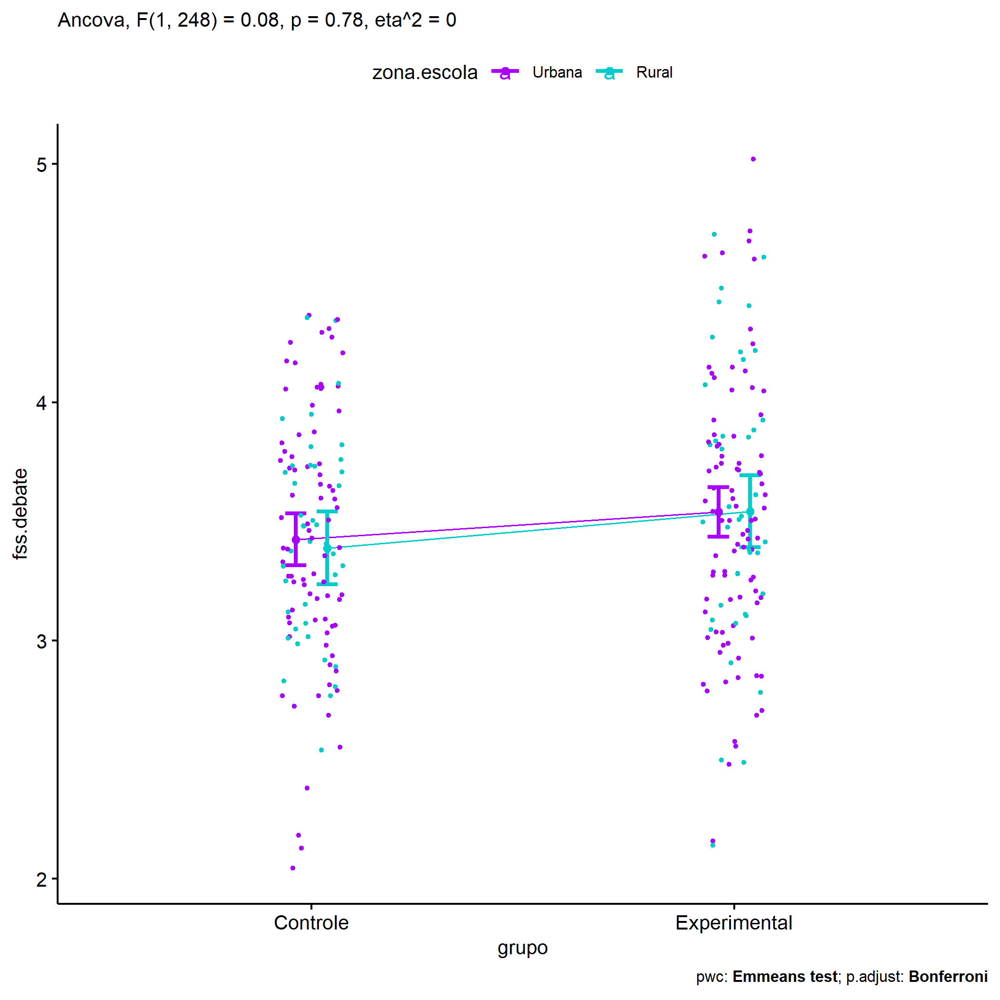<!-- -->

    ## Scale for colour is already present.
    ## Adding another scale for colour, which will replace the existing scale.

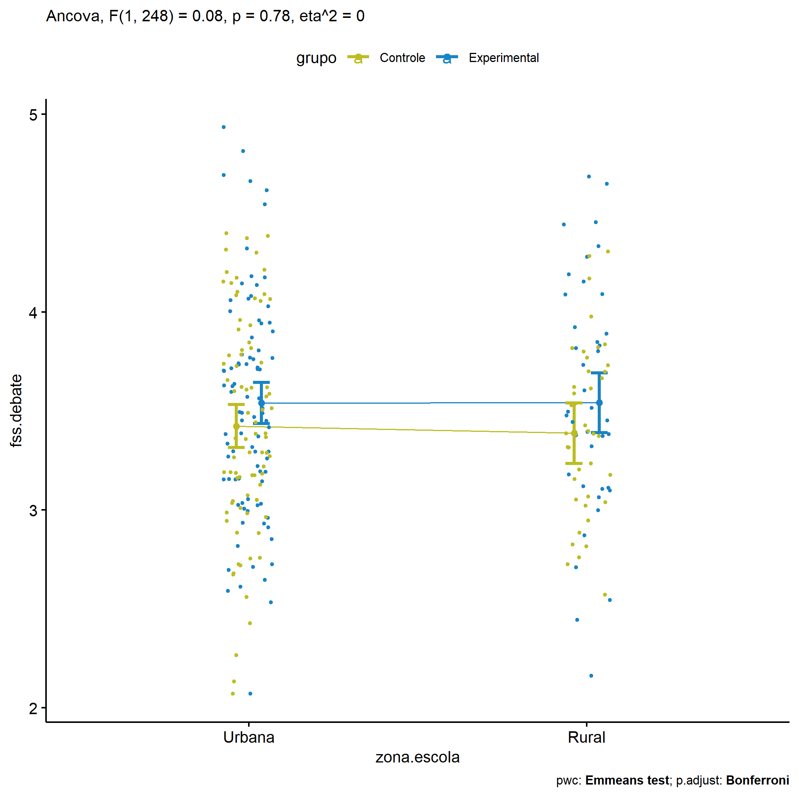<!-- -->

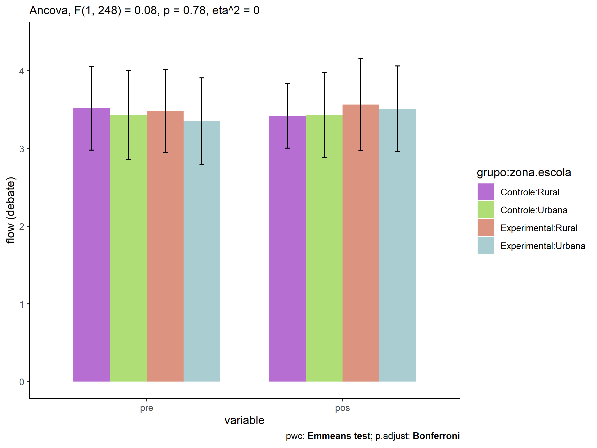<!-- -->

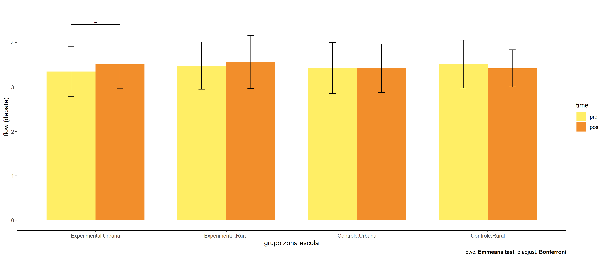<!-- -->

## Pairwise comparisons for grupo=“Experimental”

### factores: **grupo=“Experimental”:monitor**

| var        | monitor |   n | M (pre) | SE (pre) | M (unadj) | SE (unadj) | M (adj) | SE (adj) |
|:-----------|:--------|----:|--------:|---------:|----------:|-----------:|--------:|---------:|
| fss.debate | AC      |  11 |   3.788 |    0.133 |     3.427 |      0.129 |   3.274 |    0.153 |
| fss.debate | CE      |  14 |   3.464 |    0.123 |     3.714 |      0.153 |   3.697 |    0.133 |
| fss.debate | EA      |  10 |   3.261 |    0.125 |     3.733 |      0.201 |   3.801 |    0.158 |
| fss.debate | GR      |  15 |   3.474 |    0.149 |     3.556 |      0.102 |   3.534 |    0.128 |
| fss.debate | JC      |  10 |   3.311 |    0.220 |     3.240 |      0.141 |   3.287 |    0.157 |
| fss.debate | MF      |  11 |   3.424 |    0.206 |     3.576 |      0.231 |   3.575 |    0.150 |
| fss.debate | ML      |  15 |   3.496 |    0.180 |     3.231 |      0.149 |   3.199 |    0.128 |
| fss.debate | MM      |  13 |   3.246 |    0.143 |     3.484 |      0.122 |   3.558 |    0.138 |
| fss.debate | PR      |  10 |   3.179 |    0.132 |     3.779 |      0.204 |   3.881 |    0.158 |
| fss.debate | VL      |  13 |   3.491 |    0.117 |     3.786 |      0.138 |   3.757 |    0.138 |

| .y.        | group1 | group2 | estimate | conf.low | conf.high |    se | statistic |     p | p.adj | p.adj.signif |
|:-----------|:-------|:-------|---------:|---------:|----------:|------:|----------:|------:|------:|:-------------|
| fss.debate | AC     | CE     |   -0.423 |   -0.823 |    -0.023 | 0.202 |    -2.095 | 0.038 | 1.000 | ns           |
| fss.debate | AC     | EA     |   -0.527 |   -0.966 |    -0.088 | 0.222 |    -2.379 | 0.019 | 0.859 | ns           |
| fss.debate | AC     | GR     |   -0.260 |   -0.654 |     0.134 | 0.199 |    -1.308 | 0.194 | 1.000 | ns           |
| fss.debate | AC     | JC     |   -0.013 |   -0.450 |     0.424 | 0.221 |    -0.059 | 0.953 | 1.000 | ns           |
| fss.debate | AC     | MF     |   -0.301 |   -0.725 |     0.123 | 0.214 |    -1.408 | 0.162 | 1.000 | ns           |
| fss.debate | AC     | ML     |    0.074 |   -0.319 |     0.468 | 0.199 |     0.374 | 0.709 | 1.000 | ns           |
| fss.debate | AC     | MM     |   -0.284 |   -0.697 |     0.129 | 0.209 |    -1.361 | 0.176 | 1.000 | ns           |
| fss.debate | AC     | PR     |   -0.607 |   -1.049 |    -0.165 | 0.223 |    -2.721 | 0.008 | 0.340 | ns           |
| fss.debate | AC     | VL     |   -0.484 |   -0.890 |    -0.078 | 0.205 |    -2.360 | 0.020 | 0.901 | ns           |
| fss.debate | CE     | EA     |   -0.104 |   -0.513 |     0.305 | 0.206 |    -0.504 | 0.615 | 1.000 | ns           |
| fss.debate | CE     | GR     |    0.163 |   -0.203 |     0.528 | 0.184 |     0.883 | 0.379 | 1.000 | ns           |
| fss.debate | CE     | JC     |    0.410 |    0.002 |     0.818 | 0.206 |     1.991 | 0.049 | 1.000 | ns           |
| fss.debate | CE     | MF     |    0.122 |   -0.275 |     0.518 | 0.200 |     0.609 | 0.544 | 1.000 | ns           |
| fss.debate | CE     | ML     |    0.497 |    0.132 |     0.863 | 0.184 |     2.695 | 0.008 | 0.366 | ns           |
| fss.debate | CE     | MM     |    0.139 |   -0.242 |     0.520 | 0.192 |     0.724 | 0.471 | 1.000 | ns           |
| fss.debate | CE     | PR     |   -0.184 |   -0.594 |     0.226 | 0.207 |    -0.890 | 0.375 | 1.000 | ns           |
| fss.debate | CE     | VL     |   -0.061 |   -0.440 |     0.318 | 0.191 |    -0.317 | 0.752 | 1.000 | ns           |
| fss.debate | EA     | GR     |    0.267 |   -0.136 |     0.670 | 0.203 |     1.312 | 0.192 | 1.000 | ns           |
| fss.debate | EA     | JC     |    0.514 |    0.074 |     0.954 | 0.222 |     2.315 | 0.022 | 1.000 | ns           |
| fss.debate | EA     | MF     |    0.226 |   -0.205 |     0.656 | 0.217 |     1.039 | 0.301 | 1.000 | ns           |
| fss.debate | EA     | ML     |    0.601 |    0.198 |     1.005 | 0.204 |     2.952 | 0.004 | 0.173 | ns           |
| fss.debate | EA     | MM     |    0.243 |   -0.171 |     0.657 | 0.209 |     1.164 | 0.247 | 1.000 | ns           |
| fss.debate | EA     | PR     |   -0.080 |   -0.520 |     0.360 | 0.222 |    -0.361 | 0.719 | 1.000 | ns           |
| fss.debate | EA     | VL     |    0.043 |   -0.372 |     0.459 | 0.210 |     0.207 | 0.837 | 1.000 | ns           |
| fss.debate | GR     | JC     |    0.247 |   -0.155 |     0.650 | 0.203 |     1.217 | 0.226 | 1.000 | ns           |
| fss.debate | GR     | MF     |   -0.041 |   -0.432 |     0.349 | 0.197 |    -0.208 | 0.835 | 1.000 | ns           |
| fss.debate | GR     | ML     |    0.334 |   -0.025 |     0.693 | 0.181 |     1.845 | 0.068 | 1.000 | ns           |
| fss.debate | GR     | MM     |   -0.024 |   -0.399 |     0.351 | 0.189 |    -0.126 | 0.900 | 1.000 | ns           |
| fss.debate | GR     | PR     |   -0.347 |   -0.752 |     0.058 | 0.204 |    -1.699 | 0.092 | 1.000 | ns           |
| fss.debate | GR     | VL     |   -0.223 |   -0.596 |     0.149 | 0.188 |    -1.188 | 0.237 | 1.000 | ns           |
| fss.debate | JC     | MF     |   -0.288 |   -0.718 |     0.142 | 0.217 |    -1.327 | 0.187 | 1.000 | ns           |
| fss.debate | JC     | ML     |    0.087 |   -0.316 |     0.490 | 0.203 |     0.429 | 0.669 | 1.000 | ns           |
| fss.debate | JC     | MM     |   -0.271 |   -0.685 |     0.143 | 0.209 |    -1.297 | 0.197 | 1.000 | ns           |
| fss.debate | JC     | PR     |   -0.594 |   -1.034 |    -0.154 | 0.222 |    -2.673 | 0.009 | 0.389 | ns           |
| fss.debate | JC     | VL     |   -0.471 |   -0.885 |    -0.056 | 0.209 |    -2.248 | 0.027 | 1.000 | ns           |
| fss.debate | MF     | ML     |    0.375 |   -0.015 |     0.766 | 0.197 |     1.904 | 0.059 | 1.000 | ns           |
| fss.debate | MF     | MM     |    0.017 |   -0.387 |     0.421 | 0.204 |     0.085 | 0.933 | 1.000 | ns           |
| fss.debate | MF     | PR     |   -0.306 |   -0.738 |     0.126 | 0.218 |    -1.404 | 0.163 | 1.000 | ns           |
| fss.debate | MF     | VL     |   -0.182 |   -0.586 |     0.221 | 0.203 |    -0.897 | 0.372 | 1.000 | ns           |
| fss.debate | ML     | MM     |   -0.358 |   -0.733 |     0.017 | 0.189 |    -1.892 | 0.061 | 1.000 | ns           |
| fss.debate | ML     | PR     |   -0.681 |   -1.086 |    -0.276 | 0.204 |    -3.332 | 0.001 | 0.053 | ns           |
| fss.debate | ML     | VL     |   -0.558 |   -0.930 |    -0.185 | 0.188 |    -2.966 | 0.004 | 0.166 | ns           |
| fss.debate | MM     | PR     |   -0.323 |   -0.737 |     0.091 | 0.209 |    -1.547 | 0.125 | 1.000 | ns           |
| fss.debate | MM     | VL     |   -0.200 |   -0.588 |     0.188 | 0.196 |    -1.020 | 0.310 | 1.000 | ns           |
| fss.debate | PR     | VL     |    0.123 |   -0.294 |     0.541 | 0.210 |     0.587 | 0.559 | 1.000 | ns           |
| dfs.debate | AC     | CE     |    0.324 |   -0.113 |     0.760 | 0.220 |     1.469 | 0.145 | 1.000 | ns           |
| dfs.debate | AC     | EA     |    0.527 |    0.054 |     1.000 | 0.239 |     2.206 | 0.029 | 1.000 | ns           |
| dfs.debate | AC     | GR     |    0.314 |   -0.116 |     0.744 | 0.217 |     1.446 | 0.151 | 1.000 | ns           |
| dfs.debate | AC     | JC     |    0.477 |    0.004 |     0.950 | 0.239 |     1.996 | 0.048 | 1.000 | ns           |
| dfs.debate | AC     | MF     |    0.364 |   -0.098 |     0.825 | 0.233 |     1.560 | 0.122 | 1.000 | ns           |
| dfs.debate | AC     | ML     |    0.292 |   -0.138 |     0.721 | 0.217 |     1.344 | 0.182 | 1.000 | ns           |
| dfs.debate | AC     | MM     |    0.542 |    0.098 |     0.986 | 0.224 |     2.420 | 0.017 | 0.771 | ns           |
| dfs.debate | AC     | PR     |    0.609 |    0.136 |     1.082 | 0.239 |     2.549 | 0.012 | 0.547 | ns           |
| dfs.debate | AC     | VL     |    0.296 |   -0.147 |     0.740 | 0.224 |     1.324 | 0.188 | 1.000 | ns           |
| dfs.debate | CE     | EA     |    0.203 |   -0.245 |     0.652 | 0.226 |     0.898 | 0.371 | 1.000 | ns           |
| dfs.debate | CE     | GR     |   -0.010 |   -0.412 |     0.393 | 0.203 |    -0.048 | 0.962 | 1.000 | ns           |
| dfs.debate | CE     | JC     |    0.153 |   -0.295 |     0.602 | 0.226 |     0.677 | 0.500 | 1.000 | ns           |
| dfs.debate | CE     | MF     |    0.040 |   -0.396 |     0.476 | 0.220 |     0.182 | 0.856 | 1.000 | ns           |
| dfs.debate | CE     | ML     |   -0.032 |   -0.434 |     0.370 | 0.203 |    -0.158 | 0.875 | 1.000 | ns           |
| dfs.debate | CE     | MM     |    0.218 |   -0.199 |     0.635 | 0.211 |     1.037 | 0.302 | 1.000 | ns           |
| dfs.debate | CE     | PR     |    0.285 |   -0.163 |     0.734 | 0.226 |     1.260 | 0.210 | 1.000 | ns           |
| dfs.debate | CE     | VL     |   -0.027 |   -0.444 |     0.390 | 0.211 |    -0.129 | 0.898 | 1.000 | ns           |
| dfs.debate | EA     | GR     |   -0.213 |   -0.655 |     0.229 | 0.223 |    -0.954 | 0.342 | 1.000 | ns           |
| dfs.debate | EA     | JC     |   -0.050 |   -0.534 |     0.434 | 0.244 |    -0.205 | 0.838 | 1.000 | ns           |
| dfs.debate | EA     | MF     |   -0.163 |   -0.636 |     0.310 | 0.239 |    -0.683 | 0.496 | 1.000 | ns           |
| dfs.debate | EA     | ML     |   -0.235 |   -0.677 |     0.207 | 0.223 |    -1.054 | 0.294 | 1.000 | ns           |
| dfs.debate | EA     | MM     |    0.015 |   -0.440 |     0.471 | 0.230 |     0.066 | 0.948 | 1.000 | ns           |
| dfs.debate | EA     | PR     |    0.082 |   -0.402 |     0.566 | 0.244 |     0.335 | 0.738 | 1.000 | ns           |
| dfs.debate | EA     | VL     |   -0.230 |   -0.686 |     0.225 | 0.230 |    -1.002 | 0.319 | 1.000 | ns           |
| dfs.debate | GR     | JC     |    0.163 |   -0.279 |     0.605 | 0.223 |     0.730 | 0.467 | 1.000 | ns           |
| dfs.debate | GR     | MF     |    0.050 |   -0.380 |     0.480 | 0.217 |     0.230 | 0.819 | 1.000 | ns           |
| dfs.debate | GR     | ML     |   -0.022 |   -0.418 |     0.373 | 0.200 |    -0.111 | 0.912 | 1.000 | ns           |
| dfs.debate | GR     | MM     |    0.228 |   -0.182 |     0.638 | 0.207 |     1.101 | 0.273 | 1.000 | ns           |
| dfs.debate | GR     | PR     |    0.295 |   -0.147 |     0.737 | 0.223 |     1.322 | 0.189 | 1.000 | ns           |
| dfs.debate | GR     | VL     |   -0.017 |   -0.428 |     0.393 | 0.207 |    -0.084 | 0.933 | 1.000 | ns           |
| dfs.debate | JC     | MF     |   -0.113 |   -0.586 |     0.360 | 0.239 |    -0.474 | 0.637 | 1.000 | ns           |
| dfs.debate | JC     | ML     |   -0.185 |   -0.627 |     0.257 | 0.223 |    -0.830 | 0.408 | 1.000 | ns           |
| dfs.debate | JC     | MM     |    0.065 |   -0.390 |     0.521 | 0.230 |     0.283 | 0.778 | 1.000 | ns           |
| dfs.debate | JC     | PR     |    0.132 |   -0.352 |     0.616 | 0.244 |     0.540 | 0.590 | 1.000 | ns           |
| dfs.debate | JC     | VL     |   -0.180 |   -0.636 |     0.275 | 0.230 |    -0.784 | 0.434 | 1.000 | ns           |
| dfs.debate | MF     | ML     |   -0.072 |   -0.502 |     0.358 | 0.217 |    -0.332 | 0.740 | 1.000 | ns           |
| dfs.debate | MF     | MM     |    0.178 |   -0.265 |     0.622 | 0.224 |     0.796 | 0.428 | 1.000 | ns           |
| dfs.debate | MF     | PR     |    0.245 |   -0.228 |     0.718 | 0.239 |     1.026 | 0.307 | 1.000 | ns           |
| dfs.debate | MF     | VL     |   -0.067 |   -0.511 |     0.376 | 0.224 |    -0.300 | 0.765 | 1.000 | ns           |
| dfs.debate | ML     | MM     |    0.250 |   -0.160 |     0.661 | 0.207 |     1.208 | 0.229 | 1.000 | ns           |
| dfs.debate | ML     | PR     |    0.317 |   -0.125 |     0.759 | 0.223 |     1.421 | 0.158 | 1.000 | ns           |
| dfs.debate | ML     | VL     |    0.005 |   -0.406 |     0.415 | 0.207 |     0.023 | 0.981 | 1.000 | ns           |
| dfs.debate | MM     | PR     |    0.067 |   -0.389 |     0.522 | 0.230 |     0.291 | 0.772 | 1.000 | ns           |
| dfs.debate | MM     | VL     |   -0.245 |   -0.670 |     0.179 | 0.214 |    -1.145 | 0.255 | 1.000 | ns           |
| dfs.debate | PR     | VL     |   -0.312 |   -0.768 |     0.143 | 0.230 |    -1.358 | 0.177 | 1.000 | ns           |

| .y.         | monitor | group1 | group2 | estimate | conf.low | conf.high |    se | statistic |     p | p.adj | p.adj.signif |
|:------------|:--------|:-------|:-------|---------:|---------:|----------:|------:|----------:|------:|------:|:-------------|
| flow.debate | AC      | pre    | pos    |    0.361 |   -0.097 |     0.819 | 0.233 |     1.552 | 0.122 | 0.122 | ns           |
| flow.debate | CE      | pre    | pos    |   -0.250 |   -0.656 |     0.156 | 0.206 |    -1.213 | 0.227 | 0.227 | ns           |
| flow.debate | EA      | pre    | pos    |   -0.472 |   -0.953 |     0.009 | 0.244 |    -1.936 | 0.054 | 0.054 | ns           |
| flow.debate | GR      | pre    | pos    |   -0.081 |   -0.474 |     0.311 | 0.199 |    -0.409 | 0.683 | 0.683 | ns           |
| flow.debate | JC      | pre    | pos    |    0.071 |   -0.410 |     0.552 | 0.244 |     0.290 | 0.772 | 0.772 | ns           |
| flow.debate | MF      | pre    | pos    |   -0.152 |   -0.610 |     0.307 | 0.233 |    -0.651 | 0.515 | 0.515 | ns           |
| flow.debate | ML      | pre    | pos    |    0.266 |   -0.127 |     0.658 | 0.199 |     1.334 | 0.184 | 0.184 | ns           |
| flow.debate | MM      | pre    | pos    |   -0.238 |   -0.660 |     0.184 | 0.214 |    -1.112 | 0.267 | 0.267 | ns           |
| flow.debate | PR      | pre    | pos    |   -0.600 |   -1.081 |    -0.119 | 0.244 |    -2.459 | 0.015 | 0.015 | \*           |
| flow.debate | VL      | pre    | pos    |   -0.295 |   -0.717 |     0.127 | 0.214 |    -1.378 | 0.170 | 0.170 | ns           |

    ## Scale for colour is already present.
    ## Adding another scale for colour, which will replace the existing scale.

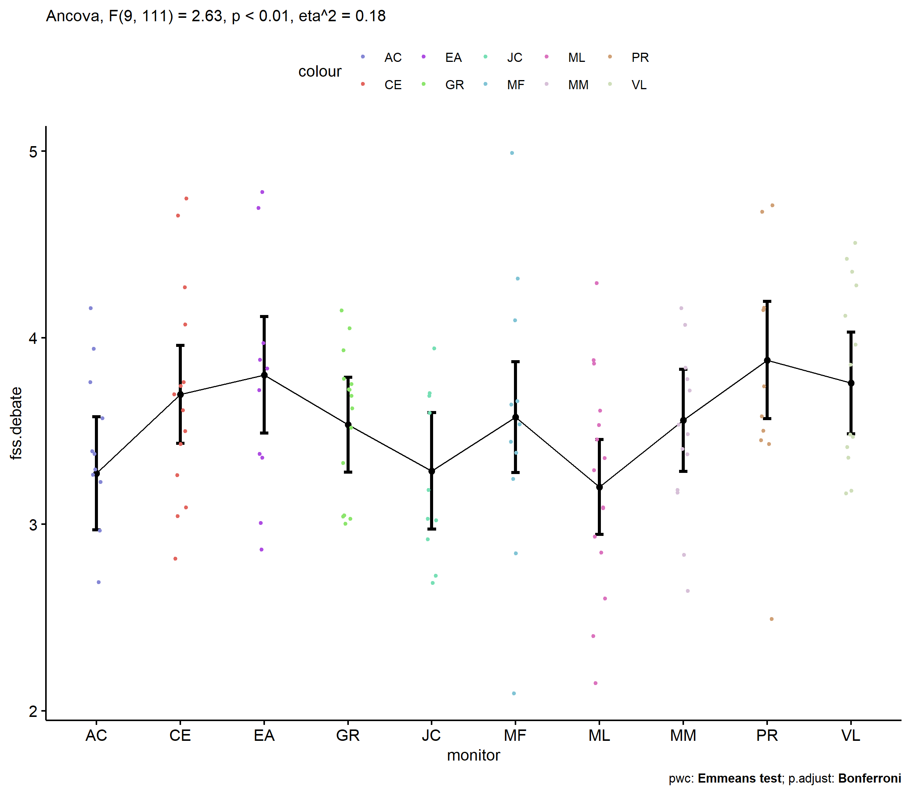<!-- -->

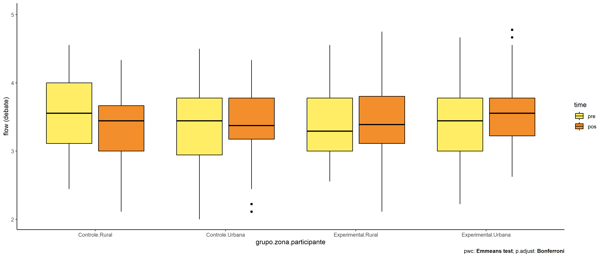<!-- -->

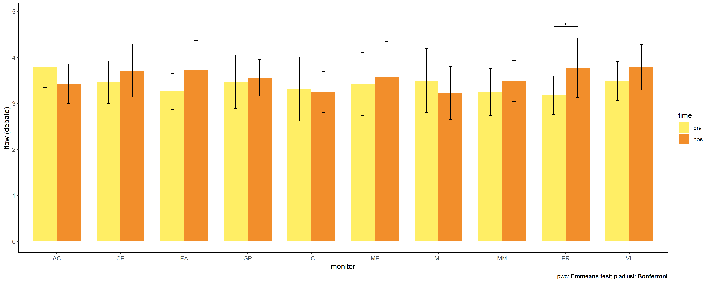<!-- -->

### factores: **grupo=“Experimental”:monitor.genero**

| var        | monitor.genero |   n | M (pre) | SE (pre) | M (unadj) | SE (unadj) | M (adj) | SE (adj) |
|:-----------|:---------------|----:|--------:|---------:|----------:|-----------:|--------:|---------:|
| fss.debate | F              |  78 |   3.480 |    0.065 |     3.504 |      0.061 |   3.482 |    0.059 |
| fss.debate | M              |  44 |   3.318 |    0.075 |     3.626 |      0.090 |   3.665 |    0.079 |

| .y.        | group1 | group2 | estimate | conf.low | conf.high |    se | statistic |     p | p.adj | p.adj.signif |
|:-----------|:-------|:-------|---------:|---------:|----------:|------:|----------:|------:|------:|:-------------|
| fss.debate | F      | M      |   -0.183 |   -0.380 |     0.013 | 0.099 |    -1.847 | 0.067 | 0.067 | ns           |
| dfs.debate | F      | M      |    0.162 |   -0.042 |     0.366 | 0.103 |     1.573 | 0.118 | 0.118 | ns           |

| .y.         | monitor.genero | group1 | group2 | estimate | conf.low | conf.high |    se | statistic |     p | p.adj | p.adj.signif |
|:------------|:---------------|:-------|:-------|---------:|---------:|----------:|------:|----------:|------:|------:|:-------------|
| flow.debate | F              | pre    | pos    |   -0.024 |   -0.198 |     0.150 | 0.088 |    -0.269 | 0.788 | 0.788 | ns           |
| flow.debate | M              | pre    | pos    |   -0.307 |   -0.539 |    -0.075 | 0.118 |    -2.608 | 0.010 | 0.010 | \*\*         |

    ## Scale for colour is already present.
    ## Adding another scale for colour, which will replace the existing scale.

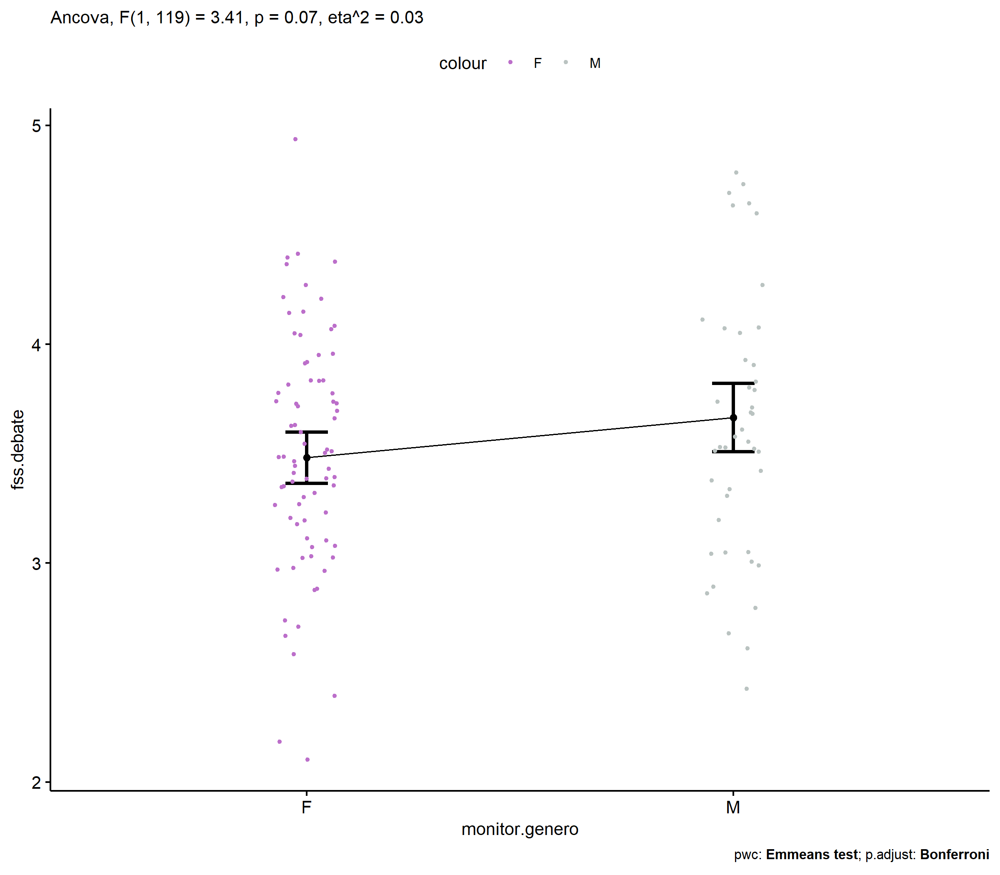<!-- -->

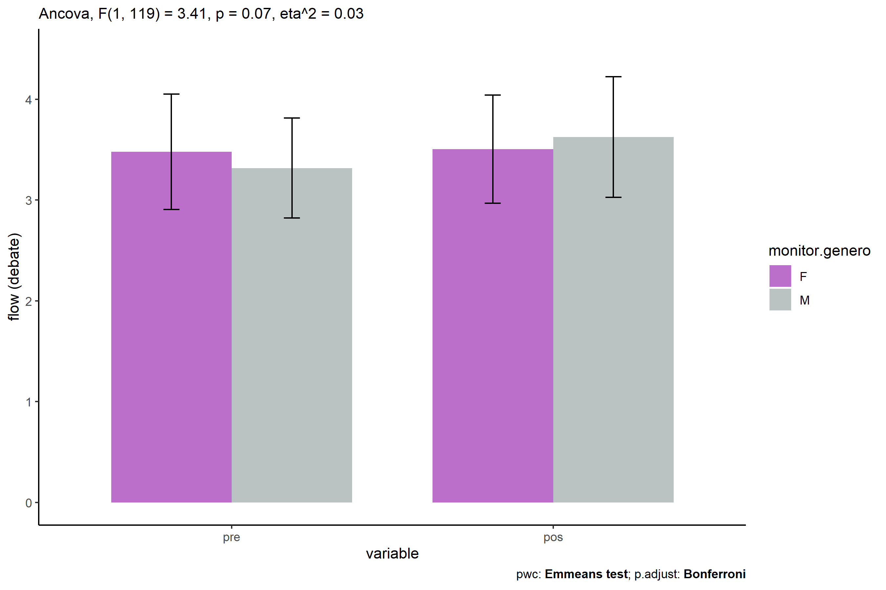<!-- -->

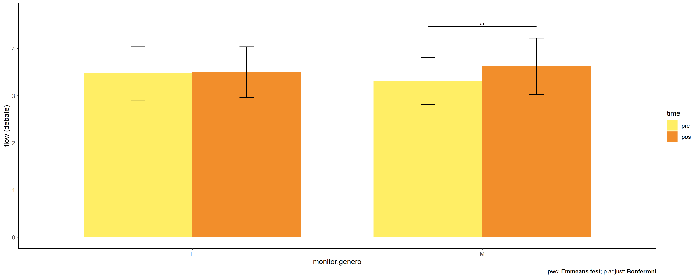<!-- -->

### factores: **grupo=“Experimental”:monitor.area**

| var        | monitor.area               |   n | M (pre) | SE (pre) | M (unadj) | SE (unadj) | M (adj) | SE (adj) |
|:-----------|:---------------------------|----:|--------:|---------:|----------:|-----------:|--------:|---------:|
| fss.debate | Arquitetura e Urbanismo    |  10 |   3.311 |    0.220 |     3.240 |      0.141 |   3.286 |    0.158 |
| fss.debate | Ciencias Biologicas        |  15 |   3.496 |    0.180 |     3.231 |      0.149 |   3.200 |    0.129 |
| fss.debate | Comunicacao Social         |  14 |   3.464 |    0.123 |     3.714 |      0.153 |   3.697 |    0.133 |
| fss.debate | Historia                   |  10 |   3.179 |    0.132 |     3.779 |      0.204 |   3.878 |    0.159 |
| fss.debate | Letras - Lingua Portuguesa |  11 |   3.424 |    0.206 |     3.576 |      0.231 |   3.575 |    0.150 |
| fss.debate | Matematica                 |  25 |   3.389 |    0.103 |     3.627 |      0.100 |   3.640 |    0.100 |
| fss.debate | Nutricao                   |  13 |   3.246 |    0.143 |     3.484 |      0.122 |   3.556 |    0.139 |
| fss.debate | Pedagogia                  |  11 |   3.788 |    0.133 |     3.427 |      0.129 |   3.277 |    0.153 |
| fss.debate | Servico Social             |  13 |   3.491 |    0.117 |     3.786 |      0.138 |   3.758 |    0.138 |

| .y.        | group1                  | group2              | estimate | conf.low | conf.high |    se | statistic |     p | p.adj | p.adj.signif |
|:-----------|:------------------------|:--------------------|---------:|---------:|----------:|------:|----------:|------:|------:|:-------------|
| fss.debate | Arquitetura e Urbanismo | Ciencias Biologicas |    0.085 |   -0.319 |     0.489 | 0.204 |     0.418 | 0.676 | 1.000 | ns           |
| fss.debate | Arquitetura e Urbanismo | Comunicacao Social  |   -0.411 |   -0.821 |    -0.002 | 0.207 |    -1.992 | 0.049 | 1.000 | ns           |
| fss.debate | Arquitetura e Urbanismo | Historia            |   -0.593 |   -1.035 |    -0.151 | 0.223 |    -2.659 | 0.009 | 0.324 | ns           |
| fss.debate | Arquitetura e Urbanismo | Letras              |   -0.289 |   -0.721 |     0.142 | 0.218 |    -1.328 | 0.187 | 1.000 | ns           |
| fss.debate | Arquitetura e Urbanismo | Matematica          |   -0.355 |   -0.724 |     0.015 | 0.186 |    -1.902 | 0.060 | 1.000 | ns           |
| fss.debate | Arquitetura e Urbanismo | Nutricao            |   -0.270 |   -0.685 |     0.145 | 0.210 |    -1.290 | 0.200 | 1.000 | ns           |
| fss.debate | Arquitetura e Urbanismo | Pedagogia           |    0.008 |   -0.430 |     0.447 | 0.221 |     0.037 | 0.971 | 1.000 | ns           |
| fss.debate | Arquitetura e Urbanismo | Servico Social      |   -0.472 |   -0.889 |    -0.056 | 0.210 |    -2.250 | 0.026 | 0.951 | ns           |
| fss.debate | Ciencias Biologicas     | Comunicacao Social  |   -0.497 |   -0.863 |    -0.130 | 0.185 |    -2.685 | 0.008 | 0.301 | ns           |
| fss.debate | Ciencias Biologicas     | Historia            |   -0.678 |   -1.084 |    -0.272 | 0.205 |    -3.306 | 0.001 | 0.046 | \*           |
| fss.debate | Ciencias Biologicas     | Letras              |   -0.375 |   -0.766 |     0.017 | 0.198 |    -1.894 | 0.061 | 1.000 | ns           |
| fss.debate | Ciencias Biologicas     | Matematica          |   -0.440 |   -0.763 |    -0.117 | 0.163 |    -2.701 | 0.008 | 0.287 | ns           |
| fss.debate | Ciencias Biologicas     | Nutricao            |   -0.356 |   -0.732 |     0.021 | 0.190 |    -1.873 | 0.064 | 1.000 | ns           |
| fss.debate | Ciencias Biologicas     | Pedagogia           |   -0.077 |   -0.472 |     0.318 | 0.199 |    -0.387 | 0.699 | 1.000 | ns           |
| fss.debate | Ciencias Biologicas     | Servico Social      |   -0.558 |   -0.932 |    -0.184 | 0.189 |    -2.956 | 0.004 | 0.137 | ns           |
| fss.debate | Comunicacao Social      | Historia            |   -0.181 |   -0.593 |     0.230 | 0.208 |    -0.873 | 0.384 | 1.000 | ns           |
| fss.debate | Comunicacao Social      | Letras              |    0.122 |   -0.275 |     0.520 | 0.201 |     0.609 | 0.544 | 1.000 | ns           |
| fss.debate | Comunicacao Social      | Matematica          |    0.057 |   -0.273 |     0.386 | 0.166 |     0.342 | 0.733 | 1.000 | ns           |
| fss.debate | Comunicacao Social      | Nutricao            |    0.141 |   -0.241 |     0.523 | 0.193 |     0.733 | 0.465 | 1.000 | ns           |
| fss.debate | Comunicacao Social      | Pedagogia           |    0.420 |    0.018 |     0.821 | 0.203 |     2.072 | 0.041 | 1.000 | ns           |
| fss.debate | Comunicacao Social      | Servico Social      |   -0.061 |   -0.441 |     0.319 | 0.192 |    -0.318 | 0.751 | 1.000 | ns           |
| fss.debate | Historia                | Letras              |    0.303 |   -0.130 |     0.737 | 0.219 |     1.388 | 0.168 | 1.000 | ns           |
| fss.debate | Historia                | Matematica          |    0.238 |   -0.133 |     0.609 | 0.187 |     1.272 | 0.206 | 1.000 | ns           |
| fss.debate | Historia                | Nutricao            |    0.322 |   -0.093 |     0.738 | 0.210 |     1.539 | 0.127 | 1.000 | ns           |
| fss.debate | Historia                | Pedagogia           |    0.601 |    0.158 |     1.044 | 0.224 |     2.686 | 0.008 | 0.300 | ns           |
| fss.debate | Historia                | Servico Social      |    0.120 |   -0.298 |     0.539 | 0.211 |     0.570 | 0.570 | 1.000 | ns           |
| fss.debate | Letras                  | Lingua Portuguesa   |   -0.065 |   -0.422 |     0.292 | 0.180 |    -0.363 | 0.718 | 1.000 | ns           |
| fss.debate | Letras                  | Lingua Portuguesa   |    0.019 |   -0.386 |     0.424 | 0.205 |     0.093 | 0.926 | 1.000 | ns           |
| fss.debate | Letras                  | Lingua Portuguesa   |    0.297 |   -0.128 |     0.723 | 0.215 |     1.386 | 0.168 | 1.000 | ns           |
| fss.debate | Letras                  | Lingua Portuguesa   |   -0.183 |   -0.587 |     0.221 | 0.204 |    -0.897 | 0.371 | 1.000 | ns           |
| fss.debate | Matematica              | Nutricao            |    0.084 |   -0.254 |     0.423 | 0.171 |     0.494 | 0.622 | 1.000 | ns           |
| fss.debate | Matematica              | Pedagogia           |    0.363 |   -0.001 |     0.726 | 0.183 |     1.978 | 0.050 | 1.000 | ns           |
| fss.debate | Matematica              | Servico Social      |   -0.118 |   -0.456 |     0.220 | 0.170 |    -0.691 | 0.491 | 1.000 | ns           |
| fss.debate | Nutricao                | Pedagogia           |    0.278 |   -0.136 |     0.693 | 0.209 |     1.331 | 0.186 | 1.000 | ns           |
| fss.debate | Nutricao                | Servico Social      |   -0.202 |   -0.591 |     0.187 | 0.196 |    -1.029 | 0.306 | 1.000 | ns           |
| fss.debate | Pedagogia               | Servico Social      |   -0.481 |   -0.888 |    -0.073 | 0.206 |    -2.338 | 0.021 | 0.762 | ns           |
| dfs.debate | Arquitetura e Urbanismo | Ciencias Biologicas |   -0.185 |   -0.627 |     0.257 | 0.223 |    -0.830 | 0.408 | 1.000 | ns           |
| dfs.debate | Arquitetura e Urbanismo | Comunicacao Social  |   -0.153 |   -0.601 |     0.295 | 0.226 |    -0.677 | 0.500 | 1.000 | ns           |
| dfs.debate | Arquitetura e Urbanismo | Historia            |    0.132 |   -0.352 |     0.616 | 0.244 |     0.540 | 0.590 | 1.000 | ns           |
| dfs.debate | Arquitetura e Urbanismo | Letras              |   -0.113 |   -0.586 |     0.360 | 0.239 |    -0.474 | 0.636 | 1.000 | ns           |
| dfs.debate | Arquitetura e Urbanismo | Matematica          |   -0.078 |   -0.483 |     0.327 | 0.204 |    -0.380 | 0.704 | 1.000 | ns           |
| dfs.debate | Arquitetura e Urbanismo | Nutricao            |    0.065 |   -0.390 |     0.520 | 0.230 |     0.283 | 0.778 | 1.000 | ns           |
| dfs.debate | Arquitetura e Urbanismo | Pedagogia           |   -0.477 |   -0.950 |    -0.004 | 0.239 |    -1.997 | 0.048 | 1.000 | ns           |
| dfs.debate | Arquitetura e Urbanismo | Servico Social      |   -0.180 |   -0.636 |     0.275 | 0.230 |    -0.785 | 0.434 | 1.000 | ns           |
| dfs.debate | Ciencias Biologicas     | Comunicacao Social  |    0.032 |   -0.370 |     0.434 | 0.203 |     0.158 | 0.875 | 1.000 | ns           |
| dfs.debate | Ciencias Biologicas     | Historia            |    0.317 |   -0.125 |     0.759 | 0.223 |     1.422 | 0.158 | 1.000 | ns           |
| dfs.debate | Ciencias Biologicas     | Letras              |    0.072 |   -0.358 |     0.502 | 0.217 |     0.332 | 0.740 | 1.000 | ns           |
| dfs.debate | Ciencias Biologicas     | Matematica          |    0.107 |   -0.246 |     0.461 | 0.178 |     0.602 | 0.548 | 1.000 | ns           |
| dfs.debate | Ciencias Biologicas     | Nutricao            |    0.250 |   -0.160 |     0.660 | 0.207 |     1.209 | 0.229 | 1.000 | ns           |
| dfs.debate | Ciencias Biologicas     | Pedagogia           |   -0.292 |   -0.721 |     0.138 | 0.217 |    -1.344 | 0.182 | 1.000 | ns           |
| dfs.debate | Ciencias Biologicas     | Servico Social      |    0.005 |   -0.405 |     0.415 | 0.207 |     0.023 | 0.981 | 1.000 | ns           |
| dfs.debate | Comunicacao Social      | Historia            |    0.285 |   -0.163 |     0.733 | 0.226 |     1.260 | 0.210 | 1.000 | ns           |
| dfs.debate | Comunicacao Social      | Letras              |    0.040 |   -0.396 |     0.476 | 0.220 |     0.182 | 0.856 | 1.000 | ns           |
| dfs.debate | Comunicacao Social      | Matematica          |    0.075 |   -0.286 |     0.437 | 0.182 |     0.413 | 0.680 | 1.000 | ns           |
| dfs.debate | Comunicacao Social      | Nutricao            |    0.218 |   -0.199 |     0.635 | 0.210 |     1.037 | 0.302 | 1.000 | ns           |
| dfs.debate | Comunicacao Social      | Pedagogia           |   -0.324 |   -0.760 |     0.113 | 0.220 |    -1.470 | 0.144 | 1.000 | ns           |
| dfs.debate | Comunicacao Social      | Servico Social      |   -0.027 |   -0.444 |     0.390 | 0.210 |    -0.129 | 0.898 | 1.000 | ns           |
| dfs.debate | Historia                | Letras              |   -0.245 |   -0.718 |     0.228 | 0.239 |    -1.027 | 0.307 | 1.000 | ns           |
| dfs.debate | Historia                | Matematica          |   -0.210 |   -0.615 |     0.195 | 0.204 |    -1.026 | 0.307 | 1.000 | ns           |
| dfs.debate | Historia                | Nutricao            |   -0.067 |   -0.522 |     0.388 | 0.230 |    -0.291 | 0.772 | 1.000 | ns           |
| dfs.debate | Historia                | Pedagogia           |   -0.609 |   -1.082 |    -0.136 | 0.239 |    -2.550 | 0.012 | 0.436 | ns           |
| dfs.debate | Historia                | Servico Social      |   -0.312 |   -0.768 |     0.143 | 0.230 |    -1.359 | 0.177 | 1.000 | ns           |
| dfs.debate | Letras                  | Lingua Portuguesa   |    0.035 |   -0.356 |     0.427 | 0.198 |     0.179 | 0.858 | 1.000 | ns           |
| dfs.debate | Letras                  | Lingua Portuguesa   |    0.178 |   -0.265 |     0.622 | 0.224 |     0.796 | 0.428 | 1.000 | ns           |
| dfs.debate | Letras                  | Lingua Portuguesa   |   -0.364 |   -0.825 |     0.098 | 0.233 |    -1.561 | 0.121 | 1.000 | ns           |
| dfs.debate | Letras                  | Lingua Portuguesa   |   -0.067 |   -0.511 |     0.376 | 0.224 |    -0.300 | 0.765 | 1.000 | ns           |
| dfs.debate | Matematica              | Nutricao            |    0.143 |   -0.227 |     0.513 | 0.187 |     0.765 | 0.446 | 1.000 | ns           |
| dfs.debate | Matematica              | Pedagogia           |   -0.399 |   -0.791 |    -0.007 | 0.198 |    -2.018 | 0.046 | 1.000 | ns           |
| dfs.debate | Matematica              | Servico Social      |   -0.103 |   -0.473 |     0.268 | 0.187 |    -0.549 | 0.584 | 1.000 | ns           |
| dfs.debate | Nutricao                | Pedagogia           |   -0.542 |   -0.985 |    -0.098 | 0.224 |    -2.421 | 0.017 | 0.615 | ns           |
| dfs.debate | Nutricao                | Servico Social      |   -0.245 |   -0.670 |     0.179 | 0.214 |    -1.145 | 0.255 | 1.000 | ns           |
| dfs.debate | Pedagogia               | Servico Social      |    0.296 |   -0.147 |     0.740 | 0.224 |     1.324 | 0.188 | 1.000 | ns           |

| .y.         | monitor.area               | group1 | group2 | estimate | conf.low | conf.high |    se | statistic |     p | p.adj | p.adj.signif |
|:------------|:---------------------------|:-------|:-------|---------:|---------:|----------:|------:|----------:|------:|------:|:-------------|
| flow.debate | Arquitetura e Urbanismo    | pre    | pos    |    0.071 |   -0.409 |     0.551 | 0.244 |     0.291 | 0.772 | 0.772 | ns           |
| flow.debate | Ciencias Biologicas        | pre    | pos    |    0.266 |   -0.126 |     0.658 | 0.199 |     1.335 | 0.183 | 0.183 | ns           |
| flow.debate | Comunicacao Social         | pre    | pos    |   -0.250 |   -0.656 |     0.156 | 0.206 |    -1.214 | 0.226 | 0.226 | ns           |
| flow.debate | Historia                   | pre    | pos    |   -0.600 |   -1.080 |    -0.120 | 0.244 |    -2.462 | 0.015 | 0.015 | \*           |
| flow.debate | Letras - Lingua Portuguesa | pre    | pos    |   -0.152 |   -0.609 |     0.306 | 0.232 |    -0.652 | 0.515 | 0.515 | ns           |
| flow.debate | Matematica                 | pre    | pos    |   -0.238 |   -0.542 |     0.066 | 0.154 |    -1.543 | 0.124 | 0.124 | ns           |
| flow.debate | Nutricao                   | pre    | pos    |   -0.238 |   -0.659 |     0.183 | 0.214 |    -1.113 | 0.267 | 0.267 | ns           |
| flow.debate | Pedagogia                  | pre    | pos    |    0.361 |   -0.097 |     0.819 | 0.232 |     1.554 | 0.122 | 0.122 | ns           |
| flow.debate | Servico Social             | pre    | pos    |   -0.295 |   -0.716 |     0.126 | 0.214 |    -1.379 | 0.169 | 0.169 | ns           |

    ## Scale for colour is already present.
    ## Adding another scale for colour, which will replace the existing scale.

<!-- -->

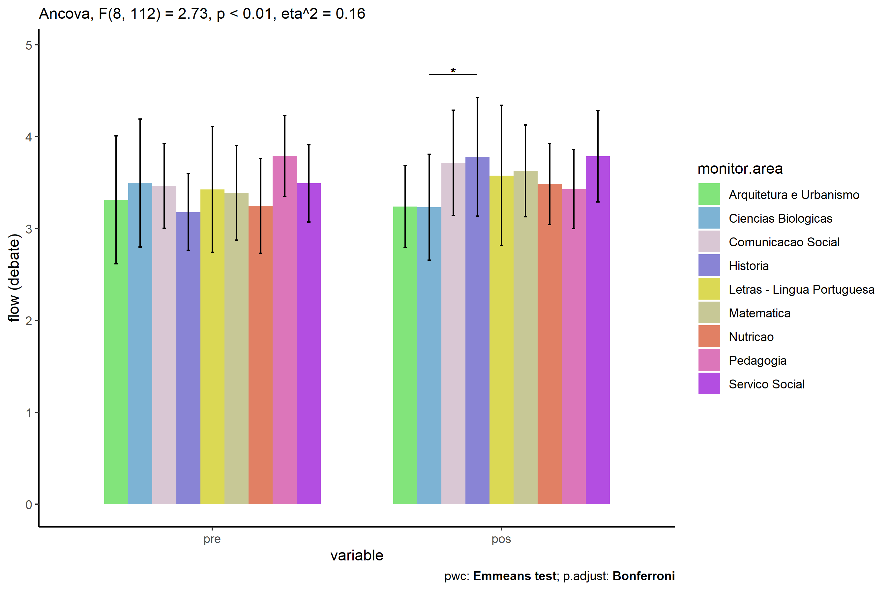<!-- -->

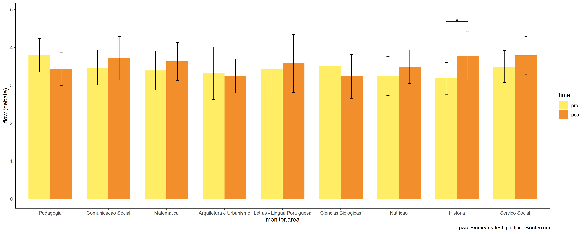<!-- -->

### factores: **grupo=“Experimental”:monitor.formacao**

| var        | monitor.formacao |   n | M (pre) | SE (pre) | M (unadj) | SE (unadj) | M (adj) | SE (adj) |
|:-----------|:-----------------|----:|--------:|---------:|----------:|-----------:|--------:|---------:|
| fss.debate | ensino medio     |  87 |   3.387 |    0.062 |     3.515 |      0.060 |   3.528 |    0.057 |
| fss.debate | especializacao   |  14 |   3.464 |    0.123 |     3.714 |      0.153 |   3.699 |    0.141 |
| fss.debate | graduacao        |  21 |   3.537 |    0.107 |     3.573 |      0.119 |   3.532 |    0.116 |

| .y.        | group1         | group2         | estimate | conf.low | conf.high |    se | statistic |     p | p.adj | p.adj.signif |
|:-----------|:---------------|:---------------|---------:|---------:|----------:|------:|----------:|------:|------:|:-------------|
| fss.debate | ensino medio   | especializacao |   -0.172 |   -0.473 |     0.129 | 0.152 |    -1.129 | 0.261 | 0.783 | ns           |
| fss.debate | ensino medio   | graduacao      |   -0.004 |   -0.259 |     0.251 | 0.129 |    -0.033 | 0.974 | 1.000 | ns           |
| fss.debate | especializacao | graduacao      |    0.167 |   -0.193 |     0.528 | 0.182 |     0.919 | 0.360 | 1.000 | ns           |
| dfs.debate | ensino medio   | especializacao |   -0.077 |   -0.391 |     0.237 | 0.159 |    -0.484 | 0.629 | 1.000 | ns           |
| dfs.debate | ensino medio   | graduacao      |   -0.150 |   -0.415 |     0.116 | 0.134 |    -1.117 | 0.266 | 0.799 | ns           |
| dfs.debate | especializacao | graduacao      |   -0.073 |   -0.449 |     0.304 | 0.190 |    -0.383 | 0.703 | 1.000 | ns           |

| .y.         | monitor.formacao | group1 | group2 | estimate | conf.low | conf.high |    se | statistic |     p | p.adj | p.adj.signif |
|:------------|:-----------------|:-------|:-------|---------:|---------:|----------:|------:|----------:|------:|------:|:-------------|
| flow.debate | ensino medio     | pre    | pos    |   -0.128 |   -0.294 |     0.038 | 0.084 |    -1.517 | 0.131 | 0.131 | ns           |
| flow.debate | especializacao   | pre    | pos    |   -0.250 |   -0.664 |     0.164 | 0.210 |    -1.190 | 0.235 | 0.235 | ns           |
| flow.debate | graduacao        | pre    | pos    |   -0.036 |   -0.374 |     0.302 | 0.172 |    -0.208 | 0.835 | 0.835 | ns           |

    ## Scale for colour is already present.
    ## Adding another scale for colour, which will replace the existing scale.

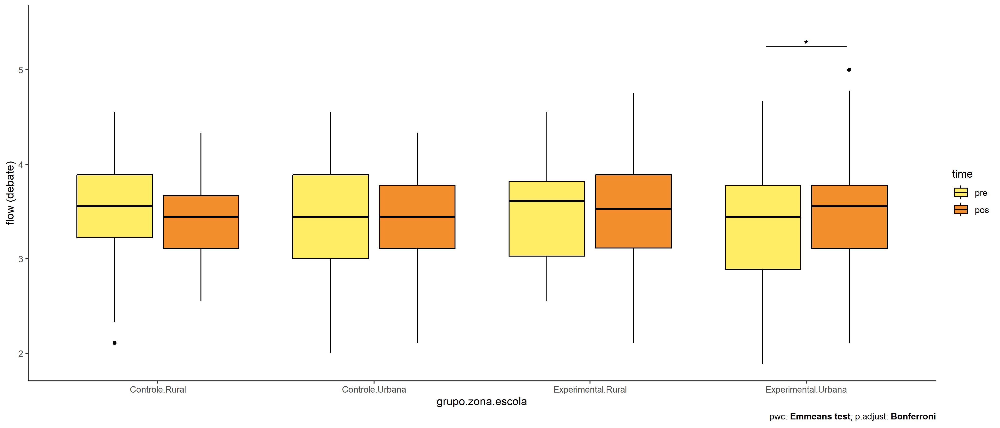<!-- -->

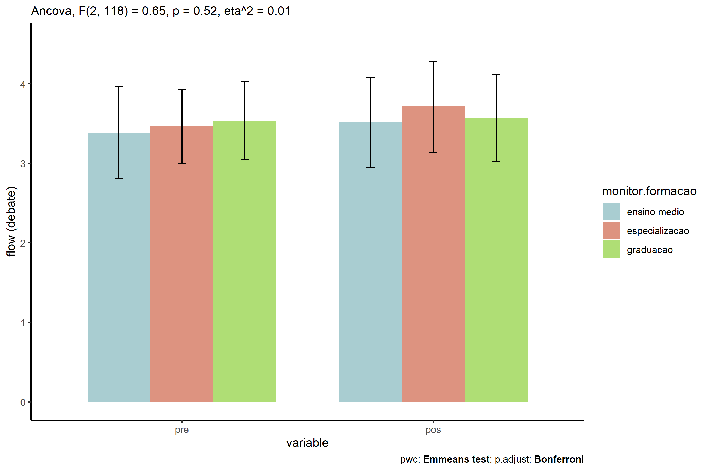<!-- -->

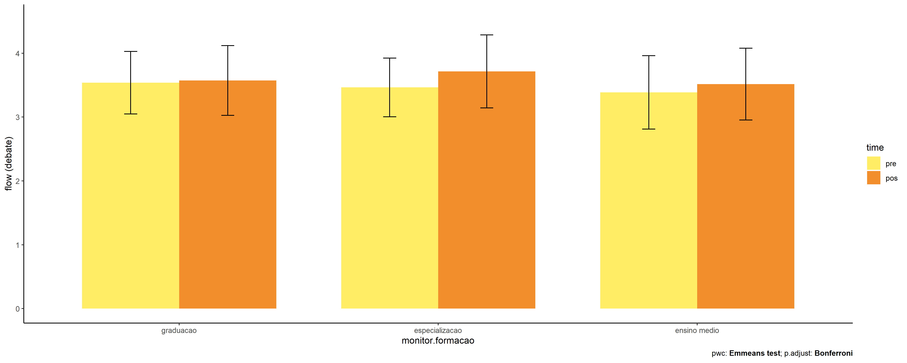<!-- -->

### factores: **grupo=“Experimental”:monitor.experiencia**

| var        | monitor.experiencia |   n | M (pre) | SE (pre) | M (unadj) | SE (unadj) | M (adj) | SE (adj) |
|:-----------|:--------------------|----:|--------:|---------:|----------:|-----------:|--------:|---------:|
| fss.debate | maior 01 ano        |  86 |   3.451 |    0.060 |     3.557 |      0.063 |   3.547 |    0.057 |
| fss.debate | menor 01 ano        |  36 |   3.353 |    0.089 |     3.525 |      0.083 |   3.550 |    0.088 |

| .y.        | group1       | group2       | estimate | conf.low | conf.high |    se | statistic |     p | p.adj | p.adj.signif |
|:-----------|:-------------|:-------------|---------:|---------:|----------:|------:|----------:|------:|------:|:-------------|
| fss.debate | maior 01 ano | menor 01 ano |   -0.003 |   -0.212 |     0.205 | 0.105 |    -0.031 | 0.975 | 0.975 | ns           |
| dfs.debate | maior 01 ano | menor 01 ano |    0.098 |   -0.118 |     0.314 | 0.109 |     0.901 | 0.369 | 0.369 | ns           |

| .y.         | monitor.experiencia | group1 | group2 | estimate | conf.low | conf.high |    se | statistic |     p | p.adj | p.adj.signif |
|:------------|:--------------------|:-------|:-------|---------:|---------:|----------:|------:|----------:|------:|------:|:-------------|
| flow.debate | maior 01 ano        | pre    | pos    |   -0.106 |   -0.273 |     0.061 | 0.085 |    -1.256 | 0.210 | 0.210 | ns           |
| flow.debate | menor 01 ano        | pre    | pos    |   -0.173 |   -0.431 |     0.085 | 0.131 |    -1.319 | 0.189 | 0.189 | ns           |

    ## Scale for colour is already present.
    ## Adding another scale for colour, which will replace the existing scale.

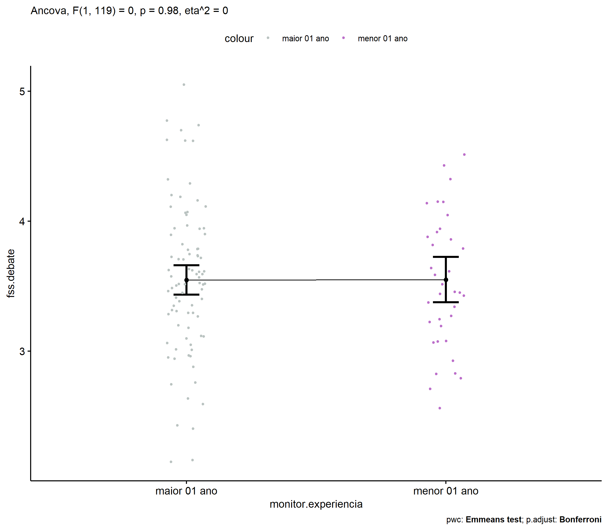<!-- -->

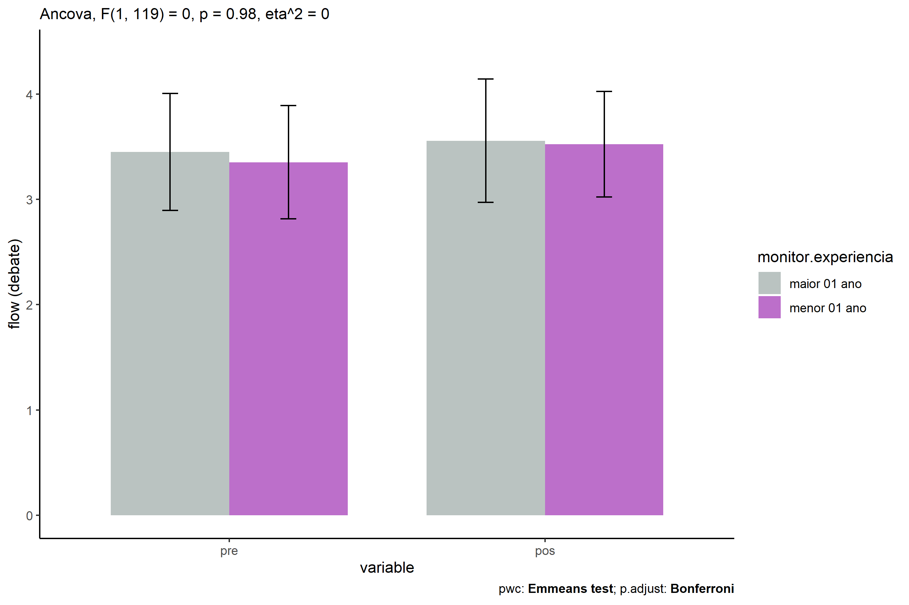<!-- -->

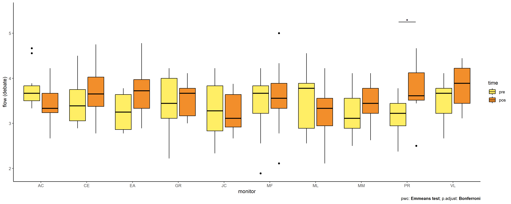<!-- -->
