ANCOVA test for debate (engajamento no debate)
================
Geiser C. Challco <geiser@alumni.usp.br>

- [Descriptive Statistics of Initial
  Data](#descriptive-statistics-of-initial-data)
- [Checking of Assumptions](#checking-of-assumptions)
  - [Assumption: Normality distribution of
    data](#assumption-normality-distribution-of-data)
  - [Assumption: Homogeneity of data
    distribution](#assumption-homogeneity-of-data-distribution)
- [Computation of ANCOVA test and Pairwise
  Comparison](#computation-of-ancova-test-and-pairwise-comparison)
  - [ANCOVA tests for one factor](#ancova-tests-for-one-factor)
  - [ANCOVA tests for two factors](#ancova-tests-for-two-factors)
  - [ANCOVA tests for
    grupo=“Experimental”](#ancova-tests-for-grupoexperimental)
  - [Pairwise comparisons for one
    factor](#pairwise-comparisons-for-one-factor)
    - [factor: **grupo**](#factor-grupo)
    - [factor: **genero**](#factor-genero)
    - [factor: **idade**](#factor-idade)
    - [factor: **zona.participante**](#factor-zonaparticipante)
    - [factor: **escola**](#factor-escola)
    - [factor: **zona.escola**](#factor-zonaescola)
  - [Pairwise comparisons for two
    factors](#pairwise-comparisons-for-two-factors)
    - [factores: **grupo:genero**](#factores-grupogenero)
    - [factores: **grupo:idade**](#factores-grupoidade)
    - [factores:
      **grupo:zona.participante**](#factores-grupozonaparticipante)
    - [factores: **grupo:escola**](#factores-grupoescola)
    - [factores: **grupo:zona.escola**](#factores-grupozonaescola)
  - [Pairwise comparisons for
    grupo=“Experimental”](#pairwise-comparisons-for-grupoexperimental)
    - [factores:
      **grupo=“Experimental”:monitor**](#factores-grupoexperimentalmonitor)
    - [factores:
      **grupo=“Experimental”:monitor.genero**](#factores-grupoexperimentalmonitorgenero)
    - [factores:
      **grupo=“Experimental”:monitor.area**](#factores-grupoexperimentalmonitorarea)
    - [factores:
      **grupo=“Experimental”:monitor.formacao**](#factores-grupoexperimentalmonitorformacao)
    - [factores:
      **grupo=“Experimental”:monitor.experiencia**](#factores-grupoexperimentalmonitorexperiencia)

**NOTE**

- Teste ANCOVA para determinar se houve diferenças significativas em
  referência ao engajamento no debate (medido como estado de fluxo).
- ANCOVA test to determine whether there were significant differences in
  reference to engagement in debate (measured as flow state).

# Descriptive Statistics of Initial Data

| grupo        | genero | idade | zona.participante | escola | zona.escola | variable   |   n |  mean | median |   min |   max |    sd |    se |    ci |   iqr |
|:-------------|:-------|:------|:------------------|:-------|:------------|:-----------|----:|------:|-------:|------:|------:|------:|------:|------:|------:|
| Controle     | F      |       |                   |        |             | fss.debate |  53 | 3.548 |  3.556 | 2.444 | 4.333 | 0.491 | 0.067 | 0.135 | 0.653 |
| Controle     | M      |       |                   |        |             | fss.debate |  53 | 3.390 |  3.444 | 2.111 | 4.222 | 0.484 | 0.067 | 0.133 | 0.556 |
| Experimental | F      |       |                   |        |             | fss.debate |  48 | 3.682 |  3.667 | 2.111 | 4.750 | 0.524 | 0.076 | 0.152 | 0.694 |
| Experimental | M      |       |                   |        |             | fss.debate |  55 | 3.480 |  3.444 | 2.111 | 5.000 | 0.592 | 0.080 | 0.160 | 0.771 |
| Controle     | F      |       |                   |        |             | dfs.debate |  53 | 3.522 |  3.556 | 2.333 | 4.556 | 0.550 | 0.076 | 0.152 | 0.667 |
| Controle     | M      |       |                   |        |             | dfs.debate |  53 | 3.523 |  3.667 | 2.000 | 4.556 | 0.572 | 0.079 | 0.158 | 0.667 |
| Experimental | F      |       |                   |        |             | dfs.debate |  48 | 3.547 |  3.667 | 2.222 | 4.667 | 0.513 | 0.074 | 0.149 | 0.472 |
| Experimental | M      |       |                   |        |             | dfs.debate |  55 | 3.370 |  3.333 | 2.375 | 4.556 | 0.528 | 0.071 | 0.143 | 0.833 |
| Controle     |        | 10y   |                   |        |             | fss.debate |  20 | 3.423 |  3.444 | 2.111 | 4.333 | 0.645 | 0.144 | 0.302 | 1.139 |
| Controle     |        | 11y   |                   |        |             | fss.debate |  56 | 3.471 |  3.444 | 2.111 | 4.333 | 0.479 | 0.064 | 0.128 | 0.583 |
| Controle     |        | 12y   |                   |        |             | fss.debate |  16 | 3.561 |  3.472 | 3.000 | 4.333 | 0.429 | 0.107 | 0.228 | 0.608 |
| Controle     |        | 13y   |                   |        |             | fss.debate |   6 | 3.426 |  3.389 | 3.111 | 3.889 | 0.325 | 0.133 | 0.341 | 0.500 |
| Controle     |        | 14y   |                   |        |             | fss.debate |   1 | 3.667 |  3.667 | 3.667 | 3.667 |       |       |       | 0.000 |
| Controle     |        | 16y   |                   |        |             | fss.debate |   1 | 3.111 |  3.111 | 3.111 | 3.111 |       |       |       | 0.000 |
| Controle     |        |       |                   |        |             | fss.debate |   6 | 3.434 |  3.444 | 2.714 | 4.111 | 0.495 | 0.202 | 0.519 | 0.556 |
| Experimental |        | 10y   |                   |        |             | fss.debate |  21 | 3.476 |  3.444 | 2.556 | 4.444 | 0.498 | 0.109 | 0.227 | 0.556 |
| Experimental |        | 11y   |                   |        |             | fss.debate |  64 | 3.618 |  3.611 | 2.111 | 5.000 | 0.583 | 0.073 | 0.146 | 0.583 |
| Experimental |        | 12y   |                   |        |             | fss.debate |  12 | 3.630 |  3.722 | 2.667 | 4.444 | 0.518 | 0.149 | 0.329 | 0.583 |
| Experimental |        | 13y   |                   |        |             | fss.debate |   4 | 3.128 |  3.056 | 2.625 | 3.778 | 0.497 | 0.249 | 0.791 | 0.538 |
| Experimental |        | 14y   |                   |        |             | fss.debate |   1 | 4.667 |  4.667 | 4.667 | 4.667 |       |       |       | 0.000 |
| Experimental |        |       |                   |        |             | fss.debate |   1 | 2.889 |  2.889 | 2.889 | 2.889 |       |       |       | 0.000 |
| Controle     |        | 10y   |                   |        |             | dfs.debate |  20 | 3.571 |  3.611 | 2.444 | 4.556 | 0.558 | 0.125 | 0.261 | 0.528 |
| Controle     |        | 11y   |                   |        |             | dfs.debate |  56 | 3.535 |  3.667 | 2.000 | 4.556 | 0.581 | 0.078 | 0.156 | 0.694 |
| Controle     |        | 12y   |                   |        |             | dfs.debate |  16 | 3.573 |  3.556 | 2.778 | 4.500 | 0.523 | 0.131 | 0.278 | 0.694 |
| Controle     |        | 13y   |                   |        |             | dfs.debate |   6 | 3.600 |  3.556 | 3.000 | 4.375 | 0.467 | 0.191 | 0.490 | 0.389 |
| Controle     |        | 14y   |                   |        |             | dfs.debate |   1 | 2.556 |  2.556 | 2.556 | 2.556 |       |       |       | 0.000 |
| Controle     |        | 16y   |                   |        |             | dfs.debate |   1 | 3.556 |  3.556 | 3.556 | 3.556 |       |       |       | 0.000 |
| Controle     |        |       |                   |        |             | dfs.debate |   6 | 3.185 |  3.056 | 2.667 | 4.000 | 0.515 | 0.210 | 0.540 | 0.667 |
| Experimental |        | 10y   |                   |        |             | dfs.debate |  21 | 3.370 |  3.556 | 2.333 | 4.444 | 0.516 | 0.113 | 0.235 | 0.667 |
| Experimental |        | 11y   |                   |        |             | dfs.debate |  64 | 3.548 |  3.611 | 2.222 | 4.667 | 0.526 | 0.066 | 0.131 | 0.646 |
| Experimental |        | 12y   |                   |        |             | dfs.debate |  12 | 3.306 |  3.222 | 2.778 | 4.111 | 0.435 | 0.125 | 0.276 | 0.694 |
| Experimental |        | 13y   |                   |        |             | dfs.debate |   4 | 3.153 |  3.167 | 2.500 | 3.778 | 0.611 | 0.305 | 0.972 | 0.903 |
| Experimental |        | 14y   |                   |        |             | dfs.debate |   1 | 2.750 |  2.750 | 2.750 | 2.750 |       |       |       | 0.000 |
| Experimental |        |       |                   |        |             | dfs.debate |   1 | 2.778 |  2.778 | 2.778 | 2.778 |       |       |       | 0.000 |
| Controle     |        |       | Urbana            |        |             | fss.debate |  42 | 3.509 |  3.444 | 2.111 | 4.333 | 0.501 | 0.077 | 0.156 | 0.528 |
| Controle     |        |       | Rural             |        |             | fss.debate |  40 | 3.389 |  3.444 | 2.111 | 4.333 | 0.519 | 0.082 | 0.166 | 0.667 |
| Controle     |        |       |                   |        |             | fss.debate |  24 | 3.534 |  3.646 | 2.556 | 4.222 | 0.428 | 0.087 | 0.181 | 0.556 |
| Experimental |        |       | Urbana            |        |             | fss.debate |  41 | 3.590 |  3.556 | 2.625 | 4.778 | 0.515 | 0.080 | 0.162 | 0.667 |
| Experimental |        |       | Rural             |        |             | fss.debate |  39 | 3.478 |  3.500 | 2.111 | 4.750 | 0.571 | 0.091 | 0.185 | 0.764 |
| Experimental |        |       |                   |        |             | fss.debate |  23 | 3.710 |  3.667 | 2.111 | 5.000 | 0.644 | 0.134 | 0.279 | 0.722 |
| Controle     |        |       | Urbana            |        |             | dfs.debate |  42 | 3.441 |  3.611 | 2.000 | 4.500 | 0.633 | 0.098 | 0.197 | 0.667 |
| Controle     |        |       | Rural             |        |             | dfs.debate |  40 | 3.569 |  3.556 | 2.444 | 4.556 | 0.517 | 0.082 | 0.165 | 0.806 |
| Controle     |        |       |                   |        |             | dfs.debate |  24 | 3.587 |  3.556 | 2.778 | 4.556 | 0.486 | 0.099 | 0.205 | 0.472 |
| Experimental |        |       | Urbana            |        |             | dfs.debate |  41 | 3.399 |  3.444 | 2.222 | 4.667 | 0.586 | 0.091 | 0.185 | 0.778 |
| Experimental |        |       | Rural             |        |             | dfs.debate |  39 | 3.439 |  3.444 | 2.556 | 4.556 | 0.501 | 0.080 | 0.162 | 0.667 |
| Experimental |        |       |                   |        |             | dfs.debate |  23 | 3.571 |  3.667 | 2.500 | 4.222 | 0.452 | 0.094 | 0.196 | 0.528 |
| Controle     |        |       |                   | E1     |             | fss.debate |   6 | 3.630 |  3.500 | 3.333 | 4.111 | 0.356 | 0.145 | 0.374 | 0.583 |
| Controle     |        |       |                   | E2     |             | fss.debate |  21 | 3.391 |  3.444 | 2.111 | 4.333 | 0.611 | 0.133 | 0.278 | 0.875 |
| Controle     |        |       |                   | E3     |             | fss.debate |  15 | 3.421 |  3.444 | 2.778 | 4.333 | 0.417 | 0.108 | 0.231 | 0.389 |
| Controle     |        |       |                   | E4     |             | fss.debate |  15 | 3.393 |  3.222 | 2.778 | 4.333 | 0.482 | 0.125 | 0.267 | 0.778 |
| Controle     |        |       |                   | E5     |             | fss.debate |  40 | 3.544 |  3.556 | 2.111 | 4.333 | 0.501 | 0.079 | 0.160 | 0.611 |
| Controle     |        |       |                   | E6     |             | fss.debate |   9 | 3.420 |  3.444 | 2.556 | 3.778 | 0.384 | 0.128 | 0.295 | 0.333 |
| Experimental |        |       |                   | E1     |             | fss.debate |  10 | 3.779 |  3.611 | 2.500 | 4.667 | 0.645 | 0.204 | 0.461 | 0.608 |
| Experimental |        |       |                   | E2     |             | fss.debate |  22 | 3.473 |  3.444 | 2.625 | 4.222 | 0.443 | 0.094 | 0.196 | 0.556 |
| Experimental |        |       |                   | E3     |             | fss.debate |  15 | 3.231 |  3.333 | 2.111 | 4.222 | 0.576 | 0.149 | 0.319 | 0.611 |
| Experimental |        |       |                   | E4     |             | fss.debate |   6 | 3.773 |  3.667 | 3.111 | 4.750 | 0.591 | 0.241 | 0.620 | 0.639 |
| Experimental |        |       |                   | E5     |             | fss.debate |  40 | 3.602 |  3.667 | 2.111 | 5.000 | 0.572 | 0.090 | 0.183 | 0.712 |
| Experimental |        |       |                   | E6     |             | fss.debate |  10 | 3.878 |  4.000 | 3.111 | 4.444 | 0.504 | 0.159 | 0.360 | 0.861 |
| Controle     |        |       |                   | E1     |             | dfs.debate |   6 | 3.370 |  3.333 | 2.667 | 4.111 | 0.459 | 0.187 | 0.482 | 0.083 |
| Controle     |        |       |                   | E2     |             | dfs.debate |  21 | 3.534 |  3.556 | 2.375 | 4.444 | 0.467 | 0.102 | 0.213 | 0.556 |
| Controle     |        |       |                   | E3     |             | dfs.debate |  15 | 3.643 |  3.556 | 2.778 | 4.556 | 0.555 | 0.143 | 0.308 | 0.778 |
| Controle     |        |       |                   | E4     |             | dfs.debate |  15 | 3.403 |  3.556 | 2.111 | 4.375 | 0.638 | 0.165 | 0.353 | 0.556 |
| Controle     |        |       |                   | E5     |             | dfs.debate |  40 | 3.534 |  3.778 | 2.000 | 4.556 | 0.632 | 0.100 | 0.202 | 1.028 |
| Controle     |        |       |                   | E6     |             | dfs.debate |   9 | 3.543 |  3.556 | 2.778 | 4.111 | 0.375 | 0.125 | 0.288 | 0.222 |
| Experimental |        |       |                   | E1     |             | dfs.debate |  10 | 3.179 |  3.222 | 2.375 | 3.778 | 0.417 | 0.132 | 0.298 | 0.500 |
| Experimental |        |       |                   | E2     |             | dfs.debate |  22 | 3.462 |  3.500 | 2.500 | 4.667 | 0.516 | 0.110 | 0.229 | 0.750 |
| Experimental |        |       |                   | E3     |             | dfs.debate |  15 | 3.496 |  3.778 | 2.556 | 4.556 | 0.696 | 0.180 | 0.386 | 1.000 |
| Experimental |        |       |                   | E4     |             | dfs.debate |   6 | 3.389 |  3.389 | 3.000 | 3.667 | 0.261 | 0.106 | 0.273 | 0.361 |
| Experimental |        |       |                   | E5     |             | dfs.debate |  40 | 3.463 |  3.556 | 2.222 | 4.222 | 0.549 | 0.087 | 0.176 | 0.778 |
| Experimental |        |       |                   | E6     |             | dfs.debate |  10 | 3.639 |  3.667 | 2.889 | 4.111 | 0.335 | 0.106 | 0.239 | 0.236 |
| Controle     |        |       |                   |        | Urbana      | fss.debate |  67 | 3.504 |  3.556 | 2.111 | 4.333 | 0.527 | 0.064 | 0.129 | 0.764 |
| Controle     |        |       |                   |        | Rural       | fss.debate |  39 | 3.410 |  3.444 | 2.556 | 4.333 | 0.425 | 0.068 | 0.138 | 0.556 |
| Experimental |        |       |                   |        | Urbana      | fss.debate |  72 | 3.587 |  3.611 | 2.111 | 5.000 | 0.548 | 0.065 | 0.129 | 0.667 |
| Experimental |        |       |                   |        | Rural       | fss.debate |  31 | 3.544 |  3.444 | 2.111 | 4.750 | 0.621 | 0.112 | 0.228 | 0.882 |
| Controle     |        |       |                   |        | Urbana      | dfs.debate |  67 | 3.519 |  3.556 | 2.000 | 4.556 | 0.566 | 0.069 | 0.138 | 0.667 |
| Controle     |        |       |                   |        | Rural       | dfs.debate |  39 | 3.527 |  3.556 | 2.111 | 4.556 | 0.552 | 0.088 | 0.179 | 0.611 |
| Experimental |        |       |                   |        | Urbana      | dfs.debate |  72 | 3.423 |  3.444 | 2.222 | 4.667 | 0.526 | 0.062 | 0.124 | 0.694 |
| Experimental |        |       |                   |        | Rural       | dfs.debate |  31 | 3.522 |  3.667 | 2.556 | 4.556 | 0.529 | 0.095 | 0.194 | 0.694 |

# Checking of Assumptions

## Assumption: Normality distribution of data

| var        |   n |   skewness |   kurtosis | symmetry | statistic | method     |         p | p.signif | normality |
|:-----------|----:|-----------:|-----------:|:---------|----------:|:-----------|----------:|:---------|:----------|
| fss.debate | 209 | -0.0406973 |  0.0524161 | YES      | 0.2915546 | D’Agostino | 0.8643502 | ns       | \-        |
| fss.debate | 202 | -0.1171634 |  0.1432794 | YES      | 1.0320189 | D’Agostino | 0.5968977 | ns       | \-        |
| fss.debate | 162 |  0.0904247 |  0.0287535 | YES      | 0.4368001 | D’Agostino | 0.8038038 | ns       | QQ        |
| fss.debate | 209 | -0.0646168 | -0.0212776 | YES      | 0.2239807 | D’Agostino | 0.8940529 | ns       | \-        |
| fss.debate | 209 | -0.0613331 |  0.0660771 | YES      | 0.4099368 | D’Agostino | 0.8146731 | ns       | \-        |

## Assumption: Homogeneity of data distribution

| var        | method         | formula                             |   n | DFn.df1 | DFd.df2 | statistic |         p | p.signif |
|:-----------|:---------------|:------------------------------------|----:|--------:|--------:|----------:|----------:|:---------|
| fss.debate | Levene’s test  | `.res`~`grupo`\*`genero`            | 209 |       3 |     205 | 1.2287643 | 0.3002995 | ns       |
| fss.debate | Anova’s slopes | `.res`~`grupo`\*`genero`            | 209 |       3 |     201 | 0.4450000 | 0.7210000 | ns       |
| fss.debate | Levene’s test  | `.res`~`grupo`\*`idade`             | 202 |      10 |     191 | 1.1548320 | 0.3239051 | ns       |
| fss.debate | Anova’s slopes | `.res`~`grupo`\*`idade`             | 202 |       7 |     183 | 0.7620000 | 0.6200000 | ns       |
| fss.debate | Levene’s test  | `.res`~`grupo`\*`zona.participante` | 162 |       3 |     158 | 0.6894973 | 0.5597309 | ns       |
| fss.debate | Anova’s slopes | `.res`~`grupo`\*`zona.participante` | 162 |       3 |     154 | 0.5590000 | 0.6430000 | ns       |
| fss.debate | Levene’s test  | `.res`~`grupo`\*`escola`            | 209 |      11 |     197 | 0.6749672 | 0.7612838 | ns       |
| fss.debate | Anova’s slopes | `.res`~`grupo`\*`escola`            | 209 |      11 |     185 | 0.8050000 | 0.6350000 | ns       |
| fss.debate | Levene’s test  | `.res`~`grupo`\*`zona.escola`       | 209 |       3 |     205 | 0.9828045 | 0.4018301 | ns       |
| fss.debate | Anova’s slopes | `.res`~`grupo`\*`zona.escola`       | 209 |       3 |     201 | 1.3390000 | 0.2630000 | ns       |

# Computation of ANCOVA test and Pairwise Comparison

## ANCOVA tests for one factor

|     | Effect            | DFn | DFd |   SSn |    SSd |      F | p       |   ges | p\<.05 |
|:----|:------------------|----:|----:|------:|-------:|-------:|:--------|------:|:-------|
| 1   | dfs.debate        |   1 | 206 | 5.859 | 52.472 | 23.003 | \<0.001 | 0.100 | \*     |
| 2   | grupo             |   1 | 206 | 0.836 | 52.472 |  3.283 | 0.071   | 0.016 |        |
| 4   | genero            |   1 | 206 | 1.169 | 52.139 |  4.620 | 0.033   | 0.022 | \*     |
| 6   | idade             |   5 | 195 | 2.568 | 49.263 |  2.033 | 0.076   | 0.050 |        |
| 8   | zona.participante |   1 | 159 | 0.772 | 40.669 |  3.019 | 0.084   | 0.019 |        |
| 10  | escola            |   5 | 202 | 3.452 | 49.856 |  2.797 | 0.018   | 0.065 | \*     |
| 12  | zona.escola       |   1 | 206 | 0.416 | 52.892 |  1.619 | 0.205   | 0.008 |        |

## ANCOVA tests for two factors

|     | Effect                  | DFn | DFd |   SSn |    SSd |      F | p       |   ges | p\<.05 |
|:----|:------------------------|----:|----:|------:|-------:|-------:|:--------|------:|:-------|
| 1   | dfs.debate              |   1 | 204 | 5.378 | 51.242 | 21.409 | \<0.001 | 0.095 | \*     |
| 4   | grupo:genero            |   1 | 204 | 0.001 | 51.242 |  0.005 | 0.943   | 0.000 |        |
| 8   | grupo:idade             |   4 | 190 | 0.520 | 47.848 |  0.517 | 0.724   | 0.011 |        |
| 12  | grupo:zona.participante |   1 | 157 | 0.010 | 40.194 |  0.040 | 0.842   | 0.000 |        |
| 16  | grupo:escola            |   5 | 196 | 1.327 | 47.783 |  1.089 | 0.368   | 0.027 |        |
| 20  | grupo:zona.escola       |   1 | 204 | 0.006 | 52.125 |  0.023 | 0.88    | 0.000 |        |

## ANCOVA tests for grupo=“Experimental”

|     | Effect              | DFn | DFd |   SSn |    SSd |      F | p       |   ges | p\<.05 |
|:----|:--------------------|----:|----:|------:|-------:|-------:|:--------|------:|:-------|
| 1   | dfs.debate          |   1 |  92 | 4.142 | 23.532 | 16.192 | \<0.001 | 0.150 | \*     |
| 2   | monitor             |   9 |  92 | 5.782 | 23.532 |  2.512 | 0.013   | 0.197 | \*     |
| 4   | monitor.genero      |   1 | 100 | 1.107 | 28.206 |  3.925 | 0.05    | 0.038 |        |
| 6   | monitor.area        |   8 |  93 | 5.082 | 24.231 |  2.438 | 0.019   | 0.173 | \*     |
| 8   | monitor.formacao    |   2 |  99 | 0.350 | 28.963 |  0.598 | 0.552   | 0.012 |        |
| 10  | monitor.experiencia |   1 | 100 | 0.001 | 29.313 |  0.002 | 0.966   | 0.000 |        |

## Pairwise comparisons for one factor

### factor: **grupo**

| var        | grupo        |   n | M (pre) | SE (pre) | M (unadj) | SE (unadj) | M (adj) | SE (adj) |
|:-----------|:-------------|----:|--------:|---------:|----------:|-----------:|--------:|---------:|
| fss.debate | Controle     | 106 |   3.522 |    0.054 |     3.469 |      0.048 |   3.459 |    0.049 |
| fss.debate | Experimental | 103 |   3.453 |    0.052 |     3.574 |      0.056 |   3.585 |    0.050 |

| .y.        | group1   | group2       | estimate | conf.low | conf.high |    se | statistic |     p | p.adj | p.adj.signif |
|:-----------|:---------|:-------------|---------:|---------:|----------:|------:|----------:|------:|------:|:-------------|
| fss.debate | Controle | Experimental |   -0.127 |   -0.265 |     0.011 | 0.070 |    -1.812 | 0.071 | 0.071 | ns           |
| dfs.debate | Controle | Experimental |    0.070 |   -0.078 |     0.218 | 0.075 |     0.929 | 0.354 | 0.354 | ns           |

| grupo        | group1 | group2 | estimate | conf.low | conf.high |    se | statistic |     p | p.adj | p.adj.signif |
|:-------------|:-------|:-------|---------:|---------:|----------:|------:|----------:|------:|------:|:-------------|
| Controle     | pre    | pos    |    0.053 |   -0.092 |     0.198 | 0.074 |     0.721 | 0.472 | 0.472 | ns           |
| Experimental | pre    | pos    |   -0.122 |   -0.269 |     0.025 | 0.075 |    -1.628 | 0.104 | 0.104 | ns           |

    ## Scale for colour is already present.
    ## Adding another scale for colour, which will replace the existing scale.

<!-- -->

<!-- -->

<!-- -->

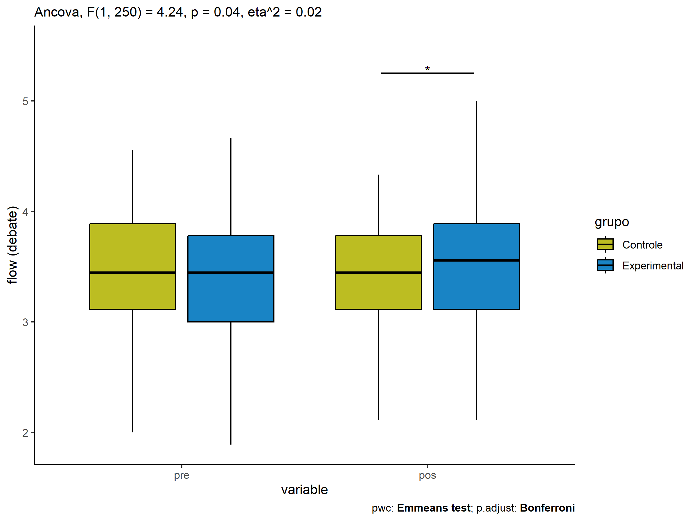<!-- -->

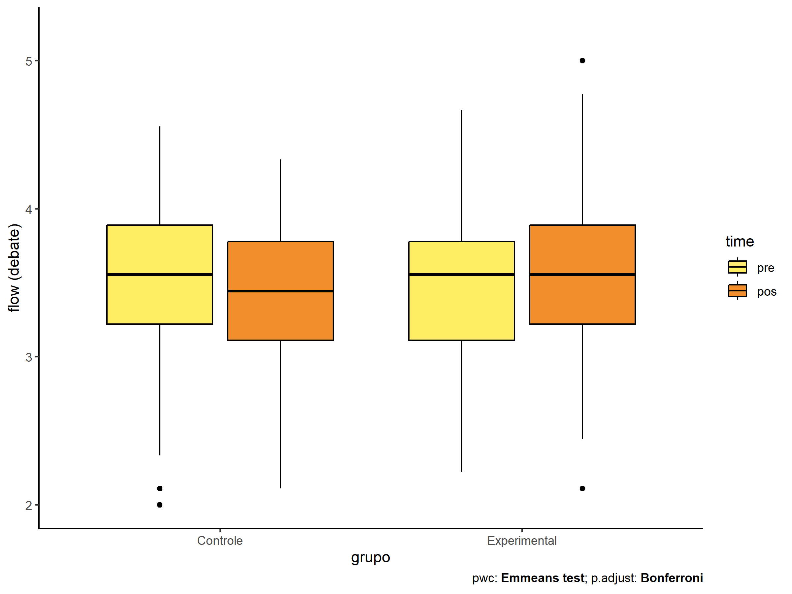<!-- -->

### factor: **genero**

| var        | genero |   n | M (pre) | SE (pre) | M (unadj) | SE (unadj) | M (adj) | SE (adj) |
|:-----------|:-------|----:|--------:|---------:|----------:|-----------:|--------:|---------:|
| fss.debate | F      | 101 |   3.534 |    0.053 |     3.612 |      0.051 |   3.599 |    0.050 |
| fss.debate | M      | 108 |   3.445 |    0.053 |     3.436 |      0.052 |   3.449 |    0.048 |

| .y.        | group1 | group2 | estimate | conf.low | conf.high |    se | statistic |     p | p.adj | p.adj.signif |
|:-----------|:-------|:-------|---------:|---------:|----------:|------:|----------:|------:|------:|:-------------|
| fss.debate | F      | M      |    0.150 |    0.012 |     0.288 | 0.070 |     2.149 | 0.033 | 0.033 | \*           |
| dfs.debate | F      | M      |    0.089 |   -0.059 |     0.237 | 0.075 |     1.185 | 0.238 | 0.238 | ns           |

| genero | group1 | group2 | estimate | conf.low | conf.high |    se | statistic |     p | p.adj | p.adj.signif |
|:-------|:-------|:-------|---------:|---------:|----------:|------:|----------:|------:|------:|:-------------|
| F      | pre    | pos    |   -0.078 |   -0.226 |     0.070 | 0.075 |    -1.039 | 0.299 | 0.299 | ns           |
| M      | pre    | pos    |    0.009 |   -0.134 |     0.152 | 0.073 |     0.125 | 0.901 | 0.901 | ns           |

    ## Scale for colour is already present.
    ## Adding another scale for colour, which will replace the existing scale.

<!-- -->

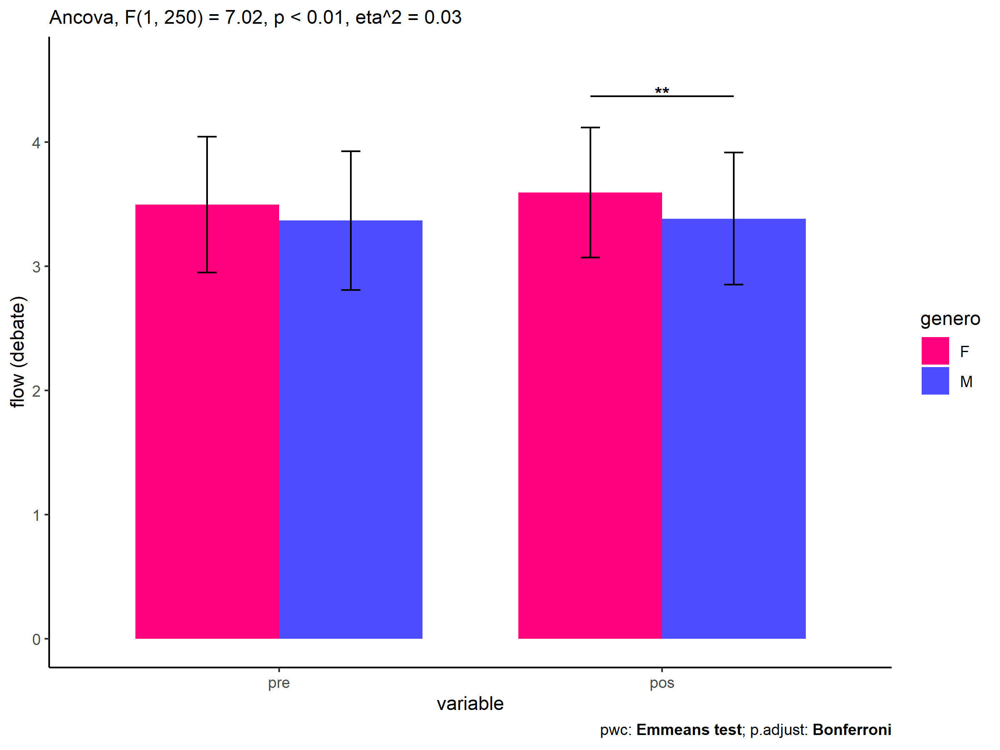<!-- -->

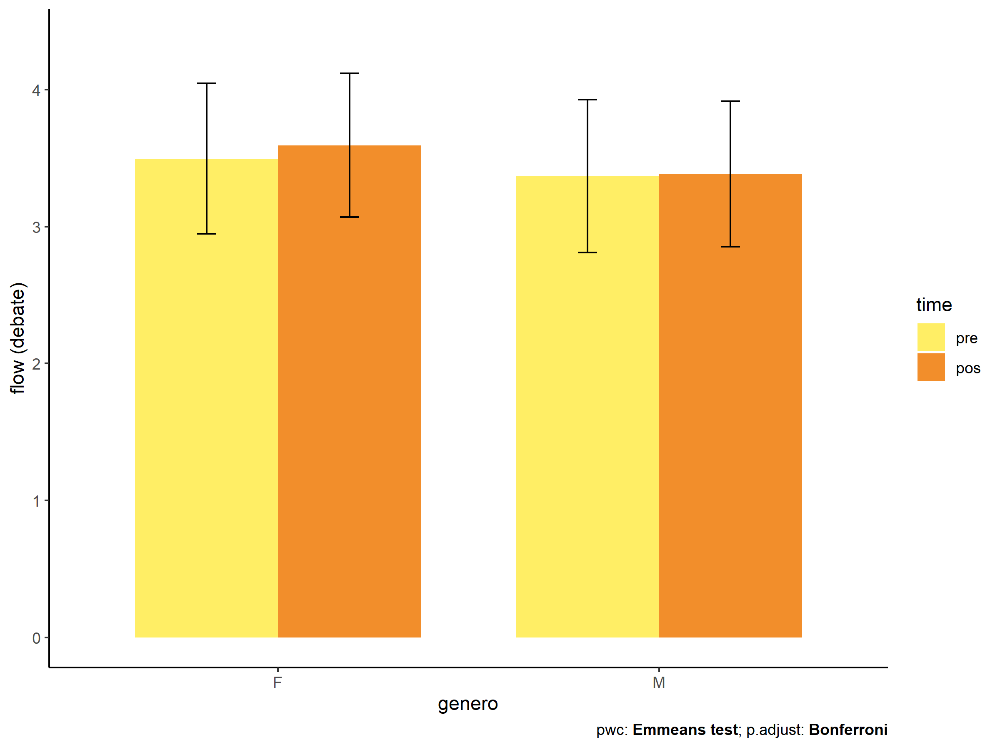<!-- -->

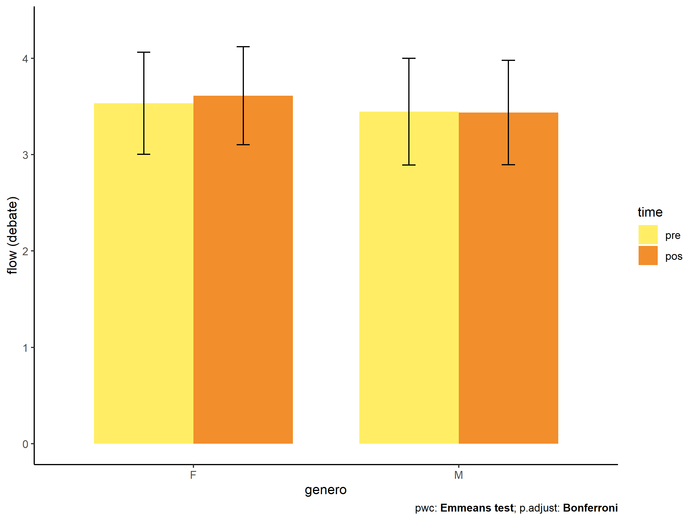<!-- -->

<!-- -->

### factor: **idade**

| var        | idade |   n | M (pre) | SE (pre) | M (unadj) | SE (unadj) | M (adj) | SE (adj) |
|:-----------|:------|----:|--------:|---------:|----------:|-----------:|--------:|---------:|
| fss.debate | 10y   |  41 |   3.468 |    0.084 |     3.450 |      0.089 |   3.463 |    0.078 |
| fss.debate | 11y   | 120 |   3.542 |    0.050 |     3.549 |      0.049 |   3.539 |    0.046 |
| fss.debate | 12y   |  28 |   3.458 |    0.094 |     3.590 |      0.087 |   3.607 |    0.095 |
| fss.debate | 13y   |  10 |   3.421 |    0.173 |     3.307 |      0.128 |   3.336 |    0.159 |

| .y.        | group1 | group2 | estimate | conf.low | conf.high |    se | statistic |     p | p.adj | p.adj.signif |
|:-----------|:-------|:-------|---------:|---------:|----------:|------:|----------:|------:|------:|:-------------|
| fss.debate | 10y    | 11y    |   -0.075 |   -0.254 |     0.104 | 0.091 |    -0.827 | 0.409 | 1.000 | ns           |
| fss.debate | 10y    | 12y    |   -0.143 |   -0.386 |     0.099 | 0.123 |    -1.165 | 0.246 | 1.000 | ns           |
| fss.debate | 10y    | 13y    |    0.128 |   -0.221 |     0.477 | 0.177 |     0.723 | 0.471 | 1.000 | ns           |
| fss.debate | 11y    | 12y    |   -0.068 |   -0.276 |     0.140 | 0.105 |    -0.646 | 0.519 | 1.000 | ns           |
| fss.debate | 11y    | 13y    |    0.203 |   -0.123 |     0.529 | 0.165 |     1.228 | 0.221 | 1.000 | ns           |
| fss.debate | 12y    | 13y    |    0.271 |   -0.093 |     0.636 | 0.185 |     1.467 | 0.144 | 0.864 | ns           |
| dfs.debate | 10y    | 11y    |   -0.074 |   -0.266 |     0.119 | 0.098 |    -0.753 | 0.452 | 1.000 | ns           |
| dfs.debate | 10y    | 12y    |    0.010 |   -0.252 |     0.271 | 0.133 |     0.074 | 0.941 | 1.000 | ns           |
| dfs.debate | 10y    | 13y    |    0.047 |   -0.329 |     0.423 | 0.191 |     0.248 | 0.804 | 1.000 | ns           |
| dfs.debate | 11y    | 12y    |    0.083 |   -0.140 |     0.307 | 0.113 |     0.735 | 0.463 | 1.000 | ns           |
| dfs.debate | 11y    | 13y    |    0.121 |   -0.230 |     0.472 | 0.178 |     0.680 | 0.497 | 1.000 | ns           |
| dfs.debate | 12y    | 13y    |    0.037 |   -0.355 |     0.430 | 0.199 |     0.188 | 0.851 | 1.000 | ns           |

| idade | group1 | group2 | estimate | conf.low | conf.high |    se | statistic |     p | p.adj | p.adj.signif |
|:------|:-------|:-------|---------:|---------:|----------:|------:|----------:|------:|------:|:-------------|
| 10y   | pre    | pos    |    0.018 |   -0.215 |     0.250 | 0.118 |     0.152 | 0.879 | 0.879 | ns           |
| 11y   | pre    | pos    |   -0.008 |   -0.143 |     0.128 | 0.069 |    -0.109 | 0.913 | 0.913 | ns           |
| 12y   | pre    | pos    |   -0.132 |   -0.413 |     0.149 | 0.143 |    -0.922 | 0.357 | 0.357 | ns           |
| 13y   | pre    | pos    |    0.114 |   -0.357 |     0.585 | 0.239 |     0.476 | 0.635 | 0.635 | ns           |

    ## Scale for colour is already present.
    ## Adding another scale for colour, which will replace the existing scale.

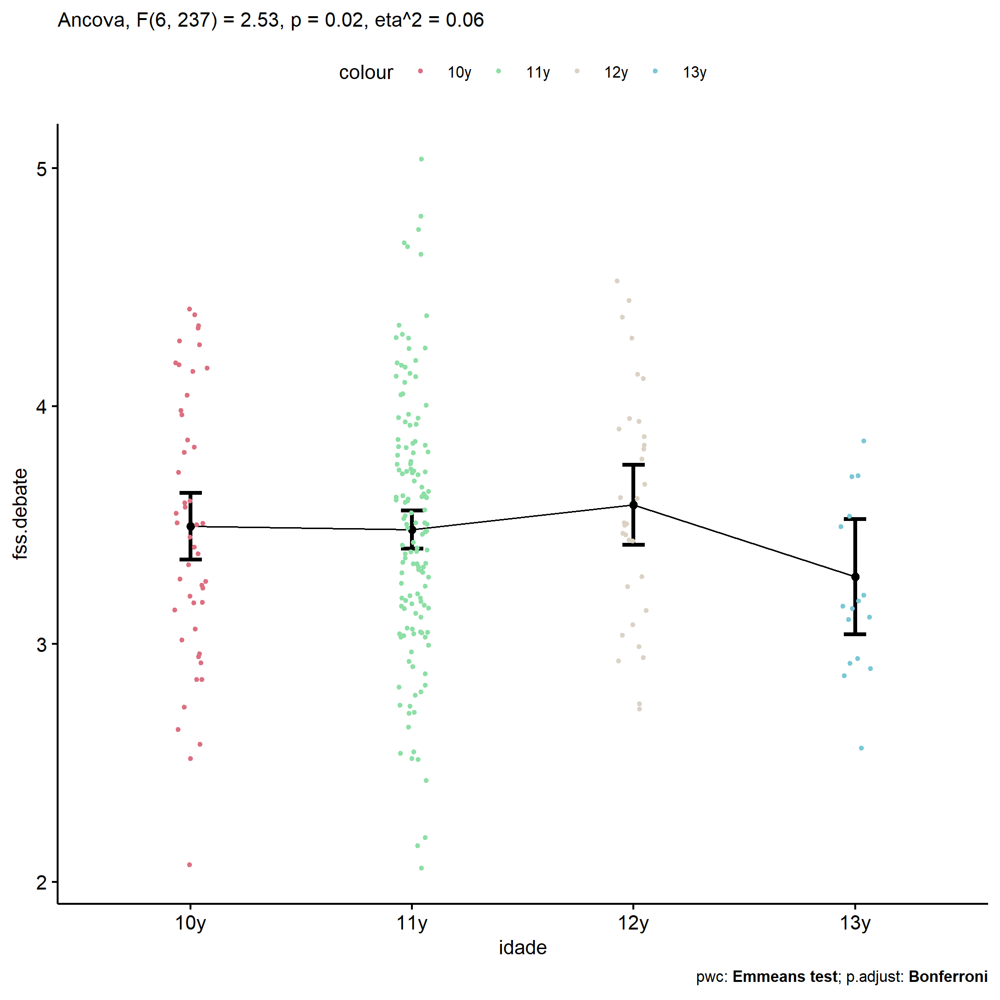<!-- -->

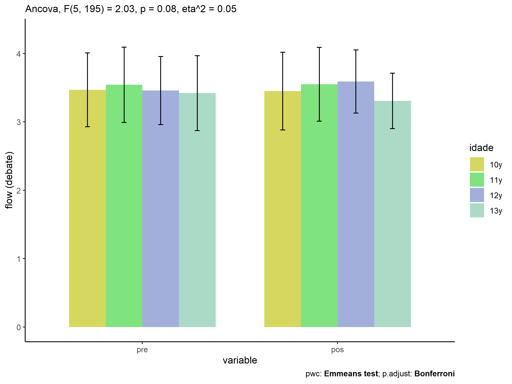<!-- -->

<!-- -->

<!-- -->

<!-- -->

### factor: **zona.participante**

| var        | zona.participante |   n | M (pre) | SE (pre) | M (unadj) | SE (unadj) | M (adj) | SE (adj) |
|:-----------|:------------------|----:|--------:|---------:|----------:|-----------:|--------:|---------:|
| fss.debate | Rural             |  79 |   3.505 |    0.057 |     3.433 |      0.061 |   3.421 |    0.057 |
| fss.debate | Urbana            |  83 |   3.420 |    0.067 |     3.549 |      0.056 |   3.560 |    0.056 |

| .y.        | group1 | group2 | estimate | conf.low | conf.high |    se | statistic |     p | p.adj | p.adj.signif |
|:-----------|:-------|:-------|---------:|---------:|----------:|------:|----------:|------:|------:|:-------------|
| fss.debate | Urbana | Rural  |    0.139 |   -0.019 |     0.296 | 0.080 |     1.737 | 0.084 | 0.084 | ns           |
| dfs.debate | Urbana | Rural  |   -0.085 |   -0.259 |     0.089 | 0.088 |    -0.964 | 0.337 | 0.337 | ns           |

| zona.participante | group1 | group2 | estimate | conf.low | conf.high |    se | statistic |     p | p.adj | p.adj.signif |
|:------------------|:-------|:-------|---------:|---------:|----------:|------:|----------:|------:|------:|:-------------|
| Urbana            | pre    | pos    |   -0.129 |   -0.295 |     0.037 | 0.084 |    -1.531 | 0.127 | 0.127 | ns           |
| Rural             | pre    | pos    |    0.072 |   -0.098 |     0.243 | 0.086 |     0.837 | 0.403 | 0.403 | ns           |

    ## Scale for colour is already present.
    ## Adding another scale for colour, which will replace the existing scale.

<!-- -->

<!-- -->

<!-- -->

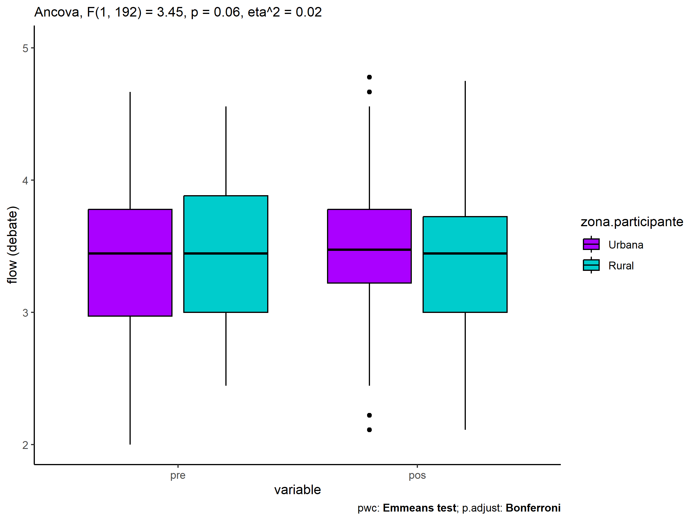<!-- -->

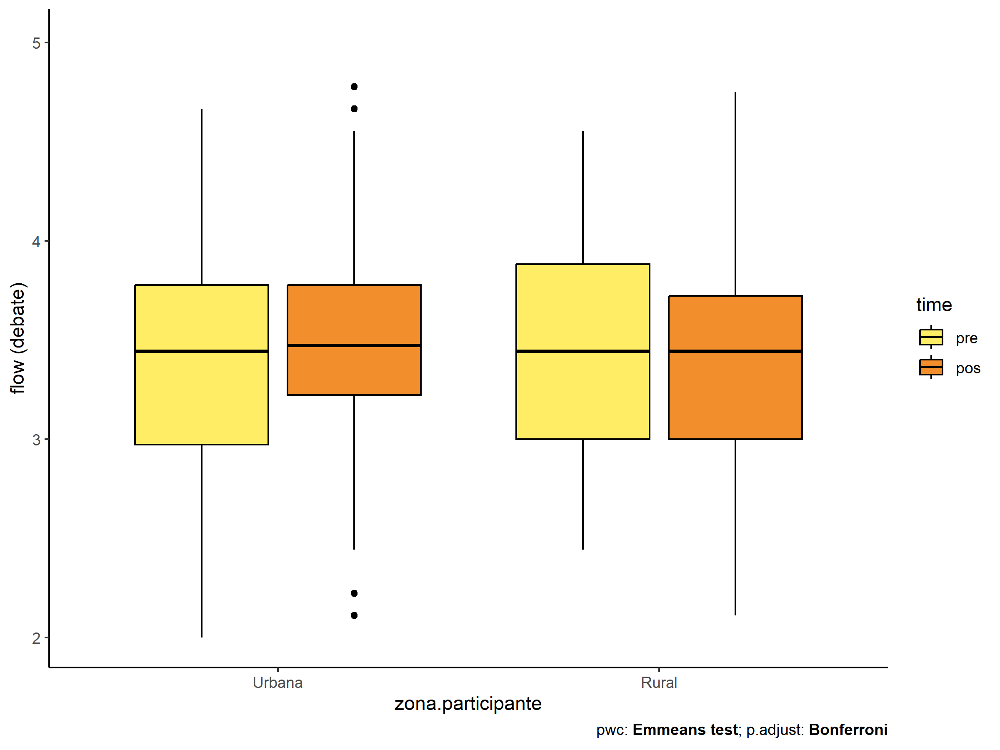<!-- -->

### factor: **escola**

| var        | escola |   n | M (pre) | SE (pre) | M (unadj) | SE (unadj) | M (adj) | SE (adj) |
|:-----------|:-------|----:|--------:|---------:|----------:|-----------:|--------:|---------:|
| fss.debate | E1     |  16 |   3.251 |    0.107 |     3.723 |      0.136 |   3.800 |    0.125 |
| fss.debate | E2     |  43 |   3.497 |    0.075 |     3.433 |      0.080 |   3.430 |    0.076 |
| fss.debate | E3     |  30 |   3.569 |    0.114 |     3.326 |      0.092 |   3.299 |    0.091 |
| fss.debate | E4     |  21 |   3.399 |    0.120 |     3.501 |      0.116 |   3.530 |    0.109 |
| fss.debate | E5     |  80 |   3.498 |    0.066 |     3.573 |      0.060 |   3.570 |    0.056 |
| fss.debate | E6     |  19 |   3.594 |    0.080 |     3.661 |      0.114 |   3.626 |    0.114 |

| .y.        | group1 | group2 | estimate | conf.low | conf.high |    se | statistic |     p | p.adj | p.adj.signif |
|:-----------|:-------|:-------|---------:|---------:|----------:|------:|----------:|------:|------:|:-------------|
| fss.debate | E1     | E2     |    0.370 |    0.082 |     0.659 | 0.146 |     2.532 | 0.012 | 0.182 | ns           |
| fss.debate | E1     | E3     |    0.501 |    0.195 |     0.807 | 0.155 |     3.228 | 0.001 | 0.022 | \*           |
| fss.debate | E1     | E4     |    0.270 |   -0.056 |     0.596 | 0.165 |     1.634 | 0.104 | 1.000 | ns           |
| fss.debate | E1     | E5     |    0.230 |   -0.040 |     0.500 | 0.137 |     1.681 | 0.094 | 1.000 | ns           |
| fss.debate | E1     | E6     |    0.174 |   -0.161 |     0.509 | 0.170 |     1.022 | 0.308 | 1.000 | ns           |
| fss.debate | E2     | E3     |    0.130 |   -0.103 |     0.364 | 0.118 |     1.102 | 0.272 | 1.000 | ns           |
| fss.debate | E2     | E4     |   -0.101 |   -0.362 |     0.160 | 0.132 |    -0.760 | 0.448 | 1.000 | ns           |
| fss.debate | E2     | E5     |   -0.140 |   -0.325 |     0.045 | 0.094 |    -1.493 | 0.137 | 1.000 | ns           |
| fss.debate | E2     | E6     |   -0.197 |   -0.467 |     0.073 | 0.137 |    -1.436 | 0.153 | 1.000 | ns           |
| fss.debate | E3     | E4     |   -0.231 |   -0.510 |     0.049 | 0.142 |    -1.629 | 0.105 | 1.000 | ns           |
| fss.debate | E3     | E5     |   -0.271 |   -0.480 |    -0.061 | 0.106 |    -2.542 | 0.012 | 0.177 | ns           |
| fss.debate | E3     | E6     |   -0.327 |   -0.614 |    -0.040 | 0.146 |    -2.245 | 0.026 | 0.388 | ns           |
| fss.debate | E4     | E5     |   -0.040 |   -0.280 |     0.201 | 0.122 |    -0.325 | 0.745 | 1.000 | ns           |
| fss.debate | E4     | E6     |   -0.096 |   -0.407 |     0.215 | 0.158 |    -0.609 | 0.543 | 1.000 | ns           |
| fss.debate | E5     | E6     |   -0.056 |   -0.307 |     0.194 | 0.127 |    -0.445 | 0.657 | 1.000 | ns           |
| dfs.debate | E1     | E2     |   -0.247 |   -0.560 |     0.067 | 0.159 |    -1.552 | 0.122 | 1.000 | ns           |
| dfs.debate | E1     | E3     |   -0.319 |   -0.650 |     0.013 | 0.168 |    -1.897 | 0.059 | 0.888 | ns           |
| dfs.debate | E1     | E4     |   -0.148 |   -0.503 |     0.207 | 0.180 |    -0.822 | 0.412 | 1.000 | ns           |
| dfs.debate | E1     | E5     |   -0.247 |   -0.540 |     0.046 | 0.149 |    -1.665 | 0.097 | 1.000 | ns           |
| dfs.debate | E1     | E6     |   -0.343 |   -0.706 |     0.020 | 0.184 |    -1.862 | 0.064 | 0.961 | ns           |
| dfs.debate | E2     | E3     |   -0.072 |   -0.326 |     0.182 | 0.129 |    -0.558 | 0.577 | 1.000 | ns           |
| dfs.debate | E2     | E4     |    0.099 |   -0.186 |     0.383 | 0.144 |     0.683 | 0.495 | 1.000 | ns           |
| dfs.debate | E2     | E5     |   -0.001 |   -0.203 |     0.201 | 0.103 |    -0.008 | 0.993 | 1.000 | ns           |
| dfs.debate | E2     | E6     |   -0.096 |   -0.391 |     0.198 | 0.149 |    -0.643 | 0.521 | 1.000 | ns           |
| dfs.debate | E3     | E4     |    0.171 |   -0.134 |     0.475 | 0.154 |     1.106 | 0.270 | 1.000 | ns           |
| dfs.debate | E3     | E5     |    0.071 |   -0.158 |     0.300 | 0.116 |     0.613 | 0.541 | 1.000 | ns           |
| dfs.debate | E3     | E6     |   -0.024 |   -0.338 |     0.289 | 0.159 |    -0.152 | 0.880 | 1.000 | ns           |
| dfs.debate | E4     | E5     |   -0.099 |   -0.362 |     0.163 | 0.133 |    -0.748 | 0.455 | 1.000 | ns           |
| dfs.debate | E4     | E6     |   -0.195 |   -0.533 |     0.144 | 0.172 |    -1.134 | 0.258 | 1.000 | ns           |
| dfs.debate | E5     | E6     |   -0.095 |   -0.368 |     0.178 | 0.138 |    -0.688 | 0.492 | 1.000 | ns           |

| escola | group1 | group2 | estimate | conf.low | conf.high |    se | statistic |     p | p.adj | p.adj.signif |
|:-------|:-------|:-------|---------:|---------:|----------:|------:|----------:|------:|------:|:-------------|
| E1     | pre    | pos    |   -0.472 |   -0.844 |    -0.101 | 0.189 |    -2.500 | 0.013 | 0.013 | \*           |
| E2     | pre    | pos    |    0.065 |   -0.162 |     0.291 | 0.115 |     0.561 | 0.575 | 0.575 | ns           |
| E3     | pre    | pos    |    0.244 |   -0.028 |     0.515 | 0.138 |     1.765 | 0.078 | 0.078 | ns           |
| E4     | pre    | pos    |   -0.103 |   -0.427 |     0.222 | 0.165 |    -0.622 | 0.534 | 0.534 | ns           |
| E5     | pre    | pos    |   -0.075 |   -0.241 |     0.091 | 0.084 |    -0.889 | 0.375 | 0.375 | ns           |
| E6     | pre    | pos    |   -0.067 |   -0.408 |     0.274 | 0.173 |    -0.388 | 0.698 | 0.698 | ns           |

    ## Scale for colour is already present.
    ## Adding another scale for colour, which will replace the existing scale.

<!-- -->

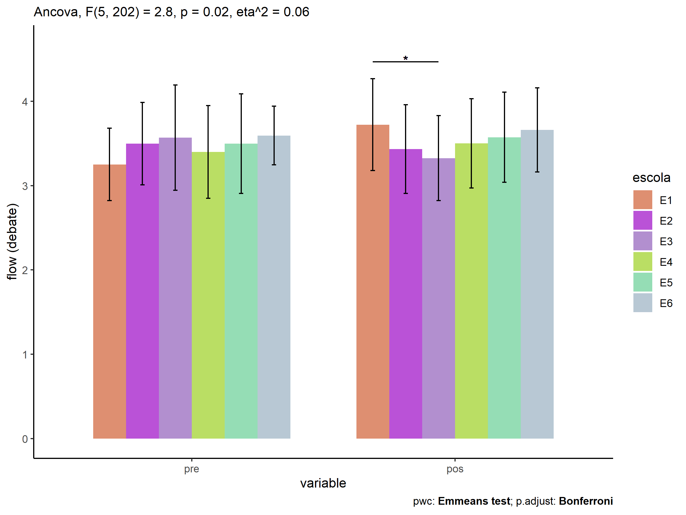<!-- -->

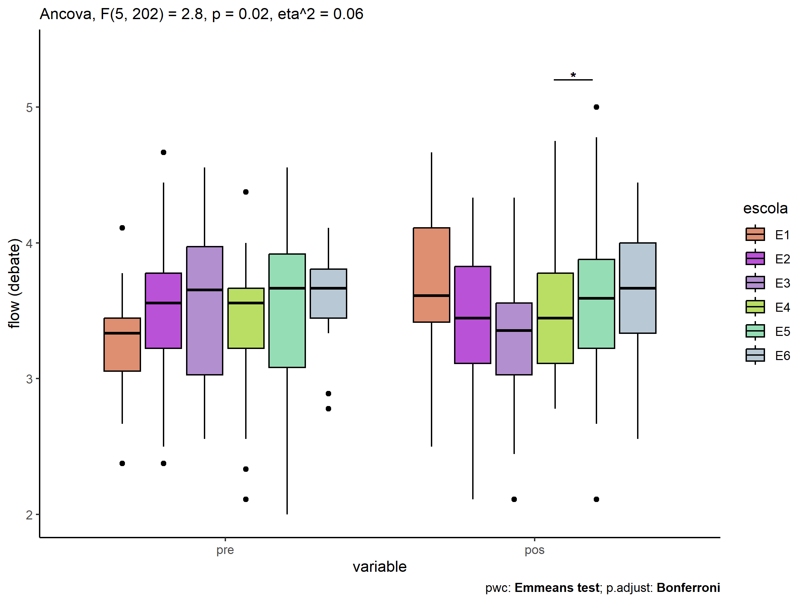<!-- -->

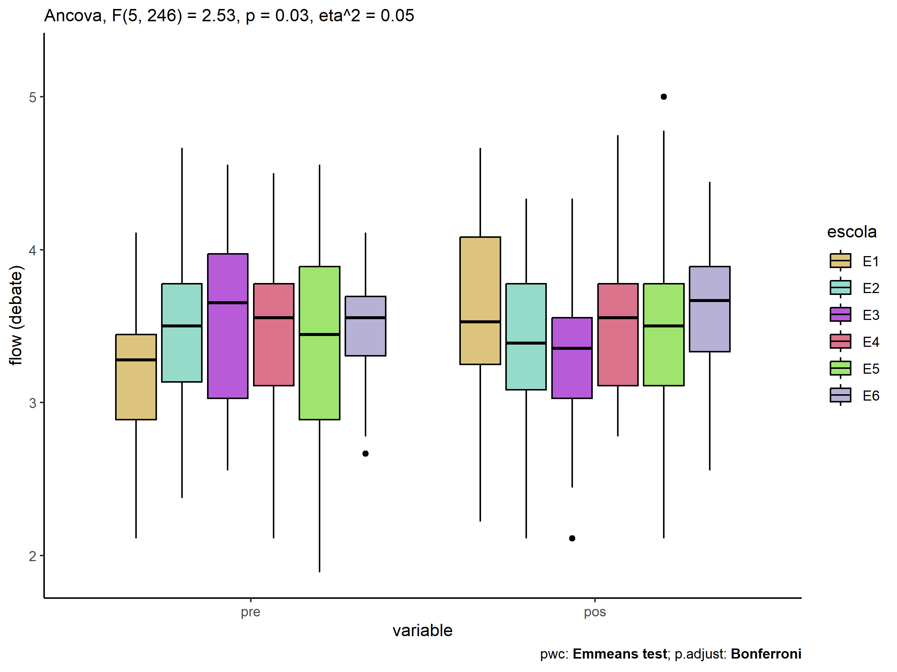<!-- -->

<!-- -->

### factor: **zona.escola**

| var        | zona.escola |   n | M (pre) | SE (pre) | M (unadj) | SE (unadj) | M (adj) | SE (adj) |
|:-----------|:------------|----:|--------:|---------:|----------:|-----------:|--------:|---------:|
| fss.debate | Rural       |  70 |   3.525 |    0.064 |     3.469 |      0.062 |   3.458 |    0.061 |
| fss.debate | Urbana      | 139 |   3.470 |    0.046 |     3.547 |      0.046 |   3.553 |    0.043 |

| .y.        | group1 | group2 | estimate | conf.low | conf.high |    se | statistic |     p | p.adj | p.adj.signif |
|:-----------|:-------|:-------|---------:|---------:|----------:|------:|----------:|------:|------:|:-------------|
| fss.debate | Urbana | Rural  |    0.095 |   -0.052 |     0.241 | 0.074 |     1.272 | 0.205 | 0.205 | ns           |
| dfs.debate | Urbana | Rural  |   -0.055 |   -0.212 |     0.102 | 0.080 |    -0.694 | 0.488 | 0.488 | ns           |

| zona.escola | group1 | group2 | estimate | conf.low | conf.high |    se | statistic |     p | p.adj | p.adj.signif |
|:------------|:-------|:-------|---------:|---------:|----------:|------:|----------:|------:|------:|:-------------|
| Urbana      | pre    | pos    |   -0.078 |   -0.204 |     0.049 | 0.065 |    -1.203 | 0.230 | 0.230 | ns           |
| Rural       | pre    | pos    |    0.055 |   -0.123 |     0.234 | 0.091 |     0.609 | 0.543 | 0.543 | ns           |

    ## Scale for colour is already present.
    ## Adding another scale for colour, which will replace the existing scale.

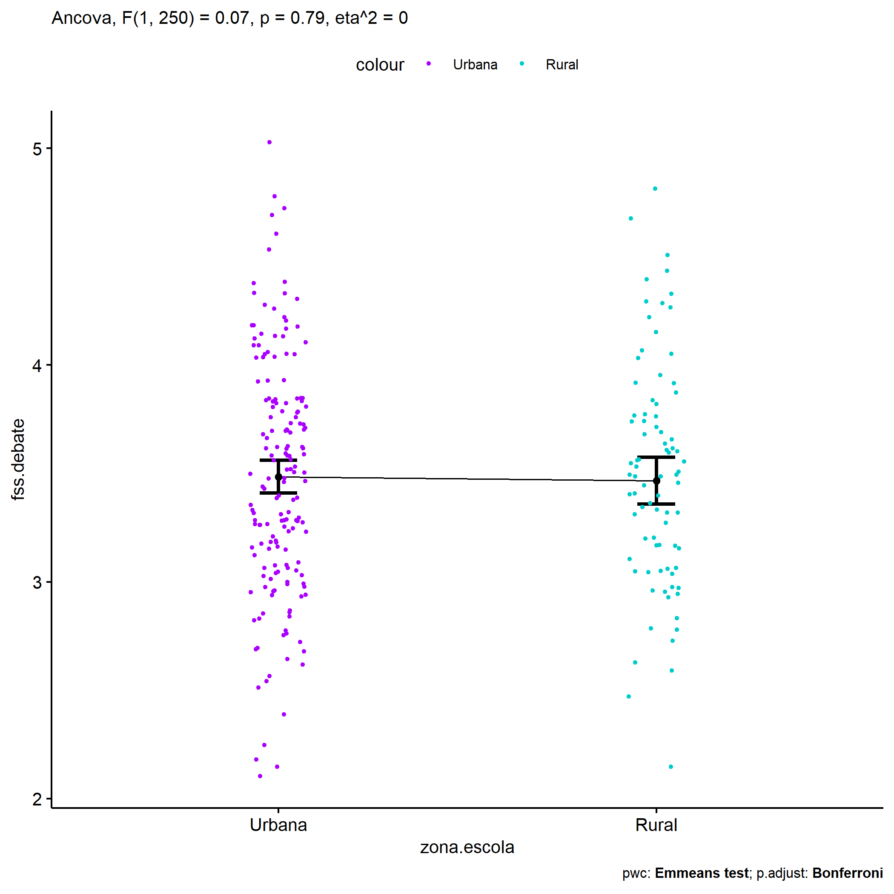<!-- -->

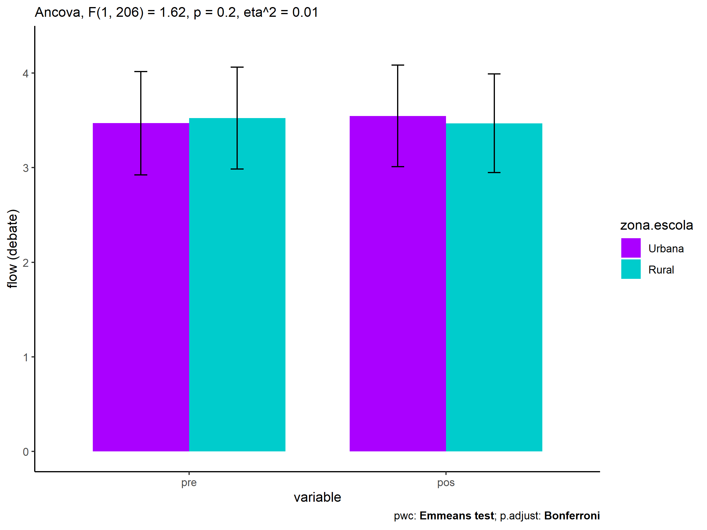<!-- -->

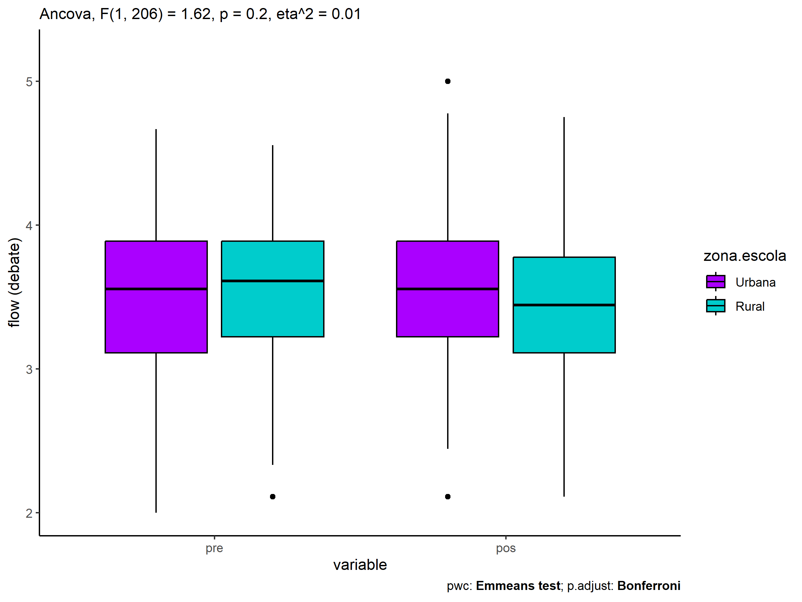<!-- -->

<!-- -->

<!-- -->

## Pairwise comparisons for two factors

### factores: **grupo:genero**

| var        | grupo        | genero |   n | M (pre) | SE (pre) | M (unadj) | SE (unadj) | M (adj) | SE (adj) |
|:-----------|:-------------|:-------|----:|--------:|---------:|----------:|-----------:|--------:|---------:|
| fss.debate | Controle     | F      |  53 |   3.522 |    0.076 |     3.548 |      0.067 |   3.538 |    0.069 |
| fss.debate | Controle     | M      |  53 |   3.523 |    0.079 |     3.390 |      0.067 |   3.380 |    0.069 |
| fss.debate | Experimental | F      |  48 |   3.547 |    0.074 |     3.682 |      0.076 |   3.665 |    0.072 |
| fss.debate | Experimental | M      |  55 |   3.370 |    0.071 |     3.480 |      0.080 |   3.516 |    0.068 |

| grupo        | genero | group1   | group2       | estimate | conf.low | conf.high |    se | statistic |     p | p.adj | p.adj.signif |
|:-------------|:-------|:---------|:-------------|---------:|---------:|----------:|------:|----------:|------:|------:|:-------------|
|              | F      | Controle | Experimental |   -0.126 |   -0.323 |     0.071 | 0.100 |    -1.263 | 0.208 | 0.208 | ns           |
|              | M      | Controle | Experimental |   -0.136 |   -0.327 |     0.055 | 0.097 |    -1.403 | 0.162 | 0.162 | ns           |
|              | F      | Controle | Experimental |   -0.026 |   -0.239 |     0.187 | 0.108 |    -0.238 | 0.812 | 0.812 | ns           |
|              | M      | Controle | Experimental |    0.153 |   -0.052 |     0.359 | 0.104 |     1.468 | 0.144 | 0.144 | ns           |
| Controle     |        | F        | M            |    0.159 |   -0.033 |     0.351 | 0.097 |     1.631 | 0.104 | 0.104 | ns           |
| Experimental |        | F        | M            |    0.149 |   -0.048 |     0.345 | 0.100 |     1.494 | 0.137 | 0.137 | ns           |
| Controle     |        | F        | M            |   -0.001 |   -0.209 |     0.206 | 0.105 |    -0.012 | 0.990 | 0.990 | ns           |
| Experimental |        | F        | M            |    0.178 |   -0.033 |     0.388 | 0.107 |     1.659 | 0.099 | 0.099 | ns           |

| grupo        | genero | group1 | group2 | estimate | conf.low | conf.high |    se | statistic |     p | p.adj | p.adj.signif |
|:-------------|:-------|:-------|:-------|---------:|---------:|----------:|------:|----------:|------:|------:|:-------------|
| Controle     | F      | pre    | pos    |   -0.027 |   -0.231 |     0.177 | 0.104 |    -0.258 | 0.797 | 0.797 | ns           |
| Controle     | M      | pre    | pos    |    0.133 |   -0.071 |     0.337 | 0.104 |     1.283 | 0.200 | 0.200 | ns           |
| Experimental | F      | pre    | pos    |   -0.135 |   -0.349 |     0.079 | 0.109 |    -1.238 | 0.217 | 0.217 | ns           |
| Experimental | M      | pre    | pos    |   -0.110 |   -0.310 |     0.090 | 0.102 |    -1.084 | 0.279 | 0.279 | ns           |

    ## Scale for colour is already present.
    ## Adding another scale for colour, which will replace the existing scale.

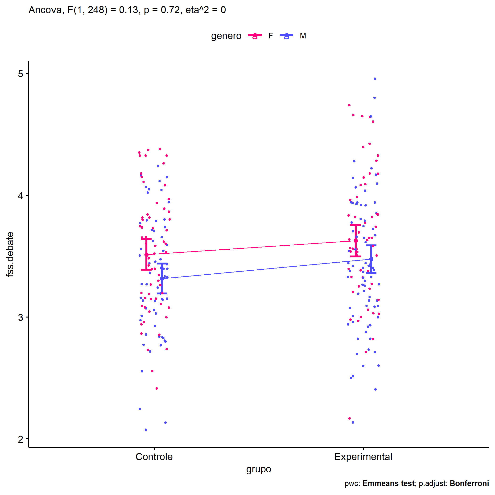<!-- -->

    ## Scale for colour is already present.
    ## Adding another scale for colour, which will replace the existing scale.

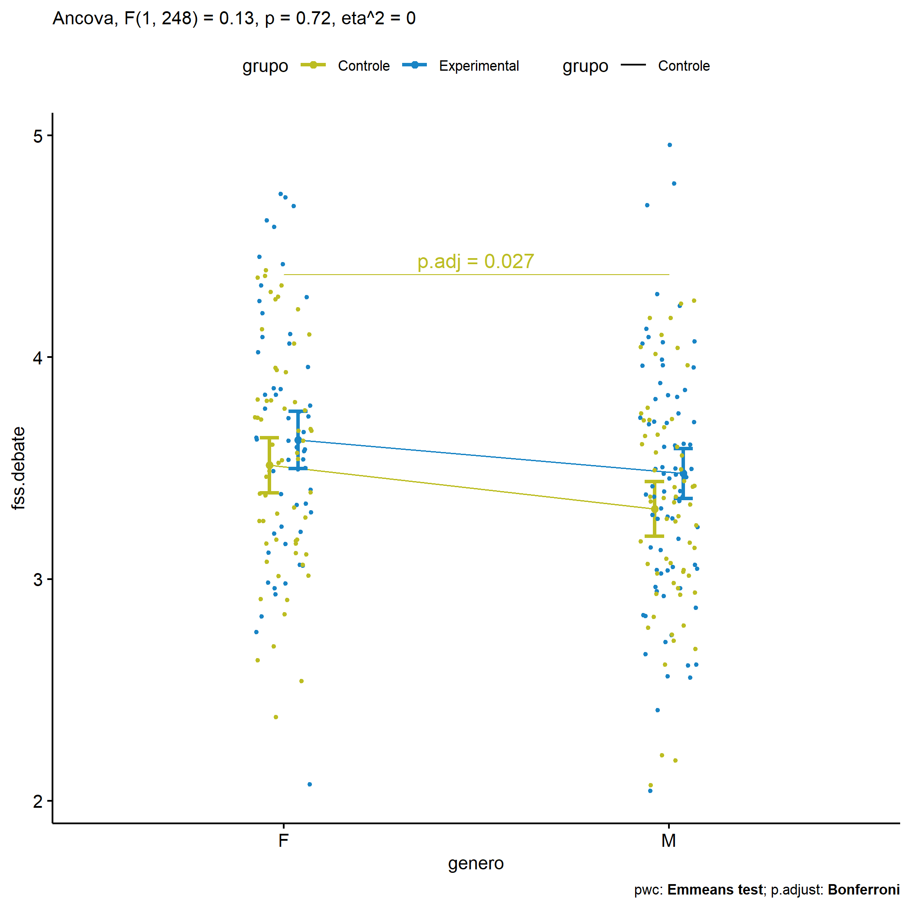<!-- -->

<!-- -->

<!-- -->

<!-- -->

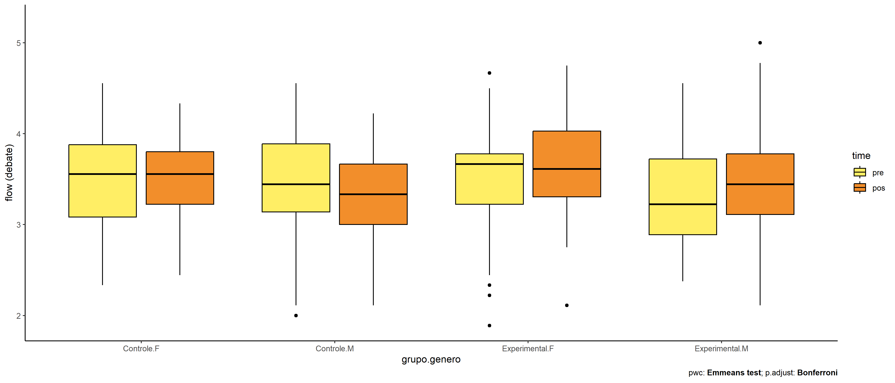<!-- -->

### factores: **grupo:idade**

| var        | grupo        | idade |   n | M (pre) | SE (pre) | M (unadj) | SE (unadj) | M (adj) | SE (adj) |
|:-----------|:-------------|:------|----:|--------:|---------:|----------:|-----------:|--------:|---------:|
| fss.debate | Controle     | 10y   |  20 |   3.571 |    0.125 |     3.423 |      0.144 |   3.404 |    0.112 |
| fss.debate | Controle     | 11y   |  56 |   3.535 |    0.078 |     3.471 |      0.064 |   3.464 |    0.067 |
| fss.debate | Controle     | 12y   |  16 |   3.573 |    0.131 |     3.561 |      0.107 |   3.541 |    0.125 |
| fss.debate | Controle     | 13y   |   6 |   3.600 |    0.191 |     3.426 |      0.133 |   3.397 |    0.204 |
| fss.debate | Experimental | 10y   |  21 |   3.370 |    0.113 |     3.476 |      0.109 |   3.526 |    0.110 |
| fss.debate | Experimental | 11y   |  64 |   3.548 |    0.066 |     3.618 |      0.073 |   3.607 |    0.063 |
| fss.debate | Experimental | 12y   |  12 |   3.306 |    0.125 |     3.630 |      0.149 |   3.702 |    0.145 |

|     | grupo        | idade | group1   | group2       | estimate | conf.low | conf.high |    se | statistic |     p | p.adj | p.adj.signif |
|:----|:-------------|:------|:---------|:-------------|---------:|---------:|----------:|------:|----------:|------:|------:|:-------------|
| 1   |              | 10y   | Controle | Experimental |   -0.122 |   -0.431 |     0.188 | 0.157 |    -0.777 | 0.438 | 0.438 | ns           |
| 2   |              | 11y   | Controle | Experimental |   -0.143 |   -0.323 |     0.038 | 0.092 |    -1.558 | 0.121 | 0.121 | ns           |
| 3   |              | 12y   | Controle | Experimental |   -0.160 |   -0.539 |     0.218 | 0.192 |    -0.836 | 0.404 | 0.404 | ns           |
| 5   |              | 10y   | Controle | Experimental |    0.200 |   -0.131 |     0.532 | 0.168 |     1.192 | 0.235 | 0.235 | ns           |
| 6   |              | 11y   | Controle | Experimental |   -0.012 |   -0.207 |     0.182 | 0.099 |    -0.125 | 0.901 | 0.901 | ns           |
| 7   |              | 12y   | Controle | Experimental |    0.267 |   -0.138 |     0.673 | 0.206 |     1.301 | 0.195 | 0.195 | ns           |
| 9   | Controle     |       | 10y      | 11y          |   -0.060 |   -0.317 |     0.197 | 0.130 |    -0.462 | 0.644 | 1.000 | ns           |
| 10  | Controle     |       | 10y      | 12y          |   -0.137 |   -0.468 |     0.194 | 0.168 |    -0.817 | 0.415 | 1.000 | ns           |
| 11  | Controle     |       | 10y      | 13y          |    0.007 |   -0.453 |     0.466 | 0.233 |     0.029 | 0.977 | 1.000 | ns           |
| 12  | Controle     |       | 11y      | 12y          |   -0.077 |   -0.357 |     0.203 | 0.142 |    -0.542 | 0.588 | 1.000 | ns           |
| 13  | Controle     |       | 11y      | 13y          |    0.067 |   -0.357 |     0.491 | 0.215 |     0.312 | 0.755 | 1.000 | ns           |
| 14  | Controle     |       | 12y      | 13y          |    0.144 |   -0.328 |     0.616 | 0.239 |     0.601 | 0.548 | 1.000 | ns           |
| 15  | Experimental |       | 10y      | 11y          |   -0.081 |   -0.330 |     0.168 | 0.126 |    -0.641 | 0.522 | 1.000 | ns           |
| 16  | Experimental |       | 10y      | 12y          |   -0.176 |   -0.533 |     0.182 | 0.181 |    -0.970 | 0.333 | 1.000 | ns           |
| 18  | Experimental |       | 11y      | 12y          |   -0.095 |   -0.407 |     0.217 | 0.158 |    -0.598 | 0.550 | 1.000 | ns           |
| 21  | Controle     |       | 10y      | 11y          |    0.036 |   -0.241 |     0.312 | 0.140 |     0.254 | 0.800 | 1.000 | ns           |
| 22  | Controle     |       | 10y      | 12y          |   -0.002 |   -0.358 |     0.354 | 0.181 |    -0.012 | 0.991 | 1.000 | ns           |
| 23  | Controle     |       | 10y      | 13y          |   -0.029 |   -0.523 |     0.466 | 0.251 |    -0.115 | 0.909 | 1.000 | ns           |
| 24  | Controle     |       | 11y      | 12y          |   -0.038 |   -0.339 |     0.263 | 0.153 |    -0.247 | 0.805 | 1.000 | ns           |
| 25  | Controle     |       | 11y      | 13y          |   -0.064 |   -0.520 |     0.392 | 0.231 |    -0.278 | 0.781 | 1.000 | ns           |
| 26  | Controle     |       | 12y      | 13y          |   -0.027 |   -0.535 |     0.482 | 0.258 |    -0.103 | 0.918 | 1.000 | ns           |
| 27  | Experimental |       | 10y      | 11y          |   -0.177 |   -0.444 |     0.090 | 0.135 |    -1.309 | 0.192 | 0.577 | ns           |
| 28  | Experimental |       | 10y      | 12y          |    0.065 |   -0.319 |     0.449 | 0.195 |     0.333 | 0.740 | 1.000 | ns           |
| 30  | Experimental |       | 11y      | 12y          |    0.242 |   -0.092 |     0.576 | 0.169 |     1.429 | 0.155 | 0.464 | ns           |

| grupo        | idade | group1 | group2 | estimate | conf.low | conf.high |    se | statistic |     p | p.adj | p.adj.signif |
|:-------------|:------|:-------|:-------|---------:|---------:|----------:|------:|----------:|------:|------:|:-------------|
| Controle     | 10y   | pre    | pos    |    0.148 |   -0.185 |     0.481 | 0.169 |     0.874 | 0.383 | 0.383 | ns           |
| Controle     | 11y   | pre    | pos    |    0.064 |   -0.135 |     0.263 | 0.101 |     0.635 | 0.526 | 0.526 | ns           |
| Controle     | 12y   | pre    | pos    |    0.012 |   -0.360 |     0.384 | 0.189 |     0.064 | 0.949 | 0.949 | ns           |
| Controle     | 13y   | pre    | pos    |    0.174 |   -0.434 |     0.781 | 0.309 |     0.562 | 0.574 | 0.574 | ns           |
| Experimental | 10y   | pre    | pos    |   -0.106 |   -0.431 |     0.219 | 0.165 |    -0.641 | 0.522 | 0.522 | ns           |
| Experimental | 11y   | pre    | pos    |   -0.070 |   -0.256 |     0.116 | 0.095 |    -0.743 | 0.458 | 0.458 | ns           |
| Experimental | 12y   | pre    | pos    |   -0.324 |   -0.754 |     0.105 | 0.218 |    -1.483 | 0.139 | 0.139 | ns           |

    ## Scale for colour is already present.
    ## Adding another scale for colour, which will replace the existing scale.

<!-- -->

<!-- -->

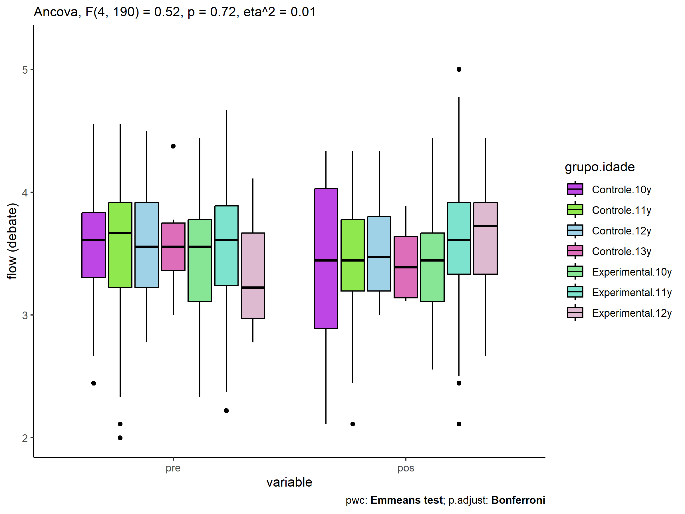<!-- -->

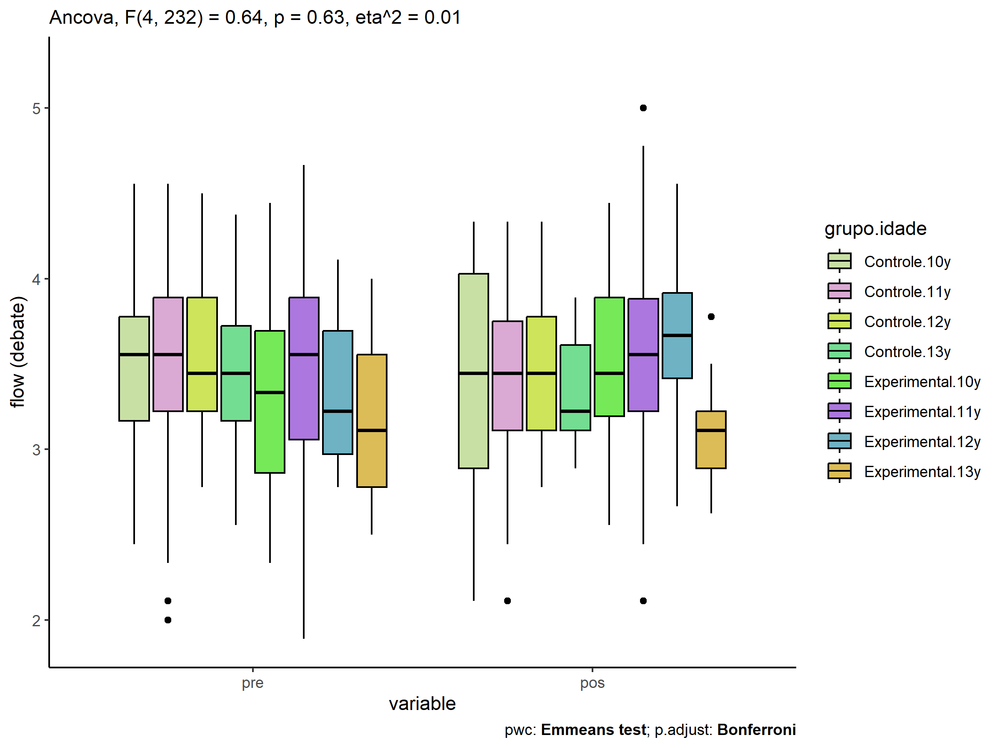<!-- -->

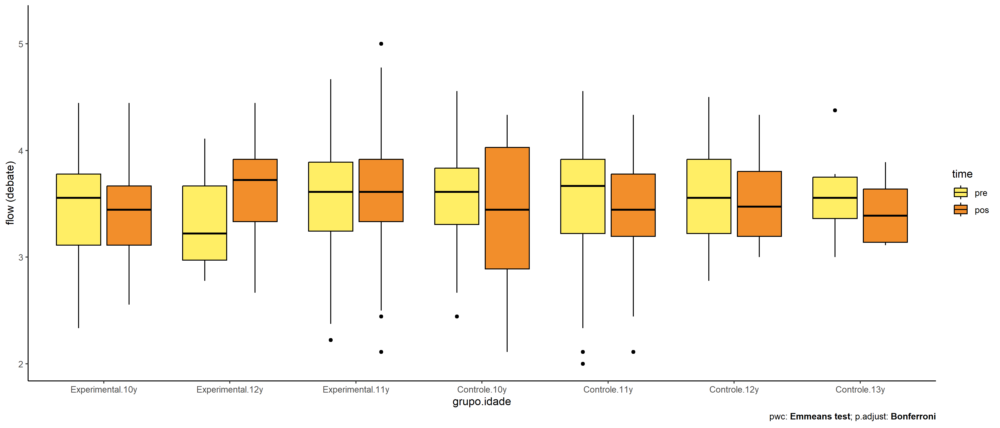<!-- -->

### factores: **grupo:zona.participante**

| var        | grupo        | zona.participante |   n | M (pre) | SE (pre) | M (unadj) | SE (unadj) | M (adj) | SE (adj) |
|:-----------|:-------------|:------------------|----:|--------:|---------:|----------:|-----------:|--------:|---------:|
| fss.debate | Controle     | Rural             |  40 |   3.569 |    0.082 |     3.389 |      0.082 |   3.360 |    0.080 |
| fss.debate | Controle     | Urbana            |  42 |   3.441 |    0.098 |     3.509 |      0.077 |   3.515 |    0.078 |
| fss.debate | Experimental | Rural             |  39 |   3.439 |    0.080 |     3.478 |      0.091 |   3.484 |    0.081 |
| fss.debate | Experimental | Urbana            |  41 |   3.399 |    0.091 |     3.590 |      0.080 |   3.607 |    0.079 |

| grupo        | zona.participante | group1   | group2       | estimate | conf.low | conf.high |    se | statistic |     p | p.adj | p.adj.signif |
|:-------------|:------------------|:---------|:-------------|---------:|---------:|----------:|------:|----------:|------:|------:|:-------------|
|              | Urbana            | Controle | Experimental |   -0.092 |   -0.312 |     0.127 | 0.111 |    -0.829 | 0.408 | 0.408 | ns           |
|              | Rural             | Controle | Experimental |   -0.124 |   -0.350 |     0.102 | 0.114 |    -1.084 | 0.280 | 0.280 | ns           |
|              | Urbana            | Controle | Experimental |    0.042 |   -0.202 |     0.286 | 0.124 |     0.340 | 0.734 | 0.734 | ns           |
|              | Rural             | Controle | Experimental |    0.130 |   -0.121 |     0.380 | 0.127 |     1.023 | 0.308 | 0.308 | ns           |
| Controle     |                   | Urbana   | Rural        |    0.155 |   -0.067 |     0.376 | 0.112 |     1.381 | 0.169 | 0.169 | ns           |
| Experimental |                   | Urbana   | Rural        |    0.123 |   -0.101 |     0.347 | 0.113 |     1.087 | 0.279 | 0.279 | ns           |
| Controle     |                   | Urbana   | Rural        |   -0.128 |   -0.374 |     0.117 | 0.124 |    -1.031 | 0.304 | 0.304 | ns           |
| Experimental |                   | Urbana   | Rural        |   -0.041 |   -0.290 |     0.208 | 0.126 |    -0.323 | 0.747 | 0.747 | ns           |

| grupo        | zona.participante | group1 | group2 | estimate | conf.low | conf.high |    se | statistic |     p | p.adj | p.adj.signif |
|:-------------|:------------------|:-------|:-------|---------:|---------:|----------:|------:|----------:|------:|------:|:-------------|
| Controle     | Urbana            | pre    | pos    |   -0.068 |   -0.302 |     0.166 | 0.119 |    -0.576 | 0.565 | 0.565 | ns           |
| Controle     | Rural             | pre    | pos    |    0.180 |   -0.059 |     0.420 | 0.122 |     1.480 | 0.140 | 0.140 | ns           |
| Experimental | Urbana            | pre    | pos    |   -0.191 |   -0.428 |     0.045 | 0.120 |    -1.590 | 0.113 | 0.113 | ns           |
| Experimental | Rural             | pre    | pos    |   -0.038 |   -0.281 |     0.204 | 0.123 |    -0.312 | 0.756 | 0.756 | ns           |

    ## Scale for colour is already present.
    ## Adding another scale for colour, which will replace the existing scale.

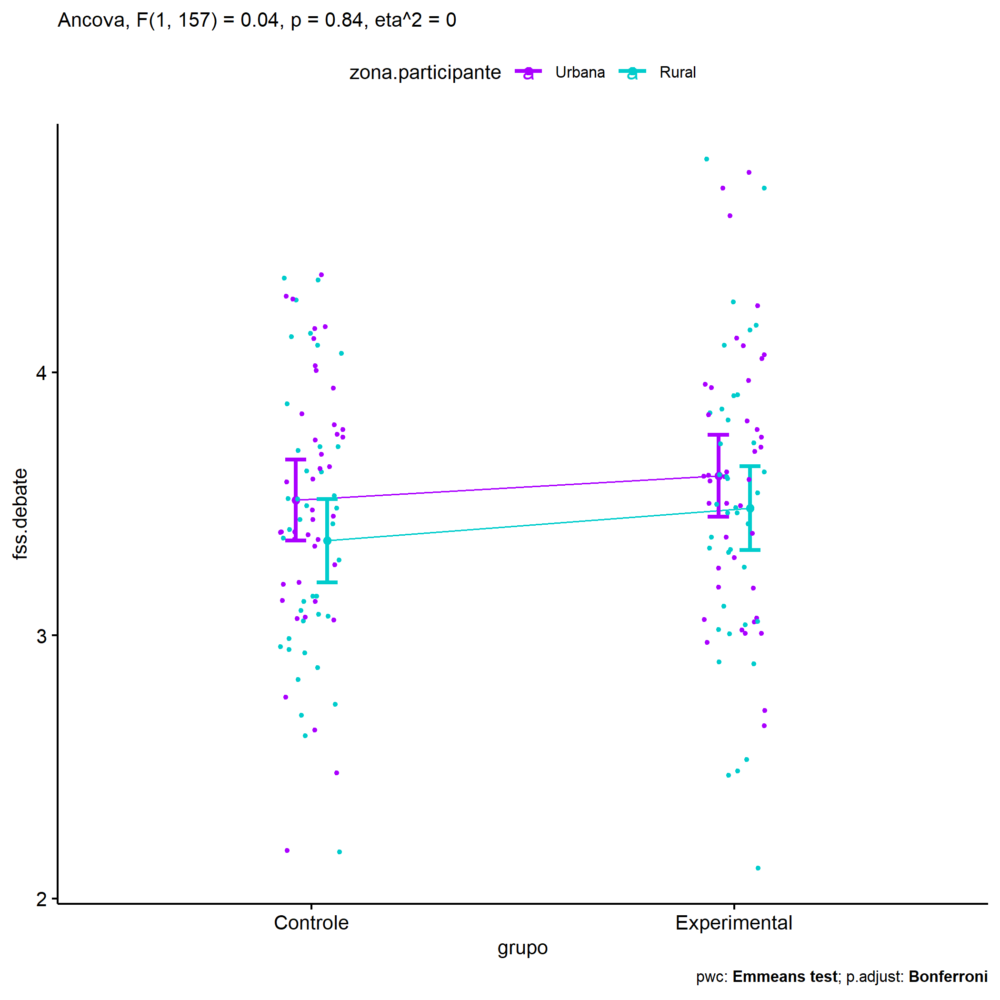<!-- -->

    ## Scale for colour is already present.
    ## Adding another scale for colour, which will replace the existing scale.

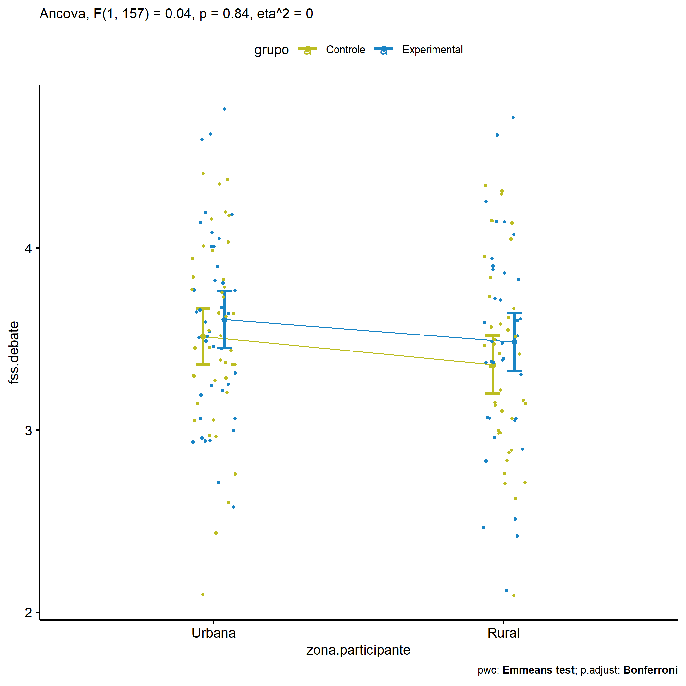<!-- -->

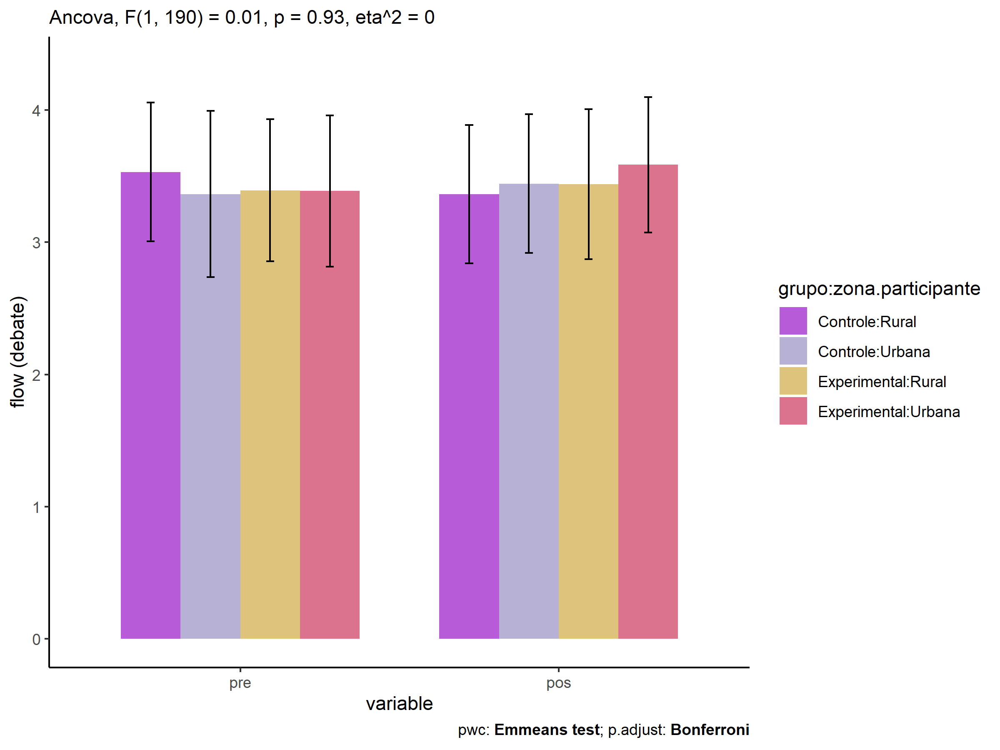<!-- -->

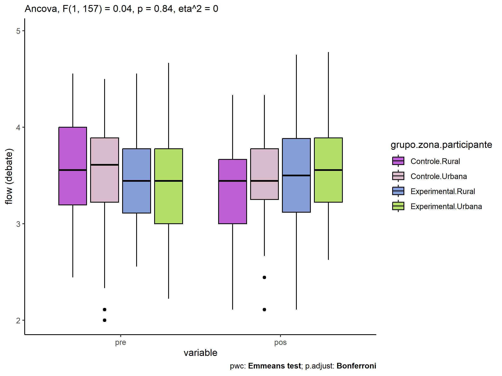<!-- -->

<!-- -->

<!-- -->

### factores: **grupo:escola**

| var        | grupo        | escola |   n | M (pre) | SE (pre) | M (unadj) | SE (unadj) | M (adj) | SE (adj) |
|:-----------|:-------------|:-------|----:|--------:|---------:|----------:|-----------:|--------:|---------:|
| fss.debate | Controle     | E1     |   6 |   3.370 |    0.187 |     3.630 |      0.145 |   3.668 |    0.202 |
| fss.debate | Controle     | E2     |  21 |   3.534 |    0.102 |     3.391 |      0.133 |   3.376 |    0.108 |
| fss.debate | Controle     | E3     |  15 |   3.643 |    0.143 |     3.421 |      0.108 |   3.371 |    0.128 |
| fss.debate | Controle     | E4     |  15 |   3.403 |    0.165 |     3.393 |      0.125 |   3.420 |    0.128 |
| fss.debate | Controle     | E5     |  40 |   3.534 |    0.100 |     3.544 |      0.079 |   3.529 |    0.078 |
| fss.debate | Controle     | E6     |   9 |   3.543 |    0.125 |     3.420 |      0.128 |   3.402 |    0.165 |
| fss.debate | Experimental | E1     |  10 |   3.179 |    0.132 |     3.779 |      0.204 |   3.880 |    0.157 |
| fss.debate | Experimental | E2     |  22 |   3.462 |    0.110 |     3.473 |      0.094 |   3.481 |    0.105 |
| fss.debate | Experimental | E3     |  15 |   3.496 |    0.180 |     3.231 |      0.149 |   3.228 |    0.127 |
| fss.debate | Experimental | E4     |   6 |   3.389 |    0.106 |     3.773 |      0.241 |   3.805 |    0.202 |
| fss.debate | Experimental | E5     |  40 |   3.463 |    0.087 |     3.602 |      0.090 |   3.611 |    0.078 |
| fss.debate | Experimental | E6     |  10 |   3.639 |    0.106 |     3.878 |      0.159 |   3.829 |    0.156 |

| grupo        | escola | group1   | group2       | estimate | conf.low | conf.high |    se | statistic |     p | p.adj | p.adj.signif |
|:-------------|:-------|:---------|:-------------|---------:|---------:|----------:|------:|----------:|------:|------:|:-------------|
|              | E1     | Controle | Experimental |   -0.212 |   -0.715 |     0.292 | 0.255 |    -0.830 | 0.408 | 0.408 | ns           |
|              | E2     | Controle | Experimental |   -0.106 |   -0.403 |     0.192 | 0.151 |    -0.700 | 0.485 | 0.485 | ns           |
|              | E3     | Controle | Experimental |    0.143 |   -0.213 |     0.499 | 0.181 |     0.793 | 0.429 | 0.429 | ns           |
|              | E4     | Controle | Experimental |   -0.385 |   -0.855 |     0.085 | 0.239 |    -1.615 | 0.108 | 0.108 | ns           |
|              | E5     | Controle | Experimental |   -0.081 |   -0.299 |     0.136 | 0.111 |    -0.737 | 0.462 | 0.462 | ns           |
|              | E6     | Controle | Experimental |   -0.427 |   -0.874 |     0.021 | 0.227 |    -1.881 | 0.061 | 0.061 | ns           |
|              | E1     | Controle | Experimental |    0.191 |   -0.367 |     0.750 | 0.283 |     0.675 | 0.500 | 0.500 | ns           |
|              | E2     | Controle | Experimental |    0.072 |   -0.258 |     0.402 | 0.167 |     0.432 | 0.666 | 0.666 | ns           |
|              | E3     | Controle | Experimental |    0.146 |   -0.249 |     0.541 | 0.200 |     0.731 | 0.466 | 0.466 | ns           |
|              | E4     | Controle | Experimental |    0.014 |   -0.508 |     0.536 | 0.265 |     0.052 | 0.958 | 0.958 | ns           |
|              | E5     | Controle | Experimental |    0.072 |   -0.170 |     0.313 | 0.123 |     0.583 | 0.560 | 0.560 | ns           |
|              | E6     | Controle | Experimental |   -0.096 |   -0.593 |     0.401 | 0.252 |    -0.380 | 0.705 | 0.705 | ns           |
| Controle     |        | E1       | E2           |    0.292 |   -0.159 |     0.743 | 0.229 |     1.277 | 0.203 | 1.000 | ns           |
| Controle     |        | E1       | E3           |    0.297 |   -0.175 |     0.769 | 0.239 |     1.242 | 0.216 | 1.000 | ns           |
| Controle     |        | E1       | E4           |    0.248 |   -0.223 |     0.718 | 0.239 |     1.038 | 0.301 | 1.000 | ns           |
| Controle     |        | E1       | E5           |    0.139 |   -0.288 |     0.566 | 0.216 |     0.641 | 0.522 | 1.000 | ns           |
| Controle     |        | E1       | E6           |    0.266 |   -0.247 |     0.780 | 0.260 |     1.022 | 0.308 | 1.000 | ns           |
| Controle     |        | E2       | E3           |    0.005 |   -0.325 |     0.334 | 0.167 |     0.029 | 0.977 | 1.000 | ns           |
| Controle     |        | E2       | E4           |   -0.045 |   -0.374 |     0.285 | 0.167 |    -0.267 | 0.790 | 1.000 | ns           |
| Controle     |        | E2       | E5           |   -0.153 |   -0.416 |     0.109 | 0.133 |    -1.154 | 0.250 | 1.000 | ns           |
| Controle     |        | E2       | E6           |   -0.026 |   -0.414 |     0.362 | 0.197 |    -0.132 | 0.895 | 1.000 | ns           |
| Controle     |        | E3       | E4           |   -0.049 |   -0.406 |     0.307 | 0.181 |    -0.273 | 0.785 | 1.000 | ns           |
| Controle     |        | E3       | E5           |   -0.158 |   -0.453 |     0.137 | 0.150 |    -1.058 | 0.291 | 1.000 | ns           |
| Controle     |        | E3       | E6           |   -0.031 |   -0.442 |     0.380 | 0.208 |    -0.148 | 0.882 | 1.000 | ns           |
| Controle     |        | E4       | E5           |   -0.109 |   -0.404 |     0.186 | 0.150 |    -0.727 | 0.468 | 1.000 | ns           |
| Controle     |        | E4       | E6           |    0.019 |   -0.392 |     0.430 | 0.208 |     0.089 | 0.929 | 1.000 | ns           |
| Controle     |        | E5       | E6           |    0.127 |   -0.232 |     0.487 | 0.182 |     0.700 | 0.485 | 1.000 | ns           |
| Experimental |        | E1       | E2           |    0.398 |    0.025 |     0.772 | 0.189 |     2.106 | 0.036 | 0.547 | ns           |
| Experimental |        | E1       | E3           |    0.652 |    0.252 |     1.051 | 0.203 |     3.218 | 0.002 | 0.023 | \*           |
| Experimental |        | E1       | E4           |    0.074 |   -0.429 |     0.578 | 0.255 |     0.291 | 0.771 | 1.000 | ns           |
| Experimental |        | E1       | E5           |    0.269 |   -0.077 |     0.615 | 0.176 |     1.533 | 0.127 | 1.000 | ns           |
| Experimental |        | E1       | E6           |    0.051 |   -0.388 |     0.490 | 0.223 |     0.230 | 0.819 | 1.000 | ns           |
| Experimental |        | E2       | E3           |    0.253 |   -0.073 |     0.580 | 0.165 |     1.533 | 0.127 | 1.000 | ns           |
| Experimental |        | E2       | E4           |   -0.324 |   -0.773 |     0.124 | 0.227 |    -1.425 | 0.156 | 1.000 | ns           |
| Experimental |        | E2       | E5           |   -0.129 |   -0.388 |     0.129 | 0.131 |    -0.988 | 0.324 | 1.000 | ns           |
| Experimental |        | E2       | E6           |   -0.347 |   -0.719 |     0.025 | 0.189 |    -1.841 | 0.067 | 1.000 | ns           |
| Experimental |        | E3       | E4           |   -0.578 |   -1.048 |    -0.107 | 0.239 |    -2.421 | 0.016 | 0.246 | ns           |
| Experimental |        | E3       | E5           |   -0.383 |   -0.678 |    -0.088 | 0.150 |    -2.561 | 0.011 | 0.168 | ns           |
| Experimental |        | E3       | E6           |   -0.601 |   -0.999 |    -0.203 | 0.202 |    -2.977 | 0.003 | 0.049 | \*           |
| Experimental |        | E4       | E5           |    0.195 |   -0.232 |     0.621 | 0.216 |     0.900 | 0.369 | 1.000 | ns           |
| Experimental |        | E4       | E6           |   -0.023 |   -0.527 |     0.481 | 0.255 |    -0.091 | 0.928 | 1.000 | ns           |
| Experimental |        | E5       | E6           |   -0.218 |   -0.563 |     0.127 | 0.175 |    -1.246 | 0.214 | 1.000 | ns           |
| Controle     |        | E1       | E2           |   -0.164 |   -0.665 |     0.337 | 0.254 |    -0.646 | 0.519 | 1.000 | ns           |
| Controle     |        | E1       | E3           |   -0.272 |   -0.795 |     0.250 | 0.265 |    -1.028 | 0.305 | 1.000 | ns           |
| Controle     |        | E1       | E4           |   -0.032 |   -0.555 |     0.490 | 0.265 |    -0.122 | 0.903 | 1.000 | ns           |
| Controle     |        | E1       | E5           |   -0.164 |   -0.637 |     0.310 | 0.240 |    -0.682 | 0.496 | 1.000 | ns           |
| Controle     |        | E1       | E6           |   -0.173 |   -0.743 |     0.397 | 0.289 |    -0.598 | 0.550 | 1.000 | ns           |
| Controle     |        | E2       | E3           |   -0.108 |   -0.474 |     0.257 | 0.185 |    -0.584 | 0.560 | 1.000 | ns           |
| Controle     |        | E2       | E4           |    0.132 |   -0.234 |     0.497 | 0.185 |     0.710 | 0.479 | 1.000 | ns           |
| Controle     |        | E2       | E5           |    0.000 |   -0.291 |     0.292 | 0.148 |     0.002 | 0.998 | 1.000 | ns           |
| Controle     |        | E2       | E6           |   -0.009 |   -0.440 |     0.422 | 0.218 |    -0.040 | 0.968 | 1.000 | ns           |
| Controle     |        | E3       | E4           |    0.240 |   -0.155 |     0.635 | 0.200 |     1.198 | 0.232 | 1.000 | ns           |
| Controle     |        | E3       | E5           |    0.109 |   -0.219 |     0.436 | 0.166 |     0.654 | 0.514 | 1.000 | ns           |
| Controle     |        | E3       | E6           |    0.099 |   -0.357 |     0.555 | 0.231 |     0.430 | 0.668 | 1.000 | ns           |
| Controle     |        | E4       | E5           |   -0.131 |   -0.459 |     0.196 | 0.166 |    -0.791 | 0.430 | 1.000 | ns           |
| Controle     |        | E4       | E6           |   -0.140 |   -0.596 |     0.316 | 0.231 |    -0.607 | 0.544 | 1.000 | ns           |
| Controle     |        | E5       | E6           |   -0.009 |   -0.408 |     0.390 | 0.202 |    -0.045 | 0.964 | 1.000 | ns           |
| Experimental |        | E1       | E2           |   -0.283 |   -0.695 |     0.129 | 0.209 |    -1.353 | 0.178 | 1.000 | ns           |
| Experimental |        | E1       | E3           |   -0.317 |   -0.759 |     0.124 | 0.224 |    -1.417 | 0.158 | 1.000 | ns           |
| Experimental |        | E1       | E4           |   -0.210 |   -0.768 |     0.349 | 0.283 |    -0.741 | 0.460 | 1.000 | ns           |
| Experimental |        | E1       | E5           |   -0.283 |   -0.666 |     0.099 | 0.194 |    -1.462 | 0.145 | 1.000 | ns           |
| Experimental |        | E1       | E6           |   -0.460 |   -0.943 |     0.024 | 0.245 |    -1.875 | 0.062 | 0.935 | ns           |
| Experimental |        | E2       | E3           |   -0.034 |   -0.396 |     0.328 | 0.184 |    -0.186 | 0.853 | 1.000 | ns           |
| Experimental |        | E2       | E4           |    0.073 |   -0.425 |     0.571 | 0.253 |     0.290 | 0.772 | 1.000 | ns           |
| Experimental |        | E2       | E5           |    0.000 |   -0.287 |     0.287 | 0.146 |    -0.003 | 0.998 | 1.000 | ns           |
| Experimental |        | E2       | E6           |   -0.177 |   -0.589 |     0.236 | 0.209 |    -0.845 | 0.399 | 1.000 | ns           |
| Experimental |        | E3       | E4           |    0.107 |   -0.415 |     0.630 | 0.265 |     0.406 | 0.686 | 1.000 | ns           |
| Experimental |        | E3       | E5           |    0.034 |   -0.294 |     0.361 | 0.166 |     0.204 | 0.839 | 1.000 | ns           |
| Experimental |        | E3       | E6           |   -0.143 |   -0.584 |     0.299 | 0.224 |    -0.637 | 0.525 | 1.000 | ns           |
| Experimental |        | E4       | E5           |   -0.074 |   -0.547 |     0.400 | 0.240 |    -0.307 | 0.759 | 1.000 | ns           |
| Experimental |        | E4       | E6           |   -0.250 |   -0.808 |     0.308 | 0.283 |    -0.883 | 0.378 | 1.000 | ns           |
| Experimental |        | E5       | E6           |   -0.176 |   -0.559 |     0.206 | 0.194 |    -0.910 | 0.364 | 1.000 | ns           |

| grupo        | escola | group1 | group2 | estimate | conf.low | conf.high |    se | statistic |     p | p.adj | p.adj.signif |
|:-------------|:-------|:-------|:-------|---------:|---------:|----------:|------:|----------:|------:|------:|:-------------|
| Controle     | E1     | pre    | pos    |   -0.259 |   -0.868 |     0.349 | 0.310 |    -0.837 | 0.403 | 0.403 | ns           |
| Controle     | E2     | pre    | pos    |    0.144 |   -0.182 |     0.469 | 0.165 |     0.867 | 0.386 | 0.386 | ns           |
| Controle     | E3     | pre    | pos    |    0.221 |   -0.164 |     0.606 | 0.196 |     1.130 | 0.259 | 0.259 | ns           |
| Controle     | E4     | pre    | pos    |    0.010 |   -0.375 |     0.395 | 0.196 |     0.052 | 0.959 | 0.959 | ns           |
| Controle     | E5     | pre    | pos    |   -0.010 |   -0.246 |     0.226 | 0.120 |    -0.085 | 0.932 | 0.932 | ns           |
| Controle     | E6     | pre    | pos    |    0.123 |   -0.374 |     0.620 | 0.253 |     0.488 | 0.626 | 0.626 | ns           |
| Experimental | E1     | pre    | pos    |   -0.600 |   -1.071 |    -0.129 | 0.240 |    -2.502 | 0.013 | 0.013 | \*           |
| Experimental | E2     | pre    | pos    |   -0.011 |   -0.329 |     0.307 | 0.162 |    -0.066 | 0.947 | 0.947 | ns           |
| Experimental | E3     | pre    | pos    |    0.266 |   -0.119 |     0.651 | 0.196 |     1.357 | 0.176 | 0.176 | ns           |
| Experimental | E4     | pre    | pos    |   -0.384 |   -0.993 |     0.224 | 0.310 |    -1.241 | 0.215 | 0.215 | ns           |
| Experimental | E5     | pre    | pos    |   -0.140 |   -0.376 |     0.096 | 0.120 |    -1.167 | 0.244 | 0.244 | ns           |
| Experimental | E6     | pre    | pos    |   -0.239 |   -0.710 |     0.233 | 0.240 |    -0.996 | 0.320 | 0.320 | ns           |

    ## Scale for colour is already present.
    ## Adding another scale for colour, which will replace the existing scale.

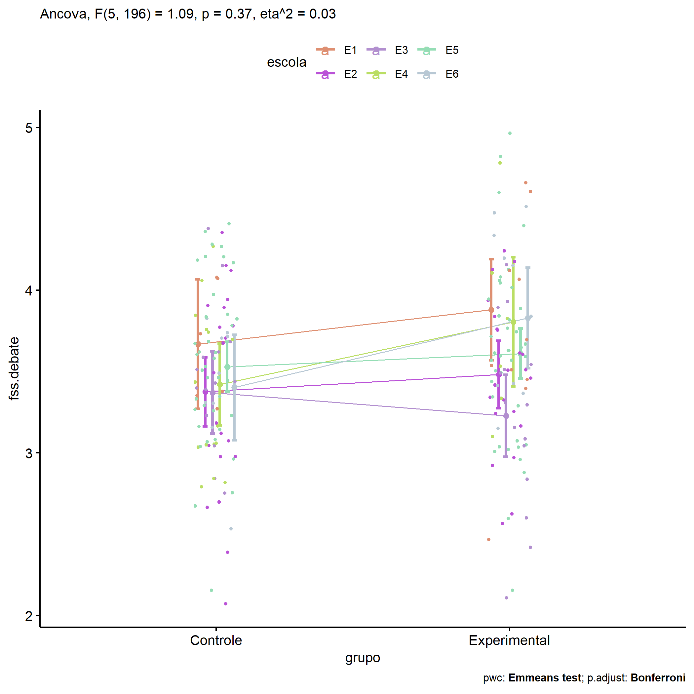<!-- -->

    ## Scale for colour is already present.
    ## Adding another scale for colour, which will replace the existing scale.

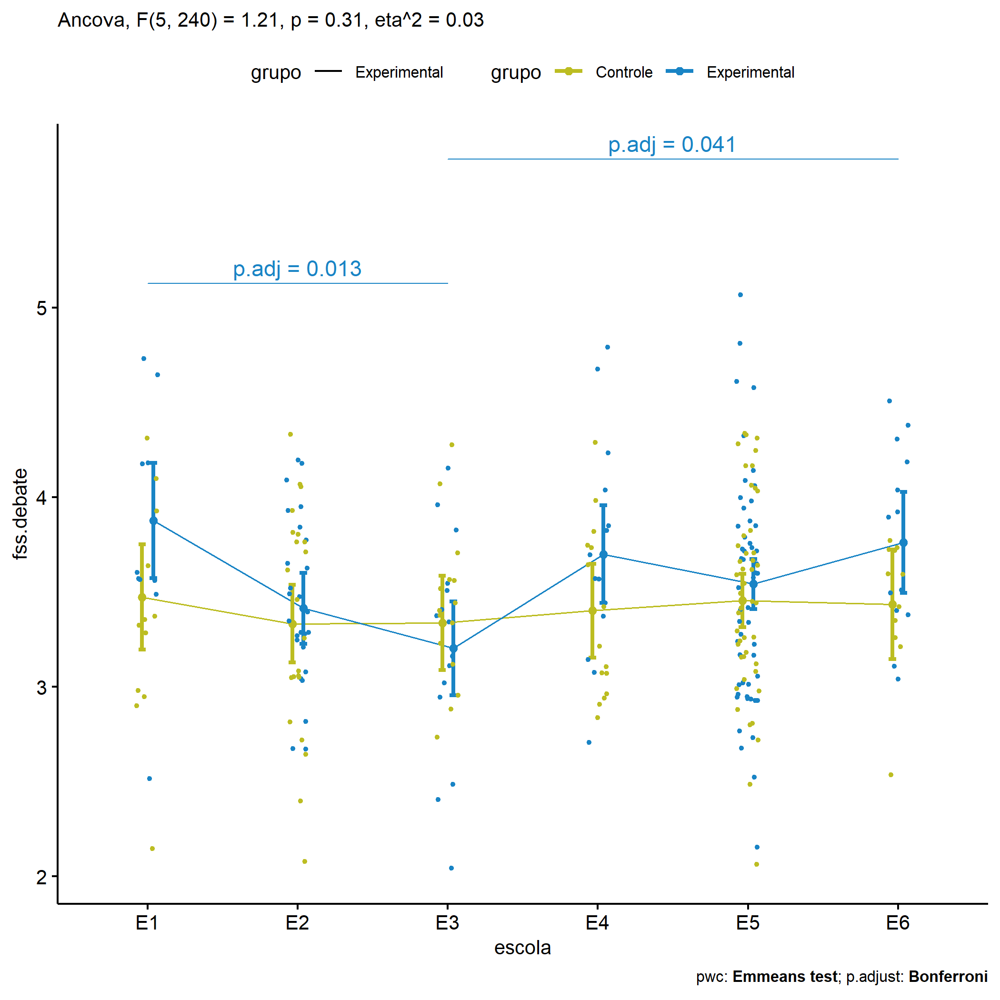<!-- -->

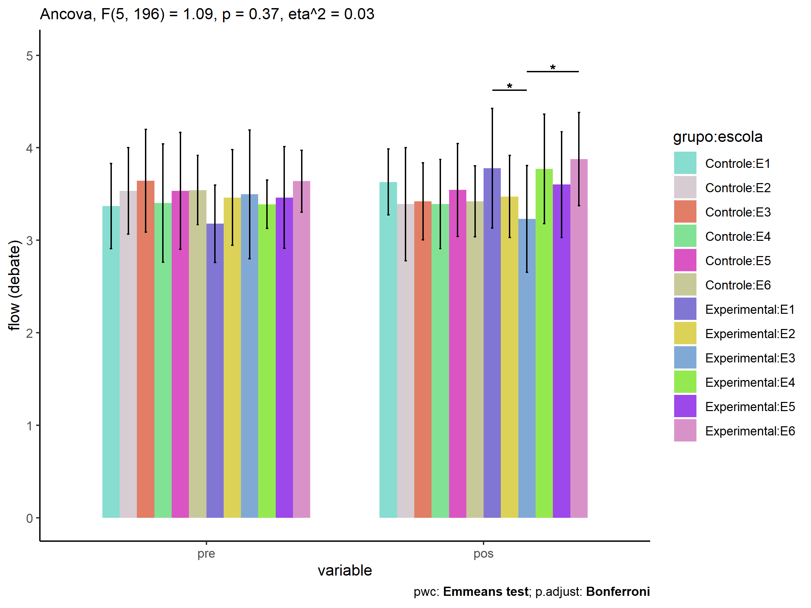<!-- -->

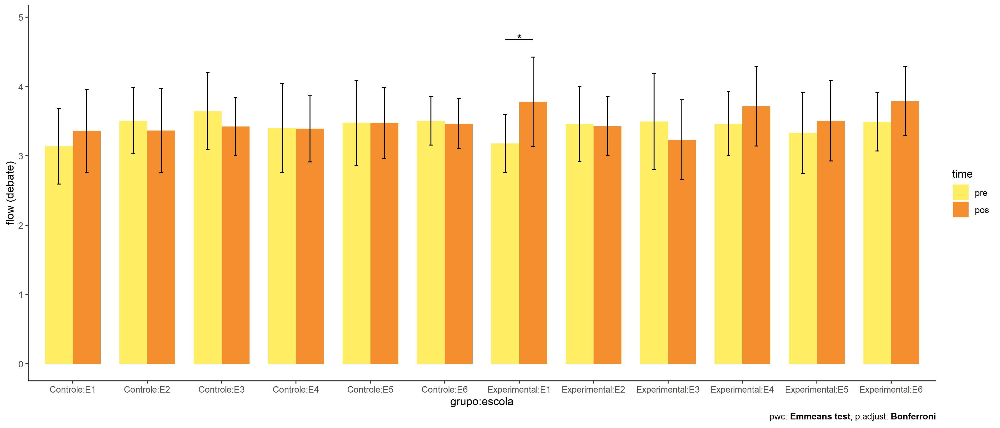<!-- -->

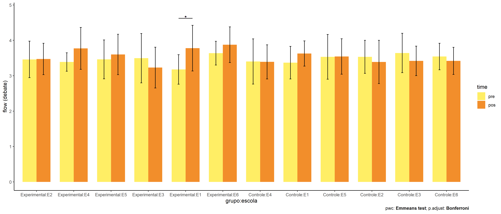<!-- -->

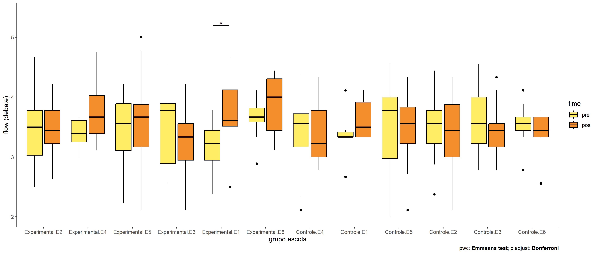<!-- -->

### factores: **grupo:zona.escola**

| var        | grupo        | zona.escola |   n | M (pre) | SE (pre) | M (unadj) | SE (unadj) | M (adj) | SE (adj) |
|:-----------|:-------------|:------------|----:|--------:|---------:|----------:|-----------:|--------:|---------:|
| fss.debate | Controle     | Rural       |  39 |   3.527 |    0.088 |     3.410 |      0.068 |   3.398 |    0.081 |
| fss.debate | Controle     | Urbana      |  67 |   3.519 |    0.069 |     3.504 |      0.064 |   3.494 |    0.062 |
| fss.debate | Experimental | Rural       |  31 |   3.522 |    0.095 |     3.544 |      0.112 |   3.534 |    0.091 |
| fss.debate | Experimental | Urbana      |  72 |   3.423 |    0.062 |     3.587 |      0.065 |   3.608 |    0.060 |

| grupo        | zona.escola | group1   | group2       | estimate | conf.low | conf.high |    se | statistic |     p | p.adj | p.adj.signif |
|:-------------|:------------|:---------|:-------------|---------:|---------:|----------:|------:|----------:|------:|------:|:-------------|
|              | Urbana      | Controle | Experimental |   -0.114 |   -0.283 |     0.056 | 0.086 |    -1.322 | 0.188 | 0.188 | ns           |
|              | Rural       | Controle | Experimental |   -0.136 |   -0.376 |     0.104 | 0.122 |    -1.121 | 0.264 | 0.264 | ns           |
|              | Urbana      | Controle | Experimental |    0.096 |   -0.086 |     0.279 | 0.092 |     1.044 | 0.298 | 0.298 | ns           |
|              | Rural       | Controle | Experimental |    0.006 |   -0.252 |     0.264 | 0.131 |     0.045 | 0.964 | 0.964 | ns           |
| Controle     |             | Urbana   | Rural        |    0.096 |   -0.104 |     0.297 | 0.102 |     0.947 | 0.345 | 0.345 | ns           |
| Experimental |             | Urbana   | Rural        |    0.074 |   -0.141 |     0.288 | 0.109 |     0.679 | 0.498 | 0.498 | ns           |
| Controle     |             | Urbana   | Rural        |   -0.008 |   -0.224 |     0.208 | 0.110 |    -0.072 | 0.942 | 0.942 | ns           |
| Experimental |             | Urbana   | Rural        |   -0.098 |   -0.329 |     0.132 | 0.117 |    -0.842 | 0.401 | 0.401 | ns           |

| grupo        | zona.escola | group1 | group2 | estimate | conf.low | conf.high |    se | statistic |     p | p.adj | p.adj.signif |
|:-------------|:------------|:-------|:-------|---------:|---------:|----------:|------:|----------:|------:|------:|:-------------|
| Controle     | Urbana      | pre    | pos    |    0.016 |   -0.167 |     0.199 | 0.093 |     0.168 | 0.866 | 0.866 | ns           |
| Controle     | Rural       | pre    | pos    |    0.118 |   -0.122 |     0.357 | 0.122 |     0.964 | 0.336 | 0.336 | ns           |
| Experimental | Urbana      | pre    | pos    |   -0.164 |   -0.341 |     0.012 | 0.090 |    -1.832 | 0.068 | 0.068 | ns           |
| Experimental | Rural       | pre    | pos    |   -0.023 |   -0.292 |     0.246 | 0.137 |    -0.167 | 0.867 | 0.867 | ns           |

    ## Scale for colour is already present.
    ## Adding another scale for colour, which will replace the existing scale.

<!-- -->

    ## Scale for colour is already present.
    ## Adding another scale for colour, which will replace the existing scale.

<!-- -->

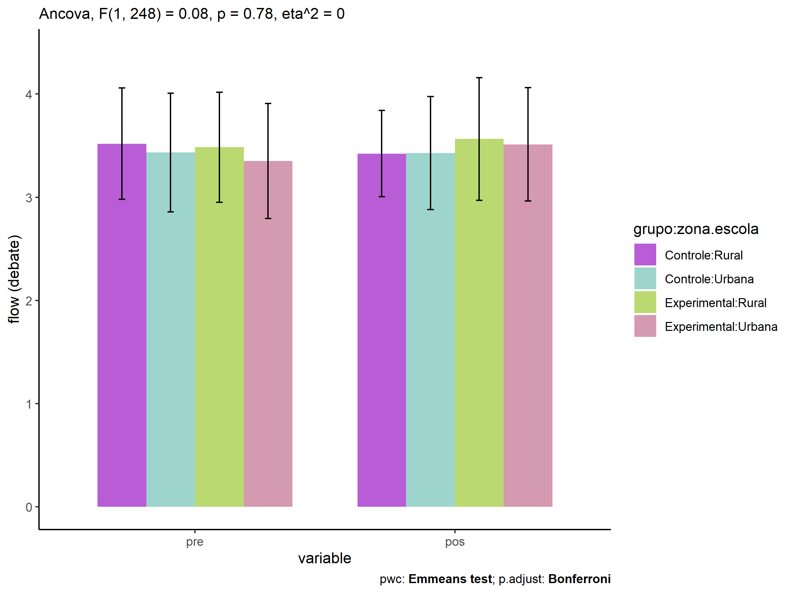<!-- -->

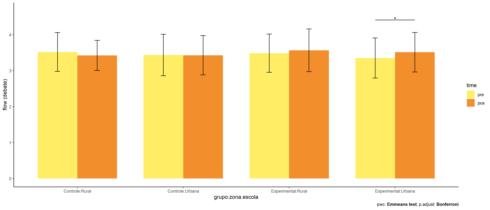<!-- -->

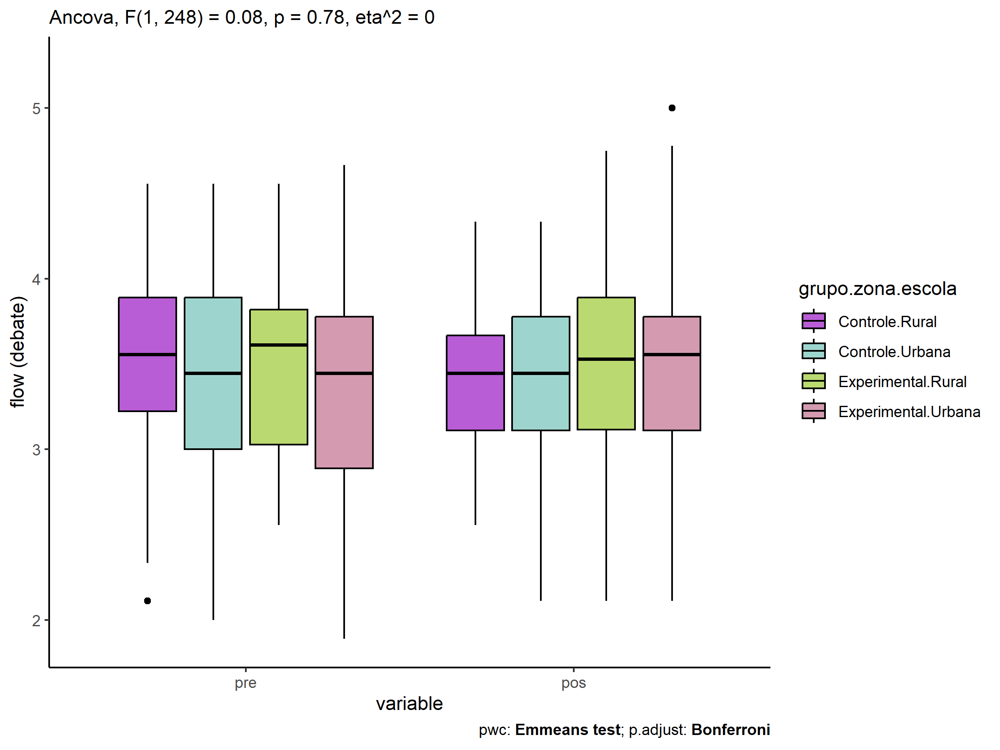<!-- -->

<!-- -->

## Pairwise comparisons for grupo=“Experimental”

### factores: **grupo=“Experimental”:monitor**

| var        | monitor |   n | M (pre) | SE (pre) | M (unadj) | SE (unadj) | M (adj) | SE (adj) |
|:-----------|:--------|----:|--------:|---------:|----------:|-----------:|--------:|---------:|
| fss.debate | AC      |  10 |   3.711 |    0.120 |     3.444 |      0.142 |   3.341 |    0.162 |
| fss.debate | CE      |   6 |   3.389 |    0.106 |     3.773 |      0.241 |   3.799 |    0.207 |
| fss.debate | EA      |   8 |   3.382 |    0.121 |     3.889 |      0.214 |   3.917 |    0.179 |
| fss.debate | GR      |  14 |   3.516 |    0.154 |     3.571 |      0.108 |   3.546 |    0.135 |
| fss.debate | JC      |   9 |   3.346 |    0.243 |     3.295 |      0.145 |   3.338 |    0.169 |
| fss.debate | MF      |   9 |   3.568 |    0.169 |     3.704 |      0.262 |   3.657 |    0.169 |
| fss.debate | ML      |  15 |   3.496 |    0.180 |     3.231 |      0.149 |   3.213 |    0.131 |
| fss.debate | MM      |  12 |   3.255 |    0.155 |     3.497 |      0.132 |   3.576 |    0.147 |
| fss.debate | PR      |  10 |   3.179 |    0.132 |     3.779 |      0.204 |   3.889 |    0.162 |
| fss.debate | VL      |  10 |   3.639 |    0.106 |     3.878 |      0.159 |   3.803 |    0.161 |

| .y.        | group1 | group2 | estimate | conf.low | conf.high |    se | statistic |     p | p.adj | p.adj.signif |
|:-----------|:-------|:-------|---------:|---------:|----------:|------:|----------:|------:|------:|:-------------|
| fss.debate | AC     | CE     |   -0.458 |   -0.981 |     0.064 | 0.263 |    -1.742 | 0.085 | 1.000 | ns           |
| fss.debate | AC     | EA     |   -0.577 |   -1.058 |    -0.096 | 0.242 |    -2.382 | 0.019 | 0.867 | ns           |
| fss.debate | AC     | GR     |   -0.205 |   -0.623 |     0.212 | 0.210 |    -0.977 | 0.331 | 1.000 | ns           |
| fss.debate | AC     | JC     |    0.003 |   -0.464 |     0.470 | 0.235 |     0.012 | 0.991 | 1.000 | ns           |
| fss.debate | AC     | MF     |   -0.317 |   -0.779 |     0.146 | 0.233 |    -1.361 | 0.177 | 1.000 | ns           |
| fss.debate | AC     | ML     |    0.128 |   -0.285 |     0.540 | 0.208 |     0.614 | 0.541 | 1.000 | ns           |
| fss.debate | AC     | MM     |   -0.236 |   -0.675 |     0.204 | 0.221 |    -1.065 | 0.290 | 1.000 | ns           |
| fss.debate | AC     | PR     |   -0.549 |   -1.010 |    -0.087 | 0.232 |    -2.361 | 0.020 | 0.914 | ns           |
| fss.debate | AC     | VL     |   -0.462 |   -0.912 |    -0.013 | 0.226 |    -2.043 | 0.044 | 1.000 | ns           |
| fss.debate | CE     | EA     |   -0.119 |   -0.661 |     0.424 | 0.273 |    -0.434 | 0.665 | 1.000 | ns           |
| fss.debate | CE     | GR     |    0.253 |   -0.238 |     0.744 | 0.247 |     1.023 | 0.309 | 1.000 | ns           |
| fss.debate | CE     | JC     |    0.461 |   -0.068 |     0.990 | 0.267 |     1.729 | 0.087 | 1.000 | ns           |
| fss.debate | CE     | MF     |    0.141 |   -0.389 |     0.672 | 0.267 |     0.529 | 0.598 | 1.000 | ns           |
| fss.debate | CE     | ML     |    0.586 |    0.100 |     1.071 | 0.245 |     2.395 | 0.019 | 0.838 | ns           |
| fss.debate | CE     | MM     |    0.223 |   -0.280 |     0.726 | 0.253 |     0.879 | 0.382 | 1.000 | ns           |
| fss.debate | CE     | PR     |   -0.090 |   -0.611 |     0.430 | 0.262 |    -0.345 | 0.731 | 1.000 | ns           |
| fss.debate | CE     | VL     |   -0.004 |   -0.525 |     0.517 | 0.262 |    -0.016 | 0.988 | 1.000 | ns           |
| fss.debate | EA     | GR     |    0.371 |   -0.075 |     0.817 | 0.225 |     1.654 | 0.102 | 1.000 | ns           |
| fss.debate | EA     | JC     |    0.580 |    0.091 |     1.068 | 0.246 |     2.358 | 0.020 | 0.922 | ns           |
| fss.debate | EA     | MF     |    0.260 |   -0.230 |     0.749 | 0.246 |     1.055 | 0.294 | 1.000 | ns           |
| fss.debate | EA     | ML     |    0.704 |    0.264 |     1.145 | 0.222 |     3.177 | 0.002 | 0.091 | ns           |
| fss.debate | EA     | MM     |    0.341 |   -0.118 |     0.800 | 0.231 |     1.476 | 0.143 | 1.000 | ns           |
| fss.debate | EA     | PR     |    0.028 |   -0.450 |     0.506 | 0.241 |     0.117 | 0.907 | 1.000 | ns           |
| fss.debate | EA     | VL     |    0.114 |   -0.365 |     0.594 | 0.241 |     0.474 | 0.636 | 1.000 | ns           |
| fss.debate | GR     | JC     |    0.208 |   -0.222 |     0.639 | 0.217 |     0.961 | 0.339 | 1.000 | ns           |
| fss.debate | GR     | MF     |   -0.111 |   -0.541 |     0.318 | 0.216 |    -0.515 | 0.608 | 1.000 | ns           |
| fss.debate | GR     | ML     |    0.333 |   -0.040 |     0.706 | 0.188 |     1.772 | 0.080 | 1.000 | ns           |
| fss.debate | GR     | MM     |   -0.030 |   -0.429 |     0.368 | 0.201 |    -0.150 | 0.881 | 1.000 | ns           |
| fss.debate | GR     | PR     |   -0.343 |   -0.764 |     0.078 | 0.212 |    -1.618 | 0.109 | 1.000 | ns           |
| fss.debate | GR     | VL     |   -0.257 |   -0.673 |     0.160 | 0.210 |    -1.225 | 0.224 | 1.000 | ns           |
| fss.debate | JC     | MF     |   -0.320 |   -0.795 |     0.156 | 0.239 |    -1.335 | 0.185 | 1.000 | ns           |
| fss.debate | JC     | ML     |    0.125 |   -0.300 |     0.549 | 0.214 |     0.584 | 0.561 | 1.000 | ns           |
| fss.debate | JC     | MM     |   -0.238 |   -0.682 |     0.205 | 0.223 |    -1.068 | 0.288 | 1.000 | ns           |
| fss.debate | JC     | PR     |   -0.551 |   -1.014 |    -0.089 | 0.233 |    -2.367 | 0.020 | 0.902 | ns           |
| fss.debate | JC     | VL     |   -0.465 |   -0.930 |     0.000 | 0.234 |    -1.986 | 0.050 | 1.000 | ns           |
| fss.debate | MF     | ML     |    0.444 |    0.021 |     0.868 | 0.213 |     2.083 | 0.040 | 1.000 | ns           |
| fss.debate | MF     | MM     |    0.081 |   -0.366 |     0.528 | 0.225 |     0.361 | 0.719 | 1.000 | ns           |
| fss.debate | MF     | PR     |   -0.232 |   -0.700 |     0.236 | 0.236 |    -0.984 | 0.328 | 1.000 | ns           |
| fss.debate | MF     | VL     |   -0.146 |   -0.607 |     0.316 | 0.232 |    -0.626 | 0.533 | 1.000 | ns           |
| fss.debate | ML     | MM     |   -0.363 |   -0.755 |     0.029 | 0.197 |    -1.840 | 0.069 | 1.000 | ns           |
| fss.debate | ML     | PR     |   -0.676 |   -1.091 |    -0.261 | 0.209 |    -3.237 | 0.002 | 0.076 | ns           |
| fss.debate | ML     | VL     |   -0.590 |   -1.001 |    -0.179 | 0.207 |    -2.850 | 0.005 | 0.243 | ns           |
| fss.debate | MM     | PR     |   -0.313 |   -0.743 |     0.117 | 0.217 |    -1.444 | 0.152 | 1.000 | ns           |
| fss.debate | MM     | VL     |   -0.227 |   -0.664 |     0.210 | 0.220 |    -1.031 | 0.305 | 1.000 | ns           |
| fss.debate | PR     | VL     |    0.086 |   -0.372 |     0.545 | 0.231 |     0.374 | 0.709 | 1.000 | ns           |
| dfs.debate | AC     | CE     |    0.322 |   -0.216 |     0.860 | 0.271 |     1.189 | 0.237 | 1.000 | ns           |
| dfs.debate | AC     | EA     |    0.329 |   -0.165 |     0.824 | 0.249 |     1.322 | 0.189 | 1.000 | ns           |
| dfs.debate | AC     | GR     |    0.195 |   -0.236 |     0.627 | 0.217 |     0.899 | 0.371 | 1.000 | ns           |
| dfs.debate | AC     | JC     |    0.365 |   -0.113 |     0.844 | 0.241 |     1.515 | 0.133 | 1.000 | ns           |
| dfs.debate | AC     | MF     |    0.143 |   -0.336 |     0.622 | 0.241 |     0.594 | 0.554 | 1.000 | ns           |
| dfs.debate | AC     | ML     |    0.215 |   -0.211 |     0.640 | 0.214 |     1.003 | 0.319 | 1.000 | ns           |
| dfs.debate | AC     | MM     |    0.456 |    0.010 |     0.903 | 0.225 |     2.031 | 0.045 | 1.000 | ns           |
| dfs.debate | AC     | PR     |    0.532 |    0.066 |     0.998 | 0.235 |     2.266 | 0.026 | 1.000 | ns           |
| dfs.debate | AC     | VL     |    0.072 |   -0.394 |     0.538 | 0.235 |     0.308 | 0.759 | 1.000 | ns           |
| dfs.debate | CE     | EA     |    0.007 |   -0.556 |     0.570 | 0.283 |     0.025 | 0.981 | 1.000 | ns           |
| dfs.debate | CE     | GR     |   -0.127 |   -0.636 |     0.382 | 0.256 |    -0.496 | 0.621 | 1.000 | ns           |
| dfs.debate | CE     | JC     |    0.043 |   -0.506 |     0.592 | 0.277 |     0.156 | 0.876 | 1.000 | ns           |
| dfs.debate | CE     | MF     |   -0.179 |   -0.728 |     0.370 | 0.277 |    -0.647 | 0.519 | 1.000 | ns           |
| dfs.debate | CE     | ML     |   -0.107 |   -0.611 |     0.396 | 0.254 |    -0.424 | 0.673 | 1.000 | ns           |
| dfs.debate | CE     | MM     |    0.134 |   -0.387 |     0.655 | 0.262 |     0.512 | 0.610 | 1.000 | ns           |
| dfs.debate | CE     | PR     |    0.210 |   -0.328 |     0.748 | 0.271 |     0.774 | 0.441 | 1.000 | ns           |
| dfs.debate | CE     | VL     |   -0.250 |   -0.788 |     0.288 | 0.271 |    -0.922 | 0.359 | 1.000 | ns           |
| dfs.debate | EA     | GR     |   -0.134 |   -0.596 |     0.328 | 0.233 |    -0.576 | 0.566 | 1.000 | ns           |
| dfs.debate | EA     | JC     |    0.036 |   -0.470 |     0.543 | 0.255 |     0.142 | 0.887 | 1.000 | ns           |
| dfs.debate | EA     | MF     |   -0.186 |   -0.692 |     0.320 | 0.255 |    -0.729 | 0.468 | 1.000 | ns           |
| dfs.debate | EA     | ML     |   -0.114 |   -0.571 |     0.342 | 0.230 |    -0.498 | 0.620 | 1.000 | ns           |
| dfs.debate | EA     | MM     |    0.127 |   -0.348 |     0.603 | 0.240 |     0.531 | 0.596 | 1.000 | ns           |
| dfs.debate | EA     | PR     |    0.203 |   -0.292 |     0.697 | 0.249 |     0.815 | 0.417 | 1.000 | ns           |
| dfs.debate | EA     | VL     |   -0.257 |   -0.751 |     0.237 | 0.249 |    -1.032 | 0.305 | 1.000 | ns           |
| dfs.debate | GR     | JC     |    0.170 |   -0.275 |     0.615 | 0.224 |     0.759 | 0.450 | 1.000 | ns           |
| dfs.debate | GR     | MF     |   -0.052 |   -0.497 |     0.393 | 0.224 |    -0.232 | 0.817 | 1.000 | ns           |
| dfs.debate | GR     | ML     |    0.020 |   -0.368 |     0.407 | 0.195 |     0.100 | 0.920 | 1.000 | ns           |
| dfs.debate | GR     | MM     |    0.261 |   -0.149 |     0.671 | 0.206 |     1.265 | 0.209 | 1.000 | ns           |
| dfs.debate | GR     | PR     |    0.337 |   -0.095 |     0.768 | 0.217 |     1.550 | 0.125 | 1.000 | ns           |
| dfs.debate | GR     | VL     |   -0.123 |   -0.555 |     0.308 | 0.217 |    -0.566 | 0.573 | 1.000 | ns           |
| dfs.debate | JC     | MF     |   -0.222 |   -0.714 |     0.269 | 0.247 |    -0.898 | 0.371 | 1.000 | ns           |
| dfs.debate | JC     | ML     |   -0.151 |   -0.590 |     0.289 | 0.221 |    -0.681 | 0.498 | 1.000 | ns           |
| dfs.debate | JC     | MM     |    0.091 |   -0.369 |     0.551 | 0.231 |     0.393 | 0.695 | 1.000 | ns           |
| dfs.debate | JC     | PR     |    0.167 |   -0.312 |     0.645 | 0.241 |     0.691 | 0.492 | 1.000 | ns           |
| dfs.debate | JC     | VL     |   -0.293 |   -0.772 |     0.186 | 0.241 |    -1.216 | 0.227 | 1.000 | ns           |
| dfs.debate | MF     | ML     |    0.072 |   -0.368 |     0.511 | 0.221 |     0.324 | 0.747 | 1.000 | ns           |
| dfs.debate | MF     | MM     |    0.313 |   -0.146 |     0.773 | 0.231 |     1.354 | 0.179 | 1.000 | ns           |
| dfs.debate | MF     | PR     |    0.389 |   -0.090 |     0.868 | 0.241 |     1.612 | 0.110 | 1.000 | ns           |
| dfs.debate | MF     | VL     |   -0.071 |   -0.550 |     0.408 | 0.241 |    -0.294 | 0.769 | 1.000 | ns           |
| dfs.debate | ML     | MM     |    0.242 |   -0.162 |     0.645 | 0.203 |     1.189 | 0.237 | 1.000 | ns           |
| dfs.debate | ML     | PR     |    0.317 |   -0.108 |     0.743 | 0.214 |     1.480 | 0.142 | 1.000 | ns           |
| dfs.debate | ML     | VL     |   -0.143 |   -0.568 |     0.283 | 0.214 |    -0.666 | 0.507 | 1.000 | ns           |
| dfs.debate | MM     | PR     |    0.075 |   -0.371 |     0.522 | 0.225 |     0.336 | 0.738 | 1.000 | ns           |
| dfs.debate | MM     | VL     |   -0.384 |   -0.830 |     0.062 | 0.225 |    -1.710 | 0.091 | 1.000 | ns           |
| dfs.debate | PR     | VL     |   -0.460 |   -0.926 |     0.006 | 0.235 |    -1.959 | 0.053 | 1.000 | ns           |

| monitor | group1 | group2 | estimate | conf.low | conf.high |    se | statistic |     p | p.adj | p.adj.signif |
|:--------|:-------|:-------|---------:|---------:|----------:|------:|----------:|------:|------:|:-------------|
| AC      | pre    | pos    |    0.267 |   -0.206 |     0.739 | 0.239 |     1.114 | 0.267 | 0.267 | ns           |
| CE      | pre    | pos    |   -0.384 |   -0.994 |     0.225 | 0.309 |    -1.243 | 0.215 | 0.215 | ns           |
| EA      | pre    | pos    |   -0.507 |   -1.035 |     0.021 | 0.268 |    -1.894 | 0.060 | 0.060 | ns           |
| GR      | pre    | pos    |   -0.056 |   -0.455 |     0.344 | 0.202 |    -0.275 | 0.784 | 0.784 | ns           |
| JC      | pre    | pos    |    0.051 |   -0.447 |     0.549 | 0.252 |     0.202 | 0.840 | 0.840 | ns           |
| MF      | pre    | pos    |   -0.136 |   -0.634 |     0.362 | 0.252 |    -0.538 | 0.591 | 0.591 | ns           |
| ML      | pre    | pos    |    0.266 |   -0.120 |     0.651 | 0.195 |     1.360 | 0.176 | 0.176 | ns           |
| MM      | pre    | pos    |   -0.242 |   -0.673 |     0.189 | 0.219 |    -1.107 | 0.270 | 0.270 | ns           |
| PR      | pre    | pos    |   -0.600 |   -1.072 |    -0.128 | 0.239 |    -2.507 | 0.013 | 0.013 | \*           |
| VL      | pre    | pos    |   -0.239 |   -0.711 |     0.233 | 0.239 |    -0.998 | 0.320 | 0.320 | ns           |

    ## Scale for colour is already present.
    ## Adding another scale for colour, which will replace the existing scale.

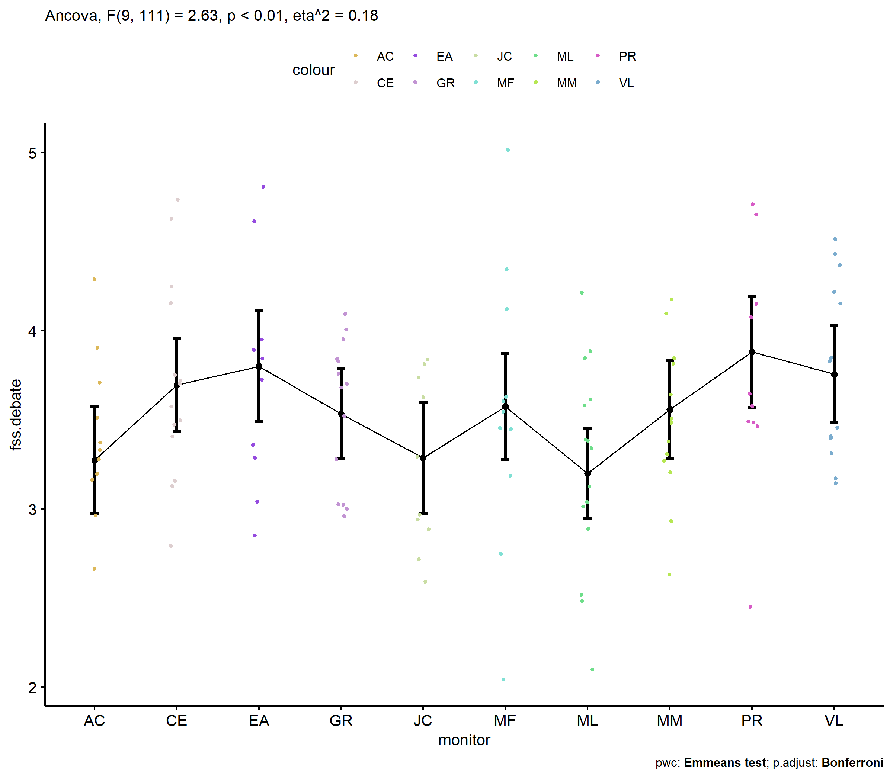<!-- -->

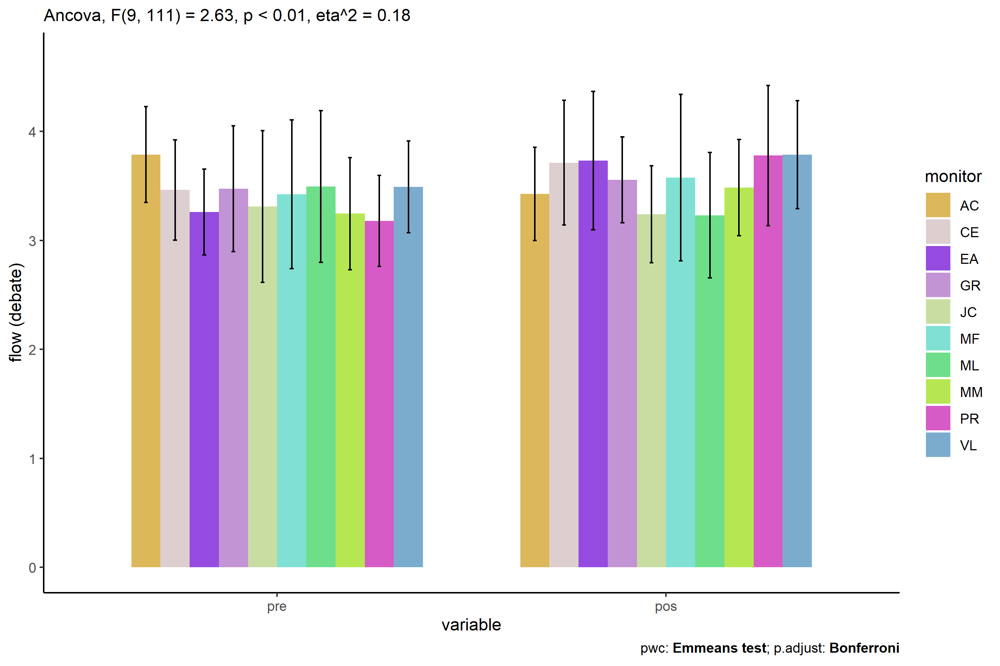<!-- -->

<!-- -->

<!-- -->

<!-- -->

### factores: **grupo=“Experimental”:monitor.genero**

| var        | monitor.genero |   n | M (pre) | SE (pre) | M (unadj) | SE (unadj) | M (adj) | SE (adj) |
|:-----------|:---------------|----:|--------:|---------:|----------:|-----------:|--------:|---------:|
| fss.debate | F              |  70 |   3.519 |    0.064 |     3.528 |      0.066 |   3.502 |    0.064 |
| fss.debate | M              |  33 |   3.312 |    0.083 |     3.673 |      0.104 |   3.728 |    0.094 |

| .y.        | group1 | group2 | estimate | conf.low | conf.high |    se | statistic |     p | p.adj | p.adj.signif |
|:-----------|:-------|:-------|---------:|---------:|----------:|------:|----------:|------:|------:|:-------------|
| fss.debate | F      | M      |   -0.226 |   -0.452 |     0.000 | 0.114 |    -1.981 | 0.050 | 0.050 | ns           |
| dfs.debate | F      | M      |    0.207 |   -0.010 |     0.425 | 0.110 |     1.889 | 0.062 | 0.062 | ns           |

| monitor.genero | group1 | group2 | estimate | conf.low | conf.high |    se | statistic |     p | p.adj | p.adj.signif |
|:---------------|:-------|:-------|---------:|---------:|----------:|------:|----------:|------:|------:|:-------------|
| F              | pre    | pos    |   -0.009 |   -0.190 |     0.172 | 0.092 |    -0.099 | 0.921 | 0.921 | ns           |
| M              | pre    | pos    |   -0.361 |   -0.625 |    -0.097 | 0.134 |    -2.695 | 0.008 | 0.008 | \*\*         |

    ## Scale for colour is already present.
    ## Adding another scale for colour, which will replace the existing scale.

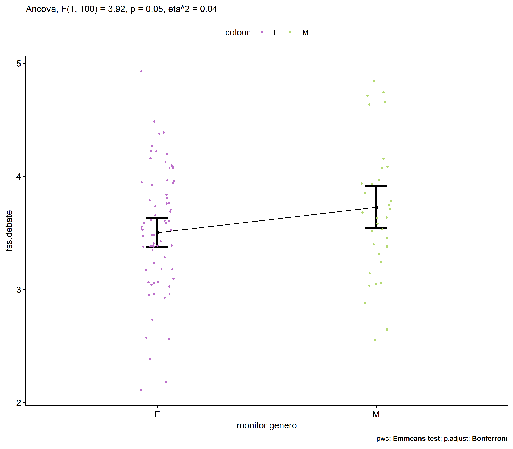<!-- -->

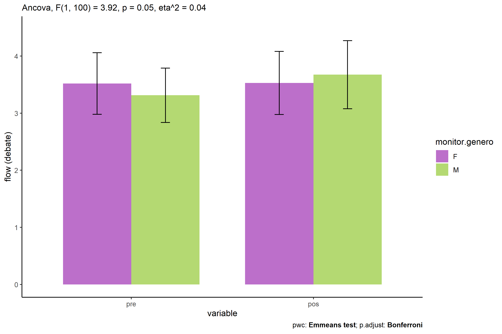<!-- -->

<!-- -->

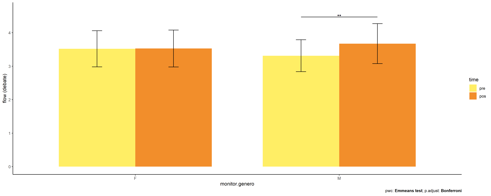<!-- -->

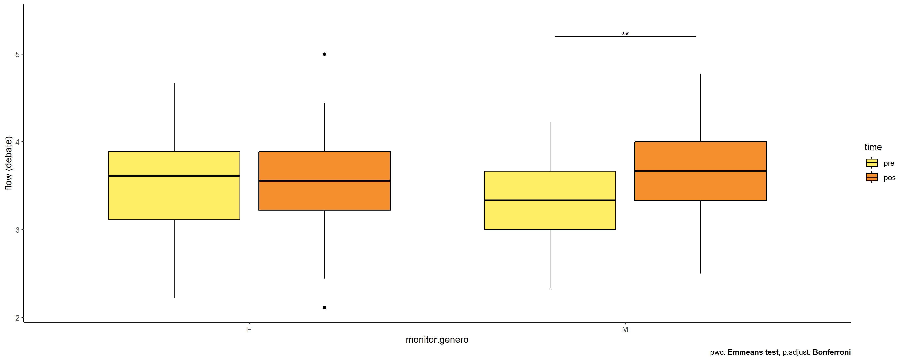<!-- -->

### factores: **grupo=“Experimental”:monitor.area**

| var        | monitor.area               |   n | M (pre) | SE (pre) | M (unadj) | SE (unadj) | M (adj) | SE (adj) |
|:-----------|:---------------------------|----:|--------:|---------:|----------:|-----------:|--------:|---------:|
| fss.debate | Arquitetura e Urbanismo    |   9 |   3.346 |    0.243 |     3.295 |      0.145 |   3.337 |    0.170 |
| fss.debate | Ciencias Biologicas        |  15 |   3.496 |    0.180 |     3.231 |      0.149 |   3.213 |    0.132 |
| fss.debate | Comunicacao Social         |   6 |   3.389 |    0.106 |     3.773 |      0.241 |   3.798 |    0.208 |
| fss.debate | Historia                   |  10 |   3.179 |    0.132 |     3.779 |      0.204 |   3.886 |    0.164 |
| fss.debate | Letras - Lingua Portuguesa |   9 |   3.568 |    0.169 |     3.704 |      0.262 |   3.659 |    0.171 |
| fss.debate | Matematica                 |  22 |   3.467 |    0.106 |     3.687 |      0.106 |   3.681 |    0.109 |
| fss.debate | Nutricao                   |  12 |   3.255 |    0.155 |     3.497 |      0.132 |   3.574 |    0.149 |
| fss.debate | Pedagogia                  |  10 |   3.711 |    0.120 |     3.444 |      0.142 |   3.343 |    0.163 |
| fss.debate | Servico Social             |  10 |   3.639 |    0.106 |     3.878 |      0.159 |   3.805 |    0.163 |

| .y.        | group1                  | group2              | estimate | conf.low | conf.high |    se | statistic |     p | p.adj | p.adj.signif |
|:-----------|:------------------------|:--------------------|---------:|---------:|----------:|------:|----------:|------:|------:|:-------------|
| fss.debate | Arquitetura e Urbanismo | Ciencias Biologicas |    0.123 |   -0.305 |     0.552 | 0.216 |     0.571 | 0.569 | 1.000 | ns           |
| fss.debate | Arquitetura e Urbanismo | Comunicacao Social  |   -0.461 |   -0.996 |     0.073 | 0.269 |    -1.715 | 0.090 | 1.000 | ns           |
| fss.debate | Arquitetura e Urbanismo | Historia            |   -0.550 |   -1.017 |    -0.083 | 0.235 |    -2.338 | 0.022 | 0.775 | ns           |
| fss.debate | Arquitetura e Urbanismo | Letras              |   -0.322 |   -0.802 |     0.158 | 0.242 |    -1.332 | 0.186 | 1.000 | ns           |
| fss.debate | Arquitetura e Urbanismo | Matematica          |   -0.344 |   -0.746 |     0.057 | 0.202 |    -1.702 | 0.092 | 1.000 | ns           |
| fss.debate | Arquitetura e Urbanismo | Nutricao            |   -0.237 |   -0.685 |     0.210 | 0.225 |    -1.054 | 0.295 | 1.000 | ns           |
| fss.debate | Arquitetura e Urbanismo | Pedagogia           |   -0.006 |   -0.478 |     0.465 | 0.237 |    -0.027 | 0.979 | 1.000 | ns           |
| fss.debate | Arquitetura e Urbanismo | Servico Social      |   -0.468 |   -0.937 |     0.001 | 0.236 |    -1.980 | 0.051 | 1.000 | ns           |
| fss.debate | Ciencias Biologicas     | Comunicacao Social  |   -0.585 |   -1.075 |    -0.095 | 0.247 |    -2.369 | 0.020 | 0.716 | ns           |
| fss.debate | Ciencias Biologicas     | Historia            |   -0.673 |   -1.092 |    -0.254 | 0.211 |    -3.192 | 0.002 | 0.069 | ns           |
| fss.debate | Ciencias Biologicas     | Letras              |   -0.445 |   -0.873 |    -0.017 | 0.215 |    -2.067 | 0.042 | 1.000 | ns           |
| fss.debate | Ciencias Biologicas     | Matematica          |   -0.468 |   -0.807 |    -0.128 | 0.171 |    -2.736 | 0.007 | 0.268 | ns           |
| fss.debate | Ciencias Biologicas     | Nutricao            |   -0.361 |   -0.756 |     0.035 | 0.199 |    -1.811 | 0.073 | 1.000 | ns           |
| fss.debate | Ciencias Biologicas     | Pedagogia           |   -0.130 |   -0.546 |     0.286 | 0.210 |    -0.619 | 0.538 | 1.000 | ns           |
| fss.debate | Ciencias Biologicas     | Servico Social      |   -0.591 |   -1.006 |    -0.176 | 0.209 |    -2.831 | 0.006 | 0.205 | ns           |
| fss.debate | Comunicacao Social      | Historia            |   -0.088 |   -0.613 |     0.437 | 0.264 |    -0.334 | 0.739 | 1.000 | ns           |
| fss.debate | Comunicacao Social      | Letras              |    0.140 |   -0.396 |     0.675 | 0.270 |     0.518 | 0.606 | 1.000 | ns           |
| fss.debate | Comunicacao Social      | Matematica          |    0.117 |   -0.350 |     0.584 | 0.235 |     0.497 | 0.620 | 1.000 | ns           |
| fss.debate | Comunicacao Social      | Nutricao            |    0.224 |   -0.284 |     0.731 | 0.256 |     0.876 | 0.383 | 1.000 | ns           |
| fss.debate | Comunicacao Social      | Pedagogia           |    0.455 |   -0.072 |     0.982 | 0.266 |     1.714 | 0.090 | 1.000 | ns           |
| fss.debate | Comunicacao Social      | Servico Social      |   -0.007 |   -0.532 |     0.519 | 0.265 |    -0.025 | 0.980 | 1.000 | ns           |
| fss.debate | Historia                | Letras              |    0.228 |   -0.244 |     0.700 | 0.238 |     0.959 | 0.340 | 1.000 | ns           |
| fss.debate | Historia                | Matematica          |    0.205 |   -0.186 |     0.596 | 0.197 |     1.043 | 0.300 | 1.000 | ns           |
| fss.debate | Historia                | Nutricao            |    0.312 |   -0.122 |     0.747 | 0.219 |     1.428 | 0.157 | 1.000 | ns           |
| fss.debate | Historia                | Pedagogia           |    0.543 |    0.078 |     1.009 | 0.234 |     2.317 | 0.023 | 0.816 | ns           |
| fss.debate | Historia                | Servico Social      |    0.082 |   -0.381 |     0.544 | 0.233 |     0.351 | 0.726 | 1.000 | ns           |
| fss.debate | Letras                  | Lingua Portuguesa   |   -0.023 |   -0.424 |     0.379 | 0.202 |    -0.112 | 0.911 | 1.000 | ns           |
| fss.debate | Letras                  | Lingua Portuguesa   |    0.084 |   -0.367 |     0.536 | 0.227 |     0.371 | 0.712 | 1.000 | ns           |
| fss.debate | Letras                  | Lingua Portuguesa   |    0.315 |   -0.151 |     0.782 | 0.235 |     1.342 | 0.183 | 1.000 | ns           |
| fss.debate | Letras                  | Lingua Portuguesa   |   -0.146 |   -0.612 |     0.320 | 0.235 |    -0.623 | 0.535 | 1.000 | ns           |
| fss.debate | Matematica              | Nutricao            |    0.107 |   -0.259 |     0.473 | 0.184 |     0.580 | 0.563 | 1.000 | ns           |
| fss.debate | Matematica              | Pedagogia           |    0.338 |   -0.052 |     0.728 | 0.196 |     1.723 | 0.088 | 1.000 | ns           |
| fss.debate | Matematica              | Servico Social      |   -0.124 |   -0.512 |     0.265 | 0.195 |    -0.632 | 0.529 | 1.000 | ns           |
| fss.debate | Nutricao                | Pedagogia           |    0.231 |   -0.212 |     0.675 | 0.223 |     1.035 | 0.303 | 1.000 | ns           |
| fss.debate | Nutricao                | Servico Social      |   -0.231 |   -0.671 |     0.210 | 0.222 |    -1.039 | 0.302 | 1.000 | ns           |
| fss.debate | Pedagogia               | Servico Social      |   -0.462 |   -0.915 |    -0.008 | 0.228 |    -2.021 | 0.046 | 1.000 | ns           |
| dfs.debate | Arquitetura e Urbanismo | Ciencias Biologicas |   -0.151 |   -0.588 |     0.287 | 0.220 |    -0.683 | 0.496 | 1.000 | ns           |
| dfs.debate | Arquitetura e Urbanismo | Comunicacao Social  |   -0.043 |   -0.590 |     0.504 | 0.276 |    -0.157 | 0.876 | 1.000 | ns           |
| dfs.debate | Arquitetura e Urbanismo | Historia            |    0.167 |   -0.311 |     0.644 | 0.240 |     0.693 | 0.490 | 1.000 | ns           |
| dfs.debate | Arquitetura e Urbanismo | Letras              |   -0.222 |   -0.712 |     0.267 | 0.247 |    -0.901 | 0.370 | 1.000 | ns           |
| dfs.debate | Arquitetura e Urbanismo | Matematica          |   -0.121 |   -0.532 |     0.289 | 0.207 |    -0.587 | 0.559 | 1.000 | ns           |
| dfs.debate | Arquitetura e Urbanismo | Nutricao            |    0.091 |   -0.367 |     0.549 | 0.231 |     0.395 | 0.694 | 1.000 | ns           |
| dfs.debate | Arquitetura e Urbanismo | Pedagogia           |   -0.365 |   -0.843 |     0.112 | 0.240 |    -1.521 | 0.132 | 1.000 | ns           |
| dfs.debate | Arquitetura e Urbanismo | Servico Social      |   -0.293 |   -0.770 |     0.184 | 0.240 |    -1.220 | 0.225 | 1.000 | ns           |
| dfs.debate | Ciencias Biologicas     | Comunicacao Social  |    0.107 |   -0.394 |     0.609 | 0.253 |     0.425 | 0.672 | 1.000 | ns           |
| dfs.debate | Ciencias Biologicas     | Historia            |    0.317 |   -0.107 |     0.741 | 0.213 |     1.485 | 0.141 | 1.000 | ns           |
| dfs.debate | Ciencias Biologicas     | Letras              |   -0.072 |   -0.509 |     0.366 | 0.220 |    -0.325 | 0.746 | 1.000 | ns           |
| dfs.debate | Ciencias Biologicas     | Matematica          |    0.029 |   -0.319 |     0.377 | 0.175 |     0.166 | 0.868 | 1.000 | ns           |
| dfs.debate | Ciencias Biologicas     | Nutricao            |    0.242 |   -0.160 |     0.644 | 0.203 |     1.193 | 0.236 | 1.000 | ns           |
| dfs.debate | Ciencias Biologicas     | Pedagogia           |   -0.215 |   -0.639 |     0.209 | 0.213 |    -1.006 | 0.317 | 1.000 | ns           |
| dfs.debate | Ciencias Biologicas     | Servico Social      |   -0.143 |   -0.566 |     0.281 | 0.213 |    -0.668 | 0.506 | 1.000 | ns           |
| dfs.debate | Comunicacao Social      | Historia            |    0.210 |   -0.326 |     0.746 | 0.270 |     0.777 | 0.439 | 1.000 | ns           |
| dfs.debate | Comunicacao Social      | Letras              |   -0.179 |   -0.726 |     0.368 | 0.276 |    -0.650 | 0.518 | 1.000 | ns           |
| dfs.debate | Comunicacao Social      | Matematica          |   -0.078 |   -0.556 |     0.400 | 0.241 |    -0.325 | 0.746 | 1.000 | ns           |
| dfs.debate | Comunicacao Social      | Nutricao            |    0.134 |   -0.385 |     0.653 | 0.261 |     0.513 | 0.609 | 1.000 | ns           |
| dfs.debate | Comunicacao Social      | Pedagogia           |   -0.322 |   -0.858 |     0.214 | 0.270 |    -1.193 | 0.236 | 1.000 | ns           |
| dfs.debate | Comunicacao Social      | Servico Social      |   -0.250 |   -0.786 |     0.286 | 0.270 |    -0.926 | 0.357 | 1.000 | ns           |
| dfs.debate | Historia                | Letras              |   -0.389 |   -0.866 |     0.088 | 0.240 |    -1.618 | 0.109 | 1.000 | ns           |
| dfs.debate | Historia                | Matematica          |   -0.288 |   -0.684 |     0.108 | 0.199 |    -1.444 | 0.152 | 1.000 | ns           |
| dfs.debate | Historia                | Nutricao            |   -0.075 |   -0.520 |     0.369 | 0.224 |    -0.337 | 0.737 | 1.000 | ns           |
| dfs.debate | Historia                | Pedagogia           |   -0.532 |   -0.996 |    -0.068 | 0.234 |    -2.275 | 0.025 | 0.907 | ns           |
| dfs.debate | Historia                | Servico Social      |   -0.460 |   -0.924 |     0.005 | 0.234 |    -1.966 | 0.052 | 1.000 | ns           |
| dfs.debate | Letras                  | Lingua Portuguesa   |    0.101 |   -0.310 |     0.512 | 0.207 |     0.487 | 0.628 | 1.000 | ns           |
| dfs.debate | Letras                  | Lingua Portuguesa   |    0.313 |   -0.145 |     0.771 | 0.231 |     1.359 | 0.178 | 1.000 | ns           |
| dfs.debate | Letras                  | Lingua Portuguesa   |   -0.143 |   -0.620 |     0.334 | 0.240 |    -0.596 | 0.553 | 1.000 | ns           |
| dfs.debate | Letras                  | Lingua Portuguesa   |   -0.071 |   -0.548 |     0.406 | 0.240 |    -0.295 | 0.768 | 1.000 | ns           |
| dfs.debate | Matematica              | Nutricao            |    0.213 |   -0.160 |     0.585 | 0.188 |     1.133 | 0.260 | 1.000 | ns           |
| dfs.debate | Matematica              | Pedagogia           |   -0.244 |   -0.640 |     0.152 | 0.199 |    -1.223 | 0.224 | 1.000 | ns           |
| dfs.debate | Matematica              | Servico Social      |   -0.172 |   -0.568 |     0.224 | 0.199 |    -0.861 | 0.391 | 1.000 | ns           |
| dfs.debate | Nutricao                | Pedagogia           |   -0.456 |   -0.901 |    -0.012 | 0.224 |    -2.039 | 0.044 | 1.000 | ns           |
| dfs.debate | Nutricao                | Servico Social      |   -0.384 |   -0.829 |     0.060 | 0.224 |    -1.716 | 0.089 | 1.000 | ns           |
| dfs.debate | Pedagogia               | Servico Social      |    0.072 |   -0.392 |     0.537 | 0.234 |     0.309 | 0.758 | 1.000 | ns           |

| monitor.area               | group1 | group2 | estimate | conf.low | conf.high |    se | statistic |     p | p.adj | p.adj.signif |
|:---------------------------|:-------|:-------|---------:|---------:|----------:|------:|----------:|------:|------:|:-------------|
| Arquitetura e Urbanismo    | pre    | pos    |    0.051 |   -0.447 |     0.549 | 0.252 |     0.202 | 0.840 | 0.840 | ns           |
| Ciencias Biologicas        | pre    | pos    |    0.266 |   -0.120 |     0.651 | 0.196 |     1.359 | 0.176 | 0.176 | ns           |
| Comunicacao Social         | pre    | pos    |   -0.384 |   -0.994 |     0.226 | 0.309 |    -1.243 | 0.215 | 0.215 | ns           |
| Historia                   | pre    | pos    |   -0.600 |   -1.072 |    -0.128 | 0.239 |    -2.506 | 0.013 | 0.013 | \*           |
| Letras - Lingua Portuguesa | pre    | pos    |   -0.136 |   -0.634 |     0.362 | 0.252 |    -0.538 | 0.591 | 0.591 | ns           |
| Matematica                 | pre    | pos    |   -0.220 |   -0.538 |     0.099 | 0.161 |    -1.361 | 0.175 | 0.175 | ns           |
| Nutricao                   | pre    | pos    |   -0.242 |   -0.673 |     0.189 | 0.219 |    -1.107 | 0.270 | 0.270 | ns           |
| Pedagogia                  | pre    | pos    |    0.267 |   -0.206 |     0.739 | 0.239 |     1.114 | 0.267 | 0.267 | ns           |
| Servico Social             | pre    | pos    |   -0.239 |   -0.711 |     0.233 | 0.239 |    -0.998 | 0.320 | 0.320 | ns           |

    ## Scale for colour is already present.
    ## Adding another scale for colour, which will replace the existing scale.

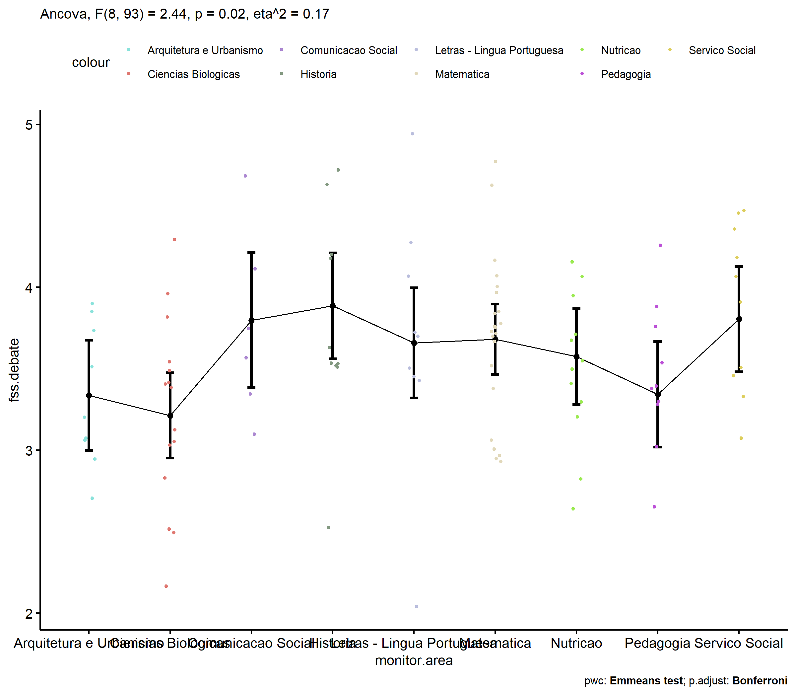<!-- -->

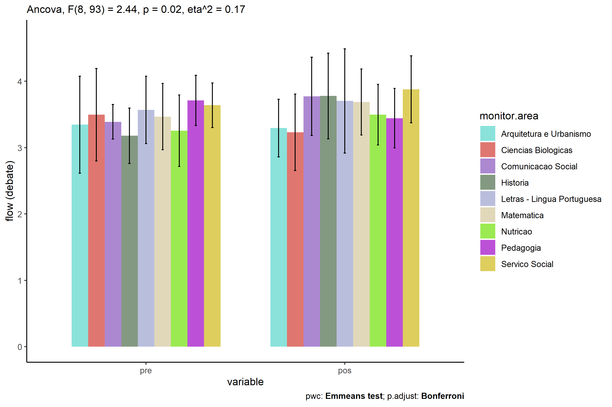<!-- -->

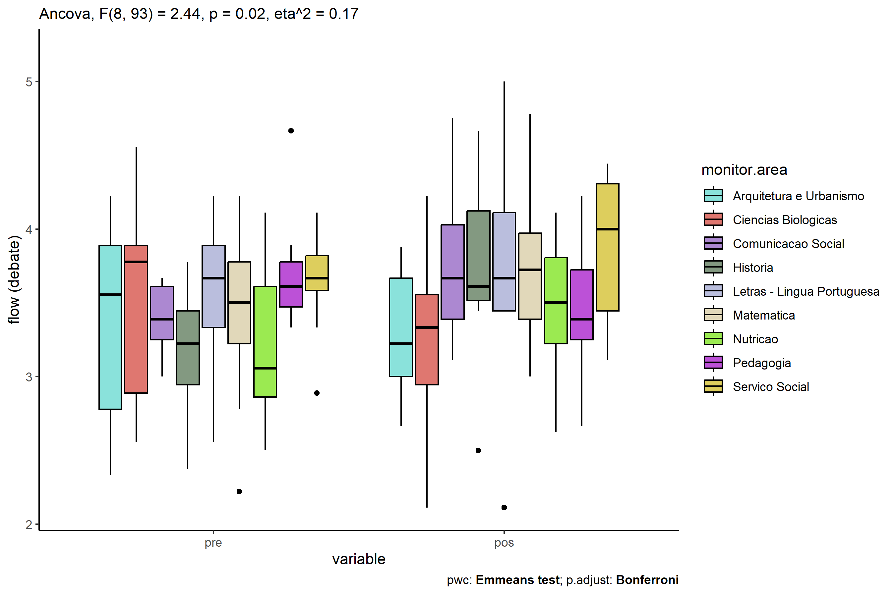<!-- -->

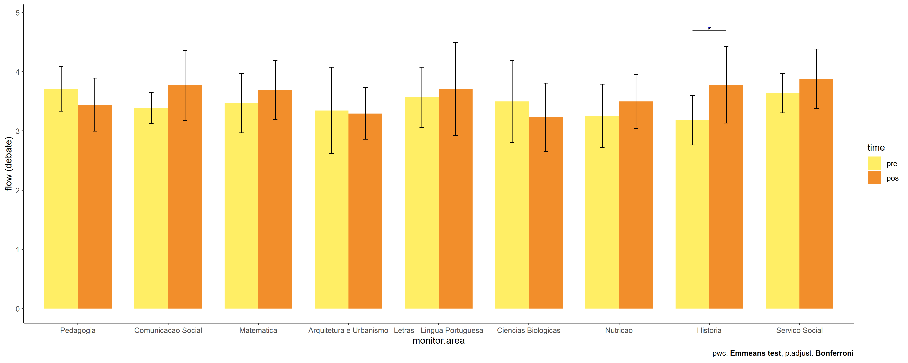<!-- -->

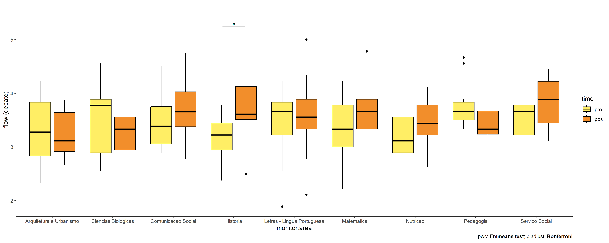<!-- -->

### factores: **grupo=“Experimental”:monitor.formacao**

| var        | monitor.formacao |   n | M (pre) | SE (pre) | M (unadj) | SE (unadj) | M (adj) | SE (adj) |
|:-----------|:-----------------|----:|--------:|---------:|----------:|-----------:|--------:|---------:|
| fss.debate | ensino medio     |  79 |   3.432 |    0.064 |     3.544 |      0.064 |   3.551 |    0.061 |
| fss.debate | especializacao   |   6 |   3.389 |    0.106 |     3.773 |      0.241 |   3.796 |    0.221 |
| fss.debate | graduacao        |  18 |   3.565 |    0.092 |     3.642 |      0.131 |   3.602 |    0.128 |

| .y.        | group1         | group2         | estimate | conf.low | conf.high |    se | statistic |     p | p.adj | p.adj.signif |
|:-----------|:---------------|:---------------|---------:|---------:|----------:|------:|----------:|------:|------:|:-------------|
| fss.debate | ensino medio   | especializacao |   -0.245 |   -0.699 |     0.210 | 0.229 |    -1.068 | 0.288 | 0.865 | ns           |
| fss.debate | ensino medio   | graduacao      |   -0.051 |   -0.332 |     0.231 | 0.142 |    -0.357 | 0.722 | 1.000 | ns           |
| fss.debate | especializacao | graduacao      |    0.194 |   -0.313 |     0.701 | 0.256 |     0.759 | 0.450 | 1.000 | ns           |
| dfs.debate | ensino medio   | especializacao |    0.043 |   -0.401 |     0.487 | 0.224 |     0.192 | 0.848 | 1.000 | ns           |
| dfs.debate | ensino medio   | graduacao      |   -0.133 |   -0.407 |     0.141 | 0.138 |    -0.962 | 0.338 | 1.000 | ns           |
| dfs.debate | especializacao | graduacao      |   -0.176 |   -0.670 |     0.318 | 0.249 |    -0.706 | 0.482 | 1.000 | ns           |

| monitor.formacao | group1 | group2 | estimate | conf.low | conf.high |    se | statistic |     p | p.adj | p.adj.signif |
|:-----------------|:-------|:-------|---------:|---------:|----------:|------:|----------:|------:|------:|:-------------|
| ensino medio     | pre    | pos    |   -0.112 |   -0.284 |     0.061 | 0.087 |    -1.280 | 0.202 | 0.202 | ns           |
| especializacao   | pre    | pos    |   -0.384 |   -1.010 |     0.242 | 0.317 |    -1.211 | 0.227 | 0.227 | ns           |
| graduacao        | pre    | pos    |   -0.077 |   -0.439 |     0.284 | 0.183 |    -0.421 | 0.674 | 0.674 | ns           |

    ## Scale for colour is already present.
    ## Adding another scale for colour, which will replace the existing scale.

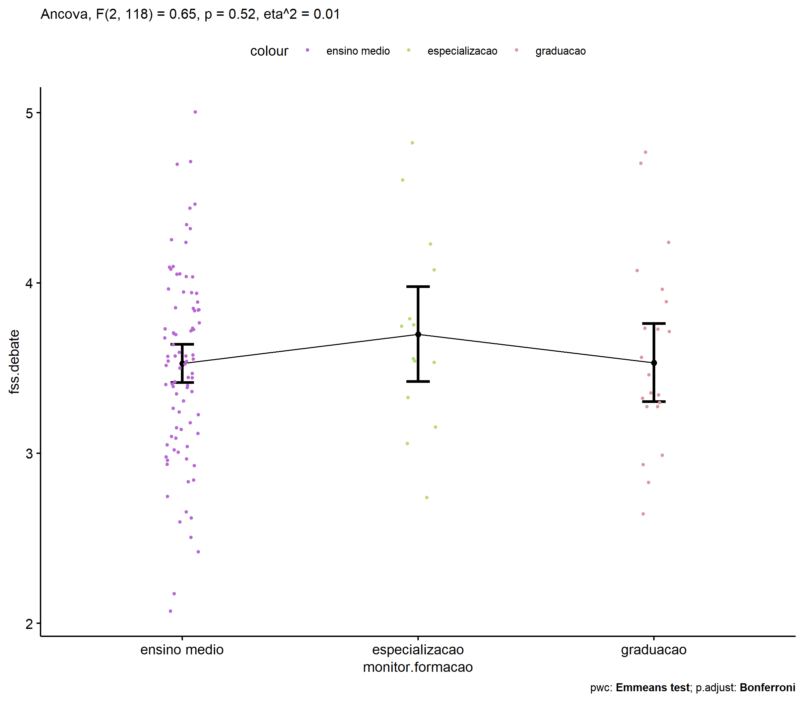<!-- -->

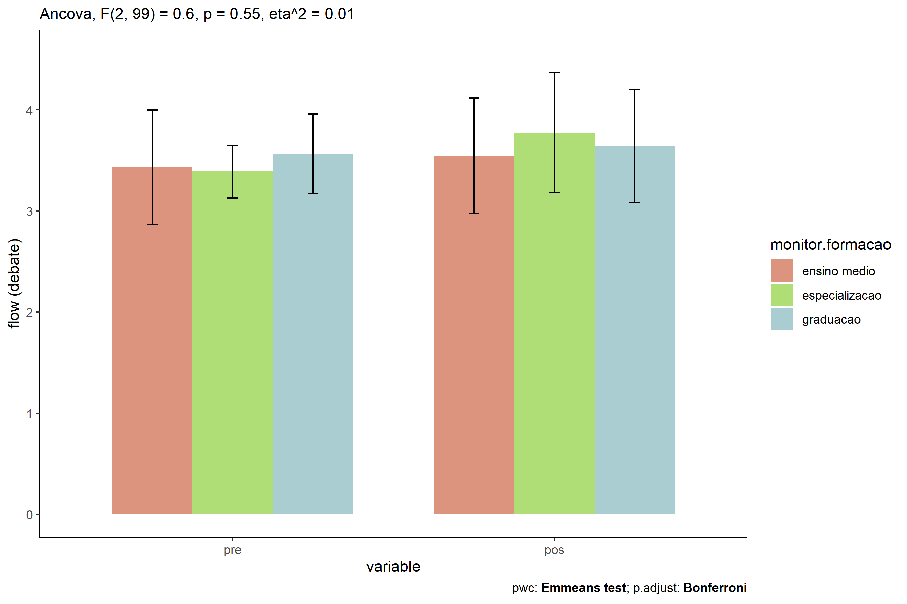<!-- -->

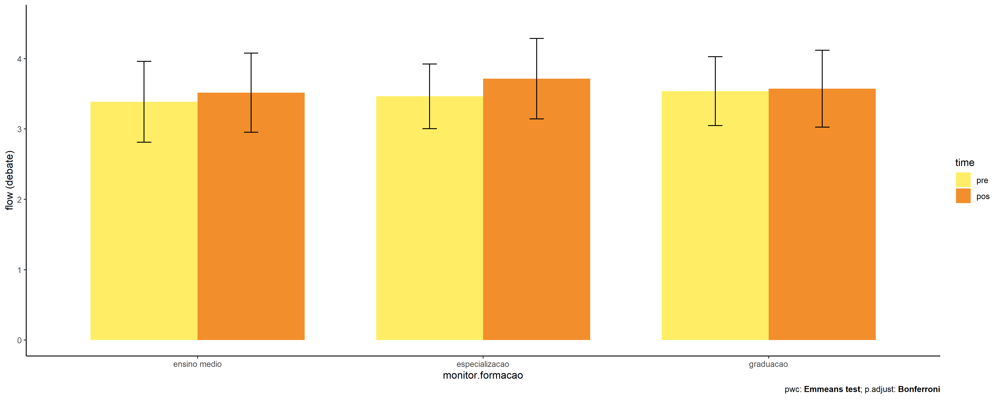<!-- -->

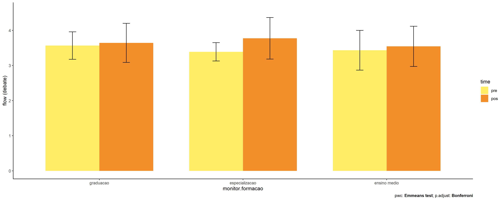<!-- -->

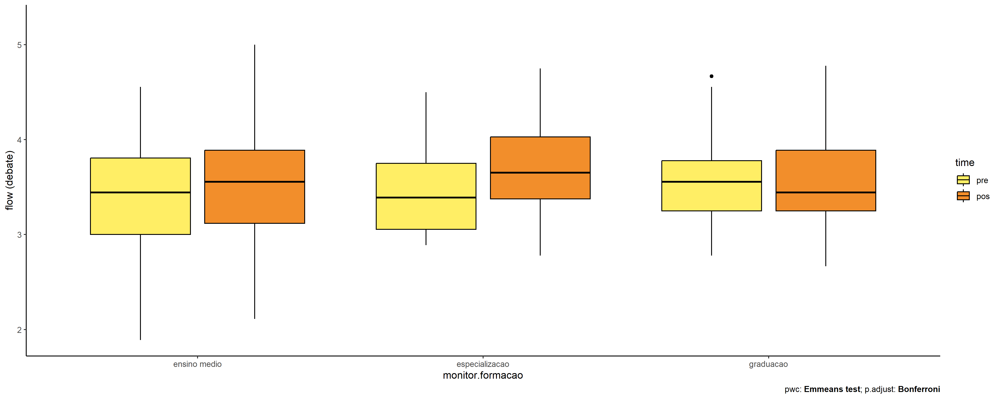<!-- -->

### factores: **grupo=“Experimental”:monitor.experiencia**

| var        | monitor.experiencia |   n | M (pre) | SE (pre) | M (unadj) | SE (unadj) | M (adj) | SE (adj) |
|:-----------|:--------------------|----:|--------:|---------:|----------:|-----------:|--------:|---------:|
| fss.debate | maior 01 ano        |  72 |   3.473 |    0.061 |     3.580 |      0.070 |   3.573 |    0.064 |
| fss.debate | menor 01 ano        |  31 |   3.405 |    0.100 |     3.561 |      0.092 |   3.578 |    0.097 |

| .y.        | group1       | group2       | estimate | conf.low | conf.high |    se | statistic |     p | p.adj | p.adj.signif |
|:-----------|:-------------|:-------------|---------:|---------:|----------:|------:|----------:|------:|------:|:-------------|
| fss.debate | maior 01 ano | menor 01 ano |   -0.005 |   -0.236 |     0.226 | 0.117 |    -0.043 | 0.966 | 0.966 | ns           |
| dfs.debate | maior 01 ano | menor 01 ano |    0.068 |   -0.157 |     0.293 | 0.113 |     0.601 | 0.549 | 0.549 | ns           |

| monitor.experiencia | group1 | group2 | estimate | conf.low | conf.high |    se | statistic |     p | p.adj | p.adj.signif |
|:--------------------|:-------|:-------|---------:|---------:|----------:|------:|----------:|------:|------:|:-------------|
| maior 01 ano        | pre    | pos    |   -0.107 |   -0.288 |     0.074 | 0.092 |    -1.169 | 0.244 | 0.244 | ns           |
| menor 01 ano        | pre    | pos    |   -0.156 |   -0.431 |     0.119 | 0.140 |    -1.117 | 0.265 | 0.265 | ns           |

    ## Scale for colour is already present.
    ## Adding another scale for colour, which will replace the existing scale.

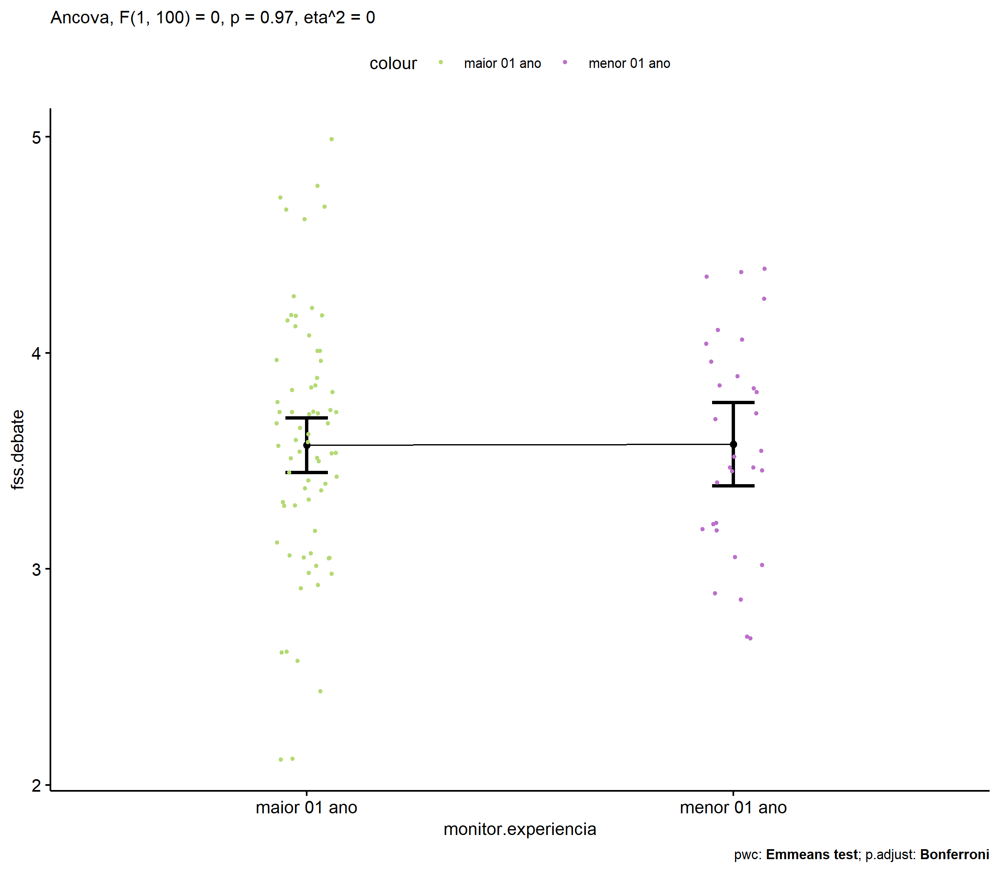<!-- -->

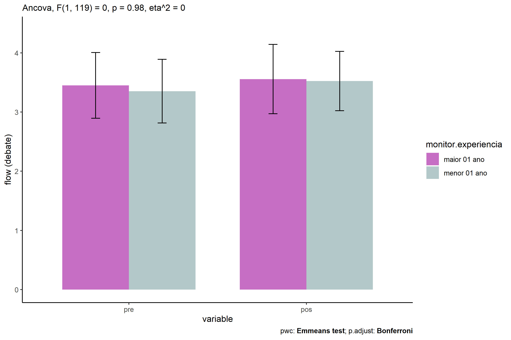<!-- -->

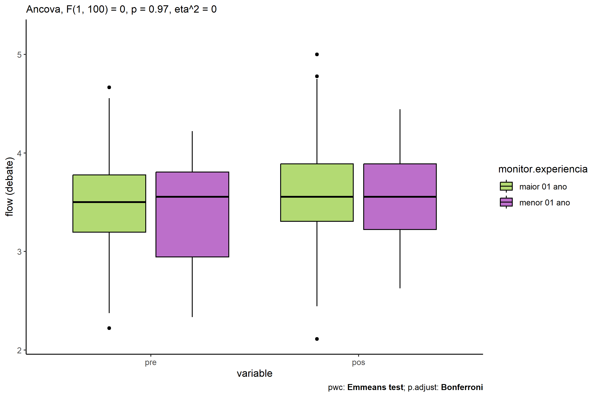<!-- -->

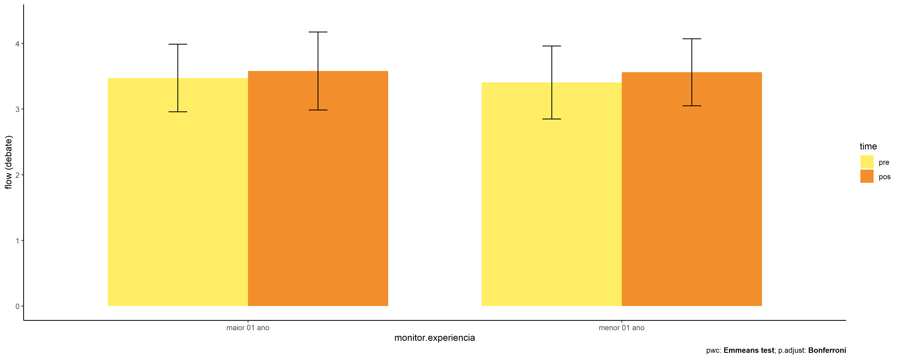<!-- -->

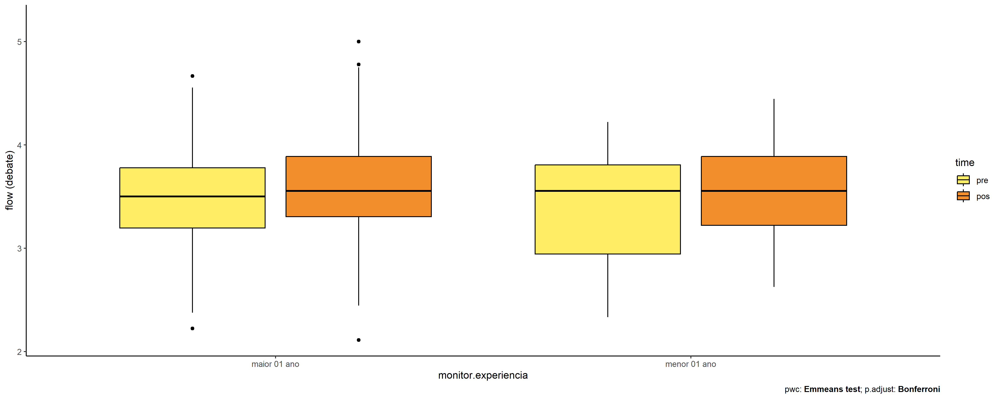<!-- -->
