ANCOVA test for leitura (engajamento no leitura)
================
Geiser C. Challco <geiser@alumni.usp.br>

- [Descriptive Statistics of Initial
  Data](#descriptive-statistics-of-initial-data)
- [Checking of Assumptions](#checking-of-assumptions)
  - [Assumption: Normality distribution of
    data](#assumption-normality-distribution-of-data)
  - [Assumption: Homogeneity of data
    distribution](#assumption-homogeneity-of-data-distribution)
- [Computation of ANCOVA test and Pairwise
  Comparison](#computation-of-ancova-test-and-pairwise-comparison)
  - [ANCOVA tests for one factor](#ancova-tests-for-one-factor)
  - [ANCOVA tests for two factors](#ancova-tests-for-two-factors)
  - [ANCOVA tests for grupo=“WordGen”](#ancova-tests-for-grupowordgen)
  - [Pairwise comparisons for one
    factor](#pairwise-comparisons-for-one-factor)
    - [factor: **grupo**](#factor-grupo)
    - [factor: **genero**](#factor-genero)
    - [factor: **idade**](#factor-idade)
    - [factor: **zona.participante**](#factor-zonaparticipante)
    - [factor: **escola**](#factor-escola)
    - [factor: **zona.escola**](#factor-zonaescola)
  - [Pairwise comparisons for two
    factors](#pairwise-comparisons-for-two-factors)
    - [factores: **grupo:genero**](#factores-grupogenero)
    - [factores: **grupo:idade**](#factores-grupoidade)
    - [factores:
      **grupo:zona.participante**](#factores-grupozonaparticipante)
    - [factores: **grupo:escola**](#factores-grupoescola)
    - [factores: **grupo:zona.escola**](#factores-grupozonaescola)
  - [Pairwise comparisons for
    grupo=“Experimental”](#pairwise-comparisons-for-grupoexperimental)
    - [factores:
      **grupo=“Experimental”:monitor**](#factores-grupoexperimentalmonitor)
    - [factores:
      **grupo=“Experimental”:monitor.genero**](#factores-grupoexperimentalmonitorgenero)
    - [factores:
      **grupo=“Experimental”:monitor.area**](#factores-grupoexperimentalmonitorarea)
    - [factores:
      **grupo=“Experimental”:monitor.formacao**](#factores-grupoexperimentalmonitorformacao)
    - [factores:
      **grupo=“Experimental”:monitor.experiencia**](#factores-grupoexperimentalmonitorexperiencia)

**NOTE**

- Teste ANCOVA para determinar se houve diferenças significativas em
  referência ao engajamento no leitura (medido como estado de fluxo).
- ANCOVA test to determine whether there were significant differences in
  reference to engagement in leitura (measured as flow state).

# Descriptive Statistics of Initial Data

| grupo    | genero | idade | zona.participante | escola | zona.escola | variable    |   n |  mean | median |   min |   max |    sd |    se |    ci |   iqr |
|:---------|:-------|:------|:------------------|:-------|:------------|:------------|----:|------:|-------:|------:|------:|------:|------:|------:|------:|
| Controle | F      |       |                   |        |             | fss.leitura |  60 | 3.521 |  3.611 | 2.556 | 4.222 | 0.418 | 0.054 | 0.108 | 0.583 |
| Controle | M      |       |                   |        |             | fss.leitura |  65 | 3.393 |  3.333 | 2.000 | 4.556 | 0.526 | 0.065 | 0.130 | 0.778 |
| WordGen  | F      |       |                   |        |             | fss.leitura |  53 | 3.663 |  3.667 | 2.556 | 4.778 | 0.516 | 0.071 | 0.142 | 0.667 |
| WordGen  | M      |       |                   |        |             | fss.leitura |  64 | 3.320 |  3.375 | 1.667 | 4.556 | 0.552 | 0.069 | 0.138 | 0.556 |
| Controle | F      |       |                   |        |             | dfs.leitura |  60 | 3.595 |  3.667 | 2.444 | 4.556 | 0.536 | 0.069 | 0.138 | 0.889 |
| Controle | M      |       |                   |        |             | dfs.leitura |  65 | 3.524 |  3.556 | 2.222 | 4.778 | 0.530 | 0.066 | 0.131 | 0.667 |
| WordGen  | F      |       |                   |        |             | dfs.leitura |  53 | 3.640 |  3.667 | 2.556 | 4.875 | 0.498 | 0.068 | 0.137 | 0.556 |
| WordGen  | M      |       |                   |        |             | dfs.leitura |  64 | 3.411 |  3.444 | 1.667 | 4.889 | 0.595 | 0.074 | 0.149 | 0.798 |
| Controle |        | 10y   |                   |        |             | fss.leitura |  24 | 3.541 |  3.667 | 2.667 | 4.222 | 0.406 | 0.083 | 0.172 | 0.472 |
| Controle |        | 11y   |                   |        |             | fss.leitura |  67 | 3.487 |  3.556 | 2.222 | 4.556 | 0.439 | 0.054 | 0.107 | 0.667 |
| Controle |        | 12y   |                   |        |             | fss.leitura |  18 | 3.437 |  3.278 | 2.556 | 4.556 | 0.611 | 0.144 | 0.304 | 0.889 |
| Controle |        | 13y   |                   |        |             | fss.leitura |   7 | 3.032 |  3.111 | 2.000 | 3.444 | 0.512 | 0.194 | 0.474 | 0.444 |
| Controle |        | 14y   |                   |        |             | fss.leitura |   1 | 3.556 |  3.556 | 3.556 | 3.556 |       |       |       | 0.000 |
| Controle |        | 15y   |                   |        |             | fss.leitura |   1 | 2.444 |  2.444 | 2.444 | 2.444 |       |       |       | 0.000 |
| Controle |        | 16y   |                   |        |             | fss.leitura |   1 | 2.667 |  2.667 | 2.667 | 2.667 |       |       |       | 0.000 |
| Controle |        |       |                   |        |             | fss.leitura |   6 | 3.574 |  3.556 | 3.111 | 4.222 | 0.406 | 0.166 | 0.426 | 0.472 |
| WordGen  |        | 10y   |                   |        |             | fss.leitura |  23 | 3.377 |  3.444 | 1.667 | 4.444 | 0.606 | 0.126 | 0.262 | 0.556 |
| WordGen  |        | 11y   |                   |        |             | fss.leitura |  71 | 3.558 |  3.556 | 1.667 | 4.778 | 0.578 | 0.069 | 0.137 | 0.715 |
| WordGen  |        | 12y   |                   |        |             | fss.leitura |  14 | 3.426 |  3.410 | 2.667 | 4.111 | 0.433 | 0.116 | 0.250 | 0.521 |
| WordGen  |        | 13y   |                   |        |             | fss.leitura |   6 | 3.146 |  3.278 | 2.556 | 3.556 | 0.365 | 0.149 | 0.383 | 0.372 |
| WordGen  |        | 14y   |                   |        |             | fss.leitura |   1 | 3.375 |  3.375 | 3.375 | 3.375 |       |       |       | 0.000 |
| WordGen  |        |       |                   |        |             | fss.leitura |   2 | 3.056 |  3.056 | 2.778 | 3.333 | 0.393 | 0.278 | 3.530 | 0.278 |
| Controle |        | 10y   |                   |        |             | dfs.leitura |  24 | 3.583 |  3.556 | 2.444 | 4.333 | 0.452 | 0.092 | 0.191 | 0.694 |
| Controle |        | 11y   |                   |        |             | dfs.leitura |  67 | 3.617 |  3.667 | 2.222 | 4.556 | 0.519 | 0.063 | 0.127 | 0.653 |
| Controle |        | 12y   |                   |        |             | dfs.leitura |  18 | 3.519 |  3.417 | 2.667 | 4.778 | 0.614 | 0.145 | 0.305 | 0.889 |
| Controle |        | 13y   |                   |        |             | dfs.leitura |   7 | 3.476 |  3.750 | 2.778 | 4.250 | 0.577 | 0.218 | 0.533 | 0.889 |
| Controle |        | 14y   |                   |        |             | dfs.leitura |   1 | 3.333 |  3.333 | 3.333 | 3.333 |       |       |       | 0.000 |
| Controle |        | 15y   |                   |        |             | dfs.leitura |   1 | 2.333 |  2.333 | 2.333 | 2.333 |       |       |       | 0.000 |
| Controle |        | 16y   |                   |        |             | dfs.leitura |   1 | 3.444 |  3.444 | 3.444 | 3.444 |       |       |       | 0.000 |
| Controle |        |       |                   |        |             | dfs.leitura |   6 | 3.278 |  3.111 | 2.556 | 4.333 | 0.608 | 0.248 | 0.638 | 0.417 |
| WordGen  |        | 10y   |                   |        |             | dfs.leitura |  23 | 3.398 |  3.444 | 2.111 | 4.444 | 0.604 | 0.126 | 0.261 | 0.778 |
| WordGen  |        | 11y   |                   |        |             | dfs.leitura |  71 | 3.604 |  3.667 | 2.444 | 4.889 | 0.486 | 0.058 | 0.115 | 0.556 |
| WordGen  |        | 12y   |                   |        |             | dfs.leitura |  14 | 3.517 |  3.528 | 2.500 | 4.778 | 0.677 | 0.181 | 0.391 | 0.778 |
| WordGen  |        | 13y   |                   |        |             | dfs.leitura |   6 | 3.176 |  3.167 | 2.500 | 3.778 | 0.469 | 0.192 | 0.493 | 0.583 |
| WordGen  |        | 14y   |                   |        |             | dfs.leitura |   1 | 1.667 |  1.667 | 1.667 | 1.667 |       |       |       | 0.000 |
| WordGen  |        |       |                   |        |             | dfs.leitura |   2 | 3.611 |  3.611 | 3.333 | 3.889 | 0.393 | 0.278 | 3.530 | 0.278 |
| Controle |        |       | Urbana            |        |             | fss.leitura |  54 | 3.450 |  3.528 | 2.222 | 4.556 | 0.487 | 0.066 | 0.133 | 0.667 |
| Controle |        |       | Rural             |        |             | fss.leitura |  43 | 3.395 |  3.333 | 2.000 | 4.222 | 0.454 | 0.069 | 0.140 | 0.556 |
| Controle |        |       |                   |        |             | fss.leitura |  28 | 3.553 |  3.597 | 2.667 | 4.375 | 0.504 | 0.095 | 0.195 | 0.719 |
| WordGen  |        |       | Urbana            |        |             | fss.leitura |  44 | 3.495 |  3.444 | 2.556 | 4.556 | 0.448 | 0.068 | 0.136 | 0.583 |
| WordGen  |        |       | Rural             |        |             | fss.leitura |  48 | 3.424 |  3.444 | 1.667 | 4.778 | 0.653 | 0.094 | 0.190 | 0.667 |
| WordGen  |        |       |                   |        |             | fss.leitura |  25 | 3.541 |  3.556 | 2.556 | 4.556 | 0.560 | 0.112 | 0.231 | 0.667 |
| Controle |        |       | Urbana            |        |             | dfs.leitura |  54 | 3.539 |  3.556 | 2.222 | 4.778 | 0.552 | 0.075 | 0.151 | 0.750 |
| Controle |        |       | Rural             |        |             | dfs.leitura |  43 | 3.549 |  3.556 | 2.444 | 4.556 | 0.549 | 0.084 | 0.169 | 0.889 |
| Controle |        |       |                   |        |             | dfs.leitura |  28 | 3.610 |  3.667 | 2.667 | 4.333 | 0.479 | 0.091 | 0.186 | 0.583 |
| WordGen  |        |       | Urbana            |        |             | dfs.leitura |  44 | 3.447 |  3.611 | 1.667 | 4.875 | 0.658 | 0.099 | 0.200 | 0.639 |
| WordGen  |        |       | Rural             |        |             | dfs.leitura |  48 | 3.526 |  3.556 | 2.444 | 4.444 | 0.511 | 0.074 | 0.148 | 0.603 |
| WordGen  |        |       |                   |        |             | dfs.leitura |  25 | 3.612 |  3.556 | 2.667 | 4.889 | 0.476 | 0.095 | 0.196 | 0.556 |
| Controle |        |       |                   | E1     |             | fss.leitura |  12 | 3.439 |  3.611 | 2.444 | 4.556 | 0.593 | 0.171 | 0.377 | 0.647 |
| Controle |        |       |                   | E2     |             | fss.leitura |  23 | 3.437 |  3.333 | 2.667 | 4.556 | 0.530 | 0.110 | 0.229 | 0.778 |
| Controle |        |       |                   | E3     |             | fss.leitura |  15 | 3.419 |  3.444 | 2.889 | 3.778 | 0.257 | 0.066 | 0.142 | 0.278 |
| Controle |        |       |                   | E4     |             | fss.leitura |  16 | 3.429 |  3.500 | 2.556 | 4.000 | 0.428 | 0.107 | 0.228 | 0.667 |
| Controle |        |       |                   | E5     |             | fss.leitura |  48 | 3.457 |  3.444 | 2.000 | 4.333 | 0.523 | 0.075 | 0.152 | 0.778 |
| Controle |        |       |                   | E6     |             | fss.leitura |  11 | 3.578 |  3.444 | 2.667 | 4.000 | 0.422 | 0.127 | 0.283 | 0.556 |
| WordGen  |        |       |                   | E1     |             | fss.leitura |  10 | 3.735 |  3.667 | 2.750 | 4.556 | 0.586 | 0.185 | 0.419 | 0.878 |
| WordGen  |        |       |                   | E2     |             | fss.leitura |  24 | 3.402 |  3.500 | 2.556 | 4.111 | 0.406 | 0.083 | 0.171 | 0.583 |
| WordGen  |        |       |                   | E3     |             | fss.leitura |  15 | 3.106 |  3.250 | 1.667 | 4.111 | 0.700 | 0.181 | 0.388 | 0.611 |
| WordGen  |        |       |                   | E4     |             | fss.leitura |   9 | 3.642 |  3.667 | 3.111 | 4.667 | 0.523 | 0.174 | 0.402 | 0.667 |
| WordGen  |        |       |                   | E5     |             | fss.leitura |  48 | 3.499 |  3.444 | 2.222 | 4.778 | 0.550 | 0.079 | 0.160 | 0.691 |
| WordGen  |        |       |                   | E6     |             | fss.leitura |  11 | 3.664 |  3.556 | 2.750 | 4.444 | 0.528 | 0.159 | 0.355 | 0.778 |
| Controle |        |       |                   | E1     |             | dfs.leitura |  12 | 3.130 |  3.111 | 2.222 | 4.000 | 0.514 | 0.148 | 0.327 | 0.611 |
| Controle |        |       |                   | E2     |             | dfs.leitura |  23 | 3.552 |  3.667 | 2.778 | 4.222 | 0.478 | 0.100 | 0.207 | 0.778 |
| Controle |        |       |                   | E3     |             | dfs.leitura |  15 | 3.763 |  3.889 | 2.889 | 4.556 | 0.521 | 0.135 | 0.288 | 0.833 |
| Controle |        |       |                   | E4     |             | dfs.leitura |  16 | 3.612 |  3.556 | 3.000 | 4.250 | 0.305 | 0.076 | 0.163 | 0.326 |
| Controle |        |       |                   | E5     |             | dfs.leitura |  48 | 3.518 |  3.556 | 2.444 | 4.778 | 0.597 | 0.086 | 0.173 | 0.806 |
| Controle |        |       |                   | E6     |             | dfs.leitura |  11 | 3.859 |  3.778 | 3.222 | 4.333 | 0.352 | 0.106 | 0.236 | 0.389 |
| WordGen  |        |       |                   | E1     |             | dfs.leitura |  10 | 3.275 |  3.667 | 1.667 | 3.889 | 0.760 | 0.240 | 0.544 | 0.944 |
| WordGen  |        |       |                   | E2     |             | dfs.leitura |  24 | 3.359 |  3.333 | 2.444 | 4.222 | 0.473 | 0.096 | 0.200 | 0.639 |
| WordGen  |        |       |                   | E3     |             | dfs.leitura |  15 | 3.701 |  3.778 | 2.625 | 4.444 | 0.525 | 0.136 | 0.291 | 0.722 |
| WordGen  |        |       |                   | E4     |             | dfs.leitura |   9 | 3.634 |  3.556 | 2.500 | 4.444 | 0.640 | 0.213 | 0.492 | 0.667 |
| WordGen  |        |       |                   | E5     |             | dfs.leitura |  48 | 3.519 |  3.556 | 2.111 | 4.889 | 0.571 | 0.082 | 0.166 | 0.556 |
| WordGen  |        |       |                   | E6     |             | dfs.leitura |  11 | 3.702 |  3.667 | 3.000 | 4.500 | 0.417 | 0.126 | 0.280 | 0.500 |
| Controle |        |       |                   |        | Urbana      | fss.leitura |  83 | 3.449 |  3.444 | 2.000 | 4.556 | 0.528 | 0.058 | 0.115 | 0.833 |
| Controle |        |       |                   |        | Rural       | fss.leitura |  42 | 3.465 |  3.444 | 2.556 | 4.000 | 0.371 | 0.057 | 0.116 | 0.438 |
| WordGen  |        |       |                   |        | Urbana      | fss.leitura |  82 | 3.499 |  3.444 | 2.222 | 4.778 | 0.520 | 0.057 | 0.114 | 0.639 |
| WordGen  |        |       |                   |        | Rural       | fss.leitura |  35 | 3.419 |  3.444 | 1.667 | 4.667 | 0.651 | 0.110 | 0.224 | 0.667 |
| Controle |        |       |                   |        | Urbana      | dfs.leitura |  83 | 3.471 |  3.556 | 2.222 | 4.778 | 0.567 | 0.062 | 0.124 | 0.778 |
| Controle |        |       |                   |        | Rural       | dfs.leitura |  42 | 3.730 |  3.778 | 2.889 | 4.556 | 0.409 | 0.063 | 0.127 | 0.486 |
| WordGen  |        |       |                   |        | Urbana      | dfs.leitura |  82 | 3.442 |  3.556 | 1.667 | 4.889 | 0.571 | 0.063 | 0.125 | 0.639 |
| WordGen  |        |       |                   |        | Rural       | dfs.leitura |  35 | 3.684 |  3.667 | 2.500 | 4.500 | 0.512 | 0.087 | 0.176 | 0.722 |

# Checking of Assumptions

## Assumption: Normality distribution of data

| var         |   n |   skewness |   kurtosis | symmetry | statistic | method     |         p | p.signif | normality |
|:------------|----:|-----------:|-----------:|:---------|----------:|:-----------|----------:|:---------|:----------|
| fss.leitura | 242 | -0.2833351 |  0.2339270 | YES      |  4.330443 | D’Agostino | 0.1147245 | ns       | \-        |
| fss.leitura | 234 | -0.3903811 |  0.5933369 | YES      |  9.276872 | D’Agostino | 0.0096728 | \*       | \-        |
| fss.leitura | 189 | -0.2967724 |  0.7496694 | YES      |  6.848107 | D’Agostino | 0.0325801 | ns       | QQ        |
| fss.leitura | 242 | -0.2375048 | -0.1002299 | YES      |  2.379158 | D’Agostino | 0.3043493 | ns       | \-        |
| fss.leitura | 242 | -0.2833019 |  0.2726115 | YES      |  4.541646 | D’Agostino | 0.1032272 | ns       | \-        |

## Assumption: Homogeneity of data distribution

| var         | method         | formula                             |   n | DFn.df1 | DFd.df2 | statistic |         p | p.signif |
|:------------|:---------------|:------------------------------------|----:|--------:|--------:|----------:|----------:|:---------|
| fss.leitura | Levene’s test  | `.res`~`grupo`\*`genero`            | 242 |       3 |     238 | 0.3898501 | 0.7604169 | ns       |
| fss.leitura | Anova’s slopes | `.res`~`grupo`\*`genero`            | 242 |       3 |     234 | 0.7840000 | 0.5040000 | ns       |
| fss.leitura | Levene’s test  | `.res`~`grupo`\*`idade`             | 234 |      11 |     222 | 1.2506725 | 0.2549821 | ns       |
| fss.leitura | Anova’s slopes | `.res`~`grupo`\*`idade`             | 234 |       7 |     214 | 1.3310000 | 0.2370000 | ns       |
| fss.leitura | Levene’s test  | `.res`~`grupo`\*`zona.participante` | 189 |       3 |     185 | 1.8367190 | 0.1420084 | ns       |
| fss.leitura | Anova’s slopes | `.res`~`grupo`\*`zona.participante` | 189 |       3 |     181 | 0.8840000 | 0.4500000 | ns       |
| fss.leitura | Levene’s test  | `.res`~`grupo`\*`escola`            | 242 |      11 |     230 | 0.7664298 | 0.6733714 | ns       |
| fss.leitura | Anova’s slopes | `.res`~`grupo`\*`escola`            | 242 |      11 |     218 | 1.0240000 | 0.4260000 | ns       |
| fss.leitura | Levene’s test  | `.res`~`grupo`\*`zona.escola`       | 242 |       3 |     238 | 1.4119835 | 0.2399132 | ns       |
| fss.leitura | Anova’s slopes | `.res`~`grupo`\*`zona.escola`       | 242 |       3 |     234 | 1.5370000 | 0.2060000 | ns       |

# Computation of ANCOVA test and Pairwise Comparison

## ANCOVA tests for one factor

|     | Effect            | DFn | DFd |   SSn |    SSd |      F | p       |   ges | p\<.05 |
|:----|:------------------|----:|----:|------:|-------:|-------:|:--------|------:|:-------|
| 1   | dfs.leitura       |   1 | 239 | 8.029 | 56.979 | 33.677 | \<0.001 | 0.124 | \*     |
| 2   | grupo             |   1 | 239 | 0.077 | 56.979 |  0.324 | 0.57    | 0.001 |        |
| 4   | genero            |   1 | 239 | 2.017 | 55.039 |  8.760 | 0.003   | 0.035 | \*     |
| 6   | idade             |   6 | 226 | 2.687 | 52.869 |  1.914 | 0.079   | 0.048 |        |
| 8   | zona.participante |   1 | 186 | 0.242 | 44.915 |  1.003 | 0.318   | 0.005 |        |
| 10  | escola            |   5 | 235 | 3.527 | 53.529 |  3.097 | 0.01    | 0.062 | \*     |
| 12  | zona.escola       |   1 | 239 | 0.719 | 56.337 |  3.052 | 0.082   | 0.013 |        |

## ANCOVA tests for two factors

|     | Effect                  | DFn | DFd |   SSn |    SSd |      F | p       |   ges | p\<.05 |
|:----|:------------------------|----:|----:|------:|-------:|-------:|:--------|------:|:-------|
| 1   | dfs.leitura             |   1 | 237 | 6.562 | 54.528 | 28.519 | \<0.001 | 0.107 | \*     |
| 4   | grupo:genero            |   1 | 237 | 0.415 | 54.528 |  1.805 | 0.18    | 0.008 |        |
| 8   | grupo:idade             |   4 | 221 | 0.452 | 52.335 |  0.478 | 0.752   | 0.009 |        |
| 12  | grupo:zona.participante |   1 | 184 | 0.015 | 44.763 |  0.063 | 0.801   | 0.000 |        |
| 16  | grupo:escola            |   5 | 229 | 1.257 | 52.163 |  1.104 | 0.359   | 0.024 |        |
| 20  | grupo:zona.escola       |   1 | 237 | 0.105 | 56.168 |  0.445 | 0.505   | 0.002 |        |

## ANCOVA tests for grupo=“WordGen”

|     | Effect              | DFn | DFd |   SSn |    SSd |      F | p       |   ges | p\<.05 |
|:----|:--------------------|----:|----:|------:|-------:|-------:|:--------|------:|:-------|
| 1   | dfs.leitura         |   1 | 102 | 6.617 | 23.511 | 28.707 | \<0.001 | 0.220 | \*     |
| 2   | monitor             |   9 | 102 | 5.147 | 23.511 |  2.481 | 0.013   | 0.180 | \*     |
| 4   | monitor.genero      |   1 | 110 | 1.125 | 27.532 |  4.497 | 0.036   | 0.039 | \*     |
| 6   | monitor.area        |   8 | 103 | 5.021 | 23.637 |  2.735 | 0.009   | 0.175 | \*     |
| 8   | monitor.formacao    |   2 | 109 | 0.448 | 28.210 |  0.865 | 0.424   | 0.016 |        |
| 10  | monitor.experiencia |   1 | 110 | 0.024 | 28.634 |  0.093 | 0.761   | 0.001 |        |

## Pairwise comparisons for one factor

### factor: **grupo**

| var         | grupo    |   n | M (pre) | SE (pre) | M (unadj) | SE (unadj) | M (adj) | SE (adj) |
|:------------|:---------|----:|--------:|---------:|----------:|-----------:|--------:|---------:|
| fss.leitura | Controle | 125 |   3.558 |    0.048 |     3.454 |      0.043 |   3.447 |    0.044 |
| fss.leitura | WordGen  | 117 |   3.515 |    0.052 |     3.475 |      0.052 |   3.483 |    0.045 |

| .y.         | group1   | group2  | estimate | conf.low | conf.high |    se | statistic |     p | p.adj | p.adj.signif |
|:------------|:---------|:--------|---------:|---------:|----------:|------:|----------:|------:|------:|:-------------|
| fss.leitura | Controle | WordGen |   -0.036 |   -0.160 |     0.088 | 0.063 |    -0.569 | 0.570 | 0.570 | ns           |
| dfs.leitura | Controle | WordGen |    0.044 |   -0.095 |     0.182 | 0.070 |     0.621 | 0.535 | 0.535 | ns           |

| .y.          | grupo    | group1 | group2 | estimate | conf.low | conf.high |    se | statistic |     p | p.adj | p.adj.signif |
|:-------------|:---------|:-------|:-------|---------:|---------:|----------:|------:|----------:|------:|------:|:-------------|
| flow.leitura | Controle | pre    | pos    |    0.104 |   -0.029 |     0.237 | 0.068 |     1.540 | 0.124 | 0.124 | ns           |
| flow.leitura | WordGen  | pre    | pos    |    0.039 |   -0.098 |     0.176 | 0.070 |     0.561 | 0.575 | 0.575 | ns           |

    ## Scale for colour is already present.
    ## Adding another scale for colour, which will replace the existing scale.

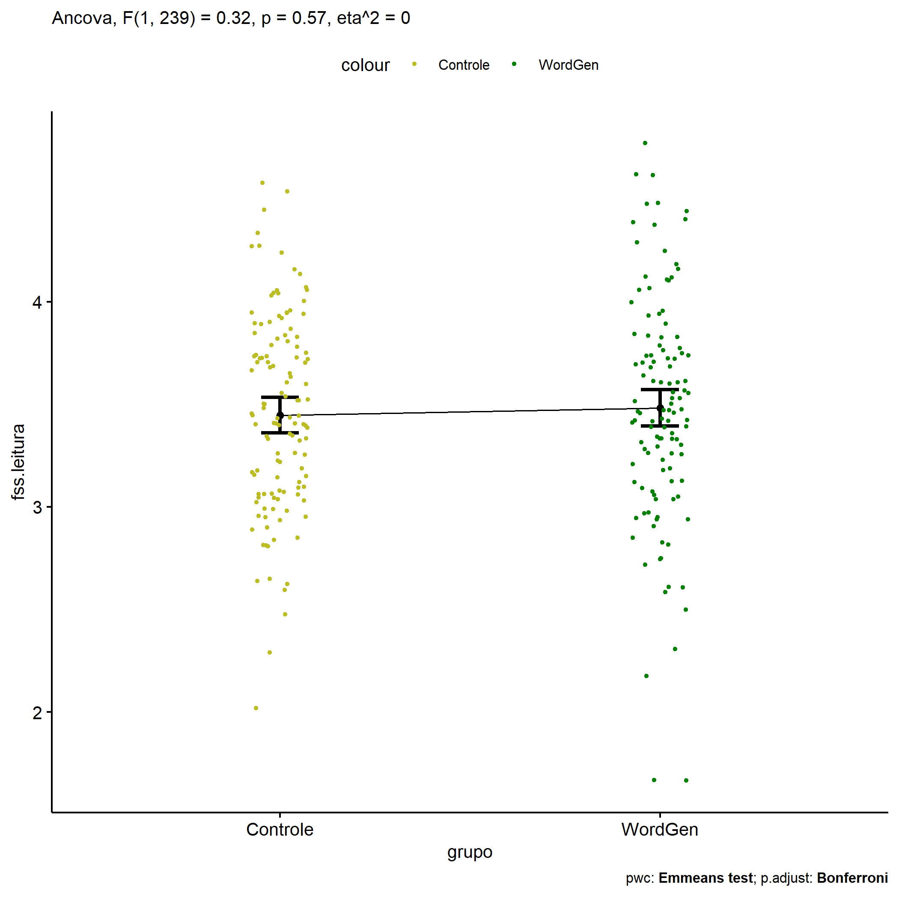<!-- -->

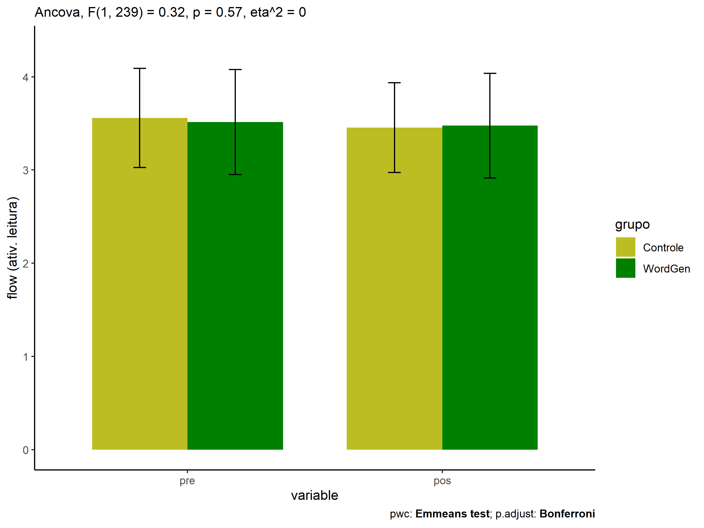<!-- -->

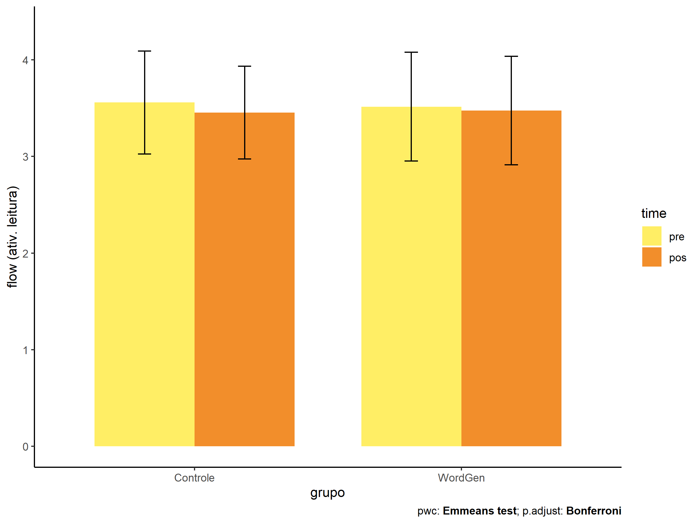<!-- -->

<!-- -->

<!-- -->

### factor: **genero**

| var         | genero |   n | M (pre) | SE (pre) | M (unadj) | SE (unadj) | M (adj) | SE (adj) |
|:------------|:-------|----:|--------:|---------:|----------:|-----------:|--------:|---------:|
| fss.leitura | F      | 113 |   3.616 |    0.049 |     3.587 |      0.044 |   3.563 |    0.045 |
| fss.leitura | M      | 129 |   3.468 |    0.050 |     3.357 |      0.047 |   3.378 |    0.042 |

| .y.         | group1 | group2 | estimate | conf.low | conf.high |    se | statistic |     p | p.adj | p.adj.signif |
|:------------|:-------|:-------|---------:|---------:|----------:|------:|----------:|------:|------:|:-------------|
| fss.leitura | F      | M      |    0.185 |    0.062 |     0.308 | 0.062 |     2.960 | 0.003 | 0.003 | \*\*         |
| dfs.leitura | F      | M      |    0.148 |    0.010 |     0.286 | 0.070 |     2.119 | 0.035 | 0.035 | \*           |

| .y.          | genero | group1 | group2 | estimate | conf.low | conf.high |    se | statistic |     p | p.adj | p.adj.signif |
|:-------------|:-------|:-------|:-------|---------:|---------:|----------:|------:|----------:|------:|------:|:-------------|
| flow.leitura | F      | pre    | pos    |    0.029 |   -0.109 |     0.166 | 0.070 |     0.410 | 0.682 | 0.682 | ns           |
| flow.leitura | M      | pre    | pos    |    0.111 |   -0.017 |     0.240 | 0.065 |     1.699 | 0.090 | 0.090 | ns           |

    ## Scale for colour is already present.
    ## Adding another scale for colour, which will replace the existing scale.

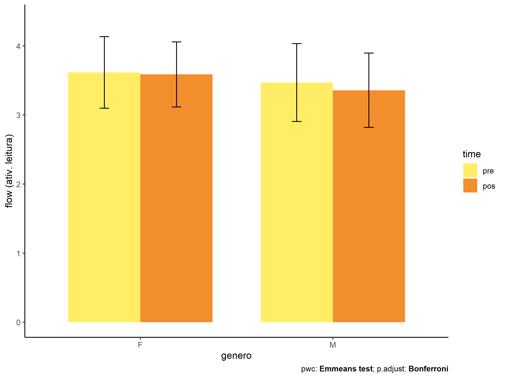<!-- -->

<!-- -->

<!-- -->

<!-- -->

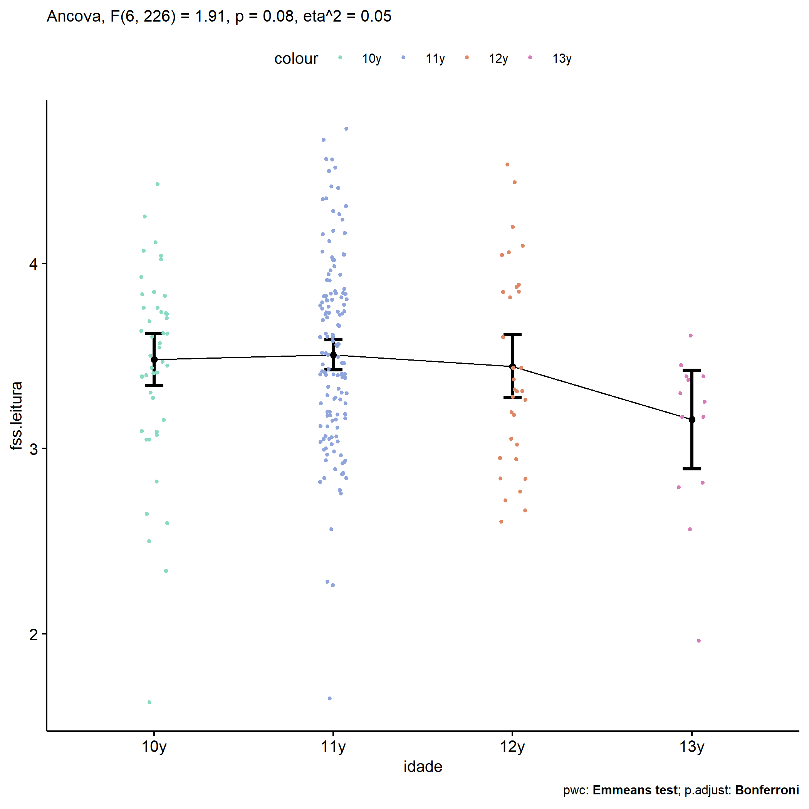<!-- -->

### factor: **idade**

| var         | idade |   n | M (pre) | SE (pre) | M (unadj) | SE (unadj) | M (adj) | SE (adj) |
|:------------|:------|----:|--------:|---------:|----------:|-----------:|--------:|---------:|
| fss.leitura | 10y   |  47 |   3.493 |    0.078 |     3.460 |      0.075 |   3.482 |    0.071 |
| fss.leitura | 11y   | 138 |   3.610 |    0.043 |     3.524 |      0.044 |   3.507 |    0.041 |
| fss.leitura | 12y   |  32 |   3.518 |    0.112 |     3.432 |      0.094 |   3.445 |    0.086 |
| fss.leitura | 13y   |  13 |   3.338 |    0.147 |     3.084 |      0.121 |   3.156 |    0.135 |

| .y.         | group1 | group2 | estimate | conf.low | conf.high |    se | statistic |     p | p.adj | p.adj.signif |
|:------------|:-------|:-------|---------:|---------:|----------:|------:|----------:|------:|------:|:-------------|
| fss.leitura | 10y    | 11y    |   -0.025 |   -0.187 |     0.137 | 0.082 |    -0.301 | 0.763 | 1.000 | ns           |
| fss.leitura | 10y    | 12y    |    0.037 |   -0.182 |     0.256 | 0.111 |     0.332 | 0.740 | 1.000 | ns           |
| fss.leitura | 10y    | 13y    |    0.325 |    0.026 |     0.625 | 0.152 |     2.139 | 0.034 | 0.201 | ns           |
| fss.leitura | 11y    | 12y    |    0.062 |   -0.126 |     0.249 | 0.095 |     0.647 | 0.518 | 1.000 | ns           |
| fss.leitura | 11y    | 13y    |    0.350 |    0.071 |     0.629 | 0.142 |     2.474 | 0.014 | 0.085 | ns           |
| fss.leitura | 12y    | 13y    |    0.288 |   -0.026 |     0.603 | 0.160 |     1.806 | 0.072 | 0.433 | ns           |
| dfs.leitura | 10y    | 11y    |   -0.118 |   -0.294 |     0.058 | 0.089 |    -1.316 | 0.189 | 1.000 | ns           |
| dfs.leitura | 10y    | 12y    |   -0.025 |   -0.264 |     0.213 | 0.121 |    -0.210 | 0.834 | 1.000 | ns           |
| dfs.leitura | 10y    | 13y    |    0.155 |   -0.172 |     0.482 | 0.166 |     0.935 | 0.351 | 1.000 | ns           |
| dfs.leitura | 11y    | 12y    |    0.092 |   -0.112 |     0.297 | 0.104 |     0.888 | 0.376 | 1.000 | ns           |
| dfs.leitura | 11y    | 13y    |    0.273 |   -0.030 |     0.575 | 0.153 |     1.777 | 0.077 | 0.462 | ns           |
| dfs.leitura | 12y    | 13y    |    0.180 |   -0.162 |     0.523 | 0.174 |     1.037 | 0.301 | 1.000 | ns           |

| .y.          | idade | group1 | group2 | estimate | conf.low | conf.high |    se | statistic |     p | p.adj | p.adj.signif |
|:-------------|:------|:-------|:-------|---------:|---------:|----------:|------:|----------:|------:|------:|:-------------|
| flow.leitura | 10y   | pre    | pos    |    0.032 |   -0.179 |     0.243 | 0.108 |     0.300 | 0.765 | 0.765 | ns           |
| flow.leitura | 11y   | pre    | pos    |    0.087 |   -0.037 |     0.210 | 0.063 |     1.380 | 0.168 | 0.168 | ns           |
| flow.leitura | 12y   | pre    | pos    |    0.086 |   -0.170 |     0.342 | 0.130 |     0.662 | 0.509 | 0.509 | ns           |
| flow.leitura | 13y   | pre    | pos    |    0.253 |   -0.148 |     0.655 | 0.204 |     1.239 | 0.216 | 0.216 | ns           |

    ## Scale for colour is already present.
    ## Adding another scale for colour, which will replace the existing scale.

<!-- -->

<!-- -->

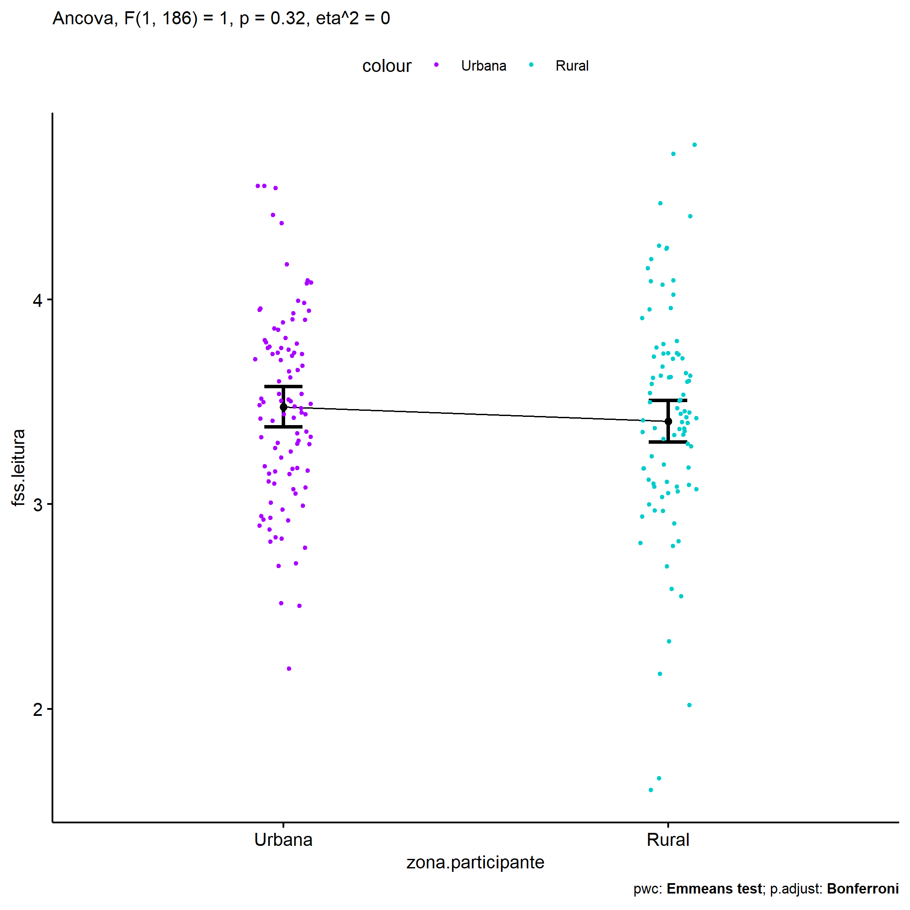<!-- -->

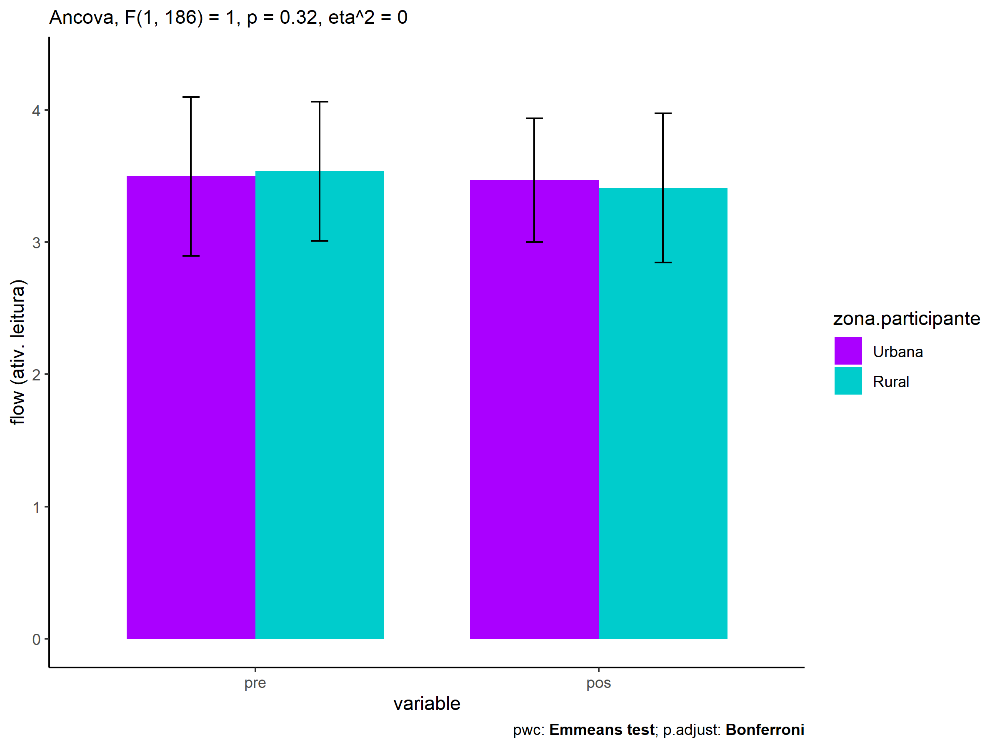<!-- -->

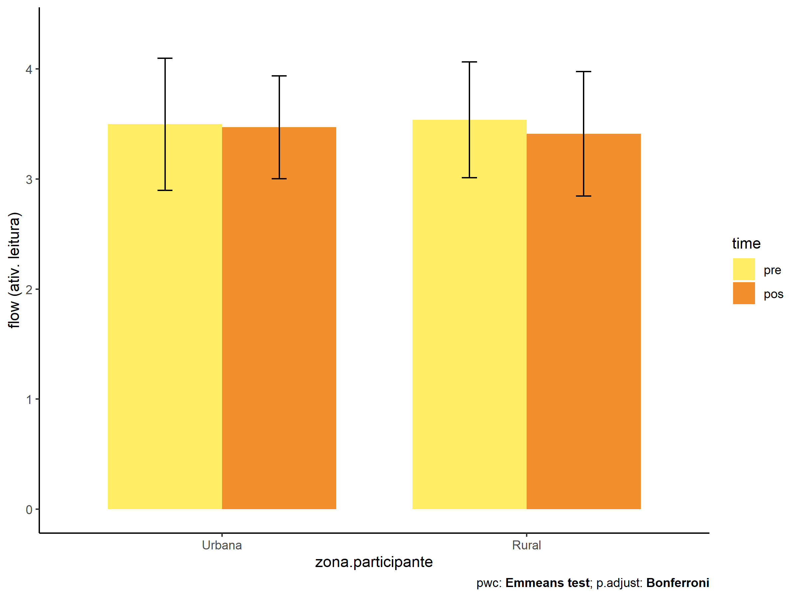<!-- -->

### factor: **zona.participante**

| var         | zona.participante |   n | M (pre) | SE (pre) | M (unadj) | SE (unadj) | M (adj) | SE (adj) |
|:------------|:------------------|----:|--------:|---------:|----------:|-----------:|--------:|---------:|
| fss.leitura | Rural             |  91 |   3.537 |    0.055 |      3.41 |      0.059 |   3.404 |    0.052 |
| fss.leitura | Urbana            |  98 |   3.498 |    0.061 |      3.47 |      0.047 |   3.476 |    0.050 |

| .y.         | group1 | group2 | estimate | conf.low | conf.high |    se | statistic |     p | p.adj | p.adj.signif |
|:------------|:-------|:-------|---------:|---------:|----------:|------:|----------:|------:|------:|:-------------|
| fss.leitura | Urbana | Rural  |    0.072 |   -0.070 |     0.213 | 0.072 |     1.001 | 0.318 | 0.318 | ns           |
| dfs.leitura | Urbana | Rural  |   -0.039 |   -0.201 |     0.124 | 0.082 |    -0.471 | 0.638 | 0.638 | ns           |

| .y.          | zona.participante | group1 | group2 | estimate | conf.low | conf.high |    se | statistic |     p | p.adj | p.adj.signif |
|:-------------|:------------------|:-------|:-------|---------:|---------:|----------:|------:|----------:|------:|------:|:-------------|
| flow.leitura | Urbana            | pre    | pos    |    0.027 |   -0.125 |     0.180 | 0.077 |     0.352 | 0.725 | 0.725 | ns           |
| flow.leitura | Rural             | pre    | pos    |    0.126 |   -0.032 |     0.284 | 0.080 |     1.573 | 0.117 | 0.117 | ns           |

    ## Scale for colour is already present.
    ## Adding another scale for colour, which will replace the existing scale.

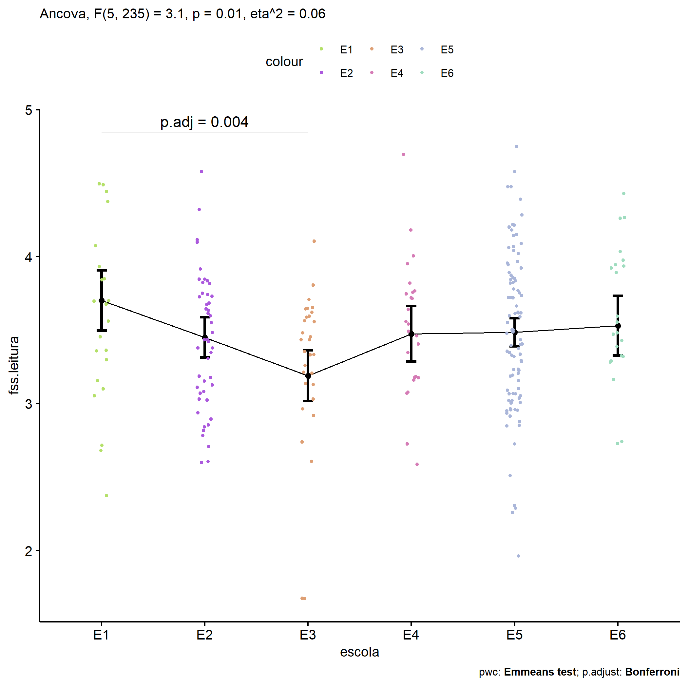<!-- -->

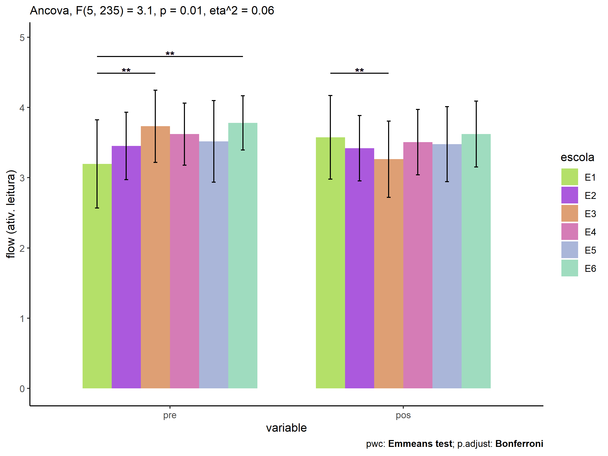<!-- -->

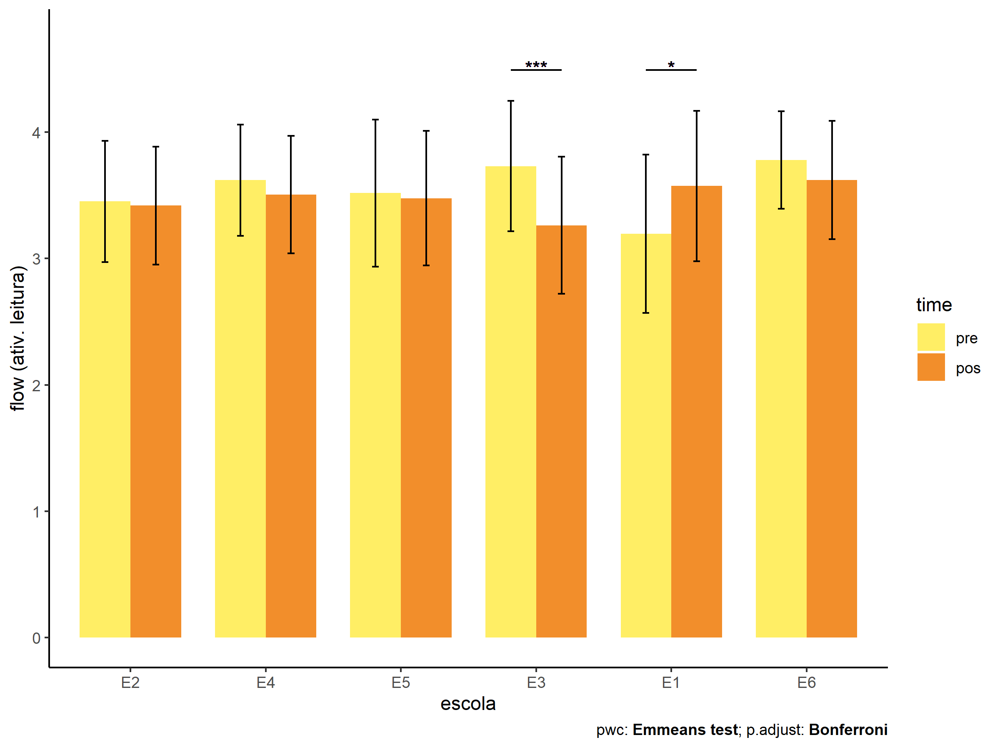<!-- -->

<!-- -->

<!-- -->

### factor: **escola**

| var         | escola |   n | M (pre) | SE (pre) | M (unadj) | SE (unadj) | M (adj) | SE (adj) |
|:------------|:-------|----:|--------:|---------:|----------:|-----------:|--------:|---------:|
| fss.leitura | E1     |  22 |   3.196 |    0.133 |     3.574 |      0.127 |   3.701 |    0.104 |
| fss.leitura | E2     |  47 |   3.453 |    0.070 |     3.419 |      0.068 |   3.450 |    0.070 |
| fss.leitura | E3     |  30 |   3.732 |    0.094 |     3.263 |      0.099 |   3.190 |    0.088 |
| fss.leitura | E4     |  25 |   3.620 |    0.088 |     3.506 |      0.093 |   3.475 |    0.096 |
| fss.leitura | E5     |  96 |   3.518 |    0.059 |     3.478 |      0.055 |   3.485 |    0.049 |
| fss.leitura | E6     |  22 |   3.780 |    0.082 |     3.621 |      0.100 |   3.530 |    0.103 |

| .y.         | group1 | group2 | estimate | conf.low | conf.high |    se | statistic | p       | p.adj | p.adj.signif |
|:------------|:-------|:-------|---------:|---------:|----------:|------:|----------:|:--------|------:|:-------------|
| fss.leitura | E1     | E2     |    0.251 |    0.006 |     0.496 | 0.124 |     2.021 | 0.044   | 0.666 | ns           |
| fss.leitura | E1     | E3     |    0.512 |    0.241 |     0.783 | 0.138 |     3.721 | \<0.001 | 0.004 | \*\*         |
| fss.leitura | E1     | E4     |    0.227 |   -0.052 |     0.506 | 0.142 |     1.601 | 0.111   | 1.000 | ns           |
| fss.leitura | E1     | E5     |    0.216 |   -0.009 |     0.441 | 0.114 |     1.890 | 0.06    | 0.901 | ns           |
| fss.leitura | E1     | E6     |    0.171 |   -0.120 |     0.463 | 0.148 |     1.159 | 0.248   | 1.000 | ns           |
| fss.leitura | E2     | E3     |    0.261 |    0.039 |     0.483 | 0.113 |     2.315 | 0.021   | 0.322 | ns           |
| fss.leitura | E2     | E4     |   -0.024 |   -0.258 |     0.209 | 0.119 |    -0.204 | 0.839   | 1.000 | ns           |
| fss.leitura | E2     | E5     |   -0.035 |   -0.202 |     0.133 | 0.085 |    -0.410 | 0.682   | 1.000 | ns           |
| fss.leitura | E2     | E6     |   -0.080 |   -0.325 |     0.166 | 0.125 |    -0.639 | 0.524   | 1.000 | ns           |
| fss.leitura | E3     | E4     |   -0.285 |   -0.540 |    -0.030 | 0.129 |    -2.203 | 0.029   | 0.429 | ns           |
| fss.leitura | E3     | E5     |   -0.296 |   -0.494 |    -0.098 | 0.101 |    -2.940 | 0.004   | 0.054 | ns           |
| fss.leitura | E3     | E6     |   -0.341 |   -0.605 |    -0.077 | 0.134 |    -2.542 | 0.012   | 0.175 | ns           |
| fss.leitura | E4     | E5     |   -0.011 |   -0.222 |     0.201 | 0.107 |    -0.100 | 0.92    | 1.000 | ns           |
| fss.leitura | E4     | E6     |   -0.056 |   -0.331 |     0.220 | 0.140 |    -0.397 | 0.692   | 1.000 | ns           |
| fss.leitura | E5     | E6     |   -0.045 |   -0.269 |     0.180 | 0.114 |    -0.393 | 0.695   | 1.000 | ns           |
| dfs.leitura | E1     | E2     |   -0.258 |   -0.528 |     0.012 | 0.137 |    -1.881 | 0.061   | 0.918 | ns           |
| dfs.leitura | E1     | E3     |   -0.536 |   -0.830 |    -0.243 | 0.149 |    -3.602 | \<0.001 | 0.006 | \*\*         |
| dfs.leitura | E1     | E4     |   -0.424 |   -0.730 |    -0.119 | 0.155 |    -2.736 | 0.007   | 0.101 | ns           |
| dfs.leitura | E1     | E5     |   -0.323 |   -0.570 |    -0.076 | 0.125 |    -2.574 | 0.011   | 0.160 | ns           |
| dfs.leitura | E1     | E6     |   -0.585 |   -0.900 |    -0.270 | 0.160 |    -3.656 | \<0.001 | 0.005 | \*\*         |
| dfs.leitura | E2     | E3     |   -0.279 |   -0.523 |    -0.034 | 0.124 |    -2.248 | 0.026   | 0.383 | ns           |
| dfs.leitura | E2     | E4     |   -0.166 |   -0.425 |     0.092 | 0.131 |    -1.267 | 0.206   | 1.000 | ns           |
| dfs.leitura | E2     | E5     |   -0.065 |   -0.251 |     0.121 | 0.094 |    -0.688 | 0.492   | 1.000 | ns           |
| dfs.leitura | E2     | E6     |   -0.327 |   -0.597 |    -0.057 | 0.137 |    -2.386 | 0.018   | 0.267 | ns           |
| dfs.leitura | E3     | E4     |    0.112 |   -0.171 |     0.395 | 0.144 |     0.781 | 0.436   | 1.000 | ns           |
| dfs.leitura | E3     | E5     |    0.214 |   -0.005 |     0.432 | 0.111 |     1.925 | 0.055   | 0.831 | ns           |
| dfs.leitura | E3     | E6     |   -0.048 |   -0.342 |     0.245 | 0.149 |    -0.325 | 0.746   | 1.000 | ns           |
| dfs.leitura | E4     | E5     |    0.101 |   -0.133 |     0.336 | 0.119 |     0.851 | 0.395   | 1.000 | ns           |
| dfs.leitura | E4     | E6     |   -0.161 |   -0.466 |     0.145 | 0.155 |    -1.035 | 0.302   | 1.000 | ns           |
| dfs.leitura | E5     | E6     |   -0.262 |   -0.509 |    -0.015 | 0.125 |    -2.089 | 0.038   | 0.567 | ns           |

| .y.          | escola | group1 | group2 | estimate | conf.low | conf.high |    se | statistic | p       | p.adj   | p.adj.signif |
|:-------------|:-------|:-------|:-------|---------:|---------:|----------:|------:|----------:|:--------|:--------|:-------------|
| flow.leitura | E1     | pre    | pos    |   -0.378 |   -0.688 |    -0.068 | 0.158 |    -2.395 | 0.017   | 0.017   | \*           |
| flow.leitura | E2     | pre    | pos    |    0.034 |   -0.178 |     0.246 | 0.108 |     0.318 | 0.751   | 0.751   | ns           |
| flow.leitura | E3     | pre    | pos    |    0.469 |    0.204 |     0.735 | 0.135 |     3.474 | \<0.001 | \<0.001 | \*\*\*       |
| flow.leitura | E4     | pre    | pos    |    0.114 |   -0.177 |     0.405 | 0.148 |     0.772 | 0.441   | 0.441   | ns           |
| flow.leitura | E5     | pre    | pos    |    0.040 |   -0.108 |     0.188 | 0.076 |     0.530 | 0.596   | 0.596   | ns           |
| flow.leitura | E6     | pre    | pos    |    0.159 |   -0.151 |     0.469 | 0.158 |     1.008 | 0.314   | 0.314   | ns           |

    ## Scale for colour is already present.
    ## Adding another scale for colour, which will replace the existing scale.

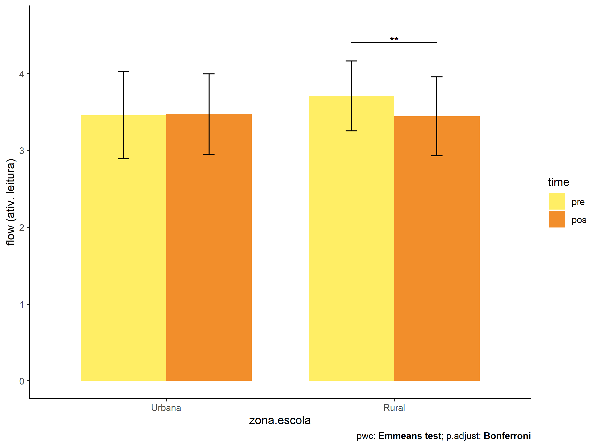<!-- -->

<!-- -->

<!-- -->

<!-- -->

<!-- -->

### factor: **zona.escola**

| var         | zona.escola |   n | M (pre) | SE (pre) | M (unadj) | SE (unadj) | M (adj) | SE (adj) |
|:------------|:------------|----:|--------:|---------:|----------:|-----------:|--------:|---------:|
| fss.leitura | Rural       |  77 |   3.709 |    0.052 |     3.444 |      0.059 |   3.383 |    0.056 |
| fss.leitura | Urbana      | 165 |   3.457 |    0.044 |     3.474 |      0.041 |   3.503 |    0.038 |

| .y.         | group1 | group2 | estimate | conf.low | conf.high |    se | statistic | p       | p.adj   | p.adj.signif |
|:------------|:-------|:-------|---------:|---------:|----------:|------:|----------:|:--------|:--------|:-------------|
| fss.leitura | Urbana | Rural  |    0.120 |   -0.015 |     0.255 | 0.069 |     1.747 | 0.082   | 0.082   | ns           |
| dfs.leitura | Urbana | Rural  |   -0.253 |   -0.398 |    -0.107 | 0.074 |    -3.423 | \<0.001 | \<0.001 | \*\*\*       |

| .y.          | zona.escola | group1 | group2 | estimate | conf.low | conf.high |    se | statistic |     p | p.adj | p.adj.signif |
|:-------------|:------------|:-------|:-------|---------:|---------:|----------:|------:|----------:|------:|------:|:-------------|
| flow.leitura | Urbana      | pre    | pos    |   -0.017 |   -0.131 |     0.097 | 0.058 |    -0.299 | 0.765 | 0.765 | ns           |
| flow.leitura | Rural       | pre    | pos    |    0.265 |    0.098 |     0.433 | 0.085 |     3.122 | 0.002 | 0.002 | \*\*         |

    ## Scale for colour is already present.
    ## Adding another scale for colour, which will replace the existing scale.

<!-- -->

<!-- -->

<!-- -->

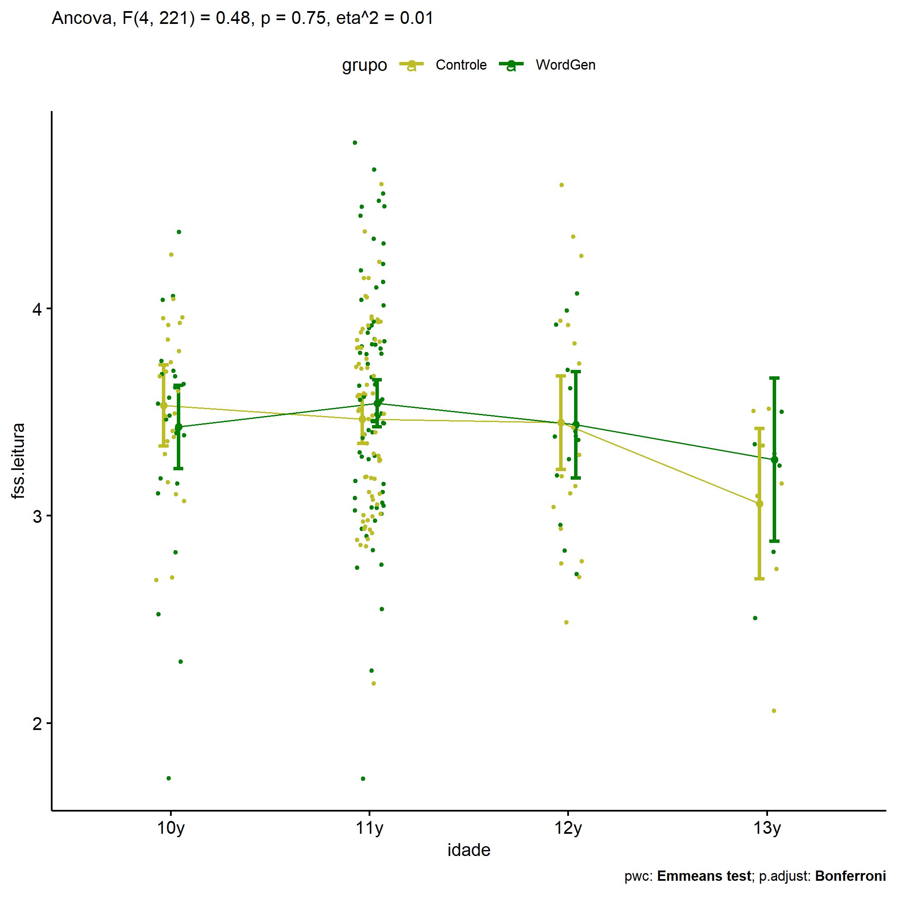<!-- -->

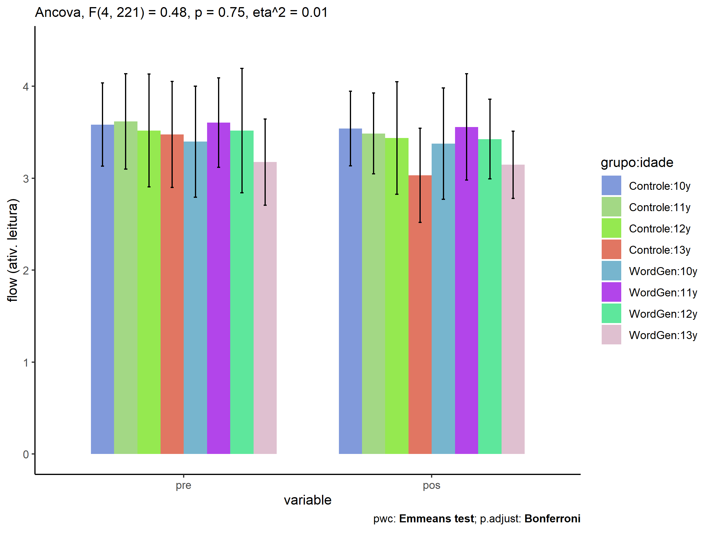<!-- -->

## Pairwise comparisons for two factors

### factores: **grupo:genero**

| var         | grupo    | genero |   n | M (pre) | SE (pre) | M (unadj) | SE (unadj) | M (adj) | SE (adj) |
|:------------|:---------|:-------|----:|--------:|---------:|----------:|-----------:|--------:|---------:|
| fss.leitura | Controle | F      |  60 |   3.595 |    0.069 |     3.521 |      0.054 |   3.503 |    0.062 |
| fss.leitura | Controle | M      |  65 |   3.524 |    0.066 |     3.393 |      0.065 |   3.397 |    0.059 |
| fss.leitura | WordGen  | F      |  53 |   3.640 |    0.068 |     3.663 |      0.071 |   3.632 |    0.066 |
| fss.leitura | WordGen  | M      |  64 |   3.411 |    0.074 |     3.320 |      0.069 |   3.359 |    0.060 |

| .y.         | grupo    | genero | group1   | group2  | estimate | conf.low | conf.high |    se | statistic |     p | p.adj | p.adj.signif |
|:------------|:---------|:-------|:---------|:--------|---------:|---------:|----------:|------:|----------:|------:|------:|:-------------|
| fss.leitura |          | F      | Controle | WordGen |   -0.129 |   -0.307 |     0.050 | 0.090 |    -1.421 | 0.157 | 0.157 | ns           |
| fss.leitura |          | M      | Controle | WordGen |    0.038 |   -0.129 |     0.205 | 0.085 |     0.450 | 0.653 | 0.653 | ns           |
| dfs.leitura |          | F      | Controle | WordGen |   -0.045 |   -0.247 |     0.157 | 0.102 |    -0.439 | 0.661 | 0.661 | ns           |
| dfs.leitura |          | M      | Controle | WordGen |    0.114 |   -0.075 |     0.302 | 0.096 |     1.188 | 0.236 | 0.236 | ns           |
| fss.leitura | Controle |        | F        | M       |    0.106 |   -0.063 |     0.275 | 0.086 |     1.234 | 0.218 | 0.218 | ns           |
| fss.leitura | WordGen  |        | F        | M       |    0.273 |    0.095 |     0.450 | 0.090 |     3.030 | 0.003 | 0.003 | \*\*         |
| dfs.leitura | Controle |        | F        | M       |    0.071 |   -0.121 |     0.262 | 0.097 |     0.728 | 0.467 | 0.467 | ns           |
| dfs.leitura | WordGen  |        | F        | M       |    0.229 |    0.031 |     0.428 | 0.101 |     2.273 | 0.024 | 0.024 | \*           |

| .y.          | grupo    | genero | group1 | group2 | estimate | conf.low | conf.high |    se | statistic |     p | p.adj | p.adj.signif |
|:-------------|:---------|:-------|:-------|:-------|---------:|---------:|----------:|------:|----------:|------:|------:|:-------------|
| flow.leitura | Controle | F      | pre    | pos    |    0.074 |   -0.114 |     0.263 | 0.096 |     0.775 | 0.438 | 0.438 | ns           |
| flow.leitura | Controle | M      | pre    | pos    |    0.131 |   -0.050 |     0.312 | 0.092 |     1.426 | 0.155 | 0.155 | ns           |
| flow.leitura | WordGen  | F      | pre    | pos    |   -0.023 |   -0.224 |     0.177 | 0.102 |    -0.226 | 0.821 | 0.821 | ns           |
| flow.leitura | WordGen  | M      | pre    | pos    |    0.091 |   -0.092 |     0.273 | 0.093 |     0.977 | 0.329 | 0.329 | ns           |

    ## Scale for colour is already present.
    ## Adding another scale for colour, which will replace the existing scale.

<!-- -->

    ## Scale for colour is already present.
    ## Adding another scale for colour, which will replace the existing scale.

<!-- -->

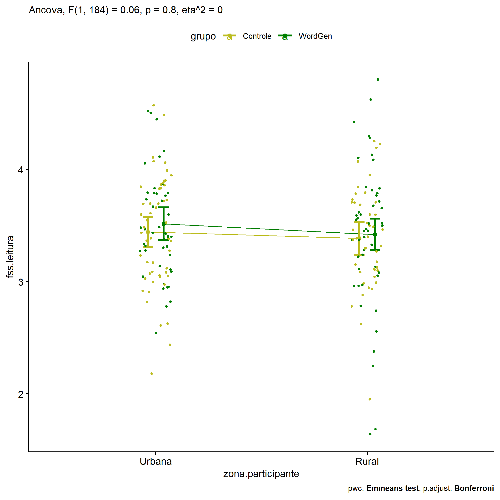<!-- -->

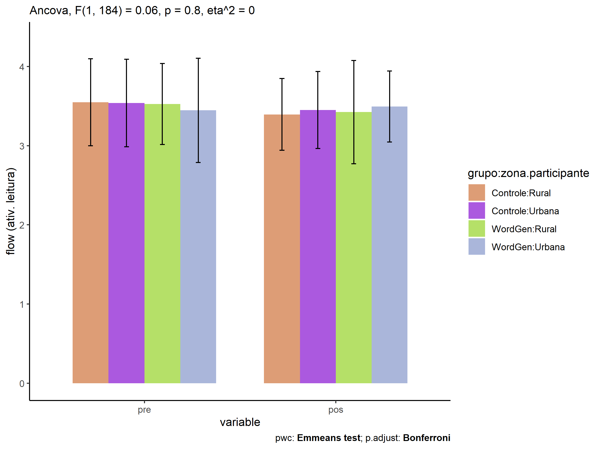<!-- -->

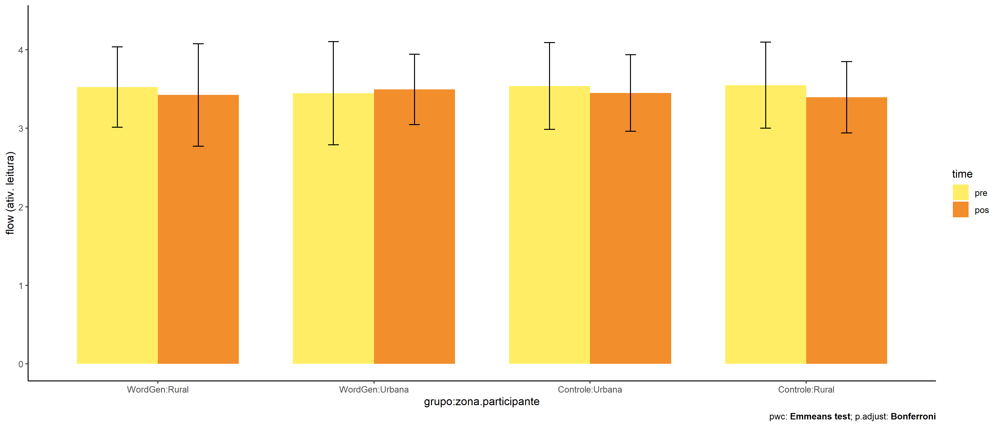<!-- -->

<!-- -->

### factores: **grupo:idade**

| var         | grupo    | idade |   n | M (pre) | SE (pre) | M (unadj) | SE (unadj) | M (adj) | SE (adj) |
|:------------|:---------|:------|----:|--------:|---------:|----------:|-----------:|--------:|---------:|
| fss.leitura | Controle | 10y   |  24 |   3.583 |    0.092 |     3.541 |      0.083 |   3.532 |    0.099 |
| fss.leitura | Controle | 11y   |  67 |   3.617 |    0.063 |     3.487 |      0.054 |   3.468 |    0.060 |
| fss.leitura | Controle | 12y   |  18 |   3.519 |    0.145 |     3.437 |      0.144 |   3.449 |    0.115 |
| fss.leitura | Controle | 13y   |   7 |   3.476 |    0.218 |     3.032 |      0.194 |   3.058 |    0.184 |
| fss.leitura | WordGen  | 10y   |  23 |   3.398 |    0.126 |     3.377 |      0.126 |   3.429 |    0.102 |
| fss.leitura | WordGen  | 11y   |  71 |   3.604 |    0.058 |     3.558 |      0.069 |   3.543 |    0.058 |
| fss.leitura | WordGen  | 12y   |  14 |   3.517 |    0.181 |     3.426 |      0.116 |   3.439 |    0.130 |
| fss.leitura | WordGen  | 13y   |   6 |   3.176 |    0.192 |     3.146 |      0.149 |   3.271 |    0.200 |

| .y.         | grupo    | idade | group1   | group2  | estimate | conf.low | conf.high |    se | statistic |     p | p.adj | p.adj.signif |
|:------------|:---------|:------|:---------|:--------|---------:|---------:|----------:|------:|----------:|------:|------:|:-------------|
| fss.leitura |          | 10y   | Controle | WordGen |    0.103 |   -0.178 |     0.384 | 0.142 |     0.723 | 0.470 | 0.470 | ns           |
| fss.leitura |          | 11y   | Controle | WordGen |   -0.076 |   -0.239 |     0.088 | 0.083 |    -0.914 | 0.362 | 0.362 | ns           |
| fss.leitura |          | 12y   | Controle | WordGen |    0.010 |   -0.331 |     0.352 | 0.173 |     0.060 | 0.952 | 0.952 | ns           |
| fss.leitura |          | 13y   | Controle | WordGen |   -0.212 |   -0.747 |     0.322 | 0.271 |    -0.783 | 0.435 | 0.435 | ns           |
| dfs.leitura |          | 10y   | Controle | WordGen |    0.185 |   -0.120 |     0.490 | 0.155 |     1.197 | 0.232 | 0.232 | ns           |
| dfs.leitura |          | 11y   | Controle | WordGen |    0.013 |   -0.165 |     0.191 | 0.090 |     0.144 | 0.885 | 0.885 | ns           |
| dfs.leitura |          | 12y   | Controle | WordGen |    0.002 |   -0.370 |     0.375 | 0.189 |     0.011 | 0.991 | 0.991 | ns           |
| dfs.leitura |          | 13y   | Controle | WordGen |    0.300 |   -0.281 |     0.882 | 0.295 |     1.017 | 0.310 | 0.310 | ns           |
| fss.leitura | Controle |       | 10y      | 11y     |    0.065 |   -0.164 |     0.293 | 0.116 |     0.558 | 0.577 | 1.000 | ns           |
| fss.leitura | Controle |       | 10y      | 12y     |    0.083 |   -0.216 |     0.382 | 0.152 |     0.545 | 0.586 | 1.000 | ns           |
| fss.leitura | Controle |       | 10y      | 13y     |    0.474 |    0.062 |     0.886 | 0.209 |     2.265 | 0.024 | 0.147 | ns           |
| fss.leitura | Controle |       | 11y      | 12y     |    0.018 |   -0.237 |     0.273 | 0.129 |     0.140 | 0.889 | 1.000 | ns           |
| fss.leitura | Controle |       | 11y      | 13y     |    0.409 |    0.028 |     0.790 | 0.193 |     2.114 | 0.036 | 0.214 | ns           |
| fss.leitura | Controle |       | 12y      | 13y     |    0.391 |   -0.036 |     0.818 | 0.217 |     1.804 | 0.073 | 0.436 | ns           |
| fss.leitura | WordGen  |       | 10y      | 11y     |   -0.114 |   -0.346 |     0.117 | 0.117 |    -0.972 | 0.332 | 1.000 | ns           |
| fss.leitura | WordGen  |       | 10y      | 12y     |   -0.010 |   -0.335 |     0.316 | 0.165 |    -0.060 | 0.952 | 1.000 | ns           |
| fss.leitura | WordGen  |       | 10y      | 13y     |    0.158 |   -0.282 |     0.599 | 0.223 |     0.708 | 0.479 | 1.000 | ns           |
| fss.leitura | WordGen  |       | 11y      | 12y     |    0.104 |   -0.176 |     0.385 | 0.142 |     0.732 | 0.465 | 1.000 | ns           |
| fss.leitura | WordGen  |       | 11y      | 13y     |    0.272 |   -0.139 |     0.683 | 0.209 |     1.306 | 0.193 | 1.000 | ns           |
| fss.leitura | WordGen  |       | 12y      | 13y     |    0.168 |   -0.302 |     0.638 | 0.238 |     0.706 | 0.481 | 1.000 | ns           |
| dfs.leitura | Controle |       | 10y      | 11y     |   -0.034 |   -0.282 |     0.215 | 0.126 |    -0.266 | 0.791 | 1.000 | ns           |
| dfs.leitura | Controle |       | 10y      | 12y     |    0.064 |   -0.262 |     0.390 | 0.165 |     0.389 | 0.698 | 1.000 | ns           |
| dfs.leitura | Controle |       | 10y      | 13y     |    0.107 |   -0.342 |     0.556 | 0.228 |     0.470 | 0.639 | 1.000 | ns           |
| dfs.leitura | Controle |       | 11y      | 12y     |    0.098 |   -0.180 |     0.375 | 0.141 |     0.695 | 0.488 | 1.000 | ns           |
| dfs.leitura | Controle |       | 11y      | 13y     |    0.141 |   -0.275 |     0.556 | 0.211 |     0.667 | 0.505 | 1.000 | ns           |
| dfs.leitura | Controle |       | 12y      | 13y     |    0.043 |   -0.423 |     0.509 | 0.236 |     0.181 | 0.857 | 1.000 | ns           |
| dfs.leitura | WordGen  |       | 10y      | 11y     |   -0.206 |   -0.457 |     0.045 | 0.127 |    -1.617 | 0.107 | 0.643 | ns           |
| dfs.leitura | WordGen  |       | 10y      | 12y     |   -0.119 |   -0.473 |     0.236 | 0.180 |    -0.661 | 0.509 | 1.000 | ns           |
| dfs.leitura | WordGen  |       | 10y      | 13y     |    0.222 |   -0.257 |     0.701 | 0.243 |     0.913 | 0.362 | 1.000 | ns           |
| dfs.leitura | WordGen  |       | 11y      | 12y     |    0.087 |   -0.219 |     0.393 | 0.155 |     0.560 | 0.576 | 1.000 | ns           |
| dfs.leitura | WordGen  |       | 11y      | 13y     |    0.428 |   -0.017 |     0.872 | 0.226 |     1.897 | 0.059 | 0.355 | ns           |
| dfs.leitura | WordGen  |       | 12y      | 13y     |    0.341 |   -0.169 |     0.851 | 0.259 |     1.317 | 0.189 | 1.000 | ns           |

| .y.          | grupo    | idade | group1 | group2 | estimate | conf.low | conf.high |    se | statistic |     p | p.adj | p.adj.signif |
|:-------------|:---------|:------|:-------|:-------|---------:|---------:|----------:|------:|----------:|------:|------:|:-------------|
| flow.leitura | Controle | 10y   | pre    | pos    |    0.043 |   -0.254 |     0.340 | 0.151 |     0.284 | 0.777 | 0.777 | ns           |
| flow.leitura | Controle | 11y   | pre    | pos    |    0.130 |   -0.048 |     0.308 | 0.090 |     1.439 | 0.151 | 0.151 | ns           |
| flow.leitura | Controle | 12y   | pre    | pos    |    0.082 |   -0.260 |     0.425 | 0.174 |     0.472 | 0.637 | 0.637 | ns           |
| flow.leitura | Controle | 13y   | pre    | pos    |    0.444 |   -0.105 |     0.994 | 0.280 |     1.589 | 0.113 | 0.113 | ns           |
| flow.leitura | WordGen  | 10y   | pre    | pos    |    0.021 |   -0.282 |     0.324 | 0.154 |     0.137 | 0.891 | 0.891 | ns           |
| flow.leitura | WordGen  | 11y   | pre    | pos    |    0.046 |   -0.127 |     0.218 | 0.088 |     0.518 | 0.604 | 0.604 | ns           |
| flow.leitura | WordGen  | 12y   | pre    | pos    |    0.091 |   -0.297 |     0.480 | 0.198 |     0.462 | 0.645 | 0.645 | ns           |
| flow.leitura | WordGen  | 13y   | pre    | pos    |    0.030 |   -0.564 |     0.624 | 0.302 |     0.100 | 0.921 | 0.921 | ns           |

    ## Scale for colour is already present.
    ## Adding another scale for colour, which will replace the existing scale.

<!-- -->

    ## Scale for colour is already present.
    ## Adding another scale for colour, which will replace the existing scale.

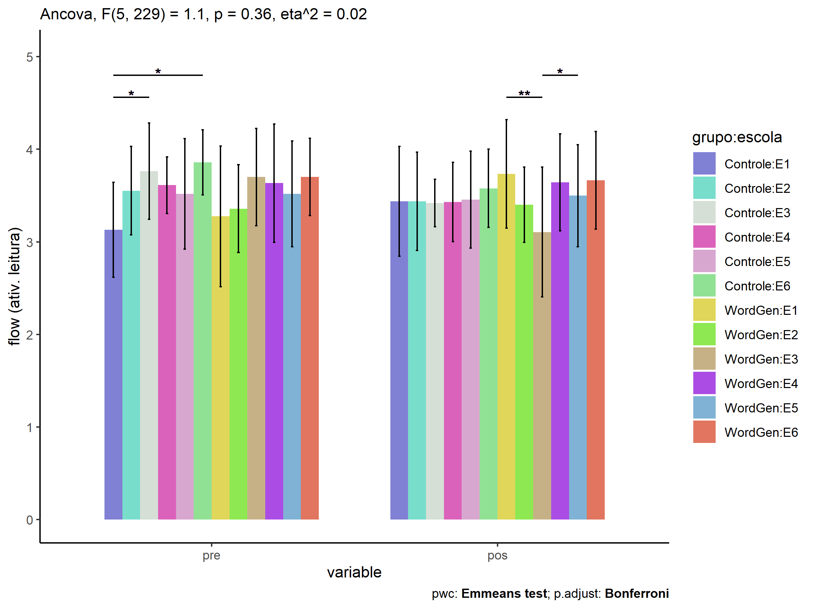<!-- -->

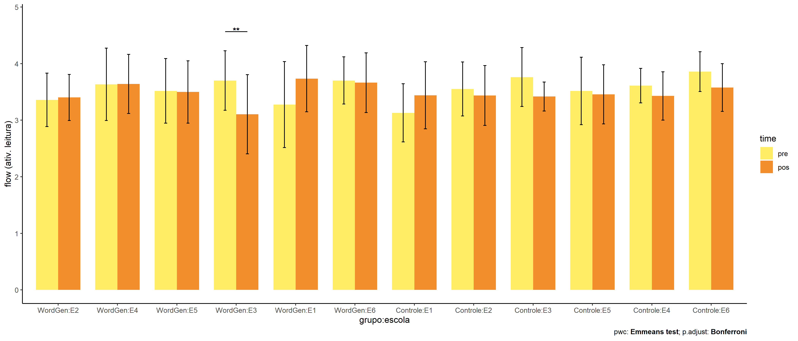<!-- -->

<!-- -->

<!-- -->

<!-- -->

### factores: **grupo:zona.participante**

| var         | grupo    | zona.participante |   n | M (pre) | SE (pre) | M (unadj) | SE (unadj) | M (adj) | SE (adj) |
|:------------|:---------|:------------------|----:|--------:|---------:|----------:|-----------:|--------:|---------:|
| fss.leitura | Controle | Rural             |  43 |   3.549 |    0.084 |     3.395 |      0.069 |   3.386 |    0.075 |
| fss.leitura | Controle | Urbana            |  54 |   3.539 |    0.075 |     3.450 |      0.066 |   3.444 |    0.067 |
| fss.leitura | WordGen  | Rural             |  48 |   3.526 |    0.074 |     3.424 |      0.094 |   3.421 |    0.071 |
| fss.leitura | WordGen  | Urbana            |  44 |   3.447 |    0.099 |     3.495 |      0.068 |   3.515 |    0.074 |

| .y.         | grupo    | zona.participante | group1   | group2  | estimate | conf.low | conf.high |    se | statistic |     p | p.adj | p.adj.signif |
|:------------|:---------|:------------------|:---------|:--------|---------:|---------:|----------:|------:|----------:|------:|------:|:-------------|
| fss.leitura |          | Urbana            | Controle | WordGen |   -0.072 |   -0.270 |     0.126 | 0.100 |    -0.714 | 0.476 | 0.476 | ns           |
| fss.leitura |          | Rural             | Controle | WordGen |   -0.035 |   -0.240 |     0.169 | 0.104 |    -0.341 | 0.733 | 0.733 | ns           |
| dfs.leitura |          | Urbana            | Controle | WordGen |    0.092 |   -0.135 |     0.320 | 0.115 |     0.799 | 0.425 | 0.425 | ns           |
| dfs.leitura |          | Rural             | Controle | WordGen |    0.023 |   -0.212 |     0.258 | 0.119 |     0.193 | 0.847 | 0.847 | ns           |
| fss.leitura | Controle |                   | Urbana   | Rural   |    0.058 |   -0.141 |     0.257 | 0.101 |     0.578 | 0.564 | 0.564 | ns           |
| fss.leitura | WordGen  |                   | Urbana   | Rural   |    0.095 |   -0.109 |     0.298 | 0.103 |     0.918 | 0.360 | 0.360 | ns           |
| dfs.leitura | Controle |                   | Urbana   | Rural   |   -0.010 |   -0.239 |     0.219 | 0.116 |    -0.082 | 0.935 | 0.935 | ns           |
| dfs.leitura | WordGen  |                   | Urbana   | Rural   |   -0.079 |   -0.313 |     0.155 | 0.119 |    -0.664 | 0.508 | 0.508 | ns           |

| .y.          | grupo    | zona.participante | group1 | group2 | estimate | conf.low | conf.high |    se | statistic |     p | p.adj | p.adj.signif |
|:-------------|:---------|:------------------|:-------|:-------|---------:|---------:|----------:|------:|----------:|------:|------:|:-------------|
| flow.leitura | Controle | Urbana            | pre    | pos    |    0.089 |   -0.117 |     0.295 | 0.105 |     0.846 | 0.398 | 0.398 | ns           |
| flow.leitura | Controle | Rural             | pre    | pos    |    0.154 |   -0.077 |     0.384 | 0.117 |     1.309 | 0.192 | 0.192 | ns           |
| flow.leitura | WordGen  | Urbana            | pre    | pos    |   -0.048 |   -0.276 |     0.180 | 0.116 |    -0.413 | 0.680 | 0.680 | ns           |
| flow.leitura | WordGen  | Rural             | pre    | pos    |    0.102 |   -0.116 |     0.321 | 0.111 |     0.919 | 0.359 | 0.359 | ns           |

    ## Scale for colour is already present.
    ## Adding another scale for colour, which will replace the existing scale.

<!-- -->

    ## Scale for colour is already present.
    ## Adding another scale for colour, which will replace the existing scale.

<!-- -->

<!-- -->

<!-- -->

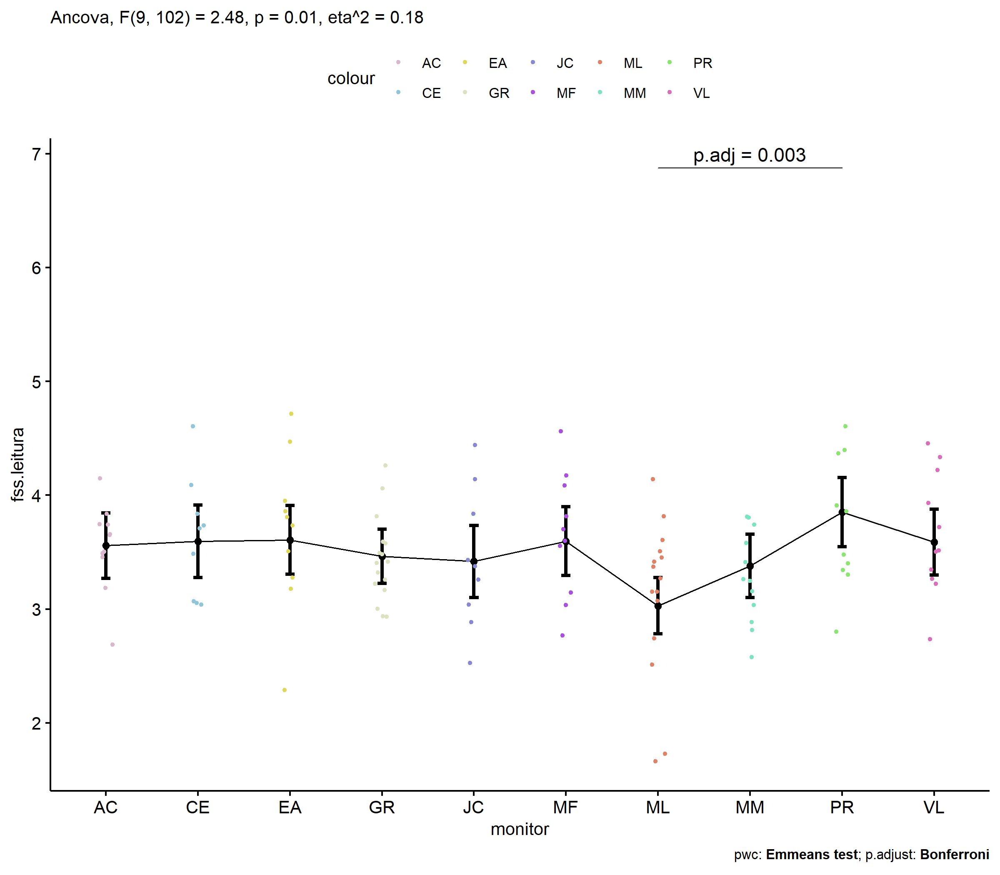<!-- -->

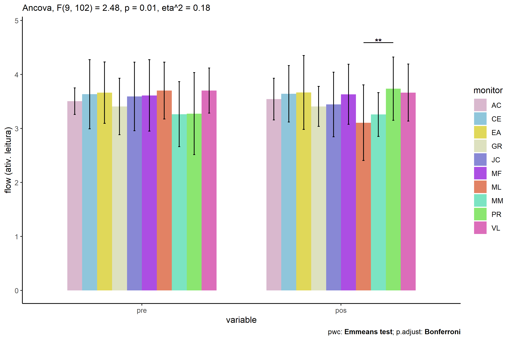<!-- -->

### factores: **grupo:escola**

| var         | grupo    | escola |   n | M (pre) | SE (pre) | M (unadj) | SE (unadj) | M (adj) | SE (adj) |
|:------------|:---------|:-------|----:|--------:|---------:|----------:|-----------:|--------:|---------:|
| fss.leitura | Controle | E1     |  12 |   3.130 |    0.148 |     3.439 |      0.171 |   3.591 |    0.140 |
| fss.leitura | Controle | E2     |  23 |   3.552 |    0.100 |     3.437 |      0.110 |   3.431 |    0.100 |
| fss.leitura | Controle | E3     |  15 |   3.763 |    0.135 |     3.419 |      0.066 |   3.335 |    0.124 |
| fss.leitura | Controle | E4     |  16 |   3.612 |    0.076 |     3.429 |      0.107 |   3.401 |    0.119 |
| fss.leitura | Controle | E5     |  48 |   3.518 |    0.086 |     3.457 |      0.075 |   3.465 |    0.069 |
| fss.leitura | Controle | E6     |  11 |   3.859 |    0.106 |     3.578 |      0.127 |   3.459 |    0.145 |
| fss.leitura | WordGen  | E1     |  10 |   3.275 |    0.240 |     3.735 |      0.185 |   3.833 |    0.152 |
| fss.leitura | WordGen  | E2     |  24 |   3.359 |    0.096 |     3.402 |      0.083 |   3.469 |    0.098 |
| fss.leitura | WordGen  | E3     |  15 |   3.701 |    0.136 |     3.106 |      0.181 |   3.045 |    0.124 |
| fss.leitura | WordGen  | E4     |   9 |   3.634 |    0.213 |     3.642 |      0.174 |   3.606 |    0.159 |
| fss.leitura | WordGen  | E5     |  48 |   3.519 |    0.082 |     3.499 |      0.079 |   3.506 |    0.069 |
| fss.leitura | WordGen  | E6     |  11 |   3.702 |    0.126 |     3.664 |      0.159 |   3.603 |    0.144 |

| .y.         | grupo    | escola | group1   | group2  | estimate | conf.low | conf.high |    se | statistic | p       | p.adj | p.adj.signif |
|:------------|:---------|:-------|:---------|:--------|---------:|---------:|----------:|------:|----------:|:--------|------:|:-------------|
| fss.leitura |          | E1     | Controle | WordGen |   -0.242 |   -0.645 |     0.161 | 0.205 |    -1.181 | 0.239   | 0.239 | ns           |
| fss.leitura |          | E2     | Controle | WordGen |   -0.038 |   -0.313 |     0.238 | 0.140 |    -0.269 | 0.788   | 0.788 | ns           |
| fss.leitura |          | E3     | Controle | WordGen |    0.291 |   -0.053 |     0.634 | 0.174 |     1.668 | 0.097   | 0.097 | ns           |
| fss.leitura |          | E4     | Controle | WordGen |   -0.205 |   -0.597 |     0.187 | 0.199 |    -1.029 | 0.304   | 0.304 | ns           |
| fss.leitura |          | E5     | Controle | WordGen |   -0.041 |   -0.233 |     0.151 | 0.097 |    -0.424 | 0.672   | 0.672 | ns           |
| fss.leitura |          | E6     | Controle | WordGen |   -0.144 |   -0.546 |     0.257 | 0.204 |    -0.708 | 0.48    | 0.480 | ns           |
| dfs.leitura |          | E1     | Controle | WordGen |   -0.145 |   -0.596 |     0.306 | 0.229 |    -0.633 | 0.527   | 0.527 | ns           |
| dfs.leitura |          | E2     | Controle | WordGen |    0.193 |   -0.114 |     0.500 | 0.156 |     1.238 | 0.217   | 0.217 | ns           |
| dfs.leitura |          | E3     | Controle | WordGen |    0.062 |   -0.322 |     0.447 | 0.195 |     0.318 | 0.751   | 0.751 | ns           |
| dfs.leitura |          | E4     | Controle | WordGen |   -0.023 |   -0.461 |     0.416 | 0.223 |    -0.102 | 0.919   | 0.919 | ns           |
| dfs.leitura |          | E5     | Controle | WordGen |   -0.001 |   -0.216 |     0.214 | 0.109 |    -0.009 | 0.993   | 0.993 | ns           |
| dfs.leitura |          | E6     | Controle | WordGen |    0.157 |   -0.292 |     0.606 | 0.228 |     0.687 | 0.493   | 0.493 | ns           |
| fss.leitura | Controle |        | E1       | E2      |    0.160 |   -0.179 |     0.498 | 0.172 |     0.931 | 0.353   | 1.000 | ns           |
| fss.leitura | Controle |        | E1       | E3      |    0.256 |   -0.116 |     0.627 | 0.189 |     1.355 | 0.177   | 1.000 | ns           |
| fss.leitura | Controle |        | E1       | E4      |    0.190 |   -0.174 |     0.553 | 0.184 |     1.029 | 0.304   | 1.000 | ns           |
| fss.leitura | Controle |        | E1       | E5      |    0.126 |   -0.181 |     0.433 | 0.156 |     0.811 | 0.418   | 1.000 | ns           |
| fss.leitura | Controle |        | E1       | E6      |    0.132 |   -0.269 |     0.534 | 0.204 |     0.650 | 0.517   | 1.000 | ns           |
| fss.leitura | Controle |        | E2       | E3      |    0.096 |   -0.217 |     0.409 | 0.159 |     0.603 | 0.547   | 1.000 | ns           |
| fss.leitura | Controle |        | E2       | E4      |    0.030 |   -0.276 |     0.336 | 0.155 |     0.193 | 0.847   | 1.000 | ns           |
| fss.leitura | Controle |        | E2       | E5      |   -0.034 |   -0.272 |     0.205 | 0.121 |    -0.277 | 0.782   | 1.000 | ns           |
| fss.leitura | Controle |        | E2       | E6      |   -0.027 |   -0.374 |     0.319 | 0.176 |    -0.156 | 0.876   | 1.000 | ns           |
| fss.leitura | Controle |        | E3       | E4      |   -0.066 |   -0.404 |     0.273 | 0.172 |    -0.383 | 0.702   | 1.000 | ns           |
| fss.leitura | Controle |        | E3       | E5      |   -0.129 |   -0.409 |     0.150 | 0.142 |    -0.911 | 0.363   | 1.000 | ns           |
| fss.leitura | Controle |        | E3       | E6      |   -0.123 |   -0.497 |     0.250 | 0.190 |    -0.650 | 0.516   | 1.000 | ns           |
| fss.leitura | Controle |        | E4       | E5      |   -0.064 |   -0.335 |     0.208 | 0.138 |    -0.461 | 0.645   | 1.000 | ns           |
| fss.leitura | Controle |        | E4       | E6      |   -0.057 |   -0.427 |     0.312 | 0.187 |    -0.307 | 0.759   | 1.000 | ns           |
| fss.leitura | Controle |        | E5       | E6      |    0.006 |   -0.311 |     0.323 | 0.161 |     0.038 | 0.97    | 1.000 | ns           |
| fss.leitura | WordGen  |        | E1       | E2      |    0.364 |    0.010 |     0.718 | 0.180 |     2.025 | 0.044   | 0.661 | ns           |
| fss.leitura | WordGen  |        | E1       | E3      |    0.788 |    0.401 |     1.175 | 0.196 |     4.011 | \<0.001 | 0.001 | \*\*         |
| fss.leitura | WordGen  |        | E1       | E4      |    0.227 |   -0.207 |     0.661 | 0.220 |     1.029 | 0.305   | 1.000 | ns           |
| fss.leitura | WordGen  |        | E1       | E5      |    0.327 |   -0.002 |     0.655 | 0.167 |     1.961 | 0.051   | 0.766 | ns           |
| fss.leitura | WordGen  |        | E1       | E6      |    0.230 |   -0.184 |     0.644 | 0.210 |     1.094 | 0.275   | 1.000 | ns           |
| fss.leitura | WordGen  |        | E2       | E3      |    0.424 |    0.112 |     0.736 | 0.158 |     2.678 | 0.008   | 0.119 | ns           |
| fss.leitura | WordGen  |        | E2       | E4      |   -0.137 |   -0.506 |     0.232 | 0.187 |    -0.733 | 0.465   | 1.000 | ns           |
| fss.leitura | WordGen  |        | E2       | E5      |   -0.037 |   -0.273 |     0.198 | 0.120 |    -0.312 | 0.755   | 1.000 | ns           |
| fss.leitura | WordGen  |        | E2       | E6      |   -0.134 |   -0.479 |     0.211 | 0.175 |    -0.767 | 0.444   | 1.000 | ns           |
| fss.leitura | WordGen  |        | E3       | E4      |   -0.561 |   -0.958 |    -0.165 | 0.201 |    -2.788 | 0.006   | 0.086 | ns           |
| fss.leitura | WordGen  |        | E3       | E5      |   -0.461 |   -0.740 |    -0.182 | 0.142 |    -3.259 | 0.001   | 0.019 | \*           |
| fss.leitura | WordGen  |        | E3       | E6      |   -0.558 |   -0.931 |    -0.185 | 0.189 |    -2.946 | 0.004   | 0.053 | ns           |
| fss.leitura | WordGen  |        | E4       | E5      |    0.100 |   -0.242 |     0.442 | 0.173 |     0.575 | 0.566   | 1.000 | ns           |
| fss.leitura | WordGen  |        | E4       | E6      |    0.003 |   -0.420 |     0.426 | 0.215 |     0.014 | 0.989   | 1.000 | ns           |
| fss.leitura | WordGen  |        | E5       | E6      |   -0.097 |   -0.412 |     0.218 | 0.160 |    -0.605 | 0.546   | 1.000 | ns           |
| dfs.leitura | Controle |        | E1       | E2      |   -0.422 |   -0.797 |    -0.047 | 0.190 |    -2.219 | 0.027   | 0.412 | ns           |
| dfs.leitura | Controle |        | E1       | E3      |   -0.633 |   -1.041 |    -0.225 | 0.207 |    -3.060 | 0.002   | 0.037 | \*           |
| dfs.leitura | Controle |        | E1       | E4      |   -0.482 |   -0.884 |    -0.080 | 0.204 |    -2.361 | 0.019   | 0.286 | ns           |
| dfs.leitura | Controle |        | E1       | E5      |   -0.388 |   -0.728 |    -0.048 | 0.172 |    -2.251 | 0.025   | 0.380 | ns           |
| dfs.leitura | Controle |        | E1       | E6      |   -0.729 |   -1.169 |    -0.289 | 0.223 |    -3.267 | 0.001   | 0.019 | \*           |
| dfs.leitura | Controle |        | E2       | E3      |   -0.211 |   -0.561 |     0.138 | 0.177 |    -1.190 | 0.235   | 1.000 | ns           |
| dfs.leitura | Controle |        | E2       | E4      |   -0.060 |   -0.402 |     0.283 | 0.174 |    -0.343 | 0.732   | 1.000 | ns           |
| dfs.leitura | Controle |        | E2       | E5      |    0.034 |   -0.233 |     0.301 | 0.136 |     0.251 | 0.802   | 1.000 | ns           |
| dfs.leitura | Controle |        | E2       | E6      |   -0.307 |   -0.693 |     0.079 | 0.196 |    -1.565 | 0.119   | 1.000 | ns           |
| dfs.leitura | Controle |        | E3       | E4      |    0.151 |   -0.227 |     0.530 | 0.192 |     0.788 | 0.432   | 1.000 | ns           |
| dfs.leitura | Controle |        | E3       | E5      |    0.245 |   -0.066 |     0.557 | 0.158 |     1.550 | 0.122   | 1.000 | ns           |
| dfs.leitura | Controle |        | E3       | E6      |   -0.096 |   -0.514 |     0.322 | 0.212 |    -0.451 | 0.653   | 1.000 | ns           |
| dfs.leitura | Controle |        | E4       | E5      |    0.094 |   -0.210 |     0.398 | 0.154 |     0.608 | 0.544   | 1.000 | ns           |
| dfs.leitura | Controle |        | E4       | E6      |   -0.247 |   -0.659 |     0.165 | 0.209 |    -1.180 | 0.239   | 1.000 | ns           |
| dfs.leitura | Controle |        | E5       | E6      |   -0.341 |   -0.693 |     0.011 | 0.179 |    -1.907 | 0.058   | 0.866 | ns           |
| dfs.leitura | WordGen  |        | E1       | E2      |   -0.084 |   -0.481 |     0.312 | 0.201 |    -0.419 | 0.676   | 1.000 | ns           |
| dfs.leitura | WordGen  |        | E1       | E3      |   -0.426 |   -0.856 |     0.004 | 0.218 |    -1.954 | 0.052   | 0.779 | ns           |
| dfs.leitura | WordGen  |        | E1       | E4      |   -0.360 |   -0.844 |     0.124 | 0.246 |    -1.465 | 0.144   | 1.000 | ns           |
| dfs.leitura | WordGen  |        | E1       | E5      |   -0.244 |   -0.610 |     0.122 | 0.186 |    -1.314 | 0.19    | 1.000 | ns           |
| dfs.leitura | WordGen  |        | E1       | E6      |   -0.427 |   -0.888 |     0.033 | 0.234 |    -1.830 | 0.069   | 1.000 | ns           |
| dfs.leitura | WordGen  |        | E2       | E3      |   -0.342 |   -0.689 |     0.004 | 0.176 |    -1.945 | 0.053   | 0.795 | ns           |
| dfs.leitura | WordGen  |        | E2       | E4      |   -0.275 |   -0.687 |     0.136 | 0.209 |    -1.319 | 0.189   | 1.000 | ns           |
| dfs.leitura | WordGen  |        | E2       | E5      |   -0.160 |   -0.423 |     0.103 | 0.134 |    -1.198 | 0.232   | 1.000 | ns           |
| dfs.leitura | WordGen  |        | E2       | E6      |   -0.343 |   -0.727 |     0.040 | 0.195 |    -1.764 | 0.079   | 1.000 | ns           |
| dfs.leitura | WordGen  |        | E3       | E4      |    0.067 |   -0.377 |     0.511 | 0.225 |     0.296 | 0.768   | 1.000 | ns           |
| dfs.leitura | WordGen  |        | E3       | E5      |    0.182 |   -0.129 |     0.494 | 0.158 |     1.152 | 0.251   | 1.000 | ns           |
| dfs.leitura | WordGen  |        | E3       | E6      |   -0.001 |   -0.419 |     0.417 | 0.212 |    -0.005 | 0.996   | 1.000 | ns           |
| dfs.leitura | WordGen  |        | E4       | E5      |    0.115 |   -0.267 |     0.498 | 0.194 |     0.595 | 0.553   | 1.000 | ns           |
| dfs.leitura | WordGen  |        | E4       | E6      |   -0.068 |   -0.541 |     0.406 | 0.240 |    -0.282 | 0.778   | 1.000 | ns           |
| dfs.leitura | WordGen  |        | E5       | E6      |   -0.183 |   -0.535 |     0.169 | 0.179 |    -1.025 | 0.306   | 1.000 | ns           |

| .y.          | grupo    | escola | group1 | group2 | estimate | conf.low | conf.high |    se | statistic |     p | p.adj | p.adj.signif |
|:-------------|:---------|:-------|:-------|:-------|---------:|---------:|----------:|------:|----------:|------:|------:|:-------------|
| flow.leitura | Controle | E1     | pre    | pos    |   -0.310 |   -0.731 |     0.112 | 0.214 |    -1.443 | 0.150 | 0.150 | ns           |
| flow.leitura | Controle | E2     | pre    | pos    |    0.115 |   -0.189 |     0.420 | 0.155 |     0.744 | 0.457 | 0.457 | ns           |
| flow.leitura | Controle | E3     | pre    | pos    |    0.344 |   -0.033 |     0.721 | 0.192 |     1.791 | 0.074 | 0.074 | ns           |
| flow.leitura | Controle | E4     | pre    | pos    |    0.183 |   -0.182 |     0.548 | 0.186 |     0.984 | 0.326 | 0.326 | ns           |
| flow.leitura | Controle | E5     | pre    | pos    |    0.060 |   -0.150 |     0.271 | 0.107 |     0.563 | 0.574 | 0.574 | ns           |
| flow.leitura | Controle | E6     | pre    | pos    |    0.280 |   -0.160 |     0.721 | 0.224 |     1.251 | 0.212 | 0.212 | ns           |
| flow.leitura | WordGen  | E1     | pre    | pos    |   -0.460 |   -0.922 |     0.002 | 0.235 |    -1.958 | 0.051 | 0.051 | ns           |
| flow.leitura | WordGen  | E2     | pre    | pos    |   -0.043 |   -0.341 |     0.255 | 0.152 |    -0.286 | 0.775 | 0.775 | ns           |
| flow.leitura | WordGen  | E3     | pre    | pos    |    0.595 |    0.218 |     0.972 | 0.192 |     3.103 | 0.002 | 0.002 | \*\*         |
| flow.leitura | WordGen  | E4     | pre    | pos    |   -0.008 |   -0.494 |     0.479 | 0.248 |    -0.031 | 0.975 | 0.975 | ns           |
| flow.leitura | WordGen  | E5     | pre    | pos    |    0.020 |   -0.191 |     0.230 | 0.107 |     0.183 | 0.855 | 0.855 | ns           |
| flow.leitura | WordGen  | E6     | pre    | pos    |    0.038 |   -0.402 |     0.478 | 0.224 |     0.169 | 0.866 | 0.866 | ns           |

    ## Scale for colour is already present.
    ## Adding another scale for colour, which will replace the existing scale.

<!-- -->

    ## Scale for colour is already present.
    ## Adding another scale for colour, which will replace the existing scale.

<!-- -->

<!-- -->

<!-- -->

<!-- -->

<!-- -->

### factores: **grupo:zona.escola**

| var         | grupo    | zona.escola |   n | M (pre) | SE (pre) | M (unadj) | SE (unadj) | M (adj) | SE (adj) |
|:------------|:---------|:------------|----:|--------:|---------:|----------:|-----------:|--------:|---------:|
| fss.leitura | Controle | Rural       |  42 |   3.730 |    0.063 |     3.465 |      0.057 |   3.396 |    0.076 |
| fss.leitura | Controle | Urbana      |  83 |   3.471 |    0.062 |     3.449 |      0.058 |   3.473 |    0.054 |
| fss.leitura | WordGen  | Rural       |  35 |   3.684 |    0.087 |     3.419 |      0.110 |   3.367 |    0.083 |
| fss.leitura | WordGen  | Urbana      |  82 |   3.442 |    0.063 |     3.499 |      0.057 |   3.533 |    0.054 |

| .y.         | grupo    | zona.escola | group1   | group2  | estimate | conf.low | conf.high |    se | statistic |     p | p.adj | p.adj.signif |
|:------------|:---------|:------------|:---------|:--------|---------:|---------:|----------:|------:|----------:|------:|------:|:-------------|
| fss.leitura |          | Urbana      | Controle | WordGen |   -0.061 |   -0.210 |     0.089 | 0.076 |    -0.801 | 0.424 | 0.424 | ns           |
| fss.leitura |          | Rural       | Controle | WordGen |    0.029 |   -0.190 |     0.249 | 0.111 |     0.261 | 0.794 | 0.794 | ns           |
| dfs.leitura |          | Urbana      | Controle | WordGen |    0.029 |   -0.136 |     0.194 | 0.084 |     0.347 | 0.729 | 0.729 | ns           |
| dfs.leitura |          | Rural       | Controle | WordGen |    0.046 |   -0.196 |     0.288 | 0.123 |     0.376 | 0.707 | 0.707 | ns           |
| fss.leitura | Controle |             | Urbana   | Rural   |    0.077 |   -0.107 |     0.261 | 0.093 |     0.820 | 0.413 | 0.413 | ns           |
| fss.leitura | WordGen  |             | Urbana   | Rural   |    0.167 |   -0.029 |     0.362 | 0.099 |     1.677 | 0.095 | 0.095 | ns           |
| dfs.leitura | Controle |             | Urbana   | Rural   |   -0.259 |   -0.459 |    -0.059 | 0.102 |    -2.551 | 0.011 | 0.011 | \*           |
| dfs.leitura | WordGen  |             | Urbana   | Rural   |   -0.242 |   -0.455 |    -0.028 | 0.108 |    -2.233 | 0.026 | 0.026 | \*           |

| .y.          | grupo    | zona.escola | group1 | group2 | estimate | conf.low | conf.high |    se | statistic |     p | p.adj | p.adj.signif |
|:-------------|:---------|:------------|:-------|:-------|---------:|---------:|----------:|------:|----------:|------:|------:|:-------------|
| flow.leitura | Controle | Urbana      | pre    | pos    |    0.022 |   -0.139 |     0.184 | 0.082 |     0.269 | 0.788 | 0.788 | ns           |
| flow.leitura | Controle | Rural       | pre    | pos    |    0.266 |    0.039 |     0.493 | 0.116 |     2.300 | 0.022 | 0.022 | \*           |
| flow.leitura | WordGen  | Urbana      | pre    | pos    |   -0.057 |   -0.220 |     0.105 | 0.083 |    -0.693 | 0.489 | 0.489 | ns           |
| flow.leitura | WordGen  | Rural       | pre    | pos    |    0.265 |    0.016 |     0.514 | 0.127 |     2.095 | 0.037 | 0.037 | \*           |

    ## Scale for colour is already present.
    ## Adding another scale for colour, which will replace the existing scale.

<!-- -->

    ## Scale for colour is already present.
    ## Adding another scale for colour, which will replace the existing scale.

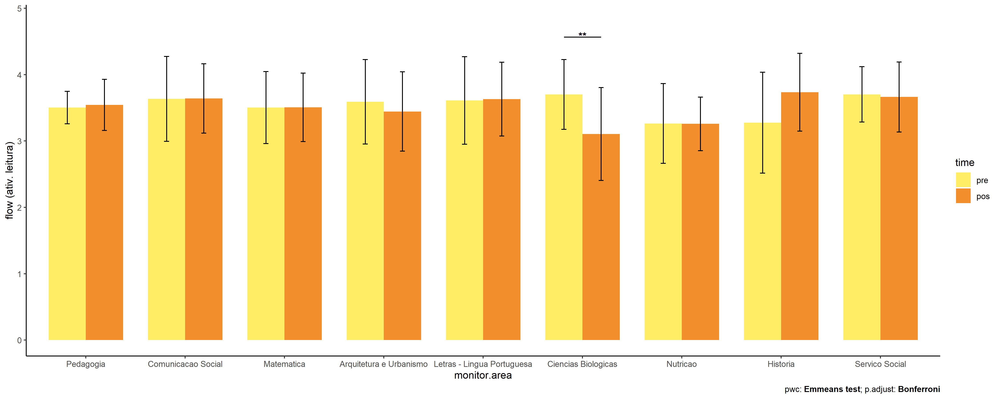<!-- -->

<!-- -->

<!-- -->

<!-- -->

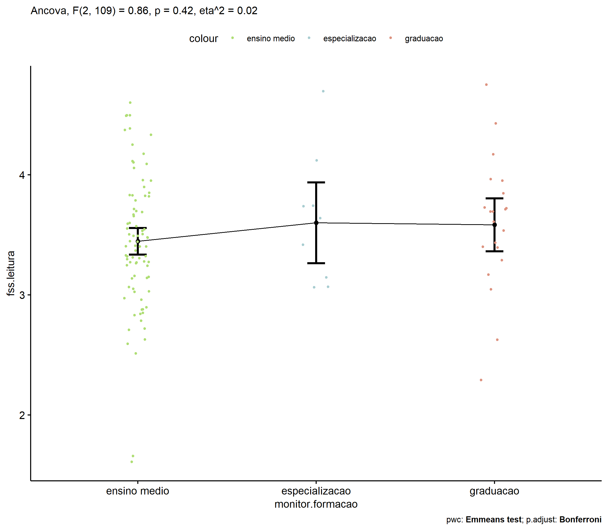<!-- -->

## Pairwise comparisons for grupo=“Experimental”

### factores: **grupo=“Experimental”:monitor**

| var         | monitor |   n | M (pre) | SE (pre) | M (unadj) | SE (unadj) | M (adj) | SE (adj) |
|:------------|:--------|----:|--------:|---------:|----------:|-----------:|--------:|---------:|
| fss.leitura | AC      |  11 |   3.505 |    0.074 |     3.545 |      0.116 |   3.557 |    0.145 |
| fss.leitura | CE      |   9 |   3.634 |    0.213 |     3.642 |      0.174 |   3.596 |    0.160 |
| fss.leitura | EA      |  10 |   3.663 |    0.180 |     3.667 |      0.216 |   3.608 |    0.152 |
| fss.leitura | GR      |  16 |   3.407 |    0.130 |     3.408 |      0.093 |   3.464 |    0.120 |
| fss.leitura | JC      |   9 |   3.591 |    0.212 |     3.444 |      0.199 |   3.417 |    0.160 |
| fss.leitura | MF      |  10 |   3.611 |    0.209 |     3.632 |      0.176 |   3.596 |    0.152 |
| fss.leitura | ML      |  15 |   3.701 |    0.136 |     3.106 |      0.181 |   3.029 |    0.125 |
| fss.leitura | MM      |  12 |   3.264 |    0.173 |     3.258 |      0.117 |   3.378 |    0.140 |
| fss.leitura | PR      |  10 |   3.275 |    0.240 |     3.735 |      0.185 |   3.850 |    0.153 |
| fss.leitura | VL      |  11 |   3.702 |    0.126 |     3.664 |      0.159 |   3.587 |    0.145 |

| .y.         | group1 | group2 | estimate | conf.low | conf.high |    se | statistic | p       | p.adj | p.adj.signif |
|:------------|:-------|:-------|---------:|---------:|----------:|------:|----------:|:--------|------:|:-------------|
| fss.leitura | AC     | CE     |   -0.038 |   -0.467 |     0.390 | 0.216 |    -0.178 | 0.859   | 1.000 | ns           |
| fss.leitura | AC     | EA     |   -0.050 |   -0.467 |     0.366 | 0.210 |    -0.240 | 0.811   | 1.000 | ns           |
| fss.leitura | AC     | GR     |    0.093 |   -0.280 |     0.467 | 0.188 |     0.497 | 0.621   | 1.000 | ns           |
| fss.leitura | AC     | JC     |    0.140 |   -0.289 |     0.568 | 0.216 |     0.647 | 0.519   | 1.000 | ns           |
| fss.leitura | AC     | MF     |   -0.039 |   -0.455 |     0.378 | 0.210 |    -0.185 | 0.854   | 1.000 | ns           |
| fss.leitura | AC     | ML     |    0.528 |    0.148 |     0.907 | 0.191 |     2.760 | 0.007   | 0.309 | ns           |
| fss.leitura | AC     | MM     |    0.179 |   -0.221 |     0.579 | 0.201 |     0.889 | 0.376   | 1.000 | ns           |
| fss.leitura | AC     | PR     |   -0.293 |   -0.711 |     0.125 | 0.211 |    -1.390 | 0.168   | 1.000 | ns           |
| fss.leitura | AC     | VL     |   -0.030 |   -0.438 |     0.377 | 0.205 |    -0.147 | 0.883   | 1.000 | ns           |
| fss.leitura | CE     | EA     |   -0.012 |   -0.450 |     0.426 | 0.221 |    -0.054 | 0.957   | 1.000 | ns           |
| fss.leitura | CE     | GR     |    0.132 |   -0.267 |     0.531 | 0.201 |     0.657 | 0.513   | 1.000 | ns           |
| fss.leitura | CE     | JC     |    0.178 |   -0.271 |     0.627 | 0.226 |     0.787 | 0.433   | 1.000 | ns           |
| fss.leitura | CE     | MF     |    0.000 |   -0.438 |     0.437 | 0.221 |    -0.002 | 0.999   | 1.000 | ns           |
| fss.leitura | CE     | ML     |    0.566 |    0.165 |     0.968 | 0.203 |     2.797 | 0.006   | 0.278 | ns           |
| fss.leitura | CE     | MM     |    0.217 |   -0.207 |     0.642 | 0.214 |     1.016 | 0.312   | 1.000 | ns           |
| fss.leitura | CE     | PR     |   -0.254 |   -0.696 |     0.187 | 0.223 |    -1.142 | 0.256   | 1.000 | ns           |
| fss.leitura | CE     | VL     |    0.008 |   -0.420 |     0.436 | 0.216 |     0.038 | 0.969   | 1.000 | ns           |
| fss.leitura | EA     | GR     |    0.144 |   -0.242 |     0.530 | 0.195 |     0.739 | 0.461   | 1.000 | ns           |
| fss.leitura | EA     | JC     |    0.190 |   -0.248 |     0.628 | 0.221 |     0.862 | 0.391   | 1.000 | ns           |
| fss.leitura | EA     | MF     |    0.012 |   -0.414 |     0.438 | 0.215 |     0.054 | 0.957   | 1.000 | ns           |
| fss.leitura | EA     | ML     |    0.578 |    0.190 |     0.967 | 0.196 |     2.950 | 0.004   | 0.177 | ns           |
| fss.leitura | EA     | MM     |    0.229 |   -0.184 |     0.643 | 0.208 |     1.102 | 0.273   | 1.000 | ns           |
| fss.leitura | EA     | PR     |   -0.242 |   -0.673 |     0.188 | 0.217 |    -1.116 | 0.267   | 1.000 | ns           |
| fss.leitura | EA     | VL     |    0.020 |   -0.396 |     0.436 | 0.210 |     0.097 | 0.923   | 1.000 | ns           |
| fss.leitura | GR     | JC     |    0.046 |   -0.352 |     0.444 | 0.201 |     0.230 | 0.818   | 1.000 | ns           |
| fss.leitura | GR     | MF     |   -0.132 |   -0.518 |     0.253 | 0.194 |    -0.681 | 0.497   | 1.000 | ns           |
| fss.leitura | GR     | ML     |    0.434 |    0.089 |     0.780 | 0.174 |     2.492 | 0.014   | 0.643 | ns           |
| fss.leitura | GR     | MM     |    0.086 |   -0.279 |     0.450 | 0.184 |     0.466 | 0.643   | 1.000 | ns           |
| fss.leitura | GR     | PR     |   -0.386 |   -0.771 |    -0.002 | 0.194 |    -1.993 | 0.049   | 1.000 | ns           |
| fss.leitura | GR     | VL     |   -0.124 |   -0.500 |     0.253 | 0.190 |    -0.652 | 0.516   | 1.000 | ns           |
| fss.leitura | JC     | MF     |   -0.178 |   -0.616 |     0.259 | 0.221 |    -0.809 | 0.42    | 1.000 | ns           |
| fss.leitura | JC     | ML     |    0.388 |   -0.014 |     0.790 | 0.203 |     1.916 | 0.058   | 1.000 | ns           |
| fss.leitura | JC     | MM     |    0.039 |   -0.384 |     0.463 | 0.213 |     0.184 | 0.854   | 1.000 | ns           |
| fss.leitura | JC     | PR     |   -0.432 |   -0.873 |     0.008 | 0.222 |    -1.946 | 0.054   | 1.000 | ns           |
| fss.leitura | JC     | VL     |   -0.170 |   -0.598 |     0.259 | 0.216 |    -0.786 | 0.433   | 1.000 | ns           |
| fss.leitura | MF     | ML     |    0.567 |    0.178 |     0.956 | 0.196 |     2.889 | 0.005   | 0.212 | ns           |
| fss.leitura | MF     | MM     |    0.218 |   -0.194 |     0.630 | 0.208 |     1.049 | 0.297   | 1.000 | ns           |
| fss.leitura | MF     | PR     |   -0.254 |   -0.683 |     0.176 | 0.217 |    -1.173 | 0.244   | 1.000 | ns           |
| fss.leitura | MF     | VL     |    0.009 |   -0.408 |     0.425 | 0.210 |     0.041 | 0.967   | 1.000 | ns           |
| fss.leitura | ML     | MM     |   -0.349 |   -0.725 |     0.027 | 0.190 |    -1.841 | 0.069   | 1.000 | ns           |
| fss.leitura | ML     | PR     |   -0.821 |   -1.216 |    -0.426 | 0.199 |    -4.119 | \<0.001 | 0.003 | \*\*         |
| fss.leitura | ML     | VL     |   -0.558 |   -0.936 |    -0.180 | 0.191 |    -2.928 | 0.004   | 0.189 | ns           |
| fss.leitura | MM     | PR     |   -0.472 |   -0.880 |    -0.064 | 0.206 |    -2.295 | 0.024   | 1.000 | ns           |
| fss.leitura | MM     | VL     |   -0.209 |   -0.613 |     0.195 | 0.204 |    -1.027 | 0.307   | 1.000 | ns           |
| fss.leitura | PR     | VL     |    0.263 |   -0.160 |     0.685 | 0.213 |     1.234 | 0.22    | 1.000 | ns           |
| dfs.leitura | AC     | CE     |   -0.129 |   -0.632 |     0.374 | 0.254 |    -0.510 | 0.611   | 1.000 | ns           |
| dfs.leitura | AC     | EA     |   -0.157 |   -0.646 |     0.331 | 0.247 |    -0.639 | 0.524   | 1.000 | ns           |
| dfs.leitura | AC     | GR     |    0.098 |   -0.340 |     0.536 | 0.221 |     0.443 | 0.659   | 1.000 | ns           |
| dfs.leitura | AC     | JC     |   -0.086 |   -0.589 |     0.417 | 0.254 |    -0.339 | 0.735   | 1.000 | ns           |
| dfs.leitura | AC     | MF     |   -0.106 |   -0.595 |     0.383 | 0.247 |    -0.430 | 0.668   | 1.000 | ns           |
| dfs.leitura | AC     | ML     |   -0.196 |   -0.640 |     0.248 | 0.224 |    -0.875 | 0.384   | 1.000 | ns           |
| dfs.leitura | AC     | MM     |    0.241 |   -0.226 |     0.708 | 0.236 |     1.024 | 0.308   | 1.000 | ns           |
| dfs.leitura | AC     | PR     |    0.230 |   -0.258 |     0.719 | 0.247 |     0.935 | 0.352   | 1.000 | ns           |
| dfs.leitura | AC     | VL     |   -0.197 |   -0.674 |     0.280 | 0.241 |    -0.819 | 0.415   | 1.000 | ns           |
| dfs.leitura | CE     | EA     |   -0.028 |   -0.542 |     0.486 | 0.259 |    -0.109 | 0.913   | 1.000 | ns           |
| dfs.leitura | CE     | GR     |    0.227 |   -0.239 |     0.693 | 0.235 |     0.966 | 0.336   | 1.000 | ns           |
| dfs.leitura | CE     | JC     |    0.043 |   -0.484 |     0.571 | 0.266 |     0.162 | 0.871   | 1.000 | ns           |
| dfs.leitura | CE     | MF     |    0.023 |   -0.491 |     0.537 | 0.259 |     0.089 | 0.929   | 1.000 | ns           |
| dfs.leitura | CE     | ML     |   -0.067 |   -0.538 |     0.405 | 0.238 |    -0.280 | 0.78    | 1.000 | ns           |
| dfs.leitura | CE     | MM     |    0.370 |   -0.123 |     0.864 | 0.249 |     1.489 | 0.14    | 1.000 | ns           |
| dfs.leitura | CE     | PR     |    0.360 |   -0.154 |     0.874 | 0.259 |     1.387 | 0.168   | 1.000 | ns           |
| dfs.leitura | CE     | VL     |   -0.068 |   -0.571 |     0.435 | 0.254 |    -0.267 | 0.79    | 1.000 | ns           |
| dfs.leitura | EA     | GR     |    0.255 |   -0.196 |     0.706 | 0.227 |     1.123 | 0.264   | 1.000 | ns           |
| dfs.leitura | EA     | JC     |    0.071 |   -0.443 |     0.586 | 0.259 |     0.276 | 0.783   | 1.000 | ns           |
| dfs.leitura | EA     | MF     |    0.051 |   -0.449 |     0.552 | 0.252 |     0.204 | 0.839   | 1.000 | ns           |
| dfs.leitura | EA     | ML     |   -0.038 |   -0.495 |     0.418 | 0.230 |    -0.167 | 0.868   | 1.000 | ns           |
| dfs.leitura | EA     | MM     |    0.399 |   -0.081 |     0.878 | 0.242 |     1.650 | 0.102   | 1.000 | ns           |
| dfs.leitura | EA     | PR     |    0.388 |   -0.113 |     0.888 | 0.252 |     1.537 | 0.127   | 1.000 | ns           |
| dfs.leitura | EA     | VL     |   -0.040 |   -0.528 |     0.449 | 0.247 |    -0.160 | 0.873   | 1.000 | ns           |
| dfs.leitura | GR     | JC     |   -0.184 |   -0.650 |     0.282 | 0.235 |    -0.782 | 0.436   | 1.000 | ns           |
| dfs.leitura | GR     | MF     |   -0.204 |   -0.655 |     0.247 | 0.227 |    -0.897 | 0.372   | 1.000 | ns           |
| dfs.leitura | GR     | ML     |   -0.294 |   -0.696 |     0.108 | 0.203 |    -1.449 | 0.15    | 1.000 | ns           |
| dfs.leitura | GR     | MM     |    0.143 |   -0.284 |     0.571 | 0.215 |     0.665 | 0.508   | 1.000 | ns           |
| dfs.leitura | GR     | PR     |    0.133 |   -0.319 |     0.584 | 0.227 |     0.583 | 0.561   | 1.000 | ns           |
| dfs.leitura | GR     | VL     |   -0.295 |   -0.733 |     0.143 | 0.221 |    -1.334 | 0.185   | 1.000 | ns           |
| dfs.leitura | JC     | MF     |   -0.020 |   -0.534 |     0.494 | 0.259 |    -0.077 | 0.938   | 1.000 | ns           |
| dfs.leitura | JC     | ML     |   -0.110 |   -0.582 |     0.362 | 0.238 |    -0.462 | 0.645   | 1.000 | ns           |
| dfs.leitura | JC     | MM     |    0.327 |   -0.166 |     0.821 | 0.249 |     1.315 | 0.191   | 1.000 | ns           |
| dfs.leitura | JC     | PR     |    0.316 |   -0.198 |     0.831 | 0.259 |     1.221 | 0.225   | 1.000 | ns           |
| dfs.leitura | JC     | VL     |   -0.111 |   -0.614 |     0.392 | 0.254 |    -0.438 | 0.663   | 1.000 | ns           |
| dfs.leitura | MF     | ML     |   -0.090 |   -0.547 |     0.367 | 0.230 |    -0.390 | 0.697   | 1.000 | ns           |
| dfs.leitura | MF     | MM     |    0.347 |   -0.132 |     0.826 | 0.242 |     1.437 | 0.154   | 1.000 | ns           |
| dfs.leitura | MF     | PR     |    0.337 |   -0.164 |     0.837 | 0.252 |     1.334 | 0.185   | 1.000 | ns           |
| dfs.leitura | MF     | VL     |   -0.091 |   -0.580 |     0.398 | 0.247 |    -0.369 | 0.713   | 1.000 | ns           |
| dfs.leitura | ML     | MM     |    0.437 |    0.004 |     0.870 | 0.219 |     2.000 | 0.048   | 1.000 | ns           |
| dfs.leitura | ML     | PR     |    0.426 |   -0.030 |     0.883 | 0.230 |     1.851 | 0.067   | 1.000 | ns           |
| dfs.leitura | ML     | VL     |   -0.001 |   -0.445 |     0.443 | 0.224 |    -0.005 | 0.996   | 1.000 | ns           |
| dfs.leitura | MM     | PR     |   -0.011 |   -0.490 |     0.468 | 0.242 |    -0.044 | 0.965   | 1.000 | ns           |
| dfs.leitura | MM     | VL     |   -0.438 |   -0.905 |     0.029 | 0.236 |    -1.860 | 0.066   | 1.000 | ns           |
| dfs.leitura | PR     | VL     |   -0.427 |   -0.916 |     0.061 | 0.247 |    -1.734 | 0.086   | 1.000 | ns           |

| .y.          | monitor | group1 | group2 | estimate | conf.low | conf.high |    se | statistic |     p | p.adj | p.adj.signif |
|:-------------|:--------|:-------|:-------|---------:|---------:|----------:|------:|----------:|------:|------:|:-------------|
| flow.leitura | AC      | pre    | pos    |   -0.040 |   -0.505 |     0.424 | 0.236 |    -0.171 | 0.864 | 0.864 | ns           |
| flow.leitura | CE      | pre    | pos    |   -0.008 |   -0.521 |     0.506 | 0.261 |    -0.030 | 0.976 | 0.976 | ns           |
| flow.leitura | EA      | pre    | pos    |   -0.004 |   -0.491 |     0.483 | 0.247 |    -0.017 | 0.987 | 0.987 | ns           |
| flow.leitura | GR      | pre    | pos    |   -0.001 |   -0.386 |     0.384 | 0.195 |    -0.004 | 0.996 | 0.996 | ns           |
| flow.leitura | JC      | pre    | pos    |    0.147 |   -0.367 |     0.660 | 0.261 |     0.563 | 0.574 | 0.574 | ns           |
| flow.leitura | MF      | pre    | pos    |   -0.021 |   -0.508 |     0.466 | 0.247 |    -0.084 | 0.933 | 0.933 | ns           |
| flow.leitura | ML      | pre    | pos    |    0.595 |    0.198 |     0.993 | 0.202 |     2.950 | 0.004 | 0.004 | \*\*         |
| flow.leitura | MM      | pre    | pos    |    0.006 |   -0.439 |     0.451 | 0.226 |     0.026 | 0.980 | 0.980 | ns           |
| flow.leitura | PR      | pre    | pos    |   -0.460 |   -0.947 |     0.027 | 0.247 |    -1.862 | 0.064 | 0.064 | ns           |
| flow.leitura | VL      | pre    | pos    |    0.038 |   -0.427 |     0.502 | 0.236 |     0.161 | 0.872 | 0.872 | ns           |

    ## Scale for colour is already present.
    ## Adding another scale for colour, which will replace the existing scale.

<!-- -->

<!-- -->

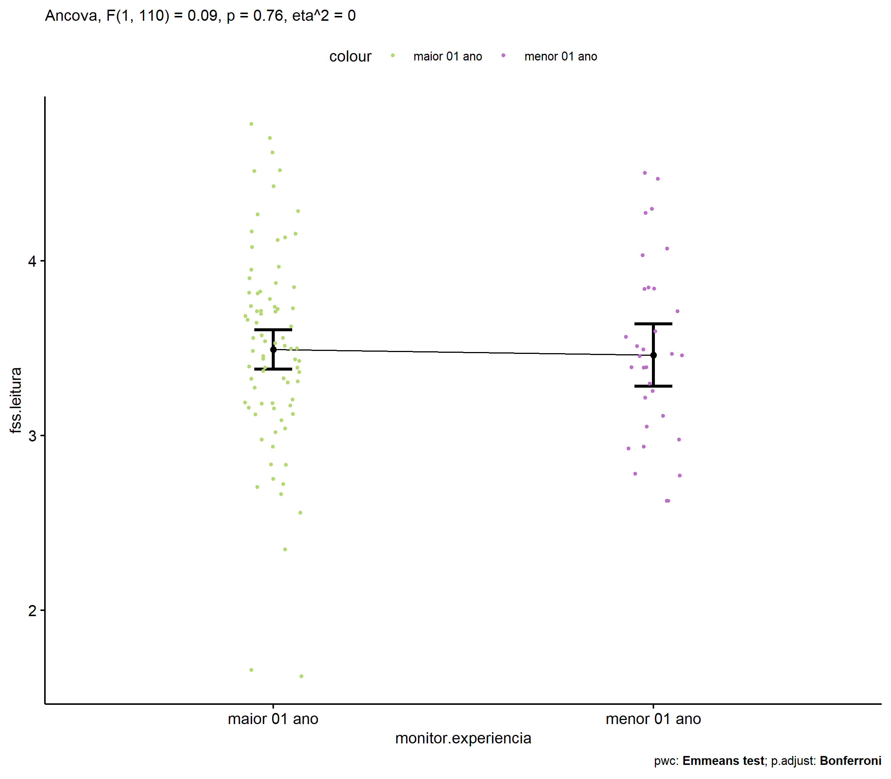<!-- -->

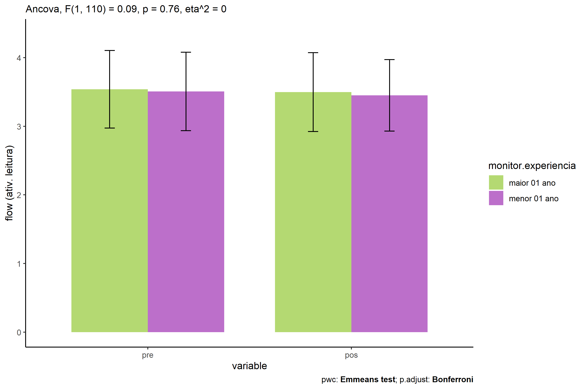<!-- -->

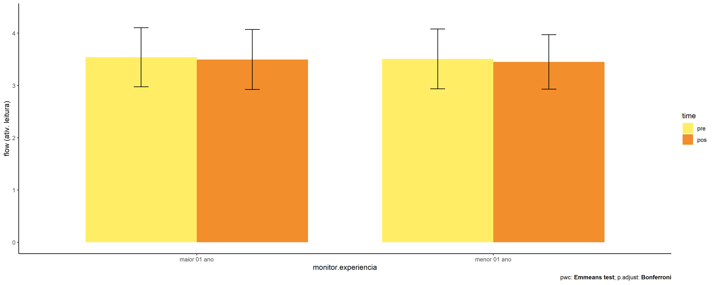<!-- -->

### factores: **grupo=“Experimental”:monitor.genero**

| var         | monitor.genero |   n | M (pre) | SE (pre) | M (unadj) | SE (unadj) | M (adj) | SE (adj) |
|:------------|:---------------|----:|--------:|---------:|----------:|-----------:|--------:|---------:|
| fss.leitura | F              |  75 |   3.528 |    0.060 |     3.411 |      0.061 |   3.412 |    0.058 |
| fss.leitura | M              |  38 |   3.537 |    0.105 |     3.626 |      0.095 |   3.624 |    0.081 |

| .y.         | group1 | group2 | estimate | conf.low | conf.high |    se | statistic |     p | p.adj | p.adj.signif |
|:------------|:-------|:-------|---------:|---------:|----------:|------:|----------:|------:|------:|:-------------|
| fss.leitura | F      | M      |   -0.211 |   -0.409 |    -0.014 | 0.100 |    -2.121 | 0.036 | 0.036 | \*           |
| dfs.leitura | F      | M      |   -0.009 |   -0.233 |     0.215 | 0.113 |    -0.080 | 0.936 | 0.936 | ns           |

| .y.          | monitor.genero | group1 | group2 | estimate | conf.low | conf.high |    se | statistic |     p | p.adj | p.adj.signif |
|:-------------|:---------------|:-------|:-------|---------:|---------:|----------:|------:|----------:|------:|------:|:-------------|
| flow.leitura | F              | pre    | pos    |    0.117 |   -0.063 |     0.296 | 0.091 |     1.279 | 0.202 | 0.202 | ns           |
| flow.leitura | M              | pre    | pos    |   -0.089 |   -0.342 |     0.163 | 0.128 |    -0.697 | 0.487 | 0.487 | ns           |

    ## Scale for colour is already present.
    ## Adding another scale for colour, which will replace the existing scale.

<!-- -->

<!-- -->

<!-- -->

<!-- -->

<!-- -->

### factores: **grupo=“Experimental”:monitor.area**

| var         | monitor.area               |   n | M (pre) | SE (pre) | M (unadj) | SE (unadj) | M (adj) | SE (adj) |
|:------------|:---------------------------|----:|--------:|---------:|----------:|-----------:|--------:|---------:|
| fss.leitura | Arquitetura e Urbanismo    |   9 |   3.591 |    0.212 |     3.444 |      0.199 |   3.417 |    0.160 |
| fss.leitura | Ciencias Biologicas        |  15 |   3.701 |    0.136 |     3.106 |      0.181 |   3.028 |    0.124 |
| fss.leitura | Comunicacao Social         |   9 |   3.634 |    0.213 |     3.642 |      0.174 |   3.595 |    0.160 |
| fss.leitura | Historia                   |  10 |   3.275 |    0.240 |     3.735 |      0.185 |   3.852 |    0.153 |
| fss.leitura | Letras - Lingua Portuguesa |  10 |   3.611 |    0.209 |     3.632 |      0.176 |   3.595 |    0.152 |
| fss.leitura | Matematica                 |  26 |   3.505 |    0.107 |     3.507 |      0.101 |   3.519 |    0.094 |
| fss.leitura | Nutricao                   |  12 |   3.264 |    0.173 |     3.258 |      0.117 |   3.380 |    0.140 |
| fss.leitura | Pedagogia                  |  11 |   3.505 |    0.074 |     3.545 |      0.116 |   3.557 |    0.144 |
| fss.leitura | Servico Social             |  11 |   3.702 |    0.126 |     3.664 |      0.159 |   3.586 |    0.145 |

| .y.         | group1                  | group2              | estimate | conf.low | conf.high |    se | statistic | p       | p.adj | p.adj.signif |
|:------------|:------------------------|:--------------------|---------:|---------:|----------:|------:|----------:|:--------|------:|:-------------|
| fss.leitura | Arquitetura e Urbanismo | Ciencias Biologicas |    0.389 |   -0.012 |     0.790 | 0.202 |     1.924 | 0.057   | 1.000 | ns           |
| fss.leitura | Arquitetura e Urbanismo | Comunicacao Social  |   -0.178 |   -0.626 |     0.270 | 0.226 |    -0.787 | 0.433   | 1.000 | ns           |
| fss.leitura | Arquitetura e Urbanismo | Historia            |   -0.435 |   -0.874 |     0.005 | 0.222 |    -1.961 | 0.053   | 1.000 | ns           |
| fss.leitura | Arquitetura e Urbanismo | Letras              |   -0.178 |   -0.615 |     0.258 | 0.220 |    -0.810 | 0.42    | 1.000 | ns           |
| fss.leitura | Arquitetura e Urbanismo | Matematica          |   -0.102 |   -0.470 |     0.266 | 0.185 |    -0.551 | 0.583   | 1.000 | ns           |
| fss.leitura | Arquitetura e Urbanismo | Nutricao            |    0.037 |   -0.385 |     0.460 | 0.213 |     0.174 | 0.862   | 1.000 | ns           |
| fss.leitura | Arquitetura e Urbanismo | Pedagogia           |   -0.140 |   -0.567 |     0.287 | 0.215 |    -0.651 | 0.517   | 1.000 | ns           |
| fss.leitura | Arquitetura e Urbanismo | Servico Social      |   -0.169 |   -0.597 |     0.258 | 0.216 |    -0.785 | 0.434   | 1.000 | ns           |
| fss.leitura | Ciencias Biologicas     | Comunicacao Social  |   -0.567 |   -0.968 |    -0.166 | 0.202 |    -2.805 | 0.006   | 0.216 | ns           |
| fss.leitura | Ciencias Biologicas     | Historia            |   -0.824 |   -1.218 |    -0.429 | 0.199 |    -4.144 | \<0.001 | 0.003 | \*\*         |
| fss.leitura | Ciencias Biologicas     | Letras              |   -0.567 |   -0.955 |    -0.179 | 0.196 |    -2.899 | 0.005   | 0.165 | ns           |
| fss.leitura | Ciencias Biologicas     | Matematica          |   -0.491 |   -0.801 |    -0.181 | 0.156 |    -3.145 | 0.002   | 0.078 | ns           |
| fss.leitura | Ciencias Biologicas     | Nutricao            |   -0.352 |   -0.727 |     0.023 | 0.189 |    -1.861 | 0.066   | 1.000 | ns           |
| fss.leitura | Ciencias Biologicas     | Pedagogia           |   -0.529 |   -0.908 |    -0.151 | 0.191 |    -2.773 | 0.007   | 0.237 | ns           |
| fss.leitura | Ciencias Biologicas     | Servico Social      |   -0.558 |   -0.935 |    -0.181 | 0.190 |    -2.935 | 0.004   | 0.148 | ns           |
| fss.leitura | Comunicacao Social      | Historia            |   -0.257 |   -0.697 |     0.184 | 0.222 |    -1.156 | 0.25    | 1.000 | ns           |
| fss.leitura | Comunicacao Social      | Letras              |   -0.001 |   -0.437 |     0.436 | 0.220 |    -0.002 | 0.998   | 1.000 | ns           |
| fss.leitura | Comunicacao Social      | Matematica          |    0.076 |   -0.292 |     0.444 | 0.186 |     0.408 | 0.684   | 1.000 | ns           |
| fss.leitura | Comunicacao Social      | Nutricao            |    0.215 |   -0.208 |     0.638 | 0.213 |     1.007 | 0.316   | 1.000 | ns           |
| fss.leitura | Comunicacao Social      | Pedagogia           |    0.038 |   -0.390 |     0.465 | 0.216 |     0.174 | 0.862   | 1.000 | ns           |
| fss.leitura | Comunicacao Social      | Servico Social      |    0.009 |   -0.418 |     0.436 | 0.215 |     0.041 | 0.968   | 1.000 | ns           |
| fss.leitura | Historia                | Letras              |    0.256 |   -0.172 |     0.685 | 0.216 |     1.186 | 0.238   | 1.000 | ns           |
| fss.leitura | Historia                | Matematica          |    0.332 |   -0.023 |     0.688 | 0.179 |     1.854 | 0.067   | 1.000 | ns           |
| fss.leitura | Historia                | Nutricao            |    0.472 |    0.065 |     0.879 | 0.205 |     2.300 | 0.023   | 0.845 | ns           |
| fss.leitura | Historia                | Pedagogia           |    0.294 |   -0.122 |     0.711 | 0.210 |     1.400 | 0.164   | 1.000 | ns           |
| fss.leitura | Historia                | Servico Social      |    0.266 |   -0.156 |     0.687 | 0.212 |     1.251 | 0.214   | 1.000 | ns           |
| fss.leitura | Letras                  | Lingua Portuguesa   |    0.076 |   -0.278 |     0.430 | 0.178 |     0.427 | 0.67    | 1.000 | ns           |
| fss.leitura | Letras                  | Lingua Portuguesa   |    0.215 |   -0.195 |     0.626 | 0.207 |     1.040 | 0.301   | 1.000 | ns           |
| fss.leitura | Letras                  | Lingua Portuguesa   |    0.038 |   -0.377 |     0.454 | 0.209 |     0.182 | 0.856   | 1.000 | ns           |
| fss.leitura | Letras                  | Lingua Portuguesa   |    0.009 |   -0.406 |     0.425 | 0.209 |     0.044 | 0.965   | 1.000 | ns           |
| fss.leitura | Matematica              | Nutricao            |    0.139 |   -0.195 |     0.473 | 0.168 |     0.827 | 0.41    | 1.000 | ns           |
| fss.leitura | Matematica              | Pedagogia           |   -0.038 |   -0.380 |     0.304 | 0.172 |    -0.221 | 0.825   | 1.000 | ns           |
| fss.leitura | Matematica              | Servico Social      |   -0.067 |   -0.410 |     0.276 | 0.173 |    -0.387 | 0.7     | 1.000 | ns           |
| fss.leitura | Nutricao                | Pedagogia           |   -0.177 |   -0.576 |     0.221 | 0.201 |    -0.883 | 0.38    | 1.000 | ns           |
| fss.leitura | Nutricao                | Servico Social      |   -0.206 |   -0.609 |     0.197 | 0.203 |    -1.015 | 0.313   | 1.000 | ns           |
| fss.leitura | Pedagogia               | Servico Social      |   -0.029 |   -0.435 |     0.378 | 0.205 |    -0.141 | 0.888   | 1.000 | ns           |
| dfs.leitura | Arquitetura e Urbanismo | Ciencias Biologicas |   -0.110 |   -0.582 |     0.362 | 0.238 |    -0.461 | 0.646   | 1.000 | ns           |
| dfs.leitura | Arquitetura e Urbanismo | Comunicacao Social  |   -0.043 |   -0.571 |     0.485 | 0.266 |    -0.162 | 0.871   | 1.000 | ns           |
| dfs.leitura | Arquitetura e Urbanismo | Historia            |    0.316 |   -0.198 |     0.831 | 0.260 |     1.219 | 0.226   | 1.000 | ns           |
| dfs.leitura | Arquitetura e Urbanismo | Letras              |   -0.020 |   -0.535 |     0.495 | 0.260 |    -0.077 | 0.939   | 1.000 | ns           |
| dfs.leitura | Arquitetura e Urbanismo | Matematica          |    0.086 |   -0.348 |     0.519 | 0.218 |     0.392 | 0.696   | 1.000 | ns           |
| dfs.leitura | Arquitetura e Urbanismo | Nutricao            |    0.327 |   -0.167 |     0.821 | 0.249 |     1.313 | 0.192   | 1.000 | ns           |
| dfs.leitura | Arquitetura e Urbanismo | Pedagogia           |    0.086 |   -0.418 |     0.590 | 0.254 |     0.339 | 0.736   | 1.000 | ns           |
| dfs.leitura | Arquitetura e Urbanismo | Servico Social      |   -0.111 |   -0.614 |     0.393 | 0.254 |    -0.437 | 0.663   | 1.000 | ns           |
| dfs.leitura | Ciencias Biologicas     | Comunicacao Social  |    0.067 |   -0.406 |     0.539 | 0.238 |     0.280 | 0.78    | 1.000 | ns           |
| dfs.leitura | Ciencias Biologicas     | Historia            |    0.426 |   -0.031 |     0.884 | 0.231 |     1.849 | 0.067   | 1.000 | ns           |
| dfs.leitura | Ciencias Biologicas     | Letras              |    0.090 |   -0.368 |     0.547 | 0.231 |     0.389 | 0.698   | 1.000 | ns           |
| dfs.leitura | Ciencias Biologicas     | Matematica          |    0.196 |   -0.168 |     0.559 | 0.183 |     1.068 | 0.288   | 1.000 | ns           |
| dfs.leitura | Ciencias Biologicas     | Nutricao            |    0.437 |    0.003 |     0.871 | 0.219 |     1.998 | 0.048   | 1.000 | ns           |
| dfs.leitura | Ciencias Biologicas     | Pedagogia           |    0.196 |   -0.249 |     0.641 | 0.224 |     0.873 | 0.384   | 1.000 | ns           |
| dfs.leitura | Ciencias Biologicas     | Servico Social      |   -0.001 |   -0.446 |     0.444 | 0.224 |    -0.005 | 0.996   | 1.000 | ns           |
| dfs.leitura | Comunicacao Social      | Historia            |    0.360 |   -0.155 |     0.874 | 0.260 |     1.386 | 0.169   | 1.000 | ns           |
| dfs.leitura | Comunicacao Social      | Letras              |    0.023 |   -0.492 |     0.538 | 0.260 |     0.089 | 0.929   | 1.000 | ns           |
| dfs.leitura | Comunicacao Social      | Matematica          |    0.129 |   -0.304 |     0.562 | 0.218 |     0.590 | 0.556   | 1.000 | ns           |
| dfs.leitura | Comunicacao Social      | Nutricao            |    0.370 |   -0.124 |     0.864 | 0.249 |     1.487 | 0.14    | 1.000 | ns           |
| dfs.leitura | Comunicacao Social      | Pedagogia           |    0.129 |   -0.374 |     0.633 | 0.254 |     0.509 | 0.612   | 1.000 | ns           |
| dfs.leitura | Comunicacao Social      | Servico Social      |   -0.068 |   -0.571 |     0.436 | 0.254 |    -0.267 | 0.79    | 1.000 | ns           |
| dfs.leitura | Historia                | Letras              |   -0.337 |   -0.837 |     0.164 | 0.253 |    -1.332 | 0.186   | 1.000 | ns           |
| dfs.leitura | Historia                | Matematica          |   -0.231 |   -0.648 |     0.186 | 0.210 |    -1.098 | 0.275   | 1.000 | ns           |
| dfs.leitura | Historia                | Nutricao            |    0.011 |   -0.469 |     0.490 | 0.242 |     0.044 | 0.965   | 1.000 | ns           |
| dfs.leitura | Historia                | Pedagogia           |   -0.230 |   -0.720 |     0.259 | 0.247 |    -0.934 | 0.353   | 1.000 | ns           |
| dfs.leitura | Historia                | Servico Social      |   -0.427 |   -0.917 |     0.062 | 0.247 |    -1.732 | 0.086   | 1.000 | ns           |
| dfs.leitura | Letras                  | Lingua Portuguesa   |    0.106 |   -0.311 |     0.523 | 0.210 |     0.503 | 0.616   | 1.000 | ns           |
| dfs.leitura | Letras                  | Lingua Portuguesa   |    0.347 |   -0.132 |     0.827 | 0.242 |     1.436 | 0.154   | 1.000 | ns           |
| dfs.leitura | Letras                  | Lingua Portuguesa   |    0.106 |   -0.383 |     0.596 | 0.247 |     0.430 | 0.668   | 1.000 | ns           |
| dfs.leitura | Letras                  | Lingua Portuguesa   |   -0.091 |   -0.580 |     0.399 | 0.247 |    -0.368 | 0.713   | 1.000 | ns           |
| dfs.leitura | Matematica              | Nutricao            |    0.241 |   -0.150 |     0.632 | 0.197 |     1.225 | 0.223   | 1.000 | ns           |
| dfs.leitura | Matematica              | Pedagogia           |    0.000 |   -0.403 |     0.403 | 0.203 |     0.001 | 0.999   | 1.000 | ns           |
| dfs.leitura | Matematica              | Servico Social      |   -0.197 |   -0.600 |     0.206 | 0.203 |    -0.968 | 0.335   | 1.000 | ns           |
| dfs.leitura | Nutricao                | Pedagogia           |   -0.241 |   -0.709 |     0.226 | 0.236 |    -1.023 | 0.309   | 1.000 | ns           |
| dfs.leitura | Nutricao                | Servico Social      |   -0.438 |   -0.906 |     0.029 | 0.236 |    -1.858 | 0.066   | 1.000 | ns           |
| dfs.leitura | Pedagogia               | Servico Social      |   -0.197 |   -0.675 |     0.281 | 0.241 |    -0.818 | 0.415   | 1.000 | ns           |

| .y.          | monitor.area               | group1 | group2 | estimate | conf.low | conf.high |    se | statistic |     p | p.adj | p.adj.signif |
|:-------------|:---------------------------|:-------|:-------|---------:|---------:|----------:|------:|----------:|------:|------:|:-------------|
| flow.leitura | Arquitetura e Urbanismo    | pre    | pos    |    0.147 |   -0.368 |     0.661 | 0.261 |     0.562 | 0.575 | 0.575 | ns           |
| flow.leitura | Ciencias Biologicas        | pre    | pos    |    0.595 |    0.197 |     0.994 | 0.202 |     2.946 | 0.004 | 0.004 | \*\*         |
| flow.leitura | Comunicacao Social         | pre    | pos    |   -0.008 |   -0.522 |     0.507 | 0.261 |    -0.030 | 0.976 | 0.976 | ns           |
| flow.leitura | Historia                   | pre    | pos    |   -0.460 |   -0.948 |     0.028 | 0.248 |    -1.859 | 0.064 | 0.064 | ns           |
| flow.leitura | Letras - Lingua Portuguesa | pre    | pos    |   -0.021 |   -0.509 |     0.467 | 0.248 |    -0.084 | 0.933 | 0.933 | ns           |
| flow.leitura | Matematica                 | pre    | pos    |   -0.002 |   -0.305 |     0.301 | 0.154 |    -0.014 | 0.989 | 0.989 | ns           |
| flow.leitura | Nutricao                   | pre    | pos    |    0.006 |   -0.440 |     0.451 | 0.226 |     0.026 | 0.980 | 0.980 | ns           |
| flow.leitura | Pedagogia                  | pre    | pos    |   -0.040 |   -0.506 |     0.425 | 0.236 |    -0.171 | 0.864 | 0.864 | ns           |
| flow.leitura | Servico Social             | pre    | pos    |    0.038 |   -0.427 |     0.503 | 0.236 |     0.160 | 0.873 | 0.873 | ns           |

    ## Scale for colour is already present.
    ## Adding another scale for colour, which will replace the existing scale.

<!-- -->

<!-- -->

<!-- -->

<!-- -->

<!-- -->

### factores: **grupo=“Experimental”:monitor.formacao**

| var         | monitor.formacao |   n | M (pre) | SE (pre) | M (unadj) | SE (unadj) | M (adj) | SE (adj) |
|:------------|:-----------------|----:|--------:|---------:|----------:|-----------:|--------:|---------:|
| fss.leitura | ensino medio     |  83 |   3.507 |    0.065 |     3.436 |      0.062 |   3.446 |    0.056 |
| fss.leitura | especializacao   |   9 |   3.634 |    0.213 |     3.642 |      0.174 |   3.600 |    0.170 |
| fss.leitura | graduacao        |  21 |   3.580 |    0.093 |     3.603 |      0.117 |   3.583 |    0.111 |

| .y.         | group1         | group2         | estimate | conf.low | conf.high |    se | statistic |     p | p.adj | p.adj.signif |
|:------------|:---------------|:---------------|---------:|---------:|----------:|------:|----------:|------:|------:|:-------------|
| fss.leitura | ensino medio   | especializacao |   -0.154 |   -0.509 |     0.200 | 0.179 |    -0.863 | 0.390 | 1.000 | ns           |
| fss.leitura | ensino medio   | graduacao      |   -0.138 |   -0.384 |     0.109 | 0.124 |    -1.106 | 0.271 | 0.814 | ns           |
| fss.leitura | especializacao | graduacao      |    0.017 |   -0.385 |     0.419 | 0.203 |     0.083 | 0.934 | 1.000 | ns           |
| dfs.leitura | ensino medio   | especializacao |   -0.127 |   -0.522 |     0.268 | 0.199 |    -0.638 | 0.525 | 1.000 | ns           |
| dfs.leitura | ensino medio   | graduacao      |   -0.073 |   -0.348 |     0.202 | 0.139 |    -0.525 | 0.600 | 1.000 | ns           |
| dfs.leitura | especializacao | graduacao      |    0.054 |   -0.394 |     0.503 | 0.226 |     0.240 | 0.811 | 1.000 | ns           |

| .y.          | monitor.formacao | group1 | group2 | estimate | conf.low | conf.high |    se | statistic |     p | p.adj | p.adj.signif |
|:-------------|:-----------------|:-------|:-------|---------:|---------:|----------:|------:|----------:|------:|------:|:-------------|
| flow.leitura | ensino medio     | pre    | pos    |    0.071 |   -0.101 |     0.243 | 0.087 |     0.816 | 0.415 | 0.415 | ns           |
| flow.leitura | especializacao   | pre    | pos    |   -0.008 |   -0.530 |     0.515 | 0.265 |    -0.029 | 0.977 | 0.977 | ns           |
| flow.leitura | graduacao        | pre    | pos    |   -0.023 |   -0.365 |     0.319 | 0.174 |    -0.133 | 0.894 | 0.894 | ns           |

    ## Scale for colour is already present.
    ## Adding another scale for colour, which will replace the existing scale.

<!-- -->

<!-- -->

<!-- -->

<!-- -->

<!-- -->

### factores: **grupo=“Experimental”:monitor.experiencia**

| var         | monitor.experiencia |   n | M (pre) | SE (pre) | M (unadj) | SE (unadj) | M (adj) | SE (adj) |
|:------------|:--------------------|----:|--------:|---------:|----------:|-----------:|--------:|---------:|
| fss.leitura | maior 01 ano        |  81 |   3.540 |    0.063 |     3.497 |      0.064 |   3.493 |    0.057 |
| fss.leitura | menor 01 ano        |  32 |   3.507 |    0.101 |     3.450 |      0.092 |   3.460 |    0.090 |

| .y.         | group1       | group2       | estimate | conf.low | conf.high |    se | statistic |     p | p.adj | p.adj.signif |
|:------------|:-------------|:-------------|---------:|---------:|----------:|------:|----------:|------:|------:|:-------------|
| fss.leitura | maior 01 ano | menor 01 ano |    0.032 |   -0.179 |     0.244 | 0.107 |     0.304 | 0.761 | 0.761 | ns           |
| dfs.leitura | maior 01 ano | menor 01 ano |    0.034 |   -0.201 |     0.268 | 0.118 |     0.287 | 0.775 | 0.775 | ns           |

| .y.          | monitor.experiencia | group1 | group2 | estimate | conf.low | conf.high |    se | statistic |     p | p.adj | p.adj.signif |
|:-------------|:--------------------|:-------|:-------|---------:|---------:|----------:|------:|----------:|------:|------:|:-------------|
| flow.leitura | maior 01 ano        | pre    | pos    |    0.044 |   -0.131 |     0.218 | 0.088 |     0.496 | 0.621 | 0.621 | ns           |
| flow.leitura | menor 01 ano        | pre    | pos    |    0.056 |   -0.221 |     0.334 | 0.141 |     0.401 | 0.689 | 0.689 | ns           |

    ## Scale for colour is already present.
    ## Adding another scale for colour, which will replace the existing scale.

<!-- -->

<!-- -->

<!-- -->

<!-- -->

<!-- -->
