ANCOVA test for leitura (engajamento no leitura)
================
Geiser C. Challco <geiser@alumni.usp.br>

- [Descriptive Statistics of Initial
  Data](#descriptive-statistics-of-initial-data)
- [Checking of Assumptions](#checking-of-assumptions)
  - [Assumption: Normality distribution of
    data](#assumption-normality-distribution-of-data)
  - [Assumption: Homogeneity of data
    distribution](#assumption-homogeneity-of-data-distribution)
- [Computation of ANCOVA test and Pairwise
  Comparison](#computation-of-ancova-test-and-pairwise-comparison)
  - [ANCOVA tests for one factor](#ancova-tests-for-one-factor)
  - [ANCOVA tests for two factors](#ancova-tests-for-two-factors)
  - [ANCOVA tests for
    grupo=“Experimental”](#ancova-tests-for-grupoexperimental)
  - [Pairwise comparisons for one
    factor](#pairwise-comparisons-for-one-factor)
    - [factor: **grupo**](#factor-grupo)
    - [factor: **genero**](#factor-genero)
    - [factor: **idade**](#factor-idade)
    - [factor: **zona.participante**](#factor-zonaparticipante)
    - [factor: **escola**](#factor-escola)
    - [factor: **zona.escola**](#factor-zonaescola)
  - [Pairwise comparisons for two
    factors](#pairwise-comparisons-for-two-factors)
    - [factores: **grupo:genero**](#factores-grupogenero)
    - [factores: **grupo:idade**](#factores-grupoidade)
    - [factores:
      **grupo:zona.participante**](#factores-grupozonaparticipante)
    - [factores: **grupo:escola**](#factores-grupoescola)
    - [factores: **grupo:zona.escola**](#factores-grupozonaescola)
  - [Pairwise comparisons for
    grupo=“Experimental”](#pairwise-comparisons-for-grupoexperimental)
    - [factores:
      **grupo=“Experimental”:monitor**](#factores-grupoexperimentalmonitor)
    - [factores:
      **grupo=“Experimental”:monitor.genero**](#factores-grupoexperimentalmonitorgenero)
    - [factores:
      **grupo=“Experimental”:monitor.area**](#factores-grupoexperimentalmonitorarea)
    - [factores:
      **grupo=“Experimental”:monitor.formacao**](#factores-grupoexperimentalmonitorformacao)
    - [factores:
      **grupo=“Experimental”:monitor.experiencia**](#factores-grupoexperimentalmonitorexperiencia)

**NOTE**

- Teste ANCOVA para determinar se houve diferenças significativas em
  referência ao engajamento no leitura (medido como estado de fluxo).
- ANCOVA test to determine whether there were significant differences in
  reference to engagement in leitura (measured as flow state).

# Descriptive Statistics of Initial Data

| grupo        | genero | idade | zona.participante | escola | zona.escola | variable    |   n |  mean | median |   min |   max |    sd |    se |    ci |   iqr |
|:-------------|:-------|:------|:------------------|:-------|:------------|:------------|----:|------:|-------:|------:|------:|------:|------:|------:|------:|
| Controle     | F      |       |                   |        |             | fss.leitura |  53 | 3.516 |  3.556 | 2.556 | 4.222 | 0.414 | 0.057 | 0.114 | 0.556 |
| Controle     | M      |       |                   |        |             | fss.leitura |  55 | 3.448 |  3.444 | 2.000 | 4.556 | 0.534 | 0.072 | 0.144 | 0.667 |
| Experimental | F      |       |                   |        |             | fss.leitura |  49 | 3.681 |  3.667 | 2.556 | 4.778 | 0.514 | 0.073 | 0.148 | 0.625 |
| Experimental | M      |       |                   |        |             | fss.leitura |  56 | 3.326 |  3.375 | 1.667 | 4.556 | 0.564 | 0.075 | 0.151 | 0.583 |
| Controle     | F      |       |                   |        |             | dfs.leitura |  53 | 3.634 |  3.667 | 2.444 | 4.556 | 0.546 | 0.075 | 0.151 | 0.889 |
| Controle     | M      |       |                   |        |             | dfs.leitura |  55 | 3.597 |  3.556 | 2.556 | 4.778 | 0.494 | 0.067 | 0.133 | 0.597 |
| Experimental | F      |       |                   |        |             | dfs.leitura |  49 | 3.650 |  3.667 | 2.556 | 4.875 | 0.488 | 0.070 | 0.140 | 0.556 |
| Experimental | M      |       |                   |        |             | dfs.leitura |  56 | 3.458 |  3.556 | 1.667 | 4.889 | 0.619 | 0.083 | 0.166 | 0.667 |
| Controle     |        | 10y   |                   |        |             | fss.leitura |  20 | 3.549 |  3.556 | 2.667 | 4.222 | 0.387 | 0.086 | 0.181 | 0.472 |
| Controle     |        | 11y   |                   |        |             | fss.leitura |  58 | 3.507 |  3.556 | 2.222 | 4.556 | 0.442 | 0.058 | 0.116 | 0.556 |
| Controle     |        | 12y   |                   |        |             | fss.leitura |  16 | 3.491 |  3.417 | 2.556 | 4.556 | 0.628 | 0.157 | 0.335 | 0.889 |
| Controle     |        | 13y   |                   |        |             | fss.leitura |   6 | 3.019 |  3.222 | 2.000 | 3.444 | 0.560 | 0.228 | 0.587 | 0.556 |
| Controle     |        | 14y   |                   |        |             | fss.leitura |   1 | 3.556 |  3.556 | 3.556 | 3.556 |       |       |       | 0.000 |
| Controle     |        | 16y   |                   |        |             | fss.leitura |   1 | 2.667 |  2.667 | 2.667 | 2.667 |       |       |       | 0.000 |
| Controle     |        |       |                   |        |             | fss.leitura |   6 | 3.574 |  3.556 | 3.111 | 4.222 | 0.406 | 0.166 | 0.426 | 0.472 |
| Experimental |        | 10y   |                   |        |             | fss.leitura |  22 | 3.389 |  3.500 | 1.667 | 4.444 | 0.618 | 0.132 | 0.274 | 0.472 |
| Experimental |        | 11y   |                   |        |             | fss.leitura |  65 | 3.581 |  3.556 | 1.667 | 4.778 | 0.576 | 0.072 | 0.143 | 0.667 |
| Experimental |        | 12y   |                   |        |             | fss.leitura |  12 | 3.385 |  3.410 | 2.667 | 4.000 | 0.416 | 0.120 | 0.264 | 0.535 |
| Experimental |        | 13y   |                   |        |             | fss.leitura |   4 | 2.997 |  3.049 | 2.556 | 3.333 | 0.353 | 0.176 | 0.562 | 0.455 |
| Experimental |        | 14y   |                   |        |             | fss.leitura |   1 | 3.375 |  3.375 | 3.375 | 3.375 |       |       |       | 0.000 |
| Experimental |        |       |                   |        |             | fss.leitura |   1 | 3.333 |  3.333 | 3.333 | 3.333 |       |       |       | 0.000 |
| Controle     |        | 10y   |                   |        |             | dfs.leitura |  20 | 3.628 |  3.611 | 2.444 | 4.333 | 0.462 | 0.103 | 0.216 | 0.722 |
| Controle     |        | 11y   |                   |        |             | dfs.leitura |  58 | 3.676 |  3.722 | 2.444 | 4.556 | 0.499 | 0.065 | 0.131 | 0.667 |
| Controle     |        | 12y   |                   |        |             | dfs.leitura |  16 | 3.556 |  3.417 | 2.667 | 4.778 | 0.623 | 0.156 | 0.332 | 0.944 |
| Controle     |        | 13y   |                   |        |             | dfs.leitura |   6 | 3.556 |  3.764 | 2.778 | 4.250 | 0.588 | 0.240 | 0.617 | 0.757 |
| Controle     |        | 14y   |                   |        |             | dfs.leitura |   1 | 3.333 |  3.333 | 3.333 | 3.333 |       |       |       | 0.000 |
| Controle     |        | 16y   |                   |        |             | dfs.leitura |   1 | 3.444 |  3.444 | 3.444 | 3.444 |       |       |       | 0.000 |
| Controle     |        |       |                   |        |             | dfs.leitura |   6 | 3.278 |  3.111 | 2.556 | 4.333 | 0.608 | 0.248 | 0.638 | 0.417 |
| Experimental |        | 10y   |                   |        |             | dfs.leitura |  22 | 3.401 |  3.500 | 2.111 | 4.444 | 0.618 | 0.132 | 0.274 | 0.833 |
| Experimental |        | 11y   |                   |        |             | dfs.leitura |  65 | 3.630 |  3.667 | 2.444 | 4.889 | 0.472 | 0.059 | 0.117 | 0.556 |
| Experimental |        | 12y   |                   |        |             | dfs.leitura |  12 | 3.580 |  3.667 | 2.500 | 4.778 | 0.698 | 0.201 | 0.443 | 0.639 |
| Experimental |        | 13y   |                   |        |             | dfs.leitura |   4 | 3.292 |  3.444 | 2.500 | 3.778 | 0.558 | 0.279 | 0.888 | 0.486 |
| Experimental |        | 14y   |                   |        |             | dfs.leitura |   1 | 1.667 |  1.667 | 1.667 | 1.667 |       |       |       | 0.000 |
| Experimental |        |       |                   |        |             | dfs.leitura |   1 | 3.889 |  3.889 | 3.889 | 3.889 |       |       |       | 0.000 |
| Controle     |        |       | Urbana            |        |             | fss.leitura |  44 | 3.500 |  3.556 | 2.222 | 4.556 | 0.470 | 0.071 | 0.143 | 0.667 |
| Controle     |        |       | Rural             |        |             | fss.leitura |  40 | 3.400 |  3.389 | 2.000 | 4.222 | 0.458 | 0.072 | 0.147 | 0.556 |
| Controle     |        |       |                   |        |             | fss.leitura |  24 | 3.584 |  3.764 | 2.667 | 4.375 | 0.520 | 0.106 | 0.219 | 0.757 |
| Experimental |        |       | Urbana            |        |             | fss.leitura |  42 | 3.495 |  3.444 | 2.556 | 4.556 | 0.455 | 0.070 | 0.142 | 0.639 |
| Experimental |        |       | Rural             |        |             | fss.leitura |  40 | 3.436 |  3.444 | 1.667 | 4.778 | 0.676 | 0.107 | 0.216 | 0.667 |
| Experimental |        |       |                   |        |             | fss.leitura |  23 | 3.583 |  3.556 | 2.556 | 4.556 | 0.558 | 0.116 | 0.241 | 0.722 |
| Controle     |        |       | Urbana            |        |             | dfs.leitura |  44 | 3.644 |  3.667 | 2.444 | 4.778 | 0.514 | 0.077 | 0.156 | 0.604 |
| Controle     |        |       | Rural             |        |             | dfs.leitura |  40 | 3.576 |  3.556 | 2.444 | 4.556 | 0.552 | 0.087 | 0.176 | 0.833 |
| Controle     |        |       |                   |        |             | dfs.leitura |  24 | 3.628 |  3.667 | 2.667 | 4.333 | 0.484 | 0.099 | 0.205 | 0.639 |
| Experimental |        |       | Urbana            |        |             | dfs.leitura |  42 | 3.463 |  3.667 | 1.667 | 4.875 | 0.666 | 0.103 | 0.207 | 0.639 |
| Experimental |        |       | Rural             |        |             | dfs.leitura |  40 | 3.577 |  3.611 | 2.444 | 4.444 | 0.500 | 0.079 | 0.160 | 0.532 |
| Experimental |        |       |                   |        |             | dfs.leitura |  23 | 3.651 |  3.556 | 2.667 | 4.889 | 0.474 | 0.099 | 0.205 | 0.611 |
| Controle     |        |       |                   | E1     |             | fss.leitura |   6 | 3.767 |  3.690 | 3.111 | 4.556 | 0.482 | 0.197 | 0.506 | 0.345 |
| Controle     |        |       |                   | E2     |             | fss.leitura |  22 | 3.456 |  3.389 | 2.667 | 4.556 | 0.533 | 0.114 | 0.236 | 0.750 |
| Controle     |        |       |                   | E3     |             | fss.leitura |  15 | 3.419 |  3.444 | 2.889 | 3.778 | 0.257 | 0.066 | 0.142 | 0.278 |
| Controle     |        |       |                   | E4     |             | fss.leitura |  15 | 3.457 |  3.556 | 2.556 | 4.000 | 0.427 | 0.110 | 0.236 | 0.556 |
| Controle     |        |       |                   | E5     |             | fss.leitura |  41 | 3.467 |  3.444 | 2.000 | 4.333 | 0.537 | 0.084 | 0.169 | 0.778 |
| Controle     |        |       |                   | E6     |             | fss.leitura |   9 | 3.559 |  3.444 | 2.667 | 4.000 | 0.456 | 0.152 | 0.350 | 0.667 |
| Experimental |        |       |                   | E1     |             | fss.leitura |  10 | 3.735 |  3.667 | 2.750 | 4.556 | 0.586 | 0.185 | 0.419 | 0.878 |
| Experimental |        |       |                   | E2     |             | fss.leitura |  22 | 3.383 |  3.444 | 2.556 | 4.111 | 0.419 | 0.089 | 0.186 | 0.639 |
| Experimental |        |       |                   | E3     |             | fss.leitura |  15 | 3.106 |  3.250 | 1.667 | 4.111 | 0.700 | 0.181 | 0.388 | 0.611 |
| Experimental |        |       |                   | E4     |             | fss.leitura |   6 | 3.648 |  3.611 | 3.111 | 4.667 | 0.581 | 0.237 | 0.610 | 0.583 |
| Experimental |        |       |                   | E5     |             | fss.leitura |  42 | 3.557 |  3.500 | 2.333 | 4.778 | 0.533 | 0.082 | 0.166 | 0.635 |
| Experimental |        |       |                   | E6     |             | fss.leitura |  10 | 3.697 |  3.611 | 2.750 | 4.444 | 0.545 | 0.172 | 0.390 | 0.806 |
| Controle     |        |       |                   | E1     |             | dfs.leitura |   6 | 3.296 |  3.167 | 2.778 | 4.000 | 0.426 | 0.174 | 0.447 | 0.361 |
| Controle     |        |       |                   | E2     |             | dfs.leitura |  22 | 3.587 |  3.722 | 2.778 | 4.222 | 0.458 | 0.098 | 0.203 | 0.743 |
| Controle     |        |       |                   | E3     |             | dfs.leitura |  15 | 3.763 |  3.889 | 2.889 | 4.556 | 0.521 | 0.135 | 0.288 | 0.833 |
| Controle     |        |       |                   | E4     |             | dfs.leitura |  15 | 3.608 |  3.556 | 3.000 | 4.250 | 0.316 | 0.081 | 0.175 | 0.403 |
| Controle     |        |       |                   | E5     |             | dfs.leitura |  41 | 3.571 |  3.556 | 2.444 | 4.778 | 0.620 | 0.097 | 0.196 | 0.889 |
| Controle     |        |       |                   | E6     |             | dfs.leitura |   9 | 3.864 |  3.778 | 3.222 | 4.333 | 0.392 | 0.131 | 0.301 | 0.667 |
| Experimental |        |       |                   | E1     |             | dfs.leitura |  10 | 3.275 |  3.667 | 1.667 | 3.889 | 0.760 | 0.240 | 0.544 | 0.944 |
| Experimental |        |       |                   | E2     |             | dfs.leitura |  22 | 3.391 |  3.444 | 2.444 | 4.222 | 0.480 | 0.102 | 0.213 | 0.500 |
| Experimental |        |       |                   | E3     |             | dfs.leitura |  15 | 3.701 |  3.778 | 2.625 | 4.444 | 0.525 | 0.136 | 0.291 | 0.722 |
| Experimental |        |       |                   | E4     |             | dfs.leitura |   6 | 3.627 |  3.778 | 2.500 | 4.375 | 0.663 | 0.271 | 0.696 | 0.611 |
| Experimental |        |       |                   | E5     |             | dfs.leitura |  42 | 3.574 |  3.667 | 2.111 | 4.889 | 0.583 | 0.090 | 0.182 | 0.632 |
| Experimental |        |       |                   | E6     |             | dfs.leitura |  10 | 3.772 |  3.722 | 3.333 | 4.500 | 0.365 | 0.115 | 0.261 | 0.417 |
| Controle     |        |       |                   |        | Urbana      | fss.leitura |  69 | 3.490 |  3.444 | 2.000 | 4.556 | 0.531 | 0.064 | 0.128 | 0.778 |
| Controle     |        |       |                   |        | Rural       | fss.leitura |  39 | 3.466 |  3.444 | 2.556 | 4.000 | 0.371 | 0.059 | 0.120 | 0.431 |
| Experimental |        |       |                   |        | Urbana      | fss.leitura |  74 | 3.529 |  3.444 | 2.333 | 4.778 | 0.515 | 0.060 | 0.119 | 0.556 |
| Experimental |        |       |                   |        | Rural       | fss.leitura |  31 | 3.401 |  3.444 | 1.667 | 4.667 | 0.678 | 0.122 | 0.249 | 0.667 |
| Controle     |        |       |                   |        | Urbana      | dfs.leitura |  69 | 3.552 |  3.556 | 2.444 | 4.778 | 0.558 | 0.067 | 0.134 | 0.889 |
| Controle     |        |       |                   |        | Rural       | dfs.leitura |  39 | 3.727 |  3.778 | 2.889 | 4.556 | 0.424 | 0.068 | 0.137 | 0.583 |
| Experimental |        |       |                   |        | Urbana      | dfs.leitura |  74 | 3.479 |  3.556 | 1.667 | 4.889 | 0.584 | 0.068 | 0.135 | 0.556 |
| Experimental |        |       |                   |        | Rural       | dfs.leitura |  31 | 3.710 |  3.778 | 2.500 | 4.500 | 0.495 | 0.089 | 0.181 | 0.667 |

# Checking of Assumptions

## Assumption: Normality distribution of data

| var         |   n |   skewness |   kurtosis | symmetry | statistic | method     |         p | p.signif | normality |
|:------------|----:|-----------:|-----------:|:---------|----------:|:-----------|----------:|:---------|:----------|
| fss.leitura | 213 | -0.3054272 |  0.2712381 | YES      |  4.564831 | D’Agostino | 0.1020375 | ns       | \-        |
| fss.leitura | 206 | -0.4253415 |  0.6317117 | YES      |  9.558742 | D’Agostino | 0.0084013 | \*       | \-        |
| fss.leitura | 166 | -0.2997171 |  0.8977244 | YES      |  7.209450 | D’Agostino | 0.0271949 | ns       | QQ        |
| fss.leitura | 213 | -0.2547599 | -0.0477546 | YES      |  2.450203 | D’Agostino | 0.2937278 | ns       | \-        |
| fss.leitura | 213 | -0.2802860 |  0.2922429 | YES      |  4.151044 | D’Agostino | 0.1254909 | ns       | \-        |

## Assumption: Homogeneity of data distribution

| var         | method         | formula                             |   n | DFn.df1 | DFd.df2 | statistic |         p | p.signif |
|:------------|:---------------|:------------------------------------|----:|--------:|--------:|----------:|----------:|:---------|
| fss.leitura | Levene’s test  | `.res`~`grupo`\*`genero`            | 213 |       3 |     209 | 0.5652642 | 0.6384957 | ns       |
| fss.leitura | Anova’s slopes | `.res`~`grupo`\*`genero`            | 213 |       3 |     205 | 0.8560000 | 0.4650000 | ns       |
| fss.leitura | Levene’s test  | `.res`~`grupo`\*`idade`             | 206 |      10 |     195 | 1.3405598 | 0.2112006 | ns       |
| fss.leitura | Anova’s slopes | `.res`~`grupo`\*`idade`             | 206 |       7 |     187 | 1.4970000 | 0.1700000 | ns       |
| fss.leitura | Levene’s test  | `.res`~`grupo`\*`zona.participante` | 166 |       3 |     162 | 1.6775733 | 0.1739073 | ns       |
| fss.leitura | Anova’s slopes | `.res`~`grupo`\*`zona.participante` | 166 |       3 |     158 | 1.3120000 | 0.2720000 | ns       |
| fss.leitura | Levene’s test  | `.res`~`grupo`\*`escola`            | 213 |      11 |     201 | 0.8035315 | 0.6364772 | ns       |
| fss.leitura | Anova’s slopes | `.res`~`grupo`\*`escola`            | 213 |      11 |     189 | 0.7970000 | 0.6430000 | ns       |
| fss.leitura | Levene’s test  | `.res`~`grupo`\*`zona.escola`       | 213 |       3 |     209 | 1.7270061 | 0.1625191 | ns       |
| fss.leitura | Anova’s slopes | `.res`~`grupo`\*`zona.escola`       | 213 |       3 |     205 | 1.9930000 | 0.1160000 | ns       |

# Computation of ANCOVA test and Pairwise Comparison

## ANCOVA tests for one factor

|     | Effect            | DFn | DFd |   SSn |    SSd |      F | p       |   ges | p\<.05 |
|:----|:------------------|----:|----:|------:|-------:|-------:|:--------|------:|:-------|
| 1   | dfs.leitura       |   1 | 210 | 6.276 | 51.607 | 25.537 | \<0.001 | 0.108 | \*     |
| 2   | grupo             |   1 | 210 | 0.054 | 51.607 |  0.218 | 0.641   | 0.001 |        |
| 4   | genero            |   1 | 210 | 1.599 | 50.062 |  6.705 | 0.01    | 0.031 | \*     |
| 6   | idade             |   5 | 199 | 2.898 | 47.677 |  2.419 | 0.037   | 0.057 | \*     |
| 8   | zona.participante |   1 | 163 | 0.300 | 40.110 |  1.220 | 0.271   | 0.007 |        |
| 10  | escola            |   5 | 206 | 4.562 | 47.098 |  3.991 | 0.002   | 0.088 | \*     |
| 12  | zona.escola       |   1 | 210 | 0.918 | 50.743 |  3.800 | 0.053   | 0.018 |        |

## ANCOVA tests for two factors

|     | Effect                  | DFn | DFd |   SSn |    SSd |      F | p       |   ges | p\<.05 |
|:----|:------------------------|----:|----:|------:|-------:|-------:|:--------|------:|:-------|
| 1   | dfs.leitura             |   1 | 208 | 5.238 | 49.232 | 22.130 | \<0.001 | 0.096 | \*     |
| 4   | grupo:genero            |   1 | 208 | 0.766 | 49.232 |  3.236 | 0.073   | 0.015 |        |
| 8   | grupo:idade             |   4 | 194 | 0.447 | 47.193 |  0.459 | 0.766   | 0.009 |        |
| 12  | grupo:zona.participante |   1 | 161 | 0.001 | 40.041 |  0.003 | 0.955   | 0.000 |        |
| 16  | grupo:escola            |   5 | 200 | 1.063 | 46.011 |  0.924 | 0.466   | 0.023 |        |
| 20  | grupo:zona.escola       |   1 | 208 | 0.176 | 50.536 |  0.726 | 0.395   | 0.003 |        |

## ANCOVA tests for grupo=“Experimental”

|     | Effect              | DFn | DFd |   SSn |    SSd |      F | p       |   ges | p\<.05 |
|:----|:--------------------|----:|----:|------:|-------:|-------:|:--------|------:|:-------|
| 1   | dfs.leitura         |   1 |  94 | 6.128 | 22.171 | 25.980 | \<0.001 | 0.217 | \*     |
| 2   | monitor             |   9 |  94 | 5.406 | 22.171 |  2.547 | 0.012   | 0.196 | \*     |
| 4   | monitor.genero      |   1 | 102 | 1.214 | 26.363 |  4.696 | 0.033   | 0.044 | \*     |
| 6   | monitor.area        |   8 |  95 | 5.193 | 22.384 |  2.755 | 0.009   | 0.188 | \*     |
| 8   | monitor.formacao    |   2 | 101 | 0.393 | 27.183 |  0.731 | 0.484   | 0.014 |        |
| 10  | monitor.experiencia |   1 | 102 | 0.033 | 27.543 |  0.123 | 0.726   | 0.001 |        |

## Pairwise comparisons for one factor

### factor: **grupo**

| var         | grupo        |   n | M (pre) | SE (pre) | M (unadj) | SE (unadj) | M (adj) | SE (adj) |
|:------------|:-------------|----:|--------:|---------:|----------:|-----------:|--------:|---------:|
| fss.leitura | Controle     | 108 |   3.615 |    0.050 |     3.481 |      0.046 |   3.471 |    0.048 |
| fss.leitura | Experimental | 105 |   3.547 |    0.055 |     3.492 |      0.055 |   3.503 |    0.048 |

| .y.         | group1   | group2       | estimate | conf.low | conf.high |    se | statistic |     p | p.adj | p.adj.signif |
|:------------|:---------|:-------------|---------:|---------:|----------:|------:|----------:|------:|------:|:-------------|
| fss.leitura | Controle | Experimental |   -0.032 |   -0.166 |     0.102 | 0.068 |    -0.467 | 0.641 | 0.641 | ns           |
| dfs.leitura | Controle | Experimental |    0.068 |   -0.079 |     0.214 | 0.074 |     0.912 | 0.363 | 0.363 | ns           |

| grupo        | group1 | group2 | estimate | conf.low | conf.high |    se | statistic |     p | p.adj | p.adj.signif |
|:-------------|:-------|:-------|---------:|---------:|----------:|------:|----------:|------:|------:|:-------------|
| Controle     | pre    | pos    |    0.134 |   -0.009 |     0.277 | 0.073 |     1.844 | 0.066 | 0.066 | ns           |
| Experimental | pre    | pos    |    0.056 |   -0.089 |     0.200 | 0.074 |     0.758 | 0.449 | 0.449 | ns           |

    ## Scale for colour is already present.
    ## Adding another scale for colour, which will replace the existing scale.

<!-- -->

<!-- -->

<!-- -->

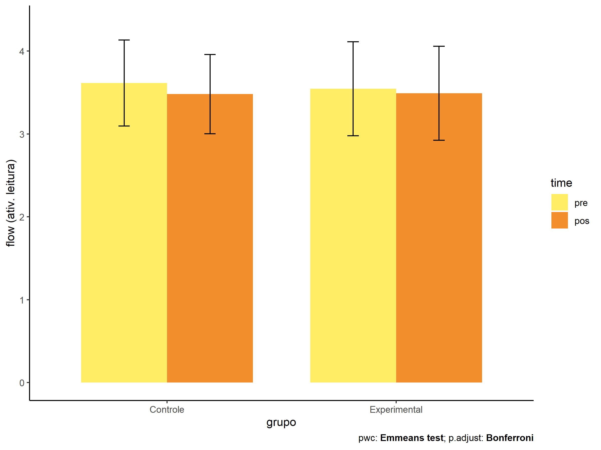<!-- -->

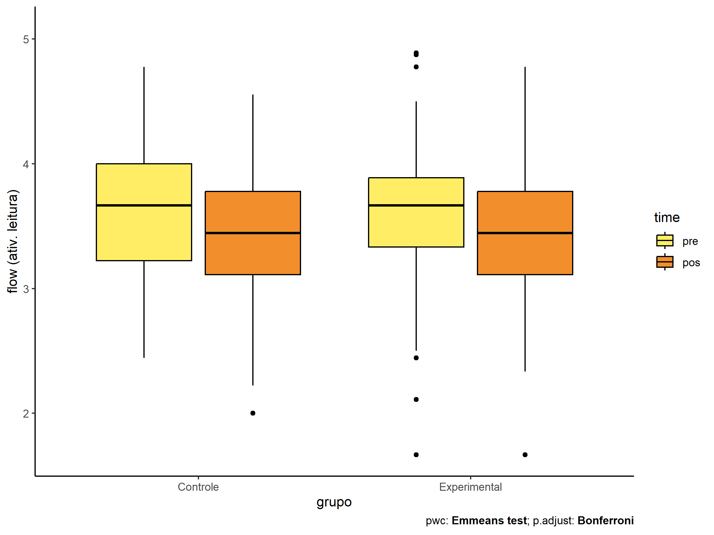<!-- -->

### factor: **genero**

| var         | genero |   n | M (pre) | SE (pre) | M (unadj) | SE (unadj) | M (adj) | SE (adj) |
|:------------|:-------|----:|--------:|---------:|----------:|-----------:|--------:|---------:|
| fss.leitura | F      | 102 |   3.642 |    0.051 |     3.595 |      0.046 |   3.577 |    0.048 |
| fss.leitura | M      | 111 |   3.527 |    0.053 |     3.387 |      0.052 |   3.403 |    0.046 |

| .y.         | group1 | group2 | estimate | conf.low | conf.high |    se | statistic |     p | p.adj | p.adj.signif |
|:------------|:-------|:-------|---------:|---------:|----------:|------:|----------:|------:|------:|:-------------|
| fss.leitura | F      | M      |    0.174 |    0.042 |     0.307 | 0.067 |     2.589 | 0.010 | 0.010 | \*           |
| dfs.leitura | F      | M      |    0.115 |   -0.031 |     0.261 | 0.074 |     1.549 | 0.123 | 0.123 | ns           |

| genero | group1 | group2 | estimate | conf.low | conf.high |    se | statistic |     p | p.adj | p.adj.signif |
|:-------|:-------|:-------|---------:|---------:|----------:|------:|----------:|------:|------:|:-------------|
| F      | pre    | pos    |    0.046 |   -0.099 |     0.192 | 0.074 |     0.629 | 0.529 | 0.529 | ns           |
| M      | pre    | pos    |    0.140 |    0.001 |     0.279 | 0.071 |     1.983 | 0.048 | 0.048 | \*           |

    ## Scale for colour is already present.
    ## Adding another scale for colour, which will replace the existing scale.

<!-- -->

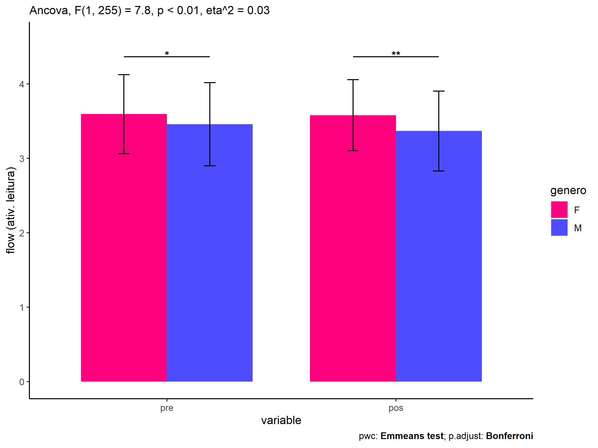<!-- -->

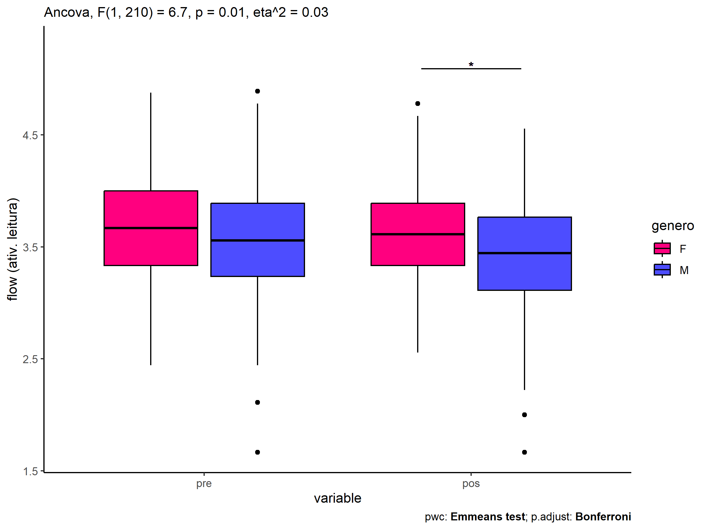<!-- -->

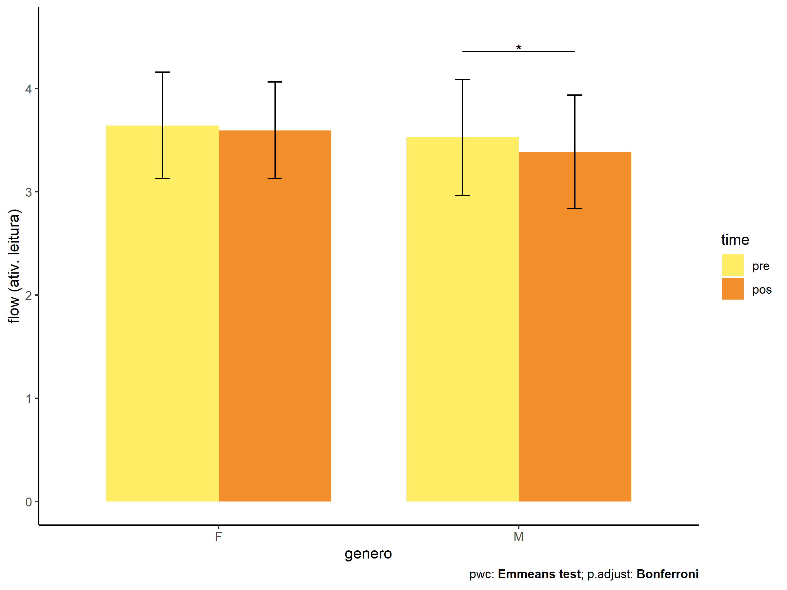<!-- -->

<!-- -->

### factor: **idade**

| var         | idade |   n | M (pre) | SE (pre) | M (unadj) | SE (unadj) | M (adj) | SE (adj) |
|:------------|:------|----:|--------:|---------:|----------:|-----------:|--------:|---------:|
| fss.leitura | 10y   |  42 |   3.509 |    0.086 |     3.465 |      0.080 |   3.495 |    0.076 |
| fss.leitura | 11y   | 123 |   3.652 |    0.044 |     3.546 |      0.047 |   3.529 |    0.044 |
| fss.leitura | 12y   |  28 |   3.566 |    0.122 |     3.446 |      0.102 |   3.457 |    0.093 |
| fss.leitura | 13y   |  10 |   3.450 |    0.177 |     3.010 |      0.147 |   3.059 |    0.155 |

| .y.         | group1 | group2 | estimate | conf.low | conf.high |    se | statistic |     p | p.adj | p.adj.signif |
|:------------|:-------|:-------|---------:|---------:|----------:|------:|----------:|------:|------:|:-------------|
| fss.leitura | 10y    | 11y    |   -0.034 |   -0.208 |     0.140 | 0.088 |    -0.385 | 0.701 | 1.000 | ns           |
| fss.leitura | 10y    | 12y    |    0.038 |   -0.198 |     0.274 | 0.120 |     0.316 | 0.752 | 1.000 | ns           |
| fss.leitura | 10y    | 13y    |    0.436 |    0.096 |     0.776 | 0.173 |     2.526 | 0.012 | 0.074 | ns           |
| fss.leitura | 11y    | 12y    |    0.072 |   -0.131 |     0.275 | 0.103 |     0.698 | 0.486 | 1.000 | ns           |
| fss.leitura | 11y    | 13y    |    0.470 |    0.151 |     0.789 | 0.162 |     2.904 | 0.004 | 0.025 | \*           |
| fss.leitura | 12y    | 13y    |    0.398 |    0.042 |     0.755 | 0.181 |     2.202 | 0.029 | 0.173 | ns           |
| dfs.leitura | 10y    | 11y    |   -0.143 |   -0.329 |     0.042 | 0.094 |    -1.521 | 0.130 | 0.779 | ns           |
| dfs.leitura | 10y    | 12y    |   -0.057 |   -0.311 |     0.196 | 0.128 |    -0.446 | 0.656 | 1.000 | ns           |
| dfs.leitura | 10y    | 13y    |    0.059 |   -0.306 |     0.424 | 0.185 |     0.318 | 0.751 | 1.000 | ns           |
| dfs.leitura | 11y    | 12y    |    0.086 |   -0.132 |     0.303 | 0.110 |     0.778 | 0.437 | 1.000 | ns           |
| dfs.leitura | 11y    | 13y    |    0.202 |   -0.139 |     0.543 | 0.173 |     1.167 | 0.245 | 1.000 | ns           |
| dfs.leitura | 12y    | 13y    |    0.116 |   -0.266 |     0.499 | 0.194 |     0.600 | 0.549 | 1.000 | ns           |

| idade | group1 | group2 | estimate | conf.low | conf.high |    se | statistic |     p | p.adj | p.adj.signif |
|:------|:-------|:-------|---------:|---------:|----------:|------:|----------:|------:|------:|:-------------|
| 10y   | pre    | pos    |    0.044 |   -0.180 |     0.268 | 0.114 |     0.386 | 0.700 | 0.700 | ns           |
| 11y   | pre    | pos    |    0.106 |   -0.025 |     0.237 | 0.067 |     1.595 | 0.112 | 0.112 | ns           |
| 12y   | pre    | pos    |    0.120 |   -0.154 |     0.395 | 0.140 |     0.862 | 0.389 | 0.389 | ns           |
| 13y   | pre    | pos    |    0.440 |   -0.019 |     0.900 | 0.234 |     1.884 | 0.060 | 0.060 | ns           |

    ## Scale for colour is already present.
    ## Adding another scale for colour, which will replace the existing scale.

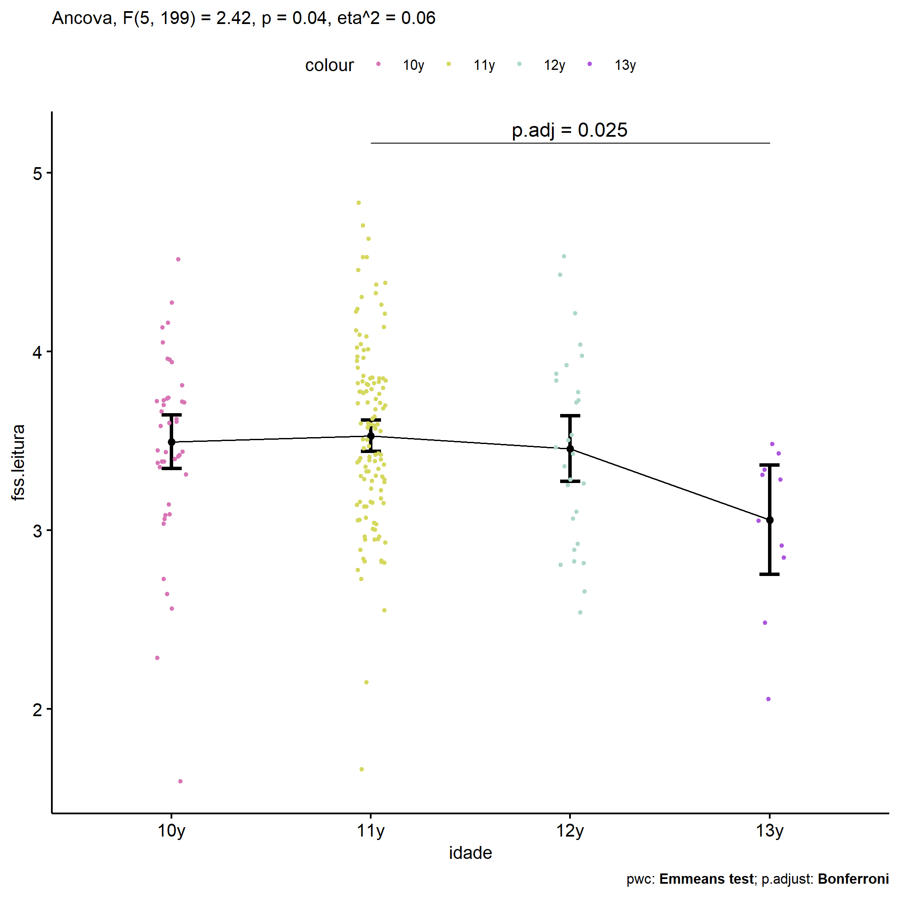<!-- -->

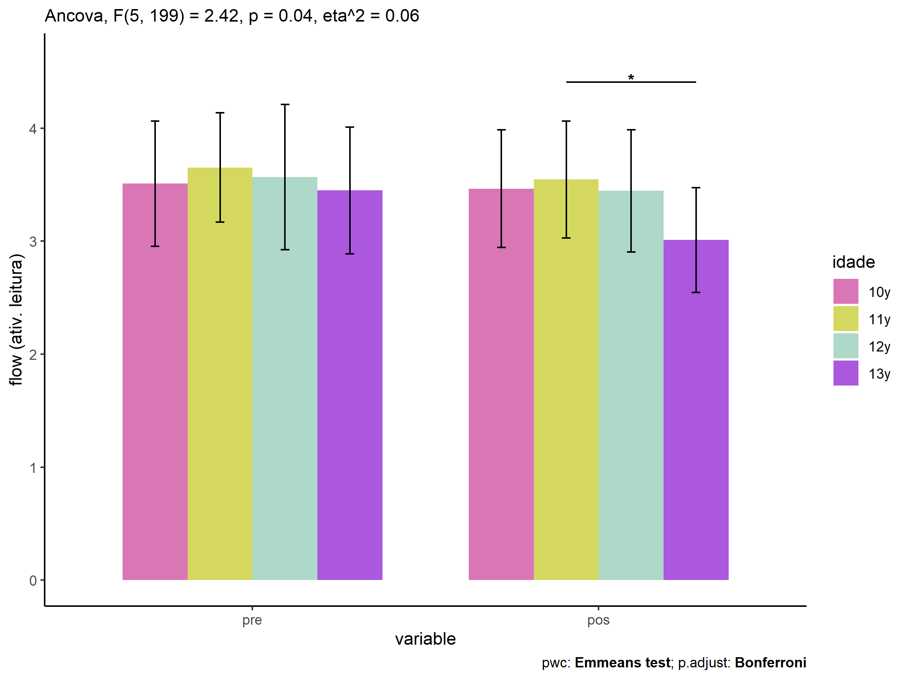<!-- -->

<!-- -->

<!-- -->

<!-- -->

### factor: **zona.participante**

| var         | zona.participante |   n | M (pre) | SE (pre) | M (unadj) | SE (unadj) | M (adj) | SE (adj) |
|:------------|:------------------|----:|--------:|---------:|----------:|-----------:|--------:|---------:|
| fss.leitura | Rural             |  80 |   3.576 |    0.058 |     3.418 |      0.064 |   3.415 |    0.055 |
| fss.leitura | Urbana            |  86 |   3.556 |    0.064 |     3.497 |      0.050 |   3.500 |    0.053 |

| .y.         | group1 | group2 | estimate | conf.low | conf.high |    se | statistic |     p | p.adj | p.adj.signif |
|:------------|:-------|:-------|---------:|---------:|----------:|------:|----------:|------:|------:|:-------------|
| fss.leitura | Urbana | Rural  |    0.085 |   -0.067 |     0.237 | 0.077 |     1.104 | 0.271 | 0.271 | ns           |
| dfs.leitura | Urbana | Rural  |   -0.021 |   -0.193 |     0.152 | 0.087 |    -0.237 | 0.813 | 0.813 | ns           |

| zona.participante | group1 | group2 | estimate | conf.low | conf.high |    se | statistic |     p | p.adj | p.adj.signif |
|:------------------|:-------|:-------|---------:|---------:|----------:|------:|----------:|------:|------:|:-------------|
| Urbana            | pre    | pos    |    0.058 |   -0.104 |     0.220 | 0.082 |     0.707 | 0.480 | 0.480 | ns           |
| Rural             | pre    | pos    |    0.158 |   -0.010 |     0.326 | 0.085 |     1.853 | 0.065 | 0.065 | ns           |

    ## Scale for colour is already present.
    ## Adding another scale for colour, which will replace the existing scale.

<!-- -->

<!-- -->

<!-- -->

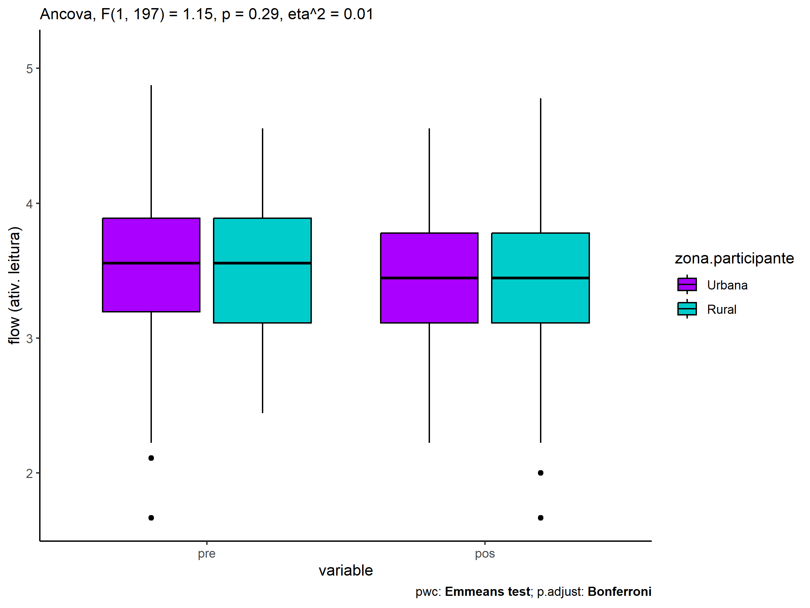<!-- -->

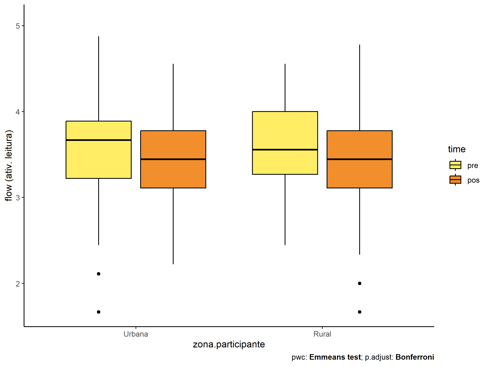<!-- -->

### factor: **escola**

| var         | escola |   n | M (pre) | SE (pre) | M (unadj) | SE (unadj) | M (adj) | SE (adj) |
|:------------|:-------|----:|--------:|---------:|----------:|-----------:|--------:|---------:|
| fss.leitura | E1     |  16 |   3.283 |    0.160 |     3.747 |      0.133 |   3.854 |    0.121 |
| fss.leitura | E2     |  44 |   3.489 |    0.071 |     3.420 |      0.072 |   3.453 |    0.072 |
| fss.leitura | E3     |  30 |   3.732 |    0.094 |     3.263 |      0.099 |   3.209 |    0.088 |
| fss.leitura | E4     |  21 |   3.613 |    0.093 |     3.512 |      0.102 |   3.501 |    0.104 |
| fss.leitura | E5     |  83 |   3.573 |    0.066 |     3.513 |      0.059 |   3.516 |    0.052 |
| fss.leitura | E6     |  19 |   3.816 |    0.085 |     3.632 |      0.114 |   3.548 |    0.111 |

| .y.         | group1 | group2 | estimate | conf.low | conf.high |    se | statistic | p       | p.adj   | p.adj.signif |
|:------------|:-------|:-------|---------:|---------:|----------:|------:|----------:|:--------|:--------|:-------------|
| fss.leitura | E1     | E2     |    0.401 |    0.125 |     0.677 | 0.140 |     2.860 | 0.005   | 0.07    | ns           |
| fss.leitura | E1     | E3     |    0.645 |    0.348 |     0.942 | 0.151 |     4.282 | \<0.001 | \<0.001 | \*\*\*       |
| fss.leitura | E1     | E4     |    0.353 |    0.038 |     0.669 | 0.160 |     2.208 | 0.028   | 0.425   | ns           |
| fss.leitura | E1     | E5     |    0.338 |    0.078 |     0.598 | 0.132 |     2.563 | 0.011   | 0.166   | ns           |
| fss.leitura | E1     | E6     |    0.306 |   -0.020 |     0.633 | 0.166 |     1.848 | 0.066   | 0.99    | ns           |
| fss.leitura | E2     | E3     |    0.244 |    0.019 |     0.469 | 0.114 |     2.138 | 0.034   | 0.506   | ns           |
| fss.leitura | E2     | E4     |   -0.048 |   -0.298 |     0.203 | 0.127 |    -0.375 | 0.708   | 1       | ns           |
| fss.leitura | E2     | E5     |   -0.063 |   -0.239 |     0.113 | 0.089 |    -0.707 | 0.48    | 1       | ns           |
| fss.leitura | E2     | E6     |   -0.095 |   -0.357 |     0.167 | 0.133 |    -0.715 | 0.476   | 1       | ns           |
| fss.leitura | E3     | E4     |   -0.292 |   -0.560 |    -0.023 | 0.136 |    -2.142 | 0.033   | 0.501   | ns           |
| fss.leitura | E3     | E5     |   -0.307 |   -0.509 |    -0.106 | 0.102 |    -3.003 | 0.003   | 0.045   | \*           |
| fss.leitura | E3     | E6     |   -0.339 |   -0.616 |    -0.062 | 0.140 |    -2.417 | 0.017   | 0.248   | ns           |
| fss.leitura | E4     | E5     |   -0.016 |   -0.246 |     0.215 | 0.117 |    -0.133 | 0.894   | 1       | ns           |
| fss.leitura | E4     | E6     |   -0.047 |   -0.347 |     0.252 | 0.152 |    -0.311 | 0.756   | 1       | ns           |
| fss.leitura | E5     | E6     |   -0.032 |   -0.273 |     0.210 | 0.123 |    -0.259 | 0.796   | 1       | ns           |
| dfs.leitura | E1     | E2     |   -0.207 |   -0.513 |     0.100 | 0.156 |    -1.327 | 0.186   | 1       | ns           |
| dfs.leitura | E1     | E3     |   -0.449 |   -0.775 |    -0.124 | 0.165 |    -2.722 | 0.007   | 0.106   | ns           |
| dfs.leitura | E1     | E4     |   -0.331 |   -0.680 |     0.018 | 0.177 |    -1.869 | 0.063   | 0.945   | ns           |
| dfs.leitura | E1     | E5     |   -0.290 |   -0.577 |    -0.003 | 0.146 |    -1.992 | 0.048   | 0.715   | ns           |
| dfs.leitura | E1     | E6     |   -0.533 |   -0.890 |    -0.176 | 0.181 |    -2.947 | 0.004   | 0.054   | ns           |
| dfs.leitura | E2     | E3     |   -0.243 |   -0.492 |     0.006 | 0.126 |    -1.922 | 0.056   | 0.839   | ns           |
| dfs.leitura | E2     | E4     |   -0.124 |   -0.403 |     0.155 | 0.141 |    -0.878 | 0.381   | 1       | ns           |
| dfs.leitura | E2     | E5     |   -0.083 |   -0.279 |     0.113 | 0.099 |    -0.840 | 0.402   | 1       | ns           |
| dfs.leitura | E2     | E6     |   -0.327 |   -0.615 |    -0.038 | 0.146 |    -2.231 | 0.027   | 0.401   | ns           |
| dfs.leitura | E3     | E4     |    0.118 |   -0.181 |     0.418 | 0.152 |     0.781 | 0.436   | 1       | ns           |
| dfs.leitura | E3     | E5     |    0.159 |   -0.065 |     0.383 | 0.114 |     1.402 | 0.162   | 1       | ns           |
| dfs.leitura | E3     | E6     |   -0.084 |   -0.392 |     0.224 | 0.156 |    -0.536 | 0.592   | 1       | ns           |
| dfs.leitura | E4     | E5     |    0.041 |   -0.216 |     0.297 | 0.130 |     0.313 | 0.755   | 1       | ns           |
| dfs.leitura | E4     | E6     |   -0.202 |   -0.535 |     0.130 | 0.169 |    -1.199 | 0.232   | 1       | ns           |
| dfs.leitura | E5     | E6     |   -0.243 |   -0.510 |     0.024 | 0.136 |    -1.793 | 0.075   | 1       | ns           |

| escola | group1 | group2 | estimate | conf.low | conf.high |    se | statistic | p       | p.adj   | p.adj.signif |
|:-------|:-------|:-------|---------:|---------:|----------:|------:|----------:|:--------|:--------|:-------------|
| E1     | pre    | pos    |   -0.464 |   -0.828 |    -0.100 | 0.185 |    -2.508 | 0.013   | 0.013   | \*           |
| E2     | pre    | pos    |    0.069 |   -0.150 |     0.289 | 0.112 |     0.622 | 0.534   | 0.534   | ns           |
| E3     | pre    | pos    |    0.469 |    0.204 |     0.735 | 0.135 |     3.473 | \<0.001 | \<0.001 | \*\*\*       |
| E4     | pre    | pos    |    0.102 |   -0.216 |     0.419 | 0.162 |     0.629 | 0.53    | 0.53    | ns           |
| E5     | pre    | pos    |    0.060 |   -0.100 |     0.220 | 0.081 |     0.737 | 0.462   | 0.462   | ns           |
| E6     | pre    | pos    |    0.184 |   -0.150 |     0.518 | 0.170 |     1.085 | 0.279   | 0.279   | ns           |

    ## Scale for colour is already present.
    ## Adding another scale for colour, which will replace the existing scale.

<!-- -->

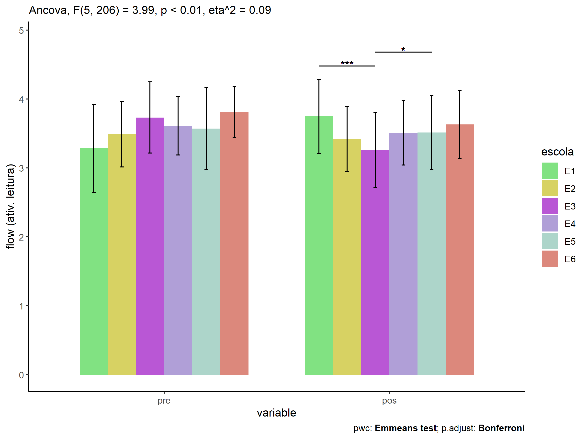<!-- -->

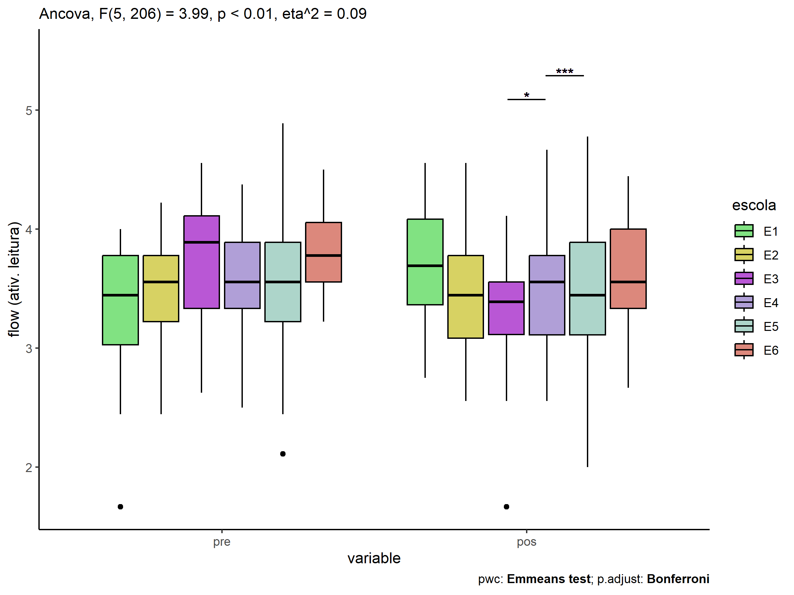<!-- -->

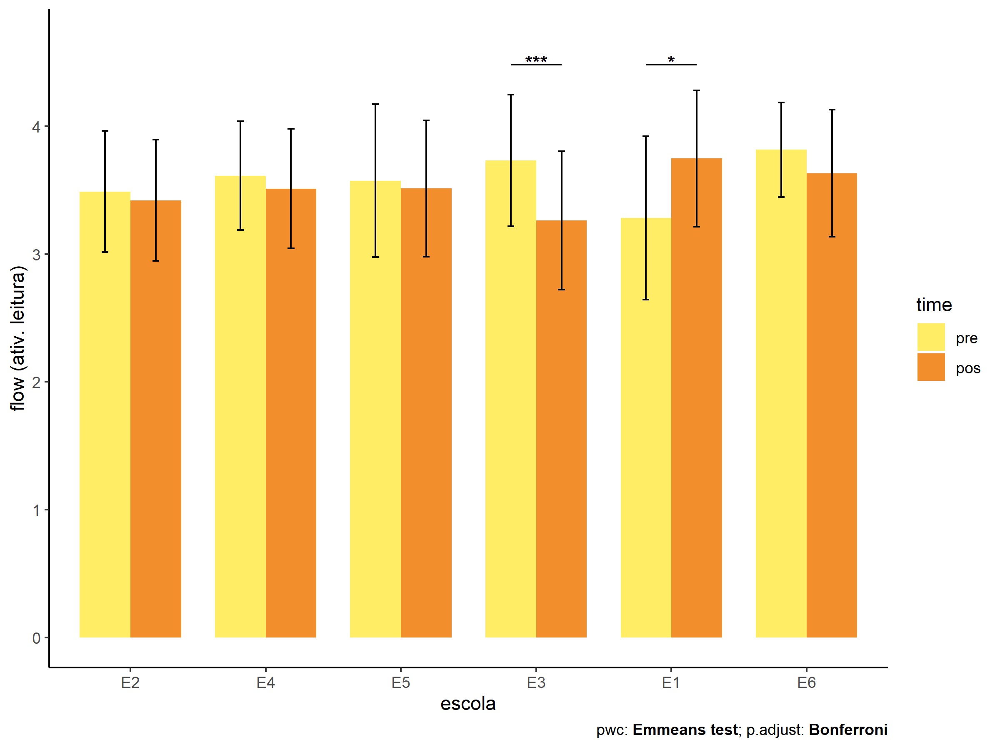<!-- -->

<!-- -->

### factor: **zona.escola**

| var         | zona.escola |   n | M (pre) | SE (pre) | M (unadj) | SE (unadj) | M (adj) | SE (adj) |
|:------------|:------------|----:|--------:|---------:|----------:|-----------:|--------:|---------:|
| fss.leitura | Rural       |  70 |   3.719 |    0.054 |     3.438 |      0.063 |   3.391 |    0.059 |
| fss.leitura | Urbana      | 143 |   3.515 |    0.048 |     3.510 |      0.044 |   3.533 |    0.041 |

| .y.         | group1 | group2 | estimate | conf.low | conf.high |    se | statistic |     p | p.adj | p.adj.signif |
|:------------|:-------|:-------|---------:|---------:|----------:|------:|----------:|------:|------:|:-------------|
| fss.leitura | Urbana | Rural  |    0.142 |   -0.002 |     0.286 | 0.073 |     1.949 | 0.053 | 0.053 | ns           |
| dfs.leitura | Urbana | Rural  |   -0.205 |   -0.358 |    -0.051 | 0.078 |    -2.620 | 0.009 | 0.009 | \*\*         |

| zona.escola | group1 | group2 | estimate | conf.low | conf.high |    se | statistic |     p | p.adj | p.adj.signif |
|:------------|:-------|:-------|---------:|---------:|----------:|------:|----------:|------:|------:|:-------------|
| Urbana      | pre    | pos    |    0.004 |   -0.119 |     0.127 | 0.063 |     0.067 | 0.947 | 0.947 | ns           |
| Rural       | pre    | pos    |    0.282 |    0.106 |     0.457 | 0.089 |     3.150 | 0.002 | 0.002 | \*\*         |

    ## Scale for colour is already present.
    ## Adding another scale for colour, which will replace the existing scale.

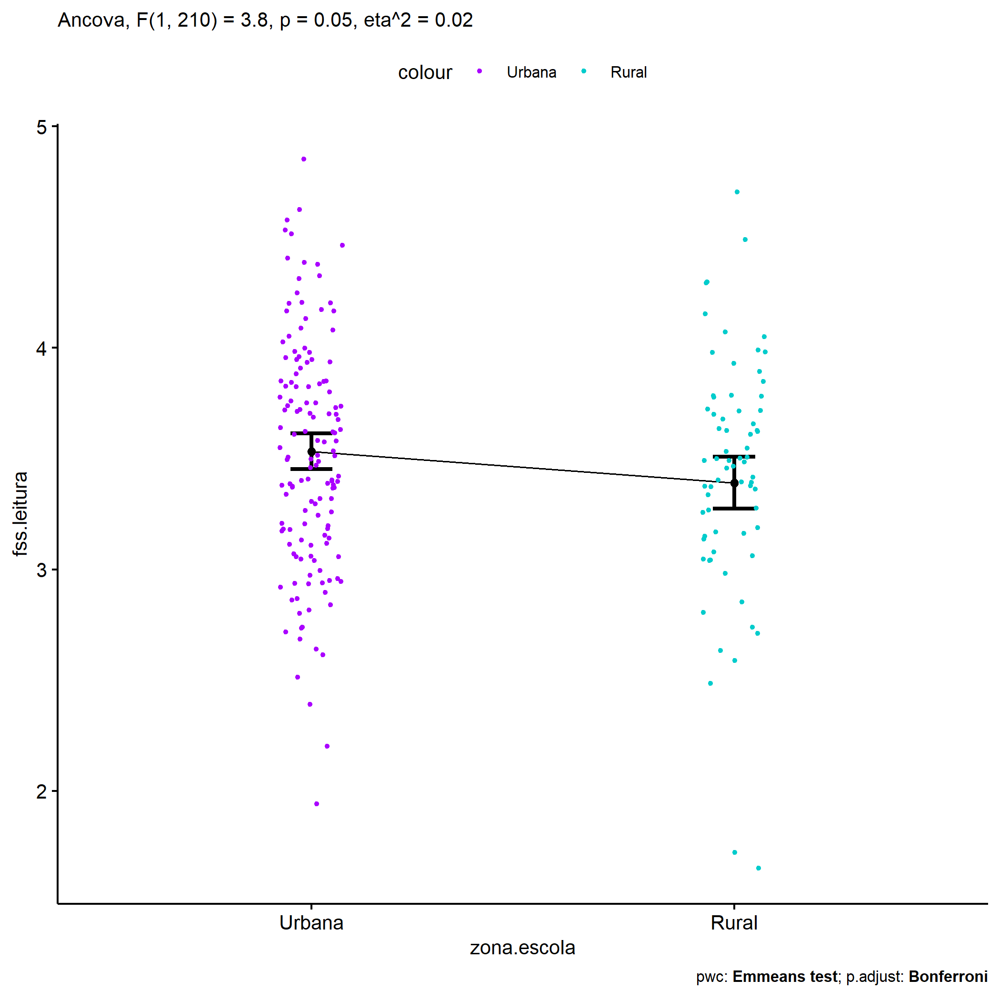<!-- -->

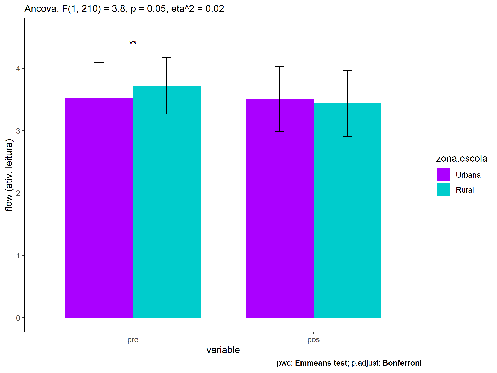<!-- -->

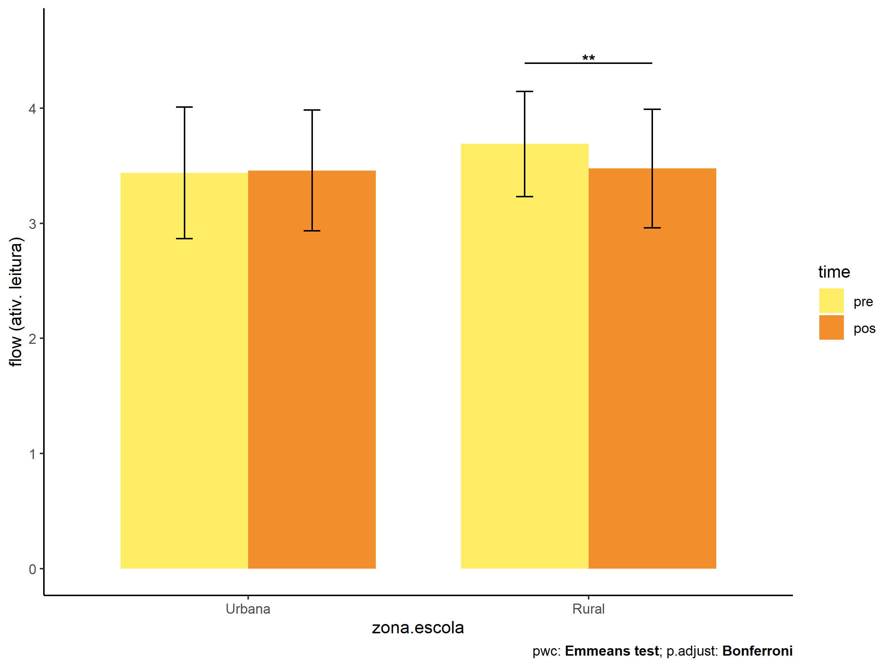<!-- -->

<!-- -->

<!-- -->

## Pairwise comparisons for two factors

### factores: **grupo:genero**

| var         | grupo        | genero |   n | M (pre) | SE (pre) | M (unadj) | SE (unadj) | M (adj) | SE (adj) |
|:------------|:-------------|:-------|----:|--------:|---------:|----------:|-----------:|--------:|---------:|
| fss.leitura | Controle     | F      |  53 |   3.634 |    0.075 |     3.516 |      0.057 |   3.501 |    0.067 |
| fss.leitura | Controle     | M      |  55 |   3.597 |    0.067 |     3.448 |      0.072 |   3.443 |    0.066 |
| fss.leitura | Experimental | F      |  49 |   3.650 |    0.070 |     3.681 |      0.073 |   3.661 |    0.070 |
| fss.leitura | Experimental | M      |  56 |   3.458 |    0.083 |     3.326 |      0.075 |   3.363 |    0.065 |

| grupo        | genero | group1   | group2       | estimate | conf.low | conf.high |    se | statistic |     p | p.adj | p.adj.signif |
|:-------------|:-------|:---------|:-------------|---------:|---------:|----------:|------:|----------:|------:|------:|:-------------|
|              | F      | Controle | Experimental |   -0.160 |   -0.350 |     0.030 | 0.096 |    -1.659 | 0.099 | 0.099 | ns           |
|              | M      | Controle | Experimental |    0.081 |   -0.102 |     0.264 | 0.093 |     0.872 | 0.384 | 0.384 | ns           |
|              | F      | Controle | Experimental |   -0.016 |   -0.228 |     0.195 | 0.107 |    -0.153 | 0.878 | 0.878 | ns           |
|              | M      | Controle | Experimental |    0.140 |   -0.063 |     0.342 | 0.103 |     1.362 | 0.175 | 0.175 | ns           |
| Controle     |        | F        | M            |    0.057 |   -0.127 |     0.242 | 0.094 |     0.613 | 0.540 | 0.540 | ns           |
| Experimental |        | F        | M            |    0.298 |    0.109 |     0.487 | 0.096 |     3.110 | 0.002 | 0.002 | \*\*         |
| Controle     |        | F        | M            |    0.036 |   -0.169 |     0.242 | 0.104 |     0.350 | 0.727 | 0.727 | ns           |
| Experimental |        | F        | M            |    0.193 |   -0.016 |     0.401 | 0.106 |     1.821 | 0.070 | 0.070 | ns           |

| grupo        | genero | group1 | group2 | estimate | conf.low | conf.high |    se | statistic |     p | p.adj | p.adj.signif |
|:-------------|:-------|:-------|:-------|---------:|---------:|----------:|------:|----------:|------:|------:|:-------------|
| Controle     | F      | pre    | pos    |    0.118 |   -0.083 |     0.319 | 0.102 |     1.152 | 0.250 | 0.250 | ns           |
| Controle     | M      | pre    | pos    |    0.149 |   -0.048 |     0.347 | 0.100 |     1.490 | 0.137 | 0.137 | ns           |
| Experimental | F      | pre    | pos    |   -0.031 |   -0.239 |     0.178 | 0.106 |    -0.288 | 0.773 | 0.773 | ns           |
| Experimental | M      | pre    | pos    |    0.131 |   -0.064 |     0.327 | 0.099 |     1.322 | 0.187 | 0.187 | ns           |

    ## Scale for colour is already present.
    ## Adding another scale for colour, which will replace the existing scale.

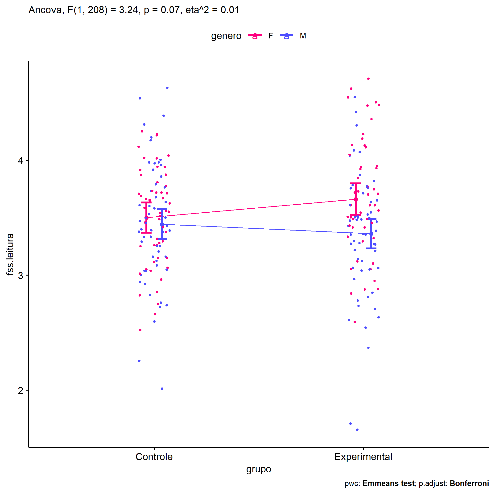<!-- -->

    ## Scale for colour is already present.
    ## Adding another scale for colour, which will replace the existing scale.

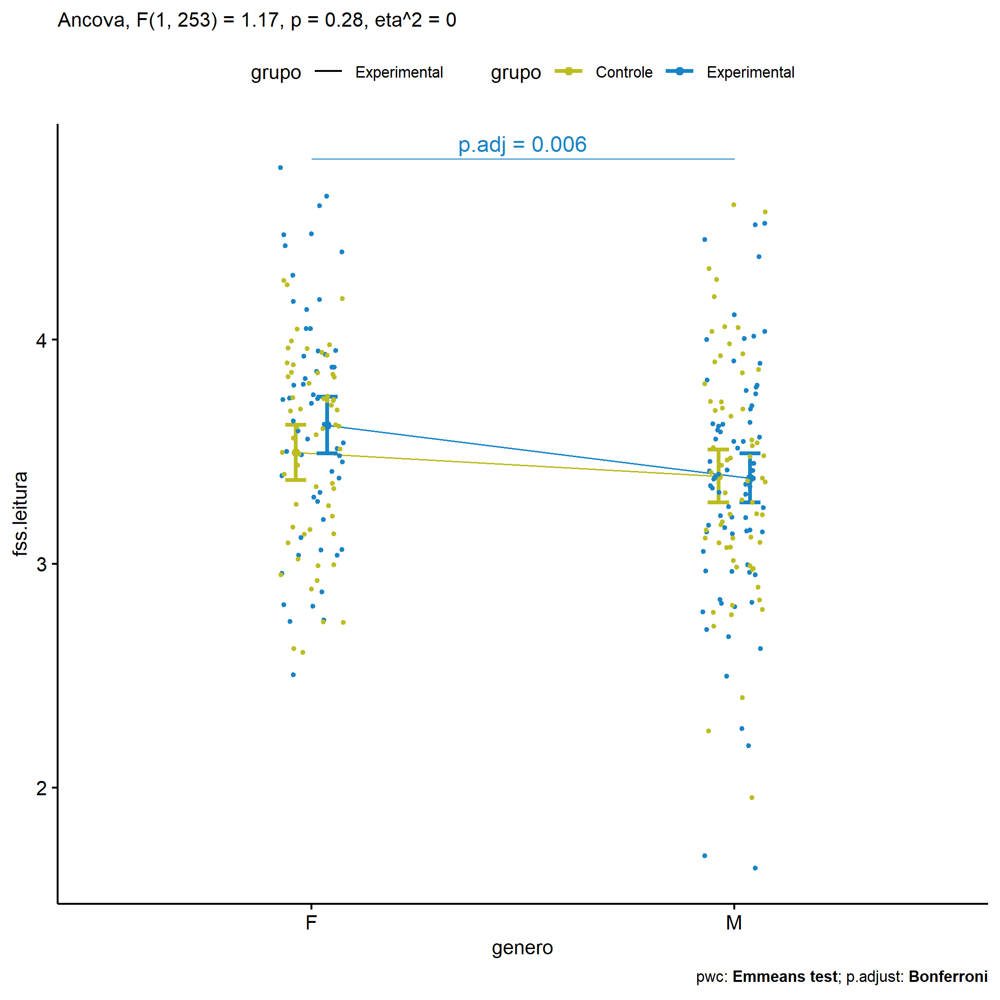<!-- -->

<!-- -->

<!-- -->

<!-- -->

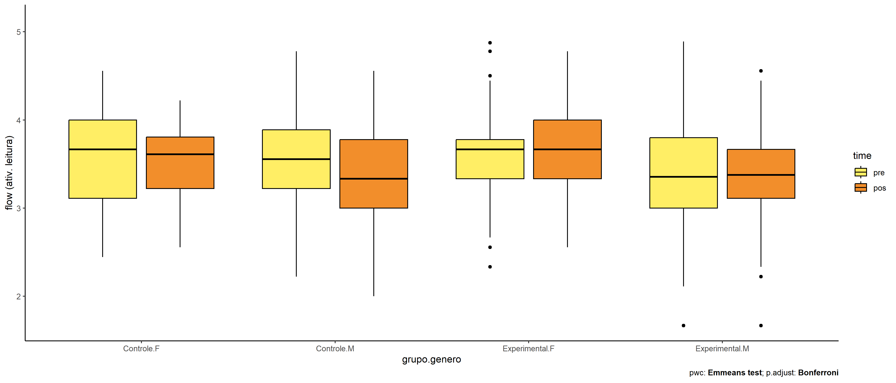<!-- -->

### factores: **grupo:idade**

| var         | grupo        | idade |   n | M (pre) | SE (pre) | M (unadj) | SE (unadj) | M (adj) | SE (adj) |
|:------------|:-------------|:------|----:|--------:|---------:|----------:|-----------:|--------:|---------:|
| fss.leitura | Controle     | 10y   |  20 |   3.628 |    0.103 |     3.549 |      0.086 |   3.542 |    0.111 |
| fss.leitura | Controle     | 11y   |  58 |   3.676 |    0.065 |     3.507 |      0.058 |   3.484 |    0.065 |
| fss.leitura | Controle     | 12y   |  16 |   3.556 |    0.156 |     3.491 |      0.157 |   3.508 |    0.124 |
| fss.leitura | Controle     | 13y   |   6 |   3.556 |    0.240 |     3.019 |      0.228 |   3.035 |    0.202 |
| fss.leitura | Experimental | 10y   |  22 |   3.401 |    0.132 |     3.389 |      0.132 |   3.456 |    0.107 |
| fss.leitura | Experimental | 11y   |  65 |   3.630 |    0.059 |     3.581 |      0.072 |   3.573 |    0.061 |
| fss.leitura | Experimental | 12y   |  12 |   3.580 |    0.201 |     3.385 |      0.120 |   3.394 |    0.143 |

|     | grupo        | idade | group1   | group2       | estimate | conf.low | conf.high |    se | statistic |     p | p.adj | p.adj.signif |
|:----|:-------------|:------|:---------|:-------------|---------:|---------:|----------:|------:|----------:|------:|------:|:-------------|
| 1   |              | 10y   | Controle | Experimental |    0.085 |   -0.218 |     0.389 | 0.154 |     0.555 | 0.580 | 0.580 | ns           |
| 2   |              | 11y   | Controle | Experimental |   -0.089 |   -0.266 |     0.088 | 0.090 |    -0.995 | 0.321 | 0.321 | ns           |
| 3   |              | 12y   | Controle | Experimental |    0.114 |   -0.260 |     0.487 | 0.189 |     0.601 | 0.549 | 0.549 | ns           |
| 5   |              | 10y   | Controle | Experimental |    0.227 |   -0.095 |     0.548 | 0.163 |     1.392 | 0.165 | 0.165 | ns           |
| 6   |              | 11y   | Controle | Experimental |    0.046 |   -0.142 |     0.234 | 0.095 |     0.479 | 0.632 | 0.632 | ns           |
| 7   |              | 12y   | Controle | Experimental |   -0.024 |   -0.421 |     0.374 | 0.201 |    -0.118 | 0.906 | 0.906 | ns           |
| 9   | Controle     |       | 10y      | 11y          |    0.058 |   -0.196 |     0.311 | 0.129 |     0.450 | 0.653 | 1.000 | ns           |
| 10  | Controle     |       | 10y      | 12y          |    0.034 |   -0.294 |     0.362 | 0.166 |     0.203 | 0.839 | 1.000 | ns           |
| 11  | Controle     |       | 10y      | 13y          |    0.506 |    0.051 |     0.962 | 0.231 |     2.195 | 0.029 | 0.176 | ns           |
| 12  | Controle     |       | 11y      | 12y          |   -0.024 |   -0.301 |     0.252 | 0.140 |    -0.172 | 0.864 | 1.000 | ns           |
| 13  | Controle     |       | 11y      | 13y          |    0.449 |    0.029 |     0.868 | 0.213 |     2.109 | 0.036 | 0.218 | ns           |
| 14  | Controle     |       | 12y      | 13y          |    0.473 |    0.005 |     0.941 | 0.237 |     1.992 | 0.048 | 0.287 | ns           |
| 15  | Experimental |       | 10y      | 11y          |   -0.117 |   -0.360 |     0.126 | 0.123 |    -0.947 | 0.345 | 1.000 | ns           |
| 16  | Experimental |       | 10y      | 12y          |    0.062 |   -0.290 |     0.414 | 0.178 |     0.348 | 0.728 | 1.000 | ns           |
| 18  | Experimental |       | 11y      | 12y          |    0.179 |   -0.128 |     0.486 | 0.156 |     1.148 | 0.253 | 0.758 | ns           |
| 21  | Controle     |       | 10y      | 11y          |   -0.048 |   -0.318 |     0.221 | 0.137 |    -0.354 | 0.724 | 1.000 | ns           |
| 22  | Controle     |       | 10y      | 12y          |    0.072 |   -0.277 |     0.421 | 0.177 |     0.405 | 0.686 | 1.000 | ns           |
| 23  | Controle     |       | 10y      | 13y          |    0.072 |   -0.412 |     0.557 | 0.246 |     0.294 | 0.769 | 1.000 | ns           |
| 24  | Controle     |       | 11y      | 12y          |    0.120 |   -0.174 |     0.414 | 0.149 |     0.806 | 0.421 | 1.000 | ns           |
| 25  | Controle     |       | 11y      | 13y          |    0.121 |   -0.326 |     0.567 | 0.226 |     0.533 | 0.595 | 1.000 | ns           |
| 26  | Controle     |       | 12y      | 13y          |    0.000 |   -0.498 |     0.499 | 0.253 |     0.002 | 0.998 | 1.000 | ns           |
| 27  | Experimental |       | 10y      | 11y          |   -0.230 |   -0.486 |     0.027 | 0.130 |    -1.765 | 0.079 | 0.238 | ns           |
| 28  | Experimental |       | 10y      | 12y          |   -0.179 |   -0.552 |     0.194 | 0.189 |    -0.945 | 0.346 | 1.000 | ns           |
| 30  | Experimental |       | 11y      | 12y          |    0.051 |   -0.276 |     0.378 | 0.166 |     0.306 | 0.760 | 1.000 | ns           |

| grupo        | idade | group1 | group2 | estimate | conf.low | conf.high |    se | statistic |     p | p.adj | p.adj.signif |
|:-------------|:------|:-------|:-------|---------:|---------:|----------:|------:|----------:|------:|------:|:-------------|
| Controle     | 10y   | pre    | pos    |    0.079 |   -0.248 |     0.406 | 0.166 |     0.476 | 0.634 | 0.634 | ns           |
| Controle     | 11y   | pre    | pos    |    0.170 |   -0.022 |     0.362 | 0.098 |     1.738 | 0.083 | 0.083 | ns           |
| Controle     | 12y   | pre    | pos    |    0.065 |   -0.301 |     0.430 | 0.186 |     0.348 | 0.728 | 0.728 | ns           |
| Controle     | 13y   | pre    | pos    |    0.537 |   -0.060 |     1.134 | 0.303 |     1.770 | 0.078 | 0.078 | ns           |
| Experimental | 10y   | pre    | pos    |    0.012 |   -0.300 |     0.324 | 0.158 |     0.076 | 0.940 | 0.940 | ns           |
| Experimental | 11y   | pre    | pos    |    0.050 |   -0.132 |     0.231 | 0.092 |     0.539 | 0.590 | 0.590 | ns           |
| Experimental | 12y   | pre    | pos    |    0.194 |   -0.227 |     0.616 | 0.215 |     0.906 | 0.365 | 0.365 | ns           |

    ## Scale for colour is already present.
    ## Adding another scale for colour, which will replace the existing scale.

<!-- -->

<!-- -->

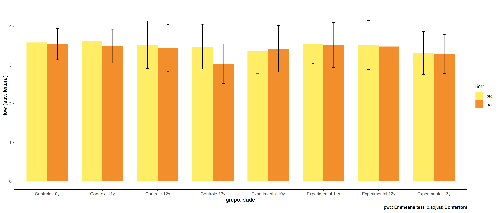<!-- -->

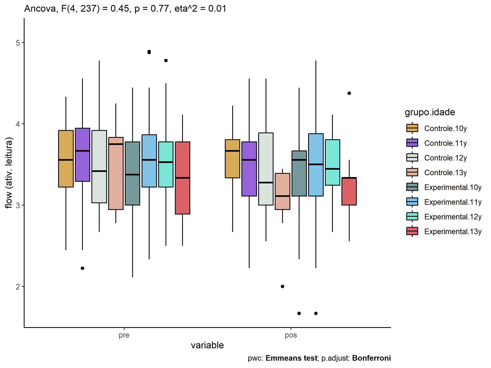<!-- -->

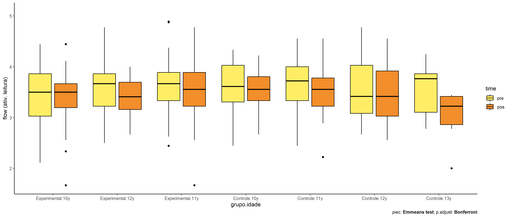<!-- -->

### factores: **grupo:zona.participante**

| var         | grupo        | zona.participante |   n | M (pre) | SE (pre) | M (unadj) | SE (unadj) | M (adj) | SE (adj) |
|:------------|:-------------|:------------------|----:|--------:|---------:|----------:|-----------:|--------:|---------:|
| fss.leitura | Controle     | Rural             |  40 |   3.576 |    0.087 |     3.400 |      0.072 |   3.397 |    0.079 |
| fss.leitura | Controle     | Urbana            |  44 |   3.644 |    0.077 |     3.500 |      0.071 |   3.478 |    0.075 |
| fss.leitura | Experimental | Rural             |  40 |   3.577 |    0.079 |     3.436 |      0.107 |   3.433 |    0.079 |
| fss.leitura | Experimental | Urbana            |  42 |   3.463 |    0.103 |     3.495 |      0.070 |   3.523 |    0.077 |

| grupo        | zona.participante | group1   | group2       | estimate | conf.low | conf.high |    se | statistic |     p | p.adj | p.adj.signif |
|:-------------|:------------------|:---------|:-------------|---------:|---------:|----------:|------:|----------:|------:|------:|:-------------|
|              | Urbana            | Controle | Experimental |   -0.045 |   -0.259 |     0.169 | 0.108 |    -0.416 | 0.678 | 0.678 | ns           |
|              | Rural             | Controle | Experimental |   -0.036 |   -0.256 |     0.184 | 0.112 |    -0.325 | 0.746 | 0.746 | ns           |
|              | Urbana            | Controle | Experimental |    0.181 |   -0.058 |     0.420 | 0.121 |     1.494 | 0.137 | 0.137 | ns           |
|              | Rural             | Controle | Experimental |   -0.001 |   -0.249 |     0.247 | 0.126 |    -0.006 | 0.995 | 0.995 | ns           |
| Controle     |                   | Urbana   | Rural        |    0.081 |   -0.134 |     0.297 | 0.109 |     0.746 | 0.457 | 0.457 | ns           |
| Experimental |                   | Urbana   | Rural        |    0.090 |   -0.128 |     0.308 | 0.110 |     0.816 | 0.416 | 0.416 | ns           |
| Controle     |                   | Urbana   | Rural        |    0.068 |   -0.174 |     0.310 | 0.123 |     0.555 | 0.580 | 0.580 | ns           |
| Experimental |                   | Urbana   | Rural        |   -0.114 |   -0.359 |     0.131 | 0.124 |    -0.916 | 0.361 | 0.361 | ns           |

| grupo        | zona.participante | group1 | group2 | estimate | conf.low | conf.high |    se | statistic |     p | p.adj | p.adj.signif |
|:-------------|:------------------|:-------|:-------|---------:|---------:|----------:|------:|----------:|------:|------:|:-------------|
| Controle     | Urbana            | pre    | pos    |    0.144 |   -0.083 |     0.371 | 0.115 |     1.248 | 0.213 | 0.213 | ns           |
| Controle     | Rural             | pre    | pos    |    0.176 |   -0.062 |     0.415 | 0.121 |     1.455 | 0.147 | 0.147 | ns           |
| Experimental | Urbana            | pre    | pos    |   -0.032 |   -0.264 |     0.201 | 0.118 |    -0.269 | 0.788 | 0.788 | ns           |
| Experimental | Rural             | pre    | pos    |    0.141 |   -0.098 |     0.379 | 0.121 |     1.160 | 0.247 | 0.247 | ns           |

    ## Scale for colour is already present.
    ## Adding another scale for colour, which will replace the existing scale.

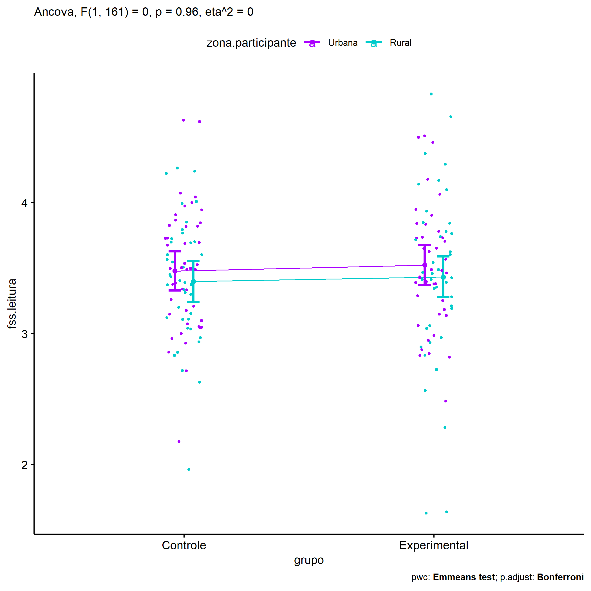<!-- -->

    ## Scale for colour is already present.
    ## Adding another scale for colour, which will replace the existing scale.

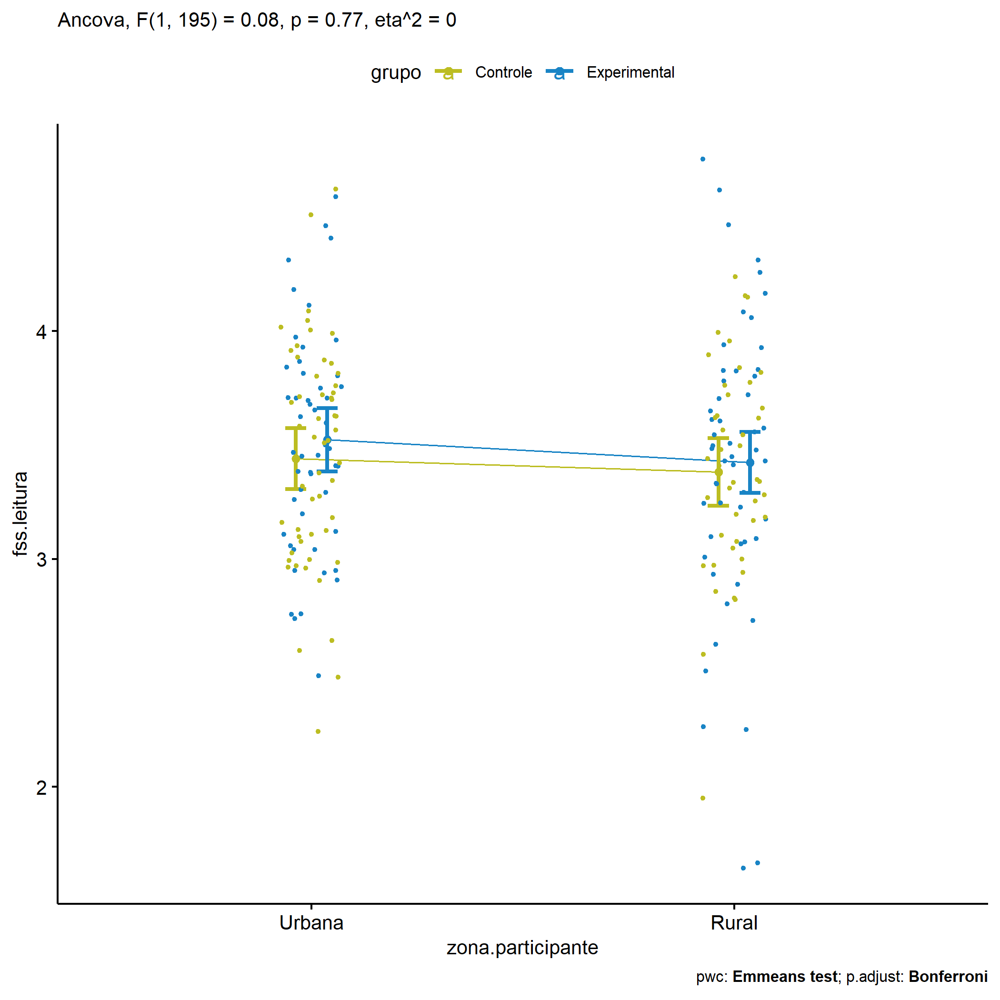<!-- -->

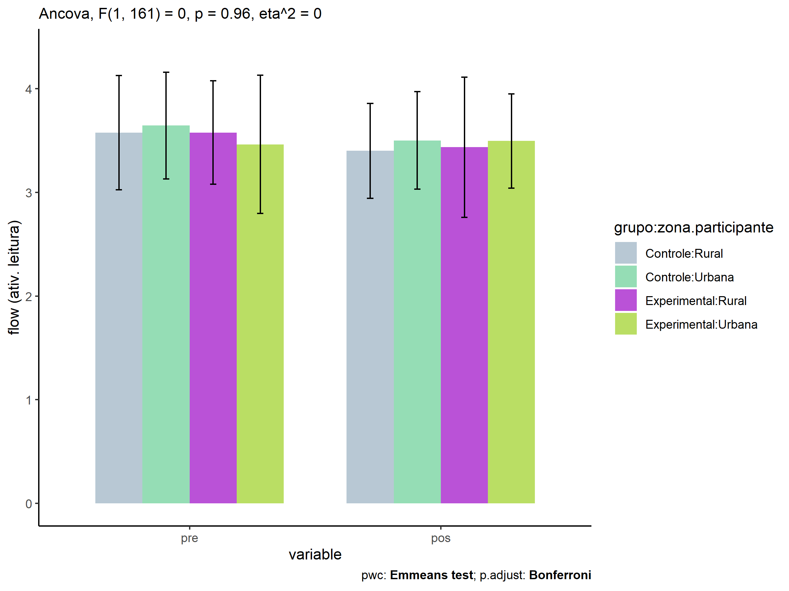<!-- -->

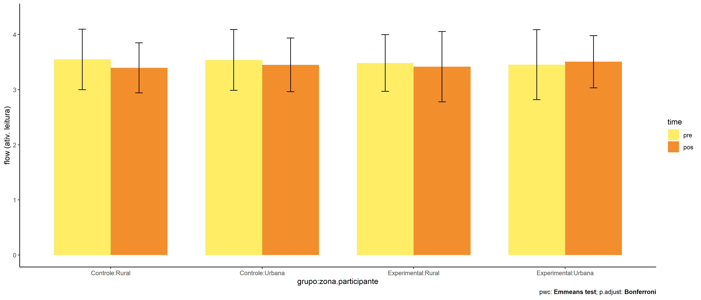<!-- -->

<!-- -->

<!-- -->

### factores: **grupo:escola**

| var         | grupo        | escola |   n | M (pre) | SE (pre) | M (unadj) | SE (unadj) | M (adj) | SE (adj) |
|:------------|:-------------|:-------|----:|--------:|---------:|----------:|-----------:|--------:|---------:|
| fss.leitura | Controle     | E1     |   6 |   3.296 |    0.174 |     3.767 |      0.197 |   3.869 |    0.197 |
| fss.leitura | Controle     | E2     |  22 |   3.587 |    0.098 |     3.456 |      0.114 |   3.455 |    0.102 |
| fss.leitura | Controle     | E3     |  15 |   3.763 |    0.135 |     3.419 |      0.066 |   3.355 |    0.124 |
| fss.leitura | Controle     | E4     |  15 |   3.608 |    0.081 |     3.457 |      0.110 |   3.448 |    0.124 |
| fss.leitura | Controle     | E5     |  41 |   3.571 |    0.097 |     3.467 |      0.084 |   3.471 |    0.075 |
| fss.leitura | Controle     | E6     |   9 |   3.864 |    0.131 |     3.559 |      0.152 |   3.458 |    0.161 |
| fss.leitura | Experimental | E1     |  10 |   3.275 |    0.240 |     3.735 |      0.185 |   3.844 |    0.153 |
| fss.leitura | Experimental | E2     |  22 |   3.391 |    0.102 |     3.383 |      0.089 |   3.451 |    0.103 |
| fss.leitura | Experimental | E3     |  15 |   3.701 |    0.136 |     3.106 |      0.181 |   3.063 |    0.124 |
| fss.leitura | Experimental | E4     |   6 |   3.627 |    0.271 |     3.648 |      0.237 |   3.632 |    0.196 |
| fss.leitura | Experimental | E5     |  42 |   3.574 |    0.090 |     3.557 |      0.082 |   3.560 |    0.074 |
| fss.leitura | Experimental | E6     |  10 |   3.772 |    0.115 |     3.697 |      0.172 |   3.629 |    0.152 |

| grupo        | escola | group1   | group2       | estimate | conf.low | conf.high |    se | statistic | p       | p.adj | p.adj.signif |
|:-------------|:-------|:---------|:-------------|---------:|---------:|----------:|------:|----------:|:--------|------:|:-------------|
|              | E1     | Controle | Experimental |    0.025 |   -0.464 |     0.513 | 0.248 |     0.100 | 0.921   | 0.921 | ns           |
|              | E2     | Controle | Experimental |    0.004 |   -0.283 |     0.290 | 0.145 |     0.024 | 0.981   | 0.981 | ns           |
|              | E3     | Controle | Experimental |    0.292 |   -0.054 |     0.637 | 0.175 |     1.666 | 0.097   | 0.097 | ns           |
|              | E4     | Controle | Experimental |   -0.184 |   -0.641 |     0.273 | 0.232 |    -0.793 | 0.428   | 0.428 | ns           |
|              | E5     | Controle | Experimental |   -0.089 |   -0.296 |     0.119 | 0.105 |    -0.841 | 0.402   | 0.402 | ns           |
|              | E6     | Controle | Experimental |   -0.171 |   -0.606 |     0.263 | 0.220 |    -0.777 | 0.438   | 0.438 | ns           |
|              | E1     | Controle | Experimental |    0.022 |   -0.527 |     0.570 | 0.278 |     0.078 | 0.938   | 0.938 | ns           |
|              | E2     | Controle | Experimental |    0.196 |   -0.125 |     0.516 | 0.162 |     1.205 | 0.23    | 0.230 | ns           |
|              | E3     | Controle | Experimental |    0.062 |   -0.326 |     0.450 | 0.197 |     0.315 | 0.753   | 0.753 | ns           |
|              | E4     | Controle | Experimental |   -0.019 |   -0.533 |     0.494 | 0.260 |    -0.074 | 0.941   | 0.941 | ns           |
|              | E5     | Controle | Experimental |   -0.003 |   -0.237 |     0.230 | 0.118 |    -0.028 | 0.977   | 0.977 | ns           |
|              | E6     | Controle | Experimental |    0.092 |   -0.396 |     0.580 | 0.248 |     0.372 | 0.711   | 0.711 | ns           |
| Controle     |        | E1       | E2           |    0.414 |   -0.023 |     0.851 | 0.222 |     1.869 | 0.063   | 0.945 | ns           |
| Controle     |        | E1       | E3           |    0.514 |    0.053 |     0.975 | 0.234 |     2.201 | 0.029   | 0.433 | ns           |
| Controle     |        | E1       | E4           |    0.421 |   -0.038 |     0.879 | 0.233 |     1.810 | 0.072   | 1.000 | ns           |
| Controle     |        | E1       | E5           |    0.398 |   -0.017 |     0.812 | 0.210 |     1.890 | 0.06    | 0.903 | ns           |
| Controle     |        | E1       | E6           |    0.411 |   -0.093 |     0.914 | 0.255 |     1.609 | 0.109   | 1.000 | ns           |
| Controle     |        | E2       | E3           |    0.100 |   -0.218 |     0.417 | 0.161 |     0.619 | 0.537   | 1.000 | ns           |
| Controle     |        | E2       | E4           |    0.006 |   -0.310 |     0.323 | 0.161 |     0.040 | 0.968   | 1.000 | ns           |
| Controle     |        | E2       | E5           |   -0.017 |   -0.267 |     0.233 | 0.127 |    -0.132 | 0.895   | 1.000 | ns           |
| Controle     |        | E2       | E6           |   -0.003 |   -0.379 |     0.372 | 0.191 |    -0.018 | 0.985   | 1.000 | ns           |
| Controle     |        | E3       | E4           |   -0.093 |   -0.439 |     0.253 | 0.175 |    -0.531 | 0.596   | 1.000 | ns           |
| Controle     |        | E3       | E5           |   -0.116 |   -0.403 |     0.170 | 0.145 |    -0.802 | 0.424   | 1.000 | ns           |
| Controle     |        | E3       | E6           |   -0.103 |   -0.502 |     0.296 | 0.202 |    -0.510 | 0.611   | 1.000 | ns           |
| Controle     |        | E4       | E5           |   -0.023 |   -0.309 |     0.262 | 0.145 |    -0.160 | 0.873   | 1.000 | ns           |
| Controle     |        | E4       | E6           |   -0.010 |   -0.410 |     0.390 | 0.203 |    -0.049 | 0.961   | 1.000 | ns           |
| Controle     |        | E5       | E6           |    0.013 |   -0.337 |     0.363 | 0.178 |     0.075 | 0.94    | 1.000 | ns           |
| Experimental |        | E1       | E2           |    0.393 |    0.032 |     0.754 | 0.183 |     2.147 | 0.033   | 0.495 | ns           |
| Experimental |        | E1       | E3           |    0.781 |    0.391 |     1.171 | 0.198 |     3.952 | \<0.001 | 0.002 | \*\*         |
| Experimental |        | E1       | E4           |    0.212 |   -0.278 |     0.703 | 0.249 |     0.853 | 0.394   | 1.000 | ns           |
| Experimental |        | E1       | E5           |    0.284 |   -0.051 |     0.619 | 0.170 |     1.674 | 0.096   | 1.000 | ns           |
| Experimental |        | E1       | E6           |    0.215 |   -0.213 |     0.642 | 0.217 |     0.991 | 0.323   | 1.000 | ns           |
| Experimental |        | E2       | E3           |    0.388 |    0.069 |     0.707 | 0.162 |     2.398 | 0.017   | 0.261 | ns           |
| Experimental |        | E2       | E4           |   -0.181 |   -0.617 |     0.256 | 0.221 |    -0.817 | 0.415   | 1.000 | ns           |
| Experimental |        | E2       | E5           |   -0.109 |   -0.359 |     0.141 | 0.127 |    -0.858 | 0.392   | 1.000 | ns           |
| Experimental |        | E2       | E6           |   -0.178 |   -0.542 |     0.185 | 0.184 |    -0.967 | 0.335   | 1.000 | ns           |
| Experimental |        | E3       | E4           |   -0.569 |   -1.026 |    -0.112 | 0.232 |    -2.455 | 0.015   | 0.224 | ns           |
| Experimental |        | E3       | E5           |   -0.497 |   -0.782 |    -0.212 | 0.144 |    -3.438 | \<0.001 | 0.011 | \*           |
| Experimental |        | E3       | E6           |   -0.566 |   -0.952 |    -0.180 | 0.196 |    -2.891 | 0.004   | 0.064 | ns           |
| Experimental |        | E4       | E5           |    0.072 |   -0.341 |     0.485 | 0.209 |     0.344 | 0.731   | 1.000 | ns           |
| Experimental |        | E4       | E6           |    0.003 |   -0.486 |     0.491 | 0.248 |     0.010 | 0.992   | 1.000 | ns           |
| Experimental |        | E5       | E6           |   -0.070 |   -0.403 |     0.264 | 0.169 |    -0.411 | 0.682   | 1.000 | ns           |
| Controle     |        | E1       | E2           |   -0.291 |   -0.780 |     0.198 | 0.248 |    -1.172 | 0.243   | 1.000 | ns           |
| Controle     |        | E1       | E3           |   -0.467 |   -0.980 |     0.046 | 0.260 |    -1.793 | 0.074   | 1.000 | ns           |
| Controle     |        | E1       | E4           |   -0.312 |   -0.825 |     0.202 | 0.260 |    -1.197 | 0.233   | 1.000 | ns           |
| Controle     |        | E1       | E5           |   -0.275 |   -0.739 |     0.190 | 0.235 |    -1.167 | 0.245   | 1.000 | ns           |
| Controle     |        | E1       | E6           |   -0.568 |   -1.128 |    -0.008 | 0.284 |    -2.000 | 0.047   | 0.703 | ns           |
| Controle     |        | E2       | E3           |   -0.176 |   -0.532 |     0.180 | 0.180 |    -0.975 | 0.331   | 1.000 | ns           |
| Controle     |        | E2       | E4           |   -0.021 |   -0.377 |     0.335 | 0.180 |    -0.115 | 0.908   | 1.000 | ns           |
| Controle     |        | E2       | E5           |    0.016 |   -0.265 |     0.297 | 0.142 |     0.113 | 0.91    | 1.000 | ns           |
| Controle     |        | E2       | E6           |   -0.277 |   -0.697 |     0.143 | 0.213 |    -1.300 | 0.195   | 1.000 | ns           |
| Controle     |        | E3       | E4           |    0.155 |   -0.233 |     0.543 | 0.197 |     0.788 | 0.432   | 1.000 | ns           |
| Controle     |        | E3       | E5           |    0.192 |   -0.129 |     0.512 | 0.163 |     1.181 | 0.239   | 1.000 | ns           |
| Controle     |        | E3       | E6           |   -0.101 |   -0.549 |     0.347 | 0.227 |    -0.446 | 0.656   | 1.000 | ns           |
| Controle     |        | E4       | E5           |    0.037 |   -0.284 |     0.357 | 0.163 |     0.227 | 0.821   | 1.000 | ns           |
| Controle     |        | E4       | E6           |   -0.256 |   -0.704 |     0.192 | 0.227 |    -1.128 | 0.261   | 1.000 | ns           |
| Controle     |        | E5       | E6           |   -0.293 |   -0.684 |     0.098 | 0.198 |    -1.478 | 0.141   | 1.000 | ns           |
| Experimental |        | E1       | E2           |   -0.117 |   -0.522 |     0.288 | 0.205 |    -0.568 | 0.57    | 1.000 | ns           |
| Experimental |        | E1       | E3           |   -0.426 |   -0.860 |     0.007 | 0.220 |    -1.938 | 0.054   | 0.810 | ns           |
| Experimental |        | E1       | E4           |   -0.353 |   -0.901 |     0.196 | 0.278 |    -1.268 | 0.206   | 1.000 | ns           |
| Experimental |        | E1       | E5           |   -0.300 |   -0.674 |     0.074 | 0.190 |    -1.581 | 0.115   | 1.000 | ns           |
| Experimental |        | E1       | E6           |   -0.498 |   -0.973 |    -0.023 | 0.241 |    -2.065 | 0.04    | 0.603 | ns           |
| Experimental |        | E2       | E3           |   -0.310 |   -0.665 |     0.046 | 0.180 |    -1.716 | 0.088   | 1.000 | ns           |
| Experimental |        | E2       | E4           |   -0.236 |   -0.725 |     0.253 | 0.248 |    -0.951 | 0.343   | 1.000 | ns           |
| Experimental |        | E2       | E5           |   -0.183 |   -0.463 |     0.097 | 0.142 |    -1.291 | 0.198   | 1.000 | ns           |
| Experimental |        | E2       | E6           |   -0.381 |   -0.786 |     0.024 | 0.205 |    -1.853 | 0.065   | 0.980 | ns           |
| Experimental |        | E3       | E4           |    0.074 |   -0.440 |     0.587 | 0.260 |     0.283 | 0.778   | 1.000 | ns           |
| Experimental |        | E3       | E5           |    0.127 |   -0.193 |     0.446 | 0.162 |     0.781 | 0.436   | 1.000 | ns           |
| Experimental |        | E3       | E6           |   -0.071 |   -0.505 |     0.362 | 0.220 |    -0.324 | 0.746   | 1.000 | ns           |
| Experimental |        | E4       | E5           |    0.053 |   -0.411 |     0.517 | 0.235 |     0.225 | 0.822   | 1.000 | ns           |
| Experimental |        | E4       | E6           |   -0.145 |   -0.693 |     0.404 | 0.278 |    -0.521 | 0.603   | 1.000 | ns           |
| Experimental |        | E5       | E6           |   -0.198 |   -0.572 |     0.176 | 0.190 |    -1.044 | 0.298   | 1.000 | ns           |

| grupo        | escola | group1 | group2 | estimate | conf.low | conf.high |    se | statistic |     p | p.adj | p.adj.signif |
|:-------------|:-------|:-------|:-------|---------:|---------:|----------:|------:|----------:|------:|------:|:-------------|
| Controle     | E1     | pre    | pos    |   -0.471 |   -1.069 |     0.128 | 0.304 |    -1.547 | 0.123 | 0.123 | ns           |
| Controle     | E2     | pre    | pos    |    0.131 |   -0.182 |     0.443 | 0.159 |     0.822 | 0.412 | 0.412 | ns           |
| Controle     | E3     | pre    | pos    |    0.344 |   -0.035 |     0.722 | 0.193 |     1.784 | 0.075 | 0.075 | ns           |
| Controle     | E4     | pre    | pos    |    0.151 |   -0.228 |     0.529 | 0.193 |     0.782 | 0.435 | 0.435 | ns           |
| Controle     | E5     | pre    | pos    |    0.104 |   -0.125 |     0.332 | 0.116 |     0.889 | 0.374 | 0.374 | ns           |
| Controle     | E6     | pre    | pos    |    0.306 |   -0.183 |     0.794 | 0.249 |     1.229 | 0.220 | 0.220 | ns           |
| Experimental | E1     | pre    | pos    |   -0.460 |   -0.924 |     0.003 | 0.236 |    -1.951 | 0.052 | 0.052 | ns           |
| Experimental | E2     | pre    | pos    |    0.008 |   -0.304 |     0.321 | 0.159 |     0.052 | 0.959 | 0.959 | ns           |
| Experimental | E3     | pre    | pos    |    0.595 |    0.217 |     0.974 | 0.193 |     3.092 | 0.002 | 0.002 | \*\*         |
| Experimental | E4     | pre    | pos    |   -0.021 |   -0.619 |     0.578 | 0.304 |    -0.068 | 0.945 | 0.945 | ns           |
| Experimental | E5     | pre    | pos    |    0.017 |   -0.209 |     0.243 | 0.115 |     0.149 | 0.881 | 0.881 | ns           |
| Experimental | E6     | pre    | pos    |    0.075 |   -0.389 |     0.539 | 0.236 |     0.318 | 0.751 | 0.751 | ns           |

    ## Scale for colour is already present.
    ## Adding another scale for colour, which will replace the existing scale.

<!-- -->

    ## Scale for colour is already present.
    ## Adding another scale for colour, which will replace the existing scale.

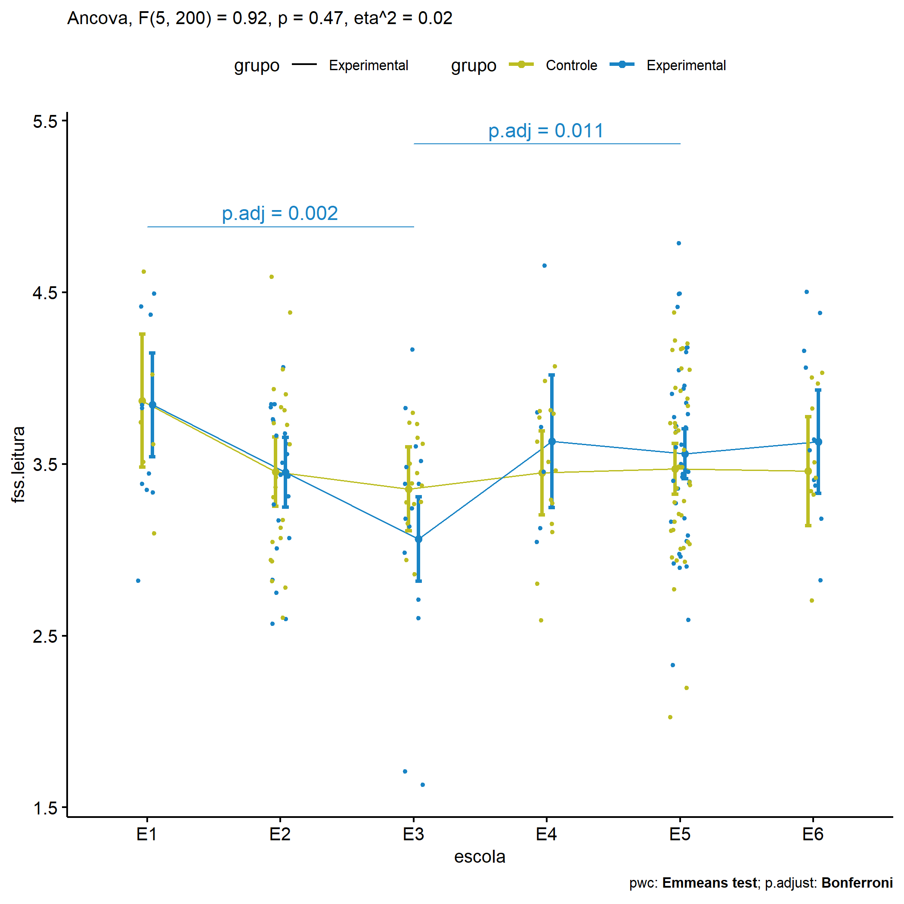<!-- -->

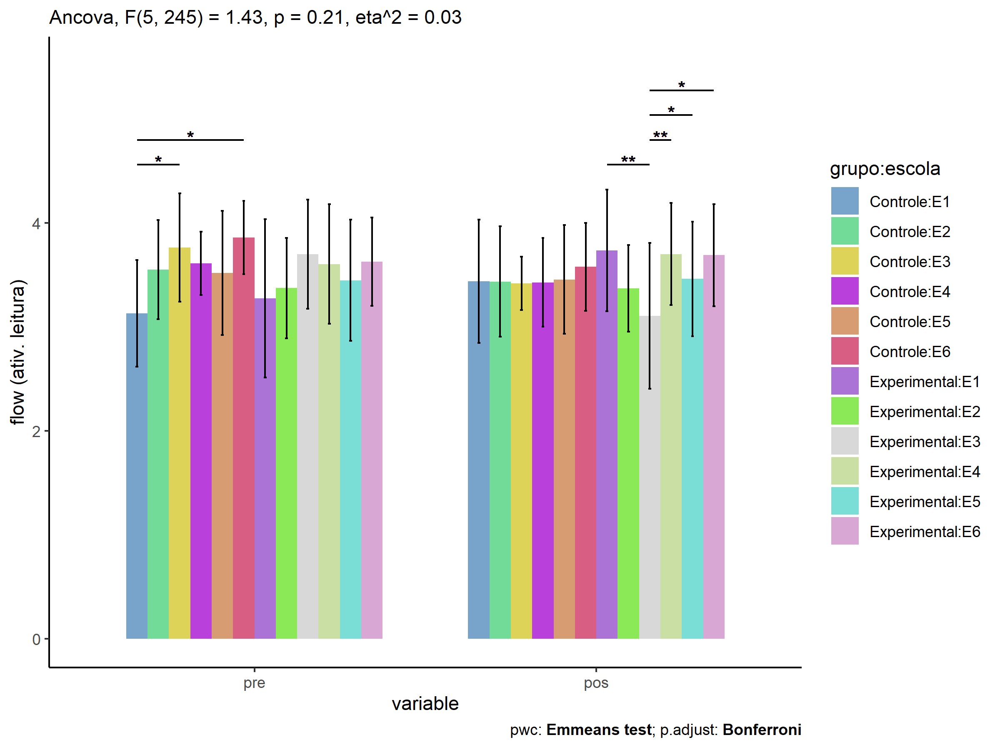<!-- -->

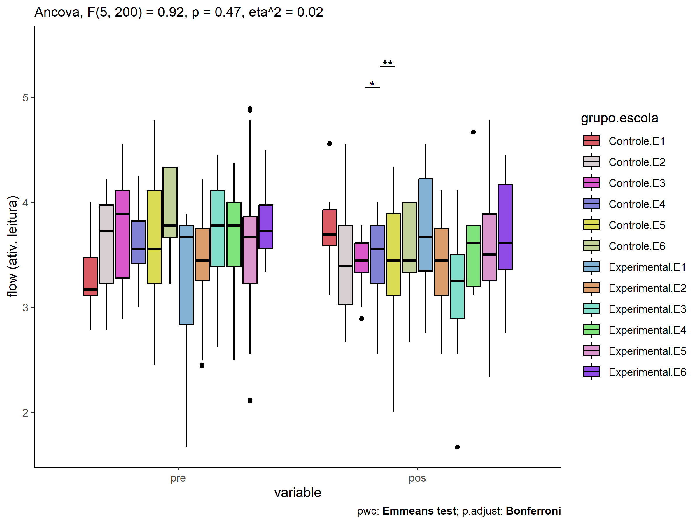<!-- -->

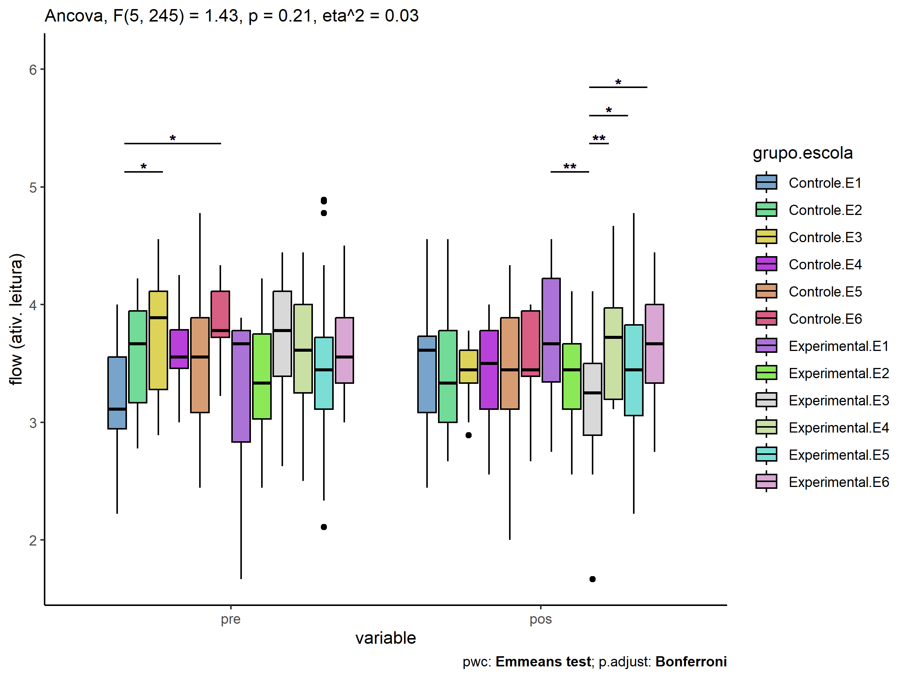<!-- -->

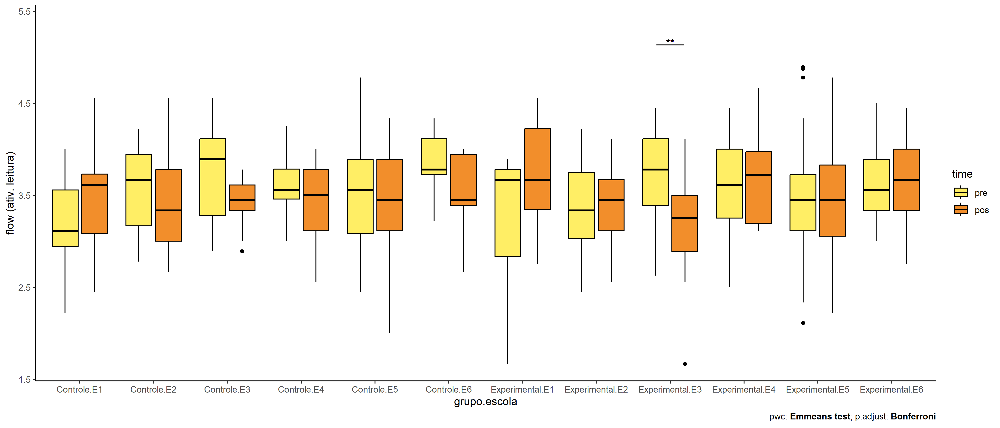<!-- -->

### factores: **grupo:zona.escola**

| var         | grupo        | zona.escola |   n | M (pre) | SE (pre) | M (unadj) | SE (unadj) | M (adj) | SE (adj) |
|:------------|:-------------|:------------|----:|--------:|---------:|----------:|-----------:|--------:|---------:|
| fss.leitura | Controle     | Rural       |  39 |   3.727 |    0.068 |     3.466 |      0.059 |   3.417 |    0.079 |
| fss.leitura | Controle     | Urbana      |  69 |   3.552 |    0.067 |     3.490 |      0.064 |   3.500 |    0.059 |
| fss.leitura | Experimental | Rural       |  31 |   3.710 |    0.089 |     3.401 |      0.122 |   3.358 |    0.089 |
| fss.leitura | Experimental | Urbana      |  74 |   3.479 |    0.068 |     3.529 |      0.060 |   3.564 |    0.058 |

| grupo        | zona.escola | group1   | group2       | estimate | conf.low | conf.high |    se | statistic |     p | p.adj | p.adj.signif |
|:-------------|:------------|:---------|:-------------|---------:|---------:|----------:|------:|----------:|------:|------:|:-------------|
|              | Urbana      | Controle | Experimental |   -0.064 |   -0.227 |     0.099 | 0.083 |    -0.777 | 0.438 | 0.438 | ns           |
|              | Rural       | Controle | Experimental |    0.059 |   -0.175 |     0.293 | 0.119 |     0.497 | 0.620 | 0.620 | ns           |
|              | Urbana      | Controle | Experimental |    0.073 |   -0.104 |     0.250 | 0.090 |     0.810 | 0.419 | 0.419 | ns           |
|              | Rural       | Controle | Experimental |    0.017 |   -0.238 |     0.272 | 0.129 |     0.132 | 0.895 | 0.895 | ns           |
| Controle     |             | Urbana   | Rural        |    0.083 |   -0.113 |     0.279 | 0.099 |     0.837 | 0.403 | 0.403 | ns           |
| Experimental |             | Urbana   | Rural        |    0.206 |   -0.004 |     0.416 | 0.106 |     1.938 | 0.054 | 0.054 | ns           |
| Controle     |             | Urbana   | Rural        |   -0.174 |   -0.386 |     0.038 | 0.108 |    -1.622 | 0.106 | 0.106 | ns           |
| Experimental |             | Urbana   | Rural        |   -0.230 |   -0.457 |    -0.004 | 0.115 |    -2.004 | 0.046 | 0.046 | \*           |

| grupo        | zona.escola | group1 | group2 | estimate | conf.low | conf.high |    se | statistic |     p | p.adj | p.adj.signif |
|:-------------|:------------|:-------|:-------|---------:|---------:|----------:|------:|----------:|------:|------:|:-------------|
| Controle     | Urbana      | pre    | pos    |    0.062 |   -0.115 |     0.240 | 0.090 |     0.689 | 0.491 | 0.491 | ns           |
| Controle     | Rural       | pre    | pos    |    0.261 |    0.024 |     0.497 | 0.120 |     2.168 | 0.031 | 0.031 | \*           |
| Experimental | Urbana      | pre    | pos    |   -0.050 |   -0.221 |     0.122 | 0.087 |    -0.573 | 0.567 | 0.567 | ns           |
| Experimental | Rural       | pre    | pos    |    0.308 |    0.043 |     0.573 | 0.135 |     2.287 | 0.023 | 0.023 | \*           |

    ## Scale for colour is already present.
    ## Adding another scale for colour, which will replace the existing scale.

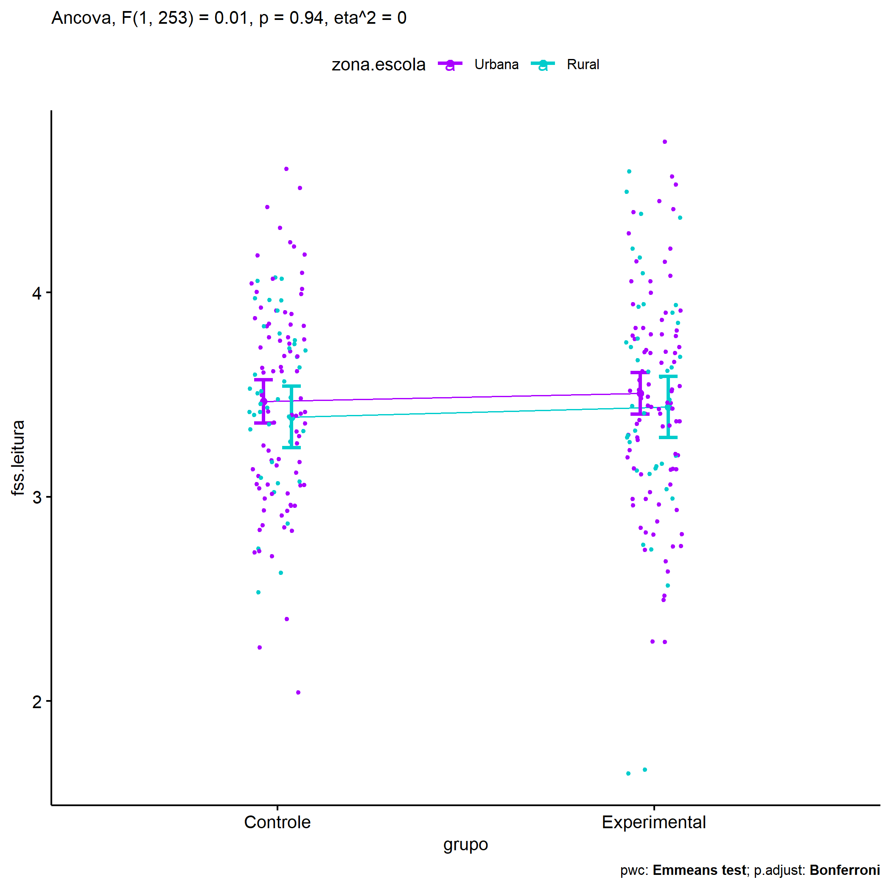<!-- -->

    ## Scale for colour is already present.
    ## Adding another scale for colour, which will replace the existing scale.

<!-- -->

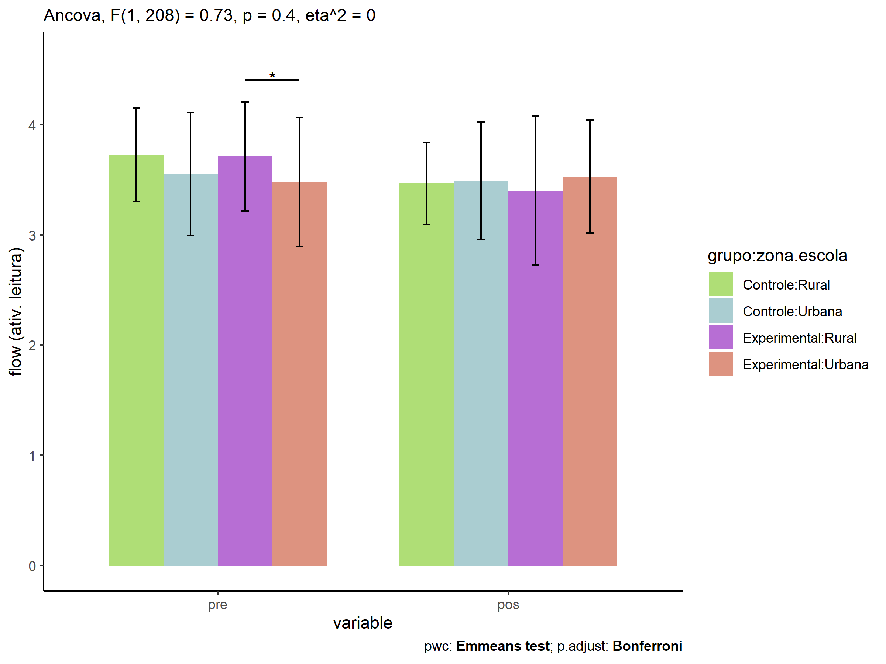<!-- -->

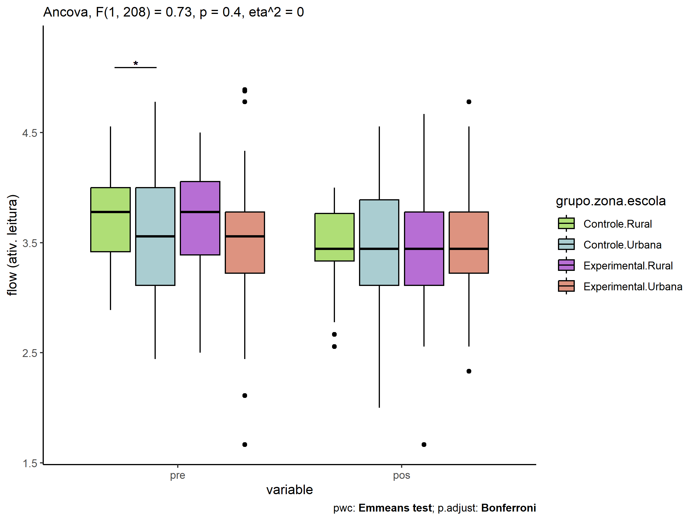<!-- -->

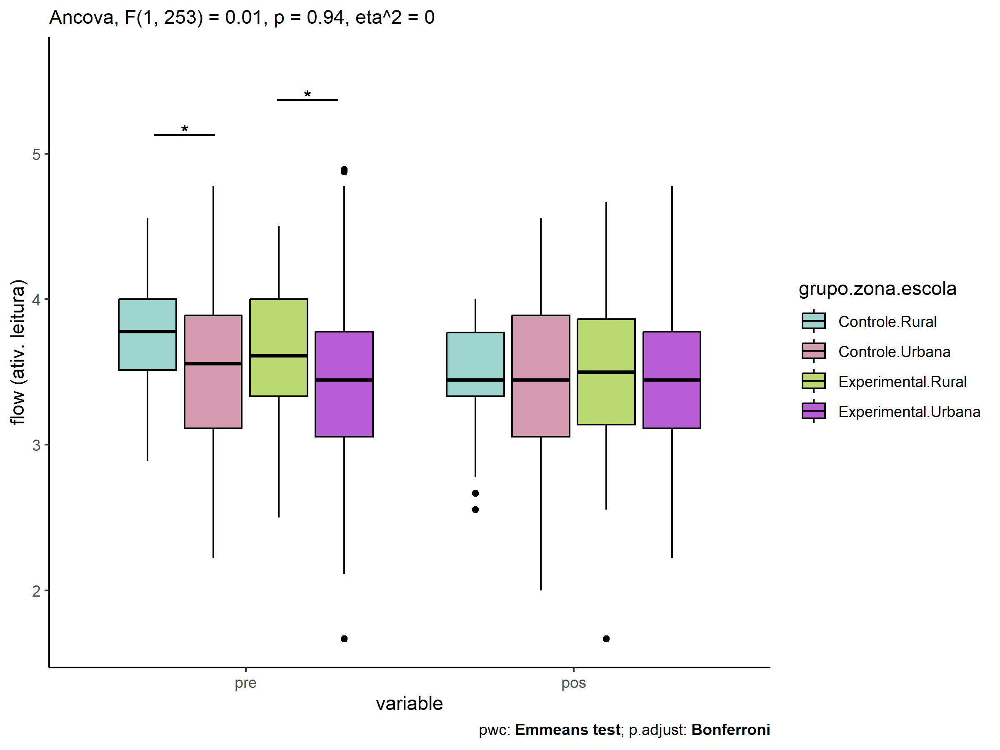<!-- -->

<!-- -->

## Pairwise comparisons for grupo=“Experimental”

### factores: **grupo=“Experimental”:monitor**

| var         | monitor |   n | M (pre) | SE (pre) | M (unadj) | SE (unadj) | M (adj) | SE (adj) |
|:------------|:--------|----:|--------:|---------:|----------:|-----------:|--------:|---------:|
| fss.leitura | AC      |  10 |   3.544 |    0.069 |     3.533 |      0.128 |   3.535 |    0.154 |
| fss.leitura | CE      |   6 |   3.627 |    0.271 |     3.648 |      0.237 |   3.612 |    0.198 |
| fss.leitura | EA      |   9 |   3.699 |    0.197 |     3.728 |      0.231 |   3.660 |    0.162 |
| fss.leitura | GR      |  15 |   3.449 |    0.132 |     3.420 |      0.098 |   3.465 |    0.126 |
| fss.leitura | JC      |   9 |   3.591 |    0.212 |     3.444 |      0.199 |   3.425 |    0.162 |
| fss.leitura | MF      |   9 |   3.642 |    0.231 |     3.727 |      0.166 |   3.684 |    0.162 |
| fss.leitura | ML      |  15 |   3.701 |    0.136 |     3.106 |      0.181 |   3.037 |    0.126 |
| fss.leitura | MM      |  12 |   3.264 |    0.173 |     3.258 |      0.117 |   3.385 |    0.142 |
| fss.leitura | PR      |  10 |   3.275 |    0.240 |     3.735 |      0.185 |   3.857 |    0.155 |
| fss.leitura | VL      |  10 |   3.772 |    0.115 |     3.697 |      0.172 |   3.596 |    0.155 |

| .y.         | group1 | group2 | estimate | conf.low | conf.high |    se | statistic | p       | p.adj | p.adj.signif |
|:------------|:-------|:-------|---------:|---------:|----------:|------:|----------:|:--------|------:|:-------------|
| fss.leitura | AC     | CE     |   -0.078 |   -0.576 |     0.421 | 0.251 |    -0.309 | 0.758   | 1.000 | ns           |
| fss.leitura | AC     | EA     |   -0.126 |   -0.569 |     0.318 | 0.224 |    -0.562 | 0.576   | 1.000 | ns           |
| fss.leitura | AC     | GR     |    0.070 |   -0.324 |     0.464 | 0.198 |     0.353 | 0.725   | 1.000 | ns           |
| fss.leitura | AC     | JC     |    0.110 |   -0.333 |     0.553 | 0.223 |     0.492 | 0.624   | 1.000 | ns           |
| fss.leitura | AC     | MF     |   -0.150 |   -0.593 |     0.294 | 0.223 |    -0.670 | 0.504   | 1.000 | ns           |
| fss.leitura | AC     | ML     |    0.498 |    0.103 |     0.893 | 0.199 |     2.506 | 0.014   | 0.627 | ns           |
| fss.leitura | AC     | MM     |    0.149 |   -0.267 |     0.565 | 0.209 |     0.713 | 0.478   | 1.000 | ns           |
| fss.leitura | AC     | PR     |   -0.323 |   -0.756 |     0.111 | 0.218 |    -1.476 | 0.143   | 1.000 | ns           |
| fss.leitura | AC     | VL     |   -0.062 |   -0.495 |     0.371 | 0.218 |    -0.282 | 0.778   | 1.000 | ns           |
| fss.leitura | CE     | EA     |   -0.048 |   -0.556 |     0.460 | 0.256 |    -0.188 | 0.852   | 1.000 | ns           |
| fss.leitura | CE     | GR     |    0.148 |   -0.319 |     0.615 | 0.235 |     0.628 | 0.531   | 1.000 | ns           |
| fss.leitura | CE     | JC     |    0.187 |   -0.321 |     0.696 | 0.256 |     0.732 | 0.466   | 1.000 | ns           |
| fss.leitura | CE     | MF     |   -0.072 |   -0.580 |     0.436 | 0.256 |    -0.282 | 0.779   | 1.000 | ns           |
| fss.leitura | CE     | ML     |    0.576 |    0.110 |     1.042 | 0.235 |     2.453 | 0.016   | 0.721 | ns           |
| fss.leitura | CE     | MM     |    0.227 |   -0.260 |     0.713 | 0.245 |     0.926 | 0.357   | 1.000 | ns           |
| fss.leitura | CE     | PR     |   -0.245 |   -0.747 |     0.257 | 0.253 |    -0.970 | 0.335   | 1.000 | ns           |
| fss.leitura | CE     | VL     |    0.016 |   -0.483 |     0.515 | 0.251 |     0.064 | 0.949   | 1.000 | ns           |
| fss.leitura | EA     | GR     |    0.196 |   -0.213 |     0.605 | 0.206 |     0.950 | 0.344   | 1.000 | ns           |
| fss.leitura | EA     | JC     |    0.235 |   -0.220 |     0.690 | 0.229 |     1.027 | 0.307   | 1.000 | ns           |
| fss.leitura | EA     | MF     |   -0.024 |   -0.479 |     0.431 | 0.229 |    -0.105 | 0.916   | 1.000 | ns           |
| fss.leitura | EA     | ML     |    0.624 |    0.217 |     1.030 | 0.205 |     3.046 | 0.003   | 0.136 | ns           |
| fss.leitura | EA     | MM     |    0.275 |   -0.157 |     0.707 | 0.218 |     1.263 | 0.21    | 1.000 | ns           |
| fss.leitura | EA     | PR     |   -0.197 |   -0.646 |     0.252 | 0.226 |    -0.871 | 0.386   | 1.000 | ns           |
| fss.leitura | EA     | VL     |    0.064 |   -0.379 |     0.507 | 0.223 |     0.287 | 0.775   | 1.000 | ns           |
| fss.leitura | GR     | JC     |    0.040 |   -0.368 |     0.447 | 0.205 |     0.194 | 0.847   | 1.000 | ns           |
| fss.leitura | GR     | MF     |   -0.220 |   -0.628 |     0.188 | 0.205 |    -1.070 | 0.287   | 1.000 | ns           |
| fss.leitura | GR     | ML     |    0.428 |    0.073 |     0.783 | 0.179 |     2.395 | 0.019   | 0.838 | ns           |
| fss.leitura | GR     | MM     |    0.079 |   -0.296 |     0.454 | 0.189 |     0.419 | 0.676   | 1.000 | ns           |
| fss.leitura | GR     | PR     |   -0.393 |   -0.788 |     0.002 | 0.199 |    -1.975 | 0.051   | 1.000 | ns           |
| fss.leitura | GR     | VL     |   -0.132 |   -0.529 |     0.266 | 0.200 |    -0.658 | 0.512   | 1.000 | ns           |
| fss.leitura | JC     | MF     |   -0.260 |   -0.714 |     0.195 | 0.229 |    -1.133 | 0.26    | 1.000 | ns           |
| fss.leitura | JC     | ML     |    0.388 |   -0.019 |     0.795 | 0.205 |     1.894 | 0.061   | 1.000 | ns           |
| fss.leitura | JC     | MM     |    0.039 |   -0.390 |     0.468 | 0.216 |     0.182 | 0.856   | 1.000 | ns           |
| fss.leitura | JC     | PR     |   -0.432 |   -0.879 |     0.014 | 0.225 |    -1.923 | 0.058   | 1.000 | ns           |
| fss.leitura | JC     | VL     |   -0.171 |   -0.616 |     0.273 | 0.224 |    -0.766 | 0.446   | 1.000 | ns           |
| fss.leitura | MF     | ML     |    0.648 |    0.241 |     1.054 | 0.205 |     3.162 | 0.002   | 0.095 | ns           |
| fss.leitura | MF     | MM     |    0.299 |   -0.131 |     0.729 | 0.217 |     1.379 | 0.171   | 1.000 | ns           |
| fss.leitura | MF     | PR     |   -0.173 |   -0.621 |     0.275 | 0.225 |    -0.767 | 0.445   | 1.000 | ns           |
| fss.leitura | MF     | VL     |    0.088 |   -0.356 |     0.532 | 0.223 |     0.394 | 0.694   | 1.000 | ns           |
| fss.leitura | ML     | MM     |   -0.349 |   -0.730 |     0.032 | 0.192 |    -1.817 | 0.072   | 1.000 | ns           |
| fss.leitura | ML     | PR     |   -0.821 |   -1.221 |    -0.420 | 0.202 |    -4.067 | \<0.001 | 0.004 | \*\*         |
| fss.leitura | ML     | VL     |   -0.560 |   -0.954 |    -0.166 | 0.198 |    -2.821 | 0.006   | 0.263 | ns           |
| fss.leitura | MM     | PR     |   -0.472 |   -0.885 |    -0.059 | 0.208 |    -2.269 | 0.026   | 1.000 | ns           |
| fss.leitura | MM     | VL     |   -0.211 |   -0.633 |     0.212 | 0.213 |    -0.991 | 0.324   | 1.000 | ns           |
| fss.leitura | PR     | VL     |    0.261 |   -0.179 |     0.701 | 0.222 |     1.178 | 0.242   | 1.000 | ns           |
| dfs.leitura | AC     | CE     |   -0.083 |   -0.663 |     0.497 | 0.292 |    -0.284 | 0.777   | 1.000 | ns           |
| dfs.leitura | AC     | EA     |   -0.155 |   -0.670 |     0.361 | 0.260 |    -0.595 | 0.553   | 1.000 | ns           |
| dfs.leitura | AC     | GR     |    0.095 |   -0.363 |     0.554 | 0.231 |     0.413 | 0.68    | 1.000 | ns           |
| dfs.leitura | AC     | JC     |   -0.047 |   -0.562 |     0.469 | 0.260 |    -0.179 | 0.858   | 1.000 | ns           |
| dfs.leitura | AC     | MF     |   -0.098 |   -0.613 |     0.418 | 0.260 |    -0.375 | 0.708   | 1.000 | ns           |
| dfs.leitura | AC     | ML     |   -0.156 |   -0.615 |     0.302 | 0.231 |    -0.678 | 0.499   | 1.000 | ns           |
| dfs.leitura | AC     | MM     |    0.281 |   -0.200 |     0.761 | 0.242 |     1.159 | 0.249   | 1.000 | ns           |
| dfs.leitura | AC     | PR     |    0.270 |   -0.232 |     0.772 | 0.253 |     1.067 | 0.289   | 1.000 | ns           |
| dfs.leitura | AC     | VL     |   -0.228 |   -0.730 |     0.274 | 0.253 |    -0.901 | 0.37    | 1.000 | ns           |
| dfs.leitura | CE     | EA     |   -0.072 |   -0.663 |     0.520 | 0.298 |    -0.241 | 0.81    | 1.000 | ns           |
| dfs.leitura | CE     | GR     |    0.178 |   -0.364 |     0.720 | 0.273 |     0.653 | 0.516   | 1.000 | ns           |
| dfs.leitura | CE     | JC     |    0.036 |   -0.555 |     0.628 | 0.298 |     0.122 | 0.903   | 1.000 | ns           |
| dfs.leitura | CE     | MF     |   -0.015 |   -0.606 |     0.577 | 0.298 |    -0.049 | 0.961   | 1.000 | ns           |
| dfs.leitura | CE     | ML     |   -0.074 |   -0.616 |     0.469 | 0.273 |    -0.270 | 0.788   | 1.000 | ns           |
| dfs.leitura | CE     | MM     |    0.363 |   -0.198 |     0.925 | 0.283 |     1.286 | 0.202   | 1.000 | ns           |
| dfs.leitura | CE     | PR     |    0.353 |   -0.227 |     0.932 | 0.292 |     1.208 | 0.23    | 1.000 | ns           |
| dfs.leitura | CE     | VL     |   -0.145 |   -0.725 |     0.435 | 0.292 |    -0.496 | 0.621   | 1.000 | ns           |
| dfs.leitura | EA     | GR     |    0.250 |   -0.223 |     0.723 | 0.238 |     1.049 | 0.297   | 1.000 | ns           |
| dfs.leitura | EA     | JC     |    0.108 |   -0.421 |     0.637 | 0.267 |     0.405 | 0.686   | 1.000 | ns           |
| dfs.leitura | EA     | MF     |    0.057 |   -0.472 |     0.586 | 0.267 |     0.214 | 0.831   | 1.000 | ns           |
| dfs.leitura | EA     | ML     |   -0.002 |   -0.475 |     0.471 | 0.238 |    -0.008 | 0.994   | 1.000 | ns           |
| dfs.leitura | EA     | MM     |    0.435 |   -0.060 |     0.930 | 0.249 |     1.745 | 0.084   | 1.000 | ns           |
| dfs.leitura | EA     | PR     |    0.424 |   -0.091 |     0.940 | 0.260 |     1.634 | 0.106   | 1.000 | ns           |
| dfs.leitura | EA     | VL     |   -0.073 |   -0.589 |     0.443 | 0.260 |    -0.282 | 0.779   | 1.000 | ns           |
| dfs.leitura | GR     | JC     |   -0.142 |   -0.615 |     0.331 | 0.238 |    -0.596 | 0.553   | 1.000 | ns           |
| dfs.leitura | GR     | MF     |   -0.193 |   -0.666 |     0.280 | 0.238 |    -0.809 | 0.42    | 1.000 | ns           |
| dfs.leitura | GR     | ML     |   -0.252 |   -0.662 |     0.158 | 0.206 |    -1.220 | 0.226   | 1.000 | ns           |
| dfs.leitura | GR     | MM     |    0.185 |   -0.250 |     0.620 | 0.219 |     0.846 | 0.4     | 1.000 | ns           |
| dfs.leitura | GR     | PR     |    0.174 |   -0.284 |     0.633 | 0.231 |     0.756 | 0.452   | 1.000 | ns           |
| dfs.leitura | GR     | VL     |   -0.323 |   -0.781 |     0.135 | 0.231 |    -1.400 | 0.165   | 1.000 | ns           |
| dfs.leitura | JC     | MF     |   -0.051 |   -0.580 |     0.478 | 0.267 |    -0.191 | 0.849   | 1.000 | ns           |
| dfs.leitura | JC     | ML     |   -0.110 |   -0.583 |     0.363 | 0.238 |    -0.461 | 0.646   | 1.000 | ns           |
| dfs.leitura | JC     | MM     |    0.327 |   -0.168 |     0.822 | 0.249 |     1.312 | 0.193   | 1.000 | ns           |
| dfs.leitura | JC     | PR     |    0.316 |   -0.199 |     0.832 | 0.260 |     1.218 | 0.226   | 1.000 | ns           |
| dfs.leitura | JC     | VL     |   -0.181 |   -0.697 |     0.335 | 0.260 |    -0.697 | 0.487   | 1.000 | ns           |
| dfs.leitura | MF     | ML     |   -0.059 |   -0.532 |     0.414 | 0.238 |    -0.247 | 0.805   | 1.000 | ns           |
| dfs.leitura | MF     | MM     |    0.378 |   -0.117 |     0.873 | 0.249 |     1.516 | 0.133   | 1.000 | ns           |
| dfs.leitura | MF     | PR     |    0.367 |   -0.148 |     0.883 | 0.260 |     1.414 | 0.161   | 1.000 | ns           |
| dfs.leitura | MF     | VL     |   -0.130 |   -0.646 |     0.385 | 0.260 |    -0.501 | 0.617   | 1.000 | ns           |
| dfs.leitura | ML     | MM     |    0.437 |    0.002 |     0.872 | 0.219 |     1.996 | 0.049   | 1.000 | ns           |
| dfs.leitura | ML     | PR     |    0.426 |   -0.032 |     0.885 | 0.231 |     1.847 | 0.068   | 1.000 | ns           |
| dfs.leitura | ML     | VL     |   -0.071 |   -0.530 |     0.387 | 0.231 |    -0.309 | 0.758   | 1.000 | ns           |
| dfs.leitura | MM     | PR     |   -0.011 |   -0.491 |     0.470 | 0.242 |    -0.044 | 0.965   | 1.000 | ns           |
| dfs.leitura | MM     | VL     |   -0.508 |   -0.989 |    -0.028 | 0.242 |    -2.100 | 0.038   | 1.000 | ns           |
| dfs.leitura | PR     | VL     |   -0.498 |   -1.000 |     0.004 | 0.253 |    -1.968 | 0.052   | 1.000 | ns           |

| monitor | group1 | group2 | estimate | conf.low | conf.high |    se | statistic |     p | p.adj | p.adj.signif |
|:--------|:-------|:-------|---------:|---------:|----------:|------:|----------:|------:|------:|:-------------|
| AC      | pre    | pos    |    0.011 |   -0.479 |     0.501 | 0.249 |     0.045 | 0.964 | 0.964 | ns           |
| CE      | pre    | pos    |   -0.021 |   -0.654 |     0.612 | 0.321 |    -0.065 | 0.948 | 0.948 | ns           |
| EA      | pre    | pos    |   -0.029 |   -0.546 |     0.487 | 0.262 |    -0.112 | 0.911 | 0.911 | ns           |
| GR      | pre    | pos    |    0.029 |   -0.372 |     0.429 | 0.203 |     0.141 | 0.888 | 0.888 | ns           |
| JC      | pre    | pos    |    0.147 |   -0.370 |     0.663 | 0.262 |     0.560 | 0.576 | 0.576 | ns           |
| MF      | pre    | pos    |   -0.085 |   -0.602 |     0.432 | 0.262 |    -0.324 | 0.746 | 0.746 | ns           |
| ML      | pre    | pos    |    0.595 |    0.195 |     0.996 | 0.203 |     2.934 | 0.004 | 0.004 | \*\*         |
| MM      | pre    | pos    |    0.006 |   -0.442 |     0.453 | 0.227 |     0.026 | 0.980 | 0.980 | ns           |
| PR      | pre    | pos    |   -0.460 |   -0.950 |     0.030 | 0.249 |    -1.852 | 0.066 | 0.066 | ns           |
| VL      | pre    | pos    |    0.075 |   -0.415 |     0.565 | 0.249 |     0.302 | 0.763 | 0.763 | ns           |

    ## Scale for colour is already present.
    ## Adding another scale for colour, which will replace the existing scale.

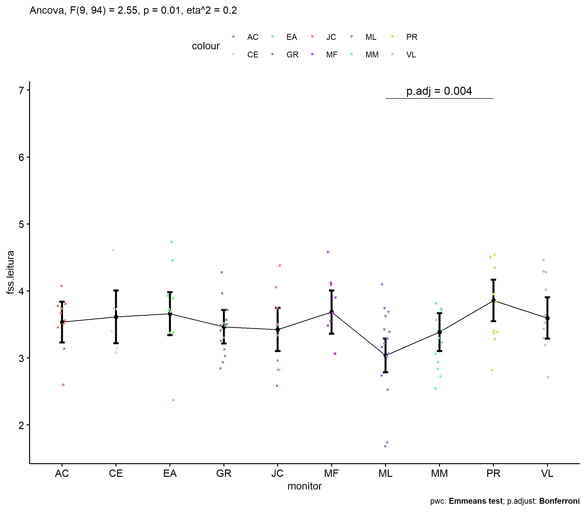<!-- -->

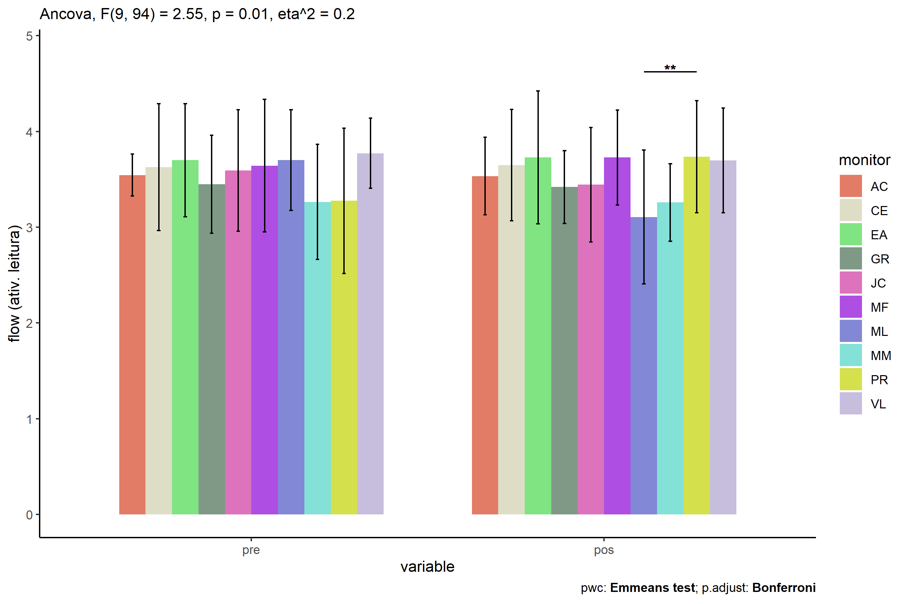<!-- -->

<!-- -->

<!-- -->

<!-- -->

### factores: **grupo=“Experimental”:monitor.genero**

| var         | monitor.genero |   n | M (pre) | SE (pre) | M (unadj) | SE (unadj) | M (adj) | SE (adj) |
|:------------|:---------------|----:|--------:|---------:|----------:|-----------:|--------:|---------:|
| fss.leitura | F              |  71 |   3.554 |    0.062 |     3.420 |      0.064 |   3.417 |    0.060 |
| fss.leitura | M              |  34 |   3.533 |    0.113 |     3.641 |      0.103 |   3.647 |    0.087 |

| .y.         | group1 | group2 | estimate | conf.low | conf.high |    se | statistic |     p | p.adj | p.adj.signif |
|:------------|:-------|:-------|---------:|---------:|----------:|------:|----------:|------:|------:|:-------------|
| fss.leitura | F      | M      |   -0.230 |   -0.440 |    -0.019 | 0.106 |    -2.167 | 0.033 | 0.033 | \*           |
| dfs.leitura | F      | M      |    0.021 |   -0.214 |     0.257 | 0.119 |     0.180 | 0.857 | 0.857 | ns           |

| monitor.genero | group1 | group2 | estimate | conf.low | conf.high |    se | statistic |     p | p.adj | p.adj.signif |
|:---------------|:-------|:-------|---------:|---------:|----------:|------:|----------:|------:|------:|:-------------|
| F              | pre    | pos    |    0.134 |   -0.053 |     0.321 | 0.095 |     1.415 | 0.159 | 0.159 | ns           |
| M              | pre    | pos    |   -0.108 |   -0.378 |     0.162 | 0.137 |    -0.788 | 0.432 | 0.432 | ns           |

    ## Scale for colour is already present.
    ## Adding another scale for colour, which will replace the existing scale.

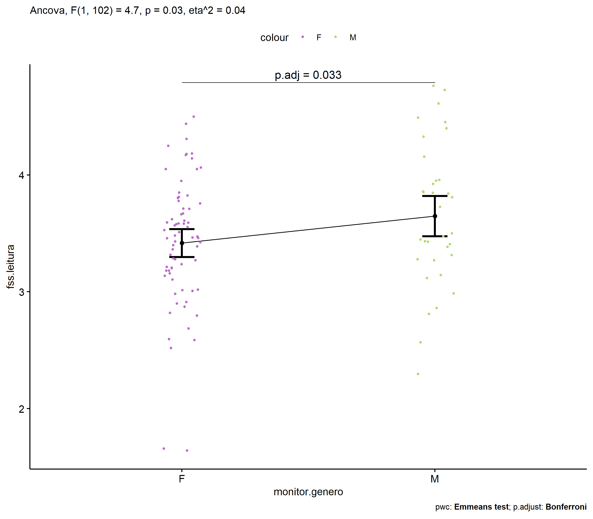<!-- -->

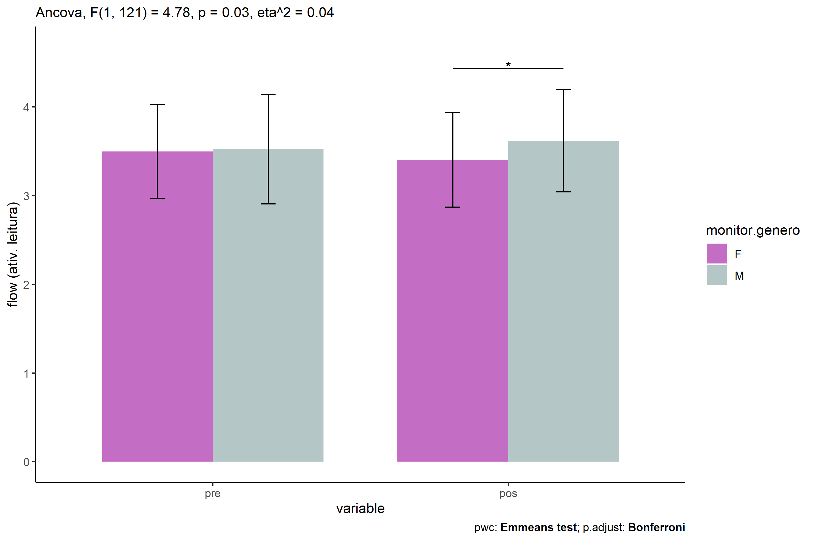<!-- -->

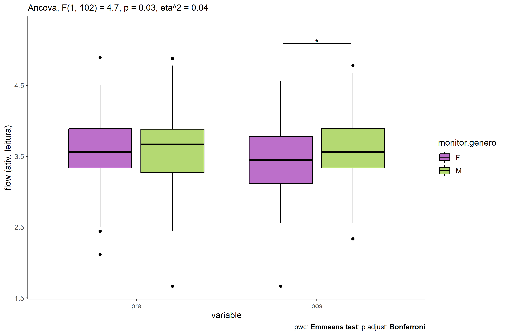<!-- -->

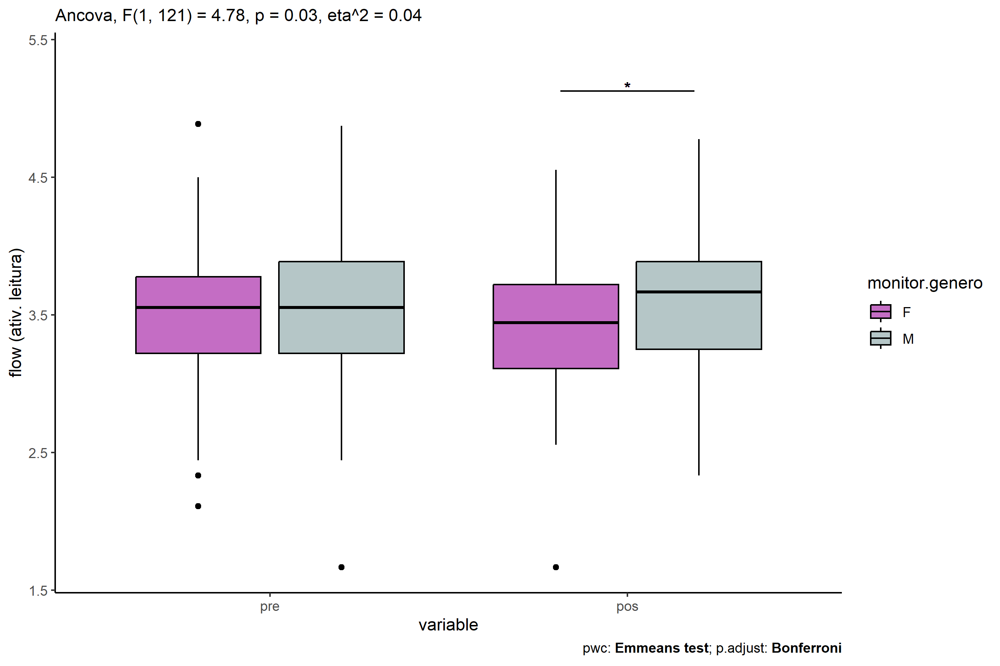<!-- -->

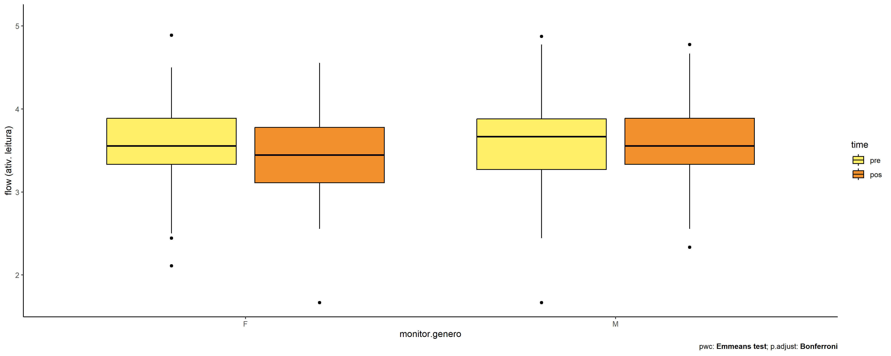<!-- -->

### factores: **grupo=“Experimental”:monitor.area**

| var         | monitor.area               |   n | M (pre) | SE (pre) | M (unadj) | SE (unadj) | M (adj) | SE (adj) |
|:------------|:---------------------------|----:|--------:|---------:|----------:|-----------:|--------:|---------:|
| fss.leitura | Arquitetura e Urbanismo    |   9 |   3.591 |    0.212 |     3.444 |      0.199 |   3.424 |    0.162 |
| fss.leitura | Ciencias Biologicas        |  15 |   3.701 |    0.136 |     3.106 |      0.181 |   3.035 |    0.126 |
| fss.leitura | Comunicacao Social         |   6 |   3.627 |    0.271 |     3.648 |      0.237 |   3.612 |    0.198 |
| fss.leitura | Historia                   |  10 |   3.275 |    0.240 |     3.735 |      0.185 |   3.860 |    0.155 |
| fss.leitura | Letras - Lingua Portuguesa |   9 |   3.642 |    0.231 |     3.727 |      0.166 |   3.684 |    0.162 |
| fss.leitura | Matematica                 |  24 |   3.543 |    0.111 |     3.536 |      0.108 |   3.538 |    0.099 |
| fss.leitura | Nutricao                   |  12 |   3.264 |    0.173 |     3.258 |      0.117 |   3.388 |    0.142 |
| fss.leitura | Pedagogia                  |  10 |   3.544 |    0.069 |     3.533 |      0.128 |   3.535 |    0.153 |
| fss.leitura | Servico Social             |  10 |   3.772 |    0.115 |     3.697 |      0.172 |   3.594 |    0.155 |

| .y.         | group1                  | group2              | estimate | conf.low | conf.high |    se | statistic | p       | p.adj | p.adj.signif |
|:------------|:------------------------|:--------------------|---------:|---------:|----------:|------:|----------:|:--------|------:|:-------------|
| fss.leitura | Arquitetura e Urbanismo | Ciencias Biologicas |    0.389 |   -0.018 |     0.796 | 0.205 |     1.900 | 0.061   | 1.000 | ns           |
| fss.leitura | Arquitetura e Urbanismo | Comunicacao Social  |   -0.187 |   -0.695 |     0.321 | 0.256 |    -0.731 | 0.466   | 1.000 | ns           |
| fss.leitura | Arquitetura e Urbanismo | Historia            |   -0.435 |   -0.881 |     0.011 | 0.225 |    -1.937 | 0.056   | 1.000 | ns           |
| fss.leitura | Arquitetura e Urbanismo | Letras              |   -0.259 |   -0.713 |     0.195 | 0.229 |    -1.132 | 0.26    | 1.000 | ns           |
| fss.leitura | Arquitetura e Urbanismo | Matematica          |   -0.114 |   -0.490 |     0.263 | 0.190 |    -0.598 | 0.551   | 1.000 | ns           |
| fss.leitura | Arquitetura e Urbanismo | Nutricao            |    0.036 |   -0.392 |     0.465 | 0.216 |     0.169 | 0.866   | 1.000 | ns           |
| fss.leitura | Arquitetura e Urbanismo | Pedagogia           |   -0.110 |   -0.553 |     0.333 | 0.223 |    -0.494 | 0.622   | 1.000 | ns           |
| fss.leitura | Arquitetura e Urbanismo | Servico Social      |   -0.170 |   -0.614 |     0.274 | 0.224 |    -0.759 | 0.45    | 1.000 | ns           |
| fss.leitura | Ciencias Biologicas     | Comunicacao Social  |   -0.576 |   -1.042 |    -0.111 | 0.235 |    -2.457 | 0.016   | 0.570 | ns           |
| fss.leitura | Ciencias Biologicas     | Historia            |   -0.824 |   -1.225 |    -0.424 | 0.202 |    -4.089 | \<0.001 | 0.003 | \*\*         |
| fss.leitura | Ciencias Biologicas     | Letras              |   -0.648 |   -1.055 |    -0.242 | 0.205 |    -3.167 | 0.002   | 0.075 | ns           |
| fss.leitura | Ciencias Biologicas     | Matematica          |   -0.503 |   -0.821 |    -0.184 | 0.160 |    -3.135 | 0.002   | 0.082 | ns           |
| fss.leitura | Ciencias Biologicas     | Nutricao            |   -0.353 |   -0.734 |     0.028 | 0.192 |    -1.839 | 0.069   | 1.000 | ns           |
| fss.leitura | Ciencias Biologicas     | Pedagogia           |   -0.499 |   -0.894 |    -0.105 | 0.199 |    -2.514 | 0.014   | 0.490 | ns           |
| fss.leitura | Ciencias Biologicas     | Servico Social      |   -0.559 |   -0.953 |    -0.165 | 0.198 |    -2.819 | 0.006   | 0.211 | ns           |
| fss.leitura | Comunicacao Social      | Historia            |   -0.248 |   -0.750 |     0.253 | 0.253 |    -0.983 | 0.328   | 1.000 | ns           |
| fss.leitura | Comunicacao Social      | Letras              |   -0.072 |   -0.580 |     0.436 | 0.256 |    -0.281 | 0.779   | 1.000 | ns           |
| fss.leitura | Comunicacao Social      | Matematica          |    0.074 |   -0.367 |     0.514 | 0.222 |     0.332 | 0.741   | 1.000 | ns           |
| fss.leitura | Comunicacao Social      | Nutricao            |    0.224 |   -0.262 |     0.709 | 0.245 |     0.913 | 0.363   | 1.000 | ns           |
| fss.leitura | Comunicacao Social      | Pedagogia           |    0.077 |   -0.421 |     0.575 | 0.251 |     0.306 | 0.76    | 1.000 | ns           |
| fss.leitura | Comunicacao Social      | Servico Social      |    0.017 |   -0.481 |     0.516 | 0.251 |     0.069 | 0.945   | 1.000 | ns           |
| fss.leitura | Historia                | Letras              |    0.176 |   -0.271 |     0.624 | 0.225 |     0.782 | 0.436   | 1.000 | ns           |
| fss.leitura | Historia                | Matematica          |    0.322 |   -0.044 |     0.687 | 0.184 |     1.747 | 0.084   | 1.000 | ns           |
| fss.leitura | Historia                | Nutricao            |    0.472 |    0.059 |     0.884 | 0.208 |     2.270 | 0.025   | 0.918 | ns           |
| fss.leitura | Historia                | Pedagogia           |    0.325 |   -0.108 |     0.759 | 0.218 |     1.488 | 0.14    | 1.000 | ns           |
| fss.leitura | Historia                | Servico Social      |    0.265 |   -0.174 |     0.705 | 0.221 |     1.199 | 0.233   | 1.000 | ns           |
| fss.leitura | Letras                  | Lingua Portuguesa   |    0.146 |   -0.232 |     0.523 | 0.190 |     0.766 | 0.445   | 1.000 | ns           |
| fss.leitura | Letras                  | Lingua Portuguesa   |    0.296 |   -0.134 |     0.726 | 0.217 |     1.364 | 0.176   | 1.000 | ns           |
| fss.leitura | Letras                  | Lingua Portuguesa   |    0.149 |   -0.294 |     0.592 | 0.223 |     0.667 | 0.506   | 1.000 | ns           |
| fss.leitura | Letras                  | Lingua Portuguesa   |    0.089 |   -0.354 |     0.533 | 0.223 |     0.400 | 0.69    | 1.000 | ns           |
| fss.leitura | Matematica              | Nutricao            |    0.150 |   -0.194 |     0.494 | 0.173 |     0.865 | 0.389   | 1.000 | ns           |
| fss.leitura | Matematica              | Pedagogia           |    0.003 |   -0.359 |     0.366 | 0.183 |     0.018 | 0.986   | 1.000 | ns           |
| fss.leitura | Matematica              | Servico Social      |   -0.056 |   -0.421 |     0.309 | 0.184 |    -0.306 | 0.76    | 1.000 | ns           |
| fss.leitura | Nutricao                | Pedagogia           |   -0.147 |   -0.562 |     0.269 | 0.209 |    -0.701 | 0.485   | 1.000 | ns           |
| fss.leitura | Nutricao                | Servico Social      |   -0.206 |   -0.628 |     0.216 | 0.213 |    -0.970 | 0.334   | 1.000 | ns           |
| fss.leitura | Pedagogia               | Servico Social      |   -0.060 |   -0.492 |     0.373 | 0.218 |    -0.273 | 0.785   | 1.000 | ns           |
| dfs.leitura | Arquitetura e Urbanismo | Ciencias Biologicas |   -0.110 |   -0.583 |     0.364 | 0.239 |    -0.461 | 0.646   | 1.000 | ns           |
| dfs.leitura | Arquitetura e Urbanismo | Comunicacao Social  |   -0.036 |   -0.628 |     0.556 | 0.298 |    -0.122 | 0.903   | 1.000 | ns           |
| dfs.leitura | Arquitetura e Urbanismo | Historia            |    0.316 |   -0.199 |     0.832 | 0.260 |     1.217 | 0.226   | 1.000 | ns           |
| dfs.leitura | Arquitetura e Urbanismo | Letras              |   -0.051 |   -0.580 |     0.478 | 0.267 |    -0.191 | 0.849   | 1.000 | ns           |
| dfs.leitura | Arquitetura e Urbanismo | Matematica          |    0.048 |   -0.391 |     0.487 | 0.221 |     0.218 | 0.828   | 1.000 | ns           |
| dfs.leitura | Arquitetura e Urbanismo | Nutricao            |    0.327 |   -0.168 |     0.822 | 0.249 |     1.312 | 0.193   | 1.000 | ns           |
| dfs.leitura | Arquitetura e Urbanismo | Pedagogia           |    0.047 |   -0.469 |     0.563 | 0.260 |     0.179 | 0.858   | 1.000 | ns           |
| dfs.leitura | Arquitetura e Urbanismo | Servico Social      |   -0.181 |   -0.697 |     0.335 | 0.260 |    -0.697 | 0.487   | 1.000 | ns           |
| dfs.leitura | Ciencias Biologicas     | Comunicacao Social  |    0.074 |   -0.469 |     0.616 | 0.273 |     0.269 | 0.788   | 1.000 | ns           |
| dfs.leitura | Ciencias Biologicas     | Historia            |    0.426 |   -0.032 |     0.885 | 0.231 |     1.846 | 0.068   | 1.000 | ns           |
| dfs.leitura | Ciencias Biologicas     | Letras              |    0.059 |   -0.415 |     0.532 | 0.239 |     0.247 | 0.805   | 1.000 | ns           |
| dfs.leitura | Ciencias Biologicas     | Matematica          |    0.158 |   -0.211 |     0.528 | 0.186 |     0.849 | 0.398   | 1.000 | ns           |
| dfs.leitura | Ciencias Biologicas     | Nutricao            |    0.437 |    0.002 |     0.872 | 0.219 |     1.995 | 0.049   | 1.000 | ns           |
| dfs.leitura | Ciencias Biologicas     | Pedagogia           |    0.156 |   -0.302 |     0.615 | 0.231 |     0.678 | 0.5     | 1.000 | ns           |
| dfs.leitura | Ciencias Biologicas     | Servico Social      |   -0.071 |   -0.530 |     0.387 | 0.231 |    -0.309 | 0.758   | 1.000 | ns           |
| dfs.leitura | Comunicacao Social      | Historia            |    0.353 |   -0.227 |     0.933 | 0.292 |     1.207 | 0.23    | 1.000 | ns           |
| dfs.leitura | Comunicacao Social      | Letras              |   -0.015 |   -0.606 |     0.577 | 0.298 |    -0.049 | 0.961   | 1.000 | ns           |
| dfs.leitura | Comunicacao Social      | Matematica          |    0.084 |   -0.428 |     0.597 | 0.258 |     0.327 | 0.744   | 1.000 | ns           |
| dfs.leitura | Comunicacao Social      | Nutricao            |    0.363 |   -0.198 |     0.925 | 0.283 |     1.285 | 0.202   | 1.000 | ns           |
| dfs.leitura | Comunicacao Social      | Pedagogia           |    0.083 |   -0.497 |     0.663 | 0.292 |     0.284 | 0.777   | 1.000 | ns           |
| dfs.leitura | Comunicacao Social      | Servico Social      |   -0.145 |   -0.725 |     0.435 | 0.292 |    -0.496 | 0.621   | 1.000 | ns           |
| dfs.leitura | Historia                | Letras              |   -0.367 |   -0.883 |     0.149 | 0.260 |    -1.413 | 0.161   | 1.000 | ns           |
| dfs.leitura | Historia                | Matematica          |   -0.268 |   -0.691 |     0.154 | 0.213 |    -1.260 | 0.211   | 1.000 | ns           |
| dfs.leitura | Historia                | Nutricao            |    0.011 |   -0.470 |     0.492 | 0.242 |     0.044 | 0.965   | 1.000 | ns           |
| dfs.leitura | Historia                | Pedagogia           |   -0.270 |   -0.772 |     0.232 | 0.253 |    -1.067 | 0.289   | 1.000 | ns           |
| dfs.leitura | Historia                | Servico Social      |   -0.498 |   -1.000 |     0.005 | 0.253 |    -1.967 | 0.052   | 1.000 | ns           |
| dfs.leitura | Letras                  | Lingua Portuguesa   |    0.099 |   -0.340 |     0.538 | 0.221 |     0.448 | 0.655   | 1.000 | ns           |
| dfs.leitura | Letras                  | Lingua Portuguesa   |    0.378 |   -0.117 |     0.873 | 0.249 |     1.516 | 0.133   | 1.000 | ns           |
| dfs.leitura | Letras                  | Lingua Portuguesa   |    0.098 |   -0.418 |     0.613 | 0.260 |     0.375 | 0.708   | 1.000 | ns           |
| dfs.leitura | Letras                  | Lingua Portuguesa   |   -0.130 |   -0.646 |     0.386 | 0.260 |    -0.501 | 0.617   | 1.000 | ns           |
| dfs.leitura | Matematica              | Nutricao            |    0.279 |   -0.118 |     0.676 | 0.200 |     1.395 | 0.166   | 1.000 | ns           |
| dfs.leitura | Matematica              | Pedagogia           |   -0.002 |   -0.424 |     0.421 | 0.213 |    -0.008 | 0.994   | 1.000 | ns           |
| dfs.leitura | Matematica              | Servico Social      |   -0.229 |   -0.652 |     0.193 | 0.213 |    -1.077 | 0.284   | 1.000 | ns           |
| dfs.leitura | Nutricao                | Pedagogia           |   -0.281 |   -0.761 |     0.200 | 0.242 |    -1.158 | 0.25    | 1.000 | ns           |
| dfs.leitura | Nutricao                | Servico Social      |   -0.508 |   -0.989 |    -0.028 | 0.242 |    -2.099 | 0.038   | 1.000 | ns           |
| dfs.leitura | Pedagogia               | Servico Social      |   -0.228 |   -0.730 |     0.274 | 0.253 |    -0.900 | 0.37    | 1.000 | ns           |

| monitor.area               | group1 | group2 | estimate | conf.low | conf.high |    se | statistic |     p | p.adj | p.adj.signif |
|:---------------------------|:-------|:-------|---------:|---------:|----------:|------:|----------:|------:|------:|:-------------|
| Arquitetura e Urbanismo    | pre    | pos    |    0.147 |   -0.371 |     0.664 | 0.263 |     0.558 | 0.577 | 0.577 | ns           |
| Ciencias Biologicas        | pre    | pos    |    0.595 |    0.194 |     0.996 | 0.203 |     2.928 | 0.004 | 0.004 | \*\*         |
| Comunicacao Social         | pre    | pos    |   -0.021 |   -0.655 |     0.613 | 0.322 |    -0.065 | 0.948 | 0.948 | ns           |
| Historia                   | pre    | pos    |   -0.460 |   -0.951 |     0.031 | 0.249 |    -1.847 | 0.066 | 0.066 | ns           |
| Letras - Lingua Portuguesa | pre    | pos    |   -0.085 |   -0.603 |     0.433 | 0.263 |    -0.323 | 0.747 | 0.747 | ns           |
| Matematica                 | pre    | pos    |    0.007 |   -0.310 |     0.324 | 0.161 |     0.043 | 0.966 | 0.966 | ns           |
| Nutricao                   | pre    | pos    |    0.006 |   -0.443 |     0.454 | 0.227 |     0.025 | 0.980 | 0.980 | ns           |
| Pedagogia                  | pre    | pos    |    0.011 |   -0.480 |     0.502 | 0.249 |     0.045 | 0.964 | 0.964 | ns           |
| Servico Social             | pre    | pos    |    0.075 |   -0.416 |     0.566 | 0.249 |     0.301 | 0.764 | 0.764 | ns           |

    ## Scale for colour is already present.
    ## Adding another scale for colour, which will replace the existing scale.

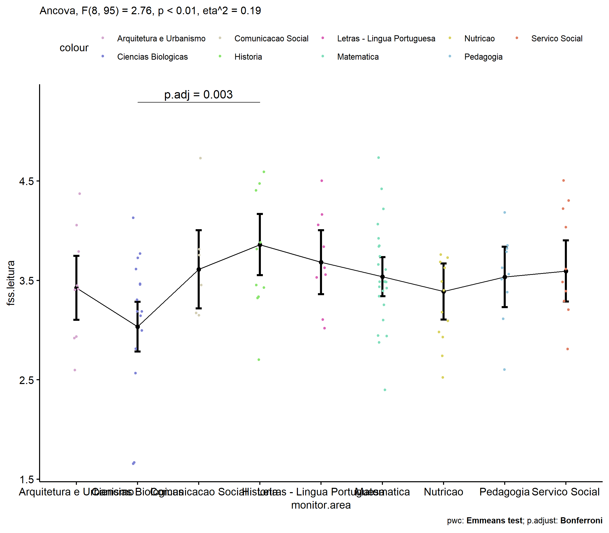<!-- -->

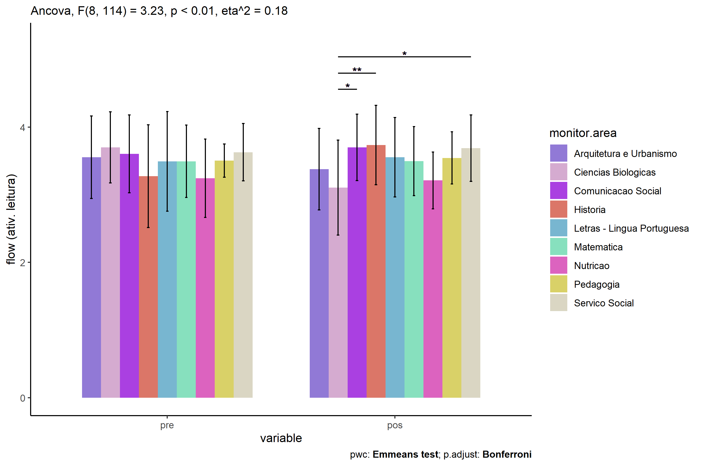<!-- -->

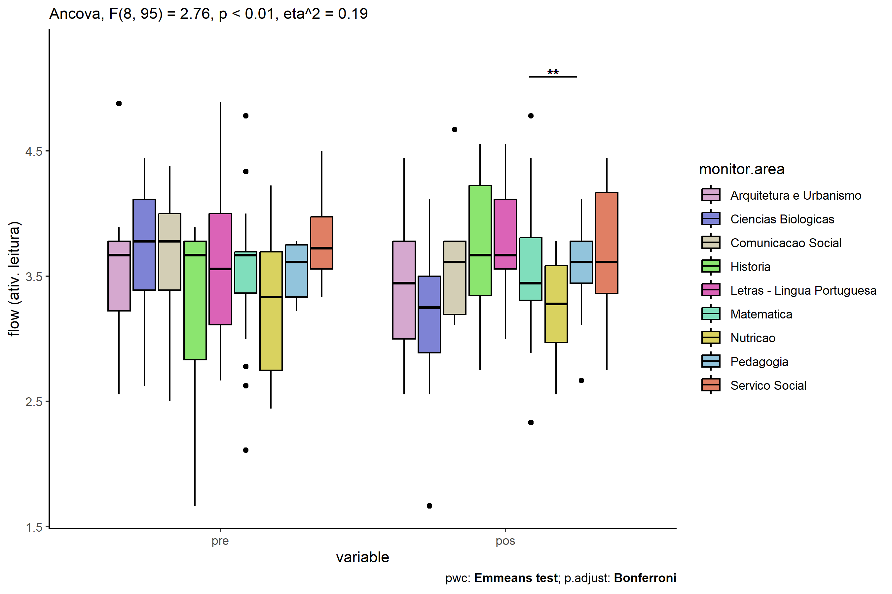<!-- -->

<!-- -->

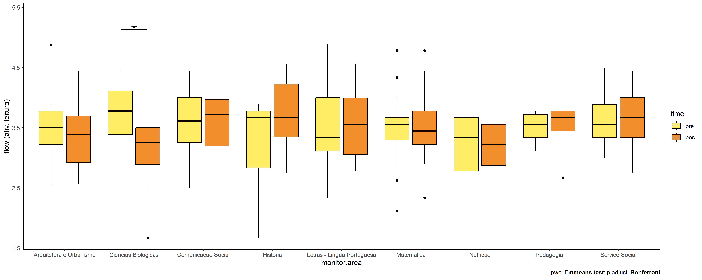<!-- -->

### factores: **grupo=“Experimental”:monitor.formacao**

| var         | monitor.formacao |   n | M (pre) | SE (pre) | M (unadj) | SE (unadj) | M (adj) | SE (adj) |
|:------------|:-----------------|----:|--------:|---------:|----------:|-----------:|--------:|---------:|
| fss.leitura | ensino medio     |  80 |   3.525 |    0.066 |     3.448 |      0.064 |   3.457 |    0.058 |
| fss.leitura | especializacao   |   6 |   3.627 |    0.271 |     3.648 |      0.237 |   3.615 |    0.212 |
| fss.leitura | graduacao        |  19 |   3.618 |    0.099 |     3.626 |      0.127 |   3.597 |    0.119 |

| .y.         | group1         | group2         | estimate | conf.low | conf.high |    se | statistic |     p | p.adj | p.adj.signif |
|:------------|:---------------|:---------------|---------:|---------:|----------:|------:|----------:|------:|------:|:-------------|
| fss.leitura | ensino medio   | especializacao |   -0.158 |   -0.594 |     0.278 | 0.220 |    -0.718 | 0.474 | 1.000 | ns           |
| fss.leitura | ensino medio   | graduacao      |   -0.139 |   -0.403 |     0.124 | 0.133 |    -1.051 | 0.296 | 0.888 | ns           |
| fss.leitura | especializacao | graduacao      |    0.018 |   -0.463 |     0.500 | 0.243 |     0.076 | 0.940 | 1.000 | ns           |
| dfs.leitura | ensino medio   | especializacao |   -0.103 |   -0.582 |     0.377 | 0.242 |    -0.424 | 0.672 | 1.000 | ns           |
| dfs.leitura | ensino medio   | graduacao      |   -0.093 |   -0.382 |     0.196 | 0.146 |    -0.638 | 0.525 | 1.000 | ns           |
| dfs.leitura | especializacao | graduacao      |    0.010 |   -0.521 |     0.540 | 0.267 |     0.036 | 0.971 | 1.000 | ns           |

| monitor.formacao | group1 | group2 | estimate | conf.low | conf.high |    se | statistic |     p | p.adj | p.adj.signif |
|:-----------------|:-------|:-------|---------:|---------:|----------:|------:|----------:|------:|------:|:-------------|
| ensino medio     | pre    | pos    |    0.077 |   -0.101 |     0.254 | 0.090 |     0.852 | 0.395 | 0.395 | ns           |
| especializacao   | pre    | pos    |   -0.021 |   -0.669 |     0.627 | 0.329 |    -0.063 | 0.950 | 0.950 | ns           |
| graduacao        | pre    | pos    |   -0.008 |   -0.372 |     0.356 | 0.185 |    -0.044 | 0.965 | 0.965 | ns           |

    ## Scale for colour is already present.
    ## Adding another scale for colour, which will replace the existing scale.

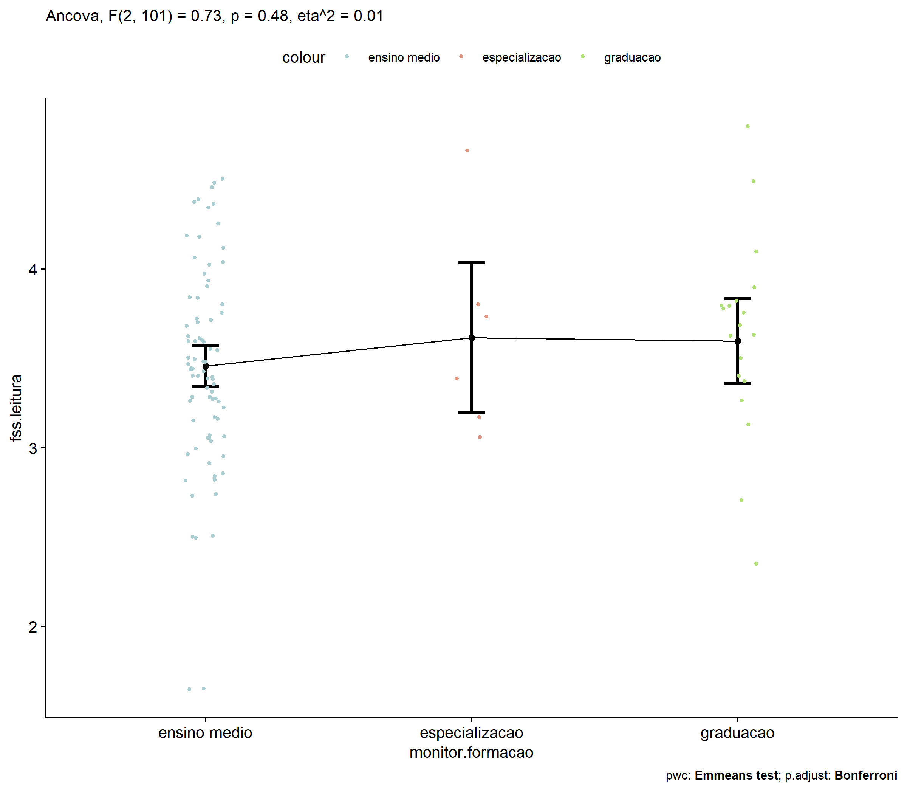<!-- -->

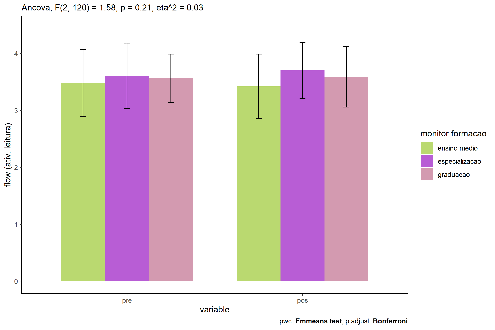<!-- -->

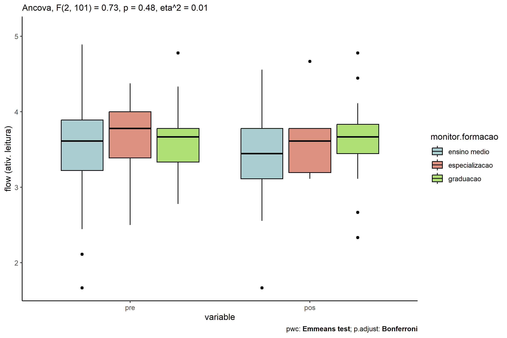<!-- -->

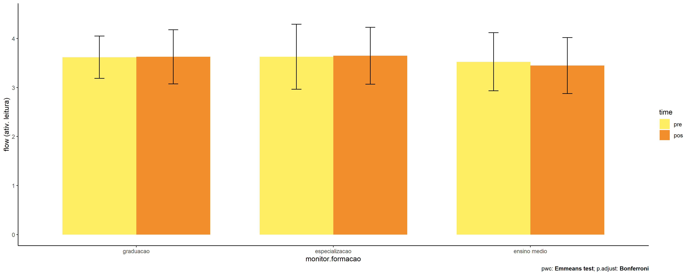<!-- -->

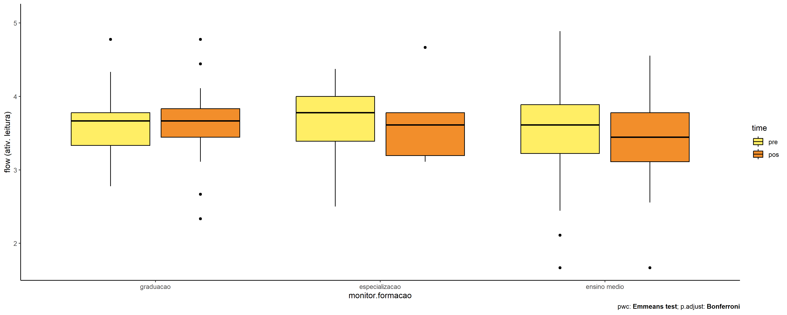<!-- -->

### factores: **grupo=“Experimental”:monitor.experiencia**

| var         | monitor.experiencia |   n | M (pre) | SE (pre) | M (unadj) | SE (unadj) | M (adj) | SE (adj) |
|:------------|:--------------------|----:|--------:|---------:|----------:|-----------:|--------:|---------:|
| fss.leitura | maior 01 ano        |  74 |   3.558 |    0.066 |     3.508 |      0.068 |   3.503 |    0.060 |
| fss.leitura | menor 01 ano        |  31 |   3.523 |    0.103 |     3.454 |      0.095 |   3.464 |    0.093 |

| .y.         | group1       | group2       | estimate | conf.low | conf.high |    se | statistic |     p | p.adj | p.adj.signif |
|:------------|:-------------|:-------------|---------:|---------:|----------:|------:|----------:|------:|------:|:-------------|
| fss.leitura | maior 01 ano | menor 01 ano |    0.039 |   -0.182 |     0.260 | 0.111 |     0.351 | 0.726 | 0.726 | ns           |
| dfs.leitura | maior 01 ano | menor 01 ano |    0.035 |   -0.207 |     0.277 | 0.122 |     0.287 | 0.775 | 0.775 | ns           |

| monitor.experiencia | group1 | group2 | estimate | conf.low | conf.high |    se | statistic |     p | p.adj | p.adj.signif |
|:--------------------|:-------|:-------|---------:|---------:|----------:|------:|----------:|------:|------:|:-------------|
| maior 01 ano        | pre    | pos    |    0.050 |   -0.134 |     0.235 | 0.094 |     0.537 | 0.592 | 0.592 | ns           |
| menor 01 ano        | pre    | pos    |    0.069 |   -0.216 |     0.354 | 0.145 |     0.477 | 0.634 | 0.634 | ns           |

    ## Scale for colour is already present.
    ## Adding another scale for colour, which will replace the existing scale.

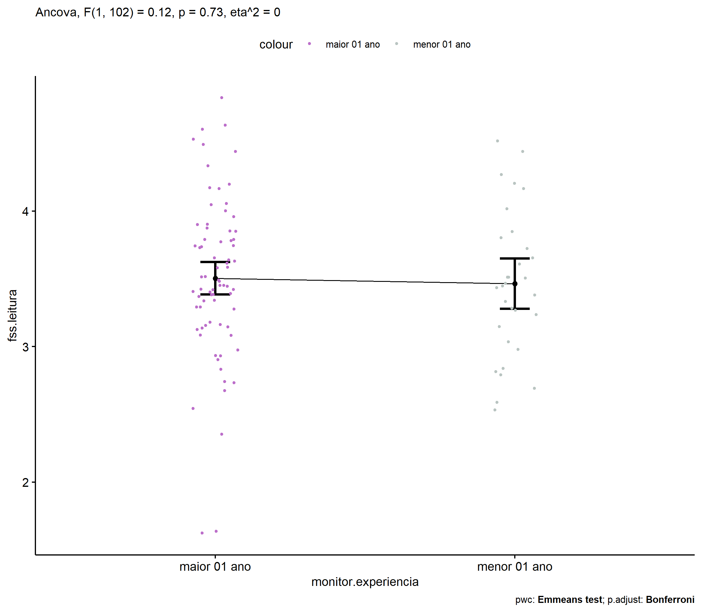<!-- -->

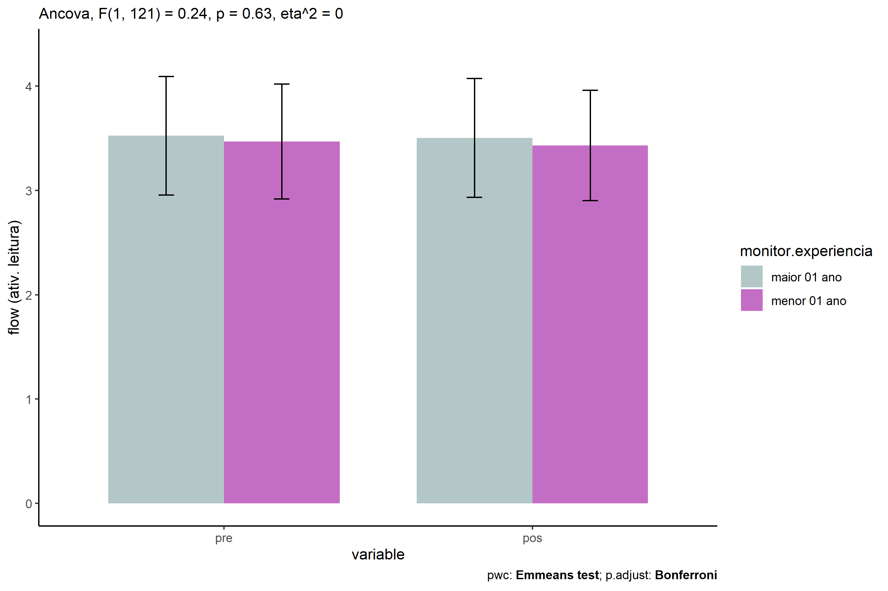<!-- -->

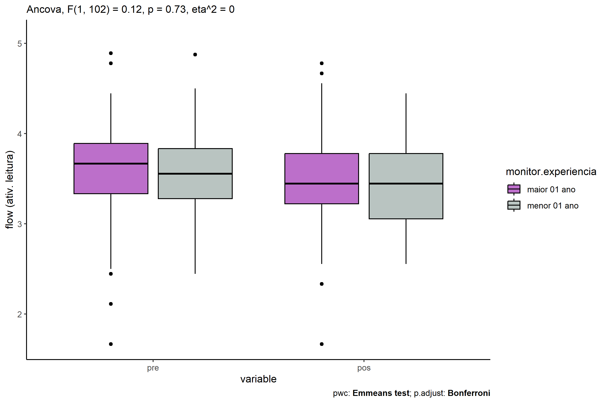<!-- -->

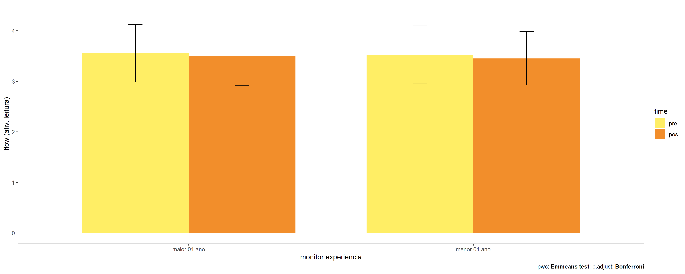<!-- -->

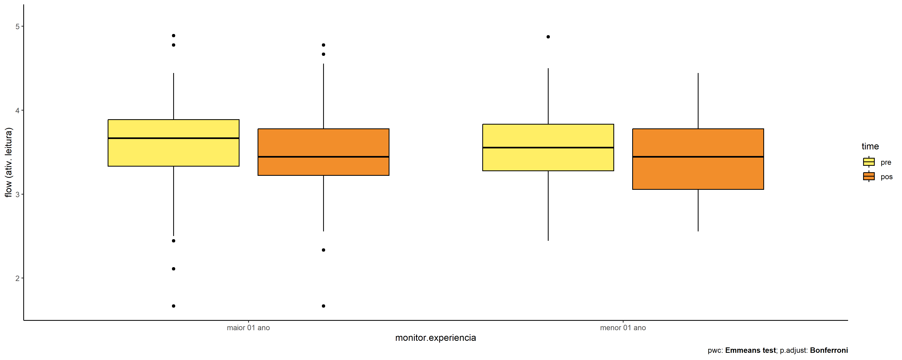<!-- -->
