ANCOVA test for leitura (engajamento no leitura)
================
Geiser C. Challco <geiser@alumni.usp.br>

- [Descriptive Statistics of Initial
  Data](#descriptive-statistics-of-initial-data)
- [Checking of Assumptions](#checking-of-assumptions)
  - [Assumption: Normality distribution of
    data](#assumption-normality-distribution-of-data)
  - [Assumption: Homogeneity of data
    distribution](#assumption-homogeneity-of-data-distribution)
- [Computation of ANCOVA test and Pairwise
  Comparison](#computation-of-ancova-test-and-pairwise-comparison)
  - [ANCOVA tests for one factor](#ancova-tests-for-one-factor)
  - [ANCOVA tests for two factors](#ancova-tests-for-two-factors)
  - [ANCOVA tests for
    grupo=“Experimental”](#ancova-tests-for-grupoexperimental)
  - [Pairwise comparisons for one
    factor](#pairwise-comparisons-for-one-factor)
    - [factor: **grupo**](#factor-grupo)
    - [factor: **genero**](#factor-genero)
    - [factor: **idade**](#factor-idade)
    - [factor: **zona.participante**](#factor-zonaparticipante)
    - [factor: **escola**](#factor-escola)
    - [factor: **zona.escola**](#factor-zonaescola)
  - [Pairwise comparisons for two
    factors](#pairwise-comparisons-for-two-factors)
    - [factores: **grupo:genero**](#factores-grupogenero)
    - [factores: **grupo:idade**](#factores-grupoidade)
    - [factores:
      **grupo:zona.participante**](#factores-grupozonaparticipante)
    - [factores: **grupo:escola**](#factores-grupoescola)
    - [factores: **grupo:zona.escola**](#factores-grupozonaescola)
  - [Pairwise comparisons for
    grupo=“Experimental”](#pairwise-comparisons-for-grupoexperimental)
    - [factores:
      **grupo=“Experimental”:monitor**](#factores-grupoexperimentalmonitor)
    - [factores:
      **grupo=“Experimental”:monitor.genero**](#factores-grupoexperimentalmonitorgenero)
    - [factores:
      **grupo=“Experimental”:monitor.area**](#factores-grupoexperimentalmonitorarea)
    - [factores:
      **grupo=“Experimental”:monitor.formacao**](#factores-grupoexperimentalmonitorformacao)
    - [factores:
      **grupo=“Experimental”:monitor.experiencia**](#factores-grupoexperimentalmonitorexperiencia)

**NOTE**

- Teste ANCOVA para determinar se houve diferenças significativas em
  referência ao engajamento no leitura (medido como estado de fluxo).
- ANCOVA test to determine whether there were significant differences in
  reference to engagement in leitura (measured as flow state).

# Descriptive Statistics of Initial Data

| grupo        | genero | idade | zona.participante | escola | zona.escola | variable    |   n |  mean | median |   min |   max |    sd |    se |    ci |   iqr |
|:-------------|:-------|:------|:------------------|:-------|:------------|:------------|----:|------:|-------:|------:|------:|------:|------:|------:|------:|
| Controle     | F      |       |                   |        |             | fss.leitura |  60 | 3.521 |  3.611 | 2.556 | 4.222 | 0.418 | 0.054 | 0.108 | 0.583 |
| Controle     | M      |       |                   |        |             | fss.leitura |  65 | 3.393 |  3.333 | 2.000 | 4.556 | 0.526 | 0.065 | 0.130 | 0.778 |
| Experimental | F      |       |                   |        |             | fss.leitura |  57 | 3.642 |  3.667 | 2.556 | 4.778 | 0.527 | 0.070 | 0.140 | 0.667 |
| Experimental | M      |       |                   |        |             | fss.leitura |  76 | 3.345 |  3.375 | 1.667 | 4.556 | 0.549 | 0.063 | 0.126 | 0.556 |
| Controle     | F      |       |                   |        |             | dfs.leitura |  60 | 3.595 |  3.667 | 2.444 | 4.556 | 0.536 | 0.069 | 0.138 | 0.889 |
| Controle     | M      |       |                   |        |             | dfs.leitura |  65 | 3.524 |  3.556 | 2.222 | 4.778 | 0.530 | 0.066 | 0.131 | 0.667 |
| Experimental | F      |       |                   |        |             | dfs.leitura |  57 | 3.593 |  3.667 | 2.333 | 4.875 | 0.528 | 0.070 | 0.140 | 0.444 |
| Experimental | M      |       |                   |        |             | dfs.leitura |  76 | 3.401 |  3.354 | 1.667 | 4.889 | 0.576 | 0.066 | 0.132 | 0.798 |
| Controle     |        | 10y   |                   |        |             | fss.leitura |  24 | 3.541 |  3.667 | 2.667 | 4.222 | 0.406 | 0.083 | 0.172 | 0.472 |
| Controle     |        | 11y   |                   |        |             | fss.leitura |  67 | 3.487 |  3.556 | 2.222 | 4.556 | 0.439 | 0.054 | 0.107 | 0.667 |
| Controle     |        | 12y   |                   |        |             | fss.leitura |  18 | 3.437 |  3.278 | 2.556 | 4.556 | 0.611 | 0.144 | 0.304 | 0.889 |
| Controle     |        | 13y   |                   |        |             | fss.leitura |   7 | 3.032 |  3.111 | 2.000 | 3.444 | 0.512 | 0.194 | 0.474 | 0.444 |
| Controle     |        | 14y   |                   |        |             | fss.leitura |   1 | 3.556 |  3.556 | 3.556 | 3.556 |       |       |       | 0.000 |
| Controle     |        | 15y   |                   |        |             | fss.leitura |   1 | 2.444 |  2.444 | 2.444 | 2.444 |       |       |       | 0.000 |
| Controle     |        | 16y   |                   |        |             | fss.leitura |   1 | 2.667 |  2.667 | 2.667 | 2.667 |       |       |       | 0.000 |
| Controle     |        |       |                   |        |             | fss.leitura |   6 | 3.574 |  3.556 | 3.111 | 4.222 | 0.406 | 0.166 | 0.426 | 0.472 |
| Experimental |        | 10y   |                   |        |             | fss.leitura |  25 | 3.422 |  3.556 | 1.667 | 4.444 | 0.602 | 0.120 | 0.248 | 0.556 |
| Experimental |        | 11y   |                   |        |             | fss.leitura |  80 | 3.519 |  3.500 | 1.667 | 4.778 | 0.579 | 0.065 | 0.129 | 0.767 |
| Experimental |        | 12y   |                   |        |             | fss.leitura |  16 | 3.477 |  3.444 | 2.667 | 4.111 | 0.430 | 0.108 | 0.229 | 0.563 |
| Experimental |        | 13y   |                   |        |             | fss.leitura |   9 | 3.287 |  3.333 | 2.556 | 4.375 | 0.507 | 0.169 | 0.389 | 0.333 |
| Experimental |        | 14y   |                   |        |             | fss.leitura |   1 | 3.375 |  3.375 | 3.375 | 3.375 |       |       |       | 0.000 |
| Experimental |        |       |                   |        |             | fss.leitura |   2 | 3.056 |  3.056 | 2.778 | 3.333 | 0.393 | 0.278 | 3.530 | 0.278 |
| Controle     |        | 10y   |                   |        |             | dfs.leitura |  24 | 3.583 |  3.556 | 2.444 | 4.333 | 0.452 | 0.092 | 0.191 | 0.694 |
| Controle     |        | 11y   |                   |        |             | dfs.leitura |  67 | 3.617 |  3.667 | 2.222 | 4.556 | 0.519 | 0.063 | 0.127 | 0.653 |
| Controle     |        | 12y   |                   |        |             | dfs.leitura |  18 | 3.519 |  3.417 | 2.667 | 4.778 | 0.614 | 0.145 | 0.305 | 0.889 |
| Controle     |        | 13y   |                   |        |             | dfs.leitura |   7 | 3.476 |  3.750 | 2.778 | 4.250 | 0.577 | 0.218 | 0.533 | 0.889 |
| Controle     |        | 14y   |                   |        |             | dfs.leitura |   1 | 3.333 |  3.333 | 3.333 | 3.333 |       |       |       | 0.000 |
| Controle     |        | 15y   |                   |        |             | dfs.leitura |   1 | 2.333 |  2.333 | 2.333 | 2.333 |       |       |       | 0.000 |
| Controle     |        | 16y   |                   |        |             | dfs.leitura |   1 | 3.444 |  3.444 | 3.444 | 3.444 |       |       |       | 0.000 |
| Controle     |        |       |                   |        |             | dfs.leitura |   6 | 3.278 |  3.111 | 2.556 | 4.333 | 0.608 | 0.248 | 0.638 | 0.417 |
| Experimental |        | 10y   |                   |        |             | dfs.leitura |  25 | 3.366 |  3.375 | 2.111 | 4.444 | 0.590 | 0.118 | 0.243 | 0.778 |
| Experimental |        | 11y   |                   |        |             | dfs.leitura |  80 | 3.553 |  3.556 | 2.333 | 4.889 | 0.508 | 0.057 | 0.113 | 0.643 |
| Experimental |        | 12y   |                   |        |             | dfs.leitura |  16 | 3.515 |  3.528 | 2.500 | 4.778 | 0.633 | 0.158 | 0.337 | 0.556 |
| Experimental |        | 13y   |                   |        |             | dfs.leitura |   9 | 3.315 |  3.333 | 2.500 | 4.111 | 0.556 | 0.185 | 0.427 | 0.889 |
| Experimental |        | 14y   |                   |        |             | dfs.leitura |   1 | 1.667 |  1.667 | 1.667 | 1.667 |       |       |       | 0.000 |
| Experimental |        |       |                   |        |             | dfs.leitura |   2 | 3.611 |  3.611 | 3.333 | 3.889 | 0.393 | 0.278 | 3.530 | 0.278 |
| Controle     |        |       | Urbana            |        |             | fss.leitura |  54 | 3.450 |  3.528 | 2.222 | 4.556 | 0.487 | 0.066 | 0.133 | 0.667 |
| Controle     |        |       | Rural             |        |             | fss.leitura |  43 | 3.395 |  3.333 | 2.000 | 4.222 | 0.454 | 0.069 | 0.140 | 0.556 |
| Controle     |        |       |                   |        |             | fss.leitura |  28 | 3.553 |  3.597 | 2.667 | 4.375 | 0.504 | 0.095 | 0.195 | 0.719 |
| Experimental |        |       | Urbana            |        |             | fss.leitura |  50 | 3.507 |  3.444 | 2.556 | 4.556 | 0.473 | 0.067 | 0.134 | 0.639 |
| Experimental |        |       | Rural             |        |             | fss.leitura |  53 | 3.418 |  3.444 | 1.667 | 4.778 | 0.638 | 0.088 | 0.176 | 0.667 |
| Experimental |        |       |                   |        |             | fss.leitura |  30 | 3.510 |  3.500 | 2.556 | 4.556 | 0.546 | 0.100 | 0.204 | 0.747 |
| Controle     |        |       | Urbana            |        |             | dfs.leitura |  54 | 3.539 |  3.556 | 2.222 | 4.778 | 0.552 | 0.075 | 0.151 | 0.750 |
| Controle     |        |       | Rural             |        |             | dfs.leitura |  43 | 3.549 |  3.556 | 2.444 | 4.556 | 0.549 | 0.084 | 0.169 | 0.889 |
| Controle     |        |       |                   |        |             | dfs.leitura |  28 | 3.610 |  3.667 | 2.667 | 4.333 | 0.479 | 0.091 | 0.186 | 0.583 |
| Experimental |        |       | Urbana            |        |             | dfs.leitura |  50 | 3.453 |  3.611 | 1.667 | 4.875 | 0.634 | 0.090 | 0.180 | 0.639 |
| Experimental |        |       | Rural             |        |             | dfs.leitura |  53 | 3.484 |  3.556 | 2.444 | 4.444 | 0.514 | 0.071 | 0.142 | 0.667 |
| Experimental |        |       |                   |        |             | dfs.leitura |  30 | 3.532 |  3.556 | 2.333 | 4.889 | 0.530 | 0.097 | 0.198 | 0.590 |
| Controle     |        |       |                   | E1     |             | fss.leitura |  12 | 3.439 |  3.611 | 2.444 | 4.556 | 0.593 | 0.171 | 0.377 | 0.647 |
| Controle     |        |       |                   | E2     |             | fss.leitura |  23 | 3.437 |  3.333 | 2.667 | 4.556 | 0.530 | 0.110 | 0.229 | 0.778 |
| Controle     |        |       |                   | E3     |             | fss.leitura |  15 | 3.419 |  3.444 | 2.889 | 3.778 | 0.257 | 0.066 | 0.142 | 0.278 |
| Controle     |        |       |                   | E4     |             | fss.leitura |  16 | 3.429 |  3.500 | 2.556 | 4.000 | 0.428 | 0.107 | 0.228 | 0.667 |
| Controle     |        |       |                   | E5     |             | fss.leitura |  48 | 3.457 |  3.444 | 2.000 | 4.333 | 0.523 | 0.075 | 0.152 | 0.778 |
| Controle     |        |       |                   | E6     |             | fss.leitura |  11 | 3.578 |  3.444 | 2.667 | 4.000 | 0.422 | 0.127 | 0.283 | 0.556 |
| Experimental |        |       |                   | E1     |             | fss.leitura |  10 | 3.735 |  3.667 | 2.750 | 4.556 | 0.586 | 0.185 | 0.419 | 0.878 |
| Experimental |        |       |                   | E2     |             | fss.leitura |  26 | 3.371 |  3.444 | 2.556 | 4.111 | 0.415 | 0.081 | 0.168 | 0.556 |
| Experimental |        |       |                   | E3     |             | fss.leitura |  15 | 3.106 |  3.250 | 1.667 | 4.111 | 0.700 | 0.181 | 0.388 | 0.611 |
| Experimental |        |       |                   | E4     |             | fss.leitura |  14 | 3.701 |  3.722 | 3.111 | 4.667 | 0.492 | 0.132 | 0.284 | 0.778 |
| Experimental |        |       |                   | E5     |             | fss.leitura |  55 | 3.462 |  3.444 | 2.222 | 4.778 | 0.552 | 0.074 | 0.149 | 0.771 |
| Experimental |        |       |                   | E6     |             | fss.leitura |  13 | 3.690 |  3.667 | 2.750 | 4.444 | 0.491 | 0.136 | 0.297 | 0.667 |
| Controle     |        |       |                   | E1     |             | dfs.leitura |  12 | 3.130 |  3.111 | 2.222 | 4.000 | 0.514 | 0.148 | 0.327 | 0.611 |
| Controle     |        |       |                   | E2     |             | dfs.leitura |  23 | 3.552 |  3.667 | 2.778 | 4.222 | 0.478 | 0.100 | 0.207 | 0.778 |
| Controle     |        |       |                   | E3     |             | dfs.leitura |  15 | 3.763 |  3.889 | 2.889 | 4.556 | 0.521 | 0.135 | 0.288 | 0.833 |
| Controle     |        |       |                   | E4     |             | dfs.leitura |  16 | 3.612 |  3.556 | 3.000 | 4.250 | 0.305 | 0.076 | 0.163 | 0.326 |
| Controle     |        |       |                   | E5     |             | dfs.leitura |  48 | 3.518 |  3.556 | 2.444 | 4.778 | 0.597 | 0.086 | 0.173 | 0.806 |
| Controle     |        |       |                   | E6     |             | dfs.leitura |  11 | 3.859 |  3.778 | 3.222 | 4.333 | 0.352 | 0.106 | 0.236 | 0.389 |
| Experimental |        |       |                   | E1     |             | dfs.leitura |  10 | 3.275 |  3.667 | 1.667 | 3.889 | 0.760 | 0.240 | 0.544 | 0.944 |
| Experimental |        |       |                   | E2     |             | dfs.leitura |  26 | 3.374 |  3.333 | 2.444 | 4.222 | 0.483 | 0.095 | 0.195 | 0.722 |
| Experimental |        |       |                   | E3     |             | dfs.leitura |  15 | 3.701 |  3.778 | 2.625 | 4.444 | 0.525 | 0.136 | 0.291 | 0.722 |
| Experimental |        |       |                   | E4     |             | dfs.leitura |  14 | 3.605 |  3.611 | 2.500 | 4.444 | 0.575 | 0.154 | 0.332 | 0.750 |
| Experimental |        |       |                   | E5     |             | dfs.leitura |  55 | 3.449 |  3.444 | 2.111 | 4.889 | 0.583 | 0.079 | 0.158 | 0.611 |
| Experimental |        |       |                   | E6     |             | dfs.leitura |  13 | 3.628 |  3.556 | 3.000 | 4.500 | 0.424 | 0.118 | 0.256 | 0.556 |
| Controle     |        |       |                   |        | Urbana      | fss.leitura |  83 | 3.449 |  3.444 | 2.000 | 4.556 | 0.528 | 0.058 | 0.115 | 0.833 |
| Controle     |        |       |                   |        | Rural       | fss.leitura |  42 | 3.465 |  3.444 | 2.556 | 4.000 | 0.371 | 0.057 | 0.116 | 0.438 |
| Experimental |        |       |                   |        | Urbana      | fss.leitura |  91 | 3.466 |  3.444 | 2.222 | 4.778 | 0.525 | 0.055 | 0.109 | 0.667 |
| Experimental |        |       |                   |        | Rural       | fss.leitura |  42 | 3.485 |  3.500 | 1.667 | 4.667 | 0.630 | 0.097 | 0.196 | 0.722 |
| Controle     |        |       |                   |        | Urbana      | dfs.leitura |  83 | 3.471 |  3.556 | 2.222 | 4.778 | 0.567 | 0.062 | 0.124 | 0.778 |
| Controle     |        |       |                   |        | Rural       | dfs.leitura |  42 | 3.730 |  3.778 | 2.889 | 4.556 | 0.409 | 0.063 | 0.127 | 0.486 |
| Experimental |        |       |                   |        | Urbana      | dfs.leitura |  91 | 3.408 |  3.444 | 1.667 | 4.889 | 0.574 | 0.060 | 0.120 | 0.722 |
| Experimental |        |       |                   |        | Rural       | dfs.leitura |  42 | 3.646 |  3.611 | 2.500 | 4.500 | 0.503 | 0.078 | 0.157 | 0.667 |

# Checking of Assumptions

## Assumption: Normality distribution of data

| var         |   n |   skewness |   kurtosis | symmetry | statistic | method     |         p | p.signif | normality |
|:------------|----:|-----------:|-----------:|:---------|----------:|:-----------|----------:|:---------|:----------|
| fss.leitura | 258 | -0.2664060 |  0.1768038 | YES      |  3.865177 | D’Agostino | 0.1447730 | ns       | \-        |
| fss.leitura | 250 | -0.3437885 |  0.5094258 | YES      |  7.797311 | D’Agostino | 0.0202691 | ns       | \-        |
| fss.leitura | 200 | -0.2811981 |  0.5903626 | YES      |  5.752812 | D’Agostino | 0.0563369 | ns       | QQ        |
| fss.leitura | 258 | -0.2221077 | -0.1781840 | YES      |  2.342131 | D’Agostino | 0.3100365 | ns       | \-        |
| fss.leitura | 258 | -0.2911872 |  0.2552890 | YES      |  4.874070 | D’Agostino | 0.0874197 | ns       | \-        |

## Assumption: Homogeneity of data distribution

| var         | method         | formula                             |   n | DFn.df1 | DFd.df2 | statistic |         p | p.signif |
|:------------|:---------------|:------------------------------------|----:|--------:|--------:|----------:|----------:|:---------|
| fss.leitura | Levene’s test  | `.res`~`grupo`\*`genero`            | 258 |       3 |     254 | 0.4772178 | 0.6984156 | ns       |
| fss.leitura | Anova’s slopes | `.res`~`grupo`\*`genero`            | 258 |       3 |     250 | 0.8950000 | 0.4440000 | ns       |
| fss.leitura | Levene’s test  | `.res`~`grupo`\*`idade`             | 250 |      11 |     238 | 1.2611687 | 0.2479364 | ns       |
| fss.leitura | Anova’s slopes | `.res`~`grupo`\*`idade`             | 250 |       7 |     230 | 1.3650000 | 0.2210000 | ns       |
| fss.leitura | Levene’s test  | `.res`~`grupo`\*`zona.participante` | 200 |       3 |     196 | 1.8044688 | 0.1476645 | ns       |
| fss.leitura | Anova’s slopes | `.res`~`grupo`\*`zona.participante` | 200 |       3 |     192 | 0.7070000 | 0.5490000 | ns       |
| fss.leitura | Levene’s test  | `.res`~`grupo`\*`escola`            | 258 |      11 |     246 | 0.7565437 | 0.6832033 | ns       |
| fss.leitura | Anova’s slopes | `.res`~`grupo`\*`escola`            | 258 |      11 |     234 | 1.0350000 | 0.4160000 | ns       |
| fss.leitura | Levene’s test  | `.res`~`grupo`\*`zona.escola`       | 258 |       3 |     254 | 1.8828757 | 0.1329108 | ns       |
| fss.leitura | Anova’s slopes | `.res`~`grupo`\*`zona.escola`       | 258 |       3 |     250 | 1.1580000 | 0.3260000 | ns       |

# Computation of ANCOVA test and Pairwise Comparison

## ANCOVA tests for one factor

|     | Effect            | DFn | DFd |   SSn |    SSd |      F | p       |   ges | p\<.05 |
|:----|:------------------|----:|----:|------:|-------:|-------:|:--------|------:|:-------|
| 1   | dfs.leitura       |   1 | 255 | 8.785 | 60.815 | 36.836 | \<0.001 | 0.126 | \*     |
| 2   | grupo             |   1 | 255 | 0.120 | 60.815 |  0.503 | 0.479   | 0.002 |        |
| 4   | genero            |   1 | 255 | 1.809 | 59.126 |  7.803 | 0.006   | 0.030 | \*     |
| 6   | idade             |   6 | 242 | 2.273 | 57.163 |  1.604 | 0.147   | 0.038 |        |
| 8   | zona.participante |   1 | 197 | 0.280 | 48.052 |  1.146 | 0.286   | 0.006 |        |
| 10  | escola            |   5 | 251 | 3.830 | 57.106 |  3.366 | 0.006   | 0.063 | \*     |
| 12  | zona.escola       |   1 | 255 | 0.268 | 60.668 |  1.124 | 0.29    | 0.004 |        |

## ANCOVA tests for two factors

|     | Effect                  | DFn | DFd |   SSn |    SSd |      F | p       |   ges | p\<.05 |
|:----|:------------------------|----:|----:|------:|-------:|-------:|:--------|------:|:-------|
| 1   | dfs.leitura             |   1 | 253 | 7.532 | 58.690 | 32.470 | \<0.001 | 0.114 | \*     |
| 4   | grupo:genero            |   1 | 253 | 0.272 | 58.690 |  1.171 | 0.28    | 0.005 |        |
| 8   | grupo:idade             |   4 | 237 | 0.433 | 56.566 |  0.453 | 0.77    | 0.008 |        |
| 12  | grupo:zona.participante |   1 | 195 | 0.021 | 47.834 |  0.084 | 0.772   | 0.000 |        |
| 16  | grupo:escola            |   5 | 245 | 1.618 | 55.332 |  1.433 | 0.213   | 0.028 |        |
| 20  | grupo:zona.escola       |   1 | 253 | 0.002 | 60.549 |  0.007 | 0.935   | 0.000 |        |

## ANCOVA tests for grupo=“Experimental”

|     | Effect              | DFn | DFd |   SSn |    SSd |      F | p       |   ges | p\<.05 |
|:----|:--------------------|----:|----:|------:|-------:|-------:|:--------|------:|:-------|
| 1   | dfs.leitura         |   1 | 113 | 7.316 | 25.420 | 32.522 | \<0.001 | 0.223 | \*     |
| 2   | monitor             |   9 | 113 | 5.887 | 25.420 |  2.908 | 0.004   | 0.188 | \*     |
| 4   | monitor.genero      |   1 | 121 | 1.190 | 30.117 |  4.779 | 0.031   | 0.038 | \*     |
| 6   | monitor.area        |   8 | 114 | 5.788 | 25.519 |  3.232 | 0.002   | 0.185 | \*     |
| 8   | monitor.formacao    |   2 | 120 | 0.802 | 30.504 |  1.578 | 0.211   | 0.026 |        |
| 10  | monitor.experiencia |   1 | 121 | 0.062 | 31.244 |  0.239 | 0.626   | 0.002 |        |

## Pairwise comparisons for one factor

### factor: **grupo**

| var         | grupo        |   n | M (pre) | SE (pre) | M (unadj) | SE (unadj) | M (adj) | SE (adj) |
|:------------|:-------------|----:|--------:|---------:|----------:|-----------:|--------:|---------:|
| fss.leitura | Controle     | 125 |   3.558 |    0.048 |     3.454 |      0.043 |   3.441 |    0.044 |
| fss.leitura | Experimental | 133 |   3.483 |    0.049 |     3.472 |      0.048 |   3.484 |    0.042 |

| .y.         | group1   | group2       | estimate | conf.low | conf.high |    se | statistic |     p | p.adj | p.adj.signif |
|:------------|:---------|:-------------|---------:|---------:|----------:|------:|----------:|------:|------:|:-------------|
| fss.leitura | Controle | Experimental |   -0.043 |   -0.163 |     0.077 | 0.061 |    -0.709 | 0.479 | 0.479 | ns           |
| dfs.leitura | Controle | Experimental |    0.075 |   -0.060 |     0.209 | 0.068 |     1.096 | 0.274 | 0.274 | ns           |

| .y.          | grupo        | group1 | group2 | estimate | conf.low | conf.high |    se | statistic |     p | p.adj | p.adj.signif |
|:-------------|:-------------|:-------|:-------|---------:|---------:|----------:|------:|----------:|------:|------:|:-------------|
| flow.leitura | Controle     | pre    | pos    |    0.104 |   -0.029 |     0.237 | 0.068 |     1.537 | 0.125 | 0.125 | ns           |
| flow.leitura | Experimental | pre    | pos    |    0.011 |   -0.118 |     0.140 | 0.066 |     0.172 | 0.864 | 0.864 | ns           |

    ## Scale for colour is already present.
    ## Adding another scale for colour, which will replace the existing scale.

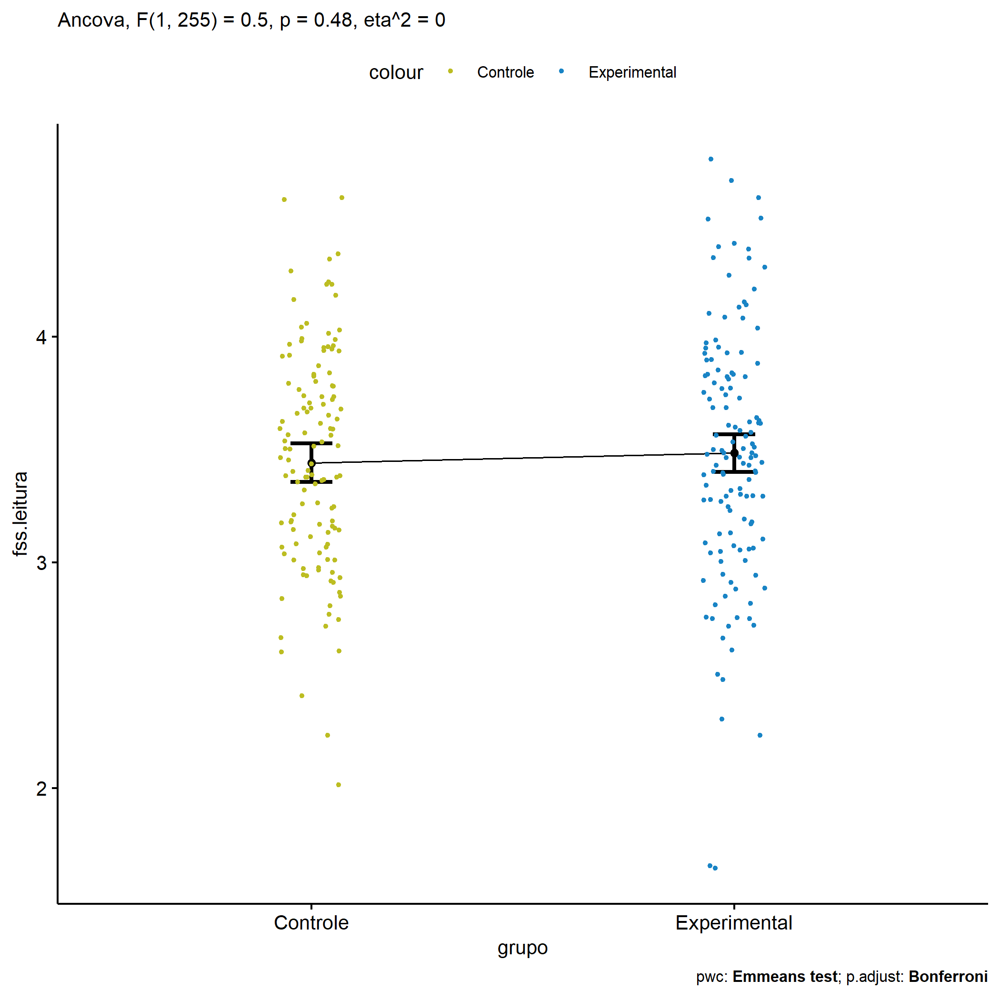<!-- -->

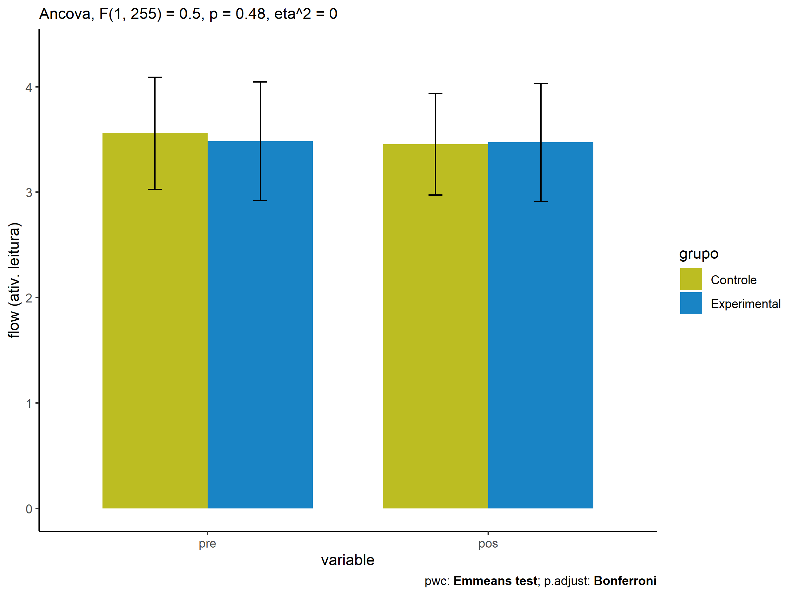<!-- -->

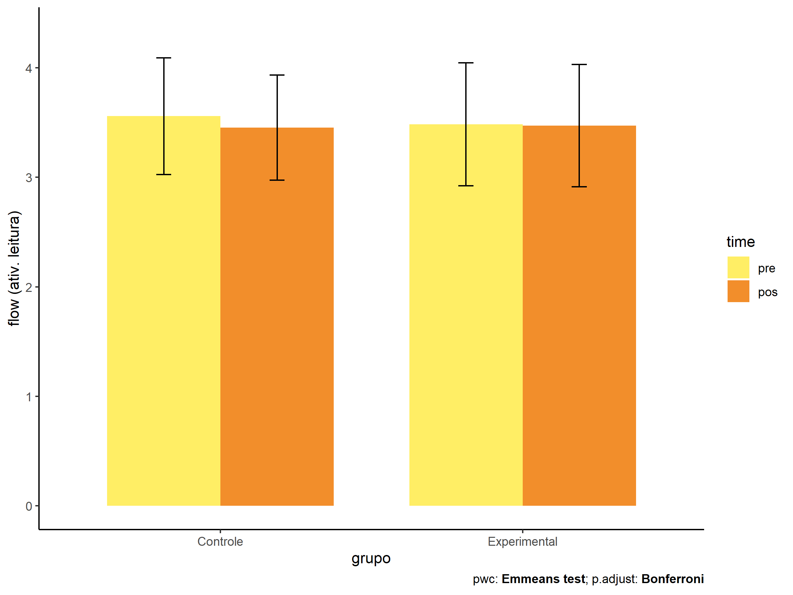<!-- -->

### factor: **genero**

| var         | genero |   n | M (pre) | SE (pre) | M (unadj) | SE (unadj) | M (adj) | SE (adj) |
|:------------|:-------|----:|--------:|---------:|----------:|-----------:|--------:|---------:|
| fss.leitura | F      | 117 |   3.594 |    0.049 |     3.580 |      0.044 |   3.556 |    0.045 |
| fss.leitura | M      | 141 |   3.458 |    0.047 |     3.367 |      0.045 |   3.387 |    0.041 |

| .y.         | group1 | group2 | estimate | conf.low | conf.high |    se | statistic |     p | p.adj | p.adj.signif |
|:------------|:-------|:-------|---------:|---------:|----------:|------:|----------:|------:|------:|:-------------|
| fss.leitura | F      | M      |    0.170 |    0.050 |     0.289 | 0.061 |     2.793 | 0.006 | 0.006 | \*\*         |
| dfs.leitura | F      | M      |    0.136 |    0.002 |     0.270 | 0.068 |     1.998 | 0.047 | 0.047 | \*           |

| .y.          | genero | group1 | group2 | estimate | conf.low | conf.high |    se | statistic |     p | p.adj | p.adj.signif |
|:-------------|:-------|:-------|:-------|---------:|---------:|----------:|------:|----------:|------:|------:|:-------------|
| flow.leitura | F      | pre    | pos    |    0.014 |   -0.121 |     0.150 | 0.069 |     0.208 | 0.835 | 0.835 | ns           |
| flow.leitura | M      | pre    | pos    |    0.091 |   -0.033 |     0.214 | 0.063 |     1.445 | 0.149 | 0.149 | ns           |

    ## Scale for colour is already present.
    ## Adding another scale for colour, which will replace the existing scale.

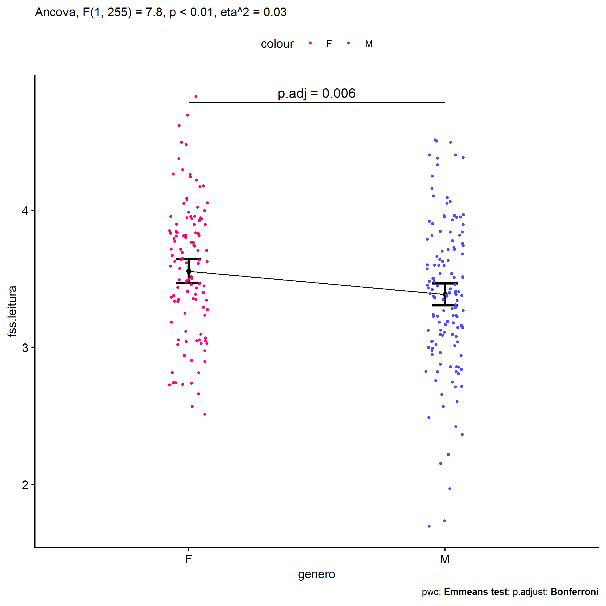<!-- -->

<!-- -->

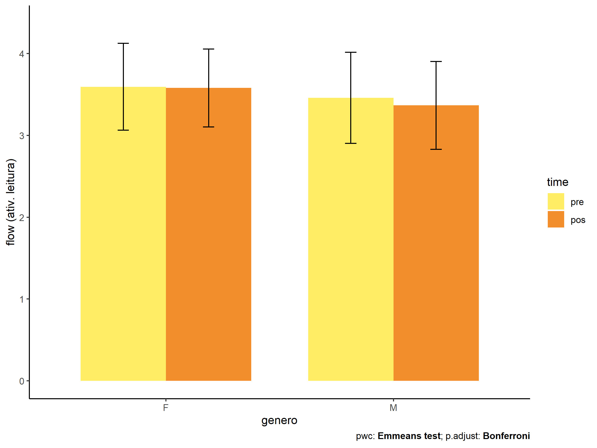<!-- -->

### factor: **idade**

| var         | idade |   n | M (pre) | SE (pre) | M (unadj) | SE (unadj) | M (adj) | SE (adj) |
|:------------|:------|----:|--------:|---------:|----------:|-----------:|--------:|---------:|
| fss.leitura | 10y   |  49 |   3.472 |    0.076 |     3.480 |      0.073 |   3.502 |    0.070 |
| fss.leitura | 11y   | 147 |   3.582 |    0.042 |     3.505 |      0.043 |   3.490 |    0.040 |
| fss.leitura | 12y   |  34 |   3.517 |    0.105 |     3.455 |      0.090 |   3.463 |    0.083 |
| fss.leitura | 13y   |  16 |   3.385 |    0.138 |     3.175 |      0.127 |   3.227 |    0.122 |

| .y.         | group1 | group2 | estimate | conf.low | conf.high |    se | statistic |     p | p.adj | p.adj.signif |
|:------------|:-------|:-------|---------:|---------:|----------:|------:|----------:|------:|------:|:-------------|
| fss.leitura | 10y    | 11y    |    0.013 |   -0.146 |     0.171 | 0.081 |     0.157 | 0.876 | 1.000 | ns           |
| fss.leitura | 10y    | 12y    |    0.040 |   -0.174 |     0.254 | 0.109 |     0.366 | 0.714 | 1.000 | ns           |
| fss.leitura | 10y    | 13y    |    0.275 |   -0.001 |     0.552 | 0.140 |     1.965 | 0.051 | 0.304 | ns           |
| fss.leitura | 11y    | 12y    |    0.027 |   -0.155 |     0.210 | 0.093 |     0.293 | 0.770 | 1.000 | ns           |
| fss.leitura | 11y    | 13y    |    0.263 |    0.009 |     0.516 | 0.129 |     2.043 | 0.042 | 0.253 | ns           |
| fss.leitura | 12y    | 13y    |    0.236 |   -0.055 |     0.527 | 0.148 |     1.595 | 0.112 | 0.672 | ns           |
| dfs.leitura | 10y    | 11y    |   -0.110 |   -0.283 |     0.064 | 0.088 |    -1.245 | 0.214 | 1.000 | ns           |
| dfs.leitura | 10y    | 12y    |   -0.045 |   -0.279 |     0.190 | 0.119 |    -0.376 | 0.707 | 1.000 | ns           |
| dfs.leitura | 10y    | 13y    |    0.087 |   -0.216 |     0.390 | 0.154 |     0.565 | 0.573 | 1.000 | ns           |
| dfs.leitura | 11y    | 12y    |    0.065 |   -0.135 |     0.265 | 0.102 |     0.639 | 0.524 | 1.000 | ns           |
| dfs.leitura | 11y    | 13y    |    0.196 |   -0.080 |     0.473 | 0.141 |     1.398 | 0.163 | 0.980 | ns           |
| dfs.leitura | 12y    | 13y    |    0.132 |   -0.187 |     0.450 | 0.162 |     0.813 | 0.417 | 1.000 | ns           |

| .y.          | idade | group1 | group2 | estimate | conf.low | conf.high |    se | statistic |     p | p.adj | p.adj.signif |
|:-------------|:------|:-------|:-------|---------:|---------:|----------:|------:|----------:|------:|------:|:-------------|
| flow.leitura | 10y   | pre    | pos    |   -0.008 |   -0.217 |     0.201 | 0.106 |    -0.075 | 0.940 | 0.940 | ns           |
| flow.leitura | 11y   | pre    | pos    |    0.077 |   -0.043 |     0.198 | 0.061 |     1.260 | 0.208 | 0.208 | ns           |
| flow.leitura | 12y   | pre    | pos    |    0.062 |   -0.189 |     0.312 | 0.128 |     0.482 | 0.630 | 0.630 | ns           |
| flow.leitura | 13y   | pre    | pos    |    0.210 |   -0.155 |     0.575 | 0.186 |     1.130 | 0.259 | 0.259 | ns           |

    ## Scale for colour is already present.
    ## Adding another scale for colour, which will replace the existing scale.

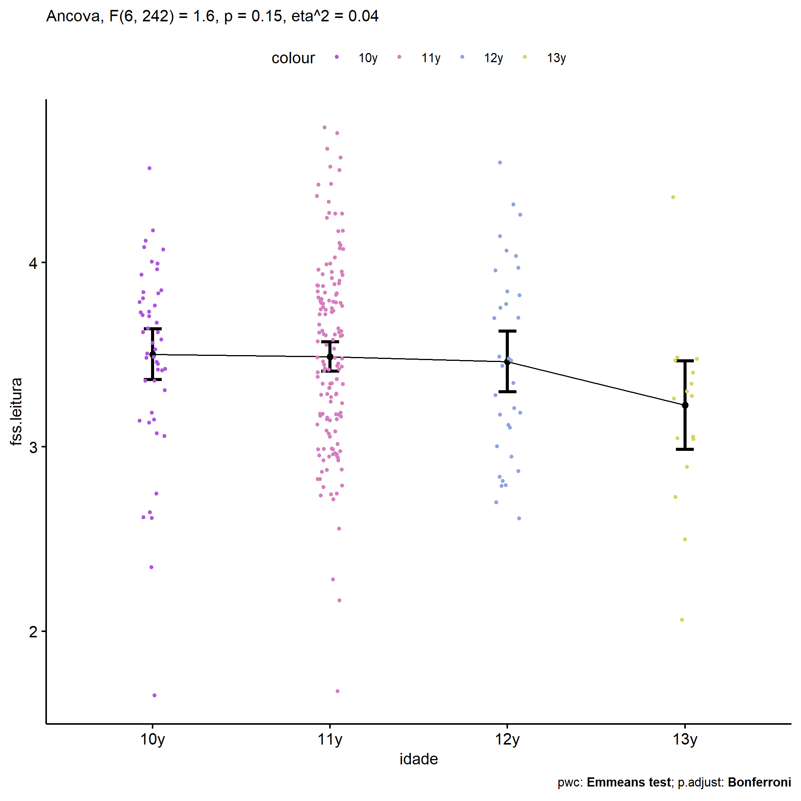<!-- -->

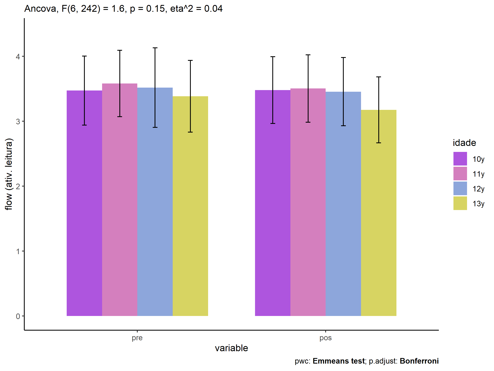<!-- -->

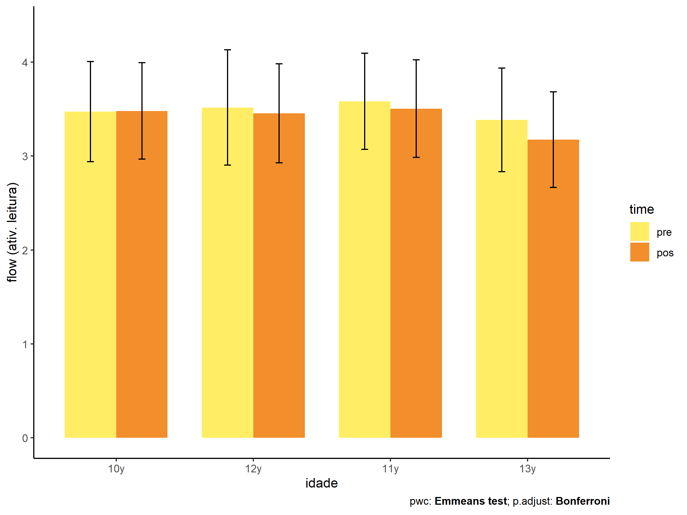<!-- -->

### factor: **zona.participante**

| var         | zona.participante |   n | M (pre) | SE (pre) | M (unadj) | SE (unadj) | M (adj) | SE (adj) |
|:------------|:------------------|----:|--------:|---------:|----------:|-----------:|--------:|---------:|
| fss.leitura | Rural             |  96 |   3.513 |    0.054 |     3.408 |      0.057 |   3.405 |    0.050 |
| fss.leitura | Urbana            | 104 |   3.498 |    0.058 |     3.478 |      0.047 |   3.480 |    0.048 |

| .y.         | group1 | group2 | estimate | conf.low | conf.high |   se | statistic |     p | p.adj | p.adj.signif |
|:------------|:-------|:-------|---------:|---------:|----------:|-----:|----------:|------:|------:|:-------------|
| fss.leitura | Urbana | Rural  |    0.075 |   -0.063 |     0.213 | 0.07 |     1.070 | 0.286 | 0.286 | ns           |
| dfs.leitura | Urbana | Rural  |   -0.015 |   -0.172 |     0.142 | 0.08 |    -0.191 | 0.849 | 0.849 | ns           |

| .y.          | zona.participante | group1 | group2 | estimate | conf.low | conf.high |    se | statistic |     p | p.adj | p.adj.signif |
|:-------------|:------------------|:-------|:-------|---------:|---------:|----------:|------:|----------:|------:|------:|:-------------|
| flow.leitura | Urbana            | pre    | pos    |    0.020 |   -0.128 |     0.168 | 0.075 |     0.266 | 0.790 | 0.790 | ns           |
| flow.leitura | Rural             | pre    | pos    |    0.106 |   -0.048 |     0.259 | 0.078 |     1.350 | 0.178 | 0.178 | ns           |

    ## Scale for colour is already present.
    ## Adding another scale for colour, which will replace the existing scale.

<!-- -->

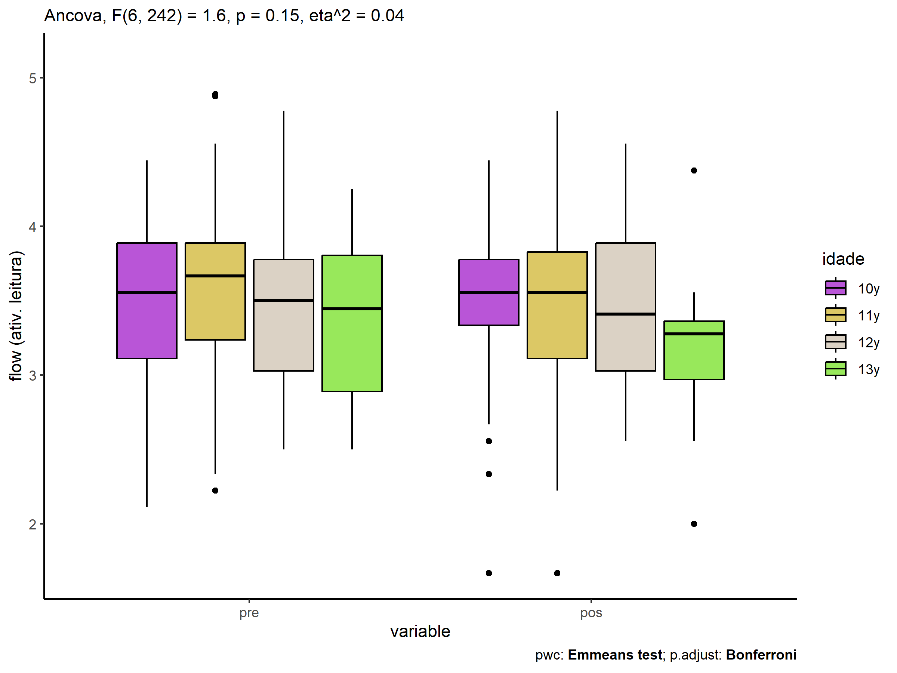<!-- -->

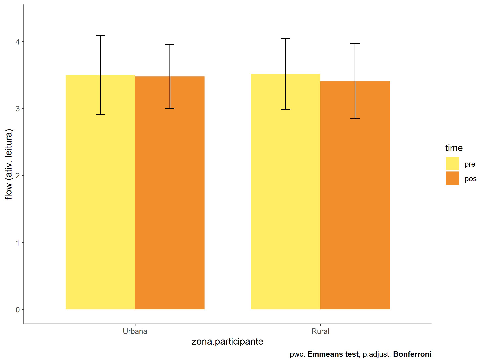<!-- -->

### factor: **escola**

| var         | escola |   n | M (pre) | SE (pre) | M (unadj) | SE (unadj) | M (adj) | SE (adj) |
|:------------|:-------|----:|--------:|---------:|----------:|-----------:|--------:|---------:|
| fss.leitura | E1     |  22 |   3.196 |    0.133 |     3.574 |      0.127 |   3.694 |    0.103 |
| fss.leitura | E2     |  49 |   3.457 |    0.069 |     3.402 |      0.067 |   3.425 |    0.068 |
| fss.leitura | E3     |  30 |   3.732 |    0.094 |     3.263 |      0.099 |   3.184 |    0.088 |
| fss.leitura | E4     |  30 |   3.609 |    0.081 |     3.556 |      0.086 |   3.523 |    0.087 |
| fss.leitura | E5     | 103 |   3.481 |    0.058 |     3.460 |      0.053 |   3.474 |    0.047 |
| fss.leitura | E6     |  24 |   3.734 |    0.082 |     3.639 |      0.093 |   3.560 |    0.098 |

| .y.         | group1 | group2 | estimate | conf.low | conf.high |    se | statistic | p       | p.adj | p.adj.signif |
|:------------|:-------|:-------|---------:|---------:|----------:|------:|----------:|:--------|------:|:-------------|
| fss.leitura | E1     | E2     |    0.269 |    0.026 |     0.511 | 0.123 |     2.179 | 0.03    | 0.454 | ns           |
| fss.leitura | E1     | E3     |    0.510 |    0.239 |     0.780 | 0.137 |     3.714 | \<0.001 | 0.004 | \*\*         |
| fss.leitura | E1     | E4     |    0.171 |   -0.097 |     0.438 | 0.136 |     1.255 | 0.211   | 1.000 | ns           |
| fss.leitura | E1     | E5     |    0.219 |   -0.004 |     0.442 | 0.113 |     1.936 | 0.054   | 0.809 | ns           |
| fss.leitura | E1     | E6     |    0.134 |   -0.150 |     0.418 | 0.144 |     0.931 | 0.353   | 1.000 | ns           |
| fss.leitura | E2     | E3     |    0.241 |    0.021 |     0.461 | 0.112 |     2.160 | 0.032   | 0.476 | ns           |
| fss.leitura | E2     | E4     |   -0.098 |   -0.317 |     0.120 | 0.111 |    -0.885 | 0.377   | 1.000 | ns           |
| fss.leitura | E2     | E5     |   -0.049 |   -0.213 |     0.114 | 0.083 |    -0.598 | 0.551   | 1.000 | ns           |
| fss.leitura | E2     | E6     |   -0.135 |   -0.371 |     0.101 | 0.120 |    -1.123 | 0.263   | 1.000 | ns           |
| fss.leitura | E3     | E4     |   -0.339 |   -0.582 |    -0.096 | 0.123 |    -2.750 | 0.006   | 0.096 | ns           |
| fss.leitura | E3     | E5     |   -0.291 |   -0.487 |    -0.094 | 0.100 |    -2.907 | 0.004   | 0.060 | ns           |
| fss.leitura | E3     | E6     |   -0.376 |   -0.633 |    -0.118 | 0.131 |    -2.876 | 0.004   | 0.066 | ns           |
| fss.leitura | E4     | E5     |    0.049 |   -0.147 |     0.244 | 0.099 |     0.490 | 0.624   | 1.000 | ns           |
| fss.leitura | E4     | E6     |   -0.036 |   -0.294 |     0.221 | 0.131 |    -0.279 | 0.781   | 1.000 | ns           |
| fss.leitura | E5     | E6     |   -0.085 |   -0.300 |     0.130 | 0.109 |    -0.781 | 0.436   | 1.000 | ns           |
| dfs.leitura | E1     | E2     |   -0.262 |   -0.532 |     0.008 | 0.137 |    -1.912 | 0.057   | 0.855 | ns           |
| dfs.leitura | E1     | E3     |   -0.536 |   -0.832 |    -0.241 | 0.150 |    -3.580 | \<0.001 | 0.006 | \*\*         |
| dfs.leitura | E1     | E4     |   -0.413 |   -0.708 |    -0.118 | 0.150 |    -2.757 | 0.006   | 0.094 | ns           |
| dfs.leitura | E1     | E5     |   -0.285 |   -0.532 |    -0.039 | 0.125 |    -2.277 | 0.024   | 0.355 | ns           |
| dfs.leitura | E1     | E6     |   -0.538 |   -0.849 |    -0.228 | 0.158 |    -3.416 | \<0.001 | 0.011 | \*           |
| dfs.leitura | E2     | E3     |   -0.274 |   -0.518 |    -0.031 | 0.124 |    -2.218 | 0.027   | 0.412 | ns           |
| dfs.leitura | E2     | E4     |   -0.151 |   -0.395 |     0.093 | 0.124 |    -1.221 | 0.223   | 1.000 | ns           |
| dfs.leitura | E2     | E5     |   -0.023 |   -0.206 |     0.159 | 0.093 |    -0.253 | 0.8     | 1.000 | ns           |
| dfs.leitura | E2     | E6     |   -0.276 |   -0.538 |    -0.014 | 0.133 |    -2.078 | 0.039   | 0.581 | ns           |
| dfs.leitura | E3     | E4     |    0.123 |   -0.148 |     0.395 | 0.138 |     0.895 | 0.372   | 1.000 | ns           |
| dfs.leitura | E3     | E5     |    0.251 |    0.033 |     0.469 | 0.111 |     2.266 | 0.024   | 0.364 | ns           |
| dfs.leitura | E3     | E6     |   -0.002 |   -0.290 |     0.286 | 0.146 |    -0.013 | 0.99    | 1.000 | ns           |
| dfs.leitura | E4     | E5     |    0.128 |   -0.090 |     0.346 | 0.111 |     1.153 | 0.25    | 1.000 | ns           |
| dfs.leitura | E4     | E6     |   -0.125 |   -0.413 |     0.163 | 0.146 |    -0.856 | 0.393   | 1.000 | ns           |
| dfs.leitura | E5     | E6     |   -0.253 |   -0.491 |    -0.015 | 0.121 |    -2.090 | 0.038   | 0.565 | ns           |

| .y.          | escola | group1 | group2 | estimate | conf.low | conf.high |    se | statistic | p       | p.adj   | p.adj.signif |
|:-------------|:-------|:-------|:-------|---------:|---------:|----------:|------:|----------:|:--------|:--------|:-------------|
| flow.leitura | E1     | pre    | pos    |   -0.378 |   -0.689 |    -0.067 | 0.158 |    -2.389 | 0.017   | 0.017   | \*           |
| flow.leitura | E2     | pre    | pos    |    0.056 |   -0.153 |     0.264 | 0.106 |     0.524 | 0.6     | 0.6     | ns           |
| flow.leitura | E3     | pre    | pos    |    0.469 |    0.203 |     0.736 | 0.135 |     3.465 | \<0.001 | \<0.001 | \*\*\*       |
| flow.leitura | E4     | pre    | pos    |    0.053 |   -0.214 |     0.319 | 0.135 |     0.388 | 0.698   | 0.698   | ns           |
| flow.leitura | E5     | pre    | pos    |    0.021 |   -0.123 |     0.165 | 0.073 |     0.285 | 0.776   | 0.776   | ns           |
| flow.leitura | E6     | pre    | pos    |    0.095 |   -0.203 |     0.393 | 0.151 |     0.627 | 0.531   | 0.531   | ns           |

    ## Scale for colour is already present.
    ## Adding another scale for colour, which will replace the existing scale.

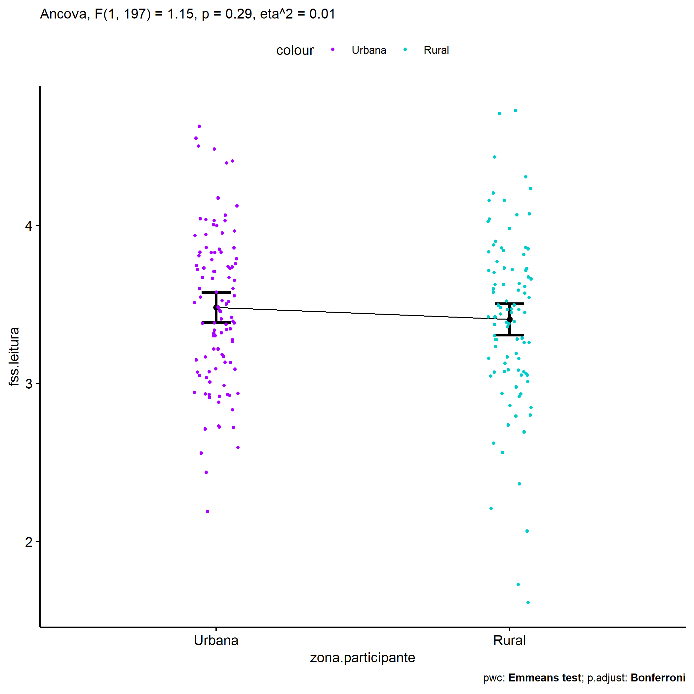<!-- -->

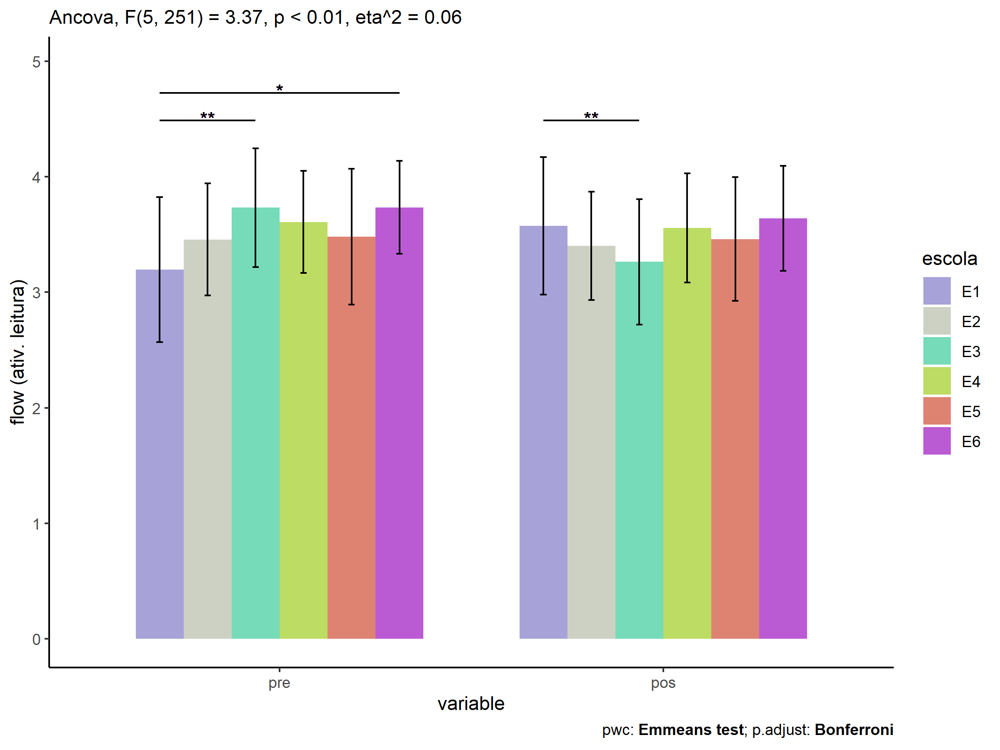<!-- -->

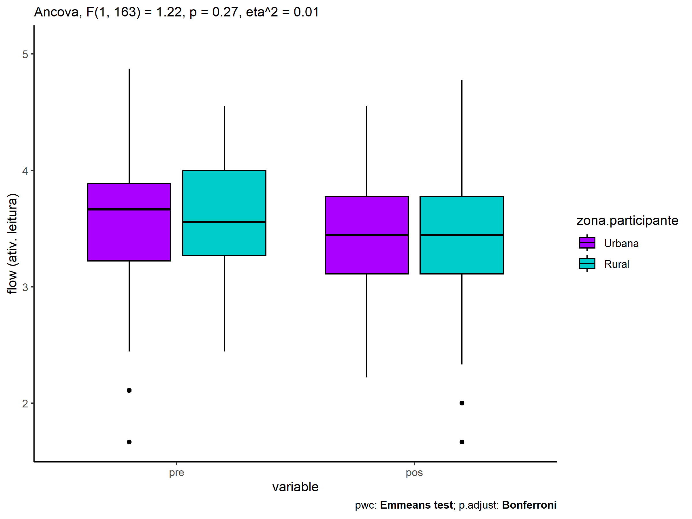<!-- -->

### factor: **zona.escola**

| var         | zona.escola |   n | M (pre) | SE (pre) | M (unadj) | SE (unadj) | M (adj) | SE (adj) |
|:------------|:------------|----:|--------:|---------:|----------:|-----------:|--------:|---------:|
| fss.leitura | Rural       |  84 |   3.688 |    0.050 |     3.475 |      0.056 |   3.416 |    0.054 |
| fss.leitura | Urbana      | 174 |   3.438 |    0.043 |     3.458 |      0.040 |   3.486 |    0.037 |

| .y.         | group1 | group2 | estimate | conf.low | conf.high |    se | statistic | p       | p.adj   | p.adj.signif |
|:------------|:-------|:-------|---------:|---------:|----------:|------:|----------:|:--------|:--------|:-------------|
| fss.leitura | Urbana | Rural  |     0.07 |    -0.06 |     0.201 | 0.066 |     1.060 | 0.29    | 0.29    | ns           |
| dfs.leitura | Urbana | Rural  |    -0.25 |    -0.39 |    -0.110 | 0.071 |    -3.512 | \<0.001 | \<0.001 | \*\*\*       |

| .y.          | zona.escola | group1 | group2 | estimate | conf.low | conf.high |    se | statistic |     p | p.adj | p.adj.signif |
|:-------------|:------------|:-------|:-------|---------:|---------:|----------:|------:|----------:|------:|------:|:-------------|
| flow.leitura | Urbana      | pre    | pos    |   -0.020 |   -0.131 |     0.092 | 0.057 |    -0.349 | 0.727 | 0.727 | ns           |
| flow.leitura | Rural       | pre    | pos    |    0.214 |    0.053 |     0.374 | 0.082 |     2.617 | 0.009 | 0.009 | \*\*         |

    ## Scale for colour is already present.
    ## Adding another scale for colour, which will replace the existing scale.

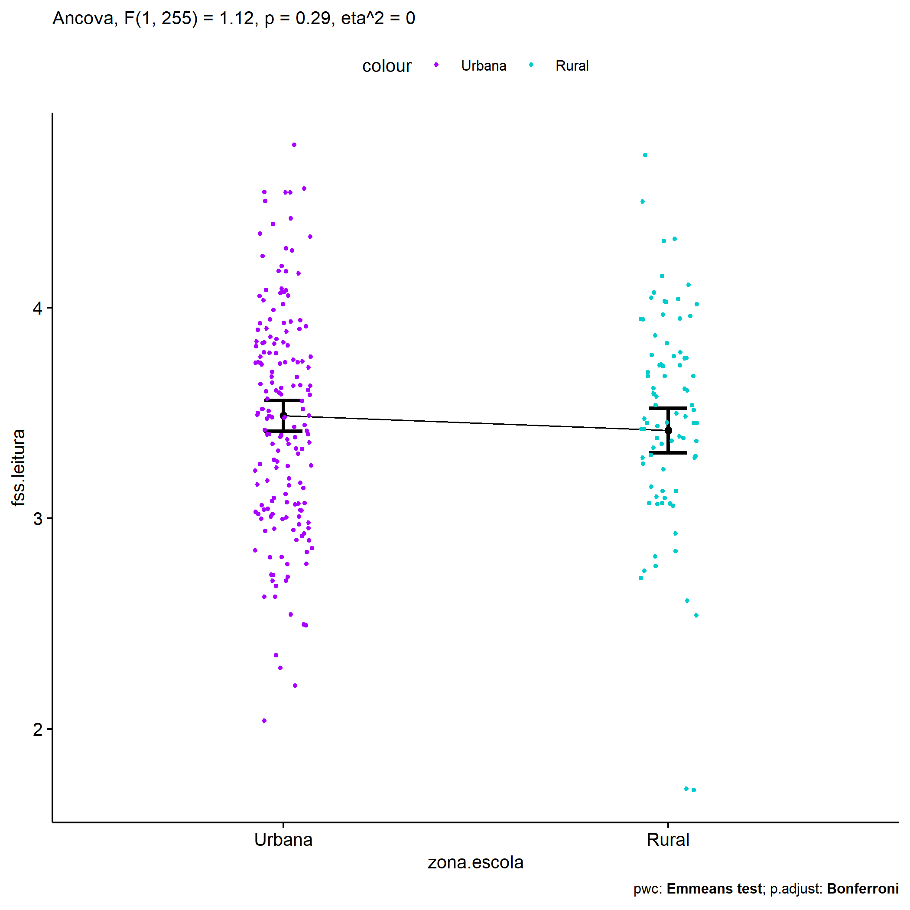<!-- -->

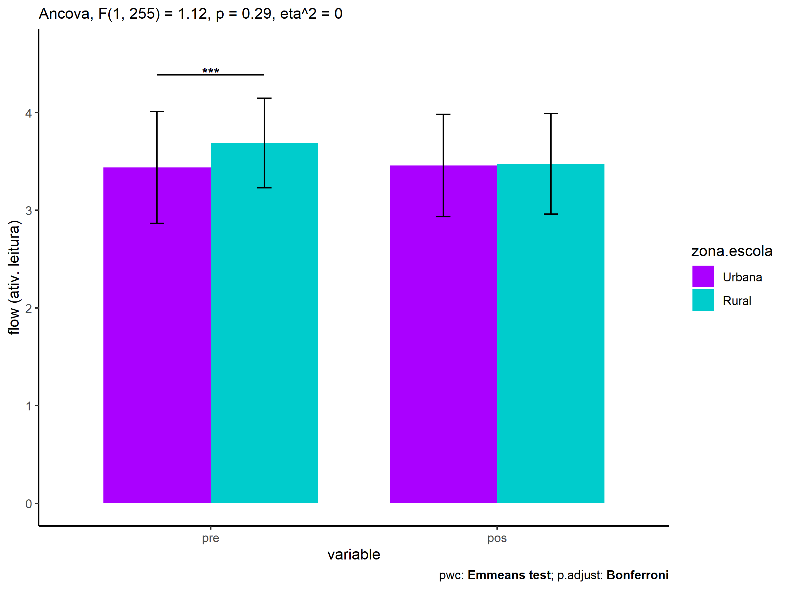<!-- -->

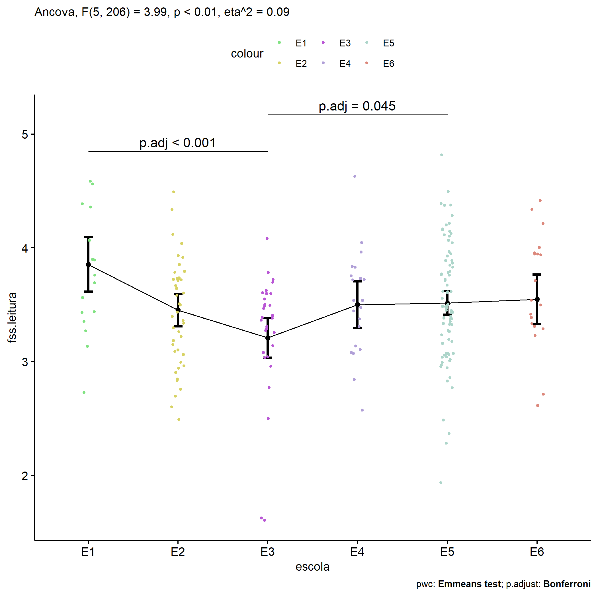<!-- -->

## Pairwise comparisons for two factors

### factores: **grupo:genero**

| var         | grupo        | genero |   n | M (pre) | SE (pre) | M (unadj) | SE (unadj) | M (adj) | SE (adj) |
|:------------|:-------------|:-------|----:|--------:|---------:|----------:|-----------:|--------:|---------:|
| fss.leitura | Controle     | F      |  60 |   3.595 |    0.069 |     3.521 |      0.054 |   3.497 |    0.062 |
| fss.leitura | Controle     | M      |  65 |   3.524 |    0.066 |     3.393 |      0.065 |   3.391 |    0.060 |
| fss.leitura | Experimental | F      |  57 |   3.593 |    0.070 |     3.642 |      0.070 |   3.619 |    0.064 |
| fss.leitura | Experimental | M      |  76 |   3.401 |    0.066 |     3.345 |      0.063 |   3.382 |    0.056 |

| .y.         | grupo        | genero | group1   | group2       | estimate | conf.low | conf.high |    se | statistic |     p | p.adj | p.adj.signif |
|:------------|:-------------|:-------|:---------|:-------------|---------:|---------:|----------:|------:|----------:|------:|------:|:-------------|
| fss.leitura |              | F      | Controle | Experimental |   -0.122 |   -0.297 |     0.054 | 0.089 |    -1.366 | 0.173 | 0.173 | ns           |
| fss.leitura |              | M      | Controle | Experimental |    0.009 |   -0.152 |     0.170 | 0.082 |     0.111 | 0.912 | 0.912 | ns           |
| dfs.leitura |              | F      | Controle | Experimental |    0.002 |   -0.197 |     0.200 | 0.101 |     0.019 | 0.985 | 0.985 | ns           |
| dfs.leitura |              | M      | Controle | Experimental |    0.123 |   -0.058 |     0.304 | 0.092 |     1.336 | 0.183 | 0.183 | ns           |
| fss.leitura | Controle     |        | F        | M            |    0.105 |   -0.065 |     0.275 | 0.086 |     1.221 | 0.223 | 0.223 | ns           |
| fss.leitura | Experimental |        | F        | M            |    0.236 |    0.069 |     0.404 | 0.085 |     2.777 | 0.006 | 0.006 | \*\*         |
| dfs.leitura | Controle     |        | F        | M            |    0.071 |   -0.121 |     0.263 | 0.098 |     0.725 | 0.469 | 0.469 | ns           |
| dfs.leitura | Experimental |        | F        | M            |    0.192 |    0.004 |     0.380 | 0.095 |     2.009 | 0.046 | 0.046 | \*           |

| .y.          | grupo        | genero | group1 | group2 | estimate | conf.low | conf.high |    se | statistic |     p | p.adj | p.adj.signif |
|:-------------|:-------------|:-------|:-------|:-------|---------:|---------:|----------:|------:|----------:|------:|------:|:-------------|
| flow.leitura | Controle     | F      | pre    | pos    |    0.074 |   -0.115 |     0.264 | 0.096 |     0.771 | 0.441 | 0.441 | ns           |
| flow.leitura | Controle     | M      | pre    | pos    |    0.131 |   -0.051 |     0.313 | 0.093 |     1.418 | 0.157 | 0.157 | ns           |
| flow.leitura | Experimental | F      | pre    | pos    |   -0.049 |   -0.243 |     0.146 | 0.099 |    -0.493 | 0.622 | 0.622 | ns           |
| flow.leitura | Experimental | M      | pre    | pos    |    0.056 |   -0.112 |     0.225 | 0.086 |     0.656 | 0.512 | 0.512 | ns           |

    ## Scale for colour is already present.
    ## Adding another scale for colour, which will replace the existing scale.

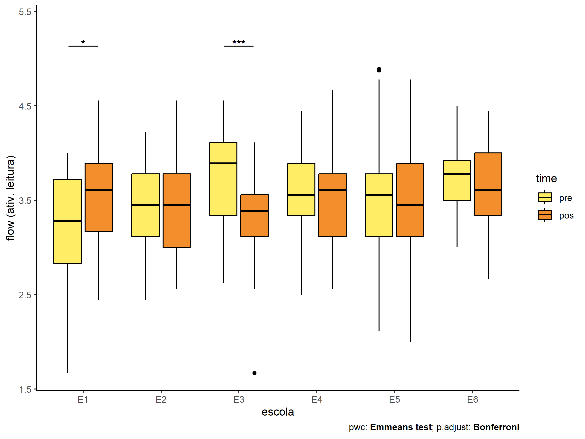<!-- -->

    ## Scale for colour is already present.
    ## Adding another scale for colour, which will replace the existing scale.

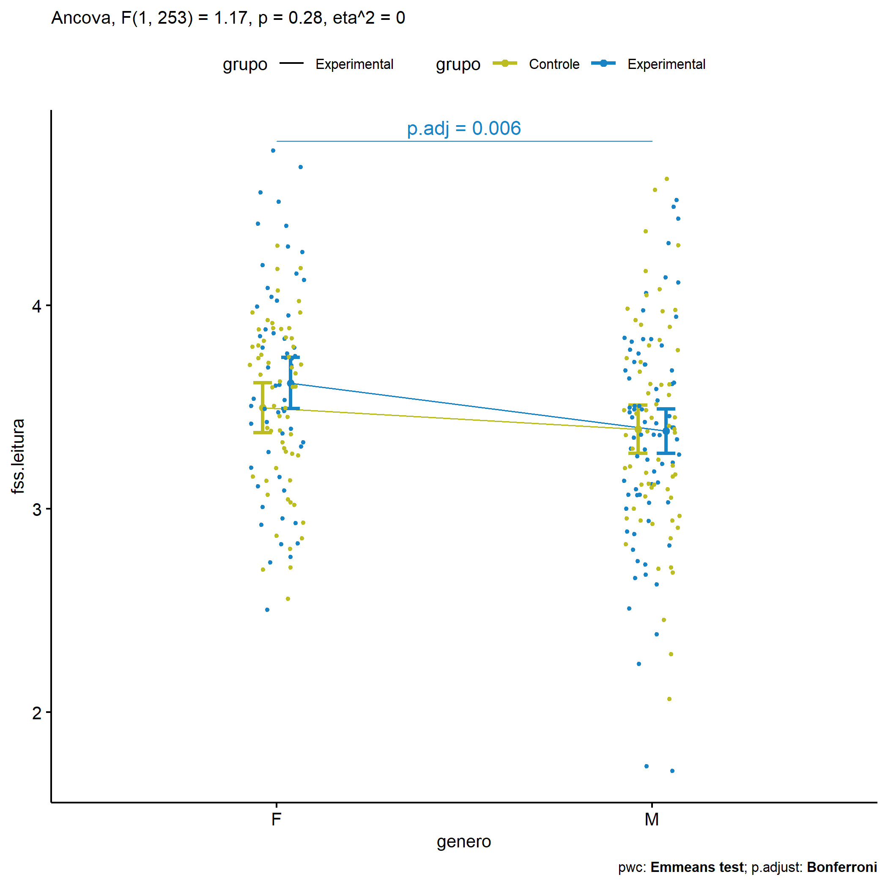<!-- -->

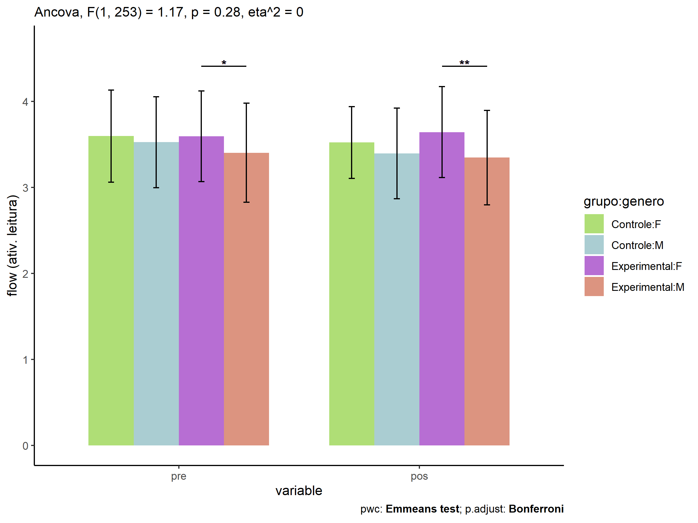<!-- -->

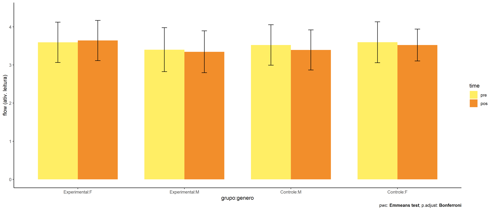<!-- -->

### factores: **grupo:idade**

| var         | grupo        | idade |   n | M (pre) | SE (pre) | M (unadj) | SE (unadj) | M (adj) | SE (adj) |
|:------------|:-------------|:------|----:|--------:|---------:|----------:|-----------:|--------:|---------:|
| fss.leitura | Controle     | 10y   |  24 |   3.583 |    0.092 |     3.541 |      0.083 |   3.525 |    0.100 |
| fss.leitura | Controle     | 11y   |  67 |   3.617 |    0.063 |     3.487 |      0.054 |   3.460 |    0.060 |
| fss.leitura | Controle     | 12y   |  18 |   3.519 |    0.145 |     3.437 |      0.144 |   3.443 |    0.115 |
| fss.leitura | Controle     | 13y   |   7 |   3.476 |    0.218 |     3.032 |      0.194 |   3.053 |    0.185 |
| fss.leitura | Experimental | 10y   |  25 |   3.366 |    0.118 |     3.422 |      0.120 |   3.481 |    0.098 |
| fss.leitura | Experimental | 11y   |  80 |   3.553 |    0.057 |     3.519 |      0.065 |   3.515 |    0.055 |
| fss.leitura | Experimental | 12y   |  16 |   3.515 |    0.158 |     3.477 |      0.108 |   3.485 |    0.122 |
| fss.leitura | Experimental | 13y   |   9 |   3.315 |    0.185 |     3.287 |      0.169 |   3.363 |    0.163 |

| .y.         | grupo        | idade | group1   | group2       | estimate | conf.low | conf.high |    se | statistic |     p | p.adj | p.adj.signif |
|:------------|:-------------|:------|:---------|:-------------|---------:|---------:|----------:|------:|----------:|------:|------:|:-------------|
| fss.leitura |              | 10y   | Controle | Experimental |    0.044 |   -0.232 |     0.320 | 0.140 |     0.314 | 0.754 | 0.754 | ns           |
| fss.leitura |              | 11y   | Controle | Experimental |   -0.055 |   -0.214 |     0.105 | 0.081 |    -0.673 | 0.501 | 0.501 | ns           |
| fss.leitura |              | 12y   | Controle | Experimental |   -0.041 |   -0.372 |     0.289 | 0.168 |    -0.246 | 0.806 | 0.806 | ns           |
| fss.leitura |              | 13y   | Controle | Experimental |   -0.310 |   -0.796 |     0.175 | 0.246 |    -1.259 | 0.209 | 0.209 | ns           |
| dfs.leitura |              | 10y   | Controle | Experimental |    0.218 |   -0.083 |     0.519 | 0.153 |     1.425 | 0.156 | 0.156 | ns           |
| dfs.leitura |              | 11y   | Controle | Experimental |    0.064 |   -0.110 |     0.239 | 0.089 |     0.726 | 0.469 | 0.469 | ns           |
| dfs.leitura |              | 12y   | Controle | Experimental |    0.004 |   -0.358 |     0.366 | 0.184 |     0.023 | 0.982 | 0.982 | ns           |
| dfs.leitura |              | 13y   | Controle | Experimental |    0.161 |   -0.370 |     0.692 | 0.270 |     0.599 | 0.550 | 0.550 | ns           |
| fss.leitura | Controle     |       | 10y      | 11y          |    0.065 |   -0.164 |     0.294 | 0.116 |     0.560 | 0.576 | 1.000 | ns           |
| fss.leitura | Controle     |       | 10y      | 12y          |    0.082 |   -0.218 |     0.382 | 0.152 |     0.537 | 0.592 | 1.000 | ns           |
| fss.leitura | Controle     |       | 10y      | 13y          |    0.472 |    0.059 |     0.886 | 0.210 |     2.249 | 0.025 | 0.152 | ns           |
| fss.leitura | Controle     |       | 11y      | 12y          |    0.017 |   -0.239 |     0.273 | 0.130 |     0.129 | 0.898 | 1.000 | ns           |
| fss.leitura | Controle     |       | 11y      | 13y          |    0.407 |    0.024 |     0.790 | 0.194 |     2.096 | 0.037 | 0.223 | ns           |
| fss.leitura | Controle     |       | 12y      | 13y          |    0.390 |   -0.038 |     0.819 | 0.218 |     1.794 | 0.074 | 0.445 | ns           |
| fss.leitura | Experimental |       | 10y      | 11y          |   -0.034 |   -0.255 |     0.188 | 0.112 |    -0.298 | 0.766 | 1.000 | ns           |
| fss.leitura | Experimental |       | 10y      | 12y          |   -0.003 |   -0.312 |     0.305 | 0.157 |    -0.022 | 0.982 | 1.000 | ns           |
| fss.leitura | Experimental |       | 10y      | 13y          |    0.118 |   -0.256 |     0.492 | 0.190 |     0.621 | 0.535 | 1.000 | ns           |
| fss.leitura | Experimental |       | 11y      | 12y          |    0.030 |   -0.234 |     0.294 | 0.134 |     0.224 | 0.823 | 1.000 | ns           |
| fss.leitura | Experimental |       | 11y      | 13y          |    0.151 |   -0.188 |     0.491 | 0.172 |     0.878 | 0.381 | 1.000 | ns           |
| fss.leitura | Experimental |       | 12y      | 13y          |    0.121 |   -0.280 |     0.523 | 0.204 |     0.595 | 0.552 | 1.000 | ns           |
| dfs.leitura | Controle     |       | 10y      | 11y          |   -0.034 |   -0.284 |     0.217 | 0.127 |    -0.263 | 0.792 | 1.000 | ns           |
| dfs.leitura | Controle     |       | 10y      | 12y          |    0.064 |   -0.264 |     0.393 | 0.167 |     0.386 | 0.700 | 1.000 | ns           |
| dfs.leitura | Controle     |       | 10y      | 13y          |    0.107 |   -0.346 |     0.560 | 0.230 |     0.466 | 0.641 | 1.000 | ns           |
| dfs.leitura | Controle     |       | 11y      | 12y          |    0.098 |   -0.182 |     0.378 | 0.142 |     0.689 | 0.491 | 1.000 | ns           |
| dfs.leitura | Controle     |       | 11y      | 13y          |    0.141 |   -0.278 |     0.559 | 0.212 |     0.662 | 0.509 | 1.000 | ns           |
| dfs.leitura | Controle     |       | 12y      | 13y          |    0.043 |   -0.427 |     0.512 | 0.238 |     0.179 | 0.858 | 1.000 | ns           |
| dfs.leitura | Experimental |       | 10y      | 11y          |   -0.187 |   -0.428 |     0.054 | 0.123 |    -1.526 | 0.128 | 0.770 | ns           |
| dfs.leitura | Experimental |       | 10y      | 12y          |   -0.149 |   -0.487 |     0.188 | 0.171 |    -0.871 | 0.385 | 1.000 | ns           |
| dfs.leitura | Experimental |       | 10y      | 13y          |    0.051 |   -0.359 |     0.460 | 0.208 |     0.244 | 0.807 | 1.000 | ns           |
| dfs.leitura | Experimental |       | 11y      | 12y          |    0.038 |   -0.251 |     0.326 | 0.146 |     0.258 | 0.797 | 1.000 | ns           |
| dfs.leitura | Experimental |       | 11y      | 13y          |    0.238 |   -0.133 |     0.608 | 0.188 |     1.264 | 0.207 | 1.000 | ns           |
| dfs.leitura | Experimental |       | 12y      | 13y          |    0.200 |   -0.239 |     0.639 | 0.223 |     0.897 | 0.371 | 1.000 | ns           |

| .y.          | grupo        | idade | group1 | group2 | estimate | conf.low | conf.high |    se | statistic |     p | p.adj | p.adj.signif |
|:-------------|:-------------|:------|:-------|:-------|---------:|---------:|----------:|------:|----------:|------:|------:|:-------------|
| flow.leitura | Controle     | 10y   | pre    | pos    |    0.043 |   -0.257 |     0.342 | 0.152 |     0.281 | 0.779 | 0.779 | ns           |
| flow.leitura | Controle     | 11y   | pre    | pos    |    0.130 |   -0.049 |     0.309 | 0.091 |     1.426 | 0.154 | 0.154 | ns           |
| flow.leitura | Controle     | 12y   | pre    | pos    |    0.082 |   -0.263 |     0.428 | 0.176 |     0.467 | 0.640 | 0.640 | ns           |
| flow.leitura | Controle     | 13y   | pre    | pos    |    0.444 |   -0.110 |     0.999 | 0.282 |     1.576 | 0.116 | 0.116 | ns           |
| flow.leitura | Experimental | 10y   | pre    | pos    |   -0.057 |   -0.350 |     0.237 | 0.149 |    -0.380 | 0.704 | 0.704 | ns           |
| flow.leitura | Experimental | 11y   | pre    | pos    |    0.033 |   -0.131 |     0.197 | 0.083 |     0.397 | 0.692 | 0.692 | ns           |
| flow.leitura | Experimental | 12y   | pre    | pos    |    0.038 |   -0.328 |     0.405 | 0.187 |     0.205 | 0.838 | 0.838 | ns           |
| flow.leitura | Experimental | 13y   | pre    | pos    |    0.028 |   -0.461 |     0.517 | 0.249 |     0.112 | 0.911 | 0.911 | ns           |

    ## Scale for colour is already present.
    ## Adding another scale for colour, which will replace the existing scale.

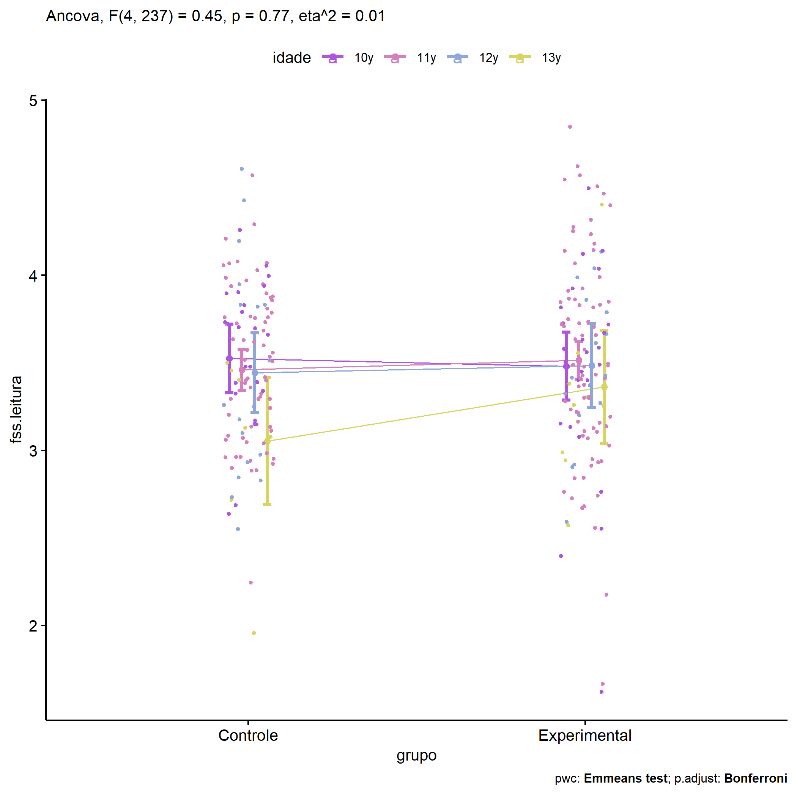<!-- -->

    ## Scale for colour is already present.
    ## Adding another scale for colour, which will replace the existing scale.

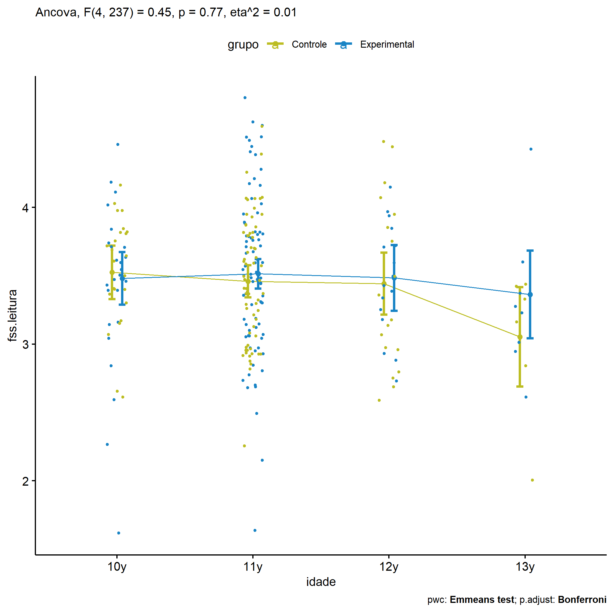<!-- -->

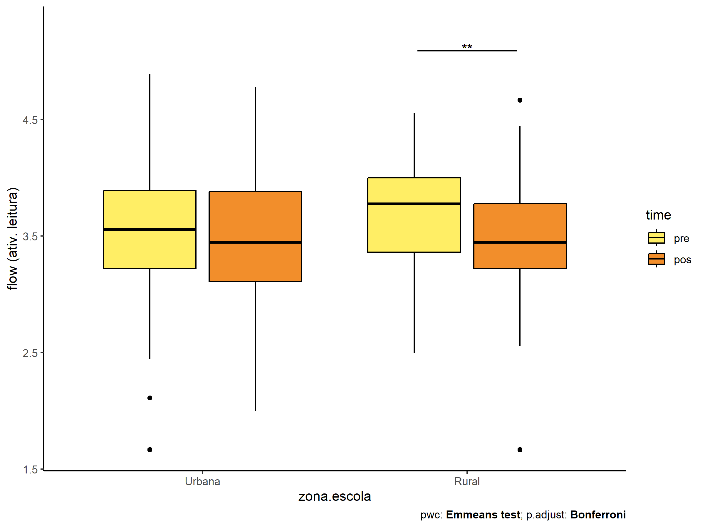<!-- -->

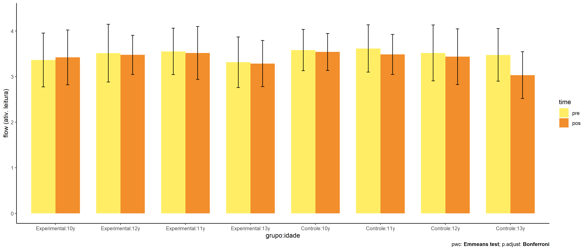<!-- -->

### factores: **grupo:zona.participante**

| var         | grupo        | zona.participante |   n | M (pre) | SE (pre) | M (unadj) | SE (unadj) | M (adj) | SE (adj) |
|:------------|:-------------|:------------------|----:|--------:|---------:|----------:|-----------:|--------:|---------:|
| fss.leitura | Controle     | Rural             |  43 |   3.549 |    0.084 |     3.395 |      0.069 |   3.382 |    0.076 |
| fss.leitura | Controle     | Urbana            |  54 |   3.539 |    0.075 |     3.450 |      0.066 |   3.440 |    0.067 |
| fss.leitura | Experimental | Rural             |  53 |   3.484 |    0.071 |     3.418 |      0.088 |   3.424 |    0.068 |
| fss.leitura | Experimental | Urbana            |  50 |   3.453 |    0.090 |     3.507 |      0.067 |   3.523 |    0.070 |

| .y.         | grupo        | zona.participante | group1   | group2       | estimate | conf.low | conf.high |    se | statistic |     p | p.adj | p.adj.signif |
|:------------|:-------------|:------------------|:---------|:-------------|---------:|---------:|----------:|------:|----------:|------:|------:|:-------------|
| fss.leitura |              | Urbana            | Controle | Experimental |   -0.083 |   -0.275 |     0.109 | 0.097 |    -0.850 | 0.396 | 0.396 | ns           |
| fss.leitura |              | Rural             | Controle | Experimental |   -0.042 |   -0.243 |     0.159 | 0.102 |    -0.413 | 0.680 | 0.680 | ns           |
| dfs.leitura |              | Urbana            | Controle | Experimental |    0.086 |   -0.132 |     0.304 | 0.111 |     0.776 | 0.439 | 0.439 | ns           |
| dfs.leitura |              | Rural             | Controle | Experimental |    0.064 |   -0.164 |     0.292 | 0.116 |     0.557 | 0.578 | 0.578 | ns           |
| fss.leitura | Controle     |                   | Urbana   | Rural        |    0.058 |   -0.141 |     0.258 | 0.101 |     0.576 | 0.565 | 0.565 | ns           |
| fss.leitura | Experimental |                   | Urbana   | Rural        |    0.099 |   -0.094 |     0.292 | 0.098 |     1.014 | 0.312 | 0.312 | ns           |
| dfs.leitura | Controle     |                   | Urbana   | Rural        |   -0.010 |   -0.237 |     0.218 | 0.115 |    -0.083 | 0.934 | 0.934 | ns           |
| dfs.leitura | Experimental |                   | Urbana   | Rural        |   -0.031 |   -0.250 |     0.188 | 0.111 |    -0.278 | 0.781 | 0.781 | ns           |

| .y.          | grupo        | zona.participante | group1 | group2 | estimate | conf.low | conf.high |    se | statistic |     p | p.adj | p.adj.signif |
|:-------------|:-------------|:------------------|:-------|:-------|---------:|---------:|----------:|------:|----------:|------:|------:|:-------------|
| flow.leitura | Controle     | Urbana            | pre    | pos    |    0.089 |   -0.117 |     0.294 | 0.105 |     0.848 | 0.397 | 0.397 | ns           |
| flow.leitura | Controle     | Rural             | pre    | pos    |    0.154 |   -0.077 |     0.384 | 0.117 |     1.311 | 0.191 | 0.191 | ns           |
| flow.leitura | Experimental | Urbana            | pre    | pos    |   -0.054 |   -0.268 |     0.159 | 0.109 |    -0.499 | 0.618 | 0.618 | ns           |
| flow.leitura | Experimental | Rural             | pre    | pos    |    0.066 |   -0.141 |     0.274 | 0.106 |     0.630 | 0.529 | 0.529 | ns           |

    ## Scale for colour is already present.
    ## Adding another scale for colour, which will replace the existing scale.

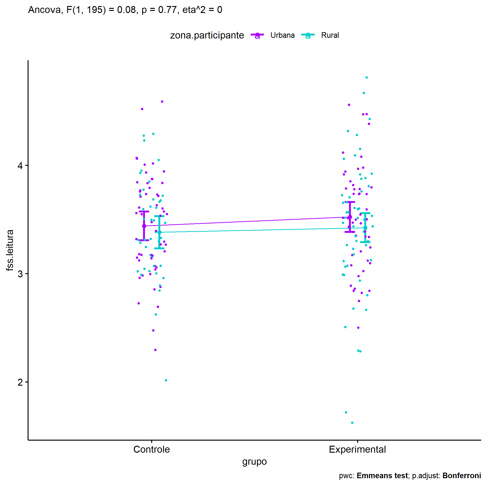<!-- -->

    ## Scale for colour is already present.
    ## Adding another scale for colour, which will replace the existing scale.

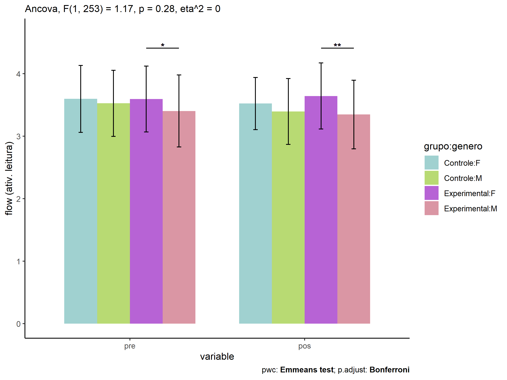<!-- -->

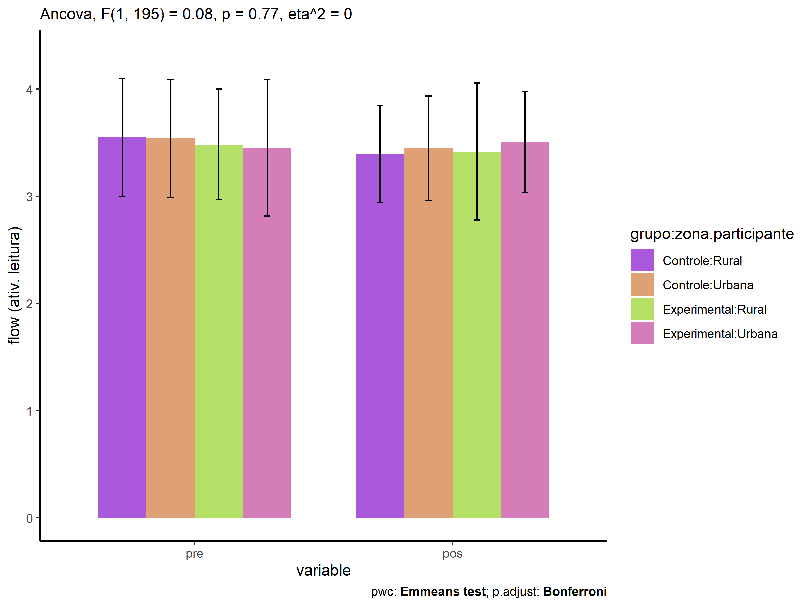<!-- -->

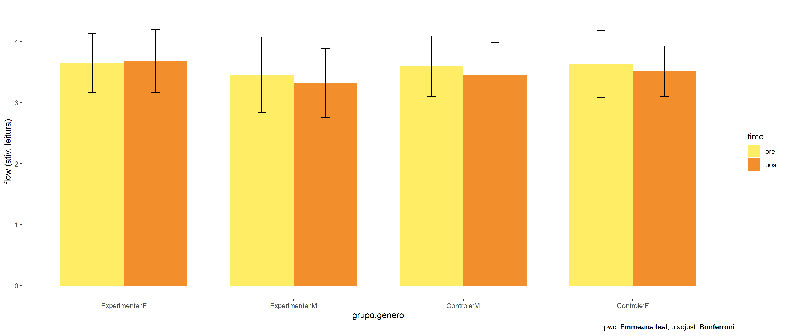<!-- -->

### factores: **grupo:escola**

| var         | grupo        | escola |   n | M (pre) | SE (pre) | M (unadj) | SE (unadj) | M (adj) | SE (adj) |
|:------------|:-------------|:-------|----:|--------:|---------:|----------:|-----------:|--------:|---------:|
| fss.leitura | Controle     | E1     |  12 |   3.130 |    0.148 |     3.439 |      0.171 |   3.584 |    0.139 |
| fss.leitura | Controle     | E2     |  23 |   3.552 |    0.100 |     3.437 |      0.110 |   3.425 |    0.099 |
| fss.leitura | Controle     | E3     |  15 |   3.763 |    0.135 |     3.419 |      0.066 |   3.329 |    0.123 |
| fss.leitura | Controle     | E4     |  16 |   3.612 |    0.076 |     3.429 |      0.107 |   3.395 |    0.119 |
| fss.leitura | Controle     | E5     |  48 |   3.518 |    0.086 |     3.457 |      0.075 |   3.458 |    0.069 |
| fss.leitura | Controle     | E6     |  11 |   3.859 |    0.106 |     3.578 |      0.127 |   3.453 |    0.145 |
| fss.leitura | Experimental | E1     |  10 |   3.275 |    0.240 |     3.735 |      0.185 |   3.826 |    0.151 |
| fss.leitura | Experimental | E2     |  26 |   3.374 |    0.095 |     3.371 |      0.081 |   3.425 |    0.094 |
| fss.leitura | Experimental | E3     |  15 |   3.701 |    0.136 |     3.106 |      0.181 |   3.038 |    0.123 |
| fss.leitura | Experimental | E4     |  14 |   3.605 |    0.154 |     3.701 |      0.132 |   3.670 |    0.127 |
| fss.leitura | Experimental | E5     |  55 |   3.449 |    0.079 |     3.462 |      0.074 |   3.489 |    0.064 |
| fss.leitura | Experimental | E6     |  13 |   3.628 |    0.118 |     3.690 |      0.136 |   3.650 |    0.132 |

| .y.         | grupo        | escola | group1   | group2       | estimate | conf.low | conf.high |    se | statistic | p       | p.adj | p.adj.signif |
|:------------|:-------------|:-------|:---------|:-------------|---------:|---------:|----------:|------:|----------:|:--------|------:|:-------------|
| fss.leitura |              | E1     | Controle | Experimental |   -0.242 |   -0.643 |     0.159 | 0.204 |    -1.188 | 0.236   | 0.236 | ns           |
| fss.leitura |              | E2     | Controle | Experimental |   -0.001 |   -0.269 |     0.268 | 0.136 |    -0.005 | 0.996   | 0.996 | ns           |
| fss.leitura |              | E3     | Controle | Experimental |    0.291 |   -0.051 |     0.633 | 0.174 |     1.676 | 0.095   | 0.095 | ns           |
| fss.leitura |              | E4     | Controle | Experimental |   -0.275 |   -0.618 |     0.068 | 0.174 |    -1.581 | 0.115   | 0.115 | ns           |
| fss.leitura |              | E5     | Controle | Experimental |   -0.031 |   -0.216 |     0.155 | 0.094 |    -0.325 | 0.746   | 0.746 | ns           |
| fss.leitura |              | E6     | Controle | Experimental |   -0.197 |   -0.582 |     0.187 | 0.195 |    -1.011 | 0.313   | 0.313 | ns           |
| dfs.leitura |              | E1     | Controle | Experimental |   -0.145 |   -0.598 |     0.308 | 0.230 |    -0.631 | 0.529   | 0.529 | ns           |
| dfs.leitura |              | E2     | Controle | Experimental |    0.178 |   -0.125 |     0.481 | 0.154 |     1.159 | 0.248   | 0.248 | ns           |
| dfs.leitura |              | E3     | Controle | Experimental |    0.062 |   -0.324 |     0.448 | 0.196 |     0.317 | 0.752   | 0.752 | ns           |
| dfs.leitura |              | E4     | Controle | Experimental |    0.006 |   -0.380 |     0.393 | 0.196 |     0.033 | 0.974   | 0.974 | ns           |
| dfs.leitura |              | E5     | Controle | Experimental |    0.069 |   -0.140 |     0.278 | 0.106 |     0.652 | 0.515   | 0.515 | ns           |
| dfs.leitura |              | E6     | Controle | Experimental |    0.230 |   -0.203 |     0.663 | 0.220 |     1.048 | 0.296   | 0.296 | ns           |
| fss.leitura | Controle     |        | E1       | E2           |    0.159 |   -0.178 |     0.496 | 0.171 |     0.931 | 0.353   | 1.000 | ns           |
| fss.leitura | Controle     |        | E1       | E3           |    0.254 |   -0.115 |     0.624 | 0.187 |     1.357 | 0.176   | 1.000 | ns           |
| fss.leitura | Controle     |        | E1       | E4           |    0.189 |   -0.172 |     0.550 | 0.184 |     1.030 | 0.304   | 1.000 | ns           |
| fss.leitura | Controle     |        | E1       | E5           |    0.126 |   -0.180 |     0.431 | 0.155 |     0.811 | 0.418   | 1.000 | ns           |
| fss.leitura | Controle     |        | E1       | E6           |    0.131 |   -0.268 |     0.530 | 0.203 |     0.647 | 0.518   | 1.000 | ns           |
| fss.leitura | Controle     |        | E2       | E3           |    0.095 |   -0.216 |     0.407 | 0.158 |     0.603 | 0.547   | 1.000 | ns           |
| fss.leitura | Controle     |        | E2       | E4           |    0.030 |   -0.275 |     0.335 | 0.155 |     0.193 | 0.847   | 1.000 | ns           |
| fss.leitura | Controle     |        | E2       | E5           |   -0.034 |   -0.271 |     0.204 | 0.121 |    -0.278 | 0.781   | 1.000 | ns           |
| fss.leitura | Controle     |        | E2       | E6           |   -0.028 |   -0.373 |     0.317 | 0.175 |    -0.160 | 0.873   | 1.000 | ns           |
| fss.leitura | Controle     |        | E3       | E4           |   -0.065 |   -0.402 |     0.271 | 0.171 |    -0.383 | 0.702   | 1.000 | ns           |
| fss.leitura | Controle     |        | E3       | E5           |   -0.129 |   -0.407 |     0.149 | 0.141 |    -0.912 | 0.362   | 1.000 | ns           |
| fss.leitura | Controle     |        | E3       | E6           |   -0.123 |   -0.495 |     0.248 | 0.189 |    -0.654 | 0.514   | 1.000 | ns           |
| fss.leitura | Controle     |        | E4       | E5           |   -0.063 |   -0.334 |     0.207 | 0.137 |    -0.462 | 0.645   | 1.000 | ns           |
| fss.leitura | Controle     |        | E4       | E6           |   -0.058 |   -0.426 |     0.310 | 0.187 |    -0.310 | 0.757   | 1.000 | ns           |
| fss.leitura | Controle     |        | E5       | E6           |    0.005 |   -0.310 |     0.321 | 0.160 |     0.034 | 0.973   | 1.000 | ns           |
| fss.leitura | Experimental |        | E1       | E2           |    0.400 |    0.052 |     0.749 | 0.177 |     2.262 | 0.025   | 0.368 | ns           |
| fss.leitura | Experimental |        | E1       | E3           |    0.787 |    0.402 |     1.172 | 0.195 |     4.027 | \<0.001 | 0.001 | \*\*         |
| fss.leitura | Experimental |        | E1       | E4           |    0.156 |   -0.233 |     0.545 | 0.198 |     0.789 | 0.431   | 1.000 | ns           |
| fss.leitura | Experimental |        | E1       | E5           |    0.337 |    0.015 |     0.659 | 0.164 |     2.058 | 0.041   | 0.609 | ns           |
| fss.leitura | Experimental |        | E1       | E6           |    0.176 |   -0.220 |     0.571 | 0.201 |     0.874 | 0.383   | 1.000 | ns           |
| fss.leitura | Experimental |        | E2       | E3           |    0.387 |    0.081 |     0.693 | 0.155 |     2.493 | 0.013   | 0.200 | ns           |
| fss.leitura | Experimental |        | E2       | E4           |   -0.244 |   -0.556 |     0.067 | 0.158 |    -1.546 | 0.123   | 1.000 | ns           |
| fss.leitura | Experimental |        | E2       | E5           |   -0.063 |   -0.286 |     0.160 | 0.113 |    -0.560 | 0.576   | 1.000 | ns           |
| fss.leitura | Experimental |        | E2       | E6           |   -0.225 |   -0.544 |     0.095 | 0.162 |    -1.386 | 0.167   | 1.000 | ns           |
| fss.leitura | Experimental |        | E3       | E4           |   -0.631 |   -0.979 |    -0.283 | 0.177 |    -3.573 | \<0.001 | 0.006 | \*\*         |
| fss.leitura | Experimental |        | E3       | E5           |   -0.450 |   -0.724 |    -0.176 | 0.139 |    -3.236 | 0.001   | 0.021 | \*           |
| fss.leitura | Experimental |        | E3       | E6           |   -0.612 |   -0.966 |    -0.257 | 0.180 |    -3.395 | \<0.001 | 0.012 | \*           |
| fss.leitura | Experimental |        | E4       | E5           |    0.181 |   -0.100 |     0.462 | 0.143 |     1.270 | 0.205   | 1.000 | ns           |
| fss.leitura | Experimental |        | E4       | E6           |    0.020 |   -0.341 |     0.380 | 0.183 |     0.108 | 0.914   | 1.000 | ns           |
| fss.leitura | Experimental |        | E5       | E6           |   -0.161 |   -0.451 |     0.128 | 0.147 |    -1.098 | 0.273   | 1.000 | ns           |
| dfs.leitura | Controle     |        | E1       | E2           |   -0.422 |   -0.799 |    -0.046 | 0.191 |    -2.210 | 0.028   | 0.420 | ns           |
| dfs.leitura | Controle     |        | E1       | E3           |   -0.633 |   -1.043 |    -0.224 | 0.208 |    -3.047 | 0.003   | 0.038 | \*           |
| dfs.leitura | Controle     |        | E1       | E4           |   -0.482 |   -0.886 |    -0.078 | 0.205 |    -2.352 | 0.019   | 0.292 | ns           |
| dfs.leitura | Controle     |        | E1       | E5           |   -0.388 |   -0.729 |    -0.047 | 0.173 |    -2.242 | 0.026   | 0.388 | ns           |
| dfs.leitura | Controle     |        | E1       | E6           |   -0.729 |   -1.170 |    -0.288 | 0.224 |    -3.254 | 0.001   | 0.019 | \*           |
| dfs.leitura | Controle     |        | E2       | E3           |   -0.211 |   -0.562 |     0.140 | 0.178 |    -1.185 | 0.237   | 1.000 | ns           |
| dfs.leitura | Controle     |        | E2       | E4           |   -0.060 |   -0.404 |     0.284 | 0.175 |    -0.342 | 0.733   | 1.000 | ns           |
| dfs.leitura | Controle     |        | E2       | E5           |    0.034 |   -0.234 |     0.302 | 0.136 |     0.250 | 0.802   | 1.000 | ns           |
| dfs.leitura | Controle     |        | E2       | E6           |   -0.307 |   -0.694 |     0.081 | 0.197 |    -1.559 | 0.12    | 1.000 | ns           |
| dfs.leitura | Controle     |        | E3       | E4           |    0.151 |   -0.229 |     0.531 | 0.193 |     0.785 | 0.433   | 1.000 | ns           |
| dfs.leitura | Controle     |        | E3       | E5           |    0.245 |   -0.068 |     0.558 | 0.159 |     1.544 | 0.124   | 1.000 | ns           |
| dfs.leitura | Controle     |        | E3       | E6           |   -0.096 |   -0.515 |     0.324 | 0.213 |    -0.449 | 0.654   | 1.000 | ns           |
| dfs.leitura | Controle     |        | E4       | E5           |    0.094 |   -0.211 |     0.399 | 0.155 |     0.605 | 0.546   | 1.000 | ns           |
| dfs.leitura | Controle     |        | E4       | E6           |   -0.247 |   -0.661 |     0.167 | 0.210 |    -1.175 | 0.241   | 1.000 | ns           |
| dfs.leitura | Controle     |        | E5       | E6           |   -0.341 |   -0.694 |     0.013 | 0.179 |    -1.899 | 0.059   | 0.880 | ns           |
| dfs.leitura | Experimental |        | E1       | E2           |   -0.099 |   -0.493 |     0.294 | 0.200 |    -0.497 | 0.619   | 1.000 | ns           |
| dfs.leitura | Experimental |        | E1       | E3           |   -0.426 |   -0.858 |     0.005 | 0.219 |    -1.946 | 0.053   | 0.792 | ns           |
| dfs.leitura | Experimental |        | E1       | E4           |   -0.331 |   -0.768 |     0.107 | 0.222 |    -1.488 | 0.138   | 1.000 | ns           |
| dfs.leitura | Experimental |        | E1       | E5           |   -0.174 |   -0.537 |     0.189 | 0.184 |    -0.944 | 0.346   | 1.000 | ns           |
| dfs.leitura | Experimental |        | E1       | E6           |   -0.354 |   -0.798 |     0.091 | 0.226 |    -1.567 | 0.118   | 1.000 | ns           |
| dfs.leitura | Experimental |        | E2       | E3           |   -0.327 |   -0.670 |     0.016 | 0.174 |    -1.879 | 0.061   | 0.921 | ns           |
| dfs.leitura | Experimental |        | E2       | E4           |   -0.231 |   -0.582 |     0.119 | 0.178 |    -1.300 | 0.195   | 1.000 | ns           |
| dfs.leitura | Experimental |        | E2       | E5           |   -0.075 |   -0.326 |     0.177 | 0.128 |    -0.586 | 0.559   | 1.000 | ns           |
| dfs.leitura | Experimental |        | E2       | E6           |   -0.254 |   -0.613 |     0.105 | 0.182 |    -1.395 | 0.164   | 1.000 | ns           |
| dfs.leitura | Experimental |        | E3       | E4           |    0.096 |   -0.297 |     0.489 | 0.199 |     0.480 | 0.631   | 1.000 | ns           |
| dfs.leitura | Experimental |        | E3       | E5           |    0.252 |   -0.056 |     0.560 | 0.156 |     1.613 | 0.108   | 1.000 | ns           |
| dfs.leitura | Experimental |        | E3       | E6           |    0.073 |   -0.328 |     0.473 | 0.203 |     0.358 | 0.721   | 1.000 | ns           |
| dfs.leitura | Experimental |        | E4       | E5           |    0.156 |   -0.160 |     0.473 | 0.161 |     0.974 | 0.331   | 1.000 | ns           |
| dfs.leitura | Experimental |        | E4       | E6           |   -0.023 |   -0.430 |     0.384 | 0.207 |    -0.112 | 0.911   | 1.000 | ns           |
| dfs.leitura | Experimental |        | E5       | E6           |   -0.179 |   -0.505 |     0.146 | 0.165 |    -1.084 | 0.279   | 1.000 | ns           |

| .y.          | grupo        | escola | group1 | group2 | estimate | conf.low | conf.high |    se | statistic |     p | p.adj | p.adj.signif |
|:-------------|:-------------|:-------|:-------|:-------|---------:|---------:|----------:|------:|----------:|------:|------:|:-------------|
| flow.leitura | Controle     | E1     | pre    | pos    |   -0.310 |   -0.731 |     0.112 | 0.215 |    -1.443 | 0.150 | 0.150 | ns           |
| flow.leitura | Controle     | E2     | pre    | pos    |    0.115 |   -0.189 |     0.420 | 0.155 |     0.744 | 0.457 | 0.457 | ns           |
| flow.leitura | Controle     | E3     | pre    | pos    |    0.344 |   -0.034 |     0.721 | 0.192 |     1.790 | 0.074 | 0.074 | ns           |
| flow.leitura | Controle     | E4     | pre    | pos    |    0.183 |   -0.182 |     0.548 | 0.186 |     0.984 | 0.326 | 0.326 | ns           |
| flow.leitura | Controle     | E5     | pre    | pos    |    0.060 |   -0.150 |     0.271 | 0.107 |     0.563 | 0.574 | 0.574 | ns           |
| flow.leitura | Controle     | E6     | pre    | pos    |    0.280 |   -0.160 |     0.721 | 0.224 |     1.251 | 0.212 | 0.212 | ns           |
| flow.leitura | Experimental | E1     | pre    | pos    |   -0.460 |   -0.922 |     0.002 | 0.235 |    -1.958 | 0.051 | 0.051 | ns           |
| flow.leitura | Experimental | E2     | pre    | pos    |    0.003 |   -0.284 |     0.289 | 0.146 |     0.018 | 0.985 | 0.985 | ns           |
| flow.leitura | Experimental | E3     | pre    | pos    |    0.595 |    0.218 |     0.972 | 0.192 |     3.102 | 0.002 | 0.002 | \*\*         |
| flow.leitura | Experimental | E4     | pre    | pos    |   -0.096 |   -0.487 |     0.294 | 0.199 |    -0.484 | 0.628 | 0.628 | ns           |
| flow.leitura | Experimental | E5     | pre    | pos    |   -0.014 |   -0.211 |     0.183 | 0.100 |    -0.136 | 0.892 | 0.892 | ns           |
| flow.leitura | Experimental | E6     | pre    | pos    |   -0.062 |   -0.467 |     0.343 | 0.206 |    -0.301 | 0.764 | 0.764 | ns           |

    ## Scale for colour is already present.
    ## Adding another scale for colour, which will replace the existing scale.

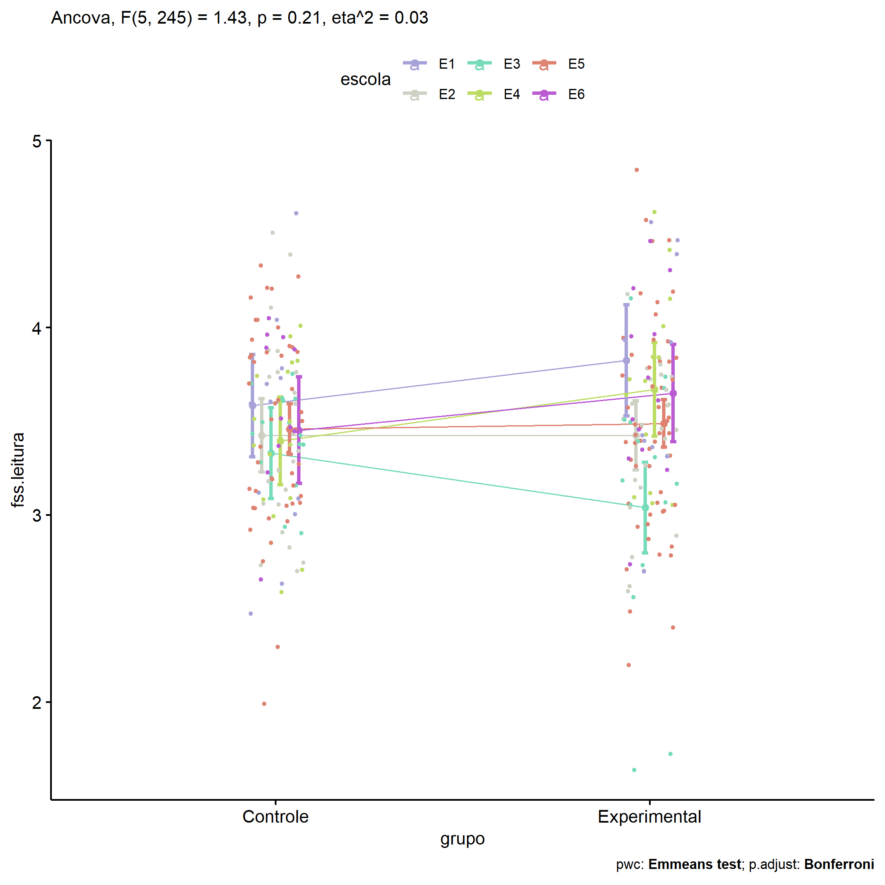<!-- -->

    ## Scale for colour is already present.
    ## Adding another scale for colour, which will replace the existing scale.

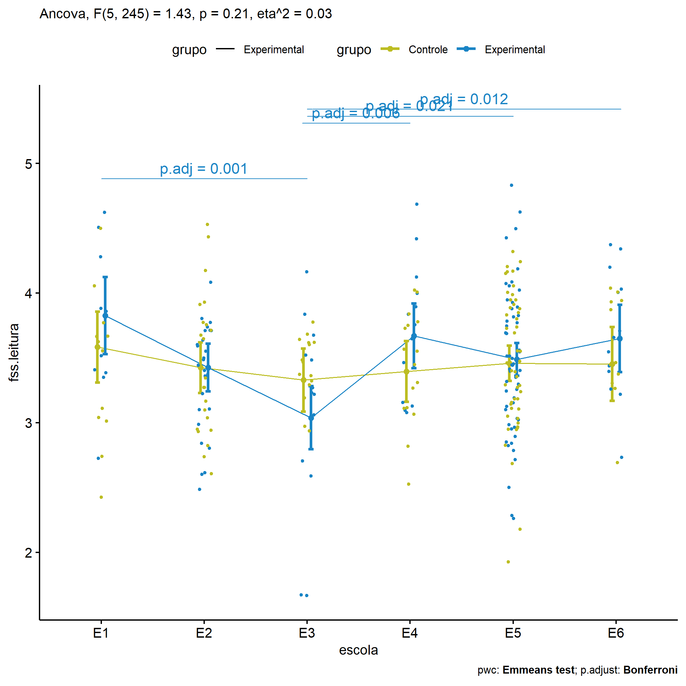<!-- -->

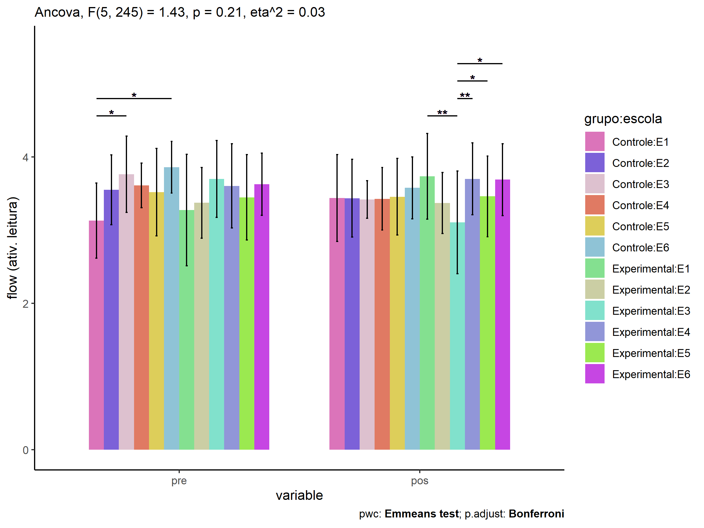<!-- -->

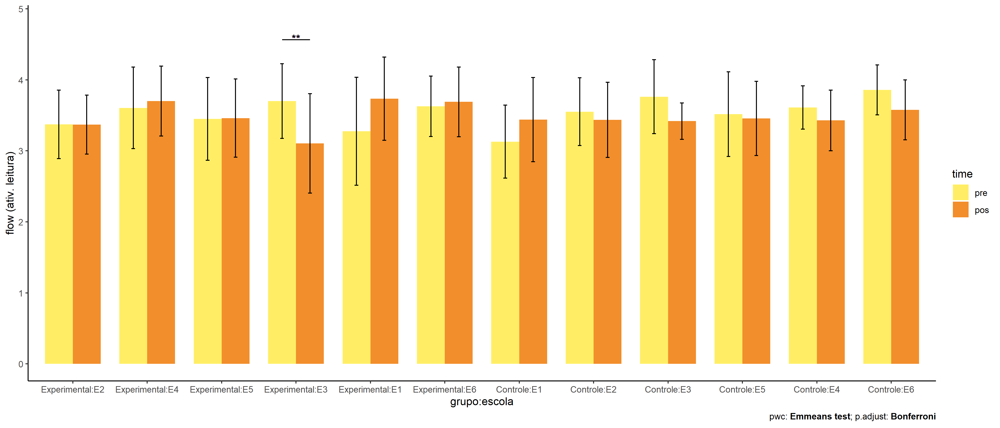<!-- -->

### factores: **grupo:zona.escola**

| var         | grupo        | zona.escola |   n | M (pre) | SE (pre) | M (unadj) | SE (unadj) | M (adj) | SE (adj) |
|:------------|:-------------|:------------|----:|--------:|---------:|----------:|-----------:|--------:|---------:|
| fss.leitura | Controle     | Rural       |  42 |   3.730 |    0.063 |     3.465 |      0.057 |   3.391 |    0.076 |
| fss.leitura | Controle     | Urbana      |  83 |   3.471 |    0.062 |     3.449 |      0.058 |   3.466 |    0.054 |
| fss.leitura | Experimental | Rural       |  42 |   3.646 |    0.078 |     3.485 |      0.097 |   3.441 |    0.076 |
| fss.leitura | Experimental | Urbana      |  91 |   3.408 |    0.060 |     3.466 |      0.055 |   3.505 |    0.052 |

| .y.         | grupo        | zona.escola | group1   | group2       | estimate | conf.low | conf.high |    se | statistic |     p | p.adj | p.adj.signif |
|:------------|:-------------|:------------|:---------|:-------------|---------:|---------:|----------:|------:|----------:|------:|------:|:-------------|
| fss.leitura |              | Urbana      | Controle | Experimental |   -0.039 |   -0.186 |     0.107 | 0.074 |    -0.529 | 0.597 | 0.597 | ns           |
| fss.leitura |              | Rural       | Controle | Experimental |   -0.050 |   -0.260 |     0.161 | 0.107 |    -0.467 | 0.641 | 0.641 | ns           |
| dfs.leitura |              | Urbana      | Controle | Experimental |    0.063 |   -0.098 |     0.223 | 0.082 |     0.772 | 0.441 | 0.441 | ns           |
| dfs.leitura |              | Rural       | Controle | Experimental |    0.084 |   -0.147 |     0.315 | 0.117 |     0.715 | 0.475 | 0.475 | ns           |
| fss.leitura | Controle     |             | Urbana   | Rural        |    0.075 |   -0.109 |     0.260 | 0.094 |     0.804 | 0.422 | 0.422 | ns           |
| fss.leitura | Experimental |             | Urbana   | Rural        |    0.065 |   -0.117 |     0.247 | 0.092 |     0.702 | 0.483 | 0.483 | ns           |
| dfs.leitura | Controle     |             | Urbana   | Rural        |   -0.259 |   -0.459 |    -0.059 | 0.102 |    -2.548 | 0.011 | 0.011 | \*           |
| dfs.leitura | Experimental |             | Urbana   | Rural        |   -0.238 |   -0.436 |    -0.041 | 0.100 |    -2.378 | 0.018 | 0.018 | \*           |

| .y.          | grupo        | zona.escola | group1 | group2 | estimate | conf.low | conf.high |    se | statistic |     p | p.adj | p.adj.signif |
|:-------------|:-------------|:------------|:-------|:-------|---------:|---------:|----------:|------:|----------:|------:|------:|:-------------|
| flow.leitura | Controle     | Urbana      | pre    | pos    |    0.022 |   -0.140 |     0.184 | 0.082 |     0.269 | 0.788 | 0.788 | ns           |
| flow.leitura | Controle     | Rural       | pre    | pos    |    0.266 |    0.038 |     0.493 | 0.116 |     2.296 | 0.022 | 0.022 | \*           |
| flow.leitura | Experimental | Urbana      | pre    | pos    |   -0.058 |   -0.213 |     0.096 | 0.079 |    -0.738 | 0.461 | 0.461 | ns           |
| flow.leitura | Experimental | Rural       | pre    | pos    |    0.161 |   -0.066 |     0.389 | 0.116 |     1.394 | 0.164 | 0.164 | ns           |

    ## Scale for colour is already present.
    ## Adding another scale for colour, which will replace the existing scale.

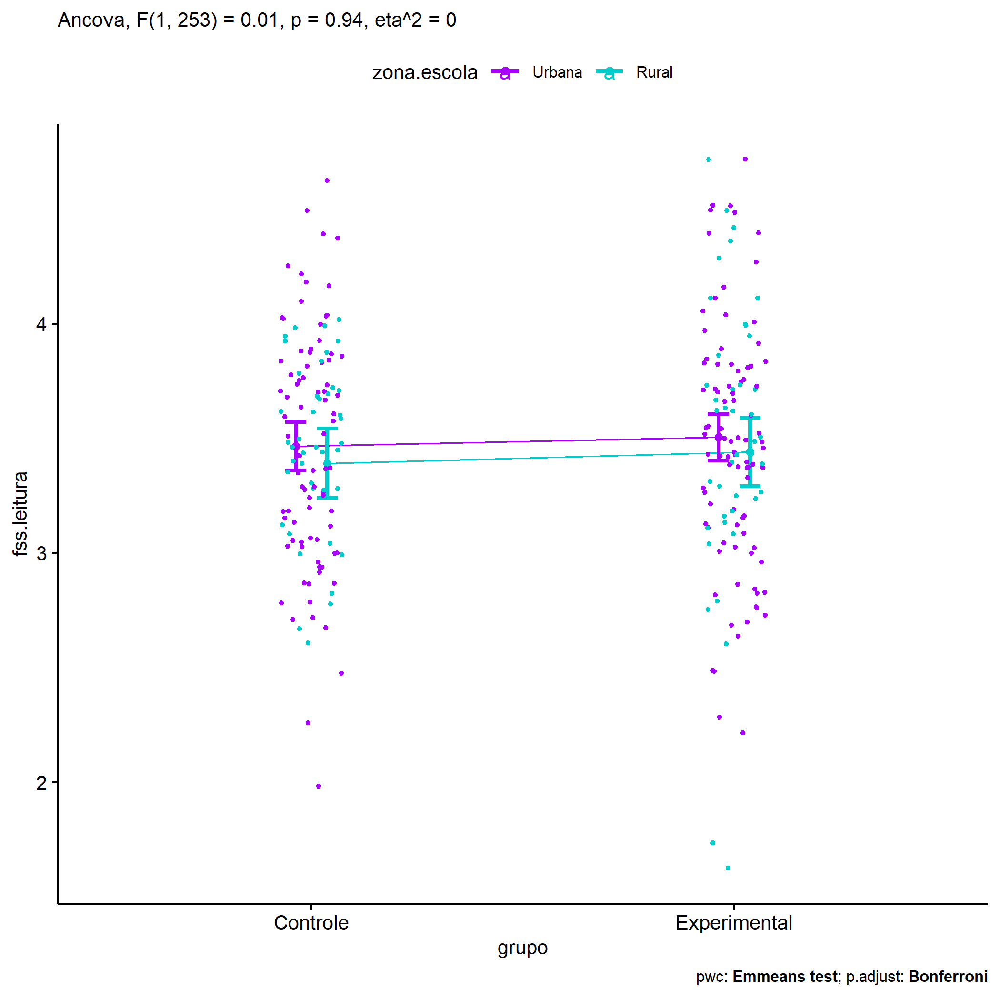<!-- -->

    ## Scale for colour is already present.
    ## Adding another scale for colour, which will replace the existing scale.

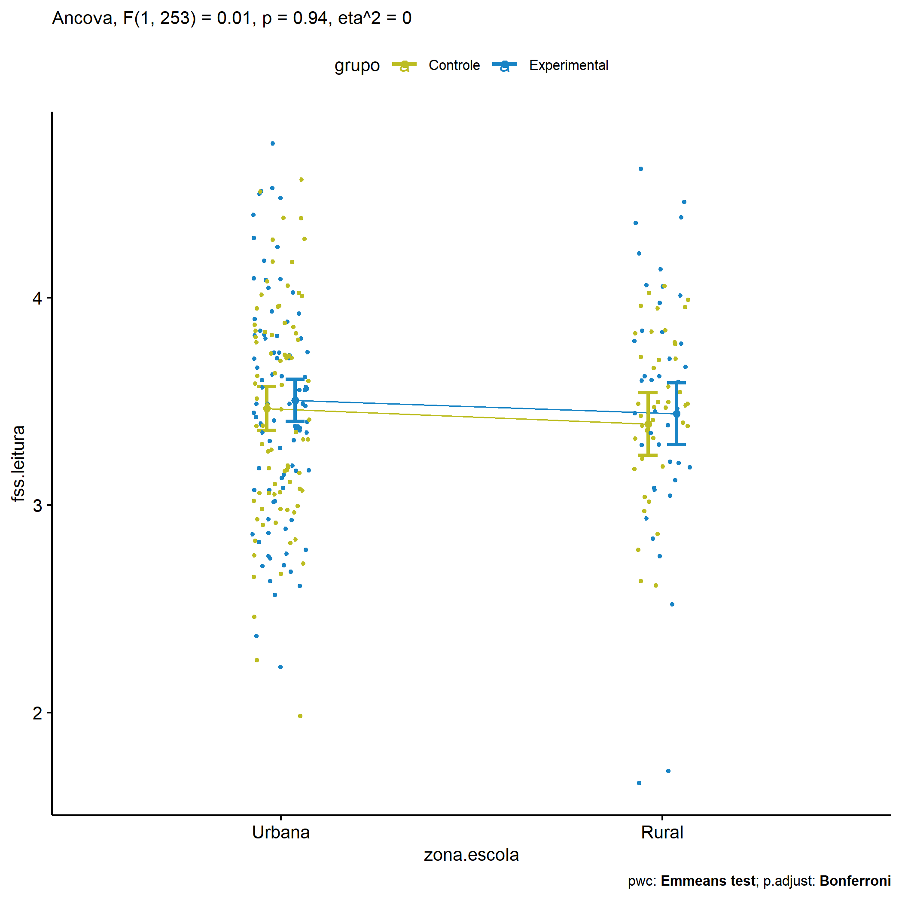<!-- -->

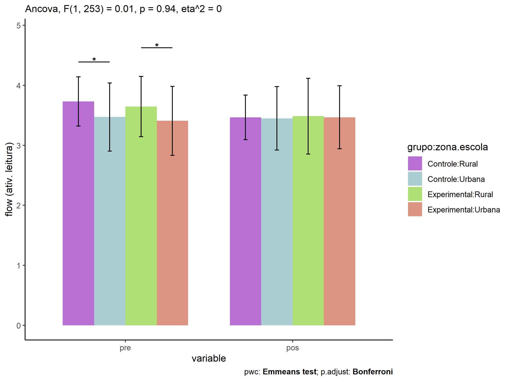<!-- -->

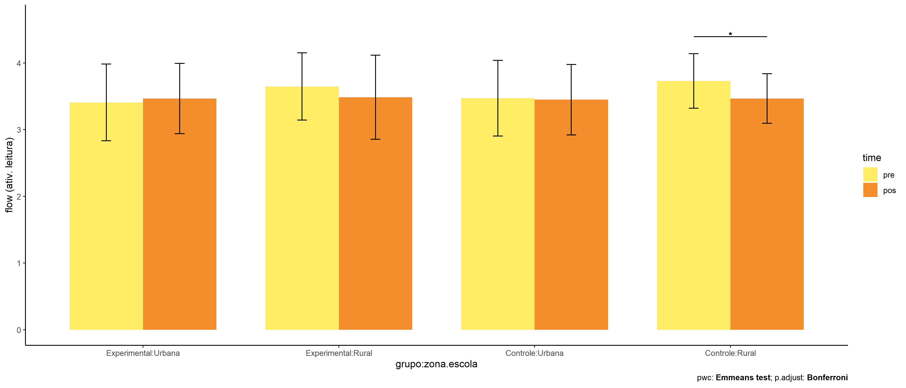<!-- -->

## Pairwise comparisons for grupo=“Experimental”

### factores: **grupo=“Experimental”:monitor**

| var         | monitor |   n | M (pre) | SE (pre) | M (unadj) | SE (unadj) | M (adj) | SE (adj) |
|:------------|:--------|----:|--------:|---------:|----------:|-----------:|--------:|---------:|
| fss.leitura | AC      |  11 |   3.505 |    0.074 |     3.545 |      0.116 |   3.547 |    0.143 |
| fss.leitura | CE      |  14 |   3.605 |    0.154 |     3.701 |      0.132 |   3.658 |    0.127 |
| fss.leitura | EA      |  11 |   3.622 |    0.167 |     3.629 |      0.199 |   3.577 |    0.143 |
| fss.leitura | GR      |  16 |   3.407 |    0.130 |     3.408 |      0.093 |   3.453 |    0.119 |
| fss.leitura | JC      |  10 |   3.554 |    0.193 |     3.378 |      0.190 |   3.357 |    0.150 |
| fss.leitura | MF      |  11 |   3.495 |    0.222 |     3.554 |      0.177 |   3.560 |    0.143 |
| fss.leitura | ML      |  15 |   3.701 |    0.136 |     3.106 |      0.181 |   3.019 |    0.123 |
| fss.leitura | MM      |  13 |   3.244 |    0.161 |     3.213 |      0.117 |   3.332 |    0.133 |
| fss.leitura | PR      |  10 |   3.275 |    0.240 |     3.735 |      0.185 |   3.840 |    0.151 |
| fss.leitura | VL      |  13 |   3.628 |    0.118 |     3.690 |      0.136 |   3.636 |    0.132 |

| .y.         | group1 | group2 | estimate | conf.low | conf.high |    se | statistic | p       | p.adj | p.adj.signif |
|:------------|:-------|:-------|---------:|---------:|----------:|------:|----------:|:--------|------:|:-------------|
| fss.leitura | AC     | CE     |   -0.111 |   -0.490 |     0.268 | 0.191 |    -0.580 | 0.563   | 1.000 | ns           |
| fss.leitura | AC     | EA     |   -0.030 |   -0.432 |     0.371 | 0.202 |    -0.150 | 0.881   | 1.000 | ns           |
| fss.leitura | AC     | GR     |    0.093 |   -0.275 |     0.462 | 0.186 |     0.502 | 0.617   | 1.000 | ns           |
| fss.leitura | AC     | JC     |    0.190 |   -0.221 |     0.600 | 0.207 |     0.916 | 0.362   | 1.000 | ns           |
| fss.leitura | AC     | MF     |   -0.013 |   -0.414 |     0.387 | 0.202 |    -0.066 | 0.947   | 1.000 | ns           |
| fss.leitura | AC     | ML     |    0.528 |    0.154 |     0.902 | 0.189 |     2.796 | 0.006   | 0.274 | ns           |
| fss.leitura | AC     | MM     |    0.215 |   -0.172 |     0.602 | 0.195 |     1.101 | 0.273   | 1.000 | ns           |
| fss.leitura | AC     | PR     |   -0.293 |   -0.705 |     0.119 | 0.208 |    -1.409 | 0.162   | 1.000 | ns           |
| fss.leitura | AC     | VL     |   -0.089 |   -0.475 |     0.296 | 0.195 |    -0.459 | 0.647   | 1.000 | ns           |
| fss.leitura | CE     | EA     |    0.080 |   -0.298 |     0.459 | 0.191 |     0.421 | 0.675   | 1.000 | ns           |
| fss.leitura | CE     | GR     |    0.204 |   -0.141 |     0.549 | 0.174 |     1.172 | 0.244   | 1.000 | ns           |
| fss.leitura | CE     | JC     |    0.301 |   -0.088 |     0.690 | 0.196 |     1.531 | 0.129   | 1.000 | ns           |
| fss.leitura | CE     | MF     |    0.097 |   -0.282 |     0.476 | 0.191 |     0.510 | 0.611   | 1.000 | ns           |
| fss.leitura | CE     | ML     |    0.639 |    0.289 |     0.988 | 0.176 |     3.622 | \<0.001 | 0.020 | \*           |
| fss.leitura | CE     | MM     |    0.326 |   -0.040 |     0.692 | 0.185 |     1.763 | 0.081   | 1.000 | ns           |
| fss.leitura | CE     | PR     |   -0.182 |   -0.575 |     0.210 | 0.198 |    -0.920 | 0.36    | 1.000 | ns           |
| fss.leitura | CE     | VL     |    0.022 |   -0.340 |     0.384 | 0.183 |     0.118 | 0.906   | 1.000 | ns           |
| fss.leitura | EA     | GR     |    0.124 |   -0.246 |     0.493 | 0.187 |     0.664 | 0.508   | 1.000 | ns           |
| fss.leitura | EA     | JC     |    0.220 |   -0.190 |     0.631 | 0.207 |     1.062 | 0.29    | 1.000 | ns           |
| fss.leitura | EA     | MF     |    0.017 |   -0.384 |     0.418 | 0.202 |     0.084 | 0.933   | 1.000 | ns           |
| fss.leitura | EA     | ML     |    0.559 |    0.185 |     0.932 | 0.188 |     2.965 | 0.004   | 0.166 | ns           |
| fss.leitura | EA     | MM     |    0.246 |   -0.144 |     0.635 | 0.197 |     1.249 | 0.214   | 1.000 | ns           |
| fss.leitura | EA     | PR     |   -0.263 |   -0.677 |     0.152 | 0.209 |    -1.256 | 0.212   | 1.000 | ns           |
| fss.leitura | EA     | VL     |   -0.059 |   -0.444 |     0.326 | 0.194 |    -0.303 | 0.763   | 1.000 | ns           |
| fss.leitura | GR     | JC     |    0.096 |   -0.283 |     0.476 | 0.192 |     0.503 | 0.616   | 1.000 | ns           |
| fss.leitura | GR     | MF     |   -0.107 |   -0.475 |     0.262 | 0.186 |    -0.574 | 0.567   | 1.000 | ns           |
| fss.leitura | GR     | ML     |    0.435 |    0.094 |     0.776 | 0.172 |     2.527 | 0.013   | 0.580 | ns           |
| fss.leitura | GR     | MM     |    0.122 |   -0.230 |     0.474 | 0.178 |     0.686 | 0.494   | 1.000 | ns           |
| fss.leitura | GR     | PR     |   -0.386 |   -0.766 |    -0.007 | 0.191 |    -2.018 | 0.046   | 1.000 | ns           |
| fss.leitura | GR     | VL     |   -0.183 |   -0.535 |     0.170 | 0.178 |    -1.026 | 0.307   | 1.000 | ns           |
| fss.leitura | JC     | MF     |   -0.203 |   -0.614 |     0.207 | 0.207 |    -0.980 | 0.329   | 1.000 | ns           |
| fss.leitura | JC     | ML     |    0.338 |   -0.046 |     0.723 | 0.194 |     1.744 | 0.084   | 1.000 | ns           |
| fss.leitura | JC     | MM     |    0.025 |   -0.373 |     0.424 | 0.201 |     0.126 | 0.9     | 1.000 | ns           |
| fss.leitura | JC     | PR     |   -0.483 |   -0.905 |    -0.060 | 0.213 |    -2.264 | 0.025   | 1.000 | ns           |
| fss.leitura | JC     | VL     |   -0.279 |   -0.674 |     0.116 | 0.200 |    -1.398 | 0.165   | 1.000 | ns           |
| fss.leitura | MF     | ML     |    0.541 |    0.167 |     0.916 | 0.189 |     2.865 | 0.005   | 0.224 | ns           |
| fss.leitura | MF     | MM     |    0.228 |   -0.158 |     0.615 | 0.195 |     1.170 | 0.245   | 1.000 | ns           |
| fss.leitura | MF     | PR     |   -0.280 |   -0.692 |     0.132 | 0.208 |    -1.345 | 0.181   | 1.000 | ns           |
| fss.leitura | MF     | VL     |   -0.076 |   -0.461 |     0.310 | 0.195 |    -0.390 | 0.697   | 1.000 | ns           |
| fss.leitura | ML     | MM     |   -0.313 |   -0.676 |     0.050 | 0.183 |    -1.707 | 0.09    | 1.000 | ns           |
| fss.leitura | ML     | PR     |   -0.821 |   -1.211 |    -0.432 | 0.197 |    -4.178 | \<0.001 | 0.003 | \*\*         |
| fss.leitura | ML     | VL     |   -0.617 |   -0.974 |    -0.261 | 0.180 |    -3.433 | \<0.001 | 0.038 | \*           |
| fss.leitura | MM     | PR     |   -0.508 |   -0.903 |    -0.113 | 0.200 |    -2.547 | 0.012   | 0.550 | ns           |
| fss.leitura | MM     | VL     |   -0.304 |   -0.678 |     0.069 | 0.188 |    -1.615 | 0.109   | 1.000 | ns           |
| fss.leitura | PR     | VL     |    0.204 |   -0.195 |     0.603 | 0.201 |     1.012 | 0.314   | 1.000 | ns           |
| dfs.leitura | AC     | CE     |   -0.100 |   -0.549 |     0.349 | 0.227 |    -0.442 | 0.66    | 1.000 | ns           |
| dfs.leitura | AC     | EA     |   -0.117 |   -0.593 |     0.358 | 0.240 |    -0.490 | 0.625   | 1.000 | ns           |
| dfs.leitura | AC     | GR     |    0.098 |   -0.339 |     0.534 | 0.220 |     0.444 | 0.658   | 1.000 | ns           |
| dfs.leitura | AC     | JC     |   -0.049 |   -0.536 |     0.438 | 0.246 |    -0.200 | 0.842   | 1.000 | ns           |
| dfs.leitura | AC     | MF     |    0.010 |   -0.465 |     0.485 | 0.240 |     0.042 | 0.966   | 1.000 | ns           |
| dfs.leitura | AC     | ML     |   -0.196 |   -0.638 |     0.246 | 0.223 |    -0.877 | 0.382   | 1.000 | ns           |
| dfs.leitura | AC     | MM     |    0.261 |   -0.195 |     0.718 | 0.230 |     1.135 | 0.259   | 1.000 | ns           |
| dfs.leitura | AC     | PR     |    0.230 |   -0.256 |     0.717 | 0.246 |     0.938 | 0.35    | 1.000 | ns           |
| dfs.leitura | AC     | VL     |   -0.123 |   -0.580 |     0.333 | 0.230 |    -0.534 | 0.594   | 1.000 | ns           |
| dfs.leitura | CE     | EA     |   -0.017 |   -0.466 |     0.432 | 0.227 |    -0.076 | 0.939   | 1.000 | ns           |
| dfs.leitura | CE     | GR     |    0.198 |   -0.210 |     0.606 | 0.206 |     0.962 | 0.338   | 1.000 | ns           |
| dfs.leitura | CE     | JC     |    0.051 |   -0.410 |     0.512 | 0.233 |     0.219 | 0.827   | 1.000 | ns           |
| dfs.leitura | CE     | MF     |    0.110 |   -0.339 |     0.559 | 0.227 |     0.486 | 0.628   | 1.000 | ns           |
| dfs.leitura | CE     | ML     |   -0.096 |   -0.510 |     0.318 | 0.209 |    -0.458 | 0.648   | 1.000 | ns           |
| dfs.leitura | CE     | MM     |    0.362 |   -0.068 |     0.791 | 0.217 |     1.669 | 0.098   | 1.000 | ns           |
| dfs.leitura | CE     | PR     |    0.331 |   -0.131 |     0.792 | 0.233 |     1.419 | 0.159   | 1.000 | ns           |
| dfs.leitura | CE     | VL     |   -0.023 |   -0.452 |     0.406 | 0.217 |    -0.106 | 0.915   | 1.000 | ns           |
| dfs.leitura | EA     | GR     |    0.215 |   -0.221 |     0.652 | 0.220 |     0.977 | 0.33    | 1.000 | ns           |
| dfs.leitura | EA     | JC     |    0.068 |   -0.419 |     0.555 | 0.246 |     0.278 | 0.782   | 1.000 | ns           |
| dfs.leitura | EA     | MF     |    0.128 |   -0.348 |     0.603 | 0.240 |     0.532 | 0.596   | 1.000 | ns           |
| dfs.leitura | EA     | ML     |   -0.078 |   -0.521 |     0.364 | 0.223 |    -0.351 | 0.726   | 1.000 | ns           |
| dfs.leitura | EA     | MM     |    0.379 |   -0.078 |     0.835 | 0.230 |     1.644 | 0.103   | 1.000 | ns           |
| dfs.leitura | EA     | PR     |    0.348 |   -0.139 |     0.835 | 0.246 |     1.415 | 0.16    | 1.000 | ns           |
| dfs.leitura | EA     | VL     |   -0.006 |   -0.462 |     0.451 | 0.230 |    -0.025 | 0.98    | 1.000 | ns           |
| dfs.leitura | GR     | JC     |   -0.147 |   -0.596 |     0.302 | 0.227 |    -0.648 | 0.518   | 1.000 | ns           |
| dfs.leitura | GR     | MF     |   -0.088 |   -0.524 |     0.349 | 0.220 |    -0.399 | 0.691   | 1.000 | ns           |
| dfs.leitura | GR     | ML     |   -0.294 |   -0.694 |     0.107 | 0.202 |    -1.453 | 0.149   | 1.000 | ns           |
| dfs.leitura | GR     | MM     |    0.164 |   -0.253 |     0.580 | 0.210 |     0.779 | 0.438   | 1.000 | ns           |
| dfs.leitura | GR     | PR     |    0.133 |   -0.317 |     0.582 | 0.227 |     0.584 | 0.56    | 1.000 | ns           |
| dfs.leitura | GR     | VL     |   -0.221 |   -0.637 |     0.195 | 0.210 |    -1.053 | 0.295   | 1.000 | ns           |
| dfs.leitura | JC     | MF     |    0.059 |   -0.428 |     0.546 | 0.246 |     0.241 | 0.81    | 1.000 | ns           |
| dfs.leitura | JC     | ML     |   -0.147 |   -0.602 |     0.308 | 0.230 |    -0.639 | 0.524   | 1.000 | ns           |
| dfs.leitura | JC     | MM     |    0.311 |   -0.158 |     0.779 | 0.237 |     1.313 | 0.192   | 1.000 | ns           |
| dfs.leitura | JC     | PR     |    0.280 |   -0.219 |     0.778 | 0.252 |     1.111 | 0.269   | 1.000 | ns           |
| dfs.leitura | JC     | VL     |   -0.074 |   -0.543 |     0.395 | 0.237 |    -0.313 | 0.755   | 1.000 | ns           |
| dfs.leitura | MF     | ML     |   -0.206 |   -0.648 |     0.236 | 0.223 |    -0.922 | 0.358   | 1.000 | ns           |
| dfs.leitura | MF     | MM     |    0.251 |   -0.205 |     0.708 | 0.230 |     1.091 | 0.278   | 1.000 | ns           |
| dfs.leitura | MF     | PR     |    0.220 |   -0.267 |     0.707 | 0.246 |     0.896 | 0.372   | 1.000 | ns           |
| dfs.leitura | MF     | VL     |   -0.133 |   -0.590 |     0.323 | 0.230 |    -0.578 | 0.564   | 1.000 | ns           |
| dfs.leitura | ML     | MM     |    0.457 |    0.035 |     0.880 | 0.213 |     2.145 | 0.034   | 1.000 | ns           |
| dfs.leitura | ML     | PR     |    0.426 |   -0.029 |     0.881 | 0.230 |     1.856 | 0.066   | 1.000 | ns           |
| dfs.leitura | ML     | VL     |    0.073 |   -0.350 |     0.495 | 0.213 |     0.341 | 0.734   | 1.000 | ns           |
| dfs.leitura | MM     | PR     |   -0.031 |   -0.500 |     0.438 | 0.237 |    -0.131 | 0.896   | 1.000 | ns           |
| dfs.leitura | MM     | VL     |   -0.385 |   -0.822 |     0.052 | 0.221 |    -1.743 | 0.084   | 1.000 | ns           |
| dfs.leitura | PR     | VL     |   -0.354 |   -0.822 |     0.115 | 0.237 |    -1.494 | 0.138   | 1.000 | ns           |

| .y.          | monitor | group1 | group2 | estimate | conf.low | conf.high |    se | statistic |     p | p.adj | p.adj.signif |
|:-------------|:--------|:-------|:-------|---------:|---------:|----------:|------:|----------:|------:|------:|:-------------|
| flow.leitura | AC      | pre    | pos    |   -0.040 |   -0.502 |     0.421 | 0.234 |    -0.172 | 0.863 | 0.863 | ns           |
| flow.leitura | CE      | pre    | pos    |   -0.096 |   -0.505 |     0.313 | 0.208 |    -0.463 | 0.643 | 0.643 | ns           |
| flow.leitura | EA      | pre    | pos    |   -0.006 |   -0.468 |     0.455 | 0.234 |    -0.027 | 0.979 | 0.979 | ns           |
| flow.leitura | GR      | pre    | pos    |   -0.001 |   -0.384 |     0.382 | 0.194 |    -0.004 | 0.996 | 0.996 | ns           |
| flow.leitura | JC      | pre    | pos    |    0.176 |   -0.308 |     0.660 | 0.246 |     0.718 | 0.474 | 0.474 | ns           |
| flow.leitura | MF      | pre    | pos    |   -0.059 |   -0.521 |     0.402 | 0.234 |    -0.253 | 0.800 | 0.800 | ns           |
| flow.leitura | ML      | pre    | pos    |    0.595 |    0.200 |     0.991 | 0.201 |     2.968 | 0.003 | 0.003 | \*\*         |
| flow.leitura | MM      | pre    | pos    |    0.031 |   -0.394 |     0.456 | 0.215 |     0.144 | 0.886 | 0.886 | ns           |
| flow.leitura | PR      | pre    | pos    |   -0.460 |   -0.944 |     0.024 | 0.246 |    -1.873 | 0.062 | 0.062 | ns           |
| flow.leitura | VL      | pre    | pos    |   -0.062 |   -0.487 |     0.363 | 0.215 |    -0.288 | 0.774 | 0.774 | ns           |

    ## Scale for colour is already present.
    ## Adding another scale for colour, which will replace the existing scale.

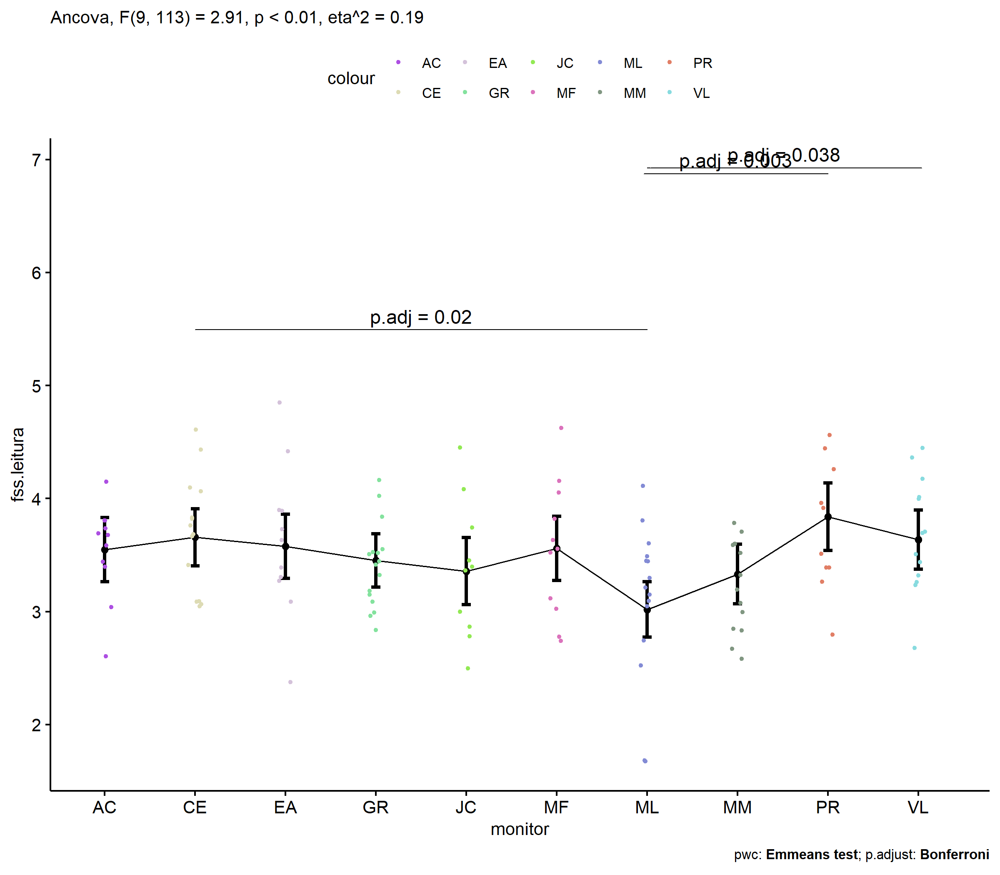<!-- -->

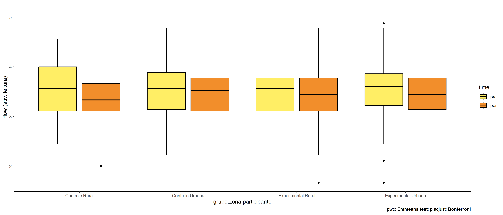<!-- -->

<!-- -->

### factores: **grupo=“Experimental”:monitor.genero**

| var         | monitor.genero |   n | M (pre) | SE (pre) | M (unadj) | SE (unadj) | M (adj) | SE (adj) |
|:------------|:---------------|----:|--------:|---------:|----------:|-----------:|--------:|---------:|
| fss.leitura | F              |  79 |   3.498 |    0.060 |     3.404 |      0.060 |   3.408 |    0.056 |
| fss.leitura | M              |  45 |   3.525 |    0.092 |     3.619 |      0.086 |   3.612 |    0.074 |

| .y.         | group1 | group2 | estimate | conf.low | conf.high |    se | statistic |     p | p.adj | p.adj.signif |
|:------------|:-------|:-------|---------:|---------:|----------:|------:|----------:|------:|------:|:-------------|
| fss.leitura | F      | M      |   -0.204 |   -0.388 |    -0.019 | 0.093 |    -2.186 | 0.031 | 0.031 | \*           |
| dfs.leitura | F      | M      |   -0.026 |   -0.235 |     0.182 | 0.105 |    -0.251 | 0.803 | 0.803 | ns           |

| .y.          | monitor.genero | group1 | group2 | estimate | conf.low | conf.high |    se | statistic |     p | p.adj | p.adj.signif |
|:-------------|:---------------|:-------|:-------|---------:|---------:|----------:|------:|----------:|------:|------:|:-------------|
| flow.leitura | F              | pre    | pos    |    0.094 |   -0.081 |     0.268 | 0.089 |     1.060 | 0.290 | 0.290 | ns           |
| flow.leitura | M              | pre    | pos    |   -0.095 |   -0.326 |     0.137 | 0.117 |    -0.806 | 0.421 | 0.421 | ns           |

    ## Scale for colour is already present.
    ## Adding another scale for colour, which will replace the existing scale.

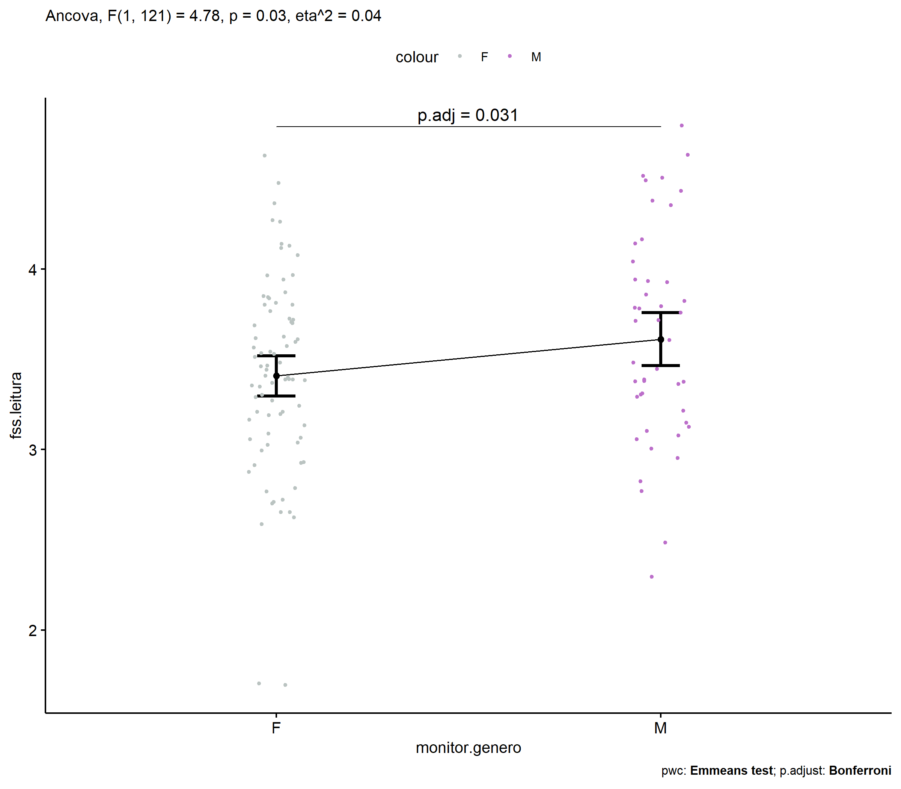<!-- -->

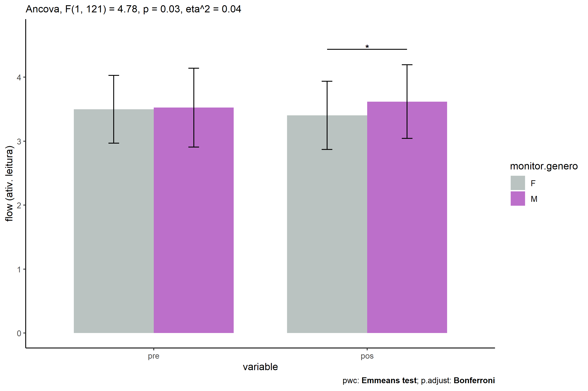<!-- -->

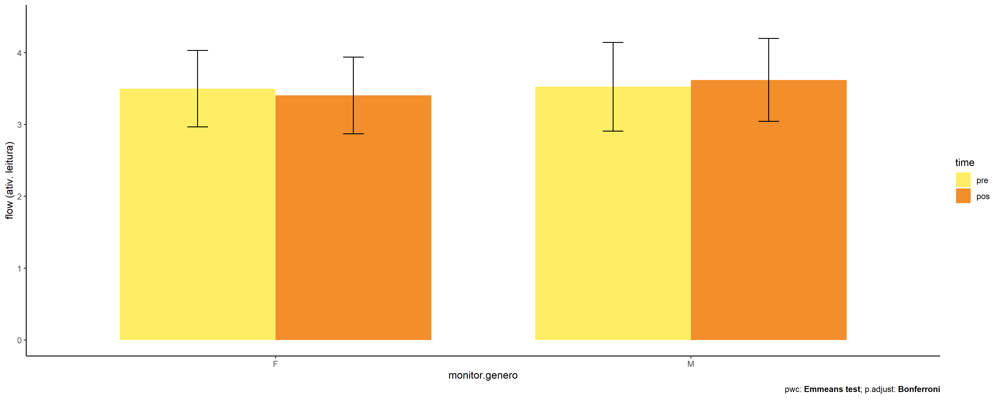<!-- -->

### factores: **grupo=“Experimental”:monitor.area**

| var         | monitor.area               |   n | M (pre) | SE (pre) | M (unadj) | SE (unadj) | M (adj) | SE (adj) |
|:------------|:---------------------------|----:|--------:|---------:|----------:|-----------:|--------:|---------:|
| fss.leitura | Arquitetura e Urbanismo    |  10 |   3.554 |    0.193 |     3.378 |      0.190 |   3.357 |    0.150 |
| fss.leitura | Ciencias Biologicas        |  15 |   3.701 |    0.136 |     3.106 |      0.181 |   3.018 |    0.123 |
| fss.leitura | Comunicacao Social         |  14 |   3.605 |    0.154 |     3.701 |      0.132 |   3.657 |    0.127 |
| fss.leitura | Historia                   |  10 |   3.275 |    0.240 |     3.735 |      0.185 |   3.841 |    0.151 |
| fss.leitura | Letras - Lingua Portuguesa |  11 |   3.495 |    0.222 |     3.554 |      0.177 |   3.560 |    0.143 |
| fss.leitura | Matematica                 |  27 |   3.495 |    0.103 |     3.498 |      0.098 |   3.504 |    0.091 |
| fss.leitura | Nutricao                   |  13 |   3.244 |    0.161 |     3.213 |      0.117 |   3.333 |    0.133 |
| fss.leitura | Pedagogia                  |  11 |   3.505 |    0.074 |     3.545 |      0.116 |   3.547 |    0.143 |
| fss.leitura | Servico Social             |  13 |   3.628 |    0.118 |     3.690 |      0.136 |   3.635 |    0.132 |

| .y.         | group1                  | group2              | estimate | conf.low | conf.high |    se | statistic | p       | p.adj | p.adj.signif |
|:------------|:------------------------|:--------------------|---------:|---------:|----------:|------:|----------:|:--------|------:|:-------------|
| fss.leitura | Arquitetura e Urbanismo | Ciencias Biologicas |    0.339 |   -0.044 |     0.722 | 0.193 |     1.752 | 0.082   | 1.000 | ns           |
| fss.leitura | Arquitetura e Urbanismo | Comunicacao Social  |   -0.300 |   -0.689 |     0.088 | 0.196 |    -1.533 | 0.128   | 1.000 | ns           |
| fss.leitura | Arquitetura e Urbanismo | Historia            |   -0.484 |   -0.906 |    -0.063 | 0.213 |    -2.276 | 0.025   | 0.890 | ns           |
| fss.leitura | Arquitetura e Urbanismo | Letras              |   -0.203 |   -0.613 |     0.206 | 0.207 |    -0.984 | 0.327   | 1.000 | ns           |
| fss.leitura | Arquitetura e Urbanismo | Matematica          |   -0.147 |   -0.494 |     0.200 | 0.175 |    -0.840 | 0.403   | 1.000 | ns           |
| fss.leitura | Arquitetura e Urbanismo | Nutricao            |    0.024 |   -0.373 |     0.421 | 0.200 |     0.119 | 0.906   | 1.000 | ns           |
| fss.leitura | Arquitetura e Urbanismo | Pedagogia           |   -0.190 |   -0.600 |     0.220 | 0.207 |    -0.919 | 0.36    | 1.000 | ns           |
| fss.leitura | Arquitetura e Urbanismo | Servico Social      |   -0.279 |   -0.673 |     0.116 | 0.199 |    -1.400 | 0.164   | 1.000 | ns           |
| fss.leitura | Ciencias Biologicas     | Comunicacao Social  |   -0.639 |   -0.988 |    -0.291 | 0.176 |    -3.633 | \<0.001 | 0.015 | \*           |
| fss.leitura | Ciencias Biologicas     | Historia            |   -0.823 |   -1.212 |    -0.435 | 0.196 |    -4.199 | \<0.001 | 0.002 | \*\*         |
| fss.leitura | Ciencias Biologicas     | Letras              |   -0.542 |   -0.916 |    -0.169 | 0.189 |    -2.878 | 0.005   | 0.172 | ns           |
| fss.leitura | Ciencias Biologicas     | Matematica          |   -0.486 |   -0.790 |    -0.183 | 0.153 |    -3.173 | 0.002   | 0.070 | ns           |
| fss.leitura | Ciencias Biologicas     | Nutricao            |   -0.315 |   -0.677 |     0.047 | 0.183 |    -1.724 | 0.087   | 1.000 | ns           |
| fss.leitura | Ciencias Biologicas     | Pedagogia           |   -0.529 |   -0.902 |    -0.156 | 0.188 |    -2.807 | 0.006   | 0.211 | ns           |
| fss.leitura | Ciencias Biologicas     | Servico Social      |   -0.618 |   -0.973 |    -0.262 | 0.179 |    -3.444 | \<0.001 | 0.029 | \*           |
| fss.leitura | Comunicacao Social      | Historia            |   -0.184 |   -0.575 |     0.208 | 0.198 |    -0.930 | 0.354   | 1.000 | ns           |
| fss.leitura | Comunicacao Social      | Letras              |    0.097 |   -0.281 |     0.475 | 0.191 |     0.508 | 0.612   | 1.000 | ns           |
| fss.leitura | Comunicacao Social      | Matematica          |    0.153 |   -0.156 |     0.462 | 0.156 |     0.982 | 0.328   | 1.000 | ns           |
| fss.leitura | Comunicacao Social      | Nutricao            |    0.324 |   -0.041 |     0.690 | 0.184 |     1.758 | 0.081   | 1.000 | ns           |
| fss.leitura | Comunicacao Social      | Pedagogia           |    0.110 |   -0.268 |     0.488 | 0.191 |     0.579 | 0.564   | 1.000 | ns           |
| fss.leitura | Comunicacao Social      | Servico Social      |    0.022 |   -0.339 |     0.383 | 0.182 |     0.119 | 0.905   | 1.000 | ns           |
| fss.leitura | Historia                | Letras              |    0.281 |   -0.130 |     0.692 | 0.207 |     1.353 | 0.179   | 1.000 | ns           |
| fss.leitura | Historia                | Matematica          |    0.337 |   -0.012 |     0.686 | 0.176 |     1.915 | 0.058   | 1.000 | ns           |
| fss.leitura | Historia                | Nutricao            |    0.508 |    0.114 |     0.902 | 0.199 |     2.552 | 0.012   | 0.433 | ns           |
| fss.leitura | Historia                | Pedagogia           |    0.294 |   -0.117 |     0.705 | 0.208 |     1.417 | 0.159   | 1.000 | ns           |
| fss.leitura | Historia                | Servico Social      |    0.205 |   -0.193 |     0.604 | 0.201 |     1.023 | 0.309   | 1.000 | ns           |
| fss.leitura | Letras                  | Lingua Portuguesa   |    0.056 |   -0.279 |     0.392 | 0.169 |     0.333 | 0.74    | 1.000 | ns           |
| fss.leitura | Letras                  | Lingua Portuguesa   |    0.227 |   -0.159 |     0.613 | 0.195 |     1.167 | 0.246   | 1.000 | ns           |
| fss.leitura | Letras                  | Lingua Portuguesa   |    0.013 |   -0.386 |     0.413 | 0.202 |     0.067 | 0.947   | 1.000 | ns           |
| fss.leitura | Letras                  | Lingua Portuguesa   |   -0.075 |   -0.460 |     0.309 | 0.194 |    -0.388 | 0.699   | 1.000 | ns           |
| fss.leitura | Matematica              | Nutricao            |    0.171 |   -0.148 |     0.490 | 0.161 |     1.062 | 0.29    | 1.000 | ns           |
| fss.leitura | Matematica              | Pedagogia           |   -0.043 |   -0.378 |     0.292 | 0.169 |    -0.253 | 0.8     | 1.000 | ns           |
| fss.leitura | Matematica              | Servico Social      |   -0.132 |   -0.449 |     0.186 | 0.160 |    -0.822 | 0.413   | 1.000 | ns           |
| fss.leitura | Nutricao                | Pedagogia           |   -0.214 |   -0.600 |     0.172 | 0.195 |    -1.097 | 0.275   | 1.000 | ns           |
| fss.leitura | Nutricao                | Servico Social      |   -0.303 |   -0.675 |     0.070 | 0.188 |    -1.609 | 0.11    | 1.000 | ns           |
| fss.leitura | Pedagogia               | Servico Social      |   -0.089 |   -0.473 |     0.296 | 0.194 |    -0.457 | 0.649   | 1.000 | ns           |
| dfs.leitura | Arquitetura e Urbanismo | Ciencias Biologicas |   -0.147 |   -0.602 |     0.308 | 0.230 |    -0.639 | 0.524   | 1.000 | ns           |
| dfs.leitura | Arquitetura e Urbanismo | Comunicacao Social  |   -0.051 |   -0.512 |     0.410 | 0.233 |    -0.219 | 0.827   | 1.000 | ns           |
| dfs.leitura | Arquitetura e Urbanismo | Historia            |    0.280 |   -0.219 |     0.778 | 0.252 |     1.111 | 0.269   | 1.000 | ns           |
| dfs.leitura | Arquitetura e Urbanismo | Letras              |    0.059 |   -0.428 |     0.546 | 0.246 |     0.241 | 0.81    | 1.000 | ns           |
| dfs.leitura | Arquitetura e Urbanismo | Matematica          |    0.059 |   -0.353 |     0.472 | 0.208 |     0.285 | 0.776   | 1.000 | ns           |
| dfs.leitura | Arquitetura e Urbanismo | Nutricao            |    0.311 |   -0.158 |     0.779 | 0.237 |     1.313 | 0.192   | 1.000 | ns           |
| dfs.leitura | Arquitetura e Urbanismo | Pedagogia           |    0.049 |   -0.438 |     0.536 | 0.246 |     0.200 | 0.842   | 1.000 | ns           |
| dfs.leitura | Arquitetura e Urbanismo | Servico Social      |   -0.074 |   -0.543 |     0.395 | 0.237 |    -0.313 | 0.755   | 1.000 | ns           |
| dfs.leitura | Ciencias Biologicas     | Comunicacao Social  |    0.096 |   -0.318 |     0.510 | 0.209 |     0.458 | 0.648   | 1.000 | ns           |
| dfs.leitura | Ciencias Biologicas     | Historia            |    0.426 |   -0.029 |     0.881 | 0.230 |     1.857 | 0.066   | 1.000 | ns           |
| dfs.leitura | Ciencias Biologicas     | Letras              |    0.206 |   -0.236 |     0.648 | 0.223 |     0.923 | 0.358   | 1.000 | ns           |
| dfs.leitura | Ciencias Biologicas     | Matematica          |    0.206 |   -0.153 |     0.565 | 0.181 |     1.138 | 0.258   | 1.000 | ns           |
| dfs.leitura | Ciencias Biologicas     | Nutricao            |    0.457 |    0.035 |     0.880 | 0.213 |     2.146 | 0.034   | 1.000 | ns           |
| dfs.leitura | Ciencias Biologicas     | Pedagogia           |    0.196 |   -0.246 |     0.638 | 0.223 |     0.877 | 0.382   | 1.000 | ns           |
| dfs.leitura | Ciencias Biologicas     | Servico Social      |    0.073 |   -0.349 |     0.495 | 0.213 |     0.341 | 0.734   | 1.000 | ns           |
| dfs.leitura | Comunicacao Social      | Historia            |    0.331 |   -0.131 |     0.792 | 0.233 |     1.419 | 0.158   | 1.000 | ns           |
| dfs.leitura | Comunicacao Social      | Letras              |    0.110 |   -0.339 |     0.559 | 0.227 |     0.486 | 0.628   | 1.000 | ns           |
| dfs.leitura | Comunicacao Social      | Matematica          |    0.110 |   -0.257 |     0.477 | 0.185 |     0.595 | 0.553   | 1.000 | ns           |
| dfs.leitura | Comunicacao Social      | Nutricao            |    0.362 |   -0.068 |     0.791 | 0.217 |     1.669 | 0.098   | 1.000 | ns           |
| dfs.leitura | Comunicacao Social      | Pedagogia           |    0.100 |   -0.349 |     0.549 | 0.227 |     0.442 | 0.659   | 1.000 | ns           |
| dfs.leitura | Comunicacao Social      | Servico Social      |   -0.023 |   -0.452 |     0.406 | 0.217 |    -0.106 | 0.915   | 1.000 | ns           |
| dfs.leitura | Historia                | Letras              |   -0.220 |   -0.707 |     0.266 | 0.246 |    -0.897 | 0.372   | 1.000 | ns           |
| dfs.leitura | Historia                | Matematica          |   -0.220 |   -0.633 |     0.192 | 0.208 |    -1.058 | 0.292   | 1.000 | ns           |
| dfs.leitura | Historia                | Nutricao            |    0.031 |   -0.438 |     0.500 | 0.237 |     0.131 | 0.896   | 1.000 | ns           |
| dfs.leitura | Historia                | Pedagogia           |   -0.230 |   -0.717 |     0.256 | 0.246 |    -0.938 | 0.35    | 1.000 | ns           |
| dfs.leitura | Historia                | Servico Social      |   -0.354 |   -0.822 |     0.115 | 0.237 |    -1.495 | 0.138   | 1.000 | ns           |
| dfs.leitura | Letras                  | Lingua Portuguesa   |    0.000 |   -0.398 |     0.399 | 0.201 |     0.000 | 1       | 1.000 | ns           |
| dfs.leitura | Letras                  | Lingua Portuguesa   |    0.251 |   -0.205 |     0.708 | 0.230 |     1.091 | 0.278   | 1.000 | ns           |
| dfs.leitura | Letras                  | Lingua Portuguesa   |   -0.010 |   -0.485 |     0.465 | 0.240 |    -0.042 | 0.966   | 1.000 | ns           |
| dfs.leitura | Letras                  | Lingua Portuguesa   |   -0.133 |   -0.590 |     0.323 | 0.230 |    -0.578 | 0.564   | 1.000 | ns           |
| dfs.leitura | Matematica              | Nutricao            |    0.251 |   -0.125 |     0.627 | 0.190 |     1.323 | 0.188   | 1.000 | ns           |
| dfs.leitura | Matematica              | Pedagogia           |   -0.010 |   -0.409 |     0.388 | 0.201 |    -0.051 | 0.96    | 1.000 | ns           |
| dfs.leitura | Matematica              | Servico Social      |   -0.133 |   -0.509 |     0.243 | 0.190 |    -0.702 | 0.484   | 1.000 | ns           |
| dfs.leitura | Nutricao                | Pedagogia           |   -0.261 |   -0.718 |     0.195 | 0.230 |    -1.135 | 0.259   | 1.000 | ns           |
| dfs.leitura | Nutricao                | Servico Social      |   -0.385 |   -0.822 |     0.052 | 0.221 |    -1.743 | 0.084   | 1.000 | ns           |
| dfs.leitura | Pedagogia               | Servico Social      |   -0.123 |   -0.580 |     0.333 | 0.230 |    -0.534 | 0.594   | 1.000 | ns           |

| .y.          | monitor.area               | group1 | group2 | estimate | conf.low | conf.high |    se | statistic |     p | p.adj | p.adj.signif |
|:-------------|:---------------------------|:-------|:-------|---------:|---------:|----------:|------:|----------:|------:|------:|:-------------|
| flow.leitura | Arquitetura e Urbanismo    | pre    | pos    |    0.176 |   -0.308 |     0.661 | 0.246 |     0.718 | 0.474 | 0.474 | ns           |
| flow.leitura | Ciencias Biologicas        | pre    | pos    |    0.595 |    0.200 |     0.991 | 0.201 |     2.968 | 0.003 | 0.003 | \*\*         |
| flow.leitura | Comunicacao Social         | pre    | pos    |   -0.096 |   -0.505 |     0.313 | 0.208 |    -0.463 | 0.644 | 0.644 | ns           |
| flow.leitura | Historia                   | pre    | pos    |   -0.460 |   -0.944 |     0.024 | 0.246 |    -1.873 | 0.062 | 0.062 | ns           |
| flow.leitura | Letras - Lingua Portuguesa | pre    | pos    |   -0.059 |   -0.521 |     0.402 | 0.234 |    -0.253 | 0.800 | 0.800 | ns           |
| flow.leitura | Matematica                 | pre    | pos    |   -0.003 |   -0.298 |     0.292 | 0.150 |    -0.021 | 0.984 | 0.984 | ns           |
| flow.leitura | Nutricao                   | pre    | pos    |    0.031 |   -0.394 |     0.456 | 0.216 |     0.144 | 0.886 | 0.886 | ns           |
| flow.leitura | Pedagogia                  | pre    | pos    |   -0.040 |   -0.502 |     0.421 | 0.234 |    -0.172 | 0.863 | 0.863 | ns           |
| flow.leitura | Servico Social             | pre    | pos    |   -0.062 |   -0.487 |     0.363 | 0.216 |    -0.288 | 0.774 | 0.774 | ns           |

    ## Scale for colour is already present.
    ## Adding another scale for colour, which will replace the existing scale.

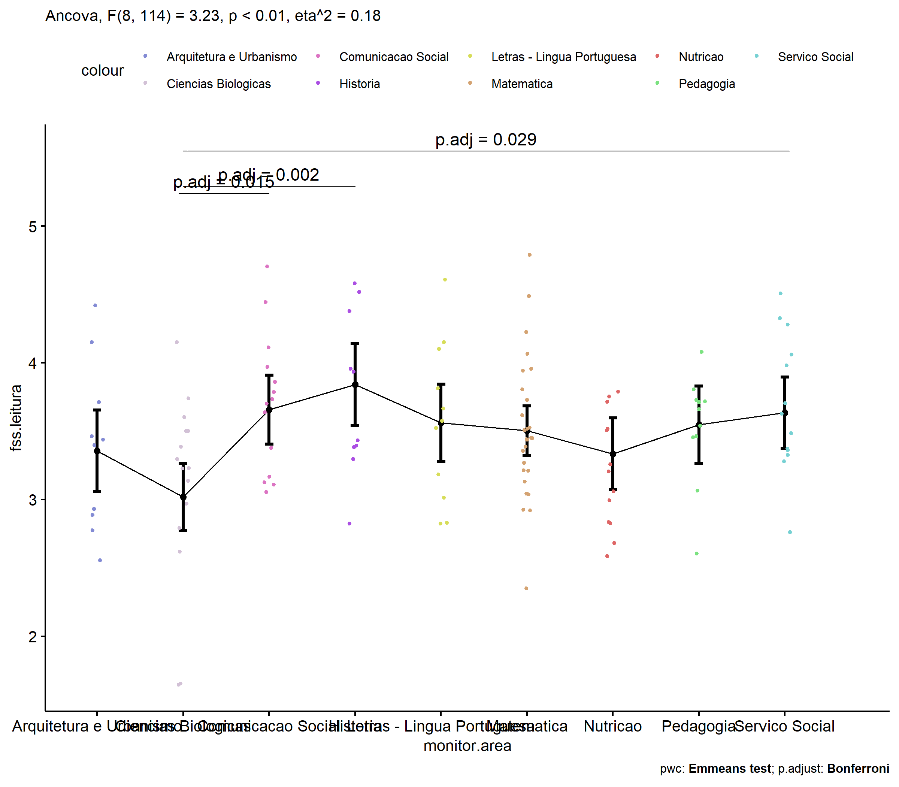<!-- -->

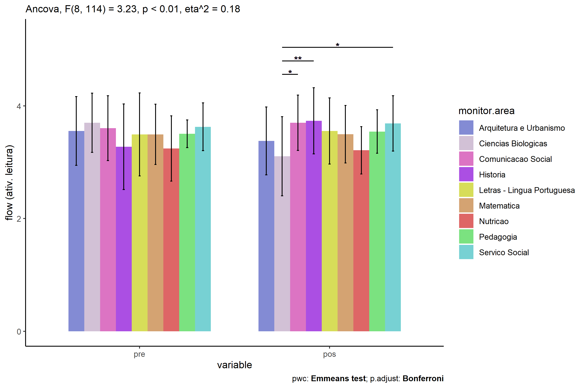<!-- -->

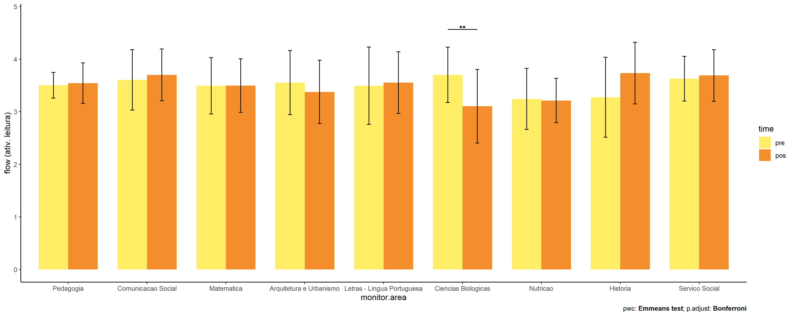<!-- -->

### factores: **grupo=“Experimental”:monitor.formacao**

| var         | monitor.formacao |   n | M (pre) | SE (pre) | M (unadj) | SE (unadj) | M (adj) | SE (adj) |
|:------------|:-----------------|----:|--------:|---------:|----------:|-----------:|--------:|---------:|
| fss.leitura | ensino medio     |  88 |   3.478 |    0.063 |     3.421 |      0.060 |   3.433 |    0.054 |
| fss.leitura | especializacao   |  14 |   3.605 |    0.154 |     3.701 |      0.132 |   3.661 |    0.135 |
| fss.leitura | graduacao        |  22 |   3.564 |    0.090 |     3.587 |      0.113 |   3.564 |    0.108 |

| .y.         | group1         | group2         | estimate | conf.low | conf.high |    se | statistic |     p | p.adj | p.adj.signif |
|:------------|:---------------|:---------------|---------:|---------:|----------:|------:|----------:|------:|------:|:-------------|
| fss.leitura | ensino medio   | especializacao |   -0.228 |   -0.516 |     0.060 | 0.145 |    -1.569 | 0.119 | 0.358 | ns           |
| fss.leitura | ensino medio   | graduacao      |   -0.131 |   -0.369 |     0.108 | 0.120 |    -1.087 | 0.279 | 0.838 | ns           |
| fss.leitura | especializacao | graduacao      |    0.097 |   -0.244 |     0.439 | 0.172 |     0.564 | 0.574 | 1.000 | ns           |
| dfs.leitura | ensino medio   | especializacao |   -0.127 |   -0.448 |     0.194 | 0.162 |    -0.782 | 0.436 | 1.000 | ns           |
| dfs.leitura | ensino medio   | graduacao      |   -0.085 |   -0.351 |     0.181 | 0.134 |    -0.636 | 0.526 | 1.000 | ns           |
| dfs.leitura | especializacao | graduacao      |    0.041 |   -0.340 |     0.423 | 0.193 |     0.215 | 0.830 | 1.000 | ns           |

| .y.          | monitor.formacao | group1 | group2 | estimate | conf.low | conf.high |    se | statistic |     p | p.adj | p.adj.signif |
|:-------------|:-----------------|:-------|:-------|---------:|---------:|----------:|------:|----------:|------:|------:|:-------------|
| flow.leitura | ensino medio     | pre    | pos    |    0.057 |   -0.109 |     0.223 | 0.084 |     0.678 | 0.498 | 0.498 | ns           |
| flow.leitura | especializacao   | pre    | pos    |   -0.096 |   -0.512 |     0.319 | 0.211 |    -0.456 | 0.649 | 0.649 | ns           |
| flow.leitura | graduacao        | pre    | pos    |   -0.023 |   -0.355 |     0.308 | 0.168 |    -0.139 | 0.890 | 0.890 | ns           |

    ## Scale for colour is already present.
    ## Adding another scale for colour, which will replace the existing scale.

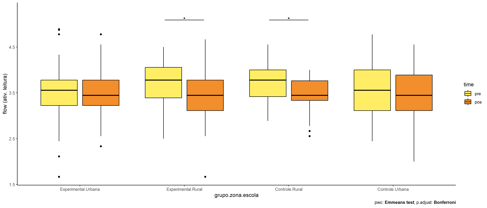<!-- -->

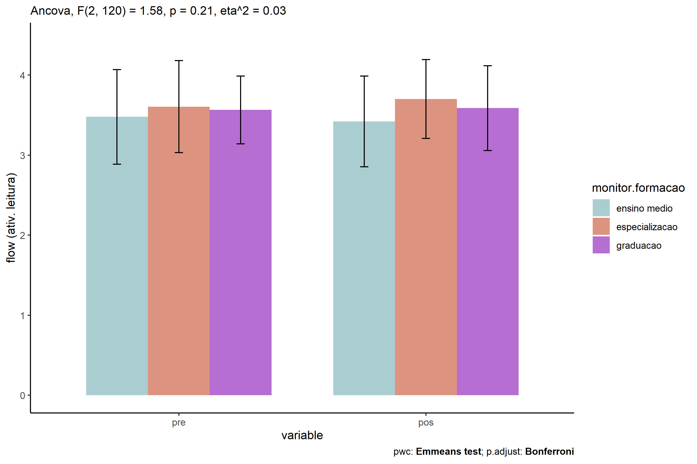<!-- -->

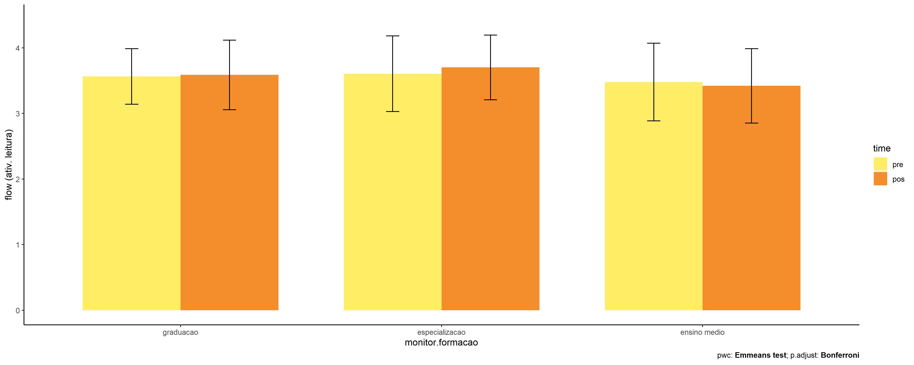<!-- -->

### factores: **grupo=“Experimental”:monitor.experiencia**

| var         | monitor.experiencia |   n | M (pre) | SE (pre) | M (unadj) | SE (unadj) | M (adj) | SE (adj) |
|:------------|:--------------------|----:|--------:|---------:|----------:|-----------:|--------:|---------:|
| fss.leitura | maior 01 ano        |  88 |   3.524 |    0.061 |     3.503 |      0.061 |   3.497 |    0.054 |
| fss.leitura | menor 01 ano        |  36 |   3.469 |    0.092 |     3.431 |      0.088 |   3.447 |    0.085 |

| .y.         | group1       | group2       | estimate | conf.low | conf.high |    se | statistic |     p | p.adj | p.adj.signif |
|:------------|:-------------|:-------------|---------:|---------:|----------:|------:|----------:|------:|------:|:-------------|
| fss.leitura | maior 01 ano | menor 01 ano |    0.049 |   -0.150 |     0.248 | 0.101 |     0.489 | 0.626 | 0.626 | ns           |
| dfs.leitura | maior 01 ano | menor 01 ano |    0.055 |   -0.165 |     0.276 | 0.111 |     0.494 | 0.622 | 0.622 | ns           |

| .y.          | monitor.experiencia | group1 | group2 | estimate | conf.low | conf.high |    se | statistic |     p | p.adj | p.adj.signif |
|:-------------|:--------------------|:-------|:-------|---------:|---------:|----------:|------:|----------:|------:|------:|:-------------|
| flow.leitura | maior 01 ano        | pre    | pos    |    0.020 |   -0.146 |     0.187 | 0.085 |     0.242 | 0.809 | 0.809 | ns           |
| flow.leitura | menor 01 ano        | pre    | pos    |    0.038 |   -0.223 |     0.298 | 0.132 |     0.286 | 0.775 | 0.775 | ns           |

    ## Scale for colour is already present.
    ## Adding another scale for colour, which will replace the existing scale.

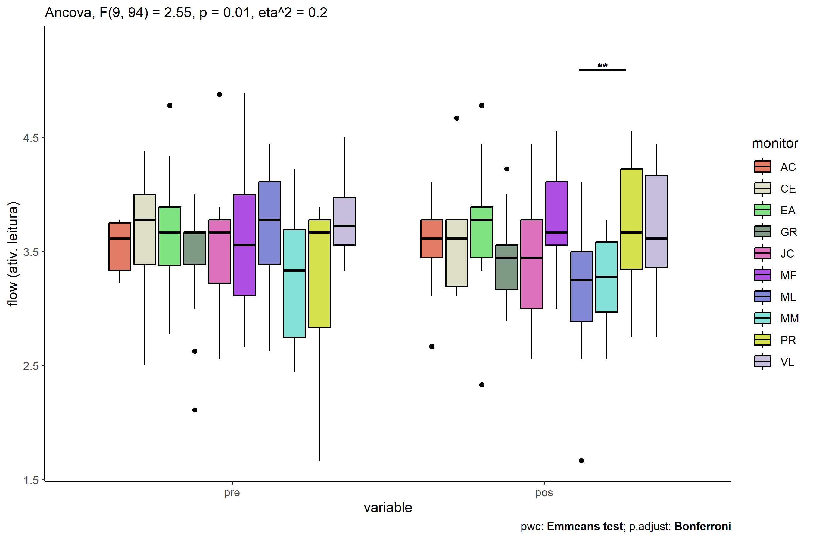<!-- -->

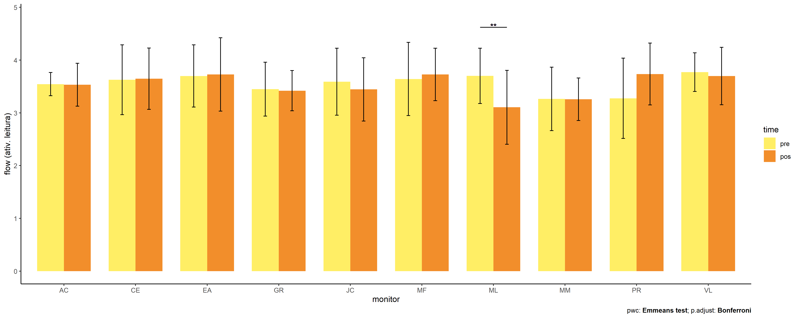<!-- -->

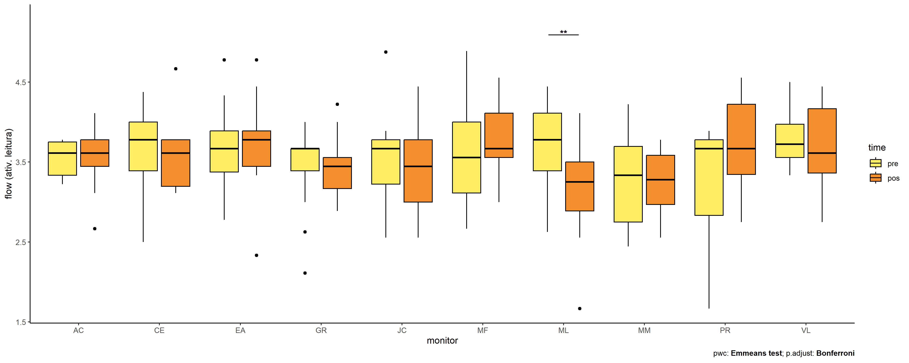<!-- -->
