ANCOVA test for matematica (engajamento no matematica)
================
Geiser C. Challco <geiser@alumni.usp.br>

- [Descriptive Statistics of Initial
  Data](#descriptive-statistics-of-initial-data)
- [Checking of Assumptions](#checking-of-assumptions)
  - [Assumption: Normality distribution of
    data](#assumption-normality-distribution-of-data)
  - [Assumption: Homogeneity of data
    distribution](#assumption-homogeneity-of-data-distribution)
- [Computation of ANCOVA test and Pairwise
  Comparison](#computation-of-ancova-test-and-pairwise-comparison)
  - [ANCOVA tests for one factor](#ancova-tests-for-one-factor)
  - [ANCOVA tests for two factors](#ancova-tests-for-two-factors)
  - [ANCOVA tests for grupo=“WordGen”](#ancova-tests-for-grupowordgen)
  - [Pairwise comparisons for one
    factor](#pairwise-comparisons-for-one-factor)
    - [factor: **grupo**](#factor-grupo)
    - [factor: **genero**](#factor-genero)
    - [factor: **idade**](#factor-idade)
    - [factor: **zona.participante**](#factor-zonaparticipante)
    - [factor: **escola**](#factor-escola)
    - [factor: **zona.escola**](#factor-zonaescola)
  - [Pairwise comparisons for two
    factors](#pairwise-comparisons-for-two-factors)
    - [factores: **grupo:genero**](#factores-grupogenero)
    - [factores: **grupo:idade**](#factores-grupoidade)
    - [factores:
      **grupo:zona.participante**](#factores-grupozonaparticipante)
    - [factores: **grupo:escola**](#factores-grupoescola)
    - [factores: **grupo:zona.escola**](#factores-grupozonaescola)
  - [Pairwise comparisons for
    grupo=“Experimental”](#pairwise-comparisons-for-grupoexperimental)
    - [factores:
      **grupo=“Experimental”:monitor**](#factores-grupoexperimentalmonitor)
    - [factores:
      **grupo=“Experimental”:monitor.genero**](#factores-grupoexperimentalmonitorgenero)
    - [factores:
      **grupo=“Experimental”:monitor.area**](#factores-grupoexperimentalmonitorarea)
    - [factores:
      **grupo=“Experimental”:monitor.formacao**](#factores-grupoexperimentalmonitorformacao)
    - [factores:
      **grupo=“Experimental”:monitor.experiencia**](#factores-grupoexperimentalmonitorexperiencia)

**NOTE**

- Teste ANCOVA para determinar se houve diferenças significativas em
  referência ao engajamento no matematica (medido como estado de fluxo).
- ANCOVA test to determine whether there were significant differences in
  reference to engagement in matematica (measured as flow state).

# Descriptive Statistics of Initial Data

| grupo    | genero | idade | zona.participante | escola | zona.escola | variable       |   n |  mean | median |   min |   max |    sd |    se |    ci |   iqr |
|:---------|:-------|:------|:------------------|:-------|:------------|:---------------|----:|------:|-------:|------:|------:|------:|------:|------:|------:|
| Controle | F      |       |                   |        |             | fss.matematica |  60 | 3.401 |  3.389 | 2.000 | 4.333 | 0.522 | 0.067 | 0.135 | 0.778 |
| Controle | M      |       |                   |        |             | fss.matematica |  65 | 3.363 |  3.333 | 2.444 | 4.444 | 0.482 | 0.060 | 0.120 | 0.556 |
| WordGen  | F      |       |                   |        |             | fss.matematica |  53 | 3.478 |  3.444 | 2.444 | 4.444 | 0.540 | 0.074 | 0.149 | 0.889 |
| WordGen  | M      |       |                   |        |             | fss.matematica |  63 | 3.449 |  3.444 | 1.778 | 4.714 | 0.636 | 0.080 | 0.160 | 0.889 |
| Controle | F      |       |                   |        |             | dfs.matematica |  60 | 3.510 |  3.556 | 2.000 | 4.556 | 0.584 | 0.075 | 0.151 | 0.694 |
| Controle | M      |       |                   |        |             | dfs.matematica |  65 | 3.546 |  3.556 | 2.444 | 4.556 | 0.483 | 0.060 | 0.120 | 0.667 |
| WordGen  | F      |       |                   |        |             | dfs.matematica |  53 | 3.604 |  3.667 | 2.333 | 4.857 | 0.577 | 0.079 | 0.159 | 0.778 |
| WordGen  | M      |       |                   |        |             | dfs.matematica |  63 | 3.447 |  3.444 | 1.667 | 4.556 | 0.558 | 0.070 | 0.141 | 0.833 |
| Controle |        | 10y   |                   |        |             | fss.matematica |  24 | 3.435 |  3.444 | 2.444 | 4.444 | 0.508 | 0.104 | 0.214 | 0.500 |
| Controle |        | 11y   |                   |        |             | fss.matematica |  67 | 3.374 |  3.333 | 2.000 | 4.444 | 0.504 | 0.062 | 0.123 | 0.556 |
| Controle |        | 12y   |                   |        |             | fss.matematica |  18 | 3.474 |  3.333 | 2.778 | 4.333 | 0.509 | 0.120 | 0.253 | 0.667 |
| Controle |        | 13y   |                   |        |             | fss.matematica |   7 | 3.058 |  2.889 | 2.778 | 3.625 | 0.320 | 0.121 | 0.296 | 0.389 |
| Controle |        | 14y   |                   |        |             | fss.matematica |   1 | 3.556 |  3.556 | 3.556 | 3.556 |       |       |       | 0.000 |
| Controle |        | 15y   |                   |        |             | fss.matematica |   1 | 2.444 |  2.444 | 2.444 | 2.444 |       |       |       | 0.000 |
| Controle |        | 16y   |                   |        |             | fss.matematica |   1 | 3.000 |  3.000 | 3.000 | 3.000 |       |       |       | 0.000 |
| Controle |        |       |                   |        |             | fss.matematica |   6 | 3.537 |  3.611 | 3.000 | 4.222 | 0.484 | 0.198 | 0.508 | 0.667 |
| WordGen  |        | 10y   |                   |        |             | fss.matematica |  22 | 3.222 |  3.278 | 1.778 | 4.444 | 0.640 | 0.136 | 0.284 | 0.556 |
| WordGen  |        | 11y   |                   |        |             | fss.matematica |  71 | 3.585 |  3.667 | 1.889 | 4.714 | 0.553 | 0.066 | 0.131 | 0.722 |
| WordGen  |        | 12y   |                   |        |             | fss.matematica |  14 | 3.355 |  3.444 | 2.444 | 4.111 | 0.525 | 0.140 | 0.303 | 0.861 |
| WordGen  |        | 13y   |                   |        |             | fss.matematica |   6 | 3.000 |  3.111 | 1.889 | 3.778 | 0.625 | 0.255 | 0.655 | 0.306 |
| WordGen  |        | 14y   |                   |        |             | fss.matematica |   1 | 4.444 |  4.444 | 4.444 | 4.444 |       |       |       | 0.000 |
| WordGen  |        |       |                   |        |             | fss.matematica |   2 | 3.389 |  3.389 | 3.333 | 3.444 | 0.079 | 0.056 | 0.706 | 0.056 |
| Controle |        | 10y   |                   |        |             | dfs.matematica |  24 | 3.427 |  3.410 | 2.222 | 4.556 | 0.519 | 0.106 | 0.219 | 0.646 |
| Controle |        | 11y   |                   |        |             | dfs.matematica |  67 | 3.588 |  3.667 | 2.000 | 4.556 | 0.529 | 0.065 | 0.129 | 0.667 |
| Controle |        | 12y   |                   |        |             | dfs.matematica |  18 | 3.560 |  3.646 | 2.750 | 4.333 | 0.484 | 0.114 | 0.241 | 0.722 |
| Controle |        | 13y   |                   |        |             | dfs.matematica |   7 | 3.683 |  3.778 | 3.000 | 4.556 | 0.519 | 0.196 | 0.480 | 0.556 |
| Controle |        | 14y   |                   |        |             | dfs.matematica |   1 | 3.444 |  3.444 | 3.444 | 3.444 |       |       |       | 0.000 |
| Controle |        | 15y   |                   |        |             | dfs.matematica |   1 | 2.444 |  2.444 | 2.444 | 2.444 |       |       |       | 0.000 |
| Controle |        | 16y   |                   |        |             | dfs.matematica |   1 | 3.444 |  3.444 | 3.444 | 3.444 |       |       |       | 0.000 |
| Controle |        |       |                   |        |             | dfs.matematica |   6 | 3.222 |  3.000 | 2.667 | 4.556 | 0.692 | 0.283 | 0.726 | 0.417 |
| WordGen  |        | 10y   |                   |        |             | dfs.matematica |  22 | 3.439 |  3.444 | 2.333 | 4.556 | 0.565 | 0.120 | 0.250 | 0.556 |
| WordGen  |        | 11y   |                   |        |             | dfs.matematica |  71 | 3.576 |  3.667 | 2.333 | 4.857 | 0.552 | 0.066 | 0.131 | 0.778 |
| WordGen  |        | 12y   |                   |        |             | dfs.matematica |  14 | 3.392 |  3.333 | 1.667 | 4.333 | 0.694 | 0.185 | 0.400 | 0.611 |
| WordGen  |        | 13y   |                   |        |             | dfs.matematica |   6 | 3.389 |  3.556 | 2.556 | 4.000 | 0.591 | 0.241 | 0.620 | 0.833 |
| WordGen  |        | 14y   |                   |        |             | dfs.matematica |   1 | 3.000 |  3.000 | 3.000 | 3.000 |       |       |       | 0.000 |
| WordGen  |        |       |                   |        |             | dfs.matematica |   2 | 3.889 |  3.889 | 3.889 | 3.889 | 0.000 | 0.000 | 0.000 | 0.000 |
| Controle |        |       | Urbana            |        |             | fss.matematica |  54 | 3.381 |  3.389 | 2.444 | 4.444 | 0.514 | 0.070 | 0.140 | 0.667 |
| Controle |        |       | Rural             |        |             | fss.matematica |  43 | 3.376 |  3.333 | 2.000 | 4.444 | 0.464 | 0.071 | 0.143 | 0.535 |
| Controle |        |       |                   |        |             | fss.matematica |  28 | 3.390 |  3.556 | 2.444 | 4.333 | 0.544 | 0.103 | 0.211 | 0.917 |
| WordGen  |        |       | Urbana            |        |             | fss.matematica |  43 | 3.351 |  3.333 | 1.889 | 4.714 | 0.647 | 0.099 | 0.199 | 1.000 |
| WordGen  |        |       | Rural             |        |             | fss.matematica |  48 | 3.481 |  3.667 | 1.778 | 4.444 | 0.562 | 0.081 | 0.163 | 0.667 |
| WordGen  |        |       |                   |        |             | fss.matematica |  25 | 3.618 |  3.667 | 2.556 | 4.556 | 0.529 | 0.106 | 0.218 | 0.889 |
| Controle |        |       | Urbana            |        |             | dfs.matematica |  54 | 3.437 |  3.444 | 2.222 | 4.333 | 0.500 | 0.068 | 0.136 | 0.549 |
| Controle |        |       | Rural             |        |             | dfs.matematica |  43 | 3.555 |  3.556 | 2.000 | 4.556 | 0.594 | 0.091 | 0.183 | 0.889 |
| Controle |        |       |                   |        |             | dfs.matematica |  28 | 3.666 |  3.667 | 2.778 | 4.556 | 0.472 | 0.089 | 0.183 | 0.583 |
| WordGen  |        |       | Urbana            |        |             | dfs.matematica |  43 | 3.385 |  3.333 | 1.667 | 4.857 | 0.632 | 0.096 | 0.195 | 0.778 |
| WordGen  |        |       | Rural             |        |             | dfs.matematica |  48 | 3.561 |  3.500 | 2.667 | 4.556 | 0.543 | 0.078 | 0.158 | 0.806 |
| WordGen  |        |       |                   |        |             | dfs.matematica |  25 | 3.667 |  3.667 | 2.444 | 4.333 | 0.467 | 0.093 | 0.193 | 0.444 |
| Controle |        |       |                   | E1     |             | fss.matematica |  12 | 3.120 |  3.167 | 2.444 | 4.222 | 0.516 | 0.149 | 0.328 | 0.694 |
| Controle |        |       |                   | E2     |             | fss.matematica |  23 | 3.314 |  3.222 | 2.444 | 4.333 | 0.479 | 0.100 | 0.207 | 0.722 |
| Controle |        |       |                   | E3     |             | fss.matematica |  15 | 3.378 |  3.333 | 2.000 | 3.889 | 0.440 | 0.114 | 0.244 | 0.333 |
| Controle |        |       |                   | E4     |             | fss.matematica |  16 | 3.370 |  3.278 | 2.778 | 4.000 | 0.361 | 0.090 | 0.192 | 0.524 |
| Controle |        |       |                   | E5     |             | fss.matematica |  48 | 3.455 |  3.444 | 2.444 | 4.444 | 0.563 | 0.081 | 0.163 | 0.806 |
| Controle |        |       |                   | E6     |             | fss.matematica |  11 | 3.505 |  3.556 | 2.444 | 4.000 | 0.462 | 0.139 | 0.310 | 0.556 |
| WordGen  |        |       |                   | E1     |             | fss.matematica |  10 | 3.805 |  3.889 | 2.667 | 4.714 | 0.629 | 0.199 | 0.450 | 0.778 |
| WordGen  |        |       |                   | E2     |             | fss.matematica |  24 | 3.307 |  3.333 | 1.889 | 4.444 | 0.551 | 0.112 | 0.232 | 0.597 |
| WordGen  |        |       |                   | E3     |             | fss.matematica |  15 | 3.302 |  3.333 | 2.556 | 4.111 | 0.473 | 0.122 | 0.262 | 0.667 |
| WordGen  |        |       |                   | E4     |             | fss.matematica |   9 | 3.664 |  3.778 | 2.778 | 4.222 | 0.499 | 0.166 | 0.384 | 0.333 |
| WordGen  |        |       |                   | E5     |             | fss.matematica |  47 | 3.426 |  3.444 | 1.778 | 4.667 | 0.650 | 0.095 | 0.191 | 1.000 |
| WordGen  |        |       |                   | E6     |             | fss.matematica |  11 | 3.697 |  3.778 | 3.000 | 4.333 | 0.453 | 0.137 | 0.304 | 0.833 |
| Controle |        |       |                   | E1     |             | dfs.matematica |  12 | 3.074 |  3.222 | 2.222 | 3.556 | 0.445 | 0.129 | 0.283 | 0.611 |
| Controle |        |       |                   | E2     |             | dfs.matematica |  23 | 3.570 |  3.667 | 2.444 | 4.333 | 0.438 | 0.091 | 0.189 | 0.604 |
| Controle |        |       |                   | E3     |             | dfs.matematica |  15 | 3.731 |  3.889 | 2.750 | 4.556 | 0.626 | 0.162 | 0.346 | 0.944 |
| Controle |        |       |                   | E4     |             | dfs.matematica |  16 | 3.583 |  3.444 | 3.222 | 4.556 | 0.362 | 0.090 | 0.193 | 0.361 |
| Controle |        |       |                   | E5     |             | dfs.matematica |  48 | 3.496 |  3.578 | 2.000 | 4.556 | 0.582 | 0.084 | 0.169 | 0.806 |
| Controle |        |       |                   | E6     |             | dfs.matematica |  11 | 3.727 |  3.778 | 3.000 | 4.333 | 0.405 | 0.122 | 0.272 | 0.333 |
| WordGen  |        |       |                   | E1     |             | dfs.matematica |  10 | 3.358 |  3.361 | 2.444 | 4.111 | 0.564 | 0.178 | 0.404 | 0.792 |
| WordGen  |        |       |                   | E2     |             | dfs.matematica |  24 | 3.417 |  3.556 | 1.667 | 4.111 | 0.576 | 0.118 | 0.243 | 0.694 |
| WordGen  |        |       |                   | E3     |             | dfs.matematica |  15 | 3.584 |  3.333 | 2.750 | 4.556 | 0.643 | 0.166 | 0.356 | 1.167 |
| WordGen  |        |       |                   | E4     |             | dfs.matematica |   9 | 3.781 |  3.778 | 3.111 | 4.444 | 0.478 | 0.159 | 0.367 | 0.917 |
| WordGen  |        |       |                   | E5     |             | dfs.matematica |  47 | 3.477 |  3.444 | 2.333 | 4.857 | 0.574 | 0.084 | 0.169 | 0.833 |
| WordGen  |        |       |                   | E6     |             | dfs.matematica |  11 | 3.758 |  3.667 | 2.778 | 4.333 | 0.460 | 0.139 | 0.309 | 0.500 |
| Controle |        |       |                   |        | Urbana      | fss.matematica |  83 | 3.367 |  3.333 | 2.444 | 4.444 | 0.541 | 0.059 | 0.118 | 0.722 |
| Controle |        |       |                   |        | Rural       | fss.matematica |  42 | 3.408 |  3.389 | 2.000 | 4.000 | 0.411 | 0.063 | 0.128 | 0.444 |
| WordGen  |        |       |                   |        | Urbana      | fss.matematica |  81 | 3.438 |  3.444 | 1.778 | 4.714 | 0.630 | 0.070 | 0.139 | 1.000 |
| WordGen  |        |       |                   |        | Rural       | fss.matematica |  35 | 3.519 |  3.667 | 2.556 | 4.333 | 0.498 | 0.084 | 0.171 | 0.667 |
| Controle |        |       |                   |        | Urbana      | dfs.matematica |  83 | 3.456 |  3.556 | 2.000 | 4.556 | 0.546 | 0.060 | 0.119 | 0.778 |
| Controle |        |       |                   |        | Rural       | dfs.matematica |  42 | 3.674 |  3.667 | 2.750 | 4.556 | 0.476 | 0.073 | 0.148 | 0.639 |
| WordGen  |        |       |                   |        | Urbana      | dfs.matematica |  81 | 3.445 |  3.444 | 1.667 | 4.857 | 0.568 | 0.063 | 0.126 | 0.778 |
| WordGen  |        |       |                   |        | Rural       | dfs.matematica |  35 | 3.689 |  3.667 | 2.750 | 4.556 | 0.543 | 0.092 | 0.187 | 0.889 |

# Checking of Assumptions

## Assumption: Normality distribution of data

| var            |   n |   skewness |  kurtosis | symmetry | statistic | method     |         p | p.signif | normality |
|:---------------|----:|-----------:|----------:|:---------|----------:|:-----------|----------:|:---------|:----------|
| fss.matematica | 241 | -0.0645418 | 0.1335094 | YES      | 0.6850632 | D’Agostino | 0.7099707 | ns       | \-        |
| fss.matematica | 233 | -0.1258511 | 0.2247059 | YES      | 1.5770035 | D’Agostino | 0.4545253 | ns       | \-        |
| fss.matematica | 188 |  0.0210581 | 0.4230608 | YES      | 1.8946908 | D’Agostino | 0.3877690 | ns       | QQ        |
| fss.matematica | 241 | -0.2361354 | 0.0587574 | YES      | 2.5804695 | D’Agostino | 0.2752062 | ns       | \-        |
| fss.matematica | 241 | -0.0585116 | 0.0952570 | YES      | 0.5060668 | D’Agostino | 0.7764420 | ns       | \-        |

## Assumption: Homogeneity of data distribution

| var            | method         | formula                             |   n | DFn.df1 | DFd.df2 | statistic |         p | p.signif |
|:---------------|:---------------|:------------------------------------|----:|--------:|--------:|----------:|----------:|:---------|
| fss.matematica | Levene’s test  | `.res`~`grupo`\*`genero`            | 241 |       3 |     237 | 0.5963206 | 0.6179874 | ns       |
| fss.matematica | Anova’s slopes | `.res`~`grupo`\*`genero`            | 241 |       3 |     233 | 0.4570000 | 0.7130000 | ns       |
| fss.matematica | Levene’s test  | `.res`~`grupo`\*`idade`             | 233 |      11 |     221 | 0.8718677 | 0.5687111 | ns       |
| fss.matematica | Anova’s slopes | `.res`~`grupo`\*`idade`             | 233 |       7 |     213 | 1.3650000 | 0.2220000 | ns       |
| fss.matematica | Levene’s test  | `.res`~`grupo`\*`zona.participante` | 188 |       3 |     184 | 1.7713047 | 0.1541948 | ns       |
| fss.matematica | Anova’s slopes | `.res`~`grupo`\*`zona.participante` | 188 |       3 |     180 | 0.6290000 | 0.5970000 | ns       |
| fss.matematica | Levene’s test  | `.res`~`grupo`\*`escola`            | 241 |      11 |     229 | 1.3160536 | 0.2162818 | ns       |
| fss.matematica | Anova’s slopes | `.res`~`grupo`\*`escola`            | 241 |      11 |     217 | 1.7810000 | 0.0590000 | ns       |
| fss.matematica | Levene’s test  | `.res`~`grupo`\*`zona.escola`       | 241 |       3 |     237 | 2.3017914 | 0.0778277 | ns       |
| fss.matematica | Anova’s slopes | `.res`~`grupo`\*`zona.escola`       | 241 |       3 |     233 | 0.8380000 | 0.4740000 | ns       |

# Computation of ANCOVA test and Pairwise Comparison

## ANCOVA tests for one factor

|     | Effect            | DFn | DFd |   SSn |    SSd |      F | p       |   ges | p\<.05 |
|:----|:------------------|----:|----:|------:|-------:|-------:|:--------|------:|:-------|
| 1   | dfs.matematica    |   1 | 238 | 8.169 | 63.134 | 30.795 | \<0.001 | 0.115 | \*     |
| 2   | grupo             |   1 | 238 | 0.433 | 63.134 |  1.632 | 0.203   | 0.007 |        |
| 4   | genero            |   1 | 238 | 0.009 | 63.558 |  0.035 | 0.853   | 0.000 |        |
| 6   | idade             |   6 | 225 | 3.904 | 58.278 |  2.512 | 0.023   | 0.063 | \*     |
| 8   | zona.participante |   1 | 185 | 0.018 | 50.267 |  0.067 | 0.796   | 0.000 |        |
| 10  | escola            |   5 | 234 | 1.609 | 61.958 |  1.215 | 0.303   | 0.025 |        |
| 12  | zona.escola       |   1 | 238 | 0.024 | 63.543 |  0.088 | 0.766   | 0.000 |        |

## ANCOVA tests for two factors

|     | Effect                  | DFn | DFd |   SSn |    SSd |      F | p       |   ges | p\<.05 |
|:----|:------------------------|----:|----:|------:|-------:|-------:|:--------|------:|:-------|
| 1   | dfs.matematica          |   1 | 236 | 8.195 | 63.040 | 30.678 | \<0.001 | 0.115 | \*     |
| 4   | grupo:genero            |   1 | 236 | 0.081 | 63.040 |  0.305 | 0.581   | 0.001 |        |
| 8   | grupo:idade             |   4 | 220 | 2.265 | 55.561 |  2.242 | 0.065   | 0.039 |        |
| 12  | grupo:zona.participante |   1 | 183 | 0.161 | 50.018 |  0.587 | 0.444   | 0.003 |        |
| 16  | grupo:escola            |   5 | 228 | 1.929 | 59.552 |  1.477 | 0.198   | 0.031 |        |
| 20  | grupo:zona.escola       |   1 | 236 | 0.013 | 63.104 |  0.048 | 0.827   | 0.000 |        |

## ANCOVA tests for grupo=“WordGen”

|     | Effect              | DFn | DFd |   SSn |    SSd |      F | p       |   ges | p\<.05 |
|:----|:--------------------|----:|----:|------:|-------:|-------:|:--------|------:|:-------|
| 1   | dfs.matematica      |   1 | 101 | 5.060 | 27.135 | 18.834 | \<0.001 | 0.157 | \*     |
| 2   | monitor             |   9 | 101 | 3.989 | 27.135 |  1.650 | 0.111   | 0.128 |        |
| 4   | monitor.genero      |   1 | 109 | 0.261 | 30.863 |  0.922 | 0.339   | 0.008 |        |
| 6   | monitor.area        |   8 | 102 | 3.988 | 27.137 |  1.874 | 0.072   | 0.128 |        |
| 8   | monitor.formacao    |   2 | 108 | 0.080 | 31.044 |  0.139 | 0.87    | 0.003 |        |
| 10  | monitor.experiencia |   1 | 109 | 0.592 | 30.532 |  2.114 | 0.149   | 0.019 |        |

## Pairwise comparisons for one factor

### factor: **grupo**

| var            | grupo    |   n | M (pre) | SE (pre) | M (unadj) | SE (unadj) | M (adj) | SE (adj) |
|:---------------|:---------|----:|--------:|---------:|----------:|-----------:|--------:|---------:|
| fss.matematica | Controle | 125 |   3.529 |    0.048 |     3.381 |      0.045 |   3.379 |    0.046 |
| fss.matematica | WordGen  | 116 |   3.518 |    0.053 |     3.462 |      0.055 |   3.464 |    0.048 |

| .y.            | group1   | group2  | estimate | conf.low | conf.high |    se | statistic |     p | p.adj | p.adj.signif |
|:---------------|:---------|:--------|---------:|---------:|----------:|------:|----------:|------:|------:|:-------------|
| fss.matematica | Controle | WordGen |   -0.085 |   -0.216 |     0.046 | 0.066 |    -1.278 | 0.203 | 0.203 | ns           |
| dfs.matematica | Controle | WordGen |    0.011 |   -0.129 |     0.150 | 0.071 |     0.150 | 0.881 | 0.881 | ns           |

| .y.             | grupo    | group1 | group2 | estimate | conf.low | conf.high |    se | statistic |     p | p.adj | p.adj.signif |
|:----------------|:---------|:-------|:-------|---------:|---------:|----------:|------:|----------:|------:|------:|:-------------|
| flow.matematica | Controle | pre    | pos    |    0.148 |    0.012 |     0.284 | 0.069 |     2.133 | 0.033 | 0.033 | \*           |
| flow.matematica | WordGen  | pre    | pos    |    0.056 |   -0.085 |     0.197 | 0.072 |     0.778 | 0.437 | 0.437 | ns           |

    ## Scale for colour is already present.
    ## Adding another scale for colour, which will replace the existing scale.

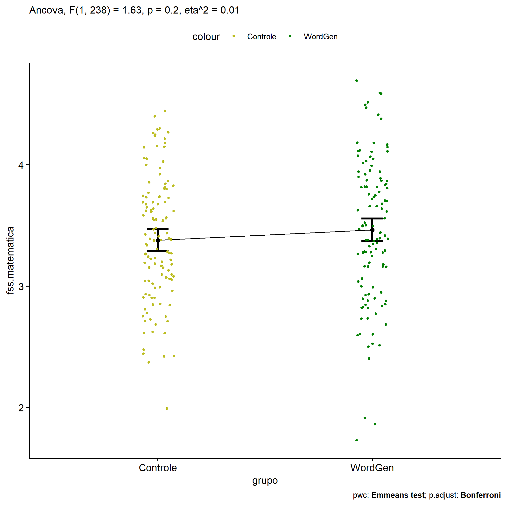<!-- -->

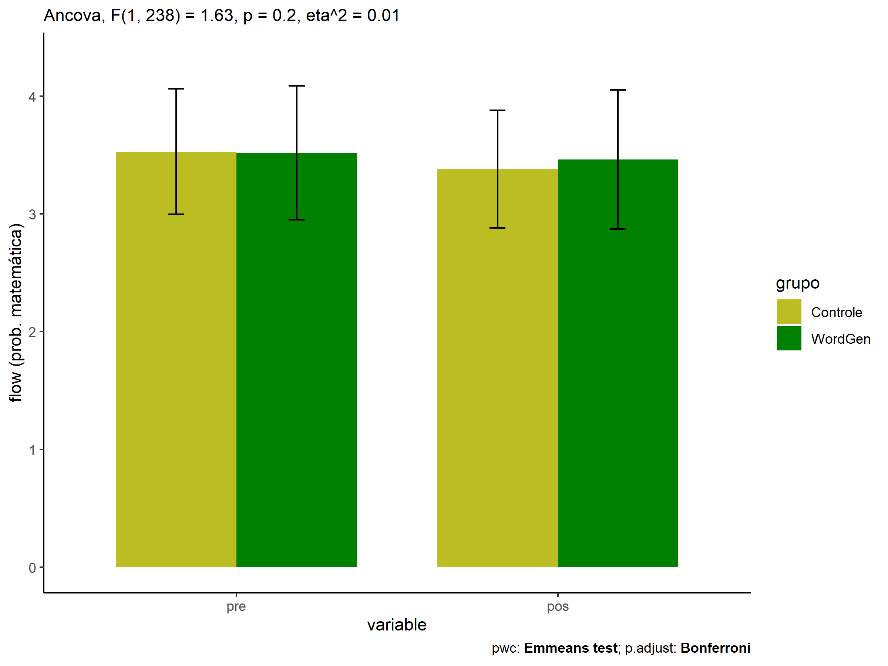<!-- -->

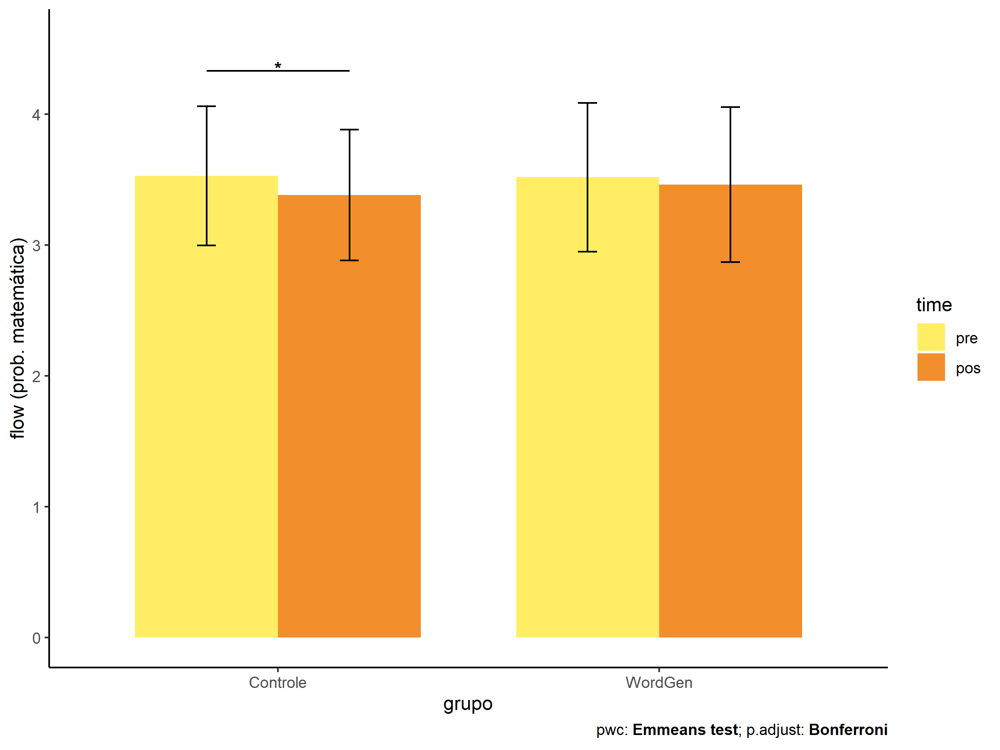<!-- -->

<!-- -->

<!-- -->

### factor: **genero**

| var            | genero |   n | M (pre) | SE (pre) | M (unadj) | SE (unadj) | M (adj) | SE (adj) |
|:---------------|:-------|----:|--------:|---------:|----------:|-----------:|--------:|---------:|
| fss.matematica | F      | 113 |   3.554 |    0.055 |     3.437 |       0.05 |   3.427 |    0.049 |
| fss.matematica | M      | 128 |   3.497 |    0.046 |     3.405 |       0.05 |   3.414 |    0.046 |

| .y.            | group1 | group2 | estimate | conf.low | conf.high |    se | statistic |     p | p.adj | p.adj.signif |
|:---------------|:-------|:-------|---------:|---------:|----------:|------:|----------:|------:|------:|:-------------|
| fss.matematica | F      | M      |    0.012 |   -0.119 |     0.144 | 0.067 |     0.186 | 0.853 | 0.853 | ns           |
| dfs.matematica | F      | M      |    0.057 |   -0.083 |     0.197 | 0.071 |     0.803 | 0.422 | 0.422 | ns           |

| .y.             | genero | group1 | group2 | estimate | conf.low | conf.high |    se | statistic |     p | p.adj | p.adj.signif |
|:----------------|:-------|:-------|:-------|---------:|---------:|----------:|------:|----------:|------:|------:|:-------------|
| flow.matematica | F      | pre    | pos    |    0.117 |   -0.026 |     0.261 | 0.073 |     1.607 | 0.109 | 0.109 | ns           |
| flow.matematica | M      | pre    | pos    |    0.092 |   -0.043 |     0.226 | 0.069 |     1.338 | 0.182 | 0.182 | ns           |

    ## Scale for colour is already present.
    ## Adding another scale for colour, which will replace the existing scale.

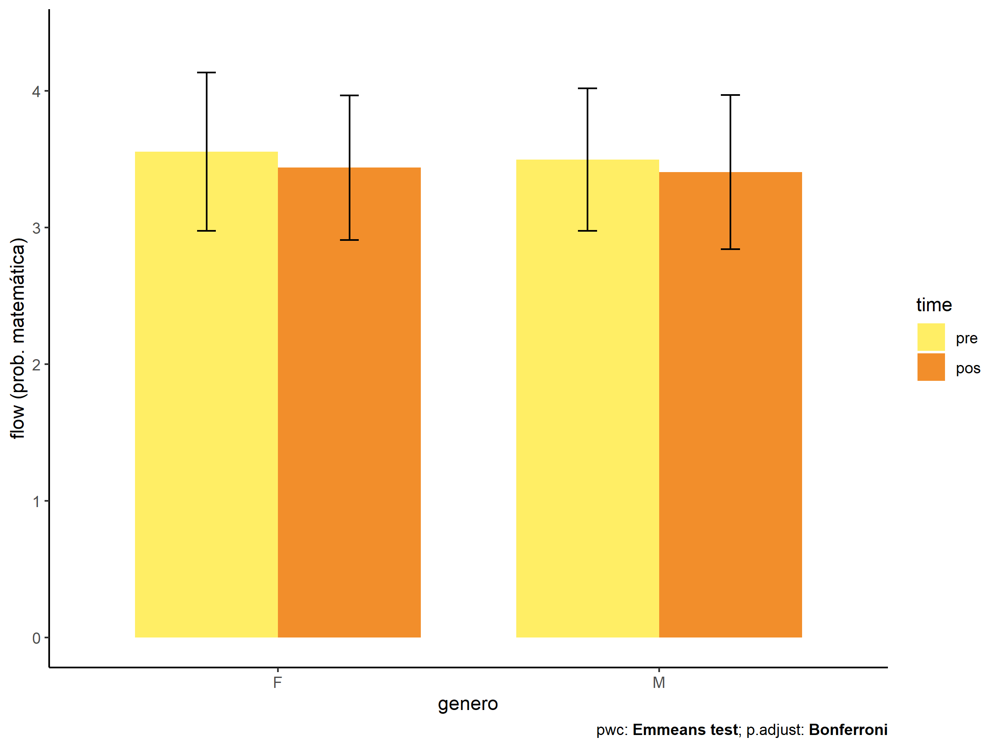<!-- -->

<!-- -->

<!-- -->

<!-- -->

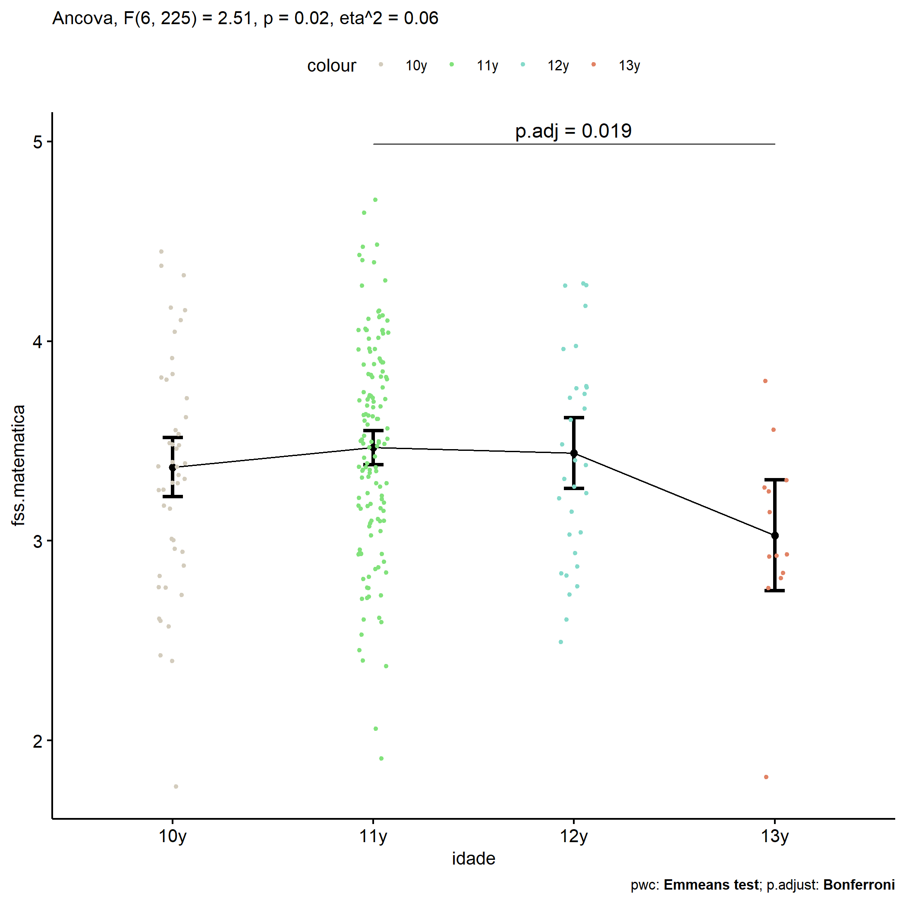<!-- -->

### factor: **idade**

| var            | idade |   n | M (pre) | SE (pre) | M (unadj) | SE (unadj) | M (adj) | SE (adj) |
|:---------------|:------|----:|--------:|---------:|----------:|-----------:|--------:|---------:|
| fss.matematica | 10y   |  46 |   3.433 |    0.079 |     3.333 |      0.085 |   3.368 |    0.075 |
| fss.matematica | 11y   | 138 |   3.581 |    0.046 |     3.483 |      0.046 |   3.467 |    0.043 |
| fss.matematica | 12y   |  32 |   3.487 |    0.103 |     3.422 |      0.090 |   3.439 |    0.090 |
| fss.matematica | 13y   |  13 |   3.547 |    0.153 |     3.031 |      0.128 |   3.027 |    0.141 |

| .y.            | group1 | group2 | estimate | conf.low | conf.high |    se | statistic |     p | p.adj | p.adj.signif |
|:---------------|:-------|:-------|---------:|---------:|----------:|------:|----------:|------:|------:|:-------------|
| fss.matematica | 10y    | 11y    |   -0.099 |   -0.270 |     0.072 | 0.087 |    -1.137 | 0.257 | 1.000 | ns           |
| fss.matematica | 10y    | 12y    |   -0.070 |   -0.301 |     0.160 | 0.117 |    -0.600 | 0.549 | 1.000 | ns           |
| fss.matematica | 10y    | 13y    |    0.341 |    0.026 |     0.656 | 0.160 |     2.136 | 0.034 | 0.202 | ns           |
| fss.matematica | 11y    | 12y    |    0.029 |   -0.168 |     0.225 | 0.100 |     0.288 | 0.774 | 1.000 | ns           |
| fss.matematica | 11y    | 13y    |    0.440 |    0.150 |     0.730 | 0.147 |     2.986 | 0.003 | 0.019 | \*           |
| fss.matematica | 12y    | 13y    |    0.411 |    0.082 |     0.740 | 0.167 |     2.462 | 0.015 | 0.087 | ns           |
| dfs.matematica | 10y    | 11y    |   -0.149 |   -0.332 |     0.034 | 0.093 |    -1.603 | 0.110 | 0.662 | ns           |
| dfs.matematica | 10y    | 12y    |   -0.054 |   -0.301 |     0.193 | 0.125 |    -0.429 | 0.668 | 1.000 | ns           |
| dfs.matematica | 10y    | 13y    |   -0.114 |   -0.452 |     0.223 | 0.171 |    -0.668 | 0.505 | 1.000 | ns           |
| dfs.matematica | 11y    | 12y    |    0.095 |   -0.116 |     0.306 | 0.107 |     0.887 | 0.376 | 1.000 | ns           |
| dfs.matematica | 11y    | 13y    |    0.034 |   -0.277 |     0.346 | 0.158 |     0.217 | 0.828 | 1.000 | ns           |
| dfs.matematica | 12y    | 13y    |   -0.060 |   -0.414 |     0.293 | 0.179 |    -0.337 | 0.736 | 1.000 | ns           |

| .y.             | idade | group1 | group2 | estimate | conf.low | conf.high |    se | statistic |     p | p.adj | p.adj.signif |
|:----------------|:------|:-------|:-------|---------:|---------:|----------:|------:|----------:|------:|------:|:-------------|
| flow.matematica | 10y   | pre    | pos    |    0.099 |   -0.123 |     0.321 | 0.113 |     0.879 | 0.380 | 0.380 | ns           |
| flow.matematica | 11y   | pre    | pos    |    0.099 |   -0.029 |     0.227 | 0.065 |     1.515 | 0.131 | 0.131 | ns           |
| flow.matematica | 12y   | pre    | pos    |    0.065 |   -0.202 |     0.331 | 0.136 |     0.478 | 0.633 | 0.633 | ns           |
| flow.matematica | 13y   | pre    | pos    |    0.516 |    0.098 |     0.934 | 0.213 |     2.427 | 0.016 | 0.016 | \*           |

    ## Scale for colour is already present.
    ## Adding another scale for colour, which will replace the existing scale.

<!-- -->

<!-- -->

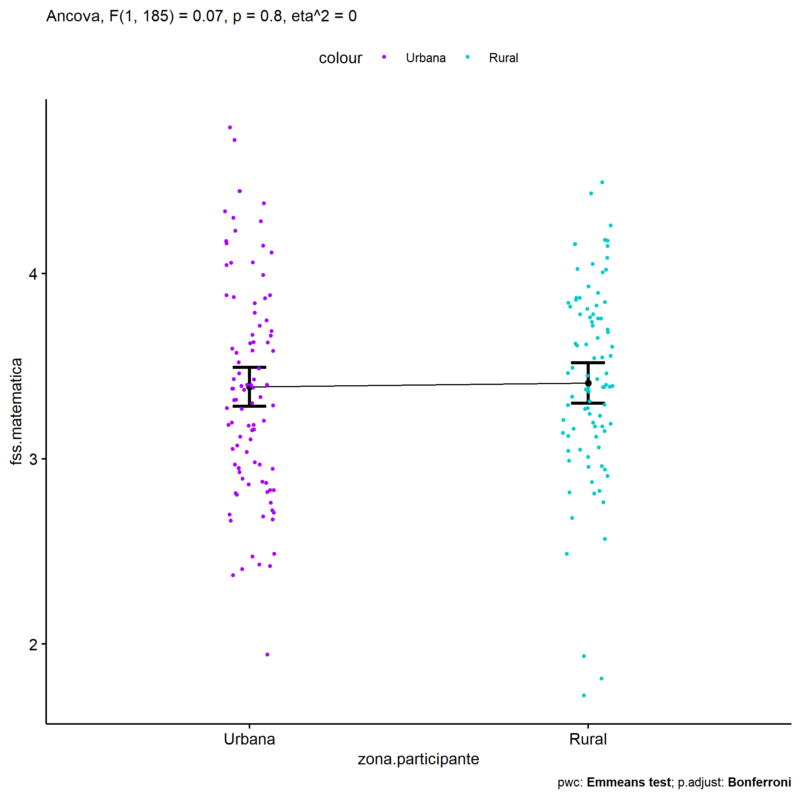<!-- -->

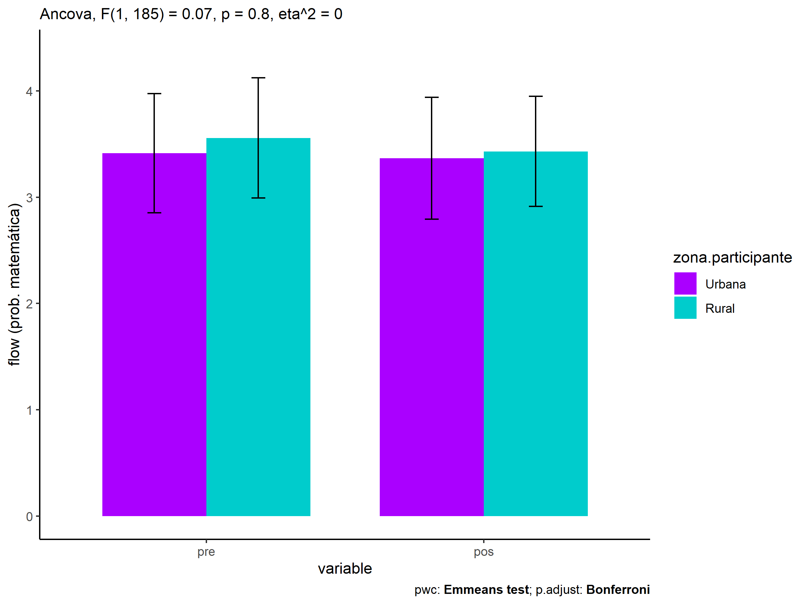<!-- -->

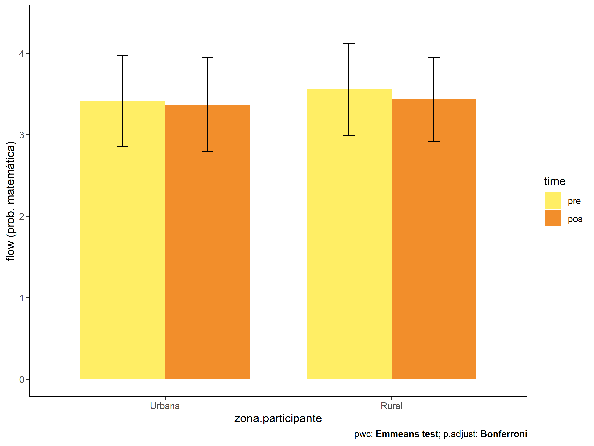<!-- -->

### factor: **zona.participante**

| var            | zona.participante |   n | M (pre) | SE (pre) | M (unadj) | SE (unadj) | M (adj) | SE (adj) |
|:---------------|:------------------|----:|--------:|---------:|----------:|-----------:|--------:|---------:|
| fss.matematica | Rural             |  91 |   3.558 |    0.059 |     3.431 |      0.054 |   3.409 |    0.055 |
| fss.matematica | Urbana            |  97 |   3.414 |    0.057 |     3.367 |      0.058 |   3.389 |    0.053 |

| .y.            | group1 | group2 | estimate | conf.low | conf.high |    se | statistic |     p | p.adj | p.adj.signif |
|:---------------|:-------|:-------|---------:|---------:|----------:|------:|----------:|------:|------:|:-------------|
| fss.matematica | Urbana | Rural  |   -0.020 |   -0.171 |     0.131 | 0.077 |    -0.259 | 0.796 | 0.796 | ns           |
| dfs.matematica | Urbana | Rural  |   -0.144 |   -0.306 |     0.018 | 0.082 |    -1.756 | 0.081 | 0.081 | ns           |

| .y.             | zona.participante | group1 | group2 | estimate | conf.low | conf.high |    se | statistic |     p | p.adj | p.adj.signif |
|:----------------|:------------------|:-------|:-------|---------:|---------:|----------:|------:|----------:|------:|------:|:-------------|
| flow.matematica | Urbana            | pre    | pos    |    0.047 |   -0.110 |     0.203 | 0.080 |     0.585 | 0.559 | 0.559 | ns           |
| flow.matematica | Rural             | pre    | pos    |    0.127 |   -0.035 |     0.289 | 0.082 |     1.542 | 0.124 | 0.124 | ns           |

    ## Scale for colour is already present.
    ## Adding another scale for colour, which will replace the existing scale.

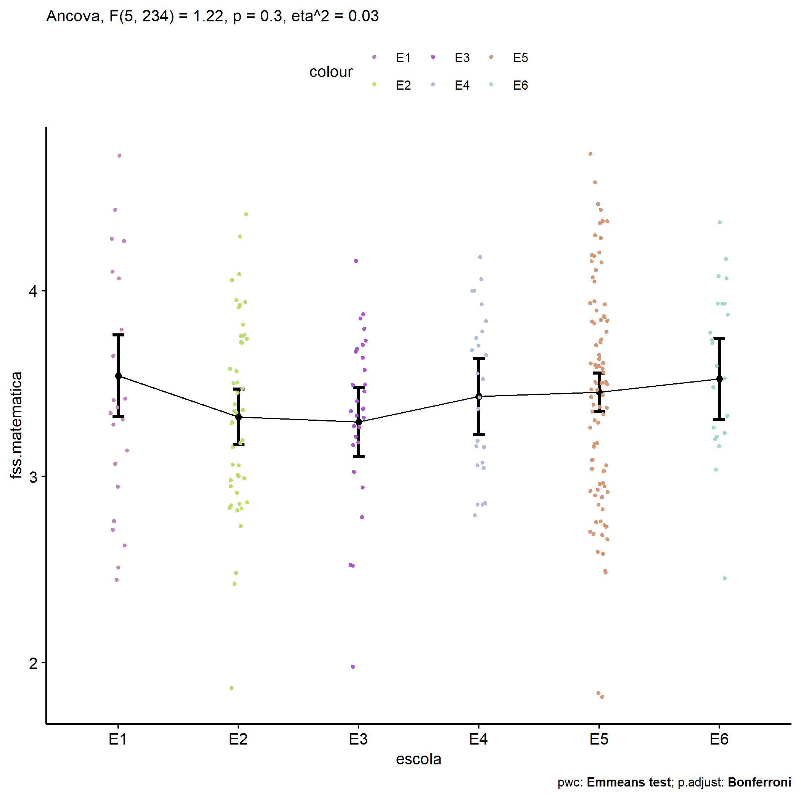<!-- -->

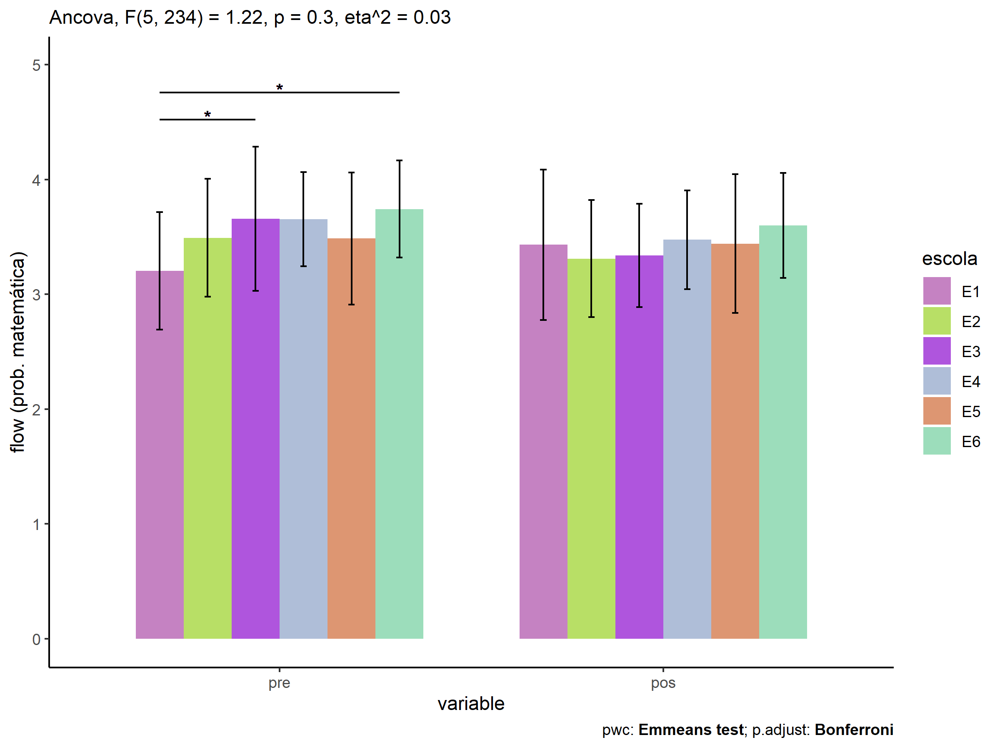<!-- -->

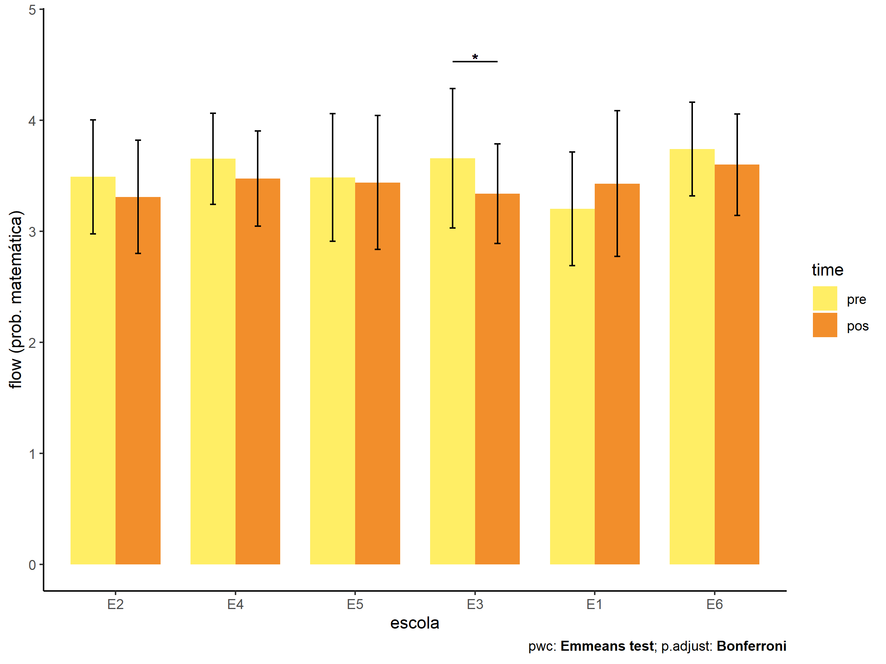<!-- -->

<!-- -->

<!-- -->

### factor: **escola**

| var            | escola |   n | M (pre) | SE (pre) | M (unadj) | SE (unadj) | M (adj) | SE (adj) |
|:---------------|:-------|----:|--------:|---------:|----------:|-----------:|--------:|---------:|
| fss.matematica | E1     |  22 |   3.203 |    0.109 |     3.431 |      0.140 |   3.542 |    0.112 |
| fss.matematica | E2     |  47 |   3.492 |    0.075 |     3.311 |      0.075 |   3.322 |    0.075 |
| fss.matematica | E3     |  30 |   3.658 |    0.115 |     3.340 |      0.082 |   3.293 |    0.094 |
| fss.matematica | E4     |  25 |   3.654 |    0.082 |     3.476 |      0.086 |   3.431 |    0.103 |
| fss.matematica | E5     |  95 |   3.487 |    0.059 |     3.441 |      0.062 |   3.453 |    0.053 |
| fss.matematica | E6     |  22 |   3.742 |    0.090 |     3.601 |      0.097 |   3.525 |    0.111 |

| .y.            | group1 | group2 | estimate | conf.low | conf.high |    se | statistic |     p | p.adj | p.adj.signif |
|:---------------|:-------|:-------|---------:|---------:|----------:|------:|----------:|------:|------:|:-------------|
| fss.matematica | E1     | E2     |    0.221 |   -0.044 |     0.485 | 0.134 |     1.646 | 0.101 | 1.000 | ns           |
| fss.matematica | E1     | E3     |    0.249 |   -0.041 |     0.539 | 0.147 |     1.692 | 0.092 | 1.000 | ns           |
| fss.matematica | E1     | E4     |    0.112 |   -0.190 |     0.413 | 0.153 |     0.730 | 0.466 | 1.000 | ns           |
| fss.matematica | E1     | E5     |    0.089 |   -0.153 |     0.331 | 0.123 |     0.723 | 0.470 | 1.000 | ns           |
| fss.matematica | E1     | E6     |    0.017 |   -0.296 |     0.330 | 0.159 |     0.108 | 0.914 | 1.000 | ns           |
| fss.matematica | E2     | E3     |    0.028 |   -0.210 |     0.266 | 0.121 |     0.234 | 0.815 | 1.000 | ns           |
| fss.matematica | E2     | E4     |   -0.109 |   -0.361 |     0.143 | 0.128 |    -0.853 | 0.394 | 1.000 | ns           |
| fss.matematica | E2     | E5     |   -0.132 |   -0.313 |     0.049 | 0.092 |    -1.436 | 0.152 | 1.000 | ns           |
| fss.matematica | E2     | E6     |   -0.204 |   -0.467 |     0.060 | 0.134 |    -1.521 | 0.130 | 1.000 | ns           |
| fss.matematica | E3     | E4     |   -0.137 |   -0.412 |     0.137 | 0.139 |    -0.985 | 0.326 | 1.000 | ns           |
| fss.matematica | E3     | E5     |   -0.160 |   -0.373 |     0.053 | 0.108 |    -1.478 | 0.141 | 1.000 | ns           |
| fss.matematica | E3     | E6     |   -0.232 |   -0.517 |     0.053 | 0.145 |    -1.604 | 0.110 | 1.000 | ns           |
| fss.matematica | E4     | E5     |   -0.023 |   -0.252 |     0.206 | 0.116 |    -0.196 | 0.845 | 1.000 | ns           |
| fss.matematica | E4     | E6     |   -0.095 |   -0.391 |     0.202 | 0.151 |    -0.628 | 0.530 | 1.000 | ns           |
| fss.matematica | E5     | E6     |   -0.072 |   -0.314 |     0.170 | 0.123 |    -0.585 | 0.559 | 1.000 | ns           |
| dfs.matematica | E1     | E2     |   -0.288 |   -0.562 |    -0.015 | 0.139 |    -2.077 | 0.039 | 0.583 | ns           |
| dfs.matematica | E1     | E3     |   -0.454 |   -0.752 |    -0.157 | 0.151 |    -3.011 | 0.003 | 0.043 | \*           |
| dfs.matematica | E1     | E4     |   -0.451 |   -0.761 |    -0.142 | 0.157 |    -2.871 | 0.004 | 0.067 | ns           |
| dfs.matematica | E1     | E5     |   -0.284 |   -0.534 |    -0.033 | 0.127 |    -2.229 | 0.027 | 0.401 | ns           |
| dfs.matematica | E1     | E6     |   -0.539 |   -0.858 |    -0.220 | 0.162 |    -3.326 | 0.001 | 0.015 | \*           |
| dfs.matematica | E2     | E3     |   -0.166 |   -0.414 |     0.082 | 0.126 |    -1.321 | 0.188 | 1.000 | ns           |
| dfs.matematica | E2     | E4     |   -0.163 |   -0.425 |     0.099 | 0.133 |    -1.223 | 0.223 | 1.000 | ns           |
| dfs.matematica | E2     | E5     |    0.005 |   -0.184 |     0.194 | 0.096 |     0.051 | 0.959 | 1.000 | ns           |
| dfs.matematica | E2     | E6     |   -0.251 |   -0.524 |     0.023 | 0.139 |    -1.805 | 0.072 | 1.000 | ns           |
| dfs.matematica | E3     | E4     |    0.003 |   -0.284 |     0.290 | 0.146 |     0.023 | 0.982 | 1.000 | ns           |
| dfs.matematica | E3     | E5     |    0.171 |   -0.051 |     0.393 | 0.113 |     1.518 | 0.130 | 1.000 | ns           |
| dfs.matematica | E3     | E6     |   -0.085 |   -0.382 |     0.213 | 0.151 |    -0.561 | 0.575 | 1.000 | ns           |
| dfs.matematica | E4     | E5     |    0.168 |   -0.070 |     0.406 | 0.121 |     1.387 | 0.167 | 1.000 | ns           |
| dfs.matematica | E4     | E6     |   -0.088 |   -0.398 |     0.222 | 0.157 |    -0.560 | 0.576 | 1.000 | ns           |
| dfs.matematica | E5     | E6     |   -0.256 |   -0.506 |    -0.005 | 0.127 |    -2.009 | 0.046 | 0.685 | ns           |

| .y.             | escola | group1 | group2 | estimate | conf.low | conf.high |    se | statistic |     p | p.adj | p.adj.signif |
|:----------------|:-------|:-------|:-------|---------:|---------:|----------:|------:|----------:|------:|------:|:-------------|
| flow.matematica | E1     | pre    | pos    |   -0.228 |   -0.549 |     0.093 | 0.163 |    -1.396 | 0.163 | 0.163 | ns           |
| flow.matematica | E2     | pre    | pos    |    0.181 |   -0.039 |     0.401 | 0.112 |     1.620 | 0.106 | 0.106 | ns           |
| flow.matematica | E3     | pre    | pos    |    0.318 |    0.043 |     0.593 | 0.140 |     2.272 | 0.024 | 0.024 | \*           |
| flow.matematica | E4     | pre    | pos    |    0.178 |   -0.123 |     0.480 | 0.153 |     1.165 | 0.245 | 0.245 | ns           |
| flow.matematica | E5     | pre    | pos    |    0.046 |   -0.108 |     0.201 | 0.079 |     0.587 | 0.557 | 0.557 | ns           |
| flow.matematica | E6     | pre    | pos    |    0.141 |   -0.180 |     0.462 | 0.163 |     0.865 | 0.387 | 0.387 | ns           |

    ## Scale for colour is already present.
    ## Adding another scale for colour, which will replace the existing scale.

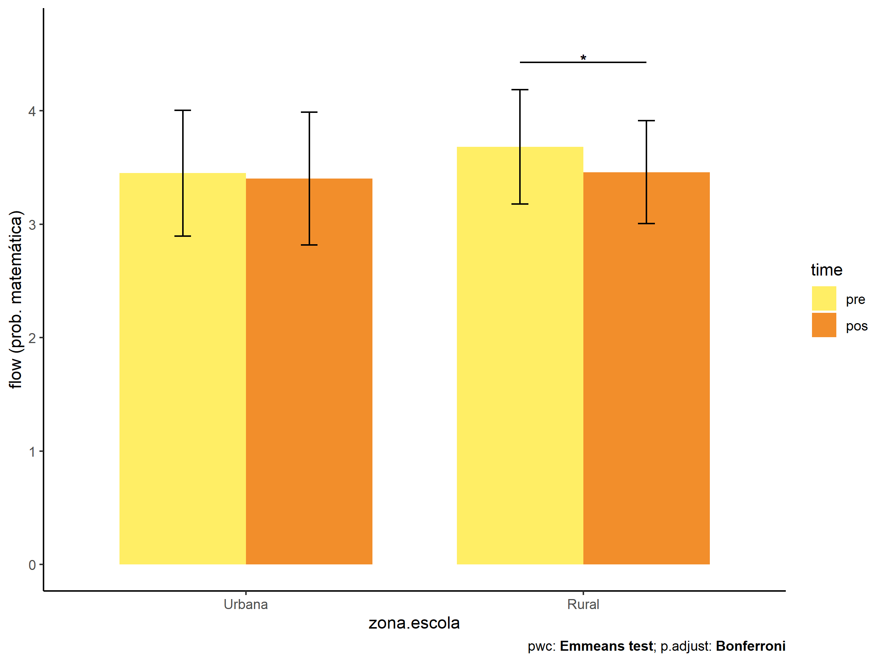<!-- -->

<!-- -->

<!-- -->

<!-- -->

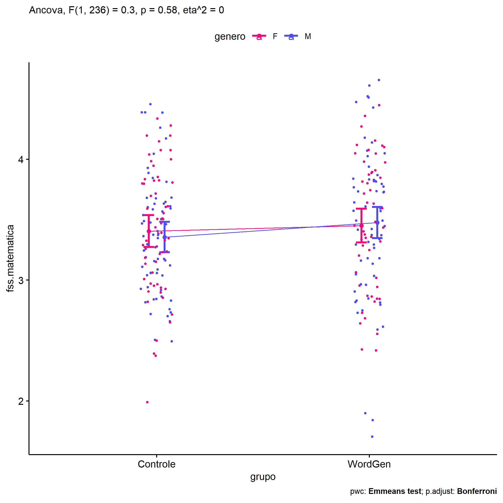<!-- -->

### factor: **zona.escola**

| var            | zona.escola |   n | M (pre) | SE (pre) | M (unadj) | SE (unadj) | M (adj) | SE (adj) |
|:---------------|:------------|----:|--------:|---------:|----------:|-----------:|--------:|---------:|
| fss.matematica | Rural       |  77 |   3.681 |    0.057 |     3.459 |      0.052 |   3.405 |    0.060 |
| fss.matematica | Urbana      | 164 |   3.450 |    0.043 |     3.402 |      0.046 |   3.427 |    0.041 |

| .y.            | group1 | group2 | estimate | conf.low | conf.high |    se | statistic |     p | p.adj | p.adj.signif |
|:---------------|:-------|:-------|---------:|---------:|----------:|------:|----------:|------:|------:|:-------------|
| fss.matematica | Urbana | Rural  |    0.022 |   -0.122 |     0.165 | 0.073 |     0.297 | 0.766 | 0.766 | ns           |
| dfs.matematica | Urbana | Rural  |   -0.231 |   -0.378 |    -0.084 | 0.075 |    -3.094 | 0.002 | 0.002 | \*\*         |

| .y.             | zona.escola | group1 | group2 | estimate | conf.low | conf.high |    se | statistic |     p | p.adj | p.adj.signif |
|:----------------|:------------|:-------|:-------|---------:|---------:|----------:|------:|----------:|------:|------:|:-------------|
| flow.matematica | Urbana      | pre    | pos    |    0.048 |    -0.07 |     0.166 | 0.060 |     0.801 | 0.424 | 0.424 | ns           |
| flow.matematica | Rural       | pre    | pos    |    0.222 |     0.05 |     0.394 | 0.088 |     2.538 | 0.011 | 0.011 | \*           |

    ## Scale for colour is already present.
    ## Adding another scale for colour, which will replace the existing scale.

<!-- -->

<!-- -->

<!-- -->

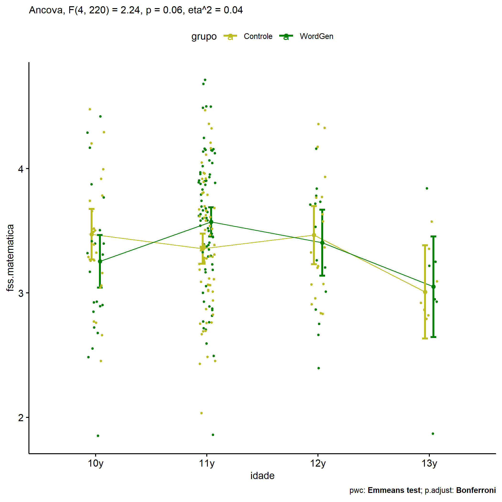<!-- -->

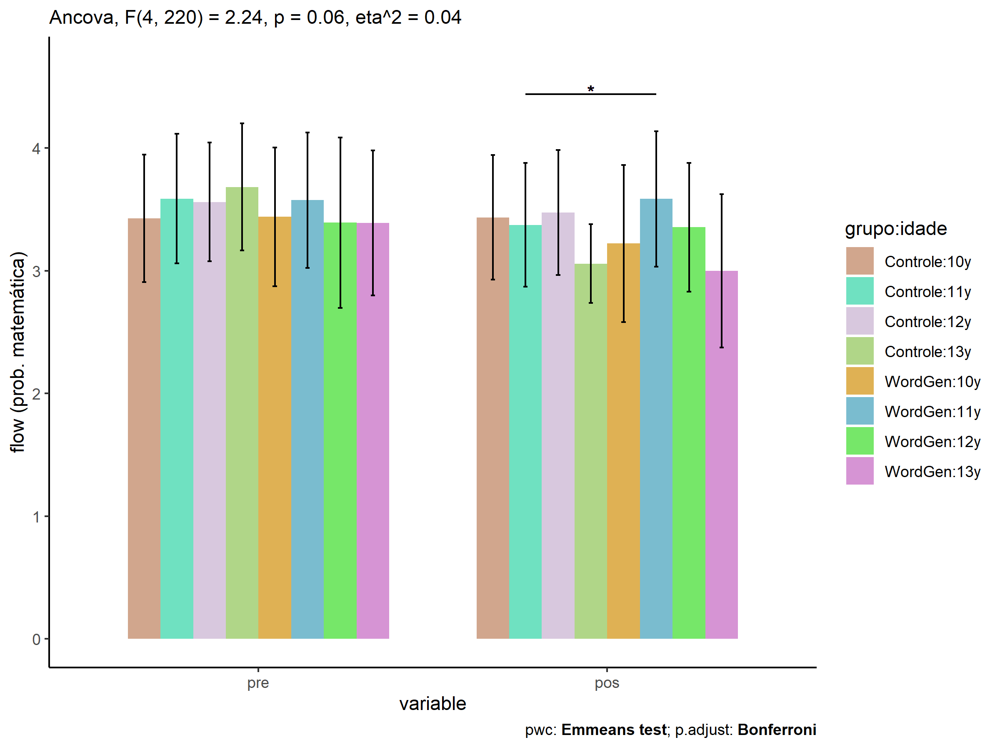<!-- -->

## Pairwise comparisons for two factors

### factores: **grupo:genero**

| var            | grupo    | genero |   n | M (pre) | SE (pre) | M (unadj) | SE (unadj) | M (adj) | SE (adj) |
|:---------------|:---------|:-------|----:|--------:|---------:|----------:|-----------:|--------:|---------:|
| fss.matematica | Controle | F      |  60 |   3.510 |    0.075 |     3.401 |      0.067 |   3.405 |    0.067 |
| fss.matematica | Controle | M      |  65 |   3.546 |    0.060 |     3.363 |      0.060 |   3.355 |    0.064 |
| fss.matematica | WordGen  | F      |  53 |   3.604 |    0.079 |     3.478 |      0.074 |   3.451 |    0.071 |
| fss.matematica | WordGen  | M      |  63 |   3.447 |    0.070 |     3.449 |      0.080 |   3.475 |    0.065 |

| .y.            | grupo    | genero | group1   | group2  | estimate | conf.low | conf.high |    se | statistic |     p | p.adj | p.adj.signif |
|:---------------|:---------|:-------|:---------|:--------|---------:|---------:|----------:|------:|----------:|------:|------:|:-------------|
| fss.matematica |          | F      | Controle | WordGen |   -0.046 |   -0.238 |     0.146 | 0.098 |    -0.469 | 0.639 | 0.639 | ns           |
| fss.matematica |          | M      | Controle | WordGen |   -0.120 |   -0.300 |     0.061 | 0.092 |    -1.308 | 0.192 | 0.192 | ns           |
| dfs.matematica |          | F      | Controle | WordGen |   -0.093 |   -0.297 |     0.111 | 0.104 |    -0.900 | 0.369 | 0.369 | ns           |
| dfs.matematica |          | M      | Controle | WordGen |    0.100 |   -0.092 |     0.291 | 0.097 |     1.025 | 0.306 | 0.306 | ns           |
| fss.matematica | Controle |        | F        | M       |    0.050 |   -0.133 |     0.232 | 0.093 |     0.537 | 0.592 | 0.592 | ns           |
| fss.matematica | WordGen  |        | F        | M       |   -0.024 |   -0.215 |     0.166 | 0.097 |    -0.251 | 0.802 | 0.802 | ns           |
| dfs.matematica | Controle |        | F        | M       |   -0.036 |   -0.230 |     0.158 | 0.098 |    -0.364 | 0.717 | 0.717 | ns           |
| dfs.matematica | WordGen  |        | F        | M       |    0.157 |   -0.045 |     0.359 | 0.102 |     1.533 | 0.127 | 0.127 | ns           |

| .y.             | grupo    | genero | group1 | group2 | estimate | conf.low | conf.high |    se | statistic |     p | p.adj | p.adj.signif |
|:----------------|:---------|:-------|:-------|:-------|---------:|---------:|----------:|------:|----------:|------:|------:|:-------------|
| flow.matematica | Controle | F      | pre    | pos    |    0.110 |   -0.087 |     0.307 | 0.100 |     1.095 | 0.274 | 0.274 | ns           |
| flow.matematica | Controle | M      | pre    | pos    |    0.183 |   -0.006 |     0.372 | 0.096 |     1.902 | 0.058 | 0.058 | ns           |
| flow.matematica | WordGen  | F      | pre    | pos    |    0.126 |   -0.084 |     0.335 | 0.107 |     1.179 | 0.239 | 0.239 | ns           |
| flow.matematica | WordGen  | M      | pre    | pos    |   -0.003 |   -0.195 |     0.190 | 0.098 |    -0.026 | 0.979 | 0.979 | ns           |

    ## Scale for colour is already present.
    ## Adding another scale for colour, which will replace the existing scale.

<!-- -->

    ## Scale for colour is already present.
    ## Adding another scale for colour, which will replace the existing scale.

<!-- -->

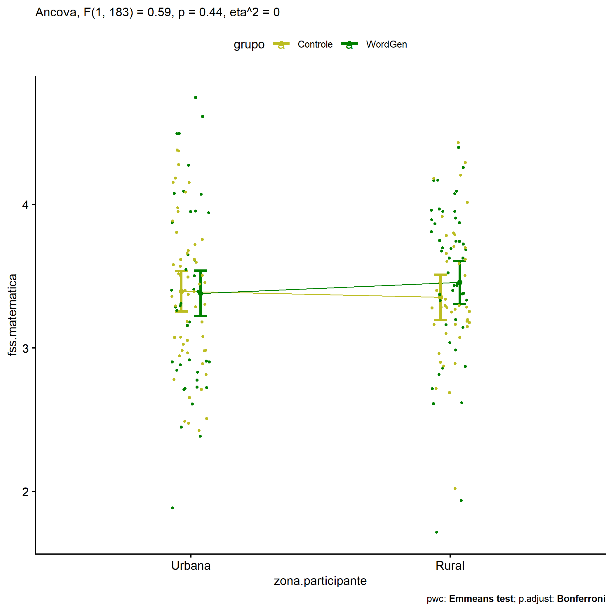<!-- -->

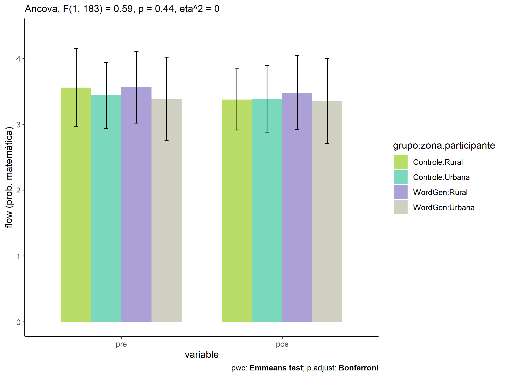<!-- -->

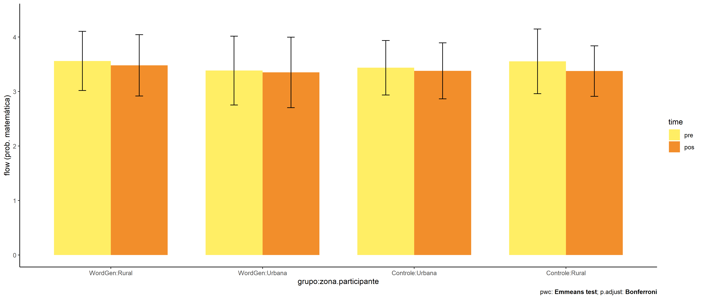<!-- -->

<!-- -->

### factores: **grupo:idade**

| var            | grupo    | idade |   n | M (pre) | SE (pre) | M (unadj) | SE (unadj) | M (adj) | SE (adj) |
|:---------------|:---------|:------|----:|--------:|---------:|----------:|-----------:|--------:|---------:|
| fss.matematica | Controle | 10y   |  24 |   3.427 |    0.106 |     3.435 |      0.104 |   3.472 |    0.103 |
| fss.matematica | Controle | 11y   |  67 |   3.588 |    0.065 |     3.374 |      0.062 |   3.356 |    0.061 |
| fss.matematica | Controle | 12y   |  18 |   3.560 |    0.114 |     3.474 |      0.120 |   3.465 |    0.118 |
| fss.matematica | Controle | 13y   |   7 |   3.683 |    0.196 |     3.058 |      0.121 |   3.008 |    0.190 |
| fss.matematica | WordGen  | 10y   |  22 |   3.439 |    0.120 |     3.222 |      0.136 |   3.255 |    0.107 |
| fss.matematica | WordGen  | 11y   |  71 |   3.576 |    0.066 |     3.585 |      0.066 |   3.572 |    0.060 |
| fss.matematica | WordGen  | 12y   |  14 |   3.392 |    0.185 |     3.355 |      0.140 |   3.404 |    0.135 |
| fss.matematica | WordGen  | 13y   |   6 |   3.389 |    0.241 |     3.000 |      0.255 |   3.050 |    0.205 |

| .y.            | grupo    | idade | group1   | group2  | estimate | conf.low | conf.high |    se | statistic |     p | p.adj | p.adj.signif |
|:---------------|:---------|:------|:---------|:--------|---------:|---------:|----------:|------:|----------:|------:|------:|:-------------|
| fss.matematica |          | 10y   | Controle | WordGen |    0.217 |   -0.075 |     0.510 | 0.148 |     1.465 | 0.144 | 0.144 | ns           |
| fss.matematica |          | 11y   | Controle | WordGen |   -0.215 |   -0.384 |    -0.047 | 0.086 |    -2.517 | 0.013 | 0.013 | \*           |
| fss.matematica |          | 12y   | Controle | WordGen |    0.061 |   -0.292 |     0.415 | 0.179 |     0.341 | 0.733 | 0.733 | ns           |
| fss.matematica |          | 13y   | Controle | WordGen |   -0.042 |   -0.594 |     0.510 | 0.280 |    -0.151 | 0.881 | 0.881 | ns           |
| dfs.matematica |          | 10y   | Controle | WordGen |   -0.013 |   -0.332 |     0.306 | 0.162 |    -0.080 | 0.937 | 0.937 | ns           |
| dfs.matematica |          | 11y   | Controle | WordGen |    0.012 |   -0.172 |     0.196 | 0.093 |     0.128 | 0.898 | 0.898 | ns           |
| dfs.matematica |          | 12y   | Controle | WordGen |    0.168 |   -0.216 |     0.553 | 0.195 |     0.862 | 0.389 | 0.389 | ns           |
| dfs.matematica |          | 13y   | Controle | WordGen |    0.294 |   -0.307 |     0.894 | 0.305 |     0.964 | 0.336 | 0.336 | ns           |
| fss.matematica | Controle |       | 10y      | 11y     |    0.116 |   -0.120 |     0.353 | 0.120 |     0.968 | 0.334 | 1.000 | ns           |
| fss.matematica | Controle |       | 10y      | 12y     |    0.007 |   -0.302 |     0.316 | 0.157 |     0.045 | 0.964 | 1.000 | ns           |
| fss.matematica | Controle |       | 10y      | 13y     |    0.465 |    0.038 |     0.891 | 0.216 |     2.146 | 0.033 | 0.198 | ns           |
| fss.matematica | Controle |       | 11y      | 12y     |   -0.109 |   -0.372 |     0.154 | 0.133 |    -0.817 | 0.415 | 1.000 | ns           |
| fss.matematica | Controle |       | 11y      | 13y     |    0.348 |   -0.045 |     0.742 | 0.200 |     1.745 | 0.082 | 0.494 | ns           |
| fss.matematica | Controle |       | 12y      | 13y     |    0.458 |    0.016 |     0.899 | 0.224 |     2.043 | 0.042 | 0.254 | ns           |
| fss.matematica | WordGen  |       | 10y      | 11y     |   -0.317 |   -0.559 |    -0.074 | 0.123 |    -2.577 | 0.011 | 0.064 | ns           |
| fss.matematica | WordGen  |       | 10y      | 12y     |   -0.149 |   -0.488 |     0.190 | 0.172 |    -0.868 | 0.387 | 1.000 | ns           |
| fss.matematica | WordGen  |       | 10y      | 13y     |    0.205 |   -0.251 |     0.661 | 0.231 |     0.886 | 0.377 | 1.000 | ns           |
| fss.matematica | WordGen  |       | 11y      | 12y     |    0.168 |   -0.123 |     0.458 | 0.147 |     1.137 | 0.257 | 1.000 | ns           |
| fss.matematica | WordGen  |       | 11y      | 13y     |    0.522 |    0.100 |     0.943 | 0.214 |     2.439 | 0.016 | 0.093 | ns           |
| fss.matematica | WordGen  |       | 12y      | 13y     |    0.354 |   -0.129 |     0.837 | 0.245 |     1.444 | 0.150 | 0.901 | ns           |
| dfs.matematica | Controle |       | 10y      | 11y     |   -0.161 |   -0.418 |     0.096 | 0.130 |    -1.236 | 0.218 | 1.000 | ns           |
| dfs.matematica | Controle |       | 10y      | 12y     |   -0.134 |   -0.470 |     0.203 | 0.171 |    -0.783 | 0.435 | 1.000 | ns           |
| dfs.matematica | Controle |       | 10y      | 13y     |   -0.256 |   -0.720 |     0.208 | 0.235 |    -1.088 | 0.278 | 1.000 | ns           |
| dfs.matematica | Controle |       | 11y      | 12y     |    0.027 |   -0.259 |     0.314 | 0.145 |     0.188 | 0.851 | 1.000 | ns           |
| dfs.matematica | Controle |       | 11y      | 13y     |   -0.095 |   -0.524 |     0.334 | 0.218 |    -0.437 | 0.663 | 1.000 | ns           |
| dfs.matematica | Controle |       | 12y      | 13y     |   -0.122 |   -0.603 |     0.359 | 0.244 |    -0.501 | 0.617 | 1.000 | ns           |
| dfs.matematica | WordGen  |       | 10y      | 11y     |   -0.136 |   -0.400 |     0.127 | 0.134 |    -1.019 | 0.309 | 1.000 | ns           |
| dfs.matematica | WordGen  |       | 10y      | 12y     |    0.048 |   -0.322 |     0.417 | 0.187 |     0.254 | 0.800 | 1.000 | ns           |
| dfs.matematica | WordGen  |       | 10y      | 13y     |    0.051 |   -0.447 |     0.548 | 0.252 |     0.200 | 0.842 | 1.000 | ns           |
| dfs.matematica | WordGen  |       | 11y      | 12y     |    0.184 |   -0.132 |     0.499 | 0.160 |     1.147 | 0.253 | 1.000 | ns           |
| dfs.matematica | WordGen  |       | 11y      | 13y     |    0.187 |   -0.272 |     0.646 | 0.233 |     0.802 | 0.424 | 1.000 | ns           |
| dfs.matematica | WordGen  |       | 12y      | 13y     |    0.003 |   -0.524 |     0.530 | 0.267 |     0.011 | 0.991 | 1.000 | ns           |

| .y.             | grupo    | idade | group1 | group2 | estimate | conf.low | conf.high |    se | statistic |     p | p.adj | p.adj.signif |
|:----------------|:---------|:------|:-------|:-------|---------:|---------:|----------:|------:|----------:|------:|------:|:-------------|
| flow.matematica | Controle | 10y   | pre    | pos    |   -0.009 |   -0.316 |     0.298 | 0.156 |    -0.056 | 0.956 | 0.956 | ns           |
| flow.matematica | Controle | 11y   | pre    | pos    |    0.214 |    0.030 |     0.398 | 0.094 |     2.286 | 0.023 | 0.023 | \*           |
| flow.matematica | Controle | 12y   | pre    | pos    |    0.087 |   -0.268 |     0.441 | 0.180 |     0.480 | 0.631 | 0.631 | ns           |
| flow.matematica | Controle | 13y   | pre    | pos    |    0.625 |    0.056 |     1.194 | 0.289 |     2.160 | 0.031 | 0.031 | \*           |
| flow.matematica | WordGen  | 10y   | pre    | pos    |    0.217 |   -0.104 |     0.538 | 0.163 |     1.331 | 0.184 | 0.184 | ns           |
| flow.matematica | WordGen  | 11y   | pre    | pos    |   -0.010 |   -0.188 |     0.169 | 0.091 |    -0.105 | 0.916 | 0.916 | ns           |
| flow.matematica | WordGen  | 12y   | pre    | pos    |    0.037 |   -0.365 |     0.439 | 0.205 |     0.179 | 0.858 | 0.858 | ns           |
| flow.matematica | WordGen  | 13y   | pre    | pos    |    0.389 |   -0.225 |     1.003 | 0.313 |     1.244 | 0.214 | 0.214 | ns           |

    ## Scale for colour is already present.
    ## Adding another scale for colour, which will replace the existing scale.

<!-- -->

    ## Scale for colour is already present.
    ## Adding another scale for colour, which will replace the existing scale.

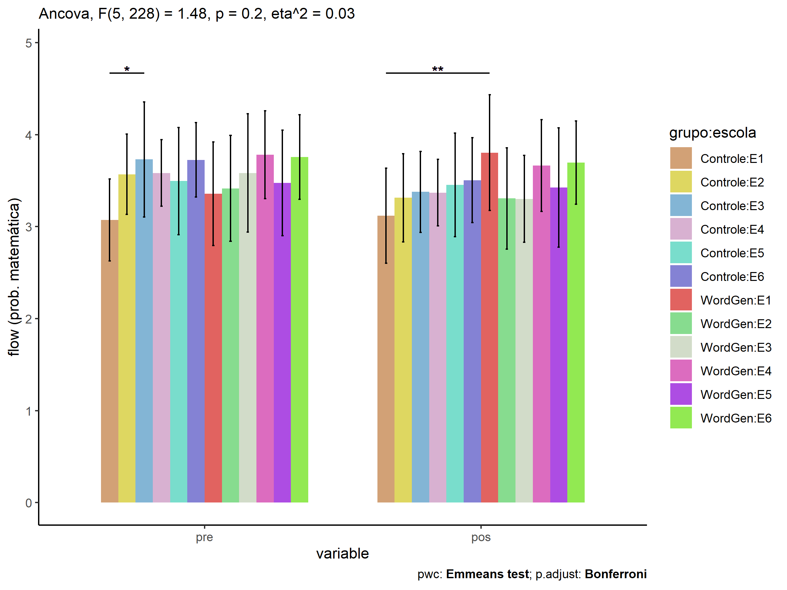<!-- -->

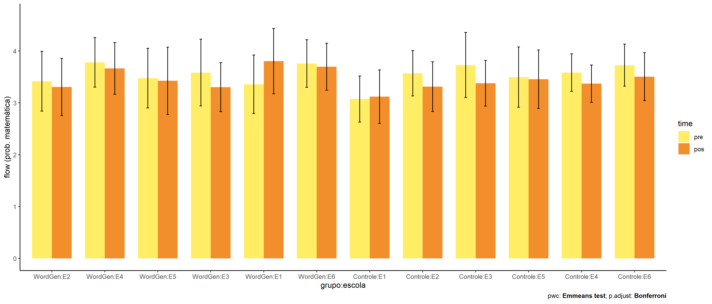<!-- -->

<!-- -->

<!-- -->

<!-- -->

### factores: **grupo:zona.participante**

| var            | grupo    | zona.participante |   n | M (pre) | SE (pre) | M (unadj) | SE (unadj) | M (adj) | SE (adj) |
|:---------------|:---------|:------------------|----:|--------:|---------:|----------:|-----------:|--------:|---------:|
| fss.matematica | Controle | Rural             |  43 |   3.555 |    0.091 |     3.376 |      0.071 |   3.354 |    0.080 |
| fss.matematica | Controle | Urbana            |  54 |   3.437 |    0.068 |     3.381 |      0.070 |   3.395 |    0.071 |
| fss.matematica | WordGen  | Rural             |  48 |   3.561 |    0.078 |     3.481 |      0.081 |   3.458 |    0.076 |
| fss.matematica | WordGen  | Urbana            |  43 |   3.385 |    0.096 |     3.351 |      0.099 |   3.381 |    0.080 |

| .y.            | grupo    | zona.participante | group1   | group2  | estimate | conf.low | conf.high |    se | statistic |     p | p.adj | p.adj.signif |
|:---------------|:---------|:------------------|:---------|:--------|---------:|---------:|----------:|------:|----------:|------:|------:|:-------------|
| fss.matematica |          | Urbana            | Controle | WordGen |    0.014 |   -0.197 |     0.225 | 0.107 |     0.128 | 0.899 | 0.899 | ns           |
| fss.matematica |          | Rural             | Controle | WordGen |   -0.104 |   -0.320 |     0.113 | 0.110 |    -0.946 | 0.346 | 0.346 | ns           |
| dfs.matematica |          | Urbana            | Controle | WordGen |    0.053 |   -0.175 |     0.281 | 0.115 |     0.458 | 0.647 | 0.647 | ns           |
| dfs.matematica |          | Rural             | Controle | WordGen |   -0.006 |   -0.240 |     0.228 | 0.119 |    -0.051 | 0.959 | 0.959 | ns           |
| fss.matematica | Controle |                   | Urbana   | Rural   |    0.041 |   -0.171 |     0.252 | 0.107 |     0.381 | 0.704 | 0.704 | ns           |
| fss.matematica | WordGen  |                   | Urbana   | Rural   |   -0.077 |   -0.295 |     0.141 | 0.110 |    -0.694 | 0.489 | 0.489 | ns           |
| dfs.matematica | Controle |                   | Urbana   | Rural   |   -0.117 |   -0.345 |     0.110 | 0.115 |    -1.017 | 0.310 | 0.310 | ns           |
| dfs.matematica | WordGen  |                   | Urbana   | Rural   |   -0.176 |   -0.410 |     0.058 | 0.119 |    -1.487 | 0.139 | 0.139 | ns           |

| .y.             | grupo    | zona.participante | group1 | group2 | estimate | conf.low | conf.high |    se | statistic |     p | p.adj | p.adj.signif |
|:----------------|:---------|:------------------|:-------|:-------|---------:|---------:|----------:|------:|----------:|------:|------:|:-------------|
| flow.matematica | Controle | Urbana            | pre    | pos    |    0.057 |   -0.154 |     0.268 | 0.107 |     0.530 | 0.596 | 0.596 | ns           |
| flow.matematica | Controle | Rural             | pre    | pos    |    0.179 |   -0.057 |     0.416 | 0.120 |     1.493 | 0.136 | 0.136 | ns           |
| flow.matematica | WordGen  | Urbana            | pre    | pos    |    0.034 |   -0.203 |     0.270 | 0.120 |     0.280 | 0.779 | 0.779 | ns           |
| flow.matematica | WordGen  | Rural             | pre    | pos    |    0.080 |   -0.144 |     0.303 | 0.114 |     0.702 | 0.483 | 0.483 | ns           |

    ## Scale for colour is already present.
    ## Adding another scale for colour, which will replace the existing scale.

<!-- -->

    ## Scale for colour is already present.
    ## Adding another scale for colour, which will replace the existing scale.

<!-- -->

<!-- -->

<!-- -->

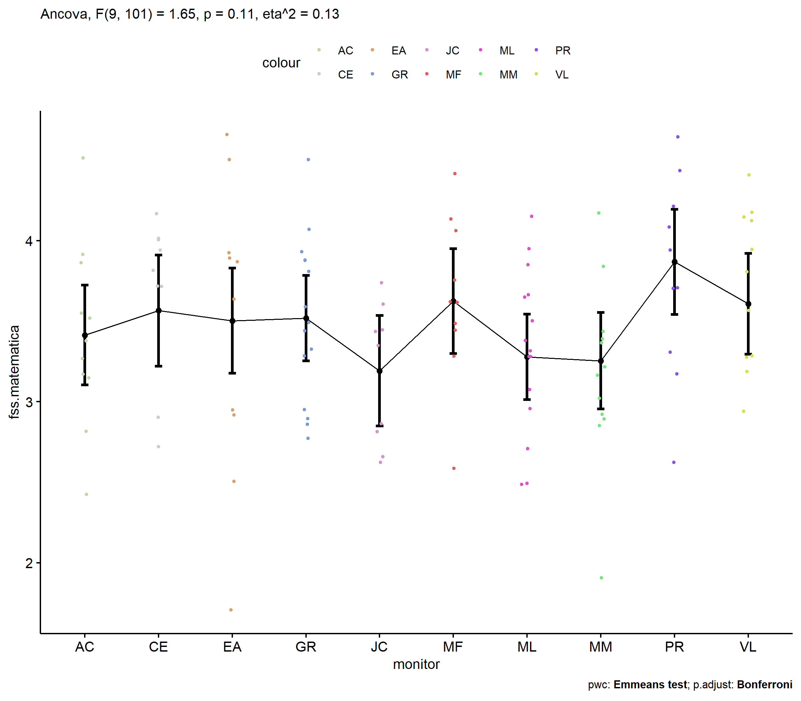<!-- -->

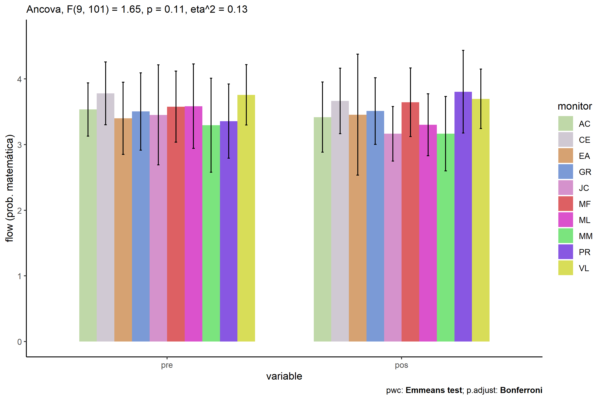<!-- -->

### factores: **grupo:escola**

| var            | grupo    | escola |   n | M (pre) | SE (pre) | M (unadj) | SE (unadj) | M (adj) | SE (adj) |
|:---------------|:---------|:-------|----:|--------:|---------:|----------:|-----------:|--------:|---------:|
| fss.matematica | Controle | E1     |  12 |   3.074 |    0.129 |     3.120 |      0.149 |   3.268 |    0.150 |
| fss.matematica | Controle | E2     |  23 |   3.570 |    0.091 |     3.314 |      0.100 |   3.299 |    0.107 |
| fss.matematica | Controle | E3     |  15 |   3.731 |    0.162 |     3.378 |      0.114 |   3.309 |    0.133 |
| fss.matematica | Controle | E4     |  16 |   3.583 |    0.090 |     3.370 |      0.090 |   3.351 |    0.128 |
| fss.matematica | Controle | E5     |  48 |   3.496 |    0.084 |     3.455 |      0.081 |   3.464 |    0.074 |
| fss.matematica | Controle | E6     |  11 |   3.727 |    0.122 |     3.505 |      0.139 |   3.438 |    0.155 |
| fss.matematica | WordGen  | E1     |  10 |   3.358 |    0.178 |     3.805 |      0.199 |   3.859 |    0.162 |
| fss.matematica | WordGen  | E2     |  24 |   3.417 |    0.118 |     3.307 |      0.112 |   3.343 |    0.105 |
| fss.matematica | WordGen  | E3     |  15 |   3.584 |    0.166 |     3.302 |      0.122 |   3.282 |    0.132 |
| fss.matematica | WordGen  | E4     |   9 |   3.781 |    0.159 |     3.664 |      0.166 |   3.579 |    0.171 |
| fss.matematica | WordGen  | E5     |  47 |   3.477 |    0.084 |     3.426 |      0.095 |   3.442 |    0.075 |
| fss.matematica | WordGen  | E6     |  11 |   3.758 |    0.139 |     3.697 |      0.137 |   3.620 |    0.155 |

| .y.            | grupo    | escola | group1   | group2  | estimate | conf.low | conf.high |    se | statistic |     p | p.adj | p.adj.signif |
|:---------------|:---------|:-------|:---------|:--------|---------:|---------:|----------:|------:|----------:|------:|------:|:-------------|
| fss.matematica |          | E1     | Controle | WordGen |   -0.591 |   -1.023 |    -0.158 | 0.220 |    -2.691 | 0.008 | 0.008 | \*\*         |
| fss.matematica |          | E2     | Controle | WordGen |   -0.044 |   -0.338 |     0.251 | 0.149 |    -0.293 | 0.770 | 0.770 | ns           |
| fss.matematica |          | E3     | Controle | WordGen |    0.027 |   -0.341 |     0.396 | 0.187 |     0.147 | 0.884 | 0.884 | ns           |
| fss.matematica |          | E4     | Controle | WordGen |   -0.228 |   -0.648 |     0.192 | 0.213 |    -1.070 | 0.286 | 0.286 | ns           |
| fss.matematica |          | E5     | Controle | WordGen |    0.022 |   -0.185 |     0.229 | 0.105 |     0.208 | 0.835 | 0.835 | ns           |
| fss.matematica |          | E6     | Controle | WordGen |   -0.182 |   -0.611 |     0.247 | 0.218 |    -0.835 | 0.405 | 0.405 | ns           |
| dfs.matematica |          | E1     | Controle | WordGen |   -0.284 |   -0.740 |     0.171 | 0.231 |    -1.229 | 0.220 | 0.220 | ns           |
| dfs.matematica |          | E2     | Controle | WordGen |    0.153 |   -0.157 |     0.464 | 0.158 |     0.973 | 0.331 | 0.331 | ns           |
| dfs.matematica |          | E3     | Controle | WordGen |    0.147 |   -0.241 |     0.536 | 0.197 |     0.748 | 0.455 | 0.455 | ns           |
| dfs.matematica |          | E4     | Controle | WordGen |   -0.198 |   -0.641 |     0.246 | 0.225 |    -0.878 | 0.381 | 0.381 | ns           |
| dfs.matematica |          | E5     | Controle | WordGen |    0.019 |   -0.199 |     0.238 | 0.111 |     0.173 | 0.863 | 0.863 | ns           |
| dfs.matematica |          | E6     | Controle | WordGen |   -0.030 |   -0.484 |     0.423 | 0.230 |    -0.132 | 0.895 | 0.895 | ns           |
| fss.matematica | Controle |        | E1       | E2      |   -0.030 |   -0.394 |     0.333 | 0.185 |    -0.165 | 0.869 | 1.000 | ns           |
| fss.matematica | Controle |        | E1       | E3      |   -0.041 |   -0.439 |     0.357 | 0.202 |    -0.203 | 0.839 | 1.000 | ns           |
| fss.matematica | Controle |        | E1       | E4      |   -0.082 |   -0.472 |     0.307 | 0.198 |    -0.417 | 0.677 | 1.000 | ns           |
| fss.matematica | Controle |        | E1       | E5      |   -0.195 |   -0.524 |     0.134 | 0.167 |    -1.169 | 0.244 | 1.000 | ns           |
| fss.matematica | Controle |        | E1       | E6      |   -0.170 |   -0.598 |     0.258 | 0.217 |    -0.781 | 0.435 | 1.000 | ns           |
| fss.matematica | Controle |        | E2       | E3      |   -0.011 |   -0.345 |     0.324 | 0.170 |    -0.063 | 0.950 | 1.000 | ns           |
| fss.matematica | Controle |        | E2       | E4      |   -0.052 |   -0.380 |     0.276 | 0.166 |    -0.313 | 0.755 | 1.000 | ns           |
| fss.matematica | Controle |        | E2       | E5      |   -0.165 |   -0.420 |     0.091 | 0.130 |    -1.271 | 0.205 | 1.000 | ns           |
| fss.matematica | Controle |        | E2       | E6      |   -0.139 |   -0.509 |     0.230 | 0.188 |    -0.743 | 0.459 | 1.000 | ns           |
| fss.matematica | Controle |        | E3       | E4      |   -0.041 |   -0.404 |     0.321 | 0.184 |    -0.225 | 0.822 | 1.000 | ns           |
| fss.matematica | Controle |        | E3       | E5      |   -0.154 |   -0.453 |     0.145 | 0.152 |    -1.015 | 0.311 | 1.000 | ns           |
| fss.matematica | Controle |        | E3       | E6      |   -0.129 |   -0.528 |     0.271 | 0.203 |    -0.634 | 0.527 | 1.000 | ns           |
| fss.matematica | Controle |        | E4       | E5      |   -0.113 |   -0.404 |     0.178 | 0.148 |    -0.764 | 0.446 | 1.000 | ns           |
| fss.matematica | Controle |        | E4       | E6      |   -0.087 |   -0.482 |     0.308 | 0.200 |    -0.436 | 0.664 | 1.000 | ns           |
| fss.matematica | Controle |        | E5       | E6      |    0.026 |   -0.312 |     0.363 | 0.171 |     0.149 | 0.882 | 1.000 | ns           |
| fss.matematica | WordGen  |        | E1       | E2      |    0.517 |    0.138 |     0.896 | 0.192 |     2.685 | 0.008 | 0.117 | ns           |
| fss.matematica | WordGen  |        | E1       | E3      |    0.577 |    0.165 |     0.989 | 0.209 |     2.760 | 0.006 | 0.094 | ns           |
| fss.matematica | WordGen  |        | E1       | E4      |    0.280 |   -0.185 |     0.746 | 0.236 |     1.186 | 0.237 | 1.000 | ns           |
| fss.matematica | WordGen  |        | E1       | E5      |    0.417 |    0.066 |     0.768 | 0.178 |     2.343 | 0.020 | 0.300 | ns           |
| fss.matematica | WordGen  |        | E1       | E6      |    0.239 |   -0.204 |     0.682 | 0.225 |     1.064 | 0.288 | 1.000 | ns           |
| fss.matematica | WordGen  |        | E2       | E3      |    0.061 |   -0.272 |     0.393 | 0.169 |     0.359 | 0.720 | 1.000 | ns           |
| fss.matematica | WordGen  |        | E2       | E4      |   -0.236 |   -0.633 |     0.160 | 0.201 |    -1.176 | 0.241 | 1.000 | ns           |
| fss.matematica | WordGen  |        | E2       | E5      |   -0.099 |   -0.352 |     0.154 | 0.128 |    -0.773 | 0.440 | 1.000 | ns           |
| fss.matematica | WordGen  |        | E2       | E6      |   -0.277 |   -0.647 |     0.092 | 0.187 |    -1.482 | 0.140 | 1.000 | ns           |
| fss.matematica | WordGen  |        | E3       | E4      |   -0.297 |   -0.722 |     0.128 | 0.216 |    -1.376 | 0.170 | 1.000 | ns           |
| fss.matematica | WordGen  |        | E3       | E5      |   -0.160 |   -0.459 |     0.139 | 0.152 |    -1.053 | 0.294 | 1.000 | ns           |
| fss.matematica | WordGen  |        | E3       | E6      |   -0.338 |   -0.738 |     0.062 | 0.203 |    -1.664 | 0.098 | 1.000 | ns           |
| fss.matematica | WordGen  |        | E4       | E5      |    0.137 |   -0.231 |     0.506 | 0.187 |     0.734 | 0.464 | 1.000 | ns           |
| fss.matematica | WordGen  |        | E4       | E6      |   -0.041 |   -0.494 |     0.412 | 0.230 |    -0.179 | 0.858 | 1.000 | ns           |
| fss.matematica | WordGen  |        | E5       | E6      |   -0.178 |   -0.517 |     0.161 | 0.172 |    -1.036 | 0.301 | 1.000 | ns           |
| dfs.matematica | Controle |        | E1       | E2      |   -0.496 |   -0.875 |    -0.117 | 0.192 |    -2.579 | 0.011 | 0.158 | ns           |
| dfs.matematica | Controle |        | E1       | E3      |   -0.657 |   -1.070 |    -0.245 | 0.209 |    -3.143 | 0.002 | 0.028 | \*           |
| dfs.matematica | Controle |        | E1       | E4      |   -0.509 |   -0.916 |    -0.103 | 0.206 |    -2.469 | 0.014 | 0.214 | ns           |
| dfs.matematica | Controle |        | E1       | E5      |   -0.422 |   -0.766 |    -0.079 | 0.174 |    -2.422 | 0.016 | 0.243 | ns           |
| dfs.matematica | Controle |        | E1       | E6      |   -0.653 |   -1.097 |    -0.209 | 0.225 |    -2.897 | 0.004 | 0.062 | ns           |
| dfs.matematica | Controle |        | E2       | E3      |   -0.161 |   -0.515 |     0.192 | 0.179 |    -0.901 | 0.369 | 1.000 | ns           |
| dfs.matematica | Controle |        | E2       | E4      |   -0.013 |   -0.360 |     0.333 | 0.176 |    -0.076 | 0.940 | 1.000 | ns           |
| dfs.matematica | Controle |        | E2       | E5      |    0.074 |   -0.196 |     0.344 | 0.137 |     0.538 | 0.591 | 1.000 | ns           |
| dfs.matematica | Controle |        | E2       | E6      |   -0.157 |   -0.547 |     0.233 | 0.198 |    -0.794 | 0.428 | 1.000 | ns           |
| dfs.matematica | Controle |        | E3       | E4      |    0.148 |   -0.234 |     0.531 | 0.194 |     0.763 | 0.446 | 1.000 | ns           |
| dfs.matematica | Controle |        | E3       | E5      |    0.235 |   -0.080 |     0.550 | 0.160 |     1.472 | 0.142 | 1.000 | ns           |
| dfs.matematica | Controle |        | E3       | E6      |    0.004 |   -0.418 |     0.427 | 0.214 |     0.020 | 0.984 | 1.000 | ns           |
| dfs.matematica | Controle |        | E4       | E5      |    0.087 |   -0.220 |     0.394 | 0.156 |     0.558 | 0.577 | 1.000 | ns           |
| dfs.matematica | Controle |        | E4       | E6      |   -0.144 |   -0.561 |     0.273 | 0.212 |    -0.680 | 0.497 | 1.000 | ns           |
| dfs.matematica | Controle |        | E5       | E6      |   -0.231 |   -0.587 |     0.125 | 0.181 |    -1.279 | 0.202 | 1.000 | ns           |
| dfs.matematica | WordGen  |        | E1       | E2      |   -0.058 |   -0.459 |     0.342 | 0.203 |    -0.287 | 0.774 | 1.000 | ns           |
| dfs.matematica | WordGen  |        | E1       | E3      |   -0.226 |   -0.660 |     0.209 | 0.221 |    -1.023 | 0.307 | 1.000 | ns           |
| dfs.matematica | WordGen  |        | E1       | E4      |   -0.423 |   -0.912 |     0.066 | 0.248 |    -1.703 | 0.090 | 1.000 | ns           |
| dfs.matematica | WordGen  |        | E1       | E5      |   -0.119 |   -0.489 |     0.252 | 0.188 |    -0.632 | 0.528 | 1.000 | ns           |
| dfs.matematica | WordGen  |        | E1       | E6      |   -0.399 |   -0.864 |     0.066 | 0.236 |    -1.692 | 0.092 | 1.000 | ns           |
| dfs.matematica | WordGen  |        | E2       | E3      |   -0.167 |   -0.518 |     0.183 | 0.178 |    -0.941 | 0.348 | 1.000 | ns           |
| dfs.matematica | WordGen  |        | E2       | E4      |   -0.364 |   -0.780 |     0.052 | 0.211 |    -1.725 | 0.086 | 1.000 | ns           |
| dfs.matematica | WordGen  |        | E2       | E5      |   -0.060 |   -0.327 |     0.207 | 0.136 |    -0.446 | 0.656 | 1.000 | ns           |
| dfs.matematica | WordGen  |        | E2       | E6      |   -0.341 |   -0.728 |     0.047 | 0.197 |    -1.733 | 0.084 | 1.000 | ns           |
| dfs.matematica | WordGen  |        | E3       | E4      |   -0.197 |   -0.646 |     0.252 | 0.228 |    -0.864 | 0.388 | 1.000 | ns           |
| dfs.matematica | WordGen  |        | E3       | E5      |    0.107 |   -0.209 |     0.422 | 0.160 |     0.667 | 0.505 | 1.000 | ns           |
| dfs.matematica | WordGen  |        | E3       | E6      |   -0.174 |   -0.596 |     0.249 | 0.214 |    -0.810 | 0.419 | 1.000 | ns           |
| dfs.matematica | WordGen  |        | E4       | E5      |    0.304 |   -0.084 |     0.691 | 0.197 |     1.545 | 0.124 | 1.000 | ns           |
| dfs.matematica | WordGen  |        | E4       | E6      |    0.023 |   -0.455 |     0.502 | 0.243 |     0.096 | 0.924 | 1.000 | ns           |
| dfs.matematica | WordGen  |        | E5       | E6      |   -0.280 |   -0.637 |     0.076 | 0.181 |    -1.550 | 0.123 | 1.000 | ns           |

| .y.             | grupo    | escola | group1 | group2 | estimate | conf.low | conf.high |    se | statistic |     p | p.adj | p.adj.signif |
|:----------------|:---------|:-------|:-------|:-------|---------:|---------:|----------:|------:|----------:|------:|------:|:-------------|
| flow.matematica | Controle | E1     | pre    | pos    |   -0.046 |   -0.480 |     0.387 | 0.220 |    -0.210 | 0.834 | 0.834 | ns           |
| flow.matematica | Controle | E2     | pre    | pos    |    0.256 |   -0.057 |     0.569 | 0.159 |     1.608 | 0.109 | 0.109 | ns           |
| flow.matematica | Controle | E3     | pre    | pos    |    0.354 |   -0.034 |     0.741 | 0.197 |     1.794 | 0.074 | 0.074 | ns           |
| flow.matematica | Controle | E4     | pre    | pos    |    0.213 |   -0.162 |     0.588 | 0.191 |     1.115 | 0.265 | 0.265 | ns           |
| flow.matematica | Controle | E5     | pre    | pos    |    0.042 |   -0.175 |     0.258 | 0.110 |     0.378 | 0.705 | 0.705 | ns           |
| flow.matematica | Controle | E6     | pre    | pos    |    0.222 |   -0.230 |     0.675 | 0.230 |     0.965 | 0.335 | 0.335 | ns           |
| flow.matematica | WordGen  | E1     | pre    | pos    |   -0.446 |   -0.921 |     0.028 | 0.242 |    -1.848 | 0.065 | 0.065 | ns           |
| flow.matematica | WordGen  | E2     | pre    | pos    |    0.109 |   -0.197 |     0.416 | 0.156 |     0.702 | 0.483 | 0.483 | ns           |
| flow.matematica | WordGen  | E3     | pre    | pos    |    0.282 |   -0.105 |     0.670 | 0.197 |     1.431 | 0.153 | 0.153 | ns           |
| flow.matematica | WordGen  | E4     | pre    | pos    |    0.117 |   -0.383 |     0.618 | 0.255 |     0.461 | 0.645 | 0.645 | ns           |
| flow.matematica | WordGen  | E5     | pre    | pos    |    0.051 |   -0.168 |     0.270 | 0.111 |     0.455 | 0.649 | 0.649 | ns           |
| flow.matematica | WordGen  | E6     | pre    | pos    |    0.061 |   -0.392 |     0.513 | 0.230 |     0.263 | 0.793 | 0.793 | ns           |

    ## Scale for colour is already present.
    ## Adding another scale for colour, which will replace the existing scale.

<!-- -->

    ## Scale for colour is already present.
    ## Adding another scale for colour, which will replace the existing scale.

<!-- -->

<!-- -->

<!-- -->

<!-- -->

<!-- -->

### factores: **grupo:zona.escola**

| var            | grupo    | zona.escola |   n | M (pre) | SE (pre) | M (unadj) | SE (unadj) | M (adj) | SE (adj) |
|:---------------|:---------|:------------|----:|--------:|---------:|----------:|-----------:|--------:|---------:|
| fss.matematica | Controle | Rural       |  42 |   3.674 |    0.073 |     3.408 |      0.063 |   3.357 |    0.080 |
| fss.matematica | Controle | Urbana      |  83 |   3.456 |    0.060 |     3.367 |      0.059 |   3.390 |    0.057 |
| fss.matematica | WordGen  | Rural       |  35 |   3.689 |    0.092 |     3.519 |      0.084 |   3.463 |    0.088 |
| fss.matematica | WordGen  | Urbana      |  81 |   3.445 |    0.063 |     3.438 |      0.070 |   3.465 |    0.058 |

| .y.            | grupo    | zona.escola | group1   | group2  | estimate | conf.low | conf.high |    se | statistic |     p | p.adj | p.adj.signif |
|:---------------|:---------|:------------|:---------|:--------|---------:|---------:|----------:|------:|----------:|------:|------:|:-------------|
| fss.matematica |          | Urbana      | Controle | WordGen |   -0.074 |   -0.233 |     0.085 | 0.081 |    -0.920 | 0.359 | 0.359 | ns           |
| fss.matematica |          | Rural       | Controle | WordGen |   -0.106 |   -0.339 |     0.128 | 0.118 |    -0.892 | 0.373 | 0.373 | ns           |
| dfs.matematica |          | Urbana      | Controle | WordGen |    0.011 |   -0.156 |     0.178 | 0.085 |     0.131 | 0.896 | 0.896 | ns           |
| dfs.matematica |          | Rural       | Controle | WordGen |   -0.015 |   -0.260 |     0.229 | 0.124 |    -0.123 | 0.902 | 0.902 | ns           |
| fss.matematica | Controle |             | Urbana   | Rural   |    0.033 |   -0.162 |     0.228 | 0.099 |     0.333 | 0.739 | 0.739 | ns           |
| fss.matematica | WordGen  |             | Urbana   | Rural   |    0.002 |   -0.207 |     0.210 | 0.106 |     0.016 | 0.987 | 0.987 | ns           |
| dfs.matematica | Controle |             | Urbana   | Rural   |   -0.218 |   -0.420 |    -0.016 | 0.103 |    -2.127 | 0.034 | 0.034 | \*           |
| dfs.matematica | WordGen  |             | Urbana   | Rural   |   -0.245 |   -0.461 |    -0.029 | 0.110 |    -2.232 | 0.027 | 0.027 | \*           |

| .y.             | grupo    | zona.escola | group1 | group2 | estimate | conf.low | conf.high |    se | statistic |     p | p.adj | p.adj.signif |
|:----------------|:---------|:------------|:-------|:-------|---------:|---------:|----------:|------:|----------:|------:|------:|:-------------|
| flow.matematica | Controle | Urbana      | pre    | pos    |    0.088 |   -0.078 |     0.255 | 0.085 |     1.045 | 0.296 | 0.296 | ns           |
| flow.matematica | Controle | Rural       | pre    | pos    |    0.266 |    0.032 |     0.499 | 0.119 |     2.234 | 0.026 | 0.026 | \*           |
| flow.matematica | WordGen  | Urbana      | pre    | pos    |    0.007 |   -0.161 |     0.175 | 0.086 |     0.079 | 0.937 | 0.937 | ns           |
| flow.matematica | WordGen  | Rural       | pre    | pos    |    0.170 |   -0.086 |     0.426 | 0.130 |     1.306 | 0.192 | 0.192 | ns           |

    ## Scale for colour is already present.
    ## Adding another scale for colour, which will replace the existing scale.

<!-- -->

    ## Scale for colour is already present.
    ## Adding another scale for colour, which will replace the existing scale.

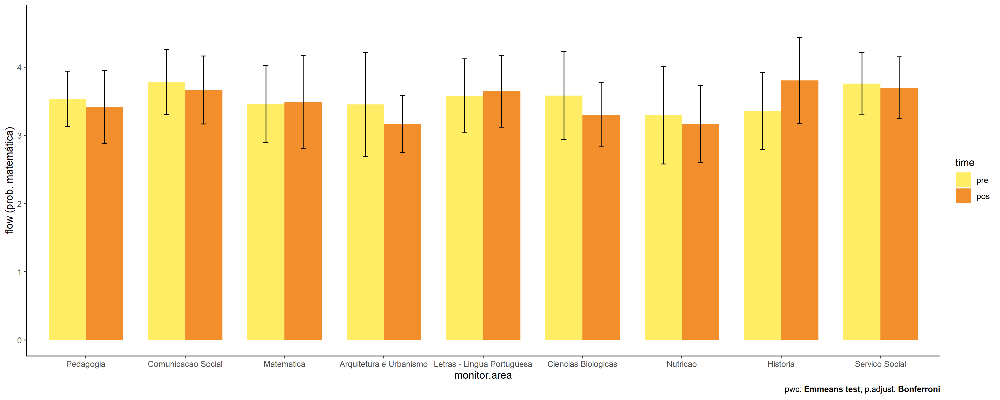<!-- -->

<!-- -->

<!-- -->

<!-- -->

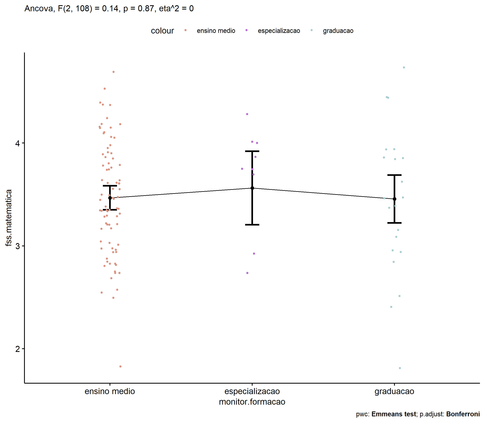<!-- -->

## Pairwise comparisons for grupo=“Experimental”

### factores: **grupo=“Experimental”:monitor**

| var            | monitor |   n | M (pre) | SE (pre) | M (unadj) | SE (unadj) | M (adj) | SE (adj) |
|:---------------|:--------|----:|--------:|---------:|----------:|-----------:|--------:|---------:|
| fss.matematica | AC      |  11 |   3.535 |    0.122 |     3.418 |      0.161 |   3.413 |    0.156 |
| fss.matematica | CE      |   9 |   3.781 |    0.159 |     3.664 |      0.166 |   3.565 |    0.174 |
| fss.matematica | EA      |  10 |   3.400 |    0.174 |     3.456 |      0.291 |   3.502 |    0.164 |
| fss.matematica | GR      |  15 |   3.504 |    0.152 |     3.511 |      0.131 |   3.518 |    0.134 |
| fss.matematica | JC      |   9 |   3.453 |    0.254 |     3.165 |      0.138 |   3.192 |    0.173 |
| fss.matematica | MF      |  10 |   3.578 |    0.171 |     3.644 |      0.165 |   3.623 |    0.164 |
| fss.matematica | ML      |  15 |   3.584 |    0.166 |     3.302 |      0.122 |   3.279 |    0.134 |
| fss.matematica | MM      |  12 |   3.296 |    0.207 |     3.167 |      0.163 |   3.253 |    0.151 |
| fss.matematica | PR      |  10 |   3.358 |    0.178 |     3.805 |      0.199 |   3.868 |    0.165 |
| fss.matematica | VL      |  11 |   3.758 |    0.139 |     3.697 |      0.137 |   3.607 |    0.158 |

| .y.            | group1 | group2 | estimate | conf.low | conf.high |    se | statistic |     p | p.adj | p.adj.signif |
|:---------------|:-------|:-------|---------:|---------:|----------:|------:|----------:|------:|------:|:-------------|
| fss.matematica | AC     | CE     |   -0.152 |   -0.616 |     0.312 | 0.234 |    -0.649 | 0.518 | 1.000 | ns           |
| fss.matematica | AC     | EA     |   -0.089 |   -0.539 |     0.361 | 0.227 |    -0.394 | 0.695 | 1.000 | ns           |
| fss.matematica | AC     | GR     |   -0.105 |   -0.513 |     0.303 | 0.206 |    -0.512 | 0.610 | 1.000 | ns           |
| fss.matematica | AC     | JC     |    0.221 |   -0.241 |     0.684 | 0.233 |     0.950 | 0.344 | 1.000 | ns           |
| fss.matematica | AC     | MF     |   -0.210 |   -0.660 |     0.239 | 0.227 |    -0.929 | 0.355 | 1.000 | ns           |
| fss.matematica | AC     | ML     |    0.135 |   -0.274 |     0.543 | 0.206 |     0.654 | 0.514 | 1.000 | ns           |
| fss.matematica | AC     | MM     |    0.160 |   -0.271 |     0.591 | 0.217 |     0.736 | 0.463 | 1.000 | ns           |
| fss.matematica | AC     | PR     |   -0.454 |   -0.905 |    -0.004 | 0.227 |    -2.002 | 0.048 | 1.000 | ns           |
| fss.matematica | AC     | VL     |   -0.194 |   -0.634 |     0.246 | 0.222 |    -0.875 | 0.383 | 1.000 | ns           |
| fss.matematica | CE     | EA     |    0.063 |   -0.414 |     0.540 | 0.240 |     0.261 | 0.795 | 1.000 | ns           |
| fss.matematica | CE     | GR     |    0.047 |   -0.390 |     0.483 | 0.220 |     0.212 | 0.832 | 1.000 | ns           |
| fss.matematica | CE     | JC     |    0.373 |   -0.115 |     0.862 | 0.246 |     1.518 | 0.132 | 1.000 | ns           |
| fss.matematica | CE     | MF     |   -0.058 |   -0.532 |     0.415 | 0.239 |    -0.244 | 0.807 | 1.000 | ns           |
| fss.matematica | CE     | ML     |    0.287 |   -0.148 |     0.721 | 0.219 |     1.307 | 0.194 | 1.000 | ns           |
| fss.matematica | CE     | MM     |    0.312 |   -0.149 |     0.773 | 0.232 |     1.342 | 0.183 | 1.000 | ns           |
| fss.matematica | CE     | PR     |   -0.302 |   -0.781 |     0.176 | 0.241 |    -1.255 | 0.212 | 1.000 | ns           |
| fss.matematica | CE     | VL     |   -0.042 |   -0.504 |     0.420 | 0.233 |    -0.181 | 0.856 | 1.000 | ns           |
| fss.matematica | EA     | GR     |   -0.016 |   -0.436 |     0.404 | 0.212 |    -0.075 | 0.940 | 1.000 | ns           |
| fss.matematica | EA     | JC     |    0.311 |   -0.162 |     0.783 | 0.238 |     1.305 | 0.195 | 1.000 | ns           |
| fss.matematica | EA     | MF     |   -0.121 |   -0.582 |     0.340 | 0.232 |    -0.521 | 0.604 | 1.000 | ns           |
| fss.matematica | EA     | ML     |    0.224 |   -0.197 |     0.645 | 0.212 |     1.055 | 0.294 | 1.000 | ns           |
| fss.matematica | EA     | MM     |    0.249 |   -0.191 |     0.690 | 0.222 |     1.122 | 0.264 | 1.000 | ns           |
| fss.matematica | EA     | PR     |   -0.365 |   -0.825 |     0.095 | 0.232 |    -1.575 | 0.118 | 1.000 | ns           |
| fss.matematica | EA     | VL     |   -0.105 |   -0.559 |     0.349 | 0.229 |    -0.459 | 0.647 | 1.000 | ns           |
| fss.matematica | GR     | JC     |    0.327 |   -0.107 |     0.760 | 0.219 |     1.495 | 0.138 | 1.000 | ns           |
| fss.matematica | GR     | MF     |   -0.105 |   -0.525 |     0.315 | 0.212 |    -0.496 | 0.621 | 1.000 | ns           |
| fss.matematica | GR     | ML     |    0.240 |   -0.136 |     0.616 | 0.189 |     1.267 | 0.208 | 1.000 | ns           |
| fss.matematica | GR     | MM     |    0.265 |   -0.135 |     0.665 | 0.202 |     1.316 | 0.191 | 1.000 | ns           |
| fss.matematica | GR     | PR     |   -0.349 |   -0.770 |     0.071 | 0.212 |    -1.647 | 0.103 | 1.000 | ns           |
| fss.matematica | GR     | VL     |   -0.089 |   -0.500 |     0.322 | 0.207 |    -0.430 | 0.668 | 1.000 | ns           |
| fss.matematica | JC     | MF     |   -0.432 |   -0.905 |     0.041 | 0.238 |    -1.811 | 0.073 | 1.000 | ns           |
| fss.matematica | JC     | ML     |   -0.087 |   -0.521 |     0.347 | 0.219 |    -0.397 | 0.692 | 1.000 | ns           |
| fss.matematica | JC     | MM     |   -0.061 |   -0.516 |     0.393 | 0.229 |    -0.268 | 0.789 | 1.000 | ns           |
| fss.matematica | JC     | PR     |   -0.676 |   -1.149 |    -0.203 | 0.238 |    -2.836 | 0.006 | 0.248 | ns           |
| fss.matematica | JC     | VL     |   -0.416 |   -0.881 |     0.049 | 0.235 |    -1.773 | 0.079 | 1.000 | ns           |
| fss.matematica | MF     | ML     |    0.345 |   -0.075 |     0.765 | 0.212 |     1.630 | 0.106 | 1.000 | ns           |
| fss.matematica | MF     | MM     |    0.370 |   -0.073 |     0.813 | 0.223 |     1.658 | 0.100 | 1.000 | ns           |
| fss.matematica | MF     | PR     |   -0.244 |   -0.705 |     0.217 | 0.233 |    -1.049 | 0.297 | 1.000 | ns           |
| fss.matematica | MF     | VL     |    0.016 |   -0.434 |     0.466 | 0.227 |     0.071 | 0.944 | 1.000 | ns           |
| fss.matematica | ML     | MM     |    0.025 |   -0.376 |     0.427 | 0.202 |     0.125 | 0.900 | 1.000 | ns           |
| fss.matematica | ML     | PR     |   -0.589 |   -1.011 |    -0.167 | 0.213 |    -2.771 | 0.007 | 0.299 | ns           |
| fss.matematica | ML     | VL     |   -0.329 |   -0.738 |     0.080 | 0.206 |    -1.594 | 0.114 | 1.000 | ns           |
| fss.matematica | MM     | PR     |   -0.614 |   -1.055 |    -0.174 | 0.222 |    -2.768 | 0.007 | 0.302 | ns           |
| fss.matematica | MM     | VL     |   -0.354 |   -0.791 |     0.082 | 0.220 |    -1.609 | 0.111 | 1.000 | ns           |
| fss.matematica | PR     | VL     |    0.260 |   -0.194 |     0.715 | 0.229 |     1.135 | 0.259 | 1.000 | ns           |
| dfs.matematica | AC     | CE     |   -0.246 |   -0.766 |     0.275 | 0.262 |    -0.936 | 0.352 | 1.000 | ns           |
| dfs.matematica | AC     | EA     |    0.135 |   -0.370 |     0.641 | 0.255 |     0.531 | 0.597 | 1.000 | ns           |
| dfs.matematica | AC     | GR     |    0.032 |   -0.428 |     0.491 | 0.232 |     0.137 | 0.892 | 1.000 | ns           |
| dfs.matematica | AC     | JC     |    0.082 |   -0.438 |     0.602 | 0.262 |     0.313 | 0.755 | 1.000 | ns           |
| dfs.matematica | AC     | MF     |   -0.042 |   -0.548 |     0.463 | 0.255 |    -0.166 | 0.868 | 1.000 | ns           |
| dfs.matematica | AC     | ML     |   -0.049 |   -0.508 |     0.411 | 0.232 |    -0.210 | 0.834 | 1.000 | ns           |
| dfs.matematica | AC     | MM     |    0.239 |   -0.244 |     0.722 | 0.244 |     0.981 | 0.329 | 1.000 | ns           |
| dfs.matematica | AC     | PR     |    0.177 |   -0.329 |     0.683 | 0.255 |     0.694 | 0.489 | 1.000 | ns           |
| dfs.matematica | AC     | VL     |   -0.222 |   -0.716 |     0.271 | 0.249 |    -0.893 | 0.374 | 1.000 | ns           |
| dfs.matematica | CE     | EA     |    0.381 |   -0.151 |     0.913 | 0.268 |     1.420 | 0.159 | 1.000 | ns           |
| dfs.matematica | CE     | GR     |    0.277 |   -0.211 |     0.765 | 0.246 |     1.126 | 0.263 | 1.000 | ns           |
| dfs.matematica | CE     | JC     |    0.328 |   -0.218 |     0.873 | 0.275 |     1.191 | 0.237 | 1.000 | ns           |
| dfs.matematica | CE     | MF     |    0.203 |   -0.329 |     0.735 | 0.268 |     0.757 | 0.451 | 1.000 | ns           |
| dfs.matematica | CE     | ML     |    0.197 |   -0.291 |     0.685 | 0.246 |     0.800 | 0.426 | 1.000 | ns           |
| dfs.matematica | CE     | MM     |    0.485 |   -0.026 |     0.995 | 0.257 |     1.883 | 0.063 | 1.000 | ns           |
| dfs.matematica | CE     | PR     |    0.423 |   -0.109 |     0.954 | 0.268 |     1.576 | 0.118 | 1.000 | ns           |
| dfs.matematica | CE     | VL     |    0.023 |   -0.497 |     0.544 | 0.262 |     0.089 | 0.929 | 1.000 | ns           |
| dfs.matematica | EA     | GR     |   -0.104 |   -0.576 |     0.369 | 0.238 |    -0.435 | 0.664 | 1.000 | ns           |
| dfs.matematica | EA     | JC     |   -0.053 |   -0.585 |     0.479 | 0.268 |    -0.199 | 0.843 | 1.000 | ns           |
| dfs.matematica | EA     | MF     |   -0.178 |   -0.695 |     0.340 | 0.261 |    -0.681 | 0.497 | 1.000 | ns           |
| dfs.matematica | EA     | ML     |   -0.184 |   -0.657 |     0.289 | 0.238 |    -0.772 | 0.442 | 1.000 | ns           |
| dfs.matematica | EA     | MM     |    0.104 |   -0.392 |     0.599 | 0.250 |     0.415 | 0.679 | 1.000 | ns           |
| dfs.matematica | EA     | PR     |    0.042 |   -0.476 |     0.559 | 0.261 |     0.160 | 0.873 | 1.000 | ns           |
| dfs.matematica | EA     | VL     |   -0.358 |   -0.863 |     0.148 | 0.255 |    -1.402 | 0.164 | 1.000 | ns           |
| dfs.matematica | GR     | JC     |    0.050 |   -0.438 |     0.539 | 0.246 |     0.205 | 0.838 | 1.000 | ns           |
| dfs.matematica | GR     | MF     |   -0.074 |   -0.547 |     0.399 | 0.238 |    -0.311 | 0.757 | 1.000 | ns           |
| dfs.matematica | GR     | ML     |   -0.080 |   -0.503 |     0.342 | 0.213 |    -0.377 | 0.707 | 1.000 | ns           |
| dfs.matematica | GR     | MM     |    0.207 |   -0.241 |     0.656 | 0.226 |     0.918 | 0.361 | 1.000 | ns           |
| dfs.matematica | GR     | PR     |    0.145 |   -0.327 |     0.618 | 0.238 |     0.610 | 0.543 | 1.000 | ns           |
| dfs.matematica | GR     | VL     |   -0.254 |   -0.713 |     0.206 | 0.232 |    -1.096 | 0.276 | 1.000 | ns           |
| dfs.matematica | JC     | MF     |   -0.125 |   -0.656 |     0.407 | 0.268 |    -0.464 | 0.643 | 1.000 | ns           |
| dfs.matematica | JC     | ML     |   -0.131 |   -0.619 |     0.357 | 0.246 |    -0.531 | 0.596 | 1.000 | ns           |
| dfs.matematica | JC     | MM     |    0.157 |   -0.353 |     0.667 | 0.257 |     0.610 | 0.543 | 1.000 | ns           |
| dfs.matematica | JC     | PR     |    0.095 |   -0.437 |     0.627 | 0.268 |     0.354 | 0.724 | 1.000 | ns           |
| dfs.matematica | JC     | VL     |   -0.304 |   -0.825 |     0.216 | 0.262 |    -1.160 | 0.249 | 1.000 | ns           |
| dfs.matematica | MF     | ML     |   -0.006 |   -0.479 |     0.466 | 0.238 |    -0.026 | 0.979 | 1.000 | ns           |
| dfs.matematica | MF     | MM     |    0.281 |   -0.214 |     0.777 | 0.250 |     1.126 | 0.263 | 1.000 | ns           |
| dfs.matematica | MF     | PR     |    0.219 |   -0.298 |     0.737 | 0.261 |     0.841 | 0.402 | 1.000 | ns           |
| dfs.matematica | MF     | VL     |   -0.180 |   -0.686 |     0.326 | 0.255 |    -0.705 | 0.482 | 1.000 | ns           |
| dfs.matematica | ML     | MM     |    0.288 |   -0.161 |     0.736 | 0.226 |     1.273 | 0.206 | 1.000 | ns           |
| dfs.matematica | ML     | PR     |    0.226 |   -0.247 |     0.698 | 0.238 |     0.947 | 0.346 | 1.000 | ns           |
| dfs.matematica | ML     | VL     |   -0.174 |   -0.633 |     0.286 | 0.232 |    -0.749 | 0.455 | 1.000 | ns           |
| dfs.matematica | MM     | PR     |   -0.062 |   -0.558 |     0.434 | 0.250 |    -0.248 | 0.804 | 1.000 | ns           |
| dfs.matematica | MM     | VL     |   -0.461 |   -0.944 |     0.022 | 0.244 |    -1.893 | 0.061 | 1.000 | ns           |
| dfs.matematica | PR     | VL     |   -0.399 |   -0.905 |     0.107 | 0.255 |    -1.566 | 0.121 | 1.000 | ns           |

| .y.             | monitor | group1 | group2 | estimate | conf.low | conf.high |    se | statistic |     p | p.adj | p.adj.signif |
|:----------------|:--------|:-------|:-------|---------:|---------:|----------:|------:|----------:|------:|------:|:-------------|
| flow.matematica | AC      | pre    | pos    |    0.117 |   -0.364 |     0.599 | 0.244 |     0.481 | 0.631 | 0.631 | ns           |
| flow.matematica | CE      | pre    | pos    |    0.117 |   -0.415 |     0.650 | 0.270 |     0.434 | 0.665 | 0.665 | ns           |
| flow.matematica | EA      | pre    | pos    |   -0.056 |   -0.561 |     0.450 | 0.256 |    -0.217 | 0.829 | 0.829 | ns           |
| flow.matematica | GR      | pre    | pos    |   -0.007 |   -0.420 |     0.405 | 0.209 |    -0.035 | 0.972 | 0.972 | ns           |
| flow.matematica | JC      | pre    | pos    |    0.288 |   -0.244 |     0.821 | 0.270 |     1.067 | 0.287 | 0.287 | ns           |
| flow.matematica | MF      | pre    | pos    |   -0.067 |   -0.572 |     0.438 | 0.256 |    -0.260 | 0.795 | 0.795 | ns           |
| flow.matematica | ML      | pre    | pos    |    0.282 |   -0.130 |     0.695 | 0.209 |     1.349 | 0.179 | 0.179 | ns           |
| flow.matematica | MM      | pre    | pos    |    0.130 |   -0.331 |     0.591 | 0.234 |     0.554 | 0.580 | 0.580 | ns           |
| flow.matematica | PR      | pre    | pos    |   -0.446 |   -0.952 |     0.059 | 0.256 |    -1.743 | 0.083 | 0.083 | ns           |
| flow.matematica | VL      | pre    | pos    |    0.061 |   -0.421 |     0.542 | 0.244 |     0.248 | 0.804 | 0.804 | ns           |

    ## Scale for colour is already present.
    ## Adding another scale for colour, which will replace the existing scale.

<!-- -->

<!-- -->

<!-- -->

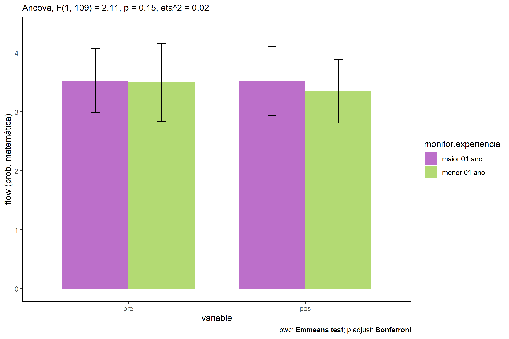<!-- -->

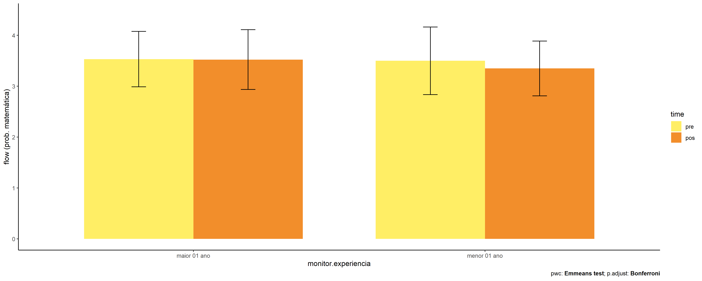<!-- -->

### factores: **grupo=“Experimental”:monitor.genero**

| var            | monitor.genero |   n | M (pre) | SE (pre) | M (unadj) | SE (unadj) | M (adj) | SE (adj) |
|:---------------|:---------------|----:|--------:|---------:|----------:|-----------:|--------:|---------:|
| fss.matematica | F              |  74 |   3.539 |    0.067 |     3.445 |      0.061 |   3.438 |    0.062 |
| fss.matematica | M              |  38 |   3.492 |    0.096 |     3.528 |      0.109 |   3.540 |    0.086 |

| .y.            | group1 | group2 | estimate | conf.low | conf.high |    se | statistic |     p | p.adj | p.adj.signif |
|:---------------|:-------|:-------|---------:|---------:|----------:|------:|----------:|------:|------:|:-------------|
| fss.matematica | F      | M      |   -0.102 |   -0.313 |     0.109 | 0.106 |    -0.960 | 0.339 | 0.339 | ns           |
| dfs.matematica | F      | M      |    0.047 |   -0.183 |     0.277 | 0.116 |     0.405 | 0.686 | 0.686 | ns           |

| .y.             | monitor.genero | group1 | group2 | estimate | conf.low | conf.high |    se | statistic |     p | p.adj | p.adj.signif |
|:----------------|:---------------|:-------|:-------|---------:|---------:|----------:|------:|----------:|------:|------:|:-------------|
| flow.matematica | F              | pre    | pos    |    0.094 |   -0.094 |     0.282 | 0.095 |     0.989 | 0.324 | 0.324 | ns           |
| flow.matematica | M              | pre    | pos    |   -0.036 |   -0.298 |     0.226 | 0.133 |    -0.271 | 0.786 | 0.786 | ns           |

    ## Scale for colour is already present.
    ## Adding another scale for colour, which will replace the existing scale.

<!-- -->

<!-- -->

<!-- -->

<!-- -->

<!-- -->

### factores: **grupo=“Experimental”:monitor.area**

| var            | monitor.area               |   n | M (pre) | SE (pre) | M (unadj) | SE (unadj) | M (adj) | SE (adj) |
|:---------------|:---------------------------|----:|--------:|---------:|----------:|-----------:|--------:|---------:|
| fss.matematica | Arquitetura e Urbanismo    |   9 |   3.453 |    0.254 |     3.165 |      0.138 |   3.192 |    0.172 |
| fss.matematica | Ciencias Biologicas        |  15 |   3.584 |    0.166 |     3.302 |      0.122 |   3.279 |    0.133 |
| fss.matematica | Comunicacao Social         |   9 |   3.781 |    0.159 |     3.664 |      0.166 |   3.565 |    0.173 |
| fss.matematica | Historia                   |  10 |   3.358 |    0.178 |     3.805 |      0.199 |   3.868 |    0.164 |
| fss.matematica | Letras - Lingua Portuguesa |  10 |   3.578 |    0.171 |     3.644 |      0.165 |   3.623 |    0.163 |
| fss.matematica | Matematica                 |  25 |   3.462 |    0.113 |     3.489 |      0.137 |   3.512 |    0.103 |
| fss.matematica | Nutricao                   |  12 |   3.296 |    0.207 |     3.167 |      0.163 |   3.253 |    0.150 |
| fss.matematica | Pedagogia                  |  11 |   3.535 |    0.122 |     3.418 |      0.161 |   3.413 |    0.156 |
| fss.matematica | Servico Social             |  11 |   3.758 |    0.139 |     3.697 |      0.137 |   3.607 |    0.157 |

| .y.            | group1                  | group2              | estimate | conf.low | conf.high |    se | statistic |     p | p.adj | p.adj.signif |
|:---------------|:------------------------|:--------------------|---------:|---------:|----------:|------:|----------:|------:|------:|:-------------|
| fss.matematica | Arquitetura e Urbanismo | Ciencias Biologicas |   -0.087 |   -0.519 |     0.345 | 0.218 |    -0.399 | 0.691 | 1.000 | ns           |
| fss.matematica | Arquitetura e Urbanismo | Comunicacao Social  |   -0.373 |   -0.859 |     0.112 | 0.245 |    -1.525 | 0.130 | 1.000 | ns           |
| fss.matematica | Arquitetura e Urbanismo | Historia            |   -0.676 |   -1.146 |    -0.206 | 0.237 |    -2.850 | 0.005 | 0.190 | ns           |
| fss.matematica | Arquitetura e Urbanismo | Letras              |   -0.432 |   -0.902 |     0.039 | 0.237 |    -1.820 | 0.072 | 1.000 | ns           |
| fss.matematica | Arquitetura e Urbanismo | Matematica          |   -0.320 |   -0.718 |     0.077 | 0.201 |    -1.598 | 0.113 | 1.000 | ns           |
| fss.matematica | Arquitetura e Urbanismo | Nutricao            |   -0.061 |   -0.513 |     0.390 | 0.228 |    -0.270 | 0.788 | 1.000 | ns           |
| fss.matematica | Arquitetura e Urbanismo | Pedagogia           |   -0.221 |   -0.682 |     0.239 | 0.232 |    -0.955 | 0.342 | 1.000 | ns           |
| fss.matematica | Arquitetura e Urbanismo | Servico Social      |   -0.416 |   -0.878 |     0.047 | 0.233 |    -1.781 | 0.078 | 1.000 | ns           |
| fss.matematica | Ciencias Biologicas     | Comunicacao Social  |   -0.287 |   -0.719 |     0.146 | 0.218 |    -1.313 | 0.192 | 1.000 | ns           |
| fss.matematica | Ciencias Biologicas     | Historia            |   -0.589 |   -1.009 |    -0.170 | 0.211 |    -2.785 | 0.006 | 0.230 | ns           |
| fss.matematica | Ciencias Biologicas     | Letras              |   -0.345 |   -0.763 |     0.073 | 0.211 |    -1.638 | 0.104 | 1.000 | ns           |
| fss.matematica | Ciencias Biologicas     | Matematica          |   -0.234 |   -0.568 |     0.101 | 0.169 |    -1.384 | 0.170 | 1.000 | ns           |
| fss.matematica | Ciencias Biologicas     | Nutricao            |    0.025 |   -0.374 |     0.425 | 0.201 |     0.126 | 0.900 | 1.000 | ns           |
| fss.matematica | Ciencias Biologicas     | Pedagogia           |   -0.135 |   -0.541 |     0.272 | 0.205 |    -0.658 | 0.512 | 1.000 | ns           |
| fss.matematica | Ciencias Biologicas     | Servico Social      |   -0.329 |   -0.736 |     0.078 | 0.205 |    -1.602 | 0.112 | 1.000 | ns           |
| fss.matematica | Comunicacao Social      | Historia            |   -0.303 |   -0.778 |     0.173 | 0.240 |    -1.261 | 0.210 | 1.000 | ns           |
| fss.matematica | Comunicacao Social      | Letras              |   -0.058 |   -0.530 |     0.413 | 0.238 |    -0.246 | 0.806 | 1.000 | ns           |
| fss.matematica | Comunicacao Social      | Matematica          |    0.053 |   -0.349 |     0.455 | 0.202 |     0.262 | 0.794 | 1.000 | ns           |
| fss.matematica | Comunicacao Social      | Nutricao            |    0.312 |   -0.147 |     0.771 | 0.231 |     1.348 | 0.181 | 1.000 | ns           |
| fss.matematica | Comunicacao Social      | Pedagogia           |    0.152 |   -0.310 |     0.614 | 0.233 |     0.652 | 0.516 | 1.000 | ns           |
| fss.matematica | Comunicacao Social      | Servico Social      |   -0.042 |   -0.502 |     0.418 | 0.232 |    -0.182 | 0.856 | 1.000 | ns           |
| fss.matematica | Historia                | Letras              |    0.244 |   -0.215 |     0.703 | 0.231 |     1.055 | 0.294 | 1.000 | ns           |
| fss.matematica | Historia                | Matematica          |    0.356 |   -0.028 |     0.739 | 0.193 |     1.840 | 0.069 | 1.000 | ns           |
| fss.matematica | Historia                | Nutricao            |    0.614 |    0.176 |     1.053 | 0.221 |     2.781 | 0.006 | 0.232 | ns           |
| fss.matematica | Historia                | Pedagogia           |    0.454 |    0.006 |     0.903 | 0.226 |     2.012 | 0.047 | 1.000 | ns           |
| fss.matematica | Historia                | Servico Social      |    0.260 |   -0.192 |     0.713 | 0.228 |     1.141 | 0.256 | 1.000 | ns           |
| fss.matematica | Letras                  | Lingua Portuguesa   |    0.111 |   -0.272 |     0.495 | 0.193 |     0.577 | 0.566 | 1.000 | ns           |
| fss.matematica | Letras                  | Lingua Portuguesa   |    0.370 |   -0.070 |     0.811 | 0.222 |     1.666 | 0.099 | 1.000 | ns           |
| fss.matematica | Letras                  | Lingua Portuguesa   |    0.210 |   -0.237 |     0.657 | 0.225 |     0.933 | 0.353 | 1.000 | ns           |
| fss.matematica | Letras                  | Lingua Portuguesa   |    0.016 |   -0.432 |     0.464 | 0.226 |     0.071 | 0.943 | 1.000 | ns           |
| fss.matematica | Matematica              | Nutricao            |    0.259 |   -0.102 |     0.619 | 0.182 |     1.424 | 0.157 | 1.000 | ns           |
| fss.matematica | Matematica              | Pedagogia           |    0.099 |   -0.271 |     0.469 | 0.187 |     0.530 | 0.598 | 1.000 | ns           |
| fss.matematica | Matematica              | Servico Social      |   -0.095 |   -0.469 |     0.278 | 0.188 |    -0.506 | 0.614 | 1.000 | ns           |
| fss.matematica | Nutricao                | Pedagogia           |   -0.160 |   -0.589 |     0.269 | 0.216 |    -0.739 | 0.461 | 1.000 | ns           |
| fss.matematica | Nutricao                | Servico Social      |   -0.354 |   -0.789 |     0.080 | 0.219 |    -1.617 | 0.109 | 1.000 | ns           |
| fss.matematica | Pedagogia               | Servico Social      |   -0.194 |   -0.632 |     0.244 | 0.221 |    -0.879 | 0.381 | 1.000 | ns           |
| dfs.matematica | Arquitetura e Urbanismo | Ciencias Biologicas |   -0.131 |   -0.617 |     0.355 | 0.245 |    -0.533 | 0.595 | 1.000 | ns           |
| dfs.matematica | Arquitetura e Urbanismo | Comunicacao Social  |   -0.328 |   -0.871 |     0.216 | 0.274 |    -1.195 | 0.235 | 1.000 | ns           |
| dfs.matematica | Arquitetura e Urbanismo | Historia            |    0.095 |   -0.435 |     0.625 | 0.267 |     0.355 | 0.723 | 1.000 | ns           |
| dfs.matematica | Arquitetura e Urbanismo | Letras              |   -0.125 |   -0.654 |     0.405 | 0.267 |    -0.466 | 0.642 | 1.000 | ns           |
| dfs.matematica | Arquitetura e Urbanismo | Matematica          |   -0.009 |   -0.457 |     0.439 | 0.226 |    -0.040 | 0.968 | 1.000 | ns           |
| dfs.matematica | Arquitetura e Urbanismo | Nutricao            |    0.157 |   -0.351 |     0.665 | 0.256 |     0.612 | 0.542 | 1.000 | ns           |
| dfs.matematica | Arquitetura e Urbanismo | Pedagogia           |   -0.082 |   -0.600 |     0.436 | 0.261 |    -0.314 | 0.754 | 1.000 | ns           |
| dfs.matematica | Arquitetura e Urbanismo | Servico Social      |   -0.304 |   -0.823 |     0.214 | 0.261 |    -1.165 | 0.247 | 1.000 | ns           |
| dfs.matematica | Ciencias Biologicas     | Comunicacao Social  |   -0.197 |   -0.683 |     0.289 | 0.245 |    -0.803 | 0.424 | 1.000 | ns           |
| dfs.matematica | Ciencias Biologicas     | Historia            |    0.226 |   -0.245 |     0.696 | 0.237 |     0.951 | 0.344 | 1.000 | ns           |
| dfs.matematica | Ciencias Biologicas     | Letras              |    0.006 |   -0.464 |     0.477 | 0.237 |     0.026 | 0.979 | 1.000 | ns           |
| dfs.matematica | Ciencias Biologicas     | Matematica          |    0.122 |   -0.255 |     0.498 | 0.190 |     0.641 | 0.523 | 1.000 | ns           |
| dfs.matematica | Ciencias Biologicas     | Nutricao            |    0.288 |   -0.159 |     0.734 | 0.225 |     1.278 | 0.204 | 1.000 | ns           |
| dfs.matematica | Ciencias Biologicas     | Pedagogia           |    0.049 |   -0.409 |     0.506 | 0.231 |     0.211 | 0.833 | 1.000 | ns           |
| dfs.matematica | Ciencias Biologicas     | Servico Social      |   -0.174 |   -0.631 |     0.284 | 0.231 |    -0.752 | 0.454 | 1.000 | ns           |
| dfs.matematica | Comunicacao Social      | Historia            |    0.423 |   -0.107 |     0.952 | 0.267 |     1.582 | 0.117 | 1.000 | ns           |
| dfs.matematica | Comunicacao Social      | Letras              |    0.203 |   -0.327 |     0.733 | 0.267 |     0.760 | 0.449 | 1.000 | ns           |
| dfs.matematica | Comunicacao Social      | Matematica          |    0.319 |   -0.130 |     0.767 | 0.226 |     1.410 | 0.162 | 1.000 | ns           |
| dfs.matematica | Comunicacao Social      | Nutricao            |    0.485 |   -0.024 |     0.993 | 0.256 |     1.890 | 0.062 | 1.000 | ns           |
| dfs.matematica | Comunicacao Social      | Pedagogia           |    0.246 |   -0.273 |     0.764 | 0.261 |     0.940 | 0.350 | 1.000 | ns           |
| dfs.matematica | Comunicacao Social      | Servico Social      |    0.023 |   -0.495 |     0.541 | 0.261 |     0.089 | 0.929 | 1.000 | ns           |
| dfs.matematica | Historia                | Letras              |   -0.219 |   -0.735 |     0.296 | 0.260 |    -0.844 | 0.401 | 1.000 | ns           |
| dfs.matematica | Historia                | Matematica          |   -0.104 |   -0.535 |     0.327 | 0.218 |    -0.478 | 0.634 | 1.000 | ns           |
| dfs.matematica | Historia                | Nutricao            |    0.062 |   -0.432 |     0.556 | 0.249 |     0.249 | 0.804 | 1.000 | ns           |
| dfs.matematica | Historia                | Pedagogia           |   -0.177 |   -0.681 |     0.327 | 0.254 |    -0.697 | 0.487 | 1.000 | ns           |
| dfs.matematica | Historia                | Servico Social      |   -0.399 |   -0.903 |     0.105 | 0.254 |    -1.572 | 0.119 | 1.000 | ns           |
| dfs.matematica | Letras                  | Lingua Portuguesa   |    0.116 |   -0.316 |     0.547 | 0.218 |     0.531 | 0.596 | 1.000 | ns           |
| dfs.matematica | Letras                  | Lingua Portuguesa   |    0.281 |   -0.212 |     0.775 | 0.249 |     1.131 | 0.261 | 1.000 | ns           |
| dfs.matematica | Letras                  | Lingua Portuguesa   |    0.042 |   -0.461 |     0.546 | 0.254 |     0.167 | 0.868 | 1.000 | ns           |
| dfs.matematica | Letras                  | Lingua Portuguesa   |   -0.180 |   -0.684 |     0.324 | 0.254 |    -0.708 | 0.481 | 1.000 | ns           |
| dfs.matematica | Matematica              | Nutricao            |    0.166 |   -0.239 |     0.571 | 0.204 |     0.813 | 0.418 | 1.000 | ns           |
| dfs.matematica | Matematica              | Pedagogia           |   -0.073 |   -0.490 |     0.344 | 0.210 |    -0.348 | 0.729 | 1.000 | ns           |
| dfs.matematica | Matematica              | Servico Social      |   -0.295 |   -0.712 |     0.122 | 0.210 |    -1.404 | 0.163 | 1.000 | ns           |
| dfs.matematica | Nutricao                | Pedagogia           |   -0.239 |   -0.720 |     0.242 | 0.243 |    -0.985 | 0.327 | 1.000 | ns           |
| dfs.matematica | Nutricao                | Servico Social      |   -0.461 |   -0.943 |     0.020 | 0.243 |    -1.901 | 0.060 | 1.000 | ns           |
| dfs.matematica | Pedagogia               | Servico Social      |   -0.222 |   -0.714 |     0.269 | 0.248 |    -0.896 | 0.372 | 1.000 | ns           |

| .y.             | monitor.area               | group1 | group2 | estimate | conf.low | conf.high |    se | statistic |     p | p.adj | p.adj.signif |
|:----------------|:---------------------------|:-------|:-------|---------:|---------:|----------:|------:|----------:|------:|------:|:-------------|
| flow.matematica | Arquitetura e Urbanismo    | pre    | pos    |    0.288 |   -0.242 |     0.818 | 0.269 |     1.072 | 0.285 | 0.285 | ns           |
| flow.matematica | Ciencias Biologicas        | pre    | pos    |    0.282 |   -0.128 |     0.693 | 0.208 |     1.355 | 0.177 | 0.177 | ns           |
| flow.matematica | Comunicacao Social         | pre    | pos    |    0.117 |   -0.413 |     0.647 | 0.269 |     0.436 | 0.663 | 0.663 | ns           |
| flow.matematica | Historia                   | pre    | pos    |   -0.446 |   -0.949 |     0.056 | 0.255 |    -1.750 | 0.082 | 0.082 | ns           |
| flow.matematica | Letras - Lingua Portuguesa | pre    | pos    |   -0.067 |   -0.570 |     0.436 | 0.255 |    -0.261 | 0.794 | 0.794 | ns           |
| flow.matematica | Matematica                 | pre    | pos    |   -0.027 |   -0.345 |     0.291 | 0.161 |    -0.165 | 0.869 | 0.869 | ns           |
| flow.matematica | Nutricao                   | pre    | pos    |    0.130 |   -0.329 |     0.589 | 0.233 |     0.557 | 0.578 | 0.578 | ns           |
| flow.matematica | Pedagogia                  | pre    | pos    |    0.117 |   -0.362 |     0.597 | 0.243 |     0.483 | 0.630 | 0.630 | ns           |
| flow.matematica | Servico Social             | pre    | pos    |    0.061 |   -0.419 |     0.540 | 0.243 |     0.249 | 0.803 | 0.803 | ns           |

    ## Scale for colour is already present.
    ## Adding another scale for colour, which will replace the existing scale.

<!-- -->

<!-- -->

<!-- -->

<!-- -->

<!-- -->

### factores: **grupo=“Experimental”:monitor.formacao**

| var            | monitor.formacao |   n | M (pre) | SE (pre) | M (unadj) | SE (unadj) | M (adj) | SE (adj) |
|:---------------|:-----------------|----:|--------:|---------:|----------:|-----------:|--------:|---------:|
| fss.matematica | ensino medio     |  82 |   3.508 |    0.067 |     3.461 |      0.060 |   3.467 |    0.059 |
| fss.matematica | especializacao   |   9 |   3.781 |    0.159 |     3.664 |      0.166 |   3.563 |    0.180 |
| fss.matematica | graduacao        |  21 |   3.471 |    0.103 |     3.436 |      0.158 |   3.456 |    0.117 |

| .y.            | group1         | group2         | estimate | conf.low | conf.high |    se | statistic |     p | p.adj | p.adj.signif |
|:---------------|:---------------|:---------------|---------:|---------:|----------:|------:|----------:|------:|------:|:-------------|
| fss.matematica | ensino medio   | especializacao |   -0.096 |   -0.472 |     0.281 | 0.190 |    -0.504 | 0.615 | 1.000 | ns           |
| fss.matematica | ensino medio   | graduacao      |    0.011 |   -0.249 |     0.271 | 0.131 |     0.085 | 0.932 | 1.000 | ns           |
| fss.matematica | especializacao | graduacao      |    0.107 |   -0.320 |     0.534 | 0.215 |     0.497 | 0.620 | 1.000 | ns           |
| dfs.matematica | ensino medio   | especializacao |   -0.273 |   -0.675 |     0.129 | 0.203 |    -1.344 | 0.182 | 0.545 | ns           |
| dfs.matematica | ensino medio   | graduacao      |    0.037 |   -0.243 |     0.317 | 0.141 |     0.261 | 0.794 | 1.000 | ns           |
| dfs.matematica | especializacao | graduacao      |    0.310 |   -0.147 |     0.767 | 0.230 |     1.345 | 0.181 | 0.544 | ns           |

| .y.             | monitor.formacao | group1 | group2 | estimate | conf.low | conf.high |    se | statistic |     p | p.adj | p.adj.signif |
|:----------------|:-----------------|:-------|:-------|---------:|---------:|----------:|------:|----------:|------:|------:|:-------------|
| flow.matematica | ensino medio     | pre    | pos    |    0.046 |   -0.132 |     0.225 | 0.090 |     0.513 | 0.608 | 0.608 | ns           |
| flow.matematica | especializacao   | pre    | pos    |    0.117 |   -0.420 |     0.655 | 0.273 |     0.430 | 0.668 | 0.668 | ns           |
| flow.matematica | graduacao        | pre    | pos    |    0.035 |   -0.317 |     0.387 | 0.179 |     0.196 | 0.845 | 0.845 | ns           |

    ## Scale for colour is already present.
    ## Adding another scale for colour, which will replace the existing scale.

<!-- -->

<!-- -->

<!-- -->

<!-- -->

<!-- -->

### factores: **grupo=“Experimental”:monitor.experiencia**

| var            | monitor.experiencia |   n | M (pre) | SE (pre) | M (unadj) | SE (unadj) | M (adj) | SE (adj) |
|:---------------|:--------------------|----:|--------:|---------:|----------:|-----------:|--------:|---------:|
| fss.matematica | maior 01 ano        |  80 |   3.532 |    0.061 |     3.523 |      0.066 |   3.519 |    0.059 |
| fss.matematica | menor 01 ano        |  32 |   3.499 |    0.117 |     3.349 |      0.095 |   3.358 |    0.094 |

| .y.            | group1       | group2       | estimate | conf.low | conf.high |    se | statistic |     p | p.adj | p.adj.signif |
|:---------------|:-------------|:-------------|---------:|---------:|----------:|------:|----------:|------:|------:|:-------------|
| fss.matematica | maior 01 ano | menor 01 ano |    0.161 |   -0.058 |     0.380 | 0.111 |     1.454 | 0.149 | 0.149 | ns           |
| dfs.matematica | maior 01 ano | menor 01 ano |    0.033 |   -0.207 |     0.274 | 0.121 |     0.275 | 0.784 | 0.784 | ns           |

| .y.             | monitor.experiencia | group1 | group2 | estimate | conf.low | conf.high |    se | statistic |     p | p.adj | p.adj.signif |
|:----------------|:--------------------|:-------|:-------|---------:|---------:|----------:|------:|----------:|------:|------:|:-------------|
| flow.matematica | maior 01 ano        | pre    | pos    |     0.01 |   -0.170 |     0.190 | 0.091 |     0.107 | 0.915 | 0.915 | ns           |
| flow.matematica | menor 01 ano        | pre    | pos    |     0.15 |   -0.134 |     0.435 | 0.144 |     1.042 | 0.298 | 0.298 | ns           |

    ## Scale for colour is already present.
    ## Adding another scale for colour, which will replace the existing scale.

<!-- -->

<!-- -->

<!-- -->

<!-- -->

<!-- -->
