ANCOVA test for matematica (engajamento no matematica)
================
Geiser C. Challco <geiser@alumni.usp.br>

- [Descriptive Statistics of Initial
  Data](#descriptive-statistics-of-initial-data)
- [Checking of Assumptions](#checking-of-assumptions)
  - [Assumption: Normality distribution of
    data](#assumption-normality-distribution-of-data)
  - [Assumption: Homogeneity of data
    distribution](#assumption-homogeneity-of-data-distribution)
- [Computation of ANCOVA test and Pairwise
  Comparison](#computation-of-ancova-test-and-pairwise-comparison)
  - [ANCOVA tests for one factor](#ancova-tests-for-one-factor)
  - [ANCOVA tests for two factors](#ancova-tests-for-two-factors)
  - [ANCOVA tests for
    grupo=“Experimental”](#ancova-tests-for-grupoexperimental)
  - [Pairwise comparisons for one
    factor](#pairwise-comparisons-for-one-factor)
    - [factor: **grupo**](#factor-grupo)
    - [factor: **genero**](#factor-genero)
    - [factor: **idade**](#factor-idade)
    - [factor: **zona.participante**](#factor-zonaparticipante)
    - [factor: **escola**](#factor-escola)
    - [factor: **zona.escola**](#factor-zonaescola)
  - [Pairwise comparisons for two
    factors](#pairwise-comparisons-for-two-factors)
    - [factores: **grupo:genero**](#factores-grupogenero)
    - [factores: **grupo:idade**](#factores-grupoidade)
    - [factores:
      **grupo:zona.participante**](#factores-grupozonaparticipante)
    - [factores: **grupo:escola**](#factores-grupoescola)
    - [factores: **grupo:zona.escola**](#factores-grupozonaescola)
  - [Pairwise comparisons for
    grupo=“Experimental”](#pairwise-comparisons-for-grupoexperimental)
    - [factores:
      **grupo=“Experimental”:monitor**](#factores-grupoexperimentalmonitor)
    - [factores:
      **grupo=“Experimental”:monitor.genero**](#factores-grupoexperimentalmonitorgenero)
    - [factores:
      **grupo=“Experimental”:monitor.area**](#factores-grupoexperimentalmonitorarea)
    - [factores:
      **grupo=“Experimental”:monitor.formacao**](#factores-grupoexperimentalmonitorformacao)
    - [factores:
      **grupo=“Experimental”:monitor.experiencia**](#factores-grupoexperimentalmonitorexperiencia)

**NOTE**

- Teste ANCOVA para determinar se houve diferenças significativas em
  referência ao engajamento no matematica (medido como estado de fluxo).
- ANCOVA test to determine whether there were significant differences in
  reference to engagement in matematica (measured as flow state).

# Descriptive Statistics of Initial Data

| grupo        | genero | idade | zona.participante | escola | zona.escola | variable       |   n |  mean | median |   min |   max |    sd |    se |    ci |   iqr |
|:-------------|:-------|:------|:------------------|:-------|:------------|:---------------|----:|------:|-------:|------:|------:|------:|------:|------:|------:|
| Controle     | F      |       |                   |        |             | fss.matematica |  53 | 3.395 |  3.333 | 2.000 | 4.333 | 0.520 | 0.071 | 0.143 | 0.778 |
| Controle     | M      |       |                   |        |             | fss.matematica |  55 | 3.413 |  3.444 | 2.444 | 4.444 | 0.460 | 0.062 | 0.124 | 0.556 |
| Experimental | F      |       |                   |        |             | fss.matematica |  49 | 3.461 |  3.444 | 2.444 | 4.444 | 0.550 | 0.079 | 0.158 | 0.889 |
| Experimental | M      |       |                   |        |             | fss.matematica |  55 | 3.493 |  3.556 | 1.778 | 4.714 | 0.623 | 0.084 | 0.169 | 0.722 |
| Controle     | F      |       |                   |        |             | dfs.matematica |  53 | 3.590 |  3.667 | 2.222 | 4.556 | 0.542 | 0.074 | 0.149 | 0.778 |
| Controle     | M      |       |                   |        |             | dfs.matematica |  55 | 3.601 |  3.600 | 2.667 | 4.556 | 0.456 | 0.062 | 0.123 | 0.556 |
| Experimental | F      |       |                   |        |             | dfs.matematica |  49 | 3.589 |  3.667 | 2.333 | 4.857 | 0.579 | 0.083 | 0.166 | 0.778 |
| Experimental | M      |       |                   |        |             | dfs.matematica |  55 | 3.454 |  3.444 | 1.667 | 4.556 | 0.575 | 0.078 | 0.156 | 0.833 |
| Controle     |        | 10y   |                   |        |             | fss.matematica |  20 | 3.444 |  3.444 | 2.444 | 4.444 | 0.496 | 0.111 | 0.232 | 0.472 |
| Controle     |        | 11y   |                   |        |             | fss.matematica |  58 | 3.381 |  3.389 | 2.000 | 4.444 | 0.496 | 0.065 | 0.130 | 0.556 |
| Controle     |        | 12y   |                   |        |             | fss.matematica |  16 | 3.526 |  3.444 | 2.857 | 4.333 | 0.507 | 0.127 | 0.270 | 0.722 |
| Controle     |        | 13y   |                   |        |             | fss.matematica |   6 | 3.086 |  3.000 | 2.778 | 3.625 | 0.341 | 0.139 | 0.358 | 0.472 |
| Controle     |        | 14y   |                   |        |             | fss.matematica |   1 | 3.556 |  3.556 | 3.556 | 3.556 |       |       |       | 0.000 |
| Controle     |        | 16y   |                   |        |             | fss.matematica |   1 | 3.000 |  3.000 | 3.000 | 3.000 |       |       |       | 0.000 |
| Controle     |        |       |                   |        |             | fss.matematica |   6 | 3.537 |  3.611 | 3.000 | 4.222 | 0.484 | 0.198 | 0.508 | 0.667 |
| Experimental |        | 10y   |                   |        |             | fss.matematica |  21 | 3.238 |  3.333 | 1.778 | 4.444 | 0.651 | 0.142 | 0.296 | 0.556 |
| Experimental |        | 11y   |                   |        |             | fss.matematica |  65 | 3.616 |  3.667 | 2.556 | 4.714 | 0.512 | 0.064 | 0.127 | 0.667 |
| Experimental |        | 12y   |                   |        |             | fss.matematica |  12 | 3.324 |  3.389 | 2.444 | 4.111 | 0.557 | 0.161 | 0.354 | 0.917 |
| Experimental |        | 13y   |                   |        |             | fss.matematica |   4 | 2.750 |  2.944 | 1.889 | 3.222 | 0.591 | 0.295 | 0.940 | 0.417 |
| Experimental |        | 14y   |                   |        |             | fss.matematica |   1 | 4.444 |  4.444 | 4.444 | 4.444 |       |       |       | 0.000 |
| Experimental |        |       |                   |        |             | fss.matematica |   1 | 3.333 |  3.333 | 3.333 | 3.333 |       |       |       | 0.000 |
| Controle     |        | 10y   |                   |        |             | dfs.matematica |  20 | 3.528 |  3.500 | 2.444 | 4.556 | 0.472 | 0.106 | 0.221 | 0.500 |
| Controle     |        | 11y   |                   |        |             | dfs.matematica |  58 | 3.656 |  3.667 | 2.222 | 4.556 | 0.491 | 0.064 | 0.129 | 0.556 |
| Controle     |        | 12y   |                   |        |             | dfs.matematica |  16 | 3.575 |  3.646 | 2.750 | 4.333 | 0.472 | 0.118 | 0.251 | 0.639 |
| Controle     |        | 13y   |                   |        |             | dfs.matematica |   6 | 3.722 |  3.778 | 3.000 | 4.556 | 0.557 | 0.227 | 0.584 | 0.583 |
| Controle     |        | 14y   |                   |        |             | dfs.matematica |   1 | 3.444 |  3.444 | 3.444 | 3.444 |       |       |       | 0.000 |
| Controle     |        | 16y   |                   |        |             | dfs.matematica |   1 | 3.444 |  3.444 | 3.444 | 3.444 |       |       |       | 0.000 |
| Controle     |        |       |                   |        |             | dfs.matematica |   6 | 3.222 |  3.000 | 2.667 | 4.556 | 0.692 | 0.283 | 0.726 | 0.417 |
| Experimental |        | 10y   |                   |        |             | dfs.matematica |  21 | 3.460 |  3.444 | 2.333 | 4.556 | 0.570 | 0.124 | 0.260 | 0.556 |
| Experimental |        | 11y   |                   |        |             | dfs.matematica |  65 | 3.563 |  3.667 | 2.333 | 4.857 | 0.558 | 0.069 | 0.138 | 0.778 |
| Experimental |        | 12y   |                   |        |             | dfs.matematica |  12 | 3.392 |  3.333 | 1.667 | 4.333 | 0.736 | 0.212 | 0.467 | 0.583 |
| Experimental |        | 13y   |                   |        |             | dfs.matematica |   4 | 3.500 |  3.722 | 2.556 | 4.000 | 0.657 | 0.329 | 1.046 | 0.611 |
| Experimental |        | 14y   |                   |        |             | dfs.matematica |   1 | 3.000 |  3.000 | 3.000 | 3.000 |       |       |       | 0.000 |
| Experimental |        |       |                   |        |             | dfs.matematica |   1 | 3.889 |  3.889 | 3.889 | 3.889 |       |       |       | 0.000 |
| Controle     |        |       | Urbana            |        |             | fss.matematica |  44 | 3.404 |  3.444 | 2.444 | 4.444 | 0.478 | 0.072 | 0.145 | 0.583 |
| Controle     |        |       | Rural             |        |             | fss.matematica |  40 | 3.393 |  3.333 | 2.000 | 4.444 | 0.470 | 0.074 | 0.150 | 0.472 |
| Controle     |        |       |                   |        |             | fss.matematica |  24 | 3.424 |  3.590 | 2.444 | 4.333 | 0.554 | 0.113 | 0.234 | 0.917 |
| Experimental |        |       | Urbana            |        |             | fss.matematica |  41 | 3.333 |  3.333 | 1.889 | 4.714 | 0.652 | 0.102 | 0.206 | 1.000 |
| Experimental |        |       | Rural             |        |             | fss.matematica |  40 | 3.532 |  3.667 | 1.778 | 4.444 | 0.517 | 0.082 | 0.165 | 0.556 |
| Experimental |        |       |                   |        |             | fss.matematica |  23 | 3.643 |  3.667 | 2.556 | 4.556 | 0.544 | 0.113 | 0.235 | 0.833 |
| Controle     |        |       | Urbana            |        |             | dfs.matematica |  44 | 3.512 |  3.556 | 2.222 | 4.333 | 0.467 | 0.070 | 0.142 | 0.497 |
| Controle     |        |       | Rural             |        |             | dfs.matematica |  40 | 3.610 |  3.646 | 2.444 | 4.556 | 0.554 | 0.088 | 0.177 | 0.806 |
| Controle     |        |       |                   |        |             | dfs.matematica |  24 | 3.726 |  3.722 | 2.778 | 4.556 | 0.442 | 0.090 | 0.187 | 0.378 |
| Experimental |        |       | Urbana            |        |             | dfs.matematica |  41 | 3.393 |  3.333 | 1.667 | 4.857 | 0.645 | 0.101 | 0.204 | 0.778 |
| Experimental |        |       | Rural             |        |             | dfs.matematica |  40 | 3.544 |  3.444 | 2.667 | 4.556 | 0.555 | 0.088 | 0.178 | 0.806 |
| Experimental |        |       |                   |        |             | dfs.matematica |  23 | 3.696 |  3.667 | 2.444 | 4.333 | 0.446 | 0.093 | 0.193 | 0.500 |
| Controle     |        |       |                   | E1     |             | fss.matematica |   6 | 3.241 |  3.389 | 2.444 | 3.444 | 0.394 | 0.161 | 0.413 | 0.111 |
| Controle     |        |       |                   | E2     |             | fss.matematica |  22 | 3.338 |  3.278 | 2.444 | 4.333 | 0.476 | 0.101 | 0.211 | 0.667 |
| Controle     |        |       |                   | E3     |             | fss.matematica |  15 | 3.378 |  3.333 | 2.000 | 3.889 | 0.440 | 0.114 | 0.244 | 0.333 |
| Controle     |        |       |                   | E4     |             | fss.matematica |  15 | 3.373 |  3.222 | 2.778 | 4.000 | 0.374 | 0.096 | 0.207 | 0.535 |
| Controle     |        |       |                   | E5     |             | fss.matematica |  41 | 3.468 |  3.444 | 2.444 | 4.444 | 0.564 | 0.088 | 0.178 | 0.778 |
| Controle     |        |       |                   | E6     |             | fss.matematica |   9 | 3.481 |  3.556 | 2.444 | 4.000 | 0.512 | 0.171 | 0.394 | 0.667 |
| Experimental |        |       |                   | E1     |             | fss.matematica |  10 | 3.805 |  3.889 | 2.667 | 4.714 | 0.629 | 0.199 | 0.450 | 0.778 |
| Experimental |        |       |                   | E2     |             | fss.matematica |  22 | 3.277 |  3.278 | 1.889 | 4.444 | 0.565 | 0.120 | 0.250 | 0.528 |
| Experimental |        |       |                   | E3     |             | fss.matematica |  15 | 3.302 |  3.333 | 2.556 | 4.111 | 0.473 | 0.122 | 0.262 | 0.667 |
| Experimental |        |       |                   | E4     |             | fss.matematica |   6 | 3.685 |  3.833 | 2.778 | 4.000 | 0.463 | 0.189 | 0.486 | 0.278 |
| Experimental |        |       |                   | E5     |             | fss.matematica |  41 | 3.475 |  3.556 | 1.778 | 4.667 | 0.630 | 0.098 | 0.199 | 1.000 |
| Experimental |        |       |                   | E6     |             | fss.matematica |  10 | 3.744 |  3.833 | 3.000 | 4.333 | 0.448 | 0.142 | 0.320 | 0.722 |
| Controle     |        |       |                   | E1     |             | dfs.matematica |   6 | 3.278 |  3.389 | 2.667 | 3.556 | 0.342 | 0.140 | 0.359 | 0.361 |
| Controle     |        |       |                   | E2     |             | dfs.matematica |  22 | 3.601 |  3.667 | 2.444 | 4.333 | 0.422 | 0.090 | 0.187 | 0.552 |
| Controle     |        |       |                   | E3     |             | dfs.matematica |  15 | 3.731 |  3.889 | 2.750 | 4.556 | 0.626 | 0.162 | 0.346 | 0.944 |
| Controle     |        |       |                   | E4     |             | dfs.matematica |  15 | 3.556 |  3.444 | 3.222 | 4.556 | 0.356 | 0.092 | 0.197 | 0.333 |
| Controle     |        |       |                   | E5     |             | dfs.matematica |  41 | 3.546 |  3.667 | 2.222 | 4.556 | 0.562 | 0.088 | 0.177 | 0.778 |
| Controle     |        |       |                   | E6     |             | dfs.matematica |   9 | 3.864 |  3.778 | 3.556 | 4.333 | 0.293 | 0.098 | 0.225 | 0.222 |
| Experimental |        |       |                   | E1     |             | dfs.matematica |  10 | 3.358 |  3.361 | 2.444 | 4.111 | 0.564 | 0.178 | 0.404 | 0.792 |
| Experimental |        |       |                   | E2     |             | dfs.matematica |  22 | 3.404 |  3.500 | 1.667 | 4.111 | 0.601 | 0.128 | 0.267 | 0.750 |
| Experimental |        |       |                   | E3     |             | dfs.matematica |  15 | 3.584 |  3.333 | 2.750 | 4.556 | 0.643 | 0.166 | 0.356 | 1.167 |
| Experimental |        |       |                   | E4     |             | dfs.matematica |   6 | 3.593 |  3.500 | 3.111 | 4.333 | 0.437 | 0.178 | 0.459 | 0.417 |
| Experimental |        |       |                   | E5     |             | dfs.matematica |  41 | 3.501 |  3.444 | 2.333 | 4.857 | 0.600 | 0.094 | 0.189 | 0.778 |
| Experimental |        |       |                   | E6     |             | dfs.matematica |  10 | 3.856 |  3.722 | 3.333 | 4.333 | 0.344 | 0.109 | 0.246 | 0.444 |
| Controle     |        |       |                   |        | Urbana      | fss.matematica |  69 | 3.407 |  3.444 | 2.444 | 4.444 | 0.524 | 0.063 | 0.126 | 0.778 |
| Controle     |        |       |                   |        | Rural       | fss.matematica |  39 | 3.400 |  3.333 | 2.000 | 4.000 | 0.424 | 0.068 | 0.138 | 0.444 |
| Experimental |        |       |                   |        | Urbana      | fss.matematica |  73 | 3.461 |  3.444 | 1.778 | 4.714 | 0.624 | 0.073 | 0.146 | 1.000 |
| Experimental |        |       |                   |        | Rural       | fss.matematica |  31 | 3.519 |  3.667 | 2.556 | 4.333 | 0.496 | 0.089 | 0.182 | 0.667 |
| Controle     |        |       |                   |        | Urbana      | dfs.matematica |  69 | 3.540 |  3.556 | 2.222 | 4.556 | 0.506 | 0.061 | 0.122 | 0.667 |
| Controle     |        |       |                   |        | Rural       | dfs.matematica |  39 | 3.694 |  3.667 | 2.750 | 4.556 | 0.473 | 0.076 | 0.153 | 0.590 |
| Experimental |        |       |                   |        | Urbana      | dfs.matematica |  73 | 3.452 |  3.444 | 1.667 | 4.857 | 0.590 | 0.069 | 0.138 | 0.778 |
| Experimental |        |       |                   |        | Rural       | dfs.matematica |  31 | 3.673 |  3.667 | 2.750 | 4.556 | 0.526 | 0.094 | 0.193 | 0.833 |

# Checking of Assumptions

## Assumption: Normality distribution of data

| var            |   n |   skewness |  kurtosis | symmetry | statistic | method     |         p | p.signif | normality |
|:---------------|----:|-----------:|----------:|:---------|----------:|:-----------|----------:|:---------|:----------|
| fss.matematica | 212 | -0.0264051 | 0.1186922 | YES      | 0.4692626 | D’Agostino | 0.7908624 | ns       | \-        |
| fss.matematica | 205 | -0.0249633 | 0.0879849 | YES      | 0.3601737 | D’Agostino | 0.8351977 | ns       | \-        |
| fss.matematica | 165 |  0.1163013 | 0.6359664 | YES      | 3.3694080 | D’Agostino | 0.1854993 | ns       | QQ        |
| fss.matematica | 212 | -0.2154071 | 0.0598864 | YES      | 1.9863279 | D’Agostino | 0.3704029 | ns       | \-        |
| fss.matematica | 212 | -0.0267384 | 0.0937266 | YES      | 0.3823229 | D’Agostino | 0.8259992 | ns       | \-        |

## Assumption: Homogeneity of data distribution

| var            | method         | formula                             |   n | DFn.df1 | DFd.df2 | statistic |         p | p.signif |
|:---------------|:---------------|:------------------------------------|----:|--------:|--------:|----------:|----------:|:---------|
| fss.matematica | Levene’s test  | `.res`~`grupo`\*`genero`            | 212 |       3 |     208 | 0.7694184 | 0.5123210 | ns       |
| fss.matematica | Anova’s slopes | `.res`~`grupo`\*`genero`            | 212 |       3 |     204 | 0.2650000 | 0.8510000 | ns       |
| fss.matematica | Levene’s test  | `.res`~`grupo`\*`idade`             | 205 |      10 |     194 | 0.9446194 | 0.4935107 | ns       |
| fss.matematica | Anova’s slopes | `.res`~`grupo`\*`idade`             | 205 |       7 |     186 | 1.4900000 | 0.1730000 | ns       |
| fss.matematica | Levene’s test  | `.res`~`grupo`\*`zona.participante` | 165 |       3 |     161 | 2.2156767 | 0.0883473 | ns       |
| fss.matematica | Anova’s slopes | `.res`~`grupo`\*`zona.participante` | 165 |       3 |     157 | 0.4180000 | 0.7400000 | ns       |
| fss.matematica | Levene’s test  | `.res`~`grupo`\*`escola`            | 212 |      11 |     200 | 1.2975991 | 0.2278332 | ns       |
| fss.matematica | Anova’s slopes | `.res`~`grupo`\*`escola`            | 212 |      11 |     188 | 1.5790000 | 0.1080000 | ns       |
| fss.matematica | Levene’s test  | `.res`~`grupo`\*`zona.escola`       | 212 |       3 |     208 | 2.1738794 | 0.0921864 | ns       |
| fss.matematica | Anova’s slopes | `.res`~`grupo`\*`zona.escola`       | 212 |       3 |     204 | 0.6800000 | 0.5650000 | ns       |

# Computation of ANCOVA test and Pairwise Comparison

## ANCOVA tests for one factor

|     | Effect            | DFn | DFd |   SSn |    SSd |      F | p       |   ges | p\<.05 |
|:----|:------------------|----:|----:|------:|-------:|-------:|:--------|------:|:-------|
| 1   | dfs.matematica    |   1 | 209 | 7.757 | 53.288 | 30.425 | \<0.001 | 0.127 | \*     |
| 2   | grupo             |   1 | 209 | 0.543 | 53.288 |  2.130 | 0.146   | 0.010 |        |
| 4   | genero            |   1 | 209 | 0.125 | 53.706 |  0.488 | 0.486   | 0.002 |        |
| 6   | idade             |   5 | 198 | 4.285 | 48.166 |  3.523 | 0.004   | 0.082 | \*     |
| 8   | zona.participante |   1 | 162 | 0.124 | 41.651 |  0.482 | 0.489   | 0.003 |        |
| 10  | escola            |   5 | 205 | 2.259 | 51.573 |  1.796 | 0.115   | 0.042 |        |
| 12  | zona.escola       |   1 | 209 | 0.114 | 53.718 |  0.442 | 0.507   | 0.002 |        |

## ANCOVA tests for two factors

|     | Effect                  | DFn | DFd |   SSn |    SSd |      F | p       |   ges | p\<.05 |
|:----|:------------------------|----:|----:|------:|-------:|-------:|:--------|------:|:-------|
| 1   | dfs.matematica          |   1 | 207 | 7.897 | 53.113 | 30.776 | \<0.001 | 0.129 | \*     |
| 4   | grupo:genero            |   1 | 207 | 0.058 | 53.113 |  0.227 | 0.634   | 0.001 |        |
| 8   | grupo:idade             |   4 | 193 | 2.822 | 44.761 |  3.042 | 0.018   | 0.059 | \*     |
| 12  | grupo:zona.participante |   1 | 160 | 0.390 | 41.114 |  1.516 | 0.22    | 0.009 |        |
| 16  | grupo:escola            |   5 | 199 | 1.328 | 49.764 |  1.062 | 0.383   | 0.026 |        |
| 20  | grupo:zona.escola       |   1 | 207 | 0.019 | 53.181 |  0.075 | 0.784   | 0.000 |        |

## ANCOVA tests for grupo=“Experimental”

|     | Effect              | DFn | DFd |   SSn |    SSd |      F | p       |   ges | p\<.05 |
|:----|:--------------------|----:|----:|------:|-------:|-------:|:--------|------:|:-------|
| 1   | dfs.matematica      |   1 |  93 | 4.832 | 25.750 | 17.451 | \<0.001 | 0.158 | \*     |
| 2   | monitor             |   9 |  93 | 4.250 | 25.750 |  1.705 | 0.099   | 0.142 |        |
| 4   | monitor.genero      |   1 | 101 | 0.401 | 29.599 |  1.368 | 0.245   | 0.013 |        |
| 6   | monitor.area        |   8 |  94 | 4.244 | 25.756 |  1.936 | 0.063   | 0.141 |        |
| 8   | monitor.formacao    |   2 | 100 | 0.201 | 29.800 |  0.337 | 0.715   | 0.007 |        |
| 10  | monitor.experiencia |   1 | 101 | 0.714 | 29.286 |  2.463 | 0.12    | 0.024 |        |

## Pairwise comparisons for one factor

### factor: **grupo**

| var            | grupo        |   n | M (pre) | SE (pre) | M (unadj) | SE (unadj) | M (adj) | SE (adj) |
|:---------------|:-------------|----:|--------:|---------:|----------:|-----------:|--------:|---------:|
| fss.matematica | Controle     | 108 |   3.596 |    0.048 |     3.404 |      0.047 |   3.391 |    0.049 |
| fss.matematica | Experimental | 104 |   3.518 |    0.057 |     3.478 |      0.058 |   3.492 |    0.050 |

| .y.            | group1   | group2       | estimate | conf.low | conf.high |    se | statistic |     p | p.adj | p.adj.signif |
|:---------------|:---------|:-------------|---------:|---------:|----------:|------:|----------:|------:|------:|:-------------|
| fss.matematica | Controle | Experimental |   -0.102 |   -0.239 |     0.036 | 0.070 |    -1.460 | 0.146 | 0.146 | ns           |
| dfs.matematica | Controle | Experimental |    0.078 |   -0.068 |     0.224 | 0.074 |     1.052 | 0.294 | 0.294 | ns           |

| grupo        | group1 | group2 | estimate | conf.low | conf.high |    se | statistic |     p | p.adj | p.adj.signif |
|:-------------|:-------|:-------|---------:|---------:|----------:|------:|----------:|------:|------:|:-------------|
| Controle     | pre    | pos    |    0.192 |    0.047 |     0.336 | 0.073 |     2.611 | 0.009 | 0.009 | \*\*         |
| Experimental | pre    | pos    |    0.040 |   -0.107 |     0.187 | 0.075 |     0.534 | 0.593 | 0.593 | ns           |

    ## Scale for colour is already present.
    ## Adding another scale for colour, which will replace the existing scale.

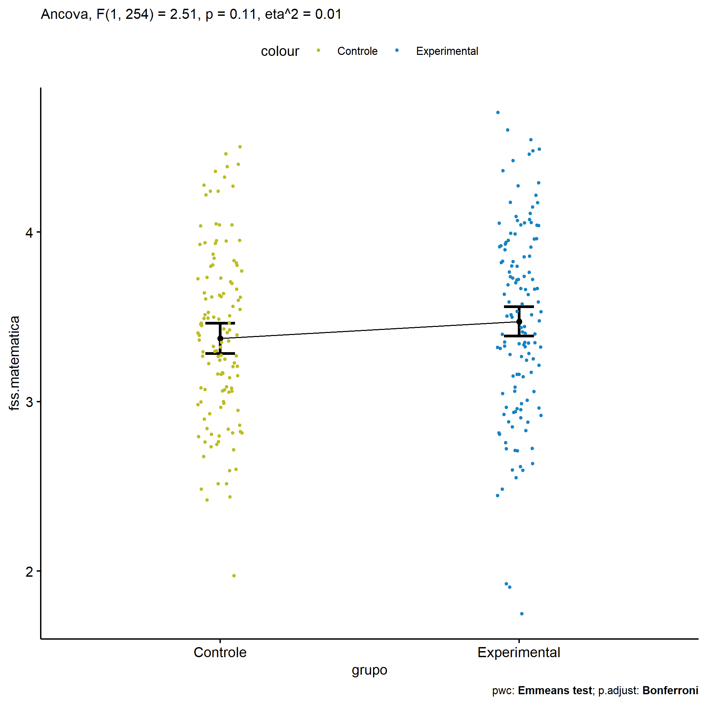<!-- -->

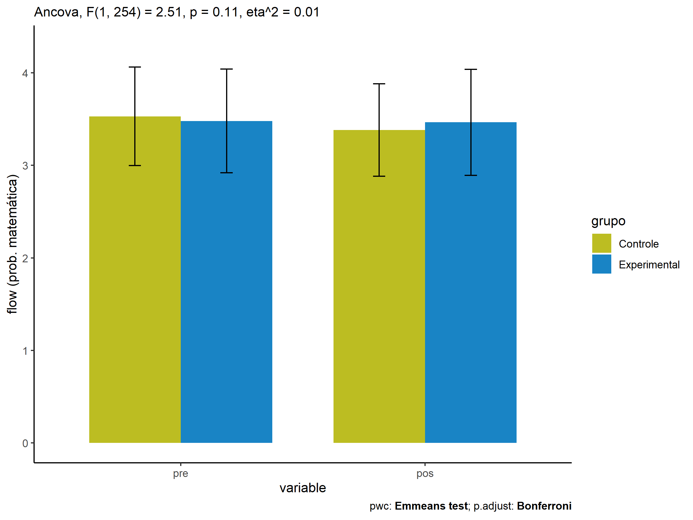<!-- -->

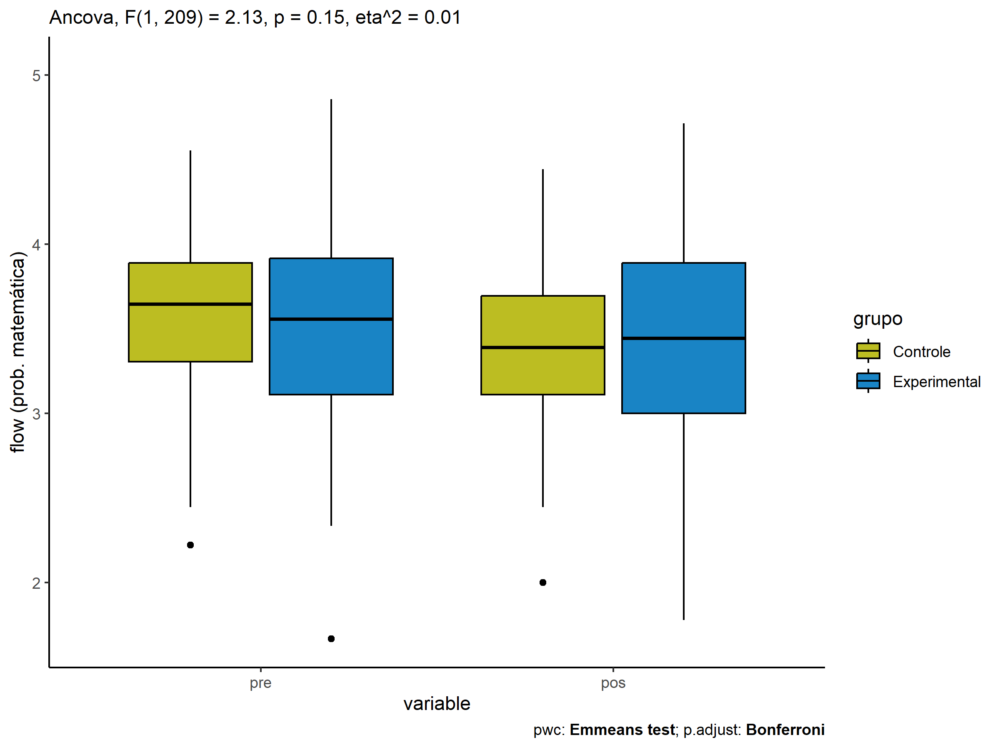<!-- -->

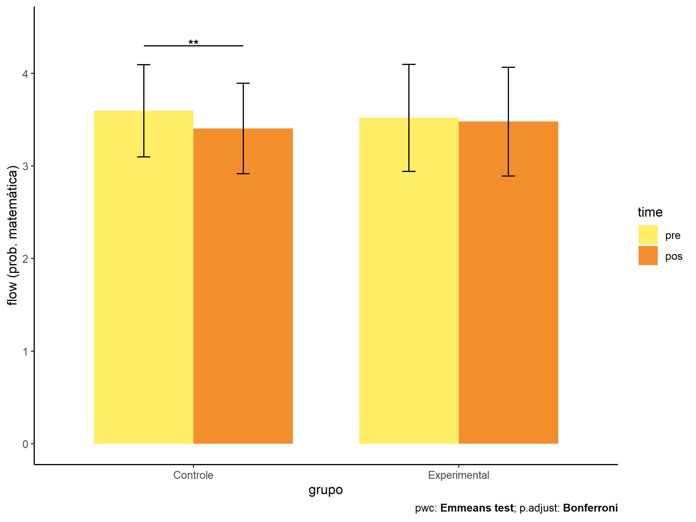<!-- -->

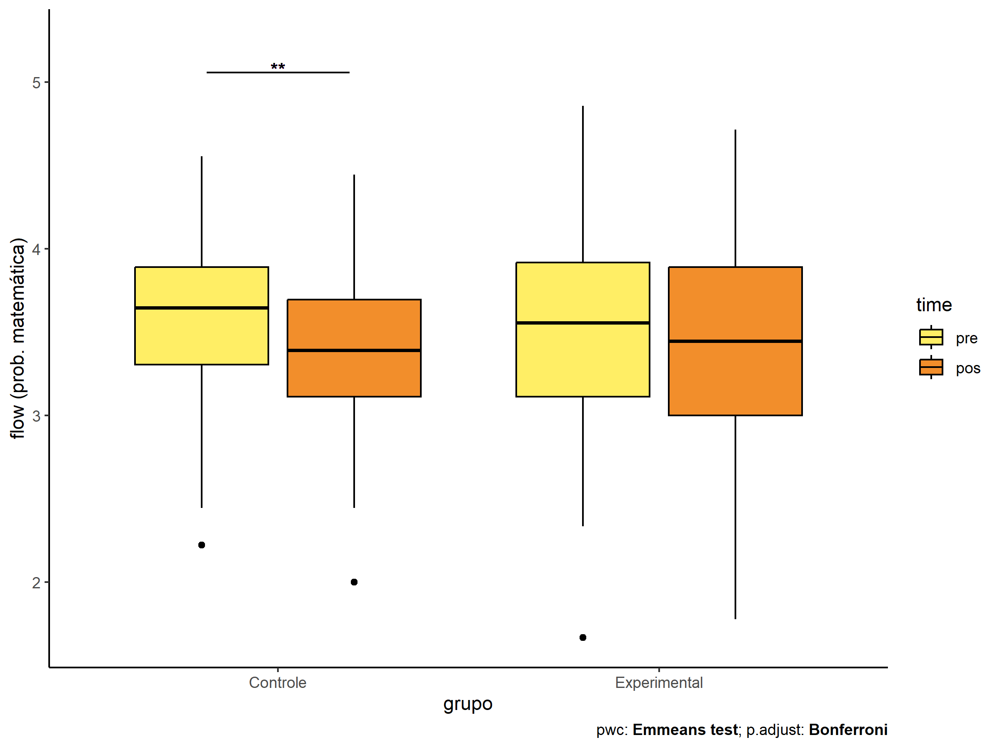<!-- -->

### factor: **genero**

| var            | genero |   n | M (pre) | SE (pre) | M (unadj) | SE (unadj) | M (adj) | SE (adj) |
|:---------------|:-------|----:|--------:|---------:|----------:|-----------:|--------:|---------:|
| fss.matematica | F      | 102 |   3.590 |    0.055 |     3.427 |      0.053 |   3.415 |    0.050 |
| fss.matematica | M      | 110 |   3.528 |    0.050 |     3.453 |      0.052 |   3.464 |    0.048 |

| .y.            | group1 | group2 | estimate | conf.low | conf.high |    se | statistic |     p | p.adj | p.adj.signif |
|:---------------|:-------|:-------|---------:|---------:|----------:|------:|----------:|------:|------:|:-------------|
| fss.matematica | F      | M      |   -0.049 |   -0.186 |     0.089 | 0.070 |    -0.698 | 0.486 | 0.486 | ns           |
| dfs.matematica | F      | M      |    0.062 |   -0.084 |     0.208 | 0.074 |     0.841 | 0.402 | 0.402 | ns           |

| genero | group1 | group2 | estimate | conf.low | conf.high |    se | statistic |     p | p.adj | p.adj.signif |
|:-------|:-------|:-------|---------:|---------:|----------:|------:|----------:|------:|------:|:-------------|
| F      | pre    | pos    |    0.163 |    0.015 |     0.312 | 0.076 |     2.162 | 0.031 | 0.031 | \*           |
| M      | pre    | pos    |    0.074 |   -0.069 |     0.217 | 0.073 |     1.021 | 0.308 | 0.308 | ns           |

    ## Scale for colour is already present.
    ## Adding another scale for colour, which will replace the existing scale.

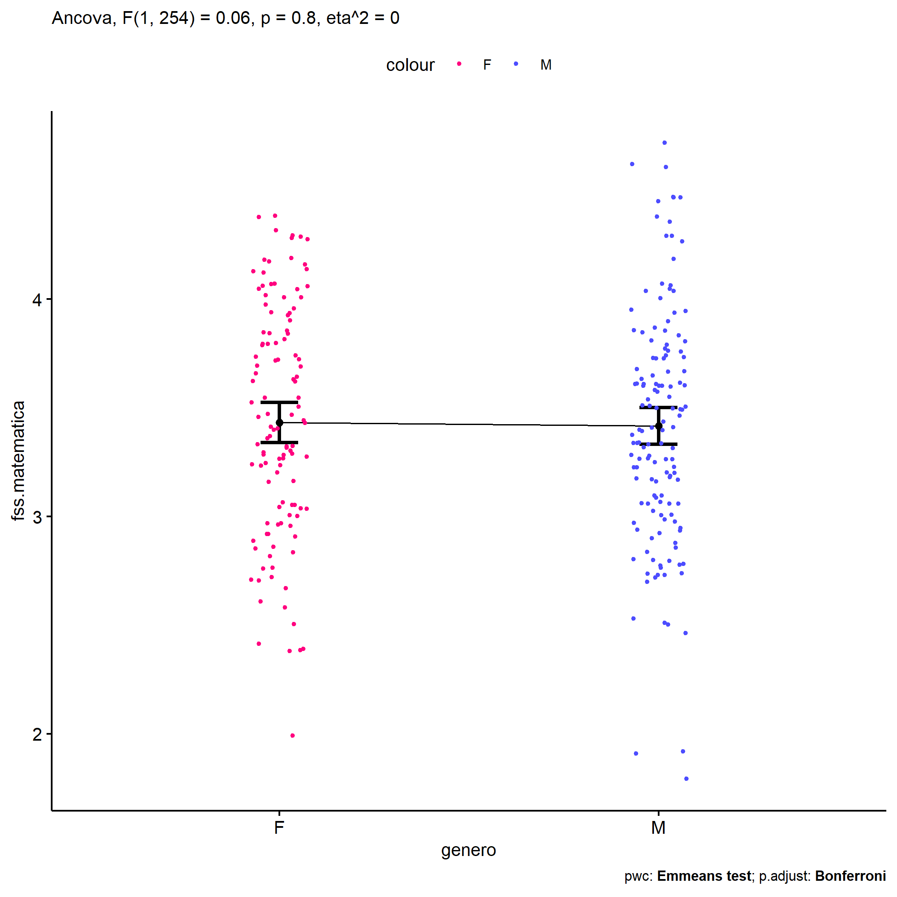<!-- -->

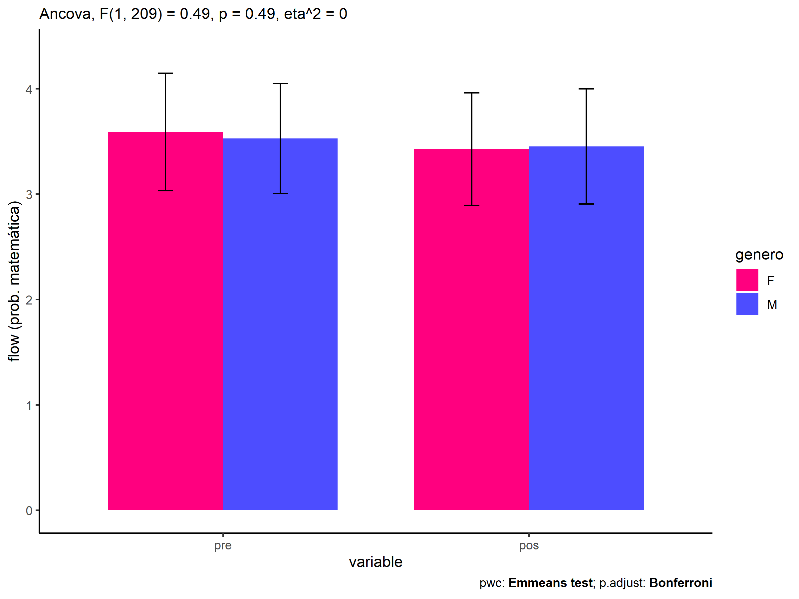<!-- -->

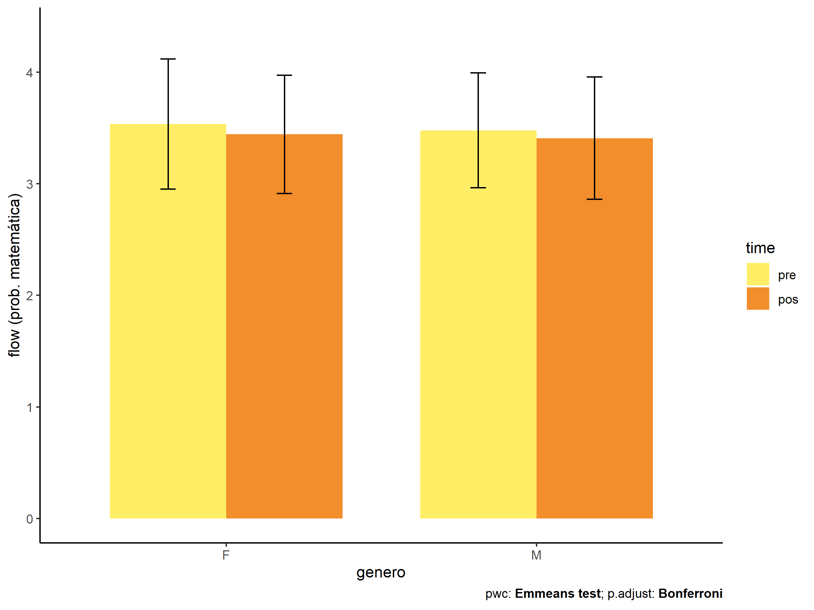<!-- -->

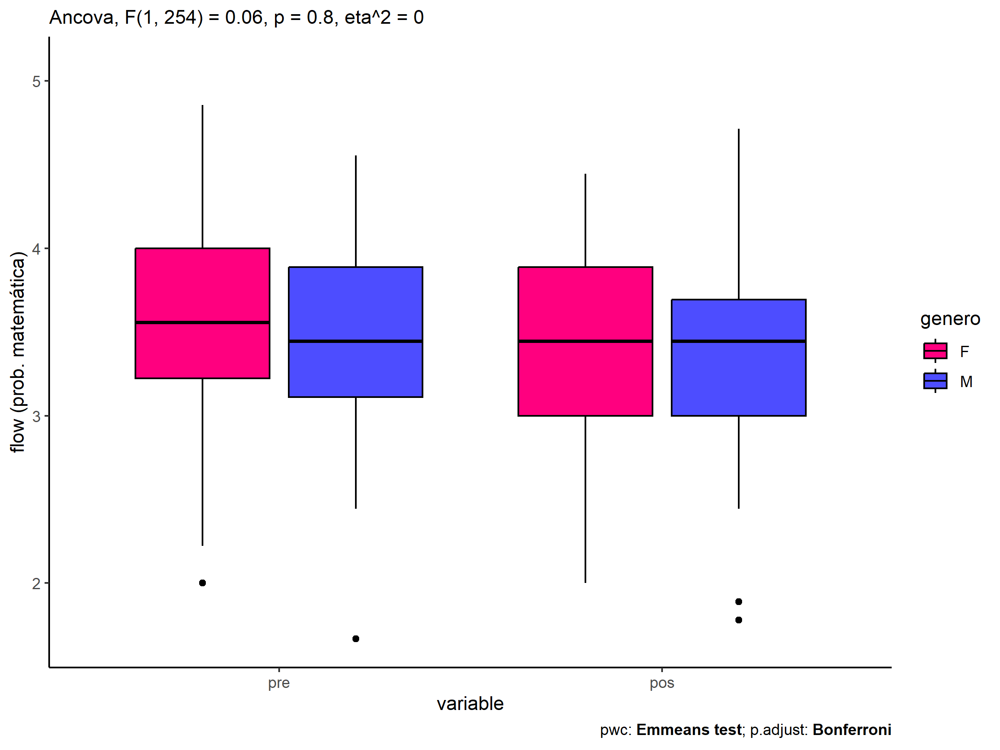<!-- -->

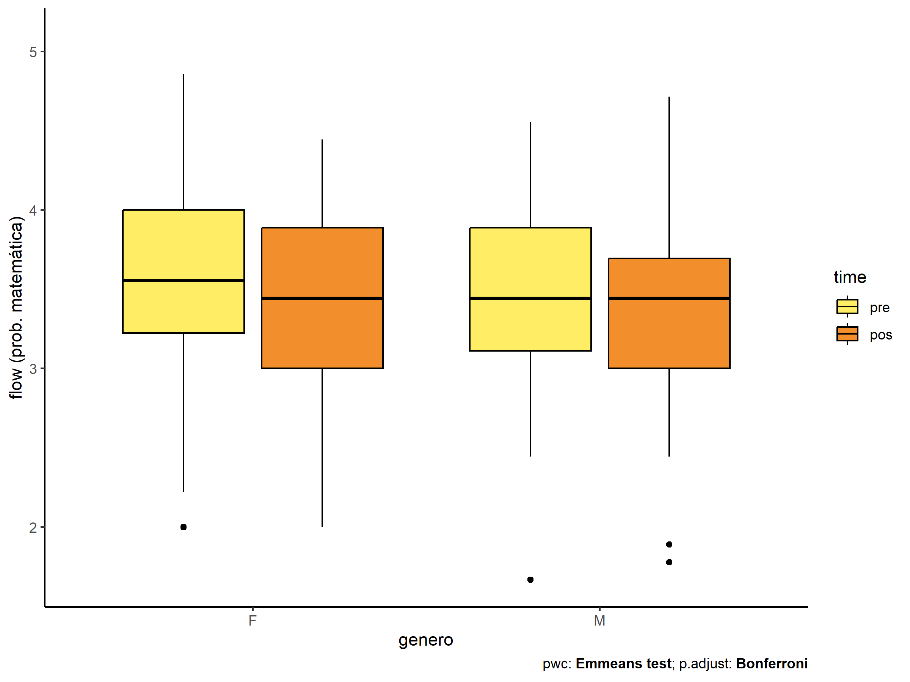<!-- -->

### factor: **idade**

| var            | idade |   n | M (pre) | SE (pre) | M (unadj) | SE (unadj) | M (adj) | SE (adj) |
|:---------------|:------|----:|--------:|---------:|----------:|-----------:|--------:|---------:|
| fss.matematica | 10y   |  41 |   3.494 |    0.081 |     3.339 |      0.091 |   3.367 |    0.077 |
| fss.matematica | 11y   | 123 |   3.607 |    0.048 |     3.505 |      0.047 |   3.491 |    0.044 |
| fss.matematica | 12y   |  28 |   3.497 |    0.112 |     3.439 |      0.100 |   3.467 |    0.093 |
| fss.matematica | 13y   |  10 |   3.633 |    0.181 |     2.951 |      0.145 |   2.928 |    0.156 |

| .y.            | group1 | group2 | estimate | conf.low | conf.high |    se | statistic | p       | p.adj | p.adj.signif |
|:---------------|:-------|:-------|---------:|---------:|----------:|------:|----------:|:--------|------:|:-------------|
| fss.matematica | 10y    | 11y    |   -0.124 |   -0.299 |     0.051 | 0.089 |    -1.395 | 0.165   | 0.988 | ns           |
| fss.matematica | 10y    | 12y    |   -0.099 |   -0.337 |     0.138 | 0.121 |    -0.825 | 0.41    | 1.000 | ns           |
| fss.matematica | 10y    | 13y    |    0.439 |    0.097 |     0.782 | 0.174 |     2.531 | 0.012   | 0.073 | ns           |
| fss.matematica | 11y    | 12y    |    0.025 |   -0.179 |     0.228 | 0.103 |     0.238 | 0.812   | 1.000 | ns           |
| fss.matematica | 11y    | 13y    |    0.564 |    0.245 |     0.882 | 0.162 |     3.486 | \<0.001 | 0.004 | \*\*         |
| fss.matematica | 12y    | 13y    |    0.539 |    0.181 |     0.897 | 0.181 |     2.972 | 0.003   | 0.020 | \*           |
| dfs.matematica | 10y    | 11y    |   -0.113 |   -0.304 |     0.078 | 0.097 |    -1.168 | 0.244   | 1.000 | ns           |
| dfs.matematica | 10y    | 12y    |   -0.003 |   -0.263 |     0.257 | 0.132 |    -0.023 | 0.982   | 1.000 | ns           |
| dfs.matematica | 10y    | 13y    |   -0.140 |   -0.513 |     0.234 | 0.189 |    -0.738 | 0.462   | 1.000 | ns           |
| dfs.matematica | 11y    | 12y    |    0.110 |   -0.112 |     0.332 | 0.113 |     0.980 | 0.328   | 1.000 | ns           |
| dfs.matematica | 11y    | 13y    |   -0.027 |   -0.375 |     0.322 | 0.177 |    -0.150 | 0.881   | 1.000 | ns           |
| dfs.matematica | 12y    | 13y    |   -0.137 |   -0.527 |     0.254 | 0.198 |    -0.691 | 0.49    | 1.000 | ns           |

| idade | group1 | group2 | estimate | conf.low | conf.high |    se | statistic |     p | p.adj | p.adj.signif |
|:------|:-------|:-------|---------:|---------:|----------:|------:|----------:|------:|------:|:-------------|
| 10y   | pre    | pos    |    0.155 |   -0.077 |     0.386 | 0.118 |     1.314 | 0.190 | 0.190 | ns           |
| 11y   | pre    | pos    |    0.102 |   -0.032 |     0.236 | 0.068 |     1.496 | 0.135 | 0.135 | ns           |
| 12y   | pre    | pos    |    0.057 |   -0.223 |     0.337 | 0.143 |     0.401 | 0.689 | 0.689 | ns           |
| 13y   | pre    | pos    |    0.682 |    0.213 |     1.151 | 0.239 |     2.858 | 0.004 | 0.004 | \*\*         |

    ## Scale for colour is already present.
    ## Adding another scale for colour, which will replace the existing scale.

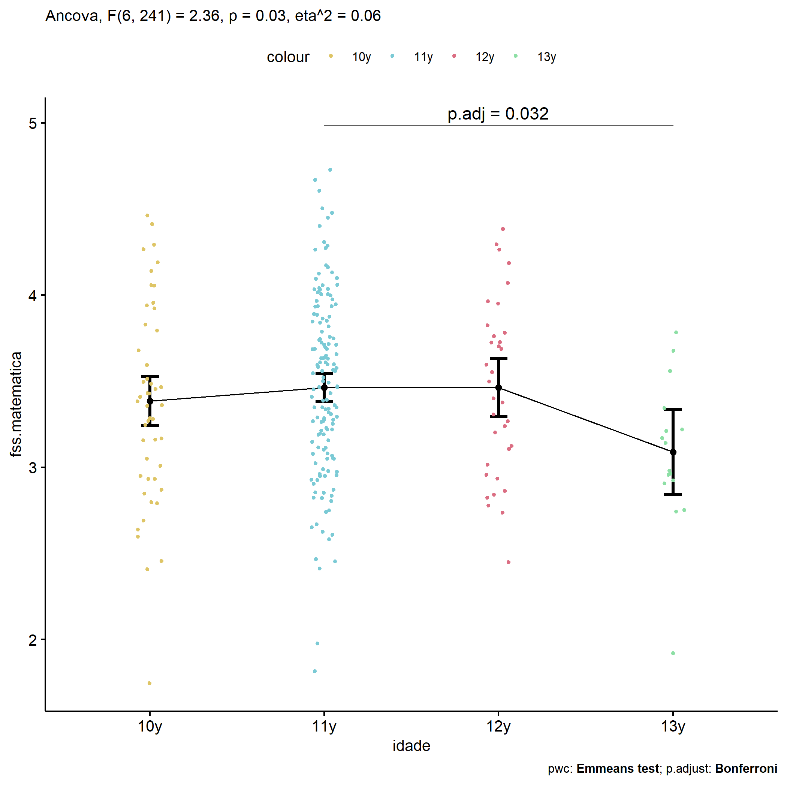<!-- -->

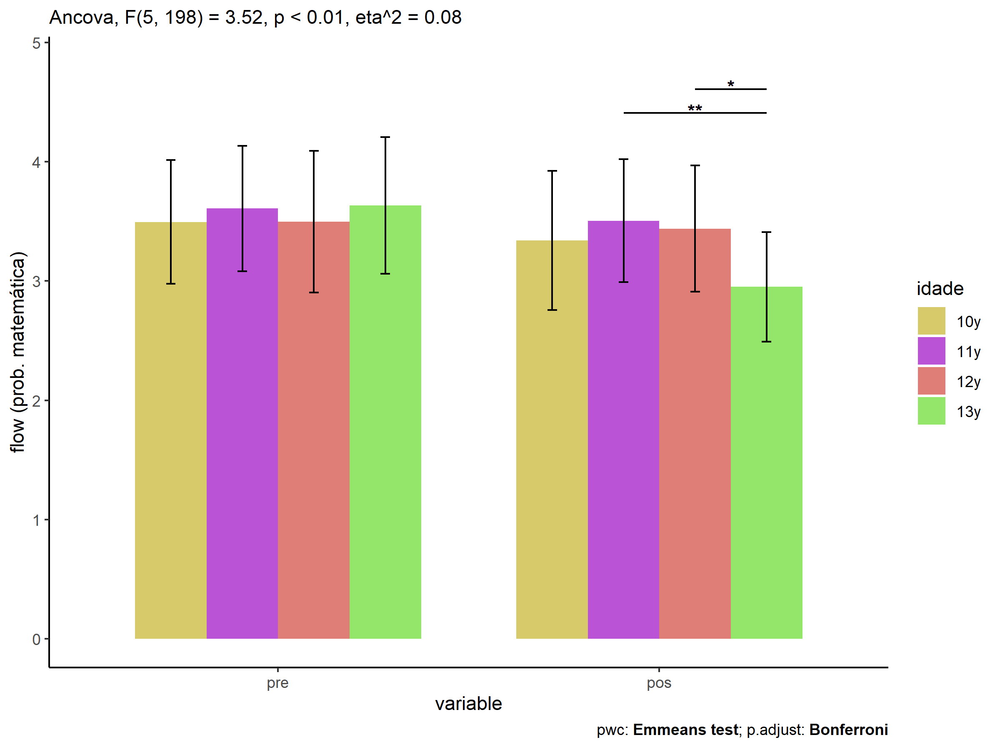<!-- -->

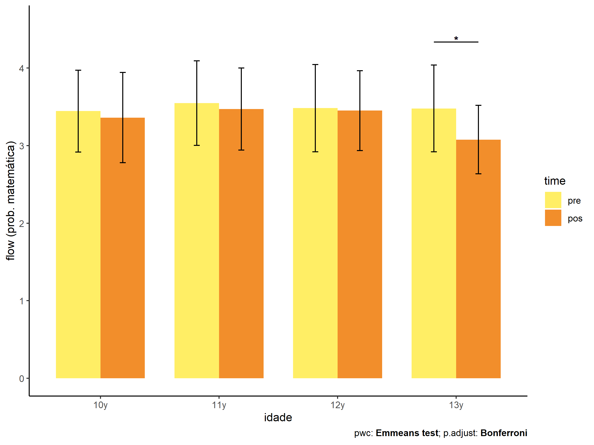<!-- -->

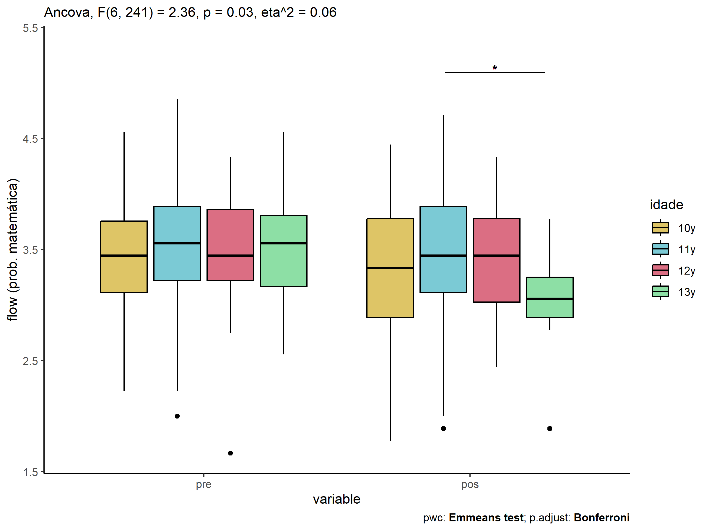<!-- -->

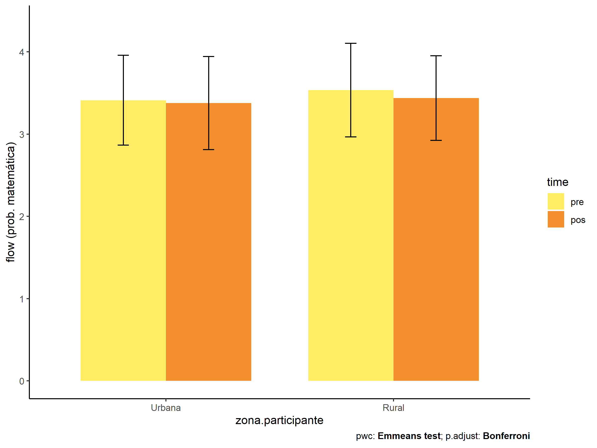<!-- -->

### factor: **zona.participante**

| var            | zona.participante |   n | M (pre) | SE (pre) | M (unadj) | SE (unadj) | M (adj) | SE (adj) |
|:---------------|:------------------|----:|--------:|---------:|----------:|-----------:|--------:|---------:|
| fss.matematica | Rural             |  80 |   3.577 |    0.062 |     3.462 |      0.055 |   3.443 |    0.057 |
| fss.matematica | Urbana            |  85 |   3.454 |    0.061 |     3.370 |      0.061 |   3.388 |    0.055 |

| .y.            | group1 | group2 | estimate | conf.low | conf.high |    se | statistic |     p | p.adj | p.adj.signif |
|:---------------|:-------|:-------|---------:|---------:|----------:|------:|----------:|------:|------:|:-------------|
| fss.matematica | Urbana | Rural  |   -0.055 |   -0.212 |     0.102 | 0.079 |    -0.694 | 0.489 | 0.489 | ns           |
| dfs.matematica | Urbana | Rural  |   -0.123 |   -0.294 |     0.048 | 0.087 |    -1.423 | 0.157 | 0.157 | ns           |

| zona.participante | group1 | group2 | estimate | conf.low | conf.high |    se | statistic |     p | p.adj | p.adj.signif |
|:------------------|:-------|:-------|---------:|---------:|----------:|------:|----------:|------:|------:|:-------------|
| Urbana            | pre    | pos    |    0.085 |   -0.080 |     0.249 | 0.084 |     1.012 | 0.312 | 0.312 | ns           |
| Rural             | pre    | pos    |    0.115 |   -0.054 |     0.284 | 0.086 |     1.335 | 0.183 | 0.183 | ns           |

    ## Scale for colour is already present.
    ## Adding another scale for colour, which will replace the existing scale.

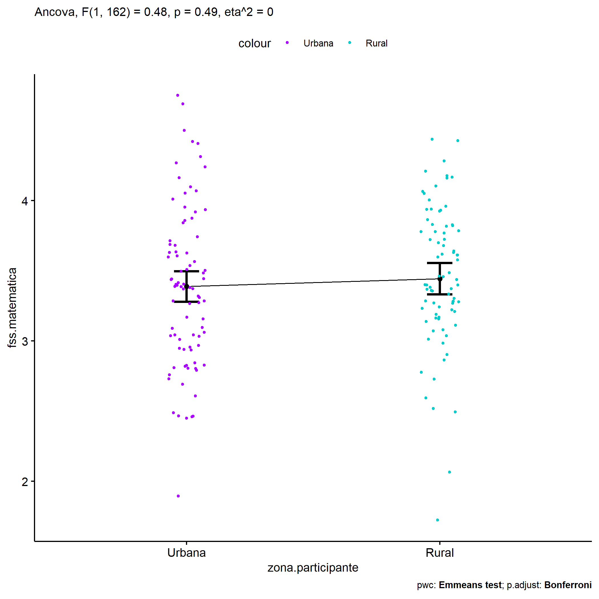<!-- -->

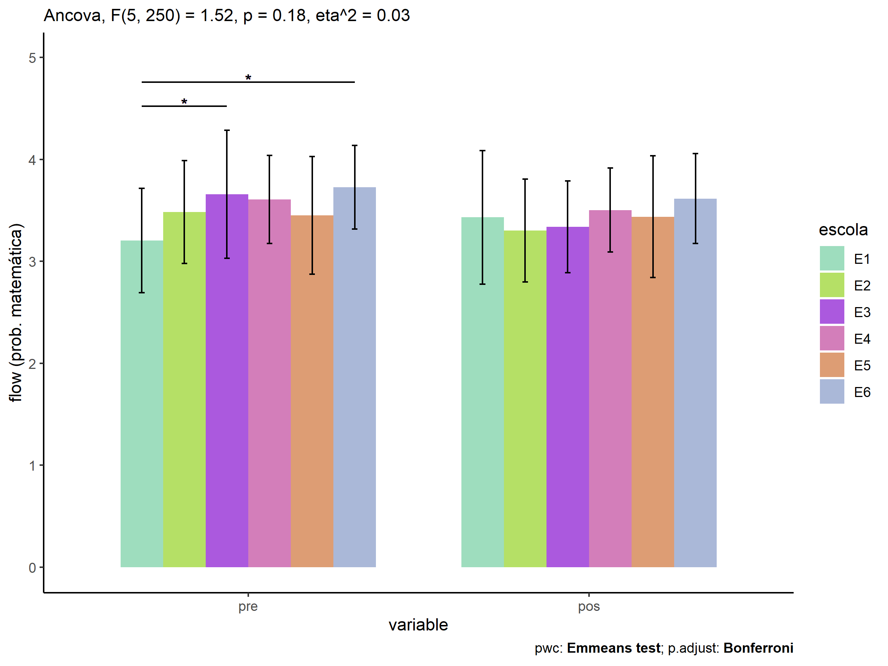<!-- -->

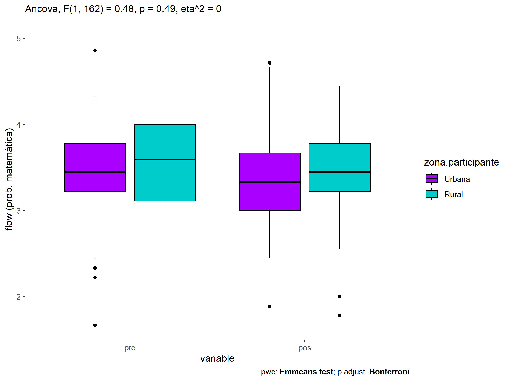<!-- -->

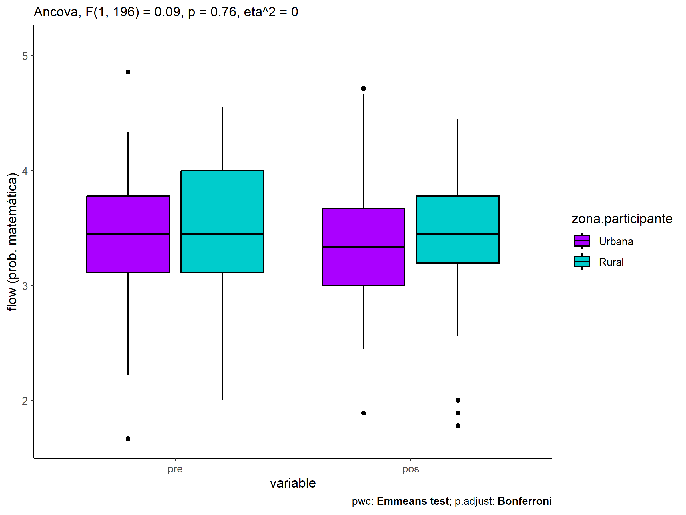<!-- -->

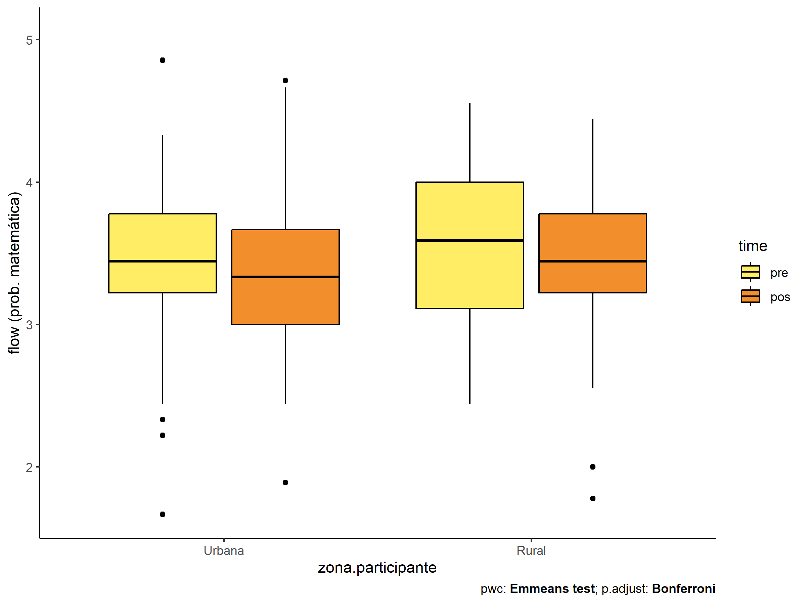<!-- -->

### factor: **escola**

| var            | escola |   n | M (pre) | SE (pre) | M (unadj) | SE (unadj) | M (adj) | SE (adj) |
|:---------------|:-------|----:|--------:|---------:|----------:|-----------:|--------:|---------:|
| fss.matematica | E1     |  16 |   3.328 |    0.120 |     3.593 |      0.152 |   3.676 |    0.126 |
| fss.matematica | E2     |  44 |   3.503 |    0.079 |     3.308 |      0.078 |   3.328 |    0.076 |
| fss.matematica | E3     |  30 |   3.658 |    0.115 |     3.340 |      0.082 |   3.304 |    0.092 |
| fss.matematica | E4     |  21 |   3.566 |    0.081 |     3.462 |      0.091 |   3.459 |    0.109 |
| fss.matematica | E5     |  82 |   3.523 |    0.064 |     3.472 |      0.066 |   3.484 |    0.055 |
| fss.matematica | E6     |  19 |   3.860 |    0.072 |     3.620 |      0.111 |   3.511 |    0.117 |

| .y.            | group1 | group2 | estimate | conf.low | conf.high |    se | statistic |     p | p.adj | p.adj.signif |
|:---------------|:-------|:-------|---------:|---------:|----------:|------:|----------:|------:|------:|:-------------|
| fss.matematica | E1     | E2     |    0.349 |    0.059 |     0.638 | 0.147 |     2.373 | 0.019 | 0.278 | ns           |
| fss.matematica | E1     | E3     |    0.373 |    0.064 |     0.682 | 0.157 |     2.377 | 0.018 | 0.276 | ns           |
| fss.matematica | E1     | E4     |    0.217 |   -0.112 |     0.547 | 0.167 |     1.299 | 0.195 | 1.000 | ns           |
| fss.matematica | E1     | E5     |    0.192 |   -0.079 |     0.464 | 0.138 |     1.396 | 0.164 | 1.000 | ns           |
| fss.matematica | E1     | E6     |    0.166 |   -0.177 |     0.508 | 0.174 |     0.953 | 0.342 | 1.000 | ns           |
| fss.matematica | E2     | E3     |    0.024 |   -0.211 |     0.259 | 0.119 |     0.202 | 0.840 | 1.000 | ns           |
| fss.matematica | E2     | E4     |   -0.131 |   -0.394 |     0.131 | 0.133 |    -0.987 | 0.325 | 1.000 | ns           |
| fss.matematica | E2     | E5     |   -0.156 |   -0.341 |     0.029 | 0.094 |    -1.667 | 0.097 | 1.000 | ns           |
| fss.matematica | E2     | E6     |   -0.183 |   -0.458 |     0.092 | 0.140 |    -1.310 | 0.192 | 1.000 | ns           |
| fss.matematica | E3     | E4     |   -0.155 |   -0.437 |     0.126 | 0.143 |    -1.088 | 0.278 | 1.000 | ns           |
| fss.matematica | E3     | E5     |   -0.180 |   -0.392 |     0.031 | 0.107 |    -1.680 | 0.095 | 1.000 | ns           |
| fss.matematica | E3     | E6     |   -0.207 |   -0.498 |     0.084 | 0.148 |    -1.402 | 0.162 | 1.000 | ns           |
| fss.matematica | E4     | E5     |   -0.025 |   -0.267 |     0.217 | 0.123 |    -0.203 | 0.839 | 1.000 | ns           |
| fss.matematica | E4     | E6     |   -0.052 |   -0.367 |     0.264 | 0.160 |    -0.323 | 0.747 | 1.000 | ns           |
| fss.matematica | E5     | E6     |   -0.027 |   -0.282 |     0.229 | 0.130 |    -0.206 | 0.837 | 1.000 | ns           |
| dfs.matematica | E1     | E2     |   -0.174 |   -0.480 |     0.132 | 0.155 |    -1.124 | 0.262 | 1.000 | ns           |
| dfs.matematica | E1     | E3     |   -0.330 |   -0.654 |    -0.005 | 0.165 |    -2.003 | 0.046 | 0.697 | ns           |
| dfs.matematica | E1     | E4     |   -0.238 |   -0.586 |     0.110 | 0.176 |    -1.350 | 0.179 | 1.000 | ns           |
| dfs.matematica | E1     | E5     |   -0.195 |   -0.481 |     0.091 | 0.145 |    -1.343 | 0.181 | 1.000 | ns           |
| dfs.matematica | E1     | E6     |   -0.532 |   -0.887 |    -0.176 | 0.180 |    -2.947 | 0.004 | 0.054 | ns           |
| dfs.matematica | E2     | E3     |   -0.155 |   -0.403 |     0.093 | 0.126 |    -1.233 | 0.219 | 1.000 | ns           |
| dfs.matematica | E2     | E4     |   -0.064 |   -0.342 |     0.214 | 0.141 |    -0.451 | 0.652 | 1.000 | ns           |
| dfs.matematica | E2     | E5     |   -0.021 |   -0.216 |     0.175 | 0.099 |    -0.208 | 0.835 | 1.000 | ns           |
| dfs.matematica | E2     | E6     |   -0.357 |   -0.645 |    -0.069 | 0.146 |    -2.448 | 0.015 | 0.228 | ns           |
| dfs.matematica | E3     | E4     |    0.092 |   -0.207 |     0.390 | 0.151 |     0.606 | 0.545 | 1.000 | ns           |
| dfs.matematica | E3     | E5     |    0.135 |   -0.089 |     0.358 | 0.113 |     1.186 | 0.237 | 1.000 | ns           |
| dfs.matematica | E3     | E6     |   -0.202 |   -0.509 |     0.105 | 0.156 |    -1.296 | 0.197 | 1.000 | ns           |
| dfs.matematica | E4     | E5     |    0.043 |   -0.213 |     0.299 | 0.130 |     0.330 | 0.741 | 1.000 | ns           |
| dfs.matematica | E4     | E6     |   -0.294 |   -0.625 |     0.038 | 0.168 |    -1.744 | 0.083 | 1.000 | ns           |
| dfs.matematica | E5     | E6     |   -0.336 |   -0.603 |    -0.070 | 0.135 |    -2.486 | 0.014 | 0.206 | ns           |

| escola | group1 | group2 | estimate | conf.low | conf.high |    se | statistic |     p | p.adj | p.adj.signif |
|:-------|:-------|:-------|---------:|---------:|----------:|------:|----------:|------:|------:|:-------------|
| E1     | pre    | pos    |   -0.265 |   -0.636 |     0.106 | 0.189 |    -1.405 | 0.161 | 0.161 | ns           |
| E2     | pre    | pos    |    0.195 |   -0.029 |     0.418 | 0.114 |     1.712 | 0.088 | 0.088 | ns           |
| E3     | pre    | pos    |    0.318 |    0.047 |     0.589 | 0.138 |     2.307 | 0.022 | 0.022 | \*           |
| E4     | pre    | pos    |    0.104 |   -0.220 |     0.428 | 0.165 |     0.632 | 0.528 | 0.528 | ns           |
| E5     | pre    | pos    |    0.052 |   -0.112 |     0.216 | 0.083 |     0.620 | 0.536 | 0.536 | ns           |
| E6     | pre    | pos    |    0.240 |   -0.101 |     0.580 | 0.173 |     1.385 | 0.167 | 0.167 | ns           |

    ## Scale for colour is already present.
    ## Adding another scale for colour, which will replace the existing scale.

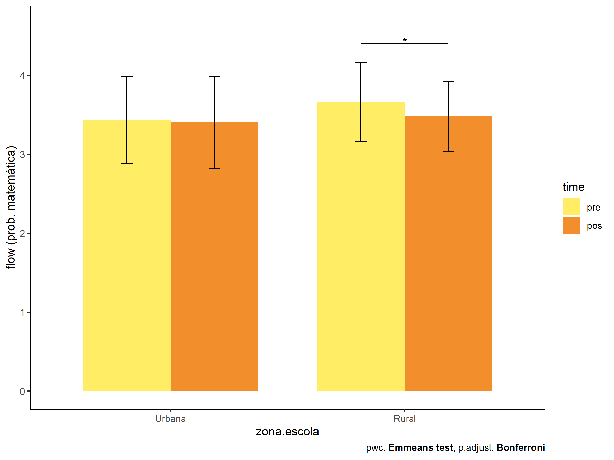<!-- -->

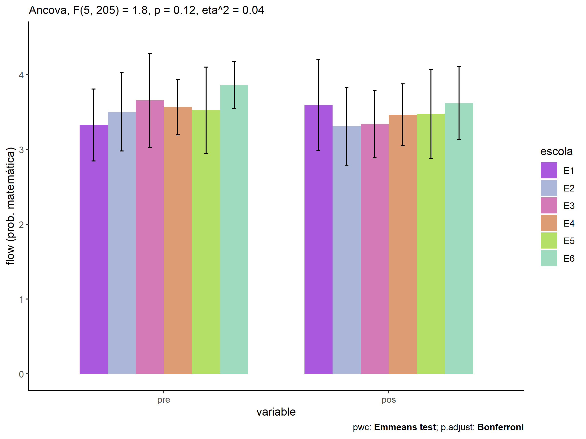<!-- -->

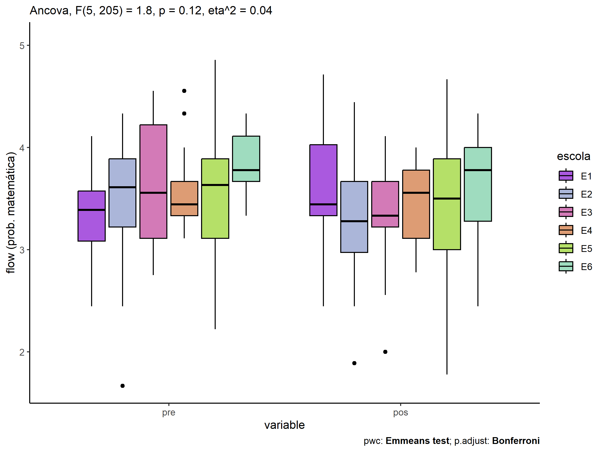<!-- -->

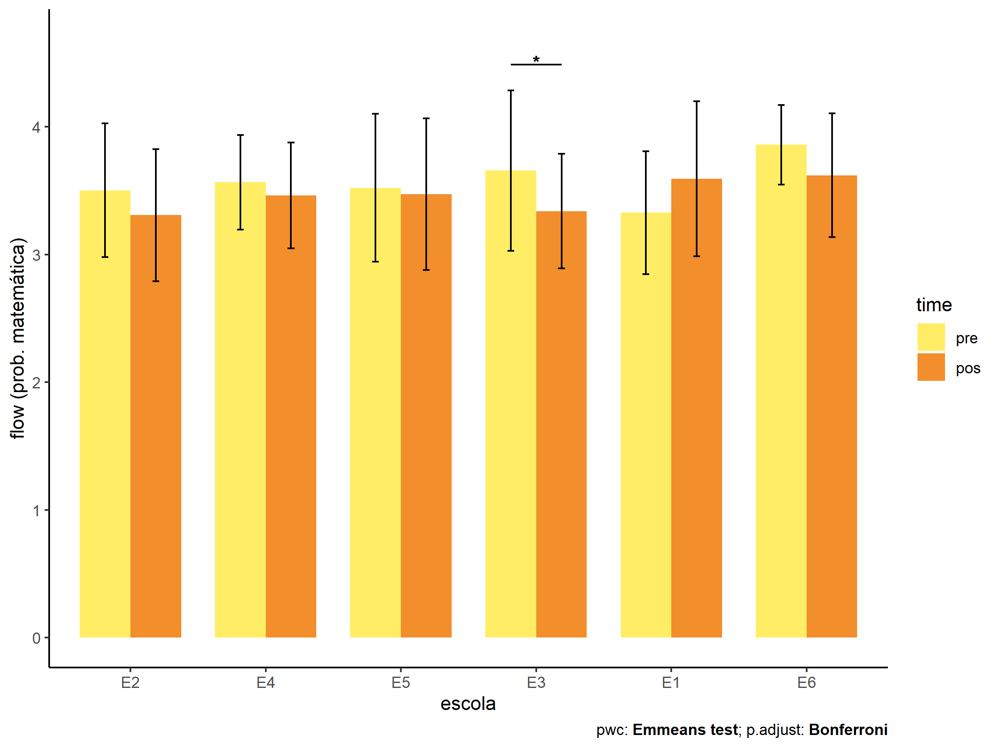<!-- -->

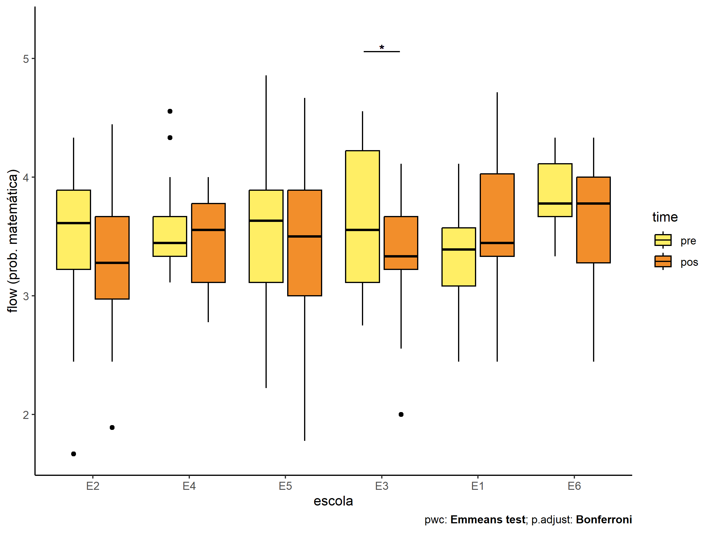<!-- -->

### factor: **zona.escola**

| var            | zona.escola |   n | M (pre) | SE (pre) | M (unadj) | SE (unadj) | M (adj) | SE (adj) |
|:---------------|:------------|----:|--------:|---------:|----------:|-----------:|--------:|---------:|
| fss.matematica | Rural       |  70 |   3.685 |    0.059 |     3.453 |      0.055 |   3.407 |    0.061 |
| fss.matematica | Urbana      | 142 |   3.495 |    0.046 |     3.435 |      0.048 |   3.457 |    0.043 |

| .y.            | group1 | group2 | estimate | conf.low | conf.high |    se | statistic |     p | p.adj | p.adj.signif |
|:---------------|:-------|:-------|---------:|---------:|----------:|------:|----------:|------:|------:|:-------------|
| fss.matematica | Urbana | Rural  |     0.05 |   -0.098 |     0.198 | 0.075 |     0.665 | 0.507 | 0.507 | ns           |
| dfs.matematica | Urbana | Rural  |    -0.19 |   -0.344 |    -0.037 | 0.078 |    -2.445 | 0.015 | 0.015 | \*           |

| zona.escola | group1 | group2 | estimate | conf.low | conf.high |    se | statistic |     p | p.adj | p.adj.signif |
|:------------|:-------|:-------|---------:|---------:|----------:|------:|----------:|------:|------:|:-------------|
| Urbana      | pre    | pos    |    0.060 |   -0.065 |     0.185 | 0.064 |     0.947 | 0.344 | 0.344 | ns           |
| Rural       | pre    | pos    |    0.233 |    0.054 |     0.411 | 0.091 |     2.564 | 0.011 | 0.011 | \*           |

    ## Scale for colour is already present.
    ## Adding another scale for colour, which will replace the existing scale.

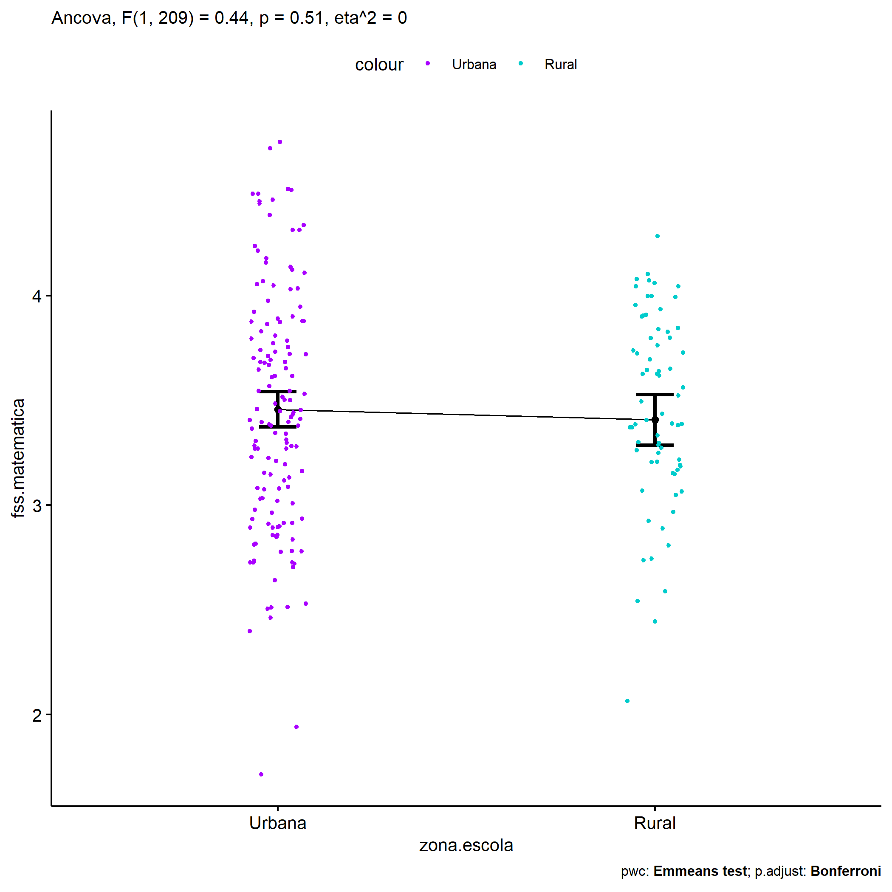<!-- -->

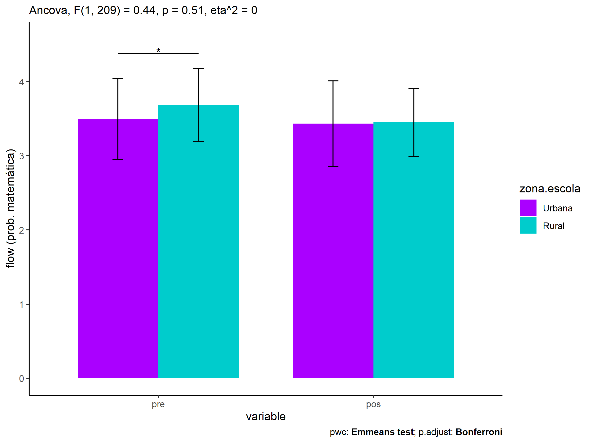<!-- -->

<!-- -->

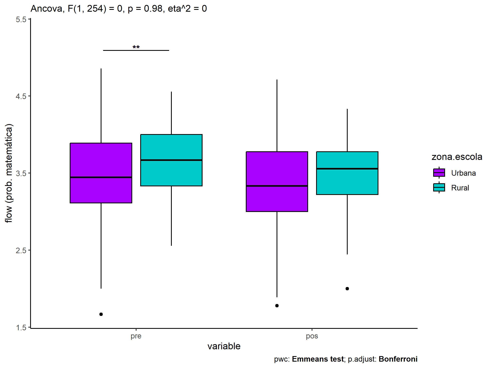<!-- -->

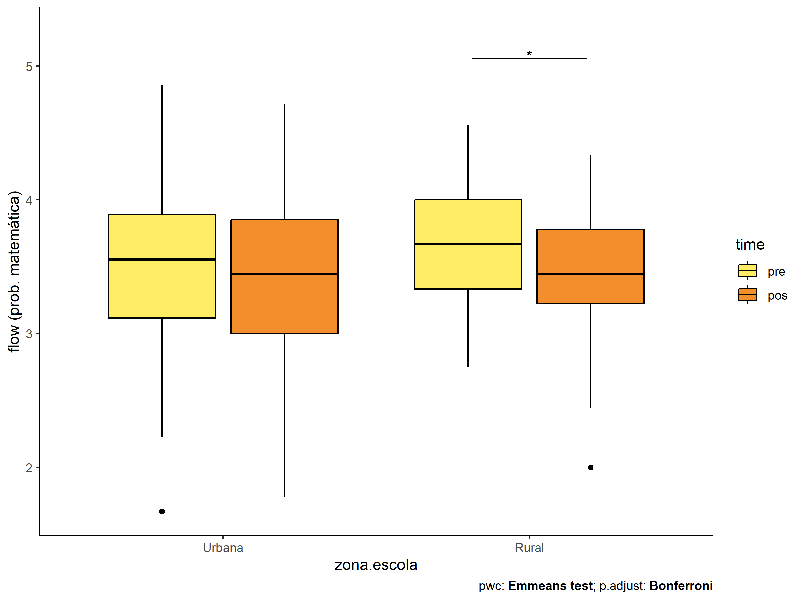<!-- -->

## Pairwise comparisons for two factors

### factores: **grupo:genero**

| var            | grupo        | genero |   n | M (pre) | SE (pre) | M (unadj) | SE (unadj) | M (adj) | SE (adj) |
|:---------------|:-------------|:-------|----:|--------:|---------:|----------:|-----------:|--------:|---------:|
| fss.matematica | Controle     | F      |  53 |   3.590 |    0.074 |     3.395 |      0.071 |   3.383 |    0.070 |
| fss.matematica | Controle     | M      |  55 |   3.601 |    0.062 |     3.413 |      0.062 |   3.398 |    0.068 |
| fss.matematica | Experimental | F      |  49 |   3.589 |    0.083 |     3.461 |      0.079 |   3.449 |    0.072 |
| fss.matematica | Experimental | M      |  55 |   3.454 |    0.078 |     3.493 |      0.084 |   3.531 |    0.069 |

| grupo        | genero | group1   | group2       | estimate | conf.low | conf.high |    se | statistic |     p | p.adj | p.adj.signif |
|:-------------|:-------|:---------|:-------------|---------:|---------:|----------:|------:|----------:|------:|------:|:-------------|
|              | F      | Controle | Experimental |   -0.066 |   -0.264 |     0.132 | 0.100 |    -0.661 | 0.509 | 0.509 | ns           |
|              | M      | Controle | Experimental |   -0.133 |   -0.324 |     0.058 | 0.097 |    -1.370 | 0.172 | 0.172 | ns           |
|              | F      | Controle | Experimental |    0.001 |   -0.210 |     0.212 | 0.107 |     0.009 | 0.993 | 0.993 | ns           |
|              | M      | Controle | Experimental |    0.147 |   -0.056 |     0.350 | 0.103 |     1.428 | 0.155 | 0.155 | ns           |
| Controle     |        | F        | M            |   -0.015 |   -0.207 |     0.178 | 0.098 |    -0.151 | 0.880 | 0.880 | ns           |
| Experimental |        | F        | M            |   -0.081 |   -0.278 |     0.116 | 0.100 |    -0.814 | 0.417 | 0.417 | ns           |
| Controle     |        | F        | M            |   -0.011 |   -0.215 |     0.194 | 0.104 |    -0.103 | 0.918 | 0.918 | ns           |
| Experimental |        | F        | M            |    0.135 |   -0.074 |     0.344 | 0.106 |     1.277 | 0.203 | 0.203 | ns           |

| grupo        | genero | group1 | group2 | estimate | conf.low | conf.high |    se | statistic |     p | p.adj | p.adj.signif |
|:-------------|:-------|:-------|:-------|---------:|---------:|----------:|------:|----------:|------:|------:|:-------------|
| Controle     | F      | pre    | pos    |    0.196 |   -0.011 |     0.402 | 0.105 |     1.863 | 0.063 | 0.063 | ns           |
| Controle     | M      | pre    | pos    |    0.188 |   -0.015 |     0.390 | 0.103 |     1.821 | 0.069 | 0.069 | ns           |
| Experimental | F      | pre    | pos    |    0.129 |   -0.086 |     0.343 | 0.109 |     1.178 | 0.240 | 0.240 | ns           |
| Experimental | M      | pre    | pos    |   -0.039 |   -0.242 |     0.164 | 0.103 |    -0.379 | 0.705 | 0.705 | ns           |

    ## Scale for colour is already present.
    ## Adding another scale for colour, which will replace the existing scale.

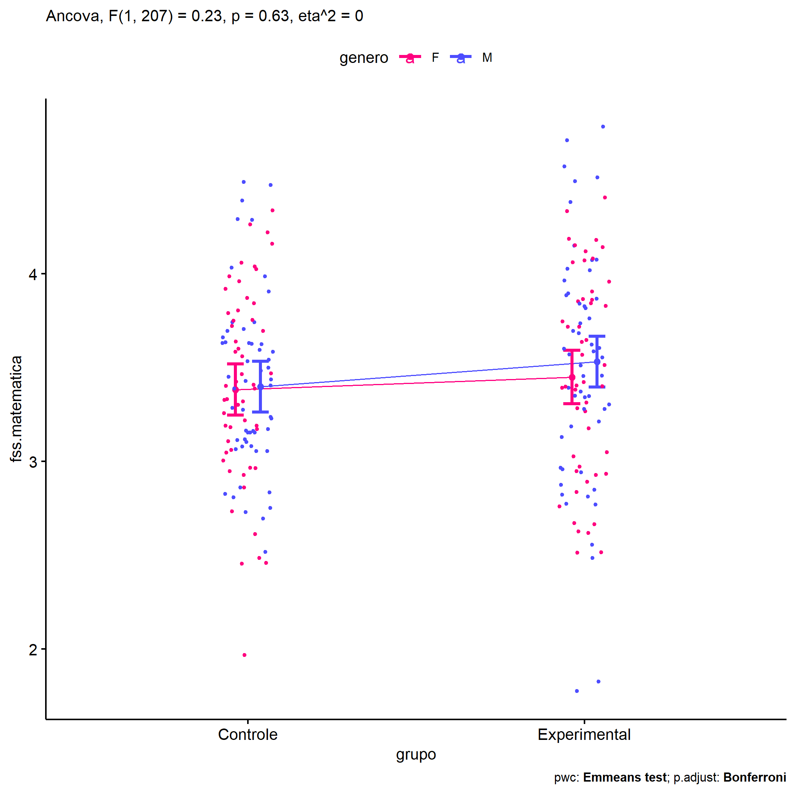<!-- -->

    ## Scale for colour is already present.
    ## Adding another scale for colour, which will replace the existing scale.

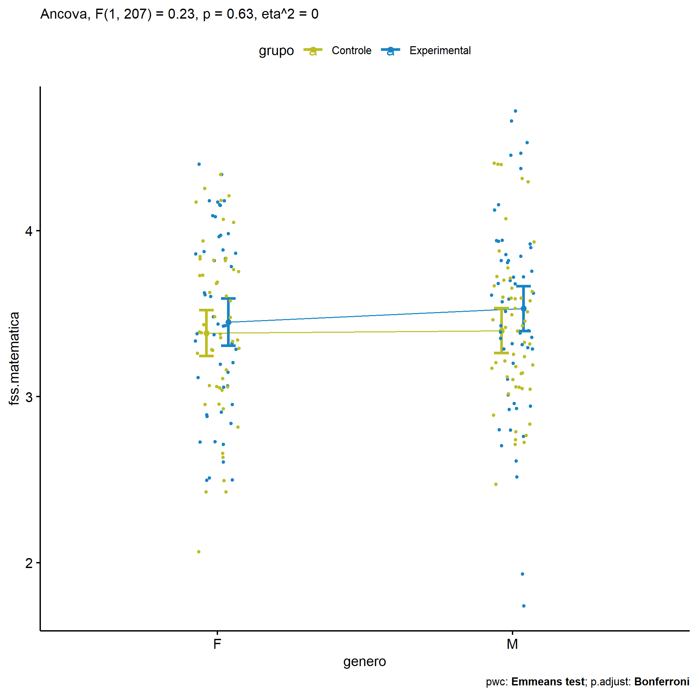<!-- -->

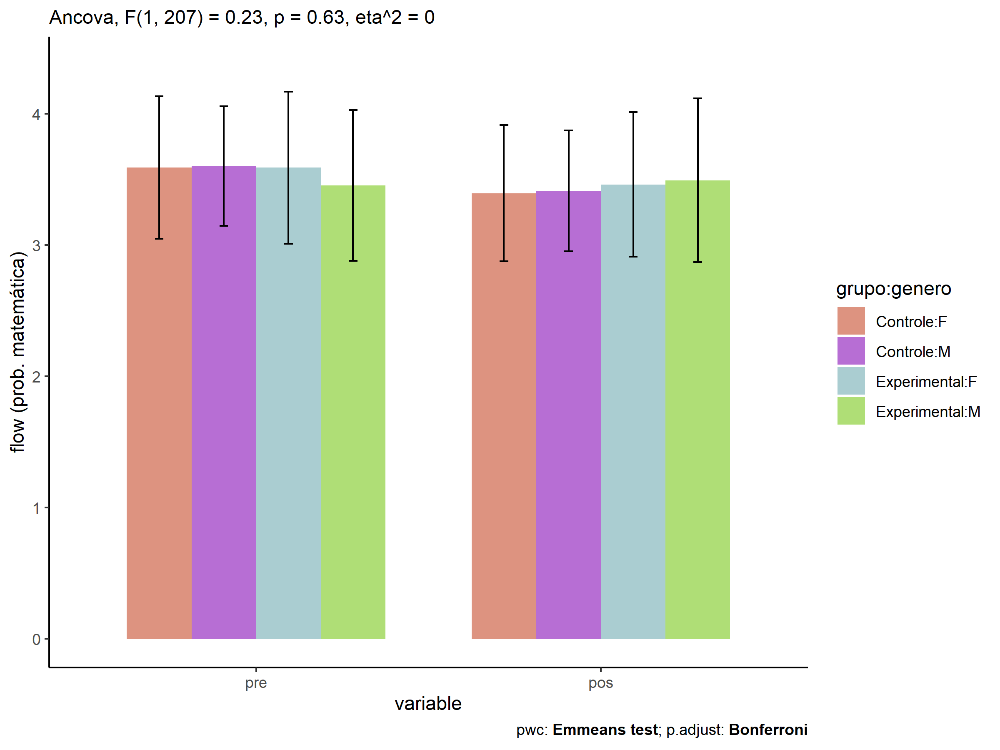<!-- -->

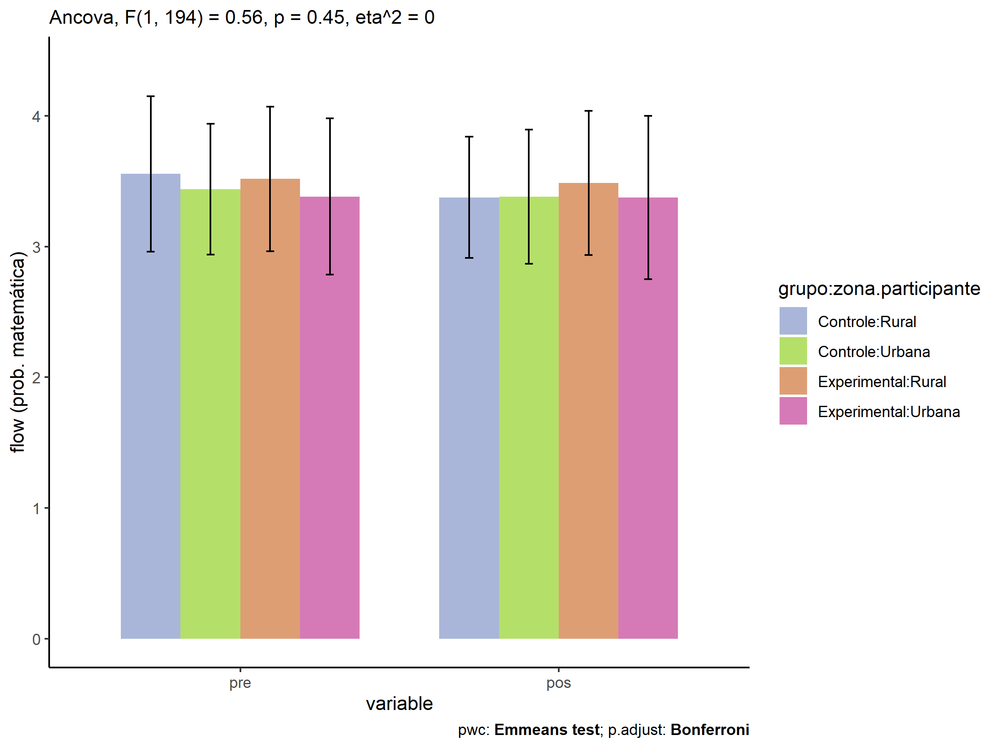<!-- -->

<!-- -->

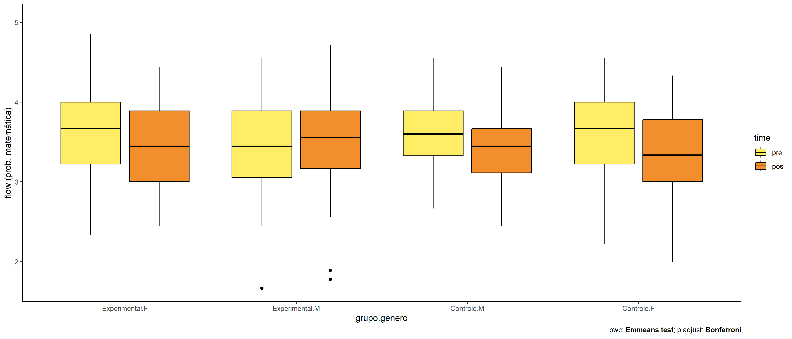<!-- -->

### factores: **grupo:idade**

| var            | grupo        | idade |   n | M (pre) | SE (pre) | M (unadj) | SE (unadj) | M (adj) | SE (adj) |
|:---------------|:-------------|:------|----:|--------:|---------:|----------:|-----------:|--------:|---------:|
| fss.matematica | Controle     | 10y   |  20 |   3.528 |    0.106 |     3.444 |      0.111 |   3.460 |    0.108 |
| fss.matematica | Controle     | 11y   |  58 |   3.656 |    0.064 |     3.381 |      0.065 |   3.349 |    0.064 |
| fss.matematica | Controle     | 12y   |  16 |   3.575 |    0.118 |     3.526 |      0.127 |   3.525 |    0.121 |
| fss.matematica | Controle     | 13y   |   6 |   3.722 |    0.227 |     3.086 |      0.139 |   3.030 |    0.198 |
| fss.matematica | Experimental | 10y   |  21 |   3.460 |    0.124 |     3.238 |      0.142 |   3.279 |    0.106 |
| fss.matematica | Experimental | 11y   |  65 |   3.563 |    0.069 |     3.616 |      0.064 |   3.619 |    0.060 |
| fss.matematica | Experimental | 12y   |  12 |   3.392 |    0.212 |     3.324 |      0.161 |   3.390 |    0.140 |

|     | grupo        | idade | group1   | group2       | estimate | conf.low | conf.high |    se | statistic |     p | p.adj | p.adj.signif |
|:----|:-------------|:------|:---------|:-------------|---------:|---------:|----------:|------:|----------:|------:|------:|:-------------|
| 1   |              | 10y   | Controle | Experimental |    0.181 |   -0.117 |     0.479 | 0.151 |     1.200 | 0.231 | 0.231 | ns           |
| 2   |              | 11y   | Controle | Experimental |   -0.270 |   -0.442 |    -0.097 | 0.087 |    -3.082 | 0.002 | 0.002 | \*\*         |
| 3   |              | 12y   | Controle | Experimental |    0.135 |   -0.230 |     0.500 | 0.185 |     0.729 | 0.467 | 0.467 | ns           |
| 5   |              | 10y   | Controle | Experimental |    0.068 |   -0.263 |     0.399 | 0.168 |     0.406 | 0.685 | 0.685 | ns           |
| 6   |              | 11y   | Controle | Experimental |    0.093 |   -0.099 |     0.284 | 0.097 |     0.953 | 0.342 | 0.342 | ns           |
| 7   |              | 12y   | Controle | Experimental |    0.182 |   -0.223 |     0.587 | 0.205 |     0.888 | 0.376 | 0.376 | ns           |
| 9   | Controle     |       | 10y      | 11y          |    0.111 |   -0.137 |     0.358 | 0.126 |     0.881 | 0.379 | 1.000 | ns           |
| 10  | Controle     |       | 10y      | 12y          |   -0.064 |   -0.384 |     0.255 | 0.162 |    -0.397 | 0.692 | 1.000 | ns           |
| 11  | Controle     |       | 10y      | 13y          |    0.430 |   -0.014 |     0.874 | 0.225 |     1.909 | 0.058 | 0.347 | ns           |
| 12  | Controle     |       | 11y      | 12y          |   -0.175 |   -0.444 |     0.094 | 0.137 |    -1.282 | 0.201 | 1.000 | ns           |
| 13  | Controle     |       | 11y      | 13y          |    0.319 |   -0.090 |     0.728 | 0.207 |     1.540 | 0.125 | 0.751 | ns           |
| 14  | Controle     |       | 12y      | 13y          |    0.494 |    0.038 |     0.951 | 0.232 |     2.135 | 0.034 | 0.204 | ns           |
| 15  | Experimental |       | 10y      | 11y          |   -0.340 |   -0.580 |    -0.101 | 0.121 |    -2.801 | 0.006 | 0.017 | \*           |
| 16  | Experimental |       | 10y      | 12y          |   -0.111 |   -0.456 |     0.234 | 0.175 |    -0.634 | 0.527 | 1.000 | ns           |
| 18  | Experimental |       | 11y      | 12y          |    0.229 |   -0.071 |     0.530 | 0.152 |     1.506 | 0.134 | 0.401 | ns           |
| 21  | Controle     |       | 10y      | 11y          |   -0.127 |   -0.402 |     0.148 | 0.139 |    -0.913 | 0.363 | 1.000 | ns           |
| 22  | Controle     |       | 10y      | 12y          |   -0.046 |   -0.402 |     0.309 | 0.180 |    -0.256 | 0.798 | 1.000 | ns           |
| 23  | Controle     |       | 10y      | 13y          |   -0.194 |   -0.687 |     0.300 | 0.250 |    -0.774 | 0.440 | 1.000 | ns           |
| 24  | Controle     |       | 11y      | 12y          |    0.081 |   -0.218 |     0.380 | 0.152 |     0.534 | 0.594 | 1.000 | ns           |
| 25  | Controle     |       | 11y      | 13y          |   -0.067 |   -0.521 |     0.388 | 0.231 |    -0.289 | 0.773 | 1.000 | ns           |
| 26  | Controle     |       | 12y      | 13y          |   -0.148 |   -0.655 |     0.360 | 0.257 |    -0.573 | 0.567 | 1.000 | ns           |
| 27  | Experimental |       | 10y      | 11y          |   -0.103 |   -0.369 |     0.163 | 0.135 |    -0.762 | 0.447 | 1.000 | ns           |
| 28  | Experimental |       | 10y      | 12y          |    0.068 |   -0.316 |     0.452 | 0.195 |     0.349 | 0.727 | 1.000 | ns           |
| 30  | Experimental |       | 11y      | 12y          |    0.171 |   -0.162 |     0.504 | 0.169 |     1.011 | 0.313 | 0.940 | ns           |

| grupo        | idade | group1 | group2 | estimate | conf.low | conf.high |    se | statistic |     p | p.adj | p.adj.signif |
|:-------------|:------|:-------|:-------|---------:|---------:|----------:|------:|----------:|------:|------:|:-------------|
| Controle     | 10y   | pre    | pos    |    0.084 |   -0.245 |     0.413 | 0.167 |     0.502 | 0.616 | 0.616 | ns           |
| Controle     | 11y   | pre    | pos    |    0.275 |    0.082 |     0.468 | 0.098 |     2.800 | 0.005 | 0.005 | \*\*         |
| Controle     | 12y   | pre    | pos    |    0.049 |   -0.319 |     0.417 | 0.187 |     0.261 | 0.794 | 0.794 | ns           |
| Controle     | 13y   | pre    | pos    |    0.637 |    0.036 |     1.237 | 0.306 |     2.083 | 0.038 | 0.038 | \*           |
| Experimental | 10y   | pre    | pos    |    0.222 |   -0.099 |     0.543 | 0.163 |     1.360 | 0.174 | 0.174 | ns           |
| Experimental | 11y   | pre    | pos    |   -0.053 |   -0.236 |     0.130 | 0.093 |    -0.571 | 0.569 | 0.569 | ns           |
| Experimental | 12y   | pre    | pos    |    0.068 |   -0.357 |     0.493 | 0.216 |     0.316 | 0.752 | 0.752 | ns           |

    ## Scale for colour is already present.
    ## Adding another scale for colour, which will replace the existing scale.

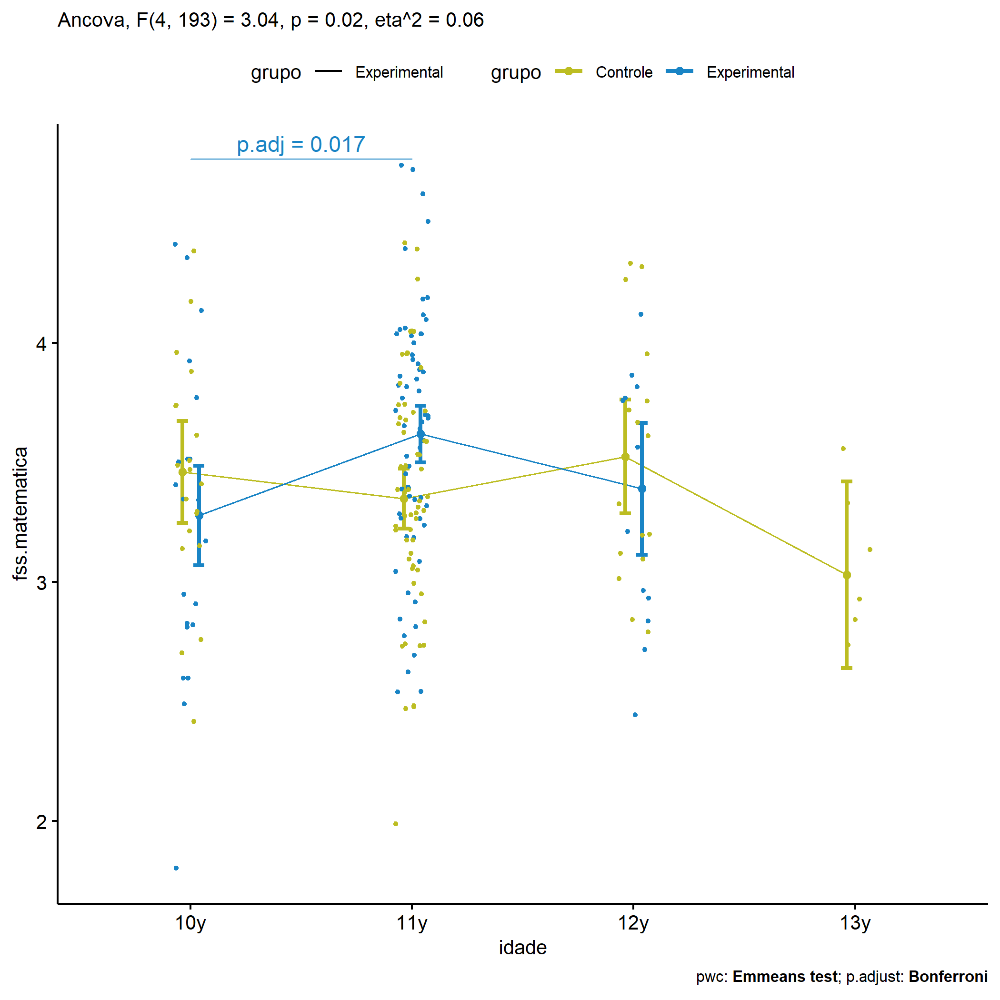<!-- -->

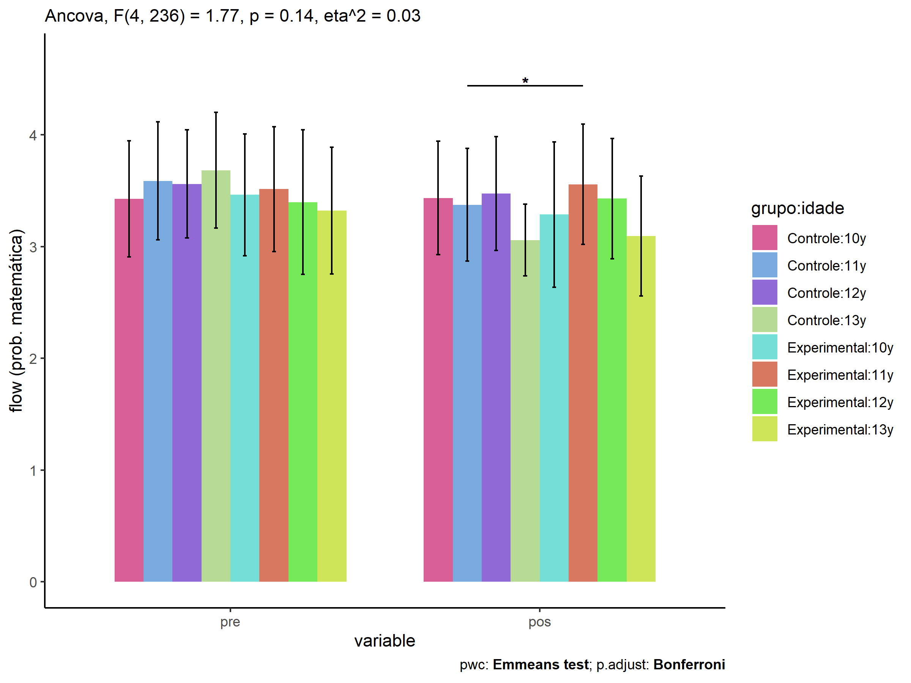<!-- -->

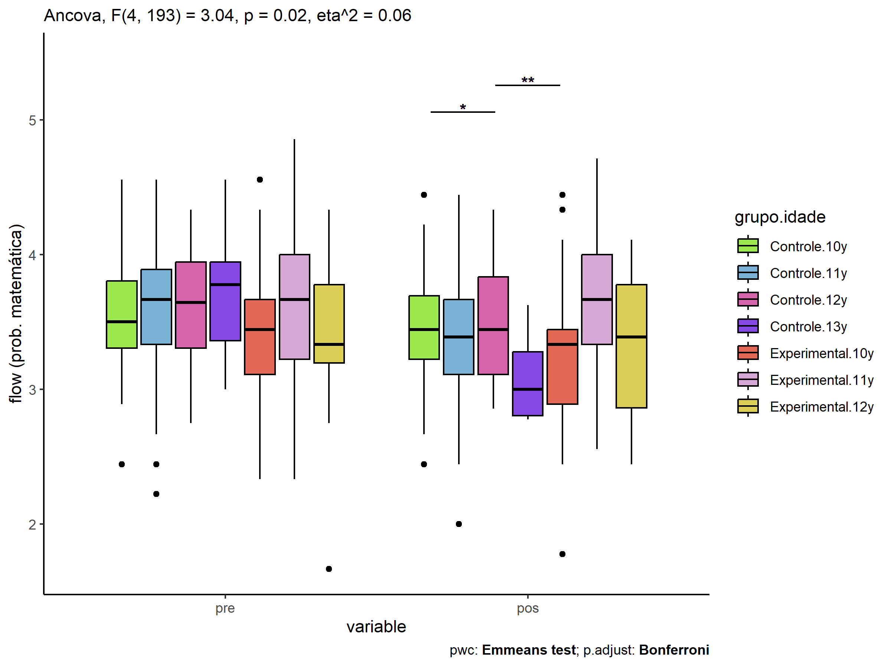<!-- -->

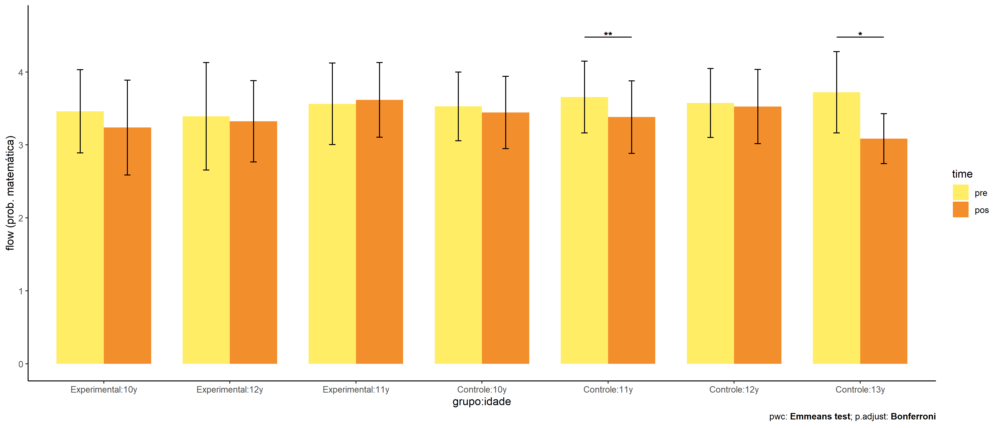<!-- -->

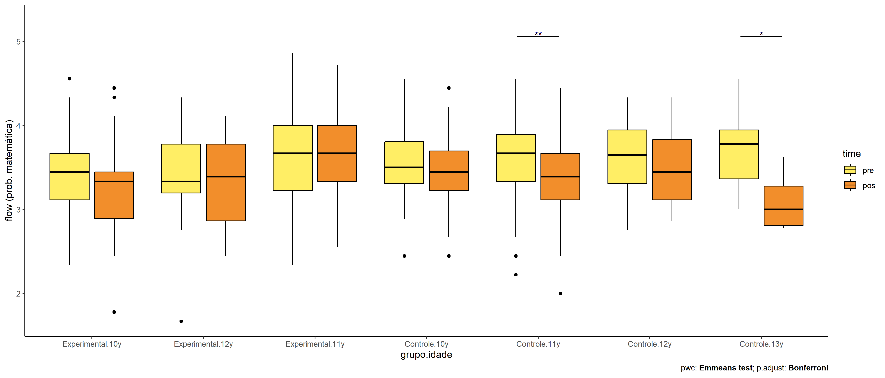<!-- -->

### factores: **grupo:zona.participante**

| var            | grupo        | zona.participante |   n | M (pre) | SE (pre) | M (unadj) | SE (unadj) | M (adj) | SE (adj) |
|:---------------|:-------------|:------------------|----:|--------:|---------:|----------:|-----------:|--------:|---------:|
| fss.matematica | Controle     | Rural             |  40 |   3.610 |    0.088 |     3.393 |      0.074 |   3.363 |    0.080 |
| fss.matematica | Controle     | Urbana            |  44 |   3.512 |    0.070 |     3.404 |      0.072 |   3.405 |    0.076 |
| fss.matematica | Experimental | Rural             |  40 |   3.544 |    0.088 |     3.532 |      0.082 |   3.523 |    0.080 |
| fss.matematica | Experimental | Urbana            |  41 |   3.393 |    0.101 |     3.333 |      0.102 |   3.370 |    0.080 |

| grupo        | zona.participante | group1   | group2       | estimate | conf.low | conf.high |    se | statistic |     p | p.adj | p.adj.signif |
|:-------------|:------------------|:---------|:-------------|---------:|---------:|----------:|------:|----------:|------:|------:|:-------------|
|              | Urbana            | Controle | Experimental |    0.035 |   -0.183 |     0.253 | 0.110 |     0.313 | 0.755 | 0.755 | ns           |
|              | Rural             | Controle | Experimental |   -0.160 |   -0.384 |     0.064 | 0.113 |    -1.410 | 0.160 | 0.160 | ns           |
|              | Urbana            | Controle | Experimental |    0.119 |   -0.120 |     0.358 | 0.121 |     0.985 | 0.326 | 0.326 | ns           |
|              | Rural             | Controle | Experimental |    0.066 |   -0.180 |     0.312 | 0.125 |     0.530 | 0.597 | 0.597 | ns           |
| Controle     |                   | Urbana   | Rural        |    0.042 |   -0.177 |     0.261 | 0.111 |     0.377 | 0.707 | 0.707 | ns           |
| Experimental |                   | Urbana   | Rural        |   -0.153 |   -0.376 |     0.071 | 0.113 |    -1.350 | 0.179 | 0.179 | ns           |
| Controle     |                   | Urbana   | Rural        |   -0.099 |   -0.339 |     0.142 | 0.122 |    -0.811 | 0.418 | 0.418 | ns           |
| Experimental |                   | Urbana   | Rural        |   -0.152 |   -0.396 |     0.093 | 0.124 |    -1.226 | 0.222 | 0.222 | ns           |

| grupo        | zona.participante | group1 | group2 | estimate | conf.low | conf.high |    se | statistic |     p | p.adj | p.adj.signif |
|:-------------|:------------------|:-------|:-------|---------:|---------:|----------:|------:|----------:|------:|------:|:-------------|
| Controle     | Urbana            | pre    | pos    |    0.108 |   -0.121 |     0.336 | 0.116 |     0.925 | 0.355 | 0.355 | ns           |
| Controle     | Rural             | pre    | pos    |    0.218 |   -0.022 |     0.458 | 0.122 |     1.786 | 0.075 | 0.075 | ns           |
| Experimental | Urbana            | pre    | pos    |    0.060 |   -0.177 |     0.297 | 0.120 |     0.496 | 0.620 | 0.620 | ns           |
| Experimental | Rural             | pre    | pos    |    0.012 |   -0.228 |     0.252 | 0.122 |     0.099 | 0.921 | 0.921 | ns           |

    ## Scale for colour is already present.
    ## Adding another scale for colour, which will replace the existing scale.

<!-- -->

    ## Scale for colour is already present.
    ## Adding another scale for colour, which will replace the existing scale.

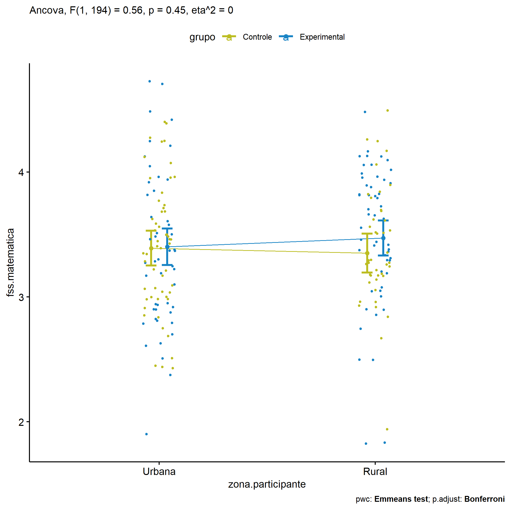<!-- -->

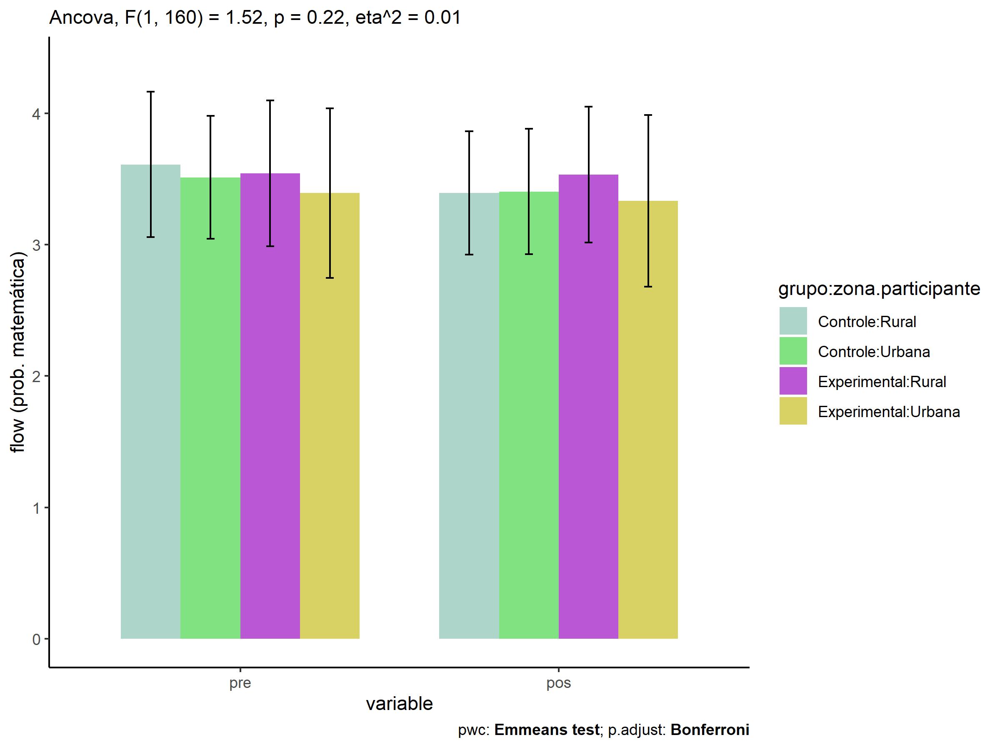<!-- -->

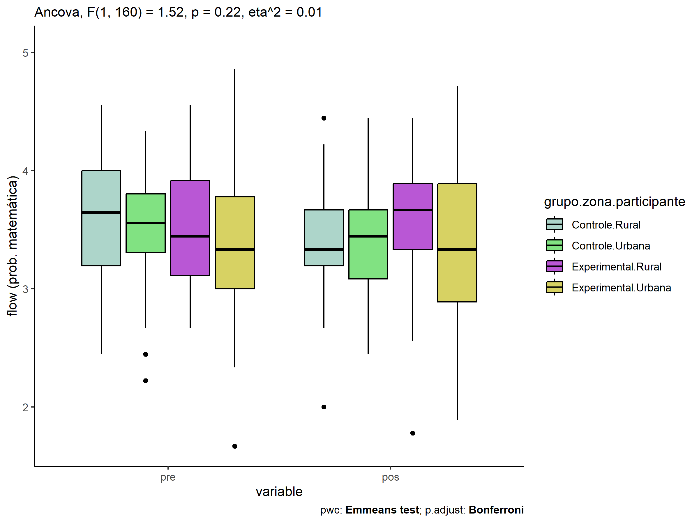<!-- -->

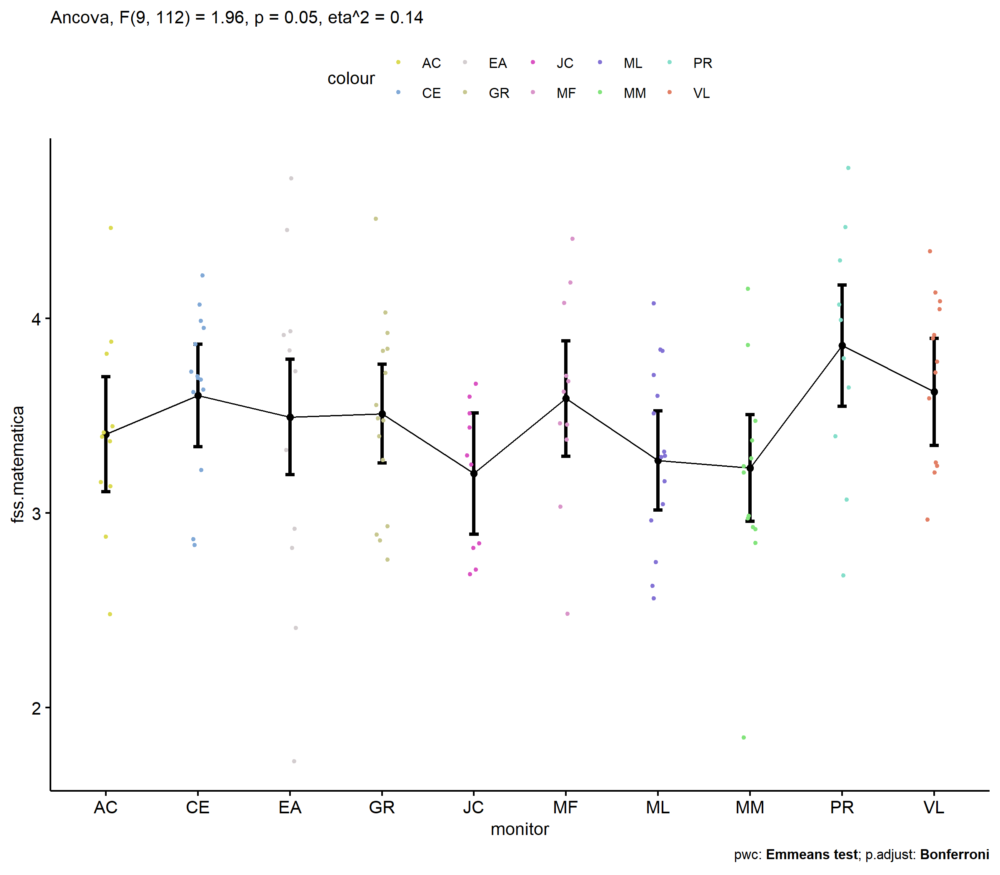<!-- -->

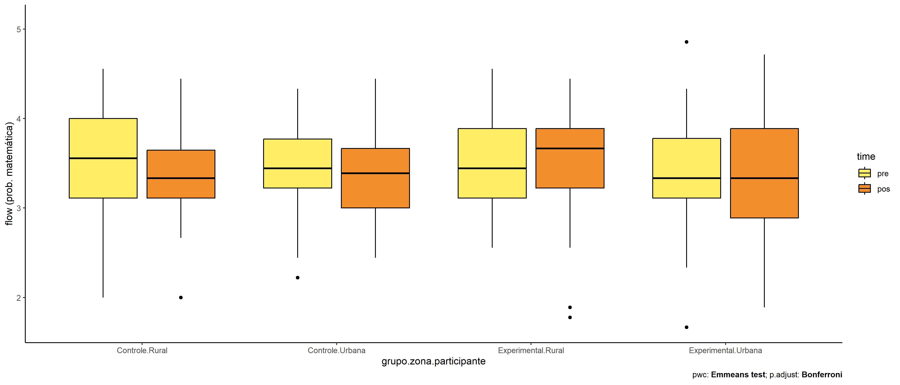<!-- -->

### factores: **grupo:escola**

| var            | grupo        | escola |   n | M (pre) | SE (pre) | M (unadj) | SE (unadj) | M (adj) | SE (adj) |
|:---------------|:-------------|:-------|----:|--------:|---------:|----------:|-----------:|--------:|---------:|
| fss.matematica | Controle     | E1     |   6 |   3.278 |    0.140 |     3.241 |      0.161 |   3.341 |    0.205 |
| fss.matematica | Controle     | E2     |  22 |   3.601 |    0.090 |     3.338 |      0.101 |   3.323 |    0.107 |
| fss.matematica | Controle     | E3     |  15 |   3.731 |    0.162 |     3.378 |      0.114 |   3.315 |    0.130 |
| fss.matematica | Controle     | E4     |  15 |   3.556 |    0.092 |     3.373 |      0.096 |   3.374 |    0.129 |
| fss.matematica | Controle     | E5     |  41 |   3.546 |    0.088 |     3.468 |      0.088 |   3.472 |    0.078 |
| fss.matematica | Controle     | E6     |   9 |   3.864 |    0.098 |     3.481 |      0.171 |   3.372 |    0.168 |
| fss.matematica | Experimental | E1     |  10 |   3.358 |    0.178 |     3.805 |      0.199 |   3.876 |    0.159 |
| fss.matematica | Experimental | E2     |  22 |   3.404 |    0.128 |     3.277 |      0.120 |   3.332 |    0.107 |
| fss.matematica | Experimental | E3     |  15 |   3.584 |    0.166 |     3.302 |      0.122 |   3.292 |    0.129 |
| fss.matematica | Experimental | E4     |   6 |   3.593 |    0.178 |     3.685 |      0.189 |   3.673 |    0.204 |
| fss.matematica | Experimental | E5     |  41 |   3.501 |    0.094 |     3.475 |      0.098 |   3.496 |    0.078 |
| fss.matematica | Experimental | E6     |  10 |   3.856 |    0.109 |     3.744 |      0.142 |   3.638 |    0.159 |

| grupo        | escola | group1   | group2       | estimate | conf.low | conf.high |    se | statistic |     p | p.adj | p.adj.signif |
|:-------------|:-------|:---------|:-------------|---------:|---------:|----------:|------:|----------:|------:|------:|:-------------|
|              | E1     | Controle | Experimental |   -0.535 |   -1.044 |    -0.026 | 0.258 |    -2.072 | 0.040 | 0.040 | \*           |
|              | E2     | Controle | Experimental |   -0.009 |   -0.308 |     0.289 | 0.151 |    -0.062 | 0.951 | 0.951 | ns           |
|              | E3     | Controle | Experimental |    0.023 |   -0.338 |     0.384 | 0.183 |     0.126 | 0.900 | 0.900 | ns           |
|              | E4     | Controle | Experimental |   -0.299 |   -0.775 |     0.177 | 0.242 |    -1.238 | 0.217 | 0.217 | ns           |
|              | E5     | Controle | Experimental |   -0.024 |   -0.242 |     0.194 | 0.110 |    -0.214 | 0.831 | 0.831 | ns           |
|              | E6     | Controle | Experimental |   -0.266 |   -0.719 |     0.187 | 0.230 |    -1.158 | 0.248 | 0.248 | ns           |
|              | E1     | Controle | Experimental |   -0.081 |   -0.627 |     0.466 | 0.277 |    -0.291 | 0.771 | 0.771 | ns           |
|              | E2     | Controle | Experimental |    0.197 |   -0.122 |     0.516 | 0.162 |     1.218 | 0.225 | 0.225 | ns           |
|              | E3     | Controle | Experimental |    0.147 |   -0.239 |     0.534 | 0.196 |     0.753 | 0.452 | 0.452 | ns           |
|              | E4     | Controle | Experimental |   -0.037 |   -0.548 |     0.474 | 0.259 |    -0.143 | 0.886 | 0.886 | ns           |
|              | E5     | Controle | Experimental |    0.045 |   -0.188 |     0.279 | 0.118 |     0.382 | 0.703 | 0.703 | ns           |
|              | E6     | Controle | Experimental |    0.009 |   -0.477 |     0.495 | 0.246 |     0.035 | 0.972 | 0.972 | ns           |
| Controle     |        | E1       | E2           |    0.018 |   -0.438 |     0.474 | 0.231 |     0.079 | 0.937 | 1.000 | ns           |
| Controle     |        | E1       | E3           |    0.026 |   -0.454 |     0.506 | 0.243 |     0.105 | 0.916 | 1.000 | ns           |
| Controle     |        | E1       | E4           |   -0.033 |   -0.510 |     0.445 | 0.242 |    -0.134 | 0.893 | 1.000 | ns           |
| Controle     |        | E1       | E5           |   -0.131 |   -0.563 |     0.301 | 0.219 |    -0.597 | 0.551 | 1.000 | ns           |
| Controle     |        | E1       | E6           |   -0.031 |   -0.556 |     0.495 | 0.266 |    -0.115 | 0.909 | 1.000 | ns           |
| Controle     |        | E2       | E3           |    0.007 |   -0.323 |     0.338 | 0.168 |     0.044 | 0.965 | 1.000 | ns           |
| Controle     |        | E2       | E4           |   -0.051 |   -0.381 |     0.279 | 0.167 |    -0.303 | 0.762 | 1.000 | ns           |
| Controle     |        | E2       | E5           |   -0.149 |   -0.410 |     0.111 | 0.132 |    -1.129 | 0.260 | 1.000 | ns           |
| Controle     |        | E2       | E6           |   -0.049 |   -0.440 |     0.343 | 0.199 |    -0.245 | 0.806 | 1.000 | ns           |
| Controle     |        | E3       | E4           |   -0.058 |   -0.419 |     0.303 | 0.183 |    -0.318 | 0.751 | 1.000 | ns           |
| Controle     |        | E3       | E5           |   -0.157 |   -0.455 |     0.142 | 0.151 |    -1.034 | 0.302 | 1.000 | ns           |
| Controle     |        | E3       | E6           |   -0.056 |   -0.472 |     0.360 | 0.211 |    -0.266 | 0.791 | 1.000 | ns           |
| Controle     |        | E4       | E5           |   -0.098 |   -0.396 |     0.199 | 0.151 |    -0.652 | 0.515 | 1.000 | ns           |
| Controle     |        | E4       | E6           |    0.002 |   -0.416 |     0.420 | 0.212 |     0.010 | 0.992 | 1.000 | ns           |
| Controle     |        | E5       | E6           |    0.100 |   -0.265 |     0.466 | 0.185 |     0.542 | 0.588 | 1.000 | ns           |
| Experimental |        | E1       | E2           |    0.544 |    0.168 |     0.920 | 0.191 |     2.852 | 0.005 | 0.072 | ns           |
| Experimental |        | E1       | E3           |    0.584 |    0.180 |     0.987 | 0.205 |     2.852 | 0.005 | 0.072 | ns           |
| Experimental |        | E1       | E4           |    0.204 |   -0.307 |     0.714 | 0.259 |     0.787 | 0.432 | 1.000 | ns           |
| Experimental |        | E1       | E5           |    0.380 |    0.032 |     0.729 | 0.177 |     2.154 | 0.032 | 0.486 | ns           |
| Experimental |        | E1       | E6           |    0.239 |   -0.207 |     0.684 | 0.226 |     1.055 | 0.293 | 1.000 | ns           |
| Experimental |        | E2       | E3           |    0.040 |   -0.291 |     0.371 | 0.168 |     0.237 | 0.813 | 1.000 | ns           |
| Experimental |        | E2       | E4           |   -0.340 |   -0.795 |     0.114 | 0.231 |    -1.476 | 0.142 | 1.000 | ns           |
| Experimental |        | E2       | E5           |   -0.164 |   -0.424 |     0.097 | 0.132 |    -1.236 | 0.218 | 1.000 | ns           |
| Experimental |        | E2       | E6           |   -0.305 |   -0.686 |     0.075 | 0.193 |    -1.582 | 0.115 | 1.000 | ns           |
| Experimental |        | E3       | E4           |   -0.380 |   -0.857 |     0.096 | 0.242 |    -1.574 | 0.117 | 1.000 | ns           |
| Experimental |        | E3       | E5           |   -0.203 |   -0.501 |     0.094 | 0.151 |    -1.346 | 0.180 | 1.000 | ns           |
| Experimental |        | E3       | E6           |   -0.345 |   -0.749 |     0.059 | 0.205 |    -1.685 | 0.094 | 1.000 | ns           |
| Experimental |        | E4       | E5           |    0.177 |   -0.254 |     0.608 | 0.219 |     0.809 | 0.419 | 1.000 | ns           |
| Experimental |        | E4       | E6           |    0.035 |   -0.475 |     0.545 | 0.259 |     0.135 | 0.893 | 1.000 | ns           |
| Experimental |        | E5       | E6           |   -0.142 |   -0.493 |     0.209 | 0.178 |    -0.798 | 0.426 | 1.000 | ns           |
| Controle     |        | E1       | E2           |   -0.323 |   -0.810 |     0.164 | 0.247 |    -1.309 | 0.192 | 1.000 | ns           |
| Controle     |        | E1       | E3           |   -0.454 |   -0.965 |     0.057 | 0.259 |    -1.751 | 0.081 | 1.000 | ns           |
| Controle     |        | E1       | E4           |   -0.278 |   -0.789 |     0.233 | 0.259 |    -1.072 | 0.285 | 1.000 | ns           |
| Controle     |        | E1       | E5           |   -0.268 |   -0.730 |     0.194 | 0.234 |    -1.143 | 0.254 | 1.000 | ns           |
| Controle     |        | E1       | E6           |   -0.586 |   -1.144 |    -0.029 | 0.283 |    -2.075 | 0.039 | 0.590 | ns           |
| Controle     |        | E2       | E3           |   -0.130 |   -0.485 |     0.224 | 0.180 |    -0.727 | 0.468 | 1.000 | ns           |
| Controle     |        | E2       | E4           |    0.045 |   -0.309 |     0.400 | 0.180 |     0.253 | 0.800 | 1.000 | ns           |
| Controle     |        | E2       | E5           |    0.055 |   -0.224 |     0.335 | 0.142 |     0.390 | 0.697 | 1.000 | ns           |
| Controle     |        | E2       | E6           |   -0.263 |   -0.682 |     0.155 | 0.212 |    -1.240 | 0.216 | 1.000 | ns           |
| Controle     |        | E3       | E4           |    0.176 |   -0.210 |     0.562 | 0.196 |     0.898 | 0.370 | 1.000 | ns           |
| Controle     |        | E3       | E5           |    0.186 |   -0.133 |     0.505 | 0.162 |     1.147 | 0.253 | 1.000 | ns           |
| Controle     |        | E3       | E6           |   -0.133 |   -0.579 |     0.313 | 0.226 |    -0.587 | 0.558 | 1.000 | ns           |
| Controle     |        | E4       | E5           |    0.010 |   -0.309 |     0.329 | 0.162 |     0.060 | 0.952 | 1.000 | ns           |
| Controle     |        | E4       | E6           |   -0.309 |   -0.755 |     0.137 | 0.226 |    -1.365 | 0.174 | 1.000 | ns           |
| Controle     |        | E5       | E6           |   -0.318 |   -0.708 |     0.071 | 0.197 |    -1.613 | 0.108 | 1.000 | ns           |
| Experimental |        | E1       | E2           |   -0.046 |   -0.449 |     0.358 | 0.205 |    -0.223 | 0.823 | 1.000 | ns           |
| Experimental |        | E1       | E3           |   -0.226 |   -0.657 |     0.206 | 0.219 |    -1.031 | 0.304 | 1.000 | ns           |
| Experimental |        | E1       | E4           |   -0.234 |   -0.780 |     0.312 | 0.277 |    -0.846 | 0.399 | 1.000 | ns           |
| Experimental |        | E1       | E5           |   -0.142 |   -0.515 |     0.231 | 0.189 |    -0.752 | 0.453 | 1.000 | ns           |
| Experimental |        | E1       | E6           |   -0.497 |   -0.970 |    -0.024 | 0.240 |    -2.073 | 0.039 | 0.592 | ns           |
| Experimental |        | E2       | E3           |   -0.180 |   -0.534 |     0.174 | 0.180 |    -1.002 | 0.318 | 1.000 | ns           |
| Experimental |        | E2       | E4           |   -0.189 |   -0.676 |     0.299 | 0.247 |    -0.763 | 0.446 | 1.000 | ns           |
| Experimental |        | E2       | E5           |   -0.097 |   -0.376 |     0.183 | 0.142 |    -0.681 | 0.497 | 1.000 | ns           |
| Experimental |        | E2       | E6           |   -0.452 |   -0.855 |    -0.048 | 0.205 |    -2.207 | 0.028 | 0.426 | ns           |
| Experimental |        | E3       | E4           |   -0.009 |   -0.519 |     0.502 | 0.259 |    -0.033 | 0.974 | 1.000 | ns           |
| Experimental |        | E3       | E5           |    0.083 |   -0.236 |     0.403 | 0.162 |     0.515 | 0.607 | 1.000 | ns           |
| Experimental |        | E3       | E6           |   -0.272 |   -0.703 |     0.160 | 0.219 |    -1.240 | 0.216 | 1.000 | ns           |
| Experimental |        | E4       | E5           |    0.092 |   -0.370 |     0.554 | 0.234 |     0.392 | 0.695 | 1.000 | ns           |
| Experimental |        | E4       | E6           |   -0.263 |   -0.809 |     0.283 | 0.277 |    -0.949 | 0.344 | 1.000 | ns           |
| Experimental |        | E5       | E6           |   -0.355 |   -0.728 |     0.018 | 0.189 |    -1.877 | 0.062 | 0.930 | ns           |

| grupo        | escola | group1 | group2 | estimate | conf.low | conf.high |    se | statistic |     p | p.adj | p.adj.signif |
|:-------------|:-------|:-------|:-------|---------:|---------:|----------:|------:|----------:|------:|------:|:-------------|
| Controle     | E1     | pre    | pos    |    0.037 |   -0.571 |     0.645 | 0.309 |     0.120 | 0.905 | 0.905 | ns           |
| Controle     | E2     | pre    | pos    |    0.263 |   -0.055 |     0.580 | 0.161 |     1.627 | 0.105 | 0.105 | ns           |
| Controle     | E3     | pre    | pos    |    0.354 |   -0.031 |     0.738 | 0.196 |     1.809 | 0.071 | 0.071 | ns           |
| Controle     | E4     | pre    | pos    |    0.183 |   -0.202 |     0.567 | 0.196 |     0.934 | 0.351 | 0.351 | ns           |
| Controle     | E5     | pre    | pos    |    0.078 |   -0.155 |     0.310 | 0.118 |     0.659 | 0.510 | 0.510 | ns           |
| Controle     | E6     | pre    | pos    |    0.383 |   -0.114 |     0.879 | 0.252 |     1.516 | 0.130 | 0.130 | ns           |
| Experimental | E1     | pre    | pos    |   -0.446 |   -0.917 |     0.024 | 0.239 |    -1.864 | 0.063 | 0.063 | ns           |
| Experimental | E2     | pre    | pos    |    0.127 |   -0.190 |     0.444 | 0.161 |     0.786 | 0.432 | 0.432 | ns           |
| Experimental | E3     | pre    | pos    |    0.282 |   -0.102 |     0.667 | 0.196 |     1.443 | 0.150 | 0.150 | ns           |
| Experimental | E4     | pre    | pos    |   -0.093 |   -0.700 |     0.515 | 0.309 |    -0.300 | 0.765 | 0.765 | ns           |
| Experimental | E5     | pre    | pos    |    0.025 |   -0.207 |     0.258 | 0.118 |     0.214 | 0.831 | 0.831 | ns           |
| Experimental | E6     | pre    | pos    |    0.111 |   -0.360 |     0.582 | 0.239 |     0.464 | 0.643 | 0.643 | ns           |

    ## Scale for colour is already present.
    ## Adding another scale for colour, which will replace the existing scale.

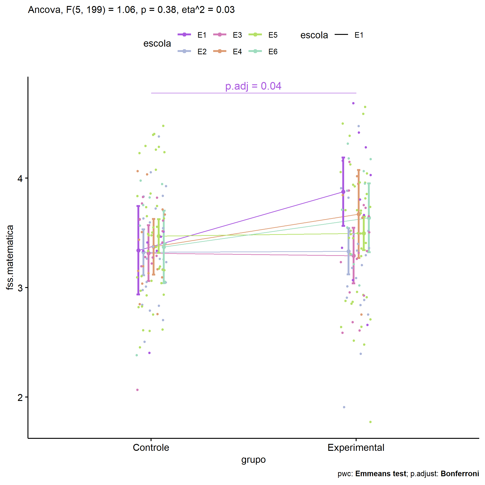<!-- -->

    ## Scale for colour is already present.
    ## Adding another scale for colour, which will replace the existing scale.

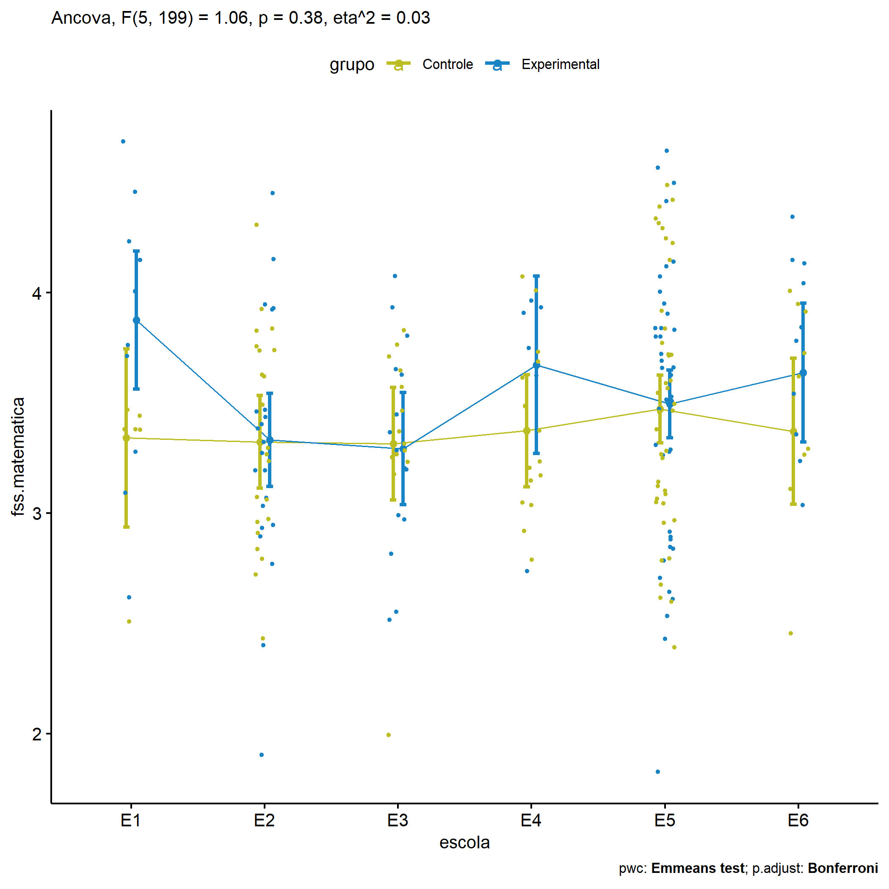<!-- -->

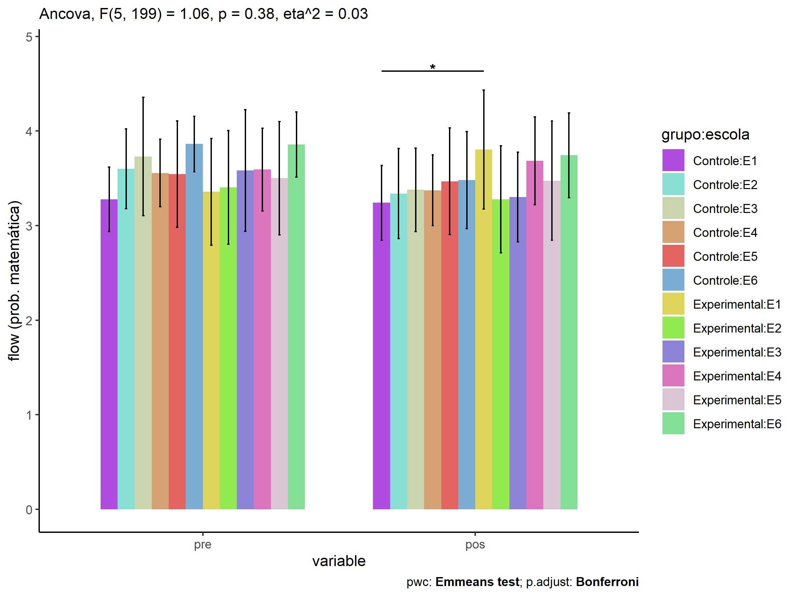<!-- -->

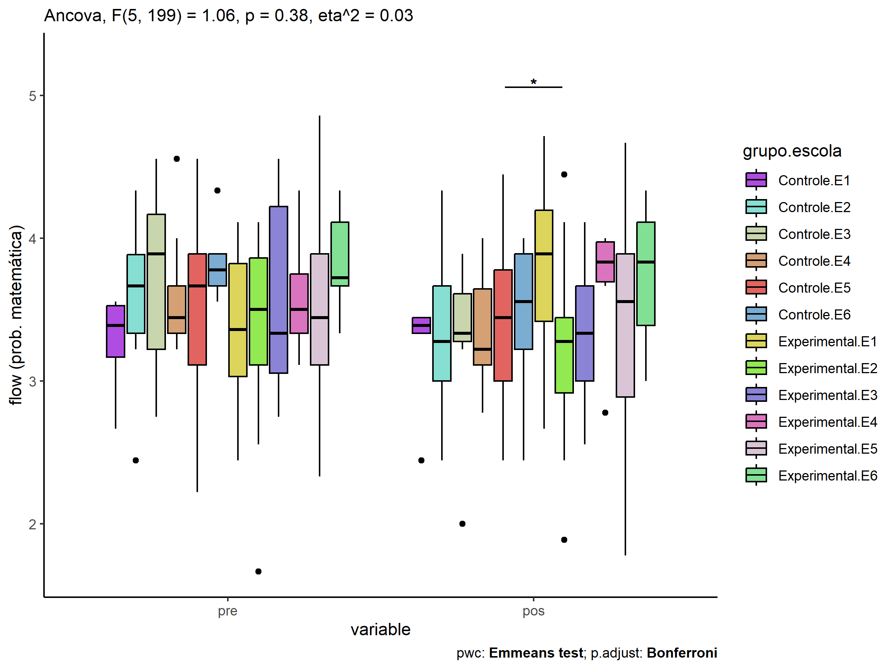<!-- -->

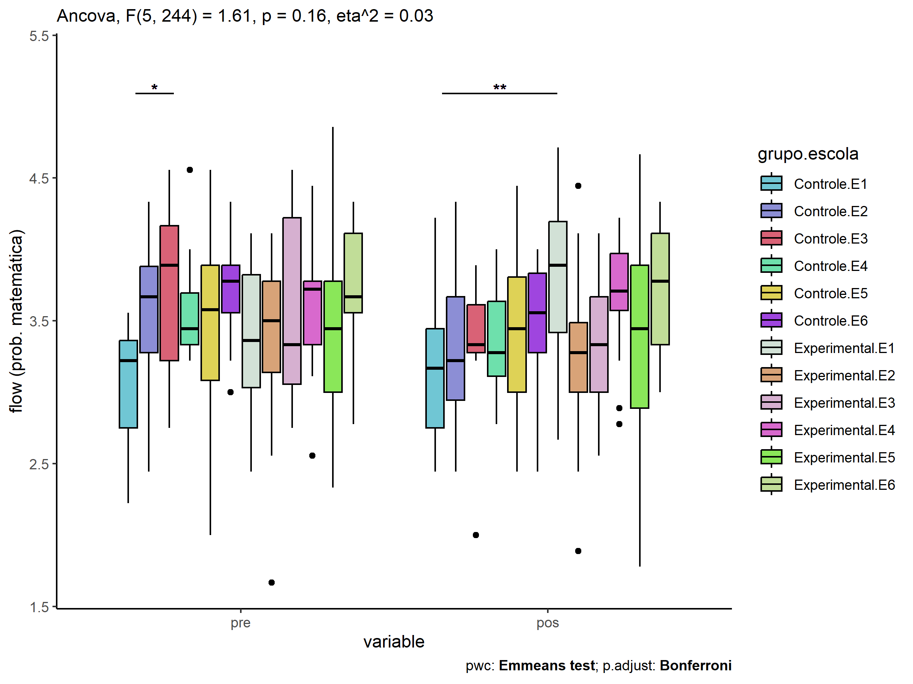<!-- -->

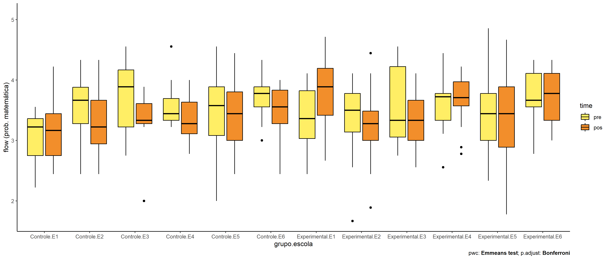<!-- -->

### factores: **grupo:zona.escola**

| var            | grupo        | zona.escola |   n | M (pre) | SE (pre) | M (unadj) | SE (unadj) | M (adj) | SE (adj) |
|:---------------|:-------------|:------------|----:|--------:|---------:|----------:|-----------:|--------:|---------:|
| fss.matematica | Controle     | Rural       |  39 |   3.694 |    0.076 |     3.400 |      0.068 |   3.350 |    0.082 |
| fss.matematica | Controle     | Urbana      |  69 |   3.540 |    0.061 |     3.407 |      0.063 |   3.413 |    0.061 |
| fss.matematica | Experimental | Rural       |  31 |   3.673 |    0.094 |     3.519 |      0.089 |   3.477 |    0.091 |
| fss.matematica | Experimental | Urbana      |  73 |   3.452 |    0.069 |     3.461 |      0.073 |   3.499 |    0.060 |

| grupo        | zona.escola | group1   | group2       | estimate | conf.low | conf.high |    se | statistic |     p | p.adj | p.adj.signif |
|:-------------|:------------|:---------|:-------------|---------:|---------:|----------:|------:|----------:|------:|------:|:-------------|
|              | Urbana      | Controle | Experimental |   -0.086 |   -0.254 |     0.082 | 0.085 |    -1.006 | 0.316 | 0.316 | ns           |
|              | Rural       | Controle | Experimental |   -0.127 |   -0.367 |     0.114 | 0.122 |    -1.039 | 0.300 | 0.300 | ns           |
|              | Urbana      | Controle | Experimental |    0.088 |   -0.089 |     0.265 | 0.090 |     0.983 | 0.327 | 0.327 | ns           |
|              | Rural       | Controle | Experimental |    0.021 |   -0.232 |     0.275 | 0.128 |     0.165 | 0.869 | 0.869 | ns           |
| Controle     |             | Urbana   | Rural        |    0.063 |   -0.138 |     0.264 | 0.102 |     0.616 | 0.538 | 0.538 | ns           |
| Experimental |             | Urbana   | Rural        |    0.022 |   -0.194 |     0.238 | 0.110 |     0.201 | 0.841 | 0.841 | ns           |
| Controle     |             | Urbana   | Rural        |   -0.154 |   -0.365 |     0.057 | 0.107 |    -1.443 | 0.151 | 0.151 | ns           |
| Experimental |             | Urbana   | Rural        |   -0.221 |   -0.447 |     0.004 | 0.114 |    -1.933 | 0.055 | 0.055 | ns           |

| grupo        | zona.escola | group1 | group2 | estimate | conf.low | conf.high |    se | statistic |     p | p.adj | p.adj.signif |
|:-------------|:------------|:-------|:-------|---------:|---------:|----------:|------:|----------:|------:|------:|:-------------|
| Controle     | Urbana      | pre    | pos    |    0.133 |   -0.047 |     0.313 | 0.092 |     1.456 | 0.146 | 0.146 | ns           |
| Controle     | Rural       | pre    | pos    |    0.295 |    0.055 |     0.534 | 0.122 |     2.419 | 0.016 | 0.016 | \*           |
| Experimental | Urbana      | pre    | pos    |   -0.009 |   -0.184 |     0.166 | 0.089 |    -0.098 | 0.922 | 0.922 | ns           |
| Experimental | Rural       | pre    | pos    |    0.154 |   -0.114 |     0.423 | 0.137 |     1.131 | 0.259 | 0.259 | ns           |

    ## Scale for colour is already present.
    ## Adding another scale for colour, which will replace the existing scale.

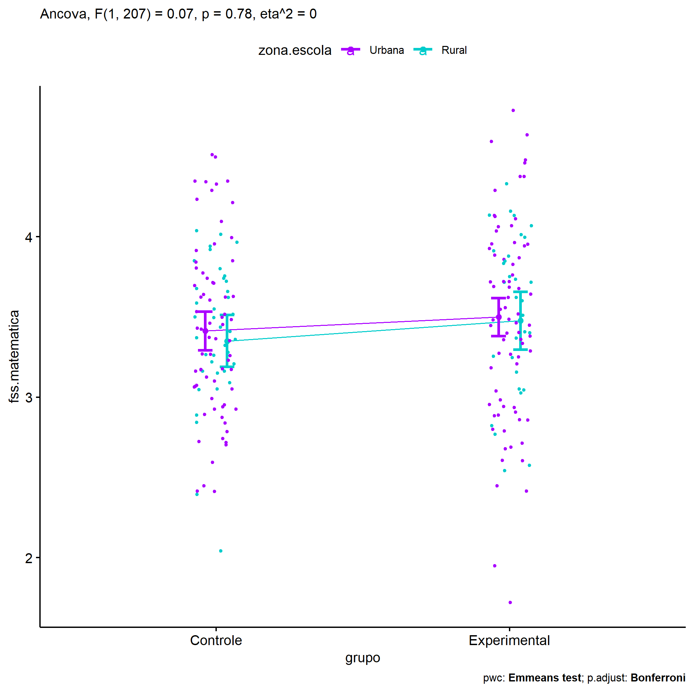<!-- -->

    ## Scale for colour is already present.
    ## Adding another scale for colour, which will replace the existing scale.

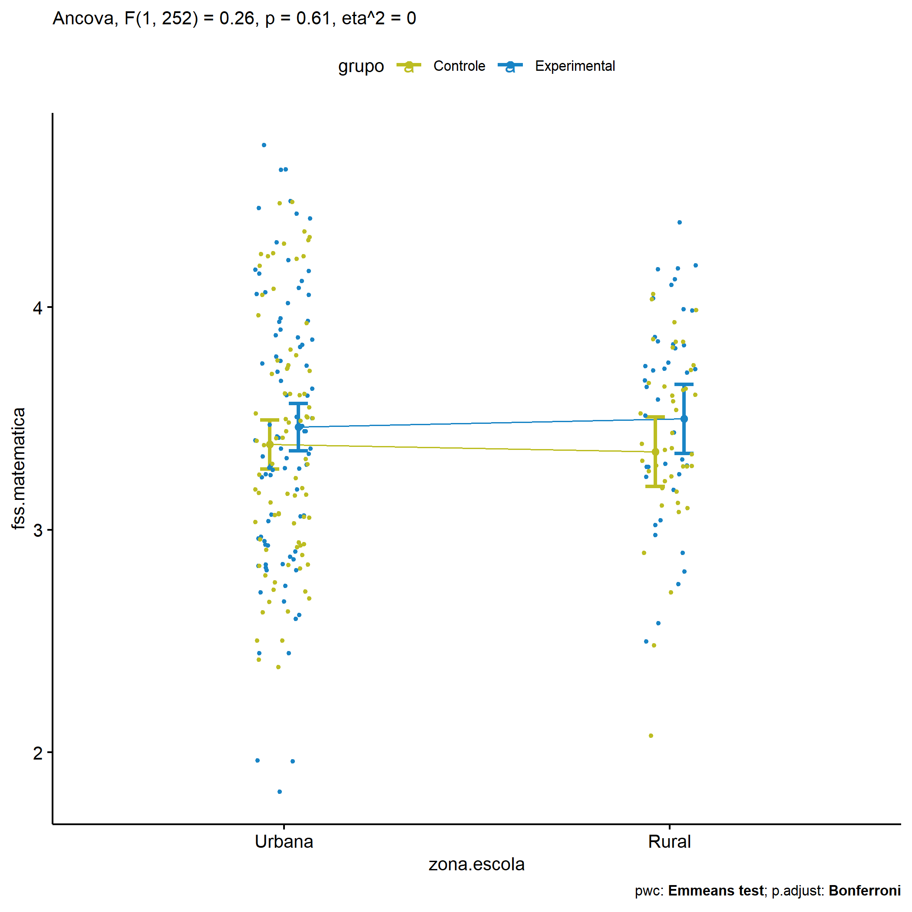<!-- -->

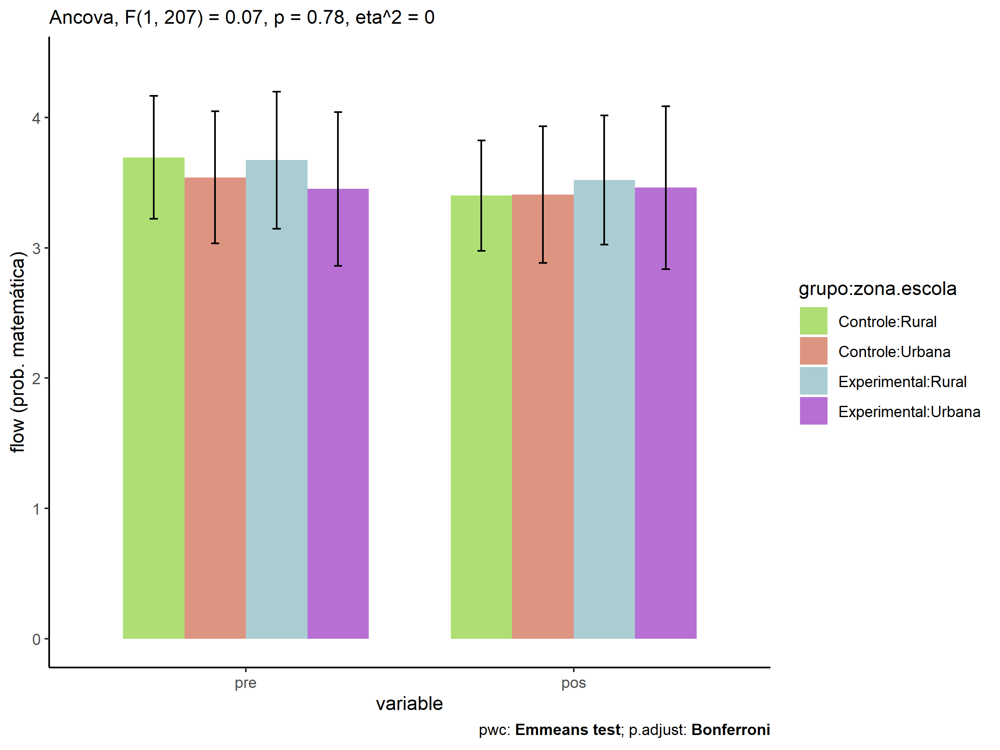<!-- -->

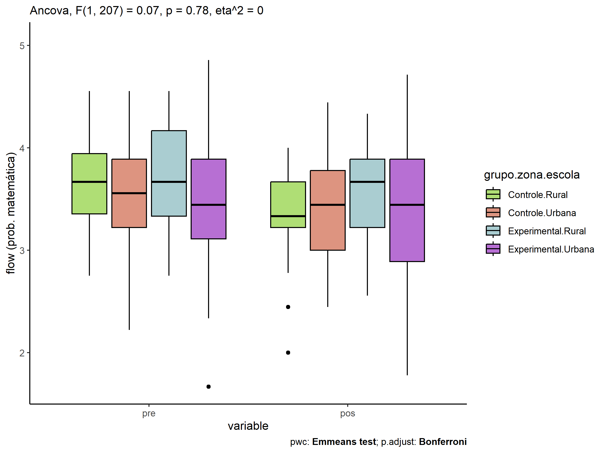<!-- -->

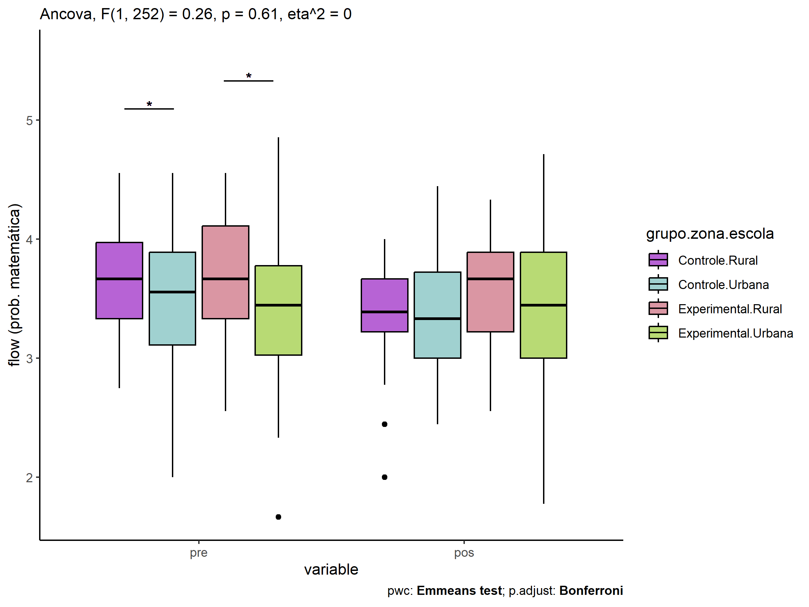<!-- -->

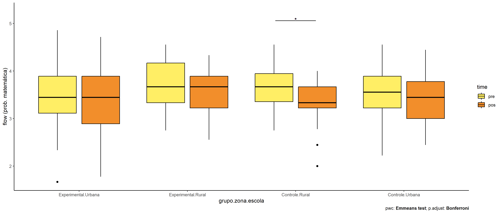<!-- -->

## Pairwise comparisons for grupo=“Experimental”

### factores: **grupo=“Experimental”:monitor**

| var            | monitor |   n | M (pre) | SE (pre) | M (unadj) | SE (unadj) | M (adj) | SE (adj) |
|:---------------|:--------|----:|--------:|---------:|----------:|-----------:|--------:|---------:|
| fss.matematica | AC      |  10 |   3.533 |    0.135 |     3.410 |      0.178 |   3.404 |    0.166 |
| fss.matematica | CE      |   6 |   3.593 |    0.178 |     3.685 |      0.189 |   3.656 |    0.215 |
| fss.matematica | EA      |   9 |   3.444 |    0.188 |     3.519 |      0.318 |   3.547 |    0.176 |
| fss.matematica | GR      |  14 |   3.540 |    0.159 |     3.524 |      0.140 |   3.515 |    0.141 |
| fss.matematica | JC      |   9 |   3.453 |    0.254 |     3.165 |      0.138 |   3.190 |    0.176 |
| fss.matematica | MF      |   9 |   3.543 |    0.187 |     3.667 |      0.183 |   3.657 |    0.175 |
| fss.matematica | ML      |  15 |   3.584 |    0.166 |     3.302 |      0.122 |   3.276 |    0.136 |
| fss.matematica | MM      |  12 |   3.296 |    0.207 |     3.167 |      0.163 |   3.252 |    0.153 |
| fss.matematica | PR      |  10 |   3.358 |    0.178 |     3.805 |      0.199 |   3.867 |    0.167 |
| fss.matematica | VL      |  10 |   3.856 |    0.109 |     3.744 |      0.142 |   3.614 |    0.169 |

| .y.            | group1 | group2 | estimate | conf.low | conf.high |    se | statistic |     p | p.adj | p.adj.signif |
|:---------------|:-------|:-------|---------:|---------:|----------:|------:|----------:|------:|------:|:-------------|
| fss.matematica | AC     | CE     |   -0.253 |   -0.792 |     0.287 | 0.272 |    -0.929 | 0.355 | 1.000 | ns           |
| fss.matematica | AC     | EA     |   -0.143 |   -0.624 |     0.337 | 0.242 |    -0.592 | 0.555 | 1.000 | ns           |
| fss.matematica | AC     | GR     |   -0.112 |   -0.544 |     0.321 | 0.218 |    -0.512 | 0.610 | 1.000 | ns           |
| fss.matematica | AC     | JC     |    0.214 |   -0.267 |     0.694 | 0.242 |     0.883 | 0.379 | 1.000 | ns           |
| fss.matematica | AC     | MF     |   -0.253 |   -0.733 |     0.227 | 0.242 |    -1.047 | 0.298 | 1.000 | ns           |
| fss.matematica | AC     | ML     |    0.127 |   -0.299 |     0.554 | 0.215 |     0.593 | 0.554 | 1.000 | ns           |
| fss.matematica | AC     | MM     |    0.151 |   -0.298 |     0.601 | 0.226 |     0.668 | 0.506 | 1.000 | ns           |
| fss.matematica | AC     | PR     |   -0.463 |   -0.931 |     0.006 | 0.236 |    -1.962 | 0.053 | 1.000 | ns           |
| fss.matematica | AC     | VL     |   -0.210 |   -0.681 |     0.261 | 0.237 |    -0.885 | 0.378 | 1.000 | ns           |
| fss.matematica | CE     | EA     |    0.109 |   -0.442 |     0.661 | 0.278 |     0.394 | 0.695 | 1.000 | ns           |
| fss.matematica | CE     | GR     |    0.141 |   -0.369 |     0.651 | 0.257 |     0.549 | 0.585 | 1.000 | ns           |
| fss.matematica | CE     | JC     |    0.466 |   -0.085 |     1.017 | 0.278 |     1.679 | 0.097 | 1.000 | ns           |
| fss.matematica | CE     | MF     |   -0.001 |   -0.551 |     0.550 | 0.277 |    -0.002 | 0.998 | 1.000 | ns           |
| fss.matematica | CE     | ML     |    0.380 |   -0.125 |     0.885 | 0.254 |     1.495 | 0.138 | 1.000 | ns           |
| fss.matematica | CE     | MM     |    0.404 |   -0.121 |     0.929 | 0.265 |     1.527 | 0.130 | 1.000 | ns           |
| fss.matematica | CE     | PR     |   -0.210 |   -0.752 |     0.331 | 0.273 |    -0.771 | 0.443 | 1.000 | ns           |
| fss.matematica | CE     | VL     |    0.043 |   -0.499 |     0.584 | 0.273 |     0.156 | 0.876 | 1.000 | ns           |
| fss.matematica | EA     | GR     |    0.032 |   -0.415 |     0.478 | 0.225 |     0.140 | 0.889 | 1.000 | ns           |
| fss.matematica | EA     | JC     |    0.357 |   -0.136 |     0.849 | 0.248 |     1.438 | 0.154 | 1.000 | ns           |
| fss.matematica | EA     | MF     |   -0.110 |   -0.603 |     0.383 | 0.248 |    -0.443 | 0.659 | 1.000 | ns           |
| fss.matematica | EA     | ML     |    0.271 |   -0.171 |     0.712 | 0.222 |     1.218 | 0.226 | 1.000 | ns           |
| fss.matematica | EA     | MM     |    0.295 |   -0.167 |     0.756 | 0.232 |     1.267 | 0.208 | 1.000 | ns           |
| fss.matematica | EA     | PR     |   -0.320 |   -0.800 |     0.161 | 0.242 |    -1.321 | 0.190 | 1.000 | ns           |
| fss.matematica | EA     | VL     |   -0.067 |   -0.553 |     0.419 | 0.245 |    -0.273 | 0.785 | 1.000 | ns           |
| fss.matematica | GR     | JC     |    0.325 |   -0.121 |     0.772 | 0.225 |     1.446 | 0.152 | 1.000 | ns           |
| fss.matematica | GR     | MF     |   -0.141 |   -0.588 |     0.305 | 0.225 |    -0.629 | 0.531 | 1.000 | ns           |
| fss.matematica | GR     | ML     |    0.239 |   -0.149 |     0.628 | 0.196 |     1.223 | 0.225 | 1.000 | ns           |
| fss.matematica | GR     | MM     |    0.263 |   -0.151 |     0.676 | 0.208 |     1.263 | 0.210 | 1.000 | ns           |
| fss.matematica | GR     | PR     |   -0.351 |   -0.785 |     0.083 | 0.219 |    -1.607 | 0.111 | 1.000 | ns           |
| fss.matematica | GR     | VL     |   -0.098 |   -0.535 |     0.338 | 0.220 |    -0.448 | 0.656 | 1.000 | ns           |
| fss.matematica | JC     | MF     |   -0.467 |   -0.960 |     0.026 | 0.248 |    -1.881 | 0.063 | 1.000 | ns           |
| fss.matematica | JC     | ML     |   -0.086 |   -0.527 |     0.355 | 0.222 |    -0.388 | 0.699 | 1.000 | ns           |
| fss.matematica | JC     | MM     |   -0.062 |   -0.524 |     0.399 | 0.232 |    -0.268 | 0.789 | 1.000 | ns           |
| fss.matematica | JC     | PR     |   -0.676 |   -1.157 |    -0.196 | 0.242 |    -2.796 | 0.006 | 0.283 | ns           |
| fss.matematica | JC     | VL     |   -0.424 |   -0.909 |     0.062 | 0.245 |    -1.732 | 0.087 | 1.000 | ns           |
| fss.matematica | MF     | ML     |    0.381 |   -0.060 |     0.821 | 0.222 |     1.715 | 0.090 | 1.000 | ns           |
| fss.matematica | MF     | MM     |    0.404 |   -0.059 |     0.867 | 0.233 |     1.735 | 0.086 | 1.000 | ns           |
| fss.matematica | MF     | PR     |   -0.210 |   -0.691 |     0.272 | 0.242 |    -0.865 | 0.389 | 1.000 | ns           |
| fss.matematica | MF     | VL     |    0.043 |   -0.440 |     0.527 | 0.243 |     0.177 | 0.860 | 1.000 | ns           |
| fss.matematica | ML     | MM     |    0.024 |   -0.384 |     0.432 | 0.206 |     0.116 | 0.908 | 1.000 | ns           |
| fss.matematica | ML     | PR     |   -0.590 |   -1.019 |    -0.162 | 0.216 |    -2.735 | 0.007 | 0.336 | ns           |
| fss.matematica | ML     | VL     |   -0.337 |   -0.767 |     0.092 | 0.216 |    -1.560 | 0.122 | 1.000 | ns           |
| fss.matematica | MM     | PR     |   -0.614 |   -1.062 |    -0.167 | 0.225 |    -2.725 | 0.008 | 0.346 | ns           |
| fss.matematica | MM     | VL     |   -0.361 |   -0.820 |     0.098 | 0.231 |    -1.563 | 0.121 | 1.000 | ns           |
| fss.matematica | PR     | VL     |    0.253 |   -0.223 |     0.729 | 0.240 |     1.054 | 0.295 | 1.000 | ns           |
| dfs.matematica | AC     | CE     |   -0.059 |   -0.660 |     0.541 | 0.303 |    -0.196 | 0.845 | 1.000 | ns           |
| dfs.matematica | AC     | EA     |    0.089 |   -0.446 |     0.623 | 0.269 |     0.330 | 0.742 | 1.000 | ns           |
| dfs.matematica | AC     | GR     |   -0.006 |   -0.488 |     0.475 | 0.243 |    -0.026 | 0.979 | 1.000 | ns           |
| dfs.matematica | AC     | JC     |    0.080 |   -0.454 |     0.614 | 0.269 |     0.297 | 0.767 | 1.000 | ns           |
| dfs.matematica | AC     | MF     |   -0.010 |   -0.544 |     0.525 | 0.269 |    -0.037 | 0.971 | 1.000 | ns           |
| dfs.matematica | AC     | ML     |   -0.051 |   -0.525 |     0.424 | 0.239 |    -0.212 | 0.833 | 1.000 | ns           |
| dfs.matematica | AC     | MM     |    0.237 |   -0.261 |     0.735 | 0.251 |     0.945 | 0.347 | 1.000 | ns           |
| dfs.matematica | AC     | PR     |    0.175 |   -0.345 |     0.695 | 0.262 |     0.668 | 0.506 | 1.000 | ns           |
| dfs.matematica | AC     | VL     |   -0.322 |   -0.842 |     0.198 | 0.262 |    -1.230 | 0.222 | 1.000 | ns           |
| dfs.matematica | CE     | EA     |    0.148 |   -0.465 |     0.761 | 0.309 |     0.480 | 0.632 | 1.000 | ns           |
| dfs.matematica | CE     | GR     |    0.053 |   -0.515 |     0.620 | 0.286 |     0.185 | 0.854 | 1.000 | ns           |
| dfs.matematica | CE     | JC     |    0.139 |   -0.474 |     0.752 | 0.309 |     0.451 | 0.653 | 1.000 | ns           |
| dfs.matematica | CE     | MF     |    0.049 |   -0.564 |     0.662 | 0.309 |     0.160 | 0.873 | 1.000 | ns           |
| dfs.matematica | CE     | ML     |    0.009 |   -0.553 |     0.570 | 0.283 |     0.030 | 0.976 | 1.000 | ns           |
| dfs.matematica | CE     | MM     |    0.296 |   -0.285 |     0.878 | 0.293 |     1.012 | 0.314 | 1.000 | ns           |
| dfs.matematica | CE     | PR     |    0.234 |   -0.366 |     0.835 | 0.303 |     0.774 | 0.441 | 1.000 | ns           |
| dfs.matematica | CE     | VL     |   -0.263 |   -0.864 |     0.338 | 0.303 |    -0.869 | 0.387 | 1.000 | ns           |
| dfs.matematica | EA     | GR     |   -0.095 |   -0.592 |     0.402 | 0.250 |    -0.381 | 0.704 | 1.000 | ns           |
| dfs.matematica | EA     | JC     |   -0.009 |   -0.557 |     0.539 | 0.276 |    -0.032 | 0.975 | 1.000 | ns           |
| dfs.matematica | EA     | MF     |   -0.099 |   -0.647 |     0.450 | 0.276 |    -0.358 | 0.721 | 1.000 | ns           |
| dfs.matematica | EA     | ML     |   -0.140 |   -0.630 |     0.351 | 0.247 |    -0.565 | 0.573 | 1.000 | ns           |
| dfs.matematica | EA     | MM     |    0.148 |   -0.365 |     0.661 | 0.258 |     0.574 | 0.568 | 1.000 | ns           |
| dfs.matematica | EA     | PR     |    0.086 |   -0.448 |     0.621 | 0.269 |     0.320 | 0.750 | 1.000 | ns           |
| dfs.matematica | EA     | VL     |   -0.411 |   -0.946 |     0.123 | 0.269 |    -1.527 | 0.130 | 1.000 | ns           |
| dfs.matematica | GR     | JC     |    0.086 |   -0.411 |     0.583 | 0.250 |     0.345 | 0.731 | 1.000 | ns           |
| dfs.matematica | GR     | MF     |   -0.004 |   -0.500 |     0.493 | 0.250 |    -0.014 | 0.989 | 1.000 | ns           |
| dfs.matematica | GR     | ML     |   -0.044 |   -0.477 |     0.388 | 0.218 |    -0.204 | 0.839 | 1.000 | ns           |
| dfs.matematica | GR     | MM     |    0.243 |   -0.214 |     0.701 | 0.230 |     1.056 | 0.294 | 1.000 | ns           |
| dfs.matematica | GR     | PR     |    0.181 |   -0.300 |     0.663 | 0.243 |     0.748 | 0.457 | 1.000 | ns           |
| dfs.matematica | GR     | VL     |   -0.316 |   -0.797 |     0.166 | 0.243 |    -1.302 | 0.196 | 1.000 | ns           |
| dfs.matematica | JC     | MF     |   -0.090 |   -0.638 |     0.458 | 0.276 |    -0.326 | 0.745 | 1.000 | ns           |
| dfs.matematica | JC     | ML     |   -0.131 |   -0.621 |     0.360 | 0.247 |    -0.529 | 0.598 | 1.000 | ns           |
| dfs.matematica | JC     | MM     |    0.157 |   -0.356 |     0.670 | 0.258 |     0.608 | 0.545 | 1.000 | ns           |
| dfs.matematica | JC     | PR     |    0.095 |   -0.439 |     0.629 | 0.269 |     0.353 | 0.725 | 1.000 | ns           |
| dfs.matematica | JC     | VL     |   -0.402 |   -0.937 |     0.132 | 0.269 |    -1.495 | 0.138 | 1.000 | ns           |
| dfs.matematica | MF     | ML     |   -0.041 |   -0.531 |     0.450 | 0.247 |    -0.165 | 0.869 | 1.000 | ns           |
| dfs.matematica | MF     | MM     |    0.247 |   -0.266 |     0.760 | 0.258 |     0.956 | 0.342 | 1.000 | ns           |
| dfs.matematica | MF     | PR     |    0.185 |   -0.350 |     0.719 | 0.269 |     0.687 | 0.494 | 1.000 | ns           |
| dfs.matematica | MF     | VL     |   -0.312 |   -0.847 |     0.222 | 0.269 |    -1.160 | 0.249 | 1.000 | ns           |
| dfs.matematica | ML     | MM     |    0.288 |   -0.163 |     0.738 | 0.227 |     1.268 | 0.208 | 1.000 | ns           |
| dfs.matematica | ML     | PR     |    0.226 |   -0.249 |     0.700 | 0.239 |     0.944 | 0.348 | 1.000 | ns           |
| dfs.matematica | ML     | VL     |   -0.272 |   -0.746 |     0.203 | 0.239 |    -1.136 | 0.259 | 1.000 | ns           |
| dfs.matematica | MM     | PR     |   -0.062 |   -0.560 |     0.436 | 0.251 |    -0.247 | 0.805 | 1.000 | ns           |
| dfs.matematica | MM     | VL     |   -0.559 |   -1.057 |    -0.061 | 0.251 |    -2.230 | 0.028 | 1.000 | ns           |
| dfs.matematica | PR     | VL     |   -0.497 |   -1.017 |     0.023 | 0.262 |    -1.898 | 0.061 | 1.000 | ns           |

| monitor | group1 | group2 | estimate | conf.low | conf.high |    se | statistic |     p | p.adj | p.adj.signif |
|:--------|:-------|:-------|---------:|---------:|----------:|------:|----------:|------:|------:|:-------------|
| AC      | pre    | pos    |    0.124 |   -0.386 |     0.634 | 0.259 |     0.478 | 0.633 | 0.633 | ns           |
| CE      | pre    | pos    |   -0.093 |   -0.751 |     0.566 | 0.334 |    -0.277 | 0.782 | 0.782 | ns           |
| EA      | pre    | pos    |   -0.074 |   -0.612 |     0.464 | 0.273 |    -0.272 | 0.786 | 0.786 | ns           |
| GR      | pre    | pos    |    0.016 |   -0.415 |     0.447 | 0.219 |     0.073 | 0.942 | 0.942 | ns           |
| JC      | pre    | pos    |    0.288 |   -0.249 |     0.826 | 0.273 |     1.057 | 0.292 | 0.292 | ns           |
| MF      | pre    | pos    |   -0.123 |   -0.661 |     0.414 | 0.273 |    -0.453 | 0.651 | 0.651 | ns           |
| ML      | pre    | pos    |    0.282 |   -0.134 |     0.699 | 0.211 |     1.336 | 0.183 | 0.183 | ns           |
| MM      | pre    | pos    |    0.130 |   -0.336 |     0.595 | 0.236 |     0.549 | 0.584 | 0.584 | ns           |
| PR      | pre    | pos    |   -0.446 |   -0.956 |     0.064 | 0.259 |    -1.727 | 0.086 | 0.086 | ns           |
| VL      | pre    | pos    |    0.111 |   -0.399 |     0.621 | 0.259 |     0.430 | 0.668 | 0.668 | ns           |

    ## Scale for colour is already present.
    ## Adding another scale for colour, which will replace the existing scale.

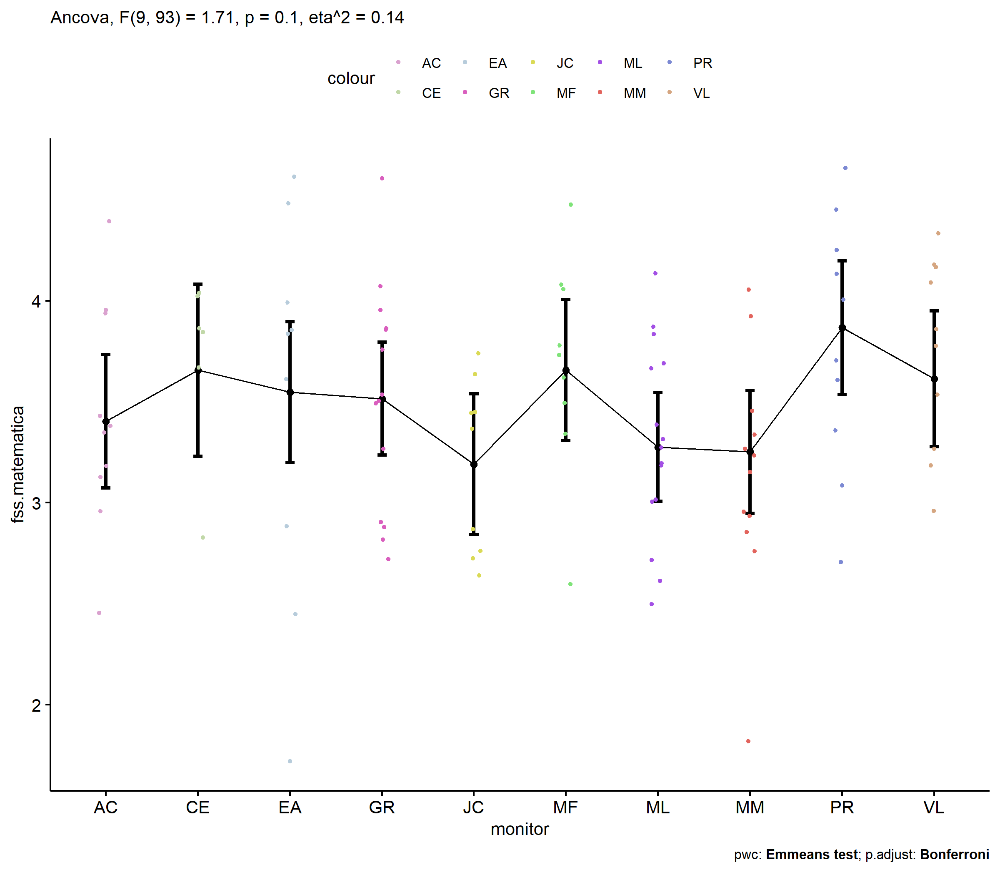<!-- -->

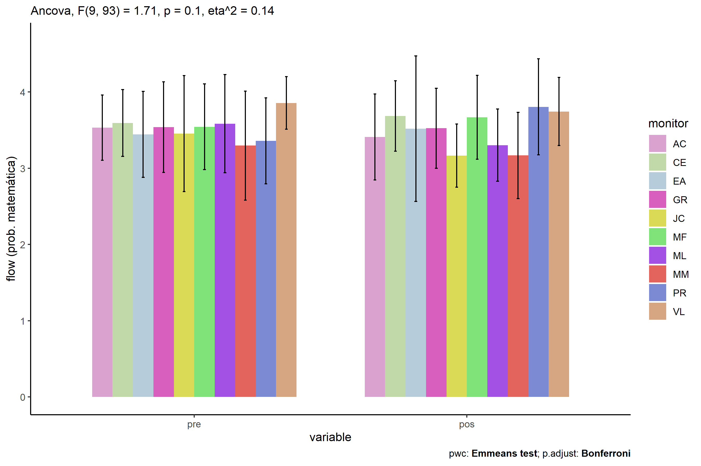<!-- -->

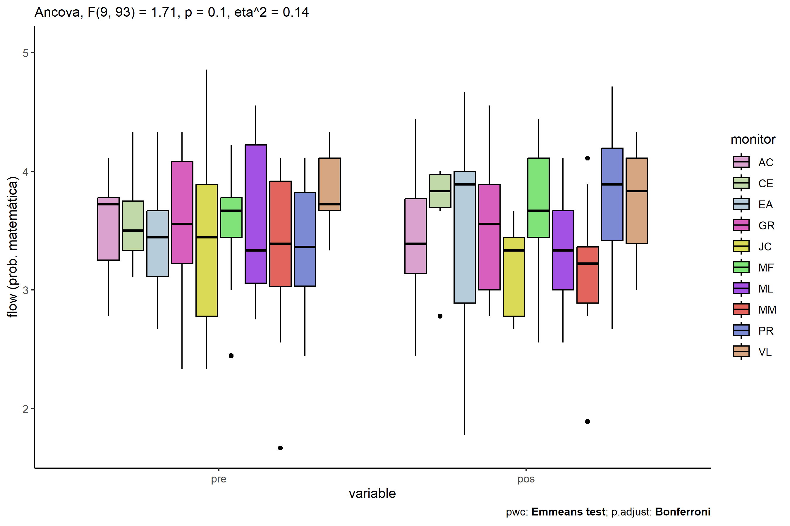<!-- -->

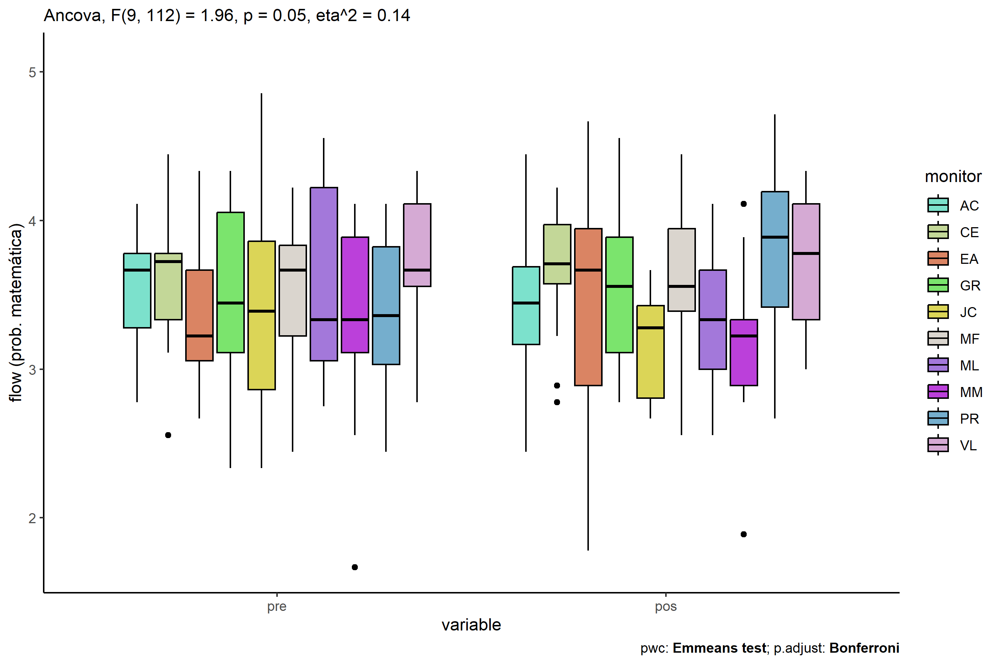<!-- -->

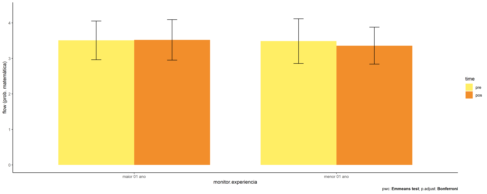<!-- -->

### factores: **grupo=“Experimental”:monitor.genero**

| var            | monitor.genero |   n | M (pre) | SE (pre) | M (unadj) | SE (unadj) | M (adj) | SE (adj) |
|:---------------|:---------------|----:|--------:|---------:|----------:|-----------:|--------:|---------:|
| fss.matematica | F              |  70 |   3.552 |    0.069 |     3.449 |      0.064 |   3.435 |    0.065 |
| fss.matematica | M              |  34 |   3.448 |    0.100 |     3.539 |      0.117 |   3.567 |    0.093 |

| .y.            | group1 | group2 | estimate | conf.low | conf.high |    se | statistic |     p | p.adj | p.adj.signif |
|:---------------|:-------|:-------|---------:|---------:|----------:|------:|----------:|------:|------:|:-------------|
| fss.matematica | F      | M      |   -0.133 |   -0.358 |     0.092 | 0.114 |    -1.170 | 0.245 | 0.245 | ns           |
| dfs.matematica | F      | M      |    0.105 |   -0.136 |     0.345 | 0.121 |     0.864 | 0.390 | 0.390 | ns           |

| monitor.genero | group1 | group2 | estimate | conf.low | conf.high |    se | statistic |     p | p.adj | p.adj.signif |
|:---------------|:-------|:-------|---------:|---------:|----------:|------:|----------:|------:|------:|:-------------|
| F              | pre    | pos    |    0.104 |   -0.091 |     0.298 | 0.099 |     1.049 | 0.295 | 0.295 | ns           |
| M              | pre    | pos    |   -0.091 |   -0.370 |     0.188 | 0.142 |    -0.642 | 0.521 | 0.521 | ns           |

    ## Scale for colour is already present.
    ## Adding another scale for colour, which will replace the existing scale.

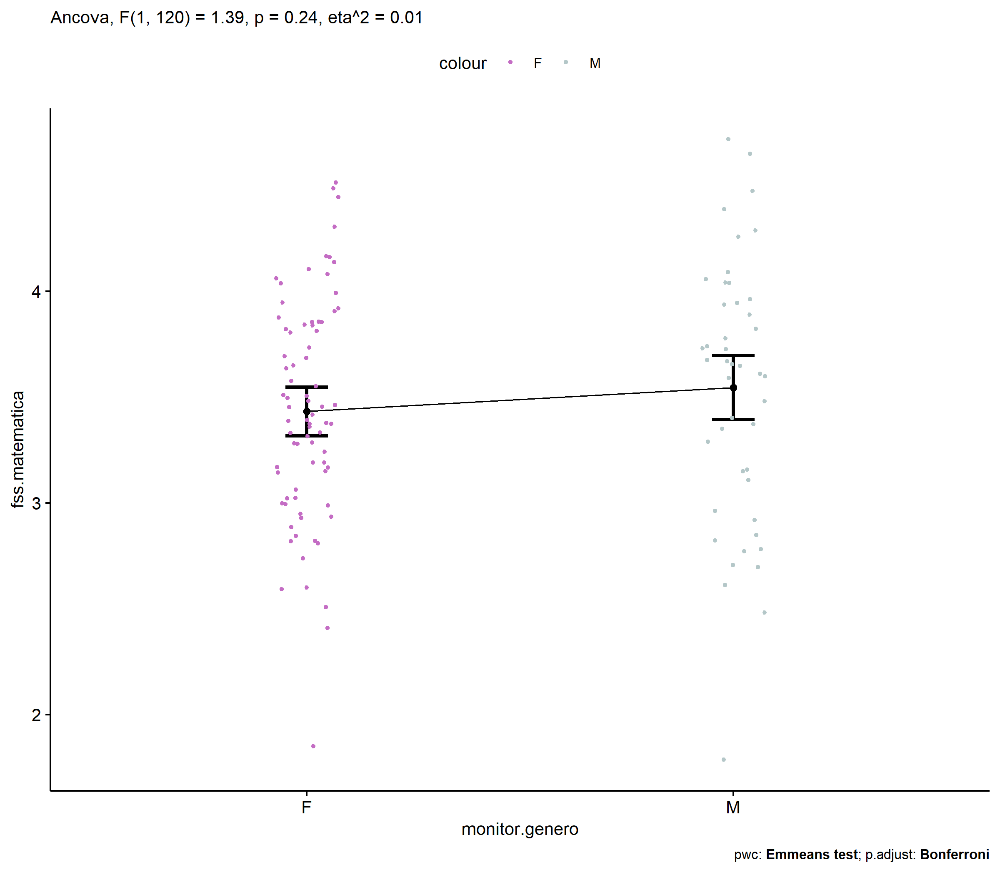<!-- -->

<!-- -->

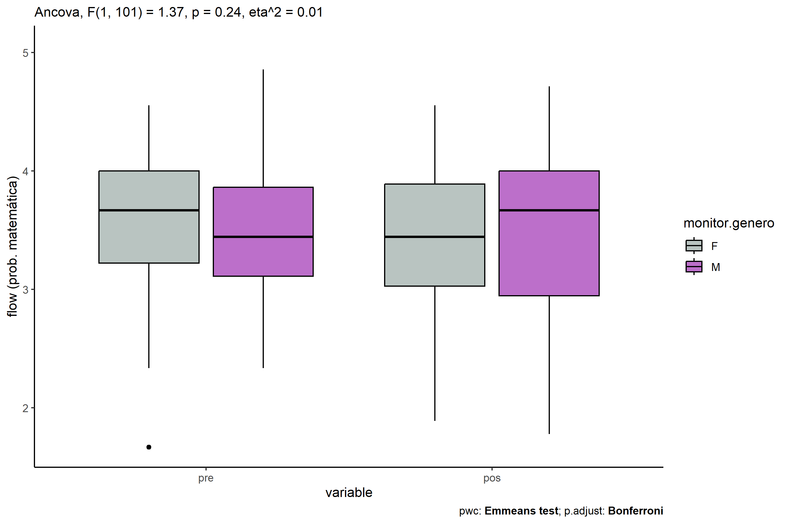<!-- -->

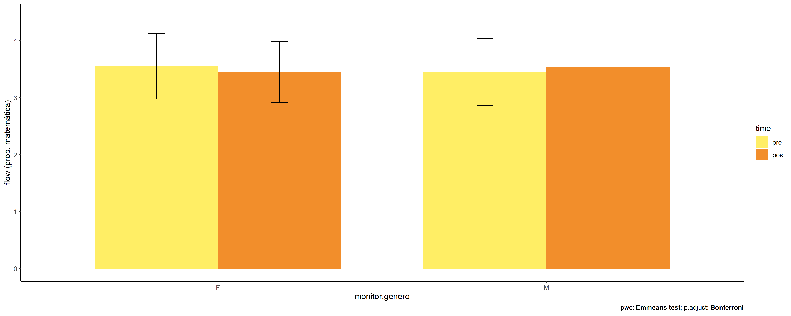<!-- -->

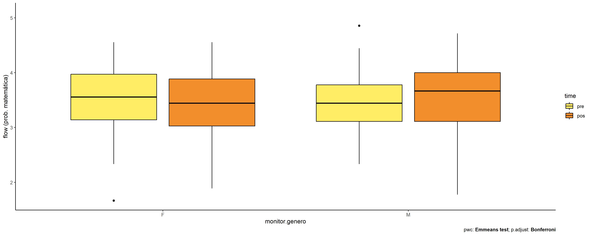<!-- -->

### factores: **grupo=“Experimental”:monitor.area**

| var            | monitor.area               |   n | M (pre) | SE (pre) | M (unadj) | SE (unadj) | M (adj) | SE (adj) |
|:---------------|:---------------------------|----:|--------:|---------:|----------:|-----------:|--------:|---------:|
| fss.matematica | Arquitetura e Urbanismo    |   9 |   3.453 |    0.254 |     3.165 |      0.138 |   3.190 |    0.175 |
| fss.matematica | Ciencias Biologicas        |  15 |   3.584 |    0.166 |     3.302 |      0.122 |   3.276 |    0.135 |
| fss.matematica | Comunicacao Social         |   6 |   3.593 |    0.178 |     3.685 |      0.189 |   3.656 |    0.214 |
| fss.matematica | Historia                   |  10 |   3.358 |    0.178 |     3.805 |      0.199 |   3.866 |    0.166 |
| fss.matematica | Letras - Lingua Portuguesa |   9 |   3.543 |    0.187 |     3.667 |      0.183 |   3.657 |    0.174 |
| fss.matematica | Matematica                 |  23 |   3.502 |    0.119 |     3.522 |      0.146 |   3.528 |    0.109 |
| fss.matematica | Nutricao                   |  12 |   3.296 |    0.207 |     3.167 |      0.163 |   3.252 |    0.152 |
| fss.matematica | Pedagogia                  |  10 |   3.533 |    0.135 |     3.410 |      0.178 |   3.404 |    0.166 |
| fss.matematica | Servico Social             |  10 |   3.856 |    0.109 |     3.744 |      0.142 |   3.614 |    0.168 |

| .y.            | group1                  | group2              | estimate | conf.low | conf.high |    se | statistic |     p | p.adj | p.adj.signif |
|:---------------|:------------------------|:--------------------|---------:|---------:|----------:|------:|----------:|------:|------:|:-------------|
| fss.matematica | Arquitetura e Urbanismo | Ciencias Biologicas |   -0.086 |   -0.525 |     0.353 | 0.221 |    -0.390 | 0.697 | 1.000 | ns           |
| fss.matematica | Arquitetura e Urbanismo | Comunicacao Social  |   -0.466 |   -1.015 |     0.082 | 0.276 |    -1.688 | 0.095 | 1.000 | ns           |
| fss.matematica | Arquitetura e Urbanismo | Historia            |   -0.676 |   -1.154 |    -0.198 | 0.241 |    -2.810 | 0.006 | 0.217 | ns           |
| fss.matematica | Arquitetura e Urbanismo | Letras              |   -0.467 |   -0.957 |     0.023 | 0.247 |    -1.891 | 0.062 | 1.000 | ns           |
| fss.matematica | Arquitetura e Urbanismo | Matematica          |   -0.338 |   -0.746 |     0.071 | 0.206 |    -1.640 | 0.104 | 1.000 | ns           |
| fss.matematica | Arquitetura e Urbanismo | Nutricao            |   -0.062 |   -0.521 |     0.397 | 0.231 |    -0.269 | 0.789 | 1.000 | ns           |
| fss.matematica | Arquitetura e Urbanismo | Pedagogia           |   -0.214 |   -0.691 |     0.264 | 0.241 |    -0.888 | 0.377 | 1.000 | ns           |
| fss.matematica | Arquitetura e Urbanismo | Servico Social      |   -0.424 |   -0.907 |     0.059 | 0.243 |    -1.742 | 0.085 | 1.000 | ns           |
| fss.matematica | Ciencias Biologicas     | Comunicacao Social  |   -0.380 |   -0.882 |     0.122 | 0.253 |    -1.503 | 0.136 | 1.000 | ns           |
| fss.matematica | Ciencias Biologicas     | Historia            |   -0.590 |   -1.016 |    -0.164 | 0.215 |    -2.749 | 0.007 | 0.258 | ns           |
| fss.matematica | Ciencias Biologicas     | Letras              |   -0.381 |   -0.819 |     0.058 | 0.221 |    -1.724 | 0.088 | 1.000 | ns           |
| fss.matematica | Ciencias Biologicas     | Matematica          |   -0.251 |   -0.597 |     0.094 | 0.174 |    -1.446 | 0.152 | 1.000 | ns           |
| fss.matematica | Ciencias Biologicas     | Nutricao            |    0.024 |   -0.382 |     0.430 | 0.204 |     0.117 | 0.907 | 1.000 | ns           |
| fss.matematica | Ciencias Biologicas     | Pedagogia           |   -0.127 |   -0.552 |     0.297 | 0.214 |    -0.596 | 0.552 | 1.000 | ns           |
| fss.matematica | Ciencias Biologicas     | Servico Social      |   -0.338 |   -0.765 |     0.090 | 0.215 |    -1.569 | 0.120 | 1.000 | ns           |
| fss.matematica | Comunicacao Social      | Historia            |   -0.210 |   -0.749 |     0.328 | 0.271 |    -0.775 | 0.440 | 1.000 | ns           |
| fss.matematica | Comunicacao Social      | Letras              |   -0.001 |   -0.548 |     0.547 | 0.276 |    -0.002 | 0.998 | 1.000 | ns           |
| fss.matematica | Comunicacao Social      | Matematica          |    0.129 |   -0.348 |     0.605 | 0.240 |     0.536 | 0.594 | 1.000 | ns           |
| fss.matematica | Comunicacao Social      | Nutricao            |    0.404 |   -0.118 |     0.926 | 0.263 |     1.535 | 0.128 | 1.000 | ns           |
| fss.matematica | Comunicacao Social      | Pedagogia           |    0.253 |   -0.284 |     0.789 | 0.270 |     0.934 | 0.353 | 1.000 | ns           |
| fss.matematica | Comunicacao Social      | Servico Social      |    0.042 |   -0.496 |     0.581 | 0.271 |     0.156 | 0.876 | 1.000 | ns           |
| fss.matematica | Historia                | Letras              |    0.210 |   -0.269 |     0.688 | 0.241 |     0.869 | 0.387 | 1.000 | ns           |
| fss.matematica | Historia                | Matematica          |    0.339 |   -0.056 |     0.733 | 0.199 |     1.704 | 0.092 | 1.000 | ns           |
| fss.matematica | Historia                | Nutricao            |    0.614 |    0.169 |     1.059 | 0.224 |     2.739 | 0.007 | 0.265 | ns           |
| fss.matematica | Historia                | Pedagogia           |    0.463 |   -0.003 |     0.929 | 0.235 |     1.972 | 0.052 | 1.000 | ns           |
| fss.matematica | Historia                | Servico Social      |    0.253 |   -0.221 |     0.726 | 0.239 |     1.059 | 0.292 | 1.000 | ns           |
| fss.matematica | Letras                  | Lingua Portuguesa   |    0.129 |   -0.280 |     0.538 | 0.206 |     0.627 | 0.532 | 1.000 | ns           |
| fss.matematica | Letras                  | Lingua Portuguesa   |    0.405 |   -0.056 |     0.865 | 0.232 |     1.744 | 0.084 | 1.000 | ns           |
| fss.matematica | Letras                  | Lingua Portuguesa   |    0.253 |   -0.224 |     0.731 | 0.241 |     1.052 | 0.295 | 1.000 | ns           |
| fss.matematica | Letras                  | Lingua Portuguesa   |    0.043 |   -0.438 |     0.524 | 0.242 |     0.177 | 0.860 | 1.000 | ns           |
| fss.matematica | Matematica              | Nutricao            |    0.275 |   -0.097 |     0.647 | 0.187 |     1.470 | 0.145 | 1.000 | ns           |
| fss.matematica | Matematica              | Pedagogia           |    0.124 |   -0.270 |     0.518 | 0.198 |     0.625 | 0.533 | 1.000 | ns           |
| fss.matematica | Matematica              | Servico Social      |   -0.086 |   -0.485 |     0.313 | 0.201 |    -0.429 | 0.669 | 1.000 | ns           |
| fss.matematica | Nutricao                | Pedagogia           |   -0.151 |   -0.599 |     0.296 | 0.225 |    -0.672 | 0.503 | 1.000 | ns           |
| fss.matematica | Nutricao                | Servico Social      |   -0.362 |   -0.818 |     0.095 | 0.230 |    -1.572 | 0.119 | 1.000 | ns           |
| fss.matematica | Pedagogia               | Servico Social      |   -0.210 |   -0.679 |     0.258 | 0.236 |    -0.891 | 0.375 | 1.000 | ns           |
| dfs.matematica | Arquitetura e Urbanismo | Ciencias Biologicas |   -0.131 |   -0.619 |     0.357 | 0.246 |    -0.532 | 0.596 | 1.000 | ns           |
| dfs.matematica | Arquitetura e Urbanismo | Comunicacao Social  |   -0.139 |   -0.749 |     0.471 | 0.307 |    -0.453 | 0.651 | 1.000 | ns           |
| dfs.matematica | Arquitetura e Urbanismo | Historia            |    0.095 |   -0.437 |     0.627 | 0.268 |     0.354 | 0.724 | 1.000 | ns           |
| dfs.matematica | Arquitetura e Urbanismo | Letras              |   -0.090 |   -0.636 |     0.456 | 0.275 |    -0.327 | 0.744 | 1.000 | ns           |
| dfs.matematica | Arquitetura e Urbanismo | Matematica          |   -0.049 |   -0.504 |     0.406 | 0.229 |    -0.214 | 0.831 | 1.000 | ns           |
| dfs.matematica | Arquitetura e Urbanismo | Nutricao            |    0.157 |   -0.354 |     0.667 | 0.257 |     0.610 | 0.543 | 1.000 | ns           |
| dfs.matematica | Arquitetura e Urbanismo | Pedagogia           |   -0.080 |   -0.612 |     0.452 | 0.268 |    -0.299 | 0.766 | 1.000 | ns           |
| dfs.matematica | Arquitetura e Urbanismo | Servico Social      |   -0.402 |   -0.934 |     0.130 | 0.268 |    -1.501 | 0.137 | 1.000 | ns           |
| dfs.matematica | Ciencias Biologicas     | Comunicacao Social  |   -0.009 |   -0.568 |     0.551 | 0.282 |    -0.031 | 0.976 | 1.000 | ns           |
| dfs.matematica | Ciencias Biologicas     | Historia            |    0.226 |   -0.247 |     0.698 | 0.238 |     0.948 | 0.346 | 1.000 | ns           |
| dfs.matematica | Ciencias Biologicas     | Letras              |    0.041 |   -0.447 |     0.529 | 0.246 |     0.166 | 0.869 | 1.000 | ns           |
| dfs.matematica | Ciencias Biologicas     | Matematica          |    0.082 |   -0.303 |     0.466 | 0.194 |     0.422 | 0.674 | 1.000 | ns           |
| dfs.matematica | Ciencias Biologicas     | Nutricao            |    0.288 |   -0.161 |     0.736 | 0.226 |     1.274 | 0.206 | 1.000 | ns           |
| dfs.matematica | Ciencias Biologicas     | Pedagogia           |    0.051 |   -0.422 |     0.523 | 0.238 |     0.213 | 0.832 | 1.000 | ns           |
| dfs.matematica | Ciencias Biologicas     | Servico Social      |   -0.272 |   -0.744 |     0.201 | 0.238 |    -1.141 | 0.257 | 1.000 | ns           |
| dfs.matematica | Comunicacao Social      | Historia            |    0.234 |   -0.364 |     0.832 | 0.301 |     0.778 | 0.439 | 1.000 | ns           |
| dfs.matematica | Comunicacao Social      | Letras              |    0.049 |   -0.561 |     0.660 | 0.307 |     0.161 | 0.873 | 1.000 | ns           |
| dfs.matematica | Comunicacao Social      | Matematica          |    0.090 |   -0.441 |     0.621 | 0.267 |     0.337 | 0.737 | 1.000 | ns           |
| dfs.matematica | Comunicacao Social      | Nutricao            |    0.296 |   -0.283 |     0.875 | 0.292 |     1.016 | 0.312 | 1.000 | ns           |
| dfs.matematica | Comunicacao Social      | Pedagogia           |    0.059 |   -0.539 |     0.657 | 0.301 |     0.197 | 0.844 | 1.000 | ns           |
| dfs.matematica | Comunicacao Social      | Servico Social      |   -0.263 |   -0.861 |     0.335 | 0.301 |    -0.873 | 0.385 | 1.000 | ns           |
| dfs.matematica | Historia                | Letras              |   -0.185 |   -0.717 |     0.347 | 0.268 |    -0.690 | 0.492 | 1.000 | ns           |
| dfs.matematica | Historia                | Matematica          |   -0.144 |   -0.583 |     0.294 | 0.221 |    -0.652 | 0.516 | 1.000 | ns           |
| dfs.matematica | Historia                | Nutricao            |    0.062 |   -0.434 |     0.558 | 0.250 |     0.248 | 0.804 | 1.000 | ns           |
| dfs.matematica | Historia                | Pedagogia           |   -0.175 |   -0.693 |     0.343 | 0.261 |    -0.671 | 0.504 | 1.000 | ns           |
| dfs.matematica | Historia                | Servico Social      |   -0.497 |   -1.015 |     0.021 | 0.261 |    -1.907 | 0.060 | 1.000 | ns           |
| dfs.matematica | Letras                  | Lingua Portuguesa   |    0.041 |   -0.414 |     0.496 | 0.229 |     0.178 | 0.859 | 1.000 | ns           |
| dfs.matematica | Letras                  | Lingua Portuguesa   |    0.247 |   -0.264 |     0.757 | 0.257 |     0.960 | 0.339 | 1.000 | ns           |
| dfs.matematica | Letras                  | Lingua Portuguesa   |    0.010 |   -0.522 |     0.542 | 0.268 |     0.037 | 0.971 | 1.000 | ns           |
| dfs.matematica | Letras                  | Lingua Portuguesa   |   -0.312 |   -0.844 |     0.220 | 0.268 |    -1.166 | 0.247 | 1.000 | ns           |
| dfs.matematica | Matematica              | Nutricao            |    0.206 |   -0.206 |     0.618 | 0.208 |     0.993 | 0.323 | 1.000 | ns           |
| dfs.matematica | Matematica              | Pedagogia           |   -0.031 |   -0.469 |     0.408 | 0.221 |    -0.140 | 0.889 | 1.000 | ns           |
| dfs.matematica | Matematica              | Servico Social      |   -0.353 |   -0.792 |     0.085 | 0.221 |    -1.599 | 0.113 | 1.000 | ns           |
| dfs.matematica | Nutricao                | Pedagogia           |   -0.237 |   -0.733 |     0.259 | 0.250 |    -0.949 | 0.345 | 1.000 | ns           |
| dfs.matematica | Nutricao                | Servico Social      |   -0.559 |   -1.055 |    -0.064 | 0.250 |    -2.240 | 0.027 | 0.988 | ns           |
| dfs.matematica | Pedagogia               | Servico Social      |   -0.322 |   -0.840 |     0.196 | 0.261 |    -1.236 | 0.220 | 1.000 | ns           |

| monitor.area               | group1 | group2 | estimate | conf.low | conf.high |    se | statistic |     p | p.adj | p.adj.signif |
|:---------------------------|:-------|:-------|---------:|---------:|----------:|------:|----------:|------:|------:|:-------------|
| Arquitetura e Urbanismo    | pre    | pos    |    0.288 |   -0.247 |     0.823 | 0.271 |     1.062 | 0.289 | 0.289 | ns           |
| Ciencias Biologicas        | pre    | pos    |    0.282 |   -0.132 |     0.697 | 0.210 |     1.343 | 0.181 | 0.181 | ns           |
| Comunicacao Social         | pre    | pos    |   -0.093 |   -0.748 |     0.563 | 0.332 |    -0.279 | 0.781 | 0.781 | ns           |
| Historia                   | pre    | pos    |   -0.446 |   -0.954 |     0.061 | 0.257 |    -1.735 | 0.084 | 0.084 | ns           |
| Letras - Lingua Portuguesa | pre    | pos    |   -0.123 |   -0.658 |     0.412 | 0.271 |    -0.455 | 0.649 | 0.649 | ns           |
| Matematica                 | pre    | pos    |   -0.019 |   -0.354 |     0.315 | 0.170 |    -0.114 | 0.909 | 0.909 | ns           |
| Nutricao                   | pre    | pos    |    0.130 |   -0.334 |     0.593 | 0.235 |     0.552 | 0.582 | 0.582 | ns           |
| Pedagogia                  | pre    | pos    |    0.124 |   -0.384 |     0.631 | 0.257 |     0.480 | 0.631 | 0.631 | ns           |
| Servico Social             | pre    | pos    |    0.111 |   -0.396 |     0.619 | 0.257 |     0.432 | 0.666 | 0.666 | ns           |

    ## Scale for colour is already present.
    ## Adding another scale for colour, which will replace the existing scale.

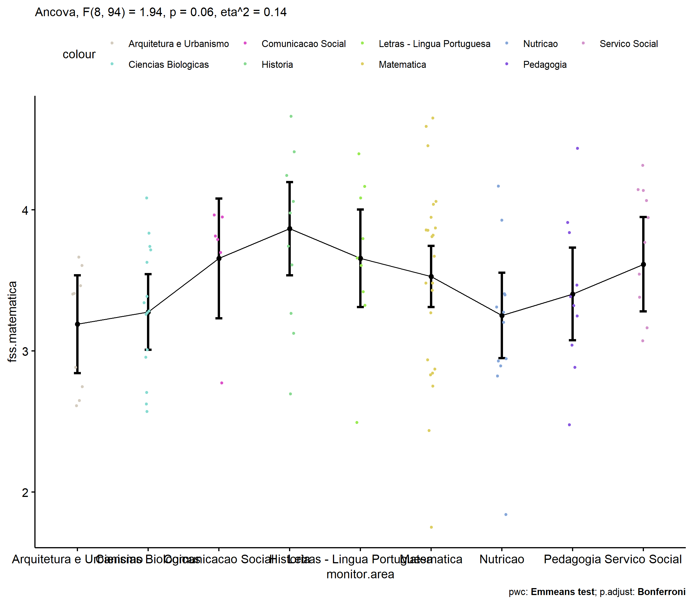<!-- -->

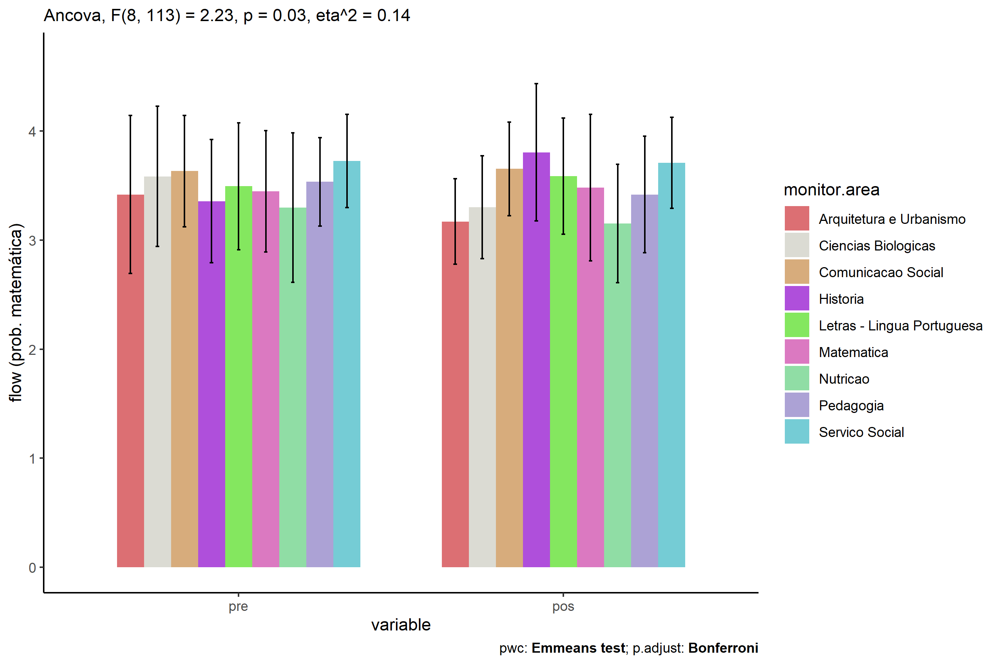<!-- -->

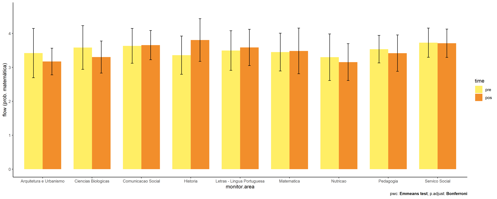<!-- -->

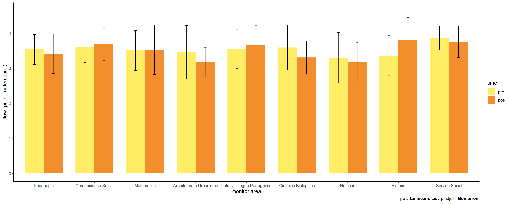<!-- -->

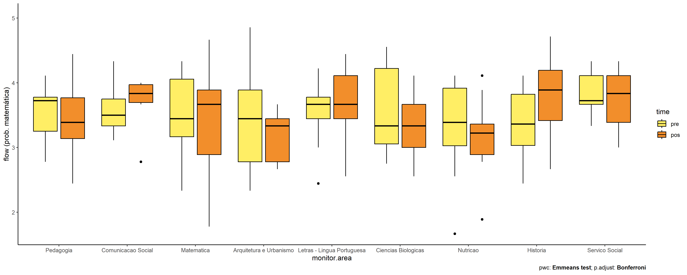<!-- -->

### factores: **grupo=“Experimental”:monitor.formacao**

| var            | monitor.formacao |   n | M (pre) | SE (pre) | M (unadj) | SE (unadj) | M (adj) | SE (adj) |
|:---------------|:-----------------|----:|--------:|---------:|----------:|-----------:|--------:|---------:|
| fss.matematica | ensino medio     |  79 |   3.519 |    0.069 |     3.466 |      0.062 |   3.466 |    0.061 |
| fss.matematica | especializacao   |   6 |   3.593 |    0.178 |     3.685 |      0.189 |   3.655 |    0.223 |
| fss.matematica | graduacao        |  19 |   3.491 |    0.111 |     3.461 |      0.173 |   3.472 |    0.125 |

| .y.            | group1         | group2         | estimate | conf.low | conf.high |    se | statistic |     p | p.adj | p.adj.signif |
|:---------------|:---------------|:---------------|---------:|---------:|----------:|------:|----------:|------:|------:|:-------------|
| fss.matematica | ensino medio   | especializacao |   -0.189 |   -0.648 |     0.269 | 0.231 |    -0.819 | 0.415 |     1 | ns           |
| fss.matematica | ensino medio   | graduacao      |   -0.006 |   -0.283 |     0.271 | 0.140 |    -0.042 | 0.966 |     1 | ns           |
| fss.matematica | especializacao | graduacao      |    0.184 |   -0.324 |     0.691 | 0.256 |     0.717 | 0.475 |     1 | ns           |
| dfs.matematica | ensino medio   | especializacao |   -0.074 |   -0.564 |     0.416 | 0.247 |    -0.299 | 0.766 |     1 | ns           |
| dfs.matematica | ensino medio   | graduacao      |    0.027 |   -0.268 |     0.323 | 0.149 |     0.184 | 0.854 |     1 | ns           |
| dfs.matematica | especializacao | graduacao      |    0.101 |   -0.441 |     0.643 | 0.273 |     0.371 | 0.711 |     1 | ns           |

| monitor.formacao | group1 | group2 | estimate | conf.low | conf.high |    se | statistic |     p | p.adj | p.adj.signif |
|:-----------------|:-------|:-------|---------:|---------:|----------:|------:|----------:|------:|------:|:-------------|
| ensino medio     | pre    | pos    |    0.052 |   -0.132 |     0.237 | 0.093 |     0.561 | 0.576 | 0.576 | ns           |
| especializacao   | pre    | pos    |   -0.093 |   -0.761 |     0.576 | 0.339 |    -0.273 | 0.785 | 0.785 | ns           |
| graduacao        | pre    | pos    |    0.030 |   -0.346 |     0.406 | 0.191 |     0.157 | 0.875 | 0.875 | ns           |

    ## Scale for colour is already present.
    ## Adding another scale for colour, which will replace the existing scale.

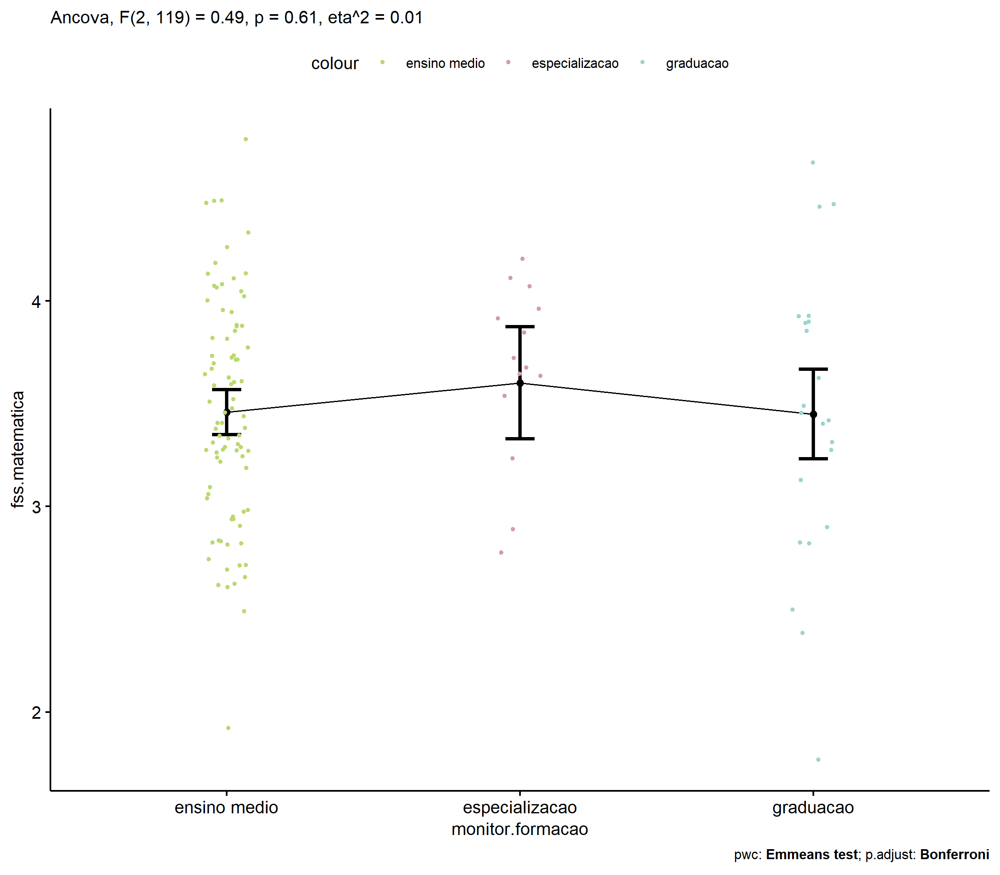<!-- -->

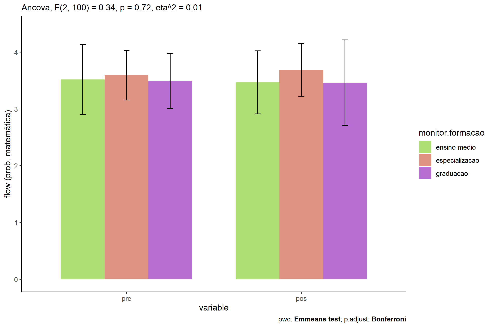<!-- -->

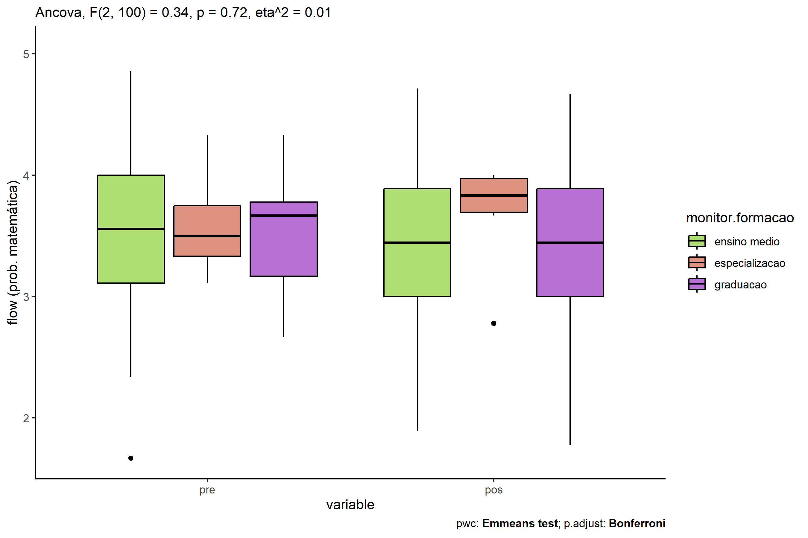<!-- -->

<!-- -->

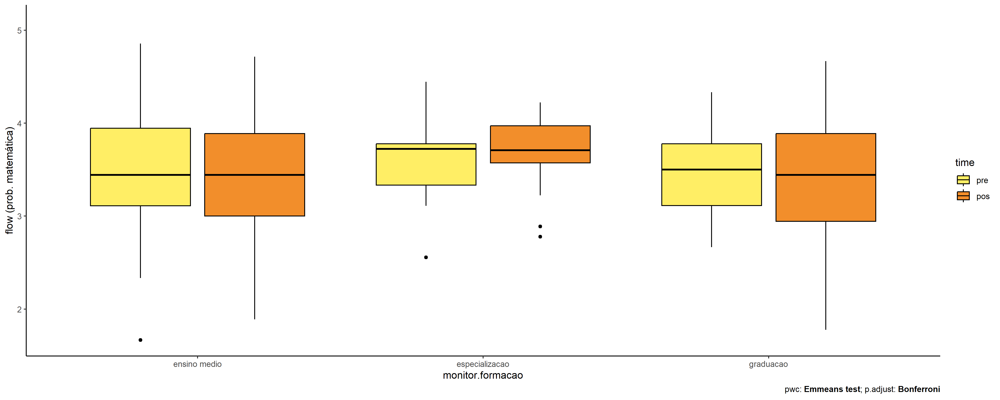<!-- -->

### factores: **grupo=“Experimental”:monitor.experiencia**

| var            | monitor.experiencia |   n | M (pre) | SE (pre) | M (unadj) | SE (unadj) | M (adj) | SE (adj) |
|:---------------|:--------------------|----:|--------:|---------:|----------:|-----------:|--------:|---------:|
| fss.matematica | maior 01 ano        |  73 |   3.516 |    0.064 |     3.531 |      0.070 |   3.532 |    0.063 |
| fss.matematica | menor 01 ano        |  31 |   3.522 |    0.119 |     3.353 |      0.098 |   3.351 |    0.097 |

| .y.            | group1       | group2       | estimate | conf.low | conf.high |    se | statistic |     p | p.adj | p.adj.signif |
|:---------------|:-------------|:-------------|---------:|---------:|----------:|------:|----------:|------:|------:|:-------------|
| fss.matematica | maior 01 ano | menor 01 ano |    0.181 |   -0.048 |     0.410 | 0.115 |     1.569 | 0.120 | 0.120 | ns           |
| dfs.matematica | maior 01 ano | menor 01 ano |   -0.006 |   -0.253 |     0.241 | 0.125 |    -0.049 | 0.961 | 0.961 | ns           |

| monitor.experiencia | group1 | group2 | estimate | conf.low | conf.high |    se | statistic |     p | p.adj | p.adj.signif |
|:--------------------|:-------|:-------|---------:|---------:|----------:|------:|----------:|------:|------:|:-------------|
| maior 01 ano        | pre    | pos    |   -0.015 |   -0.205 |     0.175 | 0.096 |    -0.157 | 0.875 | 0.875 | ns           |
| menor 01 ano        | pre    | pos    |    0.170 |   -0.122 |     0.462 | 0.148 |     1.146 | 0.253 | 0.253 | ns           |

    ## Scale for colour is already present.
    ## Adding another scale for colour, which will replace the existing scale.

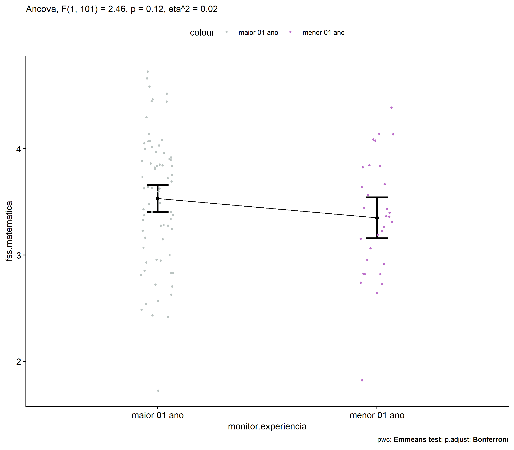<!-- -->

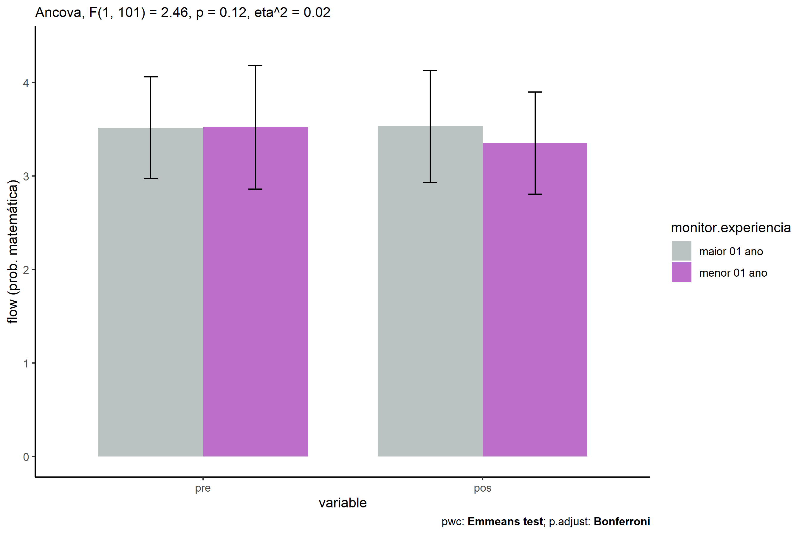<!-- -->

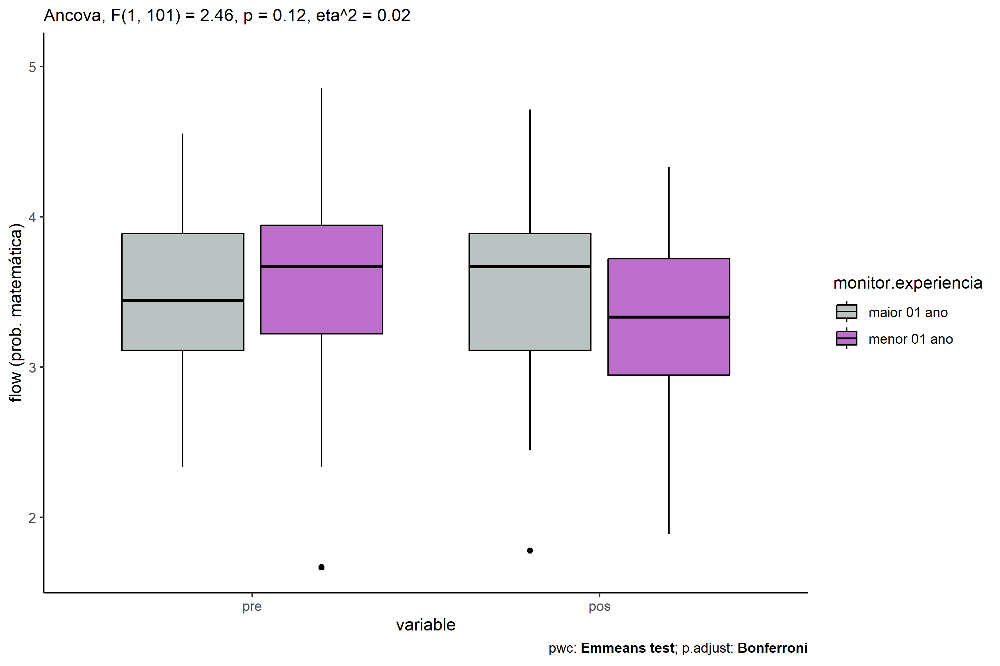<!-- -->

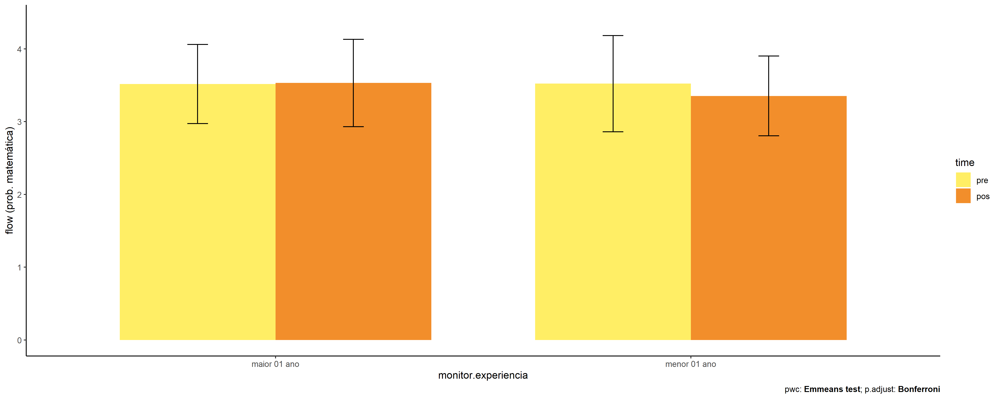<!-- -->

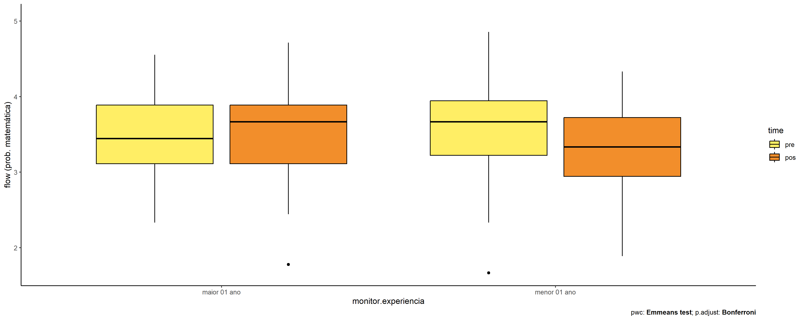<!-- -->
