ANCOVA test for matematica (engajamento no matematica)
================
Geiser C. Challco <geiser@alumni.usp.br>

- [Descriptive Statistics of Initial
  Data](#descriptive-statistics-of-initial-data)
- [Checking of Assumptions](#checking-of-assumptions)
  - [Assumption: Normality distribution of
    data](#assumption-normality-distribution-of-data)
  - [Assumption: Homogeneity of data
    distribution](#assumption-homogeneity-of-data-distribution)
- [Computation of ANCOVA test and Pairwise
  Comparison](#computation-of-ancova-test-and-pairwise-comparison)
  - [ANCOVA tests for one factor](#ancova-tests-for-one-factor)
  - [ANCOVA tests for two factors](#ancova-tests-for-two-factors)
  - [ANCOVA tests for
    grupo=“Experimental”](#ancova-tests-for-grupoexperimental)
  - [Pairwise comparisons for one
    factor](#pairwise-comparisons-for-one-factor)
    - [factor: **grupo**](#factor-grupo)
    - [factor: **genero**](#factor-genero)
    - [factor: **idade**](#factor-idade)
    - [factor: **zona.participante**](#factor-zonaparticipante)
    - [factor: **escola**](#factor-escola)
    - [factor: **zona.escola**](#factor-zonaescola)
  - [Pairwise comparisons for two
    factors](#pairwise-comparisons-for-two-factors)
    - [factores: **grupo:genero**](#factores-grupogenero)
    - [factores: **grupo:idade**](#factores-grupoidade)
    - [factores:
      **grupo:zona.participante**](#factores-grupozonaparticipante)
    - [factores: **grupo:escola**](#factores-grupoescola)
    - [factores: **grupo:zona.escola**](#factores-grupozonaescola)
  - [Pairwise comparisons for
    grupo=“Experimental”](#pairwise-comparisons-for-grupoexperimental)
    - [factores:
      **grupo=“Experimental”:monitor**](#factores-grupoexperimentalmonitor)
    - [factores:
      **grupo=“Experimental”:monitor.genero**](#factores-grupoexperimentalmonitorgenero)
    - [factores:
      **grupo=“Experimental”:monitor.area**](#factores-grupoexperimentalmonitorarea)
    - [factores:
      **grupo=“Experimental”:monitor.formacao**](#factores-grupoexperimentalmonitorformacao)
    - [factores:
      **grupo=“Experimental”:monitor.experiencia**](#factores-grupoexperimentalmonitorexperiencia)

**NOTE**

- Teste ANCOVA para determinar se houve diferenças significativas em
  referência ao engajamento no matematica (medido como estado de fluxo).
- ANCOVA test to determine whether there were significant differences in
  reference to engagement in matematica (measured as flow state).

# Descriptive Statistics of Initial Data

| grupo        | genero | idade | zona.participante | escola | zona.escola | variable       |   n |  mean | median |   min |   max |    sd |    se |    ci |   iqr |
|:-------------|:-------|:------|:------------------|:-------|:------------|:---------------|----:|------:|-------:|------:|------:|------:|------:|------:|------:|
| Controle     | F      |       |                   |        |             | fss.matematica |  60 | 3.401 |  3.389 | 2.000 | 4.333 | 0.522 | 0.067 | 0.135 | 0.778 |
| Controle     | M      |       |                   |        |             | fss.matematica |  65 | 3.363 |  3.333 | 2.444 | 4.444 | 0.482 | 0.060 | 0.120 | 0.556 |
| Experimental | F      |       |                   |        |             | fss.matematica |  57 | 3.487 |  3.444 | 2.444 | 4.444 | 0.540 | 0.071 | 0.143 | 0.889 |
| Experimental | M      |       |                   |        |             | fss.matematica |  75 | 3.448 |  3.444 | 1.778 | 4.714 | 0.599 | 0.069 | 0.138 | 0.833 |
| Controle     | F      |       |                   |        |             | dfs.matematica |  60 | 3.510 |  3.556 | 2.000 | 4.556 | 0.584 | 0.075 | 0.151 | 0.694 |
| Controle     | M      |       |                   |        |             | dfs.matematica |  65 | 3.546 |  3.556 | 2.444 | 4.556 | 0.483 | 0.060 | 0.120 | 0.667 |
| Experimental | F      |       |                   |        |             | dfs.matematica |  57 | 3.559 |  3.667 | 2.333 | 4.857 | 0.585 | 0.078 | 0.155 | 0.778 |
| Experimental | M      |       |                   |        |             | dfs.matematica |  75 | 3.419 |  3.444 | 1.667 | 4.556 | 0.538 | 0.062 | 0.124 | 0.667 |
| Controle     |        | 10y   |                   |        |             | fss.matematica |  24 | 3.435 |  3.444 | 2.444 | 4.444 | 0.508 | 0.104 | 0.214 | 0.500 |
| Controle     |        | 11y   |                   |        |             | fss.matematica |  67 | 3.374 |  3.333 | 2.000 | 4.444 | 0.504 | 0.062 | 0.123 | 0.556 |
| Controle     |        | 12y   |                   |        |             | fss.matematica |  18 | 3.474 |  3.333 | 2.778 | 4.333 | 0.509 | 0.120 | 0.253 | 0.667 |
| Controle     |        | 13y   |                   |        |             | fss.matematica |   7 | 3.058 |  2.889 | 2.778 | 3.625 | 0.320 | 0.121 | 0.296 | 0.389 |
| Controle     |        | 14y   |                   |        |             | fss.matematica |   1 | 3.556 |  3.556 | 3.556 | 3.556 |       |       |       | 0.000 |
| Controle     |        | 15y   |                   |        |             | fss.matematica |   1 | 2.444 |  2.444 | 2.444 | 2.444 |       |       |       | 0.000 |
| Controle     |        | 16y   |                   |        |             | fss.matematica |   1 | 3.000 |  3.000 | 3.000 | 3.000 |       |       |       | 0.000 |
| Controle     |        |       |                   |        |             | fss.matematica |   6 | 3.537 |  3.611 | 3.000 | 4.222 | 0.484 | 0.198 | 0.508 | 0.667 |
| Experimental |        | 10y   |                   |        |             | fss.matematica |  24 | 3.287 |  3.333 | 1.778 | 4.444 | 0.650 | 0.133 | 0.275 | 0.917 |
| Experimental |        | 11y   |                   |        |             | fss.matematica |  80 | 3.557 |  3.611 | 1.889 | 4.714 | 0.538 | 0.060 | 0.120 | 0.694 |
| Experimental |        | 12y   |                   |        |             | fss.matematica |  16 | 3.429 |  3.611 | 2.444 | 4.222 | 0.538 | 0.135 | 0.287 | 0.806 |
| Experimental |        | 13y   |                   |        |             | fss.matematica |   9 | 3.094 |  3.222 | 1.889 | 3.778 | 0.537 | 0.179 | 0.413 | 0.222 |
| Experimental |        | 14y   |                   |        |             | fss.matematica |   1 | 4.444 |  4.444 | 4.444 | 4.444 |       |       |       | 0.000 |
| Experimental |        |       |                   |        |             | fss.matematica |   2 | 3.389 |  3.389 | 3.333 | 3.444 | 0.079 | 0.056 | 0.706 | 0.056 |
| Controle     |        | 10y   |                   |        |             | dfs.matematica |  24 | 3.427 |  3.410 | 2.222 | 4.556 | 0.519 | 0.106 | 0.219 | 0.646 |
| Controle     |        | 11y   |                   |        |             | dfs.matematica |  67 | 3.588 |  3.667 | 2.000 | 4.556 | 0.529 | 0.065 | 0.129 | 0.667 |
| Controle     |        | 12y   |                   |        |             | dfs.matematica |  18 | 3.560 |  3.646 | 2.750 | 4.333 | 0.484 | 0.114 | 0.241 | 0.722 |
| Controle     |        | 13y   |                   |        |             | dfs.matematica |   7 | 3.683 |  3.778 | 3.000 | 4.556 | 0.519 | 0.196 | 0.480 | 0.556 |
| Controle     |        | 14y   |                   |        |             | dfs.matematica |   1 | 3.444 |  3.444 | 3.444 | 3.444 |       |       |       | 0.000 |
| Controle     |        | 15y   |                   |        |             | dfs.matematica |   1 | 2.444 |  2.444 | 2.444 | 2.444 |       |       |       | 0.000 |
| Controle     |        | 16y   |                   |        |             | dfs.matematica |   1 | 3.444 |  3.444 | 3.444 | 3.444 |       |       |       | 0.000 |
| Controle     |        |       |                   |        |             | dfs.matematica |   6 | 3.222 |  3.000 | 2.667 | 4.556 | 0.692 | 0.283 | 0.726 | 0.417 |
| Experimental |        | 10y   |                   |        |             | dfs.matematica |  24 | 3.463 |  3.444 | 2.333 | 4.556 | 0.546 | 0.111 | 0.231 | 0.583 |
| Experimental |        | 11y   |                   |        |             | dfs.matematica |  80 | 3.514 |  3.472 | 2.333 | 4.857 | 0.558 | 0.062 | 0.124 | 0.795 |
| Experimental |        | 12y   |                   |        |             | dfs.matematica |  16 | 3.398 |  3.389 | 1.667 | 4.333 | 0.646 | 0.161 | 0.344 | 0.500 |
| Experimental |        | 13y   |                   |        |             | dfs.matematica |   9 | 3.321 |  3.556 | 2.556 | 4.000 | 0.568 | 0.189 | 0.436 | 1.000 |
| Experimental |        | 14y   |                   |        |             | dfs.matematica |   1 | 3.000 |  3.000 | 3.000 | 3.000 |       |       |       | 0.000 |
| Experimental |        |       |                   |        |             | dfs.matematica |   2 | 3.889 |  3.889 | 3.889 | 3.889 | 0.000 | 0.000 | 0.000 | 0.000 |
| Controle     |        |       | Urbana            |        |             | fss.matematica |  54 | 3.381 |  3.389 | 2.444 | 4.444 | 0.514 | 0.070 | 0.140 | 0.667 |
| Controle     |        |       | Rural             |        |             | fss.matematica |  43 | 3.376 |  3.333 | 2.000 | 4.444 | 0.464 | 0.071 | 0.143 | 0.535 |
| Controle     |        |       |                   |        |             | fss.matematica |  28 | 3.390 |  3.556 | 2.444 | 4.333 | 0.544 | 0.103 | 0.211 | 0.917 |
| Experimental |        |       | Urbana            |        |             | fss.matematica |  49 | 3.375 |  3.333 | 1.889 | 4.714 | 0.624 | 0.089 | 0.179 | 1.000 |
| Experimental |        |       | Rural             |        |             | fss.matematica |  53 | 3.486 |  3.667 | 1.778 | 4.444 | 0.552 | 0.076 | 0.152 | 0.667 |
| Experimental |        |       |                   |        |             | fss.matematica |  30 | 3.574 |  3.611 | 2.556 | 4.556 | 0.514 | 0.094 | 0.192 | 0.667 |
| Controle     |        |       | Urbana            |        |             | dfs.matematica |  54 | 3.437 |  3.444 | 2.222 | 4.333 | 0.500 | 0.068 | 0.136 | 0.549 |
| Controle     |        |       | Rural             |        |             | dfs.matematica |  43 | 3.555 |  3.556 | 2.000 | 4.556 | 0.594 | 0.091 | 0.183 | 0.889 |
| Controle     |        |       |                   |        |             | dfs.matematica |  28 | 3.666 |  3.667 | 2.778 | 4.556 | 0.472 | 0.089 | 0.183 | 0.583 |
| Experimental |        |       | Urbana            |        |             | dfs.matematica |  49 | 3.382 |  3.333 | 1.667 | 4.857 | 0.598 | 0.085 | 0.172 | 0.667 |
| Experimental |        |       | Rural             |        |             | dfs.matematica |  53 | 3.517 |  3.444 | 2.556 | 4.556 | 0.552 | 0.076 | 0.152 | 0.778 |
| Experimental |        |       |                   |        |             | dfs.matematica |  30 | 3.574 |  3.667 | 2.444 | 4.333 | 0.507 | 0.093 | 0.189 | 0.500 |
| Controle     |        |       |                   | E1     |             | fss.matematica |  12 | 3.120 |  3.167 | 2.444 | 4.222 | 0.516 | 0.149 | 0.328 | 0.694 |
| Controle     |        |       |                   | E2     |             | fss.matematica |  23 | 3.314 |  3.222 | 2.444 | 4.333 | 0.479 | 0.100 | 0.207 | 0.722 |
| Controle     |        |       |                   | E3     |             | fss.matematica |  15 | 3.378 |  3.333 | 2.000 | 3.889 | 0.440 | 0.114 | 0.244 | 0.333 |
| Controle     |        |       |                   | E4     |             | fss.matematica |  16 | 3.370 |  3.278 | 2.778 | 4.000 | 0.361 | 0.090 | 0.192 | 0.524 |
| Controle     |        |       |                   | E5     |             | fss.matematica |  48 | 3.455 |  3.444 | 2.444 | 4.444 | 0.563 | 0.081 | 0.163 | 0.806 |
| Controle     |        |       |                   | E6     |             | fss.matematica |  11 | 3.505 |  3.556 | 2.444 | 4.000 | 0.462 | 0.139 | 0.310 | 0.556 |
| Experimental |        |       |                   | E1     |             | fss.matematica |  10 | 3.805 |  3.889 | 2.667 | 4.714 | 0.629 | 0.199 | 0.450 | 0.778 |
| Experimental |        |       |                   | E2     |             | fss.matematica |  26 | 3.292 |  3.278 | 1.889 | 4.444 | 0.532 | 0.104 | 0.215 | 0.486 |
| Experimental |        |       |                   | E3     |             | fss.matematica |  15 | 3.302 |  3.333 | 2.556 | 4.111 | 0.473 | 0.122 | 0.262 | 0.667 |
| Experimental |        |       |                   | E4     |             | fss.matematica |  14 | 3.654 |  3.708 | 2.778 | 4.222 | 0.430 | 0.115 | 0.248 | 0.399 |
| Experimental |        |       |                   | E5     |             | fss.matematica |  54 | 3.423 |  3.444 | 1.778 | 4.667 | 0.629 | 0.086 | 0.172 | 1.000 |
| Experimental |        |       |                   | E6     |             | fss.matematica |  13 | 3.709 |  3.778 | 3.000 | 4.333 | 0.417 | 0.116 | 0.252 | 0.778 |
| Controle     |        |       |                   | E1     |             | dfs.matematica |  12 | 3.074 |  3.222 | 2.222 | 3.556 | 0.445 | 0.129 | 0.283 | 0.611 |
| Controle     |        |       |                   | E2     |             | dfs.matematica |  23 | 3.570 |  3.667 | 2.444 | 4.333 | 0.438 | 0.091 | 0.189 | 0.604 |
| Controle     |        |       |                   | E3     |             | dfs.matematica |  15 | 3.731 |  3.889 | 2.750 | 4.556 | 0.626 | 0.162 | 0.346 | 0.944 |
| Controle     |        |       |                   | E4     |             | dfs.matematica |  16 | 3.583 |  3.444 | 3.222 | 4.556 | 0.362 | 0.090 | 0.193 | 0.361 |
| Controle     |        |       |                   | E5     |             | dfs.matematica |  48 | 3.496 |  3.578 | 2.000 | 4.556 | 0.582 | 0.084 | 0.169 | 0.806 |
| Controle     |        |       |                   | E6     |             | dfs.matematica |  11 | 3.727 |  3.778 | 3.000 | 4.333 | 0.405 | 0.122 | 0.272 | 0.333 |
| Experimental |        |       |                   | E1     |             | dfs.matematica |  10 | 3.358 |  3.361 | 2.444 | 4.111 | 0.564 | 0.178 | 0.404 | 0.792 |
| Experimental |        |       |                   | E2     |             | dfs.matematica |  26 | 3.406 |  3.500 | 1.667 | 4.111 | 0.554 | 0.109 | 0.224 | 0.639 |
| Experimental |        |       |                   | E3     |             | dfs.matematica |  15 | 3.584 |  3.333 | 2.750 | 4.556 | 0.643 | 0.166 | 0.356 | 1.167 |
| Experimental |        |       |                   | E4     |             | dfs.matematica |  14 | 3.633 |  3.722 | 2.556 | 4.444 | 0.512 | 0.137 | 0.296 | 0.444 |
| Experimental |        |       |                   | E5     |             | dfs.matematica |  54 | 3.409 |  3.444 | 2.333 | 4.857 | 0.574 | 0.078 | 0.157 | 0.778 |
| Experimental |        |       |                   | E6     |             | dfs.matematica |  13 | 3.726 |  3.667 | 2.778 | 4.333 | 0.429 | 0.119 | 0.259 | 0.556 |
| Controle     |        |       |                   |        | Urbana      | fss.matematica |  83 | 3.367 |  3.333 | 2.444 | 4.444 | 0.541 | 0.059 | 0.118 | 0.722 |
| Controle     |        |       |                   |        | Rural       | fss.matematica |  42 | 3.408 |  3.389 | 2.000 | 4.000 | 0.411 | 0.063 | 0.128 | 0.444 |
| Experimental |        |       |                   |        | Urbana      | fss.matematica |  90 | 3.427 |  3.444 | 1.778 | 4.714 | 0.613 | 0.065 | 0.128 | 0.889 |
| Experimental |        |       |                   |        | Rural       | fss.matematica |  42 | 3.545 |  3.667 | 2.556 | 4.333 | 0.469 | 0.072 | 0.146 | 0.667 |
| Controle     |        |       |                   |        | Urbana      | dfs.matematica |  83 | 3.456 |  3.556 | 2.000 | 4.556 | 0.546 | 0.060 | 0.119 | 0.778 |
| Controle     |        |       |                   |        | Rural       | dfs.matematica |  42 | 3.674 |  3.667 | 2.750 | 4.556 | 0.476 | 0.073 | 0.148 | 0.639 |
| Experimental |        |       |                   |        | Urbana      | dfs.matematica |  90 | 3.403 |  3.444 | 1.667 | 4.857 | 0.561 | 0.059 | 0.118 | 0.750 |
| Experimental |        |       |                   |        | Rural       | dfs.matematica |  42 | 3.644 |  3.667 | 2.556 | 4.556 | 0.531 | 0.082 | 0.165 | 0.778 |

# Checking of Assumptions

## Assumption: Normality distribution of data

| var            |   n |   skewness |  kurtosis | symmetry | statistic | method     |         p | p.signif | normality |
|:---------------|----:|-----------:|----------:|:---------|----------:|:-----------|----------:|:---------|:----------|
| fss.matematica | 257 | -0.0739820 | 0.1872458 | YES      | 1.0093810 | D’Agostino | 0.6036924 | ns       | \-        |
| fss.matematica | 249 | -0.1450690 | 0.2576588 | YES      | 2.0483048 | D’Agostino | 0.3591007 | ns       | \-        |
| fss.matematica | 199 | -0.0133832 | 0.4232199 | YES      | 1.9381224 | D’Agostino | 0.3794391 | ns       | QQ        |
| fss.matematica | 257 | -0.2318891 | 0.1739677 | YES      | 3.0951932 | D’Agostino | 0.2127587 | ns       | \-        |
| fss.matematica | 257 | -0.0591233 | 0.1530864 | YES      | 0.7569926 | D’Agostino | 0.6848905 | ns       | \-        |

## Assumption: Homogeneity of data distribution

| var            | method         | formula                             |   n | DFn.df1 | DFd.df2 | statistic |         p | p.signif |
|:---------------|:---------------|:------------------------------------|----:|--------:|--------:|----------:|----------:|:---------|
| fss.matematica | Levene’s test  | `.res`~`grupo`\*`genero`            | 257 |       3 |     253 | 0.1702667 | 0.9164037 | ns       |
| fss.matematica | Anova’s slopes | `.res`~`grupo`\*`genero`            | 257 |       3 |     249 | 0.4680000 | 0.7050000 | ns       |
| fss.matematica | Levene’s test  | `.res`~`grupo`\*`idade`             | 249 |      11 |     237 | 0.8855272 | 0.5552095 | ns       |
| fss.matematica | Anova’s slopes | `.res`~`grupo`\*`idade`             | 249 |       7 |     229 | 1.5400000 | 0.1550000 | ns       |
| fss.matematica | Levene’s test  | `.res`~`grupo`\*`zona.participante` | 199 |       3 |     195 | 1.3753103 | 0.2515624 | ns       |
| fss.matematica | Anova’s slopes | `.res`~`grupo`\*`zona.participante` | 199 |       3 |     191 | 0.5880000 | 0.6230000 | ns       |
| fss.matematica | Levene’s test  | `.res`~`grupo`\*`escola`            | 257 |      11 |     245 | 1.5430671 | 0.1167503 | ns       |
| fss.matematica | Anova’s slopes | `.res`~`grupo`\*`escola`            | 257 |      11 |     233 | 1.7220000 | 0.0690000 | ns       |
| fss.matematica | Levene’s test  | `.res`~`grupo`\*`zona.escola`       | 257 |       3 |     253 | 2.5579208 | 0.0556732 | ns       |
| fss.matematica | Anova’s slopes | `.res`~`grupo`\*`zona.escola`       | 257 |       3 |     249 | 0.7840000 | 0.5040000 | ns       |

# Computation of ANCOVA test and Pairwise Comparison

## ANCOVA tests for one factor

|     | Effect            | DFn | DFd |   SSn |    SSd |      F | p       |   ges | p\<.05 |
|:----|:------------------|----:|----:|------:|-------:|-------:|:--------|------:|:-------|
| 1   | dfs.matematica    |   1 | 254 | 8.587 | 65.347 | 33.379 | \<0.001 | 0.116 | \*     |
| 2   | grupo             |   1 | 254 | 0.646 | 65.347 |  2.510 | 0.114   | 0.010 |        |
| 4   | genero            |   1 | 254 | 0.016 | 65.977 |  0.061 | 0.805   | 0.000 |        |
| 6   | idade             |   6 | 241 | 3.581 | 61.056 |  2.356 | 0.031   | 0.055 | \*     |
| 8   | zona.participante |   1 | 196 | 0.024 | 52.408 |  0.089 | 0.765   | 0.000 |        |
| 10  | escola            |   5 | 250 | 1.943 | 64.050 |  1.517 | 0.185   | 0.029 |        |
| 12  | zona.escola       |   1 | 254 | 0.000 | 65.993 |  0.001 | 0.979   | 0.000 |        |

## ANCOVA tests for two factors

|     | Effect                  | DFn | DFd |   SSn |    SSd |      F | p       |   ges | p\<.05 |
|:----|:------------------------|----:|----:|------:|-------:|-------:|:--------|------:|:-------|
| 1   | dfs.matematica          |   1 | 252 | 8.572 | 65.268 | 33.095 | \<0.001 | 0.116 | \*     |
| 4   | grupo:genero            |   1 | 252 | 0.052 | 65.268 |  0.201 | 0.654   | 0.001 |        |
| 8   | grupo:idade             |   4 | 236 | 1.756 | 58.534 |  1.769 | 0.136   | 0.029 |        |
| 12  | grupo:zona.participante |   1 | 194 | 0.152 | 52.052 |  0.565 | 0.453   | 0.003 |        |
| 16  | grupo:escola            |   5 | 244 | 2.020 | 61.353 |  1.607 | 0.159   | 0.032 |        |
| 20  | grupo:zona.escola       |   1 | 252 | 0.067 | 65.279 |  0.260 | 0.61    | 0.001 |        |

## ANCOVA tests for grupo=“Experimental”

|     | Effect              | DFn | DFd |   SSn |    SSd |      F | p       |   ges | p\<.05 |
|:----|:--------------------|----:|----:|------:|-------:|-------:|:--------|------:|:-------|
| 1   | dfs.matematica      |   1 | 112 | 5.533 | 27.525 | 22.513 | \<0.001 | 0.167 | \*     |
| 2   | monitor             |   9 | 112 | 4.343 | 27.525 |  1.963 | 0.05    | 0.136 |        |
| 4   | monitor.genero      |   1 | 120 | 0.364 | 31.503 |  1.388 | 0.241   | 0.011 |        |
| 6   | monitor.area        |   8 | 113 | 4.341 | 27.527 |  2.227 | 0.03    | 0.136 | \*     |
| 8   | monitor.formacao    |   2 | 119 | 0.260 | 31.607 |  0.490 | 0.614   | 0.008 |        |
| 10  | monitor.experiencia |   1 | 120 | 0.598 | 31.270 |  2.293 | 0.133   | 0.019 |        |

## Pairwise comparisons for one factor

### factor: **grupo**

| var            | grupo        |   n | M (pre) | SE (pre) | M (unadj) | SE (unadj) | M (adj) | SE (adj) |
|:---------------|:-------------|----:|--------:|---------:|----------:|-----------:|--------:|---------:|
| fss.matematica | Controle     | 125 |   3.529 |    0.048 |     3.381 |      0.045 |   3.373 |    0.045 |
| fss.matematica | Experimental | 132 |   3.480 |    0.049 |     3.465 |      0.050 |   3.473 |    0.044 |

| .y.            | group1   | group2       | estimate | conf.low | conf.high |    se | statistic |     p | p.adj | p.adj.signif |
|:---------------|:---------|:-------------|---------:|---------:|----------:|------:|----------:|------:|------:|:-------------|
| fss.matematica | Controle | Experimental |   -0.100 |   -0.225 |     0.024 | 0.063 |    -1.584 | 0.114 | 0.114 | ns           |
| dfs.matematica | Controle | Experimental |    0.049 |   -0.085 |     0.184 | 0.068 |     0.723 | 0.470 | 0.470 | ns           |

| .y.             | grupo        | group1 | group2 | estimate | conf.low | conf.high |    se | statistic |     p | p.adj | p.adj.signif |
|:----------------|:-------------|:-------|:-------|---------:|---------:|----------:|------:|----------:|------:|------:|:-------------|
| flow.matematica | Controle     | pre    | pos    |    0.148 |    0.013 |     0.283 | 0.069 |     2.155 | 0.032 | 0.032 | \*           |
| flow.matematica | Experimental | pre    | pos    |    0.015 |   -0.117 |     0.146 | 0.067 |     0.220 | 0.826 | 0.826 | ns           |

    ## Scale for colour is already present.
    ## Adding another scale for colour, which will replace the existing scale.

<!-- -->

<!-- -->

<!-- -->

### factor: **genero**

| var            | genero |   n | M (pre) | SE (pre) | M (unadj) | SE (unadj) | M (adj) | SE (adj) |
|:---------------|:-------|----:|--------:|---------:|----------:|-----------:|--------:|---------:|
| fss.matematica | F      | 117 |   3.534 |    0.054 |     3.443 |      0.049 |   3.433 |    0.047 |
| fss.matematica | M      | 140 |   3.478 |    0.044 |     3.408 |      0.046 |   3.417 |    0.043 |

| .y.            | group1 | group2 | estimate | conf.low | conf.high |    se | statistic |     p | p.adj | p.adj.signif |
|:---------------|:-------|:-------|---------:|---------:|----------:|------:|----------:|------:|------:|:-------------|
| fss.matematica | F      | M      |    0.016 |   -0.110 |     0.142 | 0.064 |     0.247 | 0.805 | 0.805 | ns           |
| dfs.matematica | F      | M      |    0.056 |   -0.079 |     0.191 | 0.069 |     0.820 | 0.413 | 0.413 | ns           |

| .y.             | genero | group1 | group2 | estimate | conf.low | conf.high |    se | statistic |     p | p.adj | p.adj.signif |
|:----------------|:-------|:-------|:-------|---------:|---------:|----------:|------:|----------:|------:|------:|:-------------|
| flow.matematica | F      | pre    | pos    |    0.091 |   -0.048 |     0.231 | 0.071 |     1.286 | 0.199 | 0.199 | ns           |
| flow.matematica | M      | pre    | pos    |    0.070 |   -0.058 |     0.197 | 0.065 |     1.071 | 0.284 | 0.284 | ns           |

    ## Scale for colour is already present.
    ## Adding another scale for colour, which will replace the existing scale.

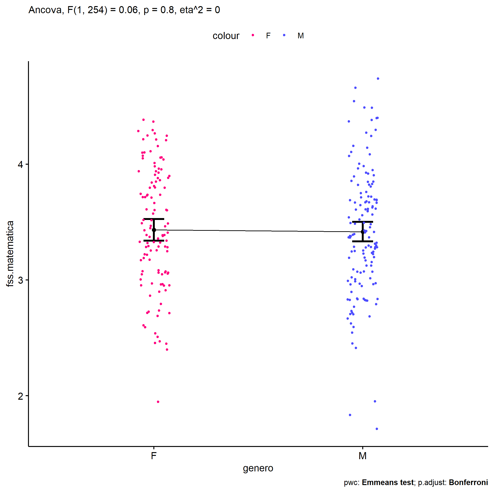<!-- -->

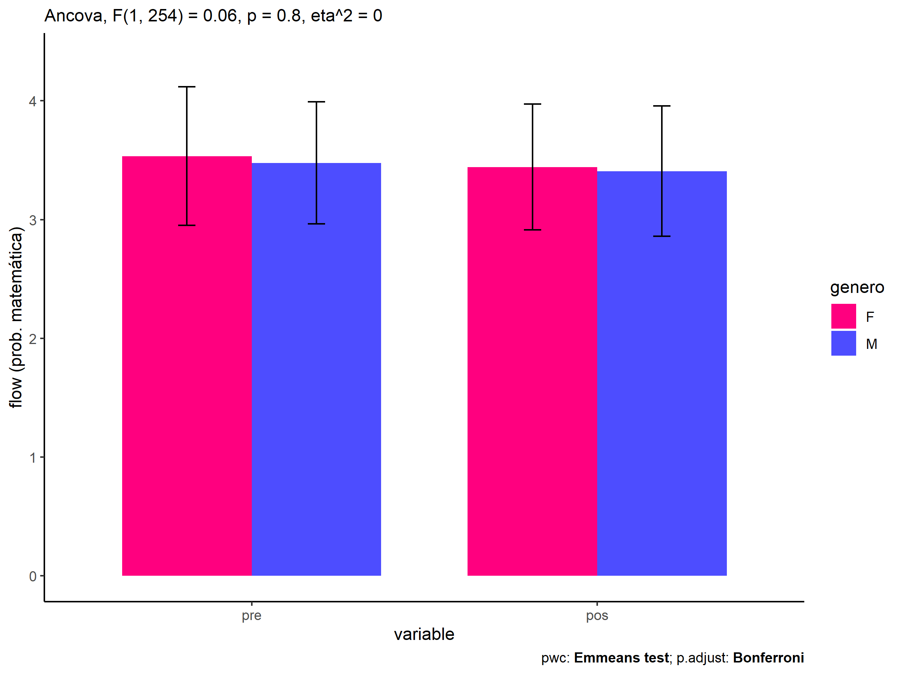<!-- -->

<!-- -->

### factor: **idade**

| var            | idade |   n | M (pre) | SE (pre) | M (unadj) | SE (unadj) | M (adj) | SE (adj) |
|:---------------|:------|----:|--------:|---------:|----------:|-----------:|--------:|---------:|
| fss.matematica | 10y   |  48 |   3.445 |    0.076 |     3.361 |      0.084 |   3.384 |    0.073 |
| fss.matematica | 11y   | 147 |   3.548 |    0.045 |     3.473 |      0.044 |   3.462 |    0.041 |
| fss.matematica | 12y   |  34 |   3.484 |    0.097 |     3.452 |      0.088 |   3.463 |    0.086 |
| fss.matematica | 13y   |  16 |   3.479 |    0.140 |     3.078 |      0.111 |   3.090 |    0.126 |

| .y.            | group1 | group2 | estimate | conf.low | conf.high |    se | statistic |     p | p.adj | p.adj.signif |
|:---------------|:-------|:-------|---------:|---------:|----------:|------:|----------:|------:|------:|:-------------|
| fss.matematica | 10y    | 11y    |   -0.078 |   -0.243 |     0.087 | 0.084 |    -0.932 | 0.352 | 1.000 | ns           |
| fss.matematica | 10y    | 12y    |   -0.078 |   -0.300 |     0.143 | 0.113 |    -0.695 | 0.487 | 1.000 | ns           |
| fss.matematica | 10y    | 13y    |    0.294 |    0.009 |     0.580 | 0.145 |     2.031 | 0.043 | 0.260 | ns           |
| fss.matematica | 11y    | 12y    |    0.000 |   -0.189 |     0.188 | 0.096 |    -0.003 | 0.997 | 1.000 | ns           |
| fss.matematica | 11y    | 13y    |    0.372 |    0.112 |     0.633 | 0.132 |     2.816 | 0.005 | 0.032 | \*           |
| fss.matematica | 12y    | 13y    |    0.373 |    0.073 |     0.673 | 0.152 |     2.448 | 0.015 | 0.090 | ns           |
| dfs.matematica | 10y    | 11y    |   -0.103 |   -0.281 |     0.075 | 0.091 |    -1.138 | 0.256 | 1.000 | ns           |
| dfs.matematica | 10y    | 12y    |   -0.039 |   -0.280 |     0.201 | 0.122 |    -0.322 | 0.748 | 1.000 | ns           |
| dfs.matematica | 10y    | 13y    |   -0.034 |   -0.344 |     0.275 | 0.157 |    -0.219 | 0.827 | 1.000 | ns           |
| dfs.matematica | 11y    | 12y    |    0.064 |   -0.140 |     0.268 | 0.104 |     0.615 | 0.539 | 1.000 | ns           |
| dfs.matematica | 11y    | 13y    |    0.069 |   -0.214 |     0.351 | 0.143 |     0.479 | 0.633 | 1.000 | ns           |
| dfs.matematica | 12y    | 13y    |    0.005 |   -0.320 |     0.330 | 0.165 |     0.030 | 0.976 | 1.000 | ns           |

| .y.             | idade | group1 | group2 | estimate | conf.low | conf.high |    se | statistic |     p | p.adj | p.adj.signif |
|:----------------|:------|:-------|:-------|---------:|---------:|----------:|------:|----------:|------:|------:|:-------------|
| flow.matematica | 10y   | pre    | pos    |    0.084 |   -0.132 |     0.300 | 0.110 |     0.760 | 0.447 | 0.447 | ns           |
| flow.matematica | 11y   | pre    | pos    |    0.074 |   -0.049 |     0.198 | 0.063 |     1.183 | 0.237 | 0.237 | ns           |
| flow.matematica | 12y   | pre    | pos    |    0.032 |   -0.225 |     0.288 | 0.131 |     0.242 | 0.809 | 0.809 | ns           |
| flow.matematica | 13y   | pre    | pos    |    0.401 |    0.027 |     0.775 | 0.190 |     2.105 | 0.036 | 0.036 | \*           |

    ## Scale for colour is already present.
    ## Adding another scale for colour, which will replace the existing scale.

<!-- -->

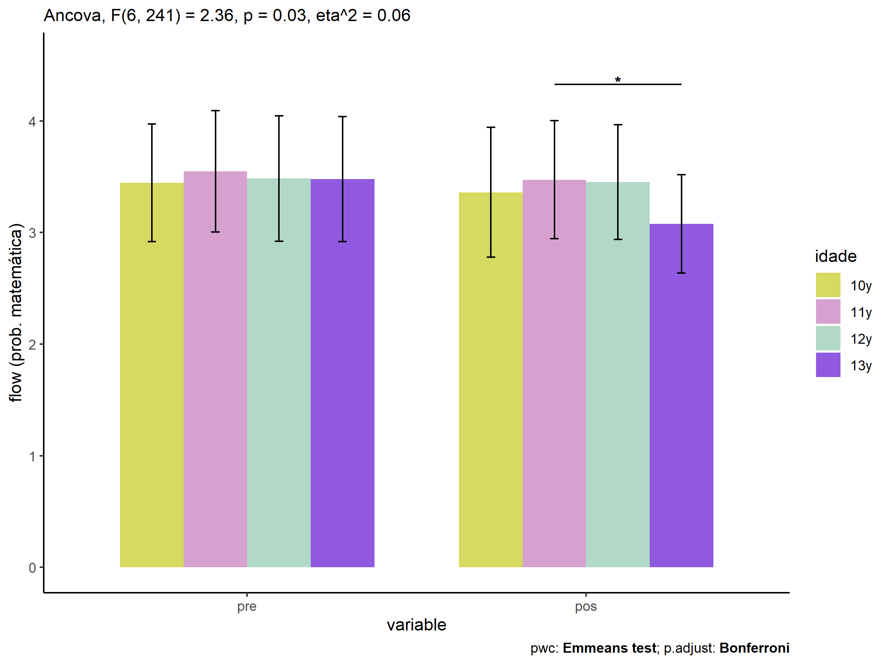<!-- -->

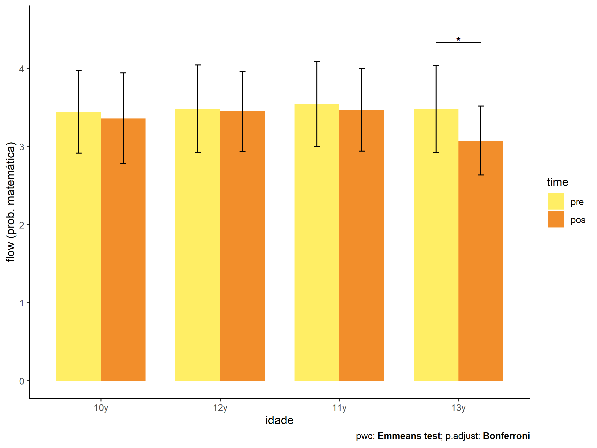<!-- -->

### factor: **zona.participante**

| var            | zona.participante |   n | M (pre) | SE (pre) | M (unadj) | SE (unadj) | M (adj) | SE (adj) |
|:---------------|:------------------|----:|--------:|---------:|----------:|-----------:|--------:|---------:|
| fss.matematica | Rural             |  96 |   3.534 |    0.058 |     3.437 |      0.053 |   3.418 |    0.053 |
| fss.matematica | Urbana            | 103 |   3.411 |    0.054 |     3.378 |      0.056 |   3.396 |    0.051 |

| .y.            | group1 | group2 | estimate | conf.low | conf.high |    se | statistic |     p | p.adj | p.adj.signif |
|:---------------|:-------|:-------|---------:|---------:|----------:|------:|----------:|------:|------:|:-------------|
| fss.matematica | Urbana | Rural  |   -0.022 |   -0.168 |     0.124 | 0.074 |    -0.299 | 0.765 | 0.765 | ns           |
| dfs.matematica | Urbana | Rural  |   -0.123 |   -0.279 |     0.033 | 0.079 |    -1.554 | 0.122 | 0.122 | ns           |

| .y.             | zona.participante | group1 | group2 | estimate | conf.low | conf.high |    se | statistic |     p | p.adj | p.adj.signif |
|:----------------|:------------------|:-------|:-------|---------:|---------:|----------:|------:|----------:|------:|------:|:-------------|
| flow.matematica | Urbana            | pre    | pos    |    0.033 |   -0.118 |     0.183 | 0.077 |     0.430 | 0.667 | 0.667 | ns           |
| flow.matematica | Rural             | pre    | pos    |    0.097 |   -0.059 |     0.253 | 0.079 |     1.226 | 0.221 | 0.221 | ns           |

    ## Scale for colour is already present.
    ## Adding another scale for colour, which will replace the existing scale.

<!-- -->

<!-- -->

<!-- -->

### factor: **escola**

| var            | escola |   n | M (pre) | SE (pre) | M (unadj) | SE (unadj) | M (adj) | SE (adj) |
|:---------------|:-------|----:|--------:|---------:|----------:|-----------:|--------:|---------:|
| fss.matematica | E1     |  22 |   3.203 |    0.109 |     3.431 |      0.140 |   3.534 |    0.109 |
| fss.matematica | E2     |  49 |   3.483 |    0.072 |     3.302 |      0.072 |   3.309 |    0.072 |
| fss.matematica | E3     |  30 |   3.658 |    0.115 |     3.340 |      0.082 |   3.287 |    0.093 |
| fss.matematica | E4     |  30 |   3.606 |    0.079 |     3.503 |      0.075 |   3.468 |    0.093 |
| fss.matematica | E5     | 102 |   3.450 |    0.057 |     3.438 |      0.059 |   3.456 |    0.050 |
| fss.matematica | E6     |  24 |   3.727 |    0.084 |     3.616 |      0.090 |   3.540 |    0.104 |

| .y.            | group1 | group2 | estimate | conf.low | conf.high |    se | statistic |     p | p.adj | p.adj.signif |
|:---------------|:-------|:-------|---------:|---------:|----------:|------:|----------:|------:|------:|:-------------|
| fss.matematica | E1     | E2     |    0.224 |   -0.034 |     0.482 | 0.131 |     1.711 | 0.088 | 1.000 | ns           |
| fss.matematica | E1     | E3     |    0.246 |   -0.039 |     0.531 | 0.145 |     1.701 | 0.090 | 1.000 | ns           |
| fss.matematica | E1     | E4     |    0.066 |   -0.218 |     0.350 | 0.144 |     0.457 | 0.648 | 1.000 | ns           |
| fss.matematica | E1     | E5     |    0.078 |   -0.158 |     0.314 | 0.120 |     0.649 | 0.517 | 1.000 | ns           |
| fss.matematica | E1     | E6     |   -0.006 |   -0.307 |     0.294 | 0.153 |    -0.042 | 0.967 | 1.000 | ns           |
| fss.matematica | E2     | E3     |    0.022 |   -0.210 |     0.254 | 0.118 |     0.187 | 0.852 | 1.000 | ns           |
| fss.matematica | E2     | E4     |   -0.158 |   -0.390 |     0.073 | 0.118 |    -1.346 | 0.180 | 1.000 | ns           |
| fss.matematica | E2     | E5     |   -0.146 |   -0.320 |     0.027 | 0.088 |    -1.663 | 0.098 | 1.000 | ns           |
| fss.matematica | E2     | E6     |   -0.230 |   -0.480 |     0.020 | 0.127 |    -1.815 | 0.071 | 1.000 | ns           |
| fss.matematica | E3     | E4     |   -0.180 |   -0.438 |     0.077 | 0.131 |    -1.379 | 0.169 | 1.000 | ns           |
| fss.matematica | E3     | E5     |   -0.168 |   -0.377 |     0.040 | 0.106 |    -1.590 | 0.113 | 1.000 | ns           |
| fss.matematica | E3     | E6     |   -0.252 |   -0.526 |     0.021 | 0.139 |    -1.820 | 0.070 | 1.000 | ns           |
| fss.matematica | E4     | E5     |    0.012 |   -0.196 |     0.220 | 0.106 |     0.113 | 0.910 | 1.000 | ns           |
| fss.matematica | E4     | E6     |   -0.072 |   -0.346 |     0.201 | 0.139 |    -0.520 | 0.603 | 1.000 | ns           |
| fss.matematica | E5     | E6     |   -0.084 |   -0.313 |     0.144 | 0.116 |    -0.725 | 0.469 | 1.000 | ns           |
| dfs.matematica | E1     | E2     |   -0.280 |   -0.550 |    -0.009 | 0.137 |    -2.035 | 0.043 | 0.643 | ns           |
| dfs.matematica | E1     | E3     |   -0.454 |   -0.750 |    -0.158 | 0.150 |    -3.023 | 0.003 | 0.041 | \*           |
| dfs.matematica | E1     | E4     |   -0.403 |   -0.699 |    -0.107 | 0.150 |    -2.682 | 0.008 | 0.117 | ns           |
| dfs.matematica | E1     | E5     |   -0.247 |   -0.495 |     0.001 | 0.126 |    -1.962 | 0.051 | 0.763 | ns           |
| dfs.matematica | E1     | E6     |   -0.524 |   -0.835 |    -0.212 | 0.158 |    -3.312 | 0.001 | 0.016 | \*           |
| dfs.matematica | E2     | E3     |   -0.175 |   -0.419 |     0.070 | 0.124 |    -1.408 | 0.160 | 1.000 | ns           |
| dfs.matematica | E2     | E4     |   -0.123 |   -0.368 |     0.121 | 0.124 |    -0.995 | 0.321 | 1.000 | ns           |
| dfs.matematica | E2     | E5     |    0.033 |   -0.151 |     0.216 | 0.093 |     0.351 | 0.726 | 1.000 | ns           |
| dfs.matematica | E2     | E6     |   -0.244 |   -0.507 |     0.019 | 0.133 |    -1.828 | 0.069 | 1.000 | ns           |
| dfs.matematica | E3     | E4     |    0.051 |   -0.221 |     0.324 | 0.138 |     0.371 | 0.711 | 1.000 | ns           |
| dfs.matematica | E3     | E5     |    0.207 |   -0.012 |     0.426 | 0.111 |     1.865 | 0.063 | 0.950 | ns           |
| dfs.matematica | E3     | E6     |   -0.069 |   -0.358 |     0.220 | 0.147 |    -0.471 | 0.638 | 1.000 | ns           |
| dfs.matematica | E4     | E5     |    0.156 |   -0.063 |     0.375 | 0.111 |     1.404 | 0.161 | 1.000 | ns           |
| dfs.matematica | E4     | E6     |   -0.120 |   -0.409 |     0.168 | 0.147 |    -0.821 | 0.413 | 1.000 | ns           |
| dfs.matematica | E5     | E6     |   -0.277 |   -0.516 |    -0.037 | 0.121 |    -2.276 | 0.024 | 0.355 | ns           |

| .y.             | escola | group1 | group2 | estimate | conf.low | conf.high |    se | statistic |     p | p.adj | p.adj.signif |
|:----------------|:-------|:-------|:-------|---------:|---------:|----------:|------:|----------:|------:|------:|:-------------|
| flow.matematica | E1     | pre    | pos    |   -0.228 |   -0.546 |     0.089 | 0.162 |    -1.411 | 0.159 | 0.159 | ns           |
| flow.matematica | E2     | pre    | pos    |    0.181 |   -0.032 |     0.393 | 0.108 |     1.667 | 0.096 | 0.096 | ns           |
| flow.matematica | E3     | pre    | pos    |    0.318 |    0.046 |     0.590 | 0.138 |     2.296 | 0.022 | 0.022 | \*           |
| flow.matematica | E4     | pre    | pos    |    0.104 |   -0.168 |     0.376 | 0.138 |     0.750 | 0.454 | 0.454 | ns           |
| flow.matematica | E5     | pre    | pos    |    0.013 |   -0.135 |     0.160 | 0.075 |     0.168 | 0.866 | 0.866 | ns           |
| flow.matematica | E6     | pre    | pos    |    0.111 |   -0.193 |     0.415 | 0.155 |     0.718 | 0.473 | 0.473 | ns           |

    ## Scale for colour is already present.
    ## Adding another scale for colour, which will replace the existing scale.

<!-- -->

<!-- -->

<!-- -->

### factor: **zona.escola**

| var            | zona.escola |   n | M (pre) | SE (pre) | M (unadj) | SE (unadj) | M (adj) | SE (adj) |
|:---------------|:------------|----:|--------:|---------:|----------:|-----------:|--------:|---------:|
| fss.matematica | Rural       |  84 |   3.659 |    0.055 |     3.477 |      0.048 |   3.425 |    0.056 |
| fss.matematica | Urbana      | 173 |   3.428 |    0.042 |     3.399 |      0.044 |   3.424 |    0.039 |

| .y.            | group1 | group2 | estimate | conf.low | conf.high |    se | statistic |     p | p.adj | p.adj.signif |
|:---------------|:-------|:-------|---------:|---------:|----------:|------:|----------:|------:|------:|:-------------|
| fss.matematica | Urbana | Rural  |   -0.002 |   -0.138 |     0.134 | 0.069 |    -0.026 | 0.979 | 0.979 | ns           |
| dfs.matematica | Urbana | Rural  |   -0.231 |   -0.372 |    -0.090 | 0.071 |    -3.236 | 0.001 | 0.001 | \*\*         |

| .y.             | zona.escola | group1 | group2 | estimate | conf.low | conf.high |    se | statistic |     p | p.adj | p.adj.signif |
|:----------------|:------------|:-------|:-------|---------:|---------:|----------:|------:|----------:|------:|------:|:-------------|
| flow.matematica | Urbana      | pre    | pos    |    0.030 |   -0.084 |     0.143 | 0.058 |     0.512 | 0.609 | 0.609 | ns           |
| flow.matematica | Rural       | pre    | pos    |    0.182 |    0.019 |     0.345 | 0.083 |     2.198 | 0.028 | 0.028 | \*           |

    ## Scale for colour is already present.
    ## Adding another scale for colour, which will replace the existing scale.

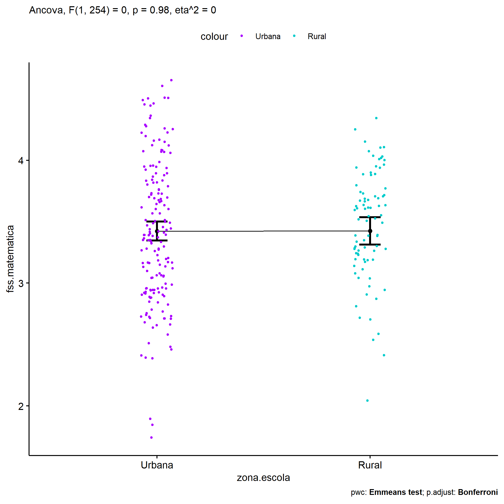<!-- -->

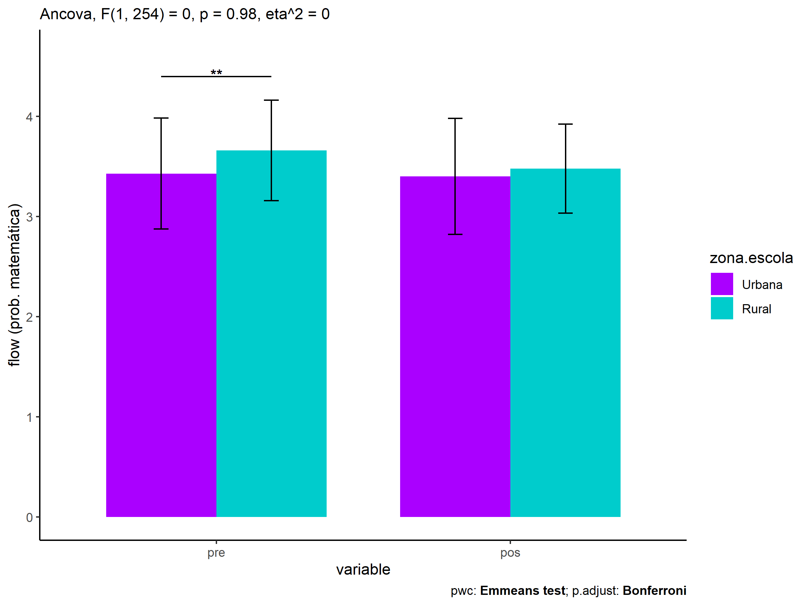<!-- -->

<!-- -->

## Pairwise comparisons for two factors

### factores: **grupo:genero**

| var            | grupo        | genero |   n | M (pre) | SE (pre) | M (unadj) | SE (unadj) | M (adj) | SE (adj) |
|:---------------|:-------------|:-------|----:|--------:|---------:|----------:|-----------:|--------:|---------:|
| fss.matematica | Controle     | F      |  60 |   3.510 |    0.075 |     3.401 |      0.067 |   3.398 |    0.066 |
| fss.matematica | Controle     | M      |  65 |   3.546 |    0.060 |     3.363 |      0.060 |   3.349 |    0.063 |
| fss.matematica | Experimental | F      |  57 |   3.559 |    0.078 |     3.487 |      0.071 |   3.469 |    0.067 |
| fss.matematica | Experimental | M      |  75 |   3.419 |    0.062 |     3.448 |      0.069 |   3.476 |    0.059 |

| .y.            | grupo        | genero | group1   | group2       | estimate | conf.low | conf.high |    se | statistic |     p | p.adj | p.adj.signif |
|:---------------|:-------------|:-------|:---------|:-------------|---------:|---------:|----------:|------:|----------:|------:|------:|:-------------|
| fss.matematica |              | F      | Controle | Experimental |   -0.070 |   -0.256 |     0.115 | 0.094 |    -0.746 | 0.457 | 0.457 | ns           |
| fss.matematica |              | M      | Controle | Experimental |   -0.128 |   -0.298 |     0.043 | 0.087 |    -1.474 | 0.142 | 0.142 | ns           |
| dfs.matematica |              | F      | Controle | Experimental |   -0.049 |   -0.248 |     0.150 | 0.101 |    -0.484 | 0.629 | 0.629 | ns           |
| dfs.matematica |              | M      | Controle | Experimental |    0.127 |   -0.055 |     0.310 | 0.093 |     1.372 | 0.171 | 0.171 | ns           |
| fss.matematica | Controle     |        | F        | M            |    0.050 |   -0.130 |     0.229 | 0.091 |     0.545 | 0.586 | 0.586 | ns           |
| fss.matematica | Experimental |        | F        | M            |   -0.008 |   -0.185 |     0.169 | 0.090 |    -0.087 | 0.931 | 0.931 | ns           |
| dfs.matematica | Controle     |        | F        | M            |   -0.036 |   -0.229 |     0.157 | 0.098 |    -0.365 | 0.715 | 0.715 | ns           |
| dfs.matematica | Experimental |        | F        | M            |    0.140 |   -0.049 |     0.330 | 0.096 |     1.461 | 0.145 | 0.145 | ns           |

| .y.             | grupo        | genero | group1 | group2 | estimate | conf.low | conf.high |    se | statistic |     p | p.adj | p.adj.signif |
|:----------------|:-------------|:-------|:-------|:-------|---------:|---------:|----------:|------:|----------:|------:|------:|:-------------|
| flow.matematica | Controle     | F      | pre    | pos    |    0.110 |   -0.085 |     0.305 | 0.099 |     1.106 | 0.269 | 0.269 | ns           |
| flow.matematica | Controle     | M      | pre    | pos    |    0.183 |   -0.004 |     0.370 | 0.095 |     1.921 | 0.055 | 0.055 | ns           |
| flow.matematica | Experimental | F      | pre    | pos    |    0.072 |   -0.128 |     0.272 | 0.102 |     0.708 | 0.479 | 0.479 | ns           |
| flow.matematica | Experimental | M      | pre    | pos    |   -0.029 |   -0.203 |     0.146 | 0.089 |    -0.325 | 0.745 | 0.745 | ns           |

    ## Scale for colour is already present.
    ## Adding another scale for colour, which will replace the existing scale.

<!-- -->

    ## Scale for colour is already present.
    ## Adding another scale for colour, which will replace the existing scale.

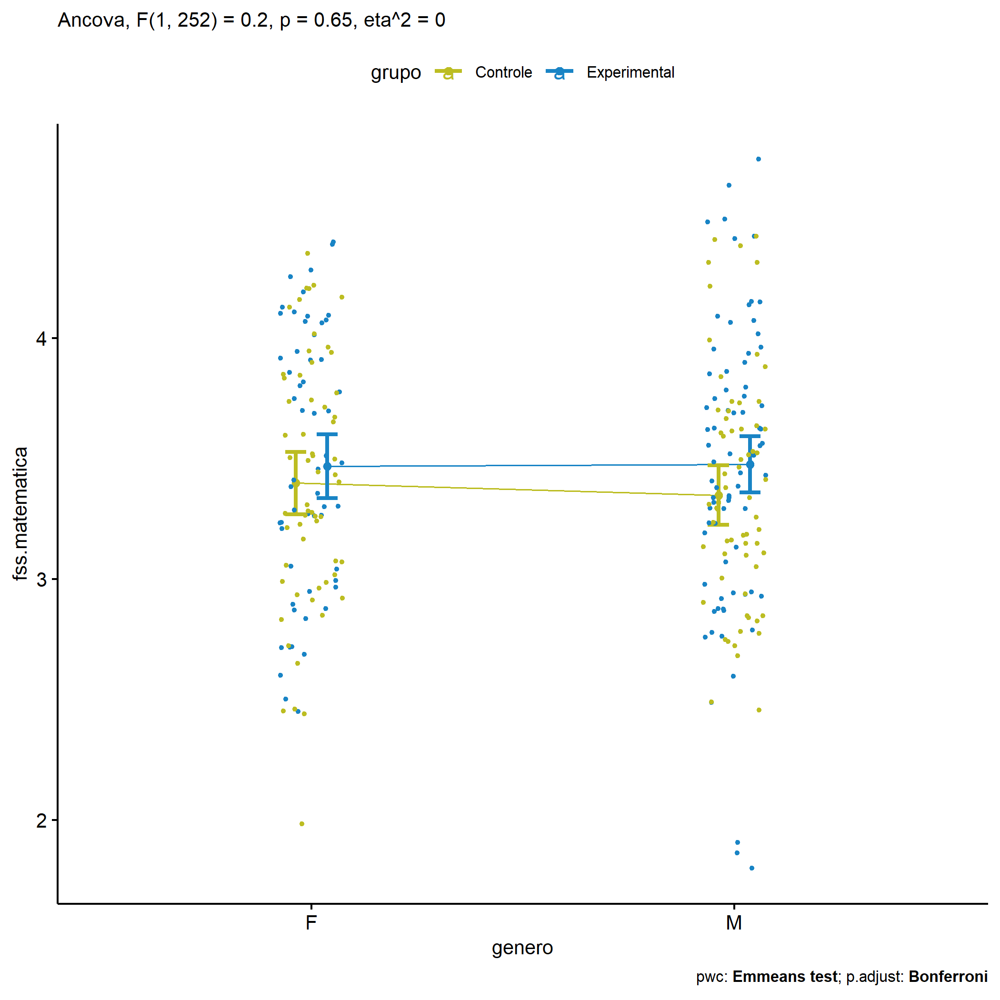<!-- -->

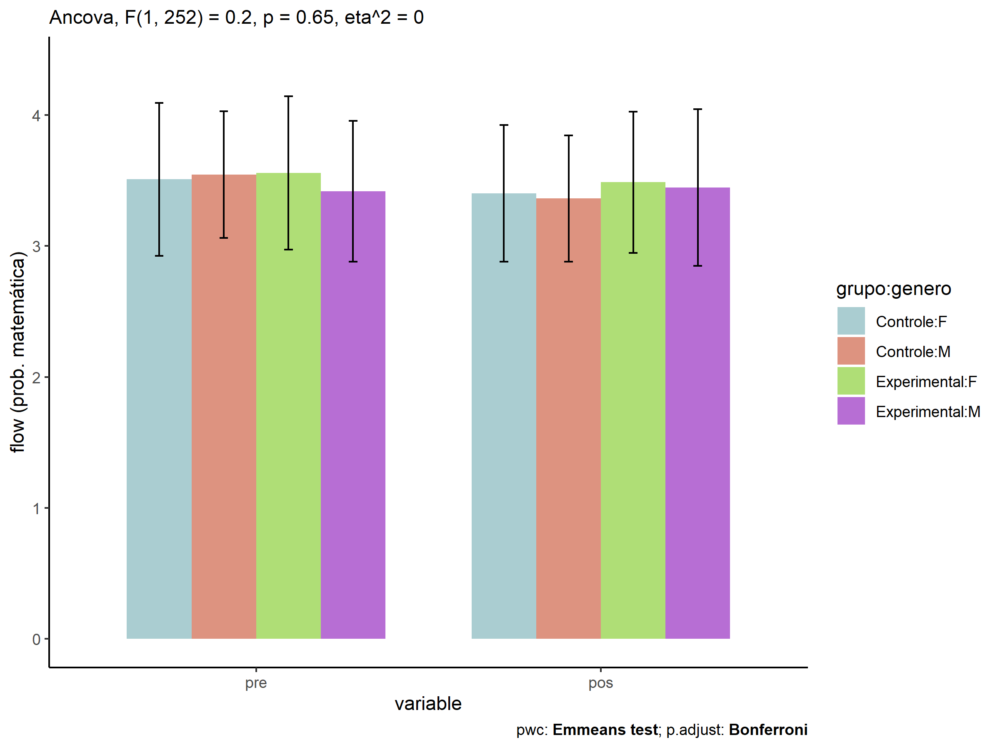<!-- -->

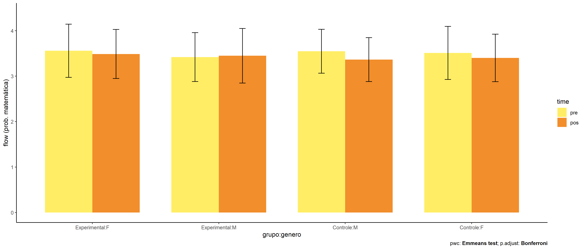<!-- -->

### factores: **grupo:idade**

| var            | grupo        | idade |   n | M (pre) | SE (pre) | M (unadj) | SE (unadj) | M (adj) | SE (adj) |
|:---------------|:-------------|:------|----:|--------:|---------:|----------:|-----------:|--------:|---------:|
| fss.matematica | Controle     | 10y   |  24 |   3.427 |    0.106 |     3.435 |      0.104 |   3.465 |    0.102 |
| fss.matematica | Controle     | 11y   |  67 |   3.588 |    0.065 |     3.374 |      0.062 |   3.348 |    0.061 |
| fss.matematica | Controle     | 12y   |  18 |   3.560 |    0.114 |     3.474 |      0.120 |   3.458 |    0.117 |
| fss.matematica | Controle     | 13y   |   7 |   3.683 |    0.196 |     3.058 |      0.121 |   2.999 |    0.188 |
| fss.matematica | Experimental | 10y   |  24 |   3.463 |    0.111 |     3.287 |      0.133 |   3.305 |    0.102 |
| fss.matematica | Experimental | 11y   |  80 |   3.514 |    0.062 |     3.557 |      0.060 |   3.557 |    0.056 |
| fss.matematica | Experimental | 12y   |  16 |   3.398 |    0.161 |     3.429 |      0.135 |   3.469 |    0.125 |
| fss.matematica | Experimental | 13y   |   9 |   3.321 |    0.189 |     3.094 |      0.179 |   3.161 |    0.166 |

| .y.            | grupo        | idade | group1   | group2       | estimate | conf.low | conf.high |    se | statistic |     p | p.adj | p.adj.signif |
|:---------------|:-------------|:------|:---------|:-------------|---------:|---------:|----------:|------:|----------:|------:|------:|:-------------|
| fss.matematica |              | 10y   | Controle | Experimental |    0.161 |   -0.123 |     0.444 | 0.144 |     1.118 | 0.265 | 0.265 | ns           |
| fss.matematica |              | 11y   | Controle | Experimental |   -0.208 |   -0.371 |    -0.046 | 0.083 |    -2.522 | 0.012 | 0.012 | \*           |
| fss.matematica |              | 12y   | Controle | Experimental |   -0.011 |   -0.349 |     0.327 | 0.171 |    -0.065 | 0.948 | 0.948 | ns           |
| fss.matematica |              | 13y   | Controle | Experimental |   -0.161 |   -0.658 |     0.335 | 0.252 |    -0.641 | 0.522 | 0.522 | ns           |
| dfs.matematica |              | 10y   | Controle | Experimental |   -0.036 |   -0.347 |     0.274 | 0.157 |    -0.232 | 0.817 | 0.817 | ns           |
| dfs.matematica |              | 11y   | Controle | Experimental |    0.073 |   -0.105 |     0.251 | 0.090 |     0.808 | 0.420 | 0.420 | ns           |
| dfs.matematica |              | 12y   | Controle | Experimental |    0.162 |   -0.208 |     0.531 | 0.187 |     0.863 | 0.389 | 0.389 | ns           |
| dfs.matematica |              | 13y   | Controle | Experimental |    0.362 |   -0.180 |     0.903 | 0.275 |     1.315 | 0.190 | 0.190 | ns           |
| fss.matematica | Controle     |       | 10y      | 11y          |    0.117 |   -0.117 |     0.351 | 0.119 |     0.984 | 0.326 | 1.000 | ns           |
| fss.matematica | Controle     |       | 10y      | 12y          |    0.008 |   -0.299 |     0.314 | 0.155 |     0.050 | 0.960 | 1.000 | ns           |
| fss.matematica | Controle     |       | 10y      | 13y          |    0.466 |    0.043 |     0.889 | 0.214 |     2.173 | 0.031 | 0.185 | ns           |
| fss.matematica | Controle     |       | 11y      | 12y          |   -0.109 |   -0.370 |     0.151 | 0.132 |    -0.826 | 0.410 | 1.000 | ns           |
| fss.matematica | Controle     |       | 11y      | 13y          |    0.349 |   -0.041 |     0.739 | 0.198 |     1.764 | 0.079 | 0.475 | ns           |
| fss.matematica | Controle     |       | 12y      | 13y          |    0.458 |    0.021 |     0.895 | 0.222 |     2.065 | 0.040 | 0.240 | ns           |
| fss.matematica | Experimental |       | 10y      | 11y          |   -0.252 |   -0.480 |    -0.024 | 0.116 |    -2.174 | 0.031 | 0.184 | ns           |
| fss.matematica | Experimental |       | 10y      | 12y          |   -0.164 |   -0.481 |     0.153 | 0.161 |    -1.020 | 0.309 | 1.000 | ns           |
| fss.matematica | Experimental |       | 10y      | 13y          |    0.144 |   -0.240 |     0.528 | 0.195 |     0.739 | 0.461 | 1.000 | ns           |
| fss.matematica | Experimental |       | 11y      | 12y          |    0.088 |   -0.181 |     0.357 | 0.137 |     0.644 | 0.520 | 1.000 | ns           |
| fss.matematica | Experimental |       | 11y      | 13y          |    0.396 |    0.050 |     0.742 | 0.175 |     2.256 | 0.025 | 0.150 | ns           |
| fss.matematica | Experimental |       | 12y      | 13y          |    0.308 |   -0.101 |     0.717 | 0.208 |     1.484 | 0.139 | 0.835 | ns           |
| dfs.matematica | Controle     |       | 10y      | 11y          |   -0.161 |   -0.417 |     0.095 | 0.130 |    -1.241 | 0.216 | 1.000 | ns           |
| dfs.matematica | Controle     |       | 10y      | 12y          |   -0.134 |   -0.469 |     0.201 | 0.170 |    -0.786 | 0.433 | 1.000 | ns           |
| dfs.matematica | Controle     |       | 10y      | 13y          |   -0.256 |   -0.718 |     0.206 | 0.234 |    -1.093 | 0.276 | 1.000 | ns           |
| dfs.matematica | Controle     |       | 11y      | 12y          |    0.027 |   -0.258 |     0.313 | 0.145 |     0.189 | 0.850 | 1.000 | ns           |
| dfs.matematica | Controle     |       | 11y      | 13y          |   -0.095 |   -0.522 |     0.332 | 0.217 |    -0.439 | 0.661 | 1.000 | ns           |
| dfs.matematica | Controle     |       | 12y      | 13y          |   -0.122 |   -0.601 |     0.356 | 0.243 |    -0.504 | 0.615 | 1.000 | ns           |
| dfs.matematica | Experimental |       | 10y      | 11y          |   -0.052 |   -0.302 |     0.199 | 0.127 |    -0.406 | 0.685 | 1.000 | ns           |
| dfs.matematica | Experimental |       | 10y      | 12y          |    0.065 |   -0.282 |     0.411 | 0.176 |     0.366 | 0.714 | 1.000 | ns           |
| dfs.matematica | Experimental |       | 10y      | 13y          |    0.142 |   -0.278 |     0.562 | 0.213 |     0.666 | 0.506 | 1.000 | ns           |
| dfs.matematica | Experimental |       | 11y      | 12y          |    0.116 |   -0.178 |     0.410 | 0.149 |     0.777 | 0.438 | 1.000 | ns           |
| dfs.matematica | Experimental |       | 11y      | 13y          |    0.193 |   -0.184 |     0.571 | 0.192 |     1.009 | 0.314 | 1.000 | ns           |
| dfs.matematica | Experimental |       | 12y      | 13y          |    0.077 |   -0.370 |     0.525 | 0.227 |     0.341 | 0.734 | 1.000 | ns           |

| .y.             | grupo        | idade | group1 | group2 | estimate | conf.low | conf.high |    se | statistic |     p | p.adj | p.adj.signif |
|:----------------|:-------------|:------|:-------|:-------|---------:|---------:|----------:|------:|----------:|------:|------:|:-------------|
| flow.matematica | Controle     | 10y   | pre    | pos    |   -0.009 |   -0.314 |     0.297 | 0.155 |    -0.056 | 0.955 | 0.955 | ns           |
| flow.matematica | Controle     | 11y   | pre    | pos    |    0.214 |    0.031 |     0.397 | 0.093 |     2.297 | 0.022 | 0.022 | \*           |
| flow.matematica | Controle     | 12y   | pre    | pos    |    0.087 |   -0.266 |     0.439 | 0.180 |     0.483 | 0.630 | 0.630 | ns           |
| flow.matematica | Controle     | 13y   | pre    | pos    |    0.625 |    0.059 |     1.191 | 0.288 |     2.171 | 0.030 | 0.030 | \*           |
| flow.matematica | Experimental | 10y   | pre    | pos    |    0.176 |   -0.130 |     0.481 | 0.155 |     1.132 | 0.258 | 0.258 | ns           |
| flow.matematica | Experimental | 11y   | pre    | pos    |   -0.042 |   -0.210 |     0.125 | 0.085 |    -0.498 | 0.619 | 0.619 | ns           |
| flow.matematica | Experimental | 12y   | pre    | pos    |   -0.030 |   -0.405 |     0.344 | 0.190 |    -0.160 | 0.873 | 0.873 | ns           |
| flow.matematica | Experimental | 13y   | pre    | pos    |    0.227 |   -0.272 |     0.726 | 0.254 |     0.894 | 0.372 | 0.372 | ns           |

    ## Scale for colour is already present.
    ## Adding another scale for colour, which will replace the existing scale.

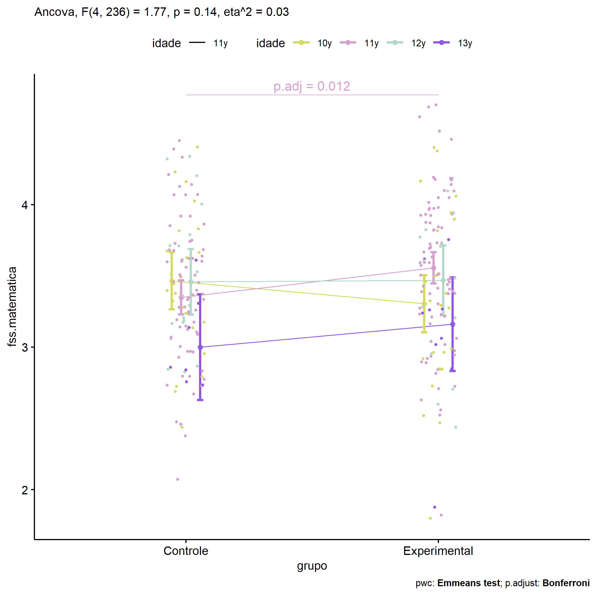<!-- -->

    ## Scale for colour is already present.
    ## Adding another scale for colour, which will replace the existing scale.

<!-- -->

<!-- -->

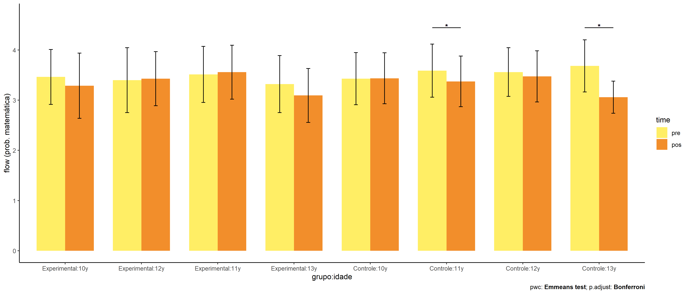<!-- -->

### factores: **grupo:zona.participante**

| var            | grupo        | zona.participante |   n | M (pre) | SE (pre) | M (unadj) | SE (unadj) | M (adj) | SE (adj) |
|:---------------|:-------------|:------------------|----:|--------:|---------:|----------:|-----------:|--------:|---------:|
| fss.matematica | Controle     | Rural             |  43 |   3.555 |    0.091 |     3.376 |      0.071 |   3.350 |    0.079 |
| fss.matematica | Controle     | Urbana            |  54 |   3.437 |    0.068 |     3.381 |      0.070 |   3.390 |    0.071 |
| fss.matematica | Experimental | Rural             |  53 |   3.517 |    0.076 |     3.486 |      0.076 |   3.472 |    0.071 |
| fss.matematica | Experimental | Urbana            |  49 |   3.382 |    0.085 |     3.375 |      0.089 |   3.402 |    0.074 |

| .y.            | grupo        | zona.participante | group1   | group2       | estimate | conf.low | conf.high |    se | statistic |     p | p.adj | p.adj.signif |
|:---------------|:-------------|:------------------|:---------|:-------------|---------:|---------:|----------:|------:|----------:|------:|------:|:-------------|
| fss.matematica |              | Urbana            | Controle | Experimental |   -0.011 |   -0.213 |     0.191 | 0.102 |    -0.109 | 0.913 | 0.913 | ns           |
| fss.matematica |              | Rural             | Controle | Experimental |   -0.122 |   -0.332 |     0.088 | 0.106 |    -1.147 | 0.253 | 0.253 | ns           |
| dfs.matematica |              | Urbana            | Controle | Experimental |    0.056 |   -0.162 |     0.273 | 0.110 |     0.505 | 0.614 | 0.614 | ns           |
| dfs.matematica |              | Rural             | Controle | Experimental |    0.038 |   -0.188 |     0.265 | 0.115 |     0.333 | 0.740 | 0.740 | ns           |
| fss.matematica | Controle     |                   | Urbana   | Rural        |    0.040 |   -0.169 |     0.250 | 0.106 |     0.379 | 0.705 | 0.705 | ns           |
| fss.matematica | Experimental |                   | Urbana   | Rural        |   -0.071 |   -0.274 |     0.133 | 0.103 |    -0.685 | 0.494 | 0.494 | ns           |
| dfs.matematica | Controle     |                   | Urbana   | Rural        |   -0.117 |   -0.343 |     0.108 | 0.114 |    -1.027 | 0.306 | 0.306 | ns           |
| dfs.matematica | Experimental |                   | Urbana   | Rural        |   -0.135 |   -0.354 |     0.084 | 0.111 |    -1.217 | 0.225 | 0.225 | ns           |

| .y.             | grupo        | zona.participante | group1 | group2 | estimate | conf.low | conf.high |    se | statistic |     p | p.adj | p.adj.signif |
|:----------------|:-------------|:------------------|:-------|:-------|---------:|---------:|----------:|------:|----------:|------:|------:|:-------------|
| flow.matematica | Controle     | Urbana            | pre    | pos    |    0.057 |   -0.152 |     0.265 | 0.106 |     0.536 | 0.592 | 0.592 | ns           |
| flow.matematica | Controle     | Rural             | pre    | pos    |    0.179 |   -0.054 |     0.413 | 0.119 |     1.508 | 0.132 | 0.132 | ns           |
| flow.matematica | Experimental | Urbana            | pre    | pos    |    0.007 |   -0.212 |     0.226 | 0.111 |     0.059 | 0.953 | 0.953 | ns           |
| flow.matematica | Experimental | Rural             | pre    | pos    |    0.031 |   -0.180 |     0.241 | 0.107 |     0.286 | 0.775 | 0.775 | ns           |

    ## Scale for colour is already present.
    ## Adding another scale for colour, which will replace the existing scale.

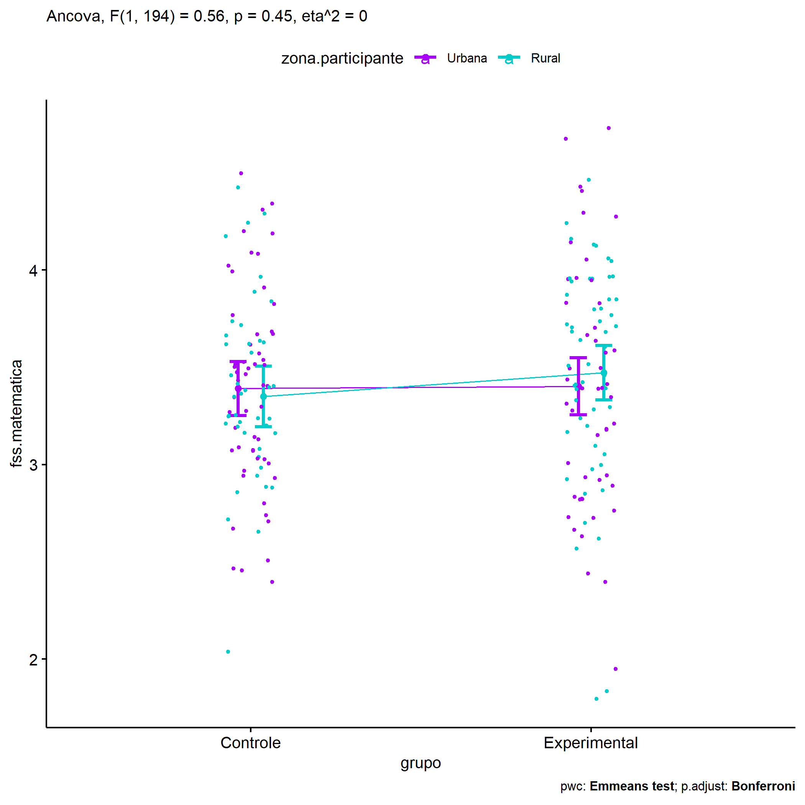<!-- -->

    ## Scale for colour is already present.
    ## Adding another scale for colour, which will replace the existing scale.

<!-- -->

<!-- -->

<!-- -->

### factores: **grupo:escola**

| var            | grupo        | escola |   n | M (pre) | SE (pre) | M (unadj) | SE (unadj) | M (adj) | SE (adj) |
|:---------------|:-------------|:-------|----:|--------:|---------:|----------:|-----------:|--------:|---------:|
| fss.matematica | Controle     | E1     |  12 |   3.074 |    0.129 |     3.120 |      0.149 |   3.260 |    0.147 |
| fss.matematica | Controle     | E2     |  23 |   3.570 |    0.091 |     3.314 |      0.100 |   3.292 |    0.105 |
| fss.matematica | Controle     | E3     |  15 |   3.731 |    0.162 |     3.378 |      0.114 |   3.303 |    0.130 |
| fss.matematica | Controle     | E4     |  16 |   3.583 |    0.090 |     3.370 |      0.090 |   3.344 |    0.125 |
| fss.matematica | Controle     | E5     |  48 |   3.496 |    0.084 |     3.455 |      0.081 |   3.457 |    0.072 |
| fss.matematica | Controle     | E6     |  11 |   3.727 |    0.122 |     3.505 |      0.139 |   3.432 |    0.152 |
| fss.matematica | Experimental | E1     |  10 |   3.358 |    0.178 |     3.805 |      0.199 |   3.852 |    0.159 |
| fss.matematica | Experimental | E2     |  26 |   3.406 |    0.109 |     3.292 |      0.104 |   3.324 |    0.099 |
| fss.matematica | Experimental | E3     |  15 |   3.584 |    0.166 |     3.302 |      0.122 |   3.276 |    0.130 |
| fss.matematica | Experimental | E4     |  14 |   3.633 |    0.137 |     3.654 |      0.115 |   3.612 |    0.134 |
| fss.matematica | Experimental | E5     |  54 |   3.409 |    0.078 |     3.423 |      0.086 |   3.453 |    0.068 |
| fss.matematica | Experimental | E6     |  13 |   3.726 |    0.119 |     3.709 |      0.116 |   3.637 |    0.140 |

| .y.            | grupo        | escola | group1   | group2       | estimate | conf.low | conf.high |    se | statistic |     p | p.adj | p.adj.signif |
|:---------------|:-------------|:-------|:---------|:-------------|---------:|---------:|----------:|------:|----------:|------:|------:|:-------------|
| fss.matematica |              | E1     | Controle | Experimental |   -0.592 |   -1.016 |    -0.167 | 0.215 |    -2.747 | 0.006 | 0.006 | \*\*         |
| fss.matematica |              | E2     | Controle | Experimental |   -0.032 |   -0.315 |     0.252 | 0.144 |    -0.220 | 0.826 | 0.826 | ns           |
| fss.matematica |              | E3     | Controle | Experimental |    0.028 |   -0.333 |     0.389 | 0.183 |     0.152 | 0.879 | 0.879 | ns           |
| fss.matematica |              | E4     | Controle | Experimental |   -0.267 |   -0.629 |     0.094 | 0.184 |    -1.456 | 0.147 | 0.147 | ns           |
| fss.matematica |              | E5     | Controle | Experimental |    0.004 |   -0.193 |     0.200 | 0.100 |     0.037 | 0.971 | 0.971 | ns           |
| fss.matematica |              | E6     | Controle | Experimental |   -0.205 |   -0.609 |     0.200 | 0.205 |    -0.996 | 0.320 | 0.320 | ns           |
| dfs.matematica |              | E1     | Controle | Experimental |   -0.284 |   -0.738 |     0.169 | 0.230 |    -1.235 | 0.218 | 0.218 | ns           |
| dfs.matematica |              | E2     | Controle | Experimental |    0.164 |   -0.139 |     0.467 | 0.154 |     1.066 | 0.288 | 0.288 | ns           |
| dfs.matematica |              | E3     | Controle | Experimental |    0.147 |   -0.239 |     0.534 | 0.196 |     0.751 | 0.453 | 0.453 | ns           |
| dfs.matematica |              | E4     | Controle | Experimental |   -0.050 |   -0.437 |     0.338 | 0.197 |    -0.252 | 0.801 | 0.801 | ns           |
| dfs.matematica |              | E5     | Controle | Experimental |    0.087 |   -0.123 |     0.297 | 0.107 |     0.815 | 0.416 | 0.416 | ns           |
| dfs.matematica |              | E6     | Controle | Experimental |    0.001 |   -0.433 |     0.435 | 0.220 |     0.004 | 0.997 | 0.997 | ns           |
| fss.matematica | Controle     |        | E1       | E2           |   -0.032 |   -0.388 |     0.325 | 0.181 |    -0.176 | 0.860 | 1.000 | ns           |
| fss.matematica | Controle     |        | E1       | E3           |   -0.043 |   -0.433 |     0.347 | 0.198 |    -0.217 | 0.828 | 1.000 | ns           |
| fss.matematica | Controle     |        | E1       | E4           |   -0.084 |   -0.466 |     0.298 | 0.194 |    -0.433 | 0.665 | 1.000 | ns           |
| fss.matematica | Controle     |        | E1       | E5           |   -0.197 |   -0.519 |     0.126 | 0.164 |    -1.200 | 0.231 | 1.000 | ns           |
| fss.matematica | Controle     |        | E1       | E6           |   -0.172 |   -0.591 |     0.248 | 0.213 |    -0.807 | 0.421 | 1.000 | ns           |
| fss.matematica | Controle     |        | E2       | E3           |   -0.011 |   -0.339 |     0.317 | 0.167 |    -0.067 | 0.947 | 1.000 | ns           |
| fss.matematica | Controle     |        | E2       | E4           |   -0.052 |   -0.374 |     0.269 | 0.163 |    -0.319 | 0.750 | 1.000 | ns           |
| fss.matematica | Controle     |        | E2       | E5           |   -0.165 |   -0.415 |     0.086 | 0.127 |    -1.294 | 0.197 | 1.000 | ns           |
| fss.matematica | Controle     |        | E2       | E6           |   -0.140 |   -0.502 |     0.223 | 0.184 |    -0.759 | 0.448 | 1.000 | ns           |
| fss.matematica | Controle     |        | E3       | E4           |   -0.041 |   -0.396 |     0.314 | 0.180 |    -0.227 | 0.821 | 1.000 | ns           |
| fss.matematica | Controle     |        | E3       | E5           |   -0.153 |   -0.447 |     0.140 | 0.149 |    -1.030 | 0.304 | 1.000 | ns           |
| fss.matematica | Controle     |        | E3       | E6           |   -0.129 |   -0.521 |     0.263 | 0.199 |    -0.646 | 0.519 | 1.000 | ns           |
| fss.matematica | Controle     |        | E4       | E5           |   -0.113 |   -0.398 |     0.173 | 0.145 |    -0.777 | 0.438 | 1.000 | ns           |
| fss.matematica | Controle     |        | E4       | E6           |   -0.088 |   -0.475 |     0.300 | 0.197 |    -0.446 | 0.656 | 1.000 | ns           |
| fss.matematica | Controle     |        | E5       | E6           |    0.025 |   -0.306 |     0.356 | 0.168 |     0.148 | 0.883 | 1.000 | ns           |
| fss.matematica | Experimental |        | E1       | E2           |    0.528 |    0.161 |     0.896 | 0.187 |     2.830 | 0.005 | 0.076 | ns           |
| fss.matematica | Experimental |        | E1       | E3           |    0.576 |    0.172 |     0.981 | 0.205 |     2.810 | 0.005 | 0.080 | ns           |
| fss.matematica | Experimental |        | E1       | E4           |    0.241 |   -0.170 |     0.651 | 0.208 |     1.155 | 0.249 | 1.000 | ns           |
| fss.matematica | Experimental |        | E1       | E5           |    0.399 |    0.059 |     0.739 | 0.173 |     2.310 | 0.022 | 0.326 | ns           |
| fss.matematica | Experimental |        | E1       | E6           |    0.215 |   -0.202 |     0.633 | 0.212 |     1.016 | 0.311 | 1.000 | ns           |
| fss.matematica | Experimental |        | E2       | E3           |    0.048 |   -0.273 |     0.369 | 0.163 |     0.297 | 0.767 | 1.000 | ns           |
| fss.matematica | Experimental |        | E2       | E4           |   -0.288 |   -0.616 |     0.041 | 0.167 |    -1.724 | 0.086 | 1.000 | ns           |
| fss.matematica | Experimental |        | E2       | E5           |   -0.129 |   -0.365 |     0.107 | 0.120 |    -1.080 | 0.281 | 1.000 | ns           |
| fss.matematica | Experimental |        | E2       | E6           |   -0.313 |   -0.650 |     0.025 | 0.171 |    -1.824 | 0.069 | 1.000 | ns           |
| fss.matematica | Experimental |        | E3       | E4           |   -0.336 |   -0.703 |     0.031 | 0.186 |    -1.803 | 0.073 | 1.000 | ns           |
| fss.matematica | Experimental |        | E3       | E5           |   -0.178 |   -0.467 |     0.111 | 0.147 |    -1.211 | 0.227 | 1.000 | ns           |
| fss.matematica | Experimental |        | E3       | E6           |   -0.361 |   -0.736 |     0.014 | 0.190 |    -1.898 | 0.059 | 0.882 | ns           |
| fss.matematica | Experimental |        | E4       | E5           |    0.158 |   -0.139 |     0.456 | 0.151 |     1.049 | 0.295 | 1.000 | ns           |
| fss.matematica | Experimental |        | E4       | E6           |   -0.025 |   -0.406 |     0.355 | 0.193 |    -0.130 | 0.897 | 1.000 | ns           |
| fss.matematica | Experimental |        | E5       | E6           |   -0.183 |   -0.491 |     0.124 | 0.156 |    -1.175 | 0.241 | 1.000 | ns           |
| dfs.matematica | Controle     |        | E1       | E2           |   -0.496 |   -0.873 |    -0.119 | 0.191 |    -2.590 | 0.010 | 0.153 | ns           |
| dfs.matematica | Controle     |        | E1       | E3           |   -0.657 |   -1.068 |    -0.247 | 0.208 |    -3.157 | 0.002 | 0.027 | \*           |
| dfs.matematica | Controle     |        | E1       | E4           |   -0.509 |   -0.914 |    -0.105 | 0.205 |    -2.480 | 0.014 | 0.207 | ns           |
| dfs.matematica | Controle     |        | E1       | E5           |   -0.422 |   -0.764 |    -0.080 | 0.174 |    -2.433 | 0.016 | 0.235 | ns           |
| dfs.matematica | Controle     |        | E1       | E6           |   -0.653 |   -1.095 |    -0.211 | 0.224 |    -2.910 | 0.004 | 0.059 | ns           |
| dfs.matematica | Controle     |        | E2       | E3           |   -0.161 |   -0.513 |     0.190 | 0.178 |    -0.905 | 0.367 | 1.000 | ns           |
| dfs.matematica | Controle     |        | E2       | E4           |   -0.013 |   -0.358 |     0.332 | 0.175 |    -0.076 | 0.940 | 1.000 | ns           |
| dfs.matematica | Controle     |        | E2       | E5           |    0.074 |   -0.195 |     0.342 | 0.136 |     0.541 | 0.589 | 1.000 | ns           |
| dfs.matematica | Controle     |        | E2       | E6           |   -0.157 |   -0.545 |     0.231 | 0.197 |    -0.798 | 0.426 | 1.000 | ns           |
| dfs.matematica | Controle     |        | E3       | E4           |    0.148 |   -0.232 |     0.529 | 0.193 |     0.767 | 0.444 | 1.000 | ns           |
| dfs.matematica | Controle     |        | E3       | E5           |    0.235 |   -0.078 |     0.548 | 0.159 |     1.479 | 0.141 | 1.000 | ns           |
| dfs.matematica | Controle     |        | E3       | E6           |    0.004 |   -0.416 |     0.425 | 0.213 |     0.020 | 0.984 | 1.000 | ns           |
| dfs.matematica | Controle     |        | E4       | E5           |    0.087 |   -0.219 |     0.393 | 0.155 |     0.561 | 0.575 | 1.000 | ns           |
| dfs.matematica | Controle     |        | E4       | E6           |   -0.144 |   -0.559 |     0.271 | 0.211 |    -0.683 | 0.495 | 1.000 | ns           |
| dfs.matematica | Controle     |        | E5       | E6           |   -0.231 |   -0.585 |     0.123 | 0.180 |    -1.285 | 0.200 | 1.000 | ns           |
| dfs.matematica | Experimental |        | E1       | E2           |   -0.048 |   -0.442 |     0.346 | 0.200 |    -0.238 | 0.812 | 1.000 | ns           |
| dfs.matematica | Experimental |        | E1       | E3           |   -0.226 |   -0.658 |     0.207 | 0.220 |    -1.028 | 0.305 | 1.000 | ns           |
| dfs.matematica | Experimental |        | E1       | E4           |   -0.275 |   -0.713 |     0.164 | 0.223 |    -1.233 | 0.219 | 1.000 | ns           |
| dfs.matematica | Experimental |        | E1       | E5           |   -0.051 |   -0.416 |     0.314 | 0.185 |    -0.276 | 0.783 | 1.000 | ns           |
| dfs.matematica | Experimental |        | E1       | E6           |   -0.368 |   -0.814 |     0.077 | 0.226 |    -1.628 | 0.105 | 1.000 | ns           |
| dfs.matematica | Experimental |        | E2       | E3           |   -0.178 |   -0.521 |     0.165 | 0.174 |    -1.021 | 0.308 | 1.000 | ns           |
| dfs.matematica | Experimental |        | E2       | E4           |   -0.227 |   -0.578 |     0.124 | 0.178 |    -1.273 | 0.204 | 1.000 | ns           |
| dfs.matematica | Experimental |        | E2       | E5           |   -0.003 |   -0.256 |     0.249 | 0.128 |    -0.027 | 0.979 | 1.000 | ns           |
| dfs.matematica | Experimental |        | E2       | E6           |   -0.321 |   -0.680 |     0.039 | 0.183 |    -1.755 | 0.081 | 1.000 | ns           |
| dfs.matematica | Experimental |        | E3       | E4           |   -0.049 |   -0.443 |     0.345 | 0.200 |    -0.245 | 0.807 | 1.000 | ns           |
| dfs.matematica | Experimental |        | E3       | E5           |    0.175 |   -0.135 |     0.484 | 0.157 |     1.113 | 0.267 | 1.000 | ns           |
| dfs.matematica | Experimental |        | E3       | E6           |   -0.143 |   -0.544 |     0.259 | 0.204 |    -0.699 | 0.485 | 1.000 | ns           |
| dfs.matematica | Experimental |        | E4       | E5           |    0.224 |   -0.094 |     0.541 | 0.161 |     1.386 | 0.167 | 1.000 | ns           |
| dfs.matematica | Experimental |        | E4       | E6           |   -0.094 |   -0.501 |     0.314 | 0.207 |    -0.452 | 0.652 | 1.000 | ns           |
| dfs.matematica | Experimental |        | E5       | E6           |   -0.317 |   -0.644 |     0.010 | 0.166 |    -1.909 | 0.057 | 0.862 | ns           |

| .y.             | grupo        | escola | group1 | group2 | estimate | conf.low | conf.high |    se | statistic |     p | p.adj | p.adj.signif |
|:----------------|:-------------|:-------|:-------|:-------|---------:|---------:|----------:|------:|----------:|------:|------:|:-------------|
| flow.matematica | Controle     | E1     | pre    | pos    |   -0.046 |   -0.475 |     0.382 | 0.218 |    -0.212 | 0.832 | 0.832 | ns           |
| flow.matematica | Controle     | E2     | pre    | pos    |    0.256 |   -0.053 |     0.565 | 0.157 |     1.626 | 0.105 | 0.105 | ns           |
| flow.matematica | Controle     | E3     | pre    | pos    |    0.354 |   -0.029 |     0.737 | 0.195 |     1.814 | 0.070 | 0.070 | ns           |
| flow.matematica | Controle     | E4     | pre    | pos    |    0.213 |   -0.158 |     0.584 | 0.189 |     1.128 | 0.260 | 0.260 | ns           |
| flow.matematica | Controle     | E5     | pre    | pos    |    0.042 |   -0.172 |     0.256 | 0.109 |     0.383 | 0.702 | 0.702 | ns           |
| flow.matematica | Controle     | E6     | pre    | pos    |    0.222 |   -0.225 |     0.670 | 0.228 |     0.976 | 0.330 | 0.330 | ns           |
| flow.matematica | Experimental | E1     | pre    | pos    |   -0.446 |   -0.916 |     0.023 | 0.239 |    -1.869 | 0.062 | 0.062 | ns           |
| flow.matematica | Experimental | E2     | pre    | pos    |    0.114 |   -0.177 |     0.405 | 0.148 |     0.768 | 0.443 | 0.443 | ns           |
| flow.matematica | Experimental | E3     | pre    | pos    |    0.282 |   -0.101 |     0.665 | 0.195 |     1.447 | 0.149 | 0.149 | ns           |
| flow.matematica | Experimental | E4     | pre    | pos    |   -0.021 |   -0.417 |     0.376 | 0.202 |    -0.103 | 0.918 | 0.918 | ns           |
| flow.matematica | Experimental | E5     | pre    | pos    |   -0.013 |   -0.215 |     0.189 | 0.103 |    -0.128 | 0.898 | 0.898 | ns           |
| flow.matematica | Experimental | E6     | pre    | pos    |    0.017 |   -0.394 |     0.429 | 0.209 |     0.082 | 0.935 | 0.935 | ns           |

    ## Scale for colour is already present.
    ## Adding another scale for colour, which will replace the existing scale.

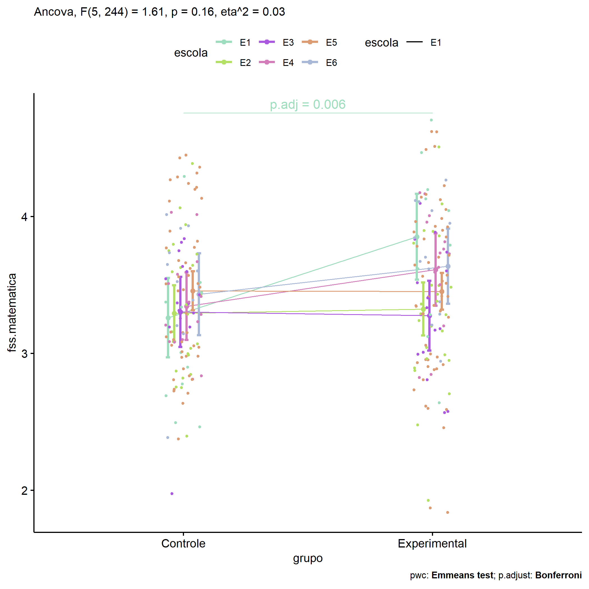<!-- -->

    ## Scale for colour is already present.
    ## Adding another scale for colour, which will replace the existing scale.

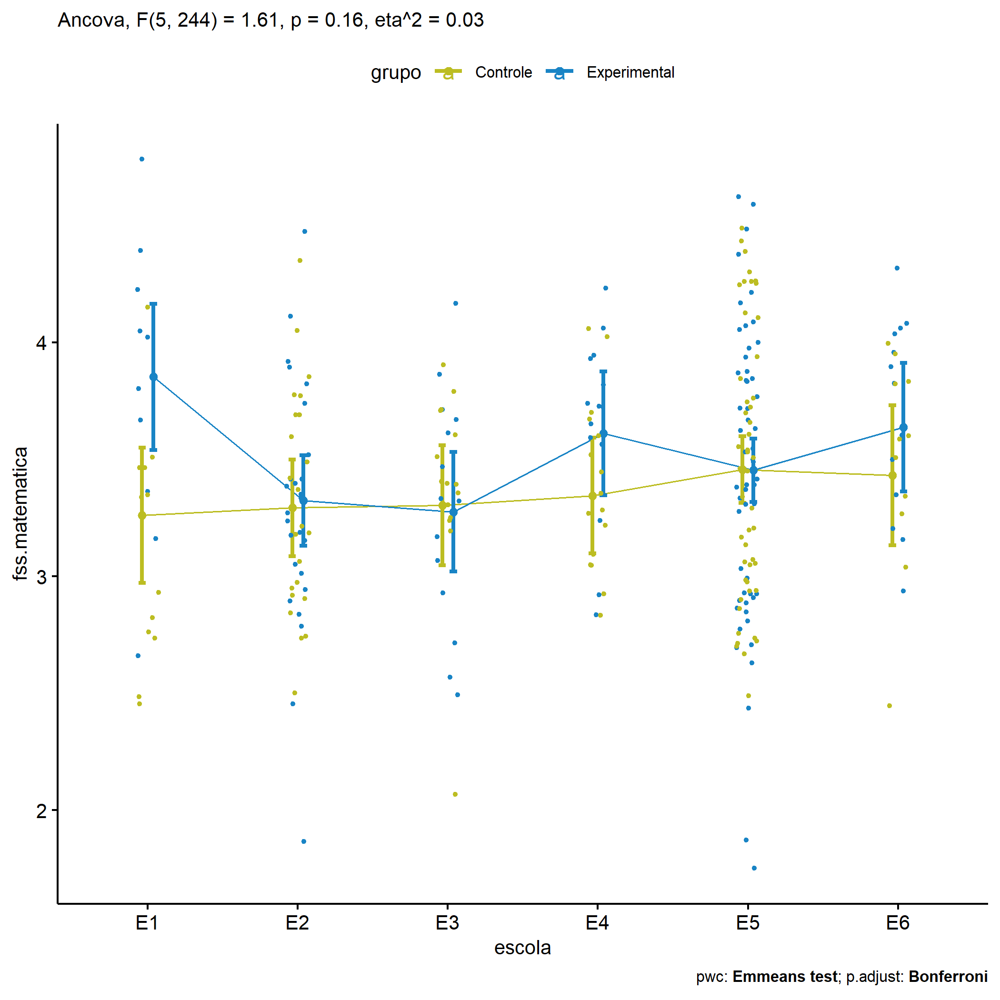<!-- -->

<!-- -->

<!-- -->

### factores: **grupo:zona.escola**

| var            | grupo        | zona.escola |   n | M (pre) | SE (pre) | M (unadj) | SE (unadj) | M (adj) | SE (adj) |
|:---------------|:-------------|:------------|----:|--------:|---------:|----------:|-----------:|--------:|---------:|
| fss.matematica | Controle     | Rural       |  42 |   3.674 |    0.073 |     3.408 |      0.063 |   3.351 |    0.079 |
| fss.matematica | Controle     | Urbana      |  83 |   3.456 |    0.060 |     3.367 |      0.059 |   3.383 |    0.056 |
| fss.matematica | Experimental | Rural       |  42 |   3.644 |    0.082 |     3.545 |      0.072 |   3.498 |    0.079 |
| fss.matematica | Experimental | Urbana      |  90 |   3.403 |    0.059 |     3.427 |      0.065 |   3.461 |    0.054 |

| .y.            | grupo        | zona.escola | group1   | group2       | estimate | conf.low | conf.high |    se | statistic |     p | p.adj | p.adj.signif |
|:---------------|:-------------|:------------|:---------|:-------------|---------:|---------:|----------:|------:|----------:|------:|------:|:-------------|
| fss.matematica |              | Urbana      | Controle | Experimental |   -0.078 |   -0.230 |     0.075 | 0.078 |    -1.004 | 0.317 | 0.317 | ns           |
| fss.matematica |              | Rural       | Controle | Experimental |   -0.147 |   -0.366 |     0.072 | 0.111 |    -1.322 | 0.187 | 0.187 | ns           |
| dfs.matematica |              | Urbana      | Controle | Experimental |    0.053 |   -0.108 |     0.214 | 0.082 |     0.646 | 0.519 | 0.519 | ns           |
| dfs.matematica |              | Rural       | Controle | Experimental |    0.030 |   -0.202 |     0.261 | 0.117 |     0.251 | 0.802 | 0.802 | ns           |
| fss.matematica | Controle     |             | Urbana   | Rural        |    0.032 |   -0.160 |     0.224 | 0.097 |     0.329 | 0.742 | 0.742 | ns           |
| fss.matematica | Experimental |             | Urbana   | Rural        |   -0.037 |   -0.226 |     0.152 | 0.096 |    -0.385 | 0.700 | 0.700 | ns           |
| dfs.matematica | Controle     |             | Urbana   | Rural        |   -0.218 |   -0.419 |    -0.017 | 0.102 |    -2.141 | 0.033 | 0.033 | \*           |
| dfs.matematica | Experimental |             | Urbana   | Rural        |   -0.242 |   -0.440 |    -0.044 | 0.101 |    -2.402 | 0.017 | 0.017 | \*           |

| .y.             | grupo        | zona.escola | group1 | group2 | estimate | conf.low | conf.high |    se | statistic |     p | p.adj | p.adj.signif |
|:----------------|:-------------|:------------|:-------|:-------|---------:|---------:|----------:|------:|----------:|------:|------:|:-------------|
| flow.matematica | Controle     | Urbana      | pre    | pos    |    0.088 |   -0.076 |     0.253 | 0.084 |     1.057 | 0.291 | 0.291 | ns           |
| flow.matematica | Controle     | Rural       | pre    | pos    |    0.266 |    0.035 |     0.497 | 0.118 |     2.260 | 0.024 | 0.024 | \*           |
| flow.matematica | Experimental | Urbana      | pre    | pos    |   -0.025 |   -0.182 |     0.133 | 0.080 |    -0.307 | 0.759 | 0.759 | ns           |
| flow.matematica | Experimental | Rural       | pre    | pos    |    0.099 |   -0.132 |     0.330 | 0.118 |     0.843 | 0.400 | 0.400 | ns           |

    ## Scale for colour is already present.
    ## Adding another scale for colour, which will replace the existing scale.

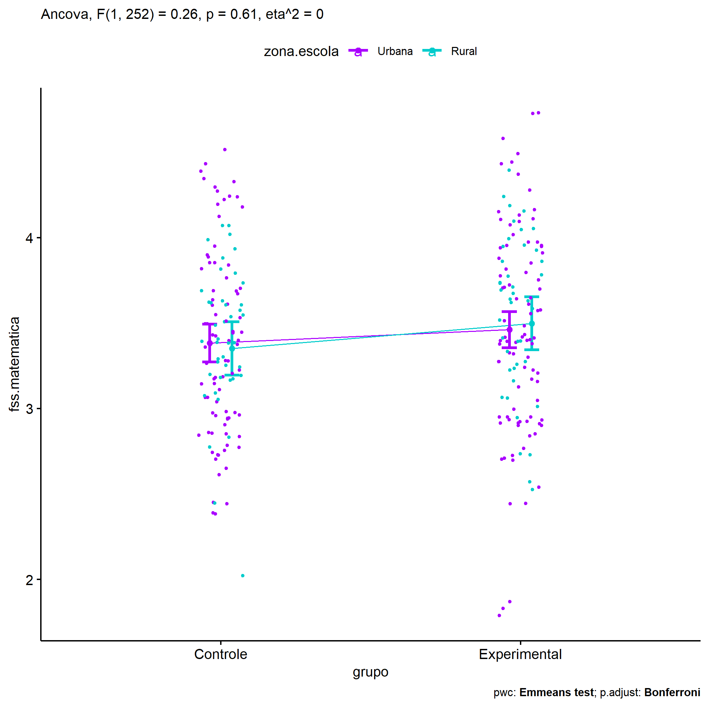<!-- -->

    ## Scale for colour is already present.
    ## Adding another scale for colour, which will replace the existing scale.

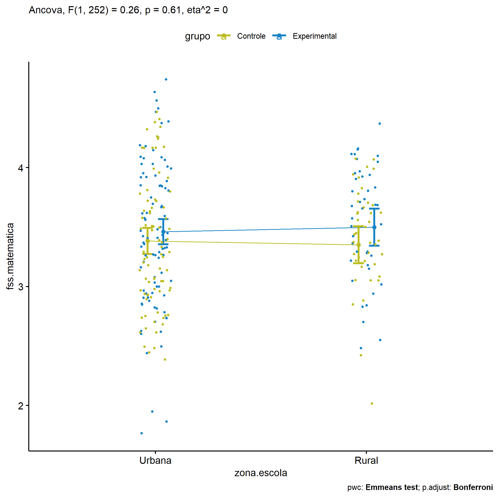<!-- -->

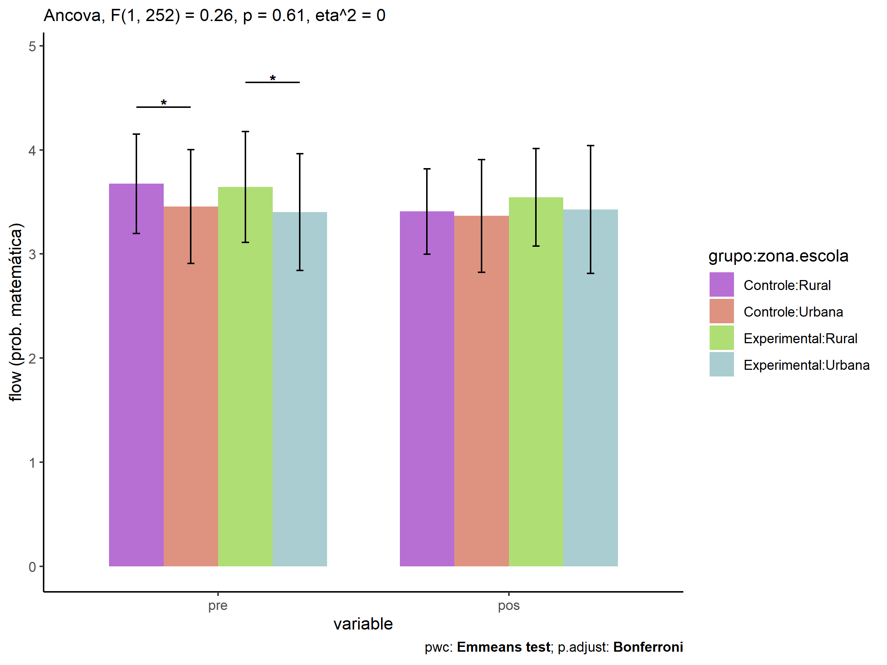<!-- -->

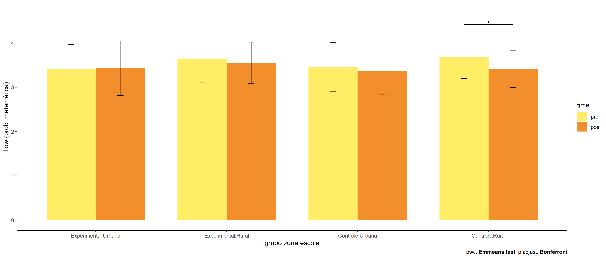<!-- -->

## Pairwise comparisons for grupo=“Experimental”

### factores: **grupo=“Experimental”:monitor**

| var            | monitor |   n | M (pre) | SE (pre) | M (unadj) | SE (unadj) | M (adj) | SE (adj) |
|:---------------|:--------|----:|--------:|---------:|----------:|-----------:|--------:|---------:|
| fss.matematica | AC      |  11 |   3.535 |    0.122 |     3.418 |      0.161 |   3.405 |    0.149 |
| fss.matematica | CE      |  14 |   3.633 |    0.137 |     3.654 |      0.115 |   3.603 |    0.133 |
| fss.matematica | EA      |  11 |   3.375 |    0.159 |     3.444 |      0.264 |   3.493 |    0.150 |
| fss.matematica | GR      |  15 |   3.504 |    0.152 |     3.511 |      0.131 |   3.510 |    0.128 |
| fss.matematica | JC      |  10 |   3.419 |    0.230 |     3.171 |      0.124 |   3.203 |    0.157 |
| fss.matematica | MF      |  11 |   3.495 |    0.176 |     3.586 |      0.161 |   3.589 |    0.149 |
| fss.matematica | ML      |  15 |   3.584 |    0.166 |     3.302 |      0.122 |   3.270 |    0.128 |
| fss.matematica | MM      |  13 |   3.299 |    0.190 |     3.154 |      0.151 |   3.232 |    0.138 |
| fss.matematica | PR      |  10 |   3.358 |    0.178 |     3.805 |      0.199 |   3.860 |    0.157 |
| fss.matematica | VL      |  13 |   3.726 |    0.119 |     3.709 |      0.116 |   3.623 |    0.139 |

| .y.            | group1 | group2 | estimate | conf.low | conf.high |    se | statistic |     p | p.adj | p.adj.signif |
|:---------------|:-------|:-------|---------:|---------:|----------:|------:|----------:|------:|------:|:-------------|
| fss.matematica | AC     | CE     |   -0.198 |   -0.594 |     0.198 | 0.200 |    -0.992 | 0.323 | 1.000 | ns           |
| fss.matematica | AC     | EA     |   -0.088 |   -0.508 |     0.331 | 0.212 |    -0.417 | 0.678 | 1.000 | ns           |
| fss.matematica | AC     | GR     |   -0.105 |   -0.495 |     0.285 | 0.197 |    -0.535 | 0.593 | 1.000 | ns           |
| fss.matematica | AC     | JC     |    0.202 |   -0.227 |     0.632 | 0.217 |     0.933 | 0.353 | 1.000 | ns           |
| fss.matematica | AC     | MF     |   -0.183 |   -0.602 |     0.235 | 0.211 |    -0.868 | 0.387 | 1.000 | ns           |
| fss.matematica | AC     | ML     |    0.135 |   -0.255 |     0.525 | 0.197 |     0.685 | 0.495 | 1.000 | ns           |
| fss.matematica | AC     | MM     |    0.173 |   -0.231 |     0.577 | 0.204 |     0.849 | 0.398 | 1.000 | ns           |
| fss.matematica | AC     | PR     |   -0.455 |   -0.885 |    -0.025 | 0.217 |    -2.096 | 0.038 | 1.000 | ns           |
| fss.matematica | AC     | VL     |   -0.218 |   -0.621 |     0.186 | 0.204 |    -1.070 | 0.287 | 1.000 | ns           |
| fss.matematica | CE     | EA     |    0.110 |   -0.288 |     0.508 | 0.201 |     0.548 | 0.585 | 1.000 | ns           |
| fss.matematica | CE     | GR     |    0.093 |   -0.273 |     0.459 | 0.185 |     0.504 | 0.616 | 1.000 | ns           |
| fss.matematica | CE     | JC     |    0.401 |   -0.008 |     0.809 | 0.206 |     1.945 | 0.054 | 1.000 | ns           |
| fss.matematica | CE     | MF     |    0.015 |   -0.382 |     0.411 | 0.200 |     0.074 | 0.941 | 1.000 | ns           |
| fss.matematica | CE     | ML     |    0.333 |   -0.032 |     0.698 | 0.184 |     1.808 | 0.073 | 1.000 | ns           |
| fss.matematica | CE     | MM     |    0.371 |   -0.011 |     0.754 | 0.193 |     1.926 | 0.057 | 1.000 | ns           |
| fss.matematica | CE     | PR     |   -0.257 |   -0.666 |     0.152 | 0.206 |    -1.243 | 0.216 | 1.000 | ns           |
| fss.matematica | CE     | VL     |   -0.020 |   -0.398 |     0.359 | 0.191 |    -0.103 | 0.918 | 1.000 | ns           |
| fss.matematica | EA     | GR     |   -0.017 |   -0.408 |     0.373 | 0.197 |    -0.087 | 0.931 | 1.000 | ns           |
| fss.matematica | EA     | JC     |    0.291 |   -0.139 |     0.720 | 0.217 |     1.341 | 0.183 | 1.000 | ns           |
| fss.matematica | EA     | MF     |   -0.095 |   -0.515 |     0.324 | 0.212 |    -0.450 | 0.653 | 1.000 | ns           |
| fss.matematica | EA     | ML     |    0.223 |   -0.168 |     0.614 | 0.198 |     1.129 | 0.261 | 1.000 | ns           |
| fss.matematica | EA     | MM     |    0.261 |   -0.141 |     0.664 | 0.203 |     1.287 | 0.201 | 1.000 | ns           |
| fss.matematica | EA     | PR     |   -0.367 |   -0.796 |     0.062 | 0.217 |    -1.693 | 0.093 | 1.000 | ns           |
| fss.matematica | EA     | VL     |   -0.130 |   -0.536 |     0.277 | 0.205 |    -0.632 | 0.528 | 1.000 | ns           |
| fss.matematica | GR     | JC     |    0.308 |   -0.094 |     0.709 | 0.203 |     1.519 | 0.131 | 1.000 | ns           |
| fss.matematica | GR     | MF     |   -0.078 |   -0.468 |     0.312 | 0.197 |    -0.397 | 0.692 | 1.000 | ns           |
| fss.matematica | GR     | ML     |    0.240 |   -0.119 |     0.599 | 0.181 |     1.326 | 0.188 | 1.000 | ns           |
| fss.matematica | GR     | MM     |    0.279 |   -0.095 |     0.652 | 0.189 |     1.477 | 0.142 | 1.000 | ns           |
| fss.matematica | GR     | PR     |   -0.350 |   -0.751 |     0.052 | 0.203 |    -1.724 | 0.087 | 1.000 | ns           |
| fss.matematica | GR     | VL     |   -0.113 |   -0.486 |     0.261 | 0.189 |    -0.596 | 0.552 | 1.000 | ns           |
| fss.matematica | JC     | MF     |   -0.386 |   -0.815 |     0.044 | 0.217 |    -1.780 | 0.078 | 1.000 | ns           |
| fss.matematica | JC     | ML     |   -0.068 |   -0.469 |     0.334 | 0.203 |    -0.333 | 0.740 | 1.000 | ns           |
| fss.matematica | JC     | MM     |   -0.029 |   -0.443 |     0.384 | 0.209 |    -0.140 | 0.889 | 1.000 | ns           |
| fss.matematica | JC     | PR     |   -0.657 |   -1.097 |    -0.218 | 0.222 |    -2.964 | 0.004 | 0.167 | ns           |
| fss.matematica | JC     | VL     |   -0.420 |   -0.836 |    -0.004 | 0.210 |    -2.001 | 0.048 | 1.000 | ns           |
| fss.matematica | MF     | ML     |    0.318 |   -0.072 |     0.708 | 0.197 |     1.616 | 0.109 | 1.000 | ns           |
| fss.matematica | MF     | MM     |    0.357 |   -0.047 |     0.760 | 0.204 |     1.751 | 0.083 | 1.000 | ns           |
| fss.matematica | MF     | PR     |   -0.271 |   -0.701 |     0.158 | 0.217 |    -1.252 | 0.213 | 1.000 | ns           |
| fss.matematica | MF     | VL     |   -0.034 |   -0.439 |     0.370 | 0.204 |    -0.169 | 0.866 | 1.000 | ns           |
| fss.matematica | ML     | MM     |    0.038 |   -0.337 |     0.413 | 0.189 |     0.203 | 0.840 | 1.000 | ns           |
| fss.matematica | ML     | PR     |   -0.590 |   -0.992 |    -0.187 | 0.203 |    -2.902 | 0.004 | 0.201 | ns           |
| fss.matematica | ML     | VL     |   -0.353 |   -0.726 |     0.020 | 0.188 |    -1.874 | 0.064 | 1.000 | ns           |
| fss.matematica | MM     | PR     |   -0.628 |   -1.041 |    -0.215 | 0.209 |    -3.012 | 0.003 | 0.145 | ns           |
| fss.matematica | MM     | VL     |   -0.391 |   -0.782 |     0.000 | 0.198 |    -1.980 | 0.050 | 1.000 | ns           |
| fss.matematica | PR     | VL     |    0.237 |   -0.180 |     0.654 | 0.211 |     1.125 | 0.263 | 1.000 | ns           |
| dfs.matematica | AC     | CE     |   -0.098 |   -0.557 |     0.361 | 0.232 |    -0.421 | 0.674 | 1.000 | ns           |
| dfs.matematica | AC     | EA     |    0.160 |   -0.325 |     0.646 | 0.245 |     0.654 | 0.514 | 1.000 | ns           |
| dfs.matematica | AC     | GR     |    0.032 |   -0.421 |     0.484 | 0.228 |     0.139 | 0.890 | 1.000 | ns           |
| dfs.matematica | AC     | JC     |    0.116 |   -0.381 |     0.614 | 0.251 |     0.463 | 0.644 | 1.000 | ns           |
| dfs.matematica | AC     | MF     |    0.040 |   -0.445 |     0.526 | 0.245 |     0.165 | 0.869 | 1.000 | ns           |
| dfs.matematica | AC     | ML     |   -0.049 |   -0.501 |     0.404 | 0.228 |    -0.213 | 0.832 | 1.000 | ns           |
| dfs.matematica | AC     | MM     |    0.236 |   -0.230 |     0.703 | 0.236 |     1.003 | 0.318 | 1.000 | ns           |
| dfs.matematica | AC     | PR     |    0.177 |   -0.321 |     0.675 | 0.251 |     0.705 | 0.482 | 1.000 | ns           |
| dfs.matematica | AC     | VL     |   -0.191 |   -0.658 |     0.276 | 0.236 |    -0.812 | 0.419 | 1.000 | ns           |
| dfs.matematica | CE     | EA     |    0.258 |   -0.201 |     0.717 | 0.232 |     1.113 | 0.268 | 1.000 | ns           |
| dfs.matematica | CE     | GR     |    0.129 |   -0.294 |     0.553 | 0.214 |     0.605 | 0.546 | 1.000 | ns           |
| dfs.matematica | CE     | JC     |    0.214 |   -0.258 |     0.686 | 0.238 |     0.899 | 0.371 | 1.000 | ns           |
| dfs.matematica | CE     | MF     |    0.138 |   -0.321 |     0.597 | 0.232 |     0.596 | 0.553 | 1.000 | ns           |
| dfs.matematica | CE     | ML     |    0.049 |   -0.374 |     0.472 | 0.214 |     0.229 | 0.819 | 1.000 | ns           |
| dfs.matematica | CE     | MM     |    0.334 |   -0.105 |     0.773 | 0.221 |     1.507 | 0.135 | 1.000 | ns           |
| dfs.matematica | CE     | PR     |    0.275 |   -0.197 |     0.746 | 0.238 |     1.154 | 0.251 | 1.000 | ns           |
| dfs.matematica | CE     | VL     |   -0.094 |   -0.532 |     0.345 | 0.221 |    -0.422 | 0.673 | 1.000 | ns           |
| dfs.matematica | EA     | GR     |   -0.129 |   -0.581 |     0.323 | 0.228 |    -0.564 | 0.574 | 1.000 | ns           |
| dfs.matematica | EA     | JC     |   -0.044 |   -0.542 |     0.454 | 0.251 |    -0.175 | 0.861 | 1.000 | ns           |
| dfs.matematica | EA     | MF     |   -0.120 |   -0.606 |     0.366 | 0.245 |    -0.489 | 0.626 | 1.000 | ns           |
| dfs.matematica | EA     | ML     |   -0.209 |   -0.661 |     0.243 | 0.228 |    -0.916 | 0.362 | 1.000 | ns           |
| dfs.matematica | EA     | MM     |    0.076 |   -0.391 |     0.542 | 0.236 |     0.322 | 0.748 | 1.000 | ns           |
| dfs.matematica | EA     | PR     |    0.017 |   -0.481 |     0.514 | 0.251 |     0.066 | 0.947 | 1.000 | ns           |
| dfs.matematica | EA     | VL     |   -0.351 |   -0.818 |     0.115 | 0.236 |    -1.492 | 0.138 | 1.000 | ns           |
| dfs.matematica | GR     | JC     |    0.085 |   -0.380 |     0.550 | 0.235 |     0.361 | 0.719 | 1.000 | ns           |
| dfs.matematica | GR     | MF     |    0.009 |   -0.443 |     0.461 | 0.228 |     0.038 | 0.969 | 1.000 | ns           |
| dfs.matematica | GR     | ML     |   -0.080 |   -0.496 |     0.336 | 0.210 |    -0.382 | 0.703 | 1.000 | ns           |
| dfs.matematica | GR     | MM     |    0.205 |   -0.227 |     0.636 | 0.218 |     0.939 | 0.350 | 1.000 | ns           |
| dfs.matematica | GR     | PR     |    0.145 |   -0.320 |     0.610 | 0.235 |     0.619 | 0.537 | 1.000 | ns           |
| dfs.matematica | GR     | VL     |   -0.223 |   -0.654 |     0.209 | 0.218 |    -1.023 | 0.309 | 1.000 | ns           |
| dfs.matematica | JC     | MF     |   -0.076 |   -0.574 |     0.422 | 0.251 |    -0.302 | 0.763 | 1.000 | ns           |
| dfs.matematica | JC     | ML     |   -0.165 |   -0.630 |     0.300 | 0.235 |    -0.703 | 0.484 | 1.000 | ns           |
| dfs.matematica | JC     | MM     |    0.120 |   -0.359 |     0.599 | 0.242 |     0.496 | 0.621 | 1.000 | ns           |
| dfs.matematica | JC     | PR     |    0.061 |   -0.449 |     0.570 | 0.257 |     0.236 | 0.814 | 1.000 | ns           |
| dfs.matematica | JC     | VL     |   -0.307 |   -0.787 |     0.172 | 0.242 |    -1.271 | 0.206 | 1.000 | ns           |
| dfs.matematica | MF     | ML     |   -0.089 |   -0.541 |     0.363 | 0.228 |    -0.390 | 0.697 | 1.000 | ns           |
| dfs.matematica | MF     | MM     |    0.196 |   -0.271 |     0.662 | 0.236 |     0.831 | 0.408 | 1.000 | ns           |
| dfs.matematica | MF     | PR     |    0.137 |   -0.361 |     0.634 | 0.251 |     0.544 | 0.588 | 1.000 | ns           |
| dfs.matematica | MF     | VL     |   -0.232 |   -0.698 |     0.235 | 0.236 |    -0.983 | 0.328 | 1.000 | ns           |
| dfs.matematica | ML     | MM     |    0.285 |   -0.147 |     0.716 | 0.218 |     1.307 | 0.194 | 1.000 | ns           |
| dfs.matematica | ML     | PR     |    0.226 |   -0.239 |     0.691 | 0.235 |     0.961 | 0.338 | 1.000 | ns           |
| dfs.matematica | ML     | VL     |   -0.143 |   -0.574 |     0.289 | 0.218 |    -0.654 | 0.514 | 1.000 | ns           |
| dfs.matematica | MM     | PR     |   -0.059 |   -0.538 |     0.420 | 0.242 |    -0.245 | 0.807 | 1.000 | ns           |
| dfs.matematica | MM     | VL     |   -0.427 |   -0.874 |     0.019 | 0.226 |    -1.895 | 0.061 | 1.000 | ns           |
| dfs.matematica | PR     | VL     |   -0.368 |   -0.847 |     0.111 | 0.242 |    -1.522 | 0.131 | 1.000 | ns           |

| .y.             | monitor | group1 | group2 | estimate | conf.low | conf.high |    se | statistic |     p | p.adj | p.adj.signif |
|:----------------|:--------|:-------|:-------|---------:|---------:|----------:|------:|----------:|------:|------:|:-------------|
| flow.matematica | AC      | pre    | pos    |    0.117 |   -0.352 |     0.586 | 0.238 |     0.493 | 0.622 | 0.622 | ns           |
| flow.matematica | CE      | pre    | pos    |   -0.021 |   -0.437 |     0.395 | 0.211 |    -0.099 | 0.921 | 0.921 | ns           |
| flow.matematica | EA      | pre    | pos    |   -0.069 |   -0.538 |     0.400 | 0.238 |    -0.292 | 0.771 | 0.771 | ns           |
| flow.matematica | GR      | pre    | pos    |   -0.007 |   -0.409 |     0.394 | 0.204 |    -0.036 | 0.971 | 0.971 | ns           |
| flow.matematica | JC      | pre    | pos    |    0.248 |   -0.244 |     0.740 | 0.250 |     0.994 | 0.321 | 0.321 | ns           |
| flow.matematica | MF      | pre    | pos    |   -0.091 |   -0.560 |     0.378 | 0.238 |    -0.382 | 0.703 | 0.703 | ns           |
| flow.matematica | ML      | pre    | pos    |    0.282 |   -0.119 |     0.684 | 0.204 |     1.384 | 0.168 | 0.168 | ns           |
| flow.matematica | MM      | pre    | pos    |    0.145 |   -0.286 |     0.577 | 0.219 |     0.664 | 0.508 | 0.508 | ns           |
| flow.matematica | PR      | pre    | pos    |   -0.446 |   -0.938 |     0.045 | 0.250 |    -1.788 | 0.075 | 0.075 | ns           |
| flow.matematica | VL      | pre    | pos    |    0.017 |   -0.414 |     0.449 | 0.219 |     0.078 | 0.938 | 0.938 | ns           |

    ## Scale for colour is already present.
    ## Adding another scale for colour, which will replace the existing scale.

<!-- -->

<!-- -->

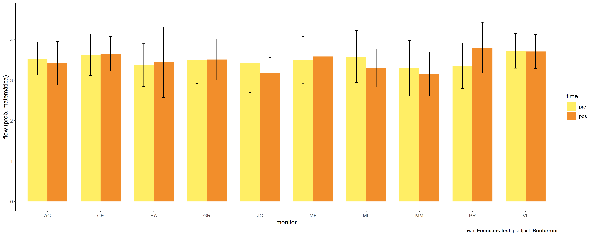<!-- -->

### factores: **grupo=“Experimental”:monitor.genero**

| var            | monitor.genero |   n | M (pre) | SE (pre) | M (unadj) | SE (unadj) | M (adj) | SE (adj) |
|:---------------|:---------------|----:|--------:|---------:|----------:|-----------:|--------:|---------:|
| fss.matematica | F              |  78 |   3.525 |    0.064 |     3.442 |      0.059 |   3.432 |    0.058 |
| fss.matematica | M              |  45 |   3.461 |    0.085 |     3.529 |      0.094 |   3.545 |    0.076 |

| .y.            | group1 | group2 | estimate | conf.low | conf.high |    se | statistic |     p | p.adj | p.adj.signif |
|:---------------|:-------|:-------|---------:|---------:|----------:|------:|----------:|------:|------:|:-------------|
| fss.matematica | F      | M      |   -0.113 |   -0.303 |     0.077 | 0.096 |    -1.178 | 0.241 | 0.241 | ns           |
| dfs.matematica | F      | M      |    0.064 |   -0.147 |     0.275 | 0.107 |     0.601 | 0.549 | 0.549 | ns           |

| .y.             | monitor.genero | group1 | group2 | estimate | conf.low | conf.high |    se | statistic |     p | p.adj | p.adj.signif |
|:----------------|:---------------|:-------|:-------|---------:|---------:|----------:|------:|----------:|------:|------:|:-------------|
| flow.matematica | F              | pre    | pos    |    0.084 |   -0.095 |     0.262 | 0.090 |     0.925 | 0.356 | 0.356 | ns           |
| flow.matematica | M              | pre    | pos    |   -0.068 |   -0.302 |     0.167 | 0.119 |    -0.567 | 0.571 | 0.571 | ns           |

    ## Scale for colour is already present.
    ## Adding another scale for colour, which will replace the existing scale.

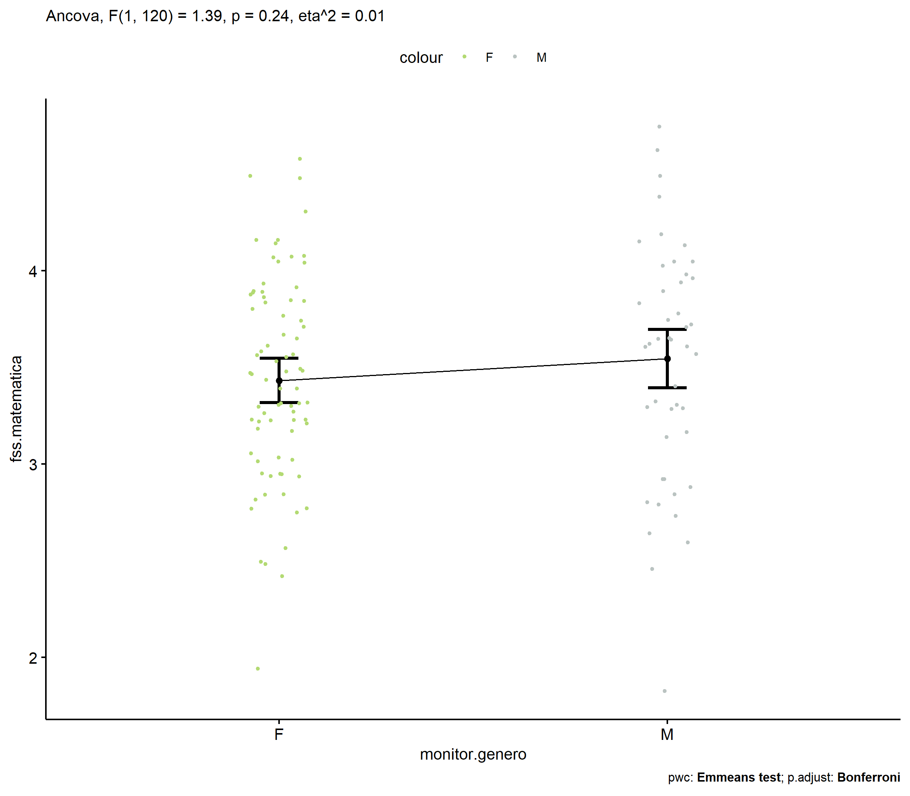<!-- -->

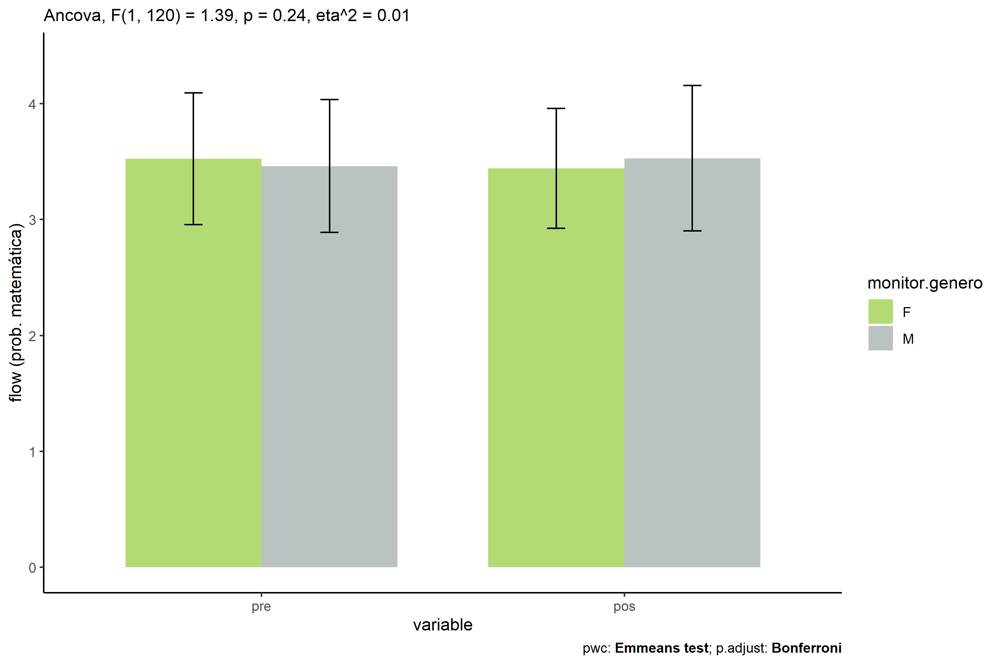<!-- -->

<!-- -->

### factores: **grupo=“Experimental”:monitor.area**

| var            | monitor.area               |   n | M (pre) | SE (pre) | M (unadj) | SE (unadj) | M (adj) | SE (adj) |
|:---------------|:---------------------------|----:|--------:|---------:|----------:|-----------:|--------:|---------:|
| fss.matematica | Arquitetura e Urbanismo    |  10 |   3.419 |    0.230 |     3.171 |      0.124 |   3.203 |    0.156 |
| fss.matematica | Ciencias Biologicas        |  15 |   3.584 |    0.166 |     3.302 |      0.122 |   3.270 |    0.128 |
| fss.matematica | Comunicacao Social         |  14 |   3.633 |    0.137 |     3.654 |      0.115 |   3.603 |    0.132 |
| fss.matematica | Historia                   |  10 |   3.358 |    0.178 |     3.805 |      0.199 |   3.860 |    0.157 |
| fss.matematica | Letras - Lingua Portuguesa |  11 |   3.495 |    0.176 |     3.586 |      0.161 |   3.589 |    0.149 |
| fss.matematica | Matematica                 |  26 |   3.449 |    0.109 |     3.483 |      0.132 |   3.503 |    0.097 |
| fss.matematica | Nutricao                   |  13 |   3.299 |    0.190 |     3.154 |      0.151 |   3.232 |    0.138 |
| fss.matematica | Pedagogia                  |  11 |   3.535 |    0.122 |     3.418 |      0.161 |   3.405 |    0.149 |
| fss.matematica | Servico Social             |  13 |   3.726 |    0.119 |     3.709 |      0.116 |   3.623 |    0.138 |

| .y.            | group1                  | group2              | estimate | conf.low | conf.high |    se | statistic |     p | p.adj | p.adj.signif |
|:---------------|:------------------------|:--------------------|---------:|---------:|----------:|------:|----------:|------:|------:|:-------------|
| fss.matematica | Arquitetura e Urbanismo | Ciencias Biologicas |   -0.067 |   -0.468 |     0.333 | 0.202 |    -0.334 | 0.739 | 1.000 | ns           |
| fss.matematica | Arquitetura e Urbanismo | Comunicacao Social  |   -0.401 |   -0.807 |     0.006 | 0.205 |    -1.953 | 0.053 | 1.000 | ns           |
| fss.matematica | Arquitetura e Urbanismo | Historia            |   -0.657 |   -1.095 |    -0.220 | 0.221 |    -2.977 | 0.004 | 0.128 | ns           |
| fss.matematica | Arquitetura e Urbanismo | Letras              |   -0.386 |   -0.813 |     0.042 | 0.216 |    -1.788 | 0.076 | 1.000 | ns           |
| fss.matematica | Arquitetura e Urbanismo | Matematica          |   -0.300 |   -0.664 |     0.063 | 0.184 |    -1.636 | 0.105 | 1.000 | ns           |
| fss.matematica | Arquitetura e Urbanismo | Nutricao            |   -0.029 |   -0.441 |     0.383 | 0.208 |    -0.141 | 0.888 | 1.000 | ns           |
| fss.matematica | Arquitetura e Urbanismo | Pedagogia           |   -0.202 |   -0.630 |     0.225 | 0.216 |    -0.937 | 0.351 | 1.000 | ns           |
| fss.matematica | Arquitetura e Urbanismo | Servico Social      |   -0.420 |   -0.834 |    -0.006 | 0.209 |    -2.009 | 0.047 | 1.000 | ns           |
| fss.matematica | Ciencias Biologicas     | Comunicacao Social  |   -0.333 |   -0.697 |     0.030 | 0.183 |    -1.816 | 0.072 | 1.000 | ns           |
| fss.matematica | Ciencias Biologicas     | Historia            |   -0.590 |   -0.991 |    -0.189 | 0.202 |    -2.915 | 0.004 | 0.154 | ns           |
| fss.matematica | Ciencias Biologicas     | Letras              |   -0.318 |   -0.707 |     0.070 | 0.196 |    -1.624 | 0.107 | 1.000 | ns           |
| fss.matematica | Ciencias Biologicas     | Matematica          |   -0.233 |   -0.551 |     0.085 | 0.160 |    -1.452 | 0.149 | 1.000 | ns           |
| fss.matematica | Ciencias Biologicas     | Nutricao            |    0.038 |   -0.335 |     0.412 | 0.188 |     0.203 | 0.839 | 1.000 | ns           |
| fss.matematica | Ciencias Biologicas     | Pedagogia           |   -0.135 |   -0.523 |     0.253 | 0.196 |    -0.688 | 0.493 | 1.000 | ns           |
| fss.matematica | Ciencias Biologicas     | Servico Social      |   -0.353 |   -0.724 |     0.019 | 0.187 |    -1.882 | 0.062 | 1.000 | ns           |
| fss.matematica | Comunicacao Social      | Historia            |   -0.257 |   -0.664 |     0.150 | 0.206 |    -1.249 | 0.214 | 1.000 | ns           |
| fss.matematica | Comunicacao Social      | Letras              |    0.015 |   -0.380 |     0.409 | 0.199 |     0.074 | 0.941 | 1.000 | ns           |
| fss.matematica | Comunicacao Social      | Matematica          |    0.100 |   -0.225 |     0.426 | 0.164 |     0.609 | 0.544 | 1.000 | ns           |
| fss.matematica | Comunicacao Social      | Nutricao            |    0.371 |   -0.009 |     0.752 | 0.192 |     1.934 | 0.056 | 1.000 | ns           |
| fss.matematica | Comunicacao Social      | Pedagogia           |    0.198 |   -0.196 |     0.593 | 0.199 |     0.996 | 0.321 | 1.000 | ns           |
| fss.matematica | Comunicacao Social      | Servico Social      |   -0.020 |   -0.397 |     0.357 | 0.190 |    -0.103 | 0.918 | 1.000 | ns           |
| fss.matematica | Historia                | Letras              |    0.272 |   -0.156 |     0.699 | 0.216 |     1.257 | 0.211 | 1.000 | ns           |
| fss.matematica | Historia                | Matematica          |    0.357 |   -0.007 |     0.721 | 0.184 |     1.942 | 0.055 | 1.000 | ns           |
| fss.matematica | Historia                | Nutricao            |    0.628 |    0.217 |     1.040 | 0.208 |     3.025 | 0.003 | 0.111 | ns           |
| fss.matematica | Historia                | Pedagogia           |    0.455 |    0.027 |     0.883 | 0.216 |     2.105 | 0.037 | 1.000 | ns           |
| fss.matematica | Historia                | Servico Social      |    0.237 |   -0.178 |     0.653 | 0.210 |     1.131 | 0.260 | 1.000 | ns           |
| fss.matematica | Letras                  | Lingua Portuguesa   |    0.085 |   -0.266 |     0.437 | 0.178 |     0.481 | 0.632 | 1.000 | ns           |
| fss.matematica | Letras                  | Lingua Portuguesa   |    0.357 |   -0.045 |     0.758 | 0.203 |     1.758 | 0.081 | 1.000 | ns           |
| fss.matematica | Letras                  | Lingua Portuguesa   |    0.183 |   -0.234 |     0.600 | 0.210 |     0.872 | 0.385 | 1.000 | ns           |
| fss.matematica | Letras                  | Lingua Portuguesa   |   -0.034 |   -0.437 |     0.368 | 0.203 |    -0.169 | 0.866 | 1.000 | ns           |
| fss.matematica | Matematica              | Nutricao            |    0.271 |   -0.062 |     0.604 | 0.168 |     1.614 | 0.109 | 1.000 | ns           |
| fss.matematica | Matematica              | Pedagogia           |    0.098 |   -0.254 |     0.450 | 0.178 |     0.552 | 0.582 | 1.000 | ns           |
| fss.matematica | Matematica              | Servico Social      |   -0.120 |   -0.455 |     0.215 | 0.169 |    -0.708 | 0.481 | 1.000 | ns           |
| fss.matematica | Nutricao                | Pedagogia           |   -0.173 |   -0.575 |     0.229 | 0.203 |    -0.852 | 0.396 | 1.000 | ns           |
| fss.matematica | Nutricao                | Servico Social      |   -0.391 |   -0.780 |    -0.001 | 0.197 |    -1.988 | 0.049 | 1.000 | ns           |
| fss.matematica | Pedagogia               | Servico Social      |   -0.218 |   -0.620 |     0.184 | 0.203 |    -1.074 | 0.285 | 1.000 | ns           |
| dfs.matematica | Arquitetura e Urbanismo | Ciencias Biologicas |   -0.165 |   -0.629 |     0.299 | 0.234 |    -0.705 | 0.482 | 1.000 | ns           |
| dfs.matematica | Arquitetura e Urbanismo | Comunicacao Social  |   -0.214 |   -0.684 |     0.256 | 0.237 |    -0.901 | 0.369 | 1.000 | ns           |
| dfs.matematica | Arquitetura e Urbanismo | Historia            |    0.061 |   -0.447 |     0.569 | 0.256 |     0.237 | 0.813 | 1.000 | ns           |
| dfs.matematica | Arquitetura e Urbanismo | Letras              |   -0.076 |   -0.572 |     0.420 | 0.250 |    -0.303 | 0.762 | 1.000 | ns           |
| dfs.matematica | Arquitetura e Urbanismo | Matematica          |   -0.030 |   -0.453 |     0.392 | 0.213 |    -0.142 | 0.888 | 1.000 | ns           |
| dfs.matematica | Arquitetura e Urbanismo | Nutricao            |    0.120 |   -0.358 |     0.598 | 0.241 |     0.497 | 0.620 | 1.000 | ns           |
| dfs.matematica | Arquitetura e Urbanismo | Pedagogia           |   -0.116 |   -0.612 |     0.380 | 0.250 |    -0.464 | 0.643 | 1.000 | ns           |
| dfs.matematica | Arquitetura e Urbanismo | Servico Social      |   -0.307 |   -0.785 |     0.170 | 0.241 |    -1.275 | 0.205 | 1.000 | ns           |
| dfs.matematica | Ciencias Biologicas     | Comunicacao Social  |   -0.049 |   -0.471 |     0.373 | 0.213 |    -0.230 | 0.819 | 1.000 | ns           |
| dfs.matematica | Ciencias Biologicas     | Historia            |    0.226 |   -0.238 |     0.689 | 0.234 |     0.964 | 0.337 | 1.000 | ns           |
| dfs.matematica | Ciencias Biologicas     | Letras              |    0.089 |   -0.362 |     0.540 | 0.228 |     0.391 | 0.696 | 1.000 | ns           |
| dfs.matematica | Ciencias Biologicas     | Matematica          |    0.135 |   -0.233 |     0.503 | 0.186 |     0.725 | 0.470 | 1.000 | ns           |
| dfs.matematica | Ciencias Biologicas     | Nutricao            |    0.285 |   -0.145 |     0.715 | 0.217 |     1.311 | 0.192 | 1.000 | ns           |
| dfs.matematica | Ciencias Biologicas     | Pedagogia           |    0.049 |   -0.402 |     0.499 | 0.228 |     0.214 | 0.831 | 1.000 | ns           |
| dfs.matematica | Ciencias Biologicas     | Servico Social      |   -0.143 |   -0.573 |     0.288 | 0.217 |    -0.656 | 0.513 | 1.000 | ns           |
| dfs.matematica | Comunicacao Social      | Historia            |    0.275 |   -0.196 |     0.745 | 0.237 |     1.157 | 0.250 | 1.000 | ns           |
| dfs.matematica | Comunicacao Social      | Letras              |    0.138 |   -0.320 |     0.596 | 0.231 |     0.597 | 0.551 | 1.000 | ns           |
| dfs.matematica | Comunicacao Social      | Matematica          |    0.184 |   -0.193 |     0.560 | 0.190 |     0.967 | 0.336 | 1.000 | ns           |
| dfs.matematica | Comunicacao Social      | Nutricao            |    0.334 |   -0.104 |     0.771 | 0.221 |     1.512 | 0.133 | 1.000 | ns           |
| dfs.matematica | Comunicacao Social      | Pedagogia           |    0.098 |   -0.360 |     0.555 | 0.231 |     0.423 | 0.673 | 1.000 | ns           |
| dfs.matematica | Comunicacao Social      | Servico Social      |   -0.094 |   -0.531 |     0.344 | 0.221 |    -0.424 | 0.673 | 1.000 | ns           |
| dfs.matematica | Historia                | Letras              |   -0.137 |   -0.633 |     0.360 | 0.250 |    -0.545 | 0.586 | 1.000 | ns           |
| dfs.matematica | Historia                | Matematica          |   -0.091 |   -0.513 |     0.332 | 0.213 |    -0.426 | 0.671 | 1.000 | ns           |
| dfs.matematica | Historia                | Nutricao            |    0.059 |   -0.418 |     0.537 | 0.241 |     0.245 | 0.807 | 1.000 | ns           |
| dfs.matematica | Historia                | Pedagogia           |   -0.177 |   -0.673 |     0.319 | 0.250 |    -0.707 | 0.481 | 1.000 | ns           |
| dfs.matematica | Historia                | Servico Social      |   -0.368 |   -0.846 |     0.109 | 0.241 |    -1.527 | 0.130 | 1.000 | ns           |
| dfs.matematica | Letras                  | Lingua Portuguesa   |    0.046 |   -0.363 |     0.454 | 0.206 |     0.222 | 0.825 | 1.000 | ns           |
| dfs.matematica | Letras                  | Lingua Portuguesa   |    0.196 |   -0.269 |     0.661 | 0.235 |     0.834 | 0.406 | 1.000 | ns           |
| dfs.matematica | Letras                  | Lingua Portuguesa   |   -0.040 |   -0.525 |     0.444 | 0.244 |    -0.165 | 0.869 | 1.000 | ns           |
| dfs.matematica | Letras                  | Lingua Portuguesa   |   -0.232 |   -0.697 |     0.234 | 0.235 |    -0.986 | 0.326 | 1.000 | ns           |
| dfs.matematica | Matematica              | Nutricao            |    0.150 |   -0.236 |     0.536 | 0.195 |     0.771 | 0.442 | 1.000 | ns           |
| dfs.matematica | Matematica              | Pedagogia           |   -0.086 |   -0.495 |     0.322 | 0.206 |    -0.418 | 0.677 | 1.000 | ns           |
| dfs.matematica | Matematica              | Servico Social      |   -0.277 |   -0.663 |     0.108 | 0.195 |    -1.424 | 0.157 | 1.000 | ns           |
| dfs.matematica | Nutricao                | Pedagogia           |   -0.236 |   -0.701 |     0.229 | 0.235 |    -1.006 | 0.317 | 1.000 | ns           |
| dfs.matematica | Nutricao                | Servico Social      |   -0.427 |   -0.873 |     0.018 | 0.225 |    -1.901 | 0.060 | 1.000 | ns           |
| dfs.matematica | Pedagogia               | Servico Social      |   -0.191 |   -0.656 |     0.274 | 0.235 |    -0.814 | 0.417 | 1.000 | ns           |

| .y.             | monitor.area               | group1 | group2 | estimate | conf.low | conf.high |    se | statistic |     p | p.adj | p.adj.signif |
|:----------------|:---------------------------|:-------|:-------|---------:|---------:|----------:|------:|----------:|------:|------:|:-------------|
| flow.matematica | Arquitetura e Urbanismo    | pre    | pos    |    0.248 |   -0.242 |     0.738 | 0.249 |     0.998 | 0.319 | 0.319 | ns           |
| flow.matematica | Ciencias Biologicas        | pre    | pos    |    0.282 |   -0.118 |     0.682 | 0.203 |     1.389 | 0.166 | 0.166 | ns           |
| flow.matematica | Comunicacao Social         | pre    | pos    |   -0.021 |   -0.435 |     0.393 | 0.210 |    -0.099 | 0.921 | 0.921 | ns           |
| flow.matematica | Historia                   | pre    | pos    |   -0.446 |   -0.937 |     0.044 | 0.249 |    -1.795 | 0.074 | 0.074 | ns           |
| flow.matematica | Letras - Lingua Portuguesa | pre    | pos    |   -0.091 |   -0.558 |     0.376 | 0.237 |    -0.383 | 0.702 | 0.702 | ns           |
| flow.matematica | Matematica                 | pre    | pos    |   -0.034 |   -0.338 |     0.270 | 0.154 |    -0.218 | 0.828 | 0.828 | ns           |
| flow.matematica | Nutricao                   | pre    | pos    |    0.145 |   -0.285 |     0.575 | 0.218 |     0.666 | 0.506 | 0.506 | ns           |
| flow.matematica | Pedagogia                  | pre    | pos    |    0.117 |   -0.350 |     0.585 | 0.237 |     0.495 | 0.621 | 0.621 | ns           |
| flow.matematica | Servico Social             | pre    | pos    |    0.017 |   -0.413 |     0.447 | 0.218 |     0.078 | 0.938 | 0.938 | ns           |

    ## Scale for colour is already present.
    ## Adding another scale for colour, which will replace the existing scale.

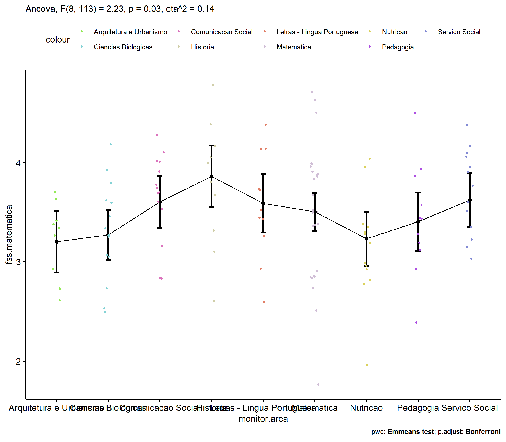<!-- -->

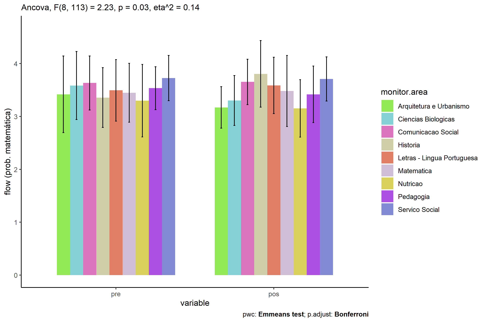<!-- -->

<!-- -->

### factores: **grupo=“Experimental”:monitor.formacao**

| var            | monitor.formacao |   n | M (pre) | SE (pre) | M (unadj) | SE (unadj) | M (adj) | SE (adj) |
|:---------------|:-----------------|----:|--------:|---------:|----------:|-----------:|--------:|---------:|
| fss.matematica | ensino medio     |  87 |   3.493 |    0.064 |     3.455 |      0.058 |   3.459 |    0.055 |
| fss.matematica | especializacao   |  14 |   3.633 |    0.137 |     3.654 |      0.115 |   3.602 |    0.138 |
| fss.matematica | graduacao        |  22 |   3.455 |    0.100 |     3.431 |      0.151 |   3.450 |    0.110 |

| .y.            | group1         | group2         | estimate | conf.low | conf.high |    se | statistic |     p | p.adj | p.adj.signif |
|:---------------|:---------------|:---------------|---------:|---------:|----------:|------:|----------:|------:|------:|:-------------|
| fss.matematica | ensino medio   | especializacao |   -0.143 |   -0.438 |     0.152 | 0.149 |    -0.961 | 0.339 |     1 | ns           |
| fss.matematica | ensino medio   | graduacao      |    0.009 |   -0.234 |     0.253 | 0.123 |     0.076 | 0.940 |     1 | ns           |
| fss.matematica | especializacao | graduacao      |    0.152 |   -0.198 |     0.502 | 0.177 |     0.862 | 0.391 |     1 | ns           |
| dfs.matematica | ensino medio   | especializacao |   -0.140 |   -0.465 |     0.185 | 0.164 |    -0.854 | 0.395 |     1 | ns           |
| dfs.matematica | ensino medio   | graduacao      |    0.038 |   -0.232 |     0.307 | 0.136 |     0.276 | 0.783 |     1 | ns           |
| dfs.matematica | especializacao | graduacao      |    0.178 |   -0.208 |     0.564 | 0.195 |     0.911 | 0.364 |     1 | ns           |

| .y.             | monitor.formacao | group1 | group2 | estimate | conf.low | conf.high |    se | statistic |     p | p.adj | p.adj.signif |
|:----------------|:-----------------|:-------|:-------|---------:|---------:|----------:|------:|----------:|------:|------:|:-------------|
| flow.matematica | ensino medio     | pre    | pos    |    0.037 |   -0.132 |     0.206 | 0.086 |     0.436 | 0.663 | 0.663 | ns           |
| flow.matematica | especializacao   | pre    | pos    |   -0.021 |   -0.442 |     0.400 | 0.214 |    -0.097 | 0.922 | 0.922 | ns           |
| flow.matematica | graduacao        | pre    | pos    |    0.024 |   -0.312 |     0.360 | 0.171 |     0.141 | 0.888 | 0.888 | ns           |

    ## Scale for colour is already present.
    ## Adding another scale for colour, which will replace the existing scale.

<!-- -->

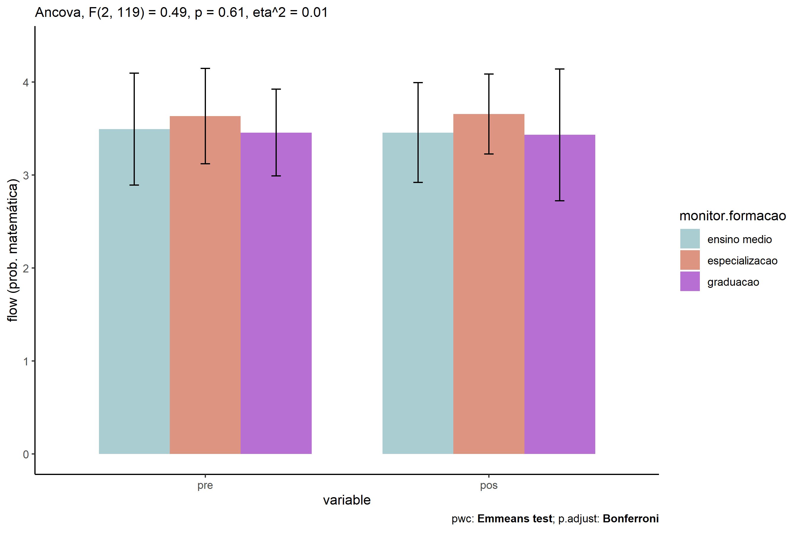<!-- -->

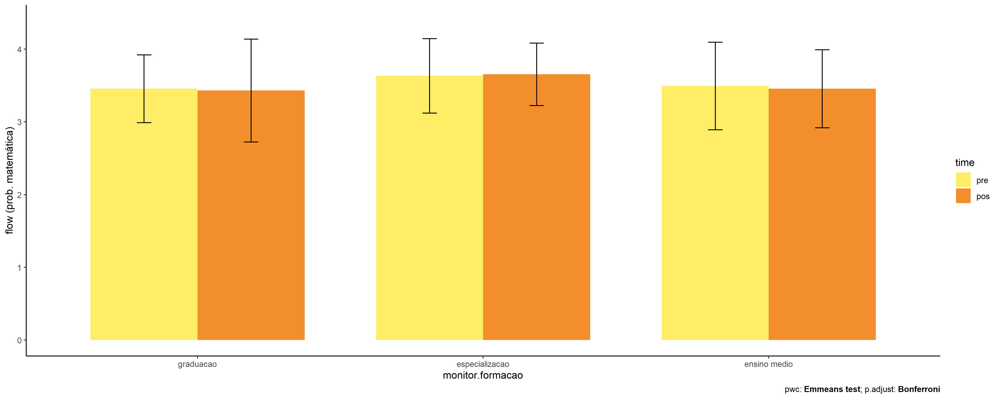<!-- -->

### factores: **grupo=“Experimental”:monitor.experiencia**

| var            | monitor.experiencia |   n | M (pre) | SE (pre) | M (unadj) | SE (unadj) | M (adj) | SE (adj) |
|:---------------|:--------------------|----:|--------:|---------:|----------:|-----------:|--------:|---------:|
| fss.matematica | maior 01 ano        |  87 |   3.508 |    0.058 |     3.521 |      0.061 |   3.518 |    0.055 |
| fss.matematica | menor 01 ano        |  36 |   3.487 |    0.105 |     3.359 |      0.087 |   3.365 |    0.085 |

| .y.            | group1       | group2       | estimate | conf.low | conf.high |    se | statistic |     p | p.adj | p.adj.signif |
|:---------------|:-------------|:-------------|---------:|---------:|----------:|------:|----------:|------:|------:|:-------------|
| fss.matematica | maior 01 ano | menor 01 ano |    0.153 |   -0.047 |     0.354 | 0.101 |     1.514 | 0.133 | 0.133 | ns           |
| dfs.matematica | maior 01 ano | menor 01 ano |    0.021 |   -0.202 |     0.245 | 0.113 |     0.190 | 0.850 | 0.850 | ns           |

| .y.             | monitor.experiencia | group1 | group2 | estimate | conf.low | conf.high |    se | statistic |     p | p.adj | p.adj.signif |
|:----------------|:--------------------|:-------|:-------|---------:|---------:|----------:|------:|----------:|------:|------:|:-------------|
| flow.matematica | maior 01 ano        | pre    | pos    |   -0.013 |   -0.181 |     0.156 | 0.085 |    -0.149 | 0.882 | 0.882 | ns           |
| flow.matematica | menor 01 ano        | pre    | pos    |    0.128 |   -0.134 |     0.389 | 0.133 |     0.960 | 0.338 | 0.338 | ns           |

    ## Scale for colour is already present.
    ## Adding another scale for colour, which will replace the existing scale.

<!-- -->

<!-- -->

<!-- -->
