ANCOVA test for textual (engajamento no textual)
================
Geiser C. Challco <geiser@alumni.usp.br>

- [Descriptive Statistics of Initial
  Data](#descriptive-statistics-of-initial-data)
- [Checking of Assumptions](#checking-of-assumptions)
  - [Assumption: Normality distribution of
    data](#assumption-normality-distribution-of-data)
  - [Assumption: Homogeneity of data
    distribution](#assumption-homogeneity-of-data-distribution)
- [Computation of ANCOVA test and Pairwise
  Comparison](#computation-of-ancova-test-and-pairwise-comparison)
  - [ANCOVA tests for one factor](#ancova-tests-for-one-factor)
  - [ANCOVA tests for two factors](#ancova-tests-for-two-factors)
  - [ANCOVA tests for grupo=“WordGen”](#ancova-tests-for-grupowordgen)
  - [Pairwise comparisons for one
    factor](#pairwise-comparisons-for-one-factor)
    - [factor: **grupo**](#factor-grupo)
    - [factor: **genero**](#factor-genero)
    - [factor: **idade**](#factor-idade)
    - [factor: **zona.participante**](#factor-zonaparticipante)
    - [factor: **escola**](#factor-escola)
    - [factor: **zona.escola**](#factor-zonaescola)
  - [Pairwise comparisons for two
    factors](#pairwise-comparisons-for-two-factors)
    - [factores: **grupo:genero**](#factores-grupogenero)
    - [factores: **grupo:idade**](#factores-grupoidade)
    - [factores:
      **grupo:zona.participante**](#factores-grupozonaparticipante)
    - [factores: **grupo:escola**](#factores-grupoescola)
    - [factores: **grupo:zona.escola**](#factores-grupozonaescola)
  - [Pairwise comparisons for
    grupo=“Experimental”](#pairwise-comparisons-for-grupoexperimental)
    - [factores:
      **grupo=“Experimental”:monitor**](#factores-grupoexperimentalmonitor)
    - [factores:
      **grupo=“Experimental”:monitor.genero**](#factores-grupoexperimentalmonitorgenero)
    - [factores:
      **grupo=“Experimental”:monitor.area**](#factores-grupoexperimentalmonitorarea)
    - [factores:
      **grupo=“Experimental”:monitor.formacao**](#factores-grupoexperimentalmonitorformacao)
    - [factores:
      **grupo=“Experimental”:monitor.experiencia**](#factores-grupoexperimentalmonitorexperiencia)

**NOTE**

- Teste ANCOVA para determinar se houve diferenças significativas em
  referência ao engajamento no textual (medido como estado de fluxo).
- ANCOVA test to determine whether there were significant differences in
  reference to engagement in textual (measured as flow state).

# Descriptive Statistics of Initial Data

| grupo    | genero | idade | zona.participante | escola | zona.escola | variable    |   n |  mean | median |   min |   max |    sd |    se |    ci |   iqr |
|:---------|:-------|:------|:------------------|:-------|:------------|:------------|----:|------:|-------:|------:|------:|------:|------:|------:|------:|
| Controle | F      |       |                   |        |             | fss.textual |  59 | 3.542 |  3.556 | 2.222 | 4.778 | 0.605 | 0.079 | 0.158 | 0.722 |
| Controle | M      |       |                   |        |             | fss.textual |  62 | 3.439 |  3.444 | 2.444 | 5.000 | 0.551 | 0.070 | 0.140 | 0.750 |
| WordGen  | F      |       |                   |        |             | fss.textual |  53 | 3.732 |  3.778 | 2.222 | 5.000 | 0.548 | 0.075 | 0.151 | 0.667 |
| WordGen  | M      |       |                   |        |             | fss.textual |  62 | 3.379 |  3.333 | 1.750 | 4.667 | 0.610 | 0.078 | 0.155 | 0.750 |
| Controle | F      |       |                   |        |             | dfs.textual |  59 | 3.536 |  3.556 | 2.222 | 4.556 | 0.593 | 0.077 | 0.155 | 0.889 |
| Controle | M      |       |                   |        |             | dfs.textual |  62 | 3.490 |  3.444 | 2.000 | 4.667 | 0.537 | 0.068 | 0.136 | 0.778 |
| WordGen  | F      |       |                   |        |             | dfs.textual |  53 | 3.601 |  3.556 | 2.333 | 4.714 | 0.537 | 0.074 | 0.148 | 0.667 |
| WordGen  | M      |       |                   |        |             | dfs.textual |  62 | 3.428 |  3.333 | 2.444 | 4.778 | 0.566 | 0.072 | 0.144 | 0.778 |
| Controle |        | 10y   |                   |        |             | fss.textual |  23 | 3.580 |  3.556 | 2.222 | 4.778 | 0.644 | 0.134 | 0.279 | 1.000 |
| Controle |        | 11y   |                   |        |             | fss.textual |  64 | 3.555 |  3.556 | 2.222 | 5.000 | 0.581 | 0.073 | 0.145 | 0.806 |
| Controle |        | 12y   |                   |        |             | fss.textual |  18 | 3.351 |  3.222 | 2.667 | 4.556 | 0.578 | 0.136 | 0.287 | 0.788 |
| Controle |        | 13y   |                   |        |             | fss.textual |   7 | 3.190 |  3.222 | 2.778 | 3.444 | 0.210 | 0.079 | 0.194 | 0.111 |
| Controle |        | 14y   |                   |        |             | fss.textual |   1 | 3.556 |  3.556 | 3.556 | 3.556 |       |       |       | 0.000 |
| Controle |        | 15y   |                   |        |             | fss.textual |   1 | 2.889 |  2.889 | 2.889 | 2.889 |       |       |       | 0.000 |
| Controle |        | 16y   |                   |        |             | fss.textual |   1 | 2.889 |  2.889 | 2.889 | 2.889 |       |       |       | 0.000 |
| Controle |        |       |                   |        |             | fss.textual |   6 | 3.389 |  3.444 | 2.667 | 4.111 | 0.543 | 0.222 | 0.570 | 0.722 |
| WordGen  |        | 10y   |                   |        |             | fss.textual |  22 | 3.481 |  3.444 | 2.667 | 4.444 | 0.505 | 0.108 | 0.224 | 0.639 |
| WordGen  |        | 11y   |                   |        |             | fss.textual |  70 | 3.631 |  3.556 | 2.000 | 5.000 | 0.598 | 0.071 | 0.143 | 0.667 |
| WordGen  |        | 12y   |                   |        |             | fss.textual |  14 | 3.548 |  3.667 | 2.556 | 4.333 | 0.582 | 0.156 | 0.336 | 0.889 |
| WordGen  |        | 13y   |                   |        |             | fss.textual |   6 | 2.736 |  2.889 | 1.750 | 3.333 | 0.544 | 0.222 | 0.571 | 0.333 |
| WordGen  |        | 14y   |                   |        |             | fss.textual |   1 | 4.444 |  4.444 | 4.444 | 4.444 |       |       |       | 0.000 |
| WordGen  |        |       |                   |        |             | fss.textual |   2 | 3.000 |  3.000 | 2.889 | 3.111 | 0.157 | 0.111 | 1.412 | 0.111 |
| Controle |        | 10y   |                   |        |             | dfs.textual |  23 | 3.572 |  3.778 | 2.444 | 4.444 | 0.546 | 0.114 | 0.236 | 0.833 |
| Controle |        | 11y   |                   |        |             | dfs.textual |  64 | 3.599 |  3.667 | 2.222 | 4.667 | 0.557 | 0.070 | 0.139 | 0.778 |
| Controle |        | 12y   |                   |        |             | dfs.textual |  18 | 3.367 |  3.292 | 2.667 | 4.556 | 0.513 | 0.121 | 0.255 | 0.806 |
| Controle |        | 13y   |                   |        |             | dfs.textual |   7 | 3.450 |  3.444 | 2.556 | 4.375 | 0.574 | 0.217 | 0.531 | 0.444 |
| Controle |        | 14y   |                   |        |             | dfs.textual |   1 | 3.778 |  3.778 | 3.778 | 3.778 |       |       |       | 0.000 |
| Controle |        | 15y   |                   |        |             | dfs.textual |   1 | 2.000 |  2.000 | 2.000 | 2.000 |       |       |       | 0.000 |
| Controle |        | 16y   |                   |        |             | dfs.textual |   1 | 3.444 |  3.444 | 3.444 | 3.444 |       |       |       | 0.000 |
| Controle |        |       |                   |        |             | dfs.textual |   6 | 3.093 |  2.944 | 2.667 | 3.889 | 0.463 | 0.189 | 0.486 | 0.500 |
| WordGen  |        | 10y   |                   |        |             | dfs.textual |  22 | 3.393 |  3.278 | 2.333 | 4.778 | 0.665 | 0.142 | 0.295 | 0.861 |
| WordGen  |        | 11y   |                   |        |             | dfs.textual |  70 | 3.582 |  3.563 | 2.444 | 4.714 | 0.523 | 0.063 | 0.125 | 0.667 |
| WordGen  |        | 12y   |                   |        |             | dfs.textual |  14 | 3.508 |  3.556 | 2.444 | 4.333 | 0.603 | 0.161 | 0.348 | 1.083 |
| WordGen  |        | 13y   |                   |        |             | dfs.textual |   6 | 3.130 |  3.056 | 2.778 | 3.556 | 0.310 | 0.126 | 0.325 | 0.444 |
| WordGen  |        | 14y   |                   |        |             | dfs.textual |   1 | 3.222 |  3.222 | 3.222 | 3.222 |       |       |       | 0.000 |
| WordGen  |        |       |                   |        |             | dfs.textual |   2 | 3.444 |  3.444 | 3.000 | 3.889 | 0.629 | 0.444 | 5.647 | 0.444 |
| Controle |        |       | Urbana            |        |             | fss.textual |  53 | 3.553 |  3.556 | 2.222 | 5.000 | 0.589 | 0.081 | 0.162 | 0.667 |
| Controle |        |       | Rural             |        |             | fss.textual |  42 | 3.370 |  3.333 | 2.444 | 4.778 | 0.576 | 0.089 | 0.179 | 0.750 |
| Controle |        |       |                   |        |             | fss.textual |  26 | 3.551 |  3.611 | 2.222 | 4.556 | 0.548 | 0.108 | 0.221 | 0.583 |
| WordGen  |        |       | Urbana            |        |             | fss.textual |  43 | 3.548 |  3.556 | 1.750 | 4.778 | 0.549 | 0.084 | 0.169 | 0.611 |
| WordGen  |        |       | Rural             |        |             | fss.textual |  47 | 3.557 |  3.444 | 2.000 | 5.000 | 0.656 | 0.096 | 0.193 | 1.167 |
| WordGen  |        |       |                   |        |             | fss.textual |  25 | 3.502 |  3.556 | 2.222 | 4.556 | 0.625 | 0.125 | 0.258 | 0.778 |
| Controle |        |       | Urbana            |        |             | dfs.textual |  53 | 3.535 |  3.500 | 2.000 | 4.667 | 0.596 | 0.082 | 0.164 | 0.889 |
| Controle |        |       | Rural             |        |             | dfs.textual |  42 | 3.514 |  3.500 | 2.444 | 4.556 | 0.573 | 0.088 | 0.179 | 0.889 |
| Controle |        |       |                   |        |             | dfs.textual |  26 | 3.464 |  3.444 | 2.444 | 4.111 | 0.492 | 0.096 | 0.199 | 0.750 |
| WordGen  |        |       | Urbana            |        |             | dfs.textual |  43 | 3.432 |  3.444 | 2.333 | 4.714 | 0.585 | 0.089 | 0.180 | 1.000 |
| WordGen  |        |       | Rural             |        |             | dfs.textual |  47 | 3.515 |  3.444 | 2.444 | 4.778 | 0.596 | 0.087 | 0.175 | 1.000 |
| WordGen  |        |       |                   |        |             | dfs.textual |  25 | 3.623 |  3.667 | 2.778 | 4.444 | 0.414 | 0.083 | 0.171 | 0.444 |
| Controle |        |       |                   | E1     |             | fss.textual |  11 | 3.465 |  3.444 | 2.889 | 4.444 | 0.516 | 0.156 | 0.347 | 0.556 |
| Controle |        |       |                   | E2     |             | fss.textual |  23 | 3.497 |  3.500 | 2.222 | 5.000 | 0.731 | 0.152 | 0.316 | 1.000 |
| Controle |        |       |                   | E3     |             | fss.textual |  14 | 3.348 |  3.333 | 2.556 | 4.222 | 0.410 | 0.110 | 0.237 | 0.306 |
| Controle |        |       |                   | E4     |             | fss.textual |  16 | 3.331 |  3.333 | 2.444 | 4.111 | 0.513 | 0.128 | 0.273 | 0.552 |
| Controle |        |       |                   | E5     |             | fss.textual |  46 | 3.556 |  3.556 | 2.556 | 4.778 | 0.587 | 0.087 | 0.174 | 1.083 |
| Controle |        |       |                   | E6     |             | fss.textual |  11 | 3.626 |  3.667 | 2.222 | 4.222 | 0.536 | 0.162 | 0.360 | 0.389 |
| WordGen  |        |       |                   | E1     |             | fss.textual |  10 | 4.003 |  3.889 | 3.333 | 5.000 | 0.596 | 0.189 | 0.426 | 0.896 |
| WordGen  |        |       |                   | E2     |             | fss.textual |  24 | 3.341 |  3.444 | 1.750 | 4.111 | 0.534 | 0.109 | 0.225 | 0.528 |
| WordGen  |        |       |                   | E3     |             | fss.textual |  14 | 3.440 |  3.389 | 2.000 | 4.333 | 0.690 | 0.184 | 0.398 | 1.111 |
| WordGen  |        |       |                   | E4     |             | fss.textual |   9 | 3.691 |  3.778 | 2.778 | 4.444 | 0.605 | 0.202 | 0.465 | 1.000 |
| WordGen  |        |       |                   | E5     |             | fss.textual |  47 | 3.528 |  3.556 | 2.222 | 4.667 | 0.580 | 0.085 | 0.170 | 0.778 |
| WordGen  |        |       |                   | E6     |             | fss.textual |  11 | 3.626 |  3.667 | 2.556 | 4.556 | 0.631 | 0.190 | 0.424 | 0.778 |
| Controle |        |       |                   | E1     |             | dfs.textual |  11 | 3.278 |  3.444 | 2.000 | 4.111 | 0.625 | 0.188 | 0.420 | 0.750 |
| Controle |        |       |                   | E2     |             | dfs.textual |  23 | 3.536 |  3.556 | 2.667 | 4.667 | 0.568 | 0.118 | 0.246 | 0.889 |
| Controle |        |       |                   | E3     |             | dfs.textual |  14 | 3.588 |  3.667 | 2.778 | 4.444 | 0.544 | 0.145 | 0.314 | 0.740 |
| Controle |        |       |                   | E4     |             | dfs.textual |  16 | 3.512 |  3.444 | 2.778 | 4.375 | 0.386 | 0.096 | 0.205 | 0.472 |
| Controle |        |       |                   | E5     |             | dfs.textual |  46 | 3.492 |  3.472 | 2.222 | 4.556 | 0.644 | 0.095 | 0.191 | 1.083 |
| Controle |        |       |                   | E6     |             | dfs.textual |  11 | 3.686 |  3.875 | 3.000 | 4.111 | 0.350 | 0.106 | 0.235 | 0.500 |
| WordGen  |        |       |                   | E1     |             | dfs.textual |  10 | 3.510 |  3.500 | 2.750 | 4.222 | 0.470 | 0.149 | 0.336 | 0.556 |
| WordGen  |        |       |                   | E2     |             | dfs.textual |  24 | 3.426 |  3.444 | 2.444 | 4.222 | 0.471 | 0.096 | 0.199 | 0.639 |
| WordGen  |        |       |                   | E3     |             | dfs.textual |  14 | 3.531 |  3.667 | 2.444 | 4.556 | 0.730 | 0.195 | 0.422 | 1.344 |
| WordGen  |        |       |                   | E4     |             | dfs.textual |   9 | 3.704 |  3.444 | 3.000 | 4.444 | 0.611 | 0.204 | 0.470 | 1.111 |
| WordGen  |        |       |                   | E5     |             | dfs.textual |  47 | 3.488 |  3.444 | 2.333 | 4.778 | 0.588 | 0.086 | 0.173 | 0.833 |
| WordGen  |        |       |                   | E6     |             | dfs.textual |  11 | 3.577 |  3.667 | 2.778 | 4.222 | 0.433 | 0.130 | 0.291 | 0.500 |
| Controle |        |       |                   |        | Urbana      | fss.textual |  80 | 3.526 |  3.556 | 2.222 | 5.000 | 0.617 | 0.069 | 0.137 | 1.028 |
| Controle |        |       |                   |        | Rural       | fss.textual |  41 | 3.416 |  3.444 | 2.222 | 4.222 | 0.492 | 0.077 | 0.155 | 0.444 |
| WordGen  |        |       |                   |        | Urbana      | fss.textual |  81 | 3.531 |  3.556 | 1.750 | 5.000 | 0.595 | 0.066 | 0.132 | 0.667 |
| WordGen  |        |       |                   |        | Rural       | fss.textual |  34 | 3.567 |  3.611 | 2.000 | 4.556 | 0.640 | 0.110 | 0.223 | 1.167 |
| Controle |        |       |                   |        | Urbana      | dfs.textual |  80 | 3.476 |  3.444 | 2.000 | 4.667 | 0.619 | 0.069 | 0.138 | 1.000 |
| Controle |        |       |                   |        | Rural       | dfs.textual |  41 | 3.585 |  3.556 | 2.778 | 4.444 | 0.433 | 0.068 | 0.137 | 0.556 |
| WordGen  |        |       |                   |        | Urbana      | dfs.textual |  81 | 3.472 |  3.444 | 2.333 | 4.778 | 0.537 | 0.060 | 0.119 | 0.889 |
| WordGen  |        |       |                   |        | Rural       | dfs.textual |  34 | 3.592 |  3.619 | 2.444 | 4.556 | 0.602 | 0.103 | 0.210 | 1.083 |

# Checking of Assumptions

## Assumption: Normality distribution of data

| var         |   n |   skewness |  kurtosis | symmetry | statistic | method     |         p | p.signif | normality |
|:------------|----:|-----------:|----------:|:---------|----------:|:-----------|----------:|:---------|:----------|
| fss.textual | 236 |  0.0326109 | 0.3554543 | YES      | 1.7153429 | D’Agostino | 0.4241486 | ns       | \-        |
| fss.textual | 228 | -0.0474531 | 0.3556731 | YES      | 1.7359222 | D’Agostino | 0.4198066 | ns       | \-        |
| fss.textual | 185 |  0.1504056 | 0.6095734 | YES      | 3.7364213 | D’Agostino | 0.1543997 | ns       | QQ        |
| fss.textual | 236 | -0.0610635 | 0.0987069 | YES      | 0.5283867 | D’Agostino | 0.7678251 | ns       | \-        |
| fss.textual | 236 | -0.0003337 | 0.2060438 | YES      | 0.8312843 | D’Agostino | 0.6599164 | ns       | \-        |

## Assumption: Homogeneity of data distribution

| var         | method         | formula                             |   n | DFn.df1 | DFd.df2 | statistic |         p | p.signif |
|:------------|:---------------|:------------------------------------|----:|--------:|--------:|----------:|----------:|:---------|
| fss.textual | Levene’s test  | `.res`~`grupo`\*`genero`            | 236 |       3 |     232 | 0.4724078 | 0.7018002 | ns       |
| fss.textual | Anova’s slopes | `.res`~`grupo`\*`genero`            | 236 |       3 |     228 | 0.6710000 | 0.5710000 | ns       |
| fss.textual | Levene’s test  | `.res`~`grupo`\*`idade`             | 228 |      11 |     216 | 0.8594153 | 0.5810108 | ns       |
| fss.textual | Anova’s slopes | `.res`~`grupo`\*`idade`             | 228 |       7 |     208 | 0.9570000 | 0.4640000 | ns       |
| fss.textual | Levene’s test  | `.res`~`grupo`\*`zona.participante` | 185 |       3 |     181 | 0.9886616 | 0.3993919 | ns       |
| fss.textual | Anova’s slopes | `.res`~`grupo`\*`zona.participante` | 185 |       3 |     177 | 0.1330000 | 0.9410000 | ns       |
| fss.textual | Levene’s test  | `.res`~`grupo`\*`escola`            | 236 |      11 |     224 | 1.0480779 | 0.4051041 | ns       |
| fss.textual | Anova’s slopes | `.res`~`grupo`\*`escola`            | 236 |      11 |     212 | 0.9540000 | 0.4890000 | ns       |
| fss.textual | Levene’s test  | `.res`~`grupo`\*`zona.escola`       | 236 |       3 |     232 | 0.9093959 | 0.4371600 | ns       |
| fss.textual | Anova’s slopes | `.res`~`grupo`\*`zona.escola`       | 236 |       3 |     228 | 1.5570000 | 0.2010000 | ns       |

# Computation of ANCOVA test and Pairwise Comparison

## ANCOVA tests for one factor

|     | Effect            | DFn | DFd |    SSn |    SSd |      F | p       |   ges | p\<.05 |
|:----|:------------------|----:|----:|-------:|-------:|-------:|:--------|------:|:-------|
| 1   | dfs.textual       |   1 | 233 | 12.645 | 69.257 | 42.540 | \<0.001 | 0.154 | \*     |
| 2   | grupo             |   1 | 233 |  0.177 | 69.257 |  0.594 | 0.441   | 0.003 |        |
| 4   | genero            |   1 | 233 |  1.871 | 67.563 |  6.451 | 0.012   | 0.027 | \*     |
| 6   | idade             |   6 | 220 |  3.887 | 63.923 |  2.230 | 0.041   | 0.057 | \*     |
| 8   | zona.participante |   1 | 182 |  0.393 | 54.486 |  1.313 | 0.253   | 0.007 |        |
| 10  | escola            |   5 | 229 |  2.659 | 66.775 |  1.823 | 0.109   | 0.038 |        |
| 12  | zona.escola       |   1 | 233 |  0.435 | 68.999 |  1.468 | 0.227   | 0.006 |        |

## ANCOVA tests for two factors

|     | Effect                  | DFn | DFd |    SSn |    SSd |      F | p       |   ges | p\<.05 |
|:----|:------------------------|----:|----:|-------:|-------:|-------:|:--------|------:|:-------|
| 1   | dfs.textual             |   1 | 231 | 11.270 | 66.768 | 38.990 | \<0.001 | 0.144 | \*     |
| 4   | grupo:genero            |   1 | 231 |  0.586 | 66.768 |  2.029 | 0.156   | 0.009 |        |
| 8   | grupo:idade             |   4 | 215 |  1.196 | 62.562 |  1.028 | 0.394   | 0.019 |        |
| 12  | grupo:zona.participante |   1 | 180 |  0.257 | 53.681 |  0.861 | 0.355   | 0.005 |        |
| 16  | grupo:escola            |   5 | 223 |  1.570 | 65.042 |  1.077 | 0.374   | 0.024 |        |
| 20  | grupo:zona.escola       |   1 | 231 |  0.256 | 68.591 |  0.861 | 0.355   | 0.004 |        |

## ANCOVA tests for grupo=“WordGen”

|     | Effect              | DFn | DFd |   SSn |    SSd |      F | p       |   ges | p\<.05 |
|:----|:--------------------|----:|----:|------:|-------:|-------:|:--------|------:|:-------|
| 1   | dfs.textual         |   1 | 100 | 6.571 | 28.217 | 23.286 | \<0.001 | 0.189 | \*     |
| 2   | monitor             |   9 | 100 | 3.888 | 28.217 |  1.531 | 0.147   | 0.121 |        |
| 4   | monitor.genero      |   1 | 108 | 2.170 | 29.936 |  7.827 | 0.006   | 0.068 | \*     |
| 6   | monitor.area        |   8 | 101 | 3.010 | 29.095 |  1.306 | 0.249   | 0.094 |        |
| 8   | monitor.formacao    |   2 | 107 | 0.138 | 31.968 |  0.230 | 0.795   | 0.004 |        |
| 10  | monitor.experiencia |   1 | 108 | 0.249 | 31.856 |  0.845 | 0.36    | 0.008 |        |

## Pairwise comparisons for one factor

### factor: **grupo**

| var         | grupo    |   n | M (pre) | SE (pre) | M (unadj) | SE (unadj) | M (adj) | SE (adj) |
|:------------|:---------|----:|--------:|---------:|----------:|-----------:|--------:|---------:|
| fss.textual | Controle | 121 |   3.513 |    0.051 |     3.489 |      0.053 |   3.488 |    0.050 |
| fss.textual | WordGen  | 115 |   3.508 |    0.052 |     3.542 |      0.057 |   3.543 |    0.051 |

| .y.         | group1   | group2  | estimate | conf.low | conf.high |    se | statistic |     p | p.adj | p.adj.signif |
|:------------|:---------|:--------|---------:|---------:|----------:|------:|----------:|------:|------:|:-------------|
| fss.textual | Controle | WordGen |   -0.055 |   -0.195 |     0.085 | 0.071 |    -0.771 | 0.441 | 0.441 | ns           |
| dfs.textual | Controle | WordGen |    0.005 |   -0.139 |     0.149 | 0.073 |     0.068 | 0.946 | 0.946 | ns           |

| .y.          | grupo    | group1 | group2 | estimate | conf.low | conf.high |    se | statistic |     p | p.adj | p.adj.signif |
|:-------------|:---------|:-------|:-------|---------:|---------:|----------:|------:|----------:|------:|------:|:-------------|
| flow.textual | Controle | pre    | pos    |    0.023 |   -0.122 |     0.169 | 0.074 |     0.317 | 0.751 | 0.751 | ns           |
| flow.textual | WordGen  | pre    | pos    |   -0.034 |   -0.183 |     0.115 | 0.076 |    -0.450 | 0.653 | 0.653 | ns           |

    ## Scale for colour is already present.
    ## Adding another scale for colour, which will replace the existing scale.

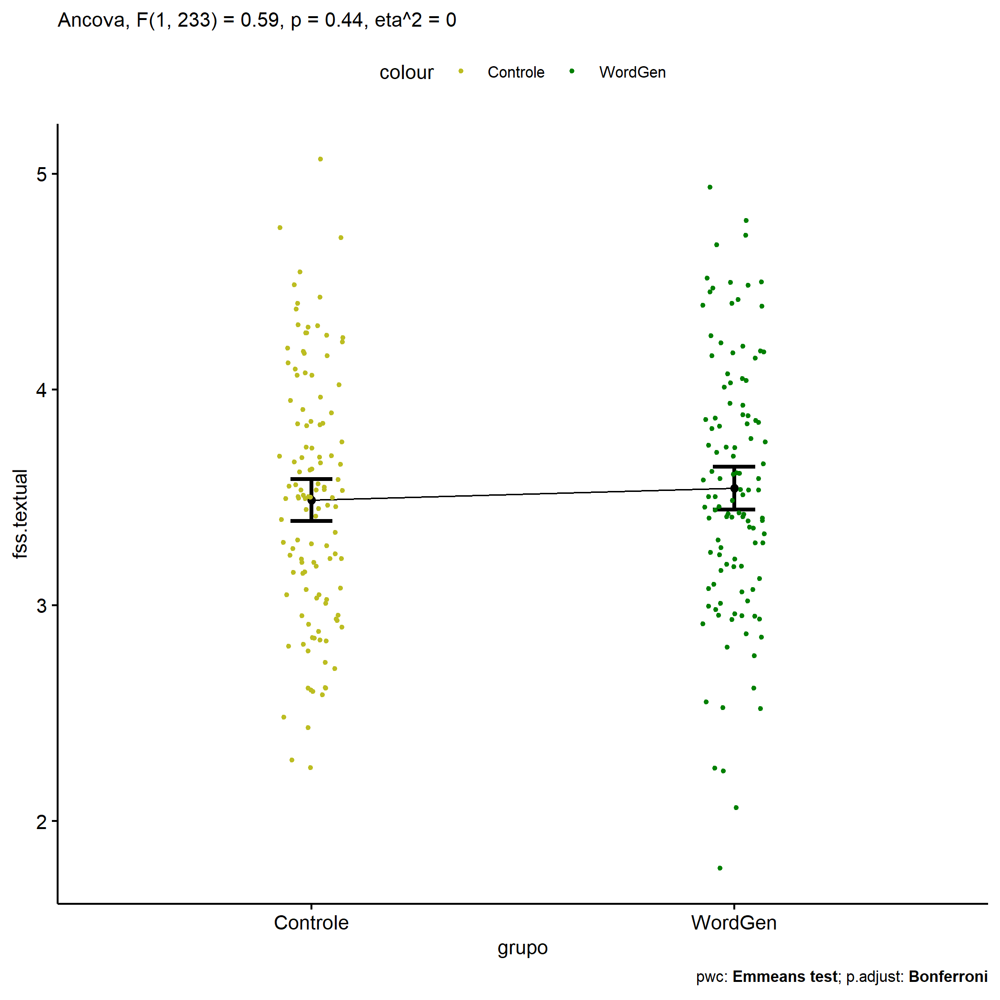<!-- -->

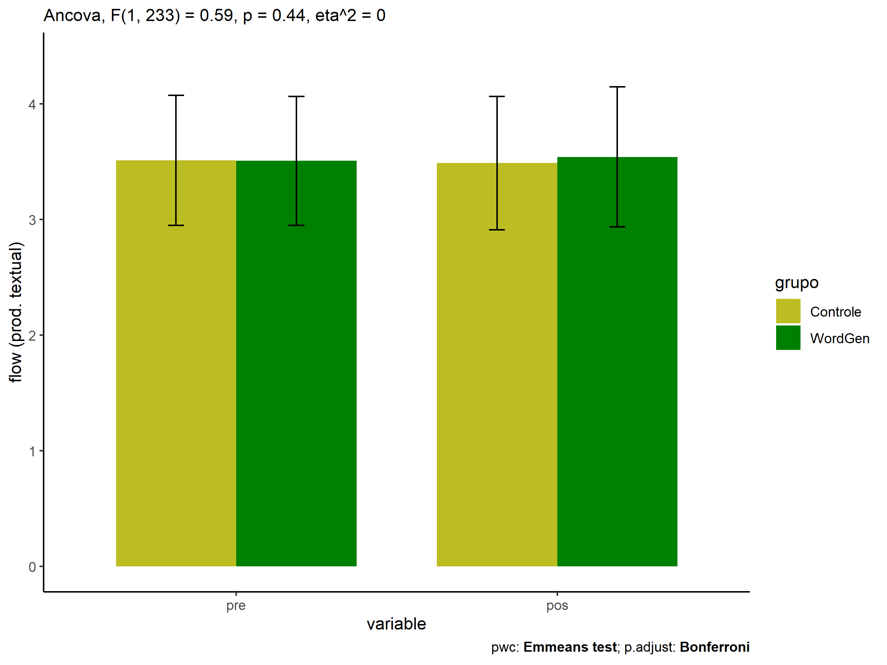<!-- -->

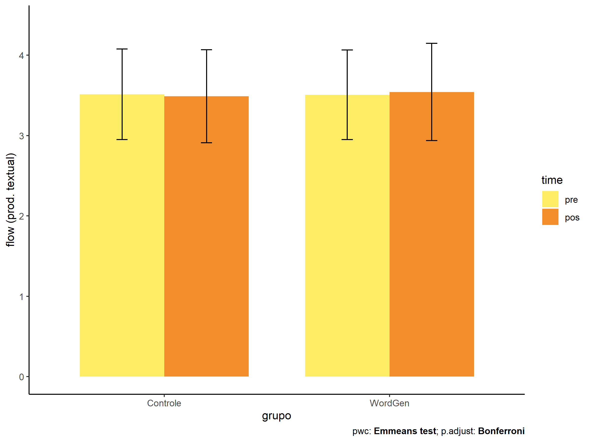<!-- -->

<!-- -->

<!-- -->

### factor: **genero**

| var         | genero |   n | M (pre) | SE (pre) | M (unadj) | SE (unadj) | M (adj) | SE (adj) |
|:------------|:-------|----:|--------:|---------:|----------:|-----------:|--------:|---------:|
| fss.textual | F      | 112 |   3.567 |    0.053 |     3.632 |      0.055 |   3.609 |    0.051 |
| fss.textual | M      | 124 |   3.459 |    0.049 |     3.409 |      0.052 |   3.430 |    0.048 |

| .y.         | group1 | group2 | estimate | conf.low | conf.high |    se | statistic |     p | p.adj | p.adj.signif |
|:------------|:-------|:-------|---------:|---------:|----------:|------:|----------:|------:|------:|:-------------|
| fss.textual | F      | M      |    0.179 |    0.040 |     0.318 | 0.071 |     2.540 | 0.012 | 0.012 | \*           |
| dfs.textual | F      | M      |    0.108 |   -0.035 |     0.251 | 0.073 |     1.488 | 0.138 | 0.138 | ns           |

| .y.          | genero | group1 | group2 | estimate | conf.low | conf.high |    se | statistic |     p | p.adj | p.adj.signif |
|:-------------|:-------|:-------|:-------|---------:|---------:|----------:|------:|----------:|------:|------:|:-------------|
| flow.textual | F      | pre    | pos    |   -0.065 |   -0.214 |     0.085 | 0.076 |    -0.848 | 0.397 | 0.397 | ns           |
| flow.textual | M      | pre    | pos    |    0.050 |   -0.093 |     0.192 | 0.072 |     0.685 | 0.494 | 0.494 | ns           |

    ## Scale for colour is already present.
    ## Adding another scale for colour, which will replace the existing scale.

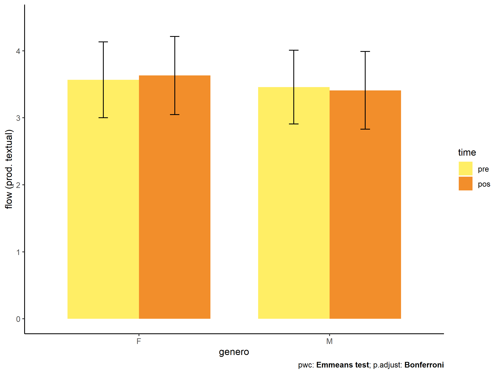<!-- -->

<!-- -->

<!-- -->

<!-- -->

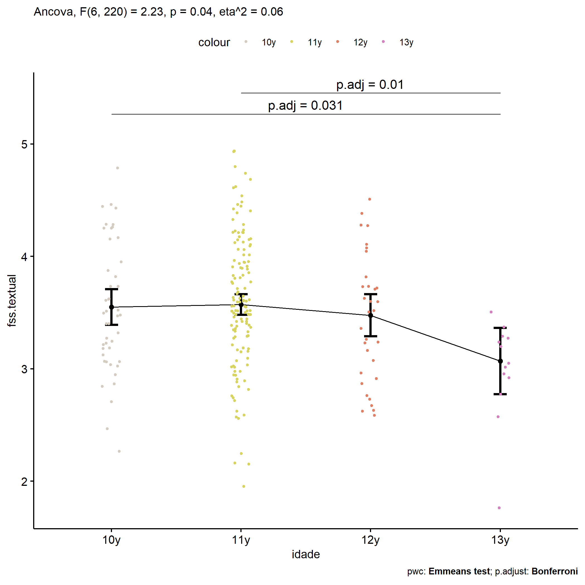<!-- -->

### factor: **idade**

| var         | idade |   n | M (pre) | SE (pre) | M (unadj) | SE (unadj) | M (adj) | SE (adj) |
|:------------|:------|----:|--------:|---------:|----------:|-----------:|--------:|---------:|
| fss.textual | 10y   |  45 |   3.485 |    0.090 |     3.531 |      0.086 |   3.549 |    0.080 |
| fss.textual | 11y   | 134 |   3.590 |    0.046 |     3.595 |      0.051 |   3.571 |    0.047 |
| fss.textual | 12y   |  32 |   3.428 |    0.097 |     3.437 |      0.102 |   3.476 |    0.095 |
| fss.textual | 13y   |  13 |   3.302 |    0.134 |     2.981 |      0.124 |   3.069 |    0.150 |

| .y.         | group1 | group2 | estimate | conf.low | conf.high |    se | statistic |     p | p.adj | p.adj.signif |
|:------------|:-------|:-------|---------:|---------:|----------:|------:|----------:|------:|------:|:-------------|
| fss.textual | 10y    | 11y    |   -0.022 |   -0.205 |     0.161 | 0.093 |    -0.239 | 0.812 | 1.000 | ns           |
| fss.textual | 10y    | 12y    |    0.072 |   -0.173 |     0.318 | 0.124 |     0.583 | 0.561 | 1.000 | ns           |
| fss.textual | 10y    | 13y    |    0.480 |    0.145 |     0.814 | 0.170 |     2.825 | 0.005 | 0.031 | \*           |
| fss.textual | 11y    | 12y    |    0.095 |   -0.115 |     0.304 | 0.106 |     0.890 | 0.374 | 1.000 | ns           |
| fss.textual | 11y    | 13y    |    0.502 |    0.192 |     0.812 | 0.157 |     3.189 | 0.002 | 0.010 | \*\*         |
| fss.textual | 12y    | 13y    |    0.407 |    0.058 |     0.756 | 0.177 |     2.299 | 0.022 | 0.135 | ns           |
| dfs.textual | 10y    | 11y    |   -0.105 |   -0.293 |     0.082 | 0.095 |    -1.109 | 0.268 | 1.000 | ns           |
| dfs.textual | 10y    | 12y    |    0.056 |   -0.195 |     0.307 | 0.127 |     0.441 | 0.660 | 1.000 | ns           |
| dfs.textual | 10y    | 13y    |    0.182 |   -0.160 |     0.524 | 0.174 |     1.050 | 0.295 | 1.000 | ns           |
| dfs.textual | 11y    | 12y    |    0.162 |   -0.052 |     0.375 | 0.108 |     1.490 | 0.138 | 0.827 | ns           |
| dfs.textual | 11y    | 13y    |    0.288 |   -0.028 |     0.603 | 0.160 |     1.796 | 0.074 | 0.443 | ns           |
| dfs.textual | 12y    | 13y    |    0.126 |   -0.231 |     0.483 | 0.181 |     0.695 | 0.488 | 1.000 | ns           |

| .y.          | idade | group1 | group2 | estimate | conf.low | conf.high |    se | statistic |     p | p.adj | p.adj.signif |
|:-------------|:------|:-------|:-------|---------:|---------:|----------:|------:|----------:|------:|------:|:-------------|
| flow.textual | 10y   | pre    | pos    |   -0.047 |   -0.281 |     0.187 | 0.119 |    -0.394 | 0.694 | 0.694 | ns           |
| flow.textual | 11y   | pre    | pos    |   -0.005 |   -0.141 |     0.131 | 0.069 |    -0.071 | 0.943 | 0.943 | ns           |
| flow.textual | 12y   | pre    | pos    |   -0.009 |   -0.286 |     0.269 | 0.141 |    -0.061 | 0.951 | 0.951 | ns           |
| flow.textual | 13y   | pre    | pos    |    0.322 |   -0.114 |     0.757 | 0.222 |     1.452 | 0.147 | 0.147 | ns           |

    ## Scale for colour is already present.
    ## Adding another scale for colour, which will replace the existing scale.

<!-- -->

<!-- -->

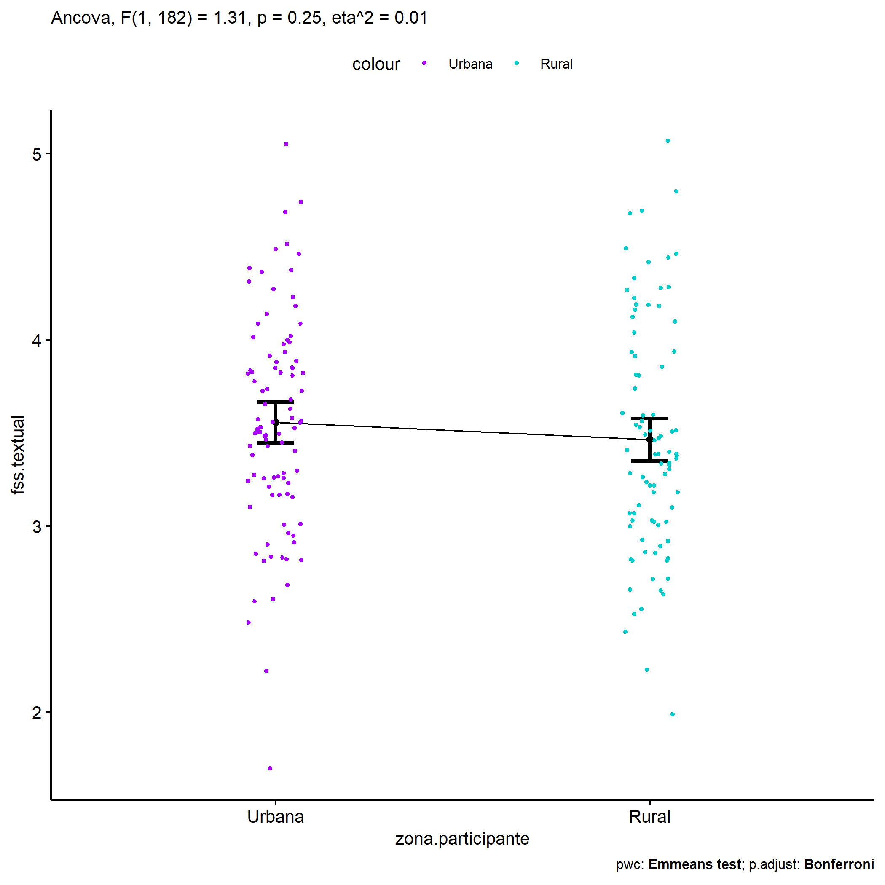<!-- -->

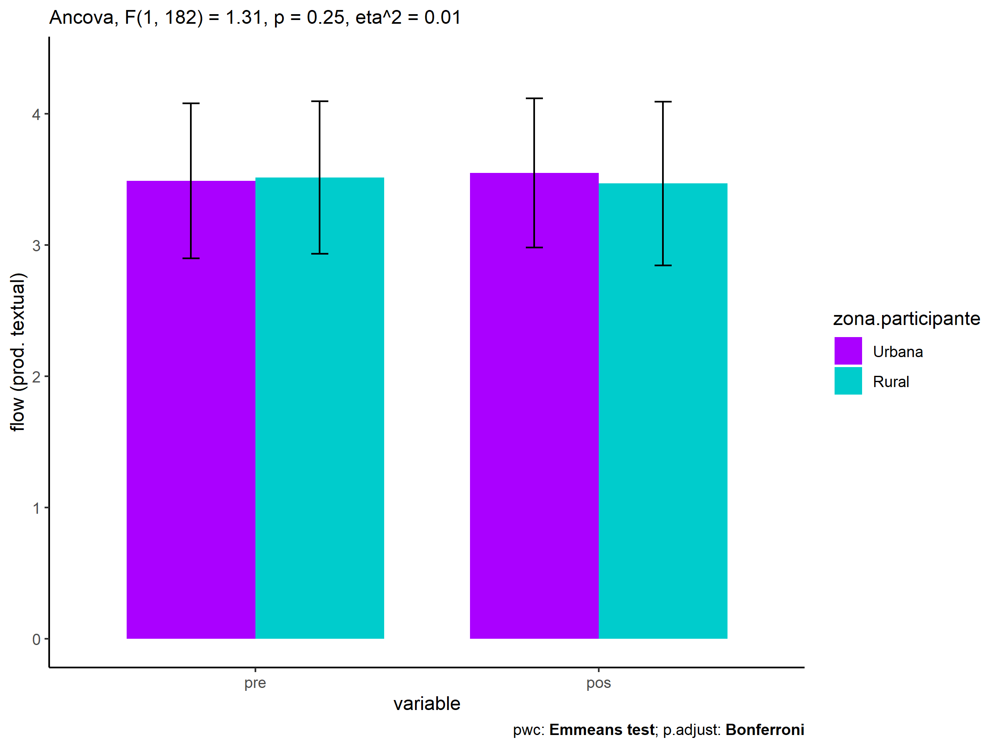<!-- -->

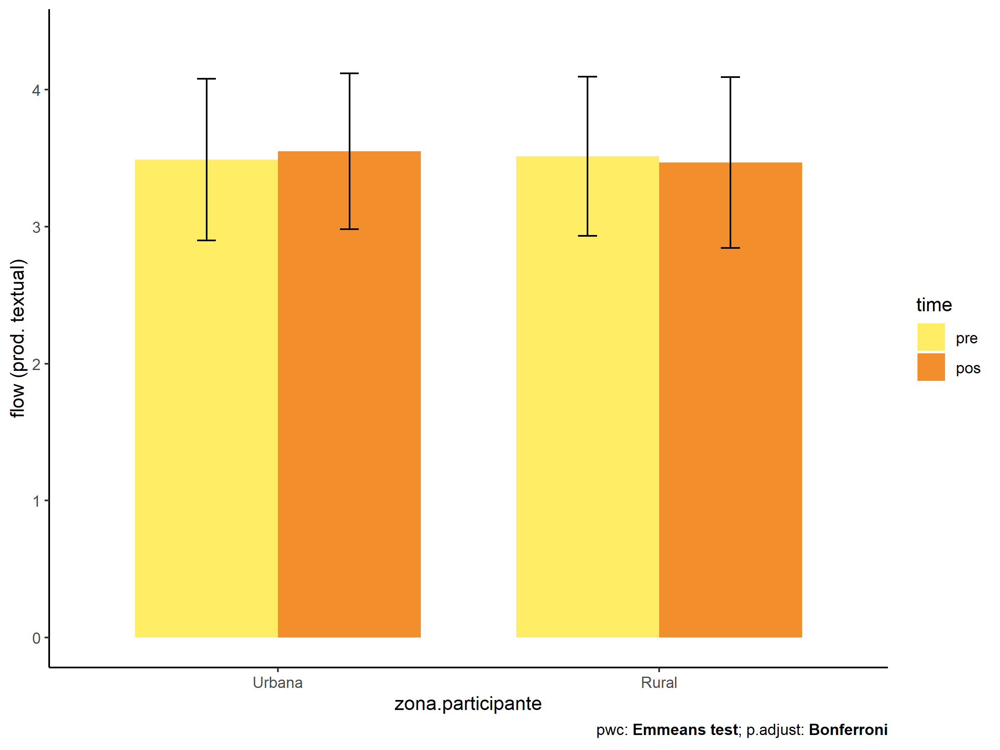<!-- -->

### factor: **zona.participante**

| var         | zona.participante |   n | M (pre) | SE (pre) | M (unadj) | SE (unadj) | M (adj) | SE (adj) |
|:------------|:------------------|----:|--------:|---------:|----------:|-----------:|--------:|---------:|
| fss.textual | Rural             |  89 |   3.515 |    0.062 |     3.469 |      0.066 |   3.463 |    0.058 |
| fss.textual | Urbana            |  96 |   3.489 |    0.060 |     3.551 |      0.058 |   3.556 |    0.056 |

| .y.         | group1 | group2 | estimate | conf.low | conf.high |    se | statistic |     p | p.adj | p.adj.signif |
|:------------|:-------|:-------|---------:|---------:|----------:|------:|----------:|------:|------:|:-------------|
| fss.textual | Urbana | Rural  |    0.092 |   -0.067 |     0.251 | 0.081 |     1.146 | 0.253 | 0.253 | ns           |
| dfs.textual | Urbana | Rural  |   -0.026 |   -0.196 |     0.144 | 0.086 |    -0.302 | 0.763 | 0.763 | ns           |

| .y.          | zona.participante | group1 | group2 | estimate | conf.low | conf.high |    se | statistic |     p | p.adj | p.adj.signif |
|:-------------|:------------------|:-------|:-------|---------:|---------:|----------:|------:|----------:|------:|------:|:-------------|
| flow.textual | Urbana            | pre    | pos    |   -0.062 |   -0.229 |     0.106 | 0.085 |    -0.725 | 0.469 | 0.469 | ns           |
| flow.textual | Rural             | pre    | pos    |    0.046 |   -0.128 |     0.220 | 0.089 |     0.519 | 0.604 | 0.604 | ns           |

    ## Scale for colour is already present.
    ## Adding another scale for colour, which will replace the existing scale.

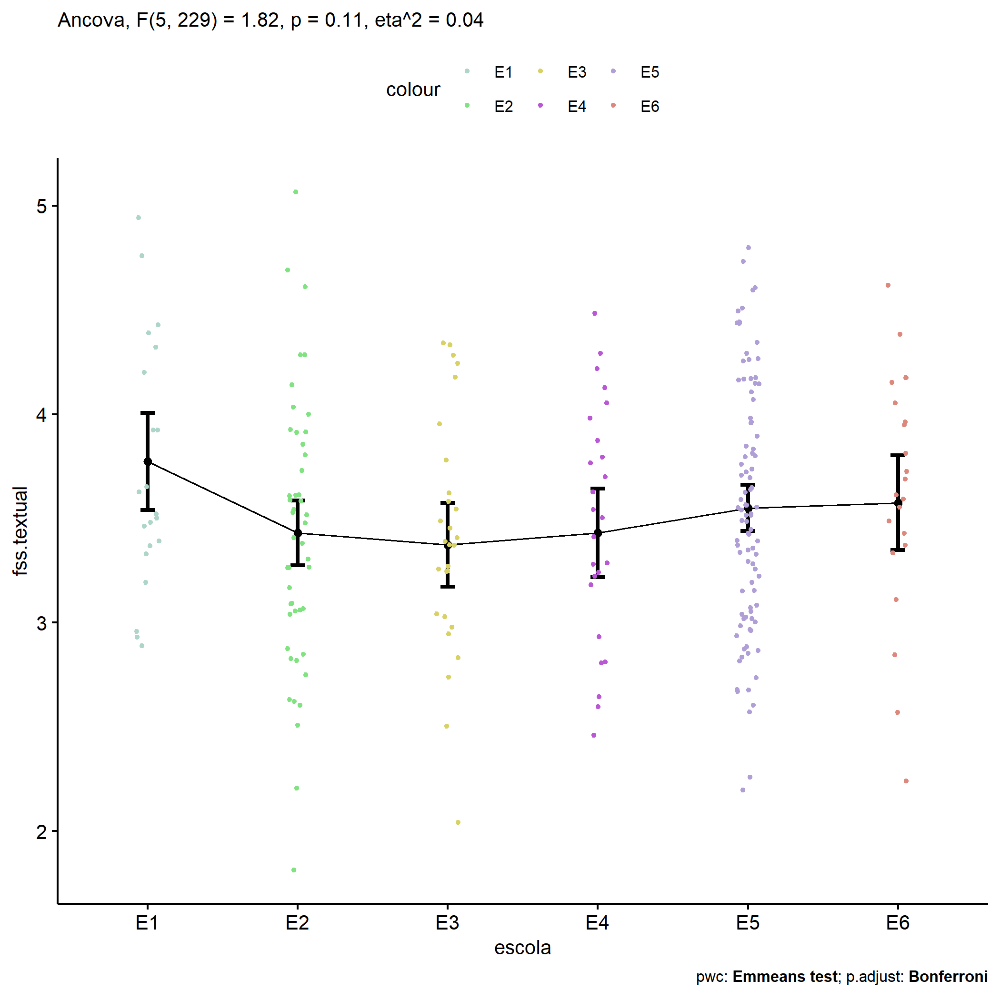<!-- -->

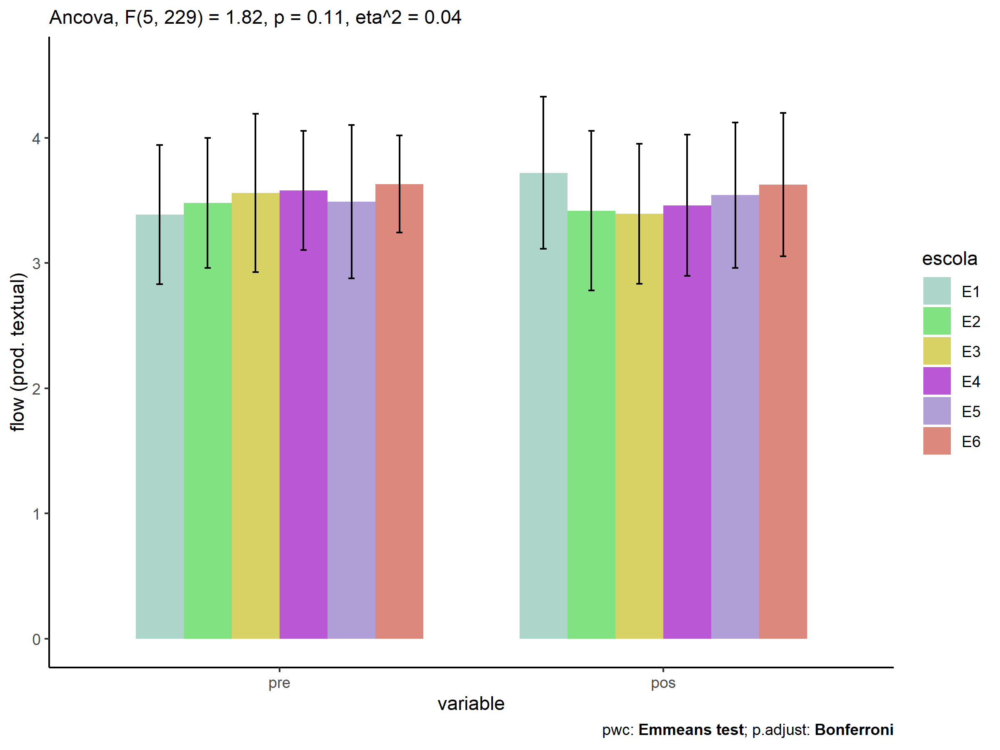<!-- -->

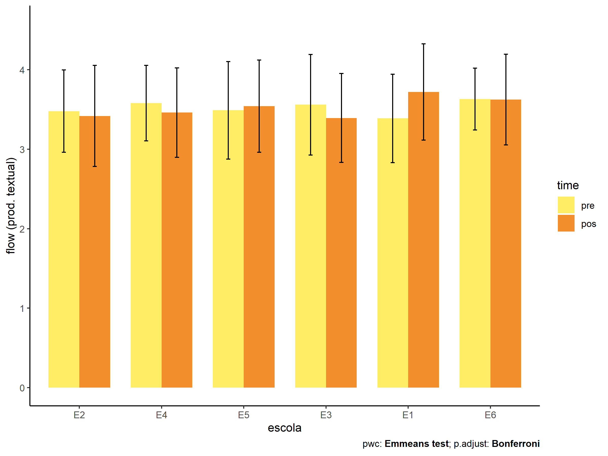<!-- -->

<!-- -->

<!-- -->

### factor: **escola**

| var         | escola |   n | M (pre) | SE (pre) | M (unadj) | SE (unadj) | M (adj) | SE (adj) |
|:------------|:-------|----:|--------:|---------:|----------:|-----------:|--------:|---------:|
| fss.textual | E1     |  21 |   3.388 |    0.121 |     3.721 |      0.133 |   3.773 |    0.118 |
| fss.textual | E2     |  47 |   3.480 |    0.076 |     3.418 |      0.093 |   3.431 |    0.079 |
| fss.textual | E3     |  28 |   3.560 |    0.120 |     3.394 |      0.106 |   3.373 |    0.102 |
| fss.textual | E4     |  25 |   3.581 |    0.095 |     3.461 |      0.113 |   3.430 |    0.108 |
| fss.textual | E5     |  93 |   3.490 |    0.064 |     3.542 |      0.060 |   3.550 |    0.056 |
| fss.textual | E6     |  22 |   3.631 |    0.083 |     3.626 |      0.122 |   3.575 |    0.115 |

| .y.         | group1 | group2 | estimate | conf.low | conf.high |    se | statistic |     p | p.adj | p.adj.signif |
|:------------|:-------|:-------|---------:|---------:|----------:|------:|----------:|------:|------:|:-------------|
| fss.textual | E1     | E2     |    0.342 |    0.063 |     0.622 | 0.142 |     2.412 | 0.017 | 0.249 | ns           |
| fss.textual | E1     | E3     |    0.400 |    0.092 |     0.708 | 0.156 |     2.558 | 0.011 | 0.168 | ns           |
| fss.textual | E1     | E4     |    0.342 |    0.027 |     0.658 | 0.160 |     2.136 | 0.034 | 0.506 | ns           |
| fss.textual | E1     | E5     |    0.223 |   -0.035 |     0.480 | 0.131 |     1.704 | 0.090 | 1.000 | ns           |
| fss.textual | E1     | E6     |    0.198 |   -0.128 |     0.524 | 0.165 |     1.197 | 0.232 | 1.000 | ns           |
| fss.textual | E2     | E3     |    0.057 |   -0.197 |     0.312 | 0.129 |     0.446 | 0.656 | 1.000 | ns           |
| fss.textual | E2     | E4     |    0.000 |   -0.263 |     0.264 | 0.134 |     0.001 | 0.999 | 1.000 | ns           |
| fss.textual | E2     | E5     |   -0.120 |   -0.310 |     0.071 | 0.097 |    -1.238 | 0.217 | 1.000 | ns           |
| fss.textual | E2     | E6     |   -0.144 |   -0.420 |     0.131 | 0.140 |    -1.031 | 0.304 | 1.000 | ns           |
| fss.textual | E3     | E4     |   -0.057 |   -0.350 |     0.235 | 0.149 |    -0.386 | 0.700 | 1.000 | ns           |
| fss.textual | E3     | E5     |   -0.177 |   -0.407 |     0.052 | 0.116 |    -1.520 | 0.130 | 1.000 | ns           |
| fss.textual | E3     | E6     |   -0.202 |   -0.505 |     0.102 | 0.154 |    -1.310 | 0.192 | 1.000 | ns           |
| fss.textual | E4     | E5     |   -0.120 |   -0.360 |     0.120 | 0.122 |    -0.984 | 0.326 | 1.000 | ns           |
| fss.textual | E4     | E6     |   -0.144 |   -0.455 |     0.167 | 0.158 |    -0.914 | 0.362 | 1.000 | ns           |
| fss.textual | E5     | E6     |   -0.025 |   -0.277 |     0.228 | 0.128 |    -0.191 | 0.849 | 1.000 | ns           |
| dfs.textual | E1     | E2     |   -0.092 |   -0.382 |     0.199 | 0.147 |    -0.622 | 0.535 | 1.000 | ns           |
| dfs.textual | E1     | E3     |   -0.171 |   -0.491 |     0.148 | 0.162 |    -1.057 | 0.292 | 1.000 | ns           |
| dfs.textual | E1     | E4     |   -0.193 |   -0.520 |     0.135 | 0.166 |    -1.160 | 0.247 | 1.000 | ns           |
| dfs.textual | E1     | E5     |   -0.102 |   -0.369 |     0.165 | 0.136 |    -0.752 | 0.453 | 1.000 | ns           |
| dfs.textual | E1     | E6     |   -0.243 |   -0.581 |     0.094 | 0.171 |    -1.419 | 0.157 | 1.000 | ns           |
| dfs.textual | E2     | E3     |   -0.080 |   -0.344 |     0.185 | 0.134 |    -0.594 | 0.553 | 1.000 | ns           |
| dfs.textual | E2     | E4     |   -0.101 |   -0.375 |     0.173 | 0.139 |    -0.728 | 0.467 | 1.000 | ns           |
| dfs.textual | E2     | E5     |   -0.010 |   -0.208 |     0.188 | 0.101 |    -0.102 | 0.918 | 1.000 | ns           |
| dfs.textual | E2     | E6     |   -0.151 |   -0.437 |     0.134 | 0.145 |    -1.044 | 0.297 | 1.000 | ns           |
| dfs.textual | E3     | E4     |   -0.022 |   -0.326 |     0.283 | 0.155 |    -0.140 | 0.889 | 1.000 | ns           |
| dfs.textual | E3     | E5     |    0.069 |   -0.169 |     0.308 | 0.121 |     0.573 | 0.567 | 1.000 | ns           |
| dfs.textual | E3     | E6     |   -0.072 |   -0.387 |     0.243 | 0.160 |    -0.449 | 0.654 | 1.000 | ns           |
| dfs.textual | E4     | E5     |    0.091 |   -0.158 |     0.340 | 0.127 |     0.719 | 0.473 | 1.000 | ns           |
| dfs.textual | E4     | E6     |   -0.050 |   -0.374 |     0.273 | 0.164 |    -0.306 | 0.760 | 1.000 | ns           |
| dfs.textual | E5     | E6     |   -0.141 |   -0.404 |     0.121 | 0.133 |    -1.060 | 0.290 | 1.000 | ns           |

| .y.          | escola | group1 | group2 | estimate | conf.low | conf.high |    se | statistic |     p | p.adj | p.adj.signif |
|:-------------|:-------|:-------|:-------|---------:|---------:|----------:|------:|----------:|------:|------:|:-------------|
| flow.textual | E1     | pre    | pos    |   -0.333 |   -0.682 |     0.016 | 0.178 |    -1.873 | 0.062 | 0.062 | ns           |
| flow.textual | E2     | pre    | pos    |    0.062 |   -0.171 |     0.296 | 0.119 |     0.524 | 0.601 | 0.601 | ns           |
| flow.textual | E3     | pre    | pos    |    0.165 |   -0.137 |     0.468 | 0.154 |     1.075 | 0.283 | 0.283 | ns           |
| flow.textual | E4     | pre    | pos    |    0.121 |   -0.199 |     0.441 | 0.163 |     0.740 | 0.459 | 0.459 | ns           |
| flow.textual | E5     | pre    | pos    |   -0.051 |   -0.217 |     0.114 | 0.084 |    -0.610 | 0.542 | 0.542 | ns           |
| flow.textual | E6     | pre    | pos    |    0.005 |   -0.336 |     0.346 | 0.174 |     0.030 | 0.976 | 0.976 | ns           |

    ## Scale for colour is already present.
    ## Adding another scale for colour, which will replace the existing scale.

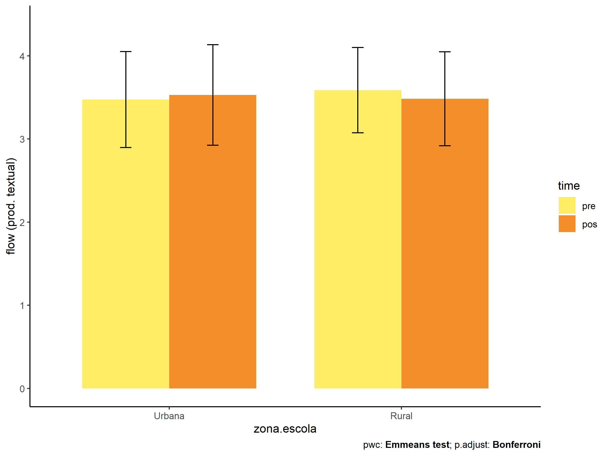<!-- -->

<!-- -->

<!-- -->

<!-- -->

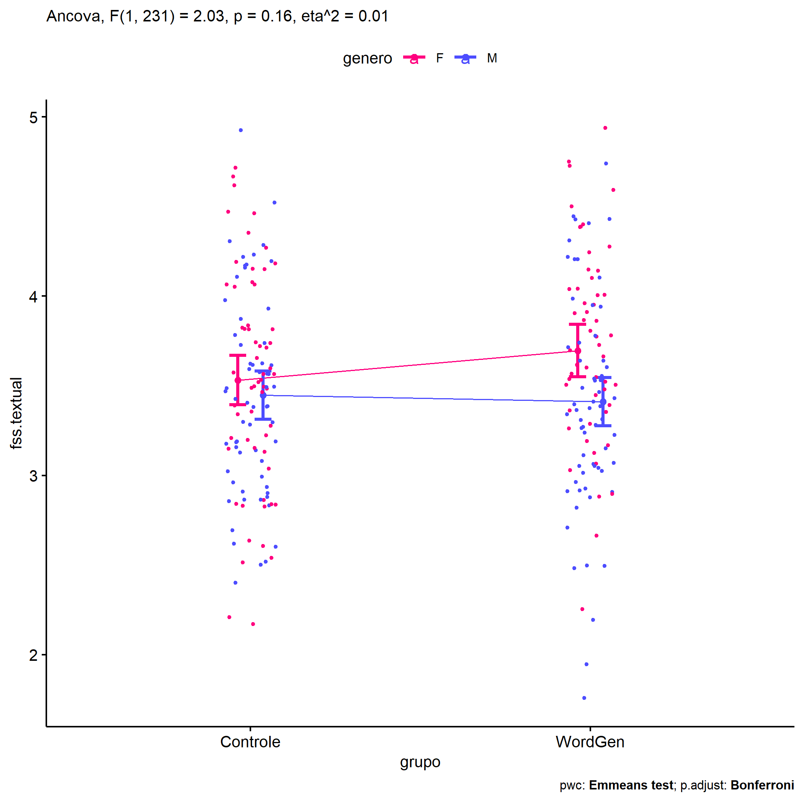<!-- -->

### factor: **zona.escola**

| var         | zona.escola |   n | M (pre) | SE (pre) | M (unadj) | SE (unadj) | M (adj) | SE (adj) |
|:------------|:------------|----:|--------:|---------:|----------:|-----------:|--------:|---------:|
| fss.textual | Rural       |  75 |   3.588 |    0.059 |     3.484 |      0.065 |   3.452 |    0.063 |
| fss.textual | Urbana      | 161 |   3.474 |    0.045 |     3.529 |      0.048 |   3.544 |    0.043 |

| .y.         | group1 | group2 | estimate | conf.low | conf.high |    se | statistic |     p | p.adj | p.adj.signif |
|:------------|:-------|:-------|---------:|---------:|----------:|------:|----------:|------:|------:|:-------------|
| fss.textual | Urbana | Rural  |    0.093 |   -0.058 |     0.243 | 0.076 |     1.211 | 0.227 | 0.227 | ns           |
| dfs.textual | Urbana | Rural  |   -0.114 |   -0.268 |     0.040 | 0.078 |    -1.461 | 0.145 | 0.145 | ns           |

| .y.          | zona.escola | group1 | group2 | estimate | conf.low | conf.high |    se | statistic |     p | p.adj | p.adj.signif |
|:-------------|:------------|:-------|:-------|---------:|---------:|----------:|------:|----------:|------:|------:|:-------------|
| flow.textual | Urbana      | pre    | pos    |   -0.055 |   -0.181 |     0.071 | 0.064 |    -0.857 | 0.392 | 0.392 | ns           |
| flow.textual | Rural       | pre    | pos    |    0.103 |   -0.081 |     0.288 | 0.094 |     1.102 | 0.271 | 0.271 | ns           |

    ## Scale for colour is already present.
    ## Adding another scale for colour, which will replace the existing scale.

<!-- -->

<!-- -->

<!-- -->

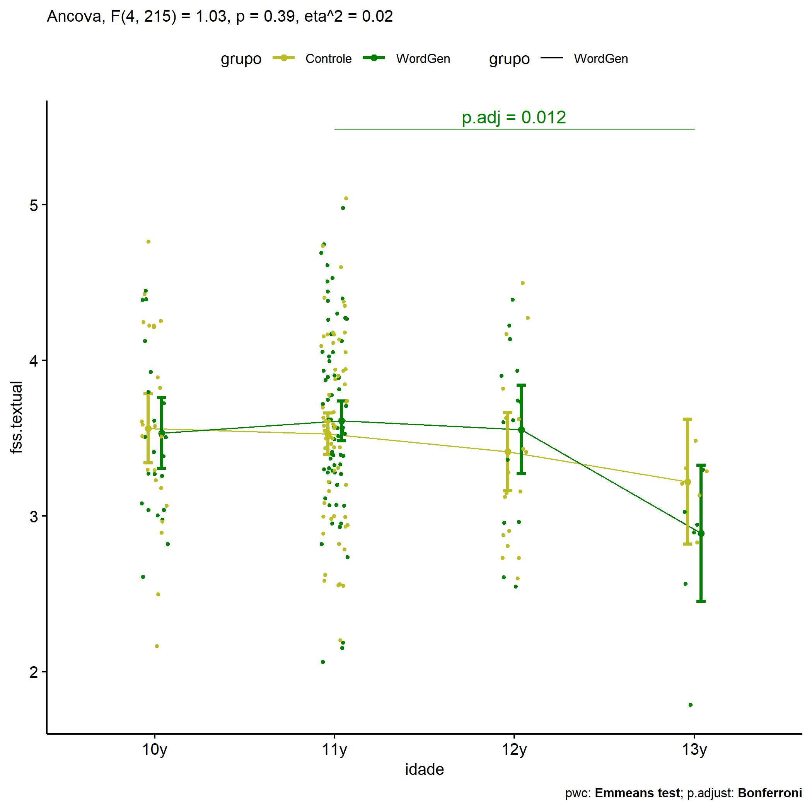<!-- -->

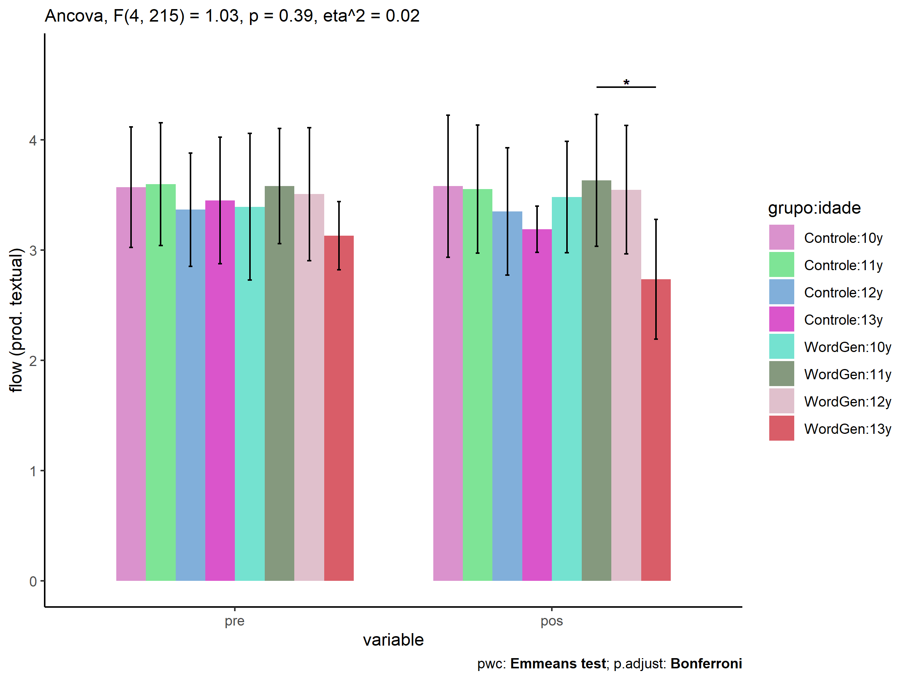<!-- -->

## Pairwise comparisons for two factors

### factores: **grupo:genero**

| var         | grupo    | genero |   n | M (pre) | SE (pre) | M (unadj) | SE (unadj) | M (adj) | SE (adj) |
|:------------|:---------|:-------|----:|--------:|---------:|----------:|-----------:|--------:|---------:|
| fss.textual | Controle | F      |  59 |   3.536 |    0.077 |     3.542 |      0.079 |   3.531 |    0.070 |
| fss.textual | Controle | M      |  62 |   3.490 |    0.068 |     3.439 |      0.070 |   3.447 |    0.068 |
| fss.textual | WordGen  | F      |  53 |   3.601 |    0.074 |     3.732 |      0.075 |   3.696 |    0.074 |
| fss.textual | WordGen  | M      |  62 |   3.428 |    0.072 |     3.379 |      0.078 |   3.412 |    0.068 |

| .y.         | grupo    | genero | group1   | group2  | estimate | conf.low | conf.high |    se | statistic |     p | p.adj | p.adj.signif |
|:------------|:---------|:-------|:---------|:--------|---------:|---------:|----------:|------:|----------:|------:|------:|:-------------|
| fss.textual |          | F      | Controle | WordGen |   -0.165 |   -0.365 |     0.036 | 0.102 |    -1.618 | 0.107 | 0.107 | ns           |
| fss.textual |          | M      | Controle | WordGen |    0.035 |   -0.155 |     0.226 | 0.097 |     0.366 | 0.715 | 0.715 | ns           |
| dfs.textual |          | F      | Controle | WordGen |   -0.064 |   -0.273 |     0.144 | 0.106 |    -0.608 | 0.544 | 0.544 | ns           |
| dfs.textual |          | M      | Controle | WordGen |    0.062 |   -0.136 |     0.260 | 0.100 |     0.616 | 0.539 | 0.539 | ns           |
| fss.textual | Controle |        | F        | M       |    0.084 |   -0.109 |     0.277 | 0.098 |     0.859 | 0.391 | 0.391 | ns           |
| fss.textual | WordGen  |        | F        | M       |    0.284 |    0.085 |     0.483 | 0.101 |     2.809 | 0.005 | 0.005 | \*\*         |
| dfs.textual | Controle |        | F        | M       |    0.047 |   -0.154 |     0.247 | 0.102 |     0.460 | 0.646 | 0.646 | ns           |
| dfs.textual | WordGen  |        | F        | M       |    0.173 |   -0.033 |     0.379 | 0.105 |     1.653 | 0.100 | 0.100 | ns           |

| .y.          | grupo    | genero | group1 | group2 | estimate | conf.low | conf.high |    se | statistic |     p | p.adj | p.adj.signif |
|:-------------|:---------|:-------|:-------|:-------|---------:|---------:|----------:|------:|----------:|------:|------:|:-------------|
| flow.textual | Controle | F      | pre    | pos    |   -0.005 |   -0.211 |     0.201 | 0.105 |    -0.048 | 0.962 | 0.962 | ns           |
| flow.textual | Controle | M      | pre    | pos    |    0.051 |   -0.150 |     0.252 | 0.102 |     0.495 | 0.621 | 0.621 | ns           |
| flow.textual | WordGen  | F      | pre    | pos    |   -0.131 |   -0.348 |     0.087 | 0.111 |    -1.183 | 0.238 | 0.238 | ns           |
| flow.textual | WordGen  | M      | pre    | pos    |    0.049 |   -0.153 |     0.250 | 0.102 |     0.474 | 0.636 | 0.636 | ns           |

    ## Scale for colour is already present.
    ## Adding another scale for colour, which will replace the existing scale.

<!-- -->

    ## Scale for colour is already present.
    ## Adding another scale for colour, which will replace the existing scale.

<!-- -->

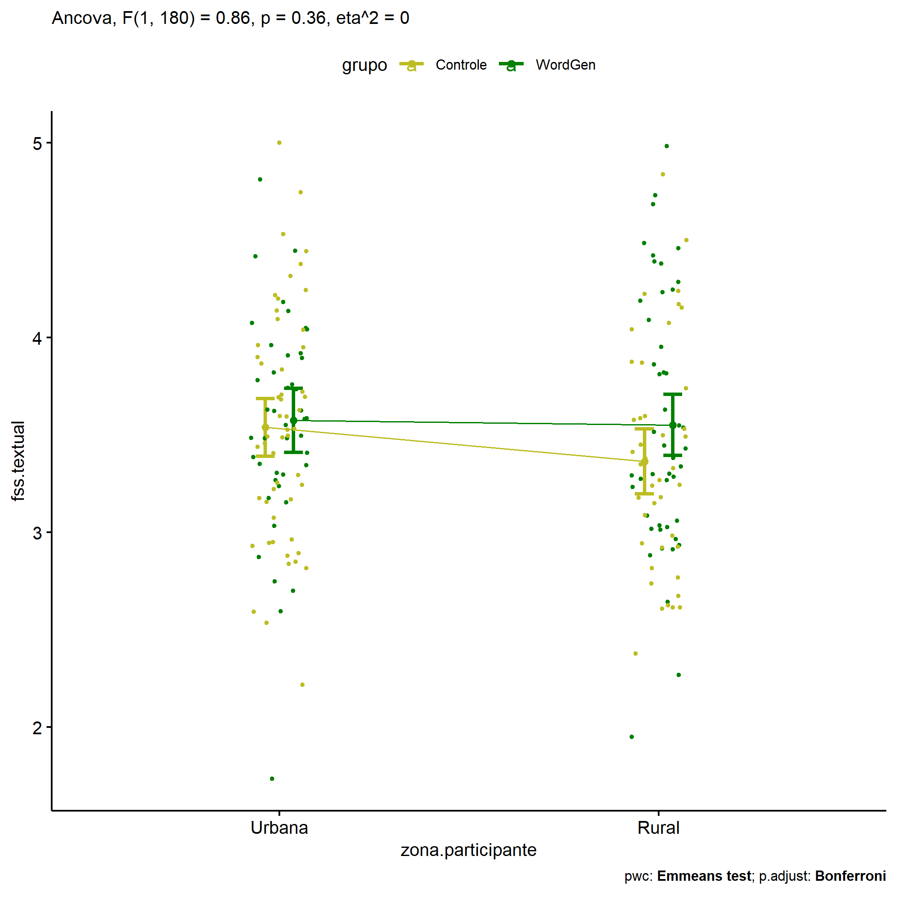<!-- -->

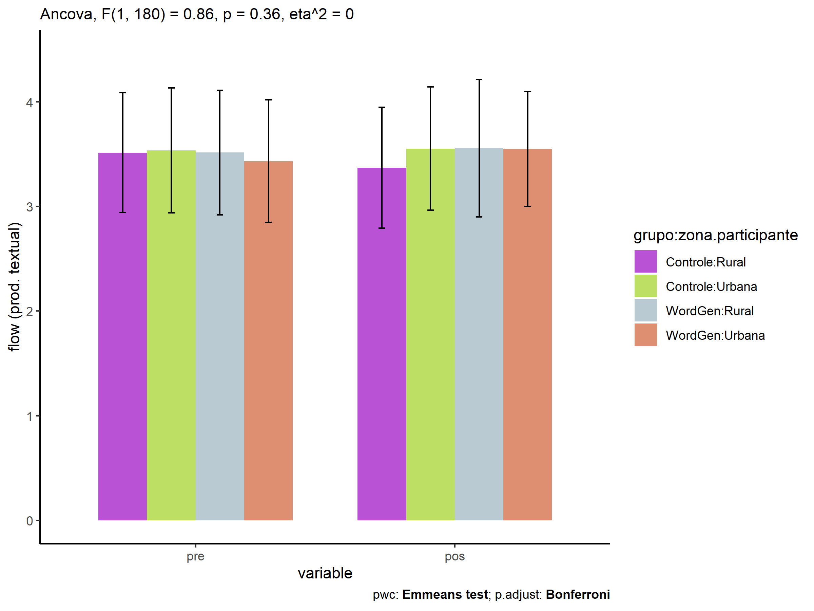<!-- -->

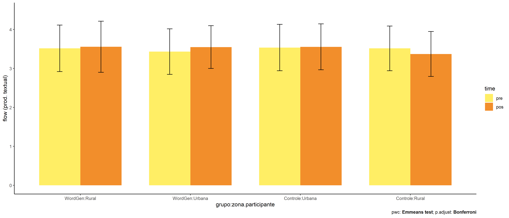<!-- -->

<!-- -->

### factores: **grupo:idade**

| var         | grupo    | idade |   n | M (pre) | SE (pre) | M (unadj) | SE (unadj) | M (adj) | SE (adj) |
|:------------|:---------|:------|----:|--------:|---------:|----------:|-----------:|--------:|---------:|
| fss.textual | Controle | 10y   |  23 |   3.572 |    0.114 |     3.580 |      0.134 |   3.563 |    0.113 |
| fss.textual | Controle | 11y   |  64 |   3.599 |    0.070 |     3.555 |      0.073 |   3.528 |    0.068 |
| fss.textual | Controle | 12y   |  18 |   3.367 |    0.121 |     3.351 |      0.136 |   3.413 |    0.128 |
| fss.textual | Controle | 13y   |   7 |   3.450 |    0.217 |     3.190 |      0.079 |   3.221 |    0.204 |
| fss.textual | WordGen  | 10y   |  22 |   3.393 |    0.142 |     3.481 |      0.108 |   3.533 |    0.115 |
| fss.textual | WordGen  | 11y   |  70 |   3.582 |    0.063 |     3.631 |      0.071 |   3.611 |    0.065 |
| fss.textual | WordGen  | 12y   |  14 |   3.508 |    0.161 |     3.548 |      0.156 |   3.556 |    0.144 |
| fss.textual | WordGen  | 13y   |   6 |   3.130 |    0.126 |     2.736 |      0.222 |   2.889 |    0.222 |

| .y.         | grupo    | idade | group1   | group2  | estimate | conf.low | conf.high |    se | statistic |     p | p.adj | p.adj.signif |
|:------------|:---------|:------|:---------|:--------|---------:|---------:|----------:|------:|----------:|------:|------:|:-------------|
| fss.textual |          | 10y   | Controle | WordGen |    0.030 |   -0.288 |     0.348 | 0.161 |     0.188 | 0.851 | 0.851 | ns           |
| fss.textual |          | 11y   | Controle | WordGen |   -0.083 |   -0.267 |     0.101 | 0.093 |    -0.888 | 0.375 | 0.375 | ns           |
| fss.textual |          | 12y   | Controle | WordGen |   -0.142 |   -0.522 |     0.237 | 0.192 |    -0.740 | 0.460 | 0.460 | ns           |
| fss.textual |          | 13y   | Controle | WordGen |    0.331 |   -0.262 |     0.925 | 0.301 |     1.102 | 0.272 | 0.272 | ns           |
| dfs.textual |          | 10y   | Controle | WordGen |    0.179 |   -0.146 |     0.503 | 0.165 |     1.083 | 0.280 | 0.280 | ns           |
| dfs.textual |          | 11y   | Controle | WordGen |    0.017 |   -0.171 |     0.206 | 0.096 |     0.181 | 0.857 | 0.857 | ns           |
| dfs.textual |          | 12y   | Controle | WordGen |   -0.141 |   -0.530 |     0.247 | 0.197 |    -0.718 | 0.473 | 0.473 | ns           |
| dfs.textual |          | 13y   | Controle | WordGen |    0.321 |   -0.285 |     0.927 | 0.307 |     1.043 | 0.298 | 0.298 | ns           |
| fss.textual | Controle |       | 10y      | 11y     |    0.035 |   -0.223 |     0.294 | 0.131 |     0.268 | 0.789 | 1.000 | ns           |
| fss.textual | Controle |       | 10y      | 12y     |    0.150 |   -0.186 |     0.486 | 0.170 |     0.881 | 0.380 | 1.000 | ns           |
| fss.textual | Controle |       | 10y      | 13y     |    0.343 |   -0.117 |     0.802 | 0.233 |     1.471 | 0.143 | 0.857 | ns           |
| fss.textual | Controle |       | 11y      | 12y     |    0.115 |   -0.170 |     0.400 | 0.145 |     0.794 | 0.428 | 1.000 | ns           |
| fss.textual | Controle |       | 11y      | 13y     |    0.308 |   -0.116 |     0.731 | 0.215 |     1.431 | 0.154 | 0.923 | ns           |
| fss.textual | Controle |       | 12y      | 13y     |    0.193 |   -0.281 |     0.666 | 0.240 |     0.802 | 0.423 | 1.000 | ns           |
| fss.textual | WordGen  |       | 10y      | 11y     |   -0.078 |   -0.339 |     0.183 | 0.132 |    -0.589 | 0.556 | 1.000 | ns           |
| fss.textual | WordGen  |       | 10y      | 12y     |   -0.023 |   -0.386 |     0.341 | 0.185 |    -0.123 | 0.902 | 1.000 | ns           |
| fss.textual | WordGen  |       | 10y      | 13y     |    0.644 |    0.153 |     1.135 | 0.249 |     2.585 | 0.010 | 0.062 | ns           |
| fss.textual | WordGen  |       | 11y      | 12y     |    0.055 |   -0.256 |     0.367 | 0.158 |     0.350 | 0.726 | 1.000 | ns           |
| fss.textual | WordGen  |       | 11y      | 13y     |    0.722 |    0.266 |     1.178 | 0.231 |     3.120 | 0.002 | 0.012 | \*           |
| fss.textual | WordGen  |       | 12y      | 13y     |    0.667 |    0.145 |     1.188 | 0.264 |     2.521 | 0.012 | 0.075 | ns           |
| dfs.textual | Controle |       | 10y      | 11y     |   -0.027 |   -0.292 |     0.238 | 0.134 |    -0.202 | 0.840 | 1.000 | ns           |
| dfs.textual | Controle |       | 10y      | 12y     |    0.205 |   -0.137 |     0.548 | 0.174 |     1.181 | 0.239 | 1.000 | ns           |
| dfs.textual | Controle |       | 10y      | 13y     |    0.121 |   -0.349 |     0.592 | 0.239 |     0.509 | 0.611 | 1.000 | ns           |
| dfs.textual | Controle |       | 11y      | 12y     |    0.232 |   -0.058 |     0.523 | 0.147 |     1.576 | 0.116 | 0.698 | ns           |
| dfs.textual | Controle |       | 11y      | 13y     |    0.149 |   -0.285 |     0.582 | 0.220 |     0.675 | 0.500 | 1.000 | ns           |
| dfs.textual | Controle |       | 12y      | 13y     |   -0.084 |   -0.569 |     0.401 | 0.246 |    -0.341 | 0.734 | 1.000 | ns           |
| dfs.textual | WordGen  |       | 10y      | 11y     |   -0.188 |   -0.455 |     0.078 | 0.135 |    -1.394 | 0.165 | 0.988 | ns           |
| dfs.textual | WordGen  |       | 10y      | 12y     |   -0.115 |   -0.487 |     0.258 | 0.189 |    -0.607 | 0.545 | 1.000 | ns           |
| dfs.textual | WordGen  |       | 10y      | 13y     |    0.264 |   -0.238 |     0.765 | 0.255 |     1.036 | 0.301 | 1.000 | ns           |
| dfs.textual | WordGen  |       | 11y      | 12y     |    0.074 |   -0.245 |     0.393 | 0.162 |     0.456 | 0.649 | 1.000 | ns           |
| dfs.textual | WordGen  |       | 11y      | 13y     |    0.452 |   -0.011 |     0.915 | 0.235 |     1.923 | 0.056 | 0.335 | ns           |
| dfs.textual | WordGen  |       | 12y      | 13y     |    0.378 |   -0.153 |     0.910 | 0.270 |     1.403 | 0.162 | 0.973 | ns           |

| .y.          | grupo    | idade | group1 | group2 | estimate | conf.low | conf.high |    se | statistic |     p | p.adj | p.adj.signif |
|:-------------|:---------|:------|:-------|:-------|---------:|---------:|----------:|------:|----------:|------:|------:|:-------------|
| flow.textual | Controle | 10y   | pre    | pos    |   -0.008 |   -0.336 |     0.320 | 0.167 |    -0.047 | 0.962 | 0.962 | ns           |
| flow.textual | Controle | 11y   | pre    | pos    |    0.044 |   -0.153 |     0.240 | 0.100 |     0.440 | 0.660 | 0.660 | ns           |
| flow.textual | Controle | 12y   | pre    | pos    |    0.015 |   -0.355 |     0.386 | 0.189 |     0.082 | 0.935 | 0.935 | ns           |
| flow.textual | Controle | 13y   | pre    | pos    |    0.260 |   -0.334 |     0.854 | 0.302 |     0.860 | 0.390 | 0.390 | ns           |
| flow.textual | WordGen  | 10y   | pre    | pos    |   -0.088 |   -0.423 |     0.247 | 0.171 |    -0.515 | 0.607 | 0.607 | ns           |
| flow.textual | WordGen  | 11y   | pre    | pos    |   -0.050 |   -0.237 |     0.138 | 0.096 |    -0.519 | 0.604 | 0.604 | ns           |
| flow.textual | WordGen  | 12y   | pre    | pos    |   -0.040 |   -0.460 |     0.381 | 0.214 |    -0.186 | 0.853 | 0.853 | ns           |
| flow.textual | WordGen  | 13y   | pre    | pos    |    0.394 |   -0.248 |     1.035 | 0.327 |     1.205 | 0.229 | 0.229 | ns           |

    ## Scale for colour is already present.
    ## Adding another scale for colour, which will replace the existing scale.

<!-- -->

    ## Scale for colour is already present.
    ## Adding another scale for colour, which will replace the existing scale.

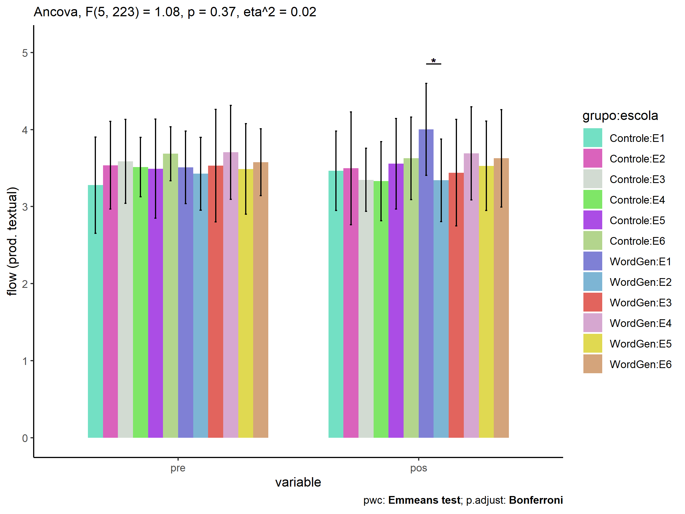<!-- -->

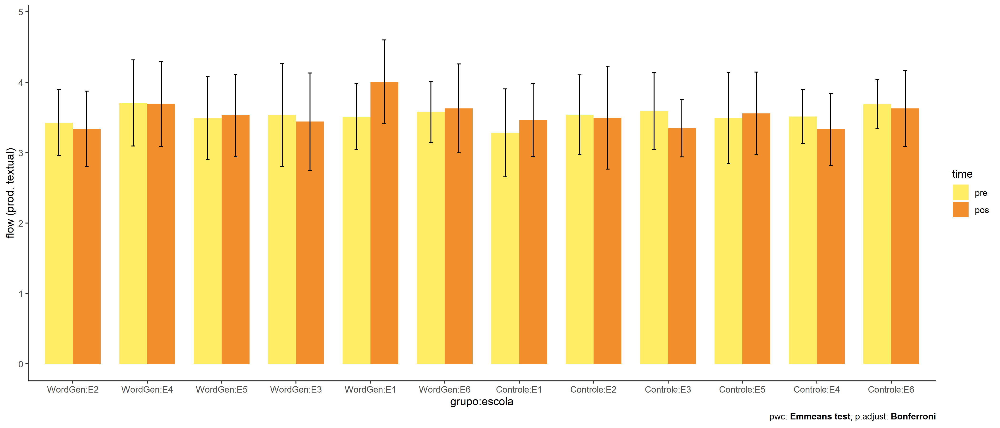<!-- -->

<!-- -->

<!-- -->

<!-- -->

### factores: **grupo:zona.participante**

| var         | grupo    | zona.participante |   n | M (pre) | SE (pre) | M (unadj) | SE (unadj) | M (adj) | SE (adj) |
|:------------|:---------|:------------------|----:|--------:|---------:|----------:|-----------:|--------:|---------:|
| fss.textual | Controle | Rural             |  42 |   3.514 |    0.088 |     3.370 |      0.089 |   3.365 |    0.084 |
| fss.textual | Controle | Urbana            |  53 |   3.535 |    0.082 |     3.553 |      0.081 |   3.539 |    0.075 |
| fss.textual | WordGen  | Rural             |  47 |   3.515 |    0.087 |     3.557 |      0.096 |   3.551 |    0.080 |
| fss.textual | WordGen  | Urbana            |  43 |   3.432 |    0.089 |     3.548 |      0.084 |   3.576 |    0.083 |

| .y.         | grupo    | zona.participante | group1   | group2  | estimate | conf.low | conf.high |    se | statistic |     p | p.adj | p.adj.signif |
|:------------|:---------|:------------------|:---------|:--------|---------:|---------:|----------:|------:|----------:|------:|------:|:-------------|
| fss.textual |          | Urbana            | Controle | WordGen |   -0.037 |   -0.259 |     0.185 | 0.112 |    -0.329 | 0.743 | 0.743 | ns           |
| fss.textual |          | Rural             | Controle | WordGen |   -0.187 |   -0.415 |     0.042 | 0.116 |    -1.610 | 0.109 | 0.109 | ns           |
| dfs.textual |          | Urbana            | Controle | WordGen |    0.103 |   -0.135 |     0.341 | 0.121 |     0.852 | 0.395 | 0.395 | ns           |
| dfs.textual |          | Rural             | Controle | WordGen |   -0.001 |   -0.248 |     0.245 | 0.125 |    -0.009 | 0.993 | 0.993 | ns           |
| fss.textual | Controle |                   | Urbana   | Rural   |    0.174 |   -0.048 |     0.397 | 0.113 |     1.545 | 0.124 | 0.124 | ns           |
| fss.textual | WordGen  |                   | Urbana   | Rural   |    0.025 |   -0.203 |     0.252 | 0.115 |     0.213 | 0.831 | 0.831 | ns           |
| dfs.textual | Controle |                   | Urbana   | Rural   |    0.021 |   -0.219 |     0.260 | 0.122 |     0.170 | 0.865 | 0.865 | ns           |
| dfs.textual | WordGen  |                   | Urbana   | Rural   |   -0.083 |   -0.328 |     0.162 | 0.124 |    -0.672 | 0.503 | 0.503 | ns           |

| .y.          | grupo    | zona.participante | group1 | group2 | estimate | conf.low | conf.high |    se | statistic |     p | p.adj | p.adj.signif |
|:-------------|:---------|:------------------|:-------|:-------|---------:|---------:|----------:|------:|----------:|------:|------:|:-------------|
| flow.textual | Controle | Urbana            | pre    | pos    |   -0.018 |   -0.244 |     0.208 | 0.115 |    -0.156 | 0.876 | 0.876 | ns           |
| flow.textual | Controle | Rural             | pre    | pos    |    0.144 |   -0.110 |     0.398 | 0.129 |     1.117 | 0.265 | 0.265 | ns           |
| flow.textual | WordGen  | Urbana            | pre    | pos    |   -0.116 |   -0.367 |     0.135 | 0.128 |    -0.908 | 0.365 | 0.365 | ns           |
| flow.textual | WordGen  | Rural             | pre    | pos    |   -0.042 |   -0.282 |     0.198 | 0.122 |    -0.342 | 0.732 | 0.732 | ns           |

    ## Scale for colour is already present.
    ## Adding another scale for colour, which will replace the existing scale.

<!-- -->

    ## Scale for colour is already present.
    ## Adding another scale for colour, which will replace the existing scale.

<!-- -->

<!-- -->

<!-- -->

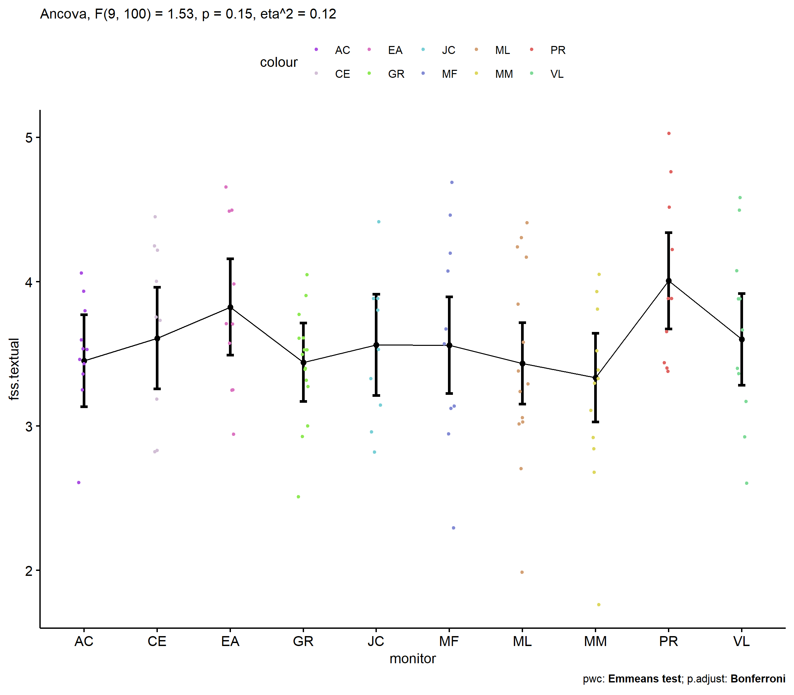<!-- -->

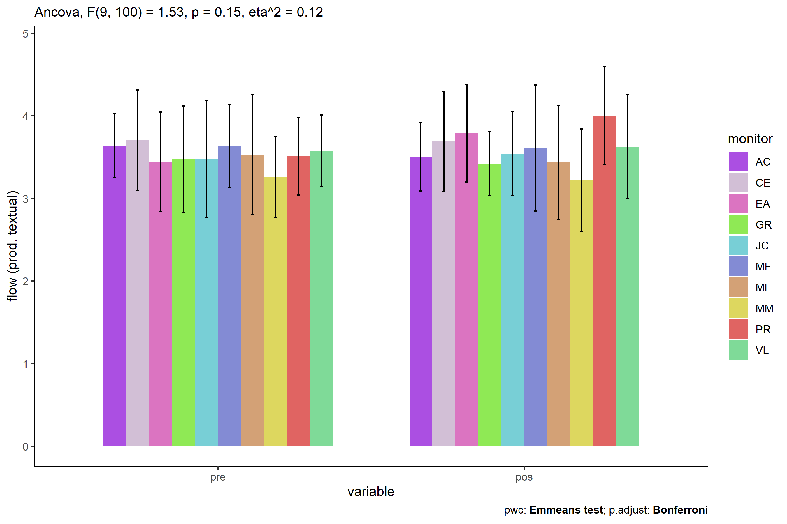<!-- -->

### factores: **grupo:escola**

| var         | grupo    | escola |   n | M (pre) | SE (pre) | M (unadj) | SE (unadj) | M (adj) | SE (adj) |
|:------------|:---------|:-------|----:|--------:|---------:|----------:|-----------:|--------:|---------:|
| fss.textual | Controle | E1     |  11 |   3.278 |    0.188 |     3.465 |      0.156 |   3.561 |    0.164 |
| fss.textual | Controle | E2     |  23 |   3.536 |    0.118 |     3.497 |      0.152 |   3.486 |    0.113 |
| fss.textual | Controle | E3     |  14 |   3.588 |    0.145 |     3.348 |      0.110 |   3.316 |    0.144 |
| fss.textual | Controle | E4     |  16 |   3.512 |    0.096 |     3.331 |      0.128 |   3.330 |    0.135 |
| fss.textual | Controle | E5     |  46 |   3.492 |    0.095 |     3.556 |      0.087 |   3.563 |    0.080 |
| fss.textual | Controle | E6     |  11 |   3.686 |    0.106 |     3.626 |      0.162 |   3.554 |    0.163 |
| fss.textual | WordGen  | E1     |  10 |   3.510 |    0.149 |     4.003 |      0.189 |   4.003 |    0.171 |
| fss.textual | WordGen  | E2     |  24 |   3.426 |    0.096 |     3.341 |      0.109 |   3.376 |    0.110 |
| fss.textual | WordGen  | E3     |  14 |   3.531 |    0.195 |     3.440 |      0.184 |   3.431 |    0.144 |
| fss.textual | WordGen  | E4     |   9 |   3.704 |    0.204 |     3.691 |      0.202 |   3.611 |    0.180 |
| fss.textual | WordGen  | E5     |  47 |   3.488 |    0.086 |     3.528 |      0.085 |   3.537 |    0.079 |
| fss.textual | WordGen  | E6     |  11 |   3.577 |    0.130 |     3.626 |      0.190 |   3.599 |    0.163 |

| .y.         | grupo    | escola | group1   | group2  | estimate | conf.low | conf.high |    se | statistic |     p | p.adj | p.adj.signif |
|:------------|:---------|:-------|:---------|:--------|---------:|---------:|----------:|------:|----------:|------:|------:|:-------------|
| fss.textual |          | E1     | Controle | WordGen |   -0.442 |   -0.908 |     0.024 | 0.236 |    -1.871 | 0.063 | 0.063 | ns           |
| fss.textual |          | E2     | Controle | WordGen |    0.110 |   -0.201 |     0.421 | 0.158 |     0.699 | 0.485 | 0.485 | ns           |
| fss.textual |          | E3     | Controle | WordGen |   -0.115 |   -0.518 |     0.287 | 0.204 |    -0.565 | 0.572 | 0.572 | ns           |
| fss.textual |          | E4     | Controle | WordGen |   -0.282 |   -0.726 |     0.163 | 0.225 |    -1.249 | 0.213 | 0.213 | ns           |
| fss.textual |          | E5     | Controle | WordGen |    0.026 |   -0.194 |     0.247 | 0.112 |     0.234 | 0.815 | 0.815 | ns           |
| fss.textual |          | E6     | Controle | WordGen |   -0.045 |   -0.499 |     0.409 | 0.230 |    -0.194 | 0.846 | 0.846 | ns           |
| dfs.textual |          | E1     | Controle | WordGen |   -0.232 |   -0.719 |     0.256 | 0.247 |    -0.938 | 0.349 | 0.349 | ns           |
| dfs.textual |          | E2     | Controle | WordGen |    0.110 |   -0.215 |     0.436 | 0.165 |     0.668 | 0.505 | 0.505 | ns           |
| dfs.textual |          | E3     | Controle | WordGen |    0.058 |   -0.364 |     0.479 | 0.214 |     0.269 | 0.788 | 0.788 | ns           |
| dfs.textual |          | E4     | Controle | WordGen |   -0.192 |   -0.656 |     0.273 | 0.236 |    -0.812 | 0.418 | 0.418 | ns           |
| dfs.textual |          | E5     | Controle | WordGen |    0.004 |   -0.227 |     0.236 | 0.117 |     0.038 | 0.970 | 0.970 | ns           |
| dfs.textual |          | E6     | Controle | WordGen |    0.108 |   -0.367 |     0.584 | 0.241 |     0.449 | 0.654 | 0.654 | ns           |
| fss.textual | Controle |        | E1       | E2      |    0.074 |   -0.317 |     0.466 | 0.199 |     0.373 | 0.710 | 1.000 | ns           |
| fss.textual | Controle |        | E1       | E3      |    0.245 |   -0.186 |     0.675 | 0.218 |     1.120 | 0.264 | 1.000 | ns           |
| fss.textual | Controle |        | E1       | E4      |    0.231 |   -0.187 |     0.649 | 0.212 |     1.088 | 0.278 | 1.000 | ns           |
| fss.textual | Controle |        | E1       | E5      |   -0.003 |   -0.361 |     0.356 | 0.182 |    -0.014 | 0.989 | 1.000 | ns           |
| fss.textual | Controle |        | E1       | E6      |    0.007 |   -0.450 |     0.463 | 0.232 |     0.029 | 0.977 | 1.000 | ns           |
| fss.textual | Controle |        | E2       | E3      |    0.171 |   -0.190 |     0.531 | 0.183 |     0.931 | 0.353 | 1.000 | ns           |
| fss.textual | Controle |        | E2       | E4      |    0.157 |   -0.190 |     0.503 | 0.176 |     0.891 | 0.374 | 1.000 | ns           |
| fss.textual | Controle |        | E2       | E5      |   -0.077 |   -0.349 |     0.195 | 0.138 |    -0.556 | 0.579 | 1.000 | ns           |
| fss.textual | Controle |        | E2       | E6      |   -0.067 |   -0.458 |     0.323 | 0.198 |    -0.340 | 0.734 | 1.000 | ns           |
| fss.textual | Controle |        | E3       | E4      |   -0.014 |   -0.404 |     0.376 | 0.198 |    -0.071 | 0.944 | 1.000 | ns           |
| fss.textual | Controle |        | E3       | E5      |   -0.247 |   -0.572 |     0.078 | 0.165 |    -1.499 | 0.135 | 1.000 | ns           |
| fss.textual | Controle |        | E3       | E6      |   -0.238 |   -0.667 |     0.191 | 0.218 |    -1.093 | 0.276 | 1.000 | ns           |
| fss.textual | Controle |        | E4       | E5      |   -0.233 |   -0.542 |     0.076 | 0.157 |    -1.488 | 0.138 | 1.000 | ns           |
| fss.textual | Controle |        | E4       | E6      |   -0.224 |   -0.641 |     0.193 | 0.212 |    -1.057 | 0.292 | 1.000 | ns           |
| fss.textual | Controle |        | E5       | E6      |    0.009 |   -0.349 |     0.367 | 0.182 |     0.051 | 0.959 | 1.000 | ns           |
| fss.textual | WordGen  |        | E1       | E2      |    0.627 |    0.226 |     1.027 | 0.203 |     3.082 | 0.002 | 0.035 | \*           |
| fss.textual | WordGen  |        | E1       | E3      |    0.572 |    0.131 |     1.012 | 0.224 |     2.556 | 0.011 | 0.169 | ns           |
| fss.textual | WordGen  |        | E1       | E4      |    0.391 |   -0.098 |     0.881 | 0.248 |     1.576 | 0.116 | 1.000 | ns           |
| fss.textual | WordGen  |        | E1       | E5      |    0.466 |    0.095 |     0.837 | 0.188 |     2.478 | 0.014 | 0.209 | ns           |
| fss.textual | WordGen  |        | E1       | E6      |    0.404 |   -0.061 |     0.869 | 0.236 |     1.713 | 0.088 | 1.000 | ns           |
| fss.textual | WordGen  |        | E2       | E3      |   -0.055 |   -0.413 |     0.303 | 0.182 |    -0.304 | 0.762 | 1.000 | ns           |
| fss.textual | WordGen  |        | E2       | E4      |   -0.235 |   -0.653 |     0.182 | 0.212 |    -1.111 | 0.268 | 1.000 | ns           |
| fss.textual | WordGen  |        | E2       | E5      |   -0.161 |   -0.428 |     0.106 | 0.136 |    -1.186 | 0.237 | 1.000 | ns           |
| fss.textual | WordGen  |        | E2       | E6      |   -0.222 |   -0.610 |     0.166 | 0.197 |    -1.130 | 0.260 | 1.000 | ns           |
| fss.textual | WordGen  |        | E3       | E4      |   -0.180 |   -0.635 |     0.275 | 0.231 |    -0.779 | 0.437 | 1.000 | ns           |
| fss.textual | WordGen  |        | E3       | E5      |   -0.106 |   -0.430 |     0.219 | 0.164 |    -0.642 | 0.522 | 1.000 | ns           |
| fss.textual | WordGen  |        | E3       | E6      |   -0.167 |   -0.596 |     0.262 | 0.218 |    -0.768 | 0.443 | 1.000 | ns           |
| fss.textual | WordGen  |        | E4       | E5      |    0.075 |   -0.314 |     0.463 | 0.197 |     0.378 | 0.705 | 1.000 | ns           |
| fss.textual | WordGen  |        | E4       | E6      |    0.013 |   -0.466 |     0.491 | 0.243 |     0.053 | 0.958 | 1.000 | ns           |
| fss.textual | WordGen  |        | E5       | E6      |   -0.062 |   -0.418 |     0.295 | 0.181 |    -0.341 | 0.734 | 1.000 | ns           |
| dfs.textual | Controle |        | E1       | E2      |   -0.258 |   -0.667 |     0.151 | 0.208 |    -1.245 | 0.214 | 1.000 | ns           |
| dfs.textual | Controle |        | E1       | E3      |   -0.311 |   -0.760 |     0.139 | 0.228 |    -1.361 | 0.175 | 1.000 | ns           |
| dfs.textual | Controle |        | E1       | E4      |   -0.234 |   -0.671 |     0.203 | 0.222 |    -1.057 | 0.292 | 1.000 | ns           |
| dfs.textual | Controle |        | E1       | E5      |   -0.215 |   -0.589 |     0.160 | 0.190 |    -1.130 | 0.260 | 1.000 | ns           |
| dfs.textual | Controle |        | E1       | E6      |   -0.408 |   -0.884 |     0.068 | 0.241 |    -1.689 | 0.093 | 1.000 | ns           |
| dfs.textual | Controle |        | E2       | E3      |   -0.052 |   -0.430 |     0.326 | 0.192 |    -0.271 | 0.786 | 1.000 | ns           |
| dfs.textual | Controle |        | E2       | E4      |    0.024 |   -0.339 |     0.387 | 0.184 |     0.131 | 0.896 | 1.000 | ns           |
| dfs.textual | Controle |        | E2       | E5      |    0.044 |   -0.241 |     0.329 | 0.145 |     0.303 | 0.762 | 1.000 | ns           |
| dfs.textual | Controle |        | E2       | E6      |   -0.149 |   -0.558 |     0.260 | 0.208 |    -0.720 | 0.472 | 1.000 | ns           |
| dfs.textual | Controle |        | E3       | E4      |    0.076 |   -0.332 |     0.484 | 0.207 |     0.367 | 0.714 | 1.000 | ns           |
| dfs.textual | Controle |        | E3       | E5      |    0.096 |   -0.245 |     0.436 | 0.173 |     0.555 | 0.580 | 1.000 | ns           |
| dfs.textual | Controle |        | E3       | E6      |   -0.097 |   -0.547 |     0.352 | 0.228 |    -0.427 | 0.670 | 1.000 | ns           |
| dfs.textual | Controle |        | E4       | E5      |    0.020 |   -0.304 |     0.344 | 0.164 |     0.120 | 0.905 | 1.000 | ns           |
| dfs.textual | Controle |        | E4       | E6      |   -0.173 |   -0.610 |     0.264 | 0.222 |    -0.782 | 0.435 | 1.000 | ns           |
| dfs.textual | Controle |        | E5       | E6      |   -0.193 |   -0.568 |     0.181 | 0.190 |    -1.016 | 0.311 | 1.000 | ns           |
| dfs.textual | WordGen  |        | E1       | E2      |    0.084 |   -0.336 |     0.504 | 0.213 |     0.393 | 0.695 | 1.000 | ns           |
| dfs.textual | WordGen  |        | E1       | E3      |   -0.021 |   -0.483 |     0.441 | 0.234 |    -0.090 | 0.929 | 1.000 | ns           |
| dfs.textual | WordGen  |        | E1       | E4      |   -0.194 |   -0.707 |     0.319 | 0.260 |    -0.746 | 0.457 | 1.000 | ns           |
| dfs.textual | WordGen  |        | E1       | E5      |    0.022 |   -0.367 |     0.410 | 0.197 |     0.110 | 0.912 | 1.000 | ns           |
| dfs.textual | WordGen  |        | E1       | E6      |   -0.067 |   -0.555 |     0.420 | 0.247 |    -0.273 | 0.785 | 1.000 | ns           |
| dfs.textual | WordGen  |        | E2       | E3      |   -0.105 |   -0.480 |     0.270 | 0.190 |    -0.551 | 0.583 | 1.000 | ns           |
| dfs.textual | WordGen  |        | E2       | E4      |   -0.278 |   -0.714 |     0.158 | 0.221 |    -1.255 | 0.211 | 1.000 | ns           |
| dfs.textual | WordGen  |        | E2       | E5      |   -0.062 |   -0.342 |     0.218 | 0.142 |    -0.437 | 0.662 | 1.000 | ns           |
| dfs.textual | WordGen  |        | E2       | E6      |   -0.151 |   -0.558 |     0.255 | 0.206 |    -0.734 | 0.464 | 1.000 | ns           |
| dfs.textual | WordGen  |        | E3       | E4      |   -0.173 |   -0.650 |     0.304 | 0.242 |    -0.715 | 0.475 | 1.000 | ns           |
| dfs.textual | WordGen  |        | E3       | E5      |    0.043 |   -0.297 |     0.382 | 0.172 |     0.248 | 0.804 | 1.000 | ns           |
| dfs.textual | WordGen  |        | E3       | E6      |   -0.046 |   -0.496 |     0.403 | 0.228 |    -0.204 | 0.839 | 1.000 | ns           |
| dfs.textual | WordGen  |        | E4       | E5      |    0.216 |   -0.190 |     0.622 | 0.206 |     1.047 | 0.296 | 1.000 | ns           |
| dfs.textual | WordGen  |        | E4       | E6      |    0.127 |   -0.375 |     0.628 | 0.254 |     0.497 | 0.620 | 1.000 | ns           |
| dfs.textual | WordGen  |        | E5       | E6      |   -0.089 |   -0.463 |     0.285 | 0.190 |    -0.470 | 0.639 | 1.000 | ns           |

| .y.          | grupo    | escola | group1 | group2 | estimate | conf.low | conf.high |    se | statistic |     p | p.adj | p.adj.signif |
|:-------------|:---------|:-------|:-------|:-------|---------:|---------:|----------:|------:|----------:|------:|------:|:-------------|
| flow.textual | Controle | E1     | pre    | pos    |   -0.187 |   -0.670 |     0.297 | 0.246 |    -0.760 | 0.448 | 0.448 | ns           |
| flow.textual | Controle | E2     | pre    | pos    |    0.039 |   -0.295 |     0.373 | 0.170 |     0.229 | 0.819 | 0.819 | ns           |
| flow.textual | Controle | E3     | pre    | pos    |    0.240 |   -0.188 |     0.669 | 0.218 |     1.101 | 0.271 | 0.271 | ns           |
| flow.textual | Controle | E4     | pre    | pos    |    0.181 |   -0.219 |     0.582 | 0.204 |     0.890 | 0.374 | 0.374 | ns           |
| flow.textual | Controle | E5     | pre    | pos    |   -0.063 |   -0.300 |     0.173 | 0.120 |    -0.527 | 0.598 | 0.598 | ns           |
| flow.textual | Controle | E6     | pre    | pos    |    0.059 |   -0.424 |     0.543 | 0.246 |     0.241 | 0.809 | 0.809 | ns           |
| flow.textual | WordGen  | E1     | pre    | pos    |   -0.493 |   -1.000 |     0.014 | 0.258 |    -1.911 | 0.057 | 0.057 | ns           |
| flow.textual | WordGen  | E2     | pre    | pos    |    0.084 |   -0.243 |     0.412 | 0.167 |     0.507 | 0.612 | 0.612 | ns           |
| flow.textual | WordGen  | E3     | pre    | pos    |    0.091 |   -0.338 |     0.519 | 0.218 |     0.417 | 0.677 | 0.677 | ns           |
| flow.textual | WordGen  | E4     | pre    | pos    |    0.012 |   -0.522 |     0.547 | 0.272 |     0.045 | 0.964 | 0.964 | ns           |
| flow.textual | WordGen  | E5     | pre    | pos    |   -0.040 |   -0.274 |     0.194 | 0.119 |    -0.334 | 0.738 | 0.738 | ns           |
| flow.textual | WordGen  | E6     | pre    | pos    |   -0.049 |   -0.532 |     0.434 | 0.246 |    -0.199 | 0.842 | 0.842 | ns           |

    ## Scale for colour is already present.
    ## Adding another scale for colour, which will replace the existing scale.

<!-- -->

    ## Scale for colour is already present.
    ## Adding another scale for colour, which will replace the existing scale.

<!-- -->

<!-- -->

<!-- -->

<!-- -->

<!-- -->

### factores: **grupo:zona.escola**

| var         | grupo    | zona.escola |   n | M (pre) | SE (pre) | M (unadj) | SE (unadj) | M (adj) | SE (adj) |
|:------------|:---------|:------------|----:|--------:|---------:|----------:|-----------:|--------:|---------:|
| fss.textual | Controle | Rural       |  41 |   3.585 |    0.068 |     3.416 |      0.077 |   3.385 |    0.085 |
| fss.textual | Controle | Urbana      |  80 |   3.476 |    0.069 |     3.526 |      0.069 |   3.541 |    0.061 |
| fss.textual | WordGen  | Rural       |  34 |   3.592 |    0.103 |     3.567 |      0.110 |   3.532 |    0.094 |
| fss.textual | WordGen  | Urbana      |  81 |   3.472 |    0.060 |     3.531 |      0.066 |   3.547 |    0.061 |

| .y.         | grupo    | zona.escola | group1   | group2  | estimate | conf.low | conf.high |    se | statistic |     p | p.adj | p.adj.signif |
|:------------|:---------|:------------|:---------|:--------|---------:|---------:|----------:|------:|----------:|------:|------:|:-------------|
| fss.textual |          | Urbana      | Controle | WordGen |   -0.006 |   -0.175 |     0.163 | 0.086 |    -0.071 | 0.943 | 0.943 | ns           |
| fss.textual |          | Rural       | Controle | WordGen |   -0.148 |   -0.397 |     0.101 | 0.126 |    -1.170 | 0.243 | 0.243 | ns           |
| dfs.textual |          | Urbana      | Controle | WordGen |    0.003 |   -0.171 |     0.177 | 0.088 |     0.037 | 0.971 | 0.971 | ns           |
| dfs.textual |          | Rural       | Controle | WordGen |   -0.007 |   -0.263 |     0.249 | 0.130 |    -0.053 | 0.958 | 0.958 | ns           |
| fss.textual | Controle |             | Urbana   | Rural   |    0.157 |   -0.050 |     0.363 | 0.105 |     1.492 | 0.137 | 0.137 | ns           |
| fss.textual | WordGen  |             | Urbana   | Rural   |    0.015 |   -0.205 |     0.235 | 0.112 |     0.132 | 0.895 | 0.895 | ns           |
| dfs.textual | Controle |             | Urbana   | Rural   |   -0.109 |   -0.321 |     0.103 | 0.108 |    -1.015 | 0.311 | 0.311 | ns           |
| dfs.textual | WordGen  |             | Urbana   | Rural   |   -0.119 |   -0.345 |     0.106 | 0.114 |    -1.042 | 0.298 | 0.298 | ns           |

| .y.          | grupo    | zona.escola | group1 | group2 | estimate | conf.low | conf.high |    se | statistic |     p | p.adj | p.adj.signif |
|:-------------|:---------|:------------|:-------|:-------|---------:|---------:|----------:|------:|----------:|------:|------:|:-------------|
| flow.textual | Controle | Urbana      | pre    | pos    |   -0.051 |   -0.230 |     0.128 | 0.091 |    -0.559 | 0.577 | 0.577 | ns           |
| flow.textual | Controle | Rural       | pre    | pos    |    0.169 |   -0.082 |     0.419 | 0.127 |     1.324 | 0.186 | 0.186 | ns           |
| flow.textual | WordGen  | Urbana      | pre    | pos    |   -0.059 |   -0.237 |     0.119 | 0.091 |    -0.650 | 0.516 | 0.516 | ns           |
| flow.textual | WordGen  | Rural       | pre    | pos    |    0.025 |   -0.250 |     0.300 | 0.140 |     0.177 | 0.859 | 0.859 | ns           |

    ## Scale for colour is already present.
    ## Adding another scale for colour, which will replace the existing scale.

<!-- -->

    ## Scale for colour is already present.
    ## Adding another scale for colour, which will replace the existing scale.

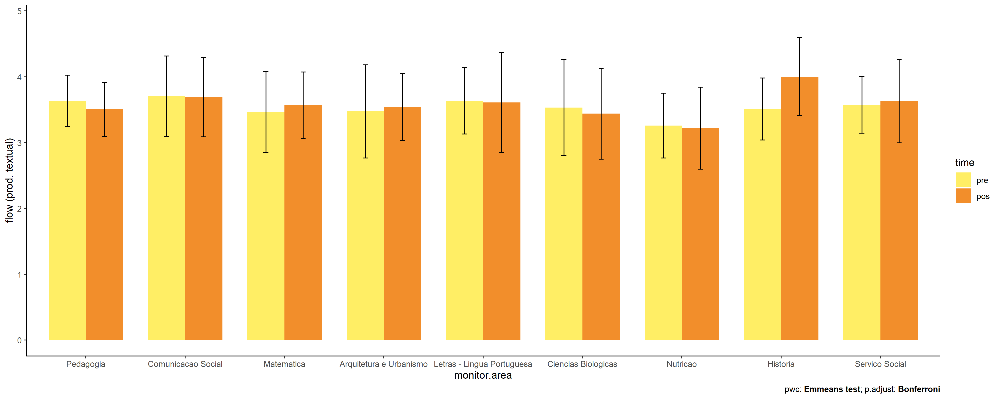<!-- -->

<!-- -->

<!-- -->

<!-- -->

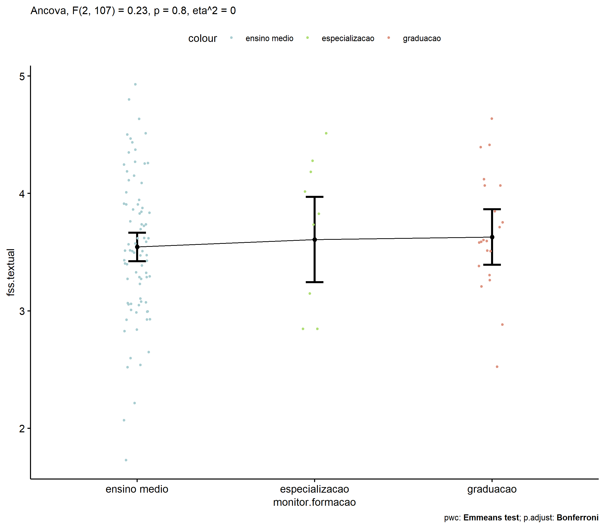<!-- -->

## Pairwise comparisons for grupo=“Experimental”

### factores: **grupo=“Experimental”:monitor**

| var         | monitor |   n | M (pre) | SE (pre) | M (unadj) | SE (unadj) | M (adj) | SE (adj) |
|:------------|:--------|----:|--------:|---------:|----------:|-----------:|--------:|---------:|
| fss.textual | AC      |  11 |   3.636 |    0.117 |     3.505 |      0.125 |   3.452 |    0.161 |
| fss.textual | CE      |   9 |   3.704 |    0.204 |     3.691 |      0.202 |   3.609 |    0.178 |
| fss.textual | EA      |  10 |   3.444 |    0.190 |     3.792 |      0.188 |   3.824 |    0.168 |
| fss.textual | GR      |  15 |   3.474 |    0.167 |     3.422 |      0.099 |   3.442 |    0.137 |
| fss.textual | JC      |   9 |   3.474 |    0.236 |     3.543 |      0.169 |   3.562 |    0.177 |
| fss.textual | MF      |  10 |   3.633 |    0.159 |     3.611 |      0.241 |   3.560 |    0.168 |
| fss.textual | ML      |  14 |   3.531 |    0.195 |     3.440 |      0.184 |   3.434 |    0.142 |
| fss.textual | MM      |  12 |   3.259 |    0.142 |     3.220 |      0.180 |   3.335 |    0.155 |
| fss.textual | PR      |  10 |   3.510 |    0.149 |     4.003 |      0.189 |   4.006 |    0.168 |
| fss.textual | VL      |  11 |   3.577 |    0.130 |     3.626 |      0.190 |   3.600 |    0.160 |

| .y.         | group1 | group2 | estimate | conf.low | conf.high |    se | statistic |     p | p.adj | p.adj.signif |
|:------------|:-------|:-------|---------:|---------:|----------:|------:|----------:|------:|------:|:-------------|
| fss.textual | AC     | CE     |   -0.156 |   -0.630 |     0.317 | 0.239 |    -0.655 | 0.514 | 1.000 | ns           |
| fss.textual | AC     | EA     |   -0.372 |   -0.834 |     0.090 | 0.233 |    -1.597 | 0.113 | 1.000 | ns           |
| fss.textual | AC     | GR     |    0.011 |   -0.409 |     0.430 | 0.211 |     0.051 | 0.959 | 1.000 | ns           |
| fss.textual | AC     | JC     |   -0.110 |   -0.585 |     0.365 | 0.239 |    -0.460 | 0.647 | 1.000 | ns           |
| fss.textual | AC     | MF     |   -0.107 |   -0.568 |     0.353 | 0.232 |    -0.463 | 0.645 | 1.000 | ns           |
| fss.textual | AC     | ML     |    0.018 |   -0.407 |     0.443 | 0.214 |     0.085 | 0.932 | 1.000 | ns           |
| fss.textual | AC     | MM     |    0.118 |   -0.328 |     0.563 | 0.224 |     0.525 | 0.601 | 1.000 | ns           |
| fss.textual | AC     | PR     |   -0.554 |   -1.015 |    -0.093 | 0.232 |    -2.384 | 0.019 | 0.856 | ns           |
| fss.textual | AC     | VL     |   -0.147 |   -0.597 |     0.302 | 0.227 |    -0.651 | 0.517 | 1.000 | ns           |
| fss.textual | CE     | EA     |   -0.215 |   -0.702 |     0.271 | 0.245 |    -0.878 | 0.382 | 1.000 | ns           |
| fss.textual | CE     | GR     |    0.167 |   -0.279 |     0.614 | 0.225 |     0.743 | 0.459 | 1.000 | ns           |
| fss.textual | CE     | JC     |    0.046 |   -0.452 |     0.545 | 0.251 |     0.185 | 0.854 | 1.000 | ns           |
| fss.textual | CE     | MF     |    0.049 |   -0.435 |     0.533 | 0.244 |     0.201 | 0.841 | 1.000 | ns           |
| fss.textual | CE     | ML     |    0.175 |   -0.277 |     0.626 | 0.228 |     0.768 | 0.444 | 1.000 | ns           |
| fss.textual | CE     | MM     |    0.274 |   -0.198 |     0.746 | 0.238 |     1.153 | 0.252 | 1.000 | ns           |
| fss.textual | CE     | PR     |   -0.398 |   -0.883 |     0.088 | 0.245 |    -1.624 | 0.107 | 1.000 | ns           |
| fss.textual | CE     | VL     |    0.009 |   -0.465 |     0.483 | 0.239 |     0.037 | 0.970 | 1.000 | ns           |
| fss.textual | EA     | GR     |    0.383 |   -0.048 |     0.813 | 0.217 |     1.764 | 0.081 | 1.000 | ns           |
| fss.textual | EA     | JC     |    0.262 |   -0.222 |     0.746 | 0.244 |     1.072 | 0.286 | 1.000 | ns           |
| fss.textual | EA     | MF     |    0.264 |   -0.208 |     0.737 | 0.238 |     1.110 | 0.270 | 1.000 | ns           |
| fss.textual | EA     | ML     |    0.390 |   -0.047 |     0.827 | 0.220 |     1.772 | 0.079 | 1.000 | ns           |
| fss.textual | EA     | MM     |    0.490 |    0.037 |     0.942 | 0.228 |     2.146 | 0.034 | 1.000 | ns           |
| fss.textual | EA     | PR     |   -0.182 |   -0.654 |     0.289 | 0.238 |    -0.766 | 0.445 | 1.000 | ns           |
| fss.textual | EA     | VL     |    0.224 |   -0.237 |     0.685 | 0.232 |     0.965 | 0.337 | 1.000 | ns           |
| fss.textual | GR     | JC     |   -0.121 |   -0.565 |     0.324 | 0.224 |    -0.539 | 0.591 | 1.000 | ns           |
| fss.textual | GR     | MF     |   -0.118 |   -0.549 |     0.313 | 0.217 |    -0.544 | 0.588 | 1.000 | ns           |
| fss.textual | GR     | ML     |    0.007 |   -0.384 |     0.399 | 0.197 |     0.038 | 0.970 | 1.000 | ns           |
| fss.textual | GR     | MM     |    0.107 |   -0.303 |     0.517 | 0.207 |     0.518 | 0.606 | 1.000 | ns           |
| fss.textual | GR     | PR     |   -0.565 |   -0.995 |    -0.134 | 0.217 |    -2.604 | 0.011 | 0.478 | ns           |
| fss.textual | GR     | VL     |   -0.158 |   -0.577 |     0.261 | 0.211 |    -0.750 | 0.455 | 1.000 | ns           |
| fss.textual | JC     | MF     |    0.003 |   -0.482 |     0.488 | 0.245 |     0.011 | 0.991 | 1.000 | ns           |
| fss.textual | JC     | ML     |    0.128 |   -0.322 |     0.579 | 0.227 |     0.565 | 0.573 | 1.000 | ns           |
| fss.textual | JC     | MM     |    0.228 |   -0.239 |     0.694 | 0.235 |     0.969 | 0.335 | 1.000 | ns           |
| fss.textual | JC     | PR     |   -0.444 |   -0.928 |     0.040 | 0.244 |    -1.819 | 0.072 | 1.000 | ns           |
| fss.textual | JC     | VL     |   -0.037 |   -0.511 |     0.437 | 0.239 |    -0.157 | 0.876 | 1.000 | ns           |
| fss.textual | MF     | ML     |    0.126 |   -0.311 |     0.562 | 0.220 |     0.571 | 0.569 | 1.000 | ns           |
| fss.textual | MF     | MM     |    0.225 |   -0.231 |     0.682 | 0.230 |     0.979 | 0.330 | 1.000 | ns           |
| fss.textual | MF     | PR     |   -0.447 |   -0.918 |     0.025 | 0.238 |    -1.878 | 0.063 | 1.000 | ns           |
| fss.textual | MF     | VL     |   -0.040 |   -0.501 |     0.421 | 0.232 |    -0.173 | 0.863 | 1.000 | ns           |
| fss.textual | ML     | MM     |    0.099 |   -0.318 |     0.517 | 0.210 |     0.473 | 0.637 | 1.000 | ns           |
| fss.textual | ML     | PR     |   -0.572 |   -1.009 |    -0.136 | 0.220 |    -2.602 | 0.011 | 0.481 | ns           |
| fss.textual | ML     | VL     |   -0.166 |   -0.590 |     0.259 | 0.214 |    -0.774 | 0.441 | 1.000 | ns           |
| fss.textual | MM     | PR     |   -0.672 |   -1.125 |    -0.218 | 0.229 |    -2.938 | 0.004 | 0.184 | ns           |
| fss.textual | MM     | VL     |   -0.265 |   -0.709 |     0.178 | 0.224 |    -1.186 | 0.238 | 1.000 | ns           |
| fss.textual | PR     | VL     |    0.406 |   -0.054 |     0.867 | 0.232 |     1.751 | 0.083 | 1.000 | ns           |
| dfs.textual | AC     | CE     |   -0.067 |   -0.580 |     0.445 | 0.258 |    -0.261 | 0.795 | 1.000 | ns           |
| dfs.textual | AC     | EA     |    0.192 |   -0.306 |     0.690 | 0.251 |     0.764 | 0.446 | 1.000 | ns           |
| dfs.textual | AC     | GR     |    0.162 |   -0.290 |     0.615 | 0.228 |     0.711 | 0.478 | 1.000 | ns           |
| dfs.textual | AC     | JC     |    0.162 |   -0.350 |     0.674 | 0.258 |     0.627 | 0.532 | 1.000 | ns           |
| dfs.textual | AC     | MF     |    0.003 |   -0.495 |     0.501 | 0.251 |     0.012 | 0.990 | 1.000 | ns           |
| dfs.textual | AC     | ML     |    0.106 |   -0.354 |     0.565 | 0.232 |     0.456 | 0.649 | 1.000 | ns           |
| dfs.textual | AC     | MM     |    0.377 |   -0.099 |     0.853 | 0.240 |     1.572 | 0.119 | 1.000 | ns           |
| dfs.textual | AC     | PR     |    0.127 |   -0.371 |     0.625 | 0.251 |     0.504 | 0.615 | 1.000 | ns           |
| dfs.textual | AC     | VL     |    0.059 |   -0.427 |     0.545 | 0.245 |     0.241 | 0.810 | 1.000 | ns           |
| dfs.textual | CE     | EA     |    0.259 |   -0.264 |     0.783 | 0.264 |     0.982 | 0.328 | 1.000 | ns           |
| dfs.textual | CE     | GR     |    0.230 |   -0.251 |     0.710 | 0.242 |     0.948 | 0.346 | 1.000 | ns           |
| dfs.textual | CE     | JC     |    0.229 |   -0.308 |     0.767 | 0.271 |     0.846 | 0.399 | 1.000 | ns           |
| dfs.textual | CE     | MF     |    0.070 |   -0.453 |     0.594 | 0.264 |     0.267 | 0.790 | 1.000 | ns           |
| dfs.textual | CE     | ML     |    0.173 |   -0.314 |     0.660 | 0.246 |     0.704 | 0.483 | 1.000 | ns           |
| dfs.textual | CE     | MM     |    0.444 |   -0.058 |     0.947 | 0.253 |     1.754 | 0.082 | 1.000 | ns           |
| dfs.textual | CE     | PR     |    0.194 |   -0.330 |     0.718 | 0.264 |     0.735 | 0.464 | 1.000 | ns           |
| dfs.textual | CE     | VL     |    0.127 |   -0.386 |     0.639 | 0.258 |     0.490 | 0.625 | 1.000 | ns           |
| dfs.textual | EA     | GR     |   -0.030 |   -0.495 |     0.436 | 0.235 |    -0.126 | 0.900 | 1.000 | ns           |
| dfs.textual | EA     | JC     |   -0.030 |   -0.554 |     0.494 | 0.264 |    -0.114 | 0.910 | 1.000 | ns           |
| dfs.textual | EA     | MF     |   -0.189 |   -0.699 |     0.321 | 0.257 |    -0.735 | 0.464 | 1.000 | ns           |
| dfs.textual | EA     | ML     |   -0.086 |   -0.558 |     0.386 | 0.238 |    -0.363 | 0.718 | 1.000 | ns           |
| dfs.textual | EA     | MM     |    0.185 |   -0.303 |     0.673 | 0.246 |     0.753 | 0.453 | 1.000 | ns           |
| dfs.textual | EA     | PR     |   -0.065 |   -0.575 |     0.445 | 0.257 |    -0.254 | 0.800 | 1.000 | ns           |
| dfs.textual | EA     | VL     |   -0.133 |   -0.631 |     0.365 | 0.251 |    -0.529 | 0.598 | 1.000 | ns           |
| dfs.textual | GR     | JC     |    0.000 |   -0.481 |     0.480 | 0.242 |    -0.001 | 0.999 | 1.000 | ns           |
| dfs.textual | GR     | MF     |   -0.159 |   -0.625 |     0.306 | 0.235 |    -0.679 | 0.499 | 1.000 | ns           |
| dfs.textual | GR     | ML     |   -0.057 |   -0.480 |     0.367 | 0.214 |    -0.265 | 0.791 | 1.000 | ns           |
| dfs.textual | GR     | MM     |    0.215 |   -0.227 |     0.656 | 0.223 |     0.965 | 0.337 | 1.000 | ns           |
| dfs.textual | GR     | PR     |   -0.036 |   -0.501 |     0.430 | 0.235 |    -0.152 | 0.880 | 1.000 | ns           |
| dfs.textual | GR     | VL     |   -0.103 |   -0.556 |     0.349 | 0.228 |    -0.452 | 0.652 | 1.000 | ns           |
| dfs.textual | JC     | MF     |   -0.159 |   -0.683 |     0.365 | 0.264 |    -0.602 | 0.549 | 1.000 | ns           |
| dfs.textual | JC     | ML     |   -0.056 |   -0.543 |     0.431 | 0.246 |    -0.229 | 0.819 | 1.000 | ns           |
| dfs.textual | JC     | MM     |    0.215 |   -0.287 |     0.718 | 0.253 |     0.849 | 0.398 | 1.000 | ns           |
| dfs.textual | JC     | PR     |   -0.035 |   -0.559 |     0.488 | 0.264 |    -0.134 | 0.894 | 1.000 | ns           |
| dfs.textual | JC     | VL     |   -0.103 |   -0.615 |     0.410 | 0.258 |    -0.398 | 0.692 | 1.000 | ns           |
| dfs.textual | MF     | ML     |    0.103 |   -0.369 |     0.575 | 0.238 |     0.431 | 0.667 | 1.000 | ns           |
| dfs.textual | MF     | MM     |    0.374 |   -0.114 |     0.862 | 0.246 |     1.520 | 0.132 | 1.000 | ns           |
| dfs.textual | MF     | PR     |    0.124 |   -0.386 |     0.633 | 0.257 |     0.481 | 0.632 | 1.000 | ns           |
| dfs.textual | MF     | VL     |    0.056 |   -0.442 |     0.554 | 0.251 |     0.224 | 0.824 | 1.000 | ns           |
| dfs.textual | ML     | MM     |    0.271 |   -0.177 |     0.720 | 0.226 |     1.201 | 0.233 | 1.000 | ns           |
| dfs.textual | ML     | PR     |    0.021 |   -0.451 |     0.493 | 0.238 |     0.088 | 0.930 | 1.000 | ns           |
| dfs.textual | ML     | VL     |   -0.046 |   -0.506 |     0.413 | 0.232 |    -0.201 | 0.841 | 1.000 | ns           |
| dfs.textual | MM     | PR     |   -0.250 |   -0.739 |     0.238 | 0.246 |    -1.018 | 0.311 | 1.000 | ns           |
| dfs.textual | MM     | VL     |   -0.318 |   -0.794 |     0.158 | 0.240 |    -1.326 | 0.188 | 1.000 | ns           |
| dfs.textual | PR     | VL     |   -0.067 |   -0.566 |     0.431 | 0.251 |    -0.269 | 0.789 | 1.000 | ns           |

| .y.          | monitor | group1 | group2 | estimate | conf.low | conf.high |    se | statistic |     p | p.adj | p.adj.signif |
|:-------------|:--------|:-------|:-------|---------:|---------:|----------:|------:|----------:|------:|------:|:-------------|
| flow.textual | AC      | pre    | pos    |    0.131 |   -0.357 |     0.620 | 0.248 |     0.530 | 0.597 | 0.597 | ns           |
| flow.textual | CE      | pre    | pos    |    0.012 |   -0.528 |     0.552 | 0.274 |     0.045 | 0.964 | 0.964 | ns           |
| flow.textual | EA      | pre    | pos    |   -0.347 |   -0.859 |     0.165 | 0.260 |    -1.337 | 0.183 | 0.183 | ns           |
| flow.textual | GR      | pre    | pos    |    0.052 |   -0.366 |     0.470 | 0.212 |     0.244 | 0.807 | 0.807 | ns           |
| flow.textual | JC      | pre    | pos    |   -0.069 |   -0.609 |     0.471 | 0.274 |    -0.251 | 0.802 | 0.802 | ns           |
| flow.textual | MF      | pre    | pos    |    0.022 |   -0.490 |     0.534 | 0.260 |     0.086 | 0.932 | 0.932 | ns           |
| flow.textual | ML      | pre    | pos    |    0.091 |   -0.342 |     0.524 | 0.220 |     0.414 | 0.679 | 0.679 | ns           |
| flow.textual | MM      | pre    | pos    |    0.039 |   -0.428 |     0.507 | 0.237 |     0.166 | 0.868 | 0.868 | ns           |
| flow.textual | PR      | pre    | pos    |   -0.493 |   -1.005 |     0.019 | 0.260 |    -1.898 | 0.059 | 0.059 | ns           |
| flow.textual | VL      | pre    | pos    |   -0.049 |   -0.537 |     0.439 | 0.248 |    -0.198 | 0.843 | 0.843 | ns           |

    ## Scale for colour is already present.
    ## Adding another scale for colour, which will replace the existing scale.

<!-- -->

<!-- -->

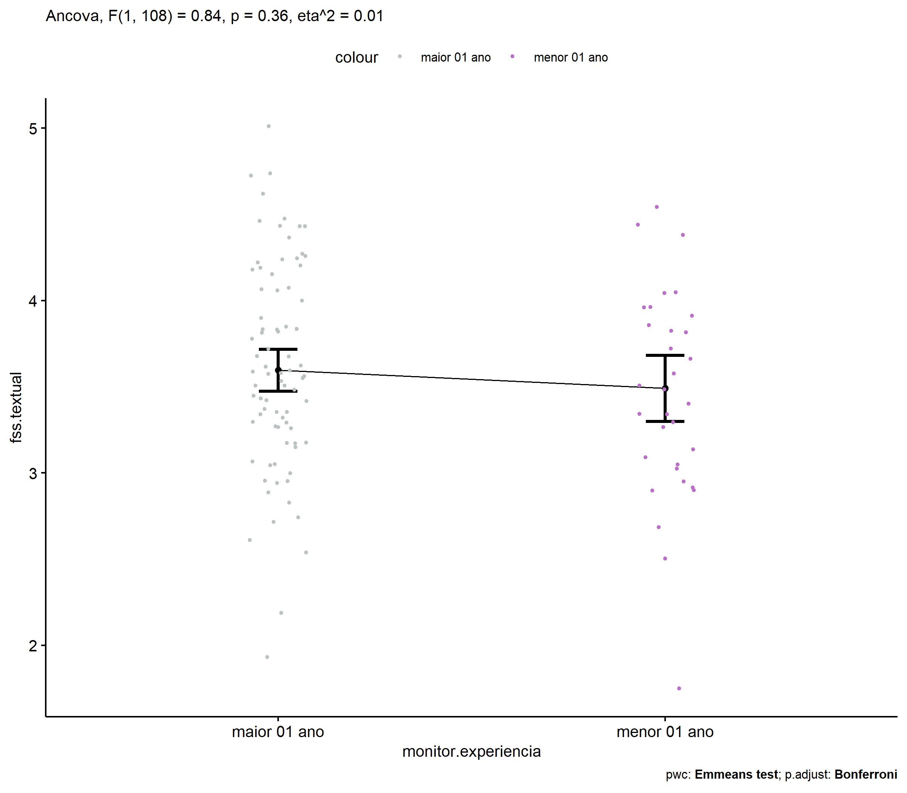<!-- -->

<!-- -->

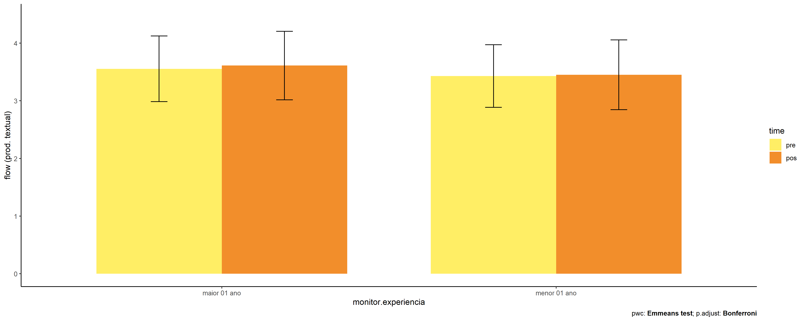<!-- -->

### factores: **grupo=“Experimental”:monitor.genero**

| var         | monitor.genero |   n | M (pre) | SE (pre) | M (unadj) | SE (unadj) | M (adj) | SE (adj) |
|:------------|:---------------|----:|--------:|---------:|----------:|-----------:|--------:|---------:|
| fss.textual | F              |  73 |   3.511 |    0.065 |     3.461 |      0.069 |   3.464 |    0.062 |
| fss.textual | M              |  38 |   3.530 |    0.095 |     3.765 |      0.094 |   3.759 |    0.085 |

| .y.         | group1 | group2 | estimate | conf.low | conf.high |    se | statistic |     p | p.adj | p.adj.signif |
|:------------|:-------|:-------|---------:|---------:|----------:|------:|----------:|------:|------:|:-------------|
| fss.textual | F      | M      |   -0.295 |   -0.503 |    -0.086 | 0.105 |    -2.798 | 0.006 | 0.006 | \*\*         |
| dfs.textual | F      | M      |   -0.019 |   -0.243 |     0.206 | 0.113 |    -0.165 | 0.869 | 0.869 | ns           |

| .y.          | monitor.genero | group1 | group2 | estimate | conf.low | conf.high |    se | statistic |     p | p.adj | p.adj.signif |
|:-------------|:---------------|:-------|:-------|---------:|---------:|----------:|------:|----------:|------:|------:|:-------------|
| flow.textual | F              | pre    | pos    |    0.050 |   -0.138 |     0.237 | 0.095 |     0.525 | 0.600 | 0.600 | ns           |
| flow.textual | M              | pre    | pos    |   -0.234 |   -0.494 |     0.025 | 0.132 |    -1.778 | 0.077 | 0.077 | ns           |

    ## Scale for colour is already present.
    ## Adding another scale for colour, which will replace the existing scale.

<!-- -->

<!-- -->

<!-- -->

<!-- -->

<!-- -->

### factores: **grupo=“Experimental”:monitor.area**

| var         | monitor.area               |   n | M (pre) | SE (pre) | M (unadj) | SE (unadj) | M (adj) | SE (adj) |
|:------------|:---------------------------|----:|--------:|---------:|----------:|-----------:|--------:|---------:|
| fss.textual | Arquitetura e Urbanismo    |   9 |   3.474 |    0.236 |     3.543 |      0.169 |   3.562 |    0.179 |
| fss.textual | Ciencias Biologicas        |  14 |   3.531 |    0.195 |     3.440 |      0.184 |   3.434 |    0.143 |
| fss.textual | Comunicacao Social         |   9 |   3.704 |    0.204 |     3.691 |      0.202 |   3.609 |    0.180 |
| fss.textual | Historia                   |  10 |   3.510 |    0.149 |     4.003 |      0.189 |   4.006 |    0.170 |
| fss.textual | Letras - Lingua Portuguesa |  10 |   3.633 |    0.159 |     3.611 |      0.241 |   3.560 |    0.170 |
| fss.textual | Matematica                 |  25 |   3.462 |    0.123 |     3.570 |      0.100 |   3.595 |    0.107 |
| fss.textual | Nutricao                   |  12 |   3.259 |    0.142 |     3.220 |      0.180 |   3.334 |    0.157 |
| fss.textual | Pedagogia                  |  11 |   3.636 |    0.117 |     3.505 |      0.125 |   3.453 |    0.162 |
| fss.textual | Servico Social             |  11 |   3.577 |    0.130 |     3.626 |      0.190 |   3.600 |    0.162 |

| .y.         | group1                  | group2              | estimate | conf.low | conf.high |    se | statistic |     p | p.adj | p.adj.signif |
|:------------|:------------------------|:--------------------|---------:|---------:|----------:|------:|----------:|------:|------:|:-------------|
| fss.textual | Arquitetura e Urbanismo | Ciencias Biologicas |    0.128 |   -0.327 |     0.583 | 0.229 |     0.559 | 0.577 | 1.000 | ns           |
| fss.textual | Arquitetura e Urbanismo | Comunicacao Social  |   -0.047 |   -0.551 |     0.457 | 0.254 |    -0.185 | 0.854 | 1.000 | ns           |
| fss.textual | Arquitetura e Urbanismo | Historia            |   -0.444 |   -0.933 |     0.045 | 0.247 |    -1.800 | 0.075 | 1.000 | ns           |
| fss.textual | Arquitetura e Urbanismo | Letras              |    0.002 |   -0.488 |     0.492 | 0.247 |     0.009 | 0.993 | 1.000 | ns           |
| fss.textual | Arquitetura e Urbanismo | Matematica          |   -0.032 |   -0.446 |     0.382 | 0.209 |    -0.154 | 0.878 | 1.000 | ns           |
| fss.textual | Arquitetura e Urbanismo | Nutricao            |    0.228 |   -0.243 |     0.699 | 0.238 |     0.961 | 0.339 | 1.000 | ns           |
| fss.textual | Arquitetura e Urbanismo | Pedagogia           |    0.110 |   -0.370 |     0.589 | 0.242 |     0.454 | 0.651 | 1.000 | ns           |
| fss.textual | Arquitetura e Urbanismo | Servico Social      |   -0.038 |   -0.517 |     0.441 | 0.241 |    -0.156 | 0.876 | 1.000 | ns           |
| fss.textual | Ciencias Biologicas     | Comunicacao Social  |   -0.175 |   -0.631 |     0.281 | 0.230 |    -0.761 | 0.448 | 1.000 | ns           |
| fss.textual | Ciencias Biologicas     | Historia            |   -0.572 |   -1.013 |    -0.131 | 0.222 |    -2.575 | 0.011 | 0.413 | ns           |
| fss.textual | Ciencias Biologicas     | Letras              |   -0.126 |   -0.567 |     0.315 | 0.222 |    -0.566 | 0.573 | 1.000 | ns           |
| fss.textual | Ciencias Biologicas     | Matematica          |   -0.160 |   -0.516 |     0.195 | 0.179 |    -0.895 | 0.373 | 1.000 | ns           |
| fss.textual | Ciencias Biologicas     | Nutricao            |    0.100 |   -0.322 |     0.522 | 0.213 |     0.470 | 0.639 | 1.000 | ns           |
| fss.textual | Ciencias Biologicas     | Pedagogia           |   -0.018 |   -0.448 |     0.411 | 0.216 |    -0.085 | 0.932 | 1.000 | ns           |
| fss.textual | Ciencias Biologicas     | Servico Social      |   -0.166 |   -0.595 |     0.263 | 0.216 |    -0.767 | 0.445 | 1.000 | ns           |
| fss.textual | Comunicacao Social      | Historia            |   -0.397 |   -0.888 |     0.093 | 0.247 |    -1.606 | 0.111 | 1.000 | ns           |
| fss.textual | Comunicacao Social      | Letras              |    0.049 |   -0.440 |     0.539 | 0.247 |     0.199 | 0.842 | 1.000 | ns           |
| fss.textual | Comunicacao Social      | Matematica          |    0.015 |   -0.402 |     0.431 | 0.210 |     0.070 | 0.944 | 1.000 | ns           |
| fss.textual | Comunicacao Social      | Nutricao            |    0.275 |   -0.202 |     0.752 | 0.240 |     1.145 | 0.255 | 1.000 | ns           |
| fss.textual | Comunicacao Social      | Pedagogia           |    0.157 |   -0.322 |     0.635 | 0.241 |     0.649 | 0.518 | 1.000 | ns           |
| fss.textual | Comunicacao Social      | Servico Social      |    0.009 |   -0.470 |     0.488 | 0.242 |     0.038 | 0.970 | 1.000 | ns           |
| fss.textual | Historia                | Letras              |    0.446 |   -0.030 |     0.923 | 0.240 |     1.857 | 0.066 | 1.000 | ns           |
| fss.textual | Historia                | Matematica          |    0.412 |    0.013 |     0.810 | 0.201 |     2.050 | 0.043 | 1.000 | ns           |
| fss.textual | Historia                | Nutricao            |    0.672 |    0.214 |     1.130 | 0.231 |     2.910 | 0.004 | 0.160 | ns           |
| fss.textual | Historia                | Pedagogia           |    0.554 |    0.088 |     1.019 | 0.235 |     2.358 | 0.020 | 0.731 | ns           |
| fss.textual | Historia                | Servico Social      |    0.406 |   -0.059 |     0.872 | 0.235 |     1.732 | 0.086 | 1.000 | ns           |
| fss.textual | Letras                  | Lingua Portuguesa   |   -0.034 |   -0.434 |     0.365 | 0.201 |    -0.171 | 0.864 | 1.000 | ns           |
| fss.textual | Letras                  | Lingua Portuguesa   |    0.226 |   -0.235 |     0.687 | 0.232 |     0.972 | 0.333 | 1.000 | ns           |
| fss.textual | Letras                  | Lingua Portuguesa   |    0.107 |   -0.358 |     0.573 | 0.235 |     0.458 | 0.648 | 1.000 | ns           |
| fss.textual | Letras                  | Lingua Portuguesa   |   -0.040 |   -0.505 |     0.425 | 0.235 |    -0.170 | 0.865 | 1.000 | ns           |
| fss.textual | Matematica              | Nutricao            |    0.260 |   -0.115 |     0.636 | 0.189 |     1.375 | 0.172 | 1.000 | ns           |
| fss.textual | Matematica              | Pedagogia           |    0.142 |   -0.245 |     0.528 | 0.195 |     0.728 | 0.468 | 1.000 | ns           |
| fss.textual | Matematica              | Servico Social      |   -0.005 |   -0.391 |     0.380 | 0.194 |    -0.028 | 0.978 | 1.000 | ns           |
| fss.textual | Nutricao                | Pedagogia           |   -0.119 |   -0.568 |     0.331 | 0.227 |    -0.523 | 0.602 | 1.000 | ns           |
| fss.textual | Nutricao                | Servico Social      |   -0.266 |   -0.714 |     0.182 | 0.226 |    -1.177 | 0.242 | 1.000 | ns           |
| fss.textual | Pedagogia               | Servico Social      |   -0.147 |   -0.601 |     0.307 | 0.229 |    -0.644 | 0.521 | 1.000 | ns           |
| dfs.textual | Arquitetura e Urbanismo | Ciencias Biologicas |   -0.056 |   -0.541 |     0.428 | 0.244 |    -0.231 | 0.818 | 1.000 | ns           |
| dfs.textual | Arquitetura e Urbanismo | Comunicacao Social  |   -0.229 |   -0.764 |     0.305 | 0.270 |    -0.851 | 0.397 | 1.000 | ns           |
| dfs.textual | Arquitetura e Urbanismo | Historia            |   -0.035 |   -0.556 |     0.486 | 0.263 |    -0.134 | 0.893 | 1.000 | ns           |
| dfs.textual | Arquitetura e Urbanismo | Letras              |   -0.159 |   -0.680 |     0.362 | 0.263 |    -0.605 | 0.547 | 1.000 | ns           |
| dfs.textual | Arquitetura e Urbanismo | Matematica          |    0.012 |   -0.429 |     0.453 | 0.222 |     0.055 | 0.956 | 1.000 | ns           |
| dfs.textual | Arquitetura e Urbanismo | Nutricao            |    0.215 |   -0.285 |     0.715 | 0.252 |     0.853 | 0.396 | 1.000 | ns           |
| dfs.textual | Arquitetura e Urbanismo | Pedagogia           |   -0.162 |   -0.672 |     0.348 | 0.257 |    -0.630 | 0.530 | 1.000 | ns           |
| dfs.textual | Arquitetura e Urbanismo | Servico Social      |   -0.103 |   -0.613 |     0.407 | 0.257 |    -0.400 | 0.690 | 1.000 | ns           |
| dfs.textual | Ciencias Biologicas     | Comunicacao Social  |   -0.173 |   -0.658 |     0.312 | 0.244 |    -0.708 | 0.481 | 1.000 | ns           |
| dfs.textual | Ciencias Biologicas     | Historia            |    0.021 |   -0.449 |     0.491 | 0.237 |     0.089 | 0.929 | 1.000 | ns           |
| dfs.textual | Ciencias Biologicas     | Letras              |   -0.103 |   -0.572 |     0.367 | 0.237 |    -0.433 | 0.666 | 1.000 | ns           |
| dfs.textual | Ciencias Biologicas     | Matematica          |    0.069 |   -0.310 |     0.447 | 0.191 |     0.359 | 0.720 | 1.000 | ns           |
| dfs.textual | Ciencias Biologicas     | Nutricao            |    0.271 |   -0.175 |     0.718 | 0.225 |     1.207 | 0.230 | 1.000 | ns           |
| dfs.textual | Ciencias Biologicas     | Pedagogia           |   -0.106 |   -0.563 |     0.351 | 0.230 |    -0.458 | 0.648 | 1.000 | ns           |
| dfs.textual | Ciencias Biologicas     | Servico Social      |   -0.046 |   -0.503 |     0.411 | 0.230 |    -0.202 | 0.841 | 1.000 | ns           |
| dfs.textual | Comunicacao Social      | Historia            |    0.194 |   -0.327 |     0.715 | 0.263 |     0.738 | 0.462 | 1.000 | ns           |
| dfs.textual | Comunicacao Social      | Letras              |    0.070 |   -0.451 |     0.592 | 0.263 |     0.268 | 0.789 | 1.000 | ns           |
| dfs.textual | Comunicacao Social      | Matematica          |    0.241 |   -0.199 |     0.682 | 0.222 |     1.086 | 0.280 | 1.000 | ns           |
| dfs.textual | Comunicacao Social      | Nutricao            |    0.444 |   -0.056 |     0.945 | 0.252 |     1.763 | 0.081 | 1.000 | ns           |
| dfs.textual | Comunicacao Social      | Pedagogia           |    0.067 |   -0.442 |     0.577 | 0.257 |     0.262 | 0.794 | 1.000 | ns           |
| dfs.textual | Comunicacao Social      | Servico Social      |    0.127 |   -0.383 |     0.636 | 0.257 |     0.492 | 0.624 | 1.000 | ns           |
| dfs.textual | Historia                | Letras              |   -0.124 |   -0.631 |     0.384 | 0.256 |    -0.483 | 0.630 | 1.000 | ns           |
| dfs.textual | Historia                | Matematica          |    0.048 |   -0.377 |     0.472 | 0.214 |     0.222 | 0.825 | 1.000 | ns           |
| dfs.textual | Historia                | Nutricao            |    0.250 |   -0.235 |     0.736 | 0.245 |     1.023 | 0.309 | 1.000 | ns           |
| dfs.textual | Historia                | Pedagogia           |   -0.127 |   -0.622 |     0.369 | 0.250 |    -0.507 | 0.613 | 1.000 | ns           |
| dfs.textual | Historia                | Servico Social      |   -0.067 |   -0.563 |     0.428 | 0.250 |    -0.270 | 0.788 | 1.000 | ns           |
| dfs.textual | Letras                  | Lingua Portuguesa   |    0.171 |   -0.253 |     0.596 | 0.214 |     0.800 | 0.426 | 1.000 | ns           |
| dfs.textual | Letras                  | Lingua Portuguesa   |    0.374 |   -0.112 |     0.860 | 0.245 |     1.528 | 0.130 | 1.000 | ns           |
| dfs.textual | Letras                  | Lingua Portuguesa   |   -0.003 |   -0.499 |     0.493 | 0.250 |    -0.012 | 0.990 | 1.000 | ns           |
| dfs.textual | Letras                  | Lingua Portuguesa   |    0.056 |   -0.439 |     0.552 | 0.250 |     0.225 | 0.823 | 1.000 | ns           |
| dfs.textual | Matematica              | Nutricao            |    0.203 |   -0.195 |     0.601 | 0.201 |     1.011 | 0.315 | 1.000 | ns           |
| dfs.textual | Matematica              | Pedagogia           |   -0.174 |   -0.585 |     0.236 | 0.207 |    -0.842 | 0.402 | 1.000 | ns           |
| dfs.textual | Matematica              | Servico Social      |   -0.115 |   -0.525 |     0.295 | 0.207 |    -0.556 | 0.580 | 1.000 | ns           |
| dfs.textual | Nutricao                | Pedagogia           |   -0.377 |   -0.851 |     0.096 | 0.239 |    -1.580 | 0.117 | 1.000 | ns           |
| dfs.textual | Nutricao                | Servico Social      |   -0.318 |   -0.791 |     0.156 | 0.239 |    -1.332 | 0.186 | 1.000 | ns           |
| dfs.textual | Pedagogia               | Servico Social      |    0.059 |   -0.424 |     0.543 | 0.244 |     0.243 | 0.809 | 1.000 | ns           |

| .y.          | monitor.area               | group1 | group2 | estimate | conf.low | conf.high |    se | statistic |     p | p.adj | p.adj.signif |
|:-------------|:---------------------------|:-------|:-------|---------:|---------:|----------:|------:|----------:|------:|------:|:-------------|
| flow.textual | Arquitetura e Urbanismo    | pre    | pos    |   -0.069 |   -0.609 |     0.472 | 0.274 |    -0.251 | 0.802 | 0.802 | ns           |
| flow.textual | Ciencias Biologicas        | pre    | pos    |    0.091 |   -0.342 |     0.524 | 0.220 |     0.413 | 0.680 | 0.680 | ns           |
| flow.textual | Comunicacao Social         | pre    | pos    |    0.012 |   -0.528 |     0.553 | 0.274 |     0.045 | 0.964 | 0.964 | ns           |
| flow.textual | Historia                   | pre    | pos    |   -0.493 |   -1.006 |     0.020 | 0.260 |    -1.896 | 0.059 | 0.059 | ns           |
| flow.textual | Letras - Lingua Portuguesa | pre    | pos    |    0.022 |   -0.490 |     0.535 | 0.260 |     0.085 | 0.932 | 0.932 | ns           |
| flow.textual | Matematica                 | pre    | pos    |   -0.108 |   -0.432 |     0.216 | 0.164 |    -0.655 | 0.513 | 0.513 | ns           |
| flow.textual | Nutricao                   | pre    | pos    |    0.039 |   -0.429 |     0.507 | 0.237 |     0.166 | 0.868 | 0.868 | ns           |
| flow.textual | Pedagogia                  | pre    | pos    |    0.131 |   -0.357 |     0.620 | 0.248 |     0.530 | 0.597 | 0.597 | ns           |
| flow.textual | Servico Social             | pre    | pos    |   -0.049 |   -0.538 |     0.440 | 0.248 |    -0.198 | 0.843 | 0.843 | ns           |

    ## Scale for colour is already present.
    ## Adding another scale for colour, which will replace the existing scale.

<!-- -->

<!-- -->

<!-- -->

<!-- -->

<!-- -->

### factores: **grupo=“Experimental”:monitor.formacao**

| var         | monitor.formacao |   n | M (pre) | SE (pre) | M (unadj) | SE (unadj) | M (adj) | SE (adj) |
|:------------|:-----------------|----:|--------:|---------:|----------:|-----------:|--------:|---------:|
| fss.textual | ensino medio     |  81 |   3.490 |    0.064 |     3.531 |      0.069 |   3.544 |    0.061 |
| fss.textual | especializacao   |   9 |   3.704 |    0.204 |     3.691 |      0.202 |   3.607 |    0.183 |
| fss.textual | graduacao        |  21 |   3.545 |    0.109 |     3.642 |      0.112 |   3.629 |    0.119 |

| .y.         | group1         | group2         | estimate | conf.low | conf.high |    se | statistic |     p | p.adj | p.adj.signif |
|:------------|:---------------|:---------------|---------:|---------:|----------:|------:|----------:|------:|------:|:-------------|
| fss.textual | ensino medio   | especializacao |   -0.063 |   -0.446 |     0.320 | 0.193 |    -0.327 | 0.745 | 1.000 | ns           |
| fss.textual | ensino medio   | graduacao      |   -0.085 |   -0.351 |     0.180 | 0.134 |    -0.636 | 0.526 | 1.000 | ns           |
| fss.textual | especializacao | graduacao      |   -0.022 |   -0.455 |     0.411 | 0.218 |    -0.102 | 0.919 | 1.000 | ns           |
| dfs.textual | ensino medio   | especializacao |   -0.214 |   -0.607 |     0.180 | 0.199 |    -1.075 | 0.285 | 0.854 | ns           |
| dfs.textual | ensino medio   | graduacao      |   -0.055 |   -0.329 |     0.220 | 0.138 |    -0.396 | 0.693 | 1.000 | ns           |
| dfs.textual | especializacao | graduacao      |    0.159 |   -0.288 |     0.605 | 0.225 |     0.705 | 0.482 | 1.000 | ns           |

| .y.          | monitor.formacao | group1 | group2 | estimate | conf.low | conf.high |    se | statistic |     p | p.adj | p.adj.signif |
|:-------------|:-----------------|:-------|:-------|---------:|---------:|----------:|------:|----------:|------:|------:|:-------------|
| flow.textual | ensino medio     | pre    | pos    |   -0.041 |   -0.222 |     0.139 | 0.092 |    -0.450 | 0.653 | 0.653 | ns           |
| flow.textual | especializacao   | pre    | pos    |    0.012 |   -0.530 |     0.555 | 0.275 |     0.045 | 0.964 | 0.964 | ns           |
| flow.textual | graduacao        | pre    | pos    |   -0.097 |   -0.452 |     0.258 | 0.180 |    -0.536 | 0.592 | 0.592 | ns           |

    ## Scale for colour is already present.
    ## Adding another scale for colour, which will replace the existing scale.

<!-- -->

<!-- -->

<!-- -->

<!-- -->

<!-- -->

### factores: **grupo=“Experimental”:monitor.experiencia**

| var         | monitor.experiencia |   n | M (pre) | SE (pre) | M (unadj) | SE (unadj) | M (adj) | SE (adj) |
|:------------|:--------------------|----:|--------:|---------:|----------:|-----------:|--------:|---------:|
| fss.textual | maior 01 ano        |  79 |   3.554 |    0.064 |     3.612 |      0.067 |   3.596 |    0.061 |
| fss.textual | menor 01 ano        |  32 |   3.429 |    0.096 |     3.451 |      0.107 |   3.490 |    0.096 |

| .y.         | group1       | group2       | estimate | conf.low | conf.high |    se | statistic |     p | p.adj | p.adj.signif |
|:------------|:-------------|:-------------|---------:|---------:|----------:|------:|----------:|------:|------:|:-------------|
| fss.textual | maior 01 ano | menor 01 ano |    0.105 |   -0.122 |     0.332 | 0.114 |     0.919 | 0.360 | 0.360 | ns           |
| dfs.textual | maior 01 ano | menor 01 ano |    0.125 |   -0.109 |     0.359 | 0.118 |     1.057 | 0.293 | 0.293 | ns           |

| .y.          | monitor.experiencia | group1 | group2 | estimate | conf.low | conf.high |    se | statistic |     p | p.adj | p.adj.signif |
|:-------------|:--------------------|:-------|:-------|---------:|---------:|----------:|------:|----------:|------:|------:|:-------------|
| flow.textual | maior 01 ano        | pre    | pos    |   -0.058 |   -0.240 |     0.124 | 0.092 |    -0.627 | 0.531 | 0.531 | ns           |
| flow.textual | menor 01 ano        | pre    | pos    |   -0.021 |   -0.307 |     0.264 | 0.145 |    -0.148 | 0.883 | 0.883 | ns           |

    ## Scale for colour is already present.
    ## Adding another scale for colour, which will replace the existing scale.

<!-- -->

<!-- -->

<!-- -->

<!-- -->

<!-- -->
