ANCOVA test for textual (engajamento no textual)
================
Geiser C. Challco <geiser@alumni.usp.br>

- [Descriptive Statistics of Initial
  Data](#descriptive-statistics-of-initial-data)
- [Checking of Assumptions](#checking-of-assumptions)
  - [Assumption: Normality distribution of
    data](#assumption-normality-distribution-of-data)
  - [Assumption: Homogeneity of data
    distribution](#assumption-homogeneity-of-data-distribution)
- [Computation of ANCOVA test and Pairwise
  Comparison](#computation-of-ancova-test-and-pairwise-comparison)
  - [ANCOVA tests for one factor](#ancova-tests-for-one-factor)
  - [ANCOVA tests for two factors](#ancova-tests-for-two-factors)
  - [ANCOVA tests for
    grupo=“Experimental”](#ancova-tests-for-grupoexperimental)
  - [Pairwise comparisons for one
    factor](#pairwise-comparisons-for-one-factor)
    - [factor: **grupo**](#factor-grupo)
    - [factor: **genero**](#factor-genero)
    - [factor: **idade**](#factor-idade)
    - [factor: **zona.participante**](#factor-zonaparticipante)
    - [factor: **escola**](#factor-escola)
    - [factor: **zona.escola**](#factor-zonaescola)
  - [Pairwise comparisons for two
    factors](#pairwise-comparisons-for-two-factors)
    - [factores: **grupo:genero**](#factores-grupogenero)
    - [factores: **grupo:idade**](#factores-grupoidade)
    - [factores:
      **grupo:zona.participante**](#factores-grupozonaparticipante)
    - [factores: **grupo:escola**](#factores-grupoescola)
    - [factores: **grupo:zona.escola**](#factores-grupozonaescola)
  - [Pairwise comparisons for
    grupo=“Experimental”](#pairwise-comparisons-for-grupoexperimental)
    - [factores:
      **grupo=“Experimental”:monitor**](#factores-grupoexperimentalmonitor)
    - [factores:
      **grupo=“Experimental”:monitor.genero**](#factores-grupoexperimentalmonitorgenero)
    - [factores:
      **grupo=“Experimental”:monitor.area**](#factores-grupoexperimentalmonitorarea)
    - [factores:
      **grupo=“Experimental”:monitor.formacao**](#factores-grupoexperimentalmonitorformacao)
    - [factores:
      **grupo=“Experimental”:monitor.experiencia**](#factores-grupoexperimentalmonitorexperiencia)

**NOTE**

- Teste ANCOVA para determinar se houve diferenças significativas em
  referência ao engajamento no textual (medido como estado de fluxo).
- ANCOVA test to determine whether there were significant differences in
  reference to engagement in textual (measured as flow state).

# Descriptive Statistics of Initial Data

| grupo        | genero | idade | zona.participante | escola | zona.escola | variable    |   n |  mean | median |   min |   max |    sd |    se |    ci |   iqr |
|:-------------|:-------|:------|:------------------|:-------|:------------|:------------|----:|------:|-------:|------:|------:|------:|------:|------:|------:|
| Controle     | F      |       |                   |        |             | fss.textual |  59 | 3.542 |  3.556 | 2.222 | 4.778 | 0.605 | 0.079 | 0.158 | 0.722 |
| Controle     | M      |       |                   |        |             | fss.textual |  62 | 3.439 |  3.444 | 2.444 | 5.000 | 0.551 | 0.070 | 0.140 | 0.750 |
| Experimental | F      |       |                   |        |             | fss.textual |  57 | 3.698 |  3.667 | 2.222 | 5.000 | 0.568 | 0.075 | 0.151 | 0.778 |
| Experimental | M      |       |                   |        |             | fss.textual |  74 | 3.391 |  3.333 | 1.750 | 4.667 | 0.583 | 0.068 | 0.135 | 0.778 |
| Controle     | F      |       |                   |        |             | dfs.textual |  59 | 3.536 |  3.556 | 2.222 | 4.556 | 0.593 | 0.077 | 0.155 | 0.889 |
| Controle     | M      |       |                   |        |             | dfs.textual |  62 | 3.490 |  3.444 | 2.000 | 4.667 | 0.537 | 0.068 | 0.136 | 0.778 |
| Experimental | F      |       |                   |        |             | dfs.textual |  57 | 3.545 |  3.556 | 2.222 | 4.714 | 0.574 | 0.076 | 0.152 | 0.667 |
| Experimental | M      |       |                   |        |             | dfs.textual |  74 | 3.404 |  3.278 | 2.444 | 4.778 | 0.549 | 0.064 | 0.127 | 0.778 |
| Controle     |        | 10y   |                   |        |             | fss.textual |  23 | 3.580 |  3.556 | 2.222 | 4.778 | 0.644 | 0.134 | 0.279 | 1.000 |
| Controle     |        | 11y   |                   |        |             | fss.textual |  64 | 3.555 |  3.556 | 2.222 | 5.000 | 0.581 | 0.073 | 0.145 | 0.806 |
| Controle     |        | 12y   |                   |        |             | fss.textual |  18 | 3.351 |  3.222 | 2.667 | 4.556 | 0.578 | 0.136 | 0.287 | 0.788 |
| Controle     |        | 13y   |                   |        |             | fss.textual |   7 | 3.190 |  3.222 | 2.778 | 3.444 | 0.210 | 0.079 | 0.194 | 0.111 |
| Controle     |        | 14y   |                   |        |             | fss.textual |   1 | 3.556 |  3.556 | 3.556 | 3.556 |       |       |       | 0.000 |
| Controle     |        | 15y   |                   |        |             | fss.textual |   1 | 2.889 |  2.889 | 2.889 | 2.889 |       |       |       | 0.000 |
| Controle     |        | 16y   |                   |        |             | fss.textual |   1 | 2.889 |  2.889 | 2.889 | 2.889 |       |       |       | 0.000 |
| Controle     |        |       |                   |        |             | fss.textual |   6 | 3.389 |  3.444 | 2.667 | 4.111 | 0.543 | 0.222 | 0.570 | 0.722 |
| Experimental |        | 10y   |                   |        |             | fss.textual |  24 | 3.524 |  3.444 | 2.667 | 4.444 | 0.508 | 0.104 | 0.215 | 0.694 |
| Experimental |        | 11y   |                   |        |             | fss.textual |  79 | 3.590 |  3.556 | 2.000 | 5.000 | 0.586 | 0.066 | 0.131 | 0.556 |
| Experimental |        | 12y   |                   |        |             | fss.textual |  16 | 3.618 |  3.722 | 2.556 | 4.333 | 0.581 | 0.145 | 0.310 | 0.778 |
| Experimental |        | 13y   |                   |        |             | fss.textual |   9 | 2.799 |  2.889 | 1.750 | 3.333 | 0.441 | 0.147 | 0.339 | 0.111 |
| Experimental |        | 14y   |                   |        |             | fss.textual |   1 | 4.444 |  4.444 | 4.444 | 4.444 |       |       |       | 0.000 |
| Experimental |        |       |                   |        |             | fss.textual |   2 | 3.000 |  3.000 | 2.889 | 3.111 | 0.157 | 0.111 | 1.412 | 0.111 |
| Controle     |        | 10y   |                   |        |             | dfs.textual |  23 | 3.572 |  3.778 | 2.444 | 4.444 | 0.546 | 0.114 | 0.236 | 0.833 |
| Controle     |        | 11y   |                   |        |             | dfs.textual |  64 | 3.599 |  3.667 | 2.222 | 4.667 | 0.557 | 0.070 | 0.139 | 0.778 |
| Controle     |        | 12y   |                   |        |             | dfs.textual |  18 | 3.367 |  3.292 | 2.667 | 4.556 | 0.513 | 0.121 | 0.255 | 0.806 |
| Controle     |        | 13y   |                   |        |             | dfs.textual |   7 | 3.450 |  3.444 | 2.556 | 4.375 | 0.574 | 0.217 | 0.531 | 0.444 |
| Controle     |        | 14y   |                   |        |             | dfs.textual |   1 | 3.778 |  3.778 | 3.778 | 3.778 |       |       |       | 0.000 |
| Controle     |        | 15y   |                   |        |             | dfs.textual |   1 | 2.000 |  2.000 | 2.000 | 2.000 |       |       |       | 0.000 |
| Controle     |        | 16y   |                   |        |             | dfs.textual |   1 | 3.444 |  3.444 | 3.444 | 3.444 |       |       |       | 0.000 |
| Controle     |        |       |                   |        |             | dfs.textual |   6 | 3.093 |  2.944 | 2.667 | 3.889 | 0.463 | 0.189 | 0.486 | 0.500 |
| Experimental |        | 10y   |                   |        |             | dfs.textual |  24 | 3.356 |  3.222 | 2.333 | 4.778 | 0.648 | 0.132 | 0.274 | 0.806 |
| Experimental |        | 11y   |                   |        |             | dfs.textual |  79 | 3.535 |  3.556 | 2.222 | 4.714 | 0.549 | 0.062 | 0.123 | 0.722 |
| Experimental |        | 12y   |                   |        |             | dfs.textual |  16 | 3.486 |  3.556 | 2.444 | 4.333 | 0.571 | 0.143 | 0.304 | 1.028 |
| Experimental |        | 13y   |                   |        |             | dfs.textual |   9 | 3.136 |  3.000 | 2.778 | 3.667 | 0.337 | 0.112 | 0.259 | 0.556 |
| Experimental |        | 14y   |                   |        |             | dfs.textual |   1 | 3.222 |  3.222 | 3.222 | 3.222 |       |       |       | 0.000 |
| Experimental |        |       |                   |        |             | dfs.textual |   2 | 3.444 |  3.444 | 3.000 | 3.889 | 0.629 | 0.444 | 5.647 | 0.444 |
| Controle     |        |       | Urbana            |        |             | fss.textual |  53 | 3.553 |  3.556 | 2.222 | 5.000 | 0.589 | 0.081 | 0.162 | 0.667 |
| Controle     |        |       | Rural             |        |             | fss.textual |  42 | 3.370 |  3.333 | 2.444 | 4.778 | 0.576 | 0.089 | 0.179 | 0.750 |
| Controle     |        |       |                   |        |             | fss.textual |  26 | 3.551 |  3.611 | 2.222 | 4.556 | 0.548 | 0.108 | 0.221 | 0.583 |
| Experimental |        |       | Urbana            |        |             | fss.textual |  49 | 3.537 |  3.556 | 1.750 | 4.778 | 0.549 | 0.078 | 0.158 | 0.667 |
| Experimental |        |       | Rural             |        |             | fss.textual |  52 | 3.546 |  3.444 | 2.000 | 5.000 | 0.639 | 0.089 | 0.178 | 1.139 |
| Experimental |        |       |                   |        |             | fss.textual |  30 | 3.467 |  3.500 | 2.222 | 4.556 | 0.603 | 0.110 | 0.225 | 0.889 |
| Controle     |        |       | Urbana            |        |             | dfs.textual |  53 | 3.535 |  3.500 | 2.000 | 4.667 | 0.596 | 0.082 | 0.164 | 0.889 |
| Controle     |        |       | Rural             |        |             | dfs.textual |  42 | 3.514 |  3.500 | 2.444 | 4.556 | 0.573 | 0.088 | 0.179 | 0.889 |
| Controle     |        |       |                   |        |             | dfs.textual |  26 | 3.464 |  3.444 | 2.444 | 4.111 | 0.492 | 0.096 | 0.199 | 0.750 |
| Experimental |        |       | Urbana            |        |             | dfs.textual |  49 | 3.436 |  3.444 | 2.333 | 4.714 | 0.569 | 0.081 | 0.163 | 1.000 |
| Experimental |        |       | Rural             |        |             | dfs.textual |  52 | 3.480 |  3.444 | 2.429 | 4.778 | 0.595 | 0.083 | 0.166 | 0.889 |
| Experimental |        |       |                   |        |             | dfs.textual |  30 | 3.486 |  3.563 | 2.222 | 4.444 | 0.506 | 0.092 | 0.189 | 0.667 |
| Controle     |        |       |                   | E1     |             | fss.textual |  11 | 3.465 |  3.444 | 2.889 | 4.444 | 0.516 | 0.156 | 0.347 | 0.556 |
| Controle     |        |       |                   | E2     |             | fss.textual |  23 | 3.497 |  3.500 | 2.222 | 5.000 | 0.731 | 0.152 | 0.316 | 1.000 |
| Controle     |        |       |                   | E3     |             | fss.textual |  14 | 3.348 |  3.333 | 2.556 | 4.222 | 0.410 | 0.110 | 0.237 | 0.306 |
| Controle     |        |       |                   | E4     |             | fss.textual |  16 | 3.331 |  3.333 | 2.444 | 4.111 | 0.513 | 0.128 | 0.273 | 0.552 |
| Controle     |        |       |                   | E5     |             | fss.textual |  46 | 3.556 |  3.556 | 2.556 | 4.778 | 0.587 | 0.087 | 0.174 | 1.083 |
| Controle     |        |       |                   | E6     |             | fss.textual |  11 | 3.626 |  3.667 | 2.222 | 4.222 | 0.536 | 0.162 | 0.360 | 0.389 |
| Experimental |        |       |                   | E1     |             | fss.textual |  10 | 4.003 |  3.889 | 3.333 | 5.000 | 0.596 | 0.189 | 0.426 | 0.896 |
| Experimental |        |       |                   | E2     |             | fss.textual |  26 | 3.324 |  3.389 | 1.750 | 4.111 | 0.520 | 0.102 | 0.210 | 0.528 |
| Experimental |        |       |                   | E3     |             | fss.textual |  14 | 3.440 |  3.389 | 2.000 | 4.333 | 0.690 | 0.184 | 0.398 | 1.111 |
| Experimental |        |       |                   | E4     |             | fss.textual |  14 | 3.603 |  3.556 | 2.778 | 4.444 | 0.558 | 0.149 | 0.322 | 1.028 |
| Experimental |        |       |                   | E5     |             | fss.textual |  54 | 3.503 |  3.556 | 2.222 | 4.667 | 0.582 | 0.079 | 0.159 | 0.861 |
| Experimental |        |       |                   | E6     |             | fss.textual |  13 | 3.658 |  3.778 | 2.556 | 4.556 | 0.582 | 0.161 | 0.352 | 0.556 |
| Controle     |        |       |                   | E1     |             | dfs.textual |  11 | 3.278 |  3.444 | 2.000 | 4.111 | 0.625 | 0.188 | 0.420 | 0.750 |
| Controle     |        |       |                   | E2     |             | dfs.textual |  23 | 3.536 |  3.556 | 2.667 | 4.667 | 0.568 | 0.118 | 0.246 | 0.889 |
| Controle     |        |       |                   | E3     |             | dfs.textual |  14 | 3.588 |  3.667 | 2.778 | 4.444 | 0.544 | 0.145 | 0.314 | 0.740 |
| Controle     |        |       |                   | E4     |             | dfs.textual |  16 | 3.512 |  3.444 | 2.778 | 4.375 | 0.386 | 0.096 | 0.205 | 0.472 |
| Controle     |        |       |                   | E5     |             | dfs.textual |  46 | 3.492 |  3.472 | 2.222 | 4.556 | 0.644 | 0.095 | 0.191 | 1.083 |
| Controle     |        |       |                   | E6     |             | dfs.textual |  11 | 3.686 |  3.875 | 3.000 | 4.111 | 0.350 | 0.106 | 0.235 | 0.500 |
| Experimental |        |       |                   | E1     |             | dfs.textual |  10 | 3.510 |  3.500 | 2.750 | 4.222 | 0.470 | 0.149 | 0.336 | 0.556 |
| Experimental |        |       |                   | E2     |             | dfs.textual |  26 | 3.415 |  3.444 | 2.444 | 4.222 | 0.460 | 0.090 | 0.186 | 0.639 |
| Experimental |        |       |                   | E3     |             | dfs.textual |  14 | 3.531 |  3.667 | 2.444 | 4.556 | 0.730 | 0.195 | 0.422 | 1.344 |
| Experimental |        |       |                   | E4     |             | dfs.textual |  14 | 3.635 |  3.556 | 2.889 | 4.444 | 0.579 | 0.155 | 0.334 | 1.083 |
| Experimental |        |       |                   | E5     |             | dfs.textual |  54 | 3.414 |  3.444 | 2.222 | 4.778 | 0.604 | 0.082 | 0.165 | 0.778 |
| Experimental |        |       |                   | E6     |             | dfs.textual |  13 | 3.488 |  3.571 | 2.778 | 4.222 | 0.453 | 0.126 | 0.274 | 0.667 |
| Controle     |        |       |                   |        | Urbana      | fss.textual |  80 | 3.526 |  3.556 | 2.222 | 5.000 | 0.617 | 0.069 | 0.137 | 1.028 |
| Controle     |        |       |                   |        | Rural       | fss.textual |  41 | 3.416 |  3.444 | 2.222 | 4.222 | 0.492 | 0.077 | 0.155 | 0.444 |
| Experimental |        |       |                   |        | Urbana      | fss.textual |  90 | 3.506 |  3.500 | 1.750 | 5.000 | 0.592 | 0.062 | 0.124 | 0.778 |
| Experimental |        |       |                   |        | Rural       | fss.textual |  41 | 3.565 |  3.556 | 2.000 | 4.556 | 0.605 | 0.094 | 0.191 | 1.000 |
| Controle     |        |       |                   |        | Urbana      | dfs.textual |  80 | 3.476 |  3.444 | 2.000 | 4.667 | 0.619 | 0.069 | 0.138 | 1.000 |
| Controle     |        |       |                   |        | Rural       | dfs.textual |  41 | 3.585 |  3.556 | 2.778 | 4.444 | 0.433 | 0.068 | 0.137 | 0.556 |
| Experimental |        |       |                   |        | Urbana      | dfs.textual |  90 | 3.425 |  3.444 | 2.222 | 4.778 | 0.548 | 0.058 | 0.115 | 0.778 |
| Experimental |        |       |                   |        | Rural       | dfs.textual |  41 | 3.553 |  3.571 | 2.444 | 4.556 | 0.590 | 0.092 | 0.186 | 1.000 |

# Checking of Assumptions

## Assumption: Normality distribution of data

| var         |   n |   skewness |  kurtosis | symmetry | statistic | method     |         p | p.signif | normality |
|:------------|----:|-----------:|----------:|:---------|----------:|:-----------|----------:|:---------|:----------|
| fss.textual | 252 |  0.0374846 | 0.2812193 | YES      | 1.3278767 | D’Agostino | 0.5148198 | ns       | \-        |
| fss.textual | 244 | -0.0481818 | 0.3726694 | YES      | 1.9103011 | D’Agostino | 0.3847542 | ns       | \-        |
| fss.textual | 196 |  0.1564001 | 0.5017399 | YES      | 3.2506413 | D’Agostino | 0.1968485 | ns       | QQ        |
| fss.textual | 252 | -0.0511290 | 0.0524088 | YES      | 0.3345749 | D’Agostino | 0.8459564 | ns       | \-        |
| fss.textual | 252 |  0.0144262 | 0.1462362 | YES      | 0.5736641 | D’Agostino | 0.7506378 | ns       | \-        |

## Assumption: Homogeneity of data distribution

| var         | method         | formula                             |   n | DFn.df1 | DFd.df2 | statistic |         p | p.signif |
|:------------|:---------------|:------------------------------------|----:|--------:|--------:|----------:|----------:|:---------|
| fss.textual | Levene’s test  | `.res`~`grupo`\*`genero`            | 252 |       3 |     248 | 0.4330174 | 0.7295443 | ns       |
| fss.textual | Anova’s slopes | `.res`~`grupo`\*`genero`            | 252 |       3 |     244 | 0.5130000 | 0.6740000 | ns       |
| fss.textual | Levene’s test  | `.res`~`grupo`\*`idade`             | 244 |      11 |     232 | 0.9983121 | 0.4486560 | ns       |
| fss.textual | Anova’s slopes | `.res`~`grupo`\*`idade`             | 244 |       7 |     224 | 0.8780000 | 0.5250000 | ns       |
| fss.textual | Levene’s test  | `.res`~`grupo`\*`zona.participante` | 196 |       3 |     192 | 0.7058107 | 0.5496284 | ns       |
| fss.textual | Anova’s slopes | `.res`~`grupo`\*`zona.participante` | 196 |       3 |     188 | 0.1020000 | 0.9590000 | ns       |
| fss.textual | Levene’s test  | `.res`~`grupo`\*`escola`            | 252 |      11 |     240 | 1.1287046 | 0.3393361 | ns       |
| fss.textual | Anova’s slopes | `.res`~`grupo`\*`escola`            | 252 |      11 |     228 | 0.6310000 | 0.8010000 | ns       |
| fss.textual | Levene’s test  | `.res`~`grupo`\*`zona.escola`       | 252 |       3 |     248 | 0.9803941 | 0.4025824 | ns       |
| fss.textual | Anova’s slopes | `.res`~`grupo`\*`zona.escola`       | 252 |       3 |     244 | 0.5490000 | 0.6500000 | ns       |

# Computation of ANCOVA test and Pairwise Comparison

## ANCOVA tests for one factor

|     | Effect            | DFn | DFd |    SSn |    SSd |      F | p       |   ges | p\<.05 |
|:----|:------------------|----:|----:|-------:|-------:|-------:|:--------|------:|:-------|
| 1   | dfs.textual       |   1 | 249 | 12.998 | 72.999 | 44.338 | \<0.001 | 0.151 | \*     |
| 2   | grupo             |   1 | 249 |  0.190 | 72.999 |  0.648 | 0.422   | 0.003 |        |
| 4   | genero            |   1 | 249 |  1.734 | 71.454 |  6.043 | 0.015   | 0.024 | \*     |
| 6   | idade             |   6 | 236 |  4.471 | 67.089 |  2.621 | 0.018   | 0.062 | \*     |
| 8   | zona.participante |   1 | 193 |  0.322 | 57.459 |  1.081 | 0.3     | 0.006 |        |
| 10  | escola            |   5 | 245 |  2.939 | 70.250 |  2.050 | 0.072   | 0.040 |        |
| 12  | zona.escola       |   1 | 249 |  0.305 | 72.883 |  1.042 | 0.308   | 0.004 |        |

## ANCOVA tests for two factors

|     | Effect                  | DFn | DFd |    SSn |    SSd |      F | p       |   ges | p\<.05 |
|:----|:------------------------|----:|----:|-------:|-------:|-------:|:--------|------:|:-------|
| 1   | dfs.textual             |   1 | 247 | 11.888 | 70.768 | 41.492 | \<0.001 | 0.144 | \*     |
| 4   | grupo:genero            |   1 | 247 |  0.435 | 70.768 |  1.519 | 0.219   | 0.006 |        |
| 8   | grupo:idade             |   4 | 231 |  1.210 | 65.643 |  1.064 | 0.375   | 0.018 |        |
| 12  | grupo:zona.participante |   1 | 191 |  0.334 | 56.610 |  1.126 | 0.29    | 0.006 |        |
| 16  | grupo:escola            |   5 | 239 |  1.576 | 68.485 |  1.100 | 0.361   | 0.022 |        |
| 20  | grupo:zona.escola       |   1 | 247 |  0.358 | 72.346 |  1.224 | 0.27    | 0.005 |        |

## ANCOVA tests for grupo=“Experimental”

|     | Effect              | DFn | DFd |   SSn |    SSd |      F | p       |   ges | p\<.05 |
|:----|:--------------------|----:|----:|------:|-------:|-------:|:--------|------:|:-------|
| 1   | dfs.textual         |   1 | 111 | 6.389 | 30.681 | 23.114 | \<0.001 | 0.172 | \*     |
| 2   | monitor             |   9 | 111 | 4.185 | 30.681 |  1.682 | 0.102   | 0.120 |        |
| 4   | monitor.genero      |   1 | 119 | 1.465 | 33.400 |  5.221 | 0.024   | 0.042 | \*     |
| 6   | monitor.area        |   8 | 112 | 3.284 | 31.581 |  1.456 | 0.181   | 0.094 |        |
| 8   | monitor.formacao    |   2 | 118 | 0.150 | 34.716 |  0.254 | 0.776   | 0.004 |        |
| 10  | monitor.experiencia |   1 | 119 | 0.216 | 34.649 |  0.743 | 0.39    | 0.006 |        |

## Pairwise comparisons for one factor

### factor: **grupo**

| var         | grupo        |   n | M (pre) | SE (pre) | M (unadj) | SE (unadj) | M (adj) | SE (adj) |
|:------------|:-------------|----:|--------:|---------:|----------:|-----------:|--------:|---------:|
| fss.textual | Controle     | 121 |   3.513 |    0.051 |     3.489 |      0.053 |   3.479 |    0.049 |
| fss.textual | Experimental | 131 |   3.465 |    0.049 |     3.525 |      0.052 |   3.534 |    0.047 |

| .y.         | group1   | group2       | estimate | conf.low | conf.high |    se | statistic |     p | p.adj | p.adj.signif |
|:------------|:---------|:-------------|---------:|---------:|----------:|------:|----------:|------:|------:|:-------------|
| fss.textual | Controle | Experimental |   -0.055 |   -0.190 |     0.080 | 0.068 |    -0.805 | 0.422 | 0.422 | ns           |
| dfs.textual | Controle | Experimental |    0.048 |   -0.092 |     0.187 | 0.071 |     0.670 | 0.503 | 0.503 | ns           |

| .y.          | grupo        | group1 | group2 | estimate | conf.low | conf.high |    se | statistic |     p | p.adj | p.adj.signif |
|:-------------|:-------------|:-------|:-------|---------:|---------:|----------:|------:|----------:|------:|------:|:-------------|
| flow.textual | Controle     | pre    | pos    |    0.023 |   -0.122 |     0.169 | 0.074 |     0.318 | 0.751 | 0.751 | ns           |
| flow.textual | Experimental | pre    | pos    |   -0.060 |   -0.199 |     0.080 | 0.071 |    -0.842 | 0.400 | 0.400 | ns           |

    ## Scale for colour is already present.
    ## Adding another scale for colour, which will replace the existing scale.

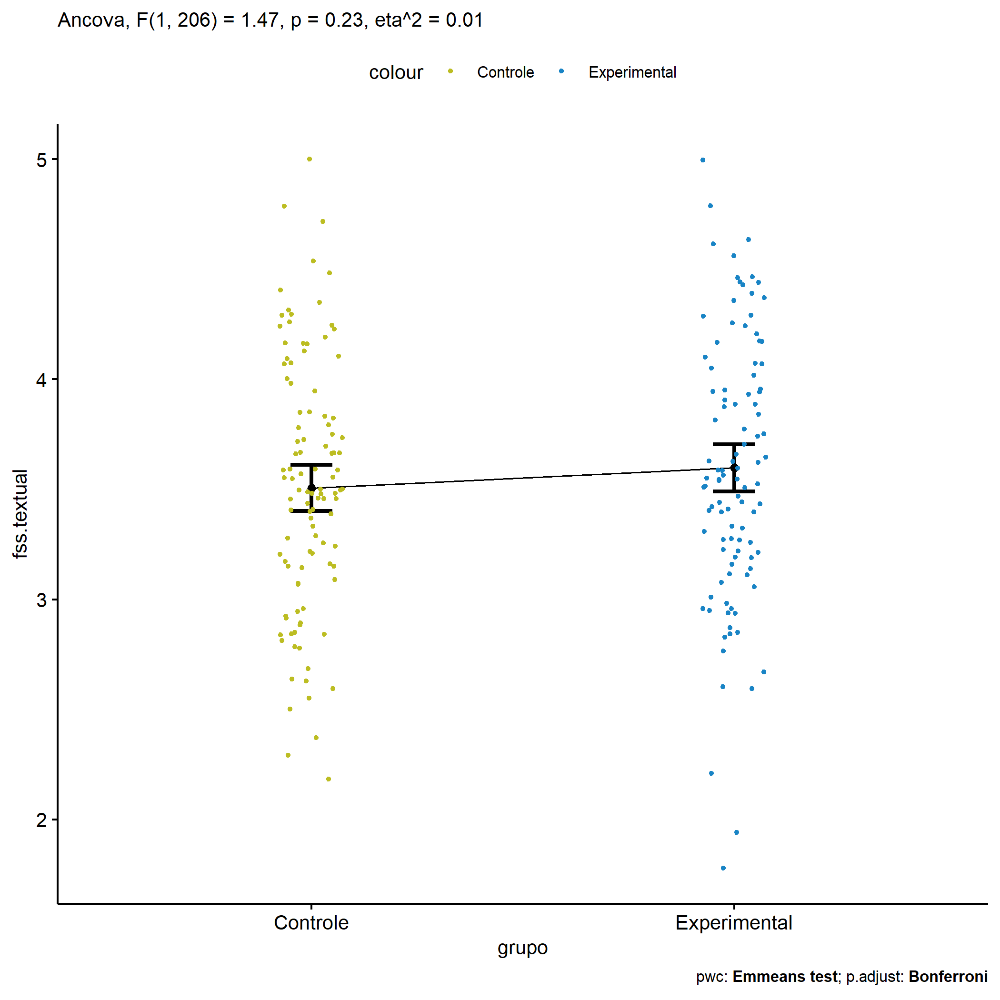<!-- -->

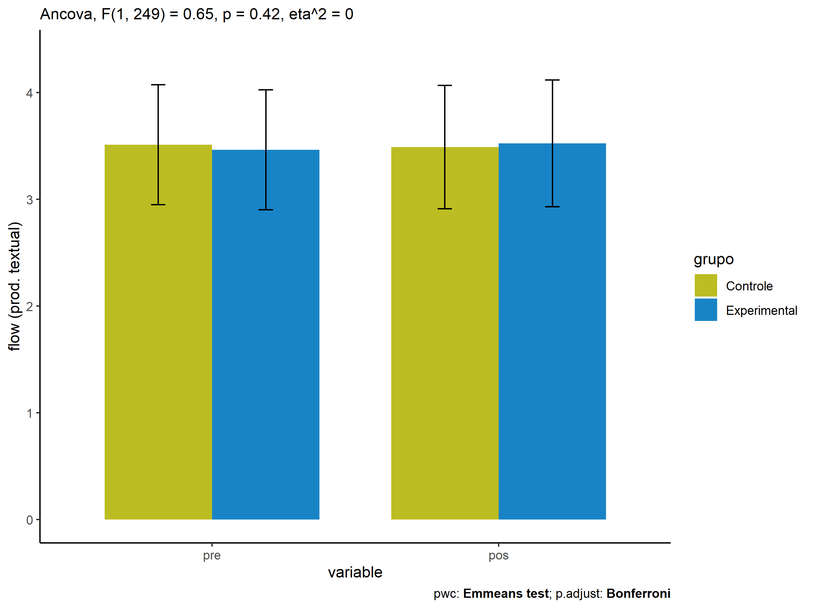<!-- -->

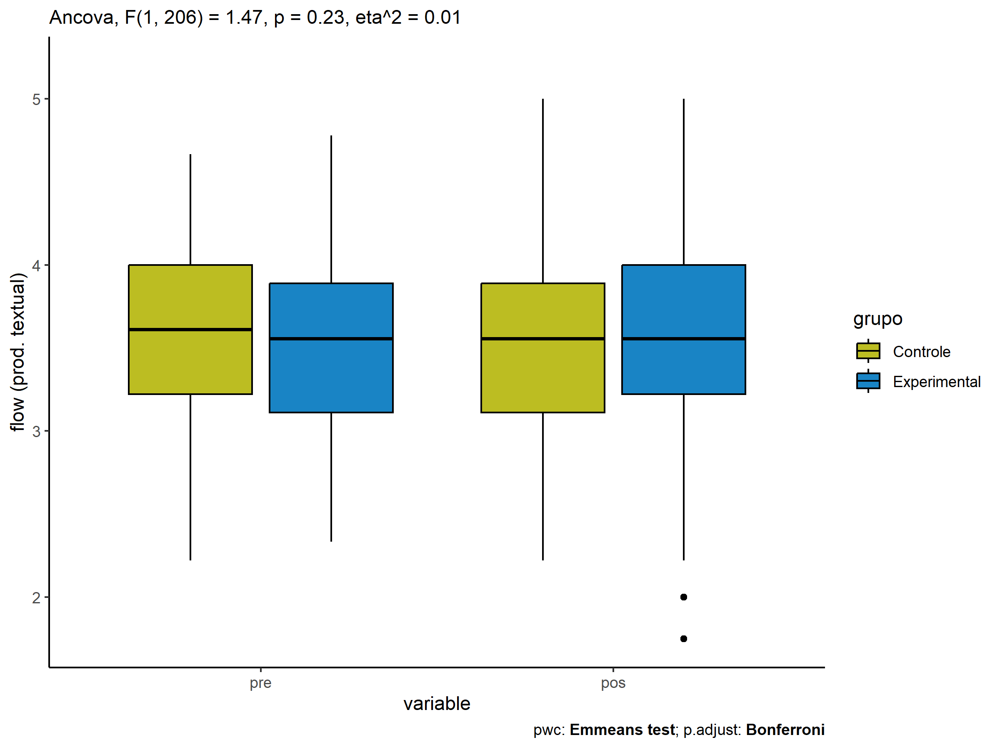<!-- -->

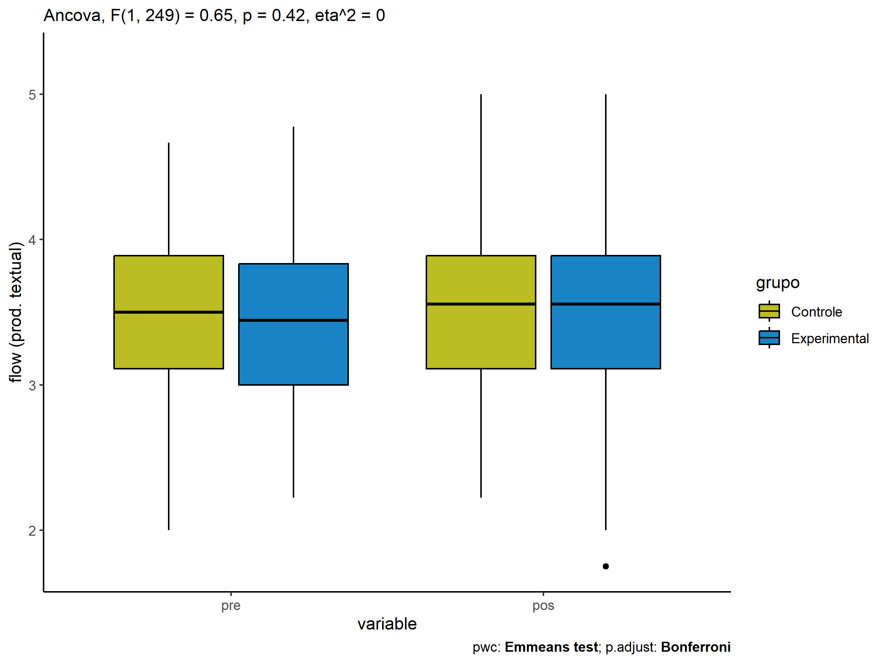<!-- -->

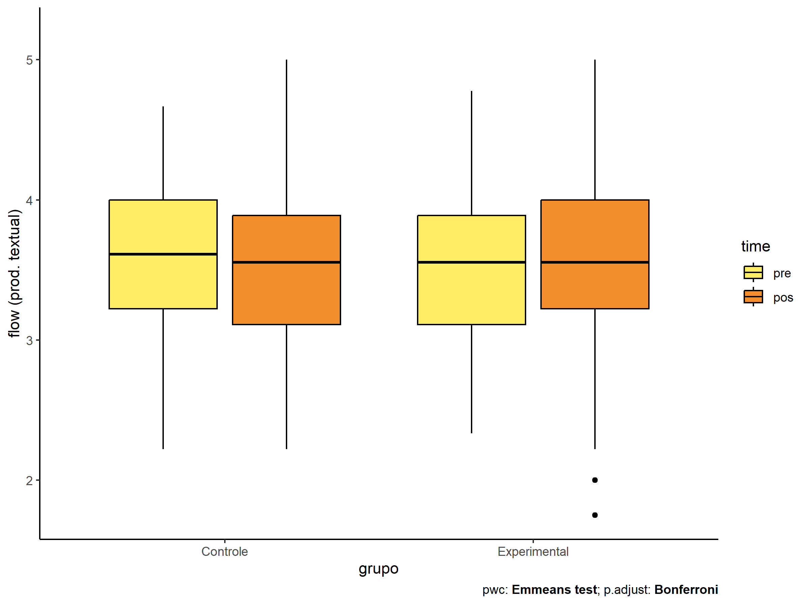<!-- -->

### factor: **genero**

| var         | genero |   n | M (pre) | SE (pre) | M (unadj) | SE (unadj) | M (adj) | SE (adj) |
|:------------|:-------|----:|--------:|---------:|----------:|-----------:|--------:|---------:|
| fss.textual | F      | 116 |   3.541 |    0.054 |     3.618 |      0.055 |   3.598 |    0.050 |
| fss.textual | M      | 136 |   3.443 |    0.047 |     3.413 |      0.049 |   3.431 |    0.046 |

| .y.         | group1 | group2 | estimate | conf.low | conf.high |    se | statistic |     p | p.adj | p.adj.signif |
|:------------|:-------|:-------|---------:|---------:|----------:|------:|----------:|------:|------:|:-------------|
| fss.textual | F      | M      |    0.167 |    0.033 |     0.301 | 0.068 |     2.458 | 0.015 | 0.015 | \*           |
| dfs.textual | F      | M      |    0.098 |   -0.042 |     0.237 | 0.071 |     1.378 | 0.169 | 0.169 | ns           |

| .y.          | genero | group1 | group2 | estimate | conf.low | conf.high |    se | statistic |     p | p.adj | p.adj.signif |
|:-------------|:-------|:-------|:-------|---------:|---------:|----------:|------:|----------:|------:|------:|:-------------|
| flow.textual | F      | pre    | pos    |   -0.078 |   -0.225 |     0.069 | 0.075 |    -1.041 | 0.298 | 0.298 | ns           |
| flow.textual | M      | pre    | pos    |    0.030 |   -0.106 |     0.165 | 0.069 |     0.430 | 0.668 | 0.668 | ns           |

    ## Scale for colour is already present.
    ## Adding another scale for colour, which will replace the existing scale.

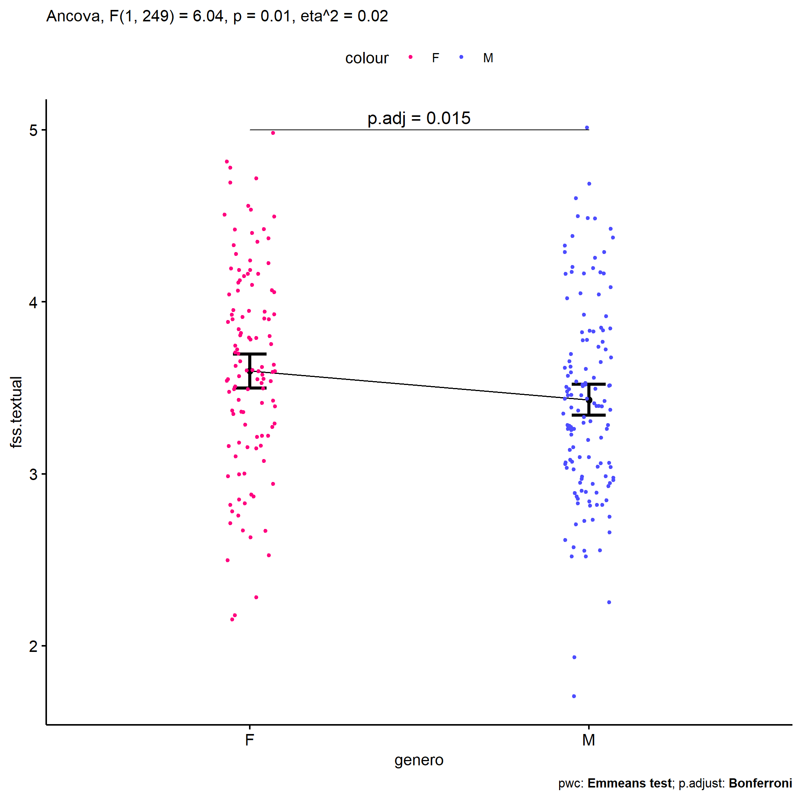<!-- -->

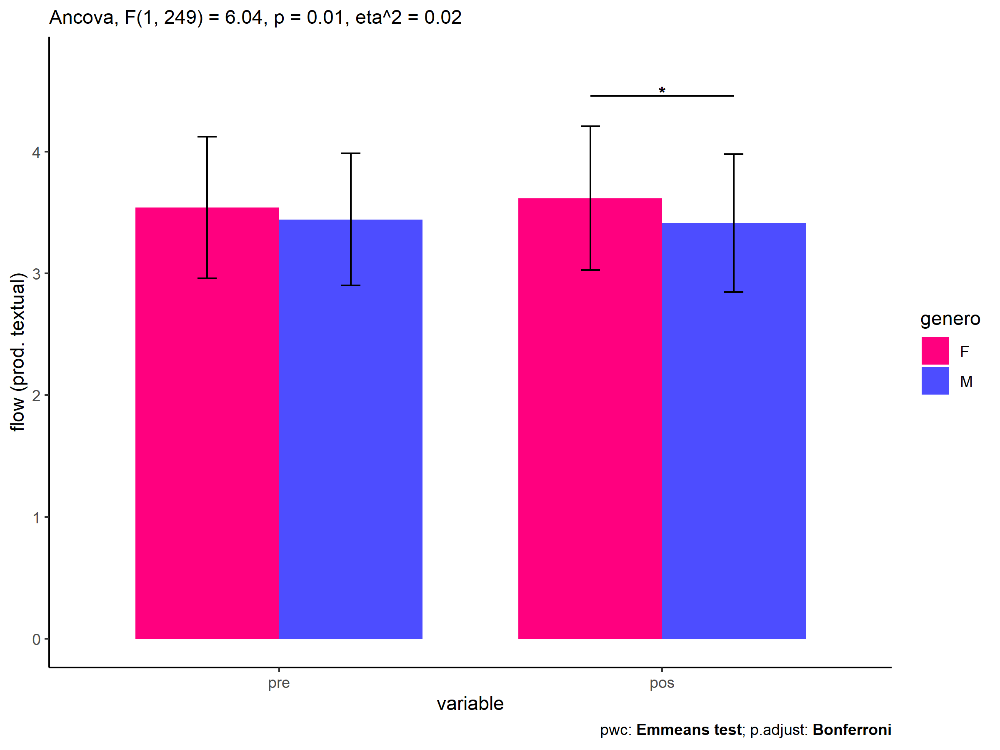<!-- -->

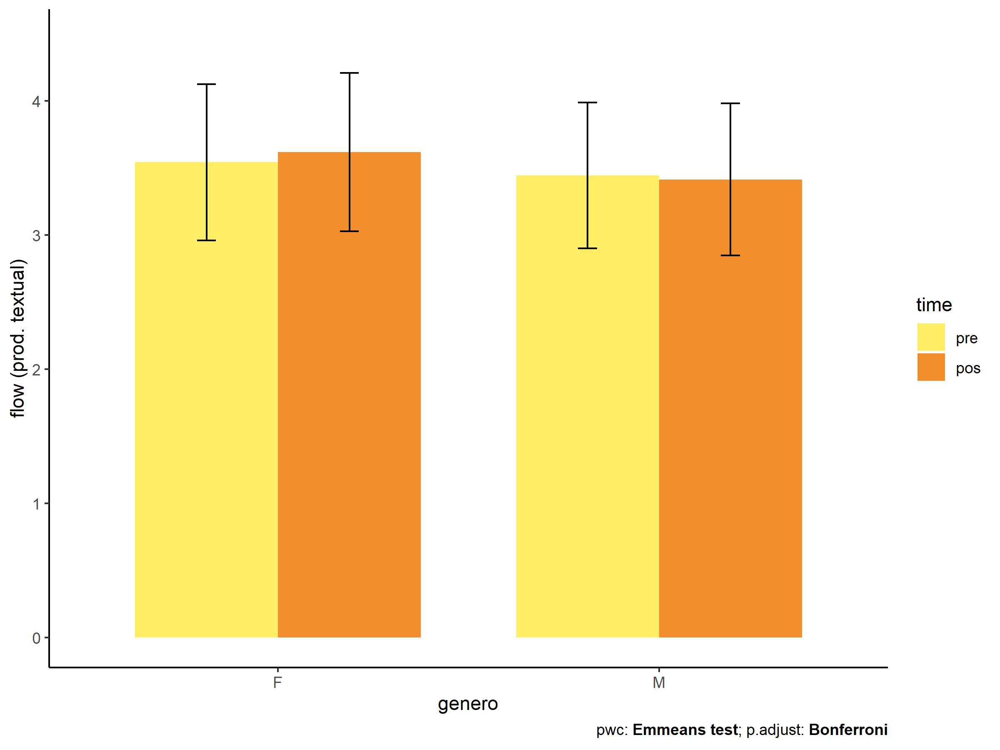<!-- -->

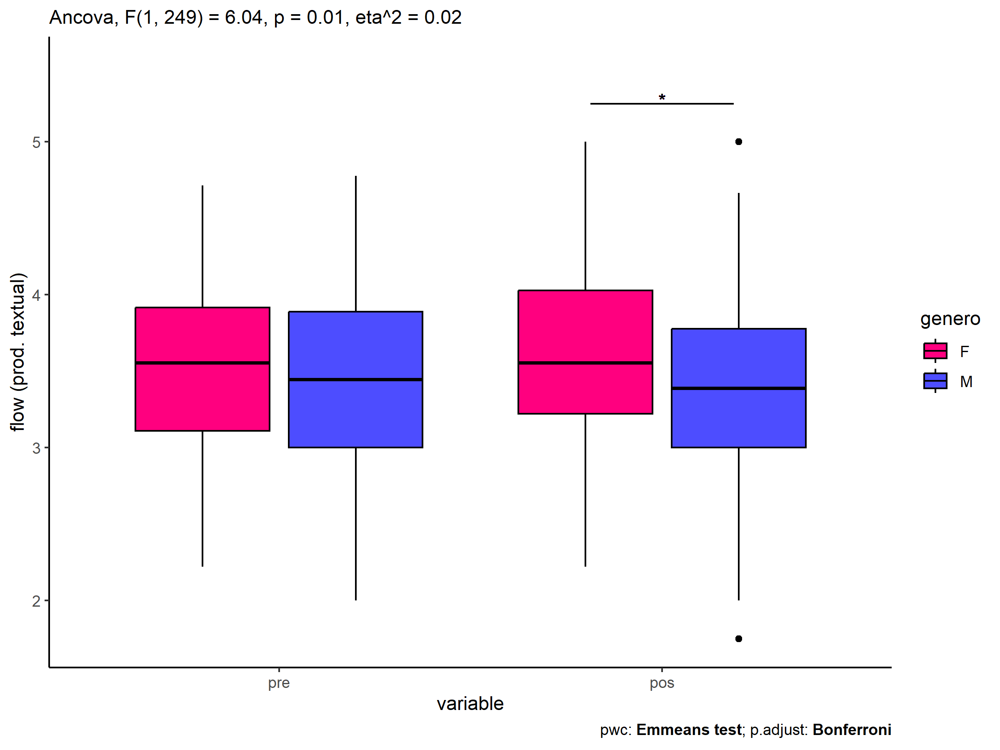<!-- -->

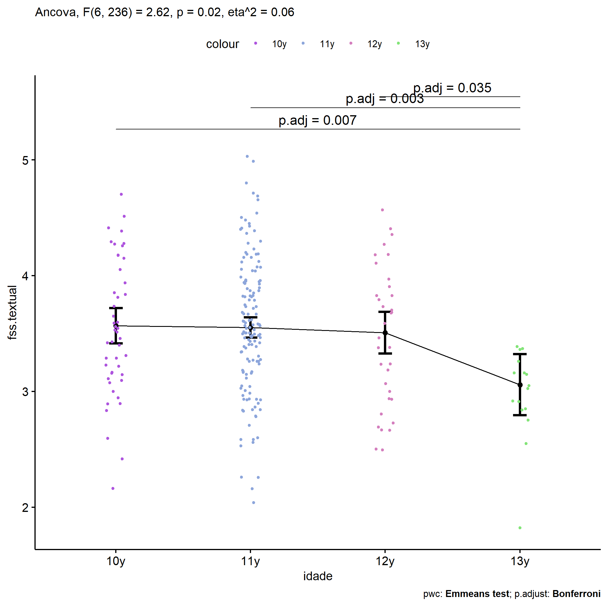<!-- -->

### factor: **idade**

| var         | idade |   n | M (pre) | SE (pre) | M (unadj) | SE (unadj) | M (adj) | SE (adj) |
|:------------|:------|----:|--------:|---------:|----------:|-----------:|--------:|---------:|
| fss.textual | 10y   |  47 |   3.462 |    0.088 |     3.551 |      0.084 |   3.568 |    0.078 |
| fss.textual | 11y   | 143 |   3.564 |    0.046 |     3.574 |      0.049 |   3.552 |    0.045 |
| fss.textual | 12y   |  34 |   3.423 |    0.092 |     3.477 |      0.101 |   3.508 |    0.091 |
| fss.textual | 13y   |  16 |   3.273 |    0.117 |     2.970 |      0.101 |   3.058 |    0.134 |

| .y.         | group1 | group2 | estimate | conf.low | conf.high |    se | statistic | p       | p.adj | p.adj.signif |
|:------------|:-------|:-------|---------:|---------:|----------:|------:|----------:|:--------|------:|:-------------|
| fss.textual | 10y    | 11y    |    0.016 |   -0.161 |     0.192 | 0.090 |     0.174 | 0.862   | 1.000 | ns           |
| fss.textual | 10y    | 12y    |    0.060 |   -0.176 |     0.296 | 0.120 |     0.501 | 0.617   | 1.000 | ns           |
| fss.textual | 10y    | 13y    |    0.510 |    0.205 |     0.814 | 0.154 |     3.300 | 0.001   | 0.007 | \*\*         |
| fss.textual | 11y    | 12y    |    0.044 |   -0.156 |     0.245 | 0.102 |     0.436 | 0.664   | 1.000 | ns           |
| fss.textual | 11y    | 13y    |    0.494 |    0.215 |     0.772 | 0.141 |     3.494 | \<0.001 | 0.003 | \*\*         |
| fss.textual | 12y    | 13y    |    0.450 |    0.131 |     0.768 | 0.162 |     2.783 | 0.006   | 0.035 | \*           |
| dfs.textual | 10y    | 11y    |   -0.102 |   -0.286 |     0.082 | 0.093 |    -1.092 | 0.276   | 1.000 | ns           |
| dfs.textual | 10y    | 12y    |    0.039 |   -0.207 |     0.285 | 0.125 |     0.310 | 0.757   | 1.000 | ns           |
| dfs.textual | 10y    | 13y    |    0.188 |   -0.128 |     0.505 | 0.161 |     1.171 | 0.243   | 1.000 | ns           |
| dfs.textual | 11y    | 12y    |    0.141 |   -0.068 |     0.349 | 0.106 |     1.329 | 0.185   | 1.000 | ns           |
| dfs.textual | 11y    | 13y    |    0.290 |    0.002 |     0.578 | 0.146 |     1.982 | 0.049   | 0.292 | ns           |
| dfs.textual | 12y    | 13y    |    0.149 |   -0.182 |     0.481 | 0.168 |     0.887 | 0.376   | 1.000 | ns           |

| .y.          | idade | group1 | group2 | estimate | conf.low | conf.high |    se | statistic |     p | p.adj | p.adj.signif |
|:-------------|:------|:-------|:-------|---------:|---------:|----------:|------:|----------:|------:|------:|:-------------|
| flow.textual | 10y   | pre    | pos    |   -0.090 |   -0.318 |     0.138 | 0.116 |    -0.773 | 0.440 | 0.440 | ns           |
| flow.textual | 11y   | pre    | pos    |   -0.011 |   -0.142 |     0.120 | 0.067 |    -0.164 | 0.870 | 0.870 | ns           |
| flow.textual | 12y   | pre    | pos    |   -0.054 |   -0.322 |     0.214 | 0.137 |    -0.395 | 0.693 | 0.693 | ns           |
| flow.textual | 13y   | pre    | pos    |    0.303 |   -0.088 |     0.694 | 0.199 |     1.521 | 0.129 | 0.129 | ns           |

    ## Scale for colour is already present.
    ## Adding another scale for colour, which will replace the existing scale.

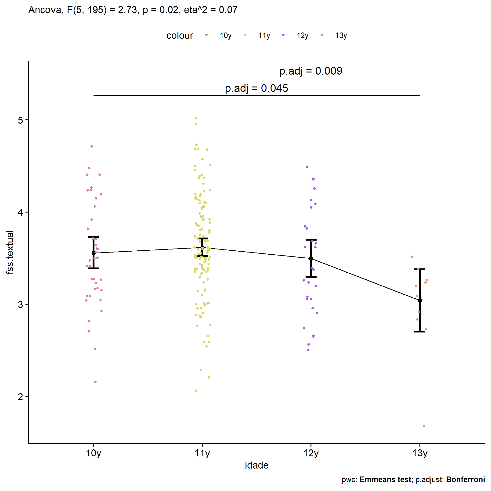<!-- -->

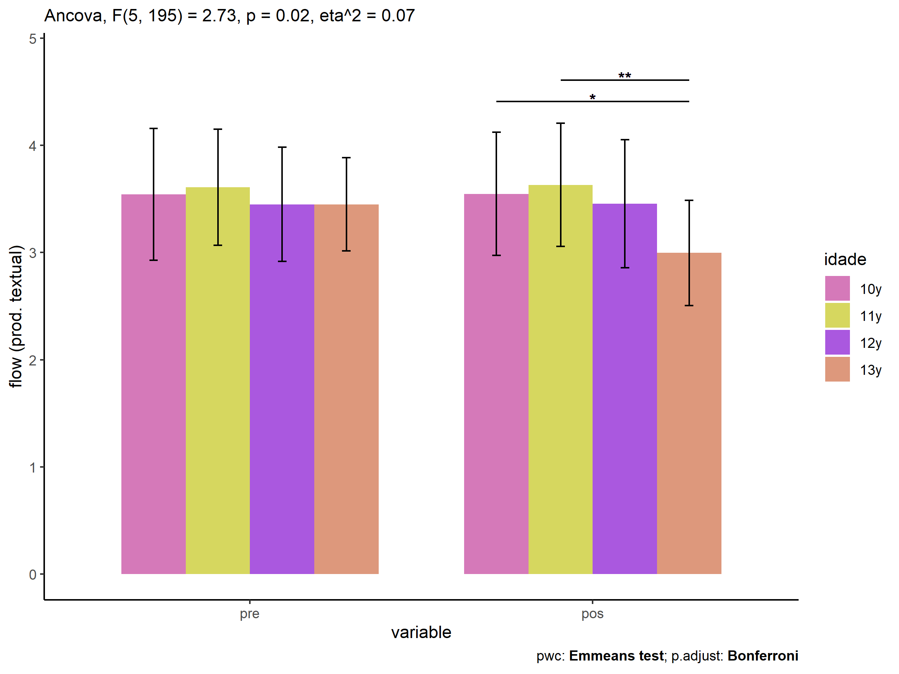<!-- -->

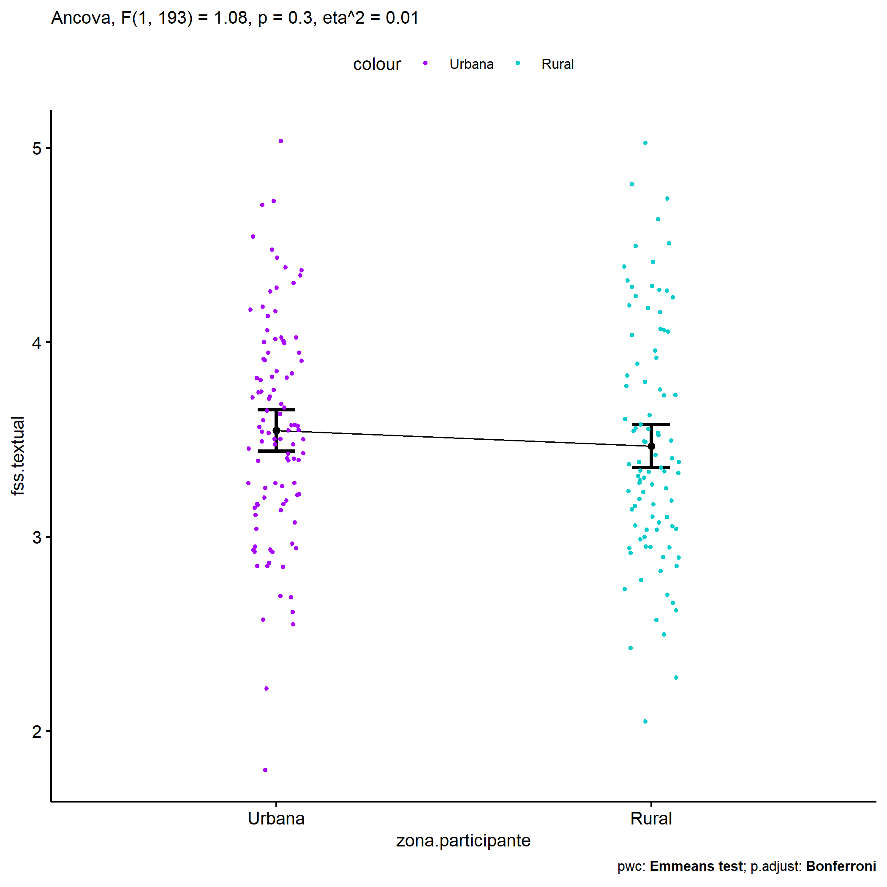<!-- -->

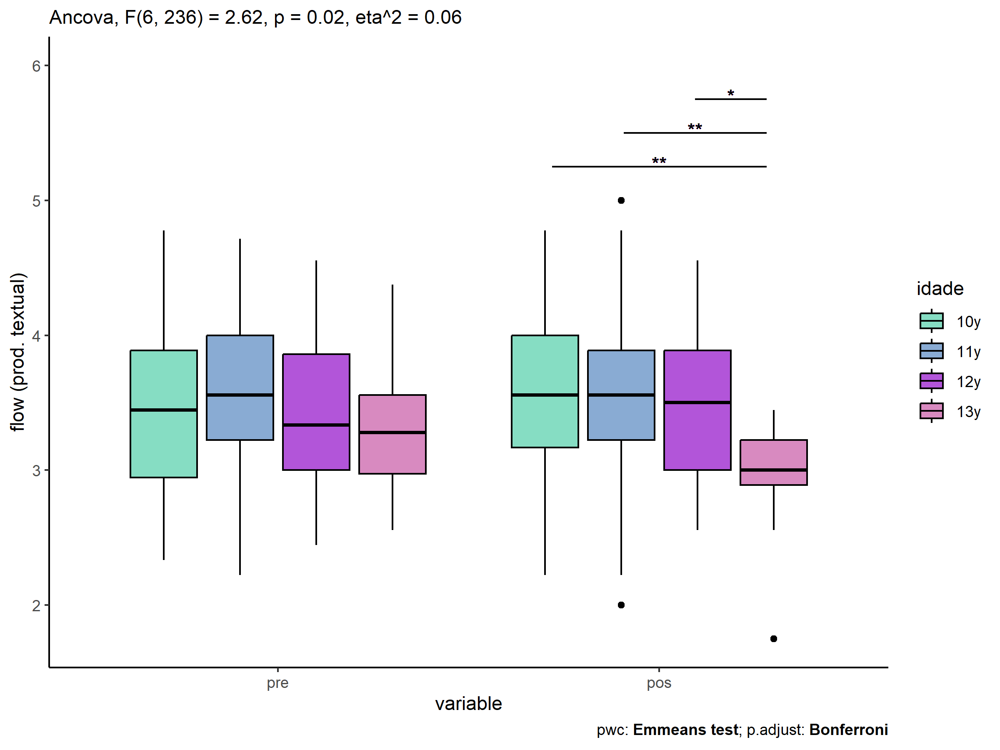<!-- -->

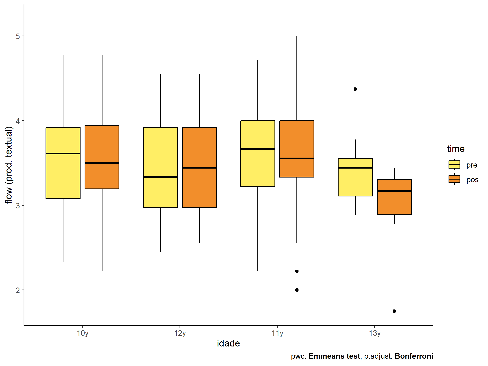<!-- -->

### factor: **zona.participante**

| var         | zona.participante |   n | M (pre) | SE (pre) | M (unadj) | SE (unadj) | M (adj) | SE (adj) |
|:------------|:------------------|----:|--------:|---------:|----------:|-----------:|--------:|---------:|
| fss.textual | Rural             |  94 |   3.496 |    0.060 |     3.468 |      0.063 |   3.466 |    0.056 |
| fss.textual | Urbana            | 102 |   3.487 |    0.058 |     3.545 |      0.056 |   3.547 |    0.054 |

| .y.         | group1 | group2 | estimate | conf.low | conf.high |    se | statistic |     p | p.adj | p.adj.signif |
|:------------|:-------|:-------|---------:|---------:|----------:|------:|----------:|------:|------:|:-------------|
| fss.textual | Urbana | Rural  |    0.081 |   -0.073 |     0.235 | 0.078 |      1.04 | 0.300 | 0.300 | ns           |
| dfs.textual | Urbana | Rural  |   -0.008 |   -0.172 |     0.156 | 0.083 |     -0.10 | 0.921 | 0.921 | ns           |

| .y.          | zona.participante | group1 | group2 | estimate | conf.low | conf.high |    se | statistic |     p | p.adj | p.adj.signif |
|:-------------|:------------------|:-------|:-------|---------:|---------:|----------:|------:|----------:|------:|------:|:-------------|
| flow.textual | Urbana            | pre    | pos    |   -0.058 |    -0.22 |     0.103 | 0.082 |    -0.708 | 0.479 | 0.479 | ns           |
| flow.textual | Rural             | pre    | pos    |    0.028 |    -0.14 |     0.196 | 0.086 |     0.327 | 0.744 | 0.744 | ns           |

    ## Scale for colour is already present.
    ## Adding another scale for colour, which will replace the existing scale.

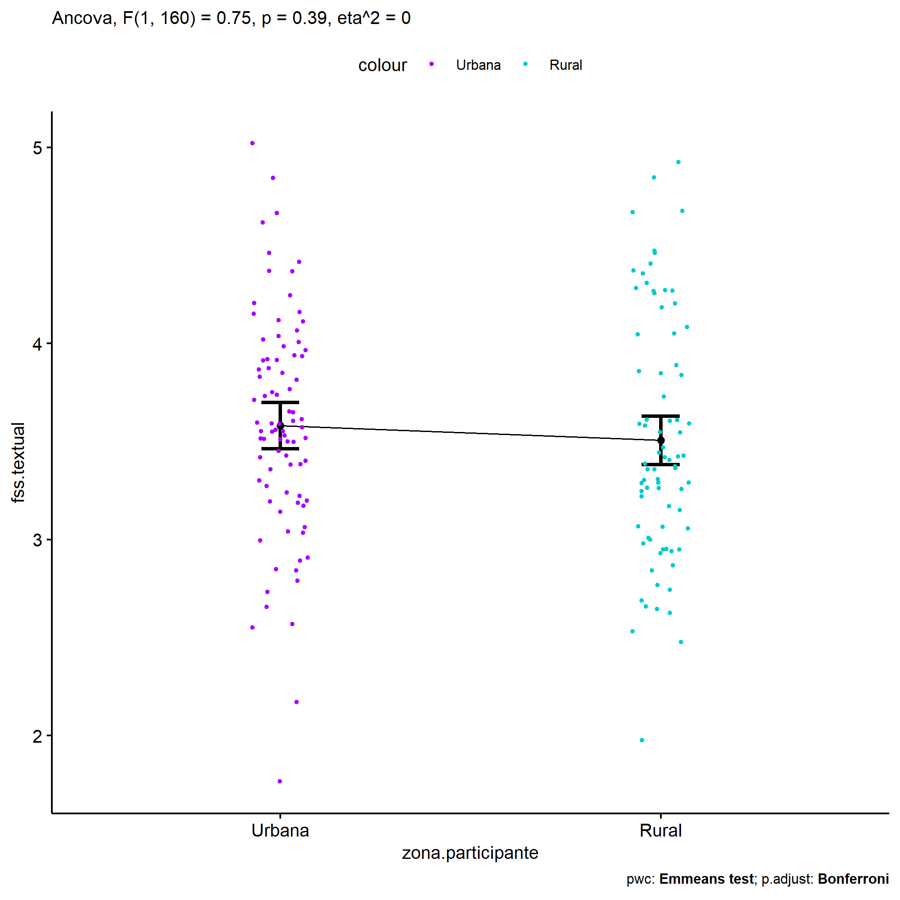<!-- -->

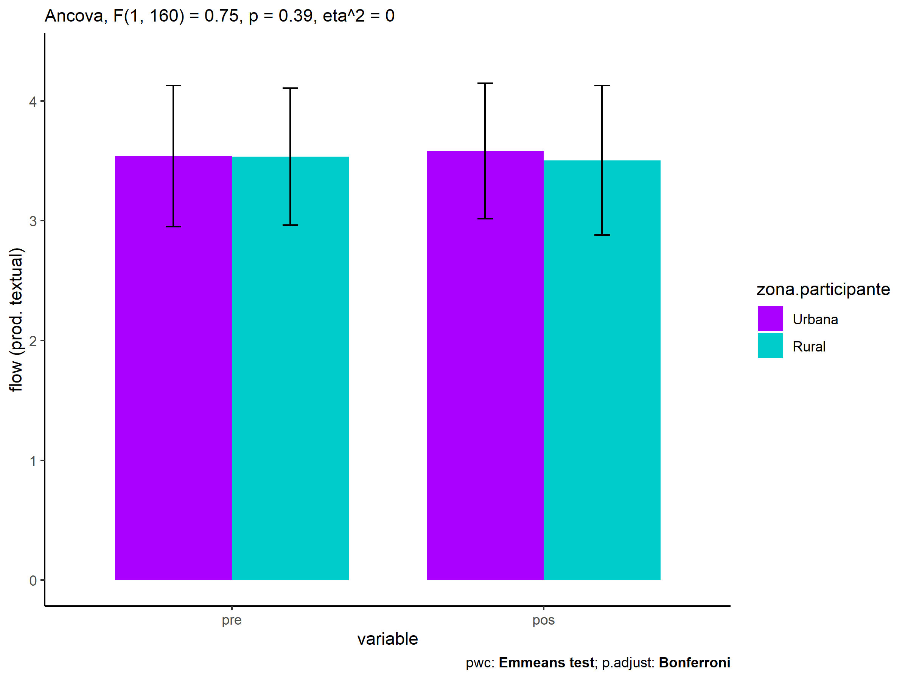<!-- -->

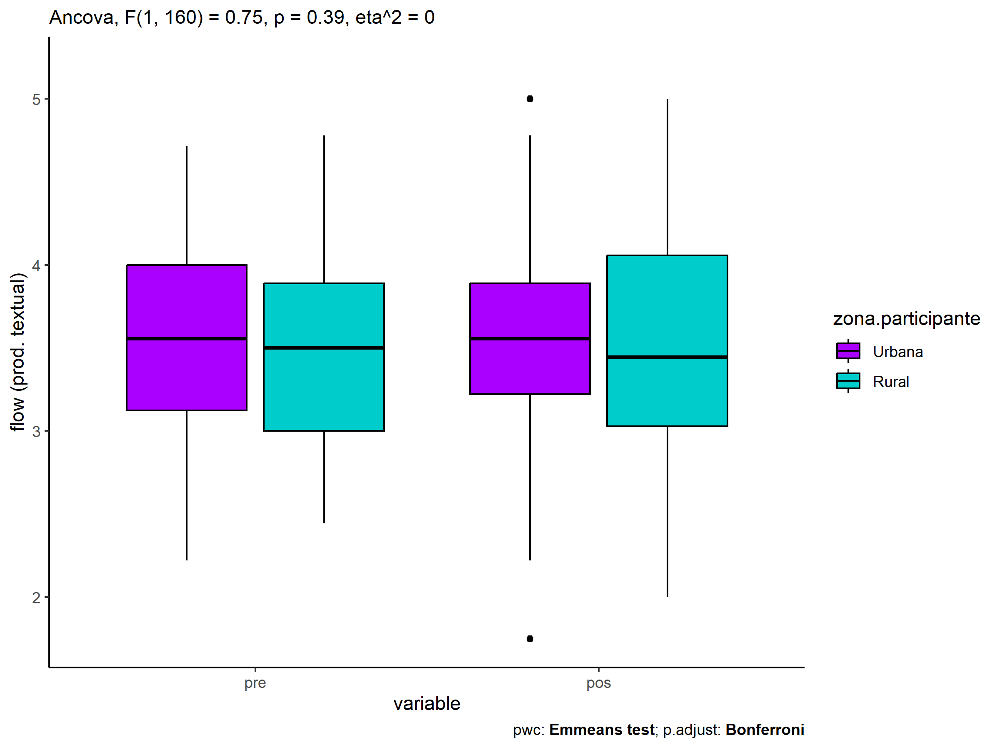<!-- -->

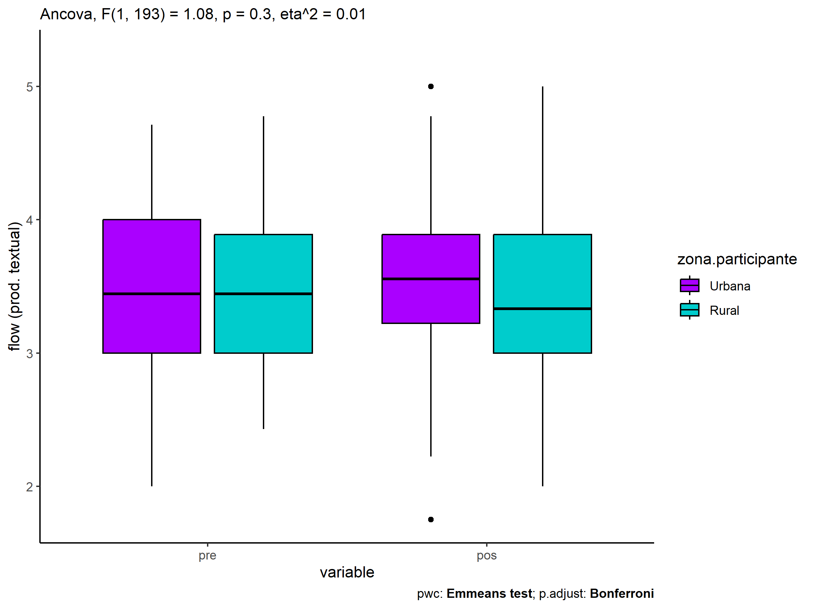<!-- -->

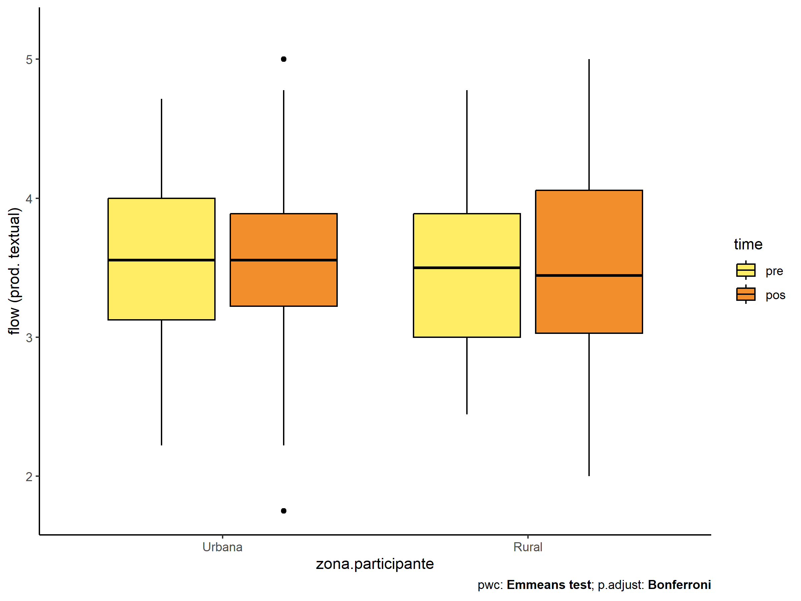<!-- -->

### factor: **escola**

| var         | escola |   n | M (pre) | SE (pre) | M (unadj) | SE (unadj) | M (adj) | SE (adj) |
|:------------|:-------|----:|--------:|---------:|----------:|-----------:|--------:|---------:|
| fss.textual | E1     |  21 |   3.388 |    0.121 |     3.721 |      0.133 |   3.762 |    0.117 |
| fss.textual | E2     |  49 |   3.472 |    0.073 |     3.405 |      0.090 |   3.412 |    0.077 |
| fss.textual | E3     |  28 |   3.560 |    0.120 |     3.394 |      0.106 |   3.364 |    0.101 |
| fss.textual | E4     |  30 |   3.569 |    0.088 |     3.458 |      0.099 |   3.424 |    0.098 |
| fss.textual | E5     | 100 |   3.450 |    0.062 |     3.527 |      0.058 |   3.543 |    0.054 |
| fss.textual | E6     |  24 |   3.579 |    0.084 |     3.644 |      0.112 |   3.606 |    0.109 |

| .y.         | group1 | group2 | estimate | conf.low | conf.high |    se | statistic |     p | p.adj | p.adj.signif |
|:------------|:-------|:-------|---------:|---------:|----------:|------:|----------:|------:|------:|:-------------|
| fss.textual | E1     | E2     |    0.350 |    0.075 |     0.626 | 0.140 |     2.506 | 0.013 | 0.193 | ns           |
| fss.textual | E1     | E3     |    0.398 |    0.093 |     0.703 | 0.155 |     2.568 | 0.011 | 0.163 | ns           |
| fss.textual | E1     | E4     |    0.338 |    0.037 |     0.639 | 0.153 |     2.213 | 0.028 | 0.417 | ns           |
| fss.textual | E1     | E5     |    0.219 |   -0.034 |     0.473 | 0.129 |     1.707 | 0.089 | 1.000 | ns           |
| fss.textual | E1     | E6     |    0.156 |   -0.160 |     0.472 | 0.160 |     0.974 | 0.331 | 1.000 | ns           |
| fss.textual | E2     | E3     |    0.047 |   -0.203 |     0.298 | 0.127 |     0.374 | 0.709 | 1.000 | ns           |
| fss.textual | E2     | E4     |   -0.012 |   -0.257 |     0.233 | 0.124 |    -0.098 | 0.922 | 1.000 | ns           |
| fss.textual | E2     | E5     |   -0.131 |   -0.315 |     0.053 | 0.093 |    -1.401 | 0.163 | 1.000 | ns           |
| fss.textual | E2     | E6     |   -0.194 |   -0.457 |     0.069 | 0.134 |    -1.452 | 0.148 | 1.000 | ns           |
| fss.textual | E3     | E4     |   -0.060 |   -0.337 |     0.217 | 0.141 |    -0.424 | 0.672 | 1.000 | ns           |
| fss.textual | E3     | E5     |   -0.178 |   -0.404 |     0.048 | 0.115 |    -1.555 | 0.121 | 1.000 | ns           |
| fss.textual | E3     | E6     |   -0.241 |   -0.535 |     0.052 | 0.149 |    -1.621 | 0.106 | 1.000 | ns           |
| fss.textual | E4     | E5     |   -0.119 |   -0.339 |     0.101 | 0.112 |    -1.062 | 0.289 | 1.000 | ns           |
| fss.textual | E4     | E6     |   -0.182 |   -0.471 |     0.107 | 0.147 |    -1.240 | 0.216 | 1.000 | ns           |
| fss.textual | E5     | E6     |   -0.063 |   -0.303 |     0.177 | 0.122 |    -0.518 | 0.605 | 1.000 | ns           |
| dfs.textual | E1     | E2     |   -0.083 |   -0.373 |     0.207 | 0.147 |    -0.567 | 0.571 | 1.000 | ns           |
| dfs.textual | E1     | E3     |   -0.171 |   -0.492 |     0.150 | 0.163 |    -1.051 | 0.294 | 1.000 | ns           |
| dfs.textual | E1     | E4     |   -0.181 |   -0.498 |     0.135 | 0.161 |    -1.128 | 0.260 | 1.000 | ns           |
| dfs.textual | E1     | E5     |   -0.062 |   -0.329 |     0.205 | 0.135 |    -0.457 | 0.648 | 1.000 | ns           |
| dfs.textual | E1     | E6     |   -0.191 |   -0.523 |     0.142 | 0.169 |    -1.130 | 0.260 | 1.000 | ns           |
| dfs.textual | E2     | E3     |   -0.088 |   -0.351 |     0.175 | 0.134 |    -0.657 | 0.512 | 1.000 | ns           |
| dfs.textual | E2     | E4     |   -0.098 |   -0.356 |     0.160 | 0.131 |    -0.747 | 0.456 | 1.000 | ns           |
| dfs.textual | E2     | E5     |    0.021 |   -0.172 |     0.215 | 0.098 |     0.218 | 0.827 | 1.000 | ns           |
| dfs.textual | E2     | E6     |   -0.107 |   -0.384 |     0.170 | 0.141 |    -0.762 | 0.447 | 1.000 | ns           |
| dfs.textual | E3     | E4     |   -0.010 |   -0.302 |     0.282 | 0.148 |    -0.067 | 0.947 | 1.000 | ns           |
| dfs.textual | E3     | E5     |    0.109 |   -0.128 |     0.347 | 0.121 |     0.906 | 0.366 | 1.000 | ns           |
| dfs.textual | E3     | E6     |   -0.019 |   -0.329 |     0.290 | 0.157 |    -0.123 | 0.902 | 1.000 | ns           |
| dfs.textual | E4     | E5     |    0.119 |   -0.112 |     0.351 | 0.117 |     1.015 | 0.311 | 1.000 | ns           |
| dfs.textual | E4     | E6     |   -0.009 |   -0.314 |     0.295 | 0.155 |    -0.060 | 0.952 | 1.000 | ns           |
| dfs.textual | E5     | E6     |   -0.129 |   -0.381 |     0.124 | 0.128 |    -1.002 | 0.317 | 1.000 | ns           |

| .y.          | escola | group1 | group2 | estimate | conf.low | conf.high |    se | statistic |     p | p.adj | p.adj.signif |
|:-------------|:-------|:-------|:-------|---------:|---------:|----------:|------:|----------:|------:|------:|:-------------|
| flow.textual | E1     | pre    | pos    |   -0.333 |   -0.681 |     0.015 | 0.177 |    -1.878 | 0.061 | 0.061 | ns           |
| flow.textual | E2     | pre    | pos    |    0.066 |   -0.161 |     0.294 | 0.116 |     0.573 | 0.567 | 0.567 | ns           |
| flow.textual | E3     | pre    | pos    |    0.165 |   -0.136 |     0.467 | 0.153 |     1.079 | 0.281 | 0.281 | ns           |
| flow.textual | E4     | pre    | pos    |    0.112 |   -0.180 |     0.403 | 0.148 |     0.753 | 0.452 | 0.452 | ns           |
| flow.textual | E5     | pre    | pos    |   -0.077 |   -0.236 |     0.083 | 0.081 |    -0.948 | 0.344 | 0.344 | ns           |
| flow.textual | E6     | pre    | pos    |   -0.065 |   -0.390 |     0.261 | 0.166 |    -0.391 | 0.696 | 0.696 | ns           |

    ## Scale for colour is already present.
    ## Adding another scale for colour, which will replace the existing scale.

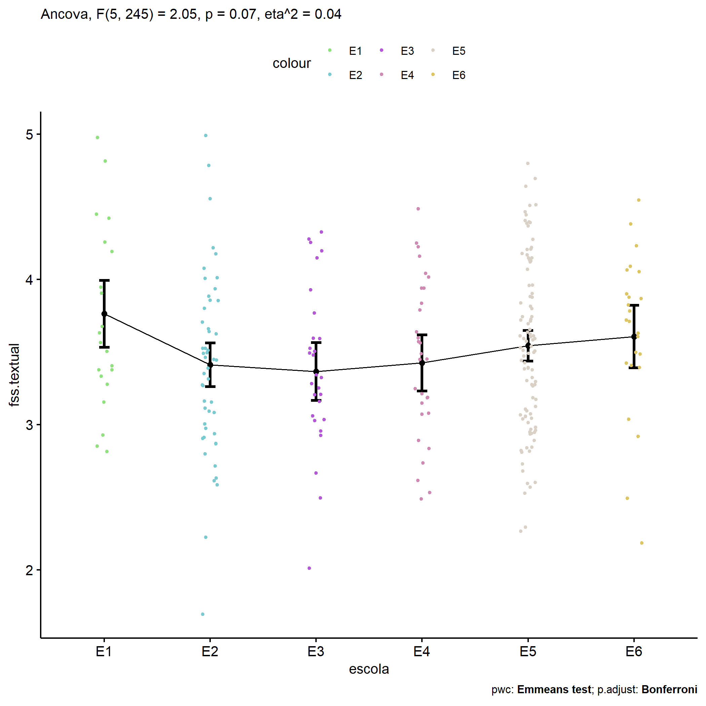<!-- -->

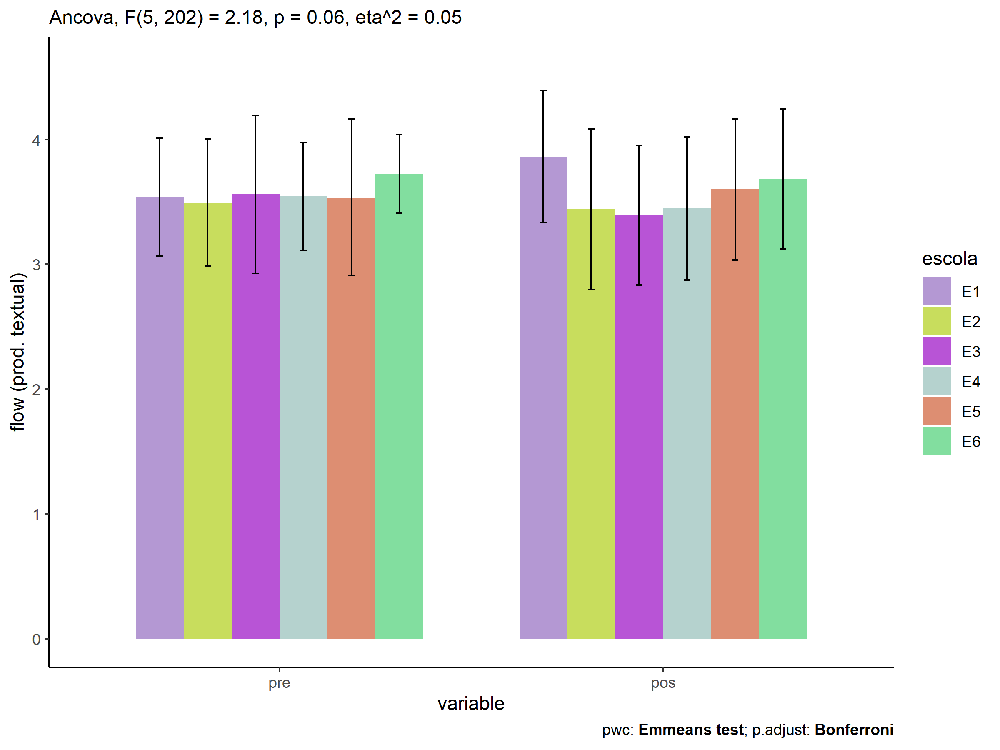<!-- -->

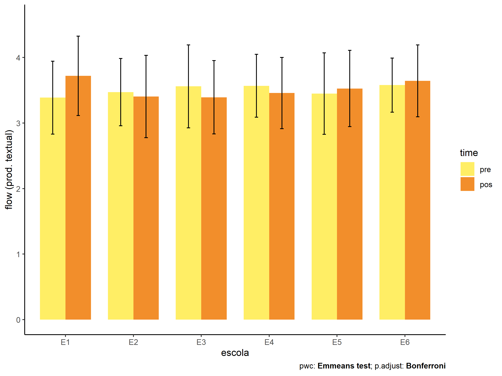<!-- -->

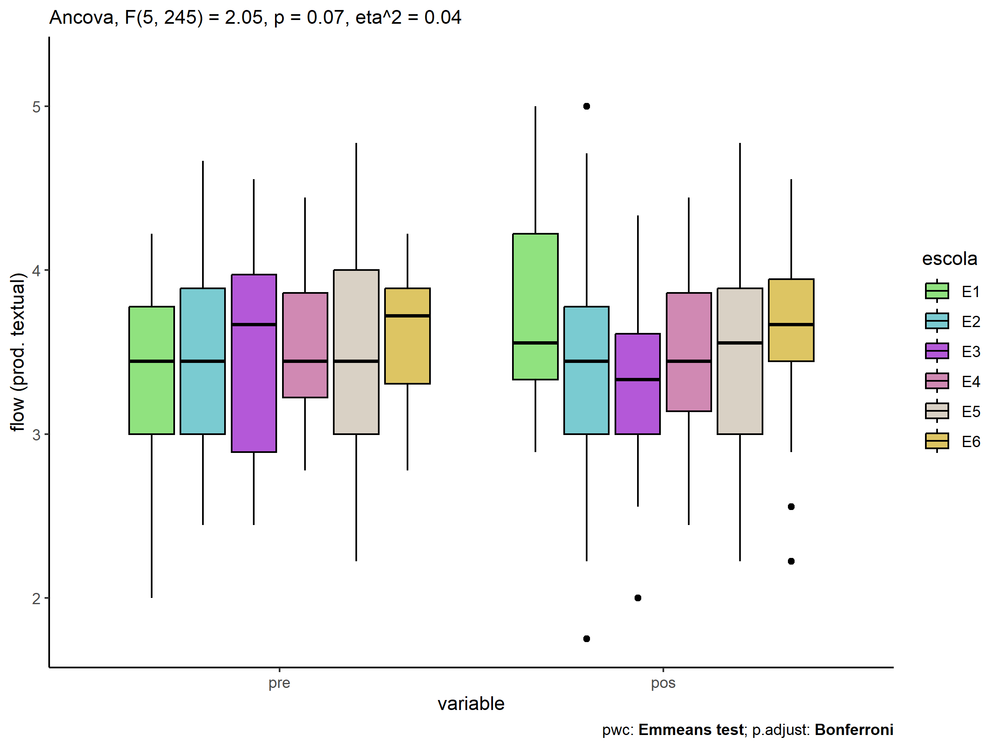<!-- -->

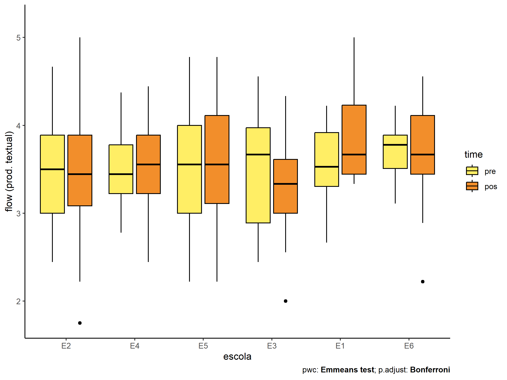<!-- -->

### factor: **zona.escola**

| var         | zona.escola |   n | M (pre) | SE (pre) | M (unadj) | SE (unadj) | M (adj) | SE (adj) |
|:------------|:------------|----:|--------:|---------:|----------:|-----------:|--------:|---------:|
| fss.textual | Rural       |  82 |   3.569 |    0.057 |     3.490 |      0.061 |   3.457 |    0.060 |
| fss.textual | Urbana      | 170 |   3.449 |    0.045 |     3.516 |      0.046 |   3.532 |    0.042 |

| .y.         | group1 | group2 | estimate | conf.low | conf.high |    se | statistic |     p | p.adj | p.adj.signif |
|:------------|:-------|:-------|---------:|---------:|----------:|------:|----------:|------:|------:|:-------------|
| fss.textual | Urbana | Rural  |    0.075 |   -0.069 |     0.219 | 0.073 |     1.021 | 0.308 | 0.308 | ns           |
| dfs.textual | Urbana | Rural  |   -0.120 |   -0.268 |     0.028 | 0.075 |    -1.594 | 0.112 | 0.112 | ns           |

| .y.          | zona.escola | group1 | group2 | estimate | conf.low | conf.high |    se | statistic |     p | p.adj | p.adj.signif |
|:-------------|:------------|:-------|:-------|---------:|---------:|----------:|------:|----------:|------:|------:|:-------------|
| flow.textual | Urbana      | pre    | pos    |   -0.067 |   -0.189 |     0.055 | 0.062 |    -1.080 | 0.281 | 0.281 | ns           |
| flow.textual | Rural       | pre    | pos    |    0.078 |   -0.098 |     0.254 | 0.090 |     0.875 | 0.382 | 0.382 | ns           |

    ## Scale for colour is already present.
    ## Adding another scale for colour, which will replace the existing scale.

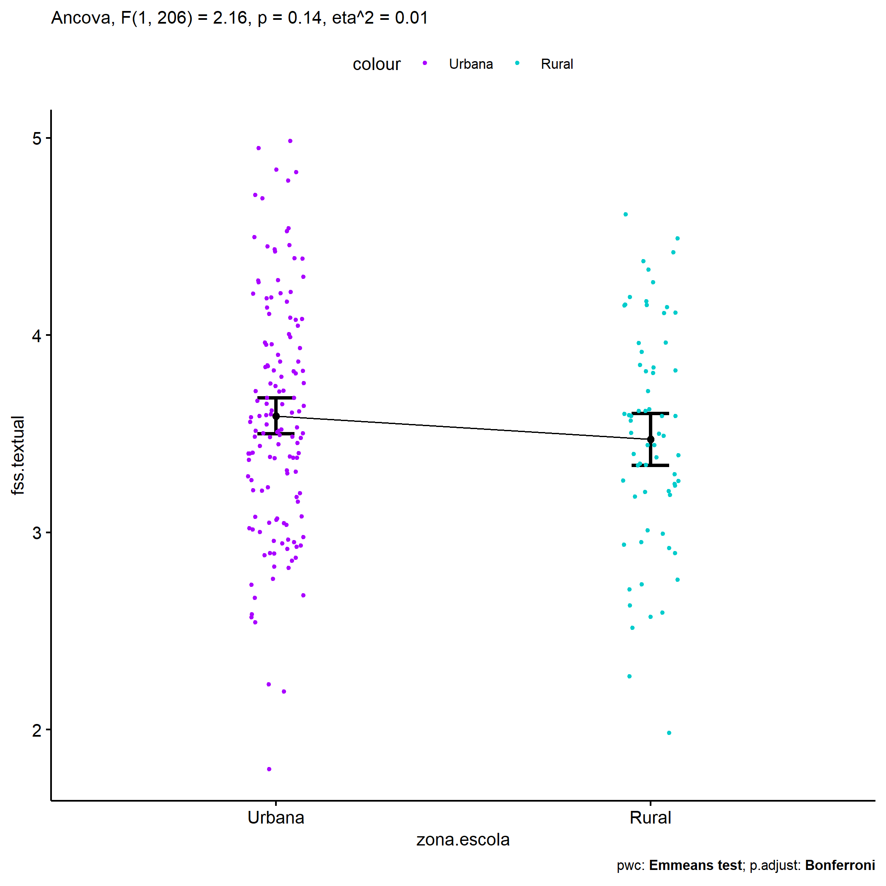<!-- -->

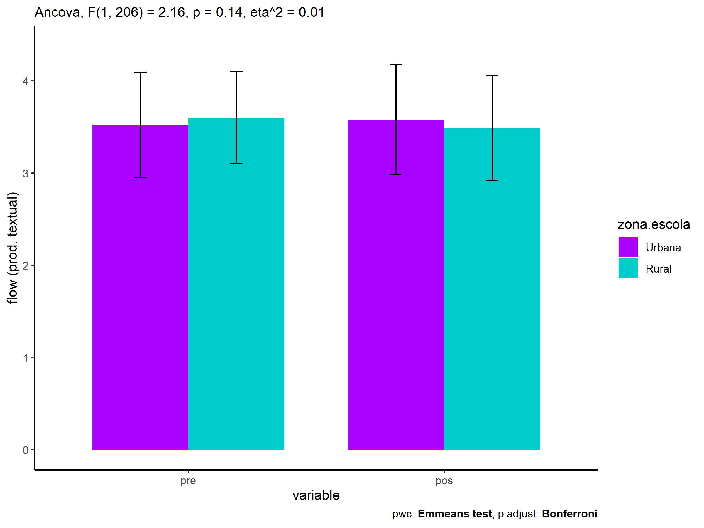<!-- -->

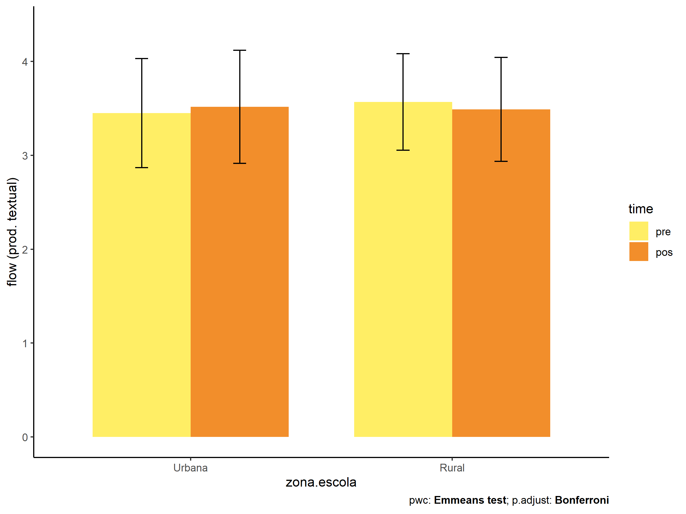<!-- -->

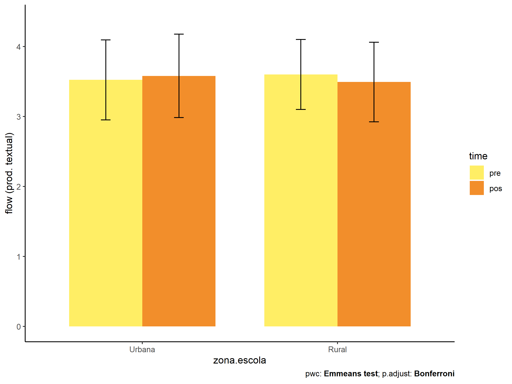<!-- -->

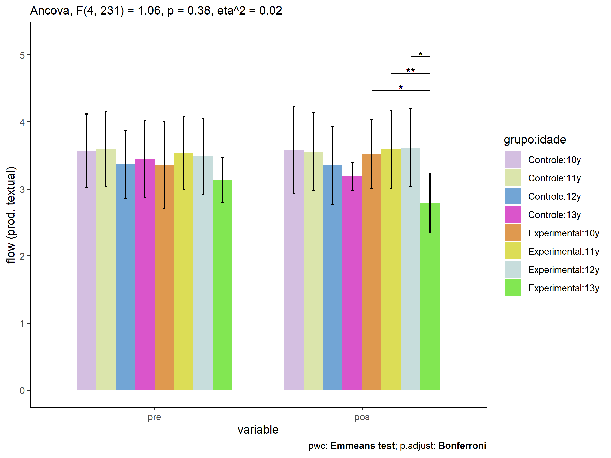<!-- -->

## Pairwise comparisons for two factors

### factores: **grupo:genero**

| var         | grupo        | genero |   n | M (pre) | SE (pre) | M (unadj) | SE (unadj) | M (adj) | SE (adj) |
|:------------|:-------------|:-------|----:|--------:|---------:|----------:|-----------:|--------:|---------:|
| fss.textual | Controle     | F      |  59 |   3.536 |    0.077 |     3.542 |      0.079 |   3.523 |    0.070 |
| fss.textual | Controle     | M      |  62 |   3.490 |    0.068 |     3.439 |      0.070 |   3.438 |    0.068 |
| fss.textual | Experimental | F      |  57 |   3.545 |    0.076 |     3.698 |      0.075 |   3.676 |    0.071 |
| fss.textual | Experimental | M      |  74 |   3.404 |    0.064 |     3.391 |      0.068 |   3.424 |    0.062 |

| .y.         | grupo        | genero | group1   | group2       | estimate | conf.low | conf.high |    se | statistic |     p | p.adj | p.adj.signif |
|:------------|:-------------|:-------|:---------|:-------------|---------:|---------:|----------:|------:|----------:|------:|------:|:-------------|
| fss.textual |              | F      | Controle | Experimental |   -0.153 |   -0.349 |     0.043 | 0.099 |    -1.540 | 0.125 | 0.125 | ns           |
| fss.textual |              | M      | Controle | Experimental |    0.014 |   -0.168 |     0.196 | 0.092 |     0.153 | 0.879 | 0.879 | ns           |
| dfs.textual |              | F      | Controle | Experimental |   -0.008 |   -0.214 |     0.197 | 0.104 |    -0.079 | 0.937 | 0.937 | ns           |
| dfs.textual |              | M      | Controle | Experimental |    0.086 |   -0.105 |     0.277 | 0.097 |     0.890 | 0.374 | 0.374 | ns           |
| fss.textual | Controle     |        | F        | M            |    0.084 |   -0.108 |     0.276 | 0.097 |     0.865 | 0.388 | 0.388 | ns           |
| fss.textual | Experimental |        | F        | M            |    0.251 |    0.065 |     0.438 | 0.095 |     2.655 | 0.008 | 0.008 | \*\*         |
| dfs.textual | Controle     |        | F        | M            |    0.047 |   -0.155 |     0.248 | 0.102 |     0.458 | 0.648 | 0.648 | ns           |
| dfs.textual | Experimental |        | F        | M            |    0.141 |   -0.054 |     0.336 | 0.099 |     1.424 | 0.156 | 0.156 | ns           |

| .y.          | grupo        | genero | group1 | group2 | estimate | conf.low | conf.high |    se | statistic |     p | p.adj | p.adj.signif |
|:-------------|:-------------|:-------|:-------|:-------|---------:|---------:|----------:|------:|----------:|------:|------:|:-------------|
| flow.textual | Controle     | F      | pre    | pos    |   -0.005 |   -0.211 |     0.201 | 0.105 |    -0.048 | 0.962 | 0.962 | ns           |
| flow.textual | Controle     | M      | pre    | pos    |    0.051 |   -0.150 |     0.252 | 0.102 |     0.495 | 0.621 | 0.621 | ns           |
| flow.textual | Experimental | F      | pre    | pos    |   -0.153 |   -0.363 |     0.057 | 0.107 |    -1.435 | 0.152 | 0.152 | ns           |
| flow.textual | Experimental | M      | pre    | pos    |    0.012 |   -0.172 |     0.196 | 0.094 |     0.129 | 0.897 | 0.897 | ns           |

    ## Scale for colour is already present.
    ## Adding another scale for colour, which will replace the existing scale.

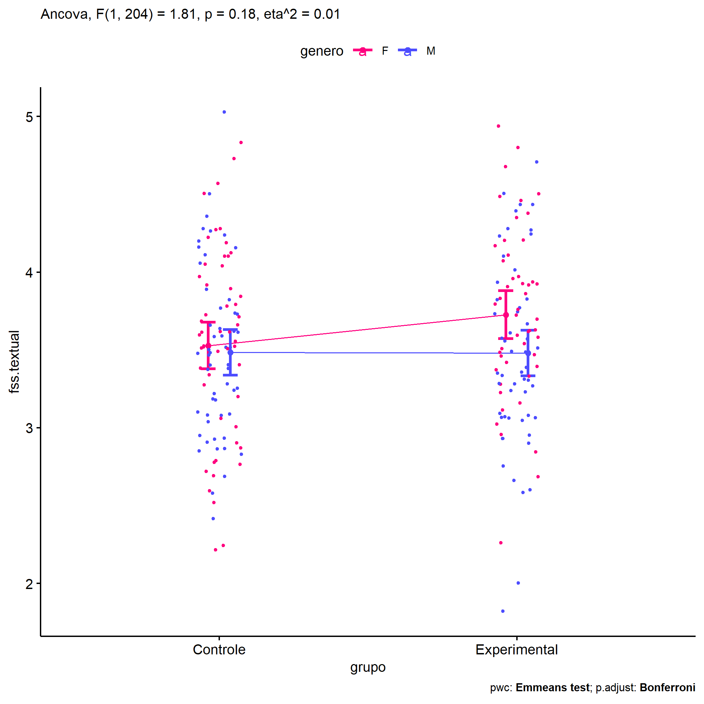<!-- -->

    ## Scale for colour is already present.
    ## Adding another scale for colour, which will replace the existing scale.

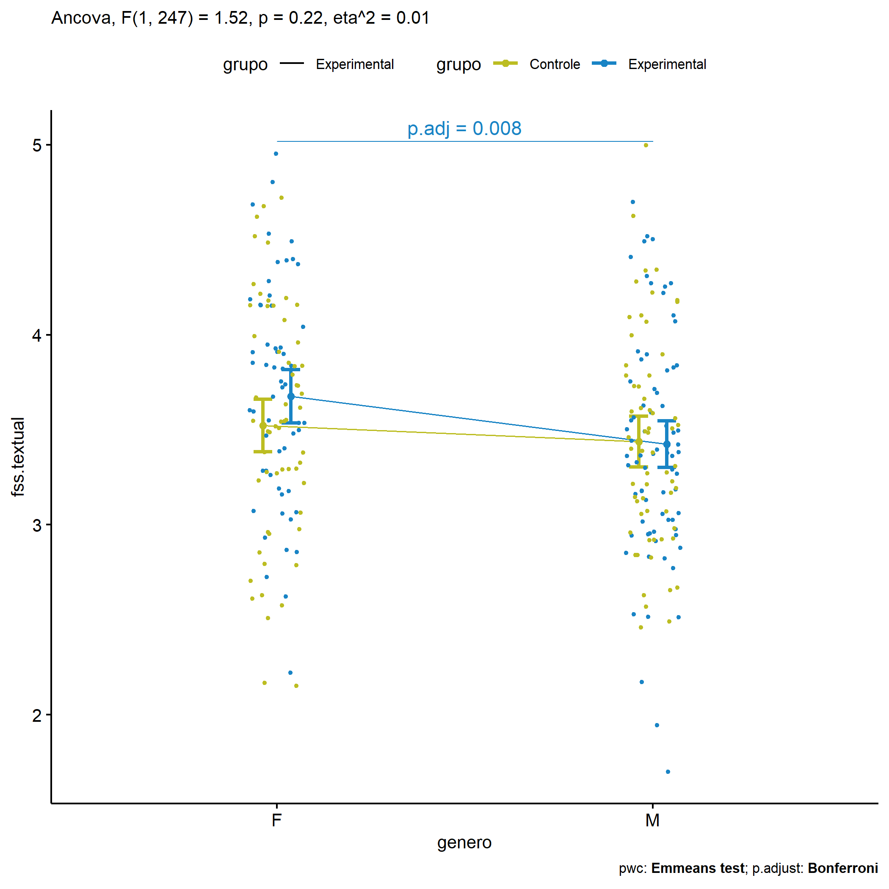<!-- -->

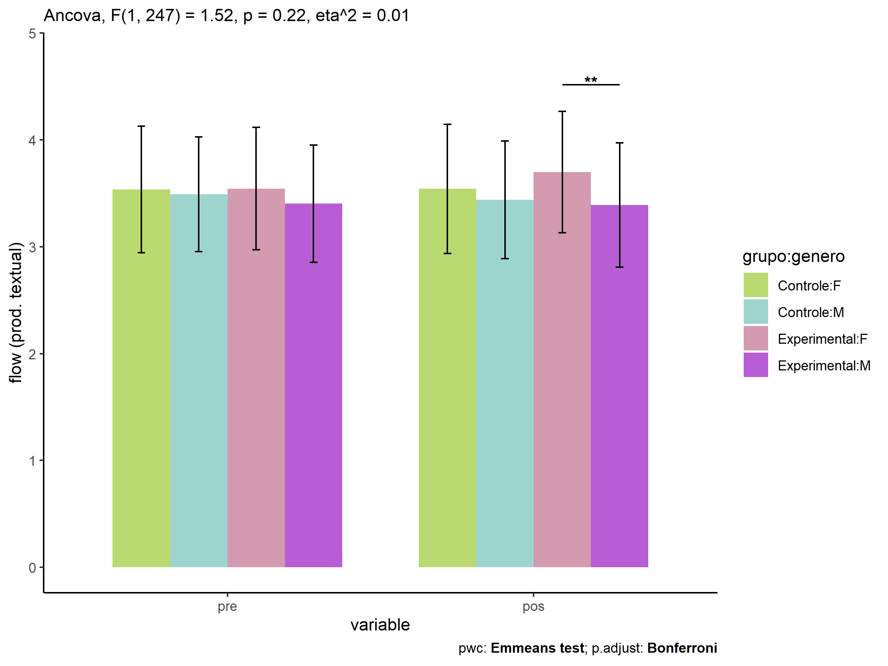<!-- -->

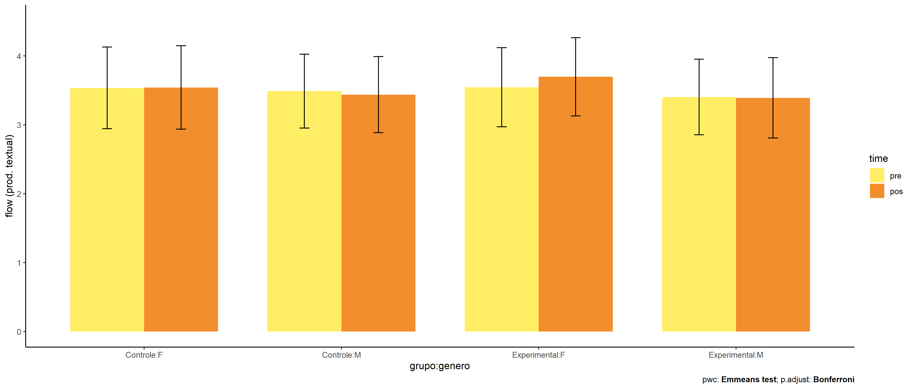<!-- -->

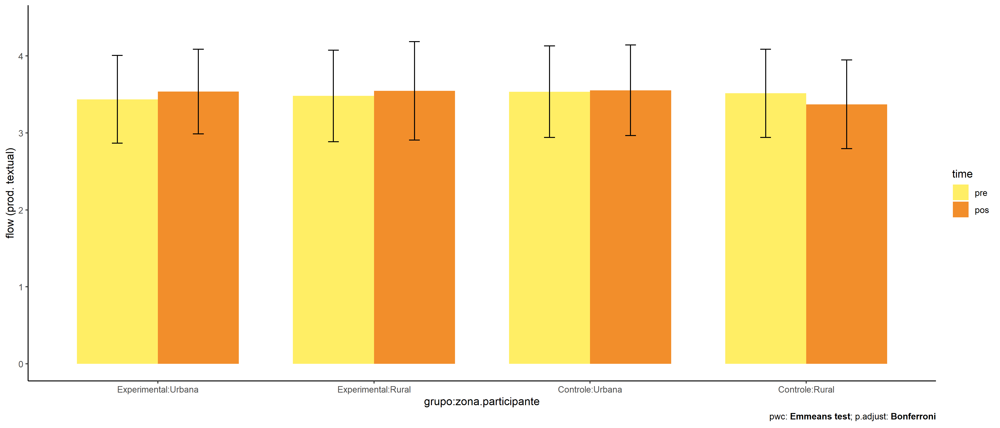<!-- -->

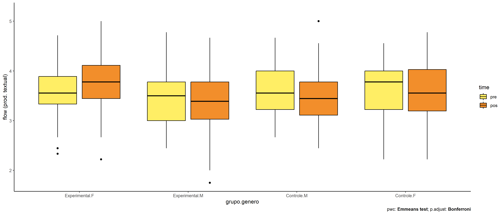<!-- -->

### factores: **grupo:idade**

| var         | grupo        | idade |   n | M (pre) | SE (pre) | M (unadj) | SE (unadj) | M (adj) | SE (adj) |
|:------------|:-------------|:------|----:|--------:|---------:|----------:|-----------:|--------:|---------:|
| fss.textual | Controle     | 10y   |  23 |   3.572 |    0.114 |     3.580 |      0.134 |   3.554 |    0.111 |
| fss.textual | Controle     | 11y   |  64 |   3.599 |    0.070 |     3.555 |      0.073 |   3.520 |    0.067 |
| fss.textual | Controle     | 12y   |  18 |   3.367 |    0.121 |     3.351 |      0.136 |   3.403 |    0.126 |
| fss.textual | Controle     | 13y   |   7 |   3.450 |    0.217 |     3.190 |      0.079 |   3.211 |    0.202 |
| fss.textual | Experimental | 10y   |  24 |   3.356 |    0.132 |     3.524 |      0.104 |   3.580 |    0.109 |
| fss.textual | Experimental | 11y   |  79 |   3.535 |    0.062 |     3.590 |      0.066 |   3.579 |    0.060 |
| fss.textual | Experimental | 12y   |  16 |   3.486 |    0.143 |     3.618 |      0.145 |   3.625 |    0.133 |
| fss.textual | Experimental | 13y   |   9 |   3.136 |    0.112 |     2.799 |      0.147 |   2.937 |    0.179 |

| .y.         | grupo        | idade | group1   | group2       | estimate | conf.low | conf.high |    se | statistic | p       | p.adj | p.adj.signif |
|:------------|:-------------|:------|:---------|:-------------|---------:|---------:|----------:|------:|----------:|:--------|------:|:-------------|
| fss.textual |              | 10y   | Controle | Experimental |   -0.025 |   -0.333 |     0.282 | 0.156 |    -0.163 | 0.871   | 0.871 | ns           |
| fss.textual |              | 11y   | Controle | Experimental |   -0.059 |   -0.236 |     0.118 | 0.090 |    -0.660 | 0.51    | 0.510 | ns           |
| fss.textual |              | 12y   | Controle | Experimental |   -0.222 |   -0.583 |     0.139 | 0.183 |    -1.212 | 0.227   | 0.227 | ns           |
| fss.textual |              | 13y   | Controle | Experimental |    0.273 |   -0.257 |     0.804 | 0.269 |     1.015 | 0.311   | 0.311 | ns           |
| dfs.textual |              | 10y   | Controle | Experimental |    0.216 |   -0.103 |     0.535 | 0.162 |     1.333 | 0.184   | 0.184 | ns           |
| dfs.textual |              | 11y   | Controle | Experimental |    0.064 |   -0.120 |     0.248 | 0.093 |     0.686 | 0.493   | 0.493 | ns           |
| dfs.textual |              | 12y   | Controle | Experimental |   -0.120 |   -0.496 |     0.256 | 0.191 |    -0.627 | 0.531   | 0.531 | ns           |
| dfs.textual |              | 13y   | Controle | Experimental |    0.315 |   -0.237 |     0.866 | 0.280 |     1.124 | 0.262   | 0.262 | ns           |
| fss.textual | Controle     |       | 10y      | 11y          |    0.035 |   -0.221 |     0.290 | 0.130 |     0.269 | 0.788   | 1.000 | ns           |
| fss.textual | Controle     |       | 10y      | 12y          |    0.152 |   -0.180 |     0.483 | 0.168 |     0.902 | 0.368   | 1.000 | ns           |
| fss.textual | Controle     |       | 10y      | 13y          |    0.344 |   -0.110 |     0.797 | 0.230 |     1.493 | 0.137   | 0.821 | ns           |
| fss.textual | Controle     |       | 11y      | 12y          |    0.117 |   -0.165 |     0.399 | 0.143 |     0.818 | 0.414   | 1.000 | ns           |
| fss.textual | Controle     |       | 11y      | 13y          |    0.309 |   -0.110 |     0.727 | 0.212 |     1.454 | 0.147   | 0.883 | ns           |
| fss.textual | Controle     |       | 12y      | 13y          |    0.192 |   -0.276 |     0.660 | 0.238 |     0.808 | 0.42    | 1.000 | ns           |
| fss.textual | Experimental |       | 10y      | 11y          |    0.001 |   -0.245 |     0.247 | 0.125 |     0.008 | 0.993   | 1.000 | ns           |
| fss.textual | Experimental |       | 10y      | 12y          |   -0.045 |   -0.384 |     0.294 | 0.172 |    -0.261 | 0.794   | 1.000 | ns           |
| fss.textual | Experimental |       | 10y      | 13y          |    0.643 |    0.231 |     1.054 | 0.209 |     3.077 | 0.002   | 0.014 | \*           |
| fss.textual | Experimental |       | 11y      | 12y          |   -0.046 |   -0.334 |     0.242 | 0.146 |    -0.315 | 0.753   | 1.000 | ns           |
| fss.textual | Experimental |       | 11y      | 13y          |    0.642 |    0.269 |     1.014 | 0.189 |     3.390 | \<0.001 | 0.005 | \*\*         |
| fss.textual | Experimental |       | 12y      | 13y          |    0.688 |    0.248 |     1.127 | 0.223 |     3.080 | 0.002   | 0.014 | \*           |
| dfs.textual | Controle     |       | 10y      | 11y          |   -0.027 |   -0.293 |     0.239 | 0.135 |    -0.201 | 0.841   | 1.000 | ns           |
| dfs.textual | Controle     |       | 10y      | 12y          |    0.205 |   -0.139 |     0.550 | 0.175 |     1.175 | 0.241   | 1.000 | ns           |
| dfs.textual | Controle     |       | 10y      | 13y          |    0.121 |   -0.351 |     0.594 | 0.240 |     0.507 | 0.613   | 1.000 | ns           |
| dfs.textual | Controle     |       | 11y      | 12y          |    0.232 |   -0.059 |     0.524 | 0.148 |     1.569 | 0.118   | 0.708 | ns           |
| dfs.textual | Controle     |       | 11y      | 13y          |    0.149 |   -0.287 |     0.584 | 0.221 |     0.672 | 0.502   | 1.000 | ns           |
| dfs.textual | Controle     |       | 12y      | 13y          |   -0.084 |   -0.571 |     0.404 | 0.247 |    -0.339 | 0.735   | 1.000 | ns           |
| dfs.textual | Experimental |       | 10y      | 11y          |   -0.179 |   -0.434 |     0.076 | 0.129 |    -1.383 | 0.168   | 1.000 | ns           |
| dfs.textual | Experimental |       | 10y      | 12y          |   -0.130 |   -0.483 |     0.223 | 0.179 |    -0.726 | 0.468   | 1.000 | ns           |
| dfs.textual | Experimental |       | 10y      | 13y          |    0.220 |   -0.208 |     0.648 | 0.217 |     1.014 | 0.312   | 1.000 | ns           |
| dfs.textual | Experimental |       | 11y      | 12y          |    0.049 |   -0.251 |     0.349 | 0.152 |     0.320 | 0.749   | 1.000 | ns           |
| dfs.textual | Experimental |       | 11y      | 13y          |    0.399 |    0.014 |     0.784 | 0.195 |     2.043 | 0.042   | 0.253 | ns           |
| dfs.textual | Experimental |       | 12y      | 13y          |    0.350 |   -0.106 |     0.806 | 0.231 |     1.514 | 0.131   | 0.789 | ns           |

| .y.          | grupo        | idade | group1 | group2 | estimate | conf.low | conf.high |    se | statistic |     p | p.adj | p.adj.signif |
|:-------------|:-------------|:------|:-------|:-------|---------:|---------:|----------:|------:|----------:|------:|------:|:-------------|
| flow.textual | Controle     | 10y   | pre    | pos    |   -0.008 |   -0.334 |     0.319 | 0.166 |    -0.047 | 0.962 | 0.962 | ns           |
| flow.textual | Controle     | 11y   | pre    | pos    |    0.044 |   -0.152 |     0.240 | 0.100 |     0.441 | 0.659 | 0.659 | ns           |
| flow.textual | Controle     | 12y   | pre    | pos    |    0.015 |   -0.354 |     0.384 | 0.188 |     0.082 | 0.935 | 0.935 | ns           |
| flow.textual | Controle     | 13y   | pre    | pos    |    0.260 |   -0.332 |     0.852 | 0.301 |     0.863 | 0.388 | 0.388 | ns           |
| flow.textual | Experimental | 10y   | pre    | pos    |   -0.168 |   -0.488 |     0.151 | 0.163 |    -1.036 | 0.301 | 0.301 | ns           |
| flow.textual | Experimental | 11y   | pre    | pos    |   -0.055 |   -0.232 |     0.121 | 0.090 |    -0.618 | 0.537 | 0.537 | ns           |
| flow.textual | Experimental | 12y   | pre    | pos    |   -0.132 |   -0.523 |     0.259 | 0.199 |    -0.663 | 0.508 | 0.508 | ns           |
| flow.textual | Experimental | 13y   | pre    | pos    |    0.336 |   -0.185 |     0.858 | 0.266 |     1.267 | 0.206 | 0.206 | ns           |

    ## Scale for colour is already present.
    ## Adding another scale for colour, which will replace the existing scale.

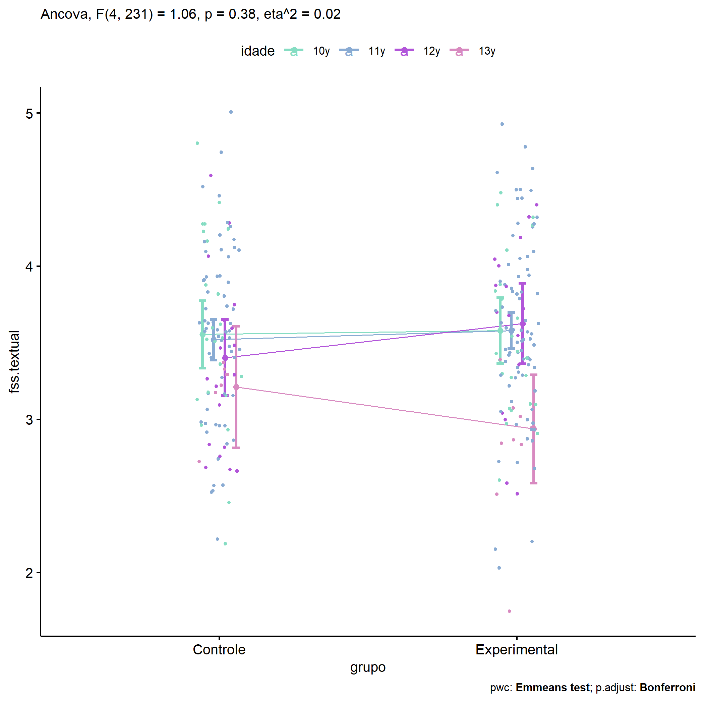<!-- -->

    ## Scale for colour is already present.
    ## Adding another scale for colour, which will replace the existing scale.

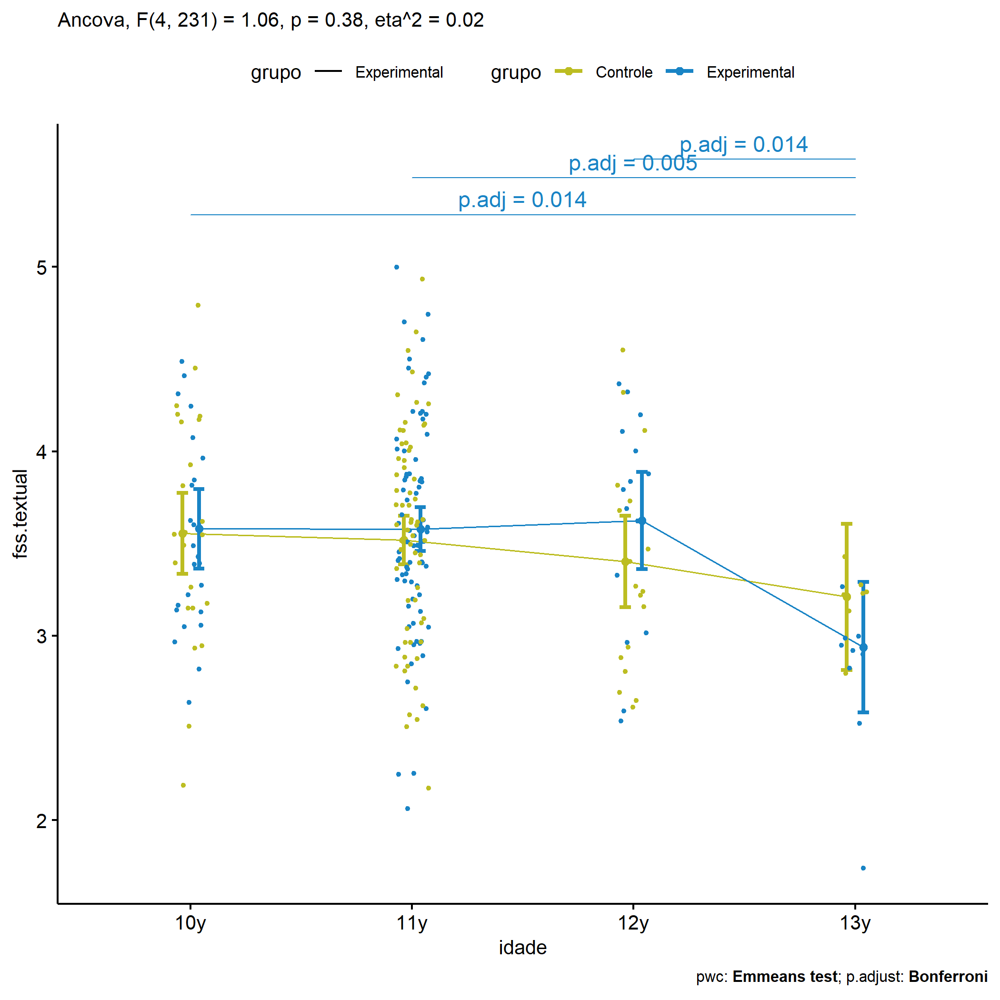<!-- -->

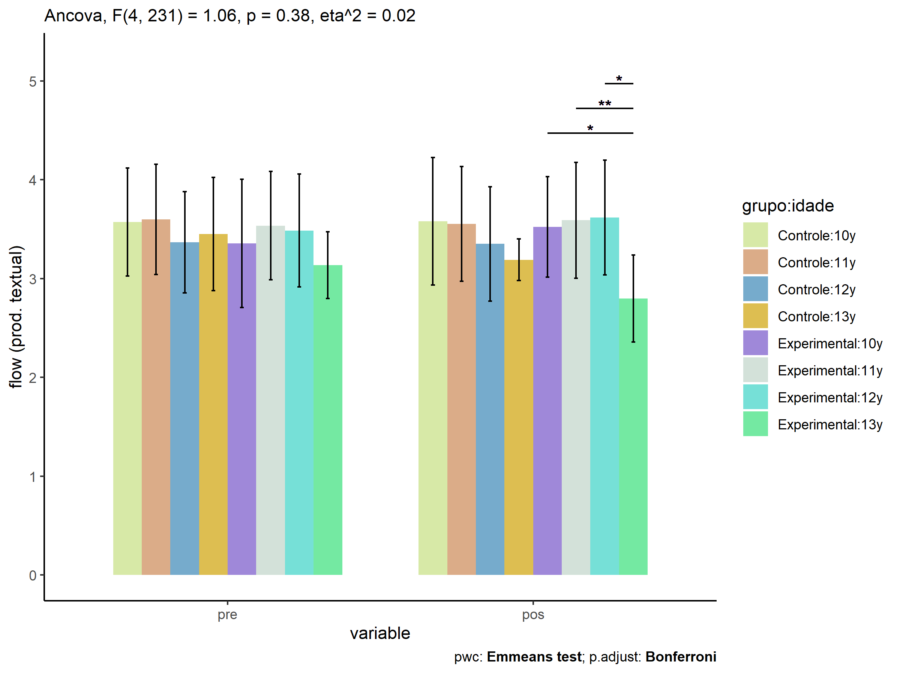<!-- -->

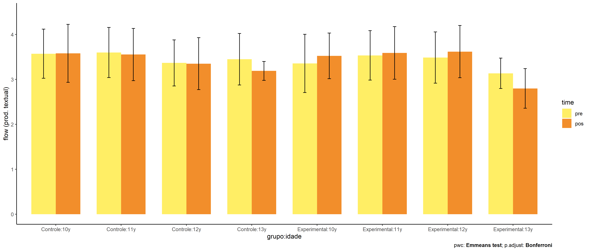<!-- -->

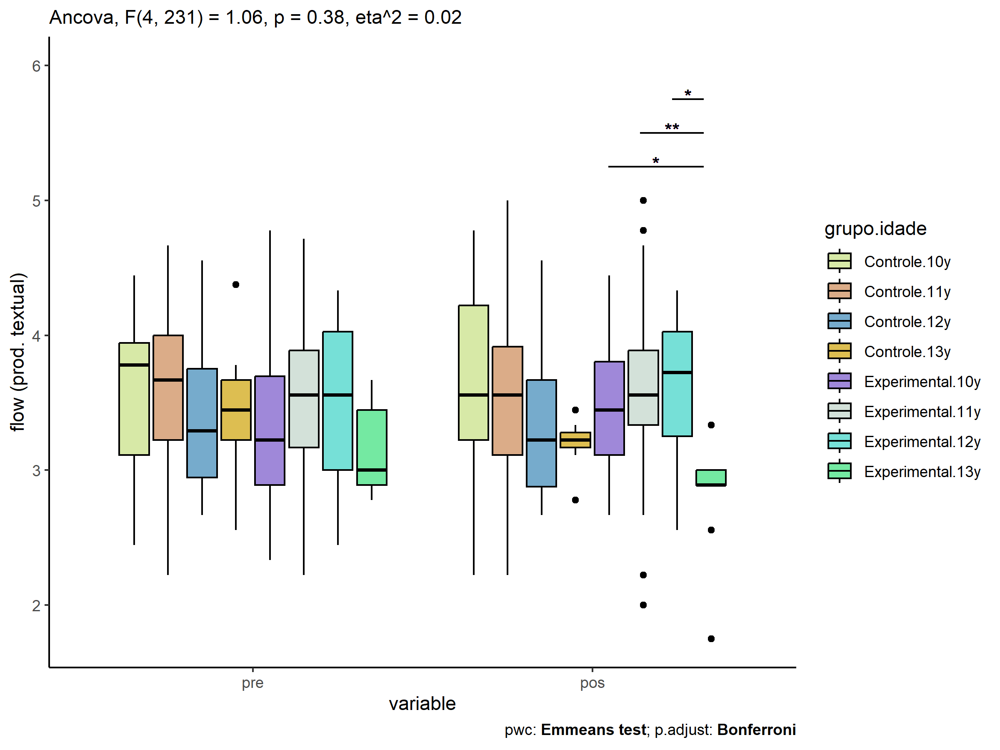<!-- -->

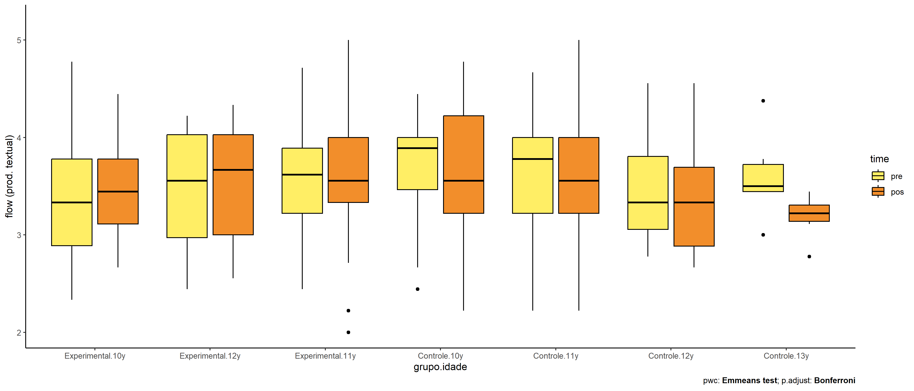<!-- -->

### factores: **grupo:zona.participante**

| var         | grupo        | zona.participante |   n | M (pre) | SE (pre) | M (unadj) | SE (unadj) | M (adj) | SE (adj) |
|:------------|:-------------|:------------------|----:|--------:|---------:|----------:|-----------:|--------:|---------:|
| fss.textual | Controle     | Rural             |  42 |   3.514 |    0.088 |     3.370 |      0.089 |   3.361 |    0.084 |
| fss.textual | Controle     | Urbana            |  53 |   3.535 |    0.082 |     3.553 |      0.081 |   3.536 |    0.075 |
| fss.textual | Experimental | Rural             |  52 |   3.480 |    0.083 |     3.546 |      0.089 |   3.551 |    0.076 |
| fss.textual | Experimental | Urbana            |  49 |   3.436 |    0.081 |     3.537 |      0.078 |   3.559 |    0.078 |

| .y.         | grupo        | zona.participante | group1   | group2       | estimate | conf.low | conf.high |    se | statistic |     p | p.adj | p.adj.signif |
|:------------|:-------------|:------------------|:---------|:-------------|---------:|---------:|----------:|------:|----------:|------:|------:|:-------------|
| fss.textual |              | Urbana            | Controle | Experimental |   -0.024 |   -0.237 |     0.189 | 0.108 |    -0.221 | 0.826 | 0.826 | ns           |
| fss.textual |              | Rural             | Controle | Experimental |   -0.190 |   -0.412 |     0.033 | 0.113 |    -1.679 | 0.095 | 0.095 | ns           |
| dfs.textual |              | Urbana            | Controle | Experimental |    0.099 |   -0.129 |     0.327 | 0.116 |     0.856 | 0.393 | 0.393 | ns           |
| dfs.textual |              | Rural             | Controle | Experimental |    0.034 |   -0.205 |     0.273 | 0.121 |     0.279 | 0.781 | 0.781 | ns           |
| fss.textual | Controle     |                   | Urbana   | Rural        |    0.175 |   -0.047 |     0.396 | 0.112 |     1.552 | 0.122 | 0.122 | ns           |
| fss.textual | Experimental |                   | Urbana   | Rural        |    0.009 |   -0.205 |     0.223 | 0.108 |     0.081 | 0.935 | 0.935 | ns           |
| dfs.textual | Controle     |                   | Urbana   | Rural        |    0.021 |   -0.217 |     0.259 | 0.121 |     0.171 | 0.864 | 0.864 | ns           |
| dfs.textual | Experimental |                   | Urbana   | Rural        |   -0.045 |   -0.274 |     0.185 | 0.116 |    -0.384 | 0.701 | 0.701 | ns           |

| .y.          | grupo        | zona.participante | group1 | group2 | estimate | conf.low | conf.high |    se | statistic |     p | p.adj | p.adj.signif |
|:-------------|:-------------|:------------------|:-------|:-------|---------:|---------:|----------:|------:|----------:|------:|------:|:-------------|
| flow.textual | Controle     | Urbana            | pre    | pos    |   -0.018 |   -0.242 |     0.206 | 0.114 |    -0.157 | 0.875 | 0.875 | ns           |
| flow.textual | Controle     | Rural             | pre    | pos    |    0.144 |   -0.108 |     0.396 | 0.128 |     1.125 | 0.261 | 0.261 | ns           |
| flow.textual | Experimental | Urbana            | pre    | pos    |   -0.102 |   -0.335 |     0.132 | 0.119 |    -0.857 | 0.392 | 0.392 | ns           |
| flow.textual | Experimental | Rural             | pre    | pos    |   -0.066 |   -0.292 |     0.161 | 0.115 |    -0.572 | 0.568 | 0.568 | ns           |

    ## Scale for colour is already present.
    ## Adding another scale for colour, which will replace the existing scale.

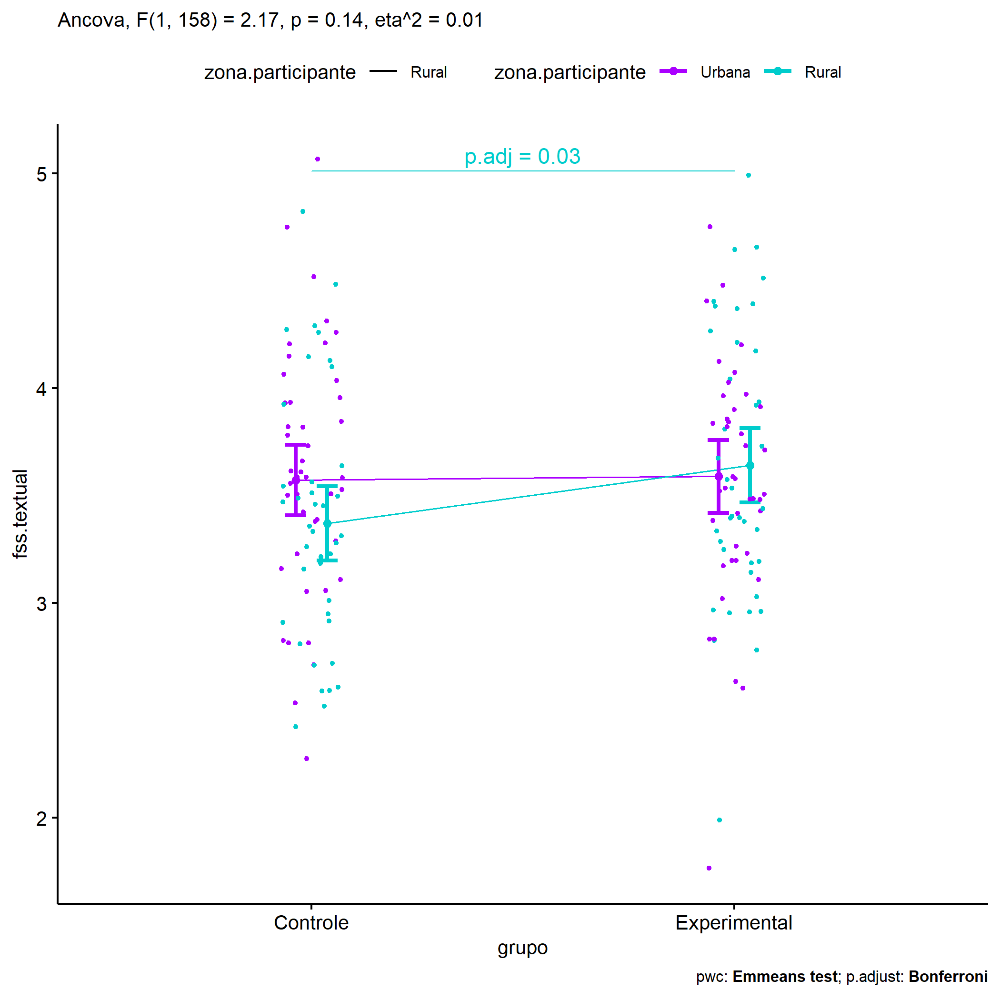<!-- -->

    ## Scale for colour is already present.
    ## Adding another scale for colour, which will replace the existing scale.

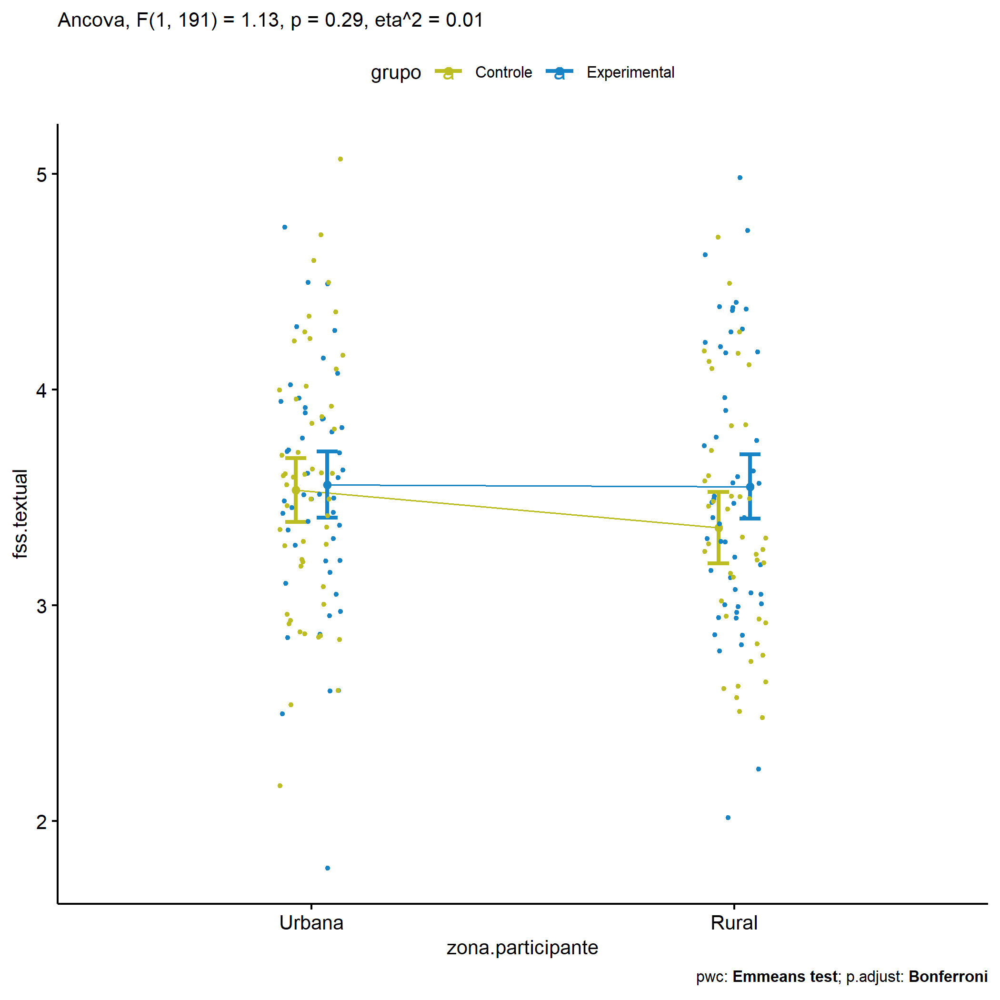<!-- -->

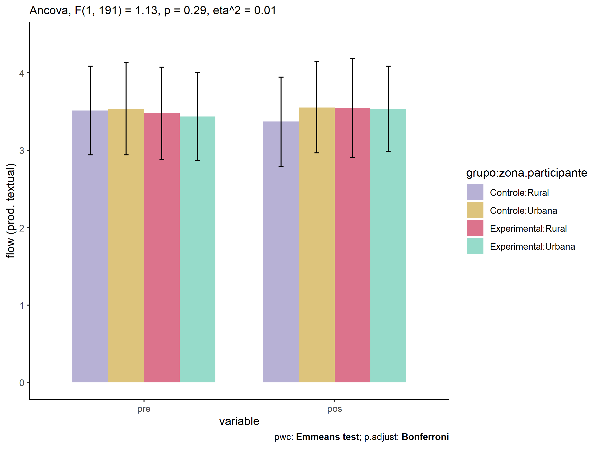<!-- -->

<!-- -->

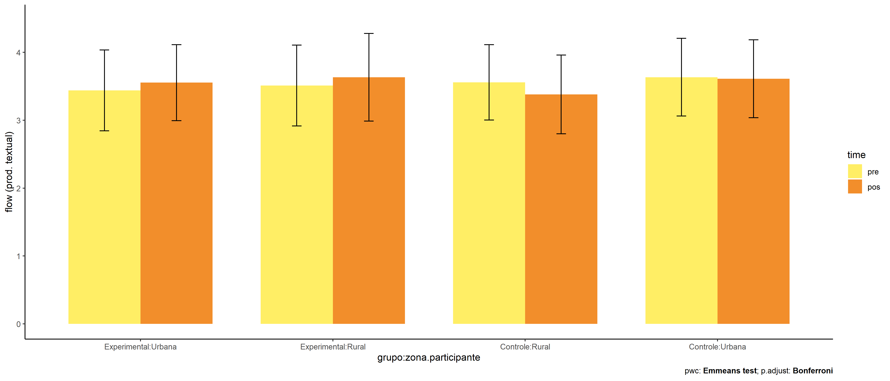<!-- -->

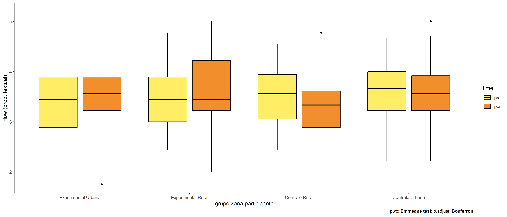<!-- -->

### factores: **grupo:escola**

| var         | grupo        | escola |   n | M (pre) | SE (pre) | M (unadj) | SE (unadj) | M (adj) | SE (adj) |
|:------------|:-------------|:-------|----:|--------:|---------:|----------:|-----------:|--------:|---------:|
| fss.textual | Controle     | E1     |  11 |   3.278 |    0.188 |     3.465 |      0.156 |   3.549 |    0.162 |
| fss.textual | Controle     | E2     |  23 |   3.536 |    0.118 |     3.497 |      0.152 |   3.478 |    0.112 |
| fss.textual | Controle     | E3     |  14 |   3.588 |    0.145 |     3.348 |      0.110 |   3.308 |    0.143 |
| fss.textual | Controle     | E4     |  16 |   3.512 |    0.096 |     3.331 |      0.128 |   3.321 |    0.134 |
| fss.textual | Controle     | E5     |  46 |   3.492 |    0.095 |     3.556 |      0.087 |   3.554 |    0.079 |
| fss.textual | Controle     | E6     |  11 |   3.686 |    0.106 |     3.626 |      0.162 |   3.546 |    0.162 |
| fss.textual | Experimental | E1     |  10 |   3.510 |    0.149 |     4.003 |      0.189 |   3.994 |    0.169 |
| fss.textual | Experimental | E2     |  26 |   3.415 |    0.090 |     3.324 |      0.102 |   3.353 |    0.105 |
| fss.textual | Experimental | E3     |  14 |   3.531 |    0.195 |     3.440 |      0.184 |   3.423 |    0.143 |
| fss.textual | Experimental | E4     |  14 |   3.635 |    0.155 |     3.603 |      0.149 |   3.544 |    0.143 |
| fss.textual | Experimental | E5     |  54 |   3.414 |    0.082 |     3.503 |      0.079 |   3.532 |    0.073 |
| fss.textual | Experimental | E6     |  13 |   3.488 |    0.126 |     3.658 |      0.161 |   3.658 |    0.148 |

| .y.         | grupo        | escola | group1   | group2       | estimate | conf.low | conf.high |    se | statistic |     p | p.adj | p.adj.signif |
|:------------|:-------------|:-------|:---------|:-------------|---------:|---------:|----------:|------:|----------:|------:|------:|:-------------|
| fss.textual |              | E1     | Controle | Experimental |   -0.444 |   -0.906 |     0.017 | 0.234 |    -1.897 | 0.059 | 0.059 | ns           |
| fss.textual |              | E2     | Controle | Experimental |    0.124 |   -0.178 |     0.427 | 0.153 |     0.811 | 0.418 | 0.418 | ns           |
| fss.textual |              | E3     | Controle | Experimental |   -0.115 |   -0.514 |     0.284 | 0.202 |    -0.568 | 0.571 | 0.571 | ns           |
| fss.textual |              | E4     | Controle | Experimental |   -0.223 |   -0.609 |     0.163 | 0.196 |    -1.137 | 0.257 | 0.257 | ns           |
| fss.textual |              | E5     | Controle | Experimental |    0.022 |   -0.190 |     0.233 | 0.108 |     0.201 | 0.841 | 0.841 | ns           |
| fss.textual |              | E6     | Controle | Experimental |   -0.112 |   -0.544 |     0.321 | 0.220 |    -0.508 | 0.612 | 0.612 | ns           |
| dfs.textual |              | E1     | Controle | Experimental |   -0.232 |   -0.721 |     0.257 | 0.248 |    -0.935 | 0.351 | 0.351 | ns           |
| dfs.textual |              | E2     | Controle | Experimental |    0.122 |   -0.198 |     0.442 | 0.163 |     0.749 | 0.455 | 0.455 | ns           |
| dfs.textual |              | E3     | Controle | Experimental |    0.058 |   -0.365 |     0.480 | 0.215 |     0.268 | 0.789 | 0.789 | ns           |
| dfs.textual |              | E4     | Controle | Experimental |   -0.123 |   -0.532 |     0.287 | 0.208 |    -0.591 | 0.555 | 0.555 | ns           |
| dfs.textual |              | E5     | Controle | Experimental |    0.078 |   -0.146 |     0.303 | 0.114 |     0.687 | 0.493 | 0.493 | ns           |
| dfs.textual |              | E6     | Controle | Experimental |    0.197 |   -0.261 |     0.655 | 0.233 |     0.848 | 0.397 | 0.397 | ns           |
| fss.textual | Controle     |        | E1       | E2           |    0.072 |   -0.316 |     0.460 | 0.197 |     0.365 | 0.716 | 1.000 | ns           |
| fss.textual | Controle     |        | E1       | E3           |    0.242 |   -0.185 |     0.668 | 0.217 |     1.117 | 0.265 | 1.000 | ns           |
| fss.textual | Controle     |        | E1       | E4           |    0.229 |   -0.185 |     0.643 | 0.210 |     1.088 | 0.278 | 1.000 | ns           |
| fss.textual | Controle     |        | E1       | E5           |   -0.004 |   -0.359 |     0.350 | 0.180 |    -0.025 | 0.980 | 1.000 | ns           |
| fss.textual | Controle     |        | E1       | E6           |    0.003 |   -0.449 |     0.455 | 0.230 |     0.014 | 0.989 | 1.000 | ns           |
| fss.textual | Controle     |        | E2       | E3           |    0.170 |   -0.187 |     0.528 | 0.181 |     0.937 | 0.350 | 1.000 | ns           |
| fss.textual | Controle     |        | E2       | E4           |    0.157 |   -0.187 |     0.500 | 0.174 |     0.900 | 0.369 | 1.000 | ns           |
| fss.textual | Controle     |        | E2       | E5           |   -0.076 |   -0.346 |     0.193 | 0.137 |    -0.558 | 0.577 | 1.000 | ns           |
| fss.textual | Controle     |        | E2       | E6           |   -0.069 |   -0.456 |     0.318 | 0.196 |    -0.350 | 0.727 | 1.000 | ns           |
| fss.textual | Controle     |        | E3       | E4           |   -0.013 |   -0.399 |     0.373 | 0.196 |    -0.068 | 0.946 | 1.000 | ns           |
| fss.textual | Controle     |        | E3       | E5           |   -0.246 |   -0.568 |     0.076 | 0.163 |    -1.507 | 0.133 | 1.000 | ns           |
| fss.textual | Controle     |        | E3       | E6           |   -0.239 |   -0.664 |     0.186 | 0.216 |    -1.106 | 0.270 | 1.000 | ns           |
| fss.textual | Controle     |        | E4       | E5           |   -0.233 |   -0.539 |     0.073 | 0.155 |    -1.500 | 0.135 | 1.000 | ns           |
| fss.textual | Controle     |        | E4       | E6           |   -0.225 |   -0.639 |     0.188 | 0.210 |    -1.074 | 0.284 | 1.000 | ns           |
| fss.textual | Controle     |        | E5       | E6           |    0.008 |   -0.347 |     0.362 | 0.180 |     0.042 | 0.966 | 1.000 | ns           |
| fss.textual | Experimental |        | E1       | E2           |    0.641 |    0.248 |     1.033 | 0.199 |     3.215 | 0.001 | 0.022 | \*           |
| fss.textual | Experimental |        | E1       | E3           |    0.571 |    0.135 |     1.008 | 0.222 |     2.578 | 0.011 | 0.158 | ns           |
| fss.textual | Experimental |        | E1       | E4           |    0.450 |    0.013 |     0.887 | 0.222 |     2.030 | 0.043 | 0.652 | ns           |
| fss.textual | Experimental |        | E1       | E5           |    0.462 |    0.098 |     0.825 | 0.184 |     2.504 | 0.013 | 0.194 | ns           |
| fss.textual | Experimental |        | E1       | E6           |    0.336 |   -0.108 |     0.780 | 0.225 |     1.492 | 0.137 | 1.000 | ns           |
| fss.textual | Experimental |        | E2       | E3           |   -0.069 |   -0.419 |     0.281 | 0.178 |    -0.390 | 0.697 | 1.000 | ns           |
| fss.textual | Experimental |        | E2       | E4           |   -0.190 |   -0.541 |     0.160 | 0.178 |    -1.070 | 0.286 | 1.000 | ns           |
| fss.textual | Experimental |        | E2       | E5           |   -0.179 |   -0.431 |     0.073 | 0.128 |    -1.401 | 0.163 | 1.000 | ns           |
| fss.textual | Experimental |        | E2       | E6           |   -0.305 |   -0.663 |     0.054 | 0.182 |    -1.674 | 0.095 | 1.000 | ns           |
| fss.textual | Experimental |        | E3       | E4           |   -0.121 |   -0.520 |     0.278 | 0.202 |    -0.599 | 0.550 | 1.000 | ns           |
| fss.textual | Experimental |        | E3       | E5           |   -0.110 |   -0.426 |     0.207 | 0.161 |    -0.683 | 0.495 | 1.000 | ns           |
| fss.textual | Experimental |        | E3       | E6           |   -0.235 |   -0.642 |     0.171 | 0.206 |    -1.141 | 0.255 | 1.000 | ns           |
| fss.textual | Experimental |        | E4       | E5           |    0.011 |   -0.306 |     0.329 | 0.161 |     0.071 | 0.944 | 1.000 | ns           |
| fss.textual | Experimental |        | E4       | E6           |   -0.114 |   -0.521 |     0.292 | 0.206 |    -0.553 | 0.581 | 1.000 | ns           |
| fss.textual | Experimental |        | E5       | E6           |   -0.126 |   -0.451 |     0.200 | 0.165 |    -0.759 | 0.449 | 1.000 | ns           |
| dfs.textual | Controle     |        | E1       | E2           |   -0.258 |   -0.669 |     0.152 | 0.208 |    -1.242 | 0.216 | 1.000 | ns           |
| dfs.textual | Controle     |        | E1       | E3           |   -0.311 |   -0.761 |     0.140 | 0.229 |    -1.357 | 0.176 | 1.000 | ns           |
| dfs.textual | Controle     |        | E1       | E4           |   -0.234 |   -0.672 |     0.204 | 0.222 |    -1.054 | 0.293 | 1.000 | ns           |
| dfs.textual | Controle     |        | E1       | E5           |   -0.215 |   -0.590 |     0.161 | 0.191 |    -1.126 | 0.261 | 1.000 | ns           |
| dfs.textual | Controle     |        | E1       | E6           |   -0.408 |   -0.885 |     0.069 | 0.242 |    -1.684 | 0.093 | 1.000 | ns           |
| dfs.textual | Controle     |        | E2       | E3           |   -0.052 |   -0.431 |     0.327 | 0.192 |    -0.270 | 0.787 | 1.000 | ns           |
| dfs.textual | Controle     |        | E2       | E4           |    0.024 |   -0.340 |     0.388 | 0.185 |     0.130 | 0.896 | 1.000 | ns           |
| dfs.textual | Controle     |        | E2       | E5           |    0.044 |   -0.242 |     0.329 | 0.145 |     0.302 | 0.763 | 1.000 | ns           |
| dfs.textual | Controle     |        | E2       | E6           |   -0.149 |   -0.559 |     0.261 | 0.208 |    -0.718 | 0.474 | 1.000 | ns           |
| dfs.textual | Controle     |        | E3       | E4           |    0.076 |   -0.333 |     0.485 | 0.208 |     0.366 | 0.714 | 1.000 | ns           |
| dfs.textual | Controle     |        | E3       | E5           |    0.096 |   -0.246 |     0.437 | 0.173 |     0.553 | 0.581 | 1.000 | ns           |
| dfs.textual | Controle     |        | E3       | E6           |   -0.097 |   -0.548 |     0.353 | 0.229 |    -0.425 | 0.671 | 1.000 | ns           |
| dfs.textual | Controle     |        | E4       | E5           |    0.020 |   -0.305 |     0.344 | 0.165 |     0.120 | 0.905 | 1.000 | ns           |
| dfs.textual | Controle     |        | E4       | E6           |   -0.173 |   -0.612 |     0.265 | 0.222 |    -0.780 | 0.436 | 1.000 | ns           |
| dfs.textual | Controle     |        | E5       | E6           |   -0.193 |   -0.569 |     0.182 | 0.191 |    -1.013 | 0.312 | 1.000 | ns           |
| dfs.textual | Experimental |        | E1       | E2           |    0.095 |   -0.321 |     0.511 | 0.211 |     0.451 | 0.653 | 1.000 | ns           |
| dfs.textual | Experimental |        | E1       | E3           |   -0.021 |   -0.484 |     0.442 | 0.235 |    -0.089 | 0.929 | 1.000 | ns           |
| dfs.textual | Experimental |        | E1       | E4           |   -0.125 |   -0.588 |     0.338 | 0.235 |    -0.533 | 0.595 | 1.000 | ns           |
| dfs.textual | Experimental |        | E1       | E5           |    0.096 |   -0.290 |     0.481 | 0.195 |     0.489 | 0.625 | 1.000 | ns           |
| dfs.textual | Experimental |        | E1       | E6           |    0.021 |   -0.449 |     0.492 | 0.239 |     0.089 | 0.929 | 1.000 | ns           |
| dfs.textual | Experimental |        | E2       | E3           |   -0.116 |   -0.487 |     0.255 | 0.188 |    -0.617 | 0.538 | 1.000 | ns           |
| dfs.textual | Experimental |        | E2       | E4           |   -0.220 |   -0.591 |     0.150 | 0.188 |    -1.171 | 0.243 | 1.000 | ns           |
| dfs.textual | Experimental |        | E2       | E5           |    0.000 |   -0.267 |     0.267 | 0.136 |     0.003 | 0.998 | 1.000 | ns           |
| dfs.textual | Experimental |        | E2       | E6           |   -0.074 |   -0.454 |     0.306 | 0.193 |    -0.383 | 0.702 | 1.000 | ns           |
| dfs.textual | Experimental |        | E3       | E4           |   -0.104 |   -0.527 |     0.319 | 0.215 |    -0.485 | 0.628 | 1.000 | ns           |
| dfs.textual | Experimental |        | E3       | E5           |    0.117 |   -0.219 |     0.452 | 0.170 |     0.685 | 0.494 | 1.000 | ns           |
| dfs.textual | Experimental |        | E3       | E6           |    0.042 |   -0.388 |     0.473 | 0.219 |     0.194 | 0.847 | 1.000 | ns           |
| dfs.textual | Experimental |        | E4       | E5           |    0.221 |   -0.115 |     0.556 | 0.170 |     1.296 | 0.196 | 1.000 | ns           |
| dfs.textual | Experimental |        | E4       | E6           |    0.147 |   -0.284 |     0.577 | 0.219 |     0.670 | 0.504 | 1.000 | ns           |
| dfs.textual | Experimental |        | E5       | E6           |   -0.074 |   -0.420 |     0.271 | 0.175 |    -0.423 | 0.673 | 1.000 | ns           |

| .y.          | grupo        | escola | group1 | group2 | estimate | conf.low | conf.high |    se | statistic |     p | p.adj | p.adj.signif |
|:-------------|:-------------|:-------|:-------|:-------|---------:|---------:|----------:|------:|----------:|------:|------:|:-------------|
| flow.textual | Controle     | E1     | pre    | pos    |   -0.187 |   -0.668 |     0.295 | 0.245 |    -0.763 | 0.446 | 0.446 | ns           |
| flow.textual | Controle     | E2     | pre    | pos    |    0.039 |   -0.294 |     0.372 | 0.169 |     0.230 | 0.818 | 0.818 | ns           |
| flow.textual | Controle     | E3     | pre    | pos    |    0.240 |   -0.187 |     0.667 | 0.217 |     1.105 | 0.270 | 0.270 | ns           |
| flow.textual | Controle     | E4     | pre    | pos    |    0.181 |   -0.218 |     0.581 | 0.203 |     0.893 | 0.372 | 0.372 | ns           |
| flow.textual | Controle     | E5     | pre    | pos    |   -0.063 |   -0.299 |     0.172 | 0.120 |    -0.529 | 0.597 | 0.597 | ns           |
| flow.textual | Controle     | E6     | pre    | pos    |    0.059 |   -0.422 |     0.541 | 0.245 |     0.242 | 0.809 | 0.809 | ns           |
| flow.textual | Experimental | E1     | pre    | pos    |   -0.493 |   -0.998 |     0.012 | 0.257 |    -1.919 | 0.056 | 0.056 | ns           |
| flow.textual | Experimental | E2     | pre    | pos    |    0.091 |   -0.222 |     0.404 | 0.159 |     0.570 | 0.569 | 0.569 | ns           |
| flow.textual | Experimental | E3     | pre    | pos    |    0.091 |   -0.336 |     0.518 | 0.217 |     0.418 | 0.676 | 0.676 | ns           |
| flow.textual | Experimental | E4     | pre    | pos    |    0.032 |   -0.395 |     0.459 | 0.217 |     0.146 | 0.884 | 0.884 | ns           |
| flow.textual | Experimental | E5     | pre    | pos    |   -0.088 |   -0.306 |     0.129 | 0.111 |    -0.799 | 0.424 | 0.424 | ns           |
| flow.textual | Experimental | E6     | pre    | pos    |   -0.170 |   -0.613 |     0.273 | 0.225 |    -0.753 | 0.452 | 0.452 | ns           |

    ## Scale for colour is already present.
    ## Adding another scale for colour, which will replace the existing scale.

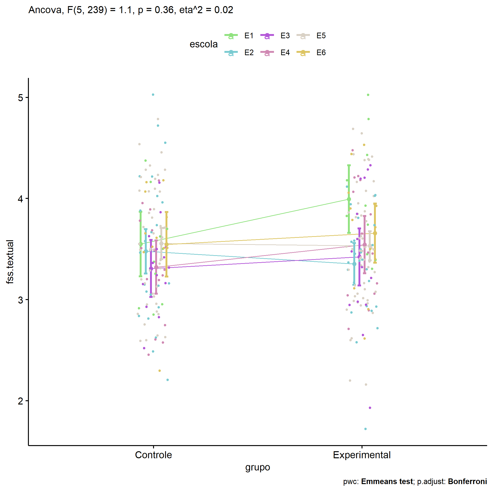<!-- -->

    ## Scale for colour is already present.
    ## Adding another scale for colour, which will replace the existing scale.

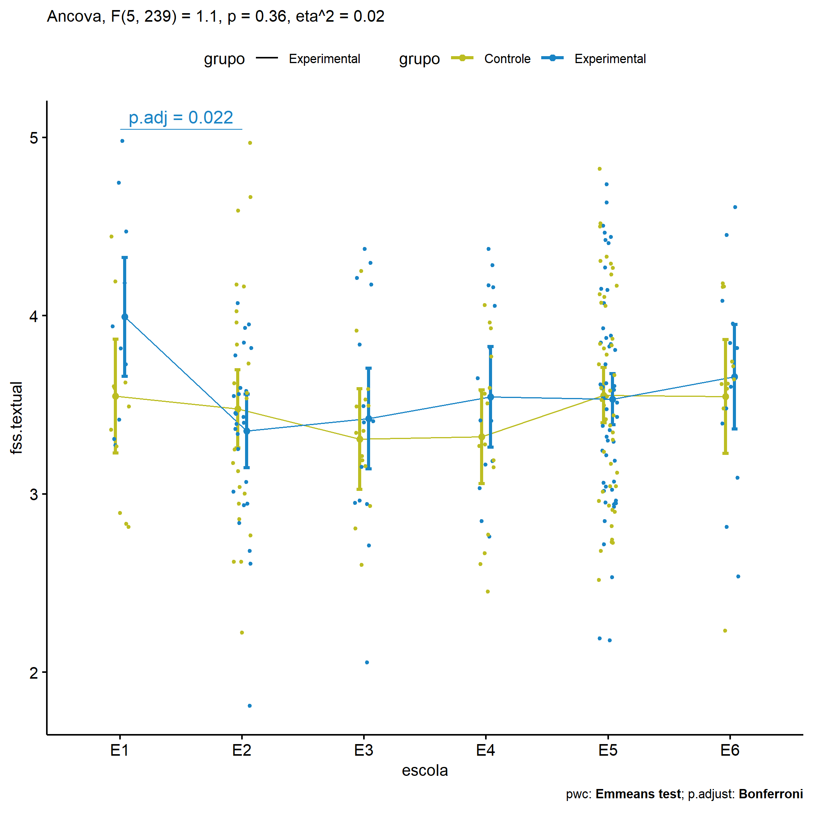<!-- -->

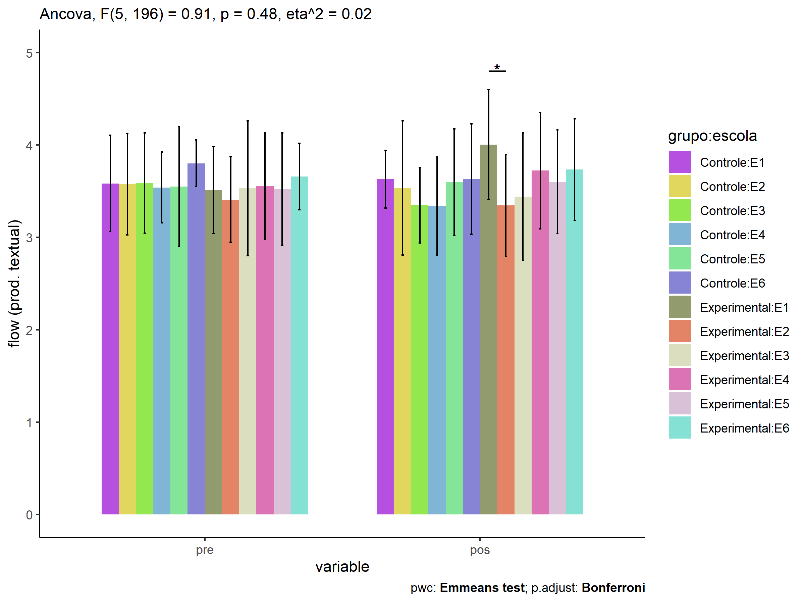<!-- -->

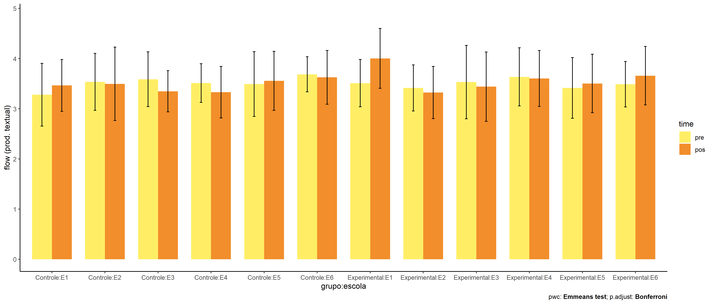<!-- -->

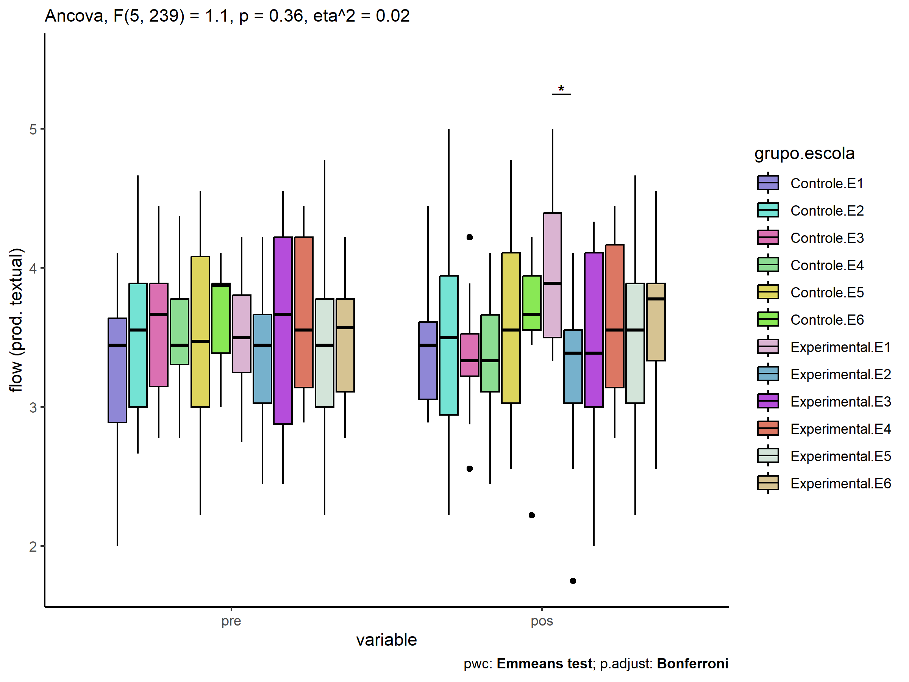<!-- -->

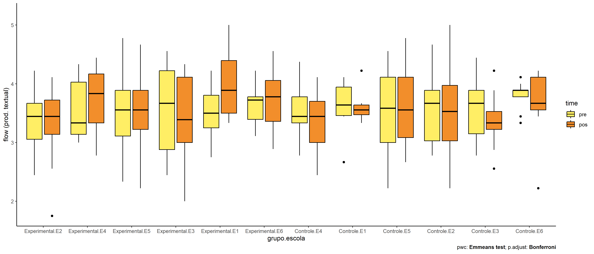<!-- -->

### factores: **grupo:zona.escola**

| var         | grupo        | zona.escola |   n | M (pre) | SE (pre) | M (unadj) | SE (unadj) | M (adj) | SE (adj) |
|:------------|:-------------|:------------|----:|--------:|---------:|----------:|-----------:|--------:|---------:|
| fss.textual | Controle     | Rural       |  41 |   3.585 |    0.068 |     3.416 |      0.077 |   3.376 |    0.085 |
| fss.textual | Controle     | Urbana      |  80 |   3.476 |    0.069 |     3.526 |      0.069 |   3.532 |    0.061 |
| fss.textual | Experimental | Rural       |  41 |   3.553 |    0.092 |     3.565 |      0.094 |   3.538 |    0.085 |
| fss.textual | Experimental | Urbana      |  90 |   3.425 |    0.058 |     3.506 |      0.062 |   3.532 |    0.057 |

| .y.         | grupo        | zona.escola | group1   | group2       | estimate | conf.low | conf.high |    se | statistic |     p | p.adj | p.adj.signif |
|:------------|:-------------|:------------|:---------|:-------------|---------:|---------:|----------:|------:|----------:|------:|------:|:-------------|
| fss.textual |              | Urbana      | Controle | Experimental |   -0.001 |   -0.165 |     0.163 | 0.083 |    -0.010 | 0.992 | 0.992 | ns           |
| fss.textual |              | Rural       | Controle | Experimental |   -0.162 |   -0.397 |     0.074 | 0.120 |    -1.354 | 0.177 | 0.177 | ns           |
| dfs.textual |              | Urbana      | Controle | Experimental |    0.051 |   -0.119 |     0.221 | 0.086 |     0.586 | 0.558 | 0.558 | ns           |
| dfs.textual |              | Rural       | Controle | Experimental |    0.032 |   -0.213 |     0.276 | 0.124 |     0.256 | 0.798 | 0.798 | ns           |
| fss.textual | Controle     |             | Urbana   | Rural        |    0.155 |   -0.050 |     0.360 | 0.104 |     1.491 | 0.137 | 0.137 | ns           |
| fss.textual | Experimental |             | Urbana   | Rural        |   -0.006 |   -0.207 |     0.196 | 0.102 |    -0.056 | 0.955 | 0.955 | ns           |
| dfs.textual | Controle     |             | Urbana   | Rural        |   -0.109 |   -0.322 |     0.103 | 0.108 |    -1.011 | 0.313 | 0.313 | ns           |
| dfs.textual | Experimental |             | Urbana   | Rural        |   -0.128 |   -0.337 |     0.081 | 0.106 |    -1.209 | 0.228 | 0.228 | ns           |

| .y.          | grupo        | zona.escola | group1 | group2 | estimate | conf.low | conf.high |    se | statistic |     p | p.adj | p.adj.signif |
|:-------------|:-------------|:------------|:-------|:-------|---------:|---------:|----------:|------:|----------:|------:|------:|:-------------|
| flow.textual | Controle     | Urbana      | pre    | pos    |   -0.051 |   -0.230 |     0.128 | 0.091 |    -0.560 | 0.575 | 0.575 | ns           |
| flow.textual | Controle     | Rural       | pre    | pos    |    0.169 |   -0.081 |     0.418 | 0.127 |     1.329 | 0.185 | 0.185 | ns           |
| flow.textual | Experimental | Urbana      | pre    | pos    |   -0.082 |   -0.250 |     0.087 | 0.086 |    -0.952 | 0.342 | 0.342 | ns           |
| flow.textual | Experimental | Rural       | pre    | pos    |   -0.012 |   -0.261 |     0.238 | 0.127 |    -0.094 | 0.925 | 0.925 | ns           |

    ## Scale for colour is already present.
    ## Adding another scale for colour, which will replace the existing scale.

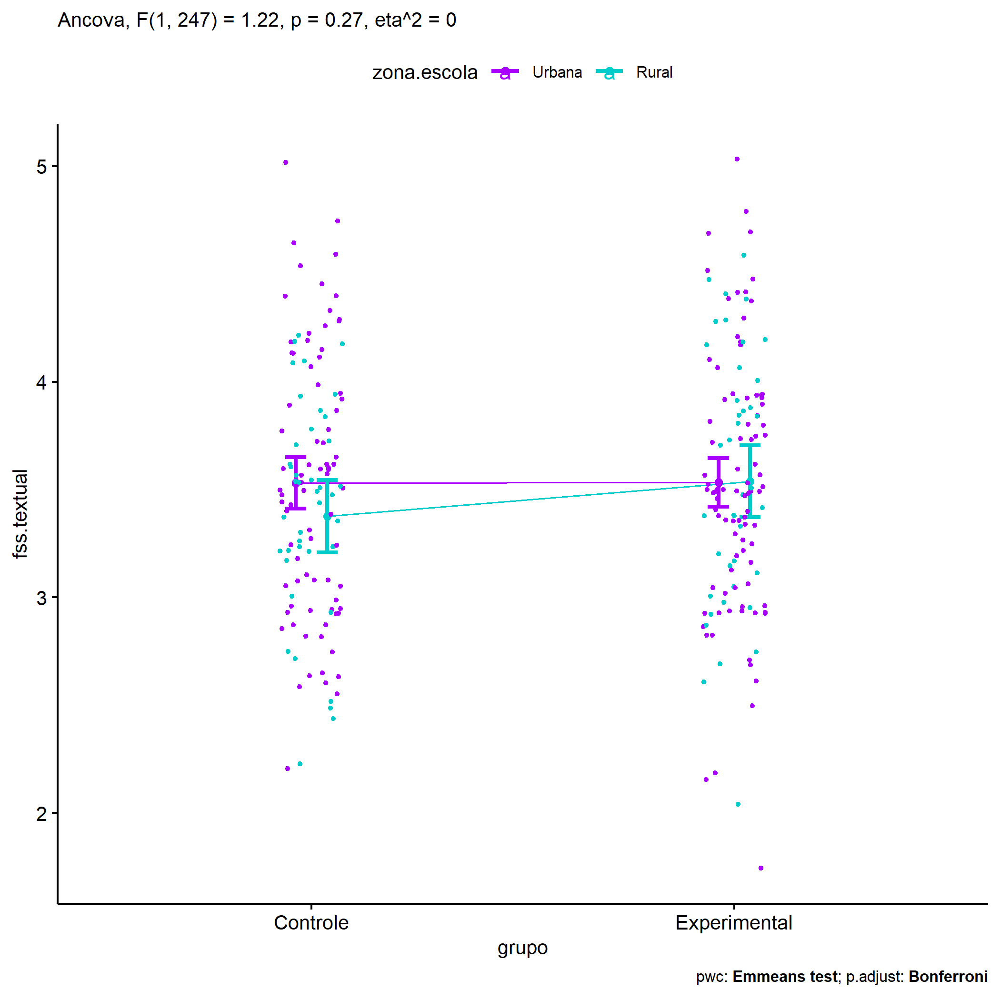<!-- -->

    ## Scale for colour is already present.
    ## Adding another scale for colour, which will replace the existing scale.

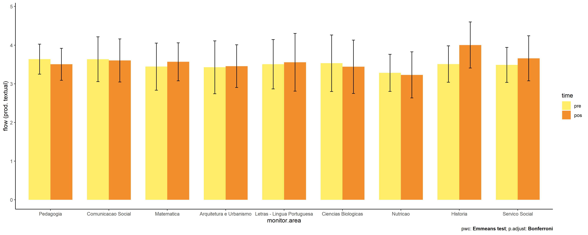<!-- -->

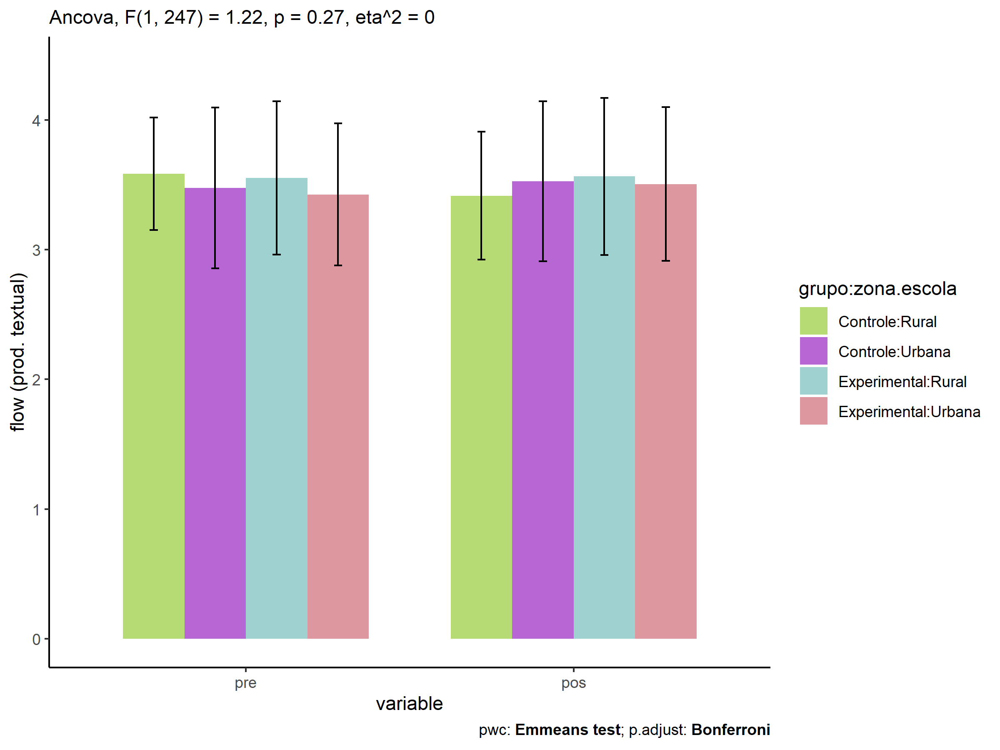<!-- -->

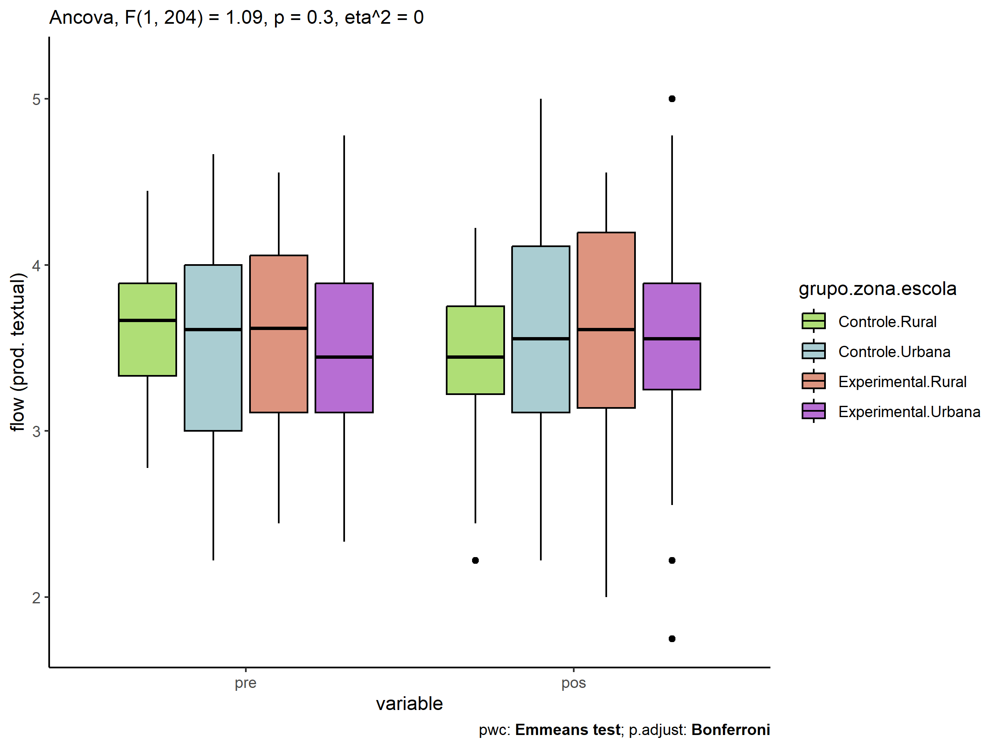<!-- -->

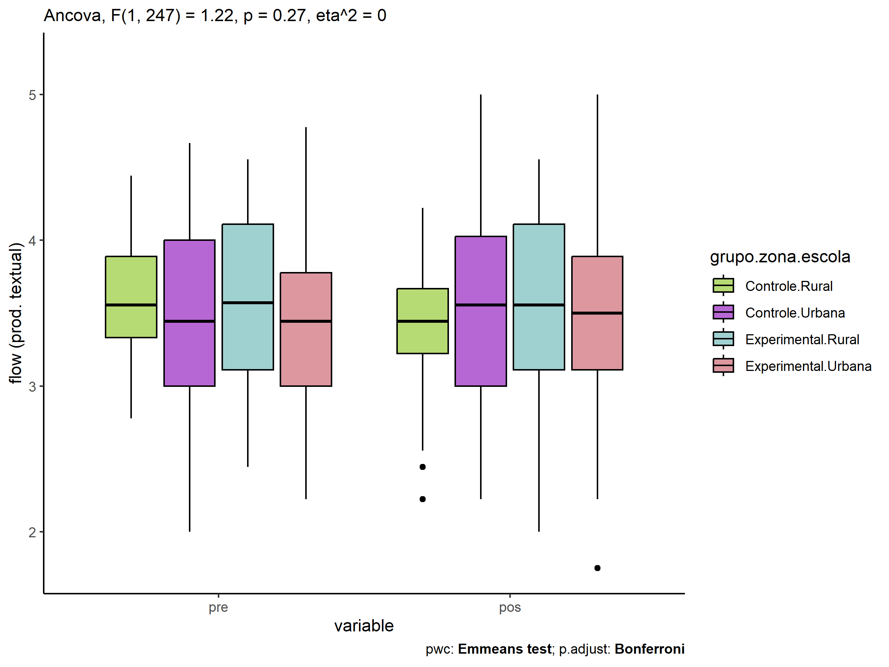<!-- -->

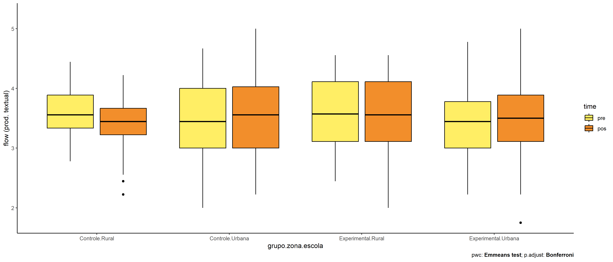<!-- -->

## Pairwise comparisons for grupo=“Experimental”

### factores: **grupo=“Experimental”:monitor**

| var         | monitor |   n | M (pre) | SE (pre) | M (unadj) | SE (unadj) | M (adj) | SE (adj) |
|:------------|:--------|----:|--------:|---------:|----------:|-----------:|--------:|---------:|
| fss.textual | AC      |  11 |   3.636 |    0.117 |     3.505 |      0.125 |   3.445 |    0.159 |
| fss.textual | CE      |  14 |   3.635 |    0.155 |     3.603 |      0.149 |   3.544 |    0.141 |
| fss.textual | EA      |  11 |   3.404 |    0.177 |     3.770 |      0.171 |   3.806 |    0.159 |
| fss.textual | GR      |  15 |   3.474 |    0.167 |     3.422 |      0.099 |   3.429 |    0.136 |
| fss.textual | JC      |  10 |   3.427 |    0.216 |     3.456 |      0.175 |   3.482 |    0.166 |
| fss.textual | MF      |  11 |   3.505 |    0.193 |     3.556 |      0.225 |   3.549 |    0.159 |
| fss.textual | ML      |  14 |   3.531 |    0.195 |     3.440 |      0.184 |   3.423 |    0.141 |
| fss.textual | MM      |  13 |   3.282 |    0.133 |     3.229 |      0.165 |   3.314 |    0.147 |
| fss.textual | PR      |  10 |   3.510 |    0.149 |     4.003 |      0.189 |   3.995 |    0.166 |
| fss.textual | VL      |  13 |   3.488 |    0.126 |     3.658 |      0.161 |   3.659 |    0.146 |

| .y.         | group1 | group2 | estimate | conf.low | conf.high |    se | statistic |     p | p.adj | p.adj.signif |
|:------------|:-------|:-------|---------:|---------:|----------:|------:|----------:|------:|------:|:-------------|
| fss.textual | AC     | CE     |   -0.099 |   -0.518 |     0.321 | 0.212 |    -0.466 | 0.642 | 1.000 | ns           |
| fss.textual | AC     | EA     |   -0.361 |   -0.807 |     0.085 | 0.225 |    -1.604 | 0.112 | 1.000 | ns           |
| fss.textual | AC     | GR     |    0.016 |   -0.399 |     0.430 | 0.209 |     0.076 | 0.939 | 1.000 | ns           |
| fss.textual | AC     | JC     |   -0.037 |   -0.493 |     0.420 | 0.230 |    -0.160 | 0.873 | 1.000 | ns           |
| fss.textual | AC     | MF     |   -0.105 |   -0.549 |     0.340 | 0.224 |    -0.466 | 0.642 | 1.000 | ns           |
| fss.textual | AC     | ML     |    0.022 |   -0.399 |     0.442 | 0.212 |     0.102 | 0.919 | 1.000 | ns           |
| fss.textual | AC     | MM     |    0.130 |   -0.301 |     0.561 | 0.218 |     0.599 | 0.550 | 1.000 | ns           |
| fss.textual | AC     | PR     |   -0.550 |   -1.006 |    -0.094 | 0.230 |    -2.391 | 0.018 | 0.831 | ns           |
| fss.textual | AC     | VL     |   -0.214 |   -0.642 |     0.213 | 0.216 |    -0.992 | 0.323 | 1.000 | ns           |
| fss.textual | CE     | EA     |   -0.262 |   -0.684 |     0.159 | 0.213 |    -1.233 | 0.220 | 1.000 | ns           |
| fss.textual | CE     | GR     |    0.115 |   -0.273 |     0.503 | 0.196 |     0.585 | 0.560 | 1.000 | ns           |
| fss.textual | CE     | JC     |    0.062 |   -0.371 |     0.495 | 0.218 |     0.283 | 0.777 | 1.000 | ns           |
| fss.textual | CE     | MF     |   -0.006 |   -0.426 |     0.414 | 0.212 |    -0.028 | 0.978 | 1.000 | ns           |
| fss.textual | CE     | ML     |    0.120 |   -0.274 |     0.514 | 0.199 |     0.605 | 0.546 | 1.000 | ns           |
| fss.textual | CE     | MM     |    0.229 |   -0.177 |     0.635 | 0.205 |     1.119 | 0.266 | 1.000 | ns           |
| fss.textual | CE     | PR     |   -0.451 |   -0.883 |    -0.019 | 0.218 |    -2.070 | 0.041 | 1.000 | ns           |
| fss.textual | CE     | VL     |   -0.115 |   -0.517 |     0.287 | 0.203 |    -0.569 | 0.571 | 1.000 | ns           |
| fss.textual | EA     | GR     |    0.377 |   -0.037 |     0.791 | 0.209 |     1.805 | 0.074 | 1.000 | ns           |
| fss.textual | EA     | JC     |    0.324 |   -0.131 |     0.779 | 0.230 |     1.411 | 0.161 | 1.000 | ns           |
| fss.textual | EA     | MF     |    0.256 |   -0.188 |     0.701 | 0.224 |     1.142 | 0.256 | 1.000 | ns           |
| fss.textual | EA     | ML     |    0.383 |   -0.038 |     0.803 | 0.212 |     1.804 | 0.074 | 1.000 | ns           |
| fss.textual | EA     | MM     |    0.491 |    0.064 |     0.919 | 0.216 |     2.278 | 0.025 | 1.000 | ns           |
| fss.textual | EA     | PR     |   -0.189 |   -0.645 |     0.267 | 0.230 |    -0.822 | 0.413 | 1.000 | ns           |
| fss.textual | EA     | VL     |    0.147 |   -0.280 |     0.574 | 0.216 |     0.681 | 0.497 | 1.000 | ns           |
| fss.textual | GR     | JC     |   -0.053 |   -0.478 |     0.373 | 0.215 |    -0.246 | 0.806 | 1.000 | ns           |
| fss.textual | GR     | MF     |   -0.121 |   -0.534 |     0.293 | 0.209 |    -0.578 | 0.565 | 1.000 | ns           |
| fss.textual | GR     | ML     |    0.006 |   -0.382 |     0.393 | 0.195 |     0.029 | 0.977 | 1.000 | ns           |
| fss.textual | GR     | MM     |    0.114 |   -0.282 |     0.511 | 0.200 |     0.572 | 0.568 | 1.000 | ns           |
| fss.textual | GR     | PR     |   -0.566 |   -0.991 |    -0.141 | 0.215 |    -2.636 | 0.010 | 0.431 | ns           |
| fss.textual | GR     | VL     |   -0.230 |   -0.625 |     0.165 | 0.199 |    -1.154 | 0.251 | 1.000 | ns           |
| fss.textual | JC     | MF     |   -0.068 |   -0.523 |     0.388 | 0.230 |    -0.295 | 0.768 | 1.000 | ns           |
| fss.textual | JC     | ML     |    0.058 |   -0.373 |     0.490 | 0.218 |     0.268 | 0.789 | 1.000 | ns           |
| fss.textual | JC     | MM     |    0.167 |   -0.272 |     0.606 | 0.221 |     0.755 | 0.452 | 1.000 | ns           |
| fss.textual | JC     | PR     |   -0.513 |   -0.979 |    -0.047 | 0.235 |    -2.181 | 0.031 | 1.000 | ns           |
| fss.textual | JC     | VL     |   -0.177 |   -0.616 |     0.261 | 0.221 |    -0.801 | 0.425 | 1.000 | ns           |
| fss.textual | MF     | ML     |    0.126 |   -0.294 |     0.546 | 0.212 |     0.596 | 0.552 | 1.000 | ns           |
| fss.textual | MF     | MM     |    0.235 |   -0.193 |     0.663 | 0.216 |     1.087 | 0.280 | 1.000 | ns           |
| fss.textual | MF     | PR     |   -0.445 |   -0.900 |     0.010 | 0.230 |    -1.938 | 0.055 | 1.000 | ns           |
| fss.textual | MF     | VL     |   -0.109 |   -0.536 |     0.317 | 0.215 |    -0.508 | 0.612 | 1.000 | ns           |
| fss.textual | ML     | MM     |    0.109 |   -0.295 |     0.512 | 0.204 |     0.534 | 0.594 | 1.000 | ns           |
| fss.textual | ML     | PR     |   -0.572 |   -1.003 |    -0.140 | 0.218 |    -2.626 | 0.010 | 0.444 | ns           |
| fss.textual | ML     | VL     |   -0.236 |   -0.637 |     0.166 | 0.203 |    -1.164 | 0.247 | 1.000 | ns           |
| fss.textual | MM     | PR     |   -0.680 |   -1.120 |    -0.240 | 0.222 |    -3.064 | 0.003 | 0.123 | ns           |
| fss.textual | MM     | VL     |   -0.344 |   -0.755 |     0.066 | 0.207 |    -1.664 | 0.099 | 1.000 | ns           |
| fss.textual | PR     | VL     |    0.336 |   -0.102 |     0.774 | 0.221 |     1.519 | 0.132 | 1.000 | ns           |
| dfs.textual | AC     | CE     |    0.001 |   -0.461 |     0.464 | 0.233 |     0.006 | 0.995 | 1.000 | ns           |
| dfs.textual | AC     | EA     |    0.232 |   -0.257 |     0.722 | 0.247 |     0.941 | 0.349 | 1.000 | ns           |
| dfs.textual | AC     | GR     |    0.162 |   -0.293 |     0.618 | 0.230 |     0.706 | 0.482 | 1.000 | ns           |
| dfs.textual | AC     | JC     |    0.209 |   -0.292 |     0.711 | 0.253 |     0.827 | 0.410 | 1.000 | ns           |
| dfs.textual | AC     | MF     |    0.131 |   -0.358 |     0.621 | 0.247 |     0.532 | 0.596 | 1.000 | ns           |
| dfs.textual | AC     | ML     |    0.106 |   -0.357 |     0.568 | 0.233 |     0.453 | 0.652 | 1.000 | ns           |
| dfs.textual | AC     | MM     |    0.354 |   -0.116 |     0.825 | 0.237 |     1.493 | 0.138 | 1.000 | ns           |
| dfs.textual | AC     | PR     |    0.127 |   -0.375 |     0.628 | 0.253 |     0.500 | 0.618 | 1.000 | ns           |
| dfs.textual | AC     | VL     |    0.148 |   -0.322 |     0.618 | 0.237 |     0.624 | 0.534 | 1.000 | ns           |
| dfs.textual | CE     | EA     |    0.231 |   -0.232 |     0.693 | 0.233 |     0.989 | 0.325 | 1.000 | ns           |
| dfs.textual | CE     | GR     |    0.161 |   -0.266 |     0.587 | 0.215 |     0.747 | 0.456 | 1.000 | ns           |
| dfs.textual | CE     | JC     |    0.208 |   -0.267 |     0.683 | 0.240 |     0.867 | 0.388 | 1.000 | ns           |
| dfs.textual | CE     | MF     |    0.130 |   -0.333 |     0.592 | 0.233 |     0.556 | 0.579 | 1.000 | ns           |
| dfs.textual | CE     | ML     |    0.104 |   -0.330 |     0.538 | 0.219 |     0.476 | 0.635 | 1.000 | ns           |
| dfs.textual | CE     | MM     |    0.353 |   -0.089 |     0.795 | 0.223 |     1.582 | 0.117 | 1.000 | ns           |
| dfs.textual | CE     | PR     |    0.125 |   -0.350 |     0.600 | 0.240 |     0.522 | 0.603 | 1.000 | ns           |
| dfs.textual | CE     | VL     |    0.147 |   -0.296 |     0.589 | 0.223 |     0.657 | 0.513 | 1.000 | ns           |
| dfs.textual | EA     | GR     |   -0.070 |   -0.526 |     0.386 | 0.230 |    -0.305 | 0.761 | 1.000 | ns           |
| dfs.textual | EA     | JC     |   -0.023 |   -0.524 |     0.479 | 0.253 |    -0.091 | 0.928 | 1.000 | ns           |
| dfs.textual | EA     | MF     |   -0.101 |   -0.590 |     0.388 | 0.247 |    -0.409 | 0.683 | 1.000 | ns           |
| dfs.textual | EA     | ML     |   -0.127 |   -0.589 |     0.336 | 0.233 |    -0.543 | 0.588 | 1.000 | ns           |
| dfs.textual | EA     | MM     |    0.122 |   -0.348 |     0.592 | 0.237 |     0.514 | 0.608 | 1.000 | ns           |
| dfs.textual | EA     | PR     |   -0.106 |   -0.607 |     0.396 | 0.253 |    -0.418 | 0.677 | 1.000 | ns           |
| dfs.textual | EA     | VL     |   -0.084 |   -0.555 |     0.386 | 0.237 |    -0.355 | 0.723 | 1.000 | ns           |
| dfs.textual | GR     | JC     |    0.047 |   -0.421 |     0.516 | 0.236 |     0.199 | 0.843 | 1.000 | ns           |
| dfs.textual | GR     | MF     |   -0.031 |   -0.487 |     0.425 | 0.230 |    -0.135 | 0.893 | 1.000 | ns           |
| dfs.textual | GR     | ML     |   -0.057 |   -0.483 |     0.370 | 0.215 |    -0.263 | 0.793 | 1.000 | ns           |
| dfs.textual | GR     | MM     |    0.192 |   -0.243 |     0.627 | 0.220 |     0.875 | 0.384 | 1.000 | ns           |
| dfs.textual | GR     | PR     |   -0.036 |   -0.504 |     0.433 | 0.236 |    -0.151 | 0.880 | 1.000 | ns           |
| dfs.textual | GR     | VL     |   -0.014 |   -0.449 |     0.421 | 0.220 |    -0.065 | 0.948 | 1.000 | ns           |
| dfs.textual | JC     | MF     |   -0.078 |   -0.580 |     0.423 | 0.253 |    -0.308 | 0.758 | 1.000 | ns           |
| dfs.textual | JC     | ML     |   -0.104 |   -0.579 |     0.371 | 0.240 |    -0.433 | 0.666 | 1.000 | ns           |
| dfs.textual | JC     | MM     |    0.145 |   -0.338 |     0.628 | 0.244 |     0.595 | 0.553 | 1.000 | ns           |
| dfs.textual | JC     | PR     |   -0.083 |   -0.596 |     0.431 | 0.259 |    -0.319 | 0.750 | 1.000 | ns           |
| dfs.textual | JC     | VL     |   -0.061 |   -0.544 |     0.421 | 0.244 |    -0.252 | 0.801 | 1.000 | ns           |
| dfs.textual | MF     | ML     |   -0.026 |   -0.488 |     0.437 | 0.233 |    -0.110 | 0.913 | 1.000 | ns           |
| dfs.textual | MF     | MM     |    0.223 |   -0.247 |     0.693 | 0.237 |     0.940 | 0.349 | 1.000 | ns           |
| dfs.textual | MF     | PR     |   -0.005 |   -0.506 |     0.497 | 0.253 |    -0.018 | 0.985 | 1.000 | ns           |
| dfs.textual | MF     | VL     |    0.017 |   -0.454 |     0.487 | 0.237 |     0.070 | 0.944 | 1.000 | ns           |
| dfs.textual | ML     | MM     |    0.249 |   -0.193 |     0.691 | 0.223 |     1.115 | 0.267 | 1.000 | ns           |
| dfs.textual | ML     | PR     |    0.021 |   -0.454 |     0.496 | 0.240 |     0.088 | 0.930 | 1.000 | ns           |
| dfs.textual | ML     | VL     |    0.042 |   -0.400 |     0.484 | 0.223 |     0.190 | 0.850 | 1.000 | ns           |
| dfs.textual | MM     | PR     |   -0.228 |   -0.710 |     0.255 | 0.244 |    -0.934 | 0.352 | 1.000 | ns           |
| dfs.textual | MM     | VL     |   -0.206 |   -0.657 |     0.244 | 0.227 |    -0.908 | 0.366 | 1.000 | ns           |
| dfs.textual | PR     | VL     |    0.021 |   -0.461 |     0.504 | 0.244 |     0.088 | 0.930 | 1.000 | ns           |

| .y.          | monitor | group1 | group2 | estimate | conf.low | conf.high |    se | statistic |     p | p.adj | p.adj.signif |
|:-------------|:--------|:-------|:-------|---------:|---------:|----------:|------:|----------:|------:|------:|:-------------|
| flow.textual | AC      | pre    | pos    |    0.131 |   -0.354 |     0.616 | 0.246 |     0.533 | 0.594 | 0.594 | ns           |
| flow.textual | CE      | pre    | pos    |    0.032 |   -0.398 |     0.462 | 0.218 |     0.145 | 0.884 | 0.884 | ns           |
| flow.textual | EA      | pre    | pos    |   -0.366 |   -0.851 |     0.119 | 0.246 |    -1.488 | 0.138 | 0.138 | ns           |
| flow.textual | GR      | pre    | pos    |    0.052 |   -0.364 |     0.467 | 0.211 |     0.246 | 0.806 | 0.806 | ns           |
| flow.textual | JC      | pre    | pos    |   -0.029 |   -0.537 |     0.480 | 0.258 |    -0.111 | 0.912 | 0.912 | ns           |
| flow.textual | MF      | pre    | pos    |   -0.051 |   -0.536 |     0.435 | 0.246 |    -0.205 | 0.838 | 0.838 | ns           |
| flow.textual | ML      | pre    | pos    |    0.091 |   -0.339 |     0.521 | 0.218 |     0.416 | 0.678 | 0.678 | ns           |
| flow.textual | MM      | pre    | pos    |    0.053 |   -0.393 |     0.500 | 0.226 |     0.236 | 0.814 | 0.814 | ns           |
| flow.textual | PR      | pre    | pos    |   -0.493 |   -1.002 |     0.016 | 0.258 |    -1.910 | 0.057 | 0.057 | ns           |
| flow.textual | VL      | pre    | pos    |   -0.170 |   -0.616 |     0.276 | 0.226 |    -0.750 | 0.454 | 0.454 | ns           |

    ## Scale for colour is already present.
    ## Adding another scale for colour, which will replace the existing scale.

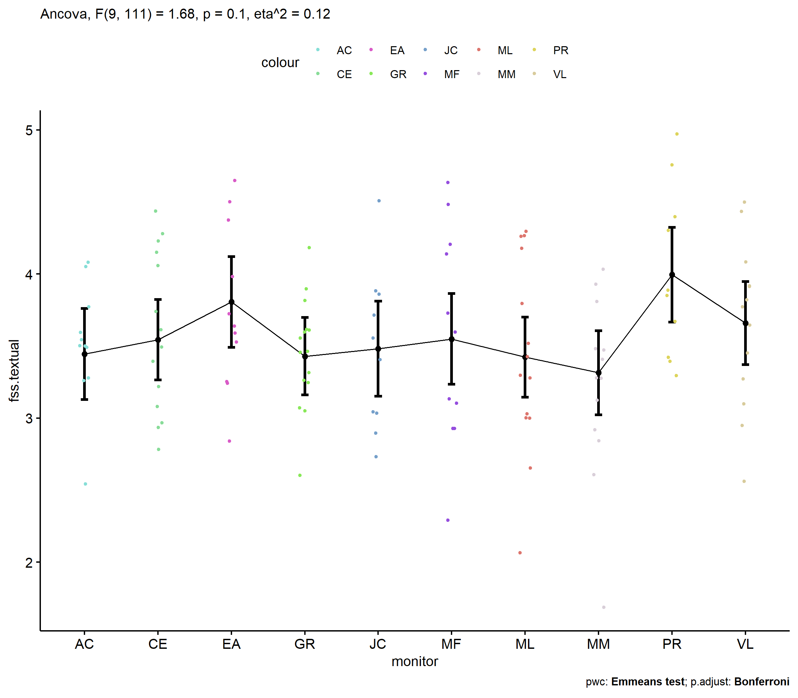<!-- -->

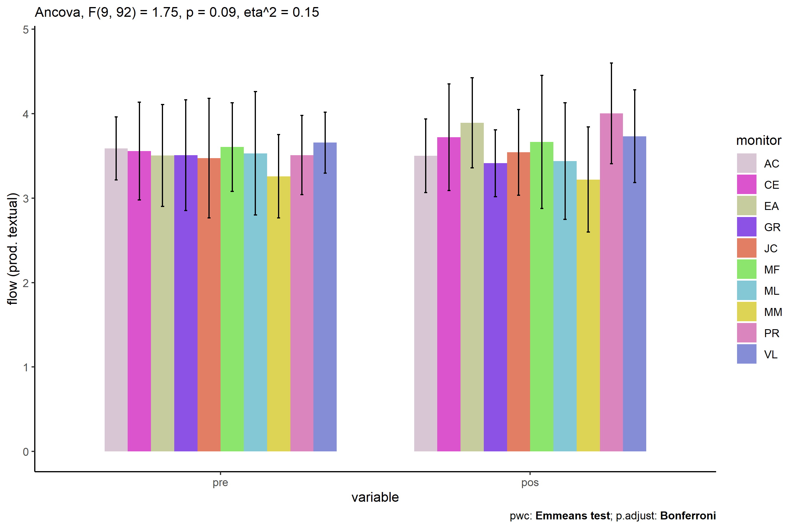<!-- -->

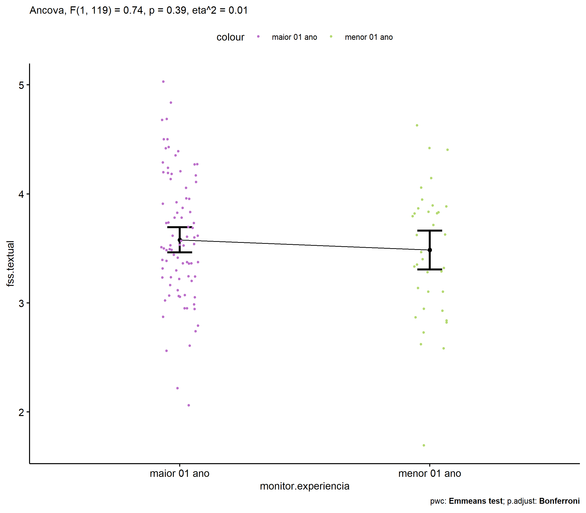<!-- -->

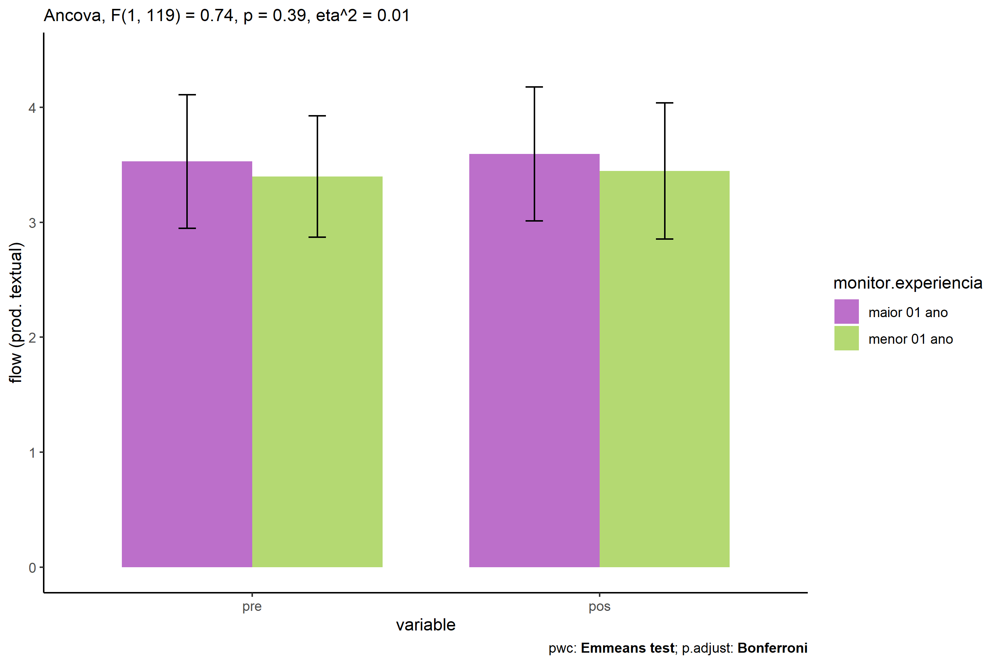<!-- -->

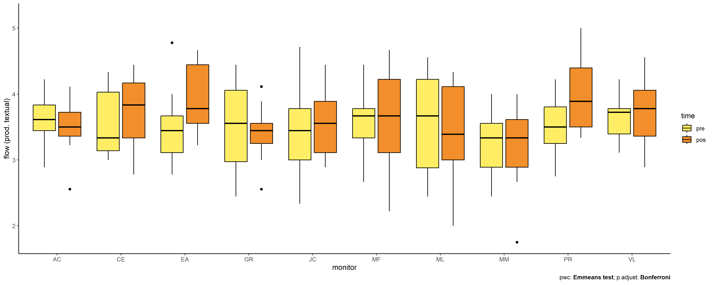<!-- -->

### factores: **grupo=“Experimental”:monitor.genero**

| var         | monitor.genero |   n | M (pre) | SE (pre) | M (unadj) | SE (unadj) | M (adj) | SE (adj) |
|:------------|:---------------|----:|--------:|---------:|----------:|-----------:|--------:|---------:|
| fss.textual | F              |  77 |   3.482 |    0.065 |     3.463 |      0.066 |   3.467 |    0.060 |
| fss.textual | M              |  45 |   3.504 |    0.085 |     3.700 |      0.087 |   3.694 |    0.079 |

| .y.         | group1 | group2 | estimate | conf.low | conf.high |    se | statistic |     p | p.adj | p.adj.signif |
|:------------|:-------|:-------|---------:|---------:|----------:|------:|----------:|------:|------:|:-------------|
| fss.textual | F      | M      |   -0.227 |   -0.424 |    -0.030 | 0.099 |    -2.285 | 0.024 | 0.024 | \*           |
| dfs.textual | F      | M      |   -0.022 |   -0.234 |     0.189 | 0.107 |    -0.211 | 0.834 | 0.834 | ns           |

| .y.          | monitor.genero | group1 | group2 | estimate | conf.low | conf.high |    se | statistic |     p | p.adj | p.adj.signif |
|:-------------|:---------------|:-------|:-------|---------:|---------:|----------:|------:|----------:|------:|------:|:-------------|
| flow.textual | F              | pre    | pos    |    0.019 |   -0.164 |     0.201 | 0.092 |     0.200 | 0.841 | 0.841 | ns           |
| flow.textual | M              | pre    | pos    |   -0.196 |   -0.434 |     0.043 | 0.121 |    -1.617 | 0.107 | 0.107 | ns           |

    ## Scale for colour is already present.
    ## Adding another scale for colour, which will replace the existing scale.

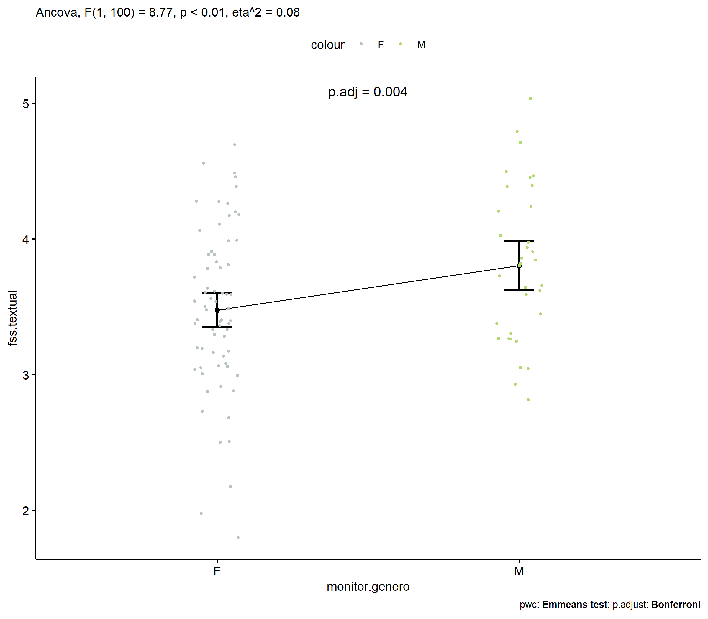<!-- -->

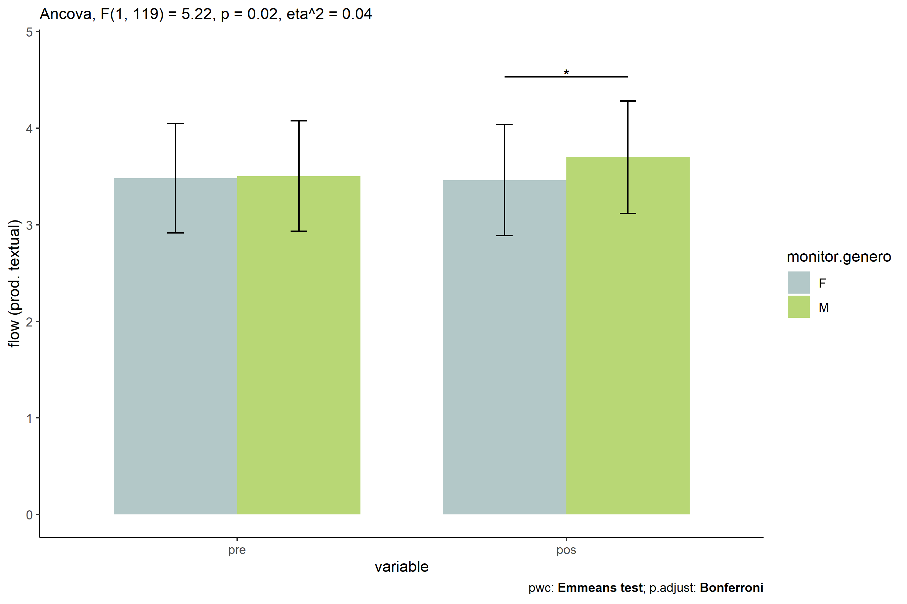<!-- -->

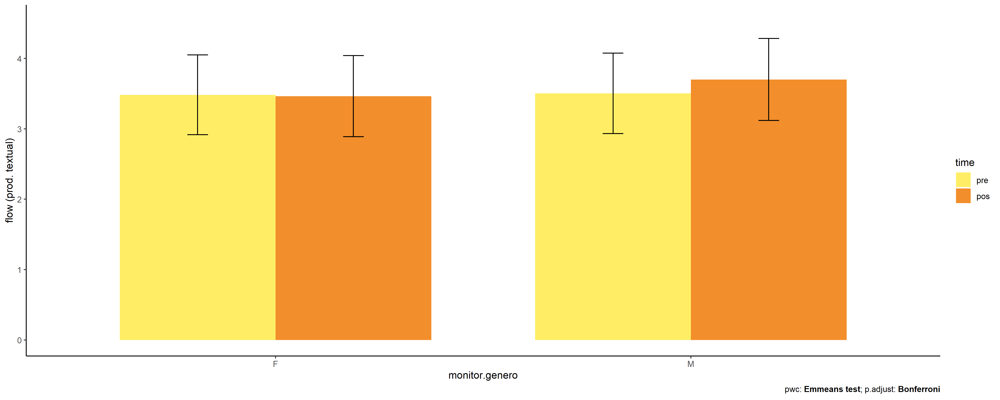<!-- -->

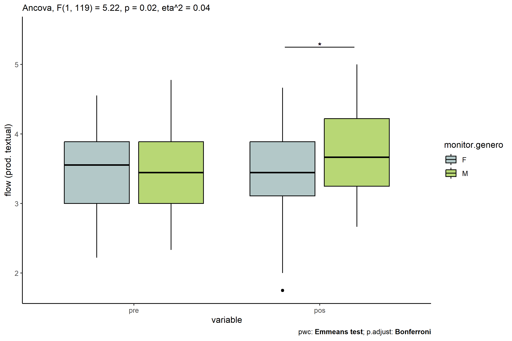<!-- -->

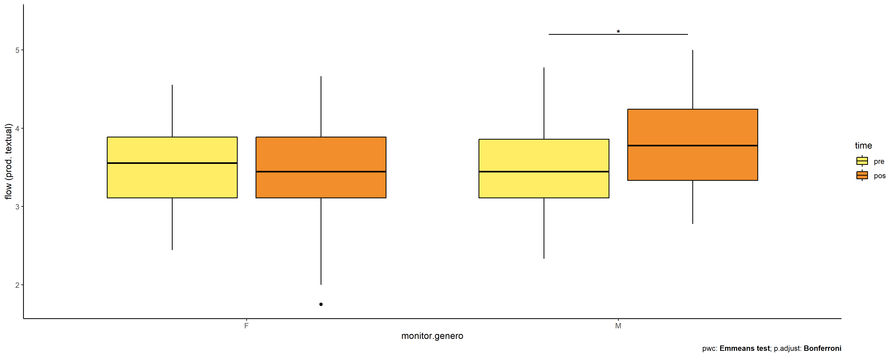<!-- -->

### factores: **grupo=“Experimental”:monitor.area**

| var         | monitor.area               |   n | M (pre) | SE (pre) | M (unadj) | SE (unadj) | M (adj) | SE (adj) |
|:------------|:---------------------------|----:|--------:|---------:|----------:|-----------:|--------:|---------:|
| fss.textual | Arquitetura e Urbanismo    |  10 |   3.427 |    0.216 |     3.456 |      0.175 |   3.481 |    0.168 |
| fss.textual | Ciencias Biologicas        |  14 |   3.531 |    0.195 |     3.440 |      0.184 |   3.423 |    0.142 |
| fss.textual | Comunicacao Social         |  14 |   3.635 |    0.155 |     3.603 |      0.149 |   3.544 |    0.142 |
| fss.textual | Historia                   |  10 |   3.510 |    0.149 |     4.003 |      0.189 |   3.995 |    0.168 |
| fss.textual | Letras - Lingua Portuguesa |  11 |   3.505 |    0.193 |     3.556 |      0.225 |   3.550 |    0.160 |
| fss.textual | Matematica                 |  26 |   3.444 |    0.120 |     3.569 |      0.096 |   3.588 |    0.104 |
| fss.textual | Nutricao                   |  13 |   3.282 |    0.133 |     3.229 |      0.165 |   3.314 |    0.148 |
| fss.textual | Pedagogia                  |  11 |   3.636 |    0.117 |     3.505 |      0.125 |   3.445 |    0.161 |
| fss.textual | Servico Social             |  13 |   3.488 |    0.126 |     3.658 |      0.161 |   3.659 |    0.147 |

| .y.         | group1                  | group2              | estimate | conf.low | conf.high |    se | statistic |     p | p.adj | p.adj.signif |
|:------------|:------------------------|:--------------------|---------:|---------:|----------:|------:|----------:|------:|------:|:-------------|
| fss.textual | Arquitetura e Urbanismo | Ciencias Biologicas |    0.058 |   -0.378 |     0.494 | 0.220 |     0.263 | 0.793 | 1.000 | ns           |
| fss.textual | Arquitetura e Urbanismo | Comunicacao Social  |   -0.063 |   -0.500 |     0.374 | 0.221 |    -0.285 | 0.776 | 1.000 | ns           |
| fss.textual | Arquitetura e Urbanismo | Historia            |   -0.513 |   -0.984 |    -0.043 | 0.238 |    -2.161 | 0.033 | 1.000 | ns           |
| fss.textual | Arquitetura e Urbanismo | Letras              |   -0.068 |   -0.528 |     0.392 | 0.232 |    -0.294 | 0.770 | 1.000 | ns           |
| fss.textual | Arquitetura e Urbanismo | Matematica          |   -0.107 |   -0.498 |     0.285 | 0.198 |    -0.540 | 0.590 | 1.000 | ns           |
| fss.textual | Arquitetura e Urbanismo | Nutricao            |    0.168 |   -0.275 |     0.611 | 0.224 |     0.750 | 0.455 | 1.000 | ns           |
| fss.textual | Arquitetura e Urbanismo | Pedagogia           |    0.036 |   -0.425 |     0.497 | 0.233 |     0.154 | 0.878 | 1.000 | ns           |
| fss.textual | Arquitetura e Urbanismo | Servico Social      |   -0.178 |   -0.620 |     0.265 | 0.223 |    -0.795 | 0.429 | 1.000 | ns           |
| fss.textual | Ciencias Biologicas     | Comunicacao Social  |   -0.121 |   -0.519 |     0.277 | 0.201 |    -0.601 | 0.549 | 1.000 | ns           |
| fss.textual | Ciencias Biologicas     | Historia            |   -0.571 |   -1.007 |    -0.136 | 0.220 |    -2.599 | 0.011 | 0.382 | ns           |
| fss.textual | Ciencias Biologicas     | Letras              |   -0.126 |   -0.550 |     0.298 | 0.214 |    -0.589 | 0.557 | 1.000 | ns           |
| fss.textual | Ciencias Biologicas     | Matematica          |   -0.165 |   -0.514 |     0.184 | 0.176 |    -0.935 | 0.352 | 1.000 | ns           |
| fss.textual | Ciencias Biologicas     | Nutricao            |    0.110 |   -0.298 |     0.517 | 0.206 |     0.534 | 0.594 | 1.000 | ns           |
| fss.textual | Ciencias Biologicas     | Pedagogia           |   -0.022 |   -0.446 |     0.402 | 0.214 |    -0.103 | 0.918 | 1.000 | ns           |
| fss.textual | Ciencias Biologicas     | Servico Social      |   -0.235 |   -0.641 |     0.170 | 0.205 |    -1.151 | 0.252 | 1.000 | ns           |
| fss.textual | Comunicacao Social      | Historia            |   -0.451 |   -0.887 |    -0.015 | 0.220 |    -2.047 | 0.043 | 1.000 | ns           |
| fss.textual | Comunicacao Social      | Letras              |   -0.005 |   -0.430 |     0.419 | 0.214 |    -0.025 | 0.980 | 1.000 | ns           |
| fss.textual | Comunicacao Social      | Matematica          |   -0.044 |   -0.394 |     0.306 | 0.177 |    -0.249 | 0.804 | 1.000 | ns           |
| fss.textual | Comunicacao Social      | Nutricao            |    0.231 |   -0.179 |     0.640 | 0.207 |     1.115 | 0.267 | 1.000 | ns           |
| fss.textual | Comunicacao Social      | Pedagogia           |    0.099 |   -0.325 |     0.523 | 0.214 |     0.461 | 0.645 | 1.000 | ns           |
| fss.textual | Comunicacao Social      | Servico Social      |   -0.115 |   -0.521 |     0.291 | 0.205 |    -0.560 | 0.577 | 1.000 | ns           |
| fss.textual | Historia                | Letras              |    0.445 |   -0.014 |     0.905 | 0.232 |     1.919 | 0.057 | 1.000 | ns           |
| fss.textual | Historia                | Matematica          |    0.407 |    0.015 |     0.798 | 0.198 |     2.057 | 0.042 | 1.000 | ns           |
| fss.textual | Historia                | Nutricao            |    0.681 |    0.237 |     1.126 | 0.224 |     3.038 | 0.003 | 0.107 | ns           |
| fss.textual | Historia                | Pedagogia           |    0.549 |    0.089 |     1.010 | 0.232 |     2.365 | 0.020 | 0.711 | ns           |
| fss.textual | Historia                | Servico Social      |    0.336 |   -0.107 |     0.779 | 0.223 |     1.504 | 0.135 | 1.000 | ns           |
| fss.textual | Letras                  | Lingua Portuguesa   |   -0.039 |   -0.417 |     0.340 | 0.191 |    -0.202 | 0.840 | 1.000 | ns           |
| fss.textual | Letras                  | Lingua Portuguesa   |    0.236 |   -0.197 |     0.669 | 0.218 |     1.080 | 0.282 | 1.000 | ns           |
| fss.textual | Letras                  | Lingua Portuguesa   |    0.104 |   -0.345 |     0.553 | 0.227 |     0.459 | 0.647 | 1.000 | ns           |
| fss.textual | Letras                  | Lingua Portuguesa   |   -0.109 |   -0.540 |     0.322 | 0.218 |    -0.503 | 0.616 | 1.000 | ns           |
| fss.textual | Matematica              | Nutricao            |    0.275 |   -0.084 |     0.633 | 0.181 |     1.518 | 0.132 | 1.000 | ns           |
| fss.textual | Matematica              | Pedagogia           |    0.143 |   -0.237 |     0.523 | 0.192 |     0.744 | 0.458 | 1.000 | ns           |
| fss.textual | Matematica              | Servico Social      |   -0.071 |   -0.428 |     0.287 | 0.180 |    -0.392 | 0.696 | 1.000 | ns           |
| fss.textual | Nutricao                | Pedagogia           |   -0.132 |   -0.567 |     0.303 | 0.220 |    -0.600 | 0.549 | 1.000 | ns           |
| fss.textual | Nutricao                | Servico Social      |   -0.345 |   -0.760 |     0.069 | 0.209 |    -1.652 | 0.101 | 1.000 | ns           |
| fss.textual | Pedagogia               | Servico Social      |   -0.213 |   -0.645 |     0.218 | 0.218 |    -0.979 | 0.330 | 1.000 | ns           |
| dfs.textual | Arquitetura e Urbanismo | Ciencias Biologicas |   -0.104 |   -0.577 |     0.369 | 0.239 |    -0.434 | 0.665 | 1.000 | ns           |
| dfs.textual | Arquitetura e Urbanismo | Comunicacao Social  |   -0.208 |   -0.681 |     0.265 | 0.239 |    -0.870 | 0.386 | 1.000 | ns           |
| dfs.textual | Arquitetura e Urbanismo | Historia            |   -0.083 |   -0.594 |     0.428 | 0.258 |    -0.321 | 0.749 | 1.000 | ns           |
| dfs.textual | Arquitetura e Urbanismo | Letras              |   -0.078 |   -0.577 |     0.421 | 0.252 |    -0.310 | 0.757 | 1.000 | ns           |
| dfs.textual | Arquitetura e Urbanismo | Matematica          |   -0.017 |   -0.443 |     0.408 | 0.215 |    -0.081 | 0.935 | 1.000 | ns           |
| dfs.textual | Arquitetura e Urbanismo | Nutricao            |    0.145 |   -0.336 |     0.626 | 0.243 |     0.597 | 0.552 | 1.000 | ns           |
| dfs.textual | Arquitetura e Urbanismo | Pedagogia           |   -0.209 |   -0.709 |     0.290 | 0.252 |    -0.831 | 0.408 | 1.000 | ns           |
| dfs.textual | Arquitetura e Urbanismo | Servico Social      |   -0.061 |   -0.542 |     0.419 | 0.243 |    -0.253 | 0.801 | 1.000 | ns           |
| dfs.textual | Ciencias Biologicas     | Comunicacao Social  |   -0.104 |   -0.536 |     0.328 | 0.218 |    -0.478 | 0.634 | 1.000 | ns           |
| dfs.textual | Ciencias Biologicas     | Historia            |    0.021 |   -0.452 |     0.494 | 0.239 |     0.088 | 0.930 | 1.000 | ns           |
| dfs.textual | Ciencias Biologicas     | Letras              |    0.026 |   -0.435 |     0.486 | 0.232 |     0.111 | 0.912 | 1.000 | ns           |
| dfs.textual | Ciencias Biologicas     | Matematica          |    0.086 |   -0.293 |     0.465 | 0.191 |     0.451 | 0.653 | 1.000 | ns           |
| dfs.textual | Ciencias Biologicas     | Nutricao            |    0.249 |   -0.192 |     0.689 | 0.222 |     1.119 | 0.265 | 1.000 | ns           |
| dfs.textual | Ciencias Biologicas     | Pedagogia           |   -0.106 |   -0.566 |     0.355 | 0.232 |    -0.454 | 0.650 | 1.000 | ns           |
| dfs.textual | Ciencias Biologicas     | Servico Social      |    0.042 |   -0.398 |     0.483 | 0.222 |     0.191 | 0.849 | 1.000 | ns           |
| dfs.textual | Comunicacao Social      | Historia            |    0.125 |   -0.348 |     0.598 | 0.239 |     0.524 | 0.601 | 1.000 | ns           |
| dfs.textual | Comunicacao Social      | Letras              |    0.130 |   -0.331 |     0.590 | 0.232 |     0.559 | 0.577 | 1.000 | ns           |
| dfs.textual | Comunicacao Social      | Matematica          |    0.190 |   -0.188 |     0.569 | 0.191 |     0.996 | 0.321 | 1.000 | ns           |
| dfs.textual | Comunicacao Social      | Nutricao            |    0.353 |   -0.087 |     0.793 | 0.222 |     1.588 | 0.115 | 1.000 | ns           |
| dfs.textual | Comunicacao Social      | Pedagogia           |   -0.001 |   -0.462 |     0.459 | 0.232 |    -0.006 | 0.995 | 1.000 | ns           |
| dfs.textual | Comunicacao Social      | Servico Social      |    0.147 |   -0.294 |     0.587 | 0.222 |     0.659 | 0.511 | 1.000 | ns           |
| dfs.textual | Historia                | Letras              |    0.005 |   -0.495 |     0.504 | 0.252 |     0.019 | 0.985 | 1.000 | ns           |
| dfs.textual | Historia                | Matematica          |    0.065 |   -0.360 |     0.491 | 0.215 |     0.304 | 0.762 | 1.000 | ns           |
| dfs.textual | Historia                | Nutricao            |    0.228 |   -0.253 |     0.708 | 0.243 |     0.938 | 0.350 | 1.000 | ns           |
| dfs.textual | Historia                | Pedagogia           |   -0.127 |   -0.626 |     0.373 | 0.252 |    -0.502 | 0.616 | 1.000 | ns           |
| dfs.textual | Historia                | Servico Social      |    0.021 |   -0.459 |     0.502 | 0.243 |     0.088 | 0.930 | 1.000 | ns           |
| dfs.textual | Letras                  | Lingua Portuguesa   |    0.061 |   -0.351 |     0.472 | 0.208 |     0.292 | 0.771 | 1.000 | ns           |
| dfs.textual | Letras                  | Lingua Portuguesa   |    0.223 |   -0.245 |     0.691 | 0.236 |     0.943 | 0.347 | 1.000 | ns           |
| dfs.textual | Letras                  | Lingua Portuguesa   |   -0.131 |   -0.619 |     0.356 | 0.246 |    -0.534 | 0.595 | 1.000 | ns           |
| dfs.textual | Letras                  | Lingua Portuguesa   |    0.017 |   -0.452 |     0.485 | 0.236 |     0.070 | 0.944 | 1.000 | ns           |
| dfs.textual | Matematica              | Nutricao            |    0.162 |   -0.226 |     0.551 | 0.196 |     0.829 | 0.409 | 1.000 | ns           |
| dfs.textual | Matematica              | Pedagogia           |   -0.192 |   -0.603 |     0.219 | 0.208 |    -0.925 | 0.357 | 1.000 | ns           |
| dfs.textual | Matematica              | Servico Social      |   -0.044 |   -0.432 |     0.344 | 0.196 |    -0.224 | 0.823 | 1.000 | ns           |
| dfs.textual | Nutricao                | Pedagogia           |   -0.354 |   -0.823 |     0.114 | 0.236 |    -1.499 | 0.137 | 1.000 | ns           |
| dfs.textual | Nutricao                | Servico Social      |   -0.206 |   -0.655 |     0.242 | 0.226 |    -0.912 | 0.364 | 1.000 | ns           |
| dfs.textual | Pedagogia               | Servico Social      |    0.148 |   -0.320 |     0.616 | 0.236 |     0.626 | 0.533 | 1.000 | ns           |

| .y.          | monitor.area               | group1 | group2 | estimate | conf.low | conf.high |    se | statistic |     p | p.adj | p.adj.signif |
|:-------------|:---------------------------|:-------|:-------|---------:|---------:|----------:|------:|----------:|------:|------:|:-------------|
| flow.textual | Arquitetura e Urbanismo    | pre    | pos    |   -0.029 |   -0.538 |     0.481 | 0.258 |    -0.111 | 0.912 | 0.912 | ns           |
| flow.textual | Ciencias Biologicas        | pre    | pos    |    0.091 |   -0.339 |     0.521 | 0.218 |     0.416 | 0.678 | 0.678 | ns           |
| flow.textual | Comunicacao Social         | pre    | pos    |    0.032 |   -0.399 |     0.462 | 0.218 |     0.145 | 0.885 | 0.885 | ns           |
| flow.textual | Historia                   | pre    | pos    |   -0.493 |   -1.002 |     0.016 | 0.258 |    -1.908 | 0.058 | 0.058 | ns           |
| flow.textual | Letras - Lingua Portuguesa | pre    | pos    |   -0.051 |   -0.536 |     0.435 | 0.246 |    -0.205 | 0.838 | 0.838 | ns           |
| flow.textual | Matematica                 | pre    | pos    |   -0.125 |   -0.441 |     0.191 | 0.160 |    -0.780 | 0.436 | 0.436 | ns           |
| flow.textual | Nutricao                   | pre    | pos    |    0.053 |   -0.393 |     0.500 | 0.227 |     0.236 | 0.814 | 0.814 | ns           |
| flow.textual | Pedagogia                  | pre    | pos    |    0.131 |   -0.354 |     0.617 | 0.246 |     0.533 | 0.595 | 0.595 | ns           |
| flow.textual | Servico Social             | pre    | pos    |   -0.170 |   -0.616 |     0.277 | 0.227 |    -0.749 | 0.455 | 0.455 | ns           |

    ## Scale for colour is already present.
    ## Adding another scale for colour, which will replace the existing scale.

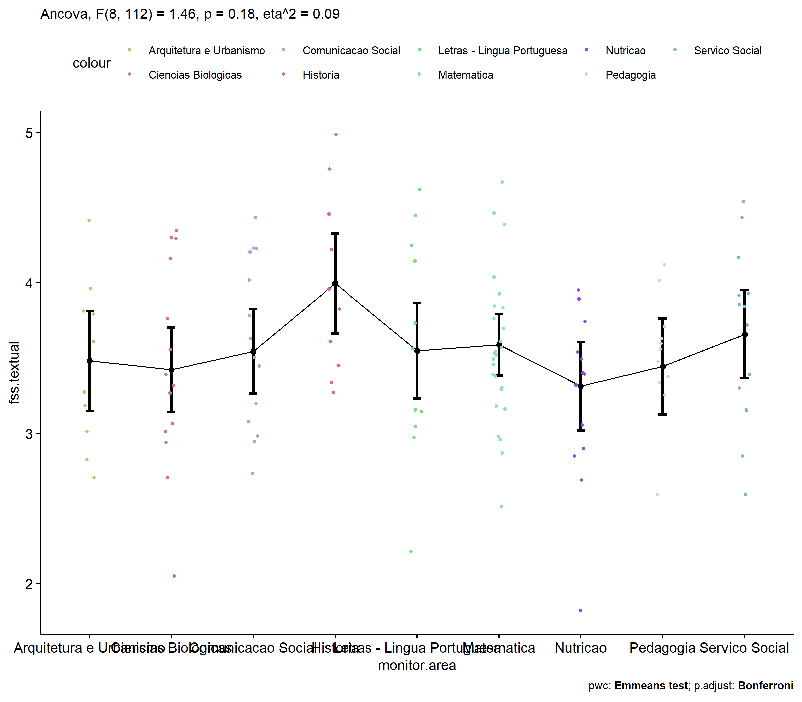<!-- -->

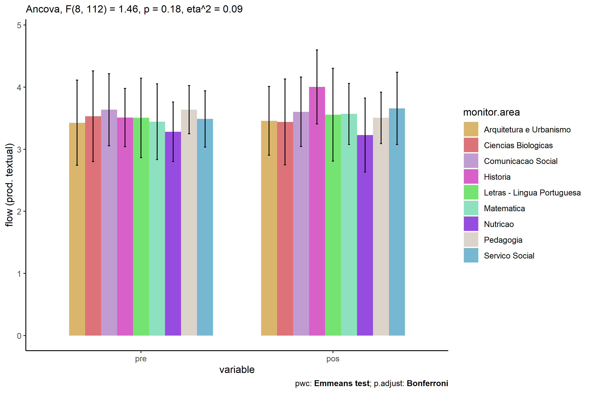<!-- -->

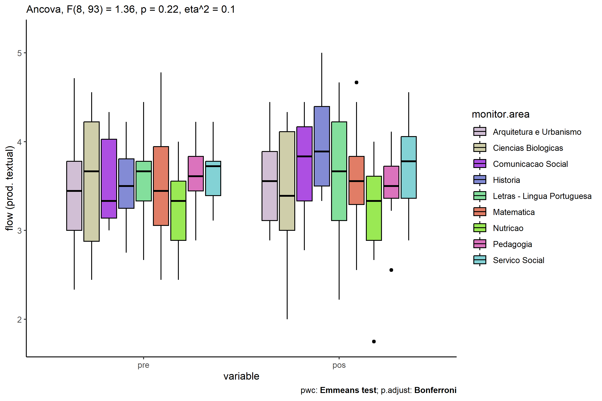<!-- -->

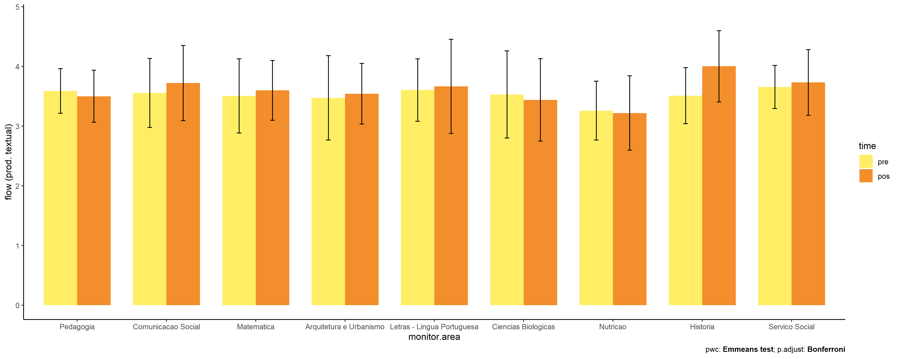<!-- -->

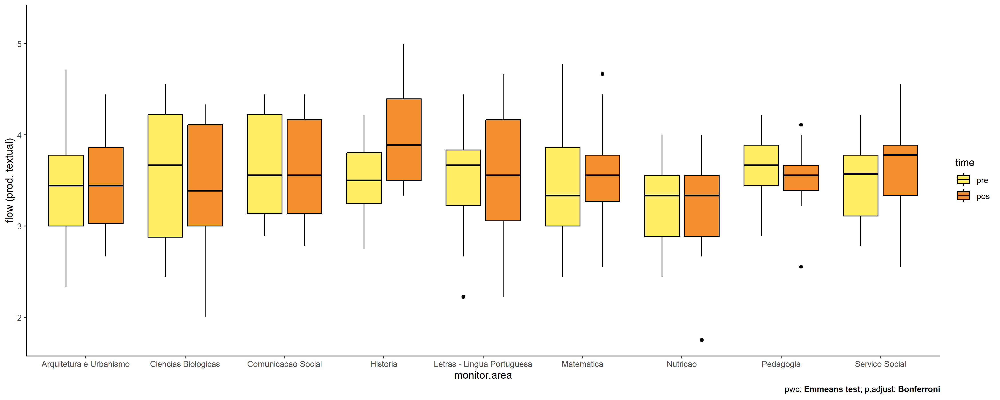<!-- -->

### factores: **grupo=“Experimental”:monitor.formacao**

| var         | monitor.formacao |   n | M (pre) | SE (pre) | M (unadj) | SE (unadj) | M (adj) | SE (adj) |
|:------------|:-----------------|----:|--------:|---------:|----------:|-----------:|--------:|---------:|
| fss.textual | ensino medio     |  86 |   3.459 |    0.063 |     3.520 |      0.066 |   3.533 |    0.059 |
| fss.textual | especializacao   |  14 |   3.635 |    0.155 |     3.603 |      0.149 |   3.543 |    0.146 |
| fss.textual | graduacao        |  22 |   3.520 |    0.107 |     3.638 |      0.107 |   3.625 |    0.116 |

| .y.         | group1         | group2         | estimate | conf.low | conf.high |    se | statistic |     p | p.adj | p.adj.signif |
|:------------|:---------------|:---------------|---------:|---------:|----------:|------:|----------:|------:|------:|:-------------|
| fss.textual | ensino medio   | especializacao |   -0.010 |   -0.321 |     0.301 | 0.157 |    -0.062 | 0.951 | 1.000 | ns           |
| fss.textual | ensino medio   | graduacao      |   -0.092 |   -0.349 |     0.165 | 0.130 |    -0.710 | 0.479 | 1.000 | ns           |
| fss.textual | especializacao | graduacao      |   -0.082 |   -0.450 |     0.285 | 0.186 |    -0.444 | 0.658 | 1.000 | ns           |
| dfs.textual | ensino medio   | especializacao |   -0.176 |   -0.500 |     0.148 | 0.164 |    -1.074 | 0.285 | 0.855 | ns           |
| dfs.textual | ensino medio   | graduacao      |   -0.061 |   -0.330 |     0.208 | 0.136 |    -0.450 | 0.653 | 1.000 | ns           |
| dfs.textual | especializacao | graduacao      |    0.115 |   -0.270 |     0.499 | 0.194 |     0.590 | 0.556 | 1.000 | ns           |

| .y.          | monitor.formacao | group1 | group2 | estimate | conf.low | conf.high |    se | statistic |     p | p.adj | p.adj.signif |
|:-------------|:-----------------|:-------|:-------|---------:|---------:|----------:|------:|----------:|------:|------:|:-------------|
| flow.textual | ensino medio     | pre    | pos    |   -0.061 |   -0.235 |     0.113 | 0.088 |    -0.689 | 0.492 | 0.492 | ns           |
| flow.textual | especializacao   | pre    | pos    |    0.032 |   -0.400 |     0.463 | 0.219 |     0.145 | 0.885 | 0.885 | ns           |
| flow.textual | graduacao        | pre    | pos    |   -0.117 |   -0.461 |     0.227 | 0.175 |    -0.672 | 0.502 | 0.502 | ns           |

    ## Scale for colour is already present.
    ## Adding another scale for colour, which will replace the existing scale.

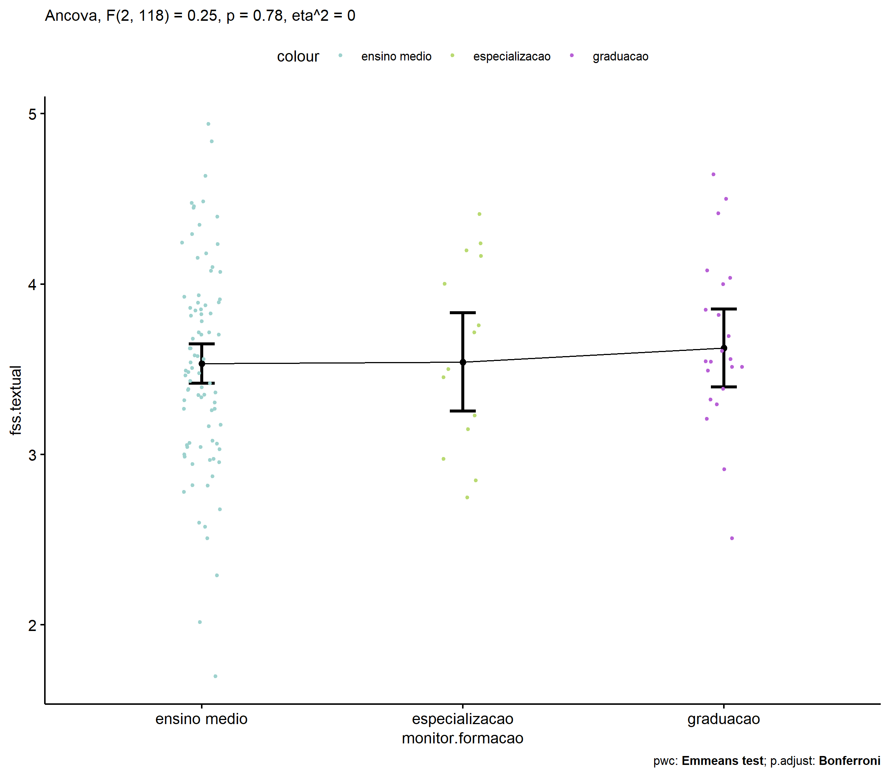<!-- -->

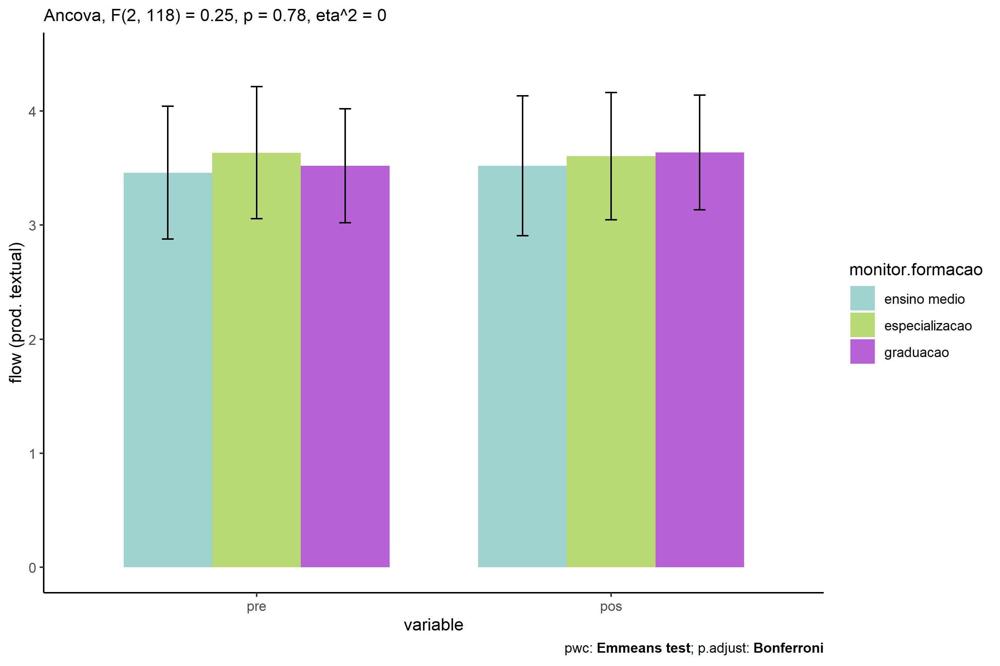<!-- -->

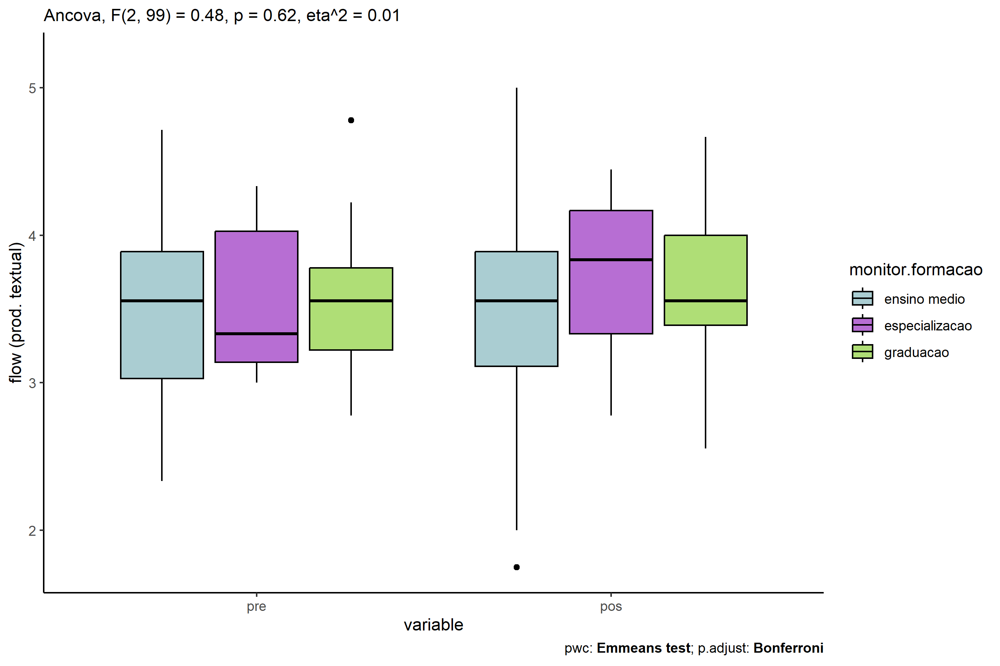<!-- -->

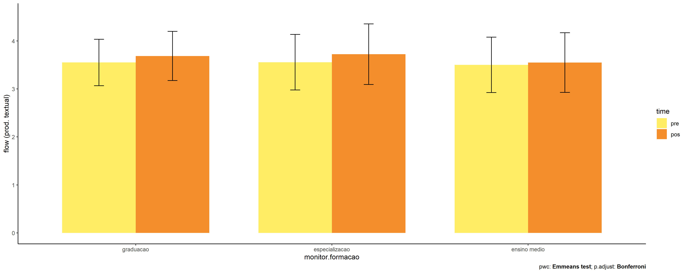<!-- -->

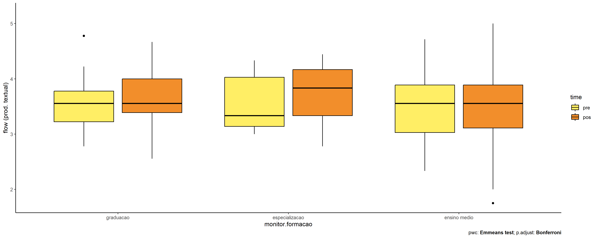<!-- -->

### factores: **grupo=“Experimental”:monitor.experiencia**

| var         | monitor.experiencia |   n | M (pre) | SE (pre) | M (unadj) | SE (unadj) | M (adj) | SE (adj) |
|:------------|:--------------------|----:|--------:|---------:|----------:|-----------:|--------:|---------:|
| fss.textual | maior 01 ano        |  86 |   3.529 |    0.063 |     3.594 |      0.063 |   3.578 |    0.058 |
| fss.textual | menor 01 ano        |  36 |   3.397 |    0.088 |     3.447 |      0.099 |   3.485 |    0.090 |

| .y.         | group1       | group2       | estimate | conf.low | conf.high |    se | statistic |    p | p.adj | p.adj.signif |
|:------------|:-------------|:-------------|---------:|---------:|----------:|------:|----------:|-----:|------:|:-------------|
| fss.textual | maior 01 ano | menor 01 ano |    0.093 |    -0.12 |     0.306 | 0.108 |     0.862 | 0.39 |  0.39 | ns           |
| dfs.textual | maior 01 ano | menor 01 ano |    0.133 |    -0.09 |     0.355 | 0.112 |     1.181 | 0.24 |  0.24 | ns           |

| .y.          | monitor.experiencia | group1 | group2 | estimate | conf.low | conf.high |    se | statistic |     p | p.adj | p.adj.signif |
|:-------------|:--------------------|:-------|:-------|---------:|---------:|----------:|------:|----------:|------:|------:|:-------------|
| flow.textual | maior 01 ano        | pre    | pos    |   -0.065 |   -0.238 |     0.108 | 0.088 |    -0.738 | 0.461 | 0.461 | ns           |
| flow.textual | menor 01 ano        | pre    | pos    |   -0.050 |   -0.317 |     0.217 | 0.136 |    -0.368 | 0.713 | 0.713 | ns           |

    ## Scale for colour is already present.
    ## Adding another scale for colour, which will replace the existing scale.

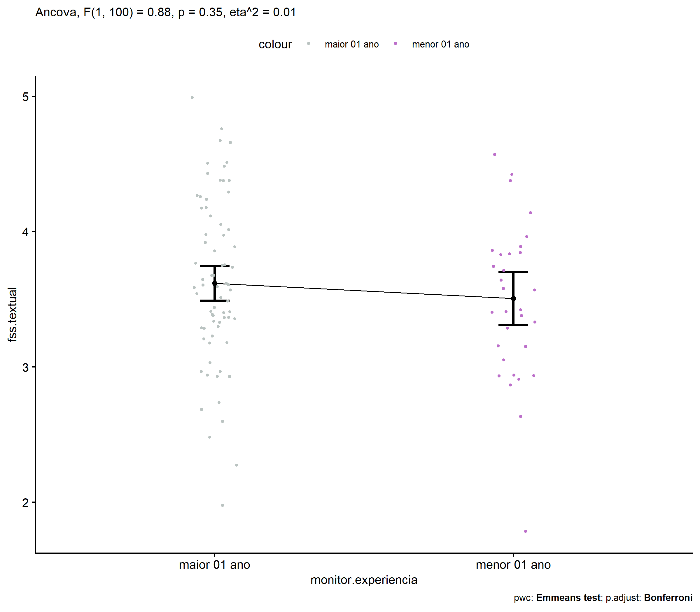<!-- -->

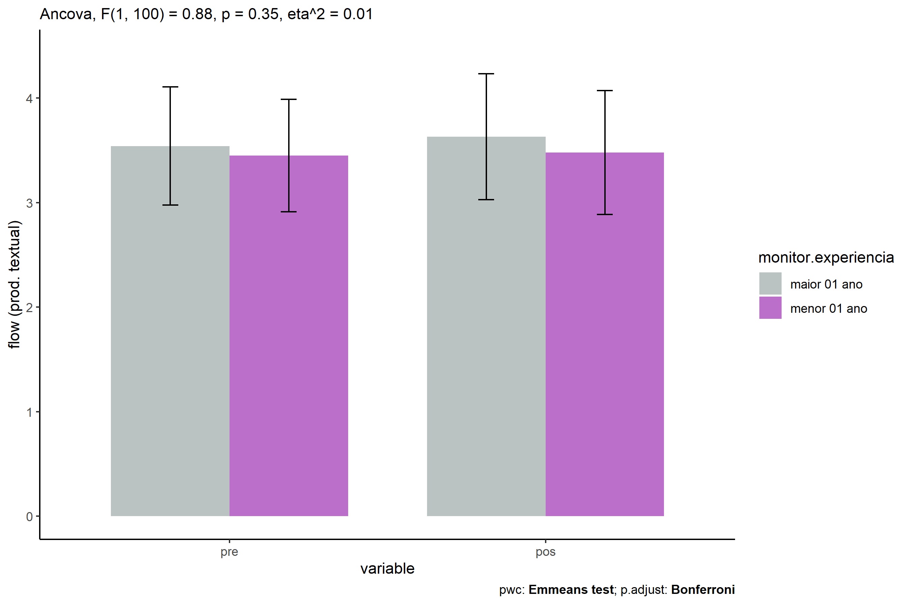<!-- -->

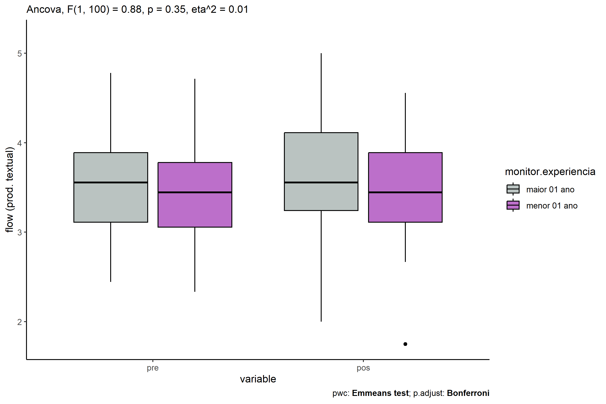<!-- -->

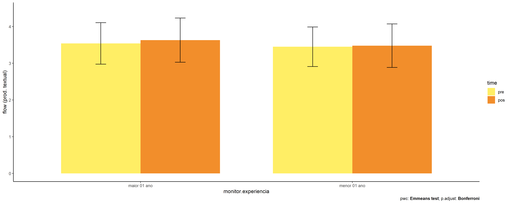<!-- -->

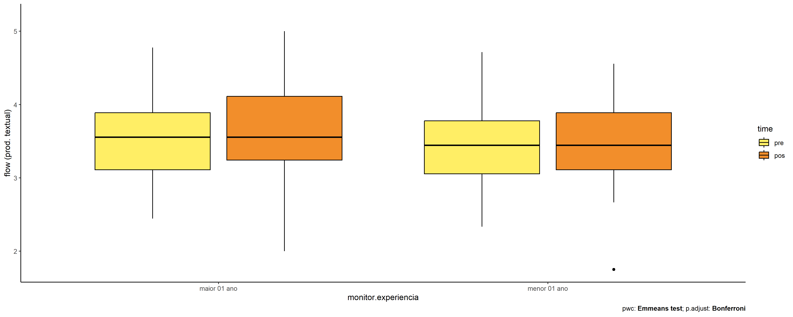<!-- -->
