ANCOVA in CLPP Test (Teste de Competencia em Leitura de Palavras e
Pseudo-palavras)
================
Geiser C. Challco <geiser@alumni.usp.br>

- [Descriptive Statistics of Initial
  Data](#descriptive-statistics-of-initial-data)
  - [Leitura de Pseudo-Palavras
    (Acertos)](#leitura-de-pseudo-palavras-acertos)
  - [Leitura de Pseudo-Palavras (TRI)](#leitura-de-pseudo-palavras-tri)
  - [Correta Regular (Acertos)](#correta-regular-acertos)
  - [Correta Regular (TRI)](#correta-regular-tri)
  - [Correta Irregular (Acertos)](#correta-irregular-acertos)
  - [Correta Irregular (TRI)](#correta-irregular-tri)
  - [Trocas Visuais (Acertos)](#trocas-visuais-acertos)
  - [Trocas Visuais (TRI)](#trocas-visuais-tri)
  - [Trocas Fonologicas (Acertos)](#trocas-fonologicas-acertos)
  - [Trocas Fonologicas (TRI)](#trocas-fonologicas-tri)
  - [Trocas Orograficas (Acertos)](#trocas-orograficas-acertos)
  - [Trocas Orograficas (TRI)](#trocas-orograficas-tri)
- [Checking of Assumptions](#checking-of-assumptions)
  - [Assumption: Normality
    distribution](#assumption-normality-distribution)
    - [Leitura de Pseudo-Palavras
      (Acertos)](#leitura-de-pseudo-palavras-acertos-1)
    - [Leitura de Pseudo-Palavras
      (TRI)](#leitura-de-pseudo-palavras-tri-1)
    - [Correta Regular (Acertos)](#correta-regular-acertos-1)
    - [Correta Regular (TRI)](#correta-regular-tri-1)
    - [Correta Irregular (Acertos)](#correta-irregular-acertos-1)
    - [Correta Irregular (TRI)](#correta-irregular-tri-1)
    - [Trocas Visuais (Acertos)](#trocas-visuais-acertos-1)
    - [Trocas Visuais (TRI)](#trocas-visuais-tri-1)
    - [Trocas Fonologicas (Acertos)](#trocas-fonologicas-acertos-1)
    - [Trocas Fonologicas (TRI)](#trocas-fonologicas-tri-1)
    - [Trocas Orograficas (Acertos)](#trocas-orograficas-acertos-1)
    - [Trocas Orograficas (TRI)](#trocas-orograficas-tri-1)
  - [Assumption: Homogeneity](#assumption-homogeneity)
    - [Leitura de Pseudo-Palavras
      (Acertos)](#leitura-de-pseudo-palavras-acertos-2)
    - [Leitura de Pseudo-Palavras
      (TRI)](#leitura-de-pseudo-palavras-tri-2)
    - [Correta Regular (Acertos)](#correta-regular-acertos-2)
    - [Correta Regular (TRI)](#correta-regular-tri-2)
    - [Correta Irregular (Acertos)](#correta-irregular-acertos-2)
    - [Correta Irregular (TRI)](#correta-irregular-tri-2)
    - [Trocas Visuais (Acertos)](#trocas-visuais-acertos-2)
    - [Trocas Visuais (TRI)](#trocas-visuais-tri-2)
    - [Trocas Fonologicas (Acertos)](#trocas-fonologicas-acertos-2)
    - [Trocas Fonologicas (TRI)](#trocas-fonologicas-tri-2)
    - [Trocas Orograficas (Acertos)](#trocas-orograficas-acertos-2)
    - [Trocas Orograficas (TRI)](#trocas-orograficas-tri-2)
- [Computation of ANCOVA test and Pairwise
  Comparison](#computation-of-ancova-test-and-pairwise-comparison)
  - [ANCOVA tests for one factor](#ancova-tests-for-one-factor)
    - [Leitura de Pseudo-Palavras
      (Acertos)](#leitura-de-pseudo-palavras-acertos-3)
    - [Leitura de Pseudo-Palavras
      (TRI)](#leitura-de-pseudo-palavras-tri-3)
    - [Correta Regular (Acertos)](#correta-regular-acertos-3)
    - [Correta Regular (TRI)](#correta-regular-tri-3)
    - [Correta Irregular (Acertos)](#correta-irregular-acertos-3)
    - [Correta Irregular (TRI)](#correta-irregular-tri-3)
    - [Trocas Visuais (Acertos)](#trocas-visuais-acertos-3)
    - [Trocas Visuais (TRI)](#trocas-visuais-tri-3)
    - [Trocas Fonologicas (Acertos)](#trocas-fonologicas-acertos-3)
    - [Trocas Fonologicas (TRI)](#trocas-fonologicas-tri-3)
    - [Trocas Orograficas (Acertos)](#trocas-orograficas-acertos-3)
    - [Trocas Orograficas (TRI)](#trocas-orograficas-tri-3)
  - [ANCOVA tests for two factors](#ancova-tests-for-two-factors)
    - [Leitura de Pseudo-Palavras
      (Acertos)](#leitura-de-pseudo-palavras-acertos-4)
    - [Leitura de Pseudo-Palavras
      (TRI)](#leitura-de-pseudo-palavras-tri-4)
    - [Correta Regular (Acertos)](#correta-regular-acertos-4)
    - [Correta Regular (TRI)](#correta-regular-tri-4)
    - [Correta Irregular (Acertos)](#correta-irregular-acertos-4)
    - [Correta Irregular (TRI)](#correta-irregular-tri-4)
    - [Trocas Visuais (Acertos)](#trocas-visuais-acertos-4)
    - [Trocas Visuais (TRI)](#trocas-visuais-tri-4)
    - [Trocas Fonologicas (Acertos)](#trocas-fonologicas-acertos-4)
    - [Trocas Fonologicas (TRI)](#trocas-fonologicas-tri-4)
    - [Trocas Orograficas (Acertos)](#trocas-orograficas-acertos-4)
    - [Trocas Orograficas (TRI)](#trocas-orograficas-tri-4)
  - [ANCOVA tests for
    grupo=“Experimental”](#ancova-tests-for-grupoexperimental)
    - [Leitura de Pseudo-Palavras
      (Acertos)](#leitura-de-pseudo-palavras-acertos-5)
    - [Leitura de Pseudo-Palavras
      (TRI)](#leitura-de-pseudo-palavras-tri-5)
    - [Correta Regular (Acertos)](#correta-regular-acertos-5)
    - [Correta Regular (TRI)](#correta-regular-tri-5)
    - [Correta Irregular (Acertos)](#correta-irregular-acertos-5)
    - [Correta Irregular (TRI)](#correta-irregular-tri-5)
    - [Trocas Visuais (Acertos)](#trocas-visuais-acertos-5)
    - [Trocas Visuais (TRI)](#trocas-visuais-tri-5)
    - [Trocas Fonologicas (Acertos)](#trocas-fonologicas-acertos-5)
    - [Trocas Fonologicas (TRI)](#trocas-fonologicas-tri-5)
    - [Trocas Orograficas (Acertos)](#trocas-orograficas-acertos-5)
    - [Trocas Orograficas (TRI)](#trocas-orograficas-tri-5)
- [Pairwise comparisons for one
  factor](#pairwise-comparisons-for-one-factor)
  - [factor: **grupo**](#factor-grupo)
    - [Leitura de Pseudo-Palavras
      (Acertos)](#leitura-de-pseudo-palavras-acertos-6)
    - [Leitura de Pseudo-Palavras
      (TRI)](#leitura-de-pseudo-palavras-tri-6)
    - [Correta Regular (Acertos)](#correta-regular-acertos-6)
    - [Correta Regular (TRI)](#correta-regular-tri-6)
    - [Correta Irregular (Acertos)](#correta-irregular-acertos-6)
    - [Correta Irregular (TRI)](#correta-irregular-tri-6)
    - [Trocas Visuais (Acertos)](#trocas-visuais-acertos-6)
    - [Trocas Visuais (TRI)](#trocas-visuais-tri-6)
    - [Trocas Fonologicas (Acertos)](#trocas-fonologicas-acertos-6)
    - [Trocas Fonologicas (TRI)](#trocas-fonologicas-tri-6)
    - [Trocas Orograficas (Acertos)](#trocas-orograficas-acertos-6)
    - [Trocas Orograficas (TRI)](#trocas-orograficas-tri-6)
  - [factor: **genero**](#factor-genero)
    - [Leitura de Pseudo-Palavras
      (Acertos)](#leitura-de-pseudo-palavras-acertos-7)
    - [Leitura de Pseudo-Palavras
      (TRI)](#leitura-de-pseudo-palavras-tri-7)
    - [Correta Regular (Acertos)](#correta-regular-acertos-7)
    - [Correta Regular (TRI)](#correta-regular-tri-7)
    - [Correta Irregular (Acertos)](#correta-irregular-acertos-7)
    - [Correta Irregular (TRI)](#correta-irregular-tri-7)
    - [Trocas Visuais (Acertos)](#trocas-visuais-acertos-7)
    - [Trocas Visuais (TRI)](#trocas-visuais-tri-7)
    - [Trocas Fonologicas (Acertos)](#trocas-fonologicas-acertos-7)
    - [Trocas Fonologicas (TRI)](#trocas-fonologicas-tri-7)
    - [Trocas Orograficas (Acertos)](#trocas-orograficas-acertos-7)
    - [Trocas Orograficas (TRI)](#trocas-orograficas-tri-7)
  - [factor: **idade**](#factor-idade)
    - [Leitura de Pseudo-Palavras
      (Acertos)](#leitura-de-pseudo-palavras-acertos-8)
    - [Leitura de Pseudo-Palavras
      (TRI)](#leitura-de-pseudo-palavras-tri-8)
    - [Correta Regular (Acertos)](#correta-regular-acertos-8)
    - [Correta Regular (TRI)](#correta-regular-tri-8)
    - [Correta Irregular (Acertos)](#correta-irregular-acertos-8)
    - [Correta Irregular (TRI)](#correta-irregular-tri-8)
    - [Trocas Visuais (Acertos)](#trocas-visuais-acertos-8)
    - [Trocas Visuais (TRI)](#trocas-visuais-tri-8)
    - [Trocas Fonologicas (Acertos)](#trocas-fonologicas-acertos-8)
    - [Trocas Fonologicas (TRI)](#trocas-fonologicas-tri-8)
    - [Trocas Orograficas (Acertos)](#trocas-orograficas-acertos-8)
    - [Trocas Orograficas (TRI)](#trocas-orograficas-tri-8)
  - [factor: **zona.participante**](#factor-zonaparticipante)
    - [Leitura de Pseudo-Palavras
      (Acertos)](#leitura-de-pseudo-palavras-acertos-9)
    - [Leitura de Pseudo-Palavras
      (TRI)](#leitura-de-pseudo-palavras-tri-9)
    - [Correta Regular (Acertos)](#correta-regular-acertos-9)
    - [Correta Regular (TRI)](#correta-regular-tri-9)
    - [Correta Irregular (Acertos)](#correta-irregular-acertos-9)
    - [Correta Irregular (TRI)](#correta-irregular-tri-9)
    - [Trocas Visuais (Acertos)](#trocas-visuais-acertos-9)
    - [Trocas Visuais (TRI)](#trocas-visuais-tri-9)
    - [Trocas Fonologicas (Acertos)](#trocas-fonologicas-acertos-9)
    - [Trocas Fonologicas (TRI)](#trocas-fonologicas-tri-9)
    - [Trocas Orograficas (Acertos)](#trocas-orograficas-acertos-9)
    - [Trocas Orograficas (TRI)](#trocas-orograficas-tri-9)
  - [factor: **escola**](#factor-escola)
    - [Leitura de Pseudo-Palavras
      (Acertos)](#leitura-de-pseudo-palavras-acertos-10)
    - [Leitura de Pseudo-Palavras
      (TRI)](#leitura-de-pseudo-palavras-tri-10)
    - [Correta Regular (Acertos)](#correta-regular-acertos-10)
    - [Correta Regular (TRI)](#correta-regular-tri-10)
    - [Correta Irregular (Acertos)](#correta-irregular-acertos-10)
    - [Correta Irregular (TRI)](#correta-irregular-tri-10)
    - [Trocas Visuais (Acertos)](#trocas-visuais-acertos-10)
    - [Trocas Visuais (TRI)](#trocas-visuais-tri-10)
    - [Trocas Fonologicas (Acertos)](#trocas-fonologicas-acertos-10)
    - [Trocas Fonologicas (TRI)](#trocas-fonologicas-tri-10)
    - [Trocas Orograficas (Acertos)](#trocas-orograficas-acertos-10)
    - [Trocas Orograficas (TRI)](#trocas-orograficas-tri-10)
  - [factor: **zona.escola**](#factor-zonaescola)
    - [Leitura de Pseudo-Palavras
      (Acertos)](#leitura-de-pseudo-palavras-acertos-11)
    - [Leitura de Pseudo-Palavras
      (TRI)](#leitura-de-pseudo-palavras-tri-11)
    - [Correta Regular (Acertos)](#correta-regular-acertos-11)
    - [Correta Regular (TRI)](#correta-regular-tri-11)
    - [Correta Irregular (Acertos)](#correta-irregular-acertos-11)
    - [Correta Irregular (TRI)](#correta-irregular-tri-11)
    - [Trocas Visuais (Acertos)](#trocas-visuais-acertos-11)
    - [Trocas Visuais (TRI)](#trocas-visuais-tri-11)
    - [Trocas Fonologicas (Acertos)](#trocas-fonologicas-acertos-11)
    - [Trocas Fonologicas (TRI)](#trocas-fonologicas-tri-11)
    - [Trocas Orograficas (Acertos)](#trocas-orograficas-acertos-11)
    - [Trocas Orograficas (TRI)](#trocas-orograficas-tri-11)
- [Pairwise comparisons for two
  factors](#pairwise-comparisons-for-two-factors)
  - [factores: **genero:grupo**](#factores-generogrupo)
    - [Leitura de Pseudo-Palavras
      (Acertos)](#leitura-de-pseudo-palavras-acertos-12)
    - [Leitura de Pseudo-Palavras
      (TRI)](#leitura-de-pseudo-palavras-tri-12)
    - [Correta Regular (Acertos)](#correta-regular-acertos-12)
    - [Correta Regular (TRI)](#correta-regular-tri-12)
    - [Correta Irregular (Acertos)](#correta-irregular-acertos-12)
    - [Correta Irregular (TRI)](#correta-irregular-tri-12)
    - [Trocas Visuais (Acertos)](#trocas-visuais-acertos-12)
    - [Trocas Visuais (TRI)](#trocas-visuais-tri-12)
    - [Trocas Fonologicas (Acertos)](#trocas-fonologicas-acertos-12)
    - [Trocas Fonologicas (TRI)](#trocas-fonologicas-tri-12)
    - [Trocas Orograficas (Acertos)](#trocas-orograficas-acertos-12)
    - [Trocas Orograficas (TRI)](#trocas-orograficas-tri-12)
  - [factores: **idade:grupo**](#factores-idadegrupo)
    - [Leitura de Pseudo-Palavras
      (Acertos)](#leitura-de-pseudo-palavras-acertos-13)
    - [Leitura de Pseudo-Palavras
      (TRI)](#leitura-de-pseudo-palavras-tri-13)
    - [Correta Regular (Acertos)](#correta-regular-acertos-13)
    - [Correta Regular (TRI)](#correta-regular-tri-13)
    - [Correta Irregular (Acertos)](#correta-irregular-acertos-13)
    - [Correta Irregular (TRI)](#correta-irregular-tri-13)
    - [Trocas Visuais (Acertos)](#trocas-visuais-acertos-13)
    - [Trocas Visuais (TRI)](#trocas-visuais-tri-13)
    - [Trocas Fonologicas (Acertos)](#trocas-fonologicas-acertos-13)
    - [Trocas Fonologicas (TRI)](#trocas-fonologicas-tri-13)
    - [Trocas Orograficas (Acertos)](#trocas-orograficas-acertos-13)
    - [Trocas Orograficas (TRI)](#trocas-orograficas-tri-13)
  - [factores:
    **zona.participante:grupo**](#factores-zonaparticipantegrupo)
    - [Leitura de Pseudo-Palavras
      (Acertos)](#leitura-de-pseudo-palavras-acertos-14)
    - [Leitura de Pseudo-Palavras
      (TRI)](#leitura-de-pseudo-palavras-tri-14)
    - [Correta Regular (Acertos)](#correta-regular-acertos-14)
    - [Correta Regular (TRI)](#correta-regular-tri-14)
    - [Correta Irregular (Acertos)](#correta-irregular-acertos-14)
    - [Correta Irregular (TRI)](#correta-irregular-tri-14)
    - [Trocas Visuais (Acertos)](#trocas-visuais-acertos-14)
    - [Trocas Visuais (TRI)](#trocas-visuais-tri-14)
    - [Trocas Fonologicas (Acertos)](#trocas-fonologicas-acertos-14)
    - [Trocas Fonologicas (TRI)](#trocas-fonologicas-tri-14)
    - [Trocas Orograficas (Acertos)](#trocas-orograficas-acertos-14)
    - [Trocas Orograficas (TRI)](#trocas-orograficas-tri-14)
  - [factores: **escola:grupo**](#factores-escolagrupo)
    - [Leitura de Pseudo-Palavras
      (Acertos)](#leitura-de-pseudo-palavras-acertos-15)
    - [Leitura de Pseudo-Palavras
      (TRI)](#leitura-de-pseudo-palavras-tri-15)
    - [Correta Regular (Acertos)](#correta-regular-acertos-15)
    - [Correta Regular (TRI)](#correta-regular-tri-15)
    - [Correta Irregular (Acertos)](#correta-irregular-acertos-15)
    - [Correta Irregular (TRI)](#correta-irregular-tri-15)
    - [Trocas Visuais (Acertos)](#trocas-visuais-acertos-15)
    - [Trocas Visuais (TRI)](#trocas-visuais-tri-15)
    - [Trocas Fonologicas (Acertos)](#trocas-fonologicas-acertos-15)
    - [Trocas Fonologicas (TRI)](#trocas-fonologicas-tri-15)
    - [Trocas Orograficas (Acertos)](#trocas-orograficas-acertos-15)
    - [Trocas Orograficas (TRI)](#trocas-orograficas-tri-15)
  - [factores: **zona.escola:grupo**](#factores-zonaescolagrupo)
    - [Leitura de Pseudo-Palavras
      (Acertos)](#leitura-de-pseudo-palavras-acertos-16)
    - [Leitura de Pseudo-Palavras
      (TRI)](#leitura-de-pseudo-palavras-tri-16)
    - [Correta Regular (Acertos)](#correta-regular-acertos-16)
    - [Correta Regular (TRI)](#correta-regular-tri-16)
    - [Correta Irregular (Acertos)](#correta-irregular-acertos-16)
    - [Correta Irregular (TRI)](#correta-irregular-tri-16)
    - [Trocas Visuais (Acertos)](#trocas-visuais-acertos-16)
    - [Trocas Visuais (TRI)](#trocas-visuais-tri-16)
    - [Trocas Fonologicas (Acertos)](#trocas-fonologicas-acertos-16)
    - [Trocas Fonologicas (TRI)](#trocas-fonologicas-tri-16)
    - [Trocas Orograficas (Acertos)](#trocas-orograficas-acertos-16)
    - [Trocas Orograficas (TRI)](#trocas-orograficas-tri-16)
- [Pairwise comparisons for
  grupo=“Experimental”](#pairwise-comparisons-for-grupoexperimental)
  - [factores:
    **grupo=“Experimental”:monitor**](#factores-grupoexperimentalmonitor)
    - [Leitura de Pseudo-Palavras
      (Acertos)](#leitura-de-pseudo-palavras-acertos-17)
    - [Leitura de Pseudo-Palavras
      (TRI)](#leitura-de-pseudo-palavras-tri-17)
    - [Correta Regular (Acertos)](#correta-regular-acertos-17)
    - [Correta Regular (TRI)](#correta-regular-tri-17)
    - [Correta Irregular (Acertos)](#correta-irregular-acertos-17)
    - [Correta Irregular (TRI)](#correta-irregular-tri-17)
    - [Trocas Visuais (Acertos)](#trocas-visuais-acertos-17)
    - [Trocas Visuais (TRI)](#trocas-visuais-tri-17)
    - [Trocas Fonologicas (Acertos)](#trocas-fonologicas-acertos-17)
    - [Trocas Fonologicas (TRI)](#trocas-fonologicas-tri-17)
    - [Trocas Orograficas (Acertos)](#trocas-orograficas-acertos-17)
    - [Trocas Orograficas (TRI)](#trocas-orograficas-tri-17)
  - [factores:
    **grupo=“Experimental”:monitor.genero**](#factores-grupoexperimentalmonitorgenero)
    - [Leitura de Pseudo-Palavras
      (Acertos)](#leitura-de-pseudo-palavras-acertos-18)
    - [Leitura de Pseudo-Palavras
      (TRI)](#leitura-de-pseudo-palavras-tri-18)
    - [Correta Regular (Acertos)](#correta-regular-acertos-18)
    - [Correta Regular (TRI)](#correta-regular-tri-18)
    - [Correta Irregular (Acertos)](#correta-irregular-acertos-18)
    - [Correta Irregular (TRI)](#correta-irregular-tri-18)
    - [Trocas Visuais (Acertos)](#trocas-visuais-acertos-18)
    - [Trocas Visuais (TRI)](#trocas-visuais-tri-18)
    - [Trocas Fonologicas (Acertos)](#trocas-fonologicas-acertos-18)
    - [Trocas Fonologicas (TRI)](#trocas-fonologicas-tri-18)
    - [Trocas Orograficas (Acertos)](#trocas-orograficas-acertos-18)
    - [Trocas Orograficas (TRI)](#trocas-orograficas-tri-18)
  - [factores:
    **grupo=“Experimental”:monitor.area**](#factores-grupoexperimentalmonitorarea)
    - [Leitura de Pseudo-Palavras
      (Acertos)](#leitura-de-pseudo-palavras-acertos-19)
    - [Leitura de Pseudo-Palavras
      (TRI)](#leitura-de-pseudo-palavras-tri-19)
    - [Correta Regular (Acertos)](#correta-regular-acertos-19)
    - [Correta Regular (TRI)](#correta-regular-tri-19)
    - [Correta Irregular (Acertos)](#correta-irregular-acertos-19)
    - [Correta Irregular (TRI)](#correta-irregular-tri-19)
    - [Trocas Visuais (Acertos)](#trocas-visuais-acertos-19)
    - [Trocas Visuais (TRI)](#trocas-visuais-tri-19)
    - [Trocas Fonologicas (Acertos)](#trocas-fonologicas-acertos-19)
    - [Trocas Fonologicas (TRI)](#trocas-fonologicas-tri-19)
    - [Trocas Orograficas (Acertos)](#trocas-orograficas-acertos-19)
    - [Trocas Orograficas (TRI)](#trocas-orograficas-tri-19)
  - [factores:
    **grupo=“Experimental”:monitor.formacao**](#factores-grupoexperimentalmonitorformacao)
    - [Leitura de Pseudo-Palavras
      (Acertos)](#leitura-de-pseudo-palavras-acertos-20)
    - [Leitura de Pseudo-Palavras
      (TRI)](#leitura-de-pseudo-palavras-tri-20)
    - [Correta Regular (Acertos)](#correta-regular-acertos-20)
    - [Correta Regular (TRI)](#correta-regular-tri-20)
    - [Correta Irregular (Acertos)](#correta-irregular-acertos-20)
    - [Correta Irregular (TRI)](#correta-irregular-tri-20)
    - [Trocas Visuais (Acertos)](#trocas-visuais-acertos-20)
    - [Trocas Visuais (TRI)](#trocas-visuais-tri-20)
    - [Trocas Fonologicas (Acertos)](#trocas-fonologicas-acertos-20)
    - [Trocas Fonologicas (TRI)](#trocas-fonologicas-tri-20)
    - [Trocas Orograficas (Acertos)](#trocas-orograficas-acertos-20)
    - [Trocas Orograficas (TRI)](#trocas-orograficas-tri-20)
  - [factores:
    **grupo=“Experimental”:monitor.experiencia**](#factores-grupoexperimentalmonitorexperiencia)
    - [Leitura de Pseudo-Palavras
      (Acertos)](#leitura-de-pseudo-palavras-acertos-21)
    - [Leitura de Pseudo-Palavras
      (TRI)](#leitura-de-pseudo-palavras-tri-21)
    - [Correta Regular (Acertos)](#correta-regular-acertos-21)
    - [Correta Regular (TRI)](#correta-regular-tri-21)
    - [Correta Irregular (Acertos)](#correta-irregular-acertos-21)
    - [Correta Irregular (TRI)](#correta-irregular-tri-21)
    - [Trocas Visuais (Acertos)](#trocas-visuais-acertos-21)
    - [Trocas Visuais (TRI)](#trocas-visuais-tri-21)
    - [Trocas Fonologicas (Acertos)](#trocas-fonologicas-acertos-21)
    - [Trocas Fonologicas (TRI)](#trocas-fonologicas-tri-21)
    - [Trocas Orograficas (Acertos)](#trocas-orograficas-acertos-21)
    - [Trocas Orograficas (TRI)](#trocas-orograficas-tri-21)

**NOTE**

- Teste ANCOVA para determinar se houve diferenças significativas no
  Teste de Competencia em Leitura de Palavras e Pseudo-palavras (medido
  usando pre- e pos-testes).
- ANCOVA test to determine whether there were significant differences in
  CLPP Test (measured using pre- and post-tests).

# Descriptive Statistics of Initial Data

## Leitura de Pseudo-Palavras (Acertos)

| grupo        | genero | idade | zona.participante | escola | zona.escola | variable       |   n |   mean | median | min | max |     sd |     se |      ci |   iqr |
|:-------------|:-------|:------|:------------------|:-------|:------------|:---------------|----:|-------:|-------:|----:|----:|-------:|-------:|--------:|------:|
| Controle     | F      |       |                   |        |             | score.CLPP.pos |  16 | 57.812 |   58.5 |  23 |  83 | 13.432 |  3.358 |   7.158 |  6.25 |
| Controle     | M      |       |                   |        |             | score.CLPP.pos |   8 | 58.250 |   61.5 |  46 |  65 |  6.923 |  2.448 |   5.788 |  8.50 |
| Experimental | F      |       |                   |        |             | score.CLPP.pos |  12 | 68.417 |   67.5 |  55 |  85 |  8.306 |  2.398 |   5.277 |  9.50 |
| Experimental | M      |       |                   |        |             | score.CLPP.pos |   7 | 63.143 |   62.0 |  49 |  76 | 11.231 |  4.245 |  10.387 | 19.50 |
| Controle     | F      |       |                   |        |             | score.CLPP.pre |  16 | 54.625 |   56.5 |  13 |  79 | 15.941 |  3.985 |   8.494 | 17.00 |
| Controle     | M      |       |                   |        |             | score.CLPP.pre |   8 | 50.750 |   56.0 |  11 |  68 | 18.599 |  6.576 |  15.549 | 17.75 |
| Experimental | F      |       |                   |        |             | score.CLPP.pre |  12 | 58.167 |   60.5 |  42 |  72 |  9.916 |  2.863 |   6.301 | 11.75 |
| Experimental | M      |       |                   |        |             | score.CLPP.pre |   7 | 53.143 |   55.0 |  28 |  75 | 14.645 |  5.535 |  13.544 | 13.00 |
| Controle     |        | 10y   |                   |        |             | score.CLPP.pos |   4 | 61.750 |   63.0 |  38 |  83 | 18.500 |  9.250 |  29.438 | 14.25 |
| Controle     |        | 11y   |                   |        |             | score.CLPP.pos |  15 | 56.067 |   57.0 |  23 |  72 | 11.480 |  2.964 |   6.357 |  9.00 |
| Controle     |        | 12y   |                   |        |             | score.CLPP.pos |   3 | 62.333 |   62.0 |  62 |  63 |  0.577 |  0.333 |   1.434 |  0.50 |
| Controle     |        | 13y   |                   |        |             | score.CLPP.pos |   1 | 57.000 |   57.0 |  57 |  57 |        |        |         |  0.00 |
| Controle     |        |       |                   |        |             | score.CLPP.pos |   1 | 59.000 |   59.0 |  59 |  59 |        |        |         |  0.00 |
| Experimental |        | 10y   |                   |        |             | score.CLPP.pos |   2 | 73.500 |   73.5 |  70 |  77 |  4.950 |  3.500 |  44.472 |  3.50 |
| Experimental |        | 11y   |                   |        |             | score.CLPP.pos |  11 | 68.636 |   71.0 |  49 |  85 | 10.481 |  3.160 |   7.041 | 12.00 |
| Experimental |        | 12y   |                   |        |             | score.CLPP.pos |   5 | 61.800 |   63.0 |  56 |  65 |  3.421 |  1.530 |   4.247 |  1.00 |
| Experimental |        | 13y   |                   |        |             | score.CLPP.pos |   1 | 52.000 |   52.0 |  52 |  52 |        |        |         |  0.00 |
| Controle     |        | 10y   |                   |        |             | score.CLPP.pre |   4 | 65.500 |   63.0 |  57 |  79 |  9.983 |  4.992 |  15.886 | 11.50 |
| Controle     |        | 11y   |                   |        |             | score.CLPP.pre |  15 | 47.467 |   48.0 |  11 |  71 | 17.744 |  4.581 |   9.826 | 16.50 |
| Controle     |        | 12y   |                   |        |             | score.CLPP.pre |   3 | 65.333 |   67.0 |  61 |  68 |  3.786 |  2.186 |   9.405 |  3.50 |
| Controle     |        | 13y   |                   |        |             | score.CLPP.pre |   1 | 59.000 |   59.0 |  59 |  59 |        |        |         |  0.00 |
| Controle     |        |       |                   |        |             | score.CLPP.pre |   1 | 51.000 |   51.0 |  51 |  51 |        |        |         |  0.00 |
| Experimental |        | 10y   |                   |        |             | score.CLPP.pre |   2 | 67.000 |   67.0 |  65 |  69 |  2.828 |  2.000 |  25.412 |  2.00 |
| Experimental |        | 11y   |                   |        |             | score.CLPP.pre |  11 | 57.818 |   56.0 |  44 |  75 |  9.898 |  2.984 |   6.649 | 10.50 |
| Experimental |        | 12y   |                   |        |             | score.CLPP.pre |   5 | 48.200 |   45.0 |  28 |  65 | 15.023 |  6.719 |  18.654 | 19.00 |
| Experimental |        | 13y   |                   |        |             | score.CLPP.pre |   1 | 59.000 |   59.0 |  59 |  59 |        |        |         |  0.00 |
| Controle     |        |       | Urbana            |        |             | score.CLPP.pos |  11 | 57.091 |   60.0 |  23 |  83 | 16.096 |  4.853 |  10.814 | 10.50 |
| Controle     |        |       | Rural             |        |             | score.CLPP.pos |   9 | 58.000 |   58.0 |  46 |  70 |  7.071 |  2.357 |   5.435 |  7.00 |
| Controle     |        |       |                   |        |             | score.CLPP.pos |   4 | 60.250 |   60.5 |  57 |  63 |  2.754 |  1.377 |   4.382 |  3.75 |
| Experimental |        |       | Urbana            |        |             | score.CLPP.pos |   7 | 68.571 |   70.0 |  55 |  77 |  7.020 |  2.653 |   6.493 |  5.00 |
| Experimental |        |       | Rural             |        |             | score.CLPP.pos |   8 | 68.625 |   70.0 |  49 |  85 | 11.538 |  4.079 |   9.646 | 14.75 |
| Experimental |        |       |                   |        |             | score.CLPP.pos |   4 | 58.500 |   59.5 |  52 |  63 |  5.447 |  2.723 |   8.667 |  8.00 |
| Controle     |        |       | Urbana            |        |             | score.CLPP.pre |  11 | 54.182 |   57.0 |  13 |  79 | 18.054 |  5.444 |  12.129 | 13.00 |
| Controle     |        |       | Rural             |        |             | score.CLPP.pre |   9 | 55.000 |   52.0 |  41 |  69 | 11.045 |  3.682 |   8.490 | 21.00 |
| Controle     |        |       |                   |        |             | score.CLPP.pre |   4 | 47.250 |   55.0 |  11 |  68 | 25.145 | 12.572 |  40.011 | 20.25 |
| Experimental |        |       | Urbana            |        |             | score.CLPP.pre |   7 | 54.857 |   56.0 |  42 |  69 | 10.495 |  3.967 |   9.706 | 16.50 |
| Experimental |        |       | Rural             |        |             | score.CLPP.pre |   8 | 57.000 |   58.5 |  28 |  75 | 14.967 |  5.292 |  12.512 | 12.50 |
| Experimental |        |       |                   |        |             | score.CLPP.pre |   4 | 57.500 |   60.0 |  45 |  65 |  8.699 |  4.349 |  13.842 |  6.50 |
| Controle     |        |       |                   | E2     |             | score.CLPP.pos |   6 | 54.667 |   58.0 |  38 |  62 |  9.352 |  3.818 |   9.815 | 10.00 |
| Controle     |        |       |                   | E3     |             | score.CLPP.pos |   5 | 57.000 |   56.0 |  46 |  70 |  9.381 |  4.195 |  11.648 | 11.00 |
| Controle     |        |       |                   | E4     |             | score.CLPP.pos |   2 | 53.000 |   53.0 |  23 |  83 | 42.426 | 30.000 | 381.186 | 30.00 |
| Controle     |        |       |                   | E5     |             | score.CLPP.pos |  10 | 60.900 |   60.0 |  55 |  72 |  4.977 |  1.574 |   3.560 |  5.50 |
| Controle     |        |       |                   | E6     |             | score.CLPP.pos |   1 | 63.000 |   63.0 |  63 |  63 |        |        |         |  0.00 |
| Experimental |        |       |                   | E2     |             | score.CLPP.pos |   5 | 61.800 |   63.0 |  55 |  70 |  6.301 |  2.818 |   7.823 |  9.00 |
| Experimental |        |       |                   | E3     |             | score.CLPP.pos |   5 | 66.000 |   62.0 |  49 |  85 | 13.838 |  6.189 |  17.183 | 14.00 |
| Experimental |        |       |                   | E4     |             | score.CLPP.pos |   1 | 69.000 |   69.0 |  69 |  69 |        |        |         |  0.00 |
| Experimental |        |       |                   | E5     |             | score.CLPP.pos |   6 | 73.333 |   74.5 |  66 |  77 |  4.320 |  1.764 |   4.534 |  5.25 |
| Experimental |        |       |                   | E6     |             | score.CLPP.pos |   2 | 57.500 |   57.5 |  52 |  63 |  7.778 |  5.500 |  69.884 |  5.50 |
| Controle     |        |       |                   | E2     |             | score.CLPP.pre |   6 | 52.833 |   54.5 |  34 |  68 | 11.514 |  4.700 |  12.083 |  9.25 |
| Controle     |        |       |                   | E3     |             | score.CLPP.pre |   5 | 50.000 |   46.0 |  41 |  67 | 10.320 |  4.615 |  12.814 |  8.00 |
| Controle     |        |       |                   | E4     |             | score.CLPP.pre |   2 | 46.000 |   46.0 |  13 |  79 | 46.669 | 33.000 | 419.305 | 33.00 |
| Controle     |        |       |                   | E5     |             | score.CLPP.pre |  10 | 61.000 |   62.0 |  48 |  71 |  7.468 |  2.362 |   5.343 |  8.75 |
| Controle     |        |       |                   | E6     |             | score.CLPP.pre |   1 | 11.000 |   11.0 |  11 |  11 |        |        |         |  0.00 |
| Experimental |        |       |                   | E2     |             | score.CLPP.pre |   5 | 52.200 |   45.0 |  42 |  69 | 12.071 |  5.398 |  14.988 | 17.00 |
| Experimental |        |       |                   | E3     |             | score.CLPP.pre |   5 | 49.200 |   55.0 |  28 |  61 | 13.027 |  5.826 |  16.175 | 10.00 |
| Experimental |        |       |                   | E4     |             | score.CLPP.pre |   1 | 56.000 |   56.0 |  56 |  56 |        |        |         |  0.00 |
| Experimental |        |       |                   | E5     |             | score.CLPP.pre |   6 | 63.833 |   64.0 |  48 |  75 |  9.579 |  3.911 |  10.053 |  9.50 |
| Experimental |        |       |                   | E6     |             | score.CLPP.pre |   2 | 62.000 |   62.0 |  59 |  65 |  4.243 |  3.000 |  38.119 |  3.00 |
| Controle     |        |       |                   |        | Urbana      | score.CLPP.pos |  16 | 58.562 |   59.5 |  38 |  72 |  7.330 |  1.833 |   3.906 |  5.25 |
| Controle     |        |       |                   |        | Rural       | score.CLPP.pos |   8 | 56.750 |   59.0 |  23 |  83 | 17.806 |  6.296 |  14.887 | 15.00 |
| Experimental |        |       |                   |        | Urbana      | score.CLPP.pos |  11 | 68.091 |   70.0 |  55 |  77 |  7.842 |  2.364 |   5.268 | 10.50 |
| Experimental |        |       |                   |        | Rural       | score.CLPP.pos |   8 | 64.250 |   62.5 |  49 |  85 | 11.683 |  4.131 |   9.768 | 12.25 |
| Controle     |        |       |                   |        | Urbana      | score.CLPP.pre |  16 | 57.938 |   59.0 |  34 |  71 |  9.712 |  2.428 |   5.175 | 11.50 |
| Controle     |        |       |                   |        | Rural       | score.CLPP.pre |   8 | 44.125 |   45.0 |  11 |  79 | 23.546 |  8.325 |  19.685 | 21.75 |
| Experimental |        |       |                   |        | Urbana      | score.CLPP.pre |  11 | 58.545 |   61.0 |  42 |  75 | 11.877 |  3.581 |   7.979 | 20.50 |
| Experimental |        |       |                   |        | Rural       | score.CLPP.pre |   8 | 53.250 |   56.0 |  28 |  65 | 11.585 |  4.096 |   9.685 |  6.75 |

## Leitura de Pseudo-Palavras (TRI)

| grupo        | genero | idade | zona.participante | escola | zona.escola | variable     |   n |   mean | median | min | max |     sd |     se |      ci |   iqr |
|:-------------|:-------|:------|:------------------|:-------|:------------|:-------------|----:|-------:|-------:|----:|----:|-------:|-------:|--------:|------:|
| Controle     | F      |       |                   |        |             | tri.CLPP.pos |  16 | 57.812 |   58.5 |  23 |  83 | 13.432 |  3.358 |   7.158 |  6.25 |
| Controle     | M      |       |                   |        |             | tri.CLPP.pos |   8 | 58.250 |   61.5 |  46 |  65 |  6.923 |  2.448 |   5.788 |  8.50 |
| Experimental | F      |       |                   |        |             | tri.CLPP.pos |  12 | 68.417 |   67.5 |  55 |  85 |  8.306 |  2.398 |   5.277 |  9.50 |
| Experimental | M      |       |                   |        |             | tri.CLPP.pos |   7 | 63.143 |   62.0 |  49 |  76 | 11.231 |  4.245 |  10.387 | 19.50 |
| Controle     | F      |       |                   |        |             | tri.CLPP.pre |  16 | 54.625 |   56.5 |  13 |  79 | 15.941 |  3.985 |   8.494 | 17.00 |
| Controle     | M      |       |                   |        |             | tri.CLPP.pre |   8 | 50.750 |   56.0 |  11 |  68 | 18.599 |  6.576 |  15.549 | 17.75 |
| Experimental | F      |       |                   |        |             | tri.CLPP.pre |  12 | 58.167 |   60.5 |  42 |  72 |  9.916 |  2.863 |   6.301 | 11.75 |
| Experimental | M      |       |                   |        |             | tri.CLPP.pre |   7 | 53.143 |   55.0 |  28 |  75 | 14.645 |  5.535 |  13.544 | 13.00 |
| Controle     |        | 10y   |                   |        |             | tri.CLPP.pos |   4 | 61.750 |   63.0 |  38 |  83 | 18.500 |  9.250 |  29.438 | 14.25 |
| Controle     |        | 11y   |                   |        |             | tri.CLPP.pos |  15 | 56.067 |   57.0 |  23 |  72 | 11.480 |  2.964 |   6.357 |  9.00 |
| Controle     |        | 12y   |                   |        |             | tri.CLPP.pos |   3 | 62.333 |   62.0 |  62 |  63 |  0.577 |  0.333 |   1.434 |  0.50 |
| Controle     |        | 13y   |                   |        |             | tri.CLPP.pos |   1 | 57.000 |   57.0 |  57 |  57 |        |        |         |  0.00 |
| Controle     |        |       |                   |        |             | tri.CLPP.pos |   1 | 59.000 |   59.0 |  59 |  59 |        |        |         |  0.00 |
| Experimental |        | 10y   |                   |        |             | tri.CLPP.pos |   2 | 73.500 |   73.5 |  70 |  77 |  4.950 |  3.500 |  44.472 |  3.50 |
| Experimental |        | 11y   |                   |        |             | tri.CLPP.pos |  11 | 68.636 |   71.0 |  49 |  85 | 10.481 |  3.160 |   7.041 | 12.00 |
| Experimental |        | 12y   |                   |        |             | tri.CLPP.pos |   5 | 61.800 |   63.0 |  56 |  65 |  3.421 |  1.530 |   4.247 |  1.00 |
| Experimental |        | 13y   |                   |        |             | tri.CLPP.pos |   1 | 52.000 |   52.0 |  52 |  52 |        |        |         |  0.00 |
| Controle     |        | 10y   |                   |        |             | tri.CLPP.pre |   4 | 65.500 |   63.0 |  57 |  79 |  9.983 |  4.992 |  15.886 | 11.50 |
| Controle     |        | 11y   |                   |        |             | tri.CLPP.pre |  15 | 47.467 |   48.0 |  11 |  71 | 17.744 |  4.581 |   9.826 | 16.50 |
| Controle     |        | 12y   |                   |        |             | tri.CLPP.pre |   3 | 65.333 |   67.0 |  61 |  68 |  3.786 |  2.186 |   9.405 |  3.50 |
| Controle     |        | 13y   |                   |        |             | tri.CLPP.pre |   1 | 59.000 |   59.0 |  59 |  59 |        |        |         |  0.00 |
| Controle     |        |       |                   |        |             | tri.CLPP.pre |   1 | 51.000 |   51.0 |  51 |  51 |        |        |         |  0.00 |
| Experimental |        | 10y   |                   |        |             | tri.CLPP.pre |   2 | 67.000 |   67.0 |  65 |  69 |  2.828 |  2.000 |  25.412 |  2.00 |
| Experimental |        | 11y   |                   |        |             | tri.CLPP.pre |  11 | 57.818 |   56.0 |  44 |  75 |  9.898 |  2.984 |   6.649 | 10.50 |
| Experimental |        | 12y   |                   |        |             | tri.CLPP.pre |   5 | 48.200 |   45.0 |  28 |  65 | 15.023 |  6.719 |  18.654 | 19.00 |
| Experimental |        | 13y   |                   |        |             | tri.CLPP.pre |   1 | 59.000 |   59.0 |  59 |  59 |        |        |         |  0.00 |
| Controle     |        |       | Urbana            |        |             | tri.CLPP.pos |  11 | 57.091 |   60.0 |  23 |  83 | 16.096 |  4.853 |  10.814 | 10.50 |
| Controle     |        |       | Rural             |        |             | tri.CLPP.pos |   9 | 58.000 |   58.0 |  46 |  70 |  7.071 |  2.357 |   5.435 |  7.00 |
| Controle     |        |       |                   |        |             | tri.CLPP.pos |   4 | 60.250 |   60.5 |  57 |  63 |  2.754 |  1.377 |   4.382 |  3.75 |
| Experimental |        |       | Urbana            |        |             | tri.CLPP.pos |   7 | 68.571 |   70.0 |  55 |  77 |  7.020 |  2.653 |   6.493 |  5.00 |
| Experimental |        |       | Rural             |        |             | tri.CLPP.pos |   8 | 68.625 |   70.0 |  49 |  85 | 11.538 |  4.079 |   9.646 | 14.75 |
| Experimental |        |       |                   |        |             | tri.CLPP.pos |   4 | 58.500 |   59.5 |  52 |  63 |  5.447 |  2.723 |   8.667 |  8.00 |
| Controle     |        |       | Urbana            |        |             | tri.CLPP.pre |  11 | 54.182 |   57.0 |  13 |  79 | 18.054 |  5.444 |  12.129 | 13.00 |
| Controle     |        |       | Rural             |        |             | tri.CLPP.pre |   9 | 55.000 |   52.0 |  41 |  69 | 11.045 |  3.682 |   8.490 | 21.00 |
| Controle     |        |       |                   |        |             | tri.CLPP.pre |   4 | 47.250 |   55.0 |  11 |  68 | 25.145 | 12.572 |  40.011 | 20.25 |
| Experimental |        |       | Urbana            |        |             | tri.CLPP.pre |   7 | 54.857 |   56.0 |  42 |  69 | 10.495 |  3.967 |   9.706 | 16.50 |
| Experimental |        |       | Rural             |        |             | tri.CLPP.pre |   8 | 57.000 |   58.5 |  28 |  75 | 14.967 |  5.292 |  12.512 | 12.50 |
| Experimental |        |       |                   |        |             | tri.CLPP.pre |   4 | 57.500 |   60.0 |  45 |  65 |  8.699 |  4.349 |  13.842 |  6.50 |
| Controle     |        |       |                   | E2     |             | tri.CLPP.pos |   6 | 54.667 |   58.0 |  38 |  62 |  9.352 |  3.818 |   9.815 | 10.00 |
| Controle     |        |       |                   | E3     |             | tri.CLPP.pos |   5 | 57.000 |   56.0 |  46 |  70 |  9.381 |  4.195 |  11.648 | 11.00 |
| Controle     |        |       |                   | E4     |             | tri.CLPP.pos |   2 | 53.000 |   53.0 |  23 |  83 | 42.426 | 30.000 | 381.186 | 30.00 |
| Controle     |        |       |                   | E5     |             | tri.CLPP.pos |  10 | 60.900 |   60.0 |  55 |  72 |  4.977 |  1.574 |   3.560 |  5.50 |
| Controle     |        |       |                   | E6     |             | tri.CLPP.pos |   1 | 63.000 |   63.0 |  63 |  63 |        |        |         |  0.00 |
| Experimental |        |       |                   | E2     |             | tri.CLPP.pos |   5 | 61.800 |   63.0 |  55 |  70 |  6.301 |  2.818 |   7.823 |  9.00 |
| Experimental |        |       |                   | E3     |             | tri.CLPP.pos |   5 | 66.000 |   62.0 |  49 |  85 | 13.838 |  6.189 |  17.183 | 14.00 |
| Experimental |        |       |                   | E4     |             | tri.CLPP.pos |   1 | 69.000 |   69.0 |  69 |  69 |        |        |         |  0.00 |
| Experimental |        |       |                   | E5     |             | tri.CLPP.pos |   6 | 73.333 |   74.5 |  66 |  77 |  4.320 |  1.764 |   4.534 |  5.25 |
| Experimental |        |       |                   | E6     |             | tri.CLPP.pos |   2 | 57.500 |   57.5 |  52 |  63 |  7.778 |  5.500 |  69.884 |  5.50 |
| Controle     |        |       |                   | E2     |             | tri.CLPP.pre |   6 | 52.833 |   54.5 |  34 |  68 | 11.514 |  4.700 |  12.083 |  9.25 |
| Controle     |        |       |                   | E3     |             | tri.CLPP.pre |   5 | 50.000 |   46.0 |  41 |  67 | 10.320 |  4.615 |  12.814 |  8.00 |
| Controle     |        |       |                   | E4     |             | tri.CLPP.pre |   2 | 46.000 |   46.0 |  13 |  79 | 46.669 | 33.000 | 419.305 | 33.00 |
| Controle     |        |       |                   | E5     |             | tri.CLPP.pre |  10 | 61.000 |   62.0 |  48 |  71 |  7.468 |  2.362 |   5.343 |  8.75 |
| Controle     |        |       |                   | E6     |             | tri.CLPP.pre |   1 | 11.000 |   11.0 |  11 |  11 |        |        |         |  0.00 |
| Experimental |        |       |                   | E2     |             | tri.CLPP.pre |   5 | 52.200 |   45.0 |  42 |  69 | 12.071 |  5.398 |  14.988 | 17.00 |
| Experimental |        |       |                   | E3     |             | tri.CLPP.pre |   5 | 49.200 |   55.0 |  28 |  61 | 13.027 |  5.826 |  16.175 | 10.00 |
| Experimental |        |       |                   | E4     |             | tri.CLPP.pre |   1 | 56.000 |   56.0 |  56 |  56 |        |        |         |  0.00 |
| Experimental |        |       |                   | E5     |             | tri.CLPP.pre |   6 | 63.833 |   64.0 |  48 |  75 |  9.579 |  3.911 |  10.053 |  9.50 |
| Experimental |        |       |                   | E6     |             | tri.CLPP.pre |   2 | 62.000 |   62.0 |  59 |  65 |  4.243 |  3.000 |  38.119 |  3.00 |
| Controle     |        |       |                   |        | Urbana      | tri.CLPP.pos |  16 | 58.562 |   59.5 |  38 |  72 |  7.330 |  1.833 |   3.906 |  5.25 |
| Controle     |        |       |                   |        | Rural       | tri.CLPP.pos |   8 | 56.750 |   59.0 |  23 |  83 | 17.806 |  6.296 |  14.887 | 15.00 |
| Experimental |        |       |                   |        | Urbana      | tri.CLPP.pos |  11 | 68.091 |   70.0 |  55 |  77 |  7.842 |  2.364 |   5.268 | 10.50 |
| Experimental |        |       |                   |        | Rural       | tri.CLPP.pos |   8 | 64.250 |   62.5 |  49 |  85 | 11.683 |  4.131 |   9.768 | 12.25 |
| Controle     |        |       |                   |        | Urbana      | tri.CLPP.pre |  16 | 57.938 |   59.0 |  34 |  71 |  9.712 |  2.428 |   5.175 | 11.50 |
| Controle     |        |       |                   |        | Rural       | tri.CLPP.pre |   8 | 44.125 |   45.0 |  11 |  79 | 23.546 |  8.325 |  19.685 | 21.75 |
| Experimental |        |       |                   |        | Urbana      | tri.CLPP.pre |  11 | 58.545 |   61.0 |  42 |  75 | 11.877 |  3.581 |   7.979 | 20.50 |
| Experimental |        |       |                   |        | Rural       | tri.CLPP.pre |   8 | 53.250 |   56.0 |  28 |  65 | 11.585 |  4.096 |   9.685 |  6.75 |

## Correta Regular (Acertos)

| grupo        | genero | idade | zona.participante | escola | zona.escola | variable     |   n |   mean | median | min | max |     sd |    se |      ci |   iqr |
|:-------------|:-------|:------|:------------------|:-------|:------------|:-------------|----:|-------:|-------:|----:|----:|-------:|------:|--------:|------:|
| Controle     | F      |       |                   |        |             | score.CR.pos |  18 | 11.333 |   13.0 |   0 |  19 |  4.777 | 1.126 |   2.376 |  6.50 |
| Controle     | M      |       |                   |        |             | score.CR.pos |  12 |  9.833 |   11.5 |   0 |  18 |  6.576 | 1.898 |   4.178 |  7.75 |
| Experimental | F      |       |                   |        |             | score.CR.pos |  13 | 14.154 |   16.0 |   0 |  18 |  4.947 | 1.372 |   2.990 |  3.00 |
| Experimental | M      |       |                   |        |             | score.CR.pos |   9 | 12.222 |   15.0 |   0 |  19 |  6.016 | 2.005 |   4.624 |  5.00 |
| Controle     | F      |       |                   |        |             | score.CR.pre |  18 | 11.278 |   13.0 |   0 |  17 |  4.873 | 1.148 |   2.423 |  4.00 |
| Controle     | M      |       |                   |        |             | score.CR.pre |  12 |  9.750 |   10.5 |   0 |  14 |  3.864 | 1.115 |   2.455 |  4.50 |
| Experimental | F      |       |                   |        |             | score.CR.pre |  13 | 12.077 |   12.0 |   6 |  17 |  3.201 | 0.888 |   1.934 |  4.00 |
| Experimental | M      |       |                   |        |             | score.CR.pre |   9 |  9.111 |   10.0 |   0 |  16 |  5.988 | 1.996 |   4.603 | 10.00 |
| Controle     |        | 10y   |                   |        |             | score.CR.pos |   5 | 11.000 |   11.0 |   0 |  19 |  7.583 | 3.391 |   9.415 |  9.00 |
| Controle     |        | 11y   |                   |        |             | score.CR.pos |  16 | 12.500 |   14.0 |   4 |  16 |  3.483 | 0.871 |   1.856 |  3.50 |
| Controle     |        | 12y   |                   |        |             | score.CR.pos |   4 | 11.750 |   11.0 |   7 |  18 |  4.646 | 2.323 |   7.392 |  4.25 |
| Controle     |        | 13y   |                   |        |             | score.CR.pos |   3 |  3.000 |    0.0 |   0 |   9 |  5.196 | 3.000 |  12.908 |  4.50 |
| Controle     |        |       |                   |        |             | score.CR.pos |   2 |  5.500 |    5.5 |   0 |  11 |  7.778 | 5.500 |  69.884 |  5.50 |
| Experimental |        | 10y   |                   |        |             | score.CR.pos |   2 | 17.000 |   17.0 |  16 |  18 |  1.414 | 1.000 |  12.706 |  1.00 |
| Experimental |        | 11y   |                   |        |             | score.CR.pos |  14 | 12.286 |   15.0 |   0 |  18 |  6.219 | 1.662 |   3.591 |  7.25 |
| Experimental |        | 12y   |                   |        |             | score.CR.pos |   5 | 14.600 |   14.0 |  11 |  19 |  3.362 | 1.503 |   4.174 |  5.00 |
| Experimental |        | 13y   |                   |        |             | score.CR.pos |   1 | 15.000 |   15.0 |  15 |  15 |        |       |         |  0.00 |
| Controle     |        | 10y   |                   |        |             | score.CR.pre |   5 | 14.200 |   14.0 |  12 |  17 |  2.280 | 1.020 |   2.831 |  4.00 |
| Controle     |        | 11y   |                   |        |             | score.CR.pre |  16 |  9.562 |   10.5 |   0 |  16 |  4.589 | 1.147 |   2.446 |  6.00 |
| Controle     |        | 12y   |                   |        |             | score.CR.pre |   4 | 10.000 |   13.0 |   0 |  14 |  6.683 | 3.342 |  10.635 |  3.50 |
| Controle     |        | 13y   |                   |        |             | score.CR.pre |   3 | 10.667 |   10.0 |   8 |  14 |  3.055 | 1.764 |   7.589 |  3.00 |
| Controle     |        |       |                   |        |             | score.CR.pre |   2 | 12.000 |   12.0 |  10 |  14 |  2.828 | 2.000 |  25.412 |  2.00 |
| Experimental |        | 10y   |                   |        |             | score.CR.pre |   2 | 13.500 |   13.5 |  13 |  14 |  0.707 | 0.500 |   6.353 |  0.50 |
| Experimental |        | 11y   |                   |        |             | score.CR.pre |  14 | 10.357 |   10.5 |   0 |  17 |  4.955 | 1.324 |   2.861 |  3.50 |
| Experimental |        | 12y   |                   |        |             | score.CR.pre |   5 | 10.400 |   10.0 |   5 |  16 |  5.030 | 2.249 |   6.245 |  9.00 |
| Experimental |        | 13y   |                   |        |             | score.CR.pre |   1 | 15.000 |   15.0 |  15 |  15 |        |       |         |  0.00 |
| Controle     |        |       | Urbana            |        |             | score.CR.pos |  14 | 12.000 |   13.5 |   0 |  19 |  5.561 | 1.486 |   3.211 |  7.25 |
| Controle     |        |       | Rural             |        |             | score.CR.pos |  10 | 10.800 |   12.5 |   0 |  15 |  4.638 | 1.467 |   3.318 |  5.25 |
| Controle     |        |       |                   |        |             | score.CR.pos |   6 |  7.667 |    9.5 |   0 |  16 |  6.408 | 2.616 |   6.725 |  8.50 |
| Experimental |        |       | Urbana            |        |             | score.CR.pos |   8 | 14.875 |   16.0 |   6 |  18 |  3.796 | 1.342 |   3.174 |  2.25 |
| Experimental |        |       | Rural             |        |             | score.CR.pos |   9 | 12.444 |   15.0 |   0 |  18 |  5.570 | 1.857 |   4.282 |  5.00 |
| Experimental |        |       |                   |        |             | score.CR.pos |   5 | 12.600 |   15.0 |   0 |  19 |  7.503 | 3.356 |   9.317 |  5.00 |
| Controle     |        |       | Urbana            |        |             | score.CR.pre |  14 |  9.786 |   12.0 |   0 |  17 |  5.925 | 1.583 |   3.421 |  6.50 |
| Controle     |        |       | Rural             |        |             | score.CR.pre |  10 | 12.100 |   12.5 |   7 |  16 |  2.558 | 0.809 |   1.830 |  3.25 |
| Controle     |        |       |                   |        |             | score.CR.pre |   6 | 10.333 |   10.0 |   7 |  14 |  2.733 | 1.116 |   2.868 |  3.75 |
| Experimental |        |       | Urbana            |        |             | score.CR.pre |   8 | 10.625 |   11.0 |   0 |  17 |  5.012 | 1.772 |   4.191 |  3.50 |
| Experimental |        |       | Rural             |        |             | score.CR.pre |   9 | 11.222 |   11.0 |   5 |  17 |  3.492 | 1.164 |   2.684 |  3.00 |
| Experimental |        |       |                   |        |             | score.CR.pre |   5 | 10.600 |   15.0 |   1 |  16 |  6.731 | 3.010 |   8.357 |  9.00 |
| Controle     |        |       |                   | E2     |             | score.CR.pos |   7 | 11.143 |   10.0 |   7 |  16 |  3.288 | 1.243 |   3.041 |  4.50 |
| Controle     |        |       |                   | E3     |             | score.CR.pos |   6 |  9.500 |   10.5 |   0 |  15 |  5.683 | 2.320 |   5.964 |  6.50 |
| Controle     |        |       |                   | E4     |             | score.CR.pos |   2 | 11.500 |   11.5 |   4 |  19 | 10.607 | 7.500 |  95.297 |  7.50 |
| Controle     |        |       |                   | E5     |             | score.CR.pos |  12 | 10.833 |   12.0 |   0 |  17 |  5.508 | 1.590 |   3.499 |  3.75 |
| Controle     |        |       |                   | E6     |             | score.CR.pos |   3 | 11.333 |   16.0 |   0 |  18 |  9.866 | 5.696 |  24.508 |  9.00 |
| Experimental |        |       |                   | E2     |             | score.CR.pos |   5 | 15.600 |   15.0 |  12 |  19 |  2.881 | 1.288 |   3.577 |  4.00 |
| Experimental |        |       |                   | E3     |             | score.CR.pos |   6 | 10.667 |   11.0 |   0 |  17 |  6.088 | 2.486 |   6.389 |  5.25 |
| Experimental |        |       |                   | E4     |             | score.CR.pos |   1 | 17.000 |   17.0 |  17 |  17 |        |       |         |  0.00 |
| Experimental |        |       |                   | E5     |             | score.CR.pos |   7 | 14.714 |   16.0 |   6 |  18 |  3.988 | 1.507 |   3.688 |  1.50 |
| Experimental |        |       |                   | E6     |             | score.CR.pos |   3 | 10.667 |   15.0 |   0 |  17 |  9.292 | 5.364 |  23.082 |  8.50 |
| Controle     |        |       |                   | E2     |             | score.CR.pre |   7 |  9.286 |   11.0 |   0 |  14 |  4.821 | 1.822 |   4.458 |  5.00 |
| Controle     |        |       |                   | E3     |             | score.CR.pre |   6 | 11.167 |   11.0 |   7 |  14 |  2.714 | 1.108 |   2.848 |  3.50 |
| Controle     |        |       |                   | E4     |             | score.CR.pre |   2 |  8.500 |    8.5 |   0 |  17 | 12.021 | 8.500 | 108.003 |  8.50 |
| Controle     |        |       |                   | E5     |             | score.CR.pre |  12 | 13.000 |   13.0 |  10 |  16 |  1.907 | 0.550 |   1.212 |  2.00 |
| Controle     |        |       |                   | E6     |             | score.CR.pre |   3 |  5.000 |    7.0 |   0 |   8 |  4.359 | 2.517 |  10.828 |  4.00 |
| Experimental |        |       |                   | E2     |             | score.CR.pre |   5 | 11.000 |   10.0 |   6 |  16 |  4.000 | 1.789 |   4.967 |  5.00 |
| Experimental |        |       |                   | E3     |             | score.CR.pre |   6 |  9.833 |   10.5 |   5 |  13 |  2.714 | 1.108 |   2.848 |  1.75 |
| Experimental |        |       |                   | E4     |             | score.CR.pre |   1 | 17.000 |   17.0 |  17 |  17 |        |       |         |  0.00 |
| Experimental |        |       |                   | E5     |             | score.CR.pre |   7 | 11.000 |   12.0 |   0 |  17 |  5.477 | 2.070 |   5.066 |  4.00 |
| Experimental |        |       |                   | E6     |             | score.CR.pre |   3 | 10.333 |   15.0 |   1 |  15 |  8.083 | 4.667 |  20.079 |  7.00 |
| Controle     |        |       |                   |        | Urbana      | score.CR.pos |  19 | 10.947 |   12.0 |   0 |  17 |  4.708 | 1.080 |   2.269 |  4.50 |
| Controle     |        |       |                   |        | Rural       | score.CR.pos |  11 | 10.364 |   13.0 |   0 |  19 |  6.918 | 2.086 |   4.647 | 10.00 |
| Experimental |        |       |                   |        | Urbana      | score.CR.pos |  12 | 15.083 |   15.5 |   6 |  19 |  3.450 | 0.996 |   2.192 |  2.50 |
| Experimental |        |       |                   |        | Rural       | score.CR.pos |  10 | 11.300 |   13.0 |   0 |  17 |  6.617 | 2.093 |   4.734 |  7.25 |
| Controle     |        |       |                   |        | Urbana      | score.CR.pre |  19 | 11.632 |   13.0 |   0 |  16 |  3.655 | 0.838 |   1.762 |  3.00 |
| Controle     |        |       |                   |        | Rural       | score.CR.pre |  11 |  9.000 |   10.0 |   0 |  17 |  5.441 | 1.640 |   3.655 |  6.00 |
| Experimental |        |       |                   |        | Urbana      | score.CR.pre |  12 | 11.000 |   11.0 |   0 |  17 |  4.710 | 1.360 |   2.992 |  4.50 |
| Experimental |        |       |                   |        | Rural       | score.CR.pre |  10 | 10.700 |   11.0 |   1 |  17 |  4.855 | 1.535 |   3.473 |  5.25 |

## Correta Regular (TRI)

| grupo        | genero | idade | zona.participante | escola | zona.escola | variable   |   n |   mean | median |    min |    max |    sd |    se |     ci |   iqr |
|:-------------|:-------|:------|:------------------|:-------|:------------|:-----------|----:|-------:|-------:|-------:|-------:|------:|------:|-------:|------:|
| Controle     | F      |       |                   |        |             | tri.CR.pos |  16 | -0.561 | -0.735 | -1.596 |  1.231 | 0.791 | 0.198 |  0.421 | 1.135 |
| Controle     | M      |       |                   |        |             | tri.CR.pos |   8 | -0.567 | -0.654 | -1.706 |  0.711 | 0.713 | 0.252 |  0.596 | 0.592 |
| Experimental | F      |       |                   |        |             | tri.CR.pos |  12 | -0.069 |  0.144 | -1.361 |  1.047 | 0.752 | 0.217 |  0.478 | 1.147 |
| Experimental | M      |       |                   |        |             | tri.CR.pos |   7 | -0.052 |  0.160 | -1.149 |  0.711 | 0.757 | 0.286 |  0.700 | 1.057 |
| Controle     | F      |       |                   |        |             | tri.CR.pre |  16 | -0.704 | -0.556 | -2.377 |  0.870 | 0.874 | 0.219 |  0.466 | 0.893 |
| Controle     | M      |       |                   |        |             | tri.CR.pre |   8 | -0.673 | -0.684 | -1.567 |  0.533 | 0.596 | 0.211 |  0.498 | 0.330 |
| Experimental | F      |       |                   |        |             | tri.CR.pre |  12 | -0.537 | -0.649 | -1.731 |  0.870 | 0.904 | 0.261 |  0.575 | 1.225 |
| Experimental | M      |       |                   |        |             | tri.CR.pre |   7 | -0.533 | -0.213 | -1.912 |  0.592 | 0.881 | 0.333 |  0.814 | 1.155 |
| Controle     |        | 10y   |                   |        |             | tri.CR.pos |   4 | -0.021 | -0.112 | -1.091 |  1.231 | 1.167 | 0.583 |  1.857 | 1.816 |
| Controle     |        | 11y   |                   |        |             | tri.CR.pos |  15 | -0.549 | -0.432 | -1.706 |  0.279 | 0.658 | 0.170 |  0.364 | 0.887 |
| Controle     |        | 12y   |                   |        |             | tri.CR.pos |   3 | -1.068 | -0.891 | -1.582 | -0.731 | 0.452 | 0.261 |  1.124 | 0.426 |
| Controle     |        | 13y   |                   |        |             | tri.CR.pos |   1 | -1.180 | -1.180 | -1.180 | -1.180 |       |       |        | 0.000 |
| Controle     |        |       |                   |        |             | tri.CR.pos |   1 | -0.807 | -0.807 | -0.807 | -0.807 |       |       |        | 0.000 |
| Experimental |        | 10y   |                   |        |             | tri.CR.pos |   2 |  0.465 |  0.465 |  0.343 |  0.588 | 0.174 | 0.123 |  1.560 | 0.123 |
| Experimental |        | 11y   |                   |        |             | tri.CR.pos |  11 | -0.016 |  0.160 | -1.361 |  1.047 | 0.760 | 0.229 |  0.510 | 0.958 |
| Experimental |        | 12y   |                   |        |             | tri.CR.pos |   5 | -0.474 | -0.847 | -1.149 |  0.585 | 0.741 | 0.331 |  0.920 | 0.979 |
| Experimental |        | 13y   |                   |        |             | tri.CR.pos |   1 |  0.429 |  0.429 |  0.429 |  0.429 |       |       |        | 0.000 |
| Controle     |        | 10y   |                   |        |             | tri.CR.pre |   4 | -0.326 | -0.553 | -0.812 |  0.613 | 0.639 | 0.320 |  1.017 | 0.416 |
| Controle     |        | 11y   |                   |        |             | tri.CR.pre |  15 | -0.769 | -0.778 | -2.377 |  0.870 | 0.879 | 0.227 |  0.487 | 0.981 |
| Controle     |        | 12y   |                   |        |             | tri.CR.pre |   3 | -0.588 | -0.565 | -0.720 | -0.481 | 0.121 | 0.070 |  0.301 | 0.119 |
| Controle     |        | 13y   |                   |        |             | tri.CR.pre |   1 | -1.736 | -1.736 | -1.736 | -1.736 |       |       |        | 0.000 |
| Controle     |        |       |                   |        |             | tri.CR.pre |   1 | -0.311 | -0.311 | -0.311 | -0.311 |       |       |        | 0.000 |
| Experimental |        | 10y   |                   |        |             | tri.CR.pre |   2 | -0.470 | -0.470 | -0.578 | -0.362 | 0.153 | 0.108 |  1.372 | 0.108 |
| Experimental |        | 11y   |                   |        |             | tri.CR.pre |  11 | -0.331 | -0.719 | -1.293 |  0.870 | 0.895 | 0.270 |  0.601 | 1.744 |
| Experimental |        | 12y   |                   |        |             | tri.CR.pre |   5 | -1.143 | -1.629 | -1.912 | -0.213 | 0.847 | 0.379 |  1.052 | 1.503 |
| Experimental |        | 13y   |                   |        |             | tri.CR.pre |   1 |  0.117 |  0.117 |  0.117 |  0.117 |       |       |        | 0.000 |
| Controle     |        |       | Urbana            |        |             | tri.CR.pos |  11 | -0.342 | -0.577 | -1.596 |  1.231 | 0.897 | 0.271 |  0.603 | 1.188 |
| Controle     |        |       | Rural             |        |             | tri.CR.pos |   9 | -0.765 | -0.731 | -1.706 |  0.226 | 0.623 | 0.208 |  0.479 | 0.608 |
| Controle     |        |       |                   |        |             | tri.CR.pos |   4 | -0.717 | -0.849 | -1.180 |  0.012 | 0.511 | 0.256 |  0.814 | 0.361 |
| Experimental |        |       | Urbana            |        |             | tri.CR.pos |   7 |  0.076 |  0.290 | -0.967 |  0.711 | 0.649 | 0.245 |  0.600 | 0.681 |
| Experimental |        |       | Rural             |        |             | tri.CR.pos |   8 | -0.237 | -0.135 | -1.361 |  1.047 | 0.884 | 0.313 |  0.739 | 1.363 |
| Experimental |        |       |                   |        |             | tri.CR.pos |   4 |  0.044 |  0.220 | -0.847 |  0.585 | 0.642 | 0.321 |  1.021 | 0.671 |
| Controle     |        |       | Urbana            |        |             | tri.CR.pre |  11 | -0.857 | -0.593 | -2.377 |  0.613 | 0.834 | 0.252 |  0.560 | 0.864 |
| Controle     |        |       | Rural             |        |             | tri.CR.pre |   9 | -0.572 | -0.720 | -1.567 |  0.870 | 0.691 | 0.230 |  0.531 | 0.331 |
| Controle     |        |       |                   |        |             | tri.CR.pre |   4 | -0.519 | -0.438 | -1.736 |  0.533 | 0.937 | 0.468 |  1.491 | 0.758 |
| Experimental |        |       | Urbana            |        |             | tri.CR.pre |   7 | -0.424 | -0.578 | -1.629 |  0.694 | 0.831 | 0.314 |  0.769 | 0.959 |
| Experimental |        |       | Rural             |        |             | tri.CR.pre |   8 | -0.644 | -1.101 | -1.912 |  0.870 | 1.019 | 0.360 |  0.852 | 1.391 |
| Experimental |        |       |                   |        |             | tri.CR.pre |   4 | -0.514 | -0.221 | -1.731 |  0.117 | 0.827 | 0.414 |  1.316 | 0.474 |
| Controle     |        |       |                   | E2     |             | tri.CR.pos |   6 | -0.776 | -0.836 | -1.596 |  0.279 | 0.622 | 0.254 |  0.653 | 0.413 |
| Controle     |        |       |                   | E3     |             | tri.CR.pos |   5 | -0.782 | -0.432 | -1.706 |  0.226 | 0.831 | 0.372 |  1.032 | 1.164 |
| Controle     |        |       |                   | E4     |             | tri.CR.pos |   2 | -0.097 | -0.097 | -1.426 |  1.231 | 1.878 | 1.328 | 16.876 | 1.328 |
| Controle     |        |       |                   | E5     |             | tri.CR.pos |  10 | -0.476 | -0.711 | -1.180 |  0.711 | 0.611 | 0.193 |  0.437 | 0.800 |
| Controle     |        |       |                   | E6     |             | tri.CR.pos |   1 |  0.012 |  0.012 |  0.012 |  0.012 |       |       |        | 0.000 |
| Experimental |        |       |                   | E2     |             | tri.CR.pos |   5 | -0.270 | -0.708 | -0.967 |  0.588 | 0.787 | 0.352 |  0.977 | 1.432 |
| Experimental |        |       |                   | E3     |             | tri.CR.pos |   5 | -0.535 | -1.038 | -1.361 |  0.711 | 0.915 | 0.409 |  1.136 | 1.309 |
| Experimental |        |       |                   | E4     |             | tri.CR.pos |   1 |  0.277 |  0.277 |  0.277 |  0.277 |       |       |        | 0.000 |
| Experimental |        |       |                   | E5     |             | tri.CR.pos |   6 |  0.354 |  0.316 | -0.207 |  1.047 | 0.469 | 0.192 |  0.492 | 0.593 |
| Experimental |        |       |                   | E6     |             | tri.CR.pos |   2 |  0.220 |  0.220 |  0.011 |  0.429 | 0.295 | 0.209 |  2.652 | 0.209 |
| Controle     |        |       |                   | E2     |             | tri.CR.pre |   6 | -1.083 | -0.934 | -1.861 | -0.565 | 0.545 | 0.223 |  0.572 | 0.841 |
| Controle     |        |       |                   | E3     |             | tri.CR.pre |   5 | -0.574 | -0.648 | -1.567 |  0.870 | 0.909 | 0.407 |  1.129 | 0.563 |
| Controle     |        |       |                   | E4     |             | tri.CR.pre |   2 | -0.882 | -0.882 | -2.377 |  0.613 | 2.115 | 1.495 | 19.000 | 1.495 |
| Controle     |        |       |                   | E5     |             | tri.CR.pre |  10 | -0.606 | -0.516 | -1.736 |  0.050 | 0.479 | 0.151 |  0.342 | 0.432 |
| Controle     |        |       |                   | E6     |             | tri.CR.pre |   1 |  0.533 |  0.533 |  0.533 |  0.533 |       |       |        | 0.000 |
| Experimental |        |       |                   | E2     |             | tri.CR.pre |   5 | -1.024 | -0.969 | -1.731 | -0.213 | 0.657 | 0.294 |  0.815 | 1.051 |
| Experimental |        |       |                   | E3     |             | tri.CR.pre |   5 | -0.899 | -1.199 | -1.912 |  0.870 | 1.047 | 0.468 |  1.299 | 0.251 |
| Experimental |        |       |                   | E4     |             | tri.CR.pre |   1 |  0.694 |  0.694 |  0.694 |  0.694 |       |       |        | 0.000 |
| Experimental |        |       |                   | E5     |             | tri.CR.pre |   6 | -0.191 | -0.212 | -1.293 |  0.699 | 0.767 | 0.313 |  0.805 | 1.058 |
| Experimental |        |       |                   | E6     |             | tri.CR.pre |   2 | -0.056 | -0.056 | -0.229 |  0.117 | 0.245 | 0.173 |  2.198 | 0.173 |
| Controle     |        |       |                   |        | Urbana      | tri.CR.pos |  16 | -0.588 | -0.756 | -1.596 |  0.711 | 0.613 | 0.153 |  0.327 | 0.738 |
| Controle     |        |       |                   |        | Rural       | tri.CR.pos |   8 | -0.512 | -0.425 | -1.706 |  1.231 | 1.020 | 0.360 |  0.852 | 1.530 |
| Experimental |        |       |                   |        | Urbana      | tri.CR.pos |  11 |  0.070 |  0.290 | -0.967 |  1.047 | 0.681 | 0.205 |  0.458 | 1.044 |
| Experimental |        |       |                   |        | Rural       | tri.CR.pos |   8 | -0.245 |  0.086 | -1.361 |  0.711 | 0.807 | 0.285 |  0.675 | 1.381 |
| Controle     |        |       |                   |        | Urbana      | tri.CR.pre |  16 | -0.785 | -0.656 | -1.861 |  0.050 | 0.542 | 0.135 |  0.289 | 0.382 |
| Controle     |        |       |                   |        | Rural       | tri.CR.pre |   8 | -0.512 | -0.564 | -2.377 |  0.870 | 1.144 | 0.405 |  0.957 | 1.728 |
| Experimental |        |       |                   |        | Urbana      | tri.CR.pre |  11 | -0.570 | -0.578 | -1.731 |  0.699 | 0.810 | 0.244 |  0.544 | 0.993 |
| Experimental |        |       |                   |        | Rural       | tri.CR.pre |   8 | -0.489 | -0.616 | -1.912 |  0.870 | 1.004 | 0.355 |  0.839 | 1.474 |

## Correta Irregular (Acertos)

| grupo        | genero | idade | zona.participante | escola | zona.escola | variable     |   n |   mean | median | min | max |     sd |    se |     ci |  iqr |
|:-------------|:-------|:------|:------------------|:-------|:------------|:-------------|----:|-------:|-------:|----:|----:|-------:|------:|-------:|-----:|
| Controle     | F      |       |                   |        |             | score.CI.pos |  18 |  7.944 |    8.0 |   0 |  17 |  4.051 | 0.955 |  2.014 | 3.00 |
| Controle     | M      |       |                   |        |             | score.CI.pos |  12 |  8.333 |   11.0 |   0 |  16 |  5.944 | 1.716 |  3.777 | 9.00 |
| Experimental | F      |       |                   |        |             | score.CI.pos |  13 |  9.923 |   10.0 |   0 |  17 |  4.112 | 1.141 |  2.485 | 3.00 |
| Experimental | M      |       |                   |        |             | score.CI.pos |   9 | 10.222 |   12.0 |   0 |  15 |  4.868 | 1.623 |  3.742 | 6.00 |
| Controle     | F      |       |                   |        |             | score.CI.pre |  18 |  9.222 |   10.0 |   0 |  14 |  3.993 | 0.941 |  1.986 | 2.75 |
| Controle     | M      |       |                   |        |             | score.CI.pre |  12 |  8.750 |   10.0 |   0 |  14 |  4.093 | 1.181 |  2.600 | 4.75 |
| Experimental | F      |       |                   |        |             | score.CI.pre |  13 |  9.308 |    9.0 |   5 |  14 |  3.199 | 0.887 |  1.933 | 4.00 |
| Experimental | M      |       |                   |        |             | score.CI.pre |   9 |  7.333 |    8.0 |   0 |  12 |  4.272 | 1.424 |  3.284 | 4.00 |
| Controle     |        | 10y   |                   |        |             | score.CI.pos |   5 |  9.200 |   12.0 |   0 |  17 |  6.686 | 2.990 |  8.302 | 7.00 |
| Controle     |        | 11y   |                   |        |             | score.CI.pos |  16 |  8.375 |    8.0 |   2 |  15 |  3.538 | 0.884 |  1.885 | 3.50 |
| Controle     |        | 12y   |                   |        |             | score.CI.pos |   4 | 12.000 |   12.0 |   8 |  16 |  3.266 | 1.633 |  5.197 | 2.00 |
| Controle     |        | 13y   |                   |        |             | score.CI.pos |   3 |  2.000 |    0.0 |   0 |   6 |  3.464 | 2.000 |  8.605 | 3.00 |
| Controle     |        |       |                   |        |             | score.CI.pos |   2 |  4.500 |    4.5 |   0 |   9 |  6.364 | 4.500 | 57.178 | 4.50 |
| Experimental |        | 10y   |                   |        |             | score.CI.pos |   2 | 11.500 |   11.5 |  10 |  13 |  2.121 | 1.500 | 19.059 | 1.50 |
| Experimental |        | 11y   |                   |        |             | score.CI.pos |  14 |  9.214 |    9.5 |   0 |  17 |  4.886 | 1.306 |  2.821 | 5.50 |
| Experimental |        | 12y   |                   |        |             | score.CI.pos |   5 | 10.800 |   11.0 |   7 |  15 |  3.033 | 1.356 |  3.766 | 3.00 |
| Experimental |        | 13y   |                   |        |             | score.CI.pos |   1 | 15.000 |   15.0 |  15 |  15 |        |       |        | 0.00 |
| Controle     |        | 10y   |                   |        |             | score.CI.pre |   5 | 11.400 |   11.0 |   9 |  14 |  2.074 | 0.927 |  2.575 | 3.00 |
| Controle     |        | 11y   |                   |        |             | score.CI.pre |  16 |  8.000 |    9.5 |   0 |  14 |  4.017 | 1.004 |  2.140 | 4.50 |
| Controle     |        | 12y   |                   |        |             | score.CI.pre |   4 |  9.500 |   12.0 |   0 |  14 |  6.455 | 3.227 | 10.271 | 5.00 |
| Controle     |        | 13y   |                   |        |             | score.CI.pre |   3 |  9.667 |   10.0 |   6 |  13 |  3.512 | 2.028 |  8.724 | 3.50 |
| Controle     |        |       |                   |        |             | score.CI.pre |   2 |  9.500 |    9.5 |   9 |  10 |  0.707 | 0.500 |  6.353 | 0.50 |
| Experimental |        | 10y   |                   |        |             | score.CI.pre |   2 | 11.000 |   11.0 |   9 |  13 |  2.828 | 2.000 | 25.412 | 2.00 |
| Experimental |        | 11y   |                   |        |             | score.CI.pre |  14 |  7.643 |    8.5 |   0 |  14 |  3.954 | 1.057 |  2.283 | 5.50 |
| Experimental |        | 12y   |                   |        |             | score.CI.pre |   5 |  9.400 |    7.0 |   7 |  14 |  3.362 | 1.503 |  4.174 | 5.00 |
| Experimental |        | 13y   |                   |        |             | score.CI.pre |   1 | 11.000 |   11.0 |  11 |  11 |        |       |        | 0.00 |
| Controle     |        |       | Urbana            |        |             | score.CI.pos |  14 |  8.357 |    7.5 |   0 |  17 |  5.078 | 1.357 |  2.932 | 6.50 |
| Controle     |        |       | Rural             |        |             | score.CI.pos |  10 |  8.400 |    9.0 |   0 |  12 |  3.836 | 1.213 |  2.744 | 3.50 |
| Controle     |        |       |                   |        |             | score.CI.pos |   6 |  7.000 |    7.5 |   0 |  15 |  6.197 | 2.530 |  6.503 | 9.75 |
| Experimental |        |       | Urbana            |        |             | score.CI.pos |   8 | 10.875 |   11.0 |   8 |  13 |  1.808 | 0.639 |  1.511 | 2.50 |
| Experimental |        |       | Rural             |        |             | score.CI.pos |   9 |  9.222 |    9.0 |   0 |  17 |  5.044 | 1.681 |  3.877 | 6.00 |
| Experimental |        |       |                   |        |             | score.CI.pos |   5 | 10.200 |   12.0 |   0 |  15 |  6.221 | 2.782 |  7.724 | 6.00 |
| Controle     |        |       | Urbana            |        |             | score.CI.pre |  14 |  7.929 |   10.0 |   0 |  14 |  4.779 | 1.277 |  2.759 | 5.50 |
| Controle     |        |       | Rural             |        |             | score.CI.pre |  10 | 10.500 |   10.5 |   6 |  14 |  2.461 | 0.778 |  1.760 | 3.25 |
| Controle     |        |       |                   |        |             | score.CI.pre |   6 |  9.167 |    9.5 |   4 |  13 |  3.656 | 1.493 |  3.837 | 5.50 |
| Experimental |        |       | Urbana            |        |             | score.CI.pre |   8 |  7.125 |    7.5 |   0 |  13 |  3.758 | 1.329 |  3.142 | 3.25 |
| Experimental |        |       | Rural             |        |             | score.CI.pre |   9 |  9.444 |   10.0 |   5 |  14 |  2.744 | 0.915 |  2.109 | 4.00 |
| Experimental |        |       |                   |        |             | score.CI.pre |   5 |  9.000 |   11.0 |   1 |  14 |  5.148 | 2.302 |  6.392 | 5.00 |
| Controle     |        |       |                   | E2     |             | score.CI.pos |   7 |  8.143 |    7.0 |   4 |  14 |  3.625 | 1.370 |  3.353 | 4.00 |
| Controle     |        |       |                   | E3     |             | score.CI.pos |   6 |  6.667 |    8.5 |   0 |  10 |  3.882 | 1.585 |  4.073 | 4.00 |
| Controle     |        |       |                   | E4     |             | score.CI.pos |   2 |  9.500 |    9.5 |   2 |  17 | 10.607 | 7.500 | 95.297 | 7.50 |
| Controle     |        |       |                   | E5     |             | score.CI.pos |  12 |  8.000 |    8.5 |   0 |  12 |  4.369 | 1.261 |  2.776 | 6.00 |
| Controle     |        |       |                   | E6     |             | score.CI.pos |   3 | 10.333 |   15.0 |   0 |  16 |  8.963 | 5.175 | 22.265 | 8.00 |
| Experimental |        |       |                   | E2     |             | score.CI.pos |   5 | 10.800 |   10.0 |   9 |  15 |  2.490 | 1.114 |  3.092 | 2.00 |
| Experimental |        |       |                   | E3     |             | score.CI.pos |   6 |  8.333 |    7.0 |   0 |  17 |  5.922 | 2.418 |  6.214 | 5.25 |
| Experimental |        |       |                   | E4     |             | score.CI.pos |   1 |  8.000 |    8.0 |   8 |   8 |        |       |        | 0.00 |
| Experimental |        |       |                   | E5     |             | score.CI.pos |   7 | 11.714 |   12.0 |   9 |  14 |  1.799 | 0.680 |  1.664 | 2.50 |
| Experimental |        |       |                   | E6     |             | score.CI.pos |   3 |  9.000 |   12.0 |   0 |  15 |  7.937 | 4.583 | 19.717 | 7.50 |
| Controle     |        |       |                   | E2     |             | score.CI.pre |   7 |  8.429 |   10.0 |   0 |  14 |  4.995 | 1.888 |  4.620 | 6.50 |
| Controle     |        |       |                   | E3     |             | score.CI.pre |   6 |  9.500 |    9.5 |   6 |  13 |  2.429 | 0.992 |  2.549 | 2.50 |
| Controle     |        |       |                   | E4     |             | score.CI.pre |   2 |  7.500 |    7.5 |   1 |  14 |  9.192 | 6.500 | 82.590 | 6.50 |
| Controle     |        |       |                   | E5     |             | score.CI.pre |  12 | 10.833 |   10.0 |   9 |  14 |  1.642 | 0.474 |  1.043 | 1.50 |
| Controle     |        |       |                   | E6     |             | score.CI.pre |   3 |  3.333 |    4.0 |   0 |   6 |  3.055 | 1.764 |  7.589 | 3.00 |
| Experimental |        |       |                   | E2     |             | score.CI.pre |   5 |  8.800 |    7.0 |   5 |  13 |  3.493 | 1.562 |  4.337 | 5.00 |
| Experimental |        |       |                   | E3     |             | score.CI.pre |   6 |  8.500 |    8.5 |   5 |  11 |  2.510 | 1.025 |  2.634 | 3.75 |
| Experimental |        |       |                   | E4     |             | score.CI.pre |   1 |  6.000 |    6.0 |   6 |   6 |        |       |        | 0.00 |
| Experimental |        |       |                   | E5     |             | score.CI.pre |   7 |  8.571 |    9.0 |   0 |  14 |  4.276 | 1.616 |  3.955 | 1.50 |
| Experimental |        |       |                   | E6     |             | score.CI.pre |   3 |  8.667 |   11.0 |   1 |  14 |  6.807 | 3.930 | 16.909 | 6.50 |
| Controle     |        |       |                   |        | Urbana      | score.CI.pos |  19 |  8.053 |    8.0 |   0 |  14 |  4.007 | 0.919 |  1.931 | 6.00 |
| Controle     |        |       |                   |        | Rural       | score.CI.pos |  11 |  8.182 |    9.0 |   0 |  17 |  6.161 | 1.858 |  4.139 | 9.50 |
| Experimental |        |       |                   |        | Urbana      | score.CI.pos |  12 | 11.333 |   11.0 |   9 |  15 |  2.060 | 0.595 |  1.309 | 3.25 |
| Experimental |        |       |                   |        | Rural       | score.CI.pos |  10 |  8.500 |    7.5 |   0 |  17 |  5.798 | 1.833 |  4.147 | 6.50 |
| Controle     |        |       |                   |        | Urbana      | score.CI.pre |  19 |  9.947 |   10.0 |   0 |  14 |  3.374 | 0.774 |  1.626 | 2.50 |
| Controle     |        |       |                   |        | Rural       | score.CI.pre |  11 |  7.455 |    8.0 |   0 |  14 |  4.569 | 1.378 |  3.069 | 5.50 |
| Experimental |        |       |                   |        | Urbana      | score.CI.pre |  12 |  8.667 |    9.0 |   0 |  14 |  3.798 | 1.096 |  2.413 | 4.25 |
| Experimental |        |       |                   |        | Rural       | score.CI.pre |  10 |  8.300 |    8.5 |   1 |  14 |  3.802 | 1.202 |  2.720 | 4.75 |

## Correta Irregular (TRI)

| grupo        | genero | idade | zona.participante | escola | zona.escola | variable   |   n |   mean | median |    min |    max |    sd |    se |     ci |   iqr |
|:-------------|:-------|:------|:------------------|:-------|:------------|:-----------|----:|-------:|-------:|-------:|-------:|------:|------:|-------:|------:|
| Controle     | F      |       |                   |        |             | tri.CI.pos |  16 | -0.922 | -1.038 | -1.984 |  0.949 | 0.725 | 0.181 |  0.386 | 0.837 |
| Controle     | M      |       |                   |        |             | tri.CI.pos |   8 | -0.502 | -0.088 | -1.989 |  0.219 | 0.781 | 0.276 |  0.653 | 0.997 |
| Experimental | F      |       |                   |        |             | tri.CI.pos |  12 | -0.383 | -0.361 | -1.734 |  1.372 | 0.775 | 0.224 |  0.492 | 0.600 |
| Experimental | M      |       |                   |        |             | tri.CI.pos |   7 | -0.034 | -0.004 | -1.289 |  1.454 | 0.987 | 0.373 |  0.913 | 1.270 |
| Controle     | F      |       |                   |        |             | tri.CI.pre |  16 | -0.524 | -0.553 | -1.562 |  0.248 | 0.491 | 0.123 |  0.261 | 0.744 |
| Controle     | M      |       |                   |        |             | tri.CI.pre |   8 | -0.342 | -0.484 | -1.143 |  0.749 | 0.607 | 0.215 |  0.508 | 0.598 |
| Experimental | F      |       |                   |        |             | tri.CI.pre |  12 | -0.544 | -0.649 | -1.483 |  0.470 | 0.641 | 0.185 |  0.407 | 0.867 |
| Experimental | M      |       |                   |        |             | tri.CI.pre |   7 | -0.432 | -0.555 | -0.950 |  0.148 | 0.448 | 0.169 |  0.414 | 0.727 |
| Controle     |        | 10y   |                   |        |             | tri.CI.pos |   4 | -0.060 |  0.164 | -1.515 |  0.949 | 1.039 | 0.520 |  1.654 | 0.699 |
| Controle     |        | 11y   |                   |        |             | tri.CI.pos |  15 | -1.016 | -1.026 | -1.989 |  0.017 | 0.622 | 0.161 |  0.344 | 0.800 |
| Controle     |        | 12y   |                   |        |             | tri.CI.pos |   3 | -0.445 | -0.091 | -1.158 | -0.085 | 0.618 | 0.357 |  1.535 | 0.537 |
| Controle     |        | 13y   |                   |        |             | tri.CI.pos |   1 | -1.396 | -1.396 | -1.396 | -1.396 |       |       |        | 0.000 |
| Controle     |        |       |                   |        |             | tri.CI.pos |   1 | -0.567 | -0.567 | -0.567 | -0.567 |       |       |        | 0.000 |
| Experimental |        | 10y   |                   |        |             | tri.CI.pos |   2 | -0.200 | -0.200 | -0.333 | -0.066 | 0.189 | 0.134 |  1.700 | 0.134 |
| Experimental |        | 11y   |                   |        |             | tri.CI.pos |  11 | -0.414 | -0.374 | -1.734 |  1.372 | 0.884 | 0.266 |  0.594 | 1.162 |
| Experimental |        | 12y   |                   |        |             | tri.CI.pos |   5 | -0.266 | -0.388 | -1.096 |  0.821 | 0.695 | 0.311 |  0.864 | 0.282 |
| Experimental |        | 13y   |                   |        |             | tri.CI.pos |   1 |  1.454 |  1.454 |  1.454 |  1.454 |       |       |        | 0.000 |
| Controle     |        | 10y   |                   |        |             | tri.CI.pre |   4 | -0.310 | -0.339 | -0.808 |  0.248 | 0.444 | 0.222 |  0.706 | 0.447 |
| Controle     |        | 11y   |                   |        |             | tri.CI.pre |  15 | -0.577 | -0.635 | -1.562 |  0.749 | 0.583 | 0.151 |  0.323 | 0.740 |
| Controle     |        | 12y   |                   |        |             | tri.CI.pre |   3 | -0.180 | -0.318 | -0.507 |  0.285 | 0.413 | 0.239 |  1.027 | 0.396 |
| Controle     |        | 13y   |                   |        |             | tri.CI.pre |   1 | -0.107 | -0.107 | -0.107 | -0.107 |       |       |        | 0.000 |
| Controle     |        |       |                   |        |             | tri.CI.pre |   1 | -0.596 | -0.596 | -0.596 | -0.596 |       |       |        | 0.000 |
| Experimental |        | 10y   |                   |        |             | tri.CI.pre |   2 | -0.441 | -0.441 | -0.741 | -0.141 | 0.424 | 0.300 |  3.809 | 0.300 |
| Experimental |        | 11y   |                   |        |             | tri.CI.pre |  11 | -0.531 | -0.639 | -1.483 |  0.470 | 0.604 | 0.182 |  0.406 | 0.889 |
| Experimental |        | 12y   |                   |        |             | tri.CI.pre |   5 | -0.454 | -0.140 | -1.454 |  0.177 | 0.693 | 0.310 |  0.860 | 0.918 |
| Experimental |        | 13y   |                   |        |             | tri.CI.pre |   1 | -0.555 | -0.555 | -0.555 | -0.555 |       |       |        | 0.000 |
| Controle     |        |       | Urbana            |        |             | tri.CI.pos |  11 | -0.846 | -1.143 | -1.984 |  0.949 | 0.913 | 0.275 |  0.613 | 1.381 |
| Controle     |        |       | Rural             |        |             | tri.CI.pos |   9 | -0.818 | -0.976 | -1.989 |  0.219 | 0.640 | 0.213 |  0.492 | 0.455 |
| Controle     |        |       |                   |        |             | tri.CI.pos |   4 | -0.528 | -0.326 | -1.396 | -0.064 | 0.624 | 0.312 |  0.992 | 0.695 |
| Experimental |        |       | Urbana            |        |             | tri.CI.pos |   7 | -0.383 | -0.256 | -1.242 |  0.248 | 0.500 | 0.189 |  0.462 | 0.456 |
| Experimental |        |       | Rural             |        |             | tri.CI.pos |   8 | -0.445 | -0.555 | -1.734 |  1.372 | 0.996 | 0.352 |  0.832 | 1.216 |
| Experimental |        |       |                   |        |             | tri.CI.pos |   4 |  0.353 |  0.216 | -0.476 |  1.454 | 0.943 | 0.471 |  1.500 | 1.389 |
| Controle     |        |       | Urbana            |        |             | tri.CI.pre |  11 | -0.658 | -0.788 | -1.562 |  0.248 | 0.530 | 0.160 |  0.356 | 0.539 |
| Controle     |        |       | Rural             |        |             | tri.CI.pre |   9 | -0.381 | -0.318 | -1.143 |  0.285 | 0.428 | 0.143 |  0.329 | 0.577 |
| Controle     |        |       |                   |        |             | tri.CI.pre |   4 | -0.115 | -0.307 | -0.596 |  0.749 | 0.614 | 0.307 |  0.977 | 0.636 |
| Experimental |        |       | Urbana            |        |             | tri.CI.pre |   7 | -0.789 | -0.789 | -1.483 |  0.148 | 0.619 | 0.234 |  0.572 | 0.818 |
| Experimental |        |       | Rural             |        |             | tri.CI.pre |   8 | -0.328 | -0.400 | -0.950 |  0.470 | 0.524 | 0.185 |  0.438 | 0.781 |
| Experimental |        |       |                   |        |             | tri.CI.pre |   4 | -0.351 | -0.347 | -0.884 |  0.177 | 0.465 | 0.233 |  0.740 | 0.577 |
| Controle     |        |       |                   | E2     |             | tri.CI.pos |   6 | -0.987 | -1.329 | -1.629 |  0.017 | 0.757 | 0.309 |  0.795 | 1.203 |
| Controle     |        |       |                   | E3     |             | tri.CI.pos |   5 | -1.240 | -1.050 | -1.989 | -0.976 | 0.424 | 0.190 |  0.526 | 0.132 |
| Controle     |        |       |                   | E4     |             | tri.CI.pos |   2 | -0.518 | -0.518 | -1.984 |  0.949 | 2.074 | 1.467 | 18.636 | 1.467 |
| Controle     |        |       |                   | E5     |             | tri.CI.pos |  10 | -0.556 | -0.581 | -1.396 |  0.219 | 0.551 | 0.174 |  0.394 | 0.685 |
| Controle     |        |       |                   | E6     |             | tri.CI.pos |   1 | -0.064 | -0.064 | -0.064 | -0.064 |       |       |        | 0.000 |
| Experimental |        |       |                   | E2     |             | tri.CI.pos |   5 | -0.204 | -0.333 | -0.838 |  0.821 | 0.621 | 0.278 |  0.771 | 0.282 |
| Experimental |        |       |                   | E3     |             | tri.CI.pos |   5 | -0.550 | -1.096 | -1.734 |  1.372 | 1.249 | 0.559 |  1.551 | 1.285 |
| Experimental |        |       |                   | E4     |             | tri.CI.pos |   1 | -1.242 | -1.242 | -1.242 | -1.242 |       |       |        | 0.000 |
| Experimental |        |       |                   | E5     |             | tri.CI.pos |   6 | -0.148 | -0.161 | -0.737 |  0.298 | 0.393 | 0.160 |  0.412 | 0.514 |
| Experimental |        |       |                   | E6     |             | tri.CI.pos |   2 |  0.533 |  0.533 | -0.388 |  1.454 | 1.303 | 0.921 | 11.705 | 0.921 |
| Controle     |        |       |                   | E2     |             | tri.CI.pre |   6 | -0.678 | -0.798 | -1.136 |  0.103 | 0.434 | 0.177 |  0.455 | 0.321 |
| Controle     |        |       |                   | E3     |             | tri.CI.pre |   5 | -0.446 | -0.318 | -1.143 | -0.057 | 0.461 | 0.206 |  0.572 | 0.599 |
| Controle     |        |       |                   | E4     |             | tri.CI.pre |   2 | -0.657 | -0.657 | -1.562 |  0.248 | 1.279 | 0.905 | 11.495 | 0.905 |
| Controle     |        |       |                   | E5     |             | tri.CI.pre |  10 | -0.427 | -0.485 | -1.002 |  0.285 | 0.351 | 0.111 |  0.251 | 0.362 |
| Controle     |        |       |                   | E6     |             | tri.CI.pre |   1 |  0.749 |  0.749 |  0.749 |  0.749 |       |       |        | 0.000 |
| Experimental |        |       |                   | E2     |             | tri.CI.pre |   5 | -0.821 | -0.884 | -1.483 | -0.140 | 0.665 | 0.297 |  0.826 | 1.313 |
| Experimental |        |       |                   | E3     |             | tri.CI.pre |   5 | -0.385 | -0.556 | -0.950 |  0.470 | 0.621 | 0.278 |  0.771 | 0.955 |
| Experimental |        |       |                   | E4     |             | tri.CI.pre |   1 | -1.063 | -1.063 | -1.063 | -1.063 |       |       |        | 0.000 |
| Experimental |        |       |                   | E5     |             | tri.CI.pre |   6 | -0.347 | -0.441 | -0.789 |  0.184 | 0.441 | 0.180 |  0.463 | 0.766 |
| Experimental |        |       |                   | E6     |             | tri.CI.pre |   2 | -0.189 | -0.189 | -0.555 |  0.177 | 0.518 | 0.366 |  4.652 | 0.366 |
| Controle     |        |       |                   |        | Urbana      | tri.CI.pos |  16 | -0.717 | -0.645 | -1.629 |  0.219 | 0.648 | 0.162 |  0.345 | 1.252 |
| Controle     |        |       |                   |        | Rural       | tri.CI.pos |   8 | -0.912 | -1.038 | -1.989 |  0.949 | 0.970 | 0.343 |  0.811 | 0.617 |
| Experimental |        |       |                   |        | Urbana      | tri.CI.pos |  11 | -0.173 | -0.256 | -0.838 |  0.821 | 0.482 | 0.145 |  0.324 | 0.516 |
| Experimental |        |       |                   |        | Rural       | tri.CI.pos |   8 | -0.366 | -0.742 | -1.734 |  1.454 | 1.224 | 0.433 |  1.024 | 1.594 |
| Controle     |        |       |                   |        | Urbana      | tri.CI.pre |  16 | -0.521 | -0.553 | -1.136 |  0.285 | 0.390 | 0.098 |  0.208 | 0.444 |
| Controle     |        |       |                   |        | Rural       | tri.CI.pre |   8 | -0.350 | -0.188 | -1.562 |  0.749 | 0.749 | 0.265 |  0.626 | 0.798 |
| Experimental |        |       |                   |        | Urbana      | tri.CI.pre |  11 | -0.562 | -0.639 | -1.483 |  0.184 | 0.579 | 0.175 |  0.389 | 0.696 |
| Experimental |        |       |                   |        | Rural       | tri.CI.pre |   8 | -0.421 | -0.556 | -1.063 |  0.470 | 0.578 | 0.204 |  0.483 | 0.998 |

## Trocas Visuais (Acertos)

| grupo        | genero | idade | zona.participante | escola | zona.escola | variable     |   n |   mean | median | min | max |     sd |    se |      ci |   iqr |
|:-------------|:-------|:------|:------------------|:-------|:------------|:-------------|----:|-------:|-------:|----:|----:|-------:|------:|--------:|------:|
| Controle     | F      |       |                   |        |             | score.TV.pos |  18 | 13.333 |   15.5 |   0 |  20 |  5.921 | 1.396 |   2.944 |  9.50 |
| Controle     | M      |       |                   |        |             | score.TV.pos |  12 | 11.583 |   14.0 |   0 |  18 |  7.255 | 2.094 |   4.609 |  7.50 |
| Experimental | F      |       |                   |        |             | score.TV.pos |  13 | 15.308 |   16.0 |   0 |  20 |  5.360 | 1.487 |   3.239 |  3.00 |
| Experimental | M      |       |                   |        |             | score.TV.pos |   9 | 13.222 |   14.0 |   0 |  20 |  6.418 | 2.139 |   4.934 |  8.00 |
| Controle     | F      |       |                   |        |             | score.TV.pre |  18 | 13.278 |   13.5 |   0 |  20 |  5.334 | 1.257 |   2.652 |  7.00 |
| Controle     | M      |       |                   |        |             | score.TV.pre |  12 | 11.167 |   11.5 |   0 |  19 |  6.576 | 1.898 |   4.178 |  8.00 |
| Experimental | F      |       |                   |        |             | score.TV.pre |  13 | 14.615 |   15.0 |   7 |  20 |  3.709 | 1.029 |   2.241 |  7.00 |
| Experimental | M      |       |                   |        |             | score.TV.pre |   9 | 11.111 |   14.0 |   0 |  19 |  6.972 | 2.324 |   5.359 |  9.00 |
| Controle     |        | 10y   |                   |        |             | score.TV.pos |   5 | 12.000 |   16.0 |   0 |  18 |  7.874 | 3.521 |   9.777 | 10.00 |
| Controle     |        | 11y   |                   |        |             | score.TV.pos |  16 | 13.688 |   14.0 |   4 |  20 |  4.771 | 1.193 |   2.542 |  6.00 |
| Controle     |        | 12y   |                   |        |             | score.TV.pos |   4 | 16.250 |   16.5 |  14 |  18 |  1.708 | 0.854 |   2.718 |  1.75 |
| Controle     |        | 13y   |                   |        |             | score.TV.pos |   3 |  5.667 |    0.0 |   0 |  17 |  9.815 | 5.667 |  24.382 |  8.50 |
| Controle     |        |       |                   |        |             | score.TV.pos |   2 |  9.000 |    9.0 |   0 |  18 | 12.728 | 9.000 | 114.356 |  9.00 |
| Experimental |        | 10y   |                   |        |             | score.TV.pos |   2 | 17.000 |   17.0 |  16 |  18 |  1.414 | 1.000 |  12.706 |  1.00 |
| Experimental |        | 11y   |                   |        |             | score.TV.pos |  14 | 14.143 |   16.5 |   0 |  20 |  6.927 | 1.851 |   3.999 |  6.75 |
| Experimental |        | 12y   |                   |        |             | score.TV.pos |   5 | 15.200 |   15.0 |  11 |  18 |  2.950 | 1.319 |   3.662 |  4.00 |
| Experimental |        | 13y   |                   |        |             | score.TV.pos |   1 | 10.000 |   10.0 |  10 |  10 |        |       |         |  0.00 |
| Controle     |        | 10y   |                   |        |             | score.TV.pre |   5 | 17.400 |   19.0 |  14 |  19 |  2.302 | 1.030 |   2.859 |  3.00 |
| Controle     |        | 11y   |                   |        |             | score.TV.pre |  16 | 11.125 |   11.0 |   0 |  20 |  6.163 | 1.541 |   3.284 |  7.00 |
| Controle     |        | 12y   |                   |        |             | score.TV.pre |   4 | 13.000 |   16.5 |   0 |  19 |  8.756 | 4.378 |  13.933 |  5.50 |
| Controle     |        | 13y   |                   |        |             | score.TV.pre |   3 | 11.667 |   12.0 |  10 |  13 |  1.528 | 0.882 |   3.795 |  1.50 |
| Controle     |        |       |                   |        |             | score.TV.pre |   2 | 10.500 |   10.5 |   9 |  12 |  2.121 | 1.500 |  19.059 |  1.50 |
| Experimental |        | 10y   |                   |        |             | score.TV.pre |   2 | 19.000 |   19.0 |  18 |  20 |  1.414 | 1.000 |  12.706 |  1.00 |
| Experimental |        | 11y   |                   |        |             | score.TV.pre |  14 | 13.071 |   14.5 |   0 |  19 |  5.106 | 1.365 |   2.948 |  4.75 |
| Experimental |        | 12y   |                   |        |             | score.TV.pre |   5 | 11.000 |   11.0 |   2 |  19 |  6.819 | 3.050 |   8.467 |  9.00 |
| Experimental |        | 13y   |                   |        |             | score.TV.pre |   1 | 14.000 |   14.0 |  14 |  14 |        |       |         |  0.00 |
| Controle     |        |       | Urbana            |        |             | score.TV.pos |  14 | 12.643 |   14.0 |   0 |  20 |  6.134 | 1.640 |   3.542 |  9.50 |
| Controle     |        |       | Rural             |        |             | score.TV.pos |  10 | 14.100 |   16.0 |   0 |  20 |  5.934 | 1.876 |   4.245 |  3.75 |
| Controle     |        |       |                   |        |             | score.TV.pos |   6 | 10.167 |   13.0 |   0 |  18 |  8.159 | 3.331 |   8.562 | 13.25 |
| Experimental |        |       | Urbana            |        |             | score.TV.pos |   8 | 15.250 |   17.0 |   8 |  20 |  4.367 | 1.544 |   3.651 |  6.50 |
| Experimental |        |       | Rural             |        |             | score.TV.pos |   9 | 15.444 |   17.0 |   0 |  20 |  6.207 | 2.069 |   4.771 |  3.00 |
| Experimental |        |       |                   |        |             | score.TV.pos |   5 | 11.400 |   14.0 |   0 |  18 |  6.986 | 3.124 |   8.674 |  5.00 |
| Controle     |        |       | Urbana            |        |             | score.TV.pre |  14 | 13.071 |   16.0 |   0 |  20 |  7.141 | 1.909 |   4.123 |  8.75 |
| Controle     |        |       | Rural             |        |             | score.TV.pre |  10 | 13.000 |   13.0 |   6 |  19 |  3.742 | 1.183 |   2.677 |  5.25 |
| Controle     |        |       |                   |        |             | score.TV.pre |   6 | 10.000 |   11.0 |   0 |  17 |  5.621 | 2.295 |   5.899 |  2.75 |
| Experimental |        |       | Urbana            |        |             | score.TV.pre |   8 | 12.625 |   14.5 |   0 |  20 |  6.501 | 2.299 |   5.435 |  6.50 |
| Experimental |        |       | Rural             |        |             | score.TV.pre |   9 | 13.667 |   15.0 |   2 |  19 |  5.244 | 1.748 |   4.031 |  7.00 |
| Experimental |        |       |                   |        |             | score.TV.pre |   5 | 13.200 |   14.0 |   6 |  19 |  4.970 | 2.223 |   6.171 |  5.00 |
| Controle     |        |       |                   | E2     |             | score.TV.pos |   7 | 11.857 |   13.0 |   4 |  20 |  5.273 | 1.993 |   4.877 |  6.00 |
| Controle     |        |       |                   | E3     |             | score.TV.pos |   6 | 13.833 |   15.5 |   0 |  20 |  7.167 | 2.926 |   7.521 |  3.75 |
| Controle     |        |       |                   | E4     |             | score.TV.pos |   2 | 12.500 |   12.5 |   7 |  18 |  7.778 | 5.500 |  69.884 |  5.50 |
| Controle     |        |       |                   | E5     |             | score.TV.pos |  12 | 13.333 |   16.5 |   0 |  19 |  6.893 | 1.990 |   4.380 |  6.25 |
| Controle     |        |       |                   | E6     |             | score.TV.pos |   3 |  9.333 |   12.0 |   0 |  16 |  8.327 | 4.807 |  20.685 |  8.00 |
| Experimental |        |       |                   | E2     |             | score.TV.pos |   5 | 14.200 |   14.0 |  11 |  18 |  2.864 | 1.281 |   3.556 |  4.00 |
| Experimental |        |       |                   | E3     |             | score.TV.pos |   6 | 14.000 |   16.5 |   0 |  20 |  7.239 | 2.955 |   7.597 |  4.00 |
| Experimental |        |       |                   | E4     |             | score.TV.pos |   1 | 18.000 |   18.0 |  18 |  18 |        |       |         |  0.00 |
| Experimental |        |       |                   | E5     |             | score.TV.pos |   7 | 17.143 |   19.0 |   8 |  20 |  4.259 | 1.610 |   3.939 |  2.50 |
| Experimental |        |       |                   | E6     |             | score.TV.pos |   3 |  8.333 |   10.0 |   0 |  15 |  7.638 | 4.410 |  18.973 |  7.50 |
| Controle     |        |       |                   | E2     |             | score.TV.pre |   7 | 12.143 |   14.0 |   0 |  18 |  6.230 | 2.355 |   5.762 |  6.50 |
| Controle     |        |       |                   | E3     |             | score.TV.pre |   6 | 11.833 |   11.5 |   6 |  19 |  4.355 | 1.778 |   4.570 |  3.00 |
| Controle     |        |       |                   | E4     |             | score.TV.pre |   2 | 11.500 |   11.5 |   4 |  19 | 10.607 | 7.500 |  95.297 |  7.50 |
| Controle     |        |       |                   | E5     |             | score.TV.pre |  12 | 15.333 |   16.0 |   9 |  20 |  3.447 | 0.995 |   2.190 |  6.25 |
| Controle     |        |       |                   | E6     |             | score.TV.pre |   3 |  3.333 |    0.0 |   0 |  10 |  5.774 | 3.333 |  14.342 |  5.00 |
| Experimental |        |       |                   | E2     |             | score.TV.pre |   5 | 13.600 |   11.0 |   7 |  20 |  5.639 | 2.522 |   7.002 |  8.00 |
| Experimental |        |       |                   | E3     |             | score.TV.pre |   6 | 12.000 |   13.0 |   2 |  18 |  5.586 | 2.280 |   5.862 |  4.00 |
| Experimental |        |       |                   | E4     |             | score.TV.pre |   1 | 15.000 |   15.0 |  15 |  15 |        |       |         |  0.00 |
| Experimental |        |       |                   | E5     |             | score.TV.pre |   7 | 14.143 |   16.0 |   0 |  19 |  6.543 | 2.473 |   6.051 |  4.00 |
| Experimental |        |       |                   | E6     |             | score.TV.pre |   3 | 12.000 |   14.0 |   6 |  16 |  5.292 | 3.055 |  13.145 |  5.00 |
| Controle     |        |       |                   |        | Urbana      | score.TV.pos |  19 | 12.789 |   15.0 |   0 |  20 |  6.232 | 1.430 |   3.004 |  9.00 |
| Controle     |        |       |                   |        | Rural       | score.TV.pos |  11 | 12.364 |   14.0 |   0 |  20 |  7.047 | 2.125 |   4.734 |  8.00 |
| Experimental |        |       |                   |        | Urbana      | score.TV.pos |  12 | 15.917 |   17.0 |   8 |  20 |  3.895 | 1.125 |   2.475 |  5.50 |
| Experimental |        |       |                   |        | Rural       | score.TV.pos |  10 | 12.700 |   15.5 |   0 |  20 |  7.258 | 2.295 |   5.192 |  7.00 |
| Controle     |        |       |                   |        | Urbana      | score.TV.pre |  19 | 14.158 |   16.0 |   0 |  20 |  4.764 | 1.093 |   2.296 |  5.50 |
| Controle     |        |       |                   |        | Rural       | score.TV.pre |  11 |  9.455 |   10.0 |   0 |  19 |  6.548 | 1.974 |   4.399 |  8.00 |
| Experimental |        |       |                   |        | Urbana      | score.TV.pre |  12 | 13.917 |   15.0 |   0 |  20 |  5.915 | 1.708 |   3.758 |  7.25 |
| Experimental |        |       |                   |        | Rural       | score.TV.pre |  10 | 12.300 |   14.5 |   2 |  18 |  4.945 | 1.564 |   3.538 |  4.00 |

## Trocas Visuais (TRI)

| grupo        | genero | idade | zona.participante | escola | zona.escola | variable   |   n |   mean | median |    min |    max |    sd |    se |    ci |   iqr |
|:-------------|:-------|:------|:------------------|:-------|:------------|:-----------|----:|-------:|-------:|-------:|-------:|------:|------:|------:|------:|
| Controle     | F      |       |                   |        |             | tri.TV.pos |  16 | -0.476 | -0.477 | -1.752 |  0.980 | 0.867 | 0.217 | 0.462 | 1.034 |
| Controle     | M      |       |                   |        |             | tri.TV.pos |   8 | -0.593 | -0.703 | -1.289 |  0.201 | 0.554 | 0.196 | 0.463 | 0.865 |
| Experimental | F      |       |                   |        |             | tri.TV.pos |  12 | -0.113 | -0.198 | -1.583 |  0.980 | 0.817 | 0.236 | 0.519 | 0.921 |
| Experimental | M      |       |                   |        |             | tri.TV.pos |   7 | -0.197 | -0.135 | -1.318 |  0.980 | 0.897 | 0.339 | 0.829 | 1.448 |
| Controle     | F      |       |                   |        |             | tri.TV.pre |  16 | -0.465 | -0.605 | -1.355 |  0.980 | 0.801 | 0.200 | 0.427 | 1.527 |
| Controle     | M      |       |                   |        |             | tri.TV.pre |   8 | -0.717 | -0.436 | -2.541 |  0.328 | 0.978 | 0.346 | 0.818 | 0.640 |
| Experimental | F      |       |                   |        |             | tri.TV.pre |  12 | -0.383 | -0.441 | -1.954 |  0.980 | 0.820 | 0.237 | 0.521 | 0.838 |
| Experimental | M      |       |                   |        |             | tri.TV.pre |   7 | -0.437 | -0.765 | -2.181 |  0.964 | 1.175 | 0.444 | 1.087 | 1.705 |
| Controle     |        | 10y   |                   |        |             | tri.TV.pos |   4 | -0.422 | -0.226 | -1.435 |  0.201 | 0.753 | 0.376 | 1.198 | 0.894 |
| Controle     |        | 11y   |                   |        |             | tri.TV.pos |  15 | -0.584 | -0.856 | -1.752 |  0.980 | 0.889 | 0.229 | 0.492 | 1.050 |
| Controle     |        | 12y   |                   |        |             | tri.TV.pos |   3 | -0.464 | -0.230 | -1.004 | -0.157 | 0.469 | 0.271 | 1.166 | 0.424 |
| Controle     |        | 13y   |                   |        |             | tri.TV.pos |   1 | -0.428 | -0.428 | -0.428 | -0.428 |       |       |       | 0.000 |
| Controle     |        |       |                   |        |             | tri.TV.pos |   1 | -0.084 | -0.084 | -0.084 | -0.084 |       |       |       | 0.000 |
| Experimental |        | 10y   |                   |        |             | tri.TV.pos |   2 | -0.045 | -0.045 | -0.382 |  0.292 | 0.476 | 0.337 | 4.281 | 0.337 |
| Experimental |        | 11y   |                   |        |             | tri.TV.pos |  11 |  0.102 |  0.330 | -1.245 |  0.980 | 0.814 | 0.245 | 0.547 | 1.229 |
| Experimental |        | 12y   |                   |        |             | tri.TV.pos |   5 | -0.492 | -0.598 | -1.583 |  0.616 | 0.818 | 0.366 | 1.016 | 0.701 |
| Experimental |        | 13y   |                   |        |             | tri.TV.pos |   1 | -1.318 | -1.318 | -1.318 | -1.318 |       |       |       | 0.000 |
| Controle     |        | 10y   |                   |        |             | tri.TV.pre |   4 | -0.214 | -0.087 | -1.008 |  0.328 | 0.632 | 0.316 | 1.005 | 0.855 |
| Controle     |        | 11y   |                   |        |             | tri.TV.pre |  15 | -0.643 | -0.531 | -2.541 |  0.980 | 0.948 | 0.245 | 0.525 | 1.330 |
| Controle     |        | 12y   |                   |        |             | tri.TV.pre |   3 | -0.061 | -0.323 | -0.437 |  0.576 | 0.555 | 0.320 | 1.378 | 0.506 |
| Controle     |        | 13y   |                   |        |             | tri.TV.pre |   1 | -1.212 | -1.212 | -1.212 | -1.212 |       |       |       | 0.000 |
| Controle     |        |       |                   |        |             | tri.TV.pre |   1 | -1.271 | -1.271 | -1.271 | -1.271 |       |       |       | 0.000 |
| Experimental |        | 10y   |                   |        |             | tri.TV.pre |   2 |  0.492 |  0.492 |  0.005 |  0.980 | 0.689 | 0.488 | 6.195 | 0.488 |
| Experimental |        | 11y   |                   |        |             | tri.TV.pre |  11 | -0.214 | -0.456 | -1.296 |  0.964 | 0.788 | 0.238 | 0.529 | 1.237 |
| Experimental |        | 12y   |                   |        |             | tri.TV.pre |   5 | -1.069 | -1.149 | -2.181 |  0.367 | 1.061 | 0.474 | 1.317 | 1.527 |
| Experimental |        | 13y   |                   |        |             | tri.TV.pre |   1 | -0.947 | -0.947 | -0.947 | -0.947 |       |       |       | 0.000 |
| Controle     |        |       | Urbana            |        |             | tri.TV.pos |  11 | -0.497 | -0.824 | -1.692 |  0.980 | 0.880 | 0.265 | 0.591 | 1.254 |
| Controle     |        |       | Rural             |        |             | tri.TV.pos |   9 | -0.454 | -0.526 | -1.752 |  0.980 | 0.765 | 0.255 | 0.588 | 0.700 |
| Controle     |        |       |                   |        |             | tri.TV.pos |   4 | -0.701 | -0.716 | -1.289 | -0.084 | 0.545 | 0.273 | 0.868 | 0.733 |
| Experimental |        |       | Urbana            |        |             | tri.TV.pos |   7 | -0.176 |  0.292 | -1.583 |  0.980 | 0.938 | 0.355 | 0.868 | 1.168 |
| Experimental |        |       | Rural             |        |             | tri.TV.pos |   8 |  0.162 |  0.240 | -1.104 |  0.980 | 0.770 | 0.272 | 0.643 | 1.125 |
| Experimental |        |       |                   |        |             | tri.TV.pos |   4 | -0.703 | -0.698 | -1.318 | -0.097 | 0.505 | 0.253 | 0.804 | 0.455 |
| Controle     |        |       | Urbana            |        |             | tri.TV.pre |  11 | -0.200 | -0.025 | -1.334 |  0.980 | 0.718 | 0.217 | 0.483 | 1.041 |
| Controle     |        |       | Rural             |        |             | tri.TV.pre |   9 | -0.625 | -0.531 | -1.863 |  0.576 | 0.800 | 0.267 | 0.615 | 0.845 |
| Controle     |        |       |                   |        |             | tri.TV.pre |   4 | -1.337 | -1.242 | -2.541 | -0.323 | 0.913 | 0.456 | 1.452 | 0.599 |
| Experimental |        |       | Urbana            |        |             | tri.TV.pre |   7 | -0.311 | -0.456 | -1.954 |  0.980 | 1.013 | 0.383 | 0.936 | 1.177 |
| Experimental |        |       | Rural             |        |             | tri.TV.pre |   8 | -0.416 | -0.479 | -2.181 |  0.964 | 1.071 | 0.379 | 0.896 | 1.238 |
| Experimental |        |       |                   |        |             | tri.TV.pre |   4 | -0.539 | -0.687 | -1.149 |  0.367 | 0.676 | 0.338 | 1.076 | 0.770 |
| Controle     |        |       |                   | E2     |             | tri.TV.pos |   6 | -0.842 | -1.041 | -1.692 |  0.980 | 0.946 | 0.386 | 0.993 | 0.477 |
| Controle     |        |       |                   | E3     |             | tri.TV.pos |   5 | -0.205 | -0.157 | -1.054 |  0.980 | 0.810 | 0.362 | 1.005 | 0.918 |
| Controle     |        |       |                   | E4     |             | tri.TV.pos |   2 | -0.458 | -0.458 | -1.013 |  0.097 | 0.785 | 0.555 | 7.054 | 0.555 |
| Controle     |        |       |                   | E5     |             | tri.TV.pos |  10 | -0.407 | -0.329 | -1.752 |  0.600 | 0.662 | 0.209 | 0.474 | 0.438 |
| Controle     |        |       |                   | E6     |             | tri.TV.pos |   1 | -1.289 | -1.289 | -1.289 | -1.289 |       |       |       | 0.000 |
| Experimental |        |       |                   | E2     |             | tri.TV.pos |   5 | -0.821 | -0.798 | -1.583 | -0.097 | 0.608 | 0.272 | 0.755 | 0.863 |
| Experimental |        |       |                   | E3     |             | tri.TV.pos |   5 | -0.020 | -0.135 | -1.104 |  0.980 | 0.834 | 0.373 | 1.036 | 1.074 |
| Experimental |        |       |                   | E4     |             | tri.TV.pos |   1 |  0.330 |  0.330 |  0.330 |  0.330 |       |       |       | 0.000 |
| Experimental |        |       |                   | E5     |             | tri.TV.pos |   6 |  0.509 |  0.550 | -0.299 |  0.980 | 0.491 | 0.200 | 0.515 | 0.602 |
| Experimental |        |       |                   | E6     |             | tri.TV.pos |   2 | -0.958 | -0.958 | -1.318 | -0.598 | 0.509 | 0.360 | 4.574 | 0.360 |
| Controle     |        |       |                   | E2     |             | tri.TV.pre |   6 | -0.686 | -0.747 | -1.334 |  0.070 | 0.527 | 0.215 | 0.554 | 0.667 |
| Controle     |        |       |                   | E3     |             | tri.TV.pre |   5 | -0.536 | -0.531 | -1.863 |  0.576 | 1.057 | 0.473 | 1.312 | 1.700 |
| Controle     |        |       |                   | E4     |             | tri.TV.pre |   2 |  0.353 |  0.353 |  0.260 |  0.446 | 0.132 | 0.093 | 1.185 | 0.093 |
| Controle     |        |       |                   | E5     |             | tri.TV.pre |  10 | -0.454 | -0.436 | -1.355 |  0.980 | 0.744 | 0.235 | 0.532 | 0.975 |
| Controle     |        |       |                   | E6     |             | tri.TV.pre |   1 | -2.541 | -2.541 | -2.541 | -2.541 |       |       |       | 0.000 |
| Experimental |        |       |                   | E2     |             | tri.TV.pre |   5 | -0.512 | -0.802 | -1.954 |  0.980 | 1.180 | 0.528 | 1.465 | 1.516 |
| Experimental |        |       |                   | E3     |             | tri.TV.pre |   5 | -0.715 | -0.765 | -2.181 |  0.858 | 1.144 | 0.512 | 1.421 | 1.104 |
| Experimental |        |       |                   | E4     |             | tri.TV.pre |   1 | -0.748 | -0.748 | -0.748 | -0.748 |       |       |       | 0.000 |
| Experimental |        |       |                   | E5     |             | tri.TV.pre |   6 |  0.099 |  0.056 | -0.825 |  0.964 | 0.694 | 0.283 | 0.729 | 0.968 |
| Experimental |        |       |                   | E6     |             | tri.TV.pre |   2 | -0.687 | -0.687 | -0.947 | -0.426 | 0.368 | 0.260 | 3.310 | 0.260 |
| Controle     |        |       |                   |        | Urbana      | tri.TV.pos |  16 | -0.570 | -0.538 | -1.752 |  0.980 | 0.780 | 0.195 | 0.416 | 0.943 |
| Controle     |        |       |                   |        | Rural       | tri.TV.pos |   8 | -0.404 | -0.506 | -1.289 |  0.980 | 0.777 | 0.275 | 0.649 | 1.094 |
| Experimental |        |       |                   |        | Urbana      | tri.TV.pos |  11 | -0.096 | -0.097 | -1.583 |  0.980 | 0.866 | 0.261 | 0.582 | 1.140 |
| Experimental |        |       |                   |        | Rural       | tri.TV.pos |   8 | -0.211 | -0.297 | -1.318 |  0.980 | 0.814 | 0.288 | 0.680 | 1.127 |
| Controle     |        |       |                   |        | Urbana      | tri.TV.pre |  16 | -0.541 | -0.461 | -1.355 |  0.980 | 0.662 | 0.166 | 0.353 | 0.833 |
| Controle     |        |       |                   |        | Rural       | tri.TV.pre |   8 | -0.564 | -0.136 | -2.541 |  0.576 | 1.200 | 0.424 | 1.003 | 1.852 |
| Experimental |        |       |                   |        | Urbana      | tri.TV.pre |  11 | -0.178 |  0.005 | -1.954 |  0.980 | 0.948 | 0.286 | 0.637 | 1.397 |
| Experimental |        |       |                   |        | Rural       | tri.TV.pre |   8 | -0.712 | -0.757 | -2.181 |  0.858 | 0.876 | 0.310 | 0.733 | 0.667 |

## Trocas Fonologicas (Acertos)

| grupo        | genero | idade | zona.participante | escola | zona.escola | variable     |   n |   mean | median | min | max |    sd |    se |     ci |   iqr |
|:-------------|:-------|:------|:------------------|:-------|:------------|:-------------|----:|-------:|-------:|----:|----:|------:|------:|-------:|------:|
| Controle     | F      |       |                   |        |             | score.TF.pos |  18 | 11.333 |   11.5 |   0 |  18 | 5.156 | 1.215 |  2.564 |  8.75 |
| Controle     | M      |       |                   |        |             | score.TF.pos |  12 |  8.333 |   10.0 |   0 |  15 | 5.263 | 1.519 |  3.344 |  5.25 |
| Experimental | F      |       |                   |        |             | score.TF.pos |  13 | 14.615 |   16.0 |   0 |  20 | 5.205 | 1.444 |  3.145 |  4.00 |
| Experimental | M      |       |                   |        |             | score.TF.pos |   9 | 10.778 |    9.0 |   0 |  20 | 7.225 | 2.408 |  5.553 | 12.00 |
| Controle     | F      |       |                   |        |             | score.TF.pre |  18 | 11.222 |   12.0 |   0 |  19 | 5.174 | 1.220 |  2.573 |  6.75 |
| Controle     | M      |       |                   |        |             | score.TF.pre |  12 | 10.083 |   11.0 |   0 |  18 | 5.648 | 1.630 |  3.589 |  4.75 |
| Experimental | F      |       |                   |        |             | score.TF.pre |  13 | 12.769 |   13.0 |   8 |  18 | 3.032 | 0.841 |  1.832 |  4.00 |
| Experimental | M      |       |                   |        |             | score.TF.pre |   9 |  9.778 |    9.0 |   0 |  20 | 5.783 | 1.928 |  4.445 |  6.00 |
| Controle     |        | 10y   |                   |        |             | score.TF.pos |   5 |  9.600 |   10.0 |   0 |  17 | 6.189 | 2.768 |  7.684 |  3.00 |
| Controle     |        | 11y   |                   |        |             | score.TF.pos |  16 | 11.250 |   10.5 |   5 |  18 | 4.041 | 1.010 |  2.154 |  5.75 |
| Controle     |        | 12y   |                   |        |             | score.TF.pos |   4 | 13.750 |   13.5 |  10 |  18 | 3.500 | 1.750 |  5.569 |  4.25 |
| Controle     |        | 13y   |                   |        |             | score.TF.pos |   3 |  4.000 |    0.0 |   0 |  12 | 6.928 | 4.000 | 17.211 |  6.00 |
| Controle     |        |       |                   |        |             | score.TF.pos |   2 |  4.500 |    4.5 |   0 |   9 | 6.364 | 4.500 | 57.178 |  4.50 |
| Experimental |        | 10y   |                   |        |             | score.TF.pos |   2 | 18.000 |   18.0 |  16 |  20 | 2.828 | 2.000 | 25.412 |  2.00 |
| Experimental |        | 11y   |                   |        |             | score.TF.pos |  14 | 13.214 |   16.5 |   0 |  20 | 6.874 | 1.837 |  3.969 |  8.75 |
| Experimental |        | 12y   |                   |        |             | score.TF.pos |   5 | 12.000 |   13.0 |   4 |  17 | 4.848 | 2.168 |  6.019 |  2.00 |
| Experimental |        | 13y   |                   |        |             | score.TF.pos |   1 |  6.000 |    6.0 |   6 |   6 |       |       |        |  0.00 |
| Controle     |        | 10y   |                   |        |             | score.TF.pre |   5 | 15.200 |   18.0 |   9 |  19 | 4.438 | 1.985 |  5.511 |  6.00 |
| Controle     |        | 11y   |                   |        |             | score.TF.pre |  16 |  9.625 |   10.5 |   0 |  19 | 5.239 | 1.310 |  2.792 |  6.25 |
| Controle     |        | 12y   |                   |        |             | score.TF.pre |   4 | 11.500 |   14.5 |   0 |  17 | 7.767 | 3.884 | 12.360 |  5.00 |
| Controle     |        | 13y   |                   |        |             | score.TF.pre |   3 | 10.667 |   11.0 |  10 |  11 | 0.577 | 0.333 |  1.434 |  0.50 |
| Controle     |        |       |                   |        |             | score.TF.pre |   2 |  7.500 |    7.5 |   7 |   8 | 0.707 | 0.500 |  6.353 |  0.50 |
| Experimental |        | 10y   |                   |        |             | score.TF.pre |   2 | 17.000 |   17.0 |  16 |  18 | 1.414 | 1.000 | 12.706 |  1.00 |
| Experimental |        | 11y   |                   |        |             | score.TF.pre |  14 | 11.286 |   12.0 |   0 |  20 | 4.953 | 1.324 |  2.860 |  5.00 |
| Experimental |        | 12y   |                   |        |             | score.TF.pre |   5 |  9.800 |    9.0 |   7 |  13 | 2.588 | 1.158 |  3.214 |  4.00 |
| Experimental |        | 13y   |                   |        |             | score.TF.pre |   1 | 13.000 |   13.0 |  13 |  13 |       |       |        |  0.00 |
| Controle     |        |       | Urbana            |        |             | score.TF.pos |  14 | 10.857 |   11.0 |   0 |  17 | 5.082 | 1.358 |  2.934 |  7.00 |
| Controle     |        |       | Rural             |        |             | score.TF.pos |  10 | 10.400 |   10.0 |   0 |  18 | 5.168 | 1.634 |  3.697 |  3.50 |
| Controle     |        |       |                   |        |             | score.TF.pos |   6 |  8.000 |   10.5 |   0 |  15 | 6.481 | 2.646 |  6.801 |  9.75 |
| Experimental |        |       | Urbana            |        |             | score.TF.pos |   8 | 15.625 |   16.5 |   9 |  20 | 4.104 | 1.451 |  3.431 |  3.25 |
| Experimental |        |       | Rural             |        |             | score.TF.pos |   9 | 14.111 |   17.0 |   0 |  19 | 6.489 | 2.163 |  4.988 |  4.00 |
| Experimental |        |       |                   |        |             | score.TF.pos |   5 |  7.000 |    6.0 |   0 |  13 | 5.477 | 2.449 |  6.801 |  8.00 |
| Controle     |        |       | Urbana            |        |             | score.TF.pre |  14 | 10.429 |   12.0 |   0 |  19 | 6.370 | 1.702 |  3.678 |  7.50 |
| Controle     |        |       | Rural             |        |             | score.TF.pre |  10 | 12.400 |   11.5 |   8 |  18 | 3.026 | 0.957 |  2.165 |  4.50 |
| Controle     |        |       |                   |        |             | score.TF.pre |   6 |  8.833 |    9.0 |   0 |  17 | 5.565 | 2.272 |  5.840 |  3.50 |
| Experimental |        |       | Urbana            |        |             | score.TF.pre |   8 | 11.625 |   12.5 |   0 |  18 | 5.780 | 2.044 |  4.832 |  7.00 |
| Experimental |        |       | Rural             |        |             | score.TF.pre |   9 | 12.222 |   12.0 |   7 |  20 | 3.993 | 1.331 |  3.069 |  5.00 |
| Experimental |        |       |                   |        |             | score.TF.pre |   5 | 10.200 |   12.0 |   5 |  13 | 3.564 | 1.594 |  4.425 |  5.00 |
| Controle     |        |       |                   | E2     |             | score.TF.pos |   7 | 11.000 |   10.0 |   6 |  17 | 3.916 | 1.480 |  3.621 |  5.00 |
| Controle     |        |       |                   | E3     |             | score.TF.pos |   6 | 10.500 |    9.5 |   0 |  18 | 6.804 | 2.778 |  7.141 |  7.75 |
| Controle     |        |       |                   | E4     |             | score.TF.pos |   2 | 11.000 |   11.0 |   5 |  17 | 8.485 | 6.000 | 76.237 |  6.00 |
| Controle     |        |       |                   | E5     |             | score.TF.pos |  12 |  9.833 |   10.5 |   0 |  17 | 5.289 | 1.527 |  3.360 |  3.50 |
| Controle     |        |       |                   | E6     |             | score.TF.pos |   3 |  8.000 |   12.0 |   0 |  12 | 6.928 | 4.000 | 17.211 |  6.00 |
| Experimental |        |       |                   | E2     |             | score.TF.pos |   5 | 12.000 |   13.0 |   4 |  17 | 5.244 | 2.345 |  6.511 |  6.00 |
| Experimental |        |       |                   | E3     |             | score.TF.pos |   6 | 12.667 |   16.0 |   0 |  19 | 7.633 | 3.116 |  8.011 |  9.25 |
| Experimental |        |       |                   | E4     |             | score.TF.pos |   1 | 16.000 |   16.0 |  16 |  16 |       |       |        |  0.00 |
| Experimental |        |       |                   | E5     |             | score.TF.pos |   7 | 16.714 |   17.0 |   9 |  20 | 3.861 | 1.459 |  3.571 |  3.50 |
| Experimental |        |       |                   | E6     |             | score.TF.pos |   3 |  6.000 |    6.0 |   0 |  12 | 6.000 | 3.464 | 14.905 |  6.00 |
| Controle     |        |       |                   | E2     |             | score.TF.pre |   7 |  9.857 |   12.0 |   0 |  17 | 5.815 | 2.198 |  5.378 |  7.00 |
| Controle     |        |       |                   | E3     |             | score.TF.pre |   6 | 10.833 |   10.5 |   8 |  15 | 2.317 | 0.946 |  2.431 |  1.00 |
| Controle     |        |       |                   | E4     |             | score.TF.pre |   2 | 11.000 |   11.0 |   4 |  18 | 9.899 | 7.000 | 88.943 |  7.00 |
| Controle     |        |       |                   | E5     |             | score.TF.pre |  12 | 13.000 |   12.5 |   7 |  19 | 4.156 | 1.200 |  2.641 |  6.00 |
| Controle     |        |       |                   | E6     |             | score.TF.pre |   3 |  3.667 |    0.0 |   0 |  11 | 6.351 | 3.667 | 15.776 |  5.50 |
| Experimental |        |       |                   | E2     |             | score.TF.pre |   5 | 10.800 |    9.0 |   8 |  16 | 3.271 | 1.463 |  4.062 |  3.00 |
| Experimental |        |       |                   | E3     |             | score.TF.pre |   6 | 10.167 |   10.5 |   7 |  13 | 2.483 | 1.014 |  2.606 |  3.75 |
| Experimental |        |       |                   | E4     |             | score.TF.pre |   1 | 11.000 |   11.0 |  11 |  11 |       |       |        |  0.00 |
| Experimental |        |       |                   | E5     |             | score.TF.pre |   7 | 13.857 |   15.0 |   0 |  20 | 6.492 | 2.454 |  6.004 |  3.00 |
| Experimental |        |       |                   | E6     |             | score.TF.pre |   3 | 10.333 |   13.0 |   5 |  13 | 4.619 | 2.667 | 11.474 |  4.00 |
| Controle     |        |       |                   |        | Urbana      | score.TF.pos |  19 | 10.263 |   10.0 |   0 |  17 | 4.747 | 1.089 |  2.288 |  4.00 |
| Controle     |        |       |                   |        | Rural       | score.TF.pos |  11 |  9.909 |   10.0 |   0 |  18 | 6.441 | 1.942 |  4.327 |  8.00 |
| Experimental |        |       |                   |        | Urbana      | score.TF.pos |  12 | 14.750 |   16.5 |   4 |  20 | 4.901 | 1.415 |  3.114 |  5.25 |
| Experimental |        |       |                   |        | Rural       | score.TF.pos |  10 | 11.000 |   13.0 |   0 |  19 | 7.303 | 2.309 |  5.224 | 11.25 |
| Controle     |        |       |                   |        | Urbana      | score.TF.pre |  19 | 11.842 |   12.0 |   0 |  19 | 4.925 | 1.130 |  2.374 |  6.00 |
| Controle     |        |       |                   |        | Rural       | score.TF.pre |  11 |  8.909 |   10.0 |   0 |  18 | 5.647 | 1.703 |  3.794 |  5.00 |
| Experimental |        |       |                   |        | Urbana      | score.TF.pre |  12 | 12.583 |   14.0 |   0 |  20 | 5.418 | 1.564 |  3.443 |  7.00 |
| Experimental |        |       |                   |        | Rural       | score.TF.pre |  10 | 10.300 |   11.5 |   5 |  13 | 2.869 | 0.907 |  2.053 |  4.50 |

## Trocas Fonologicas (TRI)

| grupo        | genero | idade | zona.participante | escola | zona.escola | variable   |   n |   mean | median |    min |    max |    sd |    se |    ci |   iqr |
|:-------------|:-------|:------|:------------------|:-------|:------------|:-----------|----:|-------:|-------:|-------:|-------:|------:|------:|------:|------:|
| Controle     | F      |       |                   |        |             | tri.TF.pos |  16 | -0.573 | -0.755 | -1.616 |  0.771 | 0.765 | 0.191 | 0.408 | 1.363 |
| Controle     | M      |       |                   |        |             | tri.TF.pos |   8 | -1.063 | -1.113 | -1.247 | -0.603 | 0.209 | 0.074 | 0.175 | 0.190 |
| Experimental | F      |       |                   |        |             | tri.TF.pos |  12 | -0.027 |  0.028 | -1.207 |  1.232 | 0.661 | 0.191 | 0.420 | 0.660 |
| Experimental | M      |       |                   |        |             | tri.TF.pos |   7 | -0.494 | -0.434 | -2.112 |  1.232 | 1.306 | 0.494 | 1.208 | 2.117 |
| Controle     | F      |       |                   |        |             | tri.TF.pre |  16 | -0.695 | -0.849 | -1.507 |  0.704 | 0.662 | 0.165 | 0.353 | 0.749 |
| Controle     | M      |       |                   |        |             | tri.TF.pre |   8 | -0.715 | -0.584 | -2.148 |  0.339 | 0.827 | 0.292 | 0.691 | 1.224 |
| Experimental | F      |       |                   |        |             | tri.TF.pre |  12 | -0.530 | -0.710 | -1.257 |  0.776 | 0.673 | 0.194 | 0.428 | 0.706 |
| Experimental | M      |       |                   |        |             | tri.TF.pre |   7 | -0.365 | -0.758 | -1.566 |  1.232 | 1.110 | 0.419 | 1.026 | 1.470 |
| Controle     |        | 10y   |                   |        |             | tri.TF.pos |   4 | -0.764 | -1.037 | -1.236 |  0.255 | 0.687 | 0.343 | 1.092 | 0.430 |
| Controle     |        | 11y   |                   |        |             | tri.TF.pos |  15 | -0.735 | -0.952 | -1.616 |  0.771 | 0.732 | 0.189 | 0.405 | 0.776 |
| Controle     |        | 12y   |                   |        |             | tri.TF.pos |   3 | -0.466 | -0.603 | -1.010 |  0.214 | 0.623 | 0.360 | 1.549 | 0.612 |
| Controle     |        | 13y   |                   |        |             | tri.TF.pos |   1 | -0.778 | -0.778 | -0.778 | -0.778 |       |       |       | 0.000 |
| Controle     |        |       |                   |        |             | tri.TF.pos |   1 | -1.406 | -1.406 | -1.406 | -1.406 |       |       |       | 0.000 |
| Experimental |        | 10y   |                   |        |             | tri.TF.pos |   2 |  0.701 |  0.701 |  0.169 |  1.232 | 0.752 | 0.531 | 6.752 | 0.531 |
| Experimental |        | 11y   |                   |        |             | tri.TF.pos |  11 |  0.011 |  0.066 | -1.545 |  1.232 | 0.839 | 0.253 | 0.564 | 0.779 |
| Experimental |        | 12y   |                   |        |             | tri.TF.pos |   5 | -0.732 | -0.517 | -2.112 |  0.135 | 0.836 | 0.374 | 1.038 | 0.299 |
| Experimental |        | 13y   |                   |        |             | tri.TF.pos |   1 | -1.644 | -1.644 | -1.644 | -1.644 |       |       |       | 0.000 |
| Controle     |        | 10y   |                   |        |             | tri.TF.pre |   4 | -0.344 | -0.280 | -1.345 |  0.530 | 0.920 | 0.460 | 1.464 | 1.397 |
| Controle     |        | 11y   |                   |        |             | tri.TF.pre |  15 | -0.788 | -0.843 | -2.148 |  0.704 | 0.711 | 0.184 | 0.394 | 0.949 |
| Controle     |        | 12y   |                   |        |             | tri.TF.pre |   3 | -0.378 | -0.502 | -0.551 | -0.082 | 0.258 | 0.149 | 0.640 | 0.234 |
| Controle     |        | 13y   |                   |        |             | tri.TF.pre |   1 | -1.049 | -1.049 | -1.049 | -1.049 |       |       |       | 0.000 |
| Controle     |        |       |                   |        |             | tri.TF.pre |   1 | -1.446 | -1.446 | -1.446 | -1.446 |       |       |       | 0.000 |
| Experimental |        | 10y   |                   |        |             | tri.TF.pre |   2 |  0.224 |  0.224 | -0.327 |  0.776 | 0.780 | 0.552 | 7.009 | 0.552 |
| Experimental |        | 11y   |                   |        |             | tri.TF.pre |  11 | -0.339 | -0.656 | -1.311 |  1.232 | 0.921 | 0.278 | 0.619 | 1.255 |
| Experimental |        | 12y   |                   |        |             | tri.TF.pre |   5 | -0.976 | -0.955 | -1.566 | -0.336 | 0.470 | 0.210 | 0.583 | 0.492 |
| Experimental |        | 13y   |                   |        |             | tri.TF.pre |   1 | -0.758 | -0.758 | -0.758 | -0.758 |       |       |       | 0.000 |
| Controle     |        |       | Urbana            |        |             | tri.TF.pos |  11 | -0.562 | -0.733 | -1.462 |  0.771 | 0.731 | 0.220 | 0.491 | 1.177 |
| Controle     |        |       | Rural             |        |             | tri.TF.pos |   9 | -0.848 | -1.010 | -1.616 |  0.467 | 0.707 | 0.236 | 0.543 | 0.294 |
| Controle     |        |       |                   |        |             | tri.TF.pos |   4 | -0.964 | -0.924 | -1.406 | -0.603 | 0.352 | 0.176 | 0.560 | 0.420 |
| Experimental |        |       | Urbana            |        |             | tri.TF.pos |   7 |  0.216 |  0.135 | -1.207 |  1.232 | 0.838 | 0.317 | 0.775 | 0.724 |
| Experimental |        |       | Rural             |        |             | tri.TF.pos |   8 | -0.037 |  0.131 | -1.545 |  0.851 | 0.779 | 0.275 | 0.651 | 0.834 |
| Experimental |        |       |                   |        |             | tri.TF.pos |   4 | -1.252 | -1.189 | -2.112 | -0.517 | 0.754 | 0.377 | 1.199 | 1.082 |
| Controle     |        |       | Urbana            |        |             | tri.TF.pre |  11 | -0.664 | -0.843 | -1.507 |  0.704 | 0.734 | 0.221 | 0.493 | 0.660 |
| Controle     |        |       | Rural             |        |             | tri.TF.pre |   9 | -0.534 | -0.502 | -1.335 |  0.339 | 0.565 | 0.188 | 0.435 | 0.783 |
| Controle     |        |       |                   |        |             | tri.TF.pre |   4 | -1.181 | -1.248 | -2.148 | -0.082 | 0.862 | 0.431 | 1.372 | 0.814 |
| Experimental |        |       | Urbana            |        |             | tri.TF.pre |   7 | -0.307 | -0.327 | -1.257 |  1.074 | 0.952 | 0.360 | 0.881 | 1.474 |
| Experimental |        |       | Rural             |        |             | tri.TF.pre |   8 | -0.340 | -0.550 | -1.311 |  1.232 | 0.856 | 0.303 | 0.715 | 0.808 |
| Experimental |        |       |                   |        |             | tri.TF.pre |   4 | -1.011 | -0.860 | -1.566 | -0.758 | 0.381 | 0.191 | 0.607 | 0.345 |
| Controle     |        |       |                   | E2     |             | tri.TF.pos |   6 | -0.715 | -0.904 | -1.462 |  0.771 | 0.791 | 0.323 | 0.830 | 0.521 |
| Controle     |        |       |                   | E3     |             | tri.TF.pos |   5 | -0.667 | -1.155 | -1.616 |  0.467 | 0.940 | 0.420 | 1.167 | 1.461 |
| Controle     |        |       |                   | E4     |             | tri.TF.pos |   2 | -0.315 | -0.315 | -0.885 |  0.255 | 0.806 | 0.570 | 7.242 | 0.570 |
| Controle     |        |       |                   | E5     |             | tri.TF.pos |  10 | -0.834 | -0.975 | -1.406 |  0.251 | 0.523 | 0.165 | 0.374 | 0.443 |
| Controle     |        |       |                   | E6     |             | tri.TF.pos |   1 | -1.071 | -1.071 | -1.071 | -1.071 |       |       |       | 0.000 |
| Experimental |        |       |                   | E2     |             | tri.TF.pos |   5 | -0.706 | -0.517 | -2.112 |  0.169 | 0.967 | 0.432 | 1.200 | 1.343 |
| Experimental |        |       |                   | E3     |             | tri.TF.pos |   5 | -0.135 |  0.196 | -1.545 |  0.851 | 0.910 | 0.407 | 1.130 | 0.692 |
| Experimental |        |       |                   | E4     |             | tri.TF.pos |   1 | -0.038 | -0.038 | -0.038 | -0.038 |       |       |       | 0.000 |
| Experimental |        |       |                   | E5     |             | tri.TF.pos |   6 |  0.473 |  0.427 | -0.473 |  1.232 | 0.714 | 0.291 | 0.749 | 1.112 |
| Experimental |        |       |                   | E6     |             | tri.TF.pos |   2 | -1.189 | -1.189 | -1.644 | -0.733 | 0.644 | 0.455 | 5.786 | 0.455 |
| Controle     |        |       |                   | E2     |             | tri.TF.pre |   6 | -0.865 | -0.783 | -1.507 | -0.082 | 0.561 | 0.229 | 0.589 | 0.778 |
| Controle     |        |       |                   | E3     |             | tri.TF.pre |   5 | -0.673 | -0.551 | -1.335 | -0.036 | 0.609 | 0.272 | 0.756 | 1.113 |
| Controle     |        |       |                   | E4     |             | tri.TF.pre |   2 |  0.072 |  0.072 | -0.386 |  0.530 | 0.648 | 0.458 | 5.821 | 0.458 |
| Controle     |        |       |                   | E5     |             | tri.TF.pre |  10 | -0.627 | -0.849 | -1.446 |  0.704 | 0.697 | 0.220 | 0.499 | 0.652 |
| Controle     |        |       |                   | E6     |             | tri.TF.pre |   1 | -2.148 | -2.148 | -2.148 | -2.148 |       |       |       | 0.000 |
| Experimental |        |       |                   | E2     |             | tri.TF.pre |   5 | -1.068 | -1.233 | -1.566 | -0.327 | 0.467 | 0.209 | 0.580 | 0.302 |
| Experimental |        |       |                   | E3     |             | tri.TF.pre |   5 | -0.571 | -0.890 | -1.311 |  0.626 | 0.755 | 0.337 | 0.937 | 0.608 |
| Experimental |        |       |                   | E4     |             | tri.TF.pre |   1 | -1.059 | -1.059 | -1.059 | -1.059 |       |       |       | 0.000 |
| Experimental |        |       |                   | E5     |             | tri.TF.pre |   6 |  0.310 |  0.328 | -0.656 |  1.232 | 0.817 | 0.334 | 0.857 | 1.362 |
| Experimental |        |       |                   | E6     |             | tri.TF.pre |   2 | -0.761 | -0.761 | -0.765 | -0.758 | 0.005 | 0.004 | 0.046 | 0.004 |
| Controle     |        |       |                   |        | Urbana      | tri.TF.pos |  16 | -0.789 | -0.975 | -1.462 |  0.771 | 0.614 | 0.153 | 0.327 | 0.504 |
| Controle     |        |       |                   |        | Rural       | tri.TF.pos |   8 | -0.629 | -0.978 | -1.616 |  0.467 | 0.809 | 0.286 | 0.677 | 1.402 |
| Experimental |        |       |                   |        | Urbana      | tri.TF.pos |  11 | -0.063 |  0.066 | -2.112 |  1.232 | 1.004 | 0.303 | 0.674 | 0.974 |
| Experimental |        |       |                   |        | Rural       | tri.TF.pos |   8 | -0.386 | -0.236 | -1.644 |  0.851 | 0.883 | 0.312 | 0.738 | 1.148 |
| Controle     |        |       |                   |        | Urbana      | tri.TF.pre |  16 | -0.716 | -0.849 | -1.507 |  0.704 | 0.641 | 0.160 | 0.341 | 0.664 |
| Controle     |        |       |                   |        | Rural       | tri.TF.pre |   8 | -0.671 | -0.468 | -2.148 |  0.530 | 0.861 | 0.304 | 0.720 | 1.160 |
| Experimental |        |       |                   |        | Urbana      | tri.TF.pre |  11 | -0.316 | -0.444 | -1.566 |  1.232 | 0.969 | 0.292 | 0.651 | 1.422 |
| Experimental |        |       |                   |        | Rural       | tri.TF.pre |   8 | -0.680 | -0.828 | -1.311 |  0.626 | 0.597 | 0.211 | 0.499 | 0.321 |

## Trocas Orograficas (Acertos)

| grupo        | genero | idade | zona.participante | escola | zona.escola | variable     |   n |   mean | median | min | max |    sd |    se |     ci |  iqr |
|:-------------|:-------|:------|:------------------|:-------|:------------|:-------------|----:|-------:|-------:|----:|----:|------:|------:|-------:|-----:|
| Controle     | F      |       |                   |        |             | score.TO.pos |  18 |  9.778 |   10.0 |   0 |  14 | 3.574 | 0.842 |  1.777 | 3.00 |
| Controle     | M      |       |                   |        |             | score.TO.pos |  12 |  6.583 |    8.0 |   0 |  11 | 4.252 | 1.228 |  2.702 | 5.50 |
| Experimental | F      |       |                   |        |             | score.TO.pos |  13 |  9.154 |   10.0 |   0 |  12 | 3.184 | 0.883 |  1.924 | 2.00 |
| Experimental | M      |       |                   |        |             | score.TO.pos |   9 |  7.222 |    6.0 |   0 |  12 | 4.206 | 1.402 |  3.233 | 6.00 |
| Controle     | F      |       |                   |        |             | score.TO.pre |  18 |  7.500 |    8.0 |   0 |  14 | 3.884 | 0.916 |  1.932 | 3.75 |
| Controle     | M      |       |                   |        |             | score.TO.pre |  12 |  5.583 |    7.0 |   0 |  11 | 3.528 | 1.018 |  2.242 | 5.00 |
| Experimental | F      |       |                   |        |             | score.TO.pre |  13 |  8.231 |    8.0 |   6 |  11 | 1.739 | 0.482 |  1.051 | 2.00 |
| Experimental | M      |       |                   |        |             | score.TO.pre |   9 |  5.889 |    6.0 |   0 |  12 | 3.551 | 1.184 |  2.730 | 4.00 |
| Controle     |        | 10y   |                   |        |             | score.TO.pos |   5 |  7.600 |    8.0 |   0 |  12 | 4.561 | 2.040 |  5.663 | 2.00 |
| Controle     |        | 11y   |                   |        |             | score.TO.pos |  16 |  9.375 |    9.5 |   5 |  14 | 2.778 | 0.694 |  1.480 | 2.75 |
| Controle     |        | 12y   |                   |        |             | score.TO.pos |   4 | 10.500 |   11.0 |   8 |  12 | 1.732 | 0.866 |  2.756 | 1.00 |
| Controle     |        | 13y   |                   |        |             | score.TO.pos |   3 |  4.333 |    0.0 |   0 |  13 | 7.506 | 4.333 | 18.645 | 6.50 |
| Controle     |        |       |                   |        |             | score.TO.pos |   2 |  6.000 |    6.0 |   0 |  12 | 8.485 | 6.000 | 76.237 | 6.00 |
| Experimental |        | 10y   |                   |        |             | score.TO.pos |   2 | 10.000 |   10.0 |  10 |  10 | 0.000 | 0.000 |  0.000 | 0.00 |
| Experimental |        | 11y   |                   |        |             | score.TO.pos |  14 |  8.000 |    9.5 |   0 |  12 | 4.076 | 1.089 |  2.354 | 5.50 |
| Experimental |        | 12y   |                   |        |             | score.TO.pos |   5 |  9.200 |   11.0 |   4 |  12 | 3.564 | 1.594 |  4.425 | 5.00 |
| Experimental |        | 13y   |                   |        |             | score.TO.pos |   1 |  6.000 |    6.0 |   6 |   6 |       |       |        | 0.00 |
| Controle     |        | 10y   |                   |        |             | score.TO.pre |   5 |  8.400 |    8.0 |   7 |  11 | 1.517 | 0.678 |  1.883 | 0.00 |
| Controle     |        | 11y   |                   |        |             | score.TO.pre |  16 |  6.188 |    6.5 |   0 |  13 | 4.183 | 1.046 |  2.229 | 6.25 |
| Controle     |        | 12y   |                   |        |             | score.TO.pre |   4 |  5.000 |    6.0 |   0 |   8 | 3.830 | 1.915 |  6.094 | 5.00 |
| Controle     |        | 13y   |                   |        |             | score.TO.pre |   3 | 10.000 |    9.0 |   7 |  14 | 3.606 | 2.082 |  8.957 | 3.50 |
| Controle     |        |       |                   |        |             | score.TO.pre |   2 |  5.500 |    5.5 |   3 |   8 | 3.536 | 2.500 | 31.766 | 2.50 |
| Experimental |        | 10y   |                   |        |             | score.TO.pre |   2 |  6.500 |    6.5 |   6 |   7 | 0.707 | 0.500 |  6.353 | 0.50 |
| Experimental |        | 11y   |                   |        |             | score.TO.pre |  14 |  7.357 |    8.0 |   0 |  12 | 3.455 | 0.923 |  1.995 | 3.50 |
| Experimental |        | 12y   |                   |        |             | score.TO.pre |   5 |  7.600 |    7.0 |   6 |   9 | 1.342 | 0.600 |  1.666 | 2.00 |
| Experimental |        | 13y   |                   |        |             | score.TO.pre |   1 |  6.000 |    6.0 |   6 |   6 |       |       |        | 0.00 |
| Controle     |        |       | Urbana            |        |             | score.TO.pos |  14 |  9.000 |    9.0 |   0 |  14 | 3.658 | 0.978 |  2.112 | 3.50 |
| Controle     |        |       | Rural             |        |             | score.TO.pos |  10 |  8.500 |   10.0 |   0 |  12 | 3.779 | 1.195 |  2.703 | 4.00 |
| Controle     |        |       |                   |        |             | score.TO.pos |   6 |  7.333 |    9.5 |   0 |  13 | 5.922 | 2.418 |  6.214 | 9.75 |
| Experimental |        |       | Urbana            |        |             | score.TO.pos |   8 |  8.500 |    9.5 |   5 |  12 | 2.563 | 0.906 |  2.143 | 3.50 |
| Experimental |        |       | Rural             |        |             | score.TO.pos |   9 |  9.778 |   11.0 |   0 |  12 | 3.801 | 1.267 |  2.921 | 2.00 |
| Experimental |        |       |                   |        |             | score.TO.pos |   5 |  5.600 |    6.0 |   0 |  11 | 4.037 | 1.806 |  5.013 | 3.00 |
| Controle     |        |       | Urbana            |        |             | score.TO.pre |  14 |  6.429 |    7.5 |   0 |  11 | 3.567 | 0.953 |  2.060 | 3.50 |
| Controle     |        |       | Rural             |        |             | score.TO.pre |  10 |  7.200 |    8.0 |   0 |  13 | 3.882 | 1.227 |  2.777 | 4.25 |
| Controle     |        |       |                   |        |             | score.TO.pre |   6 |  6.667 |    7.5 |   0 |  14 | 4.803 | 1.961 |  5.040 | 4.00 |
| Experimental |        |       | Urbana            |        |             | score.TO.pre |   8 |  6.000 |    7.0 |   0 |  10 | 3.381 | 1.195 |  2.826 | 2.50 |
| Experimental |        |       | Rural             |        |             | score.TO.pre |   9 |  8.889 |    8.0 |   6 |  12 | 2.028 | 0.676 |  1.559 | 3.00 |
| Experimental |        |       |                   |        |             | score.TO.pre |   5 |  6.400 |    6.0 |   4 |   9 | 1.817 | 0.812 |  2.256 | 1.00 |
| Controle     |        |       |                   | E2     |             | score.TO.pos |   7 | 10.714 |   11.0 |   7 |  14 | 2.812 | 1.063 |  2.600 | 4.50 |
| Controle     |        |       |                   | E3     |             | score.TO.pos |   6 |  7.000 |    7.5 |   0 |  12 | 4.290 | 1.751 |  4.502 | 4.50 |
| Controle     |        |       |                   | E4     |             | score.TO.pos |   2 |  8.500 |    8.5 |   5 |  12 | 4.950 | 3.500 | 44.472 | 3.50 |
| Controle     |        |       |                   | E5     |             | score.TO.pos |  12 |  8.750 |   10.0 |   0 |  13 | 4.309 | 1.244 |  2.738 | 2.50 |
| Controle     |        |       |                   | E6     |             | score.TO.pos |   3 |  5.333 |    8.0 |   0 |   8 | 4.619 | 2.667 | 11.474 | 4.00 |
| Experimental |        |       |                   | E2     |             | score.TO.pos |   5 |  9.200 |   10.0 |   4 |  12 | 3.114 | 1.393 |  3.867 | 2.00 |
| Experimental |        |       |                   | E3     |             | score.TO.pos |   6 |  9.333 |   11.0 |   0 |  12 | 4.633 | 1.892 |  4.862 | 1.50 |
| Experimental |        |       |                   | E4     |             | score.TO.pos |   1 | 10.000 |   10.0 |  10 |  10 |       |       |        | 0.00 |
| Experimental |        |       |                   | E5     |             | score.TO.pos |   7 |  8.429 |    9.0 |   5 |  12 | 2.820 | 1.066 |  2.608 | 4.50 |
| Experimental |        |       |                   | E6     |             | score.TO.pos |   3 |  4.333 |    6.0 |   0 |   7 | 3.786 | 2.186 |  9.405 | 3.50 |
| Controle     |        |       |                   | E2     |             | score.TO.pre |   7 |  5.571 |    6.0 |   0 |   8 | 3.047 | 1.152 |  2.818 | 3.50 |
| Controle     |        |       |                   | E3     |             | score.TO.pre |   6 |  7.833 |    8.5 |   3 |  11 | 2.714 | 1.108 |  2.848 | 1.75 |
| Controle     |        |       |                   | E4     |             | score.TO.pre |   2 |  7.500 |    7.5 |   4 |  11 | 4.950 | 3.500 | 44.472 | 3.50 |
| Controle     |        |       |                   | E5     |             | score.TO.pre |  12 |  7.833 |    8.0 |   0 |  14 | 4.041 | 1.167 |  2.568 | 4.00 |
| Controle     |        |       |                   | E6     |             | score.TO.pre |   3 |  2.333 |    0.0 |   0 |   7 | 4.041 | 2.333 | 10.040 | 3.50 |
| Experimental |        |       |                   | E2     |             | score.TO.pre |   5 |  8.000 |    9.0 |   6 |  10 | 1.871 | 0.837 |  2.323 | 3.00 |
| Experimental |        |       |                   | E3     |             | score.TO.pre |   6 |  7.667 |    8.0 |   6 |   9 | 1.033 | 0.422 |  1.084 | 0.75 |
| Experimental |        |       |                   | E4     |             | score.TO.pre |   1 |  7.000 |    7.0 |   7 |   7 |       |       |        | 0.00 |
| Experimental |        |       |                   | E5     |             | score.TO.pre |   7 |  7.143 |    7.0 |   0 |  12 | 4.670 | 1.765 |  4.319 | 6.50 |
| Experimental |        |       |                   | E6     |             | score.TO.pre |   3 |  5.667 |    6.0 |   4 |   7 | 1.528 | 0.882 |  3.795 | 1.50 |
| Controle     |        |       |                   |        | Urbana      | score.TO.pos |  19 |  9.474 |   10.0 |   0 |  14 | 3.864 | 0.886 |  1.862 | 3.50 |
| Controle     |        |       |                   |        | Rural       | score.TO.pos |  11 |  6.818 |    8.0 |   0 |  12 | 4.143 | 1.249 |  2.783 | 4.50 |
| Experimental |        |       |                   |        | Urbana      | score.TO.pos |  12 |  8.750 |    9.5 |   4 |  12 | 2.832 | 0.818 |  1.800 | 4.50 |
| Experimental |        |       |                   |        | Rural       | score.TO.pos |  10 |  7.900 |   10.0 |   0 |  12 | 4.606 | 1.456 |  3.295 | 4.75 |
| Controle     |        |       |                   |        | Urbana      | score.TO.pre |  19 |  7.000 |    8.0 |   0 |  14 | 3.786 | 0.869 |  1.825 | 3.00 |
| Controle     |        |       |                   |        | Rural       | score.TO.pre |  11 |  6.273 |    7.0 |   0 |  11 | 3.977 | 1.199 |  2.672 | 5.50 |
| Experimental |        |       |                   |        | Urbana      | score.TO.pre |  12 |  7.500 |    8.0 |   0 |  12 | 3.656 | 1.055 |  2.323 | 4.25 |
| Experimental |        |       |                   |        | Rural       | score.TO.pre |  10 |  7.000 |    7.0 |   4 |   9 | 1.414 | 0.447 |  1.012 | 1.75 |

## Trocas Orograficas (TRI)

| grupo        | genero | idade | zona.participante | escola | zona.escola | variable   |   n |   mean | median |    min |    max |    sd |    se |    ci |   iqr |
|:-------------|:-------|:------|:------------------|:-------|:------------|:-----------|----:|-------:|-------:|-------:|-------:|------:|------:|------:|------:|
| Controle     | F      |       |                   |        |             | tri.TO.pos |  16 | -0.065 | -0.015 | -1.041 |  0.780 | 0.465 | 0.116 | 0.248 | 0.393 |
| Controle     | M      |       |                   |        |             | tri.TO.pos |   8 | -0.573 | -0.719 | -1.148 |  0.004 | 0.444 | 0.157 | 0.372 | 0.670 |
| Experimental | F      |       |                   |        |             | tri.TO.pos |  12 | -0.212 | -0.175 | -1.060 |  0.301 | 0.433 | 0.125 | 0.275 | 0.422 |
| Experimental | M      |       |                   |        |             | tri.TO.pos |   7 | -0.519 | -0.197 | -1.400 |  0.420 | 0.784 | 0.296 | 0.725 | 1.365 |
| Controle     | F      |       |                   |        |             | tri.TO.pre |  16 | -0.433 | -0.514 | -2.329 |  0.845 | 0.803 | 0.201 | 0.428 | 0.844 |
| Controle     | M      |       |                   |        |             | tri.TO.pre |   8 | -0.804 | -0.734 | -1.702 | -0.081 | 0.577 | 0.204 | 0.482 | 0.834 |
| Experimental | F      |       |                   |        |             | tri.TO.pre |  12 | -0.353 | -0.371 | -1.036 |  0.538 | 0.532 | 0.154 | 0.338 | 0.778 |
| Experimental | M      |       |                   |        |             | tri.TO.pre |   7 | -0.506 | -0.673 | -1.399 |  0.515 | 0.738 | 0.279 | 0.683 | 1.153 |
| Controle     |        | 10y   |                   |        |             | tri.TO.pos |   4 | -0.408 | -0.489 | -0.719 |  0.067 | 0.384 | 0.192 | 0.610 | 0.541 |
| Controle     |        | 11y   |                   |        |             | tri.TO.pos |  15 | -0.298 | -0.172 | -1.148 |  0.780 | 0.559 | 0.144 | 0.310 | 0.844 |
| Controle     |        | 12y   |                   |        |             | tri.TO.pos |   3 |  0.213 |  0.004 | -0.051 |  0.685 | 0.410 | 0.237 | 1.018 | 0.368 |
| Controle     |        | 13y   |                   |        |             | tri.TO.pos |   1 | -0.013 | -0.013 | -0.013 | -0.013 |       |       |       | 0.000 |
| Controle     |        |       |                   |        |             | tri.TO.pos |   1 | -0.132 | -0.132 | -0.132 | -0.132 |       |       |       | 0.000 |
| Experimental |        | 10y   |                   |        |             | tri.TO.pos |   2 | -0.185 | -0.185 | -0.229 | -0.141 | 0.062 | 0.044 | 0.558 | 0.044 |
| Experimental |        | 11y   |                   |        |             | tri.TO.pos |  11 | -0.184 | -0.051 | -1.400 |  0.420 | 0.561 | 0.169 | 0.377 | 0.479 |
| Experimental |        | 12y   |                   |        |             | tri.TO.pos |   5 | -0.480 | -0.263 | -1.202 |  0.141 | 0.614 | 0.275 | 0.762 | 1.045 |
| Experimental |        | 13y   |                   |        |             | tri.TO.pos |   1 | -1.390 | -1.390 | -1.390 | -1.390 |       |       |       | 0.000 |
| Controle     |        | 10y   |                   |        |             | tri.TO.pre |   4 | -0.410 | -0.516 | -0.964 |  0.355 | 0.556 | 0.278 | 0.884 | 0.449 |
| Controle     |        | 11y   |                   |        |             | tri.TO.pre |  15 | -0.610 | -0.495 | -2.329 |  0.845 | 0.848 | 0.219 | 0.469 | 1.230 |
| Controle     |        | 12y   |                   |        |             | tri.TO.pre |   3 | -0.785 | -0.668 | -1.182 | -0.505 | 0.353 | 0.204 | 0.877 | 0.338 |
| Controle     |        | 13y   |                   |        |             | tri.TO.pre |   1 |  0.533 |  0.533 |  0.533 |  0.533 |       |       |       | 0.000 |
| Controle     |        |       |                   |        |             | tri.TO.pre |   1 | -0.756 | -0.756 | -0.756 | -0.756 |       |       |       | 0.000 |
| Experimental |        | 10y   |                   |        |             | tri.TO.pre |   2 | -0.806 | -0.806 | -0.856 | -0.756 | 0.071 | 0.050 | 0.637 | 0.050 |
| Experimental |        | 11y   |                   |        |             | tri.TO.pre |  11 | -0.272 | -0.110 | -1.399 |  0.538 | 0.627 | 0.189 | 0.421 | 0.894 |
| Experimental |        | 12y   |                   |        |             | tri.TO.pre |   5 | -0.411 | -0.313 | -1.029 |  0.515 | 0.619 | 0.277 | 0.768 | 0.634 |
| Experimental |        | 13y   |                   |        |             | tri.TO.pre |   1 | -1.117 | -1.117 | -1.117 | -1.117 |       |       |       | 0.000 |
| Controle     |        |       | Urbana            |        |             | tri.TO.pos |  11 | -0.211 | -0.028 | -1.148 |  0.780 | 0.538 | 0.162 | 0.362 | 0.540 |
| Controle     |        |       | Rural             |        |             | tri.TO.pos |   9 | -0.263 | -0.172 | -1.041 |  0.685 | 0.585 | 0.195 | 0.450 | 0.820 |
| Controle     |        |       |                   |        |             | tri.TO.pos |   4 | -0.233 | -0.091 | -0.737 | -0.013 | 0.340 | 0.170 | 0.540 | 0.242 |
| Experimental |        |       | Urbana            |        |             | tri.TO.pos |   7 | -0.386 | -0.209 | -1.400 |  0.141 | 0.584 | 0.221 | 0.540 | 0.599 |
| Experimental |        |       | Rural             |        |             | tri.TO.pos |   8 |  0.054 |  0.069 | -0.387 |  0.420 | 0.268 | 0.095 | 0.224 | 0.319 |
| Experimental |        |       |                   |        |             | tri.TO.pos |   4 | -0.979 | -1.131 | -1.390 | -0.263 | 0.496 | 0.248 | 0.790 | 0.388 |
| Controle     |        |       | Urbana            |        |             | tri.TO.pre |  11 | -0.522 | -0.532 | -1.702 |  0.355 | 0.650 | 0.196 | 0.437 | 0.697 |
| Controle     |        |       | Rural             |        |             | tri.TO.pre |   9 | -0.617 | -0.436 | -2.329 |  0.845 | 0.911 | 0.304 | 0.701 | 1.060 |
| Controle     |        |       |                   |        |             | tri.TO.pre |   4 | -0.515 | -0.631 | -1.332 |  0.533 | 0.780 | 0.390 | 1.241 | 0.655 |
| Experimental |        |       | Urbana            |        |             | tri.TO.pre |   7 | -0.570 | -0.694 | -1.399 |  0.441 | 0.568 | 0.215 | 0.525 | 0.443 |
| Experimental |        |       | Rural             |        |             | tri.TO.pre |   8 | -0.050 |  0.049 | -1.036 |  0.538 | 0.557 | 0.197 | 0.466 | 0.582 |
| Experimental |        |       |                   |        |             | tri.TO.pre |   4 | -0.847 | -0.980 | -1.117 | -0.313 | 0.365 | 0.182 | 0.580 | 0.275 |
| Controle     |        |       |                   | E2     |             | tri.TO.pos |   6 | -0.220 | -0.039 | -1.148 |  0.185 | 0.476 | 0.194 | 0.500 | 0.187 |
| Controle     |        |       |                   | E3     |             | tri.TO.pos |   5 | -0.388 | -0.373 | -1.041 |  0.685 | 0.715 | 0.320 | 0.888 | 0.866 |
| Controle     |        |       |                   | E4     |             | tri.TO.pos |   2 |  0.423 |  0.423 |  0.067 |  0.780 | 0.504 | 0.356 | 4.529 | 0.356 |
| Controle     |        |       |                   | E5     |             | tri.TO.pos |  10 | -0.247 | -0.072 | -0.861 |  0.189 | 0.384 | 0.121 | 0.274 | 0.616 |
| Controle     |        |       |                   | E6     |             | tri.TO.pos |   1 | -0.737 | -0.737 | -0.737 | -0.737 |       |       |       | 0.000 |
| Experimental |        |       |                   | E2     |             | tri.TO.pos |   5 | -0.285 | -0.229 | -1.202 |  0.141 | 0.546 | 0.244 | 0.678 | 0.387 |
| Experimental |        |       |                   | E3     |             | tri.TO.pos |   5 |  0.038 | -0.015 | -0.197 |  0.301 | 0.193 | 0.086 | 0.239 | 0.203 |
| Experimental |        |       |                   | E4     |             | tri.TO.pos |   1 | -0.209 | -0.209 | -0.209 | -0.209 |       |       |       | 0.000 |
| Experimental |        |       |                   | E5     |             | tri.TO.pos |   6 | -0.381 | -0.264 | -1.400 |  0.420 | 0.700 | 0.286 | 0.735 | 0.958 |
| Experimental |        |       |                   | E6     |             | tri.TO.pos |   2 | -1.225 | -1.225 | -1.390 | -1.060 | 0.233 | 0.165 | 2.096 | 0.165 |
| Controle     |        |       |                   | E2     |             | tri.TO.pre |   6 | -0.843 | -0.615 | -1.702 | -0.290 | 0.548 | 0.224 | 0.575 | 0.629 |
| Controle     |        |       |                   | E3     |             | tri.TO.pre |   5 | -0.491 | -0.230 | -1.353 | -0.081 | 0.536 | 0.240 | 0.665 | 0.547 |
| Controle     |        |       |                   | E4     |             | tri.TO.pre |   2 |  0.221 |  0.221 |  0.087 |  0.355 | 0.190 | 0.134 | 1.703 | 0.134 |
| Controle     |        |       |                   | E5     |             | tri.TO.pre |  10 | -0.496 | -0.514 | -2.329 |  0.845 | 0.925 | 0.293 | 0.662 | 1.069 |
| Controle     |        |       |                   | E6     |             | tri.TO.pre |   1 | -1.332 | -1.332 | -1.332 | -1.332 |       |       |       | 0.000 |
| Experimental |        |       |                   | E2     |             | tri.TO.pre |   5 | -0.391 | -0.313 | -1.029 |  0.441 | 0.559 | 0.250 | 0.694 | 0.460 |
| Experimental |        |       |                   | E3     |             | tri.TO.pre |   5 | -0.153 | -0.110 | -1.036 |  0.538 | 0.703 | 0.314 | 0.872 | 1.187 |
| Experimental |        |       |                   | E4     |             | tri.TO.pre |   1 | -0.429 | -0.429 | -0.429 | -0.429 |       |       |       | 0.000 |
| Experimental |        |       |                   | E5     |             | tri.TO.pre |   6 | -0.430 | -0.375 | -1.399 |  0.269 | 0.657 | 0.268 | 0.690 | 0.916 |
| Experimental |        |       |                   | E6     |             | tri.TO.pre |   2 | -1.024 | -1.024 | -1.117 | -0.930 | 0.132 | 0.093 | 1.187 | 0.093 |
| Controle     |        |       |                   |        | Urbana      | tri.TO.pos |  16 | -0.237 | -0.039 | -1.148 |  0.189 | 0.405 | 0.101 | 0.216 | 0.401 |
| Controle     |        |       |                   |        | Rural       | tri.TO.pos |   8 | -0.229 | -0.273 | -1.041 |  0.780 | 0.711 | 0.251 | 0.594 | 1.034 |
| Experimental |        |       |                   |        | Urbana      | tri.TO.pos |  11 | -0.338 | -0.229 | -1.400 |  0.420 | 0.606 | 0.183 | 0.407 | 0.820 |
| Experimental |        |       |                   |        | Rural       | tri.TO.pos |   8 | -0.309 | -0.124 | -1.390 |  0.301 | 0.597 | 0.211 | 0.499 | 0.448 |
| Controle     |        |       |                   |        | Urbana      | tri.TO.pre |  16 | -0.626 | -0.564 | -2.329 |  0.845 | 0.802 | 0.201 | 0.428 | 0.619 |
| Controle     |        |       |                   |        | Rural       | tri.TO.pre |   8 | -0.418 | -0.176 | -1.353 |  0.355 | 0.639 | 0.226 | 0.535 | 0.795 |
| Experimental |        |       |                   |        | Urbana      | tri.TO.pre |  11 | -0.412 | -0.313 | -1.399 |  0.441 | 0.584 | 0.176 | 0.392 | 0.855 |
| Experimental |        |       |                   |        | Rural       | tri.TO.pre |   8 | -0.406 | -0.551 | -1.117 |  0.538 | 0.663 | 0.234 | 0.554 | 1.003 |

# Checking of Assumptions

## Assumption: Normality distribution

### Leitura de Pseudo-Palavras (Acertos)

| var            |   n |   skewness |   kurtosis | symmetry | statistic | method       |         p | p.signif | normality |
|:---------------|----:|-----------:|-----------:|:---------|----------:|:-------------|----------:|:---------|:----------|
| score.CLPP.pos |  43 | -0.1704369 | -0.2597276 | YES      | 0.9796192 | Shapiro-Wilk | 0.6326012 | ns       | YES       |
| score.CLPP.pos |  42 | -0.3824456 |  0.2951754 | YES      | 0.9623142 | Shapiro-Wilk | 0.1786226 | ns       | YES       |
| score.CLPP.pos |  35 | -0.3173563 | -0.3124454 | YES      | 0.9819862 | Shapiro-Wilk | 0.8217308 | ns       | YES       |
| score.CLPP.pos |  43 | -0.3699688 | -0.0620022 | YES      | 0.9765243 | Shapiro-Wilk | 0.5159318 | ns       | YES       |
| score.CLPP.pos |  43 | -0.3545390 | -0.1134445 | YES      | 0.9815893 | Shapiro-Wilk | 0.7100797 | ns       | YES       |

### Leitura de Pseudo-Palavras (TRI)

| var          |   n |   skewness |   kurtosis | symmetry | statistic | method       |         p | p.signif | normality |
|:-------------|----:|-----------:|-----------:|:---------|----------:|:-------------|----------:|:---------|:----------|
| tri.CLPP.pos |  43 | -0.1704369 | -0.2597276 | YES      | 0.9796192 | Shapiro-Wilk | 0.6326012 | ns       | YES       |
| tri.CLPP.pos |  42 | -0.3824456 |  0.2951754 | YES      | 0.9623142 | Shapiro-Wilk | 0.1786226 | ns       | YES       |
| tri.CLPP.pos |  35 | -0.3173563 | -0.3124454 | YES      | 0.9819862 | Shapiro-Wilk | 0.8217308 | ns       | YES       |
| tri.CLPP.pos |  43 | -0.3699688 | -0.0620022 | YES      | 0.9765243 | Shapiro-Wilk | 0.5159318 | ns       | YES       |
| tri.CLPP.pos |  43 | -0.3545390 | -0.1134445 | YES      | 0.9815893 | Shapiro-Wilk | 0.7100797 | ns       | YES       |

### Correta Regular (Acertos)

| var          |   n |   skewness |  kurtosis | symmetry | statistic | method       |         p | p.signif | normality |
|:-------------|----:|-----------:|----------:|:---------|----------:|:-------------|----------:|:---------|:----------|
| score.CR.pos |  52 | -0.8749105 | 0.5305252 | NO       | 8.7400533 | D’Agostino   | 0.0126509 | \*       | NO        |
| score.CR.pos |  50 | -0.6050517 | 0.7563337 | NO       | 0.9646505 | Shapiro-Wilk | 0.1391784 | ns       | YES       |
| score.CR.pos |  41 | -1.1355323 | 0.8626262 | NO       | 0.8946741 | Shapiro-Wilk | 0.0011589 | \*\*     | NO        |
| score.CR.pos |  52 | -0.9222529 | 0.2637188 | NO       | 8.6029221 | D’Agostino   | 0.0135487 | \*       | NO        |
| score.CR.pos |  52 | -0.8075020 | 0.2705266 | NO       | 7.1174864 | D’Agostino   | 0.0284746 | \*       | NO        |

### Correta Regular (TRI)

| var        |   n |  skewness |   kurtosis | symmetry | statistic | method       |         p | p.signif | normality |
|:-----------|----:|----------:|-----------:|:---------|----------:|:-------------|----------:|:---------|:----------|
| tri.CR.pos |  43 | 0.5332630 | -0.2177490 | NO       | 0.9645997 | Shapiro-Wilk | 0.2037717 | ns       | YES       |
| tri.CR.pos |  42 | 0.3855307 | -0.1815443 | YES      | 0.9794220 | Shapiro-Wilk | 0.6392379 | ns       | YES       |
| tri.CR.pos |  35 | 0.4332490 | -0.2076720 | YES      | 0.9774299 | Shapiro-Wilk | 0.6741084 | ns       | YES       |
| tri.CR.pos |  43 | 0.6073822 | -0.3272046 | NO       | 0.9528299 | Shapiro-Wilk | 0.0756556 | ns       | YES       |
| tri.CR.pos |  43 | 0.5074864 | -0.3321983 | NO       | 0.9627105 | Shapiro-Wilk | 0.1740928 | ns       | YES       |

### Correta Irregular (Acertos)

| var          |   n |   skewness |   kurtosis | symmetry | statistic | method       |         p | p.signif | normality |
|:-------------|----:|-----------:|-----------:|:---------|----------:|:-------------|----------:|:---------|:----------|
| score.CI.pos |  52 | -0.1709697 | -0.1379668 | YES      | 0.4678479 | D’Agostino   | 0.7914220 | ns       | YES       |
| score.CI.pos |  50 | -0.0179199 | -0.2856869 | YES      | 0.9809993 | Shapiro-Wilk | 0.5948096 | ns       | YES       |
| score.CI.pos |  41 |  0.0113703 |  0.0154742 | YES      | 0.9835759 | Shapiro-Wilk | 0.8079493 | ns       | YES       |
| score.CI.pos |  52 | -0.4620421 | -0.0893808 | YES      | 2.4659692 | D’Agostino   | 0.2914215 | ns       | YES       |
| score.CI.pos |  52 | -0.0149421 | -0.2607443 | YES      | 0.0235086 | D’Agostino   | 0.9883145 | ns       | YES       |

### Correta Irregular (TRI)

| var        |   n |   skewness |   kurtosis | symmetry | statistic | method       |         p | p.signif | normality |
|:-----------|----:|-----------:|-----------:|:---------|----------:|:-------------|----------:|:---------|:----------|
| tri.CI.pos |  43 |  0.0141672 | -0.1482344 | YES      | 0.9839625 | Shapiro-Wilk | 0.8010283 | ns       | YES       |
| tri.CI.pos |  42 | -0.4273560 | -0.4058781 | YES      | 0.9746809 | Shapiro-Wilk | 0.4676495 | ns       | YES       |
| tri.CI.pos |  35 |  0.1526979 | -1.0085468 | YES      | 0.9632966 | Shapiro-Wilk | 0.2864730 | ns       | YES       |
| tri.CI.pos |  43 |  0.0648422 | -0.4590639 | YES      | 0.9822587 | Shapiro-Wilk | 0.7362765 | ns       | YES       |
| tri.CI.pos |  43 |  0.5735686 |  0.4523300 | NO       | 0.9709883 | Shapiro-Wilk | 0.3417931 | ns       | YES       |

### Trocas Visuais (Acertos)

| var          |   n |   skewness |  kurtosis | symmetry |  statistic | method       |         p | p.signif | normality |
|:-------------|----:|-----------:|----------:|:---------|-----------:|:-------------|----------:|:---------|:----------|
| score.TV.pos |  52 | -1.0262583 | 0.4451696 | NO       | 10.5328415 | D’Agostino   | 0.0051621 | \*\*     | NO        |
| score.TV.pos |  50 | -0.6033235 | 0.3996589 | NO       |  0.9556767 | Shapiro-Wilk | 0.0586185 | ns       | YES       |
| score.TV.pos |  41 | -1.3109439 | 1.6297596 | NO       |  0.8679377 | Shapiro-Wilk | 0.0002134 | \*\*\*   | NO        |
| score.TV.pos |  52 | -1.1478920 | 0.9602343 | NO       | 13.8563690 | D’Agostino   | 0.0009798 | \*\*\*   | NO        |
| score.TV.pos |  52 | -0.9930283 | 0.4596535 | NO       | 10.1175983 | D’Agostino   | 0.0063532 | \*\*     | NO        |

### Trocas Visuais (TRI)

| var        |   n |  skewness |   kurtosis | symmetry | statistic | method       |         p | p.signif | normality |
|:-----------|----:|----------:|-----------:|:---------|----------:|:-------------|----------:|:---------|:----------|
| tri.TV.pos |  43 | 0.2748641 | -0.9091867 | YES      | 0.9427965 | Shapiro-Wilk | 0.0326986 | \*       | NO        |
| tri.TV.pos |  42 | 0.3323806 | -0.5537335 | YES      | 0.9634049 | Shapiro-Wilk | 0.1952693 | ns       | YES       |
| tri.TV.pos |  35 | 0.3856800 | -0.6768259 | YES      | 0.9592168 | Shapiro-Wilk | 0.2165978 | ns       | YES       |
| tri.TV.pos |  43 | 0.5703536 |  0.3519758 | NO       | 0.9760583 | Shapiro-Wilk | 0.4993632 | ns       | YES       |
| tri.TV.pos |  43 | 0.2933429 | -0.8769550 | YES      | 0.9542283 | Shapiro-Wilk | 0.0851392 | ns       | YES       |

### Trocas Fonologicas (Acertos)

| var          |   n |   skewness |   kurtosis | symmetry | statistic | method       |         p | p.signif | normality |
|:-------------|----:|-----------:|-----------:|:---------|----------:|:-------------|----------:|:---------|:----------|
| score.TF.pos |  52 | -0.7718596 |  0.2603316 | NO       | 6.6401350 | D’Agostino   | 0.0361504 | \*       | NO        |
| score.TF.pos |  50 | -0.6568240 |  0.0816899 | NO       | 0.9605477 | Shapiro-Wilk | 0.0937180 | ns       | YES       |
| score.TF.pos |  41 | -1.1092295 |  1.5193597 | NO       | 0.9137503 | Shapiro-Wilk | 0.0043320 | \*\*     | NO        |
| score.TF.pos |  52 | -0.8574968 |  0.3550397 | NO       | 7.9959096 | D’Agostino   | 0.0183531 | \*       | NO        |
| score.TF.pos |  52 | -0.7523249 | -0.1057014 | NO       | 5.6061507 | D’Agostino   | 0.0606233 | ns       | YES       |

### Trocas Fonologicas (TRI)

| var        |   n |   skewness |   kurtosis | symmetry | statistic | method       |         p | p.signif | normality |
|:-----------|----:|-----------:|-----------:|:---------|----------:|:-------------|----------:|:---------|:----------|
| tri.TF.pos |  43 |  0.3750256 | -0.4478060 | YES      | 0.9795715 | Shapiro-Wilk | 0.6307401 | ns       | YES       |
| tri.TF.pos |  42 |  0.0448500 | -0.3430422 | YES      | 0.9950885 | Shapiro-Wilk | 0.9996378 | ns       | YES       |
| tri.TF.pos |  35 |  0.3055603 | -0.4412186 | YES      | 0.9801571 | Shapiro-Wilk | 0.7642706 | ns       | YES       |
| tri.TF.pos |  43 |  0.0131502 | -0.5319341 | YES      | 0.9888575 | Shapiro-Wilk | 0.9468444 | ns       | YES       |
| tri.TF.pos |  43 | -0.0367873 | -0.4856544 | YES      | 0.9844343 | Shapiro-Wilk | 0.8181705 | ns       | YES       |

### Trocas Orograficas (Acertos)

| var          |   n |   skewness |  kurtosis | symmetry |  statistic | method       |         p | p.signif | normality |
|:-------------|----:|-----------:|----------:|:---------|-----------:|:-------------|----------:|:---------|:----------|
| score.TO.pos |  52 | -0.9944292 | 0.3653160 | NO       |  9.8629300 | D’Agostino   | 0.0072159 | \*\*     | NO        |
| score.TO.pos |  50 | -0.3873786 | 0.3533412 | YES      |  0.9675628 | Shapiro-Wilk | 0.1838843 | ns       | YES       |
| score.TO.pos |  41 | -1.2358065 | 1.4613198 | NO       |  0.8849211 | Shapiro-Wilk | 0.0006129 | \*\*\*   | NO        |
| score.TO.pos |  52 | -1.0750982 | 0.4640161 | NO       | 11.2684878 | D’Agostino   | 0.0035734 | \*\*     | NO        |
| score.TO.pos |  52 | -0.9561909 | 0.3720258 | NO       |  9.3600051 | D’Agostino   | 0.0092790 | \*\*     | NO        |

### Trocas Orograficas (TRI)

| var        |   n |   skewness |   kurtosis | symmetry | statistic | method       |         p | p.signif | normality |
|:-----------|----:|-----------:|-----------:|:---------|----------:|:-------------|----------:|:---------|:----------|
| tri.TO.pos |  43 | -0.1849568 | -0.6503253 | YES      | 0.9716557 | Shapiro-Wilk | 0.3600284 | ns       | YES       |
| tri.TO.pos |  42 | -0.1410508 | -0.2361925 | YES      | 0.9787996 | Shapiro-Wilk | 0.6154413 | ns       | YES       |
| tri.TO.pos |  35 | -0.2123745 | -0.5999994 | YES      | 0.9553782 | Shapiro-Wilk | 0.1656476 | ns       | YES       |
| tri.TO.pos |  43 | -0.0710042 | -0.1821333 | YES      | 0.9621351 | Shapiro-Wilk | 0.1659034 | ns       | YES       |
| tri.TO.pos |  43 | -0.1024469 | -0.6995571 | YES      | 0.9737945 | Shapiro-Wilk | 0.4236513 | ns       | YES       |

## Assumption: Homogeneity

### Leitura de Pseudo-Palavras (Acertos)

| var            | method         | formula                             |   n | DFn.df1 | DFd.df2 | statistic |         p | p.signif |
|:---------------|:---------------|:------------------------------------|----:|--------:|--------:|----------:|----------:|:---------|
| score.CLPP.pos | Levene’s test  | `.res`~`grupo`\*`genero`            |  43 |       3 |      39 | 0.6540969 | 0.5852255 | ns       |
| score.CLPP.pos | Anova’s slopes | `.res`~`grupo`\*`genero`            |  43 |       3 |      35 | 2.2210000 | 0.1030000 | ns       |
| score.CLPP.pos | Levene’s test  | `.res`~`grupo`\*`idade`             |  42 |       7 |      34 | 1.1440736 | 0.3597905 | ns       |
| score.CLPP.pos | Anova’s slopes | `.res`~`grupo`\*`idade`             |  42 |       5 |      28 | 1.0180000 | 0.4260000 | ns       |
| score.CLPP.pos | Levene’s test  | `.res`~`grupo`\*`zona.participante` |  35 |       3 |      31 | 1.2722907 | 0.3010503 | ns       |
| score.CLPP.pos | Anova’s slopes | `.res`~`grupo`\*`zona.participante` |  35 |       3 |      27 | 1.2620000 | 0.3070000 | ns       |
| score.CLPP.pos | Levene’s test  | `.res`~`grupo`\*`escola`            |  43 |       9 |      33 | 1.6486876 | 0.1420543 | ns       |
| score.CLPP.pos | Anova’s slopes | `.res`~`grupo`\*`escola`            |  43 |       7 |      25 | 1.7140000 | 0.1510000 | ns       |
| score.CLPP.pos | Levene’s test  | `.res`~`grupo`\*`zona.escola`       |  43 |       3 |      39 | 3.5397527 | 0.0232400 | \*       |
| score.CLPP.pos | Anova’s slopes | `.res`~`grupo`\*`zona.escola`       |  43 |       3 |      35 | 0.5580000 | 0.6460000 | ns       |

### Leitura de Pseudo-Palavras (TRI)

| var          | method         | formula                             |   n | DFn.df1 | DFd.df2 | statistic |         p | p.signif |
|:-------------|:---------------|:------------------------------------|----:|--------:|--------:|----------:|----------:|:---------|
| tri.CLPP.pos | Levene’s test  | `.res`~`grupo`\*`genero`            |  43 |       3 |      39 | 0.6540969 | 0.5852255 | ns       |
| tri.CLPP.pos | Anova’s slopes | `.res`~`grupo`\*`genero`            |  43 |       3 |      35 | 2.2210000 | 0.1030000 | ns       |
| tri.CLPP.pos | Levene’s test  | `.res`~`grupo`\*`idade`             |  42 |       7 |      34 | 1.1440736 | 0.3597905 | ns       |
| tri.CLPP.pos | Anova’s slopes | `.res`~`grupo`\*`idade`             |  42 |       5 |      28 | 1.0180000 | 0.4260000 | ns       |
| tri.CLPP.pos | Levene’s test  | `.res`~`grupo`\*`zona.participante` |  35 |       3 |      31 | 1.2722907 | 0.3010503 | ns       |
| tri.CLPP.pos | Anova’s slopes | `.res`~`grupo`\*`zona.participante` |  35 |       3 |      27 | 1.2620000 | 0.3070000 | ns       |
| tri.CLPP.pos | Levene’s test  | `.res`~`grupo`\*`escola`            |  43 |       9 |      33 | 1.6486876 | 0.1420543 | ns       |
| tri.CLPP.pos | Anova’s slopes | `.res`~`grupo`\*`escola`            |  43 |       7 |      25 | 1.7140000 | 0.1510000 | ns       |
| tri.CLPP.pos | Levene’s test  | `.res`~`grupo`\*`zona.escola`       |  43 |       3 |      39 | 3.5397527 | 0.0232400 | \*       |
| tri.CLPP.pos | Anova’s slopes | `.res`~`grupo`\*`zona.escola`       |  43 |       3 |      35 | 0.5580000 | 0.6460000 | ns       |

### Correta Regular (Acertos)

| var          | method         | formula                             |   n | DFn.df1 | DFd.df2 | statistic |         p | p.signif |
|:-------------|:---------------|:------------------------------------|----:|--------:|--------:|----------:|----------:|:---------|
| score.CR.pos | Levene’s test  | `.res`~`grupo`\*`genero`            |  52 |       3 |      48 | 1.2590968 | 0.2989664 | ns       |
| score.CR.pos | Anova’s slopes | `.res`~`grupo`\*`genero`            |  52 |       3 |      44 | 3.2820000 | 0.0300000 | \*       |
| score.CR.pos | Levene’s test  | `.res`~`grupo`\*`idade`             |  50 |       7 |      42 | 1.2477989 | 0.2992703 | ns       |
| score.CR.pos | Anova’s slopes | `.res`~`grupo`\*`idade`             |  50 |       6 |      35 | 1.7880000 | 0.1300000 | ns       |
| score.CR.pos | Levene’s test  | `.res`~`grupo`\*`zona.participante` |  41 |       3 |      37 | 0.8525934 | 0.4741878 | ns       |
| score.CR.pos | Anova’s slopes | `.res`~`grupo`\*`zona.participante` |  41 |       3 |      33 | 1.1250000 | 0.3530000 | ns       |
| score.CR.pos | Levene’s test  | `.res`~`grupo`\*`escola`            |  52 |       9 |      42 | 0.8238495 | 0.5978196 | ns       |
| score.CR.pos | Anova’s slopes | `.res`~`grupo`\*`escola`            |  52 |       8 |      33 | 2.0720000 | 0.0680000 | ns       |
| score.CR.pos | Levene’s test  | `.res`~`grupo`\*`zona.escola`       |  52 |       3 |      48 | 2.1215576 | 0.1097891 | ns       |
| score.CR.pos | Anova’s slopes | `.res`~`grupo`\*`zona.escola`       |  52 |       3 |      44 | 2.2370000 | 0.0970000 | ns       |

### Correta Regular (TRI)

| var        | method         | formula                             |   n | DFn.df1 | DFd.df2 | statistic |         p | p.signif |
|:-----------|:---------------|:------------------------------------|----:|--------:|--------:|----------:|----------:|:---------|
| tri.CR.pos | Levene’s test  | `.res`~`grupo`\*`genero`            |  43 |       3 |      39 | 0.5679803 | 0.6394161 | ns       |
| tri.CR.pos | Anova’s slopes | `.res`~`grupo`\*`genero`            |  43 |       3 |      35 | 0.6170000 | 0.6090000 | ns       |
| tri.CR.pos | Levene’s test  | `.res`~`grupo`\*`idade`             |  42 |       7 |      34 | 1.3822474 | 0.2445161 | ns       |
| tri.CR.pos | Anova’s slopes | `.res`~`grupo`\*`idade`             |  42 |       5 |      28 | 1.1690000 | 0.3490000 | ns       |
| tri.CR.pos | Levene’s test  | `.res`~`grupo`\*`zona.participante` |  35 |       3 |      31 | 0.5601407 | 0.6453279 | ns       |
| tri.CR.pos | Anova’s slopes | `.res`~`grupo`\*`zona.participante` |  35 |       3 |      27 | 0.1850000 | 0.9060000 | ns       |
| tri.CR.pos | Levene’s test  | `.res`~`grupo`\*`escola`            |  43 |       9 |      33 | 0.5875266 | 0.7976561 | ns       |
| tri.CR.pos | Anova’s slopes | `.res`~`grupo`\*`escola`            |  43 |       7 |      25 | 2.9850000 | 0.0200000 | \*       |
| tri.CR.pos | Levene’s test  | `.res`~`grupo`\*`zona.escola`       |  43 |       3 |      39 | 0.4318068 | 0.7313920 | ns       |
| tri.CR.pos | Anova’s slopes | `.res`~`grupo`\*`zona.escola`       |  43 |       3 |      35 | 0.7190000 | 0.5480000 | ns       |

### Correta Irregular (Acertos)

| var          | method         | formula                             |   n | DFn.df1 | DFd.df2 | statistic |         p | p.signif |
|:-------------|:---------------|:------------------------------------|----:|--------:|--------:|----------:|----------:|:---------|
| score.CI.pos | Levene’s test  | `.res`~`grupo`\*`genero`            |  52 |       3 |      48 | 1.6477083 | 0.1908022 | ns       |
| score.CI.pos | Anova’s slopes | `.res`~`grupo`\*`genero`            |  52 |       3 |      44 | 1.6150000 | 0.1990000 | ns       |
| score.CI.pos | Levene’s test  | `.res`~`grupo`\*`idade`             |  50 |       7 |      42 | 0.8132381 | 0.5814476 | ns       |
| score.CI.pos | Anova’s slopes | `.res`~`grupo`\*`idade`             |  50 |       6 |      35 | 1.8900000 | 0.1100000 | ns       |
| score.CI.pos | Levene’s test  | `.res`~`grupo`\*`zona.participante` |  41 |       3 |      37 | 1.3716123 | 0.2665437 | ns       |
| score.CI.pos | Anova’s slopes | `.res`~`grupo`\*`zona.participante` |  41 |       3 |      33 | 1.0070000 | 0.4020000 | ns       |
| score.CI.pos | Levene’s test  | `.res`~`grupo`\*`escola`            |  52 |       9 |      42 | 0.8780754 | 0.5520177 | ns       |
| score.CI.pos | Anova’s slopes | `.res`~`grupo`\*`escola`            |  52 |       8 |      33 | 2.2210000 | 0.0510000 | ns       |
| score.CI.pos | Levene’s test  | `.res`~`grupo`\*`zona.escola`       |  52 |       3 |      48 | 3.2617191 | 0.0293438 | \*       |
| score.CI.pos | Anova’s slopes | `.res`~`grupo`\*`zona.escola`       |  52 |       3 |      44 | 1.8440000 | 0.1530000 | ns       |

### Correta Irregular (TRI)

| var        | method         | formula                             |   n | DFn.df1 | DFd.df2 | statistic |         p | p.signif |
|:-----------|:---------------|:------------------------------------|----:|--------:|--------:|----------:|----------:|:---------|
| tri.CI.pos | Levene’s test  | `.res`~`grupo`\*`genero`            |  43 |       3 |      39 | 0.8414641 | 0.4794765 | ns       |
| tri.CI.pos | Anova’s slopes | `.res`~`grupo`\*`genero`            |  43 |       3 |      35 | 0.3900000 | 0.7610000 | ns       |
| tri.CI.pos | Levene’s test  | `.res`~`grupo`\*`idade`             |  42 |       7 |      34 | 0.8254105 | 0.5733358 | ns       |
| tri.CI.pos | Anova’s slopes | `.res`~`grupo`\*`idade`             |  42 |       5 |      28 | 1.7200000 | 0.1630000 | ns       |
| tri.CI.pos | Levene’s test  | `.res`~`grupo`\*`zona.participante` |  35 |       3 |      31 | 1.5961265 | 0.2102721 | ns       |
| tri.CI.pos | Anova’s slopes | `.res`~`grupo`\*`zona.participante` |  35 |       3 |      27 | 1.7260000 | 0.1850000 | ns       |
| tri.CI.pos | Levene’s test  | `.res`~`grupo`\*`escola`            |  43 |       9 |      33 | 2.4820918 | 0.0274408 | \*       |
| tri.CI.pos | Anova’s slopes | `.res`~`grupo`\*`escola`            |  43 |       7 |      25 | 1.9990000 | 0.0960000 | ns       |
| tri.CI.pos | Levene’s test  | `.res`~`grupo`\*`zona.escola`       |  43 |       3 |      39 | 2.2155264 | 0.1016443 | ns       |
| tri.CI.pos | Anova’s slopes | `.res`~`grupo`\*`zona.escola`       |  43 |       3 |      35 | 0.4430000 | 0.7240000 | ns       |

### Trocas Visuais (Acertos)

| var          | method         | formula                             |   n | DFn.df1 | DFd.df2 | statistic |         p | p.signif |
|:-------------|:---------------|:------------------------------------|----:|--------:|--------:|----------:|----------:|:---------|
| score.TV.pos | Levene’s test  | `.res`~`grupo`\*`genero`            |  52 |       3 |      48 | 0.6108499 | 0.6112538 | ns       |
| score.TV.pos | Anova’s slopes | `.res`~`grupo`\*`genero`            |  52 |       3 |      44 | 0.4240000 | 0.7370000 | ns       |
| score.TV.pos | Levene’s test  | `.res`~`grupo`\*`idade`             |  50 |       7 |      42 | 0.4910310 | 0.8356650 | ns       |
| score.TV.pos | Anova’s slopes | `.res`~`grupo`\*`idade`             |  50 |       6 |      35 | 0.9920000 | 0.4460000 | ns       |
| score.TV.pos | Levene’s test  | `.res`~`grupo`\*`zona.participante` |  41 |       3 |      37 | 0.4437448 | 0.7231412 | ns       |
| score.TV.pos | Anova’s slopes | `.res`~`grupo`\*`zona.participante` |  41 |       3 |      33 | 0.2330000 | 0.8720000 | ns       |
| score.TV.pos | Levene’s test  | `.res`~`grupo`\*`escola`            |  52 |       9 |      42 | 0.5868284 | 0.8002890 | ns       |
| score.TV.pos | Anova’s slopes | `.res`~`grupo`\*`escola`            |  52 |       8 |      33 | 1.2760000 | 0.2890000 | ns       |
| score.TV.pos | Levene’s test  | `.res`~`grupo`\*`zona.escola`       |  52 |       3 |      48 | 0.8995897 | 0.4483391 | ns       |
| score.TV.pos | Anova’s slopes | `.res`~`grupo`\*`zona.escola`       |  52 |       3 |      44 | 0.3700000 | 0.7750000 | ns       |

### Trocas Visuais (TRI)

| var        | method         | formula                             |   n | DFn.df1 | DFd.df2 | statistic |         p | p.signif |
|:-----------|:---------------|:------------------------------------|----:|--------:|--------:|----------:|----------:|:---------|
| tri.TV.pos | Levene’s test  | `.res`~`grupo`\*`genero`            |  43 |       3 |      39 | 1.4846315 | 0.2337048 | ns       |
| tri.TV.pos | Anova’s slopes | `.res`~`grupo`\*`genero`            |  43 |       3 |      35 | 0.6830000 | 0.5690000 | ns       |
| tri.TV.pos | Levene’s test  | `.res`~`grupo`\*`idade`             |  42 |       7 |      34 | 0.7545625 | 0.6283907 | ns       |
| tri.TV.pos | Anova’s slopes | `.res`~`grupo`\*`idade`             |  42 |       5 |      28 | 1.1490000 | 0.3590000 | ns       |
| tri.TV.pos | Levene’s test  | `.res`~`grupo`\*`zona.participante` |  35 |       3 |      31 | 0.6916700 | 0.5640831 | ns       |
| tri.TV.pos | Anova’s slopes | `.res`~`grupo`\*`zona.participante` |  35 |       3 |      27 | 0.7780000 | 0.5170000 | ns       |
| tri.TV.pos | Levene’s test  | `.res`~`grupo`\*`escola`            |  43 |       9 |      33 | 0.4563759 | 0.8929479 | ns       |
| tri.TV.pos | Anova’s slopes | `.res`~`grupo`\*`escola`            |  43 |       7 |      25 | 0.6700000 | 0.6950000 | ns       |
| tri.TV.pos | Levene’s test  | `.res`~`grupo`\*`zona.escola`       |  43 |       3 |      39 | 1.0247011 | 0.3922028 | ns       |
| tri.TV.pos | Anova’s slopes | `.res`~`grupo`\*`zona.escola`       |  43 |       3 |      35 | 0.4760000 | 0.7010000 | ns       |

### Trocas Fonologicas (Acertos)

| var          | method         | formula                             |   n | DFn.df1 | DFd.df2 | statistic |         p | p.signif |
|:-------------|:---------------|:------------------------------------|----:|--------:|--------:|----------:|----------:|:---------|
| score.TF.pos | Levene’s test  | `.res`~`grupo`\*`genero`            |  52 |       3 |      48 | 0.9589802 | 0.4197711 | ns       |
| score.TF.pos | Anova’s slopes | `.res`~`grupo`\*`genero`            |  52 |       3 |      44 | 1.2670000 | 0.2970000 | ns       |
| score.TF.pos | Levene’s test  | `.res`~`grupo`\*`idade`             |  50 |       7 |      42 | 0.3593638 | 0.9205337 | ns       |
| score.TF.pos | Anova’s slopes | `.res`~`grupo`\*`idade`             |  50 |       6 |      35 | 1.4930000 | 0.2090000 | ns       |
| score.TF.pos | Levene’s test  | `.res`~`grupo`\*`zona.participante` |  41 |       3 |      37 | 0.3400439 | 0.7964758 | ns       |
| score.TF.pos | Anova’s slopes | `.res`~`grupo`\*`zona.participante` |  41 |       3 |      33 | 0.4970000 | 0.6870000 | ns       |
| score.TF.pos | Levene’s test  | `.res`~`grupo`\*`escola`            |  52 |       9 |      42 | 0.6177636 | 0.7750228 | ns       |
| score.TF.pos | Anova’s slopes | `.res`~`grupo`\*`escola`            |  52 |       8 |      33 | 1.2610000 | 0.2970000 | ns       |
| score.TF.pos | Levene’s test  | `.res`~`grupo`\*`zona.escola`       |  52 |       3 |      48 | 2.9850962 | 0.0402976 | \*       |
| score.TF.pos | Anova’s slopes | `.res`~`grupo`\*`zona.escola`       |  52 |       3 |      44 | 0.8870000 | 0.4550000 | ns       |

### Trocas Fonologicas (TRI)

| var        | method         | formula                             |   n | DFn.df1 | DFd.df2 | statistic |         p | p.signif |
|:-----------|:---------------|:------------------------------------|----:|--------:|--------:|----------:|----------:|:---------|
| tri.TF.pos | Levene’s test  | `.res`~`grupo`\*`genero`            |  43 |       3 |      39 | 1.4123167 | 0.2537097 | ns       |
| tri.TF.pos | Anova’s slopes | `.res`~`grupo`\*`genero`            |  43 |       3 |      35 | 2.2280000 | 0.1020000 | ns       |
| tri.TF.pos | Levene’s test  | `.res`~`grupo`\*`idade`             |  42 |       7 |      34 | 0.4881251 | 0.8364473 | ns       |
| tri.TF.pos | Anova’s slopes | `.res`~`grupo`\*`idade`             |  42 |       5 |      28 | 0.2000000 | 0.9600000 | ns       |
| tri.TF.pos | Levene’s test  | `.res`~`grupo`\*`zona.participante` |  35 |       3 |      31 | 0.5040503 | 0.6823093 | ns       |
| tri.TF.pos | Anova’s slopes | `.res`~`grupo`\*`zona.participante` |  35 |       3 |      27 | 0.2820000 | 0.8380000 | ns       |
| tri.TF.pos | Levene’s test  | `.res`~`grupo`\*`escola`            |  43 |       9 |      33 | 0.6807123 | 0.7205463 | ns       |
| tri.TF.pos | Anova’s slopes | `.res`~`grupo`\*`escola`            |  43 |       7 |      25 | 0.4780000 | 0.8410000 | ns       |
| tri.TF.pos | Levene’s test  | `.res`~`grupo`\*`zona.escola`       |  43 |       3 |      39 | 1.2948224 | 0.2898065 | ns       |
| tri.TF.pos | Anova’s slopes | `.res`~`grupo`\*`zona.escola`       |  43 |       3 |      35 | 0.7050000 | 0.5560000 | ns       |

### Trocas Orograficas (Acertos)

| var          | method         | formula                             |   n | DFn.df1 | DFd.df2 | statistic |         p | p.signif |
|:-------------|:---------------|:------------------------------------|----:|--------:|--------:|----------:|----------:|:---------|
| score.TO.pos | Levene’s test  | `.res`~`grupo`\*`genero`            |  52 |       3 |      48 | 0.4832646 | 0.6954768 | ns       |
| score.TO.pos | Anova’s slopes | `.res`~`grupo`\*`genero`            |  52 |       3 |      44 | 1.2770000 | 0.2940000 | ns       |
| score.TO.pos | Levene’s test  | `.res`~`grupo`\*`idade`             |  50 |       7 |      42 | 0.6781676 | 0.6894263 | ns       |
| score.TO.pos | Anova’s slopes | `.res`~`grupo`\*`idade`             |  50 |       6 |      35 | 2.3280000 | 0.0540000 | ns       |
| score.TO.pos | Levene’s test  | `.res`~`grupo`\*`zona.participante` |  41 |       3 |      37 | 0.1653725 | 0.9190234 | ns       |
| score.TO.pos | Anova’s slopes | `.res`~`grupo`\*`zona.participante` |  41 |       3 |      33 | 0.7740000 | 0.5170000 | ns       |
| score.TO.pos | Levene’s test  | `.res`~`grupo`\*`escola`            |  52 |       9 |      42 | 0.2870003 | 0.9746822 | ns       |
| score.TO.pos | Anova’s slopes | `.res`~`grupo`\*`escola`            |  52 |       8 |      33 | 1.3880000 | 0.2380000 | ns       |
| score.TO.pos | Levene’s test  | `.res`~`grupo`\*`zona.escola`       |  52 |       3 |      48 | 0.6688912 | 0.5752980 | ns       |
| score.TO.pos | Anova’s slopes | `.res`~`grupo`\*`zona.escola`       |  52 |       3 |      44 | 1.4180000 | 0.2500000 | ns       |

### Trocas Orograficas (TRI)

| var        | method         | formula                             |   n | DFn.df1 | DFd.df2 | statistic |         p | p.signif |
|:-----------|:---------------|:------------------------------------|----:|--------:|--------:|----------:|----------:|:---------|
| tri.TO.pos | Levene’s test  | `.res`~`grupo`\*`genero`            |  43 |       3 |      39 | 0.7930662 | 0.5051666 | ns       |
| tri.TO.pos | Anova’s slopes | `.res`~`grupo`\*`genero`            |  43 |       3 |      35 | 3.1890000 | 0.0350000 | \*       |
| tri.TO.pos | Levene’s test  | `.res`~`grupo`\*`idade`             |  42 |       7 |      34 | 0.8344617 | 0.5664451 | ns       |
| tri.TO.pos | Anova’s slopes | `.res`~`grupo`\*`idade`             |  42 |       5 |      28 | 0.9450000 | 0.4680000 | ns       |
| tri.TO.pos | Levene’s test  | `.res`~`grupo`\*`zona.participante` |  35 |       3 |      31 | 1.0648131 | 0.3782045 | ns       |
| tri.TO.pos | Anova’s slopes | `.res`~`grupo`\*`zona.participante` |  35 |       3 |      27 | 2.7420000 | 0.0630000 | ns       |
| tri.TO.pos | Levene’s test  | `.res`~`grupo`\*`escola`            |  43 |       9 |      33 | 1.0877256 | 0.3977214 | ns       |
| tri.TO.pos | Anova’s slopes | `.res`~`grupo`\*`escola`            |  43 |       7 |      25 | 1.8250000 | 0.1270000 | ns       |
| tri.TO.pos | Levene’s test  | `.res`~`grupo`\*`zona.escola`       |  43 |       3 |      39 | 0.6115874 | 0.6115532 | ns       |
| tri.TO.pos | Anova’s slopes | `.res`~`grupo`\*`zona.escola`       |  43 |       3 |      35 | 1.9510000 | 0.1390000 | ns       |

# Computation of ANCOVA test and Pairwise Comparison

## ANCOVA tests for one factor

### Leitura de Pseudo-Palavras (Acertos)

|     | Effect            | DFn | DFd |     SSn |      SSd |     F |     p |   ges | p\<.05 |
|:----|:------------------|----:|----:|--------:|---------:|------:|------:|------:|:-------|
| 1   | score.CLPP.pre    |   1 |  40 | 919.486 | 3762.209 | 9.776 | 0.003 | 0.196 | \*     |
| 2   | grupo             |   1 |  40 | 598.223 | 3762.209 | 6.360 | 0.016 | 0.137 | \*     |
| 4   | genero            |   1 |  40 |   1.060 | 4359.372 | 0.010 | 0.922 | 0.000 |        |
| 6   | idade             |   3 |  37 | 166.218 | 4192.082 | 0.489 | 0.692 | 0.038 |        |
| 8   | zona.participante |   1 |  32 |   4.272 | 3656.690 | 0.037 | 0.848 | 0.001 |        |
| 10  | escola            |   4 |  37 | 165.236 | 4195.197 | 0.364 | 0.832 | 0.038 |        |
| 12  | zona.escola       |   1 |  40 |  21.366 | 4339.066 | 0.197 | 0.660 | 0.005 |        |

### Leitura de Pseudo-Palavras (TRI)

|     | Effect            | DFn | DFd |     SSn |      SSd |     F |     p |   ges | p\<.05 |
|:----|:------------------|----:|----:|--------:|---------:|------:|------:|------:|:-------|
| 1   | tri.CLPP.pre      |   1 |  40 | 919.486 | 3762.209 | 9.776 | 0.003 | 0.196 | \*     |
| 2   | grupo             |   1 |  40 | 598.223 | 3762.209 | 6.360 | 0.016 | 0.137 | \*     |
| 4   | genero            |   1 |  40 |   1.060 | 4359.372 | 0.010 | 0.922 | 0.000 |        |
| 6   | idade             |   3 |  37 | 166.218 | 4192.082 | 0.489 | 0.692 | 0.038 |        |
| 8   | zona.participante |   1 |  32 |   4.272 | 3656.690 | 0.037 | 0.848 | 0.001 |        |
| 10  | escola            |   4 |  37 | 165.236 | 4195.197 | 0.364 | 0.832 | 0.038 |        |
| 12  | zona.escola       |   1 |  40 |  21.366 | 4339.066 | 0.197 | 0.660 | 0.005 |        |

### Correta Regular (Acertos)

|     | Effect            | DFn | DFd |     SSn |      SSd |     F |     p |   ges | p\<.05 |
|:----|:------------------|----:|----:|--------:|---------:|------:|------:|------:|:-------|
| 1   | score.CR.pre      |   1 |  49 | 108.697 | 1374.261 | 3.876 | 0.055 | 0.073 |        |
| 2   | grupo             |   1 |  49 |  83.574 | 1374.261 | 2.980 | 0.091 | 0.057 |        |
| 4   | genero            |   1 |  49 |  12.092 | 1445.743 | 0.410 | 0.525 | 0.008 |        |
| 6   | idade             |   3 |  45 | 197.544 | 1118.421 | 2.649 | 0.060 | 0.150 |        |
| 8   | zona.participante |   1 |  38 |  31.269 |  968.860 | 1.226 | 0.275 | 0.031 |        |
| 10  | escola            |   4 |  46 |  62.889 | 1394.947 | 0.518 | 0.723 | 0.043 |        |
| 12  | zona.escola       |   1 |  49 |  19.191 | 1438.645 | 0.654 | 0.423 | 0.013 |        |

### Correta Regular (TRI)

|     | Effect            | DFn | DFd |   SSn |    SSd |      F | p       |   ges | p\<.05 |
|:----|:------------------|----:|----:|------:|-------:|-------:|:--------|------:|:-------|
| 1   | tri.CR.pre        |   1 |  40 | 6.150 | 16.451 | 14.953 | \<0.001 | 0.272 | \*     |
| 2   | grupo             |   1 |  40 | 1.904 | 16.451 |  4.630 | 0.038   | 0.104 | \*     |
| 4   | genero            |   1 |  40 | 0.001 | 18.354 |  0.002 | 0.961   | 0.000 |        |
| 6   | idade             |   3 |  37 | 1.112 | 16.846 |  0.814 | 0.494   | 0.062 |        |
| 8   | zona.participante |   1 |  32 | 1.247 | 15.535 |  2.568 | 0.119   | 0.074 |        |
| 10  | escola            |   4 |  37 | 1.058 | 17.297 |  0.566 | 0.689   | 0.058 |        |
| 12  | zona.escola       |   1 |  40 | 0.248 | 18.107 |  0.548 | 0.464   | 0.014 |        |

### Correta Irregular (Acertos)

|     | Effect            | DFn | DFd |     SSn |      SSd |     F |     p |   ges | p\<.05 |
|:----|:------------------|----:|----:|--------:|---------:|------:|------:|------:|:-------|
| 1   | score.CI.pre      |   1 |  49 |  80.675 |  980.980 | 4.030 | 0.050 | 0.076 |        |
| 2   | grupo             |   1 |  49 |  56.812 |  980.980 | 2.838 | 0.098 | 0.055 |        |
| 4   | genero            |   1 |  49 |   6.516 | 1031.275 | 0.310 | 0.580 | 0.006 |        |
| 6   | idade             |   3 |  45 | 108.917 |  840.637 | 1.943 | 0.136 | 0.115 |        |
| 8   | zona.participante |   1 |  38 |  11.556 |  691.665 | 0.635 | 0.431 | 0.016 |        |
| 10  | escola            |   4 |  46 |  46.874 |  990.918 | 0.544 | 0.704 | 0.045 |        |
| 12  | zona.escola       |   1 |  49 |   3.211 | 1034.580 | 0.152 | 0.698 | 0.003 |        |

### Correta Irregular (TRI)

|     | Effect            | DFn | DFd |   SSn |    SSd |      F | p       |   ges | p\<.05 |
|:----|:------------------|----:|----:|------:|-------:|-------:|:--------|------:|:-------|
| 1   | tri.CI.pre        |   1 |  40 | 7.275 | 18.798 | 15.481 | \<0.001 | 0.279 | \*     |
| 2   | grupo             |   1 |  40 | 3.298 | 18.798 |  7.017 | 0.012   | 0.149 | \*     |
| 4   | genero            |   1 |  40 | 0.866 | 21.230 |  1.632 | 0.209   | 0.039 |        |
| 6   | idade             |   3 |  37 | 1.943 | 20.148 |  1.190 | 0.327   | 0.088 |        |
| 8   | zona.participante |   1 |  32 | 0.771 | 13.638 |  1.809 | 0.188   | 0.054 |        |
| 10  | escola            |   4 |  37 | 2.374 | 19.722 |  1.113 | 0.365   | 0.107 |        |
| 12  | zona.escola       |   1 |  40 | 0.684 | 21.412 |  1.278 | 0.265   | 0.031 |        |

### Trocas Visuais (Acertos)

|     | Effect            | DFn | DFd |     SSn |      SSd |     F |     p |   ges | p\<.05 |
|:----|:------------------|----:|----:|--------:|---------:|------:|------:|------:|:-------|
| 1   | score.TV.pre      |   1 |  49 | 243.265 | 1651.157 | 7.219 | 0.010 | 0.128 | \*     |
| 2   | grupo             |   1 |  49 |  29.593 | 1651.157 | 0.878 | 0.353 | 0.018 |        |
| 4   | genero            |   1 |  49 |   8.567 | 1672.183 | 0.251 | 0.619 | 0.005 |        |
| 6   | idade             |   3 |  45 | 274.307 | 1238.507 | 3.322 | 0.028 | 0.181 | \*     |
| 8   | zona.participante |   1 |  38 |  10.370 | 1143.142 | 0.345 | 0.561 | 0.009 |        |
| 10  | escola            |   4 |  46 |  64.359 | 1616.391 | 0.458 | 0.766 | 0.038 |        |
| 12  | zona.escola       |   1 |  49 |   0.451 | 1680.299 | 0.013 | 0.909 | 0.000 |        |

### Trocas Visuais (TRI)

|     | Effect            | DFn | DFd |   SSn |    SSd |      F |     p |   ges | p\<.05 |
|:----|:------------------|----:|----:|------:|-------:|-------:|------:|------:|:-------|
| 1   | tri.TV.pre        |   1 |  40 | 5.158 | 20.546 | 10.041 | 0.003 | 0.201 | \*     |
| 2   | grupo             |   1 |  40 | 1.027 | 20.546 |  1.999 | 0.165 | 0.048 |        |
| 4   | genero            |   1 |  40 | 0.005 | 21.567 |  0.010 | 0.921 | 0.000 |        |
| 6   | idade             |   3 |  37 | 0.364 | 20.842 |  0.215 | 0.885 | 0.017 |        |
| 8   | zona.participante |   1 |  32 | 1.031 | 17.922 |  1.840 | 0.184 | 0.054 |        |
| 10  | escola            |   4 |  37 | 4.032 | 17.540 |  2.126 | 0.097 | 0.187 |        |
| 12  | zona.escola       |   1 |  40 | 0.299 | 21.273 |  0.563 | 0.458 | 0.014 |        |

### Trocas Fonologicas (Acertos)

|     | Effect            | DFn | DFd |     SSn |      SSd |     F |     p |   ges | p\<.05 |
|:----|:------------------|----:|----:|--------:|---------:|------:|------:|------:|:-------|
| 1   | score.TF.pre      |   1 |  49 | 245.022 | 1397.399 | 8.592 | 0.005 | 0.149 | \*     |
| 2   | grupo             |   1 |  49 |  83.059 | 1397.399 | 2.912 | 0.094 | 0.056 |        |
| 4   | genero            |   1 |  49 |  77.212 | 1403.246 | 2.696 | 0.107 | 0.052 |        |
| 6   | idade             |   3 |  45 | 269.410 | 1116.979 | 3.618 | 0.020 | 0.194 | \*     |
| 8   | zona.participante |   1 |  38 |  10.967 | 1036.019 | 0.402 | 0.530 | 0.010 |        |
| 10  | escola            |   4 |  46 |  49.613 | 1430.845 | 0.399 | 0.809 | 0.034 |        |
| 12  | zona.escola       |   1 |  49 |   1.965 | 1478.493 | 0.065 | 0.800 | 0.001 |        |

### Trocas Fonologicas (TRI)

|     | Effect            | DFn | DFd |    SSn |    SSd |      F | p       |   ges | p\<.05 |
|:----|:------------------|----:|----:|-------:|-------:|-------:|:--------|------:|:-------|
| 1   | tri.TF.pre        |   1 |  40 | 10.198 | 16.181 | 25.209 | \<0.001 | 0.387 | \*     |
| 2   | grupo             |   1 |  40 |  1.536 | 16.181 |  3.797 | 0.058   | 0.087 |        |
| 4   | genero            |   1 |  40 |  2.532 | 15.185 |  6.670 | 0.014   | 0.143 | \*     |
| 6   | idade             |   3 |  37 |  0.714 | 16.895 |  0.521 | 0.67    | 0.041 |        |
| 8   | zona.participante |   1 |  32 |  0.601 | 14.378 |  1.338 | 0.256   | 0.040 |        |
| 10  | escola            |   4 |  37 |  0.379 | 17.339 |  0.202 | 0.936   | 0.021 |        |
| 12  | zona.escola       |   1 |  40 |  0.050 | 17.668 |  0.113 | 0.739   | 0.003 |        |

### Trocas Orograficas (Acertos)

|     | Effect            | DFn | DFd |    SSn |     SSd |     F |     p |   ges | p\<.05 |
|:----|:------------------|----:|----:|-------:|--------:|------:|------:|------:|:-------|
| 1   | score.TO.pre      |   1 |  49 | 47.470 | 725.121 | 3.208 | 0.079 | 0.061 |        |
| 2   | grupo             |   1 |  49 |  1.060 | 725.121 | 0.072 | 0.790 | 0.001 |        |
| 4   | genero            |   1 |  49 | 59.176 | 667.005 | 4.347 | 0.042 | 0.081 | \*     |
| 6   | idade             |   3 |  45 | 95.647 | 563.973 | 2.544 | 0.068 | 0.145 |        |
| 8   | zona.participante |   1 |  38 |  0.090 | 467.885 | 0.007 | 0.932 | 0.000 |        |
| 10  | escola            |   4 |  46 | 89.158 | 637.023 | 1.610 | 0.188 | 0.123 |        |
| 12  | zona.escola       |   1 |  49 | 36.379 | 689.802 | 2.584 | 0.114 | 0.050 |        |

### Trocas Orograficas (TRI)

|     | Effect            | DFn | DFd |   SSn |    SSd |     F |     p |   ges | p\<.05 |
|:----|:------------------|----:|----:|------:|-------:|------:|------:|------:|:-------|
| 1   | tri.TO.pre        |   1 |  40 | 2.074 | 10.093 | 8.221 | 0.007 | 0.170 | \*     |
| 2   | grupo             |   1 |  40 | 0.205 | 10.093 | 0.813 | 0.373 | 0.020 |        |
| 4   | genero            |   1 |  40 | 1.137 |  9.161 | 4.967 | 0.032 | 0.110 | \*     |
| 6   | idade             |   3 |  37 | 0.545 |  9.701 | 0.692 | 0.563 | 0.053 |        |
| 8   | zona.participante |   1 |  32 | 0.129 |  7.937 | 0.520 | 0.476 | 0.016 |        |
| 10  | escola            |   4 |  37 | 1.593 |  8.705 | 1.693 | 0.172 | 0.155 |        |
| 12  | zona.escola       |   1 |  40 | 0.010 | 10.288 | 0.039 | 0.845 | 0.001 |        |

## ANCOVA tests for two factors

### Leitura de Pseudo-Palavras (Acertos)

|     | Effect                  | DFn | DFd |     SSn |      SSd |     F |     p |   ges | p\<.05 |
|:----|:------------------------|----:|----:|--------:|---------:|------:|------:|------:|:-------|
| 1   | score.CLPP.pre          |   1 |  38 | 869.868 | 3687.843 | 8.963 | 0.005 | 0.191 | \*     |
| 4   | grupo:genero            |   1 |  38 |  69.059 | 3687.843 | 0.712 | 0.404 | 0.018 |        |
| 8   | grupo:idade             |   3 |  33 | 127.519 | 3434.766 | 0.408 | 0.748 | 0.036 |        |
| 12  | grupo:zona.participante |   1 |  30 |   4.729 | 2730.583 | 0.052 | 0.821 | 0.002 |        |
| 16  | grupo:escola            |   4 |  32 | 725.040 | 2833.439 | 2.047 | 0.111 | 0.204 |        |
| 20  | grupo:zona.escola       |   1 |  38 |  59.155 | 3700.973 | 0.607 | 0.441 | 0.016 |        |

### Leitura de Pseudo-Palavras (TRI)

|     | Effect                  | DFn | DFd |     SSn |      SSd |     F |     p |   ges | p\<.05 |
|:----|:------------------------|----:|----:|--------:|---------:|------:|------:|------:|:-------|
| 1   | tri.CLPP.pre            |   1 |  38 | 869.868 | 3687.843 | 8.963 | 0.005 | 0.191 | \*     |
| 4   | grupo:genero            |   1 |  38 |  69.059 | 3687.843 | 0.712 | 0.404 | 0.018 |        |
| 8   | grupo:idade             |   3 |  33 | 127.519 | 3434.766 | 0.408 | 0.748 | 0.036 |        |
| 12  | grupo:zona.participante |   1 |  30 |   4.729 | 2730.583 | 0.052 | 0.821 | 0.002 |        |
| 16  | grupo:escola            |   4 |  32 | 725.040 | 2833.439 | 2.047 | 0.111 | 0.204 |        |
| 20  | grupo:zona.escola       |   1 |  38 |  59.155 | 3700.973 | 0.607 | 0.441 | 0.016 |        |

### Correta Regular (Acertos)

|     | Effect                  | DFn | DFd |     SSn |      SSd |     F |     p |   ges | p\<.05 |
|:----|:------------------------|----:|----:|--------:|---------:|------:|------:|------:|:-------|
| 1   | score.CR.pre            |   1 |  47 |  85.699 | 1361.216 | 2.959 | 0.092 | 0.059 |        |
| 4   | grupo:genero            |   1 |  47 |   0.000 | 1361.216 | 0.000 | 0.998 | 0.000 |        |
| 8   | grupo:idade             |   3 |  41 | 125.034 |  963.436 | 1.774 | 0.167 | 0.115 |        |
| 12  | grupo:zona.participante |   1 |  36 |   1.978 |  915.812 | 0.078 | 0.782 | 0.002 |        |
| 16  | grupo:escola            |   4 |  41 |  64.171 | 1236.197 | 0.532 | 0.713 | 0.049 |        |
| 20  | grupo:zona.escola       |   1 |  47 |  46.951 | 1299.640 | 1.698 | 0.199 | 0.035 |        |

### Correta Regular (TRI)

|     | Effect                  | DFn | DFd |   SSn |    SSd |      F | p       |   ges | p\<.05 |
|:----|:------------------------|----:|----:|------:|-------:|-------:|:--------|------:|:-------|
| 1   | tri.CR.pre              |   1 |  38 | 6.152 | 16.447 | 14.213 | \<0.001 | 0.272 | \*     |
| 4   | grupo:genero            |   1 |  38 | 0.003 | 16.447 |  0.007 | 0.933   | 0.000 |        |
| 8   | grupo:idade             |   3 |  33 | 0.412 | 14.096 |  0.321 | 0.81    | 0.028 |        |
| 12  | grupo:zona.participante |   1 |  30 | 0.258 | 14.011 |  0.552 | 0.463   | 0.018 |        |
| 16  | grupo:escola            |   4 |  32 | 0.544 | 14.510 |  0.300 | 0.876   | 0.036 |        |
| 20  | grupo:zona.escola       |   1 |  38 | 0.222 | 15.857 |  0.531 | 0.47    | 0.014 |        |

### Correta Irregular (Acertos)

|     | Effect                  | DFn | DFd |     SSn |     SSd |     F |     p |   ges | p\<.05 |
|:----|:------------------------|----:|----:|--------:|--------:|------:|------:|------:|:-------|
| 1   | score.CI.pre            |   1 |  47 |  86.216 | 973.874 | 4.161 | 0.047 | 0.081 | \*     |
| 4   | grupo:genero            |   1 |  47 |   0.557 | 973.874 | 0.027 | 0.871 | 0.001 |        |
| 8   | grupo:idade             |   3 |  41 | 110.876 | 704.031 | 2.152 | 0.108 | 0.136 |        |
| 12  | grupo:zona.participante |   1 |  36 |   6.432 | 647.232 | 0.358 | 0.553 | 0.010 |        |
| 16  | grupo:escola            |   4 |  41 |  84.543 | 843.763 | 1.027 | 0.405 | 0.091 |        |
| 20  | grupo:zona.escola       |   1 |  47 |  40.961 | 934.394 | 2.060 | 0.158 | 0.042 |        |

### Correta Irregular (TRI)

|     | Effect                  | DFn | DFd |   SSn |    SSd |      F | p       |   ges | p\<.05 |
|:----|:------------------------|----:|----:|------:|-------:|-------:|:--------|------:|:-------|
| 1   | tri.CI.pre              |   1 |  38 | 6.531 | 18.066 | 13.737 | \<0.001 | 0.266 | \*     |
| 4   | grupo:genero            |   1 |  38 | 0.001 | 18.066 |  0.002 | 0.966   | 0.000 |        |
| 8   | grupo:idade             |   3 |  33 | 3.970 | 12.798 |  3.412 | 0.029   | 0.237 | \*     |
| 12  | grupo:zona.participante |   1 |  30 | 0.157 | 11.711 |  0.403 | 0.53    | 0.013 |        |
| 16  | grupo:escola            |   4 |  32 | 1.522 | 14.790 |  0.823 | 0.52    | 0.093 |        |
| 20  | grupo:zona.escola       |   1 |  38 | 0.002 | 17.784 |  0.004 | 0.951   | 0.000 |        |

### Trocas Visuais (Acertos)

|     | Effect                  | DFn | DFd |     SSn |      SSd |     F |     p |   ges | p\<.05 |
|:----|:------------------------|----:|----:|--------:|---------:|------:|------:|------:|:-------|
| 1   | score.TV.pre            |   1 |  47 | 207.595 | 1641.647 | 5.943 | 0.019 | 0.112 | \*     |
| 4   | grupo:genero            |   1 |  47 |   0.099 | 1641.647 | 0.003 | 0.958 | 0.000 |        |
| 8   | grupo:idade             |   3 |  41 |  33.596 | 1202.525 | 0.382 | 0.767 | 0.027 |        |
| 12  | grupo:zona.participante |   1 |  36 |   6.578 | 1098.489 | 0.216 | 0.645 | 0.006 |        |
| 16  | grupo:escola            |   4 |  41 |  88.740 | 1490.515 | 0.610 | 0.658 | 0.056 |        |
| 20  | grupo:zona.escola       |   1 |  47 |  48.941 | 1600.548 | 1.437 | 0.237 | 0.030 |        |

### Trocas Visuais (TRI)

|     | Effect                  | DFn | DFd |   SSn |    SSd |     F |     p |   ges | p\<.05 |
|:----|:------------------------|----:|----:|------:|-------:|------:|------:|------:|:-------|
| 1   | tri.TV.pre              |   1 |  38 | 5.072 | 20.527 | 9.389 | 0.004 | 0.198 | \*     |
| 4   | grupo:genero            |   1 |  38 | 0.005 | 20.527 | 0.009 | 0.924 | 0.000 |        |
| 8   | grupo:idade             |   3 |  33 | 1.168 | 18.413 | 0.698 | 0.560 | 0.060 |        |
| 12  | grupo:zona.participante |   1 |  30 | 0.042 | 16.200 | 0.077 | 0.783 | 0.003 |        |
| 16  | grupo:escola            |   4 |  32 | 1.680 | 14.442 | 0.931 | 0.459 | 0.104 |        |
| 20  | grupo:zona.escola       |   1 |  38 | 0.013 | 20.335 | 0.024 | 0.877 | 0.001 |        |

### Trocas Fonologicas (Acertos)

|     | Effect                  | DFn | DFd |     SSn |      SSd |     F |     p |   ges | p\<.05 |
|:----|:------------------------|----:|----:|--------:|---------:|------:|------:|------:|:-------|
| 1   | score.TF.pre            |   1 |  47 | 183.217 | 1316.082 | 6.543 | 0.014 | 0.122 | \*     |
| 4   | grupo:genero            |   1 |  47 |   0.036 | 1316.082 | 0.001 | 0.972 | 0.000 |        |
| 8   | grupo:idade             |   3 |  41 |  66.414 | 1023.704 | 0.887 | 0.456 | 0.061 |        |
| 12  | grupo:zona.participante |   1 |  36 |   0.626 |  875.152 | 0.026 | 0.873 | 0.001 |        |
| 16  | grupo:escola            |   4 |  41 | 164.071 | 1172.109 | 1.435 | 0.240 | 0.123 |        |
| 20  | grupo:zona.escola       |   1 |  47 |  41.302 | 1350.123 | 1.438 | 0.237 | 0.030 |        |

### Trocas Fonologicas (TRI)

|     | Effect                  | DFn | DFd |    SSn |    SSd |      F | p       |   ges | p\<.05 |
|:----|:------------------------|----:|----:|-------:|-------:|-------:|:--------|------:|:-------|
| 1   | tri.TF.pre              |   1 |  38 | 10.631 | 13.503 | 29.918 | \<0.001 | 0.440 | \*     |
| 4   | grupo:genero            |   1 |  38 |  0.024 | 13.503 |  0.068 | 0.796   | 0.002 |        |
| 8   | grupo:idade             |   3 |  33 |  1.938 | 13.335 |  1.598 | 0.208   | 0.127 |        |
| 12  | grupo:zona.participante |   1 |  30 |  0.037 | 11.084 |  0.100 | 0.754   | 0.003 |        |
| 16  | grupo:escola            |   4 |  32 |  2.110 | 13.581 |  1.243 | 0.313   | 0.134 |        |
| 20  | grupo:zona.escola       |   1 |  38 |  0.116 | 16.056 |  0.275 | 0.603   | 0.007 |        |

### Trocas Orograficas (Acertos)

|     | Effect                  | DFn | DFd |    SSn |     SSd |     F |     p |   ges | p\<.05 |
|:----|:------------------------|----:|----:|-------:|--------:|------:|------:|------:|:-------|
| 1   | score.TO.pre            |   1 |  47 | 18.351 | 660.925 | 1.305 | 0.259 | 0.027 |        |
| 4   | grupo:genero            |   1 |  47 |  5.502 | 660.925 | 0.391 | 0.535 | 0.008 |        |
| 8   | grupo:idade             |   3 |  41 | 44.444 | 508.870 | 1.194 | 0.324 | 0.080 |        |
| 12  | grupo:zona.participante |   1 |  36 |  6.079 | 460.963 | 0.475 | 0.495 | 0.013 |        |
| 16  | grupo:escola            |   4 |  41 | 36.038 | 600.895 | 0.615 | 0.654 | 0.057 |        |
| 20  | grupo:zona.escola       |   1 |  47 |  9.328 | 680.267 | 0.645 | 0.426 | 0.014 |        |

### Trocas Orograficas (TRI)

|     | Effect                  | DFn | DFd |   SSn |    SSd |     F |     p |   ges | p\<.05 |
|:----|:------------------------|----:|----:|------:|-------:|------:|------:|------:|:-------|
| 1   | tri.TO.pre              |   1 |  38 | 1.416 |  8.960 | 6.005 | 0.019 | 0.136 | \*     |
| 4   | grupo:genero            |   1 |  38 | 0.048 |  8.960 | 0.203 | 0.655 | 0.005 |        |
| 8   | grupo:idade             |   3 |  33 | 1.550 |  7.938 | 2.148 | 0.113 | 0.163 |        |
| 12  | grupo:zona.participante |   1 |  30 | 0.285 |  7.650 | 1.119 | 0.299 | 0.036 |        |
| 16  | grupo:escola            |   4 |  32 | 0.763 |  7.872 | 0.775 | 0.549 | 0.088 |        |
| 20  | grupo:zona.escola       |   1 |  38 | 0.019 | 10.070 | 0.072 | 0.790 | 0.002 |        |

## ANCOVA tests for grupo=“Experimental”

### Leitura de Pseudo-Palavras (Acertos)

|     | Effect              | DFn | DFd |     SSn |      SSd |     F |     p |   ges | p\<.05 |
|:----|:--------------------|----:|----:|--------:|---------:|------:|------:|------:|:-------|
| 1   | score.CLPP.pre      |   1 |  10 |  46.925 |  938.909 | 0.500 | 0.496 | 0.048 |        |
| 2   | monitor             |   7 |  10 | 562.708 |  938.909 | 0.856 | 0.569 | 0.375 |        |
| 4   | monitor.genero      |   1 |  16 | 131.549 | 1370.067 | 1.536 | 0.233 | 0.088 |        |
| 6   | monitor.area        |   6 |  11 | 500.715 | 1000.901 | 0.917 | 0.518 | 0.333 |        |
| 8   | monitor.formacao    |   2 |  15 |  61.683 | 1439.934 | 0.321 | 0.730 | 0.041 |        |
| 10  | monitor.experiencia |   1 |  16 |  14.220 | 1487.396 | 0.153 | 0.701 | 0.009 |        |

### Leitura de Pseudo-Palavras (TRI)

|     | Effect              | DFn | DFd |     SSn |      SSd |     F |     p |   ges | p\<.05 |
|:----|:--------------------|----:|----:|--------:|---------:|------:|------:|------:|:-------|
| 1   | tri.CLPP.pre        |   1 |  10 |  46.925 |  938.909 | 0.500 | 0.496 | 0.048 |        |
| 2   | monitor             |   7 |  10 | 562.708 |  938.909 | 0.856 | 0.569 | 0.375 |        |
| 4   | monitor.genero      |   1 |  16 | 131.549 | 1370.067 | 1.536 | 0.233 | 0.088 |        |
| 6   | monitor.area        |   6 |  11 | 500.715 | 1000.901 | 0.917 | 0.518 | 0.333 |        |
| 8   | monitor.formacao    |   2 |  15 |  61.683 | 1439.934 | 0.321 | 0.730 | 0.041 |        |
| 10  | monitor.experiencia |   1 |  16 |  14.220 | 1487.396 | 0.153 | 0.701 | 0.009 |        |

### Correta Regular (Acertos)

|     | Effect              | DFn | DFd |     SSn |     SSd |      F |     p |   ges | p\<.05 |
|:----|:--------------------|----:|----:|--------:|--------:|-------:|------:|------:|:-------|
| 1   | score.CR.pre        |   1 |  13 | 223.020 | 232.480 | 12.471 | 0.004 | 0.490 | \*     |
| 2   | monitor             |   7 |  13 | 103.710 | 232.480 |  0.828 | 0.582 | 0.308 |        |
| 4   | monitor.genero      |   1 |  19 |   0.086 | 336.104 |  0.005 | 0.945 | 0.000 |        |
| 6   | monitor.area        |   6 |  14 |  73.588 | 262.603 |  0.654 | 0.687 | 0.219 |        |
| 8   | monitor.formacao    |   2 |  18 |   2.402 | 333.788 |  0.065 | 0.938 | 0.007 |        |
| 10  | monitor.experiencia |   1 |  19 |   2.164 | 334.026 |  0.123 | 0.730 | 0.006 |        |

### Correta Regular (TRI)

|     | Effect              | DFn | DFd |   SSn |   SSd |      F |     p |   ges | p\<.05 |
|:----|:--------------------|----:|----:|------:|------:|-------:|------:|------:|:-------|
| 1   | tri.CR.pre          |   1 |  10 | 3.296 | 2.346 | 14.052 | 0.004 | 0.584 | \*     |
| 2   | monitor             |   7 |  10 | 3.675 | 2.346 |  2.238 | 0.120 | 0.610 |        |
| 4   | monitor.genero      |   1 |  16 | 0.281 | 5.740 |  0.783 | 0.389 | 0.047 |        |
| 6   | monitor.area        |   6 |  11 | 1.426 | 4.595 |  0.569 | 0.747 | 0.237 |        |
| 8   | monitor.formacao    |   2 |  15 | 0.105 | 5.915 |  0.134 | 0.876 | 0.018 |        |
| 10  | monitor.experiencia |   1 |  16 | 0.015 | 6.005 |  0.041 | 0.843 | 0.003 |        |

### Correta Irregular (Acertos)

|     | Effect              | DFn | DFd |    SSn |     SSd |     F |     p |   ges | p\<.05 |
|:----|:--------------------|----:|----:|-------:|--------:|------:|------:|------:|:-------|
| 1   | score.CI.pre        |   1 |  13 | 89.955 | 235.878 | 4.958 | 0.044 | 0.276 | \*     |
| 2   | monitor             |   7 |  13 | 70.298 | 235.878 | 0.553 | 0.780 | 0.230 |        |
| 4   | monitor.genero      |   1 |  19 | 20.022 | 286.155 | 1.329 | 0.263 | 0.065 |        |
| 6   | monitor.area        |   6 |  14 | 63.572 | 242.605 | 0.611 | 0.718 | 0.208 |        |
| 8   | monitor.formacao    |   2 |  18 |  0.502 | 305.674 | 0.015 | 0.985 | 0.002 |        |
| 10  | monitor.experiencia |   1 |  19 | 18.628 | 287.549 | 1.231 | 0.281 | 0.061 |        |

### Correta Irregular (TRI)

|     | Effect              | DFn | DFd |   SSn |    SSd |     F |     p |   ges | p\<.05 |
|:----|:--------------------|----:|----:|------:|-------:|------:|------:|------:|:-------|
| 1   | tri.CI.pre          |   1 |  10 | 1.017 |  8.128 | 1.251 | 0.290 | 0.111 |        |
| 2   | monitor             |   7 |  10 | 2.840 |  8.128 | 0.499 | 0.816 | 0.259 |        |
| 4   | monitor.genero      |   1 |  16 | 0.212 | 10.756 | 0.316 | 0.582 | 0.019 |        |
| 6   | monitor.area        |   6 |  11 | 2.427 |  8.540 | 0.521 | 0.781 | 0.221 |        |
| 8   | monitor.formacao    |   2 |  15 | 0.536 | 10.432 | 0.385 | 0.687 | 0.049 |        |
| 10  | monitor.experiencia |   1 |  16 | 0.593 | 10.375 | 0.915 | 0.353 | 0.054 |        |

### Trocas Visuais (Acertos)

|     | Effect              | DFn | DFd |     SSn |     SSd |     F |     p |   ges | p\<.05 |
|:----|:--------------------|----:|----:|--------:|--------:|------:|------:|------:|:-------|
| 1   | score.TV.pre        |   1 |  13 | 117.966 | 384.617 | 3.987 | 0.067 | 0.235 |        |
| 2   | monitor             |   7 |  13 | 166.358 | 384.617 | 0.803 | 0.599 | 0.302 |        |
| 4   | monitor.genero      |   1 |  19 |  22.595 | 528.380 | 0.812 | 0.379 | 0.041 |        |
| 6   | monitor.area        |   6 |  14 | 150.589 | 400.387 | 0.878 | 0.536 | 0.273 |        |
| 8   | monitor.formacao    |   2 |  18 |  18.216 | 532.759 | 0.308 | 0.739 | 0.033 |        |
| 10  | monitor.experiencia |   1 |  19 |   5.651 | 545.324 | 0.197 | 0.662 | 0.010 |        |

### Trocas Visuais (TRI)

|     | Effect              | DFn | DFd |   SSn |    SSd |     F |     p |   ges | p\<.05 |
|:----|:--------------------|----:|----:|------:|-------:|------:|------:|------:|:-------|
| 1   | tri.TV.pre          |   1 |  10 | 0.679 |  4.082 | 1.664 | 0.226 | 0.143 |        |
| 2   | monitor             |   7 |  10 | 6.848 |  4.082 | 2.397 | 0.102 | 0.627 |        |
| 4   | monitor.genero      |   1 |  16 | 0.744 | 10.186 | 1.169 | 0.296 | 0.068 |        |
| 6   | monitor.area        |   6 |  11 | 5.697 |  5.234 | 1.996 | 0.152 | 0.521 |        |
| 8   | monitor.formacao    |   2 |  15 | 2.725 |  8.205 | 2.491 | 0.116 | 0.249 |        |
| 10  | monitor.experiencia |   1 |  16 | 0.213 | 10.717 | 0.318 | 0.580 | 0.020 |        |

### Trocas Fonologicas (Acertos)

|     | Effect              | DFn | DFd |     SSn |     SSd |     F |     p |   ges | p\<.05 |
|:----|:--------------------|----:|----:|--------:|--------:|------:|------:|------:|:-------|
| 1   | score.TF.pre        |   1 |  13 | 182.219 | 376.281 | 6.295 | 0.026 | 0.326 | \*     |
| 2   | monitor             |   7 |  13 | 164.176 | 376.281 | 0.810 | 0.594 | 0.304 |        |
| 4   | monitor.genero      |   1 |  19 |  44.467 | 495.990 | 1.703 | 0.207 | 0.082 |        |
| 6   | monitor.area        |   6 |  14 | 161.510 | 378.947 | 0.994 | 0.466 | 0.299 |        |
| 8   | monitor.formacao    |   2 |  18 |  12.422 | 528.035 | 0.212 | 0.811 | 0.023 |        |
| 10  | monitor.experiencia |   1 |  19 |  13.531 | 526.926 | 0.488 | 0.493 | 0.025 |        |

### Trocas Fonologicas (TRI)

|     | Effect              | DFn | DFd |   SSn |   SSd |     F |     p |   ges | p\<.05 |
|:----|:--------------------|----:|----:|------:|------:|------:|------:|------:|:-------|
| 1   | tri.TF.pre          |   1 |  10 | 1.574 | 5.946 | 2.647 | 0.135 | 0.209 |        |
| 2   | monitor             |   7 |  10 | 1.925 | 5.946 | 0.462 | 0.841 | 0.245 |        |
| 4   | monitor.genero      |   1 |  16 | 0.132 | 7.738 | 0.274 | 0.608 | 0.017 |        |
| 6   | monitor.area        |   6 |  11 | 1.781 | 6.089 | 0.536 | 0.771 | 0.226 |        |
| 8   | monitor.formacao    |   2 |  15 | 0.446 | 7.424 | 0.451 | 0.646 | 0.057 |        |
| 10  | monitor.experiencia |   1 |  16 | 0.662 | 7.209 | 1.469 | 0.243 | 0.084 |        |

### Trocas Orograficas (Acertos)

|     | Effect              | DFn | DFd |    SSn |     SSd |     F |     p |   ges | p\<.05 |
|:----|:--------------------|----:|----:|-------:|--------:|------:|------:|------:|:-------|
| 1   | score.TO.pre        |   1 |  13 | 53.294 | 159.372 | 4.347 | 0.057 | 0.251 |        |
| 2   | monitor             |   7 |  13 | 41.691 | 159.372 | 0.486 | 0.829 | 0.207 |        |
| 4   | monitor.genero      |   1 |  19 |  8.712 | 192.351 | 0.861 | 0.365 | 0.043 |        |
| 6   | monitor.area        |   6 |  14 | 39.991 | 161.072 | 0.579 | 0.741 | 0.199 |        |
| 8   | monitor.formacao    |   2 |  18 |  4.566 | 196.497 | 0.209 | 0.813 | 0.023 |        |
| 10  | monitor.experiencia |   1 |  19 |  3.846 | 197.217 | 0.371 | 0.550 | 0.019 |        |

### Trocas Orograficas (TRI)

|     | Effect              | DFn | DFd |   SSn |   SSd |     F |     p |   ges | p\<.05 |
|:----|:--------------------|----:|----:|------:|------:|------:|------:|------:|:-------|
| 1   | tri.TO.pre          |   1 |  10 | 1.445 | 1.713 | 8.435 | 0.016 | 0.458 | \*     |
| 2   | monitor             |   7 |  10 | 1.287 | 1.713 | 1.073 | 0.444 | 0.429 |        |
| 4   | monitor.genero      |   1 |  16 | 0.176 | 2.824 | 0.997 | 0.333 | 0.059 |        |
| 6   | monitor.area        |   6 |  11 | 0.892 | 2.108 | 0.776 | 0.605 | 0.297 |        |
| 8   | monitor.formacao    |   2 |  15 | 0.135 | 2.865 | 0.353 | 0.708 | 0.045 |        |
| 10  | monitor.experiencia |   1 |  16 | 0.117 | 2.882 | 0.651 | 0.432 | 0.039 |        |

# Pairwise comparisons for one factor

## factor: **grupo**

### Leitura de Pseudo-Palavras (Acertos)

| var            | grupo        |   n | M (pre) | SE (pre) | M (unadj) | SE (unadj) | M (adj) | SE (adj) |
|:---------------|:-------------|----:|--------:|---------:|----------:|-----------:|--------:|---------:|
| score.CLPP.pos | Controle     |  24 |  53.333 |    3.382 |    57.958 |      2.348 |  58.384 |    1.984 |
| score.CLPP.pos | Experimental |  19 |  56.316 |    2.693 |    66.474 |      2.189 |  65.935 |    2.232 |

| .y.            | group1   | group2       | estimate | conf.low | conf.high |    se | statistic |     p | p.adj | p.adj.signif |
|:---------------|:---------|:-------------|---------:|---------:|----------:|------:|----------:|------:|------:|:-------------|
| score.CLPP.pos | Controle | Experimental |   -7.551 |  -13.602 |      -1.5 | 2.994 |    -2.522 | 0.016 | 0.016 | \*           |
| score.CLPP.pre | Controle | Experimental |   -2.982 |  -12.065 |       6.1 | 4.497 |    -0.663 | 0.511 | 0.511 | ns           |

| grupo        | group1 | group2 | estimate | conf.low | conf.high |    se | statistic |     p | p.adj | p.adj.signif |
|:-------------|:-------|:-------|---------:|---------:|----------:|------:|----------:|------:|------:|:-------------|
| Controle     | pre    | pos    |   -4.629 |  -11.967 |     2.709 | 3.694 |    -1.253 | 0.213 | 0.213 | ns           |
| Experimental | pre    | pos    |  -11.390 |  -19.808 |    -2.973 | 4.238 |    -2.688 | 0.009 | 0.009 | \*\*         |

    ## Scale for colour is already present.
    ## Adding another scale for colour, which will replace the existing scale.

<!-- -->

<!-- -->

<!-- -->

<!-- -->

<!-- -->

### Leitura de Pseudo-Palavras (TRI)

| var          | grupo        |   n | M (pre) | SE (pre) | M (unadj) | SE (unadj) | M (adj) | SE (adj) |
|:-------------|:-------------|----:|--------:|---------:|----------:|-----------:|--------:|---------:|
| tri.CLPP.pos | Controle     |  24 |  53.333 |    3.382 |    57.958 |      2.348 |  58.384 |    1.984 |
| tri.CLPP.pos | Experimental |  19 |  56.316 |    2.693 |    66.474 |      2.189 |  65.935 |    2.232 |

| .y.          | group1   | group2       | estimate | conf.low | conf.high |    se | statistic |     p | p.adj | p.adj.signif |
|:-------------|:---------|:-------------|---------:|---------:|----------:|------:|----------:|------:|------:|:-------------|
| tri.CLPP.pos | Controle | Experimental |   -7.551 |  -13.602 |      -1.5 | 2.994 |    -2.522 | 0.016 | 0.016 | \*           |
| tri.CLPP.pre | Controle | Experimental |   -2.982 |  -12.065 |       6.1 | 4.497 |    -0.663 | 0.511 | 0.511 | ns           |

| grupo        | group1 | group2 | estimate | conf.low | conf.high |    se | statistic |     p | p.adj | p.adj.signif |
|:-------------|:-------|:-------|---------:|---------:|----------:|------:|----------:|------:|------:|:-------------|
| Controle     | pre    | pos    |   -0.050 |   -0.475 |     0.376 | 0.214 |    -0.233 | 0.816 | 0.816 | ns           |
| Experimental | pre    | pos    |   -0.321 |   -0.809 |     0.167 | 0.246 |    -1.307 | 0.195 | 0.195 | ns           |

    ## Scale for colour is already present.
    ## Adding another scale for colour, which will replace the existing scale.

<!-- -->

<!-- -->

<!-- -->

### Correta Regular (Acertos)

| var          | grupo        |   n | M (pre) | SE (pre) | M (unadj) | SE (unadj) | M (adj) | SE (adj) |
|:-------------|:-------------|----:|--------:|---------:|----------:|-----------:|--------:|---------:|
| score.CR.pos | Controle     |  30 |  10.667 |    0.820 |    10.733 |      1.006 |  10.760 |    0.967 |
| score.CR.pos | Experimental |  22 |  10.864 |    0.994 |    13.364 |      1.143 |  13.327 |    1.129 |

| .y.          | group1   | group2       | estimate | conf.low | conf.high |    se | statistic |     p | p.adj | p.adj.signif |
|:-------------|:---------|:-------------|---------:|---------:|----------:|------:|----------:|------:|------:|:-------------|
| score.CR.pos | Controle | Experimental |   -2.567 |   -5.555 |     0.421 | 1.487 |    -1.726 | 0.091 | 0.091 | ns           |
| score.CR.pre | Controle | Experimental |   -0.197 |   -2.770 |     2.376 | 1.281 |    -0.154 | 0.878 | 0.878 | ns           |

| grupo        | group1 | group2 | estimate | conf.low | conf.high |    se | statistic |     p | p.adj | p.adj.signif |
|:-------------|:-------|:-------|---------:|---------:|----------:|------:|----------:|------:|------:|:-------------|
| Controle     | pre    | pos    |   -0.067 |   -2.640 |     2.507 | 1.297 |    -0.051 | 0.959 | 0.959 | ns           |
| Experimental | pre    | pos    |   -2.500 |   -5.505 |     0.505 | 1.515 |    -1.650 | 0.102 | 0.102 | ns           |

    ## Scale for colour is already present.
    ## Adding another scale for colour, which will replace the existing scale.

<!-- -->

<!-- -->

<!-- -->

<!-- -->

<!-- -->

### Correta Regular (TRI)

| var        | grupo        |   n | M (pre) | SE (pre) | M (unadj) | SE (unadj) | M (adj) | SE (adj) |
|:-----------|:-------------|----:|--------:|---------:|----------:|-----------:|--------:|---------:|
| tri.CR.pos | Controle     |  24 |  -0.694 |    0.159 |    -0.563 |      0.153 |  -0.530 |    0.131 |
| tri.CR.pos | Experimental |  19 |  -0.536 |    0.200 |    -0.062 |      0.168 |  -0.104 |    0.148 |

| .y.        | group1   | group2       | estimate | conf.low | conf.high |    se | statistic |     p | p.adj | p.adj.signif |
|:-----------|:---------|:-------------|---------:|---------:|----------:|------:|----------:|------:|------:|:-------------|
| tri.CR.pos | Controle | Experimental |   -0.426 |   -0.826 |    -0.026 | 0.198 |    -2.152 | 0.038 | 0.038 | \*           |
| tri.CR.pre | Controle | Experimental |   -0.158 |   -0.667 |     0.351 | 0.252 |    -0.627 | 0.534 | 0.534 | ns           |

| grupo        | group1 | group2 | estimate | conf.low | conf.high |    se | statistic |     p | p.adj | p.adj.signif |
|:-------------|:-------|:-------|---------:|---------:|----------:|------:|----------:|------:|------:|:-------------|
| Controle     | pre    | pos    |   -0.124 |   -0.568 |     0.319 | 0.223 |    -0.557 | 0.579 | 0.579 | ns           |
| Experimental | pre    | pos    |   -0.487 |   -0.996 |     0.021 | 0.256 |    -1.903 | 0.060 | 0.060 | ns           |

    ## Scale for colour is already present.
    ## Adding another scale for colour, which will replace the existing scale.

<!-- -->

<!-- -->

<!-- -->

### Correta Irregular (Acertos)

| var          | grupo        |   n | M (pre) | SE (pre) | M (unadj) | SE (unadj) | M (adj) | SE (adj) |
|:-------------|:-------------|----:|--------:|---------:|----------:|-----------:|--------:|---------:|
| score.CI.pos | Controle     |  30 |   9.033 |    0.725 |     8.100 |      0.877 |   8.026 |    0.818 |
| score.CI.pos | Experimental |  22 |   8.500 |    0.792 |    10.045 |      0.922 |  10.147 |    0.955 |

| .y.          | group1   | group2       | estimate | conf.low | conf.high |    se | statistic |     p | p.adj | p.adj.signif |
|:-------------|:---------|:-------------|---------:|---------:|----------:|------:|----------:|------:|------:|:-------------|
| score.CI.pos | Controle | Experimental |   -2.121 |   -4.651 |     0.409 | 1.259 |    -1.685 | 0.098 | 0.098 | ns           |
| score.CI.pre | Controle | Experimental |    0.533 |   -1.645 |     2.712 | 1.085 |     0.492 | 0.625 | 0.625 | ns           |

| grupo        | group1 | group2 | estimate | conf.low | conf.high |    se | statistic |     p | p.adj | p.adj.signif |
|:-------------|:-------|:-------|---------:|---------:|----------:|------:|----------:|------:|------:|:-------------|
| Controle     | pre    | pos    |    0.933 |   -1.245 |     3.112 | 1.098 |     0.850 | 0.397 | 0.397 | ns           |
| Experimental | pre    | pos    |   -1.545 |   -4.089 |     0.998 | 1.282 |    -1.205 | 0.231 | 0.231 | ns           |

    ## Scale for colour is already present.
    ## Adding another scale for colour, which will replace the existing scale.

<!-- -->

<!-- -->

<!-- -->

<!-- -->

<!-- -->

### Correta Irregular (TRI)

| var        | grupo        |   n | M (pre) | SE (pre) | M (unadj) | SE (unadj) | M (adj) | SE (adj) |
|:-----------|:-------------|----:|--------:|---------:|----------:|-----------:|--------:|---------:|
| tri.CI.pos | Controle     |  24 |  -0.464 |    0.107 |    -0.782 |      0.154 |  -0.796 |    0.140 |
| tri.CI.pos | Experimental |  19 |  -0.503 |    0.130 |    -0.254 |      0.195 |  -0.238 |    0.157 |

| .y.        | group1   | group2       | estimate | conf.low | conf.high |    se | statistic |     p | p.adj | p.adj.signif |
|:-----------|:---------|:-------------|---------:|---------:|----------:|------:|----------:|------:|------:|:-------------|
| tri.CI.pos | Controle | Experimental |   -0.558 |   -0.984 |    -0.132 | 0.211 |    -2.649 | 0.012 | 0.012 | \*           |
| tri.CI.pre | Controle | Experimental |    0.039 |   -0.299 |     0.376 | 0.167 |     0.232 | 0.818 | 0.818 | ns           |

| grupo        | group1 | group2 | estimate | conf.low | conf.high |    se | statistic |     p | p.adj | p.adj.signif |
|:-------------|:-------|:-------|---------:|---------:|----------:|------:|----------:|------:|------:|:-------------|
| Controle     | pre    | pos    |    0.278 |   -0.095 |     0.650 | 0.188 |      1.48 | 0.142 | 0.142 | ns           |
| Experimental | pre    | pos    |   -0.314 |   -0.741 |     0.113 | 0.215 |     -1.46 | 0.148 | 0.148 | ns           |

    ## Scale for colour is already present.
    ## Adding another scale for colour, which will replace the existing scale.

<!-- -->

<!-- -->

<!-- -->

### Trocas Visuais (Acertos)

| var          | grupo        |   n | M (pre) | SE (pre) | M (unadj) | SE (unadj) | M (adj) | SE (adj) |
|:-------------|:-------------|----:|--------:|---------:|----------:|-----------:|--------:|---------:|
| score.TV.pos | Controle     |  30 |  12.433 |    1.067 |    12.633 |      1.173 |  12.756 |    1.061 |
| score.TV.pos | Experimental |  22 |  13.182 |    1.158 |    14.455 |      1.229 |  14.287 |    1.239 |

| .y.          | group1   | group2       | estimate | conf.low | conf.high |    se | statistic |     p | p.adj | p.adj.signif |
|:-------------|:---------|:-------------|---------:|---------:|----------:|------:|----------:|------:|------:|:-------------|
| score.TV.pos | Controle | Experimental |   -1.530 |   -4.812 |     1.751 | 1.633 |    -0.937 | 0.353 | 0.353 | ns           |
| score.TV.pre | Controle | Experimental |   -0.748 |   -3.948 |     2.451 | 1.593 |    -0.470 | 0.641 | 0.641 | ns           |

| grupo        | group1 | group2 | estimate | conf.low | conf.high |    se | statistic |     p | p.adj | p.adj.signif |
|:-------------|:-------|:-------|---------:|---------:|----------:|------:|----------:|------:|------:|:-------------|
| Controle     | pre    | pos    |   -0.200 |   -3.233 |     2.833 | 1.529 |    -0.131 | 0.896 | 0.896 | ns           |
| Experimental | pre    | pos    |   -1.273 |   -4.814 |     2.269 | 1.785 |    -0.713 | 0.478 | 0.478 | ns           |

    ## Scale for colour is already present.
    ## Adding another scale for colour, which will replace the existing scale.

<!-- -->

<!-- -->

<!-- -->

<!-- -->

<!-- -->

### Trocas Visuais (TRI)

| var        | grupo        |   n | M (pre) | SE (pre) | M (unadj) | SE (unadj) | M (adj) | SE (adj) |
|:-----------|:-------------|----:|--------:|---------:|----------:|-----------:|--------:|---------:|
| tri.TV.pos | Controle     |  24 |  -0.549 |    0.174 |    -0.515 |      0.156 |  -0.489 |    0.147 |
| tri.TV.pos | Experimental |  19 |  -0.403 |    0.214 |    -0.144 |      0.189 |  -0.177 |    0.165 |

| .y.        | group1   | group2       | estimate | conf.low | conf.high |    se | statistic |     p | p.adj | p.adj.signif |
|:-----------|:---------|:-------------|---------:|---------:|----------:|------:|----------:|------:|------:|:-------------|
| tri.TV.pos | Controle | Experimental |   -0.312 |   -0.759 |     0.134 | 0.221 |    -1.414 | 0.165 | 0.165 | ns           |
| tri.TV.pre | Controle | Experimental |   -0.146 |   -0.697 |     0.405 | 0.273 |    -0.534 | 0.596 | 0.596 | ns           |

| grupo        | group1 | group2 | estimate | conf.low | conf.high |    se | statistic |     p | p.adj | p.adj.signif |
|:-------------|:-------|:-------|---------:|---------:|----------:|------:|----------:|------:|------:|:-------------|
| Controle     | pre    | pos    |   -0.010 |   -0.470 |     0.451 | 0.232 |    -0.043 | 0.966 | 0.966 | ns           |
| Experimental | pre    | pos    |   -0.174 |   -0.702 |     0.354 | 0.266 |    -0.654 | 0.515 | 0.515 | ns           |

    ## Scale for colour is already present.
    ## Adding another scale for colour, which will replace the existing scale.

<!-- -->

<!-- -->

<!-- -->

### Trocas Fonologicas (Acertos)

| var          | grupo        |   n | M (pre) | SE (pre) | M (unadj) | SE (unadj) | M (adj) | SE (adj) |
|:-------------|:-------------|----:|--------:|---------:|----------:|-----------:|--------:|---------:|
| score.TF.pos | Controle     |  30 |  10.767 |    0.968 |    10.133 |      0.972 |  10.280 |    0.976 |
| score.TF.pos | Experimental |  22 |  11.545 |    0.960 |    13.045 |      1.333 |  12.846 |    1.141 |

| .y.          | group1   | group2       | estimate | conf.low | conf.high |    se | statistic |     p | p.adj | p.adj.signif |
|:-------------|:---------|:-------------|---------:|---------:|----------:|------:|----------:|------:|------:|:-------------|
| score.TF.pos | Controle | Experimental |   -2.566 |   -5.588 |     0.456 | 1.504 |    -1.707 | 0.094 | 0.094 | ns           |
| score.TF.pre | Controle | Experimental |   -0.779 |   -3.587 |     2.030 | 1.398 |    -0.557 | 0.580 | 0.580 | ns           |

| grupo        | group1 | group2 | estimate | conf.low | conf.high |    se | statistic |     p | p.adj | p.adj.signif |
|:-------------|:-------|:-------|---------:|---------:|----------:|------:|----------:|------:|------:|:-------------|
| Controle     | pre    | pos    |    0.633 |   -2.117 |     3.384 | 1.386 |     0.457 | 0.649 | 0.649 | ns           |
| Experimental | pre    | pos    |   -1.500 |   -4.712 |     1.712 | 1.619 |    -0.927 | 0.356 | 0.356 | ns           |

    ## Scale for colour is already present.
    ## Adding another scale for colour, which will replace the existing scale.

<!-- -->

<!-- -->

<!-- -->

<!-- -->

<!-- -->

### Trocas Fonologicas (TRI)

| var        | grupo        |   n | M (pre) | SE (pre) | M (unadj) | SE (unadj) | M (adj) | SE (adj) |
|:-----------|:-------------|----:|--------:|---------:|----------:|-----------:|--------:|---------:|
| tri.TF.pos | Controle     |  24 |  -0.701 |    0.143 |    -0.736 |      0.137 |  -0.669 |    0.131 |
| tri.TF.pos | Experimental |  19 |  -0.469 |    0.191 |    -0.199 |      0.216 |  -0.284 |    0.147 |

| .y.        | group1   | group2       | estimate | conf.low | conf.high |    se | statistic |     p | p.adj | p.adj.signif |
|:-----------|:---------|:-------------|---------:|---------:|----------:|------:|----------:|------:|------:|:-------------|
| tri.TF.pos | Controle | Experimental |   -0.385 |   -0.785 |     0.014 | 0.198 |    -1.949 | 0.058 | 0.058 | ns           |
| tri.TF.pre | Controle | Experimental |   -0.232 |   -0.705 |     0.241 | 0.234 |    -0.991 | 0.328 | 0.328 | ns           |

| grupo        | group1 | group2 | estimate | conf.low | conf.high |    se | statistic |     p | p.adj | p.adj.signif |
|:-------------|:-------|:-------|---------:|---------:|----------:|------:|----------:|------:|------:|:-------------|
| Controle     | pre    | pos    |    0.084 |   -0.343 |     0.511 | 0.215 |     0.392 | 0.696 | 0.696 | ns           |
| Experimental | pre    | pos    |   -0.180 |   -0.670 |     0.310 | 0.247 |    -0.731 | 0.467 | 0.467 | ns           |

    ## Scale for colour is already present.
    ## Adding another scale for colour, which will replace the existing scale.

<!-- -->

<!-- -->

<!-- -->

### Trocas Orograficas (Acertos)

| var          | grupo        |   n | M (pre) | SE (pre) | M (unadj) | SE (unadj) | M (adj) | SE (adj) |
|:-------------|:-------------|----:|--------:|---------:|----------:|-----------:|--------:|---------:|
| score.TO.pos | Controle     |  30 |   6.733 |    0.695 |     8.500 |      0.750 |   8.565 |    0.703 |
| score.TO.pos | Experimental |  22 |   7.273 |    0.600 |     8.364 |      0.783 |   8.275 |    0.822 |

| .y.          | group1   | group2       | estimate | conf.low | conf.high |    se | statistic |     p | p.adj | p.adj.signif |
|:-------------|:---------|:-------------|---------:|---------:|----------:|------:|----------:|------:|------:|:-------------|
| score.TO.pos | Controle | Experimental |    0.290 |   -1.887 |     2.467 | 1.083 |     0.268 | 0.790 | 0.790 | ns           |
| score.TO.pre | Controle | Experimental |   -0.539 |   -2.470 |     1.391 | 0.961 |    -0.561 | 0.577 | 0.577 | ns           |

| grupo        | group1 | group2 | estimate | conf.low | conf.high |    se | statistic |     p | p.adj | p.adj.signif |
|:-------------|:-------|:-------|---------:|---------:|----------:|------:|----------:|------:|------:|:-------------|
| Controle     | pre    | pos    |   -1.767 |   -3.655 |     0.122 | 0.952 |    -1.856 | 0.066 | 0.066 | ns           |
| Experimental | pre    | pos    |   -1.091 |   -3.296 |     1.114 | 1.111 |    -0.982 | 0.329 | 0.329 | ns           |

    ## Scale for colour is already present.
    ## Adding another scale for colour, which will replace the existing scale.

<!-- -->

<!-- -->

<!-- -->

<!-- -->

<!-- -->

### Trocas Orograficas (TRI)

| var        | grupo        |   n | M (pre) | SE (pre) | M (unadj) | SE (unadj) | M (adj) | SE (adj) |
|:-----------|:-------------|----:|--------:|---------:|----------:|-----------:|--------:|---------:|
| tri.TO.pos | Controle     |  24 |  -0.557 |    0.152 |    -0.234 |      0.104 |  -0.212 |    0.103 |
| tri.TO.pos | Experimental |  19 |  -0.409 |    0.138 |    -0.325 |      0.134 |  -0.352 |    0.116 |

| .y.        | group1   | group2       | estimate | conf.low | conf.high |    se | statistic |     p | p.adj | p.adj.signif |
|:-----------|:---------|:-------------|---------:|---------:|----------:|------:|----------:|------:|------:|:-------------|
| tri.TO.pos | Controle | Experimental |    0.140 |   -0.174 |     0.454 | 0.155 |     0.902 | 0.373 | 0.373 | ns           |
| tri.TO.pre | Controle | Experimental |   -0.147 |   -0.572 |     0.277 | 0.210 |    -0.701 | 0.487 | 0.487 | ns           |

| grupo        | group1 | group2 | estimate | conf.low | conf.high |    se | statistic |     p | p.adj | p.adj.signif |
|:-------------|:-------|:-------|---------:|---------:|----------:|------:|----------:|------:|------:|:-------------|
| Controle     | pre    | pos    |   -0.358 |   -0.692 |    -0.024 | 0.168 |    -2.131 | 0.036 | 0.036 | \*           |
| Experimental | pre    | pos    |   -0.011 |   -0.394 |     0.372 | 0.193 |    -0.058 | 0.954 | 0.954 | ns           |

    ## Scale for colour is already present.
    ## Adding another scale for colour, which will replace the existing scale.

<!-- -->

<!-- -->

<!-- -->

## factor: **genero**

### Leitura de Pseudo-Palavras (Acertos)

| var            | genero |   n | M (pre) | SE (pre) | M (unadj) | SE (unadj) | M (adj) | SE (adj) |
|:---------------|:-------|----:|--------:|---------:|----------:|-----------:|--------:|---------:|
| score.CLPP.pos | F      |  28 |  56.143 |    2.566 |    62.357 |      2.367 |  61.837 |    1.980 |
| score.CLPP.pos | M      |  15 |  51.867 |    4.214 |    60.533 |      2.372 |  61.504 |    2.713 |

| .y.            | group1 | group2 | estimate | conf.low | conf.high |    se | statistic |     p | p.adj | p.adj.signif |
|:---------------|:-------|:-------|---------:|---------:|----------:|------:|----------:|------:|------:|:-------------|
| score.CLPP.pos | F      | M      |    0.333 |   -6.487 |     7.153 | 3.374 |     0.099 | 0.922 | 0.922 | ns           |
| score.CLPP.pre | F      | M      |    4.276 |   -5.142 |    13.694 | 4.663 |     0.917 | 0.365 | 0.365 | ns           |

| genero | group1 | group2 | estimate | conf.low | conf.high |    se | statistic |     p | p.adj | p.adj.signif |
|:-------|:-------|:-------|---------:|---------:|----------:|------:|----------:|------:|------:|:-------------|
| F      | pre    | pos    |   -5.455 |  -12.472 |     1.562 | 3.533 |    -1.544 | 0.126 | 0.126 | ns           |
| M      | pre    | pos    |  -10.836 |  -19.832 |    -1.840 | 4.529 |    -2.393 | 0.019 | 0.019 | \*           |

    ## Scale for colour is already present.
    ## Adding another scale for colour, which will replace the existing scale.

<!-- -->

<!-- -->

<!-- -->

<!-- -->

<!-- -->

### Leitura de Pseudo-Palavras (TRI)

| var          | genero |   n | M (pre) | SE (pre) | M (unadj) | SE (unadj) | M (adj) | SE (adj) |
|:-------------|:-------|----:|--------:|---------:|----------:|-----------:|--------:|---------:|
| tri.CLPP.pos | F      |  28 |  56.143 |    2.566 |    62.357 |      2.367 |  61.837 |    1.980 |
| tri.CLPP.pos | M      |  15 |  51.867 |    4.214 |    60.533 |      2.372 |  61.504 |    2.713 |

| .y.          | group1 | group2 | estimate | conf.low | conf.high |    se | statistic |     p | p.adj | p.adj.signif |
|:-------------|:-------|:-------|---------:|---------:|----------:|------:|----------:|------:|------:|:-------------|
| tri.CLPP.pos | F      | M      |    0.333 |   -6.487 |     7.153 | 3.374 |     0.099 | 0.922 | 0.922 | ns           |
| tri.CLPP.pre | F      | M      |    4.276 |   -5.142 |    13.694 | 4.663 |     0.917 | 0.365 | 0.365 | ns           |

| genero | group1 | group2 | estimate | conf.low | conf.high |    se | statistic |     p | p.adj | p.adj.signif |
|:-------|:-------|:-------|---------:|---------:|----------:|------:|----------:|------:|------:|:-------------|
| F      | pre    | pos    |   -0.140 |   -0.556 |     0.277 | 0.210 |    -0.667 | 0.507 | 0.507 | ns           |
| M      | pre    | pos    |   -0.214 |   -0.747 |     0.320 | 0.269 |    -0.795 | 0.429 | 0.429 | ns           |

    ## Scale for colour is already present.
    ## Adding another scale for colour, which will replace the existing scale.

<!-- -->

<!-- -->

<!-- -->

### Correta Regular (Acertos)

| var          | genero |   n | M (pre) | SE (pre) | M (unadj) | SE (unadj) | M (adj) | SE (adj) |
|:-------------|:-------|----:|--------:|---------:|----------:|-----------:|--------:|---------:|
| score.CR.pos | F      |  31 |  11.613 |    0.756 |    12.516 |      0.893 |  12.254 |    0.987 |
| score.CR.pos | M      |  21 |   9.476 |    1.039 |    10.857 |      1.375 |  11.243 |    1.206 |

| .y.          | group1 | group2 | estimate | conf.low | conf.high |    se | statistic |     p | p.adj | p.adj.signif |
|:-------------|:-------|:-------|---------:|---------:|----------:|------:|----------:|------:|------:|:-------------|
| score.CR.pos | F      | M      |    1.011 |   -2.162 |     4.184 | 1.579 |     0.640 | 0.525 | 0.525 | ns           |
| score.CR.pre | F      | M      |    2.137 |   -0.382 |     4.656 | 1.254 |     1.704 | 0.095 | 0.095 | ns           |

| genero | group1 | group2 | estimate | conf.low | conf.high |    se | statistic |     p | p.adj | p.adj.signif |
|:-------|:-------|:-------|---------:|---------:|----------:|------:|----------:|------:|------:|:-------------|
| F      | pre    | pos    |   -0.903 |   -3.433 |     1.627 | 1.275 |    -0.708 | 0.480 | 0.480 | ns           |
| M      | pre    | pos    |   -1.381 |   -4.455 |     1.693 | 1.549 |    -0.891 | 0.375 | 0.375 | ns           |

    ## Scale for colour is already present.
    ## Adding another scale for colour, which will replace the existing scale.

<!-- -->

<!-- -->

<!-- -->

<!-- -->

<!-- -->

### Correta Regular (TRI)

| var        | genero |   n | M (pre) | SE (pre) | M (unadj) | SE (unadj) | M (adj) | SE (adj) |
|:-----------|:-------|----:|--------:|---------:|----------:|-----------:|--------:|---------:|
| tri.CR.pos | F      |  28 |  -0.633 |    0.165 |    -0.350 |      0.151 |  -0.345 |    0.128 |
| tri.CR.pos | M      |  15 |  -0.608 |    0.185 |    -0.327 |      0.195 |  -0.335 |    0.175 |

| .y.        | group1 | group2 | estimate | conf.low | conf.high |    se | statistic |     p | p.adj | p.adj.signif |
|:-----------|:-------|:-------|---------:|---------:|----------:|------:|----------:|------:|------:|:-------------|
| tri.CR.pos | F      | M      |   -0.011 |   -0.449 |     0.427 | 0.217 |    -0.049 | 0.961 | 0.961 | ns           |
| tri.CR.pre | F      | M      |   -0.025 |   -0.558 |     0.508 | 0.264 |    -0.095 | 0.924 | 0.924 | ns           |

| genero | group1 | group2 | estimate | conf.low | conf.high |    se | statistic |     p | p.adj | p.adj.signif |
|:-------|:-------|:-------|---------:|---------:|----------:|------:|----------:|------:|------:|:-------------|
| F      | pre    | pos    |   -0.234 |   -0.663 |     0.196 | 0.216 |    -1.082 | 0.282 | 0.282 | ns           |
| M      | pre    | pos    |   -0.360 |   -0.911 |     0.190 | 0.277 |    -1.300 | 0.197 | 0.197 | ns           |

    ## Scale for colour is already present.
    ## Adding another scale for colour, which will replace the existing scale.

<!-- -->

<!-- -->

<!-- -->

### Correta Irregular (Acertos)

| var          | genero |   n | M (pre) | SE (pre) | M (unadj) | SE (unadj) | M (adj) | SE (adj) |
|:-------------|:-------|----:|--------:|---------:|----------:|-----------:|--------:|---------:|
| score.CI.pos | F      |  31 |   9.258 |    0.651 |     8.774 |      0.742 |   8.629 |    0.827 |
| score.CI.pos | M      |  21 |   8.143 |    0.900 |     9.143 |      1.192 |   9.358 |    1.007 |

| .y.          | group1 | group2 | estimate | conf.low | conf.high |    se | statistic |     p | p.adj | p.adj.signif |
|:-------------|:-------|:-------|---------:|---------:|----------:|------:|----------:|------:|------:|:-------------|
| score.CI.pos | F      | M      |   -0.729 |   -3.362 |     1.904 | 1.310 |    -0.556 | 0.580 | 0.580 | ns           |
| score.CI.pre | F      | M      |    1.115 |   -1.061 |     3.291 | 1.083 |     1.030 | 0.308 | 0.308 | ns           |

| genero | group1 | group2 | estimate | conf.low | conf.high |    se | statistic |     p | p.adj | p.adj.signif |
|:-------|:-------|:-------|---------:|---------:|----------:|------:|----------:|------:|------:|:-------------|
| F      | pre    | pos    |    0.484 |   -1.679 |     2.647 | 1.090 |     0.444 | 0.658 | 0.658 | ns           |
| M      | pre    | pos    |   -1.000 |   -3.628 |     1.628 | 1.325 |    -0.755 | 0.452 | 0.452 | ns           |

    ## Scale for colour is already present.
    ## Adding another scale for colour, which will replace the existing scale.

<!-- -->

<!-- -->

<!-- -->

<!-- -->

<!-- -->

### Correta Irregular (TRI)

| var        | genero |   n | M (pre) | SE (pre) | M (unadj) | SE (unadj) | M (adj) | SE (adj) |
|:-----------|:-------|----:|--------:|---------:|----------:|-----------:|--------:|---------:|
| tri.CI.pos | F      |  28 |  -0.533 |    0.104 |    -0.691 |      0.148 |  -0.654 |    0.138 |
| tri.CI.pos | M      |  15 |  -0.384 |    0.135 |    -0.284 |      0.228 |  -0.353 |    0.189 |

| .y.        | group1 | group2 | estimate | conf.low | conf.high |    se | statistic |     p | p.adj | p.adj.signif |
|:-----------|:-------|:-------|---------:|---------:|----------:|------:|----------:|------:|------:|:-------------|
| tri.CI.pos | F      | M      |   -0.300 |   -0.776 |     0.175 | 0.235 |    -1.277 | 0.209 | 0.209 | ns           |
| tri.CI.pre | F      | M      |   -0.148 |   -0.497 |     0.200 | 0.173 |    -0.859 | 0.395 | 0.395 | ns           |

| genero | group1 | group2 | estimate | conf.low | conf.high |    se | statistic |     p | p.adj | p.adj.signif |
|:-------|:-------|:-------|---------:|---------:|----------:|------:|----------:|------:|------:|:-------------|
| F      | pre    | pos    |    0.137 |   -0.220 |     0.494 | 0.180 |     0.761 | 0.449 | 0.449 | ns           |
| M      | pre    | pos    |   -0.184 |   -0.642 |     0.274 | 0.231 |    -0.798 | 0.427 | 0.427 | ns           |

    ## Scale for colour is already present.
    ## Adding another scale for colour, which will replace the existing scale.

<!-- -->

<!-- -->

<!-- -->

### Trocas Visuais (Acertos)

| var          | genero |   n | M (pre) | SE (pre) | M (unadj) | SE (unadj) | M (adj) | SE (adj) |
|:-------------|:-------|----:|--------:|---------:|----------:|-----------:|--------:|---------:|
| score.TV.pos | F      |  31 |  13.839 |    0.844 |    14.161 |      1.021 |  13.748 |    1.062 |
| score.TV.pos | M      |  21 |  11.143 |    1.435 |    12.286 |      1.482 |  12.896 |    1.297 |

| .y.          | group1 | group2 | estimate | conf.low | conf.high |    se | statistic |     p | p.adj | p.adj.signif |
|:-------------|:-------|:-------|---------:|---------:|----------:|------:|----------:|------:|------:|:-------------|
| score.TV.pos | F      | M      |    0.852 |   -2.564 |     4.267 | 1.700 |     0.501 | 0.619 | 0.619 | ns           |
| score.TV.pre | F      | M      |    2.696 |   -0.441 |     5.833 | 1.562 |     1.726 | 0.090 | 0.090 | ns           |

| genero | group1 | group2 | estimate | conf.low | conf.high |    se | statistic |     p | p.adj | p.adj.signif |
|:-------|:-------|:-------|---------:|---------:|----------:|------:|----------:|------:|------:|:-------------|
| F      | pre    | pos    |   -0.323 |   -3.269 |     2.624 | 1.485 |    -0.217 | 0.829 | 0.829 | ns           |
| M      | pre    | pos    |   -1.143 |   -4.723 |     2.437 | 1.805 |    -0.633 | 0.528 | 0.528 | ns           |

    ## Scale for colour is already present.
    ## Adding another scale for colour, which will replace the existing scale.

<!-- -->

<!-- -->

<!-- -->

<!-- -->

<!-- -->

### Trocas Visuais (TRI)

| var        | genero |   n | M (pre) | SE (pre) | M (unadj) | SE (unadj) | M (adj) | SE (adj) |
|:-----------|:-------|----:|--------:|---------:|----------:|-----------:|--------:|---------:|
| tri.TV.pos | F      |  28 |  -0.430 |     0.15 |    -0.320 |      0.161 |  -0.343 |    0.139 |
| tri.TV.pos | M      |  15 |  -0.586 |     0.27 |    -0.409 |      0.190 |  -0.367 |    0.190 |

| .y.        | group1 | group2 | estimate | conf.low | conf.high |    se | statistic |     p | p.adj | p.adj.signif |
|:-----------|:-------|:-------|---------:|---------:|----------:|------:|----------:|------:|------:|:-------------|
| tri.TV.pos | F      | M      |    0.024 |   -0.453 |      0.50 | 0.236 |     0.100 | 0.921 | 0.921 | ns           |
| tri.TV.pre | F      | M      |    0.156 |   -0.418 |      0.73 | 0.284 |     0.549 | 0.586 | 0.586 | ns           |

| genero | group1 | group2 | estimate | conf.low | conf.high |    se | statistic |     p | p.adj | p.adj.signif |
|:-------|:-------|:-------|---------:|---------:|----------:|------:|----------:|------:|------:|:-------------|
| F      | pre    | pos    |   -0.017 |   -0.463 |     0.429 | 0.224 |    -0.076 | 0.939 | 0.939 | ns           |
| M      | pre    | pos    |   -0.185 |   -0.756 |     0.387 | 0.288 |    -0.642 | 0.523 | 0.523 | ns           |

    ## Scale for colour is already present.
    ## Adding another scale for colour, which will replace the existing scale.

<!-- -->

<!-- -->

<!-- -->

### Trocas Fonologicas (Acertos)

| var          | genero |   n | M (pre) | SE (pre) | M (unadj) | SE (unadj) | M (adj) | SE (adj) |
|:-------------|:-------|----:|--------:|---------:|----------:|-----------:|--------:|---------:|
| score.TF.pos | F      |  31 |  11.871 |    0.792 |    12.710 |      0.961 |  12.387 |    0.969 |
| score.TF.pos | M      |  21 |   9.952 |    1.214 |     9.381 |      1.339 |   9.857 |    1.181 |

| .y.          | group1 | group2 | estimate | conf.low | conf.high |    se | statistic |     p | p.adj | p.adj.signif |
|:-------------|:-------|:-------|---------:|---------:|----------:|------:|----------:|------:|------:|:-------------|
| score.TF.pos | F      | M      |    2.531 |   -0.566 |     5.628 | 1.541 |     1.642 | 0.107 | 0.107 | ns           |
| score.TF.pre | F      | M      |    1.919 |   -0.865 |     4.702 | 1.386 |     1.384 | 0.172 | 0.172 | ns           |

| genero | group1 | group2 | estimate | conf.low | conf.high |    se | statistic |     p | p.adj | p.adj.signif |
|:-------|:-------|:-------|---------:|---------:|----------:|------:|----------:|------:|------:|:-------------|
| F      | pre    | pos    |   -0.839 |   -3.512 |     1.834 | 1.347 |    -0.622 | 0.535 | 0.535 | ns           |
| M      | pre    | pos    |    0.571 |   -2.676 |     3.819 | 1.637 |     0.349 | 0.728 | 0.728 | ns           |

    ## Scale for colour is already present.
    ## Adding another scale for colour, which will replace the existing scale.

<!-- -->

<!-- -->

<!-- -->

<!-- -->

<!-- -->

### Trocas Fonologicas (TRI)

| var        | genero |   n | M (pre) | SE (pre) | M (unadj) | SE (unadj) | M (adj) | SE (adj) |
|:-----------|:-------|----:|--------:|---------:|----------:|-----------:|--------:|---------:|
| tri.TF.pos | F      |  28 |  -0.624 |    0.125 |    -0.339 |      0.144 |  -0.321 |    0.116 |
| tri.TF.pos | M      |  15 |  -0.552 |    0.245 |    -0.797 |      0.237 |  -0.831 |    0.159 |

| .y.        | group1 | group2 | estimate | conf.low | conf.high |    se | statistic |     p | p.adj | p.adj.signif |
|:-----------|:-------|:-------|---------:|---------:|----------:|------:|----------:|------:|------:|:-------------|
| tri.TF.pos | F      | M      |    0.510 |    0.111 |     0.909 | 0.197 |     2.583 | 0.014 | 0.014 | \*           |
| tri.TF.pre | F      | M      |   -0.072 |   -0.571 |     0.426 | 0.247 |    -0.293 | 0.771 | 0.771 | ns           |

| genero | group1 | group2 | estimate | conf.low | conf.high |    se | statistic |     p | p.adj | p.adj.signif |
|:-------|:-------|:-------|---------:|---------:|----------:|------:|----------:|------:|------:|:-------------|
| F      | pre    | pos    |   -0.196 |   -0.611 |     0.218 | 0.209 |    -0.942 | 0.349 | 0.349 | ns           |
| M      | pre    | pos    |    0.247 |   -0.284 |     0.778 | 0.268 |     0.924 | 0.358 | 0.358 | ns           |

    ## Scale for colour is already present.
    ## Adding another scale for colour, which will replace the existing scale.

<!-- -->

<!-- -->

<!-- -->

### Trocas Orograficas (Acertos)

| var          | genero |   n | M (pre) | SE (pre) | M (unadj) | SE (unadj) | M (adj) | SE (adj) |
|:-------------|:-------|----:|--------:|---------:|----------:|-----------:|--------:|---------:|
| score.TO.pos | F      |  31 |   7.806 |    0.565 |     9.516 |      0.606 |   9.364 |    0.676 |
| score.TO.pos | M      |  21 |   5.714 |    0.753 |     6.857 |      0.903 |   7.081 |    0.829 |

| .y.          | group1 | group2 | estimate | conf.low | conf.high |    se | statistic |     p | p.adj | p.adj.signif |
|:-------------|:-------|:-------|---------:|---------:|----------:|------:|----------:|------:|------:|:-------------|
| score.TO.pos | F      | M      |    2.283 |    0.083 |     4.483 | 1.095 |     2.085 | 0.042 | 0.042 | \*           |
| score.TO.pre | F      | M      |    2.092 |    0.235 |     3.949 | 0.925 |     2.263 | 0.028 | 0.028 | \*           |

| genero | group1 | group2 | estimate | conf.low | conf.high |    se | statistic |     p | p.adj | p.adj.signif |
|:-------|:-------|:-------|---------:|---------:|----------:|------:|----------:|------:|------:|:-------------|
| F      | pre    | pos    |   -1.710 |   -3.469 |     0.050 | 0.887 |    -1.928 | 0.057 | 0.057 | ns           |
| M      | pre    | pos    |   -1.143 |   -3.281 |     0.995 | 1.078 |    -1.060 | 0.291 | 0.291 | ns           |

    ## Scale for colour is already present.
    ## Adding another scale for colour, which will replace the existing scale.

<!-- -->

<!-- -->

<!-- -->

<!-- -->

<!-- -->

### Trocas Orograficas (TRI)

| var        | genero |   n | M (pre) | SE (pre) | M (unadj) | SE (unadj) | M (adj) | SE (adj) |
|:-----------|:-------|----:|--------:|---------:|----------:|-----------:|--------:|---------:|
| tri.TO.pos | F      |  28 |  -0.399 |    0.130 |    -0.128 |      0.085 |  -0.153 |    0.091 |
| tri.TO.pos | M      |  15 |  -0.665 |    0.168 |    -0.548 |      0.156 |  -0.501 |    0.125 |

| .y.        | group1 | group2 | estimate | conf.low | conf.high |    se | statistic |     p | p.adj | p.adj.signif |
|:-----------|:-------|:-------|---------:|---------:|----------:|------:|----------:|------:|------:|:-------------|
| tri.TO.pos | F      | M      |    0.347 |    0.032 |     0.663 | 0.156 |     2.229 | 0.032 | 0.032 | \*           |
| tri.TO.pre | F      | M      |    0.266 |   -0.171 |     0.704 | 0.217 |     1.231 | 0.225 | 0.225 | ns           |

| genero | group1 | group2 | estimate | conf.low | conf.high |    se | statistic |     p | p.adj | p.adj.signif |
|:-------|:-------|:-------|---------:|---------:|----------:|------:|----------:|------:|------:|:-------------|
| F      | pre    | pos    |   -0.327 |   -0.639 |    -0.015 | 0.157 |    -2.082 | 0.040 | 0.040 | \*           |
| M      | pre    | pos    |    0.000 |   -0.400 |     0.399 | 0.201 |    -0.002 | 0.998 | 0.998 | ns           |

    ## Scale for colour is already present.
    ## Adding another scale for colour, which will replace the existing scale.

<!-- -->

<!-- -->

<!-- -->

## factor: **idade**

### Leitura de Pseudo-Palavras (Acertos)

| var            | idade |   n | M (pre) | SE (pre) | M (unadj) | SE (unadj) | M (adj) | SE (adj) |
|:---------------|:------|----:|--------:|---------:|----------:|-----------:|--------:|---------:|
| score.CLPP.pos | 10y   |   6 |  66.000 |    3.215 |    65.667 |      6.417 |  61.473 |    4.615 |
| score.CLPP.pos | 11y   |  26 |  51.846 |    3.055 |    61.385 |      2.464 |  62.364 |    2.138 |
| score.CLPP.pos | 12y   |   8 |  54.625 |    5.144 |    62.000 |      0.926 |  61.963 |    3.810 |

| .y.            | group1 | group2 | estimate | conf.low | conf.high |    se | statistic |     p | p.adj | p.adj.signif |
|:---------------|:-------|:-------|---------:|---------:|----------:|------:|----------:|------:|------:|:-------------|
| score.CLPP.pos | 10y    | 11y    |   -0.891 |  -11.385 |     9.603 | 5.174 |    -0.172 | 0.864 | 1.000 | ns           |
| score.CLPP.pos | 10y    | 12y    |   -0.491 |  -12.621 |    11.639 | 5.981 |    -0.082 | 0.935 | 1.000 | ns           |
| score.CLPP.pos | 11y    | 12y    |    0.400 |   -8.461 |     9.262 | 4.369 |     0.092 | 0.928 | 1.000 | ns           |
| score.CLPP.pre | 10y    | 11y    |   14.154 |    0.779 |    27.529 | 6.601 |     2.144 | 0.039 | 0.116 | ns           |
| score.CLPP.pre | 10y    | 12y    |   11.375 |   -4.573 |    27.323 | 7.871 |     1.445 | 0.157 | 0.470 | ns           |
| score.CLPP.pre | 11y    | 12y    |   -2.779 |  -14.718 |     9.160 | 5.892 |    -0.472 | 0.640 | 1.000 | ns           |

| idade | group1 | group2 | estimate | conf.low | conf.high |    se | statistic |     p | p.adj | p.adj.signif |
|:------|:-------|:-------|---------:|---------:|----------:|------:|----------:|------:|------:|:-------------|
| 10y   | pre    | pos    |    1.048 |  -14.177 |    16.272 | 7.650 |     0.137 | 0.891 | 0.891 | ns           |
| 11y   | pre    | pos    |   -9.679 |  -16.992 |    -2.365 | 3.675 |    -2.634 | 0.010 | 0.010 | \*           |
| 12y   | pre    | pos    |   -8.264 |  -21.561 |     5.033 | 6.682 |    -1.237 | 0.220 | 0.220 | ns           |

    ## Scale for colour is already present.
    ## Adding another scale for colour, which will replace the existing scale.

<!-- -->

<!-- -->

<!-- -->

<!-- -->

<!-- -->

### Leitura de Pseudo-Palavras (TRI)

| var          | idade |   n | M (pre) | SE (pre) | M (unadj) | SE (unadj) | M (adj) | SE (adj) |
|:-------------|:------|----:|--------:|---------:|----------:|-----------:|--------:|---------:|
| tri.CLPP.pos | 10y   |   6 |  66.000 |    3.215 |    65.667 |      6.417 |  61.473 |    4.615 |
| tri.CLPP.pos | 11y   |  26 |  51.846 |    3.055 |    61.385 |      2.464 |  62.364 |    2.138 |
| tri.CLPP.pos | 12y   |   8 |  54.625 |    5.144 |    62.000 |      0.926 |  61.963 |    3.810 |

| .y.          | group1 | group2 | estimate | conf.low | conf.high |    se | statistic |     p | p.adj | p.adj.signif |
|:-------------|:-------|:-------|---------:|---------:|----------:|------:|----------:|------:|------:|:-------------|
| tri.CLPP.pos | 10y    | 11y    |   -0.891 |  -11.385 |     9.603 | 5.174 |    -0.172 | 0.864 | 1.000 | ns           |
| tri.CLPP.pos | 10y    | 12y    |   -0.491 |  -12.621 |    11.639 | 5.981 |    -0.082 | 0.935 | 1.000 | ns           |
| tri.CLPP.pos | 11y    | 12y    |    0.400 |   -8.461 |     9.262 | 4.369 |     0.092 | 0.928 | 1.000 | ns           |
| tri.CLPP.pre | 10y    | 11y    |   14.154 |    0.779 |    27.529 | 6.601 |     2.144 | 0.039 | 0.116 | ns           |
| tri.CLPP.pre | 10y    | 12y    |   11.375 |   -4.573 |    27.323 | 7.871 |     1.445 | 0.157 | 0.470 | ns           |
| tri.CLPP.pre | 11y    | 12y    |   -2.779 |  -14.718 |     9.160 | 5.892 |    -0.472 | 0.640 | 1.000 | ns           |

| idade | group1 | group2 | estimate | conf.low | conf.high |    se | statistic |     p | p.adj | p.adj.signif |
|:------|:-------|:-------|---------:|---------:|----------:|------:|----------:|------:|------:|:-------------|
| 10y   | pre    | pos    |    0.060 |   -0.807 |     0.927 | 0.436 |     0.139 | 0.890 | 0.890 | ns           |
| 11y   | pre    | pos    |   -0.131 |   -0.548 |     0.285 | 0.209 |    -0.626 | 0.533 | 0.533 | ns           |
| 12y   | pre    | pos    |   -0.258 |   -1.015 |     0.499 | 0.380 |    -0.678 | 0.500 | 0.500 | ns           |

    ## Scale for colour is already present.
    ## Adding another scale for colour, which will replace the existing scale.

<!-- -->

<!-- -->

<!-- -->

### Correta Regular (Acertos)

| var          | idade |   n | M (pre) | SE (pre) | M (unadj) | SE (unadj) | M (adj) | SE (adj) |
|:-------------|:------|----:|--------:|---------:|----------:|-----------:|--------:|---------:|
| score.CR.pos | 10y   |   7 |  14.000 |    0.724 |    12.714 |      2.598 |  11.474 |    1.903 |
| score.CR.pos | 11y   |  30 |   9.933 |    0.858 |    12.400 |      0.887 |  12.647 |    0.887 |
| score.CR.pos | 12y   |   9 |  10.222 |    1.809 |    13.333 |      1.333 |  13.475 |    1.609 |

| .y.          | group1 | group2 | estimate | conf.low | conf.high |    se | statistic |     p | p.adj | p.adj.signif |
|:-------------|:-------|:-------|---------:|---------:|----------:|------:|----------:|------:|------:|:-------------|
| score.CR.pos | 10y    | 11y    |   -1.173 |   -5.466 |     3.120 | 2.127 |    -0.551 | 0.584 | 1.000 | ns           |
| score.CR.pos | 10y    | 12y    |   -2.000 |   -7.056 |     3.055 | 2.505 |    -0.799 | 0.429 | 1.000 | ns           |
| score.CR.pos | 11y    | 12y    |   -0.828 |   -4.527 |     2.872 | 1.833 |    -0.451 | 0.654 | 1.000 | ns           |
| score.CR.pre | 10y    | 11y    |    4.067 |    0.199 |     7.934 | 1.918 |     2.121 | 0.040 | 0.119 | ns           |
| score.CR.pre | 10y    | 12y    |    3.778 |   -0.865 |     8.421 | 2.302 |     1.641 | 0.108 | 0.324 | ns           |
| score.CR.pre | 11y    | 12y    |   -0.289 |   -3.790 |     3.213 | 1.736 |    -0.166 | 0.869 | 1.000 | ns           |

| idade | group1 | group2 | estimate | conf.low | conf.high |    se | statistic |     p | p.adj | p.adj.signif |
|:------|:-------|:-------|---------:|---------:|----------:|------:|----------:|------:|------:|:-------------|
| 10y   | pre    | pos    |    1.286 |   -3.831 |     6.402 | 2.574 |     0.500 | 0.619 | 0.619 | ns           |
| 11y   | pre    | pos    |   -2.467 |   -4.938 |     0.005 | 1.243 |    -1.984 | 0.050 | 0.050 | ns           |
| 12y   | pre    | pos    |   -3.111 |   -7.624 |     1.401 | 2.270 |    -1.371 | 0.174 | 0.174 | ns           |

    ## Scale for colour is already present.
    ## Adding another scale for colour, which will replace the existing scale.

<!-- -->

<!-- -->

<!-- -->

<!-- -->

<!-- -->

### Correta Regular (TRI)

| var        | idade |   n | M (pre) | SE (pre) | M (unadj) | SE (unadj) | M (adj) | SE (adj) |
|:-----------|:------|----:|--------:|---------:|----------:|-----------:|--------:|---------:|
| tri.CR.pos | 10y   |   6 |  -0.374 |    0.206 |     0.141 |      0.384 |   0.032 |    0.279 |
| tri.CR.pos | 11y   |  26 |  -0.584 |    0.176 |    -0.324 |      0.145 |  -0.341 |    0.133 |
| tri.CR.pos | 12y   |   8 |  -0.935 |    0.249 |    -0.696 |      0.242 |  -0.559 |    0.243 |

| .y.        | group1 | group2 | estimate | conf.low | conf.high |    se | statistic |     p | p.adj | p.adj.signif |
|:-----------|:-------|:-------|---------:|---------:|----------:|------:|----------:|------:|------:|:-------------|
| tri.CR.pos | 10y    | 11y    |    0.372 |   -0.253 |     0.998 | 0.308 |     1.208 | 0.235 | 0.705 | ns           |
| tri.CR.pos | 10y    | 12y    |    0.591 |   -0.167 |     1.350 | 0.374 |     1.581 | 0.123 | 0.368 | ns           |
| tri.CR.pos | 11y    | 12y    |    0.219 |   -0.345 |     0.783 | 0.278 |     0.787 | 0.437 | 1.000 | ns           |
| tri.CR.pre | 10y    | 11y    |    0.210 |   -0.542 |     0.961 | 0.371 |     0.565 | 0.575 | 1.000 | ns           |
| tri.CR.pre | 10y    | 12y    |    0.561 |   -0.335 |     1.457 | 0.442 |     1.268 | 0.213 | 0.638 | ns           |
| tri.CR.pre | 11y    | 12y    |    0.351 |   -0.320 |     1.022 | 0.331 |     1.060 | 0.296 | 0.887 | ns           |

| idade | group1 | group2 | estimate | conf.low | conf.high |    se | statistic |     p | p.adj | p.adj.signif |
|:------|:-------|:-------|---------:|---------:|----------:|------:|----------:|------:|------:|:-------------|
| 10y   | pre    | pos    |   -0.422 |   -1.332 |     0.487 | 0.457 |    -0.924 | 0.358 | 0.358 | ns           |
| 11y   | pre    | pos    |   -0.245 |   -0.682 |     0.192 | 0.220 |    -1.116 | 0.268 | 0.268 | ns           |
| 12y   | pre    | pos    |   -0.408 |   -1.203 |     0.386 | 0.399 |    -1.023 | 0.310 | 0.310 | ns           |

    ## Scale for colour is already present.
    ## Adding another scale for colour, which will replace the existing scale.

<!-- -->

<!-- -->

<!-- -->

### Correta Irregular (Acertos)

| var          | idade |   n | M (pre) | SE (pre) | M (unadj) | SE (unadj) | M (adj) | SE (adj) |
|:-------------|:------|----:|--------:|---------:|----------:|-----------:|--------:|---------:|
| score.CI.pos | 10y   |   7 |  11.286 |    0.778 |     9.857 |      2.132 |   9.073 |    1.609 |
| score.CI.pos | 11y   |  30 |   7.833 |    0.716 |     8.767 |      0.761 |   9.019 |    0.762 |
| score.CI.pos | 12y   |   9 |   9.444 |    1.538 |    11.333 |      1.000 |  11.102 |    1.375 |

| .y.          | group1 | group2 | estimate | conf.low | conf.high |    se | statistic |     p | p.adj | p.adj.signif |
|:-------------|:-------|:-------|---------:|---------:|----------:|------:|----------:|------:|------:|:-------------|
| score.CI.pos | 10y    | 11y    |    0.053 |   -3.604 |     3.711 | 1.812 |     0.030 | 0.977 | 1.000 | ns           |
| score.CI.pos | 10y    | 12y    |   -2.029 |   -6.249 |     2.190 | 2.091 |    -0.970 | 0.337 | 1.000 | ns           |
| score.CI.pos | 11y    | 12y    |   -2.083 |   -5.276 |     1.111 | 1.582 |    -1.316 | 0.195 | 0.586 | ns           |
| score.CI.pre | 10y    | 11y    |    3.452 |    0.182 |     6.723 | 1.622 |     2.129 | 0.039 | 0.117 | ns           |
| score.CI.pre | 10y    | 12y    |    1.841 |   -2.085 |     5.768 | 1.947 |     0.946 | 0.350 | 1.000 | ns           |
| score.CI.pre | 11y    | 12y    |   -1.611 |   -4.572 |     1.350 | 1.468 |    -1.097 | 0.279 | 0.836 | ns           |

| idade | group1 | group2 | estimate | conf.low | conf.high |    se | statistic |     p | p.adj | p.adj.signif |
|:------|:-------|:-------|---------:|---------:|----------:|------:|----------:|------:|------:|:-------------|
| 10y   | pre    | pos    |    1.429 |   -2.871 |     5.728 | 2.163 |     0.661 | 0.511 | 0.511 | ns           |
| 11y   | pre    | pos    |   -0.933 |   -3.010 |     1.144 | 1.045 |    -0.893 | 0.374 | 0.374 | ns           |
| 12y   | pre    | pos    |   -1.889 |   -5.681 |     1.903 | 1.907 |    -0.990 | 0.325 | 0.325 | ns           |

    ## Scale for colour is already present.
    ## Adding another scale for colour, which will replace the existing scale.

<!-- -->

<!-- -->

<!-- -->

<!-- -->

<!-- -->

### Correta Irregular (TRI)

| var        | idade |   n | M (pre) | SE (pre) | M (unadj) | SE (unadj) | M (adj) | SE (adj) |
|:-----------|:------|----:|--------:|---------:|----------:|-----------:|--------:|---------:|
| tri.CI.pos | 10y   |   6 |  -0.353 |    0.163 |    -0.106 |      0.332 |  -0.205 |    0.266 |
| tri.CI.pos | 11y   |  26 |  -0.557 |    0.114 |    -0.761 |      0.155 |  -0.708 |    0.128 |
| tri.CI.pos | 12y   |   8 |  -0.351 |    0.207 |    -0.333 |      0.222 |  -0.434 |    0.231 |

| .y.        | group1 | group2 | estimate | conf.low | conf.high |    se | statistic |     p | p.adj | p.adj.signif |
|:-----------|:-------|:-------|---------:|---------:|----------:|------:|----------:|------:|------:|:-------------|
| tri.CI.pos | 10y    | 11y    |    0.503 |   -0.097 |     1.104 | 0.296 |     1.699 | 0.098 | 0.294 | ns           |
| tri.CI.pos | 10y    | 12y    |    0.229 |   -0.481 |     0.939 | 0.350 |     0.654 | 0.518 | 1.000 | ns           |
| tri.CI.pos | 11y    | 12y    |   -0.274 |   -0.812 |     0.263 | 0.265 |    -1.035 | 0.307 | 0.922 | ns           |
| tri.CI.pre | 10y    | 11y    |    0.204 |   -0.310 |     0.718 | 0.254 |     0.804 | 0.427 | 1.000 | ns           |
| tri.CI.pre | 10y    | 12y    |   -0.002 |   -0.616 |     0.611 | 0.303 |    -0.008 | 0.994 | 1.000 | ns           |
| tri.CI.pre | 11y    | 12y    |   -0.206 |   -0.666 |     0.253 | 0.227 |    -0.911 | 0.368 | 1.000 | ns           |

| idade | group1 | group2 | estimate | conf.low | conf.high |    se | statistic |     p | p.adj | p.adj.signif |
|:------|:-------|:-------|---------:|---------:|----------:|------:|----------:|------:|------:|:-------------|
| 10y   | pre    | pos    |   -0.319 |   -1.055 |     0.417 | 0.370 |    -0.862 | 0.391 | 0.391 | ns           |
| 11y   | pre    | pos    |    0.156 |   -0.198 |     0.509 | 0.178 |     0.877 | 0.383 | 0.383 | ns           |
| 12y   | pre    | pos    |   -0.113 |   -0.755 |     0.530 | 0.323 |    -0.349 | 0.728 | 0.728 | ns           |

    ## Scale for colour is already present.
    ## Adding another scale for colour, which will replace the existing scale.

<!-- -->

<!-- -->

<!-- -->

### Trocas Visuais (Acertos)

| var          | idade |   n | M (pre) | SE (pre) | M (unadj) | SE (unadj) | M (adj) | SE (adj) |
|:-------------|:------|----:|--------:|---------:|----------:|-----------:|--------:|---------:|
| score.TV.pos | 10y   |   7 |  17.857 |    0.800 |    13.429 |      2.608 |  11.293 |    1.996 |
| score.TV.pos | 11y   |  30 |  12.033 |    1.038 |    13.900 |      1.054 |  14.269 |    0.916 |
| score.TV.pos | 12y   |   9 |  11.889 |    2.429 |    15.667 |      0.799 |  16.098 |    1.665 |

| .y.          | group1 | group2 | estimate | conf.low | conf.high |    se | statistic |     p | p.adj | p.adj.signif |
|:-------------|:-------|:-------|---------:|---------:|----------:|------:|----------:|------:|------:|:-------------|
| score.TV.pos | 10y    | 11y    |   -2.976 |   -7.477 |     1.525 | 2.231 |    -1.334 | 0.189 | 0.568 | ns           |
| score.TV.pos | 10y    | 12y    |   -4.805 |  -10.119 |     0.510 | 2.633 |    -1.825 | 0.075 | 0.226 | ns           |
| score.TV.pos | 11y    | 12y    |   -1.829 |   -5.649 |     1.991 | 1.893 |    -0.966 | 0.339 | 1.000 | ns           |
| score.TV.pre | 10y    | 11y    |    5.824 |    1.013 |    10.634 | 2.385 |     2.441 | 0.019 | 0.056 | ns           |
| score.TV.pre | 10y    | 12y    |    5.968 |    0.193 |    11.744 | 2.864 |     2.084 | 0.043 | 0.129 | ns           |
| score.TV.pre | 11y    | 12y    |    0.144 |   -4.211 |     4.500 | 2.160 |     0.067 | 0.947 | 1.000 | ns           |

| idade | group1 | group2 | estimate | conf.low | conf.high |    se | statistic |     p | p.adj | p.adj.signif |
|:------|:-------|:-------|---------:|---------:|----------:|------:|----------:|------:|------:|:-------------|
| 10y   | pre    | pos    |    4.429 |   -1.511 |    10.368 | 2.988 |     1.482 | 0.142 | 0.142 | ns           |
| 11y   | pre    | pos    |   -1.867 |   -4.736 |     1.002 | 1.443 |    -1.293 | 0.199 | 0.199 | ns           |
| 12y   | pre    | pos    |   -3.778 |   -9.016 |     1.461 | 2.635 |    -1.434 | 0.155 | 0.155 | ns           |

    ## Scale for colour is already present.
    ## Adding another scale for colour, which will replace the existing scale.

<!-- -->

<!-- -->

<!-- -->

<!-- -->

<!-- -->

### Trocas Visuais (TRI)

| var        | idade |   n | M (pre) | SE (pre) | M (unadj) | SE (unadj) | M (adj) | SE (adj) |
|:-----------|:------|----:|--------:|---------:|----------:|-----------:|--------:|---------:|
| tri.TV.pos | 10y   |   6 |   0.021 |    0.279 |    -0.296 |      0.266 |  -0.495 |    0.313 |
| tri.TV.pos | 11y   |  26 |  -0.462 |    0.175 |    -0.294 |      0.178 |  -0.282 |    0.147 |
| tri.TV.pos | 12y   |   8 |  -0.691 |    0.354 |    -0.482 |      0.236 |  -0.370 |    0.268 |

| .y.        | group1 | group2 | estimate | conf.low | conf.high |    se | statistic |     p | p.adj | p.adj.signif |
|:-----------|:-------|:-------|---------:|---------:|----------:|------:|----------:|------:|------:|:-------------|
| tri.TV.pos | 10y    | 11y    |   -0.213 |   -0.917 |     0.491 | 0.347 |    -0.614 | 0.543 | 1.000 | ns           |
| tri.TV.pos | 10y    | 12y    |   -0.125 |   -0.973 |     0.722 | 0.418 |    -0.300 | 0.766 | 1.000 | ns           |
| tri.TV.pos | 11y    | 12y    |    0.088 |   -0.532 |     0.707 | 0.306 |     0.287 | 0.776 | 1.000 | ns           |
| tri.TV.pre | 10y    | 11y    |    0.483 |   -0.334 |     1.300 | 0.403 |     1.198 | 0.238 | 0.715 | ns           |
| tri.TV.pre | 10y    | 12y    |    0.712 |   -0.262 |     1.687 | 0.481 |     1.482 | 0.147 | 0.440 | ns           |
| tri.TV.pre | 11y    | 12y    |    0.229 |   -0.500 |     0.959 | 0.360 |     0.637 | 0.528 | 1.000 | ns           |

| idade | group1 | group2 | estimate | conf.low | conf.high |    se | statistic |     p | p.adj | p.adj.signif |
|:------|:-------|:-------|---------:|---------:|----------:|------:|----------:|------:|------:|:-------------|
| 10y   | pre    | pos    |    0.361 |   -0.612 |     1.335 | 0.489 |     0.739 | 0.462 | 0.462 | ns           |
| 11y   | pre    | pos    |   -0.029 |   -0.497 |     0.438 | 0.235 |    -0.125 | 0.901 | 0.901 | ns           |
| 12y   | pre    | pos    |   -0.272 |   -1.122 |     0.578 | 0.427 |    -0.638 | 0.525 | 0.525 | ns           |

    ## Scale for colour is already present.
    ## Adding another scale for colour, which will replace the existing scale.

<!-- -->

<!-- -->

<!-- -->

### Trocas Fonologicas (Acertos)

| var          | idade |   n | M (pre) | SE (pre) | M (unadj) | SE (unadj) | M (adj) | SE (adj) |
|:-------------|:------|----:|--------:|---------:|----------:|-----------:|--------:|---------:|
| score.TF.pos | 10y   |   7 |  15.714 |    1.426 |    12.000 |      2.498 |   9.708 |    1.975 |
| score.TF.pos | 11y   |  30 |  10.400 |    0.929 |    12.167 |      1.010 |  12.596 |    0.905 |
| score.TF.pos | 12y   |   9 |  10.556 |    1.725 |    12.778 |      1.382 |  13.128 |    1.640 |

| .y.          | group1 | group2 | estimate | conf.low | conf.high |    se | statistic |     p | p.adj | p.adj.signif |
|:-------------|:-------|:-------|---------:|---------:|----------:|------:|----------:|------:|------:|:-------------|
| score.TF.pos | 10y    | 11y    |   -2.888 |   -7.352 |     1.576 | 2.212 |    -1.305 | 0.199 | 0.597 | ns           |
| score.TF.pos | 10y    | 12y    |   -3.419 |   -8.655 |     1.816 | 2.594 |    -1.318 | 0.195 | 0.584 | ns           |
| score.TF.pos | 11y    | 12y    |   -0.531 |   -4.297 |     3.234 | 1.866 |    -0.285 | 0.777 | 1.000 | ns           |
| score.TF.pre | 10y    | 11y    |    5.314 |    1.130 |     9.499 | 2.075 |     2.561 | 0.014 | 0.042 | \*           |
| score.TF.pre | 10y    | 12y    |    5.159 |    0.135 |    10.183 | 2.491 |     2.071 | 0.044 | 0.133 | ns           |
| score.TF.pre | 11y    | 12y    |   -0.156 |   -3.945 |     3.633 | 1.879 |    -0.083 | 0.934 | 1.000 | ns           |

| idade | group1 | group2 | estimate | conf.low | conf.high |    se | statistic |     p | p.adj | p.adj.signif |
|:------|:-------|:-------|---------:|---------:|----------:|------:|----------:|------:|------:|:-------------|
| 10y   | pre    | pos    |    3.714 |   -1.827 |     9.255 | 2.787 |     1.333 | 0.186 | 0.186 | ns           |
| 11y   | pre    | pos    |   -1.767 |   -4.443 |     0.910 | 1.346 |    -1.312 | 0.193 | 0.193 | ns           |
| 12y   | pre    | pos    |   -2.222 |   -7.109 |     2.665 | 2.458 |    -0.904 | 0.369 | 0.369 | ns           |

    ## Scale for colour is already present.
    ## Adding another scale for colour, which will replace the existing scale.

<!-- -->

<!-- -->

<!-- -->

<!-- -->

<!-- -->

### Trocas Fonologicas (TRI)

| var        | idade |   n | M (pre) | SE (pre) | M (unadj) | SE (unadj) | M (adj) | SE (adj) |
|:-----------|:------|----:|--------:|---------:|----------:|-----------:|--------:|---------:|
| tri.TF.pos | 10y   |   6 |  -0.154 |    0.345 |    -0.276 |      0.402 |  -0.554 |    0.281 |
| tri.TF.pos | 11y   |  26 |  -0.598 |    0.161 |    -0.420 |      0.167 |  -0.395 |    0.132 |
| tri.TF.pos | 12y   |   8 |  -0.752 |    0.173 |    -0.633 |      0.257 |  -0.503 |    0.240 |

| .y.        | group1 | group2 | estimate | conf.low | conf.high |    se | statistic |     p | p.adj | p.adj.signif |
|:-----------|:-------|:-------|---------:|---------:|----------:|------:|----------:|------:|------:|:-------------|
| tri.TF.pos | 10y    | 11y    |   -0.159 |   -0.791 |     0.473 | 0.312 |    -0.510 | 0.613 | 1.000 | ns           |
| tri.TF.pos | 10y    | 12y    |   -0.051 |   -0.809 |     0.707 | 0.374 |    -0.136 | 0.893 | 1.000 | ns           |
| tri.TF.pos | 11y    | 12y    |    0.108 |   -0.446 |     0.662 | 0.273 |     0.396 | 0.694 | 1.000 | ns           |
| tri.TF.pre | 10y    | 11y    |    0.444 |   -0.265 |     1.153 | 0.350 |     1.268 | 0.213 | 0.638 | ns           |
| tri.TF.pre | 10y    | 12y    |    0.598 |   -0.248 |     1.443 | 0.417 |     1.432 | 0.161 | 0.482 | ns           |
| tri.TF.pre | 11y    | 12y    |    0.154 |   -0.479 |     0.787 | 0.313 |     0.492 | 0.626 | 1.000 | ns           |

| idade | group1 | group2 | estimate | conf.low | conf.high |    se | statistic |     p | p.adj | p.adj.signif |
|:------|:-------|:-------|---------:|---------:|----------:|------:|----------:|------:|------:|:-------------|
| 10y   | pre    | pos    |    0.262 |   -0.644 |     1.169 | 0.455 |     0.576 | 0.566 | 0.566 | ns           |
| 11y   | pre    | pos    |   -0.064 |   -0.499 |     0.372 | 0.219 |    -0.292 | 0.771 | 0.771 | ns           |
| 12y   | pre    | pos    |   -0.124 |   -0.915 |     0.668 | 0.398 |    -0.311 | 0.757 | 0.757 | ns           |

    ## Scale for colour is already present.
    ## Adding another scale for colour, which will replace the existing scale.

<!-- -->

<!-- -->

<!-- -->

### Trocas Orograficas (Acertos)

| var          | idade |   n | M (pre) | SE (pre) | M (unadj) | SE (unadj) | M (adj) | SE (adj) |
|:-------------|:------|----:|--------:|---------:|----------:|-----------:|--------:|---------:|
| score.TO.pos | 10y   |   7 |   7.857 |    0.595 |     8.286 |      1.475 |   8.046 |    1.276 |
| score.TO.pos | 11y   |  30 |   6.733 |    0.701 |     8.733 |      0.631 |   8.761 |    0.612 |
| score.TO.pos | 12y   |   9 |   6.444 |    0.959 |     9.778 |      0.940 |   9.874 |    1.119 |

| .y.          | group1 | group2 | estimate | conf.low | conf.high |    se | statistic |     p | p.adj | p.adj.signif |
|:-------------|:-------|:-------|---------:|---------:|----------:|------:|----------:|------:|------:|:-------------|
| score.TO.pos | 10y    | 11y    |   -0.715 |   -3.575 |     2.145 | 1.417 |    -0.504 | 0.617 | 1.000 | ns           |
| score.TO.pos | 10y    | 12y    |   -1.828 |   -5.264 |     1.608 | 1.703 |    -1.074 | 0.289 | 0.867 | ns           |
| score.TO.pos | 11y    | 12y    |   -1.113 |   -3.686 |     1.460 | 1.275 |    -0.873 | 0.388 | 1.000 | ns           |
| score.TO.pre | 10y    | 11y    |    1.124 |   -1.788 |     4.036 | 1.444 |     0.778 | 0.441 | 1.000 | ns           |
| score.TO.pre | 10y    | 12y    |    1.413 |   -2.084 |     4.909 | 1.734 |     0.815 | 0.420 | 1.000 | ns           |
| score.TO.pre | 11y    | 12y    |    0.289 |   -2.348 |     2.926 | 1.308 |     0.221 | 0.826 | 1.000 | ns           |

| idade | group1 | group2 | estimate | conf.low | conf.high |    se | statistic |     p | p.adj | p.adj.signif |
|:------|:-------|:-------|---------:|---------:|----------:|------:|----------:|------:|------:|:-------------|
| 10y   | pre    | pos    |   -0.429 |   -4.070 |     3.213 | 1.832 |    -0.234 | 0.816 | 0.816 | ns           |
| 11y   | pre    | pos    |   -2.000 |   -3.759 |    -0.241 | 0.885 |    -2.261 | 0.026 | 0.026 | \*           |
| 12y   | pre    | pos    |   -3.333 |   -6.545 |    -0.122 | 1.615 |    -2.064 | 0.042 | 0.042 | \*           |

    ## Scale for colour is already present.
    ## Adding another scale for colour, which will replace the existing scale.

<!-- -->

<!-- -->

<!-- -->

<!-- -->

<!-- -->

### Trocas Orograficas (TRI)

| var        | idade |   n | M (pre) | SE (pre) | M (unadj) | SE (unadj) | M (adj) | SE (adj) |
|:-----------|:------|----:|--------:|---------:|----------:|-----------:|--------:|---------:|
| tri.TO.pos | 10y   |   6 |  -0.542 |    0.195 |    -0.333 |      0.131 |  -0.320 |    0.208 |
| tri.TO.pos | 11y   |  26 |  -0.467 |    0.150 |    -0.250 |      0.108 |  -0.258 |    0.100 |
| tri.TO.pos | 12y   |   8 |  -0.551 |    0.191 |    -0.220 |      0.221 |  -0.204 |    0.180 |

| .y.        | group1 | group2 | estimate | conf.low | conf.high |    se | statistic |     p | p.adj | p.adj.signif |
|:-----------|:-------|:-------|---------:|---------:|----------:|------:|----------:|------:|------:|:-------------|
| tri.TO.pos | 10y    | 11y    |   -0.061 |   -0.529 |     0.406 | 0.231 |    -0.266 | 0.791 |     1 | ns           |
| tri.TO.pos | 10y    | 12y    |   -0.116 |   -0.674 |     0.442 | 0.275 |    -0.422 | 0.676 |     1 | ns           |
| tri.TO.pos | 11y    | 12y    |   -0.054 |   -0.472 |     0.363 | 0.206 |    -0.264 | 0.793 |     1 | ns           |
| tri.TO.pre | 10y    | 11y    |   -0.075 |   -0.714 |     0.563 | 0.315 |    -0.239 | 0.812 |     1 | ns           |
| tri.TO.pre | 10y    | 12y    |    0.009 |   -0.752 |     0.770 | 0.376 |     0.024 | 0.981 |     1 | ns           |
| tri.TO.pre | 11y    | 12y    |    0.084 |   -0.485 |     0.654 | 0.281 |     0.299 | 0.766 |     1 | ns           |

| idade | group1 | group2 | estimate | conf.low | conf.high |    se | statistic |     p | p.adj | p.adj.signif |
|:------|:-------|:-------|---------:|---------:|----------:|------:|----------:|------:|------:|:-------------|
| 10y   | pre    | pos    |   -0.269 |   -0.967 |     0.430 | 0.351 |    -0.766 | 0.446 | 0.446 | ns           |
| 11y   | pre    | pos    |   -0.187 |   -0.522 |     0.149 | 0.169 |    -1.108 | 0.271 | 0.271 | ns           |
| 12y   | pre    | pos    |   -0.344 |   -0.954 |     0.266 | 0.306 |    -1.123 | 0.265 | 0.265 | ns           |

    ## Scale for colour is already present.
    ## Adding another scale for colour, which will replace the existing scale.

<!-- -->

<!-- -->

<!-- -->

## factor: **zona.participante**

### Leitura de Pseudo-Palavras (Acertos)

| var            | zona.participante |   n | M (pre) | SE (pre) | M (unadj) | SE (unadj) | M (adj) | SE (adj) |
|:---------------|:------------------|----:|--------:|---------:|----------:|-----------:|--------:|---------:|
| score.CLPP.pos | Rural             |  17 |  55.941 |    3.068 |    63.000 |      2.580 |  62.617 |    2.595 |
| score.CLPP.pos | Urbana            |  18 |  54.444 |    3.580 |    61.556 |      3.358 |  61.917 |    2.521 |

| .y.            | group1 | group2 | estimate | conf.low | conf.high |    se | statistic |     p | p.adj | p.adj.signif |
|:---------------|:-------|:-------|---------:|---------:|----------:|------:|----------:|------:|------:|:-------------|
| score.CLPP.pos | Urbana | Rural  |   -0.700 |   -8.075 |     6.675 | 3.621 |    -0.193 | 0.848 | 0.848 | ns           |
| score.CLPP.pre | Urbana | Rural  |   -1.497 |  -11.141 |     8.148 | 4.740 |    -0.316 | 0.754 | 0.754 | ns           |

| zona.participante | group1 | group2 | estimate | conf.low | conf.high |    se | statistic |     p | p.adj | p.adj.signif |
|:------------------|:-------|:-------|---------:|---------:|----------:|------:|----------:|------:|------:|:-------------|
| Urbana            | pre    | pos    |   -4.732 |  -13.211 |     3.747 | 4.253 |    -1.112 | 0.270 | 0.270 | ns           |
| Rural             | pre    | pos    |   -7.684 |  -16.624 |     1.256 | 4.485 |    -1.713 | 0.091 | 0.091 | ns           |

    ## Scale for colour is already present.
    ## Adding another scale for colour, which will replace the existing scale.

<!-- -->

<!-- -->

<!-- -->

<!-- -->

<!-- -->

### Leitura de Pseudo-Palavras (TRI)

| var          | zona.participante |   n | M (pre) | SE (pre) | M (unadj) | SE (unadj) | M (adj) | SE (adj) |
|:-------------|:------------------|----:|--------:|---------:|----------:|-----------:|--------:|---------:|
| tri.CLPP.pos | Rural             |  17 |  55.941 |    3.068 |    63.000 |      2.580 |  62.617 |    2.595 |
| tri.CLPP.pos | Urbana            |  18 |  54.444 |    3.580 |    61.556 |      3.358 |  61.917 |    2.521 |

| .y.          | group1 | group2 | estimate | conf.low | conf.high |    se | statistic |     p | p.adj | p.adj.signif |
|:-------------|:-------|:-------|---------:|---------:|----------:|------:|----------:|------:|------:|:-------------|
| tri.CLPP.pos | Urbana | Rural  |   -0.700 |   -8.075 |     6.675 | 3.621 |    -0.193 | 0.848 | 0.848 | ns           |
| tri.CLPP.pre | Urbana | Rural  |   -1.497 |  -11.141 |     8.148 | 4.740 |    -0.316 | 0.754 | 0.754 | ns           |

| zona.participante | group1 | group2 | estimate | conf.low | conf.high |    se | statistic |     p | p.adj | p.adj.signif |
|:------------------|:-------|:-------|---------:|---------:|----------:|------:|----------:|------:|------:|:-------------|
| Urbana            | pre    | pos    |   -0.020 |   -0.546 |     0.506 | 0.264 |    -0.074 | 0.941 | 0.941 | ns           |
| Rural             | pre    | pos    |   -0.179 |   -0.734 |     0.375 | 0.278 |    -0.645 | 0.521 | 0.521 | ns           |

    ## Scale for colour is already present.
    ## Adding another scale for colour, which will replace the existing scale.

<!-- -->

<!-- -->

<!-- -->

### Correta Regular (Acertos)

| var          | zona.participante |   n | M (pre) | SE (pre) | M (unadj) | SE (unadj) | M (adj) | SE (adj) |
|:-------------|:------------------|----:|--------:|---------:|----------:|-----------:|--------:|---------:|
| score.CR.pos | Rural             |  19 |  11.684 |    0.684 |    11.579 |      1.153 |  11.411 |    1.168 |
| score.CR.pos | Urbana            |  22 |  10.091 |    1.173 |    13.045 |      1.086 |  13.191 |    1.085 |

| .y.          | group1 | group2 | estimate | conf.low | conf.high |    se | statistic |     p | p.adj | p.adj.signif |
|:-------------|:-------|:-------|---------:|---------:|----------:|------:|----------:|------:|------:|:-------------|
| score.CR.pos | Urbana | Rural  |    1.780 |   -1.473 |     5.033 | 1.607 |     1.107 | 0.275 | 0.275 | ns           |
| score.CR.pre | Urbana | Rural  |   -1.593 |   -4.455 |     1.268 | 1.415 |    -1.126 | 0.267 | 0.267 | ns           |

| zona.participante | group1 | group2 | estimate | conf.low | conf.high |    se | statistic |     p | p.adj | p.adj.signif |
|:------------------|:-------|:-------|---------:|---------:|----------:|------:|----------:|------:|------:|:-------------|
| Urbana            | pre    | pos    |   -2.955 |   -5.835 |    -0.075 | 1.447 |    -2.042 | 0.044 | 0.044 | \*           |
| Rural             | pre    | pos    |    0.105 |   -2.994 |     3.204 | 1.557 |     0.068 | 0.946 | 0.946 | ns           |

    ## Scale for colour is already present.
    ## Adding another scale for colour, which will replace the existing scale.

<!-- -->

<!-- -->

<!-- -->

<!-- -->

<!-- -->

### Correta Regular (TRI)

| var        | zona.participante |   n | M (pre) | SE (pre) | M (unadj) | SE (unadj) | M (adj) | SE (adj) |
|:-----------|:------------------|----:|--------:|---------:|----------:|-----------:|--------:|---------:|
| tri.CR.pos | Rural             |  17 |  -0.606 |    0.202 |    -0.517 |      0.189 |  -0.538 |    0.169 |
| tri.CR.pos | Urbana            |  18 |  -0.689 |    0.197 |    -0.179 |      0.192 |  -0.159 |    0.164 |

| .y.        | group1 | group2 | estimate | conf.low | conf.high |    se | statistic |     p | p.adj | p.adj.signif |
|:-----------|:-------|:-------|---------:|---------:|----------:|------:|----------:|------:|------:|:-------------|
| tri.CR.pos | Urbana | Rural  |    0.378 |   -0.103 |     0.859 | 0.236 |     1.602 | 0.119 | 0.119 | ns           |
| tri.CR.pre | Urbana | Rural  |   -0.083 |   -0.657 |     0.492 | 0.282 |    -0.292 | 0.772 | 0.772 | ns           |

| zona.participante | group1 | group2 | estimate | conf.low | conf.high |    se | statistic |     p | p.adj | p.adj.signif |
|:------------------|:-------|:-------|---------:|---------:|----------:|------:|----------:|------:|------:|:-------------|
| Urbana            | pre    | pos    |   -0.376 |   -0.903 |     0.150 | 0.264 |    -1.425 | 0.158 | 0.158 | ns           |
| Rural             | pre    | pos    |   -0.091 |   -0.646 |     0.464 | 0.278 |    -0.327 | 0.744 | 0.744 | ns           |

    ## Scale for colour is already present.
    ## Adding another scale for colour, which will replace the existing scale.

<!-- -->

<!-- -->

<!-- -->

### Correta Irregular (Acertos)

| var          | zona.participante |   n | M (pre) | SE (pre) | M (unadj) | SE (unadj) | M (adj) | SE (adj) |
|:-------------|:------------------|----:|--------:|---------:|----------:|-----------:|--------:|---------:|
| score.CI.pos | Rural             |  19 |  10.000 |    0.592 |     8.789 |      0.996 |   8.447 |    1.007 |
| score.CI.pos | Urbana            |  22 |   7.636 |    0.929 |     9.273 |      0.919 |   9.569 |    0.932 |

| .y.          | group1 | group2 | estimate | conf.low | conf.high |    se | statistic |     p | p.adj | p.adj.signif |
|:-------------|:-------|:-------|---------:|---------:|----------:|------:|----------:|------:|------:|:-------------|
| score.CI.pos | Urbana | Rural  |    1.122 |   -1.728 |     3.971 | 1.408 |     0.797 | 0.431 | 0.431 | ns           |
| score.CI.pre | Urbana | Rural  |   -2.364 |   -4.675 |    -0.053 | 1.143 |    -2.069 | 0.045 | 0.045 | \*           |

| zona.participante | group1 | group2 | estimate | conf.low | conf.high |    se | statistic |     p | p.adj | p.adj.signif |
|:------------------|:-------|:-------|---------:|---------:|----------:|------:|----------:|------:|------:|:-------------|
| Urbana            | pre    | pos    |   -1.636 |   -4.038 |     0.765 | 1.206 |    -1.356 | 0.179 | 0.179 | ns           |
| Rural             | pre    | pos    |    1.211 |   -1.374 |     3.795 | 1.298 |     0.933 | 0.354 | 0.354 | ns           |

    ## Scale for colour is already present.
    ## Adding another scale for colour, which will replace the existing scale.

<!-- -->

<!-- -->

<!-- -->

<!-- -->

<!-- -->

### Correta Irregular (TRI)

| var        | zona.participante |   n | M (pre) | SE (pre) | M (unadj) | SE (unadj) | M (adj) | SE (adj) |
|:-----------|:------------------|----:|--------:|---------:|----------:|-----------:|--------:|---------:|
| tri.CI.pos | Rural             |  17 |  -0.356 |    0.112 |    -0.643 |      0.199 |  -0.817 |    0.163 |
| tri.CI.pos | Urbana            |  18 |  -0.709 |    0.130 |    -0.666 |      0.187 |  -0.501 |    0.159 |

| .y.        | group1 | group2 | estimate | conf.low | conf.high |    se | statistic |     p | p.adj | p.adj.signif |
|:-----------|:-------|:-------|---------:|---------:|----------:|------:|----------:|------:|------:|:-------------|
| tri.CI.pos | Urbana | Rural  |    0.315 |   -0.162 |     0.793 | 0.234 |     1.345 | 0.188 | 0.188 | ns           |
| tri.CI.pre | Urbana | Rural  |   -0.353 |   -0.704 |    -0.002 | 0.172 |    -2.045 | 0.049 | 0.049 | \*           |

| zona.participante | group1 | group2 | estimate | conf.low | conf.high |    se | statistic |     p | p.adj | p.adj.signif |
|:------------------|:-------|:-------|---------:|---------:|----------:|------:|----------:|------:|------:|:-------------|
| Urbana            | pre    | pos    |   -0.096 |   -0.522 |     0.331 | 0.214 |    -0.447 | 0.656 | 0.656 | ns           |
| Rural             | pre    | pos    |    0.223 |   -0.226 |     0.673 | 0.226 |     0.990 | 0.325 | 0.325 | ns           |

    ## Scale for colour is already present.
    ## Adding another scale for colour, which will replace the existing scale.

<!-- -->

<!-- -->

<!-- -->

### Trocas Visuais (Acertos)

| var          | zona.participante |   n | M (pre) | SE (pre) | M (unadj) | SE (unadj) | M (adj) | SE (adj) |
|:-------------|:------------------|----:|--------:|---------:|----------:|-----------:|--------:|---------:|
| score.TV.pos | Rural             |  19 |  13.316 |    1.009 |    14.737 |      1.361 |  14.663 |    1.259 |
| score.TV.pos | Urbana            |  22 |  12.909 |    1.441 |    13.591 |      1.193 |  13.654 |    1.170 |

| .y.          | group1 | group2 | estimate | conf.low | conf.high |    se | statistic |     p | p.adj | p.adj.signif |
|:-------------|:-------|:-------|---------:|---------:|----------:|------:|----------:|------:|------:|:-------------|
| score.TV.pos | Urbana | Rural  |   -1.009 |   -4.489 |     2.470 | 1.719 |    -0.587 | 0.561 | 0.561 | ns           |
| score.TV.pre | Urbana | Rural  |   -0.407 |   -4.075 |     3.262 | 1.814 |    -0.224 | 0.824 | 0.824 | ns           |

| zona.participante | group1 | group2 | estimate | conf.low | conf.high |    se | statistic |     p | p.adj | p.adj.signif |
|:------------------|:-------|:-------|---------:|---------:|----------:|------:|----------:|------:|------:|:-------------|
| Urbana            | pre    | pos    |   -0.682 |   -4.147 |     2.783 | 1.740 |    -0.392 | 0.696 | 0.696 | ns           |
| Rural             | pre    | pos    |   -1.421 |   -5.149 |     2.307 | 1.873 |    -0.759 | 0.450 | 0.450 | ns           |

    ## Scale for colour is already present.
    ## Adding another scale for colour, which will replace the existing scale.

<!-- -->

<!-- -->

<!-- -->

<!-- -->

<!-- -->

### Trocas Visuais (TRI)

| var        | zona.participante |   n | M (pre) | SE (pre) | M (unadj) | SE (unadj) | M (adj) | SE (adj) |
|:-----------|:------------------|----:|--------:|---------:|----------:|-----------:|--------:|---------:|
| tri.TV.pos | Rural             |  17 |  -0.527 |    0.221 |    -0.164 |      0.196 |  -0.092 |    0.183 |
| tri.TV.pos | Urbana            |  18 |  -0.243 |    0.193 |    -0.372 |      0.210 |  -0.440 |    0.178 |

| .y.        | group1 | group2 | estimate | conf.low | conf.high |    se | statistic |     p | p.adj | p.adj.signif |
|:-----------|:-------|:-------|---------:|---------:|----------:|------:|----------:|------:|------:|:-------------|
| tri.TV.pos | Urbana | Rural  |   -0.348 |   -0.871 |     0.175 | 0.257 |    -1.357 | 0.184 | 0.184 | ns           |
| tri.TV.pre | Urbana | Rural  |    0.284 |   -0.311 |     0.880 | 0.293 |     0.971 | 0.339 | 0.339 | ns           |

| zona.participante | group1 | group2 | estimate | conf.low | conf.high |    se | statistic |     p | p.adj | p.adj.signif |
|:------------------|:-------|:-------|---------:|---------:|----------:|------:|----------:|------:|------:|:-------------|
| Urbana            | pre    | pos    |    0.273 |   -0.274 |     0.819 | 0.274 |     0.994 | 0.324 | 0.324 | ns           |
| Rural             | pre    | pos    |   -0.391 |   -0.967 |     0.185 | 0.289 |    -1.353 | 0.180 | 0.180 | ns           |

    ## Scale for colour is already present.
    ## Adding another scale for colour, which will replace the existing scale.

<!-- -->

<!-- -->

<!-- -->

### Trocas Fonologicas (Acertos)

| var          | zona.participante |   n | M (pre) | SE (pre) | M (unadj) | SE (unadj) | M (adj) | SE (adj) |
|:-------------|:------------------|----:|--------:|---------:|----------:|-----------:|--------:|---------:|
| score.TF.pos | Rural             |  19 |  12.316 |    0.784 |    12.158 |      1.371 |  11.828 |    1.205 |
| score.TF.pos | Urbana            |  22 |  10.864 |    1.290 |    12.591 |      1.110 |  12.876 |    1.119 |

| .y.          | group1 | group2 | estimate | conf.low | conf.high |    se | statistic |    p | p.adj | p.adj.signif |
|:-------------|:-------|:-------|---------:|---------:|----------:|------:|----------:|-----:|------:|:-------------|
| score.TF.pos | Urbana | Rural  |    1.049 |   -2.298 |     4.395 | 1.653 |     0.634 | 0.53 |  0.53 | ns           |
| score.TF.pre | Urbana | Rural  |   -1.452 |   -4.626 |     1.721 | 1.569 |    -0.926 | 0.36 |  0.36 | ns           |

| zona.participante | group1 | group2 | estimate | conf.low | conf.high |    se | statistic |     p | p.adj | p.adj.signif |
|:------------------|:-------|:-------|---------:|---------:|----------:|------:|----------:|------:|------:|:-------------|
| Urbana            | pre    | pos    |   -1.727 |   -4.908 |     1.454 | 1.598 |    -1.081 | 0.283 | 0.283 | ns           |
| Rural             | pre    | pos    |    0.158 |   -3.265 |     3.581 | 1.719 |     0.092 | 0.927 | 0.927 | ns           |

    ## Scale for colour is already present.
    ## Adding another scale for colour, which will replace the existing scale.

<!-- -->

<!-- -->

<!-- -->

<!-- -->

<!-- -->

### Trocas Fonologicas (TRI)

| var        | zona.participante |   n | M (pre) | SE (pre) | M (unadj) | SE (unadj) | M (adj) | SE (adj) |
|:-----------|:------------------|----:|--------:|---------:|----------:|-----------:|--------:|---------:|
| tri.TF.pos | Rural             |  17 |  -0.443 |    0.170 |    -0.466 |      0.201 |  -0.495 |    0.163 |
| tri.TF.pos | Urbana            |  18 |  -0.525 |    0.193 |    -0.259 |      0.199 |  -0.232 |    0.158 |

| .y.        | group1 | group2 | estimate | conf.low | conf.high |    se | statistic |     p | p.adj | p.adj.signif |
|:-----------|:-------|:-------|---------:|---------:|----------:|------:|----------:|------:|------:|:-------------|
| tri.TF.pos | Urbana | Rural  |    0.263 |   -0.200 |     0.725 | 0.227 |     1.157 | 0.256 | 0.256 | ns           |
| tri.TF.pre | Urbana | Rural  |   -0.082 |   -0.607 |     0.443 | 0.258 |    -0.319 | 0.752 | 0.752 | ns           |

| zona.participante | group1 | group2 | estimate | conf.low | conf.high |    se | statistic |     p | p.adj | p.adj.signif |
|:------------------|:-------|:-------|---------:|---------:|----------:|------:|----------:|------:|------:|:-------------|
| Urbana            | pre    | pos    |   -0.054 |   -0.569 |     0.461 | 0.258 |    -0.209 | 0.835 | 0.835 | ns           |
| Rural             | pre    | pos    |   -0.035 |   -0.577 |     0.508 | 0.272 |    -0.127 | 0.899 | 0.899 | ns           |

    ## Scale for colour is already present.
    ## Adding another scale for colour, which will replace the existing scale.

<!-- -->

<!-- -->

<!-- -->

### Trocas Orograficas (Acertos)

| var          | zona.participante |   n | M (pre) | SE (pre) | M (unadj) | SE (unadj) | M (adj) | SE (adj) |
|:-------------|:------------------|----:|--------:|---------:|----------:|-----------:|--------:|---------:|
| score.TO.pos | Rural             |  19 |   8.000 |    0.729 |     9.105 |      0.858 |   9.003 |     0.82 |
| score.TO.pos | Urbana            |  22 |   6.273 |    0.730 |     8.818 |      0.692 |   8.906 |     0.76 |

| .y.          | group1 | group2 | estimate | conf.low | conf.high |    se | statistic |     p | p.adj | p.adj.signif |
|:-------------|:-------|:-------|---------:|---------:|----------:|------:|----------:|------:|------:|:-------------|
| score.TO.pos | Urbana | Rural  |   -0.097 |   -2.400 |     2.205 | 1.137 |    -0.085 | 0.932 | 0.932 | ns           |
| score.TO.pre | Urbana | Rural  |   -1.727 |   -3.827 |     0.372 | 1.038 |    -1.664 | 0.104 | 0.104 | ns           |

| zona.participante | group1 | group2 | estimate | conf.low | conf.high |    se | statistic |     p | p.adj | p.adj.signif |
|:------------------|:-------|:-------|---------:|---------:|----------:|------:|----------:|------:|------:|:-------------|
| Urbana            | pre    | pos    |   -2.545 |   -4.586 |    -0.505 | 1.025 |    -2.483 | 0.015 | 0.015 | \*           |
| Rural             | pre    | pos    |   -1.105 |   -3.301 |     1.091 | 1.103 |    -1.002 | 0.319 | 0.319 | ns           |

    ## Scale for colour is already present.
    ## Adding another scale for colour, which will replace the existing scale.

<!-- -->

<!-- -->

<!-- -->

<!-- -->

<!-- -->

### Trocas Orograficas (TRI)

| var        | zona.participante |   n | M (pre) | SE (pre) | M (unadj) | SE (unadj) | M (adj) | SE (adj) |
|:-----------|:------------------|----:|--------:|---------:|----------:|-----------:|--------:|---------:|
| tri.TO.pos | Rural             |  17 |  -0.350 |    0.193 |    -0.114 |      0.116 |  -0.135 |    0.121 |
| tri.TO.pos | Urbana            |  18 |  -0.541 |    0.142 |    -0.279 |      0.129 |  -0.258 |    0.118 |

| .y.        | group1 | group2 | estimate | conf.low | conf.high |    se | statistic |     p | p.adj | p.adj.signif |
|:-----------|:-------|:-------|---------:|---------:|----------:|------:|----------:|------:|------:|:-------------|
| tri.TO.pos | Urbana | Rural  |   -0.123 |   -0.469 |     0.224 | 0.170 |    -0.721 | 0.476 | 0.476 | ns           |
| tri.TO.pre | Urbana | Rural  |   -0.190 |   -0.675 |     0.294 | 0.238 |    -0.800 | 0.429 | 0.429 | ns           |

| zona.participante | group1 | group2 | estimate | conf.low | conf.high |    se | statistic |     p | p.adj | p.adj.signif |
|:------------------|:-------|:-------|---------:|---------:|----------:|------:|----------:|------:|------:|:-------------|
| Urbana            | pre    | pos    |   -0.301 |   -0.686 |     0.084 | 0.193 |    -1.559 | 0.123 | 0.123 | ns           |
| Rural             | pre    | pos    |   -0.250 |   -0.655 |     0.156 | 0.203 |    -1.228 | 0.224 | 0.224 | ns           |

    ## Scale for colour is already present.
    ## Adding another scale for colour, which will replace the existing scale.

<!-- -->

<!-- -->

<!-- -->

## factor: **escola**

### Leitura de Pseudo-Palavras (Acertos)

| var            | escola |   n | M (pre) | SE (pre) | M (unadj) | SE (unadj) | M (adj) | SE (adj) |
|:---------------|:-------|----:|--------:|---------:|----------:|-----------:|--------:|---------:|
| score.CLPP.pos | E2     |  11 |  52.545 |    3.367 |    57.909 |      2.585 |  58.407 |    2.865 |
| score.CLPP.pos | E3     |  10 |  49.600 |    3.506 |    61.500 |      3.830 |  62.440 |    3.121 |
| score.CLPP.pos | E5     |  16 |  62.062 |    2.032 |    65.562 |      1.932 |  64.632 |    2.539 |

| .y.            | group1 | group2 | estimate | conf.low | conf.high |    se | statistic |     p | p.adj | p.adj.signif |
|:---------------|:-------|:-------|---------:|---------:|----------:|------:|----------:|------:|------:|:-------------|
| score.CLPP.pos | E2     | E3     |   -4.033 |  -12.388 |     4.322 | 4.107 |    -0.982 | 0.333 | 1.000 | ns           |
| score.CLPP.pos | E2     | E5     |   -6.225 |  -14.294 |     1.844 | 3.966 |    -1.569 | 0.126 | 0.378 | ns           |
| score.CLPP.pos | E3     | E5     |   -2.192 |  -10.874 |     6.490 | 4.267 |    -0.514 | 0.611 | 1.000 | ns           |
| score.CLPP.pre | E2     | E3     |    2.945 |   -5.861 |    11.752 | 4.333 |     0.680 | 0.501 | 1.000 | ns           |
| score.CLPP.pre | E2     | E5     |   -9.517 |  -17.411 |    -1.623 | 3.884 |    -2.450 | 0.020 | 0.059 | ns           |
| score.CLPP.pre | E3     | E5     |  -12.463 |  -20.587 |    -4.338 | 3.998 |    -3.117 | 0.004 | 0.011 | \*           |

| escola | group1 | group2 | estimate | conf.low | conf.high |    se | statistic |     p | p.adj | p.adj.signif |
|:-------|:-------|:-------|---------:|---------:|----------:|------:|----------:|------:|------:|:-------------|
| E2     | pre    | pos    |   -4.038 |  -13.516 |     5.441 | 4.761 |    -0.848 | 0.399 | 0.399 | ns           |
| E3     | pre    | pos    |  -11.833 |  -21.556 |    -2.111 | 4.884 |    -2.423 | 0.018 | 0.018 | \*           |
| E5     | pre    | pos    |   -2.840 |  -10.519 |     4.840 | 3.857 |    -0.736 | 0.464 | 0.464 | ns           |

    ## Scale for colour is already present.
    ## Adding another scale for colour, which will replace the existing scale.

<!-- -->

<!-- -->

<!-- -->

<!-- -->

<!-- -->

### Leitura de Pseudo-Palavras (TRI)

| var          | escola |   n | M (pre) | SE (pre) | M (unadj) | SE (unadj) | M (adj) | SE (adj) |
|:-------------|:-------|----:|--------:|---------:|----------:|-----------:|--------:|---------:|
| tri.CLPP.pos | E2     |  11 |  52.545 |    3.367 |    57.909 |      2.585 |  58.407 |    2.865 |
| tri.CLPP.pos | E3     |  10 |  49.600 |    3.506 |    61.500 |      3.830 |  62.440 |    3.121 |
| tri.CLPP.pos | E5     |  16 |  62.062 |    2.032 |    65.562 |      1.932 |  64.632 |    2.539 |

| .y.          | group1 | group2 | estimate | conf.low | conf.high |    se | statistic |     p | p.adj | p.adj.signif |
|:-------------|:-------|:-------|---------:|---------:|----------:|------:|----------:|------:|------:|:-------------|
| tri.CLPP.pos | E2     | E3     |   -4.033 |  -12.388 |     4.322 | 4.107 |    -0.982 | 0.333 | 1.000 | ns           |
| tri.CLPP.pos | E2     | E5     |   -6.225 |  -14.294 |     1.844 | 3.966 |    -1.569 | 0.126 | 0.378 | ns           |
| tri.CLPP.pos | E3     | E5     |   -2.192 |  -10.874 |     6.490 | 4.267 |    -0.514 | 0.611 | 1.000 | ns           |
| tri.CLPP.pre | E2     | E3     |    2.945 |   -5.861 |    11.752 | 4.333 |     0.680 | 0.501 | 1.000 | ns           |
| tri.CLPP.pre | E2     | E5     |   -9.517 |  -17.411 |    -1.623 | 3.884 |    -2.450 | 0.020 | 0.059 | ns           |
| tri.CLPP.pre | E3     | E5     |  -12.463 |  -20.587 |    -4.338 | 3.998 |    -3.117 | 0.004 | 0.011 | \*           |

| escola | group1 | group2 | estimate | conf.low | conf.high |    se | statistic |     p | p.adj | p.adj.signif |
|:-------|:-------|:-------|---------:|---------:|----------:|------:|----------:|------:|------:|:-------------|
| E2     | pre    | pos    |   -0.021 |   -0.619 |     0.578 | 0.301 |    -0.069 | 0.945 | 0.945 | ns           |
| E3     | pre    | pos    |   -0.258 |   -0.872 |     0.356 | 0.308 |    -0.837 | 0.405 | 0.405 | ns           |
| E5     | pre    | pos    |   -0.093 |   -0.578 |     0.392 | 0.244 |    -0.381 | 0.705 | 0.705 | ns           |

    ## Scale for colour is already present.
    ## Adding another scale for colour, which will replace the existing scale.

<!-- -->

<!-- -->

<!-- -->

### Correta Regular (Acertos)

| var          | escola |   n | M (pre) | SE (pre) | M (unadj) | SE (unadj) | M (adj) | SE (adj) |
|:-------------|:-------|----:|--------:|---------:|----------:|-----------:|--------:|---------:|
| score.CR.pos | E2     |  12 |  10.000 |    1.267 |    13.000 |      1.087 |  13.154 |    1.597 |
| score.CR.pos | E3     |  12 |  10.500 |    0.774 |    10.083 |      1.630 |  10.129 |    1.591 |
| score.CR.pos | E5     |  19 |  12.263 |    0.834 |    12.263 |      1.204 |  11.930 |    1.303 |
| score.CR.pos | E6     |   6 |   7.667 |    2.654 |    11.000 |      3.502 |  11.656 |    2.333 |

| .y.          | group1 | group2 | estimate | conf.low | conf.high |    se | statistic |     p | p.adj | p.adj.signif |
|:-------------|:-------|:-------|---------:|---------:|----------:|------:|----------:|------:|------:|:-------------|
| score.CR.pos | E2     | E3     |    3.024 |   -1.515 |     7.563 | 2.252 |     1.343 | 0.186 | 1.000 | ns           |
| score.CR.pos | E2     | E5     |    1.224 |   -2.975 |     5.422 | 2.083 |     0.587 | 0.560 | 1.000 | ns           |
| score.CR.pos | E2     | E6     |    1.498 |   -4.136 |     7.133 | 2.796 |     0.536 | 0.595 | 1.000 | ns           |
| score.CR.pos | E3     | E5     |   -1.801 |   -5.959 |     2.358 | 2.063 |    -0.873 | 0.388 | 1.000 | ns           |
| score.CR.pos | E3     | E6     |   -1.526 |   -7.199 |     4.146 | 2.815 |    -0.542 | 0.590 | 1.000 | ns           |
| score.CR.pos | E5     | E6     |    0.274 |   -5.255 |     5.804 | 2.744 |     0.100 | 0.921 | 1.000 | ns           |
| score.CR.pre | E2     | E3     |   -0.500 |   -3.834 |     2.834 | 1.656 |    -0.302 | 0.764 | 1.000 | ns           |
| score.CR.pre | E2     | E5     |   -2.263 |   -5.275 |     0.749 | 1.495 |    -1.514 | 0.137 | 0.823 | ns           |
| score.CR.pre | E2     | E6     |    2.333 |   -1.750 |     6.417 | 2.028 |     1.151 | 0.256 | 1.000 | ns           |
| score.CR.pre | E3     | E5     |   -1.763 |   -4.775 |     1.249 | 1.495 |    -1.179 | 0.245 | 1.000 | ns           |
| score.CR.pre | E3     | E6     |    2.833 |   -1.250 |     6.917 | 2.028 |     1.397 | 0.169 | 1.000 | ns           |
| score.CR.pre | E5     | E6     |    4.596 |    0.772 |     8.421 | 1.899 |     2.420 | 0.020 | 0.118 | ns           |

| escola | group1 | group2 | estimate | conf.low | conf.high |    se | statistic |     p | p.adj | p.adj.signif |
|:-------|:-------|:-------|---------:|---------:|----------:|------:|----------:|------:|------:|:-------------|
| E2     | pre    | pos    |   -3.000 |   -6.928 |     0.928 | 1.977 |    -1.517 | 0.133 | 0.133 | ns           |
| E3     | pre    | pos    |    0.417 |   -3.511 |     4.344 | 1.977 |     0.211 | 0.834 | 0.834 | ns           |
| E5     | pre    | pos    |    0.000 |   -3.121 |     3.121 | 1.571 |     0.000 | 1.000 | 1.000 | ns           |
| E6     | pre    | pos    |   -3.333 |   -8.888 |     2.221 | 2.796 |    -1.192 | 0.236 | 0.236 | ns           |

    ## Scale for colour is already present.
    ## Adding another scale for colour, which will replace the existing scale.

<!-- -->

<!-- -->

<!-- -->

<!-- -->

<!-- -->

### Correta Regular (TRI)

| var        | escola |   n | M (pre) | SE (pre) | M (unadj) | SE (unadj) | M (adj) | SE (adj) |
|:-----------|:-------|----:|--------:|---------:|----------:|-----------:|--------:|---------:|
| tri.CR.pos | E2     |  11 |  -1.056 |    0.171 |    -0.546 |      0.216 |  -0.416 |    0.219 |
| tri.CR.pos | E3     |  10 |  -0.736 |    0.297 |    -0.659 |      0.264 |  -0.648 |    0.221 |
| tri.CR.pos | E5     |  16 |  -0.450 |    0.153 |    -0.165 |      0.171 |  -0.261 |    0.180 |

| .y.        | group1 | group2 | estimate | conf.low | conf.high |    se | statistic |     p | p.adj | p.adj.signif |
|:-----------|:-------|:-------|---------:|---------:|----------:|------:|----------:|------:|------:|:-------------|
| tri.CR.pos | E2     | E3     |    0.232 |   -0.398 |     0.862 | 0.310 |     0.749 | 0.459 | 1.000 | ns           |
| tri.CR.pos | E2     | E5     |   -0.155 |   -0.750 |     0.439 | 0.292 |    -0.531 | 0.599 | 1.000 | ns           |
| tri.CR.pos | E3     | E5     |   -0.387 |   -0.968 |     0.194 | 0.286 |    -1.357 | 0.184 | 0.552 | ns           |
| tri.CR.pre | E2     | E3     |   -0.320 |   -0.944 |     0.305 | 0.307 |    -1.041 | 0.305 | 0.916 | ns           |
| tri.CR.pre | E2     | E5     |   -0.606 |   -1.166 |    -0.046 | 0.276 |    -2.200 | 0.035 | 0.104 | ns           |
| tri.CR.pre | E3     | E5     |   -0.286 |   -0.863 |     0.290 | 0.284 |    -1.010 | 0.320 | 0.959 | ns           |

| escola | group1 | group2 | estimate | conf.low | conf.high |    se | statistic |     p | p.adj | p.adj.signif |
|:-------|:-------|:-------|---------:|---------:|----------:|------:|----------:|------:|------:|:-------------|
| E2     | pre    | pos    |   -0.448 |   -1.080 |     0.184 | 0.317 |    -1.412 | 0.162 | 0.162 | ns           |
| E3     | pre    | pos    |   -0.059 |   -0.707 |     0.590 | 0.326 |    -0.180 | 0.858 | 0.858 | ns           |
| E5     | pre    | pos    |   -0.128 |   -0.640 |     0.384 | 0.257 |    -0.497 | 0.620 | 0.620 | ns           |

    ## Scale for colour is already present.
    ## Adding another scale for colour, which will replace the existing scale.

<!-- -->

<!-- -->

<!-- -->

### Correta Irregular (Acertos)

| var          | escola |   n | M (pre) | SE (pre) | M (unadj) | SE (unadj) | M (adj) | SE (adj) |
|:-------------|:-------|----:|--------:|---------:|----------:|-----------:|--------:|---------:|
| score.CI.pos | E2     |  12 |   8.583 |    1.228 |     9.250 |      0.970 |   9.331 |    1.328 |
| score.CI.pos | E3     |  12 |   9.000 |    0.696 |     7.500 |      1.401 |   7.480 |    1.327 |
| score.CI.pos | E5     |  19 |  10.000 |    0.688 |     9.368 |      0.922 |   9.106 |    1.074 |
| score.CI.pos | E6     |   6 |   6.000 |    2.266 |     9.667 |      3.106 |  10.374 |    1.957 |

| .y.          | group1 | group2 | estimate | conf.low | conf.high |    se | statistic |     p | p.adj | p.adj.signif |
|:-------------|:-------|:-------|---------:|---------:|----------:|------:|----------:|------:|------:|:-------------|
| score.CI.pos | E2     | E3     |    1.851 |   -1.933 |     5.635 | 1.878 |     0.986 | 0.330 | 1.000 | ns           |
| score.CI.pos | E2     | E5     |    0.225 |   -3.233 |     3.683 | 1.716 |     0.131 | 0.896 | 1.000 | ns           |
| score.CI.pos | E2     | E6     |   -1.043 |   -5.778 |     3.693 | 2.350 |    -0.444 | 0.659 | 1.000 | ns           |
| score.CI.pos | E3     | E5     |   -1.626 |   -5.063 |     1.810 | 1.705 |    -0.954 | 0.345 | 1.000 | ns           |
| score.CI.pos | E3     | E6     |   -2.893 |   -7.666 |     1.879 | 2.368 |    -1.222 | 0.228 | 1.000 | ns           |
| score.CI.pos | E5     | E6     |   -1.267 |   -5.869 |     3.335 | 2.283 |    -0.555 | 0.582 | 1.000 | ns           |
| score.CI.pre | E2     | E3     |   -0.417 |   -3.366 |     2.533 | 1.464 |    -0.285 | 0.777 | 1.000 | ns           |
| score.CI.pre | E2     | E5     |   -1.417 |   -4.080 |     1.247 | 1.323 |    -1.071 | 0.290 | 1.000 | ns           |
| score.CI.pre | E2     | E6     |    2.583 |   -1.029 |     6.195 | 1.793 |     1.440 | 0.157 | 0.940 | ns           |
| score.CI.pre | E3     | E5     |   -1.000 |   -3.664 |     1.664 | 1.323 |    -0.756 | 0.454 | 1.000 | ns           |
| score.CI.pre | E3     | E6     |    3.000 |   -0.612 |     6.612 | 1.793 |     1.673 | 0.101 | 0.608 | ns           |
| score.CI.pre | E5     | E6     |    4.000 |    0.617 |     7.383 | 1.680 |     2.381 | 0.022 | 0.129 | ns           |

| escola | group1 | group2 | estimate | conf.low | conf.high |    se | statistic |     p | p.adj | p.adj.signif |
|:-------|:-------|:-------|---------:|---------:|----------:|------:|----------:|------:|------:|:-------------|
| E2     | pre    | pos    |   -0.667 |   -4.024 |     2.690 | 1.690 |    -0.395 | 0.694 | 0.694 | ns           |
| E3     | pre    | pos    |    1.500 |   -1.857 |     4.857 | 1.690 |     0.888 | 0.377 | 0.377 | ns           |
| E5     | pre    | pos    |    0.632 |   -2.036 |     3.300 | 1.343 |     0.470 | 0.639 | 0.639 | ns           |
| E6     | pre    | pos    |   -3.667 |   -8.414 |     1.081 | 2.390 |    -1.534 | 0.128 | 0.128 | ns           |

    ## Scale for colour is already present.
    ## Adding another scale for colour, which will replace the existing scale.

<!-- -->

<!-- -->

<!-- -->

<!-- -->

<!-- -->

### Correta Irregular (TRI)

| var        | escola |   n | M (pre) | SE (pre) | M (unadj) | SE (unadj) | M (adj) | SE (adj) |
|:-----------|:-------|----:|--------:|---------:|----------:|-----------:|--------:|---------:|
| tri.CI.pos | E2     |  11 |  -0.743 |    0.159 |    -0.631 |      0.235 |  -0.455 |    0.207 |
| tri.CI.pos | E3     |  10 |  -0.416 |    0.163 |    -0.895 |      0.301 |  -0.961 |    0.210 |
| tri.CI.pos | E5     |  16 |  -0.397 |    0.094 |    -0.403 |      0.131 |  -0.483 |    0.167 |

| .y.        | group1 | group2 | estimate | conf.low | conf.high |    se | statistic |     p | p.adj | p.adj.signif |
|:-----------|:-------|:-------|---------:|---------:|----------:|------:|----------:|------:|------:|:-------------|
| tri.CI.pos | E2     | E3     |    0.506 |   -0.103 |     1.115 | 0.299 |     1.690 | 0.100 | 0.301 | ns           |
| tri.CI.pos | E2     | E5     |    0.028 |   -0.526 |     0.581 | 0.272 |     0.102 | 0.919 | 1.000 | ns           |
| tri.CI.pos | E3     | E5     |   -0.478 |   -1.020 |     0.063 | 0.266 |    -1.796 | 0.082 | 0.245 | ns           |
| tri.CI.pre | E2     | E3     |   -0.327 |   -0.737 |     0.084 | 0.202 |    -1.618 | 0.115 | 0.345 | ns           |
| tri.CI.pre | E2     | E5     |   -0.346 |   -0.714 |     0.022 | 0.181 |    -1.909 | 0.065 | 0.194 | ns           |
| tri.CI.pre | E3     | E5     |   -0.019 |   -0.398 |     0.360 | 0.186 |    -0.102 | 0.919 | 1.000 | ns           |

| escola | group1 | group2 | estimate | conf.low | conf.high |    se | statistic |     p | p.adj | p.adj.signif |
|:-------|:-------|:-------|---------:|---------:|----------:|------:|----------:|------:|------:|:-------------|
| E2     | pre    | pos    |   -0.065 |   -0.588 |     0.459 | 0.263 |    -0.245 | 0.807 | 0.807 | ns           |
| E3     | pre    | pos    |    0.390 |   -0.148 |     0.927 | 0.270 |     1.443 | 0.153 | 0.153 | ns           |
| E5     | pre    | pos    |    0.036 |   -0.389 |     0.460 | 0.213 |     0.167 | 0.868 | 0.868 | ns           |

    ## Scale for colour is already present.
    ## Adding another scale for colour, which will replace the existing scale.

<!-- -->

<!-- -->

<!-- -->

### Trocas Visuais (Acertos)

| var          | escola |   n | M (pre) | SE (pre) | M (unadj) | SE (unadj) | M (adj) | SE (adj) |
|:-------------|:-------|----:|--------:|---------:|----------:|-----------:|--------:|---------:|
| score.TV.pos | E2     |  12 |  12.750 |    1.666 |    12.833 |      1.278 |  12.835 |    1.732 |
| score.TV.pos | E3     |  12 |  11.917 |    1.379 |    13.917 |      1.983 |  14.159 |    1.738 |
| score.TV.pos | E5     |  19 |  14.895 |    1.073 |    14.737 |      1.426 |  14.120 |    1.423 |
| score.TV.pos | E6     |   6 |   7.667 |    2.801 |     8.833 |      2.926 |  10.301 |    2.597 |

| .y.          | group1 | group2 | estimate | conf.low | conf.high |    se | statistic |     p | p.adj | p.adj.signif |
|:-------------|:-------|:-------|---------:|---------:|----------:|------:|----------:|------:|------:|:-------------|
| score.TV.pos | E2     | E3     |   -1.324 |   -6.268 |     3.620 | 2.453 |    -0.540 | 0.592 | 1.000 | ns           |
| score.TV.pos | E2     | E5     |   -1.285 |   -5.803 |     3.233 | 2.242 |    -0.573 | 0.570 | 1.000 | ns           |
| score.TV.pos | E2     | E6     |    2.533 |   -3.757 |     8.824 | 3.121 |     0.812 | 0.421 | 1.000 | ns           |
| score.TV.pos | E3     | E5     |    0.039 |   -4.534 |     4.612 | 2.269 |     0.017 | 0.986 | 1.000 | ns           |
| score.TV.pos | E3     | E6     |    3.857 |   -2.360 |    10.075 | 3.085 |     1.250 | 0.218 | 1.000 | ns           |
| score.TV.pos | E5     | E6     |    3.818 |   -2.361 |     9.997 | 3.066 |     1.245 | 0.220 | 1.000 | ns           |
| score.TV.pre | E2     | E3     |    0.833 |   -3.494 |     5.161 | 2.148 |     0.388 | 0.700 | 1.000 | ns           |
| score.TV.pre | E2     | E5     |   -2.145 |   -6.053 |     1.764 | 1.941 |    -1.105 | 0.275 | 1.000 | ns           |
| score.TV.pre | E2     | E6     |    5.083 |   -0.216 |    10.383 | 2.631 |     1.932 | 0.060 | 0.358 | ns           |
| score.TV.pre | E3     | E5     |   -2.978 |   -6.886 |     0.930 | 1.941 |    -1.535 | 0.132 | 0.791 | ns           |
| score.TV.pre | E3     | E6     |    4.250 |   -1.050 |     9.550 | 2.631 |     1.615 | 0.113 | 0.680 | ns           |
| score.TV.pre | E5     | E6     |    7.228 |    2.264 |    12.192 | 2.464 |     2.933 | 0.005 | 0.032 | \*           |

| escola | group1 | group2 | estimate | conf.low | conf.high |    se | statistic |     p | p.adj | p.adj.signif |
|:-------|:-------|:-------|---------:|---------:|----------:|------:|----------:|------:|------:|:-------------|
| E2     | pre    | pos    |   -0.083 |   -4.714 |     4.547 | 2.331 |    -0.036 | 0.972 | 0.972 | ns           |
| E3     | pre    | pos    |   -2.000 |   -6.630 |     2.630 | 2.331 |    -0.858 | 0.393 | 0.393 | ns           |
| E5     | pre    | pos    |    0.158 |   -3.522 |     3.838 | 1.852 |     0.085 | 0.932 | 0.932 | ns           |
| E6     | pre    | pos    |   -1.167 |   -7.715 |     5.382 | 3.296 |    -0.354 | 0.724 | 0.724 | ns           |

    ## Scale for colour is already present.
    ## Adding another scale for colour, which will replace the existing scale.

<!-- -->

<!-- -->

<!-- -->

<!-- -->

<!-- -->

### Trocas Visuais (TRI)

| var        | escola |   n | M (pre) | SE (pre) | M (unadj) | SE (unadj) | M (adj) | SE (adj) |
|:-----------|:-------|----:|--------:|---------:|----------:|-----------:|--------:|---------:|
| tri.TV.pos | E2     |  11 |  -0.607 |    0.253 |    -0.833 |      0.233 |  -0.772 |    0.209 |
| tri.TV.pos | E3     |  10 |  -0.625 |    0.330 |    -0.113 |      0.247 |  -0.045 |    0.219 |
| tri.TV.pos | E5     |  16 |  -0.246 |    0.189 |    -0.064 |      0.186 |  -0.148 |    0.175 |

| .y.        | group1 | group2 | estimate | conf.low | conf.high |    se | statistic |     p | p.adj | p.adj.signif |
|:-----------|:-------|:-------|---------:|---------:|----------:|------:|----------:|------:|------:|:-------------|
| tri.TV.pos | E2     | E3     |   -0.727 |   -1.340 |    -0.115 | 0.301 |    -2.417 | 0.021 | 0.064 | ns           |
| tri.TV.pos | E2     | E5     |   -0.624 |   -1.182 |    -0.066 | 0.274 |    -2.276 | 0.029 | 0.088 | ns           |
| tri.TV.pos | E3     | E5     |    0.103 |   -0.471 |     0.678 | 0.282 |     0.365 | 0.717 | 1.000 | ns           |
| tri.TV.pre | E2     | E3     |    0.018 |   -0.749 |     0.785 | 0.377 |     0.049 | 0.961 | 1.000 | ns           |
| tri.TV.pre | E2     | E5     |   -0.360 |   -1.048 |     0.327 | 0.338 |    -1.066 | 0.294 | 0.882 | ns           |
| tri.TV.pre | E3     | E5     |   -0.379 |   -1.087 |     0.329 | 0.348 |    -1.088 | 0.284 | 0.852 | ns           |

| escola | group1 | group2 | estimate | conf.low | conf.high |    se | statistic |     p | p.adj | p.adj.signif |
|:-------|:-------|:-------|---------:|---------:|----------:|------:|----------:|------:|------:|:-------------|
| E2     | pre    | pos    |    0.362 |   -0.335 |     1.060 | 0.350 |     1.034 | 0.304 | 0.304 | ns           |
| E3     | pre    | pos    |   -0.541 |   -1.256 |     0.175 | 0.359 |    -1.504 | 0.137 | 0.137 | ns           |
| E5     | pre    | pos    |   -0.126 |   -0.691 |     0.439 | 0.284 |    -0.444 | 0.658 | 0.658 | ns           |

    ## Scale for colour is already present.
    ## Adding another scale for colour, which will replace the existing scale.

<!-- -->

<!-- -->

<!-- -->

### Trocas Fonologicas (Acertos)

| var          | escola |   n | M (pre) | SE (pre) | M (unadj) | SE (unadj) | M (adj) | SE (adj) |
|:-------------|:-------|----:|--------:|---------:|----------:|-----------:|--------:|---------:|
| score.TF.pos | E2     |  12 |  10.250 |    1.371 |    11.417 |      1.246 |  11.732 |    1.632 |
| score.TF.pos | E3     |  12 |  10.500 |    0.669 |    11.583 |      2.017 |  11.806 |    1.628 |
| score.TF.pos | E5     |  19 |  13.316 |    1.142 |    12.368 |      1.332 |  11.549 |    1.353 |
| score.TF.pos | E6     |   6 |   7.000 |    2.517 |     7.000 |      2.408 |   8.518 |    2.417 |

| .y.          | group1 | group2 | estimate | conf.low | conf.high |    se | statistic |     p | p.adj | p.adj.signif |
|:-------------|:-------|:-------|---------:|---------:|----------:|------:|----------:|------:|------:|:-------------|
| score.TF.pos | E2     | E3     |   -0.074 |   -4.705 |     4.556 | 2.298 |    -0.032 | 0.974 | 1.000 | ns           |
| score.TF.pos | E2     | E5     |    0.183 |   -4.149 |     4.515 | 2.149 |     0.085 | 0.933 | 1.000 | ns           |
| score.TF.pos | E2     | E6     |    3.214 |   -2.582 |     9.010 | 2.876 |     1.118 | 0.270 | 1.000 | ns           |
| score.TF.pos | E3     | E5     |    0.257 |   -4.052 |     4.566 | 2.138 |     0.120 | 0.905 | 1.000 | ns           |
| score.TF.pos | E3     | E6     |    3.288 |   -2.527 |     9.104 | 2.886 |     1.140 | 0.261 | 1.000 | ns           |
| score.TF.pos | E5     | E6     |    3.032 |   -2.768 |     8.832 | 2.878 |     1.053 | 0.298 | 1.000 | ns           |
| score.TF.pre | E2     | E3     |   -0.250 |   -4.015 |     3.515 | 1.869 |    -0.134 | 0.894 | 1.000 | ns           |
| score.TF.pre | E2     | E5     |   -3.066 |   -6.466 |     0.335 | 1.688 |    -1.816 | 0.076 | 0.456 | ns           |
| score.TF.pre | E2     | E6     |    3.250 |   -1.361 |     7.861 | 2.289 |     1.420 | 0.163 | 0.976 | ns           |
| score.TF.pre | E3     | E5     |   -2.816 |   -6.216 |     0.585 | 1.688 |    -1.668 | 0.102 | 0.614 | ns           |
| score.TF.pre | E3     | E6     |    3.500 |   -1.111 |     8.111 | 2.289 |     1.529 | 0.133 | 0.800 | ns           |
| score.TF.pre | E5     | E6     |    6.316 |    1.997 |    10.634 | 2.144 |     2.946 | 0.005 | 0.031 | \*           |

| escola | group1 | group2 | estimate | conf.low | conf.high |    se | statistic |     p | p.adj | p.adj.signif |
|:-------|:-------|:-------|---------:|---------:|----------:|------:|----------:|------:|------:|:-------------|
| E2     | pre    | pos    |   -1.167 |   -5.412 |     3.078 | 2.137 |    -0.546 | 0.586 | 0.586 | ns           |
| E3     | pre    | pos    |   -1.083 |   -5.328 |     3.162 | 2.137 |    -0.507 | 0.613 | 0.613 | ns           |
| E5     | pre    | pos    |    0.947 |   -2.426 |     4.321 | 1.698 |     0.558 | 0.578 | 0.578 | ns           |
| E6     | pre    | pos    |    0.000 |   -6.004 |     6.004 | 3.022 |     0.000 | 1.000 | 1.000 | ns           |

    ## Scale for colour is already present.
    ## Adding another scale for colour, which will replace the existing scale.

<!-- -->

<!-- -->

<!-- -->

<!-- -->

<!-- -->

### Trocas Fonologicas (TRI)

| var        | escola |   n | M (pre) | SE (pre) | M (unadj) | SE (unadj) | M (adj) | SE (adj) |
|:-----------|:-------|----:|--------:|---------:|----------:|-----------:|--------:|---------:|
| tri.TF.pos | E2     |  11 |  -0.957 |    0.152 |    -0.711 |      0.250 |  -0.408 |    0.213 |
| tri.TF.pos | E3     |  10 |  -0.622 |    0.205 |    -0.401 |      0.290 |  -0.362 |    0.214 |
| tri.TF.pos | E5     |  16 |  -0.276 |    0.214 |    -0.344 |      0.218 |  -0.577 |    0.176 |

| .y.        | group1 | group2 | estimate | conf.low | conf.high |    se | statistic |     p | p.adj | p.adj.signif |
|:-----------|:-------|:-------|---------:|---------:|----------:|------:|----------:|------:|------:|:-------------|
| tri.TF.pos | E2     | E3     |   -0.046 |   -0.658 |     0.565 | 0.301 |    -0.154 | 0.878 | 1.000 | ns           |
| tri.TF.pos | E2     | E5     |    0.169 |   -0.415 |     0.753 | 0.287 |     0.588 | 0.560 | 1.000 | ns           |
| tri.TF.pos | E3     | E5     |    0.215 |   -0.351 |     0.782 | 0.279 |     0.773 | 0.445 | 1.000 | ns           |
| tri.TF.pre | E2     | E3     |   -0.335 |   -0.969 |     0.299 | 0.312 |    -1.074 | 0.291 | 0.872 | ns           |
| tri.TF.pre | E2     | E5     |   -0.681 |   -1.250 |    -0.113 | 0.280 |    -2.435 | 0.020 | 0.061 | ns           |
| tri.TF.pre | E3     | E5     |   -0.346 |   -0.932 |     0.239 | 0.288 |    -1.202 | 0.238 | 0.713 | ns           |

| escola | group1 | group2 | estimate | conf.low | conf.high |    se | statistic |     p | p.adj | p.adj.signif |
|:-------|:-------|:-------|---------:|---------:|----------:|------:|----------:|------:|------:|:-------------|
| E2     | pre    | pos    |   -0.158 |   -0.831 |     0.514 | 0.338 |    -0.469 | 0.640 | 0.640 | ns           |
| E3     | pre    | pos    |   -0.283 |   -0.972 |     0.407 | 0.346 |    -0.816 | 0.417 | 0.417 | ns           |
| E5     | pre    | pos    |    0.154 |   -0.391 |     0.699 | 0.274 |     0.562 | 0.576 | 0.576 | ns           |

    ## Scale for colour is already present.
    ## Adding another scale for colour, which will replace the existing scale.

<!-- -->

<!-- -->

<!-- -->

### Trocas Orograficas (Acertos)

| var          | escola |   n | M (pre) | SE (pre) | M (unadj) | SE (unadj) | M (adj) | SE (adj) |
|:-------------|:-------|----:|--------:|---------:|----------:|-----------:|--------:|---------:|
| score.TO.pos | E2     |  12 |   6.583 |    0.811 |    10.083 |      0.839 |  10.144 |    1.085 |
| score.TO.pos | E3     |  12 |   7.750 |    0.566 |     8.167 |      1.278 |   8.028 |    1.092 |
| score.TO.pos | E5     |  19 |   7.579 |    0.956 |     8.632 |      0.859 |   8.522 |    0.867 |
| score.TO.pos | E6     |   6 |   4.000 |    1.342 |     4.833 |      1.558 |   5.337 |    1.610 |

| .y.          | group1 | group2 | estimate | conf.low | conf.high |    se | statistic |     p | p.adj | p.adj.signif |
|:-------------|:-------|:-------|---------:|---------:|----------:|------:|----------:|------:|------:|:-------------|
| score.TO.pos | E2     | E3     |    2.117 |   -0.995 |     5.229 | 1.544 |     1.371 | 0.177 | 1.000 | ns           |
| score.TO.pos | E2     | E5     |    1.622 |   -1.186 |     4.431 | 1.393 |     1.164 | 0.251 | 1.000 | ns           |
| score.TO.pos | E2     | E6     |    4.807 |    0.926 |     8.688 | 1.926 |     2.496 | 0.016 | 0.098 | ns           |
| score.TO.pos | E3     | E5     |   -0.494 |   -3.283 |     2.294 | 1.384 |    -0.357 | 0.723 | 1.000 | ns           |
| score.TO.pos | E3     | E6     |    2.691 |   -1.298 |     6.680 | 1.979 |     1.359 | 0.181 | 1.000 | ns           |
| score.TO.pos | E5     | E6     |    3.185 |   -0.559 |     6.928 | 1.857 |     1.715 | 0.093 | 0.561 | ns           |
| score.TO.pre | E2     | E3     |   -1.167 |   -3.896 |     1.563 | 1.355 |    -0.861 | 0.394 | 1.000 | ns           |
| score.TO.pre | E2     | E5     |   -0.996 |   -3.461 |     1.470 | 1.224 |    -0.813 | 0.420 | 1.000 | ns           |
| score.TO.pre | E2     | E6     |    2.583 |   -0.759 |     5.926 | 1.660 |     1.557 | 0.127 | 0.759 | ns           |
| score.TO.pre | E3     | E5     |    0.171 |   -2.294 |     2.636 | 1.224 |     0.140 | 0.889 | 1.000 | ns           |
| score.TO.pre | E3     | E6     |    3.750 |    0.407 |     7.093 | 1.660 |     2.260 | 0.029 | 0.172 | ns           |
| score.TO.pre | E5     | E6     |    3.579 |    0.448 |     6.710 | 1.554 |     2.302 | 0.026 | 0.156 | ns           |

| escola | group1 | group2 | estimate | conf.low | conf.high |    se | statistic |     p | p.adj | p.adj.signif |
|:-------|:-------|:-------|---------:|---------:|----------:|------:|----------:|------:|------:|:-------------|
| E2     | pre    | pos    |   -3.500 |   -6.373 |    -0.627 | 1.446 |    -2.420 | 0.018 | 0.018 | \*           |
| E3     | pre    | pos    |   -0.417 |   -3.290 |     2.457 | 1.446 |    -0.288 | 0.774 | 0.774 | ns           |
| E5     | pre    | pos    |   -1.053 |   -3.336 |     1.231 | 1.149 |    -0.916 | 0.362 | 0.362 | ns           |
| E6     | pre    | pos    |   -0.833 |   -4.897 |     3.230 | 2.045 |    -0.407 | 0.685 | 0.685 | ns           |

    ## Scale for colour is already present.
    ## Adding another scale for colour, which will replace the existing scale.

<!-- -->

<!-- -->

<!-- -->

<!-- -->

<!-- -->

### Trocas Orograficas (TRI)

| var        | escola |   n | M (pre) | SE (pre) | M (unadj) | SE (unadj) | M (adj) | SE (adj) |
|:-----------|:-------|----:|--------:|---------:|----------:|-----------:|--------:|---------:|
| tri.TO.pos | E2     |  11 |  -0.637 |    0.173 |    -0.250 |      0.146 |  -0.215 |    0.150 |
| tri.TO.pos | E3     |  10 |  -0.322 |    0.195 |    -0.175 |      0.172 |  -0.210 |    0.157 |
| tri.TO.pos | E5     |  16 |  -0.472 |    0.203 |    -0.297 |      0.127 |  -0.299 |    0.123 |

| .y.        | group1 | group2 | estimate | conf.low | conf.high |    se | statistic |     p | p.adj | p.adj.signif |
|:-----------|:-------|:-------|---------:|---------:|----------:|------:|----------:|------:|------:|:-------------|
| tri.TO.pos | E2     | E3     |   -0.004 |   -0.449 |     0.440 | 0.218 |    -0.019 | 0.985 | 1.000 | ns           |
| tri.TO.pos | E2     | E5     |    0.084 |   -0.310 |     0.479 | 0.194 |     0.435 | 0.666 | 1.000 | ns           |
| tri.TO.pos | E3     | E5     |    0.089 |   -0.317 |     0.494 | 0.199 |     0.445 | 0.660 | 1.000 | ns           |
| tri.TO.pre | E2     | E3     |   -0.315 |   -0.935 |     0.305 | 0.305 |    -1.032 | 0.309 | 0.928 | ns           |
| tri.TO.pre | E2     | E5     |   -0.166 |   -0.722 |     0.390 | 0.274 |    -0.606 | 0.549 | 1.000 | ns           |
| tri.TO.pre | E3     | E5     |    0.149 |   -0.423 |     0.722 | 0.282 |     0.530 | 0.599 | 1.000 | ns           |

| escola | group1 | group2 | estimate | conf.low | conf.high |    se | statistic |     p | p.adj | p.adj.signif |
|:-------|:-------|:-------|---------:|---------:|----------:|------:|----------:|------:|------:|:-------------|
| E2     | pre    | pos    |   -0.458 |   -0.975 |     0.059 | 0.260 |    -1.763 | 0.082 | 0.082 | ns           |
| E3     | pre    | pos    |   -0.173 |   -0.703 |     0.358 | 0.266 |    -0.648 | 0.519 | 0.519 | ns           |
| E5     | pre    | pos    |   -0.186 |   -0.605 |     0.233 | 0.210 |    -0.883 | 0.380 | 0.380 | ns           |

    ## Scale for colour is already present.
    ## Adding another scale for colour, which will replace the existing scale.

<!-- -->

<!-- -->

<!-- -->

## factor: **zona.escola**

### Leitura de Pseudo-Palavras (Acertos)

| var            | zona.escola |   n | M (pre) | SE (pre) | M (unadj) | SE (unadj) | M (adj) | SE (adj) |
|:---------------|:------------|----:|--------:|---------:|----------:|-----------:|--------:|---------:|
| score.CLPP.pos | Rural       |  16 |  48.688 |    4.634 |    60.500 |      3.764 |  62.687 |    2.695 |
| score.CLPP.pos | Urbana      |  27 |  58.185 |    2.007 |    62.444 |      1.693 |  61.148 |    2.046 |

| .y.            | group1 | group2 | estimate | conf.low | conf.high |    se | statistic |     p | p.adj | p.adj.signif |
|:---------------|:-------|:-------|---------:|---------:|----------:|------:|----------:|------:|------:|:-------------|
| score.CLPP.pos | Urbana | Rural  |   -1.539 |   -8.547 |     5.469 | 3.467 |    -0.444 | 0.660 | 0.660 | ns           |
| score.CLPP.pre | Urbana | Rural  |    9.498 |    0.608 |    18.388 | 4.402 |     2.158 | 0.037 | 0.037 | \*           |

| zona.escola | group1 | group2 | estimate | conf.low | conf.high |    se | statistic |     p | p.adj | p.adj.signif |
|:------------|:-------|:-------|---------:|---------:|----------:|------:|----------:|------:|------:|:-------------|
| Urbana      | pre    | pos    |   -3.034 |   -9.933 |     3.864 | 3.473 |    -0.874 | 0.385 | 0.385 | ns           |
| Rural       | pre    | pos    |  -14.159 |  -22.824 |    -5.493 | 4.362 |    -3.246 | 0.002 | 0.002 | \*\*         |

    ## Scale for colour is already present.
    ## Adding another scale for colour, which will replace the existing scale.

<!-- -->

<!-- -->

<!-- -->

<!-- -->

<!-- -->

### Leitura de Pseudo-Palavras (TRI)

| var          | zona.escola |   n | M (pre) | SE (pre) | M (unadj) | SE (unadj) | M (adj) | SE (adj) |
|:-------------|:------------|----:|--------:|---------:|----------:|-----------:|--------:|---------:|
| tri.CLPP.pos | Rural       |  16 |  48.688 |    4.634 |    60.500 |      3.764 |  62.687 |    2.695 |
| tri.CLPP.pos | Urbana      |  27 |  58.185 |    2.007 |    62.444 |      1.693 |  61.148 |    2.046 |

| .y.          | group1 | group2 | estimate | conf.low | conf.high |    se | statistic |     p | p.adj | p.adj.signif |
|:-------------|:-------|:-------|---------:|---------:|----------:|------:|----------:|------:|------:|:-------------|
| tri.CLPP.pos | Urbana | Rural  |   -1.539 |   -8.547 |     5.469 | 3.467 |    -0.444 | 0.660 | 0.660 | ns           |
| tri.CLPP.pre | Urbana | Rural  |    9.498 |    0.608 |    18.388 | 4.402 |     2.158 | 0.037 | 0.037 | \*           |

| zona.escola | group1 | group2 | estimate | conf.low | conf.high |    se | statistic |     p | p.adj | p.adj.signif |
|:------------|:-------|:-------|---------:|---------:|----------:|------:|----------:|------:|------:|:-------------|
| Urbana      | pre    | pos    |   -0.042 |   -0.459 |     0.375 | 0.210 |    -0.199 | 0.842 | 0.842 | ns           |
| Rural       | pre    | pos    |   -0.357 |   -0.881 |     0.167 | 0.264 |    -1.354 | 0.179 | 0.179 | ns           |

    ## Scale for colour is already present.
    ## Adding another scale for colour, which will replace the existing scale.

<!-- -->

<!-- -->

<!-- -->

### Correta Regular (Acertos)

| var          | zona.escola |   n | M (pre) | SE (pre) | M (unadj) | SE (unadj) | M (adj) | SE (adj) |
|:-------------|:------------|----:|--------:|---------:|----------:|-----------:|--------:|---------:|
| score.CR.pos | Rural       |  21 |   9.810 |    1.116 |    10.810 |      1.445 |  11.097 |    1.193 |
| score.CR.pos | Urbana      |  31 |  11.387 |    0.724 |    12.548 |      0.840 |  12.354 |    0.979 |

| .y.          | group1 | group2 | estimate | conf.low | conf.high |    se | statistic |     p | p.adj | p.adj.signif |
|:-------------|:-------|:-------|---------:|---------:|----------:|------:|----------:|------:|------:|:-------------|
| score.CR.pos | Urbana | Rural  |    1.257 |   -1.868 |     4.382 | 1.555 |     0.808 | 0.423 | 0.423 | ns           |
| score.CR.pre | Urbana | Rural  |    1.578 |   -0.975 |     4.130 | 1.271 |     1.242 | 0.220 | 0.220 | ns           |

| zona.escola | group1 | group2 | estimate | conf.low | conf.high |    se | statistic |     p | p.adj | p.adj.signif |
|:------------|:-------|:-------|---------:|---------:|----------:|------:|----------:|------:|------:|:-------------|
| Urbana      | pre    | pos    |   -1.161 |   -3.703 |     1.380 | 1.281 |    -0.907 | 0.367 | 0.367 | ns           |
| Rural       | pre    | pos    |   -1.000 |   -4.088 |     2.088 | 1.556 |    -0.643 | 0.522 | 0.522 | ns           |

    ## Scale for colour is already present.
    ## Adding another scale for colour, which will replace the existing scale.

<!-- -->

<!-- -->

<!-- -->

<!-- -->

<!-- -->

### Correta Regular (TRI)

| var        | zona.escola |   n | M (pre) | SE (pre) | M (unadj) | SE (unadj) | M (adj) | SE (adj) |
|:-----------|:------------|----:|--------:|---------:|----------:|-----------:|--------:|---------:|
| tri.CR.pos | Rural       |  16 |  -0.501 |    0.260 |    -0.378 |      0.225 |  -0.441 |    0.169 |
| tri.CR.pos | Urbana      |  27 |  -0.697 |    0.127 |    -0.320 |      0.137 |  -0.283 |    0.130 |

| .y.        | group1 | group2 | estimate | conf.low | conf.high |    se | statistic |     p | p.adj | p.adj.signif |
|:-----------|:-------|:-------|---------:|---------:|----------:|------:|----------:|------:|------:|:-------------|
| tri.CR.pos | Urbana | Rural  |    0.158 |   -0.274 |     0.590 | 0.214 |      0.74 | 0.464 | 0.464 | ns           |
| tri.CR.pre | Urbana | Rural  |   -0.196 |   -0.718 |     0.325 | 0.258 |     -0.76 | 0.452 | 0.452 | ns           |

| zona.escola | group1 | group2 | estimate | conf.low | conf.high |    se | statistic |     p | p.adj | p.adj.signif |
|:------------|:-------|:-------|---------:|---------:|----------:|------:|----------:|------:|------:|:-------------|
| Urbana      | pre    | pos    |   -0.237 |   -0.671 |     0.196 | 0.218 |    -1.089 | 0.279 | 0.279 | ns           |
| Rural       | pre    | pos    |   -0.356 |   -0.900 |     0.188 | 0.274 |    -1.302 | 0.196 | 0.196 | ns           |

    ## Scale for colour is already present.
    ## Adding another scale for colour, which will replace the existing scale.

<!-- -->

<!-- -->

<!-- -->

### Correta Irregular (Acertos)

| var          | zona.escola |   n | M (pre) | SE (pre) | M (unadj) | SE (unadj) | M (adj) | SE (adj) |
|:-------------|:------------|----:|--------:|---------:|----------:|-----------:|--------:|---------:|
| score.CI.pos | Rural       |  21 |   7.857 |    0.903 |     8.333 |      1.275 |   8.615 |    1.016 |
| score.CI.pos | Urbana      |  31 |   9.452 |    0.636 |     9.323 |      0.668 |   9.132 |    0.833 |

| .y.          | group1 | group2 | estimate | conf.low | conf.high |    se | statistic |     p | p.adj | p.adj.signif |
|:-------------|:-------|:-------|---------:|---------:|----------:|------:|----------:|------:|------:|:-------------|
| score.CI.pos | Urbana | Rural  |    0.518 |   -2.149 |     3.184 | 1.327 |     0.390 | 0.698 | 0.698 | ns           |
| score.CI.pre | Urbana | Rural  |    1.594 |   -0.557 |     3.746 | 1.071 |     1.489 | 0.143 | 0.143 | ns           |

| zona.escola | group1 | group2 | estimate | conf.low | conf.high |    se | statistic |     p | p.adj | p.adj.signif |
|:------------|:-------|:-------|---------:|---------:|----------:|------:|----------:|------:|------:|:-------------|
| Urbana      | pre    | pos    |    0.129 |   -2.018 |     2.276 | 1.082 |     0.119 | 0.905 | 0.905 | ns           |
| Rural       | pre    | pos    |   -0.476 |   -3.085 |     2.133 | 1.315 |    -0.362 | 0.718 | 0.718 | ns           |

    ## Scale for colour is already present.
    ## Adding another scale for colour, which will replace the existing scale.

<!-- -->

<!-- -->

<!-- -->

<!-- -->

<!-- -->

### Correta Irregular (TRI)

| var        | zona.escola |   n | M (pre) | SE (pre) | M (unadj) | SE (unadj) | M (adj) | SE (adj) |
|:-----------|:------------|----:|--------:|---------:|----------:|-----------:|--------:|---------:|
| tri.CI.pos | Rural       |  16 |  -0.385 |    0.162 |    -0.639 |      0.276 |  -0.714 |    0.184 |
| tri.CI.pos | Urbana      |  27 |  -0.538 |    0.090 |    -0.496 |      0.123 |  -0.451 |    0.141 |

| .y.        | group1 | group2 | estimate | conf.low | conf.high |    se | statistic |     p | p.adj | p.adj.signif |
|:-----------|:-------|:-------|---------:|---------:|----------:|------:|----------:|------:|------:|:-------------|
| tri.CI.pos | Urbana | Rural  |    0.263 |   -0.208 |     0.735 | 0.233 |     1.130 | 0.265 | 0.265 | ns           |
| tri.CI.pre | Urbana | Rural  |   -0.152 |   -0.496 |     0.191 | 0.170 |    -0.896 | 0.376 | 0.376 | ns           |

| zona.escola | group1 | group2 | estimate | conf.low | conf.high |    se | statistic |     p | p.adj | p.adj.signif |
|:------------|:-------|:-------|---------:|---------:|----------:|------:|----------:|------:|------:|:-------------|
| Urbana      | pre    | pos    |    0.007 |   -0.363 |     0.378 | 0.187 |     0.038 | 0.969 | 0.969 | ns           |
| Rural       | pre    | pos    |    0.046 |   -0.419 |     0.512 | 0.234 |     0.197 | 0.844 | 0.844 | ns           |

    ## Scale for colour is already present.
    ## Adding another scale for colour, which will replace the existing scale.

<!-- -->

<!-- -->

<!-- -->

### Trocas Visuais (Acertos)

| var          | zona.escola |   n | M (pre) | SE (pre) | M (unadj) | SE (unadj) | M (adj) | SE (adj) |
|:-------------|:------------|----:|--------:|---------:|----------:|-----------:|--------:|---------:|
| score.TV.pos | Rural       |  21 |  10.810 |    1.283 |    12.524 |      1.521 |  13.286 |    1.311 |
| score.TV.pos | Urbana      |  31 |  14.065 |    0.924 |    14.000 |      1.004 |  13.484 |    1.071 |

| .y.          | group1 | group2 | estimate | conf.low | conf.high |    se | statistic |     p | p.adj | p.adj.signif |
|:-------------|:-------|:-------|---------:|---------:|----------:|------:|----------:|------:|------:|:-------------|
| score.TV.pos | Urbana | Rural  |    0.198 |   -3.273 |     3.669 | 1.727 |     0.115 | 0.909 | 0.909 | ns           |
| score.TV.pre | Urbana | Rural  |    3.255 |    0.161 |     6.349 | 1.540 |     2.113 | 0.040 | 0.040 | \*           |

| zona.escola | group1 | group2 | estimate | conf.low | conf.high |    se | statistic |     p | p.adj | p.adj.signif |
|:------------|:-------|:-------|---------:|---------:|----------:|------:|----------:|------:|------:|:-------------|
| Urbana      | pre    | pos    |    0.065 |   -2.871 |     3.000 | 1.480 |     0.044 | 0.965 | 0.965 | ns           |
| Rural       | pre    | pos    |   -1.714 |   -5.281 |     1.853 | 1.798 |    -0.953 | 0.343 | 0.343 | ns           |

    ## Scale for colour is already present.
    ## Adding another scale for colour, which will replace the existing scale.

<!-- -->

<!-- -->

<!-- -->

<!-- -->

<!-- -->

### Trocas Visuais (TRI)

| var        | zona.escola |   n | M (pre) | SE (pre) | M (unadj) | SE (unadj) | M (adj) | SE (adj) |
|:-----------|:------------|----:|--------:|---------:|----------:|-----------:|--------:|---------:|
| tri.TV.pos | Rural       |  16 |  -0.638 |    0.254 |    -0.307 |      0.194 |  -0.242 |    0.183 |
| tri.TV.pos | Urbana      |  27 |  -0.393 |    0.153 |    -0.377 |      0.161 |  -0.416 |    0.141 |

| .y.        | group1 | group2 | estimate | conf.low | conf.high |    se | statistic |     p | p.adj | p.adj.signif |
|:-----------|:-------|:-------|---------:|---------:|----------:|------:|----------:|------:|------:|:-------------|
| tri.TV.pos | Urbana | Rural  |   -0.174 |   -0.644 |     0.295 | 0.232 |    -0.750 | 0.458 | 0.458 | ns           |
| tri.TV.pre | Urbana | Rural  |    0.245 |   -0.318 |     0.808 | 0.279 |     0.879 | 0.384 | 0.384 | ns           |

| zona.escola | group1 | group2 | estimate | conf.low | conf.high |    se | statistic |     p | p.adj | p.adj.signif |
|:------------|:-------|:-------|---------:|---------:|----------:|------:|----------:|------:|------:|:-------------|
| Urbana      | pre    | pos    |    0.088 |   -0.359 |     0.536 | 0.225 |     0.392 | 0.696 | 0.696 | ns           |
| Rural       | pre    | pos    |   -0.348 |   -0.910 |     0.214 | 0.283 |    -1.230 | 0.222 | 0.222 | ns           |

    ## Scale for colour is already present.
    ## Adding another scale for colour, which will replace the existing scale.

<!-- -->

<!-- -->

<!-- -->

### Trocas Fonologicas (Acertos)

| var          | zona.escola |   n | M (pre) | SE (pre) | M (unadj) | SE (unadj) | M (adj) | SE (adj) |
|:-------------|:------------|----:|--------:|---------:|----------:|-----------:|--------:|---------:|
| score.TF.pos | Rural       |  21 |   9.571 |    0.980 |    10.429 |      1.465 |  11.121 |    1.224 |
| score.TF.pos | Urbana      |  31 |  12.129 |    0.906 |    12.000 |      0.938 |  11.531 |    1.000 |

| .y.          | group1 | group2 | estimate | conf.low | conf.high |    se | statistic |     p | p.adj | p.adj.signif |
|:-------------|:-------|:-------|---------:|---------:|----------:|------:|----------:|------:|------:|:-------------|
| score.TF.pos | Urbana | Rural  |    0.410 |   -2.818 |     3.637 | 1.606 |     0.255 | 0.800 | 0.800 | ns           |
| score.TF.pre | Urbana | Rural  |    2.558 |   -0.184 |     5.300 | 1.365 |     1.873 | 0.067 | 0.067 | ns           |

| zona.escola | group1 | group2 | estimate | conf.low | conf.high |    se | statistic |     p | p.adj | p.adj.signif |
|:------------|:-------|:-------|---------:|---------:|----------:|------:|----------:|------:|------:|:-------------|
| Urbana      | pre    | pos    |    0.129 |   -2.578 |     2.836 | 1.364 |     0.095 | 0.925 | 0.925 | ns           |
| Rural       | pre    | pos    |   -0.857 |   -4.146 |     2.432 | 1.658 |    -0.517 | 0.606 | 0.606 | ns           |

    ## Scale for colour is already present.
    ## Adding another scale for colour, which will replace the existing scale.

<!-- -->

<!-- -->

<!-- -->

<!-- -->

<!-- -->

### Trocas Fonologicas (TRI)

| var        | zona.escola |   n | M (pre) | SE (pre) | M (unadj) | SE (unadj) | M (adj) | SE (adj) |
|:-----------|:------------|----:|--------:|---------:|----------:|-----------:|--------:|---------:|
| tri.TF.pos | Rural       |  16 |  -0.675 |    0.179 |    -0.508 |      0.207 |  -0.454 |    0.166 |
| tri.TF.pos | Urbana      |  27 |  -0.553 |    0.154 |    -0.494 |      0.165 |  -0.525 |    0.128 |

| .y.        | group1 | group2 | estimate | conf.low | conf.high |    se | statistic |     p | p.adj | p.adj.signif |
|:-----------|:-------|:-------|---------:|---------:|----------:|------:|----------:|------:|------:|:-------------|
| tri.TF.pos | Urbana | Rural  |   -0.071 |   -0.496 |     0.354 | 0.210 |    -0.336 | 0.739 | 0.739 | ns           |
| tri.TF.pre | Urbana | Rural  |    0.122 |   -0.368 |     0.612 | 0.243 |     0.503 | 0.618 | 0.618 | ns           |

| zona.escola | group1 | group2 | estimate | conf.low | conf.high |    se | statistic |     p | p.adj | p.adj.signif |
|:------------|:-------|:-------|---------:|---------:|----------:|------:|----------:|------:|------:|:-------------|
| Urbana      | pre    | pos    |    0.049 |   -0.375 |     0.473 | 0.213 |     0.229 | 0.819 | 0.819 | ns           |
| Rural       | pre    | pos    |   -0.155 |   -0.688 |     0.377 | 0.268 |    -0.579 | 0.564 | 0.564 | ns           |

    ## Scale for colour is already present.
    ## Adding another scale for colour, which will replace the existing scale.

<!-- -->

<!-- -->

<!-- -->

### Trocas Orograficas (Acertos)

| var          | zona.escola |   n | M (pre) | SE (pre) | M (unadj) | SE (unadj) | M (adj) | SE (adj) |
|:-------------|:------------|----:|--------:|---------:|----------:|-----------:|--------:|---------:|
| score.TO.pos | Rural       |  21 |   6.619 |    0.653 |     7.333 |      0.937 |   7.422 |    0.820 |
| score.TO.pos | Urbana      |  31 |   7.194 |    0.661 |     9.194 |      0.623 |   9.133 |    0.675 |

| .y.          | group1 | group2 | estimate | conf.low | conf.high |    se | statistic |     p | p.adj | p.adj.signif |
|:-------------|:-------|:-------|---------:|---------:|----------:|------:|----------:|------:|------:|:-------------|
| score.TO.pos | Urbana | Rural  |    1.711 |   -0.428 |     3.849 | 1.064 |     1.608 | 0.114 | 0.114 | ns           |
| score.TO.pre | Urbana | Rural  |    0.575 |   -1.369 |     2.518 | 0.967 |     0.594 | 0.555 | 0.555 | ns           |

| zona.escola | group1 | group2 | estimate | conf.low | conf.high |    se | statistic |     p | p.adj | p.adj.signif |
|:------------|:-------|:-------|---------:|---------:|----------:|------:|----------:|------:|------:|:-------------|
| Urbana      | pre    | pos    |   -2.000 |   -3.828 |    -0.172 | 0.921 |    -2.171 | 0.032 | 0.032 | \*           |
| Rural       | pre    | pos    |   -0.714 |   -2.935 |     1.506 | 1.119 |    -0.638 | 0.525 | 0.525 | ns           |

    ## Scale for colour is already present.
    ## Adding another scale for colour, which will replace the existing scale.

<!-- -->

<!-- -->

<!-- -->

<!-- -->

<!-- -->

### Trocas Orograficas (TRI)

| var        | zona.escola |   n | M (pre) | SE (pre) | M (unadj) | SE (unadj) | M (adj) | SE (adj) |
|:-----------|:------------|----:|--------:|---------:|----------:|-----------:|--------:|---------:|
| tri.TO.pos | Rural       |  16 |  -0.412 |    0.157 |    -0.269 |      0.159 |  -0.294 |    0.127 |
| tri.TO.pos | Urbana      |  27 |  -0.539 |    0.138 |    -0.278 |      0.094 |  -0.263 |    0.098 |

| .y.        | group1 | group2 | estimate | conf.low | conf.high |    se | statistic |     p | p.adj | p.adj.signif |
|:-----------|:-------|:-------|---------:|---------:|----------:|------:|----------:|------:|------:|:-------------|
| tri.TO.pos | Urbana | Rural  |    0.032 |   -0.293 |     0.356 | 0.161 |     0.197 | 0.845 | 0.845 | ns           |
| tri.TO.pre | Urbana | Rural  |   -0.127 |   -0.564 |     0.310 | 0.216 |    -0.588 | 0.560 | 0.560 | ns           |

| zona.escola | group1 | group2 | estimate | conf.low | conf.high |    se | statistic |     p | p.adj | p.adj.signif |
|:------------|:-------|:-------|---------:|---------:|----------:|------:|----------:|------:|------:|:-------------|
| Urbana      | pre    | pos    |   -0.294 |   -0.617 |     0.028 | 0.162 |    -1.814 | 0.073 | 0.073 | ns           |
| Rural       | pre    | pos    |   -0.085 |   -0.490 |     0.320 | 0.204 |    -0.417 | 0.678 | 0.678 | ns           |

    ## Scale for colour is already present.
    ## Adding another scale for colour, which will replace the existing scale.

<!-- -->

<!-- -->

<!-- -->

# Pairwise comparisons for two factors

## factores: **genero:grupo**

### Leitura de Pseudo-Palavras (Acertos)

| var            | genero | grupo        |   n | M (pre) | SE (pre) | M (unadj) | SE (unadj) | M (adj) | SE (adj) |
|:---------------|:-------|:-------------|----:|--------:|---------:|----------:|-----------:|--------:|---------:|
| score.CLPP.pos | F      | Controle     |  16 |  54.625 |    3.985 |    57.812 |      3.358 |  57.821 |    2.463 |
| score.CLPP.pos | F      | Experimental |  12 |  58.167 |    2.863 |    68.417 |      2.398 |  67.299 |    2.868 |
| score.CLPP.pos | M      | Controle     |   8 |  50.750 |    6.576 |    58.250 |      2.448 |  59.491 |    3.508 |
| score.CLPP.pos | M      | Experimental |   7 |  53.143 |    5.535 |    63.143 |      4.245 |  63.623 |    3.727 |

| grupo        | genero | group1   | group2       | estimate | conf.low | conf.high |    se | statistic |     p | p.adj | p.adj.signif |
|:-------------|:-------|:---------|:-------------|---------:|---------:|----------:|------:|----------:|------:|------:|:-------------|
| Controle     |        | F        | M            |   -1.670 |  -10.345 |     7.006 | 4.286 |    -0.390 | 0.699 | 0.699 | ns           |
| Experimental |        | F        | M            |    3.676 |   -5.870 |    13.222 | 4.716 |     0.780 | 0.440 | 0.440 | ns           |
| Controle     |        | F        | M            |    3.875 |   -9.132 |    16.882 | 6.431 |     0.603 | 0.550 | 0.550 | ns           |
| Experimental |        | F        | M            |    5.024 |   -9.263 |    19.310 | 7.063 |     0.711 | 0.481 | 0.481 | ns           |
|              | F      | Controle | Experimental |   -9.478 |  -17.132 |    -1.824 | 3.781 |    -2.507 | 0.017 | 0.017 | \*           |
|              | M      | Controle | Experimental |   -4.132 |  -14.466 |     6.202 | 5.105 |    -0.809 | 0.423 | 0.423 | ns           |
|              | F      | Controle | Experimental |   -3.542 |  -15.013 |     7.930 | 5.671 |    -0.624 | 0.536 | 0.536 | ns           |
|              | M      | Controle | Experimental |   -2.393 |  -17.940 |    13.154 | 7.686 |    -0.311 | 0.757 | 0.757 | ns           |

| grupo        | genero | group1 | group2 | estimate | conf.low | conf.high |    se | statistic |     p | p.adj | p.adj.signif |
|:-------------|:-------|:-------|:-------|---------:|---------:|----------:|------:|----------:|------:|------:|:-------------|
| Controle     | F      | pre    | pos    |   -1.294 |  -10.478 |     7.890 | 4.621 |    -0.280 | 0.780 | 0.780 | ns           |
| Controle     | M      | pre    | pos    |  -10.101 |  -22.136 |     1.934 | 6.055 |    -1.668 | 0.099 | 0.099 | ns           |
| Experimental | F      | pre    | pos    |  -11.417 |  -22.136 |    -0.697 | 5.393 |    -2.117 | 0.037 | 0.037 | \*           |
| Experimental | M      | pre    | pos    |  -11.750 |  -25.138 |     1.638 | 6.736 |    -1.744 | 0.085 | 0.085 | ns           |

    ## Scale for colour is already present.
    ## Adding another scale for colour, which will replace the existing scale.

<!-- -->

    ## Scale for colour is already present.
    ## Adding another scale for colour, which will replace the existing scale.

<!-- -->

<!-- -->

<!-- -->

<!-- -->

### Leitura de Pseudo-Palavras (TRI)

| var          | genero | grupo        |   n | M (pre) | SE (pre) | M (unadj) | SE (unadj) | M (adj) | SE (adj) |
|:-------------|:-------|:-------------|----:|--------:|---------:|----------:|-----------:|--------:|---------:|
| tri.CLPP.pos | F      | Controle     |  16 |  54.625 |    3.985 |    57.812 |      3.358 |  57.821 |    2.463 |
| tri.CLPP.pos | F      | Experimental |  12 |  58.167 |    2.863 |    68.417 |      2.398 |  67.299 |    2.868 |
| tri.CLPP.pos | M      | Controle     |   8 |  50.750 |    6.576 |    58.250 |      2.448 |  59.491 |    3.508 |
| tri.CLPP.pos | M      | Experimental |   7 |  53.143 |    5.535 |    63.143 |      4.245 |  63.623 |    3.727 |

| grupo        | genero | group1   | group2       | estimate | conf.low | conf.high |    se | statistic |     p | p.adj | p.adj.signif |
|:-------------|:-------|:---------|:-------------|---------:|---------:|----------:|------:|----------:|------:|------:|:-------------|
| Controle     |        | F        | M            |   -1.670 |  -10.345 |     7.006 | 4.286 |    -0.390 | 0.699 | 0.699 | ns           |
| Experimental |        | F        | M            |    3.676 |   -5.870 |    13.222 | 4.716 |     0.780 | 0.440 | 0.440 | ns           |
| Controle     |        | F        | M            |    3.875 |   -9.132 |    16.882 | 6.431 |     0.603 | 0.550 | 0.550 | ns           |
| Experimental |        | F        | M            |    5.024 |   -9.263 |    19.310 | 7.063 |     0.711 | 0.481 | 0.481 | ns           |
|              | F      | Controle | Experimental |   -9.478 |  -17.132 |    -1.824 | 3.781 |    -2.507 | 0.017 | 0.017 | \*           |
|              | M      | Controle | Experimental |   -4.132 |  -14.466 |     6.202 | 5.105 |    -0.809 | 0.423 | 0.423 | ns           |
|              | F      | Controle | Experimental |   -3.542 |  -15.013 |     7.930 | 5.671 |    -0.624 | 0.536 | 0.536 | ns           |
|              | M      | Controle | Experimental |   -2.393 |  -17.940 |    13.154 | 7.686 |    -0.311 | 0.757 | 0.757 | ns           |

| grupo        | genero | group1 | group2 | estimate | conf.low | conf.high |    se | statistic |     p | p.adj | p.adj.signif |
|:-------------|:-------|:-------|:-------|---------:|---------:|----------:|------:|----------:|------:|------:|:-------------|
| Controle     | F      | pre    | pos    |    0.064 |   -0.480 |     0.607 | 0.274 |     0.233 | 0.816 | 0.816 | ns           |
| Controle     | M      | pre    | pos    |   -0.248 |   -0.960 |     0.465 | 0.358 |    -0.692 | 0.491 | 0.491 | ns           |
| Experimental | F      | pre    | pos    |   -0.436 |   -1.071 |     0.198 | 0.319 |    -1.366 | 0.175 | 0.175 | ns           |
| Experimental | M      | pre    | pos    |   -0.153 |   -0.945 |     0.640 | 0.399 |    -0.383 | 0.703 | 0.703 | ns           |

    ## Scale for colour is already present.
    ## Adding another scale for colour, which will replace the existing scale.

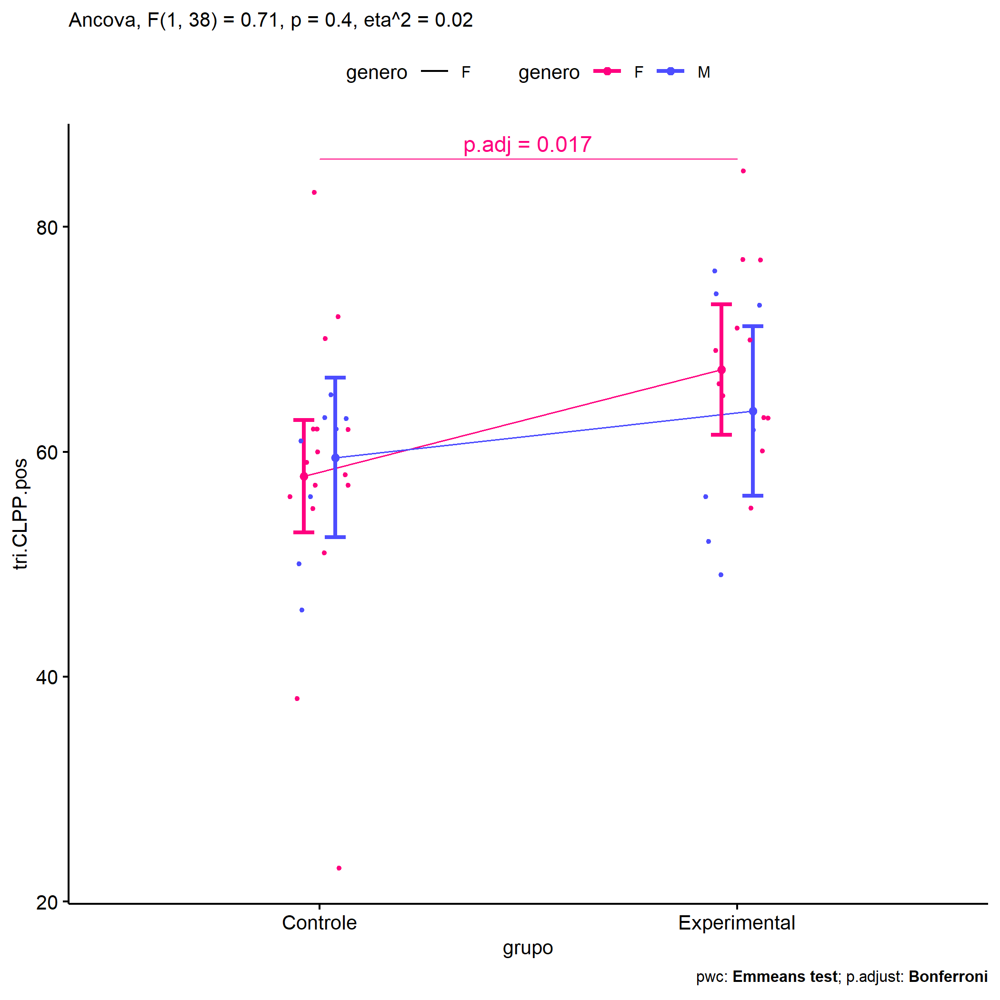<!-- -->

    ## Scale for colour is already present.
    ## Adding another scale for colour, which will replace the existing scale.

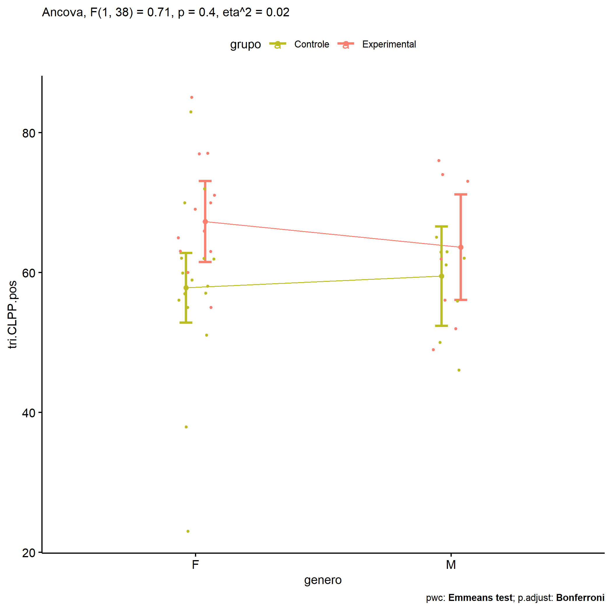<!-- -->

<!-- -->

<!-- -->

### Correta Regular (Acertos)

| var          | genero | grupo        |   n | M (pre) | SE (pre) | M (unadj) | SE (unadj) | M (adj) | SE (adj) |
|:-------------|:-------|:-------------|----:|--------:|---------:|----------:|-----------:|--------:|---------:|
| score.CR.pos | F      | Controle     |  18 |  11.278 |    1.148 |    11.333 |      1.126 |  11.177 |    1.272 |
| score.CR.pos | F      | Experimental |  13 |  12.077 |    0.888 |    14.154 |      1.372 |  13.761 |    1.510 |
| score.CR.pos | M      | Controle     |  12 |   9.750 |    1.115 |     9.833 |      1.898 |  10.129 |    1.563 |
| score.CR.pos | M      | Experimental |   9 |   9.111 |    1.996 |    12.222 |      2.005 |  12.707 |    1.816 |

| grupo        | genero | group1   | group2       | estimate | conf.low | conf.high |    se | statistic |     p | p.adj | p.adj.signif |
|:-------------|:-------|:---------|:-------------|---------:|---------:|----------:|------:|----------:|------:|------:|:-------------|
| Controle     |        | F        | M            |    1.048 |   -3.022 |     5.117 | 2.023 |     0.518 | 0.607 | 0.607 | ns           |
| Experimental |        | F        | M            |    1.054 |   -3.752 |     5.859 | 2.389 |     0.441 | 0.661 | 0.661 | ns           |
| Controle     |        | F        | M            |    1.528 |   -1.854 |     4.910 | 1.682 |     0.908 | 0.368 | 0.368 | ns           |
| Experimental |        | F        | M            |    2.966 |   -0.969 |     6.901 | 1.957 |     1.515 | 0.136 | 0.136 | ns           |
|              | F      | Controle | Experimental |   -2.584 |   -6.534 |     1.366 | 1.964 |    -1.316 | 0.195 | 0.195 | ns           |
|              | M      | Controle | Experimental |   -2.578 |   -7.357 |     2.201 | 2.376 |    -1.085 | 0.283 | 0.283 | ns           |
|              | F      | Controle | Experimental |   -0.799 |   -4.102 |     2.504 | 1.643 |    -0.486 | 0.629 | 0.629 | ns           |
|              | M      | Controle | Experimental |    0.639 |   -3.362 |     4.640 | 1.990 |     0.321 | 0.750 | 0.750 | ns           |

| grupo        | genero | group1 | group2 | estimate | conf.low | conf.high |    se | statistic |     p | p.adj | p.adj.signif |
|:-------------|:-------|:-------|:-------|---------:|---------:|----------:|------:|----------:|------:|------:|:-------------|
| Controle     | F      | pre    | pos    |   -0.056 |   -3.381 |     3.270 | 1.675 |    -0.033 | 0.974 | 0.974 | ns           |
| Controle     | M      | pre    | pos    |   -0.083 |   -4.156 |     3.989 | 2.052 |    -0.041 | 0.968 | 0.968 | ns           |
| Experimental | F      | pre    | pos    |   -2.077 |   -5.990 |     1.836 | 1.971 |    -1.054 | 0.295 | 0.295 | ns           |
| Experimental | M      | pre    | pos    |   -3.111 |   -7.814 |     1.591 | 2.369 |    -1.313 | 0.192 | 0.192 | ns           |

    ## Scale for colour is already present.
    ## Adding another scale for colour, which will replace the existing scale.

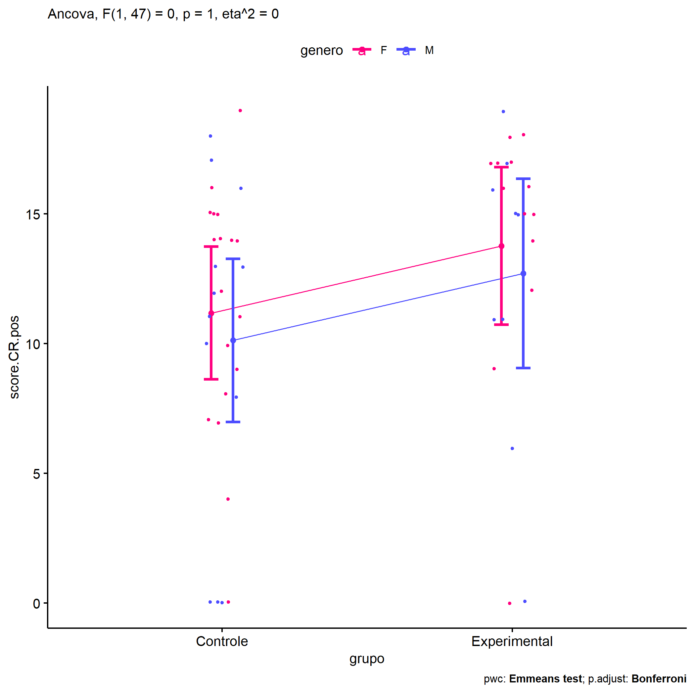<!-- -->

    ## Scale for colour is already present.
    ## Adding another scale for colour, which will replace the existing scale.

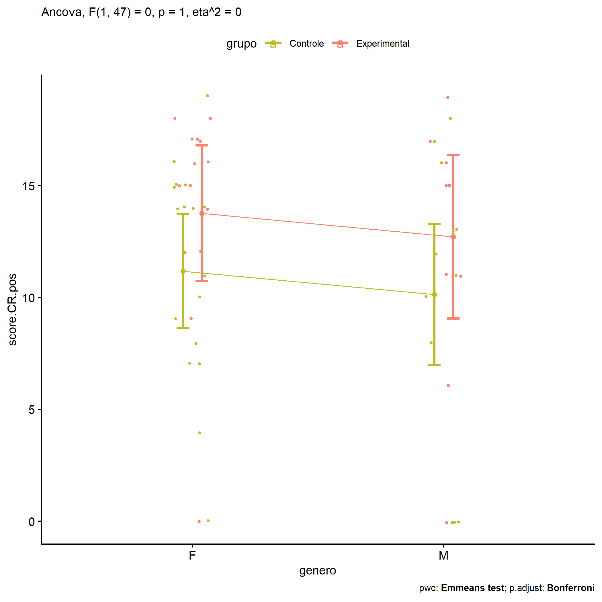<!-- -->

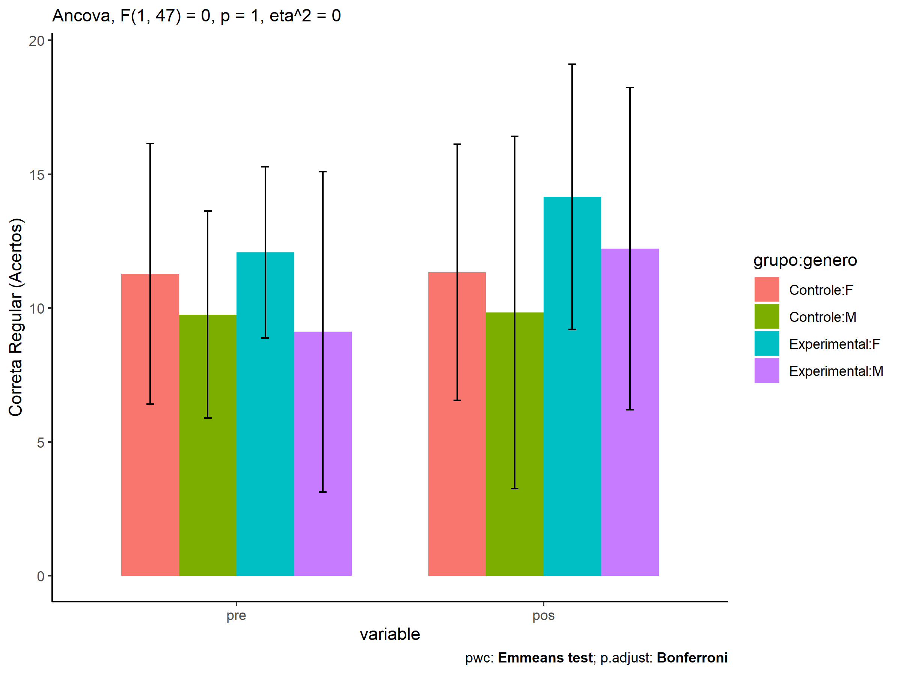<!-- -->

<!-- -->

<!-- -->

### Correta Regular (TRI)

| var        | genero | grupo        |   n | M (pre) | SE (pre) | M (unadj) | SE (unadj) | M (adj) | SE (adj) |
|:-----------|:-------|:-------------|----:|--------:|---------:|----------:|-----------:|--------:|---------:|
| tri.CR.pos | F      | Controle     |  16 |  -0.704 |    0.219 |    -0.561 |      0.198 |  -0.523 |    0.165 |
| tri.CR.pos | F      | Experimental |  12 |  -0.537 |    0.261 |    -0.069 |      0.217 |  -0.110 |    0.190 |
| tri.CR.pos | M      | Controle     |   8 |  -0.673 |    0.211 |    -0.567 |      0.252 |  -0.544 |    0.233 |
| tri.CR.pos | M      | Experimental |   7 |  -0.533 |    0.333 |    -0.052 |      0.286 |  -0.095 |    0.249 |

| grupo        | genero | group1   | group2       | estimate | conf.low | conf.high |    se | statistic |     p | p.adj | p.adj.signif |
|:-------------|:-------|:---------|:-------------|---------:|---------:|----------:|------:|----------:|------:|------:|:-------------|
| Controle     |        | F        | M            |    0.021 |   -0.556 |     0.598 | 0.285 |     0.074 | 0.941 | 0.941 | ns           |
| Experimental |        | F        | M            |   -0.015 |   -0.648 |     0.619 | 0.313 |    -0.047 | 0.963 | 0.963 | ns           |
| Controle     |        | F        | M            |   -0.032 |   -0.769 |     0.705 | 0.364 |    -0.088 | 0.931 | 0.931 | ns           |
| Experimental |        | F        | M            |   -0.004 |   -0.813 |     0.806 | 0.400 |    -0.009 | 0.993 | 0.993 | ns           |
|              | F      | Controle | Experimental |   -0.413 |   -0.924 |     0.097 | 0.252 |    -1.639 | 0.109 | 0.109 | ns           |
|              | M      | Controle | Experimental |   -0.449 |   -1.139 |     0.241 | 0.341 |    -1.318 | 0.196 | 0.196 | ns           |
|              | F      | Controle | Experimental |   -0.167 |   -0.817 |     0.483 | 0.321 |    -0.521 | 0.605 | 0.605 | ns           |
|              | M      | Controle | Experimental |   -0.139 |   -1.020 |     0.742 | 0.435 |    -0.320 | 0.751 | 0.751 | ns           |

| grupo        | genero | group1 | group2 | estimate | conf.low | conf.high |    se | statistic |     p | p.adj | p.adj.signif |
|:-------------|:-------|:-------|:-------|---------:|---------:|----------:|------:|----------:|------:|------:|:-------------|
| Controle     | F      | pre    | pos    |   -0.043 |   -0.612 |     0.526 | 0.286 |    -0.151 | 0.880 | 0.880 | ns           |
| Controle     | M      | pre    | pos    |   -0.273 |   -1.018 |     0.473 | 0.375 |    -0.728 | 0.469 | 0.469 | ns           |
| Experimental | F      | pre    | pos    |   -0.507 |   -1.171 |     0.156 | 0.334 |    -1.519 | 0.132 | 0.132 | ns           |
| Experimental | M      | pre    | pos    |   -0.464 |   -1.293 |     0.365 | 0.417 |    -1.113 | 0.269 | 0.269 | ns           |

    ## Scale for colour is already present.
    ## Adding another scale for colour, which will replace the existing scale.

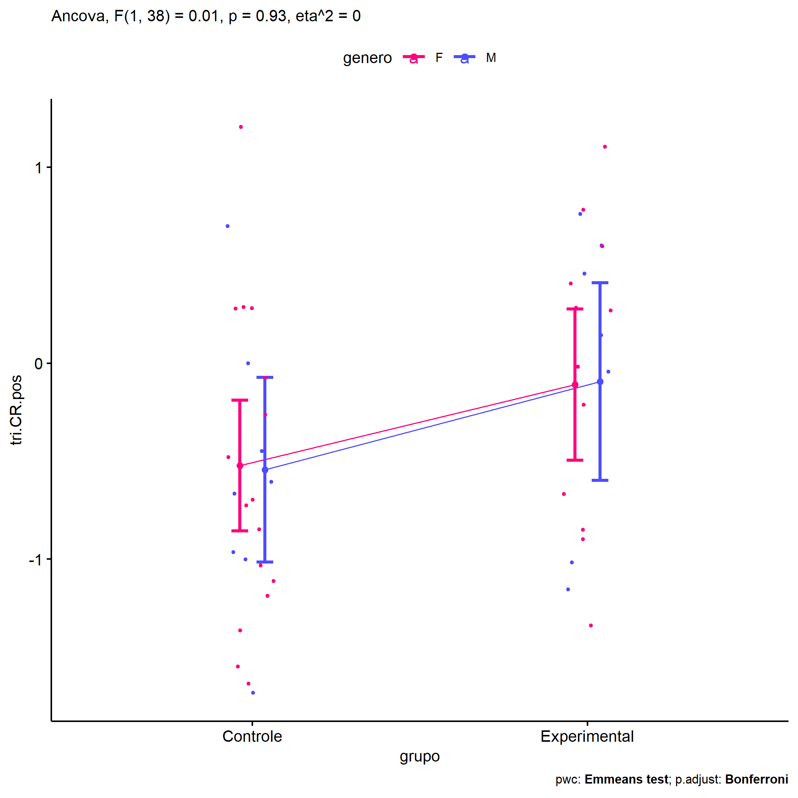<!-- -->

    ## Scale for colour is already present.
    ## Adding another scale for colour, which will replace the existing scale.

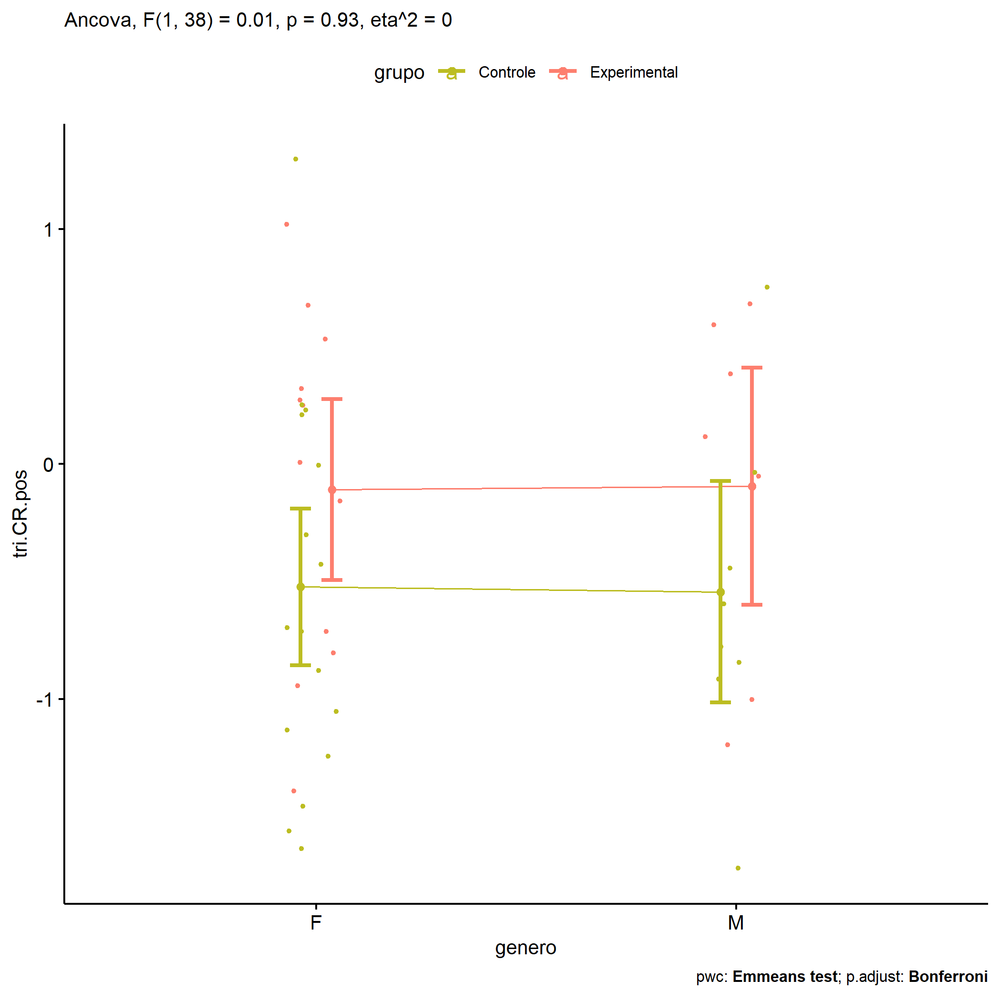<!-- -->

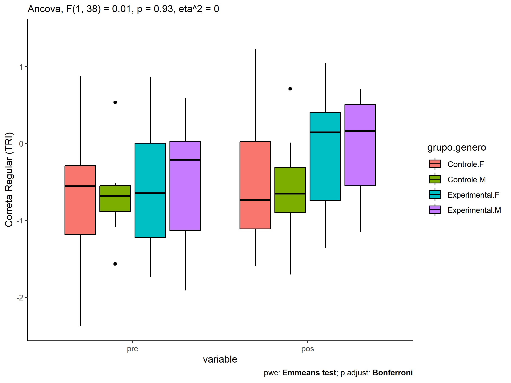<!-- -->

<!-- -->

### Correta Irregular (Acertos)

| var          | genero | grupo        |   n | M (pre) | SE (pre) | M (unadj) | SE (unadj) | M (adj) | SE (adj) |
|:-------------|:-------|:-------------|----:|--------:|---------:|----------:|-----------:|--------:|---------:|
| score.CI.pos | F      | Controle     |  18 |   9.222 |    0.941 |     7.944 |      0.955 |   7.801 |    1.075 |
| score.CI.pos | F      | Experimental |  13 |   9.308 |    0.887 |     9.923 |      1.141 |   9.751 |    1.265 |
| score.CI.pos | M      | Controle     |  12 |   8.750 |    1.181 |     8.333 |      1.716 |   8.353 |    1.314 |
| score.CI.pos | M      | Experimental |   9 |   7.333 |    1.424 |    10.222 |      1.623 |  10.731 |    1.538 |

| grupo        | genero | group1   | group2       | estimate | conf.low | conf.high |    se | statistic |     p | p.adj | p.adj.signif |
|:-------------|:-------|:---------|:-------------|---------:|---------:|----------:|------:|----------:|------:|------:|:-------------|
| Controle     |        | F        | M            |   -0.552 |   -3.968 |     2.865 | 1.698 |    -0.325 | 0.747 | 0.747 | ns           |
| Experimental |        | F        | M            |   -0.980 |   -5.008 |     3.047 | 2.002 |    -0.490 | 0.627 | 0.627 | ns           |
| Controle     |        | F        | M            |    0.472 |   -2.438 |     3.383 | 1.448 |     0.326 | 0.746 | 0.746 | ns           |
| Experimental |        | F        | M            |    1.974 |   -1.412 |     5.361 | 1.684 |     1.172 | 0.247 | 0.247 | ns           |
|              | F      | Controle | Experimental |   -1.949 |   -5.282 |     1.384 | 1.657 |    -1.176 | 0.245 | 0.245 | ns           |
|              | M      | Controle | Experimental |   -2.378 |   -6.444 |     1.689 | 2.021 |    -1.176 | 0.245 | 0.245 | ns           |
|              | F      | Controle | Experimental |   -0.085 |   -2.928 |     2.757 | 1.414 |    -0.060 | 0.952 | 0.952 | ns           |
|              | M      | Controle | Experimental |    1.417 |   -2.027 |     4.860 | 1.713 |     0.827 | 0.412 | 0.412 | ns           |

| grupo        | genero | group1 | group2 | estimate | conf.low | conf.high |    se | statistic |     p | p.adj | p.adj.signif |
|:-------------|:-------|:-------|:-------|---------:|---------:|----------:|------:|----------:|------:|------:|:-------------|
| Controle     | F      | pre    | pos    |    1.278 |   -1.575 |     4.130 | 1.437 |     0.889 | 0.376 | 0.376 | ns           |
| Controle     | M      | pre    | pos    |    0.417 |   -3.077 |     3.910 | 1.760 |     0.237 | 0.813 | 0.813 | ns           |
| Experimental | F      | pre    | pos    |   -0.615 |   -3.972 |     2.741 | 1.691 |    -0.364 | 0.717 | 0.717 | ns           |
| Experimental | M      | pre    | pos    |   -2.889 |   -6.923 |     1.145 | 2.032 |    -1.422 | 0.158 | 0.158 | ns           |

    ## Scale for colour is already present.
    ## Adding another scale for colour, which will replace the existing scale.

<!-- -->

    ## Scale for colour is already present.
    ## Adding another scale for colour, which will replace the existing scale.

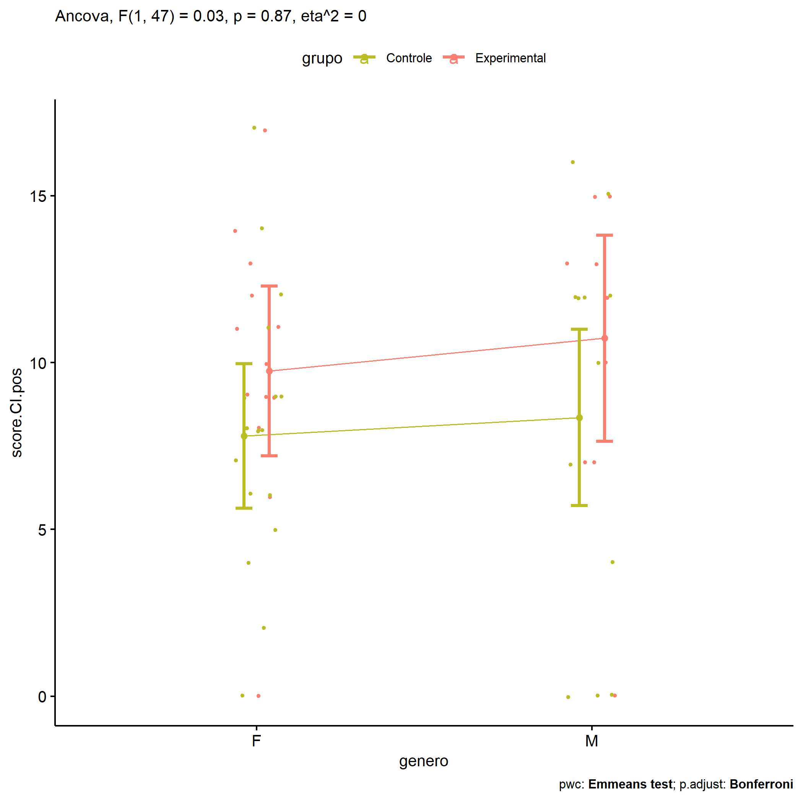<!-- -->

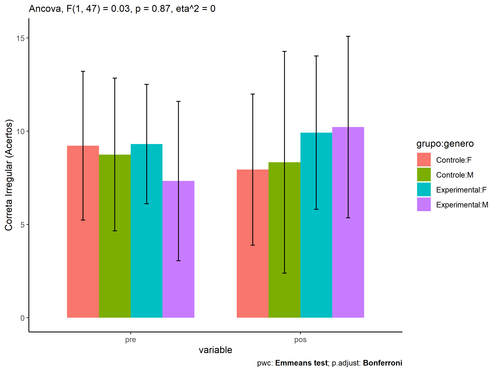<!-- -->

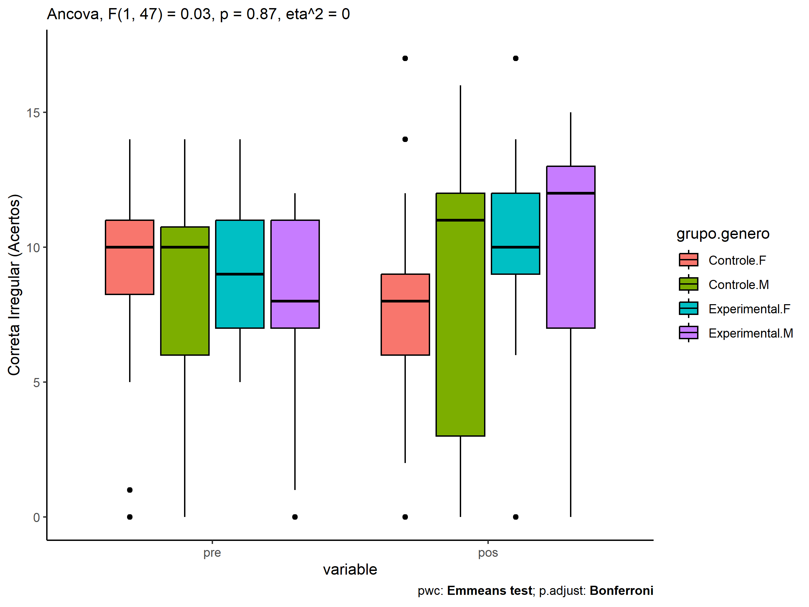<!-- -->

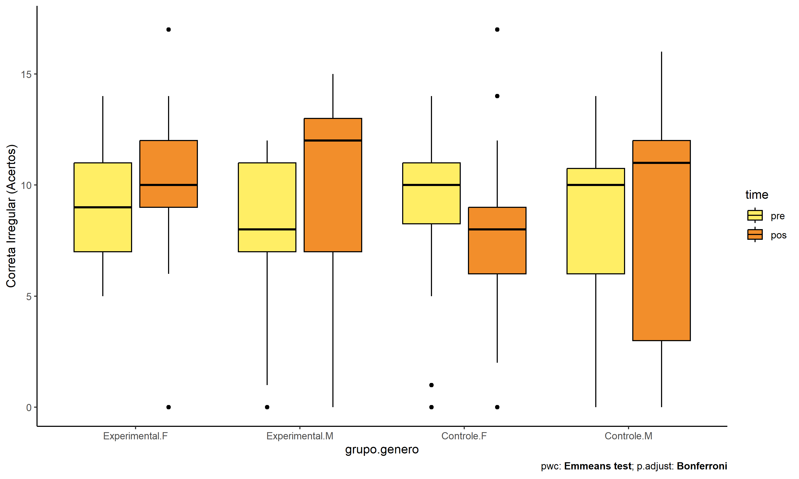<!-- -->

### Correta Irregular (TRI)

| var        | genero | grupo        |   n | M (pre) | SE (pre) | M (unadj) | SE (unadj) | M (adj) | SE (adj) |
|:-----------|:-------|:-------------|----:|--------:|---------:|----------:|-----------:|--------:|---------:|
| tri.CI.pos | F      | Controle     |  16 |  -0.524 |    0.123 |    -0.922 |      0.181 |  -0.890 |    0.173 |
| tri.CI.pos | F      | Experimental |  12 |  -0.544 |    0.185 |    -0.383 |      0.224 |  -0.336 |    0.199 |
| tri.CI.pos | M      | Controle     |   8 |  -0.342 |    0.215 |    -0.502 |      0.276 |  -0.605 |    0.245 |
| tri.CI.pos | M      | Experimental |   7 |  -0.432 |    0.169 |    -0.034 |      0.373 |  -0.070 |    0.261 |

| grupo        | genero | group1   | group2       | estimate | conf.low | conf.high |    se | statistic |     p | p.adj | p.adj.signif |
|:-------------|:-------|:---------|:-------------|---------:|---------:|----------:|------:|----------:|------:|------:|:-------------|
| Controle     |        | F        | M            |   -0.285 |   -0.894 |     0.324 | 0.301 |    -0.948 | 0.349 | 0.349 | ns           |
| Experimental |        | F        | M            |   -0.266 |   -0.931 |     0.399 | 0.329 |    -0.810 | 0.423 | 0.423 | ns           |
| Controle     |        | F        | M            |   -0.182 |   -0.666 |     0.302 | 0.239 |    -0.761 | 0.451 | 0.451 | ns           |
| Experimental |        | F        | M            |   -0.111 |   -0.643 |     0.420 | 0.263 |    -0.424 | 0.674 | 0.674 | ns           |
|              | F      | Controle | Experimental |   -0.554 |   -1.087 |    -0.021 | 0.263 |    -2.103 | 0.042 | 0.042 | \*           |
|              | M      | Controle | Experimental |   -0.535 |   -1.258 |     0.189 | 0.357 |    -1.497 | 0.143 | 0.143 | ns           |
|              | F      | Controle | Experimental |    0.019 |   -0.408 |     0.446 | 0.211 |     0.091 | 0.928 | 0.928 | ns           |
|              | M      | Controle | Experimental |    0.090 |   -0.489 |     0.669 | 0.286 |     0.314 | 0.755 | 0.755 | ns           |

| grupo        | genero | group1 | group2 | estimate | conf.low | conf.high |    se | statistic |     p | p.adj | p.adj.signif |
|:-------------|:-------|:-------|:-------|---------:|---------:|----------:|------:|----------:|------:|------:|:-------------|
| Controle     | F      | pre    | pos    |    0.395 |   -0.071 |     0.861 | 0.234 |     1.683 | 0.096 | 0.096 | ns           |
| Controle     | M      | pre    | pos    |    0.031 |   -0.579 |     0.642 | 0.307 |     0.102 | 0.919 | 0.919 | ns           |
| Experimental | F      | pre    | pos    |   -0.225 |   -0.769 |     0.319 | 0.274 |    -0.823 | 0.413 | 0.413 | ns           |
| Experimental | M      | pre    | pos    |   -0.443 |   -1.123 |     0.236 | 0.342 |    -1.297 | 0.198 | 0.198 | ns           |

    ## Scale for colour is already present.
    ## Adding another scale for colour, which will replace the existing scale.

<!-- -->

    ## Scale for colour is already present.
    ## Adding another scale for colour, which will replace the existing scale.

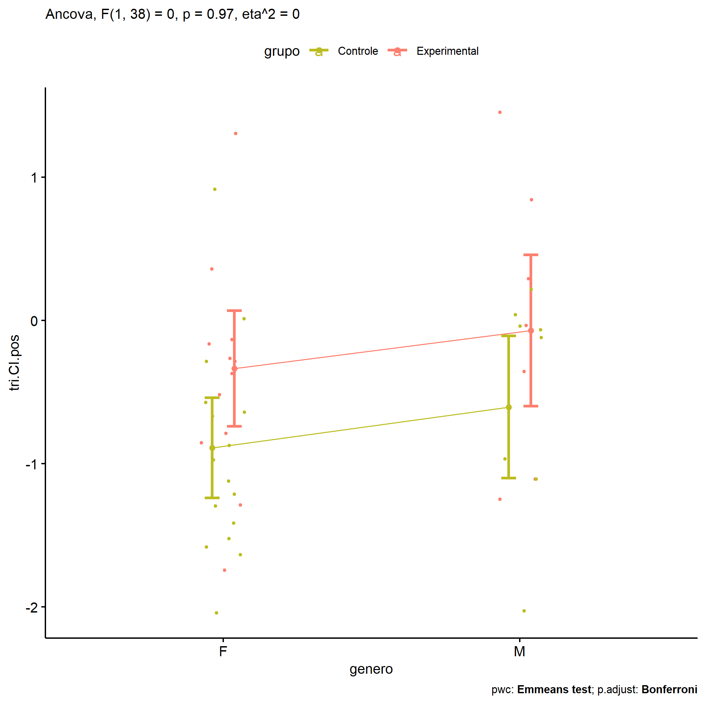<!-- -->

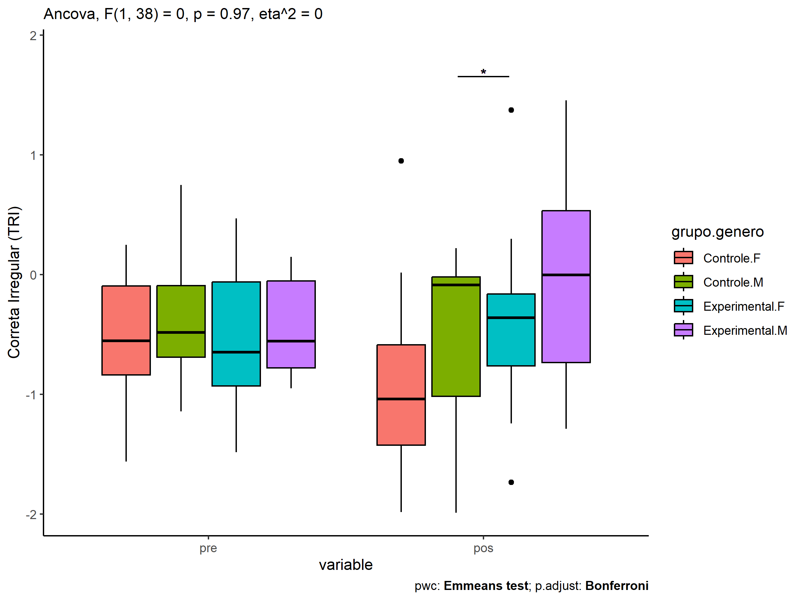<!-- -->

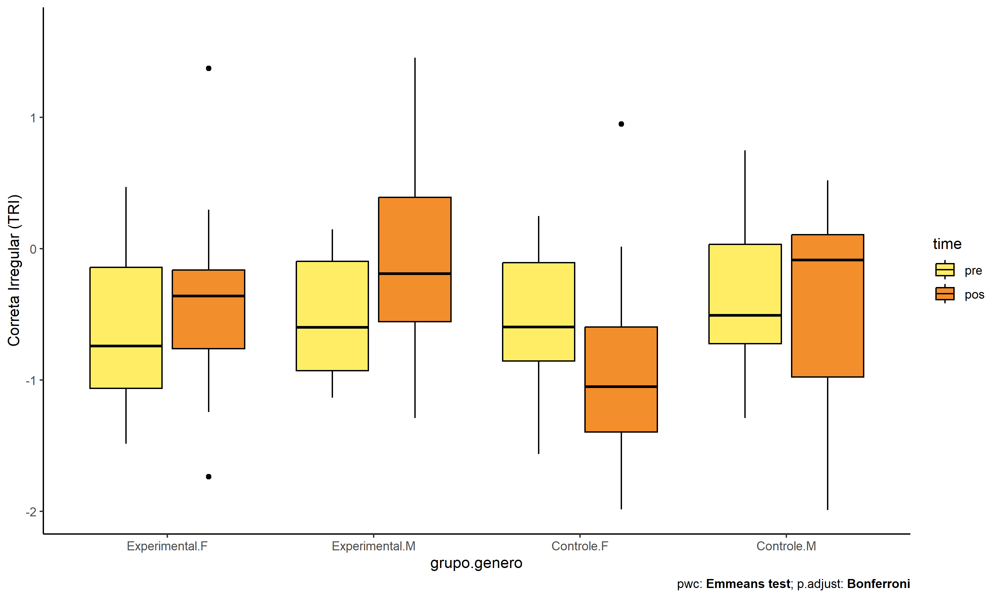<!-- -->

### Trocas Visuais (Acertos)

| var          | genero | grupo        |   n | M (pre) | SE (pre) | M (unadj) | SE (unadj) | M (adj) | SE (adj) |
|:-------------|:-------|:-------------|----:|--------:|---------:|----------:|-----------:|--------:|---------:|
| score.TV.pos | F      | Controle     |  18 |  13.278 |    1.257 |    13.333 |      1.396 |  13.138 |    1.395 |
| score.TV.pos | F      | Experimental |  13 |  14.615 |    1.029 |    15.308 |      1.487 |  14.617 |    1.663 |
| score.TV.pos | M      | Controle     |  12 |  11.167 |    1.898 |    11.583 |      2.094 |  12.170 |    1.723 |
| score.TV.pos | M      | Experimental |   9 |  11.111 |    2.324 |    13.222 |      2.139 |  13.829 |    1.986 |

| grupo        | genero | group1   | group2       | estimate | conf.low | conf.high |    se | statistic |     p | p.adj | p.adj.signif |
|:-------------|:-------|:---------|:-------------|---------:|---------:|----------:|------:|----------:|------:|------:|:-------------|
| Controle     |        | F        | M            |    0.968 |   -3.510 |     5.446 | 2.226 |     0.435 | 0.666 | 0.666 | ns           |
| Experimental |        | F        | M            |    0.788 |   -4.478 |     6.053 | 2.617 |     0.301 | 0.765 | 0.765 | ns           |
| Controle     |        | F        | M            |    2.111 |   -2.096 |     6.318 | 2.093 |     1.009 | 0.318 | 0.318 | ns           |
| Experimental |        | F        | M            |    3.504 |   -1.391 |     8.400 | 2.435 |     1.439 | 0.157 | 0.157 | ns           |
|              | F      | Controle | Experimental |   -1.479 |   -5.826 |     2.868 | 2.161 |    -0.684 | 0.497 | 0.497 | ns           |
|              | M      | Controle | Experimental |   -1.659 |   -6.902 |     3.583 | 2.606 |    -0.637 | 0.527 | 0.527 | ns           |
|              | F      | Controle | Experimental |   -1.338 |   -5.447 |     2.771 | 2.044 |    -0.655 | 0.516 | 0.516 | ns           |
|              | M      | Controle | Experimental |    0.056 |   -4.923 |     5.034 | 2.476 |     0.022 | 0.982 | 0.982 | ns           |

| grupo        | genero | group1 | group2 | estimate | conf.low | conf.high |    se | statistic |     p | p.adj | p.adj.signif |
|:-------------|:-------|:-------|:-------|---------:|---------:|----------:|------:|----------:|------:|------:|:-------------|
| Controle     | F      | pre    | pos    |   -0.056 |   -3.971 |     3.860 | 1.973 |    -0.028 | 0.978 | 0.978 | ns           |
| Controle     | M      | pre    | pos    |   -0.417 |   -5.213 |     4.379 | 2.416 |    -0.172 | 0.863 | 0.863 | ns           |
| Experimental | F      | pre    | pos    |   -0.692 |   -5.300 |     3.916 | 2.321 |    -0.298 | 0.766 | 0.766 | ns           |
| Experimental | M      | pre    | pos    |   -2.111 |   -7.649 |     3.427 | 2.790 |    -0.757 | 0.451 | 0.451 | ns           |

    ## Scale for colour is already present.
    ## Adding another scale for colour, which will replace the existing scale.

<!-- -->

    ## Scale for colour is already present.
    ## Adding another scale for colour, which will replace the existing scale.

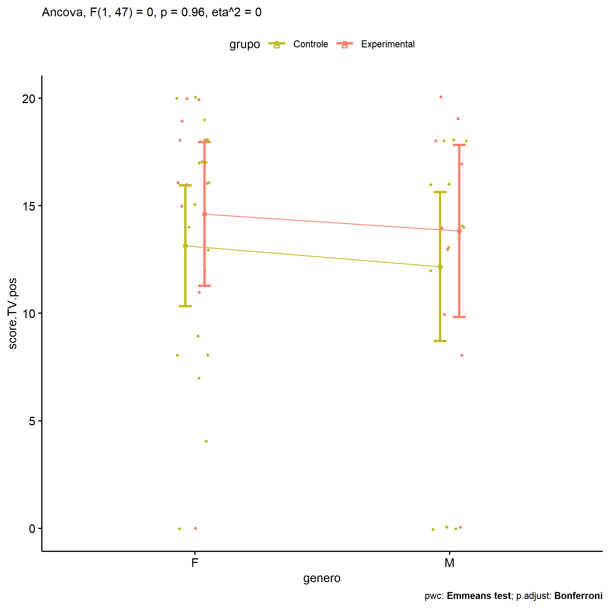<!-- -->

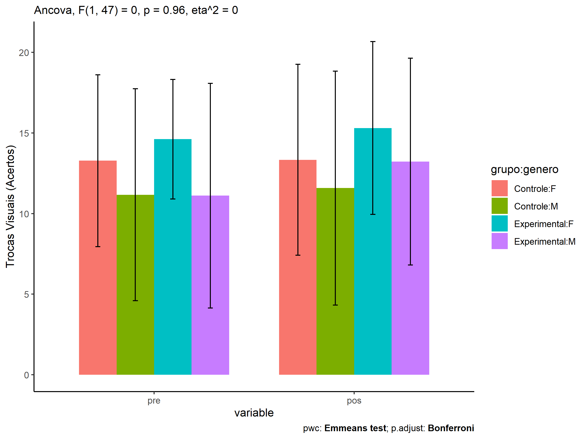<!-- -->

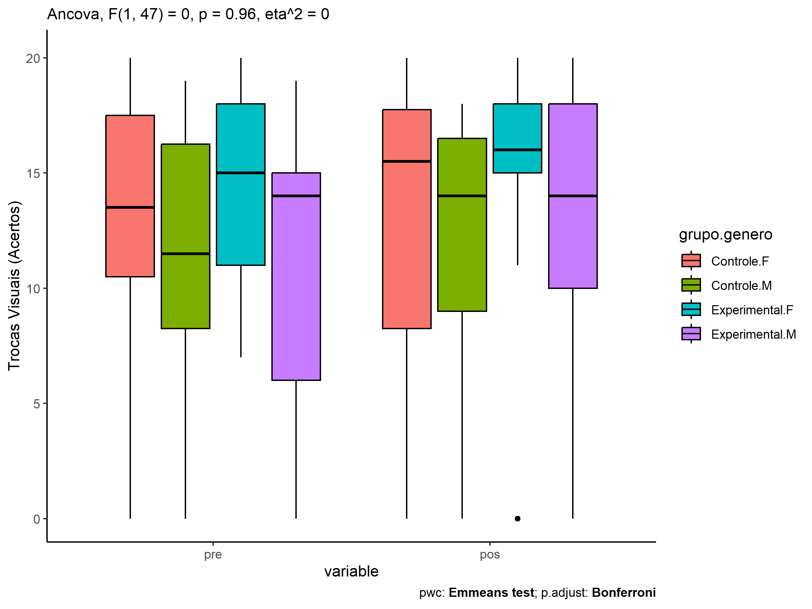<!-- -->

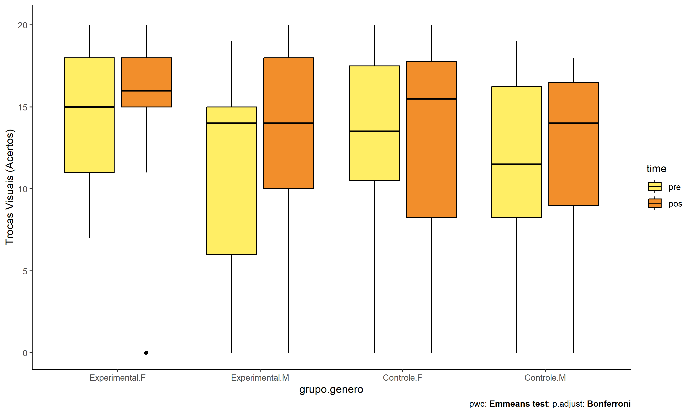<!-- -->

### Trocas Visuais (TRI)

| var        | genero | grupo        |   n | M (pre) | SE (pre) | M (unadj) | SE (unadj) | M (adj) | SE (adj) |
|:-----------|:-------|:-------------|----:|--------:|---------:|----------:|-----------:|--------:|---------:|
| tri.TV.pos | F      | Controle     |  16 |  -0.465 |    0.200 |    -0.476 |      0.217 |  -0.483 |    0.184 |
| tri.TV.pos | F      | Experimental |  12 |  -0.383 |    0.237 |    -0.113 |      0.236 |  -0.154 |    0.213 |
| tri.TV.pos | M      | Controle     |   8 |  -0.717 |    0.346 |    -0.593 |      0.196 |  -0.501 |    0.262 |
| tri.TV.pos | M      | Experimental |   7 |  -0.437 |    0.444 |    -0.197 |      0.339 |  -0.216 |    0.278 |

| grupo        | genero | group1   | group2       | estimate | conf.low | conf.high |    se | statistic |     p | p.adj | p.adj.signif |
|:-------------|:-------|:---------|:-------------|---------:|---------:|----------:|------:|----------:|------:|------:|:-------------|
| Controle     |        | F        | M            |    0.017 |   -0.630 |     0.665 | 0.320 |     0.054 | 0.957 | 0.957 | ns           |
| Experimental |        | F        | M            |    0.063 |   -0.645 |     0.770 | 0.350 |     0.179 | 0.859 | 0.859 | ns           |
| Controle     |        | F        | M            |    0.252 |   -0.542 |     1.045 | 0.392 |     0.641 | 0.525 | 0.525 | ns           |
| Experimental |        | F        | M            |    0.054 |   -0.818 |     0.925 | 0.431 |     0.124 | 0.902 | 0.902 | ns           |
|              | F      | Controle | Experimental |   -0.330 |   -0.898 |     0.239 | 0.281 |    -1.174 | 0.248 | 0.248 | ns           |
|              | M      | Controle | Experimental |   -0.284 |   -1.058 |     0.489 | 0.382 |    -0.744 | 0.461 | 0.461 | ns           |
|              | F      | Controle | Experimental |   -0.082 |   -0.781 |     0.618 | 0.346 |    -0.236 | 0.815 | 0.815 | ns           |
|              | M      | Controle | Experimental |   -0.280 |   -1.228 |     0.669 | 0.469 |    -0.596 | 0.554 | 0.554 | ns           |

| grupo        | genero | group1 | group2 | estimate | conf.low | conf.high |    se | statistic |     p | p.adj | p.adj.signif |
|:-------------|:-------|:-------|:-------|---------:|---------:|----------:|------:|----------:|------:|------:|:-------------|
| Controle     | F      | pre    | pos    |    0.175 |   -0.413 |     0.762 | 0.296 |     0.591 | 0.556 | 0.556 | ns           |
| Controle     | M      | pre    | pos    |   -0.304 |   -1.074 |     0.466 | 0.387 |    -0.785 | 0.434 | 0.434 | ns           |
| Experimental | F      | pre    | pos    |   -0.289 |   -0.975 |     0.396 | 0.345 |    -0.839 | 0.404 | 0.404 | ns           |
| Experimental | M      | pre    | pos    |    0.004 |   -0.852 |     0.860 | 0.431 |     0.009 | 0.992 | 0.992 | ns           |

    ## Scale for colour is already present.
    ## Adding another scale for colour, which will replace the existing scale.

<!-- -->

    ## Scale for colour is already present.
    ## Adding another scale for colour, which will replace the existing scale.

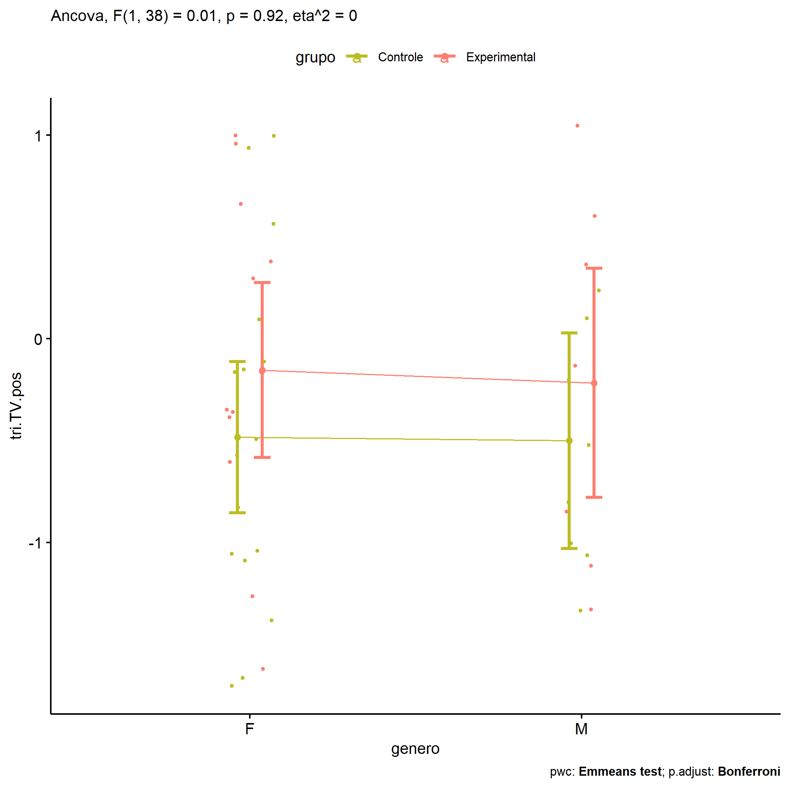<!-- -->

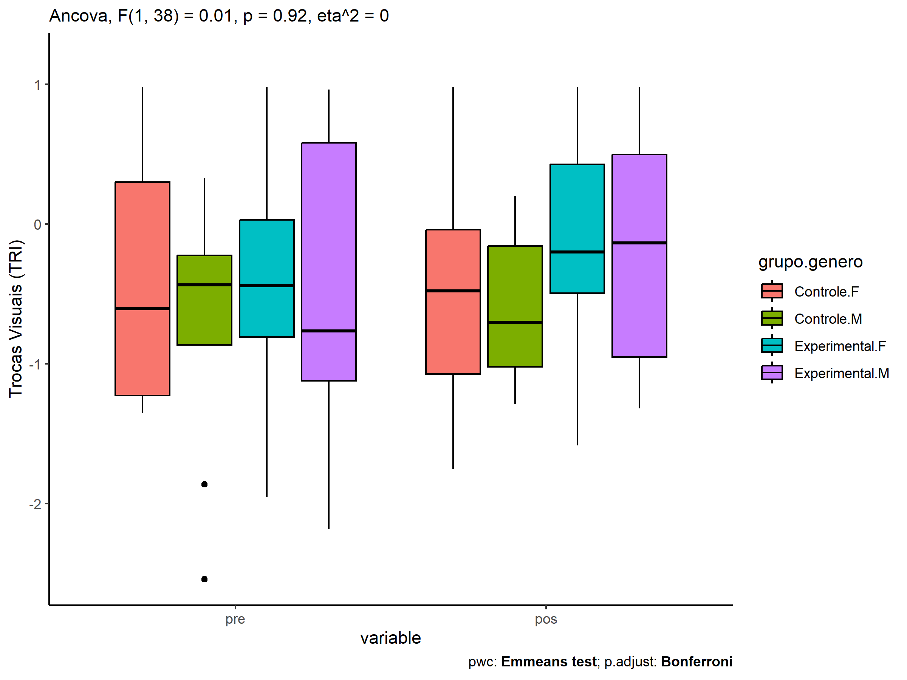<!-- -->

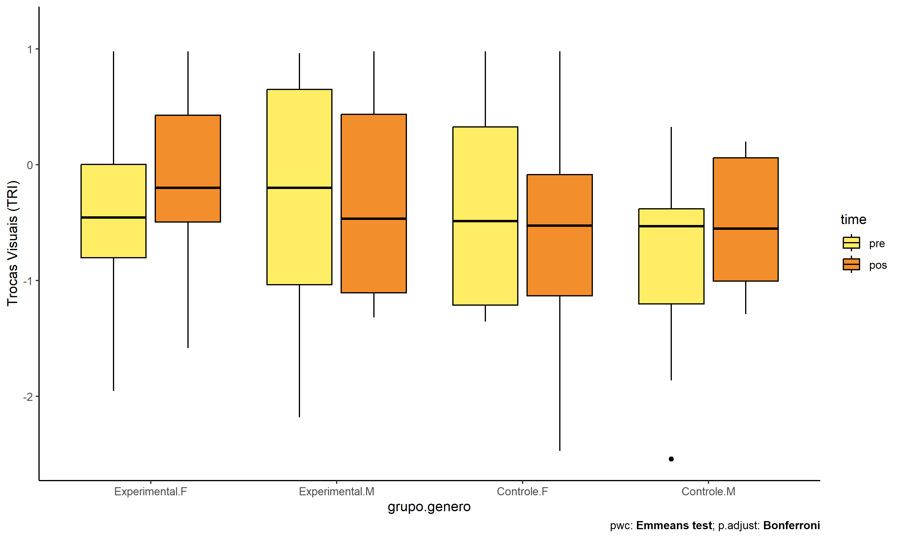<!-- -->

### Trocas Fonologicas (Acertos)

| var          | genero | grupo        |   n | M (pre) | SE (pre) | M (unadj) | SE (unadj) | M (adj) | SE (adj) |
|:-------------|:-------|:-------------|----:|--------:|---------:|----------:|-----------:|--------:|---------:|
| score.TF.pos | F      | Controle     |  18 |  11.222 |    1.220 |    11.333 |      1.215 |  11.284 |    1.247 |
| score.TF.pos | F      | Experimental |  13 |  12.769 |    0.841 |    14.615 |      1.444 |  13.957 |    1.490 |
| score.TF.pos | M      | Controle     |  12 |  10.083 |    1.630 |     8.333 |      1.519 |   8.732 |    1.535 |
| score.TF.pos | M      | Experimental |   9 |   9.778 |    1.928 |    10.778 |      2.408 |  11.296 |    1.776 |

| grupo        | genero | group1   | group2       | estimate | conf.low | conf.high |    se | statistic |     p | p.adj | p.adj.signif |
|:-------------|:-------|:---------|:-------------|---------:|---------:|----------:|------:|----------:|------:|------:|:-------------|
| Controle     |        | F        | M            |    2.552 |   -1.431 |     6.535 | 1.980 |     1.289 | 0.204 | 0.204 | ns           |
| Experimental |        | F        | M            |    2.661 |   -2.047 |     7.369 | 2.340 |     1.137 | 0.261 | 0.261 | ns           |
| Controle     |        | F        | M            |    1.139 |   -2.582 |     4.860 | 1.851 |     0.615 | 0.541 | 0.541 | ns           |
| Experimental |        | F        | M            |    2.991 |   -1.339 |     7.321 | 2.154 |     1.389 | 0.171 | 0.171 | ns           |
|              | F      | Controle | Experimental |   -2.673 |   -6.578 |     1.231 | 1.941 |    -1.378 | 0.175 | 0.175 | ns           |
|              | M      | Controle | Experimental |   -2.565 |   -7.260 |     2.131 | 2.334 |    -1.099 | 0.277 | 0.277 | ns           |
|              | F      | Controle | Experimental |   -1.547 |   -5.181 |     2.087 | 1.808 |    -0.856 | 0.396 | 0.396 | ns           |
|              | M      | Controle | Experimental |    0.306 |   -4.098 |     4.709 | 2.190 |     0.140 | 0.890 | 0.890 | ns           |

| grupo        | genero | group1 | group2 | estimate | conf.low | conf.high |    se | statistic |     p | p.adj | p.adj.signif |
|:-------------|:-------|:-------|:-------|---------:|---------:|----------:|------:|----------:|------:|------:|:-------------|
| Controle     | F      | pre    | pos    |   -0.111 |   -3.609 |     3.387 | 1.762 |    -0.063 | 0.950 | 0.950 | ns           |
| Controle     | M      | pre    | pos    |    1.750 |   -2.534 |     6.034 | 2.158 |     0.811 | 0.419 | 0.419 | ns           |
| Experimental | F      | pre    | pos    |   -1.846 |   -5.962 |     2.270 | 2.074 |    -0.890 | 0.376 | 0.376 | ns           |
| Experimental | M      | pre    | pos    |   -1.000 |   -5.947 |     3.947 | 2.492 |    -0.401 | 0.689 | 0.689 | ns           |

    ## Scale for colour is already present.
    ## Adding another scale for colour, which will replace the existing scale.

<!-- -->

    ## Scale for colour is already present.
    ## Adding another scale for colour, which will replace the existing scale.

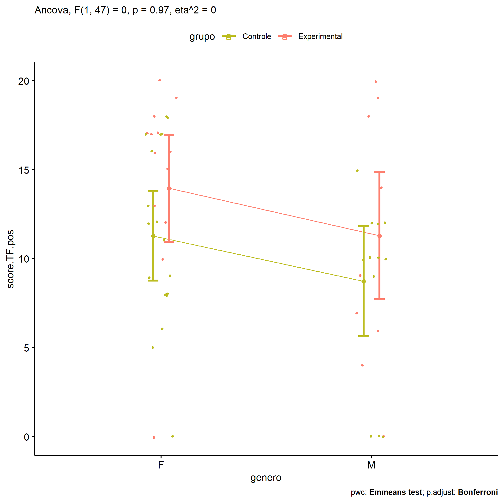<!-- -->

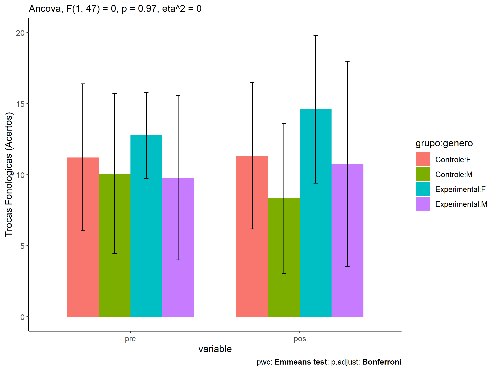<!-- -->

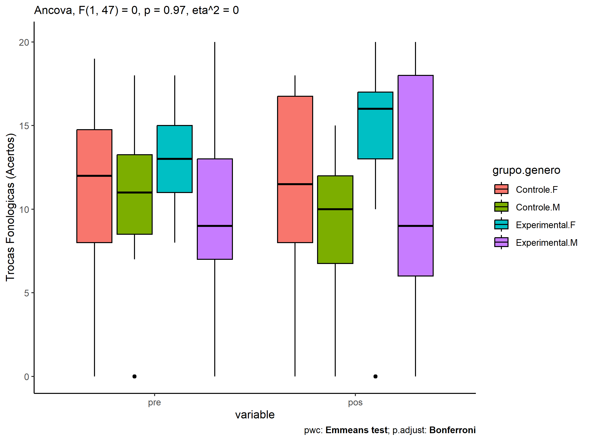<!-- -->

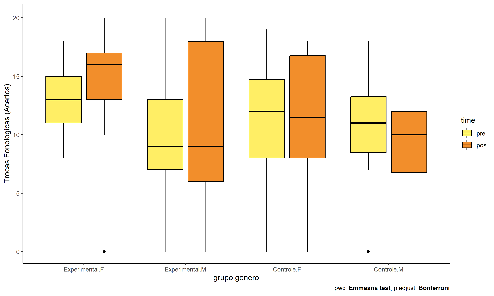<!-- -->

### Trocas Fonologicas (TRI)

| var        | genero | grupo        |   n | M (pre) | SE (pre) | M (unadj) | SE (unadj) | M (adj) | SE (adj) |
|:-----------|:-------|:-------------|----:|--------:|---------:|----------:|-----------:|--------:|---------:|
| tri.TF.pos | F      | Controle     |  16 |  -0.695 |    0.165 |    -0.573 |      0.191 |  -0.508 |    0.149 |
| tri.TF.pos | F      | Experimental |  12 |  -0.530 |    0.194 |    -0.027 |      0.191 |  -0.073 |    0.172 |
| tri.TF.pos | M      | Controle     |   8 |  -0.715 |    0.292 |    -1.063 |      0.074 |  -0.985 |    0.211 |
| tri.TF.pos | M      | Experimental |   7 |  -0.365 |    0.419 |    -0.494 |      0.494 |  -0.650 |    0.227 |

| grupo        | genero | group1   | group2       | estimate | conf.low | conf.high |    se | statistic |     p | p.adj | p.adj.signif |
|:-------------|:-------|:---------|:-------------|---------:|---------:|----------:|------:|----------:|------:|------:|:-------------|
| Controle     |        | F        | M            |    0.477 |   -0.046 |     0.999 | 0.258 |     1.847 | 0.072 | 0.072 | ns           |
| Experimental |        | F        | M            |    0.577 |    0.001 |     1.152 | 0.284 |     2.030 | 0.049 | 0.049 | \*           |
| Controle     |        | F        | M            |    0.020 |   -0.663 |     0.704 | 0.338 |     0.060 | 0.952 | 0.952 | ns           |
| Experimental |        | F        | M            |   -0.165 |   -0.915 |     0.586 | 0.371 |    -0.444 | 0.659 | 0.659 | ns           |
|              | F      | Controle | Experimental |   -0.435 |   -0.898 |     0.028 | 0.229 |    -1.904 | 0.065 | 0.065 | ns           |
|              | M      | Controle | Experimental |   -0.335 |   -0.966 |     0.295 | 0.311 |    -1.076 | 0.289 | 0.289 | ns           |
|              | F      | Controle | Experimental |   -0.165 |   -0.767 |     0.438 | 0.298 |    -0.553 | 0.584 | 0.584 | ns           |
|              | M      | Controle | Experimental |   -0.350 |   -1.166 |     0.467 | 0.404 |    -0.866 | 0.392 | 0.392 | ns           |

| grupo        | genero | group1 | group2 | estimate | conf.low | conf.high |    se | statistic |     p | p.adj | p.adj.signif |
|:-------------|:-------|:-------|:-------|---------:|---------:|----------:|------:|----------:|------:|------:|:-------------|
| Controle     | F      | pre    | pos    |    0.038 |   -0.497 |     0.573 | 0.269 |     0.142 | 0.888 | 0.888 | ns           |
| Controle     | M      | pre    | pos    |    0.199 |   -0.502 |     0.900 | 0.353 |     0.565 | 0.574 | 0.574 | ns           |
| Experimental | F      | pre    | pos    |   -0.531 |   -1.155 |     0.093 | 0.314 |    -1.691 | 0.094 | 0.094 | ns           |
| Experimental | M      | pre    | pos    |    0.361 |   -0.419 |     1.141 | 0.392 |     0.920 | 0.360 | 0.360 | ns           |

    ## Scale for colour is already present.
    ## Adding another scale for colour, which will replace the existing scale.

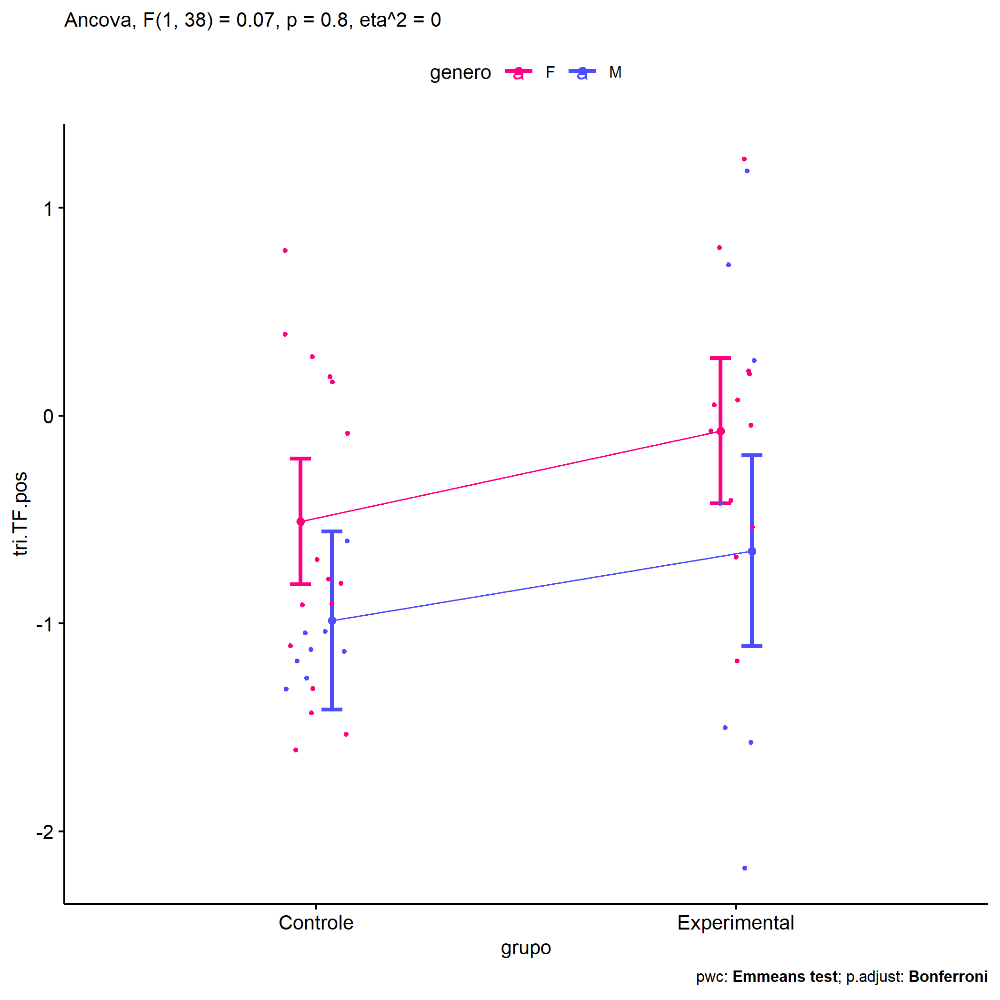<!-- -->

    ## Scale for colour is already present.
    ## Adding another scale for colour, which will replace the existing scale.

<!-- -->

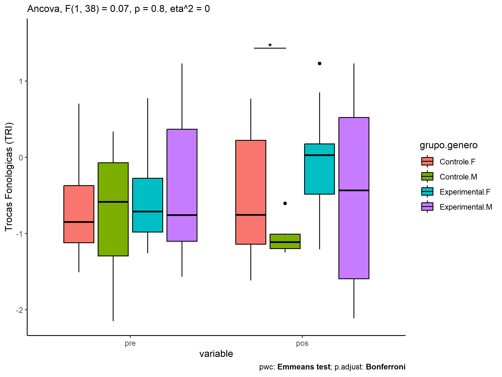<!-- -->

<!-- -->

### Trocas Orograficas (Acertos)

| var          | genero | grupo        |   n | M (pre) | SE (pre) | M (unadj) | SE (unadj) | M (adj) | SE (adj) |
|:-------------|:-------|:-------------|----:|--------:|---------:|----------:|-----------:|--------:|---------:|
| score.TO.pos | F      | Controle     |  18 |   7.500 |    0.916 |     9.778 |      0.842 |   9.678 |    0.888 |
| score.TO.pos | F      | Experimental |  13 |   8.231 |    0.482 |     9.154 |      0.883 |   8.918 |    1.060 |
| score.TO.pos | M      | Controle     |  12 |   5.583 |    1.018 |     6.583 |      1.228 |   6.840 |    1.106 |
| score.TO.pos | M      | Experimental |   9 |   5.889 |    1.184 |     7.222 |      1.402 |   7.422 |    1.262 |

| grupo        | genero | group1   | group2       | estimate | conf.low | conf.high |    se | statistic |     p | p.adj | p.adj.signif |
|:-------------|:-------|:---------|:-------------|---------:|---------:|----------:|------:|----------:|------:|------:|:-------------|
| Controle     |        | F        | M            |    2.838 |   -0.043 |     5.719 | 1.432 |     1.982 | 0.053 | 0.053 | ns           |
| Experimental |        | F        | M            |    1.496 |   -1.864 |     4.856 | 1.670 |     0.896 | 0.375 | 0.375 | ns           |
| Controle     |        | F        | M            |    1.917 |   -0.575 |     4.408 | 1.239 |     1.547 | 0.128 | 0.128 | ns           |
| Experimental |        | F        | M            |    2.342 |   -0.557 |     5.241 | 1.442 |     1.624 | 0.111 | 0.111 | ns           |
|              | F      | Controle | Experimental |    0.760 |   -1.996 |     3.516 | 1.370 |     0.555 | 0.582 | 0.582 | ns           |
|              | M      | Controle | Experimental |   -0.582 |   -3.910 |     2.746 | 1.654 |    -0.352 | 0.727 | 0.727 | ns           |
|              | F      | Controle | Experimental |   -0.731 |   -3.164 |     1.702 | 1.210 |    -0.604 | 0.549 | 0.549 | ns           |
|              | M      | Controle | Experimental |   -0.306 |   -3.253 |     2.642 | 1.466 |    -0.208 | 0.836 | 0.836 | ns           |

| grupo        | genero | group1 | group2 | estimate | conf.low | conf.high |    se | statistic |     p | p.adj | p.adj.signif |
|:-------------|:-------|:-------|:-------|---------:|---------:|----------:|------:|----------:|------:|------:|:-------------|
| Controle     | F      | pre    | pos    |   -2.278 |   -4.627 |     0.071 | 1.183 |    -1.925 | 0.057 | 0.057 | ns           |
| Controle     | M      | pre    | pos    |   -1.000 |   -3.877 |     1.877 | 1.449 |    -0.690 | 0.492 | 0.492 | ns           |
| Experimental | F      | pre    | pos    |   -0.923 |   -3.687 |     1.841 | 1.392 |    -0.663 | 0.509 | 0.509 | ns           |
| Experimental | M      | pre    | pos    |   -1.333 |   -4.655 |     1.989 | 1.674 |    -0.797 | 0.428 | 0.428 | ns           |

    ## Scale for colour is already present.
    ## Adding another scale for colour, which will replace the existing scale.

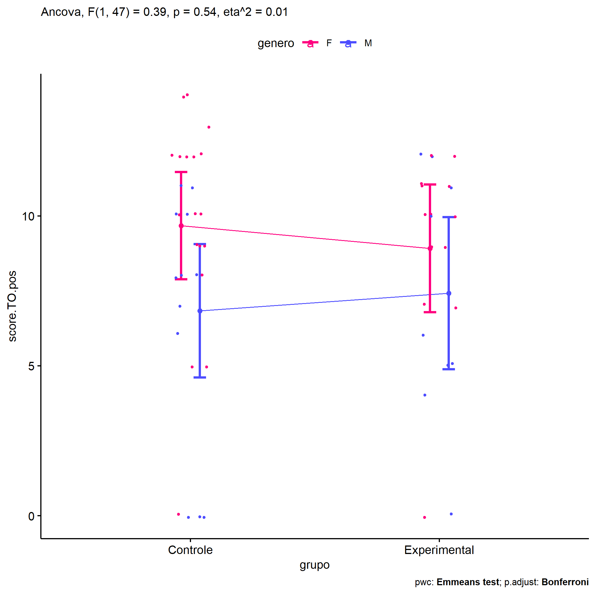<!-- -->

    ## Scale for colour is already present.
    ## Adding another scale for colour, which will replace the existing scale.

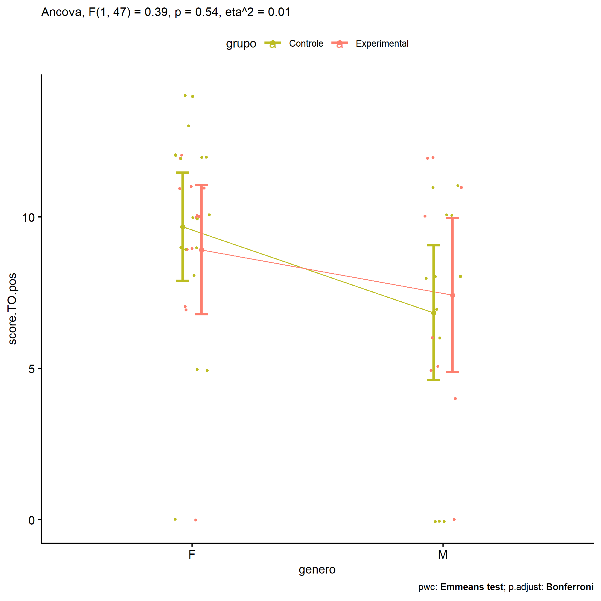<!-- -->

<!-- -->

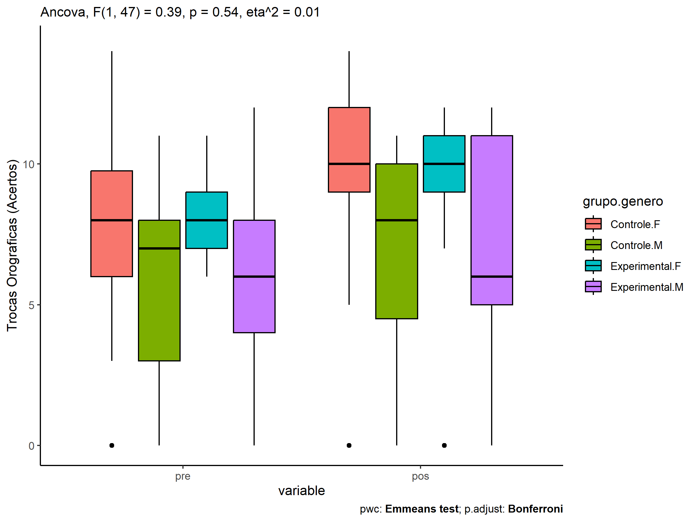<!-- -->

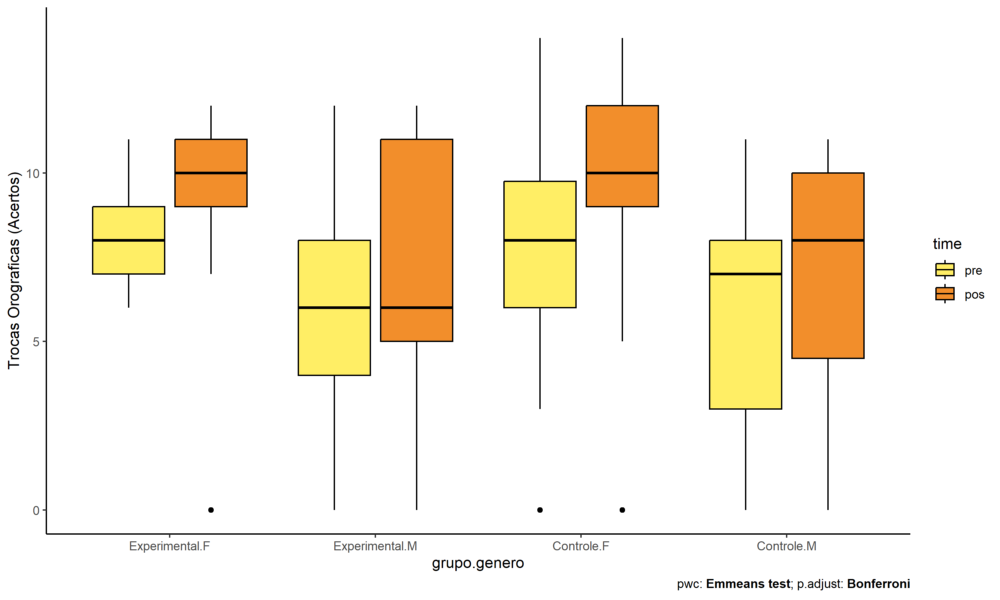<!-- -->

### Trocas Orograficas (TRI)

| var        | genero | grupo        |   n | M (pre) | SE (pre) | M (unadj) | SE (unadj) | M (adj) | SE (adj) |
|:-----------|:-------|:-------------|----:|--------:|---------:|----------:|-----------:|--------:|---------:|
| tri.TO.pos | F      | Controle     |  16 |  -0.433 |    0.201 |    -0.065 |      0.116 |  -0.081 |    0.122 |
| tri.TO.pos | F      | Experimental |  12 |  -0.353 |    0.154 |    -0.212 |      0.125 |  -0.251 |    0.141 |
| tri.TO.pos | M      | Controle     |   8 |  -0.804 |    0.204 |    -0.573 |      0.157 |  -0.486 |    0.175 |
| tri.TO.pos | M      | Experimental |   7 |  -0.506 |    0.279 |    -0.519 |      0.296 |  -0.515 |    0.184 |

| grupo        | genero | group1   | group2       | estimate | conf.low | conf.high |    se | statistic |     p | p.adj | p.adj.signif |
|:-------------|:-------|:---------|:-------------|---------:|---------:|----------:|------:|----------:|------:|------:|:-------------|
| Controle     |        | F        | M            |    0.405 |   -0.029 |     0.839 | 0.214 |     1.889 | 0.067 | 0.067 | ns           |
| Experimental |        | F        | M            |    0.264 |   -0.205 |     0.733 | 0.232 |     1.140 | 0.261 | 0.261 | ns           |
| Controle     |        | F        | M            |    0.371 |   -0.231 |     0.972 | 0.297 |     1.247 | 0.220 | 0.220 | ns           |
| Experimental |        | F        | M            |    0.154 |   -0.507 |     0.814 | 0.327 |     0.470 | 0.641 | 0.641 | ns           |
|              | F      | Controle | Experimental |    0.170 |   -0.206 |     0.546 | 0.186 |     0.916 | 0.365 | 0.365 | ns           |
|              | M      | Controle | Experimental |    0.029 |   -0.484 |     0.542 | 0.254 |     0.115 | 0.909 | 0.909 | ns           |
|              | F      | Controle | Experimental |   -0.080 |   -0.611 |     0.450 | 0.262 |    -0.307 | 0.761 | 0.761 | ns           |
|              | M      | Controle | Experimental |   -0.298 |   -1.017 |     0.421 | 0.355 |    -0.837 | 0.407 | 0.407 | ns           |

| grupo        | genero | group1 | group2 | estimate | conf.low | conf.high |    se | statistic |     p | p.adj | p.adj.signif |
|:-------------|:-------|:-------|:-------|---------:|---------:|----------:|------:|----------:|------:|------:|:-------------|
| Controle     | F      | pre    | pos    |   -0.438 |   -0.853 |    -0.024 | 0.209 |    -2.101 | 0.039 | 0.039 | \*           |
| Controle     | M      | pre    | pos    |   -0.175 |   -0.719 |     0.368 | 0.273 |    -0.641 | 0.523 | 0.523 | ns           |
| Experimental | F      | pre    | pos    |   -0.173 |   -0.657 |     0.311 | 0.244 |    -0.710 | 0.480 | 0.480 | ns           |
| Experimental | M      | pre    | pos    |    0.233 |   -0.371 |     0.838 | 0.304 |     0.767 | 0.445 | 0.445 | ns           |

    ## Scale for colour is already present.
    ## Adding another scale for colour, which will replace the existing scale.

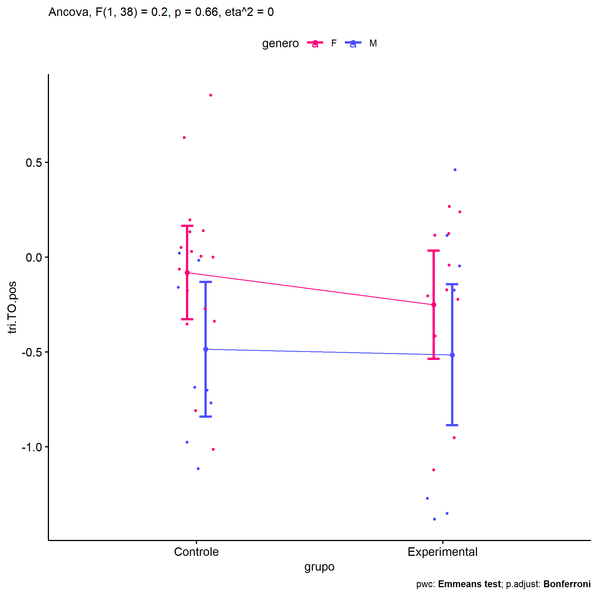<!-- -->

    ## Scale for colour is already present.
    ## Adding another scale for colour, which will replace the existing scale.

<!-- -->

<!-- -->

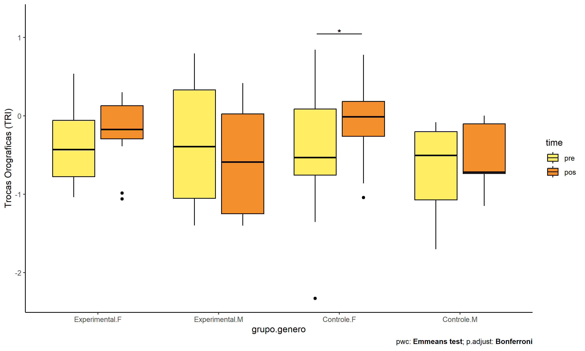<!-- -->

## factores: **idade:grupo**

### Leitura de Pseudo-Palavras (Acertos)

| var            | idade | grupo        |   n | M (pre) | SE (pre) | M (unadj) | SE (unadj) | M (adj) | SE (adj) |
|:---------------|:------|:-------------|----:|--------:|---------:|----------:|-----------:|--------:|---------:|
| score.CLPP.pos | 11y   | Controle     |  15 |  47.467 |    4.581 |    56.067 |      2.964 |  57.038 |    2.565 |
| score.CLPP.pos | 11y   | Experimental |  11 |  57.818 |    2.984 |    68.636 |      3.160 |  66.955 |    3.055 |
| score.CLPP.pos | 12y   | Experimental |   5 |  48.200 |    6.719 |    61.800 |      1.530 |  62.584 |    4.385 |

|     | grupo        | idade | group1   | group2       | estimate | conf.low | conf.high |    se | statistic |     p | p.adj | p.adj.signif |
|:----|:-------------|:------|:---------|:-------------|---------:|---------:|----------:|------:|----------:|------:|------:|:-------------|
| 2   | Experimental |       | 11y      | 12y          |    4.371 |   -6.711 |    15.453 | 5.401 |     0.809 | 0.425 | 0.425 | ns           |
| 4   | Experimental |       | 11y      | 12y          |    9.618 |   -6.941 |    26.178 | 8.084 |     1.190 | 0.244 | 0.244 | ns           |
| 5   |              | 11y   | Controle | Experimental |   -9.917 |  -18.293 |    -1.540 | 4.082 |    -2.429 | 0.022 | 0.022 | \*           |
| 7   |              | 11y   | Controle | Experimental |  -10.352 |  -22.539 |     1.836 | 5.950 |    -1.740 | 0.093 | 0.093 | ns           |

| grupo        | idade | group1 | group2 | estimate | conf.low | conf.high |    se | statistic |     p | p.adj | p.adj.signif |
|:-------------|:------|:-------|:-------|---------:|---------:|----------:|------:|----------:|------:|------:|:-------------|
| Controle     | 11y   | pre    | pos    |   -7.721 |  -17.608 |     2.166 | 4.949 |    -1.560 | 0.124 | 0.124 | ns           |
| Experimental | 11y   | pre    | pos    |  -12.795 |  -23.808 |    -1.782 | 5.513 |    -2.321 | 0.023 | 0.023 | \*           |
| Experimental | 12y   | pre    | pos    |  -13.600 |  -30.999 |     3.799 | 8.710 |    -1.562 | 0.123 | 0.123 | ns           |

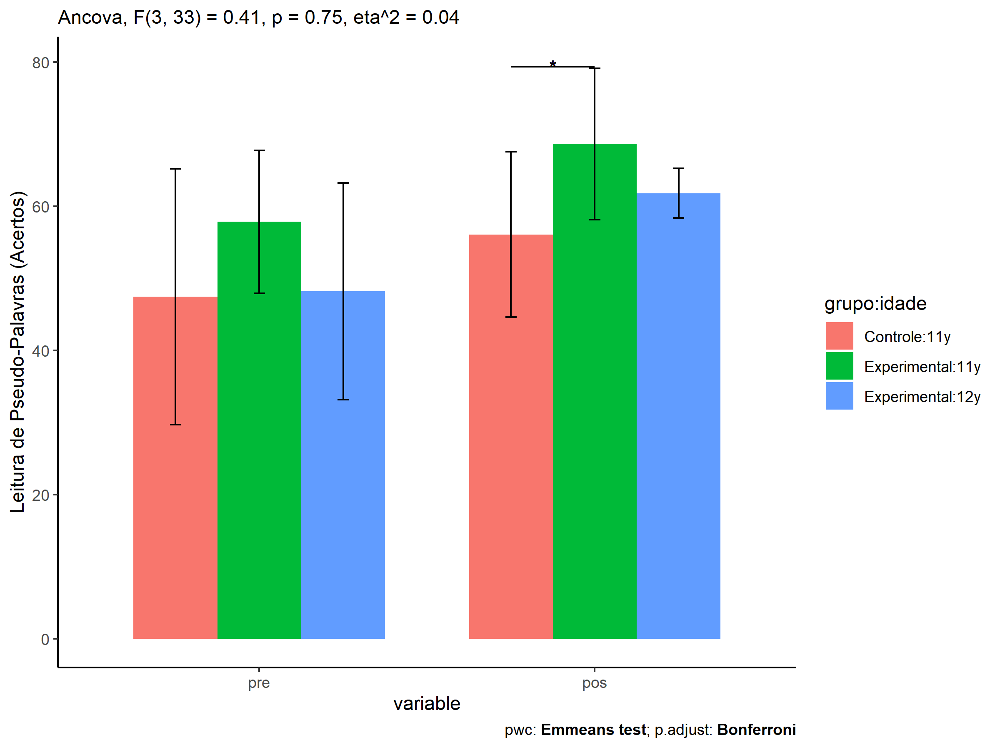<!-- -->

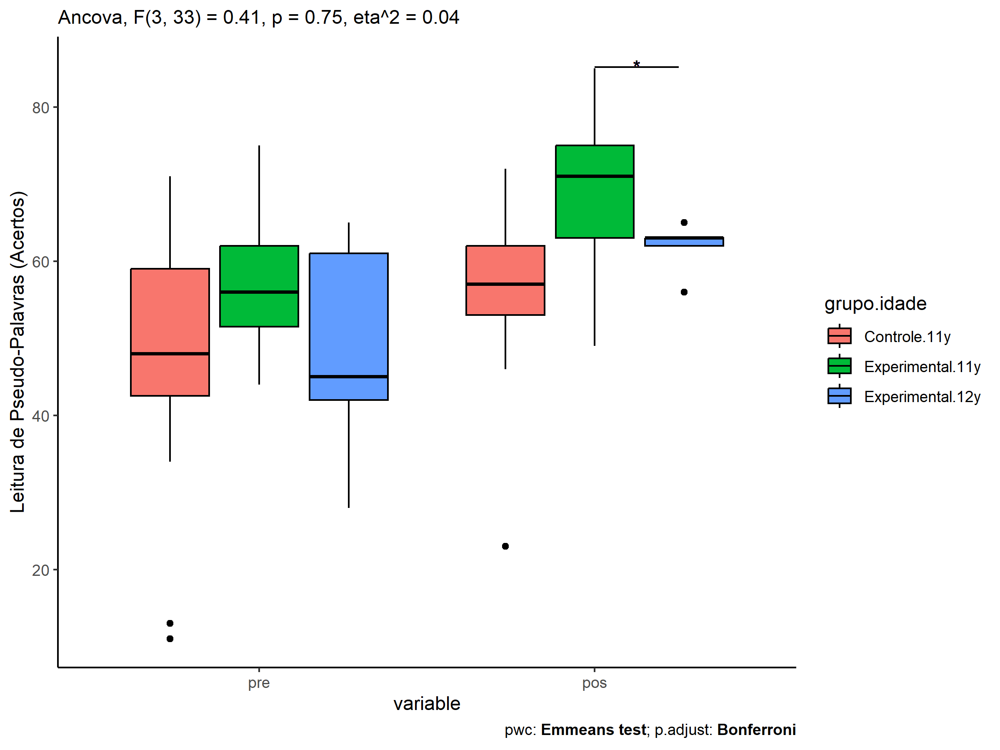<!-- -->

<!-- -->

### Leitura de Pseudo-Palavras (TRI)

| var          | idade | grupo        |   n | M (pre) | SE (pre) | M (unadj) | SE (unadj) | M (adj) | SE (adj) |
|:-------------|:------|:-------------|----:|--------:|---------:|----------:|-----------:|--------:|---------:|
| tri.CLPP.pos | 11y   | Controle     |  15 |  47.467 |    4.581 |    56.067 |      2.964 |  57.038 |    2.565 |
| tri.CLPP.pos | 11y   | Experimental |  11 |  57.818 |    2.984 |    68.636 |      3.160 |  66.955 |    3.055 |
| tri.CLPP.pos | 12y   | Experimental |   5 |  48.200 |    6.719 |    61.800 |      1.530 |  62.584 |    4.385 |

|     | grupo        | idade | group1   | group2       | estimate | conf.low | conf.high |    se | statistic |     p | p.adj | p.adj.signif |
|:----|:-------------|:------|:---------|:-------------|---------:|---------:|----------:|------:|----------:|------:|------:|:-------------|
| 2   | Experimental |       | 11y      | 12y          |    4.371 |   -6.711 |    15.453 | 5.401 |     0.809 | 0.425 | 0.425 | ns           |
| 4   | Experimental |       | 11y      | 12y          |    9.618 |   -6.941 |    26.178 | 8.084 |     1.190 | 0.244 | 0.244 | ns           |
| 5   |              | 11y   | Controle | Experimental |   -9.917 |  -18.293 |    -1.540 | 4.082 |    -2.429 | 0.022 | 0.022 | \*           |
| 7   |              | 11y   | Controle | Experimental |  -10.352 |  -22.539 |     1.836 | 5.950 |    -1.740 | 0.093 | 0.093 | ns           |

| grupo        | idade | group1 | group2 | estimate | conf.low | conf.high |    se | statistic |     p | p.adj | p.adj.signif |
|:-------------|:------|:-------|:-------|---------:|---------:|----------:|------:|----------:|------:|------:|:-------------|
| Controle     | 11y   | pre    | pos    |   -0.029 |   -0.578 |     0.520 | 0.275 |    -0.106 | 0.916 | 0.916 | ns           |
| Experimental | 11y   | pre    | pos    |   -0.307 |   -0.918 |     0.304 | 0.306 |    -1.003 | 0.320 | 0.320 | ns           |
| Experimental | 12y   | pre    | pos    |   -0.518 |   -1.483 |     0.448 | 0.483 |    -1.071 | 0.288 | 0.288 | ns           |

<!-- -->

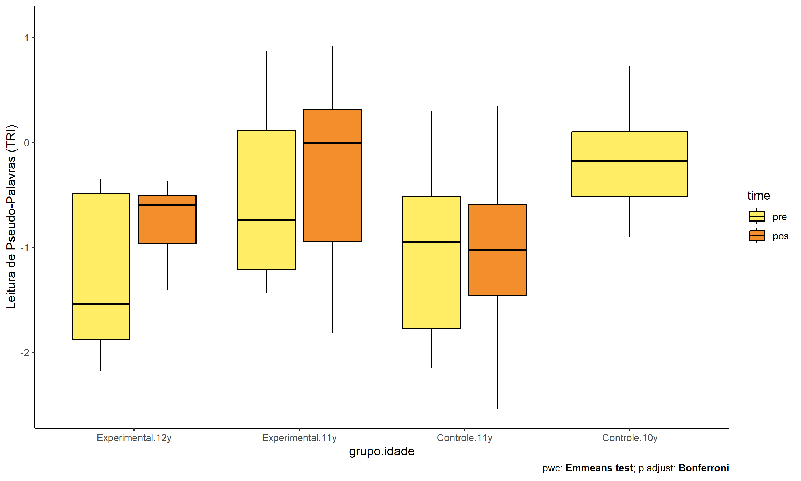<!-- -->

### Correta Regular (Acertos)

| var          | idade | grupo        |   n | M (pre) | SE (pre) | M (unadj) | SE (unadj) | M (adj) | SE (adj) |
|:-------------|:------|:-------------|----:|--------:|---------:|----------:|-----------:|--------:|---------:|
| score.CR.pos | 10y   | Controle     |   5 |  14.200 |    1.020 |    11.000 |      3.391 |   8.972 |    2.131 |
| score.CR.pos | 11y   | Controle     |  16 |   9.562 |    1.147 |    12.500 |      0.871 |  13.031 |    1.152 |
| score.CR.pos | 11y   | Experimental |  14 |  10.357 |    1.324 |    12.286 |      1.662 |  12.378 |    1.220 |
| score.CR.pos | 12y   | Experimental |   5 |  10.400 |    2.249 |    14.600 |      1.503 |  14.669 |    2.042 |

|     | grupo        | idade | group1   | group2       | estimate | conf.low | conf.high |    se | statistic |     p | p.adj | p.adj.signif |
|:----|:-------------|:------|:---------|:-------------|---------:|---------:|----------:|------:|----------:|------:|------:|:-------------|
| 1   | Controle     |       | 10y      | 11y          |   -4.059 |   -9.058 |     0.939 | 2.462 |    -1.649 | 0.108 | 0.108 | ns           |
| 6   | Experimental |       | 11y      | 12y          |   -2.291 |   -7.119 |     2.538 | 2.378 |    -0.963 | 0.342 | 0.342 | ns           |
| 7   | Controle     |       | 10y      | 11y          |    4.637 |   -0.128 |     9.403 | 2.350 |     1.974 | 0.056 | 0.056 | ns           |
| 12  | Experimental |       | 11y      | 12y          |   -0.043 |   -4.889 |     4.803 | 2.389 |    -0.018 | 0.986 | 0.986 | ns           |
| 14  |              | 11y   | Controle | Experimental |    0.653 |   -2.749 |     4.055 | 1.676 |     0.390 | 0.699 | 0.699 | ns           |
| 17  |              | 11y   | Controle | Experimental |   -0.795 |   -4.198 |     2.609 | 1.678 |    -0.473 | 0.639 | 0.639 | ns           |

| grupo        | idade | group1 | group2 | estimate | conf.low | conf.high |    se | statistic |     p | p.adj | p.adj.signif |
|:-------------|:------|:-------|:-------|---------:|---------:|----------:|------:|----------:|------:|------:|:-------------|
| Controle     | 10y   | pre    | pos    |    3.200 |   -2.957 |     9.357 | 3.089 |     1.036 | 0.304 | 0.304 | ns           |
| Controle     | 11y   | pre    | pos    |   -2.938 |   -6.379 |     0.504 | 1.727 |    -1.701 | 0.093 | 0.093 | ns           |
| Experimental | 11y   | pre    | pos    |   -1.929 |   -5.608 |     1.751 | 1.846 |    -1.045 | 0.300 | 0.300 | ns           |
| Experimental | 12y   | pre    | pos    |   -4.200 |  -10.357 |     1.957 | 3.089 |    -1.360 | 0.178 | 0.178 | ns           |

    ## Scale for colour is already present.
    ## Adding another scale for colour, which will replace the existing scale.

<!-- -->

<!-- -->

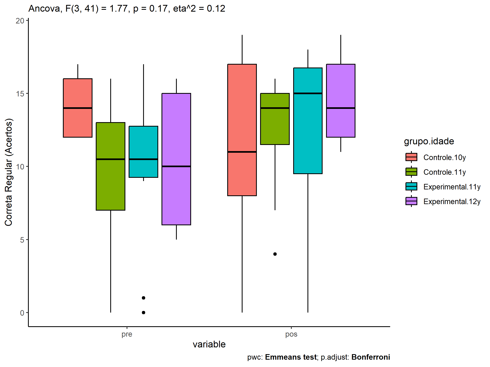<!-- -->

<!-- -->

### Correta Regular (TRI)

| var        | idade | grupo        |   n | M (pre) | SE (pre) | M (unadj) | SE (unadj) | M (adj) | SE (adj) |
|:-----------|:------|:-------------|----:|--------:|---------:|----------:|-----------:|--------:|---------:|
| tri.CR.pos | 11y   | Controle     |  15 |  -0.769 |    0.227 |    -0.549 |      0.170 |  -0.512 |    0.163 |
| tri.CR.pos | 11y   | Experimental |  11 |  -0.331 |    0.270 |    -0.016 |      0.229 |  -0.150 |    0.196 |
| tri.CR.pos | 12y   | Experimental |   5 |  -1.143 |    0.379 |    -0.474 |      0.331 |  -0.291 |    0.289 |

|     | grupo        | idade | group1   | group2       | estimate | conf.low | conf.high |    se | statistic |     p | p.adj | p.adj.signif |
|:----|:-------------|:------|:---------|:-------------|---------:|---------:|----------:|------:|----------:|------:|------:|:-------------|
| 2   | Experimental |       | 11y      | 12y          |    0.140 |   -0.592 |     0.873 | 0.357 |     0.393 | 0.697 | 0.697 | ns           |
| 4   | Experimental |       | 11y      | 12y          |    0.812 |   -0.161 |     1.784 | 0.475 |     1.709 | 0.099 | 0.099 | ns           |
| 5   |              | 11y   | Controle | Experimental |   -0.362 |   -0.889 |     0.166 | 0.257 |    -1.407 | 0.171 | 0.171 | ns           |
| 7   |              | 11y   | Controle | Experimental |   -0.438 |   -1.154 |     0.278 | 0.350 |    -1.253 | 0.221 | 0.221 | ns           |

| grupo        | idade | group1 | group2 | estimate | conf.low | conf.high |    se | statistic |     p | p.adj | p.adj.signif |
|:-------------|:------|:-------|:-------|---------:|---------:|----------:|------:|----------:|------:|------:|:-------------|
| Controle     | 11y   | pre    | pos    |   -0.174 |   -0.769 |     0.422 | 0.298 |    -0.583 | 0.562 | 0.562 | ns           |
| Experimental | 11y   | pre    | pos    |   -0.360 |   -1.024 |     0.303 | 0.332 |    -1.086 | 0.282 | 0.282 | ns           |
| Experimental | 12y   | pre    | pos    |   -0.669 |   -1.717 |     0.379 | 0.525 |    -1.276 | 0.207 | 0.207 | ns           |

<!-- -->

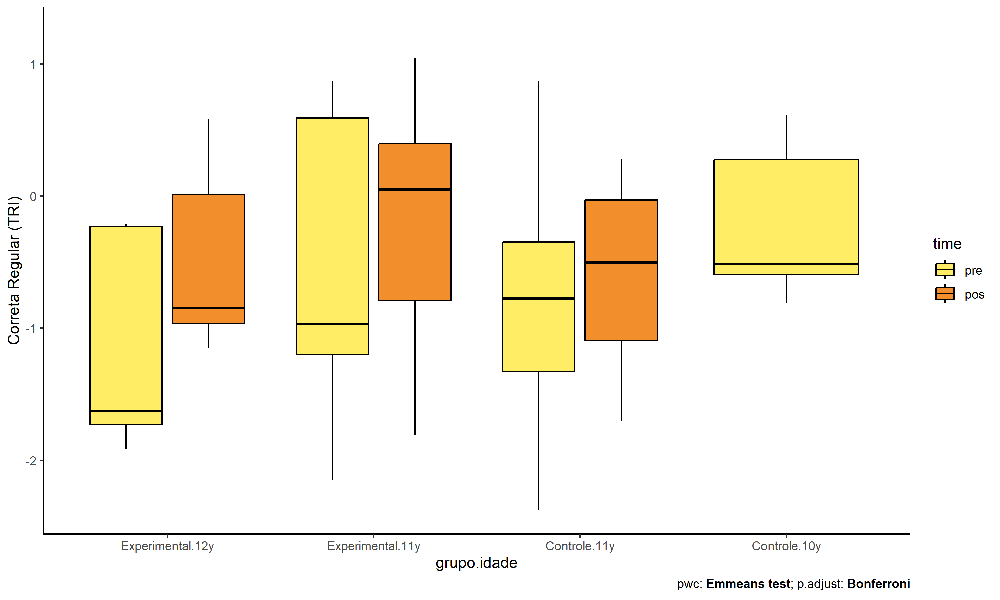<!-- -->

### Correta Irregular (Acertos)

| var          | idade | grupo        |   n | M (pre) | SE (pre) | M (unadj) | SE (unadj) | M (adj) | SE (adj) |
|:-------------|:------|:-------------|----:|--------:|---------:|----------:|-----------:|--------:|---------:|
| score.CI.pos | 10y   | Controle     |   5 |  11.400 |    0.927 |     9.200 |      2.990 |   7.782 |    1.919 |
| score.CI.pos | 11y   | Controle     |  16 |   8.000 |    1.004 |     8.375 |      0.884 |   8.605 |    1.034 |
| score.CI.pos | 11y   | Experimental |  14 |   7.643 |    1.057 |     9.214 |      1.306 |   9.618 |    1.112 |
| score.CI.pos | 12y   | Experimental |   5 |   9.400 |    1.503 |    10.800 |      1.356 |  10.352 |    1.851 |

|     | grupo        | idade | group1   | group2       | estimate | conf.low | conf.high |    se | statistic |     p | p.adj | p.adj.signif |
|:----|:-------------|:------|:---------|:-------------|---------:|---------:|----------:|------:|----------:|------:|------:|:-------------|
| 1   | Controle     |       | 10y      | 11y          |   -0.823 |   -5.292 |     3.645 | 2.201 |    -0.374 | 0.711 | 0.711 | ns           |
| 6   | Experimental |       | 11y      | 12y          |   -0.734 |   -5.141 |     3.673 | 2.171 |    -0.338 | 0.737 | 0.737 | ns           |
| 7   | Controle     |       | 10y      | 11y          |    3.400 |   -0.502 |     7.302 | 1.924 |     1.767 | 0.086 | 0.086 | ns           |
| 12  | Experimental |       | 11y      | 12y          |   -1.757 |   -5.725 |     2.210 | 1.956 |    -0.898 | 0.375 | 0.375 | ns           |
| 14  |              | 11y   | Controle | Experimental |   -1.012 |   -4.077 |     2.052 | 1.510 |    -0.671 | 0.507 | 0.507 | ns           |
| 17  |              | 11y   | Controle | Experimental |    0.357 |   -2.430 |     3.144 | 1.374 |     0.260 | 0.796 | 0.796 | ns           |

| grupo        | idade | group1 | group2 | estimate | conf.low | conf.high |    se | statistic |     p | p.adj | p.adj.signif |
|:-------------|:------|:-------|:-------|---------:|---------:|----------:|------:|----------:|------:|------:|:-------------|
| Controle     | 10y   | pre    | pos    |    2.200 |   -2.993 |     7.393 | 2.605 |     0.845 | 0.401 | 0.401 | ns           |
| Controle     | 11y   | pre    | pos    |   -0.375 |   -3.278 |     2.528 | 1.456 |    -0.258 | 0.798 | 0.798 | ns           |
| Experimental | 11y   | pre    | pos    |   -1.571 |   -4.675 |     1.532 | 1.557 |    -1.009 | 0.316 | 0.316 | ns           |
| Experimental | 12y   | pre    | pos    |   -1.400 |   -6.593 |     3.793 | 2.605 |    -0.537 | 0.593 | 0.593 | ns           |

    ## Scale for colour is already present.
    ## Adding another scale for colour, which will replace the existing scale.

<!-- -->

<!-- -->

<!-- -->

<!-- -->

### Correta Irregular (TRI)

| var        | idade | grupo        |   n | M (pre) | SE (pre) | M (unadj) | SE (unadj) | M (adj) | SE (adj) |
|:-----------|:------|:-------------|----:|--------:|---------:|----------:|-----------:|--------:|---------:|
| tri.CI.pos | 11y   | Controle     |  15 |  -0.577 |    0.151 |    -1.016 |      0.161 |  -0.991 |    0.158 |
| tri.CI.pos | 11y   | Experimental |  11 |  -0.531 |    0.182 |    -0.414 |      0.266 |  -0.421 |    0.185 |
| tri.CI.pos | 12y   | Experimental |   5 |  -0.454 |    0.310 |    -0.266 |      0.311 |  -0.327 |    0.274 |

|     | grupo        | idade | group1   | group2       | estimate | conf.low | conf.high |    se | statistic |     p | p.adj | p.adj.signif |
|:----|:-------------|:------|:---------|:-------------|---------:|---------:|----------:|------:|----------:|------:|------:|:-------------|
| 2   | Experimental |       | 11y      | 12y          |   -0.094 |   -0.772 |     0.585 | 0.331 |    -0.283 | 0.779 | 0.779 | ns           |
| 4   | Experimental |       | 11y      | 12y          |   -0.078 |   -0.749 |     0.594 | 0.328 |    -0.237 | 0.814 | 0.814 | ns           |
| 5   |              | 11y   | Controle | Experimental |   -0.570 |   -1.070 |    -0.071 | 0.243 |    -2.343 | 0.027 | 0.027 | \*           |
| 7   |              | 11y   | Controle | Experimental |   -0.045 |   -0.539 |     0.449 | 0.241 |    -0.188 | 0.852 | 0.852 | ns           |

| grupo        | idade | group1 | group2 | estimate | conf.low | conf.high |    se | statistic |     p | p.adj | p.adj.signif |
|:-------------|:------|:-------|:-------|---------:|---------:|----------:|------:|----------:|------:|------:|:-------------|
| Controle     | 11y   | pre    | pos    |    0.451 |   -0.018 |     0.920 | 0.235 |     1.921 | 0.059 | 0.059 | ns           |
| Experimental | 11y   | pre    | pos    |   -0.232 |   -0.754 |     0.290 | 0.261 |    -0.888 | 0.378 | 0.378 | ns           |
| Experimental | 12y   | pre    | pos    |   -0.187 |   -1.012 |     0.638 | 0.413 |    -0.453 | 0.652 | 0.652 | ns           |

<!-- -->

<!-- -->

### Trocas Visuais (Acertos)

| var          | idade | grupo        |   n | M (pre) | SE (pre) | M (unadj) | SE (unadj) | M (adj) | SE (adj) |
|:-------------|:------|:-------------|----:|--------:|---------:|----------:|-----------:|--------:|---------:|
| score.TV.pos | 10y   | Controle     |   5 |  17.400 |    1.030 |    12.000 |      3.521 |   9.525 |    2.454 |
| score.TV.pos | 11y   | Controle     |  16 |  11.125 |    1.541 |    13.688 |      1.193 |  14.431 |    1.325 |
| score.TV.pos | 11y   | Experimental |  14 |  13.071 |    1.365 |    14.143 |      1.851 |  13.888 |    1.398 |
| score.TV.pos | 12y   | Experimental |   5 |  11.000 |    3.050 |    15.200 |      1.319 |  16.008 |    2.348 |

|     | grupo        | idade | group1   | group2       | estimate | conf.low | conf.high |    se | statistic |     p | p.adj | p.adj.signif |
|:----|:-------------|:------|:---------|:-------------|---------:|---------:|----------:|------:|----------:|------:|------:|:-------------|
| 1   | Controle     |       | 10y      | 11y          |   -4.907 |  -10.691 |     0.878 | 2.849 |    -1.722 | 0.094 | 0.094 | ns           |
| 6   | Experimental |       | 11y      | 12y          |   -2.120 |   -7.681 |     3.442 | 2.740 |    -0.774 | 0.444 | 0.444 | ns           |
| 7   | Controle     |       | 10y      | 11y          |    6.275 |    0.490 |    12.060 | 2.852 |     2.200 | 0.034 | 0.034 | \*           |
| 12  | Experimental |       | 11y      | 12y          |    2.071 |   -3.811 |     7.954 | 2.901 |     0.714 | 0.480 | 0.480 | ns           |
| 14  |              | 11y   | Controle | Experimental |    0.543 |   -3.385 |     4.471 | 1.935 |     0.281 | 0.781 | 0.781 | ns           |
| 17  |              | 11y   | Controle | Experimental |   -1.946 |   -6.079 |     2.186 | 2.037 |    -0.955 | 0.346 | 0.346 | ns           |

| grupo        | idade | group1 | group2 | estimate | conf.low | conf.high |    se | statistic |     p | p.adj | p.adj.signif |
|:-------------|:------|:-------|:-------|---------:|---------:|----------:|------:|----------:|------:|------:|:-------------|
| Controle     | 10y   | pre    | pos    |    5.400 |   -1.824 |    12.624 | 3.624 |     1.490 | 0.141 | 0.141 | ns           |
| Controle     | 11y   | pre    | pos    |   -2.563 |   -6.601 |     1.476 | 2.026 |    -1.265 | 0.210 | 0.210 | ns           |
| Experimental | 11y   | pre    | pos    |   -1.071 |   -5.389 |     3.246 | 2.166 |    -0.495 | 0.622 | 0.622 | ns           |
| Experimental | 12y   | pre    | pos    |   -4.200 |  -11.424 |     3.024 | 3.624 |    -1.159 | 0.250 | 0.250 | ns           |

    ## Scale for colour is already present.
    ## Adding another scale for colour, which will replace the existing scale.

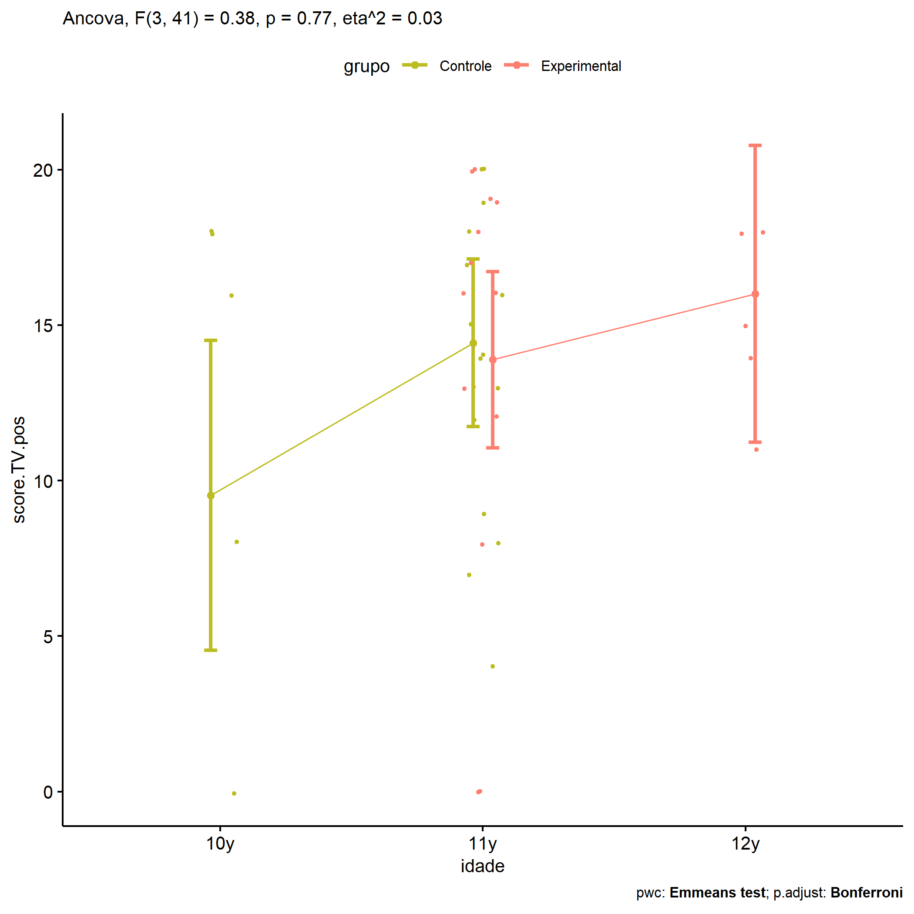<!-- -->

<!-- -->

<!-- -->

<!-- -->

### Trocas Visuais (TRI)

| var        | idade | grupo        |   n | M (pre) | SE (pre) | M (unadj) | SE (unadj) | M (adj) | SE (adj) |
|:-----------|:------|:-------------|----:|--------:|---------:|----------:|-----------:|--------:|---------:|
| tri.TV.pos | 11y   | Controle     |  15 |  -0.643 |    0.245 |    -0.584 |      0.229 |  -0.551 |    0.204 |
| tri.TV.pos | 11y   | Experimental |  11 |  -0.214 |    0.238 |     0.102 |      0.245 |  -0.034 |    0.244 |
| tri.TV.pos | 12y   | Experimental |   5 |  -1.069 |    0.474 |    -0.492 |      0.366 |  -0.292 |    0.362 |

|     | grupo        | idade | group1   | group2       | estimate | conf.low | conf.high |    se | statistic |     p | p.adj | p.adj.signif |
|:----|:-------------|:------|:---------|:-------------|---------:|---------:|----------:|------:|----------:|------:|------:|:-------------|
| 2   | Experimental |       | 11y      | 12y          |    0.258 |   -0.659 |     1.176 | 0.447 |     0.578 | 0.568 | 0.568 | ns           |
| 4   | Experimental |       | 11y      | 12y          |    0.855 |   -0.153 |     1.863 | 0.492 |     1.738 | 0.093 | 0.093 | ns           |
| 5   |              | 11y   | Controle | Experimental |   -0.518 |   -1.175 |     0.140 | 0.320 |    -1.616 | 0.118 | 0.118 | ns           |
| 7   |              | 11y   | Controle | Experimental |   -0.429 |   -1.171 |     0.312 | 0.362 |    -1.186 | 0.246 | 0.246 | ns           |

| grupo        | idade | group1 | group2 | estimate | conf.low | conf.high |    se | statistic |     p | p.adj | p.adj.signif |
|:-------------|:------|:-------|:-------|---------:|---------:|----------:|------:|----------:|------:|------:|:-------------|
| Controle     | 11y   | pre    | pos    |    0.059 |   -0.579 |     0.697 | 0.320 |     0.185 | 0.854 | 0.854 | ns           |
| Experimental | 11y   | pre    | pos    |   -0.185 |   -0.896 |     0.526 | 0.356 |    -0.520 | 0.605 | 0.605 | ns           |
| Experimental | 12y   | pre    | pos    |   -0.577 |   -1.700 |     0.547 | 0.562 |    -1.025 | 0.309 | 0.309 | ns           |

<!-- -->

<!-- -->

### Trocas Fonologicas (Acertos)

| var          | idade | grupo        |   n | M (pre) | SE (pre) | M (unadj) | SE (unadj) | M (adj) | SE (adj) |
|:-------------|:------|:-------------|----:|--------:|---------:|----------:|-----------:|--------:|---------:|
| score.TF.pos | 10y   | Controle     |   5 |  15.200 |    1.985 |     9.600 |      2.768 |   7.304 |    2.342 |
| score.TF.pos | 11y   | Controle     |  16 |   9.625 |    1.310 |    11.250 |      1.010 |  11.948 |    1.263 |
| score.TF.pos | 11y   | Experimental |  14 |  11.286 |    1.324 |    13.214 |      1.837 |  13.021 |    1.330 |
| score.TF.pos | 12y   | Experimental |   5 |   9.800 |    1.158 |    12.000 |      2.168 |  12.604 |    2.232 |

|     | grupo        | idade | group1   | group2       | estimate | conf.low | conf.high |    se | statistic |     p | p.adj | p.adj.signif |
|:----|:-------------|:------|:---------|:-------------|---------:|---------:|----------:|------:|----------:|------:|------:|:-------------|
| 1   | Controle     |       | 10y      | 11y          |   -4.644 |  -10.170 |     0.882 | 2.722 |    -1.706 | 0.097 | 0.097 | ns           |
| 6   | Experimental |       | 11y      | 12y          |    0.416 |   -4.868 |     5.701 | 2.603 |     0.160 | 0.874 | 0.874 | ns           |
| 7   | Controle     |       | 10y      | 11y          |    5.575 |    0.567 |    10.583 | 2.469 |     2.258 | 0.030 | 0.030 | \*           |
| 12  | Experimental |       | 11y      | 12y          |    1.486 |   -3.607 |     6.578 | 2.511 |     0.592 | 0.558 | 0.558 | ns           |
| 14  |              | 11y   | Controle | Experimental |   -1.072 |   -4.812 |     2.667 | 1.842 |    -0.582 | 0.564 | 0.564 | ns           |
| 17  |              | 11y   | Controle | Experimental |   -1.661 |   -5.238 |     1.916 | 1.764 |    -0.942 | 0.353 | 0.353 | ns           |

| grupo        | idade | group1 | group2 | estimate | conf.low | conf.high |    se | statistic |     p | p.adj | p.adj.signif |
|:-------------|:------|:-------|:-------|---------:|---------:|----------:|------:|----------:|------:|------:|:-------------|
| Controle     | 10y   | pre    | pos    |    5.600 |   -0.949 |    12.149 | 3.285 |     1.705 | 0.093 | 0.093 | ns           |
| Controle     | 11y   | pre    | pos    |   -1.625 |   -5.286 |     2.036 | 1.837 |    -0.885 | 0.379 | 0.379 | ns           |
| Experimental | 11y   | pre    | pos    |   -1.929 |   -5.842 |     1.985 | 1.963 |    -0.982 | 0.329 | 0.329 | ns           |
| Experimental | 12y   | pre    | pos    |   -2.200 |   -8.749 |     4.349 | 3.285 |    -0.670 | 0.505 | 0.505 | ns           |

    ## Scale for colour is already present.
    ## Adding another scale for colour, which will replace the existing scale.

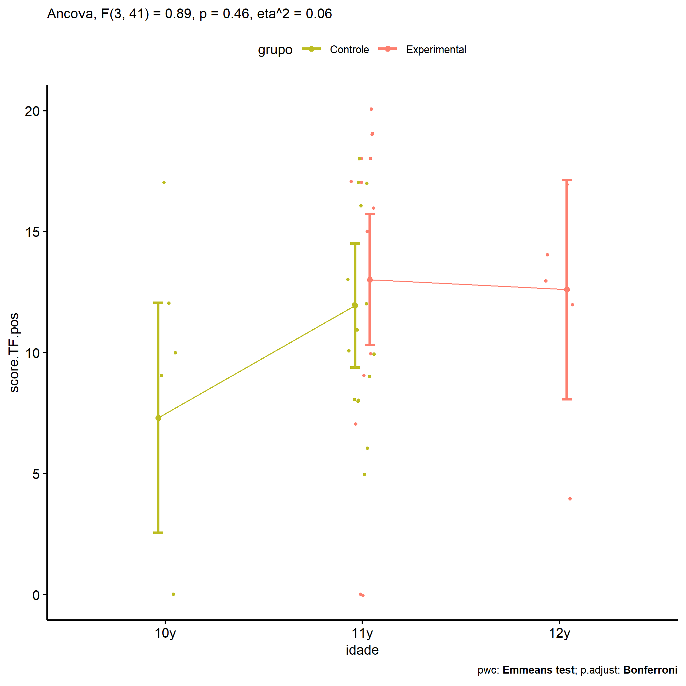<!-- -->

<!-- -->

<!-- -->

<!-- -->

### Trocas Fonologicas (TRI)

| var        | idade | grupo        |   n | M (pre) | SE (pre) | M (unadj) | SE (unadj) | M (adj) | SE (adj) |
|:-----------|:------|:-------------|----:|--------:|---------:|----------:|-----------:|--------:|---------:|
| tri.TF.pos | 11y   | Controle     |  15 |  -0.788 |    0.184 |    -0.735 |      0.189 |  -0.659 |    0.171 |
| tri.TF.pos | 11y   | Experimental |  11 |  -0.339 |    0.278 |     0.011 |      0.253 |  -0.178 |    0.205 |
| tri.TF.pos | 12y   | Experimental |   5 |  -0.976 |    0.210 |    -0.732 |      0.374 |  -0.546 |    0.298 |

|     | grupo        | idade | group1   | group2       | estimate | conf.low | conf.high |    se | statistic |     p | p.adj | p.adj.signif |
|:----|:-------------|:------|:---------|:-------------|---------:|---------:|----------:|------:|----------:|------:|------:|:-------------|
| 2   | Experimental |       | 11y      | 12y          |    0.368 |   -0.389 |     1.125 | 0.369 |     0.998 | 0.327 | 0.327 | ns           |
| 4   | Experimental |       | 11y      | 12y          |    0.637 |   -0.209 |     1.484 | 0.413 |     1.542 | 0.134 | 0.134 | ns           |
| 5   |              | 11y   | Controle | Experimental |   -0.481 |   -1.037 |     0.074 | 0.271 |    -1.779 | 0.087 | 0.087 | ns           |
| 7   |              | 11y   | Controle | Experimental |   -0.450 |   -1.073 |     0.173 | 0.304 |    -1.478 | 0.150 | 0.150 | ns           |

| grupo        | idade | group1 | group2 | estimate | conf.low | conf.high |    se | statistic |     p | p.adj | p.adj.signif |
|:-------------|:------|:-------|:-------|---------:|---------:|----------:|------:|----------:|------:|------:|:-------------|
| Controle     | 11y   | pre    | pos    |    0.011 |   -0.566 |     0.589 | 0.289 |     0.039 | 0.969 | 0.969 | ns           |
| Experimental | 11y   | pre    | pos    |   -0.204 |   -0.847 |     0.439 | 0.322 |    -0.634 | 0.528 | 0.528 | ns           |
| Experimental | 12y   | pre    | pos    |   -0.244 |   -1.260 |     0.772 | 0.509 |    -0.479 | 0.634 | 0.634 | ns           |

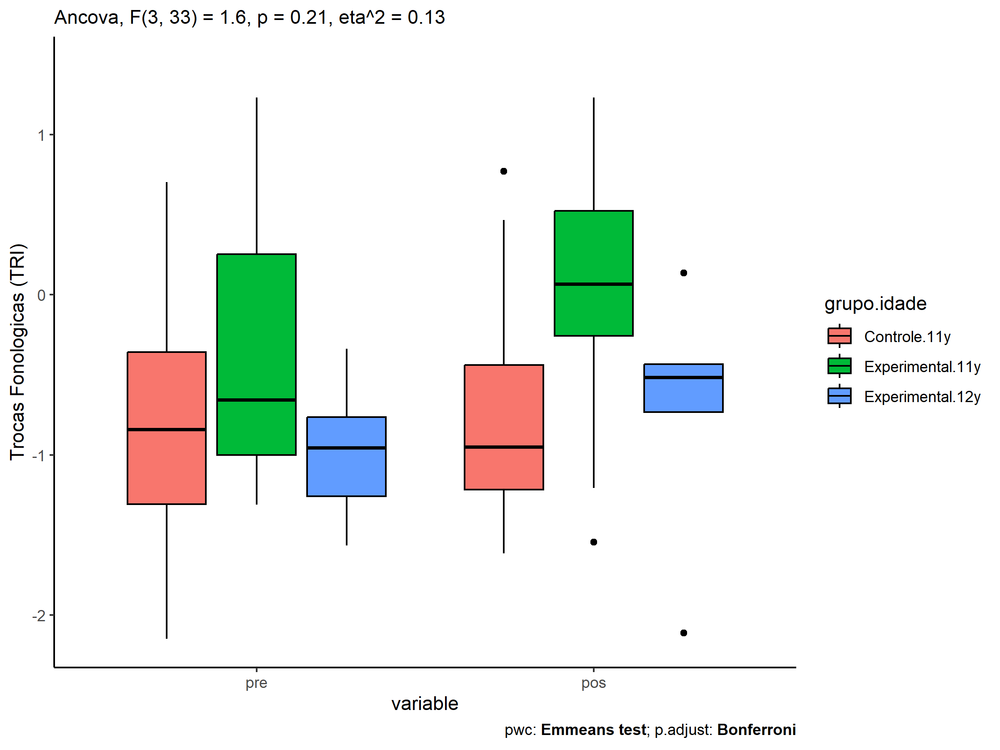<!-- -->

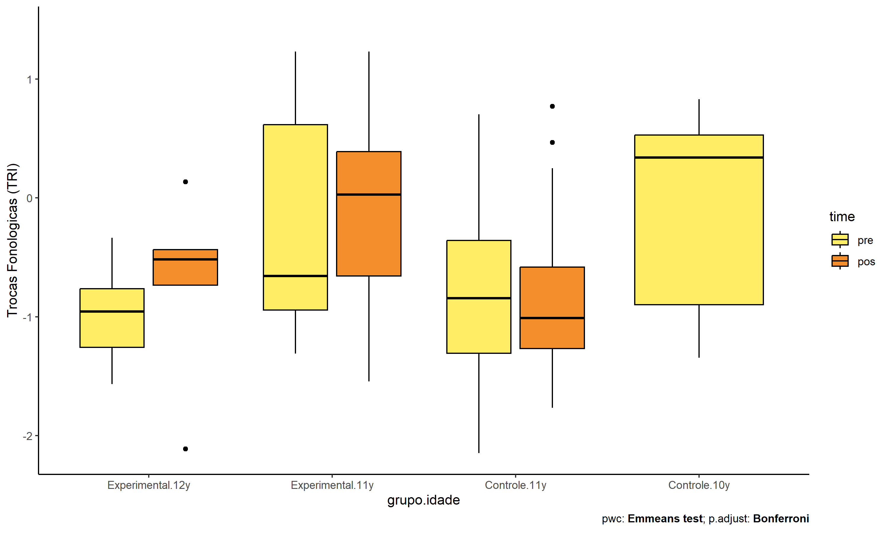<!-- -->

### Trocas Orograficas (Acertos)

| var          | idade | grupo        |   n | M (pre) | SE (pre) | M (unadj) | SE (unadj) | M (adj) | SE (adj) |
|:-------------|:------|:-------------|----:|--------:|---------:|----------:|-----------:|--------:|---------:|
| score.TO.pos | 10y   | Controle     |   5 |   8.400 |    0.678 |     7.600 |      2.040 |   7.199 |    1.579 |
| score.TO.pos | 11y   | Controle     |  16 |   6.188 |    1.046 |     9.375 |      0.694 |   9.631 |    0.885 |
| score.TO.pos | 11y   | Experimental |  14 |   7.357 |    0.923 |     8.000 |      1.089 |   7.909 |    0.935 |
| score.TO.pos | 12y   | Experimental |   5 |   7.600 |    0.600 |     9.200 |      1.594 |   9.036 |    1.565 |

|     | grupo        | idade | group1   | group2       | estimate | conf.low | conf.high |    se | statistic |     p | p.adj | p.adj.signif |
|:----|:-------------|:------|:---------|:-------------|---------:|---------:|----------:|------:|----------:|------:|------:|:-------------|
| 1   | Controle     |       | 10y      | 11y          |   -2.433 |   -6.145 |     1.279 | 1.828 |    -1.331 | 0.192 | 0.192 | ns           |
| 6   | Experimental |       | 11y      | 12y          |   -1.128 |   -4.825 |     2.569 | 1.821 |    -0.619 | 0.540 | 0.540 | ns           |
| 7   | Controle     |       | 10y      | 11y          |    2.212 |   -1.396 |     5.821 | 1.779 |     1.244 | 0.222 | 0.222 | ns           |
| 12  | Experimental |       | 11y      | 12y          |   -0.243 |   -3.912 |     3.426 | 1.809 |    -0.134 | 0.894 | 0.894 | ns           |
| 14  |              | 11y   | Controle | Experimental |    1.723 |   -0.904 |     4.349 | 1.294 |     1.332 | 0.192 | 0.192 | ns           |
| 17  |              | 11y   | Controle | Experimental |   -1.170 |   -3.747 |     1.408 | 1.271 |    -0.920 | 0.363 | 0.363 | ns           |

| grupo        | idade | group1 | group2 | estimate | conf.low | conf.high |    se | statistic |     p | p.adj | p.adj.signif |
|:-------------|:------|:-------|:-------|---------:|---------:|----------:|------:|----------:|------:|------:|:-------------|
| Controle     | 10y   | pre    | pos    |    0.800 |   -3.657 |     5.257 | 2.236 |     0.358 | 0.722 | 0.722 | ns           |
| Controle     | 11y   | pre    | pos    |   -3.188 |   -5.679 |    -0.696 | 1.250 |    -2.550 | 0.013 | 0.013 | \*           |
| Experimental | 11y   | pre    | pos    |   -0.643 |   -3.306 |     2.021 | 1.336 |    -0.481 | 0.632 | 0.632 | ns           |
| Experimental | 12y   | pre    | pos    |   -1.600 |   -6.057 |     2.857 | 2.236 |    -0.716 | 0.477 | 0.477 | ns           |

    ## Scale for colour is already present.
    ## Adding another scale for colour, which will replace the existing scale.

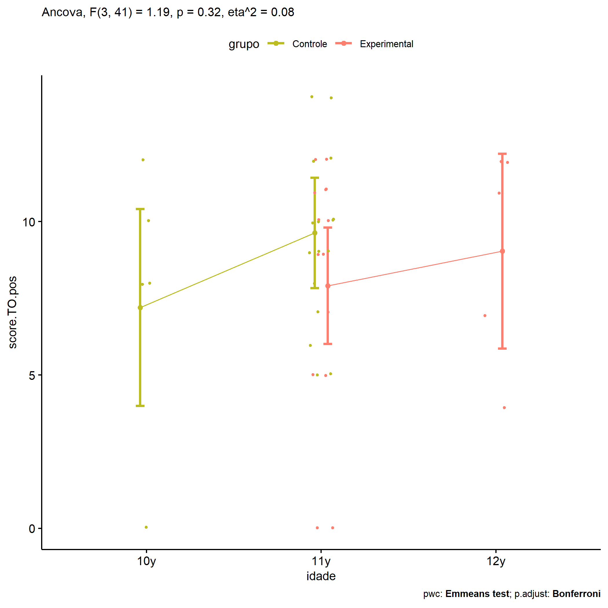<!-- -->

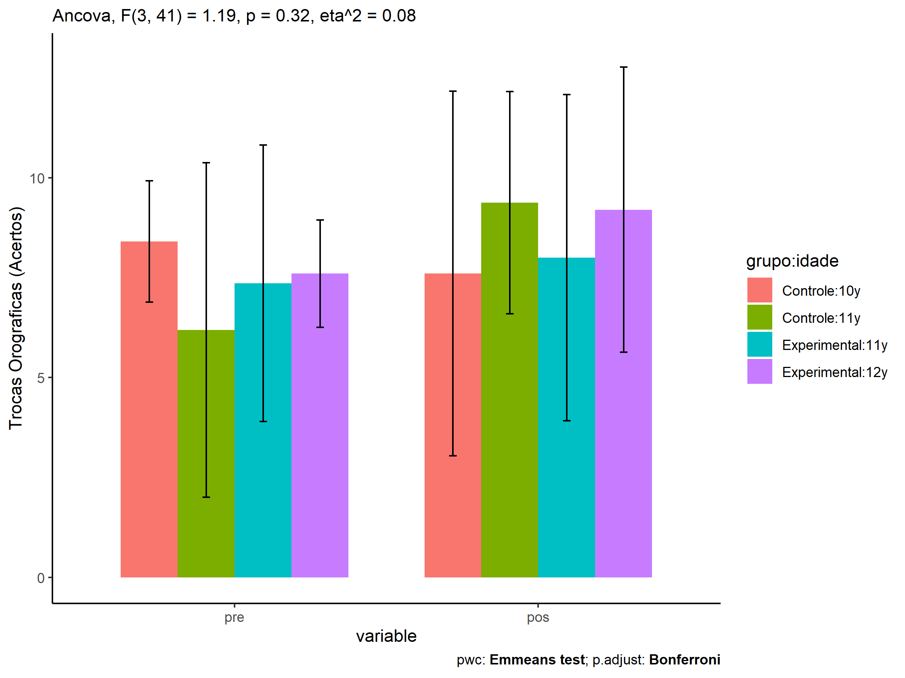<!-- -->

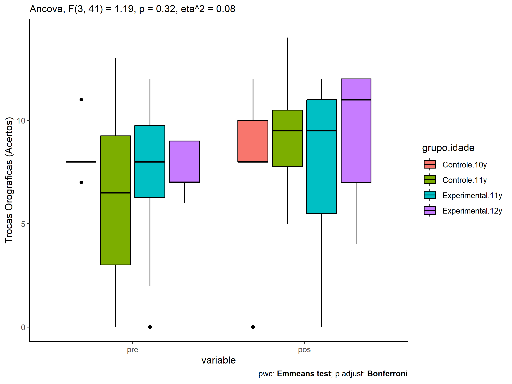<!-- -->

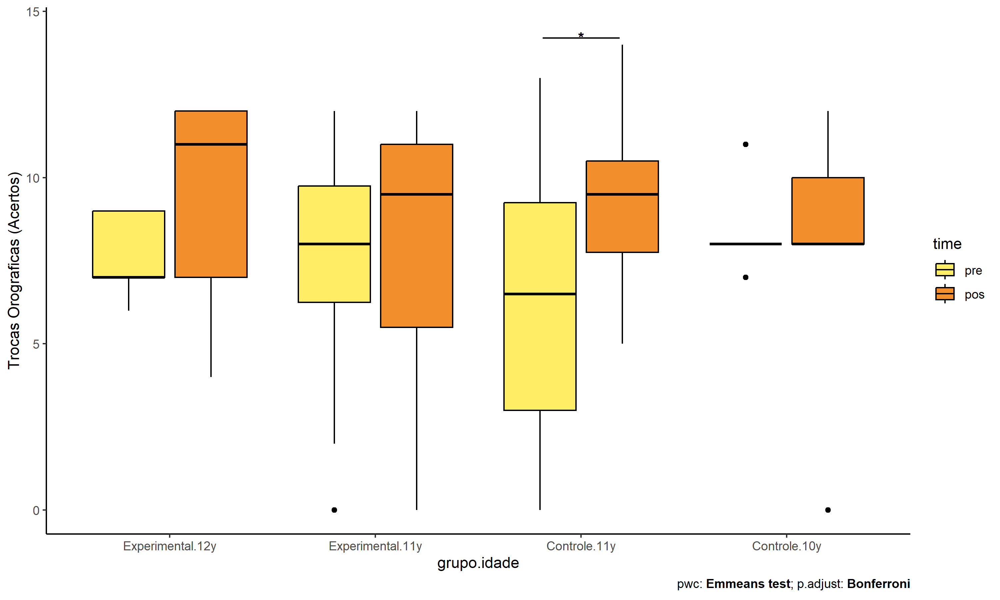<!-- -->

### Trocas Orograficas (TRI)

| var        | idade | grupo        |   n | M (pre) | SE (pre) | M (unadj) | SE (unadj) | M (adj) | SE (adj) |
|:-----------|:------|:-------------|----:|--------:|---------:|----------:|-----------:|--------:|---------:|
| tri.TO.pos | 11y   | Controle     |  15 |  -0.610 |    0.219 |    -0.298 |      0.144 |  -0.249 |    0.137 |
| tri.TO.pos | 11y   | Experimental |  11 |  -0.272 |    0.189 |    -0.184 |      0.169 |  -0.244 |    0.160 |
| tri.TO.pos | 12y   | Experimental |   5 |  -0.411 |    0.277 |    -0.480 |      0.275 |  -0.495 |    0.234 |

|     | grupo        | idade | group1   | group2       | estimate | conf.low | conf.high |    se | statistic |     p | p.adj | p.adj.signif |
|:----|:-------------|:------|:---------|:-------------|---------:|---------:|----------:|------:|----------:|------:|------:|:-------------|
| 2   | Experimental |       | 11y      | 12y          |    0.251 |   -0.330 |     0.832 | 0.283 |     0.887 | 0.383 | 0.383 | ns           |
| 4   | Experimental |       | 11y      | 12y          |    0.138 |   -0.684 |     0.961 | 0.402 |     0.345 | 0.733 | 0.733 | ns           |
| 5   |              | 11y   | Controle | Experimental |   -0.005 |   -0.442 |     0.431 | 0.213 |    -0.025 | 0.980 | 0.980 | ns           |
| 7   |              | 11y   | Controle | Experimental |   -0.337 |   -0.943 |     0.268 | 0.296 |    -1.141 | 0.263 | 0.263 | ns           |

| grupo        | idade | group1 | group2 | estimate | conf.low | conf.high |    se | statistic |     p | p.adj | p.adj.signif |
|:-------------|:------|:-------|:-------|---------:|---------:|----------:|------:|----------:|------:|------:|:-------------|
| Controle     | 11y   | pre    | pos    |   -0.367 |   -0.845 |     0.112 | 0.239 |    -1.532 | 0.130 | 0.130 | ns           |
| Experimental | 11y   | pre    | pos    |    0.022 |   -0.511 |     0.554 | 0.267 |     0.081 | 0.936 | 0.936 | ns           |
| Experimental | 12y   | pre    | pos    |    0.069 |   -0.773 |     0.911 | 0.421 |     0.164 | 0.870 | 0.870 | ns           |

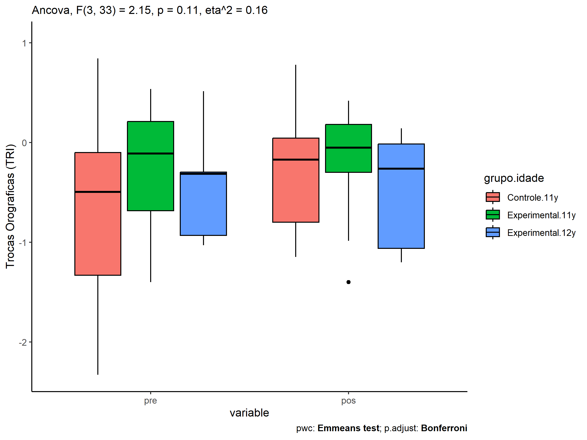<!-- -->

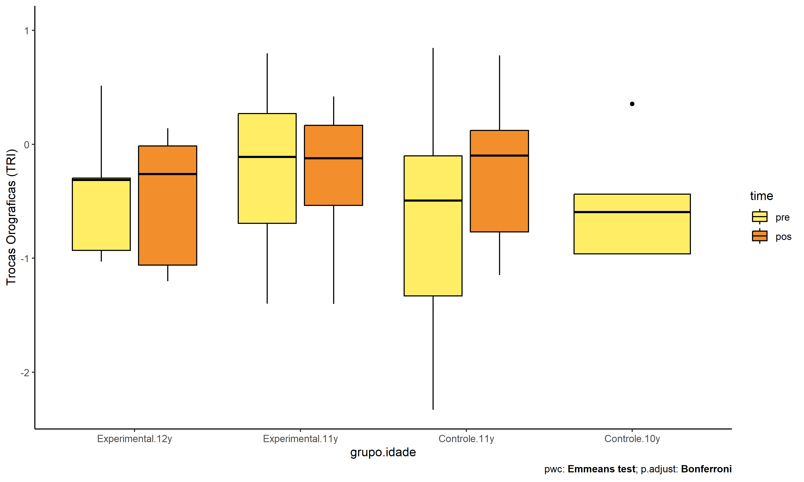<!-- -->

## factores: **zona.participante:grupo**

### Leitura de Pseudo-Palavras (Acertos)

| var            | zona.participante | grupo        |   n | M (pre) | SE (pre) | M (unadj) | SE (unadj) | M (adj) | SE (adj) |
|:---------------|:------------------|:-------------|----:|--------:|---------:|----------:|-----------:|--------:|---------:|
| score.CLPP.pos | Rural             | Controle     |   9 |  55.000 |    3.682 |    58.000 |      2.357 |  58.082 |    3.180 |
| score.CLPP.pos | Rural             | Experimental |   8 |  57.000 |    5.292 |    68.625 |      4.079 |  67.748 |    3.380 |
| score.CLPP.pos | Urbana            | Controle     |  11 |  54.182 |    5.444 |    57.091 |      4.853 |  57.566 |    2.879 |
| score.CLPP.pos | Urbana            | Experimental |   7 |  54.857 |    3.967 |    68.571 |      2.653 |  68.722 |    3.606 |

| grupo        | zona.participante | group1   | group2       | estimate | conf.low | conf.high |    se | statistic |     p | p.adj | p.adj.signif |
|:-------------|:------------------|:---------|:-------------|---------:|---------:|----------:|------:|----------:|------:|------:|:-------------|
| Controle     |                   | Urbana   | Rural        |   -0.517 |   -9.276 |     8.243 | 4.289 |    -0.120 | 0.905 | 0.905 | ns           |
| Experimental |                   | Urbana   | Rural        |    0.974 |   -9.123 |    11.072 | 4.944 |     0.197 | 0.845 | 0.845 | ns           |
| Controle     |                   | Urbana   | Rural        |   -0.818 |  -14.056 |    12.419 | 6.491 |    -0.126 | 0.901 | 0.901 | ns           |
| Experimental |                   | Urbana   | Rural        |   -2.143 |  -17.386 |    13.100 | 7.474 |    -0.287 | 0.776 | 0.776 | ns           |
|              | Urbana            | Controle | Experimental |  -11.157 |  -20.578 |    -1.735 | 4.613 |    -2.418 | 0.022 | 0.022 | \*           |
|              | Rural             | Controle | Experimental |   -9.665 |  -19.145 |    -0.186 | 4.642 |    -2.082 | 0.046 | 0.046 | \*           |
|              | Urbana            | Controle | Experimental |   -0.675 |  -14.915 |    13.564 | 6.982 |    -0.097 | 0.924 | 0.924 | ns           |
|              | Rural             | Controle | Experimental |   -2.000 |  -16.311 |    12.311 | 7.017 |    -0.285 | 0.778 | 0.778 | ns           |

| grupo        | zona.participante | group1 | group2 | estimate | conf.low | conf.high |    se | statistic |     p | p.adj | p.adj.signif |
|:-------------|:------------------|:-------|:-------|---------:|---------:|----------:|------:|----------:|------:|------:|:-------------|
| Controle     | Urbana            | pre    | pos    |   -1.340 |  -12.031 |     9.351 | 5.358 |    -0.250 | 0.803 | 0.803 | ns           |
| Controle     | Rural             | pre    | pos    |   -2.800 |  -15.070 |     9.470 | 6.149 |    -0.455 | 0.650 | 0.650 | ns           |
| Experimental | Urbana            | pre    | pos    |  -10.268 |  -24.089 |     3.554 | 6.926 |    -1.482 | 0.143 | 0.143 | ns           |
| Experimental | Rural             | pre    | pos    |  -13.181 |  -26.157 |    -0.204 | 6.503 |    -2.027 | 0.047 | 0.047 | \*           |

    ## Scale for colour is already present.
    ## Adding another scale for colour, which will replace the existing scale.

<!-- -->

    ## Scale for colour is already present.
    ## Adding another scale for colour, which will replace the existing scale.

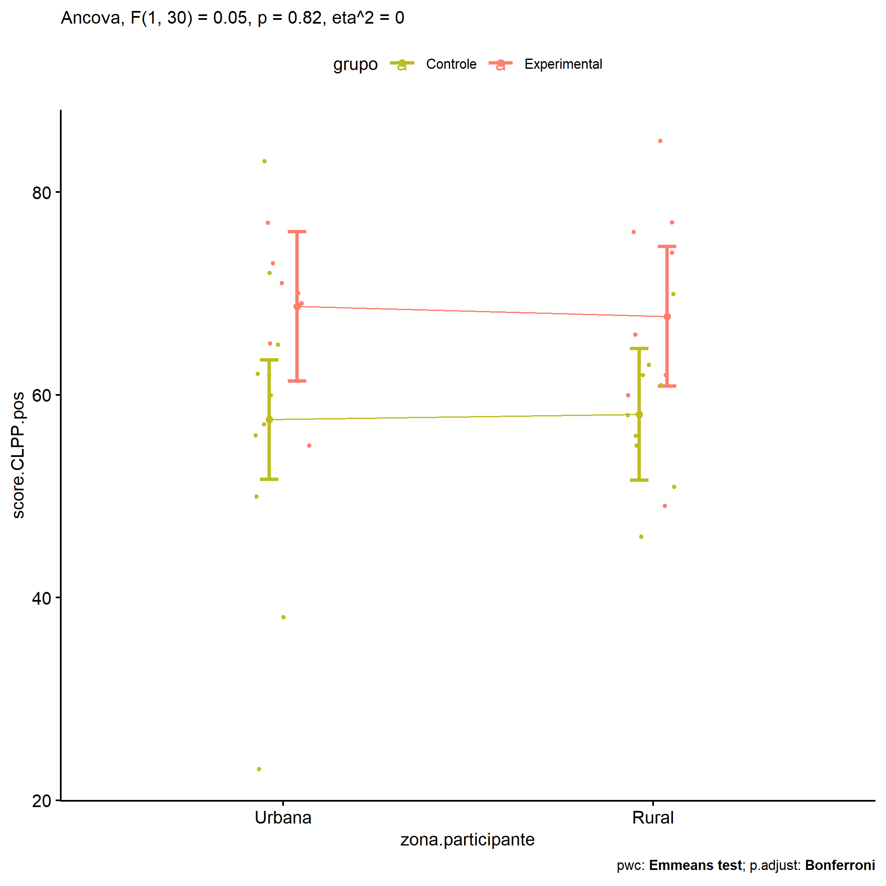<!-- -->

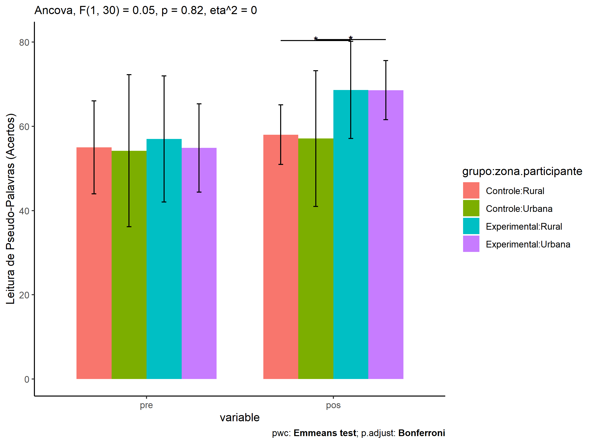<!-- -->

<!-- -->

<!-- -->

### Leitura de Pseudo-Palavras (TRI)

| var          | zona.participante | grupo        |   n | M (pre) | SE (pre) | M (unadj) | SE (unadj) | M (adj) | SE (adj) |
|:-------------|:------------------|:-------------|----:|--------:|---------:|----------:|-----------:|--------:|---------:|
| tri.CLPP.pos | Rural             | Controle     |   9 |  55.000 |    3.682 |    58.000 |      2.357 |  58.082 |    3.180 |
| tri.CLPP.pos | Rural             | Experimental |   8 |  57.000 |    5.292 |    68.625 |      4.079 |  67.748 |    3.380 |
| tri.CLPP.pos | Urbana            | Controle     |  11 |  54.182 |    5.444 |    57.091 |      4.853 |  57.566 |    2.879 |
| tri.CLPP.pos | Urbana            | Experimental |   7 |  54.857 |    3.967 |    68.571 |      2.653 |  68.722 |    3.606 |

| grupo        | zona.participante | group1   | group2       | estimate | conf.low | conf.high |    se | statistic |     p | p.adj | p.adj.signif |
|:-------------|:------------------|:---------|:-------------|---------:|---------:|----------:|------:|----------:|------:|------:|:-------------|
| Controle     |                   | Urbana   | Rural        |   -0.517 |   -9.276 |     8.243 | 4.289 |    -0.120 | 0.905 | 0.905 | ns           |
| Experimental |                   | Urbana   | Rural        |    0.974 |   -9.123 |    11.072 | 4.944 |     0.197 | 0.845 | 0.845 | ns           |
| Controle     |                   | Urbana   | Rural        |   -0.818 |  -14.056 |    12.419 | 6.491 |    -0.126 | 0.901 | 0.901 | ns           |
| Experimental |                   | Urbana   | Rural        |   -2.143 |  -17.386 |    13.100 | 7.474 |    -0.287 | 0.776 | 0.776 | ns           |
|              | Urbana            | Controle | Experimental |  -11.157 |  -20.578 |    -1.735 | 4.613 |    -2.418 | 0.022 | 0.022 | \*           |
|              | Rural             | Controle | Experimental |   -9.665 |  -19.145 |    -0.186 | 4.642 |    -2.082 | 0.046 | 0.046 | \*           |
|              | Urbana            | Controle | Experimental |   -0.675 |  -14.915 |    13.564 | 6.982 |    -0.097 | 0.924 | 0.924 | ns           |
|              | Rural             | Controle | Experimental |   -2.000 |  -16.311 |    12.311 | 7.017 |    -0.285 | 0.778 | 0.778 | ns           |

| grupo        | zona.participante | group1 | group2 | estimate | conf.low | conf.high |    se | statistic |     p | p.adj | p.adj.signif |
|:-------------|:------------------|:-------|:-------|---------:|---------:|----------:|------:|----------:|------:|------:|:-------------|
| Controle     | Urbana            | pre    | pos    |    0.065 |   -0.598 |     0.728 | 0.332 |     0.197 | 0.845 | 0.845 | ns           |
| Controle     | Rural             | pre    | pos    |    0.156 |   -0.605 |     0.917 | 0.381 |     0.410 | 0.683 | 0.683 | ns           |
| Experimental | Urbana            | pre    | pos    |   -0.153 |   -1.011 |     0.704 | 0.430 |    -0.357 | 0.722 | 0.722 | ns           |
| Experimental | Rural             | pre    | pos    |   -0.557 |   -1.362 |     0.247 | 0.403 |    -1.382 | 0.171 | 0.171 | ns           |

    ## Scale for colour is already present.
    ## Adding another scale for colour, which will replace the existing scale.

<!-- -->

    ## Scale for colour is already present.
    ## Adding another scale for colour, which will replace the existing scale.

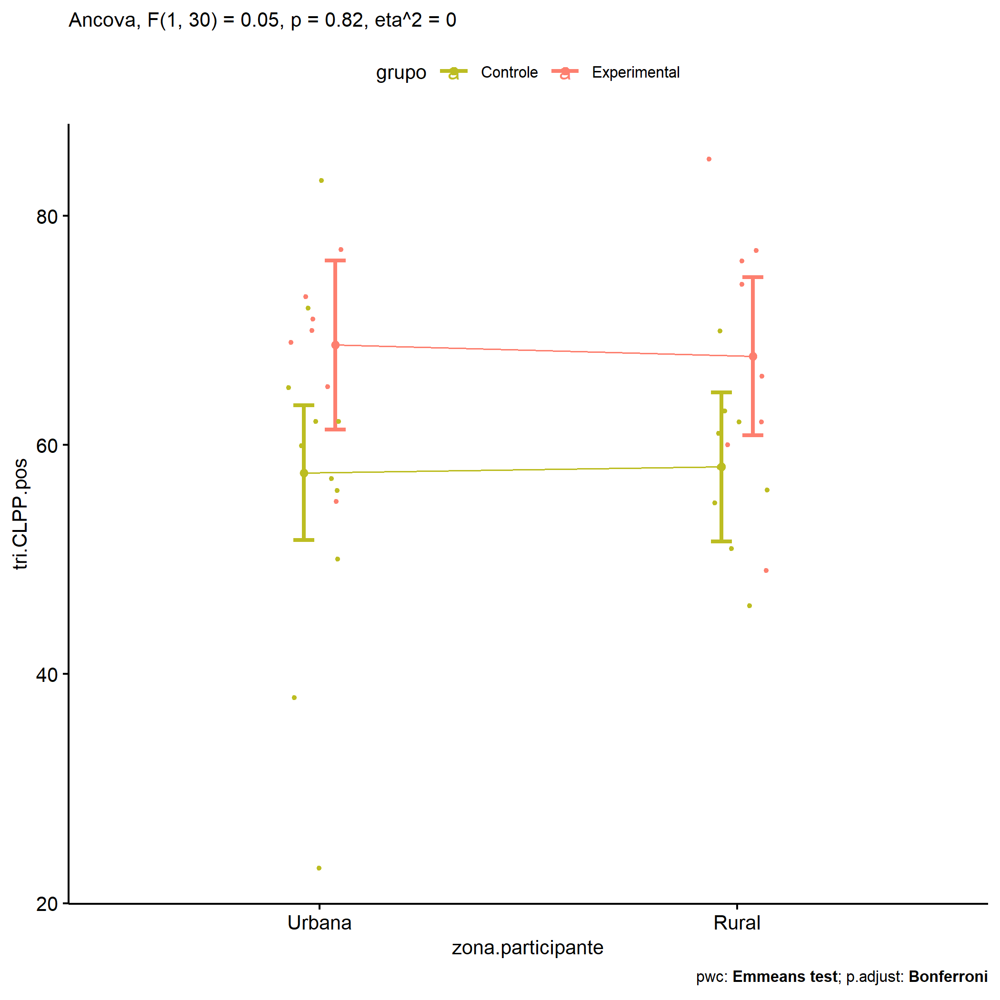<!-- -->

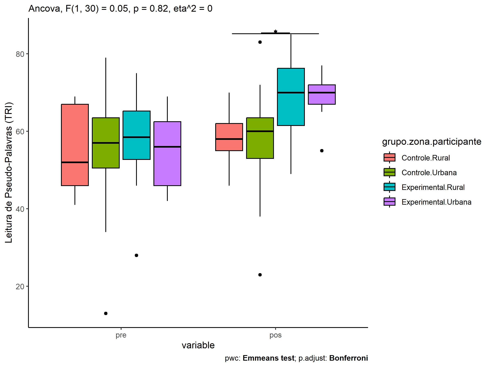<!-- -->

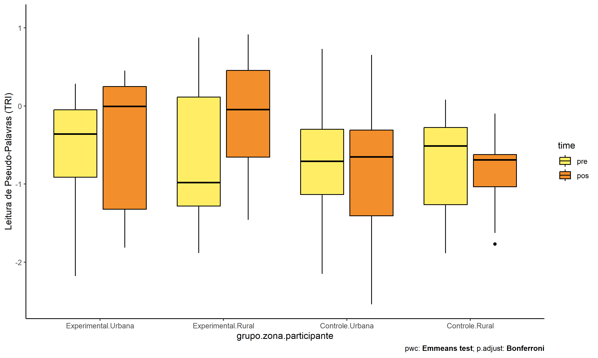<!-- -->

### Correta Regular (Acertos)

| var          | zona.participante | grupo        |   n | M (pre) | SE (pre) | M (unadj) | SE (unadj) | M (adj) | SE (adj) |
|:-------------|:------------------|:-------------|----:|--------:|---------:|----------:|-----------:|--------:|---------:|
| score.CR.pos | Rural             | Controle     |  10 |  12.100 |    0.809 |    10.800 |      1.467 |  10.557 |    1.611 |
| score.CR.pos | Rural             | Experimental |   9 |  11.222 |    1.164 |    12.444 |      1.857 |  12.369 |    1.683 |
| score.CR.pos | Urbana            | Controle     |  14 |   9.786 |    1.583 |    12.000 |      1.486 |  12.200 |    1.361 |
| score.CR.pos | Urbana            | Experimental |   8 |  10.625 |    1.772 |    14.875 |      1.342 |  14.914 |    1.784 |

| grupo        | zona.participante | group1   | group2       | estimate | conf.low | conf.high |    se | statistic |     p | p.adj | p.adj.signif |
|:-------------|:------------------|:---------|:-------------|---------:|---------:|----------:|------:|----------:|------:|------:|:-------------|
| Controle     |                   | Urbana   | Rural        |    1.643 |   -2.675 |     5.961 | 2.129 |     0.772 | 0.445 | 0.445 | ns           |
| Experimental |                   | Urbana   | Rural        |    2.545 |   -2.430 |     7.520 | 2.453 |     1.037 | 0.306 | 0.306 | ns           |
| Controle     |                   | Urbana   | Rural        |   -2.314 |   -6.188 |     1.559 | 1.912 |    -1.211 | 0.234 | 0.234 | ns           |
| Experimental |                   | Urbana   | Rural        |   -0.597 |   -5.143 |     3.948 | 2.243 |    -0.266 | 0.792 | 0.792 | ns           |
|              | Urbana            | Controle | Experimental |   -2.714 |   -7.258 |     1.830 | 2.240 |    -1.212 | 0.234 | 0.234 | ns           |
|              | Rural             | Controle | Experimental |   -1.812 |   -6.523 |     2.898 | 2.323 |    -0.780 | 0.440 | 0.440 | ns           |
|              | Urbana            | Controle | Experimental |   -0.839 |   -4.985 |     3.307 | 2.046 |    -0.410 | 0.684 | 0.684 | ns           |
|              | Rural             | Controle | Experimental |    0.878 |   -3.420 |     5.176 | 2.121 |     0.414 | 0.681 | 0.681 | ns           |

| grupo        | zona.participante | group1 | group2 | estimate | conf.low | conf.high |    se | statistic |     p | p.adj | p.adj.signif |
|:-------------|:------------------|:-------|:-------|---------:|---------:|----------:|------:|----------:|------:|------:|:-------------|
| Controle     | Urbana            | pre    | pos    |   -2.214 |   -5.859 |     1.431 | 1.829 |    -1.210 | 0.230 | 0.230 | ns           |
| Controle     | Rural             | pre    | pos    |    1.300 |   -3.013 |     5.613 | 2.164 |     0.601 | 0.550 | 0.550 | ns           |
| Experimental | Urbana            | pre    | pos    |   -4.250 |   -9.072 |     0.572 | 2.420 |    -1.756 | 0.083 | 0.083 | ns           |
| Experimental | Rural             | pre    | pos    |   -1.222 |   -5.768 |     3.324 | 2.282 |    -0.536 | 0.594 | 0.594 | ns           |

    ## Scale for colour is already present.
    ## Adding another scale for colour, which will replace the existing scale.

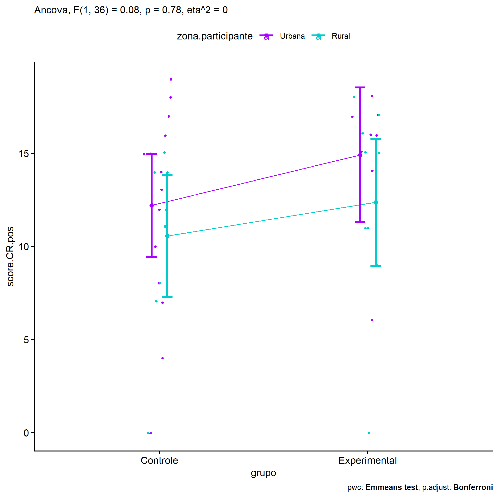<!-- -->

    ## Scale for colour is already present.
    ## Adding another scale for colour, which will replace the existing scale.

<!-- -->

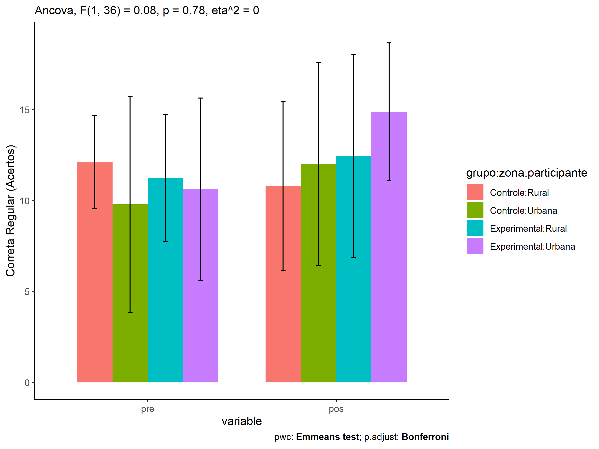<!-- -->

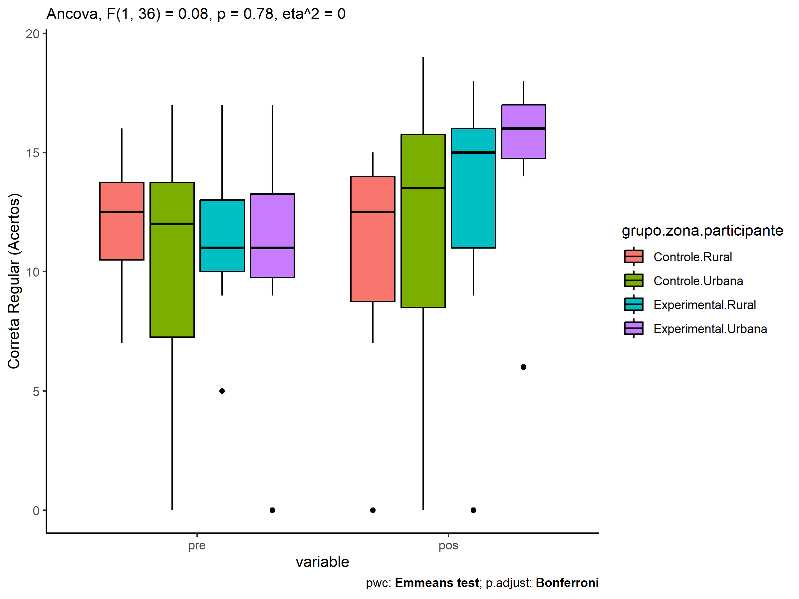<!-- -->

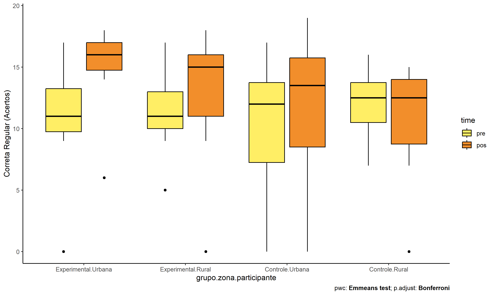<!-- -->

### Correta Regular (TRI)

| var        | zona.participante | grupo        |   n | M (pre) | SE (pre) | M (unadj) | SE (unadj) | M (adj) | SE (adj) |
|:-----------|:------------------|:-------------|----:|--------:|---------:|----------:|-----------:|--------:|---------:|
| tri.CR.pos | Rural             | Controle     |   9 |  -0.572 |    0.230 |    -0.765 |      0.208 |  -0.802 |    0.228 |
| tri.CR.pos | Rural             | Experimental |   8 |  -0.644 |    0.360 |    -0.237 |      0.313 |  -0.240 |    0.242 |
| tri.CR.pos | Urbana            | Controle     |  11 |  -0.857 |    0.252 |    -0.342 |      0.271 |  -0.241 |    0.208 |
| tri.CR.pos | Urbana            | Experimental |   7 |  -0.424 |    0.314 |     0.076 |      0.245 |  -0.032 |    0.260 |

| grupo        | zona.participante | group1   | group2       | estimate | conf.low | conf.high |    se | statistic |     p | p.adj | p.adj.signif |
|:-------------|:------------------|:---------|:-------------|---------:|---------:|----------:|------:|----------:|------:|------:|:-------------|
| Controle     |                   | Urbana   | Rural        |    0.560 |   -0.073 |     1.193 | 0.310 |     1.808 | 0.081 | 0.081 | ns           |
| Experimental |                   | Urbana   | Rural        |    0.208 |   -0.517 |     0.933 | 0.355 |     0.586 | 0.563 | 0.563 | ns           |
| Controle     |                   | Urbana   | Rural        |   -0.285 |   -1.060 |     0.491 | 0.380 |    -0.748 | 0.460 | 0.460 | ns           |
| Experimental |                   | Urbana   | Rural        |    0.220 |   -0.673 |     1.113 | 0.438 |     0.502 | 0.619 | 0.619 | ns           |
|              | Urbana            | Controle | Experimental |   -0.210 |   -0.897 |     0.477 | 0.336 |    -0.624 | 0.537 | 0.537 | ns           |
|              | Rural             | Controle | Experimental |   -0.562 |   -1.241 |     0.116 | 0.332 |    -1.692 | 0.101 | 0.101 | ns           |
|              | Urbana            | Controle | Experimental |   -0.432 |   -1.267 |     0.402 | 0.409 |    -1.057 | 0.299 | 0.299 | ns           |
|              | Rural             | Controle | Experimental |    0.072 |   -0.767 |     0.910 | 0.411 |     0.175 | 0.862 | 0.862 | ns           |

| grupo        | zona.participante | group1 | group2 | estimate | conf.low | conf.high |    se | statistic |     p | p.adj | p.adj.signif |
|:-------------|:------------------|:-------|:-------|---------:|---------:|----------:|------:|----------:|------:|------:|:-------------|
| Controle     | Urbana            | pre    | pos    |   -0.438 |   -1.111 |     0.234 | 0.337 |    -1.300 | 0.198 | 0.198 | ns           |
| Controle     | Rural             | pre    | pos    |    0.230 |   -0.542 |     1.001 | 0.387 |     0.594 | 0.555 | 0.555 | ns           |
| Experimental | Urbana            | pre    | pos    |   -0.265 |   -1.134 |     0.604 | 0.436 |    -0.609 | 0.545 | 0.545 | ns           |
| Experimental | Rural             | pre    | pos    |   -0.451 |   -1.267 |     0.365 | 0.409 |    -1.103 | 0.274 | 0.274 | ns           |

    ## Scale for colour is already present.
    ## Adding another scale for colour, which will replace the existing scale.

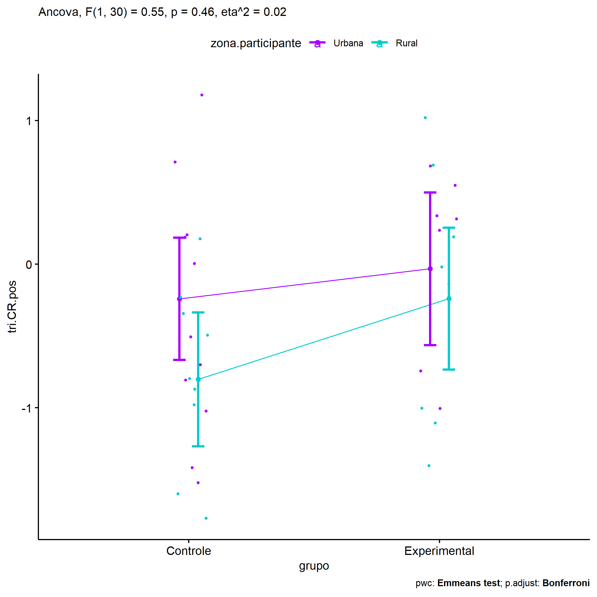<!-- -->

    ## Scale for colour is already present.
    ## Adding another scale for colour, which will replace the existing scale.

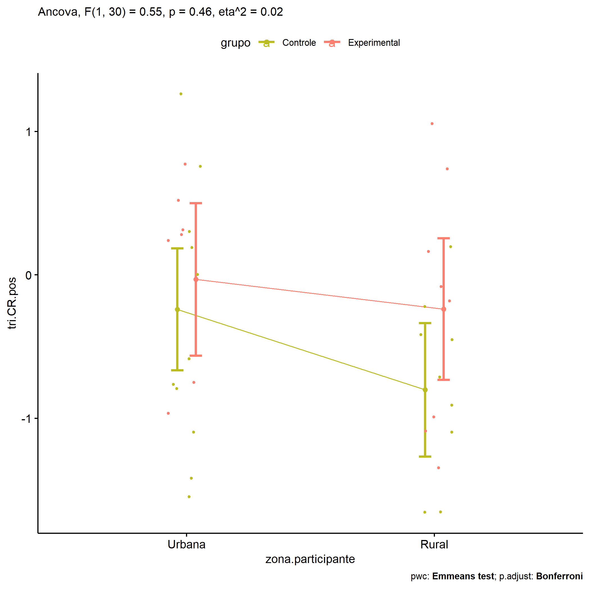<!-- -->

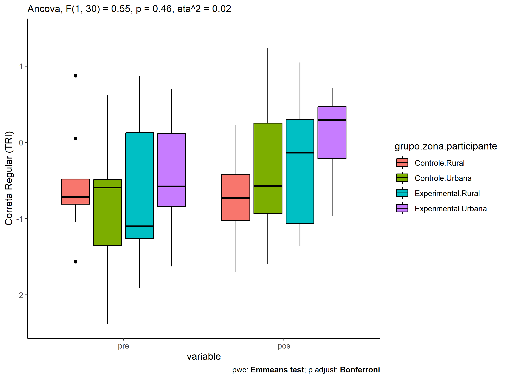<!-- -->

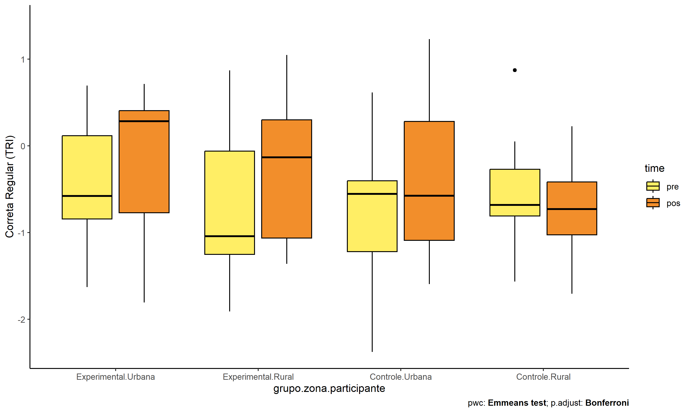<!-- -->

### Correta Irregular (Acertos)

| var          | zona.participante | grupo        |   n | M (pre) | SE (pre) | M (unadj) | SE (unadj) | M (adj) | SE (adj) |
|:-------------|:------------------|:-------------|----:|--------:|---------:|----------:|-----------:|--------:|---------:|
| score.CI.pos | Rural             | Controle     |  10 |  10.500 |    0.778 |     8.400 |      1.213 |   7.865 |    1.381 |
| score.CI.pos | Rural             | Experimental |   9 |   9.444 |    0.915 |     9.222 |      1.681 |   9.006 |    1.420 |
| score.CI.pos | Urbana            | Controle     |  14 |   7.929 |    1.277 |     8.357 |      1.357 |   8.600 |    1.143 |
| score.CI.pos | Urbana            | Experimental |   8 |   7.125 |    1.329 |    10.875 |      0.639 |  11.362 |    1.529 |

| grupo        | zona.participante | group1   | group2       | estimate | conf.low | conf.high |    se | statistic |     p | p.adj | p.adj.signif |
|:-------------|:------------------|:---------|:-------------|---------:|---------:|----------:|------:|----------:|------:|------:|:-------------|
| Controle     |                   | Urbana   | Rural        |    0.736 |   -2.957 |     4.428 | 1.821 |     0.404 | 0.689 | 0.689 | ns           |
| Experimental |                   | Urbana   | Rural        |    2.355 |   -1.916 |     6.626 | 2.106 |     1.118 | 0.271 | 0.271 | ns           |
| Controle     |                   | Urbana   | Rural        |   -2.571 |   -5.688 |     0.545 | 1.538 |    -1.672 | 0.103 | 0.103 | ns           |
| Experimental |                   | Urbana   | Rural        |   -2.319 |   -5.977 |     1.338 | 1.805 |    -1.285 | 0.207 | 0.207 | ns           |
|              | Urbana            | Controle | Experimental |   -2.761 |   -6.585 |     1.062 | 1.885 |    -1.465 | 0.152 | 0.152 | ns           |
|              | Rural             | Controle | Experimental |   -1.142 |   -5.113 |     2.830 | 1.958 |    -0.583 | 0.563 | 0.563 | ns           |
|              | Urbana            | Controle | Experimental |    0.804 |   -2.532 |     4.139 | 1.646 |     0.488 | 0.628 | 0.628 | ns           |
|              | Rural             | Controle | Experimental |    1.056 |   -2.403 |     4.514 | 1.707 |     0.618 | 0.540 | 0.540 | ns           |

| grupo        | zona.participante | group1 | group2 | estimate | conf.low | conf.high |    se | statistic |     p | p.adj | p.adj.signif |
|:-------------|:------------------|:-------|:-------|---------:|---------:|----------:|------:|----------:|------:|------:|:-------------|
| Controle     | Urbana            | pre    | pos    |   -0.429 |   -3.467 |     2.610 | 1.525 |    -0.281 | 0.779 | 0.779 | ns           |
| Controle     | Rural             | pre    | pos    |    2.100 |   -1.495 |     5.695 | 1.804 |     1.164 | 0.248 | 0.248 | ns           |
| Experimental | Urbana            | pre    | pos    |   -3.750 |   -7.770 |     0.270 | 2.017 |    -1.859 | 0.067 | 0.067 | ns           |
| Experimental | Rural             | pre    | pos    |    0.222 |   -3.567 |     4.012 | 1.902 |     0.117 | 0.907 | 0.907 | ns           |

    ## Scale for colour is already present.
    ## Adding another scale for colour, which will replace the existing scale.

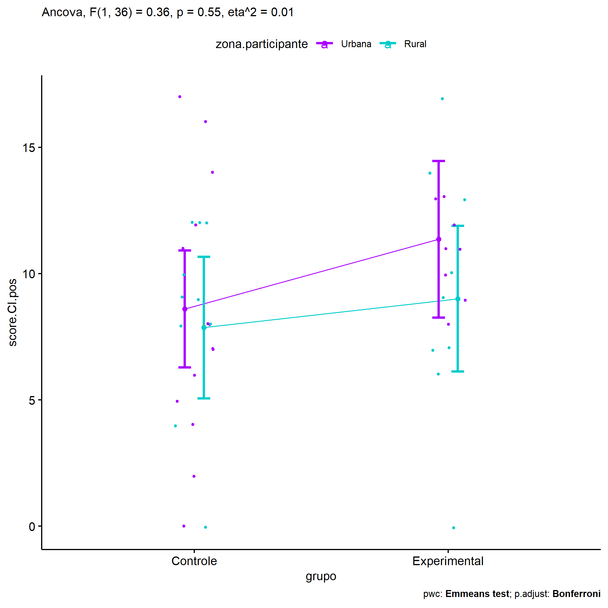<!-- -->

    ## Scale for colour is already present.
    ## Adding another scale for colour, which will replace the existing scale.

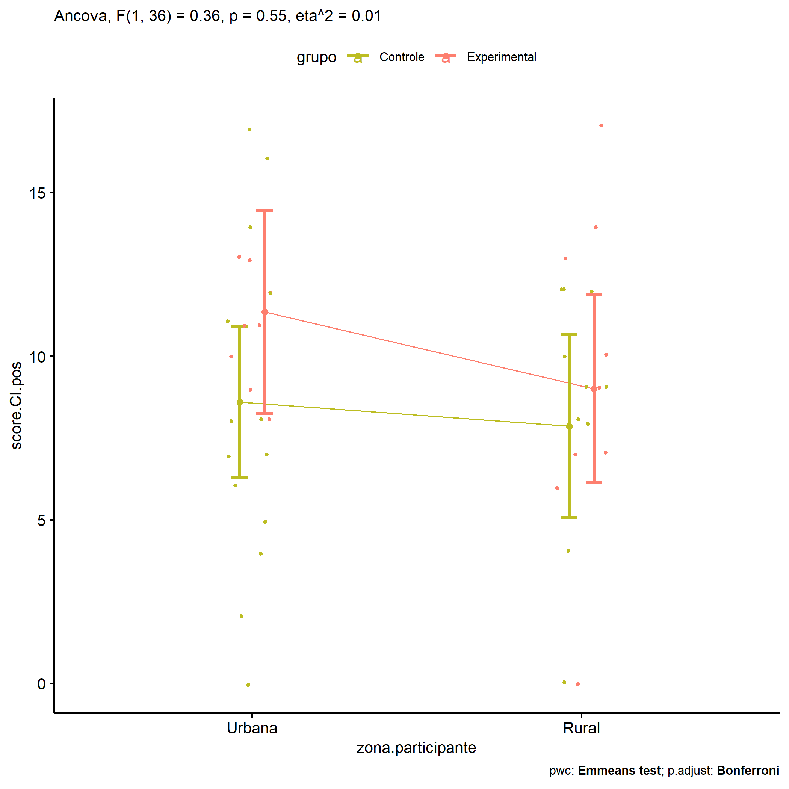<!-- -->

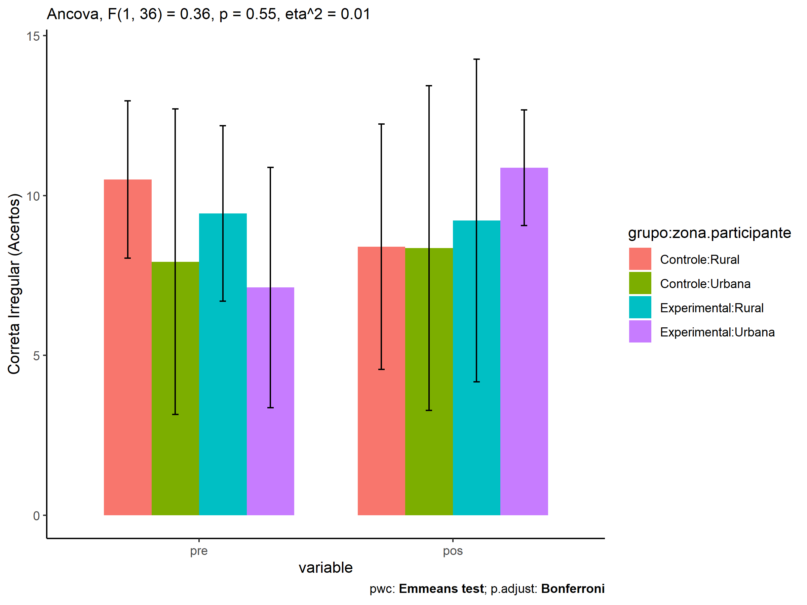<!-- -->

<!-- -->

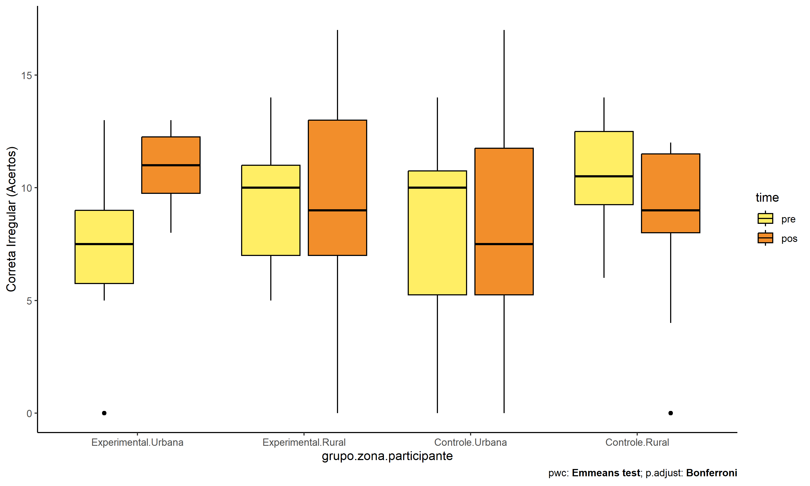<!-- -->

### Correta Irregular (TRI)

| var        | zona.participante | grupo        |   n | M (pre) | SE (pre) | M (unadj) | SE (unadj) | M (adj) | SE (adj) |
|:-----------|:------------------|:-------------|----:|--------:|---------:|----------:|-----------:|--------:|---------:|
| tri.CI.pos | Rural             | Controle     |   9 |  -0.381 |    0.143 |    -0.818 |      0.213 |  -0.973 |    0.211 |
| tri.CI.pos | Rural             | Experimental |   8 |  -0.328 |    0.185 |    -0.445 |      0.352 |  -0.653 |    0.225 |
| tri.CI.pos | Urbana            | Controle     |  11 |  -0.658 |    0.160 |    -0.846 |      0.275 |  -0.727 |    0.190 |
| tri.CI.pos | Urbana            | Experimental |   7 |  -0.789 |    0.234 |    -0.383 |      0.189 |  -0.134 |    0.242 |

| grupo        | zona.participante | group1   | group2       | estimate | conf.low | conf.high |    se | statistic |     p | p.adj | p.adj.signif |
|:-------------|:------------------|:---------|:-------------|---------:|---------:|----------:|------:|----------:|------:|------:|:-------------|
| Controle     |                   | Urbana   | Rural        |    0.246 |   -0.340 |     0.832 | 0.287 |     0.856 | 0.399 | 0.399 | ns           |
| Experimental |                   | Urbana   | Rural        |    0.519 |   -0.172 |     1.209 | 0.338 |     1.535 | 0.135 | 0.135 | ns           |
| Controle     |                   | Urbana   | Rural        |   -0.277 |   -0.757 |     0.203 | 0.235 |    -1.175 | 0.249 | 0.249 | ns           |
| Experimental |                   | Urbana   | Rural        |   -0.461 |   -1.014 |     0.092 | 0.271 |    -1.701 | 0.099 | 0.099 | ns           |
|              | Urbana            | Controle | Experimental |   -0.593 |   -1.212 |     0.027 | 0.303 |    -1.953 | 0.060 | 0.060 | ns           |
|              | Rural             | Controle | Experimental |   -0.319 |   -0.940 |     0.301 | 0.304 |    -1.052 | 0.301 | 0.301 | ns           |
|              | Urbana            | Controle | Experimental |    0.131 |   -0.385 |     0.647 | 0.253 |     0.518 | 0.608 | 0.608 | ns           |
|              | Rural             | Controle | Experimental |   -0.053 |   -0.572 |     0.465 | 0.254 |    -0.210 | 0.835 | 0.835 | ns           |

| grupo        | zona.participante | group1 | group2 | estimate | conf.low | conf.high |    se | statistic |     p | p.adj | p.adj.signif |
|:-------------|:------------------|:-------|:-------|---------:|---------:|----------:|------:|----------:|------:|------:|:-------------|
| Controle     | Urbana            | pre    | pos    |    0.093 |   -0.450 |     0.637 | 0.272 |     0.343 | 0.733 | 0.733 | ns           |
| Controle     | Rural             | pre    | pos    |    0.422 |   -0.202 |     1.046 | 0.313 |     1.349 | 0.182 | 0.182 | ns           |
| Experimental | Urbana            | pre    | pos    |   -0.407 |   -1.110 |     0.296 | 0.352 |    -1.155 | 0.252 | 0.252 | ns           |
| Experimental | Rural             | pre    | pos    |    0.001 |   -0.659 |     0.660 | 0.331 |     0.002 | 0.999 | 0.999 | ns           |

    ## Scale for colour is already present.
    ## Adding another scale for colour, which will replace the existing scale.

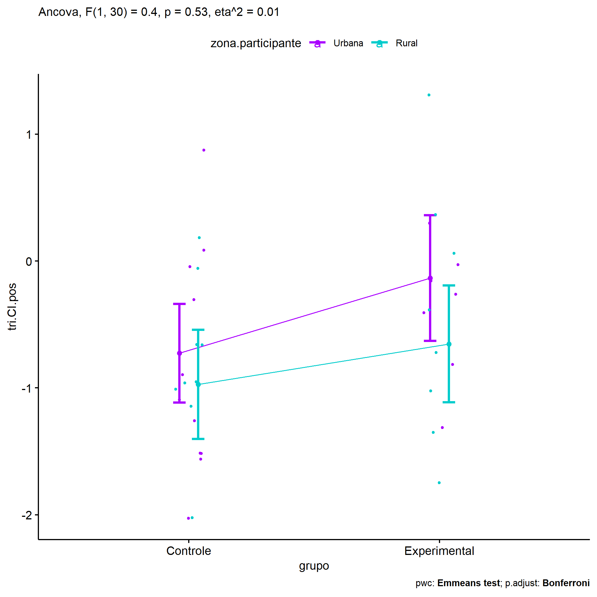<!-- -->

    ## Scale for colour is already present.
    ## Adding another scale for colour, which will replace the existing scale.

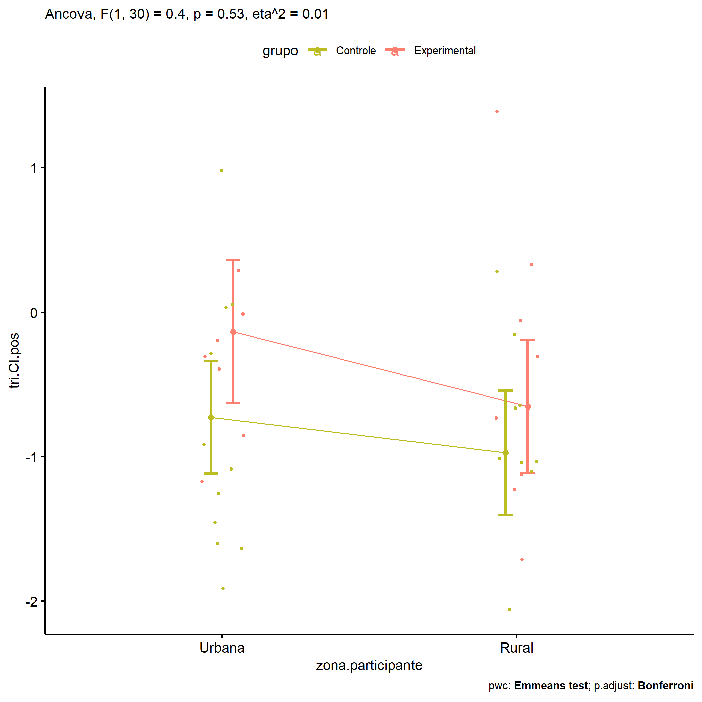<!-- -->

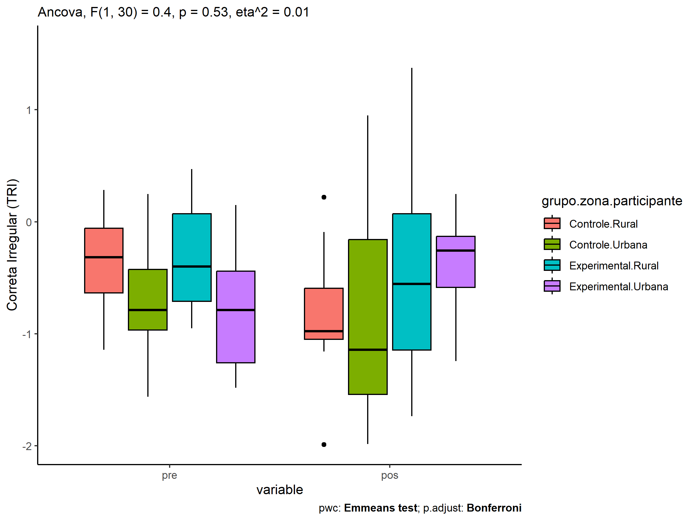<!-- -->

<!-- -->

### Trocas Visuais (Acertos)

| var          | zona.participante | grupo        |   n | M (pre) | SE (pre) | M (unadj) | SE (unadj) | M (adj) | SE (adj) |
|:-------------|:------------------|:-------------|----:|--------:|---------:|----------:|-----------:|--------:|---------:|
| score.TV.pos | Rural             | Controle     |  10 |  13.000 |    1.183 |    14.100 |      1.876 |  14.133 |    1.747 |
| score.TV.pos | Rural             | Experimental |   9 |  13.667 |    1.748 |    15.444 |      2.069 |  15.252 |    1.843 |
| score.TV.pos | Urbana            | Controle     |  14 |  13.071 |    1.909 |    12.643 |      1.640 |  12.652 |    1.476 |
| score.TV.pos | Urbana            | Experimental |   8 |  12.625 |    2.299 |    15.250 |      1.544 |  15.410 |    1.954 |

| grupo        | zona.participante | group1   | group2       | estimate | conf.low | conf.high |    se | statistic |     p | p.adj | p.adj.signif |
|:-------------|:------------------|:---------|:-------------|---------:|---------:|----------:|------:|----------:|------:|------:|:-------------|
| Controle     |                   | Urbana   | Rural        |   -1.481 |   -6.120 |     3.157 | 2.287 |    -0.648 | 0.521 | 0.521 | ns           |
| Experimental |                   | Urbana   | Rural        |    0.158 |   -5.295 |     5.611 | 2.689 |     0.059 | 0.953 | 0.953 | ns           |
| Controle     |                   | Urbana   | Rural        |    0.071 |   -4.910 |     5.053 | 2.459 |     0.029 | 0.977 | 0.977 | ns           |
| Experimental |                   | Urbana   | Rural        |   -1.042 |   -6.888 |     4.805 | 2.886 |    -0.361 | 0.720 | 0.720 | ns           |
|              | Urbana            | Controle | Experimental |   -2.758 |   -7.725 |     2.209 | 2.449 |    -1.126 | 0.268 | 0.268 | ns           |
|              | Rural             | Controle | Experimental |   -1.119 |   -6.270 |     4.033 | 2.540 |    -0.440 | 0.662 | 0.662 | ns           |
|              | Urbana            | Controle | Experimental |    0.446 |   -4.886 |     5.779 | 2.632 |     0.170 | 0.866 | 0.866 | ns           |
|              | Rural             | Controle | Experimental |   -0.667 |   -6.195 |     4.862 | 2.729 |    -0.244 | 0.808 | 0.808 | ns           |

| grupo        | zona.participante | group1 | group2 | estimate | conf.low | conf.high |    se | statistic |     p | p.adj | p.adj.signif |
|:-------------|:------------------|:-------|:-------|---------:|---------:|----------:|------:|----------:|------:|------:|:-------------|
| Controle     | Urbana            | pre    | pos    |    0.429 |   -3.995 |     4.852 | 2.220 |     0.193 | 0.847 | 0.847 | ns           |
| Controle     | Rural             | pre    | pos    |   -1.100 |   -6.334 |     4.134 | 2.627 |    -0.419 | 0.677 | 0.677 | ns           |
| Experimental | Urbana            | pre    | pos    |   -2.625 |   -8.476 |     3.226 | 2.937 |    -0.894 | 0.374 | 0.374 | ns           |
| Experimental | Rural             | pre    | pos    |   -1.778 |   -7.294 |     3.739 | 2.769 |    -0.642 | 0.523 | 0.523 | ns           |

    ## Scale for colour is already present.
    ## Adding another scale for colour, which will replace the existing scale.

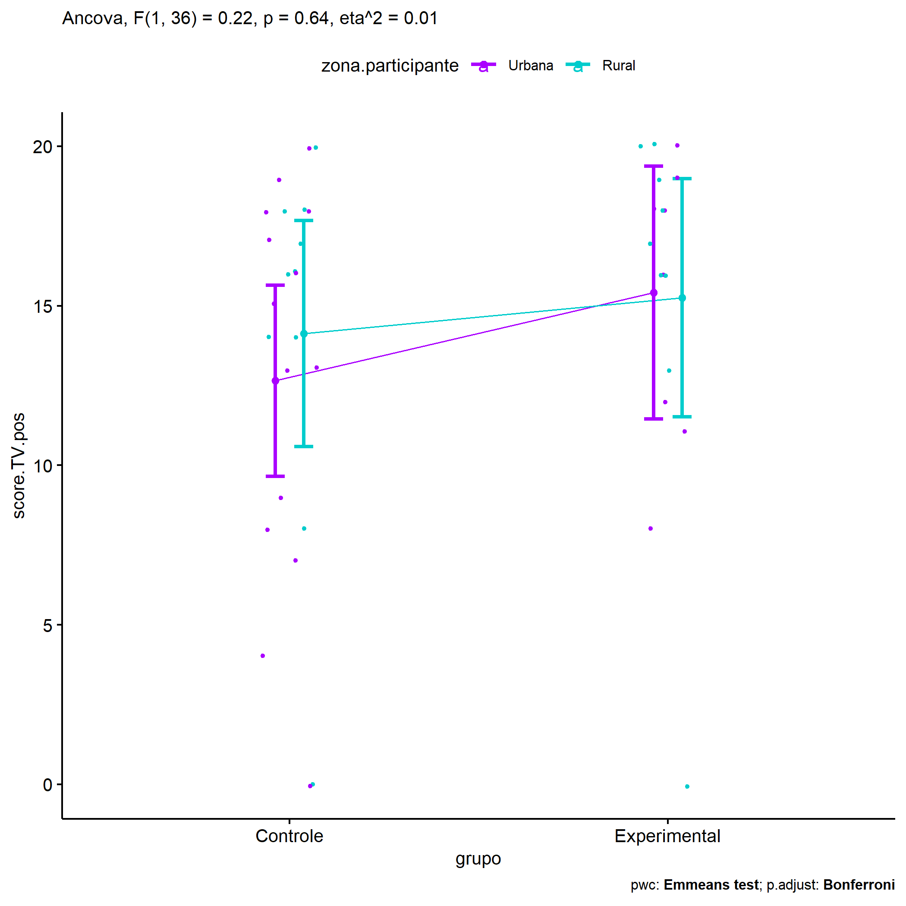<!-- -->

    ## Scale for colour is already present.
    ## Adding another scale for colour, which will replace the existing scale.

<!-- -->

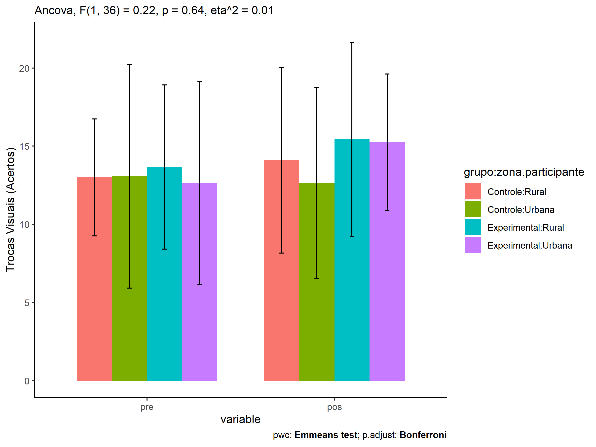<!-- -->

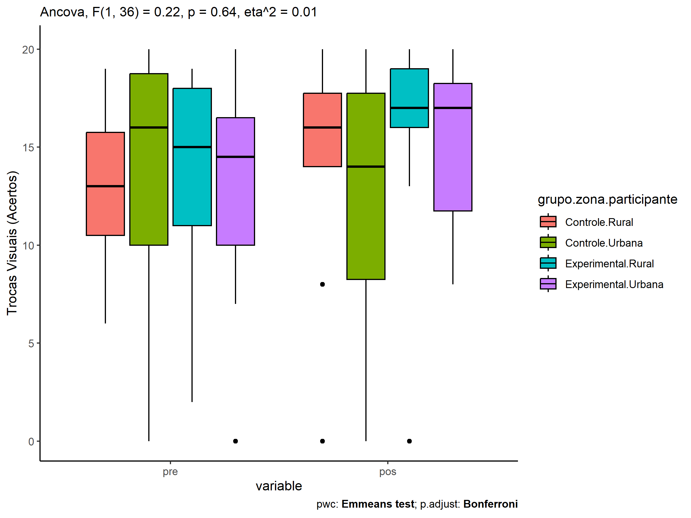<!-- -->

<!-- -->

### Trocas Visuais (TRI)

| var        | zona.participante | grupo        |   n | M (pre) | SE (pre) | M (unadj) | SE (unadj) | M (adj) | SE (adj) |
|:-----------|:------------------|:-------------|----:|--------:|---------:|----------:|-----------:|--------:|---------:|
| tri.TV.pos | Rural             | Controle     |   9 |  -0.625 |    0.267 |    -0.454 |      0.255 |  -0.336 |    0.248 |
| tri.TV.pos | Rural             | Experimental |   8 |  -0.416 |    0.379 |     0.162 |      0.272 |   0.179 |    0.260 |
| tri.TV.pos | Urbana            | Controle     |  11 |  -0.200 |    0.217 |    -0.497 |      0.265 |  -0.584 |    0.223 |
| tri.TV.pos | Urbana            | Experimental |   7 |  -0.311 |    0.383 |    -0.176 |      0.355 |  -0.210 |    0.278 |

| grupo        | zona.participante | group1   | group2       | estimate | conf.low | conf.high |    se | statistic |     p | p.adj | p.adj.signif |
|:-------------|:------------------|:---------|:-------------|---------:|---------:|----------:|------:|----------:|------:|------:|:-------------|
| Controle     |                   | Urbana   | Rural        |   -0.248 |   -0.935 |     0.439 | 0.336 |    -0.738 | 0.466 | 0.466 | ns           |
| Experimental |                   | Urbana   | Rural        |   -0.389 |   -1.166 |     0.388 | 0.381 |    -1.022 | 0.315 | 0.315 | ns           |
| Controle     |                   | Urbana   | Rural        |    0.426 |   -0.388 |     1.240 | 0.399 |     1.067 | 0.294 | 0.294 | ns           |
| Experimental |                   | Urbana   | Rural        |    0.105 |   -0.832 |     1.043 | 0.460 |     0.229 | 0.820 | 0.820 | ns           |
|              | Urbana            | Controle | Experimental |   -0.375 |   -1.101 |     0.352 | 0.356 |    -1.053 | 0.301 | 0.301 | ns           |
|              | Rural             | Controle | Experimental |   -0.515 |   -1.247 |     0.217 | 0.358 |    -1.438 | 0.161 | 0.161 | ns           |
|              | Urbana            | Controle | Experimental |    0.111 |   -0.765 |     0.987 | 0.430 |     0.259 | 0.798 | 0.798 | ns           |
|              | Rural             | Controle | Experimental |   -0.209 |   -1.090 |     0.671 | 0.432 |    -0.485 | 0.631 | 0.631 | ns           |

| grupo        | zona.participante | group1 | group2 | estimate | conf.low | conf.high |    se | statistic |     p | p.adj | p.adj.signif |
|:-------------|:------------------|:-------|:-------|---------:|---------:|----------:|------:|----------:|------:|------:|:-------------|
| Controle     | Urbana            | pre    | pos    |    0.448 |   -0.247 |     1.144 | 0.349 |     1.286 | 0.203 | 0.203 | ns           |
| Controle     | Rural             | pre    | pos    |   -0.204 |   -1.003 |     0.594 | 0.400 |    -0.510 | 0.612 | 0.612 | ns           |
| Experimental | Urbana            | pre    | pos    |   -0.018 |   -0.918 |     0.881 | 0.451 |    -0.041 | 0.967 | 0.967 | ns           |
| Experimental | Rural             | pre    | pos    |   -0.603 |   -1.447 |     0.241 | 0.423 |    -1.425 | 0.159 | 0.159 | ns           |

    ## Scale for colour is already present.
    ## Adding another scale for colour, which will replace the existing scale.

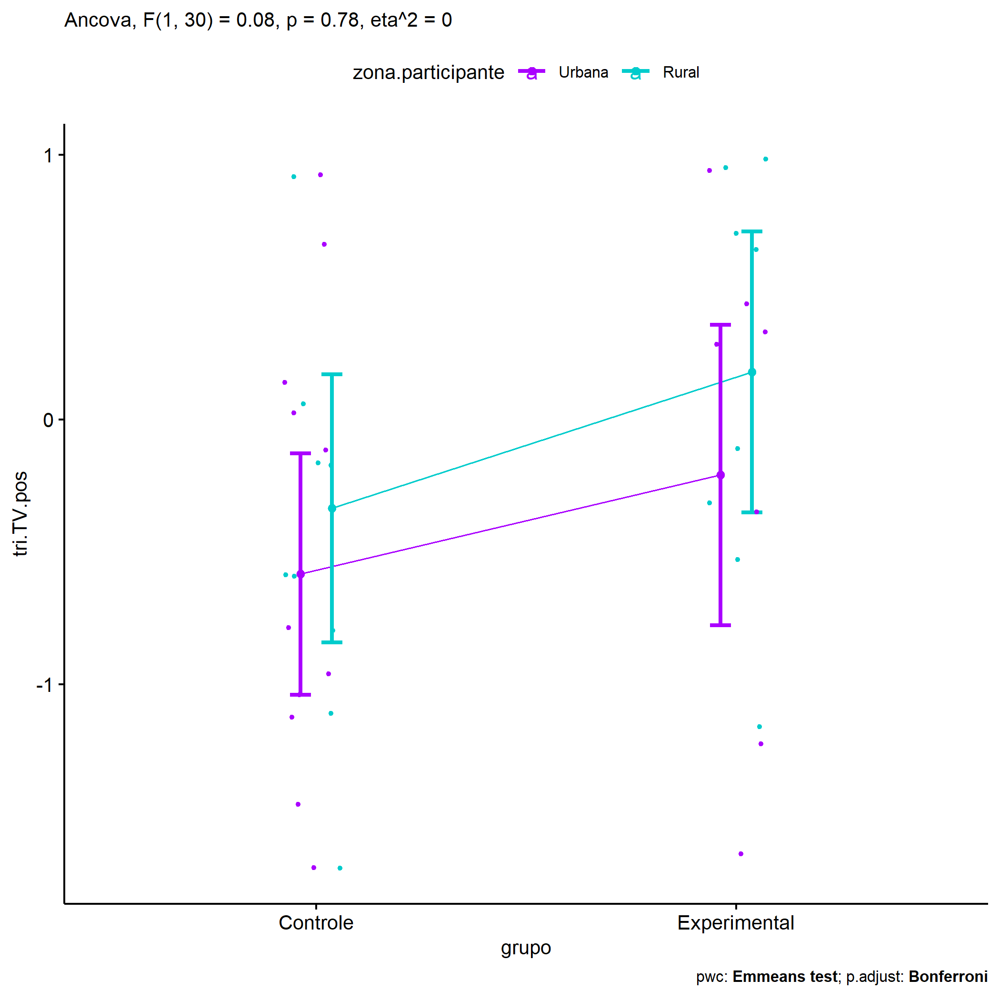<!-- -->

    ## Scale for colour is already present.
    ## Adding another scale for colour, which will replace the existing scale.

<!-- -->

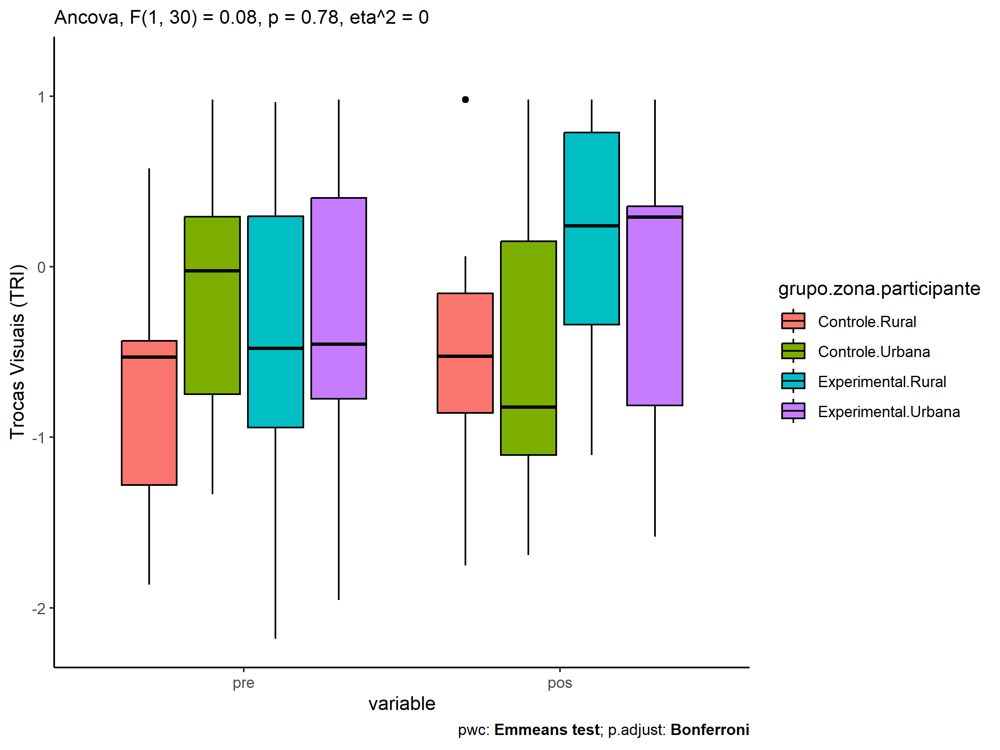<!-- -->

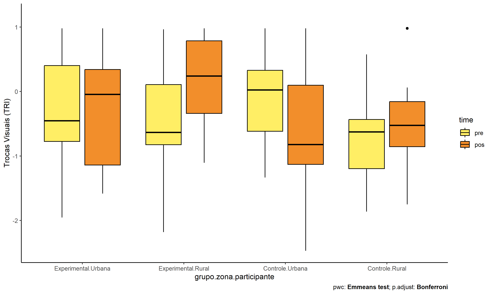<!-- -->

### Trocas Fonologicas (Acertos)

| var          | zona.participante | grupo        |   n | M (pre) | SE (pre) | M (unadj) | SE (unadj) | M (adj) | SE (adj) |
|:-------------|:------------------|:-------------|----:|--------:|---------:|----------:|-----------:|--------:|---------:|
| score.TF.pos | Rural             | Controle     |  10 |  12.400 |    0.957 |    10.400 |      1.634 |  10.054 |    1.565 |
| score.TF.pos | Rural             | Experimental |   9 |  12.222 |    1.331 |    14.111 |      2.163 |  13.837 |    1.647 |
| score.TF.pos | Urbana            | Controle     |  14 |  10.429 |    1.702 |    10.857 |      1.358 |  11.301 |    1.329 |
| score.TF.pos | Urbana            | Experimental |   8 |  11.625 |    2.044 |    15.625 |      1.451 |  15.590 |    1.743 |

| grupo        | zona.participante | group1   | group2       | estimate | conf.low | conf.high |    se | statistic |     p | p.adj | p.adj.signif |
|:-------------|:------------------|:---------|:-------------|---------:|---------:|----------:|------:|----------:|------:|------:|:-------------|
| Controle     |                   | Urbana   | Rural        |    1.247 |   -2.942 |     5.435 | 2.065 |     0.604 | 0.550 | 0.550 | ns           |
| Experimental |                   | Urbana   | Rural        |    1.753 |   -3.110 |     6.616 | 2.398 |     0.731 | 0.469 | 0.469 | ns           |
| Controle     |                   | Urbana   | Rural        |   -1.971 |   -6.270 |     2.327 | 2.121 |    -0.929 | 0.359 | 0.359 | ns           |
| Experimental |                   | Urbana   | Rural        |   -0.597 |   -5.642 |     4.447 | 2.490 |    -0.240 | 0.812 | 0.812 | ns           |
|              | Urbana            | Controle | Experimental |   -4.289 |   -8.737 |     0.160 | 2.193 |    -1.955 | 0.058 | 0.058 | ns           |
|              | Rural             | Controle | Experimental |   -3.782 |   -8.377 |     0.813 | 2.266 |    -1.669 | 0.104 | 0.104 | ns           |
|              | Urbana            | Controle | Experimental |   -1.196 |   -5.797 |     3.405 | 2.271 |    -0.527 | 0.601 | 0.601 | ns           |
|              | Rural             | Controle | Experimental |    0.178 |   -4.592 |     4.948 | 2.354 |     0.076 | 0.940 | 0.940 | ns           |

| grupo        | zona.participante | group1 | group2 | estimate | conf.low | conf.high |    se | statistic |     p | p.adj | p.adj.signif |
|:-------------|:------------------|:-------|:-------|---------:|---------:|----------:|------:|----------:|------:|------:|:-------------|
| Controle     | Urbana            | pre    | pos    |   -0.429 |   -4.346 |     3.489 | 1.966 |    -0.218 | 0.828 | 0.828 | ns           |
| Controle     | Rural             | pre    | pos    |    2.000 |   -2.635 |     6.635 | 2.326 |     0.860 | 0.393 | 0.393 | ns           |
| Experimental | Urbana            | pre    | pos    |   -4.000 |   -9.182 |     1.182 | 2.601 |    -1.538 | 0.128 | 0.128 | ns           |
| Experimental | Rural             | pre    | pos    |   -1.889 |   -6.775 |     2.997 | 2.452 |    -0.770 | 0.444 | 0.444 | ns           |

    ## Scale for colour is already present.
    ## Adding another scale for colour, which will replace the existing scale.

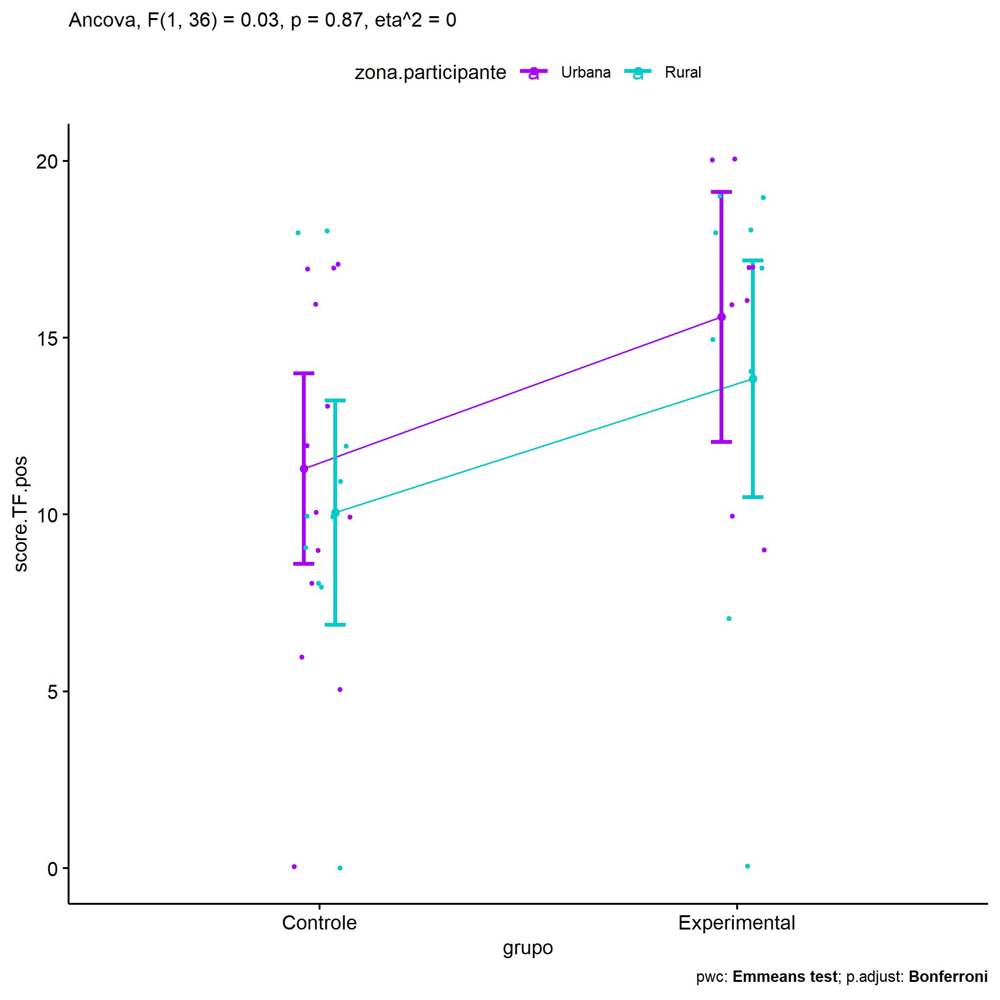<!-- -->

    ## Scale for colour is already present.
    ## Adding another scale for colour, which will replace the existing scale.

<!-- -->

<!-- -->

<!-- -->

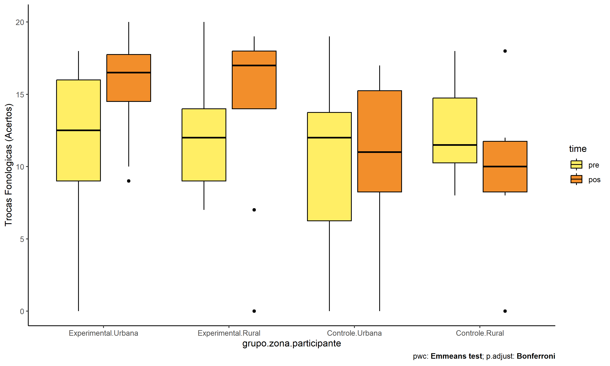<!-- -->

### Trocas Fonologicas (TRI)

| var        | zona.participante | grupo        |   n | M (pre) | SE (pre) | M (unadj) | SE (unadj) | M (adj) | SE (adj) |
|:-----------|:------------------|:-------------|----:|--------:|---------:|----------:|-----------:|--------:|---------:|
| tri.TF.pos | Rural             | Controle     |   9 |  -0.534 |    0.188 |    -0.848 |      0.236 |  -0.819 |    0.203 |
| tri.TF.pos | Rural             | Experimental |   8 |  -0.340 |    0.303 |    -0.037 |      0.275 |  -0.124 |    0.216 |
| tri.TF.pos | Urbana            | Controle     |  11 |  -0.664 |    0.221 |    -0.562 |      0.220 |  -0.454 |    0.185 |
| tri.TF.pos | Urbana            | Experimental |   7 |  -0.307 |    0.360 |     0.216 |      0.317 |   0.109 |    0.231 |

| grupo        | zona.participante | group1   | group2       | estimate | conf.low | conf.high |    se | statistic |     p | p.adj | p.adj.signif |
|:-------------|:------------------|:---------|:-------------|---------:|---------:|----------:|------:|----------:|------:|------:|:-------------|
| Controle     |                   | Urbana   | Rural        |    0.365 |   -0.195 |     0.924 | 0.274 |     1.332 | 0.193 | 0.193 | ns           |
| Experimental |                   | Urbana   | Rural        |    0.233 |   -0.410 |     0.875 | 0.315 |     0.740 | 0.465 | 0.465 | ns           |
| Controle     |                   | Urbana   | Rural        |   -0.130 |   -0.838 |     0.578 | 0.347 |    -0.375 | 0.710 | 0.710 | ns           |
| Experimental |                   | Urbana   | Rural        |    0.034 |   -0.782 |     0.849 | 0.400 |     0.084 | 0.933 | 0.933 | ns           |
|              | Urbana            | Controle | Experimental |   -0.563 |   -1.172 |     0.046 | 0.298 |    -1.888 | 0.069 | 0.069 | ns           |
|              | Rural             | Controle | Experimental |   -0.695 |   -1.301 |    -0.089 | 0.297 |    -2.343 | 0.026 | 0.026 | \*           |
|              | Urbana            | Controle | Experimental |   -0.357 |   -1.119 |     0.405 | 0.374 |    -0.956 | 0.347 | 0.347 | ns           |
|              | Rural             | Controle | Experimental |   -0.193 |   -0.959 |     0.572 | 0.375 |    -0.515 | 0.610 | 0.610 | ns           |

| grupo        | zona.participante | group1 | group2 | estimate | conf.low | conf.high |    se | statistic |     p | p.adj | p.adj.signif |
|:-------------|:------------------|:-------|:-------|---------:|---------:|----------:|------:|----------:|------:|------:|:-------------|
| Controle     | Urbana            | pre    | pos    |    0.118 |   -0.513 |     0.749 | 0.316 |     0.372 | 0.711 | 0.711 | ns           |
| Controle     | Rural             | pre    | pos    |    0.259 |   -0.465 |     0.983 | 0.363 |     0.713 | 0.478 | 0.478 | ns           |
| Experimental | Urbana            | pre    | pos    |   -0.325 |   -1.141 |     0.491 | 0.409 |    -0.795 | 0.430 | 0.430 | ns           |
| Experimental | Rural             | pre    | pos    |   -0.366 |   -1.132 |     0.400 | 0.384 |    -0.953 | 0.344 | 0.344 | ns           |

    ## Scale for colour is already present.
    ## Adding another scale for colour, which will replace the existing scale.

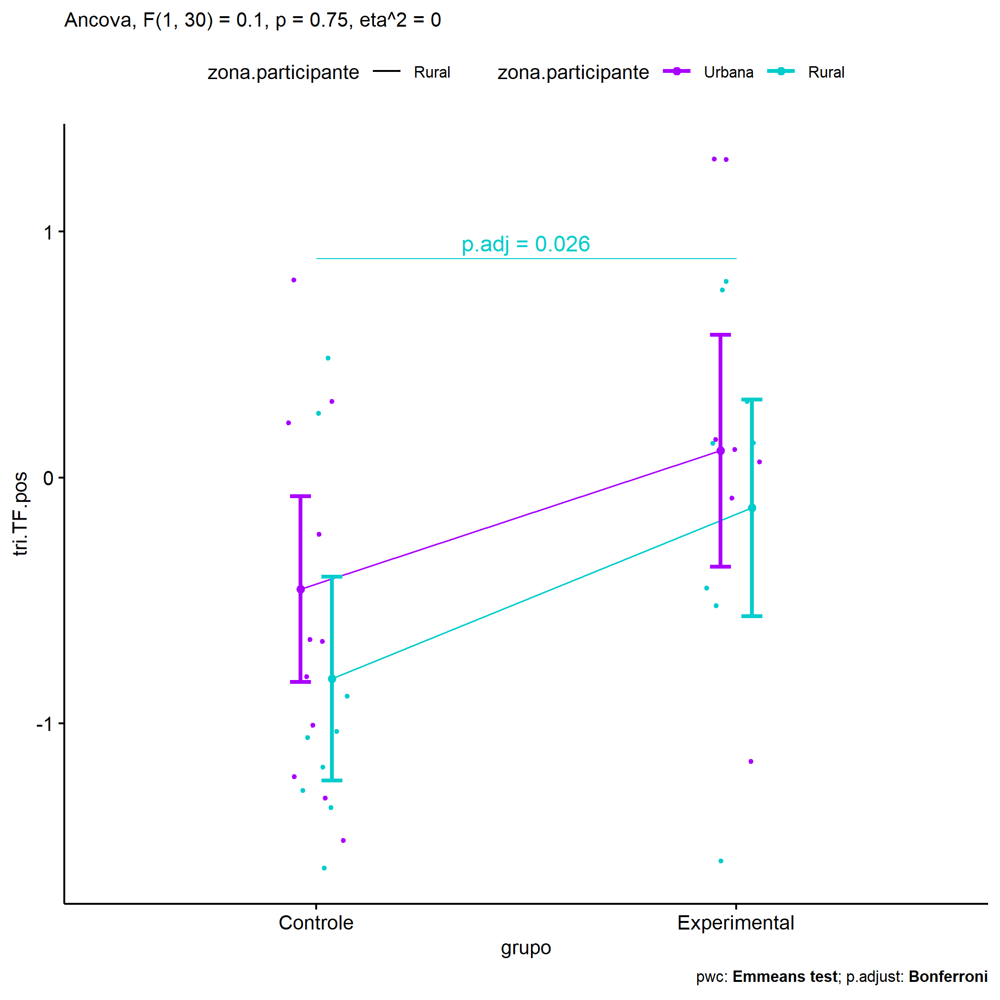<!-- -->

    ## Scale for colour is already present.
    ## Adding another scale for colour, which will replace the existing scale.

<!-- -->

<!-- -->

<!-- -->

### Trocas Orograficas (Acertos)

| var          | zona.participante | grupo        |   n | M (pre) | SE (pre) | M (unadj) | SE (unadj) | M (adj) | SE (adj) |
|:-------------|:------------------|:-------------|----:|--------:|---------:|----------:|-----------:|--------:|---------:|
| score.TO.pos | Rural             | Controle     |  10 |   7.200 |    1.227 |     8.500 |      1.195 |   8.489 |    1.132 |
| score.TO.pos | Rural             | Experimental |   9 |   8.889 |    0.676 |     9.778 |      1.267 |   9.621 |    1.235 |
| score.TO.pos | Urbana            | Controle     |  14 |   6.429 |    0.953 |     9.000 |      0.978 |   9.056 |    0.963 |
| score.TO.pos | Urbana            | Experimental |   8 |   6.000 |    1.195 |     8.500 |      0.906 |   8.593 |    1.279 |

| grupo        | zona.participante | group1   | group2       | estimate | conf.low | conf.high |    se | statistic |     p | p.adj | p.adj.signif |
|:-------------|:------------------|:---------|:-------------|---------:|---------:|----------:|------:|----------:|------:|------:|:-------------|
| Controle     |                   | Urbana   | Rural        |    0.567 |   -2.451 |     3.584 | 1.488 |     0.381 | 0.706 | 0.706 | ns           |
| Experimental |                   | Urbana   | Rural        |   -1.028 |   -4.702 |     2.646 | 1.811 |    -0.568 | 0.574 | 0.574 | ns           |
| Controle     |                   | Urbana   | Rural        |   -0.771 |   -3.577 |     2.035 | 1.385 |    -0.557 | 0.581 | 0.581 | ns           |
| Experimental |                   | Urbana   | Rural        |   -2.889 |   -6.182 |     0.404 | 1.625 |    -1.778 | 0.084 | 0.084 | ns           |
|              | Urbana            | Controle | Experimental |    0.463 |   -2.757 |     3.683 | 1.588 |     0.292 | 0.772 | 0.772 | ns           |
|              | Rural             | Controle | Experimental |   -1.132 |   -4.520 |     2.257 | 1.671 |    -0.677 | 0.502 | 0.502 | ns           |
|              | Urbana            | Controle | Experimental |    0.429 |   -2.575 |     3.432 | 1.482 |     0.289 | 0.774 | 0.774 | ns           |
|              | Rural             | Controle | Experimental |   -1.689 |   -4.803 |     1.425 | 1.537 |    -1.099 | 0.279 | 0.279 | ns           |

| grupo        | zona.participante | group1 | group2 | estimate | conf.low | conf.high |    se | statistic |     p | p.adj | p.adj.signif |
|:-------------|:------------------|:-------|:-------|---------:|---------:|----------:|------:|----------:|------:|------:|:-------------|
| Controle     | Urbana            | pre    | pos    |   -2.571 |   -5.166 |     0.023 | 1.302 |    -1.975 | 0.052 | 0.052 | ns           |
| Controle     | Rural             | pre    | pos    |   -1.300 |   -4.369 |     1.769 | 1.540 |    -0.844 | 0.401 | 0.401 | ns           |
| Experimental | Urbana            | pre    | pos    |   -2.500 |   -5.932 |     0.932 | 1.722 |    -1.452 | 0.151 | 0.151 | ns           |
| Experimental | Rural             | pre    | pos    |   -0.889 |   -4.124 |     2.346 | 1.624 |    -0.547 | 0.586 | 0.586 | ns           |

    ## Scale for colour is already present.
    ## Adding another scale for colour, which will replace the existing scale.

<!-- -->

    ## Scale for colour is already present.
    ## Adding another scale for colour, which will replace the existing scale.

<!-- -->

<!-- -->

<!-- -->

<!-- -->

### Trocas Orograficas (TRI)

| var        | zona.participante | grupo        |   n | M (pre) | SE (pre) | M (unadj) | SE (unadj) | M (adj) | SE (adj) |
|:-----------|:------------------|:-------------|----:|--------:|---------:|----------:|-----------:|--------:|---------:|
| tri.TO.pos | Rural             | Controle     |   9 |  -0.617 |    0.304 |    -0.263 |      0.195 |  -0.231 |    0.170 |
| tri.TO.pos | Rural             | Experimental |   8 |  -0.050 |    0.197 |     0.054 |      0.095 |  -0.021 |    0.186 |
| tri.TO.pos | Urbana            | Controle     |  11 |  -0.522 |    0.196 |    -0.211 |      0.162 |  -0.197 |    0.153 |
| tri.TO.pos | Urbana            | Experimental |   7 |  -0.570 |    0.215 |    -0.386 |      0.221 |  -0.363 |    0.192 |

| grupo        | zona.participante | group1   | group2       | estimate | conf.low | conf.high |    se | statistic |     p | p.adj | p.adj.signif |
|:-------------|:------------------|:---------|:-------------|---------:|---------:|----------:|------:|----------:|------:|------:|:-------------|
| Controle     |                   | Urbana   | Rural        |    0.034 |   -0.430 |     0.499 | 0.227 |     0.151 | 0.881 | 0.881 | ns           |
| Experimental |                   | Urbana   | Rural        |   -0.342 |   -0.893 |     0.210 | 0.270 |    -1.265 | 0.216 | 0.216 | ns           |
| Controle     |                   | Urbana   | Rural        |    0.095 |   -0.542 |     0.732 | 0.312 |     0.304 | 0.763 | 0.763 | ns           |
| Experimental |                   | Urbana   | Rural        |   -0.520 |   -1.253 |     0.214 | 0.360 |    -1.445 | 0.159 | 0.159 | ns           |
|              | Urbana            | Controle | Experimental |    0.166 |   -0.333 |     0.665 | 0.244 |     0.680 | 0.502 | 0.502 | ns           |
|              | Rural             | Controle | Experimental |   -0.210 |   -0.733 |     0.314 | 0.256 |    -0.818 | 0.420 | 0.420 | ns           |
|              | Urbana            | Controle | Experimental |    0.047 |   -0.638 |     0.733 | 0.336 |     0.141 | 0.889 | 0.889 | ns           |
|              | Rural             | Controle | Experimental |   -0.567 |   -1.256 |     0.121 | 0.338 |    -1.680 | 0.103 | 0.103 | ns           |

| grupo        | zona.participante | group1 | group2 | estimate | conf.low | conf.high |    se | statistic |     p | p.adj | p.adj.signif |
|:-------------|:------------------|:-------|:-------|---------:|---------:|----------:|------:|----------:|------:|------:|:-------------|
| Controle     | Urbana            | pre    | pos    |   -0.419 |   -0.902 |     0.065 | 0.242 |    -1.729 | 0.088 | 0.088 | ns           |
| Controle     | Rural             | pre    | pos    |   -0.310 |   -0.865 |     0.244 | 0.278 |    -1.117 | 0.268 | 0.268 | ns           |
| Experimental | Urbana            | pre    | pos    |   -0.110 |   -0.735 |     0.515 | 0.313 |    -0.351 | 0.727 | 0.727 | ns           |
| Experimental | Rural             | pre    | pos    |   -0.185 |   -0.771 |     0.402 | 0.294 |    -0.628 | 0.532 | 0.532 | ns           |

    ## Scale for colour is already present.
    ## Adding another scale for colour, which will replace the existing scale.

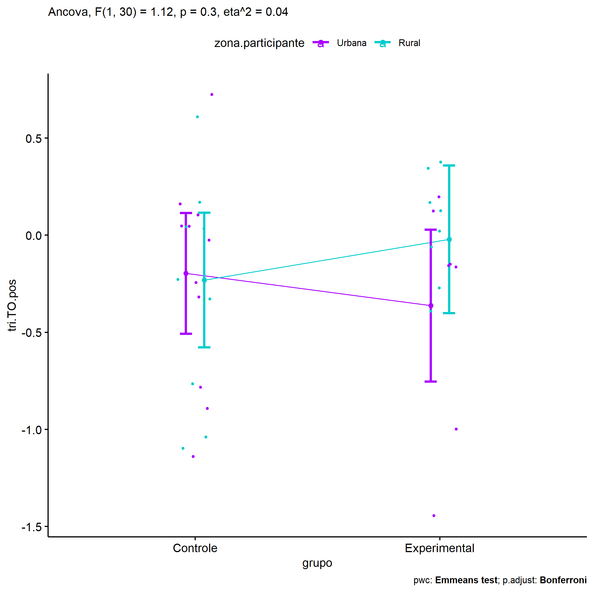<!-- -->

    ## Scale for colour is already present.
    ## Adding another scale for colour, which will replace the existing scale.

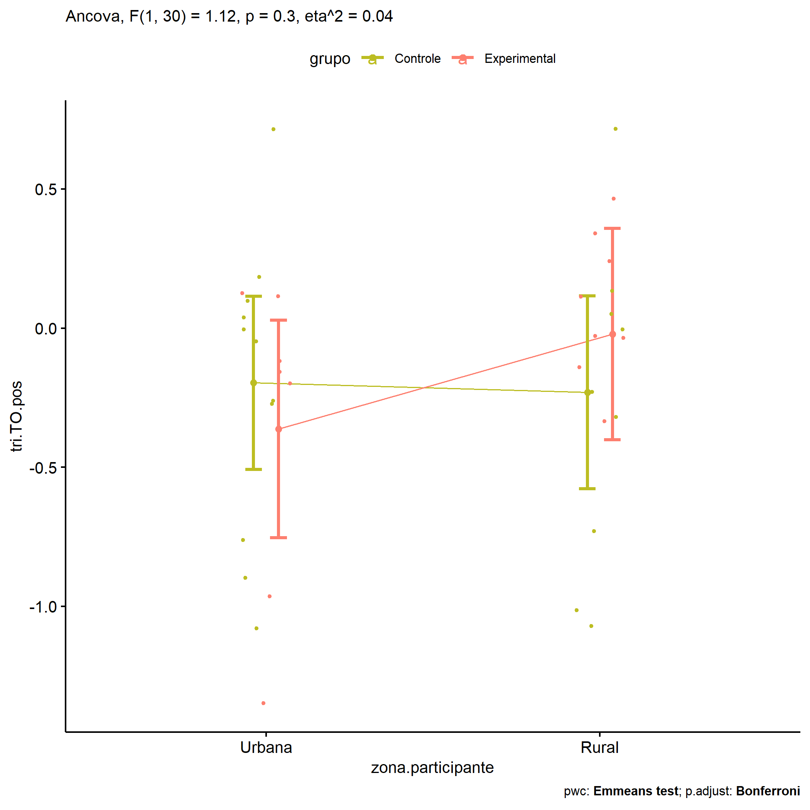<!-- -->

<!-- -->

<!-- -->

## factores: **escola:grupo**

### Leitura de Pseudo-Palavras (Acertos)

| var            | escola | grupo        |   n | M (pre) | SE (pre) | M (unadj) | SE (unadj) | M (adj) | SE (adj) |
|:---------------|:-------|:-------------|----:|--------:|---------:|----------:|-----------:|--------:|---------:|
| score.CLPP.pos | E2     | Controle     |   6 |  52.833 |    4.700 |    54.667 |      3.818 |  55.033 |    3.346 |
| score.CLPP.pos | E2     | Experimental |   5 |  52.200 |    5.398 |    61.800 |      2.818 |  62.243 |    3.672 |
| score.CLPP.pos | E3     | Controle     |   5 |  50.000 |    4.615 |    57.000 |      4.195 |  57.709 |    3.728 |
| score.CLPP.pos | E3     | Experimental |   5 |  49.200 |    5.826 |    66.000 |      6.189 |  66.806 |    3.755 |
| score.CLPP.pos | E5     | Controle     |  10 |  61.000 |    2.362 |    60.900 |      1.574 |  60.279 |    2.671 |
| score.CLPP.pos | E5     | Experimental |   6 |  63.833 |    3.911 |    73.333 |      1.764 |  72.370 |    3.504 |

| grupo        | escola | group1   | group2       | estimate | conf.low | conf.high |    se | statistic |     p | p.adj | p.adj.signif |
|:-------------|:-------|:---------|:-------------|---------:|---------:|----------:|------:|----------:|------:|------:|:-------------|
| Controle     |        | E2       | E3           |   -2.676 |  -12.761 |     7.409 | 4.938 |    -0.542 | 0.592 | 1.000 | ns           |
| Controle     |        | E2       | E5           |   -5.246 |  -14.136 |     3.644 | 4.353 |    -1.205 | 0.238 | 0.713 | ns           |
| Controle     |        | E3       | E5           |   -2.571 |  -12.200 |     7.059 | 4.715 |    -0.545 | 0.590 | 1.000 | ns           |
| Experimental |        | E2       | E3           |   -4.563 |  -15.097 |     5.972 | 5.158 |    -0.885 | 0.383 | 1.000 | ns           |
| Experimental |        | E2       | E5           |  -10.127 |  -20.724 |     0.470 | 5.189 |    -1.952 | 0.060 | 0.181 | ns           |
| Experimental |        | E3       | E5           |   -5.565 |  -16.467 |     5.337 | 5.338 |    -1.042 | 0.306 | 0.917 | ns           |
| Controle     |        | E2       | E3           |    2.833 |   -9.930 |    15.597 | 6.258 |     0.453 | 0.654 | 1.000 | ns           |
| Controle     |        | E2       | E5           |   -8.167 |  -19.052 |     2.718 | 5.337 |    -1.530 | 0.136 | 0.408 | ns           |
| Controle     |        | E3       | E5           |  -11.000 |  -22.545 |     0.545 | 5.661 |    -1.943 | 0.061 | 0.183 | ns           |
| Experimental |        | E2       | E3           |    3.000 |  -10.331 |    16.331 | 6.537 |     0.459 | 0.649 | 1.000 | ns           |
| Experimental |        | E2       | E5           |  -11.633 |  -24.397 |     1.130 | 6.258 |    -1.859 | 0.073 | 0.218 | ns           |
| Experimental |        | E3       | E5           |  -14.633 |  -27.397 |    -1.870 | 6.258 |    -2.338 | 0.026 | 0.078 | ns           |
|              | E2     | Controle | Experimental |   -7.210 |  -17.263 |     2.844 | 4.923 |    -1.465 | 0.153 | 0.153 | ns           |
|              | E3     | Controle | Experimental |   -9.097 |  -19.598 |     1.405 | 5.142 |    -1.769 | 0.087 | 0.087 | ns           |
|              | E5     | Controle | Experimental |  -12.091 |  -20.702 |    -3.480 | 4.216 |    -2.868 | 0.007 | 0.007 | \*\*         |
|              | E2     | Controle | Experimental |    0.633 |  -12.130 |    13.397 | 6.258 |     0.101 | 0.920 | 0.920 | ns           |
|              | E3     | Controle | Experimental |    0.800 |  -12.531 |    14.131 | 6.537 |     0.122 | 0.903 | 0.903 | ns           |
|              | E5     | Controle | Experimental |   -2.833 |  -13.718 |     8.052 | 5.337 |    -0.531 | 0.599 | 0.599 | ns           |

| grupo        | escola | group1 | group2 | estimate | conf.low | conf.high |    se | statistic |     p | p.adj | p.adj.signif |
|:-------------|:-------|:-------|:-------|---------:|---------:|----------:|------:|----------:|------:|------:|:-------------|
| Controle     | E2     | pre    | pos    |   -0.024 |  -11.304 |    11.256 | 5.653 |    -0.004 | 0.997 | 0.997 | ns           |
| Controle     | E3     | pre    | pos    |   -5.833 |  -18.111 |     6.444 | 6.153 |    -0.948 | 0.346 | 0.346 | ns           |
| Controle     | E5     | pre    | pos    |   -0.900 |   -9.581 |     7.781 | 4.350 |    -0.207 | 0.837 | 0.837 | ns           |
| Experimental | E2     | pre    | pos    |   -9.600 |  -22.423 |     3.223 | 6.426 |    -1.494 | 0.140 | 0.140 | ns           |
| Experimental | E3     | pre    | pos    |  -17.833 |  -30.111 |    -5.556 | 6.153 |    -2.899 | 0.005 | 0.005 | \*\*         |
| Experimental | E5     | pre    | pos    |   -4.881 |  -16.161 |     6.399 | 5.653 |    -0.863 | 0.391 | 0.391 | ns           |

    ## Scale for colour is already present.
    ## Adding another scale for colour, which will replace the existing scale.

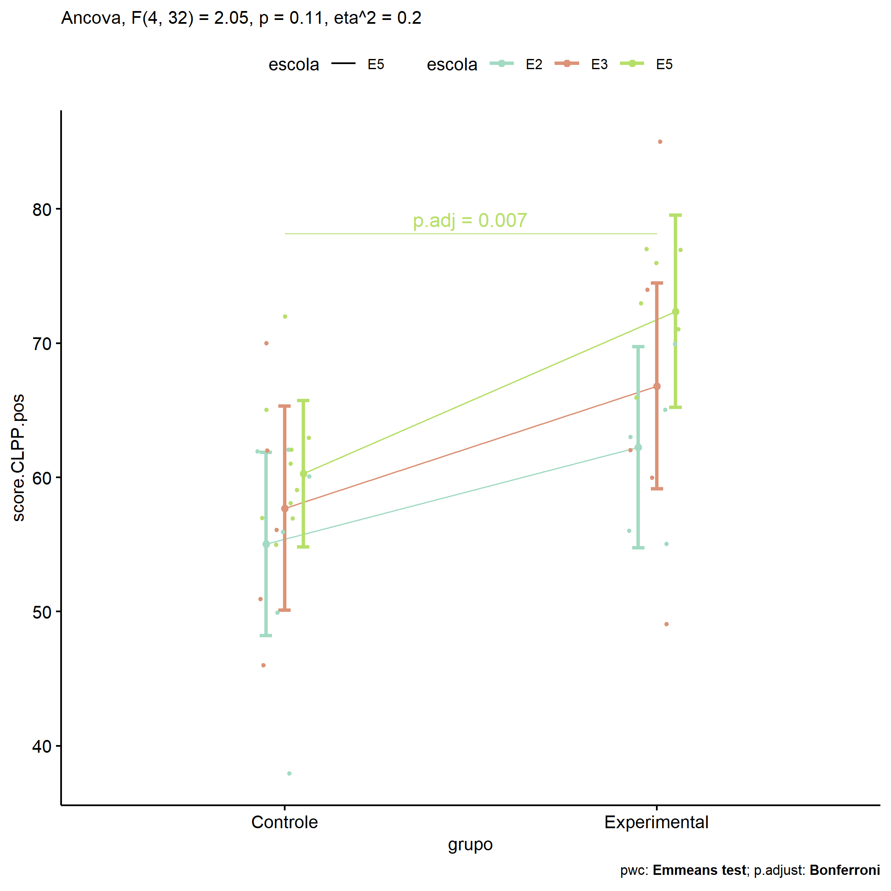<!-- -->

    ## Scale for colour is already present.
    ## Adding another scale for colour, which will replace the existing scale.

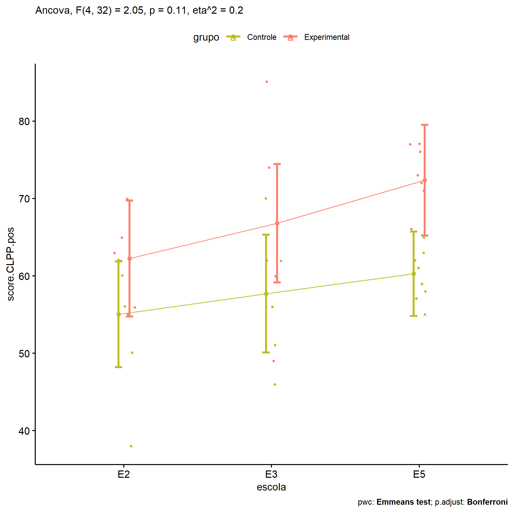<!-- -->

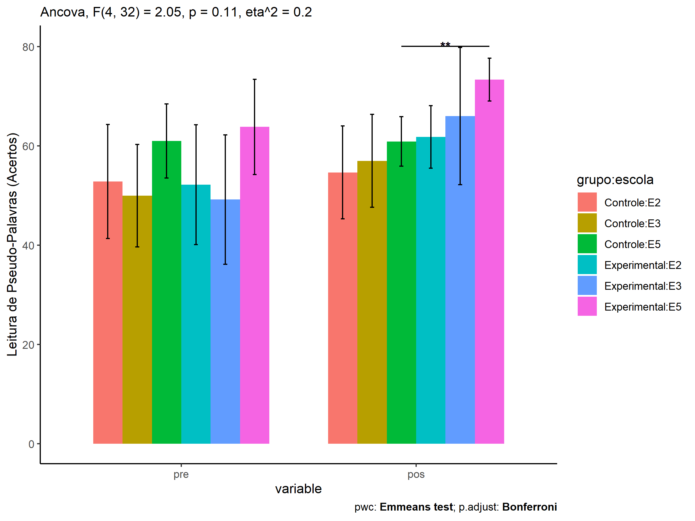<!-- -->

<!-- -->

<!-- -->

### Leitura de Pseudo-Palavras (TRI)

| var          | escola | grupo        |   n | M (pre) | SE (pre) | M (unadj) | SE (unadj) | M (adj) | SE (adj) |
|:-------------|:-------|:-------------|----:|--------:|---------:|----------:|-----------:|--------:|---------:|
| tri.CLPP.pos | E2     | Controle     |   6 |  52.833 |    4.700 |    54.667 |      3.818 |  55.033 |    3.346 |
| tri.CLPP.pos | E2     | Experimental |   5 |  52.200 |    5.398 |    61.800 |      2.818 |  62.243 |    3.672 |
| tri.CLPP.pos | E3     | Controle     |   5 |  50.000 |    4.615 |    57.000 |      4.195 |  57.709 |    3.728 |
| tri.CLPP.pos | E3     | Experimental |   5 |  49.200 |    5.826 |    66.000 |      6.189 |  66.806 |    3.755 |
| tri.CLPP.pos | E5     | Controle     |  10 |  61.000 |    2.362 |    60.900 |      1.574 |  60.279 |    2.671 |
| tri.CLPP.pos | E5     | Experimental |   6 |  63.833 |    3.911 |    73.333 |      1.764 |  72.370 |    3.504 |

| grupo        | escola | group1   | group2       | estimate | conf.low | conf.high |    se | statistic |     p | p.adj | p.adj.signif |
|:-------------|:-------|:---------|:-------------|---------:|---------:|----------:|------:|----------:|------:|------:|:-------------|
| Controle     |        | E2       | E3           |   -2.676 |  -12.761 |     7.409 | 4.938 |    -0.542 | 0.592 | 1.000 | ns           |
| Controle     |        | E2       | E5           |   -5.246 |  -14.136 |     3.644 | 4.353 |    -1.205 | 0.238 | 0.713 | ns           |
| Controle     |        | E3       | E5           |   -2.571 |  -12.200 |     7.059 | 4.715 |    -0.545 | 0.590 | 1.000 | ns           |
| Experimental |        | E2       | E3           |   -4.563 |  -15.097 |     5.972 | 5.158 |    -0.885 | 0.383 | 1.000 | ns           |
| Experimental |        | E2       | E5           |  -10.127 |  -20.724 |     0.470 | 5.189 |    -1.952 | 0.060 | 0.181 | ns           |
| Experimental |        | E3       | E5           |   -5.565 |  -16.467 |     5.337 | 5.338 |    -1.042 | 0.306 | 0.917 | ns           |
| Controle     |        | E2       | E3           |    2.833 |   -9.930 |    15.597 | 6.258 |     0.453 | 0.654 | 1.000 | ns           |
| Controle     |        | E2       | E5           |   -8.167 |  -19.052 |     2.718 | 5.337 |    -1.530 | 0.136 | 0.408 | ns           |
| Controle     |        | E3       | E5           |  -11.000 |  -22.545 |     0.545 | 5.661 |    -1.943 | 0.061 | 0.183 | ns           |
| Experimental |        | E2       | E3           |    3.000 |  -10.331 |    16.331 | 6.537 |     0.459 | 0.649 | 1.000 | ns           |
| Experimental |        | E2       | E5           |  -11.633 |  -24.397 |     1.130 | 6.258 |    -1.859 | 0.073 | 0.218 | ns           |
| Experimental |        | E3       | E5           |  -14.633 |  -27.397 |    -1.870 | 6.258 |    -2.338 | 0.026 | 0.078 | ns           |
|              | E2     | Controle | Experimental |   -7.210 |  -17.263 |     2.844 | 4.923 |    -1.465 | 0.153 | 0.153 | ns           |
|              | E3     | Controle | Experimental |   -9.097 |  -19.598 |     1.405 | 5.142 |    -1.769 | 0.087 | 0.087 | ns           |
|              | E5     | Controle | Experimental |  -12.091 |  -20.702 |    -3.480 | 4.216 |    -2.868 | 0.007 | 0.007 | \*\*         |
|              | E2     | Controle | Experimental |    0.633 |  -12.130 |    13.397 | 6.258 |     0.101 | 0.920 | 0.920 | ns           |
|              | E3     | Controle | Experimental |    0.800 |  -12.531 |    14.131 | 6.537 |     0.122 | 0.903 | 0.903 | ns           |
|              | E5     | Controle | Experimental |   -2.833 |  -13.718 |     8.052 | 5.337 |    -0.531 | 0.599 | 0.599 | ns           |

| grupo        | escola | group1 | group2 | estimate | conf.low | conf.high |    se | statistic |     p | p.adj | p.adj.signif |
|:-------------|:-------|:-------|:-------|---------:|---------:|----------:|------:|----------:|------:|------:|:-------------|
| Controle     | E2     | pre    | pos    |    0.176 |   -0.600 |     0.953 | 0.389 |     0.453 | 0.652 | 0.652 | ns           |
| Controle     | E3     | pre    | pos    |    0.028 |   -0.817 |     0.873 | 0.423 |     0.065 | 0.948 | 0.948 | ns           |
| Controle     | E5     | pre    | pos    |   -0.009 |   -0.607 |     0.588 | 0.299 |    -0.032 | 0.975 | 0.975 | ns           |
| Experimental | E2     | pre    | pos    |   -0.294 |   -1.176 |     0.589 | 0.442 |    -0.664 | 0.509 | 0.509 | ns           |
| Experimental | E3     | pre    | pos    |   -0.544 |   -1.389 |     0.302 | 0.423 |    -1.283 | 0.204 | 0.204 | ns           |
| Experimental | E5     | pre    | pos    |   -0.120 |   -0.896 |     0.656 | 0.389 |    -0.309 | 0.759 | 0.759 | ns           |

    ## Scale for colour is already present.
    ## Adding another scale for colour, which will replace the existing scale.

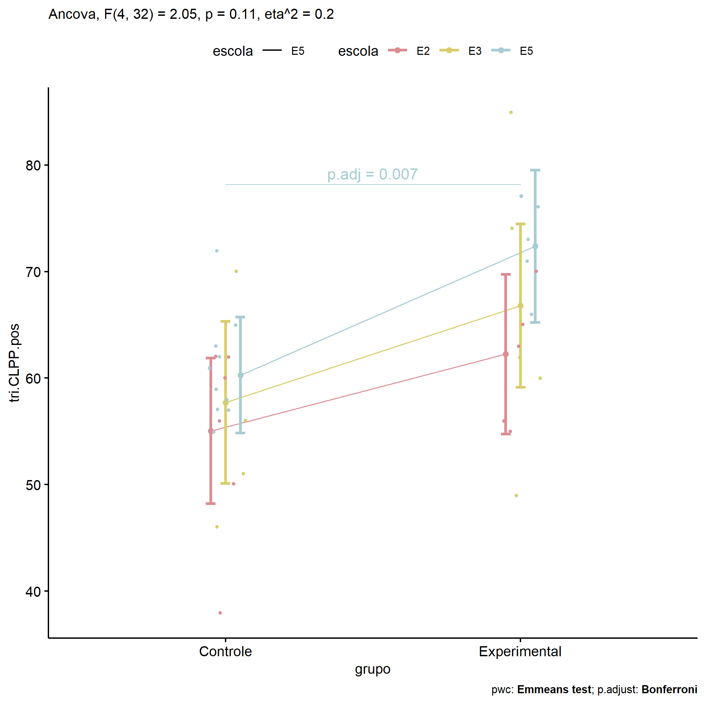<!-- -->

    ## Scale for colour is already present.
    ## Adding another scale for colour, which will replace the existing scale.

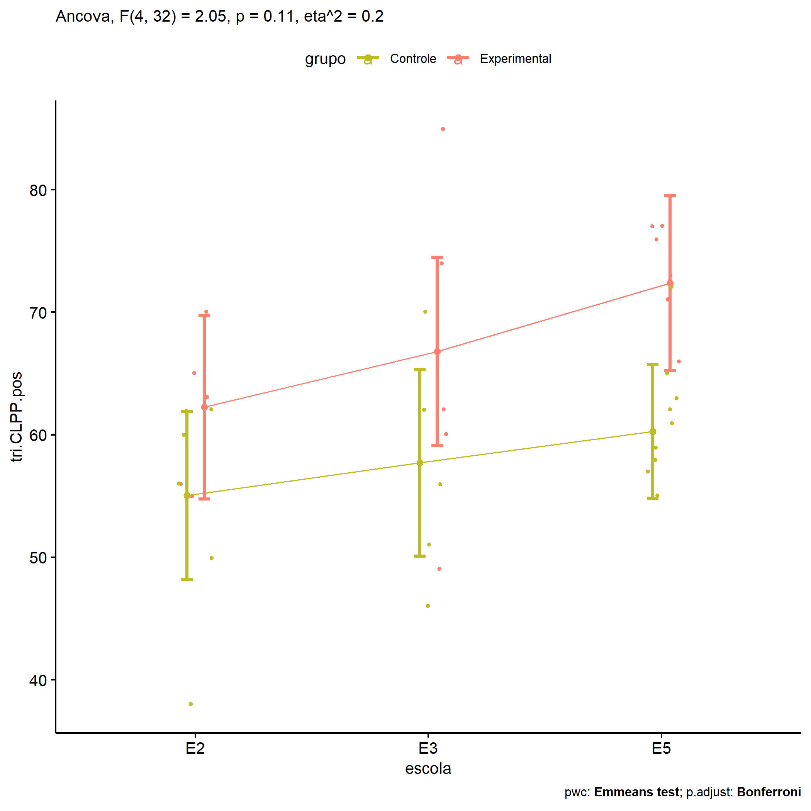<!-- -->

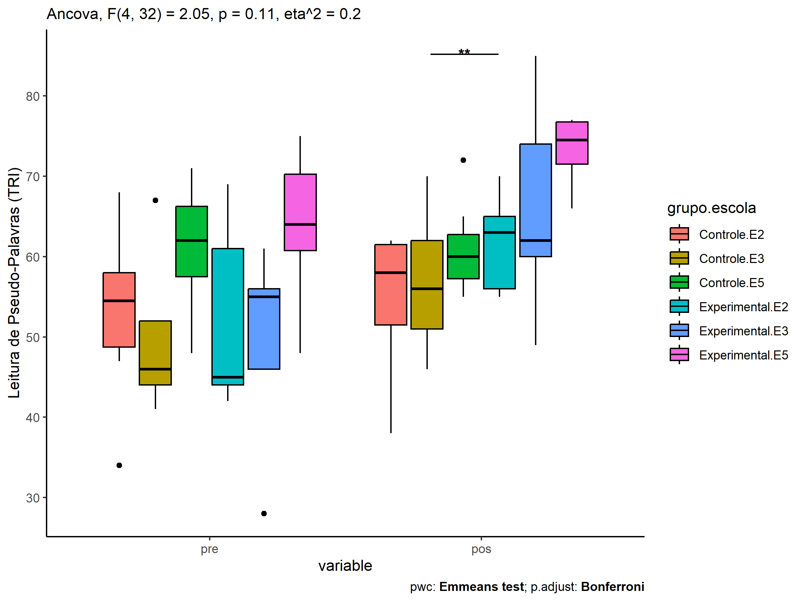<!-- -->

<!-- -->

### Correta Regular (Acertos)

| var          | escola | grupo        |   n | M (pre) | SE (pre) | M (unadj) | SE (unadj) | M (adj) | SE (adj) |
|:-------------|:-------|:-------------|----:|--------:|---------:|----------:|-----------:|--------:|---------:|
| score.CR.pos | E2     | Controle     |   7 |   9.286 |    1.822 |    11.143 |      1.243 |  11.478 |    1.889 |
| score.CR.pos | E2     | Experimental |   5 |  11.000 |    1.789 |    15.600 |      1.288 |  15.625 |    2.183 |
| score.CR.pos | E3     | Controle     |   6 |  11.167 |    1.108 |     9.500 |      2.320 |   9.495 |    1.993 |
| score.CR.pos | E3     | Experimental |   6 |   9.833 |    1.108 |    10.667 |      2.486 |  10.903 |    2.013 |
| score.CR.pos | E5     | Controle     |  12 |  13.000 |    0.550 |    10.833 |      1.590 |  10.497 |    1.467 |
| score.CR.pos | E5     | Experimental |   7 |  11.000 |    2.070 |    14.714 |      1.507 |  14.740 |    1.845 |

| grupo        | escola | group1   | group2       | estimate | conf.low | conf.high |    se | statistic |     p | p.adj | p.adj.signif |
|:-------------|:-------|:---------|:-------------|---------:|---------:|----------:|------:|----------:|------:|------:|:-------------|
| Controle     |        | E2       | E3           |    1.983 |   -3.588 |     7.553 | 2.747 |     0.722 | 0.475 | 1.000 | ns           |
| Controle     |        | E2       | E5           |    0.981 |   -4.008 |     5.970 | 2.460 |     0.399 | 0.692 | 1.000 | ns           |
| Controle     |        | E3       | E5           |   -1.002 |   -6.018 |     4.014 | 2.473 |    -0.405 | 0.688 | 1.000 | ns           |
| Experimental |        | E2       | E3           |    4.722 |   -1.294 |    10.739 | 2.967 |     1.592 | 0.120 | 0.361 | ns           |
| Experimental |        | E2       | E5           |    0.886 |   -4.911 |     6.682 | 2.858 |     0.310 | 0.758 | 1.000 | ns           |
| Experimental |        | E3       | E5           |   -3.837 |   -9.369 |     1.695 | 2.728 |    -1.407 | 0.168 | 0.504 | ns           |
| Controle     |        | E2       | E3           |   -1.881 |   -6.013 |     2.251 | 2.039 |    -0.922 | 0.362 | 1.000 | ns           |
| Controle     |        | E2       | E5           |   -3.714 |   -7.246 |    -0.182 | 1.743 |    -2.131 | 0.040 | 0.119 | ns           |
| Controle     |        | E3       | E5           |   -1.833 |   -5.547 |     1.880 | 1.833 |    -1.000 | 0.324 | 0.971 | ns           |
| Experimental |        | E2       | E3           |    1.167 |   -3.330 |     5.664 | 2.219 |     0.526 | 0.602 | 1.000 | ns           |
| Experimental |        | E2       | E5           |    0.000 |   -4.349 |     4.349 | 2.146 |     0.000 | 1.000 | 1.000 | ns           |
| Experimental |        | E3       | E5           |   -1.167 |   -5.299 |     2.965 | 2.039 |    -0.572 | 0.571 | 1.000 | ns           |
|              | E2     | Controle | Experimental |   -4.147 |   -9.993 |     1.699 | 2.883 |    -1.439 | 0.159 | 0.159 | ns           |
|              | E3     | Controle | Experimental |   -1.408 |   -7.154 |     4.338 | 2.833 |    -0.497 | 0.622 | 0.622 | ns           |
|              | E5     | Controle | Experimental |   -4.243 |   -9.034 |     0.549 | 2.362 |    -1.796 | 0.081 | 0.081 | ns           |
|              | E2     | Controle | Experimental |   -1.714 |   -6.063 |     2.634 | 2.146 |    -0.799 | 0.430 | 0.430 | ns           |
|              | E3     | Controle | Experimental |    1.333 |   -2.955 |     5.621 | 2.116 |     0.630 | 0.533 | 0.533 | ns           |
|              | E5     | Controle | Experimental |    2.000 |   -1.532 |     5.532 | 1.743 |     1.147 | 0.259 | 0.259 | ns           |

| grupo        | escola | group1 | group2 | estimate | conf.low | conf.high |    se | statistic |     p | p.adj | p.adj.signif |
|:-------------|:-------|:-------|:-------|---------:|---------:|----------:|------:|----------:|------:|------:|:-------------|
| Controle     | E2     | pre    | pos    |   -1.857 |   -6.442 |     2.727 | 2.301 |    -0.807 | 0.422 | 0.422 | ns           |
| Controle     | E3     | pre    | pos    |    1.667 |   -3.285 |     6.618 | 2.485 |     0.671 | 0.505 | 0.505 | ns           |
| Controle     | E5     | pre    | pos    |    2.167 |   -1.335 |     5.668 | 1.757 |     1.233 | 0.221 | 0.221 | ns           |
| Experimental | E2     | pre    | pos    |   -4.600 |  -10.024 |     0.824 | 2.722 |    -1.690 | 0.095 | 0.095 | ns           |
| Experimental | E3     | pre    | pos    |   -0.833 |   -5.785 |     4.118 | 2.485 |    -0.335 | 0.738 | 0.738 | ns           |
| Experimental | E5     | pre    | pos    |   -3.714 |   -8.299 |     0.870 | 2.301 |    -1.614 | 0.111 | 0.111 | ns           |

    ## Scale for colour is already present.
    ## Adding another scale for colour, which will replace the existing scale.

<!-- -->

    ## Scale for colour is already present.
    ## Adding another scale for colour, which will replace the existing scale.

<!-- -->

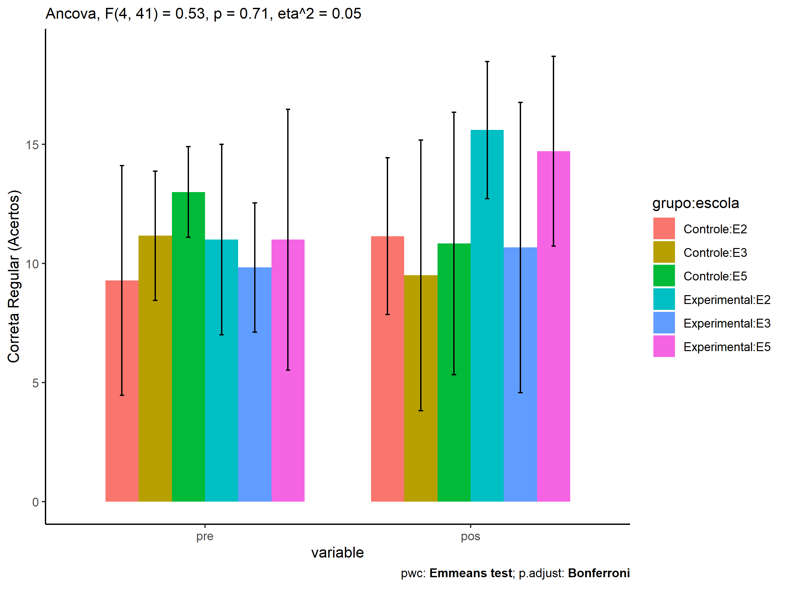<!-- -->

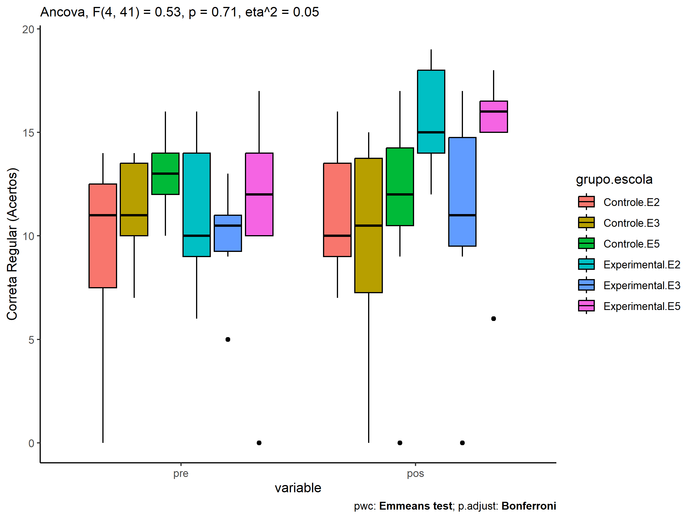<!-- -->

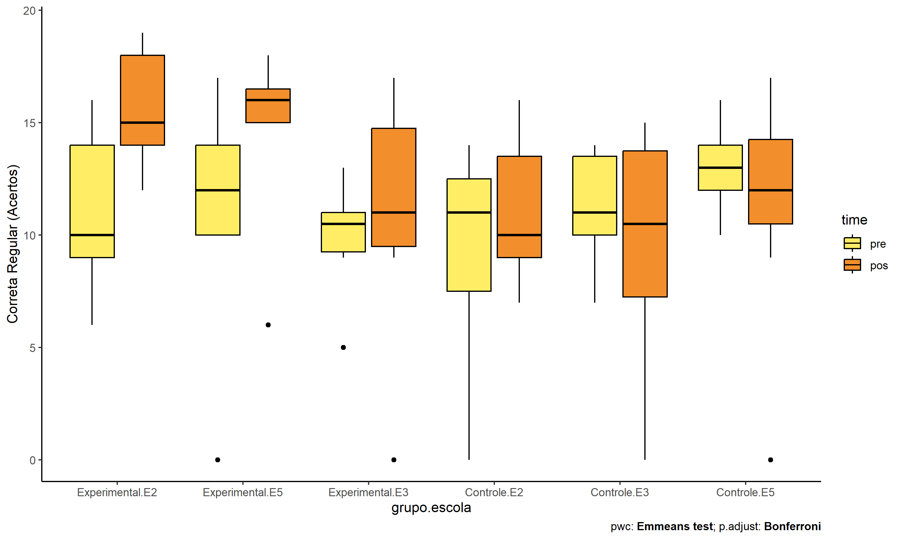<!-- -->

### Correta Regular (TRI)

| var        | escola | grupo        |   n | M (pre) | SE (pre) | M (unadj) | SE (unadj) | M (adj) | SE (adj) |
|:-----------|:-------|:-------------|----:|--------:|---------:|----------:|-----------:|--------:|---------:|
| tri.CR.pos | E2     | Controle     |   6 |  -1.083 |    0.223 |    -0.776 |      0.254 |  -0.656 |    0.279 |
| tri.CR.pos | E2     | Experimental |   5 |  -1.024 |    0.294 |    -0.270 |      0.352 |  -0.168 |    0.303 |
| tri.CR.pos | E3     | Controle     |   5 |  -0.574 |    0.407 |    -0.782 |      0.372 |  -0.825 |    0.299 |
| tri.CR.pos | E3     | Experimental |   5 |  -0.899 |    0.468 |    -0.535 |      0.409 |  -0.474 |    0.300 |
| tri.CR.pos | E5     | Controle     |  10 |  -0.606 |    0.151 |    -0.476 |      0.193 |  -0.508 |    0.212 |
| tri.CR.pos | E5     | Experimental |   6 |  -0.191 |    0.313 |     0.354 |      0.192 |   0.188 |    0.286 |

| grupo        | escola | group1   | group2       | estimate | conf.low | conf.high |    se | statistic |     p | p.adj | p.adj.signif |
|:-------------|:-------|:---------|:-------------|---------:|---------:|----------:|------:|----------:|------:|------:|:-------------|
| Controle     |        | E2       | E3           |    0.170 |   -0.673 |     1.013 | 0.413 |     0.411 | 0.684 | 1.000 | ns           |
| Controle     |        | E2       | E5           |   -0.147 |   -0.869 |     0.575 | 0.354 |    -0.416 | 0.680 | 1.000 | ns           |
| Controle     |        | E3       | E5           |   -0.317 |   -1.063 |     0.429 | 0.365 |    -0.867 | 0.393 | 1.000 | ns           |
| Experimental |        | E2       | E3           |    0.305 |   -0.557 |     1.168 | 0.422 |     0.723 | 0.475 | 1.000 | ns           |
| Experimental |        | E2       | E5           |   -0.356 |   -1.229 |     0.516 | 0.427 |    -0.834 | 0.411 | 1.000 | ns           |
| Experimental |        | E3       | E5           |   -0.662 |   -1.522 |     0.198 | 0.421 |    -1.572 | 0.126 | 0.379 | ns           |
| Controle     |        | E2       | E3           |   -0.509 |   -1.394 |     0.375 | 0.434 |    -1.175 | 0.249 | 0.747 | ns           |
| Controle     |        | E2       | E5           |   -0.478 |   -1.232 |     0.277 | 0.370 |    -1.291 | 0.206 | 0.619 | ns           |
| Controle     |        | E3       | E5           |    0.032 |   -0.768 |     0.832 | 0.392 |     0.082 | 0.936 | 1.000 | ns           |
| Experimental |        | E2       | E3           |   -0.125 |   -1.049 |     0.799 | 0.453 |    -0.275 | 0.785 | 1.000 | ns           |
| Experimental |        | E2       | E5           |   -0.833 |   -1.718 |     0.051 | 0.434 |    -1.921 | 0.064 | 0.192 | ns           |
| Experimental |        | E3       | E5           |   -0.708 |   -1.593 |     0.176 | 0.434 |    -1.633 | 0.113 | 0.338 | ns           |
|              | E2     | Controle | Experimental |   -0.487 |   -1.312 |     0.338 | 0.404 |    -1.206 | 0.237 | 0.237 | ns           |
|              | E3     | Controle | Experimental |   -0.352 |   -1.220 |     0.517 | 0.425 |    -0.826 | 0.415 | 0.415 | ns           |
|              | E5     | Controle | Experimental |   -0.696 |   -1.414 |     0.021 | 0.351 |    -1.982 | 0.057 | 0.057 | ns           |
|              | E2     | Controle | Experimental |   -0.059 |   -0.944 |     0.826 | 0.434 |    -0.136 | 0.893 | 0.893 | ns           |
|              | E3     | Controle | Experimental |    0.326 |   -0.598 |     1.250 | 0.453 |     0.719 | 0.477 | 0.477 | ns           |
|              | E5     | Controle | Experimental |   -0.415 |   -1.169 |     0.340 | 0.370 |    -1.121 | 0.271 | 0.271 | ns           |

| grupo        | escola | group1 | group2 | estimate | conf.low | conf.high |    se | statistic |     p | p.adj | p.adj.signif |
|:-------------|:-------|:-------|:-------|---------:|---------:|----------:|------:|----------:|------:|------:|:-------------|
| Controle     | E2     | pre    | pos    |   -0.234 |   -1.043 |     0.576 | 0.406 |    -0.576 | 0.566 | 0.566 | ns           |
| Controle     | E3     | pre    | pos    |    0.271 |   -0.610 |     1.152 | 0.441 |     0.613 | 0.542 | 0.542 | ns           |
| Controle     | E5     | pre    | pos    |   -0.013 |   -0.636 |     0.610 | 0.312 |    -0.041 | 0.968 | 0.968 | ns           |
| Experimental | E2     | pre    | pos    |   -0.754 |   -1.674 |     0.166 | 0.461 |    -1.636 | 0.106 | 0.106 | ns           |
| Experimental | E3     | pre    | pos    |   -0.388 |   -1.269 |     0.493 | 0.441 |    -0.879 | 0.383 | 0.383 | ns           |
| Experimental | E5     | pre    | pos    |   -0.236 |   -1.045 |     0.574 | 0.406 |    -0.581 | 0.563 | 0.563 | ns           |

    ## Scale for colour is already present.
    ## Adding another scale for colour, which will replace the existing scale.

<!-- -->

    ## Scale for colour is already present.
    ## Adding another scale for colour, which will replace the existing scale.

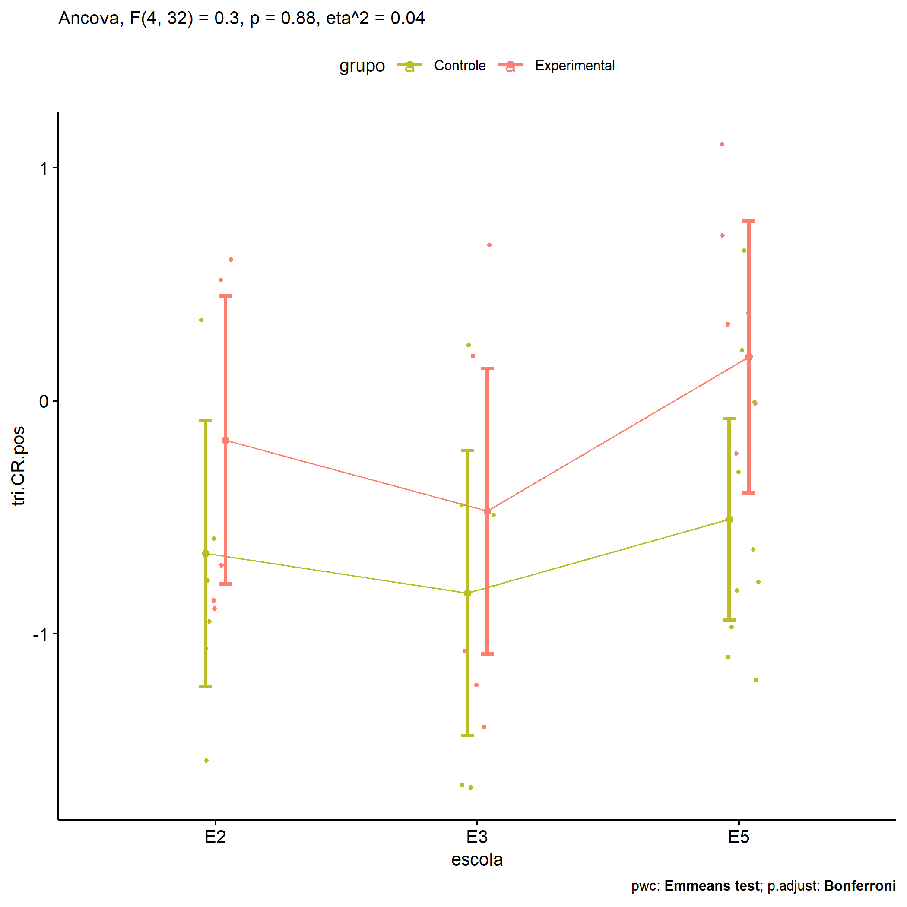<!-- -->

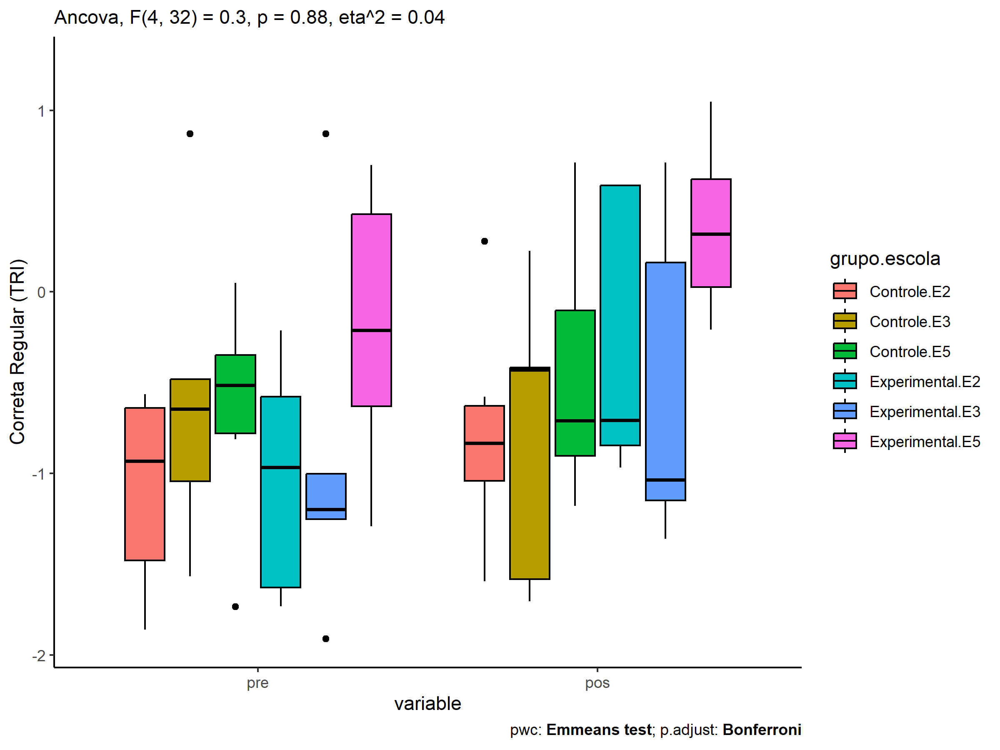<!-- -->

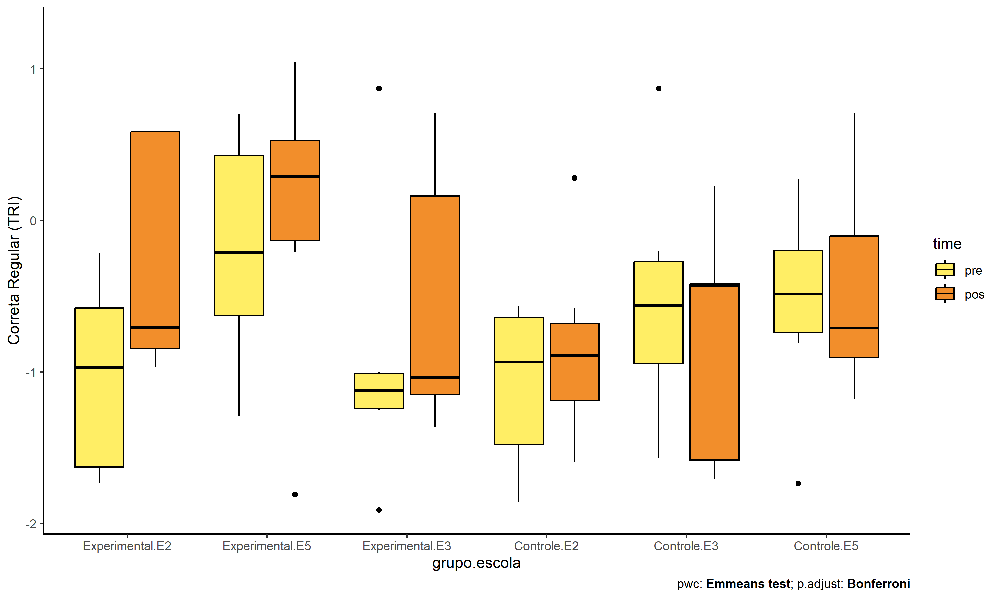<!-- -->

### Correta Irregular (Acertos)

| var          | escola | grupo        |   n | M (pre) | SE (pre) | M (unadj) | SE (unadj) | M (adj) | SE (adj) |
|:-------------|:-------|:-------------|----:|--------:|---------:|----------:|-----------:|--------:|---------:|
| score.CI.pos | E2     | Controle     |   7 |   8.429 |    1.888 |     8.143 |      1.370 |   8.445 |    1.472 |
| score.CI.pos | E2     | Experimental |   5 |   8.800 |    1.562 |    10.800 |      1.114 |  10.977 |    1.732 |
| score.CI.pos | E3     | Controle     |   6 |   9.500 |    0.992 |     6.667 |      1.585 |   6.608 |    1.579 |
| score.CI.pos | E3     | Experimental |   6 |   8.500 |    1.025 |     8.333 |      2.418 |   8.612 |    1.587 |
| score.CI.pos | E5     | Controle     |  12 |  10.833 |    0.474 |     8.000 |      1.261 |   7.492 |    1.154 |
| score.CI.pos | E5     | Experimental |   7 |   8.571 |    1.616 |    11.714 |      0.680 |  11.969 |    1.469 |

| grupo        | escola | group1   | group2       | estimate | conf.low | conf.high |    se | statistic |     p | p.adj | p.adj.signif |
|:-------------|:-------|:---------|:-------------|---------:|---------:|----------:|------:|----------:|------:|------:|:-------------|
| Controle     |        | E2       | E3           |    1.837 |   -2.546 |     6.221 | 2.161 |     0.850 | 0.401 | 1.000 | ns           |
| Controle     |        | E2       | E5           |    0.954 |   -2.894 |     4.802 | 1.897 |     0.503 | 0.618 | 1.000 | ns           |
| Controle     |        | E3       | E5           |   -0.884 |   -4.840 |     3.073 | 1.951 |    -0.453 | 0.653 | 1.000 | ns           |
| Experimental |        | E2       | E3           |    2.366 |   -2.385 |     7.116 | 2.342 |     1.010 | 0.319 | 0.958 | ns           |
| Experimental |        | E2       | E5           |   -0.991 |   -5.585 |     3.602 | 2.265 |    -0.438 | 0.664 | 1.000 | ns           |
| Experimental |        | E3       | E5           |   -3.357 |   -7.720 |     1.007 | 2.152 |    -1.560 | 0.127 | 0.382 | ns           |
| Controle     |        | E2       | E3           |   -1.071 |   -4.773 |     2.630 | 1.827 |    -0.587 | 0.561 | 1.000 | ns           |
| Controle     |        | E2       | E5           |   -2.405 |   -5.569 |     0.759 | 1.562 |    -1.540 | 0.132 | 0.396 | ns           |
| Controle     |        | E3       | E5           |   -1.333 |   -4.660 |     1.993 | 1.642 |    -0.812 | 0.422 | 1.000 | ns           |
| Experimental |        | E2       | E3           |    0.300 |   -3.729 |     4.329 | 1.988 |     0.151 | 0.881 | 1.000 | ns           |
| Experimental |        | E2       | E5           |    0.229 |   -3.667 |     4.124 | 1.923 |     0.119 | 0.906 | 1.000 | ns           |
| Experimental |        | E3       | E5           |   -0.071 |   -3.773 |     3.630 | 1.827 |    -0.039 | 0.969 | 1.000 | ns           |
|              | E2     | Controle | Experimental |   -2.532 |   -7.127 |     2.063 | 2.266 |    -1.118 | 0.271 | 0.271 | ns           |
|              | E3     | Controle | Experimental |   -2.004 |   -6.549 |     2.541 | 2.241 |    -0.894 | 0.377 | 0.377 | ns           |
|              | E5     | Controle | Experimental |   -4.477 |   -8.311 |    -0.643 | 1.891 |    -2.368 | 0.023 | 0.023 | \*           |
|              | E2     | Controle | Experimental |   -0.371 |   -4.267 |     3.524 | 1.923 |    -0.193 | 0.848 | 0.848 | ns           |
|              | E3     | Controle | Experimental |    1.000 |   -2.841 |     4.841 | 1.896 |     0.528 | 0.601 | 0.601 | ns           |
|              | E5     | Controle | Experimental |    2.262 |   -0.902 |     5.426 | 1.562 |     1.448 | 0.156 | 0.156 | ns           |

| grupo        | escola | group1 | group2 | estimate | conf.low | conf.high |    se | statistic |     p | p.adj | p.adj.signif |
|:-------------|:-------|:-------|:-------|---------:|---------:|----------:|------:|----------:|------:|------:|:-------------|
| Controle     | E2     | pre    | pos    |    0.286 |   -3.595 |     4.167 | 1.948 |     0.147 | 0.884 | 0.884 | ns           |
| Controle     | E3     | pre    | pos    |    2.833 |   -1.359 |     7.025 | 2.104 |     1.347 | 0.182 | 0.182 | ns           |
| Controle     | E5     | pre    | pos    |    2.833 |   -0.131 |     5.798 | 1.488 |     1.905 | 0.061 | 0.061 | ns           |
| Experimental | E2     | pre    | pos    |   -2.000 |   -6.592 |     2.592 | 2.305 |    -0.868 | 0.388 | 0.388 | ns           |
| Experimental | E3     | pre    | pos    |    0.167 |   -4.025 |     4.359 | 2.104 |     0.079 | 0.937 | 0.937 | ns           |
| Experimental | E5     | pre    | pos    |   -3.143 |   -7.024 |     0.738 | 1.948 |    -1.614 | 0.111 | 0.111 | ns           |

    ## Scale for colour is already present.
    ## Adding another scale for colour, which will replace the existing scale.

<!-- -->

    ## Scale for colour is already present.
    ## Adding another scale for colour, which will replace the existing scale.

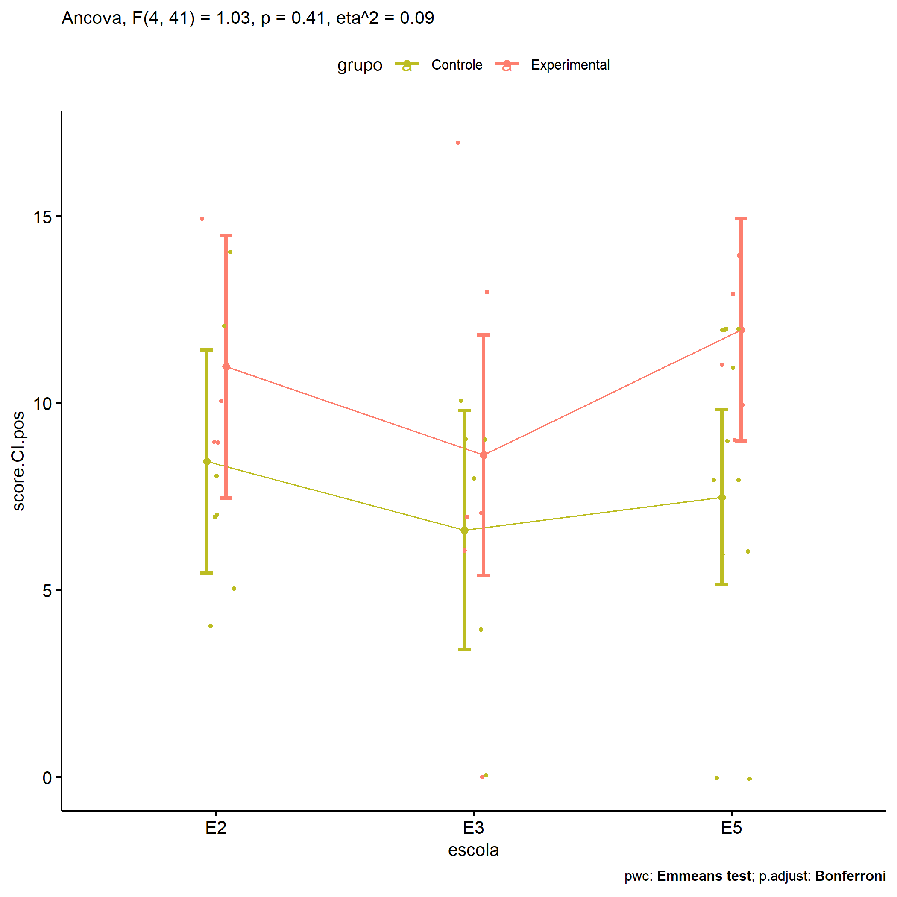<!-- -->

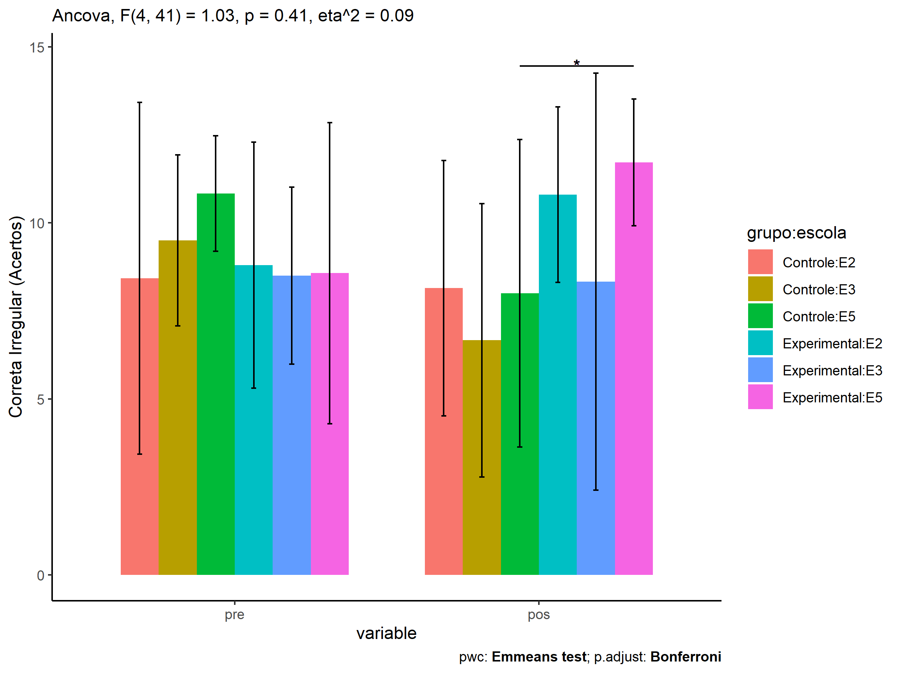<!-- -->

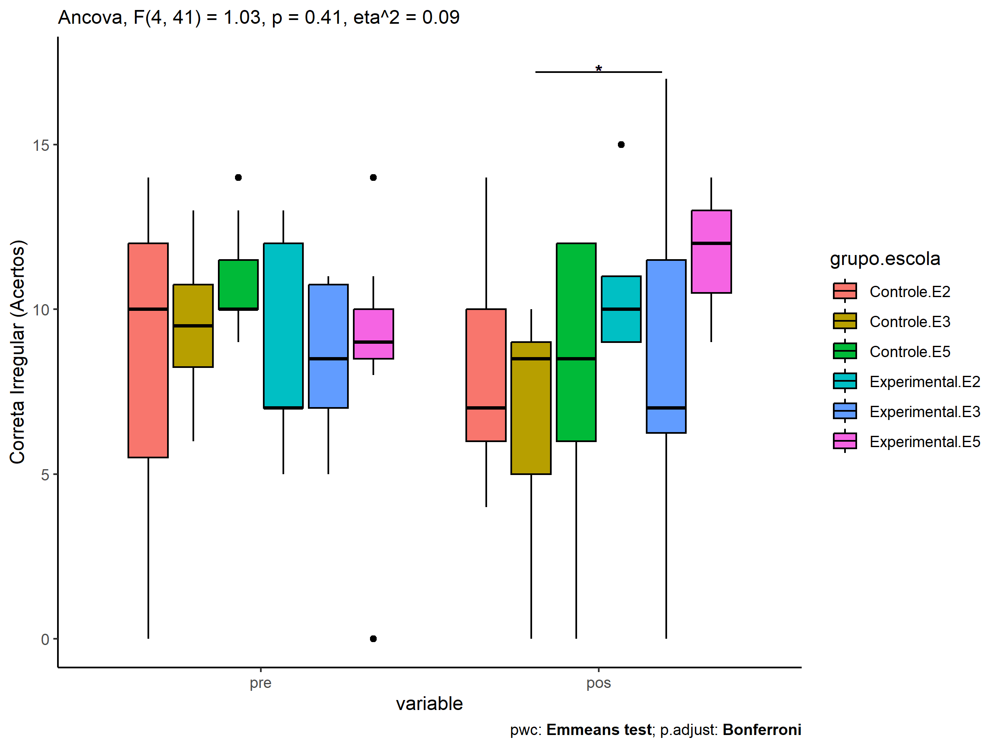<!-- -->

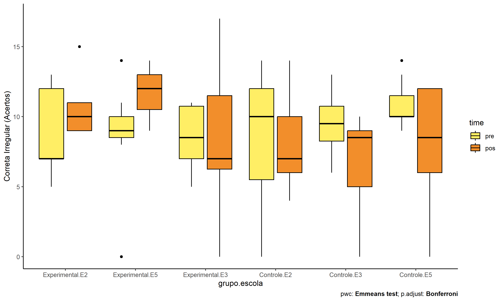<!-- -->

### Correta Irregular (TRI)

| var        | escola | grupo        |   n | M (pre) | SE (pre) | M (unadj) | SE (unadj) | M (adj) | SE (adj) |
|:-----------|:-------|:-------------|----:|--------:|---------:|----------:|-----------:|--------:|---------:|
| tri.CI.pos | E2     | Controle     |   6 |  -0.678 |    0.177 |    -0.987 |      0.309 |  -0.855 |    0.247 |
| tri.CI.pos | E2     | Experimental |   5 |  -0.821 |    0.297 |    -0.204 |      0.278 |   0.036 |    0.277 |
| tri.CI.pos | E3     | Controle     |   5 |  -0.446 |    0.206 |    -1.240 |      0.190 |  -1.284 |    0.268 |
| tri.CI.pos | E3     | Experimental |   5 |  -0.385 |    0.278 |    -0.550 |      0.559 |  -0.641 |    0.269 |
| tri.CI.pos | E5     | Controle     |  10 |  -0.427 |    0.111 |    -0.556 |      0.174 |  -0.615 |    0.190 |
| tri.CI.pos | E5     | Experimental |   6 |  -0.347 |    0.180 |    -0.148 |      0.160 |  -0.268 |    0.247 |

| grupo        | escola | group1   | group2       | estimate | conf.low | conf.high |    se | statistic |     p | p.adj | p.adj.signif |
|:-------------|:-------|:---------|:-------------|---------:|---------:|----------:|------:|----------:|------:|------:|:-------------|
| Controle     |        | E2       | E3           |    0.429 |   -0.318 |     1.176 | 0.366 |     1.172 | 0.250 | 0.751 | ns           |
| Controle     |        | E2       | E5           |   -0.240 |   -0.881 |     0.401 | 0.314 |    -0.766 | 0.450 | 1.000 | ns           |
| Controle     |        | E3       | E5           |   -0.669 |   -1.338 |     0.000 | 0.328 |    -2.042 | 0.050 | 0.150 | ns           |
| Experimental |        | E2       | E3           |    0.677 |   -0.120 |     1.475 | 0.391 |     1.734 | 0.093 | 0.280 | ns           |
| Experimental |        | E2       | E5           |    0.304 |   -0.466 |     1.075 | 0.377 |     0.806 | 0.427 | 1.000 | ns           |
| Experimental |        | E3       | E5           |   -0.373 |   -1.113 |     0.367 | 0.362 |    -1.030 | 0.311 | 0.934 | ns           |
| Controle     |        | E2       | E3           |   -0.231 |   -0.826 |     0.363 | 0.291 |    -0.793 | 0.434 | 1.000 | ns           |
| Controle     |        | E2       | E5           |   -0.251 |   -0.758 |     0.256 | 0.249 |    -1.009 | 0.321 | 0.962 | ns           |
| Controle     |        | E3       | E5           |   -0.020 |   -0.557 |     0.518 | 0.264 |    -0.075 | 0.941 | 1.000 | ns           |
| Experimental |        | E2       | E3           |   -0.436 |   -1.056 |     0.185 | 0.304 |    -1.431 | 0.162 | 0.487 | ns           |
| Experimental |        | E2       | E5           |   -0.474 |   -1.068 |     0.120 | 0.291 |    -1.626 | 0.114 | 0.342 | ns           |
| Experimental |        | E3       | E5           |   -0.038 |   -0.633 |     0.556 | 0.291 |    -0.132 | 0.896 | 1.000 | ns           |
|              | E2     | Controle | Experimental |   -0.891 |   -1.634 |    -0.149 | 0.364 |    -2.452 | 0.020 | 0.020 | \*           |
|              | E3     | Controle | Experimental |   -0.643 |   -1.416 |     0.130 | 0.378 |    -1.699 | 0.100 | 0.100 | ns           |
|              | E5     | Controle | Experimental |   -0.347 |   -0.979 |     0.285 | 0.309 |    -1.122 | 0.271 | 0.271 | ns           |
|              | E2     | Controle | Experimental |    0.143 |   -0.451 |     0.737 | 0.291 |     0.491 | 0.627 | 0.627 | ns           |
|              | E3     | Controle | Experimental |   -0.061 |   -0.682 |     0.559 | 0.304 |    -0.202 | 0.841 | 0.841 | ns           |
|              | E5     | Controle | Experimental |   -0.080 |   -0.587 |     0.427 | 0.249 |    -0.322 | 0.749 | 0.749 | ns           |

| grupo        | escola | group1 | group2 | estimate | conf.low | conf.high |    se | statistic |     p | p.adj | p.adj.signif |
|:-------------|:-------|:-------|:-------|---------:|---------:|----------:|------:|----------:|------:|------:|:-------------|
| Controle     | E2     | pre    | pos    |    0.339 |   -0.323 |     1.002 | 0.332 |     1.022 | 0.311 | 0.311 | ns           |
| Controle     | E3     | pre    | pos    |    0.780 |    0.059 |     1.501 | 0.361 |     2.159 | 0.034 | 0.034 | \*           |
| Controle     | E5     | pre    | pos    |    0.181 |   -0.329 |     0.691 | 0.256 |     0.707 | 0.482 | 0.482 | ns           |
| Experimental | E2     | pre    | pos    |   -0.617 |   -1.370 |     0.136 | 0.377 |    -1.634 | 0.107 | 0.107 | ns           |
| Experimental | E3     | pre    | pos    |   -0.001 |   -0.722 |     0.720 | 0.361 |    -0.003 | 0.998 | 0.998 | ns           |
| Experimental | E5     | pre    | pos    |   -0.166 |   -0.829 |     0.496 | 0.332 |    -0.501 | 0.618 | 0.618 | ns           |

    ## Scale for colour is already present.
    ## Adding another scale for colour, which will replace the existing scale.

<!-- -->

    ## Scale for colour is already present.
    ## Adding another scale for colour, which will replace the existing scale.

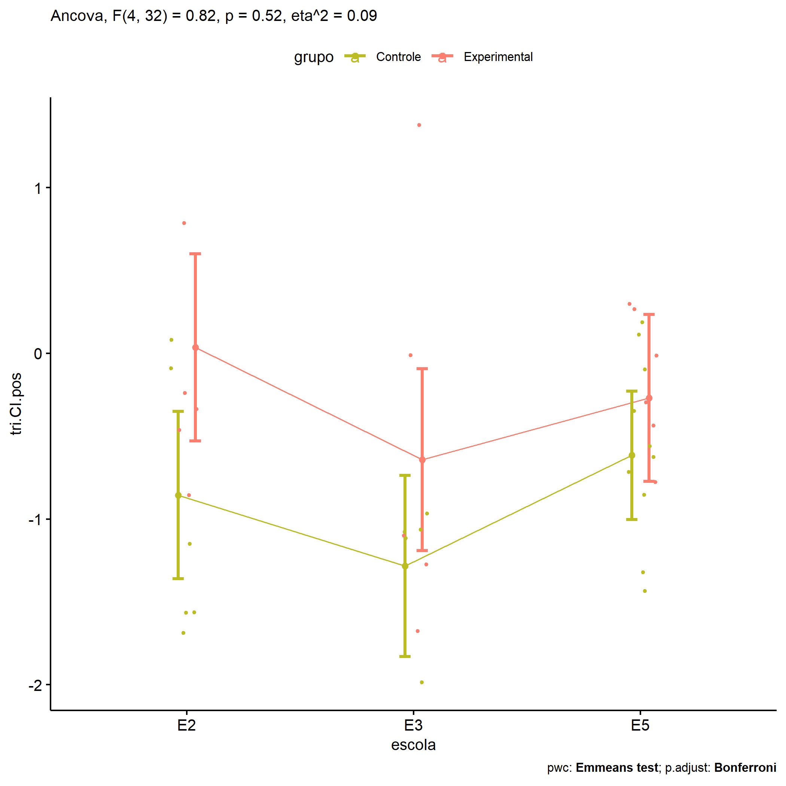<!-- -->

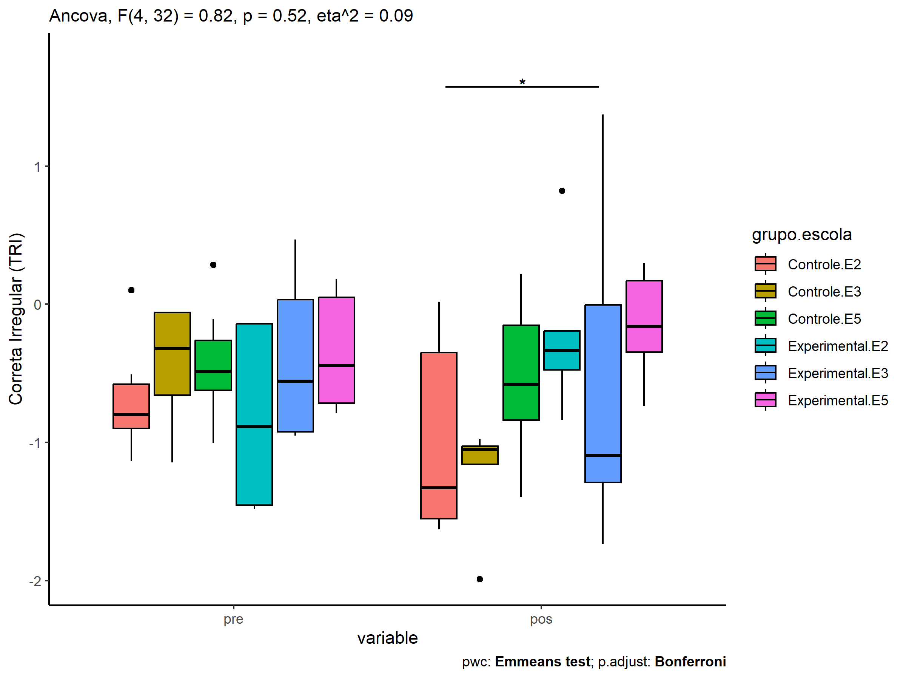<!-- -->

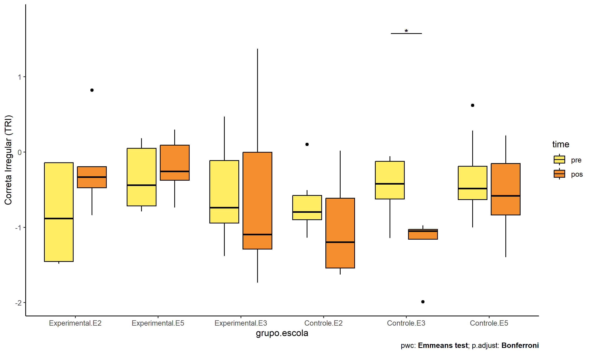<!-- -->

### Trocas Visuais (Acertos)

| var          | escola | grupo        |   n | M (pre) | SE (pre) | M (unadj) | SE (unadj) | M (adj) | SE (adj) |
|:-------------|:-------|:-------------|----:|--------:|---------:|----------:|-----------:|--------:|---------:|
| score.TV.pos | E2     | Controle     |   7 |  12.143 |    2.355 |    11.857 |      1.993 |  12.381 |    2.189 |
| score.TV.pos | E2     | Experimental |   5 |  13.600 |    2.522 |    14.200 |      1.281 |  14.147 |    2.575 |
| score.TV.pos | E3     | Controle     |   6 |  11.833 |    1.778 |    13.833 |      2.926 |  14.480 |    2.369 |
| score.TV.pos | E3     | Experimental |   6 |  12.000 |    2.280 |    14.000 |      2.955 |  14.581 |    2.365 |
| score.TV.pos | E5     | Controle     |  12 |  15.333 |    0.995 |    13.333 |      1.990 |  12.593 |    1.696 |
| score.TV.pos | E5     | Experimental |   7 |  14.143 |    2.473 |    17.143 |      1.610 |  16.874 |    2.179 |

| grupo        | escola | group1   | group2       | estimate | conf.low | conf.high |    se | statistic |     p | p.adj | p.adj.signif |
|:-------------|:-------|:---------|:-------------|---------:|---------:|----------:|------:|----------:|------:|------:|:-------------|
| Controle     |        | E2       | E3           |   -2.099 |   -8.595 |     4.398 | 3.203 |    -0.655 | 0.516 | 1.000 | ns           |
| Controle     |        | E2       | E5           |   -0.211 |   -5.887 |     5.465 | 2.799 |    -0.075 | 0.940 | 1.000 | ns           |
| Controle     |        | E3       | E5           |    1.888 |   -4.091 |     7.867 | 2.948 |     0.640 | 0.526 | 1.000 | ns           |
| Experimental |        | E2       | E3           |   -0.434 |   -7.529 |     6.660 | 3.498 |    -0.124 | 0.902 | 1.000 | ns           |
| Experimental |        | E2       | E5           |   -2.728 |   -9.567 |     4.112 | 3.372 |    -0.809 | 0.424 | 1.000 | ns           |
| Experimental |        | E3       | E5           |   -2.293 |   -8.837 |     4.250 | 3.226 |    -0.711 | 0.482 | 1.000 | ns           |
| Controle     |        | E2       | E3           |    0.310 |   -5.546 |     6.165 | 2.890 |     0.107 | 0.915 | 1.000 | ns           |
| Controle     |        | E2       | E5           |   -3.190 |   -8.196 |     1.815 | 2.471 |    -1.291 | 0.205 | 0.614 | ns           |
| Controle     |        | E3       | E5           |   -3.500 |   -8.763 |     1.763 | 2.597 |    -1.348 | 0.186 | 0.558 | ns           |
| Experimental |        | E2       | E3           |    1.600 |   -4.773 |     7.973 | 3.146 |     0.509 | 0.614 | 1.000 | ns           |
| Experimental |        | E2       | E5           |   -0.543 |   -6.706 |     5.620 | 3.042 |    -0.178 | 0.859 | 1.000 | ns           |
| Experimental |        | E3       | E5           |   -2.143 |   -7.999 |     3.713 | 2.890 |    -0.741 | 0.463 | 1.000 | ns           |
|              | E2     | Controle | Experimental |   -1.765 |   -8.622 |     5.092 | 3.381 |    -0.522 | 0.605 | 0.605 | ns           |
|              | E3     | Controle | Experimental |   -0.101 |   -6.842 |     6.640 | 3.324 |    -0.030 | 0.976 | 0.976 | ns           |
|              | E5     | Controle | Experimental |   -4.282 |   -9.852 |     1.288 | 2.746 |    -1.559 | 0.128 | 0.128 | ns           |
|              | E2     | Controle | Experimental |   -1.457 |   -7.620 |     4.706 | 3.042 |    -0.479 | 0.635 | 0.635 | ns           |
|              | E3     | Controle | Experimental |   -0.167 |   -6.243 |     5.910 | 2.999 |    -0.056 | 0.956 | 0.956 | ns           |
|              | E5     | Controle | Experimental |    1.190 |   -3.815 |     6.196 | 2.471 |     0.482 | 0.633 | 0.633 | ns           |

| grupo        | escola | group1 | group2 | estimate | conf.low | conf.high |    se | statistic |     p | p.adj | p.adj.signif |
|:-------------|:-------|:-------|:-------|---------:|---------:|----------:|------:|----------:|------:|------:|:-------------|
| Controle     | E2     | pre    | pos    |    0.286 |   -5.714 |     6.286 | 3.011 |     0.095 | 0.925 | 0.925 | ns           |
| Controle     | E3     | pre    | pos    |   -2.000 |   -8.481 |     4.481 | 3.252 |    -0.615 | 0.540 | 0.540 | ns           |
| Controle     | E5     | pre    | pos    |    2.000 |   -2.583 |     6.583 | 2.300 |     0.870 | 0.387 | 0.387 | ns           |
| Experimental | E2     | pre    | pos    |   -0.600 |   -7.699 |     6.499 | 3.563 |    -0.168 | 0.867 | 0.867 | ns           |
| Experimental | E3     | pre    | pos    |   -2.000 |   -8.481 |     4.481 | 3.252 |    -0.615 | 0.540 | 0.540 | ns           |
| Experimental | E5     | pre    | pos    |   -3.000 |   -9.000 |     3.000 | 3.011 |    -0.996 | 0.322 | 0.322 | ns           |

    ## Scale for colour is already present.
    ## Adding another scale for colour, which will replace the existing scale.

<!-- -->

    ## Scale for colour is already present.
    ## Adding another scale for colour, which will replace the existing scale.

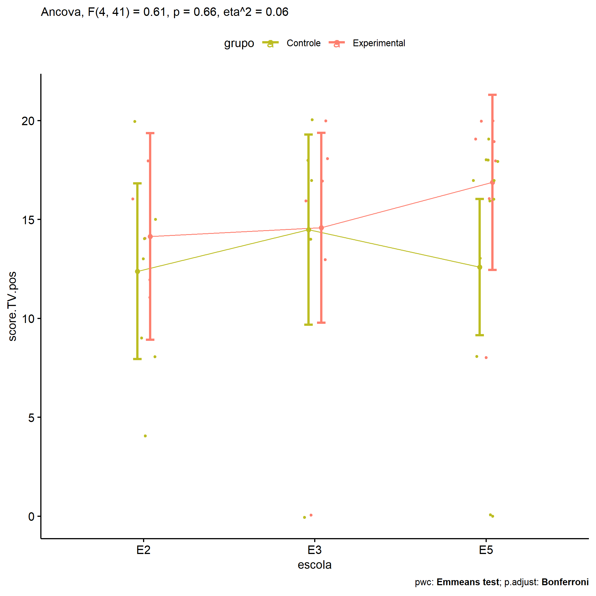<!-- -->

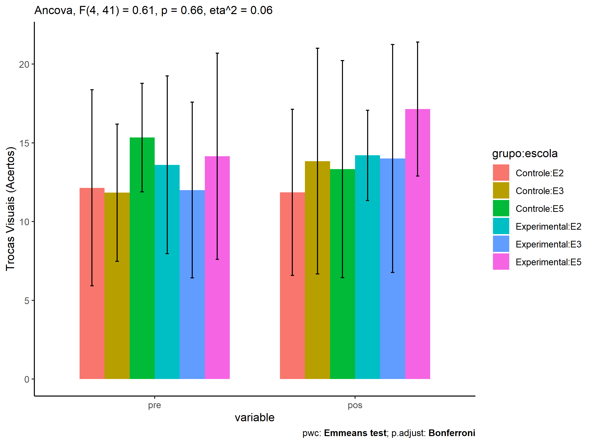<!-- -->

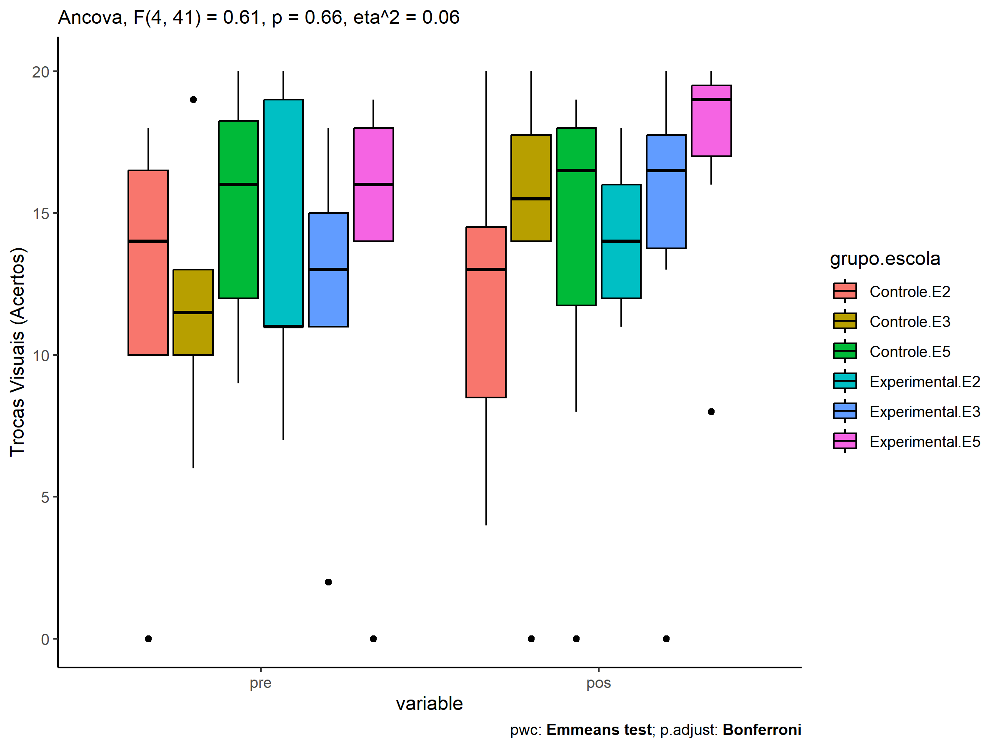<!-- -->

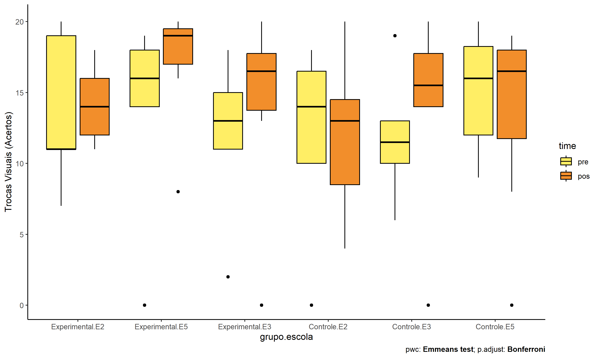<!-- -->

### Trocas Visuais (TRI)

| var        | escola | grupo        |   n | M (pre) | SE (pre) | M (unadj) | SE (unadj) | M (adj) | SE (adj) |
|:-----------|:-------|:-------------|----:|--------:|---------:|----------:|-----------:|--------:|---------:|
| tri.TV.pos | E2     | Controle     |   6 |  -0.686 |    0.215 |    -0.842 |      0.386 |  -0.762 |    0.277 |
| tri.TV.pos | E2     | Experimental |   5 |  -0.512 |    0.528 |    -0.821 |      0.272 |  -0.802 |    0.301 |
| tri.TV.pos | E3     | Controle     |   5 |  -0.536 |    0.473 |    -0.205 |      0.362 |  -0.177 |    0.301 |
| tri.TV.pos | E3     | Experimental |   5 |  -0.715 |    0.512 |    -0.020 |      0.373 |   0.070 |    0.303 |
| tri.TV.pos | E5     | Controle     |  10 |  -0.454 |    0.235 |    -0.407 |      0.209 |  -0.408 |    0.213 |
| tri.TV.pos | E5     | Experimental |   6 |   0.099 |    0.283 |     0.509 |      0.200 |   0.316 |    0.285 |

| grupo        | escola | group1   | group2       | estimate | conf.low | conf.high |    se | statistic |     p | p.adj | p.adj.signif |
|:-------------|:-------|:---------|:-------------|---------:|---------:|----------:|------:|----------:|------:|------:|:-------------|
| Controle     |        | E2       | E3           |   -0.585 |   -1.419 |     0.249 | 0.408 |    -1.432 | 0.162 | 0.487 | ns           |
| Controle     |        | E2       | E5           |   -0.354 |   -1.068 |     0.359 | 0.349 |    -1.015 | 0.318 | 0.955 | ns           |
| Controle     |        | E3       | E5           |    0.230 |   -0.523 |     0.984 | 0.369 |     0.624 | 0.537 | 1.000 | ns           |
| Experimental |        | E2       | E3           |   -0.871 |   -1.743 |     0.000 | 0.427 |    -2.042 | 0.050 | 0.150 | ns           |
| Experimental |        | E2       | E5           |   -1.117 |   -1.968 |    -0.267 | 0.416 |    -2.684 | 0.012 | 0.035 | \*           |
| Experimental |        | E3       | E5           |   -0.246 |   -1.110 |     0.618 | 0.423 |    -0.582 | 0.565 | 1.000 | ns           |
| Controle     |        | E2       | E3           |   -0.151 |   -1.239 |     0.937 | 0.533 |    -0.283 | 0.779 | 1.000 | ns           |
| Controle     |        | E2       | E5           |   -0.232 |   -1.160 |     0.695 | 0.455 |    -0.511 | 0.613 | 1.000 | ns           |
| Controle     |        | E3       | E5           |   -0.082 |   -1.066 |     0.902 | 0.482 |    -0.169 | 0.867 | 1.000 | ns           |
| Experimental |        | E2       | E3           |    0.204 |   -0.933 |     1.340 | 0.557 |     0.366 | 0.717 | 1.000 | ns           |
| Experimental |        | E2       | E5           |   -0.611 |   -1.699 |     0.477 | 0.533 |    -1.145 | 0.261 | 0.782 | ns           |
| Experimental |        | E3       | E5           |   -0.815 |   -1.903 |     0.273 | 0.533 |    -1.527 | 0.137 | 0.410 | ns           |
|              | E2     | Controle | Experimental |    0.040 |   -0.795 |     0.874 | 0.409 |     0.097 | 0.923 | 0.923 | ns           |
|              | E3     | Controle | Experimental |   -0.247 |   -1.118 |     0.624 | 0.427 |    -0.579 | 0.567 | 0.567 | ns           |
|              | E5     | Controle | Experimental |   -0.723 |   -1.450 |     0.004 | 0.356 |    -2.032 | 0.051 | 0.051 | ns           |
|              | E2     | Controle | Experimental |   -0.175 |   -1.263 |     0.913 | 0.533 |    -0.328 | 0.745 | 0.745 | ns           |
|              | E3     | Controle | Experimental |    0.180 |   -0.957 |     1.316 | 0.557 |     0.322 | 0.749 | 0.749 | ns           |
|              | E5     | Controle | Experimental |   -0.553 |   -1.481 |     0.374 | 0.455 |    -1.217 | 0.233 | 0.233 | ns           |

| grupo        | escola | group1 | group2 | estimate | conf.low | conf.high |    se | statistic |     p | p.adj | p.adj.signif |
|:-------------|:-------|:-------|:-------|---------:|---------:|----------:|------:|----------:|------:|------:|:-------------|
| Controle     | E2     | pre    | pos    |    0.388 |   -0.525 |     1.302 | 0.458 |     0.849 | 0.399 | 0.399 | ns           |
| Controle     | E3     | pre    | pos    |   -0.400 |   -1.394 |     0.595 | 0.498 |    -0.802 | 0.425 | 0.425 | ns           |
| Controle     | E5     | pre    | pos    |   -0.019 |   -0.722 |     0.684 | 0.352 |    -0.055 | 0.956 | 0.956 | ns           |
| Experimental | E2     | pre    | pos    |    0.310 |   -0.729 |     1.348 | 0.520 |     0.595 | 0.554 | 0.554 | ns           |
| Experimental | E3     | pre    | pos    |   -0.682 |   -1.676 |     0.313 | 0.498 |    -1.368 | 0.176 | 0.176 | ns           |
| Experimental | E5     | pre    | pos    |   -0.178 |   -1.092 |     0.735 | 0.458 |    -0.389 | 0.698 | 0.698 | ns           |

    ## Scale for colour is already present.
    ## Adding another scale for colour, which will replace the existing scale.

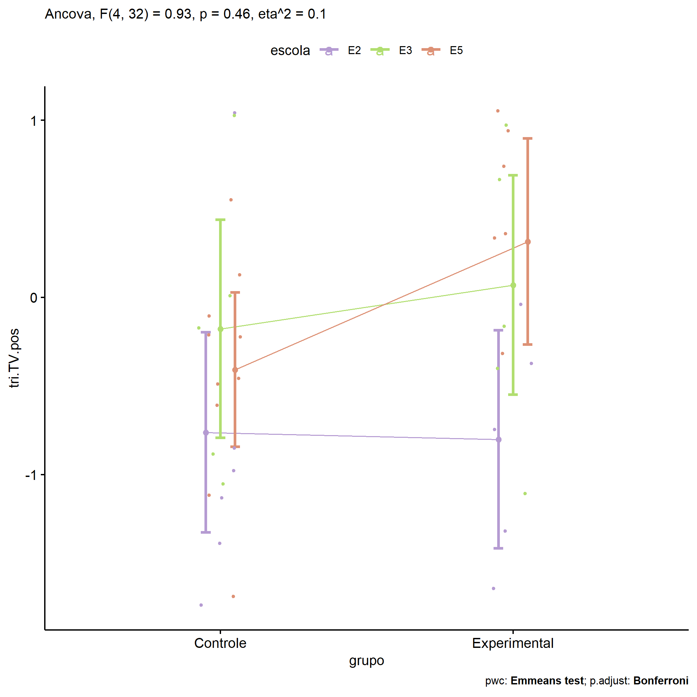<!-- -->

    ## Scale for colour is already present.
    ## Adding another scale for colour, which will replace the existing scale.

<!-- -->

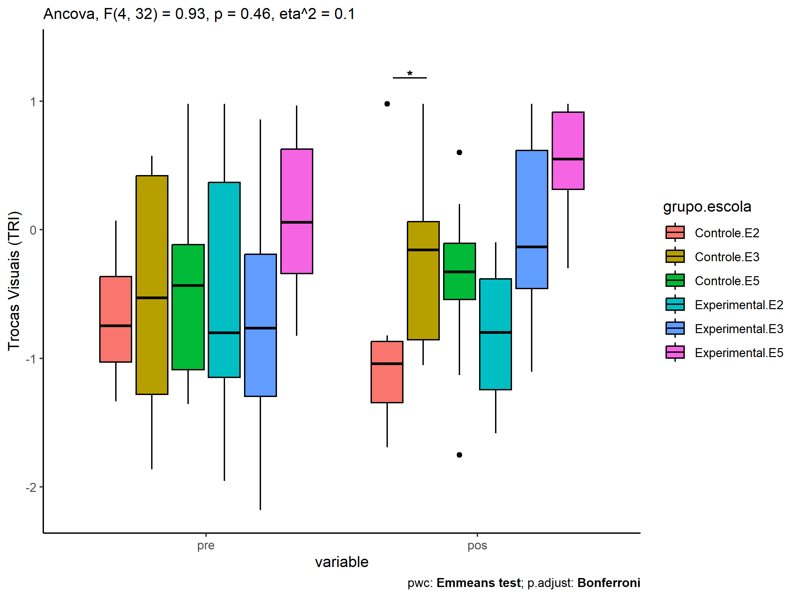<!-- -->

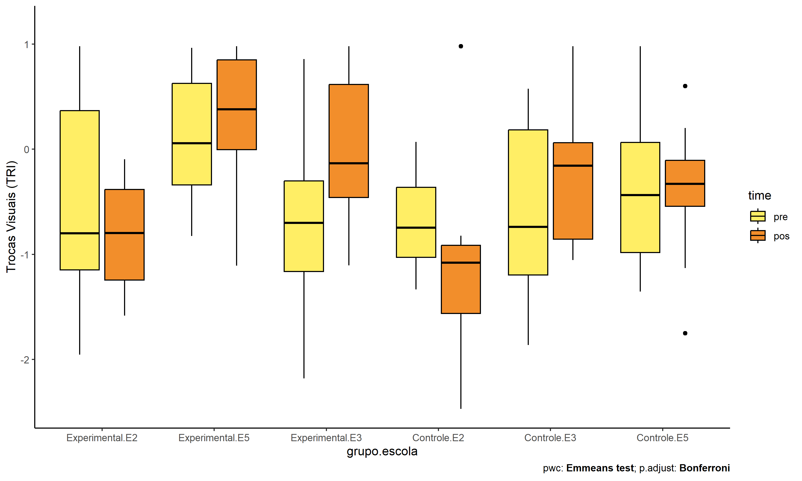<!-- -->

### Trocas Fonologicas (Acertos)

| var          | escola | grupo        |   n | M (pre) | SE (pre) | M (unadj) | SE (unadj) | M (adj) | SE (adj) |
|:-------------|:-------|:-------------|----:|--------:|---------:|----------:|-----------:|--------:|---------:|
| score.TF.pos | E2     | Controle     |   7 |   9.857 |    2.198 |    11.000 |      1.480 |  11.937 |    1.944 |
| score.TF.pos | E2     | Experimental |   5 |  10.800 |    1.463 |    12.000 |      2.345 |  12.451 |    2.271 |
| score.TF.pos | E3     | Controle     |   6 |  10.833 |    0.946 |    10.500 |      2.778 |  10.933 |    2.074 |
| score.TF.pos | E3     | Experimental |   6 |  10.167 |    1.014 |    12.667 |      3.116 |  13.444 |    2.087 |
| score.TF.pos | E5     | Controle     |  12 |  13.000 |    1.200 |     9.833 |      1.527 |   9.150 |    1.483 |
| score.TF.pos | E5     | Experimental |   7 |  13.857 |    2.454 |    16.714 |      1.459 |  15.589 |    1.957 |

| grupo        | escola | group1   | group2       | estimate | conf.low | conf.high |    se | statistic |     p | p.adj | p.adj.signif |
|:-------------|:-------|:---------|:-------------|---------:|---------:|----------:|------:|----------:|------:|------:|:-------------|
| Controle     |        | E2       | E3           |    1.003 |   -4.724 |     6.730 | 2.824 |     0.355 | 0.725 | 1.000 | ns           |
| Controle     |        | E2       | E5           |    2.786 |   -2.241 |     7.813 | 2.479 |     1.124 | 0.268 | 0.805 | ns           |
| Controle     |        | E3       | E5           |    1.783 |   -3.418 |     6.984 | 2.564 |     0.695 | 0.491 | 1.000 | ns           |
| Experimental |        | E2       | E3           |   -0.993 |   -7.218 |     5.232 | 3.070 |    -0.324 | 0.748 | 1.000 | ns           |
| Experimental |        | E2       | E5           |   -3.139 |   -9.263 |     2.986 | 3.020 |    -1.039 | 0.306 | 0.917 | ns           |
| Experimental |        | E3       | E5           |   -2.146 |   -8.027 |     3.736 | 2.900 |    -0.740 | 0.464 | 1.000 | ns           |
| Controle     |        | E2       | E3           |   -0.976 |   -6.039 |     4.086 | 2.498 |    -0.391 | 0.698 | 1.000 | ns           |
| Controle     |        | E2       | E5           |   -3.143 |   -7.470 |     1.185 | 2.136 |    -1.472 | 0.150 | 0.449 | ns           |
| Controle     |        | E3       | E5           |   -2.167 |   -6.716 |     2.383 | 2.245 |    -0.965 | 0.341 | 1.000 | ns           |
| Experimental |        | E2       | E3           |    0.633 |   -4.876 |     6.143 | 2.719 |     0.233 | 0.817 | 1.000 | ns           |
| Experimental |        | E2       | E5           |   -3.057 |   -8.385 |     2.271 | 2.630 |    -1.163 | 0.252 | 0.757 | ns           |
| Experimental |        | E3       | E5           |   -3.690 |   -8.753 |     1.372 | 2.498 |    -1.477 | 0.148 | 0.444 | ns           |
|              | E2     | Controle | Experimental |   -0.514 |   -6.540 |     5.512 | 2.971 |    -0.173 | 0.864 | 0.864 | ns           |
|              | E3     | Controle | Experimental |   -2.510 |   -8.447 |     3.426 | 2.927 |    -0.858 | 0.397 | 0.397 | ns           |
|              | E5     | Controle | Experimental |   -6.439 |  -11.336 |    -1.543 | 2.414 |    -2.667 | 0.011 | 0.011 | \*           |
|              | E2     | Controle | Experimental |   -0.943 |   -6.271 |     4.385 | 2.630 |    -0.359 | 0.722 | 0.722 | ns           |
|              | E3     | Controle | Experimental |    0.667 |   -4.587 |     5.920 | 2.593 |     0.257 | 0.799 | 0.799 | ns           |
|              | E5     | Controle | Experimental |   -0.857 |   -5.185 |     3.470 | 2.136 |    -0.401 | 0.690 | 0.690 | ns           |

| grupo        | escola | group1 | group2 | estimate | conf.low | conf.high |    se | statistic |     p | p.adj | p.adj.signif |
|:-------------|:-------|:-------|:-------|---------:|---------:|----------:|------:|----------:|------:|------:|:-------------|
| Controle     | E2     | pre    | pos    |   -1.143 |   -6.494 |     4.208 | 2.686 |    -0.426 | 0.672 | 0.672 | ns           |
| Controle     | E3     | pre    | pos    |    0.333 |   -5.447 |     6.113 | 2.901 |     0.115 | 0.909 | 0.909 | ns           |
| Controle     | E5     | pre    | pos    |    3.167 |   -0.920 |     7.254 | 2.051 |     1.544 | 0.127 | 0.127 | ns           |
| Experimental | E2     | pre    | pos    |   -1.200 |   -7.532 |     5.132 | 3.178 |    -0.378 | 0.707 | 0.707 | ns           |
| Experimental | E3     | pre    | pos    |   -2.500 |   -8.280 |     3.280 | 2.901 |    -0.862 | 0.392 | 0.392 | ns           |
| Experimental | E5     | pre    | pos    |   -2.857 |   -8.208 |     2.494 | 2.686 |    -1.064 | 0.291 | 0.291 | ns           |

    ## Scale for colour is already present.
    ## Adding another scale for colour, which will replace the existing scale.

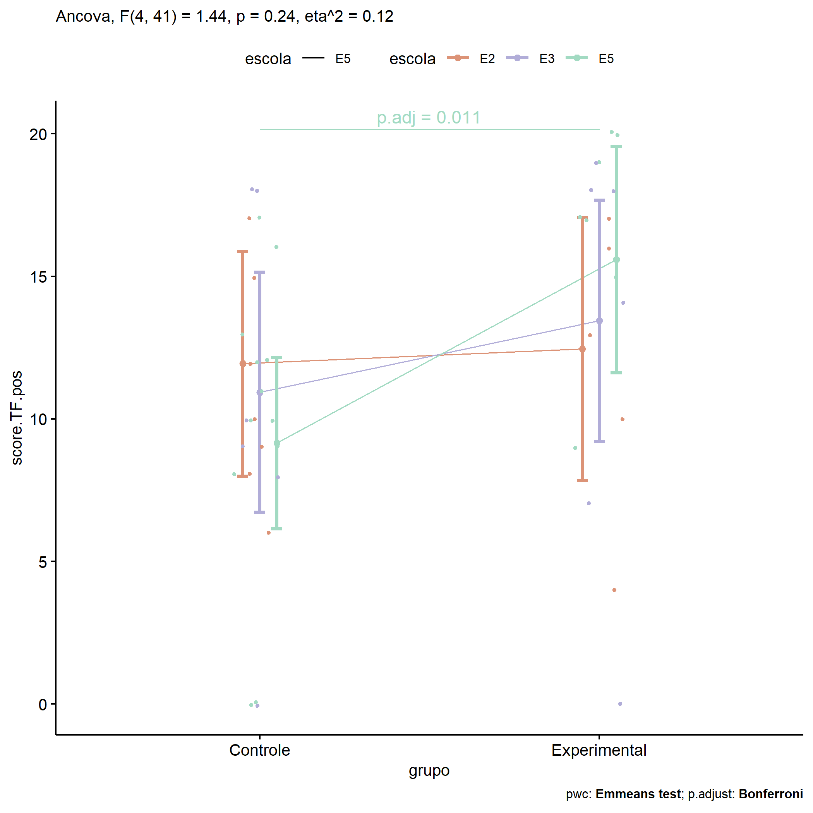<!-- -->

    ## Scale for colour is already present.
    ## Adding another scale for colour, which will replace the existing scale.

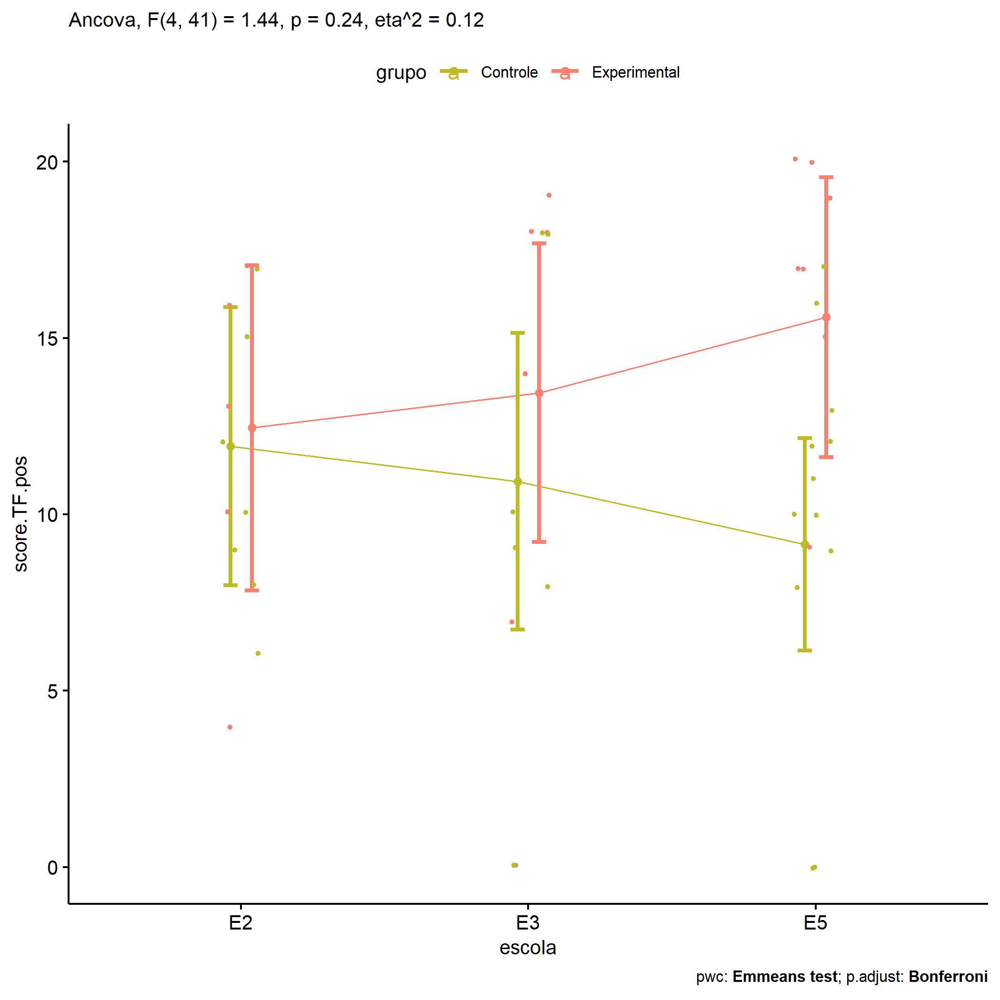<!-- -->

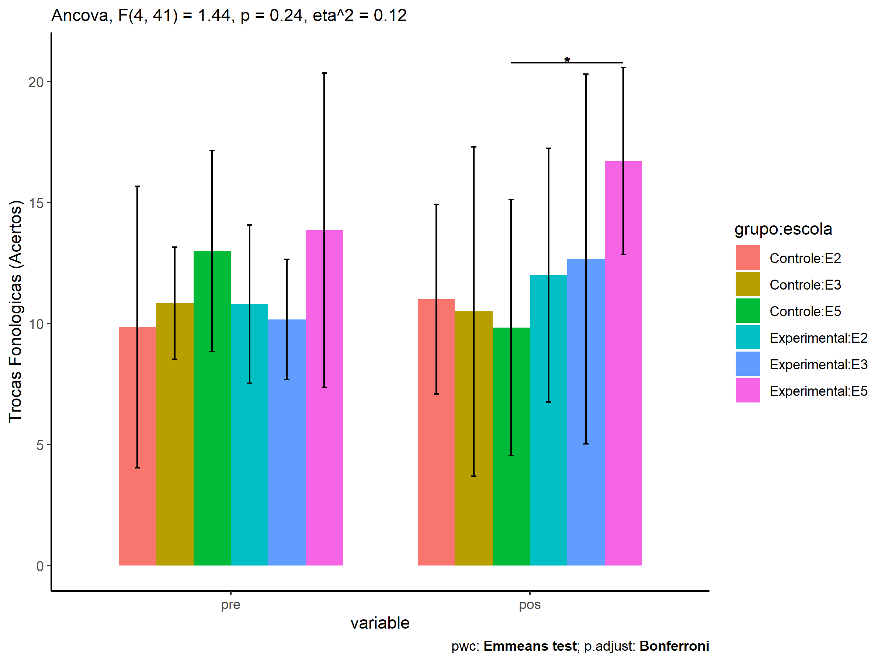<!-- -->

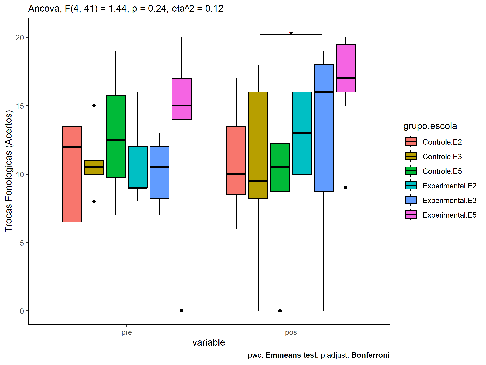<!-- -->

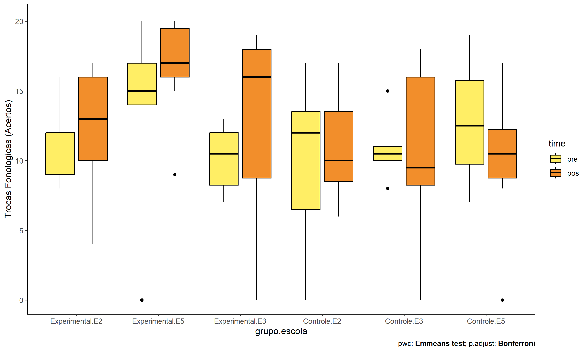<!-- -->

### Trocas Fonologicas (TRI)

| var        | escola | grupo        |   n | M (pre) | SE (pre) | M (unadj) | SE (unadj) | M (adj) | SE (adj) |
|:-----------|:-------|:-------------|----:|--------:|---------:|----------:|-----------:|--------:|---------:|
| tri.TF.pos | E2     | Controle     |   6 |  -0.865 |    0.229 |    -0.715 |      0.323 |  -0.527 |    0.274 |
| tri.TF.pos | E2     | Experimental |   5 |  -1.068 |    0.209 |    -0.706 |      0.432 |  -0.389 |    0.307 |
| tri.TF.pos | E3     | Controle     |   5 |  -0.673 |    0.272 |    -0.667 |      0.420 |  -0.602 |    0.295 |
| tri.TF.pos | E3     | Experimental |   5 |  -0.571 |    0.337 |    -0.135 |      0.407 |  -0.135 |    0.295 |
| tri.TF.pos | E5     | Controle     |  10 |  -0.627 |    0.220 |    -0.834 |      0.165 |  -0.799 |    0.209 |
| tri.TF.pos | E5     | Experimental |   6 |   0.310 |    0.334 |     0.473 |      0.291 |  -0.092 |    0.311 |

| grupo        | escola | group1   | group2       | estimate | conf.low | conf.high |    se | statistic |     p | p.adj | p.adj.signif |
|:-------------|:-------|:---------|:-------------|---------:|---------:|----------:|------:|----------:|------:|------:|:-------------|
| Controle     |        | E2       | E3           |    0.076 |   -0.742 |     0.893 | 0.400 |     0.189 | 0.851 | 1.000 | ns           |
| Controle     |        | E2       | E5           |    0.272 |   -0.428 |     0.972 | 0.343 |     0.794 | 0.434 | 1.000 | ns           |
| Controle     |        | E3       | E5           |    0.196 |   -0.541 |     0.933 | 0.361 |     0.544 | 0.590 | 1.000 | ns           |
| Experimental |        | E2       | E3           |   -0.253 |   -1.123 |     0.616 | 0.426 |    -0.595 | 0.556 | 1.000 | ns           |
| Experimental |        | E2       | E5           |   -0.296 |   -1.250 |     0.658 | 0.467 |    -0.634 | 0.531 | 1.000 | ns           |
| Experimental |        | E3       | E5           |   -0.043 |   -0.917 |     0.831 | 0.428 |    -0.100 | 0.921 | 1.000 | ns           |
| Controle     |        | E2       | E3           |   -0.192 |   -1.020 |     0.635 | 0.406 |    -0.473 | 0.639 | 1.000 | ns           |
| Controle     |        | E2       | E5           |   -0.238 |   -0.943 |     0.468 | 0.346 |    -0.687 | 0.497 | 1.000 | ns           |
| Controle     |        | E3       | E5           |   -0.046 |   -0.794 |     0.703 | 0.367 |    -0.124 | 0.902 | 1.000 | ns           |
| Experimental |        | E2       | E3           |   -0.497 |   -1.361 |     0.368 | 0.424 |    -1.172 | 0.250 | 0.751 | ns           |
| Experimental |        | E2       | E5           |   -1.378 |   -2.206 |    -0.550 | 0.406 |    -3.396 | 0.002 | 0.006 | \*\*         |
| Experimental |        | E3       | E5           |   -0.881 |   -1.709 |    -0.054 | 0.406 |    -2.172 | 0.038 | 0.113 | ns           |
|              | E2     | Controle | Experimental |   -0.138 |   -0.956 |     0.680 | 0.400 |    -0.345 | 0.733 | 0.733 | ns           |
|              | E3     | Controle | Experimental |   -0.467 |   -1.319 |     0.384 | 0.417 |    -1.121 | 0.271 | 0.271 | ns           |
|              | E5     | Controle | Experimental |   -0.706 |   -1.479 |     0.066 | 0.378 |    -1.868 | 0.072 | 0.072 | ns           |
|              | E2     | Controle | Experimental |    0.203 |   -0.625 |     1.030 | 0.406 |     0.500 | 0.621 | 0.621 | ns           |
|              | E3     | Controle | Experimental |   -0.102 |   -0.966 |     0.763 | 0.424 |    -0.240 | 0.812 | 0.812 | ns           |
|              | E5     | Controle | Experimental |   -0.938 |   -1.643 |    -0.232 | 0.346 |    -2.710 | 0.011 | 0.011 | \*           |

| grupo        | escola | group1 | group2 | estimate | conf.low | conf.high |    se | statistic |     p | p.adj | p.adj.signif |
|:-------------|:-------|:-------|:-------|---------:|---------:|----------:|------:|----------:|------:|------:|:-------------|
| Controle     | E2     | pre    | pos    |    0.000 |   -0.839 |     0.839 | 0.420 |     0.000 | 1.000 | 1.000 | ns           |
| Controle     | E3     | pre    | pos    |   -0.075 |   -0.988 |     0.839 | 0.458 |    -0.163 | 0.871 | 0.871 | ns           |
| Controle     | E5     | pre    | pos    |    0.303 |   -0.343 |     0.949 | 0.324 |     0.937 | 0.352 | 0.352 | ns           |
| Experimental | E2     | pre    | pos    |   -0.361 |   -1.315 |     0.592 | 0.478 |    -0.756 | 0.452 | 0.452 | ns           |
| Experimental | E3     | pre    | pos    |   -0.491 |   -1.404 |     0.422 | 0.458 |    -1.073 | 0.287 | 0.287 | ns           |
| Experimental | E5     | pre    | pos    |    0.101 |   -0.738 |     0.940 | 0.420 |     0.239 | 0.812 | 0.812 | ns           |

    ## Scale for colour is already present.
    ## Adding another scale for colour, which will replace the existing scale.

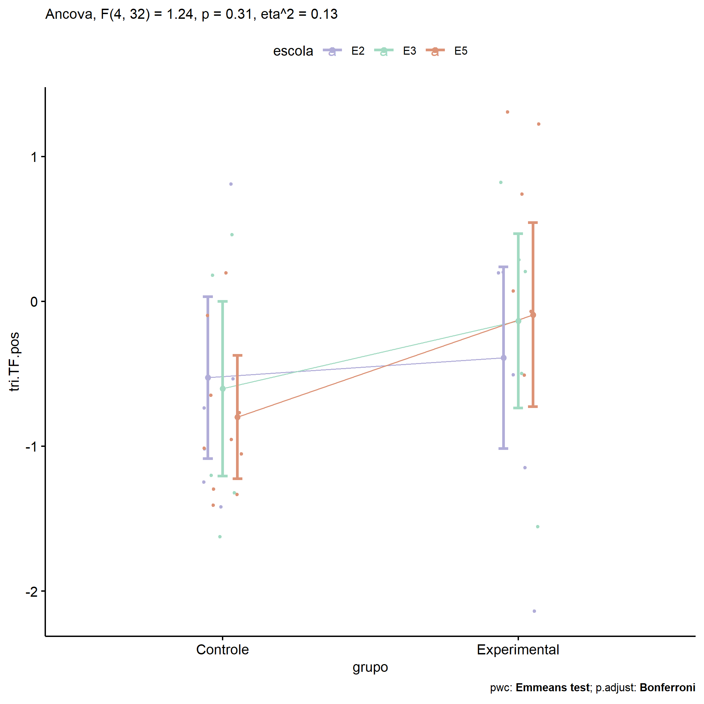<!-- -->

    ## Scale for colour is already present.
    ## Adding another scale for colour, which will replace the existing scale.

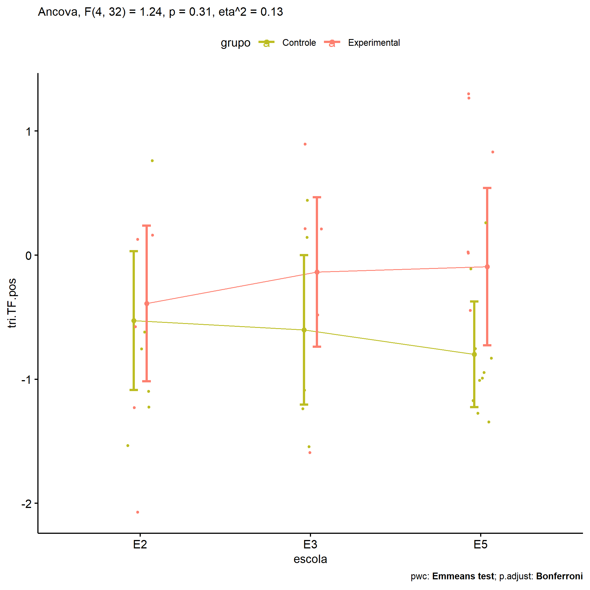<!-- -->

<!-- -->

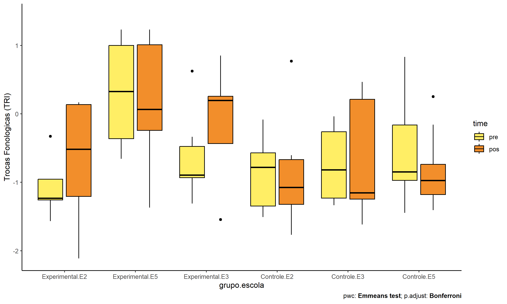<!-- -->

### Trocas Orograficas (Acertos)

| var          | escola | grupo        |   n | M (pre) | SE (pre) | M (unadj) | SE (unadj) | M (adj) | SE (adj) |
|:-------------|:-------|:-------------|----:|--------:|---------:|----------:|-----------:|--------:|---------:|
| score.TO.pos | E2     | Controle     |   7 |   5.571 |    1.152 |    10.714 |      1.063 |  11.248 |    1.444 |
| score.TO.pos | E2     | Experimental |   5 |   8.000 |    0.837 |     9.200 |      1.393 |   9.004 |    1.670 |
| score.TO.pos | E3     | Controle     |   6 |   7.833 |    1.108 |     7.000 |      1.751 |   6.854 |    1.523 |
| score.TO.pos | E3     | Experimental |   6 |   7.667 |    0.422 |     9.333 |      1.892 |   9.238 |    1.522 |
| score.TO.pos | E5     | Controle     |  12 |   7.833 |    1.167 |     8.750 |      1.244 |   8.604 |    1.079 |
| score.TO.pos | E5     | Experimental |   7 |   7.143 |    1.765 |     8.429 |      1.066 |   8.490 |    1.408 |

| grupo        | escola | group1   | group2       | estimate | conf.low | conf.high |    se | statistic |     p | p.adj | p.adj.signif |
|:-------------|:-------|:---------|:-------------|---------:|---------:|----------:|------:|----------:|------:|------:|:-------------|
| Controle     |        | E2       | E3           |    4.394 |    0.110 |     8.678 | 2.112 |     2.080 | 0.045 | 0.134 | ns           |
| Controle     |        | E2       | E5           |    2.644 |   -1.044 |     6.331 | 1.818 |     1.454 | 0.155 | 0.464 | ns           |
| Controle     |        | E3       | E5           |   -1.750 |   -5.527 |     2.027 | 1.862 |    -0.940 | 0.354 | 1.000 | ns           |
| Experimental |        | E2       | E3           |   -0.233 |   -4.809 |     4.342 | 2.256 |    -0.103 | 0.918 | 1.000 | ns           |
| Experimental |        | E2       | E5           |    0.514 |   -3.920 |     4.948 | 2.186 |     0.235 | 0.815 | 1.000 | ns           |
| Experimental |        | E3       | E5           |    0.747 |   -3.460 |     4.954 | 2.074 |     0.360 | 0.721 | 1.000 | ns           |
| Controle     |        | E2       | E3           |   -2.262 |   -6.071 |     1.547 | 1.880 |    -1.203 | 0.237 | 0.710 | ns           |
| Controle     |        | E2       | E5           |   -2.262 |   -5.518 |     0.994 | 1.607 |    -1.408 | 0.168 | 0.503 | ns           |
| Controle     |        | E3       | E5           |    0.000 |   -3.423 |     3.423 | 1.689 |     0.000 | 1.000 | 1.000 | ns           |
| Experimental |        | E2       | E3           |    0.333 |   -3.812 |     4.479 | 2.046 |     0.163 | 0.871 | 1.000 | ns           |
| Experimental |        | E2       | E5           |    0.857 |   -3.152 |     4.866 | 1.978 |     0.433 | 0.667 | 1.000 | ns           |
| Experimental |        | E3       | E5           |    0.524 |   -3.285 |     4.333 | 1.880 |     0.279 | 0.782 | 1.000 | ns           |
|              | E2     | Controle | Experimental |    2.244 |   -2.268 |     6.756 | 2.225 |     1.008 | 0.320 | 0.320 | ns           |
|              | E3     | Controle | Experimental |   -2.383 |   -6.745 |     1.978 | 2.151 |    -1.108 | 0.275 | 0.275 | ns           |
|              | E5     | Controle | Experimental |    0.114 |   -3.487 |     3.716 | 1.776 |     0.064 | 0.949 | 0.949 | ns           |
|              | E2     | Controle | Experimental |   -2.429 |   -6.437 |     1.580 | 1.978 |    -1.228 | 0.227 | 0.227 | ns           |
|              | E3     | Controle | Experimental |    0.167 |   -3.786 |     4.119 | 1.951 |     0.085 | 0.932 | 0.932 | ns           |
|              | E5     | Controle | Experimental |    0.690 |   -2.566 |     3.946 | 1.607 |     0.430 | 0.670 | 0.670 | ns           |

| grupo        | escola | group1 | group2 | estimate | conf.low | conf.high |    se | statistic |     p | p.adj | p.adj.signif |
|:-------------|:-------|:-------|:-------|---------:|---------:|----------:|------:|----------:|------:|------:|:-------------|
| Controle     | E2     | pre    | pos    |   -5.143 |   -8.979 |    -1.307 | 1.925 |    -2.671 | 0.009 | 0.009 | \*\*         |
| Controle     | E3     | pre    | pos    |    0.833 |   -3.310 |     4.977 | 2.079 |     0.401 | 0.690 | 0.690 | ns           |
| Controle     | E5     | pre    | pos    |   -0.917 |   -3.846 |     2.013 | 1.470 |    -0.623 | 0.535 | 0.535 | ns           |
| Experimental | E2     | pre    | pos    |   -1.200 |   -5.739 |     3.339 | 2.278 |    -0.527 | 0.600 | 0.600 | ns           |
| Experimental | E3     | pre    | pos    |   -1.667 |   -5.810 |     2.477 | 2.079 |    -0.802 | 0.425 | 0.425 | ns           |
| Experimental | E5     | pre    | pos    |   -1.286 |   -5.122 |     2.550 | 1.925 |    -0.668 | 0.506 | 0.506 | ns           |

    ## Scale for colour is already present.
    ## Adding another scale for colour, which will replace the existing scale.

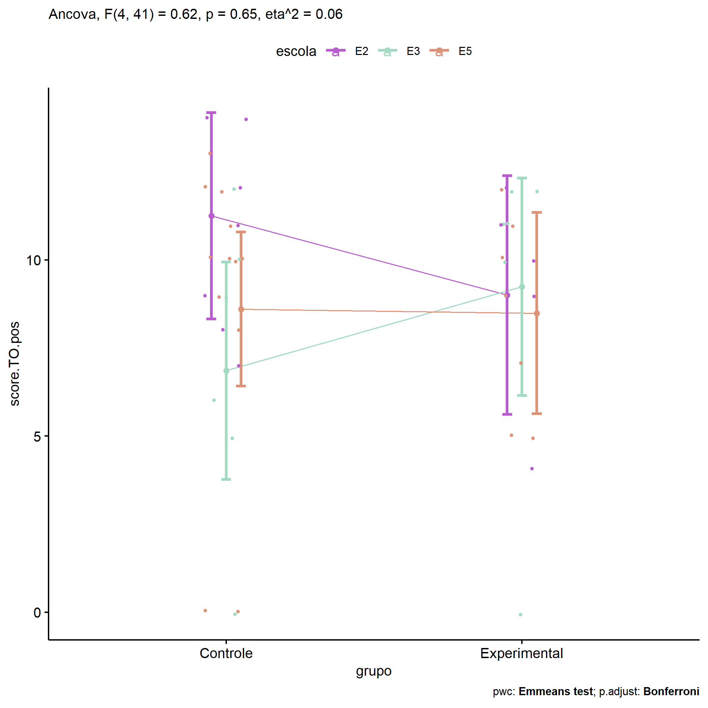<!-- -->

    ## Scale for colour is already present.
    ## Adding another scale for colour, which will replace the existing scale.

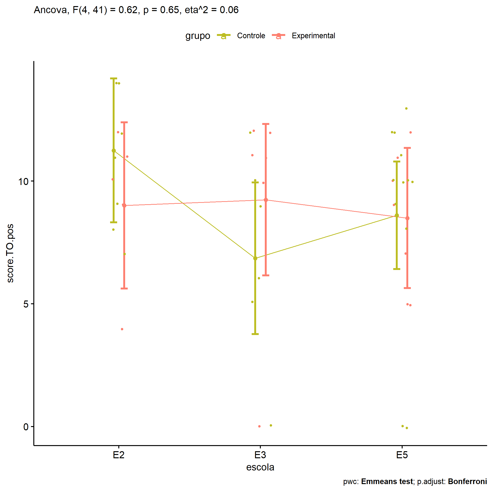<!-- -->

<!-- -->

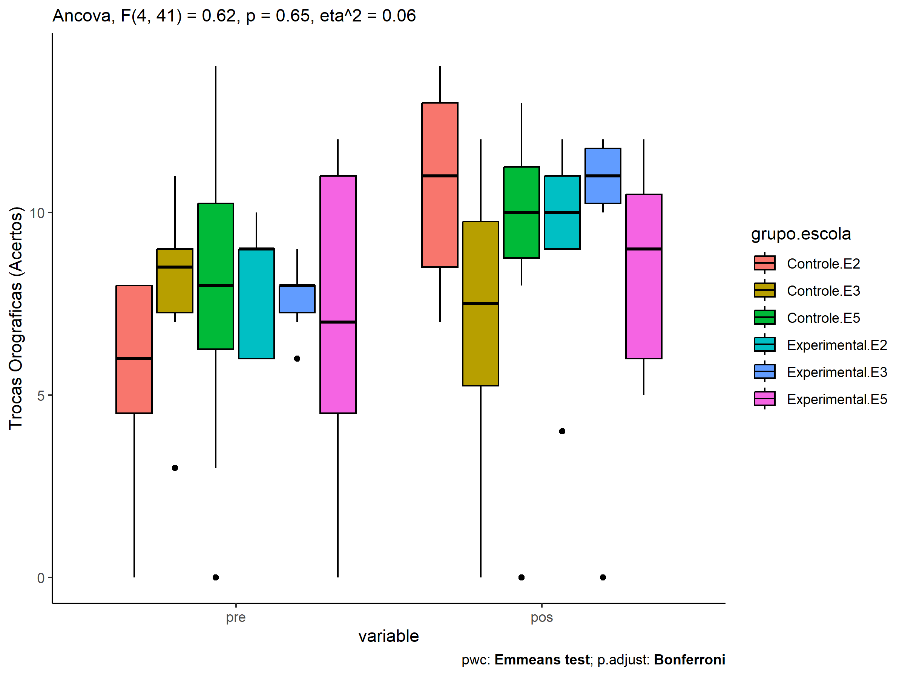<!-- -->

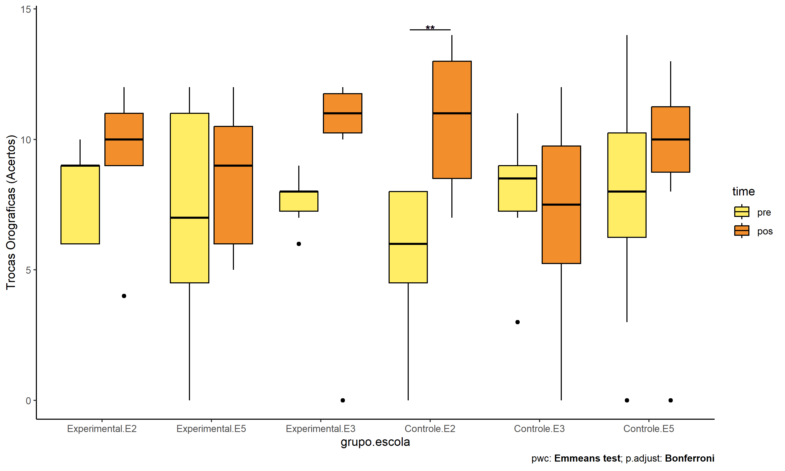<!-- -->

### Trocas Orograficas (TRI)

| var        | escola | grupo        |   n | M (pre) | SE (pre) | M (unadj) | SE (unadj) | M (adj) | SE (adj) |
|:-----------|:-------|:-------------|----:|--------:|---------:|----------:|-----------:|--------:|---------:|
| tri.TO.pos | E2     | Controle     |   6 |  -0.843 |    0.224 |    -0.220 |      0.194 |  -0.140 |    0.210 |
| tri.TO.pos | E2     | Experimental |   5 |  -0.391 |    0.250 |    -0.285 |      0.244 |  -0.305 |    0.224 |
| tri.TO.pos | E3     | Controle     |   5 |  -0.491 |    0.240 |    -0.388 |      0.320 |  -0.386 |    0.224 |
| tri.TO.pos | E3     | Experimental |   5 |  -0.153 |    0.314 |     0.038 |      0.086 |  -0.034 |    0.228 |
| tri.TO.pos | E5     | Controle     |  10 |  -0.496 |    0.293 |    -0.247 |      0.121 |  -0.243 |    0.158 |
| tri.TO.pos | E5     | Experimental |   6 |  -0.430 |    0.268 |    -0.381 |      0.286 |  -0.392 |    0.205 |

| grupo        | escola | group1   | group2       | estimate | conf.low | conf.high |    se | statistic |     p | p.adj | p.adj.signif |
|:-------------|:-------|:---------|:-------------|---------:|---------:|----------:|------:|----------:|------:|------:|:-------------|
| Controle     |        | E2       | E3           |    0.246 |   -0.381 |     0.872 | 0.307 |     0.801 | 0.429 | 1.000 | ns           |
| Controle     |        | E2       | E5           |    0.103 |   -0.433 |     0.639 | 0.262 |     0.393 | 0.697 | 1.000 | ns           |
| Controle     |        | E3       | E5           |   -0.143 |   -0.703 |     0.418 | 0.274 |    -0.519 | 0.607 | 1.000 | ns           |
| Experimental |        | E2       | E3           |   -0.271 |   -0.921 |     0.379 | 0.318 |    -0.852 | 0.401 | 1.000 | ns           |
| Experimental |        | E2       | E5           |    0.087 |   -0.533 |     0.706 | 0.303 |     0.286 | 0.777 | 1.000 | ns           |
| Experimental |        | E3       | E5           |    0.358 |   -0.266 |     0.982 | 0.305 |     1.172 | 0.250 | 0.751 | ns           |
| Controle     |        | E2       | E3           |   -0.352 |   -1.232 |     0.528 | 0.431 |    -0.816 | 0.421 | 1.000 | ns           |
| Controle     |        | E2       | E5           |   -0.347 |   -1.097 |     0.404 | 0.368 |    -0.942 | 0.353 | 1.000 | ns           |
| Controle     |        | E3       | E5           |    0.005 |   -0.790 |     0.801 | 0.390 |     0.014 | 0.989 | 1.000 | ns           |
| Experimental |        | E2       | E3           |   -0.237 |   -1.156 |     0.682 | 0.451 |    -0.526 | 0.603 | 1.000 | ns           |
| Experimental |        | E2       | E5           |    0.040 |   -0.840 |     0.920 | 0.431 |     0.092 | 0.927 | 1.000 | ns           |
| Experimental |        | E3       | E5           |    0.277 |   -0.603 |     1.157 | 0.431 |     0.642 | 0.526 | 1.000 | ns           |
|              | E2     | Controle | Experimental |    0.165 |   -0.465 |     0.796 | 0.309 |     0.536 | 0.596 | 0.596 | ns           |
|              | E3     | Controle | Experimental |   -0.352 |   -1.005 |     0.302 | 0.320 |    -1.099 | 0.280 | 0.280 | ns           |
|              | E5     | Controle | Experimental |    0.149 |   -0.380 |     0.678 | 0.259 |     0.575 | 0.569 | 0.569 | ns           |
|              | E2     | Controle | Experimental |   -0.452 |   -1.332 |     0.428 | 0.431 |    -1.049 | 0.303 | 0.303 | ns           |
|              | E3     | Controle | Experimental |   -0.337 |   -1.256 |     0.582 | 0.451 |    -0.749 | 0.460 | 0.460 | ns           |
|              | E5     | Controle | Experimental |   -0.066 |   -0.816 |     0.684 | 0.368 |    -0.179 | 0.859 | 0.859 | ns           |

| grupo        | escola | group1 | group2 | estimate | conf.low | conf.high |    se | statistic |     p | p.adj | p.adj.signif |
|:-------------|:-------|:-------|:-------|---------:|---------:|----------:|------:|----------:|------:|------:|:-------------|
| Controle     | E2     | pre    | pos    |   -0.739 |   -1.421 |    -0.057 | 0.342 |    -2.163 | 0.034 | 0.034 | \*           |
| Controle     | E3     | pre    | pos    |   -0.050 |   -0.792 |     0.692 | 0.372 |    -0.135 | 0.893 | 0.893 | ns           |
| Controle     | E5     | pre    | pos    |   -0.323 |   -0.847 |     0.202 | 0.263 |    -1.228 | 0.224 | 0.224 | ns           |
| Experimental | E2     | pre    | pos    |   -0.105 |   -0.880 |     0.670 | 0.388 |    -0.271 | 0.788 | 0.788 | ns           |
| Experimental | E3     | pre    | pos    |   -0.295 |   -1.037 |     0.447 | 0.372 |    -0.794 | 0.430 | 0.430 | ns           |
| Experimental | E5     | pre    | pos    |    0.036 |   -0.645 |     0.718 | 0.342 |     0.106 | 0.916 | 0.916 | ns           |

    ## Scale for colour is already present.
    ## Adding another scale for colour, which will replace the existing scale.

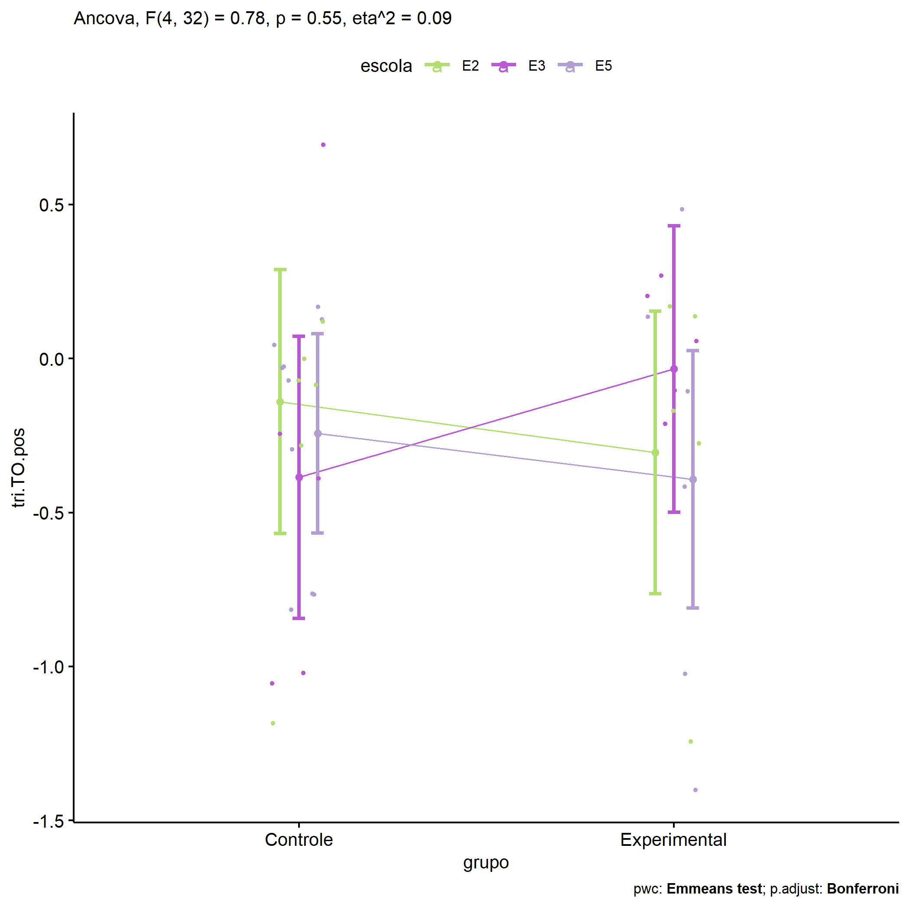<!-- -->

    ## Scale for colour is already present.
    ## Adding another scale for colour, which will replace the existing scale.

<!-- -->

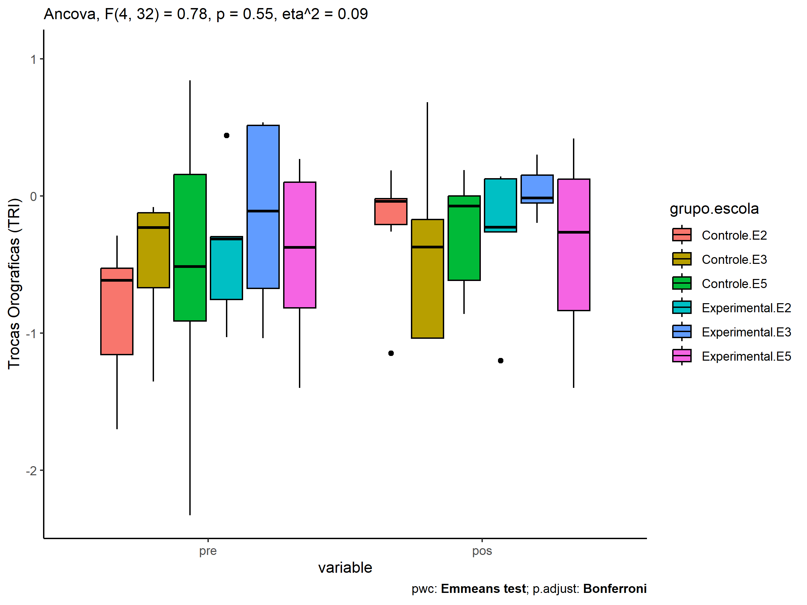<!-- -->

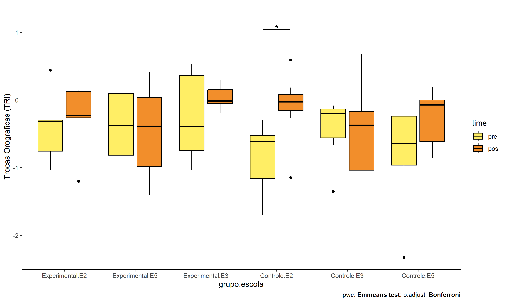<!-- -->

## factores: **zona.escola:grupo**

### Leitura de Pseudo-Palavras (Acertos)

| var            | zona.escola | grupo        |   n | M (pre) | SE (pre) | M (unadj) | SE (unadj) | M (adj) | SE (adj) |
|:---------------|:------------|:-------------|----:|--------:|---------:|----------:|-----------:|--------:|---------:|
| score.CLPP.pos | Rural       | Controle     |   8 |  44.125 |    8.325 |    56.750 |      6.296 |  60.351 |    3.686 |
| score.CLPP.pos | Rural       | Experimental |   8 |  53.250 |    4.096 |    64.250 |      4.131 |  64.729 |    3.493 |
| score.CLPP.pos | Urbana      | Controle     |  16 |  57.938 |    2.428 |    58.562 |      1.833 |  57.438 |    2.495 |
| score.CLPP.pos | Urbana      | Experimental |  11 |  58.545 |    3.581 |    68.091 |      2.364 |  66.759 |    3.008 |

| grupo        | zona.escola | group1   | group2       | estimate | conf.low | conf.high |    se | statistic |     p | p.adj | p.adj.signif |
|:-------------|:------------|:---------|:-------------|---------:|---------:|----------:|------:|----------:|------:|------:|:-------------|
| Controle     |             | Urbana   | Rural        |   -2.913 |  -12.121 |     6.296 | 4.549 |    -0.640 | 0.526 | 0.526 | ns           |
| Experimental |             | Urbana   | Rural        |    2.029 |   -7.332 |    11.391 | 4.624 |     0.439 | 0.663 | 0.663 | ns           |
| Controle     |             | Urbana   | Rural        |   13.813 |    1.549 |    26.076 | 6.063 |     2.278 | 0.028 | 0.028 | \*           |
| Experimental |             | Urbana   | Rural        |    5.295 |   -7.864 |    18.455 | 6.506 |     0.814 | 0.421 | 0.421 | ns           |
|              | Urbana      | Controle | Experimental |   -9.320 |  -17.147 |    -1.494 | 3.866 |    -2.411 | 0.021 | 0.021 | \*           |
|              | Rural       | Controle | Experimental |   -4.378 |  -14.583 |     5.826 | 5.041 |    -0.869 | 0.391 | 0.391 | ns           |
|              | Urbana      | Controle | Experimental |   -0.608 |  -11.701 |    10.485 | 5.484 |    -0.111 | 0.912 | 0.912 | ns           |
|              | Rural       | Controle | Experimental |   -9.125 |  -23.286 |     5.036 | 7.001 |    -1.303 | 0.200 | 0.200 | ns           |

| grupo        | zona.escola | group1 | group2 | estimate | conf.low | conf.high |    se | statistic |     p | p.adj | p.adj.signif |
|:-------------|:------------|:-------|:-------|---------:|---------:|----------:|------:|----------:|------:|------:|:-------------|
| Controle     | Urbana      | pre    | pos    |    0.023 |   -8.868 |     8.913 | 4.473 |     0.005 | 0.996 | 0.996 | ns           |
| Controle     | Rural       | pre    | pos    |  -13.022 |  -25.100 |    -0.944 | 6.077 |    -2.143 | 0.035 | 0.035 | \*           |
| Experimental | Urbana      | pre    | pos    |   -7.288 |  -18.261 |     3.685 | 5.521 |    -1.320 | 0.190 | 0.190 | ns           |
| Experimental | Rural       | pre    | pos    |  -15.650 |  -28.119 |    -3.181 | 6.273 |    -2.495 | 0.014 | 0.014 | \*           |

    ## Scale for colour is already present.
    ## Adding another scale for colour, which will replace the existing scale.

<!-- -->

    ## Scale for colour is already present.
    ## Adding another scale for colour, which will replace the existing scale.

<!-- -->

<!-- -->

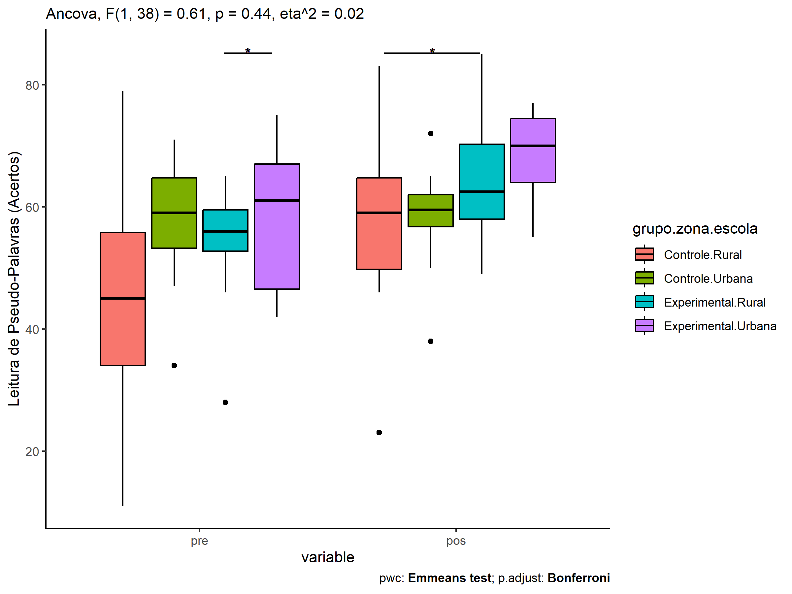<!-- -->

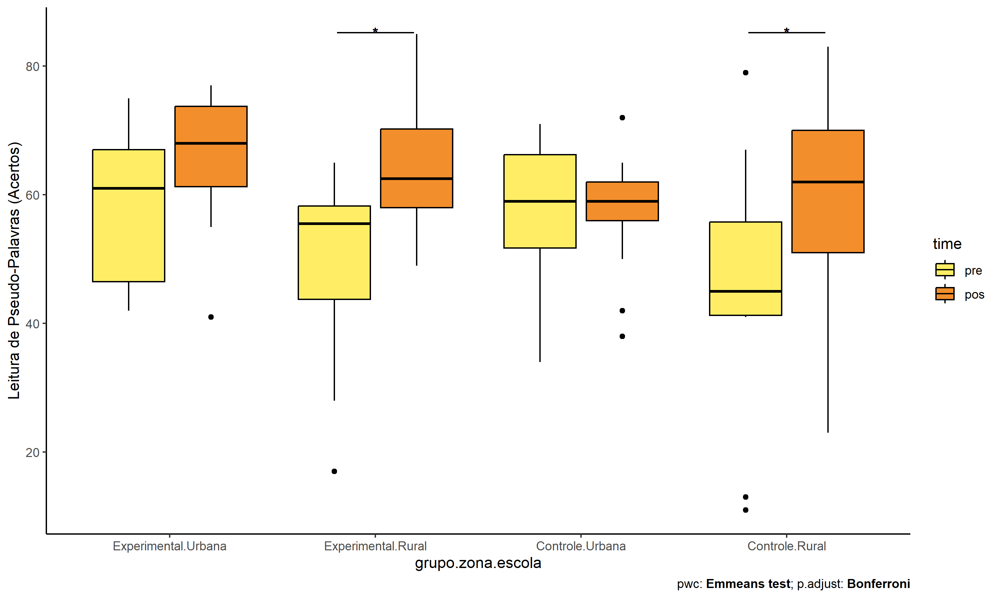<!-- -->

### Leitura de Pseudo-Palavras (TRI)

| var          | zona.escola | grupo        |   n | M (pre) | SE (pre) | M (unadj) | SE (unadj) | M (adj) | SE (adj) |
|:-------------|:------------|:-------------|----:|--------:|---------:|----------:|-----------:|--------:|---------:|
| tri.CLPP.pos | Rural       | Controle     |   8 |  44.125 |    8.325 |    56.750 |      6.296 |  60.351 |    3.686 |
| tri.CLPP.pos | Rural       | Experimental |   8 |  53.250 |    4.096 |    64.250 |      4.131 |  64.729 |    3.493 |
| tri.CLPP.pos | Urbana      | Controle     |  16 |  57.938 |    2.428 |    58.562 |      1.833 |  57.438 |    2.495 |
| tri.CLPP.pos | Urbana      | Experimental |  11 |  58.545 |    3.581 |    68.091 |      2.364 |  66.759 |    3.008 |

| grupo        | zona.escola | group1   | group2       | estimate | conf.low | conf.high |    se | statistic |     p | p.adj | p.adj.signif |
|:-------------|:------------|:---------|:-------------|---------:|---------:|----------:|------:|----------:|------:|------:|:-------------|
| Controle     |             | Urbana   | Rural        |   -2.913 |  -12.121 |     6.296 | 4.549 |    -0.640 | 0.526 | 0.526 | ns           |
| Experimental |             | Urbana   | Rural        |    2.029 |   -7.332 |    11.391 | 4.624 |     0.439 | 0.663 | 0.663 | ns           |
| Controle     |             | Urbana   | Rural        |   13.813 |    1.549 |    26.076 | 6.063 |     2.278 | 0.028 | 0.028 | \*           |
| Experimental |             | Urbana   | Rural        |    5.295 |   -7.864 |    18.455 | 6.506 |     0.814 | 0.421 | 0.421 | ns           |
|              | Urbana      | Controle | Experimental |   -9.320 |  -17.147 |    -1.494 | 3.866 |    -2.411 | 0.021 | 0.021 | \*           |
|              | Rural       | Controle | Experimental |   -4.378 |  -14.583 |     5.826 | 5.041 |    -0.869 | 0.391 | 0.391 | ns           |
|              | Urbana      | Controle | Experimental |   -0.608 |  -11.701 |    10.485 | 5.484 |    -0.111 | 0.912 | 0.912 | ns           |
|              | Rural       | Controle | Experimental |   -9.125 |  -23.286 |     5.036 | 7.001 |    -1.303 | 0.200 | 0.200 | ns           |

| grupo        | zona.escola | group1 | group2 | estimate | conf.low | conf.high |    se | statistic |     p | p.adj | p.adj.signif |
|:-------------|:------------|:-------|:-------|---------:|---------:|----------:|------:|----------:|------:|------:|:-------------|
| Controle     | Urbana      | pre    | pos    |    0.101 |   -0.434 |     0.636 | 0.269 |     0.376 | 0.708 | 0.708 | ns           |
| Controle     | Rural       | pre    | pos    |   -0.325 |   -1.052 |     0.402 | 0.366 |    -0.888 | 0.377 | 0.377 | ns           |
| Experimental | Urbana      | pre    | pos    |   -0.228 |   -0.889 |     0.432 | 0.332 |    -0.687 | 0.494 | 0.494 | ns           |
| Experimental | Rural       | pre    | pos    |   -0.409 |   -1.160 |     0.341 | 0.378 |    -1.084 | 0.281 | 0.281 | ns           |

    ## Scale for colour is already present.
    ## Adding another scale for colour, which will replace the existing scale.

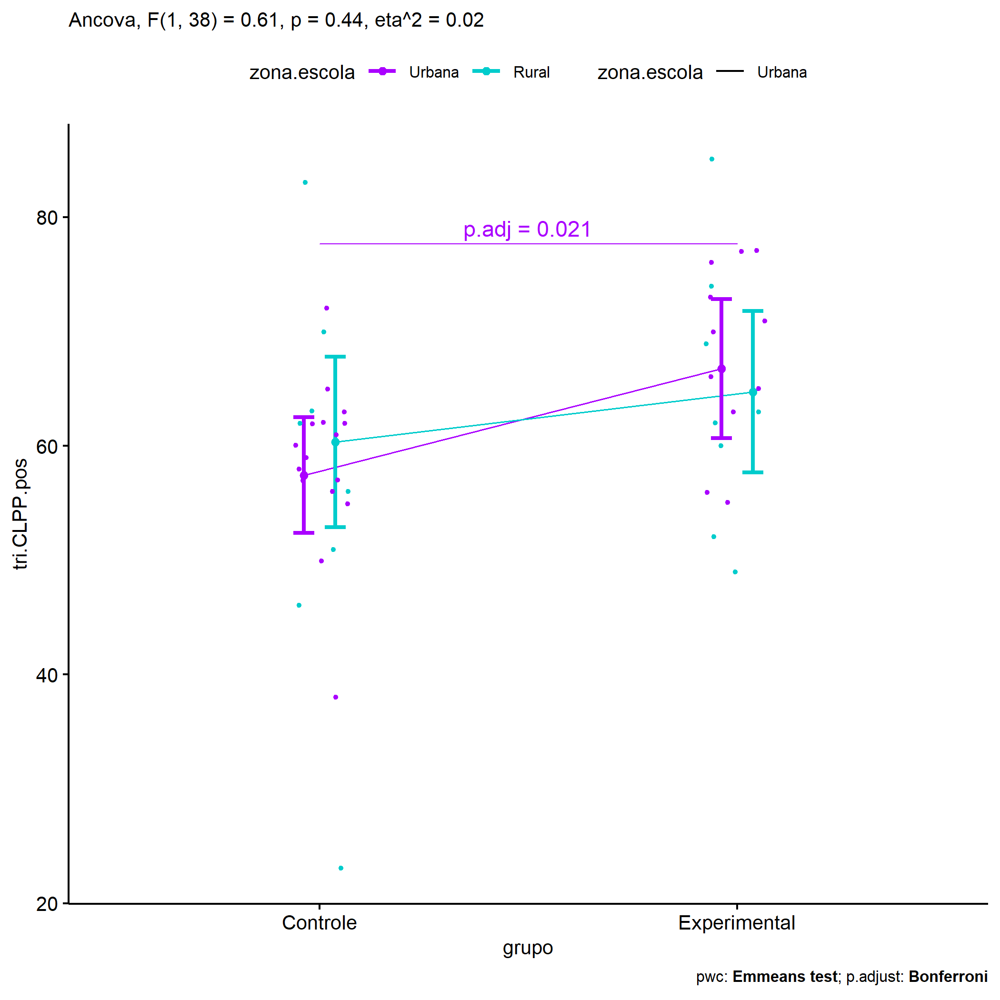<!-- -->

    ## Scale for colour is already present.
    ## Adding another scale for colour, which will replace the existing scale.

<!-- -->

<!-- -->

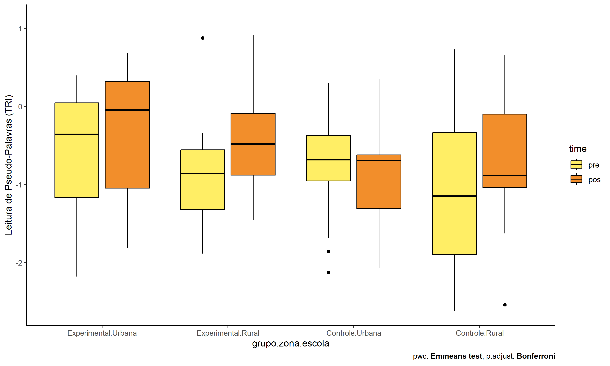<!-- -->

### Correta Regular (Acertos)

| var          | zona.escola | grupo        |   n | M (pre) | SE (pre) | M (unadj) | SE (unadj) | M (adj) | SE (adj) |
|:-------------|:------------|:-------------|----:|--------:|---------:|----------:|-----------:|--------:|---------:|
| score.CR.pos | Rural       | Controle     |  11 |   9.000 |    1.640 |    10.364 |      2.086 |  10.927 |    1.612 |
| score.CR.pos | Rural       | Experimental |  10 |  10.700 |    1.535 |    11.300 |      2.093 |  11.316 |    1.663 |
| score.CR.pos | Urbana      | Controle     |  19 |  11.632 |    0.838 |    10.947 |      1.080 |  10.664 |    1.215 |
| score.CR.pos | Urbana      | Experimental |  12 |  11.000 |    1.360 |    15.083 |      0.996 |  15.003 |    1.519 |

| grupo        | zona.escola | group1   | group2       | estimate | conf.low | conf.high |    se | statistic |     p | p.adj | p.adj.signif |
|:-------------|:------------|:---------|:-------------|---------:|---------:|----------:|------:|----------:|------:|------:|:-------------|
| Controle     |             | Urbana   | Rural        |   -0.263 |   -4.368 |     3.841 | 2.040 |    -0.129 | 0.898 | 0.898 | ns           |
| Experimental |             | Urbana   | Rural        |    3.687 |   -0.844 |     8.217 | 2.252 |     1.637 | 0.108 | 0.108 | ns           |
| Controle     |             | Urbana   | Rural        |    2.632 |   -0.832 |     6.096 | 1.723 |     1.527 | 0.133 | 0.133 | ns           |
| Experimental |             | Urbana   | Rural        |    0.300 |   -3.615 |     4.215 | 1.947 |     0.154 | 0.878 | 0.878 | ns           |
|              | Urbana      | Controle | Experimental |   -4.339 |   -8.246 |    -0.433 | 1.942 |    -2.235 | 0.030 | 0.030 | \*           |
|              | Rural       | Controle | Experimental |   -0.389 |   -5.046 |     4.268 | 2.315 |    -0.168 | 0.867 | 0.867 | ns           |
|              | Urbana      | Controle | Experimental |    0.632 |   -2.740 |     4.003 | 1.677 |     0.377 | 0.708 | 0.708 | ns           |
|              | Rural       | Controle | Experimental |   -1.700 |   -5.695 |     2.295 | 1.987 |    -0.856 | 0.396 | 0.396 | ns           |

| grupo        | zona.escola | group1 | group2 | estimate | conf.low | conf.high |    se | statistic |     p | p.adj | p.adj.signif |
|:-------------|:------------|:-------|:-------|---------:|---------:|----------:|------:|----------:|------:|------:|:-------------|
| Controle     | Urbana      | pre    | pos    |    0.684 |   -2.533 |     3.901 | 1.621 |     0.422 | 0.674 | 0.674 | ns           |
| Controle     | Rural       | pre    | pos    |   -1.364 |   -5.591 |     2.864 | 2.130 |    -0.640 | 0.524 | 0.524 | ns           |
| Experimental | Urbana      | pre    | pos    |   -4.083 |   -8.131 |    -0.036 | 2.039 |    -2.002 | 0.048 | 0.048 | \*           |
| Experimental | Rural       | pre    | pos    |   -0.600 |   -5.034 |     3.834 | 2.234 |    -0.269 | 0.789 | 0.789 | ns           |

    ## Scale for colour is already present.
    ## Adding another scale for colour, which will replace the existing scale.

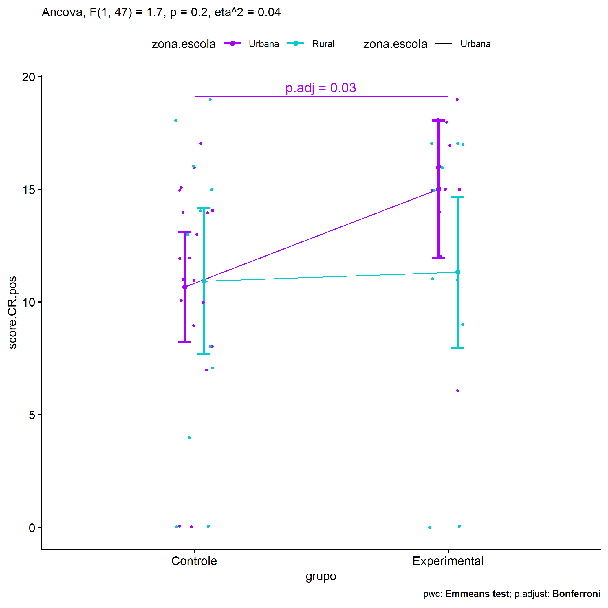<!-- -->

    ## Scale for colour is already present.
    ## Adding another scale for colour, which will replace the existing scale.

<!-- -->

<!-- -->

<!-- -->

<!-- -->

### Correta Regular (TRI)

| var        | zona.escola | grupo        |   n | M (pre) | SE (pre) | M (unadj) | SE (unadj) | M (adj) | SE (adj) |
|:-----------|:------------|:-------------|----:|--------:|---------:|----------:|-----------:|--------:|---------:|
| tri.CR.pos | Rural       | Controle     |   8 |  -0.512 |    0.405 |    -0.512 |      0.360 |  -0.565 |    0.229 |
| tri.CR.pos | Rural       | Experimental |   8 |  -0.489 |    0.355 |    -0.245 |      0.285 |  -0.310 |    0.229 |
| tri.CR.pos | Urbana      | Controle     |  16 |  -0.785 |    0.135 |    -0.588 |      0.153 |  -0.511 |    0.163 |
| tri.CR.pos | Urbana      | Experimental |  11 |  -0.570 |    0.244 |     0.070 |      0.205 |   0.044 |    0.195 |

| grupo        | zona.escola | group1   | group2       | estimate | conf.low | conf.high |    se | statistic |     p | p.adj | p.adj.signif |
|:-------------|:------------|:---------|:-------------|---------:|---------:|----------:|------:|----------:|------:|------:|:-------------|
| Controle     |             | Urbana   | Rural        |    0.054 |   -0.516 |     0.624 | 0.282 |     0.192 | 0.849 | 0.849 | ns           |
| Experimental |             | Urbana   | Rural        |    0.354 |   -0.254 |     0.962 | 0.300 |     1.178 | 0.246 | 0.246 | ns           |
| Controle     |             | Urbana   | Rural        |   -0.272 |   -1.004 |     0.459 | 0.362 |    -0.753 | 0.456 | 0.456 | ns           |
| Experimental |             | Urbana   | Rural        |   -0.080 |   -0.865 |     0.704 | 0.388 |    -0.207 | 0.837 | 0.837 | ns           |
|              | Urbana      | Controle | Experimental |   -0.555 |   -1.070 |    -0.040 | 0.254 |    -2.183 | 0.035 | 0.035 | \*           |
|              | Rural       | Controle | Experimental |   -0.256 |   -0.910 |     0.398 | 0.323 |    -0.792 | 0.433 | 0.433 | ns           |
|              | Urbana      | Controle | Experimental |   -0.215 |   -0.876 |     0.446 | 0.327 |    -0.657 | 0.515 | 0.515 | ns           |
|              | Rural       | Controle | Experimental |   -0.023 |   -0.867 |     0.821 | 0.417 |    -0.055 | 0.956 | 0.956 | ns           |

| grupo        | zona.escola | group1 | group2 | estimate | conf.low | conf.high |    se | statistic |     p | p.adj | p.adj.signif |
|:-------------|:------------|:-------|:-------|---------:|---------:|----------:|------:|----------:|------:|------:|:-------------|
| Controle     | Urbana      | pre    | pos    |   -0.057 |   -0.617 |     0.503 | 0.282 |    -0.202 | 0.840 | 0.840 | ns           |
| Controle     | Rural       | pre    | pos    |   -0.254 |   -1.015 |     0.507 | 0.383 |    -0.663 | 0.509 | 0.509 | ns           |
| Experimental | Urbana      | pre    | pos    |   -0.483 |   -1.175 |     0.208 | 0.348 |    -1.389 | 0.168 | 0.168 | ns           |
| Experimental | Rural       | pre    | pos    |   -0.466 |   -1.252 |     0.320 | 0.395 |    -1.179 | 0.242 | 0.242 | ns           |

    ## Scale for colour is already present.
    ## Adding another scale for colour, which will replace the existing scale.

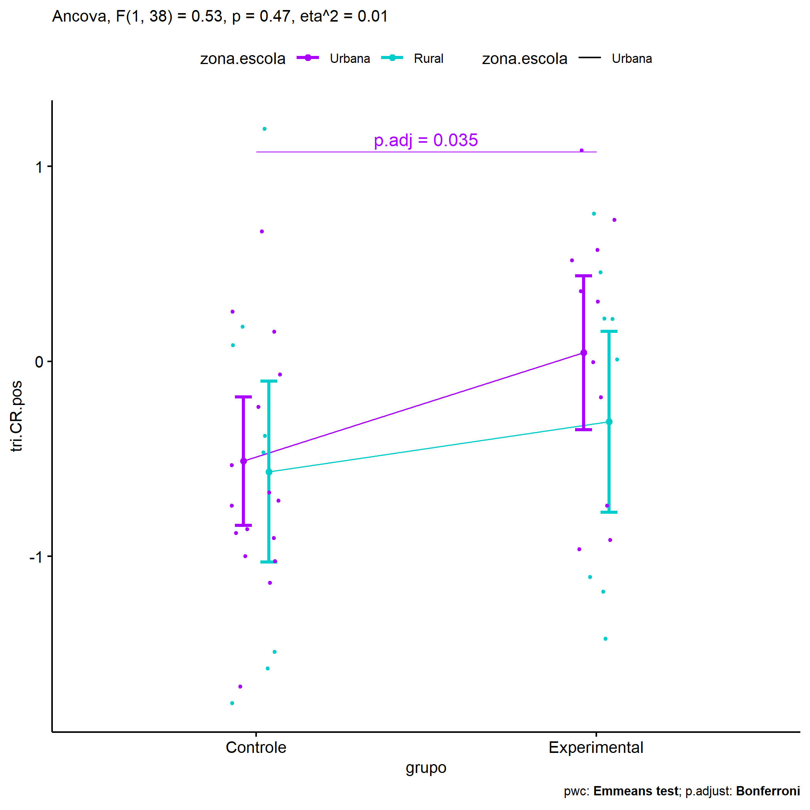<!-- -->

    ## Scale for colour is already present.
    ## Adding another scale for colour, which will replace the existing scale.

<!-- -->

<!-- -->

<!-- -->

### Correta Irregular (Acertos)

| var          | zona.escola | grupo        |   n | M (pre) | SE (pre) | M (unadj) | SE (unadj) | M (adj) | SE (adj) |
|:-------------|:------------|:-------------|----:|--------:|---------:|----------:|-----------:|--------:|---------:|
| score.CI.pos | Rural       | Controle     |  11 |   7.455 |    1.378 |     8.182 |      1.858 |   8.648 |    1.364 |
| score.CI.pos | Rural       | Experimental |  10 |   8.300 |    1.202 |     8.500 |      1.833 |   8.675 |    1.413 |
| score.CI.pos | Urbana      | Controle     |  19 |   9.947 |    0.774 |     8.053 |      0.919 |   7.660 |    1.041 |
| score.CI.pos | Urbana      | Experimental |  12 |   8.667 |    1.096 |    11.333 |      0.595 |  11.382 |    1.287 |

| grupo        | zona.escola | group1   | group2       | estimate | conf.low | conf.high |    se | statistic |     p | p.adj | p.adj.signif |
|:-------------|:------------|:---------|:-------------|---------:|---------:|----------:|------:|----------:|------:|------:|:-------------|
| Controle     |             | Urbana   | Rural        |   -0.988 |   -4.489 |     2.514 | 1.741 |    -0.568 | 0.573 | 0.573 | ns           |
| Experimental |             | Urbana   | Rural        |    2.707 |   -1.136 |     6.550 | 1.910 |     1.417 | 0.163 | 0.163 | ns           |
| Controle     |             | Urbana   | Rural        |    2.493 |   -0.421 |     5.407 | 1.449 |     1.720 | 0.092 | 0.092 | ns           |
| Experimental |             | Urbana   | Rural        |    0.367 |   -2.927 |     3.660 | 1.638 |     0.224 | 0.824 | 0.824 | ns           |
|              | Urbana      | Controle | Experimental |   -3.722 |   -7.058 |    -0.386 | 1.658 |    -2.245 | 0.030 | 0.030 | \*           |
|              | Rural       | Controle | Experimental |   -0.027 |   -3.957 |     3.903 | 1.953 |    -0.014 | 0.989 | 0.989 | ns           |
|              | Urbana      | Controle | Experimental |    1.281 |   -1.555 |     4.117 | 1.411 |     0.908 | 0.368 | 0.368 | ns           |
|              | Rural       | Controle | Experimental |   -0.845 |   -4.206 |     2.515 | 1.671 |    -0.506 | 0.615 | 0.615 | ns           |

| grupo        | zona.escola | group1 | group2 | estimate | conf.low | conf.high |    se | statistic |     p | p.adj | p.adj.signif |
|:-------------|:------------|:-------|:-------|---------:|---------:|----------:|------:|----------:|------:|------:|:-------------|
| Controle     | Urbana      | pre    | pos    |    1.895 |   -0.831 |     4.621 | 1.373 |     1.380 | 0.171 | 0.171 | ns           |
| Controle     | Rural       | pre    | pos    |   -0.727 |   -4.310 |     2.856 | 1.805 |    -0.403 | 0.688 | 0.688 | ns           |
| Experimental | Urbana      | pre    | pos    |   -2.667 |   -6.097 |     0.764 | 1.728 |    -1.543 | 0.126 | 0.126 | ns           |
| Experimental | Rural       | pre    | pos    |   -0.200 |   -3.958 |     3.558 | 1.893 |    -0.106 | 0.916 | 0.916 | ns           |

    ## Scale for colour is already present.
    ## Adding another scale for colour, which will replace the existing scale.

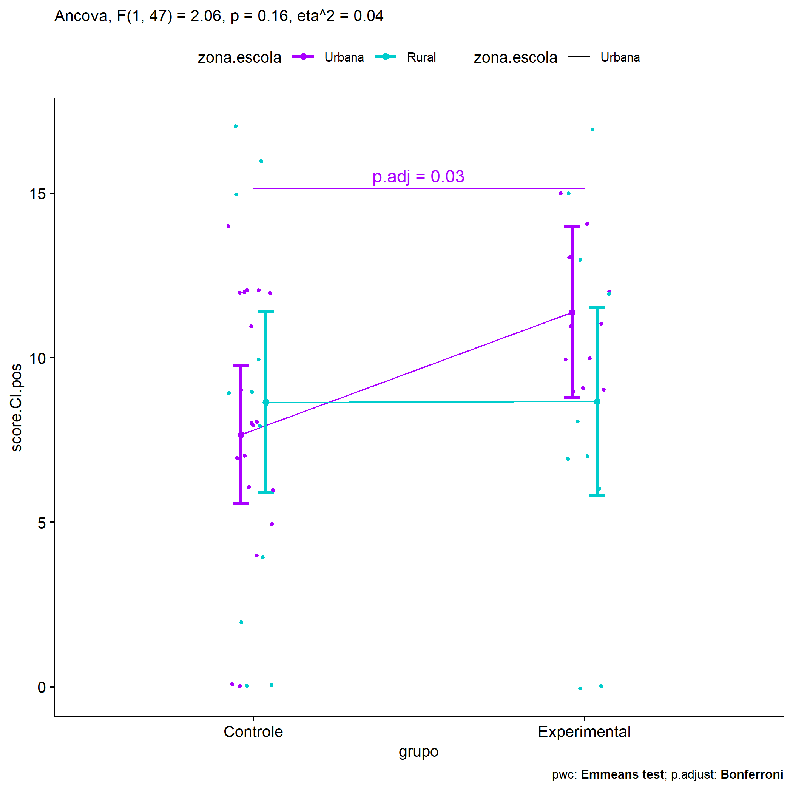<!-- -->

    ## Scale for colour is already present.
    ## Adding another scale for colour, which will replace the existing scale.

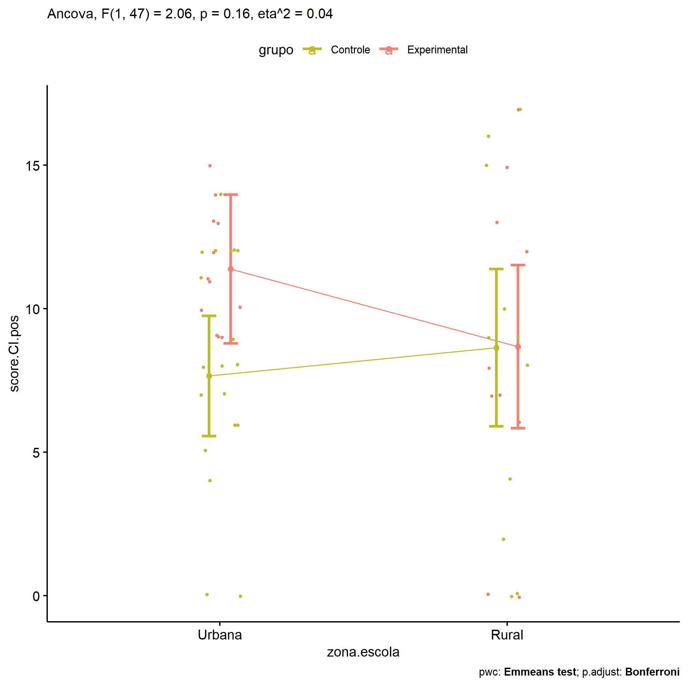<!-- -->

<!-- -->

<!-- -->

<!-- -->

### Correta Irregular (TRI)

| var        | zona.escola | grupo        |   n | M (pre) | SE (pre) | M (unadj) | SE (unadj) | M (adj) | SE (adj) |
|:-----------|:------------|:-------------|----:|--------:|---------:|----------:|-----------:|--------:|---------:|
| tri.CI.pos | Rural       | Controle     |   8 |  -0.350 |    0.265 |    -0.912 |      0.343 |  -1.019 |    0.243 |
| tri.CI.pos | Rural       | Experimental |   8 |  -0.421 |    0.204 |    -0.366 |      0.433 |  -0.415 |    0.242 |
| tri.CI.pos | Urbana      | Controle     |  16 |  -0.521 |    0.098 |    -0.717 |      0.162 |  -0.685 |    0.171 |
| tri.CI.pos | Urbana      | Experimental |  11 |  -0.562 |    0.175 |    -0.173 |      0.145 |  -0.107 |    0.207 |

| grupo        | zona.escola | group1   | group2       | estimate | conf.low | conf.high |    se | statistic |     p | p.adj | p.adj.signif |
|:-------------|:------------|:---------|:-------------|---------:|---------:|----------:|------:|----------:|------:|------:|:-------------|
| Controle     |             | Urbana   | Rural        |    0.335 |   -0.269 |     0.938 | 0.298 |     1.122 | 0.269 | 0.269 | ns           |
| Experimental |             | Urbana   | Rural        |    0.308 |   -0.338 |     0.954 | 0.319 |     0.964 | 0.341 | 0.341 | ns           |
| Controle     |             | Urbana   | Rural        |   -0.171 |   -0.655 |     0.313 | 0.239 |    -0.716 | 0.478 | 0.478 | ns           |
| Experimental |             | Urbana   | Rural        |   -0.141 |   -0.661 |     0.378 | 0.257 |    -0.551 | 0.585 | 0.585 | ns           |
|              | Urbana      | Controle | Experimental |   -0.578 |   -1.120 |    -0.035 | 0.268 |    -2.155 | 0.038 | 0.038 | \*           |
|              | Rural       | Controle | Experimental |   -0.604 |   -1.297 |     0.089 | 0.342 |    -1.766 | 0.085 | 0.085 | ns           |
|              | Urbana      | Controle | Experimental |    0.041 |   -0.396 |     0.479 | 0.216 |     0.190 | 0.850 | 0.850 | ns           |
|              | Rural       | Controle | Experimental |    0.071 |   -0.488 |     0.630 | 0.276 |     0.257 | 0.798 | 0.798 | ns           |

| grupo        | zona.escola | group1 | group2 | estimate | conf.low | conf.high |    se | statistic |     p | p.adj | p.adj.signif |
|:-------------|:------------|:-------|:-------|---------:|---------:|----------:|------:|----------:|------:|------:|:-------------|
| Controle     | Urbana      | pre    | pos    |    0.270 |   -0.203 |     0.742 | 0.238 |     1.134 | 0.260 | 0.260 | ns           |
| Controle     | Rural       | pre    | pos    |    0.292 |   -0.350 |     0.934 | 0.323 |     0.904 | 0.369 | 0.369 | ns           |
| Experimental | Urbana      | pre    | pos    |   -0.372 |   -0.955 |     0.211 | 0.293 |    -1.267 | 0.208 | 0.208 | ns           |
| Experimental | Rural       | pre    | pos    |   -0.222 |   -0.885 |     0.441 | 0.333 |    -0.667 | 0.507 | 0.507 | ns           |

    ## Scale for colour is already present.
    ## Adding another scale for colour, which will replace the existing scale.

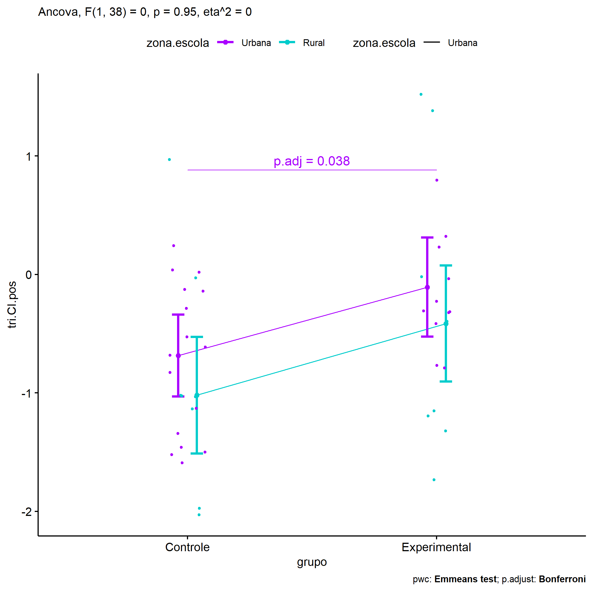<!-- -->

    ## Scale for colour is already present.
    ## Adding another scale for colour, which will replace the existing scale.

<!-- -->

<!-- -->

<!-- -->

### Trocas Visuais (Acertos)

| var          | zona.escola | grupo        |   n | M (pre) | SE (pre) | M (unadj) | SE (unadj) | M (adj) | SE (adj) |
|:-------------|:------------|:-------------|----:|--------:|---------:|----------:|-----------:|--------:|---------:|
| score.TV.pos | Rural       | Controle     |  11 |   9.455 |    1.974 |    12.364 |      2.125 |  13.697 |    1.831 |
| score.TV.pos | Rural       | Experimental |  10 |  12.300 |    1.564 |    12.700 |      2.295 |  12.882 |    1.847 |
| score.TV.pos | Urbana      | Controle     |  19 |  14.158 |    1.093 |    12.789 |      1.430 |  12.220 |    1.356 |
| score.TV.pos | Urbana      | Experimental |  12 |  13.917 |    1.708 |    15.917 |      1.125 |  15.445 |    1.694 |

| grupo        | zona.escola | group1   | group2       | estimate | conf.low | conf.high |    se | statistic |     p | p.adj | p.adj.signif |
|:-------------|:------------|:---------|:-------------|---------:|---------:|----------:|------:|----------:|------:|------:|:-------------|
| Controle     |             | Urbana   | Rural        |   -1.477 |   -6.157 |     3.202 | 2.326 |    -0.635 | 0.528 | 0.528 | ns           |
| Experimental |             | Urbana   | Rural        |    2.562 |   -2.489 |     7.614 | 2.511 |     1.021 | 0.313 | 0.313 | ns           |
| Controle     |             | Urbana   | Rural        |    4.703 |    0.528 |     8.879 | 2.077 |     2.265 | 0.028 | 0.028 | \*           |
| Experimental |             | Urbana   | Rural        |    1.617 |   -3.102 |     6.336 | 2.347 |     0.689 | 0.494 | 0.494 | ns           |
|              | Urbana      | Controle | Experimental |   -3.225 |   -7.554 |     1.105 | 2.152 |    -1.498 | 0.141 | 0.141 | ns           |
|              | Rural       | Controle | Experimental |    0.815 |   -4.389 |     6.019 | 2.587 |     0.315 | 0.754 | 0.754 | ns           |
|              | Urbana      | Controle | Experimental |    0.241 |   -3.823 |     4.305 | 2.021 |     0.119 | 0.905 | 0.905 | ns           |
|              | Rural       | Controle | Experimental |   -2.845 |   -7.661 |     1.970 | 2.395 |    -1.188 | 0.241 | 0.241 | ns           |

| grupo        | zona.escola | group1 | group2 | estimate | conf.low | conf.high |    se | statistic |     p | p.adj | p.adj.signif |
|:-------------|:------------|:-------|:-------|---------:|---------:|----------:|------:|----------:|------:|------:|:-------------|
| Controle     | Urbana      | pre    | pos    |    1.368 |   -2.395 |     5.132 | 1.896 |     0.722 | 0.472 | 0.472 | ns           |
| Controle     | Rural       | pre    | pos    |   -2.909 |   -7.856 |     2.038 | 2.492 |    -1.167 | 0.246 | 0.246 | ns           |
| Experimental | Urbana      | pre    | pos    |   -2.000 |   -6.736 |     2.736 | 2.386 |    -0.838 | 0.404 | 0.404 | ns           |
| Experimental | Rural       | pre    | pos    |   -0.400 |   -5.588 |     4.788 | 2.614 |    -0.153 | 0.879 | 0.879 | ns           |

    ## Scale for colour is already present.
    ## Adding another scale for colour, which will replace the existing scale.

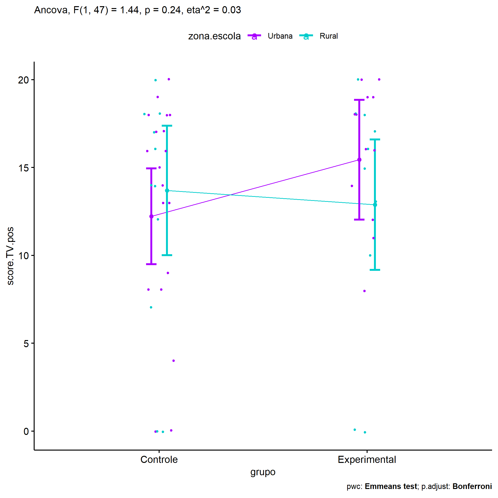<!-- -->

    ## Scale for colour is already present.
    ## Adding another scale for colour, which will replace the existing scale.

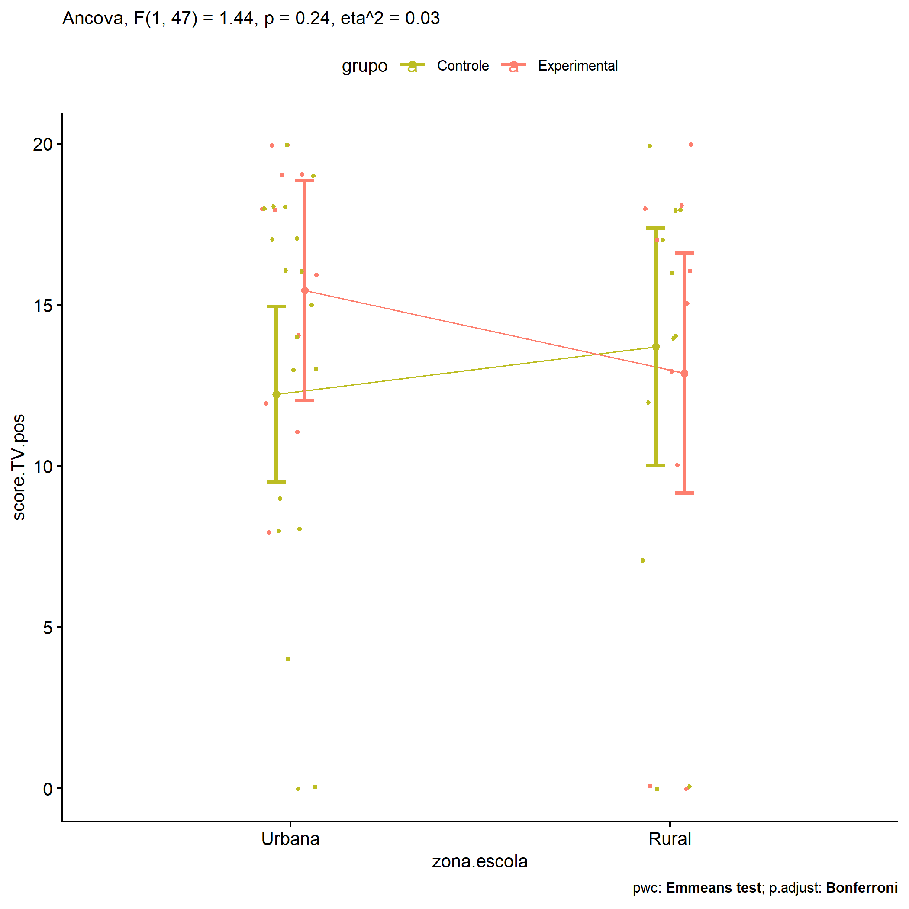<!-- -->

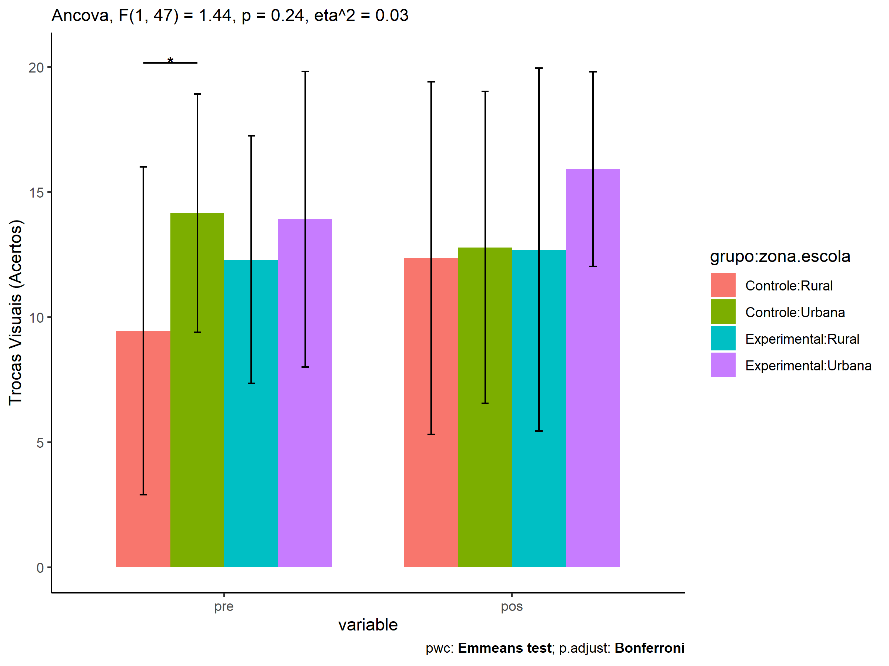<!-- -->

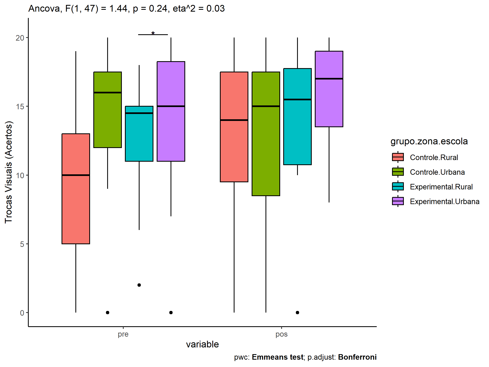<!-- -->

<!-- -->

### Trocas Visuais (TRI)

| var        | zona.escola | grupo        |   n | M (pre) | SE (pre) | M (unadj) | SE (unadj) | M (adj) | SE (adj) |
|:-----------|:------------|:-------------|----:|--------:|---------:|----------:|-----------:|--------:|---------:|
| tri.TV.pos | Rural       | Controle     |   8 |  -0.564 |    0.424 |    -0.404 |      0.275 |  -0.371 |    0.259 |
| tri.TV.pos | Rural       | Experimental |   8 |  -0.712 |    0.310 |    -0.211 |      0.288 |  -0.118 |    0.260 |
| tri.TV.pos | Urbana      | Controle     |  16 |  -0.541 |    0.166 |    -0.570 |      0.195 |  -0.547 |    0.183 |
| tri.TV.pos | Urbana      | Experimental |  11 |  -0.178 |    0.286 |    -0.096 |      0.261 |  -0.221 |    0.224 |

| grupo        | zona.escola | group1   | group2       | estimate | conf.low | conf.high |    se | statistic |     p | p.adj | p.adj.signif |
|:-------------|:------------|:---------|:-------------|---------:|---------:|----------:|------:|----------:|------:|------:|:-------------|
| Controle     |             | Urbana   | Rural        |   -0.176 |   -0.817 |     0.465 | 0.317 |    -0.555 | 0.582 | 0.582 | ns           |
| Experimental |             | Urbana   | Rural        |   -0.103 |   -0.805 |     0.600 | 0.347 |    -0.295 | 0.769 | 0.769 | ns           |
| Controle     |             | Urbana   | Rural        |    0.023 |   -0.758 |     0.804 | 0.386 |     0.060 | 0.953 | 0.953 | ns           |
| Experimental |             | Urbana   | Rural        |    0.534 |   -0.304 |     1.372 | 0.414 |     1.288 | 0.205 | 0.205 | ns           |
|              | Urbana      | Controle | Experimental |   -0.326 |   -0.914 |     0.262 | 0.290 |    -1.124 | 0.268 | 0.268 | ns           |
|              | Rural       | Controle | Experimental |   -0.253 |   -0.995 |     0.488 | 0.366 |    -0.691 | 0.494 | 0.494 | ns           |
|              | Urbana      | Controle | Experimental |   -0.363 |   -1.069 |     0.344 | 0.349 |    -1.039 | 0.305 | 0.305 | ns           |
|              | Rural       | Controle | Experimental |    0.148 |   -0.754 |     1.050 | 0.446 |     0.332 | 0.742 | 0.742 | ns           |

| grupo        | zona.escola | group1 | group2 | estimate | conf.low | conf.high |    se | statistic |     p | p.adj | p.adj.signif |
|:-------------|:------------|:-------|:-------|---------:|---------:|----------:|------:|----------:|------:|------:|:-------------|
| Controle     | Urbana      | pre    | pos    |    0.169 |   -0.409 |     0.747 | 0.291 |     0.581 | 0.563 | 0.563 | ns           |
| Controle     | Rural       | pre    | pos    |   -0.342 |   -1.127 |     0.443 | 0.395 |    -0.867 | 0.389 | 0.389 | ns           |
| Experimental | Urbana      | pre    | pos    |    0.002 |   -0.711 |     0.715 | 0.359 |     0.005 | 0.996 | 0.996 | ns           |
| Experimental | Rural       | pre    | pos    |   -0.362 |   -1.172 |     0.448 | 0.408 |    -0.888 | 0.377 | 0.377 | ns           |

    ## Scale for colour is already present.
    ## Adding another scale for colour, which will replace the existing scale.

<!-- -->

    ## Scale for colour is already present.
    ## Adding another scale for colour, which will replace the existing scale.

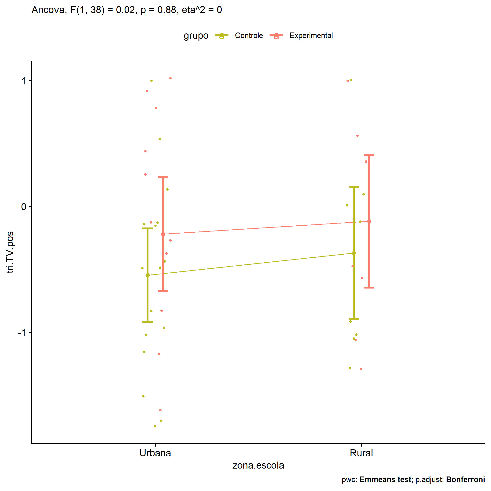<!-- -->

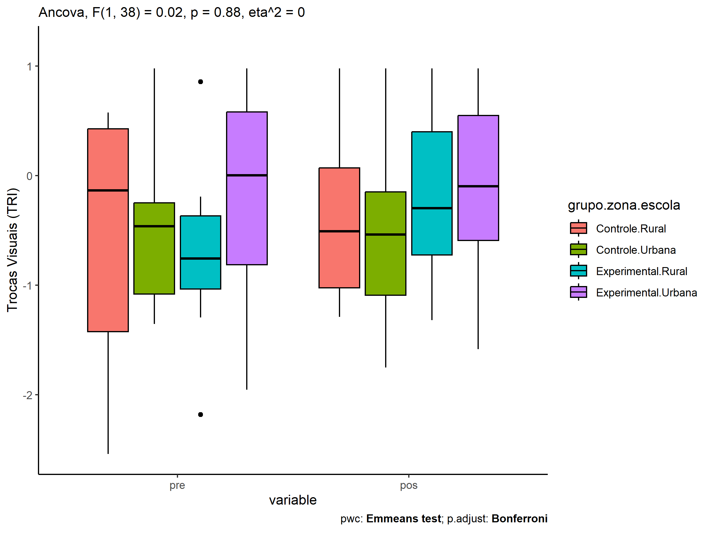<!-- -->

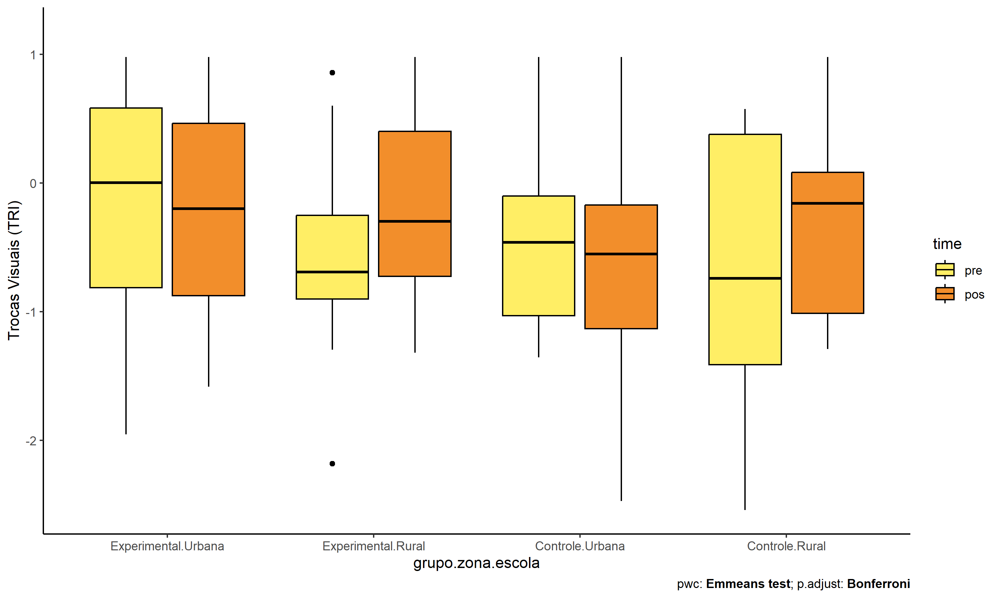<!-- -->

### Trocas Fonologicas (Acertos)

| var          | zona.escola | grupo        |   n | M (pre) | SE (pre) | M (unadj) | SE (unadj) | M (adj) | SE (adj) |
|:-------------|:------------|:-------------|----:|--------:|---------:|----------:|-----------:|--------:|---------:|
| score.TF.pos | Rural       | Controle     |  11 |   8.909 |    1.703 |     9.909 |      1.942 |  10.853 |    1.652 |
| score.TF.pos | Rural       | Experimental |  10 |  10.300 |    0.907 |    11.000 |      2.309 |  11.344 |    1.700 |
| score.TF.pos | Urbana      | Controle     |  19 |  11.842 |    1.130 |    10.263 |      1.089 |   9.941 |    1.235 |
| score.TF.pos | Urbana      | Experimental |  12 |  12.583 |    1.564 |    14.750 |      1.415 |  14.108 |    1.565 |

| grupo        | zona.escola | group1   | group2       | estimate | conf.low | conf.high |    se | statistic |     p | p.adj | p.adj.signif |
|:-------------|:------------|:---------|:-------------|---------:|---------:|----------:|------:|----------:|------:|------:|:-------------|
| Controle     |             | Urbana   | Rural        |   -0.912 |   -5.102 |     3.278 | 2.083 |    -0.438 | 0.663 | 0.663 | ns           |
| Experimental |             | Urbana   | Rural        |    2.764 |   -1.909 |     7.438 | 2.323 |     1.190 | 0.240 | 0.240 | ns           |
| Controle     |             | Urbana   | Rural        |    2.933 |   -0.800 |     6.666 | 1.856 |     1.580 | 0.121 | 0.121 | ns           |
| Experimental |             | Urbana   | Rural        |    2.283 |   -1.935 |     6.502 | 2.098 |     1.088 | 0.282 | 0.282 | ns           |
|              | Urbana      | Controle | Experimental |   -4.167 |   -8.150 |    -0.184 | 1.980 |    -2.105 | 0.041 | 0.041 | \*           |
|              | Rural       | Controle | Experimental |   -0.491 |   -5.222 |     4.241 | 2.352 |    -0.209 | 0.836 | 0.836 | ns           |
|              | Urbana      | Controle | Experimental |   -0.741 |   -4.374 |     2.892 | 1.807 |    -0.410 | 0.683 | 0.683 | ns           |
|              | Rural       | Controle | Experimental |   -1.391 |   -5.696 |     2.914 | 2.141 |    -0.650 | 0.519 | 0.519 | ns           |

| grupo        | zona.escola | group1 | group2 | estimate | conf.low | conf.high |    se | statistic |     p | p.adj | p.adj.signif |
|:-------------|:------------|:-------|:-------|---------:|---------:|----------:|------:|----------:|------:|------:|:-------------|
| Controle     | Urbana      | pre    | pos    |    1.579 |   -1.847 |     5.005 | 1.726 |     0.915 | 0.363 | 0.363 | ns           |
| Controle     | Rural       | pre    | pos    |   -1.000 |   -5.503 |     3.503 | 2.269 |    -0.441 | 0.660 | 0.660 | ns           |
| Experimental | Urbana      | pre    | pos    |   -2.167 |   -6.478 |     2.145 | 2.172 |    -0.998 | 0.321 | 0.321 | ns           |
| Experimental | Rural       | pre    | pos    |   -0.700 |   -5.423 |     4.023 | 2.379 |    -0.294 | 0.769 | 0.769 | ns           |

    ## Scale for colour is already present.
    ## Adding another scale for colour, which will replace the existing scale.

<!-- -->

    ## Scale for colour is already present.
    ## Adding another scale for colour, which will replace the existing scale.

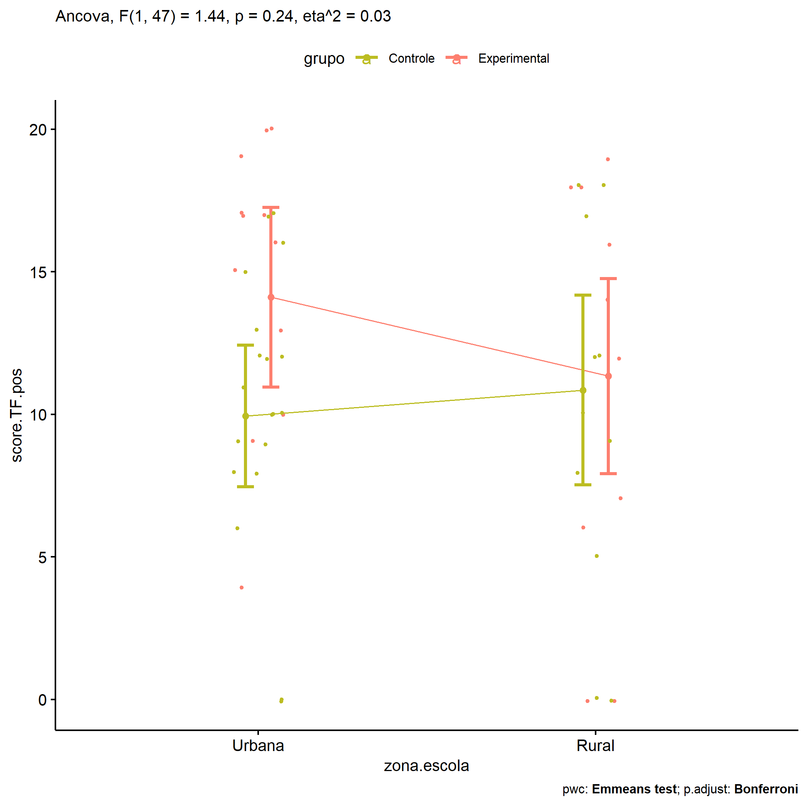<!-- -->

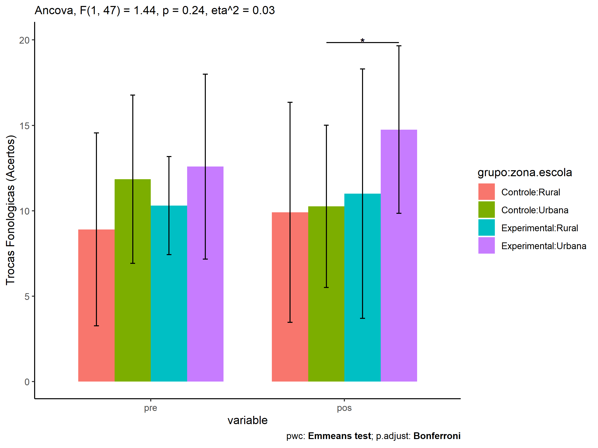<!-- -->

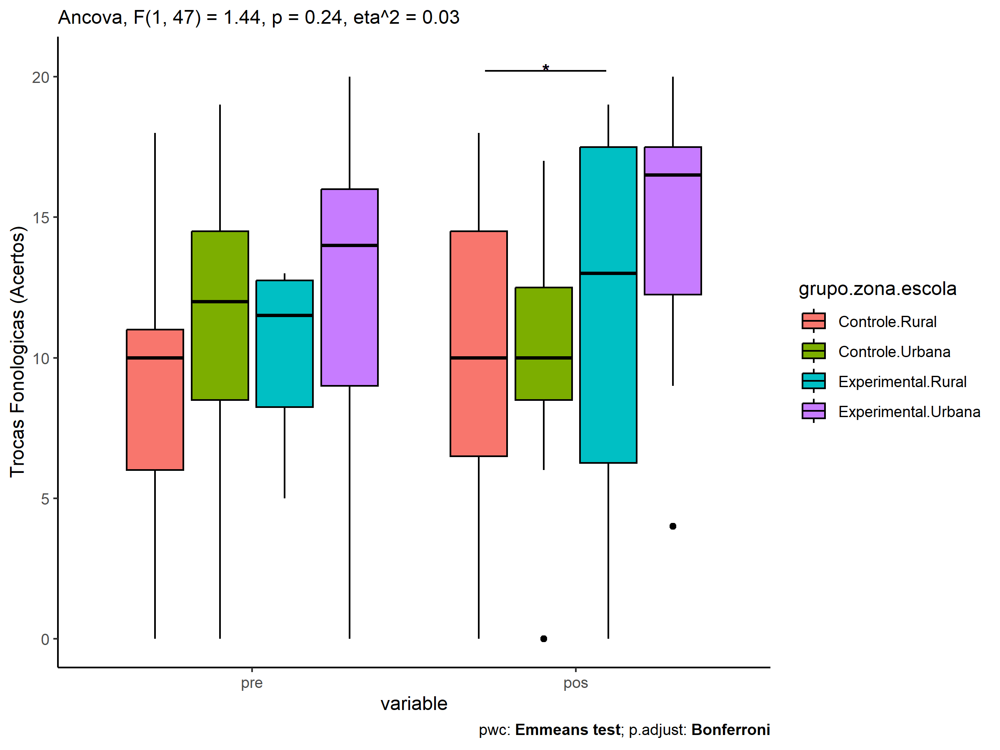<!-- -->

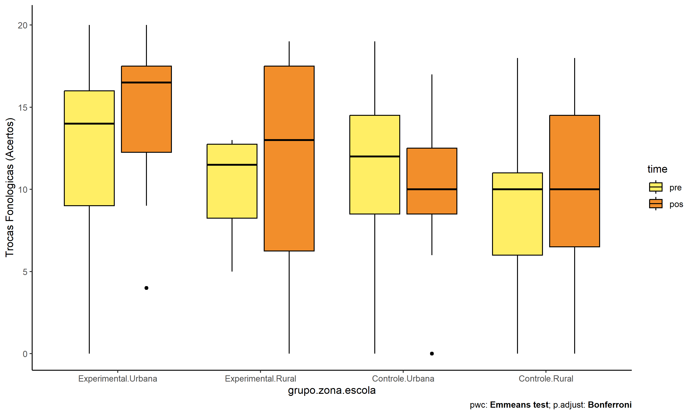<!-- -->

### Trocas Fonologicas (TRI)

| var        | zona.escola | grupo        |   n | M (pre) | SE (pre) | M (unadj) | SE (unadj) | M (adj) | SE (adj) |
|:-----------|:------------|:-------------|----:|--------:|---------:|----------:|-----------:|--------:|---------:|
| tri.TF.pos | Rural       | Controle     |   8 |  -0.671 |    0.304 |    -0.629 |      0.286 |  -0.583 |    0.230 |
| tri.TF.pos | Rural       | Experimental |   8 |  -0.680 |    0.211 |    -0.386 |      0.312 |  -0.334 |    0.230 |
| tri.TF.pos | Urbana      | Controle     |  16 |  -0.716 |    0.160 |    -0.789 |      0.153 |  -0.713 |    0.163 |
| tri.TF.pos | Urbana      | Experimental |  11 |  -0.316 |    0.292 |    -0.063 |      0.303 |  -0.246 |    0.200 |

| grupo        | zona.escola | group1   | group2       | estimate | conf.low | conf.high |    se | statistic |     p | p.adj | p.adj.signif |
|:-------------|:------------|:---------|:-------------|---------:|---------:|----------:|------:|----------:|------:|------:|:-------------|
| Controle     |             | Urbana   | Rural        |   -0.131 |   -0.701 |     0.439 | 0.282 |    -0.464 | 0.645 | 0.645 | ns           |
| Experimental |             | Urbana   | Rural        |    0.088 |   -0.532 |     0.707 | 0.306 |     0.287 | 0.775 | 0.775 | ns           |
| Controle     |             | Urbana   | Rural        |   -0.045 |   -0.721 |     0.631 | 0.334 |    -0.136 | 0.893 | 0.893 | ns           |
| Experimental |             | Urbana   | Rural        |    0.364 |   -0.362 |     1.089 | 0.359 |     1.014 | 0.317 | 0.317 | ns           |
|              | Urbana      | Controle | Experimental |   -0.467 |   -0.994 |     0.059 | 0.260 |    -1.796 | 0.080 | 0.080 | ns           |
|              | Rural       | Controle | Experimental |   -0.249 |   -0.907 |     0.409 | 0.325 |    -0.766 | 0.449 | 0.449 | ns           |
|              | Urbana      | Controle | Experimental |   -0.400 |   -1.012 |     0.211 | 0.302 |    -1.324 | 0.193 | 0.193 | ns           |
|              | Rural       | Controle | Experimental |    0.009 |   -0.772 |     0.789 | 0.386 |     0.022 | 0.982 | 0.982 | ns           |

| grupo        | zona.escola | group1 | group2 | estimate | conf.low | conf.high |    se | statistic |     p | p.adj | p.adj.signif |
|:-------------|:------------|:-------|:-------|---------:|---------:|----------:|------:|----------:|------:|------:|:-------------|
| Controle     | Urbana      | pre    | pos    |    0.204 |   -0.334 |     0.743 | 0.271 |     0.755 | 0.452 | 0.452 | ns           |
| Controle     | Rural       | pre    | pos    |   -0.139 |   -0.870 |     0.592 | 0.368 |    -0.378 | 0.707 | 0.707 | ns           |
| Experimental | Urbana      | pre    | pos    |   -0.144 |   -0.808 |     0.520 | 0.334 |    -0.431 | 0.667 | 0.667 | ns           |
| Experimental | Rural       | pre    | pos    |   -0.186 |   -0.941 |     0.569 | 0.380 |    -0.489 | 0.626 | 0.626 | ns           |

    ## Scale for colour is already present.
    ## Adding another scale for colour, which will replace the existing scale.

<!-- -->

    ## Scale for colour is already present.
    ## Adding another scale for colour, which will replace the existing scale.

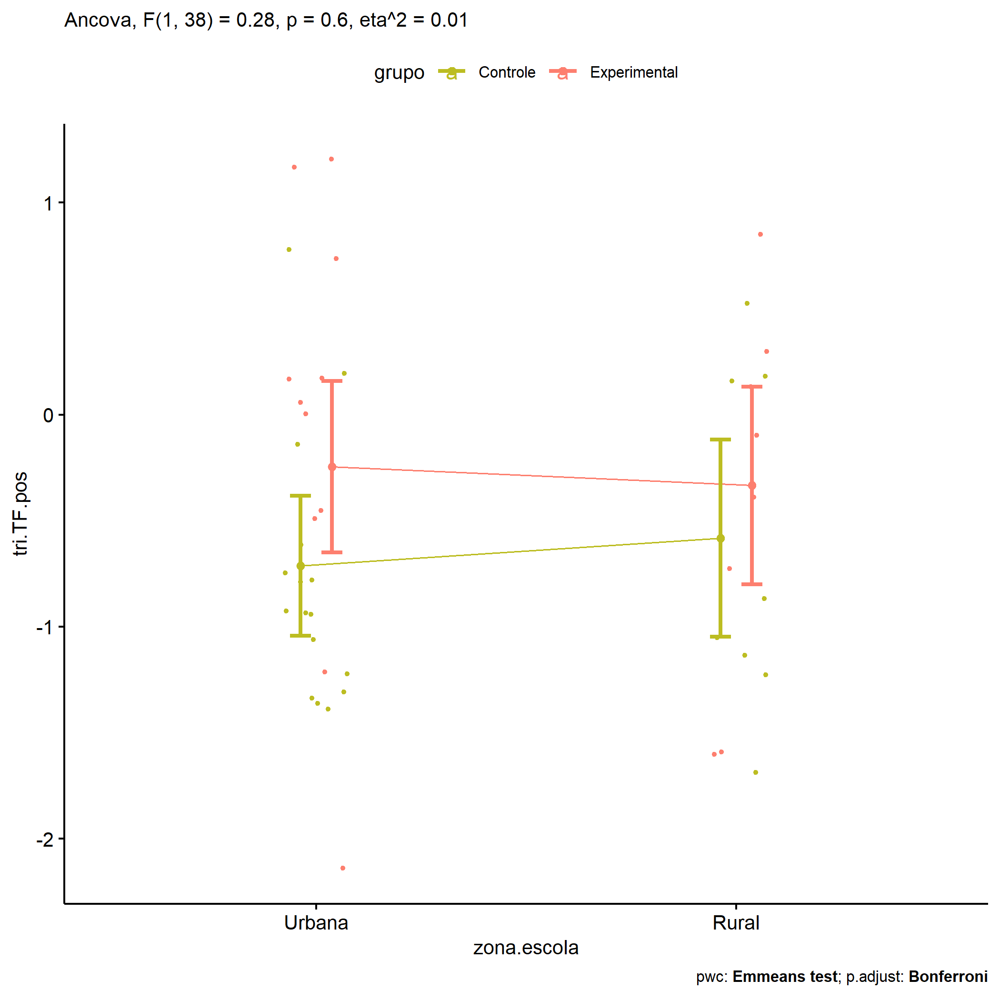<!-- -->

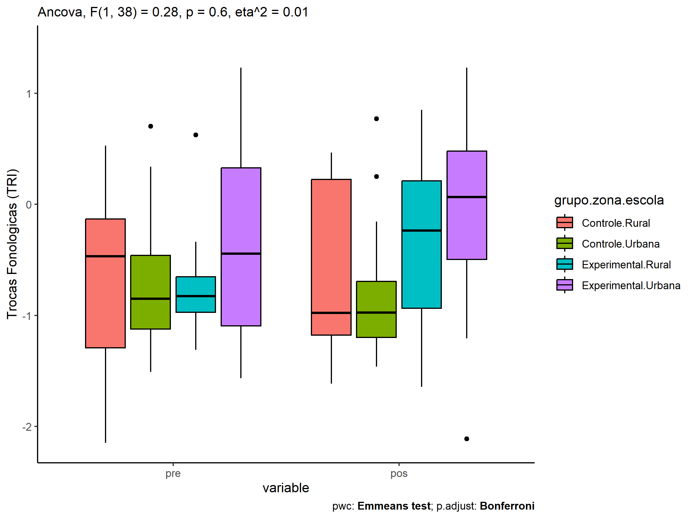<!-- -->

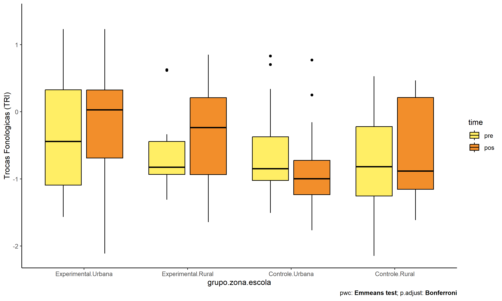<!-- -->

### Trocas Orograficas (Acertos)

| var          | zona.escola | grupo        |   n | M (pre) | SE (pre) | M (unadj) | SE (unadj) | M (adj) | SE (adj) |
|:-------------|:------------|:-------------|----:|--------:|---------:|----------:|-----------:|--------:|---------:|
| score.TO.pos | Rural       | Controle     |  11 |   6.273 |    1.199 |     6.818 |      1.249 |   6.997 |    1.152 |
| score.TO.pos | Rural       | Experimental |  10 |   7.000 |    0.447 |     7.900 |      1.456 |   7.890 |    1.203 |
| score.TO.pos | Urbana      | Controle     |  19 |   7.000 |    0.869 |     9.474 |      0.886 |   9.464 |    0.873 |
| score.TO.pos | Urbana      | Experimental |  12 |   7.500 |    1.055 |     8.750 |      0.818 |   8.610 |    1.102 |

| grupo        | zona.escola | group1   | group2       | estimate | conf.low | conf.high |    se | statistic |     p | p.adj | p.adj.signif |
|:-------------|:------------|:---------|:-------------|---------:|---------:|----------:|------:|----------:|------:|------:|:-------------|
| Controle     |             | Urbana   | Rural        |    2.466 |   -0.442 |     5.375 | 1.446 |     1.706 | 0.095 | 0.095 | ns           |
| Experimental |             | Urbana   | Rural        |    0.720 |   -2.561 |     4.001 | 1.631 |     0.442 | 0.661 | 0.661 | ns           |
| Controle     |             | Urbana   | Rural        |    0.727 |   -1.923 |     3.378 | 1.318 |     0.552 | 0.584 | 0.584 | ns           |
| Experimental |             | Urbana   | Rural        |    0.500 |   -2.496 |     3.496 | 1.490 |     0.336 | 0.739 | 0.739 | ns           |
|              | Urbana      | Controle | Experimental |    0.854 |   -1.973 |     3.680 | 1.405 |     0.608 | 0.546 | 0.546 | ns           |
|              | Rural       | Controle | Experimental |   -0.893 |   -4.245 |     2.459 | 1.666 |    -0.536 | 0.595 | 0.595 | ns           |
|              | Urbana      | Controle | Experimental |   -0.500 |   -3.080 |     2.080 | 1.283 |    -0.390 | 0.698 | 0.698 | ns           |
|              | Rural       | Controle | Experimental |   -0.727 |   -3.784 |     2.330 | 1.520 |    -0.478 | 0.635 | 0.635 | ns           |

| grupo        | zona.escola | group1 | group2 | estimate | conf.low | conf.high |    se | statistic |     p | p.adj | p.adj.signif |
|:-------------|:------------|:-------|:-------|---------:|---------:|----------:|------:|----------:|------:|------:|:-------------|
| Controle     | Urbana      | pre    | pos    |   -2.474 |   -4.844 |    -0.103 | 1.194 |    -2.071 | 0.041 | 0.041 | \*           |
| Controle     | Rural       | pre    | pos    |   -0.545 |   -3.661 |     2.570 | 1.570 |    -0.348 | 0.729 | 0.729 | ns           |
| Experimental | Urbana      | pre    | pos    |   -1.250 |   -4.233 |     1.733 | 1.503 |    -0.832 | 0.408 | 0.408 | ns           |
| Experimental | Rural       | pre    | pos    |   -0.900 |   -4.168 |     2.368 | 1.646 |    -0.547 | 0.586 | 0.586 | ns           |

    ## Scale for colour is already present.
    ## Adding another scale for colour, which will replace the existing scale.

<!-- -->

    ## Scale for colour is already present.
    ## Adding another scale for colour, which will replace the existing scale.

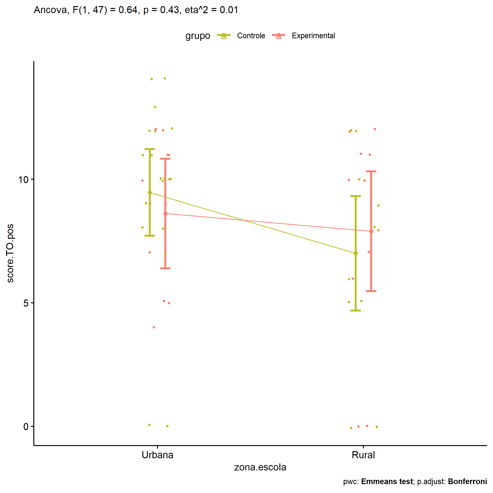<!-- -->

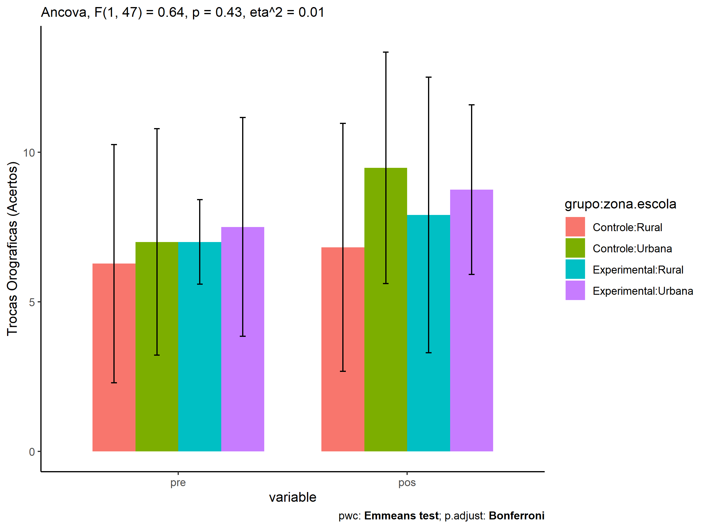<!-- -->

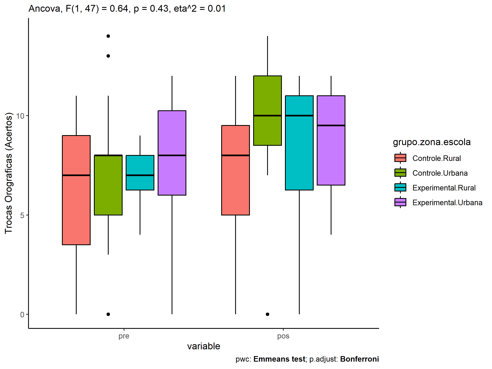<!-- -->

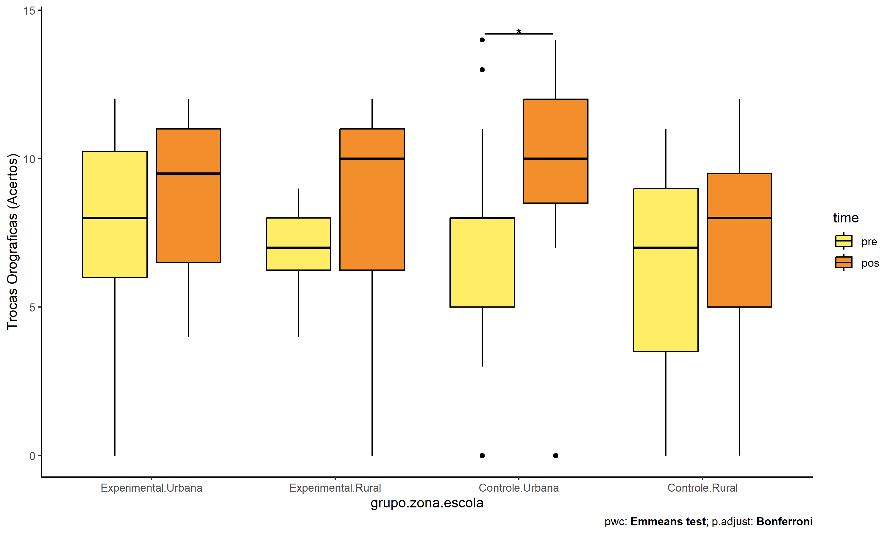<!-- -->

### Trocas Orograficas (TRI)

| var        | zona.escola | grupo        |   n | M (pre) | SE (pre) | M (unadj) | SE (unadj) | M (adj) | SE (adj) |
|:-----------|:------------|:-------------|----:|--------:|---------:|----------:|-----------:|--------:|---------:|
| tri.TO.pos | Rural       | Controle     |   8 |  -0.418 |    0.226 |    -0.229 |      0.251 |  -0.253 |    0.182 |
| tri.TO.pos | Rural       | Experimental |   8 |  -0.406 |    0.234 |    -0.309 |      0.211 |  -0.337 |    0.182 |
| tri.TO.pos | Urbana      | Controle     |  16 |  -0.626 |    0.201 |    -0.237 |      0.101 |  -0.192 |    0.130 |
| tri.TO.pos | Urbana      | Experimental |  11 |  -0.412 |    0.176 |    -0.338 |      0.183 |  -0.364 |    0.155 |

| grupo        | zona.escola | group1   | group2       | estimate | conf.low | conf.high |    se | statistic |     p | p.adj | p.adj.signif |
|:-------------|:------------|:---------|:-------------|---------:|---------:|----------:|------:|----------:|------:|------:|:-------------|
| Controle     |             | Urbana   | Rural        |    0.061 |   -0.393 |     0.515 | 0.224 |     0.273 | 0.786 | 0.786 | ns           |
| Experimental |             | Urbana   | Rural        |   -0.027 |   -0.511 |     0.458 | 0.239 |    -0.112 | 0.912 | 0.912 | ns           |
| Controle     |             | Urbana   | Rural        |   -0.208 |   -0.819 |     0.403 | 0.302 |    -0.688 | 0.495 | 0.495 | ns           |
| Experimental |             | Urbana   | Rural        |   -0.007 |   -0.663 |     0.649 | 0.324 |    -0.021 | 0.984 | 0.984 | ns           |
|              | Urbana      | Controle | Experimental |    0.172 |   -0.239 |     0.583 | 0.203 |     0.847 | 0.402 | 0.402 | ns           |
|              | Rural       | Controle | Experimental |    0.084 |   -0.437 |     0.605 | 0.257 |     0.327 | 0.746 | 0.746 | ns           |
|              | Urbana      | Controle | Experimental |   -0.214 |   -0.767 |     0.339 | 0.273 |    -0.783 | 0.438 | 0.438 | ns           |
|              | Rural       | Controle | Experimental |   -0.013 |   -0.719 |     0.693 | 0.349 |    -0.036 | 0.971 | 0.971 | ns           |

| grupo        | zona.escola | group1 | group2 | estimate | conf.low | conf.high |    se | statistic |     p | p.adj | p.adj.signif |
|:-------------|:------------|:-------|:-------|---------:|---------:|----------:|------:|----------:|------:|------:|:-------------|
| Controle     | Urbana      | pre    | pos    |   -0.473 |   -0.893 |    -0.052 | 0.211 |    -2.236 | 0.028 | 0.028 | \*           |
| Controle     | Rural       | pre    | pos    |   -0.151 |   -0.722 |     0.420 | 0.287 |    -0.525 | 0.601 | 0.601 | ns           |
| Experimental | Urbana      | pre    | pos    |   -0.021 |   -0.540 |     0.498 | 0.261 |    -0.081 | 0.936 | 0.936 | ns           |
| Experimental | Rural       | pre    | pos    |   -0.013 |   -0.603 |     0.576 | 0.297 |    -0.046 | 0.964 | 0.964 | ns           |

    ## Scale for colour is already present.
    ## Adding another scale for colour, which will replace the existing scale.

<!-- -->

    ## Scale for colour is already present.
    ## Adding another scale for colour, which will replace the existing scale.

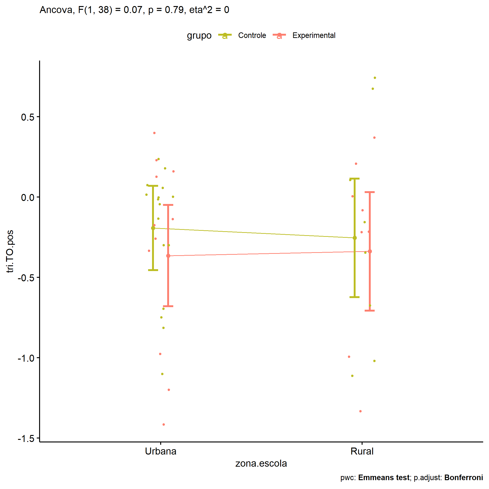<!-- -->

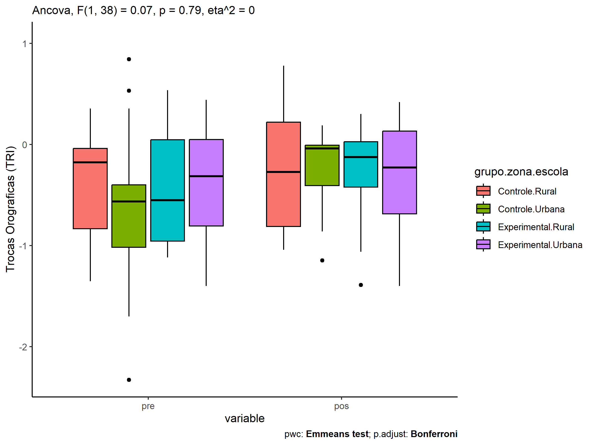<!-- -->

<!-- -->

# Pairwise comparisons for grupo=“Experimental”

## factores: **grupo=“Experimental”:monitor**

### Leitura de Pseudo-Palavras (Acertos)

### Leitura de Pseudo-Palavras (TRI)

### Correta Regular (Acertos)

### Correta Regular (TRI)

### Correta Irregular (Acertos)

### Correta Irregular (TRI)

### Trocas Visuais (Acertos)

### Trocas Visuais (TRI)

### Trocas Fonologicas (Acertos)

### Trocas Fonologicas (TRI)

### Trocas Orograficas (Acertos)

### Trocas Orograficas (TRI)

## factores: **grupo=“Experimental”:monitor.genero**

### Leitura de Pseudo-Palavras (Acertos)

| var            | monitor.genero |   n | M (pre) | SE (pre) | M (unadj) | SE (unadj) | M (adj) | SE (adj) |
|:---------------|:---------------|----:|--------:|---------:|----------:|-----------:|--------:|---------:|
| score.CLPP.pos | F              |  14 |  53.857 |    3.016 |    64.429 |      2.703 |  64.788 |    2.521 |
| score.CLPP.pos | M              |   5 |  63.200 |    5.014 |    72.200 |      2.083 |  71.193 |    4.360 |

| .y.            | group1 | group2 | estimate | conf.low | conf.high |    se | statistic |     p | p.adj | p.adj.signif |
|:---------------|:-------|:-------|---------:|---------:|----------:|------:|----------:|------:|------:|:-------------|
| score.CLPP.pos | F      | M      |   -6.405 |  -17.360 |     4.550 | 5.168 |    -1.239 | 0.233 | 0.233 | ns           |
| score.CLPP.pre | F      | M      |   -9.343 |  -21.729 |     3.043 | 5.871 |    -1.591 | 0.130 | 0.130 | ns           |

| monitor.genero | group1 | group2 | estimate | conf.low | conf.high |    se | statistic |     p | p.adj | p.adj.signif |
|:---------------|:-------|:-------|---------:|---------:|----------:|------:|----------:|------:|------:|:-------------|
| F              | pre    | pos    |  -13.554 |  -22.773 |    -4.334 | 4.550 |    -2.979 | 0.005 | 0.005 | \*\*         |
| M              | pre    | pos    |   -3.800 |  -19.055 |    11.455 | 7.529 |    -0.505 | 0.617 | 0.617 | ns           |

    ## Scale for colour is already present.
    ## Adding another scale for colour, which will replace the existing scale.

<!-- -->

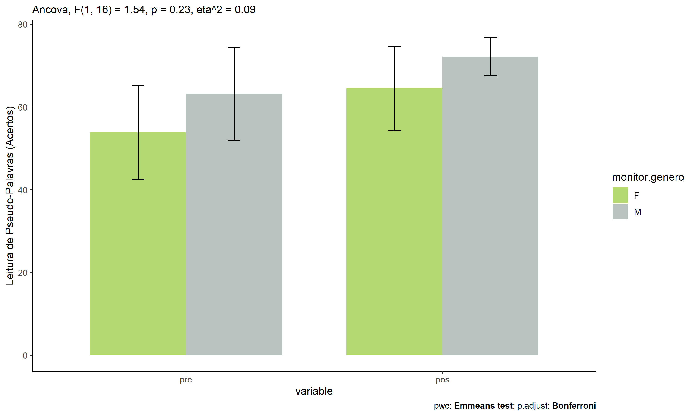<!-- -->

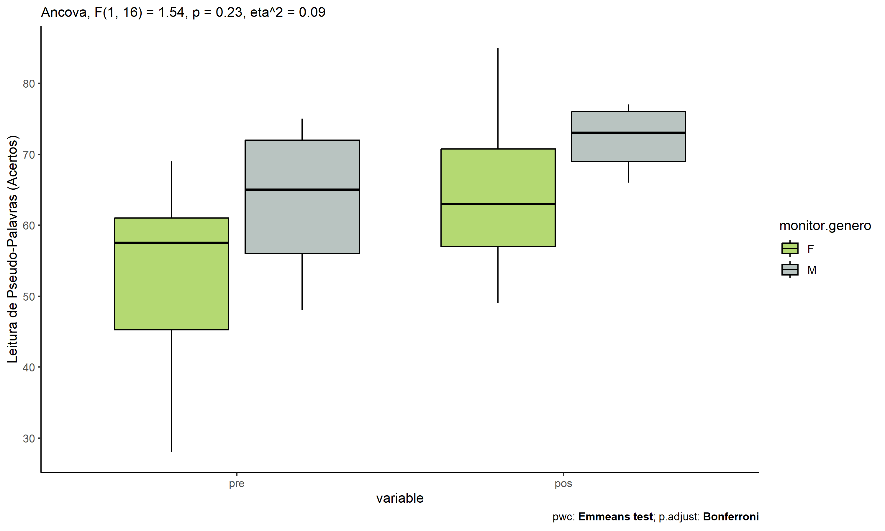<!-- -->

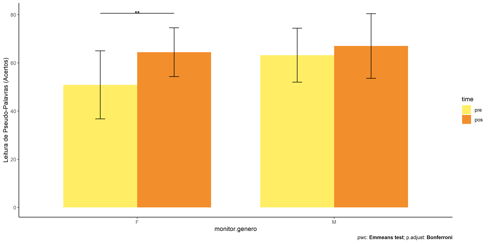<!-- -->

<!-- -->

### Leitura de Pseudo-Palavras (TRI)

| var          | monitor.genero |   n | M (pre) | SE (pre) | M (unadj) | SE (unadj) | M (adj) | SE (adj) |
|:-------------|:---------------|----:|--------:|---------:|----------:|-----------:|--------:|---------:|
| tri.CLPP.pos | F              |  14 |  53.857 |    3.016 |    64.429 |      2.703 |  64.788 |    2.521 |
| tri.CLPP.pos | M              |   5 |  63.200 |    5.014 |    72.200 |      2.083 |  71.193 |    4.360 |

| .y.          | group1 | group2 | estimate | conf.low | conf.high |    se | statistic |     p | p.adj | p.adj.signif |
|:-------------|:-------|:-------|---------:|---------:|----------:|------:|----------:|------:|------:|:-------------|
| tri.CLPP.pos | F      | M      |   -6.405 |  -17.360 |     4.550 | 5.168 |    -1.239 | 0.233 | 0.233 | ns           |
| tri.CLPP.pre | F      | M      |   -9.343 |  -21.729 |     3.043 | 5.871 |    -1.591 | 0.130 | 0.130 | ns           |

| monitor.genero | group1 | group2 | estimate | conf.low | conf.high |    se | statistic |     p | p.adj | p.adj.signif |
|:---------------|:-------|:-------|---------:|---------:|----------:|------:|----------:|------:|------:|:-------------|
| F              | pre    | pos    |   -0.440 |   -0.992 |     0.112 | 0.272 |    -1.613 | 0.115 | 0.115 | ns           |
| M              | pre    | pos    |    0.146 |   -0.767 |     1.060 | 0.451 |     0.325 | 0.747 | 0.747 | ns           |

    ## Scale for colour is already present.
    ## Adding another scale for colour, which will replace the existing scale.

<!-- -->

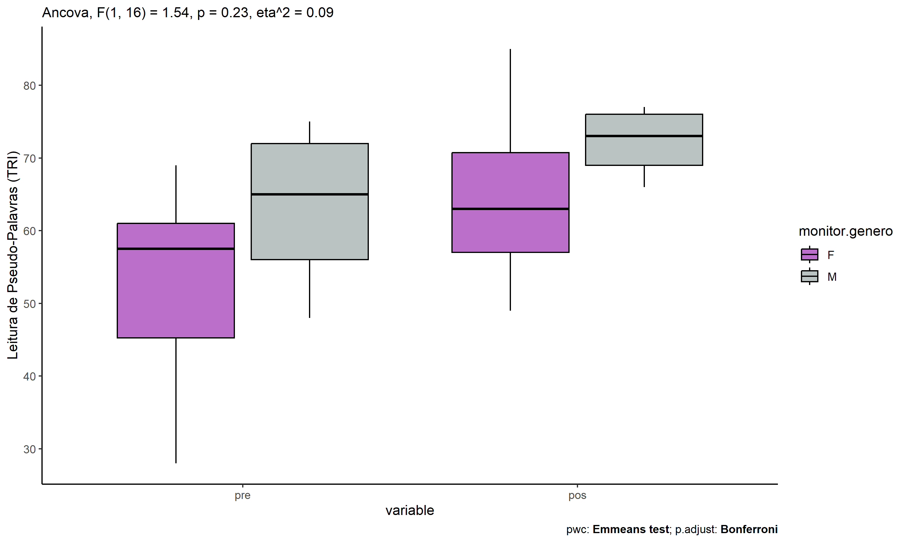<!-- -->

<!-- -->

### Correta Regular (Acertos)

| var          | monitor.genero |   n | M (pre) | SE (pre) | M (unadj) | SE (unadj) | M (adj) | SE (adj) |
|:-------------|:---------------|----:|--------:|---------:|----------:|-----------:|--------:|---------:|
| score.CR.pos | F              |  16 |  10.438 |    0.996 |    13.000 |      1.455 |  13.325 |    1.055 |
| score.CR.pos | M              |   6 |  12.000 |    2.633 |    14.333 |      1.706 |  13.467 |    1.732 |

| .y.          | group1 | group2 | estimate | conf.low | conf.high |    se | statistic |     p | p.adj | p.adj.signif |
|:-------------|:-------|:-------|---------:|---------:|----------:|------:|----------:|------:|------:|:-------------|
| score.CR.pos | F      | M      |   -0.142 |   -4.406 |     4.122 | 2.037 |    -0.070 | 0.945 | 0.945 | ns           |
| score.CR.pre | F      | M      |   -1.562 |   -6.278 |     3.153 | 2.260 |    -0.691 | 0.497 | 0.497 | ns           |

| monitor.genero | group1 | group2 | estimate | conf.low | conf.high |    se | statistic |     p | p.adj | p.adj.signif |
|:---------------|:-------|:-------|---------:|---------:|----------:|------:|----------:|------:|------:|:-------------|
| F              | pre    | pos    |   -2.562 |   -6.208 |     1.083 | 1.804 |    -1.421 | 0.163 | 0.163 | ns           |
| M              | pre    | pos    |   -2.333 |   -8.287 |     3.620 | 2.946 |    -0.792 | 0.433 | 0.433 | ns           |

    ## Scale for colour is already present.
    ## Adding another scale for colour, which will replace the existing scale.

<!-- -->

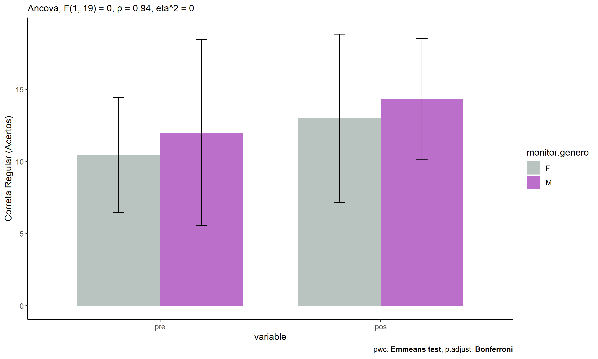<!-- -->

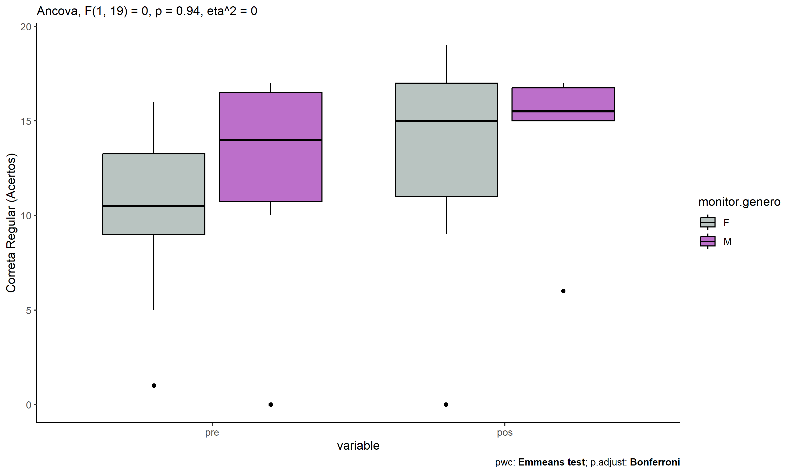<!-- -->

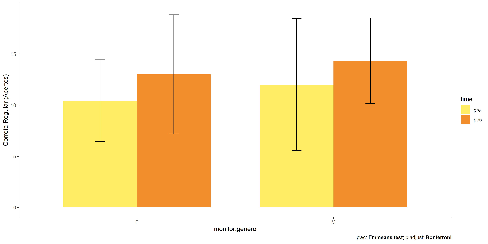<!-- -->

<!-- -->

### Correta Regular (TRI)

| var        | monitor.genero |   n | M (pre) | SE (pre) | M (unadj) | SE (unadj) | M (adj) | SE (adj) |
|:-----------|:---------------|----:|--------:|---------:|----------:|-----------:|--------:|---------:|
| tri.CR.pos | F              |  14 |  -0.839 |    0.207 |    -0.161 |      0.218 |   0.028 |    0.171 |
| tri.CR.pos | M              |   5 |   0.312 |    0.220 |     0.212 |      0.162 |  -0.316 |    0.318 |

| .y.        | group1 | group2 | estimate | conf.low | conf.high |    se | statistic |     p | p.adj | p.adj.signif |
|:-----------|:-------|:-------|---------:|---------:|----------:|------:|----------:|------:|------:|:-------------|
| tri.CR.pos | F      | M      |    0.344 |   -0.481 |     1.170 | 0.389 |     0.885 | 0.389 | 0.389 | ns           |
| tri.CR.pre | F      | M      |   -1.151 |   -1.940 |    -0.361 | 0.374 |    -3.075 | 0.007 | 0.007 | \*\*         |

| monitor.genero | group1 | group2 | estimate | conf.low | conf.high |    se | statistic |     p | p.adj | p.adj.signif |
|:---------------|:-------|:-------|---------:|---------:|----------:|------:|----------:|------:|------:|:-------------|
| F              | pre    | pos    |   -0.773 |   -1.357 |    -0.189 | 0.288 |    -2.682 | 0.011 | 0.011 | \*           |
| M              | pre    | pos    |    0.437 |   -0.530 |     1.403 | 0.477 |     0.916 | 0.366 | 0.366 | ns           |

    ## Scale for colour is already present.
    ## Adding another scale for colour, which will replace the existing scale.

<!-- -->

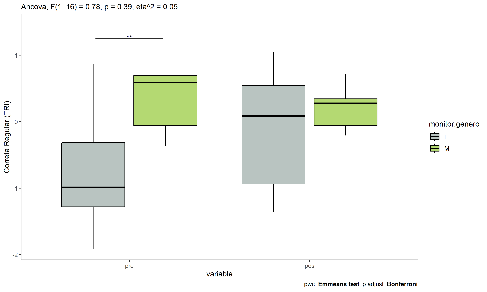<!-- -->

<!-- -->

### Correta Irregular (Acertos)

| var          | monitor.genero |   n | M (pre) | SE (pre) | M (unadj) | SE (unadj) | M (adj) | SE (adj) |
|:-------------|:---------------|----:|--------:|---------:|----------:|-----------:|--------:|---------:|
| score.CI.pos | F              |  16 |   9.000 |    0.913 |     9.750 |      1.233 |   9.446 |    0.977 |
| score.CI.pos | M              |   6 |   7.167 |    1.579 |    10.833 |      0.872 |  11.644 |    1.615 |

| .y.          | group1 | group2 | estimate | conf.low | conf.high |    se | statistic |     p | p.adj | p.adj.signif |
|:-------------|:-------|:-------|---------:|---------:|----------:|------:|----------:|------:|------:|:-------------|
| score.CI.pos | F      | M      |   -2.198 |   -6.189 |     1.792 | 1.907 |    -1.153 | 0.263 | 0.263 | ns           |
| score.CI.pre | F      | M      |    1.833 |   -1.868 |     5.535 | 1.775 |     1.033 | 0.314 | 0.314 | ns           |

| monitor.genero | group1 | group2 | estimate | conf.low | conf.high |    se | statistic |     p | p.adj | p.adj.signif |
|:---------------|:-------|:-------|---------:|---------:|----------:|------:|----------:|------:|------:|:-------------|
| F              | pre    | pos    |   -0.750 |   -3.658 |     2.158 | 1.439 |    -0.521 | 0.605 | 0.605 | ns           |
| M              | pre    | pos    |   -3.667 |   -8.416 |     1.083 | 2.350 |    -1.560 | 0.127 | 0.127 | ns           |

    ## Scale for colour is already present.
    ## Adding another scale for colour, which will replace the existing scale.

<!-- -->

<!-- -->

<!-- -->

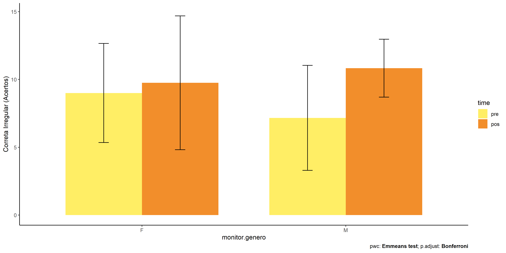<!-- -->

<!-- -->

### Correta Irregular (TRI)

| var        | monitor.genero |   n | M (pre) | SE (pre) | M (unadj) | SE (unadj) | M (adj) | SE (adj) |
|:-----------|:---------------|----:|--------:|---------:|----------:|-----------:|--------:|---------:|
| tri.CI.pos | F              |  14 |  -0.501 |    0.164 |    -0.190 |       0.25 |  -0.191 |    0.219 |
| tri.CI.pos | M              |   5 |  -0.508 |    0.210 |    -0.434 |       0.26 |  -0.431 |    0.367 |

| .y.        | group1 | group2 | estimate | conf.low | conf.high |    se | statistic |     p | p.adj | p.adj.signif |
|:-----------|:-------|:-------|---------:|---------:|----------:|------:|----------:|------:|------:|:-------------|
| tri.CI.pos | F      | M      |    0.240 |   -0.666 |     1.146 | 0.427 |     0.562 | 0.582 | 0.582 | ns           |
| tri.CI.pre | F      | M      |    0.007 |   -0.634 |     0.648 | 0.304 |     0.023 | 0.982 | 0.982 | ns           |

| monitor.genero | group1 | group2 | estimate | conf.low | conf.high |    se | statistic |     p | p.adj | p.adj.signif |
|:---------------|:-------|:-------|---------:|---------:|----------:|------:|----------:|------:|------:|:-------------|
| F              | pre    | pos    |   -0.405 |   -0.945 |     0.134 | 0.266 |    -1.522 | 0.137 | 0.137 | ns           |
| M              | pre    | pos    |   -0.083 |   -0.976 |     0.809 | 0.441 |    -0.189 | 0.851 | 0.851 | ns           |

    ## Scale for colour is already present.
    ## Adding another scale for colour, which will replace the existing scale.

<!-- -->

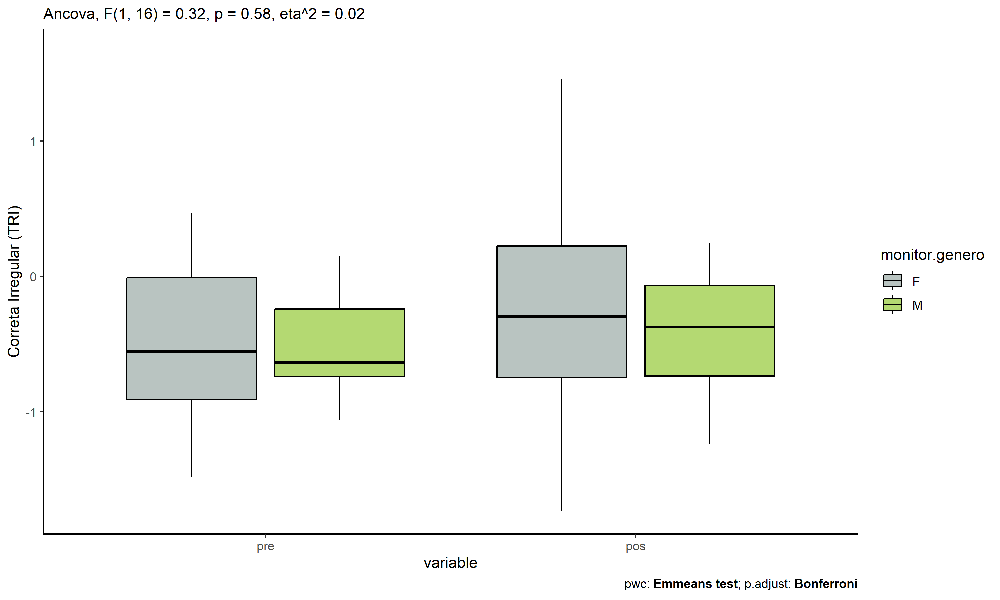<!-- -->

<!-- -->

### Trocas Visuais (Acertos)

| var          | monitor.genero |   n | M (pre) | SE (pre) | M (unadj) | SE (unadj) | M (adj) | SE (adj) |
|:-------------|:---------------|----:|--------:|---------:|----------:|-----------:|--------:|---------:|
| score.TV.pos | F              |  16 |  12.875 |    1.224 |    13.688 |      1.538 |  13.831 |     1.32 |
| score.TV.pos | M              |   6 |  14.000 |    2.910 |    16.500 |      1.784 |  16.117 |     2.16 |

| .y.          | group1 | group2 | estimate | conf.low | conf.high |    se | statistic |     p | p.adj | p.adj.signif |
|:-------------|:-------|:-------|---------:|---------:|----------:|------:|----------:|------:|------:|:-------------|
| score.TV.pos | F      | M      |   -2.286 |   -7.593 |     3.022 | 2.536 |    -0.901 | 0.379 | 0.379 | ns           |
| score.TV.pre | F      | M      |   -1.125 |   -6.657 |     4.407 | 2.652 |    -0.424 | 0.676 | 0.676 | ns           |

| monitor.genero | group1 | group2 | estimate | conf.low | conf.high |    se | statistic |     p | p.adj | p.adj.signif |
|:---------------|:-------|:-------|---------:|---------:|----------:|------:|----------:|------:|------:|:-------------|
| F              | pre    | pos    |   -0.812 |   -4.849 |     3.224 | 1.997 |    -0.407 | 0.686 | 0.686 | ns           |
| M              | pre    | pos    |   -2.500 |   -9.092 |     4.092 | 3.262 |    -0.766 | 0.448 | 0.448 | ns           |

    ## Scale for colour is already present.
    ## Adding another scale for colour, which will replace the existing scale.

<!-- -->

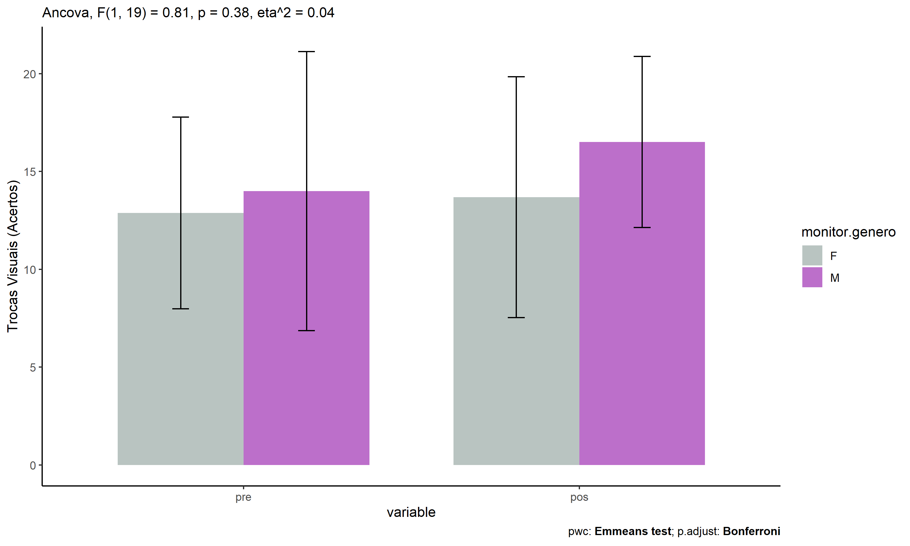<!-- -->

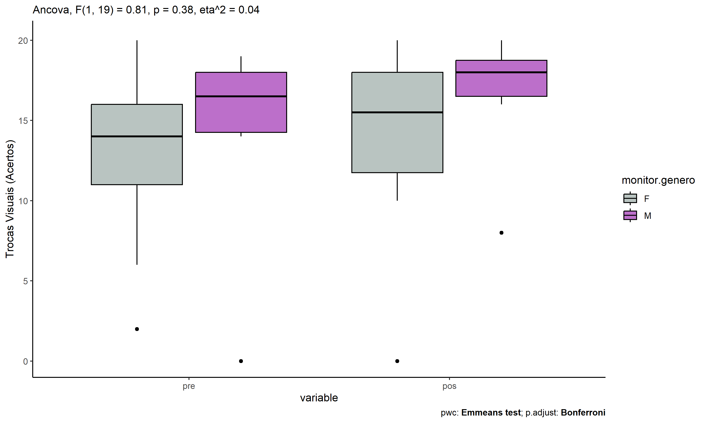<!-- -->

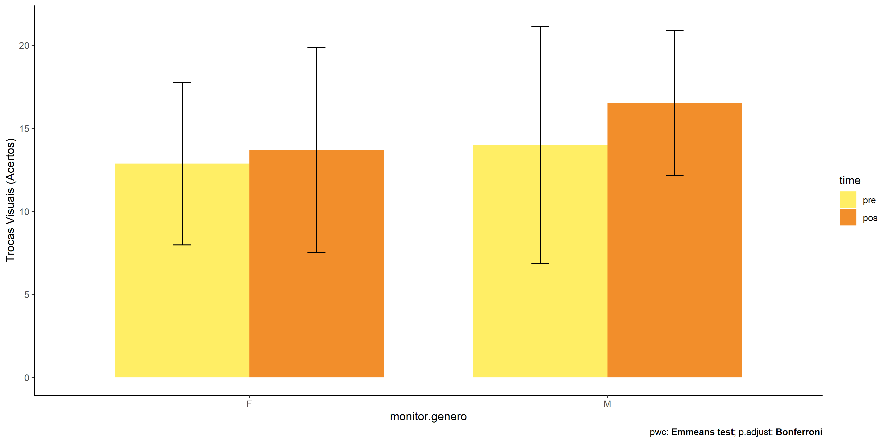<!-- -->

<!-- -->

### Trocas Visuais (TRI)

| var        | monitor.genero |   n | M (pre) | SE (pre) | M (unadj) | SE (unadj) | M (adj) | SE (adj) |
|:-----------|:---------------|----:|--------:|---------:|----------:|-----------:|--------:|---------:|
| tri.TV.pos | F              |  14 |  -0.628 |    0.247 |    -0.316 |      0.232 |  -0.274 |    0.219 |
| tri.TV.pos | M              |   5 |   0.226 |    0.307 |     0.336 |      0.203 |   0.219 |    0.383 |

| .y.        | group1 | group2 | estimate | conf.low | conf.high |    se | statistic |     p | p.adj | p.adj.signif |
|:-----------|:-------|:-------|---------:|---------:|----------:|------:|----------:|------:|------:|:-------------|
| tri.TV.pos | F      | M      |   -0.494 |   -1.461 |     0.474 | 0.457 |    -1.081 | 0.296 | 0.296 | ns           |
| tri.TV.pre | F      | M      |   -0.853 |   -1.815 |     0.108 | 0.456 |    -1.873 | 0.078 | 0.078 | ns           |

| monitor.genero | group1 | group2 | estimate | conf.low | conf.high |    se | statistic |     p | p.adj | p.adj.signif |
|:---------------|:-------|:-------|---------:|---------:|----------:|------:|----------:|------:|------:|:-------------|
| F              | pre    | pos    |   -0.235 |   -0.866 |     0.396 | 0.311 |    -0.756 | 0.455 | 0.455 | ns           |
| M              | pre    | pos    |    0.130 |   -0.914 |     1.174 | 0.515 |     0.252 | 0.802 | 0.802 | ns           |

    ## Scale for colour is already present.
    ## Adding another scale for colour, which will replace the existing scale.

<!-- -->

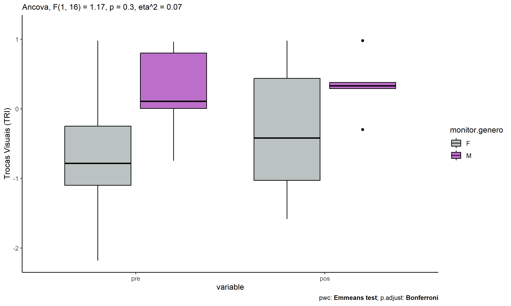<!-- -->

<!-- -->

### Trocas Fonologicas (Acertos)

| var          | monitor.genero |   n | M (pre) | SE (pre) | M (unadj) | SE (unadj) | M (adj) | SE (adj) |
|:-------------|:---------------|----:|--------:|---------:|----------:|-----------:|--------:|---------:|
| score.TF.pos | F              |  16 |      11 |    0.806 |     11.75 |      1.624 |  12.156 |    1.285 |
| score.TF.pos | M              |   6 |      13 |    2.898 |     16.50 |      1.727 |  15.416 |    2.118 |

| .y.          | group1 | group2 | estimate | conf.low | conf.high |    se | statistic |     p | p.adj | p.adj.signif |
|:-------------|:-------|:-------|---------:|---------:|----------:|------:|----------:|------:|------:|:-------------|
| score.TF.pos | F      | M      |    -3.26 |   -8.487 |     1.968 | 2.498 |    -1.305 | 0.207 | 0.207 | ns           |
| score.TF.pre | F      | M      |    -2.00 |   -6.510 |     2.510 | 2.162 |    -0.925 | 0.366 | 0.366 | ns           |

| monitor.genero | group1 | group2 | estimate | conf.low | conf.high |    se | statistic |     p | p.adj | p.adj.signif |
|:---------------|:-------|:-------|---------:|---------:|----------:|------:|----------:|------:|------:|:-------------|
| F              | pre    | pos    |    -0.75 |   -4.549 |     3.049 | 1.880 |    -0.399 | 0.692 | 0.692 | ns           |
| M              | pre    | pos    |    -3.50 |   -9.703 |     2.703 | 3.069 |    -1.140 | 0.261 | 0.261 | ns           |

    ## Scale for colour is already present.
    ## Adding another scale for colour, which will replace the existing scale.

<!-- -->

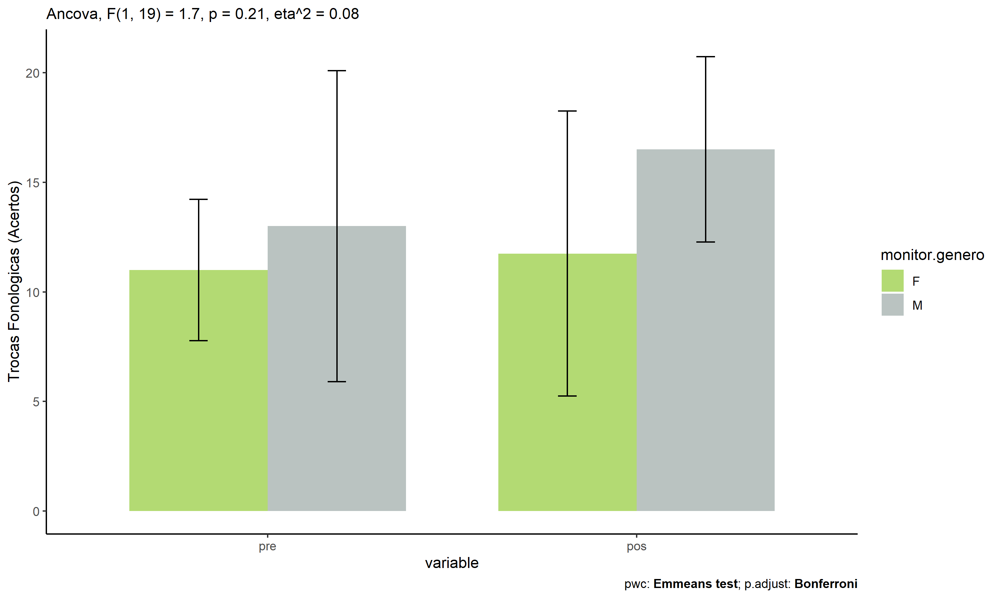<!-- -->

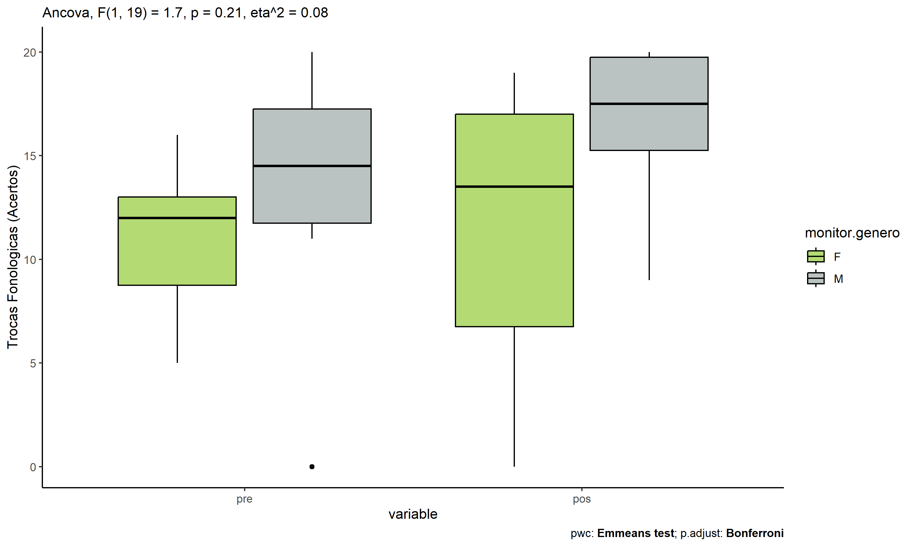<!-- -->

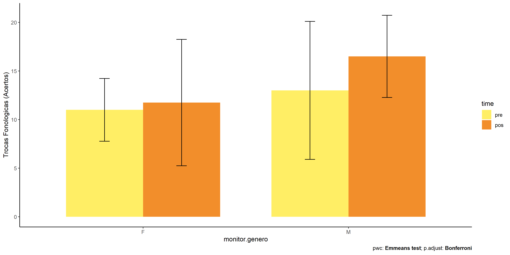<!-- -->

<!-- -->

### Trocas Fonologicas (TRI)

| var        | monitor.genero |   n | M (pre) | SE (pre) | M (unadj) | SE (unadj) | M (adj) | SE (adj) |
|:-----------|:---------------|----:|--------:|---------:|----------:|-----------:|--------:|---------:|
| tri.TF.pos | F              |  14 |  -0.750 |    0.152 |    -0.466 |      0.233 |  -0.260 |    0.198 |
| tri.TF.pos | M              |   5 |   0.316 |    0.452 |     0.548 |      0.345 |  -0.028 |    0.364 |

| .y.        | group1 | group2 | estimate | conf.low | conf.high |    se | statistic |     p | p.adj | p.adj.signif |
|:-----------|:-------|:-------|---------:|---------:|----------:|------:|----------:|------:|------:|:-------------|
| tri.TF.pos | F      | M      |   -0.232 |   -1.174 |     0.709 | 0.444 |    -0.523 | 0.608 | 0.608 | ns           |
| tri.TF.pre | F      | M      |   -1.065 |   -1.834 |    -0.297 | 0.364 |    -2.924 | 0.009 | 0.009 | \*\*         |

| monitor.genero | group1 | group2 | estimate | conf.low | conf.high |    se | statistic |     p | p.adj | p.adj.signif |
|:---------------|:-------|:-------|---------:|---------:|----------:|------:|----------:|------:|------:|:-------------|
| F              | pre    | pos    |   -0.207 |   -0.822 |     0.407 | 0.303 |    -0.684 | 0.498 | 0.498 | ns           |
| M              | pre    | pos    |    0.087 |   -0.929 |     1.103 | 0.502 |     0.173 | 0.863 | 0.863 | ns           |

    ## Scale for colour is already present.
    ## Adding another scale for colour, which will replace the existing scale.

<!-- -->

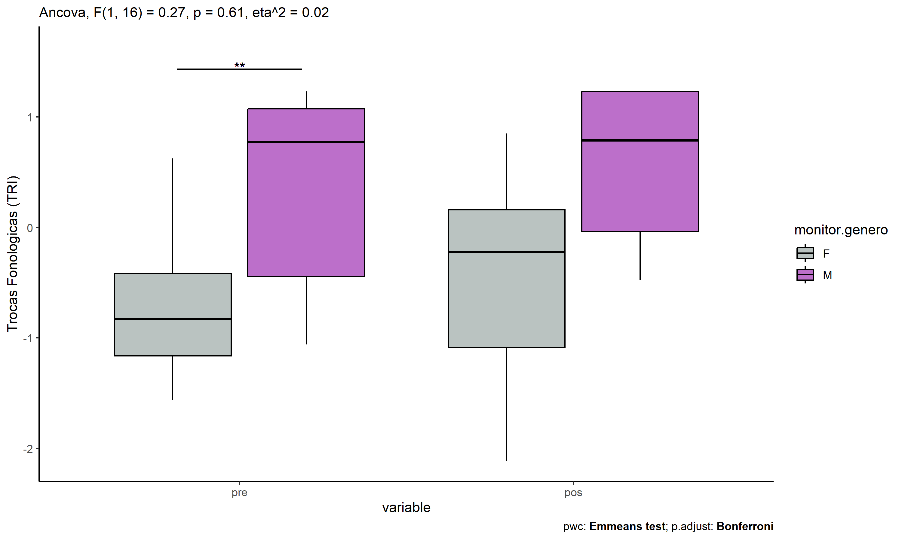<!-- -->

<!-- -->

### Trocas Orograficas (Acertos)

| var          | monitor.genero |   n | M (pre) | SE (pre) | M (unadj) | SE (unadj) | M (adj) | SE (adj) |
|:-------------|:---------------|----:|--------:|---------:|----------:|-----------:|--------:|---------:|
| score.TO.pos | F              |  16 |   7.562 |    0.447 |     8.188 |      0.988 |   7.972 |    0.799 |
| score.TO.pos | M              |   6 |   6.500 |    1.945 |     8.833 |      1.249 |   9.407 |    1.313 |

| .y.          | group1 | group2 | estimate | conf.low | conf.high |    se | statistic |     p | p.adj | p.adj.signif |
|:-------------|:-------|:-------|---------:|---------:|----------:|------:|----------:|------:|------:|:-------------|
| score.TO.pos | F      | M      |   -1.434 |   -4.671 |     1.802 | 1.546 |    -0.928 | 0.365 | 0.365 | ns           |
| score.TO.pre | F      | M      |    1.062 |   -1.775 |     3.900 | 1.360 |     0.781 | 0.444 | 0.444 | ns           |

| monitor.genero | group1 | group2 | estimate | conf.low | conf.high |    se | statistic |     p | p.adj | p.adj.signif |
|:---------------|:-------|:-------|---------:|---------:|----------:|------:|----------:|------:|------:|:-------------|
| F              | pre    | pos    |   -0.625 |   -3.002 |     1.752 | 1.176 |    -0.531 | 0.598 | 0.598 | ns           |
| M              | pre    | pos    |   -2.333 |   -6.215 |     1.549 | 1.921 |    -1.215 | 0.232 | 0.232 | ns           |

    ## Scale for colour is already present.
    ## Adding another scale for colour, which will replace the existing scale.

<!-- -->

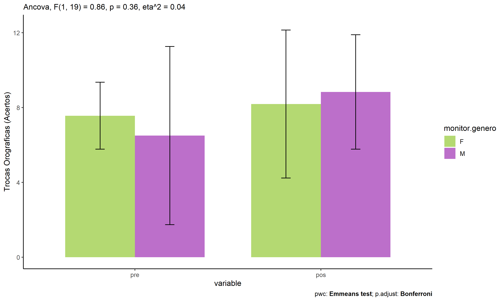<!-- -->

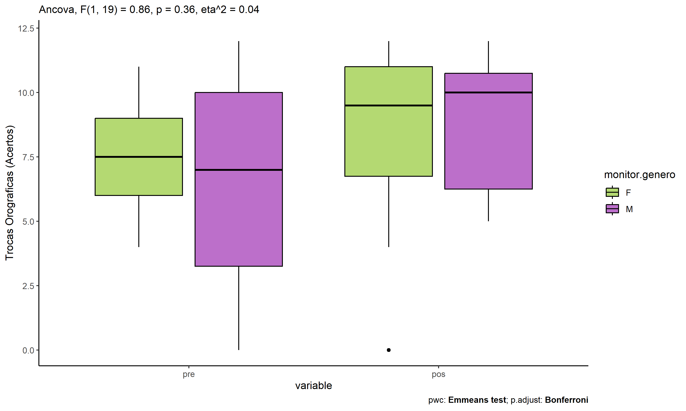<!-- -->

<!-- -->

<!-- -->

### Trocas Orograficas (TRI)

| var        | monitor.genero |   n | M (pre) | SE (pre) | M (unadj) | SE (unadj) | M (adj) | SE (adj) |
|:-----------|:---------------|----:|--------:|---------:|----------:|-----------:|--------:|---------:|
| tri.TO.pos | F              |  14 |  -0.379 |    0.161 |    -0.361 |      0.150 |  -0.383 |    0.112 |
| tri.TO.pos | M              |   5 |  -0.494 |    0.294 |    -0.224 |      0.316 |  -0.164 |    0.188 |

| .y.        | group1 | group2 | estimate | conf.low | conf.high |    se | statistic |     p | p.adj | p.adj.signif |
|:-----------|:-------|:-------|---------:|---------:|----------:|------:|----------:|------:|------:|:-------------|
| tri.TO.pos | F      | M      |   -0.219 |   -0.685 |     0.246 | 0.220 |    -0.998 | 0.333 | 0.333 | ns           |
| tri.TO.pre | F      | M      |    0.115 |   -0.561 |     0.791 | 0.321 |     0.359 | 0.724 | 0.724 | ns           |

| monitor.genero | group1 | group2 | estimate | conf.low | conf.high |    se | statistic |     p | p.adj | p.adj.signif |
|:---------------|:-------|:-------|---------:|---------:|----------:|------:|----------:|------:|------:|:-------------|
| F              | pre    | pos    |    0.031 |   -0.433 |     0.496 | 0.229 |     0.136 | 0.892 | 0.892 | ns           |
| M              | pre    | pos    |   -0.144 |   -0.912 |     0.625 | 0.379 |    -0.379 | 0.707 | 0.707 | ns           |

    ## Scale for colour is already present.
    ## Adding another scale for colour, which will replace the existing scale.

<!-- -->

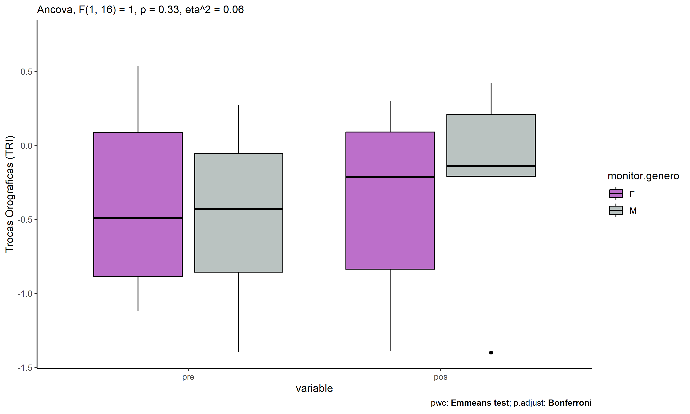<!-- -->

<!-- -->

## factores: **grupo=“Experimental”:monitor.area**

### Leitura de Pseudo-Palavras (Acertos)

### Leitura de Pseudo-Palavras (TRI)

### Correta Regular (Acertos)

### Correta Regular (TRI)

### Correta Irregular (Acertos)

### Correta Irregular (TRI)

### Trocas Visuais (Acertos)

### Trocas Visuais (TRI)

### Trocas Fonologicas (Acertos)

### Trocas Fonologicas (TRI)

### Trocas Orograficas (Acertos)

### Trocas Orograficas (TRI)

## factores: **grupo=“Experimental”:monitor.formacao**

### Leitura de Pseudo-Palavras (Acertos)

### Leitura de Pseudo-Palavras (TRI)

### Correta Regular (Acertos)

### Correta Regular (TRI)

### Correta Irregular (Acertos)

### Correta Irregular (TRI)

### Trocas Visuais (Acertos)

### Trocas Visuais (TRI)

### Trocas Fonologicas (Acertos)

### Trocas Fonologicas (TRI)

### Trocas Orograficas (Acertos)

### Trocas Orograficas (TRI)

## factores: **grupo=“Experimental”:monitor.experiencia**

### Leitura de Pseudo-Palavras (Acertos)

| var            | monitor.experiencia |   n | M (pre) | SE (pre) | M (unadj) | SE (unadj) | M (adj) | SE (adj) |
|:---------------|:--------------------|----:|--------:|---------:|----------:|-----------:|--------:|---------:|
| score.CLPP.pos | maior 01 ano        |  12 |  55.750 |    3.504 |    67.000 |      2.788 |  67.136 |    2.785 |
| score.CLPP.pos | menor 01 ano        |   7 |  57.286 |    4.497 |    65.571 |      3.791 |  65.339 |    3.649 |

| .y.            | group1       | group2       | estimate | conf.low | conf.high |    se | statistic |     p | p.adj | p.adj.signif |
|:---------------|:-------------|:-------------|---------:|---------:|----------:|------:|----------:|------:|------:|:-------------|
| score.CLPP.pos | maior 01 ano | menor 01 ano |    1.797 |   -7.944 |    11.539 | 4.595 |     0.391 | 0.701 | 0.701 | ns           |
| score.CLPP.pre | maior 01 ano | menor 01 ano |   -1.536 |  -13.630 |    10.558 | 5.732 |    -0.268 | 0.792 | 0.792 | ns           |

| monitor.experiencia | group1 | group2 | estimate | conf.low | conf.high |    se | statistic |     p | p.adj | p.adj.signif |
|:--------------------|:-------|:-------|---------:|---------:|----------:|------:|----------:|------:|------:|:-------------|
| maior 01 ano        | pre    | pos    |  -12.231 |  -22.729 |    -1.733 | 5.181 |    -2.361 | 0.024 | 0.024 | \*           |
| menor 01 ano        | pre    | pos    |  -10.250 |  -23.362 |     2.862 | 6.471 |    -1.584 | 0.122 | 0.122 | ns           |

    ## Scale for colour is already present.
    ## Adding another scale for colour, which will replace the existing scale.

<!-- -->

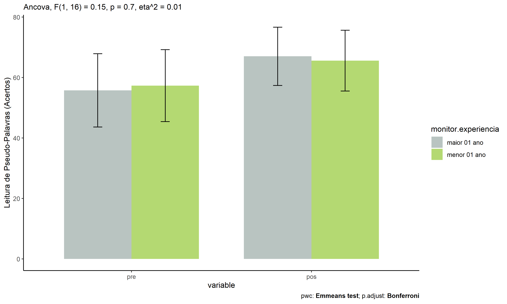<!-- -->

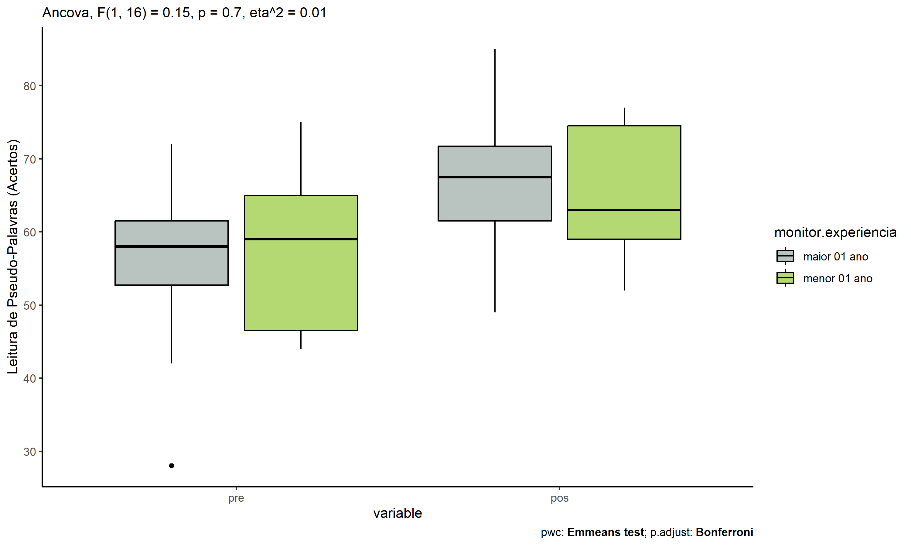<!-- -->

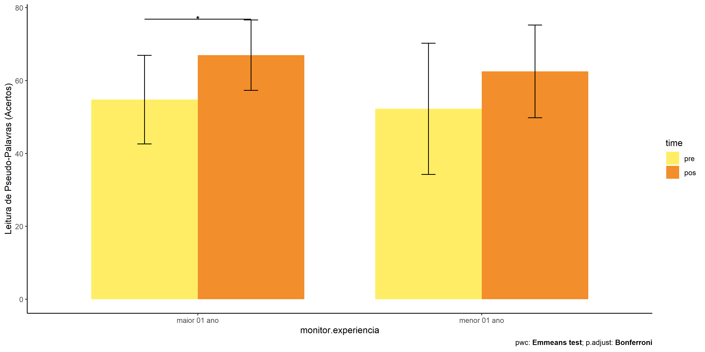<!-- -->

<!-- -->

### Leitura de Pseudo-Palavras (TRI)

| var          | monitor.experiencia |   n | M (pre) | SE (pre) | M (unadj) | SE (unadj) | M (adj) | SE (adj) |
|:-------------|:--------------------|----:|--------:|---------:|----------:|-----------:|--------:|---------:|
| tri.CLPP.pos | maior 01 ano        |  12 |  55.750 |    3.504 |    67.000 |      2.788 |  67.136 |    2.785 |
| tri.CLPP.pos | menor 01 ano        |   7 |  57.286 |    4.497 |    65.571 |      3.791 |  65.339 |    3.649 |

| .y.          | group1       | group2       | estimate | conf.low | conf.high |    se | statistic |     p | p.adj | p.adj.signif |
|:-------------|:-------------|:-------------|---------:|---------:|----------:|------:|----------:|------:|------:|:-------------|
| tri.CLPP.pos | maior 01 ano | menor 01 ano |    1.797 |   -7.944 |    11.539 | 4.595 |     0.391 | 0.701 | 0.701 | ns           |
| tri.CLPP.pre | maior 01 ano | menor 01 ano |   -1.536 |  -13.630 |    10.558 | 5.732 |    -0.268 | 0.792 | 0.792 | ns           |

| monitor.experiencia | group1 | group2 | estimate | conf.low | conf.high |    se | statistic |     p | p.adj | p.adj.signif |
|:--------------------|:-------|:-------|---------:|---------:|----------:|------:|----------:|------:|------:|:-------------|
| maior 01 ano        | pre    | pos    |   -0.475 |   -1.126 |     0.176 | 0.321 |    -1.478 | 0.148 | 0.148 | ns           |
| menor 01 ano        | pre    | pos    |   -0.078 |   -0.891 |     0.735 | 0.401 |    -0.193 | 0.848 | 0.848 | ns           |

    ## Scale for colour is already present.
    ## Adding another scale for colour, which will replace the existing scale.

<!-- -->

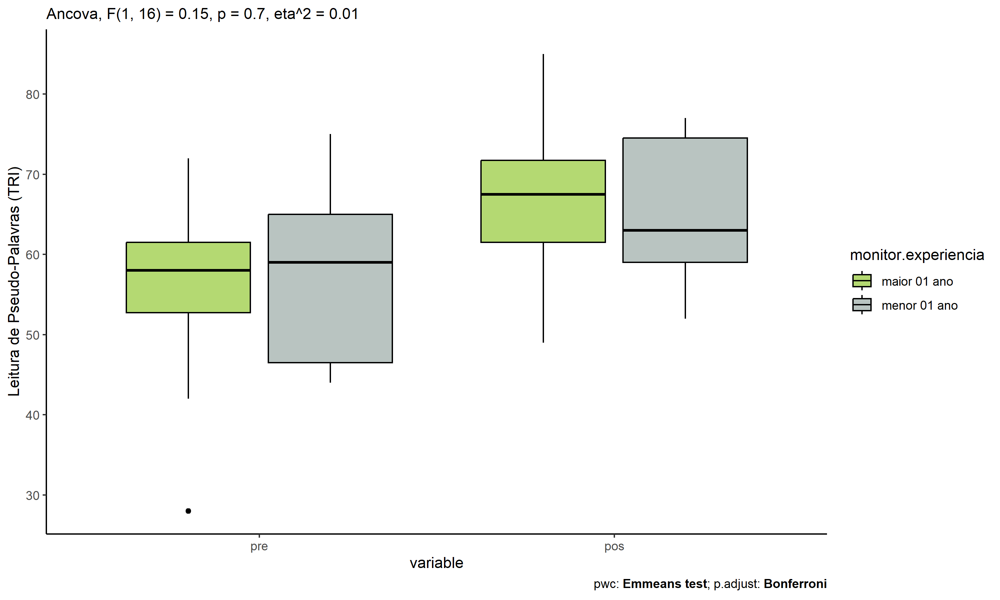<!-- -->

<!-- -->

### Correta Regular (Acertos)

| var          | monitor.experiencia |   n | M (pre) | SE (pre) | M (unadj) | SE (unadj) | M (adj) | SE (adj) |
|:-------------|:--------------------|----:|--------:|---------:|----------:|-----------:|--------:|---------:|
| score.CR.pos | maior 01 ano        |  13 |  11.923 |    0.957 |    13.923 |      1.439 |  13.092 |    1.183 |
| score.CR.pos | menor 01 ano        |   9 |   9.333 |    1.965 |    12.556 |      1.937 |  13.756 |    1.432 |

| .y.          | group1       | group2       | estimate | conf.low | conf.high |    se | statistic |     p | p.adj | p.adj.signif |
|:-------------|:-------------|:-------------|---------:|---------:|----------:|------:|----------:|------:|------:|:-------------|
| score.CR.pos | maior 01 ano | menor 01 ano |   -0.664 |   -4.628 |     3.299 | 1.894 |    -0.351 | 0.730 | 0.730 | ns           |
| score.CR.pre | maior 01 ano | menor 01 ano |    2.590 |   -1.560 |     6.739 | 1.989 |     1.302 | 0.208 | 0.208 | ns           |

| monitor.experiencia | group1 | group2 | estimate | conf.low | conf.high |    se | statistic |     p | p.adj | p.adj.signif |
|:--------------------|:-------|:-------|---------:|---------:|----------:|------:|----------:|------:|------:|:-------------|
| maior 01 ano        | pre    | pos    |   -2.000 |   -5.991 |     1.991 | 1.975 |    -1.013 | 0.317 | 0.317 | ns           |
| menor 01 ano        | pre    | pos    |   -3.222 |   -8.019 |     1.575 | 2.374 |    -1.358 | 0.182 | 0.182 | ns           |

    ## Scale for colour is already present.
    ## Adding another scale for colour, which will replace the existing scale.

<!-- -->

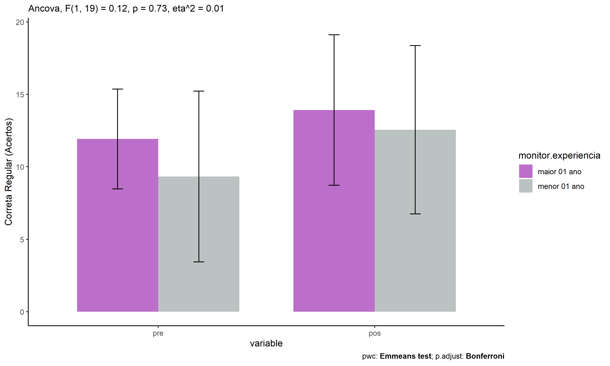<!-- -->

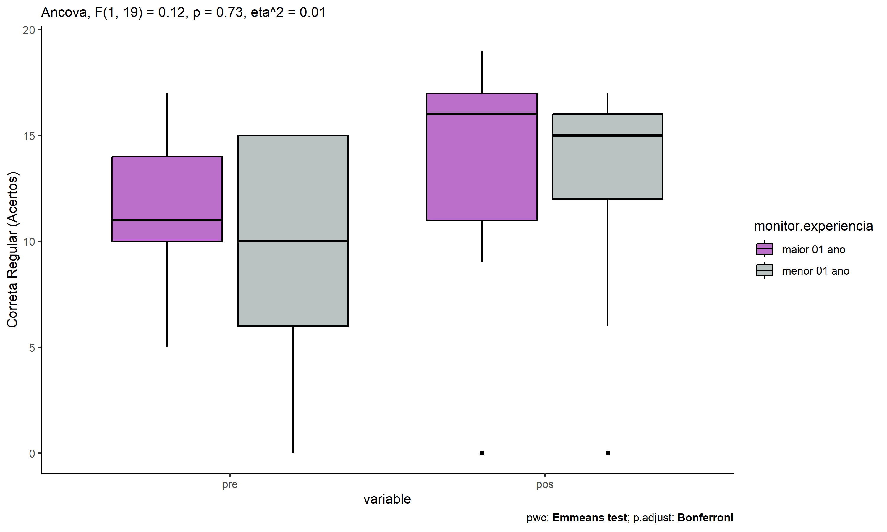<!-- -->

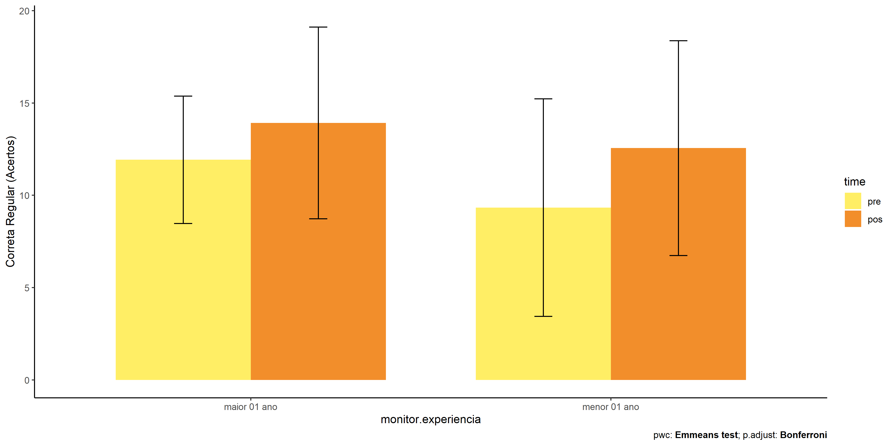<!-- -->

<!-- -->

### Correta Regular (TRI)

| var        | monitor.experiencia |   n | M (pre) | SE (pre) | M (unadj) | SE (unadj) | M (adj) | SE (adj) |
|:-----------|:--------------------|----:|--------:|---------:|----------:|-----------:|--------:|---------:|
| tri.CR.pos | maior 01 ano        |  12 |  -0.628 |    0.274 |    -0.089 |       0.24 |  -0.041 |    0.178 |
| tri.CR.pos | menor 01 ano        |   7 |  -0.378 |    0.288 |    -0.018 |       0.22 |  -0.100 |    0.233 |

| .y.        | group1       | group2       | estimate | conf.low | conf.high |    se | statistic |     p | p.adj | p.adj.signif |
|:-----------|:-------------|:-------------|---------:|---------:|----------:|------:|----------:|------:|------:|:-------------|
| tri.CR.pos | maior 01 ano | menor 01 ano |    0.059 |   -0.565 |     0.683 | 0.294 |     0.202 | 0.843 | 0.843 | ns           |
| tri.CR.pre | maior 01 ano | menor 01 ano |   -0.250 |   -1.140 |     0.640 | 0.422 |    -0.593 | 0.561 | 0.561 | ns           |

| monitor.experiencia | group1 | group2 | estimate | conf.low | conf.high |    se | statistic |     p | p.adj | p.adj.signif |
|:--------------------|:-------|:-------|---------:|---------:|----------:|------:|----------:|------:|------:|:-------------|
| maior 01 ano        | pre    | pos    |   -0.571 |   -1.286 |     0.144 | 0.353 |    -1.619 | 0.114 | 0.114 | ns           |
| menor 01 ano        | pre    | pos    |   -0.358 |   -1.251 |     0.535 | 0.441 |    -0.813 | 0.421 | 0.421 | ns           |

    ## Scale for colour is already present.
    ## Adding another scale for colour, which will replace the existing scale.

<!-- -->

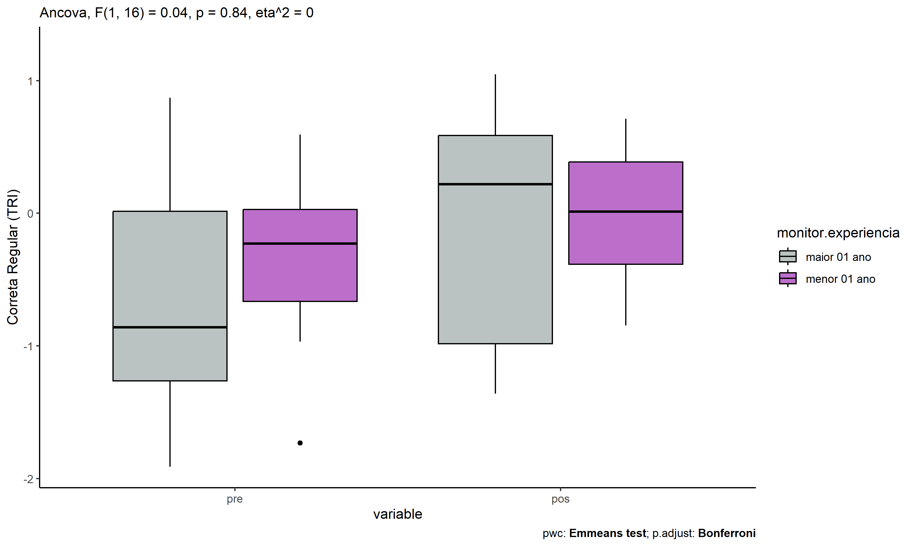<!-- -->

<!-- -->

### Correta Irregular (Acertos)

| var          | monitor.experiencia |   n | M (pre) | SE (pre) | M (unadj) | SE (unadj) | M (adj) | SE (adj) |
|:-------------|:--------------------|----:|--------:|---------:|----------:|-----------:|--------:|---------:|
| score.CI.pos | maior 01 ano        |  13 |   9.462 |    0.789 |     9.846 |      1.240 |   9.238 |    1.104 |
| score.CI.pos | menor 01 ano        |   9 |   7.111 |    1.504 |    10.333 |      1.453 |  11.212 |    1.339 |

| .y.          | group1       | group2       | estimate | conf.low | conf.high |    se | statistic |     p | p.adj | p.adj.signif |
|:-------------|:-------------|:-------------|---------:|---------:|----------:|------:|----------:|------:|------:|:-------------|
| score.CI.pos | maior 01 ano | menor 01 ano |   -1.974 |   -5.699 |     1.750 | 1.780 |    -1.109 | 0.281 | 0.281 | ns           |
| score.CI.pre | maior 01 ano | menor 01 ano |    2.350 |   -0.912 |     5.613 | 1.564 |     1.503 | 0.148 | 0.148 | ns           |

| monitor.experiencia | group1 | group2 | estimate | conf.low | conf.high |    se | statistic |     p | p.adj | p.adj.signif |
|:--------------------|:-------|:-------|---------:|---------:|----------:|------:|----------:|------:|------:|:-------------|
| maior 01 ano        | pre    | pos    |   -0.385 |   -3.585 |     2.815 | 1.583 |    -0.243 | 0.809 | 0.809 | ns           |
| menor 01 ano        | pre    | pos    |   -3.222 |   -7.068 |     0.624 | 1.903 |    -1.693 | 0.098 | 0.098 | ns           |

    ## Scale for colour is already present.
    ## Adding another scale for colour, which will replace the existing scale.

<!-- -->

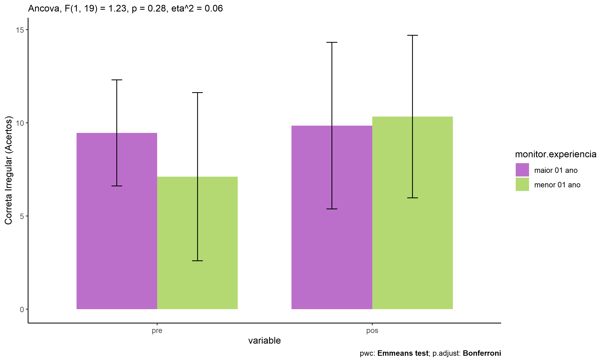<!-- -->

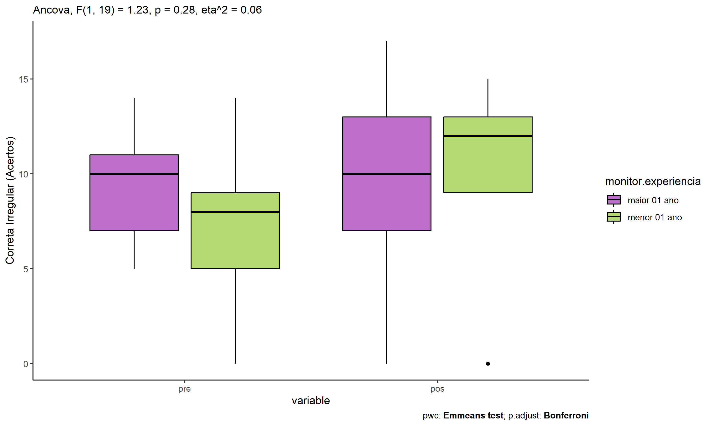<!-- -->

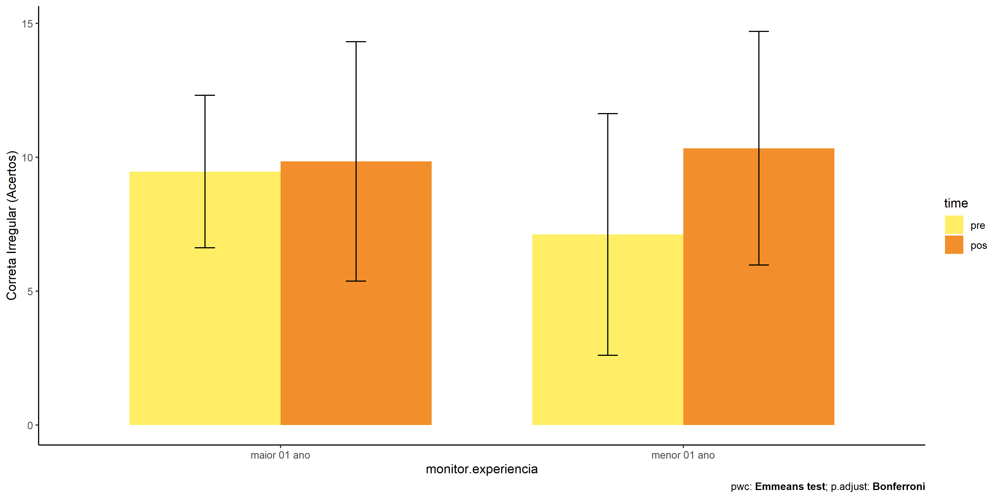<!-- -->

<!-- -->

### Correta Irregular (TRI)

| var        | monitor.experiencia |   n | M (pre) | SE (pre) | M (unadj) | SE (unadj) | M (adj) | SE (adj) |
|:-----------|:--------------------|----:|--------:|---------:|----------:|-----------:|--------:|---------:|
| tri.CI.pos | maior 01 ano        |  12 |  -0.464 |    0.167 |    -0.366 |      0.264 |  -0.390 |    0.233 |
| tri.CI.pos | menor 01 ano        |   7 |  -0.568 |    0.220 |    -0.063 |      0.283 |  -0.022 |    0.305 |

| .y.        | group1       | group2       | estimate | conf.low | conf.high |    se | statistic |     p | p.adj | p.adj.signif |
|:-----------|:-------------|:-------------|---------:|---------:|----------:|------:|----------:|------:|------:|:-------------|
| tri.CI.pos | maior 01 ano | menor 01 ano |   -0.368 |   -1.183 |     0.447 | 0.385 |    -0.956 | 0.353 | 0.353 | ns           |
| tri.CI.pre | maior 01 ano | menor 01 ano |    0.104 |   -0.479 |     0.687 | 0.276 |     0.376 | 0.711 | 0.711 | ns           |

| monitor.experiencia | group1 | group2 | estimate | conf.low | conf.high |    se | statistic |     p | p.adj | p.adj.signif |
|:--------------------|:-------|:-------|---------:|---------:|----------:|------:|----------:|------:|------:|:-------------|
| maior 01 ano        | pre    | pos    |   -0.169 |   -0.757 |     0.420 | 0.290 |    -0.581 | 0.565 | 0.565 | ns           |
| menor 01 ano        | pre    | pos    |   -0.537 |   -1.272 |     0.197 | 0.363 |    -1.482 | 0.147 | 0.147 | ns           |

    ## Scale for colour is already present.
    ## Adding another scale for colour, which will replace the existing scale.

<!-- -->

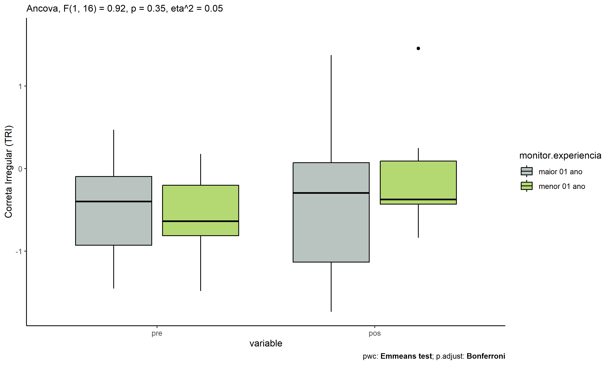<!-- -->

<!-- -->

### Trocas Visuais (Acertos)

| var          | monitor.experiencia |   n | M (pre) | SE (pre) | M (unadj) | SE (unadj) | M (adj) | SE (adj) |
|:-------------|:--------------------|----:|--------:|---------:|----------:|-----------:|--------:|---------:|
| score.TV.pos | maior 01 ano        |  13 |  13.923 |    1.412 |    15.231 |      1.468 |  14.882 |    1.495 |
| score.TV.pos | menor 01 ano        |   9 |  12.111 |    2.010 |    13.333 |      2.179 |  13.837 |    1.801 |

| .y.          | group1       | group2       | estimate | conf.low | conf.high |    se | statistic |     p | p.adj | p.adj.signif |
|:-------------|:-------------|:-------------|---------:|---------:|----------:|------:|----------:|------:|------:|:-------------|
| score.TV.pos | maior 01 ano | menor 01 ano |    1.046 |   -3.887 |     5.978 | 2.357 |     0.444 | 0.662 | 0.662 | ns           |
| score.TV.pre | maior 01 ano | menor 01 ano |    1.812 |   -3.150 |     6.774 | 2.379 |     0.762 | 0.455 | 0.455 | ns           |

| monitor.experiencia | group1 | group2 | estimate | conf.low | conf.high |    se | statistic |     p | p.adj | p.adj.signif |
|:--------------------|:-------|:-------|---------:|---------:|----------:|------:|----------:|------:|------:|:-------------|
| maior 01 ano        | pre    | pos    |   -1.308 |   -5.792 |     3.177 | 2.219 |    -0.589 | 0.559 | 0.559 | ns           |
| menor 01 ano        | pre    | pos    |   -1.222 |   -6.612 |     4.168 | 2.667 |    -0.458 | 0.649 | 0.649 | ns           |

    ## Scale for colour is already present.
    ## Adding another scale for colour, which will replace the existing scale.

<!-- -->

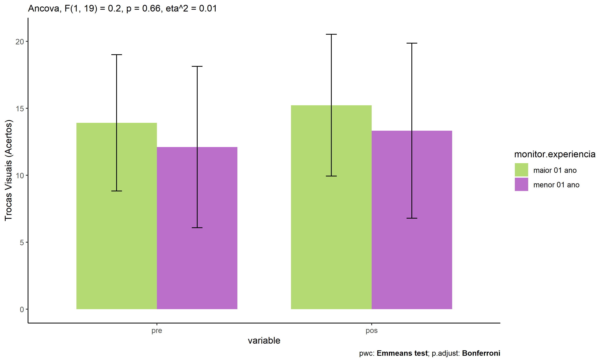<!-- -->

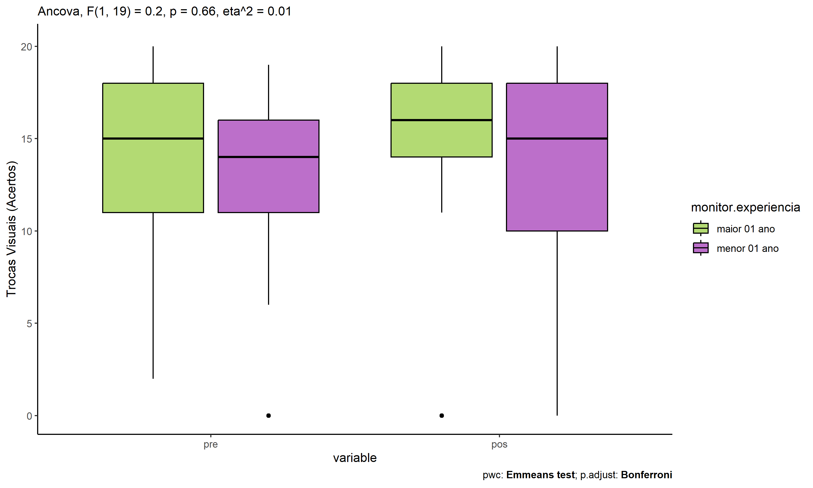<!-- -->

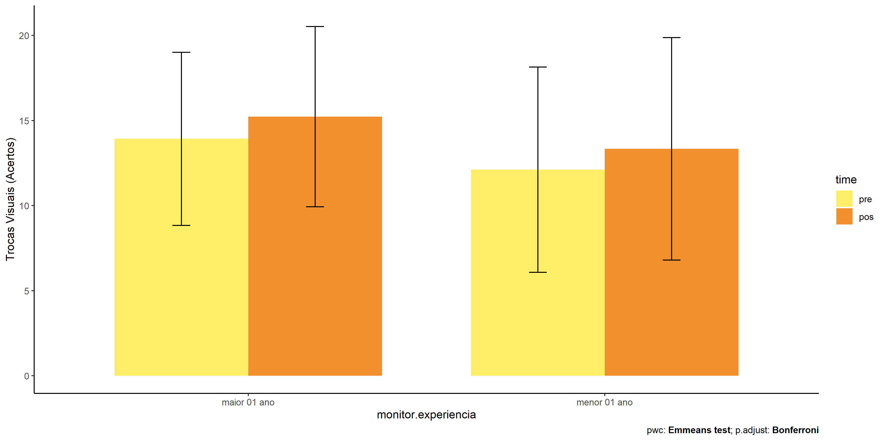<!-- -->

<!-- -->

### Trocas Visuais (TRI)

| var        | monitor.experiencia |   n | M (pre) | SE (pre) | M (unadj) | SE (unadj) | M (adj) | SE (adj) |
|:-----------|:--------------------|----:|--------:|---------:|----------:|-----------:|--------:|---------:|
| tri.TV.pos | maior 01 ano        |  12 |  -0.509 |    0.289 |    -0.095 |      0.241 |  -0.063 |    0.237 |
| tri.TV.pos | menor 01 ano        |   7 |  -0.222 |    0.319 |    -0.230 |      0.326 |  -0.285 |    0.312 |

| .y.        | group1       | group2       | estimate | conf.low | conf.high |    se | statistic |     p | p.adj | p.adj.signif |
|:-----------|:-------------|:-------------|---------:|---------:|----------:|------:|----------:|------:|------:|:-------------|
| tri.TV.pos | maior 01 ano | menor 01 ano |    0.222 |   -0.613 |     1.057 | 0.394 |     0.564 | 0.580 | 0.580 | ns           |
| tri.TV.pre | maior 01 ano | menor 01 ano |   -0.287 |   -1.239 |     0.666 | 0.452 |    -0.634 | 0.534 | 0.534 | ns           |

| monitor.experiencia | group1 | group2 | estimate | conf.low | conf.high |    se | statistic |     p | p.adj | p.adj.signif |
|:--------------------|:-------|:-------|---------:|---------:|----------:|------:|----------:|------:|------:|:-------------|
| maior 01 ano        | pre    | pos    |   -0.424 |   -1.139 |     0.291 | 0.353 |    -1.202 | 0.237 | 0.237 | ns           |
| menor 01 ano        | pre    | pos    |    0.220 |   -0.672 |     1.113 | 0.441 |     0.500 | 0.620 | 0.620 | ns           |

    ## Scale for colour is already present.
    ## Adding another scale for colour, which will replace the existing scale.

<!-- -->

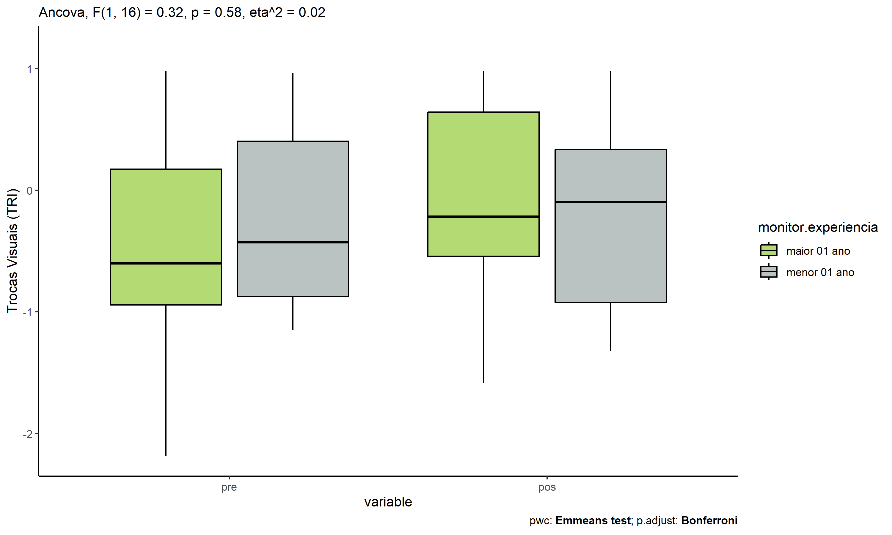<!-- -->

<!-- -->

### Trocas Fonologicas (Acertos)

| var          | monitor.experiencia |   n | M (pre) | SE (pre) | M (unadj) | SE (unadj) | M (adj) | SE (adj) |
|:-------------|:--------------------|----:|--------:|---------:|----------:|-----------:|--------:|---------:|
| score.TF.pos | maior 01 ano        |  13 |  11.538 |    0.874 |    13.692 |      1.673 |  13.698 |    1.461 |
| score.TF.pos | menor 01 ano        |   9 |  11.556 |    2.062 |    12.111 |      2.270 |  12.103 |    1.755 |

| .y.          | group1       | group2       | estimate | conf.low | conf.high |    se | statistic |     p | p.adj | p.adj.signif |
|:-------------|:-------------|:-------------|---------:|---------:|----------:|------:|----------:|------:|------:|:-------------|
| score.TF.pos | maior 01 ano | menor 01 ano |    1.595 |   -3.185 |     6.375 | 2.284 |     0.698 | 0.493 | 0.493 | ns           |
| score.TF.pre | maior 01 ano | menor 01 ano |   -0.017 |   -4.189 |     4.155 | 2.000 |    -0.009 | 0.993 | 0.993 | ns           |

| monitor.experiencia | group1 | group2 | estimate | conf.low | conf.high |    se | statistic |     p | p.adj | p.adj.signif |
|:--------------------|:-------|:-------|---------:|---------:|----------:|------:|----------:|------:|------:|:-------------|
| maior 01 ano        | pre    | pos    |   -2.154 |   -6.555 |     2.248 | 2.178 |    -0.989 | 0.329 | 0.329 | ns           |
| menor 01 ano        | pre    | pos    |   -0.556 |   -5.845 |     4.734 | 2.617 |    -0.212 | 0.833 | 0.833 | ns           |

    ## Scale for colour is already present.
    ## Adding another scale for colour, which will replace the existing scale.

<!-- -->

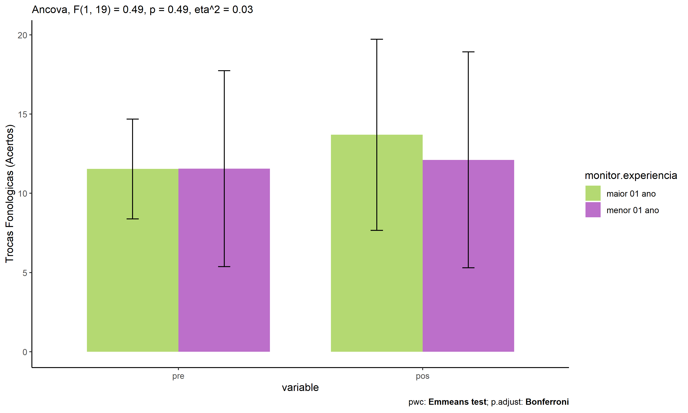<!-- -->

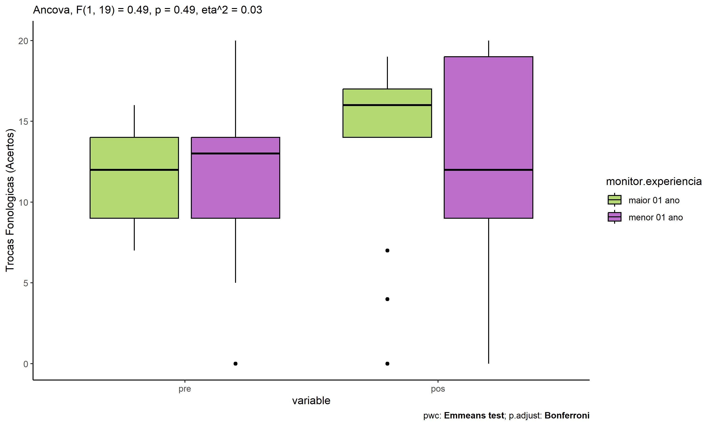<!-- -->

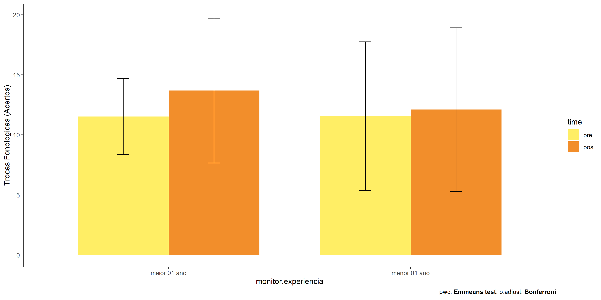<!-- -->

<!-- -->

### Trocas Fonologicas (TRI)

| var        | monitor.experiencia |   n | M (pre) | SE (pre) | M (unadj) | SE (unadj) | M (adj) | SE (adj) |
|:-----------|:--------------------|----:|--------:|---------:|----------:|-----------:|--------:|---------:|
| tri.TF.pos | maior 01 ano        |  12 |  -0.691 |    0.176 |    -0.245 |      0.237 |  -0.047 |    0.199 |
| tri.TF.pos | menor 01 ano        |   7 |  -0.090 |    0.403 |    -0.121 |      0.450 |  -0.461 |    0.265 |

| .y.        | group1       | group2       | estimate | conf.low | conf.high |    se | statistic |     p | p.adj | p.adj.signif |
|:-----------|:-------------|:-------------|---------:|---------:|----------:|------:|----------:|------:|------:|:-------------|
| tri.TF.pos | maior 01 ano | menor 01 ano |    0.414 |   -0.310 |     1.139 | 0.342 |     1.212 | 0.243 | 0.243 | ns           |
| tri.TF.pre | maior 01 ano | menor 01 ano |   -0.601 |   -1.404 |     0.203 | 0.381 |    -1.577 | 0.133 | 0.133 | ns           |

| monitor.experiencia | group1 | group2 | estimate | conf.low | conf.high |    se | statistic |     p | p.adj | p.adj.signif |
|:--------------------|:-------|:-------|---------:|---------:|----------:|------:|----------:|------:|------:|:-------------|
| maior 01 ano        | pre    | pos    |   -0.462 |   -1.176 |     0.252 | 0.352 |    -1.310 | 0.198 | 0.198 | ns           |
| menor 01 ano        | pre    | pos    |    0.276 |   -0.616 |     1.168 | 0.440 |     0.626 | 0.535 | 0.535 | ns           |

    ## Scale for colour is already present.
    ## Adding another scale for colour, which will replace the existing scale.

<!-- -->

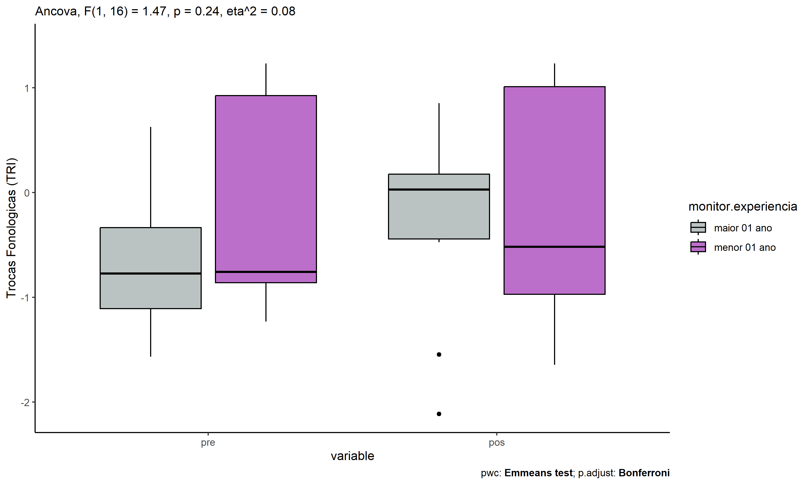<!-- -->

<!-- -->

### Trocas Orograficas (Acertos)

| var          | monitor.experiencia |   n | M (pre) | SE (pre) | M (unadj) | SE (unadj) | M (adj) | SE (adj) |
|:-------------|:--------------------|----:|--------:|---------:|----------:|-----------:|--------:|---------:|
| score.TO.pos | maior 01 ano        |  13 |   7.923 |    0.473 |     9.154 |      0.986 |   8.726 |    0.909 |
| score.TO.pos | menor 01 ano        |   9 |   6.333 |    1.280 |     7.222 |      1.245 |   7.840 |    1.101 |

| .y.          | group1       | group2       | estimate | conf.low | conf.high |    se | statistic |    p | p.adj | p.adj.signif |
|:-------------|:-------------|:-------------|---------:|---------:|----------:|------:|----------:|-----:|------:|:-------------|
| score.TO.pos | maior 01 ano | menor 01 ano |    0.887 |   -2.163 |     3.937 | 1.457 |     0.609 | 0.55 |  0.55 | ns           |
| score.TO.pre | maior 01 ano | menor 01 ano |    1.590 |   -0.911 |     4.091 | 1.199 |     1.326 | 0.20 |  0.20 | ns           |

| monitor.experiencia | group1 | group2 | estimate | conf.low | conf.high |    se | statistic |     p | p.adj | p.adj.signif |
|:--------------------|:-------|:-------|---------:|---------:|----------:|------:|----------:|------:|------:|:-------------|
| maior 01 ano        | pre    | pos    |   -1.231 |   -3.788 |     1.326 | 1.265 |    -0.973 | 0.336 | 0.336 | ns           |
| menor 01 ano        | pre    | pos    |   -0.889 |   -3.962 |     2.184 | 1.521 |    -0.585 | 0.562 | 0.562 | ns           |

    ## Scale for colour is already present.
    ## Adding another scale for colour, which will replace the existing scale.

<!-- -->

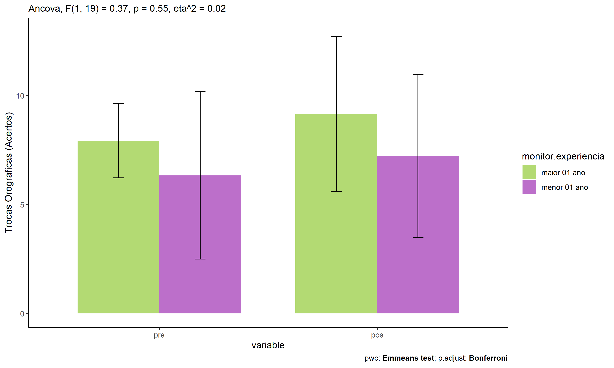<!-- -->

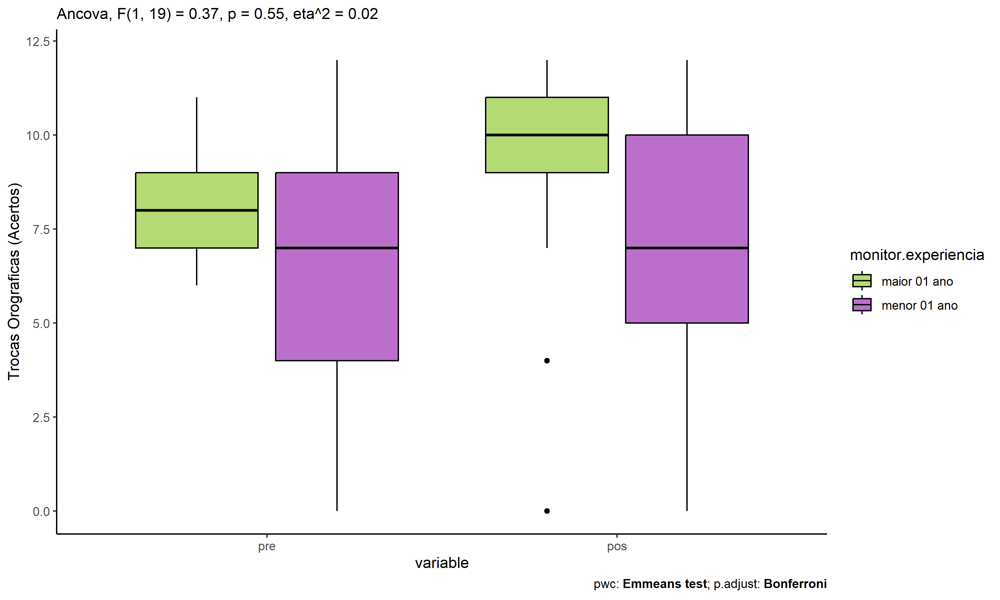<!-- -->

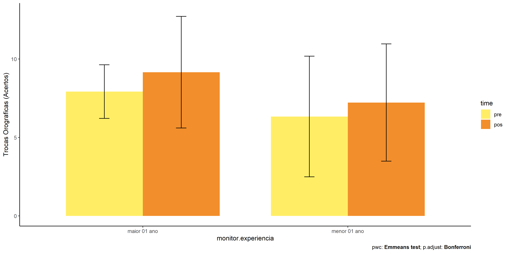<!-- -->

<!-- -->

### Trocas Orograficas (TRI)

| var        | monitor.experiencia |   n | M (pre) | SE (pre) | M (unadj) | SE (unadj) | M (adj) | SE (adj) |
|:-----------|:--------------------|----:|--------:|---------:|----------:|-----------:|--------:|---------:|
| tri.TO.pos | maior 01 ano        |  12 |  -0.323 |    0.157 |    -0.206 |      0.134 |  -0.264 |    0.123 |
| tri.TO.pos | menor 01 ano        |   7 |  -0.558 |    0.267 |    -0.530 |      0.282 |  -0.430 |    0.162 |

| .y.        | group1       | group2       | estimate | conf.low | conf.high |    se | statistic |     p | p.adj | p.adj.signif |
|:-----------|:-------------|:-------------|---------:|---------:|----------:|------:|----------:|------:|------:|:-------------|
| tri.TO.pos | maior 01 ano | menor 01 ano |    0.166 |   -0.270 |     0.602 | 0.206 |     0.807 | 0.432 | 0.432 | ns           |
| tri.TO.pre | maior 01 ano | menor 01 ano |    0.235 |   -0.373 |     0.843 | 0.288 |     0.815 | 0.426 | 0.426 | ns           |

| monitor.experiencia | group1 | group2 | estimate | conf.low | conf.high |    se | statistic |     p | p.adj | p.adj.signif |
|:--------------------|:-------|:-------|---------:|---------:|----------:|------:|----------:|------:|------:|:-------------|
| maior 01 ano        | pre    | pos    |   -0.152 |   -0.649 |     0.346 | 0.246 |    -0.617 | 0.541 | 0.541 | ns           |
| menor 01 ano        | pre    | pos    |    0.198 |   -0.423 |     0.819 | 0.307 |     0.645 | 0.523 | 0.523 | ns           |

    ## Scale for colour is already present.
    ## Adding another scale for colour, which will replace the existing scale.

<!-- -->

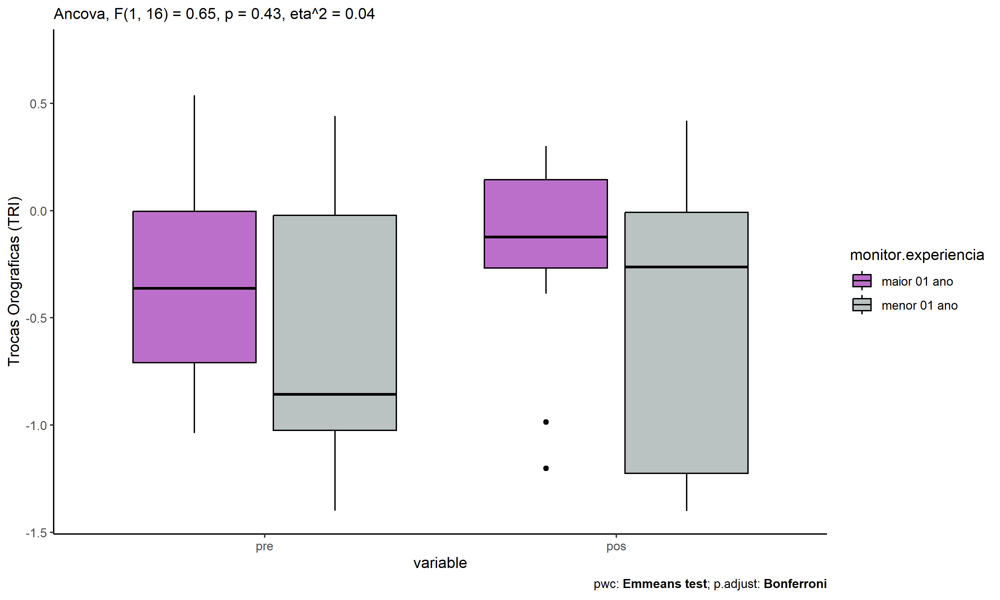<!-- -->

<!-- -->
