ANCOVA in CLPP Test (Teste de Competencia em Leitura de Palavras e
Pseudo-palavras)
================
Geiser C. Challco <geiser@alumni.usp.br>

- [Descriptive Statistics of Initial
  Data](#descriptive-statistics-of-initial-data)
  - [Leitura de Pseudo-Palavras
    (Acertos)](#leitura-de-pseudo-palavras-acertos)
  - [Leitura de Pseudo-Palavras (TRI)](#leitura-de-pseudo-palavras-tri)
  - [Correta Regular (Acertos)](#correta-regular-acertos)
  - [Correta Regular (TRI)](#correta-regular-tri)
  - [Correta Irregular (Acertos)](#correta-irregular-acertos)
  - [Correta Irregular (TRI)](#correta-irregular-tri)
  - [Trocas Visuais (Acertos)](#trocas-visuais-acertos)
  - [Trocas Visuais (TRI)](#trocas-visuais-tri)
  - [Trocas Fonologicas (Acertos)](#trocas-fonologicas-acertos)
  - [Trocas Fonologicas (TRI)](#trocas-fonologicas-tri)
  - [Trocas Orograficas (Acertos)](#trocas-orograficas-acertos)
  - [Trocas Orograficas (TRI)](#trocas-orograficas-tri)
- [Checking of Assumptions](#checking-of-assumptions)
  - [Assumption: Normality
    distribution](#assumption-normality-distribution)
    - [Leitura de Pseudo-Palavras
      (Acertos)](#leitura-de-pseudo-palavras-acertos-1)
    - [Leitura de Pseudo-Palavras
      (TRI)](#leitura-de-pseudo-palavras-tri-1)
    - [Correta Regular (Acertos)](#correta-regular-acertos-1)
    - [Correta Regular (TRI)](#correta-regular-tri-1)
    - [Correta Irregular (Acertos)](#correta-irregular-acertos-1)
    - [Correta Irregular (TRI)](#correta-irregular-tri-1)
    - [Trocas Visuais (Acertos)](#trocas-visuais-acertos-1)
    - [Trocas Visuais (TRI)](#trocas-visuais-tri-1)
    - [Trocas Fonologicas (Acertos)](#trocas-fonologicas-acertos-1)
    - [Trocas Fonologicas (TRI)](#trocas-fonologicas-tri-1)
    - [Trocas Orograficas (Acertos)](#trocas-orograficas-acertos-1)
    - [Trocas Orograficas (TRI)](#trocas-orograficas-tri-1)
  - [Assumption: Homogeneity](#assumption-homogeneity)
    - [Leitura de Pseudo-Palavras
      (Acertos)](#leitura-de-pseudo-palavras-acertos-2)
    - [Leitura de Pseudo-Palavras
      (TRI)](#leitura-de-pseudo-palavras-tri-2)
    - [Correta Regular (Acertos)](#correta-regular-acertos-2)
    - [Correta Regular (TRI)](#correta-regular-tri-2)
    - [Correta Irregular (Acertos)](#correta-irregular-acertos-2)
    - [Correta Irregular (TRI)](#correta-irregular-tri-2)
    - [Trocas Visuais (Acertos)](#trocas-visuais-acertos-2)
    - [Trocas Visuais (TRI)](#trocas-visuais-tri-2)
    - [Trocas Fonologicas (Acertos)](#trocas-fonologicas-acertos-2)
    - [Trocas Fonologicas (TRI)](#trocas-fonologicas-tri-2)
    - [Trocas Orograficas (Acertos)](#trocas-orograficas-acertos-2)
    - [Trocas Orograficas (TRI)](#trocas-orograficas-tri-2)
- [Computation of ANCOVA test and Pairwise
  Comparison](#computation-of-ancova-test-and-pairwise-comparison)
  - [ANCOVA tests for one factor](#ancova-tests-for-one-factor)
    - [Leitura de Pseudo-Palavras
      (Acertos)](#leitura-de-pseudo-palavras-acertos-3)
    - [Leitura de Pseudo-Palavras
      (TRI)](#leitura-de-pseudo-palavras-tri-3)
    - [Correta Regular (Acertos)](#correta-regular-acertos-3)
    - [Correta Regular (TRI)](#correta-regular-tri-3)
    - [Correta Irregular (Acertos)](#correta-irregular-acertos-3)
    - [Correta Irregular (TRI)](#correta-irregular-tri-3)
    - [Trocas Visuais (Acertos)](#trocas-visuais-acertos-3)
    - [Trocas Visuais (TRI)](#trocas-visuais-tri-3)
    - [Trocas Fonologicas (Acertos)](#trocas-fonologicas-acertos-3)
    - [Trocas Fonologicas (TRI)](#trocas-fonologicas-tri-3)
    - [Trocas Orograficas (Acertos)](#trocas-orograficas-acertos-3)
    - [Trocas Orograficas (TRI)](#trocas-orograficas-tri-3)
  - [ANCOVA tests for two factors](#ancova-tests-for-two-factors)
    - [Leitura de Pseudo-Palavras
      (Acertos)](#leitura-de-pseudo-palavras-acertos-4)
    - [Leitura de Pseudo-Palavras
      (TRI)](#leitura-de-pseudo-palavras-tri-4)
    - [Correta Regular (Acertos)](#correta-regular-acertos-4)
    - [Correta Regular (TRI)](#correta-regular-tri-4)
    - [Correta Irregular (Acertos)](#correta-irregular-acertos-4)
    - [Correta Irregular (TRI)](#correta-irregular-tri-4)
    - [Trocas Visuais (Acertos)](#trocas-visuais-acertos-4)
    - [Trocas Visuais (TRI)](#trocas-visuais-tri-4)
    - [Trocas Fonologicas (Acertos)](#trocas-fonologicas-acertos-4)
    - [Trocas Fonologicas (TRI)](#trocas-fonologicas-tri-4)
    - [Trocas Orograficas (Acertos)](#trocas-orograficas-acertos-4)
    - [Trocas Orograficas (TRI)](#trocas-orograficas-tri-4)
  - [ANCOVA tests for
    grupo=“Experimental”](#ancova-tests-for-grupoexperimental)
    - [Leitura de Pseudo-Palavras
      (Acertos)](#leitura-de-pseudo-palavras-acertos-5)
    - [Leitura de Pseudo-Palavras
      (TRI)](#leitura-de-pseudo-palavras-tri-5)
    - [Correta Regular (Acertos)](#correta-regular-acertos-5)
    - [Correta Regular (TRI)](#correta-regular-tri-5)
    - [Correta Irregular (Acertos)](#correta-irregular-acertos-5)
    - [Correta Irregular (TRI)](#correta-irregular-tri-5)
    - [Trocas Visuais (Acertos)](#trocas-visuais-acertos-5)
    - [Trocas Visuais (TRI)](#trocas-visuais-tri-5)
    - [Trocas Fonologicas (Acertos)](#trocas-fonologicas-acertos-5)
    - [Trocas Fonologicas (TRI)](#trocas-fonologicas-tri-5)
    - [Trocas Orograficas (Acertos)](#trocas-orograficas-acertos-5)
    - [Trocas Orograficas (TRI)](#trocas-orograficas-tri-5)
- [Pairwise comparisons for one
  factor](#pairwise-comparisons-for-one-factor)
  - [factor: **grupo**](#factor-grupo)
    - [Leitura de Pseudo-Palavras
      (Acertos)](#leitura-de-pseudo-palavras-acertos-6)
    - [Leitura de Pseudo-Palavras
      (TRI)](#leitura-de-pseudo-palavras-tri-6)
    - [Correta Regular (Acertos)](#correta-regular-acertos-6)
    - [Correta Regular (TRI)](#correta-regular-tri-6)
    - [Correta Irregular (Acertos)](#correta-irregular-acertos-6)
    - [Correta Irregular (TRI)](#correta-irregular-tri-6)
    - [Trocas Visuais (Acertos)](#trocas-visuais-acertos-6)
    - [Trocas Visuais (TRI)](#trocas-visuais-tri-6)
    - [Trocas Fonologicas (Acertos)](#trocas-fonologicas-acertos-6)
    - [Trocas Fonologicas (TRI)](#trocas-fonologicas-tri-6)
    - [Trocas Orograficas (Acertos)](#trocas-orograficas-acertos-6)
    - [Trocas Orograficas (TRI)](#trocas-orograficas-tri-6)
  - [factor: **genero**](#factor-genero)
    - [Leitura de Pseudo-Palavras
      (Acertos)](#leitura-de-pseudo-palavras-acertos-7)
    - [Leitura de Pseudo-Palavras
      (TRI)](#leitura-de-pseudo-palavras-tri-7)
    - [Correta Regular (Acertos)](#correta-regular-acertos-7)
    - [Correta Regular (TRI)](#correta-regular-tri-7)
    - [Correta Irregular (Acertos)](#correta-irregular-acertos-7)
    - [Correta Irregular (TRI)](#correta-irregular-tri-7)
    - [Trocas Visuais (Acertos)](#trocas-visuais-acertos-7)
    - [Trocas Visuais (TRI)](#trocas-visuais-tri-7)
    - [Trocas Fonologicas (Acertos)](#trocas-fonologicas-acertos-7)
    - [Trocas Fonologicas (TRI)](#trocas-fonologicas-tri-7)
    - [Trocas Orograficas (Acertos)](#trocas-orograficas-acertos-7)
    - [Trocas Orograficas (TRI)](#trocas-orograficas-tri-7)
  - [factor: **idade**](#factor-idade)
    - [Leitura de Pseudo-Palavras
      (Acertos)](#leitura-de-pseudo-palavras-acertos-8)
    - [Leitura de Pseudo-Palavras
      (TRI)](#leitura-de-pseudo-palavras-tri-8)
    - [Correta Regular (Acertos)](#correta-regular-acertos-8)
    - [Correta Regular (TRI)](#correta-regular-tri-8)
    - [Correta Irregular (Acertos)](#correta-irregular-acertos-8)
    - [Correta Irregular (TRI)](#correta-irregular-tri-8)
    - [Trocas Visuais (Acertos)](#trocas-visuais-acertos-8)
    - [Trocas Visuais (TRI)](#trocas-visuais-tri-8)
    - [Trocas Fonologicas (Acertos)](#trocas-fonologicas-acertos-8)
    - [Trocas Fonologicas (TRI)](#trocas-fonologicas-tri-8)
    - [Trocas Orograficas (Acertos)](#trocas-orograficas-acertos-8)
    - [Trocas Orograficas (TRI)](#trocas-orograficas-tri-8)
  - [factor: **zona.participante**](#factor-zonaparticipante)
    - [Leitura de Pseudo-Palavras
      (Acertos)](#leitura-de-pseudo-palavras-acertos-9)
    - [Leitura de Pseudo-Palavras
      (TRI)](#leitura-de-pseudo-palavras-tri-9)
    - [Correta Regular (Acertos)](#correta-regular-acertos-9)
    - [Correta Regular (TRI)](#correta-regular-tri-9)
    - [Correta Irregular (Acertos)](#correta-irregular-acertos-9)
    - [Correta Irregular (TRI)](#correta-irregular-tri-9)
    - [Trocas Visuais (Acertos)](#trocas-visuais-acertos-9)
    - [Trocas Visuais (TRI)](#trocas-visuais-tri-9)
    - [Trocas Fonologicas (Acertos)](#trocas-fonologicas-acertos-9)
    - [Trocas Fonologicas (TRI)](#trocas-fonologicas-tri-9)
    - [Trocas Orograficas (Acertos)](#trocas-orograficas-acertos-9)
    - [Trocas Orograficas (TRI)](#trocas-orograficas-tri-9)
  - [factor: **escola**](#factor-escola)
    - [Leitura de Pseudo-Palavras
      (Acertos)](#leitura-de-pseudo-palavras-acertos-10)
    - [Leitura de Pseudo-Palavras
      (TRI)](#leitura-de-pseudo-palavras-tri-10)
    - [Correta Regular (Acertos)](#correta-regular-acertos-10)
    - [Correta Regular (TRI)](#correta-regular-tri-10)
    - [Correta Irregular (Acertos)](#correta-irregular-acertos-10)
    - [Correta Irregular (TRI)](#correta-irregular-tri-10)
    - [Trocas Visuais (Acertos)](#trocas-visuais-acertos-10)
    - [Trocas Visuais (TRI)](#trocas-visuais-tri-10)
    - [Trocas Fonologicas (Acertos)](#trocas-fonologicas-acertos-10)
    - [Trocas Fonologicas (TRI)](#trocas-fonologicas-tri-10)
    - [Trocas Orograficas (Acertos)](#trocas-orograficas-acertos-10)
    - [Trocas Orograficas (TRI)](#trocas-orograficas-tri-10)
  - [factor: **zona.escola**](#factor-zonaescola)
    - [Leitura de Pseudo-Palavras
      (Acertos)](#leitura-de-pseudo-palavras-acertos-11)
    - [Leitura de Pseudo-Palavras
      (TRI)](#leitura-de-pseudo-palavras-tri-11)
    - [Correta Regular (Acertos)](#correta-regular-acertos-11)
    - [Correta Regular (TRI)](#correta-regular-tri-11)
    - [Correta Irregular (Acertos)](#correta-irregular-acertos-11)
    - [Correta Irregular (TRI)](#correta-irregular-tri-11)
    - [Trocas Visuais (Acertos)](#trocas-visuais-acertos-11)
    - [Trocas Visuais (TRI)](#trocas-visuais-tri-11)
    - [Trocas Fonologicas (Acertos)](#trocas-fonologicas-acertos-11)
    - [Trocas Fonologicas (TRI)](#trocas-fonologicas-tri-11)
    - [Trocas Orograficas (Acertos)](#trocas-orograficas-acertos-11)
    - [Trocas Orograficas (TRI)](#trocas-orograficas-tri-11)
- [Pairwise comparisons for two
  factors](#pairwise-comparisons-for-two-factors)
  - [factores: **genero:grupo**](#factores-generogrupo)
    - [Leitura de Pseudo-Palavras
      (Acertos)](#leitura-de-pseudo-palavras-acertos-12)
    - [Leitura de Pseudo-Palavras
      (TRI)](#leitura-de-pseudo-palavras-tri-12)
    - [Correta Regular (Acertos)](#correta-regular-acertos-12)
    - [Correta Regular (TRI)](#correta-regular-tri-12)
    - [Correta Irregular (Acertos)](#correta-irregular-acertos-12)
    - [Correta Irregular (TRI)](#correta-irregular-tri-12)
    - [Trocas Visuais (Acertos)](#trocas-visuais-acertos-12)
    - [Trocas Visuais (TRI)](#trocas-visuais-tri-12)
    - [Trocas Fonologicas (Acertos)](#trocas-fonologicas-acertos-12)
    - [Trocas Fonologicas (TRI)](#trocas-fonologicas-tri-12)
    - [Trocas Orograficas (Acertos)](#trocas-orograficas-acertos-12)
    - [Trocas Orograficas (TRI)](#trocas-orograficas-tri-12)
  - [factores: **idade:grupo**](#factores-idadegrupo)
    - [Leitura de Pseudo-Palavras
      (Acertos)](#leitura-de-pseudo-palavras-acertos-13)
    - [Leitura de Pseudo-Palavras
      (TRI)](#leitura-de-pseudo-palavras-tri-13)
    - [Correta Regular (Acertos)](#correta-regular-acertos-13)
    - [Correta Regular (TRI)](#correta-regular-tri-13)
    - [Correta Irregular (Acertos)](#correta-irregular-acertos-13)
    - [Correta Irregular (TRI)](#correta-irregular-tri-13)
    - [Trocas Visuais (Acertos)](#trocas-visuais-acertos-13)
    - [Trocas Visuais (TRI)](#trocas-visuais-tri-13)
    - [Trocas Fonologicas (Acertos)](#trocas-fonologicas-acertos-13)
    - [Trocas Fonologicas (TRI)](#trocas-fonologicas-tri-13)
    - [Trocas Orograficas (Acertos)](#trocas-orograficas-acertos-13)
    - [Trocas Orograficas (TRI)](#trocas-orograficas-tri-13)
  - [factores:
    **zona.participante:grupo**](#factores-zonaparticipantegrupo)
    - [Leitura de Pseudo-Palavras
      (Acertos)](#leitura-de-pseudo-palavras-acertos-14)
    - [Leitura de Pseudo-Palavras
      (TRI)](#leitura-de-pseudo-palavras-tri-14)
    - [Correta Regular (Acertos)](#correta-regular-acertos-14)
    - [Correta Regular (TRI)](#correta-regular-tri-14)
    - [Correta Irregular (Acertos)](#correta-irregular-acertos-14)
    - [Correta Irregular (TRI)](#correta-irregular-tri-14)
    - [Trocas Visuais (Acertos)](#trocas-visuais-acertos-14)
    - [Trocas Visuais (TRI)](#trocas-visuais-tri-14)
    - [Trocas Fonologicas (Acertos)](#trocas-fonologicas-acertos-14)
    - [Trocas Fonologicas (TRI)](#trocas-fonologicas-tri-14)
    - [Trocas Orograficas (Acertos)](#trocas-orograficas-acertos-14)
    - [Trocas Orograficas (TRI)](#trocas-orograficas-tri-14)
  - [factores: **escola:grupo**](#factores-escolagrupo)
    - [Leitura de Pseudo-Palavras
      (Acertos)](#leitura-de-pseudo-palavras-acertos-15)
    - [Leitura de Pseudo-Palavras
      (TRI)](#leitura-de-pseudo-palavras-tri-15)
    - [Correta Regular (Acertos)](#correta-regular-acertos-15)
    - [Correta Regular (TRI)](#correta-regular-tri-15)
    - [Correta Irregular (Acertos)](#correta-irregular-acertos-15)
    - [Correta Irregular (TRI)](#correta-irregular-tri-15)
    - [Trocas Visuais (Acertos)](#trocas-visuais-acertos-15)
    - [Trocas Visuais (TRI)](#trocas-visuais-tri-15)
    - [Trocas Fonologicas (Acertos)](#trocas-fonologicas-acertos-15)
    - [Trocas Fonologicas (TRI)](#trocas-fonologicas-tri-15)
    - [Trocas Orograficas (Acertos)](#trocas-orograficas-acertos-15)
    - [Trocas Orograficas (TRI)](#trocas-orograficas-tri-15)
  - [factores: **zona.escola:grupo**](#factores-zonaescolagrupo)
    - [Leitura de Pseudo-Palavras
      (Acertos)](#leitura-de-pseudo-palavras-acertos-16)
    - [Leitura de Pseudo-Palavras
      (TRI)](#leitura-de-pseudo-palavras-tri-16)
    - [Correta Regular (Acertos)](#correta-regular-acertos-16)
    - [Correta Regular (TRI)](#correta-regular-tri-16)
    - [Correta Irregular (Acertos)](#correta-irregular-acertos-16)
    - [Correta Irregular (TRI)](#correta-irregular-tri-16)
    - [Trocas Visuais (Acertos)](#trocas-visuais-acertos-16)
    - [Trocas Visuais (TRI)](#trocas-visuais-tri-16)
    - [Trocas Fonologicas (Acertos)](#trocas-fonologicas-acertos-16)
    - [Trocas Fonologicas (TRI)](#trocas-fonologicas-tri-16)
    - [Trocas Orograficas (Acertos)](#trocas-orograficas-acertos-16)
    - [Trocas Orograficas (TRI)](#trocas-orograficas-tri-16)
- [Pairwise comparisons for
  grupo=“Experimental”](#pairwise-comparisons-for-grupoexperimental)
  - [factores:
    **grupo=“Experimental”:monitor**](#factores-grupoexperimentalmonitor)
    - [Leitura de Pseudo-Palavras
      (Acertos)](#leitura-de-pseudo-palavras-acertos-17)
    - [Leitura de Pseudo-Palavras
      (TRI)](#leitura-de-pseudo-palavras-tri-17)
    - [Correta Regular (Acertos)](#correta-regular-acertos-17)
    - [Correta Regular (TRI)](#correta-regular-tri-17)
    - [Correta Irregular (Acertos)](#correta-irregular-acertos-17)
    - [Correta Irregular (TRI)](#correta-irregular-tri-17)
    - [Trocas Visuais (Acertos)](#trocas-visuais-acertos-17)
    - [Trocas Visuais (TRI)](#trocas-visuais-tri-17)
    - [Trocas Fonologicas (Acertos)](#trocas-fonologicas-acertos-17)
    - [Trocas Fonologicas (TRI)](#trocas-fonologicas-tri-17)
    - [Trocas Orograficas (Acertos)](#trocas-orograficas-acertos-17)
    - [Trocas Orograficas (TRI)](#trocas-orograficas-tri-17)
  - [factores:
    **grupo=“Experimental”:monitor.genero**](#factores-grupoexperimentalmonitorgenero)
    - [Leitura de Pseudo-Palavras
      (Acertos)](#leitura-de-pseudo-palavras-acertos-18)
    - [Leitura de Pseudo-Palavras
      (TRI)](#leitura-de-pseudo-palavras-tri-18)
    - [Correta Regular (Acertos)](#correta-regular-acertos-18)
    - [Correta Regular (TRI)](#correta-regular-tri-18)
    - [Correta Irregular (Acertos)](#correta-irregular-acertos-18)
    - [Correta Irregular (TRI)](#correta-irregular-tri-18)
    - [Trocas Visuais (Acertos)](#trocas-visuais-acertos-18)
    - [Trocas Visuais (TRI)](#trocas-visuais-tri-18)
    - [Trocas Fonologicas (Acertos)](#trocas-fonologicas-acertos-18)
    - [Trocas Fonologicas (TRI)](#trocas-fonologicas-tri-18)
    - [Trocas Orograficas (Acertos)](#trocas-orograficas-acertos-18)
    - [Trocas Orograficas (TRI)](#trocas-orograficas-tri-18)
  - [factores:
    **grupo=“Experimental”:monitor.area**](#factores-grupoexperimentalmonitorarea)
    - [Leitura de Pseudo-Palavras
      (Acertos)](#leitura-de-pseudo-palavras-acertos-19)
    - [Leitura de Pseudo-Palavras
      (TRI)](#leitura-de-pseudo-palavras-tri-19)
    - [Correta Regular (Acertos)](#correta-regular-acertos-19)
    - [Correta Regular (TRI)](#correta-regular-tri-19)
    - [Correta Irregular (Acertos)](#correta-irregular-acertos-19)
    - [Correta Irregular (TRI)](#correta-irregular-tri-19)
    - [Trocas Visuais (Acertos)](#trocas-visuais-acertos-19)
    - [Trocas Visuais (TRI)](#trocas-visuais-tri-19)
    - [Trocas Fonologicas (Acertos)](#trocas-fonologicas-acertos-19)
    - [Trocas Fonologicas (TRI)](#trocas-fonologicas-tri-19)
    - [Trocas Orograficas (Acertos)](#trocas-orograficas-acertos-19)
    - [Trocas Orograficas (TRI)](#trocas-orograficas-tri-19)
  - [factores:
    **grupo=“Experimental”:monitor.formacao**](#factores-grupoexperimentalmonitorformacao)
    - [Leitura de Pseudo-Palavras
      (Acertos)](#leitura-de-pseudo-palavras-acertos-20)
    - [Leitura de Pseudo-Palavras
      (TRI)](#leitura-de-pseudo-palavras-tri-20)
    - [Correta Regular (Acertos)](#correta-regular-acertos-20)
    - [Correta Regular (TRI)](#correta-regular-tri-20)
    - [Correta Irregular (Acertos)](#correta-irregular-acertos-20)
    - [Correta Irregular (TRI)](#correta-irregular-tri-20)
    - [Trocas Visuais (Acertos)](#trocas-visuais-acertos-20)
    - [Trocas Visuais (TRI)](#trocas-visuais-tri-20)
    - [Trocas Fonologicas (Acertos)](#trocas-fonologicas-acertos-20)
    - [Trocas Fonologicas (TRI)](#trocas-fonologicas-tri-20)
    - [Trocas Orograficas (Acertos)](#trocas-orograficas-acertos-20)
    - [Trocas Orograficas (TRI)](#trocas-orograficas-tri-20)
  - [factores:
    **grupo=“Experimental”:monitor.experiencia**](#factores-grupoexperimentalmonitorexperiencia)
    - [Leitura de Pseudo-Palavras
      (Acertos)](#leitura-de-pseudo-palavras-acertos-21)
    - [Leitura de Pseudo-Palavras
      (TRI)](#leitura-de-pseudo-palavras-tri-21)
    - [Correta Regular (Acertos)](#correta-regular-acertos-21)
    - [Correta Regular (TRI)](#correta-regular-tri-21)
    - [Correta Irregular (Acertos)](#correta-irregular-acertos-21)
    - [Correta Irregular (TRI)](#correta-irregular-tri-21)
    - [Trocas Visuais (Acertos)](#trocas-visuais-acertos-21)
    - [Trocas Visuais (TRI)](#trocas-visuais-tri-21)
    - [Trocas Fonologicas (Acertos)](#trocas-fonologicas-acertos-21)
    - [Trocas Fonologicas (TRI)](#trocas-fonologicas-tri-21)
    - [Trocas Orograficas (Acertos)](#trocas-orograficas-acertos-21)
    - [Trocas Orograficas (TRI)](#trocas-orograficas-tri-21)

**NOTE**

- Teste ANCOVA para determinar se houve diferenças significativas no
  Teste de Competencia em Leitura de Palavras e Pseudo-palavras (medido
  usando pre- e pos-testes).
- ANCOVA test to determine whether there were significant differences in
  CLPP Test (measured using pre- and post-tests).

# Descriptive Statistics of Initial Data

## Leitura de Pseudo-Palavras (Acertos)

| grupo    | genero | idade | zona.participante | escola | zona.escola | variable       |   n |   mean | median | min | max |     sd |     se |     ci |   iqr |
|:---------|:-------|:------|:------------------|:-------|:------------|:---------------|----:|-------:|-------:|----:|----:|-------:|-------:|-------:|------:|
| Controle | F      |       |                   |        |             | score.CLPP.pos |  22 | 60.455 |   61.0 |  23 |  83 | 12.678 |  2.703 |  5.621 |  9.00 |
| Controle | M      |       |                   |        |             | score.CLPP.pos |  20 | 58.300 |   61.0 |  29 |  76 | 11.211 |  2.507 |  5.247 | 12.75 |
| Stari    | F      |       |                   |        |             | score.CLPP.pos |  17 | 65.235 |   66.0 |  47 |  85 | 10.121 |  2.455 |  5.204 | 10.00 |
| Stari    | M      |       |                   |        |             | score.CLPP.pos |  21 | 60.286 |   56.0 |  47 |  82 |  9.900 |  2.160 |  4.507 | 12.00 |
| Controle | F      |       |                   |        |             | score.CLPP.pre |  22 | 57.136 |   59.0 |  13 |  79 | 14.685 |  3.131 |  6.511 | 15.75 |
| Controle | M      |       |                   |        |             | score.CLPP.pre |  20 | 52.600 |   56.0 |  11 |  71 | 14.641 |  3.274 |  6.852 | 15.50 |
| Stari    | F      |       |                   |        |             | score.CLPP.pre |  17 | 58.941 |   61.0 |  42 |  72 |  9.162 |  2.222 |  4.710 | 10.00 |
| Stari    | M      |       |                   |        |             | score.CLPP.pre |  21 | 52.048 |   54.0 |  28 |  75 |  9.831 |  2.145 |  4.475 | 10.00 |
| Controle |        | 10y   |                   |        |             | score.CLPP.pos |   8 | 66.125 |   66.0 |  38 |  83 | 13.768 |  4.868 | 11.510 | 12.00 |
| Controle |        | 11y   |                   |        |             | score.CLPP.pos |  24 | 59.083 |   60.5 |  23 |  76 | 11.306 |  2.308 |  4.774 | 10.25 |
| Controle |        | 12y   |                   |        |             | score.CLPP.pos |   5 | 53.400 |   62.0 |  29 |  63 | 14.502 |  6.485 | 18.006 | 11.00 |
| Controle |        | 13y   |                   |        |             | score.CLPP.pos |   2 | 58.500 |   58.5 |  57 |  60 |  2.121 |  1.500 | 19.059 |  1.50 |
| Controle |        | 14y   |                   |        |             | score.CLPP.pos |   1 | 47.000 |   47.0 |  47 |  47 |        |        |        |  0.00 |
| Controle |        | 15y   |                   |        |             | score.CLPP.pos |   1 | 59.000 |   59.0 |  59 |  59 |        |        |        |  0.00 |
| Controle |        |       |                   |        |             | score.CLPP.pos |   1 | 59.000 |   59.0 |  59 |  59 |        |        |        |  0.00 |
| Stari    |        | 10y   |                   |        |             | score.CLPP.pos |   7 | 62.857 |   65.0 |  47 |  82 | 14.392 |  5.440 | 13.311 | 24.00 |
| Stari    |        | 11y   |                   |        |             | score.CLPP.pos |  20 | 65.550 |   66.5 |  49 |  85 |  9.406 |  2.103 |  4.402 | 15.50 |
| Stari    |        | 12y   |                   |        |             | score.CLPP.pos |   9 | 57.667 |   57.0 |  47 |  65 |  6.205 |  2.068 |  4.769 |  7.00 |
| Stari    |        | 13y   |                   |        |             | score.CLPP.pos |   2 | 52.500 |   52.5 |  52 |  53 |  0.707 |  0.500 |  6.353 |  0.50 |
| Controle |        | 10y   |                   |        |             | score.CLPP.pre |   8 | 65.250 |   64.5 |  53 |  79 |  9.020 |  3.189 |  7.541 | 13.25 |
| Controle |        | 11y   |                   |        |             | score.CLPP.pre |  24 | 52.125 |   54.5 |  11 |  71 | 15.560 |  3.176 |  6.570 | 16.25 |
| Controle |        | 12y   |                   |        |             | score.CLPP.pre |   5 | 55.400 |   61.0 |  35 |  68 | 14.398 |  6.439 | 17.877 | 21.00 |
| Controle |        | 13y   |                   |        |             | score.CLPP.pre |   2 | 63.000 |   63.0 |  59 |  67 |  5.657 |  4.000 | 50.825 |  4.00 |
| Controle |        | 14y   |                   |        |             | score.CLPP.pre |   1 | 30.000 |   30.0 |  30 |  30 |        |        |        |  0.00 |
| Controle |        | 15y   |                   |        |             | score.CLPP.pre |   1 | 52.000 |   52.0 |  52 |  52 |        |        |        |  0.00 |
| Controle |        |       |                   |        |             | score.CLPP.pre |   1 | 51.000 |   51.0 |  51 |  51 |        |        |        |  0.00 |
| Stari    |        | 10y   |                   |        |             | score.CLPP.pre |   7 | 54.429 |   55.0 |  36 |  69 | 12.273 |  4.639 | 11.350 | 17.50 |
| Stari    |        | 11y   |                   |        |             | score.CLPP.pre |  20 | 57.500 |   56.0 |  44 |  75 |  8.757 |  1.958 |  4.098 | 10.50 |
| Stari    |        | 12y   |                   |        |             | score.CLPP.pre |   9 | 50.111 |   50.0 |  28 |  65 | 11.196 |  3.732 |  8.606 | 13.00 |
| Stari    |        | 13y   |                   |        |             | score.CLPP.pre |   2 | 56.500 |   56.5 |  54 |  59 |  3.536 |  2.500 | 31.766 |  2.50 |
| Controle |        |       | Urbana            |        |             | score.CLPP.pos |  21 | 61.524 |   62.0 |  23 |  83 | 13.927 |  3.039 |  6.340 | 16.00 |
| Controle |        |       | Rural             |        |             | score.CLPP.pos |  11 | 58.636 |   60.0 |  46 |  70 |  6.516 |  1.965 |  4.377 |  7.00 |
| Controle |        |       |                   |        |             | score.CLPP.pos |  10 | 55.900 |   60.0 |  29 |  71 | 11.949 |  3.778 |  8.547 | 13.25 |
| Stari    |        |       | Urbana            |        |             | score.CLPP.pos |  14 | 64.000 |   67.0 |  47 |  77 |  9.438 |  2.522 |  5.449 | 14.25 |
| Stari    |        |       | Rural             |        |             | score.CLPP.pos |  14 | 64.571 |   64.0 |  47 |  85 | 12.829 |  3.429 |  7.407 | 20.00 |
| Stari    |        |       |                   |        |             | score.CLPP.pos |  10 | 57.500 |   56.0 |  52 |  65 |  4.601 |  1.455 |  3.291 |  6.25 |
| Controle |        |       | Urbana            |        |             | score.CLPP.pre |  21 | 57.048 |   59.0 |  13 |  79 | 15.279 |  3.334 |  6.955 | 12.00 |
| Controle |        |       | Rural             |        |             | score.CLPP.pre |  11 | 55.818 |   52.0 |  41 |  69 | 10.591 |  3.193 |  7.115 | 20.00 |
| Controle |        |       |                   |        |             | score.CLPP.pre |  10 | 49.700 |   55.0 |  11 |  68 | 17.160 |  5.426 | 12.275 | 11.75 |
| Stari    |        |       | Urbana            |        |             | score.CLPP.pre |  14 | 53.071 |   53.0 |  42 |  69 |  7.810 |  2.087 |  4.509 |  7.75 |
| Stari    |        |       | Rural             |        |             | score.CLPP.pre |  14 | 58.714 |   61.5 |  28 |  75 | 11.964 |  3.198 |  6.908 |  9.50 |
| Stari    |        |       |                   |        |             | score.CLPP.pre |  10 | 53.000 |   56.0 |  36 |  65 |  9.333 |  2.951 |  6.677 | 12.50 |
| Controle |        |       |                   | E1     |             | score.CLPP.pos |   6 | 70.667 |   71.5 |  59 |  79 |  7.118 |  2.906 |  7.470 |  7.50 |
| Controle |        |       |                   | E2     |             | score.CLPP.pos |   9 | 51.667 |   56.0 |  29 |  62 | 11.800 |  3.933 |  9.071 | 14.00 |
| Controle |        |       |                   | E3     |             | score.CLPP.pos |   5 | 57.000 |   56.0 |  46 |  70 |  9.381 |  4.195 | 11.648 | 11.00 |
| Controle |        |       |                   | E4     |             | score.CLPP.pos |   3 | 52.333 |   51.0 |  23 |  83 | 30.022 | 17.333 | 74.579 | 30.00 |
| Controle |        |       |                   | E5     |             | score.CLPP.pos |  16 | 60.500 |   60.5 |  47 |  73 |  6.491 |  1.623 |  3.459 |  6.00 |
| Controle |        |       |                   | E6     |             | score.CLPP.pos |   3 | 65.667 |   63.0 |  63 |  71 |  4.619 |  2.667 | 11.474 |  4.00 |
| Stari    |        |       |                   | E1     |             | score.CLPP.pos |   5 | 57.000 |   57.0 |  47 |  70 |  9.138 |  4.087 | 11.346 | 11.00 |
| Stari    |        |       |                   | E2     |             | score.CLPP.pos |   9 | 62.667 |   63.0 |  53 |  72 |  6.727 |  2.242 |  5.171 | 11.00 |
| Stari    |        |       |                   | E3     |             | score.CLPP.pos |   5 | 66.000 |   62.0 |  49 |  85 | 13.838 |  6.189 | 17.183 | 14.00 |
| Stari    |        |       |                   | E4     |             | score.CLPP.pos |   1 | 69.000 |   69.0 |  69 |  69 |        |        |        |  0.00 |
| Stari    |        |       |                   | E5     |             | score.CLPP.pos |  13 | 64.462 |   66.0 |  47 |  82 | 12.265 |  3.402 |  7.412 | 21.00 |
| Stari    |        |       |                   | E6     |             | score.CLPP.pos |   5 | 57.800 |   57.0 |  52 |  65 |  6.058 |  2.709 |  7.522 | 11.00 |
| Controle |        |       |                   | E1     |             | score.CLPP.pre |   6 | 64.333 |   64.0 |  52 |  74 |  7.866 |  3.211 |  8.254 |  8.50 |
| Controle |        |       |                   | E2     |             | score.CLPP.pre |   9 | 50.222 |   54.0 |  30 |  68 | 12.286 |  4.095 |  9.444 | 13.00 |
| Controle |        |       |                   | E3     |             | score.CLPP.pre |   5 | 50.000 |   46.0 |  41 |  67 | 10.320 |  4.615 | 12.814 |  8.00 |
| Controle |        |       |                   | E4     |             | score.CLPP.pre |   3 | 42.333 |   35.0 |  13 |  79 | 33.606 | 19.402 | 83.481 | 33.00 |
| Controle |        |       |                   | E5     |             | score.CLPP.pre |  16 | 60.812 |   62.0 |  48 |  71 |  7.287 |  1.822 |  3.883 | 11.50 |
| Controle |        |       |                   | E6     |             | score.CLPP.pre |   3 | 40.333 |   53.0 |  11 |  57 | 25.482 | 14.712 | 63.301 | 23.00 |
| Stari    |        |       |                   | E1     |             | score.CLPP.pre |   5 | 54.000 |   52.0 |  48 |  65 |  6.671 |  2.983 |  8.283 |  5.00 |
| Stari    |        |       |                   | E2     |             | score.CLPP.pre |   9 | 53.889 |   54.0 |  42 |  70 | 10.822 |  3.607 |  8.318 | 16.00 |
| Stari    |        |       |                   | E3     |             | score.CLPP.pre |   5 | 49.200 |   55.0 |  28 |  61 | 13.027 |  5.826 | 16.175 | 10.00 |
| Stari    |        |       |                   | E4     |             | score.CLPP.pre |   1 | 56.000 |   56.0 |  56 |  56 |        |        |        |  0.00 |
| Stari    |        |       |                   | E5     |             | score.CLPP.pre |  13 | 60.154 |   60.0 |  48 |  75 |  7.915 |  2.195 |  4.783 |  8.00 |
| Stari    |        |       |                   | E6     |             | score.CLPP.pre |   5 | 51.200 |   54.0 |  36 |  65 | 11.987 |  5.361 | 14.884 | 17.00 |
| Controle |        |       |                   |        | Urbana      | score.CLPP.pos |  31 | 59.903 |   61.0 |  29 |  79 | 10.505 |  1.887 |  3.853 |  7.50 |
| Controle |        |       |                   |        | Rural       | score.CLPP.pos |  11 | 58.091 |   62.0 |  23 |  83 | 15.732 |  4.743 | 10.569 | 15.50 |
| Stari    |        |       |                   |        | Urbana      | score.CLPP.pos |  27 | 62.481 |   63.0 |  47 |  82 | 10.196 |  1.962 |  4.033 | 15.50 |
| Stari    |        |       |                   |        | Rural       | score.CLPP.pos |  11 | 62.545 |   62.0 |  49 |  85 | 10.615 |  3.200 |  7.131 | 12.50 |
| Controle |        |       |                   |        | Urbana      | score.CLPP.pre |  31 | 58.419 |   59.0 |  30 |  74 | 10.359 |  1.861 |  3.800 | 13.50 |
| Controle |        |       |                   |        | Rural       | score.CLPP.pre |  11 | 45.273 |   46.0 |  11 |  79 | 20.480 |  6.175 | 13.758 | 17.00 |
| Stari    |        |       |                   |        | Urbana      | score.CLPP.pre |  27 | 56.926 |   55.0 |  42 |  75 |  9.047 |  1.741 |  3.579 | 12.50 |
| Stari    |        |       |                   |        | Rural       | score.CLPP.pre |  11 | 50.727 |   55.0 |  28 |  65 | 11.376 |  3.430 |  7.643 | 13.50 |

## Leitura de Pseudo-Palavras (TRI)

| grupo    | genero | idade | zona.participante | escola | zona.escola | variable     |   n |   mean | median | min | max |     sd |     se |     ci |   iqr |
|:---------|:-------|:------|:------------------|:-------|:------------|:-------------|----:|-------:|-------:|----:|----:|-------:|-------:|-------:|------:|
| Controle | F      |       |                   |        |             | tri.CLPP.pos |  22 | 60.455 |   61.0 |  23 |  83 | 12.678 |  2.703 |  5.621 |  9.00 |
| Controle | M      |       |                   |        |             | tri.CLPP.pos |  20 | 58.300 |   61.0 |  29 |  76 | 11.211 |  2.507 |  5.247 | 12.75 |
| Stari    | F      |       |                   |        |             | tri.CLPP.pos |  17 | 65.235 |   66.0 |  47 |  85 | 10.121 |  2.455 |  5.204 | 10.00 |
| Stari    | M      |       |                   |        |             | tri.CLPP.pos |  21 | 60.286 |   56.0 |  47 |  82 |  9.900 |  2.160 |  4.507 | 12.00 |
| Controle | F      |       |                   |        |             | tri.CLPP.pre |  22 | 57.136 |   59.0 |  13 |  79 | 14.685 |  3.131 |  6.511 | 15.75 |
| Controle | M      |       |                   |        |             | tri.CLPP.pre |  20 | 52.600 |   56.0 |  11 |  71 | 14.641 |  3.274 |  6.852 | 15.50 |
| Stari    | F      |       |                   |        |             | tri.CLPP.pre |  17 | 58.941 |   61.0 |  42 |  72 |  9.162 |  2.222 |  4.710 | 10.00 |
| Stari    | M      |       |                   |        |             | tri.CLPP.pre |  21 | 52.048 |   54.0 |  28 |  75 |  9.831 |  2.145 |  4.475 | 10.00 |
| Controle |        | 10y   |                   |        |             | tri.CLPP.pos |   8 | 66.125 |   66.0 |  38 |  83 | 13.768 |  4.868 | 11.510 | 12.00 |
| Controle |        | 11y   |                   |        |             | tri.CLPP.pos |  24 | 59.083 |   60.5 |  23 |  76 | 11.306 |  2.308 |  4.774 | 10.25 |
| Controle |        | 12y   |                   |        |             | tri.CLPP.pos |   5 | 53.400 |   62.0 |  29 |  63 | 14.502 |  6.485 | 18.006 | 11.00 |
| Controle |        | 13y   |                   |        |             | tri.CLPP.pos |   2 | 58.500 |   58.5 |  57 |  60 |  2.121 |  1.500 | 19.059 |  1.50 |
| Controle |        | 14y   |                   |        |             | tri.CLPP.pos |   1 | 47.000 |   47.0 |  47 |  47 |        |        |        |  0.00 |
| Controle |        | 15y   |                   |        |             | tri.CLPP.pos |   1 | 59.000 |   59.0 |  59 |  59 |        |        |        |  0.00 |
| Controle |        |       |                   |        |             | tri.CLPP.pos |   1 | 59.000 |   59.0 |  59 |  59 |        |        |        |  0.00 |
| Stari    |        | 10y   |                   |        |             | tri.CLPP.pos |   7 | 62.857 |   65.0 |  47 |  82 | 14.392 |  5.440 | 13.311 | 24.00 |
| Stari    |        | 11y   |                   |        |             | tri.CLPP.pos |  20 | 65.550 |   66.5 |  49 |  85 |  9.406 |  2.103 |  4.402 | 15.50 |
| Stari    |        | 12y   |                   |        |             | tri.CLPP.pos |   9 | 57.667 |   57.0 |  47 |  65 |  6.205 |  2.068 |  4.769 |  7.00 |
| Stari    |        | 13y   |                   |        |             | tri.CLPP.pos |   2 | 52.500 |   52.5 |  52 |  53 |  0.707 |  0.500 |  6.353 |  0.50 |
| Controle |        | 10y   |                   |        |             | tri.CLPP.pre |   8 | 65.250 |   64.5 |  53 |  79 |  9.020 |  3.189 |  7.541 | 13.25 |
| Controle |        | 11y   |                   |        |             | tri.CLPP.pre |  24 | 52.125 |   54.5 |  11 |  71 | 15.560 |  3.176 |  6.570 | 16.25 |
| Controle |        | 12y   |                   |        |             | tri.CLPP.pre |   5 | 55.400 |   61.0 |  35 |  68 | 14.398 |  6.439 | 17.877 | 21.00 |
| Controle |        | 13y   |                   |        |             | tri.CLPP.pre |   2 | 63.000 |   63.0 |  59 |  67 |  5.657 |  4.000 | 50.825 |  4.00 |
| Controle |        | 14y   |                   |        |             | tri.CLPP.pre |   1 | 30.000 |   30.0 |  30 |  30 |        |        |        |  0.00 |
| Controle |        | 15y   |                   |        |             | tri.CLPP.pre |   1 | 52.000 |   52.0 |  52 |  52 |        |        |        |  0.00 |
| Controle |        |       |                   |        |             | tri.CLPP.pre |   1 | 51.000 |   51.0 |  51 |  51 |        |        |        |  0.00 |
| Stari    |        | 10y   |                   |        |             | tri.CLPP.pre |   7 | 54.429 |   55.0 |  36 |  69 | 12.273 |  4.639 | 11.350 | 17.50 |
| Stari    |        | 11y   |                   |        |             | tri.CLPP.pre |  20 | 57.500 |   56.0 |  44 |  75 |  8.757 |  1.958 |  4.098 | 10.50 |
| Stari    |        | 12y   |                   |        |             | tri.CLPP.pre |   9 | 50.111 |   50.0 |  28 |  65 | 11.196 |  3.732 |  8.606 | 13.00 |
| Stari    |        | 13y   |                   |        |             | tri.CLPP.pre |   2 | 56.500 |   56.5 |  54 |  59 |  3.536 |  2.500 | 31.766 |  2.50 |
| Controle |        |       | Urbana            |        |             | tri.CLPP.pos |  21 | 61.524 |   62.0 |  23 |  83 | 13.927 |  3.039 |  6.340 | 16.00 |
| Controle |        |       | Rural             |        |             | tri.CLPP.pos |  11 | 58.636 |   60.0 |  46 |  70 |  6.516 |  1.965 |  4.377 |  7.00 |
| Controle |        |       |                   |        |             | tri.CLPP.pos |  10 | 55.900 |   60.0 |  29 |  71 | 11.949 |  3.778 |  8.547 | 13.25 |
| Stari    |        |       | Urbana            |        |             | tri.CLPP.pos |  14 | 64.000 |   67.0 |  47 |  77 |  9.438 |  2.522 |  5.449 | 14.25 |
| Stari    |        |       | Rural             |        |             | tri.CLPP.pos |  14 | 64.571 |   64.0 |  47 |  85 | 12.829 |  3.429 |  7.407 | 20.00 |
| Stari    |        |       |                   |        |             | tri.CLPP.pos |  10 | 57.500 |   56.0 |  52 |  65 |  4.601 |  1.455 |  3.291 |  6.25 |
| Controle |        |       | Urbana            |        |             | tri.CLPP.pre |  21 | 57.048 |   59.0 |  13 |  79 | 15.279 |  3.334 |  6.955 | 12.00 |
| Controle |        |       | Rural             |        |             | tri.CLPP.pre |  11 | 55.818 |   52.0 |  41 |  69 | 10.591 |  3.193 |  7.115 | 20.00 |
| Controle |        |       |                   |        |             | tri.CLPP.pre |  10 | 49.700 |   55.0 |  11 |  68 | 17.160 |  5.426 | 12.275 | 11.75 |
| Stari    |        |       | Urbana            |        |             | tri.CLPP.pre |  14 | 53.071 |   53.0 |  42 |  69 |  7.810 |  2.087 |  4.509 |  7.75 |
| Stari    |        |       | Rural             |        |             | tri.CLPP.pre |  14 | 58.714 |   61.5 |  28 |  75 | 11.964 |  3.198 |  6.908 |  9.50 |
| Stari    |        |       |                   |        |             | tri.CLPP.pre |  10 | 53.000 |   56.0 |  36 |  65 |  9.333 |  2.951 |  6.677 | 12.50 |
| Controle |        |       |                   | E1     |             | tri.CLPP.pos |   6 | 70.667 |   71.5 |  59 |  79 |  7.118 |  2.906 |  7.470 |  7.50 |
| Controle |        |       |                   | E2     |             | tri.CLPP.pos |   9 | 51.667 |   56.0 |  29 |  62 | 11.800 |  3.933 |  9.071 | 14.00 |
| Controle |        |       |                   | E3     |             | tri.CLPP.pos |   5 | 57.000 |   56.0 |  46 |  70 |  9.381 |  4.195 | 11.648 | 11.00 |
| Controle |        |       |                   | E4     |             | tri.CLPP.pos |   3 | 52.333 |   51.0 |  23 |  83 | 30.022 | 17.333 | 74.579 | 30.00 |
| Controle |        |       |                   | E5     |             | tri.CLPP.pos |  16 | 60.500 |   60.5 |  47 |  73 |  6.491 |  1.623 |  3.459 |  6.00 |
| Controle |        |       |                   | E6     |             | tri.CLPP.pos |   3 | 65.667 |   63.0 |  63 |  71 |  4.619 |  2.667 | 11.474 |  4.00 |
| Stari    |        |       |                   | E1     |             | tri.CLPP.pos |   5 | 57.000 |   57.0 |  47 |  70 |  9.138 |  4.087 | 11.346 | 11.00 |
| Stari    |        |       |                   | E2     |             | tri.CLPP.pos |   9 | 62.667 |   63.0 |  53 |  72 |  6.727 |  2.242 |  5.171 | 11.00 |
| Stari    |        |       |                   | E3     |             | tri.CLPP.pos |   5 | 66.000 |   62.0 |  49 |  85 | 13.838 |  6.189 | 17.183 | 14.00 |
| Stari    |        |       |                   | E4     |             | tri.CLPP.pos |   1 | 69.000 |   69.0 |  69 |  69 |        |        |        |  0.00 |
| Stari    |        |       |                   | E5     |             | tri.CLPP.pos |  13 | 64.462 |   66.0 |  47 |  82 | 12.265 |  3.402 |  7.412 | 21.00 |
| Stari    |        |       |                   | E6     |             | tri.CLPP.pos |   5 | 57.800 |   57.0 |  52 |  65 |  6.058 |  2.709 |  7.522 | 11.00 |
| Controle |        |       |                   | E1     |             | tri.CLPP.pre |   6 | 64.333 |   64.0 |  52 |  74 |  7.866 |  3.211 |  8.254 |  8.50 |
| Controle |        |       |                   | E2     |             | tri.CLPP.pre |   9 | 50.222 |   54.0 |  30 |  68 | 12.286 |  4.095 |  9.444 | 13.00 |
| Controle |        |       |                   | E3     |             | tri.CLPP.pre |   5 | 50.000 |   46.0 |  41 |  67 | 10.320 |  4.615 | 12.814 |  8.00 |
| Controle |        |       |                   | E4     |             | tri.CLPP.pre |   3 | 42.333 |   35.0 |  13 |  79 | 33.606 | 19.402 | 83.481 | 33.00 |
| Controle |        |       |                   | E5     |             | tri.CLPP.pre |  16 | 60.812 |   62.0 |  48 |  71 |  7.287 |  1.822 |  3.883 | 11.50 |
| Controle |        |       |                   | E6     |             | tri.CLPP.pre |   3 | 40.333 |   53.0 |  11 |  57 | 25.482 | 14.712 | 63.301 | 23.00 |
| Stari    |        |       |                   | E1     |             | tri.CLPP.pre |   5 | 54.000 |   52.0 |  48 |  65 |  6.671 |  2.983 |  8.283 |  5.00 |
| Stari    |        |       |                   | E2     |             | tri.CLPP.pre |   9 | 53.889 |   54.0 |  42 |  70 | 10.822 |  3.607 |  8.318 | 16.00 |
| Stari    |        |       |                   | E3     |             | tri.CLPP.pre |   5 | 49.200 |   55.0 |  28 |  61 | 13.027 |  5.826 | 16.175 | 10.00 |
| Stari    |        |       |                   | E4     |             | tri.CLPP.pre |   1 | 56.000 |   56.0 |  56 |  56 |        |        |        |  0.00 |
| Stari    |        |       |                   | E5     |             | tri.CLPP.pre |  13 | 60.154 |   60.0 |  48 |  75 |  7.915 |  2.195 |  4.783 |  8.00 |
| Stari    |        |       |                   | E6     |             | tri.CLPP.pre |   5 | 51.200 |   54.0 |  36 |  65 | 11.987 |  5.361 | 14.884 | 17.00 |
| Controle |        |       |                   |        | Urbana      | tri.CLPP.pos |  31 | 59.903 |   61.0 |  29 |  79 | 10.505 |  1.887 |  3.853 |  7.50 |
| Controle |        |       |                   |        | Rural       | tri.CLPP.pos |  11 | 58.091 |   62.0 |  23 |  83 | 15.732 |  4.743 | 10.569 | 15.50 |
| Stari    |        |       |                   |        | Urbana      | tri.CLPP.pos |  27 | 62.481 |   63.0 |  47 |  82 | 10.196 |  1.962 |  4.033 | 15.50 |
| Stari    |        |       |                   |        | Rural       | tri.CLPP.pos |  11 | 62.545 |   62.0 |  49 |  85 | 10.615 |  3.200 |  7.131 | 12.50 |
| Controle |        |       |                   |        | Urbana      | tri.CLPP.pre |  31 | 58.419 |   59.0 |  30 |  74 | 10.359 |  1.861 |  3.800 | 13.50 |
| Controle |        |       |                   |        | Rural       | tri.CLPP.pre |  11 | 45.273 |   46.0 |  11 |  79 | 20.480 |  6.175 | 13.758 | 17.00 |
| Stari    |        |       |                   |        | Urbana      | tri.CLPP.pre |  27 | 56.926 |   55.0 |  42 |  75 |  9.047 |  1.741 |  3.579 | 12.50 |
| Stari    |        |       |                   |        | Rural       | tri.CLPP.pre |  11 | 50.727 |   55.0 |  28 |  65 | 11.376 |  3.430 |  7.643 | 13.50 |

## Correta Regular (Acertos)

| grupo    | genero | idade | zona.participante | escola | zona.escola | variable     |   n |   mean | median | min | max |    sd |    se |     ci |   iqr |
|:---------|:-------|:------|:------------------|:-------|:------------|:-------------|----:|-------:|-------:|----:|----:|------:|------:|-------:|------:|
| Controle | F      |       |                   |        |             | score.CR.pos |  25 | 11.600 |   14.0 |   0 |  19 | 4.899 | 0.980 |  2.022 |  6.00 |
| Controle | M      |       |                   |        |             | score.CR.pos |  25 | 11.360 |   12.0 |   0 |  19 | 6.251 | 1.250 |  2.580 |  8.00 |
| Stari    | F      |       |                   |        |             | score.CR.pos |  19 | 12.316 |   14.0 |   0 |  18 | 5.926 | 1.360 |  2.856 |  6.00 |
| Stari    | M      |       |                   |        |             | score.CR.pos |  23 | 12.174 |   12.0 |   0 |  19 | 4.914 | 1.025 |  2.125 |  6.00 |
| Controle | F      |       |                   |        |             | score.CR.pre |  25 | 12.040 |   13.0 |   0 |  17 | 4.411 | 0.882 |  1.821 |  4.00 |
| Controle | M      |       |                   |        |             | score.CR.pre |  25 | 11.400 |   12.0 |   0 |  18 | 3.808 | 0.762 |  1.572 |  4.00 |
| Stari    | F      |       |                   |        |             | score.CR.pre |  19 | 11.421 |   12.0 |   0 |  17 | 4.414 | 1.013 |  2.127 |  5.00 |
| Stari    | M      |       |                   |        |             | score.CR.pre |  23 | 10.304 |   11.0 |   0 |  16 | 4.374 | 0.912 |  1.891 |  5.50 |
| Controle |        | 10y   |                   |        |             | score.CR.pos |   9 | 12.778 |   15.0 |   0 |  19 | 5.783 | 1.928 |  4.445 |  5.00 |
| Controle |        | 11y   |                   |        |             | score.CR.pos |  27 | 12.667 |   14.0 |   0 |  19 | 5.114 | 0.984 |  2.023 |  4.50 |
| Controle |        | 12y   |                   |        |             | score.CR.pos |   6 | 10.500 |   10.5 |   5 |  18 | 4.506 | 1.839 |  4.728 |  4.00 |
| Controle |        | 13y   |                   |        |             | score.CR.pos |   4 |  5.500 |    4.5 |   0 |  13 | 6.557 | 3.279 | 10.434 | 10.00 |
| Controle |        | 14y   |                   |        |             | score.CR.pos |   1 | 10.000 |   10.0 |  10 |  10 |       |       |        |  0.00 |
| Controle |        | 15y   |                   |        |             | score.CR.pos |   1 | 11.000 |   11.0 |  11 |  11 |       |       |        |  0.00 |
| Controle |        |       |                   |        |             | score.CR.pos |   2 |  5.500 |    5.5 |   0 |  11 | 7.778 | 5.500 | 69.884 |  5.50 |
| Stari    |        | 10y   |                   |        |             | score.CR.pos |   7 | 12.571 |   15.0 |   1 |  18 | 6.133 | 2.318 |  5.672 |  7.00 |
| Stari    |        | 11y   |                   |        |             | score.CR.pos |  23 | 12.217 |   14.0 |   0 |  18 | 5.485 | 1.144 |  2.372 |  6.00 |
| Stari    |        | 12y   |                   |        |             | score.CR.pos |  10 | 12.000 |   11.5 |   0 |  19 | 5.395 | 1.706 |  3.860 |  6.00 |
| Stari    |        | 13y   |                   |        |             | score.CR.pos |   2 | 12.500 |   12.5 |  10 |  15 | 3.536 | 2.500 | 31.766 |  2.50 |
| Controle |        | 10y   |                   |        |             | score.CR.pre |   9 | 14.222 |   14.0 |  12 |  17 | 1.787 | 0.596 |  1.374 |  3.00 |
| Controle |        | 11y   |                   |        |             | score.CR.pre |  27 | 11.407 |   13.0 |   0 |  18 | 4.405 | 0.848 |  1.743 |  4.00 |
| Controle |        | 12y   |                   |        |             | score.CR.pre |   6 | 10.333 |   12.0 |   0 |  14 | 5.203 | 2.124 |  5.460 |  2.00 |
| Controle |        | 13y   |                   |        |             | score.CR.pre |   4 | 12.000 |   12.0 |   8 |  16 | 3.651 | 1.826 |  5.810 |  5.00 |
| Controle |        | 14y   |                   |        |             | score.CR.pre |   1 |  6.000 |    6.0 |   6 |   6 |       |       |        |  0.00 |
| Controle |        | 15y   |                   |        |             | score.CR.pre |   1 | 10.000 |   10.0 |  10 |  10 |       |       |        |  0.00 |
| Controle |        |       |                   |        |             | score.CR.pre |   2 | 12.000 |   12.0 |  10 |  14 | 2.828 | 2.000 | 25.412 |  2.00 |
| Stari    |        | 10y   |                   |        |             | score.CR.pre |   7 | 10.000 |   11.0 |   5 |  14 | 3.916 | 1.480 |  3.621 |  7.00 |
| Stari    |        | 11y   |                   |        |             | score.CR.pre |  23 | 11.043 |   11.0 |   0 |  17 | 4.385 | 0.914 |  1.896 |  5.00 |
| Stari    |        | 12y   |                   |        |             | score.CR.pre |  10 | 10.300 |   11.5 |   0 |  16 | 5.187 | 1.640 |  3.710 |  7.00 |
| Stari    |        | 13y   |                   |        |             | score.CR.pre |   2 | 13.500 |   13.5 |  12 |  15 | 2.121 | 1.500 | 19.059 |  1.50 |
| Controle |        |       | Urbana            |        |             | score.CR.pos |  26 | 11.923 |   13.5 |   0 |  19 | 5.754 | 1.129 |  2.324 |  6.75 |
| Controle |        |       | Rural             |        |             | score.CR.pos |  12 | 11.333 |   13.0 |   0 |  15 | 4.397 | 1.269 |  2.794 |  3.75 |
| Controle |        |       |                   |        |             | score.CR.pos |  12 | 10.667 |   10.5 |   0 |  19 | 6.471 | 1.868 |  4.112 |  7.25 |
| Stari    |        |       | Urbana            |        |             | score.CR.pos |  16 | 12.562 |   14.5 |   0 |  18 | 5.416 | 1.354 |  2.886 |  6.50 |
| Stari    |        |       | Rural             |        |             | score.CR.pos |  15 | 11.933 |   13.0 |   0 |  18 | 5.470 | 1.412 |  3.029 |  5.50 |
| Stari    |        |       |                   |        |             | score.CR.pos |  11 | 12.182 |   12.0 |   0 |  19 | 5.492 | 1.656 |  3.690 |  5.50 |
| Controle |        |       | Urbana            |        |             | score.CR.pre |  26 | 11.692 |   13.0 |   0 |  18 | 5.058 | 0.992 |  2.043 |  4.50 |
| Controle |        |       | Rural             |        |             | score.CR.pre |  12 | 12.333 |   12.5 |   7 |  16 | 2.605 | 0.752 |  1.655 |  3.25 |
| Controle |        |       |                   |        |             | score.CR.pre |  12 | 11.167 |   12.0 |   6 |  15 | 2.980 | 0.860 |  1.893 |  3.75 |
| Stari    |        |       | Urbana            |        |             | score.CR.pre |  16 | 10.062 |   10.0 |   0 |  17 | 4.640 | 1.160 |  2.472 |  4.50 |
| Stari    |        |       | Rural             |        |             | score.CR.pre |  15 | 11.933 |   11.0 |   5 |  17 | 3.654 | 0.943 |  2.024 |  5.00 |
| Stari    |        |       |                   |        |             | score.CR.pre |  11 | 10.364 |   12.0 |   1 |  16 | 4.945 | 1.491 |  3.322 |  8.00 |
| Controle |        |       |                   | E1     |             | score.CR.pos |   8 | 11.500 |   14.5 |   0 |  18 | 7.445 | 2.632 |  6.224 |  8.25 |
| Controle |        |       |                   | E2     |             | score.CR.pos |  10 | 11.200 |   10.0 |   5 |  19 | 4.290 | 1.356 |  3.069 |  5.25 |
| Controle |        |       |                   | E3     |             | score.CR.pos |   6 |  9.500 |   10.5 |   0 |  15 | 5.683 | 2.320 |  5.964 |  6.50 |
| Controle |        |       |                   | E4     |             | score.CR.pos |   3 | 11.333 |   11.0 |   4 |  19 | 7.506 | 4.333 | 18.645 |  7.50 |
| Controle |        |       |                   | E5     |             | score.CR.pos |  18 | 11.722 |   13.0 |   0 |  17 | 4.836 | 1.140 |  2.405 |  3.75 |
| Controle |        |       |                   | E6     |             | score.CR.pos |   5 | 13.600 |   16.0 |   0 |  19 | 7.765 | 3.473 |  9.642 |  3.00 |
| Stari    |        |       |                   | E1     |             | score.CR.pos |   6 |  8.500 |   10.0 |   0 |  14 | 5.468 | 2.232 |  5.738 |  7.25 |
| Stari    |        |       |                   | E2     |             | score.CR.pos |   9 | 15.000 |   15.0 |  10 |  19 | 3.041 | 1.014 |  2.338 |  5.00 |
| Stari    |        |       |                   | E3     |             | score.CR.pos |   6 | 10.667 |   11.0 |   0 |  17 | 6.088 | 2.486 |  6.389 |  5.25 |
| Stari    |        |       |                   | E4     |             | score.CR.pos |   1 | 17.000 |   17.0 |  17 |  17 |       |       |        |  0.00 |
| Stari    |        |       |                   | E5     |             | score.CR.pos |  14 | 12.286 |   14.0 |   1 |  18 | 5.210 | 1.392 |  3.008 |  6.75 |
| Stari    |        |       |                   | E6     |             | score.CR.pos |   6 | 12.500 |   15.0 |   0 |  17 | 6.504 | 2.655 |  6.825 |  4.50 |
| Controle |        |       |                   | E1     |             | score.CR.pre |   8 | 14.250 |   14.5 |  10 |  17 | 2.121 | 0.750 |  1.773 |  1.50 |
| Controle |        |       |                   | E2     |             | score.CR.pre |  10 |  9.500 |   11.0 |   0 |  14 | 4.301 | 1.360 |  3.077 |  5.50 |
| Controle |        |       |                   | E3     |             | score.CR.pre |   6 | 11.167 |   11.0 |   7 |  14 | 2.714 | 1.108 |  2.848 |  3.50 |
| Controle |        |       |                   | E4     |             | score.CR.pre |   3 |  9.333 |   11.0 |   0 |  17 | 8.622 | 4.978 | 21.417 |  8.50 |
| Controle |        |       |                   | E5     |             | score.CR.pre |  18 | 13.278 |   13.0 |  10 |  18 | 2.270 | 0.535 |  1.129 |  2.00 |
| Controle |        |       |                   | E6     |             | score.CR.pre |   5 |  8.600 |    8.0 |   0 |  15 | 5.857 | 2.619 |  7.272 |  6.00 |
| Stari    |        |       |                   | E1     |             | score.CR.pre |   6 |  9.500 |    9.0 |   0 |  17 | 5.857 | 2.391 |  6.146 |  5.00 |
| Stari    |        |       |                   | E2     |             | score.CR.pre |   9 | 11.778 |   12.0 |   6 |  16 | 3.270 | 1.090 |  2.514 |  4.00 |
| Stari    |        |       |                   | E3     |             | score.CR.pre |   6 |  9.833 |   10.5 |   5 |  13 | 2.714 | 1.108 |  2.848 |  1.75 |
| Stari    |        |       |                   | E4     |             | score.CR.pre |   1 | 17.000 |   17.0 |  17 |  17 |       |       |        |  0.00 |
| Stari    |        |       |                   | E5     |             | score.CR.pre |  14 | 11.286 |   12.0 |   0 |  17 | 4.250 | 1.136 |  2.454 |  3.75 |
| Stari    |        |       |                   | E6     |             | score.CR.pre |   6 |  9.500 |   10.5 |   1 |  15 | 5.992 | 2.446 |  6.288 |  9.25 |
| Controle |        |       |                   |        | Urbana      | score.CR.pos |  36 | 11.528 |   13.0 |   0 |  19 | 5.218 | 0.870 |  1.766 |  5.25 |
| Controle |        |       |                   |        | Rural       | score.CR.pos |  14 | 11.357 |   13.5 |   0 |  19 | 6.570 | 1.756 |  3.794 |  8.50 |
| Stari    |        |       |                   |        | Urbana      | score.CR.pos |  29 | 12.345 |   13.0 |   0 |  19 | 5.101 | 0.947 |  1.940 |  6.00 |
| Stari    |        |       |                   |        | Rural       | score.CR.pos |  13 | 12.000 |   15.0 |   0 |  17 | 6.014 | 1.668 |  3.634 |  6.00 |
| Controle |        |       |                   |        | Urbana      | score.CR.pre |  36 | 12.444 |   13.0 |   0 |  18 | 3.426 | 0.571 |  1.159 |  3.00 |
| Controle |        |       |                   |        | Rural       | score.CR.pre |  14 |  9.857 |   10.5 |   0 |  17 | 5.127 | 1.370 |  2.960 |  6.50 |
| Stari    |        |       |                   |        | Urbana      | score.CR.pre |  29 | 11.069 |   12.0 |   0 |  17 | 4.276 | 0.794 |  1.626 |  4.00 |
| Stari    |        |       |                   |        | Rural       | score.CR.pre |  13 | 10.231 |   11.0 |   1 |  17 | 4.711 | 1.307 |  2.847 |  7.00 |

## Correta Regular (TRI)

| grupo    | genero | idade | zona.participante | escola | zona.escola | variable   |   n |   mean | median |    min |    max |    sd |    se |     ci |   iqr |
|:---------|:-------|:------|:------------------|:-------|:------------|:-----------|----:|-------:|-------:|-------:|-------:|------:|------:|-------:|------:|
| Controle | F      |       |                   |        |             | tri.CR.pos |  22 | -0.428 | -0.391 | -1.596 |  1.231 | 0.725 | 0.155 |  0.321 | 1.157 |
| Controle | M      |       |                   |        |             | tri.CR.pos |  20 | -0.447 | -0.654 | -1.706 |  1.047 | 0.913 | 0.204 |  0.428 | 1.234 |
| Stari    | F      |       |                   |        |             | tri.CR.pos |  17 | -0.312 | -0.207 | -2.623 |  1.047 | 0.884 | 0.214 |  0.455 | 0.998 |
| Stari    | M      |       |                   |        |             | tri.CR.pos |  21 | -0.474 | -0.610 | -2.049 |  1.047 | 0.880 | 0.192 |  0.401 | 1.198 |
| Controle | F      |       |                   |        |             | tri.CR.pre |  22 | -0.572 | -0.470 | -2.377 |  0.870 | 0.804 | 0.171 |  0.356 | 0.862 |
| Controle | M      |       |                   |        |             | tri.CR.pre |  20 | -0.683 | -0.711 | -1.586 |  0.708 | 0.627 | 0.140 |  0.293 | 0.581 |
| Stari    | F      |       |                   |        |             | tri.CR.pre |  17 | -0.554 | -0.578 | -1.870 |  0.870 | 0.877 | 0.213 |  0.451 | 1.030 |
| Stari    | M      |       |                   |        |             | tri.CR.pre |  21 | -0.666 | -0.748 | -2.231 |  0.769 | 0.803 | 0.175 |  0.366 | 1.191 |
| Controle |        | 10y   |                   |        |             | tri.CR.pos |   8 |  0.045 |  0.159 | -1.091 |  1.231 | 0.784 | 0.277 |  0.656 | 0.850 |
| Controle |        | 11y   |                   |        |             | tri.CR.pos |  24 | -0.306 | -0.314 | -1.706 |  1.047 | 0.779 | 0.159 |  0.329 | 1.039 |
| Controle |        | 12y   |                   |        |             | tri.CR.pos |   5 | -1.237 | -1.480 | -1.582 | -0.731 | 0.395 | 0.177 |  0.490 | 0.610 |
| Controle |        | 13y   |                   |        |             | tri.CR.pos |   2 | -0.859 | -0.859 | -1.180 | -0.538 | 0.454 | 0.321 |  4.078 | 0.321 |
| Controle |        | 14y   |                   |        |             | tri.CR.pos |   1 | -1.663 | -1.663 | -1.663 | -1.663 |       |       |        | 0.000 |
| Controle |        | 15y   |                   |        |             | tri.CR.pos |   1 | -1.003 | -1.003 | -1.003 | -1.003 |       |       |        | 0.000 |
| Controle |        |       |                   |        |             | tri.CR.pos |   1 | -0.807 | -0.807 | -0.807 | -0.807 |       |       |        | 0.000 |
| Stari    |        | 10y   |                   |        |             | tri.CR.pos |   7 | -0.442 | -0.471 | -2.623 |  1.047 | 1.260 | 0.476 |  1.166 | 1.453 |
| Stari    |        | 11y   |                   |        |             | tri.CR.pos |  20 | -0.324 | -0.186 | -2.049 |  1.047 | 0.856 | 0.191 |  0.401 | 1.061 |
| Stari    |        | 12y   |                   |        |             | tri.CR.pos |   9 | -0.537 | -0.795 | -1.149 |  0.585 | 0.616 | 0.205 |  0.473 | 0.979 |
| Stari    |        | 13y   |                   |        |             | tri.CR.pos |   2 | -0.428 | -0.428 | -1.286 |  0.429 | 1.212 | 0.857 | 10.891 | 0.857 |
| Controle |        | 10y   |                   |        |             | tri.CR.pre |   8 | -0.208 | -0.191 | -0.812 |  0.613 | 0.448 | 0.158 |  0.374 | 0.488 |
| Controle |        | 11y   |                   |        |             | tri.CR.pre |  24 | -0.682 | -0.675 | -2.377 |  0.870 | 0.806 | 0.164 |  0.340 | 0.915 |
| Controle |        | 12y   |                   |        |             | tri.CR.pre |   5 | -0.763 | -0.720 | -1.191 | -0.481 | 0.280 | 0.125 |  0.347 | 0.292 |
| Controle |        | 13y   |                   |        |             | tri.CR.pre |   2 | -0.788 | -0.788 | -1.736 |  0.160 | 1.341 | 0.948 | 12.047 | 0.948 |
| Controle |        | 14y   |                   |        |             | tri.CR.pre |   1 | -0.912 | -0.912 | -0.912 | -0.912 |       |       |        | 0.000 |
| Controle |        | 15y   |                   |        |             | tri.CR.pre |   1 | -1.586 | -1.586 | -1.586 | -1.586 |       |       |        | 0.000 |
| Controle |        |       |                   |        |             | tri.CR.pre |   1 | -0.311 | -0.311 | -0.311 | -0.311 |       |       |        | 0.000 |
| Stari    |        | 10y   |                   |        |             | tri.CR.pre |   7 | -0.788 | -0.578 | -2.231 |  0.769 | 1.027 | 0.388 |  0.950 | 1.184 |
| Stari    |        | 11y   |                   |        |             | tri.CR.pre |  20 | -0.421 | -0.611 | -1.434 |  0.870 | 0.813 | 0.182 |  0.380 | 1.532 |
| Stari    |        | 12y   |                   |        |             | tri.CR.pre |   9 | -0.981 | -1.027 | -1.912 | -0.213 | 0.684 | 0.228 |  0.526 | 1.289 |
| Stari    |        | 13y   |                   |        |             | tri.CR.pre |   2 | -0.315 | -0.315 | -0.748 |  0.117 | 0.612 | 0.433 |  5.498 | 0.433 |
| Controle |        |       | Urbana            |        |             | tri.CR.pos |  21 | -0.262 | -0.227 | -1.596 |  1.231 | 0.867 | 0.189 |  0.395 | 1.282 |
| Controle |        |       | Rural             |        |             | tri.CR.pos |  11 | -0.690 | -0.538 | -1.706 |  0.226 | 0.587 | 0.177 |  0.394 | 0.633 |
| Controle |        |       |                   |        |             | tri.CR.pos |  10 | -0.525 | -0.849 | -1.663 |  0.735 | 0.880 | 0.278 |  0.630 | 1.275 |
| Stari    |        |       | Urbana            |        |             | tri.CR.pos |  14 | -0.344 | -0.423 | -2.049 |  0.711 | 0.849 | 0.227 |  0.490 | 1.254 |
| Stari    |        |       | Rural             |        |             | tri.CR.pos |  14 | -0.365 | -0.331 | -2.623 |  1.047 | 0.992 | 0.265 |  0.573 | 1.020 |
| Stari    |        |       |                   |        |             | tri.CR.pos |  10 | -0.533 | -0.694 | -1.894 |  0.585 | 0.806 | 0.255 |  0.576 | 1.064 |
| Controle |        |       | Urbana            |        |             | tri.CR.pre |  21 | -0.683 | -0.542 | -2.377 |  0.708 | 0.775 | 0.169 |  0.353 | 0.904 |
| Controle |        |       | Rural             |        |             | tri.CR.pre |  11 | -0.588 | -0.720 | -1.567 |  0.870 | 0.719 | 0.217 |  0.483 | 0.712 |
| Controle |        |       |                   |        |             | tri.CR.pre |  10 | -0.543 | -0.551 | -1.736 |  0.533 | 0.652 | 0.206 |  0.466 | 0.679 |
| Stari    |        |       | Urbana            |        |             | tri.CR.pre |  14 | -0.618 | -0.734 | -1.629 |  0.694 | 0.721 | 0.193 |  0.416 | 0.728 |
| Stari    |        |       | Rural             |        |             | tri.CR.pre |  14 | -0.435 | -0.182 | -1.912 |  0.870 | 0.972 | 0.260 |  0.561 | 1.581 |
| Stari    |        |       |                   |        |             | tri.CR.pre |  10 | -0.866 | -0.772 | -2.231 |  0.117 | 0.762 | 0.241 |  0.545 | 1.084 |
| Controle |        |       |                   | E1     |             | tri.CR.pos |   6 |  0.221 |  0.231 | -1.003 |  1.047 | 0.787 | 0.321 |  0.826 | 1.018 |
| Controle |        |       |                   | E2     |             | tri.CR.pos |   9 | -0.786 | -0.891 | -1.663 |  0.722 | 0.826 | 0.275 |  0.635 | 0.903 |
| Controle |        |       |                   | E3     |             | tri.CR.pos |   5 | -0.782 | -0.432 | -1.706 |  0.226 | 0.831 | 0.372 |  1.032 | 1.164 |
| Controle |        |       |                   | E4     |             | tri.CR.pos |   3 | -0.566 | -1.426 | -1.502 |  1.231 | 1.556 | 0.898 |  3.865 | 1.366 |
| Controle |        |       |                   | E5     |             | tri.CR.pos |  16 | -0.497 | -0.614 | -1.180 |  0.711 | 0.537 | 0.134 |  0.286 | 0.781 |
| Controle |        |       |                   | E6     |             | tri.CR.pos |   3 |  0.320 |  0.212 |  0.012 |  0.735 | 0.373 | 0.215 |  0.926 | 0.361 |
| Stari    |        |       |                   | E1     |             | tri.CR.pos |   5 | -0.943 | -0.795 | -2.049 | -0.161 | 0.695 | 0.311 |  0.863 | 0.348 |
| Stari    |        |       |                   | E2     |             | tri.CR.pos |   9 | -0.299 | -0.550 | -1.286 |  0.655 | 0.746 | 0.249 |  0.573 | 1.432 |
| Stari    |        |       |                   | E3     |             | tri.CR.pos |   5 | -0.535 | -1.038 | -1.361 |  0.711 | 0.915 | 0.409 |  1.136 | 1.309 |
| Stari    |        |       |                   | E4     |             | tri.CR.pos |   1 |  0.277 |  0.277 |  0.277 |  0.277 |       |       |        | 0.000 |
| Stari    |        |       |                   | E5     |             | tri.CR.pos |  13 | -0.312 | -0.207 | -2.623 |  1.047 | 1.087 | 0.302 |  0.657 | 1.121 |
| Stari    |        |       |                   | E6     |             | tri.CR.pos |   5 | -0.280 |  0.011 | -1.364 |  0.429 | 0.715 | 0.320 |  0.887 | 0.744 |
| Controle |        |       |                   | E1     |             | tri.CR.pre |   6 | -0.412 | -0.191 | -1.586 |  0.140 | 0.616 | 0.251 |  0.646 | 0.337 |
| Controle |        |       |                   | E2     |             | tri.CR.pre |   9 | -1.034 | -0.912 | -1.861 | -0.565 | 0.454 | 0.151 |  0.349 | 0.488 |
| Controle |        |       |                   | E3     |             | tri.CR.pre |   5 | -0.574 | -0.648 | -1.567 |  0.870 | 0.909 | 0.407 |  1.129 | 0.563 |
| Controle |        |       |                   | E4     |             | tri.CR.pre |   3 | -0.874 | -0.857 | -2.377 |  0.613 | 1.495 | 0.863 |  3.715 | 1.495 |
| Controle |        |       |                   | E5     |             | tri.CR.pre |  16 | -0.593 | -0.528 | -1.736 |  0.708 | 0.617 | 0.154 |  0.329 | 0.594 |
| Controle |        |       |                   | E6     |             | tri.CR.pre |   3 |  0.173 |  0.124 | -0.138 |  0.533 | 0.338 | 0.195 |  0.840 | 0.336 |
| Stari    |        |       |                   | E1     |             | tri.CR.pre |   5 | -0.872 | -1.158 | -1.331 |  0.418 | 0.730 | 0.327 |  0.907 | 0.235 |
| Stari    |        |       |                   | E2     |             | tri.CR.pre |   9 | -0.688 | -0.578 | -1.731 |  0.346 | 0.677 | 0.226 |  0.520 | 0.756 |
| Stari    |        |       |                   | E3     |             | tri.CR.pre |   5 | -0.899 | -1.199 | -1.912 |  0.870 | 1.047 | 0.468 |  1.299 | 0.251 |
| Stari    |        |       |                   | E4     |             | tri.CR.pre |   1 |  0.694 |  0.694 |  0.694 |  0.694 |       |       |        | 0.000 |
| Stari    |        |       |                   | E5     |             | tri.CR.pre |  13 | -0.397 | -0.339 | -1.870 |  0.769 | 0.844 | 0.234 |  0.510 | 1.171 |
| Stari    |        |       |                   | E6     |             | tri.CR.pre |   5 | -0.777 | -0.488 | -2.231 |  0.117 | 0.918 | 0.411 |  1.140 | 0.826 |
| Controle |        |       |                   |        | Urbana      | tri.CR.pos |  31 | -0.442 | -0.577 | -1.663 |  1.047 | 0.745 | 0.134 |  0.273 | 0.999 |
| Controle |        |       |                   |        | Rural       | tri.CR.pos |  11 | -0.423 | -0.418 | -1.706 |  1.231 | 1.012 | 0.305 |  0.680 | 1.683 |
| Stari    |        |       |                   |        | Urbana      | tri.CR.pos |  27 | -0.424 | -0.471 | -2.623 |  1.047 | 0.924 | 0.178 |  0.366 | 1.223 |
| Stari    |        |       |                   |        | Rural       | tri.CR.pos |  11 | -0.345 |  0.011 | -1.364 |  0.711 | 0.773 | 0.233 |  0.520 | 1.312 |
| Controle |        |       |                   |        | Urbana      | tri.CR.pre |  31 | -0.686 | -0.593 | -1.861 |  0.708 | 0.604 | 0.108 |  0.221 | 0.826 |
| Controle |        |       |                   |        | Rural       | tri.CR.pre |  11 | -0.452 | -0.481 | -2.377 |  0.870 | 0.989 | 0.298 |  0.665 | 1.279 |
| Stari    |        |       |                   |        | Urbana      | tri.CR.pre |  27 | -0.582 | -0.578 | -1.870 |  0.769 | 0.767 | 0.148 |  0.304 | 1.094 |
| Stari    |        |       |                   |        | Rural       | tri.CR.pre |  11 | -0.699 | -1.003 | -2.231 |  0.870 | 0.996 | 0.300 |  0.669 | 1.171 |

## Correta Irregular (Acertos)

| grupo    | genero | idade | zona.participante | escola | zona.escola | variable     |   n |   mean | median | min | max |    sd |    se |     ci |  iqr |
|:---------|:-------|:------|:------------------|:-------|:------------|:-------------|----:|-------:|-------:|----:|----:|------:|------:|-------:|-----:|
| Controle | F      |       |                   |        |             | score.CI.pos |  25 |  7.960 |    8.0 |   0 |  17 | 4.198 | 0.840 |  1.733 | 3.00 |
| Controle | M      |       |                   |        |             | score.CI.pos |  25 |  8.400 |    9.0 |   0 |  16 | 4.856 | 0.971 |  2.005 | 6.00 |
| Stari    | F      |       |                   |        |             | score.CI.pos |  19 |  8.947 |    9.0 |   0 |  17 | 4.588 | 1.053 |  2.211 | 4.50 |
| Stari    | M      |       |                   |        |             | score.CI.pos |  23 | 10.217 |   11.0 |   0 |  15 | 4.022 | 0.839 |  1.739 | 5.50 |
| Controle | F      |       |                   |        |             | score.CI.pre |  25 |  9.240 |   10.0 |   0 |  14 | 3.734 | 0.747 |  1.541 | 3.00 |
| Controle | M      |       |                   |        |             | score.CI.pre |  25 |  9.360 |   10.0 |   0 |  14 | 3.353 | 0.671 |  1.384 | 5.00 |
| Stari    | F      |       |                   |        |             | score.CI.pre |  19 |  8.895 |    9.0 |   0 |  14 | 3.943 | 0.904 |  1.900 | 6.00 |
| Stari    | M      |       |                   |        |             | score.CI.pre |  23 |  8.478 |    9.0 |   0 |  13 | 3.146 | 0.656 |  1.360 | 3.00 |
| Controle |        | 10y   |                   |        |             | score.CI.pos |   9 |  9.667 |   11.0 |   0 |  17 | 5.431 | 1.810 |  4.175 | 5.00 |
| Controle |        | 11y   |                   |        |             | score.CI.pos |  27 |  7.889 |    8.0 |   0 |  15 | 3.866 | 0.744 |  1.529 | 4.00 |
| Controle |        | 12y   |                   |        |             | score.CI.pos |   6 | 11.167 |   12.0 |   6 |  16 | 3.601 | 1.470 |  3.779 | 3.75 |
| Controle |        | 13y   |                   |        |             | score.CI.pos |   4 |  3.750 |    3.0 |   0 |   9 | 4.500 | 2.250 |  7.161 | 6.75 |
| Controle |        | 14y   |                   |        |             | score.CI.pos |   1 |  6.000 |    6.0 |   6 |   6 |       |       |        | 0.00 |
| Controle |        | 15y   |                   |        |             | score.CI.pos |   1 | 12.000 |   12.0 |  12 |  12 |       |       |        | 0.00 |
| Controle |        |       |                   |        |             | score.CI.pos |   2 |  4.500 |    4.5 |   0 |   9 | 6.364 | 4.500 | 57.178 | 4.50 |
| Stari    |        | 10y   |                   |        |             | score.CI.pos |   7 |  9.857 |   10.0 |   2 |  13 | 3.805 | 1.438 |  3.519 | 3.00 |
| Stari    |        | 11y   |                   |        |             | score.CI.pos |  23 |  9.391 |   10.0 |   0 |  17 | 4.449 | 0.928 |  1.924 | 6.00 |
| Stari    |        | 12y   |                   |        |             | score.CI.pos |  10 |  9.100 |    9.5 |   0 |  15 | 4.433 | 1.402 |  3.172 | 4.50 |
| Stari    |        | 13y   |                   |        |             | score.CI.pos |   2 | 14.500 |   14.5 |  14 |  15 | 0.707 | 0.500 |  6.353 | 0.50 |
| Controle |        | 10y   |                   |        |             | score.CI.pre |   9 | 10.667 |   10.0 |   8 |  14 | 2.000 | 0.667 |  1.537 | 3.00 |
| Controle |        | 11y   |                   |        |             | score.CI.pre |  27 |  8.704 |   10.0 |   0 |  14 | 3.760 | 0.724 |  1.488 | 5.00 |
| Controle |        | 12y   |                   |        |             | score.CI.pre |   6 |  9.667 |   11.5 |   0 |  14 | 5.164 | 2.108 |  5.419 | 4.00 |
| Controle |        | 13y   |                   |        |             | score.CI.pre |   4 |  9.750 |   10.0 |   6 |  13 | 2.872 | 1.436 |  4.570 | 1.75 |
| Controle |        | 14y   |                   |        |             | score.CI.pre |   1 |  6.000 |    6.0 |   6 |   6 |       |       |        | 0.00 |
| Controle |        | 15y   |                   |        |             | score.CI.pre |   1 | 12.000 |   12.0 |  12 |  12 |       |       |        | 0.00 |
| Controle |        |       |                   |        |             | score.CI.pre |   2 |  9.500 |    9.5 |   9 |  10 | 0.707 | 0.500 |  6.353 | 0.50 |
| Stari    |        | 10y   |                   |        |             | score.CI.pre |   7 |  9.429 |    9.0 |   5 |  13 | 2.820 | 1.066 |  2.608 | 2.50 |
| Stari    |        | 11y   |                   |        |             | score.CI.pre |  23 |  8.304 |    9.0 |   0 |  14 | 3.636 | 0.758 |  1.572 | 4.00 |
| Stari    |        | 12y   |                   |        |             | score.CI.pre |  10 |  8.700 |    8.5 |   0 |  14 | 4.057 | 1.283 |  2.902 | 4.50 |
| Stari    |        | 13y   |                   |        |             | score.CI.pre |   2 | 10.000 |   10.0 |   9 |  11 | 1.414 | 1.000 | 12.706 | 1.00 |
| Controle |        |       | Urbana            |        |             | score.CI.pos |  26 |  8.154 |    7.5 |   0 |  17 | 4.905 | 0.962 |  1.981 | 6.75 |
| Controle |        |       | Rural             |        |             | score.CI.pos |  12 |  8.417 |    9.0 |   0 |  12 | 3.476 | 1.003 |  2.209 | 2.50 |
| Controle |        |       |                   |        |             | score.CI.pos |  12 |  8.000 |    8.0 |   0 |  15 | 4.824 | 1.393 |  3.065 | 5.25 |
| Stari    |        |       | Urbana            |        |             | score.CI.pos |  16 |  9.375 |   10.5 |   0 |  14 | 3.914 | 0.978 |  2.085 | 2.50 |
| Stari    |        |       | Rural             |        |             | score.CI.pos |  15 |  8.933 |    9.0 |   0 |  17 | 4.682 | 1.209 |  2.593 | 6.50 |
| Stari    |        |       |                   |        |             | score.CI.pos |  11 | 11.000 |   12.0 |   0 |  15 | 4.313 | 1.300 |  2.897 | 4.00 |
| Controle |        |       | Urbana            |        |             | score.CI.pre |  26 |  8.923 |   10.0 |   0 |  14 | 4.137 | 0.811 |  1.671 | 5.25 |
| Controle |        |       | Rural             |        |             | score.CI.pre |  12 | 10.417 |   10.0 |   6 |  14 | 2.234 | 0.645 |  1.420 | 1.75 |
| Controle |        |       |                   |        |             | score.CI.pre |  12 |  9.000 |    8.5 |   4 |  13 | 3.045 | 0.879 |  1.935 | 4.75 |
| Stari    |        |       | Urbana            |        |             | score.CI.pre |  16 |  7.438 |    8.5 |   0 |  13 | 3.521 | 0.880 |  1.876 | 4.00 |
| Stari    |        |       | Rural             |        |             | score.CI.pre |  15 |  9.467 |    9.0 |   5 |  14 | 3.044 | 0.786 |  1.686 | 4.00 |
| Stari    |        |       |                   |        |             | score.CI.pre |  11 |  9.364 |    9.0 |   1 |  14 | 3.802 | 1.146 |  2.554 | 5.50 |
| Controle |        |       |                   | E1     |             | score.CI.pos |   8 |  7.875 |    8.0 |   0 |  16 | 5.693 | 2.013 |  4.760 | 6.75 |
| Controle |        |       |                   | E2     |             | score.CI.pos |  10 |  7.900 |    7.0 |   4 |  14 | 3.178 | 1.005 |  2.273 | 3.50 |
| Controle |        |       |                   | E3     |             | score.CI.pos |   6 |  6.667 |    8.5 |   0 |  10 | 3.882 | 1.585 |  4.073 | 4.00 |
| Controle |        |       |                   | E4     |             | score.CI.pos |   3 | 10.667 |   13.0 |   2 |  17 | 7.767 | 4.485 | 19.295 | 7.50 |
| Controle |        |       |                   | E5     |             | score.CI.pos |  18 |  7.722 |    8.0 |   0 |  12 | 3.627 | 0.855 |  1.804 | 4.50 |
| Controle |        |       |                   | E6     |             | score.CI.pos |   5 | 11.200 |   14.0 |   0 |  16 | 6.535 | 2.922 |  8.114 | 4.00 |
| Stari    |        |       |                   | E1     |             | score.CI.pos |   6 |  5.500 |    5.5 |   0 |  10 | 4.087 | 1.668 |  4.289 | 6.25 |
| Stari    |        |       |                   | E2     |             | score.CI.pos |   9 | 11.556 |   11.0 |   9 |  15 | 2.242 | 0.747 |  1.724 | 4.00 |
| Stari    |        |       |                   | E3     |             | score.CI.pos |   6 |  8.333 |    7.0 |   0 |  17 | 5.922 | 2.418 |  6.214 | 5.25 |
| Stari    |        |       |                   | E4     |             | score.CI.pos |   1 |  8.000 |    8.0 |   8 |   8 |       |       |        | 0.00 |
| Stari    |        |       |                   | E5     |             | score.CI.pos |  14 | 10.500 |   11.5 |   2 |  14 | 3.299 | 0.882 |  1.905 | 4.00 |
| Stari    |        |       |                   | E6     |             | score.CI.pos |   6 | 10.500 |   12.0 |   0 |  15 | 5.431 | 2.217 |  5.700 | 3.00 |
| Controle |        |       |                   | E1     |             | score.CI.pre |   8 | 11.375 |   12.0 |   9 |  13 | 1.506 | 0.532 |  1.259 | 2.25 |
| Controle |        |       |                   | E2     |             | score.CI.pre |  10 |  8.400 |    9.0 |   0 |  14 | 4.248 | 1.343 |  3.039 | 5.00 |
| Controle |        |       |                   | E3     |             | score.CI.pre |   6 |  9.500 |    9.5 |   6 |  13 | 2.429 | 0.992 |  2.549 | 2.50 |
| Controle |        |       |                   | E4     |             | score.CI.pre |   3 |  9.000 |   12.0 |   1 |  14 | 7.000 | 4.041 | 17.389 | 6.50 |
| Controle |        |       |                   | E5     |             | score.CI.pre |  18 |  9.722 |   10.0 |   3 |  14 | 2.562 | 0.604 |  1.274 | 1.75 |
| Controle |        |       |                   | E6     |             | score.CI.pre |   5 |  6.200 |    6.0 |   0 |  13 | 4.817 | 2.154 |  5.981 | 4.00 |
| Stari    |        |       |                   | E1     |             | score.CI.pre |   6 |  8.333 |   10.0 |   0 |  14 | 4.803 | 1.961 |  5.040 | 3.00 |
| Stari    |        |       |                   | E2     |             | score.CI.pre |   9 |  9.333 |    9.0 |   5 |  14 | 3.122 | 1.041 |  2.400 | 5.00 |
| Stari    |        |       |                   | E3     |             | score.CI.pre |   6 |  8.500 |    8.5 |   5 |  11 | 2.510 | 1.025 |  2.634 | 3.75 |
| Stari    |        |       |                   | E4     |             | score.CI.pre |   1 |  6.000 |    6.0 |   6 |   6 |       |       |        | 0.00 |
| Stari    |        |       |                   | E5     |             | score.CI.pre |  14 |  8.000 |    8.5 |   0 |  14 | 3.113 | 0.832 |  1.798 | 2.00 |
| Stari    |        |       |                   | E6     |             | score.CI.pre |   6 | 10.167 |   12.0 |   1 |  14 | 4.834 | 1.973 |  5.073 | 3.50 |
| Controle |        |       |                   |        | Urbana      | score.CI.pos |  36 |  7.806 |    8.0 |   0 |  16 | 3.934 | 0.656 |  1.331 | 5.25 |
| Controle |        |       |                   |        | Rural       | score.CI.pos |  14 |  9.143 |    9.5 |   0 |  17 | 5.763 | 1.540 |  3.327 | 8.75 |
| Stari    |        |       |                   |        | Urbana      | score.CI.pos |  29 |  9.793 |   10.0 |   0 |  15 | 3.830 | 0.711 |  1.457 | 4.00 |
| Stari    |        |       |                   |        | Rural       | score.CI.pos |  13 |  9.308 |   10.0 |   0 |  17 | 5.313 | 1.474 |  3.211 | 6.00 |
| Controle |        |       |                   |        | Urbana      | score.CI.pre |  36 |  9.722 |   10.0 |   0 |  14 | 3.067 | 0.511 |  1.038 | 3.00 |
| Controle |        |       |                   |        | Rural       | score.CI.pre |  14 |  8.214 |    8.5 |   0 |  14 | 4.406 | 1.178 |  2.544 | 5.75 |
| Stari    |        |       |                   |        | Urbana      | score.CI.pre |  29 |  8.483 |    9.0 |   0 |  14 | 3.429 | 0.637 |  1.304 | 3.00 |
| Stari    |        |       |                   |        | Rural       | score.CI.pre |  13 |  9.077 |   10.0 |   1 |  14 | 3.730 | 1.034 |  2.254 | 4.00 |

## Correta Irregular (TRI)

| grupo    | genero | idade | zona.participante | escola | zona.escola | variable   |   n |   mean | median |    min |    max |    sd |    se |    ci |   iqr |
|:---------|:-------|:------|:------------------|:-------|:------------|:-----------|----:|-------:|-------:|-------:|-------:|------:|------:|------:|------:|
| Controle | F      |       |                   |        |             | tri.CI.pos |  22 | -0.819 | -0.954 | -1.984 |  1.011 | 0.766 | 0.163 | 0.340 | 0.804 |
| Controle | M      |       |                   |        |             | tri.CI.pos |  20 | -0.674 | -0.640 | -1.989 |  0.219 | 0.615 | 0.137 | 0.288 | 1.053 |
| Stari    | F      |       |                   |        |             | tri.CI.pos |  17 | -0.469 | -0.476 | -2.171 |  1.372 | 0.920 | 0.223 | 0.473 | 0.687 |
| Stari    | M      |       |                   |        |             | tri.CI.pos |  21 | -0.339 | -0.264 | -2.557 |  1.454 | 0.872 | 0.190 | 0.397 | 0.894 |
| Controle | F      |       |                   |        |             | tri.CI.pre |  22 | -0.629 | -0.614 | -1.956 |  0.248 | 0.557 | 0.119 | 0.247 | 0.824 |
| Controle | M      |       |                   |        |             | tri.CI.pre |  20 | -0.520 | -0.510 | -1.656 |  0.749 | 0.576 | 0.129 | 0.269 | 0.677 |
| Stari    | F      |       |                   |        |             | tri.CI.pre |  17 | -0.590 | -0.722 | -1.486 |  0.470 | 0.616 | 0.149 | 0.317 | 0.922 |
| Stari    | M      |       |                   |        |             | tri.CI.pre |  21 | -0.528 | -0.639 | -1.310 |  0.356 | 0.500 | 0.109 | 0.228 | 0.811 |
| Controle |        | 10y   |                   |        |             | tri.CI.pos |   8 | -0.164 | -0.033 | -1.515 |  1.011 | 0.919 | 0.325 | 0.768 | 1.346 |
| Controle |        | 11y   |                   |        |             | tri.CI.pos |  24 | -0.949 | -1.001 | -1.989 |  0.017 | 0.591 | 0.121 | 0.249 | 0.908 |
| Controle |        | 12y   |                   |        |             | tri.CI.pos |   5 | -0.646 | -0.809 | -1.158 | -0.085 | 0.526 | 0.235 | 0.653 | 0.997 |
| Controle |        | 13y   |                   |        |             | tri.CI.pos |   2 | -1.043 | -1.043 | -1.396 | -0.690 | 0.499 | 0.353 | 4.486 | 0.353 |
| Controle |        | 14y   |                   |        |             | tri.CI.pos |   1 | -1.251 | -1.251 | -1.251 | -1.251 |       |       |       | 0.000 |
| Controle |        | 15y   |                   |        |             | tri.CI.pos |   1 | -0.274 | -0.274 | -0.274 | -0.274 |       |       |       | 0.000 |
| Controle |        |       |                   |        |             | tri.CI.pos |   1 | -0.567 | -0.567 | -0.567 | -0.567 |       |       |       | 0.000 |
| Stari    |        | 10y   |                   |        |             | tri.CI.pos |   7 | -0.457 | -0.264 | -2.171 |  0.486 | 0.861 | 0.325 | 0.796 | 0.588 |
| Stari    |        | 11y   |                   |        |             | tri.CI.pos |  20 | -0.470 | -0.397 | -2.557 |  1.372 | 0.935 | 0.209 | 0.438 | 1.047 |
| Stari    |        | 12y   |                   |        |             | tri.CI.pos |   9 | -0.476 | -0.476 | -1.515 |  0.821 | 0.678 | 0.226 | 0.521 | 0.652 |
| Stari    |        | 13y   |                   |        |             | tri.CI.pos |   2 |  0.897 |  0.897 |  0.339 |  1.454 | 0.788 | 0.557 | 7.083 | 0.557 |
| Controle |        | 10y   |                   |        |             | tri.CI.pre |   8 | -0.464 | -0.455 | -1.226 |  0.248 | 0.480 | 0.170 | 0.401 | 0.649 |
| Controle |        | 11y   |                   |        |             | tri.CI.pre |  24 | -0.710 | -0.646 | -1.956 |  0.749 | 0.606 | 0.124 | 0.256 | 0.674 |
| Controle |        | 12y   |                   |        |             | tri.CI.pre |   5 | -0.295 | -0.318 | -1.060 |  0.285 | 0.534 | 0.239 | 0.663 | 0.630 |
| Controle |        | 13y   |                   |        |             | tri.CI.pre |   2 | -0.560 | -0.560 | -1.013 | -0.107 | 0.641 | 0.453 | 5.760 | 0.453 |
| Controle |        | 14y   |                   |        |             | tri.CI.pre |   1 | -0.018 | -0.018 | -0.018 | -0.018 |       |       |       | 0.000 |
| Controle |        | 15y   |                   |        |             | tri.CI.pre |   1 | -0.272 | -0.272 | -0.272 | -0.272 |       |       |       | 0.000 |
| Controle |        |       |                   |        |             | tri.CI.pre |   1 | -0.596 | -0.596 | -0.596 | -0.596 |       |       |       | 0.000 |
| Stari    |        | 10y   |                   |        |             | tri.CI.pre |   7 | -0.356 | -0.141 | -1.067 |  0.189 | 0.483 | 0.183 | 0.447 | 0.727 |
| Stari    |        | 11y   |                   |        |             | tri.CI.pre |  20 | -0.598 | -0.714 | -1.486 |  0.470 | 0.608 | 0.136 | 0.285 | 0.843 |
| Stari    |        | 12y   |                   |        |             | tri.CI.pre |   9 | -0.581 | -0.695 | -1.454 |  0.177 | 0.532 | 0.177 | 0.409 | 0.744 |
| Stari    |        | 13y   |                   |        |             | tri.CI.pre |   2 | -0.717 | -0.717 | -0.879 | -0.555 | 0.229 | 0.162 | 2.058 | 0.162 |
| Controle |        |       | Urbana            |        |             | tri.CI.pos |  21 | -0.730 | -0.884 | -1.984 |  1.011 | 0.820 | 0.179 | 0.373 | 1.199 |
| Controle |        |       | Rural             |        |             | tri.CI.pos |  11 | -0.841 | -0.976 | -1.989 |  0.219 | 0.586 | 0.177 | 0.394 | 0.462 |
| Controle |        |       |                   |        |             | tri.CI.pos |  10 | -0.693 | -0.755 | -1.396 | -0.064 | 0.550 | 0.174 | 0.394 | 1.084 |
| Stari    |        |       | Urbana            |        |             | tri.CI.pos |  14 | -0.600 | -0.377 | -2.557 |  0.339 | 0.759 | 0.203 | 0.438 | 0.578 |
| Stari    |        |       | Rural             |        |             | tri.CI.pos |  14 | -0.493 | -0.808 | -2.171 |  1.372 | 1.074 | 0.287 | 0.620 | 1.318 |
| Stari    |        |       |                   |        |             | tri.CI.pos |  10 |  0.020 | -0.087 | -0.846 |  1.454 | 0.665 | 0.210 | 0.476 | 0.401 |
| Controle |        |       | Urbana            |        |             | tri.CI.pre |  21 | -0.648 | -0.513 | -1.956 |  0.248 | 0.589 | 0.129 | 0.268 | 0.657 |
| Controle |        |       | Rural             |        |             | tri.CI.pre |  11 | -0.492 | -0.632 | -1.143 |  0.285 | 0.455 | 0.137 | 0.306 | 0.674 |
| Controle |        |       |                   |        |             | tri.CI.pre |  10 | -0.522 | -0.552 | -1.343 |  0.749 | 0.643 | 0.203 | 0.460 | 0.878 |
| Stari    |        |       | Urbana            |        |             | tri.CI.pre |  14 | -0.736 | -0.805 | -1.486 |  0.356 | 0.571 | 0.152 | 0.329 | 0.545 |
| Stari    |        |       | Rural             |        |             | tri.CI.pre |  14 | -0.389 | -0.400 | -1.067 |  0.470 | 0.512 | 0.137 | 0.296 | 0.897 |
| Stari    |        |       |                   |        |             | tri.CI.pre |  10 | -0.536 | -0.501 | -1.310 |  0.177 | 0.541 | 0.171 | 0.387 | 0.850 |
| Controle |        |       |                   | E1     |             | tri.CI.pos |   6 | -0.306 | -0.373 | -0.974 |  1.011 | 0.723 | 0.295 | 0.759 | 0.606 |
| Controle |        |       |                   | E2     |             | tri.CI.pos |   9 | -1.023 | -1.143 | -1.629 |  0.017 | 0.606 | 0.202 | 0.466 | 0.571 |
| Controle |        |       |                   | E3     |             | tri.CI.pos |   5 | -1.240 | -1.050 | -1.989 | -0.976 | 0.424 | 0.190 | 0.526 | 0.132 |
| Controle |        |       |                   | E4     |             | tri.CI.pos |   3 | -0.615 | -0.809 | -1.984 |  0.949 | 1.476 | 0.852 | 3.667 | 1.467 |
| Controle |        |       |                   | E5     |             | tri.CI.pos |  16 | -0.755 | -0.692 | -1.504 |  0.219 | 0.564 | 0.141 | 0.301 | 0.884 |
| Controle |        |       |                   | E6     |             | tri.CI.pos |   3 | -0.116 | -0.109 | -0.174 | -0.064 | 0.056 | 0.032 | 0.138 | 0.055 |
| Stari    |        |       |                   | E1     |             | tri.CI.pos |   5 | -1.280 | -1.093 | -2.557 | -0.600 | 0.806 | 0.361 | 1.001 | 0.880 |
| Stari    |        |       |                   | E2     |             | tri.CI.pos |   9 | -0.007 | -0.333 | -0.838 |  1.365 | 0.709 | 0.236 | 0.545 | 0.759 |
| Stari    |        |       |                   | E3     |             | tri.CI.pos |   5 | -0.550 | -1.096 | -1.734 |  1.372 | 1.249 | 0.559 | 1.551 | 1.285 |
| Stari    |        |       |                   | E4     |             | tri.CI.pos |   1 | -1.242 | -1.242 | -1.242 | -1.242 |       |       |       | 0.000 |
| Stari    |        |       |                   | E5     |             | tri.CI.pos |  13 | -0.424 | -0.256 | -2.171 |  0.486 | 0.714 | 0.198 | 0.431 | 0.839 |
| Stari    |        |       |                   | E6     |             | tri.CI.pos |   5 |  0.176 |  0.029 | -0.388 |  1.454 | 0.739 | 0.330 | 0.917 | 0.313 |
| Controle |        |       |                   | E1     |             | tri.CI.pre |   6 | -0.435 | -0.481 | -0.811 |  0.011 | 0.281 | 0.115 | 0.294 | 0.245 |
| Controle |        |       |                   | E2     |             | tri.CI.pre |   9 | -0.669 | -0.808 | -1.136 |  0.103 | 0.442 | 0.147 | 0.340 | 0.422 |
| Controle |        |       |                   | E3     |             | tri.CI.pre |   5 | -0.446 | -0.318 | -1.143 | -0.057 | 0.461 | 0.206 | 0.572 | 0.599 |
| Controle |        |       |                   | E4     |             | tri.CI.pre |   3 | -0.397 |  0.123 | -1.562 |  0.248 | 1.011 | 0.583 | 2.510 | 0.905 |
| Controle |        |       |                   | E5     |             | tri.CI.pre |  16 | -0.717 | -0.614 | -1.956 |  0.285 | 0.583 | 0.146 | 0.311 | 0.643 |
| Controle |        |       |                   | E6     |             | tri.CI.pre |   3 | -0.235 | -0.229 | -1.226 |  0.749 | 0.987 | 0.570 | 2.453 | 0.987 |
| Stari    |        |       |                   | E1     |             | tri.CI.pre |   5 | -0.725 | -0.695 | -1.486 | -0.227 | 0.486 | 0.217 | 0.604 | 0.425 |
| Stari    |        |       |                   | E2     |             | tri.CI.pre |   9 | -0.610 | -0.861 | -1.483 |  0.356 | 0.655 | 0.218 | 0.503 | 0.744 |
| Stari    |        |       |                   | E3     |             | tri.CI.pre |   5 | -0.385 | -0.556 | -0.950 |  0.470 | 0.621 | 0.278 | 0.771 | 0.955 |
| Stari    |        |       |                   | E4     |             | tri.CI.pre |   1 | -1.063 | -1.063 | -1.063 | -1.063 |       |       |       | 0.000 |
| Stari    |        |       |                   | E5     |             | tri.CI.pre |  13 | -0.629 | -0.741 | -1.310 |  0.189 | 0.531 | 0.147 | 0.321 | 0.754 |
| Stari    |        |       |                   | E6     |             | tri.CI.pre |   5 | -0.167 | -0.111 | -0.555 |  0.177 | 0.326 | 0.146 | 0.404 | 0.551 |
| Controle |        |       |                   |        | Urbana      | tri.CI.pos |  31 | -0.746 | -0.884 | -1.629 |  1.011 | 0.637 | 0.114 | 0.234 | 0.946 |
| Controle |        |       |                   |        | Rural       | tri.CI.pos |  11 | -0.763 | -0.976 | -1.989 |  0.949 | 0.869 | 0.262 | 0.584 | 0.963 |
| Stari    |        |       |                   |        | Urbana      | tri.CI.pos |  27 | -0.444 | -0.374 | -2.557 |  1.365 | 0.831 | 0.160 | 0.329 | 0.805 |
| Stari    |        |       |                   |        | Rural       | tri.CI.pos |  11 | -0.283 | -0.264 | -1.734 |  1.454 | 1.037 | 0.313 | 0.697 | 1.208 |
| Controle |        |       |                   |        | Urbana      | tri.CI.pre |  31 | -0.649 | -0.596 | -1.956 |  0.285 | 0.497 | 0.089 | 0.182 | 0.615 |
| Controle |        |       |                   |        | Rural       | tri.CI.pre |  11 | -0.375 | -0.229 | -1.562 |  0.749 | 0.702 | 0.212 | 0.472 | 0.933 |
| Stari    |        |       |                   |        | Urbana      | tri.CI.pre |  27 | -0.640 | -0.741 | -1.486 |  0.356 | 0.548 | 0.105 | 0.217 | 0.812 |
| Stari    |        |       |                   |        | Rural       | tri.CI.pre |  11 | -0.347 | -0.448 | -1.063 |  0.470 | 0.515 | 0.155 | 0.346 | 0.807 |

## Trocas Visuais (Acertos)

| grupo    | genero | idade | zona.participante | escola | zona.escola | variable     |   n |   mean | median | min | max |     sd |    se |      ci |   iqr |
|:---------|:-------|:------|:------------------|:-------|:------------|:-------------|----:|-------:|-------:|----:|----:|-------:|------:|--------:|------:|
| Controle | F      |       |                   |        |             | score.TV.pos |  25 | 14.120 |   17.0 |   0 |  20 |  6.300 | 1.260 |   2.601 | 10.00 |
| Controle | M      |       |                   |        |             | score.TV.pos |  25 | 12.680 |   15.0 |   0 |  20 |  6.613 | 1.323 |   2.730 |  8.00 |
| Stari    | F      |       |                   |        |             | score.TV.pos |  19 | 14.789 |   16.0 |   0 |  20 |  5.769 | 1.324 |   2.781 |  3.50 |
| Stari    | M      |       |                   |        |             | score.TV.pos |  23 | 13.957 |   14.0 |   0 |  20 |  4.762 | 0.993 |   2.059 |  6.50 |
| Controle | F      |       |                   |        |             | score.TV.pre |  25 | 14.400 |   16.0 |   0 |  20 |  4.933 | 0.987 |   2.036 |  6.00 |
| Controle | M      |       |                   |        |             | score.TV.pre |  25 | 12.160 |   12.0 |   0 |  20 |  5.871 | 1.174 |   2.424 |  8.00 |
| Stari    | F      |       |                   |        |             | score.TV.pre |  19 | 14.368 |   16.0 |   0 |  20 |  4.798 | 1.101 |   2.313 |  6.00 |
| Stari    | M      |       |                   |        |             | score.TV.pre |  23 | 11.565 |   13.0 |   0 |  19 |  5.333 | 1.112 |   2.306 |  7.00 |
| Controle |        | 10y   |                   |        |             | score.TV.pos |   9 | 15.222 |   18.0 |   0 |  20 |  6.778 | 2.259 |   5.210 |  3.00 |
| Controle |        | 11y   |                   |        |             | score.TV.pos |  27 | 13.926 |   15.0 |   0 |  20 |  5.974 | 1.150 |   2.363 |  8.00 |
| Controle |        | 12y   |                   |        |             | score.TV.pos |   6 | 13.500 |   15.0 |   7 |  18 |  4.506 | 1.839 |   4.728 |  6.50 |
| Controle |        | 13y   |                   |        |             | score.TV.pos |   4 |  8.250 |    8.0 |   0 |  17 |  9.535 | 4.768 |  15.172 | 16.25 |
| Controle |        | 14y   |                   |        |             | score.TV.pos |   1 | 10.000 |   10.0 |  10 |  10 |        |       |         |  0.00 |
| Controle |        | 15y   |                   |        |             | score.TV.pos |   1 | 15.000 |   15.0 |  15 |  15 |        |       |         |  0.00 |
| Controle |        |       |                   |        |             | score.TV.pos |   2 |  9.000 |    9.0 |   0 |  18 | 12.728 | 9.000 | 114.356 |  9.00 |
| Stari    |        | 10y   |                   |        |             | score.TV.pos |   7 | 16.143 |   16.0 |  12 |  19 |  2.478 | 0.937 |   2.292 |  3.00 |
| Stari    |        | 11y   |                   |        |             | score.TV.pos |  23 | 14.565 |   16.0 |   0 |  20 |  5.751 | 1.199 |   2.487 |  5.50 |
| Stari    |        | 12y   |                   |        |             | score.TV.pos |  10 | 13.400 |   14.5 |   0 |  19 |  5.481 | 1.733 |   3.921 |  5.75 |
| Stari    |        | 13y   |                   |        |             | score.TV.pos |   2 | 10.000 |   10.0 |  10 |  10 |  0.000 | 0.000 |   0.000 |  0.00 |
| Controle |        | 10y   |                   |        |             | score.TV.pre |   9 | 17.444 |   18.0 |  14 |  20 |  2.068 | 0.689 |   1.590 |  3.00 |
| Controle |        | 11y   |                   |        |             | score.TV.pre |  27 | 13.074 |   13.0 |   0 |  20 |  5.697 | 1.096 |   2.254 |  8.00 |
| Controle |        | 12y   |                   |        |             | score.TV.pre |   6 | 10.667 |   12.0 |   0 |  19 |  7.789 | 3.180 |   8.174 | 11.75 |
| Controle |        | 13y   |                   |        |             | score.TV.pre |   4 | 12.750 |   12.5 |  10 |  16 |  2.500 | 1.250 |   3.978 |  2.25 |
| Controle |        | 14y   |                   |        |             | score.TV.pre |   1 |  6.000 |    6.0 |   6 |   6 |        |       |         |  0.00 |
| Controle |        | 15y   |                   |        |             | score.TV.pre |   1 | 12.000 |   12.0 |  12 |  12 |        |       |         |  0.00 |
| Controle |        |       |                   |        |             | score.TV.pre |   2 | 10.500 |   10.5 |   9 |  12 |  2.121 | 1.500 |  19.059 |  1.50 |
| Stari    |        | 10y   |                   |        |             | score.TV.pre |   7 | 13.000 |   14.0 |   4 |  20 |  6.272 | 2.370 |   5.800 |  8.50 |
| Stari    |        | 11y   |                   |        |             | score.TV.pre |  23 | 13.652 |   15.0 |   0 |  19 |  4.488 | 0.936 |   1.941 |  5.50 |
| Stari    |        | 12y   |                   |        |             | score.TV.pre |  10 | 10.300 |   10.5 |   0 |  19 |  6.183 | 1.955 |   4.423 |  7.50 |
| Stari    |        | 13y   |                   |        |             | score.TV.pre |   2 | 15.500 |   15.5 |  14 |  17 |  2.121 | 1.500 |  19.059 |  1.50 |
| Controle |        |       | Urbana            |        |             | score.TV.pos |  26 | 13.692 |   16.5 |   0 |  20 |  6.840 | 1.341 |   2.763 | 10.00 |
| Controle |        |       | Rural             |        |             | score.TV.pos |  12 | 14.500 |   16.0 |   0 |  20 |  5.452 | 1.574 |   3.464 |  3.25 |
| Controle |        |       |                   |        |             | score.TV.pos |  12 | 11.667 |   13.0 |   0 |  19 |  6.597 | 1.904 |   4.191 |  8.00 |
| Stari    |        |       | Urbana            |        |             | score.TV.pos |  16 | 14.188 |   16.0 |   0 |  20 |  5.369 | 1.342 |   2.861 |  7.00 |
| Stari    |        |       | Rural             |        |             | score.TV.pos |  15 | 15.533 |   16.0 |   0 |  20 |  4.853 | 1.253 |   2.688 |  3.50 |
| Stari    |        |       |                   |        |             | score.TV.pos |  11 | 12.909 |   14.0 |   0 |  19 |  5.467 | 1.648 |   3.673 |  5.50 |
| Controle |        |       | Urbana            |        |             | score.TV.pre |  26 | 14.346 |   17.0 |   0 |  20 |  6.222 | 1.220 |   2.513 |  8.50 |
| Controle |        |       | Rural             |        |             | score.TV.pre |  12 | 13.167 |   13.0 |   6 |  19 |  3.512 | 1.014 |   2.231 |  4.50 |
| Controle |        |       |                   |        |             | score.TV.pre |  12 | 11.083 |   12.0 |   0 |  19 |  5.071 | 1.464 |   3.222 |  4.75 |
| Stari    |        |       | Urbana            |        |             | score.TV.pre |  16 | 12.188 |   13.5 |   0 |  20 |  5.879 | 1.470 |   3.133 |  5.75 |
| Stari    |        |       | Rural             |        |             | score.TV.pre |  15 | 14.533 |   15.0 |   2 |  19 |  4.274 | 1.104 |   2.367 |  4.00 |
| Stari    |        |       |                   |        |             | score.TV.pre |  11 | 11.455 |   11.0 |   4 |  19 |  5.260 | 1.586 |   3.534 |  9.00 |
| Controle |        |       |                   | E1     |             | score.TV.pos |   8 | 13.875 |   18.0 |   0 |  20 |  8.741 | 3.091 |   7.308 |  8.75 |
| Controle |        |       |                   | E2     |             | score.TV.pos |  10 | 11.900 |   11.5 |   4 |  20 |  5.216 | 1.650 |   3.732 |  6.50 |
| Controle |        |       |                   | E3     |             | score.TV.pos |   6 | 13.833 |   15.5 |   0 |  20 |  7.167 | 2.926 |   7.521 |  3.75 |
| Controle |        |       |                   | E4     |             | score.TV.pos |   3 | 11.333 |    9.0 |   7 |  18 |  5.859 | 3.383 |  14.556 |  5.50 |
| Controle |        |       |                   | E5     |             | score.TV.pos |  18 | 14.556 |   17.0 |   0 |  20 |  6.176 | 1.456 |   3.071 |  4.25 |
| Controle |        |       |                   | E6     |             | score.TV.pos |   5 | 12.200 |   15.0 |   0 |  18 |  7.155 | 3.200 |   8.885 |  4.00 |
| Stari    |        |       |                   | E1     |             | score.TV.pos |   6 | 13.000 |   14.5 |   0 |  20 |  7.155 | 2.921 |   7.509 |  6.00 |
| Stari    |        |       |                   | E2     |             | score.TV.pos |   9 | 14.444 |   16.0 |  10 |  18 |  2.833 | 0.944 |   2.178 |  4.00 |
| Stari    |        |       |                   | E3     |             | score.TV.pos |   6 | 14.000 |   16.5 |   0 |  20 |  7.239 | 2.955 |   7.597 |  4.00 |
| Stari    |        |       |                   | E4     |             | score.TV.pos |   1 | 18.000 |   18.0 |  18 |  18 |        |       |         |  0.00 |
| Stari    |        |       |                   | E5     |             | score.TV.pos |  14 | 15.857 |   17.0 |   8 |  20 |  4.130 | 1.104 |   2.384 |  5.75 |
| Stari    |        |       |                   | E6     |             | score.TV.pos |   6 | 11.667 |   13.5 |   0 |  18 |  6.346 | 2.591 |   6.659 |  4.50 |
| Controle |        |       |                   | E1     |             | score.TV.pre |   8 | 17.375 |   17.5 |  12 |  20 |  2.615 | 0.925 |   2.186 |  2.50 |
| Controle |        |       |                   | E2     |             | score.TV.pre |  10 | 11.200 |   11.5 |   0 |  18 |  5.574 | 1.763 |   3.987 |  7.00 |
| Controle |        |       |                   | E3     |             | score.TV.pre |   6 | 11.833 |   11.5 |   6 |  19 |  4.355 | 1.778 |   4.570 |  3.00 |
| Controle |        |       |                   | E4     |             | score.TV.pre |   3 |  9.000 |    4.0 |   4 |  19 |  8.660 | 5.000 |  21.513 |  7.50 |
| Controle |        |       |                   | E5     |             | score.TV.pre |  18 | 15.444 |   16.0 |   9 |  20 |  3.468 | 0.817 |   1.725 |  6.75 |
| Controle |        |       |                   | E6     |             | score.TV.pre |   5 |  7.400 |   10.0 |   0 |  15 |  6.986 | 3.124 |   8.674 | 12.00 |
| Stari    |        |       |                   | E1     |             | score.TV.pre |   6 | 11.667 |   13.0 |   0 |  18 |  6.593 | 2.692 |   6.919 |  6.50 |
| Stari    |        |       |                   | E2     |             | score.TV.pre |   9 | 14.111 |   13.0 |   7 |  20 |  4.512 | 1.504 |   3.468 |  7.00 |
| Stari    |        |       |                   | E3     |             | score.TV.pre |   6 | 12.000 |   13.0 |   2 |  18 |  5.586 | 2.280 |   5.862 |  4.00 |
| Stari    |        |       |                   | E4     |             | score.TV.pre |   1 | 15.000 |   15.0 |  15 |  15 |        |       |         |  0.00 |
| Stari    |        |       |                   | E5     |             | score.TV.pre |  14 | 14.286 |   16.0 |   0 |  19 |  4.953 | 1.324 |   2.860 |  3.00 |
| Stari    |        |       |                   | E6     |             | score.TV.pre |   6 |  9.167 |    8.0 |   4 |  16 |  4.997 | 2.040 |   5.244 |  7.75 |
| Controle |        |       |                   |        | Urbana      | score.TV.pos |  36 | 13.667 |   16.0 |   0 |  20 |  6.490 | 1.082 |   2.196 |  9.25 |
| Controle |        |       |                   |        | Rural       | score.TV.pos |  14 | 12.714 |   14.5 |   0 |  20 |  6.474 | 1.730 |   3.738 |  8.00 |
| Stari    |        |       |                   |        | Urbana      | score.TV.pos |  29 | 14.828 |   16.0 |   0 |  20 |  4.544 | 0.844 |   1.728 |  5.00 |
| Stari    |        |       |                   |        | Rural       | score.TV.pos |  13 | 13.231 |   15.0 |   0 |  20 |  6.483 | 1.798 |   3.917 |  6.00 |
| Controle |        |       |                   |        | Urbana      | score.TV.pre |  36 | 14.694 |   16.0 |   0 |  20 |  4.541 | 0.757 |   1.536 |  6.00 |
| Controle |        |       |                   |        | Rural       | score.TV.pre |  14 |  9.643 |   10.0 |   0 |  19 |  6.172 | 1.650 |   3.564 |  8.50 |
| Stari    |        |       |                   |        | Urbana      | score.TV.pre |  29 | 13.690 |   14.0 |   0 |  20 |  5.107 | 0.948 |   1.943 |  6.00 |
| Stari    |        |       |                   |        | Rural       | score.TV.pre |  13 | 10.923 |   11.0 |   2 |  18 |  5.188 | 1.439 |   3.135 |  9.00 |

## Trocas Visuais (TRI)

| grupo    | genero | idade | zona.participante | escola | zona.escola | variable   |   n |   mean | median |    min |    max |    sd |    se |    ci |   iqr |
|:---------|:-------|:------|:------------------|:-------|:------------|:-----------|----:|-------:|-------:|-------:|-------:|------:|------:|------:|------:|
| Controle | F      |       |                   |        |             | tri.TV.pos |  22 | -0.187 | -0.164 | -1.752 |  0.980 | 0.915 | 0.195 | 0.406 | 1.657 |
| Controle | M      |       |                   |        |             | tri.TV.pos |  20 | -0.470 | -0.603 | -1.530 |  0.980 | 0.794 | 0.177 | 0.371 | 1.195 |
| Stari    | F      |       |                   |        |             | tri.TV.pos |  17 | -0.006 |  0.133 | -1.583 |  0.980 | 0.740 | 0.180 | 0.381 | 0.715 |
| Stari    | M      |       |                   |        |             | tri.TV.pos |  21 | -0.417 | -0.347 | -1.672 |  0.980 | 0.822 | 0.179 | 0.374 | 1.483 |
| Controle | F      |       |                   |        |             | tri.TV.pre |  22 | -0.320 | -0.437 | -1.355 |  0.980 | 0.777 | 0.166 | 0.345 | 1.419 |
| Controle | M      |       |                   |        |             | tri.TV.pre |  20 | -0.828 | -0.755 | -2.541 |  0.576 | 0.872 | 0.195 | 0.408 | 1.167 |
| Stari    | F      |       |                   |        |             | tri.TV.pre |  17 | -0.327 | -0.216 | -1.954 |  0.980 | 0.715 | 0.173 | 0.368 | 0.909 |
| Stari    | M      |       |                   |        |             | tri.TV.pre |  21 | -0.755 | -0.947 | -2.309 |  0.964 | 1.043 | 0.228 | 0.475 | 1.351 |
| Controle |        | 10y   |                   |        |             | tri.TV.pos |   8 |  0.132 |  0.149 | -1.435 |  0.980 | 0.821 | 0.290 | 0.686 | 0.879 |
| Controle |        | 11y   |                   |        |             | tri.TV.pos |  24 | -0.316 | -0.409 | -1.752 |  0.980 | 0.932 | 0.190 | 0.394 | 1.594 |
| Controle |        | 12y   |                   |        |             | tri.TV.pos |   5 | -0.855 | -1.004 | -1.528 | -0.157 | 0.634 | 0.283 | 0.787 | 1.128 |
| Controle |        | 13y   |                   |        |             | tri.TV.pos |   2 | -0.325 | -0.325 | -0.428 | -0.223 | 0.145 | 0.103 | 1.303 | 0.103 |
| Controle |        | 14y   |                   |        |             | tri.TV.pos |   1 | -1.159 | -1.159 | -1.159 | -1.159 |       |       |       | 0.000 |
| Controle |        | 15y   |                   |        |             | tri.TV.pos |   1 | -0.814 | -0.814 | -0.814 | -0.814 |       |       |       | 0.000 |
| Controle |        |       |                   |        |             | tri.TV.pos |   1 | -0.084 | -0.084 | -0.084 | -0.084 |       |       |       | 0.000 |
| Stari    |        | 10y   |                   |        |             | tri.TV.pos |   7 |  0.041 |  0.248 | -1.134 |  0.631 | 0.610 | 0.230 | 0.564 | 0.519 |
| Stari    |        | 11y   |                   |        |             | tri.TV.pos |  20 | -0.091 | -0.065 | -1.672 |  0.980 | 0.829 | 0.185 | 0.388 | 1.078 |
| Stari    |        | 12y   |                   |        |             | tri.TV.pos |   9 | -0.500 | -0.598 | -1.583 |  0.616 | 0.726 | 0.242 | 0.558 | 0.708 |
| Stari    |        | 13y   |                   |        |             | tri.TV.pos |   2 | -1.415 | -1.415 | -1.512 | -1.318 | 0.137 | 0.097 | 1.228 | 0.097 |
| Controle |        | 10y   |                   |        |             | tri.TV.pre |   8 | -0.046 | -0.074 | -1.008 |  0.980 | 0.640 | 0.226 | 0.535 | 0.789 |
| Controle |        | 11y   |                   |        |             | tri.TV.pre |  24 | -0.589 | -0.509 | -2.541 |  0.980 | 0.896 | 0.183 | 0.378 | 1.431 |
| Controle |        | 12y   |                   |        |             | tri.TV.pre |   5 | -0.754 | -0.437 | -2.065 |  0.576 | 1.044 | 0.467 | 1.296 | 1.196 |
| Controle |        | 13y   |                   |        |             | tri.TV.pre |   2 | -0.840 | -0.840 | -1.212 | -0.468 | 0.527 | 0.372 | 4.731 | 0.372 |
| Controle |        | 14y   |                   |        |             | tri.TV.pre |   1 | -0.979 | -0.979 | -0.979 | -0.979 |       |       |       | 0.000 |
| Controle |        | 15y   |                   |        |             | tri.TV.pre |   1 | -1.401 | -1.401 | -1.401 | -1.401 |       |       |       | 0.000 |
| Controle |        |       |                   |        |             | tri.TV.pre |   1 | -1.271 | -1.271 | -1.271 | -1.271 |       |       |       | 0.000 |
| Stari    |        | 10y   |                   |        |             | tri.TV.pre |   7 | -0.511 | -0.130 | -2.309 |  0.980 | 1.298 | 0.490 | 1.200 | 1.865 |
| Stari    |        | 11y   |                   |        |             | tri.TV.pre |  20 | -0.321 | -0.336 | -1.827 |  0.964 | 0.800 | 0.179 | 0.375 | 0.928 |
| Stari    |        | 12y   |                   |        |             | tri.TV.pre |   9 | -1.107 | -1.241 | -2.181 |  0.367 | 0.820 | 0.273 | 0.630 | 1.119 |
| Stari    |        | 13y   |                   |        |             | tri.TV.pre |   2 | -0.730 | -0.730 | -0.947 | -0.512 | 0.308 | 0.218 | 2.767 | 0.218 |
| Controle |        |       | Urbana            |        |             | tri.TV.pos |  21 | -0.099 |  0.097 | -1.692 |  0.980 | 0.970 | 0.212 | 0.442 | 1.993 |
| Controle |        |       | Rural             |        |             | tri.TV.pos |  11 | -0.408 | -0.230 | -1.752 |  0.980 | 0.692 | 0.209 | 0.465 | 0.537 |
| Controle |        |       |                   |        |             | tri.TV.pos |  10 | -0.694 | -0.830 | -1.530 |  0.512 | 0.689 | 0.218 | 0.493 | 1.086 |
| Stari    |        |       | Urbana            |        |             | tri.TV.pos |  14 | -0.241 | -0.119 | -1.583 |  0.980 | 0.870 | 0.232 | 0.502 | 1.350 |
| Stari    |        |       | Rural             |        |             | tri.TV.pos |  14 |  0.080 |  0.191 | -1.104 |  0.980 | 0.688 | 0.184 | 0.398 | 0.990 |
| Stari    |        |       |                   |        |             | tri.TV.pos |  10 | -0.661 | -0.802 | -1.672 |  0.497 | 0.721 | 0.228 | 0.516 | 0.899 |
| Controle |        |       | Urbana            |        |             | tri.TV.pre |  21 | -0.273 | -0.063 | -2.065 |  0.980 | 0.850 | 0.185 | 0.387 | 1.384 |
| Controle |        |       | Rural             |        |             | tri.TV.pre |  11 | -0.670 | -0.531 | -1.863 |  0.576 | 0.744 | 0.224 | 0.500 | 0.838 |
| Controle |        |       |                   |        |             | tri.TV.pre |  10 | -1.050 | -1.242 | -2.541 |  0.398 | 0.788 | 0.249 | 0.564 | 0.692 |
| Stari    |        |       | Urbana            |        |             | tri.TV.pre |  14 | -0.498 | -0.630 | -1.954 |  0.980 | 0.935 | 0.250 | 0.540 | 1.305 |
| Stari    |        |       | Rural             |        |             | tri.TV.pre |  14 | -0.297 | -0.204 | -2.181 |  0.964 | 0.874 | 0.234 | 0.505 | 0.924 |
| Stari    |        |       |                   |        |             | tri.TV.pre |  10 | -1.029 | -1.048 | -2.309 |  0.367 | 0.890 | 0.281 | 0.636 | 1.346 |
| Controle |        |       |                   | E1     |             | tri.TV.pos |   6 |  0.426 |  0.850 | -0.814 |  0.980 | 0.782 | 0.319 | 0.821 | 1.019 |
| Controle |        |       |                   | E2     |             | tri.TV.pos |   9 | -0.784 | -1.079 | -1.692 |  0.980 | 0.911 | 0.304 | 0.701 | 0.534 |
| Controle |        |       |                   | E3     |             | tri.TV.pos |   5 | -0.205 | -0.157 | -1.054 |  0.980 | 0.810 | 0.362 | 1.005 | 0.918 |
| Controle |        |       |                   | E4     |             | tri.TV.pos |   3 | -0.815 | -1.013 | -1.528 |  0.097 | 0.831 | 0.480 | 2.064 | 0.813 |
| Controle |        |       |                   | E5     |             | tri.TV.pos |  16 | -0.228 | -0.199 | -1.752 |  0.980 | 0.786 | 0.197 | 0.419 | 0.782 |
| Controle |        |       |                   | E6     |             | tri.TV.pos |   3 | -0.629 | -0.656 | -1.289 |  0.059 | 0.674 | 0.389 | 1.675 | 0.674 |
| Stari    |        |       |                   | E1     |             | tri.TV.pos |   5 | -0.073 |  0.005 | -1.287 |  0.980 | 0.835 | 0.373 | 1.037 | 0.629 |
| Stari    |        |       |                   | E2     |             | tri.TV.pos |   9 | -0.665 | -0.384 | -1.583 |  0.263 | 0.655 | 0.218 | 0.504 | 1.002 |
| Stari    |        |       |                   | E3     |             | tri.TV.pos |   5 | -0.020 | -0.135 | -1.104 |  0.980 | 0.834 | 0.373 | 1.036 | 1.074 |
| Stari    |        |       |                   | E4     |             | tri.TV.pos |   1 |  0.330 |  0.330 |  0.330 |  0.330 |       |       |       | 0.000 |
| Stari    |        |       |                   | E5     |             | tri.TV.pos |  13 |  0.047 |  0.292 | -1.672 |  0.980 | 0.843 | 0.234 | 0.509 | 0.930 |
| Stari    |        |       |                   | E6     |             | tri.TV.pos |   5 | -0.672 | -0.805 | -1.318 |  0.497 | 0.711 | 0.318 | 0.883 | 0.536 |
| Controle |        |       |                   | E1     |             | tri.TV.pre |   6 | -0.048 | -0.007 | -1.401 |  0.980 | 0.866 | 0.353 | 0.909 | 0.956 |
| Controle |        |       |                   | E2     |             | tri.TV.pre |   9 | -0.877 | -1.008 | -1.519 |  0.070 | 0.523 | 0.174 | 0.402 | 0.791 |
| Controle |        |       |                   | E3     |             | tri.TV.pre |   5 | -0.536 | -0.531 | -1.863 |  0.576 | 1.057 | 0.473 | 1.312 | 1.700 |
| Controle |        |       |                   | E4     |             | tri.TV.pre |   3 | -0.453 |  0.260 | -2.065 |  0.446 | 1.399 | 0.808 | 3.476 | 1.256 |
| Controle |        |       |                   | E5     |             | tri.TV.pre |  16 | -0.441 | -0.436 | -1.497 |  0.980 | 0.744 | 0.186 | 0.396 | 1.290 |
| Controle |        |       |                   | E6     |             | tri.TV.pre |   3 | -1.439 | -1.299 | -2.541 | -0.475 | 1.040 | 0.600 | 2.583 | 1.033 |
| Stari    |        |       |                   | E1     |             | tri.TV.pre |   5 | -0.793 | -1.095 | -1.545 |  0.133 | 0.716 | 0.320 | 0.888 | 1.025 |
| Stari    |        |       |                   | E2     |             | tri.TV.pre |   9 | -0.387 | -0.512 | -1.954 |  0.980 | 1.025 | 0.342 | 0.788 | 1.516 |
| Stari    |        |       |                   | E3     |             | tri.TV.pre |   5 | -0.715 | -0.765 | -2.181 |  0.858 | 1.144 | 0.512 | 1.421 | 1.104 |
| Stari    |        |       |                   | E4     |             | tri.TV.pre |   1 | -0.748 | -0.748 | -0.748 | -0.748 |       |       |       | 0.000 |
| Stari    |        |       |                   | E5     |             | tri.TV.pre |  13 | -0.188 | -0.130 | -1.827 |  0.964 | 0.774 | 0.215 | 0.468 | 0.638 |
| Stari    |        |       |                   | E6     |             | tri.TV.pre |   5 | -1.440 | -1.459 | -2.309 | -0.426 | 0.776 | 0.347 | 0.963 | 1.110 |
| Controle |        |       |                   |        | Urbana      | tri.TV.pos |  31 | -0.263 | -0.230 | -1.752 |  0.980 | 0.900 | 0.162 | 0.330 | 1.597 |
| Controle |        |       |                   |        | Rural       | tri.TV.pos |  11 | -0.487 | -0.656 | -1.528 |  0.980 | 0.754 | 0.227 | 0.507 | 1.094 |
| Stari    |        |       |                   |        | Urbana      | tri.TV.pos |  27 | -0.212 | -0.097 | -1.672 |  0.980 | 0.822 | 0.158 | 0.325 | 1.275 |
| Stari    |        |       |                   |        | Rural       | tri.TV.pos |  11 | -0.285 | -0.458 | -1.318 |  0.980 | 0.793 | 0.239 | 0.532 | 1.368 |
| Controle |        |       |                   |        | Urbana      | tri.TV.pre |  31 | -0.492 | -0.437 | -1.519 |  0.980 | 0.748 | 0.134 | 0.274 | 1.263 |
| Controle |        |       |                   |        | Rural       | tri.TV.pre |  11 | -0.759 | -0.531 | -2.541 |  0.576 | 1.116 | 0.337 | 0.750 | 1.921 |
| Stari    |        |       |                   |        | Urbana      | tri.TV.pre |  27 | -0.366 | -0.376 | -1.954 |  0.980 | 0.854 | 0.164 | 0.338 | 1.107 |
| Stari    |        |       |                   |        | Rural       | tri.TV.pre |  11 | -1.048 | -0.947 | -2.309 |  0.858 | 0.952 | 0.287 | 0.639 | 1.171 |

## Trocas Fonologicas (Acertos)

| grupo    | genero | idade | zona.participante | escola | zona.escola | variable     |   n |   mean | median | min | max |    sd |    se |     ci |   iqr |
|:---------|:-------|:------|:------------------|:-------|:------------|:-------------|----:|-------:|-------:|----:|----:|------:|------:|-------:|------:|
| Controle | F      |       |                   |        |             | score.TF.pos |  25 | 11.800 |   13.0 |   0 |  18 | 5.331 | 1.066 |  2.200 |  9.00 |
| Controle | M      |       |                   |        |             | score.TF.pos |  25 | 10.320 |   10.0 |   0 |  19 | 5.857 | 1.171 |  2.418 |  4.00 |
| Stari    | F      |       |                   |        |             | score.TF.pos |  19 | 14.000 |   16.0 |   0 |  20 | 5.686 | 1.305 |  2.741 |  4.50 |
| Stari    | M      |       |                   |        |             | score.TF.pos |  23 | 12.304 |   12.0 |   0 |  20 | 5.355 | 1.117 |  2.316 |  8.00 |
| Controle | F      |       |                   |        |             | score.TF.pre |  25 | 12.120 |   12.0 |   0 |  19 | 4.825 | 0.965 |  1.991 |  6.00 |
| Controle | M      |       |                   |        |             | score.TF.pre |  25 | 11.400 |   11.0 |   0 |  18 | 4.873 | 0.975 |  2.012 |  5.00 |
| Stari    | F      |       |                   |        |             | score.TF.pre |  19 | 12.263 |   13.0 |   0 |  18 | 3.984 | 0.914 |  1.920 |  3.50 |
| Stari    | M      |       |                   |        |             | score.TF.pre |  23 | 10.783 |   10.0 |   0 |  20 | 4.390 | 0.915 |  1.898 |  4.00 |
| Controle |        | 10y   |                   |        |             | score.TF.pos |   9 | 12.222 |   13.0 |   0 |  18 | 5.563 | 1.854 |  4.276 |  7.00 |
| Controle |        | 11y   |                   |        |             | score.TF.pos |  27 | 11.741 |   11.0 |   0 |  19 | 5.446 | 1.048 |  2.154 |  8.50 |
| Controle |        | 12y   |                   |        |             | score.TF.pos |   6 | 11.500 |   11.0 |   6 |  18 | 4.461 | 1.821 |  4.681 |  5.75 |
| Controle |        | 13y   |                   |        |             | score.TF.pos |   4 |  6.500 |    6.0 |   0 |  14 | 7.550 | 3.775 | 12.013 | 12.50 |
| Controle |        | 14y   |                   |        |             | score.TF.pos |   1 |  9.000 |    9.0 |   9 |   9 |       |       |        |  0.00 |
| Controle |        | 15y   |                   |        |             | score.TF.pos |   1 | 13.000 |   13.0 |  13 |  13 |       |       |        |  0.00 |
| Controle |        |       |                   |        |             | score.TF.pos |   2 |  4.500 |    4.5 |   0 |   9 | 6.364 | 4.500 | 57.178 |  4.50 |
| Stari    |        | 10y   |                   |        |             | score.TF.pos |   7 | 15.571 |   16.0 |  11 |  20 | 3.409 | 1.288 |  3.152 |  5.00 |
| Stari    |        | 11y   |                   |        |             | score.TF.pos |  23 | 14.130 |   16.0 |   0 |  20 | 5.723 | 1.193 |  2.475 |  5.50 |
| Stari    |        | 12y   |                   |        |             | score.TF.pos |  10 |  9.700 |   10.0 |   0 |  17 | 4.923 | 1.557 |  3.522 |  4.50 |
| Stari    |        | 13y   |                   |        |             | score.TF.pos |   2 |  9.000 |    9.0 |   6 |  12 | 4.243 | 3.000 | 38.119 |  3.00 |
| Controle |        | 10y   |                   |        |             | score.TF.pre |   9 | 14.333 |   16.0 |   9 |  19 | 3.841 | 1.280 |  2.952 |  7.00 |
| Controle |        | 11y   |                   |        |             | score.TF.pre |  27 | 11.778 |   13.0 |   0 |  19 | 4.972 | 0.957 |  1.967 |  5.00 |
| Controle |        | 12y   |                   |        |             | score.TF.pre |   6 | 10.167 |   12.0 |   0 |  17 | 6.555 | 2.676 |  6.879 |  8.50 |
| Controle |        | 13y   |                   |        |             | score.TF.pre |   4 | 12.000 |   11.0 |  10 |  16 | 2.708 | 1.354 |  4.309 |  1.50 |
| Controle |        | 14y   |                   |        |             | score.TF.pre |   1 |  7.000 |    7.0 |   7 |   7 |       |       |        |  0.00 |
| Controle |        | 15y   |                   |        |             | score.TF.pre |   1 | 10.000 |   10.0 |  10 |  10 |       |       |        |  0.00 |
| Controle |        |       |                   |        |             | score.TF.pre |   2 |  7.500 |    7.5 |   7 |   8 | 0.707 | 0.500 |  6.353 |  0.50 |
| Stari    |        | 10y   |                   |        |             | score.TF.pre |   7 | 12.714 |   13.0 |   6 |  18 | 3.946 | 1.491 |  3.650 |  4.00 |
| Stari    |        | 11y   |                   |        |             | score.TF.pre |  23 | 12.087 |   12.0 |   0 |  20 | 4.420 | 0.922 |  1.911 |  4.50 |
| Stari    |        | 12y   |                   |        |             | score.TF.pre |  10 |  9.100 |    9.5 |   0 |  13 | 3.784 | 1.197 |  2.707 |  3.25 |
| Stari    |        | 13y   |                   |        |             | score.TF.pre |   2 | 11.500 |   11.5 |  10 |  13 | 2.121 | 1.500 | 19.059 |  1.50 |
| Controle |        |       | Urbana            |        |             | score.TF.pos |  26 | 11.615 |   12.5 |   0 |  19 | 5.879 | 1.153 |  2.375 |  8.75 |
| Controle |        |       | Rural             |        |             | score.TF.pos |  12 | 11.250 |   10.5 |   0 |  18 | 5.119 | 1.478 |  3.252 |  6.00 |
| Controle |        |       |                   |        |             | score.TF.pos |  12 |  9.667 |   10.0 |   0 |  19 | 5.630 | 1.625 |  3.577 |  4.25 |
| Stari    |        |       | Urbana            |        |             | score.TF.pos |  16 | 14.312 |   16.5 |   0 |  20 | 5.654 | 1.413 |  3.013 |  7.75 |
| Stari    |        |       | Rural             |        |             | score.TF.pos |  15 | 14.333 |   15.0 |   0 |  19 | 5.219 | 1.348 |  2.890 |  5.00 |
| Stari    |        |       |                   |        |             | score.TF.pos |  11 |  9.545 |   12.0 |   0 |  14 | 4.435 | 1.337 |  2.980 |  5.00 |
| Controle |        |       | Urbana            |        |             | score.TF.pre |  26 | 11.962 |   13.0 |   0 |  19 | 5.503 | 1.079 |  2.223 |  6.75 |
| Controle |        |       | Rural             |        |             | score.TF.pre |  12 | 12.583 |   11.5 |   8 |  18 | 2.968 | 0.857 |  1.886 |  4.25 |
| Controle |        |       |                   |        |             | score.TF.pre |  12 | 10.500 |   10.5 |   0 |  17 | 4.796 | 1.384 |  3.047 |  5.75 |
| Stari    |        |       | Urbana            |        |             | score.TF.pre |  16 | 10.750 |   11.0 |   0 |  18 | 5.092 | 1.273 |  2.714 |  5.50 |
| Stari    |        |       | Rural             |        |             | score.TF.pre |  15 | 12.800 |   13.0 |   7 |  20 | 3.427 | 0.885 |  1.898 |  2.50 |
| Stari    |        |       |                   |        |             | score.TF.pre |  11 | 10.636 |   10.0 |   5 |  18 | 3.695 | 1.114 |  2.482 |  4.50 |
| Controle |        |       |                   | E1     |             | score.TF.pos |   8 | 12.250 |   15.0 |   0 |  19 | 7.888 | 2.789 |  6.594 |  8.25 |
| Controle |        |       |                   | E2     |             | score.TF.pos |  10 | 10.300 |    9.5 |   6 |  17 | 3.592 | 1.136 |  2.569 |  3.50 |
| Controle |        |       |                   | E3     |             | score.TF.pos |   6 | 10.500 |    9.5 |   0 |  18 | 6.804 | 2.778 |  7.141 |  7.75 |
| Controle |        |       |                   | E4     |             | score.TF.pos |   3 | 10.000 |    8.0 |   5 |  17 | 6.245 | 3.606 | 15.513 |  6.00 |
| Controle |        |       |                   | E5     |             | score.TF.pos |  18 | 11.222 |   11.5 |   0 |  19 | 5.163 | 1.217 |  2.567 |  5.50 |
| Controle |        |       |                   | E6     |             | score.TF.pos |   5 | 11.400 |   12.0 |   0 |  19 | 6.986 | 3.124 |  8.674 |  2.00 |
| Stari    |        |       |                   | E1     |             | score.TF.pos |   6 | 12.167 |   12.5 |   0 |  20 | 7.757 | 3.167 |  8.140 | 10.25 |
| Stari    |        |       |                   | E2     |             | score.TF.pos |   9 | 13.222 |   13.0 |   4 |  17 | 4.295 | 1.432 |  3.301 |  5.00 |
| Stari    |        |       |                   | E3     |             | score.TF.pos |   6 | 12.667 |   16.0 |   0 |  19 | 7.633 | 3.116 |  8.011 |  9.25 |
| Stari    |        |       |                   | E4     |             | score.TF.pos |   1 | 16.000 |   16.0 |  16 |  16 |       |       |        |  0.00 |
| Stari    |        |       |                   | E5     |             | score.TF.pos |  14 | 15.071 |   16.0 |   9 |  20 | 3.912 | 1.045 |  2.259 |  6.25 |
| Stari    |        |       |                   | E6     |             | score.TF.pos |   6 |  9.000 |   11.0 |   0 |  14 | 5.177 | 2.113 |  5.433 |  5.00 |
| Controle |        |       |                   | E1     |             | score.TF.pre |   8 | 14.750 |   16.0 |  10 |  18 | 3.059 | 1.082 |  2.557 |  2.50 |
| Controle |        |       |                   | E2     |             | score.TF.pre |  10 | 10.100 |   11.0 |   0 |  17 | 5.131 | 1.622 |  3.670 |  6.75 |
| Controle |        |       |                   | E3     |             | score.TF.pre |   6 | 10.833 |   10.5 |   8 |  15 | 2.317 | 0.946 |  2.431 |  1.00 |
| Controle |        |       |                   | E4     |             | score.TF.pre |   3 |  9.000 |    5.0 |   4 |  18 | 7.810 | 4.509 | 19.402 |  7.00 |
| Controle |        |       |                   | E5     |             | score.TF.pre |  18 | 13.444 |   13.5 |   7 |  19 | 3.650 | 0.860 |  1.815 |  4.75 |
| Controle |        |       |                   | E6     |             | score.TF.pre |   5 |  7.000 |   11.0 |   0 |  13 | 6.442 | 2.881 |  7.999 | 11.00 |
| Stari    |        |       |                   | E1     |             | score.TF.pre |   6 |  9.667 |   10.5 |   0 |  16 | 5.317 | 2.171 |  5.579 |  2.50 |
| Stari    |        |       |                   | E2     |             | score.TF.pre |   9 | 11.111 |   11.0 |   8 |  16 | 2.571 | 0.857 |  1.976 |  3.00 |
| Stari    |        |       |                   | E3     |             | score.TF.pre |   6 | 10.167 |   10.5 |   7 |  13 | 2.483 | 1.014 |  2.606 |  3.75 |
| Stari    |        |       |                   | E4     |             | score.TF.pre |   1 | 11.000 |   11.0 |  11 |  11 |       |       |        |  0.00 |
| Stari    |        |       |                   | E5     |             | score.TF.pre |  14 | 13.643 |   14.0 |   0 |  20 | 5.032 | 1.345 |  2.906 |  5.25 |
| Stari    |        |       |                   | E6     |             | score.TF.pre |   6 | 10.000 |   11.5 |   5 |  13 | 3.688 | 1.506 |  3.870 |  6.00 |
| Controle |        |       |                   |        | Urbana      | score.TF.pos |  36 | 11.194 |   11.5 |   0 |  19 | 5.403 | 0.900 |  1.828 |  6.25 |
| Controle |        |       |                   |        | Rural       | score.TF.pos |  14 | 10.714 |   11.0 |   0 |  19 | 6.256 | 1.672 |  3.612 |  8.25 |
| Stari    |        |       |                   |        | Urbana      | score.TF.pos |  29 | 13.897 |   15.0 |   0 |  20 | 4.959 | 0.921 |  1.886 |  6.00 |
| Stari    |        |       |                   |        | Rural       | score.TF.pos |  13 | 11.231 |   12.0 |   0 |  19 | 6.392 | 1.773 |  3.863 |  9.00 |
| Controle |        |       |                   |        | Urbana      | score.TF.pre |  36 | 12.806 |   13.5 |   0 |  19 | 4.275 | 0.712 |  1.446 |  6.00 |
| Controle |        |       |                   |        | Rural       | score.TF.pre |  14 |  9.071 |   10.5 |   0 |  18 | 5.225 | 1.396 |  3.017 |  5.25 |
| Stari    |        |       |                   |        | Urbana      | score.TF.pre |  29 | 12.034 |   12.0 |   0 |  20 | 4.633 | 0.860 |  1.762 |  5.00 |
| Stari    |        |       |                   |        | Rural       | score.TF.pre |  13 | 10.154 |   11.0 |   5 |  13 | 2.882 | 0.799 |  1.742 |  5.00 |

## Trocas Fonologicas (TRI)

| grupo    | genero | idade | zona.participante | escola | zona.escola | variable   |   n |   mean | median |    min |    max |    sd |    se |    ci |   iqr |
|:---------|:-------|:------|:------------------|:-------|:------------|:-----------|----:|-------:|-------:|-------:|-------:|------:|------:|------:|------:|
| Controle | F      |       |                   |        |             | tri.TF.pos |  22 | -0.461 | -0.576 | -1.616 |  0.771 | 0.709 | 0.151 | 0.315 | 1.127 |
| Controle | M      |       |                   |        |             | tri.TF.pos |  20 | -0.676 | -1.004 | -1.544 |  0.879 | 0.787 | 0.176 | 0.368 | 0.817 |
| Stari    | F      |       |                   |        |             | tri.TF.pos |  17 |  0.038 | -0.009 | -1.207 |  1.232 | 0.726 | 0.176 | 0.373 | 0.713 |
| Stari    | M      |       |                   |        |             | tri.TF.pos |  21 | -0.499 | -0.687 | -2.112 |  1.232 | 0.963 | 0.210 | 0.438 | 1.481 |
| Controle | F      |       |                   |        |             | tri.TF.pre |  22 | -0.635 | -0.739 | -1.507 |  0.704 | 0.608 | 0.130 | 0.270 | 0.804 |
| Controle | M      |       |                   |        |             | tri.TF.pre |  20 | -0.662 | -0.493 | -2.148 |  0.339 | 0.633 | 0.142 | 0.296 | 0.910 |
| Stari    | F      |       |                   |        |             | tri.TF.pre |  17 | -0.557 | -0.656 | -1.257 |  0.776 | 0.591 | 0.143 | 0.304 | 0.628 |
| Stari    | M      |       |                   |        |             | tri.TF.pre |  21 | -0.610 | -0.841 | -1.815 |  1.232 | 0.881 | 0.192 | 0.401 | 1.247 |
| Controle |        | 10y   |                   |        |             | tri.TF.pos |   8 | -0.413 | -0.489 | -1.236 |  0.600 | 0.688 | 0.243 | 0.575 | 1.177 |
| Controle |        | 11y   |                   |        |             | tri.TF.pos |  24 | -0.503 | -0.809 | -1.616 |  0.879 | 0.831 | 0.170 | 0.351 | 1.482 |
| Controle |        | 12y   |                   |        |             | tri.TF.pos |   5 | -0.851 | -1.010 | -1.544 |  0.214 | 0.692 | 0.309 | 0.859 | 0.709 |
| Controle |        | 13y   |                   |        |             | tri.TF.pos |   2 | -0.518 | -0.518 | -0.778 | -0.259 | 0.367 | 0.259 | 3.294 | 0.259 |
| Controle |        | 14y   |                   |        |             | tri.TF.pos |   1 | -0.993 | -0.993 | -0.993 | -0.993 |       |       |       | 0.000 |
| Controle |        | 15y   |                   |        |             | tri.TF.pos |   1 | -0.588 | -0.588 | -0.588 | -0.588 |       |       |       | 0.000 |
| Controle |        |       |                   |        |             | tri.TF.pos |   1 | -1.406 | -1.406 | -1.406 | -1.406 |       |       |       | 0.000 |
| Stari    |        | 10y   |                   |        |             | tri.TF.pos |   7 |  0.179 |  0.169 | -0.923 |  1.232 | 0.905 | 0.342 | 0.837 | 1.583 |
| Stari    |        | 11y   |                   |        |             | tri.TF.pos |  20 | -0.013 |  0.005 | -1.545 |  1.232 | 0.803 | 0.180 | 0.376 | 0.931 |
| Stari    |        | 12y   |                   |        |             | tri.TF.pos |   9 | -0.943 | -0.733 | -2.112 |  0.135 | 0.677 | 0.226 | 0.520 | 0.891 |
| Stari    |        | 13y   |                   |        |             | tri.TF.pos |   2 | -1.166 | -1.166 | -1.644 | -0.687 | 0.677 | 0.478 | 6.079 | 0.478 |
| Controle |        | 10y   |                   |        |             | tri.TF.pre |   8 | -0.415 | -0.425 | -1.345 |  0.530 | 0.699 | 0.247 | 0.584 | 1.040 |
| Controle |        | 11y   |                   |        |             | tri.TF.pre |  24 | -0.655 | -0.602 | -2.148 |  0.704 | 0.616 | 0.126 | 0.260 | 0.652 |
| Controle |        | 12y   |                   |        |             | tri.TF.pre |   5 | -0.790 | -0.551 | -1.618 | -0.082 | 0.611 | 0.273 | 0.758 | 0.694 |
| Controle |        | 13y   |                   |        |             | tri.TF.pre |   2 | -0.617 | -0.617 | -1.049 | -0.184 | 0.612 | 0.433 | 5.499 | 0.433 |
| Controle |        | 14y   |                   |        |             | tri.TF.pre |   1 | -0.483 | -0.483 | -0.483 | -0.483 |       |       |       | 0.000 |
| Controle |        | 15y   |                   |        |             | tri.TF.pre |   1 | -1.055 | -1.055 | -1.055 | -1.055 |       |       |       | 0.000 |
| Controle |        |       |                   |        |             | tri.TF.pre |   1 | -1.446 | -1.446 | -1.446 | -1.446 |       |       |       | 0.000 |
| Stari    |        | 10y   |                   |        |             | tri.TF.pre |   7 | -0.439 | -0.404 | -1.815 |  0.776 | 0.887 | 0.335 | 0.820 | 0.997 |
| Stari    |        | 11y   |                   |        |             | tri.TF.pre |  20 | -0.388 | -0.572 | -1.408 |  1.232 | 0.783 | 0.175 | 0.366 | 0.975 |
| Stari    |        | 12y   |                   |        |             | tri.TF.pre |   9 | -1.036 | -1.184 | -1.566 | -0.336 | 0.416 | 0.139 | 0.320 | 0.568 |
| Stari    |        | 13y   |                   |        |             | tri.TF.pre |   2 | -1.059 | -1.059 | -1.361 | -0.758 | 0.427 | 0.302 | 3.832 | 0.302 |
| Controle |        |       | Urbana            |        |             | tri.TF.pos |  21 | -0.388 | -0.588 | -1.544 |  0.795 | 0.790 | 0.172 | 0.359 | 1.331 |
| Controle |        |       | Rural             |        |             | tri.TF.pos |  11 | -0.709 | -0.999 | -1.616 |  0.467 | 0.707 | 0.213 | 0.475 | 1.114 |
| Controle |        |       |                   |        |             | tri.TF.pos |  10 | -0.771 | -0.941 | -1.406 |  0.879 | 0.671 | 0.212 | 0.480 | 0.550 |
| Stari    |        |       | Urbana            |        |             | tri.TF.pos |  14 |  0.103 |  0.078 | -1.408 |  1.232 | 0.895 | 0.239 | 0.517 | 1.505 |
| Stari    |        |       | Rural             |        |             | tri.TF.pos |  14 | -0.034 | -0.132 | -1.545 |  1.182 | 0.760 | 0.203 | 0.439 | 1.184 |
| Stari    |        |       |                   |        |             | tri.TF.pos |  10 | -1.078 | -0.940 | -2.112 | -0.517 | 0.530 | 0.168 | 0.379 | 0.754 |
| Controle |        |       | Urbana            |        |             | tri.TF.pre |  21 | -0.638 | -0.735 | -1.618 |  0.704 | 0.644 | 0.141 | 0.293 | 0.842 |
| Controle |        |       | Rural             |        |             | tri.TF.pre |  11 | -0.527 | -0.502 | -1.335 |  0.339 | 0.525 | 0.158 | 0.353 | 0.704 |
| Controle |        |       |                   |        |             | tri.TF.pre |  10 | -0.803 | -0.613 | -2.148 | -0.072 | 0.660 | 0.209 | 0.472 | 0.776 |
| Stari    |        |       | Urbana            |        |             | tri.TF.pre |  14 | -0.561 | -0.746 | -1.391 |  1.074 | 0.787 | 0.210 | 0.455 | 1.082 |
| Stari    |        |       | Rural             |        |             | tri.TF.pre |  14 | -0.348 | -0.468 | -1.311 |  1.232 | 0.743 | 0.198 | 0.429 | 1.030 |
| Stari    |        |       |                   |        |             | tri.TF.pre |  10 | -0.956 | -0.921 | -1.815 |  0.471 | 0.645 | 0.204 | 0.462 | 0.630 |
| Controle |        |       |                   | E1     |             | tri.TF.pos |   6 |  0.093 |  0.255 | -0.684 |  0.718 | 0.600 | 0.245 | 0.630 | 0.955 |
| Controle |        |       |                   | E2     |             | tri.TF.pos |   9 | -0.831 | -0.993 | -1.462 |  0.771 | 0.659 | 0.220 | 0.506 | 0.451 |
| Controle |        |       |                   | E3     |             | tri.TF.pos |   5 | -0.667 | -1.155 | -1.616 |  0.467 | 0.940 | 0.420 | 1.167 | 1.461 |
| Controle |        |       |                   | E4     |             | tri.TF.pos |   3 | -0.724 | -0.885 | -1.544 |  0.255 | 0.910 | 0.526 | 2.261 | 0.900 |
| Controle |        |       |                   | E5     |             | tri.TF.pos |  16 | -0.671 | -0.865 | -1.406 |  0.795 | 0.653 | 0.163 | 0.348 | 1.004 |
| Controle |        |       |                   | E6     |             | tri.TF.pos |   3 | -0.162 | -0.295 | -1.071 |  0.879 | 0.982 | 0.567 | 2.439 | 0.975 |
| Stari    |        |       |                   | E1     |             | tri.TF.pos |   5 |  0.007 | -0.329 | -1.408 |  1.232 | 1.184 | 0.529 | 1.470 | 1.922 |
| Stari    |        |       |                   | E2     |             | tri.TF.pos |   9 | -0.503 | -0.517 | -2.112 |  0.223 | 0.773 | 0.258 | 0.594 | 0.823 |
| Stari    |        |       |                   | E3     |             | tri.TF.pos |   5 | -0.135 |  0.196 | -1.545 |  0.851 | 0.910 | 0.407 | 1.130 | 0.692 |
| Stari    |        |       |                   | E4     |             | tri.TF.pos |   1 | -0.038 | -0.038 | -0.038 | -0.038 |       |       |       | 0.000 |
| Stari    |        |       |                   | E5     |             | tri.TF.pos |  13 |  0.043 | -0.009 | -1.465 |  1.232 | 0.916 | 0.254 | 0.554 | 1.350 |
| Stari    |        |       |                   | E6     |             | tri.TF.pos |   5 | -1.039 | -0.923 | -1.644 | -0.635 | 0.414 | 0.185 | 0.514 | 0.525 |
| Controle |        |       |                   | E1     |             | tri.TF.pre |   6 | -0.426 | -0.232 | -1.106 |  0.060 | 0.527 | 0.215 | 0.553 | 0.859 |
| Controle |        |       |                   | E2     |             | tri.TF.pre |   9 | -0.804 | -0.667 | -1.507 | -0.082 | 0.506 | 0.169 | 0.389 | 0.713 |
| Controle |        |       |                   | E3     |             | tri.TF.pre |   5 | -0.673 | -0.551 | -1.335 | -0.036 | 0.609 | 0.272 | 0.756 | 1.113 |
| Controle |        |       |                   | E4     |             | tri.TF.pre |   3 | -0.491 | -0.386 | -1.618 |  0.530 | 1.078 | 0.622 | 2.678 | 1.074 |
| Controle |        |       |                   | E5     |             | tri.TF.pre |  16 | -0.578 | -0.772 | -1.446 |  0.704 | 0.587 | 0.147 | 0.313 | 0.746 |
| Controle |        |       |                   | E6     |             | tri.TF.pre |   3 | -1.111 | -0.743 | -2.148 | -0.442 | 0.911 | 0.526 | 2.262 | 0.853 |
| Stari    |        |       |                   | E1     |             | tri.TF.pre |   5 | -0.943 | -1.105 | -1.391 | -0.192 | 0.463 | 0.207 | 0.576 | 0.343 |
| Stari    |        |       |                   | E2     |             | tri.TF.pre |   9 | -0.881 | -0.955 | -1.566 | -0.086 | 0.514 | 0.171 | 0.395 | 0.765 |
| Stari    |        |       |                   | E3     |             | tri.TF.pre |   5 | -0.571 | -0.890 | -1.311 |  0.626 | 0.755 | 0.337 | 0.937 | 0.608 |
| Stari    |        |       |                   | E4     |             | tri.TF.pre |   1 | -1.059 | -1.059 | -1.059 | -1.059 |       |       |       | 0.000 |
| Stari    |        |       |                   | E5     |             | tri.TF.pre |  13 | -0.074 | -0.121 | -1.408 |  1.232 | 0.874 | 0.242 | 0.528 | 1.167 |
| Stari    |        |       |                   | E6     |             | tri.TF.pre |   5 | -0.953 | -0.765 | -1.815 | -0.539 | 0.498 | 0.223 | 0.619 | 0.130 |
| Controle |        |       |                   |        | Urbana      | tri.TF.pos |  31 | -0.570 | -0.733 | -1.462 |  0.795 | 0.709 | 0.127 | 0.260 | 1.094 |
| Controle |        |       |                   |        | Rural       | tri.TF.pos |  11 | -0.545 | -0.885 | -1.616 |  0.879 | 0.879 | 0.265 | 0.591 | 1.435 |
| Stari    |        |       |                   |        | Urbana      | tri.TF.pos |  27 | -0.145 | -0.329 | -2.112 |  1.232 | 0.924 | 0.178 | 0.365 | 1.194 |
| Stari    |        |       |                   |        | Rural       | tri.TF.pos |  11 | -0.537 | -0.635 | -1.644 |  0.851 | 0.795 | 0.240 | 0.534 | 1.170 |
| Controle |        |       |                   |        | Urbana      | tri.TF.pre |  31 | -0.614 | -0.667 | -1.507 |  0.704 | 0.553 | 0.099 | 0.203 | 0.809 |
| Controle |        |       |                   |        | Rural       | tri.TF.pre |  11 | -0.743 | -0.551 | -2.148 |  0.530 | 0.780 | 0.235 | 0.524 | 1.031 |
| Stari    |        |       |                   |        | Urbana      | tri.TF.pre |  27 | -0.504 | -0.651 | -1.566 |  1.232 | 0.804 | 0.155 | 0.318 | 1.105 |
| Stari    |        |       |                   |        | Rural       | tri.TF.pre |  11 | -0.789 | -0.887 | -1.815 |  0.626 | 0.610 | 0.184 | 0.409 | 0.354 |

## Trocas Orograficas (Acertos)

| grupo    | genero | idade | zona.participante | escola | zona.escola | variable     |   n |   mean | median | min | max |    sd |    se |     ci |  iqr |
|:---------|:-------|:------|:------------------|:-------|:------------|:-------------|----:|-------:|-------:|----:|----:|------:|------:|-------:|-----:|
| Controle | F      |       |                   |        |             | score.TO.pos |  25 |  9.400 |   10.0 |   0 |  15 | 4.000 | 0.800 |  1.651 | 4.00 |
| Controle | M      |       |                   |        |             | score.TO.pos |  25 |  6.680 |    8.0 |   0 |  12 | 3.805 | 0.761 |  1.571 | 5.00 |
| Stari    | F      |       |                   |        |             | score.TO.pos |  19 |  8.316 |   10.0 |   0 |  12 | 3.652 | 0.838 |  1.760 | 4.00 |
| Stari    | M      |       |                   |        |             | score.TO.pos |  23 |  8.174 |    9.0 |   0 |  17 | 4.086 | 0.852 |  1.767 | 5.50 |
| Controle | F      |       |                   |        |             | score.TO.pre |  25 |  8.440 |    8.0 |   0 |  16 | 4.194 | 0.839 |  1.731 | 5.00 |
| Controle | M      |       |                   |        |             | score.TO.pre |  25 |  6.200 |    7.0 |   0 |  12 | 3.069 | 0.614 |  1.267 | 4.00 |
| Stari    | F      |       |                   |        |             | score.TO.pre |  19 |  8.053 |    8.0 |   0 |  15 | 2.953 | 0.677 |  1.423 | 2.00 |
| Stari    | M      |       |                   |        |             | score.TO.pre |  23 |  7.130 |    7.0 |   0 |  13 | 3.167 | 0.660 |  1.369 | 2.50 |
| Controle |        | 10y   |                   |        |             | score.TO.pos |   9 |  8.889 |    8.0 |   0 |  15 | 4.622 | 1.541 |  3.553 | 4.00 |
| Controle |        | 11y   |                   |        |             | score.TO.pos |  27 |  7.852 |    9.0 |   0 |  14 | 3.666 | 0.706 |  1.450 | 4.50 |
| Controle |        | 12y   |                   |        |             | score.TO.pos |   6 |  9.500 |   10.5 |   5 |  12 | 2.588 | 1.057 |  2.716 | 2.50 |
| Controle |        | 13y   |                   |        |             | score.TO.pos |   4 |  5.250 |    4.0 |   0 |  13 | 6.397 | 3.198 | 10.178 | 9.25 |
| Controle |        | 14y   |                   |        |             | score.TO.pos |   1 | 12.000 |   12.0 |  12 |  12 |       |       |        | 0.00 |
| Controle |        | 15y   |                   |        |             | score.TO.pos |   1 |  8.000 |    8.0 |   8 |   8 |       |       |        | 0.00 |
| Controle |        |       |                   |        |             | score.TO.pos |   2 |  6.000 |    6.0 |   0 |  12 | 8.485 | 6.000 | 76.237 | 6.00 |
| Stari    |        | 10y   |                   |        |             | score.TO.pos |   7 |  8.714 |   10.0 |   4 |  13 | 3.147 | 1.190 |  2.911 | 4.00 |
| Stari    |        | 11y   |                   |        |             | score.TO.pos |  23 |  8.478 |    9.0 |   0 |  17 | 3.964 | 0.827 |  1.714 | 4.50 |
| Stari    |        | 12y   |                   |        |             | score.TO.pos |  10 |  7.700 |    9.0 |   0 |  12 | 4.596 | 1.453 |  3.288 | 7.00 |
| Stari    |        | 13y   |                   |        |             | score.TO.pos |   2 |  6.500 |    6.5 |   6 |   7 | 0.707 | 0.500 |  6.353 | 0.50 |
| Controle |        | 10y   |                   |        |             | score.TO.pre |   9 |  9.222 |    8.0 |   6 |  16 | 3.420 | 1.140 |  2.629 | 4.00 |
| Controle |        | 11y   |                   |        |             | score.TO.pre |  27 |  6.963 |    7.0 |   0 |  16 | 4.014 | 0.773 |  1.588 | 6.00 |
| Controle |        | 12y   |                   |        |             | score.TO.pre |   6 |  5.333 |    6.0 |   0 |   9 | 3.559 | 1.453 |  3.735 | 4.75 |
| Controle |        | 13y   |                   |        |             | score.TO.pre |   4 |  9.750 |    9.0 |   7 |  14 | 2.986 | 1.493 |  4.752 | 1.75 |
| Controle |        | 14y   |                   |        |             | score.TO.pre |   1 |  5.000 |    5.0 |   5 |   5 |       |       |        | 0.00 |
| Controle |        | 15y   |                   |        |             | score.TO.pre |   1 |  8.000 |    8.0 |   8 |   8 |       |       |        | 0.00 |
| Controle |        |       |                   |        |             | score.TO.pre |   2 |  5.500 |    5.5 |   3 |   8 | 3.536 | 2.500 | 31.766 | 2.50 |
| Stari    |        | 10y   |                   |        |             | score.TO.pre |   7 |  9.286 |    9.0 |   6 |  15 | 3.200 | 1.209 |  2.959 | 3.50 |
| Stari    |        | 11y   |                   |        |             | score.TO.pre |  23 |  7.522 |    8.0 |   0 |  13 | 3.073 | 0.641 |  1.329 | 3.00 |
| Stari    |        | 12y   |                   |        |             | score.TO.pre |  10 |  6.700 |    7.0 |   0 |  11 | 3.057 | 0.967 |  2.187 | 2.75 |
| Stari    |        | 13y   |                   |        |             | score.TO.pre |   2 |  6.000 |    6.0 |   6 |   6 | 0.000 | 0.000 |  0.000 | 0.00 |
| Controle |        |       | Urbana            |        |             | score.TO.pos |  26 |  8.615 |    9.0 |   0 |  15 | 4.070 | 0.798 |  1.644 | 2.00 |
| Controle |        |       | Rural             |        |             | score.TO.pos |  12 |  8.250 |    9.5 |   0 |  12 | 3.494 | 1.008 |  2.220 | 4.25 |
| Controle |        |       |                   |        |             | score.TO.pos |  12 |  6.583 |    6.0 |   0 |  13 | 4.680 | 1.351 |  2.973 | 7.75 |
| Stari    |        |       | Urbana            |        |             | score.TO.pos |  16 |  8.125 |    8.5 |   0 |  17 | 3.998 | 0.999 |  2.130 | 4.25 |
| Stari    |        |       | Rural             |        |             | score.TO.pos |  15 |  9.533 |   11.0 |   0 |  13 | 3.482 | 0.899 |  1.928 | 2.50 |
| Stari    |        |       |                   |        |             | score.TO.pos |  11 |  6.636 |    7.0 |   0 |  11 | 3.802 | 1.146 |  2.554 | 5.00 |
| Controle |        |       | Urbana            |        |             | score.TO.pre |  26 |  7.692 |    8.0 |   0 |  16 | 4.135 | 0.811 |  1.670 | 4.00 |
| Controle |        |       | Rural             |        |             | score.TO.pre |  12 |  7.417 |    8.0 |   0 |  13 | 3.554 | 1.026 |  2.258 | 2.75 |
| Controle |        |       |                   |        |             | score.TO.pre |  12 |  6.417 |    6.5 |   0 |  14 | 3.450 | 0.996 |  2.192 | 3.25 |
| Stari    |        |       | Urbana            |        |             | score.TO.pre |  16 |  6.000 |    7.0 |   0 |  10 | 3.033 | 0.758 |  1.616 | 2.50 |
| Stari    |        |       | Rural             |        |             | score.TO.pre |  15 |  8.933 |    9.0 |   6 |  15 | 2.492 | 0.643 |  1.380 | 2.50 |
| Stari    |        |       |                   |        |             | score.TO.pre |  11 |  7.909 |    7.0 |   4 |  13 | 3.048 | 0.919 |  2.048 | 4.00 |
| Controle |        |       |                   | E1     |             | score.TO.pos |   8 |  7.500 |    8.0 |   0 |  15 | 5.657 | 2.000 |  4.729 | 7.25 |
| Controle |        |       |                   | E2     |             | score.TO.pos |  10 |  9.400 |   10.0 |   2 |  14 | 3.950 | 1.249 |  2.825 | 4.75 |
| Controle |        |       |                   | E3     |             | score.TO.pos |   6 |  7.000 |    7.5 |   0 |  12 | 4.290 | 1.751 |  4.502 | 4.50 |
| Controle |        |       |                   | E4     |             | score.TO.pos |   3 |  9.000 |   10.0 |   5 |  12 | 3.606 | 2.082 |  8.957 | 3.50 |
| Controle |        |       |                   | E5     |             | score.TO.pos |  18 |  8.556 |    9.5 |   0 |  13 | 3.568 | 0.841 |  1.774 | 2.00 |
| Controle |        |       |                   | E6     |             | score.TO.pos |   5 |  5.000 |    5.0 |   0 |   8 | 3.317 | 1.483 |  4.118 | 4.00 |
| Stari    |        |       |                   | E1     |             | score.TO.pos |   6 |  8.333 |    7.5 |   0 |  17 | 5.750 | 2.348 |  6.035 | 4.75 |
| Stari    |        |       |                   | E2     |             | score.TO.pos |   9 |  8.444 |    9.0 |   3 |  12 | 3.167 | 1.056 |  2.434 | 4.00 |
| Stari    |        |       |                   | E3     |             | score.TO.pos |   6 |  9.333 |   11.0 |   0 |  12 | 4.633 | 1.892 |  4.862 | 1.50 |
| Stari    |        |       |                   | E4     |             | score.TO.pos |   1 | 10.000 |   10.0 |  10 |  10 |       |       |        | 0.00 |
| Stari    |        |       |                   | E5     |             | score.TO.pos |  14 |  9.071 |   10.0 |   4 |  13 | 2.786 | 0.745 |  1.609 | 3.50 |
| Stari    |        |       |                   | E6     |             | score.TO.pos |   6 |  4.500 |    6.0 |   0 |   7 | 3.146 | 1.285 |  3.302 | 4.50 |
| Controle |        |       |                   | E1     |             | score.TO.pre |   8 |  9.375 |    7.0 |   4 |  16 | 4.868 | 1.721 |  4.070 | 7.75 |
| Controle |        |       |                   | E2     |             | score.TO.pre |  10 |  6.000 |    6.5 |   0 |   9 | 2.749 | 0.869 |  1.966 | 2.75 |
| Controle |        |       |                   | E3     |             | score.TO.pre |   6 |  7.833 |    8.5 |   3 |  11 | 2.714 | 1.108 |  2.848 | 1.75 |
| Controle |        |       |                   | E4     |             | score.TO.pre |   3 |  6.000 |    4.0 |   3 |  11 | 4.359 | 2.517 | 10.828 | 4.00 |
| Controle |        |       |                   | E5     |             | score.TO.pre |  18 |  8.278 |    8.0 |   0 |  14 | 3.495 | 0.824 |  1.738 | 2.75 |
| Controle |        |       |                   | E6     |             | score.TO.pre |   5 |  3.400 |    4.0 |   0 |   7 | 3.286 | 1.470 |  4.081 | 6.00 |
| Stari    |        |       |                   | E1     |             | score.TO.pre |   6 |  5.833 |    6.5 |   0 |   8 | 2.994 | 1.222 |  3.142 | 1.75 |
| Stari    |        |       |                   | E2     |             | score.TO.pre |   9 |  7.556 |    9.0 |   4 |  10 | 2.068 | 0.689 |  1.590 | 3.00 |
| Stari    |        |       |                   | E3     |             | score.TO.pre |   6 |  7.667 |    8.0 |   6 |   9 | 1.033 | 0.422 |  1.084 | 0.75 |
| Stari    |        |       |                   | E4     |             | score.TO.pre |   1 |  7.000 |    7.0 |   7 |   7 |       |       |        | 0.00 |
| Stari    |        |       |                   | E5     |             | score.TO.pre |  14 |  8.643 |    9.0 |   0 |  15 | 4.106 | 1.097 |  2.371 | 4.00 |
| Stari    |        |       |                   | E6     |             | score.TO.pre |   6 |  6.667 |    6.5 |   4 |  12 | 2.944 | 1.202 |  3.089 | 2.50 |
| Controle |        |       |                   |        | Urbana      | score.TO.pos |  36 |  8.556 |    9.0 |   0 |  15 | 4.130 | 0.688 |  1.397 | 4.25 |
| Controle |        |       |                   |        | Rural       | score.TO.pos |  14 |  6.714 |    7.0 |   0 |  12 | 3.852 | 1.029 |  2.224 | 4.75 |
| Stari    |        |       |                   |        | Urbana      | score.TO.pos |  29 |  8.724 |    9.0 |   0 |  17 | 3.534 | 0.656 |  1.344 | 4.00 |
| Stari    |        |       |                   |        | Rural       | score.TO.pos |  13 |  7.154 |    7.0 |   0 |  12 | 4.432 | 1.229 |  2.678 | 5.00 |
| Controle |        |       |                   |        | Urbana      | score.TO.pre |  36 |  7.889 |    8.0 |   0 |  16 | 3.770 | 0.628 |  1.276 | 4.00 |
| Controle |        |       |                   |        | Rural       | score.TO.pre |  14 |  5.857 |    6.5 |   0 |  11 | 3.634 | 0.971 |  2.098 | 5.50 |
| Stari    |        |       |                   |        | Urbana      | score.TO.pre |  29 |  7.724 |    8.0 |   0 |  15 | 3.442 | 0.639 |  1.309 | 3.00 |
| Stari    |        |       |                   |        | Rural       | score.TO.pre |  13 |  7.154 |    7.0 |   4 |  12 | 2.075 | 0.576 |  1.254 | 2.00 |

## Trocas Orograficas (TRI)

| grupo    | genero | idade | zona.participante | escola | zona.escola | variable   |   n |   mean | median |    min |    max |    sd |    se |    ci |   iqr |
|:---------|:-------|:------|:------------------|:-------|:------------|:-----------|----:|-------:|-------:|-------:|-------:|------:|------:|------:|------:|
| Controle | F      |       |                   |        |             | tri.TO.pos |  22 | -0.123 | -0.023 | -1.044 |  0.780 | 0.530 | 0.113 | 0.235 | 0.548 |
| Controle | M      |       |                   |        |             | tri.TO.pos |  20 | -0.627 | -0.719 | -1.729 |  0.683 | 0.627 | 0.140 | 0.293 | 0.923 |
| Stari    | F      |       |                   |        |             | tri.TO.pos |  17 | -0.278 | -0.209 | -1.279 |  0.915 | 0.596 | 0.145 | 0.307 | 0.905 |
| Stari    | M      |       |                   |        |             | tri.TO.pos |  21 | -0.404 | -0.466 | -2.150 |  1.481 | 0.878 | 0.192 | 0.400 | 1.254 |
| Controle | F      |       |                   |        |             | tri.TO.pre |  22 | -0.415 | -0.514 | -2.329 |  0.845 | 0.796 | 0.170 | 0.353 | 1.022 |
| Controle | M      |       |                   |        |             | tri.TO.pre |  20 | -0.726 | -0.628 | -1.704 |  0.314 | 0.551 | 0.123 | 0.258 | 0.867 |
| Stari    | F      |       |                   |        |             | tri.TO.pre |  17 | -0.352 | -0.429 | -1.153 |  1.327 | 0.677 | 0.164 | 0.348 | 0.801 |
| Stari    | M      |       |                   |        |             | tri.TO.pre |  21 | -0.580 | -0.751 | -1.417 |  0.895 | 0.694 | 0.152 | 0.316 | 1.200 |
| Controle |        | 10y   |                   |        |             | tri.TO.pos |   8 | -0.295 | -0.489 | -1.044 |  0.654 | 0.642 | 0.227 | 0.536 | 0.924 |
| Controle |        | 11y   |                   |        |             | tri.TO.pos |  24 | -0.499 | -0.381 | -1.729 |  0.780 | 0.638 | 0.130 | 0.269 | 1.013 |
| Controle |        | 12y   |                   |        |             | tri.TO.pos |   5 | -0.015 |  0.004 | -0.842 |  0.685 | 0.547 | 0.244 | 0.679 | 0.178 |
| Controle |        | 13y   |                   |        |             | tri.TO.pos |   2 | -0.279 | -0.279 | -0.545 | -0.013 | 0.376 | 0.266 | 3.382 | 0.266 |
| Controle |        | 14y   |                   |        |             | tri.TO.pos |   1 |  0.683 |  0.683 |  0.683 |  0.683 |       |       |       | 0.000 |
| Controle |        | 15y   |                   |        |             | tri.TO.pos |   1 | -0.822 | -0.822 | -0.822 | -0.822 |       |       |       | 0.000 |
| Controle |        |       |                   |        |             | tri.TO.pos |   1 | -0.132 | -0.132 | -0.132 | -0.132 |       |       |       | 0.000 |
| Stari    |        | 10y   |                   |        |             | tri.TO.pos |   7 | -0.319 | -0.229 | -1.141 |  0.915 | 0.830 | 0.314 | 0.768 | 1.279 |
| Stari    |        | 11y   |                   |        |             | tri.TO.pos |  20 | -0.234 | -0.124 | -1.400 |  1.481 | 0.709 | 0.159 | 0.332 | 0.854 |
| Stari    |        | 12y   |                   |        |             | tri.TO.pos |   9 | -0.493 | -0.263 | -2.150 |  0.662 | 0.866 | 0.289 | 0.666 | 1.190 |
| Stari    |        | 13y   |                   |        |             | tri.TO.pos |   2 | -0.928 | -0.928 | -1.390 | -0.466 | 0.653 | 0.462 | 5.871 | 0.462 |
| Controle |        | 10y   |                   |        |             | tri.TO.pre |   8 | -0.342 | -0.516 | -1.388 |  0.721 | 0.797 | 0.282 | 0.666 | 1.383 |
| Controle |        | 11y   |                   |        |             | tri.TO.pre |  24 | -0.611 | -0.514 | -2.329 |  0.845 | 0.725 | 0.148 | 0.306 | 1.078 |
| Controle |        | 12y   |                   |        |             | tri.TO.pre |   5 | -0.924 | -0.668 | -1.704 | -0.505 | 0.512 | 0.229 | 0.636 | 0.623 |
| Controle |        | 13y   |                   |        |             | tri.TO.pre |   2 | -0.043 | -0.043 | -0.619 |  0.533 | 0.814 | 0.576 | 7.316 | 0.576 |
| Controle |        | 14y   |                   |        |             | tri.TO.pre |   1 | -0.181 | -0.181 | -0.181 | -0.181 |       |       |       | 0.000 |
| Controle |        | 15y   |                   |        |             | tri.TO.pre |   1 | -0.599 | -0.599 | -0.599 | -0.599 |       |       |       | 0.000 |
| Controle |        |       |                   |        |             | tri.TO.pre |   1 | -0.756 | -0.756 | -0.756 | -0.756 |       |       |       | 0.000 |
| Stari    |        | 10y   |                   |        |             | tri.TO.pre |   7 | -0.272 | -0.756 | -1.133 |  1.327 | 0.862 | 0.326 | 0.797 | 0.946 |
| Stari    |        | 11y   |                   |        |             | tri.TO.pre |  20 | -0.423 | -0.449 | -1.399 |  0.895 | 0.696 | 0.156 | 0.326 | 1.204 |
| Stari    |        | 12y   |                   |        |             | tri.TO.pre |   9 | -0.620 | -0.751 | -1.417 |  0.515 | 0.552 | 0.184 | 0.424 | 0.618 |
| Stari    |        | 13y   |                   |        |             | tri.TO.pre |   2 | -1.116 | -1.116 | -1.117 | -1.115 | 0.002 | 0.001 | 0.015 | 0.001 |
| Controle |        |       | Urbana            |        |             | tri.TO.pos |  21 | -0.258 | -0.260 | -1.457 |  0.780 | 0.578 | 0.126 | 0.263 | 0.786 |
| Controle |        |       | Rural             |        |             | tri.TO.pos |  11 | -0.384 | -0.373 | -1.318 |  0.685 | 0.614 | 0.185 | 0.413 | 0.931 |
| Controle |        |       |                   |        |             | tri.TO.pos |  10 | -0.559 | -0.489 | -1.729 |  0.683 | 0.742 | 0.235 | 0.531 | 0.923 |
| Stari    |        |       | Urbana            |        |             | tri.TO.pos |  14 | -0.230 | -0.175 | -1.400 |  1.481 | 0.827 | 0.221 | 0.477 | 0.994 |
| Stari    |        |       | Rural             |        |             | tri.TO.pos |  14 | -0.042 |  0.047 | -1.141 |  0.915 | 0.553 | 0.148 | 0.319 | 0.618 |
| Stari    |        |       |                   |        |             | tri.TO.pos |  10 | -0.940 | -1.063 | -2.150 | -0.026 | 0.613 | 0.194 | 0.438 | 0.657 |
| Controle |        |       | Urbana            |        |             | tri.TO.pre |  21 | -0.503 | -0.532 | -1.704 |  0.721 | 0.720 | 0.157 | 0.328 | 1.051 |
| Controle |        |       | Rural             |        |             | tri.TO.pre |  11 | -0.577 | -0.436 | -2.329 |  0.845 | 0.827 | 0.249 | 0.555 | 0.781 |
| Controle |        |       |                   |        |             | tri.TO.pre |  10 | -0.675 | -0.797 | -1.332 |  0.533 | 0.546 | 0.173 | 0.391 | 0.446 |
| Stari    |        |       | Urbana            |        |             | tri.TO.pre |  14 | -0.666 | -0.753 | -1.399 |  0.441 | 0.509 | 0.136 | 0.294 | 0.577 |
| Stari    |        |       | Rural             |        |             | tri.TO.pre |  14 | -0.165 | -0.071 | -1.301 |  1.327 | 0.743 | 0.199 | 0.429 | 0.979 |
| Stari    |        |       |                   |        |             | tri.TO.pre |  10 | -0.653 | -0.980 | -1.417 |  0.895 | 0.725 | 0.229 | 0.519 | 0.752 |
| Controle |        |       |                   | E1     |             | tri.TO.pos |   6 | -0.334 | -0.432 | -1.457 |  0.654 | 0.838 | 0.342 | 0.880 | 1.199 |
| Controle |        |       |                   | E2     |             | tri.TO.pos |   9 | -0.356 | -0.051 | -1.729 |  0.683 | 0.745 | 0.248 | 0.573 | 0.824 |
| Controle |        |       |                   | E3     |             | tri.TO.pos |   5 | -0.388 | -0.373 | -1.041 |  0.685 | 0.715 | 0.320 | 0.888 | 0.866 |
| Controle |        |       |                   | E4     |             | tri.TO.pos |   3 |  0.325 |  0.127 |  0.067 |  0.780 | 0.395 | 0.228 | 0.982 | 0.356 |
| Controle |        |       |                   | E5     |             | tri.TO.pos |  16 | -0.362 | -0.346 | -1.318 |  0.189 | 0.402 | 0.101 | 0.214 | 0.577 |
| Controle |        |       |                   | E6     |             | tri.TO.pos |   3 | -1.088 | -1.044 | -1.483 | -0.737 | 0.375 | 0.216 | 0.931 | 0.373 |
| Stari    |        |       |                   | E1     |             | tri.TO.pos |   5 |  0.042 |  0.129 | -1.279 |  1.481 | 1.105 | 0.494 | 1.372 | 1.442 |
| Stari    |        |       |                   | E2     |             | tri.TO.pos |   9 | -0.314 | -0.229 | -1.385 |  0.341 | 0.610 | 0.203 | 0.469 | 0.591 |
| Stari    |        |       |                   | E3     |             | tri.TO.pos |   5 |  0.038 | -0.015 | -0.197 |  0.301 | 0.193 | 0.086 | 0.239 | 0.203 |
| Stari    |        |       |                   | E4     |             | tri.TO.pos |   1 | -0.209 | -0.209 | -0.209 | -0.209 |       |       |       | 0.000 |
| Stari    |        |       |                   | E5     |             | tri.TO.pos |  13 | -0.293 | -0.387 | -1.400 |  0.915 | 0.692 | 0.192 | 0.418 | 0.885 |
| Stari    |        |       |                   | E6     |             | tri.TO.pos |   5 | -1.354 | -1.102 | -2.150 | -1.060 | 0.466 | 0.208 | 0.578 | 0.325 |
| Controle |        |       |                   | E1     |             | tri.TO.pre |   6 | -0.429 | -0.628 | -1.388 |  0.721 | 0.890 | 0.364 | 0.934 | 1.364 |
| Controle |        |       |                   | E2     |             | tri.TO.pre |   9 | -0.737 | -0.596 | -1.702 | -0.181 | 0.490 | 0.163 | 0.377 | 0.332 |
| Controle |        |       |                   | E3     |             | tri.TO.pre |   5 | -0.491 | -0.230 | -1.353 | -0.081 | 0.536 | 0.240 | 0.665 | 0.547 |
| Controle |        |       |                   | E4     |             | tri.TO.pre |   3 | -0.421 |  0.087 | -1.704 |  0.355 | 1.119 | 0.646 | 2.780 | 1.029 |
| Controle |        |       |                   | E5     |             | tri.TO.pre |  16 | -0.446 | -0.490 | -2.329 |  0.845 | 0.757 | 0.189 | 0.403 | 0.735 |
| Controle |        |       |                   | E6     |             | tri.TO.pre |   3 | -1.197 | -1.257 | -1.332 | -1.001 | 0.174 | 0.100 | 0.432 | 0.166 |
| Stari    |        |       |                   | E1     |             | tri.TO.pre |   5 | -0.847 | -0.793 | -1.153 | -0.469 | 0.273 | 0.122 | 0.339 | 0.319 |
| Stari    |        |       |                   | E2     |             | tri.TO.pre |   9 | -0.477 | -0.313 | -1.248 |  0.441 | 0.590 | 0.197 | 0.453 | 0.944 |
| Stari    |        |       |                   | E3     |             | tri.TO.pre |   5 | -0.153 | -0.110 | -1.036 |  0.538 | 0.703 | 0.314 | 0.872 | 1.187 |
| Stari    |        |       |                   | E4     |             | tri.TO.pre |   1 | -0.429 | -0.429 | -0.429 | -0.429 |       |       |       | 0.000 |
| Stari    |        |       |                   | E5     |             | tri.TO.pre |  13 | -0.311 | -0.562 | -1.399 |  1.327 | 0.839 | 0.233 | 0.507 | 1.009 |
| Stari    |        |       |                   | E6     |             | tri.TO.pre |   5 | -0.878 | -1.117 | -1.417 |  0.206 | 0.631 | 0.282 | 0.783 | 0.203 |
| Controle |        |       |                   |        | Urbana      | tri.TO.pos |  31 | -0.355 | -0.260 | -1.729 |  0.683 | 0.588 | 0.106 | 0.216 | 0.759 |
| Controle |        |       |                   |        | Rural       | tri.TO.pos |  11 | -0.384 | -0.373 | -1.483 |  0.780 | 0.751 | 0.226 | 0.504 | 1.136 |
| Stari    |        |       |                   |        | Urbana      | tri.TO.pos |  27 | -0.238 | -0.229 | -1.400 |  1.481 | 0.736 | 0.142 | 0.291 | 0.904 |
| Stari    |        |       |                   |        | Rural       | tri.TO.pos |  11 | -0.617 | -0.209 | -2.150 |  0.301 | 0.777 | 0.234 | 0.522 | 1.051 |
| Controle |        |       |                   |        | Urbana      | tri.TO.pre |  31 | -0.527 | -0.559 | -2.329 |  0.845 | 0.708 | 0.127 | 0.260 | 0.611 |
| Controle |        |       |                   |        | Rural       | tri.TO.pre |  11 | -0.664 | -0.668 | -1.704 |  0.355 | 0.699 | 0.211 | 0.470 | 1.193 |
| Stari    |        |       |                   |        | Urbana      | tri.TO.pre |  27 | -0.466 | -0.694 | -1.399 |  1.327 | 0.695 | 0.134 | 0.275 | 1.057 |
| Stari    |        |       |                   |        | Rural       | tri.TO.pre |  11 | -0.508 | -0.673 | -1.417 |  0.538 | 0.699 | 0.211 | 0.470 | 1.124 |

# Checking of Assumptions

## Assumption: Normality distribution

### Leitura de Pseudo-Palavras (Acertos)

| var            |   n |   skewness |   kurtosis | symmetry | statistic | method     |         p | p.signif | normality |
|:---------------|----:|-----------:|-----------:|:---------|----------:|:-----------|----------:|:---------|:----------|
| score.CLPP.pos |  80 | -0.2050883 | -0.0468601 | YES      | 0.8316505 | D’Agostino | 0.6597956 | ns       | YES       |
| score.CLPP.pos |  79 | -0.3912754 | -0.0625481 | YES      | 2.4452271 | D’Agostino | 0.2944596 | ns       | YES       |
| score.CLPP.pos |  60 | -0.1704776 | -0.3079469 | YES      | 0.3659736 | D’Agostino | 0.8327792 | ns       | YES       |
| score.CLPP.pos |  80 | -0.2090942 | -0.3681387 | YES      | 0.8046243 | D’Agostino | 0.6687719 | ns       | YES       |
| score.CLPP.pos |  80 | -0.2429154 | -0.2949543 | YES      | 0.9495432 | D’Agostino | 0.6220271 | ns       | YES       |

### Leitura de Pseudo-Palavras (TRI)

| var          |   n |   skewness |   kurtosis | symmetry | statistic | method     |         p | p.signif | normality |
|:-------------|----:|-----------:|-----------:|:---------|----------:|:-----------|----------:|:---------|:----------|
| tri.CLPP.pos |  80 | -0.2050883 | -0.0468601 | YES      | 0.8316505 | D’Agostino | 0.6597956 | ns       | YES       |
| tri.CLPP.pos |  79 | -0.3912754 | -0.0625481 | YES      | 2.4452271 | D’Agostino | 0.2944596 | ns       | YES       |
| tri.CLPP.pos |  60 | -0.1704776 | -0.3079469 | YES      | 0.3659736 | D’Agostino | 0.8327792 | ns       | YES       |
| tri.CLPP.pos |  80 | -0.2090942 | -0.3681387 | YES      | 0.8046243 | D’Agostino | 0.6687719 | ns       | YES       |
| tri.CLPP.pos |  80 | -0.2429154 | -0.2949543 | YES      | 0.9495432 | D’Agostino | 0.6220271 | ns       | YES       |

### Correta Regular (Acertos)

| var          |   n |   skewness |  kurtosis | symmetry | statistic | method     |         p | p.signif | normality |
|:-------------|----:|-----------:|----------:|:---------|----------:|:-----------|----------:|:---------|:----------|
| score.CR.pos |  92 | -0.8852358 | 0.3486491 | NO       |  12.31233 | D’Agostino | 0.0021204 | \*\*     | NO        |
| score.CR.pos |  90 | -0.9746048 | 1.0686845 | NO       |  16.82275 | D’Agostino | 0.0002223 | \*\*\*   | NO        |
| score.CR.pos |  69 | -1.0461300 | 0.5180903 | NO       |  13.23788 | D’Agostino | 0.0013348 | \*\*     | NO        |
| score.CR.pos |  92 | -0.9821301 | 0.4695093 | NO       |  14.74604 | D’Agostino | 0.0006280 | \*\*\*   | NO        |
| score.CR.pos |  92 | -0.9186976 | 0.3614183 | NO       |  13.03784 | D’Agostino | 0.0014753 | \*\*     | NO        |

### Correta Regular (TRI)

| var        |   n |  skewness |   kurtosis | symmetry | statistic | method     |         p | p.signif | normality |
|:-----------|----:|----------:|-----------:|:---------|----------:|:-----------|----------:|:---------|:----------|
| tri.CR.pos |  80 | 0.2517742 | -0.3739579 | YES      | 1.1189548 | D’Agostino | 0.5715076 | ns       | YES       |
| tri.CR.pos |  79 | 0.1810361 |  0.0519426 | YES      | 0.8759322 | D’Agostino | 0.6453477 | ns       | YES       |
| tri.CR.pos |  60 | 0.3367216 |  0.1309930 | YES      | 1.9938292 | D’Agostino | 0.3690162 | ns       | YES       |
| tri.CR.pos |  80 | 0.4206193 |  0.0129744 | YES      | 2.9404697 | D’Agostino | 0.2298715 | ns       | YES       |
| tri.CR.pos |  80 | 0.3328176 | -0.3017143 | YES      | 1.7353404 | D’Agostino | 0.4199288 | ns       | YES       |

### Correta Irregular (Acertos)

| var          |   n |   skewness |  kurtosis | symmetry | statistic | method     |         p | p.signif | normality |
|:-------------|----:|-----------:|----------:|:---------|----------:|:-----------|----------:|:---------|:----------|
| score.CI.pos |  92 | -0.3275934 | 0.1844819 | YES      |  2.543099 | D’Agostino | 0.2803968 | ns       | YES       |
| score.CI.pos |  90 | -0.3669289 | 0.0979389 | YES      |  2.716416 | D’Agostino | 0.2571212 | ns       | YES       |
| score.CI.pos |  69 | -0.2823637 | 0.0297485 | YES      |  1.446074 | D’Agostino | 0.4852763 | ns       | YES       |
| score.CI.pos |  92 | -0.4901105 | 0.3343367 | YES      |  5.143256 | D’Agostino | 0.0764110 | ns       | YES       |
| score.CI.pos |  92 | -0.4427481 | 0.0018939 | YES      |  3.520406 | D’Agostino | 0.1720099 | ns       | YES       |

### Correta Irregular (TRI)

| var        |   n |   skewness |  kurtosis | symmetry | statistic | method     |         p | p.signif | normality |
|:-----------|----:|-----------:|----------:|:---------|----------:|:-----------|----------:|:---------|:----------|
| tri.CI.pos |  80 | -0.2236942 | 0.7931671 | YES      | 3.6271275 | D’Agostino | 0.1630720 | ns       | YES       |
| tri.CI.pos |  79 | -0.6505829 | 0.8544123 | NO       | 8.8991489 | D’Agostino | 0.0116835 | \*       | NO        |
| tri.CI.pos |  60 | -0.3736245 | 0.4942917 | YES      | 3.3359913 | D’Agostino | 0.1886248 | ns       | YES       |
| tri.CI.pos |  80 |  0.0790545 | 0.1808554 | YES      | 0.7845263 | D’Agostino | 0.6755263 | ns       | YES       |
| tri.CI.pos |  80 | -0.1906880 | 0.8092617 | YES      | 3.4775972 | D’Agostino | 0.1757314 | ns       | YES       |

### Trocas Visuais (Acertos)

| var          |   n |  skewness | kurtosis | symmetry | statistic | method     |        p | p.signif | normality |
|:-------------|----:|----------:|---------:|:---------|----------:|:-----------|---------:|:---------|:----------|
| score.TV.pos |  92 | -1.221416 | 1.102647 | NO       |  22.47492 | D’Agostino | 1.32e-05 | \*\*\*\* | NO        |
| score.TV.pos |  90 | -1.224424 | 1.673891 | NO       |  24.61881 | D’Agostino | 4.50e-06 | \*\*\*\* | NO        |
| score.TV.pos |  69 | -1.429126 | 1.838292 | NO       |  24.69166 | D’Agostino | 4.30e-06 | \*\*\*\* | NO        |
| score.TV.pos |  92 | -1.224408 | 1.175906 | NO       |  22.85838 | D’Agostino | 1.09e-05 | \*\*\*\* | NO        |
| score.TV.pos |  92 | -1.219447 | 1.138805 | NO       |  22.59001 | D’Agostino | 1.24e-05 | \*\*\*\* | NO        |

### Trocas Visuais (TRI)

| var        |   n |   skewness |   kurtosis | symmetry | statistic | method     |         p | p.signif | normality |
|:-----------|----:|-----------:|-----------:|:---------|----------:|:-----------|----------:|:---------|:----------|
| tri.TV.pos |  80 |  0.0948746 | -0.9093272 | YES      | 5.7156993 | D’Agostino | 0.0573920 | ns       | YES       |
| tri.TV.pos |  79 | -0.0160984 | -0.7517140 | YES      | 2.5602916 | D’Agostino | 0.2779968 | ns       | YES       |
| tri.TV.pos |  60 |  0.0037398 | -1.0091345 | YES      | 5.3963368 | D’Agostino | 0.0673287 | ns       | YES       |
| tri.TV.pos |  80 |  0.2371468 | -0.2333272 | YES      | 0.8852288 | D’Agostino | 0.6423549 | ns       | YES       |
| tri.TV.pos |  80 |  0.0128348 | -0.9865577 | YES      | 7.8471939 | D’Agostino | 0.0197699 | \*       | NO        |

### Trocas Fonologicas (Acertos)

| var          |   n |   skewness |  kurtosis | symmetry | statistic | method     |         p | p.signif | normality |
|:-------------|----:|-----------:|----------:|:---------|----------:|:-----------|----------:|:---------|:----------|
| score.TF.pos |  92 | -0.8873427 | 0.4946796 | NO       |  12.89685 | D’Agostino | 0.0015830 | \*\*     | NO        |
| score.TF.pos |  90 | -0.9665708 | 0.8854092 | NO       |  15.87623 | D’Agostino | 0.0003569 | \*\*\*   | NO        |
| score.TF.pos |  69 | -1.2210086 | 1.2630955 | NO       |  18.95620 | D’Agostino | 0.0000765 | \*\*\*\* | NO        |
| score.TF.pos |  92 | -0.9825373 | 0.6499198 | NO       |  15.47129 | D’Agostino | 0.0004370 | \*\*\*   | NO        |
| score.TF.pos |  92 | -0.8748532 | 0.2708769 | NO       |  11.83728 | D’Agostino | 0.0026889 | \*\*     | NO        |

### Trocas Fonologicas (TRI)

| var        |   n |  skewness |   kurtosis | symmetry | statistic | method     |         p | p.signif | normality |
|:-----------|----:|----------:|-----------:|:---------|----------:|:-----------|----------:|:---------|:----------|
| tri.TF.pos |  80 | 0.4396141 | -0.3359820 | YES      | 2.9581031 | D’Agostino | 0.2278537 | ns       | YES       |
| tri.TF.pos |  79 | 0.1373075 | -0.4925497 | YES      | 0.7619815 | D’Agostino | 0.6831842 | ns       | YES       |
| tri.TF.pos |  60 | 0.3773238 | -0.4857858 | YES      | 1.9203023 | D’Agostino | 0.3828350 | ns       | YES       |
| tri.TF.pos |  80 | 0.2122408 | -0.0732827 | YES      | 0.8372253 | D’Agostino | 0.6579590 | ns       | YES       |
| tri.TF.pos |  80 | 0.1920381 | -0.4893221 | YES      | 1.0494778 | D’Agostino | 0.5917098 | ns       | YES       |

### Trocas Orograficas (Acertos)

| var          |   n |   skewness |  kurtosis | symmetry | statistic | method     |         p | p.signif | normality |
|:-------------|----:|-----------:|----------:|:---------|----------:|:-----------|----------:|:---------|:----------|
| score.TO.pos |  92 | -0.7072987 | 0.2601653 | NO       |  8.554180 | D’Agostino | 0.0138830 | \*       | NO        |
| score.TO.pos |  90 | -0.5383077 | 0.5292680 | NO       |  6.515847 | D’Agostino | 0.0384682 | \*       | NO        |
| score.TO.pos |  69 | -0.7994163 | 0.7871945 | NO       | 10.150480 | D’Agostino | 0.0062496 | \*\*     | NO        |
| score.TO.pos |  92 | -0.7039790 | 0.2569305 | NO       |  8.482347 | D’Agostino | 0.0143907 | \*       | NO        |
| score.TO.pos |  92 | -0.6069853 | 0.0617654 | NO       |  6.205131 | D’Agostino | 0.0449338 | \*       | NO        |

### Trocas Orograficas (TRI)

| var        |   n |   skewness |   kurtosis | symmetry | statistic | method     |         p | p.signif | normality |
|:-----------|----:|-----------:|-----------:|:---------|----------:|:-----------|----------:|:---------|:----------|
| tri.TO.pos |  80 |  0.1622735 | -0.0533780 | YES      | 0.5747546 | D’Agostino | 0.7502286 | ns       | YES       |
| tri.TO.pos |  79 |  0.0489981 |  0.0242511 | YES      | 0.3394712 | D’Agostino | 0.8438879 | ns       | YES       |
| tri.TO.pos |  60 |  0.0630016 | -0.0409914 | YES      | 0.2978236 | D’Agostino | 0.8616451 | ns       | YES       |
| tri.TO.pos |  80 | -0.2169997 | -0.1243095 | YES      | 0.8046910 | D’Agostino | 0.6687497 | ns       | YES       |
| tri.TO.pos |  80 |  0.0434475 | -0.3205951 | YES      | 0.0753144 | D’Agostino | 0.9630430 | ns       | YES       |

## Assumption: Homogeneity

### Leitura de Pseudo-Palavras (Acertos)

| var            | method         | formula                             |   n | DFn.df1 | DFd.df2 | statistic |         p | p.signif |
|:---------------|:---------------|:------------------------------------|----:|--------:|--------:|----------:|----------:|:---------|
| score.CLPP.pos | Levene’s test  | `.res`~`grupo`\*`genero`            |  80 |       3 |      76 | 0.2044875 | 0.8929912 | ns       |
| score.CLPP.pos | Anova’s slopes | `.res`~`grupo`\*`genero`            |  80 |       3 |      72 | 1.7620000 | 0.1620000 | ns       |
| score.CLPP.pos | Levene’s test  | `.res`~`grupo`\*`idade`             |  79 |       9 |      69 | 0.9464111 | 0.4914710 | ns       |
| score.CLPP.pos | Anova’s slopes | `.res`~`grupo`\*`idade`             |  79 |       7 |      61 | 0.8220000 | 0.5730000 | ns       |
| score.CLPP.pos | Levene’s test  | `.res`~`grupo`\*`zona.participante` |  60 |       3 |      56 | 2.2982023 | 0.0873586 | ns       |
| score.CLPP.pos | Anova’s slopes | `.res`~`grupo`\*`zona.participante` |  60 |       3 |      52 | 2.3440000 | 0.0840000 | ns       |
| score.CLPP.pos | Levene’s test  | `.res`~`grupo`\*`escola`            |  80 |      11 |      68 | 1.2947471 | 0.2465407 | ns       |
| score.CLPP.pos | Anova’s slopes | `.res`~`grupo`\*`escola`            |  80 |      10 |      57 | 1.0010000 | 0.4540000 | ns       |
| score.CLPP.pos | Levene’s test  | `.res`~`grupo`\*`zona.escola`       |  80 |       3 |      76 | 0.9918393 | 0.4013176 | ns       |
| score.CLPP.pos | Anova’s slopes | `.res`~`grupo`\*`zona.escola`       |  80 |       3 |      72 | 0.7140000 | 0.5470000 | ns       |

### Leitura de Pseudo-Palavras (TRI)

| var          | method         | formula                             |   n | DFn.df1 | DFd.df2 | statistic |         p | p.signif |
|:-------------|:---------------|:------------------------------------|----:|--------:|--------:|----------:|----------:|:---------|
| tri.CLPP.pos | Levene’s test  | `.res`~`grupo`\*`genero`            |  80 |       3 |      76 | 0.2044875 | 0.8929912 | ns       |
| tri.CLPP.pos | Anova’s slopes | `.res`~`grupo`\*`genero`            |  80 |       3 |      72 | 1.7620000 | 0.1620000 | ns       |
| tri.CLPP.pos | Levene’s test  | `.res`~`grupo`\*`idade`             |  79 |       9 |      69 | 0.9464111 | 0.4914710 | ns       |
| tri.CLPP.pos | Anova’s slopes | `.res`~`grupo`\*`idade`             |  79 |       7 |      61 | 0.8220000 | 0.5730000 | ns       |
| tri.CLPP.pos | Levene’s test  | `.res`~`grupo`\*`zona.participante` |  60 |       3 |      56 | 2.2982023 | 0.0873586 | ns       |
| tri.CLPP.pos | Anova’s slopes | `.res`~`grupo`\*`zona.participante` |  60 |       3 |      52 | 2.3440000 | 0.0840000 | ns       |
| tri.CLPP.pos | Levene’s test  | `.res`~`grupo`\*`escola`            |  80 |      11 |      68 | 1.2947471 | 0.2465407 | ns       |
| tri.CLPP.pos | Anova’s slopes | `.res`~`grupo`\*`escola`            |  80 |      10 |      57 | 1.0010000 | 0.4540000 | ns       |
| tri.CLPP.pos | Levene’s test  | `.res`~`grupo`\*`zona.escola`       |  80 |       3 |      76 | 0.9918393 | 0.4013176 | ns       |
| tri.CLPP.pos | Anova’s slopes | `.res`~`grupo`\*`zona.escola`       |  80 |       3 |      72 | 0.7140000 | 0.5470000 | ns       |

### Correta Regular (Acertos)

| var          | method         | formula                             |   n | DFn.df1 | DFd.df2 | statistic |         p | p.signif |
|:-------------|:---------------|:------------------------------------|----:|--------:|--------:|----------:|----------:|:---------|
| score.CR.pos | Levene’s test  | `.res`~`grupo`\*`genero`            |  92 |       3 |      88 | 0.9447871 | 0.4226107 | ns       |
| score.CR.pos | Anova’s slopes | `.res`~`grupo`\*`genero`            |  92 |       3 |      84 | 2.2980000 | 0.0830000 | ns       |
| score.CR.pos | Levene’s test  | `.res`~`grupo`\*`idade`             |  90 |       9 |      80 | 0.3587512 | 0.9511183 | ns       |
| score.CR.pos | Anova’s slopes | `.res`~`grupo`\*`idade`             |  90 |       7 |      72 | 1.7470000 | 0.1120000 | ns       |
| score.CR.pos | Levene’s test  | `.res`~`grupo`\*`zona.participante` |  69 |       3 |      65 | 0.2767095 | 0.8419979 | ns       |
| score.CR.pos | Anova’s slopes | `.res`~`grupo`\*`zona.participante` |  69 |       3 |      61 | 2.5790000 | 0.0620000 | ns       |
| score.CR.pos | Levene’s test  | `.res`~`grupo`\*`escola`            |  92 |      11 |      80 | 0.6157376 | 0.8102922 | ns       |
| score.CR.pos | Anova’s slopes | `.res`~`grupo`\*`escola`            |  92 |      10 |      69 | 1.2400000 | 0.2820000 | ns       |
| score.CR.pos | Levene’s test  | `.res`~`grupo`\*`zona.escola`       |  92 |       3 |      88 | 0.5970695 | 0.6185903 | ns       |
| score.CR.pos | Anova’s slopes | `.res`~`grupo`\*`zona.escola`       |  92 |       3 |      84 | 2.1040000 | 0.1060000 | ns       |

### Correta Regular (TRI)

| var        | method         | formula                             |   n | DFn.df1 | DFd.df2 | statistic |         p | p.signif |
|:-----------|:---------------|:------------------------------------|----:|--------:|--------:|----------:|----------:|:---------|
| tri.CR.pos | Levene’s test  | `.res`~`grupo`\*`genero`            |  80 |       3 |      76 | 0.2387179 | 0.8690895 | ns       |
| tri.CR.pos | Anova’s slopes | `.res`~`grupo`\*`genero`            |  80 |       3 |      72 | 1.0190000 | 0.3890000 | ns       |
| tri.CR.pos | Levene’s test  | `.res`~`grupo`\*`idade`             |  79 |       9 |      69 | 1.0457922 | 0.4136017 | ns       |
| tri.CR.pos | Anova’s slopes | `.res`~`grupo`\*`idade`             |  79 |       7 |      61 | 0.8500000 | 0.5510000 | ns       |
| tri.CR.pos | Levene’s test  | `.res`~`grupo`\*`zona.participante` |  60 |       3 |      56 | 0.2417352 | 0.8668524 | ns       |
| tri.CR.pos | Anova’s slopes | `.res`~`grupo`\*`zona.participante` |  60 |       3 |      52 | 1.1090000 | 0.3540000 | ns       |
| tri.CR.pos | Levene’s test  | `.res`~`grupo`\*`escola`            |  80 |      11 |      68 | 0.8162937 | 0.6239315 | ns       |
| tri.CR.pos | Anova’s slopes | `.res`~`grupo`\*`escola`            |  80 |      10 |      57 | 0.8130000 | 0.6170000 | ns       |
| tri.CR.pos | Levene’s test  | `.res`~`grupo`\*`zona.escola`       |  80 |       3 |      76 | 0.7362847 | 0.5336095 | ns       |
| tri.CR.pos | Anova’s slopes | `.res`~`grupo`\*`zona.escola`       |  80 |       3 |      72 | 0.3840000 | 0.7650000 | ns       |

### Correta Irregular (Acertos)

| var          | method         | formula                             |   n | DFn.df1 | DFd.df2 | statistic |         p | p.signif |
|:-------------|:---------------|:------------------------------------|----:|--------:|--------:|----------:|----------:|:---------|
| score.CI.pos | Levene’s test  | `.res`~`grupo`\*`genero`            |  92 |       3 |      88 | 0.5120322 | 0.6750325 | ns       |
| score.CI.pos | Anova’s slopes | `.res`~`grupo`\*`genero`            |  92 |       3 |      84 | 1.4190000 | 0.2430000 | ns       |
| score.CI.pos | Levene’s test  | `.res`~`grupo`\*`idade`             |  90 |       9 |      80 | 0.7666090 | 0.6472807 | ns       |
| score.CI.pos | Anova’s slopes | `.res`~`grupo`\*`idade`             |  90 |       7 |      72 | 1.5870000 | 0.1530000 | ns       |
| score.CI.pos | Levene’s test  | `.res`~`grupo`\*`zona.participante` |  69 |       3 |      65 | 0.8772155 | 0.4575910 | ns       |
| score.CI.pos | Anova’s slopes | `.res`~`grupo`\*`zona.participante` |  69 |       3 |      61 | 0.7180000 | 0.5450000 | ns       |
| score.CI.pos | Levene’s test  | `.res`~`grupo`\*`escola`            |  92 |      11 |      80 | 1.1562662 | 0.3307176 | ns       |
| score.CI.pos | Anova’s slopes | `.res`~`grupo`\*`escola`            |  92 |      10 |      69 | 1.1840000 | 0.3170000 | ns       |
| score.CI.pos | Levene’s test  | `.res`~`grupo`\*`zona.escola`       |  92 |       3 |      88 | 1.8371313 | 0.1462609 | ns       |
| score.CI.pos | Anova’s slopes | `.res`~`grupo`\*`zona.escola`       |  92 |       3 |      84 | 1.5950000 | 0.1970000 | ns       |

### Correta Irregular (TRI)

| var        | method         | formula                             |   n | DFn.df1 | DFd.df2 | statistic |         p | p.signif |
|:-----------|:---------------|:------------------------------------|----:|--------:|--------:|----------:|----------:|:---------|
| tri.CI.pos | Levene’s test  | `.res`~`grupo`\*`genero`            |  80 |       3 |      76 | 1.4799619 | 0.2267162 | ns       |
| tri.CI.pos | Anova’s slopes | `.res`~`grupo`\*`genero`            |  80 |       3 |      72 | 0.5310000 | 0.6630000 | ns       |
| tri.CI.pos | Levene’s test  | `.res`~`grupo`\*`idade`             |  79 |       9 |      69 | 1.0258542 | 0.4286002 | ns       |
| tri.CI.pos | Anova’s slopes | `.res`~`grupo`\*`idade`             |  79 |       7 |      61 | 0.9160000 | 0.5010000 | ns       |
| tri.CI.pos | Levene’s test  | `.res`~`grupo`\*`zona.participante` |  60 |       3 |      56 | 1.4272318 | 0.2444695 | ns       |
| tri.CI.pos | Anova’s slopes | `.res`~`grupo`\*`zona.participante` |  60 |       3 |      52 | 2.7960000 | 0.0490000 | \*       |
| tri.CI.pos | Levene’s test  | `.res`~`grupo`\*`escola`            |  80 |      11 |      68 | 0.8509126 | 0.5910119 | ns       |
| tri.CI.pos | Anova’s slopes | `.res`~`grupo`\*`escola`            |  80 |      10 |      57 | 1.9360000 | 0.0590000 | ns       |
| tri.CI.pos | Levene’s test  | `.res`~`grupo`\*`zona.escola`       |  80 |       3 |      76 | 1.7835100 | 0.1574393 | ns       |
| tri.CI.pos | Anova’s slopes | `.res`~`grupo`\*`zona.escola`       |  80 |       3 |      72 | 0.4720000 | 0.7030000 | ns       |

### Trocas Visuais (Acertos)

| var          | method         | formula                             |   n | DFn.df1 | DFd.df2 | statistic |         p | p.signif |
|:-------------|:---------------|:------------------------------------|----:|--------:|--------:|----------:|----------:|:---------|
| score.TV.pos | Levene’s test  | `.res`~`grupo`\*`genero`            |  92 |       3 |      88 | 0.6724037 | 0.5712254 | ns       |
| score.TV.pos | Anova’s slopes | `.res`~`grupo`\*`genero`            |  92 |       3 |      84 | 1.6210000 | 0.1910000 | ns       |
| score.TV.pos | Levene’s test  | `.res`~`grupo`\*`idade`             |  90 |       9 |      80 | 1.0171036 | 0.4337169 | ns       |
| score.TV.pos | Anova’s slopes | `.res`~`grupo`\*`idade`             |  90 |       7 |      72 | 0.8840000 | 0.5240000 | ns       |
| score.TV.pos | Levene’s test  | `.res`~`grupo`\*`zona.participante` |  69 |       3 |      65 | 0.5691664 | 0.6373092 | ns       |
| score.TV.pos | Anova’s slopes | `.res`~`grupo`\*`zona.participante` |  69 |       3 |      61 | 0.9040000 | 0.4440000 | ns       |
| score.TV.pos | Levene’s test  | `.res`~`grupo`\*`escola`            |  92 |      11 |      80 | 0.5339940 | 0.8746181 | ns       |
| score.TV.pos | Anova’s slopes | `.res`~`grupo`\*`escola`            |  92 |      10 |      69 | 0.6560000 | 0.7600000 | ns       |
| score.TV.pos | Levene’s test  | `.res`~`grupo`\*`zona.escola`       |  92 |       3 |      88 | 1.1135522 | 0.3480197 | ns       |
| score.TV.pos | Anova’s slopes | `.res`~`grupo`\*`zona.escola`       |  92 |       3 |      84 | 0.6820000 | 0.5650000 | ns       |

### Trocas Visuais (TRI)

| var        | method         | formula                             |   n | DFn.df1 | DFd.df2 | statistic |         p | p.signif |
|:-----------|:---------------|:------------------------------------|----:|--------:|--------:|----------:|----------:|:---------|
| tri.TV.pos | Levene’s test  | `.res`~`grupo`\*`genero`            |  80 |       3 |      76 | 0.4585880 | 0.7120244 | ns       |
| tri.TV.pos | Anova’s slopes | `.res`~`grupo`\*`genero`            |  80 |       3 |      72 | 1.5480000 | 0.2090000 | ns       |
| tri.TV.pos | Levene’s test  | `.res`~`grupo`\*`idade`             |  79 |       9 |      69 | 1.6060193 | 0.1307493 | ns       |
| tri.TV.pos | Anova’s slopes | `.res`~`grupo`\*`idade`             |  79 |       7 |      61 | 0.5850000 | 0.7650000 | ns       |
| tri.TV.pos | Levene’s test  | `.res`~`grupo`\*`zona.participante` |  60 |       3 |      56 | 1.5734656 | 0.2059695 | ns       |
| tri.TV.pos | Anova’s slopes | `.res`~`grupo`\*`zona.participante` |  60 |       3 |      52 | 0.9450000 | 0.4260000 | ns       |
| tri.TV.pos | Levene’s test  | `.res`~`grupo`\*`escola`            |  80 |      11 |      68 | 0.3353563 | 0.9747472 | ns       |
| tri.TV.pos | Anova’s slopes | `.res`~`grupo`\*`escola`            |  80 |      10 |      57 | 0.8010000 | 0.6280000 | ns       |
| tri.TV.pos | Levene’s test  | `.res`~`grupo`\*`zona.escola`       |  80 |       3 |      76 | 1.1201010 | 0.3463126 | ns       |
| tri.TV.pos | Anova’s slopes | `.res`~`grupo`\*`zona.escola`       |  80 |       3 |      72 | 0.7990000 | 0.4980000 | ns       |

### Trocas Fonologicas (Acertos)

| var          | method         | formula                             |   n | DFn.df1 | DFd.df2 | statistic |         p | p.signif |
|:-------------|:---------------|:------------------------------------|----:|--------:|--------:|----------:|----------:|:---------|
| score.TF.pos | Levene’s test  | `.res`~`grupo`\*`genero`            |  92 |       3 |      88 | 0.5242107 | 0.6667705 | ns       |
| score.TF.pos | Anova’s slopes | `.res`~`grupo`\*`genero`            |  92 |       3 |      84 | 1.9970000 | 0.1210000 | ns       |
| score.TF.pos | Levene’s test  | `.res`~`grupo`\*`idade`             |  90 |       9 |      80 | 0.7360065 | 0.6747919 | ns       |
| score.TF.pos | Anova’s slopes | `.res`~`grupo`\*`idade`             |  90 |       7 |      72 | 0.8750000 | 0.5310000 | ns       |
| score.TF.pos | Levene’s test  | `.res`~`grupo`\*`zona.participante` |  69 |       3 |      65 | 0.1181880 | 0.9491139 | ns       |
| score.TF.pos | Anova’s slopes | `.res`~`grupo`\*`zona.participante` |  69 |       3 |      61 | 1.5400000 | 0.2130000 | ns       |
| score.TF.pos | Levene’s test  | `.res`~`grupo`\*`escola`            |  92 |      11 |      80 | 0.6576357 | 0.7736931 | ns       |
| score.TF.pos | Anova’s slopes | `.res`~`grupo`\*`escola`            |  92 |      10 |      69 | 1.0570000 | 0.4070000 | ns       |
| score.TF.pos | Levene’s test  | `.res`~`grupo`\*`zona.escola`       |  92 |       3 |      88 | 1.4885907 | 0.2231831 | ns       |
| score.TF.pos | Anova’s slopes | `.res`~`grupo`\*`zona.escola`       |  92 |       3 |      84 | 0.9440000 | 0.4230000 | ns       |

### Trocas Fonologicas (TRI)

| var        | method         | formula                             |   n | DFn.df1 | DFd.df2 | statistic |         p | p.signif |
|:-----------|:---------------|:------------------------------------|----:|--------:|--------:|----------:|----------:|:---------|
| tri.TF.pos | Levene’s test  | `.res`~`grupo`\*`genero`            |  80 |       3 |      76 | 1.4269895 | 0.2414773 | ns       |
| tri.TF.pos | Anova’s slopes | `.res`~`grupo`\*`genero`            |  80 |       3 |      72 | 0.2980000 | 0.8270000 | ns       |
| tri.TF.pos | Levene’s test  | `.res`~`grupo`\*`idade`             |  79 |       9 |      69 | 1.0858236 | 0.3845038 | ns       |
| tri.TF.pos | Anova’s slopes | `.res`~`grupo`\*`idade`             |  79 |       7 |      61 | 0.3470000 | 0.9290000 | ns       |
| tri.TF.pos | Levene’s test  | `.res`~`grupo`\*`zona.participante` |  60 |       3 |      56 | 0.7277419 | 0.5397379 | ns       |
| tri.TF.pos | Anova’s slopes | `.res`~`grupo`\*`zona.participante` |  60 |       3 |      52 | 1.5200000 | 0.2200000 | ns       |
| tri.TF.pos | Levene’s test  | `.res`~`grupo`\*`escola`            |  80 |      11 |      68 | 0.7752263 | 0.6631561 | ns       |
| tri.TF.pos | Anova’s slopes | `.res`~`grupo`\*`escola`            |  80 |      10 |      57 | 1.0320000 | 0.4290000 | ns       |
| tri.TF.pos | Levene’s test  | `.res`~`grupo`\*`zona.escola`       |  80 |       3 |      76 | 0.4122662 | 0.7446563 | ns       |
| tri.TF.pos | Anova’s slopes | `.res`~`grupo`\*`zona.escola`       |  80 |       3 |      72 | 0.1890000 | 0.9030000 | ns       |

### Trocas Orograficas (Acertos)

| var          | method         | formula                             |   n | DFn.df1 | DFd.df2 | statistic |         p | p.signif |
|:-------------|:---------------|:------------------------------------|----:|--------:|--------:|----------:|----------:|:---------|
| score.TO.pos | Levene’s test  | `.res`~`grupo`\*`genero`            |  92 |       3 |      88 | 0.1938007 | 0.9003663 | ns       |
| score.TO.pos | Anova’s slopes | `.res`~`grupo`\*`genero`            |  92 |       3 |      84 | 1.9860000 | 0.1220000 | ns       |
| score.TO.pos | Levene’s test  | `.res`~`grupo`\*`idade`             |  90 |       9 |      80 | 0.8027358 | 0.6148593 | ns       |
| score.TO.pos | Anova’s slopes | `.res`~`grupo`\*`idade`             |  90 |       6 |      73 | 3.8540000 | 0.0020000 | \*\*     |
| score.TO.pos | Levene’s test  | `.res`~`grupo`\*`zona.participante` |  69 |       3 |      65 | 0.1736787 | 0.9138272 | ns       |
| score.TO.pos | Anova’s slopes | `.res`~`grupo`\*`zona.participante` |  69 |       3 |      61 | 1.5130000 | 0.2200000 | ns       |
| score.TO.pos | Levene’s test  | `.res`~`grupo`\*`escola`            |  92 |      11 |      80 | 0.8035787 | 0.6361322 | ns       |
| score.TO.pos | Anova’s slopes | `.res`~`grupo`\*`escola`            |  92 |      10 |      69 | 1.6970000 | 0.0990000 | ns       |
| score.TO.pos | Levene’s test  | `.res`~`grupo`\*`zona.escola`       |  92 |       3 |      88 | 0.9616719 | 0.4145674 | ns       |
| score.TO.pos | Anova’s slopes | `.res`~`grupo`\*`zona.escola`       |  92 |       3 |      84 | 1.5460000 | 0.2090000 | ns       |

### Trocas Orograficas (TRI)

| var        | method         | formula                             |   n | DFn.df1 | DFd.df2 | statistic |         p | p.signif |
|:-----------|:---------------|:------------------------------------|----:|--------:|--------:|----------:|----------:|:---------|
| tri.TO.pos | Levene’s test  | `.res`~`grupo`\*`genero`            |  80 |       3 |      76 | 3.1975165 | 0.0280892 | \*       |
| tri.TO.pos | Anova’s slopes | `.res`~`grupo`\*`genero`            |  80 |       3 |      72 | 0.9000000 | 0.4450000 | ns       |
| tri.TO.pos | Levene’s test  | `.res`~`grupo`\*`idade`             |  79 |       9 |      69 | 0.8109542 | 0.6077512 | ns       |
| tri.TO.pos | Anova’s slopes | `.res`~`grupo`\*`idade`             |  79 |       7 |      61 | 1.0400000 | 0.4130000 | ns       |
| tri.TO.pos | Levene’s test  | `.res`~`grupo`\*`zona.participante` |  60 |       3 |      56 | 1.6443728 | 0.1894818 | ns       |
| tri.TO.pos | Anova’s slopes | `.res`~`grupo`\*`zona.participante` |  60 |       3 |      52 | 2.2460000 | 0.0940000 | ns       |
| tri.TO.pos | Levene’s test  | `.res`~`grupo`\*`escola`            |  80 |      11 |      68 | 1.1733507 | 0.3218812 | ns       |
| tri.TO.pos | Anova’s slopes | `.res`~`grupo`\*`escola`            |  80 |      10 |      57 | 2.7440000 | 0.0080000 | \*\*     |
| tri.TO.pos | Levene’s test  | `.res`~`grupo`\*`zona.escola`       |  80 |       3 |      76 | 0.6995128 | 0.5552373 | ns       |
| tri.TO.pos | Anova’s slopes | `.res`~`grupo`\*`zona.escola`       |  80 |       3 |      72 | 0.5070000 | 0.6790000 | ns       |

# Computation of ANCOVA test and Pairwise Comparison

## ANCOVA tests for one factor

### Leitura de Pseudo-Palavras (Acertos)

|     | Effect            | DFn | DFd |      SSn |      SSd |      F | p       |   ges | p\<.05 |
|:----|:------------------|----:|----:|---------:|---------:|-------:|:--------|------:|:-------|
| 1   | score.CLPP.pre    |   1 |  77 | 1917.067 | 7724.719 | 19.109 | \<0.001 | 0.199 | \*     |
| 2   | grupo             |   1 |  77 |  180.823 | 7724.719 |  1.802 | 0.183   | 0.023 |        |
| 4   | genero            |   1 |  77 |   22.117 | 7883.424 |  0.216 | 0.643   | 0.003 |        |
| 6   | idade             |   5 |  72 |  527.188 | 7378.262 |  1.029 | 0.407   | 0.067 |        |
| 8   | zona.participante |   1 |  57 |   34.796 | 5694.666 |  0.348 | 0.557   | 0.006 |        |
| 10  | escola            |   5 |  73 |  319.977 | 7585.565 |  0.616 | 0.688   | 0.040 |        |
| 12  | zona.escola       |   1 |  77 |  165.814 | 7739.728 |  1.650 | 0.203   | 0.021 |        |

### Leitura de Pseudo-Palavras (TRI)

|     | Effect            | DFn | DFd |      SSn |      SSd |      F | p       |   ges | p\<.05 |
|:----|:------------------|----:|----:|---------:|---------:|-------:|:--------|------:|:-------|
| 1   | tri.CLPP.pre      |   1 |  77 | 1917.067 | 7724.719 | 19.109 | \<0.001 | 0.199 | \*     |
| 2   | grupo             |   1 |  77 |  180.823 | 7724.719 |  1.802 | 0.183   | 0.023 |        |
| 4   | genero            |   1 |  77 |   22.117 | 7883.424 |  0.216 | 0.643   | 0.003 |        |
| 6   | idade             |   5 |  72 |  527.188 | 7378.262 |  1.029 | 0.407   | 0.067 |        |
| 8   | zona.participante |   1 |  57 |   34.796 | 5694.666 |  0.348 | 0.557   | 0.006 |        |
| 10  | escola            |   5 |  73 |  319.977 | 7585.565 |  0.616 | 0.688   | 0.040 |        |
| 12  | zona.escola       |   1 |  77 |  165.814 | 7739.728 |  1.650 | 0.203   | 0.021 |        |

### Correta Regular (Acertos)

|     | Effect            | DFn | DFd |     SSn |      SSd |     F |     p |   ges | p\<.05 |
|:----|:------------------|----:|----:|--------:|---------:|------:|------:|------:|:-------|
| 1   | score.CR.pre      |   1 |  89 | 252.588 | 2425.511 | 9.268 | 0.003 | 0.094 | \*     |
| 2   | grupo             |   1 |  89 |  28.266 | 2425.511 | 1.037 | 0.311 | 0.012 |        |
| 4   | genero            |   1 |  89 |   0.788 | 2452.989 | 0.029 | 0.866 | 0.000 |        |
| 6   | idade             |   5 |  83 | 142.116 | 2177.918 | 1.083 | 0.376 | 0.061 |        |
| 8   | zona.participante |   1 |  66 |   9.827 | 1815.890 | 0.357 | 0.552 | 0.005 |        |
| 10  | escola            |   5 |  85 | 174.902 | 2278.875 | 1.305 | 0.270 | 0.071 |        |
| 12  | zona.escola       |   1 |  89 |   4.201 | 2449.576 | 0.153 | 0.697 | 0.002 |        |

### Correta Regular (TRI)

|     | Effect            | DFn | DFd |    SSn |    SSd |      F | p       |   ges | p\<.05 |
|:----|:------------------|----:|----:|-------:|-------:|-------:|:--------|------:|:-------|
| 1   | tri.CR.pre        |   1 |  77 | 17.838 | 37.299 | 36.825 | \<0.001 | 0.324 | \*     |
| 2   | grupo             |   1 |  77 |  0.018 | 37.299 |  0.037 | 0.848   | 0.000 |        |
| 4   | genero            |   1 |  77 |  0.005 | 37.313 |  0.009 | 0.923   | 0.000 |        |
| 6   | idade             |   5 |  72 |  2.525 | 34.453 |  1.055 | 0.392   | 0.068 |        |
| 8   | zona.participante |   1 |  57 |  1.383 | 27.235 |  2.894 | 0.094   | 0.048 |        |
| 10  | escola            |   5 |  73 |  1.021 | 36.296 |  0.411 | 0.84    | 0.027 |        |
| 12  | zona.escola       |   1 |  77 |  0.002 | 37.315 |  0.004 | 0.949   | 0.000 |        |

### Correta Irregular (Acertos)

|     | Effect            | DFn | DFd |     SSn |      SSd |     F |     p |   ges | p\<.05 |
|:----|:------------------|----:|----:|--------:|---------:|------:|------:|------:|:-------|
| 1   | score.CI.pre      |   1 |  89 | 164.637 | 1578.386 | 9.283 | 0.003 | 0.094 | \*     |
| 2   | grupo             |   1 |  89 |  65.999 | 1578.386 | 3.721 | 0.057 | 0.040 |        |
| 4   | genero            |   1 |  89 |  20.308 | 1624.078 | 1.113 | 0.294 | 0.012 |        |
| 6   | idade             |   5 |  83 |  46.722 | 1511.867 | 0.513 | 0.766 | 0.030 |        |
| 8   | zona.participante |   1 |  66 |   1.931 | 1220.800 | 0.104 | 0.748 | 0.002 |        |
| 10  | escola            |   5 |  85 | 179.470 | 1464.915 | 2.083 | 0.075 | 0.109 |        |
| 12  | zona.escola       |   1 |  89 |  10.114 | 1634.271 | 0.551 | 0.460 | 0.006 |        |

### Correta Irregular (TRI)

|     | Effect            | DFn | DFd |   SSn |    SSd |      F | p       |   ges | p\<.05 |
|:----|:------------------|----:|----:|------:|-------:|-------:|:--------|------:|:-------|
| 1   | tri.CI.pre        |   1 |  77 | 9.452 | 39.188 | 18.572 | \<0.001 | 0.194 | \*     |
| 2   | grupo             |   1 |  77 | 2.298 | 39.188 |  4.515 | 0.037   | 0.055 | \*     |
| 4   | genero            |   1 |  77 | 0.237 | 41.250 |  0.442 | 0.508   | 0.006 |        |
| 6   | idade             |   5 |  72 | 3.156 | 38.329 |  1.186 | 0.325   | 0.076 |        |
| 8   | zona.participante |   1 |  57 | 0.393 | 29.373 |  0.762 | 0.386   | 0.013 |        |
| 10  | escola            |   5 |  73 | 3.772 | 37.714 |  1.460 | 0.213   | 0.091 |        |
| 12  | zona.escola       |   1 |  77 | 0.159 | 41.327 |  0.296 | 0.588   | 0.004 |        |

### Trocas Visuais (Acertos)

|     | Effect            | DFn | DFd |     SSn |      SSd |      F | p       |   ges | p\<.05 |
|:----|:------------------|----:|----:|--------:|---------:|-------:|:--------|------:|:-------|
| 1   | score.TV.pre      |   1 |  89 | 430.985 | 2702.348 | 14.194 | \<0.001 | 0.138 | \*     |
| 2   | grupo             |   1 |  89 |  28.345 | 2702.348 |  0.934 | 0.337   | 0.010 |        |
| 4   | genero            |   1 |  89 |   0.269 | 2730.425 |  0.009 | 0.926   | 0.000 |        |
| 6   | idade             |   5 |  83 | 189.144 | 2370.465 |  1.325 | 0.262   | 0.074 |        |
| 8   | zona.participante |   1 |  66 |  17.685 | 1980.257 |  0.589 | 0.445   | 0.009 |        |
| 10  | escola            |   5 |  85 |  34.809 | 2695.885 |  0.220 | 0.953   | 0.013 |        |
| 12  | zona.escola       |   1 |  89 |   3.208 | 2727.486 |  0.105 | 0.747   | 0.001 |        |

### Trocas Visuais (TRI)

|     | Effect            | DFn | DFd |    SSn |    SSd |      F | p       |   ges | p\<.05 |
|:----|:------------------|----:|----:|-------:|-------:|-------:|:--------|------:|:-------|
| 1   | tri.TV.pre        |   1 |  77 | 10.766 | 43.503 | 19.055 | \<0.001 | 0.198 | \*     |
| 2   | grupo             |   1 |  77 |  0.158 | 43.503 |  0.279 | 0.599   | 0.004 |        |
| 4   | genero            |   1 |  77 |  0.417 | 43.244 |  0.742 | 0.392   | 0.010 |        |
| 6   | idade             |   5 |  72 |  2.987 | 40.427 |  1.064 | 0.388   | 0.069 |        |
| 8   | zona.participante |   1 |  57 |  0.071 | 30.792 |  0.131 | 0.719   | 0.002 |        |
| 10  | escola            |   5 |  73 |  5.795 | 37.866 |  2.235 | 0.06    | 0.133 |        |
| 12  | zona.escola       |   1 |  77 |  0.043 | 43.618 |  0.075 | 0.784   | 0.001 |        |

### Trocas Fonologicas (Acertos)

|     | Effect            | DFn | DFd |     SSn |      SSd |      F | p       |   ges | p\<.05 |
|:----|:------------------|----:|----:|--------:|---------:|-------:|:--------|------:|:-------|
| 1   | score.TF.pre      |   1 |  89 | 375.458 | 2400.148 | 13.922 | \<0.001 | 0.135 | \*     |
| 2   | grupo             |   1 |  89 | 105.329 | 2400.148 |  3.906 | 0.051   | 0.042 |        |
| 4   | genero            |   1 |  89 |  23.506 | 2481.970 |  0.843 | 0.361   | 0.009 |        |
| 6   | idade             |   5 |  83 | 187.269 | 2214.504 |  1.404 | 0.231   | 0.078 |        |
| 8   | zona.participante |   1 |  66 |   0.607 | 1889.349 |  0.021 | 0.885   | 0.000 |        |
| 10  | escola            |   5 |  85 |   5.895 | 2499.582 |  0.040 | 0.999   | 0.002 |        |
| 12  | zona.escola       |   1 |  89 |   0.629 | 2504.848 |  0.022 | 0.881   | 0.000 |        |

### Trocas Fonologicas (TRI)

|     | Effect            | DFn | DFd |    SSn |    SSd |      F | p       |   ges | p\<.05 |
|:----|:------------------|----:|----:|-------:|-------:|-------:|:--------|------:|:-------|
| 1   | tri.TF.pre        |   1 |  77 | 14.987 | 37.531 | 30.748 | \<0.001 | 0.285 | \*     |
| 2   | grupo             |   1 |  77 |  1.401 | 37.531 |  2.874 | 0.094   | 0.036 |        |
| 4   | genero            |   1 |  77 |  2.051 | 36.882 |  4.281 | 0.042   | 0.053 | \*     |
| 6   | idade             |   5 |  72 |  2.699 | 36.023 |  1.079 | 0.379   | 0.070 |        |
| 8   | zona.participante |   1 |  57 |  1.027 | 26.791 |  2.186 | 0.145   | 0.037 |        |
| 10  | escola            |   5 |  73 |  3.351 | 35.581 |  1.375 | 0.244   | 0.086 |        |
| 12  | zona.escola       |   1 |  77 |  0.022 | 38.910 |  0.043 | 0.836   | 0.001 |        |

### Trocas Orograficas (Acertos)

|     | Effect            | DFn | DFd |     SSn |      SSd |     F |     p |   ges | p\<.05 |
|:----|:------------------|----:|----:|--------:|---------:|------:|------:|------:|:-------|
| 1   | score.TO.pre      |   1 |  89 | 100.381 | 1331.158 | 6.711 | 0.011 | 0.070 | \*     |
| 2   | grupo             |   1 |  89 |   0.381 | 1331.158 | 0.025 | 0.874 | 0.000 |        |
| 4   | genero            |   1 |  89 |  26.432 | 1305.107 | 1.802 | 0.183 | 0.020 |        |
| 6   | idade             |   5 |  83 |  73.616 | 1197.096 | 1.021 | 0.411 | 0.058 |        |
| 8   | zona.participante |   1 |  66 |   1.482 |  941.203 | 0.104 | 0.748 | 0.002 |        |
| 10  | escola            |   5 |  85 | 119.477 | 1212.062 | 1.676 | 0.149 | 0.090 |        |
| 12  | zona.escola       |   1 |  89 |  33.296 | 1298.243 | 2.283 | 0.134 | 0.025 |        |

### Trocas Orograficas (TRI)

|     | Effect            | DFn | DFd |   SSn |    SSd |      F | p       |   ges | p\<.05 |
|:----|:------------------|----:|----:|------:|-------:|-------:|:--------|------:|:-------|
| 1   | tri.TO.pre        |   1 |  77 | 5.749 | 31.528 | 14.041 | \<0.001 | 0.154 | \*     |
| 2   | grupo             |   1 |  77 | 0.006 | 31.528 |  0.016 | 0.901   | 0.000 |        |
| 4   | genero            |   1 |  77 | 0.999 | 30.535 |  2.520 | 0.116   | 0.032 |        |
| 6   | idade             |   5 |  72 | 1.432 | 30.002 |  0.688 | 0.634   | 0.046 |        |
| 8   | zona.participante |   1 |  57 | 0.003 | 21.205 |  0.009 | 0.925   | 0.000 |        |
| 10  | escola            |   5 |  73 | 6.069 | 25.466 |  3.479 | 0.007   | 0.192 | \*     |
| 12  | zona.escola       |   1 |  77 | 0.440 | 31.094 |  1.091 | 0.3     | 0.014 |        |

## ANCOVA tests for two factors

### Leitura de Pseudo-Palavras (Acertos)

|     | Effect                  | DFn | DFd |      SSn |      SSd |      F | p       |   ges | p\<.05 |
|:----|:------------------------|----:|----:|---------:|---------:|-------:|:--------|------:|:-------|
| 1   | score.CLPP.pre          |   1 |  75 | 1689.803 | 7673.196 | 16.517 | \<0.001 | 0.180 | \*     |
| 4   | grupo:genero            |   1 |  75 |   17.951 | 7673.196 |  0.175 | 0.677   | 0.002 |        |
| 8   | grupo:idade             |   3 |  68 |  114.394 | 7018.495 |  0.369 | 0.775   | 0.016 |        |
| 12  | grupo:zona.participante |   1 |  55 |    0.008 | 5402.378 |  0.000 | 0.993   | 0.000 |        |
| 16  | grupo:escola            |   5 |  67 | 1216.367 | 6209.265 |  2.625 | 0.032   | 0.164 | \*     |
| 20  | grupo:zona.escola       |   1 |  75 |    5.134 | 7565.535 |  0.051 | 0.822   | 0.001 |        |

### Leitura de Pseudo-Palavras (TRI)

|     | Effect                  | DFn | DFd |      SSn |      SSd |      F | p       |   ges | p\<.05 |
|:----|:------------------------|----:|----:|---------:|---------:|-------:|:--------|------:|:-------|
| 1   | tri.CLPP.pre            |   1 |  75 | 1689.803 | 7673.196 | 16.517 | \<0.001 | 0.180 | \*     |
| 4   | grupo:genero            |   1 |  75 |   17.951 | 7673.196 |  0.175 | 0.677   | 0.002 |        |
| 8   | grupo:idade             |   3 |  68 |  114.394 | 7018.495 |  0.369 | 0.775   | 0.016 |        |
| 12  | grupo:zona.participante |   1 |  55 |    0.008 | 5402.378 |  0.000 | 0.993   | 0.000 |        |
| 16  | grupo:escola            |   5 |  67 | 1216.367 | 6209.265 |  2.625 | 0.032   | 0.164 | \*     |
| 20  | grupo:zona.escola       |   1 |  75 |    5.134 | 7565.535 |  0.051 | 0.822   | 0.001 |        |

### Correta Regular (Acertos)

|     | Effect                  | DFn | DFd |     SSn |      SSd |     F |     p |   ges | p\<.05 |
|:----|:------------------------|----:|----:|--------:|---------:|------:|------:|------:|:-------|
| 1   | score.CR.pre            |   1 |  87 | 252.613 | 2424.557 | 9.064 | 0.003 | 0.094 | \*     |
| 4   | grupo:genero            |   1 |  87 |   0.472 | 2424.557 | 0.017 | 0.897 | 0.000 |        |
| 8   | grupo:idade             |   3 |  79 |  60.636 | 2104.982 | 0.759 | 0.521 | 0.028 |        |
| 12  | grupo:zona.participante |   1 |  64 |   0.598 | 1800.777 | 0.021 | 0.885 | 0.000 |        |
| 16  | grupo:escola            |   5 |  79 |  49.138 | 2203.033 | 0.352 | 0.879 | 0.022 |        |
| 20  | grupo:zona.escola       |   1 |  87 |   3.756 | 2417.803 | 0.135 | 0.714 | 0.002 |        |

### Correta Regular (TRI)

|     | Effect                  | DFn | DFd |    SSn |    SSd |      F | p       |   ges | p\<.05 |
|:----|:------------------------|----:|----:|-------:|-------:|-------:|:--------|------:|:-------|
| 1   | tri.CR.pre              |   1 |  75 | 17.695 | 37.193 | 35.681 | \<0.001 | 0.322 | \*     |
| 4   | grupo:genero            |   1 |  75 |  0.100 | 37.193 |  0.201 | 0.655   | 0.003 |        |
| 8   | grupo:idade             |   3 |  68 |  2.634 | 31.810 |  1.877 | 0.142   | 0.076 |        |
| 12  | grupo:zona.participante |   1 |  55 |  0.439 | 26.785 |  0.902 | 0.346   | 0.016 |        |
| 16  | grupo:escola            |   5 |  67 |  3.030 | 33.262 |  1.221 | 0.309   | 0.083 |        |
| 20  | grupo:zona.escola       |   1 |  75 |  0.309 | 36.989 |  0.626 | 0.431   | 0.008 |        |

### Correta Irregular (Acertos)

|     | Effect                  | DFn | DFd |     SSn |      SSd |     F |     p |   ges | p\<.05 |
|:----|:------------------------|----:|----:|--------:|---------:|------:|------:|------:|:-------|
| 1   | score.CI.pre            |   1 |  87 | 168.703 | 1555.118 | 9.438 | 0.003 | 0.098 | \*     |
| 4   | grupo:genero            |   1 |  87 |   6.132 | 1555.118 | 0.343 | 0.560 | 0.004 |        |
| 8   | grupo:idade             |   3 |  79 | 153.528 | 1314.026 | 3.077 | 0.032 | 0.105 | \*     |
| 12  | grupo:zona.participante |   1 |  64 |   3.055 | 1188.862 | 0.164 | 0.686 | 0.003 |        |
| 16  | grupo:escola            |   5 |  79 | 118.626 | 1281.709 | 1.462 | 0.212 | 0.085 |        |
| 20  | grupo:zona.escola       |   1 |  87 |  33.925 | 1535.643 | 1.922 | 0.169 | 0.022 |        |

### Correta Irregular (TRI)

|     | Effect                  | DFn | DFd |   SSn |    SSd |      F | p       |   ges | p\<.05 |
|:----|:------------------------|----:|----:|------:|-------:|-------:|:--------|------:|:-------|
| 1   | tri.CI.pre              |   1 |  75 | 9.214 | 39.048 | 17.698 | \<0.001 | 0.191 | \*     |
| 4   | grupo:genero            |   1 |  75 | 0.001 | 39.048 |  0.002 | 0.965   | 0.000 |        |
| 8   | grupo:idade             |   3 |  68 | 4.775 | 31.467 |  3.440 | 0.022   | 0.132 | \*     |
| 12  | grupo:zona.participante |   1 |  55 | 0.015 | 28.600 |  0.029 | 0.866   | 0.001 |        |
| 16  | grupo:escola            |   5 |  67 | 5.933 | 29.844 |  2.664 | 0.03    | 0.166 | \*     |
| 20  | grupo:zona.escola       |   1 |  75 | 0.108 | 38.886 |  0.209 | 0.649   | 0.003 |        |

### Trocas Visuais (Acertos)

|     | Effect                  | DFn | DFd |     SSn |      SSd |      F | p       |   ges | p\<.05 |
|:----|:------------------------|----:|----:|--------:|---------:|-------:|:--------|------:|:-------|
| 1   | score.TV.pre            |   1 |  87 | 402.330 | 2697.864 | 12.974 | \<0.001 | 0.130 | \*     |
| 4   | grupo:genero            |   1 |  87 |   3.958 | 2697.864 |  0.128 | 0.722   | 0.001 |        |
| 8   | grupo:idade             |   3 |  79 |  18.028 | 2339.527 |  0.203 | 0.894   | 0.008 |        |
| 12  | grupo:zona.participante |   1 |  64 |   2.912 | 1960.788 |  0.095 | 0.759   | 0.001 |        |
| 16  | grupo:escola            |   5 |  79 |  29.708 | 2637.515 |  0.178 | 0.97    | 0.011 |        |
| 20  | grupo:zona.escola       |   1 |  87 |  12.333 | 2687.162 |  0.399 | 0.529   | 0.005 |        |

### Trocas Visuais (TRI)

|     | Effect                  | DFn | DFd |   SSn |    SSd |      F | p       |   ges | p\<.05 |
|:----|:------------------------|----:|----:|------:|-------:|-------:|:--------|------:|:-------|
| 1   | tri.TV.pre              |   1 |  75 | 8.929 | 42.915 | 15.605 | \<0.001 | 0.172 | \*     |
| 4   | grupo:genero            |   1 |  75 | 0.127 | 42.915 |  0.223 | 0.638   | 0.003 |        |
| 8   | grupo:idade             |   3 |  68 | 2.003 | 38.190 |  1.189 | 0.321   | 0.050 |        |
| 12  | grupo:zona.participante |   1 |  55 | 0.408 | 30.206 |  0.742 | 0.393   | 0.013 |        |
| 16  | grupo:escola            |   5 |  67 | 1.542 | 36.142 |  0.572 | 0.721   | 0.041 |        |
| 20  | grupo:zona.escola       |   1 |  75 | 0.432 | 43.034 |  0.753 | 0.388   | 0.010 |        |

### Trocas Fonologicas (Acertos)

|     | Effect                  | DFn | DFd |     SSn |      SSd |      F | p       |   ges | p\<.05 |
|:----|:------------------------|----:|----:|--------:|---------:|-------:|:--------|------:|:-------|
| 1   | score.TF.pre            |   1 |  87 | 346.353 | 2371.957 | 12.704 | \<0.001 | 0.127 | \*     |
| 4   | grupo:genero            |   1 |  87 |   0.074 | 2371.957 |  0.003 | 0.958   | 0.000 |        |
| 8   | grupo:idade             |   3 |  79 |  59.929 | 2071.546 |  0.762 | 0.519   | 0.028 |        |
| 12  | grupo:zona.participante |   1 |  64 |   0.264 | 1726.542 |  0.010 | 0.921   | 0.000 |        |
| 16  | grupo:escola            |   5 |  79 | 122.563 | 2266.891 |  0.854 | 0.516   | 0.051 |        |
| 20  | grupo:zona.escola       |   1 |  87 |  43.239 | 2355.839 |  1.597 | 0.21    | 0.018 |        |

### Trocas Fonologicas (TRI)

|     | Effect                  | DFn | DFd |    SSn |    SSd |      F | p       |   ges | p\<.05 |
|:----|:------------------------|----:|----:|-------:|-------:|-------:|:--------|------:|:-------|
| 1   | tri.TF.pre              |   1 |  75 | 14.589 | 34.733 | 31.503 | \<0.001 | 0.296 | \*     |
| 4   | grupo:genero            |   1 |  75 |  0.462 | 34.733 |  0.998 | 0.321   | 0.013 |        |
| 8   | grupo:idade             |   3 |  68 |  1.074 | 33.219 |  0.733 | 0.536   | 0.031 |        |
| 12  | grupo:zona.participante |   1 |  55 |  0.047 | 23.315 |  0.111 | 0.741   | 0.002 |        |
| 16  | grupo:escola            |   5 |  67 |  3.642 | 30.517 |  1.599 | 0.172   | 0.107 |        |
| 20  | grupo:zona.escola       |   1 |  75 |  0.401 | 37.093 |  0.811 | 0.371   | 0.011 |        |

### Trocas Orograficas (Acertos)

|     | Effect                  | DFn | DFd |    SSn |      SSd |     F |     p |   ges | p\<.05 |
|:----|:------------------------|----:|----:|-------:|---------:|------:|------:|------:|:-------|
| 1   | score.TO.pre            |   1 |  87 | 63.078 | 1275.771 | 4.302 | 0.041 | 0.047 | \*     |
| 4   | grupo:genero            |   1 |  87 | 28.506 | 1275.771 | 1.944 | 0.167 | 0.022 |        |
| 8   | grupo:idade             |   3 |  79 | 29.415 | 1167.678 | 0.663 | 0.577 | 0.025 |        |
| 12  | grupo:zona.participante |   1 |  64 |  5.614 |  934.099 | 0.385 | 0.537 | 0.006 |        |
| 16  | grupo:escola            |   5 |  79 | 41.702 | 1168.188 | 0.564 | 0.727 | 0.034 |        |
| 20  | grupo:zona.escola       |   1 |  87 |  0.075 | 1297.460 | 0.005 | 0.944 | 0.000 |        |

### Trocas Orograficas (TRI)

|     | Effect                  | DFn | DFd |   SSn |    SSd |      F |     p |   ges | p\<.05 |
|:----|:------------------------|----:|----:|------:|-------:|-------:|------:|------:|:-------|
| 1   | tri.TO.pre              |   1 |  75 | 4.530 | 29.931 | 11.351 | 0.001 | 0.131 | \*     |
| 4   | grupo:genero            |   1 |  75 | 0.604 | 29.931 |  1.515 | 0.222 | 0.020 |        |
| 8   | grupo:idade             |   3 |  68 | 1.600 | 28.399 |  1.277 | 0.289 | 0.053 |        |
| 12  | grupo:zona.participante |   1 |  55 | 0.069 | 20.864 |  0.183 | 0.671 | 0.003 |        |
| 16  | grupo:escola            |   5 |  67 | 1.378 | 24.023 |  0.768 | 0.576 | 0.054 |        |
| 20  | grupo:zona.escola       |   1 |  75 | 0.595 | 30.496 |  1.464 | 0.230 | 0.019 |        |

## ANCOVA tests for grupo=“Experimental”

### Leitura de Pseudo-Palavras (Acertos)

|     | Effect              | DFn | DFd |      SSn |      SSd |     F |     p |   ges | p\<.05 |
|:----|:--------------------|----:|----:|---------:|---------:|------:|------:|------:|:-------|
| 1   | score.CLPP.pre      |   1 |  21 |  164.639 | 1524.828 | 2.267 | 0.147 | 0.097 |        |
| 2   | monitor             |   9 |  21 | 1359.070 | 1524.828 | 2.080 | 0.080 | 0.471 |        |
| 4   | monitor.genero      |   1 |  29 |   49.079 | 2834.819 | 0.502 | 0.484 | 0.017 |        |
| 6   | monitor.area        |   8 |  22 |  840.638 | 2043.260 | 1.131 | 0.382 | 0.291 |        |
| 8   | monitor.formacao    |   2 |  28 |  227.394 | 2656.504 | 1.198 | 0.317 | 0.079 |        |
| 10  | monitor.experiencia |   1 |  29 |   32.217 | 2851.681 | 0.328 | 0.571 | 0.011 |        |

### Leitura de Pseudo-Palavras (TRI)

|     | Effect              | DFn | DFd |      SSn |      SSd |     F |     p |   ges | p\<.05 |
|:----|:--------------------|----:|----:|---------:|---------:|------:|------:|------:|:-------|
| 1   | tri.CLPP.pre        |   1 |  21 |  164.639 | 1524.828 | 2.267 | 0.147 | 0.097 |        |
| 2   | monitor             |   9 |  21 | 1359.070 | 1524.828 | 2.080 | 0.080 | 0.471 |        |
| 4   | monitor.genero      |   1 |  29 |   49.079 | 2834.819 | 0.502 | 0.484 | 0.017 |        |
| 6   | monitor.area        |   8 |  22 |  840.638 | 2043.260 | 1.131 | 0.382 | 0.291 |        |
| 8   | monitor.formacao    |   2 |  28 |  227.394 | 2656.504 | 1.198 | 0.317 | 0.079 |        |
| 10  | monitor.experiencia |   1 |  29 |   32.217 | 2851.681 | 0.328 | 0.571 | 0.011 |        |

### Correta Regular (Acertos)

|     | Effect              | DFn | DFd |     SSn |     SSd |      F | p       |   ges | p\<.05 |
|:----|:--------------------|----:|----:|--------:|--------:|-------:|:--------|------:|:-------|
| 1   | score.CR.pre        |   1 |  25 | 363.127 | 381.540 | 23.794 | \<0.001 | 0.488 | \*     |
| 2   | monitor             |   9 |  25 | 244.076 | 381.540 |  1.777 | 0.124   | 0.390 |        |
| 4   | monitor.genero      |   1 |  33 |  55.129 | 570.486 |  3.189 | 0.083   | 0.088 |        |
| 6   | monitor.area        |   8 |  26 | 132.366 | 493.250 |  0.872 | 0.552   | 0.212 |        |
| 8   | monitor.formacao    |   2 |  32 |   7.631 | 617.985 |  0.198 | 0.822   | 0.012 |        |
| 10  | monitor.experiencia |   1 |  33 |  61.023 | 564.592 |  3.567 | 0.068   | 0.098 |        |

### Correta Regular (TRI)

|     | Effect              | DFn | DFd |   SSn |    SSd |      F | p       |   ges | p\<.05 |
|:----|:--------------------|----:|----:|------:|-------:|-------:|:--------|------:|:-------|
| 1   | tri.CR.pre          |   1 |  21 | 7.635 |  5.466 | 29.334 | \<0.001 | 0.583 | \*     |
| 2   | monitor             |   9 |  21 | 7.918 |  5.466 |  3.380 | 0.01    | 0.592 | \*     |
| 4   | monitor.genero      |   1 |  29 | 2.338 | 11.046 |  6.137 | 0.019   | 0.175 | \*     |
| 6   | monitor.area        |   8 |  22 | 2.537 | 10.846 |  0.643 | 0.733   | 0.190 |        |
| 8   | monitor.formacao    |   2 |  28 | 0.219 | 13.165 |  0.233 | 0.794   | 0.016 |        |
| 10  | monitor.experiencia |   1 |  29 | 0.246 | 13.138 |  0.542 | 0.467   | 0.018 |        |

### Correta Irregular (Acertos)

|     | Effect              | DFn | DFd |     SSn |     SSd |      F |     p |   ges | p\<.05 |
|:----|:--------------------|----:|----:|--------:|--------:|-------:|------:|------:|:-------|
| 1   | score.CI.pre        |   1 |  25 | 155.129 | 337.537 | 11.490 | 0.002 | 0.315 | \*     |
| 2   | monitor             |   9 |  25 | 186.601 | 337.537 |  1.536 | 0.190 | 0.356 |        |
| 4   | monitor.genero      |   1 |  33 |  18.637 | 505.502 |  1.217 | 0.278 | 0.036 |        |
| 6   | monitor.area        |   8 |  26 | 168.795 | 355.343 |  1.544 | 0.191 | 0.322 |        |
| 8   | monitor.formacao    |   2 |  32 |   1.393 | 522.745 |  0.043 | 0.958 | 0.003 |        |
| 10  | monitor.experiencia |   1 |  33 |  60.032 | 464.106 |  4.269 | 0.047 | 0.115 | \*     |

### Correta Irregular (TRI)

|     | Effect              | DFn | DFd |   SSn |    SSd |     F |     p |   ges | p\<.05 |
|:----|:--------------------|----:|----:|------:|-------:|------:|------:|------:|:-------|
| 1   | tri.CI.pre          |   1 |  21 | 1.111 | 15.324 | 1.522 | 0.231 | 0.068 |        |
| 2   | monitor             |   9 |  21 | 8.441 | 15.324 | 1.285 | 0.301 | 0.355 |        |
| 4   | monitor.genero      |   1 |  29 | 4.212 | 19.553 | 6.247 | 0.018 | 0.177 | \*     |
| 6   | monitor.area        |   8 |  22 | 6.952 | 16.814 | 1.137 | 0.378 | 0.293 |        |
| 8   | monitor.formacao    |   2 |  28 | 0.363 | 23.403 | 0.217 | 0.806 | 0.015 |        |
| 10  | monitor.experiencia |   1 |  29 | 3.065 | 20.701 | 4.293 | 0.047 | 0.129 | \*     |

### Trocas Visuais (Acertos)

|     | Effect              | DFn | DFd |     SSn |     SSd |     F |     p |   ges | p\<.05 |
|:----|:--------------------|----:|----:|--------:|--------:|------:|------:|------:|:-------|
| 1   | score.TV.pre        |   1 |  25 | 245.630 | 661.453 | 9.284 | 0.005 | 0.271 | \*     |
| 2   | monitor             |   9 |  25 |  75.830 | 661.453 | 0.318 | 0.961 | 0.103 |        |
| 4   | monitor.genero      |   1 |  33 |   0.840 | 736.443 | 0.038 | 0.847 | 0.001 |        |
| 6   | monitor.area        |   8 |  26 |  49.552 | 687.731 | 0.234 | 0.981 | 0.067 |        |
| 8   | monitor.formacao    |   2 |  32 |  20.581 | 716.702 | 0.459 | 0.636 | 0.028 |        |
| 10  | monitor.experiencia |   1 |  33 |   2.736 | 734.547 | 0.123 | 0.728 | 0.004 |        |

### Trocas Visuais (TRI)

|     | Effect              | DFn | DFd |   SSn |    SSd |     F |     p |   ges | p\<.05 |
|:----|:--------------------|----:|----:|------:|-------:|------:|------:|------:|:-------|
| 1   | tri.TV.pre          |   1 |  21 | 1.553 | 10.122 | 3.222 | 0.087 | 0.133 |        |
| 2   | monitor             |   9 |  21 | 6.357 | 10.122 | 1.465 | 0.224 | 0.386 |        |
| 4   | monitor.genero      |   1 |  29 | 0.927 | 15.551 | 1.729 | 0.199 | 0.056 |        |
| 6   | monitor.area        |   8 |  22 | 5.338 | 11.141 | 1.318 | 0.286 | 0.324 |        |
| 8   | monitor.formacao    |   2 |  28 | 1.459 | 15.020 | 1.360 | 0.273 | 0.089 |        |
| 10  | monitor.experiencia |   1 |  29 | 0.257 | 16.222 | 0.459 | 0.504 | 0.016 |        |

### Trocas Fonologicas (Acertos)

|     | Effect              | DFn | DFd |     SSn |     SSd |      F |     p |   ges | p\<.05 |
|:----|:--------------------|----:|----:|--------:|--------:|-------:|------:|------:|:-------|
| 1   | score.TF.pre        |   1 |  25 | 333.256 | 616.244 | 13.520 | 0.001 | 0.351 | \*     |
| 2   | monitor             |   9 |  25 | 102.202 | 616.244 |  0.461 | 0.887 | 0.142 |        |
| 4   | monitor.genero      |   1 |  33 |  30.424 | 688.022 |  1.459 | 0.236 | 0.042 |        |
| 6   | monitor.area        |   8 |  26 |  99.061 | 619.385 |  0.520 | 0.831 | 0.138 |        |
| 8   | monitor.formacao    |   2 |  32 |  12.408 | 706.038 |  0.281 | 0.757 | 0.017 |        |
| 10  | monitor.experiencia |   1 |  33 |  11.821 | 706.625 |  0.552 | 0.463 | 0.016 |        |

### Trocas Fonologicas (TRI)

|     | Effect              | DFn | DFd |   SSn |    SSd |     F |     p |   ges | p\<.05 |
|:----|:--------------------|----:|----:|------:|-------:|------:|------:|------:|:-------|
| 1   | tri.TF.pre          |   1 |  21 | 1.867 | 13.948 | 2.811 | 0.108 | 0.118 |        |
| 2   | monitor             |   9 |  21 | 3.813 | 13.948 | 0.638 | 0.753 | 0.215 |        |
| 4   | monitor.genero      |   1 |  29 | 2.247 | 15.513 | 4.201 | 0.050 | 0.127 | \*     |
| 6   | monitor.area        |   8 |  22 | 3.791 | 13.970 | 0.746 | 0.651 | 0.213 |        |
| 8   | monitor.formacao    |   2 |  28 | 0.392 | 17.368 | 0.316 | 0.731 | 0.022 |        |
| 10  | monitor.experiencia |   1 |  29 | 1.887 | 15.874 | 3.447 | 0.074 | 0.106 |        |

### Trocas Orograficas (Acertos)

|     | Effect              | DFn | DFd |     SSn |     SSd |      F | p       |   ges | p\<.05 |
|:----|:--------------------|----:|----:|--------:|--------:|-------:|:--------|------:|:-------|
| 1   | score.TO.pre        |   1 |  25 | 161.052 | 271.115 | 14.851 | \<0.001 | 0.373 | \*     |
| 2   | monitor             |   9 |  25 | 120.183 | 271.115 |  1.231 | 0.321   | 0.307 |        |
| 4   | monitor.genero      |   1 |  33 |  10.859 | 380.438 |  0.942 | 0.339   | 0.028 |        |
| 6   | monitor.area        |   8 |  26 | 117.085 | 274.213 |  1.388 | 0.248   | 0.299 |        |
| 8   | monitor.formacao    |   2 |  32 |   7.540 | 383.757 |  0.314 | 0.732   | 0.019 |        |
| 10  | monitor.experiencia |   1 |  33 |  11.095 | 380.203 |  0.963 | 0.334   | 0.028 |        |

### Trocas Orograficas (TRI)

|     | Effect              | DFn | DFd |   SSn |    SSd |      F |     p |   ges | p\<.05 |
|:----|:--------------------|----:|----:|------:|-------:|-------:|------:|------:|:-------|
| 1   | tri.TO.pre          |   1 |  21 | 4.434 |  6.647 | 14.007 | 0.001 | 0.400 | \*     |
| 2   | monitor             |   9 |  21 | 6.192 |  6.647 |  2.174 | 0.069 | 0.482 |        |
| 4   | monitor.genero      |   1 |  29 | 2.015 | 10.824 |  5.399 | 0.027 | 0.157 | \*     |
| 6   | monitor.area        |   8 |  22 | 6.022 |  6.818 |  2.429 | 0.047 | 0.469 | \*     |
| 8   | monitor.formacao    |   2 |  28 | 0.041 | 12.799 |  0.045 | 0.956 | 0.003 |        |
| 10  | monitor.experiencia |   1 |  29 | 1.186 | 11.654 |  2.950 | 0.097 | 0.092 |        |

# Pairwise comparisons for one factor

## factor: **grupo**

### Leitura de Pseudo-Palavras (Acertos)

| var            | grupo    |   n | M (pre) | SE (pre) | M (unadj) | SE (unadj) | M (adj) | SE (adj) |
|:---------------|:---------|----:|--------:|---------:|----------:|-----------:|--------:|---------:|
| score.CLPP.pos | Controle |  42 |  54.976 |    2.263 |    59.429 |      1.837 |  59.457 |    1.546 |
| score.CLPP.pos | Stari    |  38 |  55.132 |    1.627 |    62.500 |      1.650 |  62.468 |    1.625 |

| .y.            | group1   | group2 | estimate | conf.low | conf.high |    se | statistic |     p | p.adj | p.adj.signif |
|:---------------|:---------|:-------|---------:|---------:|----------:|------:|----------:|------:|------:|:-------------|
| score.CLPP.pos | Controle | Stari  |   -3.011 |   -7.476 |     1.455 | 2.243 |    -1.343 | 0.183 | 0.183 | ns           |
| score.CLPP.pre | Controle | Stari  |   -0.155 |   -5.807 |     5.496 | 2.839 |    -0.055 | 0.956 | 0.956 | ns           |

| .y.        | grupo    | group1 | group2 | estimate | conf.low | conf.high |    se | statistic |     p | p.adj | p.adj.signif |
|:-----------|:---------|:-------|:-------|---------:|---------:|----------:|------:|----------:|------:|------:|:-------------|
| score.CLPP | Controle | pre    | pos    |   -3.669 |   -8.820 |     1.483 | 2.609 |    -1.406 | 0.162 | 0.162 | ns           |
| score.CLPP | Stari    | pre    | pos    |   -8.074 |  -13.628 |    -2.519 | 2.814 |    -2.870 | 0.005 | 0.005 | \*\*         |

    ## Scale for colour is already present.
    ## Adding another scale for colour, which will replace the existing scale.

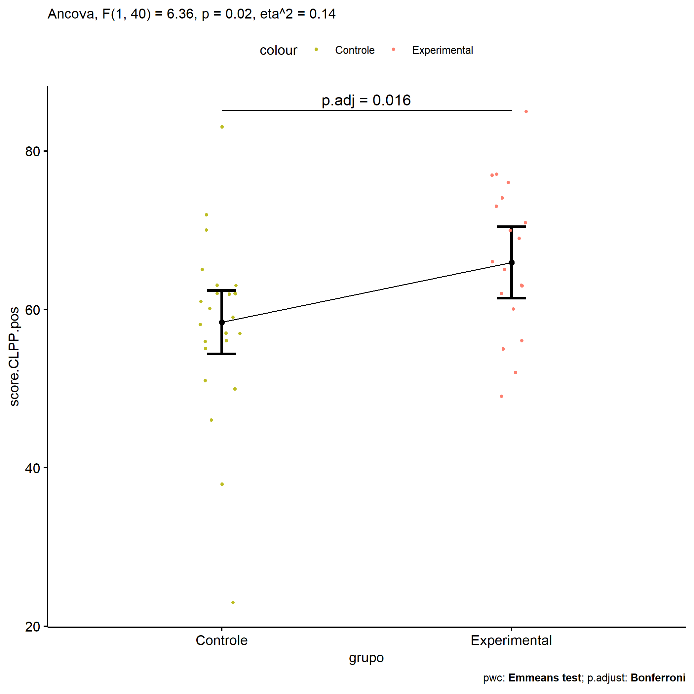<!-- -->

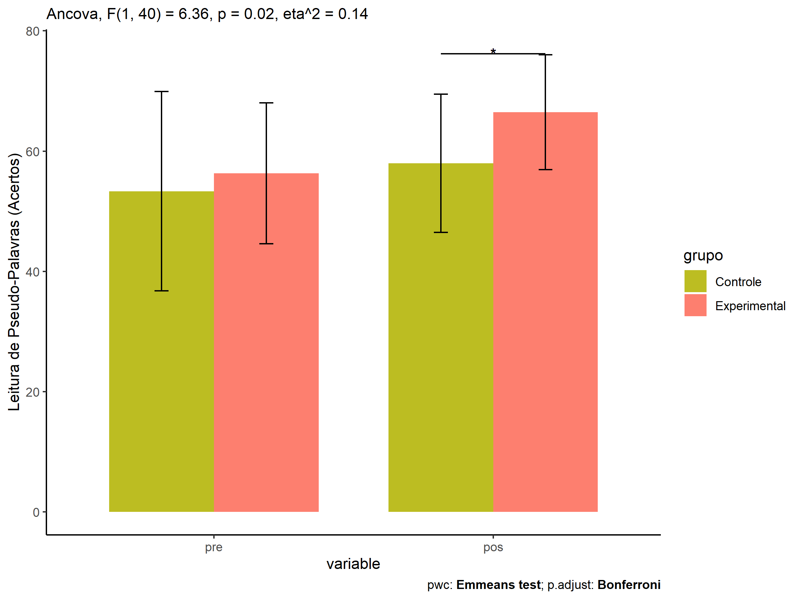<!-- -->

<!-- -->

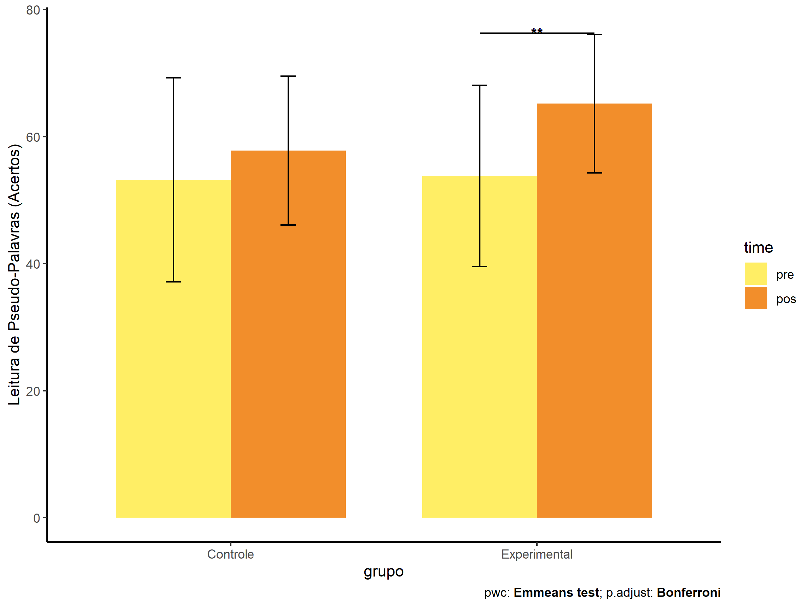<!-- -->

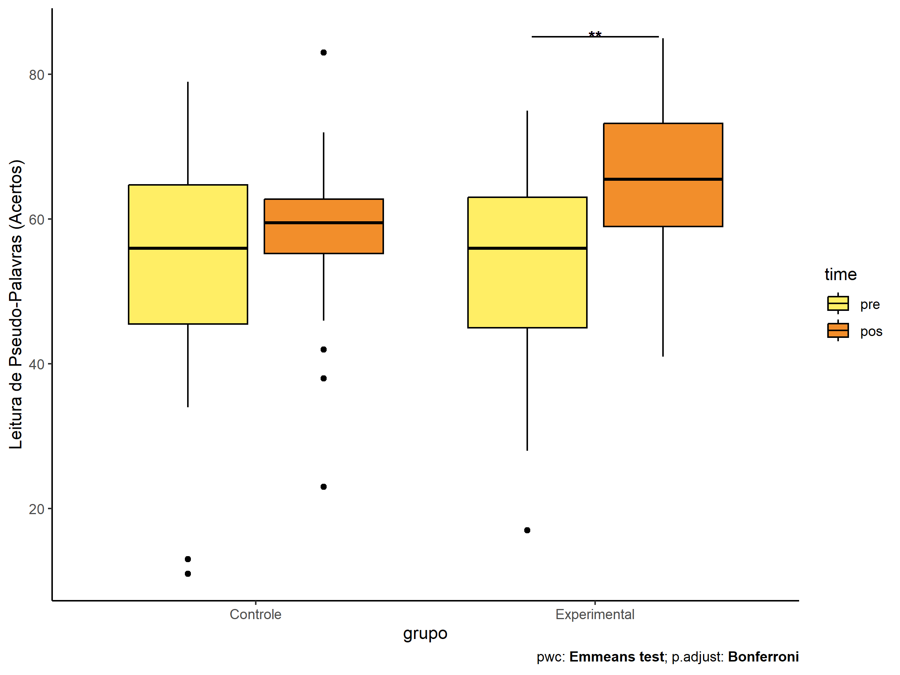<!-- -->

### Leitura de Pseudo-Palavras (TRI)

| var          | grupo    |   n | M (pre) | SE (pre) | M (unadj) | SE (unadj) | M (adj) | SE (adj) |
|:-------------|:---------|----:|--------:|---------:|----------:|-----------:|--------:|---------:|
| tri.CLPP.pos | Controle |  42 |  54.976 |    2.263 |    59.429 |      1.837 |  59.457 |    1.546 |
| tri.CLPP.pos | Stari    |  38 |  55.132 |    1.627 |    62.500 |      1.650 |  62.468 |    1.625 |

| .y.          | group1   | group2 | estimate | conf.low | conf.high |    se | statistic |     p | p.adj | p.adj.signif |
|:-------------|:---------|:-------|---------:|---------:|----------:|------:|----------:|------:|------:|:-------------|
| tri.CLPP.pos | Controle | Stari  |   -3.011 |   -7.476 |     1.455 | 2.243 |    -1.343 | 0.183 | 0.183 | ns           |
| tri.CLPP.pre | Controle | Stari  |   -0.155 |   -5.807 |     5.496 | 2.839 |    -0.055 | 0.956 | 0.956 | ns           |

| .y.      | grupo    | group1 | group2 | estimate | conf.low | conf.high |    se | statistic |     p | p.adj | p.adj.signif |
|:---------|:---------|:-------|:-------|---------:|---------:|----------:|------:|----------:|------:|------:|:-------------|
| tri.CLPP | Controle | pre    | pos    |   -0.146 |   -0.495 |     0.202 | 0.176 |    -0.830 | 0.408 | 0.408 | ns           |
| tri.CLPP | Stari    | pre    | pos    |   -0.330 |   -0.706 |     0.045 | 0.190 |    -1.737 | 0.084 | 0.084 | ns           |

    ## Scale for colour is already present.
    ## Adding another scale for colour, which will replace the existing scale.

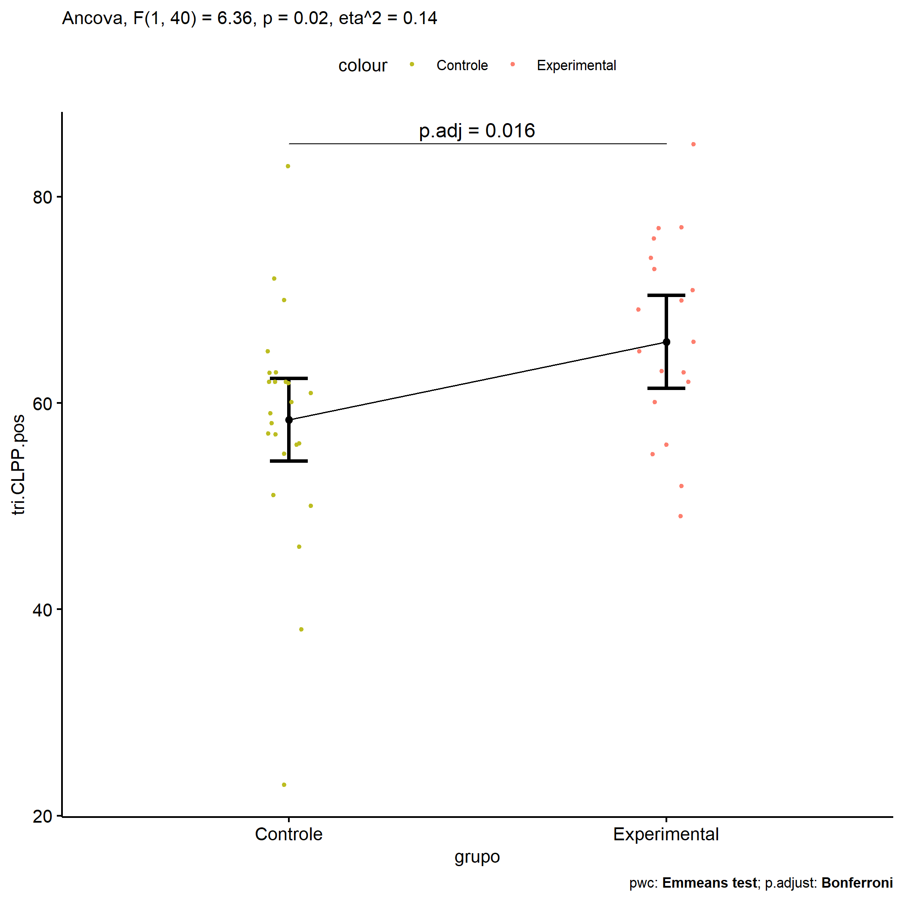<!-- -->

<!-- -->

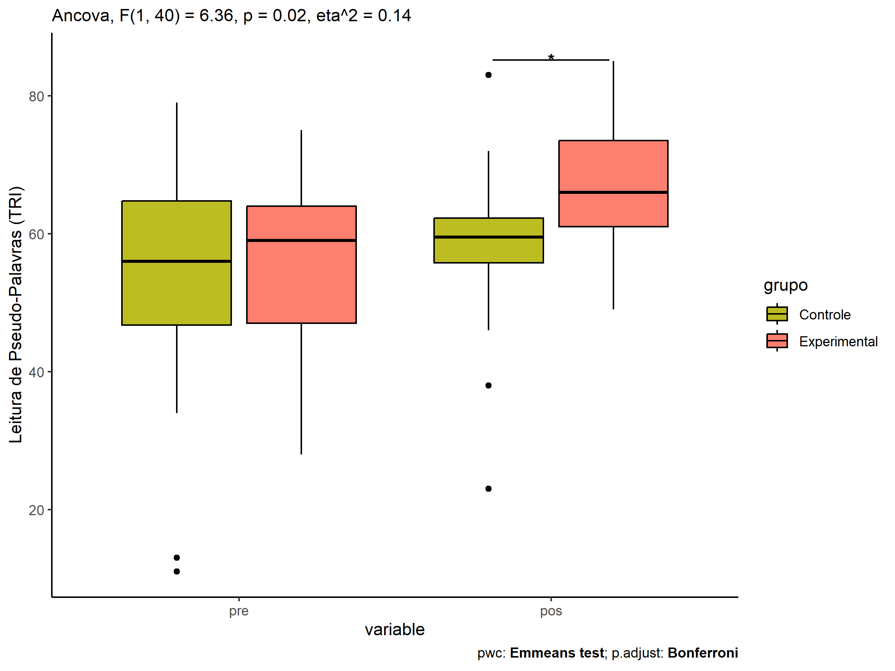<!-- -->

<!-- -->

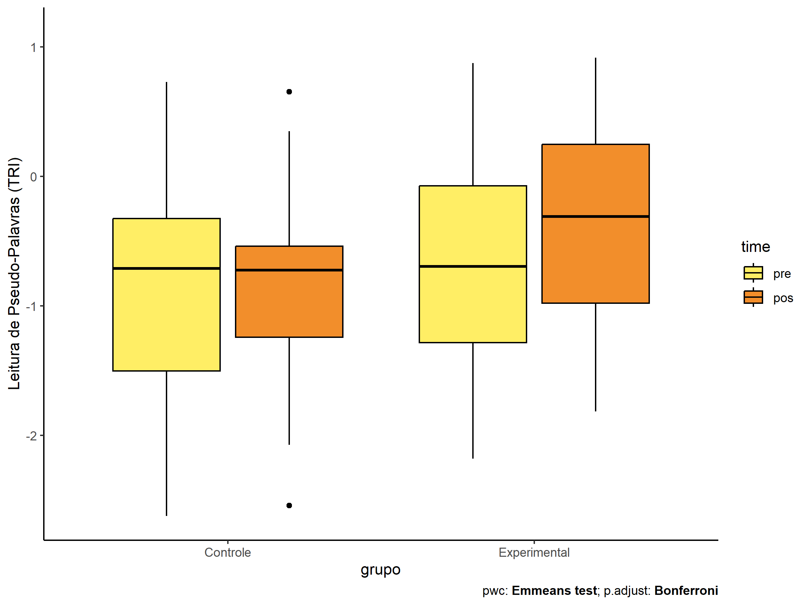<!-- -->

### Correta Regular (Acertos)

| var          | grupo    |   n | M (pre) | SE (pre) | M (unadj) | SE (unadj) | M (adj) | SE (adj) |
|:-------------|:---------|----:|--------:|---------:|----------:|-----------:|--------:|---------:|
| score.CR.pos | Controle |  50 |   11.72 |    0.579 |    11.480 |      0.786 |  11.315 |    0.740 |
| score.CR.pos | Stari    |  42 |   10.81 |    0.675 |    12.238 |      0.822 |  12.434 |    0.808 |

| .y.          | group1   | group2 | estimate | conf.low | conf.high |    se | statistic |     p | p.adj | p.adj.signif |
|:-------------|:---------|:-------|---------:|---------:|----------:|------:|----------:|------:|------:|:-------------|
| score.CR.pos | Controle | Stari  |   -1.119 |   -3.303 |     1.065 | 1.099 |    -1.018 | 0.311 | 0.311 | ns           |
| score.CR.pre | Controle | Stari  |    0.910 |   -0.845 |     2.666 | 0.884 |     1.030 | 0.306 | 0.306 | ns           |

| .y.      | grupo    | group1 | group2 | estimate | conf.low | conf.high |    se | statistic |     p | p.adj | p.adj.signif |
|:---------|:---------|:-------|:-------|---------:|---------:|----------:|------:|----------:|------:|------:|:-------------|
| score.CR | Controle | pre    | pos    |    0.240 |   -1.685 |     2.165 | 0.976 |     0.246 | 0.806 | 0.806 | ns           |
| score.CR | Stari    | pre    | pos    |   -1.429 |   -3.529 |     0.672 | 1.064 |    -1.342 | 0.181 | 0.181 | ns           |

    ## Scale for colour is already present.
    ## Adding another scale for colour, which will replace the existing scale.

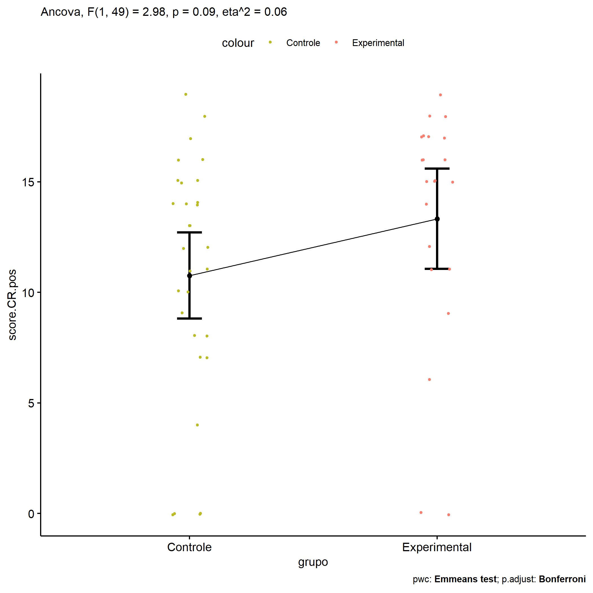<!-- -->

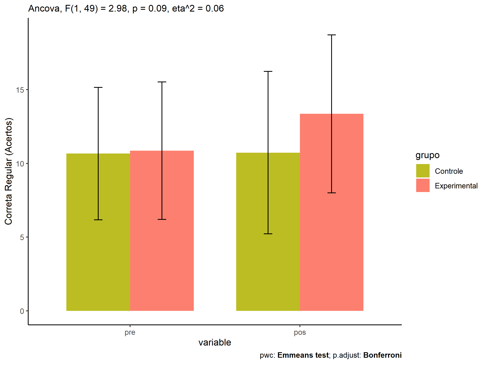<!-- -->

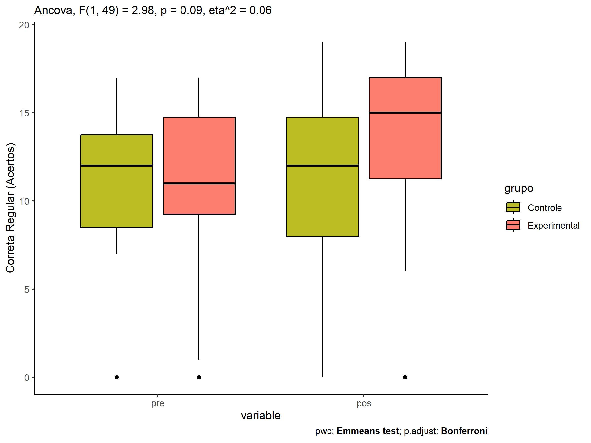<!-- -->

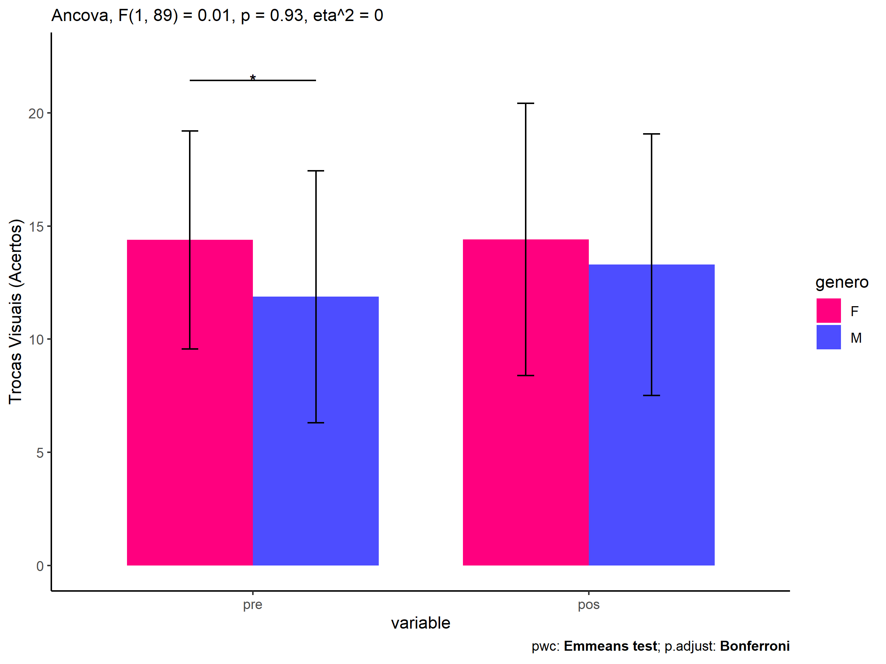<!-- -->

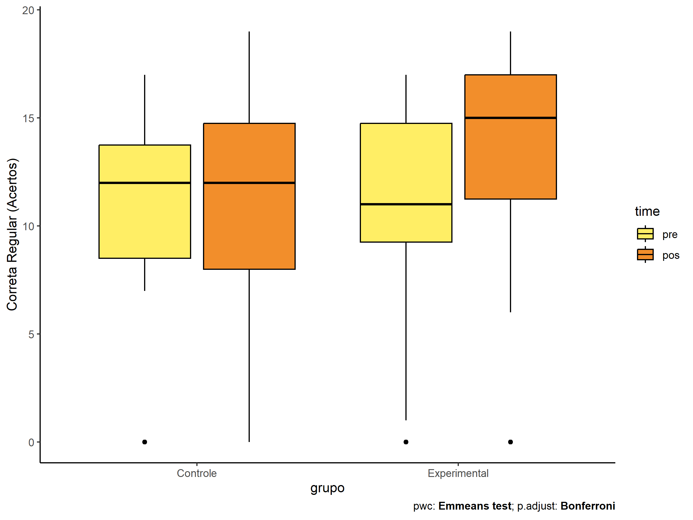<!-- -->

### Correta Regular (TRI)

| var        | grupo    |   n | M (pre) | SE (pre) | M (unadj) | SE (unadj) | M (adj) | SE (adj) |
|:-----------|:---------|----:|--------:|---------:|----------:|-----------:|--------:|---------:|
| tri.CR.pos | Controle |  42 |  -0.625 |    0.111 |    -0.437 |      0.125 |  -0.434 |    0.107 |
| tri.CR.pos | Stari    |  38 |  -0.616 |    0.134 |    -0.402 |      0.142 |  -0.404 |    0.113 |

| .y.        | group1   | group2 | estimate | conf.low | conf.high |    se | statistic |     p | p.adj | p.adj.signif |
|:-----------|:---------|:-------|---------:|---------:|----------:|------:|----------:|------:|------:|:-------------|
| tri.CR.pos | Controle | Stari  |   -0.030 |   -0.340 |     0.280 | 0.156 |    -0.192 | 0.848 | 0.848 | ns           |
| tri.CR.pre | Controle | Stari  |   -0.009 |   -0.353 |     0.336 | 0.173 |    -0.050 | 0.960 | 0.960 | ns           |

| .y.    | grupo    | group1 | group2 | estimate | conf.low | conf.high |    se | statistic |     p | p.adj | p.adj.signif |
|:-------|:---------|:-------|:-------|---------:|---------:|----------:|------:|----------:|------:|------:|:-------------|
| tri.CR | Controle | pre    | pos    |   -0.148 |   -0.486 |     0.191 | 0.171 |    -0.863 | 0.389 | 0.389 | ns           |
| tri.CR | Stari    | pre    | pos    |   -0.227 |   -0.592 |     0.138 | 0.185 |    -1.230 | 0.220 | 0.220 | ns           |

    ## Scale for colour is already present.
    ## Adding another scale for colour, which will replace the existing scale.

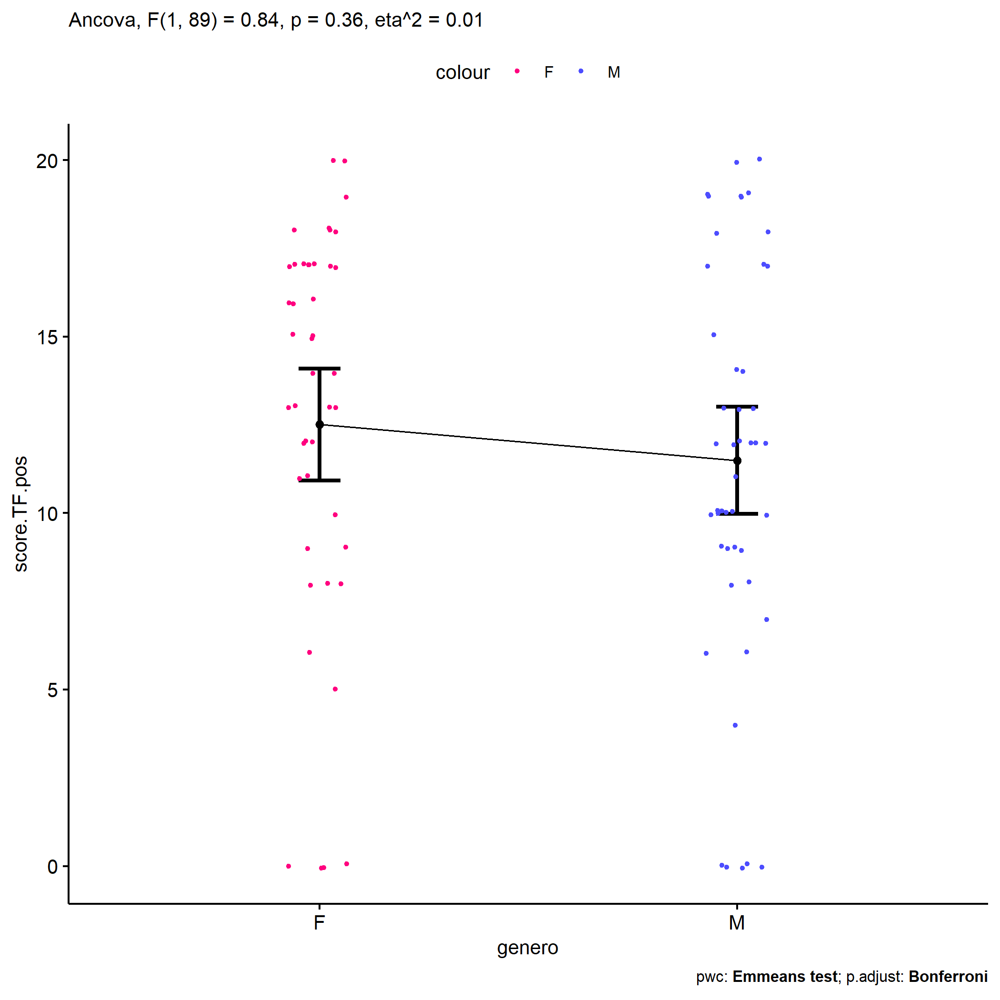<!-- -->

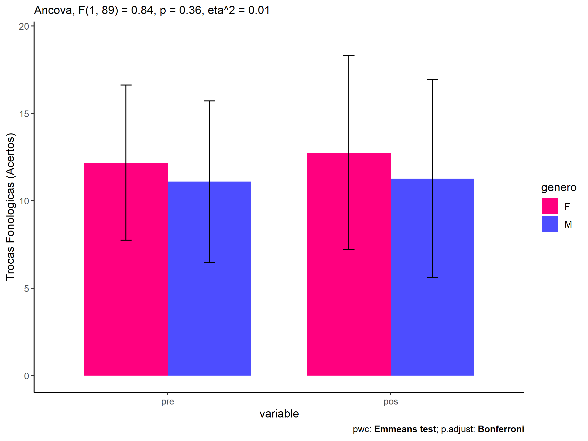<!-- -->

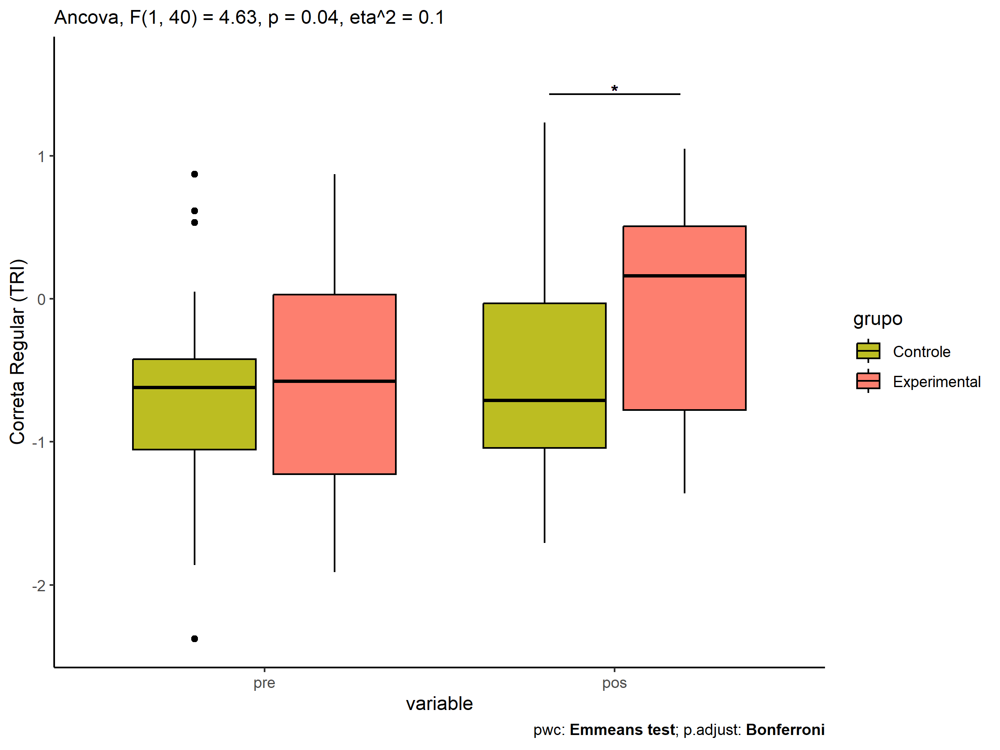<!-- -->

<!-- -->

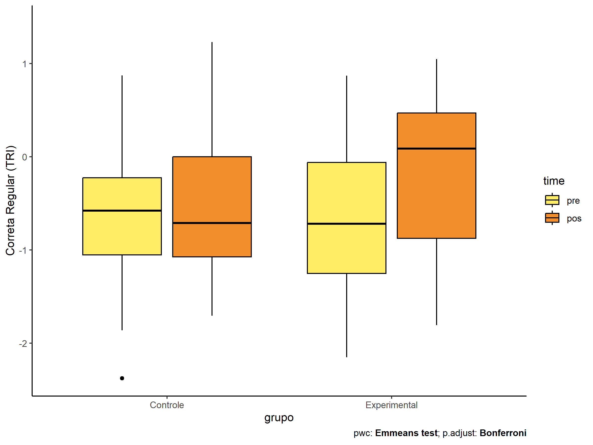<!-- -->

### Correta Irregular (Acertos)

| var          | grupo    |   n | M (pre) | SE (pre) | M (unadj) | SE (unadj) | M (adj) | SE (adj) |
|:-------------|:---------|----:|--------:|---------:|----------:|-----------:|--------:|---------:|
| score.CI.pos | Controle |  50 |   9.300 |    0.497 |     8.180 |      0.636 |   8.068 |    0.597 |
| score.CI.pos | Stari    |  42 |   8.667 |    0.538 |     9.643 |      0.661 |   9.776 |    0.651 |

| .y.          | group1   | group2 | estimate | conf.low | conf.high |    se | statistic |     p | p.adj | p.adj.signif |
|:-------------|:---------|:-------|---------:|---------:|----------:|------:|----------:|------:|------:|:-------------|
| score.CI.pos | Controle | Stari  |   -1.707 |   -3.466 |     0.051 | 0.885 |    -1.929 | 0.057 | 0.057 | ns           |
| score.CI.pre | Controle | Stari  |    0.633 |   -0.823 |     2.090 | 0.733 |     0.864 | 0.390 | 0.390 | ns           |

| .y.      | grupo    | group1 | group2 | estimate | conf.low | conf.high |    se | statistic |     p | p.adj | p.adj.signif |
|:---------|:---------|:-------|:-------|---------:|---------:|----------:|------:|----------:|------:|------:|:-------------|
| score.CI | Controle | pre    | pos    |    1.120 |   -0.449 |     2.689 | 0.795 |     1.408 | 0.161 | 0.161 | ns           |
| score.CI | Stari    | pre    | pos    |   -0.976 |   -2.689 |     0.736 | 0.868 |    -1.125 | 0.262 | 0.262 | ns           |

    ## Scale for colour is already present.
    ## Adding another scale for colour, which will replace the existing scale.

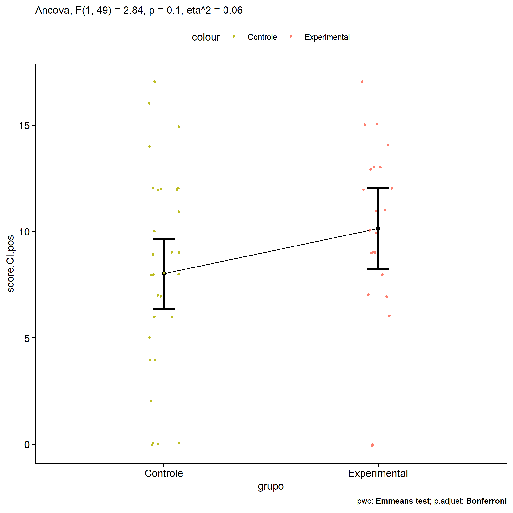<!-- -->

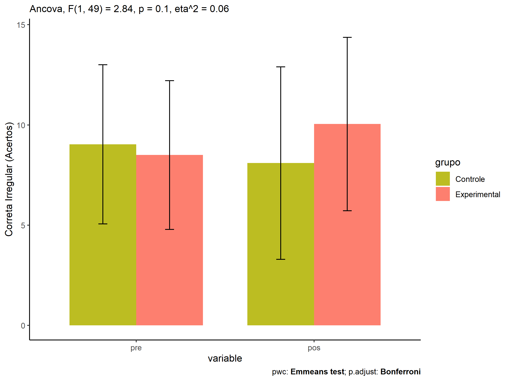<!-- -->

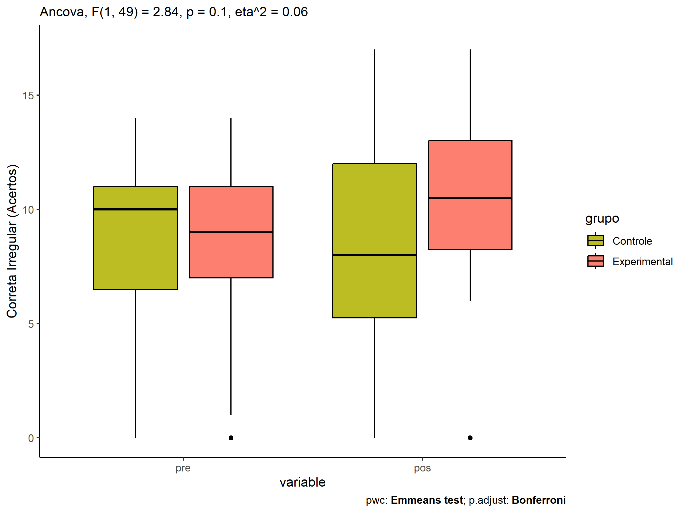<!-- -->

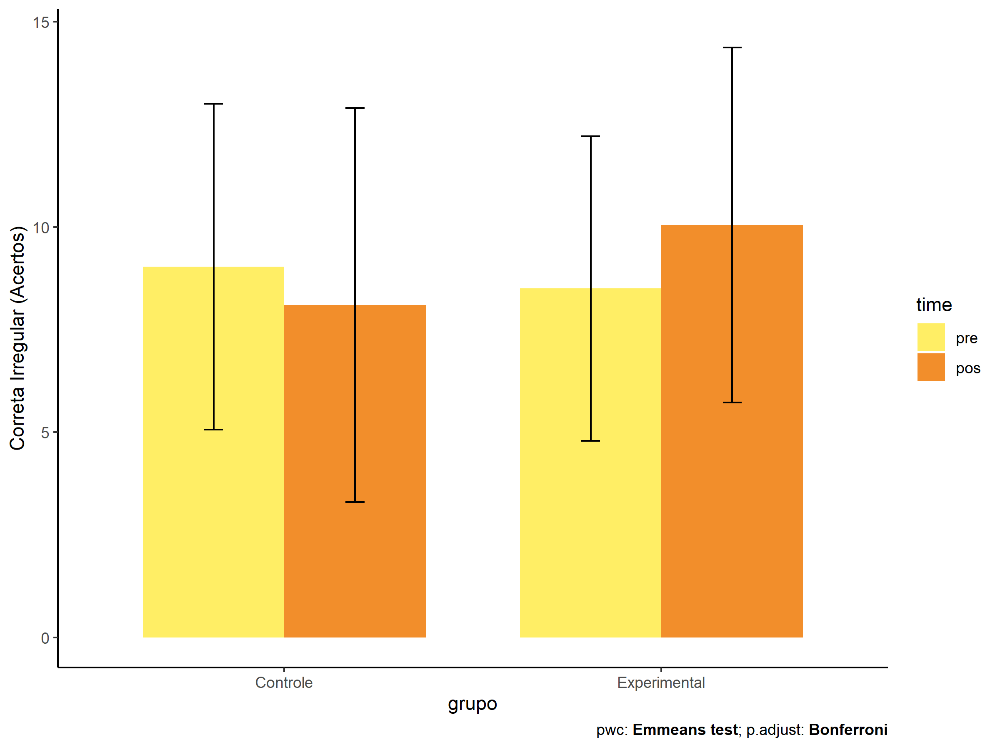<!-- -->

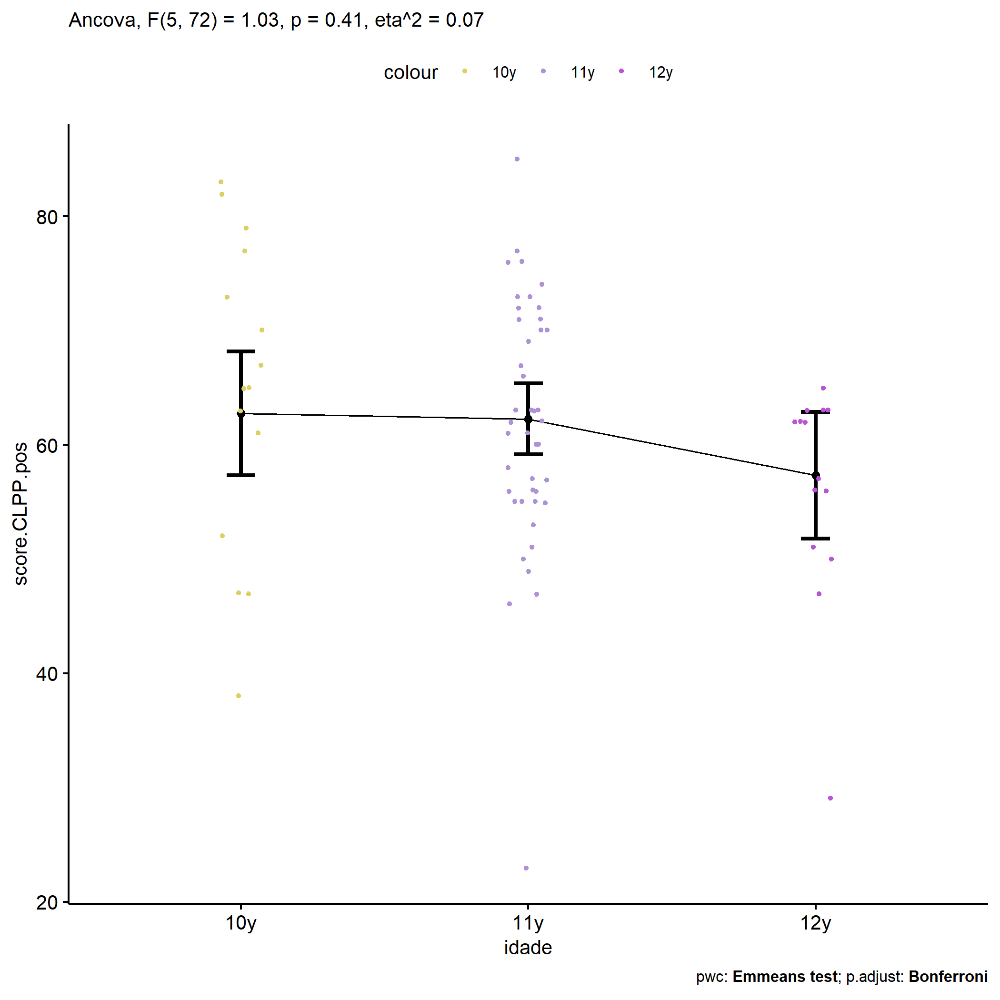<!-- -->

### Correta Irregular (TRI)

| var        | grupo    |   n | M (pre) | SE (pre) | M (unadj) | SE (unadj) | M (adj) | SE (adj) |
|:-----------|:---------|----:|--------:|---------:|----------:|-----------:|--------:|---------:|
| tri.CI.pos | Controle |  42 |  -0.577 |    0.087 |    -0.750 |      0.107 |  -0.744 |    0.110 |
| tri.CI.pos | Stari    |  38 |  -0.556 |    0.089 |    -0.397 |      0.143 |  -0.404 |    0.116 |

| .y.        | group1   | group2 | estimate | conf.low | conf.high |    se | statistic |     p | p.adj | p.adj.signif |
|:-----------|:---------|:-------|---------:|---------:|----------:|------:|----------:|------:|------:|:-------------|
| tri.CI.pos | Controle | Stari  |   -0.339 |   -0.658 |    -0.021 | 0.160 |    -2.125 | 0.037 | 0.037 | \*           |
| tri.CI.pre | Controle | Stari  |   -0.021 |   -0.269 |     0.226 | 0.124 |    -0.172 | 0.864 | 0.864 | ns           |

| .y.    | grupo    | group1 | group2 | estimate | conf.low | conf.high |    se | statistic |     p | p.adj | p.adj.signif |
|:-------|:---------|:-------|:-------|---------:|---------:|----------:|------:|----------:|------:|------:|:-------------|
| tri.CI | Controle | pre    | pos    |    0.201 |   -0.083 |     0.485 | 0.144 |     1.397 | 0.164 | 0.164 | ns           |
| tri.CI | Stari    | pre    | pos    |   -0.194 |   -0.501 |     0.112 | 0.155 |    -1.250 | 0.213 | 0.213 | ns           |

    ## Scale for colour is already present.
    ## Adding another scale for colour, which will replace the existing scale.

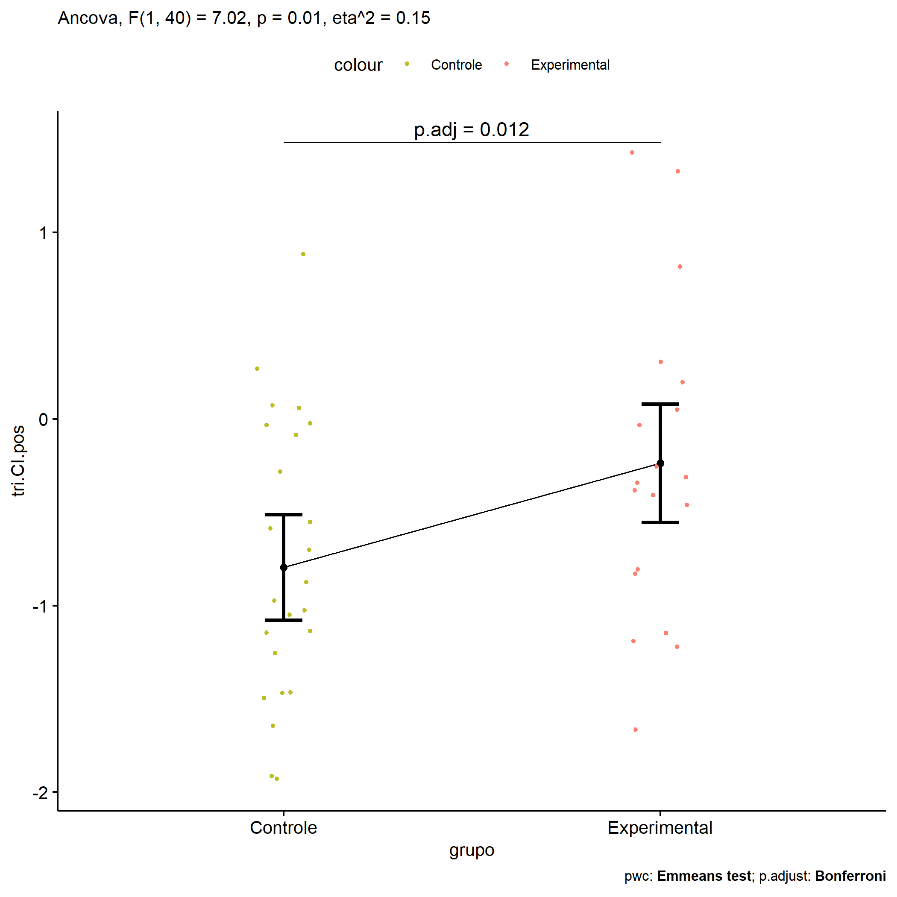<!-- -->

<!-- -->

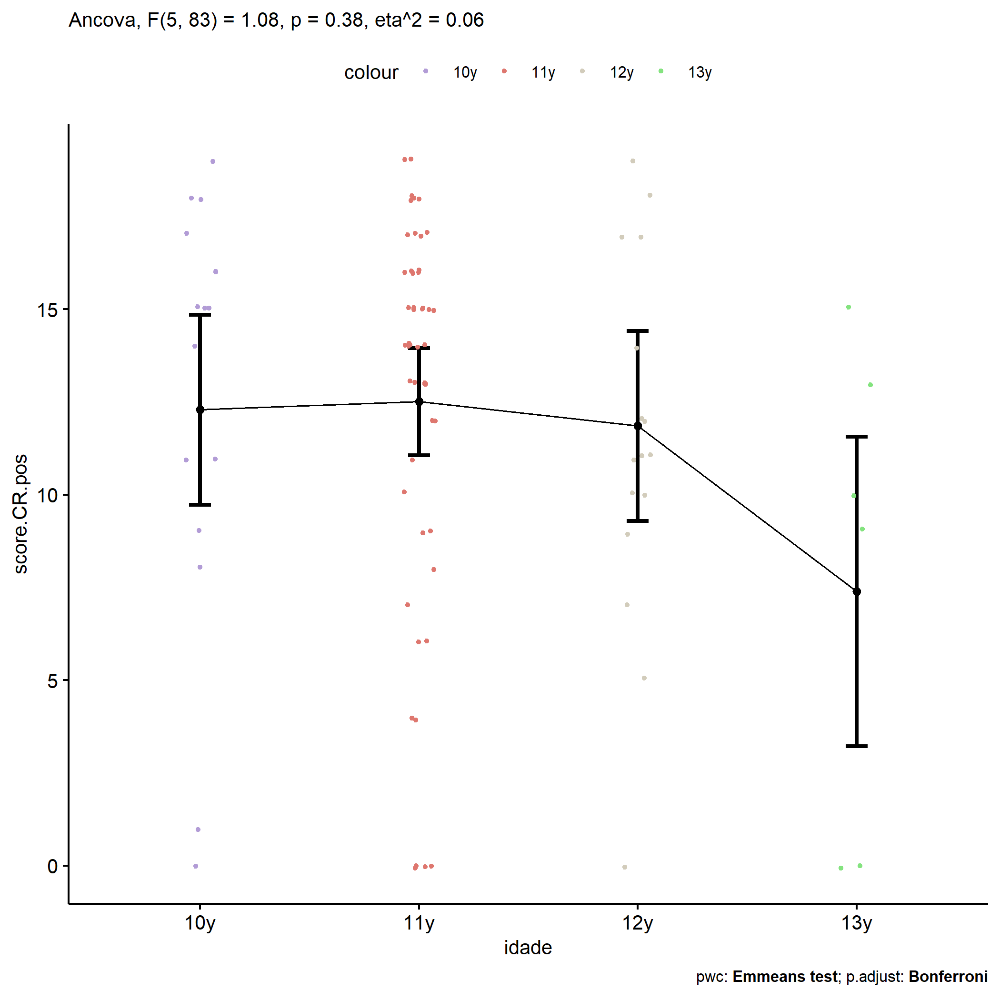<!-- -->

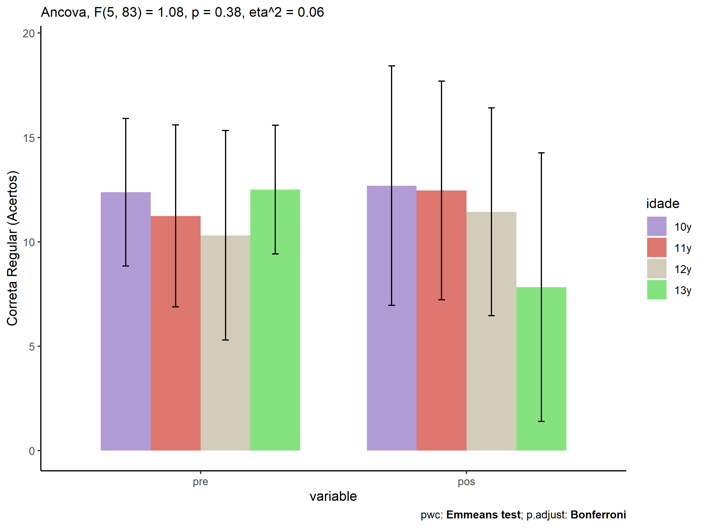<!-- -->

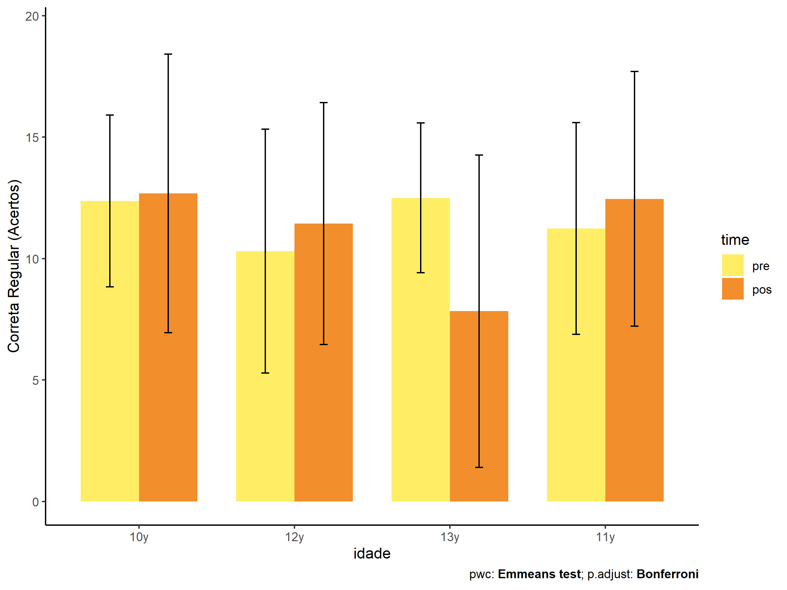<!-- -->

### Trocas Visuais (Acertos)

| var          | grupo    |   n | M (pre) | SE (pre) | M (unadj) | SE (unadj) | M (adj) | SE (adj) |
|:-------------|:---------|----:|--------:|---------:|----------:|-----------:|--------:|---------:|
| score.TV.pos | Controle |  50 |  13.280 |    0.776 |    13.400 |      0.910 |  13.317 |    0.780 |
| score.TV.pos | Stari    |  42 |  12.833 |    0.807 |    14.333 |      0.801 |  14.432 |    0.851 |

| .y.          | group1   | group2 | estimate | conf.low | conf.high |    se | statistic |     p | p.adj | p.adj.signif |
|:-------------|:---------|:-------|---------:|---------:|----------:|------:|----------:|------:|------:|:-------------|
| score.TV.pos | Controle | Stari  |   -1.115 |   -3.409 |     1.178 | 1.154 |    -0.966 | 0.337 | 0.337 | ns           |
| score.TV.pre | Controle | Stari  |    0.447 |   -1.787 |     2.680 | 1.124 |     0.397 | 0.692 | 0.692 | ns           |

| .y.      | grupo    | group1 | group2 | estimate | conf.low | conf.high |    se | statistic |     p | p.adj | p.adj.signif |
|:---------|:---------|:-------|:-------|---------:|---------:|----------:|------:|----------:|------:|------:|:-------------|
| score.TV | Controle | pre    | pos    |    -0.12 |   -2.346 |     2.106 | 1.128 |    -0.106 | 0.915 | 0.915 | ns           |
| score.TV | Stari    | pre    | pos    |    -1.50 |   -3.929 |     0.929 | 1.231 |    -1.218 | 0.225 | 0.225 | ns           |

    ## Scale for colour is already present.
    ## Adding another scale for colour, which will replace the existing scale.

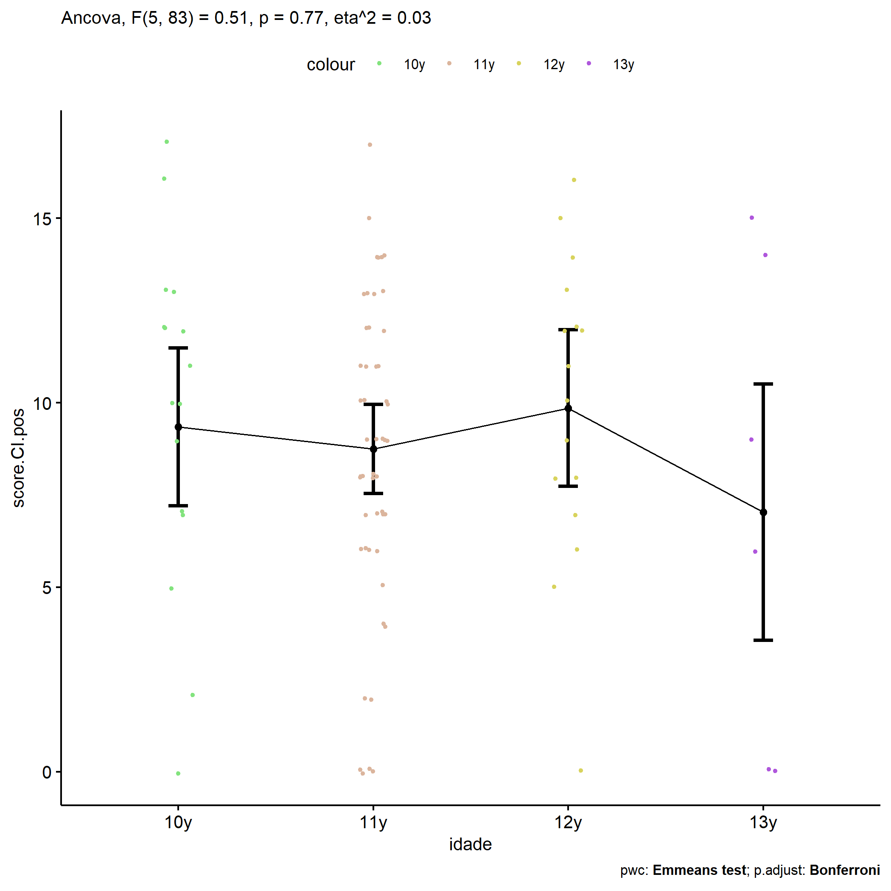<!-- -->

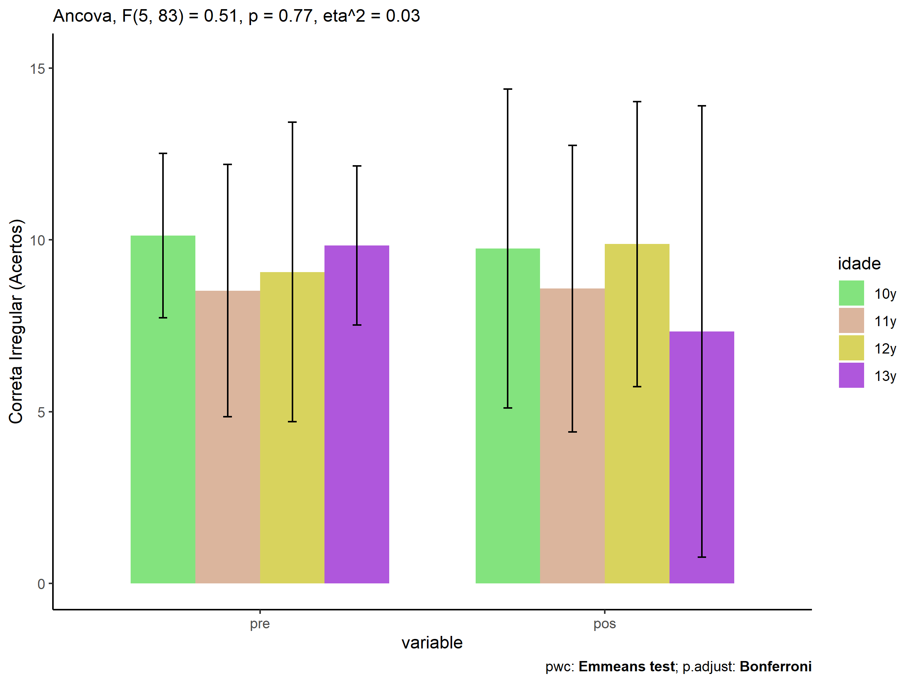<!-- -->

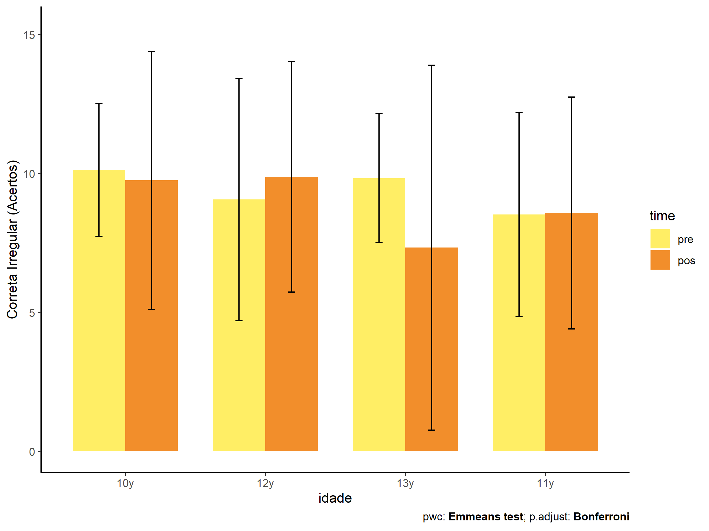<!-- -->

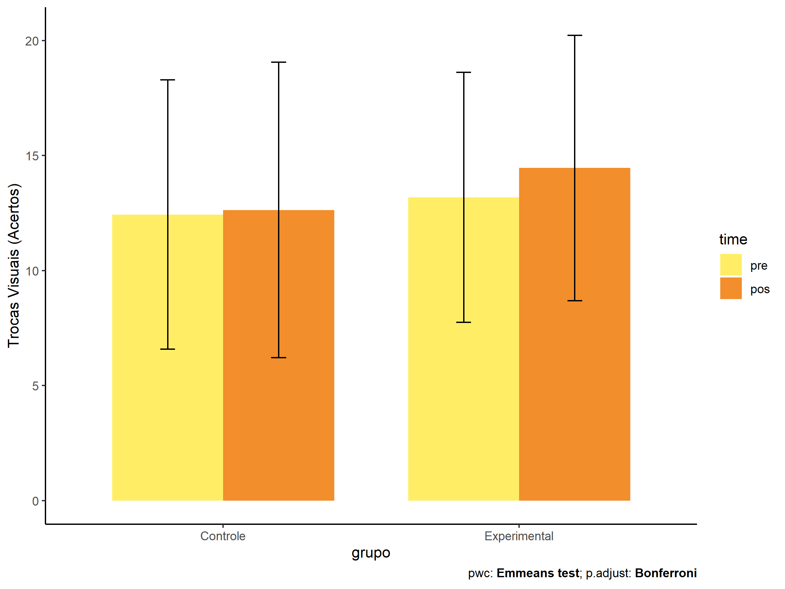<!-- -->

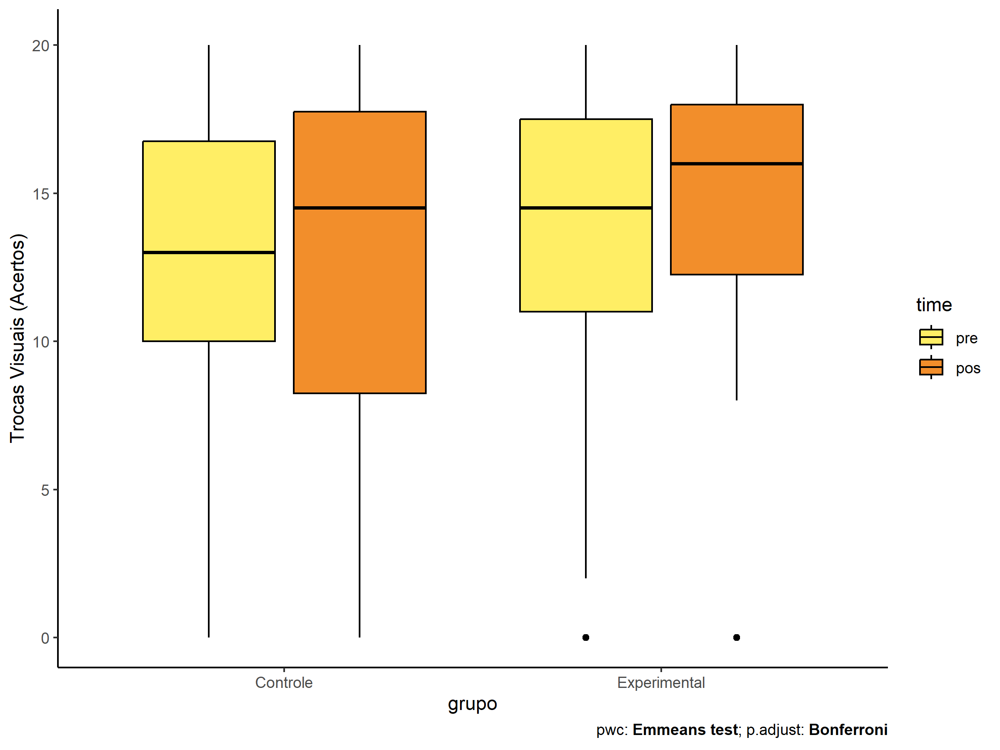<!-- -->

### Trocas Visuais (TRI)

| var        | grupo    |   n | M (pre) | SE (pre) | M (unadj) | SE (unadj) | M (adj) | SE (adj) |
|:-----------|:---------|----:|--------:|---------:|----------:|-----------:|--------:|---------:|
| tri.TV.pos | Controle |  42 |  -0.562 |    0.132 |    -0.322 |      0.133 |  -0.322 |    0.116 |
| tri.TV.pos | Stari    |  38 |  -0.564 |    0.150 |    -0.233 |      0.130 |  -0.233 |    0.122 |

| .y.        | group1   | group2 | estimate | conf.low | conf.high |    se | statistic |     p | p.adj | p.adj.signif |
|:-----------|:---------|:-------|---------:|---------:|----------:|------:|----------:|------:|------:|:-------------|
| tri.TV.pos | Controle | Stari  |   -0.089 |   -0.424 |     0.246 | 0.168 |    -0.528 | 0.599 | 0.599 | ns           |
| tri.TV.pre | Controle | Stari  |    0.002 |   -0.394 |     0.397 | 0.199 |     0.008 | 0.993 | 0.993 | ns           |

| .y.    | grupo    | group1 | group2 | estimate | conf.low | conf.high |    se | statistic |     p | p.adj | p.adj.signif |
|:-------|:---------|:-------|:-------|---------:|---------:|----------:|------:|----------:|------:|------:|:-------------|
| tri.TV | Controle | pre    | pos    |   -0.181 |   -0.540 |     0.178 | 0.182 |    -0.998 | 0.320 | 0.320 | ns           |
| tri.TV | Stari    | pre    | pos    |   -0.281 |   -0.668 |     0.107 | 0.196 |    -1.431 | 0.154 | 0.154 | ns           |

    ## Scale for colour is already present.
    ## Adding another scale for colour, which will replace the existing scale.

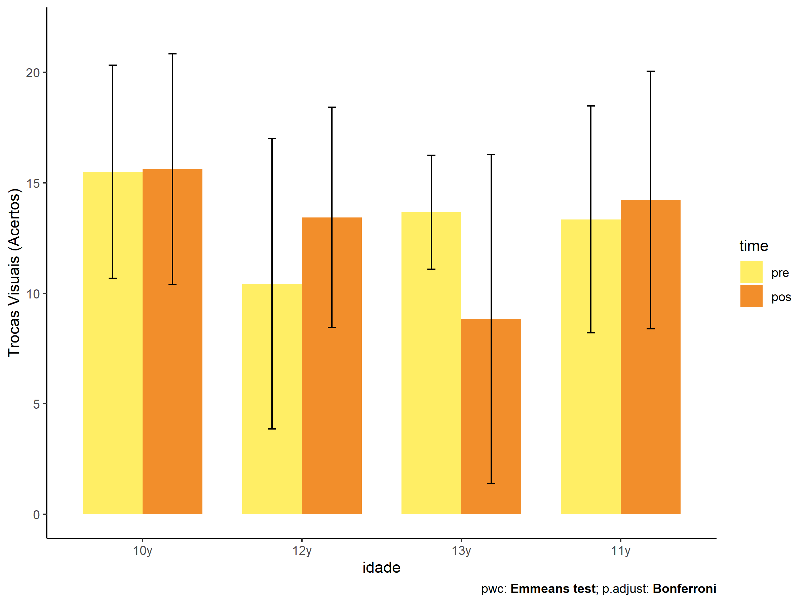<!-- -->

<!-- -->

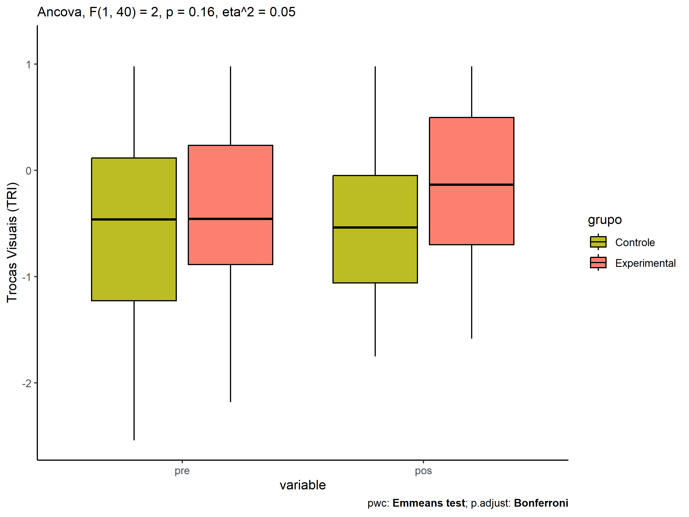<!-- -->

<!-- -->

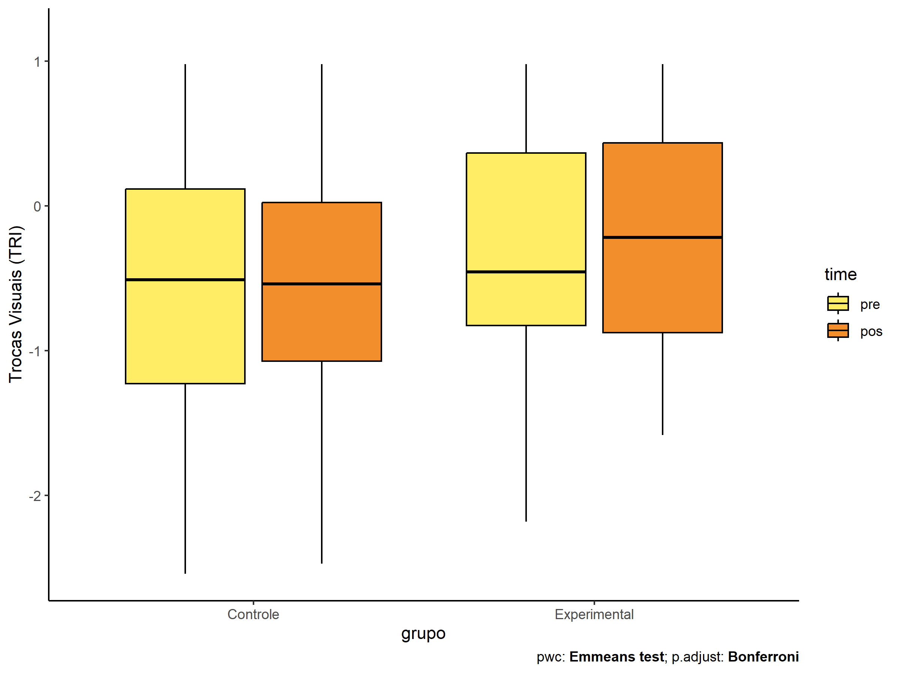<!-- -->

### Trocas Fonologicas (Acertos)

| var          | grupo    |   n | M (pre) | SE (pre) | M (unadj) | SE (unadj) | M (adj) | SE (adj) |
|:-------------|:---------|----:|--------:|---------:|----------:|-----------:|--------:|---------:|
| score.TF.pos | Controle |  50 |  11.760 |    0.681 |    11.060 |      0.791 |  10.997 |    0.735 |
| score.TF.pos | Stari    |  42 |  11.452 |    0.652 |    13.071 |      0.850 |  13.146 |    0.802 |

| .y.          | group1   | group2 | estimate | conf.low | conf.high |    se | statistic |     p | p.adj | p.adj.signif |
|:-------------|:---------|:-------|---------:|---------:|----------:|------:|----------:|------:|------:|:-------------|
| score.TF.pos | Controle | Stari  |   -2.149 |   -4.310 |     0.012 | 1.088 |    -1.976 | 0.051 | 0.051 | ns           |
| score.TF.pre | Controle | Stari  |    0.308 |   -1.587 |     2.202 | 0.953 |     0.323 | 0.748 | 0.748 | ns           |

| .y.      | grupo    | group1 | group2 | estimate | conf.low | conf.high |    se | statistic |     p | p.adj | p.adj.signif |
|:---------|:---------|:-------|:-------|---------:|---------:|----------:|------:|----------:|------:|------:|:-------------|
| score.TF | Controle | pre    | pos    |    0.700 |   -1.304 |     2.704 | 1.016 |     0.689 | 0.492 | 0.492 | ns           |
| score.TF | Stari    | pre    | pos    |   -1.619 |   -3.806 |     0.568 | 1.108 |    -1.461 | 0.146 | 0.146 | ns           |

    ## Scale for colour is already present.
    ## Adding another scale for colour, which will replace the existing scale.

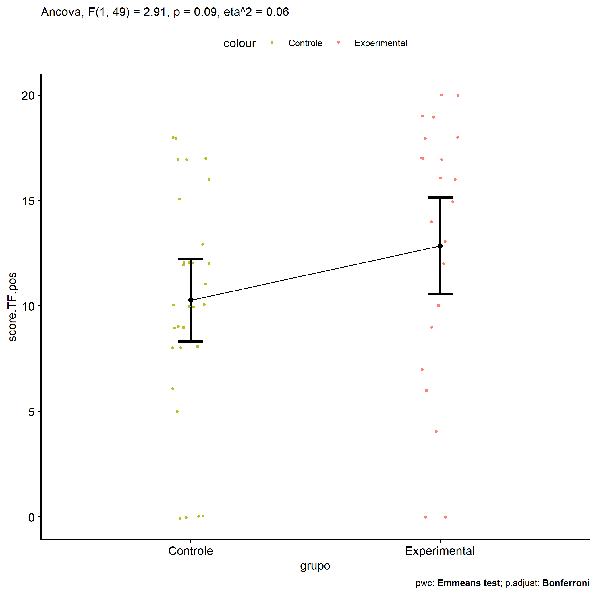<!-- -->

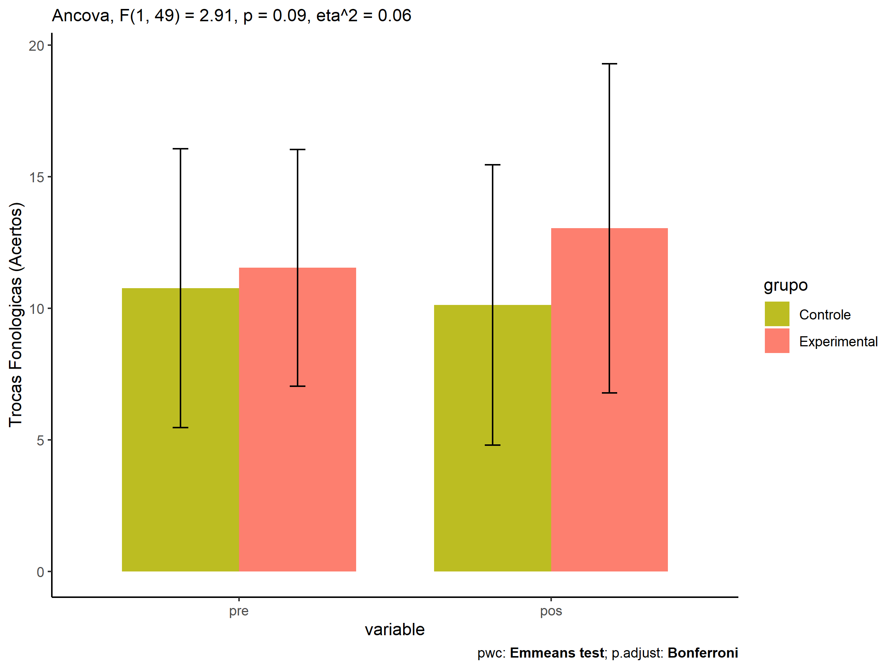<!-- -->

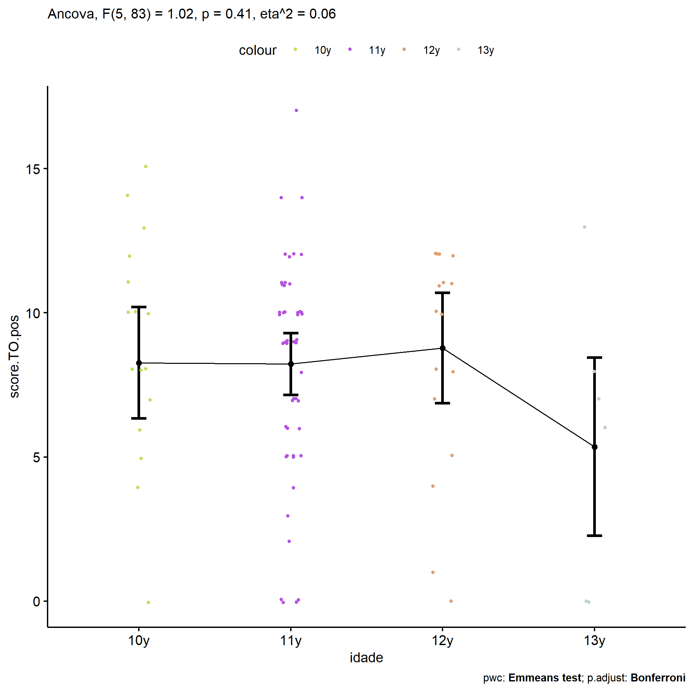<!-- -->

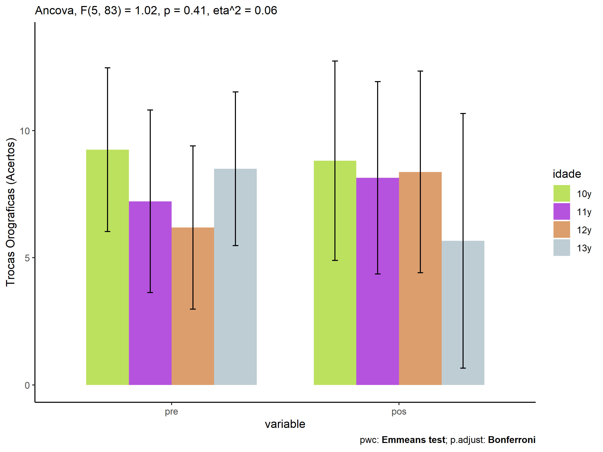<!-- -->

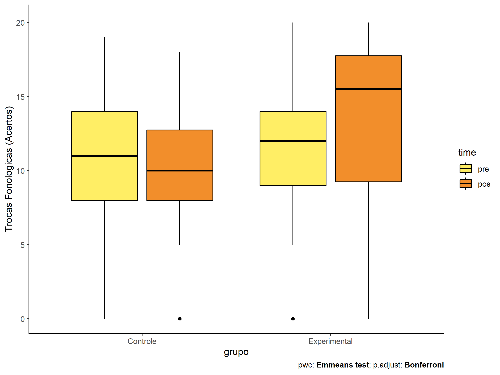<!-- -->

### Trocas Fonologicas (TRI)

| var        | grupo    |   n | M (pre) | SE (pre) | M (unadj) | SE (unadj) | M (adj) | SE (adj) |
|:-----------|:---------|----:|--------:|---------:|----------:|-----------:|--------:|---------:|
| tri.TF.pos | Controle |  42 |  -0.648 |    0.095 |    -0.563 |      0.115 |  -0.545 |    0.108 |
| tri.TF.pos | Stari    |  38 |  -0.586 |    0.123 |    -0.259 |      0.145 |  -0.279 |    0.113 |

| .y.        | group1   | group2 | estimate | conf.low | conf.high |    se | statistic |     p | p.adj | p.adj.signif |
|:-----------|:---------|:-------|---------:|---------:|----------:|------:|----------:|------:|------:|:-------------|
| tri.TF.pos | Controle | Stari  |   -0.265 |   -0.577 |     0.046 | 0.156 |    -1.695 | 0.094 | 0.094 | ns           |
| tri.TF.pre | Controle | Stari  |   -0.062 |   -0.367 |     0.243 | 0.153 |    -0.402 | 0.689 | 0.689 | ns           |

| .y.    | grupo    | group1 | group2 | estimate | conf.low | conf.high |    se | statistic |     p | p.adj | p.adj.signif |
|:-------|:---------|:-------|:-------|---------:|---------:|----------:|------:|----------:|------:|------:|:-------------|
| tri.TF | Controle | pre    | pos    |   -0.004 |   -0.321 |     0.312 | 0.160 |    -0.027 | 0.978 | 0.978 | ns           |
| tri.TF | Stari    | pre    | pos    |   -0.277 |   -0.618 |     0.064 | 0.173 |    -1.601 | 0.111 | 0.111 | ns           |

    ## Scale for colour is already present.
    ## Adding another scale for colour, which will replace the existing scale.

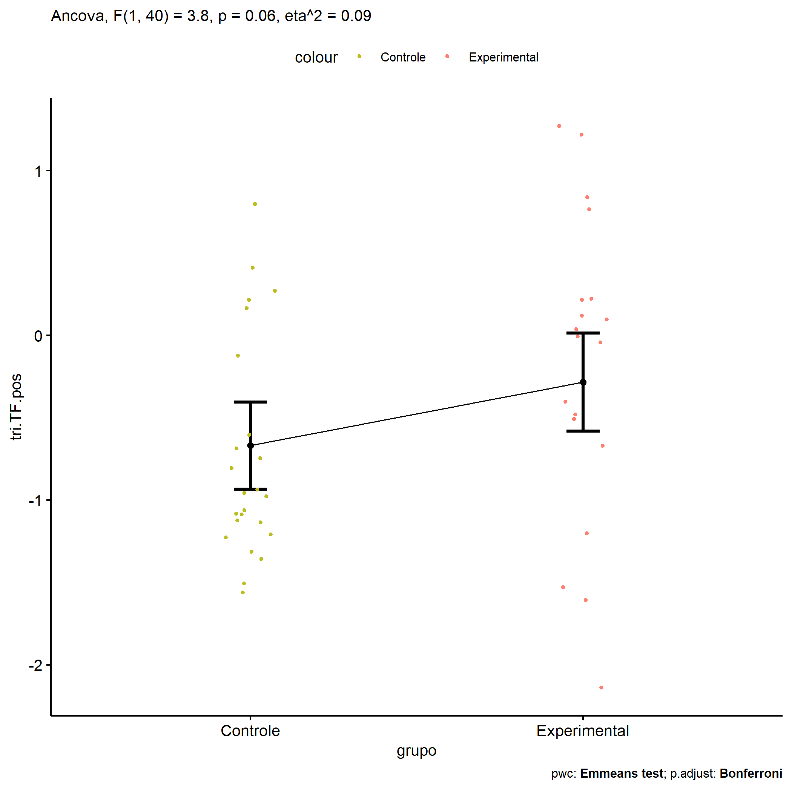<!-- -->

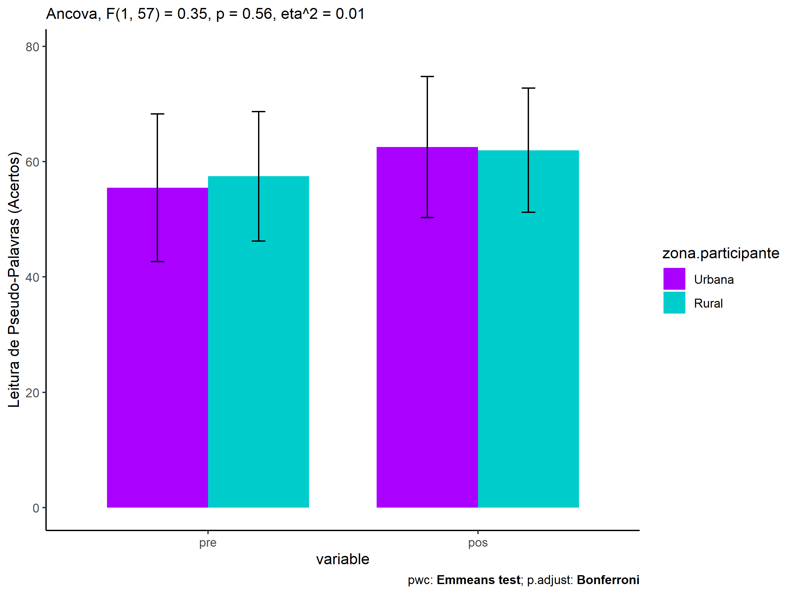<!-- -->

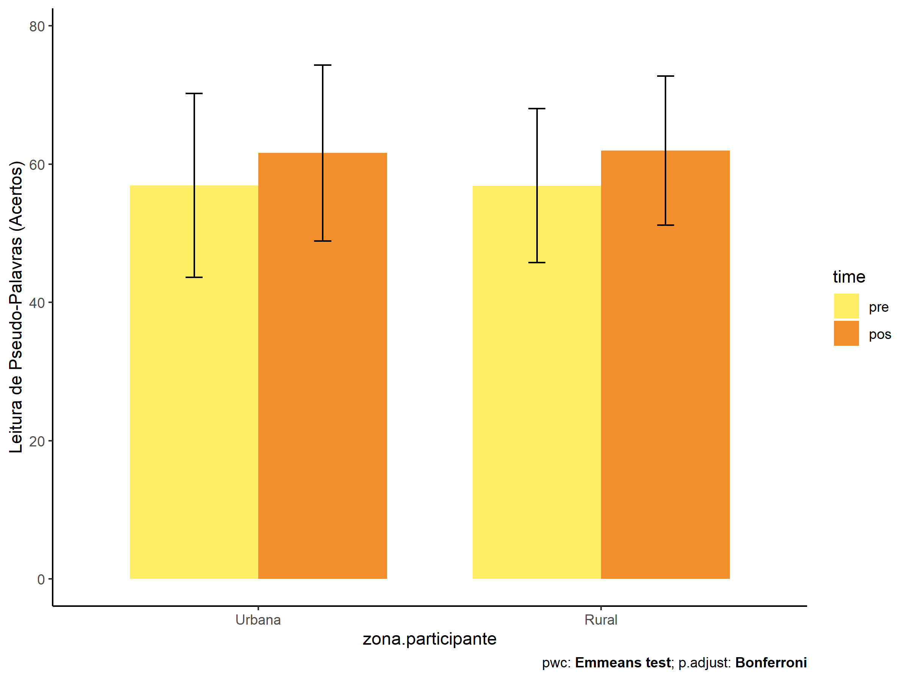<!-- -->

<!-- -->

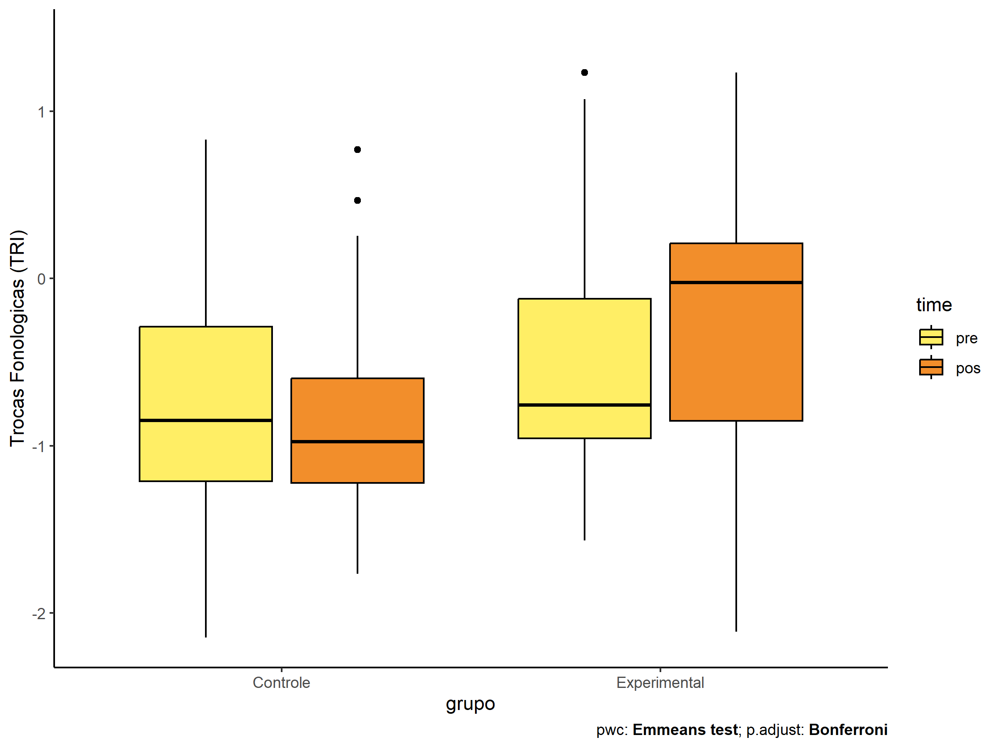<!-- -->

### Trocas Orograficas (Acertos)

| var          | grupo    |   n | M (pre) | SE (pre) | M (unadj) | SE (unadj) | M (adj) | SE (adj) |
|:-------------|:---------|----:|--------:|---------:|----------:|-----------:|--------:|---------:|
| score.TO.pos | Controle |  50 |   7.320 |    0.539 |     8.040 |      0.580 |   8.071 |    0.547 |
| score.TO.pos | Stari    |  42 |   7.548 |    0.474 |     8.238 |      0.594 |   8.201 |    0.597 |

| .y.          | group1   | group2 | estimate | conf.low | conf.high |    se | statistic |     p | p.adj | p.adj.signif |
|:-------------|:---------|:-------|---------:|---------:|----------:|------:|----------:|------:|------:|:-------------|
| score.TO.pos | Controle | Stari  |   -0.129 |   -1.739 |     1.480 | 0.810 |    -0.160 | 0.874 | 0.874 | ns           |
| score.TO.pre | Controle | Stari  |   -0.228 |   -1.680 |     1.224 | 0.731 |    -0.311 | 0.756 | 0.756 | ns           |

| .y.      | grupo    | group1 | group2 | estimate | conf.low | conf.high |    se | statistic |     p | p.adj | p.adj.signif |
|:---------|:---------|:-------|:-------|---------:|---------:|----------:|------:|----------:|------:|------:|:-------------|
| score.TO | Controle | pre    | pos    |    -0.72 |   -2.199 |     0.759 | 0.750 |    -0.960 | 0.338 | 0.338 | ns           |
| score.TO | Stari    | pre    | pos    |    -0.69 |   -2.304 |     0.923 | 0.818 |    -0.844 | 0.400 | 0.400 | ns           |

    ## Scale for colour is already present.
    ## Adding another scale for colour, which will replace the existing scale.

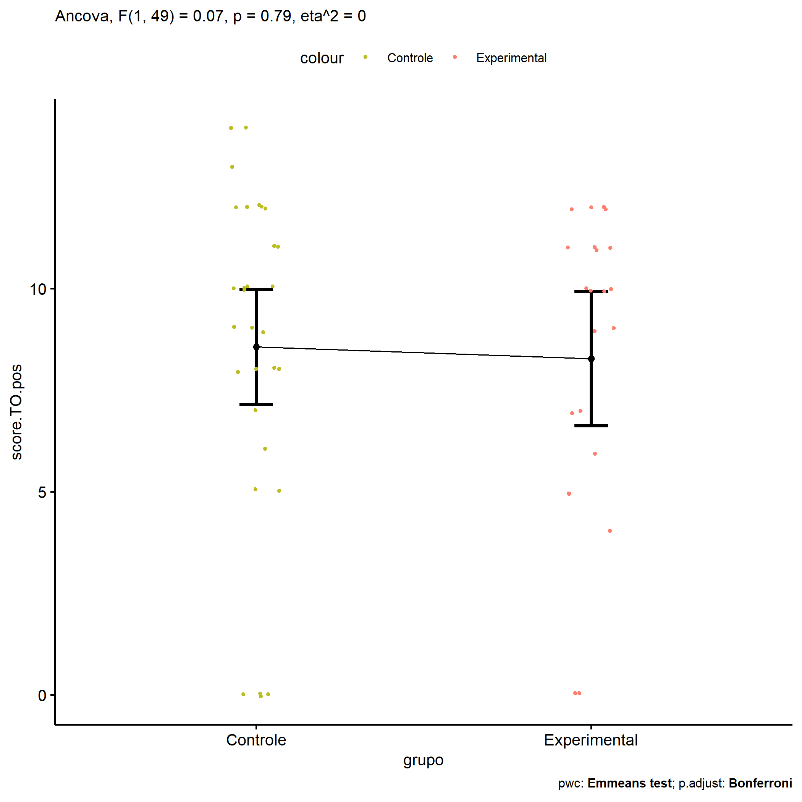<!-- -->

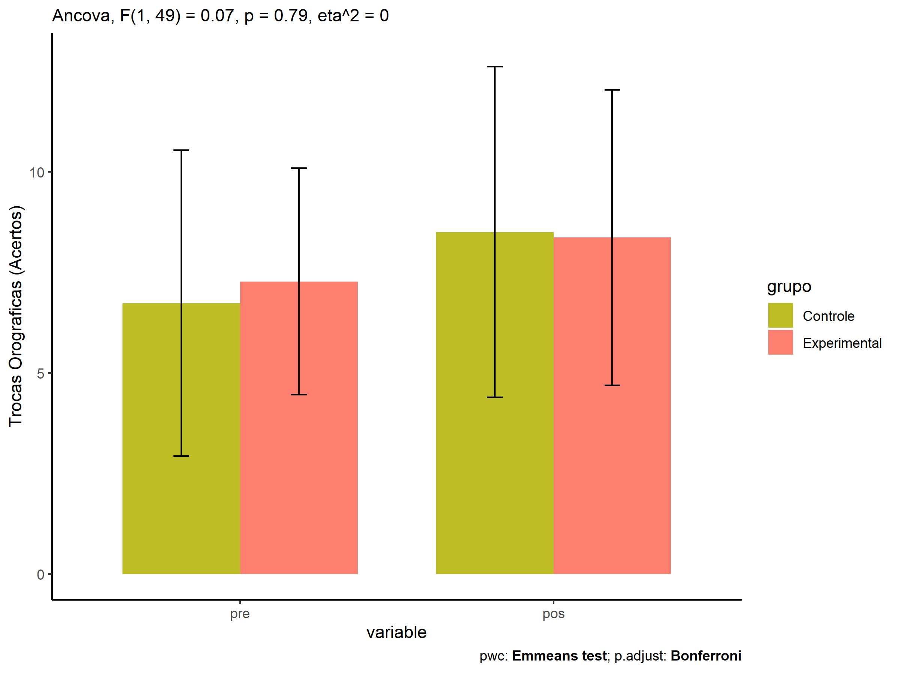<!-- -->

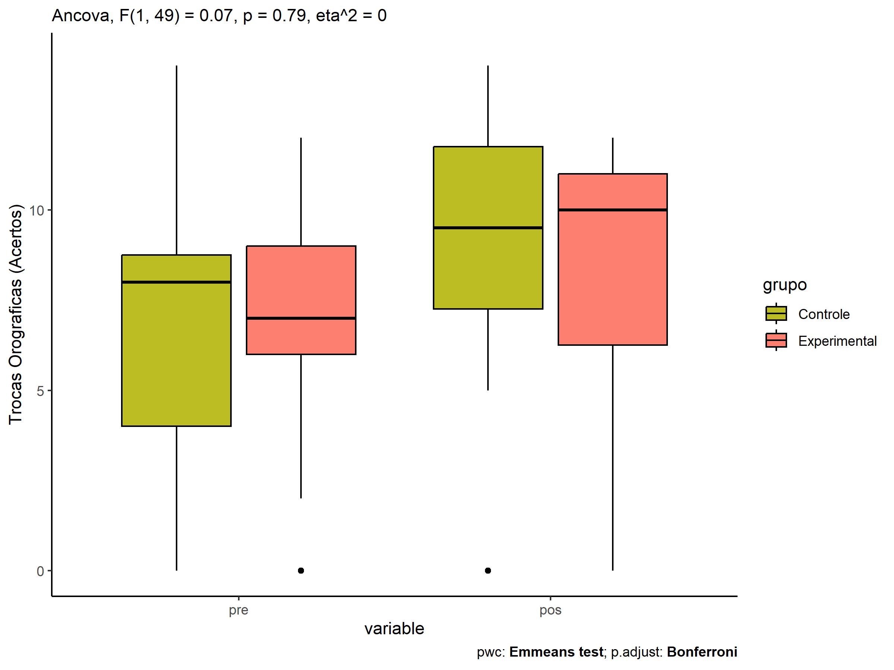<!-- -->

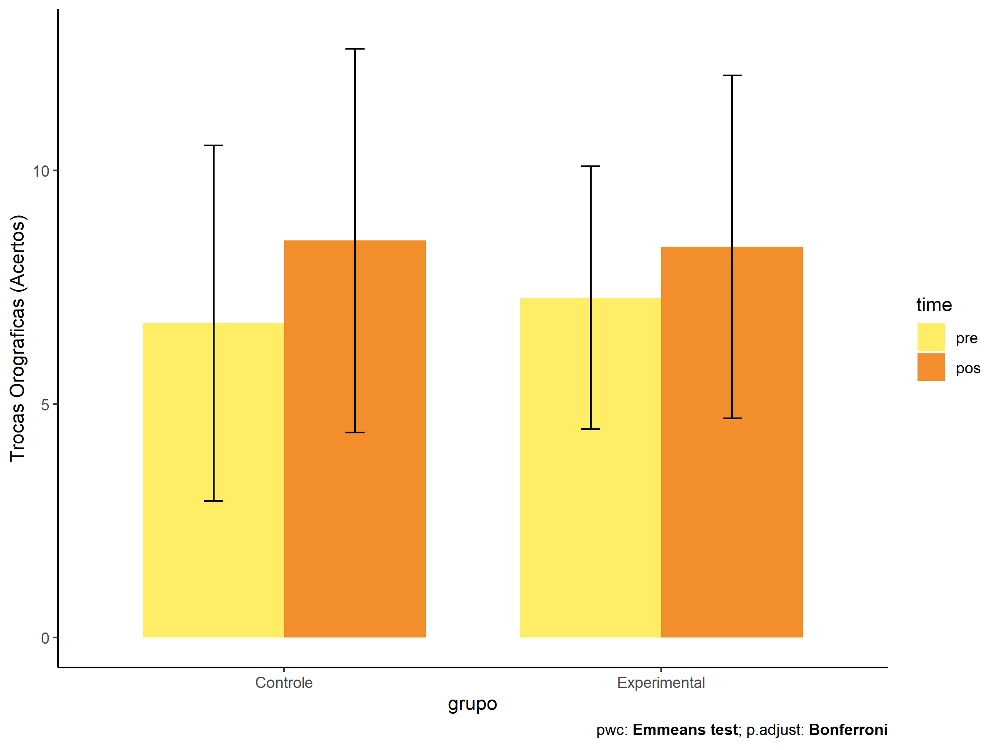<!-- -->

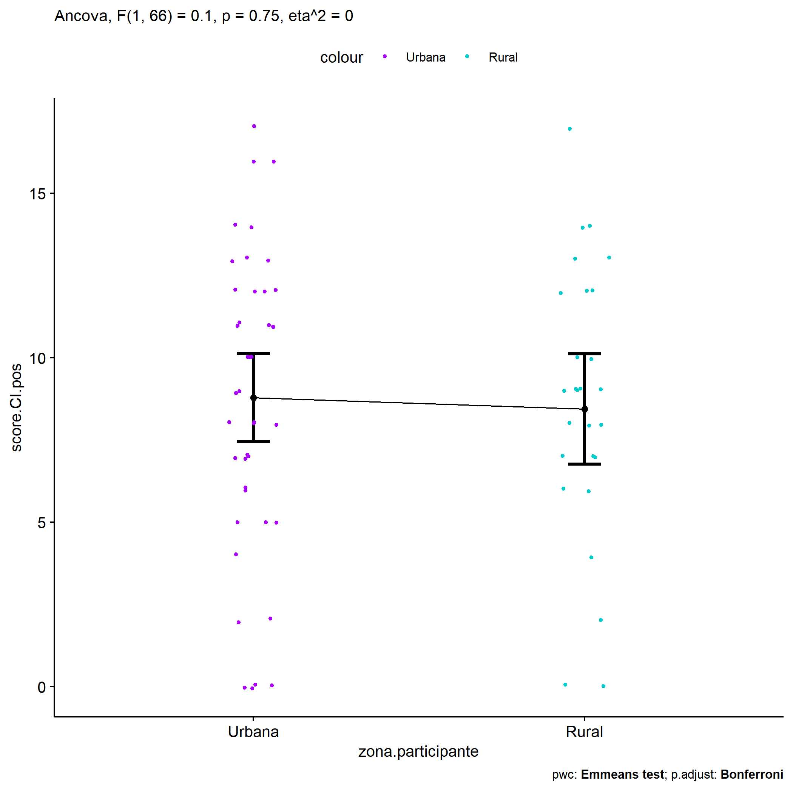<!-- -->

### Trocas Orograficas (TRI)

| var        | grupo    |   n | M (pre) | SE (pre) | M (unadj) | SE (unadj) | M (adj) | SE (adj) |
|:-----------|:---------|----:|--------:|---------:|----------:|-----------:|--------:|---------:|
| tri.TO.pos | Controle |  42 |  -0.563 |    0.108 |    -0.363 |      0.096 |  -0.347 |    0.099 |
| tri.TO.pos | Stari    |  38 |  -0.478 |    0.111 |    -0.348 |      0.123 |  -0.365 |    0.104 |

| .y.        | group1   | group2 | estimate | conf.low | conf.high |    se | statistic |     p | p.adj | p.adj.signif |
|:-----------|:---------|:-------|---------:|---------:|----------:|------:|----------:|------:|------:|:-------------|
| tri.TO.pos | Controle | Stari  |    0.018 |   -0.268 |     0.304 | 0.144 |     0.125 | 0.901 | 0.901 | ns           |
| tri.TO.pre | Controle | Stari  |   -0.085 |   -0.394 |     0.224 | 0.155 |    -0.547 | 0.586 | 0.586 | ns           |

| .y.    | grupo    | group1 | group2 | estimate | conf.low | conf.high |    se | statistic |     p | p.adj | p.adj.signif |
|:-------|:---------|:-------|:-------|---------:|---------:|----------:|------:|----------:|------:|------:|:-------------|
| tri.TO | Controle | pre    | pos    |   -0.197 |   -0.485 |     0.092 | 0.146 |    -1.343 | 0.181 | 0.181 | ns           |
| tri.TO | Stari    | pre    | pos    |   -0.090 |   -0.401 |     0.222 | 0.158 |    -0.569 | 0.570 | 0.570 | ns           |

    ## Scale for colour is already present.
    ## Adding another scale for colour, which will replace the existing scale.

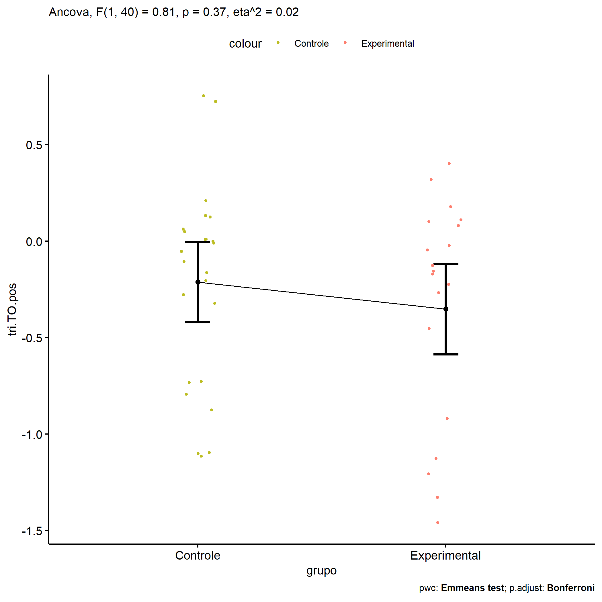<!-- -->

<!-- -->

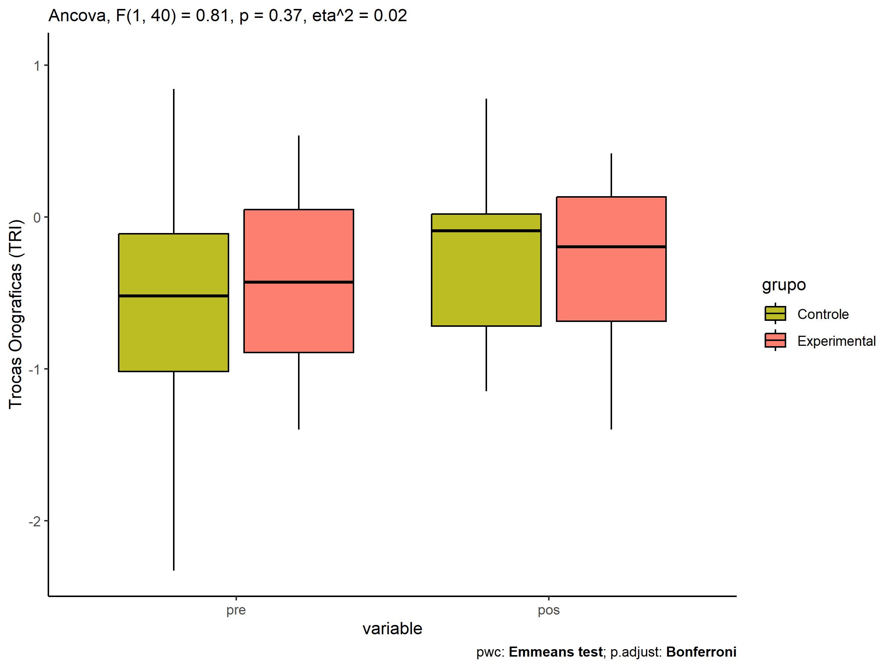<!-- -->

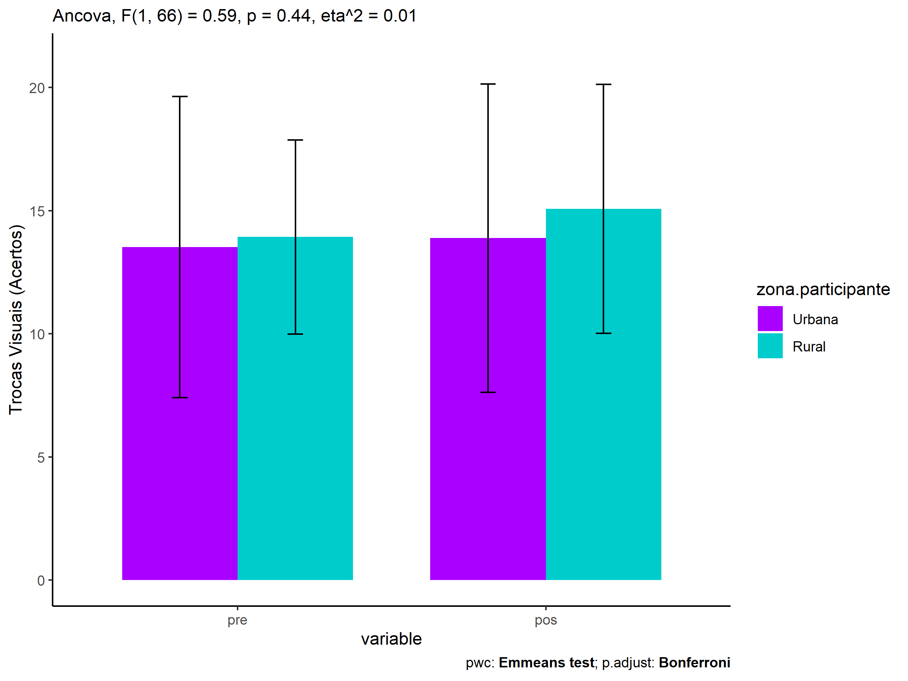<!-- -->

<!-- -->

## factor: **genero**

### Leitura de Pseudo-Palavras (Acertos)

| var            | genero |   n | M (pre) | SE (pre) | M (unadj) | SE (unadj) | M (adj) | SE (adj) |
|:---------------|:-------|----:|--------:|---------:|----------:|-----------:|--------:|---------:|
| score.CLPP.pos | F      |  39 |  57.923 |    1.996 |    62.538 |      1.879 |  61.441 |    1.642 |
| score.CLPP.pos | M      |  41 |  52.317 |    1.914 |    59.317 |      1.636 |  60.361 |    1.600 |

| .y.            | group1 | group2 | estimate | conf.low | conf.high |    se | statistic |     p | p.adj | p.adj.signif |
|:---------------|:-------|:-------|---------:|---------:|----------:|------:|----------:|------:|------:|:-------------|
| score.CLPP.pos | F      | M      |    1.079 |   -3.545 |     5.703 | 2.322 |     0.465 | 0.643 | 0.643 | ns           |
| score.CLPP.pre | F      | M      |    5.606 |    0.103 |    11.109 | 2.764 |     2.028 | 0.046 | 0.046 | \*           |

| .y.        | genero | group1 | group2 | estimate | conf.low | conf.high |    se | statistic |     p | p.adj | p.adj.signif |
|:-----------|:-------|:-------|:-------|---------:|---------:|----------:|------:|----------:|------:|------:|:-------------|
| score.CLPP | F      | pre    | pos    |   -3.668 |   -9.019 |     1.684 | 2.711 |    -1.353 | 0.178 | 0.178 | ns           |
| score.CLPP | M      | pre    | pos    |   -7.553 |  -12.691 |    -2.414 | 2.603 |    -2.902 | 0.004 | 0.004 | \*\*         |

    ## Scale for colour is already present.
    ## Adding another scale for colour, which will replace the existing scale.

<!-- -->

<!-- -->

<!-- -->

<!-- -->

<!-- -->

### Leitura de Pseudo-Palavras (TRI)

| var          | genero |   n | M (pre) | SE (pre) | M (unadj) | SE (unadj) | M (adj) | SE (adj) |
|:-------------|:-------|----:|--------:|---------:|----------:|-----------:|--------:|---------:|
| tri.CLPP.pos | F      |  39 |  57.923 |    1.996 |    62.538 |      1.879 |  61.441 |    1.642 |
| tri.CLPP.pos | M      |  41 |  52.317 |    1.914 |    59.317 |      1.636 |  60.361 |    1.600 |

| .y.          | group1 | group2 | estimate | conf.low | conf.high |    se | statistic |     p | p.adj | p.adj.signif |
|:-------------|:-------|:-------|---------:|---------:|----------:|------:|----------:|------:|------:|:-------------|
| tri.CLPP.pos | F      | M      |    1.079 |   -3.545 |     5.703 | 2.322 |     0.465 | 0.643 | 0.643 | ns           |
| tri.CLPP.pre | F      | M      |    5.606 |    0.103 |    11.109 | 2.764 |     2.028 | 0.046 | 0.046 | \*           |

| .y.      | genero | group1 | group2 | estimate | conf.low | conf.high |    se | statistic |     p | p.adj | p.adj.signif |
|:---------|:-------|:-------|:-------|---------:|---------:|----------:|------:|----------:|------:|------:|:-------------|
| tri.CLPP | F      | pre    | pos    |   -0.140 |   -0.501 |     0.222 | 0.183 |    -0.763 | 0.447 | 0.447 | ns           |
| tri.CLPP | M      | pre    | pos    |   -0.315 |   -0.661 |     0.032 | 0.176 |    -1.790 | 0.075 | 0.075 | ns           |

    ## Scale for colour is already present.
    ## Adding another scale for colour, which will replace the existing scale.

<!-- -->

<!-- -->

<!-- -->

<!-- -->

<!-- -->

### Correta Regular (Acertos)

| var          | genero |   n | M (pre) | SE (pre) | M (unadj) | SE (unadj) | M (adj) | SE (adj) |
|:-------------|:-------|----:|--------:|---------:|----------:|-----------:|--------:|---------:|
| score.CR.pos | F      |  44 |  11.773 |    0.659 |    11.909 |      0.801 |  11.729 |    0.794 |
| score.CR.pos | M      |  48 |  10.875 |    0.589 |    11.750 |      0.809 |  11.915 |    0.760 |

| .y.          | group1 | group2 | estimate | conf.low | conf.high |    se | statistic |     p | p.adj | p.adj.signif |
|:-------------|:-------|:-------|---------:|---------:|----------:|------:|----------:|------:|------:|:-------------|
| score.CR.pos | F      | M      |   -0.186 |   -2.376 |     2.003 | 1.102 |    -0.169 | 0.866 | 0.866 | ns           |
| score.CR.pre | F      | M      |    0.898 |   -0.853 |     2.649 | 0.881 |     1.019 | 0.311 | 0.311 | ns           |

| .y.      | genero | group1 | group2 | estimate | conf.low | conf.high |    se | statistic |     p | p.adj | p.adj.signif |
|:---------|:-------|:-------|:-------|---------:|---------:|----------:|------:|----------:|------:|------:|:-------------|
| score.CR | F      | pre    | pos    |   -0.136 |   -2.192 |     1.919 | 1.042 |    -0.131 | 0.896 | 0.896 | ns           |
| score.CR | M      | pre    | pos    |   -0.875 |   -2.843 |     1.093 | 0.997 |    -0.877 | 0.381 | 0.381 | ns           |

    ## Scale for colour is already present.
    ## Adding another scale for colour, which will replace the existing scale.

<!-- -->

<!-- -->

<!-- -->

<!-- -->

<!-- -->

### Correta Regular (TRI)

| var        | genero |   n | M (pre) | SE (pre) | M (unadj) | SE (unadj) | M (adj) | SE (adj) |
|:-----------|:-------|----:|--------:|---------:|----------:|-----------:|--------:|---------:|
| tri.CR.pos | F      |  39 |  -0.564 |    0.132 |    -0.378 |      0.126 |  -0.412 |    0.112 |
| tri.CR.pos | M      |  41 |  -0.674 |    0.111 |    -0.461 |      0.138 |  -0.428 |    0.109 |

| .y.        | group1 | group2 | estimate | conf.low | conf.high |    se | statistic |     p | p.adj | p.adj.signif |
|:-----------|:-------|:-------|---------:|---------:|----------:|------:|----------:|------:|------:|:-------------|
| tri.CR.pos | F      | M      |    0.015 |   -0.296 |     0.326 | 0.156 |     0.097 | 0.923 | 0.923 | ns           |
| tri.CR.pre | F      | M      |    0.110 |   -0.233 |     0.453 | 0.172 |     0.639 | 0.525 | 0.525 | ns           |

| .y.    | genero | group1 | group2 | estimate | conf.low | conf.high |    se | statistic |     p | p.adj | p.adj.signif |
|:-------|:-------|:-------|:-------|---------:|---------:|----------:|------:|----------:|------:|------:|:-------------|
| tri.CR | F      | pre    | pos    |   -0.142 |   -0.499 |     0.216 | 0.181 |    -0.782 | 0.435 | 0.435 | ns           |
| tri.CR | M      | pre    | pos    |   -0.222 |   -0.565 |     0.122 | 0.174 |    -1.275 | 0.204 | 0.204 | ns           |

    ## Scale for colour is already present.
    ## Adding another scale for colour, which will replace the existing scale.

<!-- -->

<!-- -->

<!-- -->

<!-- -->

<!-- -->

### Correta Irregular (Acertos)

| var          | genero |   n | M (pre) | SE (pre) | M (unadj) | SE (unadj) | M (adj) | SE (adj) |
|:-------------|:-------|----:|--------:|---------:|----------:|-----------:|--------:|---------:|
| score.CI.pos | F      |  44 |   9.091 |    0.570 |     8.386 |      0.655 |   8.357 |    0.644 |
| score.CI.pos | M      |  48 |   8.938 |    0.469 |     9.271 |      0.653 |   9.298 |    0.617 |

| .y.          | group1 | group2 | estimate | conf.low | conf.high |    se | statistic |     p | p.adj | p.adj.signif |
|:-------------|:-------|:-------|---------:|---------:|----------:|------:|----------:|------:|------:|:-------------|
| score.CI.pos | F      | M      |   -0.941 |   -2.713 |     0.831 | 0.892 |    -1.055 | 0.294 | 0.294 | ns           |
| score.CI.pre | F      | M      |    0.153 |   -1.304 |     1.611 | 0.734 |     0.209 | 0.835 | 0.835 | ns           |

| .y.      | genero | group1 | group2 | estimate | conf.low | conf.high |    se | statistic |     p | p.adj | p.adj.signif |
|:---------|:-------|:-------|:-------|---------:|---------:|----------:|------:|----------:|------:|------:|:-------------|
| score.CI | F      | pre    | pos    |    0.705 |   -0.980 |     2.389 | 0.854 |     0.825 | 0.410 | 0.410 | ns           |
| score.CI | M      | pre    | pos    |   -0.333 |   -1.946 |     1.280 | 0.817 |    -0.408 | 0.684 | 0.684 | ns           |

    ## Scale for colour is already present.
    ## Adding another scale for colour, which will replace the existing scale.

<!-- -->

<!-- -->

<!-- -->

<!-- -->

<!-- -->

### Correta Irregular (TRI)

| var        | genero |   n | M (pre) | SE (pre) | M (unadj) | SE (unadj) | M (adj) | SE (adj) |
|:-----------|:-------|----:|--------:|---------:|----------:|-----------:|--------:|---------:|
| tri.CI.pos | F      |  39 |  -0.612 |    0.092 |    -0.667 |      0.135 |  -0.638 |    0.117 |
| tri.CI.pos | M      |  41 |  -0.524 |    0.083 |    -0.503 |      0.120 |  -0.529 |    0.114 |

| .y.        | group1 | group2 | estimate | conf.low | conf.high |    se | statistic |     p | p.adj | p.adj.signif |
|:-----------|:-------|:-------|---------:|---------:|----------:|------:|----------:|------:|------:|:-------------|
| tri.CI.pos | F      | M      |   -0.109 |   -0.436 |     0.218 | 0.164 |    -0.665 | 0.508 | 0.508 | ns           |
| tri.CI.pre | F      | M      |   -0.088 |   -0.334 |     0.159 | 0.124 |    -0.708 | 0.481 | 0.481 | ns           |

| .y.    | genero | group1 | group2 | estimate | conf.low | conf.high |    se | statistic |     p | p.adj | p.adj.signif |
|:-------|:-------|:-------|:-------|---------:|---------:|----------:|------:|----------:|------:|------:|:-------------|
| tri.CI | F      | pre    | pos    |    0.063 |   -0.240 |     0.366 | 0.154 |     0.409 | 0.683 | 0.683 | ns           |
| tri.CI | M      | pre    | pos    |   -0.028 |   -0.319 |     0.263 | 0.147 |    -0.189 | 0.850 | 0.850 | ns           |

    ## Scale for colour is already present.
    ## Adding another scale for colour, which will replace the existing scale.

<!-- -->

<!-- -->

<!-- -->

<!-- -->

<!-- -->

### Trocas Visuais (Acertos)

| var          | genero |   n | M (pre) | SE (pre) | M (unadj) | SE (unadj) | M (adj) | SE (adj) |
|:-------------|:-------|----:|--------:|---------:|----------:|-----------:|--------:|---------:|
| score.TV.pos | F      |  44 |  14.386 |    0.726 |    14.409 |      0.907 |  13.884 |    0.848 |
| score.TV.pos | M      |  48 |  11.875 |    0.804 |    13.292 |      0.834 |  13.773 |    0.811 |

| .y.          | group1 | group2 | estimate | conf.low | conf.high |   se | statistic |     p | p.adj | p.adj.signif |
|:-------------|:-------|:-------|---------:|---------:|----------:|-----:|----------:|------:|------:|:-------------|
| score.TV.pos | F      | M      |    0.111 |   -2.252 |     2.475 | 1.19 |     0.094 | 0.926 | 0.926 | ns           |
| score.TV.pre | F      | M      |    2.511 |    0.345 |     4.677 | 1.09 |     2.304 | 0.024 | 0.024 | \*           |

| .y.      | genero | group1 | group2 | estimate | conf.low | conf.high |    se | statistic |     p | p.adj | p.adj.signif |
|:---------|:-------|:-------|:-------|---------:|---------:|----------:|------:|----------:|------:|------:|:-------------|
| score.TV | F      | pre    | pos    |   -0.023 |   -2.365 |     2.320 | 1.187 |    -0.019 | 0.985 | 0.985 | ns           |
| score.TV | M      | pre    | pos    |   -1.417 |   -3.659 |     0.826 | 1.137 |    -1.246 | 0.214 | 0.214 | ns           |

    ## Scale for colour is already present.
    ## Adding another scale for colour, which will replace the existing scale.

<!-- -->

<!-- -->

<!-- -->

<!-- -->

<!-- -->

### Trocas Visuais (TRI)

| var        | genero |   n | M (pre) | SE (pre) | M (unadj) | SE (unadj) | M (adj) | SE (adj) |
|:-----------|:-------|----:|--------:|---------:|----------:|-----------:|--------:|---------:|
| tri.TV.pos | F      |  39 |  -0.323 |    0.119 |    -0.108 |      0.134 |  -0.203 |    0.122 |
| tri.TV.pos | M      |  41 |  -0.790 |    0.149 |    -0.443 |      0.125 |  -0.353 |    0.119 |

| .y.        | group1 | group2 | estimate | conf.low | conf.high |    se | statistic |     p | p.adj | p.adj.signif |
|:-----------|:-------|:-------|---------:|---------:|----------:|------:|----------:|------:|------:|:-------------|
| tri.TV.pos | F      | M      |    0.150 |   -0.196 |     0.496 | 0.174 |     0.861 | 0.392 | 0.392 | ns           |
| tri.TV.pre | F      | M      |    0.467 |    0.086 |     0.848 | 0.191 |     2.441 | 0.017 | 0.017 | \*           |

| .y.    | genero | group1 | group2 | estimate | conf.low | conf.high |    se | statistic |     p | p.adj | p.adj.signif |
|:-------|:-------|:-------|:-------|---------:|---------:|----------:|------:|----------:|------:|------:|:-------------|
| tri.TV | F      | pre    | pos    |   -0.151 |   -0.523 |     0.221 | 0.188 |    -0.800 | 0.425 | 0.425 | ns           |
| tri.TV | M      | pre    | pos    |   -0.296 |   -0.653 |     0.061 | 0.181 |    -1.637 | 0.103 | 0.103 | ns           |

    ## Scale for colour is already present.
    ## Adding another scale for colour, which will replace the existing scale.

<!-- -->

<!-- -->

<!-- -->

<!-- -->

<!-- -->

### Trocas Fonologicas (Acertos)

| var          | genero |   n | M (pre) | SE (pre) | M (unadj) | SE (unadj) | M (adj) | SE (adj) |
|:-------------|:-------|----:|--------:|---------:|----------:|-----------:|--------:|---------:|
| score.TF.pos | F      |  44 |  12.182 |    0.668 |    12.750 |      0.834 |  12.510 |    0.799 |
| score.TF.pos | M      |  48 |  11.104 |    0.665 |    11.271 |      0.816 |  11.491 |    0.765 |

| .y.          | group1 | group2 | estimate | conf.low | conf.high |    se | statistic |     p | p.adj | p.adj.signif |
|:-------------|:-------|:-------|---------:|---------:|----------:|------:|----------:|------:|------:|:-------------|
| score.TF.pos | F      | M      |    1.019 |   -1.187 |     3.225 | 1.110 |     0.918 | 0.361 | 0.361 | ns           |
| score.TF.pre | F      | M      |    1.078 |   -0.799 |     2.954 | 0.944 |     1.141 | 0.257 | 0.257 | ns           |

| .y.      | genero | group1 | group2 | estimate | conf.low | conf.high |    se | statistic |     p | p.adj | p.adj.signif |
|:---------|:-------|:-------|:-------|---------:|---------:|----------:|------:|----------:|------:|------:|:-------------|
| score.TF | F      | pre    | pos    |   -0.568 |   -2.709 |     1.573 | 1.085 |    -0.524 | 0.601 | 0.601 | ns           |
| score.TF | M      | pre    | pos    |   -0.167 |   -2.216 |     1.883 | 1.039 |    -0.160 | 0.873 | 0.873 | ns           |

    ## Scale for colour is already present.
    ## Adding another scale for colour, which will replace the existing scale.

<!-- -->

<!-- -->

<!-- -->

<!-- -->

<!-- -->

### Trocas Fonologicas (TRI)

| var        | genero |   n | M (pre) | SE (pre) | M (unadj) | SE (unadj) | M (adj) | SE (adj) |
|:-----------|:-------|----:|--------:|---------:|----------:|-----------:|--------:|---------:|
| tri.TF.pos | F      |  39 |  -0.601 |    0.095 |    -0.243 |      0.120 |  -0.254 |    0.111 |
| tri.TF.pos | M      |  41 |  -0.635 |    0.119 |    -0.585 |      0.137 |  -0.575 |    0.108 |

| .y.        | group1 | group2 | estimate | conf.low | conf.high |    se | statistic |     p | p.adj | p.adj.signif |
|:-----------|:-------|:-------|---------:|---------:|----------:|------:|----------:|------:|------:|:-------------|
| tri.TF.pos | F      | M      |    0.320 |    0.012 |     0.629 | 0.155 |     2.069 | 0.042 | 0.042 | \*           |
| tri.TF.pre | F      | M      |    0.034 |   -0.271 |     0.339 | 0.153 |     0.220 | 0.827 | 0.827 | ns           |

| .y.    | genero | group1 | group2 | estimate | conf.low | conf.high |    se | statistic |     p | p.adj | p.adj.signif |
|:-------|:-------|:-------|:-------|---------:|---------:|----------:|------:|----------:|------:|------:|:-------------|
| tri.TF | F      | pre    | pos    |   -0.260 |   -0.595 |     0.074 | 0.169 |    -1.536 | 0.126 | 0.126 | ns           |
| tri.TF | M      | pre    | pos    |   -0.014 |   -0.335 |     0.307 | 0.163 |    -0.084 | 0.933 | 0.933 | ns           |

    ## Scale for colour is already present.
    ## Adding another scale for colour, which will replace the existing scale.

<!-- -->

<!-- -->

<!-- -->

<!-- -->

<!-- -->

### Trocas Orograficas (Acertos)

| var          | genero |   n | M (pre) | SE (pre) | M (unadj) | SE (unadj) | M (adj) | SE (adj) |
|:-------------|:-------|----:|--------:|---------:|----------:|-----------:|--------:|---------:|
| score.TO.pos | F      |  44 |   8.273 |    0.554 |     8.932 |      0.580 |   8.706 |    0.586 |
| score.TO.pos | M      |  48 |   6.646 |    0.450 |     7.396 |      0.573 |   7.602 |    0.560 |

| .y.          | group1 | group2 | estimate | conf.low | conf.high |    se | statistic |     p | p.adj | p.adj.signif |
|:-------------|:-------|:-------|---------:|---------:|----------:|------:|----------:|------:|------:|:-------------|
| score.TO.pos | F      | M      |    1.104 |   -0.530 |     2.738 | 0.822 |     1.343 | 0.183 | 0.183 | ns           |
| score.TO.pre | F      | M      |    1.627 |    0.219 |     3.035 | 0.709 |     2.296 | 0.024 | 0.024 | \*           |

| .y.      | genero | group1 | group2 | estimate | conf.low | conf.high |    se | statistic |     p | p.adj | p.adj.signif |
|:---------|:-------|:-------|:-------|---------:|---------:|----------:|------:|----------:|------:|------:|:-------------|
| score.TO | F      | pre    | pos    |   -0.659 |   -2.200 |     0.882 | 0.781 |    -0.844 | 0.400 | 0.400 | ns           |
| score.TO | M      | pre    | pos    |   -0.750 |   -2.226 |     0.726 | 0.748 |    -1.003 | 0.317 | 0.317 | ns           |

    ## Scale for colour is already present.
    ## Adding another scale for colour, which will replace the existing scale.

<!-- -->

<!-- -->

<!-- -->

<!-- -->

<!-- -->

### Trocas Orograficas (TRI)

| var        | genero |   n | M (pre) | SE (pre) | M (unadj) | SE (unadj) | M (adj) | SE (adj) |
|:-----------|:-------|----:|--------:|---------:|----------:|-----------:|--------:|---------:|
| tri.TO.pos | F      |  39 |  -0.387 |    0.118 |    -0.190 |      0.089 |  -0.239 |    0.102 |
| tri.TO.pos | M      |  41 |  -0.651 |    0.098 |    -0.513 |      0.119 |  -0.467 |    0.099 |

| .y.        | group1 | group2 | estimate | conf.low | conf.high |    se | statistic |     p | p.adj | p.adj.signif |
|:-----------|:-------|:-------|---------:|---------:|----------:|------:|----------:|------:|------:|:-------------|
| tri.TO.pos | F      | M      |    0.228 |   -0.058 |     0.514 | 0.144 |     1.588 | 0.116 | 0.116 | ns           |
| tri.TO.pre | F      | M      |    0.264 |   -0.040 |     0.568 | 0.153 |     1.730 | 0.088 | 0.088 | ns           |

| .y.    | genero | group1 | group2 | estimate | conf.low | conf.high |    se | statistic |     p | p.adj | p.adj.signif |
|:-------|:-------|:-------|:-------|---------:|---------:|----------:|------:|----------:|------:|------:|:-------------|
| tri.TO | F      | pre    | pos    |   -0.199 |   -0.498 |      0.10 | 0.151 |    -1.315 | 0.190 | 0.190 | ns           |
| tri.TO | M      | pre    | pos    |   -0.097 |   -0.384 |      0.19 | 0.145 |    -0.669 | 0.505 | 0.505 | ns           |

    ## Scale for colour is already present.
    ## Adding another scale for colour, which will replace the existing scale.

<!-- -->

<!-- -->

<!-- -->

<!-- -->

<!-- -->

## factor: **idade**

### Leitura de Pseudo-Palavras (Acertos)

| var            | idade |   n | M (pre) | SE (pre) | M (unadj) | SE (unadj) | M (adj) | SE (adj) |
|:---------------|:------|----:|--------:|---------:|----------:|-----------:|--------:|---------:|
| score.CLPP.pos | 10y   |  15 |  60.200 |    3.016 |    64.600 |      3.525 |  62.760 |    2.711 |
| score.CLPP.pos | 11y   |  44 |  54.568 |    1.970 |    62.023 |      1.638 |  62.269 |    1.558 |
| score.CLPP.pos | 12y   |  14 |  52.000 |    3.250 |    56.143 |      2.576 |  57.340 |    2.779 |

| .y.            | group1 | group2 | estimate | conf.low | conf.high |    se | statistic |     p | p.adj | p.adj.signif |
|:---------------|:-------|:-------|---------:|---------:|----------:|------:|----------:|------:|------:|:-------------|
| score.CLPP.pos | 10y    | 11y    |    0.491 |   -5.767 |     6.749 | 3.137 |     0.157 | 0.876 | 1.000 | ns           |
| score.CLPP.pos | 10y    | 12y    |    5.420 |   -2.403 |    13.242 | 3.921 |     1.382 | 0.171 | 0.514 | ns           |
| score.CLPP.pos | 11y    | 12y    |    4.929 |   -1.414 |    11.271 | 3.179 |     1.550 | 0.126 | 0.377 | ns           |
| score.CLPP.pre | 10y    | 11y    |    5.632 |   -1.902 |    13.166 | 3.777 |     1.491 | 0.140 | 0.421 | ns           |
| score.CLPP.pre | 10y    | 12y    |    8.200 |   -1.164 |    17.564 | 4.695 |     1.747 | 0.085 | 0.255 | ns           |
| score.CLPP.pre | 11y    | 12y    |    2.568 |   -5.164 |    10.300 | 3.877 |     0.662 | 0.510 | 1.000 | ns           |

| .y.        | idade | group1 | group2 | estimate | conf.low | conf.high |    se | statistic |     p | p.adj | p.adj.signif |
|:-----------|:------|:-------|:-------|---------:|---------:|----------:|------:|----------:|------:|------:|:-------------|
| score.CLPP | 10y   | pre    | pos    |   -3.725 |  -12.606 |     5.156 | 4.495 |    -0.829 | 0.409 | 0.409 | ns           |
| score.CLPP | 11y   | pre    | pos    |   -6.714 |  -11.812 |    -1.615 | 2.581 |    -2.602 | 0.010 | 0.010 | \*           |
| score.CLPP | 12y   | pre    | pos    |   -5.067 |  -14.249 |     4.116 | 4.648 |    -1.090 | 0.277 | 0.277 | ns           |

    ## Scale for colour is already present.
    ## Adding another scale for colour, which will replace the existing scale.

<!-- -->

<!-- -->

<!-- -->

<!-- -->

<!-- -->

### Leitura de Pseudo-Palavras (TRI)

| var          | idade |   n | M (pre) | SE (pre) | M (unadj) | SE (unadj) | M (adj) | SE (adj) |
|:-------------|:------|----:|--------:|---------:|----------:|-----------:|--------:|---------:|
| tri.CLPP.pos | 10y   |  15 |  60.200 |    3.016 |    64.600 |      3.525 |  62.760 |    2.711 |
| tri.CLPP.pos | 11y   |  44 |  54.568 |    1.970 |    62.023 |      1.638 |  62.269 |    1.558 |
| tri.CLPP.pos | 12y   |  14 |  52.000 |    3.250 |    56.143 |      2.576 |  57.340 |    2.779 |

| .y.          | group1 | group2 | estimate | conf.low | conf.high |    se | statistic |     p | p.adj | p.adj.signif |
|:-------------|:-------|:-------|---------:|---------:|----------:|------:|----------:|------:|------:|:-------------|
| tri.CLPP.pos | 10y    | 11y    |    0.491 |   -5.767 |     6.749 | 3.137 |     0.157 | 0.876 | 1.000 | ns           |
| tri.CLPP.pos | 10y    | 12y    |    5.420 |   -2.403 |    13.242 | 3.921 |     1.382 | 0.171 | 0.514 | ns           |
| tri.CLPP.pos | 11y    | 12y    |    4.929 |   -1.414 |    11.271 | 3.179 |     1.550 | 0.126 | 0.377 | ns           |
| tri.CLPP.pre | 10y    | 11y    |    5.632 |   -1.902 |    13.166 | 3.777 |     1.491 | 0.140 | 0.421 | ns           |
| tri.CLPP.pre | 10y    | 12y    |    8.200 |   -1.164 |    17.564 | 4.695 |     1.747 | 0.085 | 0.255 | ns           |
| tri.CLPP.pre | 11y    | 12y    |    2.568 |   -5.164 |    10.300 | 3.877 |     0.662 | 0.510 | 1.000 | ns           |

| .y.      | idade | group1 | group2 | estimate | conf.low | conf.high |    se | statistic |     p | p.adj | p.adj.signif |
|:---------|:------|:-------|:-------|---------:|---------:|----------:|------:|----------:|------:|------:|:-------------|
| tri.CLPP | 10y   | pre    | pos    |   -0.346 |   -0.935 |     0.244 | 0.298 |    -1.159 | 0.248 | 0.248 | ns           |
| tri.CLPP | 11y   | pre    | pos    |   -0.164 |   -0.502 |     0.175 | 0.171 |    -0.955 | 0.341 | 0.341 | ns           |
| tri.CLPP | 12y   | pre    | pos    |   -0.355 |   -0.965 |     0.254 | 0.308 |    -1.153 | 0.251 | 0.251 | ns           |

    ## Scale for colour is already present.
    ## Adding another scale for colour, which will replace the existing scale.

<!-- -->

<!-- -->

<!-- -->

<!-- -->

<!-- -->

### Correta Regular (Acertos)

| var          | idade |   n | M (pre) | SE (pre) | M (unadj) | SE (unadj) | M (adj) | SE (adj) |
|:-------------|:------|----:|--------:|---------:|----------:|-----------:|--------:|---------:|
| score.CR.pos | 10y   |  16 |  12.375 |    0.884 |    12.688 |      1.434 |  12.290 |    1.287 |
| score.CR.pos | 11y   |  50 |  11.240 |    0.616 |    12.460 |      0.741 |  12.509 |    0.725 |
| score.CR.pos | 12y   |  16 |  10.312 |    1.254 |    11.438 |      1.245 |  11.851 |    1.288 |
| score.CR.pos | 13y   |   6 |  12.500 |    1.258 |     7.833 |      2.626 |   7.386 |    2.096 |

| .y.          | group1 | group2 | estimate | conf.low | conf.high |    se | statistic |     p | p.adj | p.adj.signif |
|:-------------|:-------|:-------|---------:|---------:|----------:|------:|----------:|------:|------:|:-------------|
| score.CR.pos | 10y    | 11y    |   -0.219 |   -3.160 |     2.722 | 1.479 |    -0.148 | 0.883 | 1.000 | ns           |
| score.CR.pos | 10y    | 12y    |    0.438 |   -3.203 |     4.080 | 1.831 |     0.239 | 0.811 | 1.000 | ns           |
| score.CR.pos | 10y    | 13y    |    4.903 |    0.026 |     9.781 | 2.452 |     2.000 | 0.049 | 0.293 | ns           |
| score.CR.pos | 11y    | 12y    |    0.658 |   -2.279 |     3.594 | 1.476 |     0.445 | 0.657 | 1.000 | ns           |
| score.CR.pos | 11y    | 13y    |    5.122 |    0.708 |     9.536 | 2.219 |     2.308 | 0.023 | 0.141 | ns           |
| score.CR.pos | 12y    | 13y    |    4.465 |   -0.445 |     9.375 | 2.469 |     1.809 | 0.074 | 0.445 | ns           |
| score.CR.pre | 10y    | 11y    |    1.135 |   -1.312 |     3.582 | 1.231 |     0.922 | 0.359 | 1.000 | ns           |
| score.CR.pre | 10y    | 12y    |    2.062 |   -0.950 |     5.075 | 1.515 |     1.362 | 0.177 | 1.000 | ns           |
| score.CR.pre | 10y    | 13y    |   -0.125 |   -4.204 |     3.954 | 2.051 |    -0.061 | 0.952 | 1.000 | ns           |
| score.CR.pre | 11y    | 12y    |    0.927 |   -1.520 |     3.375 | 1.231 |     0.754 | 0.453 | 1.000 | ns           |
| score.CR.pre | 11y    | 13y    |   -1.260 |   -4.941 |     2.421 | 1.851 |    -0.681 | 0.498 | 1.000 | ns           |
| score.CR.pre | 12y    | 13y    |   -2.187 |   -6.266 |     1.891 | 2.051 |    -1.067 | 0.289 | 1.000 | ns           |

| .y.      | idade | group1 | group2 | estimate | conf.low | conf.high |    se | statistic |     p | p.adj | p.adj.signif |
|:---------|:------|:-------|:-------|---------:|---------:|----------:|------:|----------:|------:|------:|:-------------|
| score.CR | 10y   | pre    | pos    |   -0.313 |   -3.701 |     3.076 | 1.716 |    -0.182 | 0.856 | 0.856 | ns           |
| score.CR | 11y   | pre    | pos    |   -1.220 |   -3.137 |     0.697 | 0.971 |    -1.257 | 0.211 | 0.211 | ns           |
| score.CR | 12y   | pre    | pos    |   -1.125 |   -4.513 |     2.263 | 1.716 |    -0.656 | 0.513 | 0.513 | ns           |
| score.CR | 13y   | pre    | pos    |    4.667 |   -0.866 |    10.199 | 2.803 |     1.665 | 0.098 | 0.098 | ns           |

    ## Scale for colour is already present.
    ## Adding another scale for colour, which will replace the existing scale.

<!-- -->

<!-- -->

<!-- -->

<!-- -->

<!-- -->

### Correta Regular (TRI)

| var        | idade |   n | M (pre) | SE (pre) | M (unadj) | SE (unadj) | M (adj) | SE (adj) |
|:-----------|:------|----:|--------:|---------:|----------:|-----------:|--------:|---------:|
| tri.CR.pos | 10y   |  15 |  -0.479 |    0.207 |    -0.182 |      0.265 |  -0.260 |    0.181 |
| tri.CR.pos | 11y   |  44 |  -0.564 |    0.122 |    -0.314 |      0.121 |  -0.342 |    0.105 |
| tri.CR.pos | 12y   |  14 |  -0.903 |    0.152 |    -0.787 |      0.170 |  -0.616 |    0.189 |

| .y.        | group1 | group2 | estimate | conf.low | conf.high |    se | statistic |     p | p.adj | p.adj.signif |
|:-----------|:-------|:-------|---------:|---------:|----------:|------:|----------:|------:|------:|:-------------|
| tri.CR.pos | 10y    | 11y    |    0.082 |   -0.334 |     0.499 | 0.209 |     0.395 | 0.694 | 1.000 | ns           |
| tri.CR.pos | 10y    | 12y    |    0.357 |   -0.169 |     0.882 | 0.263 |     1.355 | 0.180 | 0.540 | ns           |
| tri.CR.pos | 11y    | 12y    |    0.274 |   -0.159 |     0.708 | 0.217 |     1.263 | 0.211 | 0.633 | ns           |
| tri.CR.pre | 10y    | 11y    |    0.085 |   -0.374 |     0.543 | 0.230 |     0.368 | 0.714 | 1.000 | ns           |
| tri.CR.pre | 10y    | 12y    |    0.424 |   -0.146 |     0.994 | 0.286 |     1.484 | 0.142 | 0.427 | ns           |
| tri.CR.pre | 11y    | 12y    |    0.340 |   -0.131 |     0.810 | 0.236 |     1.439 | 0.155 | 0.464 | ns           |

| .y.    | idade | group1 | group2 | estimate | conf.low | conf.high |    se | statistic |     p | p.adj | p.adj.signif |
|:-------|:------|:-------|:-------|---------:|---------:|----------:|------:|----------:|------:|------:|:-------------|
| tri.CR | 10y   | pre    | pos    |   -0.250 |   -0.834 |     0.334 | 0.296 |    -0.845 | 0.399 | 0.399 | ns           |
| tri.CR | 11y   | pre    | pos    |   -0.205 |   -0.541 |     0.130 | 0.170 |    -1.210 | 0.228 | 0.228 | ns           |
| tri.CR | 12y   | pre    | pos    |   -0.224 |   -0.828 |     0.380 | 0.306 |    -0.732 | 0.465 | 0.465 | ns           |

    ## Scale for colour is already present.
    ## Adding another scale for colour, which will replace the existing scale.

<!-- -->

<!-- -->

<!-- -->

<!-- -->

<!-- -->

### Correta Irregular (Acertos)

| var          | idade |   n | M (pre) | SE (pre) | M (unadj) | SE (unadj) | M (adj) | SE (adj) |
|:-------------|:------|----:|--------:|---------:|----------:|-----------:|--------:|---------:|
| score.CI.pos | 10y   |  16 |  10.125 |    0.598 |     9.750 |      1.160 |   9.346 |    1.077 |
| score.CI.pos | 11y   |  50 |   8.520 |    0.519 |     8.580 |      0.590 |   8.752 |    0.607 |
| score.CI.pos | 12y   |  16 |   9.062 |    1.090 |     9.875 |      1.036 |   9.853 |    1.067 |
| score.CI.pos | 13y   |   6 |   9.833 |    0.946 |     7.333 |      2.679 |   7.034 |    1.746 |

| .y.          | group1 | group2 | estimate | conf.low | conf.high |    se | statistic |     p | p.adj | p.adj.signif |
|:-------------|:-------|:-------|---------:|---------:|----------:|------:|----------:|------:|------:|:-------------|
| score.CI.pos | 10y    | 11y    |    0.594 |   -1.880 |     3.068 | 1.244 |     0.477 | 0.634 | 1.000 | ns           |
| score.CI.pos | 10y    | 12y    |   -0.506 |   -3.521 |     2.508 | 1.515 |    -0.334 | 0.739 | 1.000 | ns           |
| score.CI.pos | 10y    | 13y    |    2.312 |   -1.752 |     6.376 | 2.043 |     1.131 | 0.261 | 1.000 | ns           |
| score.CI.pos | 11y    | 12y    |   -1.100 |   -3.543 |     1.342 | 1.228 |    -0.896 | 0.373 | 1.000 | ns           |
| score.CI.pos | 11y    | 13y    |    1.718 |   -1.965 |     5.402 | 1.852 |     0.928 | 0.356 | 1.000 | ns           |
| score.CI.pos | 12y    | 13y    |    2.818 |   -1.250 |     6.887 | 2.046 |     1.378 | 0.172 | 1.000 | ns           |
| score.CI.pre | 10y    | 11y    |    1.605 |   -0.422 |     3.632 | 1.019 |     1.575 | 0.119 | 0.715 | ns           |
| score.CI.pre | 10y    | 12y    |    1.063 |   -1.433 |     3.558 | 1.255 |     0.847 | 0.400 | 1.000 | ns           |
| score.CI.pre | 10y    | 13y    |    0.292 |   -3.087 |     3.670 | 1.699 |     0.172 | 0.864 | 1.000 | ns           |
| score.CI.pre | 11y    | 12y    |   -0.542 |   -2.570 |     1.485 | 1.019 |    -0.532 | 0.596 | 1.000 | ns           |
| score.CI.pre | 11y    | 13y    |   -1.313 |   -4.363 |     1.736 | 1.533 |    -0.857 | 0.394 | 1.000 | ns           |
| score.CI.pre | 12y    | 13y    |   -0.771 |   -4.149 |     2.608 | 1.699 |    -0.454 | 0.651 | 1.000 | ns           |

| .y.      | idade | group1 | group2 | estimate | conf.low | conf.high |    se | statistic |     p | p.adj | p.adj.signif |
|:---------|:------|:-------|:-------|---------:|---------:|----------:|------:|----------:|------:|------:|:-------------|
| score.CI | 10y   | pre    | pos    |    0.375 |   -2.426 |     3.176 | 1.419 |     0.264 | 0.792 | 0.792 | ns           |
| score.CI | 11y   | pre    | pos    |   -0.060 |   -1.645 |     1.525 | 0.803 |    -0.075 | 0.941 | 0.941 | ns           |
| score.CI | 12y   | pre    | pos    |   -0.812 |   -3.614 |     1.989 | 1.419 |    -0.573 | 0.568 | 0.568 | ns           |
| score.CI | 13y   | pre    | pos    |    2.500 |   -2.075 |     7.075 | 2.317 |     1.079 | 0.282 | 0.282 | ns           |

    ## Scale for colour is already present.
    ## Adding another scale for colour, which will replace the existing scale.

<!-- -->

<!-- -->

<!-- -->

<!-- -->

<!-- -->

### Correta Irregular (TRI)

| var        | idade |   n | M (pre) | SE (pre) | M (unadj) | SE (unadj) | M (adj) | SE (adj) |
|:-----------|:------|----:|--------:|---------:|----------:|-----------:|--------:|---------:|
| tri.CI.pos | 10y   |  15 |  -0.414 |    0.121 |    -0.301 |      0.226 |  -0.407 |    0.180 |
| tri.CI.pos | 11y   |  44 |  -0.659 |    0.091 |    -0.732 |      0.120 |  -0.675 |    0.105 |
| tri.CI.pos | 12y   |  14 |  -0.479 |    0.142 |    -0.537 |      0.164 |  -0.600 |    0.185 |

| .y.        | group1 | group2 | estimate | conf.low | conf.high |    se | statistic |     p | p.adj | p.adj.signif |
|:-----------|:-------|:-------|---------:|---------:|----------:|------:|----------:|------:|------:|:-------------|
| tri.CI.pos | 10y    | 11y    |    0.268 |   -0.150 |     0.687 | 0.210 |     1.281 | 0.205 | 0.614 | ns           |
| tri.CI.pos | 10y    | 12y    |    0.193 |   -0.320 |     0.705 | 0.257 |     0.750 | 0.456 | 1.000 | ns           |
| tri.CI.pos | 11y    | 12y    |   -0.076 |   -0.502 |     0.350 | 0.214 |    -0.355 | 0.724 | 1.000 | ns           |
| tri.CI.pre | 10y    | 11y    |    0.246 |   -0.091 |     0.583 | 0.169 |     1.454 | 0.150 | 0.451 | ns           |
| tri.CI.pre | 10y    | 12y    |    0.065 |   -0.353 |     0.484 | 0.210 |     0.311 | 0.757 | 1.000 | ns           |
| tri.CI.pre | 11y    | 12y    |   -0.180 |   -0.526 |     0.165 | 0.173 |    -1.040 | 0.302 | 0.906 | ns           |

| .y.    | idade | group1 | group2 | estimate | conf.low | conf.high |    se | statistic |     p | p.adj | p.adj.signif |
|:-------|:------|:-------|:-------|---------:|---------:|----------:|------:|----------:|------:|------:|:-------------|
| tri.CI | 10y   | pre    | pos    |   -0.140 |   -0.623 |     0.342 | 0.244 |    -0.575 | 0.566 | 0.566 | ns           |
| tri.CI | 11y   | pre    | pos    |    0.095 |   -0.182 |     0.372 | 0.140 |     0.676 | 0.500 | 0.500 | ns           |
| tri.CI | 12y   | pre    | pos    |   -0.013 |   -0.512 |     0.486 | 0.253 |    -0.051 | 0.959 | 0.959 | ns           |

    ## Scale for colour is already present.
    ## Adding another scale for colour, which will replace the existing scale.

<!-- -->

<!-- -->

<!-- -->

<!-- -->

<!-- -->

### Trocas Visuais (Acertos)

| var          | idade |   n | M (pre) | SE (pre) | M (unadj) | SE (unadj) | M (adj) | SE (adj) |
|:-------------|:------|----:|--------:|---------:|----------:|-----------:|--------:|---------:|
| score.TV.pos | 10y   |  16 |  15.500 |    1.204 |    15.625 |      1.303 |  14.747 |    1.360 |
| score.TV.pos | 11y   |  50 |  13.340 |    0.726 |    14.220 |      0.823 |  14.176 |    0.756 |
| score.TV.pos | 12y   |  16 |  10.438 |    1.643 |    13.438 |      1.245 |  14.516 |    1.371 |
| score.TV.pos | 13y   |   6 |  13.667 |    1.054 |     8.833 |      3.038 |   8.664 |    2.182 |

| .y.          | group1 | group2 | estimate | conf.low | conf.high |    se | statistic |     p | p.adj | p.adj.signif |
|:-------------|:-------|:-------|---------:|---------:|----------:|------:|----------:|------:|------:|:-------------|
| score.TV.pos | 10y    | 11y    |    0.570 |   -2.520 |     3.660 | 1.554 |     0.367 | 0.715 | 1.000 | ns           |
| score.TV.pos | 10y    | 12y    |    0.231 |   -3.690 |     4.151 | 1.971 |     0.117 | 0.907 | 1.000 | ns           |
| score.TV.pos | 10y    | 13y    |    6.083 |    0.979 |    11.188 | 2.566 |     2.370 | 0.020 | 0.121 | ns           |
| score.TV.pos | 11y    | 12y    |   -0.339 |   -3.459 |     2.780 | 1.568 |    -0.216 | 0.829 | 1.000 | ns           |
| score.TV.pos | 11y    | 13y    |    5.513 |    0.920 |    10.106 | 2.309 |     2.387 | 0.019 | 0.115 | ns           |
| score.TV.pos | 12y    | 13y    |    5.852 |    0.714 |    10.990 | 2.583 |     2.265 | 0.026 | 0.157 | ns           |
| score.TV.pre | 10y    | 11y    |    2.160 |   -0.842 |     5.162 | 1.510 |     1.431 | 0.156 | 0.937 | ns           |
| score.TV.pre | 10y    | 12y    |    5.062 |    1.367 |     8.758 | 1.858 |     2.724 | 0.008 | 0.047 | \*           |
| score.TV.pre | 10y    | 13y    |    1.833 |   -3.170 |     6.837 | 2.516 |     0.729 | 0.468 | 1.000 | ns           |
| score.TV.pre | 11y    | 12y    |    2.903 |   -0.100 |     5.905 | 1.510 |     1.923 | 0.058 | 0.347 | ns           |
| score.TV.pre | 11y    | 13y    |   -0.327 |   -4.842 |     4.189 | 2.271 |    -0.144 | 0.886 | 1.000 | ns           |
| score.TV.pre | 12y    | 13y    |   -3.229 |   -8.233 |     1.774 | 2.516 |    -1.283 | 0.203 | 1.000 | ns           |

| .y.      | idade | group1 | group2 | estimate | conf.low | conf.high |    se | statistic |     p | p.adj | p.adj.signif |
|:---------|:------|:-------|:-------|---------:|---------:|----------:|------:|----------:|------:|------:|:-------------|
| score.TV | 10y   | pre    | pos    |   -0.125 |   -3.947 |     3.697 | 1.936 |    -0.065 | 0.949 | 0.949 | ns           |
| score.TV | 11y   | pre    | pos    |   -0.880 |   -3.042 |     1.282 | 1.095 |    -0.804 | 0.423 | 0.423 | ns           |
| score.TV | 12y   | pre    | pos    |   -3.000 |   -6.822 |     0.822 | 1.936 |    -1.550 | 0.123 | 0.123 | ns           |
| score.TV | 13y   | pre    | pos    |    4.833 |   -1.408 |    11.075 | 3.162 |     1.529 | 0.128 | 0.128 | ns           |

    ## Scale for colour is already present.
    ## Adding another scale for colour, which will replace the existing scale.

<!-- -->

<!-- -->

<!-- -->

<!-- -->

<!-- -->

### Trocas Visuais (TRI)

| var        | idade |   n | M (pre) | SE (pre) | M (unadj) | SE (unadj) | M (adj) | SE (adj) |
|:-----------|:------|----:|--------:|---------:|----------:|-----------:|--------:|---------:|
| tri.TV.pos | 10y   |  15 |  -0.263 |    0.256 |     0.089 |      0.182 |  -0.008 |    0.196 |
| tri.TV.pos | 11y   |  44 |  -0.467 |    0.129 |    -0.213 |      0.133 |  -0.235 |    0.114 |
| tri.TV.pos | 12y   |  14 |  -0.981 |    0.236 |    -0.627 |      0.185 |  -0.456 |    0.206 |

| .y.        | group1 | group2 | estimate | conf.low | conf.high |    se | statistic |     p | p.adj | p.adj.signif |
|:-----------|:-------|:-------|---------:|---------:|----------:|------:|----------:|------:|------:|:-------------|
| tri.TV.pos | 10y    | 11y    |    0.226 |   -0.224 |     0.677 | 0.226 |     1.002 | 0.320 | 0.960 | ns           |
| tri.TV.pos | 10y    | 12y    |    0.448 |   -0.128 |     1.025 | 0.289 |     1.552 | 0.125 | 0.376 | ns           |
| tri.TV.pos | 11y    | 12y    |    0.222 |   -0.250 |     0.694 | 0.237 |     0.938 | 0.352 | 1.000 | ns           |
| tri.TV.pre | 10y    | 11y    |    0.204 |   -0.326 |     0.734 | 0.266 |     0.768 | 0.445 | 1.000 | ns           |
| tri.TV.pre | 10y    | 12y    |    0.718 |    0.059 |     1.377 | 0.330 |     2.173 | 0.033 | 0.099 | ns           |
| tri.TV.pre | 11y    | 12y    |    0.514 |   -0.030 |     1.058 | 0.273 |     1.884 | 0.064 | 0.191 | ns           |

| .y.    | idade | group1 | group2 | estimate | conf.low | conf.high |    se | statistic |     p | p.adj | p.adj.signif |
|:-------|:------|:-------|:-------|---------:|---------:|----------:|------:|----------:|------:|------:|:-------------|
| tri.TV | 10y   | pre    | pos    |   -0.315 |   -0.924 |     0.294 | 0.308 |    -1.023 | 0.308 | 0.308 | ns           |
| tri.TV | 11y   | pre    | pos    |   -0.136 |   -0.485 |     0.214 | 0.177 |    -0.767 | 0.444 | 0.444 | ns           |
| tri.TV | 12y   | pre    | pos    |   -0.401 |   -1.031 |     0.228 | 0.319 |    -1.259 | 0.210 | 0.210 | ns           |

    ## Scale for colour is already present.
    ## Adding another scale for colour, which will replace the existing scale.

<!-- -->

<!-- -->

<!-- -->

<!-- -->

<!-- -->

### Trocas Fonologicas (Acertos)

| var          | idade |   n | M (pre) | SE (pre) | M (unadj) | SE (unadj) | M (adj) | SE (adj) |
|:-------------|:------|----:|--------:|---------:|----------:|-----------:|--------:|---------:|
| score.TF.pos | 10y   |  16 |  13.625 |    0.961 |    13.688 |      1.227 |  12.994 |    1.312 |
| score.TF.pos | 11y   |  50 |  11.920 |    0.662 |    12.840 |      0.799 |  12.789 |    0.731 |
| score.TF.pos | 12y   |  16 |   9.500 |    1.204 |    10.375 |      1.172 |  11.235 |    1.323 |
| score.TF.pos | 13y   |   6 |  11.833 |    0.946 |     7.333 |      2.565 |   7.315 |    2.109 |

| .y.          | group1 | group2 | estimate | conf.low | conf.high |    se | statistic |     p | p.adj | p.adj.signif |
|:-------------|:-------|:-------|---------:|---------:|----------:|------:|----------:|------:|------:|:-------------|
| score.TF.pos | 10y    | 11y    |    0.206 |   -2.776 |     3.187 | 1.499 |     0.137 | 0.891 | 1.000 | ns           |
| score.TF.pos | 10y    | 12y    |    1.760 |   -2.018 |     5.537 | 1.899 |     0.926 | 0.357 | 1.000 | ns           |
| score.TF.pos | 10y    | 13y    |    5.680 |    0.741 |    10.618 | 2.483 |     2.287 | 0.025 | 0.148 | ns           |
| score.TF.pos | 11y    | 12y    |    1.554 |   -1.459 |     4.567 | 1.515 |     1.026 | 0.308 | 1.000 | ns           |
| score.TF.pos | 11y    | 13y    |    5.474 |    1.035 |     9.913 | 2.232 |     2.453 | 0.016 | 0.098 | ns           |
| score.TF.pos | 12y    | 13y    |    3.920 |   -1.033 |     8.873 | 2.490 |     1.574 | 0.119 | 0.715 | ns           |
| score.TF.pre | 10y    | 11y    |    1.705 |   -0.842 |     4.252 | 1.281 |     1.331 | 0.187 | 1.000 | ns           |
| score.TF.pre | 10y    | 12y    |    4.125 |    0.990 |     7.260 | 1.577 |     2.616 | 0.011 | 0.063 | ns           |
| score.TF.pre | 10y    | 13y    |    1.792 |   -2.453 |     6.037 | 2.135 |     0.839 | 0.404 | 1.000 | ns           |
| score.TF.pre | 11y    | 12y    |    2.420 |   -0.127 |     4.967 | 1.281 |     1.889 | 0.062 | 0.374 | ns           |
| score.TF.pre | 11y    | 13y    |    0.087 |   -3.745 |     3.918 | 1.927 |     0.045 | 0.964 | 1.000 | ns           |
| score.TF.pre | 12y    | 13y    |   -2.333 |   -6.578 |     1.912 | 2.135 |    -1.093 | 0.277 | 1.000 | ns           |

| .y.      | idade | group1 | group2 | estimate | conf.low | conf.high |    se | statistic |     p | p.adj | p.adj.signif |
|:---------|:------|:-------|:-------|---------:|---------:|----------:|------:|----------:|------:|------:|:-------------|
| score.TF | 10y   | pre    | pos    |   -0.063 |   -3.520 |     3.395 | 1.751 |    -0.036 | 0.972 | 0.972 | ns           |
| score.TF | 11y   | pre    | pos    |   -0.920 |   -2.876 |     1.036 | 0.991 |    -0.929 | 0.354 | 0.354 | ns           |
| score.TF | 12y   | pre    | pos    |   -0.875 |   -4.332 |     2.582 | 1.751 |    -0.500 | 0.618 | 0.618 | ns           |
| score.TF | 13y   | pre    | pos    |    4.500 |   -1.145 |    10.145 | 2.860 |     1.574 | 0.117 | 0.117 | ns           |

    ## Scale for colour is already present.
    ## Adding another scale for colour, which will replace the existing scale.

<!-- -->

<!-- -->

<!-- -->

<!-- -->

<!-- -->

### Trocas Fonologicas (TRI)

| var        | idade |   n | M (pre) | SE (pre) | M (unadj) | SE (unadj) | M (adj) | SE (adj) |
|:-----------|:------|----:|--------:|---------:|----------:|-----------:|--------:|---------:|
| tri.TF.pos | 10y   |  15 |  -0.426 |    0.197 |    -0.137 |      0.213 |  -0.233 |    0.185 |
| tri.TF.pos | 11y   |  44 |  -0.534 |    0.106 |    -0.281 |      0.128 |  -0.314 |    0.108 |
| tri.TF.pos | 12y   |  14 |  -0.948 |    0.130 |    -0.910 |      0.176 |  -0.703 |    0.196 |

| .y.        | group1 | group2 | estimate | conf.low | conf.high |    se | statistic |     p | p.adj | p.adj.signif |
|:-----------|:-------|:-------|---------:|---------:|----------:|------:|----------:|------:|------:|:-------------|
| tri.TF.pos | 10y    | 11y    |    0.081 |   -0.345 |     0.507 | 0.213 |     0.380 | 0.705 | 1.000 | ns           |
| tri.TF.pos | 10y    | 12y    |    0.470 |   -0.074 |     1.014 | 0.273 |     1.724 | 0.089 | 0.267 | ns           |
| tri.TF.pos | 11y    | 12y    |    0.389 |   -0.059 |     0.837 | 0.225 |     1.731 | 0.088 | 0.264 | ns           |
| tri.TF.pre | 10y    | 11y    |    0.108 |   -0.298 |     0.513 | 0.203 |     0.529 | 0.598 | 1.000 | ns           |
| tri.TF.pre | 10y    | 12y    |    0.522 |    0.018 |     1.026 | 0.253 |     2.066 | 0.043 | 0.128 | ns           |
| tri.TF.pre | 11y    | 12y    |    0.415 |   -0.002 |     0.831 | 0.209 |     1.987 | 0.051 | 0.153 | ns           |

| .y.    | idade | group1 | group2 | estimate | conf.low | conf.high |    se | statistic |     p | p.adj | p.adj.signif |
|:-------|:------|:-------|:-------|---------:|---------:|----------:|------:|----------:|------:|------:|:-------------|
| tri.TF | 10y   | pre    | pos    |   -0.211 |   -0.748 |     0.327 | 0.272 |    -0.774 | 0.440 | 0.440 | ns           |
| tri.TF | 11y   | pre    | pos    |   -0.138 |   -0.446 |     0.170 | 0.156 |    -0.884 | 0.378 | 0.378 | ns           |
| tri.TF | 12y   | pre    | pos    |   -0.059 |   -0.615 |     0.496 | 0.281 |    -0.212 | 0.833 | 0.833 | ns           |

    ## Scale for colour is already present.
    ## Adding another scale for colour, which will replace the existing scale.

<!-- -->

<!-- -->

<!-- -->

<!-- -->

<!-- -->

### Trocas Orograficas (Acertos)

| var          | idade |   n | M (pre) | SE (pre) | M (unadj) | SE (unadj) | M (adj) | SE (adj) |
|:-------------|:------|----:|--------:|---------:|----------:|-----------:|--------:|---------:|
| score.TO.pos | 10y   |  16 |   9.250 |    0.804 |     8.812 |      0.980 |   8.267 |    0.973 |
| score.TO.pos | 11y   |  50 |   7.220 |    0.507 |     8.140 |      0.535 |   8.223 |    0.538 |
| score.TO.pos | 12y   |  16 |   6.188 |    0.802 |     8.375 |      0.991 |   8.778 |    0.962 |
| score.TO.pos | 13y   |   6 |   8.500 |    1.232 |     5.667 |      2.044 |   5.354 |    1.555 |

| .y.          | group1 | group2 | estimate | conf.low | conf.high |    se | statistic |     p | p.adj | p.adj.signif |
|:-------------|:-------|:-------|---------:|---------:|----------:|------:|----------:|------:|------:|:-------------|
| score.TO.pos | 10y    | 11y    |    0.044 |   -2.180 |     2.268 | 1.118 |     0.039 | 0.969 | 1.000 | ns           |
| score.TO.pos | 10y    | 12y    |   -0.511 |   -3.281 |     2.260 | 1.393 |    -0.367 | 0.715 | 1.000 | ns           |
| score.TO.pos | 10y    | 13y    |    2.914 |   -0.707 |     6.534 | 1.820 |     1.601 | 0.113 | 0.680 | ns           |
| score.TO.pos | 11y    | 12y    |   -0.555 |   -2.738 |     1.629 | 1.098 |    -0.505 | 0.615 | 1.000 | ns           |
| score.TO.pos | 11y    | 13y    |    2.870 |   -0.408 |     6.148 | 1.648 |     1.741 | 0.085 | 0.512 | ns           |
| score.TO.pos | 12y    | 13y    |    3.424 |   -0.234 |     7.083 | 1.839 |     1.862 | 0.066 | 0.397 | ns           |
| score.TO.pre | 10y    | 11y    |    2.030 |    0.074 |     3.986 | 0.984 |     2.063 | 0.042 | 0.253 | ns           |
| score.TO.pre | 10y    | 12y    |    3.062 |    0.654 |     5.471 | 1.211 |     2.529 | 0.013 | 0.080 | ns           |
| score.TO.pre | 10y    | 13y    |    0.750 |   -2.511 |     4.011 | 1.640 |     0.457 | 0.649 | 1.000 | ns           |
| score.TO.pre | 11y    | 12y    |    1.033 |   -0.924 |     2.989 | 0.984 |     1.049 | 0.297 | 1.000 | ns           |
| score.TO.pre | 11y    | 13y    |   -1.280 |   -4.223 |     1.663 | 1.480 |    -0.865 | 0.390 | 1.000 | ns           |
| score.TO.pre | 12y    | 13y    |   -2.313 |   -5.573 |     0.948 | 1.640 |    -1.410 | 0.162 | 0.973 | ns           |

| .y.      | idade | group1 | group2 | estimate | conf.low | conf.high |    se | statistic |     p | p.adj | p.adj.signif |
|:---------|:------|:-------|:-------|---------:|---------:|----------:|------:|----------:|------:|------:|:-------------|
| score.TO | 10y   | pre    | pos    |    0.437 |   -2.132 |     3.007 | 1.302 |     0.336 | 0.737 | 0.737 | ns           |
| score.TO | 11y   | pre    | pos    |   -0.920 |   -2.374 |     0.534 | 0.736 |    -1.249 | 0.213 | 0.213 | ns           |
| score.TO | 12y   | pre    | pos    |   -2.188 |   -4.757 |     0.382 | 1.302 |    -1.681 | 0.095 | 0.095 | ns           |
| score.TO | 13y   | pre    | pos    |    2.833 |   -1.363 |     7.030 | 2.126 |     1.333 | 0.184 | 0.184 | ns           |

    ## Scale for colour is already present.
    ## Adding another scale for colour, which will replace the existing scale.

<!-- -->

<!-- -->

<!-- -->

<!-- -->

<!-- -->

### Trocas Orograficas (TRI)

| var        | idade |   n | M (pre) | SE (pre) | M (unadj) | SE (unadj) | M (adj) | SE (adj) |
|:-----------|:------|----:|--------:|---------:|----------:|-----------:|--------:|---------:|
| tri.TO.pos | 10y   |  15 |  -0.309 |    0.206 |    -0.306 |      0.183 |  -0.387 |    0.171 |
| tri.TO.pos | 11y   |  44 |  -0.525 |    0.107 |    -0.379 |      0.102 |  -0.376 |    0.099 |
| tri.TO.pos | 12y   |  14 |  -0.728 |    0.144 |    -0.322 |      0.209 |  -0.242 |    0.176 |

| .y.        | group1 | group2 | estimate | conf.low | conf.high |    se | statistic |     p | p.adj | p.adj.signif |
|:-----------|:-------|:-------|---------:|---------:|----------:|------:|----------:|------:|------:|:-------------|
| tri.TO.pos | 10y    | 11y    |   -0.011 |   -0.404 |     0.382 | 0.197 |    -0.055 | 0.956 | 1.000 | ns           |
| tri.TO.pos | 10y    | 12y    |   -0.145 |   -0.639 |     0.348 | 0.248 |    -0.587 | 0.559 | 1.000 | ns           |
| tri.TO.pos | 11y    | 12y    |   -0.134 |   -0.537 |     0.268 | 0.202 |    -0.666 | 0.508 | 1.000 | ns           |
| tri.TO.pre | 10y    | 11y    |    0.216 |   -0.202 |     0.634 | 0.210 |     1.032 | 0.306 | 0.917 | ns           |
| tri.TO.pre | 10y    | 12y    |    0.419 |   -0.101 |     0.939 | 0.261 |     1.608 | 0.112 | 0.337 | ns           |
| tri.TO.pre | 11y    | 12y    |    0.203 |   -0.226 |     0.632 | 0.215 |     0.942 | 0.349 | 1.000 | ns           |

| .y.    | idade | group1 | group2 | estimate | conf.low | conf.high |    se | statistic |     p | p.adj | p.adj.signif |
|:-------|:------|:-------|:-------|---------:|---------:|----------:|------:|----------:|------:|------:|:-------------|
| tri.TO | 10y   | pre    | pos    |   -0.044 |   -0.551 |     0.463 | 0.257 |    -0.171 | 0.865 | 0.865 | ns           |
| tri.TO | 11y   | pre    | pos    |   -0.104 |   -0.396 |     0.187 | 0.147 |    -0.708 | 0.480 | 0.480 | ns           |
| tri.TO | 12y   | pre    | pos    |   -0.421 |   -0.945 |     0.104 | 0.265 |    -1.584 | 0.115 | 0.115 | ns           |

    ## Scale for colour is already present.
    ## Adding another scale for colour, which will replace the existing scale.

<!-- -->

<!-- -->

<!-- -->

<!-- -->

<!-- -->

## factor: **zona.participante**

### Leitura de Pseudo-Palavras (Acertos)

| var            | zona.participante |   n | M (pre) | SE (pre) | M (unadj) | SE (unadj) | M (adj) | SE (adj) |
|:---------------|:------------------|----:|--------:|---------:|----------:|-----------:|--------:|---------:|
| score.CLPP.pos | Rural             |  25 |  57.440 |    2.249 |    61.960 |      2.153 |  61.379 |    2.003 |
| score.CLPP.pos | Urbana            |  35 |  55.457 |    2.168 |    62.514 |      2.068 |  62.929 |    1.692 |

| .y.            | group1 | group2 | estimate | conf.low | conf.high |    se | statistic |     p | p.adj | p.adj.signif |
|:---------------|:-------|:-------|---------:|---------:|----------:|------:|----------:|------:|------:|:-------------|
| score.CLPP.pos | Urbana | Rural  |    1.550 |   -3.709 |     6.808 | 2.626 |     0.590 | 0.557 | 0.557 | ns           |
| score.CLPP.pre | Urbana | Rural  |   -1.983 |   -8.376 |     4.411 | 3.194 |    -0.621 | 0.537 | 0.537 | ns           |

| .y.        | zona.participante | group1 | group2 | estimate | conf.low | conf.high |    se | statistic |     p | p.adj | p.adj.signif |
|:-----------|:------------------|:-------|:-------|---------:|---------:|----------:|------:|----------:|------:|------:|:-------------|
| score.CLPP | Urbana            | pre    | pos    |   -4.684 |  -10.243 |     0.875 | 2.809 |    -1.668 | 0.098 | 0.098 | ns           |
| score.CLPP | Rural             | pre    | pos    |   -5.071 |  -11.796 |     1.654 | 3.398 |    -1.492 | 0.138 | 0.138 | ns           |

    ## Scale for colour is already present.
    ## Adding another scale for colour, which will replace the existing scale.

<!-- -->

<!-- -->

<!-- -->

<!-- -->

<!-- -->

### Leitura de Pseudo-Palavras (TRI)

| var          | zona.participante |   n | M (pre) | SE (pre) | M (unadj) | SE (unadj) | M (adj) | SE (adj) |
|:-------------|:------------------|----:|--------:|---------:|----------:|-----------:|--------:|---------:|
| tri.CLPP.pos | Rural             |  25 |  57.440 |    2.249 |    61.960 |      2.153 |  61.379 |    2.003 |
| tri.CLPP.pos | Urbana            |  35 |  55.457 |    2.168 |    62.514 |      2.068 |  62.929 |    1.692 |

| .y.          | group1 | group2 | estimate | conf.low | conf.high |    se | statistic |     p | p.adj | p.adj.signif |
|:-------------|:-------|:-------|---------:|---------:|----------:|------:|----------:|------:|------:|:-------------|
| tri.CLPP.pos | Urbana | Rural  |    1.550 |   -3.709 |     6.808 | 2.626 |     0.590 | 0.557 | 0.557 | ns           |
| tri.CLPP.pre | Urbana | Rural  |   -1.983 |   -8.376 |     4.411 | 3.194 |    -0.621 | 0.537 | 0.537 | ns           |

| .y.      | zona.participante | group1 | group2 | estimate | conf.low | conf.high |    se | statistic |     p | p.adj | p.adj.signif |
|:---------|:------------------|:-------|:-------|---------:|---------:|----------:|------:|----------:|------:|------:|:-------------|
| tri.CLPP | Urbana            | pre    | pos    |   -0.159 |   -0.538 |     0.221 | 0.192 |    -0.828 | 0.409 | 0.409 | ns           |
| tri.CLPP | Rural             | pre    | pos    |   -0.193 |   -0.652 |     0.266 | 0.232 |    -0.832 | 0.407 | 0.407 | ns           |

    ## Scale for colour is already present.
    ## Adding another scale for colour, which will replace the existing scale.

<!-- -->

<!-- -->

<!-- -->

<!-- -->

<!-- -->

### Correta Regular (Acertos)

| var          | zona.participante |   n | M (pre) | SE (pre) | M (unadj) | SE (unadj) | M (adj) | SE (adj) |
|:-------------|:------------------|----:|--------:|---------:|----------:|-----------:|--------:|---------:|
| score.CR.pos | Rural             |  27 |  12.111 |    0.612 |    11.667 |      0.950 |  11.497 |    1.014 |
| score.CR.pos | Urbana            |  42 |  11.071 |    0.758 |    12.167 |      0.859 |  12.276 |    0.812 |

| .y.          | group1 | group2 | estimate | conf.low | conf.high |    se | statistic |     p | p.adj | p.adj.signif |
|:-------------|:-------|:-------|---------:|---------:|----------:|------:|----------:|------:|------:|:-------------|
| score.CR.pos | Urbana | Rural  |    0.779 |   -1.823 |     3.380 | 1.303 |     0.598 | 0.552 | 0.552 | ns           |
| score.CR.pre | Urbana | Rural  |   -1.040 |   -3.168 |     1.088 | 1.066 |    -0.975 | 0.333 | 0.333 | ns           |

| .y.      | zona.participante | group1 | group2 | estimate | conf.low | conf.high |    se | statistic |     p | p.adj | p.adj.signif |
|:---------|:------------------|:-------|:-------|---------:|---------:|----------:|------:|----------:|------:|------:|:-------------|
| score.CR | Urbana            | pre    | pos    |   -1.095 |   -3.190 |     1.000 | 1.059 |    -1.034 | 0.303 | 0.303 | ns           |
| score.CR | Rural             | pre    | pos    |    0.444 |   -2.168 |     3.057 | 1.321 |     0.336 | 0.737 | 0.737 | ns           |

    ## Scale for colour is already present.
    ## Adding another scale for colour, which will replace the existing scale.

<!-- -->

<!-- -->

<!-- -->

<!-- -->

<!-- -->

### Correta Regular (TRI)

| var        | zona.participante |   n | M (pre) | SE (pre) | M (unadj) | SE (unadj) | M (adj) | SE (adj) |
|:-----------|:------------------|----:|--------:|---------:|----------:|-----------:|--------:|---------:|
| tri.CR.pos | Rural             |  25 |  -0.502 |    0.171 |    -0.508 |      0.168 |  -0.564 |    0.139 |
| tri.CR.pos | Urbana            |  35 |  -0.657 |    0.126 |    -0.295 |      0.143 |  -0.255 |    0.117 |

| .y.        | group1 | group2 | estimate | conf.low | conf.high |    se | statistic |     p | p.adj | p.adj.signif |
|:-----------|:-------|:-------|---------:|---------:|----------:|------:|----------:|------:|------:|:-------------|
| tri.CR.pos | Urbana | Rural  |    0.309 |   -0.055 |     0.674 | 0.182 |     1.701 | 0.094 | 0.094 | ns           |
| tri.CR.pre | Urbana | Rural  |   -0.155 |   -0.570 |     0.261 | 0.207 |    -0.746 | 0.459 | 0.459 | ns           |

| .y.    | zona.participante | group1 | group2 | estimate | conf.low | conf.high |   se | statistic |     p | p.adj | p.adj.signif |
|:-------|:------------------|:-------|:-------|---------:|---------:|----------:|-----:|----------:|------:|------:|:-------------|
| tri.CR | Urbana            | pre    | pos    |   -0.254 |   -0.630 |     0.122 | 0.19 |    -1.335 | 0.184 | 0.184 | ns           |
| tri.CR | Rural             | pre    | pos    |   -0.003 |   -0.458 |     0.452 | 0.23 |    -0.013 | 0.990 | 0.990 | ns           |

    ## Scale for colour is already present.
    ## Adding another scale for colour, which will replace the existing scale.

<!-- -->

<!-- -->

<!-- -->

<!-- -->

<!-- -->

### Correta Irregular (Acertos)

| var          | zona.participante |   n | M (pre) | SE (pre) | M (unadj) | SE (unadj) | M (adj) | SE (adj) |
|:-------------|:------------------|----:|--------:|---------:|----------:|-----------:|--------:|---------:|
| score.CI.pos | Rural             |  27 |   9.889 |    0.521 |     8.704 |      0.793 |   8.439 |    0.839 |
| score.CI.pos | Urbana            |  42 |   8.357 |    0.608 |     8.619 |      0.701 |   8.789 |    0.670 |

| .y.          | group1 | group2 | estimate | conf.low | conf.high |    se | statistic |     p | p.adj | p.adj.signif |
|:-------------|:-------|:-------|---------:|---------:|----------:|------:|----------:|------:|------:|:-------------|
| score.CI.pos | Urbana | Rural  |    0.351 |   -1.816 |     2.518 | 1.085 |     0.323 | 0.748 | 0.748 | ns           |
| score.CI.pre | Urbana | Rural  |   -1.532 |   -3.261 |     0.197 | 0.866 |    -1.768 | 0.082 | 0.082 | ns           |

| .y.      | zona.participante | group1 | group2 | estimate | conf.low | conf.high |    se | statistic |     p | p.adj | p.adj.signif |
|:---------|:------------------|:-------|:-------|---------:|---------:|----------:|------:|----------:|------:|------:|:-------------|
| score.CI | Urbana            | pre    | pos    |   -0.262 |   -1.976 |     1.452 | 0.867 |    -0.302 | 0.763 | 0.763 | ns           |
| score.CI | Rural             | pre    | pos    |    1.185 |   -0.953 |     3.323 | 1.081 |     1.096 | 0.275 | 0.275 | ns           |

    ## Scale for colour is already present.
    ## Adding another scale for colour, which will replace the existing scale.

<!-- -->

<!-- -->

<!-- -->

<!-- -->

<!-- -->

### Correta Irregular (TRI)

| var        | zona.participante |   n | M (pre) | SE (pre) | M (unadj) | SE (unadj) | M (adj) | SE (adj) |
|:-----------|:------------------|----:|--------:|---------:|----------:|-----------:|--------:|---------:|
| tri.CI.pos | Rural             |  25 |  -0.434 |    0.096 |    -0.646 |      0.179 |  -0.763 |    0.146 |
| tri.CI.pos | Urbana            |  35 |  -0.683 |    0.097 |    -0.678 |      0.133 |  -0.594 |    0.123 |

| .y.        | group1 | group2 | estimate | conf.low | conf.high |    se | statistic |     p | p.adj | p.adj.signif |
|:-----------|:-------|:-------|---------:|---------:|----------:|------:|----------:|------:|------:|:-------------|
| tri.CI.pos | Urbana | Rural  |    0.168 |   -0.218 |     0.555 | 0.193 |     0.873 | 0.386 | 0.386 | ns           |
| tri.CI.pre | Urbana | Rural  |   -0.249 |   -0.531 |     0.033 | 0.141 |    -1.768 | 0.082 | 0.082 | ns           |

| .y.    | zona.participante | group1 | group2 | estimate | conf.low | conf.high |    se | statistic |     p | p.adj | p.adj.signif |
|:-------|:------------------|:-------|:-------|---------:|---------:|----------:|------:|----------:|------:|------:|:-------------|
| tri.CI | Urbana            | pre    | pos    |    0.022 |   -0.299 |     0.343 | 0.162 |     0.136 | 0.892 | 0.892 | ns           |
| tri.CI | Rural             | pre    | pos    |    0.173 |   -0.216 |     0.562 | 0.196 |     0.882 | 0.380 | 0.380 | ns           |

    ## Scale for colour is already present.
    ## Adding another scale for colour, which will replace the existing scale.

<!-- -->

<!-- -->

<!-- -->

<!-- -->

<!-- -->

### Trocas Visuais (Acertos)

| var          | zona.participante |   n | M (pre) | SE (pre) | M (unadj) | SE (unadj) | M (adj) | SE (adj) |
|:-------------|:------------------|----:|--------:|---------:|----------:|-----------:|--------:|---------:|
| score.TV.pos | Rural             |  27 |  13.926 |    0.758 |    15.074 |      0.972 |  14.980 |    1.055 |
| score.TV.pos | Urbana            |  42 |  13.524 |    0.943 |    13.881 |      0.965 |  13.942 |    0.845 |

| .y.          | group1 | group2 | estimate | conf.low | conf.high |    se | statistic |     p | p.adj | p.adj.signif |
|:-------------|:-------|:-------|---------:|---------:|----------:|------:|----------:|------:|------:|:-------------|
| score.TV.pos | Urbana | Rural  |   -1.038 |   -3.738 |     1.661 | 1.352 |    -0.768 | 0.445 | 0.445 | ns           |
| score.TV.pre | Urbana | Rural  |   -0.402 |   -3.049 |     2.245 | 1.326 |    -0.303 | 0.763 | 0.763 | ns           |

| .y.      | zona.participante | group1 | group2 | estimate | conf.low | conf.high |    se | statistic |     p | p.adj | p.adj.signif |
|:---------|:------------------|:-------|:-------|---------:|---------:|----------:|------:|----------:|------:|------:|:-------------|
| score.TV | Urbana            | pre    | pos    |   -0.357 |   -2.775 |     2.060 | 1.222 |    -0.292 | 0.771 | 0.771 | ns           |
| score.TV | Rural             | pre    | pos    |   -1.148 |   -4.163 |     1.867 | 1.525 |    -0.753 | 0.453 | 0.453 | ns           |

    ## Scale for colour is already present.
    ## Adding another scale for colour, which will replace the existing scale.

<!-- -->

<!-- -->

<!-- -->

<!-- -->

<!-- -->

### Trocas Visuais (TRI)

| var        | zona.participante |   n | M (pre) | SE (pre) | M (unadj) | SE (unadj) | M (adj) | SE (adj) |
|:-----------|:------------------|----:|--------:|---------:|----------:|-----------:|--------:|---------:|
| tri.TV.pos | Rural             |  25 |  -0.461 |    0.165 |    -0.135 |      0.144 |  -0.106 |    0.147 |
| tri.TV.pos | Urbana            |  35 |  -0.363 |    0.149 |    -0.156 |      0.156 |  -0.176 |    0.124 |

| .y.        | group1 | group2 | estimate | conf.low | conf.high |    se | statistic |     p | p.adj | p.adj.signif |
|:-----------|:-------|:-------|---------:|---------:|----------:|------:|----------:|------:|------:|:-------------|
| tri.TV.pos | Urbana | Rural  |   -0.070 |   -0.456 |     0.316 | 0.193 |    -0.362 | 0.719 | 0.719 | ns           |
| tri.TV.pre | Urbana | Rural  |    0.098 |   -0.351 |     0.547 | 0.224 |     0.436 | 0.664 | 0.664 | ns           |

| .y.    | zona.participante | group1 | group2 | estimate | conf.low | conf.high |    se | statistic |     p | p.adj | p.adj.signif |
|:-------|:------------------|:-------|:-------|---------:|---------:|----------:|------:|----------:|------:|------:|:-------------|
| tri.TV | Urbana            | pre    | pos    |   -0.076 |   -0.468 |     0.316 | 0.198 |    -0.384 | 0.702 | 0.702 | ns           |
| tri.TV | Rural             | pre    | pos    |   -0.351 |   -0.825 |     0.123 | 0.240 |    -1.465 | 0.146 | 0.146 | ns           |

    ## Scale for colour is already present.
    ## Adding another scale for colour, which will replace the existing scale.

<!-- -->

<!-- -->

<!-- -->

<!-- -->

<!-- -->

### Trocas Fonologicas (Acertos)

| var          | zona.participante |   n | M (pre) | SE (pre) | M (unadj) | SE (unadj) | M (adj) | SE (adj) |
|:-------------|:------------------|----:|--------:|---------:|----------:|-----------:|--------:|---------:|
| score.TF.pos | Rural             |  27 |  12.704 |    0.610 |    12.963 |      1.022 |  12.650 |    1.035 |
| score.TF.pos | Urbana            |  42 |  11.500 |    0.821 |    12.643 |      0.907 |  12.844 |    0.828 |

| .y.          | group1 | group2 | estimate | conf.low | conf.high |    se | statistic |     p | p.adj | p.adj.signif |
|:-------------|:-------|:-------|---------:|---------:|----------:|------:|----------:|------:|------:|:-------------|
| score.TF.pos | Urbana | Rural  |    0.194 |   -2.463 |     2.851 | 1.331 |     0.146 | 0.885 | 0.885 | ns           |
| score.TF.pre | Urbana | Rural  |   -1.204 |   -3.472 |     1.065 | 1.136 |    -1.059 | 0.293 | 0.293 | ns           |

| .y.      | zona.participante | group1 | group2 | estimate | conf.low | conf.high |    se | statistic |     p | p.adj | p.adj.signif |
|:---------|:------------------|:-------|:-------|---------:|---------:|----------:|------:|----------:|------:|------:|:-------------|
| score.TF | Urbana            | pre    | pos    |   -1.143 |   -3.371 |     1.085 | 1.126 |    -1.015 | 0.312 | 0.312 | ns           |
| score.TF | Rural             | pre    | pos    |   -0.259 |   -3.038 |     2.519 | 1.405 |    -0.185 | 0.854 | 0.854 | ns           |

    ## Scale for colour is already present.
    ## Adding another scale for colour, which will replace the existing scale.

<!-- -->

<!-- -->

<!-- -->

<!-- -->

<!-- -->

### Trocas Fonologicas (TRI)

| var        | zona.participante |   n | M (pre) | SE (pre) | M (unadj) | SE (unadj) | M (adj) | SE (adj) |
|:-----------|:------------------|----:|--------:|---------:|----------:|-----------:|--------:|---------:|
| tri.TF.pos | Rural             |  25 |  -0.427 |    0.130 |    -0.331 |      0.160 |  -0.406 |    0.138 |
| tri.TF.pos | Urbana            |  35 |  -0.607 |    0.117 |    -0.192 |      0.145 |  -0.138 |    0.116 |

| .y.        | group1 | group2 | estimate | conf.low | conf.high |    se | statistic |     p | p.adj | p.adj.signif |
|:-----------|:-------|:-------|---------:|---------:|----------:|------:|----------:|------:|------:|:-------------|
| tri.TF.pos | Urbana | Rural  |    0.268 |   -0.095 |     0.630 | 0.181 |     1.478 | 0.145 | 0.145 | ns           |
| tri.TF.pre | Urbana | Rural  |   -0.180 |   -0.535 |     0.174 | 0.177 |    -1.019 | 0.313 | 0.313 | ns           |

| .y.    | zona.participante | group1 | group2 | estimate | conf.low | conf.high |    se | statistic |     p | p.adj | p.adj.signif |
|:-------|:------------------|:-------|:-------|---------:|---------:|----------:|------:|----------:|------:|------:|:-------------|
| tri.TF | Urbana            | pre    | pos    |   -0.236 |   -0.590 |     0.118 | 0.179 |    -1.320 | 0.189 | 0.189 | ns           |
| tri.TF | Rural             | pre    | pos    |   -0.137 |   -0.566 |     0.291 | 0.216 |    -0.633 | 0.528 | 0.528 | ns           |

    ## Scale for colour is already present.
    ## Adding another scale for colour, which will replace the existing scale.

<!-- -->

<!-- -->

<!-- -->

<!-- -->

<!-- -->

### Trocas Orograficas (Acertos)

| var          | zona.participante |   n | M (pre) | SE (pre) | M (unadj) | SE (unadj) | M (adj) | SE (adj) |
|:-------------|:------------------|----:|--------:|---------:|----------:|-----------:|--------:|---------:|
| score.TO.pos | Rural             |  27 |   8.259 |    0.586 |     8.963 |      0.670 |   8.823 |    0.733 |
| score.TO.pos | Urbana            |  42 |   7.048 |    0.587 |     8.429 |      0.617 |   8.519 |    0.586 |

| .y.          | group1 | group2 | estimate | conf.low | conf.high |    se | statistic |     p | p.adj | p.adj.signif |
|:-------------|:-------|:-------|---------:|---------:|----------:|------:|----------:|------:|------:|:-------------|
| score.TO.pos | Urbana | Rural  |   -0.305 |   -2.191 |     1.582 | 0.945 |    -0.322 | 0.748 | 0.748 | ns           |
| score.TO.pre | Urbana | Rural  |   -1.212 |   -2.950 |     0.527 | 0.871 |    -1.391 | 0.169 | 0.169 | ns           |

| .y.      | zona.participante | group1 | group2 | estimate | conf.low | conf.high |    se | statistic |     p | p.adj | p.adj.signif |
|:---------|:------------------|:-------|:-------|---------:|---------:|----------:|------:|----------:|------:|------:|:-------------|
| score.TO | Urbana            | pre    | pos    |   -1.381 |   -2.966 |     0.204 | 0.801 |    -1.724 | 0.087 | 0.087 | ns           |
| score.TO | Rural             | pre    | pos    |   -0.704 |   -2.680 |     1.273 | 0.999 |    -0.704 | 0.483 | 0.483 | ns           |

    ## Scale for colour is already present.
    ## Adding another scale for colour, which will replace the existing scale.

<!-- -->

<!-- -->

<!-- -->

<!-- -->

<!-- -->

### Trocas Orograficas (TRI)

| var        | zona.participante |   n | M (pre) | SE (pre) | M (unadj) | SE (unadj) | M (adj) | SE (adj) |
|:-----------|:------------------|----:|--------:|---------:|----------:|-----------:|--------:|---------:|
| tri.TO.pos | Rural             |  25 |  -0.346 |    0.158 |    -0.193 |      0.119 |  -0.233 |    0.123 |
| tri.TO.pos | Urbana            |  35 |  -0.568 |    0.108 |    -0.247 |      0.114 |  -0.218 |    0.104 |

| .y.        | group1 | group2 | estimate | conf.low | conf.high |    se | statistic |     p | p.adj | p.adj.signif |
|:-----------|:-------|:-------|---------:|---------:|----------:|------:|----------:|------:|------:|:-------------|
| tri.TO.pos | Urbana | Rural  |    0.015 |   -0.309 |     0.339 | 0.162 |     0.094 | 0.925 | 0.925 | ns           |
| tri.TO.pre | Urbana | Rural  |   -0.222 |   -0.593 |     0.149 | 0.185 |    -1.200 | 0.235 | 0.235 | ns           |

| .y.    | zona.participante | group1 | group2 | estimate | conf.low | conf.high |    se | statistic |     p | p.adj | p.adj.signif |
|:-------|:------------------|:-------|:-------|---------:|---------:|----------:|------:|----------:|------:|------:|:-------------|
| tri.TO | Urbana            | pre    | pos    |   -0.300 |   -0.612 |     0.011 | 0.157 |    -1.908 | 0.059 | 0.059 | ns           |
| tri.TO | Rural             | pre    | pos    |   -0.163 |   -0.540 |     0.214 | 0.190 |    -0.855 | 0.394 | 0.394 | ns           |

    ## Scale for colour is already present.
    ## Adding another scale for colour, which will replace the existing scale.

<!-- -->

<!-- -->

<!-- -->

<!-- -->

<!-- -->

## factor: **escola**

### Leitura de Pseudo-Palavras (Acertos)

| var            | escola |   n | M (pre) | SE (pre) | M (unadj) | SE (unadj) | M (adj) | SE (adj) |
|:---------------|:-------|----:|--------:|---------:|----------:|-----------:|--------:|---------:|
| score.CLPP.pos | E1     |  11 |  59.636 |    2.660 |    64.455 |      3.158 |  63.391 |    3.001 |
| score.CLPP.pos | E2     |  18 |  52.056 |    2.684 |    57.167 |      2.570 |  58.071 |    2.351 |
| score.CLPP.pos | E3     |  10 |  49.600 |    3.506 |    61.500 |      3.830 |  63.042 |    3.180 |
| score.CLPP.pos | E5     |  29 |  60.517 |    1.382 |    62.276 |      1.772 |  60.984 |    1.909 |
| score.CLPP.pos | E6     |   8 |  47.125 |    6.116 |    60.750 |      2.336 |  62.934 |    3.603 |

| .y.            | group1 | group2 | estimate | conf.low | conf.high |    se | statistic |     p | p.adj | p.adj.signif |
|:---------------|:-------|:-------|---------:|---------:|----------:|------:|----------:|------:|------:|:-------------|
| score.CLPP.pos | E1     | E2     |    5.320 |   -2.375 |    13.016 | 3.858 |     1.379 | 0.172 | 1.000 | ns           |
| score.CLPP.pos | E1     | E3     |    0.350 |   -8.509 |     9.208 | 4.442 |     0.079 | 0.937 | 1.000 | ns           |
| score.CLPP.pos | E1     | E5     |    2.407 |   -4.542 |     9.357 | 3.484 |     0.691 | 0.492 | 1.000 | ns           |
| score.CLPP.pos | E1     | E6     |    0.457 |   -9.075 |     9.990 | 4.780 |     0.096 | 0.924 | 1.000 | ns           |
| score.CLPP.pos | E2     | E3     |   -4.971 |  -12.727 |     2.786 | 3.889 |    -1.278 | 0.205 | 1.000 | ns           |
| score.CLPP.pos | E2     | E5     |   -2.913 |   -9.095 |     3.268 | 3.099 |    -0.940 | 0.350 | 1.000 | ns           |
| score.CLPP.pos | E2     | E6     |   -4.863 |  -13.271 |     3.545 | 4.216 |    -1.154 | 0.253 | 1.000 | ns           |
| score.CLPP.pos | E3     | E5     |    2.058 |   -5.537 |     9.652 | 3.808 |     0.540 | 0.591 | 1.000 | ns           |
| score.CLPP.pos | E3     | E6     |    0.108 |   -9.214 |     9.429 | 4.674 |     0.023 | 0.982 | 1.000 | ns           |
| score.CLPP.pos | E5     | E6     |   -1.950 |  -10.334 |     6.434 | 4.204 |    -0.464 | 0.644 | 1.000 | ns           |
| score.CLPP.pre | E1     | E2     |    7.581 |   -0.385 |    15.546 | 3.995 |     1.898 | 0.062 | 0.618 | ns           |
| score.CLPP.pre | E1     | E3     |   10.036 |    0.942 |    19.130 | 4.561 |     2.201 | 0.031 | 0.310 | ns           |
| score.CLPP.pre | E1     | E5     |   -0.881 |   -8.251 |     6.489 | 3.696 |    -0.238 | 0.812 | 1.000 | ns           |
| score.CLPP.pre | E1     | E6     |   12.511 |    2.840 |    22.183 | 4.850 |     2.580 | 0.012 | 0.120 | ns           |
| score.CLPP.pre | E2     | E3     |    2.456 |   -5.753 |    10.664 | 4.117 |     0.596 | 0.553 | 1.000 | ns           |
| score.CLPP.pre | E2     | E5     |   -8.462 |  -14.707 |    -2.216 | 3.132 |    -2.702 | 0.009 | 0.086 | ns           |
| score.CLPP.pre | E2     | E6     |    4.931 |   -3.913 |    13.775 | 4.435 |     1.112 | 0.270 | 1.000 | ns           |
| score.CLPP.pre | E3     | E5     |  -10.917 |  -18.550 |    -3.285 | 3.828 |    -2.852 | 0.006 | 0.057 | ns           |
| score.CLPP.pre | E3     | E6     |    2.475 |   -7.398 |    12.348 | 4.951 |     0.500 | 0.619 | 1.000 | ns           |
| score.CLPP.pre | E5     | E6     |   13.392 |    5.080 |    21.704 | 4.169 |     3.213 | 0.002 | 0.020 | \*           |

| .y.        | escola | group1 | group2 | estimate | conf.low | conf.high |    se | statistic | p       | p.adj   | p.adj.signif |
|:-----------|:-------|:-------|:-------|---------:|---------:|----------:|------:|----------:|:--------|:--------|:-------------|
| score.CLPP | E1     | pre    | pos    |   -2.378 |  -11.077 |     6.322 | 4.403 |    -0.540 | 0.59    | 0.59    | ns           |
| score.CLPP | E2     | pre    | pos    |   -4.313 |  -11.297 |     2.672 | 3.535 |    -1.220 | 0.224   | 0.224   | ns           |
| score.CLPP | E3     | pre    | pos    |  -11.833 |  -20.925 |    -2.741 | 4.602 |    -2.571 | 0.011   | 0.011   | \*           |
| score.CLPP | E5     | pre    | pos    |   -1.405 |   -6.844 |     4.033 | 2.753 |    -0.511 | 0.61    | 0.61    | ns           |
| score.CLPP | E6     | pre    | pos    |  -18.178 |  -27.934 |    -8.421 | 4.939 |    -3.681 | \<0.001 | \<0.001 | \*\*\*       |

    ## Scale for colour is already present.
    ## Adding another scale for colour, which will replace the existing scale.

<!-- -->

<!-- -->

<!-- -->

<!-- -->

<!-- -->

### Leitura de Pseudo-Palavras (TRI)

| var          | escola |   n | M (pre) | SE (pre) | M (unadj) | SE (unadj) | M (adj) | SE (adj) |
|:-------------|:-------|----:|--------:|---------:|----------:|-----------:|--------:|---------:|
| tri.CLPP.pos | E1     |  11 |  59.636 |    2.660 |    64.455 |      3.158 |  63.391 |    3.001 |
| tri.CLPP.pos | E2     |  18 |  52.056 |    2.684 |    57.167 |      2.570 |  58.071 |    2.351 |
| tri.CLPP.pos | E3     |  10 |  49.600 |    3.506 |    61.500 |      3.830 |  63.042 |    3.180 |
| tri.CLPP.pos | E5     |  29 |  60.517 |    1.382 |    62.276 |      1.772 |  60.984 |    1.909 |
| tri.CLPP.pos | E6     |   8 |  47.125 |    6.116 |    60.750 |      2.336 |  62.934 |    3.603 |

| .y.          | group1 | group2 | estimate | conf.low | conf.high |    se | statistic |     p | p.adj | p.adj.signif |
|:-------------|:-------|:-------|---------:|---------:|----------:|------:|----------:|------:|------:|:-------------|
| tri.CLPP.pos | E1     | E2     |    5.320 |   -2.375 |    13.016 | 3.858 |     1.379 | 0.172 | 1.000 | ns           |
| tri.CLPP.pos | E1     | E3     |    0.350 |   -8.509 |     9.208 | 4.442 |     0.079 | 0.937 | 1.000 | ns           |
| tri.CLPP.pos | E1     | E5     |    2.407 |   -4.542 |     9.357 | 3.484 |     0.691 | 0.492 | 1.000 | ns           |
| tri.CLPP.pos | E1     | E6     |    0.457 |   -9.075 |     9.990 | 4.780 |     0.096 | 0.924 | 1.000 | ns           |
| tri.CLPP.pos | E2     | E3     |   -4.971 |  -12.727 |     2.786 | 3.889 |    -1.278 | 0.205 | 1.000 | ns           |
| tri.CLPP.pos | E2     | E5     |   -2.913 |   -9.095 |     3.268 | 3.099 |    -0.940 | 0.350 | 1.000 | ns           |
| tri.CLPP.pos | E2     | E6     |   -4.863 |  -13.271 |     3.545 | 4.216 |    -1.154 | 0.253 | 1.000 | ns           |
| tri.CLPP.pos | E3     | E5     |    2.058 |   -5.537 |     9.652 | 3.808 |     0.540 | 0.591 | 1.000 | ns           |
| tri.CLPP.pos | E3     | E6     |    0.108 |   -9.214 |     9.429 | 4.674 |     0.023 | 0.982 | 1.000 | ns           |
| tri.CLPP.pos | E5     | E6     |   -1.950 |  -10.334 |     6.434 | 4.204 |    -0.464 | 0.644 | 1.000 | ns           |
| tri.CLPP.pre | E1     | E2     |    7.581 |   -0.385 |    15.546 | 3.995 |     1.898 | 0.062 | 0.618 | ns           |
| tri.CLPP.pre | E1     | E3     |   10.036 |    0.942 |    19.130 | 4.561 |     2.201 | 0.031 | 0.310 | ns           |
| tri.CLPP.pre | E1     | E5     |   -0.881 |   -8.251 |     6.489 | 3.696 |    -0.238 | 0.812 | 1.000 | ns           |
| tri.CLPP.pre | E1     | E6     |   12.511 |    2.840 |    22.183 | 4.850 |     2.580 | 0.012 | 0.120 | ns           |
| tri.CLPP.pre | E2     | E3     |    2.456 |   -5.753 |    10.664 | 4.117 |     0.596 | 0.553 | 1.000 | ns           |
| tri.CLPP.pre | E2     | E5     |   -8.462 |  -14.707 |    -2.216 | 3.132 |    -2.702 | 0.009 | 0.086 | ns           |
| tri.CLPP.pre | E2     | E6     |    4.931 |   -3.913 |    13.775 | 4.435 |     1.112 | 0.270 | 1.000 | ns           |
| tri.CLPP.pre | E3     | E5     |  -10.917 |  -18.550 |    -3.285 | 3.828 |    -2.852 | 0.006 | 0.057 | ns           |
| tri.CLPP.pre | E3     | E6     |    2.475 |   -7.398 |    12.348 | 4.951 |     0.500 | 0.619 | 1.000 | ns           |
| tri.CLPP.pre | E5     | E6     |   13.392 |    5.080 |    21.704 | 4.169 |     3.213 | 0.002 | 0.020 | \*           |

| .y.      | escola | group1 | group2 | estimate | conf.low | conf.high |    se | statistic |     p | p.adj | p.adj.signif |
|:---------|:-------|:-------|:-------|---------:|---------:|----------:|------:|----------:|------:|------:|:-------------|
| tri.CLPP | E1     | pre    | pos    |   -0.277 |   -0.913 |     0.358 | 0.322 |    -0.862 | 0.390 | 0.390 | ns           |
| tri.CLPP | E2     | pre    | pos    |   -0.059 |   -0.569 |     0.451 | 0.258 |    -0.230 | 0.819 | 0.819 | ns           |
| tri.CLPP | E3     | pre    | pos    |   -0.258 |   -0.922 |     0.406 | 0.336 |    -0.767 | 0.444 | 0.444 | ns           |
| tri.CLPP | E5     | pre    | pos    |   -0.119 |   -0.516 |     0.279 | 0.201 |    -0.590 | 0.556 | 0.556 | ns           |
| tri.CLPP | E6     | pre    | pos    |   -0.978 |   -1.691 |    -0.265 | 0.361 |    -2.711 | 0.007 | 0.007 | \*\*         |

    ## Scale for colour is already present.
    ## Adding another scale for colour, which will replace the existing scale.

<!-- -->

<!-- -->

<!-- -->

<!-- -->

<!-- -->

### Correta Regular (Acertos)

| var          | escola |   n | M (pre) | SE (pre) | M (unadj) | SE (unadj) | M (adj) | SE (adj) |
|:-------------|:-------|----:|--------:|---------:|----------:|-----------:|--------:|---------:|
| score.CR.pos | E1     |  14 |  12.214 |    1.241 |    10.214 |      1.767 |   9.864 |    1.403 |
| score.CR.pos | E2     |  19 |  10.579 |    0.899 |    13.000 |      0.949 |  13.281 |    1.204 |
| score.CR.pos | E3     |  12 |  10.500 |    0.774 |    10.083 |      1.630 |  10.395 |    1.514 |
| score.CR.pos | E5     |  32 |  12.406 |    0.597 |    11.969 |      0.871 |  11.544 |    0.938 |
| score.CR.pos | E6     |  11 |   9.091 |    1.703 |    13.000 |      2.036 |  13.856 |    1.608 |

| .y.          | group1 | group2 | estimate | conf.low | conf.high |    se | statistic |     p | p.adj | p.adj.signif |
|:-------------|:-------|:-------|---------:|---------:|----------:|------:|----------:|------:|------:|:-------------|
| score.CR.pos | E1     | E2     |   -3.417 |   -7.110 |     0.276 | 1.856 |    -1.841 | 0.069 | 0.693 | ns           |
| score.CR.pos | E1     | E3     |   -0.531 |   -4.652 |     3.590 | 2.072 |    -0.256 | 0.798 | 1.000 | ns           |
| score.CR.pos | E1     | E5     |   -1.680 |   -5.013 |     1.653 | 1.675 |    -1.003 | 0.319 | 1.000 | ns           |
| score.CR.pos | E1     | E6     |   -3.992 |   -8.277 |     0.294 | 2.154 |    -1.853 | 0.067 | 0.675 | ns           |
| score.CR.pos | E2     | E3     |    2.886 |   -0.949 |     6.721 | 1.928 |     1.497 | 0.138 | 1.000 | ns           |
| score.CR.pos | E2     | E5     |    1.737 |   -1.321 |     4.794 | 1.537 |     1.130 | 0.262 | 1.000 | ns           |
| score.CR.pos | E2     | E6     |   -0.575 |   -4.538 |     3.389 | 1.992 |    -0.288 | 0.774 | 1.000 | ns           |
| score.CR.pos | E3     | E5     |   -1.149 |   -4.712 |     2.413 | 1.791 |    -0.642 | 0.523 | 1.000 | ns           |
| score.CR.pos | E3     | E6     |   -3.461 |   -7.821 |     0.899 | 2.192 |    -1.579 | 0.118 | 1.000 | ns           |
| score.CR.pos | E5     | E6     |   -2.311 |   -6.069 |     1.447 | 1.889 |    -1.224 | 0.225 | 1.000 | ns           |
| score.CR.pre | E1     | E2     |    1.635 |   -1.146 |     4.417 | 1.399 |     1.169 | 0.246 | 1.000 | ns           |
| score.CR.pre | E1     | E3     |    1.714 |   -1.393 |     4.821 | 1.562 |     1.097 | 0.276 | 1.000 | ns           |
| score.CR.pre | E1     | E5     |   -0.192 |   -2.723 |     2.339 | 1.272 |    -0.151 | 0.880 | 1.000 | ns           |
| score.CR.pre | E1     | E6     |    3.123 |   -0.059 |     6.305 | 1.600 |     1.952 | 0.054 | 0.543 | ns           |
| score.CR.pre | E2     | E3     |    0.079 |   -2.833 |     2.991 | 1.464 |     0.054 | 0.957 | 1.000 | ns           |
| score.CR.pre | E2     | E5     |   -1.827 |   -4.115 |     0.460 | 1.150 |    -1.589 | 0.116 | 1.000 | ns           |
| score.CR.pre | E2     | E6     |    1.488 |   -1.504 |     4.480 | 1.504 |     0.989 | 0.325 | 1.000 | ns           |
| score.CR.pre | E3     | E5     |   -1.906 |   -4.580 |     0.767 | 1.344 |    -1.418 | 0.160 | 1.000 | ns           |
| score.CR.pre | E3     | E6     |    1.409 |   -1.888 |     4.706 | 1.657 |     0.850 | 0.398 | 1.000 | ns           |
| score.CR.pre | E5     | E6     |    3.315 |    0.555 |     6.076 | 1.388 |     2.389 | 0.019 | 0.192 | ns           |

| .y.      | escola | group1 | group2 | estimate | conf.low | conf.high |    se | statistic |     p | p.adj | p.adj.signif |
|:---------|:-------|:-------|:-------|---------:|---------:|----------:|------:|----------:|------:|------:|:-------------|
| score.CR | E1     | pre    | pos    |    2.000 |   -1.544 |     5.544 | 1.795 |     1.114 | 0.267 | 0.267 | ns           |
| score.CR | E2     | pre    | pos    |   -2.421 |   -5.464 |     0.621 | 1.541 |    -1.571 | 0.118 | 0.118 | ns           |
| score.CR | E3     | pre    | pos    |    0.417 |   -3.412 |     4.245 | 1.939 |     0.215 | 0.830 | 0.830 | ns           |
| score.CR | E5     | pre    | pos    |    0.438 |   -1.907 |     2.782 | 1.187 |     0.368 | 0.713 | 0.713 | ns           |
| score.CR | E6     | pre    | pos    |   -3.909 |   -7.908 |     0.090 | 2.025 |    -1.930 | 0.055 | 0.055 | ns           |

    ## Scale for colour is already present.
    ## Adding another scale for colour, which will replace the existing scale.

<!-- -->

<!-- -->

<!-- -->

<!-- -->

<!-- -->

### Correta Regular (TRI)

| var        | escola |   n | M (pre) | SE (pre) | M (unadj) | SE (unadj) | M (adj) | SE (adj) |
|:-----------|:-------|----:|--------:|---------:|----------:|-----------:|--------:|---------:|
| tri.CR.pos | E1     |  11 |  -0.621 |    0.205 |    -0.308 |      0.282 |  -0.312 |    0.212 |
| tri.CR.pos | E2     |  18 |  -0.861 |    0.138 |    -0.543 |      0.189 |  -0.406 |    0.168 |
| tri.CR.pos | E3     |  10 |  -0.736 |    0.297 |    -0.659 |      0.264 |  -0.595 |    0.223 |
| tri.CR.pos | E5     |  29 |  -0.505 |    0.134 |    -0.414 |      0.152 |  -0.486 |    0.131 |
| tri.CR.pos | E6     |   8 |  -0.421 |    0.308 |    -0.055 |      0.231 |  -0.177 |    0.250 |

| .y.        | group1 | group2 | estimate | conf.low | conf.high |    se | statistic |     p | p.adj | p.adj.signif |
|:-----------|:-------|:-------|---------:|---------:|----------:|------:|----------:|------:|------:|:-------------|
| tri.CR.pos | E1     | E2     |    0.094 |   -0.445 |     0.633 | 0.270 |     0.348 | 0.729 |     1 | ns           |
| tri.CR.pos | E1     | E3     |    0.283 |   -0.330 |     0.896 | 0.307 |     0.921 | 0.360 |     1 | ns           |
| tri.CR.pos | E1     | E5     |    0.174 |   -0.323 |     0.671 | 0.249 |     0.697 | 0.488 |     1 | ns           |
| tri.CR.pos | E1     | E6     |   -0.135 |   -0.788 |     0.517 | 0.327 |    -0.414 | 0.680 |     1 | ns           |
| tri.CR.pos | E2     | E3     |    0.189 |   -0.364 |     0.743 | 0.278 |     0.681 | 0.498 |     1 | ns           |
| tri.CR.pos | E2     | E5     |    0.080 |   -0.349 |     0.508 | 0.215 |     0.371 | 0.712 |     1 | ns           |
| tri.CR.pos | E2     | E6     |   -0.229 |   -0.833 |     0.374 | 0.303 |    -0.758 | 0.451 |     1 | ns           |
| tri.CR.pos | E3     | E5     |   -0.109 |   -0.626 |     0.407 | 0.259 |    -0.422 | 0.674 |     1 | ns           |
| tri.CR.pos | E3     | E6     |   -0.419 |   -1.087 |     0.250 | 0.335 |    -1.248 | 0.216 |     1 | ns           |
| tri.CR.pos | E5     | E6     |   -0.309 |   -0.869 |     0.251 | 0.281 |    -1.101 | 0.275 |     1 | ns           |
| tri.CR.pre | E1     | E2     |    0.240 |   -0.320 |     0.800 | 0.281 |     0.854 | 0.396 |     1 | ns           |
| tri.CR.pre | E1     | E3     |    0.115 |   -0.524 |     0.755 | 0.321 |     0.360 | 0.720 |     1 | ns           |
| tri.CR.pre | E1     | E5     |   -0.116 |   -0.634 |     0.402 | 0.260 |    -0.446 | 0.657 |     1 | ns           |
| tri.CR.pre | E1     | E6     |   -0.200 |   -0.880 |     0.479 | 0.341 |    -0.588 | 0.558 |     1 | ns           |
| tri.CR.pre | E2     | E3     |   -0.125 |   -0.702 |     0.453 | 0.289 |    -0.430 | 0.668 |     1 | ns           |
| tri.CR.pre | E2     | E5     |   -0.356 |   -0.795 |     0.083 | 0.220 |    -1.616 | 0.111 |     1 | ns           |
| tri.CR.pre | E2     | E6     |   -0.440 |   -1.062 |     0.181 | 0.312 |    -1.412 | 0.162 |     1 | ns           |
| tri.CR.pre | E3     | E5     |   -0.231 |   -0.768 |     0.305 | 0.269 |    -0.859 | 0.393 |     1 | ns           |
| tri.CR.pre | E3     | E6     |   -0.316 |   -1.010 |     0.378 | 0.348 |    -0.907 | 0.367 |     1 | ns           |
| tri.CR.pre | E5     | E6     |   -0.085 |   -0.669 |     0.500 | 0.293 |    -0.288 | 0.774 |     1 | ns           |

| .y.    | escola | group1 | group2 | estimate | conf.low | conf.high |    se | statistic |     p | p.adj | p.adj.signif |
|:-------|:-------|:-------|:-------|---------:|---------:|----------:|------:|----------:|------:|------:|:-------------|
| tri.CR | E1     | pre    | pos    |   -0.180 |   -0.820 |     0.460 | 0.324 |    -0.557 | 0.579 | 0.579 | ns           |
| tri.CR | E2     | pre    | pos    |   -0.279 |   -0.793 |     0.235 | 0.260 |    -1.072 | 0.285 | 0.285 | ns           |
| tri.CR | E3     | pre    | pos    |   -0.059 |   -0.727 |     0.610 | 0.339 |    -0.173 | 0.863 | 0.863 | ns           |
| tri.CR | E5     | pre    | pos    |   -0.006 |   -0.406 |     0.394 | 0.202 |    -0.030 | 0.976 | 0.976 | ns           |
| tri.CR | E6     | pre    | pos    |   -0.781 |   -1.499 |    -0.064 | 0.363 |    -2.151 | 0.033 | 0.033 | \*           |

    ## Scale for colour is already present.
    ## Adding another scale for colour, which will replace the existing scale.

<!-- -->

<!-- -->

<!-- -->

<!-- -->

<!-- -->

### Correta Irregular (Acertos)

| var          | escola |   n | M (pre) | SE (pre) | M (unadj) | SE (unadj) | M (adj) | SE (adj) |
|:-------------|:-------|----:|--------:|---------:|----------:|-----------:|--------:|---------:|
| score.CI.pos | E1     |  14 |  10.071 |    0.946 |     6.857 |      1.346 |   6.502 |    1.117 |
| score.CI.pos | E2     |  19 |   8.842 |    0.846 |     9.632 |      0.754 |   9.702 |    0.952 |
| score.CI.pos | E3     |  12 |   9.000 |    0.696 |     7.500 |      1.401 |   7.516 |    1.197 |
| score.CI.pos | E5     |  32 |   8.969 |    0.513 |     8.938 |      0.655 |   8.964 |    0.733 |
| score.CI.pos | E6     |  11 |   8.364 |    1.515 |    10.818 |      1.705 |  11.054 |    1.254 |

| .y.          | group1 | group2 | estimate | conf.low | conf.high |    se | statistic |     p | p.adj | p.adj.signif |
|:-------------|:-------|:-------|---------:|---------:|----------:|------:|----------:|------:|------:|:-------------|
| score.CI.pos | E1     | E2     |   -3.200 |   -6.124 |    -0.275 | 1.470 |    -2.177 | 0.032 | 0.324 | ns           |
| score.CI.pos | E1     | E3     |   -1.013 |   -4.272 |     2.245 | 1.638 |    -0.619 | 0.538 | 1.000 | ns           |
| score.CI.pos | E1     | E5     |   -2.462 |   -5.122 |     0.198 | 1.337 |    -1.841 | 0.069 | 0.692 | ns           |
| score.CI.pos | E1     | E6     |   -4.552 |   -7.907 |    -1.197 | 1.686 |    -2.699 | 0.008 | 0.084 | ns           |
| score.CI.pos | E2     | E3     |    2.186 |   -0.857 |     5.229 | 1.530 |     1.429 | 0.157 | 1.000 | ns           |
| score.CI.pos | E2     | E5     |    0.738 |   -1.652 |     3.128 | 1.201 |     0.614 | 0.541 | 1.000 | ns           |
| score.CI.pos | E2     | E6     |   -1.352 |   -4.481 |     1.777 | 1.573 |    -0.860 | 0.392 | 1.000 | ns           |
| score.CI.pos | E3     | E5     |   -1.448 |   -4.241 |     1.345 | 1.404 |    -1.032 | 0.305 | 1.000 | ns           |
| score.CI.pos | E3     | E6     |   -3.538 |   -6.987 |    -0.090 | 1.733 |    -2.041 | 0.044 | 0.444 | ns           |
| score.CI.pos | E5     | E6     |   -2.090 |   -4.978 |     0.798 | 1.452 |    -1.439 | 0.154 | 1.000 | ns           |
| score.CI.pre | E1     | E2     |    1.229 |   -1.184 |     3.643 | 1.213 |     1.013 | 0.314 | 1.000 | ns           |
| score.CI.pre | E1     | E3     |    1.071 |   -1.624 |     3.767 | 1.355 |     0.791 | 0.431 | 1.000 | ns           |
| score.CI.pre | E1     | E5     |    1.103 |   -1.093 |     3.298 | 1.104 |     0.999 | 0.321 | 1.000 | ns           |
| score.CI.pre | E1     | E6     |    1.708 |   -1.053 |     4.468 | 1.388 |     1.230 | 0.222 | 1.000 | ns           |
| score.CI.pre | E2     | E3     |   -0.158 |   -2.684 |     2.369 | 1.270 |    -0.124 | 0.901 | 1.000 | ns           |
| score.CI.pre | E2     | E5     |   -0.127 |   -2.111 |     1.858 | 0.998 |    -0.127 | 0.899 | 1.000 | ns           |
| score.CI.pre | E2     | E6     |    0.478 |   -2.117 |     3.074 | 1.305 |     0.367 | 0.715 | 1.000 | ns           |
| score.CI.pre | E3     | E5     |    0.031 |   -2.288 |     2.351 | 1.166 |     0.027 | 0.979 | 1.000 | ns           |
| score.CI.pre | E3     | E6     |    0.636 |   -2.224 |     3.496 | 1.438 |     0.443 | 0.659 | 1.000 | ns           |
| score.CI.pre | E5     | E6     |    0.605 |   -1.790 |     3.000 | 1.204 |     0.503 | 0.617 | 1.000 | ns           |

| .y.      | escola | group1 | group2 | estimate | conf.low | conf.high |    se | statistic |     p | p.adj | p.adj.signif |
|:---------|:-------|:-------|:-------|---------:|---------:|----------:|------:|----------:|------:|------:|:-------------|
| score.CI | E1     | pre    | pos    |    3.214 |    0.310 |     6.118 | 1.471 |     2.185 | 0.030 | 0.030 | \*           |
| score.CI | E2     | pre    | pos    |   -0.789 |   -3.282 |     1.703 | 1.263 |    -0.625 | 0.533 | 0.533 | ns           |
| score.CI | E3     | pre    | pos    |    1.500 |   -1.637 |     4.637 | 1.589 |     0.944 | 0.346 | 0.346 | ns           |
| score.CI | E5     | pre    | pos    |    0.031 |   -1.889 |     1.952 | 0.973 |     0.032 | 0.974 | 0.974 | ns           |
| score.CI | E6     | pre    | pos    |   -2.455 |   -5.731 |     0.821 | 1.659 |    -1.479 | 0.141 | 0.141 | ns           |

    ## Scale for colour is already present.
    ## Adding another scale for colour, which will replace the existing scale.

<!-- -->

<!-- -->

<!-- -->

<!-- -->

<!-- -->

### Correta Irregular (TRI)

| var        | escola |   n | M (pre) | SE (pre) | M (unadj) | SE (unadj) | M (adj) | SE (adj) |
|:-----------|:-------|----:|--------:|---------:|----------:|-----------:|--------:|---------:|
| tri.CI.pos | E1     |  11 |  -0.567 |    0.119 |    -0.749 |      0.266 |  -0.749 |    0.215 |
| tri.CI.pos | E2     |  18 |  -0.640 |    0.128 |    -0.515 |      0.195 |  -0.475 |    0.168 |
| tri.CI.pos | E3     |  10 |  -0.416 |    0.163 |    -0.895 |      0.301 |  -0.978 |    0.227 |
| tri.CI.pos | E5     |  29 |  -0.678 |    0.103 |    -0.607 |      0.120 |  -0.546 |    0.133 |
| tri.CI.pos | E6     |   8 |  -0.192 |    0.206 |     0.067 |      0.205 |  -0.140 |    0.259 |

| .y.        | group1 | group2 | estimate | conf.low | conf.high |    se | statistic |     p | p.adj | p.adj.signif |
|:-----------|:-------|:-------|---------:|---------:|----------:|------:|----------:|------:|------:|:-------------|
| tri.CI.pos | E1     | E2     |   -0.274 |   -0.818 |     0.271 | 0.273 |    -1.002 | 0.320 | 1.000 | ns           |
| tri.CI.pos | E1     | E3     |    0.230 |   -0.393 |     0.853 | 0.312 |     0.735 | 0.464 | 1.000 | ns           |
| tri.CI.pos | E1     | E5     |   -0.203 |   -0.707 |     0.302 | 0.253 |    -0.802 | 0.425 | 1.000 | ns           |
| tri.CI.pos | E1     | E6     |   -0.609 |   -1.280 |     0.062 | 0.336 |    -1.810 | 0.075 | 0.746 | ns           |
| tri.CI.pos | E2     | E3     |    0.503 |   -0.062 |     1.068 | 0.283 |     1.776 | 0.080 | 0.800 | ns           |
| tri.CI.pos | E2     | E5     |    0.071 |   -0.356 |     0.497 | 0.214 |     0.331 | 0.742 | 1.000 | ns           |
| tri.CI.pos | E2     | E6     |   -0.335 |   -0.956 |     0.285 | 0.311 |    -1.078 | 0.285 | 1.000 | ns           |
| tri.CI.pos | E3     | E5     |   -0.433 |   -0.960 |     0.095 | 0.265 |    -1.634 | 0.107 | 1.000 | ns           |
| tri.CI.pos | E3     | E6     |   -0.839 |   -1.516 |    -0.161 | 0.340 |    -2.467 | 0.016 | 0.161 | ns           |
| tri.CI.pos | E5     | E6     |   -0.406 |   -0.994 |     0.182 | 0.295 |    -1.377 | 0.173 | 1.000 | ns           |
| tri.CI.pre | E1     | E2     |    0.072 |   -0.332 |     0.476 | 0.203 |     0.357 | 0.722 | 1.000 | ns           |
| tri.CI.pre | E1     | E3     |   -0.152 |   -0.613 |     0.310 | 0.231 |    -0.655 | 0.515 | 1.000 | ns           |
| tri.CI.pre | E1     | E5     |    0.110 |   -0.263 |     0.484 | 0.187 |     0.588 | 0.558 | 1.000 | ns           |
| tri.CI.pre | E1     | E6     |   -0.375 |   -0.865 |     0.116 | 0.246 |    -1.524 | 0.132 | 1.000 | ns           |
| tri.CI.pre | E2     | E3     |   -0.224 |   -0.640 |     0.192 | 0.209 |    -1.072 | 0.287 | 1.000 | ns           |
| tri.CI.pre | E2     | E5     |    0.038 |   -0.279 |     0.355 | 0.159 |     0.239 | 0.812 | 1.000 | ns           |
| tri.CI.pre | E2     | E6     |   -0.447 |   -0.896 |     0.001 | 0.225 |    -1.988 | 0.051 | 0.507 | ns           |
| tri.CI.pre | E3     | E5     |    0.262 |   -0.125 |     0.649 | 0.194 |     1.349 | 0.182 | 1.000 | ns           |
| tri.CI.pre | E3     | E6     |   -0.223 |   -0.724 |     0.277 | 0.251 |    -0.889 | 0.377 | 1.000 | ns           |
| tri.CI.pre | E5     | E6     |   -0.485 |   -0.907 |    -0.064 | 0.211 |    -2.294 | 0.025 | 0.247 | ns           |

| .y.    | escola | group1 | group2 | estimate | conf.low | conf.high |    se | statistic |     p | p.adj | p.adj.signif |
|:-------|:-------|:-------|:-------|---------:|---------:|----------:|------:|----------:|------:|------:|:-------------|
| tri.CI | E1     | pre    | pos    |    0.333 |   -0.207 |     0.873 | 0.273 |     1.217 | 0.225 | 0.225 | ns           |
| tri.CI | E2     | pre    | pos    |   -0.089 |   -0.522 |     0.345 | 0.219 |    -0.404 | 0.687 | 0.687 | ns           |
| tri.CI | E3     | pre    | pos    |    0.390 |   -0.175 |     0.954 | 0.286 |     1.364 | 0.175 | 0.175 | ns           |
| tri.CI | E5     | pre    | pos    |   -0.042 |   -0.380 |     0.295 | 0.171 |    -0.249 | 0.804 | 0.804 | ns           |
| tri.CI | E6     | pre    | pos    |   -0.513 |   -1.119 |     0.092 | 0.307 |    -1.674 | 0.096 | 0.096 | ns           |

    ## Scale for colour is already present.
    ## Adding another scale for colour, which will replace the existing scale.

<!-- -->

<!-- -->

<!-- -->

<!-- -->

<!-- -->

### Trocas Visuais (Acertos)

| var          | escola |   n | M (pre) | SE (pre) | M (unadj) | SE (unadj) | M (adj) | SE (adj) |
|:-------------|:-------|----:|--------:|---------:|----------:|-----------:|--------:|---------:|
| score.TV.pos | E1     |  14 |  14.929 |    1.439 |    13.500 |      2.088 |  12.853 |    1.541 |
| score.TV.pos | E2     |  19 |  12.579 |    1.188 |    13.105 |      0.997 |  13.334 |    1.311 |
| score.TV.pos | E3     |  12 |  11.917 |    1.379 |    13.917 |      1.983 |  14.393 |    1.655 |
| score.TV.pos | E5     |  32 |  14.938 |    0.734 |    15.125 |      0.944 |  14.474 |    1.033 |
| score.TV.pos | E6     |  11 |   8.364 |    1.728 |    11.909 |      1.923 |  13.710 |    1.828 |

| .y.          | group1 | group2 | estimate | conf.low | conf.high |    se | statistic | p       | p.adj | p.adj.signif |
|:-------------|:-------|:-------|---------:|---------:|----------:|------:|----------:|:--------|------:|:-------------|
| score.TV.pos | E1     | E2     |   -0.482 |   -4.523 |     3.560 | 2.032 |    -0.237 | 0.813   | 1.000 | ns           |
| score.TV.pos | E1     | E3     |   -1.540 |   -6.070 |     2.990 | 2.277 |    -0.676 | 0.501   | 1.000 | ns           |
| score.TV.pos | E1     | E5     |   -1.622 |   -5.258 |     2.014 | 1.828 |    -0.887 | 0.378   | 1.000 | ns           |
| score.TV.pos | E1     | E6     |   -0.858 |   -5.728 |     4.012 | 2.448 |    -0.350 | 0.727   | 1.000 | ns           |
| score.TV.pos | E2     | E3     |   -1.058 |   -5.246 |     3.129 | 2.105 |    -0.503 | 0.616   | 1.000 | ns           |
| score.TV.pos | E2     | E5     |   -1.140 |   -4.481 |     2.201 | 1.680 |    -0.679 | 0.499   | 1.000 | ns           |
| score.TV.pos | E2     | E6     |   -0.376 |   -4.808 |     4.056 | 2.228 |    -0.169 | 0.866   | 1.000 | ns           |
| score.TV.pos | E3     | E5     |   -0.082 |   -4.000 |     3.836 | 1.969 |    -0.041 | 0.967   | 1.000 | ns           |
| score.TV.pos | E3     | E6     |    0.682 |   -4.141 |     5.505 | 2.424 |     0.281 | 0.779   | 1.000 | ns           |
| score.TV.pos | E5     | E6     |    0.764 |   -3.543 |     5.071 | 2.165 |     0.353 | 0.725   | 1.000 | ns           |
| score.TV.pre | E1     | E2     |    2.350 |   -1.066 |     5.765 | 1.717 |     1.368 | 0.175   | 1.000 | ns           |
| score.TV.pre | E1     | E3     |    3.012 |   -0.803 |     6.827 | 1.918 |     1.570 | 0.12    | 1.000 | ns           |
| score.TV.pre | E1     | E5     |   -0.009 |   -3.116 |     3.098 | 1.562 |    -0.006 | 0.995   | 1.000 | ns           |
| score.TV.pre | E1     | E6     |    6.565 |    2.658 |    10.472 | 1.964 |     3.342 | 0.001   | 0.012 | \*           |
| score.TV.pre | E2     | E3     |    0.662 |   -2.913 |     4.238 | 1.798 |     0.368 | 0.714   | 1.000 | ns           |
| score.TV.pre | E2     | E5     |   -2.359 |   -5.167 |     0.450 | 1.412 |    -1.670 | 0.099   | 0.986 | ns           |
| score.TV.pre | E2     | E6     |    4.215 |    0.541 |     7.889 | 1.847 |     2.282 | 0.025   | 0.250 | ns           |
| score.TV.pre | E3     | E5     |   -3.021 |   -6.303 |     0.262 | 1.650 |    -1.830 | 0.071   | 0.708 | ns           |
| score.TV.pre | E3     | E6     |    3.553 |   -0.495 |     7.601 | 2.035 |     1.746 | 0.085   | 0.845 | ns           |
| score.TV.pre | E5     | E6     |    6.574 |    3.185 |     9.963 | 1.704 |     3.858 | \<0.001 | 0.002 | \*\*         |

| .y.      | escola | group1 | group2 | estimate | conf.low | conf.high |    se | statistic |     p | p.adj | p.adj.signif |
|:---------|:-------|:-------|:-------|---------:|---------:|----------:|------:|----------:|------:|------:|:-------------|
| score.TV | E1     | pre    | pos    |    1.429 |   -2.632 |     5.489 | 2.057 |     0.695 | 0.488 | 0.488 | ns           |
| score.TV | E2     | pre    | pos    |   -0.526 |   -4.012 |     2.959 | 1.766 |    -0.298 | 0.766 | 0.766 | ns           |
| score.TV | E3     | pre    | pos    |   -2.000 |   -6.386 |     2.386 | 2.222 |    -0.900 | 0.369 | 0.369 | ns           |
| score.TV | E5     | pre    | pos    |   -0.187 |   -2.873 |     2.498 | 1.360 |    -0.138 | 0.891 | 0.891 | ns           |
| score.TV | E6     | pre    | pos    |   -3.545 |   -8.127 |     1.036 | 2.320 |    -1.528 | 0.128 | 0.128 | ns           |

    ## Scale for colour is already present.
    ## Adding another scale for colour, which will replace the existing scale.

<!-- -->

<!-- -->

<!-- -->

<!-- -->

<!-- -->

### Trocas Visuais (TRI)

| var        | escola |   n | M (pre) | SE (pre) | M (unadj) | SE (unadj) | M (adj) | SE (adj) |
|:-----------|:-------|----:|--------:|---------:|----------:|-----------:|--------:|---------:|
| tri.TV.pos | E1     |  11 |  -0.387 |    0.258 |     0.199 |      0.244 |   0.130 |    0.217 |
| tri.TV.pos | E2     |  18 |  -0.632 |    0.195 |    -0.724 |      0.182 |  -0.698 |    0.169 |
| tri.TV.pos | E3     |  10 |  -0.625 |    0.330 |    -0.113 |      0.247 |  -0.089 |    0.227 |
| tri.TV.pos | E5     |  29 |  -0.328 |    0.140 |    -0.104 |      0.150 |  -0.197 |    0.135 |
| tri.TV.pos | E6     |   8 |  -1.439 |    0.286 |    -0.656 |      0.229 |  -0.315 |    0.269 |

| .y.        | group1 | group2 | estimate | conf.low | conf.high |    se | statistic |     p | p.adj | p.adj.signif |
|:-----------|:-------|:-------|---------:|---------:|----------:|------:|----------:|------:|------:|:-------------|
| tri.TV.pos | E1     | E2     |    0.828 |    0.278 |     1.377 | 0.275 |     3.005 | 0.004 | 0.037 | \*           |
| tri.TV.pos | E1     | E3     |    0.219 |   -0.408 |     0.845 | 0.314 |     0.696 | 0.489 | 1.000 | ns           |
| tri.TV.pos | E1     | E5     |    0.326 |   -0.180 |     0.833 | 0.254 |     1.285 | 0.203 | 1.000 | ns           |
| tri.TV.pos | E1     | E6     |    0.445 |   -0.253 |     1.143 | 0.350 |     1.271 | 0.208 | 1.000 | ns           |
| tri.TV.pos | E2     | E3     |   -0.609 |   -1.173 |    -0.045 | 0.283 |    -2.155 | 0.035 | 0.346 | ns           |
| tri.TV.pos | E2     | E5     |   -0.502 |   -0.935 |    -0.068 | 0.217 |    -2.308 | 0.024 | 0.240 | ns           |
| tri.TV.pos | E2     | E6     |   -0.383 |   -1.012 |     0.246 | 0.316 |    -1.214 | 0.229 | 1.000 | ns           |
| tri.TV.pos | E3     | E5     |    0.108 |   -0.420 |     0.635 | 0.265 |     0.406 | 0.686 | 1.000 | ns           |
| tri.TV.pos | E3     | E6     |    0.226 |   -0.472 |     0.924 | 0.350 |     0.646 | 0.520 | 1.000 | ns           |
| tri.TV.pos | E5     | E6     |    0.119 |   -0.496 |     0.733 | 0.308 |     0.385 | 0.701 | 1.000 | ns           |
| tri.TV.pre | E1     | E2     |    0.245 |   -0.391 |     0.881 | 0.319 |     0.769 | 0.444 | 1.000 | ns           |
| tri.TV.pre | E1     | E3     |    0.239 |   -0.487 |     0.965 | 0.364 |     0.655 | 0.514 | 1.000 | ns           |
| tri.TV.pre | E1     | E5     |   -0.059 |   -0.647 |     0.529 | 0.295 |    -0.200 | 0.842 | 1.000 | ns           |
| tri.TV.pre | E1     | E6     |    1.053 |    0.281 |     1.825 | 0.387 |     2.719 | 0.008 | 0.082 | ns           |
| tri.TV.pre | E2     | E3     |   -0.007 |   -0.662 |     0.649 | 0.329 |    -0.020 | 0.984 | 1.000 | ns           |
| tri.TV.pre | E2     | E5     |   -0.304 |   -0.803 |     0.194 | 0.250 |    -1.217 | 0.228 | 1.000 | ns           |
| tri.TV.pre | E2     | E6     |    0.807 |    0.101 |     1.513 | 0.354 |     2.280 | 0.026 | 0.256 | ns           |
| tri.TV.pre | E3     | E5     |   -0.298 |   -0.907 |     0.312 | 0.306 |    -0.974 | 0.333 | 1.000 | ns           |
| tri.TV.pre | E3     | E6     |    0.814 |    0.026 |     1.602 | 0.395 |     2.059 | 0.043 | 0.431 | ns           |
| tri.TV.pre | E5     | E6     |    1.112 |    0.448 |     1.775 | 0.333 |     3.341 | 0.001 | 0.013 | \*           |

| .y.    | escola | group1 | group2 | estimate | conf.low | conf.high |    se | statistic |     p | p.adj | p.adj.signif |
|:-------|:-------|:-------|:-------|---------:|---------:|----------:|------:|----------:|------:|------:|:-------------|
| tri.TV | E1     | pre    | pos    |   -0.485 |   -1.150 |     0.181 | 0.337 |    -1.439 | 0.152 | 0.152 | ns           |
| tri.TV | E2     | pre    | pos    |    0.184 |   -0.350 |     0.719 | 0.270 |     0.682 | 0.497 | 0.497 | ns           |
| tri.TV | E3     | pre    | pos    |   -0.541 |   -1.236 |     0.155 | 0.352 |    -1.535 | 0.127 | 0.127 | ns           |
| tri.TV | E5     | pre    | pos    |   -0.187 |   -0.603 |     0.229 | 0.211 |    -0.890 | 0.375 | 0.375 | ns           |
| tri.TV | E6     | pre    | pos    |   -0.663 |   -1.410 |     0.083 | 0.378 |    -1.756 | 0.081 | 0.081 | ns           |

    ## Scale for colour is already present.
    ## Adding another scale for colour, which will replace the existing scale.

<!-- -->

<!-- -->

<!-- -->

<!-- -->

<!-- -->

### Trocas Fonologicas (Acertos)

| var          | escola |   n | M (pre) | SE (pre) | M (unadj) | SE (unadj) | M (adj) | SE (adj) |
|:-------------|:-------|----:|--------:|---------:|----------:|-----------:|--------:|---------:|
| score.TF.pos | E1     |  14 |  12.571 |    1.274 |    12.214 |      2.011 |  11.875 |    1.469 |
| score.TF.pos | E2     |  19 |  10.579 |    0.928 |    11.684 |      0.943 |  12.136 |    1.267 |
| score.TF.pos | E3     |  12 |  10.500 |    0.669 |    11.583 |      2.017 |  12.066 |    1.591 |
| score.TF.pos | E5     |  32 |  13.531 |    0.749 |    12.906 |      0.880 |  12.185 |    1.003 |
| score.TF.pos | E6     |  11 |   8.636 |    1.533 |    10.091 |      1.771 |  11.314 |    1.709 |

| .y.          | group1 | group2 | estimate | conf.low | conf.high |    se | statistic |     p | p.adj | p.adj.signif |
|:-------------|:-------|:-------|---------:|---------:|----------:|------:|----------:|------:|------:|:-------------|
| score.TF.pos | E1     | E2     |   -0.261 |   -4.141 |     3.618 | 1.950 |    -0.134 | 0.894 | 1.000 | ns           |
| score.TF.pos | E1     | E3     |   -0.192 |   -4.519 |     4.135 | 2.175 |    -0.088 | 0.930 | 1.000 | ns           |
| score.TF.pos | E1     | E5     |   -0.311 |   -3.813 |     3.191 | 1.761 |    -0.177 | 0.860 | 1.000 | ns           |
| score.TF.pos | E1     | E6     |    0.561 |   -3.970 |     5.092 | 2.278 |     0.246 | 0.806 | 1.000 | ns           |
| score.TF.pos | E2     | E3     |    0.070 |   -3.948 |     4.087 | 2.020 |     0.034 | 0.973 | 1.000 | ns           |
| score.TF.pos | E2     | E5     |   -0.050 |   -3.316 |     3.216 | 1.642 |    -0.030 | 0.976 | 1.000 | ns           |
| score.TF.pos | E2     | E6     |    0.822 |   -3.343 |     4.987 | 2.094 |     0.393 | 0.696 | 1.000 | ns           |
| score.TF.pos | E3     | E5     |   -0.119 |   -3.907 |     3.669 | 1.904 |    -0.063 | 0.950 | 1.000 | ns           |
| score.TF.pos | E3     | E6     |    0.752 |   -3.827 |     5.332 | 2.302 |     0.327 | 0.745 | 1.000 | ns           |
| score.TF.pos | E5     | E6     |    0.871 |   -3.184 |     4.927 | 2.039 |     0.427 | 0.670 | 1.000 | ns           |
| score.TF.pre | E1     | E2     |    1.992 |   -0.949 |     4.934 | 1.479 |     1.347 | 0.182 | 1.000 | ns           |
| score.TF.pre | E1     | E3     |    2.071 |   -1.214 |     5.357 | 1.652 |     1.254 | 0.213 | 1.000 | ns           |
| score.TF.pre | E1     | E5     |   -0.960 |   -3.636 |     1.716 | 1.346 |    -0.713 | 0.478 | 1.000 | ns           |
| score.TF.pre | E1     | E6     |    3.935 |    0.570 |     7.300 | 1.692 |     2.326 | 0.022 | 0.225 | ns           |
| score.TF.pre | E2     | E3     |    0.079 |   -3.001 |     3.159 | 1.548 |     0.051 | 0.959 | 1.000 | ns           |
| score.TF.pre | E2     | E5     |   -2.952 |   -5.371 |    -0.533 | 1.216 |    -2.427 | 0.017 | 0.174 | ns           |
| score.TF.pre | E2     | E6     |    1.943 |   -1.222 |     5.107 | 1.591 |     1.221 | 0.226 | 1.000 | ns           |
| score.TF.pre | E3     | E5     |   -3.031 |   -5.858 |    -0.204 | 1.421 |    -2.133 | 0.036 | 0.359 | ns           |
| score.TF.pre | E3     | E6     |    1.864 |   -1.623 |     5.350 | 1.753 |     1.063 | 0.291 | 1.000 | ns           |
| score.TF.pre | E5     | E6     |    4.895 |    1.976 |     7.814 | 1.468 |     3.335 | 0.001 | 0.013 | \*           |

| .y.      | escola | group1 | group2 | estimate | conf.low | conf.high |    se | statistic |     p | p.adj | p.adj.signif |
|:---------|:-------|:-------|:-------|---------:|---------:|----------:|------:|----------:|------:|------:|:-------------|
| score.TF | E1     | pre    | pos    |    0.357 |   -3.376 |     4.090 | 1.891 |     0.189 | 0.850 | 0.850 | ns           |
| score.TF | E2     | pre    | pos    |   -1.105 |   -4.310 |     2.099 | 1.623 |    -0.681 | 0.497 | 0.497 | ns           |
| score.TF | E3     | pre    | pos    |   -1.083 |   -5.116 |     2.949 | 2.042 |    -0.530 | 0.597 | 0.597 | ns           |
| score.TF | E5     | pre    | pos    |    0.625 |   -1.844 |     3.094 | 1.251 |     0.500 | 0.618 | 0.618 | ns           |
| score.TF | E6     | pre    | pos    |   -1.455 |   -5.666 |     2.757 | 2.133 |    -0.682 | 0.496 | 0.496 | ns           |

    ## Scale for colour is already present.
    ## Adding another scale for colour, which will replace the existing scale.

<!-- -->

<!-- -->

<!-- -->

<!-- -->

<!-- -->

### Trocas Fonologicas (TRI)

| var        | escola |   n | M (pre) | SE (pre) | M (unadj) | SE (unadj) | M (adj) | SE (adj) |
|:-----------|:-------|----:|--------:|---------:|----------:|-----------:|--------:|---------:|
| tri.TF.pos | E1     |  11 |  -0.661 |    0.164 |     0.054 |      0.260 |   0.083 |    0.212 |
| tri.TF.pos | E2     |  18 |  -0.842 |    0.117 |    -0.667 |      0.169 |  -0.517 |    0.168 |
| tri.TF.pos | E3     |  10 |  -0.622 |    0.205 |    -0.401 |      0.290 |  -0.398 |    0.222 |
| tri.TF.pos | E5     |  29 |  -0.352 |    0.141 |    -0.351 |      0.157 |  -0.529 |    0.135 |
| tri.TF.pos | E6     |   8 |  -1.012 |    0.220 |    -0.710 |      0.269 |  -0.446 |    0.254 |

| .y.        | group1 | group2 | estimate | conf.low | conf.high |    se | statistic |     p | p.adj | p.adj.signif |
|:-----------|:-------|:-------|---------:|---------:|----------:|------:|----------:|------:|------:|:-------------|
| tri.TF.pos | E1     | E2     |    0.600 |    0.061 |     1.138 | 0.270 |     2.222 | 0.030 | 0.295 | ns           |
| tri.TF.pos | E1     | E3     |    0.481 |   -0.131 |     1.094 | 0.307 |     1.566 | 0.122 | 1.000 | ns           |
| tri.TF.pos | E1     | E5     |    0.612 |    0.109 |     1.114 | 0.252 |     2.427 | 0.018 | 0.178 | ns           |
| tri.TF.pos | E1     | E6     |    0.529 |   -0.128 |     1.187 | 0.330 |     1.605 | 0.113 | 1.000 | ns           |
| tri.TF.pos | E2     | E3     |   -0.119 |   -0.675 |     0.437 | 0.279 |    -0.426 | 0.671 | 1.000 | ns           |
| tri.TF.pos | E2     | E5     |    0.012 |   -0.427 |     0.451 | 0.220 |     0.054 | 0.957 | 1.000 | ns           |
| tri.TF.pos | E2     | E6     |   -0.071 |   -0.668 |     0.527 | 0.299 |    -0.236 | 0.814 | 1.000 | ns           |
| tri.TF.pos | E3     | E5     |    0.131 |   -0.388 |     0.649 | 0.260 |     0.502 | 0.617 | 1.000 | ns           |
| tri.TF.pos | E3     | E6     |    0.048 |   -0.624 |     0.721 | 0.337 |     0.143 | 0.887 | 1.000 | ns           |
| tri.TF.pos | E5     | E6     |   -0.082 |   -0.667 |     0.503 | 0.293 |    -0.281 | 0.780 | 1.000 | ns           |
| tri.TF.pre | E1     | E2     |    0.181 |   -0.313 |     0.676 | 0.248 |     0.730 | 0.468 | 1.000 | ns           |
| tri.TF.pre | E1     | E3     |   -0.039 |   -0.604 |     0.525 | 0.283 |    -0.138 | 0.890 | 1.000 | ns           |
| tri.TF.pre | E1     | E5     |   -0.309 |   -0.767 |     0.148 | 0.229 |    -1.347 | 0.182 | 1.000 | ns           |
| tri.TF.pre | E1     | E6     |    0.351 |   -0.249 |     0.951 | 0.301 |     1.166 | 0.248 | 1.000 | ns           |
| tri.TF.pre | E2     | E3     |   -0.220 |   -0.730 |     0.289 | 0.256 |    -0.862 | 0.392 | 1.000 | ns           |
| tri.TF.pre | E2     | E5     |   -0.490 |   -0.878 |    -0.103 | 0.194 |    -2.521 | 0.014 | 0.139 | ns           |
| tri.TF.pre | E2     | E6     |    0.170 |   -0.379 |     0.719 | 0.275 |     0.617 | 0.539 | 1.000 | ns           |
| tri.TF.pre | E3     | E5     |   -0.270 |   -0.744 |     0.204 | 0.238 |    -1.136 | 0.260 | 1.000 | ns           |
| tri.TF.pre | E3     | E6     |    0.390 |   -0.223 |     1.003 | 0.307 |     1.269 | 0.208 | 1.000 | ns           |
| tri.TF.pre | E5     | E6     |    0.660 |    0.144 |     1.176 | 0.259 |     2.551 | 0.013 | 0.129 | ns           |

| .y.    | escola | group1 | group2 | estimate | conf.low | conf.high |    se | statistic |     p | p.adj | p.adj.signif |
|:-------|:-------|:-------|:-------|---------:|---------:|----------:|------:|----------:|------:|------:|:-------------|
| tri.TF | E1     | pre    | pos    |   -0.537 |   -1.147 |     0.072 | 0.308 |    -1.741 | 0.084 | 0.084 | ns           |
| tri.TF | E2     | pre    | pos    |   -0.117 |   -0.607 |     0.372 | 0.248 |    -0.474 | 0.636 | 0.636 | ns           |
| tri.TF | E3     | pre    | pos    |   -0.283 |   -0.920 |     0.354 | 0.322 |    -0.877 | 0.382 | 0.382 | ns           |
| tri.TF | E5     | pre    | pos    |    0.052 |   -0.329 |     0.433 | 0.193 |     0.272 | 0.786 | 0.786 | ns           |
| tri.TF | E6     | pre    | pos    |   -0.170 |   -0.853 |     0.514 | 0.346 |    -0.491 | 0.624 | 0.624 | ns           |

    ## Scale for colour is already present.
    ## Adding another scale for colour, which will replace the existing scale.

<!-- -->

<!-- -->

<!-- -->

<!-- -->

<!-- -->

### Trocas Orograficas (Acertos)

| var          | escola |   n | M (pre) | SE (pre) | M (unadj) | SE (unadj) | M (adj) | SE (adj) |
|:-------------|:-------|----:|--------:|---------:|----------:|-----------:|--------:|---------:|
| score.TO.pos | E1     |  14 |   7.857 |    1.181 |     7.857 |      1.467 |   7.768 |    1.021 |
| score.TO.pos | E2     |  19 |   6.737 |    0.577 |     8.947 |      0.811 |   9.122 |    0.880 |
| score.TO.pos | E3     |  12 |   7.750 |    0.566 |     8.167 |      1.278 |   8.102 |    1.102 |
| score.TO.pos | E5     |  32 |   8.438 |    0.657 |     8.781 |      0.567 |   8.555 |    0.685 |
| score.TO.pos | E6     |  11 |   5.182 |    1.025 |     4.727 |      0.925 |   5.268 |    1.185 |

| .y.          | group1 | group2 | estimate | conf.low | conf.high |    se | statistic |     p | p.adj | p.adj.signif |
|:-------------|:-------|:-------|---------:|---------:|----------:|------:|----------:|------:|------:|:-------------|
| score.TO.pos | E1     | E2     |   -1.354 |   -4.041 |     1.333 | 1.351 |    -1.003 | 0.319 | 1.000 | ns           |
| score.TO.pos | E1     | E3     |   -0.335 |   -3.320 |     2.650 | 1.501 |    -0.223 | 0.824 | 1.000 | ns           |
| score.TO.pos | E1     | E5     |   -0.787 |   -3.223 |     1.648 | 1.224 |    -0.643 | 0.522 | 1.000 | ns           |
| score.TO.pos | E1     | E6     |    2.500 |   -0.628 |     5.627 | 1.572 |     1.590 | 0.116 | 1.000 | ns           |
| score.TO.pos | E2     | E3     |    1.019 |   -1.790 |     3.828 | 1.412 |     0.722 | 0.472 | 1.000 | ns           |
| score.TO.pos | E2     | E5     |    0.567 |   -1.670 |     2.804 | 1.125 |     0.504 | 0.616 | 1.000 | ns           |
| score.TO.pos | E2     | E6     |    3.854 |    0.954 |     6.754 | 1.458 |     2.643 | 0.010 | 0.098 | ns           |
| score.TO.pos | E3     | E5     |   -0.453 |   -3.027 |     2.122 | 1.294 |    -0.350 | 0.727 | 1.000 | ns           |
| score.TO.pos | E3     | E6     |    2.834 |   -0.395 |     6.064 | 1.624 |     1.746 | 0.085 | 0.846 | ns           |
| score.TO.pos | E5     | E6     |    3.287 |    0.517 |     6.057 | 1.393 |     2.360 | 0.021 | 0.206 | ns           |
| score.TO.pre | E1     | E2     |    1.120 |   -1.254 |     3.494 | 1.194 |     0.939 | 0.351 | 1.000 | ns           |
| score.TO.pre | E1     | E3     |    0.107 |   -2.544 |     2.759 | 1.333 |     0.080 | 0.936 | 1.000 | ns           |
| score.TO.pre | E1     | E5     |   -0.580 |   -2.740 |     1.579 | 1.086 |    -0.534 | 0.594 | 1.000 | ns           |
| score.TO.pre | E1     | E6     |    2.675 |   -0.040 |     5.391 | 1.365 |     1.959 | 0.053 | 0.534 | ns           |
| score.TO.pre | E2     | E3     |   -1.013 |   -3.498 |     1.472 | 1.250 |    -0.811 | 0.420 | 1.000 | ns           |
| score.TO.pre | E2     | E5     |   -1.701 |   -3.653 |     0.251 | 0.981 |    -1.733 | 0.087 | 0.869 | ns           |
| score.TO.pre | E2     | E6     |    1.555 |   -0.999 |     4.109 | 1.284 |     1.211 | 0.229 | 1.000 | ns           |
| score.TO.pre | E3     | E5     |   -0.687 |   -2.969 |     1.594 | 1.147 |    -0.599 | 0.551 | 1.000 | ns           |
| score.TO.pre | E3     | E6     |    2.568 |   -0.245 |     5.382 | 1.415 |     1.816 | 0.073 | 0.731 | ns           |
| score.TO.pre | E5     | E6     |    3.256 |    0.900 |     5.611 | 1.184 |     2.749 | 0.007 | 0.073 | ns           |

| .y.      | escola | group1 | group2 | estimate | conf.low | conf.high |    se | statistic |     p | p.adj | p.adj.signif |
|:---------|:-------|:-------|:-------|---------:|---------:|----------:|------:|----------:|------:|------:|:-------------|
| score.TO | E1     | pre    | pos    |    0.000 |   -2.716 |     2.716 | 1.376 |     0.000 | 1.000 | 1.000 | ns           |
| score.TO | E2     | pre    | pos    |   -2.211 |   -4.542 |     0.121 | 1.181 |    -1.872 | 0.063 | 0.063 | ns           |
| score.TO | E3     | pre    | pos    |   -0.417 |   -3.350 |     2.517 | 1.486 |    -0.280 | 0.780 | 0.780 | ns           |
| score.TO | E5     | pre    | pos    |   -0.344 |   -2.140 |     1.453 | 0.910 |    -0.378 | 0.706 | 0.706 | ns           |
| score.TO | E6     | pre    | pos    |    0.455 |   -2.610 |     3.519 | 1.552 |     0.293 | 0.770 | 0.770 | ns           |

    ## Scale for colour is already present.
    ## Adding another scale for colour, which will replace the existing scale.

<!-- -->

<!-- -->

<!-- -->

<!-- -->

<!-- -->

### Trocas Orograficas (TRI)

| var        | escola |   n | M (pre) | SE (pre) | M (unadj) | SE (unadj) | M (adj) | SE (adj) |
|:-----------|:-------|----:|--------:|---------:|----------:|-----------:|--------:|---------:|
| tri.TO.pos | E1     |  11 |  -0.619 |    0.208 |    -0.163 |      0.283 |  -0.133 |    0.180 |
| tri.TO.pos | E2     |  18 |  -0.607 |    0.128 |    -0.335 |      0.156 |  -0.309 |    0.141 |
| tri.TO.pos | E3     |  10 |  -0.322 |    0.195 |    -0.175 |      0.172 |  -0.243 |    0.190 |
| tri.TO.pos | E5     |  29 |  -0.385 |    0.145 |    -0.331 |      0.100 |  -0.378 |    0.112 |
| tri.TO.pos | E6     |   8 |  -0.998 |    0.181 |    -1.254 |      0.151 |  -1.100 |    0.216 |

| .y.        | group1 | group2 | estimate | conf.low | conf.high |    se | statistic | p       | p.adj | p.adj.signif |
|:-----------|:-------|:-------|---------:|---------:|----------:|------:|----------:|:--------|------:|:-------------|
| tri.TO.pos | E1     | E2     |    0.176 |   -0.279 |     0.631 | 0.228 |     0.772 | 0.443   | 1.000 | ns           |
| tri.TO.pos | E1     | E3     |    0.109 |   -0.414 |     0.633 | 0.262 |     0.417 | 0.678   | 1.000 | ns           |
| tri.TO.pos | E1     | E5     |    0.245 |   -0.179 |     0.669 | 0.212 |     1.153 | 0.253   | 1.000 | ns           |
| tri.TO.pos | E1     | E6     |    0.966 |    0.408 |     1.524 | 0.280 |     3.454 | \<0.001 | 0.009 | \*\*         |
| tri.TO.pos | E2     | E3     |   -0.067 |   -0.539 |     0.406 | 0.237 |    -0.281 | 0.779   | 1.000 | ns           |
| tri.TO.pos | E2     | E5     |    0.069 |   -0.291 |     0.429 | 0.180 |     0.382 | 0.704   | 1.000 | ns           |
| tri.TO.pos | E2     | E6     |    0.790 |    0.279 |     1.302 | 0.257 |     3.081 | 0.003   | 0.030 | \*           |
| tri.TO.pos | E3     | E5     |    0.136 |   -0.301 |     0.572 | 0.219 |     0.620 | 0.537   | 1.000 | ns           |
| tri.TO.pos | E3     | E6     |    0.857 |    0.276 |     1.438 | 0.291 |     2.940 | 0.004   | 0.044 | \*           |
| tri.TO.pos | E5     | E6     |    0.722 |    0.230 |     1.213 | 0.247 |     2.926 | 0.005   | 0.046 | \*           |
| tri.TO.pre | E1     | E2     |   -0.012 |   -0.526 |     0.502 | 0.258 |    -0.047 | 0.963   | 1.000 | ns           |
| tri.TO.pre | E1     | E3     |   -0.297 |   -0.883 |     0.289 | 0.294 |    -1.010 | 0.316   | 1.000 | ns           |
| tri.TO.pre | E1     | E5     |   -0.234 |   -0.709 |     0.241 | 0.238 |    -0.981 | 0.33    | 1.000 | ns           |
| tri.TO.pre | E1     | E6     |    0.378 |   -0.245 |     1.002 | 0.313 |     1.210 | 0.23    | 1.000 | ns           |
| tri.TO.pre | E2     | E3     |   -0.285 |   -0.814 |     0.244 | 0.265 |    -1.074 | 0.287   | 1.000 | ns           |
| tri.TO.pre | E2     | E5     |   -0.222 |   -0.624 |     0.181 | 0.202 |    -1.098 | 0.276   | 1.000 | ns           |
| tri.TO.pre | E2     | E6     |    0.390 |   -0.180 |     0.961 | 0.286 |     1.366 | 0.176   | 1.000 | ns           |
| tri.TO.pre | E3     | E5     |    0.063 |   -0.429 |     0.555 | 0.247 |     0.256 | 0.799   | 1.000 | ns           |
| tri.TO.pre | E3     | E6     |    0.675 |    0.039 |     1.312 | 0.319 |     2.116 | 0.038   | 0.379 | ns           |
| tri.TO.pre | E5     | E6     |    0.612 |    0.076 |     1.148 | 0.269 |     2.278 | 0.026   | 0.257 | ns           |

| .y.    | escola | group1 | group2 | estimate | conf.low | conf.high |    se | statistic |     p | p.adj | p.adj.signif |
|:-------|:-------|:-------|:-------|---------:|---------:|----------:|------:|----------:|------:|------:|:-------------|
| tri.TO | E1     | pre    | pos    |   -0.338 |   -0.888 |     0.212 | 0.278 |    -1.214 | 0.227 | 0.227 | ns           |
| tri.TO | E2     | pre    | pos    |   -0.321 |   -0.762 |     0.121 | 0.223 |    -1.435 | 0.153 | 0.153 | ns           |
| tri.TO | E3     | pre    | pos    |   -0.173 |   -0.747 |     0.402 | 0.291 |    -0.594 | 0.554 | 0.554 | ns           |
| tri.TO | E5     | pre    | pos    |   -0.068 |   -0.412 |     0.276 | 0.174 |    -0.391 | 0.697 | 0.697 | ns           |
| tri.TO | E6     | pre    | pos    |    0.394 |   -0.222 |     1.011 | 0.312 |     1.263 | 0.209 | 0.209 | ns           |

    ## Scale for colour is already present.
    ## Adding another scale for colour, which will replace the existing scale.

<!-- -->

<!-- -->

<!-- -->

<!-- -->

<!-- -->

## factor: **zona.escola**

### Leitura de Pseudo-Palavras (Acertos)

| var            | zona.escola |   n | M (pre) | SE (pre) | M (unadj) | SE (unadj) | M (adj) | SE (adj) |
|:---------------|:------------|----:|--------:|---------:|----------:|-----------:|--------:|---------:|
| score.CLPP.pos | Rural       |  22 |  48.000 |    3.498 |    60.318 |      2.834 |  63.380 |    2.241 |
| score.CLPP.pos | Urbana      |  58 |  57.724 |    1.276 |    61.103 |      1.359 |  59.942 |    1.341 |

| .y.            | group1 | group2 | estimate | conf.low | conf.high |    se | statistic |     p | p.adj | p.adj.signif |
|:---------------|:-------|:-------|---------:|---------:|----------:|------:|----------:|------:|------:|:-------------|
| score.CLPP.pos | Urbana | Rural  |   -3.438 |   -8.767 |     1.892 | 2.676 |    -1.284 | 0.203 | 0.203 | ns           |
| score.CLPP.pre | Urbana | Rural  |    9.724 |    3.796 |    15.652 | 2.978 |     3.266 | 0.002 | 0.002 | \*\*         |

| .y.        | zona.escola | group1 | group2 | estimate | conf.low | conf.high |    se | statistic | p       | p.adj   | p.adj.signif |
|:-----------|:------------|:-------|:-------|---------:|---------:|----------:|------:|----------:|:--------|:--------|:-------------|
| score.CLPP | Urbana      | pre    | pos    |   -2.240 |   -6.518 |     2.037 | 2.167 |    -1.034 | 0.303   | 0.303   | ns           |
| score.CLPP | Rural       | pre    | pos    |  -14.008 |  -20.769 |    -7.247 | 3.425 |    -4.090 | \<0.001 | \<0.001 | \*\*\*\*     |

    ## Scale for colour is already present.
    ## Adding another scale for colour, which will replace the existing scale.

<!-- -->

<!-- -->

<!-- -->

<!-- -->

<!-- -->

### Leitura de Pseudo-Palavras (TRI)

| var          | zona.escola |   n | M (pre) | SE (pre) | M (unadj) | SE (unadj) | M (adj) | SE (adj) |
|:-------------|:------------|----:|--------:|---------:|----------:|-----------:|--------:|---------:|
| tri.CLPP.pos | Rural       |  22 |  48.000 |    3.498 |    60.318 |      2.834 |  63.380 |    2.241 |
| tri.CLPP.pos | Urbana      |  58 |  57.724 |    1.276 |    61.103 |      1.359 |  59.942 |    1.341 |

| .y.          | group1 | group2 | estimate | conf.low | conf.high |    se | statistic |     p | p.adj | p.adj.signif |
|:-------------|:-------|:-------|---------:|---------:|----------:|------:|----------:|------:|------:|:-------------|
| tri.CLPP.pos | Urbana | Rural  |   -3.438 |   -8.767 |     1.892 | 2.676 |    -1.284 | 0.203 | 0.203 | ns           |
| tri.CLPP.pre | Urbana | Rural  |    9.724 |    3.796 |    15.652 | 2.978 |     3.266 | 0.002 | 0.002 | \*\*         |

| .y.      | zona.escola | group1 | group2 | estimate | conf.low | conf.high |    se | statistic |     p | p.adj | p.adj.signif |
|:---------|:------------|:-------|:-------|---------:|---------:|----------:|------:|----------:|------:|------:|:-------------|
| tri.CLPP | Urbana      | pre    | pos    |   -0.116 |   -0.415 |     0.183 | 0.151 |    -0.768 | 0.444 | 0.444 | ns           |
| tri.CLPP | Rural       | pre    | pos    |   -0.508 |   -0.980 |    -0.035 | 0.239 |    -2.123 | 0.035 | 0.035 | \*           |

    ## Scale for colour is already present.
    ## Adding another scale for colour, which will replace the existing scale.

<!-- -->

<!-- -->

<!-- -->

<!-- -->

<!-- -->

### Correta Regular (Acertos)

| var          | zona.escola |   n | M (pre) | SE (pre) | M (unadj) | SE (unadj) | M (adj) | SE (adj) |
|:-------------|:------------|----:|--------:|---------:|----------:|-----------:|--------:|---------:|
| score.CR.pos | Rural       |  27 |  10.037 |    0.931 |    11.667 |      1.192 |  12.164 |    1.024 |
| score.CR.pos | Urbana      |  65 |  11.831 |    0.479 |    11.892 |      0.638 |  11.686 |    0.654 |

| .y.          | group1 | group2 | estimate | conf.low | conf.high |    se | statistic |     p | p.adj | p.adj.signif |
|:-------------|:-------|:-------|---------:|---------:|----------:|------:|----------:|------:|------:|:-------------|
| score.CR.pos | Urbana | Rural  |   -0.478 |   -2.912 |     1.955 | 1.225 |    -0.391 | 0.697 | 0.697 | ns           |
| score.CR.pre | Urbana | Rural  |    1.794 |   -0.101 |     3.689 | 0.954 |     1.880 | 0.063 | 0.063 | ns           |

| .y.      | zona.escola | group1 | group2 | estimate | conf.low | conf.high |    se | statistic |     p | p.adj | p.adj.signif |
|:---------|:------------|:-------|:-------|---------:|---------:|----------:|------:|----------:|------:|------:|:-------------|
| score.CR | Urbana      | pre    | pos    |   -0.062 |   -1.744 |     1.621 | 0.853 |    -0.072 | 0.943 | 0.943 | ns           |
| score.CR | Rural       | pre    | pos    |   -1.630 |   -4.240 |     0.981 | 1.323 |    -1.232 | 0.220 | 0.220 | ns           |

    ## Scale for colour is already present.
    ## Adding another scale for colour, which will replace the existing scale.

<!-- -->

<!-- -->

<!-- -->

<!-- -->

<!-- -->

### Correta Regular (TRI)

| var        | zona.escola |   n | M (pre) | SE (pre) | M (unadj) | SE (unadj) | M (adj) | SE (adj) |
|:-----------|:------------|----:|--------:|---------:|----------:|-----------:|--------:|---------:|
| tri.CR.pos | Rural       |  22 |  -0.575 |    0.208 |    -0.384 |      0.188 |  -0.412 |    0.148 |
| tri.CR.pos | Urbana      |  58 |  -0.638 |    0.089 |    -0.434 |      0.108 |  -0.423 |    0.091 |

| .y.        | group1 | group2 | estimate | conf.low | conf.high |    se | statistic |     p | p.adj | p.adj.signif |
|:-----------|:-------|:-------|---------:|---------:|----------:|------:|----------:|------:|------:|:-------------|
| tri.CR.pos | Urbana | Rural  |   -0.011 |   -0.359 |     0.336 | 0.174 |    -0.064 | 0.949 | 0.949 | ns           |
| tri.CR.pre | Urbana | Rural  |   -0.062 |   -0.447 |     0.322 | 0.193 |    -0.322 | 0.748 | 0.748 | ns           |

| .y.    | zona.escola | group1 | group2 | estimate | conf.low | conf.high |    se | statistic |     p | p.adj | p.adj.signif |
|:-------|:------------|:-------|:-------|---------:|---------:|----------:|------:|----------:|------:|------:|:-------------|
| tri.CR | Urbana      | pre    | pos    |   -0.115 |   -0.408 |     0.179 | 0.149 |    -0.771 | 0.442 | 0.442 | ns           |
| tri.CR | Rural       | pre    | pos    |   -0.358 |   -0.821 |     0.106 | 0.235 |    -1.525 | 0.129 | 0.129 | ns           |

    ## Scale for colour is already present.
    ## Adding another scale for colour, which will replace the existing scale.

<!-- -->

<!-- -->

<!-- -->

<!-- -->

<!-- -->

### Correta Irregular (Acertos)

| var          | zona.escola |   n | M (pre) | SE (pre) | M (unadj) | SE (unadj) | M (adj) | SE (adj) |
|:-------------|:------------|----:|--------:|---------:|----------:|-----------:|--------:|---------:|
| score.CI.pos | Rural       |  27 |   8.630 |    0.777 |     9.222 |      1.048 |   9.364 |    0.826 |
| score.CI.pos | Urbana      |  65 |   9.169 |    0.405 |     8.692 |      0.494 |   8.634 |    0.532 |

| .y.          | group1 | group2 | estimate | conf.low | conf.high |    se | statistic |     p | p.adj | p.adj.signif |
|:-------------|:-------|:-------|---------:|---------:|----------:|------:|----------:|------:|------:|:-------------|
| score.CI.pos | Urbana | Rural  |    -0.73 |   -2.684 |     1.224 | 0.984 |    -0.742 | 0.460 | 0.460 | ns           |
| score.CI.pre | Urbana | Rural  |     0.54 |   -1.056 |     2.135 | 0.803 |     0.672 | 0.503 | 0.503 | ns           |

| .y.      | zona.escola | group1 | group2 | estimate | conf.low | conf.high |    se | statistic |     p | p.adj | p.adj.signif |
|:---------|:------------|:-------|:-------|---------:|---------:|----------:|------:|----------:|------:|------:|:-------------|
| score.CI | Urbana      | pre    | pos    |    0.477 |   -0.911 |     1.865 | 0.703 |     0.678 | 0.499 | 0.499 | ns           |
| score.CI | Rural       | pre    | pos    |   -0.593 |   -2.746 |     1.561 | 1.091 |    -0.543 | 0.588 | 0.588 | ns           |

    ## Scale for colour is already present.
    ## Adding another scale for colour, which will replace the existing scale.

<!-- -->

<!-- -->

<!-- -->

<!-- -->

<!-- -->

### Correta Irregular (TRI)

| var        | zona.escola |   n | M (pre) | SE (pre) | M (unadj) | SE (unadj) | M (adj) | SE (adj) |
|:-----------|:------------|----:|--------:|---------:|----------:|-----------:|--------:|---------:|
| tri.CI.pos | Rural       |  22 |  -0.361 |    0.128 |    -0.523 |      0.206 |  -0.657 |    0.159 |
| tri.CI.pos | Urbana      |  58 |  -0.645 |    0.068 |    -0.605 |      0.098 |  -0.554 |    0.097 |

| .y.        | group1 | group2 | estimate | conf.low | conf.high |    se | statistic |     p | p.adj | p.adj.signif |
|:-----------|:-------|:-------|---------:|---------:|----------:|------:|----------:|------:|------:|:-------------|
| tri.CI.pos | Urbana | Rural  |    0.103 |   -0.273 |     0.478 | 0.189 |     0.544 | 0.588 | 0.588 | ns           |
| tri.CI.pre | Urbana | Rural  |   -0.283 |   -0.553 |    -0.014 | 0.135 |    -2.094 | 0.039 | 0.039 | \*           |

| .y.    | zona.escola | group1 | group2 | estimate | conf.low | conf.high |    se | statistic |     p | p.adj | p.adj.signif |
|:-------|:------------|:-------|:-------|---------:|---------:|----------:|------:|----------:|------:|------:|:-------------|
| tri.CI | Urbana      | pre    | pos    |    0.018 |   -0.232 |     0.267 | 0.126 |     0.139 | 0.890 | 0.890 | ns           |
| tri.CI | Rural       | pre    | pos    |    0.005 |   -0.389 |     0.400 | 0.200 |     0.026 | 0.979 | 0.979 | ns           |

    ## Scale for colour is already present.
    ## Adding another scale for colour, which will replace the existing scale.

<!-- -->

<!-- -->

<!-- -->

<!-- -->

<!-- -->

### Trocas Visuais (Acertos)

| var          | zona.escola |   n | M (pre) | SE (pre) | M (unadj) | SE (unadj) | M (adj) | SE (adj) |
|:-------------|:------------|----:|--------:|---------:|----------:|-----------:|--------:|---------:|
| score.TV.pos | Rural       |  27 |  10.259 |    1.087 |    12.963 |      1.224 |  14.134 |    1.114 |
| score.TV.pos | Urbana      |  65 |  14.246 |    0.594 |    14.185 |      0.706 |  13.698 |    0.700 |

| .y.          | group1 | group2 | estimate | conf.low | conf.high |    se | statistic | p       | p.adj   | p.adj.signif |
|:-------------|:-------|:-------|---------:|---------:|----------:|------:|----------:|:--------|:--------|:-------------|
| score.TV.pos | Urbana | Rural  |   -0.436 |   -3.116 |     2.243 | 1.349 |    -0.324 | 0.747   | 0.747   | ns           |
| score.TV.pre | Urbana | Rural  |    3.987 |    1.689 |     6.285 | 1.157 |     3.447 | \<0.001 | \<0.001 | \*\*\*       |

| .y.      | zona.escola | group1 | group2 | estimate | conf.low | conf.high |    se | statistic |     p | p.adj | p.adj.signif |
|:---------|:------------|:-------|:-------|---------:|---------:|----------:|------:|----------:|------:|------:|:-------------|
| score.TV | Urbana      | pre    | pos    |    0.062 |   -1.838 |     1.961 | 0.963 |     0.064 | 0.949 | 0.949 | ns           |
| score.TV | Rural       | pre    | pos    |   -2.704 |   -5.651 |     0.244 | 1.494 |    -1.810 | 0.072 | 0.072 | ns           |

    ## Scale for colour is already present.
    ## Adding another scale for colour, which will replace the existing scale.

<!-- -->

<!-- -->

<!-- -->

<!-- -->

<!-- -->

### Trocas Visuais (TRI)

| var        | zona.escola |   n | M (pre) | SE (pre) | M (unadj) | SE (unadj) | M (adj) | SE (adj) |
|:-----------|:------------|----:|--------:|---------:|----------:|-----------:|--------:|---------:|
| tri.TV.pos | Rural       |  22 |  -0.904 |    0.218 |    -0.386 |      0.162 |  -0.241 |    0.164 |
| tri.TV.pos | Urbana      |  58 |  -0.433 |    0.104 |    -0.239 |      0.113 |  -0.294 |    0.100 |

| .y.        | group1 | group2 | estimate | conf.low | conf.high |    se | statistic |     p | p.adj | p.adj.signif |
|:-----------|:-------|:-------|---------:|---------:|----------:|------:|----------:|------:|------:|:-------------|
| tri.TV.pos | Urbana | Rural  |   -0.053 |    -0.44 |     0.333 | 0.194 |    -0.275 | 0.784 | 0.784 | ns           |
| tri.TV.pre | Urbana | Rural  |    0.470 |     0.04 |     0.900 | 0.216 |     2.178 | 0.032 | 0.032 | \*           |

| .y.    | zona.escola | group1 | group2 | estimate | conf.low | conf.high |    se | statistic |     p | p.adj | p.adj.signif |
|:-------|:------------|:-------|:-------|---------:|---------:|----------:|------:|----------:|------:|------:|:-------------|
| tri.TV | Urbana      | pre    | pos    |   -0.115 |   -0.422 |     0.192 | 0.156 |    -0.740 | 0.460 | 0.460 | ns           |
| tri.TV | Rural       | pre    | pos    |   -0.493 |   -0.978 |    -0.008 | 0.246 |    -2.005 | 0.047 | 0.047 | \*           |

    ## Scale for colour is already present.
    ## Adding another scale for colour, which will replace the existing scale.

<!-- -->

<!-- -->

<!-- -->

<!-- -->

<!-- -->

### Trocas Fonologicas (Acertos)

| var          | zona.escola |   n | M (pre) | SE (pre) | M (unadj) | SE (unadj) | M (adj) | SE (adj) |
|:-------------|:------------|----:|--------:|---------:|----------:|-----------:|--------:|---------:|
| score.TF.pos | Rural       |  27 |   9.593 |    0.812 |    10.963 |      1.194 |  11.844 |    1.054 |
| score.TF.pos | Urbana      |  65 |  12.462 |    0.548 |    12.400 |      0.663 |  12.034 |    0.667 |

| .y.          | group1 | group2 | estimate | conf.low | conf.high |    se | statistic |     p | p.adj | p.adj.signif |
|:-------------|:-------|:-------|---------:|---------:|----------:|------:|----------:|------:|------:|:-------------|
| score.TF.pos | Urbana | Rural  |    0.190 |   -2.332 |     2.711 | 1.269 |     0.150 | 0.881 | 0.881 | ns           |
| score.TF.pre | Urbana | Rural  |    2.869 |    0.885 |     4.853 | 0.999 |     2.872 | 0.005 | 0.005 | \*\*         |

| .y.      | zona.escola | group1 | group2 | estimate | conf.low | conf.high |    se | statistic |     p | p.adj | p.adj.signif |
|:---------|:------------|:-------|:-------|---------:|---------:|----------:|------:|----------:|------:|------:|:-------------|
| score.TF | Urbana      | pre    | pos    |    0.062 |   -1.677 |     1.800 | 0.881 |     0.070 | 0.944 | 0.944 | ns           |
| score.TF | Rural       | pre    | pos    |   -1.370 |   -4.068 |     1.327 | 1.367 |    -1.002 | 0.317 | 0.317 | ns           |

    ## Scale for colour is already present.
    ## Adding another scale for colour, which will replace the existing scale.

<!-- -->

<!-- -->

<!-- -->

<!-- -->

<!-- -->

### Trocas Fonologicas (TRI)

| var        | zona.escola |   n | M (pre) | SE (pre) | M (unadj) | SE (unadj) | M (adj) | SE (adj) |
|:-----------|:------------|----:|--------:|---------:|----------:|-----------:|--------:|---------:|
| tri.TF.pos | Rural       |  22 |  -0.766 |    0.146 |    -0.541 |      0.174 |  -0.446 |    0.153 |
| tri.TF.pos | Urbana      |  58 |  -0.563 |    0.089 |    -0.372 |      0.110 |  -0.408 |    0.094 |

| .y.        | group1 | group2 | estimate | conf.low | conf.high |   se | statistic |     p | p.adj | p.adj.signif |
|:-----------|:-------|:-------|---------:|---------:|----------:|-----:|----------:|------:|------:|:-------------|
| tri.TF.pos | Urbana | Rural  |    0.037 |   -0.320 |     0.395 | 0.18 |     0.208 | 0.836 | 0.836 | ns           |
| tri.TF.pre | Urbana | Rural  |    0.203 |   -0.135 |     0.542 | 0.17 |     1.195 | 0.236 | 0.236 | ns           |

| .y.    | zona.escola | group1 | group2 | estimate | conf.low | conf.high |    se | statistic |     p | p.adj | p.adj.signif |
|:-------|:------------|:-------|:-------|---------:|---------:|----------:|------:|----------:|------:|------:|:-------------|
| tri.TF | Urbana      | pre    | pos    |   -0.100 |   -0.376 |     0.176 | 0.140 |    -0.716 | 0.475 | 0.475 | ns           |
| tri.TF | Rural       | pre    | pos    |   -0.203 |   -0.639 |     0.232 | 0.221 |    -0.921 | 0.358 | 0.358 | ns           |

    ## Scale for colour is already present.
    ## Adding another scale for colour, which will replace the existing scale.

<!-- -->

<!-- -->

<!-- -->

<!-- -->

<!-- -->

### Trocas Orograficas (Acertos)

| var          | zona.escola |   n | M (pre) | SE (pre) | M (unadj) | SE (unadj) | M (adj) | SE (adj) |
|:-------------|:------------|----:|--------:|---------:|----------:|-----------:|--------:|---------:|
| score.TO.pos | Rural       |  27 |   6.481 |    0.578 |     6.926 |      0.783 |   7.182 |    0.743 |
| score.TO.pos | Urbana      |  65 |   7.815 |    0.447 |     8.631 |      0.477 |   8.524 |    0.476 |

| .y.          | group1 | group2 | estimate | conf.low | conf.high |    se | statistic |     p | p.adj | p.adj.signif |
|:-------------|:-------|:-------|---------:|---------:|----------:|------:|----------:|------:|------:|:-------------|
| score.TO.pos | Urbana | Rural  |    1.342 |   -0.423 |     3.107 | 0.888 |     1.511 | 0.134 | 0.134 | ns           |
| score.TO.pre | Urbana | Rural  |    1.334 |   -0.230 |     2.898 | 0.787 |     1.694 | 0.094 | 0.094 | ns           |

| .y.      | zona.escola | group1 | group2 | estimate | conf.low | conf.high |    se | statistic |     p | p.adj | p.adj.signif |
|:---------|:------------|:-------|:-------|---------:|---------:|----------:|------:|----------:|------:|------:|:-------------|
| score.TO | Urbana      | pre    | pos    |   -0.815 |   -2.090 |     0.459 | 0.646 |    -1.262 | 0.209 | 0.209 | ns           |
| score.TO | Rural       | pre    | pos    |   -0.444 |   -2.422 |     1.533 | 1.002 |    -0.443 | 0.658 | 0.658 | ns           |

    ## Scale for colour is already present.
    ## Adding another scale for colour, which will replace the existing scale.

<!-- -->

<!-- -->

<!-- -->

<!-- -->

<!-- -->

### Trocas Orograficas (TRI)

| var        | zona.escola |   n | M (pre) | SE (pre) | M (unadj) | SE (unadj) | M (adj) | SE (adj) |
|:-----------|:------------|----:|--------:|---------:|----------:|-----------:|--------:|---------:|
| tri.TO.pos | Rural       |  22 |  -0.586 |    0.146 |    -0.501 |      0.161 |  -0.476 |    0.136 |
| tri.TO.pos | Urbana      |  58 |  -0.499 |    0.091 |    -0.301 |      0.086 |  -0.310 |    0.083 |

| .y.        | group1 | group2 | estimate | conf.low | conf.high |    se | statistic |     p | p.adj | p.adj.signif |
|:-----------|:-------|:-------|---------:|---------:|----------:|------:|----------:|------:|------:|:-------------|
| tri.TO.pos | Urbana | Rural  |    0.166 |   -0.151 |     0.484 | 0.159 |     1.044 | 0.300 | 0.300 | ns           |
| tri.TO.pre | Urbana | Rural  |    0.088 |   -0.258 |     0.434 | 0.174 |     0.504 | 0.615 | 0.615 | ns           |

| .y.    | zona.escola | group1 | group2 | estimate | conf.low | conf.high |    se | statistic |     p | p.adj | p.adj.signif |
|:-------|:------------|:-------|:-------|---------:|---------:|----------:|------:|----------:|------:|------:|:-------------|
| tri.TO | Urbana      | pre    | pos    |   -0.195 |   -0.445 |     0.055 | 0.127 |    -1.537 | 0.126 | 0.126 | ns           |
| tri.TO | Rural       | pre    | pos    |   -0.024 |   -0.419 |     0.372 | 0.200 |    -0.118 | 0.906 | 0.906 | ns           |

    ## Scale for colour is already present.
    ## Adding another scale for colour, which will replace the existing scale.

<!-- -->

<!-- -->

<!-- -->

<!-- -->

<!-- -->

# Pairwise comparisons for two factors

## factores: **genero:grupo**

### Leitura de Pseudo-Palavras (Acertos)

| var            | genero | grupo    |   n | M (pre) | SE (pre) | M (unadj) | SE (unadj) | M (adj) | SE (adj) |
|:---------------|:-------|:---------|----:|--------:|---------:|----------:|-----------:|--------:|---------:|
| score.CLPP.pos | F      | Controle |  22 |  57.136 |    3.131 |    60.455 |      2.703 |  59.668 |    2.165 |
| score.CLPP.pos | F      | Stari    |  17 |  58.941 |    2.222 |    65.235 |      2.455 |  63.768 |    2.480 |
| score.CLPP.pos | M      | Controle |  20 |  52.600 |    3.274 |    58.300 |      2.507 |  59.224 |    2.273 |
| score.CLPP.pos | M      | Stari    |  21 |  52.048 |    2.145 |    60.286 |      2.160 |  61.418 |    2.225 |

| .y.            | grupo    | genero | group1   | group2 | estimate | conf.low | conf.high |    se | statistic |     p | p.adj | p.adj.signif |
|:---------------|:---------|:-------|:---------|:-------|---------:|---------:|----------:|------:|----------:|------:|------:|:-------------|
| score.CLPP.pos | Controle |        | F        | M      |    0.443 |   -5.838 |     6.725 | 3.153 |     0.141 | 0.889 | 0.889 | ns           |
| score.CLPP.pos | Stari    |        | F        | M      |    2.349 |   -4.347 |     9.046 | 3.361 |     0.699 | 0.487 | 0.487 | ns           |
| score.CLPP.pre | Controle |        | F        | M      |    4.536 |   -3.156 |    12.229 | 3.862 |     1.175 | 0.244 | 0.244 | ns           |
| score.CLPP.pre | Stari    |        | F        | M      |    6.894 |   -1.230 |    15.017 | 4.079 |     1.690 | 0.095 | 0.095 | ns           |
| score.CLPP.pos |          | F      | Controle | Stari  |   -4.100 |  -10.615 |     2.415 | 3.271 |    -1.254 | 0.214 | 0.214 | ns           |
| score.CLPP.pos |          | M      | Controle | Stari  |   -2.194 |   -8.490 |     4.102 | 3.161 |    -0.694 | 0.490 | 0.490 | ns           |
| score.CLPP.pre |          | F      | Controle | Stari  |   -1.805 |   -9.845 |     6.235 | 4.037 |    -0.447 | 0.656 | 0.656 | ns           |
| score.CLPP.pre |          | M      | Controle | Stari  |    0.552 |   -7.227 |     8.332 | 3.906 |     0.141 | 0.888 | 0.888 | ns           |

| grupo    | genero | group1 | group2 | estimate | conf.low | conf.high |    se | statistic |     p | p.adj | p.adj.signif |
|:---------|:-------|:-------|:-------|---------:|---------:|----------:|------:|----------:|------:|------:|:-------------|
| Controle | F      | pre    | pos    |   -1.069 |   -8.172 |     6.035 | 3.597 |    -0.297 | 0.767 | 0.767 | ns           |
| Controle | M      | pre    | pos    |   -6.232 |  -13.506 |     1.042 | 3.684 |    -1.692 | 0.093 | 0.093 | ns           |
| Stari    | F      | pre    | pos    |   -7.180 |  -15.413 |     1.053 | 4.169 |    -1.722 | 0.087 | 0.087 | ns           |
| Stari    | M      | pre    | pos    |   -8.955 |  -16.294 |    -1.615 | 3.717 |    -2.409 | 0.017 | 0.017 | \*           |

    ## Scale for colour is already present.
    ## Adding another scale for colour, which will replace the existing scale.

<!-- -->

    ## Scale for colour is already present.
    ## Adding another scale for colour, which will replace the existing scale.

<!-- -->

<!-- -->

<!-- -->

<!-- -->

<!-- -->

### Leitura de Pseudo-Palavras (TRI)

| var          | genero | grupo    |   n | M (pre) | SE (pre) | M (unadj) | SE (unadj) | M (adj) | SE (adj) |
|:-------------|:-------|:---------|----:|--------:|---------:|----------:|-----------:|--------:|---------:|
| tri.CLPP.pos | F      | Controle |  22 |  57.136 |    3.131 |    60.455 |      2.703 |  59.668 |    2.165 |
| tri.CLPP.pos | F      | Stari    |  17 |  58.941 |    2.222 |    65.235 |      2.455 |  63.768 |    2.480 |
| tri.CLPP.pos | M      | Controle |  20 |  52.600 |    3.274 |    58.300 |      2.507 |  59.224 |    2.273 |
| tri.CLPP.pos | M      | Stari    |  21 |  52.048 |    2.145 |    60.286 |      2.160 |  61.418 |    2.225 |

| .y.          | grupo    | genero | group1   | group2 | estimate | conf.low | conf.high |    se | statistic |     p | p.adj | p.adj.signif |
|:-------------|:---------|:-------|:---------|:-------|---------:|---------:|----------:|------:|----------:|------:|------:|:-------------|
| tri.CLPP.pos | Controle |        | F        | M      |    0.443 |   -5.838 |     6.725 | 3.153 |     0.141 | 0.889 | 0.889 | ns           |
| tri.CLPP.pos | Stari    |        | F        | M      |    2.349 |   -4.347 |     9.046 | 3.361 |     0.699 | 0.487 | 0.487 | ns           |
| tri.CLPP.pre | Controle |        | F        | M      |    4.536 |   -3.156 |    12.229 | 3.862 |     1.175 | 0.244 | 0.244 | ns           |
| tri.CLPP.pre | Stari    |        | F        | M      |    6.894 |   -1.230 |    15.017 | 4.079 |     1.690 | 0.095 | 0.095 | ns           |
| tri.CLPP.pos |          | F      | Controle | Stari  |   -4.100 |  -10.615 |     2.415 | 3.271 |    -1.254 | 0.214 | 0.214 | ns           |
| tri.CLPP.pos |          | M      | Controle | Stari  |   -2.194 |   -8.490 |     4.102 | 3.161 |    -0.694 | 0.490 | 0.490 | ns           |
| tri.CLPP.pre |          | F      | Controle | Stari  |   -1.805 |   -9.845 |     6.235 | 4.037 |    -0.447 | 0.656 | 0.656 | ns           |
| tri.CLPP.pre |          | M      | Controle | Stari  |    0.552 |   -7.227 |     8.332 | 3.906 |     0.141 | 0.888 | 0.888 | ns           |

| grupo    | genero | group1 | group2 | estimate | conf.low | conf.high |    se | statistic |     p | p.adj | p.adj.signif |
|:---------|:-------|:-------|:-------|---------:|---------:|----------:|------:|----------:|------:|------:|:-------------|
| Controle | F      | pre    | pos    |    0.030 |   -0.450 |     0.511 | 0.243 |     0.125 | 0.901 | 0.901 | ns           |
| Controle | M      | pre    | pos    |   -0.320 |   -0.811 |     0.172 | 0.249 |    -1.284 | 0.201 | 0.201 | ns           |
| Stari    | F      | pre    | pos    |   -0.369 |   -0.926 |     0.187 | 0.282 |    -1.311 | 0.192 | 0.192 | ns           |
| Stari    | M      | pre    | pos    |   -0.310 |   -0.806 |     0.186 | 0.251 |    -1.235 | 0.219 | 0.219 | ns           |

    ## Scale for colour is already present.
    ## Adding another scale for colour, which will replace the existing scale.

<!-- -->

    ## Scale for colour is already present.
    ## Adding another scale for colour, which will replace the existing scale.

<!-- -->

<!-- -->

<!-- -->

<!-- -->

<!-- -->

### Correta Regular (Acertos)

| var          | genero | grupo    |   n | M (pre) | SE (pre) | M (unadj) | SE (unadj) | M (adj) | SE (adj) |
|:-------------|:-------|:---------|----:|--------:|---------:|----------:|-----------:|--------:|---------:|
| score.CR.pos | F      | Controle |  25 |  12.040 |    0.882 |    11.600 |      0.980 |  11.306 |    1.060 |
| score.CR.pos | F      | Stari    |  19 |  11.421 |    1.013 |    12.316 |      1.360 |  12.269 |    1.211 |
| score.CR.pos | M      | Controle |  25 |  11.400 |    0.762 |    11.360 |      1.250 |  11.322 |    1.056 |
| score.CR.pos | M      | Stari    |  23 |  10.304 |    0.912 |    12.174 |      1.025 |  12.573 |    1.109 |

| .y.          | grupo    | genero | group1   | group2 | estimate | conf.low | conf.high |    se | statistic |     p | p.adj | p.adj.signif |
|:-------------|:---------|:-------|:---------|:-------|---------:|---------:|----------:|------:|----------:|------:|------:|:-------------|
| score.CR.pos | Controle |        | F        | M      |   -0.015 |   -2.988 |     2.957 | 1.496 |    -0.010 | 0.992 | 0.992 | ns           |
| score.CR.pos | Stari    |        | F        | M      |   -0.304 |   -3.570 |     2.962 | 1.643 |    -0.185 | 0.854 | 0.854 | ns           |
| score.CR.pre | Controle |        | F        | M      |    0.640 |   -1.747 |     3.027 | 1.201 |     0.533 | 0.595 | 0.595 | ns           |
| score.CR.pre | Stari    |        | F        | M      |    1.117 |   -1.499 |     3.733 | 1.316 |     0.848 | 0.399 | 0.399 | ns           |
| score.CR.pos |          | F      | Controle | Stari  |   -0.963 |   -4.160 |     2.235 | 1.609 |    -0.598 | 0.551 | 0.551 | ns           |
| score.CR.pos |          | M      | Controle | Stari  |   -1.251 |   -4.296 |     1.794 | 1.532 |    -0.817 | 0.416 | 0.416 | ns           |
| score.CR.pre |          | F      | Controle | Stari  |    0.619 |   -1.949 |     3.187 | 1.292 |     0.479 | 0.633 | 0.633 | ns           |
| score.CR.pre |          | M      | Controle | Stari  |    1.096 |   -1.342 |     3.534 | 1.227 |     0.893 | 0.374 | 0.374 | ns           |

| grupo    | genero | group1 | group2 | estimate | conf.low | conf.high |    se | statistic |     p | p.adj | p.adj.signif |
|:---------|:-------|:-------|:-------|---------:|---------:|----------:|------:|----------:|------:|------:|:-------------|
| Controle | F      | pre    | pos    |    0.440 |   -2.307 |     3.187 | 1.392 |     0.316 | 0.752 | 0.752 | ns           |
| Controle | M      | pre    | pos    |    0.040 |   -2.707 |     2.787 | 1.392 |     0.029 | 0.977 | 0.977 | ns           |
| Stari    | F      | pre    | pos    |   -0.895 |   -4.046 |     2.257 | 1.597 |    -0.560 | 0.576 | 0.576 | ns           |
| Stari    | M      | pre    | pos    |   -1.870 |   -4.734 |     0.995 | 1.451 |    -1.288 | 0.199 | 0.199 | ns           |

    ## Scale for colour is already present.
    ## Adding another scale for colour, which will replace the existing scale.

<!-- -->

    ## Scale for colour is already present.
    ## Adding another scale for colour, which will replace the existing scale.

<!-- -->

<!-- -->

<!-- -->

<!-- -->

<!-- -->

### Correta Regular (TRI)

| var        | genero | grupo    |   n | M (pre) | SE (pre) | M (unadj) | SE (unadj) | M (adj) | SE (adj) |
|:-----------|:-------|:---------|----:|--------:|---------:|----------:|-----------:|--------:|---------:|
| tri.CR.pos | F      | Controle |  22 |  -0.572 |    0.171 |    -0.428 |      0.155 |  -0.458 |    0.150 |
| tri.CR.pos | F      | Stari    |  17 |  -0.554 |    0.213 |    -0.312 |      0.214 |  -0.353 |    0.171 |
| tri.CR.pos | M      | Controle |  20 |  -0.683 |    0.140 |    -0.447 |      0.204 |  -0.408 |    0.158 |
| tri.CR.pos | M      | Stari    |  21 |  -0.666 |    0.175 |    -0.474 |      0.192 |  -0.446 |    0.154 |

| .y.        | grupo    | genero | group1   | group2 | estimate | conf.low | conf.high |    se | statistic |     p | p.adj | p.adj.signif |
|:-----------|:---------|:-------|:---------|:-------|---------:|---------:|----------:|------:|----------:|------:|------:|:-------------|
| tri.CR.pos | Controle |        | F        | M      |   -0.050 |   -0.484 |     0.384 | 0.218 |    -0.227 | 0.821 | 0.821 | ns           |
| tri.CR.pos | Stari    |        | F        | M      |    0.092 |   -0.366 |     0.551 | 0.230 |     0.402 | 0.689 | 0.689 | ns           |
| tri.CR.pre | Controle |        | F        | M      |    0.111 |   -0.369 |     0.591 | 0.241 |     0.460 | 0.647 | 0.647 | ns           |
| tri.CR.pre | Stari    |        | F        | M      |    0.112 |   -0.395 |     0.619 | 0.255 |     0.440 | 0.661 | 0.661 | ns           |
| tri.CR.pos |          | F      | Controle | Stari  |   -0.105 |   -0.558 |     0.348 | 0.227 |    -0.460 | 0.647 | 0.647 | ns           |
| tri.CR.pos |          | M      | Controle | Stari  |    0.037 |   -0.401 |     0.476 | 0.220 |     0.169 | 0.866 | 0.866 | ns           |
| tri.CR.pre |          | F      | Controle | Stari  |   -0.018 |   -0.520 |     0.484 | 0.252 |    -0.070 | 0.944 | 0.944 | ns           |
| tri.CR.pre |          | M      | Controle | Stari  |   -0.017 |   -0.502 |     0.469 | 0.244 |    -0.068 | 0.946 | 0.946 | ns           |

| grupo    | genero | group1 | group2 | estimate | conf.low | conf.high |    se | statistic |     p | p.adj | p.adj.signif |
|:---------|:-------|:-------|:-------|---------:|---------:|----------:|------:|----------:|------:|------:|:-------------|
| Controle | F      | pre    | pos    |   -0.047 |   -0.524 |     0.430 | 0.242 |    -0.196 | 0.845 | 0.845 | ns           |
| Controle | M      | pre    | pos    |   -0.252 |   -0.741 |     0.236 | 0.247 |    -1.019 | 0.310 | 0.310 | ns           |
| Stari    | F      | pre    | pos    |   -0.269 |   -0.822 |     0.284 | 0.280 |    -0.960 | 0.338 | 0.338 | ns           |
| Stari    | M      | pre    | pos    |   -0.199 |   -0.692 |     0.294 | 0.250 |    -0.797 | 0.426 | 0.426 | ns           |

    ## Scale for colour is already present.
    ## Adding another scale for colour, which will replace the existing scale.

<!-- -->

    ## Scale for colour is already present.
    ## Adding another scale for colour, which will replace the existing scale.

<!-- -->

<!-- -->

<!-- -->

<!-- -->

<!-- -->

### Correta Irregular (Acertos)

| var          | genero | grupo    |   n | M (pre) | SE (pre) | M (unadj) | SE (unadj) | M (adj) | SE (adj) |
|:-------------|:-------|:---------|----:|--------:|---------:|----------:|-----------:|--------:|---------:|
| score.CI.pos | F      | Controle |  25 |   9.240 |    0.747 |     7.960 |      0.840 |   7.870 |    0.846 |
| score.CI.pos | F      | Stari    |  19 |   8.895 |    0.904 |     8.947 |      1.053 |   8.993 |    0.970 |
| score.CI.pos | M      | Controle |  25 |   9.360 |    0.671 |     8.400 |      0.971 |   8.263 |    0.847 |
| score.CI.pos | M      | Stari    |  23 |   8.478 |    0.656 |    10.217 |      0.839 |  10.426 |    0.884 |

| .y.          | grupo    | genero | group1   | group2 | estimate | conf.low | conf.high |    se | statistic |     p | p.adj | p.adj.signif |
|:-------------|:---------|:-------|:---------|:-------|---------:|---------:|----------:|------:|----------:|------:|------:|:-------------|
| score.CI.pos | Controle |        | F        | M      |   -0.393 |   -2.770 |     1.984 | 1.196 |    -0.329 | 0.743 | 0.743 | ns           |
| score.CI.pos | Stari    |        | F        | M      |   -1.433 |   -4.040 |     1.174 | 1.312 |    -1.092 | 0.278 | 0.278 | ns           |
| score.CI.pre | Controle |        | F        | M      |   -0.120 |   -2.109 |     1.869 | 1.001 |    -0.120 | 0.905 | 0.905 | ns           |
| score.CI.pre | Stari    |        | F        | M      |    0.416 |   -1.764 |     2.597 | 1.097 |     0.380 | 0.705 | 0.705 | ns           |
| score.CI.pos |          | F      | Controle | Stari  |   -1.122 |   -3.682 |     1.437 | 1.288 |    -0.872 | 0.386 | 0.386 | ns           |
| score.CI.pos |          | M      | Controle | Stari  |   -2.162 |   -4.601 |     0.276 | 1.227 |    -1.763 | 0.081 | 0.081 | ns           |
| score.CI.pre |          | F      | Controle | Stari  |    0.345 |   -1.795 |     2.485 | 1.077 |     0.321 | 0.749 | 0.749 | ns           |
| score.CI.pre |          | M      | Controle | Stari  |    0.882 |   -1.150 |     2.913 | 1.022 |     0.862 | 0.391 | 0.391 | ns           |

| grupo    | genero | group1 | group2 | estimate | conf.low | conf.high |    se | statistic |     p | p.adj | p.adj.signif |
|:---------|:-------|:-------|:-------|---------:|---------:|----------:|------:|----------:|------:|------:|:-------------|
| Controle | F      | pre    | pos    |    1.280 |   -0.957 |     3.517 | 1.133 |     1.129 | 0.260 | 0.260 | ns           |
| Controle | M      | pre    | pos    |    0.960 |   -1.277 |     3.197 | 1.133 |     0.847 | 0.398 | 0.398 | ns           |
| Stari    | F      | pre    | pos    |   -0.053 |   -2.618 |     2.513 | 1.300 |    -0.040 | 0.968 | 0.968 | ns           |
| Stari    | M      | pre    | pos    |   -1.739 |   -4.071 |     0.593 | 1.182 |    -1.472 | 0.143 | 0.143 | ns           |

    ## Scale for colour is already present.
    ## Adding another scale for colour, which will replace the existing scale.

<!-- -->

    ## Scale for colour is already present.
    ## Adding another scale for colour, which will replace the existing scale.

<!-- -->

<!-- -->

<!-- -->

<!-- -->

<!-- -->

### Correta Irregular (TRI)

| var        | genero | grupo    |   n | M (pre) | SE (pre) | M (unadj) | SE (unadj) | M (adj) | SE (adj) |
|:-----------|:-------|:---------|----:|--------:|---------:|----------:|-----------:|--------:|---------:|
| tri.CI.pos | F      | Controle |  22 |  -0.629 |    0.119 |    -0.819 |      0.163 |  -0.781 |    0.154 |
| tri.CI.pos | F      | Stari    |  17 |  -0.590 |    0.149 |    -0.469 |      0.223 |  -0.455 |    0.175 |
| tri.CI.pos | M      | Controle |  20 |  -0.520 |    0.129 |    -0.674 |      0.137 |  -0.703 |    0.161 |
| tri.CI.pos | M      | Stari    |  21 |  -0.528 |    0.109 |    -0.339 |      0.190 |  -0.363 |    0.158 |

| .y.        | grupo    | genero | group1   | group2 | estimate | conf.low | conf.high |    se | statistic |     p | p.adj | p.adj.signif |
|:-----------|:---------|:-------|:---------|:-------|---------:|---------:|----------:|------:|----------:|------:|------:|:-------------|
| tri.CI.pos | Controle |        | F        | M      |   -0.077 |   -0.523 |     0.368 | 0.224 |    -0.346 | 0.730 | 0.730 | ns           |
| tri.CI.pos | Stari    |        | F        | M      |   -0.092 |   -0.561 |     0.378 | 0.236 |    -0.389 | 0.699 | 0.699 | ns           |
| tri.CI.pre | Controle |        | F        | M      |   -0.109 |   -0.454 |     0.236 | 0.173 |    -0.628 | 0.532 | 0.532 | ns           |
| tri.CI.pre | Stari    |        | F        | M      |   -0.062 |   -0.426 |     0.303 | 0.183 |    -0.337 | 0.737 | 0.737 | ns           |
| tri.CI.pos |          | F      | Controle | Stari  |   -0.326 |   -0.790 |     0.138 | 0.233 |    -1.398 | 0.166 | 0.166 | ns           |
| tri.CI.pos |          | M      | Controle | Stari  |   -0.340 |   -0.789 |     0.109 | 0.225 |    -1.508 | 0.136 | 0.136 | ns           |
| tri.CI.pre |          | F      | Controle | Stari  |   -0.039 |   -0.400 |     0.322 | 0.181 |    -0.217 | 0.829 | 0.829 | ns           |
| tri.CI.pre |          | M      | Controle | Stari  |    0.008 |   -0.341 |     0.357 | 0.175 |     0.046 | 0.964 | 0.964 | ns           |

| grupo    | genero | group1 | group2 | estimate | conf.low | conf.high |    se | statistic |     p | p.adj | p.adj.signif |
|:---------|:-------|:-------|:-------|---------:|---------:|----------:|------:|----------:|------:|------:|:-------------|
| Controle | F      | pre    | pos    |    0.231 |   -0.169 |     0.631 | 0.202 |     1.142 | 0.255 | 0.255 | ns           |
| Controle | M      | pre    | pos    |    0.161 |   -0.248 |     0.570 | 0.207 |     0.777 | 0.438 | 0.438 | ns           |
| Stari    | F      | pre    | pos    |   -0.165 |   -0.628 |     0.299 | 0.235 |    -0.702 | 0.484 | 0.484 | ns           |
| Stari    | M      | pre    | pos    |   -0.215 |   -0.628 |     0.198 | 0.209 |    -1.027 | 0.306 | 0.306 | ns           |

    ## Scale for colour is already present.
    ## Adding another scale for colour, which will replace the existing scale.

<!-- -->

    ## Scale for colour is already present.
    ## Adding another scale for colour, which will replace the existing scale.

<!-- -->

<!-- -->

<!-- -->

<!-- -->

<!-- -->

### Trocas Visuais (Acertos)

| var          | genero | grupo    |   n | M (pre) | SE (pre) | M (unadj) | SE (unadj) | M (adj) | SE (adj) |
|:-------------|:-------|:---------|----:|--------:|---------:|----------:|-----------:|--------:|---------:|
| score.TV.pos | F      | Controle |  25 |  14.400 |    0.987 |    14.120 |      1.260 |  13.584 |    1.124 |
| score.TV.pos | F      | Stari    |  19 |  14.368 |    1.101 |    14.789 |      1.324 |  14.266 |    1.286 |
| score.TV.pos | M      | Controle |  25 |  12.160 |    1.174 |    12.680 |      1.323 |  13.051 |    1.118 |
| score.TV.pos | M      | Stari    |  23 |  11.565 |    1.112 |    13.957 |      0.993 |  14.569 |    1.174 |

| .y.          | grupo    | genero | group1   | group2 | estimate | conf.low | conf.high |    se | statistic |     p | p.adj | p.adj.signif |
|:-------------|:---------|:-------|:---------|:-------|---------:|---------:|----------:|------:|----------:|------:|------:|:-------------|
| score.TV.pos | Controle |        | F        | M      |    0.533 |   -2.638 |     3.703 | 1.595 |     0.334 | 0.739 | 0.739 | ns           |
| score.TV.pos | Stari    |        | F        | M      |   -0.303 |   -3.791 |     3.185 | 1.755 |    -0.172 | 0.863 | 0.863 | ns           |
| score.TV.pre | Controle |        | F        | M      |    2.240 |   -0.727 |     5.207 | 1.493 |     1.500 | 0.137 | 0.137 | ns           |
| score.TV.pre | Stari    |        | F        | M      |    2.803 |   -0.449 |     6.055 | 1.636 |     1.713 | 0.090 | 0.090 | ns           |
| score.TV.pos |          | F      | Controle | Stari  |   -0.682 |   -4.051 |     2.686 | 1.695 |    -0.403 | 0.688 | 0.688 | ns           |
| score.TV.pos |          | M      | Controle | Stari  |   -1.517 |   -4.718 |     1.683 | 1.610 |    -0.942 | 0.349 | 0.349 | ns           |
| score.TV.pre |          | F      | Controle | Stari  |    0.032 |   -3.161 |     3.224 | 1.606 |     0.020 | 0.984 | 0.984 | ns           |
| score.TV.pre |          | M      | Controle | Stari  |    0.595 |   -2.436 |     3.625 | 1.525 |     0.390 | 0.697 | 0.697 | ns           |

| grupo    | genero | group1 | group2 | estimate | conf.low | conf.high |    se | statistic |     p | p.adj | p.adj.signif |
|:---------|:-------|:-------|:-------|---------:|---------:|----------:|------:|----------:|------:|------:|:-------------|
| Controle | F      | pre    | pos    |    0.280 |   -2.855 |     3.415 | 1.589 |     0.176 | 0.860 | 0.860 | ns           |
| Controle | M      | pre    | pos    |   -0.520 |   -3.655 |     2.615 | 1.589 |    -0.327 | 0.744 | 0.744 | ns           |
| Stari    | F      | pre    | pos    |   -0.421 |   -4.017 |     3.175 | 1.822 |    -0.231 | 0.818 | 0.818 | ns           |
| Stari    | M      | pre    | pos    |   -2.391 |   -5.660 |     0.877 | 1.656 |    -1.444 | 0.151 | 0.151 | ns           |

    ## Scale for colour is already present.
    ## Adding another scale for colour, which will replace the existing scale.

<!-- -->

    ## Scale for colour is already present.
    ## Adding another scale for colour, which will replace the existing scale.

<!-- -->

<!-- -->

<!-- -->

<!-- -->

<!-- -->

### Trocas Visuais (TRI)

| var        | genero | grupo    |   n | M (pre) | SE (pre) | M (unadj) | SE (unadj) | M (adj) | SE (adj) |
|:-----------|:-------|:---------|----:|--------:|---------:|----------:|-----------:|--------:|---------:|
| tri.TV.pos | F      | Controle |  22 |  -0.320 |    0.166 |    -0.187 |      0.195 |  -0.283 |    0.163 |
| tri.TV.pos | F      | Stari    |  17 |  -0.327 |    0.173 |    -0.006 |      0.180 |  -0.099 |    0.185 |
| tri.TV.pos | M      | Controle |  20 |  -0.828 |    0.195 |    -0.470 |      0.177 |  -0.365 |    0.171 |
| tri.TV.pos | M      | Stari    |  21 |  -0.755 |    0.228 |    -0.417 |      0.179 |  -0.341 |    0.166 |

| .y.        | grupo    | genero | group1   | group2 | estimate | conf.low | conf.high |    se | statistic |     p | p.adj | p.adj.signif |
|:-----------|:---------|:-------|:---------|:-------|---------:|---------:|----------:|------:|----------:|------:|------:|:-------------|
| tri.TV.pos | Controle |        | F        | M      |    0.082 |   -0.395 |     0.558 | 0.239 |     0.342 | 0.734 | 0.734 | ns           |
| tri.TV.pos | Stari    |        | F        | M      |    0.242 |   -0.257 |     0.741 | 0.250 |     0.967 | 0.337 | 0.337 | ns           |
| tri.TV.pre | Controle |        | F        | M      |    0.508 |   -0.025 |     1.041 | 0.268 |     1.897 | 0.062 | 0.062 | ns           |
| tri.TV.pre | Stari    |        | F        | M      |    0.427 |   -0.136 |     0.991 | 0.283 |     1.512 | 0.135 | 0.135 | ns           |
| tri.TV.pos |          | F      | Controle | Stari  |   -0.184 |   -0.670 |     0.303 | 0.244 |    -0.752 | 0.454 | 0.454 | ns           |
| tri.TV.pos |          | M      | Controle | Stari  |   -0.023 |   -0.494 |     0.448 | 0.236 |    -0.099 | 0.922 | 0.922 | ns           |
| tri.TV.pre |          | F      | Controle | Stari  |    0.007 |   -0.550 |     0.565 | 0.280 |     0.026 | 0.979 | 0.979 | ns           |
| tri.TV.pre |          | M      | Controle | Stari  |   -0.073 |   -0.612 |     0.466 | 0.271 |    -0.270 | 0.788 | 0.788 | ns           |

| grupo    | genero | group1 | group2 | estimate | conf.low | conf.high |    se | statistic |     p | p.adj | p.adj.signif |
|:---------|:-------|:-------|:-------|---------:|---------:|----------:|------:|----------:|------:|------:|:-------------|
| Controle | F      | pre    | pos    |   -0.012 |   -0.507 |     0.484 | 0.251 |    -0.047 | 0.962 | 0.962 | ns           |
| Controle | M      | pre    | pos    |   -0.344 |   -0.851 |     0.164 | 0.257 |    -1.338 | 0.183 | 0.183 | ns           |
| Stari    | F      | pre    | pos    |   -0.338 |   -0.913 |     0.236 | 0.291 |    -1.163 | 0.246 | 0.246 | ns           |
| Stari    | M      | pre    | pos    |   -0.245 |   -0.757 |     0.268 | 0.259 |    -0.943 | 0.347 | 0.347 | ns           |

    ## Scale for colour is already present.
    ## Adding another scale for colour, which will replace the existing scale.

<!-- -->

    ## Scale for colour is already present.
    ## Adding another scale for colour, which will replace the existing scale.

<!-- -->

<!-- -->

<!-- -->

<!-- -->

<!-- -->

### Trocas Fonologicas (Acertos)

| var          | genero | grupo    |   n | M (pre) | SE (pre) | M (unadj) | SE (unadj) | M (adj) | SE (adj) |
|:-------------|:-------|:---------|----:|--------:|---------:|----------:|-----------:|--------:|---------:|
| score.TF.pos | F      | Controle |  25 |  12.120 |    0.965 |    11.800 |      1.066 |  11.583 |    1.046 |
| score.TF.pos | F      | Stari    |  19 |  12.263 |    0.914 |    14.000 |      1.305 |  13.721 |    1.200 |
| score.TF.pos | M      | Controle |  25 |  11.400 |    0.975 |    10.320 |      1.171 |  10.415 |    1.045 |
| score.TF.pos | M      | Stari    |  23 |  10.783 |    0.915 |    12.304 |      1.117 |  12.668 |    1.094 |

| .y.          | grupo    | genero | group1   | group2 | estimate | conf.low | conf.high |    se | statistic |     p | p.adj | p.adj.signif |
|:-------------|:---------|:-------|:---------|:-------|---------:|---------:|----------:|------:|----------:|------:|------:|:-------------|
| score.TF.pos | Controle |        | F        | M      |    1.167 |   -1.773 |     4.108 | 1.479 |     0.789 | 0.432 | 0.432 | ns           |
| score.TF.pos | Stari    |        | F        | M      |    1.053 |   -2.184 |     4.290 | 1.629 |     0.647 | 0.520 | 0.520 | ns           |
| score.TF.pre | Controle |        | F        | M      |    0.720 |   -1.849 |     3.289 | 1.293 |     0.557 | 0.579 | 0.579 | ns           |
| score.TF.pre | Stari    |        | F        | M      |    1.481 |   -1.335 |     4.296 | 1.417 |     1.045 | 0.299 | 0.299 | ns           |
| score.TF.pos |          | F      | Controle | Stari  |   -2.138 |   -5.297 |     1.021 | 1.589 |    -1.345 | 0.182 | 0.182 | ns           |
| score.TF.pos |          | M      | Controle | Stari  |   -2.252 |   -5.255 |     0.750 | 1.510 |    -1.491 | 0.140 | 0.140 | ns           |
| score.TF.pre |          | F      | Controle | Stari  |   -0.143 |   -2.908 |     2.621 | 1.391 |    -0.103 | 0.918 | 0.918 | ns           |
| score.TF.pre |          | M      | Controle | Stari  |    0.617 |   -2.007 |     3.242 | 1.321 |     0.468 | 0.641 | 0.641 | ns           |

| grupo    | genero | group1 | group2 | estimate | conf.low | conf.high |    se | statistic |     p | p.adj | p.adj.signif |
|:---------|:-------|:-------|:-------|---------:|---------:|----------:|------:|----------:|------:|------:|:-------------|
| Controle | F      | pre    | pos    |    0.320 |   -2.520 |     3.160 | 1.439 |     0.222 | 0.824 | 0.824 | ns           |
| Controle | M      | pre    | pos    |    1.080 |   -1.760 |     3.920 | 1.439 |     0.750 | 0.454 | 0.454 | ns           |
| Stari    | F      | pre    | pos    |   -1.737 |   -4.995 |     1.521 | 1.651 |    -1.052 | 0.294 | 0.294 | ns           |
| Stari    | M      | pre    | pos    |   -1.522 |   -4.483 |     1.439 | 1.500 |    -1.014 | 0.312 | 0.312 | ns           |

    ## Scale for colour is already present.
    ## Adding another scale for colour, which will replace the existing scale.

<!-- -->

    ## Scale for colour is already present.
    ## Adding another scale for colour, which will replace the existing scale.

<!-- -->

<!-- -->

<!-- -->

<!-- -->

<!-- -->

### Trocas Fonologicas (TRI)

| var        | genero | grupo    |   n | M (pre) | SE (pre) | M (unadj) | SE (unadj) | M (adj) | SE (adj) |
|:-----------|:-------|:---------|----:|--------:|---------:|----------:|-----------:|--------:|---------:|
| tri.TF.pos | F      | Controle |  22 |  -0.635 |    0.130 |    -0.461 |      0.151 |  -0.450 |    0.145 |
| tri.TF.pos | F      | Stari    |  17 |  -0.557 |    0.143 |     0.038 |      0.176 |  -0.001 |    0.165 |
| tri.TF.pos | M      | Controle |  20 |  -0.662 |    0.142 |    -0.676 |      0.176 |  -0.649 |    0.152 |
| tri.TF.pos | M      | Stari    |  21 |  -0.610 |    0.192 |    -0.499 |      0.210 |  -0.505 |    0.149 |

| .y.        | grupo    | genero | group1   | group2 | estimate | conf.low | conf.high |    se | statistic |     p | p.adj | p.adj.signif |
|:-----------|:---------|:-------|:---------|:-------|---------:|---------:|----------:|------:|----------:|------:|------:|:-------------|
| tri.TF.pos | Controle |        | F        | M      |    0.199 |   -0.220 |     0.617 | 0.210 |     0.945 | 0.348 | 0.348 | ns           |
| tri.TF.pos | Stari    |        | F        | M      |    0.504 |    0.062 |     0.947 | 0.222 |     2.270 | 0.026 | 0.026 | \*           |
| tri.TF.pre | Controle |        | F        | M      |    0.026 |   -0.400 |     0.453 | 0.214 |     0.123 | 0.903 | 0.903 | ns           |
| tri.TF.pre | Stari    |        | F        | M      |    0.052 |   -0.398 |     0.503 | 0.226 |     0.231 | 0.818 | 0.818 | ns           |
| tri.TF.pos |          | F      | Controle | Stari  |   -0.450 |   -0.888 |    -0.012 | 0.220 |    -2.045 | 0.044 | 0.044 | \*           |
| tri.TF.pos |          | M      | Controle | Stari  |   -0.144 |   -0.568 |     0.279 | 0.213 |    -0.678 | 0.500 | 0.500 | ns           |
| tri.TF.pre |          | F      | Controle | Stari  |   -0.078 |   -0.524 |     0.368 | 0.224 |    -0.349 | 0.728 | 0.728 | ns           |
| tri.TF.pre |          | M      | Controle | Stari  |   -0.052 |   -0.483 |     0.379 | 0.217 |    -0.240 | 0.811 | 0.811 | ns           |

| grupo    | genero | group1 | group2 | estimate | conf.low | conf.high |    se | statistic |     p | p.adj | p.adj.signif |
|:---------|:-------|:-------|:-------|---------:|---------:|----------:|------:|----------:|------:|------:|:-------------|
| Controle | F      | pre    | pos    |    0.002 |   -0.438 |     0.441 | 0.223 |     0.009 | 0.993 | 0.993 | ns           |
| Controle | M      | pre    | pos    |   -0.004 |   -0.454 |     0.446 | 0.228 |    -0.016 | 0.987 | 0.987 | ns           |
| Stari    | F      | pre    | pos    |   -0.615 |   -1.124 |    -0.105 | 0.258 |    -2.382 | 0.018 | 0.018 | \*           |
| Stari    | M      | pre    | pos    |   -0.015 |   -0.469 |     0.439 | 0.230 |    -0.067 | 0.947 | 0.947 | ns           |

    ## Scale for colour is already present.
    ## Adding another scale for colour, which will replace the existing scale.

<!-- -->

    ## Scale for colour is already present.
    ## Adding another scale for colour, which will replace the existing scale.

<!-- -->

<!-- -->

<!-- -->

<!-- -->

<!-- -->

### Trocas Orograficas (Acertos)

| var          | genero | grupo    |   n | M (pre) | SE (pre) | M (unadj) | SE (unadj) | M (adj) | SE (adj) |
|:-------------|:-------|:---------|----:|--------:|---------:|----------:|-----------:|--------:|---------:|
| score.TO.pos | F      | Controle |  25 |   8.440 |    0.839 |     9.400 |      0.800 |   9.148 |    0.775 |
| score.TO.pos | F      | Stari    |  19 |   8.053 |    0.677 |     8.316 |      0.838 |   8.160 |    0.882 |
| score.TO.pos | M      | Controle |  25 |   6.200 |    0.614 |     6.680 |      0.761 |   6.984 |    0.780 |
| score.TO.pos | M      | Stari    |  23 |   7.130 |    0.660 |     8.174 |      0.852 |   8.247 |    0.799 |

| .y.          | grupo    | genero | group1   | group2 | estimate | conf.low | conf.high |    se | statistic |     p | p.adj | p.adj.signif |
|:-------------|:---------|:-------|:---------|:-------|---------:|---------:|----------:|------:|----------:|------:|------:|:-------------|
| score.TO.pos | Controle |        | F        | M      |    2.165 |   -0.053 |     4.382 | 1.116 |     1.940 | 0.056 | 0.056 | ns           |
| score.TO.pos | Stari    |        | F        | M      |   -0.087 |   -2.457 |     2.283 | 1.192 |    -0.073 | 0.942 | 0.942 | ns           |
| score.TO.pre | Controle |        | F        | M      |    2.240 |    0.321 |     4.159 | 0.966 |     2.320 | 0.023 | 0.023 | \*           |
| score.TO.pre | Stari    |        | F        | M      |    0.922 |   -1.181 |     3.026 | 1.058 |     0.871 | 0.386 | 0.386 | ns           |
| score.TO.pos |          | F      | Controle | Stari  |    0.988 |   -1.330 |     3.307 | 1.166 |     0.847 | 0.399 | 0.399 | ns           |
| score.TO.pos |          | M      | Controle | Stari  |   -1.263 |   -3.473 |     0.947 | 1.112 |    -1.136 | 0.259 | 0.259 | ns           |
| score.TO.pre |          | F      | Controle | Stari  |    0.387 |   -1.678 |     2.452 | 1.039 |     0.373 | 0.710 | 0.710 | ns           |
| score.TO.pre |          | M      | Controle | Stari  |   -0.930 |   -2.891 |     1.030 | 0.986 |    -0.943 | 0.348 | 0.348 | ns           |

| grupo    | genero | group1 | group2 | estimate | conf.low | conf.high |    se | statistic |     p | p.adj | p.adj.signif |
|:---------|:-------|:-------|:-------|---------:|---------:|----------:|------:|----------:|------:|------:|:-------------|
| Controle | F      | pre    | pos    |   -0.960 |   -3.006 |     1.086 | 1.037 |    -0.926 | 0.356 | 0.356 | ns           |
| Controle | M      | pre    | pos    |   -0.480 |   -2.526 |     1.566 | 1.037 |    -0.463 | 0.644 | 0.644 | ns           |
| Stari    | F      | pre    | pos    |   -0.263 |   -2.610 |     2.084 | 1.189 |    -0.221 | 0.825 | 0.825 | ns           |
| Stari    | M      | pre    | pos    |   -1.043 |   -3.177 |     1.090 | 1.081 |    -0.965 | 0.336 | 0.336 | ns           |

    ## Scale for colour is already present.
    ## Adding another scale for colour, which will replace the existing scale.

<!-- -->

    ## Scale for colour is already present.
    ## Adding another scale for colour, which will replace the existing scale.

<!-- -->

<!-- -->

<!-- -->

<!-- -->

<!-- -->

### Trocas Orograficas (TRI)

| var        | genero | grupo    |   n | M (pre) | SE (pre) | M (unadj) | SE (unadj) | M (adj) | SE (adj) |
|:-----------|:-------|:---------|----:|--------:|---------:|----------:|-----------:|--------:|---------:|
| tri.TO.pos | F      | Controle |  22 |  -0.415 |    0.170 |    -0.123 |      0.113 |  -0.161 |    0.135 |
| tri.TO.pos | F      | Stari    |  17 |  -0.352 |    0.164 |    -0.278 |      0.145 |  -0.339 |    0.154 |
| tri.TO.pos | M      | Controle |  20 |  -0.726 |    0.123 |    -0.627 |      0.140 |  -0.555 |    0.143 |
| tri.TO.pos | M      | Stari    |  21 |  -0.580 |    0.152 |    -0.404 |      0.192 |  -0.383 |    0.138 |

| .y.        | grupo    | genero | group1   | group2 | estimate | conf.low | conf.high |    se | statistic |     p | p.adj | p.adj.signif |
|:-----------|:---------|:-------|:---------|:-------|---------:|---------:|----------:|------:|----------:|------:|------:|:-------------|
| tri.TO.pos | Controle |        | F        | M      |    0.394 |    0.000 |     0.789 | 0.198 |     1.993 | 0.050 | 0.050 | \*           |
| tri.TO.pos | Stari    |        | F        | M      |    0.045 |   -0.368 |     0.458 | 0.208 |     0.216 | 0.829 | 0.829 | ns           |
| tri.TO.pre | Controle |        | F        | M      |    0.311 |   -0.113 |     0.735 | 0.213 |     1.461 | 0.148 | 0.148 | ns           |
| tri.TO.pre | Stari    |        | F        | M      |    0.229 |   -0.219 |     0.676 | 0.225 |     1.018 | 0.312 | 0.312 | ns           |
| tri.TO.pos |          | F      | Controle | Stari  |    0.178 |   -0.229 |     0.584 | 0.204 |     0.871 | 0.386 | 0.386 | ns           |
| tri.TO.pos |          | M      | Controle | Stari  |   -0.172 |   -0.566 |     0.223 | 0.198 |    -0.867 | 0.389 | 0.389 | ns           |
| tri.TO.pre |          | F      | Controle | Stari  |   -0.063 |   -0.506 |     0.379 | 0.222 |    -0.285 | 0.776 | 0.776 | ns           |
| tri.TO.pre |          | M      | Controle | Stari  |   -0.146 |   -0.574 |     0.283 | 0.215 |    -0.676 | 0.501 | 0.501 | ns           |

| grupo    | genero | group1 | group2 | estimate | conf.low | conf.high |    se | statistic |     p | p.adj | p.adj.signif |
|:---------|:-------|:-------|:-------|---------:|---------:|----------:|------:|----------:|------:|------:|:-------------|
| Controle | F      | pre    | pos    |   -0.275 |   -0.672 |     0.123 | 0.201 |    -1.365 | 0.174 | 0.174 | ns           |
| Controle | M      | pre    | pos    |   -0.095 |   -0.502 |     0.312 | 0.206 |    -0.462 | 0.645 | 0.645 | ns           |
| Stari    | F      | pre    | pos    |   -0.097 |   -0.558 |     0.363 | 0.233 |    -0.416 | 0.678 | 0.678 | ns           |
| Stari    | M      | pre    | pos    |   -0.088 |   -0.498 |     0.323 | 0.208 |    -0.421 | 0.674 | 0.674 | ns           |

    ## Scale for colour is already present.
    ## Adding another scale for colour, which will replace the existing scale.

<!-- -->

    ## Scale for colour is already present.
    ## Adding another scale for colour, which will replace the existing scale.

<!-- -->

<!-- -->

<!-- -->

<!-- -->

<!-- -->

## factores: **idade:grupo**

### Leitura de Pseudo-Palavras (Acertos)

| var            | idade | grupo    |   n | M (pre) | SE (pre) | M (unadj) | SE (unadj) | M (adj) | SE (adj) |
|:---------------|:------|:---------|----:|--------:|---------:|----------:|-----------:|--------:|---------:|
| score.CLPP.pos | 10y   | Controle |   8 |  65.250 |    3.189 |    66.125 |      4.868 |  62.537 |    3.784 |
| score.CLPP.pos | 10y   | Stari    |   7 |  54.429 |    4.639 |    62.857 |      5.440 |  63.145 |    3.897 |
| score.CLPP.pos | 11y   | Controle |  24 |  52.125 |    3.176 |    59.083 |      2.308 |  60.196 |    2.128 |
| score.CLPP.pos | 11y   | Stari    |  20 |  57.500 |    1.958 |    65.550 |      2.103 |  64.738 |    2.317 |
| score.CLPP.pos | 12y   | Controle |   5 |  55.400 |    6.439 |    53.400 |      6.485 |  53.340 |    4.610 |
| score.CLPP.pos | 12y   | Stari    |   9 |  50.111 |    3.732 |    57.667 |      2.068 |  59.501 |    3.475 |

| .y.            | grupo    | idade | group1   | group2 | estimate | conf.low | conf.high |    se | statistic |     p | p.adj | p.adj.signif |
|:---------------|:---------|:------|:---------|:-------|---------:|---------:|----------:|------:|----------:|------:|------:|:-------------|
| score.CLPP.pos | Controle |       | 10y      | 11y    |    2.341 |   -6.472 |    11.154 | 4.414 |     0.530 | 0.598 | 1.000 | ns           |
| score.CLPP.pos | Controle |       | 10y      | 12y    |    9.197 |   -2.705 |    21.100 | 5.962 |     1.543 | 0.128 | 0.383 | ns           |
| score.CLPP.pos | Controle |       | 11y      | 12y    |    6.856 |   -3.284 |    16.997 | 5.079 |     1.350 | 0.182 | 0.545 | ns           |
| score.CLPP.pos | Stari    |       | 10y      | 11y    |   -1.593 |  -10.653 |     7.468 | 4.538 |    -0.351 | 0.727 | 1.000 | ns           |
| score.CLPP.pos | Stari    |       | 10y      | 12y    |    3.644 |   -6.766 |    14.054 | 5.214 |     0.699 | 0.487 | 1.000 | ns           |
| score.CLPP.pos | Stari    |       | 11y      | 12y    |    5.237 |   -3.159 |    13.633 | 4.205 |     1.245 | 0.217 | 0.652 | ns           |
| score.CLPP.pre | Controle |       | 10y      | 11y    |   13.125 |    3.006 |    23.244 | 5.069 |     2.589 | 0.012 | 0.035 | \*           |
| score.CLPP.pre | Controle |       | 10y      | 12y    |    9.850 |   -4.280 |    23.980 | 7.079 |     1.391 | 0.169 | 0.506 | ns           |
| score.CLPP.pre | Controle |       | 11y      | 12y    |   -3.275 |  -15.459 |     8.909 | 6.104 |    -0.537 | 0.593 | 1.000 | ns           |
| score.CLPP.pre | Stari    |       | 10y      | 11y    |   -3.071 |  -13.956 |     7.813 | 5.453 |    -0.563 | 0.575 | 1.000 | ns           |
| score.CLPP.pre | Stari    |       | 10y      | 12y    |    4.317 |   -8.173 |    16.808 | 6.258 |     0.690 | 0.493 | 1.000 | ns           |
| score.CLPP.pre | Stari    |       | 11y      | 12y    |    7.389 |   -2.560 |    17.337 | 4.984 |     1.482 | 0.143 | 0.429 | ns           |
| score.CLPP.pos |          | 10y   | Controle | Stari  |   -0.608 |  -11.484 |    10.268 | 5.447 |    -0.112 | 0.912 | 0.912 | ns           |
| score.CLPP.pos |          | 11y   | Controle | Stari  |   -4.542 |  -10.868 |     1.785 | 3.169 |    -1.433 | 0.156 | 0.156 | ns           |
| score.CLPP.pos |          | 12y   | Controle | Stari  |   -6.161 |  -17.691 |     5.370 | 5.775 |    -1.067 | 0.290 | 0.290 | ns           |
| score.CLPP.pre |          | 10y   | Controle | Stari  |   10.821 |   -2.006 |    23.649 | 6.427 |     1.684 | 0.097 | 0.097 | ns           |
| score.CLPP.pre |          | 11y   | Controle | Stari  |   -5.375 |  -12.879 |     2.129 | 3.760 |    -1.430 | 0.157 | 0.157 | ns           |
| score.CLPP.pre |          | 12y   | Controle | Stari  |    5.289 |   -8.536 |    19.113 | 6.926 |     0.764 | 0.448 | 0.448 | ns           |

| grupo    | idade | group1 | group2 | estimate | conf.low | conf.high |    se | statistic |     p | p.adj | p.adj.signif |
|:---------|:------|:-------|:-------|---------:|---------:|----------:|------:|----------:|------:|------:|:-------------|
| Controle | 10y   | pre    | pos    |   -0.236 |  -12.332 |    11.860 | 6.119 |    -0.039 | 0.969 | 0.969 | ns           |
| Controle | 11y   | pre    | pos    |   -4.477 |  -11.450 |     2.496 | 3.527 |    -1.269 | 0.206 | 0.206 | ns           |
| Controle | 12y   | pre    | pos    |   -0.767 |  -15.840 |    14.307 | 7.625 |    -0.101 | 0.920 | 0.920 | ns           |
| Stari    | 10y   | pre    | pos    |   -8.429 |  -21.735 |     4.878 | 6.731 |    -1.252 | 0.213 | 0.213 | ns           |
| Stari    | 11y   | pre    | pos    |   -9.381 |  -16.975 |    -1.786 | 3.842 |    -2.442 | 0.016 | 0.016 | \*           |
| Stari    | 12y   | pre    | pos    |   -7.556 |  -19.290 |     4.179 | 5.936 |    -1.273 | 0.205 | 0.205 | ns           |

    ## Scale for colour is already present.
    ## Adding another scale for colour, which will replace the existing scale.

<!-- -->

    ## Scale for colour is already present.
    ## Adding another scale for colour, which will replace the existing scale.

<!-- -->

<!-- -->

<!-- -->

<!-- -->

<!-- -->

### Leitura de Pseudo-Palavras (TRI)

| var          | idade | grupo    |   n | M (pre) | SE (pre) | M (unadj) | SE (unadj) | M (adj) | SE (adj) |
|:-------------|:------|:---------|----:|--------:|---------:|----------:|-----------:|--------:|---------:|
| tri.CLPP.pos | 10y   | Controle |   8 |  65.250 |    3.189 |    66.125 |      4.868 |  62.537 |    3.784 |
| tri.CLPP.pos | 10y   | Stari    |   7 |  54.429 |    4.639 |    62.857 |      5.440 |  63.145 |    3.897 |
| tri.CLPP.pos | 11y   | Controle |  24 |  52.125 |    3.176 |    59.083 |      2.308 |  60.196 |    2.128 |
| tri.CLPP.pos | 11y   | Stari    |  20 |  57.500 |    1.958 |    65.550 |      2.103 |  64.738 |    2.317 |
| tri.CLPP.pos | 12y   | Controle |   5 |  55.400 |    6.439 |    53.400 |      6.485 |  53.340 |    4.610 |
| tri.CLPP.pos | 12y   | Stari    |   9 |  50.111 |    3.732 |    57.667 |      2.068 |  59.501 |    3.475 |

| .y.          | grupo    | idade | group1   | group2 | estimate | conf.low | conf.high |    se | statistic |     p | p.adj | p.adj.signif |
|:-------------|:---------|:------|:---------|:-------|---------:|---------:|----------:|------:|----------:|------:|------:|:-------------|
| tri.CLPP.pos | Controle |       | 10y      | 11y    |    2.341 |   -6.472 |    11.154 | 4.414 |     0.530 | 0.598 | 1.000 | ns           |
| tri.CLPP.pos | Controle |       | 10y      | 12y    |    9.197 |   -2.705 |    21.100 | 5.962 |     1.543 | 0.128 | 0.383 | ns           |
| tri.CLPP.pos | Controle |       | 11y      | 12y    |    6.856 |   -3.284 |    16.997 | 5.079 |     1.350 | 0.182 | 0.545 | ns           |
| tri.CLPP.pos | Stari    |       | 10y      | 11y    |   -1.593 |  -10.653 |     7.468 | 4.538 |    -0.351 | 0.727 | 1.000 | ns           |
| tri.CLPP.pos | Stari    |       | 10y      | 12y    |    3.644 |   -6.766 |    14.054 | 5.214 |     0.699 | 0.487 | 1.000 | ns           |
| tri.CLPP.pos | Stari    |       | 11y      | 12y    |    5.237 |   -3.159 |    13.633 | 4.205 |     1.245 | 0.217 | 0.652 | ns           |
| tri.CLPP.pre | Controle |       | 10y      | 11y    |   13.125 |    3.006 |    23.244 | 5.069 |     2.589 | 0.012 | 0.035 | \*           |
| tri.CLPP.pre | Controle |       | 10y      | 12y    |    9.850 |   -4.280 |    23.980 | 7.079 |     1.391 | 0.169 | 0.506 | ns           |
| tri.CLPP.pre | Controle |       | 11y      | 12y    |   -3.275 |  -15.459 |     8.909 | 6.104 |    -0.537 | 0.593 | 1.000 | ns           |
| tri.CLPP.pre | Stari    |       | 10y      | 11y    |   -3.071 |  -13.956 |     7.813 | 5.453 |    -0.563 | 0.575 | 1.000 | ns           |
| tri.CLPP.pre | Stari    |       | 10y      | 12y    |    4.317 |   -8.173 |    16.808 | 6.258 |     0.690 | 0.493 | 1.000 | ns           |
| tri.CLPP.pre | Stari    |       | 11y      | 12y    |    7.389 |   -2.560 |    17.337 | 4.984 |     1.482 | 0.143 | 0.429 | ns           |
| tri.CLPP.pos |          | 10y   | Controle | Stari  |   -0.608 |  -11.484 |    10.268 | 5.447 |    -0.112 | 0.912 | 0.912 | ns           |
| tri.CLPP.pos |          | 11y   | Controle | Stari  |   -4.542 |  -10.868 |     1.785 | 3.169 |    -1.433 | 0.156 | 0.156 | ns           |
| tri.CLPP.pos |          | 12y   | Controle | Stari  |   -6.161 |  -17.691 |     5.370 | 5.775 |    -1.067 | 0.290 | 0.290 | ns           |
| tri.CLPP.pre |          | 10y   | Controle | Stari  |   10.821 |   -2.006 |    23.649 | 6.427 |     1.684 | 0.097 | 0.097 | ns           |
| tri.CLPP.pre |          | 11y   | Controle | Stari  |   -5.375 |  -12.879 |     2.129 | 3.760 |    -1.430 | 0.157 | 0.157 | ns           |
| tri.CLPP.pre |          | 12y   | Controle | Stari  |    5.289 |   -8.536 |    19.113 | 6.926 |     0.764 | 0.448 | 0.448 | ns           |

| grupo    | idade | group1 | group2 | estimate | conf.low | conf.high |    se | statistic |     p | p.adj | p.adj.signif |
|:---------|:------|:-------|:-------|---------:|---------:|----------:|------:|----------:|------:|------:|:-------------|
| Controle | 10y   | pre    | pos    |   -0.022 |   -0.813 |     0.769 | 0.400 |    -0.056 | 0.956 | 0.956 | ns           |
| Controle | 11y   | pre    | pos    |   -0.098 |   -0.554 |     0.358 | 0.231 |    -0.426 | 0.671 | 0.671 | ns           |
| Controle | 12y   | pre    | pos    |   -0.181 |   -1.166 |     0.805 | 0.499 |    -0.362 | 0.718 | 0.718 | ns           |
| Stari    | 10y   | pre    | pos    |   -0.768 |   -1.638 |     0.102 | 0.440 |    -1.746 | 0.083 | 0.083 | ns           |
| Stari    | 11y   | pre    | pos    |   -0.242 |   -0.739 |     0.255 | 0.251 |    -0.963 | 0.337 | 0.337 | ns           |
| Stari    | 12y   | pre    | pos    |   -0.460 |   -1.227 |     0.307 | 0.388 |    -1.185 | 0.238 | 0.238 | ns           |

    ## Scale for colour is already present.
    ## Adding another scale for colour, which will replace the existing scale.

<!-- -->

    ## Scale for colour is already present.
    ## Adding another scale for colour, which will replace the existing scale.

<!-- -->

<!-- -->

<!-- -->

<!-- -->

<!-- -->

### Correta Regular (Acertos)

| var          | idade | grupo    |   n | M (pre) | SE (pre) | M (unadj) | SE (unadj) | M (adj) | SE (adj) |
|:-------------|:------|:---------|----:|--------:|---------:|----------:|-----------:|--------:|---------:|
| score.CR.pos | 10y   | Controle |   9 |  14.222 |    0.596 |    12.778 |      1.928 |  11.649 |    1.763 |
| score.CR.pos | 10y   | Stari    |   7 |  10.000 |    1.480 |    12.571 |      2.318 |  13.063 |    1.954 |
| score.CR.pos | 11y   | Controle |  27 |  11.407 |    0.848 |    12.667 |      0.984 |  12.618 |    0.991 |
| score.CR.pos | 11y   | Stari    |  23 |  11.043 |    0.914 |    12.217 |      1.144 |  12.308 |    1.074 |
| score.CR.pos | 12y   | Controle |   6 |  10.333 |    2.124 |    10.500 |      1.839 |  10.863 |    2.106 |
| score.CR.pos | 12y   | Stari    |  10 |  10.300 |    1.640 |    12.000 |      1.706 |  12.376 |    1.634 |

| .y.          | grupo    | idade | group1   | group2 | estimate | conf.low | conf.high |    se | statistic |     p | p.adj | p.adj.signif |
|:-------------|:---------|:------|:---------|:-------|---------:|---------:|----------:|------:|----------:|------:|------:|:-------------|
| score.CR.pos | Controle |       | 10y      | 11y    |   -0.969 |   -4.991 |     3.053 | 2.019 |    -0.480 | 0.633 | 1.000 | ns           |
| score.CR.pos | Controle |       | 10y      | 12y    |    0.785 |   -4.724 |     6.295 | 2.766 |     0.284 | 0.777 | 1.000 | ns           |
| score.CR.pos | Controle |       | 11y      | 12y    |    1.754 |   -2.885 |     6.394 | 2.329 |     0.753 | 0.454 | 1.000 | ns           |
| score.CR.pos | Stari    |       | 10y      | 11y    |    0.754 |   -3.683 |     5.192 | 2.228 |     0.339 | 0.736 | 1.000 | ns           |
| score.CR.pos | Stari    |       | 10y      | 12y    |    0.687 |   -4.370 |     5.743 | 2.538 |     0.270 | 0.788 | 1.000 | ns           |
| score.CR.pos | Stari    |       | 11y      | 12y    |   -0.068 |   -3.959 |     3.823 | 1.953 |    -0.035 | 0.972 | 1.000 | ns           |
| score.CR.pre | Controle |       | 10y      | 11y    |    2.815 |   -0.502 |     6.131 | 1.665 |     1.690 | 0.095 | 0.285 | ns           |
| score.CR.pre | Controle |       | 10y      | 12y    |    3.889 |   -0.652 |     8.430 | 2.280 |     1.706 | 0.092 | 0.277 | ns           |
| score.CR.pre | Controle |       | 11y      | 12y    |    1.074 |   -2.815 |     4.963 | 1.953 |     0.550 | 0.584 | 1.000 | ns           |
| score.CR.pre | Stari    |       | 10y      | 11y    |   -1.043 |   -4.763 |     2.676 | 1.868 |    -0.559 | 0.578 | 1.000 | ns           |
| score.CR.pre | Stari    |       | 10y      | 12y    |   -0.300 |   -4.546 |     3.946 | 2.132 |    -0.141 | 0.888 | 1.000 | ns           |
| score.CR.pre | Stari    |       | 11y      | 12y    |    0.743 |   -2.520 |     4.007 | 1.639 |     0.454 | 0.651 | 1.000 | ns           |
| score.CR.pos |          | 10y   | Controle | Stari  |   -1.414 |   -6.710 |     3.882 | 2.659 |    -0.532 | 0.596 | 0.596 | ns           |
| score.CR.pos |          | 11y   | Controle | Stari  |    0.310 |   -2.603 |     3.222 | 1.462 |     0.212 | 0.833 | 0.833 | ns           |
| score.CR.pos |          | 12y   | Controle | Stari  |   -1.513 |   -6.811 |     3.785 | 2.659 |    -0.569 | 0.571 | 0.571 | ns           |
| score.CR.pre |          | 10y   | Controle | Stari  |    4.222 |   -0.120 |     8.565 | 2.180 |     1.937 | 0.057 | 0.057 | ns           |
| score.CR.pre |          | 11y   | Controle | Stari  |    0.364 |   -2.081 |     2.809 | 1.228 |     0.296 | 0.768 | 0.768 | ns           |
| score.CR.pre |          | 12y   | Controle | Stari  |    0.033 |   -4.416 |     4.483 | 2.234 |     0.015 | 0.988 | 0.988 | ns           |

| grupo    | idade | group1 | group2 | estimate | conf.low | conf.high |    se | statistic |     p | p.adj | p.adj.signif |
|:---------|:------|:-------|:-------|---------:|---------:|----------:|------:|----------:|------:|------:|:-------------|
| Controle | 10y   | pre    | pos    |    1.444 |   -3.101 |     5.990 | 2.301 |     0.628 | 0.531 | 0.531 | ns           |
| Controle | 11y   | pre    | pos    |   -1.259 |   -3.884 |     1.365 | 1.328 |    -0.948 | 0.345 | 0.345 | ns           |
| Controle | 12y   | pre    | pos    |   -0.167 |   -5.734 |     5.401 | 2.818 |    -0.059 | 0.953 | 0.953 | ns           |
| Stari    | 10y   | pre    | pos    |   -2.571 |   -7.726 |     2.583 | 2.609 |    -0.986 | 0.326 | 0.326 | ns           |
| Stari    | 11y   | pre    | pos    |   -1.174 |   -4.018 |     1.670 | 1.439 |    -0.816 | 0.416 | 0.416 | ns           |
| Stari    | 12y   | pre    | pos    |   -1.700 |   -6.013 |     2.613 | 2.183 |    -0.779 | 0.437 | 0.437 | ns           |

    ## Scale for colour is already present.
    ## Adding another scale for colour, which will replace the existing scale.

<!-- -->

    ## Scale for colour is already present.
    ## Adding another scale for colour, which will replace the existing scale.

<!-- -->

<!-- -->

<!-- -->

<!-- -->

<!-- -->

### Correta Regular (TRI)

| var        | idade | grupo    |   n | M (pre) | SE (pre) | M (unadj) | SE (unadj) | M (adj) | SE (adj) |
|:-----------|:------|:---------|----:|--------:|---------:|----------:|-----------:|--------:|---------:|
| tri.CR.pos | 10y   | Controle |   8 |  -0.208 |    0.158 |     0.045 |      0.277 |  -0.199 |    0.246 |
| tri.CR.pos | 10y   | Stari    |   7 |  -0.788 |    0.388 |    -0.442 |      0.476 |  -0.334 |    0.260 |
| tri.CR.pos | 11y   | Controle |  24 |  -0.682 |    0.164 |    -0.306 |      0.159 |  -0.263 |    0.140 |
| tri.CR.pos | 11y   | Stari    |  20 |  -0.421 |    0.182 |    -0.324 |      0.191 |  -0.439 |    0.155 |
| tri.CR.pos | 12y   | Controle |   5 |  -0.763 |    0.125 |    -1.237 |      0.177 |  -1.146 |    0.307 |
| tri.CR.pos | 12y   | Stari    |   9 |  -0.981 |    0.228 |    -0.537 |      0.205 |  -0.313 |    0.232 |

| .y.        | grupo    | idade | group1   | group2 | estimate | conf.low | conf.high |    se | statistic |     p | p.adj | p.adj.signif |
|:-----------|:---------|:------|:---------|:-------|---------:|---------:|----------:|------:|----------:|------:|------:|:-------------|
| tri.CR.pos | Controle |       | 10y      | 11y    |    0.064 |   -0.504 |     0.632 | 0.284 |     0.225 | 0.823 | 1.000 | ns           |
| tri.CR.pos | Controle |       | 10y      | 12y    |    0.947 |    0.158 |     1.736 | 0.395 |     2.395 | 0.019 | 0.058 | ns           |
| tri.CR.pos | Controle |       | 11y      | 12y    |    0.883 |    0.210 |     1.555 | 0.337 |     2.620 | 0.011 | 0.033 | \*           |
| tri.CR.pos | Stari    |       | 10y      | 11y    |    0.105 |   -0.501 |     0.711 | 0.304 |     0.345 | 0.731 | 1.000 | ns           |
| tri.CR.pos | Stari    |       | 10y      | 12y    |   -0.021 |   -0.711 |     0.670 | 0.346 |    -0.060 | 0.952 | 1.000 | ns           |
| tri.CR.pos | Stari    |       | 11y      | 12y    |   -0.125 |   -0.688 |     0.437 | 0.282 |    -0.445 | 0.658 | 1.000 | ns           |
| tri.CR.pre | Controle |       | 10y      | 11y    |    0.474 |   -0.150 |     1.098 | 0.313 |     1.516 | 0.134 | 0.402 | ns           |
| tri.CR.pre | Controle |       | 10y      | 12y    |    0.554 |   -0.317 |     1.426 | 0.436 |     1.270 | 0.208 | 0.625 | ns           |
| tri.CR.pre | Controle |       | 11y      | 12y    |    0.080 |   -0.671 |     0.832 | 0.376 |     0.214 | 0.831 | 1.000 | ns           |
| tri.CR.pre | Stari    |       | 10y      | 11y    |   -0.367 |   -1.038 |     0.304 | 0.336 |    -1.092 | 0.279 | 0.836 | ns           |
| tri.CR.pre | Stari    |       | 10y      | 12y    |    0.193 |   -0.577 |     0.963 | 0.386 |     0.499 | 0.619 | 1.000 | ns           |
| tri.CR.pre | Stari    |       | 11y      | 12y    |    0.560 |   -0.053 |     1.173 | 0.307 |     1.822 | 0.073 | 0.219 | ns           |
| tri.CR.pos |          | 10y   | Controle | Stari  |    0.135 |   -0.584 |     0.855 | 0.360 |     0.376 | 0.708 | 0.708 | ns           |
| tri.CR.pos |          | 11y   | Controle | Stari  |    0.176 |   -0.242 |     0.594 | 0.209 |     0.841 | 0.403 | 0.403 | ns           |
| tri.CR.pos |          | 12y   | Controle | Stari  |   -0.832 |   -1.597 |    -0.068 | 0.383 |    -2.173 | 0.033 | 0.033 | \*           |
| tri.CR.pre |          | 10y   | Controle | Stari  |    0.580 |   -0.211 |     1.371 | 0.396 |     1.465 | 0.148 | 0.148 | ns           |
| tri.CR.pre |          | 11y   | Controle | Stari  |   -0.261 |   -0.724 |     0.202 | 0.232 |    -1.126 | 0.264 | 0.264 | ns           |
| tri.CR.pre |          | 12y   | Controle | Stari  |    0.219 |   -0.634 |     1.071 | 0.427 |     0.512 | 0.610 | 0.610 | ns           |

| grupo    | idade | group1 | group2 | estimate | conf.low | conf.high |    se | statistic |     p | p.adj | p.adj.signif |
|:---------|:------|:-------|:-------|---------:|---------:|----------:|------:|----------:|------:|------:|:-------------|
| Controle | 10y   | pre    | pos    |   -0.200 |   -0.991 |     0.591 | 0.400 |    -0.499 | 0.619 | 0.619 | ns           |
| Controle | 11y   | pre    | pos    |   -0.266 |   -0.722 |     0.190 | 0.231 |    -1.153 | 0.251 | 0.251 | ns           |
| Controle | 12y   | pre    | pos    |    0.130 |   -0.856 |     1.115 | 0.499 |     0.260 | 0.795 | 0.795 | ns           |
| Stari    | 10y   | pre    | pos    |   -0.347 |   -1.217 |     0.523 | 0.440 |    -0.788 | 0.432 | 0.432 | ns           |
| Stari    | 11y   | pre    | pos    |   -0.134 |   -0.630 |     0.363 | 0.251 |    -0.532 | 0.596 | 0.596 | ns           |
| Stari    | 12y   | pre    | pos    |   -0.444 |   -1.211 |     0.324 | 0.388 |    -1.143 | 0.255 | 0.255 | ns           |

    ## Scale for colour is already present.
    ## Adding another scale for colour, which will replace the existing scale.

<!-- -->

    ## Scale for colour is already present.
    ## Adding another scale for colour, which will replace the existing scale.

<!-- -->

<!-- -->

<!-- -->

<!-- -->

<!-- -->

### Correta Irregular (Acertos)

| var          | idade | grupo    |   n | M (pre) | SE (pre) | M (unadj) | SE (unadj) | M (adj) | SE (adj) |
|:-------------|:------|:---------|----:|--------:|---------:|----------:|-----------:|--------:|---------:|
| score.CI.pos | 10y   | Controle |   9 |  10.667 |    0.667 |     9.667 |      1.810 |   9.066 |    1.387 |
| score.CI.pos | 10y   | Stari    |   7 |   9.429 |    1.066 |     9.857 |      1.438 |   9.687 |    1.554 |
| score.CI.pos | 11y   | Controle |  27 |   8.704 |    0.724 |     7.889 |      0.744 |   7.971 |    0.791 |
| score.CI.pos | 11y   | Stari    |  23 |   8.304 |    0.758 |     9.391 |      0.928 |   9.612 |    0.860 |
| score.CI.pos | 12y   | Controle |   6 |   9.667 |    2.108 |    11.167 |      1.470 |  10.914 |    1.680 |
| score.CI.pos | 12y   | Stari    |  10 |   8.700 |    1.283 |     9.100 |      1.402 |   9.183 |    1.299 |

| .y.          | grupo    | idade | group1   | group2 | estimate | conf.low | conf.high |    se | statistic |     p | p.adj | p.adj.signif |
|:-------------|:---------|:------|:---------|:-------|---------:|---------:|----------:|------:|----------:|------:|------:|:-------------|
| score.CI.pos | Controle |       | 10y      | 11y    |    1.095 |   -2.094 |     4.285 | 1.601 |     0.684 | 0.496 | 1.000 | ns           |
| score.CI.pos | Controle |       | 10y      | 12y    |   -1.848 |   -6.168 |     2.473 | 2.169 |    -0.852 | 0.397 | 1.000 | ns           |
| score.CI.pos | Controle |       | 11y      | 12y    |   -2.943 |   -6.645 |     0.759 | 1.858 |    -1.584 | 0.117 | 0.352 | ns           |
| score.CI.pos | Stari    |       | 10y      | 11y    |    0.075 |   -3.469 |     3.619 | 1.779 |     0.042 | 0.966 | 1.000 | ns           |
| score.CI.pos | Stari    |       | 10y      | 12y    |    0.504 |   -3.533 |     4.541 | 2.026 |     0.249 | 0.804 | 1.000 | ns           |
| score.CI.pos | Stari    |       | 11y      | 12y    |    0.429 |   -2.672 |     3.530 | 1.557 |     0.275 | 0.784 | 1.000 | ns           |
| score.CI.pre | Controle |       | 10y      | 11y    |    1.963 |   -0.845 |     4.771 | 1.410 |     1.392 | 0.168 | 0.504 | ns           |
| score.CI.pre | Controle |       | 10y      | 12y    |    1.000 |   -2.845 |     4.845 | 1.930 |     0.518 | 0.606 | 1.000 | ns           |
| score.CI.pre | Controle |       | 11y      | 12y    |   -0.963 |   -4.256 |     2.330 | 1.653 |    -0.582 | 0.562 | 1.000 | ns           |
| score.CI.pre | Stari    |       | 10y      | 11y    |    1.124 |   -2.025 |     4.273 | 1.581 |     0.711 | 0.479 | 1.000 | ns           |
| score.CI.pre | Stari    |       | 10y      | 12y    |    0.729 |   -2.867 |     4.324 | 1.805 |     0.404 | 0.688 | 1.000 | ns           |
| score.CI.pre | Stari    |       | 11y      | 12y    |   -0.396 |   -3.159 |     2.368 | 1.387 |    -0.285 | 0.776 | 1.000 | ns           |
| score.CI.pos |          | 10y   | Controle | Stari  |   -0.621 |   -4.757 |     3.515 | 2.076 |    -0.299 | 0.766 | 0.766 | ns           |
| score.CI.pos |          | 11y   | Controle | Stari  |   -1.641 |   -3.965 |     0.683 | 1.167 |    -1.407 | 0.164 | 0.164 | ns           |
| score.CI.pos |          | 12y   | Controle | Stari  |    1.731 |   -2.502 |     5.964 | 2.125 |     0.814 | 0.418 | 0.418 | ns           |
| score.CI.pre |          | 10y   | Controle | Stari  |    1.238 |   -2.438 |     4.915 | 1.846 |     0.671 | 0.504 | 0.504 | ns           |
| score.CI.pre |          | 11y   | Controle | Stari  |    0.399 |   -1.671 |     2.469 | 1.039 |     0.384 | 0.702 | 0.702 | ns           |
| score.CI.pre |          | 12y   | Controle | Stari  |    0.967 |   -2.801 |     4.734 | 1.891 |     0.511 | 0.611 | 0.611 | ns           |

| grupo    | idade | group1 | group2 | estimate | conf.low | conf.high |    se | statistic |     p | p.adj | p.adj.signif |
|:---------|:------|:-------|:-------|---------:|---------:|----------:|------:|----------:|------:|------:|:-------------|
| Controle | 10y   | pre    | pos    |    1.000 |   -2.707 |     4.707 | 1.876 |     0.533 | 0.595 | 0.595 | ns           |
| Controle | 11y   | pre    | pos    |    0.815 |   -1.326 |     2.955 | 1.083 |     0.752 | 0.453 | 0.453 | ns           |
| Controle | 12y   | pre    | pos    |   -1.500 |   -6.040 |     3.040 | 2.298 |    -0.653 | 0.515 | 0.515 | ns           |
| Stari    | 10y   | pre    | pos    |   -0.429 |   -4.632 |     3.775 | 2.128 |    -0.201 | 0.841 | 0.841 | ns           |
| Stari    | 11y   | pre    | pos    |   -1.087 |   -3.406 |     1.232 | 1.174 |    -0.926 | 0.356 | 0.356 | ns           |
| Stari    | 12y   | pre    | pos    |   -0.400 |   -3.917 |     3.117 | 1.780 |    -0.225 | 0.823 | 0.823 | ns           |

    ## Scale for colour is already present.
    ## Adding another scale for colour, which will replace the existing scale.

<!-- -->

    ## Scale for colour is already present.
    ## Adding another scale for colour, which will replace the existing scale.

<!-- -->

<!-- -->

<!-- -->

<!-- -->

<!-- -->

### Correta Irregular (TRI)

| var        | idade | grupo    |   n | M (pre) | SE (pre) | M (unadj) | SE (unadj) | M (adj) | SE (adj) |
|:-----------|:------|:---------|----:|--------:|---------:|----------:|-----------:|--------:|---------:|
| tri.CI.pos | 10y   | Controle |   8 |  -0.464 |    0.170 |    -0.164 |      0.325 |  -0.236 |    0.240 |
| tri.CI.pos | 10y   | Stari    |   7 |  -0.356 |    0.183 |    -0.457 |      0.325 |  -0.602 |    0.258 |
| tri.CI.pos | 11y   | Controle |  24 |  -0.710 |    0.124 |    -0.949 |      0.121 |  -0.860 |    0.140 |
| tri.CI.pos | 11y   | Stari    |  20 |  -0.598 |    0.136 |    -0.470 |      0.209 |  -0.455 |    0.151 |
| tri.CI.pos | 12y   | Controle |   5 |  -0.295 |    0.239 |    -0.646 |      0.235 |  -0.831 |    0.305 |
| tri.CI.pos | 12y   | Stari    |   9 |  -0.581 |    0.177 |    -0.476 |      0.226 |  -0.471 |    0.226 |

| .y.        | grupo    | idade | group1   | group2 | estimate | conf.low | conf.high |    se | statistic |     p | p.adj | p.adj.signif |
|:-----------|:---------|:------|:---------|:-------|---------:|---------:|----------:|------:|----------:|------:|------:|:-------------|
| tri.CI.pos | Controle |       | 10y      | 11y    |    0.623 |    0.067 |     1.179 | 0.279 |     2.238 | 0.029 | 0.086 | ns           |
| tri.CI.pos | Controle |       | 10y      | 12y    |    0.594 |   -0.177 |     1.366 | 0.387 |     1.538 | 0.129 | 0.387 | ns           |
| tri.CI.pos | Controle |       | 11y      | 12y    |   -0.029 |   -0.704 |     0.646 | 0.338 |    -0.085 | 0.932 | 1.000 | ns           |
| tri.CI.pos | Stari    |       | 10y      | 11y    |   -0.147 |   -0.745 |     0.450 | 0.299 |    -0.492 | 0.625 | 1.000 | ns           |
| tri.CI.pos | Stari    |       | 10y      | 12y    |   -0.131 |   -0.815 |     0.553 | 0.343 |    -0.381 | 0.704 | 1.000 | ns           |
| tri.CI.pos | Stari    |       | 11y      | 12y    |    0.016 |   -0.526 |     0.559 | 0.272 |     0.061 | 0.952 | 1.000 | ns           |
| tri.CI.pre | Controle |       | 10y      | 11y    |    0.246 |   -0.220 |     0.712 | 0.233 |     1.053 | 0.296 | 0.888 | ns           |
| tri.CI.pre | Controle |       | 10y      | 12y    |   -0.169 |   -0.820 |     0.482 | 0.326 |    -0.519 | 0.606 | 1.000 | ns           |
| tri.CI.pre | Controle |       | 11y      | 12y    |   -0.415 |   -0.976 |     0.146 | 0.281 |    -1.476 | 0.145 | 0.434 | ns           |
| tri.CI.pre | Stari    |       | 10y      | 11y    |    0.243 |   -0.259 |     0.744 | 0.251 |     0.966 | 0.337 | 1.000 | ns           |
| tri.CI.pre | Stari    |       | 10y      | 12y    |    0.225 |   -0.350 |     0.800 | 0.288 |     0.782 | 0.437 | 1.000 | ns           |
| tri.CI.pre | Stari    |       | 11y      | 12y    |   -0.017 |   -0.475 |     0.441 | 0.229 |    -0.075 | 0.940 | 1.000 | ns           |
| tri.CI.pos |          | 10y   | Controle | Stari  |    0.365 |   -0.335 |     1.065 | 0.351 |     1.042 | 0.301 | 0.301 | ns           |
| tri.CI.pos |          | 11y   | Controle | Stari  |   -0.405 |   -0.815 |     0.005 | 0.206 |    -1.971 | 0.053 | 0.053 | ns           |
| tri.CI.pos |          | 12y   | Controle | Stari  |   -0.360 |   -1.118 |     0.398 | 0.380 |    -0.947 | 0.347 | 0.347 | ns           |
| tri.CI.pre |          | 10y   | Controle | Stari  |   -0.109 |   -0.699 |     0.482 | 0.296 |    -0.367 | 0.715 | 0.715 | ns           |
| tri.CI.pre |          | 11y   | Controle | Stari  |   -0.112 |   -0.457 |     0.234 | 0.173 |    -0.646 | 0.520 | 0.520 | ns           |
| tri.CI.pre |          | 12y   | Controle | Stari  |    0.286 |   -0.351 |     0.922 | 0.319 |     0.896 | 0.374 | 0.374 | ns           |

| grupo    | idade | group1 | group2 | estimate | conf.low | conf.high |    se | statistic |     p | p.adj | p.adj.signif |
|:---------|:------|:-------|:-------|---------:|---------:|----------:|------:|----------:|------:|------:|:-------------|
| Controle | 10y   | pre    | pos    |   -0.344 |   -1.000 |     0.312 | 0.332 |    -1.036 | 0.302 | 0.302 | ns           |
| Controle | 11y   | pre    | pos    |    0.336 |   -0.042 |     0.714 | 0.191 |     1.755 | 0.081 | 0.081 | ns           |
| Controle | 12y   | pre    | pos    |    0.157 |   -0.661 |     0.974 | 0.414 |     0.378 | 0.706 | 0.706 | ns           |
| Stari    | 10y   | pre    | pos    |    0.102 |   -0.620 |     0.824 | 0.365 |     0.278 | 0.781 | 0.781 | ns           |
| Stari    | 11y   | pre    | pos    |   -0.192 |   -0.604 |     0.220 | 0.208 |    -0.922 | 0.358 | 0.358 | ns           |
| Stari    | 12y   | pre    | pos    |   -0.105 |   -0.742 |     0.531 | 0.322 |    -0.327 | 0.744 | 0.744 | ns           |

    ## Scale for colour is already present.
    ## Adding another scale for colour, which will replace the existing scale.

<!-- -->

    ## Scale for colour is already present.
    ## Adding another scale for colour, which will replace the existing scale.

<!-- -->

<!-- -->

<!-- -->

<!-- -->

<!-- -->

### Trocas Visuais (Acertos)

| var          | idade | grupo    |   n | M (pre) | SE (pre) | M (unadj) | SE (unadj) | M (adj) | SE (adj) |
|:-------------|:------|:---------|----:|--------:|---------:|----------:|-----------:|--------:|---------:|
| score.TV.pos | 10y   | Controle |   9 |  17.444 |    0.689 |    15.222 |      2.259 |  13.560 |    1.825 |
| score.TV.pos | 10y   | Stari    |   7 |  13.000 |    2.370 |    16.143 |      0.937 |  16.219 |    1.997 |
| score.TV.pos | 11y   | Controle |  27 |  13.074 |    1.096 |    13.926 |      1.150 |  13.973 |    1.017 |
| score.TV.pos | 11y   | Stari    |  23 |  13.652 |    0.936 |    14.565 |      1.199 |  14.386 |    1.103 |
| score.TV.pos | 12y   | Controle |   6 |  10.667 |    3.180 |    13.500 |      1.839 |  14.489 |    2.176 |
| score.TV.pos | 12y   | Stari    |  10 |  10.300 |    1.955 |    13.400 |      1.733 |  14.533 |    1.703 |

| .y.          | grupo    | idade | group1   | group2 | estimate | conf.low | conf.high |    se | statistic |     p | p.adj | p.adj.signif |
|:-------------|:---------|:------|:---------|:-------|---------:|---------:|----------:|------:|----------:|------:|------:|:-------------|
| score.TV.pos | Controle |       | 10y      | 11y    |   -0.414 |   -4.582 |     3.755 | 2.093 |    -0.198 | 0.844 | 1.000 | ns           |
| score.TV.pos | Controle |       | 10y      | 12y    |   -0.930 |   -6.682 |     4.823 | 2.888 |    -0.322 | 0.748 | 1.000 | ns           |
| score.TV.pos | Controle |       | 11y      | 12y    |   -0.516 |   -5.298 |     4.266 | 2.400 |    -0.215 | 0.830 | 1.000 | ns           |
| score.TV.pos | Stari    |       | 10y      | 11y    |    1.833 |   -2.714 |     6.379 | 2.282 |     0.803 | 0.424 | 1.000 | ns           |
| score.TV.pos | Stari    |       | 10y      | 12y    |    1.687 |   -3.536 |     6.909 | 2.622 |     0.643 | 0.522 | 1.000 | ns           |
| score.TV.pos | Stari    |       | 11y      | 12y    |   -0.146 |   -4.204 |     3.911 | 2.037 |    -0.072 | 0.943 | 1.000 | ns           |
| score.TV.pre | Controle |       | 10y      | 11y    |    4.370 |    0.241 |     8.499 | 2.073 |     2.108 | 0.038 | 0.115 | ns           |
| score.TV.pre | Controle |       | 10y      | 12y    |    6.778 |    1.124 |    12.432 | 2.839 |     2.388 | 0.019 | 0.058 | ns           |
| score.TV.pre | Controle |       | 11y      | 12y    |    2.407 |   -2.434 |     7.249 | 2.431 |     0.990 | 0.325 | 0.975 | ns           |
| score.TV.pre | Stari    |       | 10y      | 11y    |   -0.652 |   -5.283 |     3.978 | 2.325 |    -0.281 | 0.780 | 1.000 | ns           |
| score.TV.pre | Stari    |       | 10y      | 12y    |    2.700 |   -2.586 |     7.986 | 2.654 |     1.017 | 0.312 | 0.937 | ns           |
| score.TV.pre | Stari    |       | 11y      | 12y    |    3.352 |   -0.711 |     7.415 | 2.040 |     1.643 | 0.104 | 0.313 | ns           |
| score.TV.pos |          | 10y   | Controle | Stari  |   -2.659 |   -8.057 |     2.738 | 2.710 |    -0.981 | 0.330 | 0.330 | ns           |
| score.TV.pos |          | 11y   | Controle | Stari  |   -0.413 |   -3.403 |     2.577 | 1.501 |    -0.275 | 0.784 | 0.784 | ns           |
| score.TV.pos |          | 12y   | Controle | Stari  |   -0.043 |   -5.480 |     5.393 | 2.729 |    -0.016 | 0.987 | 0.987 | ns           |
| score.TV.pre |          | 10y   | Controle | Stari  |    4.444 |   -0.962 |     9.850 | 2.714 |     1.637 | 0.106 | 0.106 | ns           |
| score.TV.pre |          | 11y   | Controle | Stari  |   -0.578 |   -3.622 |     2.466 | 1.528 |    -0.378 | 0.706 | 0.706 | ns           |
| score.TV.pre |          | 12y   | Controle | Stari  |    0.367 |   -5.173 |     5.906 | 2.781 |     0.132 | 0.895 | 0.895 | ns           |

| grupo    | idade | group1 | group2 | estimate | conf.low | conf.high |    se | statistic |     p | p.adj | p.adj.signif |
|:---------|:------|:-------|:-------|---------:|---------:|----------:|------:|----------:|------:|------:|:-------------|
| Controle | 10y   | pre    | pos    |    2.222 |   -2.922 |     7.366 | 2.604 |     0.854 | 0.395 | 0.395 | ns           |
| Controle | 11y   | pre    | pos    |   -0.852 |   -3.822 |     2.118 | 1.503 |    -0.567 | 0.572 | 0.572 | ns           |
| Controle | 12y   | pre    | pos    |   -2.833 |   -9.133 |     3.467 | 3.189 |    -0.889 | 0.376 | 0.376 | ns           |
| Stari    | 10y   | pre    | pos    |   -3.143 |   -8.975 |     2.690 | 2.952 |    -1.065 | 0.289 | 0.289 | ns           |
| Stari    | 11y   | pre    | pos    |   -0.913 |   -4.131 |     2.305 | 1.629 |    -0.561 | 0.576 | 0.576 | ns           |
| Stari    | 12y   | pre    | pos    |   -3.100 |   -7.980 |     1.780 | 2.470 |    -1.255 | 0.211 | 0.211 | ns           |

    ## Scale for colour is already present.
    ## Adding another scale for colour, which will replace the existing scale.

<!-- -->

    ## Scale for colour is already present.
    ## Adding another scale for colour, which will replace the existing scale.

<!-- -->

<!-- -->

<!-- -->

<!-- -->

<!-- -->

### Trocas Visuais (TRI)

| var        | idade | grupo    |   n | M (pre) | SE (pre) | M (unadj) | SE (unadj) | M (adj) | SE (adj) |
|:-----------|:------|:---------|----:|--------:|---------:|----------:|-----------:|--------:|---------:|
| tri.TV.pos | 10y   | Controle |   8 |  -0.046 |    0.226 |     0.132 |      0.290 |  -0.050 |    0.273 |
| tri.TV.pos | 10y   | Stari    |   7 |  -0.511 |    0.490 |     0.041 |      0.230 |   0.036 |    0.287 |
| tri.TV.pos | 11y   | Controle |  24 |  -0.589 |    0.183 |    -0.316 |      0.190 |  -0.291 |    0.155 |
| tri.TV.pos | 11y   | Stari    |  20 |  -0.321 |    0.179 |    -0.091 |      0.185 |  -0.168 |    0.171 |
| tri.TV.pos | 12y   | Controle |   5 |  -0.754 |    0.467 |    -0.855 |      0.283 |  -0.768 |    0.341 |
| tri.TV.pos | 12y   | Stari    |   9 |  -1.107 |    0.273 |    -0.500 |      0.242 |  -0.279 |    0.261 |

| .y.        | grupo    | idade | group1   | group2 | estimate | conf.low | conf.high |    se | statistic |     p | p.adj | p.adj.signif |
|:-----------|:---------|:------|:---------|:-------|---------:|---------:|----------:|------:|----------:|------:|------:|:-------------|
| tri.TV.pos | Controle |       | 10y      | 11y    |    0.241 |   -0.389 |     0.871 | 0.315 |     0.764 | 0.448 | 1.000 | ns           |
| tri.TV.pos | Controle |       | 10y      | 12y    |    0.718 |   -0.159 |     1.596 | 0.439 |     1.635 | 0.107 | 0.321 | ns           |
| tri.TV.pos | Controle |       | 11y      | 12y    |    0.477 |   -0.269 |     1.224 | 0.374 |     1.277 | 0.206 | 0.619 | ns           |
| tri.TV.pos | Stari    |       | 10y      | 11y    |    0.204 |   -0.464 |     0.871 | 0.334 |     0.609 | 0.544 | 1.000 | ns           |
| tri.TV.pos | Stari    |       | 10y      | 12y    |    0.315 |   -0.460 |     1.089 | 0.388 |     0.811 | 0.420 | 1.000 | ns           |
| tri.TV.pos | Stari    |       | 11y      | 12y    |    0.111 |   -0.520 |     0.742 | 0.316 |     0.351 | 0.726 | 1.000 | ns           |
| tri.TV.pre | Controle |       | 10y      | 11y    |    0.543 |   -0.184 |     1.271 | 0.364 |     1.492 | 0.140 | 0.421 | ns           |
| tri.TV.pre | Controle |       | 10y      | 12y    |    0.708 |   -0.307 |     1.723 | 0.509 |     1.392 | 0.169 | 0.506 | ns           |
| tri.TV.pre | Controle |       | 11y      | 12y    |    0.165 |   -0.711 |     1.040 | 0.439 |     0.375 | 0.709 | 1.000 | ns           |
| tri.TV.pre | Stari    |       | 10y      | 11y    |   -0.191 |   -0.973 |     0.591 | 0.392 |    -0.487 | 0.628 | 1.000 | ns           |
| tri.TV.pre | Stari    |       | 10y      | 12y    |    0.596 |   -0.302 |     1.493 | 0.450 |     1.325 | 0.190 | 0.569 | ns           |
| tri.TV.pre | Stari    |       | 11y      | 12y    |    0.787 |    0.072 |     1.502 | 0.358 |     2.197 | 0.032 | 0.095 | ns           |
| tri.TV.pos |          | 10y   | Controle | Stari  |   -0.086 |   -0.877 |     0.706 | 0.396 |    -0.216 | 0.829 | 0.829 | ns           |
| tri.TV.pos |          | 11y   | Controle | Stari  |   -0.123 |   -0.586 |     0.340 | 0.232 |    -0.530 | 0.598 | 0.598 | ns           |
| tri.TV.pos |          | 12y   | Controle | Stari  |   -0.489 |   -1.339 |     0.360 | 0.426 |    -1.150 | 0.254 | 0.254 | ns           |
| tri.TV.pre |          | 10y   | Controle | Stari  |    0.466 |   -0.456 |     1.388 | 0.462 |     1.009 | 0.317 | 0.317 | ns           |
| tri.TV.pre |          | 11y   | Controle | Stari  |   -0.268 |   -0.808 |     0.271 | 0.270 |    -0.994 | 0.324 | 0.324 | ns           |
| tri.TV.pre |          | 12y   | Controle | Stari  |    0.354 |   -0.640 |     1.347 | 0.498 |     0.711 | 0.480 | 0.480 | ns           |

| grupo    | idade | group1 | group2 | estimate | conf.low | conf.high |    se | statistic |     p | p.adj | p.adj.signif |
|:---------|:------|:-------|:-------|---------:|---------:|----------:|------:|----------:|------:|------:|:-------------|
| Controle | 10y   | pre    | pos    |   -0.136 |   -0.976 |     0.705 | 0.425 |    -0.319 | 0.750 | 0.750 | ns           |
| Controle | 11y   | pre    | pos    |   -0.121 |   -0.606 |     0.363 | 0.245 |    -0.495 | 0.622 | 0.622 | ns           |
| Controle | 12y   | pre    | pos    |   -0.055 |   -1.102 |     0.993 | 0.530 |    -0.104 | 0.918 | 0.918 | ns           |
| Stari    | 10y   | pre    | pos    |   -0.552 |   -1.477 |     0.373 | 0.468 |    -1.180 | 0.240 | 0.240 | ns           |
| Stari    | 11y   | pre    | pos    |   -0.154 |   -0.681 |     0.374 | 0.267 |    -0.576 | 0.566 | 0.566 | ns           |
| Stari    | 12y   | pre    | pos    |   -0.607 |   -1.422 |     0.208 | 0.413 |    -1.472 | 0.143 | 0.143 | ns           |

    ## Scale for colour is already present.
    ## Adding another scale for colour, which will replace the existing scale.

<!-- -->

    ## Scale for colour is already present.
    ## Adding another scale for colour, which will replace the existing scale.

<!-- -->

<!-- -->

<!-- -->

<!-- -->

<!-- -->

### Trocas Fonologicas (Acertos)

| var          | idade | grupo    |   n | M (pre) | SE (pre) | M (unadj) | SE (unadj) | M (adj) | SE (adj) |
|:-------------|:------|:---------|----:|--------:|---------:|----------:|-----------:|--------:|---------:|
| score.TF.pos | 10y   | Controle |   9 |  14.333 |    1.280 |    12.222 |      1.854 |  11.262 |    1.706 |
| score.TF.pos | 10y   | Stari    |   7 |  12.714 |    1.491 |    15.571 |      1.288 |  15.220 |    1.904 |
| score.TF.pos | 11y   | Controle |  27 |  11.778 |    0.957 |    11.741 |      1.048 |  11.742 |    0.968 |
| score.TF.pos | 11y   | Stari    |  23 |  12.087 |    0.922 |    14.130 |      1.193 |  14.015 |    1.049 |
| score.TF.pos | 12y   | Controle |   6 |  10.167 |    2.676 |    11.500 |      1.821 |  12.107 |    2.063 |
| score.TF.pos | 12y   | Stari    |  10 |   9.100 |    1.197 |     9.700 |      1.557 |  10.709 |    1.625 |

| .y.          | grupo    | idade | group1   | group2 | estimate | conf.low | conf.high |    se | statistic |     p | p.adj | p.adj.signif |
|:-------------|:---------|:------|:---------|:-------|---------:|---------:|----------:|------:|----------:|------:|------:|:-------------|
| score.TF.pos | Controle |       | 10y      | 11y    |   -0.480 |   -4.387 |     3.427 | 1.961 |    -0.245 | 0.807 | 1.000 | ns           |
| score.TF.pos | Controle |       | 10y      | 12y    |   -0.846 |   -6.225 |     4.534 | 2.700 |    -0.313 | 0.755 | 1.000 | ns           |
| score.TF.pos | Controle |       | 11y      | 12y    |   -0.365 |   -4.904 |     4.173 | 2.278 |    -0.160 | 0.873 | 1.000 | ns           |
| score.TF.pos | Stari    |       | 10y      | 11y    |    1.205 |   -3.122 |     5.532 | 2.172 |     0.555 | 0.581 | 1.000 | ns           |
| score.TF.pos | Stari    |       | 10y      | 12y    |    4.511 |   -0.506 |     9.529 | 2.519 |     1.791 | 0.077 | 0.232 | ns           |
| score.TF.pos | Stari    |       | 11y      | 12y    |    3.306 |   -0.559 |     7.172 | 1.941 |     1.704 | 0.093 | 0.278 | ns           |
| score.TF.pre | Controle |       | 10y      | 11y    |    2.556 |   -0.992 |     6.103 | 1.781 |     1.435 | 0.155 | 0.466 | ns           |
| score.TF.pre | Controle |       | 10y      | 12y    |    4.167 |   -0.691 |     9.024 | 2.439 |     1.708 | 0.092 | 0.275 | ns           |
| score.TF.pre | Controle |       | 11y      | 12y    |    1.611 |   -2.549 |     5.771 | 2.089 |     0.771 | 0.443 | 1.000 | ns           |
| score.TF.pre | Stari    |       | 10y      | 11y    |    0.627 |   -3.351 |     4.606 | 1.998 |     0.314 | 0.754 | 1.000 | ns           |
| score.TF.pre | Stari    |       | 10y      | 12y    |    3.614 |   -0.928 |     8.157 | 2.281 |     1.585 | 0.117 | 0.351 | ns           |
| score.TF.pre | Stari    |       | 11y      | 12y    |    2.987 |   -0.504 |     6.478 | 1.753 |     1.704 | 0.092 | 0.277 | ns           |
| score.TF.pos |          | 10y   | Controle | Stari  |   -3.958 |   -9.022 |     1.105 | 2.542 |    -1.557 | 0.124 | 0.124 | ns           |
| score.TF.pos |          | 11y   | Controle | Stari  |   -2.273 |   -5.117 |     0.570 | 1.427 |    -1.593 | 0.115 | 0.115 | ns           |
| score.TF.pos |          | 12y   | Controle | Stari  |    1.399 |   -3.781 |     6.578 | 2.600 |     0.538 | 0.592 | 0.592 | ns           |
| score.TF.pre |          | 10y   | Controle | Stari  |    1.619 |   -3.026 |     6.264 | 2.332 |     0.694 | 0.490 | 0.490 | ns           |
| score.TF.pre |          | 11y   | Controle | Stari  |   -0.309 |   -2.925 |     2.306 | 1.313 |    -0.235 | 0.814 | 0.814 | ns           |
| score.TF.pre |          | 12y   | Controle | Stari  |    1.067 |   -3.693 |     5.826 | 2.390 |     0.446 | 0.657 | 0.657 | ns           |

| grupo    | idade | group1 | group2 | estimate | conf.low | conf.high |    se | statistic |     p | p.adj | p.adj.signif |
|:---------|:------|:-------|:-------|---------:|---------:|----------:|------:|----------:|------:|------:|:-------------|
| Controle | 10y   | pre    | pos    |    2.111 |   -2.518 |     6.740 | 2.343 |     0.901 | 0.369 | 0.369 | ns           |
| Controle | 11y   | pre    | pos    |    0.037 |   -2.635 |     2.709 | 1.353 |     0.027 | 0.978 | 0.978 | ns           |
| Controle | 12y   | pre    | pos    |   -1.333 |   -7.002 |     4.336 | 2.869 |    -0.465 | 0.643 | 0.643 | ns           |
| Stari    | 10y   | pre    | pos    |   -2.857 |   -8.106 |     2.391 | 2.656 |    -1.076 | 0.284 | 0.284 | ns           |
| Stari    | 11y   | pre    | pos    |   -2.043 |   -4.939 |     0.852 | 1.466 |    -1.394 | 0.165 | 0.165 | ns           |
| Stari    | 12y   | pre    | pos    |   -0.600 |   -4.991 |     3.791 | 2.223 |    -0.270 | 0.788 | 0.788 | ns           |

    ## Scale for colour is already present.
    ## Adding another scale for colour, which will replace the existing scale.

<!-- -->

    ## Scale for colour is already present.
    ## Adding another scale for colour, which will replace the existing scale.

<!-- -->

<!-- -->

<!-- -->

<!-- -->

<!-- -->

### Trocas Fonologicas (TRI)

| var        | idade | grupo    |   n | M (pre) | SE (pre) | M (unadj) | SE (unadj) | M (adj) | SE (adj) |
|:-----------|:------|:---------|----:|--------:|---------:|----------:|-----------:|--------:|---------:|
| tri.TF.pos | 10y   | Controle |   8 |  -0.415 |    0.247 |    -0.413 |      0.243 |  -0.510 |    0.249 |
| tri.TF.pos | 10y   | Stari    |   7 |  -0.439 |    0.335 |     0.179 |      0.342 |   0.095 |    0.265 |
| tri.TF.pos | 11y   | Controle |  24 |  -0.655 |    0.126 |    -0.503 |      0.170 |  -0.468 |    0.143 |
| tri.TF.pos | 11y   | Stari    |  20 |  -0.388 |    0.175 |    -0.013 |      0.180 |  -0.125 |    0.159 |
| tri.TF.pos | 12y   | Controle |   5 |  -0.790 |    0.273 |    -0.851 |      0.309 |  -0.742 |    0.314 |
| tri.TF.pos | 12y   | Stari    |   9 |  -1.036 |    0.139 |    -0.943 |      0.226 |  -0.697 |    0.240 |

| .y.        | grupo    | idade | group1   | group2 | estimate | conf.low | conf.high |    se | statistic |     p | p.adj | p.adj.signif |
|:-----------|:---------|:------|:---------|:-------|---------:|---------:|----------:|------:|----------:|------:|------:|:-------------|
| tri.TF.pos | Controle |       | 10y      | 11y    |   -0.042 |   -0.617 |     0.532 | 0.288 |    -0.148 | 0.883 | 1.000 | ns           |
| tri.TF.pos | Controle |       | 10y      | 12y    |    0.231 |   -0.572 |     1.034 | 0.402 |     0.575 | 0.567 | 1.000 | ns           |
| tri.TF.pos | Controle |       | 11y      | 12y    |    0.274 |   -0.415 |     0.962 | 0.345 |     0.794 | 0.430 | 1.000 | ns           |
| tri.TF.pos | Stari    |       | 10y      | 11y    |    0.220 |   -0.394 |     0.835 | 0.308 |     0.715 | 0.477 | 1.000 | ns           |
| tri.TF.pos | Stari    |       | 10y      | 12y    |    0.792 |    0.071 |     1.512 | 0.361 |     2.194 | 0.032 | 0.095 | ns           |
| tri.TF.pos | Stari    |       | 11y      | 12y    |    0.572 |   -0.013 |     1.156 | 0.293 |     1.953 | 0.055 | 0.165 | ns           |
| tri.TF.pre | Controle |       | 10y      | 11y    |    0.240 |   -0.318 |     0.798 | 0.279 |     0.858 | 0.394 | 1.000 | ns           |
| tri.TF.pre | Controle |       | 10y      | 12y    |    0.375 |   -0.404 |     1.154 | 0.390 |     0.960 | 0.341 | 1.000 | ns           |
| tri.TF.pre | Controle |       | 11y      | 12y    |    0.135 |   -0.537 |     0.806 | 0.337 |     0.400 | 0.690 | 1.000 | ns           |
| tri.TF.pre | Stari    |       | 10y      | 11y    |   -0.050 |   -0.651 |     0.550 | 0.301 |    -0.168 | 0.867 | 1.000 | ns           |
| tri.TF.pre | Stari    |       | 10y      | 12y    |    0.598 |   -0.091 |     1.286 | 0.345 |     1.733 | 0.088 | 0.263 | ns           |
| tri.TF.pre | Stari    |       | 11y      | 12y    |    0.648 |    0.100 |     1.197 | 0.275 |     2.359 | 0.021 | 0.064 | ns           |
| tri.TF.pos |          | 10y   | Controle | Stari  |   -0.605 |   -1.329 |     0.119 | 0.363 |    -1.669 | 0.100 | 0.100 | ns           |
| tri.TF.pos |          | 11y   | Controle | Stari  |   -0.343 |   -0.771 |     0.086 | 0.215 |    -1.595 | 0.115 | 0.115 | ns           |
| tri.TF.pos |          | 12y   | Controle | Stari  |   -0.045 |   -0.827 |     0.738 | 0.392 |    -0.114 | 0.910 | 0.910 | ns           |
| tri.TF.pre |          | 10y   | Controle | Stari  |    0.023 |   -0.684 |     0.730 | 0.354 |     0.066 | 0.948 | 0.948 | ns           |
| tri.TF.pre |          | 11y   | Controle | Stari  |   -0.267 |   -0.681 |     0.147 | 0.207 |    -1.288 | 0.202 | 0.202 | ns           |
| tri.TF.pre |          | 12y   | Controle | Stari  |    0.247 |   -0.516 |     1.009 | 0.382 |     0.646 | 0.521 | 0.521 | ns           |

| grupo    | idade | group1 | group2 | estimate | conf.low | conf.high |    se | statistic |     p | p.adj | p.adj.signif |
|:---------|:------|:-------|:-------|---------:|---------:|----------:|------:|----------:|------:|------:|:-------------|
| Controle | 10y   | pre    | pos    |    0.137 |   -0.593 |     0.866 | 0.369 |     0.370 | 0.712 | 0.712 | ns           |
| Controle | 11y   | pre    | pos    |   -0.013 |   -0.434 |     0.408 | 0.213 |    -0.061 | 0.952 | 0.952 | ns           |
| Controle | 12y   | pre    | pos    |    0.018 |   -0.891 |     0.928 | 0.460 |     0.040 | 0.968 | 0.968 | ns           |
| Stari    | 10y   | pre    | pos    |   -0.618 |   -1.420 |     0.185 | 0.406 |    -1.521 | 0.130 | 0.130 | ns           |
| Stari    | 11y   | pre    | pos    |   -0.288 |   -0.746 |     0.170 | 0.232 |    -1.242 | 0.216 | 0.216 | ns           |
| Stari    | 12y   | pre    | pos    |   -0.094 |   -0.802 |     0.614 | 0.358 |    -0.262 | 0.794 | 0.794 | ns           |

    ## Scale for colour is already present.
    ## Adding another scale for colour, which will replace the existing scale.

<!-- -->

    ## Scale for colour is already present.
    ## Adding another scale for colour, which will replace the existing scale.

<!-- -->

<!-- -->

<!-- -->

<!-- -->

<!-- -->

### Trocas Orograficas (Acertos)

| var          | idade | grupo    |   n | M (pre) | SE (pre) | M (unadj) | SE (unadj) | M (adj) | SE (adj) |
|:-------------|:------|:---------|----:|--------:|---------:|----------:|-----------:|--------:|---------:|
| score.TO.pos | 10y   | Controle |   9 |   9.222 |    1.140 |     8.889 |      1.541 |   8.369 |    1.280 |
| score.TO.pos | 10y   | Stari    |   7 |   9.286 |    1.209 |     8.714 |      1.190 |   8.177 |    1.448 |
| score.TO.pos | 11y   | Controle |  27 |   6.963 |    0.773 |     7.852 |      0.706 |   7.982 |    0.730 |
| score.TO.pos | 11y   | Stari    |  23 |   7.522 |    0.641 |     8.478 |      0.827 |   8.447 |    0.789 |
| score.TO.pos | 12y   | Controle |   6 |   5.333 |    1.453 |     9.500 |      1.057 |  10.098 |    1.565 |
| score.TO.pos | 12y   | Stari    |  10 |   6.700 |    0.967 |     7.700 |      1.453 |   7.905 |    1.199 |

| .y.          | grupo    | idade | group1   | group2 | estimate | conf.low | conf.high |    se | statistic |     p | p.adj | p.adj.signif |
|:-------------|:---------|:------|:---------|:-------|---------:|---------:|----------:|------:|----------:|------:|------:|:-------------|
| score.TO.pos | Controle |       | 10y      | 11y    |    0.388 |   -2.565 |     3.340 | 1.482 |     0.262 | 0.794 | 1.000 | ns           |
| score.TO.pos | Controle |       | 10y      | 12y    |   -1.729 |   -5.813 |     2.356 | 2.050 |    -0.843 | 0.402 | 1.000 | ns           |
| score.TO.pos | Controle |       | 11y      | 12y    |   -2.116 |   -5.540 |     1.307 | 1.719 |    -1.232 | 0.222 | 0.666 | ns           |
| score.TO.pos | Stari    |       | 10y      | 11y    |   -0.271 |   -3.552 |     3.010 | 1.647 |    -0.164 | 0.870 | 1.000 | ns           |
| score.TO.pos | Stari    |       | 10y      | 12y    |    0.271 |   -3.495 |     4.038 | 1.891 |     0.143 | 0.886 | 1.000 | ns           |
| score.TO.pos | Stari    |       | 11y      | 12y    |    0.542 |   -2.318 |     3.403 | 1.436 |     0.378 | 0.707 | 1.000 | ns           |
| score.TO.pre | Controle |       | 10y      | 11y    |    2.259 |   -0.421 |     4.940 | 1.346 |     1.679 | 0.097 | 0.292 | ns           |
| score.TO.pre | Controle |       | 10y      | 12y    |    3.889 |    0.219 |     7.559 | 1.843 |     2.110 | 0.038 | 0.114 | ns           |
| score.TO.pre | Controle |       | 11y      | 12y    |    1.630 |   -1.513 |     4.773 | 1.578 |     1.033 | 0.305 | 0.915 | ns           |
| score.TO.pre | Stari    |       | 10y      | 11y    |    1.764 |   -1.242 |     4.770 | 1.509 |     1.169 | 0.246 | 0.738 | ns           |
| score.TO.pre | Stari    |       | 10y      | 12y    |    2.586 |   -0.846 |     6.018 | 1.723 |     1.501 | 0.138 | 0.413 | ns           |
| score.TO.pre | Stari    |       | 11y      | 12y    |    0.822 |   -1.816 |     3.460 | 1.324 |     0.620 | 0.537 | 1.000 | ns           |
| score.TO.pos |          | 10y   | Controle | Stari  |    0.193 |   -3.603 |     3.989 | 1.906 |     0.101 | 0.920 | 0.920 | ns           |
| score.TO.pos |          | 11y   | Controle | Stari  |   -0.466 |   -2.608 |     1.676 | 1.075 |    -0.433 | 0.666 | 0.666 | ns           |
| score.TO.pos |          | 12y   | Controle | Stari  |    2.193 |   -1.712 |     6.097 | 1.960 |     1.119 | 0.267 | 0.267 | ns           |
| score.TO.pre |          | 10y   | Controle | Stari  |   -0.063 |   -3.573 |     3.446 | 1.762 |    -0.036 | 0.971 | 0.971 | ns           |
| score.TO.pre |          | 11y   | Controle | Stari  |   -0.559 |   -2.535 |     1.417 | 0.992 |    -0.563 | 0.575 | 0.575 | ns           |
| score.TO.pre |          | 12y   | Controle | Stari  |   -1.367 |   -4.963 |     2.229 | 1.806 |    -0.757 | 0.451 | 0.451 | ns           |

| grupo    | idade | group1 | group2 | estimate | conf.low | conf.high |    se | statistic |     p | p.adj | p.adj.signif |
|:---------|:------|:-------|:-------|---------:|---------:|----------:|------:|----------:|------:|------:|:-------------|
| Controle | 10y   | pre    | pos    |    0.333 |   -3.110 |     3.777 | 1.743 |     0.191 | 0.849 | 0.849 | ns           |
| Controle | 11y   | pre    | pos    |   -0.889 |   -2.877 |     1.099 | 1.006 |    -0.883 | 0.378 | 0.378 | ns           |
| Controle | 12y   | pre    | pos    |   -4.167 |   -8.384 |     0.051 | 2.135 |    -1.952 | 0.053 | 0.053 | ns           |
| Stari    | 10y   | pre    | pos    |    0.571 |   -3.333 |     4.476 | 1.976 |     0.289 | 0.773 | 0.773 | ns           |
| Stari    | 11y   | pre    | pos    |   -0.957 |   -3.111 |     1.198 | 1.090 |    -0.877 | 0.382 | 0.382 | ns           |
| Stari    | 12y   | pre    | pos    |   -1.000 |   -4.267 |     2.267 | 1.654 |    -0.605 | 0.546 | 0.546 | ns           |

    ## Scale for colour is already present.
    ## Adding another scale for colour, which will replace the existing scale.

<!-- -->

    ## Scale for colour is already present.
    ## Adding another scale for colour, which will replace the existing scale.

<!-- -->

<!-- -->

<!-- -->

<!-- -->

<!-- -->

### Trocas Orograficas (TRI)

| var        | idade | grupo    |   n | M (pre) | SE (pre) | M (unadj) | SE (unadj) | M (adj) | SE (adj) |
|:-----------|:------|:---------|----:|--------:|---------:|----------:|-----------:|--------:|---------:|
| tri.TO.pos | 10y   | Controle |   8 |  -0.342 |    0.282 |    -0.295 |      0.227 |  -0.365 |    0.231 |
| tri.TO.pos | 10y   | Stari    |   7 |  -0.272 |    0.326 |    -0.319 |      0.314 |  -0.416 |    0.248 |
| tri.TO.pos | 11y   | Controle |  24 |  -0.611 |    0.148 |    -0.499 |      0.130 |  -0.463 |    0.133 |
| tri.TO.pos | 11y   | Stari    |  20 |  -0.423 |    0.156 |    -0.234 |      0.159 |  -0.272 |    0.146 |
| tri.TO.pos | 12y   | Controle |   5 |  -0.924 |    0.229 |    -0.015 |      0.244 |   0.143 |    0.295 |
| tri.TO.pos | 12y   | Stari    |   9 |  -0.620 |    0.184 |    -0.493 |      0.289 |  -0.454 |    0.217 |

| .y.        | grupo    | idade | group1   | group2 | estimate | conf.low | conf.high |    se | statistic |     p | p.adj | p.adj.signif |
|:-----------|:---------|:------|:---------|:-------|---------:|---------:|----------:|------:|----------:|------:|------:|:-------------|
| tri.TO.pos | Controle |       | 10y      | 11y    |    0.098 |   -0.436 |     0.632 | 0.267 |     0.368 | 0.714 | 1.000 | ns           |
| tri.TO.pos | Controle |       | 10y      | 12y    |   -0.508 |   -1.260 |     0.245 | 0.377 |    -1.347 | 0.183 | 0.548 | ns           |
| tri.TO.pos | Controle |       | 11y      | 12y    |   -0.606 |   -1.249 |     0.037 | 0.322 |    -1.882 | 0.064 | 0.193 | ns           |
| tri.TO.pos | Stari    |       | 10y      | 11y    |   -0.143 |   -0.715 |     0.428 | 0.286 |    -0.501 | 0.618 | 1.000 | ns           |
| tri.TO.pos | Stari    |       | 10y      | 12y    |    0.038 |   -0.622 |     0.698 | 0.330 |     0.115 | 0.909 | 1.000 | ns           |
| tri.TO.pos | Stari    |       | 11y      | 12y    |    0.181 |   -0.342 |     0.705 | 0.262 |     0.692 | 0.491 | 1.000 | ns           |
| tri.TO.pre | Controle |       | 10y      | 11y    |    0.269 |   -0.309 |     0.847 | 0.290 |     0.930 | 0.356 | 1.000 | ns           |
| tri.TO.pre | Controle |       | 10y      | 12y    |    0.582 |   -0.225 |     1.389 | 0.404 |     1.439 | 0.155 | 0.465 | ns           |
| tri.TO.pre | Controle |       | 11y      | 12y    |    0.312 |   -0.383 |     1.008 | 0.349 |     0.896 | 0.373 | 1.000 | ns           |
| tri.TO.pre | Stari    |       | 10y      | 11y    |    0.151 |   -0.471 |     0.772 | 0.311 |     0.484 | 0.630 | 1.000 | ns           |
| tri.TO.pre | Stari    |       | 10y      | 12y    |    0.348 |   -0.366 |     1.061 | 0.357 |     0.973 | 0.334 | 1.000 | ns           |
| tri.TO.pre | Stari    |       | 11y      | 12y    |    0.197 |   -0.371 |     0.765 | 0.285 |     0.692 | 0.491 | 1.000 | ns           |
| tri.TO.pos |          | 10y   | Controle | Stari  |    0.051 |   -0.622 |     0.724 | 0.337 |     0.151 | 0.880 | 0.880 | ns           |
| tri.TO.pos |          | 11y   | Controle | Stari  |   -0.191 |   -0.587 |     0.205 | 0.198 |    -0.963 | 0.339 | 0.339 | ns           |
| tri.TO.pos |          | 12y   | Controle | Stari  |    0.596 |   -0.132 |     1.325 | 0.365 |     1.635 | 0.107 | 0.107 | ns           |
| tri.TO.pre |          | 10y   | Controle | Stari  |   -0.070 |   -0.803 |     0.663 | 0.367 |    -0.191 | 0.849 | 0.849 | ns           |
| tri.TO.pre |          | 11y   | Controle | Stari  |   -0.189 |   -0.617 |     0.240 | 0.215 |    -0.879 | 0.383 | 0.383 | ns           |
| tri.TO.pre |          | 12y   | Controle | Stari  |   -0.304 |   -1.094 |     0.486 | 0.396 |    -0.769 | 0.445 | 0.445 | ns           |

| grupo    | idade | group1 | group2 | estimate | conf.low | conf.high |    se | statistic |     p | p.adj | p.adj.signif |
|:---------|:------|:-------|:-------|---------:|---------:|----------:|------:|----------:|------:|------:|:-------------|
| Controle | 10y   | pre    | pos    |   -0.116 |   -0.810 |     0.579 | 0.351 |    -0.329 | 0.742 | 0.742 | ns           |
| Controle | 11y   | pre    | pos    |   -0.097 |   -0.498 |     0.303 | 0.202 |    -0.481 | 0.631 | 0.631 | ns           |
| Controle | 12y   | pre    | pos    |   -0.894 |   -1.759 |    -0.029 | 0.438 |    -2.043 | 0.043 | 0.043 | \*           |
| Stari    | 10y   | pre    | pos    |    0.047 |   -0.717 |     0.810 | 0.386 |     0.121 | 0.904 | 0.904 | ns           |
| Stari    | 11y   | pre    | pos    |   -0.113 |   -0.549 |     0.322 | 0.220 |    -0.514 | 0.608 | 0.608 | ns           |
| Stari    | 12y   | pre    | pos    |   -0.127 |   -0.800 |     0.547 | 0.341 |    -0.372 | 0.710 | 0.710 | ns           |

    ## Scale for colour is already present.
    ## Adding another scale for colour, which will replace the existing scale.

<!-- -->

    ## Scale for colour is already present.
    ## Adding another scale for colour, which will replace the existing scale.

<!-- -->

<!-- -->

<!-- -->

<!-- -->

<!-- -->

## factores: **zona.participante:grupo**

### Leitura de Pseudo-Palavras (Acertos)

| var            | zona.participante | grupo    |   n | M (pre) | SE (pre) | M (unadj) | SE (unadj) | M (adj) | SE (adj) |
|:---------------|:------------------|:---------|----:|--------:|---------:|----------:|-----------:|--------:|---------:|
| score.CLPP.pos | Rural             | Controle |  11 |  55.818 |    3.193 |    58.636 |      1.965 |  58.874 |    2.989 |
| score.CLPP.pos | Rural             | Stari    |  14 |  58.714 |    3.198 |    64.571 |      3.429 |  63.331 |    2.662 |
| score.CLPP.pos | Urbana            | Controle |  21 |  57.048 |    3.334 |    61.524 |      3.039 |  61.134 |    2.164 |
| score.CLPP.pos | Urbana            | Stari    |  14 |  53.071 |    2.087 |    64.000 |      2.522 |  65.639 |    2.671 |

| .y.            | grupo    | zona.participante | group1   | group2 | estimate | conf.low | conf.high |    se | statistic |     p | p.adj | p.adj.signif |
|:---------------|:---------|:------------------|:---------|:-------|---------:|---------:|----------:|------:|----------:|------:|------:|:-------------|
| score.CLPP.pos | Controle |                   | Urbana   | Rural  |    2.260 |   -5.137 |     9.657 | 3.691 |     0.612 | 0.543 | 0.543 | ns           |
| score.CLPP.pos | Stari    |                   | Urbana   | Rural  |    2.308 |   -5.297 |     9.914 | 3.795 |     0.608 | 0.546 | 0.546 | ns           |
| score.CLPP.pre | Controle |                   | Urbana   | Rural  |    1.229 |   -7.926 |    10.385 | 4.570 |     0.269 | 0.789 | 0.789 | ns           |
| score.CLPP.pre | Stari    |                   | Urbana   | Rural  |   -5.643 |  -14.941 |     3.655 | 4.641 |    -1.216 | 0.229 | 0.229 | ns           |
| score.CLPP.pos |          | Urbana            | Controle | Stari  |   -4.505 |  -11.412 |     2.401 | 3.446 |    -1.307 | 0.197 | 0.197 | ns           |
| score.CLPP.pos |          | Rural             | Controle | Stari  |   -4.457 |  -12.484 |     3.570 | 4.005 |    -1.113 | 0.271 | 0.271 | ns           |
| score.CLPP.pre |          | Urbana            | Controle | Stari  |    3.976 |   -4.511 |    12.464 | 4.237 |     0.938 | 0.352 | 0.352 | ns           |
| score.CLPP.pre |          | Rural             | Controle | Stari  |   -2.896 |  -12.807 |     7.015 | 4.948 |    -0.585 | 0.561 | 0.561 | ns           |

| grupo    | zona.participante | group1 | group2 | estimate | conf.low | conf.high |    se | statistic |     p | p.adj | p.adj.signif |
|:---------|:------------------|:-------|:-------|---------:|---------:|----------:|------:|----------:|------:|------:|:-------------|
| Controle | Urbana            | pre    | pos    |   -1.877 |   -8.952 |     5.199 | 3.574 |    -0.525 | 0.600 | 0.600 | ns           |
| Controle | Rural             | pre    | pos    |   -2.720 |  -12.842 |     7.402 | 5.112 |    -0.532 | 0.596 | 0.596 | ns           |
| Stari    | Urbana            | pre    | pos    |   -9.395 |  -18.406 |    -0.384 | 4.551 |    -2.064 | 0.041 | 0.041 | \*           |
| Stari    | Rural             | pre    | pos    |   -6.905 |  -15.916 |     2.106 | 4.551 |    -1.517 | 0.132 | 0.132 | ns           |

    ## Scale for colour is already present.
    ## Adding another scale for colour, which will replace the existing scale.

<!-- -->

    ## Scale for colour is already present.
    ## Adding another scale for colour, which will replace the existing scale.

<!-- -->

<!-- -->

<!-- -->

<!-- -->

<!-- -->

### Leitura de Pseudo-Palavras (TRI)

| var          | zona.participante | grupo    |   n | M (pre) | SE (pre) | M (unadj) | SE (unadj) | M (adj) | SE (adj) |
|:-------------|:------------------|:---------|----:|--------:|---------:|----------:|-----------:|--------:|---------:|
| tri.CLPP.pos | Rural             | Controle |  11 |  55.818 |    3.193 |    58.636 |      1.965 |  58.874 |    2.989 |
| tri.CLPP.pos | Rural             | Stari    |  14 |  58.714 |    3.198 |    64.571 |      3.429 |  63.331 |    2.662 |
| tri.CLPP.pos | Urbana            | Controle |  21 |  57.048 |    3.334 |    61.524 |      3.039 |  61.134 |    2.164 |
| tri.CLPP.pos | Urbana            | Stari    |  14 |  53.071 |    2.087 |    64.000 |      2.522 |  65.639 |    2.671 |

| .y.          | grupo    | zona.participante | group1   | group2 | estimate | conf.low | conf.high |    se | statistic |     p | p.adj | p.adj.signif |
|:-------------|:---------|:------------------|:---------|:-------|---------:|---------:|----------:|------:|----------:|------:|------:|:-------------|
| tri.CLPP.pos | Controle |                   | Urbana   | Rural  |    2.260 |   -5.137 |     9.657 | 3.691 |     0.612 | 0.543 | 0.543 | ns           |
| tri.CLPP.pos | Stari    |                   | Urbana   | Rural  |    2.308 |   -5.297 |     9.914 | 3.795 |     0.608 | 0.546 | 0.546 | ns           |
| tri.CLPP.pre | Controle |                   | Urbana   | Rural  |    1.229 |   -7.926 |    10.385 | 4.570 |     0.269 | 0.789 | 0.789 | ns           |
| tri.CLPP.pre | Stari    |                   | Urbana   | Rural  |   -5.643 |  -14.941 |     3.655 | 4.641 |    -1.216 | 0.229 | 0.229 | ns           |
| tri.CLPP.pos |          | Urbana            | Controle | Stari  |   -4.505 |  -11.412 |     2.401 | 3.446 |    -1.307 | 0.197 | 0.197 | ns           |
| tri.CLPP.pos |          | Rural             | Controle | Stari  |   -4.457 |  -12.484 |     3.570 | 4.005 |    -1.113 | 0.271 | 0.271 | ns           |
| tri.CLPP.pre |          | Urbana            | Controle | Stari  |    3.976 |   -4.511 |    12.464 | 4.237 |     0.938 | 0.352 | 0.352 | ns           |
| tri.CLPP.pre |          | Rural             | Controle | Stari  |   -2.896 |  -12.807 |     7.015 | 4.948 |    -0.585 | 0.561 | 0.561 | ns           |

| grupo    | zona.participante | group1 | group2 | estimate | conf.low | conf.high |    se | statistic |     p | p.adj | p.adj.signif |
|:---------|:------------------|:-------|:-------|---------:|---------:|----------:|------:|----------:|------:|------:|:-------------|
| Controle | Urbana            | pre    | pos    |   -0.101 |   -0.584 |     0.383 | 0.244 |    -0.413 | 0.681 | 0.681 | ns           |
| Controle | Rural             | pre    | pos    |   -0.012 |   -0.703 |     0.680 | 0.349 |    -0.034 | 0.973 | 0.973 | ns           |
| Stari    | Urbana            | pre    | pos    |   -0.260 |   -0.876 |     0.355 | 0.311 |    -0.837 | 0.404 | 0.404 | ns           |
| Stari    | Rural             | pre    | pos    |   -0.333 |   -0.949 |     0.282 | 0.311 |    -1.072 | 0.286 | 0.286 | ns           |

    ## Scale for colour is already present.
    ## Adding another scale for colour, which will replace the existing scale.

<!-- -->

    ## Scale for colour is already present.
    ## Adding another scale for colour, which will replace the existing scale.

<!-- -->

<!-- -->

<!-- -->

<!-- -->

<!-- -->

### Correta Regular (Acertos)

| var          | zona.participante | grupo    |   n | M (pre) | SE (pre) | M (unadj) | SE (unadj) | M (adj) | SE (adj) |
|:-------------|:------------------|:---------|----:|--------:|---------:|----------:|-----------:|--------:|---------:|
| score.CR.pos | Rural             | Controle |  12 |  12.333 |    0.752 |    11.333 |      1.269 |  11.091 |    1.537 |
| score.CR.pos | Rural             | Stari    |  15 |  11.933 |    0.943 |    11.933 |      1.412 |  11.804 |    1.371 |
| score.CR.pos | Urbana            | Controle |  26 |  11.692 |    0.992 |    11.923 |      1.129 |  11.862 |    1.041 |
| score.CR.pos | Urbana            | Stari    |  16 |  10.062 |    1.160 |    12.562 |      1.354 |  12.964 |    1.343 |

| .y.          | grupo    | zona.participante | group1   | group2 | estimate | conf.low | conf.high |    se | statistic |     p | p.adj | p.adj.signif |
|:-------------|:---------|:------------------|:---------|:-------|---------:|---------:|----------:|------:|----------:|------:|------:|:-------------|
| score.CR.pos | Controle |                   | Urbana   | Rural  |    0.772 |   -2.932 |     4.475 | 1.854 |     0.416 | 0.679 | 0.679 | ns           |
| score.CR.pos | Stari    |                   | Urbana   | Rural  |    1.160 |   -2.690 |     5.011 | 1.927 |     0.602 | 0.549 | 0.549 | ns           |
| score.CR.pre | Controle |                   | Urbana   | Rural  |   -0.641 |   -3.666 |     2.384 | 1.514 |    -0.423 | 0.673 | 0.673 | ns           |
| score.CR.pre | Stari    |                   | Urbana   | Rural  |   -1.871 |   -4.986 |     1.244 | 1.560 |    -1.200 | 0.235 | 0.235 | ns           |
| score.CR.pos |          | Urbana            | Controle | Stari  |   -1.102 |   -4.505 |     2.301 | 1.703 |    -0.647 | 0.520 | 0.520 | ns           |
| score.CR.pos |          | Rural             | Controle | Stari  |   -0.714 |   -4.819 |     3.392 | 2.055 |    -0.347 | 0.730 | 0.730 | ns           |
| score.CR.pre |          | Urbana            | Controle | Stari  |    1.630 |   -1.124 |     4.384 | 1.379 |     1.182 | 0.242 | 0.242 | ns           |
| score.CR.pre |          | Rural             | Controle | Stari  |    0.400 |   -2.957 |     3.757 | 1.681 |     0.238 | 0.813 | 0.813 | ns           |

| grupo    | zona.participante | group1 | group2 | estimate | conf.low | conf.high |    se | statistic |     p | p.adj | p.adj.signif |
|:---------|:------------------|:-------|:-------|---------:|---------:|----------:|------:|----------:|------:|------:|:-------------|
| Controle | Urbana            | pre    | pos    |   -0.231 |   -2.920 |     2.459 | 1.359 |    -0.170 | 0.865 | 0.865 | ns           |
| Controle | Rural             | pre    | pos    |    1.000 |   -2.959 |     4.959 | 2.001 |     0.500 | 0.618 | 0.618 | ns           |
| Stari    | Urbana            | pre    | pos    |   -2.500 |   -5.929 |     0.929 | 1.733 |    -1.443 | 0.152 | 0.152 | ns           |
| Stari    | Rural             | pre    | pos    |    0.000 |   -3.541 |     3.541 | 1.790 |     0.000 | 1.000 | 1.000 | ns           |

    ## Scale for colour is already present.
    ## Adding another scale for colour, which will replace the existing scale.

<!-- -->

    ## Scale for colour is already present.
    ## Adding another scale for colour, which will replace the existing scale.

<!-- -->

<!-- -->

<!-- -->

<!-- -->

<!-- -->

### Correta Regular (TRI)

| var        | zona.participante | grupo    |   n | M (pre) | SE (pre) | M (unadj) | SE (unadj) | M (adj) | SE (adj) |
|:-----------|:------------------|:---------|----:|--------:|---------:|----------:|-----------:|--------:|---------:|
| tri.CR.pos | Rural             | Controle |  11 |  -0.588 |    0.217 |    -0.690 |      0.177 |  -0.693 |    0.210 |
| tri.CR.pos | Rural             | Stari    |  14 |  -0.435 |    0.260 |    -0.365 |      0.265 |  -0.463 |    0.187 |
| tri.CR.pos | Urbana            | Controle |  21 |  -0.683 |    0.169 |    -0.262 |      0.189 |  -0.207 |    0.153 |
| tri.CR.pos | Urbana            | Stari    |  14 |  -0.618 |    0.193 |    -0.344 |      0.227 |  -0.328 |    0.187 |

| .y.        | grupo    | zona.participante | group1   | group2 | estimate | conf.low | conf.high |    se | statistic |     p | p.adj | p.adj.signif |
|:-----------|:---------|:------------------|:---------|:-------|---------:|---------:|----------:|------:|----------:|------:|------:|:-------------|
| tri.CR.pos | Controle |                   | Urbana   | Rural  |    0.486 |   -0.035 |     1.007 | 0.260 |     1.870 | 0.067 | 0.067 | ns           |
| tri.CR.pos | Stari    |                   | Urbana   | Rural  |    0.135 |   -0.396 |     0.665 | 0.265 |     0.509 | 0.613 | 0.613 | ns           |
| tri.CR.pre | Controle |                   | Urbana   | Rural  |   -0.095 |   -0.694 |     0.505 | 0.299 |    -0.317 | 0.753 | 0.753 | ns           |
| tri.CR.pre | Stari    |                   | Urbana   | Rural  |   -0.183 |   -0.792 |     0.426 | 0.304 |    -0.603 | 0.549 | 0.549 | ns           |
| tri.CR.pos |          | Urbana            | Controle | Stari  |    0.121 |   -0.361 |     0.604 | 0.241 |     0.504 | 0.616 | 0.616 | ns           |
| tri.CR.pos |          | Rural             | Controle | Stari  |   -0.230 |   -0.795 |     0.334 | 0.282 |    -0.817 | 0.417 | 0.417 | ns           |
| tri.CR.pre |          | Urbana            | Controle | Stari  |   -0.064 |   -0.620 |     0.491 | 0.277 |    -0.232 | 0.817 | 0.817 | ns           |
| tri.CR.pre |          | Rural             | Controle | Stari  |   -0.153 |   -0.802 |     0.496 | 0.324 |    -0.472 | 0.639 | 0.639 | ns           |

| grupo    | zona.participante | group1 | group2 | estimate | conf.low | conf.high |    se | statistic |     p | p.adj | p.adj.signif |
|:---------|:------------------|:-------|:-------|---------:|---------:|----------:|------:|----------:|------:|------:|:-------------|
| Controle | Urbana            | pre    | pos    |   -0.306 |   -0.790 |     0.177 | 0.244 |    -1.254 | 0.212 | 0.212 | ns           |
| Controle | Rural             | pre    | pos    |    0.134 |   -0.557 |     0.826 | 0.349 |     0.384 | 0.701 | 0.701 | ns           |
| Stari    | Urbana            | pre    | pos    |   -0.177 |   -0.792 |     0.439 | 0.311 |    -0.568 | 0.571 | 0.571 | ns           |
| Stari    | Rural             | pre    | pos    |   -0.110 |   -0.726 |     0.505 | 0.311 |    -0.355 | 0.724 | 0.724 | ns           |

    ## Scale for colour is already present.
    ## Adding another scale for colour, which will replace the existing scale.

<!-- -->

    ## Scale for colour is already present.
    ## Adding another scale for colour, which will replace the existing scale.

<!-- -->

<!-- -->

<!-- -->

<!-- -->

<!-- -->

### Correta Irregular (Acertos)

| var          | zona.participante | grupo    |   n | M (pre) | SE (pre) | M (unadj) | SE (unadj) | M (adj) | SE (adj) |
|:-------------|:------------------|:---------|----:|--------:|---------:|----------:|-----------:|--------:|---------:|
| score.CI.pos | Rural             | Controle |  12 |  10.417 |    0.645 |     8.417 |      1.003 |   7.948 |    1.264 |
| score.CI.pos | Rural             | Stari    |  15 |   9.467 |    0.786 |     8.933 |      1.209 |   8.770 |    1.116 |
| score.CI.pos | Urbana            | Controle |  26 |   8.923 |    0.811 |     8.154 |      0.962 |   8.165 |    0.845 |
| score.CI.pos | Urbana            | Stari    |  16 |   7.438 |    0.880 |     9.375 |      0.978 |   9.862 |    1.102 |

| .y.          | grupo    | zona.participante | group1   | group2 | estimate | conf.low | conf.high |    se | statistic |     p | p.adj | p.adj.signif |
|:-------------|:---------|:------------------|:---------|:-------|---------:|---------:|----------:|------:|----------:|------:|------:|:-------------|
| score.CI.pos | Controle |                   | Urbana   | Rural  |    0.216 |   -2.823 |     3.255 | 1.521 |     0.142 | 0.887 | 0.887 | ns           |
| score.CI.pos | Stari    |                   | Urbana   | Rural  |    1.092 |   -2.063 |     4.248 | 1.580 |     0.692 | 0.492 | 0.492 | ns           |
| score.CI.pre | Controle |                   | Urbana   | Rural  |   -1.494 |   -3.936 |     0.949 | 1.223 |    -1.221 | 0.226 | 0.226 | ns           |
| score.CI.pre | Stari    |                   | Urbana   | Rural  |   -2.029 |   -4.545 |     0.486 | 1.260 |    -1.611 | 0.112 | 0.112 | ns           |
| score.CI.pos |          | Urbana            | Controle | Stari  |   -1.698 |   -4.471 |     1.075 | 1.388 |    -1.223 | 0.226 | 0.226 | ns           |
| score.CI.pos |          | Rural             | Controle | Stari  |   -0.821 |   -4.169 |     2.526 | 1.676 |    -0.490 | 0.626 | 0.626 | ns           |
| score.CI.pre |          | Urbana            | Controle | Stari  |    1.486 |   -0.738 |     3.710 | 1.114 |     1.334 | 0.187 | 0.187 | ns           |
| score.CI.pre |          | Rural             | Controle | Stari  |    0.950 |   -1.761 |     3.661 | 1.357 |     0.700 | 0.487 | 0.487 | ns           |

| grupo    | zona.participante | group1 | group2 | estimate | conf.low | conf.high |    se | statistic |     p | p.adj | p.adj.signif |
|:---------|:------------------|:-------|:-------|---------:|---------:|----------:|------:|----------:|------:|------:|:-------------|
| Controle | Urbana            | pre    | pos    |    0.769 |   -1.420 |     2.958 | 1.107 |     0.695 | 0.488 | 0.488 | ns           |
| Controle | Rural             | pre    | pos    |    2.000 |   -1.222 |     5.222 | 1.629 |     1.228 | 0.222 | 0.222 | ns           |
| Stari    | Urbana            | pre    | pos    |   -1.937 |   -4.728 |     0.853 | 1.411 |    -1.374 | 0.172 | 0.172 | ns           |
| Stari    | Rural             | pre    | pos    |    0.533 |   -2.349 |     3.416 | 1.457 |     0.366 | 0.715 | 0.715 | ns           |

    ## Scale for colour is already present.
    ## Adding another scale for colour, which will replace the existing scale.

<!-- -->

    ## Scale for colour is already present.
    ## Adding another scale for colour, which will replace the existing scale.

<!-- -->

<!-- -->

<!-- -->

<!-- -->

<!-- -->

### Correta Irregular (TRI)

| var        | zona.participante | grupo    |   n | M (pre) | SE (pre) | M (unadj) | SE (unadj) | M (adj) | SE (adj) |
|:-----------|:------------------|:---------|----:|--------:|---------:|----------:|-----------:|--------:|---------:|
| tri.CI.pos | Rural             | Controle |  11 |  -0.492 |    0.137 |    -0.841 |      0.177 |  -0.912 |    0.218 |
| tri.CI.pos | Rural             | Stari    |  14 |  -0.389 |    0.137 |    -0.493 |      0.287 |  -0.646 |    0.196 |
| tri.CI.pos | Urbana            | Controle |  21 |  -0.648 |    0.129 |    -0.730 |      0.179 |  -0.675 |    0.158 |
| tri.CI.pos | Urbana            | Stari    |  14 |  -0.736 |    0.152 |    -0.600 |      0.203 |  -0.474 |    0.195 |

| .y.        | grupo    | zona.participante | group1   | group2 | estimate | conf.low | conf.high |    se | statistic |     p | p.adj | p.adj.signif |
|:-----------|:---------|:------------------|:---------|:-------|---------:|---------:|----------:|------:|----------:|------:|------:|:-------------|
| tri.CI.pos | Controle |                   | Urbana   | Rural  |    0.237 |   -0.304 |     0.777 | 0.270 |     0.878 | 0.384 | 0.384 | ns           |
| tri.CI.pos | Stari    |                   | Urbana   | Rural  |    0.172 |   -0.388 |     0.731 | 0.279 |     0.614 | 0.542 | 0.542 | ns           |
| tri.CI.pre | Controle |                   | Urbana   | Rural  |   -0.156 |   -0.563 |     0.251 | 0.203 |    -0.769 | 0.445 | 0.445 | ns           |
| tri.CI.pre | Stari    |                   | Urbana   | Rural  |   -0.347 |   -0.760 |     0.066 | 0.206 |    -1.685 | 0.098 | 0.098 | ns           |
| tri.CI.pos |          | Urbana            | Controle | Stari  |   -0.201 |   -0.700 |     0.299 | 0.249 |    -0.805 | 0.425 | 0.425 | ns           |
| tri.CI.pos |          | Rural             | Controle | Stari  |   -0.266 |   -0.849 |     0.318 | 0.291 |    -0.913 | 0.365 | 0.365 | ns           |
| tri.CI.pre |          | Urbana            | Controle | Stari  |    0.088 |   -0.289 |     0.465 | 0.188 |     0.469 | 0.641 | 0.641 | ns           |
| tri.CI.pre |          | Rural             | Controle | Stari  |   -0.103 |   -0.543 |     0.337 | 0.220 |    -0.468 | 0.641 | 0.641 | ns           |

| grupo    | zona.participante | group1 | group2 | estimate | conf.low | conf.high |    se | statistic |     p | p.adj | p.adj.signif |
|:---------|:------------------|:-------|:-------|---------:|---------:|----------:|------:|----------:|------:|------:|:-------------|
| Controle | Urbana            | pre    | pos    |    0.128 |   -0.284 |     0.540 | 0.208 |     0.614 | 0.540 | 0.540 | ns           |
| Controle | Rural             | pre    | pos    |    0.346 |   -0.243 |     0.936 | 0.298 |     1.164 | 0.247 | 0.247 | ns           |
| Stari    | Urbana            | pre    | pos    |   -0.151 |   -0.676 |     0.373 | 0.265 |    -0.570 | 0.570 | 0.570 | ns           |
| Stari    | Rural             | pre    | pos    |    0.037 |   -0.487 |     0.562 | 0.265 |     0.141 | 0.888 | 0.888 | ns           |

    ## Scale for colour is already present.
    ## Adding another scale for colour, which will replace the existing scale.

<!-- -->

    ## Scale for colour is already present.
    ## Adding another scale for colour, which will replace the existing scale.

<!-- -->

<!-- -->

<!-- -->

<!-- -->

<!-- -->

### Trocas Visuais (Acertos)

| var          | zona.participante | grupo    |   n | M (pre) | SE (pre) | M (unadj) | SE (unadj) | M (adj) | SE (adj) |
|:-------------|:------------------|:---------|----:|--------:|---------:|----------:|-----------:|--------:|---------:|
| score.TV.pos | Rural             | Controle |  12 |  13.167 |    1.014 |    14.500 |      1.574 |  14.705 |    1.599 |
| score.TV.pos | Rural             | Stari    |  15 |  14.533 |    1.104 |    15.533 |      1.253 |  15.194 |    1.433 |
| score.TV.pos | Urbana            | Controle |  26 |  14.346 |    1.220 |    13.692 |      1.341 |  13.427 |    1.089 |
| score.TV.pos | Urbana            | Stari    |  16 |  12.188 |    1.470 |    14.188 |      1.342 |  14.782 |    1.397 |

| .y.          | grupo    | zona.participante | group1   | group2 | estimate | conf.low | conf.high |    se | statistic |     p | p.adj | p.adj.signif |
|:-------------|:---------|:------------------|:---------|:-------|---------:|---------:|----------:|------:|----------:|------:|------:|:-------------|
| score.TV.pos | Controle |                   | Urbana   | Rural  |   -1.278 |   -5.148 |     2.593 | 1.938 |    -0.659 | 0.512 | 0.512 | ns           |
| score.TV.pos | Stari    |                   | Urbana   | Rural  |   -0.411 |   -4.430 |     3.607 | 2.012 |    -0.205 | 0.839 | 0.839 | ns           |
| score.TV.pre | Controle |                   | Urbana   | Rural  |    1.179 |   -2.567 |     4.926 | 1.876 |     0.629 | 0.532 | 0.532 | ns           |
| score.TV.pre | Stari    |                   | Urbana   | Rural  |   -2.346 |   -6.204 |     1.512 | 1.932 |    -1.214 | 0.229 | 0.229 | ns           |
| score.TV.pos |          | Urbana            | Controle | Stari  |   -1.355 |   -4.911 |     2.201 | 1.780 |    -0.761 | 0.449 | 0.449 | ns           |
| score.TV.pos |          | Rural             | Controle | Stari  |   -0.489 |   -4.786 |     3.808 | 2.151 |    -0.227 | 0.821 | 0.821 | ns           |
| score.TV.pre |          | Urbana            | Controle | Stari  |    2.159 |   -1.252 |     5.569 | 1.708 |     1.264 | 0.211 | 0.211 | ns           |
| score.TV.pre |          | Rural             | Controle | Stari  |   -1.367 |   -5.524 |     2.791 | 2.082 |    -0.657 | 0.514 | 0.514 | ns           |

| grupo    | zona.participante | group1 | group2 | estimate | conf.low | conf.high |    se | statistic |     p | p.adj | p.adj.signif |
|:---------|:------------------|:-------|:-------|---------:|---------:|----------:|------:|----------:|------:|------:|:-------------|
| Controle | Urbana            | pre    | pos    |    0.654 |   -2.441 |     3.749 | 1.564 |     0.418 | 0.677 | 0.677 | ns           |
| Controle | Rural             | pre    | pos    |   -1.333 |   -5.889 |     3.223 | 2.303 |    -0.579 | 0.564 | 0.564 | ns           |
| Stari    | Urbana            | pre    | pos    |   -2.000 |   -5.946 |     1.946 | 1.994 |    -1.003 | 0.318 | 0.318 | ns           |
| Stari    | Rural             | pre    | pos    |   -1.000 |   -5.075 |     3.075 | 2.060 |    -0.486 | 0.628 | 0.628 | ns           |

    ## Scale for colour is already present.
    ## Adding another scale for colour, which will replace the existing scale.

<!-- -->

    ## Scale for colour is already present.
    ## Adding another scale for colour, which will replace the existing scale.

<!-- -->

<!-- -->

<!-- -->

<!-- -->

<!-- -->

### Trocas Visuais (TRI)

| var        | zona.participante | grupo    |   n | M (pre) | SE (pre) | M (unadj) | SE (unadj) | M (adj) | SE (adj) |
|:-----------|:------------------|:---------|----:|--------:|---------:|----------:|-----------:|--------:|---------:|
| tri.TV.pos | Rural             | Controle |  11 |  -0.670 |    0.224 |    -0.408 |      0.209 |  -0.281 |    0.226 |
| tri.TV.pos | Rural             | Stari    |  14 |  -0.297 |    0.234 |     0.080 |      0.184 |   0.029 |    0.198 |
| tri.TV.pos | Urbana            | Controle |  21 |  -0.273 |    0.185 |    -0.099 |      0.212 |  -0.162 |    0.162 |
| tri.TV.pos | Urbana            | Stari    |  14 |  -0.498 |    0.250 |    -0.241 |      0.232 |  -0.196 |    0.198 |

| .y.        | grupo    | zona.participante | group1   | group2 | estimate | conf.low | conf.high |    se | statistic |     p | p.adj | p.adj.signif |
|:-----------|:---------|:------------------|:---------|:-------|---------:|---------:|----------:|------:|----------:|------:|------:|:-------------|
| tri.TV.pos | Controle |                   | Urbana   | Rural  |    0.119 |   -0.441 |     0.679 | 0.280 |     0.426 | 0.672 | 0.672 | ns           |
| tri.TV.pos | Stari    |                   | Urbana   | Rural  |   -0.225 |   -0.788 |     0.338 | 0.281 |    -0.800 | 0.427 | 0.427 | ns           |
| tri.TV.pre | Controle |                   | Urbana   | Rural  |    0.396 |   -0.244 |     1.037 | 0.320 |     1.240 | 0.220 | 0.220 | ns           |
| tri.TV.pre | Stari    |                   | Urbana   | Rural  |   -0.201 |   -0.851 |     0.449 | 0.325 |    -0.619 | 0.539 | 0.539 | ns           |
| tri.TV.pos |          | Urbana            | Controle | Stari  |    0.034 |   -0.481 |     0.549 | 0.257 |     0.134 | 0.894 | 0.894 | ns           |
| tri.TV.pos |          | Rural             | Controle | Stari  |   -0.310 |   -0.914 |     0.295 | 0.302 |    -1.026 | 0.309 | 0.309 | ns           |
| tri.TV.pre |          | Urbana            | Controle | Stari  |    0.225 |   -0.369 |     0.818 | 0.296 |     0.758 | 0.452 | 0.452 | ns           |
| tri.TV.pre |          | Rural             | Controle | Stari  |   -0.373 |   -1.066 |     0.320 | 0.346 |    -1.077 | 0.286 | 0.286 | ns           |

| grupo    | zona.participante | group1 | group2 | estimate | conf.low | conf.high |    se | statistic |     p | p.adj | p.adj.signif |
|:---------|:------------------|:-------|:-------|---------:|---------:|----------:|------:|----------:|------:|------:|:-------------|
| Controle | Urbana            | pre    | pos    |   -0.009 |   -0.506 |     0.489 | 0.251 |    -0.034 | 0.973 | 0.973 | ns           |
| Controle | Rural             | pre    | pos    |   -0.285 |   -0.997 |     0.427 | 0.360 |    -0.794 | 0.429 | 0.429 | ns           |
| Stari    | Urbana            | pre    | pos    |   -0.199 |   -0.833 |     0.435 | 0.320 |    -0.622 | 0.535 | 0.535 | ns           |
| Stari    | Rural             | pre    | pos    |   -0.399 |   -1.033 |     0.235 | 0.320 |    -1.247 | 0.215 | 0.215 | ns           |

    ## Scale for colour is already present.
    ## Adding another scale for colour, which will replace the existing scale.

<!-- -->

    ## Scale for colour is already present.
    ## Adding another scale for colour, which will replace the existing scale.

<!-- -->

<!-- -->

<!-- -->

<!-- -->

<!-- -->

### Trocas Fonologicas (Acertos)

| var          | zona.participante | grupo    |   n | M (pre) | SE (pre) | M (unadj) | SE (unadj) | M (adj) | SE (adj) |
|:-------------|:------------------|:---------|----:|--------:|---------:|----------:|-----------:|--------:|---------:|
| score.TF.pos | Rural             | Controle |  12 |  12.583 |    0.857 |    11.250 |      1.478 |  10.974 |    1.502 |
| score.TF.pos | Rural             | Stari    |  15 |  12.800 |    0.885 |    14.333 |      1.348 |  13.959 |    1.346 |
| score.TF.pos | Urbana            | Controle |  26 |  11.962 |    1.079 |    11.615 |      1.153 |  11.620 |    1.019 |
| score.TF.pos | Urbana            | Stari    |  16 |  10.750 |    1.273 |    14.312 |      1.413 |  14.864 |    1.309 |

| .y.          | grupo    | zona.participante | group1   | group2 | estimate | conf.low | conf.high |    se | statistic |     p | p.adj | p.adj.signif |
|:-------------|:---------|:------------------|:---------|:-------|---------:|---------:|----------:|------:|----------:|------:|------:|:-------------|
| score.TF.pos | Controle |                   | Urbana   | Rural  |    0.646 |   -2.979 |     4.271 | 1.815 |     0.356 | 0.723 | 0.723 | ns           |
| score.TF.pos | Stari    |                   | Urbana   | Rural  |    0.904 |   -2.868 |     4.676 | 1.888 |     0.479 | 0.634 | 0.634 | ns           |
| score.TF.pre | Controle |                   | Urbana   | Rural  |   -0.622 |   -3.865 |     2.621 | 1.624 |    -0.383 | 0.703 | 0.703 | ns           |
| score.TF.pre | Stari    |                   | Urbana   | Rural  |   -2.050 |   -5.390 |     1.290 | 1.672 |    -1.226 | 0.225 | 0.225 | ns           |
| score.TF.pos |          | Urbana            | Controle | Stari  |   -3.244 |   -6.558 |     0.070 | 1.659 |    -1.956 | 0.055 | 0.055 | ns           |
| score.TF.pos |          | Rural             | Controle | Stari  |   -2.986 |   -7.005 |     1.034 | 2.012 |    -1.484 | 0.143 | 0.143 | ns           |
| score.TF.pre |          | Urbana            | Controle | Stari  |    1.212 |   -1.741 |     4.164 | 1.478 |     0.819 | 0.416 | 0.416 | ns           |
| score.TF.pre |          | Rural             | Controle | Stari  |   -0.217 |   -3.816 |     3.382 | 1.802 |    -0.120 | 0.905 | 0.905 | ns           |

| grupo    | zona.participante | group1 | group2 | estimate | conf.low | conf.high |    se | statistic |     p | p.adj | p.adj.signif |
|:---------|:------------------|:-------|:-------|---------:|---------:|----------:|------:|----------:|------:|------:|:-------------|
| Controle | Urbana            | pre    | pos    |    0.346 |   -2.468 |     3.161 | 1.423 |     0.243 | 0.808 | 0.808 | ns           |
| Controle | Rural             | pre    | pos    |    1.333 |   -2.810 |     5.476 | 2.094 |     0.637 | 0.525 | 0.525 | ns           |
| Stari    | Urbana            | pre    | pos    |   -3.562 |   -7.150 |     0.025 | 1.814 |    -1.964 | 0.052 | 0.052 | ns           |
| Stari    | Rural             | pre    | pos    |   -1.533 |   -5.239 |     2.172 | 1.873 |    -0.819 | 0.414 | 0.414 | ns           |

    ## Scale for colour is already present.
    ## Adding another scale for colour, which will replace the existing scale.

<!-- -->

    ## Scale for colour is already present.
    ## Adding another scale for colour, which will replace the existing scale.

<!-- -->

<!-- -->

<!-- -->

<!-- -->

<!-- -->

### Trocas Fonologicas (TRI)

| var        | zona.participante | grupo    |   n | M (pre) | SE (pre) | M (unadj) | SE (unadj) | M (adj) | SE (adj) |
|:-----------|:------------------|:---------|----:|--------:|---------:|----------:|-----------:|--------:|---------:|
| tri.TF.pos | Rural             | Controle |  11 |  -0.527 |    0.158 |    -0.709 |      0.213 |  -0.713 |    0.196 |
| tri.TF.pos | Rural             | Stari    |  14 |  -0.348 |    0.198 |    -0.034 |      0.203 |  -0.159 |    0.176 |
| tri.TF.pos | Urbana            | Controle |  21 |  -0.638 |    0.141 |    -0.388 |      0.172 |  -0.317 |    0.143 |
| tri.TF.pos | Urbana            | Stari    |  14 |  -0.561 |    0.210 |     0.103 |      0.239 |   0.122 |    0.174 |

| .y.        | grupo    | zona.participante | group1   | group2 | estimate | conf.low | conf.high |    se | statistic |     p | p.adj | p.adj.signif |
|:-----------|:---------|:------------------|:---------|:-------|---------:|---------:|----------:|------:|----------:|------:|------:|:-------------|
| tri.TF.pos | Controle |                   | Urbana   | Rural  |    0.396 |   -0.090 |     0.883 | 0.243 |     1.633 | 0.108 | 0.108 | ns           |
| tri.TF.pos | Stari    |                   | Urbana   | Rural  |    0.281 |   -0.215 |     0.777 | 0.248 |     1.136 | 0.261 | 0.261 | ns           |
| tri.TF.pre | Controle |                   | Urbana   | Rural  |   -0.111 |   -0.622 |     0.400 | 0.255 |    -0.435 | 0.665 | 0.665 | ns           |
| tri.TF.pre | Stari    |                   | Urbana   | Rural  |   -0.213 |   -0.732 |     0.306 | 0.259 |    -0.823 | 0.414 | 0.414 | ns           |
| tri.TF.pos |          | Urbana            | Controle | Stari  |   -0.439 |   -0.889 |     0.012 | 0.225 |    -1.952 | 0.056 | 0.056 | ns           |
| tri.TF.pos |          | Rural             | Controle | Stari  |   -0.554 |   -1.081 |    -0.026 | 0.263 |    -2.103 | 0.040 | 0.040 | \*           |
| tri.TF.pre |          | Urbana            | Controle | Stari  |   -0.077 |   -0.550 |     0.397 | 0.236 |    -0.325 | 0.747 | 0.747 | ns           |
| tri.TF.pre |          | Rural             | Controle | Stari  |   -0.179 |   -0.732 |     0.374 | 0.276 |    -0.648 | 0.519 | 0.519 | ns           |

| grupo    | zona.participante | group1 | group2 | estimate | conf.low | conf.high |    se | statistic |     p | p.adj | p.adj.signif |
|:---------|:------------------|:-------|:-------|---------:|---------:|----------:|------:|----------:|------:|------:|:-------------|
| Controle | Urbana            | pre    | pos    |   -0.025 |   -0.467 |     0.418 | 0.223 |    -0.112 | 0.911 | 0.911 | ns           |
| Controle | Rural             | pre    | pos    |    0.136 |   -0.497 |     0.769 | 0.320 |     0.425 | 0.671 | 0.671 | ns           |
| Stari    | Urbana            | pre    | pos    |   -0.565 |   -1.129 |    -0.002 | 0.285 |    -1.987 | 0.049 | 0.049 | \*           |
| Stari    | Rural             | pre    | pos    |   -0.350 |   -0.914 |     0.213 | 0.285 |    -1.230 | 0.221 | 0.221 | ns           |

    ## Scale for colour is already present.
    ## Adding another scale for colour, which will replace the existing scale.

<!-- -->

    ## Scale for colour is already present.
    ## Adding another scale for colour, which will replace the existing scale.

<!-- -->

<!-- -->

<!-- -->

<!-- -->

<!-- -->

### Trocas Orograficas (Acertos)

| var          | zona.participante | grupo    |   n | M (pre) | SE (pre) | M (unadj) | SE (unadj) | M (adj) | SE (adj) |
|:-------------|:------------------|:---------|----:|--------:|---------:|----------:|-----------:|--------:|---------:|
| score.TO.pos | Rural             | Controle |  12 |   7.417 |    1.026 |     8.250 |      1.008 |   8.268 |    1.103 |
| score.TO.pos | Rural             | Stari    |  15 |   8.933 |    0.643 |     9.533 |      0.899 |   9.289 |    1.005 |
| score.TO.pos | Urbana            | Controle |  26 |   7.692 |    0.811 |     8.615 |      0.798 |   8.586 |    0.750 |
| score.TO.pos | Urbana            | Stari    |  16 |   6.000 |    0.758 |     8.125 |      0.999 |   8.389 |    0.977 |

| .y.          | grupo    | zona.participante | group1   | group2 | estimate | conf.low | conf.high |    se | statistic |     p | p.adj | p.adj.signif |
|:-------------|:---------|:------------------|:---------|:-------|---------:|---------:|----------:|------:|----------:|------:|------:|:-------------|
| score.TO.pos | Controle |                   | Urbana   | Rural  |    0.318 |   -2.347 |     2.982 | 1.334 |     0.238 | 0.813 | 0.813 | ns           |
| score.TO.pos | Stari    |                   | Urbana   | Rural  |   -0.900 |   -3.756 |     1.956 | 1.430 |    -0.629 | 0.531 | 0.531 | ns           |
| score.TO.pre | Controle |                   | Urbana   | Rural  |    0.276 |   -2.156 |     2.708 | 1.218 |     0.226 | 0.822 | 0.822 | ns           |
| score.TO.pre | Stari    |                   | Urbana   | Rural  |   -2.933 |   -5.438 |    -0.429 | 1.254 |    -2.339 | 0.022 | 0.022 | \*           |
| score.TO.pos |          | Urbana            | Controle | Stari  |    0.197 |   -2.271 |     2.665 | 1.235 |     0.159 | 0.874 | 0.874 | ns           |
| score.TO.pos |          | Rural             | Controle | Stari  |   -1.020 |   -4.005 |     1.964 | 1.494 |    -0.683 | 0.497 | 0.497 | ns           |
| score.TO.pre |          | Urbana            | Controle | Stari  |    1.692 |   -0.522 |     3.907 | 1.109 |     1.526 | 0.132 | 0.132 | ns           |
| score.TO.pre |          | Rural             | Controle | Stari  |   -1.517 |   -4.216 |     1.182 | 1.351 |    -1.122 | 0.266 | 0.266 | ns           |

| grupo    | zona.participante | group1 | group2 | estimate | conf.low | conf.high |    se | statistic |     p | p.adj | p.adj.signif |
|:---------|:------------------|:-------|:-------|---------:|---------:|----------:|------:|----------:|------:|------:|:-------------|
| Controle | Urbana            | pre    | pos    |   -0.923 |   -2.936 |     1.090 | 1.017 |    -0.907 | 0.366 | 0.366 | ns           |
| Controle | Rural             | pre    | pos    |   -0.833 |   -3.796 |     2.129 | 1.498 |    -0.556 | 0.579 | 0.579 | ns           |
| Stari    | Urbana            | pre    | pos    |   -2.125 |   -4.691 |     0.441 | 1.297 |    -1.639 | 0.104 | 0.104 | ns           |
| Stari    | Rural             | pre    | pos    |   -0.600 |   -3.250 |     2.050 | 1.339 |    -0.448 | 0.655 | 0.655 | ns           |

    ## Scale for colour is already present.
    ## Adding another scale for colour, which will replace the existing scale.

<!-- -->

    ## Scale for colour is already present.
    ## Adding another scale for colour, which will replace the existing scale.

<!-- -->

<!-- -->

<!-- -->

<!-- -->

<!-- -->

### Trocas Orograficas (TRI)

| var        | zona.participante | grupo    |   n | M (pre) | SE (pre) | M (unadj) | SE (unadj) | M (adj) | SE (adj) |
|:-----------|:------------------|:---------|----:|--------:|---------:|----------:|-----------:|--------:|---------:|
| tri.TO.pos | Rural             | Controle |  11 |  -0.577 |    0.249 |    -0.384 |      0.185 |  -0.354 |    0.186 |
| tri.TO.pos | Rural             | Stari    |  14 |  -0.165 |    0.199 |    -0.042 |      0.148 |  -0.134 |    0.169 |
| tri.TO.pos | Urbana            | Controle |  21 |  -0.503 |    0.157 |    -0.258 |      0.126 |  -0.250 |    0.134 |
| tri.TO.pos | Urbana            | Stari    |  14 |  -0.666 |    0.136 |    -0.230 |      0.221 |  -0.173 |    0.166 |

| .y.        | grupo    | zona.participante | group1   | group2 | estimate | conf.low | conf.high |    se | statistic |     p | p.adj | p.adj.signif |
|:-----------|:---------|:------------------|:---------|:-------|---------:|---------:|----------:|------:|----------:|------:|------:|:-------------|
| tri.TO.pos | Controle |                   | Urbana   | Rural  |    0.104 |   -0.356 |     0.564 | 0.229 |     0.454 | 0.652 | 0.652 | ns           |
| tri.TO.pos | Stari    |                   | Urbana   | Rural  |   -0.039 |   -0.520 |     0.443 | 0.240 |    -0.161 | 0.873 | 0.873 | ns           |
| tri.TO.pre | Controle |                   | Urbana   | Rural  |    0.074 |   -0.451 |     0.599 | 0.262 |     0.283 | 0.778 | 0.778 | ns           |
| tri.TO.pre | Stari    |                   | Urbana   | Rural  |   -0.502 |   -1.034 |     0.031 | 0.266 |    -1.886 | 0.065 | 0.065 | ns           |
| tri.TO.pos |          | Urbana            | Controle | Stari  |   -0.077 |   -0.505 |     0.350 | 0.213 |    -0.362 | 0.719 | 0.719 | ns           |
| tri.TO.pos |          | Rural             | Controle | Stari  |   -0.220 |   -0.726 |     0.287 | 0.253 |    -0.870 | 0.388 | 0.388 | ns           |
| tri.TO.pre |          | Urbana            | Controle | Stari  |    0.164 |   -0.323 |     0.650 | 0.243 |     0.674 | 0.503 | 0.503 | ns           |
| tri.TO.pre |          | Rural             | Controle | Stari  |   -0.412 |   -0.980 |     0.156 | 0.284 |    -1.453 | 0.152 | 0.152 | ns           |

| grupo    | zona.participante | group1 | group2 | estimate | conf.low | conf.high |    se | statistic |     p | p.adj | p.adj.signif |
|:---------|:------------------|:-------|:-------|---------:|---------:|----------:|------:|----------:|------:|------:|:-------------|
| Controle | Urbana            | pre    | pos    |   -0.253 |   -0.649 |     0.144 | 0.200 |    -1.263 | 0.209 | 0.209 | ns           |
| Controle | Rural             | pre    | pos    |   -0.159 |   -0.726 |     0.408 | 0.286 |    -0.554 | 0.581 | 0.581 | ns           |
| Stari    | Urbana            | pre    | pos    |   -0.386 |   -0.891 |     0.118 | 0.255 |    -1.516 | 0.132 | 0.132 | ns           |
| Stari    | Rural             | pre    | pos    |   -0.163 |   -0.668 |     0.341 | 0.255 |    -0.640 | 0.523 | 0.523 | ns           |

    ## Scale for colour is already present.
    ## Adding another scale for colour, which will replace the existing scale.

<!-- -->

    ## Scale for colour is already present.
    ## Adding another scale for colour, which will replace the existing scale.

<!-- -->

<!-- -->

<!-- -->

<!-- -->

<!-- -->

## factores: **escola:grupo**

### Leitura de Pseudo-Palavras (Acertos)

| var            | escola | grupo    |   n | M (pre) | SE (pre) | M (unadj) | SE (unadj) | M (adj) | SE (adj) |
|:---------------|:-------|:---------|----:|--------:|---------:|----------:|-----------:|--------:|---------:|
| score.CLPP.pos | E1     | Controle |   6 |  64.333 |    3.211 |    70.667 |      2.906 |  68.569 |    3.899 |
| score.CLPP.pos | E1     | Stari    |   5 |  54.000 |    2.983 |    57.000 |      4.087 |  57.556 |    4.141 |
| score.CLPP.pos | E2     | Controle |   9 |  50.222 |    4.095 |    51.667 |      3.933 |  53.193 |    3.162 |
| score.CLPP.pos | E2     | Stari    |   9 |  53.889 |    3.607 |    62.667 |      2.242 |  63.251 |    3.092 |
| score.CLPP.pos | E3     | Controle |   5 |  50.000 |    4.615 |    57.000 |      4.195 |  58.583 |    4.199 |
| score.CLPP.pos | E3     | Stari    |   5 |  49.200 |    5.826 |    66.000 |      6.189 |  67.789 |    4.217 |
| score.CLPP.pos | E5     | Controle |  16 |  60.812 |    1.822 |    60.500 |      1.623 |  59.306 |    2.377 |
| score.CLPP.pos | E5     | Stari    |  13 |  60.154 |    2.195 |    64.462 |      3.402 |  63.437 |    2.608 |
| score.CLPP.pos | E6     | Stari    |   5 |  51.200 |    5.361 |    57.800 |      2.709 |  59.075 |    4.176 |

|     | .y.            | grupo    | escola | group1   | group2 | estimate | conf.low | conf.high |    se | statistic |     p | p.adj | p.adj.signif |
|:----|:---------------|:---------|:-------|:---------|:-------|---------:|---------:|----------:|------:|----------:|------:|------:|:-------------|
| 1   | score.CLPP.pos | Controle |        | E1       | E2     |   15.376 |    5.066 |    25.686 | 5.159 |     2.980 | 0.004 | 0.025 | \*           |
| 2   | score.CLPP.pos | Controle |        | E1       | E3     |    9.986 |   -1.718 |    21.689 | 5.857 |     1.705 | 0.093 | 0.559 | ns           |
| 3   | score.CLPP.pos | Controle |        | E1       | E5     |    9.262 |    0.382 |    18.143 | 4.444 |     2.084 | 0.041 | 0.247 | ns           |
| 5   | score.CLPP.pos | Controle |        | E2       | E3     |   -5.390 |  -15.690 |     4.909 | 5.154 |    -1.046 | 0.300 | 1.000 | ns           |
| 6   | score.CLPP.pos | Controle |        | E2       | E5     |   -6.114 |  -14.220 |     1.993 | 4.057 |    -1.507 | 0.137 | 0.821 | ns           |
| 8   | score.CLPP.pos | Controle |        | E3       | E5     |   -0.723 |  -10.537 |     9.090 | 4.911 |    -0.147 | 0.883 | 1.000 | ns           |
| 11  | score.CLPP.pos | Stari    |        | E1       | E2     |   -5.695 |  -15.994 |     4.604 | 5.154 |    -1.105 | 0.273 | 1.000 | ns           |
| 12  | score.CLPP.pos | Stari    |        | E1       | E3     |  -10.233 |  -21.968 |     1.503 | 5.873 |    -1.742 | 0.086 | 0.863 | ns           |
| 13  | score.CLPP.pos | Stari    |        | E1       | E5     |   -5.881 |  -15.711 |     3.948 | 4.919 |    -1.196 | 0.236 | 1.000 | ns           |
| 14  | score.CLPP.pos | Stari    |        | E1       | E6     |   -1.519 |  -13.217 |    10.179 | 5.854 |    -0.260 | 0.796 | 1.000 | ns           |
| 15  | score.CLPP.pos | Stari    |        | E2       | E3     |   -4.537 |  -14.899 |     5.824 | 5.185 |    -0.875 | 0.385 | 1.000 | ns           |
| 16  | score.CLPP.pos | Stari    |        | E2       | E5     |   -0.186 |   -8.334 |     7.962 | 4.078 |    -0.046 | 0.964 | 1.000 | ns           |
| 17  | score.CLPP.pos | Stari    |        | E2       | E6     |    4.176 |   -6.143 |    14.496 | 5.164 |     0.809 | 0.422 | 1.000 | ns           |
| 18  | score.CLPP.pos | Stari    |        | E3       | E5     |    4.352 |   -5.718 |    14.421 | 5.039 |     0.864 | 0.391 | 1.000 | ns           |
| 19  | score.CLPP.pos | Stari    |        | E3       | E6     |    8.714 |   -2.975 |    20.402 | 5.849 |     1.490 | 0.141 | 1.000 | ns           |
| 20  | score.CLPP.pos | Stari    |        | E5       | E6     |    4.362 |   -5.592 |    14.316 | 4.981 |     0.876 | 0.385 | 1.000 | ns           |
| 21  | score.CLPP.pre | Controle |        | E1       | E2     |   14.111 |    4.037 |    24.186 | 5.043 |     2.798 | 0.007 | 0.041 | \*           |
| 22  | score.CLPP.pre | Controle |        | E1       | E3     |   14.333 |    2.759 |    25.908 | 5.794 |     2.474 | 0.016 | 0.096 | ns           |
| 23  | score.CLPP.pre | Controle |        | E1       | E5     |    3.521 |   -5.630 |    12.672 | 4.581 |     0.769 | 0.445 | 1.000 | ns           |
| 25  | score.CLPP.pre | Controle |        | E2       | E3     |    0.222 |  -10.440 |    10.884 | 5.337 |     0.042 | 0.967 | 1.000 | ns           |
| 26  | score.CLPP.pre | Controle |        | E2       | E5     |  -10.590 |  -18.555 |    -2.626 | 3.987 |    -2.656 | 0.010 | 0.060 | ns           |
| 28  | score.CLPP.pre | Controle |        | E3       | E5     |  -10.813 |  -20.606 |    -1.019 | 4.902 |    -2.206 | 0.031 | 0.186 | ns           |
| 31  | score.CLPP.pre | Stari    |        | E1       | E2     |    0.111 |  -10.551 |    10.773 | 5.337 |     0.021 | 0.983 | 1.000 | ns           |
| 32  | score.CLPP.pre | Stari    |        | E1       | E3     |    4.800 |   -7.289 |    16.889 | 6.052 |     0.793 | 0.431 | 1.000 | ns           |
| 33  | score.CLPP.pre | Stari    |        | E1       | E5     |   -6.154 |  -16.213 |     3.905 | 5.035 |    -1.222 | 0.226 | 1.000 | ns           |
| 34  | score.CLPP.pre | Stari    |        | E1       | E6     |    2.800 |   -9.289 |    14.889 | 6.052 |     0.463 | 0.645 | 1.000 | ns           |
| 35  | score.CLPP.pre | Stari    |        | E2       | E3     |    4.689 |   -5.973 |    15.351 | 5.337 |     0.879 | 0.383 | 1.000 | ns           |
| 36  | score.CLPP.pre | Stari    |        | E2       | E5     |   -6.265 |  -14.554 |     2.024 | 4.149 |    -1.510 | 0.136 | 1.000 | ns           |
| 37  | score.CLPP.pre | Stari    |        | E2       | E6     |    2.689 |   -7.973 |    13.351 | 5.337 |     0.504 | 0.616 | 1.000 | ns           |
| 38  | score.CLPP.pre | Stari    |        | E3       | E5     |  -10.954 |  -21.013 |    -0.895 | 5.035 |    -2.175 | 0.033 | 0.333 | ns           |
| 39  | score.CLPP.pre | Stari    |        | E3       | E6     |   -2.000 |  -14.089 |    10.089 | 6.052 |    -0.330 | 0.742 | 1.000 | ns           |
| 40  | score.CLPP.pre | Stari    |        | E5       | E6     |    8.954 |   -1.105 |    19.013 | 5.035 |     1.778 | 0.080 | 0.801 | ns           |
| 41  | score.CLPP.pos |          | E1     | Controle | Stari  |   11.013 |   -0.443 |    22.468 | 5.733 |     1.921 | 0.059 | 0.059 | ns           |
| 42  | score.CLPP.pos |          | E2     | Controle | Stari  |  -10.058 |  -18.808 |    -1.309 | 4.378 |    -2.297 | 0.025 | 0.025 | \*           |
| 43  | score.CLPP.pos |          | E3     | Controle | Stari  |   -9.205 |  -20.885 |     2.474 | 5.845 |    -1.575 | 0.120 | 0.120 | ns           |
| 44  | score.CLPP.pos |          | E5     | Controle | Stari  |   -4.131 |  -11.027 |     2.766 | 3.451 |    -1.197 | 0.236 | 0.236 | ns           |
| 46  | score.CLPP.pre |          | E1     | Controle | Stari  |   10.333 |   -1.241 |    21.908 | 5.794 |     1.783 | 0.079 | 0.079 | ns           |
| 47  | score.CLPP.pre |          | E2     | Controle | Stari  |   -3.667 |  -12.678 |     5.344 | 4.511 |    -0.813 | 0.419 | 0.419 | ns           |
| 48  | score.CLPP.pre |          | E3     | Controle | Stari  |    0.800 |  -11.289 |    12.889 | 6.052 |     0.132 | 0.895 | 0.895 | ns           |
| 49  | score.CLPP.pre |          | E5     | Controle | Stari  |    0.659 |   -6.479 |     7.796 | 3.573 |     0.184 | 0.854 | 0.854 | ns           |

| grupo    | escola | group1 | group2 | estimate | conf.low | conf.high |    se | statistic |     p | p.adj | p.adj.signif |
|:---------|:-------|:-------|:-------|---------:|---------:|----------:|------:|----------:|------:|------:|:-------------|
| Controle | E1     | pre    | pos    |   -3.542 |  -14.352 |     7.269 | 5.467 |    -0.648 | 0.518 | 0.518 | ns           |
| Controle | E2     | pre    | pos    |   -0.478 |   -9.675 |     8.720 | 4.651 |    -0.103 | 0.918 | 0.918 | ns           |
| Controle | E3     | pre    | pos    |   -5.833 |  -17.955 |     6.288 | 6.130 |    -0.952 | 0.343 | 0.343 | ns           |
| Controle | E5     | pre    | pos    |   -0.333 |   -7.211 |     6.545 | 3.478 |    -0.096 | 0.924 | 0.924 | ns           |
| Stari    | E1     | pre    | pos    |   -3.000 |  -15.660 |     9.660 | 6.402 |    -0.469 | 0.640 | 0.640 | ns           |
| Stari    | E2     | pre    | pos    |   -8.778 |  -18.214 |     0.659 | 4.772 |    -1.839 | 0.068 | 0.068 | ns           |
| Stari    | E3     | pre    | pos    |  -17.833 |  -29.955 |    -5.712 | 6.130 |    -2.909 | 0.004 | 0.004 | \*\*         |
| Stari    | E5     | pre    | pos    |   -2.632 |  -10.342 |     5.078 | 3.899 |    -0.675 | 0.501 | 0.501 | ns           |
| Stari    | E6     | pre    | pos    |  -12.300 |  -24.421 |    -0.179 | 6.130 |    -2.007 | 0.047 | 0.047 | \*           |

    ## Scale for colour is already present.
    ## Adding another scale for colour, which will replace the existing scale.

<!-- -->

<!-- -->

<!-- -->

<!-- -->

<!-- -->

### Leitura de Pseudo-Palavras (TRI)

| var          | escola | grupo    |   n | M (pre) | SE (pre) | M (unadj) | SE (unadj) | M (adj) | SE (adj) |
|:-------------|:-------|:---------|----:|--------:|---------:|----------:|-----------:|--------:|---------:|
| tri.CLPP.pos | E1     | Controle |   6 |  64.333 |    3.211 |    70.667 |      2.906 |  68.569 |    3.899 |
| tri.CLPP.pos | E1     | Stari    |   5 |  54.000 |    2.983 |    57.000 |      4.087 |  57.556 |    4.141 |
| tri.CLPP.pos | E2     | Controle |   9 |  50.222 |    4.095 |    51.667 |      3.933 |  53.193 |    3.162 |
| tri.CLPP.pos | E2     | Stari    |   9 |  53.889 |    3.607 |    62.667 |      2.242 |  63.251 |    3.092 |
| tri.CLPP.pos | E3     | Controle |   5 |  50.000 |    4.615 |    57.000 |      4.195 |  58.583 |    4.199 |
| tri.CLPP.pos | E3     | Stari    |   5 |  49.200 |    5.826 |    66.000 |      6.189 |  67.789 |    4.217 |
| tri.CLPP.pos | E5     | Controle |  16 |  60.812 |    1.822 |    60.500 |      1.623 |  59.306 |    2.377 |
| tri.CLPP.pos | E5     | Stari    |  13 |  60.154 |    2.195 |    64.462 |      3.402 |  63.437 |    2.608 |
| tri.CLPP.pos | E6     | Stari    |   5 |  51.200 |    5.361 |    57.800 |      2.709 |  59.075 |    4.176 |

|     | .y.          | grupo    | escola | group1   | group2 | estimate | conf.low | conf.high |    se | statistic |     p | p.adj | p.adj.signif |
|:----|:-------------|:---------|:-------|:---------|:-------|---------:|---------:|----------:|------:|----------:|------:|------:|:-------------|
| 1   | tri.CLPP.pos | Controle |        | E1       | E2     |   15.376 |    5.066 |    25.686 | 5.159 |     2.980 | 0.004 | 0.025 | \*           |
| 2   | tri.CLPP.pos | Controle |        | E1       | E3     |    9.986 |   -1.718 |    21.689 | 5.857 |     1.705 | 0.093 | 0.559 | ns           |
| 3   | tri.CLPP.pos | Controle |        | E1       | E5     |    9.262 |    0.382 |    18.143 | 4.444 |     2.084 | 0.041 | 0.247 | ns           |
| 5   | tri.CLPP.pos | Controle |        | E2       | E3     |   -5.390 |  -15.690 |     4.909 | 5.154 |    -1.046 | 0.300 | 1.000 | ns           |
| 6   | tri.CLPP.pos | Controle |        | E2       | E5     |   -6.114 |  -14.220 |     1.993 | 4.057 |    -1.507 | 0.137 | 0.821 | ns           |
| 8   | tri.CLPP.pos | Controle |        | E3       | E5     |   -0.723 |  -10.537 |     9.090 | 4.911 |    -0.147 | 0.883 | 1.000 | ns           |
| 11  | tri.CLPP.pos | Stari    |        | E1       | E2     |   -5.695 |  -15.994 |     4.604 | 5.154 |    -1.105 | 0.273 | 1.000 | ns           |
| 12  | tri.CLPP.pos | Stari    |        | E1       | E3     |  -10.233 |  -21.968 |     1.503 | 5.873 |    -1.742 | 0.086 | 0.863 | ns           |
| 13  | tri.CLPP.pos | Stari    |        | E1       | E5     |   -5.881 |  -15.711 |     3.948 | 4.919 |    -1.196 | 0.236 | 1.000 | ns           |
| 14  | tri.CLPP.pos | Stari    |        | E1       | E6     |   -1.519 |  -13.217 |    10.179 | 5.854 |    -0.260 | 0.796 | 1.000 | ns           |
| 15  | tri.CLPP.pos | Stari    |        | E2       | E3     |   -4.537 |  -14.899 |     5.824 | 5.185 |    -0.875 | 0.385 | 1.000 | ns           |
| 16  | tri.CLPP.pos | Stari    |        | E2       | E5     |   -0.186 |   -8.334 |     7.962 | 4.078 |    -0.046 | 0.964 | 1.000 | ns           |
| 17  | tri.CLPP.pos | Stari    |        | E2       | E6     |    4.176 |   -6.143 |    14.496 | 5.164 |     0.809 | 0.422 | 1.000 | ns           |
| 18  | tri.CLPP.pos | Stari    |        | E3       | E5     |    4.352 |   -5.718 |    14.421 | 5.039 |     0.864 | 0.391 | 1.000 | ns           |
| 19  | tri.CLPP.pos | Stari    |        | E3       | E6     |    8.714 |   -2.975 |    20.402 | 5.849 |     1.490 | 0.141 | 1.000 | ns           |
| 20  | tri.CLPP.pos | Stari    |        | E5       | E6     |    4.362 |   -5.592 |    14.316 | 4.981 |     0.876 | 0.385 | 1.000 | ns           |
| 21  | tri.CLPP.pre | Controle |        | E1       | E2     |   14.111 |    4.037 |    24.186 | 5.043 |     2.798 | 0.007 | 0.041 | \*           |
| 22  | tri.CLPP.pre | Controle |        | E1       | E3     |   14.333 |    2.759 |    25.908 | 5.794 |     2.474 | 0.016 | 0.096 | ns           |
| 23  | tri.CLPP.pre | Controle |        | E1       | E5     |    3.521 |   -5.630 |    12.672 | 4.581 |     0.769 | 0.445 | 1.000 | ns           |
| 25  | tri.CLPP.pre | Controle |        | E2       | E3     |    0.222 |  -10.440 |    10.884 | 5.337 |     0.042 | 0.967 | 1.000 | ns           |
| 26  | tri.CLPP.pre | Controle |        | E2       | E5     |  -10.590 |  -18.555 |    -2.626 | 3.987 |    -2.656 | 0.010 | 0.060 | ns           |
| 28  | tri.CLPP.pre | Controle |        | E3       | E5     |  -10.813 |  -20.606 |    -1.019 | 4.902 |    -2.206 | 0.031 | 0.186 | ns           |
| 31  | tri.CLPP.pre | Stari    |        | E1       | E2     |    0.111 |  -10.551 |    10.773 | 5.337 |     0.021 | 0.983 | 1.000 | ns           |
| 32  | tri.CLPP.pre | Stari    |        | E1       | E3     |    4.800 |   -7.289 |    16.889 | 6.052 |     0.793 | 0.431 | 1.000 | ns           |
| 33  | tri.CLPP.pre | Stari    |        | E1       | E5     |   -6.154 |  -16.213 |     3.905 | 5.035 |    -1.222 | 0.226 | 1.000 | ns           |
| 34  | tri.CLPP.pre | Stari    |        | E1       | E6     |    2.800 |   -9.289 |    14.889 | 6.052 |     0.463 | 0.645 | 1.000 | ns           |
| 35  | tri.CLPP.pre | Stari    |        | E2       | E3     |    4.689 |   -5.973 |    15.351 | 5.337 |     0.879 | 0.383 | 1.000 | ns           |
| 36  | tri.CLPP.pre | Stari    |        | E2       | E5     |   -6.265 |  -14.554 |     2.024 | 4.149 |    -1.510 | 0.136 | 1.000 | ns           |
| 37  | tri.CLPP.pre | Stari    |        | E2       | E6     |    2.689 |   -7.973 |    13.351 | 5.337 |     0.504 | 0.616 | 1.000 | ns           |
| 38  | tri.CLPP.pre | Stari    |        | E3       | E5     |  -10.954 |  -21.013 |    -0.895 | 5.035 |    -2.175 | 0.033 | 0.333 | ns           |
| 39  | tri.CLPP.pre | Stari    |        | E3       | E6     |   -2.000 |  -14.089 |    10.089 | 6.052 |    -0.330 | 0.742 | 1.000 | ns           |
| 40  | tri.CLPP.pre | Stari    |        | E5       | E6     |    8.954 |   -1.105 |    19.013 | 5.035 |     1.778 | 0.080 | 0.801 | ns           |
| 41  | tri.CLPP.pos |          | E1     | Controle | Stari  |   11.013 |   -0.443 |    22.468 | 5.733 |     1.921 | 0.059 | 0.059 | ns           |
| 42  | tri.CLPP.pos |          | E2     | Controle | Stari  |  -10.058 |  -18.808 |    -1.309 | 4.378 |    -2.297 | 0.025 | 0.025 | \*           |
| 43  | tri.CLPP.pos |          | E3     | Controle | Stari  |   -9.205 |  -20.885 |     2.474 | 5.845 |    -1.575 | 0.120 | 0.120 | ns           |
| 44  | tri.CLPP.pos |          | E5     | Controle | Stari  |   -4.131 |  -11.027 |     2.766 | 3.451 |    -1.197 | 0.236 | 0.236 | ns           |
| 46  | tri.CLPP.pre |          | E1     | Controle | Stari  |   10.333 |   -1.241 |    21.908 | 5.794 |     1.783 | 0.079 | 0.079 | ns           |
| 47  | tri.CLPP.pre |          | E2     | Controle | Stari  |   -3.667 |  -12.678 |     5.344 | 4.511 |    -0.813 | 0.419 | 0.419 | ns           |
| 48  | tri.CLPP.pre |          | E3     | Controle | Stari  |    0.800 |  -11.289 |    12.889 | 6.052 |     0.132 | 0.895 | 0.895 | ns           |
| 49  | tri.CLPP.pre |          | E5     | Controle | Stari  |    0.659 |   -6.479 |     7.796 | 3.573 |     0.184 | 0.854 | 0.854 | ns           |

| grupo    | escola | group1 | group2 | estimate | conf.low | conf.high |    se | statistic |     p | p.adj | p.adj.signif |
|:---------|:-------|:-------|:-------|---------:|---------:|----------:|------:|----------:|------:|------:|:-------------|
| Controle | E1     | pre    | pos    |   -0.239 |   -1.062 |     0.584 | 0.416 |    -0.575 | 0.567 | 0.567 | ns           |
| Controle | E2     | pre    | pos    |    0.045 |   -0.655 |     0.745 | 0.354 |     0.128 | 0.899 | 0.899 | ns           |
| Controle | E3     | pre    | pos    |    0.028 |   -0.895 |     0.950 | 0.466 |     0.059 | 0.953 | 0.953 | ns           |
| Controle | E5     | pre    | pos    |   -0.150 |   -0.674 |     0.373 | 0.265 |    -0.568 | 0.571 | 0.571 | ns           |
| Stari    | E1     | pre    | pos    |   -0.481 |   -1.445 |     0.482 | 0.487 |    -0.987 | 0.325 | 0.325 | ns           |
| Stari    | E2     | pre    | pos    |   -0.196 |   -0.914 |     0.522 | 0.363 |    -0.540 | 0.590 | 0.590 | ns           |
| Stari    | E3     | pre    | pos    |   -0.544 |   -1.466 |     0.379 | 0.466 |    -1.165 | 0.246 | 0.246 | ns           |
| Stari    | E5     | pre    | pos    |   -0.059 |   -0.645 |     0.528 | 0.297 |    -0.197 | 0.844 | 0.844 | ns           |
| Stari    | E6     | pre    | pos    |   -0.727 |   -1.650 |     0.195 | 0.466 |    -1.559 | 0.121 | 0.121 | ns           |

    ## Scale for colour is already present.
    ## Adding another scale for colour, which will replace the existing scale.

<!-- -->

<!-- -->

<!-- -->

<!-- -->

<!-- -->

### Correta Regular (Acertos)

| var          | escola | grupo    |   n | M (pre) | SE (pre) | M (unadj) | SE (unadj) | M (adj) | SE (adj) |
|:-------------|:-------|:---------|----:|--------:|---------:|----------:|-----------:|--------:|---------:|
| score.CR.pos | E1     | Controle |   8 |  14.250 |    0.750 |    11.500 |      2.632 |  10.412 |    1.931 |
| score.CR.pos | E1     | Stari    |   6 |   9.500 |    2.391 |     8.500 |      2.232 |   9.168 |    2.184 |
| score.CR.pos | E2     | Controle |  10 |   9.500 |    1.360 |    11.200 |      1.356 |  11.868 |    1.701 |
| score.CR.pos | E2     | Stari    |   9 |  11.778 |    1.090 |    15.000 |      1.014 |  14.826 |    1.770 |
| score.CR.pos | E3     | Controle |   6 |  11.167 |    1.108 |     9.500 |      2.320 |   9.552 |    2.166 |
| score.CR.pos | E3     | Stari    |   6 |   9.833 |    1.108 |    10.667 |      2.486 |  11.211 |    2.178 |
| score.CR.pos | E5     | Controle |  18 |  13.278 |    0.535 |    11.722 |      1.140 |  10.994 |    1.287 |
| score.CR.pos | E5     | Stari    |  14 |  11.286 |    1.136 |    12.286 |      1.392 |  12.294 |    1.418 |
| score.CR.pos | E6     | Controle |   5 |   8.600 |    2.619 |    13.600 |      3.473 |  14.600 |    2.410 |
| score.CR.pos | E6     | Stari    |   6 |   9.500 |    2.446 |    12.500 |      2.655 |  13.168 |    2.184 |

| .y.          | grupo    | escola | group1   | group2 | estimate | conf.low | conf.high |    se | statistic |     p | p.adj | p.adj.signif |
|:-------------|:---------|:-------|:---------|:-------|---------:|---------:|----------:|------:|----------:|------:|------:|:-------------|
| score.CR.pos | Controle |        | E1       | E2     |   -1.455 |   -6.678 |     3.767 | 2.623 |    -0.555 | 0.581 | 1.000 | ns           |
| score.CR.pos | Controle |        | E1       | E3     |    0.861 |   -4.924 |     6.645 | 2.905 |     0.296 | 0.768 | 1.000 | ns           |
| score.CR.pos | Controle |        | E1       | E5     |   -0.582 |   -5.081 |     3.918 | 2.260 |    -0.257 | 0.798 | 1.000 | ns           |
| score.CR.pos | Controle |        | E1       | E6     |   -4.188 |  -10.459 |     2.083 | 3.149 |    -1.330 | 0.188 | 1.000 | ns           |
| score.CR.pos | Controle |        | E2       | E3     |    2.316 |   -3.164 |     7.796 | 2.752 |     0.842 | 0.403 | 1.000 | ns           |
| score.CR.pos | Controle |        | E2       | E5     |    0.874 |   -3.454 |     5.201 | 2.173 |     0.402 | 0.689 | 1.000 | ns           |
| score.CR.pos | Controle |        | E2       | E6     |   -2.733 |   -8.526 |     3.061 | 2.909 |    -0.939 | 0.351 | 1.000 | ns           |
| score.CR.pos | Controle |        | E3       | E5     |   -1.442 |   -6.465 |     3.581 | 2.523 |    -0.572 | 0.569 | 1.000 | ns           |
| score.CR.pos | Controle |        | E3       | E6     |   -5.049 |  -11.495 |     1.398 | 3.237 |    -1.559 | 0.123 | 1.000 | ns           |
| score.CR.pos | Controle |        | E5       | E6     |   -3.607 |   -9.140 |     1.927 | 2.779 |    -1.298 | 0.198 | 1.000 | ns           |
| score.CR.pos | Stari    |        | E1       | E2     |   -5.658 |  -11.271 |    -0.046 | 2.819 |    -2.007 | 0.048 | 0.482 | ns           |
| score.CR.pos | Stari    |        | E1       | E3     |   -2.043 |   -8.144 |     4.057 | 3.064 |    -0.667 | 0.507 | 1.000 | ns           |
| score.CR.pos | Stari    |        | E1       | E5     |   -3.126 |   -8.310 |     2.059 | 2.604 |    -1.201 | 0.234 | 1.000 | ns           |
| score.CR.pos | Stari    |        | E1       | E6     |   -4.000 |  -10.100 |     2.100 | 3.063 |    -1.306 | 0.196 | 1.000 | ns           |
| score.CR.pos | Stari    |        | E2       | E3     |    3.615 |   -1.986 |     9.215 | 2.813 |     1.285 | 0.203 | 1.000 | ns           |
| score.CR.pos | Stari    |        | E2       | E5     |    2.532 |   -1.984 |     7.049 | 2.268 |     1.117 | 0.268 | 1.000 | ns           |
| score.CR.pos | Stari    |        | E2       | E6     |    1.658 |   -3.954 |     7.271 | 2.819 |     0.588 | 0.558 | 1.000 | ns           |
| score.CR.pos | Stari    |        | E3       | E5     |   -1.082 |   -6.257 |     4.092 | 2.599 |    -0.416 | 0.678 | 1.000 | ns           |
| score.CR.pos | Stari    |        | E3       | E6     |   -1.957 |   -8.057 |     4.144 | 3.064 |    -0.639 | 0.525 | 1.000 | ns           |
| score.CR.pos | Stari    |        | E5       | E6     |   -0.874 |   -6.059 |     4.310 | 2.604 |    -0.336 | 0.738 | 1.000 | ns           |
| score.CR.pre | Controle |        | E1       | E2     |    4.750 |    1.096 |     8.404 | 1.835 |     2.588 | 0.012 | 0.115 | ns           |
| score.CR.pre | Controle |        | E1       | E3     |    3.083 |   -1.077 |     7.244 | 2.090 |     1.475 | 0.144 | 1.000 | ns           |
| score.CR.pre | Controle |        | E1       | E5     |    0.972 |   -2.301 |     4.246 | 1.644 |     0.591 | 0.556 | 1.000 | ns           |
| score.CR.pre | Controle |        | E1       | E6     |    5.650 |    1.258 |    10.042 | 2.206 |     2.561 | 0.012 | 0.124 | ns           |
| score.CR.pre | Controle |        | E2       | E3     |   -1.667 |   -5.645 |     2.311 | 1.998 |    -0.834 | 0.407 | 1.000 | ns           |
| score.CR.pre | Controle |        | E2       | E5     |   -3.778 |   -6.816 |    -0.739 | 1.526 |    -2.475 | 0.015 | 0.155 | ns           |
| score.CR.pre | Controle |        | E2       | E6     |    0.900 |   -3.319 |     5.119 | 2.119 |     0.425 | 0.672 | 1.000 | ns           |
| score.CR.pre | Controle |        | E3       | E5     |   -2.111 |   -5.743 |     1.520 | 1.824 |    -1.157 | 0.251 | 1.000 | ns           |
| score.CR.pre | Controle |        | E3       | E6     |    2.567 |   -2.098 |     7.231 | 2.343 |     1.095 | 0.277 | 1.000 | ns           |
| score.CR.pre | Controle |        | E5       | E6     |    4.678 |    0.783 |     8.572 | 1.956 |     2.391 | 0.019 | 0.192 | ns           |
| score.CR.pre | Stari    |        | E1       | E2     |   -2.278 |   -6.338 |     1.782 | 2.039 |    -1.117 | 0.267 | 1.000 | ns           |
| score.CR.pre | Stari    |        | E1       | E3     |   -0.333 |   -4.781 |     4.114 | 2.234 |    -0.149 | 0.882 | 1.000 | ns           |
| score.CR.pre | Stari    |        | E1       | E5     |   -1.786 |   -5.545 |     1.973 | 1.888 |    -0.946 | 0.347 | 1.000 | ns           |
| score.CR.pre | Stari    |        | E1       | E6     |    0.000 |   -4.448 |     4.448 | 2.234 |     0.000 | 1.000 | 1.000 | ns           |
| score.CR.pre | Stari    |        | E2       | E3     |    1.944 |   -2.116 |     6.005 | 2.039 |     0.953 | 0.343 | 1.000 | ns           |
| score.CR.pre | Stari    |        | E2       | E5     |    0.492 |   -2.799 |     3.783 | 1.653 |     0.298 | 0.767 | 1.000 | ns           |
| score.CR.pre | Stari    |        | E2       | E6     |    2.278 |   -1.782 |     6.338 | 2.039 |     1.117 | 0.267 | 1.000 | ns           |
| score.CR.pre | Stari    |        | E3       | E5     |   -1.452 |   -5.211 |     2.307 | 1.888 |    -0.769 | 0.444 | 1.000 | ns           |
| score.CR.pre | Stari    |        | E3       | E6     |    0.333 |   -4.114 |     4.781 | 2.234 |     0.149 | 0.882 | 1.000 | ns           |
| score.CR.pre | Stari    |        | E5       | E6     |    1.786 |   -1.973 |     5.545 | 1.888 |     0.946 | 0.347 | 1.000 | ns           |
| score.CR.pos |          | E1     | Controle | Stari  |    1.245 |   -4.647 |     7.136 | 2.959 |     0.421 | 0.675 | 0.675 | ns           |
| score.CR.pos |          | E2     | Controle | Stari  |   -2.958 |   -7.863 |     1.947 | 2.463 |    -1.201 | 0.233 | 0.233 | ns           |
| score.CR.pos |          | E3     | Controle | Stari  |   -1.659 |   -7.773 |     4.454 | 3.070 |    -0.540 | 0.590 | 0.590 | ns           |
| score.CR.pos |          | E5     | Controle | Stari  |   -1.300 |   -5.115 |     2.515 | 1.916 |    -0.678 | 0.500 | 0.500 | ns           |
| score.CR.pos |          | E6     | Controle | Stari  |    1.433 |   -4.971 |     7.836 | 3.216 |     0.445 | 0.657 | 0.657 | ns           |
| score.CR.pre |          | E1     | Controle | Stari  |    4.750 |    0.590 |     8.910 | 2.090 |     2.273 | 0.026 | 0.026 | \*           |
| score.CR.pre |          | E2     | Controle | Stari  |   -2.278 |   -5.817 |     1.262 | 1.778 |    -1.281 | 0.204 | 0.204 | ns           |
| score.CR.pre |          | E3     | Controle | Stari  |    1.333 |   -3.114 |     5.781 | 2.234 |     0.597 | 0.552 | 0.552 | ns           |
| score.CR.pre |          | E5     | Controle | Stari  |    1.992 |   -0.753 |     4.737 | 1.379 |     1.445 | 0.153 | 0.153 | ns           |
| score.CR.pre |          | E6     | Controle | Stari  |   -0.900 |   -5.565 |     3.765 | 2.343 |    -0.384 | 0.702 | 0.702 | ns           |

| grupo    | escola | group1 | group2 | estimate | conf.low | conf.high |    se | statistic |     p | p.adj | p.adj.signif |
|:---------|:-------|:-------|:-------|---------:|---------:|----------:|------:|----------:|------:|------:|:-------------|
| Controle | E1     | pre    | pos    |    2.750 |   -1.925 |     7.425 | 2.367 |     1.162 | 0.247 | 0.247 | ns           |
| Controle | E2     | pre    | pos    |   -1.700 |   -5.881 |     2.481 | 2.117 |    -0.803 | 0.423 | 0.423 | ns           |
| Controle | E3     | pre    | pos    |    1.667 |   -3.731 |     7.065 | 2.733 |     0.610 | 0.543 | 0.543 | ns           |
| Controle | E5     | pre    | pos    |    1.556 |   -1.561 |     4.672 | 1.578 |     0.986 | 0.326 | 0.326 | ns           |
| Controle | E6     | pre    | pos    |   -5.000 |  -10.913 |     0.913 | 2.994 |    -1.670 | 0.097 | 0.097 | ns           |
| Stari    | E1     | pre    | pos    |    1.000 |   -4.398 |     6.398 | 2.733 |     0.366 | 0.715 | 0.715 | ns           |
| Stari    | E2     | pre    | pos    |   -3.222 |   -7.630 |     1.185 | 2.231 |    -1.444 | 0.151 | 0.151 | ns           |
| Stari    | E3     | pre    | pos    |   -0.833 |   -6.231 |     4.565 | 2.733 |    -0.305 | 0.761 | 0.761 | ns           |
| Stari    | E5     | pre    | pos    |   -1.000 |   -4.534 |     2.534 | 1.789 |    -0.559 | 0.577 | 0.577 | ns           |
| Stari    | E6     | pre    | pos    |   -3.000 |   -8.398 |     2.398 | 2.733 |    -1.098 | 0.274 | 0.274 | ns           |

    ## Scale for colour is already present.
    ## Adding another scale for colour, which will replace the existing scale.

<!-- -->

    ## Scale for colour is already present.
    ## Adding another scale for colour, which will replace the existing scale.

<!-- -->

<!-- -->

<!-- -->

<!-- -->

<!-- -->

### Correta Regular (TRI)

| var        | escola | grupo    |   n | M (pre) | SE (pre) | M (unadj) | SE (unadj) | M (adj) | SE (adj) |
|:-----------|:-------|:---------|----:|--------:|---------:|----------:|-----------:|--------:|---------:|
| tri.CR.pos | E1     | Controle |   6 |  -0.412 |    0.251 |     0.221 |      0.321 |   0.082 |    0.287 |
| tri.CR.pos | E1     | Stari    |   5 |  -0.872 |    0.327 |    -0.943 |      0.311 |  -0.825 |    0.314 |
| tri.CR.pos | E2     | Controle |   9 |  -1.034 |    0.151 |    -0.786 |      0.275 |  -0.579 |    0.237 |
| tri.CR.pos | E2     | Stari    |   9 |  -0.688 |    0.226 |    -0.299 |      0.249 |  -0.284 |    0.233 |
| tri.CR.pos | E3     | Controle |   5 |  -0.574 |    0.407 |    -0.782 |      0.372 |  -0.831 |    0.313 |
| tri.CR.pos | E3     | Stari    |   5 |  -0.899 |    0.468 |    -0.535 |      0.409 |  -0.402 |    0.314 |
| tri.CR.pos | E5     | Controle |  16 |  -0.593 |    0.154 |    -0.497 |      0.134 |  -0.535 |    0.175 |
| tri.CR.pos | E5     | Stari    |  13 |  -0.397 |    0.234 |    -0.312 |      0.302 |  -0.458 |    0.197 |
| tri.CR.pos | E6     | Stari    |   5 |  -0.777 |    0.411 |    -0.280 |      0.320 |  -0.215 |    0.313 |

|     | .y.        | grupo    | escola | group1   | group2 | estimate | conf.low | conf.high |    se | statistic |     p | p.adj | p.adj.signif |
|:----|:-----------|:---------|:-------|:---------|:-------|---------:|---------:|----------:|------:|----------:|------:|------:|:-------------|
| 1   | tri.CR.pos | Controle |        | E1       | E2     |    0.661 |   -0.091 |     1.413 | 0.376 |     1.757 | 0.084 | 0.503 | ns           |
| 2   | tri.CR.pos | Controle |        | E1       | E3     |    0.913 |    0.066 |     1.761 | 0.424 |     2.153 | 0.035 | 0.211 | ns           |
| 3   | tri.CR.pos | Controle |        | E1       | E5     |    0.617 |   -0.054 |     1.288 | 0.336 |     1.838 | 0.071 | 0.425 | ns           |
| 5   | tri.CR.pos | Controle |        | E2       | E3     |    0.252 |   -0.535 |     1.040 | 0.394 |     0.641 | 0.524 | 1.000 | ns           |
| 6   | tri.CR.pos | Controle |        | E2       | E5     |   -0.044 |   -0.636 |     0.548 | 0.296 |    -0.148 | 0.883 | 1.000 | ns           |
| 8   | tri.CR.pos | Controle |        | E3       | E5     |   -0.296 |   -1.013 |     0.420 | 0.359 |    -0.827 | 0.412 | 1.000 | ns           |
| 11  | tri.CR.pos | Stari    |        | E1       | E2     |   -0.541 |   -1.323 |     0.240 | 0.391 |    -1.385 | 0.171 | 1.000 | ns           |
| 12  | tri.CR.pos | Stari    |        | E1       | E3     |   -0.423 |   -1.307 |     0.461 | 0.443 |    -0.956 | 0.343 | 1.000 | ns           |
| 13  | tri.CR.pos | Stari    |        | E1       | E5     |   -0.367 |   -1.111 |     0.378 | 0.373 |    -0.985 | 0.328 | 1.000 | ns           |
| 14  | tri.CR.pos | Stari    |        | E1       | E6     |   -0.610 |   -1.495 |     0.275 | 0.443 |    -1.378 | 0.173 | 1.000 | ns           |
| 15  | tri.CR.pos | Stari    |        | E2       | E3     |    0.118 |   -0.663 |     0.900 | 0.391 |     0.303 | 0.763 | 1.000 | ns           |
| 16  | tri.CR.pos | Stari    |        | E2       | E5     |    0.175 |   -0.436 |     0.785 | 0.305 |     0.572 | 0.570 | 1.000 | ns           |
| 17  | tri.CR.pos | Stari    |        | E2       | E6     |   -0.069 |   -0.849 |     0.712 | 0.390 |    -0.175 | 0.861 | 1.000 | ns           |
| 18  | tri.CR.pos | Stari    |        | E3       | E5     |    0.056 |   -0.689 |     0.802 | 0.373 |     0.150 | 0.881 | 1.000 | ns           |
| 19  | tri.CR.pos | Stari    |        | E3       | E6     |   -0.187 |   -1.072 |     0.698 | 0.443 |    -0.422 | 0.674 | 1.000 | ns           |
| 20  | tri.CR.pos | Stari    |        | E5       | E6     |   -0.243 |   -0.984 |     0.498 | 0.371 |    -0.655 | 0.515 | 1.000 | ns           |
| 21  | tri.CR.pre | Controle |        | E1       | E2     |    0.622 |   -0.153 |     1.397 | 0.388 |     1.603 | 0.114 | 0.684 | ns           |
| 22  | tri.CR.pre | Controle |        | E1       | E3     |    0.162 |   -0.729 |     1.052 | 0.446 |     0.362 | 0.718 | 1.000 | ns           |
| 23  | tri.CR.pre | Controle |        | E1       | E5     |    0.181 |   -0.523 |     0.885 | 0.352 |     0.514 | 0.609 | 1.000 | ns           |
| 25  | tri.CR.pre | Controle |        | E2       | E3     |   -0.460 |   -1.280 |     0.360 | 0.410 |    -1.121 | 0.266 | 1.000 | ns           |
| 26  | tri.CR.pre | Controle |        | E2       | E5     |   -0.441 |   -1.053 |     0.172 | 0.307 |    -1.437 | 0.156 | 0.933 | ns           |
| 28  | tri.CR.pre | Controle |        | E3       | E5     |    0.019 |   -0.734 |     0.773 | 0.377 |     0.052 | 0.959 | 1.000 | ns           |
| 31  | tri.CR.pre | Stari    |        | E1       | E2     |   -0.184 |   -1.004 |     0.636 | 0.410 |    -0.448 | 0.656 | 1.000 | ns           |
| 32  | tri.CR.pre | Stari    |        | E1       | E3     |    0.027 |   -0.903 |     0.957 | 0.465 |     0.059 | 0.953 | 1.000 | ns           |
| 33  | tri.CR.pre | Stari    |        | E1       | E5     |   -0.475 |   -1.249 |     0.299 | 0.387 |    -1.226 | 0.225 | 1.000 | ns           |
| 34  | tri.CR.pre | Stari    |        | E1       | E6     |   -0.095 |   -1.025 |     0.835 | 0.465 |    -0.204 | 0.839 | 1.000 | ns           |
| 35  | tri.CR.pre | Stari    |        | E2       | E3     |    0.211 |   -0.609 |     1.031 | 0.410 |     0.514 | 0.609 | 1.000 | ns           |
| 36  | tri.CR.pre | Stari    |        | E2       | E5     |   -0.291 |   -0.929 |     0.346 | 0.319 |    -0.912 | 0.365 | 1.000 | ns           |
| 37  | tri.CR.pre | Stari    |        | E2       | E6     |    0.089 |   -0.731 |     0.909 | 0.410 |     0.216 | 0.830 | 1.000 | ns           |
| 38  | tri.CR.pre | Stari    |        | E3       | E5     |   -0.502 |   -1.276 |     0.271 | 0.387 |    -1.297 | 0.199 | 1.000 | ns           |
| 39  | tri.CR.pre | Stari    |        | E3       | E6     |   -0.122 |   -1.052 |     0.808 | 0.465 |    -0.263 | 0.794 | 1.000 | ns           |
| 40  | tri.CR.pre | Stari    |        | E5       | E6     |    0.380 |   -0.394 |     1.154 | 0.387 |     0.981 | 0.330 | 1.000 | ns           |
| 41  | tri.CR.pos |          | E1     | Controle | Stari  |    0.908 |    0.054 |     1.761 | 0.427 |     2.124 | 0.038 | 0.038 | \*           |
| 42  | tri.CR.pos |          | E2     | Controle | Stari  |   -0.295 |   -0.959 |     0.370 | 0.332 |    -0.886 | 0.379 | 0.379 | ns           |
| 43  | tri.CR.pos |          | E3     | Controle | Stari  |   -0.429 |   -1.316 |     0.459 | 0.444 |    -0.965 | 0.338 | 0.338 | ns           |
| 44  | tri.CR.pos |          | E5     | Controle | Stari  |   -0.076 |   -0.600 |     0.448 | 0.262 |    -0.290 | 0.773 | 0.773 | ns           |
| 46  | tri.CR.pre |          | E1     | Controle | Stari  |    0.460 |   -0.430 |     1.350 | 0.446 |     1.032 | 0.306 | 0.306 | ns           |
| 47  | tri.CR.pre |          | E2     | Controle | Stari  |   -0.345 |   -1.039 |     0.348 | 0.347 |    -0.996 | 0.323 | 0.323 | ns           |
| 48  | tri.CR.pre |          | E3     | Controle | Stari  |    0.326 |   -0.604 |     1.256 | 0.465 |     0.700 | 0.487 | 0.487 | ns           |
| 49  | tri.CR.pre |          | E5     | Controle | Stari  |   -0.196 |   -0.745 |     0.353 | 0.275 |    -0.713 | 0.479 | 0.479 | ns           |

| grupo    | escola | group1 | group2 | estimate | conf.low | conf.high |    se | statistic |     p | p.adj | p.adj.signif |
|:---------|:-------|:-------|:-------|---------:|---------:|----------:|------:|----------:|------:|------:|:-------------|
| Controle | E1     | pre    | pos    |   -0.470 |   -1.296 |     0.356 | 0.418 |    -1.124 | 0.263 | 0.263 | ns           |
| Controle | E2     | pre    | pos    |   -0.197 |   -0.900 |     0.506 | 0.355 |    -0.554 | 0.580 | 0.580 | ns           |
| Controle | E3     | pre    | pos    |    0.271 |   -0.655 |     1.197 | 0.468 |     0.578 | 0.564 | 0.564 | ns           |
| Controle | E5     | pre    | pos    |   -0.019 |   -0.545 |     0.506 | 0.266 |    -0.073 | 0.942 | 0.942 | ns           |
| Stari    | E1     | pre    | pos    |    0.071 |   -0.896 |     1.038 | 0.489 |     0.145 | 0.885 | 0.885 | ns           |
| Stari    | E2     | pre    | pos    |   -0.389 |   -1.110 |     0.332 | 0.365 |    -1.067 | 0.288 | 0.288 | ns           |
| Stari    | E3     | pre    | pos    |   -0.388 |   -1.314 |     0.538 | 0.468 |    -0.828 | 0.409 | 0.409 | ns           |
| Stari    | E5     | pre    | pos    |    0.021 |   -0.568 |     0.611 | 0.298 |     0.072 | 0.943 | 0.943 | ns           |
| Stari    | E6     | pre    | pos    |   -0.726 |   -1.652 |     0.200 | 0.468 |    -1.550 | 0.123 | 0.123 | ns           |

    ## Scale for colour is already present.
    ## Adding another scale for colour, which will replace the existing scale.

<!-- -->

<!-- -->

<!-- -->

<!-- -->

<!-- -->

### Correta Irregular (Acertos)

| var          | escola | grupo    |   n | M (pre) | SE (pre) | M (unadj) | SE (unadj) | M (adj) | SE (adj) |
|:-------------|:-------|:---------|----:|--------:|---------:|----------:|-----------:|--------:|---------:|
| score.CI.pos | E1     | Controle |   8 |  11.375 |    0.532 |     7.875 |      2.013 |   6.948 |    1.451 |
| score.CI.pos | E1     | Stari    |   6 |   8.333 |    1.961 |     5.500 |      1.668 |   5.783 |    1.639 |
| score.CI.pos | E2     | Controle |  10 |   8.400 |    1.343 |     7.900 |      1.005 |   8.157 |    1.270 |
| score.CI.pos | E2     | Stari    |   9 |   9.333 |    1.041 |    11.556 |      0.747 |  11.441 |    1.336 |
| score.CI.pos | E3     | Controle |   6 |   9.500 |    0.992 |     6.667 |      1.585 |   6.486 |    1.637 |
| score.CI.pos | E3     | Stari    |   6 |   8.500 |    1.025 |     8.333 |      2.418 |   8.550 |    1.638 |
| score.CI.pos | E5     | Controle |  18 |   9.722 |    0.604 |     7.722 |      0.855 |   7.453 |    0.949 |
| score.CI.pos | E5     | Stari    |  14 |   8.000 |    0.832 |    10.500 |      0.882 |  10.916 |    1.080 |
| score.CI.pos | E6     | Controle |   5 |   6.200 |    2.154 |    11.200 |      2.922 |  12.332 |    1.833 |
| score.CI.pos | E6     | Stari    |   6 |  10.167 |    1.973 |    10.500 |      2.217 |  10.054 |    1.643 |

| .y.          | grupo    | escola | group1   | group2 | estimate | conf.low | conf.high |    se | statistic |     p | p.adj | p.adj.signif |
|:-------------|:---------|:-------|:---------|:-------|---------:|---------:|----------:|------:|----------:|------:|------:|:-------------|
| score.CI.pos | Controle |        | E1       | E2     |   -1.209 |   -5.077 |     2.660 | 1.943 |    -0.622 | 0.536 | 1.000 | ns           |
| score.CI.pos | Controle |        | E1       | E3     |    0.462 |   -3.876 |     4.801 | 2.179 |     0.212 | 0.832 | 1.000 | ns           |
| score.CI.pos | Controle |        | E1       | E5     |   -0.505 |   -3.924 |     2.915 | 1.717 |    -0.294 | 0.770 | 1.000 | ns           |
| score.CI.pos | Controle |        | E1       | E6     |   -5.384 |  -10.141 |    -0.627 | 2.389 |    -2.254 | 0.027 | 0.271 | ns           |
| score.CI.pos | Controle |        | E2       | E3     |    1.671 |   -2.460 |     5.802 | 2.075 |     0.805 | 0.423 | 1.000 | ns           |
| score.CI.pos | Controle |        | E2       | E5     |    0.704 |   -2.463 |     3.871 | 1.590 |     0.443 | 0.659 | 1.000 | ns           |
| score.CI.pos | Controle |        | E2       | E6     |   -4.175 |   -8.585 |     0.235 | 2.215 |    -1.885 | 0.063 | 0.632 | ns           |
| score.CI.pos | Controle |        | E3       | E5     |   -0.967 |   -4.729 |     2.795 | 1.889 |    -0.512 | 0.610 | 1.000 | ns           |
| score.CI.pos | Controle |        | E3       | E6     |   -5.846 |  -10.759 |    -0.934 | 2.467 |    -2.370 | 0.020 | 0.203 | ns           |
| score.CI.pos | Controle |        | E5       | E6     |   -4.879 |   -9.022 |    -0.736 | 2.081 |    -2.345 | 0.022 | 0.216 | ns           |
| score.CI.pos | Stari    |        | E1       | E2     |   -5.658 |   -9.872 |    -1.444 | 2.116 |    -2.674 | 0.009 | 0.092 | ns           |
| score.CI.pos | Stari    |        | E1       | E3     |   -2.767 |   -7.374 |     1.840 | 2.314 |    -1.196 | 0.235 | 1.000 | ns           |
| score.CI.pos | Stari    |        | E1       | E5     |   -5.133 |   -9.027 |    -1.238 | 1.956 |    -2.624 | 0.010 | 0.105 | ns           |
| score.CI.pos | Stari    |        | E1       | E6     |   -4.271 |   -8.904 |     0.362 | 2.327 |    -1.836 | 0.070 | 0.703 | ns           |
| score.CI.pos | Stari    |        | E2       | E3     |    2.891 |   -1.321 |     7.102 | 2.115 |     1.367 | 0.176 | 1.000 | ns           |
| score.CI.pos | Stari    |        | E2       | E5     |    0.525 |   -2.903 |     3.953 | 1.721 |     0.305 | 0.761 | 1.000 | ns           |
| score.CI.pos | Stari    |        | E2       | E6     |    1.387 |   -2.824 |     5.598 | 2.115 |     0.656 | 0.514 | 1.000 | ns           |
| score.CI.pos | Stari    |        | E3       | E5     |   -2.366 |   -6.261 |     1.530 | 1.956 |    -1.209 | 0.230 | 1.000 | ns           |
| score.CI.pos | Stari    |        | E3       | E6     |   -1.504 |   -6.132 |     3.125 | 2.324 |    -0.647 | 0.520 | 1.000 | ns           |
| score.CI.pos | Stari    |        | E5       | E6     |    0.862 |   -3.075 |     4.799 | 1.977 |     0.436 | 0.664 | 1.000 | ns           |
| score.CI.pre | Controle |        | E1       | E2     |    2.975 |   -0.197 |     6.147 | 1.593 |     1.867 | 0.066 | 0.656 | ns           |
| score.CI.pre | Controle |        | E1       | E3     |    1.875 |   -1.736 |     5.486 | 1.814 |     1.034 | 0.304 | 1.000 | ns           |
| score.CI.pre | Controle |        | E1       | E5     |    1.653 |   -1.188 |     4.494 | 1.427 |     1.158 | 0.250 | 1.000 | ns           |
| score.CI.pre | Controle |        | E1       | E6     |    5.175 |    1.363 |     8.987 | 1.915 |     2.703 | 0.008 | 0.084 | ns           |
| score.CI.pre | Controle |        | E2       | E3     |   -1.100 |   -4.553 |     2.353 | 1.734 |    -0.634 | 0.528 | 1.000 | ns           |
| score.CI.pre | Controle |        | E2       | E5     |   -1.322 |   -3.959 |     1.315 | 1.325 |    -0.998 | 0.321 | 1.000 | ns           |
| score.CI.pre | Controle |        | E2       | E6     |    2.200 |   -1.462 |     5.862 | 1.840 |     1.196 | 0.235 | 1.000 | ns           |
| score.CI.pre | Controle |        | E3       | E5     |   -0.222 |   -3.374 |     2.930 | 1.583 |    -0.140 | 0.889 | 1.000 | ns           |
| score.CI.pre | Controle |        | E3       | E6     |    3.300 |   -0.749 |     7.349 | 2.034 |     1.623 | 0.109 | 1.000 | ns           |
| score.CI.pre | Controle |        | E5       | E6     |    3.522 |    0.142 |     6.902 | 1.698 |     2.075 | 0.041 | 0.413 | ns           |
| score.CI.pre | Stari    |        | E1       | E2     |   -1.000 |   -4.524 |     2.524 | 1.770 |    -0.565 | 0.574 | 1.000 | ns           |
| score.CI.pre | Stari    |        | E1       | E3     |   -0.167 |   -4.027 |     3.694 | 1.939 |    -0.086 | 0.932 | 1.000 | ns           |
| score.CI.pre | Stari    |        | E1       | E5     |    0.333 |   -2.929 |     3.596 | 1.639 |     0.203 | 0.839 | 1.000 | ns           |
| score.CI.pre | Stari    |        | E1       | E6     |   -1.833 |   -5.694 |     2.027 | 1.939 |    -0.945 | 0.347 | 1.000 | ns           |
| score.CI.pre | Stari    |        | E2       | E3     |    0.833 |   -2.691 |     4.357 | 1.770 |     0.471 | 0.639 | 1.000 | ns           |
| score.CI.pre | Stari    |        | E2       | E5     |    1.333 |   -1.523 |     4.190 | 1.435 |     0.929 | 0.356 | 1.000 | ns           |
| score.CI.pre | Stari    |        | E2       | E6     |   -0.833 |   -4.357 |     2.691 | 1.770 |    -0.471 | 0.639 | 1.000 | ns           |
| score.CI.pre | Stari    |        | E3       | E5     |    0.500 |   -2.763 |     3.763 | 1.639 |     0.305 | 0.761 | 1.000 | ns           |
| score.CI.pre | Stari    |        | E3       | E6     |   -1.667 |   -5.527 |     2.194 | 1.939 |    -0.860 | 0.393 | 1.000 | ns           |
| score.CI.pre | Stari    |        | E5       | E6     |   -2.167 |   -5.429 |     1.096 | 1.639 |    -1.322 | 0.190 | 1.000 | ns           |
| score.CI.pos |          | E1     | Controle | Stari  |    1.165 |   -3.221 |     5.551 | 2.203 |     0.529 | 0.598 | 0.598 | ns           |
| score.CI.pos |          | E2     | Controle | Stari  |   -3.284 |   -6.959 |     0.390 | 1.845 |    -1.780 | 0.079 | 0.079 | ns           |
| score.CI.pos |          | E3     | Controle | Stari  |   -2.064 |   -6.679 |     2.550 | 2.317 |    -0.891 | 0.376 | 0.376 | ns           |
| score.CI.pos |          | E5     | Controle | Stari  |   -3.463 |   -6.344 |    -0.582 | 1.447 |    -2.394 | 0.019 | 0.019 | \*           |
| score.CI.pos |          | E6     | Controle | Stari  |    2.278 |   -2.670 |     7.226 | 2.485 |     0.917 | 0.362 | 0.362 | ns           |
| score.CI.pre |          | E1     | Controle | Stari  |    3.042 |   -0.569 |     6.653 | 1.814 |     1.677 | 0.098 | 0.098 | ns           |
| score.CI.pre |          | E2     | Controle | Stari  |   -0.933 |   -4.006 |     2.139 | 1.543 |    -0.605 | 0.547 | 0.547 | ns           |
| score.CI.pre |          | E3     | Controle | Stari  |    1.000 |   -2.860 |     4.860 | 1.939 |     0.516 | 0.608 | 0.608 | ns           |
| score.CI.pre |          | E5     | Controle | Stari  |    1.722 |   -0.660 |     4.105 | 1.197 |     1.439 | 0.154 | 0.154 | ns           |
| score.CI.pre |          | E6     | Controle | Stari  |   -3.967 |   -8.016 |     0.082 | 2.034 |    -1.950 | 0.055 | 0.055 | ns           |

| grupo    | escola | group1 | group2 | estimate | conf.low | conf.high |    se | statistic |     p | p.adj | p.adj.signif |
|:---------|:-------|:-------|:-------|---------:|---------:|----------:|------:|----------:|------:|------:|:-------------|
| Controle | E1     | pre    | pos    |    3.500 |   -0.255 |     7.255 | 1.901 |     1.841 | 0.068 | 0.068 | ns           |
| Controle | E2     | pre    | pos    |    0.500 |   -2.859 |     3.859 | 1.700 |     0.294 | 0.769 | 0.769 | ns           |
| Controle | E3     | pre    | pos    |    2.833 |   -1.503 |     7.170 | 2.195 |     1.291 | 0.199 | 0.199 | ns           |
| Controle | E5     | pre    | pos    |    2.000 |   -0.504 |     4.504 | 1.267 |     1.578 | 0.117 | 0.117 | ns           |
| Controle | E6     | pre    | pos    |   -5.000 |   -9.750 |    -0.250 | 2.405 |    -2.079 | 0.039 | 0.039 | \*           |
| Stari    | E1     | pre    | pos    |    2.833 |   -1.503 |     7.170 | 2.195 |     1.291 | 0.199 | 0.199 | ns           |
| Stari    | E2     | pre    | pos    |   -2.222 |   -5.763 |     1.318 | 1.792 |    -1.240 | 0.217 | 0.217 | ns           |
| Stari    | E3     | pre    | pos    |    0.167 |   -4.170 |     4.503 | 2.195 |     0.076 | 0.940 | 0.940 | ns           |
| Stari    | E5     | pre    | pos    |   -2.500 |   -5.339 |     0.339 | 1.437 |    -1.740 | 0.084 | 0.084 | ns           |
| Stari    | E6     | pre    | pos    |   -0.333 |   -4.670 |     4.003 | 2.195 |    -0.152 | 0.880 | 0.880 | ns           |

    ## Scale for colour is already present.
    ## Adding another scale for colour, which will replace the existing scale.

<!-- -->

    ## Scale for colour is already present.
    ## Adding another scale for colour, which will replace the existing scale.

<!-- -->

<!-- -->

<!-- -->

<!-- -->

<!-- -->

### Correta Irregular (TRI)

| var        | escola | grupo    |   n | M (pre) | SE (pre) | M (unadj) | SE (unadj) | M (adj) | SE (adj) |
|:-----------|:-------|:---------|----:|--------:|---------:|----------:|-----------:|--------:|---------:|
| tri.CI.pos | E1     | Controle |   6 |  -0.435 |    0.115 |    -0.306 |      0.295 |  -0.384 |    0.269 |
| tri.CI.pos | E1     | Stari    |   5 |  -0.725 |    0.217 |    -1.280 |      0.361 |  -1.203 |    0.294 |
| tri.CI.pos | E2     | Controle |   9 |  -0.669 |    0.147 |    -1.023 |      0.202 |  -0.975 |    0.219 |
| tri.CI.pos | E2     | Stari    |   9 |  -0.610 |    0.218 |    -0.007 |      0.236 |   0.008 |    0.219 |
| tri.CI.pos | E3     | Controle |   5 |  -0.446 |    0.206 |    -1.240 |      0.190 |  -1.312 |    0.294 |
| tri.CI.pos | E3     | Stari    |   5 |  -0.385 |    0.278 |    -0.550 |      0.559 |  -0.655 |    0.295 |
| tri.CI.pos | E5     | Controle |  16 |  -0.717 |    0.146 |    -0.755 |      0.141 |  -0.682 |    0.165 |
| tri.CI.pos | E5     | Stari    |  13 |  -0.629 |    0.147 |    -0.424 |      0.198 |  -0.398 |    0.182 |
| tri.CI.pos | E6     | Stari    |   5 |  -0.167 |    0.146 |     0.176 |      0.330 |  -0.046 |    0.301 |

|     | .y.        | grupo    | escola | group1   | group2 | estimate | conf.low | conf.high |    se | statistic |     p | p.adj | p.adj.signif |
|:----|:-----------|:---------|:-------|:---------|:-------|---------:|---------:|----------:|------:|----------:|------:|------:|:-------------|
| 1   | tri.CI.pos | Controle |        | E1       | E2     |    0.591 |   -0.104 |     1.286 | 0.348 |     1.700 | 0.094 | 0.565 | ns           |
| 2   | tri.CI.pos | Controle |        | E1       | E3     |    0.928 |    0.134 |     1.722 | 0.397 |     2.335 | 0.023 | 0.136 | ns           |
| 3   | tri.CI.pos | Controle |        | E1       | E5     |    0.298 |   -0.336 |     0.932 | 0.317 |     0.940 | 0.351 | 1.000 | ns           |
| 5   | tri.CI.pos | Controle |        | E2       | E3     |    0.337 |   -0.398 |     1.072 | 0.368 |     0.916 | 0.363 | 1.000 | ns           |
| 6   | tri.CI.pos | Controle |        | E2       | E5     |   -0.293 |   -0.840 |     0.254 | 0.274 |    -1.071 | 0.288 | 1.000 | ns           |
| 8   | tri.CI.pos | Controle |        | E3       | E5     |   -0.630 |   -1.307 |     0.047 | 0.339 |    -1.859 | 0.068 | 0.406 | ns           |
| 11  | tri.CI.pos | Stari    |        | E1       | E2     |   -1.211 |   -1.943 |    -0.478 | 0.367 |    -3.303 | 0.002 | 0.016 | \*           |
| 12  | tri.CI.pos | Stari    |        | E1       | E3     |   -0.548 |   -1.384 |     0.289 | 0.419 |    -1.309 | 0.195 | 1.000 | ns           |
| 13  | tri.CI.pos | Stari    |        | E1       | E5     |   -0.805 |   -1.495 |    -0.114 | 0.346 |    -2.327 | 0.023 | 0.232 | ns           |
| 14  | tri.CI.pos | Stari    |        | E1       | E6     |   -1.157 |   -2.004 |    -0.309 | 0.424 |    -2.726 | 0.008 | 0.083 | ns           |
| 15  | tri.CI.pos | Stari    |        | E2       | E3     |    0.663 |   -0.072 |     1.398 | 0.368 |     1.803 | 0.076 | 0.762 | ns           |
| 16  | tri.CI.pos | Stari    |        | E2       | E5     |    0.406 |   -0.163 |     0.975 | 0.285 |     1.427 | 0.158 | 1.000 | ns           |
| 17  | tri.CI.pos | Stari    |        | E2       | E6     |    0.054 |   -0.690 |     0.799 | 0.373 |     0.146 | 0.885 | 1.000 | ns           |
| 18  | tri.CI.pos | Stari    |        | E3       | E5     |   -0.257 |   -0.951 |     0.438 | 0.348 |    -0.739 | 0.463 | 1.000 | ns           |
| 19  | tri.CI.pos | Stari    |        | E3       | E6     |   -0.609 |   -1.441 |     0.223 | 0.417 |    -1.462 | 0.149 | 1.000 | ns           |
| 20  | tri.CI.pos | Stari    |        | E5       | E6     |   -0.352 |   -1.057 |     0.353 | 0.353 |    -0.998 | 0.322 | 1.000 | ns           |
| 21  | tri.CI.pre | Controle |        | E1       | E2     |    0.234 |   -0.319 |     0.787 | 0.277 |     0.846 | 0.401 | 1.000 | ns           |
| 22  | tri.CI.pre | Controle |        | E1       | E3     |    0.011 |   -0.624 |     0.646 | 0.318 |     0.035 | 0.972 | 1.000 | ns           |
| 23  | tri.CI.pre | Controle |        | E1       | E5     |    0.281 |   -0.220 |     0.783 | 0.251 |     1.120 | 0.267 | 1.000 | ns           |
| 25  | tri.CI.pre | Controle |        | E2       | E3     |   -0.223 |   -0.808 |     0.362 | 0.293 |    -0.762 | 0.449 | 1.000 | ns           |
| 26  | tri.CI.pre | Controle |        | E2       | E5     |    0.047 |   -0.389 |     0.484 | 0.219 |     0.217 | 0.829 | 1.000 | ns           |
| 28  | tri.CI.pre | Controle |        | E3       | E5     |    0.270 |   -0.267 |     0.808 | 0.269 |     1.006 | 0.318 | 1.000 | ns           |
| 31  | tri.CI.pre | Stari    |        | E1       | E2     |   -0.116 |   -0.701 |     0.469 | 0.293 |    -0.395 | 0.694 | 1.000 | ns           |
| 32  | tri.CI.pre | Stari    |        | E1       | E3     |   -0.340 |   -1.004 |     0.323 | 0.332 |    -1.025 | 0.309 | 1.000 | ns           |
| 33  | tri.CI.pre | Stari    |        | E1       | E5     |   -0.096 |   -0.648 |     0.456 | 0.276 |    -0.349 | 0.729 | 1.000 | ns           |
| 34  | tri.CI.pre | Stari    |        | E1       | E6     |   -0.559 |   -1.222 |     0.104 | 0.332 |    -1.683 | 0.097 | 0.972 | ns           |
| 35  | tri.CI.pre | Stari    |        | E2       | E3     |   -0.225 |   -0.810 |     0.360 | 0.293 |    -0.768 | 0.446 | 1.000 | ns           |
| 36  | tri.CI.pre | Stari    |        | E2       | E5     |    0.019 |   -0.435 |     0.474 | 0.228 |     0.085 | 0.932 | 1.000 | ns           |
| 37  | tri.CI.pre | Stari    |        | E2       | E6     |   -0.443 |   -1.028 |     0.142 | 0.293 |    -1.513 | 0.135 | 1.000 | ns           |
| 38  | tri.CI.pre | Stari    |        | E3       | E5     |    0.244 |   -0.308 |     0.796 | 0.276 |     0.884 | 0.380 | 1.000 | ns           |
| 39  | tri.CI.pre | Stari    |        | E3       | E6     |   -0.218 |   -0.882 |     0.445 | 0.332 |    -0.658 | 0.513 | 1.000 | ns           |
| 40  | tri.CI.pre | Stari    |        | E5       | E6     |   -0.462 |   -1.014 |     0.089 | 0.276 |    -1.674 | 0.099 | 0.990 | ns           |
| 41  | tri.CI.pos |          | E1     | Controle | Stari  |    0.819 |    0.020 |     1.618 | 0.400 |     2.048 | 0.045 | 0.045 | \*           |
| 42  | tri.CI.pos |          | E2     | Controle | Stari  |   -0.983 |   -1.602 |    -0.364 | 0.310 |    -3.176 | 0.002 | 0.002 | \*\*         |
| 43  | tri.CI.pos |          | E3     | Controle | Stari  |   -0.657 |   -1.487 |     0.173 | 0.415 |    -1.582 | 0.119 | 0.119 | ns           |
| 44  | tri.CI.pos |          | E5     | Controle | Stari  |   -0.284 |   -0.774 |     0.207 | 0.245 |    -1.156 | 0.252 | 0.252 | ns           |
| 46  | tri.CI.pre |          | E1     | Controle | Stari  |    0.290 |   -0.345 |     0.925 | 0.318 |     0.912 | 0.365 | 0.365 | ns           |
| 47  | tri.CI.pre |          | E2     | Controle | Stari  |   -0.060 |   -0.554 |     0.435 | 0.247 |    -0.241 | 0.810 | 0.810 | ns           |
| 48  | tri.CI.pre |          | E3     | Controle | Stari  |   -0.061 |   -0.725 |     0.602 | 0.332 |    -0.185 | 0.854 | 0.854 | ns           |
| 49  | tri.CI.pre |          | E5     | Controle | Stari  |   -0.088 |   -0.479 |     0.304 | 0.196 |    -0.448 | 0.656 | 0.656 | ns           |

| grupo    | escola | group1 | group2 | estimate | conf.low | conf.high |    se | statistic |     p | p.adj | p.adj.signif |
|:---------|:-------|:-------|:-------|---------:|---------:|----------:|------:|----------:|------:|------:|:-------------|
| Controle | E1     | pre    | pos    |    0.083 |   -0.590 |     0.756 | 0.340 |     0.244 | 0.808 | 0.808 | ns           |
| Controle | E2     | pre    | pos    |    0.371 |   -0.202 |     0.943 | 0.290 |     1.280 | 0.203 | 0.203 | ns           |
| Controle | E3     | pre    | pos    |    0.780 |    0.026 |     1.535 | 0.382 |     2.044 | 0.043 | 0.043 | \*           |
| Controle | E5     | pre    | pos    |    0.105 |   -0.323 |     0.533 | 0.217 |     0.483 | 0.630 | 0.630 | ns           |
| Stari    | E1     | pre    | pos    |    0.555 |   -0.233 |     1.343 | 0.399 |     1.392 | 0.166 | 0.166 | ns           |
| Stari    | E2     | pre    | pos    |   -0.602 |   -1.190 |    -0.015 | 0.297 |    -2.027 | 0.045 | 0.045 | \*           |
| Stari    | E3     | pre    | pos    |   -0.001 |   -0.756 |     0.754 | 0.382 |    -0.002 | 0.998 | 0.998 | ns           |
| Stari    | E5     | pre    | pos    |   -0.208 |   -0.688 |     0.271 | 0.243 |    -0.859 | 0.392 | 0.392 | ns           |
| Stari    | E6     | pre    | pos    |   -0.504 |   -1.258 |     0.251 | 0.382 |    -1.320 | 0.189 | 0.189 | ns           |

    ## Scale for colour is already present.
    ## Adding another scale for colour, which will replace the existing scale.

<!-- -->

<!-- -->

<!-- -->

<!-- -->

<!-- -->

### Trocas Visuais (Acertos)

| var          | escola | grupo    |   n | M (pre) | SE (pre) | M (unadj) | SE (unadj) | M (adj) | SE (adj) |
|:-------------|:-------|:---------|----:|--------:|---------:|----------:|-----------:|--------:|---------:|
| score.TV.pos | E1     | Controle |   8 |  17.375 |    0.925 |    13.875 |      3.091 |  12.255 |    2.143 |
| score.TV.pos | E1     | Stari    |   6 |  11.667 |    2.692 |    13.000 |      2.921 |  13.591 |    2.393 |
| score.TV.pos | E2     | Controle |  10 |  11.200 |    1.763 |    11.900 |      1.650 |  12.672 |    1.867 |
| score.TV.pos | E2     | Stari    |   9 |  14.111 |    1.504 |    14.444 |      0.944 |  14.089 |    1.950 |
| score.TV.pos | E3     | Controle |   6 |  11.833 |    1.778 |    13.833 |      2.926 |  14.360 |    2.391 |
| score.TV.pos | E3     | Stari    |   6 |  12.000 |    2.280 |    14.000 |      2.955 |  14.462 |    2.389 |
| score.TV.pos | E5     | Controle |  18 |  15.444 |    0.817 |    14.556 |      1.456 |  13.683 |    1.411 |
| score.TV.pos | E5     | Stari    |  14 |  14.286 |    1.324 |    15.857 |      1.104 |  15.434 |    1.568 |
| score.TV.pos | E6     | Controle |   5 |   7.400 |    3.124 |    12.200 |      3.200 |  14.444 |    2.730 |
| score.TV.pos | E6     | Stari    |   6 |   9.167 |    2.040 |    11.667 |      2.591 |  13.226 |    2.447 |

| .y.          | grupo    | escola | group1   | group2 | estimate | conf.low | conf.high |    se | statistic | p       | p.adj | p.adj.signif |
|:-------------|:---------|:-------|:---------|:-------|---------:|---------:|----------:|------:|----------:|:--------|------:|:-------------|
| score.TV.pos | Controle |        | E1       | E2     |   -0.417 |   -6.185 |     5.351 | 2.897 |    -0.144 | 0.886   | 1.000 | ns           |
| score.TV.pos | Controle |        | E1       | E3     |   -2.105 |   -8.565 |     4.354 | 3.244 |    -0.649 | 0.518   | 1.000 | ns           |
| score.TV.pos | Controle |        | E1       | E5     |   -1.428 |   -6.397 |     3.540 | 2.495 |    -0.573 | 0.569   | 1.000 | ns           |
| score.TV.pos | Controle |        | E1       | E6     |   -2.189 |   -9.358 |     4.979 | 3.600 |    -0.608 | 0.545   | 1.000 | ns           |
| score.TV.pos | Controle |        | E2       | E3     |   -1.688 |   -7.694 |     4.318 | 3.016 |    -0.560 | 0.577   | 1.000 | ns           |
| score.TV.pos | Controle |        | E2       | E5     |   -1.011 |   -5.742 |     3.719 | 2.376 |    -0.426 | 0.672   | 1.000 | ns           |
| score.TV.pos | Controle |        | E2       | E6     |   -1.772 |   -8.224 |     4.680 | 3.240 |    -0.547 | 0.586   | 1.000 | ns           |
| score.TV.pos | Controle |        | E3       | E5     |    0.677 |   -4.892 |     6.246 | 2.797 |     0.242 | 0.809   | 1.000 | ns           |
| score.TV.pos | Controle |        | E3       | E6     |   -0.084 |   -7.228 |     7.060 | 3.588 |    -0.023 | 0.981   | 1.000 | ns           |
| score.TV.pos | Controle |        | E5       | E6     |   -0.761 |   -7.037 |     5.516 | 3.152 |    -0.241 | 0.81    | 1.000 | ns           |
| score.TV.pos | Stari    |        | E1       | E2     |   -0.497 |   -6.661 |     5.666 | 3.095 |    -0.161 | 0.873   | 1.000 | ns           |
| score.TV.pos | Stari    |        | E1       | E3     |   -0.871 |   -7.584 |     5.842 | 3.371 |    -0.258 | 0.797   | 1.000 | ns           |
| score.TV.pos | Stari    |        | E1       | E5     |   -1.843 |   -7.561 |     3.875 | 2.872 |    -0.642 | 0.523   | 1.000 | ns           |
| score.TV.pos | Stari    |        | E1       | E6     |    0.365 |   -6.382 |     7.112 | 3.388 |     0.108 | 0.915   | 1.000 | ns           |
| score.TV.pos | Stari    |        | E2       | E3     |   -0.373 |   -6.528 |     5.781 | 3.091 |    -0.121 | 0.904   | 1.000 | ns           |
| score.TV.pos | Stari    |        | E2       | E5     |   -1.345 |   -6.312 |     3.622 | 2.495 |    -0.539 | 0.591   | 1.000 | ns           |
| score.TV.pos | Stari    |        | E2       | E6     |    0.862 |   -5.413 |     7.138 | 3.151 |     0.274 | 0.785   | 1.000 | ns           |
| score.TV.pos | Stari    |        | E3       | E5     |   -0.972 |   -6.679 |     4.736 | 2.866 |    -0.339 | 0.736   | 1.000 | ns           |
| score.TV.pos | Stari    |        | E3       | E6     |    1.236 |   -5.521 |     7.993 | 3.393 |     0.364 | 0.717   | 1.000 | ns           |
| score.TV.pos | Stari    |        | E5       | E6     |    2.207 |   -3.636 |     8.051 | 2.935 |     0.752 | 0.454   | 1.000 | ns           |
| score.TV.pre | Controle |        | E1       | E2     |    6.175 |    1.636 |    10.714 | 2.280 |     2.709 | 0.008   | 0.083 | ns           |
| score.TV.pre | Controle |        | E1       | E3     |    5.542 |    0.374 |    10.709 | 2.596 |     2.135 | 0.036   | 0.359 | ns           |
| score.TV.pre | Controle |        | E1       | E5     |    1.931 |   -2.135 |     5.996 | 2.042 |     0.945 | 0.347   | 1.000 | ns           |
| score.TV.pre | Controle |        | E1       | E6     |    9.975 |    4.520 |    15.430 | 2.740 |     3.640 | \<0.001 | 0.005 | \*\*         |
| score.TV.pre | Controle |        | E2       | E3     |   -0.633 |   -5.575 |     4.308 | 2.482 |    -0.255 | 0.799   | 1.000 | ns           |
| score.TV.pre | Controle |        | E2       | E5     |   -4.244 |   -8.018 |    -0.471 | 1.896 |    -2.239 | 0.028   | 0.280 | ns           |
| score.TV.pre | Controle |        | E2       | E6     |    3.800 |   -1.441 |     9.041 | 2.633 |     1.443 | 0.153   | 1.000 | ns           |
| score.TV.pre | Controle |        | E3       | E5     |   -3.611 |   -8.122 |     0.900 | 2.266 |    -1.594 | 0.115   | 1.000 | ns           |
| score.TV.pre | Controle |        | E3       | E6     |    4.433 |   -1.361 |    10.227 | 2.910 |     1.523 | 0.132   | 1.000 | ns           |
| score.TV.pre | Controle |        | E5       | E6     |    8.044 |    3.207 |    12.882 | 2.430 |     3.311 | 0.001   | 0.014 | \*           |
| score.TV.pre | Stari    |        | E1       | E2     |   -2.444 |   -7.488 |     2.599 | 2.533 |    -0.965 | 0.338   | 1.000 | ns           |
| score.TV.pre | Stari    |        | E1       | E3     |   -0.333 |   -5.858 |     5.191 | 2.775 |    -0.120 | 0.905   | 1.000 | ns           |
| score.TV.pre | Stari    |        | E1       | E5     |   -2.619 |   -7.288 |     2.050 | 2.345 |    -1.117 | 0.268   | 1.000 | ns           |
| score.TV.pre | Stari    |        | E1       | E6     |    2.500 |   -3.024 |     8.024 | 2.775 |     0.901 | 0.37    | 1.000 | ns           |
| score.TV.pre | Stari    |        | E2       | E3     |    2.111 |   -2.932 |     7.154 | 2.533 |     0.833 | 0.407   | 1.000 | ns           |
| score.TV.pre | Stari    |        | E2       | E5     |   -0.175 |   -4.263 |     3.914 | 2.053 |    -0.085 | 0.932   | 1.000 | ns           |
| score.TV.pre | Stari    |        | E2       | E6     |    4.944 |   -0.099 |     9.988 | 2.533 |     1.952 | 0.055   | 0.545 | ns           |
| score.TV.pre | Stari    |        | E3       | E5     |   -2.286 |   -6.955 |     2.383 | 2.345 |    -0.975 | 0.333   | 1.000 | ns           |
| score.TV.pre | Stari    |        | E3       | E6     |    2.833 |   -2.691 |     8.358 | 2.775 |     1.021 | 0.31    | 1.000 | ns           |
| score.TV.pre | Stari    |        | E5       | E6     |    5.119 |    0.450 |     9.788 | 2.345 |     2.183 | 0.032   | 0.321 | ns           |
| score.TV.pos |          | E1     | Controle | Stari  |   -1.336 |   -7.807 |     5.134 | 3.249 |    -0.411 | 0.682   | 0.682 | ns           |
| score.TV.pos |          | E2     | Controle | Stari  |   -1.417 |   -6.818 |     3.984 | 2.712 |    -0.522 | 0.603   | 0.603 | ns           |
| score.TV.pos |          | E3     | Controle | Stari  |   -0.102 |   -6.814 |     6.610 | 3.371 |    -0.030 | 0.976   | 0.976 | ns           |
| score.TV.pos |          | E5     | Controle | Stari  |   -1.750 |   -5.905 |     2.405 | 2.087 |    -0.839 | 0.404   | 0.404 | ns           |
| score.TV.pos |          | E6     | Controle | Stari  |    1.218 |   -5.839 |     8.274 | 3.544 |     0.344 | 0.732   | 0.732 | ns           |
| score.TV.pre |          | E1     | Controle | Stari  |    5.708 |    0.541 |    10.876 | 2.596 |     2.199 | 0.031   | 0.031 | \*           |
| score.TV.pre |          | E2     | Controle | Stari  |   -2.911 |   -7.308 |     1.485 | 2.208 |    -1.318 | 0.191   | 0.191 | ns           |
| score.TV.pre |          | E3     | Controle | Stari  |   -0.167 |   -5.691 |     5.358 | 2.775 |    -0.060 | 0.952   | 0.952 | ns           |
| score.TV.pre |          | E5     | Controle | Stari  |    1.159 |   -2.251 |     4.569 | 1.713 |     0.677 | 0.501   | 0.501 | ns           |
| score.TV.pre |          | E6     | Controle | Stari  |   -1.767 |   -7.561 |     4.027 | 2.910 |    -0.607 | 0.546   | 0.546 | ns           |

| grupo    | escola | group1 | group2 | estimate | conf.low | conf.high |    se | statistic |     p | p.adj | p.adj.signif |
|:---------|:-------|:-------|:-------|---------:|---------:|----------:|------:|----------:|------:|------:|:-------------|
| Controle | E1     | pre    | pos    |    3.500 |   -1.919 |     8.919 | 2.744 |     1.276 | 0.204 | 0.204 | ns           |
| Controle | E2     | pre    | pos    |   -0.700 |   -5.547 |     4.147 | 2.454 |    -0.285 | 0.776 | 0.776 | ns           |
| Controle | E3     | pre    | pos    |   -2.000 |   -8.258 |     4.258 | 3.168 |    -0.631 | 0.529 | 0.529 | ns           |
| Controle | E5     | pre    | pos    |    0.889 |   -2.724 |     4.502 | 1.829 |     0.486 | 0.628 | 0.628 | ns           |
| Controle | E6     | pre    | pos    |   -4.800 |  -11.655 |     2.055 | 3.470 |    -1.383 | 0.169 | 0.169 | ns           |
| Stari    | E1     | pre    | pos    |   -1.333 |   -7.591 |     4.924 | 3.168 |    -0.421 | 0.674 | 0.674 | ns           |
| Stari    | E2     | pre    | pos    |   -0.333 |   -5.443 |     4.776 | 2.587 |    -0.129 | 0.898 | 0.898 | ns           |
| Stari    | E3     | pre    | pos    |   -2.000 |   -8.258 |     4.258 | 3.168 |    -0.631 | 0.529 | 0.529 | ns           |
| Stari    | E5     | pre    | pos    |   -1.571 |   -5.668 |     2.525 | 2.074 |    -0.758 | 0.450 | 0.450 | ns           |
| Stari    | E6     | pre    | pos    |   -2.500 |   -8.758 |     3.758 | 3.168 |    -0.789 | 0.431 | 0.431 | ns           |

    ## Scale for colour is already present.
    ## Adding another scale for colour, which will replace the existing scale.

<!-- -->

    ## Scale for colour is already present.
    ## Adding another scale for colour, which will replace the existing scale.

<!-- -->

<!-- -->

<!-- -->

<!-- -->

<!-- -->

### Trocas Visuais (TRI)

| var        | escola | grupo    |   n | M (pre) | SE (pre) | M (unadj) | SE (unadj) | M (adj) | SE (adj) |
|:-----------|:-------|:---------|----:|--------:|---------:|----------:|-----------:|--------:|---------:|
| tri.TV.pos | E1     | Controle |   6 |  -0.048 |    0.353 |     0.426 |      0.319 |   0.250 |    0.310 |
| tri.TV.pos | E1     | Stari    |   5 |  -0.793 |    0.320 |    -0.073 |      0.373 |   0.023 |    0.336 |
| tri.TV.pos | E2     | Controle |   9 |  -0.877 |    0.174 |    -0.784 |      0.304 |  -0.657 |    0.252 |
| tri.TV.pos | E2     | Stari    |   9 |  -0.387 |    0.342 |    -0.665 |      0.218 |  -0.716 |    0.250 |
| tri.TV.pos | E3     | Controle |   5 |  -0.536 |    0.473 |    -0.205 |      0.362 |  -0.203 |    0.335 |
| tri.TV.pos | E3     | Stari    |   5 |  -0.715 |    0.512 |    -0.020 |      0.373 |   0.048 |    0.335 |
| tri.TV.pos | E5     | Controle |  16 |  -0.441 |    0.186 |    -0.228 |      0.197 |  -0.260 |    0.187 |
| tri.TV.pos | E5     | Stari    |  13 |  -0.188 |    0.215 |     0.047 |      0.234 |  -0.077 |    0.211 |
| tri.TV.pos | E6     | Stari    |   5 |  -1.440 |    0.347 |    -0.672 |      0.318 |  -0.338 |    0.350 |

|     | .y.        | grupo    | escola | group1   | group2 | estimate | conf.low | conf.high |    se | statistic |     p | p.adj | p.adj.signif |
|:----|:-----------|:---------|:-------|:---------|:-------|---------:|---------:|----------:|------:|----------:|------:|------:|:-------------|
| 1   | tri.TV.pos | Controle |        | E1       | E2     |    0.907 |    0.097 |     1.716 | 0.405 |     2.237 | 0.029 | 0.173 | ns           |
| 2   | tri.TV.pos | Controle |        | E1       | E3     |    0.452 |   -0.459 |     1.364 | 0.456 |     0.991 | 0.325 | 1.000 | ns           |
| 3   | tri.TV.pos | Controle |        | E1       | E5     |    0.509 |   -0.212 |     1.230 | 0.361 |     1.412 | 0.163 | 0.978 | ns           |
| 5   | tri.TV.pos | Controle |        | E2       | E3     |   -0.454 |   -1.292 |     0.383 | 0.419 |    -1.084 | 0.282 | 1.000 | ns           |
| 6   | tri.TV.pos | Controle |        | E2       | E5     |   -0.397 |   -1.028 |     0.233 | 0.316 |    -1.259 | 0.213 | 1.000 | ns           |
| 8   | tri.TV.pos | Controle |        | E3       | E5     |    0.057 |   -0.709 |     0.823 | 0.383 |     0.149 | 0.882 | 1.000 | ns           |
| 11  | tri.TV.pos | Stari    |        | E1       | E2     |    0.740 |   -0.099 |     1.579 | 0.420 |     1.763 | 0.083 | 0.828 | ns           |
| 12  | tri.TV.pos | Stari    |        | E1       | E3     |   -0.024 |   -0.970 |     0.921 | 0.473 |    -0.052 | 0.959 | 1.000 | ns           |
| 13  | tri.TV.pos | Stari    |        | E1       | E5     |    0.101 |   -0.698 |     0.899 | 0.400 |     0.252 | 0.802 | 1.000 | ns           |
| 14  | tri.TV.pos | Stari    |        | E1       | E6     |    0.362 |   -0.595 |     1.318 | 0.479 |     0.756 | 0.453 | 1.000 | ns           |
| 15  | tri.TV.pos | Stari    |        | E2       | E3     |   -0.764 |   -1.601 |     0.073 | 0.419 |    -1.825 | 0.073 | 0.728 | ns           |
| 16  | tri.TV.pos | Stari    |        | E2       | E5     |   -0.639 |   -1.289 |     0.011 | 0.325 |    -1.965 | 0.054 | 0.538 | ns           |
| 17  | tri.TV.pos | Stari    |        | E2       | E6     |   -0.378 |   -1.245 |     0.489 | 0.434 |    -0.872 | 0.387 | 1.000 | ns           |
| 18  | tri.TV.pos | Stari    |        | E3       | E5     |    0.125 |   -0.670 |     0.921 | 0.398 |     0.315 | 0.754 | 1.000 | ns           |
| 19  | tri.TV.pos | Stari    |        | E3       | E6     |    0.386 |   -0.573 |     1.346 | 0.480 |     0.804 | 0.424 | 1.000 | ns           |
| 20  | tri.TV.pos | Stari    |        | E5       | E6     |    0.261 |   -0.575 |     1.097 | 0.418 |     0.624 | 0.535 | 1.000 | ns           |
| 21  | tri.TV.pre | Controle |        | E1       | E2     |    0.829 |   -0.044 |     1.702 | 0.437 |     1.896 | 0.062 | 0.375 | ns           |
| 22  | tri.TV.pre | Controle |        | E1       | E3     |    0.487 |   -0.516 |     1.490 | 0.502 |     0.970 | 0.335 | 1.000 | ns           |
| 23  | tri.TV.pre | Controle |        | E1       | E5     |    0.393 |   -0.400 |     1.186 | 0.397 |     0.990 | 0.326 | 1.000 | ns           |
| 25  | tri.TV.pre | Controle |        | E2       | E3     |   -0.341 |   -1.265 |     0.583 | 0.462 |    -0.738 | 0.463 | 1.000 | ns           |
| 26  | tri.TV.pre | Controle |        | E2       | E5     |   -0.435 |   -1.126 |     0.255 | 0.345 |    -1.261 | 0.212 | 1.000 | ns           |
| 28  | tri.TV.pre | Controle |        | E3       | E5     |   -0.094 |   -0.943 |     0.754 | 0.425 |    -0.222 | 0.825 | 1.000 | ns           |
| 31  | tri.TV.pre | Stari    |        | E1       | E2     |   -0.406 |   -1.330 |     0.518 | 0.462 |    -0.877 | 0.384 | 1.000 | ns           |
| 32  | tri.TV.pre | Stari    |        | E1       | E3     |   -0.078 |   -1.125 |     0.970 | 0.524 |    -0.148 | 0.883 | 1.000 | ns           |
| 33  | tri.TV.pre | Stari    |        | E1       | E5     |   -0.605 |   -1.477 |     0.266 | 0.436 |    -1.387 | 0.170 | 1.000 | ns           |
| 34  | tri.TV.pre | Stari    |        | E1       | E6     |    0.647 |   -0.401 |     1.694 | 0.524 |     1.234 | 0.222 | 1.000 | ns           |
| 35  | tri.TV.pre | Stari    |        | E2       | E3     |    0.328 |   -0.596 |     1.252 | 0.462 |     0.709 | 0.481 | 1.000 | ns           |
| 36  | tri.TV.pre | Stari    |        | E2       | E5     |   -0.199 |   -0.918 |     0.519 | 0.360 |    -0.555 | 0.581 | 1.000 | ns           |
| 37  | tri.TV.pre | Stari    |        | E2       | E6     |    1.053 |    0.129 |     1.977 | 0.462 |     2.276 | 0.026 | 0.262 | ns           |
| 38  | tri.TV.pre | Stari    |        | E3       | E5     |   -0.527 |   -1.399 |     0.344 | 0.436 |    -1.209 | 0.231 | 1.000 | ns           |
| 39  | tri.TV.pre | Stari    |        | E3       | E6     |    0.725 |   -0.323 |     1.772 | 0.524 |     1.382 | 0.172 | 1.000 | ns           |
| 40  | tri.TV.pre | Stari    |        | E5       | E6     |    1.252 |    0.380 |     2.124 | 0.436 |     2.870 | 0.006 | 0.056 | ns           |
| 41  | tri.TV.pos |          | E1     | Controle | Stari  |    0.226 |   -0.694 |     1.147 | 0.461 |     0.491 | 0.625 | 0.625 | ns           |
| 42  | tri.TV.pos |          | E2     | Controle | Stari  |    0.060 |   -0.654 |     0.773 | 0.357 |     0.167 | 0.868 | 0.868 | ns           |
| 43  | tri.TV.pos |          | E3     | Controle | Stari  |   -0.250 |   -1.197 |     0.696 | 0.474 |    -0.529 | 0.599 | 0.599 | ns           |
| 44  | tri.TV.pos |          | E5     | Controle | Stari  |   -0.182 |   -0.743 |     0.379 | 0.281 |    -0.649 | 0.519 | 0.519 | ns           |
| 46  | tri.TV.pre |          | E1     | Controle | Stari  |    0.745 |   -0.258 |     1.748 | 0.502 |     1.483 | 0.143 | 0.143 | ns           |
| 47  | tri.TV.pre |          | E2     | Controle | Stari  |   -0.490 |   -1.271 |     0.291 | 0.391 |    -1.253 | 0.215 | 0.215 | ns           |
| 48  | tri.TV.pre |          | E3     | Controle | Stari  |    0.180 |   -0.868 |     1.227 | 0.524 |     0.343 | 0.733 | 0.733 | ns           |
| 49  | tri.TV.pre |          | E5     | Controle | Stari  |   -0.254 |   -0.872 |     0.365 | 0.310 |    -0.819 | 0.416 | 0.416 | ns           |

| grupo    | escola | group1 | group2 | estimate | conf.low | conf.high |    se | statistic |     p | p.adj | p.adj.signif |
|:---------|:-------|:-------|:-------|---------:|---------:|----------:|------:|----------:|------:|------:|:-------------|
| Controle | E1     | pre    | pos    |   -0.395 |   -1.282 |     0.492 | 0.449 |    -0.880 | 0.381 | 0.381 | ns           |
| Controle | E2     | pre    | pos    |    0.076 |   -0.679 |     0.831 | 0.382 |     0.199 | 0.842 | 0.842 | ns           |
| Controle | E3     | pre    | pos    |   -0.400 |   -1.394 |     0.595 | 0.503 |    -0.794 | 0.428 | 0.428 | ns           |
| Controle | E5     | pre    | pos    |   -0.197 |   -0.761 |     0.368 | 0.285 |    -0.690 | 0.492 | 0.492 | ns           |
| Stari    | E1     | pre    | pos    |   -0.720 |   -1.758 |     0.319 | 0.525 |    -1.370 | 0.173 | 0.173 | ns           |
| Stari    | E2     | pre    | pos    |    0.277 |   -0.497 |     1.052 | 0.392 |     0.709 | 0.480 | 0.480 | ns           |
| Stari    | E3     | pre    | pos    |   -0.682 |   -1.676 |     0.313 | 0.503 |    -1.355 | 0.178 | 0.178 | ns           |
| Stari    | E5     | pre    | pos    |   -0.153 |   -0.785 |     0.480 | 0.320 |    -0.477 | 0.634 | 0.634 | ns           |
| Stari    | E6     | pre    | pos    |   -0.428 |   -1.422 |     0.567 | 0.503 |    -0.850 | 0.397 | 0.397 | ns           |

    ## Scale for colour is already present.
    ## Adding another scale for colour, which will replace the existing scale.

<!-- -->

<!-- -->

<!-- -->

<!-- -->

<!-- -->

### Trocas Fonologicas (Acertos)

| var          | escola | grupo    |   n | M (pre) | SE (pre) | M (unadj) | SE (unadj) | M (adj) | SE (adj) |
|:-------------|:-------|:---------|----:|--------:|---------:|----------:|-----------:|--------:|---------:|
| score.TF.pos | E1     | Controle |   8 |  14.750 |    1.082 |    12.250 |      2.789 |  10.932 |    1.963 |
| score.TF.pos | E1     | Stari    |   6 |   9.667 |    2.171 |    12.167 |      3.167 |  13.057 |    2.228 |
| score.TF.pos | E2     | Controle |  10 |  10.100 |    1.622 |    10.300 |      1.136 |  11.002 |    1.726 |
| score.TF.pos | E2     | Stari    |   9 |  11.111 |    0.857 |    13.222 |      1.432 |  13.485 |    1.804 |
| score.TF.pos | E3     | Controle |   6 |  10.833 |    0.946 |    10.500 |      2.778 |  10.883 |    2.211 |
| score.TF.pos | E3     | Stari    |   6 |  10.167 |    1.014 |    12.667 |      3.116 |  13.340 |    2.219 |
| score.TF.pos | E5     | Controle |  18 |  13.444 |    0.860 |    11.222 |      1.217 |  10.471 |    1.300 |
| score.TF.pos | E5     | Stari    |  14 |  13.643 |    1.345 |    15.071 |      1.045 |  14.234 |    1.473 |
| score.TF.pos | E6     | Controle |   5 |   7.000 |    2.881 |    11.400 |      3.124 |  13.448 |    2.516 |
| score.TF.pos | E6     | Stari    |   6 |  10.000 |    1.506 |     9.000 |      2.113 |   9.745 |    2.222 |

| .y.          | grupo    | escola | group1   | group2 | estimate | conf.low | conf.high |    se | statistic |     p | p.adj | p.adj.signif |
|:-------------|:---------|:-------|:---------|:-------|---------:|---------:|----------:|------:|----------:|------:|------:|:-------------|
| score.TF.pos | Controle |        | E1       | E2     |   -0.070 |   -5.355 |     5.216 | 2.655 |    -0.026 | 0.979 | 1.000 | ns           |
| score.TF.pos | Controle |        | E1       | E3     |    0.049 |   -5.878 |     5.975 | 2.976 |     0.016 | 0.987 | 1.000 | ns           |
| score.TF.pos | Controle |        | E1       | E5     |    0.461 |   -4.130 |     5.051 | 2.305 |     0.200 | 0.842 | 1.000 | ns           |
| score.TF.pos | Controle |        | E1       | E6     |   -2.516 |   -9.062 |     4.029 | 3.287 |    -0.765 | 0.446 | 1.000 | ns           |
| score.TF.pos | Controle |        | E2       | E3     |    0.119 |   -5.445 |     5.682 | 2.794 |     0.042 | 0.966 | 1.000 | ns           |
| score.TF.pos | Controle |        | E2       | E5     |    0.530 |   -3.828 |     4.888 | 2.189 |     0.242 | 0.809 | 1.000 | ns           |
| score.TF.pos | Controle |        | E2       | E6     |   -2.446 |   -8.413 |     3.520 | 2.996 |    -0.817 | 0.417 | 1.000 | ns           |
| score.TF.pos | Controle |        | E3       | E5     |    0.412 |   -4.721 |     5.544 | 2.577 |     0.160 | 0.873 | 1.000 | ns           |
| score.TF.pos | Controle |        | E3       | E6     |   -2.565 |   -9.180 |     4.050 | 3.322 |    -0.772 | 0.442 | 1.000 | ns           |
| score.TF.pos | Controle |        | E5       | E6     |   -2.977 |   -8.739 |     2.785 | 2.894 |    -1.029 | 0.307 | 1.000 | ns           |
| score.TF.pos | Stari    |        | E1       | E2     |   -0.428 |   -6.118 |     5.261 | 2.857 |    -0.150 | 0.881 | 1.000 | ns           |
| score.TF.pos | Stari    |        | E1       | E3     |   -0.283 |   -6.500 |     5.934 | 3.122 |    -0.091 | 0.928 | 1.000 | ns           |
| score.TF.pos | Stari    |        | E1       | E5     |   -1.178 |   -6.559 |     4.203 | 2.702 |    -0.436 | 0.664 | 1.000 | ns           |
| score.TF.pos | Stari    |        | E1       | E6     |    3.311 |   -2.905 |     9.528 | 3.122 |     1.061 | 0.292 | 1.000 | ns           |
| score.TF.pos | Stari    |        | E2       | E3     |    0.145 |   -5.535 |     5.826 | 2.853 |     0.051 | 0.959 | 1.000 | ns           |
| score.TF.pos | Stari    |        | E2       | E5     |   -0.750 |   -5.409 |     3.910 | 2.340 |    -0.320 | 0.750 | 1.000 | ns           |
| score.TF.pos | Stari    |        | E2       | E6     |    3.740 |   -1.944 |     9.423 | 2.854 |     1.310 | 0.194 | 1.000 | ns           |
| score.TF.pos | Stari    |        | E3       | E5     |   -0.895 |   -6.246 |     4.456 | 2.687 |    -0.333 | 0.740 | 1.000 | ns           |
| score.TF.pos | Stari    |        | E3       | E6     |    3.594 |   -2.621 |     9.810 | 3.121 |     1.151 | 0.253 | 1.000 | ns           |
| score.TF.pos | Stari    |        | E5       | E6     |    4.489 |   -0.872 |     9.850 | 2.692 |     1.668 | 0.099 | 0.995 | ns           |
| score.TF.pre | Controle |        | E1       | E2     |    4.650 |    0.730 |     8.570 | 1.969 |     2.362 | 0.021 | 0.207 | ns           |
| score.TF.pre | Controle |        | E1       | E3     |    3.917 |   -0.546 |     8.380 | 2.242 |     1.747 | 0.085 | 0.845 | ns           |
| score.TF.pre | Controle |        | E1       | E5     |    1.306 |   -2.206 |     4.817 | 1.764 |     0.740 | 0.461 | 1.000 | ns           |
| score.TF.pre | Controle |        | E1       | E6     |    7.750 |    3.039 |    12.461 | 2.366 |     3.275 | 0.002 | 0.016 | \*           |
| score.TF.pre | Controle |        | E2       | E3     |   -0.733 |   -5.001 |     3.534 | 2.144 |    -0.342 | 0.733 | 1.000 | ns           |
| score.TF.pre | Controle |        | E2       | E5     |   -3.344 |   -6.604 |    -0.085 | 1.637 |    -2.043 | 0.044 | 0.444 | ns           |
| score.TF.pre | Controle |        | E2       | E6     |    3.100 |   -1.426 |     7.626 | 2.274 |     1.364 | 0.177 | 1.000 | ns           |
| score.TF.pre | Controle |        | E3       | E5     |   -2.611 |   -6.507 |     1.284 | 1.957 |    -1.334 | 0.186 | 1.000 | ns           |
| score.TF.pre | Controle |        | E3       | E6     |    3.833 |   -1.171 |     8.837 | 2.514 |     1.525 | 0.131 | 1.000 | ns           |
| score.TF.pre | Controle |        | E5       | E6     |    6.444 |    2.267 |    10.622 | 2.098 |     3.071 | 0.003 | 0.029 | \*           |
| score.TF.pre | Stari    |        | E1       | E2     |   -1.444 |   -5.800 |     2.911 | 2.188 |    -0.660 | 0.511 | 1.000 | ns           |
| score.TF.pre | Stari    |        | E1       | E3     |   -0.500 |   -5.271 |     4.271 | 2.397 |    -0.209 | 0.835 | 1.000 | ns           |
| score.TF.pre | Stari    |        | E1       | E5     |   -3.976 |   -8.009 |     0.056 | 2.025 |    -1.963 | 0.053 | 0.532 | ns           |
| score.TF.pre | Stari    |        | E1       | E6     |   -0.333 |   -5.104 |     4.438 | 2.397 |    -0.139 | 0.890 | 1.000 | ns           |
| score.TF.pre | Stari    |        | E2       | E3     |    0.944 |   -3.411 |     5.300 | 2.188 |     0.432 | 0.667 | 1.000 | ns           |
| score.TF.pre | Stari    |        | E2       | E5     |   -2.532 |   -6.062 |     0.999 | 1.773 |    -1.428 | 0.157 | 1.000 | ns           |
| score.TF.pre | Stari    |        | E2       | E6     |    1.111 |   -3.244 |     5.467 | 2.188 |     0.508 | 0.613 | 1.000 | ns           |
| score.TF.pre | Stari    |        | E3       | E5     |   -3.476 |   -7.509 |     0.556 | 2.025 |    -1.716 | 0.090 | 0.901 | ns           |
| score.TF.pre | Stari    |        | E3       | E6     |    0.167 |   -4.604 |     4.938 | 2.397 |     0.070 | 0.945 | 1.000 | ns           |
| score.TF.pre | Stari    |        | E5       | E6     |    3.643 |   -0.389 |     7.675 | 2.025 |     1.799 | 0.076 | 0.760 | ns           |
| score.TF.pos |          | E1     | Controle | Stari  |   -2.125 |   -8.127 |     3.878 | 3.014 |    -0.705 | 0.483 | 0.483 | ns           |
| score.TF.pos |          | E2     | Controle | Stari  |   -2.483 |   -7.438 |     2.472 | 2.488 |    -0.998 | 0.321 | 0.321 | ns           |
| score.TF.pos |          | E3     | Controle | Stari  |   -2.456 |   -8.675 |     3.762 | 3.123 |    -0.787 | 0.434 | 0.434 | ns           |
| score.TF.pos |          | E5     | Controle | Stari  |   -3.763 |   -7.600 |     0.074 | 1.927 |    -1.953 | 0.054 | 0.054 | ns           |
| score.TF.pos |          | E6     | Controle | Stari  |    3.703 |   -2.875 |    10.281 | 3.303 |     1.121 | 0.266 | 0.266 | ns           |
| score.TF.pre |          | E1     | Controle | Stari  |    5.083 |    0.620 |     9.546 | 2.242 |     2.268 | 0.026 | 0.026 | \*           |
| score.TF.pre |          | E2     | Controle | Stari  |   -1.011 |   -4.808 |     2.786 | 1.907 |    -0.530 | 0.598 | 0.598 | ns           |
| score.TF.pre |          | E3     | Controle | Stari  |    0.667 |   -4.104 |     5.438 | 2.397 |     0.278 | 0.782 | 0.782 | ns           |
| score.TF.pre |          | E5     | Controle | Stari  |   -0.198 |   -3.143 |     2.746 | 1.479 |    -0.134 | 0.894 | 0.894 | ns           |
| score.TF.pre |          | E6     | Controle | Stari  |   -3.000 |   -8.004 |     2.004 | 2.514 |    -1.194 | 0.236 | 0.236 | ns           |

| grupo    | escola | group1 | group2 | estimate | conf.low | conf.high |    se | statistic |     p | p.adj | p.adj.signif |
|:---------|:-------|:-------|:-------|---------:|---------:|----------:|------:|----------:|------:|------:|:-------------|
| Controle | E1     | pre    | pos    |    2.500 |   -2.405 |     7.405 | 2.483 |     1.007 | 0.316 | 0.316 | ns           |
| Controle | E2     | pre    | pos    |   -0.200 |   -4.587 |     4.187 | 2.221 |    -0.090 | 0.928 | 0.928 | ns           |
| Controle | E3     | pre    | pos    |    0.333 |   -5.331 |     5.997 | 2.867 |     0.116 | 0.908 | 0.908 | ns           |
| Controle | E5     | pre    | pos    |    2.222 |   -1.048 |     5.492 | 1.656 |     1.342 | 0.181 | 0.181 | ns           |
| Controle | E6     | pre    | pos    |   -4.400 |  -10.605 |     1.805 | 3.141 |    -1.401 | 0.163 | 0.163 | ns           |
| Stari    | E1     | pre    | pos    |   -2.500 |   -8.164 |     3.164 | 2.867 |    -0.872 | 0.385 | 0.385 | ns           |
| Stari    | E2     | pre    | pos    |   -2.111 |   -6.736 |     2.514 | 2.341 |    -0.902 | 0.369 | 0.369 | ns           |
| Stari    | E3     | pre    | pos    |   -2.500 |   -8.164 |     3.164 | 2.867 |    -0.872 | 0.385 | 0.385 | ns           |
| Stari    | E5     | pre    | pos    |   -1.429 |   -5.137 |     2.279 | 1.877 |    -0.761 | 0.448 | 0.448 | ns           |
| Stari    | E6     | pre    | pos    |    1.000 |   -4.664 |     6.664 | 2.867 |     0.349 | 0.728 | 0.728 | ns           |

    ## Scale for colour is already present.
    ## Adding another scale for colour, which will replace the existing scale.

<!-- -->

    ## Scale for colour is already present.
    ## Adding another scale for colour, which will replace the existing scale.

<!-- -->

<!-- -->

<!-- -->

<!-- -->

<!-- -->

### Trocas Fonologicas (TRI)

| var        | escola | grupo    |   n | M (pre) | SE (pre) | M (unadj) | SE (unadj) | M (adj) | SE (adj) |
|:-----------|:-------|:---------|----:|--------:|---------:|----------:|-----------:|--------:|---------:|
| tri.TF.pos | E1     | Controle |   6 |  -0.426 |    0.215 |     0.093 |      0.245 |  -0.014 |    0.282 |
| tri.TF.pos | E1     | Stari    |   5 |  -0.943 |    0.207 |     0.007 |      0.529 |   0.222 |    0.311 |
| tri.TF.pos | E2     | Controle |   9 |  -0.804 |    0.169 |    -0.831 |      0.220 |  -0.703 |    0.231 |
| tri.TF.pos | E2     | Stari    |   9 |  -0.881 |    0.171 |    -0.503 |      0.258 |  -0.326 |    0.232 |
| tri.TF.pos | E3     | Controle |   5 |  -0.673 |    0.272 |    -0.667 |      0.420 |  -0.620 |    0.308 |
| tri.TF.pos | E3     | Stari    |   5 |  -0.571 |    0.337 |    -0.135 |      0.407 |  -0.151 |    0.307 |
| tri.TF.pos | E5     | Controle |  16 |  -0.578 |    0.147 |    -0.671 |      0.163 |  -0.684 |    0.172 |
| tri.TF.pos | E5     | Stari    |  13 |  -0.074 |    0.242 |     0.043 |      0.254 |  -0.283 |    0.204 |
| tri.TF.pos | E6     | Stari    |   5 |  -0.953 |    0.223 |    -1.039 |      0.185 |  -0.818 |    0.311 |

|     | .y.        | grupo    | escola | group1   | group2 | estimate | conf.low | conf.high |    se | statistic |     p | p.adj | p.adj.signif |
|:----|:-----------|:---------|:-------|:---------|:-------|---------:|---------:|----------:|------:|----------:|------:|------:|:-------------|
| 1   | tri.TF.pos | Controle |        | E1       | E2     |    0.689 |   -0.042 |     1.421 | 0.366 |     1.884 | 0.064 | 0.385 | ns           |
| 2   | tri.TF.pos | Controle |        | E1       | E3     |    0.607 |   -0.228 |     1.441 | 0.418 |     1.452 | 0.151 | 0.908 | ns           |
| 3   | tri.TF.pos | Controle |        | E1       | E5     |    0.670 |    0.011 |     1.329 | 0.330 |     2.031 | 0.046 | 0.279 | ns           |
| 5   | tri.TF.pos | Controle |        | E2       | E3     |   -0.083 |   -0.850 |     0.684 | 0.384 |    -0.216 | 0.830 | 1.000 | ns           |
| 6   | tri.TF.pos | Controle |        | E2       | E5     |   -0.020 |   -0.595 |     0.556 | 0.288 |    -0.068 | 0.946 | 1.000 | ns           |
| 8   | tri.TF.pos | Controle |        | E3       | E5     |    0.063 |   -0.641 |     0.768 | 0.352 |     0.179 | 0.858 | 1.000 | ns           |
| 11  | tri.TF.pos | Stari    |        | E1       | E2     |    0.548 |   -0.218 |     1.315 | 0.384 |     1.430 | 0.158 | 1.000 | ns           |
| 12  | tri.TF.pos | Stari    |        | E1       | E3     |    0.373 |   -0.501 |     1.248 | 0.438 |     0.853 | 0.397 | 1.000 | ns           |
| 13  | tri.TF.pos | Stari    |        | E1       | E5     |    0.505 |   -0.256 |     1.266 | 0.381 |     1.327 | 0.189 | 1.000 | ns           |
| 14  | tri.TF.pos | Stari    |        | E1       | E6     |    1.040 |    0.171 |     1.909 | 0.435 |     2.392 | 0.020 | 0.198 | ns           |
| 15  | tri.TF.pos | Stari    |        | E2       | E3     |   -0.175 |   -0.946 |     0.596 | 0.386 |    -0.453 | 0.652 | 1.000 | ns           |
| 16  | tri.TF.pos | Stari    |        | E2       | E5     |   -0.043 |   -0.678 |     0.592 | 0.318 |    -0.137 | 0.892 | 1.000 | ns           |
| 17  | tri.TF.pos | Stari    |        | E2       | E6     |    0.492 |   -0.275 |     1.258 | 0.384 |     1.281 | 0.205 | 1.000 | ns           |
| 18  | tri.TF.pos | Stari    |        | E3       | E5     |    0.132 |   -0.604 |     0.867 | 0.368 |     0.357 | 0.722 | 1.000 | ns           |
| 19  | tri.TF.pos | Stari    |        | E3       | E6     |    0.666 |   -0.209 |     1.542 | 0.438 |     1.522 | 0.133 | 1.000 | ns           |
| 20  | tri.TF.pos | Stari    |        | E5       | E6     |    0.535 |   -0.227 |     1.296 | 0.381 |     1.404 | 0.165 | 1.000 | ns           |
| 21  | tri.TF.pre | Controle |        | E1       | E2     |    0.377 |   -0.287 |     1.042 | 0.333 |     1.134 | 0.261 | 1.000 | ns           |
| 22  | tri.TF.pre | Controle |        | E1       | E3     |    0.246 |   -0.517 |     1.010 | 0.382 |     0.645 | 0.521 | 1.000 | ns           |
| 23  | tri.TF.pre | Controle |        | E1       | E5     |    0.152 |   -0.452 |     0.755 | 0.302 |     0.502 | 0.617 | 1.000 | ns           |
| 25  | tri.TF.pre | Controle |        | E2       | E3     |   -0.131 |   -0.834 |     0.573 | 0.352 |    -0.371 | 0.712 | 1.000 | ns           |
| 26  | tri.TF.pre | Controle |        | E2       | E5     |   -0.225 |   -0.751 |     0.300 | 0.263 |    -0.857 | 0.395 | 1.000 | ns           |
| 28  | tri.TF.pre | Controle |        | E3       | E5     |   -0.095 |   -0.741 |     0.551 | 0.323 |    -0.293 | 0.771 | 1.000 | ns           |
| 31  | tri.TF.pre | Stari    |        | E1       | E2     |   -0.062 |   -0.765 |     0.642 | 0.352 |    -0.176 | 0.861 | 1.000 | ns           |
| 32  | tri.TF.pre | Stari    |        | E1       | E3     |   -0.372 |   -1.169 |     0.426 | 0.399 |    -0.931 | 0.355 | 1.000 | ns           |
| 33  | tri.TF.pre | Stari    |        | E1       | E5     |   -0.869 |   -1.533 |    -0.206 | 0.332 |    -2.617 | 0.011 | 0.111 | ns           |
| 34  | tri.TF.pre | Stari    |        | E1       | E6     |    0.010 |   -0.788 |     0.808 | 0.399 |     0.025 | 0.980 | 1.000 | ns           |
| 35  | tri.TF.pre | Stari    |        | E2       | E3     |   -0.310 |   -1.013 |     0.394 | 0.352 |    -0.880 | 0.382 | 1.000 | ns           |
| 36  | tri.TF.pre | Stari    |        | E2       | E5     |   -0.807 |   -1.354 |    -0.261 | 0.274 |    -2.949 | 0.004 | 0.044 | \*           |
| 37  | tri.TF.pre | Stari    |        | E2       | E6     |    0.072 |   -0.632 |     0.775 | 0.352 |     0.204 | 0.839 | 1.000 | ns           |
| 38  | tri.TF.pre | Stari    |        | E3       | E5     |   -0.498 |   -1.161 |     0.166 | 0.332 |    -1.498 | 0.139 | 1.000 | ns           |
| 39  | tri.TF.pre | Stari    |        | E3       | E6     |    0.382 |   -0.416 |     1.179 | 0.399 |     0.956 | 0.343 | 1.000 | ns           |
| 40  | tri.TF.pre | Stari    |        | E5       | E6     |    0.879 |    0.216 |     1.543 | 0.332 |     2.647 | 0.010 | 0.102 | ns           |
| 41  | tri.TF.pos |          | E1     | Controle | Stari  |   -0.236 |   -1.080 |     0.608 | 0.422 |    -0.559 | 0.578 | 0.578 | ns           |
| 42  | tri.TF.pos |          | E2     | Controle | Stari  |   -0.377 |   -1.025 |     0.271 | 0.324 |    -1.163 | 0.249 | 0.249 | ns           |
| 43  | tri.TF.pos |          | E3     | Controle | Stari  |   -0.469 |   -1.338 |     0.400 | 0.435 |    -1.078 | 0.285 | 0.285 | ns           |
| 44  | tri.TF.pos |          | E5     | Controle | Stari  |   -0.401 |   -0.932 |     0.130 | 0.266 |    -1.508 | 0.137 | 0.137 | ns           |
| 46  | tri.TF.pre |          | E1     | Controle | Stari  |    0.516 |   -0.247 |     1.280 | 0.382 |     1.351 | 0.181 | 0.181 | ns           |
| 47  | tri.TF.pre |          | E2     | Controle | Stari  |    0.077 |   -0.517 |     0.672 | 0.298 |     0.260 | 0.796 | 0.796 | ns           |
| 48  | tri.TF.pre |          | E3     | Controle | Stari  |   -0.102 |   -0.899 |     0.696 | 0.399 |    -0.255 | 0.800 | 0.800 | ns           |
| 49  | tri.TF.pre |          | E5     | Controle | Stari  |   -0.505 |   -0.975 |    -0.034 | 0.236 |    -2.141 | 0.036 | 0.036 | \*           |

| grupo    | escola | group1 | group2 | estimate | conf.low | conf.high |    se | statistic |     p | p.adj | p.adj.signif |
|:---------|:-------|:-------|:-------|---------:|---------:|----------:|------:|----------:|------:|------:|:-------------|
| Controle | E1     | pre    | pos    |   -0.289 |   -1.071 |     0.494 | 0.396 |    -0.730 | 0.467 | 0.467 | ns           |
| Controle | E2     | pre    | pos    |    0.121 |   -0.545 |     0.787 | 0.337 |     0.360 | 0.719 | 0.719 | ns           |
| Controle | E3     | pre    | pos    |   -0.075 |   -0.952 |     0.803 | 0.444 |    -0.168 | 0.867 | 0.867 | ns           |
| Controle | E5     | pre    | pos    |    0.152 |   -0.346 |     0.650 | 0.252 |     0.603 | 0.547 | 0.547 | ns           |
| Stari    | E1     | pre    | pos    |   -0.950 |   -1.867 |    -0.034 | 0.463 |    -2.050 | 0.042 | 0.042 | \*           |
| Stari    | E2     | pre    | pos    |   -0.378 |   -1.061 |     0.305 | 0.345 |    -1.095 | 0.275 | 0.275 | ns           |
| Stari    | E3     | pre    | pos    |   -0.491 |   -1.368 |     0.387 | 0.444 |    -1.106 | 0.271 | 0.271 | ns           |
| Stari    | E5     | pre    | pos    |   -0.016 |   -0.574 |     0.542 | 0.282 |    -0.057 | 0.955 | 0.955 | ns           |
| Stari    | E6     | pre    | pos    |    0.348 |   -0.530 |     1.225 | 0.444 |     0.783 | 0.435 | 0.435 | ns           |

    ## Scale for colour is already present.
    ## Adding another scale for colour, which will replace the existing scale.

<!-- -->

<!-- -->

<!-- -->

<!-- -->

<!-- -->

### Trocas Orograficas (Acertos)

| var          | escola | grupo    |   n | M (pre) | SE (pre) | M (unadj) | SE (unadj) | M (adj) | SE (adj) |
|:-------------|:-------|:---------|----:|--------:|---------:|----------:|-----------:|--------:|---------:|
| score.TO.pos | E1     | Controle |   8 |   9.375 |    1.721 |     7.500 |      2.000 |   6.963 |    1.389 |
| score.TO.pos | E1     | Stari    |   6 |   5.833 |    1.222 |     8.333 |      2.348 |   8.799 |    1.593 |
| score.TO.pos | E2     | Controle |  10 |   6.000 |    0.869 |     9.400 |      1.249 |   9.818 |    1.238 |
| score.TO.pos | E2     | Stari    |   9 |   7.556 |    0.689 |     8.444 |      1.056 |   8.422 |    1.289 |
| score.TO.pos | E3     | Controle |   6 |   7.833 |    1.108 |     7.000 |      1.751 |   6.899 |    1.579 |
| score.TO.pos | E3     | Stari    |   6 |   7.667 |    0.422 |     9.333 |      1.892 |   9.280 |    1.578 |
| score.TO.pos | E5     | Controle |  18 |   8.278 |    0.824 |     8.556 |      0.841 |   8.329 |    0.917 |
| score.TO.pos | E5     | Stari    |  14 |   8.643 |    1.097 |     9.071 |      0.745 |   8.741 |    1.044 |
| score.TO.pos | E6     | Controle |   5 |   3.400 |    1.470 |     5.000 |      1.483 |   6.154 |    1.810 |
| score.TO.pos | E6     | Stari    |   6 |   6.667 |    1.202 |     4.500 |      1.285 |   4.729 |    1.582 |

| .y.          | grupo    | escola | group1   | group2 | estimate | conf.low | conf.high |    se | statistic |     p | p.adj | p.adj.signif |
|:-------------|:---------|:-------|:---------|:-------|---------:|---------:|----------:|------:|----------:|------:|------:|:-------------|
| score.TO.pos | Controle |        | E1       | E2     |   -2.855 |   -6.611 |     0.901 | 1.886 |    -1.514 | 0.134 | 1.000 | ns           |
| score.TO.pos | Controle |        | E1       | E3     |    0.064 |   -4.113 |     4.240 | 2.097 |     0.030 | 0.976 | 1.000 | ns           |
| score.TO.pos | Controle |        | E1       | E5     |   -1.366 |   -4.649 |     1.917 | 1.649 |    -0.829 | 0.410 | 1.000 | ns           |
| score.TO.pos | Controle |        | E1       | E6     |    0.808 |   -3.849 |     5.466 | 2.339 |     0.346 | 0.731 | 1.000 | ns           |
| score.TO.pos | Controle |        | E2       | E3     |    2.919 |   -1.085 |     6.923 | 2.011 |     1.452 | 0.151 | 1.000 | ns           |
| score.TO.pos | Controle |        | E2       | E5     |    1.489 |   -1.604 |     4.583 | 1.554 |     0.959 | 0.341 | 1.000 | ns           |
| score.TO.pos | Controle |        | E2       | E6     |    3.664 |   -0.606 |     7.934 | 2.145 |     1.709 | 0.092 | 0.916 | ns           |
| score.TO.pos | Controle |        | E3       | E5     |   -1.430 |   -5.060 |     2.201 | 1.823 |    -0.784 | 0.435 | 1.000 | ns           |
| score.TO.pos | Controle |        | E3       | E6     |    0.745 |   -4.058 |     5.548 | 2.412 |     0.309 | 0.758 | 1.000 | ns           |
| score.TO.pos | Controle |        | E5       | E6     |    2.175 |   -1.920 |     6.269 | 2.056 |     1.058 | 0.294 | 1.000 | ns           |
| score.TO.pos | Stari    |        | E1       | E2     |    0.376 |   -3.705 |     4.458 | 2.050 |     0.184 | 0.855 | 1.000 | ns           |
| score.TO.pos | Stari    |        | E1       | E3     |   -0.481 |   -4.951 |     3.989 | 2.245 |    -0.214 | 0.831 | 1.000 | ns           |
| score.TO.pos | Stari    |        | E1       | E5     |    0.057 |   -3.770 |     3.884 | 1.922 |     0.030 | 0.976 | 1.000 | ns           |
| score.TO.pos | Stari    |        | E1       | E6     |    4.069 |   -0.380 |     8.519 | 2.234 |     1.821 | 0.072 | 0.725 | ns           |
| score.TO.pos | Stari    |        | E2       | E3     |   -0.857 |   -4.914 |     3.199 | 2.037 |    -0.421 | 0.675 | 1.000 | ns           |
| score.TO.pos | Stari    |        | E2       | E5     |   -0.319 |   -3.620 |     2.982 | 1.658 |    -0.193 | 0.848 | 1.000 | ns           |
| score.TO.pos | Stari    |        | E2       | E6     |    3.693 |   -0.371 |     7.756 | 2.041 |     1.810 | 0.074 | 0.743 | ns           |
| score.TO.pos | Stari    |        | E3       | E5     |    0.538 |   -3.226 |     4.303 | 1.891 |     0.285 | 0.777 | 1.000 | ns           |
| score.TO.pos | Stari    |        | E3       | E6     |    4.550 |    0.099 |     9.002 | 2.236 |     2.035 | 0.045 | 0.453 | ns           |
| score.TO.pos | Stari    |        | E5       | E6     |    4.012 |    0.221 |     7.803 | 1.904 |     2.107 | 0.038 | 0.384 | ns           |
| score.TO.pre | Controle |        | E1       | E2     |    3.375 |    0.224 |     6.526 | 1.583 |     2.132 | 0.036 | 0.361 | ns           |
| score.TO.pre | Controle |        | E1       | E3     |    1.542 |   -2.046 |     5.129 | 1.802 |     0.856 | 0.395 | 1.000 | ns           |
| score.TO.pre | Controle |        | E1       | E5     |    1.097 |   -1.726 |     3.920 | 1.418 |     0.774 | 0.441 | 1.000 | ns           |
| score.TO.pre | Controle |        | E1       | E6     |    5.975 |    2.188 |     9.762 | 1.902 |     3.141 | 0.002 | 0.024 | \*           |
| score.TO.pre | Controle |        | E2       | E3     |   -1.833 |   -5.264 |     1.597 | 1.723 |    -1.064 | 0.291 | 1.000 | ns           |
| score.TO.pre | Controle |        | E2       | E5     |   -2.278 |   -4.898 |     0.342 | 1.316 |    -1.731 | 0.087 | 0.874 | ns           |
| score.TO.pre | Controle |        | E2       | E6     |    2.600 |   -1.039 |     6.239 | 1.828 |     1.423 | 0.159 | 1.000 | ns           |
| score.TO.pre | Controle |        | E3       | E5     |   -0.444 |   -3.576 |     2.687 | 1.573 |    -0.283 | 0.778 | 1.000 | ns           |
| score.TO.pre | Controle |        | E3       | E6     |    4.433 |    0.411 |     8.456 | 2.021 |     2.194 | 0.031 | 0.312 | ns           |
| score.TO.pre | Controle |        | E5       | E6     |    4.878 |    1.520 |     8.236 | 1.687 |     2.892 | 0.005 | 0.050 | \*           |
| score.TO.pre | Stari    |        | E1       | E2     |   -1.722 |   -5.223 |     1.779 | 1.759 |    -0.979 | 0.330 | 1.000 | ns           |
| score.TO.pre | Stari    |        | E1       | E3     |   -1.833 |   -5.669 |     2.002 | 1.926 |    -0.952 | 0.344 | 1.000 | ns           |
| score.TO.pre | Stari    |        | E1       | E5     |   -2.810 |   -6.051 |     0.432 | 1.628 |    -1.726 | 0.088 | 0.884 | ns           |
| score.TO.pre | Stari    |        | E1       | E6     |   -0.833 |   -4.669 |     3.002 | 1.926 |    -0.433 | 0.667 | 1.000 | ns           |
| score.TO.pre | Stari    |        | E2       | E3     |   -0.111 |   -3.612 |     3.390 | 1.759 |    -0.063 | 0.950 | 1.000 | ns           |
| score.TO.pre | Stari    |        | E2       | E5     |   -1.087 |   -3.926 |     1.751 | 1.426 |    -0.763 | 0.448 | 1.000 | ns           |
| score.TO.pre | Stari    |        | E2       | E6     |    0.889 |   -2.612 |     4.390 | 1.759 |     0.505 | 0.615 | 1.000 | ns           |
| score.TO.pre | Stari    |        | E3       | E5     |   -0.976 |   -4.218 |     2.265 | 1.628 |    -0.600 | 0.551 | 1.000 | ns           |
| score.TO.pre | Stari    |        | E3       | E6     |    1.000 |   -2.835 |     4.835 | 1.926 |     0.519 | 0.605 | 1.000 | ns           |
| score.TO.pre | Stari    |        | E5       | E6     |    1.976 |   -1.265 |     5.218 | 1.628 |     1.214 | 0.229 | 1.000 | ns           |
| score.TO.pos |          | E1     | Controle | Stari  |   -1.836 |   -6.095 |     2.423 | 2.139 |    -0.858 | 0.393 | 0.393 | ns           |
| score.TO.pos |          | E2     | Controle | Stari  |    1.396 |   -2.164 |     4.956 | 1.788 |     0.781 | 0.437 | 0.437 | ns           |
| score.TO.pos |          | E3     | Controle | Stari  |   -2.381 |   -6.825 |     2.064 | 2.232 |    -1.067 | 0.289 | 0.289 | ns           |
| score.TO.pos |          | E5     | Controle | Stari  |   -0.413 |   -3.157 |     2.332 | 1.378 |    -0.299 | 0.766 | 0.766 | ns           |
| score.TO.pos |          | E6     | Controle | Stari  |    1.425 |   -3.314 |     6.163 | 2.380 |     0.599 | 0.551 | 0.551 | ns           |
| score.TO.pre |          | E1     | Controle | Stari  |    3.542 |   -0.046 |     7.129 | 1.802 |     1.965 | 0.053 | 0.053 | ns           |
| score.TO.pre |          | E2     | Controle | Stari  |   -1.556 |   -4.608 |     1.497 | 1.533 |    -1.015 | 0.313 | 0.313 | ns           |
| score.TO.pre |          | E3     | Controle | Stari  |    0.167 |   -3.669 |     4.002 | 1.926 |     0.087 | 0.931 | 0.931 | ns           |
| score.TO.pre |          | E5     | Controle | Stari  |   -0.365 |   -2.732 |     2.002 | 1.189 |    -0.307 | 0.760 | 0.760 | ns           |
| score.TO.pre |          | E6     | Controle | Stari  |   -3.267 |   -7.289 |     0.756 | 2.021 |    -1.617 | 0.110 | 0.110 | ns           |

| grupo    | escola | group1 | group2 | estimate | conf.low | conf.high |    se | statistic |     p | p.adj | p.adj.signif |
|:---------|:-------|:-------|:-------|---------:|---------:|----------:|------:|----------:|------:|------:|:-------------|
| Controle | E1     | pre    | pos    |    1.875 |   -1.739 |     5.489 | 1.830 |     1.025 | 0.307 | 0.307 | ns           |
| Controle | E2     | pre    | pos    |   -3.400 |   -6.632 |    -0.168 | 1.636 |    -2.078 | 0.039 | 0.039 | \*           |
| Controle | E3     | pre    | pos    |    0.833 |   -3.340 |     5.006 | 2.113 |     0.394 | 0.694 | 0.694 | ns           |
| Controle | E5     | pre    | pos    |   -0.278 |   -2.687 |     2.131 | 1.220 |    -0.228 | 0.820 | 0.820 | ns           |
| Controle | E6     | pre    | pos    |   -1.600 |   -6.171 |     2.971 | 2.314 |    -0.691 | 0.490 | 0.490 | ns           |
| Stari    | E1     | pre    | pos    |   -2.500 |   -6.673 |     1.673 | 2.113 |    -1.183 | 0.238 | 0.238 | ns           |
| Stari    | E2     | pre    | pos    |   -0.889 |   -4.296 |     2.518 | 1.725 |    -0.515 | 0.607 | 0.607 | ns           |
| Stari    | E3     | pre    | pos    |   -1.667 |   -5.840 |     2.506 | 2.113 |    -0.789 | 0.431 | 0.431 | ns           |
| Stari    | E5     | pre    | pos    |   -0.429 |   -3.160 |     2.303 | 1.383 |    -0.310 | 0.757 | 0.757 | ns           |
| Stari    | E6     | pre    | pos    |    2.167 |   -2.006 |     6.340 | 2.113 |     1.026 | 0.307 | 0.307 | ns           |

    ## Scale for colour is already present.
    ## Adding another scale for colour, which will replace the existing scale.

<!-- -->

    ## Scale for colour is already present.
    ## Adding another scale for colour, which will replace the existing scale.

<!-- -->

<!-- -->

<!-- -->

<!-- -->

<!-- -->

### Trocas Orograficas (TRI)

| var        | escola | grupo    |   n | M (pre) | SE (pre) | M (unadj) | SE (unadj) | M (adj) | SE (adj) |
|:-----------|:-------|:---------|----:|--------:|---------:|----------:|-----------:|--------:|---------:|
| tri.TO.pos | E1     | Controle |   6 |  -0.429 |    0.364 |    -0.334 |      0.342 |  -0.359 |    0.248 |
| tri.TO.pos | E1     | Stari    |   5 |  -0.847 |    0.122 |     0.042 |      0.494 |   0.163 |    0.275 |
| tri.TO.pos | E2     | Controle |   9 |  -0.737 |    0.163 |    -0.356 |      0.248 |  -0.274 |    0.204 |
| tri.TO.pos | E2     | Stari    |   9 |  -0.477 |    0.197 |    -0.314 |      0.203 |  -0.322 |    0.203 |
| tri.TO.pos | E3     | Controle |   5 |  -0.491 |    0.240 |    -0.388 |      0.320 |  -0.391 |    0.272 |
| tri.TO.pos | E3     | Stari    |   5 |  -0.153 |    0.314 |     0.038 |      0.086 |  -0.083 |    0.275 |
| tri.TO.pos | E5     | Controle |  16 |  -0.446 |    0.189 |    -0.362 |      0.101 |  -0.382 |    0.152 |
| tri.TO.pos | E5     | Stari    |  13 |  -0.311 |    0.233 |    -0.293 |      0.192 |  -0.359 |    0.170 |
| tri.TO.pos | E6     | Stari    |   5 |  -0.878 |    0.282 |    -1.354 |      0.208 |  -1.222 |    0.275 |

|     | .y.        | grupo    | escola | group1   | group2 | estimate | conf.low | conf.high |    se | statistic | p       | p.adj | p.adj.signif |
|:----|:-----------|:---------|:-------|:---------|:-------|---------:|---------:|----------:|------:|----------:|:--------|------:|:-------------|
| 1   | tri.TO.pos | Controle |        | E1       | E2     |   -0.086 |   -0.730 |     0.559 | 0.322 |    -0.265 | 0.792   | 1.000 | ns           |
| 2   | tri.TO.pos | Controle |        | E1       | E3     |    0.032 |   -0.704 |     0.768 | 0.368 |     0.087 | 0.931   | 1.000 | ns           |
| 3   | tri.TO.pos | Controle |        | E1       | E5     |    0.022 |   -0.560 |     0.604 | 0.291 |     0.077 | 0.939   | 1.000 | ns           |
| 5   | tri.TO.pos | Controle |        | E2       | E3     |    0.117 |   -0.563 |     0.798 | 0.340 |     0.345 | 0.731   | 1.000 | ns           |
| 6   | tri.TO.pos | Controle |        | E2       | E5     |    0.108 |   -0.403 |     0.618 | 0.256 |     0.422 | 0.675   | 1.000 | ns           |
| 8   | tri.TO.pos | Controle |        | E3       | E5     |   -0.010 |   -0.633 |     0.613 | 0.312 |    -0.031 | 0.975   | 1.000 | ns           |
| 11  | tri.TO.pos | Stari    |        | E1       | E2     |    0.486 |   -0.197 |     1.169 | 0.342 |     1.421 | 0.16    | 1.000 | ns           |
| 12  | tri.TO.pos | Stari    |        | E1       | E3     |    0.246 |   -0.538 |     1.030 | 0.392 |     0.627 | 0.533   | 1.000 | ns           |
| 13  | tri.TO.pos | Stari    |        | E1       | E5     |    0.522 |   -0.129 |     1.172 | 0.326 |     1.603 | 0.114   | 1.000 | ns           |
| 14  | tri.TO.pos | Stari    |        | E1       | E6     |    1.385 |    0.616 |     2.154 | 0.385 |     3.600 | \<0.001 | 0.006 | \*\*         |
| 15  | tri.TO.pos | Stari    |        | E2       | E3     |   -0.240 |   -0.921 |     0.442 | 0.341 |    -0.702 | 0.485   | 1.000 | ns           |
| 16  | tri.TO.pos | Stari    |        | E2       | E5     |    0.036 |   -0.492 |     0.565 | 0.264 |     0.137 | 0.891   | 1.000 | ns           |
| 17  | tri.TO.pos | Stari    |        | E2       | E6     |    0.900 |    0.216 |     1.583 | 0.342 |     2.629 | 0.011   | 0.107 | ns           |
| 18  | tri.TO.pos | Stari    |        | E3       | E5     |    0.276 |   -0.365 |     0.917 | 0.321 |     0.860 | 0.393   | 1.000 | ns           |
| 19  | tri.TO.pos | Stari    |        | E3       | E6     |    1.139 |    0.354 |     1.924 | 0.393 |     2.899 | 0.005   | 0.051 | ns           |
| 20  | tri.TO.pos | Stari    |        | E5       | E6     |    0.863 |    0.212 |     1.515 | 0.326 |     2.647 | 0.01    | 0.102 | ns           |
| 21  | tri.TO.pre | Controle |        | E1       | E2     |    0.308 |   -0.421 |     1.037 | 0.365 |     0.844 | 0.402   | 1.000 | ns           |
| 22  | tri.TO.pre | Controle |        | E1       | E3     |    0.062 |   -0.776 |     0.900 | 0.419 |     0.148 | 0.883   | 1.000 | ns           |
| 23  | tri.TO.pre | Controle |        | E1       | E5     |    0.017 |   -0.646 |     0.679 | 0.332 |     0.050 | 0.96    | 1.000 | ns           |
| 25  | tri.TO.pre | Controle |        | E2       | E3     |   -0.246 |   -1.018 |     0.526 | 0.386 |    -0.637 | 0.526   | 1.000 | ns           |
| 26  | tri.TO.pre | Controle |        | E2       | E5     |   -0.292 |   -0.868 |     0.285 | 0.289 |    -1.010 | 0.316   | 1.000 | ns           |
| 28  | tri.TO.pre | Controle |        | E3       | E5     |   -0.045 |   -0.754 |     0.664 | 0.355 |    -0.128 | 0.899   | 1.000 | ns           |
| 31  | tri.TO.pre | Stari    |        | E1       | E2     |   -0.370 |   -1.142 |     0.402 | 0.386 |    -0.958 | 0.342   | 1.000 | ns           |
| 32  | tri.TO.pre | Stari    |        | E1       | E3     |   -0.694 |   -1.569 |     0.181 | 0.438 |    -1.584 | 0.118   | 1.000 | ns           |
| 33  | tri.TO.pre | Stari    |        | E1       | E5     |   -0.536 |   -1.264 |     0.192 | 0.365 |    -1.471 | 0.146   | 1.000 | ns           |
| 34  | tri.TO.pre | Stari    |        | E1       | E6     |    0.031 |   -0.844 |     0.906 | 0.438 |     0.071 | 0.944   | 1.000 | ns           |
| 35  | tri.TO.pre | Stari    |        | E2       | E3     |   -0.324 |   -1.095 |     0.448 | 0.386 |    -0.838 | 0.405   | 1.000 | ns           |
| 36  | tri.TO.pre | Stari    |        | E2       | E5     |   -0.166 |   -0.766 |     0.434 | 0.300 |    -0.553 | 0.583   | 1.000 | ns           |
| 37  | tri.TO.pre | Stari    |        | E2       | E6     |    0.401 |   -0.371 |     1.173 | 0.386 |     1.038 | 0.303   | 1.000 | ns           |
| 38  | tri.TO.pre | Stari    |        | E3       | E5     |    0.158 |   -0.571 |     0.886 | 0.365 |     0.433 | 0.667   | 1.000 | ns           |
| 39  | tri.TO.pre | Stari    |        | E3       | E6     |    0.725 |   -0.150 |     1.600 | 0.438 |     1.654 | 0.103   | 1.000 | ns           |
| 40  | tri.TO.pre | Stari    |        | E5       | E6     |    0.567 |   -0.161 |     1.295 | 0.365 |     1.556 | 0.125   | 1.000 | ns           |
| 41  | tri.TO.pos |          | E1     | Controle | Stari  |   -0.523 |   -1.264 |     0.219 | 0.371 |    -1.407 | 0.164   | 0.164 | ns           |
| 42  | tri.TO.pos |          | E2     | Controle | Stari  |    0.049 |   -0.527 |     0.625 | 0.288 |     0.169 | 0.866   | 0.866 | ns           |
| 43  | tri.TO.pos |          | E3     | Controle | Stari  |   -0.308 |   -1.081 |     0.464 | 0.387 |    -0.798 | 0.428   | 0.428 | ns           |
| 44  | tri.TO.pos |          | E5     | Controle | Stari  |   -0.023 |   -0.478 |     0.432 | 0.228 |    -0.101 | 0.92    | 0.920 | ns           |
| 46  | tri.TO.pre |          | E1     | Controle | Stari  |    0.418 |   -0.420 |     1.256 | 0.419 |     0.997 | 0.322   | 0.322 | ns           |
| 47  | tri.TO.pre |          | E2     | Controle | Stari  |   -0.260 |   -0.912 |     0.392 | 0.327 |    -0.796 | 0.429   | 0.429 | ns           |
| 48  | tri.TO.pre |          | E3     | Controle | Stari  |   -0.337 |   -1.213 |     0.538 | 0.438 |    -0.770 | 0.444   | 0.444 | ns           |
| 49  | tri.TO.pre |          | E5     | Controle | Stari  |   -0.134 |   -0.651 |     0.382 | 0.259 |    -0.520 | 0.605   | 0.605 | ns           |

| grupo    | escola | group1 | group2 | estimate | conf.low | conf.high |    se | statistic |     p | p.adj | p.adj.signif |
|:---------|:-------|:-------|:-------|---------:|---------:|----------:|------:|----------:|------:|------:|:-------------|
| Controle | E1     | pre    | pos    |    0.050 |   -0.687 |     0.787 | 0.373 |     0.134 | 0.894 | 0.894 | ns           |
| Controle | E2     | pre    | pos    |   -0.476 |   -1.103 |     0.152 | 0.317 |    -1.499 | 0.136 | 0.136 | ns           |
| Controle | E3     | pre    | pos    |   -0.050 |   -0.877 |     0.777 | 0.418 |    -0.120 | 0.905 | 0.905 | ns           |
| Controle | E5     | pre    | pos    |   -0.138 |   -0.607 |     0.332 | 0.237 |    -0.580 | 0.563 | 0.563 | ns           |
| Stari    | E1     | pre    | pos    |   -0.890 |   -1.753 |    -0.026 | 0.437 |    -2.037 | 0.044 | 0.044 | \*           |
| Stari    | E2     | pre    | pos    |   -0.163 |   -0.807 |     0.481 | 0.326 |    -0.500 | 0.618 | 0.618 | ns           |
| Stari    | E3     | pre    | pos    |   -0.295 |   -1.122 |     0.532 | 0.418 |    -0.706 | 0.482 | 0.482 | ns           |
| Stari    | E5     | pre    | pos    |    0.031 |   -0.495 |     0.557 | 0.266 |     0.115 | 0.908 | 0.908 | ns           |
| Stari    | E6     | pre    | pos    |    0.755 |   -0.072 |     1.582 | 0.418 |     1.805 | 0.073 | 0.073 | ns           |

    ## Scale for colour is already present.
    ## Adding another scale for colour, which will replace the existing scale.

<!-- -->

<!-- -->

<!-- -->

<!-- -->

<!-- -->

## factores: **zona.escola:grupo**

### Leitura de Pseudo-Palavras (Acertos)

| var            | zona.escola | grupo    |   n | M (pre) | SE (pre) | M (unadj) | SE (unadj) | M (adj) | SE (adj) |
|:---------------|:------------|:---------|----:|--------:|---------:|----------:|-----------:|--------:|---------:|
| score.CLPP.pos | Rural       | Controle |  11 |  45.273 |    6.175 |    58.091 |      4.743 |  62.343 |    3.172 |
| score.CLPP.pos | Rural       | Stari    |  11 |  50.727 |    3.430 |    62.545 |      3.200 |  64.425 |    3.057 |
| score.CLPP.pos | Urbana      | Controle |  31 |  58.419 |    1.861 |    59.903 |      1.887 |  58.438 |    1.833 |
| score.CLPP.pos | Urbana      | Stari    |  27 |  56.926 |    1.741 |    62.481 |      1.962 |  61.666 |    1.941 |

| .y.            | grupo    | zona.escola | group1   | group2 | estimate | conf.low | conf.high |    se | statistic |     p | p.adj | p.adj.signif |
|:---------------|:---------|:------------|:---------|:-------|---------:|---------:|----------:|------:|----------:|------:|------:|:-------------|
| score.CLPP.pos | Controle |             | Urbana   | Rural  |   -3.905 |  -11.368 |     3.557 | 3.746 |    -1.042 | 0.301 | 0.301 | ns           |
| score.CLPP.pos | Stari    |             | Urbana   | Rural  |   -2.760 |  -10.015 |     4.495 | 3.642 |    -0.758 | 0.451 | 0.451 | ns           |
| score.CLPP.pre | Controle |             | Urbana   | Rural  |   13.147 |    4.800 |    21.493 | 4.191 |     3.137 | 0.002 | 0.002 | \*\*         |
| score.CLPP.pre | Stari    |             | Urbana   | Rural  |    6.199 |   -2.308 |    14.705 | 4.271 |     1.451 | 0.151 | 0.151 | ns           |
| score.CLPP.pos |          | Urbana      | Controle | Stari  |   -3.228 |   -8.502 |     2.047 | 2.648 |    -1.219 | 0.227 | 0.227 | ns           |
| score.CLPP.pos |          | Rural       | Controle | Stari  |   -2.082 |  -10.678 |     6.513 | 4.315 |    -0.483 | 0.631 | 0.631 | ns           |
| score.CLPP.pre |          | Urbana      | Controle | Stari  |    1.493 |   -4.767 |     7.754 | 3.143 |     0.475 | 0.636 | 0.636 | ns           |
| score.CLPP.pre |          | Rural       | Controle | Stari  |   -5.455 |  -15.595 |     4.686 | 5.091 |    -1.071 | 0.287 | 0.287 | ns           |

| grupo    | zona.escola | group1 | group2 | estimate | conf.low | conf.high |    se | statistic |     p | p.adj | p.adj.signif |
|:---------|:------------|:-------|:-------|---------:|---------:|----------:|------:|----------:|------:|------:|:-------------|
| Controle | Urbana      | pre    | pos    |   -0.144 |   -5.962 |     5.674 | 2.946 |    -0.049 | 0.961 | 0.961 | ns           |
| Controle | Rural       | pre    | pos    |  -13.160 |  -22.683 |    -3.638 | 4.822 |    -2.729 | 0.007 | 0.007 | \*\*         |
| Stari    | Urbana      | pre    | pos    |   -4.788 |  -11.204 |     1.628 | 3.249 |    -1.474 | 0.142 | 0.142 | ns           |
| Stari    | Rural       | pre    | pos    |  -15.007 |  -24.752 |    -5.262 | 4.935 |    -3.041 | 0.003 | 0.003 | \*\*         |

    ## Scale for colour is already present.
    ## Adding another scale for colour, which will replace the existing scale.

<!-- -->

    ## Scale for colour is already present.
    ## Adding another scale for colour, which will replace the existing scale.

<!-- -->

<!-- -->

<!-- -->

<!-- -->

<!-- -->

### Leitura de Pseudo-Palavras (TRI)

| var          | zona.escola | grupo    |   n | M (pre) | SE (pre) | M (unadj) | SE (unadj) | M (adj) | SE (adj) |
|:-------------|:------------|:---------|----:|--------:|---------:|----------:|-----------:|--------:|---------:|
| tri.CLPP.pos | Rural       | Controle |  11 |  45.273 |    6.175 |    58.091 |      4.743 |  62.343 |    3.172 |
| tri.CLPP.pos | Rural       | Stari    |  11 |  50.727 |    3.430 |    62.545 |      3.200 |  64.425 |    3.057 |
| tri.CLPP.pos | Urbana      | Controle |  31 |  58.419 |    1.861 |    59.903 |      1.887 |  58.438 |    1.833 |
| tri.CLPP.pos | Urbana      | Stari    |  27 |  56.926 |    1.741 |    62.481 |      1.962 |  61.666 |    1.941 |

| .y.          | grupo    | zona.escola | group1   | group2 | estimate | conf.low | conf.high |    se | statistic |     p | p.adj | p.adj.signif |
|:-------------|:---------|:------------|:---------|:-------|---------:|---------:|----------:|------:|----------:|------:|------:|:-------------|
| tri.CLPP.pos | Controle |             | Urbana   | Rural  |   -3.905 |  -11.368 |     3.557 | 3.746 |    -1.042 | 0.301 | 0.301 | ns           |
| tri.CLPP.pos | Stari    |             | Urbana   | Rural  |   -2.760 |  -10.015 |     4.495 | 3.642 |    -0.758 | 0.451 | 0.451 | ns           |
| tri.CLPP.pre | Controle |             | Urbana   | Rural  |   13.147 |    4.800 |    21.493 | 4.191 |     3.137 | 0.002 | 0.002 | \*\*         |
| tri.CLPP.pre | Stari    |             | Urbana   | Rural  |    6.199 |   -2.308 |    14.705 | 4.271 |     1.451 | 0.151 | 0.151 | ns           |
| tri.CLPP.pos |          | Urbana      | Controle | Stari  |   -3.228 |   -8.502 |     2.047 | 2.648 |    -1.219 | 0.227 | 0.227 | ns           |
| tri.CLPP.pos |          | Rural       | Controle | Stari  |   -2.082 |  -10.678 |     6.513 | 4.315 |    -0.483 | 0.631 | 0.631 | ns           |
| tri.CLPP.pre |          | Urbana      | Controle | Stari  |    1.493 |   -4.767 |     7.754 | 3.143 |     0.475 | 0.636 | 0.636 | ns           |
| tri.CLPP.pre |          | Rural       | Controle | Stari  |   -5.455 |  -15.595 |     4.686 | 5.091 |    -1.071 | 0.287 | 0.287 | ns           |

| grupo    | zona.escola | group1 | group2 | estimate | conf.low | conf.high |    se | statistic |     p | p.adj | p.adj.signif |
|:---------|:------------|:-------|:-------|---------:|---------:|----------:|------:|----------:|------:|------:|:-------------|
| Controle | Urbana      | pre    | pos    |   -0.055 |   -0.463 |     0.353 | 0.206 |    -0.266 | 0.790 | 0.790 | ns           |
| Controle | Rural       | pre    | pos    |   -0.393 |   -1.060 |     0.274 | 0.338 |    -1.163 | 0.247 | 0.247 | ns           |
| Stari    | Urbana      | pre    | pos    |   -0.187 |   -0.637 |     0.262 | 0.228 |    -0.822 | 0.412 | 0.412 | ns           |
| Stari    | Rural       | pre    | pos    |   -0.632 |   -1.315 |     0.050 | 0.346 |    -1.829 | 0.069 | 0.069 | ns           |

    ## Scale for colour is already present.
    ## Adding another scale for colour, which will replace the existing scale.

<!-- -->

    ## Scale for colour is already present.
    ## Adding another scale for colour, which will replace the existing scale.

<!-- -->

<!-- -->

<!-- -->

<!-- -->

<!-- -->

### Correta Regular (Acertos)

| var          | zona.escola | grupo    |   n | M (pre) | SE (pre) | M (unadj) | SE (unadj) | M (adj) | SE (adj) |
|:-------------|:------------|:---------|----:|--------:|---------:|----------:|-----------:|--------:|---------:|
| score.CR.pos | Rural       | Controle |  14 |   9.857 |    1.370 |    11.357 |      1.756 |  11.952 |    1.422 |
| score.CR.pos | Rural       | Stari    |  13 |  10.231 |    1.307 |    12.000 |      1.668 |  12.442 |    1.469 |
| score.CR.pos | Urbana      | Controle |  36 |  12.444 |    0.571 |    11.528 |      0.870 |  11.059 |    0.892 |
| score.CR.pos | Urbana      | Stari    |  29 |  11.069 |    0.794 |    12.345 |      0.947 |  12.442 |    0.979 |

| .y.          | grupo    | zona.escola | group1   | group2 | estimate | conf.low | conf.high |    se | statistic |     p | p.adj | p.adj.signif |
|:-------------|:---------|:------------|:---------|:-------|---------:|---------:|----------:|------:|----------:|------:|------:|:-------------|
| score.CR.pos | Controle |             | Urbana   | Rural  |   -0.893 |   -4.266 |     2.479 | 1.697 |    -0.527 | 0.600 | 0.600 | ns           |
| score.CR.pos | Stari    |             | Urbana   | Rural  |    0.000 |   -3.504 |     3.505 | 1.763 |     0.000 | 1.000 | 1.000 | ns           |
| score.CR.pre | Controle |             | Urbana   | Rural  |    2.587 |   -0.023 |     5.198 | 1.314 |     1.970 | 0.052 | 0.052 | ns           |
| score.CR.pre | Stari    |             | Urbana   | Rural  |    0.838 |   -1.928 |     3.605 | 1.392 |     0.602 | 0.549 | 0.549 | ns           |
| score.CR.pos |          | Urbana      | Controle | Stari  |   -1.383 |   -4.023 |     1.258 | 1.328 |    -1.041 | 0.301 | 0.301 | ns           |
| score.CR.pos |          | Rural       | Controle | Stari  |   -0.489 |   -4.526 |     3.548 | 2.031 |    -0.241 | 0.810 | 0.810 | ns           |
| score.CR.pre |          | Urbana      | Controle | Stari  |    1.375 |   -0.693 |     3.444 | 1.041 |     1.322 | 0.190 | 0.190 | ns           |
| score.CR.pre |          | Rural       | Controle | Stari  |   -0.374 |   -3.566 |     2.819 | 1.606 |    -0.233 | 0.817 | 0.817 | ns           |

| grupo    | zona.escola | group1 | group2 | estimate | conf.low | conf.high |    se | statistic |     p | p.adj | p.adj.signif |
|:---------|:------------|:-------|:-------|---------:|---------:|----------:|------:|----------:|------:|------:|:-------------|
| Controle | Urbana      | pre    | pos    |    0.917 |   -1.358 |     3.191 | 1.152 |     0.795 | 0.427 | 0.427 | ns           |
| Controle | Rural       | pre    | pos    |   -1.500 |   -5.147 |     2.147 | 1.848 |    -0.812 | 0.418 | 0.418 | ns           |
| Stari    | Urbana      | pre    | pos    |   -1.276 |   -3.810 |     1.258 | 1.284 |    -0.994 | 0.322 | 0.322 | ns           |
| Stari    | Rural       | pre    | pos    |   -1.769 |   -5.554 |     2.016 | 1.918 |    -0.923 | 0.358 | 0.358 | ns           |

    ## Scale for colour is already present.
    ## Adding another scale for colour, which will replace the existing scale.

<!-- -->

    ## Scale for colour is already present.
    ## Adding another scale for colour, which will replace the existing scale.

<!-- -->

<!-- -->

<!-- -->

<!-- -->

<!-- -->

### Correta Regular (TRI)

| var        | zona.escola | grupo    |   n | M (pre) | SE (pre) | M (unadj) | SE (unadj) | M (adj) | SE (adj) |
|:-----------|:------------|:---------|----:|--------:|---------:|----------:|-----------:|--------:|---------:|
| tri.CR.pos | Rural       | Controle |  11 |  -0.452 |    0.298 |    -0.423 |      0.305 |  -0.529 |    0.212 |
| tri.CR.pos | Rural       | Stari    |  11 |  -0.699 |    0.300 |    -0.345 |      0.233 |  -0.296 |    0.212 |
| tri.CR.pos | Urbana      | Controle |  31 |  -0.686 |    0.108 |    -0.442 |      0.134 |  -0.401 |    0.126 |
| tri.CR.pos | Urbana      | Stari    |  27 |  -0.582 |    0.148 |    -0.424 |      0.178 |  -0.449 |    0.135 |

| .y.        | grupo    | zona.escola | group1   | group2 | estimate | conf.low | conf.high |    se | statistic |     p | p.adj | p.adj.signif |
|:-----------|:---------|:------------|:---------|:-------|---------:|---------:|----------:|------:|----------:|------:|------:|:-------------|
| tri.CR.pos | Controle |             | Urbana   | Rural  |    0.128 |   -0.366 |     0.621 | 0.248 |     0.515 | 0.608 | 0.608 | ns           |
| tri.CR.pos | Stari    |             | Urbana   | Rural  |   -0.152 |   -0.653 |     0.349 | 0.251 |    -0.605 | 0.547 | 0.547 | ns           |
| tri.CR.pre | Controle |             | Urbana   | Rural  |   -0.234 |   -0.778 |     0.309 | 0.273 |    -0.858 | 0.394 | 0.394 | ns           |
| tri.CR.pre | Stari    |             | Urbana   | Rural  |    0.117 |   -0.437 |     0.671 | 0.278 |     0.420 | 0.676 | 0.676 | ns           |
| tri.CR.pos |          | Urbana      | Controle | Stari  |    0.048 |   -0.321 |     0.416 | 0.185 |     0.257 | 0.798 | 0.798 | ns           |
| tri.CR.pos |          | Rural       | Controle | Stari  |   -0.232 |   -0.831 |     0.366 | 0.301 |    -0.773 | 0.442 | 0.442 | ns           |
| tri.CR.pre |          | Urbana      | Controle | Stari  |   -0.104 |   -0.512 |     0.304 | 0.205 |    -0.507 | 0.614 | 0.614 | ns           |
| tri.CR.pre |          | Rural       | Controle | Stari  |    0.247 |   -0.413 |     0.908 | 0.332 |     0.745 | 0.458 | 0.458 | ns           |

| grupo    | zona.escola | group1 | group2 | estimate | conf.low | conf.high |    se | statistic |     p | p.adj | p.adj.signif |
|:---------|:------------|:-------|:-------|---------:|---------:|----------:|------:|----------:|------:|------:|:-------------|
| Controle | Urbana      | pre    | pos    |   -0.120 |   -0.520 |     0.280 | 0.203 |    -0.591 | 0.555 | 0.555 | ns           |
| Controle | Rural       | pre    | pos    |   -0.223 |   -0.878 |     0.432 | 0.331 |    -0.673 | 0.502 | 0.502 | ns           |
| Stari    | Urbana      | pre    | pos    |   -0.108 |   -0.549 |     0.333 | 0.223 |    -0.485 | 0.629 | 0.629 | ns           |
| Stari    | Rural       | pre    | pos    |   -0.492 |   -1.161 |     0.178 | 0.339 |    -1.449 | 0.149 | 0.149 | ns           |

    ## Scale for colour is already present.
    ## Adding another scale for colour, which will replace the existing scale.

<!-- -->

    ## Scale for colour is already present.
    ## Adding another scale for colour, which will replace the existing scale.

<!-- -->

<!-- -->

<!-- -->

<!-- -->

<!-- -->

### Correta Irregular (Acertos)

| var          | zona.escola | grupo    |   n | M (pre) | SE (pre) | M (unadj) | SE (unadj) | M (adj) | SE (adj) |
|:-------------|:------------|:---------|----:|--------:|---------:|----------:|-----------:|--------:|---------:|
| score.CI.pos | Rural       | Controle |  14 |   8.214 |    1.178 |     9.143 |      1.540 |   9.475 |    1.127 |
| score.CI.pos | Rural       | Stari    |  13 |   9.077 |    1.034 |     9.308 |      1.474 |   9.280 |    1.165 |
| score.CI.pos | Urbana      | Controle |  36 |   9.722 |    0.511 |     7.806 |      0.656 |   7.509 |    0.706 |
| score.CI.pos | Urbana      | Stari    |  29 |   8.483 |    0.637 |     9.793 |      0.711 |  10.013 |    0.783 |

| .y.          | grupo    | zona.escola | group1   | group2 | estimate | conf.low | conf.high |    se | statistic |     p | p.adj | p.adj.signif |
|:-------------|:---------|:------------|:---------|:-------|---------:|---------:|----------:|------:|----------:|------:|------:|:-------------|
| score.CI.pos | Controle |             | Urbana   | Rural  |   -1.966 |   -4.624 |     0.692 | 1.337 |    -1.470 | 0.145 | 0.145 | ns           |
| score.CI.pos | Stari    |             | Urbana   | Rural  |    0.733 |   -2.058 |     3.524 | 1.404 |     0.522 | 0.603 | 0.603 | ns           |
| score.CI.pre | Controle |             | Urbana   | Rural  |    1.508 |   -0.683 |     3.698 | 1.102 |     1.368 | 0.175 | 0.175 | ns           |
| score.CI.pre | Stari    |             | Urbana   | Rural  |   -0.594 |   -2.915 |     1.727 | 1.168 |    -0.509 | 0.612 | 0.612 | ns           |
| score.CI.pos |          | Urbana      | Controle | Stari  |   -2.504 |   -4.612 |    -0.397 | 1.060 |    -2.362 | 0.020 | 0.020 | \*           |
| score.CI.pos |          | Rural       | Controle | Stari  |    0.195 |   -3.029 |     3.419 | 1.622 |     0.120 | 0.905 | 0.905 | ns           |
| score.CI.pre |          | Urbana      | Controle | Stari  |    1.239 |   -0.496 |     2.975 | 0.873 |     1.419 | 0.159 | 0.159 | ns           |
| score.CI.pre |          | Rural       | Controle | Stari  |   -0.863 |   -3.541 |     1.816 | 1.348 |    -0.640 | 0.524 | 0.524 | ns           |

| grupo    | zona.escola | group1 | group2 | estimate | conf.low | conf.high |    se | statistic |     p | p.adj | p.adj.signif |
|:---------|:------------|:-------|:-------|---------:|---------:|----------:|------:|----------:|------:|------:|:-------------|
| Controle | Urbana      | pre    | pos    |    1.917 |    0.061 |     3.772 | 0.940 |     2.039 | 0.043 | 0.043 | \*           |
| Controle | Rural       | pre    | pos    |   -0.929 |   -3.904 |     2.047 | 1.508 |    -0.616 | 0.539 | 0.539 | ns           |
| Stari    | Urbana      | pre    | pos    |   -1.310 |   -3.378 |     0.757 | 1.048 |    -1.251 | 0.213 | 0.213 | ns           |
| Stari    | Rural       | pre    | pos    |   -0.231 |   -3.319 |     2.857 | 1.565 |    -0.147 | 0.883 | 0.883 | ns           |

    ## Scale for colour is already present.
    ## Adding another scale for colour, which will replace the existing scale.

<!-- -->

    ## Scale for colour is already present.
    ## Adding another scale for colour, which will replace the existing scale.

<!-- -->

<!-- -->

<!-- -->

<!-- -->

<!-- -->

### Correta Irregular (TRI)

| var        | zona.escola | grupo    |   n | M (pre) | SE (pre) | M (unadj) | SE (unadj) | M (adj) | SE (adj) |
|:-----------|:------------|:---------|----:|--------:|---------:|----------:|-----------:|--------:|---------:|
| tri.CI.pos | Rural       | Controle |  11 |  -0.375 |    0.212 |    -0.763 |      0.262 |  -0.887 |    0.219 |
| tri.CI.pos | Rural       | Stari    |  11 |  -0.347 |    0.155 |    -0.283 |      0.313 |  -0.425 |    0.220 |
| tri.CI.pos | Urbana      | Controle |  31 |  -0.649 |    0.089 |    -0.746 |      0.114 |  -0.693 |    0.130 |
| tri.CI.pos | Urbana      | Stari    |  27 |  -0.640 |    0.105 |    -0.444 |      0.160 |  -0.396 |    0.139 |

| .y.        | grupo    | zona.escola | group1   | group2 | estimate | conf.low | conf.high |    se | statistic |     p | p.adj | p.adj.signif |
|:-----------|:---------|:------------|:---------|:-------|---------:|---------:|----------:|------:|----------:|------:|------:|:-------------|
| tri.CI.pos | Controle |             | Urbana   | Rural  |    0.194 |   -0.316 |     0.704 | 0.256 |     0.758 | 0.451 | 0.451 | ns           |
| tri.CI.pos | Stari    |             | Urbana   | Rural  |    0.029 |   -0.492 |     0.550 | 0.261 |     0.111 | 0.912 | 0.912 | ns           |
| tri.CI.pre | Controle |             | Urbana   | Rural  |   -0.273 |   -0.656 |     0.109 | 0.192 |    -1.422 | 0.159 | 0.159 | ns           |
| tri.CI.pre | Stari    |             | Urbana   | Rural  |   -0.293 |   -0.683 |     0.097 | 0.196 |    -1.496 | 0.139 | 0.139 | ns           |
| tri.CI.pos |          | Urbana      | Controle | Stari  |   -0.297 |   -0.674 |     0.081 | 0.190 |    -1.565 | 0.122 | 0.122 | ns           |
| tri.CI.pos |          | Rural       | Controle | Stari  |   -0.462 |   -1.073 |     0.150 | 0.307 |    -1.503 | 0.137 | 0.137 | ns           |
| tri.CI.pre |          | Urbana      | Controle | Stari  |   -0.008 |   -0.295 |     0.279 | 0.144 |    -0.057 | 0.955 | 0.955 | ns           |
| tri.CI.pre |          | Rural       | Controle | Stari  |   -0.028 |   -0.493 |     0.437 | 0.234 |    -0.120 | 0.905 | 0.905 | ns           |

| grupo    | zona.escola | group1 | group2 | estimate | conf.low | conf.high |    se | statistic |     p | p.adj | p.adj.signif |
|:---------|:------------|:-------|:-------|---------:|---------:|----------:|------:|----------:|------:|------:|:-------------|
| Controle | Urbana      | pre    | pos    |    0.202 |   -0.134 |     0.538 | 0.170 |     1.189 | 0.236 | 0.236 | ns           |
| Controle | Rural       | pre    | pos    |    0.199 |   -0.351 |     0.749 | 0.278 |     0.713 | 0.477 | 0.477 | ns           |
| Stari    | Urbana      | pre    | pos    |   -0.199 |   -0.570 |     0.171 | 0.188 |    -1.061 | 0.290 | 0.290 | ns           |
| Stari    | Rural       | pre    | pos    |   -0.204 |   -0.767 |     0.358 | 0.285 |    -0.717 | 0.474 | 0.474 | ns           |

    ## Scale for colour is already present.
    ## Adding another scale for colour, which will replace the existing scale.

<!-- -->

    ## Scale for colour is already present.
    ## Adding another scale for colour, which will replace the existing scale.

<!-- -->

<!-- -->

<!-- -->

<!-- -->

<!-- -->

### Trocas Visuais (Acertos)

| var          | zona.escola | grupo    |   n | M (pre) | SE (pre) | M (unadj) | SE (unadj) | M (adj) | SE (adj) |
|:-------------|:------------|:---------|----:|--------:|---------:|----------:|-----------:|--------:|---------:|
| score.TV.pos | Rural       | Controle |  14 |   9.643 |    1.650 |    12.714 |      1.730 |  14.181 |    1.538 |
| score.TV.pos | Rural       | Stari    |  13 |  10.923 |    1.439 |    13.231 |      1.798 |  14.150 |    1.562 |
| score.TV.pos | Urbana      | Controle |  36 |  14.694 |    0.757 |    13.667 |      1.082 |  12.975 |    0.945 |
| score.TV.pos | Urbana      | Stari    |  29 |  13.690 |    0.948 |    14.828 |      0.844 |  14.566 |    1.034 |

| .y.          | grupo    | zona.escola | group1   | group2 | estimate | conf.low | conf.high |    se | statistic |     p | p.adj | p.adj.signif |
|:-------------|:---------|:------------|:---------|:-------|---------:|---------:|----------:|------:|----------:|------:|------:|:-------------|
| score.TV.pos | Controle |             | Urbana   | Rural  |   -1.205 |   -4.876 |     2.466 | 1.847 |    -0.653 | 0.516 | 0.516 | ns           |
| score.TV.pos | Stari    |             | Urbana   | Rural  |    0.415 |   -3.327 |     4.157 | 1.883 |     0.220 | 0.826 | 0.826 | ns           |
| score.TV.pre | Controle |             | Urbana   | Rural  |    5.052 |    1.873 |     8.231 | 1.600 |     3.158 | 0.002 | 0.002 | \*\*         |
| score.TV.pre | Stari    |             | Urbana   | Rural  |    2.767 |   -0.602 |     6.135 | 1.695 |     1.632 | 0.106 | 0.106 | ns           |
| score.TV.pos |          | Urbana      | Controle | Stari  |   -1.590 |   -4.356 |     1.176 | 1.392 |    -1.143 | 0.256 | 0.256 | ns           |
| score.TV.pos |          | Rural       | Controle | Stari  |    0.030 |   -4.235 |     4.295 | 2.146 |     0.014 | 0.989 | 0.989 | ns           |
| score.TV.pre |          | Urbana      | Controle | Stari  |    1.005 |   -1.514 |     3.523 | 1.267 |     0.793 | 0.430 | 0.430 | ns           |
| score.TV.pre |          | Rural       | Controle | Stari  |   -1.280 |   -5.168 |     2.607 | 1.956 |    -0.654 | 0.515 | 0.515 | ns           |

| grupo    | zona.escola | group1 | group2 | estimate | conf.low | conf.high |    se | statistic |     p | p.adj | p.adj.signif |
|:---------|:------------|:-------|:-------|---------:|---------:|----------:|------:|----------:|------:|------:|:-------------|
| Controle | Urbana      | pre    | pos    |    1.028 |   -1.542 |     3.598 | 1.302 |     0.789 | 0.431 | 0.431 | ns           |
| Controle | Rural       | pre    | pos    |   -3.071 |   -7.192 |     1.049 | 2.088 |    -1.471 | 0.143 | 0.143 | ns           |
| Stari    | Urbana      | pre    | pos    |   -1.138 |   -4.001 |     1.725 | 1.451 |    -0.784 | 0.434 | 0.434 | ns           |
| Stari    | Rural       | pre    | pos    |   -2.308 |   -6.584 |     1.969 | 2.167 |    -1.065 | 0.288 | 0.288 | ns           |

    ## Scale for colour is already present.
    ## Adding another scale for colour, which will replace the existing scale.

<!-- -->

    ## Scale for colour is already present.
    ## Adding another scale for colour, which will replace the existing scale.

<!-- -->

<!-- -->

<!-- -->

<!-- -->

<!-- -->

### Trocas Visuais (TRI)

| var        | zona.escola | grupo    |   n | M (pre) | SE (pre) | M (unadj) | SE (unadj) | M (adj) | SE (adj) |
|:-----------|:------------|:---------|----:|--------:|---------:|----------:|-----------:|--------:|---------:|
| tri.TV.pos | Rural       | Controle |  11 |  -0.759 |    0.337 |    -0.487 |      0.227 |  -0.402 |    0.229 |
| tri.TV.pos | Rural       | Stari    |  11 |  -1.048 |    0.287 |    -0.285 |      0.239 |  -0.074 |    0.233 |
| tri.TV.pos | Urbana      | Controle |  31 |  -0.492 |    0.134 |    -0.263 |      0.162 |  -0.294 |    0.136 |
| tri.TV.pos | Urbana      | Stari    |  27 |  -0.366 |    0.164 |    -0.212 |      0.158 |  -0.298 |    0.147 |

| .y.        | grupo    | zona.escola | group1   | group2 | estimate | conf.low | conf.high |    se | statistic |     p | p.adj | p.adj.signif |
|:-----------|:---------|:------------|:---------|:-------|---------:|---------:|----------:|------:|----------:|------:|------:|:-------------|
| tri.TV.pos | Controle |             | Urbana   | Rural  |    0.108 |   -0.424 |     0.640 | 0.267 |     0.404 | 0.687 | 0.687 | ns           |
| tri.TV.pos | Stari    |             | Urbana   | Rural  |   -0.223 |   -0.780 |     0.333 | 0.279 |    -0.799 | 0.427 | 0.427 | ns           |
| tri.TV.pre | Controle |             | Urbana   | Rural  |    0.268 |   -0.339 |     0.874 | 0.305 |     0.878 | 0.383 | 0.383 | ns           |
| tri.TV.pre | Stari    |             | Urbana   | Rural  |    0.681 |    0.063 |     1.300 | 0.311 |     2.194 | 0.031 | 0.031 | \*           |
| tri.TV.pos |          | Urbana      | Controle | Stari  |    0.004 |   -0.394 |     0.402 | 0.200 |     0.020 | 0.984 | 0.984 | ns           |
| tri.TV.pos |          | Rural       | Controle | Stari  |   -0.327 |   -0.973 |     0.319 | 0.324 |    -1.009 | 0.316 | 0.316 | ns           |
| tri.TV.pre |          | Urbana      | Controle | Stari  |   -0.125 |   -0.581 |     0.330 | 0.229 |    -0.549 | 0.585 | 0.585 | ns           |
| tri.TV.pre |          | Rural       | Controle | Stari  |    0.288 |   -0.449 |     1.026 | 0.370 |     0.779 | 0.439 | 0.439 | ns           |

| grupo    | zona.escola | group1 | group2 | estimate | conf.low | conf.high |    se | statistic |     p | p.adj | p.adj.signif |
|:---------|:------------|:-------|:-------|---------:|---------:|----------:|------:|----------:|------:|------:|:-------------|
| Controle | Urbana      | pre    | pos    |   -0.105 |   -0.524 |     0.314 | 0.212 |    -0.494 | 0.622 | 0.622 | ns           |
| Controle | Rural       | pre    | pos    |   -0.388 |   -1.074 |     0.298 | 0.348 |    -1.117 | 0.266 | 0.266 | ns           |
| Stari    | Urbana      | pre    | pos    |   -0.122 |   -0.584 |     0.340 | 0.234 |    -0.521 | 0.603 | 0.603 | ns           |
| Stari    | Rural       | pre    | pos    |   -0.604 |   -1.307 |     0.098 | 0.356 |    -1.699 | 0.091 | 0.091 | ns           |

    ## Scale for colour is already present.
    ## Adding another scale for colour, which will replace the existing scale.

<!-- -->

    ## Scale for colour is already present.
    ## Adding another scale for colour, which will replace the existing scale.

<!-- -->

<!-- -->

<!-- -->

<!-- -->

<!-- -->

### Trocas Fonologicas (Acertos)

| var          | zona.escola | grupo    |   n | M (pre) | SE (pre) | M (unadj) | SE (unadj) | M (adj) | SE (adj) |
|:-------------|:------------|:---------|----:|--------:|---------:|----------:|-----------:|--------:|---------:|
| score.TF.pos | Rural       | Controle |  14 |   9.071 |    1.396 |    10.714 |      1.672 |  11.878 |    1.428 |
| score.TF.pos | Rural       | Stari    |  13 |  10.154 |    0.799 |    11.231 |      1.773 |  11.900 |    1.455 |
| score.TF.pos | Urbana      | Controle |  36 |  12.806 |    0.712 |    11.194 |      0.900 |  10.653 |    0.880 |
| score.TF.pos | Urbana      | Stari    |  29 |  12.034 |    0.860 |    13.897 |      0.921 |  13.707 |    0.968 |

| .y.          | grupo    | zona.escola | group1   | group2 | estimate | conf.low | conf.high |    se | statistic |     p | p.adj | p.adj.signif |
|:-------------|:---------|:------------|:---------|:-------|---------:|---------:|----------:|------:|----------:|------:|------:|:-------------|
| score.TF.pos | Controle |             | Urbana   | Rural  |   -1.225 |   -4.615 |     2.165 | 1.706 |    -0.718 | 0.474 | 0.474 | ns           |
| score.TF.pos | Stari    |             | Urbana   | Rural  |    1.807 |   -1.678 |     5.291 | 1.753 |     1.031 | 0.306 | 0.306 | ns           |
| score.TF.pre | Controle |             | Urbana   | Rural  |    3.734 |    0.987 |     6.481 | 1.382 |     2.701 | 0.008 | 0.008 | \*\*         |
| score.TF.pre | Stari    |             | Urbana   | Rural  |    1.881 |   -1.031 |     4.792 | 1.465 |     1.284 | 0.203 | 0.203 | ns           |
| score.TF.pos |          | Urbana      | Controle | Stari  |   -3.054 |   -5.642 |    -0.466 | 1.302 |    -2.346 | 0.021 | 0.021 | \*           |
| score.TF.pos |          | Rural       | Controle | Stari  |   -0.022 |   -4.015 |     3.971 | 2.009 |    -0.011 | 0.991 | 0.991 | ns           |
| score.TF.pre |          | Urbana      | Controle | Stari  |    0.771 |   -1.405 |     2.947 | 1.095 |     0.704 | 0.483 | 0.483 | ns           |
| score.TF.pre |          | Rural       | Controle | Stari  |   -1.082 |   -4.442 |     2.277 | 1.691 |    -0.640 | 0.524 | 0.524 | ns           |

| grupo    | zona.escola | group1 | group2 | estimate | conf.low | conf.high |    se | statistic |     p | p.adj | p.adj.signif |
|:---------|:------------|:-------|:-------|---------:|---------:|----------:|------:|----------:|------:|------:|:-------------|
| Controle | Urbana      | pre    | pos    |    1.611 |   -0.716 |     3.938 | 1.179 |     1.366 | 0.174 | 0.174 | ns           |
| Controle | Rural       | pre    | pos    |   -1.643 |   -5.374 |     2.089 | 1.891 |    -0.869 | 0.386 | 0.386 | ns           |
| Stari    | Urbana      | pre    | pos    |   -1.862 |   -4.455 |     0.731 | 1.314 |    -1.417 | 0.158 | 0.158 | ns           |
| Stari    | Rural       | pre    | pos    |   -1.077 |   -4.949 |     2.796 | 1.962 |    -0.549 | 0.584 | 0.584 | ns           |

    ## Scale for colour is already present.
    ## Adding another scale for colour, which will replace the existing scale.

<!-- -->

    ## Scale for colour is already present.
    ## Adding another scale for colour, which will replace the existing scale.

<!-- -->

<!-- -->

<!-- -->

<!-- -->

<!-- -->

### Trocas Fonologicas (TRI)

| var        | zona.escola | grupo    |   n | M (pre) | SE (pre) | M (unadj) | SE (unadj) | M (adj) | SE (adj) |
|:-----------|:------------|:---------|----:|--------:|---------:|----------:|-----------:|--------:|---------:|
| tri.TF.pos | Rural       | Controle |  11 |  -0.743 |    0.235 |    -0.545 |      0.265 |  -0.467 |    0.213 |
| tri.TF.pos | Rural       | Stari    |  11 |  -0.789 |    0.184 |    -0.537 |      0.240 |  -0.429 |    0.213 |
| tri.TF.pos | Urbana      | Controle |  31 |  -0.614 |    0.099 |    -0.570 |      0.127 |  -0.573 |    0.126 |
| tri.TF.pos | Urbana      | Stari    |  27 |  -0.504 |    0.155 |    -0.145 |      0.178 |  -0.218 |    0.136 |

| .y.        | grupo    | zona.escola | group1   | group2 | estimate | conf.low | conf.high |    se | statistic |     p | p.adj | p.adj.signif |
|:-----------|:---------|:------------|:---------|:-------|---------:|---------:|----------:|------:|----------:|------:|------:|:-------------|
| tri.TF.pos | Controle |             | Urbana   | Rural  |   -0.106 |   -0.599 |     0.386 | 0.247 |    -0.429 | 0.669 | 0.669 | ns           |
| tri.TF.pos | Stari    |             | Urbana   | Rural  |    0.212 |   -0.294 |     0.717 | 0.254 |     0.834 | 0.407 | 0.407 | ns           |
| tri.TF.pre | Controle |             | Urbana   | Rural  |    0.129 |   -0.351 |     0.608 | 0.241 |     0.534 | 0.595 | 0.595 | ns           |
| tri.TF.pre | Stari    |             | Urbana   | Rural  |    0.285 |   -0.203 |     0.774 | 0.245 |     1.163 | 0.248 | 0.248 | ns           |
| tri.TF.pos |          | Urbana      | Controle | Stari  |   -0.355 |   -0.725 |     0.015 | 0.186 |    -1.913 | 0.060 | 0.060 | ns           |
| tri.TF.pos |          | Rural       | Controle | Stari  |   -0.037 |   -0.635 |     0.560 | 0.300 |    -0.124 | 0.902 | 0.902 | ns           |
| tri.TF.pre |          | Urbana      | Controle | Stari  |   -0.111 |   -0.470 |     0.249 | 0.181 |    -0.612 | 0.542 | 0.542 | ns           |
| tri.TF.pre |          | Rural       | Controle | Stari  |    0.046 |   -0.536 |     0.629 | 0.292 |     0.158 | 0.875 | 0.875 | ns           |

| grupo    | zona.escola | group1 | group2 | estimate | conf.low | conf.high |    se | statistic |     p | p.adj | p.adj.signif |
|:---------|:------------|:-------|:-------|---------:|---------:|----------:|------:|----------:|------:|------:|:-------------|
| Controle | Urbana      | pre    | pos    |    0.089 |   -0.283 |     0.460 | 0.188 |     0.471 | 0.638 | 0.638 | ns           |
| Controle | Rural       | pre    | pos    |   -0.255 |   -0.863 |     0.354 | 0.308 |    -0.827 | 0.410 | 0.410 | ns           |
| Stari    | Urbana      | pre    | pos    |   -0.315 |   -0.725 |     0.095 | 0.208 |    -1.516 | 0.131 | 0.131 | ns           |
| Stari    | Rural       | pre    | pos    |   -0.152 |   -0.775 |     0.470 | 0.315 |    -0.483 | 0.630 | 0.630 | ns           |

    ## Scale for colour is already present.
    ## Adding another scale for colour, which will replace the existing scale.

<!-- -->

    ## Scale for colour is already present.
    ## Adding another scale for colour, which will replace the existing scale.

<!-- -->

<!-- -->

<!-- -->

<!-- -->

<!-- -->

### Trocas Orograficas (Acertos)

| var          | zona.escola | grupo    |   n | M (pre) | SE (pre) | M (unadj) | SE (unadj) | M (adj) | SE (adj) |
|:-------------|:------------|:---------|----:|--------:|---------:|----------:|-----------:|--------:|---------:|
| score.TO.pos | Rural       | Controle |  14 |   5.857 |    0.971 |     6.714 |      1.029 |   7.140 |    1.049 |
| score.TO.pos | Rural       | Stari    |  13 |   7.154 |    0.576 |     7.154 |      1.229 |   7.227 |    1.072 |
| score.TO.pos | Urbana      | Controle |  36 |   7.889 |    0.628 |     8.556 |      0.688 |   8.429 |    0.646 |
| score.TO.pos | Urbana      | Stari    |  29 |   7.724 |    0.639 |     8.724 |      0.656 |   8.643 |    0.718 |

| .y.          | grupo    | zona.escola | group1   | group2 | estimate | conf.low | conf.high |    se | statistic |     p | p.adj | p.adj.signif |
|:-------------|:---------|:------------|:---------|:-------|---------:|---------:|----------:|------:|----------:|------:|------:|:-------------|
| score.TO.pos | Controle |             | Urbana   | Rural  |    1.289 |   -1.176 |     3.754 | 1.240 |     1.039 | 0.301 | 0.301 | ns           |
| score.TO.pos | Stari    |             | Urbana   | Rural  |    1.415 |   -1.150 |     3.981 | 1.291 |     1.096 | 0.276 | 0.276 | ns           |
| score.TO.pre | Controle |             | Urbana   | Rural  |    2.032 |   -0.133 |     4.197 | 1.089 |     1.865 | 0.066 | 0.066 | ns           |
| score.TO.pre | Stari    |             | Urbana   | Rural  |    0.570 |   -1.724 |     2.865 | 1.154 |     0.494 | 0.623 | 0.623 | ns           |
| score.TO.pos |          | Urbana      | Controle | Stari  |   -0.213 |   -2.129 |     1.702 | 0.964 |    -0.221 | 0.825 | 0.825 | ns           |
| score.TO.pos |          | Rural       | Controle | Stari  |   -0.087 |   -3.059 |     2.885 | 1.495 |    -0.058 | 0.954 | 0.954 | ns           |
| score.TO.pre |          | Urbana      | Controle | Stari  |    0.165 |   -1.550 |     1.880 | 0.863 |     0.191 | 0.849 | 0.849 | ns           |
| score.TO.pre |          | Rural       | Controle | Stari  |   -1.297 |   -3.944 |     1.351 | 1.332 |    -0.973 | 0.333 | 0.333 | ns           |

| grupo    | zona.escola | group1 | group2 | estimate | conf.low | conf.high |    se | statistic |     p | p.adj | p.adj.signif |
|:---------|:------------|:-------|:-------|---------:|---------:|----------:|------:|----------:|------:|------:|:-------------|
| Controle | Urbana      | pre    | pos    |   -0.667 |   -2.394 |     1.061 | 0.875 |    -0.762 | 0.447 | 0.447 | ns           |
| Controle | Rural       | pre    | pos    |   -0.857 |   -3.628 |     1.913 | 1.404 |    -0.611 | 0.542 | 0.542 | ns           |
| Stari    | Urbana      | pre    | pos    |   -1.000 |   -2.925 |     0.925 | 0.975 |    -1.025 | 0.307 | 0.307 | ns           |
| Stari    | Rural       | pre    | pos    |    0.000 |   -2.875 |     2.875 | 1.457 |     0.000 | 1.000 | 1.000 | ns           |

    ## Scale for colour is already present.
    ## Adding another scale for colour, which will replace the existing scale.

<!-- -->

    ## Scale for colour is already present.
    ## Adding another scale for colour, which will replace the existing scale.

<!-- -->

<!-- -->

<!-- -->

<!-- -->

<!-- -->

### Trocas Orograficas (TRI)

| var        | zona.escola | grupo    |   n | M (pre) | SE (pre) | M (unadj) | SE (unadj) | M (adj) | SE (adj) |
|:-----------|:------------|:---------|----:|--------:|---------:|----------:|-----------:|--------:|---------:|
| tri.TO.pos | Rural       | Controle |  11 |  -0.664 |    0.211 |    -0.384 |      0.226 |  -0.329 |    0.193 |
| tri.TO.pos | Rural       | Stari    |  11 |  -0.508 |    0.211 |    -0.617 |      0.234 |  -0.623 |    0.192 |
| tri.TO.pos | Urbana      | Controle |  31 |  -0.527 |    0.127 |    -0.355 |      0.106 |  -0.353 |    0.115 |
| tri.TO.pos | Urbana      | Stari    |  27 |  -0.466 |    0.134 |    -0.238 |      0.142 |  -0.260 |    0.123 |

| .y.        | grupo    | zona.escola | group1   | group2 | estimate | conf.low | conf.high |    se | statistic |     p | p.adj | p.adj.signif |
|:-----------|:---------|:------------|:---------|:-------|---------:|---------:|----------:|------:|----------:|------:|------:|:-------------|
| tri.TO.pos | Controle |             | Urbana   | Rural  |   -0.024 |   -0.471 |     0.423 | 0.224 |    -0.107 | 0.915 | 0.915 | ns           |
| tri.TO.pos | Stari    |             | Urbana   | Rural  |    0.363 |   -0.092 |     0.817 | 0.228 |     1.590 | 0.116 | 0.116 | ns           |
| tri.TO.pre | Controle |             | Urbana   | Rural  |    0.137 |   -0.353 |     0.627 | 0.246 |     0.558 | 0.579 | 0.579 | ns           |
| tri.TO.pre | Stari    |             | Urbana   | Rural  |    0.042 |   -0.457 |     0.542 | 0.251 |     0.168 | 0.867 | 0.867 | ns           |
| tri.TO.pos |          | Urbana      | Controle | Stari  |   -0.094 |   -0.428 |     0.241 | 0.168 |    -0.557 | 0.579 | 0.579 | ns           |
| tri.TO.pos |          | Rural       | Controle | Stari  |    0.293 |   -0.249 |     0.836 | 0.272 |     1.076 | 0.285 | 0.285 | ns           |
| tri.TO.pre |          | Urbana      | Controle | Stari  |   -0.061 |   -0.429 |     0.306 | 0.185 |    -0.332 | 0.741 | 0.741 | ns           |
| tri.TO.pre |          | Rural       | Controle | Stari  |   -0.156 |   -0.752 |     0.439 | 0.299 |    -0.523 | 0.603 | 0.603 | ns           |

| grupo    | zona.escola | group1 | group2 | estimate | conf.low | conf.high |    se | statistic |     p | p.adj | p.adj.signif |
|:---------|:------------|:-------|:-------|---------:|---------:|----------:|------:|----------:|------:|------:|:-------------|
| Controle | Urbana      | pre    | pos    |   -0.186 |   -0.527 |     0.154 | 0.172 |    -1.079 | 0.282 | 0.282 | ns           |
| Controle | Rural       | pre    | pos    |   -0.225 |   -0.782 |     0.332 | 0.282 |    -0.797 | 0.427 | 0.427 | ns           |
| Stari    | Urbana      | pre    | pos    |   -0.201 |   -0.577 |     0.174 | 0.190 |    -1.059 | 0.291 | 0.291 | ns           |
| Stari    | Rural       | pre    | pos    |    0.189 |   -0.381 |     0.759 | 0.289 |     0.654 | 0.514 | 0.514 | ns           |

    ## Scale for colour is already present.
    ## Adding another scale for colour, which will replace the existing scale.

<!-- -->

    ## Scale for colour is already present.
    ## Adding another scale for colour, which will replace the existing scale.

<!-- -->

<!-- -->

<!-- -->

<!-- -->

<!-- -->

# Pairwise comparisons for grupo=“Experimental”

## factores: **grupo=“Experimental”:monitor**

### Leitura de Pseudo-Palavras (Acertos)

| var            | monitor |   n | M (pre) | SE (pre) | M (unadj) | SE (unadj) | M (adj) | SE (adj) |
|:---------------|:--------|----:|--------:|---------:|----------:|-----------:|--------:|---------:|
| score.CLPP.pos | ML      |   5 |    49.2 |    5.826 |      66.0 |      6.189 |  66.439 |    4.699 |
| score.CLPP.pos | PR      |   5 |    54.0 |    2.983 |      57.0 |      4.087 |  56.509 |    4.710 |
| score.CLPP.pos | VL      |   5 |    51.2 |    5.361 |      57.8 |      2.709 |  57.852 |    4.658 |

| .y.            | group1 | group2 | estimate | conf.low | conf.high |    se | statistic |     p | p.adj | p.adj.signif |
|:---------------|:-------|:-------|---------:|---------:|----------:|------:|----------:|------:|------:|:-------------|
| score.CLPP.pos | ML     | PR     |    9.929 |   -4.857 |    24.716 | 6.718 |     1.478 | 0.167 | 0.502 | ns           |
| score.CLPP.pos | ML     | VL     |    8.587 |   -5.961 |    23.135 | 6.610 |     1.299 | 0.220 | 0.661 | ns           |
| score.CLPP.pos | PR     | VL     |   -1.342 |  -15.939 |    13.254 | 6.632 |    -0.202 | 0.843 | 1.000 | ns           |
| score.CLPP.pre | ML     | PR     |   -4.800 |  -19.851 |    10.251 | 6.908 |    -0.695 | 0.500 | 1.000 | ns           |
| score.CLPP.pre | ML     | VL     |   -2.000 |  -17.051 |    13.051 | 6.908 |    -0.290 | 0.777 | 1.000 | ns           |
| score.CLPP.pre | PR     | VL     |    2.800 |  -12.251 |    17.851 | 6.908 |     0.405 | 0.692 | 1.000 | ns           |

| .y.        | monitor | group1 | group2 | estimate | conf.low | conf.high |    se | statistic |     p | p.adj | p.adj.signif |
|:-----------|:--------|:-------|:-------|---------:|---------:|----------:|------:|----------:|------:|------:|:-------------|
| score.CLPP | ML      | pre    | pos    |  -17.833 |  -32.652 |    -3.015 | 7.209 |    -2.474 | 0.020 | 0.020 | \*           |
| score.CLPP | PR      | pre    | pos    |   -3.000 |  -18.477 |    12.477 | 7.530 |    -0.398 | 0.694 | 0.694 | ns           |
| score.CLPP | VL      | pre    | pos    |  -12.300 |  -27.118 |     2.518 | 7.209 |    -1.706 | 0.100 | 0.100 | ns           |

    ## Scale for colour is already present.
    ## Adding another scale for colour, which will replace the existing scale.

<!-- -->

<!-- -->

<!-- -->

<!-- -->

<!-- -->

### Leitura de Pseudo-Palavras (TRI)

| var          | monitor |   n | M (pre) | SE (pre) | M (unadj) | SE (unadj) | M (adj) | SE (adj) |
|:-------------|:--------|----:|--------:|---------:|----------:|-----------:|--------:|---------:|
| tri.CLPP.pos | ML      |   5 |    49.2 |    5.826 |      66.0 |      6.189 |  66.439 |    4.699 |
| tri.CLPP.pos | PR      |   5 |    54.0 |    2.983 |      57.0 |      4.087 |  56.509 |    4.710 |
| tri.CLPP.pos | VL      |   5 |    51.2 |    5.361 |      57.8 |      2.709 |  57.852 |    4.658 |

| .y.          | group1 | group2 | estimate | conf.low | conf.high |    se | statistic |     p | p.adj | p.adj.signif |
|:-------------|:-------|:-------|---------:|---------:|----------:|------:|----------:|------:|------:|:-------------|
| tri.CLPP.pos | ML     | PR     |    9.929 |   -4.857 |    24.716 | 6.718 |     1.478 | 0.167 | 0.502 | ns           |
| tri.CLPP.pos | ML     | VL     |    8.587 |   -5.961 |    23.135 | 6.610 |     1.299 | 0.220 | 0.661 | ns           |
| tri.CLPP.pos | PR     | VL     |   -1.342 |  -15.939 |    13.254 | 6.632 |    -0.202 | 0.843 | 1.000 | ns           |
| tri.CLPP.pre | ML     | PR     |   -4.800 |  -19.851 |    10.251 | 6.908 |    -0.695 | 0.500 | 1.000 | ns           |
| tri.CLPP.pre | ML     | VL     |   -2.000 |  -17.051 |    13.051 | 6.908 |    -0.290 | 0.777 | 1.000 | ns           |
| tri.CLPP.pre | PR     | VL     |    2.800 |  -12.251 |    17.851 | 6.908 |     0.405 | 0.692 | 1.000 | ns           |

| .y.      | monitor | group1 | group2 | estimate | conf.low | conf.high |    se | statistic |     p | p.adj | p.adj.signif |
|:---------|:--------|:-------|:-------|---------:|---------:|----------:|------:|----------:|------:|------:|:-------------|
| tri.CLPP | ML      | pre    | pos    |   -0.544 |   -1.580 |     0.493 | 0.504 |    -1.078 | 0.291 | 0.291 | ns           |
| tri.CLPP | PR      | pre    | pos    |   -0.481 |   -1.563 |     0.601 | 0.527 |    -0.913 | 0.369 | 0.369 | ns           |
| tri.CLPP | VL      | pre    | pos    |   -0.727 |   -1.764 |     0.309 | 0.504 |    -1.443 | 0.161 | 0.161 | ns           |

    ## Scale for colour is already present.
    ## Adding another scale for colour, which will replace the existing scale.

<!-- -->

<!-- -->

<!-- -->

<!-- -->

<!-- -->

### Correta Regular (Acertos)

| var          | monitor |   n | M (pre) | SE (pre) | M (unadj) | SE (unadj) | M (adj) | SE (adj) |
|:-------------|:--------|----:|--------:|---------:|----------:|-----------:|--------:|---------:|
| score.CR.pos | ML      |   6 |   9.833 |    1.108 |    10.667 |      2.486 |  10.494 |    1.927 |
| score.CR.pos | PR      |   6 |   9.500 |    2.391 |     8.500 |      2.232 |   8.586 |    1.926 |
| score.CR.pos | VL      |   6 |   9.500 |    2.446 |    12.500 |      2.655 |  12.586 |    1.926 |

| .y.          | group1 | group2 | estimate | conf.low | conf.high |    se | statistic |     p | p.adj | p.adj.signif |
|:-------------|:-------|:-------|---------:|---------:|----------:|------:|----------:|------:|------:|:-------------|
| score.CR.pos | ML     | PR     |    1.907 |   -3.938 |     7.753 | 2.725 |     0.700 | 0.495 | 1.000 | ns           |
| score.CR.pos | ML     | VL     |   -2.093 |   -7.938 |     3.753 | 2.725 |    -0.768 | 0.455 | 1.000 | ns           |
| score.CR.pos | PR     | VL     |   -4.000 |   -9.843 |     1.843 | 2.724 |    -1.468 | 0.164 | 0.492 | ns           |
| score.CR.pre | ML     | PR     |    0.333 |   -5.924 |     6.591 | 2.936 |     0.114 | 0.911 | 1.000 | ns           |
| score.CR.pre | ML     | VL     |    0.333 |   -5.924 |     6.591 | 2.936 |     0.114 | 0.911 | 1.000 | ns           |
| score.CR.pre | PR     | VL     |    0.000 |   -6.257 |     6.257 | 2.936 |     0.000 | 1.000 | 1.000 | ns           |

| .y.      | monitor | group1 | group2 | estimate | conf.low | conf.high |    se | statistic |     p | p.adj | p.adj.signif |
|:---------|:--------|:-------|:-------|---------:|---------:|----------:|------:|----------:|------:|------:|:-------------|
| score.CR | ML      | pre    | pos    |   -0.833 |   -7.413 |     5.746 | 3.222 |    -0.259 | 0.798 | 0.798 | ns           |
| score.CR | PR      | pre    | pos    |    1.000 |   -5.580 |     7.580 | 3.222 |     0.310 | 0.758 | 0.758 | ns           |
| score.CR | VL      | pre    | pos    |   -3.000 |   -9.580 |     3.580 | 3.222 |    -0.931 | 0.359 | 0.359 | ns           |

    ## Scale for colour is already present.
    ## Adding another scale for colour, which will replace the existing scale.

<!-- -->

<!-- -->

<!-- -->

<!-- -->

<!-- -->

### Correta Regular (TRI)

| var        | monitor |   n | M (pre) | SE (pre) | M (unadj) | SE (unadj) | M (adj) | SE (adj) |
|:-----------|:--------|----:|--------:|---------:|----------:|-----------:|--------:|---------:|
| tri.CR.pos | ML      |   5 |  -0.899 |    0.468 |    -0.535 |      0.409 |  -0.503 |    0.244 |
| tri.CR.pos | PR      |   5 |  -0.872 |    0.327 |    -0.943 |      0.311 |  -0.929 |    0.244 |
| tri.CR.pos | VL      |   5 |  -0.777 |    0.411 |    -0.280 |      0.320 |  -0.327 |    0.244 |

| .y.        | group1 | group2 | estimate | conf.low | conf.high |    se | statistic |     p | p.adj | p.adj.signif |
|:-----------|:-------|:-------|---------:|---------:|----------:|------:|----------:|------:|------:|:-------------|
| tri.CR.pos | ML     | PR     |    0.425 |   -0.334 |     1.185 | 0.345 |     1.232 | 0.244 | 0.731 | ns           |
| tri.CR.pos | ML     | VL     |   -0.177 |   -0.938 |     0.584 | 0.346 |    -0.511 | 0.619 | 1.000 | ns           |
| tri.CR.pos | PR     | VL     |   -0.602 |   -1.362 |     0.158 | 0.345 |    -1.743 | 0.109 | 0.328 | ns           |
| tri.CR.pre | ML     | PR     |   -0.027 |   -1.278 |     1.224 | 0.574 |    -0.047 | 0.963 | 1.000 | ns           |
| tri.CR.pre | ML     | VL     |   -0.122 |   -1.373 |     1.129 | 0.574 |    -0.213 | 0.835 | 1.000 | ns           |
| tri.CR.pre | PR     | VL     |   -0.095 |   -1.346 |     1.156 | 0.574 |    -0.166 | 0.871 | 1.000 | ns           |

| .y.    | monitor | group1 | group2 | estimate | conf.low | conf.high |    se | statistic |     p | p.adj | p.adj.signif |
|:-------|:--------|:-------|:-------|---------:|---------:|----------:|------:|----------:|------:|------:|:-------------|
| tri.CR | ML      | pre    | pos    |   -0.388 |   -1.446 |     0.671 | 0.515 |    -0.753 | 0.458 | 0.458 | ns           |
| tri.CR | PR      | pre    | pos    |    0.071 |   -1.035 |     1.177 | 0.538 |     0.132 | 0.896 | 0.896 | ns           |
| tri.CR | VL      | pre    | pos    |   -0.726 |   -1.785 |     0.333 | 0.515 |    -1.410 | 0.170 | 0.170 | ns           |

    ## Scale for colour is already present.
    ## Adding another scale for colour, which will replace the existing scale.

<!-- -->

<!-- -->

<!-- -->

<!-- -->

<!-- -->

### Correta Irregular (Acertos)

| var          | monitor |   n | M (pre) | SE (pre) | M (unadj) | SE (unadj) | M (adj) | SE (adj) |
|:-------------|:--------|----:|--------:|---------:|----------:|-----------:|--------:|---------:|
| score.CI.pos | ML      |   6 |   8.500 |    1.025 |     8.333 |      2.418 |   8.710 |    1.754 |
| score.CI.pos | PR      |   6 |   8.333 |    1.961 |     5.500 |      1.668 |   6.002 |    1.758 |
| score.CI.pos | VL      |   6 |  10.167 |    1.973 |    10.500 |      2.217 |   9.622 |    1.776 |

| .y.          | group1 | group2 | estimate | conf.low | conf.high |    se | statistic |     p | p.adj | p.adj.signif |
|:-------------|:-------|:-------|---------:|---------:|----------:|------:|----------:|------:|------:|:-------------|
| score.CI.pos | ML     | PR     |    2.708 |   -2.597 |     8.013 | 2.474 |     1.095 | 0.292 | 0.876 | ns           |
| score.CI.pos | ML     | VL     |   -0.912 |   -6.299 |     4.476 | 2.512 |    -0.363 | 0.722 | 1.000 | ns           |
| score.CI.pos | PR     | VL     |   -3.620 |   -9.025 |     1.785 | 2.520 |    -1.436 | 0.173 | 0.519 | ns           |
| score.CI.pre | ML     | PR     |    0.167 |   -4.993 |     5.326 | 2.421 |     0.069 | 0.946 | 1.000 | ns           |
| score.CI.pre | ML     | VL     |   -1.667 |   -6.826 |     3.493 | 2.421 |    -0.689 | 0.502 | 1.000 | ns           |
| score.CI.pre | PR     | VL     |   -1.833 |   -6.993 |     3.326 | 2.421 |    -0.757 | 0.461 | 1.000 | ns           |

| .y.      | monitor | group1 | group2 | estimate | conf.low | conf.high |    se | statistic |     p | p.adj | p.adj.signif |
|:---------|:--------|:-------|:-------|---------:|---------:|----------:|------:|----------:|------:|------:|:-------------|
| score.CI | ML      | pre    | pos    |    0.167 |   -5.406 |     5.739 | 2.728 |     0.061 | 0.952 | 0.952 | ns           |
| score.CI | PR      | pre    | pos    |    2.833 |   -2.739 |     8.406 | 2.728 |     1.038 | 0.307 | 0.307 | ns           |
| score.CI | VL      | pre    | pos    |   -0.333 |   -5.906 |     5.239 | 2.728 |    -0.122 | 0.904 | 0.904 | ns           |

    ## Scale for colour is already present.
    ## Adding another scale for colour, which will replace the existing scale.

<!-- -->

<!-- -->

<!-- -->

<!-- -->

<!-- -->

### Correta Irregular (TRI)

| var        | monitor |   n | M (pre) | SE (pre) | M (unadj) | SE (unadj) | M (adj) | SE (adj) |
|:-----------|:--------|----:|--------:|---------:|----------:|-----------:|--------:|---------:|
| tri.CI.pos | ML      |   5 |  -0.385 |    0.278 |    -0.550 |      0.559 |  -0.551 |    0.448 |
| tri.CI.pos | PR      |   5 |  -0.725 |    0.217 |    -1.280 |      0.361 |  -1.273 |    0.481 |
| tri.CI.pos | VL      |   5 |  -0.167 |    0.146 |     0.176 |      0.330 |   0.169 |    0.473 |

| .y.        | group1 | group2 | estimate | conf.low | conf.high |    se | statistic |     p | p.adj | p.adj.signif |
|:-----------|:-------|:-------|---------:|---------:|----------:|------:|----------:|------:|------:|:-------------|
| tri.CI.pos | ML     | PR     |    0.722 |   -0.740 |     2.183 | 0.664 |     1.087 | 0.300 | 0.901 | ns           |
| tri.CI.pos | ML     | VL     |   -0.720 |   -2.142 |     0.701 | 0.646 |    -1.115 | 0.289 | 0.866 | ns           |
| tri.CI.pos | PR     | VL     |   -1.442 |   -3.011 |     0.127 | 0.713 |    -2.023 | 0.068 | 0.204 | ns           |
| tri.CI.pre | ML     | PR     |    0.340 |   -0.338 |     1.019 | 0.312 |     1.093 | 0.296 | 0.888 | ns           |
| tri.CI.pre | ML     | VL     |   -0.218 |   -0.897 |     0.460 | 0.312 |    -0.701 | 0.497 | 1.000 | ns           |
| tri.CI.pre | PR     | VL     |   -0.559 |   -1.238 |     0.120 | 0.312 |    -1.793 | 0.098 | 0.294 | ns           |

| .y.    | monitor | group1 | group2 | estimate | conf.low | conf.high |    se | statistic |     p | p.adj | p.adj.signif |
|:-------|:--------|:-------|:-------|---------:|---------:|----------:|------:|----------:|------:|------:|:-------------|
| tri.CI | ML      | pre    | pos    |   -0.001 |   -0.963 |     0.961 | 0.468 |    -0.002 | 0.998 | 0.998 | ns           |
| tri.CI | PR      | pre    | pos    |    0.555 |   -0.450 |     1.560 | 0.489 |     1.135 | 0.267 | 0.267 | ns           |
| tri.CI | VL      | pre    | pos    |   -0.504 |   -1.466 |     0.458 | 0.468 |    -1.076 | 0.292 | 0.292 | ns           |

    ## Scale for colour is already present.
    ## Adding another scale for colour, which will replace the existing scale.

<!-- -->

<!-- -->

<!-- -->

<!-- -->

<!-- -->

### Trocas Visuais (Acertos)

| var          | monitor |   n | M (pre) | SE (pre) | M (unadj) | SE (unadj) | M (adj) | SE (adj) |
|:-------------|:--------|----:|--------:|---------:|----------:|-----------:|--------:|---------:|
| score.TV.pos | ML      |   6 |  12.000 |    2.280 |    14.000 |      2.955 |  13.476 |    2.683 |
| score.TV.pos | PR      |   6 |  11.667 |    2.692 |    13.000 |      2.921 |  12.641 |    2.673 |
| score.TV.pos | VL      |   6 |   9.167 |    2.040 |    11.667 |      2.591 |  12.549 |    2.715 |

| .y.          | group1 | group2 | estimate | conf.low | conf.high |    se | statistic |     p | p.adj | p.adj.signif |
|:-------------|:-------|:-------|---------:|---------:|----------:|------:|----------:|------:|------:|:-------------|
| score.TV.pos | ML     | PR     |    0.835 |   -7.251 |     8.920 | 3.770 |     0.221 | 0.828 |     1 | ns           |
| score.TV.pos | ML     | VL     |    0.927 |   -7.350 |     9.203 | 3.859 |     0.240 | 0.814 |     1 | ns           |
| score.TV.pos | PR     | VL     |    0.092 |   -8.142 |     8.326 | 3.839 |     0.024 | 0.981 |     1 | ns           |
| score.TV.pre | ML     | PR     |    0.333 |   -6.758 |     7.425 | 3.327 |     0.100 | 0.922 |     1 | ns           |
| score.TV.pre | ML     | VL     |    2.833 |   -4.258 |     9.925 | 3.327 |     0.852 | 0.408 |     1 | ns           |
| score.TV.pre | PR     | VL     |    2.500 |   -4.592 |     9.592 | 3.327 |     0.751 | 0.464 |     1 | ns           |

| .y.      | monitor | group1 | group2 | estimate | conf.low | conf.high |    se | statistic |     p | p.adj | p.adj.signif |
|:---------|:--------|:-------|:-------|---------:|---------:|----------:|------:|----------:|------:|------:|:-------------|
| score.TV | ML      | pre    | pos    |   -2.000 |   -9.512 |     5.512 | 3.678 |    -0.544 | 0.591 | 0.591 | ns           |
| score.TV | PR      | pre    | pos    |   -1.333 |   -8.845 |     6.178 | 3.678 |    -0.363 | 0.720 | 0.720 | ns           |
| score.TV | VL      | pre    | pos    |   -2.500 |  -10.012 |     5.012 | 3.678 |    -0.680 | 0.502 | 0.502 | ns           |

    ## Scale for colour is already present.
    ## Adding another scale for colour, which will replace the existing scale.

<!-- -->

<!-- -->

<!-- -->

<!-- -->

<!-- -->

### Trocas Visuais (TRI)

| var        | monitor |   n | M (pre) | SE (pre) | M (unadj) | SE (unadj) | M (adj) | SE (adj) |
|:-----------|:--------|----:|--------:|---------:|----------:|-----------:|--------:|---------:|
| tri.TV.pos | ML      |   5 |  -0.715 |    0.512 |    -0.020 |      0.373 |  -0.069 |    0.370 |
| tri.TV.pos | PR      |   5 |  -0.793 |    0.320 |    -0.073 |      0.373 |  -0.108 |    0.367 |
| tri.TV.pos | VL      |   5 |  -1.440 |    0.347 |    -0.672 |      0.318 |  -0.589 |    0.383 |

| .y.        | group1 | group2 | estimate | conf.low | conf.high |    se | statistic |     p | p.adj | p.adj.signif |
|:-----------|:-------|:-------|---------:|---------:|----------:|------:|----------:|------:|------:|:-------------|
| tri.TV.pos | ML     | PR     |    0.039 |   -1.094 |     1.172 | 0.515 |     0.075 | 0.941 | 1.000 | ns           |
| tri.TV.pos | ML     | VL     |    0.520 |   -0.686 |     1.727 | 0.548 |     0.950 | 0.363 | 1.000 | ns           |
| tri.TV.pos | PR     | VL     |    0.482 |   -0.710 |     1.673 | 0.541 |     0.889 | 0.393 | 1.000 | ns           |
| tri.TV.pre | ML     | PR     |    0.078 |   -1.161 |     1.316 | 0.568 |     0.137 | 0.894 | 1.000 | ns           |
| tri.TV.pre | ML     | VL     |    0.725 |   -0.514 |     1.963 | 0.568 |     1.275 | 0.227 | 0.680 | ns           |
| tri.TV.pre | PR     | VL     |    0.647 |   -0.592 |     1.885 | 0.568 |     1.138 | 0.277 | 0.832 | ns           |

| .y.    | monitor | group1 | group2 | estimate | conf.low | conf.high |    se | statistic |     p | p.adj | p.adj.signif |
|:-------|:--------|:-------|:-------|---------:|---------:|----------:|------:|----------:|------:|------:|:-------------|
| tri.TV | ML      | pre    | pos    |   -0.682 |   -1.794 |     0.431 | 0.541 |    -1.259 | 0.219 | 0.219 | ns           |
| tri.TV | PR      | pre    | pos    |   -0.720 |   -1.881 |     0.442 | 0.565 |    -1.273 | 0.214 | 0.214 | ns           |
| tri.TV | VL      | pre    | pos    |   -0.428 |   -1.540 |     0.685 | 0.541 |    -0.790 | 0.436 | 0.436 | ns           |

    ## Scale for colour is already present.
    ## Adding another scale for colour, which will replace the existing scale.

<!-- -->

<!-- -->

<!-- -->

<!-- -->

<!-- -->

### Trocas Fonologicas (Acertos)

| var          | monitor |   n | M (pre) | SE (pre) | M (unadj) | SE (unadj) | M (adj) | SE (adj) |
|:-------------|:--------|----:|--------:|---------:|----------:|-----------:|--------:|---------:|
| score.TF.pos | ML      |   6 |  10.167 |    1.014 |    12.667 |      3.116 |  12.432 |    2.337 |
| score.TF.pos | PR      |   6 |   9.667 |    2.171 |    12.167 |      3.167 |  12.460 |    2.338 |
| score.TF.pos | VL      |   6 |  10.000 |    1.506 |     9.000 |      2.113 |   8.941 |    2.336 |

| .y.          | group1 | group2 | estimate | conf.low | conf.high |    se | statistic |     p | p.adj | p.adj.signif |
|:-------------|:-------|:-------|---------:|---------:|----------:|------:|----------:|------:|------:|:-------------|
| score.TF.pos | ML     | PR     |   -0.028 |   -7.124 |     7.067 | 3.308 |    -0.008 | 0.993 | 1.000 | ns           |
| score.TF.pos | ML     | VL     |    3.491 |   -3.595 |    10.576 | 3.304 |     1.057 | 0.309 | 0.926 | ns           |
| score.TF.pos | PR     | VL     |    3.519 |   -3.571 |    10.608 | 3.305 |     1.065 | 0.305 | 0.915 | ns           |
| score.TF.pre | ML     | PR     |    0.500 |   -4.424 |     5.424 | 2.310 |     0.216 | 0.832 | 1.000 | ns           |
| score.TF.pre | ML     | VL     |    0.167 |   -4.757 |     5.091 | 2.310 |     0.072 | 0.943 | 1.000 | ns           |
| score.TF.pre | PR     | VL     |   -0.333 |   -5.257 |     4.591 | 2.310 |    -0.144 | 0.887 | 1.000 | ns           |

| .y.      | monitor | group1 | group2 | estimate | conf.low | conf.high |    se | statistic |     p | p.adj | p.adj.signif |
|:---------|:--------|:-------|:-------|---------:|---------:|----------:|------:|----------:|------:|------:|:-------------|
| score.TF | ML      | pre    | pos    |     -2.5 |   -9.192 |     4.192 | 3.277 |    -0.763 | 0.451 | 0.451 | ns           |
| score.TF | PR      | pre    | pos    |     -2.5 |   -9.192 |     4.192 | 3.277 |    -0.763 | 0.451 | 0.451 | ns           |
| score.TF | VL      | pre    | pos    |      1.0 |   -5.692 |     7.692 | 3.277 |     0.305 | 0.762 | 0.762 | ns           |

    ## Scale for colour is already present.
    ## Adding another scale for colour, which will replace the existing scale.

<!-- -->

<!-- -->

<!-- -->

<!-- -->

<!-- -->

### Trocas Fonologicas (TRI)

| var        | monitor |   n | M (pre) | SE (pre) | M (unadj) | SE (unadj) | M (adj) | SE (adj) |
|:-----------|:--------|----:|--------:|---------:|----------:|-----------:|--------:|---------:|
| tri.TF.pos | ML      |   5 |  -0.571 |    0.337 |    -0.135 |      0.407 |  -0.290 |    0.396 |
| tri.TF.pos | PR      |   5 |  -0.943 |    0.207 |     0.007 |      0.529 |   0.082 |    0.385 |
| tri.TF.pos | VL      |   5 |  -0.953 |    0.223 |    -1.039 |      0.185 |  -0.958 |    0.386 |

| .y.        | group1 | group2 | estimate | conf.low | conf.high |    se | statistic |     p | p.adj | p.adj.signif |
|:-----------|:-------|:-------|---------:|---------:|----------:|------:|----------:|------:|------:|:-------------|
| tri.TF.pos | ML     | PR     |   -0.372 |   -1.609 |     0.865 | 0.562 |    -0.662 | 0.522 | 1.000 | ns           |
| tri.TF.pos | ML     | VL     |    0.668 |   -0.572 |     1.908 | 0.563 |     1.186 | 0.261 | 0.782 | ns           |
| tri.TF.pos | PR     | VL     |    1.040 |   -0.149 |     2.229 | 0.540 |     1.926 | 0.080 | 0.241 | ns           |
| tri.TF.pre | ML     | PR     |    0.372 |   -0.437 |     1.180 | 0.371 |     1.002 | 0.336 | 1.000 | ns           |
| tri.TF.pre | ML     | VL     |    0.382 |   -0.427 |     1.190 | 0.371 |     1.029 | 0.324 | 0.972 | ns           |
| tri.TF.pre | PR     | VL     |    0.010 |   -0.798 |     0.818 | 0.371 |     0.027 | 0.979 | 1.000 | ns           |

| .y.    | monitor | group1 | group2 | estimate | conf.low | conf.high |    se | statistic |     p | p.adj | p.adj.signif |
|:-------|:--------|:-------|:-------|---------:|---------:|----------:|------:|----------:|------:|------:|:-------------|
| tri.TF | ML      | pre    | pos    |   -0.491 |   -1.463 |     0.482 | 0.473 |    -1.038 | 0.309 | 0.309 | ns           |
| tri.TF | PR      | pre    | pos    |   -0.950 |   -1.966 |     0.066 | 0.494 |    -1.923 | 0.066 | 0.066 | ns           |
| tri.TF | VL      | pre    | pos    |    0.348 |   -0.625 |     1.320 | 0.473 |     0.735 | 0.469 | 0.469 | ns           |

    ## Scale for colour is already present.
    ## Adding another scale for colour, which will replace the existing scale.

<!-- -->

<!-- -->

<!-- -->

<!-- -->

<!-- -->

### Trocas Orograficas (Acertos)

| var          | monitor |   n | M (pre) | SE (pre) | M (unadj) | SE (unadj) | M (adj) | SE (adj) |
|:-------------|:--------|----:|--------:|---------:|----------:|-----------:|--------:|---------:|
| score.TO.pos | ML      |   6 |   7.667 |    0.422 |     9.333 |      1.892 |   8.333 |    1.654 |
| score.TO.pos | PR      |   6 |   5.833 |    1.222 |     8.333 |      2.348 |   9.275 |    1.649 |
| score.TO.pos | VL      |   6 |   6.667 |    1.202 |     4.500 |      1.285 |   4.559 |    1.609 |

| .y.          | group1 | group2 | estimate | conf.low | conf.high |    se | statistic |     p | p.adj | p.adj.signif |
|:-------------|:-------|:-------|---------:|---------:|----------:|------:|----------:|------:|------:|:-------------|
| score.TO.pos | ML     | PR     |   -0.941 |   -6.077 |     4.194 | 2.394 |    -0.393 | 0.700 | 1.000 | ns           |
| score.TO.pos | ML     | VL     |    3.775 |   -1.182 |     8.731 | 2.311 |     1.633 | 0.125 | 0.374 | ns           |
| score.TO.pos | PR     | VL     |    4.716 |   -0.217 |     9.649 | 2.300 |     2.050 | 0.060 | 0.179 | ns           |
| score.TO.pre | ML     | PR     |    1.833 |   -1.239 |     4.906 | 1.441 |     1.272 | 0.223 | 0.668 | ns           |
| score.TO.pre | ML     | VL     |    1.000 |   -2.072 |     4.072 | 1.441 |     0.694 | 0.498 | 1.000 | ns           |
| score.TO.pre | PR     | VL     |   -0.833 |   -3.906 |     2.239 | 1.441 |    -0.578 | 0.572 | 1.000 | ns           |

| .y.      | monitor | group1 | group2 | estimate | conf.low | conf.high |    se | statistic |     p | p.adj | p.adj.signif |
|:---------|:--------|:-------|:-------|---------:|---------:|----------:|------:|----------:|------:|------:|:-------------|
| score.TO | ML      | pre    | pos    |   -1.667 |   -6.056 |     2.722 | 2.149 |    -0.776 | 0.444 | 0.444 | ns           |
| score.TO | PR      | pre    | pos    |   -2.500 |   -6.889 |     1.889 | 2.149 |    -1.163 | 0.254 | 0.254 | ns           |
| score.TO | VL      | pre    | pos    |    2.167 |   -2.222 |     6.556 | 2.149 |     1.008 | 0.321 | 0.321 | ns           |

    ## Scale for colour is already present.
    ## Adding another scale for colour, which will replace the existing scale.

<!-- -->

<!-- -->

<!-- -->

<!-- -->

<!-- -->

### Trocas Orograficas (TRI)

| var        | monitor |   n | M (pre) | SE (pre) | M (unadj) | SE (unadj) | M (adj) | SE (adj) |
|:-----------|:--------|----:|--------:|---------:|----------:|-----------:|--------:|---------:|
| tri.TO.pos | ML      |   5 |  -0.153 |    0.314 |     0.038 |      0.086 |  -0.204 |    0.338 |
| tri.TO.pos | PR      |   5 |  -0.847 |    0.122 |     0.042 |      0.494 |   0.156 |    0.307 |
| tri.TO.pos | VL      |   5 |  -0.878 |    0.282 |    -1.354 |      0.208 |  -1.225 |    0.310 |

| .y.        | group1 | group2 | estimate | conf.low | conf.high |    se | statistic |     p | p.adj | p.adj.signif |
|:-----------|:-------|:-------|---------:|---------:|----------:|------:|----------:|------:|------:|:-------------|
| tri.TO.pos | ML     | PR     |   -0.360 |   -1.422 |     0.703 | 0.483 |    -0.745 | 0.472 | 1.000 | ns           |
| tri.TO.pos | ML     | VL     |    1.020 |   -0.053 |     2.094 | 0.488 |     2.091 | 0.060 | 0.181 | ns           |
| tri.TO.pos | PR     | VL     |    1.380 |    0.452 |     2.308 | 0.422 |     3.273 | 0.007 | 0.022 | \*           |
| tri.TO.pre | ML     | PR     |    0.694 |   -0.088 |     1.476 | 0.359 |     1.933 | 0.077 | 0.231 | ns           |
| tri.TO.pre | ML     | VL     |    0.725 |   -0.057 |     1.507 | 0.359 |     2.020 | 0.066 | 0.199 | ns           |
| tri.TO.pre | PR     | VL     |    0.031 |   -0.751 |     0.813 | 0.359 |     0.086 | 0.933 | 1.000 | ns           |

| .y.    | monitor | group1 | group2 | estimate | conf.low | conf.high |    se | statistic |     p | p.adj | p.adj.signif |
|:-------|:--------|:-------|:-------|---------:|---------:|----------:|------:|----------:|------:|------:|:-------------|
| tri.TO | ML      | pre    | pos    |   -0.295 |   -1.156 |     0.565 | 0.419 |    -0.705 | 0.487 | 0.487 | ns           |
| tri.TO | PR      | pre    | pos    |   -0.890 |   -1.788 |     0.009 | 0.437 |    -2.035 | 0.052 | 0.052 | ns           |
| tri.TO | VL      | pre    | pos    |    0.755 |   -0.106 |     1.615 | 0.419 |     1.803 | 0.083 | 0.083 | ns           |

    ## Scale for colour is already present.
    ## Adding another scale for colour, which will replace the existing scale.

<!-- -->

<!-- -->

<!-- -->

<!-- -->

<!-- -->

## factores: **grupo=“Experimental”:monitor.genero**

### Leitura de Pseudo-Palavras (Acertos)

| var            | monitor.genero |   n | M (pre) | SE (pre) | M (unadj) | SE (unadj) | M (adj) | SE (adj) |
|:---------------|:---------------|----:|--------:|---------:|----------:|-----------:|--------:|---------:|
| score.CLPP.pos | F              |  20 |  53.250 |    2.510 |    62.750 |      2.072 |   63.33 |    2.235 |
| score.CLPP.pos | M              |  12 |  58.333 |    2.709 |    61.667 |      3.387 |   60.70 |    2.905 |

| .y.            | group1 | group2 | estimate | conf.low | conf.high |    se | statistic |     p | p.adj | p.adj.signif |
|:---------------|:-------|:-------|---------:|---------:|----------:|------:|----------:|------:|------:|:-------------|
| score.CLPP.pos | F      | M      |    2.631 |   -4.963 |    10.224 | 3.713 |     0.709 | 0.484 | 0.484 | ns           |
| score.CLPP.pre | F      | M      |   -5.083 |  -12.978 |     2.812 | 3.866 |    -1.315 | 0.198 | 0.198 | ns           |

| .y.        | monitor.genero | group1 | group2 | estimate | conf.low | conf.high |    se | statistic |     p | p.adj | p.adj.signif |
|:-----------|:---------------|:-------|:-------|---------:|---------:|----------:|------:|----------:|------:|------:|:-------------|
| score.CLPP | F              | pre    | pos    |  -11.614 |  -18.668 |    -4.560 | 3.530 |    -3.290 | 0.002 | 0.002 | \*\*         |
| score.CLPP | M              | pre    | pos    |   -1.744 |  -10.884 |     7.396 | 4.574 |    -0.381 | 0.704 | 0.704 | ns           |

    ## Scale for colour is already present.
    ## Adding another scale for colour, which will replace the existing scale.

<!-- -->

<!-- -->

<!-- -->

<!-- -->

<!-- -->

### Leitura de Pseudo-Palavras (TRI)

| var          | monitor.genero |   n | M (pre) | SE (pre) | M (unadj) | SE (unadj) | M (adj) | SE (adj) |
|:-------------|:---------------|----:|--------:|---------:|----------:|-----------:|--------:|---------:|
| tri.CLPP.pos | F              |  20 |  53.250 |    2.510 |    62.750 |      2.072 |   63.33 |    2.235 |
| tri.CLPP.pos | M              |  12 |  58.333 |    2.709 |    61.667 |      3.387 |   60.70 |    2.905 |

| .y.          | group1 | group2 | estimate | conf.low | conf.high |    se | statistic |     p | p.adj | p.adj.signif |
|:-------------|:-------|:-------|---------:|---------:|----------:|------:|----------:|------:|------:|:-------------|
| tri.CLPP.pos | F      | M      |    2.631 |   -4.963 |    10.224 | 3.713 |     0.709 | 0.484 | 0.484 | ns           |
| tri.CLPP.pre | F      | M      |   -5.083 |  -12.978 |     2.812 | 3.866 |    -1.315 | 0.198 | 0.198 | ns           |

| .y.      | monitor.genero | group1 | group2 | estimate | conf.low | conf.high |    se | statistic |     p | p.adj | p.adj.signif |
|:---------|:---------------|:-------|:-------|---------:|---------:|----------:|------:|----------:|------:|------:|:-------------|
| tri.CLPP | F              | pre    | pos    |   -0.544 |   -1.052 |    -0.035 | 0.254 |    -2.138 | 0.036 | 0.036 | \*           |
| tri.CLPP | M              | pre    | pos    |   -0.179 |   -0.838 |     0.480 | 0.330 |    -0.542 | 0.589 | 0.589 | ns           |

    ## Scale for colour is already present.
    ## Adding another scale for colour, which will replace the existing scale.

<!-- -->

<!-- -->

<!-- -->

<!-- -->

<!-- -->

### Correta Regular (Acertos)

| var          | monitor.genero |   n | M (pre) | SE (pre) | M (unadj) | SE (unadj) | M (adj) | SE (adj) |
|:-------------|:---------------|----:|--------:|---------:|----------:|-----------:|--------:|---------:|
| score.CR.pos | F              |  22 |  10.591 |    0.834 |      13.0 |      1.083 |  13.015 |    0.886 |
| score.CR.pos | M              |  14 |  10.643 |    1.539 |      10.5 |      1.558 |  10.476 |    1.111 |

| .y.          | group1 | group2 | estimate | conf.low | conf.high |    se | statistic |     p | p.adj | p.adj.signif |
|:-------------|:-------|:-------|---------:|---------:|----------:|------:|----------:|------:|------:|:-------------|
| score.CR.pos | F      | M      |    2.538 |   -0.354 |     5.431 | 1.422 |     1.786 | 0.083 | 0.083 | ns           |
| score.CR.pre | F      | M      |   -0.052 |   -3.321 |     3.217 | 1.608 |    -0.032 | 0.974 | 0.974 | ns           |

| .y.      | monitor.genero | group1 | group2 | estimate | conf.low | conf.high |    se | statistic |     p | p.adj | p.adj.signif |
|:---------|:---------------|:-------|:-------|---------:|---------:|----------:|------:|----------:|------:|------:|:-------------|
| score.CR | F              | pre    | pos    |   -2.409 |   -5.449 |     0.631 | 1.523 |    -1.581 | 0.118 | 0.118 | ns           |
| score.CR | M              | pre    | pos    |    0.143 |   -3.668 |     3.954 | 1.910 |     0.075 | 0.941 | 0.941 | ns           |

    ## Scale for colour is already present.
    ## Adding another scale for colour, which will replace the existing scale.

<!-- -->

<!-- -->

<!-- -->

<!-- -->

<!-- -->

### Correta Regular (TRI)

| var        | monitor.genero |   n | M (pre) | SE (pre) | M (unadj) | SE (unadj) | M (adj) | SE (adj) |
|:-----------|:---------------|----:|--------:|---------:|----------:|-----------:|--------:|---------:|
| tri.CR.pos | F              |  20 |  -0.873 |     0.17 |    -0.321 |      0.171 |  -0.194 |    0.140 |
| tri.CR.pos | M              |  12 |  -0.405 |     0.26 |    -0.562 |      0.281 |  -0.774 |    0.183 |

| .y.        | group1 | group2 | estimate | conf.low | conf.high |    se | statistic |     p | p.adj | p.adj.signif |
|:-----------|:-------|:-------|---------:|---------:|----------:|------:|----------:|------:|------:|:-------------|
| tri.CR.pos | F      | M      |    0.581 |    0.101 |      1.06 | 0.234 |     2.477 | 0.019 | 0.019 | \*           |
| tri.CR.pre | F      | M      |   -0.468 |   -1.075 |      0.14 | 0.297 |    -1.573 | 0.126 | 0.126 | ns           |

| .y.    | monitor.genero | group1 | group2 | estimate | conf.low | conf.high |    se | statistic |     p | p.adj | p.adj.signif |
|:-------|:---------------|:-------|:-------|---------:|---------:|----------:|------:|----------:|------:|------:|:-------------|
| tri.CR | F              | pre    | pos    |   -0.618 |   -1.136 |    -0.099 | 0.259 |    -2.382 | 0.020 | 0.020 | \*           |
| tri.CR | M              | pre    | pos    |    0.253 |   -0.419 |     0.925 | 0.336 |     0.752 | 0.455 | 0.455 | ns           |

    ## Scale for colour is already present.
    ## Adding another scale for colour, which will replace the existing scale.

<!-- -->

<!-- -->

<!-- -->

<!-- -->

<!-- -->

### Correta Irregular (Acertos)

| var          | monitor.genero |   n | M (pre) | SE (pre) | M (unadj) | SE (unadj) | M (adj) | SE (adj) |
|:-------------|:---------------|----:|--------:|---------:|----------:|-----------:|--------:|---------:|
| score.CI.pos | F              |  22 |   9.500 |    0.744 |    10.318 |      0.945 |   9.925 |    0.845 |
| score.CI.pos | M              |  14 |   7.643 |    1.057 |     7.786 |      1.120 |   8.403 |    1.066 |

| .y.          | group1 | group2 | estimate | conf.low | conf.high |    se | statistic |     p | p.adj | p.adj.signif |
|:-------------|:-------|:-------|---------:|---------:|----------:|------:|----------:|------:|------:|:-------------|
| score.CI.pos | F      | M      |    1.523 |   -1.286 |     4.331 | 1.380 |     1.103 | 0.278 | 0.278 | ns           |
| score.CI.pre | F      | M      |    1.857 |   -0.695 |     4.409 | 1.256 |     1.479 | 0.148 | 0.148 | ns           |

| .y.      | monitor.genero | group1 | group2 | estimate | conf.low | conf.high |    se | statistic |     p | p.adj | p.adj.signif |
|:---------|:---------------|:-------|:-------|---------:|---------:|----------:|------:|----------:|------:|------:|:-------------|
| score.CI | F              | pre    | pos    |   -0.818 |   -3.238 |     1.602 | 1.213 |    -0.675 | 0.502 | 0.502 | ns           |
| score.CI | M              | pre    | pos    |   -0.143 |   -3.176 |     2.890 | 1.520 |    -0.094 | 0.925 | 0.925 | ns           |

    ## Scale for colour is already present.
    ## Adding another scale for colour, which will replace the existing scale.

<!-- -->

<!-- -->

<!-- -->

<!-- -->

<!-- -->

### Correta Irregular (TRI)

| var        | monitor.genero |   n | M (pre) | SE (pre) | M (unadj) | SE (unadj) | M (adj) | SE (adj) |
|:-----------|:---------------|----:|--------:|---------:|----------:|-----------:|--------:|---------:|
| tri.CI.pos | F              |  20 |  -0.489 |    0.132 |    -0.125 |      0.194 |  -0.157 |    0.185 |
| tri.CI.pos | M              |  12 |  -0.663 |    0.127 |    -0.969 |      0.235 |  -0.916 |    0.239 |

| .y.        | group1 | group2 | estimate | conf.low | conf.high |    se | statistic |     p | p.adj | p.adj.signif |
|:-----------|:-------|:-------|---------:|---------:|----------:|------:|----------:|------:|------:|:-------------|
| tri.CI.pos | F      | M      |    0.759 |    0.138 |     1.380 | 0.304 |     2.499 | 0.018 | 0.018 | \*           |
| tri.CI.pre | F      | M      |    0.174 |   -0.227 |     0.576 | 0.197 |     0.886 | 0.383 | 0.383 | ns           |

| .y.    | monitor.genero | group1 | group2 | estimate | conf.low | conf.high |    se | statistic |     p | p.adj | p.adj.signif |
|:-------|:---------------|:-------|:-------|---------:|---------:|----------:|------:|----------:|------:|------:|:-------------|
| tri.CI | F              | pre    | pos    |   -0.434 |   -0.872 |     0.005 | 0.219 |    -1.977 | 0.052 | 0.052 | ns           |
| tri.CI | M              | pre    | pos    |    0.260 |   -0.308 |     0.828 | 0.284 |     0.916 | 0.363 | 0.363 | ns           |

    ## Scale for colour is already present.
    ## Adding another scale for colour, which will replace the existing scale.

<!-- -->

<!-- -->

<!-- -->

<!-- -->

<!-- -->

### Trocas Visuais (Acertos)

| var          | monitor.genero |   n | M (pre) | SE (pre) | M (unadj) | SE (unadj) | M (adj) | SE (adj) |
|:-------------|:---------------|----:|--------:|---------:|----------:|-----------:|--------:|---------:|
| score.TV.pos | F              |  22 |  12.182 |    1.106 |    13.955 |      1.191 |  14.155 |    1.009 |
| score.TV.pos | M              |  14 |  13.143 |    1.664 |    14.786 |      1.465 |  14.470 |    1.265 |

| .y.          | group1 | group2 | estimate | conf.low | conf.high |    se | statistic |     p | p.adj | p.adj.signif |
|:-------------|:-------|:-------|---------:|---------:|----------:|------:|----------:|------:|------:|:-------------|
| score.TV.pos | F      | M      |   -0.315 |   -3.613 |     2.983 | 1.621 |    -0.194 | 0.847 | 0.847 | ns           |
| score.TV.pre | F      | M      |   -0.961 |   -4.857 |     2.935 | 1.917 |    -0.501 | 0.619 | 0.619 | ns           |

| .y.      | monitor.genero | group1 | group2 | estimate | conf.low | conf.high |    se | statistic |     p | p.adj | p.adj.signif |
|:---------|:---------------|:-------|:-------|---------:|---------:|----------:|------:|----------:|------:|------:|:-------------|
| score.TV | F              | pre    | pos    |   -1.773 |   -5.128 |     1.582 | 1.681 |    -1.054 | 0.295 | 0.295 | ns           |
| score.TV | M              | pre    | pos    |   -1.643 |   -5.848 |     2.563 | 2.108 |    -0.780 | 0.438 | 0.438 | ns           |

    ## Scale for colour is already present.
    ## Adding another scale for colour, which will replace the existing scale.

<!-- -->

<!-- -->

<!-- -->

<!-- -->

<!-- -->

### Trocas Visuais (TRI)

| var        | monitor.genero |   n | M (pre) | SE (pre) | M (unadj) | SE (unadj) | M (adj) | SE (adj) |
|:-----------|:---------------|----:|--------:|---------:|----------:|-----------:|--------:|---------:|
| tri.TV.pos | F              |  20 |  -0.835 |    0.217 |    -0.376 |      0.190 |  -0.319 |    0.166 |
| tri.TV.pos | M              |  12 |  -0.320 |    0.228 |     0.141 |      0.175 |   0.046 |    0.217 |

| .y.        | group1 | group2 | estimate | conf.low | conf.high |    se | statistic |     p | p.adj | p.adj.signif |
|:-----------|:-------|:-------|---------:|---------:|----------:|------:|----------:|------:|------:|:-------------|
| tri.TV.pos | F      | M      |   -0.365 |   -0.934 |     0.203 | 0.278 |    -1.315 | 0.199 | 0.199 | ns           |
| tri.TV.pre | F      | M      |   -0.515 |   -1.193 |     0.162 | 0.332 |    -1.554 | 0.131 | 0.131 | ns           |

| .y.    | monitor.genero | group1 | group2 | estimate | conf.low | conf.high |    se | statistic |    p | p.adj | p.adj.signif |
|:-------|:---------------|:-------|:-------|---------:|---------:|----------:|------:|----------:|-----:|------:|:-------------|
| tri.TV | F              | pre    | pos    |   -0.384 |   -0.911 |     0.143 | 0.264 |    -1.457 | 0.15 |  0.15 | ns           |
| tri.TV | M              | pre    | pos    |   -0.365 |   -1.047 |     0.318 | 0.342 |    -1.068 | 0.29 |  0.29 | ns           |

    ## Scale for colour is already present.
    ## Adding another scale for colour, which will replace the existing scale.

<!-- -->

<!-- -->

<!-- -->

<!-- -->

<!-- -->

### Trocas Fonologicas (Acertos)

| var          | monitor.genero |   n | M (pre) | SE (pre) | M (unadj) | SE (unadj) | M (adj) | SE (adj) |
|:-------------|:---------------|----:|--------:|---------:|----------:|-----------:|--------:|---------:|
| score.TF.pos | F              |  22 |  10.818 |    0.657 |    11.773 |      1.188 |  12.014 |    0.975 |
| score.TF.pos | M              |  14 |  11.571 |    1.543 |    14.286 |      1.598 |  13.907 |    1.223 |

| .y.          | group1 | group2 | estimate | conf.low | conf.high |    se | statistic |     p | p.adj | p.adj.signif |
|:-------------|:-------|:-------|---------:|---------:|----------:|------:|----------:|------:|------:|:-------------|
| score.TF.pos | F      | M      |   -1.893 |   -5.081 |     1.295 | 1.567 |    -1.208 | 0.236 | 0.236 | ns           |
| score.TF.pre | F      | M      |   -0.753 |   -3.750 |     2.244 | 1.475 |    -0.511 | 0.613 | 0.613 | ns           |

| .y.      | monitor.genero | group1 | group2 | estimate | conf.low | conf.high |    se | statistic |     p | p.adj | p.adj.signif |
|:---------|:---------------|:-------|:-------|---------:|---------:|----------:|------:|----------:|------:|------:|:-------------|
| score.TF | F              | pre    | pos    |   -0.955 |   -4.006 |     2.097 | 1.529 |    -0.624 | 0.535 | 0.535 | ns           |
| score.TF | M              | pre    | pos    |   -2.714 |   -6.540 |     1.111 | 1.917 |    -1.416 | 0.161 | 0.161 | ns           |

    ## Scale for colour is already present.
    ## Adding another scale for colour, which will replace the existing scale.

<!-- -->

<!-- -->

<!-- -->

<!-- -->

<!-- -->

### Trocas Fonologicas (TRI)

| var        | monitor.genero |   n | M (pre) | SE (pre) | M (unadj) | SE (unadj) | M (adj) | SE (adj) |
|:-----------|:---------------|----:|--------:|---------:|----------:|-----------:|--------:|---------:|
| tri.TF.pos | F              |  20 |  -0.848 |    0.126 |    -0.595 |      0.173 |  -0.482 |    0.167 |
| tri.TF.pos | M              |  12 |  -0.372 |    0.265 |     0.283 |      0.278 |   0.095 |    0.218 |

| .y.        | group1 | group2 | estimate | conf.low | conf.high |    se | statistic |     p | p.adj | p.adj.signif |
|:-----------|:-------|:-------|---------:|---------:|----------:|------:|----------:|------:|------:|:-------------|
| tri.TF.pos | F      | M      |   -0.577 |   -1.153 |    -0.001 | 0.282 |    -2.050 | 0.050 | 0.050 | \*           |
| tri.TF.pre | F      | M      |   -0.477 |   -1.009 |     0.056 | 0.261 |    -1.827 | 0.078 | 0.078 | ns           |

| .y.    | monitor.genero | group1 | group2 | estimate | conf.low | conf.high |    se | statistic |     p | p.adj | p.adj.signif |
|:-------|:---------------|:-------|:-------|---------:|---------:|----------:|------:|----------:|------:|------:|:-------------|
| tri.TF | F              | pre    | pos    |   -0.189 |   -0.691 |     0.312 | 0.251 |    -0.755 | 0.453 | 0.453 | ns           |
| tri.TF | M              | pre    | pos    |   -0.528 |   -1.177 |     0.121 | 0.325 |    -1.625 | 0.109 | 0.109 | ns           |

    ## Scale for colour is already present.
    ## Adding another scale for colour, which will replace the existing scale.

<!-- -->

<!-- -->

<!-- -->

<!-- -->

<!-- -->

### Trocas Orograficas (Acertos)

| var          | monitor.genero |   n | M (pre) | SE (pre) | M (unadj) | SE (unadj) | M (adj) | SE (adj) |
|:-------------|:---------------|----:|--------:|---------:|----------:|-----------:|--------:|---------:|
| score.TO.pos | F              |  22 |   8.045 |    0.507 |     8.000 |      0.814 |   7.723 |    0.728 |
| score.TO.pos | M              |  14 |   7.000 |    1.139 |     8.429 |      1.147 |   8.864 |    0.915 |

| .y.          | group1 | group2 | estimate | conf.low | conf.high |    se | statistic |     p | p.adj | p.adj.signif |
|:-------------|:-------|:-------|---------:|---------:|----------:|------:|----------:|------:|------:|:-------------|
| score.TO.pos | F      | M      |   -1.141 |   -3.534 |     1.251 | 1.176 |    -0.971 | 0.339 | 0.339 | ns           |
| score.TO.pre | F      | M      |    1.045 |   -1.199 |     3.290 | 1.105 |     0.946 | 0.351 | 0.351 | ns           |

| .y.      | monitor.genero | group1 | group2 | estimate | conf.low | conf.high |    se | statistic |     p | p.adj | p.adj.signif |
|:---------|:---------------|:-------|:-------|---------:|---------:|----------:|------:|----------:|------:|------:|:-------------|
| score.TO | F              | pre    | pos    |    0.045 |   -2.144 |     2.235 | 1.097 |     0.041 | 0.967 | 0.967 | ns           |
| score.TO | M              | pre    | pos    |   -1.429 |   -4.173 |     1.316 | 1.375 |    -1.039 | 0.303 | 0.303 | ns           |

    ## Scale for colour is already present.
    ## Adding another scale for colour, which will replace the existing scale.

<!-- -->

<!-- -->

<!-- -->

<!-- -->

<!-- -->

### Trocas Orograficas (TRI)

| var        | monitor.genero |   n | M (pre) | SE (pre) | M (unadj) | SE (unadj) | M (adj) | SE (adj) |
|:-----------|:---------------|----:|--------:|---------:|----------:|-----------:|--------:|---------:|
| tri.TO.pos | F              |  20 |  -0.370 |    0.149 |    -0.521 |      0.147 |  -0.556 |    0.137 |
| tri.TO.pos | M              |  12 |  -0.512 |    0.214 |    -0.095 |      0.264 |  -0.035 |    0.177 |

| .y.        | group1 | group2 | estimate | conf.low | conf.high |    se | statistic |     p | p.adj | p.adj.signif |
|:-----------|:-------|:-------|---------:|---------:|----------:|------:|----------:|------:|------:|:-------------|
| tri.TO.pos | F      | M      |   -0.521 |   -0.980 |    -0.062 | 0.224 |    -2.324 | 0.027 | 0.027 | \*           |
| tri.TO.pre | F      | M      |    0.142 |   -0.376 |     0.659 | 0.254 |     0.558 | 0.581 | 0.581 | ns           |

| .y.    | monitor.genero | group1 | group2 | estimate | conf.low | conf.high |    se | statistic |     p | p.adj | p.adj.signif |
|:-------|:---------------|:-------|:-------|---------:|---------:|----------:|------:|----------:|------:|------:|:-------------|
| tri.TO | F              | pre    | pos    |    0.185 |   -0.269 |     0.639 | 0.227 |     0.815 | 0.418 | 0.418 | ns           |
| tri.TO | M              | pre    | pos    |   -0.349 |   -0.937 |     0.239 | 0.294 |    -1.186 | 0.240 | 0.240 | ns           |

    ## Scale for colour is already present.
    ## Adding another scale for colour, which will replace the existing scale.

<!-- -->

<!-- -->

<!-- -->

<!-- -->

<!-- -->

## factores: **grupo=“Experimental”:monitor.area**

### Leitura de Pseudo-Palavras (Acertos)

| var            | monitor.area        |   n | M (pre) | SE (pre) | M (unadj) | SE (unadj) | M (adj) | SE (adj) |
|:---------------|:--------------------|----:|--------:|---------:|----------:|-----------:|--------:|---------:|
| score.CLPP.pos | Ciencias Biologicas |   5 |    49.2 |    5.826 |      66.0 |      6.189 |  67.356 |    5.193 |
| score.CLPP.pos | Historia            |   5 |    54.0 |    2.983 |      57.0 |      4.087 |  57.014 |    5.018 |
| score.CLPP.pos | Matematica          |   5 |    61.8 |    3.367 |      61.6 |      6.210 |  59.433 |    5.453 |
| score.CLPP.pos | Servico Social      |   5 |    51.2 |    5.361 |      57.8 |      2.709 |  58.597 |    5.079 |

| .y.            | group1              | group2         | estimate | conf.low | conf.high |    se | statistic |     p | p.adj | p.adj.signif |
|:---------------|:--------------------|:---------------|---------:|---------:|----------:|------:|----------:|------:|------:|:-------------|
| score.CLPP.pos | Ciencias Biologicas | Historia       |   10.342 |   -5.043 |    25.728 | 7.218 |     1.433 | 0.172 | 1.000 | ns           |
| score.CLPP.pos | Ciencias Biologicas | Matematica     |    7.924 |   -8.914 |    24.762 | 7.900 |     1.003 | 0.332 | 1.000 | ns           |
| score.CLPP.pos | Ciencias Biologicas | Servico Social |    8.759 |   -6.411 |    23.930 | 7.117 |     1.231 | 0.237 | 1.000 | ns           |
| score.CLPP.pos | Historia            | Matematica     |   -2.419 |  -18.222 |    13.385 | 7.414 |    -0.326 | 0.749 | 1.000 | ns           |
| score.CLPP.pos | Historia            | Servico Social |   -1.583 |  -16.797 |    13.631 | 7.138 |    -0.222 | 0.827 | 1.000 | ns           |
| score.CLPP.pos | Matematica          | Servico Social |    0.836 |  -15.520 |    17.191 | 7.674 |     0.109 | 0.915 | 1.000 | ns           |
| score.CLPP.pre | Ciencias Biologicas | Historia       |   -4.800 |  -18.450 |     8.850 | 6.439 |    -0.745 | 0.467 | 1.000 | ns           |
| score.CLPP.pre | Ciencias Biologicas | Matematica     |  -12.600 |  -26.250 |     1.050 | 6.439 |    -1.957 | 0.068 | 0.408 | ns           |
| score.CLPP.pre | Ciencias Biologicas | Servico Social |   -2.000 |  -15.650 |    11.650 | 6.439 |    -0.311 | 0.760 | 1.000 | ns           |
| score.CLPP.pre | Historia            | Matematica     |   -7.800 |  -21.450 |     5.850 | 6.439 |    -1.211 | 0.243 | 1.000 | ns           |
| score.CLPP.pre | Historia            | Servico Social |    2.800 |  -10.850 |    16.450 | 6.439 |     0.435 | 0.669 | 1.000 | ns           |
| score.CLPP.pre | Matematica          | Servico Social |   10.600 |   -3.050 |    24.250 | 6.439 |     1.646 | 0.119 | 0.715 | ns           |

| .y.        | monitor.area        | group1 | group2 | estimate | conf.low | conf.high |    se | statistic |     p | p.adj | p.adj.signif |
|:-----------|:--------------------|:-------|:-------|---------:|---------:|----------:|------:|----------:|------:|------:|:-------------|
| score.CLPP | Ciencias Biologicas | pre    | pos    |  -17.833 |  -32.276 |    -3.391 | 7.107 |    -2.509 | 0.017 | 0.017 | \*           |
| score.CLPP | Historia            | pre    | pos    |   -3.000 |  -18.085 |    12.085 | 7.423 |    -0.404 | 0.689 | 0.689 | ns           |
| score.CLPP | Matematica          | pre    | pos    |    0.200 |  -14.885 |    15.285 | 7.423 |     0.027 | 0.979 | 0.979 | ns           |
| score.CLPP | Servico Social      | pre    | pos    |  -12.300 |  -26.742 |     2.142 | 7.107 |    -1.731 | 0.093 | 0.093 | ns           |

    ## Scale for colour is already present.
    ## Adding another scale for colour, which will replace the existing scale.

<!-- -->

<!-- -->

<!-- -->

<!-- -->

<!-- -->

### Leitura de Pseudo-Palavras (TRI)

| var          | monitor.area        |   n | M (pre) | SE (pre) | M (unadj) | SE (unadj) | M (adj) | SE (adj) |
|:-------------|:--------------------|----:|--------:|---------:|----------:|-----------:|--------:|---------:|
| tri.CLPP.pos | Ciencias Biologicas |   5 |    49.2 |    5.826 |      66.0 |      6.189 |  67.356 |    5.193 |
| tri.CLPP.pos | Historia            |   5 |    54.0 |    2.983 |      57.0 |      4.087 |  57.014 |    5.018 |
| tri.CLPP.pos | Matematica          |   5 |    61.8 |    3.367 |      61.6 |      6.210 |  59.433 |    5.453 |
| tri.CLPP.pos | Servico Social      |   5 |    51.2 |    5.361 |      57.8 |      2.709 |  58.597 |    5.079 |

| .y.          | group1              | group2         | estimate | conf.low | conf.high |    se | statistic |     p | p.adj | p.adj.signif |
|:-------------|:--------------------|:---------------|---------:|---------:|----------:|------:|----------:|------:|------:|:-------------|
| tri.CLPP.pos | Ciencias Biologicas | Historia       |   10.342 |   -5.043 |    25.728 | 7.218 |     1.433 | 0.172 | 1.000 | ns           |
| tri.CLPP.pos | Ciencias Biologicas | Matematica     |    7.924 |   -8.914 |    24.762 | 7.900 |     1.003 | 0.332 | 1.000 | ns           |
| tri.CLPP.pos | Ciencias Biologicas | Servico Social |    8.759 |   -6.411 |    23.930 | 7.117 |     1.231 | 0.237 | 1.000 | ns           |
| tri.CLPP.pos | Historia            | Matematica     |   -2.419 |  -18.222 |    13.385 | 7.414 |    -0.326 | 0.749 | 1.000 | ns           |
| tri.CLPP.pos | Historia            | Servico Social |   -1.583 |  -16.797 |    13.631 | 7.138 |    -0.222 | 0.827 | 1.000 | ns           |
| tri.CLPP.pos | Matematica          | Servico Social |    0.836 |  -15.520 |    17.191 | 7.674 |     0.109 | 0.915 | 1.000 | ns           |
| tri.CLPP.pre | Ciencias Biologicas | Historia       |   -4.800 |  -18.450 |     8.850 | 6.439 |    -0.745 | 0.467 | 1.000 | ns           |
| tri.CLPP.pre | Ciencias Biologicas | Matematica     |  -12.600 |  -26.250 |     1.050 | 6.439 |    -1.957 | 0.068 | 0.408 | ns           |
| tri.CLPP.pre | Ciencias Biologicas | Servico Social |   -2.000 |  -15.650 |    11.650 | 6.439 |    -0.311 | 0.760 | 1.000 | ns           |
| tri.CLPP.pre | Historia            | Matematica     |   -7.800 |  -21.450 |     5.850 | 6.439 |    -1.211 | 0.243 | 1.000 | ns           |
| tri.CLPP.pre | Historia            | Servico Social |    2.800 |  -10.850 |    16.450 | 6.439 |     0.435 | 0.669 | 1.000 | ns           |
| tri.CLPP.pre | Matematica          | Servico Social |   10.600 |   -3.050 |    24.250 | 6.439 |     1.646 | 0.119 | 0.715 | ns           |

| .y.      | monitor.area        | group1 | group2 | estimate | conf.low | conf.high |    se | statistic |     p | p.adj | p.adj.signif |
|:---------|:--------------------|:-------|:-------|---------:|---------:|----------:|------:|----------:|------:|------:|:-------------|
| tri.CLPP | Ciencias Biologicas | pre    | pos    |   -0.544 |   -1.520 |     0.433 | 0.480 |    -1.131 | 0.266 | 0.266 | ns           |
| tri.CLPP | Historia            | pre    | pos    |   -0.481 |   -1.501 |     0.539 | 0.502 |    -0.959 | 0.345 | 0.345 | ns           |
| tri.CLPP | Matematica          | pre    | pos    |   -0.377 |   -1.397 |     0.643 | 0.502 |    -0.751 | 0.458 | 0.458 | ns           |
| tri.CLPP | Servico Social      | pre    | pos    |   -0.727 |   -1.704 |     0.249 | 0.480 |    -1.514 | 0.139 | 0.139 | ns           |

    ## Scale for colour is already present.
    ## Adding another scale for colour, which will replace the existing scale.

<!-- -->

<!-- -->

<!-- -->

<!-- -->

<!-- -->

### Correta Regular (Acertos)

| var          | monitor.area        |   n | M (pre) | SE (pre) | M (unadj) | SE (unadj) | M (adj) | SE (adj) |
|:-------------|:--------------------|----:|--------:|---------:|----------:|-----------:|--------:|---------:|
| score.CR.pos | Ciencias Biologicas |   6 |   9.833 |    1.108 |    10.667 |      2.486 |  10.869 |    2.034 |
| score.CR.pos | Historia            |   6 |   9.500 |    2.391 |     8.500 |      2.232 |   8.968 |    2.037 |
| score.CR.pos | Matematica          |   5 |  11.800 |    1.855 |    11.800 |      3.089 |  10.433 |    2.262 |
| score.CR.pos | Servico Social      |   6 |   9.500 |    2.446 |    12.500 |      2.655 |  12.968 |    2.037 |

| .y.          | group1              | group2         | estimate | conf.low | conf.high |    se | statistic |     p | p.adj | p.adj.signif |
|:-------------|:--------------------|:---------------|---------:|---------:|----------:|------:|----------:|------:|------:|:-------------|
| score.CR.pos | Ciencias Biologicas | Historia       |    1.901 |   -4.141 |     7.942 | 2.876 |     0.661 | 0.517 |     1 | ns           |
| score.CR.pos | Ciencias Biologicas | Matematica     |    0.436 |   -5.971 |     6.843 | 3.050 |     0.143 | 0.888 |     1 | ns           |
| score.CR.pos | Ciencias Biologicas | Servico Social |   -2.099 |   -8.141 |     3.942 | 2.876 |    -0.730 | 0.475 |     1 | ns           |
| score.CR.pos | Historia            | Matematica     |   -1.464 |   -7.898 |     4.969 | 3.062 |    -0.478 | 0.638 |     1 | ns           |
| score.CR.pos | Historia            | Servico Social |   -4.000 |  -10.039 |     2.039 | 2.875 |    -1.391 | 0.181 |     1 | ns           |
| score.CR.pos | Matematica          | Servico Social |   -2.536 |   -8.969 |     3.898 | 3.062 |    -0.828 | 0.418 |     1 | ns           |
| score.CR.pre | Ciencias Biologicas | Historia       |    0.333 |   -5.591 |     6.257 | 2.830 |     0.118 | 0.907 |     1 | ns           |
| score.CR.pre | Ciencias Biologicas | Matematica     |   -1.967 |   -8.180 |     4.247 | 2.969 |    -0.663 | 0.516 |     1 | ns           |
| score.CR.pre | Ciencias Biologicas | Servico Social |    0.333 |   -5.591 |     6.257 | 2.830 |     0.118 | 0.907 |     1 | ns           |
| score.CR.pre | Historia            | Matematica     |   -2.300 |   -8.513 |     3.913 | 2.969 |    -0.775 | 0.448 |     1 | ns           |
| score.CR.pre | Historia            | Servico Social |    0.000 |   -5.924 |     5.924 | 2.830 |     0.000 | 1.000 |     1 | ns           |
| score.CR.pre | Matematica          | Servico Social |    2.300 |   -3.913 |     8.513 | 2.969 |     0.775 | 0.448 |     1 | ns           |

| .y.      | monitor.area        | group1 | group2 | estimate | conf.low | conf.high |    se | statistic |     p | p.adj | p.adj.signif |
|:---------|:--------------------|:-------|:-------|---------:|---------:|----------:|------:|----------:|------:|------:|:-------------|
| score.CR | Ciencias Biologicas | pre    | pos    |   -0.833 |   -7.384 |     5.718 | 3.236 |    -0.258 | 0.798 | 0.798 | ns           |
| score.CR | Historia            | pre    | pos    |    1.000 |   -5.551 |     7.551 | 3.236 |     0.309 | 0.759 | 0.759 | ns           |
| score.CR | Matematica          | pre    | pos    |    0.000 |   -7.176 |     7.176 | 3.545 |     0.000 | 1.000 | 1.000 | ns           |
| score.CR | Servico Social      | pre    | pos    |   -3.000 |   -9.551 |     3.551 | 3.236 |    -0.927 | 0.360 | 0.360 | ns           |

    ## Scale for colour is already present.
    ## Adding another scale for colour, which will replace the existing scale.

<!-- -->

<!-- -->

<!-- -->

<!-- -->

<!-- -->

### Correta Regular (TRI)

| var        | monitor.area        |   n | M (pre) | SE (pre) | M (unadj) | SE (unadj) | M (adj) | SE (adj) |
|:-----------|:--------------------|----:|--------:|---------:|----------:|-----------:|--------:|---------:|
| tri.CR.pos | Ciencias Biologicas |   5 |  -0.899 |    0.468 |    -0.535 |      0.409 |  -0.479 |    0.364 |
| tri.CR.pos | Historia            |   5 |  -0.872 |    0.327 |    -0.943 |      0.311 |  -0.903 |    0.364 |
| tri.CR.pos | Matematica          |   5 |  -0.675 |    0.443 |    -0.393 |      0.615 |  -0.471 |    0.365 |
| tri.CR.pos | Servico Social      |   5 |  -0.777 |    0.411 |    -0.280 |      0.320 |  -0.298 |    0.363 |

| .y.        | group1              | group2         | estimate | conf.low | conf.high |    se | statistic |     p | p.adj | p.adj.signif |
|:-----------|:--------------------|:---------------|---------:|---------:|----------:|------:|----------:|------:|------:|:-------------|
| tri.CR.pos | Ciencias Biologicas | Historia       |    0.424 |   -0.671 |     1.520 | 0.514 |     0.825 | 0.422 |     1 | ns           |
| tri.CR.pos | Ciencias Biologicas | Matematica     |   -0.008 |   -1.108 |     1.092 | 0.516 |    -0.016 | 0.988 |     1 | ns           |
| tri.CR.pos | Ciencias Biologicas | Servico Social |   -0.182 |   -1.279 |     0.915 | 0.515 |    -0.353 | 0.729 |     1 | ns           |
| tri.CR.pos | Historia            | Matematica     |   -0.432 |   -1.531 |     0.667 | 0.516 |    -0.838 | 0.415 |     1 | ns           |
| tri.CR.pos | Historia            | Servico Social |   -0.606 |   -1.702 |     0.490 | 0.514 |    -1.178 | 0.257 |     1 | ns           |
| tri.CR.pos | Matematica          | Servico Social |   -0.174 |   -1.270 |     0.923 | 0.514 |    -0.338 | 0.740 |     1 | ns           |
| tri.CR.pre | Ciencias Biologicas | Historia       |   -0.027 |   -1.273 |     1.219 | 0.588 |    -0.046 | 0.964 |     1 | ns           |
| tri.CR.pre | Ciencias Biologicas | Matematica     |   -0.224 |   -1.470 |     1.022 | 0.588 |    -0.381 | 0.708 |     1 | ns           |
| tri.CR.pre | Ciencias Biologicas | Servico Social |   -0.122 |   -1.368 |     1.124 | 0.588 |    -0.208 | 0.838 |     1 | ns           |
| tri.CR.pre | Historia            | Matematica     |   -0.197 |   -1.443 |     1.049 | 0.588 |    -0.335 | 0.742 |     1 | ns           |
| tri.CR.pre | Historia            | Servico Social |   -0.095 |   -1.341 |     1.151 | 0.588 |    -0.162 | 0.873 |     1 | ns           |
| tri.CR.pre | Matematica          | Servico Social |    0.102 |   -1.144 |     1.348 | 0.588 |     0.173 | 0.865 |     1 | ns           |

| .y.    | monitor.area        | group1 | group2 | estimate | conf.low | conf.high |    se | statistic |     p | p.adj | p.adj.signif |
|:-------|:--------------------|:-------|:-------|---------:|---------:|----------:|------:|----------:|------:|------:|:-------------|
| tri.CR | Ciencias Biologicas | pre    | pos    |   -0.388 |   -1.549 |     0.774 | 0.572 |    -0.679 | 0.502 | 0.502 | ns           |
| tri.CR | Historia            | pre    | pos    |    0.071 |   -1.142 |     1.284 | 0.597 |     0.119 | 0.906 | 0.906 | ns           |
| tri.CR | Matematica          | pre    | pos    |   -0.282 |   -1.496 |     0.931 | 0.597 |    -0.473 | 0.639 | 0.639 | ns           |
| tri.CR | Servico Social      | pre    | pos    |   -0.726 |   -1.888 |     0.435 | 0.572 |    -1.270 | 0.213 | 0.213 | ns           |

    ## Scale for colour is already present.
    ## Adding another scale for colour, which will replace the existing scale.

<!-- -->

<!-- -->

<!-- -->

<!-- -->

<!-- -->

### Correta Irregular (Acertos)

| var          | monitor.area        |   n | M (pre) | SE (pre) | M (unadj) | SE (unadj) | M (adj) | SE (adj) |
|:-------------|:--------------------|----:|--------:|---------:|----------:|-----------:|--------:|---------:|
| score.CI.pos | Ciencias Biologicas |   6 |   8.500 |    1.025 |     8.333 |      2.418 |   8.850 |    1.611 |
| score.CI.pos | Historia            |   6 |   8.333 |    1.961 |     5.500 |      1.668 |   6.153 |    1.615 |
| score.CI.pos | Matematica          |   5 |   9.600 |    1.470 |     9.000 |      1.975 |   8.615 |    1.761 |
| score.CI.pos | Servico Social      |   6 |  10.167 |    1.973 |    10.500 |      2.217 |   9.651 |    1.622 |

| .y.          | group1              | group2         | estimate | conf.low | conf.high |    se | statistic |     p | p.adj | p.adj.signif |
|:-------------|:--------------------|:---------------|---------:|---------:|----------:|------:|----------:|------:|------:|:-------------|
| score.CI.pos | Ciencias Biologicas | Historia       |    2.697 |   -2.073 |     7.466 | 2.270 |     1.188 | 0.250 | 1.000 | ns           |
| score.CI.pos | Ciencias Biologicas | Matematica     |    0.235 |   -4.793 |     5.263 | 2.393 |     0.098 | 0.923 | 1.000 | ns           |
| score.CI.pos | Ciencias Biologicas | Servico Social |   -0.801 |   -5.634 |     4.032 | 2.300 |    -0.348 | 0.732 | 1.000 | ns           |
| score.CI.pos | Historia            | Matematica     |   -2.462 |   -7.499 |     2.575 | 2.398 |    -1.027 | 0.318 | 1.000 | ns           |
| score.CI.pos | Historia            | Servico Social |   -3.497 |   -8.344 |     1.349 | 2.307 |    -1.516 | 0.147 | 0.881 | ns           |
| score.CI.pos | Matematica          | Servico Social |   -1.036 |   -6.044 |     3.973 | 2.384 |    -0.434 | 0.669 | 1.000 | ns           |
| score.CI.pre | Ciencias Biologicas | Historia       |    0.167 |   -4.690 |     5.023 | 2.320 |     0.072 | 0.943 | 1.000 | ns           |
| score.CI.pre | Ciencias Biologicas | Matematica     |   -1.100 |   -6.193 |     3.993 | 2.434 |    -0.452 | 0.656 | 1.000 | ns           |
| score.CI.pre | Ciencias Biologicas | Servico Social |   -1.667 |   -6.523 |     3.190 | 2.320 |    -0.718 | 0.481 | 1.000 | ns           |
| score.CI.pre | Historia            | Matematica     |   -1.267 |   -6.360 |     3.827 | 2.434 |    -0.521 | 0.609 | 1.000 | ns           |
| score.CI.pre | Historia            | Servico Social |   -1.833 |   -6.690 |     3.023 | 2.320 |    -0.790 | 0.439 | 1.000 | ns           |
| score.CI.pre | Matematica          | Servico Social |   -0.567 |   -5.660 |     4.527 | 2.434 |    -0.233 | 0.818 | 1.000 | ns           |

| .y.      | monitor.area        | group1 | group2 | estimate | conf.low | conf.high |    se | statistic |     p | p.adj | p.adj.signif |
|:---------|:--------------------|:-------|:-------|---------:|---------:|----------:|------:|----------:|------:|------:|:-------------|
| score.CI | Ciencias Biologicas | pre    | pos    |    0.167 |   -5.167 |     5.500 | 2.634 |     0.063 | 0.950 | 0.950 | ns           |
| score.CI | Historia            | pre    | pos    |    2.833 |   -2.500 |     8.167 | 2.634 |     1.075 | 0.289 | 0.289 | ns           |
| score.CI | Matematica          | pre    | pos    |    0.600 |   -5.242 |     6.442 | 2.886 |     0.208 | 0.836 | 0.836 | ns           |
| score.CI | Servico Social      | pre    | pos    |   -0.333 |   -5.667 |     5.000 | 2.634 |    -0.127 | 0.900 | 0.900 | ns           |

    ## Scale for colour is already present.
    ## Adding another scale for colour, which will replace the existing scale.

<!-- -->

<!-- -->

<!-- -->

<!-- -->

<!-- -->

### Correta Irregular (TRI)

| var        | monitor.area        |   n | M (pre) | SE (pre) | M (unadj) | SE (unadj) | M (adj) | SE (adj) |
|:-----------|:--------------------|----:|--------:|---------:|----------:|-----------:|--------:|---------:|
| tri.CI.pos | Ciencias Biologicas |   5 |  -0.385 |    0.278 |    -0.550 |      0.559 |  -0.568 |    0.435 |
| tri.CI.pos | Historia            |   5 |  -0.725 |    0.217 |    -1.280 |      0.361 |  -1.207 |    0.454 |
| tri.CI.pos | Matematica          |   5 |  -0.527 |    0.222 |    -0.749 |      0.411 |  -0.729 |    0.436 |
| tri.CI.pos | Servico Social      |   5 |  -0.167 |    0.146 |     0.176 |      0.330 |   0.100 |    0.456 |

| .y.        | group1              | group2         | estimate | conf.low | conf.high |    se | statistic |     p | p.adj | p.adj.signif |
|:-----------|:--------------------|:---------------|---------:|---------:|----------:|------:|----------:|------:|------:|:-------------|
| tri.CI.pos | Ciencias Biologicas | Historia       |    0.639 |   -0.717 |     1.995 | 0.636 |     1.005 | 0.331 | 1.000 | ns           |
| tri.CI.pos | Ciencias Biologicas | Matematica     |    0.161 |   -1.155 |     1.478 | 0.618 |     0.261 | 0.798 | 1.000 | ns           |
| tri.CI.pos | Ciencias Biologicas | Servico Social |   -0.668 |   -1.996 |     0.660 | 0.623 |    -1.072 | 0.301 | 1.000 | ns           |
| tri.CI.pos | Historia            | Matematica     |   -0.478 |   -1.803 |     0.847 | 0.621 |    -0.769 | 0.454 | 1.000 | ns           |
| tri.CI.pos | Historia            | Servico Social |   -1.307 |   -2.740 |     0.126 | 0.672 |    -1.944 | 0.071 | 0.426 | ns           |
| tri.CI.pos | Matematica          | Servico Social |   -0.829 |   -2.191 |     0.533 | 0.639 |    -1.298 | 0.214 | 1.000 | ns           |
| tri.CI.pre | Ciencias Biologicas | Historia       |    0.340 |   -0.321 |     1.002 | 0.312 |     1.091 | 0.292 | 1.000 | ns           |
| tri.CI.pre | Ciencias Biologicas | Matematica     |    0.142 |   -0.519 |     0.804 | 0.312 |     0.456 | 0.655 | 1.000 | ns           |
| tri.CI.pre | Ciencias Biologicas | Servico Social |   -0.218 |   -0.880 |     0.443 | 0.312 |    -0.700 | 0.494 | 1.000 | ns           |
| tri.CI.pre | Historia            | Matematica     |   -0.198 |   -0.860 |     0.463 | 0.312 |    -0.635 | 0.534 | 1.000 | ns           |
| tri.CI.pre | Historia            | Servico Social |   -0.559 |   -1.220 |     0.103 | 0.312 |    -1.790 | 0.092 | 0.554 | ns           |
| tri.CI.pre | Matematica          | Servico Social |   -0.361 |   -1.022 |     0.301 | 0.312 |    -1.155 | 0.265 | 1.000 | ns           |

| .y.    | monitor.area        | group1 | group2 | estimate | conf.low | conf.high |    se | statistic |     p | p.adj | p.adj.signif |
|:-------|:--------------------|:-------|:-------|---------:|---------:|----------:|------:|----------:|------:|------:|:-------------|
| tri.CI | Ciencias Biologicas | pre    | pos    |   -0.001 |   -0.943 |     0.941 | 0.463 |    -0.002 | 0.998 | 0.998 | ns           |
| tri.CI | Historia            | pre    | pos    |    0.555 |   -0.429 |     1.538 | 0.484 |     1.147 | 0.260 | 0.260 | ns           |
| tri.CI | Matematica          | pre    | pos    |    0.222 |   -0.761 |     1.206 | 0.484 |     0.459 | 0.649 | 0.649 | ns           |
| tri.CI | Servico Social      | pre    | pos    |   -0.504 |   -1.446 |     0.438 | 0.463 |    -1.088 | 0.284 | 0.284 | ns           |

    ## Scale for colour is already present.
    ## Adding another scale for colour, which will replace the existing scale.

<!-- -->

<!-- -->

<!-- -->

<!-- -->

<!-- -->

### Trocas Visuais (Acertos)

| var          | monitor.area        |   n | M (pre) | SE (pre) | M (unadj) | SE (unadj) | M (adj) | SE (adj) |
|:-------------|:--------------------|----:|--------:|---------:|----------:|-----------:|--------:|---------:|
| score.TV.pos | Ciencias Biologicas |   6 |  12.000 |    2.280 |    14.000 |      2.955 |  13.980 |    2.416 |
| score.TV.pos | Historia            |   6 |  11.667 |    2.692 |    13.000 |      2.921 |  13.136 |    2.417 |
| score.TV.pos | Matematica          |   5 |  15.600 |    0.927 |    17.000 |      1.095 |  15.294 |    2.812 |
| score.TV.pos | Servico Social      |   6 |   9.167 |    2.040 |    11.667 |      2.591 |  12.973 |    2.523 |

| .y.          | group1              | group2         | estimate | conf.low | conf.high |    se | statistic |     p | p.adj | p.adj.signif |
|:-------------|:--------------------|:---------------|---------:|---------:|----------:|------:|----------:|------:|------:|:-------------|
| score.TV.pos | Ciencias Biologicas | Historia       |    0.844 |   -6.336 |     8.024 | 3.418 |     0.247 | 0.808 | 1.000 | ns           |
| score.TV.pos | Ciencias Biologicas | Matematica     |   -1.314 |   -9.096 |     6.468 | 3.704 |    -0.355 | 0.727 | 1.000 | ns           |
| score.TV.pos | Ciencias Biologicas | Servico Social |    1.007 |   -6.337 |     8.350 | 3.495 |     0.288 | 0.777 | 1.000 | ns           |
| score.TV.pos | Historia            | Matematica     |   -2.158 |   -9.988 |     5.672 | 3.727 |    -0.579 | 0.570 | 1.000 | ns           |
| score.TV.pos | Historia            | Servico Social |    0.163 |   -7.145 |     7.470 | 3.478 |     0.047 | 0.963 | 1.000 | ns           |
| score.TV.pos | Matematica          | Servico Social |    2.321 |   -5.991 |    10.633 | 3.956 |     0.587 | 0.565 | 1.000 | ns           |
| score.TV.pre | Ciencias Biologicas | Historia       |    0.333 |   -5.960 |     6.627 | 3.007 |     0.111 | 0.913 | 1.000 | ns           |
| score.TV.pre | Ciencias Biologicas | Matematica     |   -3.600 |  -10.201 |     3.001 | 3.154 |    -1.142 | 0.268 | 1.000 | ns           |
| score.TV.pre | Ciencias Biologicas | Servico Social |    2.833 |   -3.460 |     9.127 | 3.007 |     0.942 | 0.358 | 1.000 | ns           |
| score.TV.pre | Historia            | Matematica     |   -3.933 |  -10.534 |     2.667 | 3.154 |    -1.247 | 0.227 | 1.000 | ns           |
| score.TV.pre | Historia            | Servico Social |    2.500 |   -3.794 |     8.794 | 3.007 |     0.831 | 0.416 | 1.000 | ns           |
| score.TV.pre | Matematica          | Servico Social |    6.433 |   -0.167 |    13.034 | 3.154 |     2.040 | 0.056 | 0.333 | ns           |

| .y.      | monitor.area        | group1 | group2 | estimate | conf.low | conf.high |    se | statistic |     p | p.adj | p.adj.signif |
|:---------|:--------------------|:-------|:-------|---------:|---------:|----------:|------:|----------:|------:|------:|:-------------|
| score.TV | Ciencias Biologicas | pre    | pos    |   -2.000 |   -8.727 |     4.727 | 3.323 |    -0.602 | 0.551 | 0.551 | ns           |
| score.TV | Historia            | pre    | pos    |   -1.333 |   -8.060 |     5.393 | 3.323 |    -0.401 | 0.690 | 0.690 | ns           |
| score.TV | Matematica          | pre    | pos    |   -1.400 |   -8.769 |     5.969 | 3.640 |    -0.385 | 0.703 | 0.703 | ns           |
| score.TV | Servico Social      | pre    | pos    |   -2.500 |   -9.227 |     4.227 | 3.323 |    -0.752 | 0.456 | 0.456 | ns           |

    ## Scale for colour is already present.
    ## Adding another scale for colour, which will replace the existing scale.

<!-- -->

<!-- -->

<!-- -->

<!-- -->

<!-- -->

### Trocas Visuais (TRI)

| var        | monitor.area        |   n | M (pre) | SE (pre) | M (unadj) | SE (unadj) | M (adj) | SE (adj) |
|:-----------|:--------------------|----:|--------:|---------:|----------:|-----------:|--------:|---------:|
| tri.TV.pos | Ciencias Biologicas |   5 |  -0.715 |    0.512 |    -0.020 |      0.373 |  -0.036 |    0.337 |
| tri.TV.pos | Historia            |   5 |  -0.793 |    0.320 |    -0.073 |      0.373 |  -0.080 |    0.336 |
| tri.TV.pos | Matematica          |   5 |  -0.434 |    0.191 |     0.357 |      0.225 |   0.308 |    0.349 |
| tri.TV.pos | Servico Social      |   5 |  -1.440 |    0.347 |    -0.672 |      0.318 |  -0.602 |    0.363 |

| .y.        | group1              | group2         | estimate | conf.low | conf.high |    se | statistic |     p | p.adj | p.adj.signif |
|:-----------|:--------------------|:---------------|---------:|---------:|----------:|------:|----------:|------:|------:|:-------------|
| tri.TV.pos | Ciencias Biologicas | Historia       |    0.044 |   -0.970 |     1.057 | 0.475 |     0.092 | 0.928 | 1.000 | ns           |
| tri.TV.pos | Ciencias Biologicas | Matematica     |   -0.344 |   -1.366 |     0.678 | 0.480 |    -0.717 | 0.484 | 1.000 | ns           |
| tri.TV.pos | Ciencias Biologicas | Servico Social |    0.567 |   -0.508 |     1.641 | 0.504 |     1.124 | 0.279 | 1.000 | ns           |
| tri.TV.pos | Historia            | Matematica     |   -0.388 |   -1.416 |     0.640 | 0.482 |    -0.804 | 0.434 | 1.000 | ns           |
| tri.TV.pos | Historia            | Servico Social |    0.523 |   -0.539 |     1.585 | 0.498 |     1.049 | 0.311 | 1.000 | ns           |
| tri.TV.pos | Matematica          | Servico Social |    0.911 |   -0.218 |     2.039 | 0.530 |     1.719 | 0.106 | 0.637 | ns           |
| tri.TV.pre | Ciencias Biologicas | Historia       |    0.078 |   -1.004 |     1.160 | 0.510 |     0.152 | 0.881 | 1.000 | ns           |
| tri.TV.pre | Ciencias Biologicas | Matematica     |   -0.281 |   -1.363 |     0.801 | 0.510 |    -0.551 | 0.589 | 1.000 | ns           |
| tri.TV.pre | Ciencias Biologicas | Servico Social |    0.725 |   -0.357 |     1.807 | 0.510 |     1.420 | 0.175 | 1.000 | ns           |
| tri.TV.pre | Historia            | Matematica     |   -0.359 |   -1.441 |     0.723 | 0.510 |    -0.703 | 0.492 | 1.000 | ns           |
| tri.TV.pre | Historia            | Servico Social |    0.647 |   -0.435 |     1.729 | 0.510 |     1.267 | 0.223 | 1.000 | ns           |
| tri.TV.pre | Matematica          | Servico Social |    1.006 |   -0.076 |     2.088 | 0.510 |     1.971 | 0.066 | 0.398 | ns           |

| .y.    | monitor.area        | group1 | group2 | estimate | conf.low | conf.high |    se | statistic |     p | p.adj | p.adj.signif |
|:-------|:--------------------|:-------|:-------|---------:|---------:|----------:|------:|----------:|------:|------:|:-------------|
| tri.TV | Ciencias Biologicas | pre    | pos    |   -0.682 |   -1.683 |     0.320 | 0.493 |    -1.383 | 0.176 | 0.176 | ns           |
| tri.TV | Historia            | pre    | pos    |   -0.720 |   -1.765 |     0.326 | 0.515 |    -1.399 | 0.171 | 0.171 | ns           |
| tri.TV | Matematica          | pre    | pos    |   -0.791 |   -1.836 |     0.255 | 0.515 |    -1.536 | 0.134 | 0.134 | ns           |
| tri.TV | Servico Social      | pre    | pos    |   -0.428 |   -1.429 |     0.574 | 0.493 |    -0.868 | 0.391 | 0.391 | ns           |

    ## Scale for colour is already present.
    ## Adding another scale for colour, which will replace the existing scale.

<!-- -->

<!-- -->

<!-- -->

<!-- -->

<!-- -->

### Trocas Fonologicas (Acertos)

| var          | monitor.area        |   n | M (pre) | SE (pre) | M (unadj) | SE (unadj) | M (adj) | SE (adj) |
|:-------------|:--------------------|----:|--------:|---------:|----------:|-----------:|--------:|---------:|
| score.TF.pos | Ciencias Biologicas |   6 |  10.167 |    1.014 |    12.667 |      3.116 |  13.382 |    2.155 |
| score.TF.pos | Historia            |   6 |   9.667 |    2.171 |    12.167 |      3.167 |  13.390 |    2.179 |
| score.TF.pos | Matematica          |   5 |  14.200 |    0.663 |    15.400 |      1.166 |  12.012 |    2.595 |
| score.TF.pos | Servico Social      |   6 |  10.000 |    1.506 |     9.000 |      2.113 |   9.885 |    2.162 |

| .y.          | group1              | group2         | estimate | conf.low | conf.high |    se | statistic |     p | p.adj | p.adj.signif |
|:-------------|:--------------------|:---------------|---------:|---------:|----------:|------:|----------:|------:|------:|:-------------|
| score.TF.pos | Ciencias Biologicas | Historia       |   -0.009 |   -6.384 |     6.366 | 3.034 |    -0.003 | 0.998 | 1.000 | ns           |
| score.TF.pos | Ciencias Biologicas | Matematica     |    1.370 |   -5.877 |     8.616 | 3.449 |     0.397 | 0.696 | 1.000 | ns           |
| score.TF.pos | Ciencias Biologicas | Servico Social |    3.497 |   -2.869 |     9.864 | 3.030 |     1.154 | 0.264 | 1.000 | ns           |
| score.TF.pos | Historia            | Matematica     |    1.378 |   -6.011 |     8.768 | 3.517 |     0.392 | 0.700 | 1.000 | ns           |
| score.TF.pos | Historia            | Servico Social |    3.506 |   -2.864 |     9.876 | 3.032 |     1.156 | 0.263 | 1.000 | ns           |
| score.TF.pos | Matematica          | Servico Social |    2.127 |   -5.165 |     9.420 | 3.471 |     0.613 | 0.548 | 1.000 | ns           |
| score.TF.pre | Ciencias Biologicas | Historia       |    0.500 |   -3.874 |     4.874 | 2.090 |     0.239 | 0.813 | 1.000 | ns           |
| score.TF.pre | Ciencias Biologicas | Matematica     |   -4.033 |   -8.621 |     0.554 | 2.192 |    -1.840 | 0.081 | 0.489 | ns           |
| score.TF.pre | Ciencias Biologicas | Servico Social |    0.167 |   -4.208 |     4.541 | 2.090 |     0.080 | 0.937 | 1.000 | ns           |
| score.TF.pre | Historia            | Matematica     |   -4.533 |   -9.121 |     0.054 | 2.192 |    -2.068 | 0.053 | 0.315 | ns           |
| score.TF.pre | Historia            | Servico Social |   -0.333 |   -4.708 |     4.041 | 2.090 |    -0.159 | 0.875 | 1.000 | ns           |
| score.TF.pre | Matematica          | Servico Social |    4.200 |   -0.388 |     8.788 | 2.192 |     1.916 | 0.071 | 0.423 | ns           |

| .y.      | monitor.area        | group1 | group2 | estimate | conf.low | conf.high |    se | statistic |     p | p.adj | p.adj.signif |
|:---------|:--------------------|:-------|:-------|---------:|---------:|----------:|------:|----------:|------:|------:|:-------------|
| score.TF | Ciencias Biologicas | pre    | pos    |     -2.5 |   -8.503 |     3.503 | 2.965 |    -0.843 | 0.404 | 0.404 | ns           |
| score.TF | Historia            | pre    | pos    |     -2.5 |   -8.503 |     3.503 | 2.965 |    -0.843 | 0.404 | 0.404 | ns           |
| score.TF | Matematica          | pre    | pos    |     -1.2 |   -7.776 |     5.376 | 3.248 |    -0.369 | 0.714 | 0.714 | ns           |
| score.TF | Servico Social      | pre    | pos    |      1.0 |   -5.003 |     7.003 | 2.965 |     0.337 | 0.738 | 0.738 | ns           |

    ## Scale for colour is already present.
    ## Adding another scale for colour, which will replace the existing scale.

<!-- -->

<!-- -->

<!-- -->

<!-- -->

<!-- -->

### Trocas Fonologicas (TRI)

| var        | monitor.area        |   n | M (pre) | SE (pre) | M (unadj) | SE (unadj) | M (adj) | SE (adj) |
|:-----------|:--------------------|----:|--------:|---------:|----------:|-----------:|--------:|---------:|
| tri.TF.pos | Ciencias Biologicas |   5 |  -0.571 |    0.337 |    -0.135 |      0.407 |  -0.210 |    0.383 |
| tri.TF.pos | Historia            |   5 |  -0.943 |    0.207 |     0.007 |      0.529 |   0.094 |    0.385 |
| tri.TF.pos | Matematica          |   5 |  -0.509 |    0.134 |     0.041 |      0.311 |  -0.062 |    0.389 |
| tri.TF.pos | Servico Social      |   5 |  -0.953 |    0.223 |    -1.039 |      0.185 |  -0.947 |    0.386 |

| .y.        | group1              | group2         | estimate | conf.low | conf.high |    se | statistic |     p | p.adj | p.adj.signif |
|:-----------|:--------------------|:---------------|---------:|---------:|----------:|------:|----------:|------:|------:|:-------------|
| tri.TF.pos | Ciencias Biologicas | Historia       |   -0.305 |   -1.485 |     0.875 | 0.554 |    -0.551 | 0.590 | 1.000 | ns           |
| tri.TF.pos | Ciencias Biologicas | Matematica     |   -0.149 |   -1.287 |     0.990 | 0.534 |    -0.278 | 0.785 | 1.000 | ns           |
| tri.TF.pos | Ciencias Biologicas | Servico Social |    0.737 |   -0.445 |     1.919 | 0.555 |     1.329 | 0.204 | 1.000 | ns           |
| tri.TF.pos | Historia            | Matematica     |    0.156 |   -1.039 |     1.351 | 0.561 |     0.279 | 0.784 | 1.000 | ns           |
| tri.TF.pos | Historia            | Servico Social |    1.042 |   -0.095 |     2.179 | 0.533 |     1.953 | 0.070 | 0.418 | ns           |
| tri.TF.pos | Matematica          | Servico Social |    0.886 |   -0.312 |     2.083 | 0.562 |     1.576 | 0.136 | 0.815 | ns           |
| tri.TF.pre | Ciencias Biologicas | Historia       |    0.372 |   -0.338 |     1.082 | 0.335 |     1.110 | 0.284 | 1.000 | ns           |
| tri.TF.pre | Ciencias Biologicas | Matematica     |   -0.062 |   -0.772 |     0.648 | 0.335 |    -0.184 | 0.856 | 1.000 | ns           |
| tri.TF.pre | Ciencias Biologicas | Servico Social |    0.382 |   -0.328 |     1.092 | 0.335 |     1.140 | 0.271 | 1.000 | ns           |
| tri.TF.pre | Historia            | Matematica     |   -0.434 |   -1.144 |     0.277 | 0.335 |    -1.294 | 0.214 | 1.000 | ns           |
| tri.TF.pre | Historia            | Servico Social |    0.010 |   -0.700 |     0.720 | 0.335 |     0.030 | 0.976 | 1.000 | ns           |
| tri.TF.pre | Matematica          | Servico Social |    0.444 |   -0.267 |     1.154 | 0.335 |     1.324 | 0.204 | 1.000 | ns           |

| .y.    | monitor.area        | group1 | group2 | estimate | conf.low | conf.high |    se | statistic |     p | p.adj | p.adj.signif |
|:-------|:--------------------|:-------|:-------|---------:|---------:|----------:|------:|----------:|------:|------:|:-------------|
| tri.TF | Ciencias Biologicas | pre    | pos    |   -0.491 |   -1.390 |     0.408 | 0.443 |    -1.109 | 0.275 | 0.275 | ns           |
| tri.TF | Historia            | pre    | pos    |   -0.950 |   -1.890 |    -0.011 | 0.462 |    -2.056 | 0.048 | 0.048 | \*           |
| tri.TF | Matematica          | pre    | pos    |   -0.550 |   -1.490 |     0.389 | 0.462 |    -1.190 | 0.242 | 0.242 | ns           |
| tri.TF | Servico Social      | pre    | pos    |    0.348 |   -0.552 |     1.247 | 0.443 |     0.786 | 0.438 | 0.438 | ns           |

    ## Scale for colour is already present.
    ## Adding another scale for colour, which will replace the existing scale.

<!-- -->

<!-- -->

<!-- -->

<!-- -->

<!-- -->

### Trocas Orograficas (Acertos)

| var          | monitor.area        |   n | M (pre) | SE (pre) | M (unadj) | SE (unadj) | M (adj) | SE (adj) |
|:-------------|:--------------------|----:|--------:|---------:|----------:|-----------:|--------:|---------:|
| score.TO.pos | Ciencias Biologicas |   6 |   7.667 |    0.422 |     9.333 |      1.892 |   9.236 |    1.486 |
| score.TO.pos | Historia            |   6 |   5.833 |    1.222 |     8.333 |      2.348 |   9.999 |    1.586 |
| score.TO.pos | Matematica          |   5 |  10.600 |    1.327 |     8.400 |      1.327 |   5.481 |    1.896 |
| score.TO.pos | Servico Social      |   6 |   6.667 |    1.202 |     4.500 |      1.285 |   5.364 |    1.513 |

| .y.          | group1              | group2         | estimate | conf.low | conf.high |    se | statistic |     p | p.adj | p.adj.signif |
|:-------------|:--------------------|:---------------|---------:|---------:|----------:|------:|----------:|------:|------:|:-------------|
| score.TO.pos | Ciencias Biologicas | Historia       |   -0.764 |   -5.346 |     3.819 | 2.181 |    -0.350 | 0.730 | 1.000 | ns           |
| score.TO.pos | Ciencias Biologicas | Matematica     |    3.755 |   -1.278 |     8.788 | 2.396 |     1.567 | 0.134 | 0.807 | ns           |
| score.TO.pos | Ciencias Biologicas | Servico Social |    3.871 |   -0.593 |     8.336 | 2.125 |     1.822 | 0.085 | 0.511 | ns           |
| score.TO.pos | Historia            | Matematica     |    4.519 |   -1.115 |    10.152 | 2.682 |     1.685 | 0.109 | 0.655 | ns           |
| score.TO.pos | Historia            | Servico Social |    4.635 |    0.186 |     9.084 | 2.118 |     2.189 | 0.042 | 0.252 | ns           |
| score.TO.pos | Matematica          | Servico Social |    0.116 |   -5.217 |     5.450 | 2.539 |     0.046 | 0.964 | 1.000 | ns           |
| score.TO.pre | Ciencias Biologicas | Historia       |    1.833 |   -1.312 |     4.978 | 1.503 |     1.220 | 0.237 | 1.000 | ns           |
| score.TO.pre | Ciencias Biologicas | Matematica     |   -2.933 |   -6.232 |     0.365 | 1.576 |    -1.861 | 0.078 | 0.469 | ns           |
| score.TO.pre | Ciencias Biologicas | Servico Social |    1.000 |   -2.145 |     4.145 | 1.503 |     0.666 | 0.514 | 1.000 | ns           |
| score.TO.pre | Historia            | Matematica     |   -4.767 |   -8.065 |    -1.468 | 1.576 |    -3.025 | 0.007 | 0.042 | \*           |
| score.TO.pre | Historia            | Servico Social |   -0.833 |   -3.978 |     2.312 | 1.503 |    -0.555 | 0.586 | 1.000 | ns           |
| score.TO.pre | Matematica          | Servico Social |    3.933 |    0.635 |     7.232 | 1.576 |     2.496 | 0.022 | 0.132 | ns           |

| .y.      | monitor.area        | group1 | group2 | estimate | conf.low | conf.high |    se | statistic |     p | p.adj | p.adj.signif |
|:---------|:--------------------|:-------|:-------|---------:|---------:|----------:|------:|----------:|------:|------:|:-------------|
| score.TO | Ciencias Biologicas | pre    | pos    |   -1.667 |   -5.847 |     2.513 | 2.065 |    -0.807 | 0.425 | 0.425 | ns           |
| score.TO | Historia            | pre    | pos    |   -2.500 |   -6.680 |     1.680 | 2.065 |    -1.211 | 0.233 | 0.233 | ns           |
| score.TO | Matematica          | pre    | pos    |    2.200 |   -2.379 |     6.779 | 2.262 |     0.973 | 0.337 | 0.337 | ns           |
| score.TO | Servico Social      | pre    | pos    |    2.167 |   -2.013 |     6.347 | 2.065 |     1.049 | 0.301 | 0.301 | ns           |

    ## Scale for colour is already present.
    ## Adding another scale for colour, which will replace the existing scale.

<!-- -->

<!-- -->

<!-- -->

<!-- -->

<!-- -->

### Trocas Orograficas (TRI)

| var        | monitor.area        |   n | M (pre) | SE (pre) | M (unadj) | SE (unadj) | M (adj) | SE (adj) |
|:-----------|:--------------------|----:|--------:|---------:|----------:|-----------:|--------:|---------:|
| tri.TO.pos | Ciencias Biologicas |   5 |  -0.153 |    0.314 |     0.038 |      0.086 |  -0.183 |    0.283 |
| tri.TO.pos | Historia            |   5 |  -0.847 |    0.122 |     0.042 |      0.494 |   0.304 |    0.287 |
| tri.TO.pos | Matematica          |   5 |  -0.006 |    0.377 |    -0.278 |      0.382 |  -0.602 |    0.294 |
| tri.TO.pos | Servico Social      |   5 |  -0.878 |    0.282 |    -1.354 |      0.208 |  -1.071 |    0.289 |

| .y.        | group1              | group2         | estimate | conf.low | conf.high |    se | statistic |     p | p.adj | p.adj.signif |
|:-----------|:--------------------|:---------------|---------:|---------:|----------:|------:|----------:|------:|------:|:-------------|
| tri.TO.pos | Ciencias Biologicas | Historia       |   -0.487 |   -1.379 |     0.406 | 0.419 |    -1.163 | 0.263 | 1.000 | ns           |
| tri.TO.pos | Ciencias Biologicas | Matematica     |    0.419 |   -0.406 |     1.244 | 0.387 |     1.082 | 0.296 | 1.000 | ns           |
| tri.TO.pos | Ciencias Biologicas | Servico Social |    0.888 |   -0.011 |     1.786 | 0.422 |     2.105 | 0.053 | 0.315 | ns           |
| tri.TO.pos | Historia            | Matematica     |    0.906 |   -0.018 |     1.829 | 0.433 |     2.089 | 0.054 | 0.325 | ns           |
| tri.TO.pos | Historia            | Servico Social |    1.374 |    0.553 |     2.196 | 0.386 |     3.564 | 0.003 | 0.017 | \*           |
| tri.TO.pos | Matematica          | Servico Social |    0.469 |   -0.462 |     1.400 | 0.437 |     1.073 | 0.300 | 1.000 | ns           |
| tri.TO.pre | Ciencias Biologicas | Historia       |    0.694 |   -0.174 |     1.562 | 0.410 |     1.694 | 0.110 | 0.658 | ns           |
| tri.TO.pre | Ciencias Biologicas | Matematica     |   -0.148 |   -1.016 |     0.721 | 0.410 |    -0.360 | 0.723 | 1.000 | ns           |
| tri.TO.pre | Ciencias Biologicas | Servico Social |    0.725 |   -0.143 |     1.593 | 0.410 |     1.770 | 0.096 | 0.575 | ns           |
| tri.TO.pre | Historia            | Matematica     |   -0.841 |   -1.709 |     0.027 | 0.410 |    -2.054 | 0.057 | 0.340 | ns           |
| tri.TO.pre | Historia            | Servico Social |    0.031 |   -0.837 |     0.899 | 0.410 |     0.076 | 0.941 | 1.000 | ns           |
| tri.TO.pre | Matematica          | Servico Social |    0.872 |    0.004 |     1.740 | 0.410 |     2.130 | 0.049 | 0.294 | ns           |

| .y.    | monitor.area        | group1 | group2 | estimate | conf.low | conf.high |    se | statistic |     p | p.adj | p.adj.signif |
|:-------|:--------------------|:-------|:-------|---------:|---------:|----------:|------:|----------:|------:|------:|:-------------|
| tri.TO | Ciencias Biologicas | pre    | pos    |   -0.295 |   -1.195 |     0.605 | 0.443 |    -0.666 | 0.510 | 0.510 | ns           |
| tri.TO | Historia            | pre    | pos    |   -0.890 |   -1.830 |     0.050 | 0.463 |    -1.923 | 0.063 | 0.063 | ns           |
| tri.TO | Matematica          | pre    | pos    |    0.272 |   -0.668 |     1.212 | 0.463 |     0.588 | 0.560 | 0.560 | ns           |
| tri.TO | Servico Social      | pre    | pos    |    0.755 |   -0.145 |     1.655 | 0.443 |     1.704 | 0.097 | 0.097 | ns           |

    ## Scale for colour is already present.
    ## Adding another scale for colour, which will replace the existing scale.

<!-- -->

<!-- -->

<!-- -->

<!-- -->

<!-- -->

## factores: **grupo=“Experimental”:monitor.formacao**

### Leitura de Pseudo-Palavras (Acertos)

| var            | monitor.formacao |   n | M (pre) | SE (pre) | M (unadj) | SE (unadj) | M (adj) | SE (adj) |
|:---------------|:-----------------|----:|--------:|---------:|----------:|-----------:|--------:|---------:|
| score.CLPP.pos | ensino medio     |  25 |  54.040 |    2.146 |      63.0 |      2.045 |  63.352 |    1.957 |
| score.CLPP.pos | graduacao        |   6 |  59.667 |    4.616 |      58.5 |      4.089 |  57.034 |    4.048 |

| .y.            | group1       | group2    | estimate | conf.low | conf.high |    se | statistic |     p | p.adj | p.adj.signif |
|:---------------|:-------------|:----------|---------:|---------:|----------:|------:|----------:|------:|------:|:-------------|
| score.CLPP.pos | ensino medio | graduacao |    6.318 |   -2.955 |    15.590 | 4.527 |     1.396 | 0.174 | 0.174 | ns           |
| score.CLPP.pre | ensino medio | graduacao |   -5.627 |  -15.697 |     4.444 | 4.924 |    -1.143 | 0.263 | 0.263 | ns           |

| .y.        | monitor.formacao | group1 | group2 | estimate | conf.low | conf.high |    se | statistic |     p | p.adj | p.adj.signif |
|:-----------|:-----------------|:-------|:-------|---------:|---------:|----------:|------:|----------:|------:|------:|:-------------|
| score.CLPP | ensino medio     | pre    | pos    |   -9.895 |  -16.299 |    -3.490 | 3.203 |    -3.089 | 0.003 | 0.003 | \*\*         |
| score.CLPP | graduacao        | pre    | pos    |    1.167 |  -12.290 |    14.623 | 6.730 |     0.173 | 0.863 | 0.863 | ns           |

    ## Scale for colour is already present.
    ## Adding another scale for colour, which will replace the existing scale.

<!-- -->

<!-- -->

<!-- -->

<!-- -->

<!-- -->

### Leitura de Pseudo-Palavras (TRI)

| var          | monitor.formacao |   n | M (pre) | SE (pre) | M (unadj) | SE (unadj) | M (adj) | SE (adj) |
|:-------------|:-----------------|----:|--------:|---------:|----------:|-----------:|--------:|---------:|
| tri.CLPP.pos | ensino medio     |  25 |  54.040 |    2.146 |      63.0 |      2.045 |  63.352 |    1.957 |
| tri.CLPP.pos | graduacao        |   6 |  59.667 |    4.616 |      58.5 |      4.089 |  57.034 |    4.048 |

| .y.          | group1       | group2    | estimate | conf.low | conf.high |    se | statistic |     p | p.adj | p.adj.signif |
|:-------------|:-------------|:----------|---------:|---------:|----------:|------:|----------:|------:|------:|:-------------|
| tri.CLPP.pos | ensino medio | graduacao |    6.318 |   -2.955 |    15.590 | 4.527 |     1.396 | 0.174 | 0.174 | ns           |
| tri.CLPP.pre | ensino medio | graduacao |   -5.627 |  -15.697 |     4.444 | 4.924 |    -1.143 | 0.263 | 0.263 | ns           |

| .y.      | monitor.formacao | group1 | group2 | estimate | conf.low | conf.high |    se | statistic |     p | p.adj | p.adj.signif |
|:---------|:-----------------|:-------|:-------|---------:|---------:|----------:|------:|----------:|------:|------:|:-------------|
| tri.CLPP | ensino medio     | pre    | pos    |   -0.496 |   -0.962 |    -0.029 | 0.233 |    -2.125 | 0.038 | 0.038 | \*           |
| tri.CLPP | graduacao        | pre    | pos    |   -0.064 |   -1.044 |     0.916 | 0.490 |    -0.131 | 0.896 | 0.896 | ns           |

    ## Scale for colour is already present.
    ## Adding another scale for colour, which will replace the existing scale.

<!-- -->

<!-- -->

<!-- -->

<!-- -->

<!-- -->

### Correta Regular (Acertos)

| var          | monitor.formacao |   n | M (pre) | SE (pre) | M (unadj) | SE (unadj) | M (adj) | SE (adj) |
|:-------------|:-----------------|----:|--------:|---------:|----------:|-----------:|--------:|---------:|
| score.CR.pos | ensino medio     |  29 |   9.931 |    0.848 |    11.724 |      0.981 |  12.104 |     0.82 |
| score.CR.pos | graduacao        |   6 |  12.833 |    1.682 |    12.667 |      2.741 |  10.832 |     1.84 |

| .y.          | group1       | group2    | estimate | conf.low | conf.high |    se | statistic |     p | p.adj | p.adj.signif |
|:-------------|:-------------|:----------|---------:|---------:|----------:|------:|----------:|------:|------:|:-------------|
| score.CR.pos | ensino medio | graduacao |    1.271 |   -2.867 |     5.410 | 2.032 |     0.626 | 0.536 | 0.536 | ns           |
| score.CR.pre | ensino medio | graduacao |   -2.902 |   -7.010 |     1.205 | 2.019 |    -1.438 | 0.160 | 0.160 | ns           |

| .y.      | monitor.formacao | group1 | group2 | estimate | conf.low | conf.high |    se | statistic |     p | p.adj | p.adj.signif |
|:---------|:-----------------|:-------|:-------|---------:|---------:|----------:|------:|----------:|------:|------:|:-------------|
| score.CR | ensino medio     | pre    | pos    |   -1.793 |   -4.435 |     0.849 | 1.323 |    -1.355 | 0.180 | 0.180 | ns           |
| score.CR | graduacao        | pre    | pos    |    0.167 |   -5.642 |     5.975 | 2.909 |     0.057 | 0.954 | 0.954 | ns           |

    ## Scale for colour is already present.
    ## Adding another scale for colour, which will replace the existing scale.

<!-- -->

<!-- -->

<!-- -->

<!-- -->

<!-- -->

### Correta Regular (TRI)

| var        | monitor.formacao |   n | M (pre) | SE (pre) | M (unadj) | SE (unadj) | M (adj) | SE (adj) |
|:-----------|:-----------------|----:|--------:|---------:|----------:|-----------:|--------:|---------:|
| tri.CR.pos | ensino medio     |  25 |  -0.769 |    0.157 |    -0.414 |      0.154 |  -0.396 |    0.137 |
| tri.CR.pos | graduacao        |   6 |  -0.631 |    0.394 |    -0.516 |      0.489 |  -0.589 |    0.280 |

| .y.        | group1       | group2    | estimate | conf.low | conf.high |    se | statistic |     p | p.adj | p.adj.signif |
|:-----------|:-------------|:----------|---------:|---------:|----------:|------:|----------:|------:|------:|:-------------|
| tri.CR.pos | ensino medio | graduacao |    0.192 |   -0.448 |     0.832 | 0.312 |     0.616 | 0.543 | 0.543 | ns           |
| tri.CR.pre | ensino medio | graduacao |   -0.138 |   -0.900 |     0.623 | 0.372 |    -0.372 | 0.713 | 0.713 | ns           |

| .y.    | monitor.formacao | group1 | group2 | estimate | conf.low | conf.high |    se | statistic |     p | p.adj | p.adj.signif |
|:-------|:-----------------|:-------|:-------|---------:|---------:|----------:|------:|----------:|------:|------:|:-------------|
| tri.CR | ensino medio     | pre    | pos    |   -0.363 |   -0.833 |     0.107 | 0.235 |    -1.545 | 0.128 | 0.128 | ns           |
| tri.CR | graduacao        | pre    | pos    |   -0.115 |   -1.102 |     0.873 | 0.494 |    -0.232 | 0.817 | 0.817 | ns           |

    ## Scale for colour is already present.
    ## Adding another scale for colour, which will replace the existing scale.

<!-- -->

<!-- -->

<!-- -->

<!-- -->

<!-- -->

### Correta Irregular (Acertos)

| var          | monitor.formacao |   n | M (pre) | SE (pre) | M (unadj) | SE (unadj) | M (adj) | SE (adj) |
|:-------------|:-----------------|----:|--------:|---------:|----------:|-----------:|--------:|---------:|
| score.CI.pos | ensino medio     |  29 |   8.724 |    0.728 |     9.379 |      0.863 |   9.459 |    0.751 |
| score.CI.pos | graduacao        |   6 |   9.500 |    1.258 |     9.333 |      1.726 |   8.948 |    1.654 |

| .y.          | group1       | group2    | estimate | conf.low | conf.high |    se | statistic |     p | p.adj | p.adj.signif |
|:-------------|:-------------|:----------|---------:|---------:|----------:|------:|----------:|------:|------:|:-------------|
| score.CI.pos | ensino medio | graduacao |    0.511 |   -3.193 |     4.215 | 1.818 |     0.281 | 0.781 | 0.781 | ns           |
| score.CI.pre | ensino medio | graduacao |   -0.776 |   -4.246 |     2.694 | 1.706 |    -0.455 | 0.652 | 0.652 | ns           |

| .y.      | monitor.formacao | group1 | group2 | estimate | conf.low | conf.high |    se | statistic |     p | p.adj | p.adj.signif |
|:---------|:-----------------|:-------|:-------|---------:|---------:|----------:|------:|----------:|------:|------:|:-------------|
| score.CI | ensino medio     | pre    | pos    |   -0.655 |   -2.864 |     1.554 | 1.106 |    -0.592 | 0.556 | 0.556 | ns           |
| score.CI | graduacao        | pre    | pos    |    0.167 |   -4.690 |     5.023 | 2.432 |     0.069 | 0.946 | 0.946 | ns           |

    ## Scale for colour is already present.
    ## Adding another scale for colour, which will replace the existing scale.

<!-- -->

<!-- -->

<!-- -->

<!-- -->

<!-- -->

### Correta Irregular (TRI)

| var        | monitor.formacao |   n | M (pre) | SE (pre) | M (unadj) | SE (unadj) | M (adj) | SE (adj) |
|:-----------|:-----------------|----:|--------:|---------:|----------:|-----------:|--------:|---------:|
| tri.CI.pos | ensino medio     |  25 |  -0.516 |    0.109 |    -0.375 |      0.188 |  -0.387 |    0.183 |
| tri.CI.pos | graduacao        |   6 |  -0.628 |    0.224 |    -0.582 |      0.401 |  -0.532 |    0.374 |

| .y.        | group1       | group2    | estimate | conf.low | conf.high |    se | statistic |     p | p.adj | p.adj.signif |
|:-----------|:-------------|:----------|---------:|---------:|----------:|------:|----------:|------:|------:|:-------------|
| tri.CI.pos | ensino medio | graduacao |    0.144 |   -0.710 |     0.999 | 0.417 |     0.346 | 0.732 | 0.732 | ns           |
| tri.CI.pre | ensino medio | graduacao |    0.112 |   -0.394 |     0.618 | 0.248 |     0.452 | 0.654 | 0.654 | ns           |

| .y.    | monitor.formacao | group1 | group2 | estimate | conf.low | conf.high |    se | statistic |     p | p.adj | p.adj.signif |
|:-------|:-----------------|:-------|:-------|---------:|---------:|----------:|------:|----------:|------:|------:|:-------------|
| tri.CI | ensino medio     | pre    | pos    |   -0.195 |   -0.616 |     0.225 | 0.210 |    -0.929 | 0.356 | 0.356 | ns           |
| tri.CI | graduacao        | pre    | pos    |   -0.046 |   -0.929 |     0.838 | 0.442 |    -0.103 | 0.918 | 0.918 | ns           |

    ## Scale for colour is already present.
    ## Adding another scale for colour, which will replace the existing scale.

<!-- -->

<!-- -->

<!-- -->

<!-- -->

<!-- -->

### Trocas Visuais (Acertos)

| var          | monitor.formacao |   n | M (pre) | SE (pre) | M (unadj) | SE (unadj) | M (adj) | SE (adj) |
|:-------------|:-----------------|----:|--------:|---------:|----------:|-----------:|--------:|---------:|
| score.TV.pos | ensino medio     |  29 |  11.828 |    1.040 |    14.103 |      1.119 |  14.476 |    0.884 |
| score.TV.pos | graduacao        |   6 |  15.667 |    1.994 |    14.500 |      0.806 |  12.700 |    1.990 |

| .y.          | group1       | group2    | estimate | conf.low | conf.high |    se | statistic |     p | p.adj | p.adj.signif |
|:-------------|:-------------|:----------|---------:|---------:|----------:|------:|----------:|------:|------:|:-------------|
| score.TV.pos | ensino medio | graduacao |    1.776 |   -2.703 |     6.256 | 2.199 |     0.808 | 0.425 | 0.425 | ns           |
| score.TV.pre | ensino medio | graduacao |   -3.839 |   -8.856 |     1.178 | 2.466 |    -1.557 | 0.129 | 0.129 | ns           |

| .y.      | monitor.formacao | group1 | group2 | estimate | conf.low | conf.high |    se | statistic |     p | p.adj | p.adj.signif |
|:---------|:-----------------|:-------|:-------|---------:|---------:|----------:|------:|----------:|------:|------:|:-------------|
| score.TV | ensino medio     | pre    | pos    |   -2.276 |   -5.186 |     0.635 | 1.458 |    -1.561 | 0.123 | 0.123 | ns           |
| score.TV | graduacao        | pre    | pos    |    1.167 |   -5.232 |     7.565 | 3.205 |     0.364 | 0.717 | 0.717 | ns           |

    ## Scale for colour is already present.
    ## Adding another scale for colour, which will replace the existing scale.

<!-- -->

<!-- -->

<!-- -->

<!-- -->

<!-- -->

### Trocas Visuais (TRI)

| var        | monitor.formacao |   n | M (pre) | SE (pre) | M (unadj) | SE (unadj) | M (adj) | SE (adj) |
|:-----------|:-----------------|----:|--------:|---------:|----------:|-----------:|--------:|---------:|
| tri.TV.pos | ensino medio     |  25 |  -0.732 |    0.184 |    -0.139 |      0.167 |  -0.102 |    0.147 |
| tri.TV.pos | graduacao        |   6 |  -0.250 |    0.421 |    -0.447 |      0.274 |  -0.600 |    0.304 |

| .y.        | group1       | group2    | estimate | conf.low | conf.high |    se | statistic |     p | p.adj | p.adj.signif |
|:-----------|:-------------|:----------|---------:|---------:|----------:|------:|----------:|------:|------:|:-------------|
| tri.TV.pos | ensino medio | graduacao |    0.497 |   -0.199 |     1.194 | 0.340 |     1.462 | 0.155 | 0.155 | ns           |
| tri.TV.pre | ensino medio | graduacao |   -0.482 |   -1.356 |     0.392 | 0.427 |    -1.128 | 0.269 | 0.269 | ns           |

| .y.    | monitor.formacao | group1 | group2 | estimate | conf.low | conf.high |    se | statistic |     p | p.adj | p.adj.signif |
|:-------|:-----------------|:-------|:-------|---------:|---------:|----------:|------:|----------:|------:|------:|:-------------|
| tri.TV | ensino medio     | pre    | pos    |   -0.502 |   -0.986 |    -0.019 | 0.242 |    -2.077 | 0.042 | 0.042 | \*           |
| tri.TV | graduacao        | pre    | pos    |    0.197 |   -0.818 |     1.213 | 0.508 |     0.389 | 0.699 | 0.699 | ns           |

    ## Scale for colour is already present.
    ## Adding another scale for colour, which will replace the existing scale.

<!-- -->

<!-- -->

<!-- -->

<!-- -->

<!-- -->

### Trocas Fonologicas (Acertos)

| var          | monitor.formacao |   n | M (pre) | SE (pre) | M (unadj) | SE (unadj) | M (adj) | SE (adj) |
|:-------------|:-----------------|----:|--------:|---------:|----------:|-----------:|--------:|---------:|
| score.TF.pos | ensino medio     |  29 |  10.862 |    0.840 |    12.517 |      1.125 |  12.731 |    0.874 |
| score.TF.pos | graduacao        |   6 |  12.333 |    1.333 |    13.333 |      2.076 |  12.300 |    1.931 |

| .y.          | group1       | group2    | estimate | conf.low | conf.high |    se | statistic |     p | p.adj | p.adj.signif |
|:-------------|:-------------|:----------|---------:|---------:|----------:|------:|----------:|------:|------:|:-------------|
| score.TF.pos | ensino medio | graduacao |    0.431 |   -3.897 |     4.759 | 2.125 |     0.203 | 0.840 | 0.840 | ns           |
| score.TF.pre | ensino medio | graduacao |   -1.471 |   -5.448 |     2.505 | 1.955 |    -0.753 | 0.457 | 0.457 | ns           |

| .y.      | monitor.formacao | group1 | group2 | estimate | conf.low | conf.high |    se | statistic |    p | p.adj | p.adj.signif |
|:---------|:-----------------|:-------|:-------|---------:|---------:|----------:|------:|----------:|-----:|------:|:-------------|
| score.TF | ensino medio     | pre    | pos    |   -1.655 |   -4.381 |     1.070 | 1.365 |    -1.212 | 0.23 |  0.23 | ns           |
| score.TF | graduacao        | pre    | pos    |   -1.000 |   -6.992 |     4.992 | 3.001 |    -0.333 | 0.74 |  0.74 | ns           |

    ## Scale for colour is already present.
    ## Adding another scale for colour, which will replace the existing scale.

<!-- -->

<!-- -->

<!-- -->

<!-- -->

<!-- -->

### Trocas Fonologicas (TRI)

| var        | monitor.formacao |   n | M (pre) | SE (pre) | M (unadj) | SE (unadj) | M (adj) | SE (adj) |
|:-----------|:-----------------|----:|--------:|---------:|----------:|-----------:|--------:|---------:|
| tri.TF.pos | ensino medio     |  25 |  -0.618 |    0.160 |    -0.272 |      0.189 |  -0.302 |    0.158 |
| tri.TF.pos | graduacao        |   6 |  -0.820 |    0.209 |    -0.277 |      0.447 |  -0.151 |    0.323 |

| .y.        | group1       | group2    | estimate | conf.low | conf.high |    se | statistic |     p | p.adj | p.adj.signif |
|:-----------|:-------------|:----------|---------:|---------:|----------:|------:|----------:|------:|------:|:-------------|
| tri.TF.pos | ensino medio | graduacao |   -0.152 |   -0.889 |     0.586 | 0.360 |    -0.421 | 0.677 | 0.677 | ns           |
| tri.TF.pre | ensino medio | graduacao |    0.202 |   -0.503 |     0.907 | 0.345 |     0.587 | 0.562 | 0.562 | ns           |

| .y.    | monitor.formacao | group1 | group2 | estimate | conf.low | conf.high |    se | statistic |     p | p.adj | p.adj.signif |
|:-------|:-----------------|:-------|:-------|---------:|---------:|----------:|------:|----------:|------:|------:|:-------------|
| tri.TF | ensino medio     | pre    | pos    |   -0.269 |   -0.750 |     0.212 | 0.241 |    -1.117 | 0.268 | 0.268 | ns           |
| tri.TF | graduacao        | pre    | pos    |   -0.543 |   -1.554 |     0.467 | 0.505 |    -1.075 | 0.286 | 0.286 | ns           |

    ## Scale for colour is already present.
    ## Adding another scale for colour, which will replace the existing scale.

<!-- -->

<!-- -->

<!-- -->

<!-- -->

<!-- -->

### Trocas Orograficas (Acertos)

| var          | monitor.formacao |   n | M (pre) | SE (pre) | M (unadj) | SE (unadj) | M (adj) | SE (adj) |
|:-------------|:-----------------|----:|--------:|---------:|----------:|-----------:|--------:|---------:|
| score.TO.pos | ensino medio     |  29 |   7.310 |    0.594 |     8.000 |      0.764 |   8.235 |    0.646 |
| score.TO.pos | graduacao        |   6 |   9.333 |    1.382 |     8.667 |      1.498 |   7.531 |    1.448 |

| .y.          | group1       | group2    | estimate | conf.low | conf.high |    se | statistic |     p | p.adj | p.adj.signif |
|:-------------|:-------------|:----------|---------:|---------:|----------:|------:|----------:|------:|------:|:-------------|
| score.TO.pos | ensino medio | graduacao |    0.703 |   -2.553 |     3.959 | 1.598 |     0.440 | 0.663 | 0.663 | ns           |
| score.TO.pre | ensino medio | graduacao |   -2.023 |   -4.967 |     0.921 | 1.447 |    -1.398 | 0.171 | 0.171 | ns           |

| .y.      | monitor.formacao | group1 | group2 | estimate | conf.low | conf.high |    se | statistic |     p | p.adj | p.adj.signif |
|:---------|:-----------------|:-------|:-------|---------:|---------:|----------:|------:|----------:|------:|------:|:-------------|
| score.TO | ensino medio     | pre    | pos    |   -0.690 |   -2.610 |     1.230 | 0.962 |    -0.717 | 0.476 | 0.476 | ns           |
| score.TO | graduacao        | pre    | pos    |    0.667 |   -3.554 |     4.887 | 2.114 |     0.315 | 0.753 | 0.753 | ns           |

    ## Scale for colour is already present.
    ## Adding another scale for colour, which will replace the existing scale.

<!-- -->

<!-- -->

<!-- -->

<!-- -->

<!-- -->

### Trocas Orograficas (TRI)

| var        | monitor.formacao |   n | M (pre) | SE (pre) | M (unadj) | SE (unadj) | M (adj) | SE (adj) |
|:-----------|:-----------------|----:|--------:|---------:|----------:|-----------:|--------:|---------:|
| tri.TO.pos | ensino medio     |  25 |  -0.462 |    0.134 |    -0.401 |      0.159 |  -0.377 |    0.135 |
| tri.TO.pos | graduacao        |   6 |  -0.262 |    0.349 |    -0.218 |      0.337 |  -0.319 |    0.278 |

| .y.        | group1       | group2    | estimate | conf.low | conf.high |    se | statistic |     p | p.adj | p.adj.signif |
|:-----------|:-------------|:----------|---------:|---------:|----------:|------:|----------:|------:|------:|:-------------|
| tri.TO.pos | ensino medio | graduacao |   -0.058 |   -0.691 |     0.576 | 0.309 |    -0.186 | 0.854 | 0.854 | ns           |
| tri.TO.pre | ensino medio | graduacao |   -0.200 |   -0.856 |     0.456 | 0.321 |    -0.624 | 0.538 | 0.538 | ns           |

| .y.    | monitor.formacao | group1 | group2 | estimate | conf.low | conf.high |    se | statistic |     p | p.adj | p.adj.signif |
|:-------|:-----------------|:-------|:-------|---------:|---------:|----------:|------:|----------:|------:|------:|:-------------|
| tri.TO | ensino medio     | pre    | pos    |   -0.003 |   -0.419 |     0.413 | 0.208 |    -0.015 | 0.988 | 0.988 | ns           |
| tri.TO | graduacao        | pre    | pos    |   -0.044 |   -0.918 |     0.829 | 0.437 |    -0.101 | 0.920 | 0.920 | ns           |

    ## Scale for colour is already present.
    ## Adding another scale for colour, which will replace the existing scale.

<!-- -->

<!-- -->

<!-- -->

<!-- -->

<!-- -->

## factores: **grupo=“Experimental”:monitor.experiencia**

### Leitura de Pseudo-Palavras (Acertos)

| var            | monitor.experiencia |   n | M (pre) | SE (pre) | M (unadj) | SE (unadj) | M (adj) | SE (adj) |
|:---------------|:--------------------|----:|--------:|---------:|----------:|-----------:|--------:|---------:|
| score.CLPP.pos | maior 01 ano        |  21 |  55.333 |    2.134 |    61.667 |      2.342 |  61.617 |    2.164 |
| score.CLPP.pos | menor 01 ano        |  11 |  54.818 |    3.863 |    63.636 |      2.735 |  63.730 |    2.990 |

| .y.            | group1       | group2       | estimate | conf.low | conf.high |    se | statistic |     p | p.adj | p.adj.signif |
|:---------------|:-------------|:-------------|---------:|---------:|----------:|------:|----------:|------:|------:|:-------------|
| score.CLPP.pos | maior 01 ano | menor 01 ano |   -2.113 |   -9.664 |     5.437 | 3.692 |    -0.572 | 0.571 | 0.571 | ns           |
| score.CLPP.pre | maior 01 ano | menor 01 ano |    0.515 |   -7.759 |     8.789 | 4.051 |     0.127 | 0.900 | 0.900 | ns           |

| .y.        | monitor.experiencia | group1 | group2 | estimate | conf.low | conf.high |    se | statistic |     p | p.adj | p.adj.signif |
|:-----------|:--------------------|:-------|:-------|---------:|---------:|----------:|------:|----------:|------:|------:|:-------------|
| score.CLPP | maior 01 ano        | pre    | pos    |   -6.894 |  -14.020 |     0.232 | 3.566 |    -1.933 | 0.058 | 0.058 | ns           |
| score.CLPP | menor 01 ano        | pre    | pos    |  -10.083 |  -19.619 |    -0.547 | 4.772 |    -2.113 | 0.039 | 0.039 | \*           |

    ## Scale for colour is already present.
    ## Adding another scale for colour, which will replace the existing scale.

<!-- -->

<!-- -->

<!-- -->

<!-- -->

<!-- -->

### Leitura de Pseudo-Palavras (TRI)

| var          | monitor.experiencia |   n | M (pre) | SE (pre) | M (unadj) | SE (unadj) | M (adj) | SE (adj) |
|:-------------|:--------------------|----:|--------:|---------:|----------:|-----------:|--------:|---------:|
| tri.CLPP.pos | maior 01 ano        |  21 |  55.333 |    2.134 |    61.667 |      2.342 |  61.617 |    2.164 |
| tri.CLPP.pos | menor 01 ano        |  11 |  54.818 |    3.863 |    63.636 |      2.735 |  63.730 |    2.990 |

| .y.          | group1       | group2       | estimate | conf.low | conf.high |    se | statistic |     p | p.adj | p.adj.signif |
|:-------------|:-------------|:-------------|---------:|---------:|----------:|------:|----------:|------:|------:|:-------------|
| tri.CLPP.pos | maior 01 ano | menor 01 ano |   -2.113 |   -9.664 |     5.437 | 3.692 |    -0.572 | 0.571 | 0.571 | ns           |
| tri.CLPP.pre | maior 01 ano | menor 01 ano |    0.515 |   -7.759 |     8.789 | 4.051 |     0.127 | 0.900 | 0.900 | ns           |

| .y.      | monitor.experiencia | group1 | group2 | estimate | conf.low | conf.high |    se | statistic |     p | p.adj | p.adj.signif |
|:---------|:--------------------|:-------|:-------|---------:|---------:|----------:|------:|----------:|------:|------:|:-------------|
| tri.CLPP | maior 01 ano        | pre    | pos    |   -0.424 |   -0.936 |     0.089 | 0.257 |    -1.651 | 0.104 | 0.104 | ns           |
| tri.CLPP | menor 01 ano        | pre    | pos    |   -0.411 |   -1.097 |     0.275 | 0.343 |    -1.197 | 0.236 | 0.236 | ns           |

    ## Scale for colour is already present.
    ## Adding another scale for colour, which will replace the existing scale.

<!-- -->

<!-- -->

<!-- -->

<!-- -->

<!-- -->

### Correta Regular (Acertos)

| var          | monitor.experiencia |   n | M (pre) | SE (pre) | M (unadj) | SE (unadj) | M (adj) | SE (adj) |
|:-------------|:--------------------|----:|--------:|---------:|----------:|-----------:|--------:|---------:|
| score.CR.pos | maior 01 ano        |  23 |  11.174 |    0.864 |    11.478 |      1.194 |  11.036 |    0.867 |
| score.CR.pos | menor 01 ano        |  13 |   9.615 |    1.509 |    13.000 |      1.377 |  13.783 |    1.157 |

| .y.          | group1       | group2       | estimate | conf.low | conf.high |    se | statistic |     p | p.adj | p.adj.signif |
|:-------------|:-------------|:-------------|---------:|---------:|----------:|------:|----------:|------:|------:|:-------------|
| score.CR.pos | maior 01 ano | menor 01 ano |   -2.748 |   -5.708 |     0.212 | 1.455 |    -1.889 | 0.068 | 0.068 | ns           |
| score.CR.pre | maior 01 ano | menor 01 ano |    1.559 |   -1.714 |     4.831 | 1.610 |     0.968 | 0.340 | 0.340 | ns           |

| .y.      | monitor.experiencia | group1 | group2 | estimate | conf.low | conf.high |    se | statistic |     p | p.adj | p.adj.signif |
|:---------|:--------------------|:-------|:-------|---------:|---------:|----------:|------:|----------:|------:|------:|:-------------|
| score.CR | maior 01 ano        | pre    | pos    |   -0.304 |   -3.290 |     2.681 | 1.496 |    -0.203 | 0.839 | 0.839 | ns           |
| score.CR | menor 01 ano        | pre    | pos    |   -3.385 |   -7.355 |     0.586 | 1.990 |    -1.701 | 0.094 | 0.094 | ns           |

    ## Scale for colour is already present.
    ## Adding another scale for colour, which will replace the existing scale.

<!-- -->

<!-- -->

<!-- -->

<!-- -->

<!-- -->

### Correta Regular (TRI)

| var        | monitor.experiencia |   n | M (pre) | SE (pre) | M (unadj) | SE (unadj) | M (adj) | SE (adj) |
|:-----------|:--------------------|----:|--------:|---------:|----------:|-----------:|--------:|---------:|
| tri.CR.pos | maior 01 ano        |  21 |  -0.749 |    0.186 |    -0.507 |      0.203 |  -0.475 |    0.147 |
| tri.CR.pos | menor 01 ano        |  11 |  -0.599 |    0.250 |    -0.229 |      0.191 |  -0.290 |    0.203 |

| .y.        | group1       | group2       | estimate | conf.low | conf.high |    se | statistic |     p | p.adj | p.adj.signif |
|:-----------|:-------------|:-------------|---------:|---------:|----------:|------:|----------:|------:|------:|:-------------|
| tri.CR.pos | maior 01 ano | menor 01 ano |   -0.185 |   -0.700 |     0.329 | 0.251 |    -0.736 | 0.467 | 0.467 | ns           |
| tri.CR.pre | maior 01 ano | menor 01 ano |   -0.150 |   -0.792 |     0.491 | 0.314 |    -0.479 | 0.636 | 0.636 | ns           |

| .y.    | monitor.experiencia | group1 | group2 | estimate | conf.low | conf.high |    se | statistic |     p | p.adj | p.adj.signif |
|:-------|:--------------------|:-------|:-------|---------:|---------:|----------:|------:|----------:|------:|------:|:-------------|
| tri.CR | maior 01 ano        | pre    | pos    |   -0.255 |   -0.784 |     0.273 | 0.264 |    -0.965 | 0.338 | 0.338 | ns           |
| tri.CR | menor 01 ano        | pre    | pos    |   -0.368 |   -1.075 |     0.339 | 0.354 |    -1.040 | 0.302 | 0.302 | ns           |

    ## Scale for colour is already present.
    ## Adding another scale for colour, which will replace the existing scale.

<!-- -->

<!-- -->

<!-- -->

<!-- -->

<!-- -->

### Correta Irregular (Acertos)

| var          | monitor.experiencia |   n | M (pre) | SE (pre) | M (unadj) | SE (unadj) | M (adj) | SE (adj) |
|:-------------|:--------------------|----:|--------:|---------:|----------:|-----------:|--------:|---------:|
| score.CI.pos | maior 01 ano        |  23 |   8.826 |    0.685 |     8.391 |      0.957 |   8.362 |    0.782 |
| score.CI.pos | menor 01 ano        |  13 |   8.692 |    1.268 |    11.000 |      1.062 |  11.051 |    1.040 |

| .y.          | group1       | group2       | estimate | conf.low | conf.high |    se | statistic |     p | p.adj | p.adj.signif |
|:-------------|:-------------|:-------------|---------:|---------:|----------:|------:|----------:|------:|------:|:-------------|
| score.CI.pos | maior 01 ano | menor 01 ano |   -2.689 |   -5.337 |    -0.041 | 1.301 |    -2.066 | 0.047 | 0.047 | \*           |
| score.CI.pre | maior 01 ano | menor 01 ano |    0.134 |   -2.538 |     2.806 | 1.315 |     0.102 | 0.920 | 0.920 | ns           |

| .y.      | monitor.experiencia | group1 | group2 | estimate | conf.low | conf.high |    se | statistic |     p | p.adj | p.adj.signif |
|:---------|:--------------------|:-------|:-------|---------:|---------:|----------:|------:|----------:|------:|------:|:-------------|
| score.CI | maior 01 ano        | pre    | pos    |    0.435 |   -1.961 |     2.831 | 1.201 |     0.362 | 0.718 | 0.718 | ns           |
| score.CI | menor 01 ano        | pre    | pos    |   -2.308 |   -5.495 |     0.879 | 1.597 |    -1.445 | 0.153 | 0.153 | ns           |

    ## Scale for colour is already present.
    ## Adding another scale for colour, which will replace the existing scale.

<!-- -->

<!-- -->

<!-- -->

<!-- -->

<!-- -->

### Correta Irregular (TRI)

| var        | monitor.experiencia |   n | M (pre) | SE (pre) | M (unadj) | SE (unadj) | M (adj) | SE (adj) |
|:-----------|:--------------------|----:|--------:|---------:|----------:|-----------:|--------:|---------:|
| tri.CI.pos | maior 01 ano        |  21 |  -0.633 |    0.118 |    -0.708 |      0.203 |  -0.670 |    0.186 |
| tri.CI.pos | menor 01 ano        |  11 |  -0.403 |    0.158 |     0.067 |      0.219 |  -0.004 |    0.258 |

| .y.        | group1       | group2       | estimate | conf.low | conf.high |    se | statistic |     p | p.adj | p.adj.signif |
|:-----------|:-------------|:-------------|---------:|---------:|----------:|------:|----------:|------:|------:|:-------------|
| tri.CI.pos | maior 01 ano | menor 01 ano |   -0.666 |   -1.323 |    -0.009 | 0.321 |    -2.072 | 0.047 | 0.047 | \*           |
| tri.CI.pre | maior 01 ano | menor 01 ano |   -0.230 |   -0.636 |     0.176 | 0.199 |    -1.157 | 0.256 | 0.256 | ns           |

| .y.    | monitor.experiencia | group1 | group2 | estimate | conf.low | conf.high |    se | statistic |     p | p.adj | p.adj.signif |
|:-------|:--------------------|:-------|:-------|---------:|---------:|----------:|------:|----------:|------:|------:|:-------------|
| tri.CI | maior 01 ano        | pre    | pos    |    0.041 |   -0.396 |     0.478 | 0.219 |     0.186 | 0.853 | 0.853 | ns           |
| tri.CI | menor 01 ano        | pre    | pos    |   -0.494 |   -1.079 |     0.090 | 0.293 |    -1.689 | 0.096 | 0.096 | ns           |

    ## Scale for colour is already present.
    ## Adding another scale for colour, which will replace the existing scale.

<!-- -->

<!-- -->

<!-- -->

<!-- -->

<!-- -->

### Trocas Visuais (Acertos)

| var          | monitor.experiencia |   n | M (pre) | SE (pre) | M (unadj) | SE (unadj) | M (adj) | SE (adj) |
|:-------------|:--------------------|----:|--------:|---------:|----------:|-----------:|--------:|---------:|
| score.TV.pos | maior 01 ano        |  23 |  13.304 |    1.093 |    14.478 |      1.157 |  14.067 |    0.990 |
| score.TV.pos | menor 01 ano        |  13 |  11.231 |    1.672 |    13.923 |      1.542 |  14.651 |    1.323 |

| .y.          | group1       | group2       | estimate | conf.low | conf.high |    se | statistic |     p | p.adj | p.adj.signif |
|:-------------|:-------------|:-------------|---------:|---------:|----------:|------:|----------:|------:|------:|:-------------|
| score.TV.pos | maior 01 ano | menor 01 ano |   -0.584 |   -3.971 |     2.804 | 1.665 |    -0.351 | 0.728 | 0.728 | ns           |
| score.TV.pre | maior 01 ano | menor 01 ano |    2.074 |   -1.829 |     5.976 | 1.920 |     1.080 | 0.288 | 0.288 | ns           |

| .y.      | monitor.experiencia | group1 | group2 | estimate | conf.low | conf.high |    se | statistic |     p | p.adj | p.adj.signif |
|:---------|:--------------------|:-------|:-------|---------:|---------:|----------:|------:|----------:|------:|------:|:-------------|
| score.TV | maior 01 ano        | pre    | pos    |   -1.174 |   -4.436 |     2.088 | 1.635 |    -0.718 | 0.475 | 0.475 | ns           |
| score.TV | menor 01 ano        | pre    | pos    |   -2.692 |   -7.031 |     1.647 | 2.174 |    -1.238 | 0.220 | 0.220 | ns           |

    ## Scale for colour is already present.
    ## Adding another scale for colour, which will replace the existing scale.

<!-- -->

<!-- -->

<!-- -->

<!-- -->

<!-- -->

### Trocas Visuais (TRI)

| var        | monitor.experiencia |   n | M (pre) | SE (pre) | M (unadj) | SE (unadj) | M (adj) | SE (adj) |
|:-----------|:--------------------|----:|--------:|---------:|----------:|-----------:|--------:|---------:|
| tri.TV.pos | maior 01 ano        |  21 |  -0.632 |    0.190 |    -0.114 |      0.178 |  -0.117 |    0.163 |
| tri.TV.pos | menor 01 ano        |  11 |  -0.660 |    0.324 |    -0.312 |      0.235 |  -0.306 |    0.226 |

| .y.        | group1       | group2       | estimate | conf.low | conf.high |    se | statistic |     p | p.adj | p.adj.signif |
|:-----------|:-------------|:-------------|---------:|---------:|----------:|------:|----------:|------:|------:|:-------------|
| tri.TV.pos | maior 01 ano | menor 01 ano |    0.189 |   -0.381 |     0.758 | 0.278 |     0.677 | 0.504 | 0.504 | ns           |
| tri.TV.pre | maior 01 ano | menor 01 ano |    0.028 |   -0.689 |     0.746 | 0.351 |     0.081 | 0.936 | 0.936 | ns           |

| .y.    | monitor.experiencia | group1 | group2 | estimate | conf.low | conf.high |    se | statistic |     p | p.adj | p.adj.signif |
|:-------|:--------------------|:-------|:-------|---------:|---------:|----------:|------:|----------:|------:|------:|:-------------|
| tri.TV | maior 01 ano        | pre    | pos    |   -0.518 |   -1.051 |     0.015 | 0.267 |    -1.941 | 0.057 | 0.057 | ns           |
| tri.TV | menor 01 ano        | pre    | pos    |   -0.177 |   -0.890 |     0.537 | 0.357 |    -0.494 | 0.623 | 0.623 | ns           |

    ## Scale for colour is already present.
    ## Adding another scale for colour, which will replace the existing scale.

<!-- -->

<!-- -->

<!-- -->

<!-- -->

<!-- -->

### Trocas Fonologicas (Acertos)

| var          | monitor.experiencia |   n | M (pre) | SE (pre) | M (unadj) | SE (unadj) | M (adj) | SE (adj) |
|:-------------|:--------------------|----:|--------:|---------:|----------:|-----------:|--------:|---------:|
| score.TF.pos | maior 01 ano        |  23 |  11.000 |    0.757 |    13.087 |      1.245 |  13.181 |    0.965 |
| score.TF.pos | menor 01 ano        |  13 |  11.308 |    1.491 |    12.154 |      1.560 |  11.987 |    1.284 |

| .y.          | group1       | group2       | estimate | conf.low | conf.high |    se | statistic |     p | p.adj | p.adj.signif |
|:-------------|:-------------|:-------------|---------:|---------:|----------:|------:|----------:|------:|------:|:-------------|
| score.TF.pos | maior 01 ano | menor 01 ano |    1.194 |   -2.075 |     4.462 | 1.607 |     0.743 | 0.463 | 0.463 | ns           |
| score.TF.pre | maior 01 ano | menor 01 ano |   -0.308 |   -3.359 |     2.744 | 1.502 |    -0.205 | 0.839 | 0.839 | ns           |

| .y.      | monitor.experiencia | group1 | group2 | estimate | conf.low | conf.high |    se | statistic |     p | p.adj | p.adj.signif |
|:---------|:--------------------|:-------|:-------|---------:|---------:|----------:|------:|----------:|------:|------:|:-------------|
| score.TF | maior 01 ano        | pre    | pos    |   -2.087 |   -5.115 |     0.941 | 1.517 |    -1.375 | 0.174 | 0.174 | ns           |
| score.TF | menor 01 ano        | pre    | pos    |   -0.846 |   -4.873 |     3.181 | 2.018 |    -0.419 | 0.676 | 0.676 | ns           |

    ## Scale for colour is already present.
    ## Adding another scale for colour, which will replace the existing scale.

<!-- -->

<!-- -->

<!-- -->

<!-- -->

<!-- -->

### Trocas Fonologicas (TRI)

| var        | monitor.experiencia |   n | M (pre) | SE (pre) | M (unadj) | SE (unadj) | M (adj) | SE (adj) |
|:-----------|:--------------------|----:|--------:|---------:|----------:|-----------:|--------:|---------:|
| tri.TF.pos | maior 01 ano        |  21 |  -0.813 |    0.120 |    -0.204 |      0.201 |  -0.083 |    0.164 |
| tri.TF.pos | menor 01 ano        |  11 |  -0.397 |    0.298 |    -0.383 |      0.304 |  -0.614 |    0.229 |

| .y.        | group1       | group2       | estimate | conf.low | conf.high |    se | statistic |     p | p.adj | p.adj.signif |
|:-----------|:-------------|:-------------|---------:|---------:|----------:|------:|----------:|------:|------:|:-------------|
| tri.TF.pos | maior 01 ano | menor 01 ano |    0.531 |   -0.054 |     1.116 | 0.286 |     1.857 | 0.074 | 0.074 | ns           |
| tri.TF.pre | maior 01 ano | menor 01 ano |   -0.416 |   -0.967 |     0.135 | 0.270 |    -1.542 | 0.134 | 0.134 | ns           |

| .y.    | monitor.experiencia | group1 | group2 | estimate | conf.low | conf.high |    se | statistic |     p | p.adj | p.adj.signif |
|:-------|:--------------------|:-------|:-------|---------:|---------:|----------:|------:|----------:|------:|------:|:-------------|
| tri.TF | maior 01 ano        | pre    | pos    |   -0.613 |   -1.127 |    -0.099 | 0.257 |    -2.382 | 0.020 | 0.020 | \*           |
| tri.TF | menor 01 ano        | pre    | pos    |    0.153 |   -0.535 |     0.841 | 0.344 |     0.444 | 0.658 | 0.658 | ns           |

    ## Scale for colour is already present.
    ## Adding another scale for colour, which will replace the existing scale.

<!-- -->

<!-- -->

<!-- -->

<!-- -->

<!-- -->

### Trocas Orograficas (Acertos)

| var          | monitor.experiencia |   n | M (pre) | SE (pre) | M (unadj) | SE (unadj) | M (adj) | SE (adj) |
|:-------------|:--------------------|----:|--------:|---------:|----------:|-----------:|--------:|---------:|
| score.TO.pos | maior 01 ano        |  23 |   8.087 |    0.616 |     8.870 |      0.832 |   8.592 |    0.712 |
| score.TO.pos | menor 01 ano        |  13 |   6.846 |    1.012 |     6.923 |      1.028 |   7.415 |    0.952 |

| .y.          | group1       | group2       | estimate | conf.low | conf.high |    se | statistic |     p | p.adj | p.adj.signif |
|:-------------|:-------------|:-------------|---------:|---------:|----------:|------:|----------:|------:|------:|:-------------|
| score.TO.pos | maior 01 ano | menor 01 ano |    1.177 |   -1.263 |     3.616 | 1.199 |     0.981 | 0.334 | 0.334 | ns           |
| score.TO.pre | maior 01 ano | menor 01 ano |    1.241 |   -1.027 |     3.508 | 1.116 |     1.112 | 0.274 | 0.274 | ns           |

| .y.      | monitor.experiencia | group1 | group2 | estimate | conf.low | conf.high |    se | statistic |     p | p.adj | p.adj.signif |
|:---------|:--------------------|:-------|:-------|---------:|---------:|----------:|------:|----------:|------:|------:|:-------------|
| score.TO | maior 01 ano        | pre    | pos    |   -0.783 |   -2.884 |     1.319 | 1.053 |    -0.743 | 0.460 | 0.460 | ns           |
| score.TO | menor 01 ano        | pre    | pos    |   -0.077 |   -2.872 |     2.718 | 1.401 |    -0.055 | 0.956 | 0.956 | ns           |

    ## Scale for colour is already present.
    ## Adding another scale for colour, which will replace the existing scale.

<!-- -->

<!-- -->

<!-- -->

<!-- -->

<!-- -->

### Trocas Orograficas (TRI)

| var        | monitor.experiencia |   n | M (pre) | SE (pre) | M (unadj) | SE (unadj) | M (adj) | SE (adj) |
|:-----------|:--------------------|----:|--------:|---------:|----------:|-----------:|--------:|---------:|
| tri.TO.pos | maior 01 ano        |  21 |  -0.343 |    0.149 |    -0.173 |      0.154 |   -0.22 |    0.139 |
| tri.TO.pos | menor 01 ano        |  11 |  -0.576 |    0.210 |    -0.720 |      0.245 |   -0.63 |    0.193 |

| .y.        | group1       | group2       | estimate | conf.low | conf.high |    se | statistic |     p | p.adj | p.adj.signif |
|:-----------|:-------------|:-------------|---------:|---------:|----------:|------:|----------:|------:|------:|:-------------|
| tri.TO.pos | maior 01 ano | menor 01 ano |    0.411 |   -0.078 |     0.900 | 0.239 |     1.718 | 0.097 | 0.097 | ns           |
| tri.TO.pre | maior 01 ano | menor 01 ano |    0.232 |   -0.291 |     0.756 | 0.256 |     0.907 | 0.372 | 0.372 | ns           |

| .y.    | monitor.experiencia | group1 | group2 | estimate | conf.low | conf.high |    se | statistic |     p | p.adj | p.adj.signif |
|:-------|:--------------------|:-------|:-------|---------:|---------:|----------:|------:|----------:|------:|------:|:-------------|
| tri.TO | maior 01 ano        | pre    | pos    |    -0.19 |   -0.630 |     0.249 | 0.220 |    -0.865 | 0.391 | 0.391 | ns           |
| tri.TO | menor 01 ano        | pre    | pos    |     0.28 |   -0.308 |     0.868 | 0.294 |     0.952 | 0.345 | 0.345 | ns           |

    ## Scale for colour is already present.
    ## Adding another scale for colour, which will replace the existing scale.

<!-- -->

<!-- -->

<!-- -->

<!-- -->

<!-- -->
