ANCOVA in CLPP Test (Teste de Competencia em Leitura de Palavras e
Pseudo-palavras)
================
Geiser C. Challco <geiser@alumni.usp.br>

- [Descriptive Statistics of Initial
  Data](#descriptive-statistics-of-initial-data)
  - [Leitura de Pseudo-Palavras
    (Acertos)](#leitura-de-pseudo-palavras-acertos)
  - [Leitura de Pseudo-Palavras (TRI)](#leitura-de-pseudo-palavras-tri)
  - [Correta Regular (Acertos)](#correta-regular-acertos)
  - [Correta Regular (TRI)](#correta-regular-tri)
  - [Correta Irregular (Acertos)](#correta-irregular-acertos)
  - [Correta Irregular (TRI)](#correta-irregular-tri)
  - [Trocas Visuais (Acertos)](#trocas-visuais-acertos)
  - [Trocas Visuais (TRI)](#trocas-visuais-tri)
  - [Trocas Fonologicas (Acertos)](#trocas-fonologicas-acertos)
  - [Trocas Fonologicas (TRI)](#trocas-fonologicas-tri)
  - [Trocas Orograficas (Acertos)](#trocas-orograficas-acertos)
  - [Trocas Orograficas (TRI)](#trocas-orograficas-tri)
- [Checking of Assumptions](#checking-of-assumptions)
  - [Assumption: Normality
    distribution](#assumption-normality-distribution)
    - [Leitura de Pseudo-Palavras
      (Acertos)](#leitura-de-pseudo-palavras-acertos-1)
    - [Leitura de Pseudo-Palavras
      (TRI)](#leitura-de-pseudo-palavras-tri-1)
    - [Correta Regular (Acertos)](#correta-regular-acertos-1)
    - [Correta Regular (TRI)](#correta-regular-tri-1)
    - [Correta Irregular (Acertos)](#correta-irregular-acertos-1)
    - [Correta Irregular (TRI)](#correta-irregular-tri-1)
    - [Trocas Visuais (Acertos)](#trocas-visuais-acertos-1)
    - [Trocas Visuais (TRI)](#trocas-visuais-tri-1)
    - [Trocas Fonologicas (Acertos)](#trocas-fonologicas-acertos-1)
    - [Trocas Fonologicas (TRI)](#trocas-fonologicas-tri-1)
    - [Trocas Orograficas (Acertos)](#trocas-orograficas-acertos-1)
    - [Trocas Orograficas (TRI)](#trocas-orograficas-tri-1)
  - [Assumption: Homogeneity](#assumption-homogeneity)
    - [Leitura de Pseudo-Palavras
      (Acertos)](#leitura-de-pseudo-palavras-acertos-2)
    - [Leitura de Pseudo-Palavras
      (TRI)](#leitura-de-pseudo-palavras-tri-2)
    - [Correta Regular (Acertos)](#correta-regular-acertos-2)
    - [Correta Regular (TRI)](#correta-regular-tri-2)
    - [Correta Irregular (Acertos)](#correta-irregular-acertos-2)
    - [Correta Irregular (TRI)](#correta-irregular-tri-2)
    - [Trocas Visuais (Acertos)](#trocas-visuais-acertos-2)
    - [Trocas Visuais (TRI)](#trocas-visuais-tri-2)
    - [Trocas Fonologicas (Acertos)](#trocas-fonologicas-acertos-2)
    - [Trocas Fonologicas (TRI)](#trocas-fonologicas-tri-2)
    - [Trocas Orograficas (Acertos)](#trocas-orograficas-acertos-2)
    - [Trocas Orograficas (TRI)](#trocas-orograficas-tri-2)
- [Computation of ANCOVA test and Pairwise
  Comparison](#computation-of-ancova-test-and-pairwise-comparison)
  - [ANCOVA tests for one factor](#ancova-tests-for-one-factor)
    - [Leitura de Pseudo-Palavras
      (Acertos)](#leitura-de-pseudo-palavras-acertos-3)
    - [Leitura de Pseudo-Palavras
      (TRI)](#leitura-de-pseudo-palavras-tri-3)
    - [Correta Regular (Acertos)](#correta-regular-acertos-3)
    - [Correta Regular (TRI)](#correta-regular-tri-3)
    - [Correta Irregular (Acertos)](#correta-irregular-acertos-3)
    - [Correta Irregular (TRI)](#correta-irregular-tri-3)
    - [Trocas Visuais (Acertos)](#trocas-visuais-acertos-3)
    - [Trocas Visuais (TRI)](#trocas-visuais-tri-3)
    - [Trocas Fonologicas (Acertos)](#trocas-fonologicas-acertos-3)
    - [Trocas Fonologicas (TRI)](#trocas-fonologicas-tri-3)
    - [Trocas Orograficas (Acertos)](#trocas-orograficas-acertos-3)
    - [Trocas Orograficas (TRI)](#trocas-orograficas-tri-3)
  - [ANCOVA tests for two factors](#ancova-tests-for-two-factors)
    - [Leitura de Pseudo-Palavras
      (Acertos)](#leitura-de-pseudo-palavras-acertos-4)
    - [Leitura de Pseudo-Palavras
      (TRI)](#leitura-de-pseudo-palavras-tri-4)
    - [Correta Regular (Acertos)](#correta-regular-acertos-4)
    - [Correta Regular (TRI)](#correta-regular-tri-4)
    - [Correta Irregular (Acertos)](#correta-irregular-acertos-4)
    - [Correta Irregular (TRI)](#correta-irregular-tri-4)
    - [Trocas Visuais (Acertos)](#trocas-visuais-acertos-4)
    - [Trocas Visuais (TRI)](#trocas-visuais-tri-4)
    - [Trocas Fonologicas (Acertos)](#trocas-fonologicas-acertos-4)
    - [Trocas Fonologicas (TRI)](#trocas-fonologicas-tri-4)
    - [Trocas Orograficas (Acertos)](#trocas-orograficas-acertos-4)
    - [Trocas Orograficas (TRI)](#trocas-orograficas-tri-4)
  - [ANCOVA tests for
    grupo=“Experimental”](#ancova-tests-for-grupoexperimental)
    - [Leitura de Pseudo-Palavras
      (Acertos)](#leitura-de-pseudo-palavras-acertos-5)
    - [Leitura de Pseudo-Palavras
      (TRI)](#leitura-de-pseudo-palavras-tri-5)
    - [Correta Regular (Acertos)](#correta-regular-acertos-5)
    - [Correta Regular (TRI)](#correta-regular-tri-5)
    - [Correta Irregular (Acertos)](#correta-irregular-acertos-5)
    - [Correta Irregular (TRI)](#correta-irregular-tri-5)
    - [Trocas Visuais (Acertos)](#trocas-visuais-acertos-5)
    - [Trocas Visuais (TRI)](#trocas-visuais-tri-5)
    - [Trocas Fonologicas (Acertos)](#trocas-fonologicas-acertos-5)
    - [Trocas Fonologicas (TRI)](#trocas-fonologicas-tri-5)
    - [Trocas Orograficas (Acertos)](#trocas-orograficas-acertos-5)
    - [Trocas Orograficas (TRI)](#trocas-orograficas-tri-5)
- [Pairwise comparisons for one
  factor](#pairwise-comparisons-for-one-factor)
  - [factor: **grupo**](#factor-grupo)
    - [Leitura de Pseudo-Palavras
      (Acertos)](#leitura-de-pseudo-palavras-acertos-6)
    - [Leitura de Pseudo-Palavras
      (TRI)](#leitura-de-pseudo-palavras-tri-6)
    - [Correta Regular (Acertos)](#correta-regular-acertos-6)
    - [Correta Regular (TRI)](#correta-regular-tri-6)
    - [Correta Irregular (Acertos)](#correta-irregular-acertos-6)
    - [Correta Irregular (TRI)](#correta-irregular-tri-6)
    - [Trocas Visuais (Acertos)](#trocas-visuais-acertos-6)
    - [Trocas Visuais (TRI)](#trocas-visuais-tri-6)
    - [Trocas Fonologicas (Acertos)](#trocas-fonologicas-acertos-6)
    - [Trocas Fonologicas (TRI)](#trocas-fonologicas-tri-6)
    - [Trocas Orograficas (Acertos)](#trocas-orograficas-acertos-6)
    - [Trocas Orograficas (TRI)](#trocas-orograficas-tri-6)
  - [factor: **genero**](#factor-genero)
    - [Leitura de Pseudo-Palavras
      (Acertos)](#leitura-de-pseudo-palavras-acertos-7)
    - [Leitura de Pseudo-Palavras
      (TRI)](#leitura-de-pseudo-palavras-tri-7)
    - [Correta Regular (Acertos)](#correta-regular-acertos-7)
    - [Correta Regular (TRI)](#correta-regular-tri-7)
    - [Correta Irregular (Acertos)](#correta-irregular-acertos-7)
    - [Correta Irregular (TRI)](#correta-irregular-tri-7)
    - [Trocas Visuais (Acertos)](#trocas-visuais-acertos-7)
    - [Trocas Visuais (TRI)](#trocas-visuais-tri-7)
    - [Trocas Fonologicas (Acertos)](#trocas-fonologicas-acertos-7)
    - [Trocas Fonologicas (TRI)](#trocas-fonologicas-tri-7)
    - [Trocas Orograficas (Acertos)](#trocas-orograficas-acertos-7)
    - [Trocas Orograficas (TRI)](#trocas-orograficas-tri-7)
  - [factor: **idade**](#factor-idade)
    - [Leitura de Pseudo-Palavras
      (Acertos)](#leitura-de-pseudo-palavras-acertos-8)
    - [Leitura de Pseudo-Palavras
      (TRI)](#leitura-de-pseudo-palavras-tri-8)
    - [Correta Regular (Acertos)](#correta-regular-acertos-8)
    - [Correta Regular (TRI)](#correta-regular-tri-8)
    - [Correta Irregular (Acertos)](#correta-irregular-acertos-8)
    - [Correta Irregular (TRI)](#correta-irregular-tri-8)
    - [Trocas Visuais (Acertos)](#trocas-visuais-acertos-8)
    - [Trocas Visuais (TRI)](#trocas-visuais-tri-8)
    - [Trocas Fonologicas (Acertos)](#trocas-fonologicas-acertos-8)
    - [Trocas Fonologicas (TRI)](#trocas-fonologicas-tri-8)
    - [Trocas Orograficas (Acertos)](#trocas-orograficas-acertos-8)
    - [Trocas Orograficas (TRI)](#trocas-orograficas-tri-8)
  - [factor: **zona.participante**](#factor-zonaparticipante)
    - [Leitura de Pseudo-Palavras
      (Acertos)](#leitura-de-pseudo-palavras-acertos-9)
    - [Leitura de Pseudo-Palavras
      (TRI)](#leitura-de-pseudo-palavras-tri-9)
    - [Correta Regular (Acertos)](#correta-regular-acertos-9)
    - [Correta Regular (TRI)](#correta-regular-tri-9)
    - [Correta Irregular (Acertos)](#correta-irregular-acertos-9)
    - [Correta Irregular (TRI)](#correta-irregular-tri-9)
    - [Trocas Visuais (Acertos)](#trocas-visuais-acertos-9)
    - [Trocas Visuais (TRI)](#trocas-visuais-tri-9)
    - [Trocas Fonologicas (Acertos)](#trocas-fonologicas-acertos-9)
    - [Trocas Fonologicas (TRI)](#trocas-fonologicas-tri-9)
    - [Trocas Orograficas (Acertos)](#trocas-orograficas-acertos-9)
    - [Trocas Orograficas (TRI)](#trocas-orograficas-tri-9)
  - [factor: **escola**](#factor-escola)
    - [Leitura de Pseudo-Palavras
      (Acertos)](#leitura-de-pseudo-palavras-acertos-10)
    - [Leitura de Pseudo-Palavras
      (TRI)](#leitura-de-pseudo-palavras-tri-10)
    - [Correta Regular (Acertos)](#correta-regular-acertos-10)
    - [Correta Regular (TRI)](#correta-regular-tri-10)
    - [Correta Irregular (Acertos)](#correta-irregular-acertos-10)
    - [Correta Irregular (TRI)](#correta-irregular-tri-10)
    - [Trocas Visuais (Acertos)](#trocas-visuais-acertos-10)
    - [Trocas Visuais (TRI)](#trocas-visuais-tri-10)
    - [Trocas Fonologicas (Acertos)](#trocas-fonologicas-acertos-10)
    - [Trocas Fonologicas (TRI)](#trocas-fonologicas-tri-10)
    - [Trocas Orograficas (Acertos)](#trocas-orograficas-acertos-10)
    - [Trocas Orograficas (TRI)](#trocas-orograficas-tri-10)
  - [factor: **zona.escola**](#factor-zonaescola)
    - [Leitura de Pseudo-Palavras
      (Acertos)](#leitura-de-pseudo-palavras-acertos-11)
    - [Leitura de Pseudo-Palavras
      (TRI)](#leitura-de-pseudo-palavras-tri-11)
    - [Correta Regular (Acertos)](#correta-regular-acertos-11)
    - [Correta Regular (TRI)](#correta-regular-tri-11)
    - [Correta Irregular (Acertos)](#correta-irregular-acertos-11)
    - [Correta Irregular (TRI)](#correta-irregular-tri-11)
    - [Trocas Visuais (Acertos)](#trocas-visuais-acertos-11)
    - [Trocas Visuais (TRI)](#trocas-visuais-tri-11)
    - [Trocas Fonologicas (Acertos)](#trocas-fonologicas-acertos-11)
    - [Trocas Fonologicas (TRI)](#trocas-fonologicas-tri-11)
    - [Trocas Orograficas (Acertos)](#trocas-orograficas-acertos-11)
    - [Trocas Orograficas (TRI)](#trocas-orograficas-tri-11)
- [Pairwise comparisons for two
  factors](#pairwise-comparisons-for-two-factors)
  - [factores: **genero:grupo**](#factores-generogrupo)
    - [Leitura de Pseudo-Palavras
      (Acertos)](#leitura-de-pseudo-palavras-acertos-12)
    - [Leitura de Pseudo-Palavras
      (TRI)](#leitura-de-pseudo-palavras-tri-12)
    - [Correta Regular (Acertos)](#correta-regular-acertos-12)
    - [Correta Regular (TRI)](#correta-regular-tri-12)
    - [Correta Irregular (Acertos)](#correta-irregular-acertos-12)
    - [Correta Irregular (TRI)](#correta-irregular-tri-12)
    - [Trocas Visuais (Acertos)](#trocas-visuais-acertos-12)
    - [Trocas Visuais (TRI)](#trocas-visuais-tri-12)
    - [Trocas Fonologicas (Acertos)](#trocas-fonologicas-acertos-12)
    - [Trocas Fonologicas (TRI)](#trocas-fonologicas-tri-12)
    - [Trocas Orograficas (Acertos)](#trocas-orograficas-acertos-12)
    - [Trocas Orograficas (TRI)](#trocas-orograficas-tri-12)
  - [factores: **idade:grupo**](#factores-idadegrupo)
    - [Leitura de Pseudo-Palavras
      (Acertos)](#leitura-de-pseudo-palavras-acertos-13)
    - [Leitura de Pseudo-Palavras
      (TRI)](#leitura-de-pseudo-palavras-tri-13)
    - [Correta Regular (Acertos)](#correta-regular-acertos-13)
    - [Correta Regular (TRI)](#correta-regular-tri-13)
    - [Correta Irregular (Acertos)](#correta-irregular-acertos-13)
    - [Correta Irregular (TRI)](#correta-irregular-tri-13)
    - [Trocas Visuais (Acertos)](#trocas-visuais-acertos-13)
    - [Trocas Visuais (TRI)](#trocas-visuais-tri-13)
    - [Trocas Fonologicas (Acertos)](#trocas-fonologicas-acertos-13)
    - [Trocas Fonologicas (TRI)](#trocas-fonologicas-tri-13)
    - [Trocas Orograficas (Acertos)](#trocas-orograficas-acertos-13)
    - [Trocas Orograficas (TRI)](#trocas-orograficas-tri-13)
  - [factores:
    **zona.participante:grupo**](#factores-zonaparticipantegrupo)
    - [Leitura de Pseudo-Palavras
      (Acertos)](#leitura-de-pseudo-palavras-acertos-14)
    - [Leitura de Pseudo-Palavras
      (TRI)](#leitura-de-pseudo-palavras-tri-14)
    - [Correta Regular (Acertos)](#correta-regular-acertos-14)
    - [Correta Regular (TRI)](#correta-regular-tri-14)
    - [Correta Irregular (Acertos)](#correta-irregular-acertos-14)
    - [Correta Irregular (TRI)](#correta-irregular-tri-14)
    - [Trocas Visuais (Acertos)](#trocas-visuais-acertos-14)
    - [Trocas Visuais (TRI)](#trocas-visuais-tri-14)
    - [Trocas Fonologicas (Acertos)](#trocas-fonologicas-acertos-14)
    - [Trocas Fonologicas (TRI)](#trocas-fonologicas-tri-14)
    - [Trocas Orograficas (Acertos)](#trocas-orograficas-acertos-14)
    - [Trocas Orograficas (TRI)](#trocas-orograficas-tri-14)
  - [factores: **escola:grupo**](#factores-escolagrupo)
    - [Leitura de Pseudo-Palavras
      (Acertos)](#leitura-de-pseudo-palavras-acertos-15)
    - [Leitura de Pseudo-Palavras
      (TRI)](#leitura-de-pseudo-palavras-tri-15)
    - [Correta Regular (Acertos)](#correta-regular-acertos-15)
    - [Correta Regular (TRI)](#correta-regular-tri-15)
    - [Correta Irregular (Acertos)](#correta-irregular-acertos-15)
    - [Correta Irregular (TRI)](#correta-irregular-tri-15)
    - [Trocas Visuais (Acertos)](#trocas-visuais-acertos-15)
    - [Trocas Visuais (TRI)](#trocas-visuais-tri-15)
    - [Trocas Fonologicas (Acertos)](#trocas-fonologicas-acertos-15)
    - [Trocas Fonologicas (TRI)](#trocas-fonologicas-tri-15)
    - [Trocas Orograficas (Acertos)](#trocas-orograficas-acertos-15)
    - [Trocas Orograficas (TRI)](#trocas-orograficas-tri-15)
  - [factores: **zona.escola:grupo**](#factores-zonaescolagrupo)
    - [Leitura de Pseudo-Palavras
      (Acertos)](#leitura-de-pseudo-palavras-acertos-16)
    - [Leitura de Pseudo-Palavras
      (TRI)](#leitura-de-pseudo-palavras-tri-16)
    - [Correta Regular (Acertos)](#correta-regular-acertos-16)
    - [Correta Regular (TRI)](#correta-regular-tri-16)
    - [Correta Irregular (Acertos)](#correta-irregular-acertos-16)
    - [Correta Irregular (TRI)](#correta-irregular-tri-16)
    - [Trocas Visuais (Acertos)](#trocas-visuais-acertos-16)
    - [Trocas Visuais (TRI)](#trocas-visuais-tri-16)
    - [Trocas Fonologicas (Acertos)](#trocas-fonologicas-acertos-16)
    - [Trocas Fonologicas (TRI)](#trocas-fonologicas-tri-16)
    - [Trocas Orograficas (Acertos)](#trocas-orograficas-acertos-16)
    - [Trocas Orograficas (TRI)](#trocas-orograficas-tri-16)
- [Pairwise comparisons for
  grupo=“Experimental”](#pairwise-comparisons-for-grupoexperimental)
  - [factores:
    **grupo=“Experimental”:monitor**](#factores-grupoexperimentalmonitor)
    - [Leitura de Pseudo-Palavras
      (Acertos)](#leitura-de-pseudo-palavras-acertos-17)
    - [Leitura de Pseudo-Palavras
      (TRI)](#leitura-de-pseudo-palavras-tri-17)
    - [Correta Regular (Acertos)](#correta-regular-acertos-17)
    - [Correta Regular (TRI)](#correta-regular-tri-17)
    - [Correta Irregular (Acertos)](#correta-irregular-acertos-17)
    - [Correta Irregular (TRI)](#correta-irregular-tri-17)
    - [Trocas Visuais (Acertos)](#trocas-visuais-acertos-17)
    - [Trocas Visuais (TRI)](#trocas-visuais-tri-17)
    - [Trocas Fonologicas (Acertos)](#trocas-fonologicas-acertos-17)
    - [Trocas Fonologicas (TRI)](#trocas-fonologicas-tri-17)
    - [Trocas Orograficas (Acertos)](#trocas-orograficas-acertos-17)
    - [Trocas Orograficas (TRI)](#trocas-orograficas-tri-17)
  - [factores:
    **grupo=“Experimental”:monitor.genero**](#factores-grupoexperimentalmonitorgenero)
    - [Leitura de Pseudo-Palavras
      (Acertos)](#leitura-de-pseudo-palavras-acertos-18)
    - [Leitura de Pseudo-Palavras
      (TRI)](#leitura-de-pseudo-palavras-tri-18)
    - [Correta Regular (Acertos)](#correta-regular-acertos-18)
    - [Correta Regular (TRI)](#correta-regular-tri-18)
    - [Correta Irregular (Acertos)](#correta-irregular-acertos-18)
    - [Correta Irregular (TRI)](#correta-irregular-tri-18)
    - [Trocas Visuais (Acertos)](#trocas-visuais-acertos-18)
    - [Trocas Visuais (TRI)](#trocas-visuais-tri-18)
    - [Trocas Fonologicas (Acertos)](#trocas-fonologicas-acertos-18)
    - [Trocas Fonologicas (TRI)](#trocas-fonologicas-tri-18)
    - [Trocas Orograficas (Acertos)](#trocas-orograficas-acertos-18)
    - [Trocas Orograficas (TRI)](#trocas-orograficas-tri-18)
  - [factores:
    **grupo=“Experimental”:monitor.area**](#factores-grupoexperimentalmonitorarea)
    - [Leitura de Pseudo-Palavras
      (Acertos)](#leitura-de-pseudo-palavras-acertos-19)
    - [Leitura de Pseudo-Palavras
      (TRI)](#leitura-de-pseudo-palavras-tri-19)
    - [Correta Regular (Acertos)](#correta-regular-acertos-19)
    - [Correta Regular (TRI)](#correta-regular-tri-19)
    - [Correta Irregular (Acertos)](#correta-irregular-acertos-19)
    - [Correta Irregular (TRI)](#correta-irregular-tri-19)
    - [Trocas Visuais (Acertos)](#trocas-visuais-acertos-19)
    - [Trocas Visuais (TRI)](#trocas-visuais-tri-19)
    - [Trocas Fonologicas (Acertos)](#trocas-fonologicas-acertos-19)
    - [Trocas Fonologicas (TRI)](#trocas-fonologicas-tri-19)
    - [Trocas Orograficas (Acertos)](#trocas-orograficas-acertos-19)
    - [Trocas Orograficas (TRI)](#trocas-orograficas-tri-19)
  - [factores:
    **grupo=“Experimental”:monitor.formacao**](#factores-grupoexperimentalmonitorformacao)
    - [Leitura de Pseudo-Palavras
      (Acertos)](#leitura-de-pseudo-palavras-acertos-20)
    - [Leitura de Pseudo-Palavras
      (TRI)](#leitura-de-pseudo-palavras-tri-20)
    - [Correta Regular (Acertos)](#correta-regular-acertos-20)
    - [Correta Regular (TRI)](#correta-regular-tri-20)
    - [Correta Irregular (Acertos)](#correta-irregular-acertos-20)
    - [Correta Irregular (TRI)](#correta-irregular-tri-20)
    - [Trocas Visuais (Acertos)](#trocas-visuais-acertos-20)
    - [Trocas Visuais (TRI)](#trocas-visuais-tri-20)
    - [Trocas Fonologicas (Acertos)](#trocas-fonologicas-acertos-20)
    - [Trocas Fonologicas (TRI)](#trocas-fonologicas-tri-20)
    - [Trocas Orograficas (Acertos)](#trocas-orograficas-acertos-20)
    - [Trocas Orograficas (TRI)](#trocas-orograficas-tri-20)
  - [factores:
    **grupo=“Experimental”:monitor.experiencia**](#factores-grupoexperimentalmonitorexperiencia)
    - [Leitura de Pseudo-Palavras
      (Acertos)](#leitura-de-pseudo-palavras-acertos-21)
    - [Leitura de Pseudo-Palavras
      (TRI)](#leitura-de-pseudo-palavras-tri-21)
    - [Correta Regular (Acertos)](#correta-regular-acertos-21)
    - [Correta Regular (TRI)](#correta-regular-tri-21)
    - [Correta Irregular (Acertos)](#correta-irregular-acertos-21)
    - [Correta Irregular (TRI)](#correta-irregular-tri-21)
    - [Trocas Visuais (Acertos)](#trocas-visuais-acertos-21)
    - [Trocas Visuais (TRI)](#trocas-visuais-tri-21)
    - [Trocas Fonologicas (Acertos)](#trocas-fonologicas-acertos-21)
    - [Trocas Fonologicas (TRI)](#trocas-fonologicas-tri-21)
    - [Trocas Orograficas (Acertos)](#trocas-orograficas-acertos-21)
    - [Trocas Orograficas (TRI)](#trocas-orograficas-tri-21)

**NOTE**

- Teste ANCOVA para determinar se houve diferenças significativas no
  Teste de Competencia em Leitura de Palavras e Pseudo-palavras (medido
  usando pre- e pos-testes).
- ANCOVA test to determine whether there were significant differences in
  CLPP Test (measured using pre- and post-tests).

# Descriptive Statistics of Initial Data

## Leitura de Pseudo-Palavras (Acertos)

| grupo        | genero | idade | zona.participante | escola | zona.escola | variable       |   n |   mean | median | min | max |     sd |     se |      ci |   iqr |
|:-------------|:-------|:------|:------------------|:-------|:------------|:---------------|----:|-------:|-------:|----:|----:|-------:|-------:|--------:|------:|
| Controle     | F      |       |                   |        |             | score.CLPP.pos |   6 | 67.500 |   65.0 |  60 |  79 |  7.204 |  2.941 |   7.560 |  8.50 |
| Controle     | M      |       |                   |        |             | score.CLPP.pos |  12 | 58.333 |   60.0 |  29 |  76 | 13.660 |  3.943 |   8.679 | 20.25 |
| Experimental | F      |       |                   |        |             | score.CLPP.pos |   2 | 58.000 |   58.0 |  56 |  60 |  2.828 |  2.000 |  25.412 |  2.00 |
| Experimental | M      |       |                   |        |             | score.CLPP.pos |  14 | 62.286 |   62.0 |  33 |  89 | 13.141 |  3.512 |   7.587 | 11.75 |
| Controle     | F      |       |                   |        |             | score.CLPP.pre |   6 | 63.833 |   64.5 |  53 |  74 |  8.329 |  3.400 |   8.740 | 12.50 |
| Controle     | M      |       |                   |        |             | score.CLPP.pre |  12 | 53.833 |   55.5 |  30 |  71 | 12.082 |  3.488 |   7.676 | 11.00 |
| Experimental | F      |       |                   |        |             | score.CLPP.pre |   2 | 48.000 |   48.0 |  40 |  56 | 11.314 |  8.000 | 101.650 |  8.00 |
| Experimental | M      |       |                   |        |             | score.CLPP.pre |  14 | 59.857 |   60.5 |  24 |  88 | 15.781 |  4.218 |   9.112 | 15.25 |
| Controle     |        | 10y   |                   |        |             | score.CLPP.pos |   4 | 70.500 |   70.0 |  63 |  79 |  7.000 |  3.500 |  11.139 |  8.50 |
| Controle     |        | 11y   |                   |        |             | score.CLPP.pos |   9 | 64.111 |   63.0 |  47 |  76 |  9.558 |  3.186 |   7.347 | 10.00 |
| Controle     |        | 12y   |                   |        |             | score.CLPP.pos |   2 | 40.000 |   40.0 |  29 |  51 | 15.556 | 11.000 | 139.768 | 11.00 |
| Controle     |        | 13y   |                   |        |             | score.CLPP.pos |   1 | 60.000 |   60.0 |  60 |  60 |        |        |         |  0.00 |
| Controle     |        | 14y   |                   |        |             | score.CLPP.pos |   1 | 47.000 |   47.0 |  47 |  47 |        |        |         |  0.00 |
| Controle     |        | 15y   |                   |        |             | score.CLPP.pos |   1 | 59.000 |   59.0 |  59 |  59 |        |        |         |  0.00 |
| Experimental |        | 10y   |                   |        |             | score.CLPP.pos |   4 | 66.000 |   71.0 |  33 |  89 | 23.805 | 11.902 |  37.879 | 20.00 |
| Experimental |        | 11y   |                   |        |             | score.CLPP.pos |   9 | 60.000 |   60.0 |  47 |  70 |  7.348 |  2.449 |   5.649 |  7.00 |
| Experimental |        | 12y   |                   |        |             | score.CLPP.pos |   1 | 57.000 |   57.0 |  57 |  57 |        |        |         |  0.00 |
| Experimental |        | 13y   |                   |        |             | score.CLPP.pos |   2 | 63.500 |   63.5 |  60 |  67 |  4.950 |  3.500 |  44.472 |  3.50 |
| Controle     |        | 10y   |                   |        |             | score.CLPP.pre |   4 | 65.000 |   66.5 |  53 |  74 |  9.487 |  4.743 |  15.096 | 12.00 |
| Controle     |        | 11y   |                   |        |             | score.CLPP.pre |   9 | 59.889 |   59.0 |  52 |  71 |  6.051 |  2.017 |   4.651 |  7.00 |
| Controle     |        | 12y   |                   |        |             | score.CLPP.pre |   2 | 40.500 |   40.5 |  35 |  46 |  7.778 |  5.500 |  69.884 |  5.50 |
| Controle     |        | 13y   |                   |        |             | score.CLPP.pre |   1 | 67.000 |   67.0 |  67 |  67 |        |        |         |  0.00 |
| Controle     |        | 14y   |                   |        |             | score.CLPP.pre |   1 | 30.000 |   30.0 |  30 |  30 |        |        |         |  0.00 |
| Controle     |        | 15y   |                   |        |             | score.CLPP.pre |   1 | 52.000 |   52.0 |  52 |  52 |        |        |         |  0.00 |
| Experimental |        | 10y   |                   |        |             | score.CLPP.pre |   4 | 63.750 |   71.5 |  24 |  88 | 27.693 | 13.847 |  44.066 | 19.75 |
| Experimental |        | 11y   |                   |        |             | score.CLPP.pre |   9 | 56.889 |   56.0 |  40 |  75 | 11.911 |  3.970 |   9.155 | 13.00 |
| Experimental |        | 12y   |                   |        |             | score.CLPP.pre |   1 | 55.000 |   55.0 |  55 |  55 |        |        |         |  0.00 |
| Experimental |        | 13y   |                   |        |             | score.CLPP.pre |   2 | 56.000 |   56.0 |  53 |  59 |  4.243 |  3.000 |  38.119 |  3.00 |
| Controle     |        |       | Urbana            |        |             | score.CLPP.pos |  10 | 66.400 |   68.5 |  51 |  79 |  9.629 |  3.045 |   6.888 | 13.00 |
| Controle     |        |       | Rural             |        |             | score.CLPP.pos |   2 | 61.500 |   61.5 |  60 |  63 |  2.121 |  1.500 |  19.059 |  1.50 |
| Controle     |        |       |                   |        |             | score.CLPP.pos |   6 | 53.000 |   54.0 |  29 |  71 | 15.073 |  6.154 |  15.818 | 15.50 |
| Experimental |        |       | Urbana            |        |             | score.CLPP.pos |   6 | 57.333 |   60.0 |  33 |  70 | 13.216 |  5.395 |  13.870 | 10.25 |
| Experimental |        |       | Rural             |        |             | score.CLPP.pos |   6 | 66.000 |   65.0 |  47 |  89 | 13.799 |  5.633 |  14.481 |  8.50 |
| Experimental |        |       |                   |        |             | score.CLPP.pos |   4 | 62.000 |   58.5 |  56 |  75 |  8.832 |  4.416 |  14.053 |  7.00 |
| Controle     |        |       | Urbana            |        |             | score.CLPP.pre |  10 | 60.200 |   61.5 |  35 |  74 | 11.641 |  3.681 |   8.327 | 15.25 |
| Controle     |        |       | Rural             |        |             | score.CLPP.pre |   2 | 59.500 |   59.5 |  52 |  67 | 10.607 |  7.500 |  95.297 |  7.50 |
| Controle     |        |       |                   |        |             | score.CLPP.pre |   6 | 51.333 |   55.0 |  30 |  63 | 11.944 |  4.876 |  12.535 | 10.75 |
| Experimental |        |       | Urbana            |        |             | score.CLPP.pre |   6 | 50.667 |   55.0 |  24 |  68 | 16.269 |  6.642 |  17.073 | 18.50 |
| Experimental |        |       | Rural             |        |             | score.CLPP.pre |   6 | 66.167 |   69.0 |  40 |  88 | 16.786 |  6.853 |  17.616 | 16.75 |
| Experimental |        |       |                   |        |             | score.CLPP.pre |   4 | 58.250 |   55.5 |  53 |  69 |  7.274 |  3.637 |  11.575 |  4.75 |
| Controle     |        |       |                   | E1     |             | score.CLPP.pos |   6 | 70.667 |   71.5 |  59 |  79 |  7.118 |  2.906 |   7.470 |  7.50 |
| Controle     |        |       |                   | E2     |             | score.CLPP.pos |   3 | 45.667 |   47.0 |  29 |  61 | 16.042 |  9.262 |  39.850 | 16.00 |
| Controle     |        |       |                   | E4     |             | score.CLPP.pos |   1 | 51.000 |   51.0 |  51 |  51 |        |        |         |  0.00 |
| Controle     |        |       |                   | E5     |             | score.CLPP.pos |   6 | 59.833 |   61.5 |  47 |  73 |  8.998 |  3.673 |   9.443 |  8.25 |
| Controle     |        |       |                   | E6     |             | score.CLPP.pos |   2 | 67.000 |   67.0 |  63 |  71 |  5.657 |  4.000 |  50.825 |  4.00 |
| Experimental |        |       |                   | E2     |             | score.CLPP.pos |   1 | 63.000 |   63.0 |  63 |  63 |        |        |         |  0.00 |
| Experimental |        |       |                   | E4     |             | score.CLPP.pos |   6 | 70.667 |   68.5 |  61 |  89 |  9.564 |  3.904 |  10.037 |  3.00 |
| Experimental |        |       |                   | E5     |             | score.CLPP.pos |   7 | 52.714 |   56.0 |  33 |  60 |  9.827 |  3.714 |   9.089 |  9.00 |
| Experimental |        |       |                   | E6     |             | score.CLPP.pos |   2 | 66.000 |   66.0 |  57 |  75 | 12.728 |  9.000 | 114.356 |  9.00 |
| Controle     |        |       |                   | E1     |             | score.CLPP.pre |   6 | 64.333 |   64.0 |  52 |  74 |  7.866 |  3.211 |   8.254 |  8.50 |
| Controle     |        |       |                   | E2     |             | score.CLPP.pre |   3 | 45.000 |   46.0 |  30 |  59 | 14.526 |  8.386 |  36.084 | 14.50 |
| Controle     |        |       |                   | E4     |             | score.CLPP.pre |   1 | 35.000 |   35.0 |  35 |  35 |        |        |         |  0.00 |
| Controle     |        |       |                   | E5     |             | score.CLPP.pre |   6 | 60.500 |   59.5 |  52 |  71 |  7.662 |  3.128 |   8.040 | 11.50 |
| Controle     |        |       |                   | E6     |             | score.CLPP.pre |   2 | 55.000 |   55.0 |  53 |  57 |  2.828 |  2.000 |  25.412 |  2.00 |
| Experimental |        |       |                   | E2     |             | score.CLPP.pre |   1 | 64.000 |   64.0 |  64 |  64 |        |        |         |  0.00 |
| Experimental |        |       |                   | E4     |             | score.CLPP.pre |   6 | 67.333 |   71.0 |  40 |  88 | 16.415 |  6.702 |  17.227 | 13.50 |
| Experimental |        |       |                   | E5     |             | score.CLPP.pre |   7 | 48.857 |   53.0 |  24 |  62 | 12.864 |  4.862 |  11.897 | 10.50 |
| Experimental |        |       |                   | E6     |             | score.CLPP.pre |   2 | 62.000 |   62.0 |  55 |  69 |  9.899 |  7.000 |  88.943 |  7.00 |
| Controle     |        |       |                   |        | Urbana      | score.CLPP.pos |  15 | 61.333 |   63.0 |  29 |  79 | 13.216 |  3.412 |   7.319 | 15.50 |
| Controle     |        |       |                   |        | Rural       | score.CLPP.pos |   3 | 61.667 |   63.0 |  51 |  71 | 10.066 |  5.812 |  25.006 | 10.00 |
| Experimental |        |       |                   |        | Urbana      | score.CLPP.pos |   8 | 54.000 |   57.5 |  33 |  63 |  9.798 |  3.464 |   8.191 |  7.75 |
| Experimental |        |       |                   |        | Rural       | score.CLPP.pos |   8 | 69.500 |   68.5 |  57 |  89 |  9.651 |  3.412 |   8.068 |  5.75 |
| Controle     |        |       |                   |        | Urbana      | score.CLPP.pre |  15 | 58.933 |   61.0 |  30 |  74 | 11.329 |  2.925 |   6.274 | 13.50 |
| Controle     |        |       |                   |        | Rural       | score.CLPP.pre |   3 | 48.333 |   53.0 |  35 |  57 | 11.719 |  6.766 |  29.111 | 11.00 |
| Experimental |        |       |                   |        | Urbana      | score.CLPP.pre |   8 | 50.750 |   54.5 |  24 |  64 | 13.058 |  4.617 |  10.916 |  9.25 |
| Experimental |        |       |                   |        | Rural       | score.CLPP.pre |   8 | 66.000 |   68.5 |  40 |  88 | 14.580 |  5.155 |  12.189 | 16.25 |

## Leitura de Pseudo-Palavras (TRI)

| grupo        | genero | idade | zona.participante | escola | zona.escola | variable     |   n |   mean | median | min | max |     sd |     se |      ci |   iqr |
|:-------------|:-------|:------|:------------------|:-------|:------------|:-------------|----:|-------:|-------:|----:|----:|-------:|-------:|--------:|------:|
| Controle     | F      |       |                   |        |             | tri.CLPP.pos |   6 | 67.500 |   65.0 |  60 |  79 |  7.204 |  2.941 |   7.560 |  8.50 |
| Controle     | M      |       |                   |        |             | tri.CLPP.pos |  12 | 58.333 |   60.0 |  29 |  76 | 13.660 |  3.943 |   8.679 | 20.25 |
| Experimental | F      |       |                   |        |             | tri.CLPP.pos |   2 | 58.000 |   58.0 |  56 |  60 |  2.828 |  2.000 |  25.412 |  2.00 |
| Experimental | M      |       |                   |        |             | tri.CLPP.pos |  14 | 62.286 |   62.0 |  33 |  89 | 13.141 |  3.512 |   7.587 | 11.75 |
| Controle     | F      |       |                   |        |             | tri.CLPP.pre |   6 | 63.833 |   64.5 |  53 |  74 |  8.329 |  3.400 |   8.740 | 12.50 |
| Controle     | M      |       |                   |        |             | tri.CLPP.pre |  12 | 53.833 |   55.5 |  30 |  71 | 12.082 |  3.488 |   7.676 | 11.00 |
| Experimental | F      |       |                   |        |             | tri.CLPP.pre |   2 | 48.000 |   48.0 |  40 |  56 | 11.314 |  8.000 | 101.650 |  8.00 |
| Experimental | M      |       |                   |        |             | tri.CLPP.pre |  14 | 59.857 |   60.5 |  24 |  88 | 15.781 |  4.218 |   9.112 | 15.25 |
| Controle     |        | 10y   |                   |        |             | tri.CLPP.pos |   4 | 70.500 |   70.0 |  63 |  79 |  7.000 |  3.500 |  11.139 |  8.50 |
| Controle     |        | 11y   |                   |        |             | tri.CLPP.pos |   9 | 64.111 |   63.0 |  47 |  76 |  9.558 |  3.186 |   7.347 | 10.00 |
| Controle     |        | 12y   |                   |        |             | tri.CLPP.pos |   2 | 40.000 |   40.0 |  29 |  51 | 15.556 | 11.000 | 139.768 | 11.00 |
| Controle     |        | 13y   |                   |        |             | tri.CLPP.pos |   1 | 60.000 |   60.0 |  60 |  60 |        |        |         |  0.00 |
| Controle     |        | 14y   |                   |        |             | tri.CLPP.pos |   1 | 47.000 |   47.0 |  47 |  47 |        |        |         |  0.00 |
| Controle     |        | 15y   |                   |        |             | tri.CLPP.pos |   1 | 59.000 |   59.0 |  59 |  59 |        |        |         |  0.00 |
| Experimental |        | 10y   |                   |        |             | tri.CLPP.pos |   4 | 66.000 |   71.0 |  33 |  89 | 23.805 | 11.902 |  37.879 | 20.00 |
| Experimental |        | 11y   |                   |        |             | tri.CLPP.pos |   9 | 60.000 |   60.0 |  47 |  70 |  7.348 |  2.449 |   5.649 |  7.00 |
| Experimental |        | 12y   |                   |        |             | tri.CLPP.pos |   1 | 57.000 |   57.0 |  57 |  57 |        |        |         |  0.00 |
| Experimental |        | 13y   |                   |        |             | tri.CLPP.pos |   2 | 63.500 |   63.5 |  60 |  67 |  4.950 |  3.500 |  44.472 |  3.50 |
| Controle     |        | 10y   |                   |        |             | tri.CLPP.pre |   4 | 65.000 |   66.5 |  53 |  74 |  9.487 |  4.743 |  15.096 | 12.00 |
| Controle     |        | 11y   |                   |        |             | tri.CLPP.pre |   9 | 59.889 |   59.0 |  52 |  71 |  6.051 |  2.017 |   4.651 |  7.00 |
| Controle     |        | 12y   |                   |        |             | tri.CLPP.pre |   2 | 40.500 |   40.5 |  35 |  46 |  7.778 |  5.500 |  69.884 |  5.50 |
| Controle     |        | 13y   |                   |        |             | tri.CLPP.pre |   1 | 67.000 |   67.0 |  67 |  67 |        |        |         |  0.00 |
| Controle     |        | 14y   |                   |        |             | tri.CLPP.pre |   1 | 30.000 |   30.0 |  30 |  30 |        |        |         |  0.00 |
| Controle     |        | 15y   |                   |        |             | tri.CLPP.pre |   1 | 52.000 |   52.0 |  52 |  52 |        |        |         |  0.00 |
| Experimental |        | 10y   |                   |        |             | tri.CLPP.pre |   4 | 63.750 |   71.5 |  24 |  88 | 27.693 | 13.847 |  44.066 | 19.75 |
| Experimental |        | 11y   |                   |        |             | tri.CLPP.pre |   9 | 56.889 |   56.0 |  40 |  75 | 11.911 |  3.970 |   9.155 | 13.00 |
| Experimental |        | 12y   |                   |        |             | tri.CLPP.pre |   1 | 55.000 |   55.0 |  55 |  55 |        |        |         |  0.00 |
| Experimental |        | 13y   |                   |        |             | tri.CLPP.pre |   2 | 56.000 |   56.0 |  53 |  59 |  4.243 |  3.000 |  38.119 |  3.00 |
| Controle     |        |       | Urbana            |        |             | tri.CLPP.pos |  10 | 66.400 |   68.5 |  51 |  79 |  9.629 |  3.045 |   6.888 | 13.00 |
| Controle     |        |       | Rural             |        |             | tri.CLPP.pos |   2 | 61.500 |   61.5 |  60 |  63 |  2.121 |  1.500 |  19.059 |  1.50 |
| Controle     |        |       |                   |        |             | tri.CLPP.pos |   6 | 53.000 |   54.0 |  29 |  71 | 15.073 |  6.154 |  15.818 | 15.50 |
| Experimental |        |       | Urbana            |        |             | tri.CLPP.pos |   6 | 57.333 |   60.0 |  33 |  70 | 13.216 |  5.395 |  13.870 | 10.25 |
| Experimental |        |       | Rural             |        |             | tri.CLPP.pos |   6 | 66.000 |   65.0 |  47 |  89 | 13.799 |  5.633 |  14.481 |  8.50 |
| Experimental |        |       |                   |        |             | tri.CLPP.pos |   4 | 62.000 |   58.5 |  56 |  75 |  8.832 |  4.416 |  14.053 |  7.00 |
| Controle     |        |       | Urbana            |        |             | tri.CLPP.pre |  10 | 60.200 |   61.5 |  35 |  74 | 11.641 |  3.681 |   8.327 | 15.25 |
| Controle     |        |       | Rural             |        |             | tri.CLPP.pre |   2 | 59.500 |   59.5 |  52 |  67 | 10.607 |  7.500 |  95.297 |  7.50 |
| Controle     |        |       |                   |        |             | tri.CLPP.pre |   6 | 51.333 |   55.0 |  30 |  63 | 11.944 |  4.876 |  12.535 | 10.75 |
| Experimental |        |       | Urbana            |        |             | tri.CLPP.pre |   6 | 50.667 |   55.0 |  24 |  68 | 16.269 |  6.642 |  17.073 | 18.50 |
| Experimental |        |       | Rural             |        |             | tri.CLPP.pre |   6 | 66.167 |   69.0 |  40 |  88 | 16.786 |  6.853 |  17.616 | 16.75 |
| Experimental |        |       |                   |        |             | tri.CLPP.pre |   4 | 58.250 |   55.5 |  53 |  69 |  7.274 |  3.637 |  11.575 |  4.75 |
| Controle     |        |       |                   | E1     |             | tri.CLPP.pos |   6 | 70.667 |   71.5 |  59 |  79 |  7.118 |  2.906 |   7.470 |  7.50 |
| Controle     |        |       |                   | E2     |             | tri.CLPP.pos |   3 | 45.667 |   47.0 |  29 |  61 | 16.042 |  9.262 |  39.850 | 16.00 |
| Controle     |        |       |                   | E4     |             | tri.CLPP.pos |   1 | 51.000 |   51.0 |  51 |  51 |        |        |         |  0.00 |
| Controle     |        |       |                   | E5     |             | tri.CLPP.pos |   6 | 59.833 |   61.5 |  47 |  73 |  8.998 |  3.673 |   9.443 |  8.25 |
| Controle     |        |       |                   | E6     |             | tri.CLPP.pos |   2 | 67.000 |   67.0 |  63 |  71 |  5.657 |  4.000 |  50.825 |  4.00 |
| Experimental |        |       |                   | E2     |             | tri.CLPP.pos |   1 | 63.000 |   63.0 |  63 |  63 |        |        |         |  0.00 |
| Experimental |        |       |                   | E4     |             | tri.CLPP.pos |   6 | 70.667 |   68.5 |  61 |  89 |  9.564 |  3.904 |  10.037 |  3.00 |
| Experimental |        |       |                   | E5     |             | tri.CLPP.pos |   7 | 52.714 |   56.0 |  33 |  60 |  9.827 |  3.714 |   9.089 |  9.00 |
| Experimental |        |       |                   | E6     |             | tri.CLPP.pos |   2 | 66.000 |   66.0 |  57 |  75 | 12.728 |  9.000 | 114.356 |  9.00 |
| Controle     |        |       |                   | E1     |             | tri.CLPP.pre |   6 | 64.333 |   64.0 |  52 |  74 |  7.866 |  3.211 |   8.254 |  8.50 |
| Controle     |        |       |                   | E2     |             | tri.CLPP.pre |   3 | 45.000 |   46.0 |  30 |  59 | 14.526 |  8.386 |  36.084 | 14.50 |
| Controle     |        |       |                   | E4     |             | tri.CLPP.pre |   1 | 35.000 |   35.0 |  35 |  35 |        |        |         |  0.00 |
| Controle     |        |       |                   | E5     |             | tri.CLPP.pre |   6 | 60.500 |   59.5 |  52 |  71 |  7.662 |  3.128 |   8.040 | 11.50 |
| Controle     |        |       |                   | E6     |             | tri.CLPP.pre |   2 | 55.000 |   55.0 |  53 |  57 |  2.828 |  2.000 |  25.412 |  2.00 |
| Experimental |        |       |                   | E2     |             | tri.CLPP.pre |   1 | 64.000 |   64.0 |  64 |  64 |        |        |         |  0.00 |
| Experimental |        |       |                   | E4     |             | tri.CLPP.pre |   6 | 67.333 |   71.0 |  40 |  88 | 16.415 |  6.702 |  17.227 | 13.50 |
| Experimental |        |       |                   | E5     |             | tri.CLPP.pre |   7 | 48.857 |   53.0 |  24 |  62 | 12.864 |  4.862 |  11.897 | 10.50 |
| Experimental |        |       |                   | E6     |             | tri.CLPP.pre |   2 | 62.000 |   62.0 |  55 |  69 |  9.899 |  7.000 |  88.943 |  7.00 |
| Controle     |        |       |                   |        | Urbana      | tri.CLPP.pos |  15 | 61.333 |   63.0 |  29 |  79 | 13.216 |  3.412 |   7.319 | 15.50 |
| Controle     |        |       |                   |        | Rural       | tri.CLPP.pos |   3 | 61.667 |   63.0 |  51 |  71 | 10.066 |  5.812 |  25.006 | 10.00 |
| Experimental |        |       |                   |        | Urbana      | tri.CLPP.pos |   8 | 54.000 |   57.5 |  33 |  63 |  9.798 |  3.464 |   8.191 |  7.75 |
| Experimental |        |       |                   |        | Rural       | tri.CLPP.pos |   8 | 69.500 |   68.5 |  57 |  89 |  9.651 |  3.412 |   8.068 |  5.75 |
| Controle     |        |       |                   |        | Urbana      | tri.CLPP.pre |  15 | 58.933 |   61.0 |  30 |  74 | 11.329 |  2.925 |   6.274 | 13.50 |
| Controle     |        |       |                   |        | Rural       | tri.CLPP.pre |   3 | 48.333 |   53.0 |  35 |  57 | 11.719 |  6.766 |  29.111 | 11.00 |
| Experimental |        |       |                   |        | Urbana      | tri.CLPP.pre |   8 | 50.750 |   54.5 |  24 |  64 | 13.058 |  4.617 |  10.916 |  9.25 |
| Experimental |        |       |                   |        | Rural       | tri.CLPP.pre |   8 | 66.000 |   68.5 |  40 |  88 | 14.580 |  5.155 |  12.189 | 16.25 |

## Correta Regular (Acertos)

| grupo        | genero | idade | zona.participante | escola | zona.escola | variable     |   n |   mean | median | min | max |    sd |    se |     ci |   iqr |
|:-------------|:-------|:------|:------------------|:-------|:------------|:-------------|----:|-------:|-------:|----:|----:|------:|------:|-------:|------:|
| Controle     | F      |       |                   |        |             | score.CR.pos |   7 | 12.286 |   14.0 |   0 |  16 | 5.529 | 2.090 |  5.114 |  2.00 |
| Controle     | M      |       |                   |        |             | score.CR.pos |  12 | 13.833 |   14.5 |   5 |  19 | 4.589 | 1.325 |  2.916 |  7.25 |
| Experimental | F      |       |                   |        |             | score.CR.pos |   4 |  6.750 |    5.5 |   0 |  16 | 8.057 | 4.029 | 12.821 | 12.25 |
| Experimental | M      |       |                   |        |             | score.CR.pos |  17 | 11.647 |   13.0 |   0 |  18 | 5.744 | 1.393 |  2.953 |  8.00 |
| Controle     | F      |       |                   |        |             | score.CR.pre |   7 | 14.000 |   14.0 |  10 |  16 | 2.082 | 0.787 |  1.925 |  2.00 |
| Controle     | M      |       |                   |        |             | score.CR.pre |  12 | 12.583 |   13.0 |   6 |  18 | 3.059 | 0.883 |  1.943 |  3.25 |
| Experimental | F      |       |                   |        |             | score.CR.pre |   4 |  9.250 |   10.0 |   0 |  17 | 7.719 | 3.860 | 12.283 | 10.25 |
| Experimental | M      |       |                   |        |             | score.CR.pre |  17 | 11.059 |   11.0 |   0 |  18 | 5.804 | 1.408 |  2.984 |  5.00 |
| Controle     |        | 10y   |                   |        |             | score.CR.pos |   4 | 15.000 |   15.0 |  14 |  16 | 0.816 | 0.408 |  1.299 |  0.50 |
| Controle     |        | 11y   |                   |        |             | score.CR.pos |  10 | 14.200 |   16.0 |   0 |  19 | 5.903 | 1.867 |  4.223 |  4.75 |
| Controle     |        | 12y   |                   |        |             | score.CR.pos |   2 |  8.000 |    8.0 |   5 |  11 | 4.243 | 3.000 | 38.119 |  3.00 |
| Controle     |        | 13y   |                   |        |             | score.CR.pos |   1 | 13.000 |   13.0 |  13 |  13 |       |       |        |  0.00 |
| Controle     |        | 14y   |                   |        |             | score.CR.pos |   1 | 10.000 |   10.0 |  10 |  10 |       |       |        |  0.00 |
| Controle     |        | 15y   |                   |        |             | score.CR.pos |   1 | 11.000 |   11.0 |  11 |  11 |       |       |        |  0.00 |
| Experimental |        | 10y   |                   |        |             | score.CR.pos |   4 | 15.000 |   17.0 |   8 |  18 | 4.761 | 2.380 |  7.576 |  4.00 |
| Experimental |        | 11y   |                   |        |             | score.CR.pos |  10 | 11.400 |   13.5 |   0 |  16 | 5.461 | 1.727 |  3.907 |  7.00 |
| Experimental |        | 12y   |                   |        |             | score.CR.pos |   2 |  5.500 |    5.5 |   0 |  11 | 7.778 | 5.500 | 69.884 |  5.50 |
| Experimental |        | 13y   |                   |        |             | score.CR.pos |   4 | 10.000 |   11.5 |   0 |  17 | 7.165 | 3.582 | 11.401 |  5.00 |
| Experimental |        | 14y   |                   |        |             | score.CR.pos |   1 |  0.000 |    0.0 |   0 |   0 |       |       |        |  0.00 |
| Controle     |        | 10y   |                   |        |             | score.CR.pre |   4 | 14.250 |   14.0 |  13 |  16 | 1.258 | 0.629 |  2.002 |  0.75 |
| Controle     |        | 11y   |                   |        |             | score.CR.pre |  10 | 13.800 |   14.0 |  10 |  18 | 2.251 | 0.712 |  1.610 |  2.00 |
| Controle     |        | 12y   |                   |        |             | score.CR.pre |   2 | 11.000 |   11.0 |  11 |  11 | 0.000 | 0.000 |  0.000 |  0.00 |
| Controle     |        | 13y   |                   |        |             | score.CR.pre |   1 | 16.000 |   16.0 |  16 |  16 |       |       |        |  0.00 |
| Controle     |        | 14y   |                   |        |             | score.CR.pre |   1 |  6.000 |    6.0 |   6 |   6 |       |       |        |  0.00 |
| Controle     |        | 15y   |                   |        |             | score.CR.pre |   1 | 10.000 |   10.0 |  10 |  10 |       |       |        |  0.00 |
| Experimental |        | 10y   |                   |        |             | score.CR.pre |   4 | 14.000 |   18.0 |   2 |  18 | 8.000 | 4.000 | 12.730 |  4.00 |
| Experimental |        | 11y   |                   |        |             | score.CR.pre |  10 | 12.800 |   13.0 |   6 |  17 | 3.327 | 1.052 |  2.380 |  3.75 |
| Experimental |        | 12y   |                   |        |             | score.CR.pre |   2 |  4.500 |    4.5 |   0 |   9 | 6.364 | 4.500 | 57.178 |  4.50 |
| Experimental |        | 13y   |                   |        |             | score.CR.pre |   4 |  5.500 |    5.0 |   0 |  12 | 6.403 | 3.202 | 10.189 | 10.50 |
| Experimental |        | 14y   |                   |        |             | score.CR.pre |   1 | 10.000 |   10.0 |  10 |  10 |       |       |        |  0.00 |
| Controle     |        |       | Urbana            |        |             | score.CR.pos |  11 | 12.909 |   14.0 |   0 |  18 | 5.224 | 1.575 |  3.510 |  5.50 |
| Controle     |        |       | Rural             |        |             | score.CR.pos |   2 | 14.000 |   14.0 |  13 |  15 | 1.414 | 1.000 | 12.706 |  1.00 |
| Controle     |        |       |                   |        |             | score.CR.pos |   6 | 13.667 |   14.5 |   5 |  19 | 5.428 | 2.216 |  5.697 |  7.00 |
| Experimental |        |       | Urbana            |        |             | score.CR.pos |   8 |  9.750 |   10.5 |   0 |  17 | 6.944 | 2.455 |  5.805 | 10.00 |
| Experimental |        |       | Rural             |        |             | score.CR.pos |   7 | 13.714 |   15.0 |   5 |  18 | 4.271 | 1.614 |  3.950 |  3.00 |
| Experimental |        |       |                   |        |             | score.CR.pos |   6 |  8.500 |   11.0 |   0 |  18 | 7.120 | 2.907 |  7.472 |  8.25 |
| Controle     |        |       | Urbana            |        |             | score.CR.pre |  11 | 13.636 |   14.0 |  10 |  18 | 2.501 | 0.754 |  1.680 |  3.00 |
| Controle     |        |       | Rural             |        |             | score.CR.pre |   2 | 13.500 |   13.5 |  11 |  16 | 3.536 | 2.500 | 31.766 |  2.50 |
| Controle     |        |       |                   |        |             | score.CR.pre |   6 | 12.000 |   13.0 |   6 |  15 | 3.225 | 1.317 |  3.384 |  2.25 |
| Experimental |        |       | Urbana            |        |             | score.CR.pre |   8 |  9.875 |   11.5 |   0 |  17 | 5.842 | 2.065 |  4.884 |  3.75 |
| Experimental |        |       | Rural             |        |             | score.CR.pre |   7 | 12.143 |   15.0 |   0 |  18 | 6.914 | 2.613 |  6.395 |  9.00 |
| Experimental |        |       |                   |        |             | score.CR.pre |   6 | 10.167 |   10.0 |   0 |  18 | 6.014 | 2.455 |  6.311 |  3.75 |
| Controle     |        |       |                   | E1     |             | score.CR.pos |   7 | 13.143 |   15.0 |   0 |  18 | 6.283 | 2.375 |  5.811 |  4.50 |
| Controle     |        |       |                   | E2     |             | score.CR.pos |   3 | 11.333 |   10.0 |   5 |  19 | 7.095 | 4.096 | 17.624 |  7.00 |
| Controle     |        |       |                   | E4     |             | score.CR.pos |   1 | 11.000 |   11.0 |  11 |  11 |       |       |        |  0.00 |
| Controle     |        |       |                   | E5     |             | score.CR.pos |   6 | 13.500 |   13.5 |   9 |  17 | 2.665 | 1.088 |  2.796 |  1.75 |
| Controle     |        |       |                   | E6     |             | score.CR.pos |   2 | 17.000 |   17.0 |  15 |  19 | 2.828 | 2.000 | 25.412 |  2.00 |
| Experimental |        |       |                   | E2     |             | score.CR.pos |   3 |  5.000 |    0.0 |   0 |  15 | 8.660 | 5.000 | 21.513 |  7.50 |
| Experimental |        |       |                   | E4     |             | score.CR.pos |   6 | 16.167 |   16.0 |  14 |  18 | 1.329 | 0.543 |  1.395 |  0.75 |
| Experimental |        |       |                   | E5     |             | score.CR.pos |  10 |  8.400 |    9.5 |   0 |  16 | 5.358 | 1.694 |  3.833 |  6.00 |
| Experimental |        |       |                   | E6     |             | score.CR.pos |   2 | 14.500 |   14.5 |  11 |  18 | 4.950 | 3.500 | 44.472 |  3.50 |
| Controle     |        |       |                   | E1     |             | score.CR.pre |   7 | 13.857 |   14.0 |  10 |  16 | 1.952 | 0.738 |  1.805 |  1.50 |
| Controle     |        |       |                   | E2     |             | score.CR.pre |   3 | 10.000 |   11.0 |   6 |  13 | 3.606 | 2.082 |  8.957 |  3.50 |
| Controle     |        |       |                   | E4     |             | score.CR.pre |   1 | 11.000 |   11.0 |  11 |  11 |       |       |        |  0.00 |
| Controle     |        |       |                   | E5     |             | score.CR.pre |   6 | 13.833 |   14.0 |  10 |  18 | 2.994 | 1.222 |  3.142 |  3.75 |
| Controle     |        |       |                   | E6     |             | score.CR.pre |   2 | 14.000 |   14.0 |  13 |  15 | 1.414 | 1.000 | 12.706 |  1.00 |
| Experimental |        |       |                   | E2     |             | score.CR.pre |   3 |  8.333 |   10.0 |   0 |  15 | 7.638 | 4.410 | 18.973 |  7.50 |
| Experimental |        |       |                   | E4     |             | score.CR.pre |   6 | 15.000 |   15.5 |  11 |  18 | 3.098 | 1.265 |  3.252 |  5.25 |
| Experimental |        |       |                   | E5     |             | score.CR.pre |  10 |  8.300 |   10.5 |   0 |  17 | 5.982 | 1.892 |  4.280 |  8.75 |
| Experimental |        |       |                   | E6     |             | score.CR.pre |   2 | 13.500 |   13.5 |   9 |  18 | 6.364 | 4.500 | 57.178 |  4.50 |
| Controle     |        |       |                   |        | Urbana      | score.CR.pos |  16 | 12.938 |   14.0 |   0 |  19 | 5.053 | 1.263 |  2.692 |  5.50 |
| Controle     |        |       |                   |        | Rural       | score.CR.pos |   3 | 15.000 |   15.0 |  11 |  19 | 4.000 | 2.309 |  9.937 |  4.00 |
| Experimental |        |       |                   |        | Urbana      | score.CR.pos |  13 |  7.615 |    8.0 |   0 |  16 | 6.021 | 1.670 |  3.639 | 12.00 |
| Experimental |        |       |                   |        | Rural       | score.CR.pos |   8 | 15.750 |   16.0 |  11 |  18 | 2.315 | 0.818 |  1.935 |  1.75 |
| Controle     |        |       |                   |        | Urbana      | score.CR.pre |  16 | 13.125 |   14.0 |   6 |  18 | 2.941 | 0.735 |  1.567 |  4.00 |
| Controle     |        |       |                   |        | Rural       | score.CR.pre |   3 | 13.000 |   13.0 |  11 |  15 | 2.000 | 1.155 |  4.968 |  2.00 |
| Experimental |        |       |                   |        | Urbana      | score.CR.pre |  13 |  8.308 |   10.0 |   0 |  17 | 6.047 | 1.677 |  3.654 | 10.00 |
| Experimental |        |       |                   |        | Rural       | score.CR.pre |   8 | 14.625 |   15.5 |   9 |  18 | 3.623 | 1.281 |  3.029 |  6.25 |

## Correta Regular (TRI)

| grupo        | genero | idade | zona.participante | escola | zona.escola | variable   |   n |   mean | median |    min |    max |    sd |    se |     ci |   iqr |
|:-------------|:-------|:------|:------------------|:-------|:------------|:-----------|----:|-------:|-------:|-------:|-------:|------:|------:|-------:|------:|
| Controle     | F      |       |                   |        |             | tri.CR.pos |   6 | -0.074 | -0.061 | -0.538 |  0.357 | 0.350 | 0.143 |  0.368 | 0.504 |
| Controle     | M      |       |                   |        |             | tri.CR.pos |  12 | -0.367 | -0.540 | -1.663 |  1.047 | 1.049 | 0.303 |  0.667 | 1.979 |
| Experimental | F      |       |                   |        |             | tri.CR.pos |   2 | -0.636 | -0.636 | -1.134 | -0.137 | 0.705 | 0.498 |  6.330 | 0.498 |
| Experimental | M      |       |                   |        |             | tri.CR.pos |  14 | -0.275 | -0.228 | -1.730 |  0.854 | 0.720 | 0.193 |  0.416 | 1.009 |
| Controle     | F      |       |                   |        |             | tri.CR.pre |   6 | -0.218 | -0.140 | -1.108 |  0.160 | 0.462 | 0.189 |  0.485 | 0.265 |
| Controle     | M      |       |                   |        |             | tri.CR.pre |  12 | -0.689 | -0.780 | -1.586 |  0.708 | 0.673 | 0.194 |  0.428 | 0.746 |
| Experimental | F      |       |                   |        |             | tri.CR.pre |   2 | -0.964 | -0.964 | -1.131 | -0.796 | 0.237 | 0.167 |  2.128 | 0.167 |
| Experimental | M      |       |                   |        |             | tri.CR.pre |  14 | -0.460 | -0.920 | -1.651 |  1.047 | 0.942 | 0.252 |  0.544 | 1.669 |
| Controle     |        | 10y   |                   |        |             | tri.CR.pos |   4 |  0.112 |  0.159 | -0.227 |  0.357 | 0.248 | 0.124 |  0.395 | 0.227 |
| Controle     |        | 11y   |                   |        |             | tri.CR.pos |   9 |  0.099 | -0.048 | -1.178 |  1.047 | 0.832 | 0.277 |  0.639 | 1.084 |
| Controle     |        | 12y   |                   |        |             | tri.CR.pos |   2 | -1.491 | -1.491 | -1.502 | -1.480 | 0.015 | 0.011 |  0.137 | 0.011 |
| Controle     |        | 13y   |                   |        |             | tri.CR.pos |   1 | -0.538 | -0.538 | -0.538 | -0.538 |       |       |        | 0.000 |
| Controle     |        | 14y   |                   |        |             | tri.CR.pos |   1 | -1.663 | -1.663 | -1.663 | -1.663 |       |       |        | 0.000 |
| Controle     |        | 15y   |                   |        |             | tri.CR.pos |   1 | -1.003 | -1.003 | -1.003 | -1.003 |       |       |        | 0.000 |
| Experimental |        | 10y   |                   |        |             | tri.CR.pos |   4 |  0.231 |  0.171 | -0.275 |  0.854 | 0.511 | 0.255 |  0.812 | 0.665 |
| Experimental |        | 11y   |                   |        |             | tri.CR.pos |   9 | -0.493 | -0.268 | -1.730 |  0.415 | 0.715 | 0.238 |  0.550 | 0.996 |
| Experimental |        | 12y   |                   |        |             | tri.CR.pos |   1 | -0.983 | -0.983 | -0.983 | -0.983 |       |       |        | 0.000 |
| Experimental |        | 13y   |                   |        |             | tri.CR.pos |   2 | -0.310 | -0.310 | -0.892 |  0.271 | 0.822 | 0.581 |  7.384 | 0.581 |
| Controle     |        | 10y   |                   |        |             | tri.CR.pre |   4 | -0.090 | -0.140 | -0.204 |  0.124 | 0.149 | 0.075 |  0.237 | 0.140 |
| Controle     |        | 11y   |                   |        |             | tri.CR.pre |   9 | -0.537 | -0.542 | -1.475 |  0.708 | 0.691 | 0.230 |  0.531 | 0.970 |
| Controle     |        | 12y   |                   |        |             | tri.CR.pre |   2 | -1.024 | -1.024 | -1.191 | -0.857 | 0.236 | 0.167 |  2.120 | 0.167 |
| Controle     |        | 13y   |                   |        |             | tri.CR.pre |   1 |  0.160 |  0.160 |  0.160 |  0.160 |       |       |        | 0.000 |
| Controle     |        | 14y   |                   |        |             | tri.CR.pre |   1 | -0.912 | -0.912 | -0.912 | -0.912 |       |       |        | 0.000 |
| Controle     |        | 15y   |                   |        |             | tri.CR.pre |   1 | -1.586 | -1.586 | -1.586 | -1.586 |       |       |        | 0.000 |
| Experimental |        | 10y   |                   |        |             | tri.CR.pre |   4 |  0.251 |  0.804 | -1.651 |  1.047 | 1.278 | 0.639 |  2.034 | 0.887 |
| Experimental |        | 11y   |                   |        |             | tri.CR.pre |   9 | -0.633 | -0.817 | -1.226 |  0.613 | 0.629 | 0.210 |  0.484 | 0.890 |
| Experimental |        | 12y   |                   |        |             | tri.CR.pre |   1 | -1.266 | -1.266 | -1.266 | -1.266 |       |       |        | 0.000 |
| Experimental |        | 13y   |                   |        |             | tri.CR.pre |   2 | -1.199 | -1.199 | -1.241 | -1.158 | 0.059 | 0.041 |  0.527 | 0.041 |
| Controle     |        |       | Urbana            |        |             | tri.CR.pos |  10 | -0.175 | -0.137 | -1.502 |  1.047 | 0.872 | 0.276 |  0.624 | 1.133 |
| Controle     |        |       | Rural             |        |             | tri.CR.pos |   2 | -0.353 | -0.353 | -0.538 | -0.167 | 0.262 | 0.185 |  2.356 | 0.185 |
| Controle     |        |       |                   |        |             | tri.CR.pos |   6 | -0.398 | -0.350 | -1.663 |  0.735 | 1.090 | 0.445 |  1.144 | 1.933 |
| Experimental |        |       | Urbana            |        |             | tri.CR.pos |   6 | -0.165 | -0.040 | -1.242 |  0.415 | 0.611 | 0.249 |  0.641 | 0.586 |
| Experimental |        |       | Rural             |        |             | tri.CR.pos |   6 | -0.259 | -0.162 | -1.730 |  0.854 | 0.831 | 0.339 |  0.872 | 0.151 |
| Experimental |        |       |                   |        |             | tri.CR.pos |   4 | -0.645 | -0.937 | -1.134 |  0.427 | 0.722 | 0.361 |  1.148 | 0.458 |
| Controle     |        |       | Urbana            |        |             | tri.CR.pre |  10 | -0.491 | -0.373 | -1.586 |  0.708 | 0.696 | 0.220 |  0.498 | 0.924 |
| Controle     |        |       | Rural             |        |             | tri.CR.pre |   2 | -0.658 | -0.658 | -1.475 |  0.160 | 1.157 | 0.818 | 10.392 | 0.818 |
| Controle     |        |       |                   |        |             | tri.CR.pre |   6 | -0.559 | -0.620 | -1.191 |  0.124 | 0.488 | 0.199 |  0.512 | 0.622 |
| Experimental |        |       | Urbana            |        |             | tri.CR.pre |   6 | -1.009 | -1.065 | -1.651 | -0.216 | 0.478 | 0.195 |  0.501 | 0.339 |
| Experimental |        |       | Rural             |        |             | tri.CR.pre |   6 | -0.022 |  0.308 | -1.226 |  0.946 | 0.947 | 0.387 |  0.994 | 1.498 |
| Experimental |        |       |                   |        |             | tri.CR.pre |   4 | -0.543 | -0.977 | -1.266 |  1.047 | 1.079 | 0.540 |  1.717 | 0.849 |
| Controle     |        |       |                   | E1     |             | tri.CR.pos |   6 |  0.221 |  0.231 | -1.003 |  1.047 | 0.787 | 0.321 |  0.826 | 1.018 |
| Controle     |        |       |                   | E2     |             | tri.CR.pos |   3 | -0.807 | -1.480 | -1.663 |  0.722 | 1.327 | 0.766 |  3.297 | 1.193 |
| Controle     |        |       |                   | E4     |             | tri.CR.pos |   1 | -1.502 | -1.502 | -1.502 | -1.502 |       |       |        | 0.000 |
| Controle     |        |       |                   | E5     |             | tri.CR.pos |   6 | -0.532 | -0.444 | -1.178 | -0.048 | 0.439 | 0.179 |  0.461 | 0.606 |
| Controle     |        |       |                   | E6     |             | tri.CR.pos |   2 |  0.473 |  0.473 |  0.212 |  0.735 | 0.369 | 0.261 |  3.318 | 0.261 |
| Experimental |        |       |                   | E2     |             | tri.CR.pos |   1 | -0.187 | -0.187 | -0.187 | -0.187 |       |       |        | 0.000 |
| Experimental |        |       |                   | E4     |             | tri.CR.pos |   6 |  0.231 |  0.233 | -0.268 |  0.854 | 0.393 | 0.161 |  0.413 | 0.393 |
| Experimental |        |       |                   | E5     |             | tri.CR.pos |   7 | -0.823 | -0.892 | -1.730 | -0.137 | 0.590 | 0.223 |  0.546 | 0.873 |
| Experimental |        |       |                   | E6     |             | tri.CR.pos |   2 | -0.278 | -0.278 | -0.983 |  0.427 | 0.997 | 0.705 |  8.953 | 0.705 |
| Controle     |        |       |                   | E1     |             | tri.CR.pre |   6 | -0.412 | -0.191 | -1.586 |  0.140 | 0.616 | 0.251 |  0.646 | 0.337 |
| Controle     |        |       |                   | E2     |             | tri.CR.pre |   3 | -0.935 | -0.912 | -1.191 | -0.702 | 0.245 | 0.141 |  0.608 | 0.244 |
| Controle     |        |       |                   | E4     |             | tri.CR.pre |   1 | -0.857 | -0.857 | -0.857 | -0.857 |       |       |        | 0.000 |
| Controle     |        |       |                   | E5     |             | tri.CR.pre |   6 | -0.572 | -0.822 | -1.475 |  0.708 | 0.854 | 0.349 |  0.896 | 1.148 |
| Controle     |        |       |                   | E6     |             | tri.CR.pre |   2 | -0.007 | -0.007 | -0.138 |  0.124 | 0.185 | 0.131 |  1.660 | 0.131 |
| Experimental |        |       |                   | E2     |             | tri.CR.pre |   1 |  0.002 |  0.002 |  0.002 |  0.002 |       |       |        | 0.000 |
| Experimental |        |       |                   | E4     |             | tri.CR.pre |   6 | -0.043 |  0.199 | -1.241 |  0.946 | 0.931 | 0.380 |  0.977 | 1.471 |
| Experimental |        |       |                   | E5     |             | tri.CR.pre |   7 | -1.126 | -1.131 | -1.651 | -0.796 | 0.286 | 0.108 |  0.265 | 0.230 |
| Experimental |        |       |                   | E6     |             | tri.CR.pre |   2 | -0.110 | -0.110 | -1.266 |  1.047 | 1.636 | 1.157 | 14.696 | 1.157 |
| Controle     |        |       |                   |        | Urbana      | tri.CR.pos |  15 | -0.286 | -0.227 | -1.663 |  1.047 | 0.858 | 0.221 |  0.475 | 1.188 |
| Controle     |        |       |                   |        | Rural       | tri.CR.pos |   3 | -0.185 |  0.212 | -1.502 |  0.735 | 1.170 | 0.675 |  2.906 | 1.118 |
| Experimental |        |       |                   |        | Urbana      | tri.CR.pos |   8 | -0.744 | -0.623 | -1.730 | -0.137 | 0.591 | 0.209 |  0.494 | 0.908 |
| Experimental |        |       |                   |        | Rural       | tri.CR.pos |   8 |  0.104 |  0.233 | -0.983 |  0.854 | 0.555 | 0.196 |  0.464 | 0.548 |
| Controle     |        |       |                   |        | Urbana      | tri.CR.pre |  15 | -0.581 | -0.542 | -1.586 |  0.708 | 0.666 | 0.172 |  0.369 | 1.004 |
| Controle     |        |       |                   |        | Rural       | tri.CR.pre |   3 | -0.290 | -0.138 | -0.857 |  0.124 | 0.508 | 0.293 |  1.262 | 0.490 |
| Experimental |        |       |                   |        | Urbana      | tri.CR.pre |   8 | -0.985 | -1.119 | -1.651 |  0.002 | 0.479 | 0.169 |  0.400 | 0.363 |
| Experimental |        |       |                   |        | Rural       | tri.CR.pre |   8 | -0.060 |  0.199 | -1.266 |  1.047 | 1.001 | 0.354 |  0.837 | 1.811 |

## Correta Irregular (Acertos)

| grupo        | genero | idade | zona.participante | escola | zona.escola | variable     |   n |   mean | median | min | max |    sd |    se |     ci |   iqr |
|:-------------|:-------|:------|:------------------|:-------|:------------|:-------------|----:|-------:|-------:|----:|----:|------:|------:|-------:|------:|
| Controle     | F      |       |                   |        |             | score.CI.pos |   7 |  8.000 |    7.0 |   0 |  16 | 4.899 | 1.852 |  4.531 |  3.50 |
| Controle     | M      |       |                   |        |             | score.CI.pos |  12 |  9.167 |    8.5 |   5 |  14 | 3.010 | 0.869 |  1.913 |  5.25 |
| Experimental | F      |       |                   |        |             | score.CI.pos |   4 |  5.750 |    5.5 |   0 |  12 | 6.652 | 3.326 | 10.585 | 11.25 |
| Experimental | M      |       |                   |        |             | score.CI.pos |  17 |  8.941 |   11.0 |   0 |  18 | 5.528 | 1.341 |  2.842 | 10.00 |
| Controle     | F      |       |                   |        |             | score.CI.pre |   7 |  9.286 |   10.0 |   3 |  13 | 3.251 | 1.229 |  3.007 |  2.50 |
| Controle     | M      |       |                   |        |             | score.CI.pre |  12 |  9.667 |   10.0 |   6 |  13 | 2.462 | 0.711 |  1.564 |  4.25 |
| Experimental | F      |       |                   |        |             | score.CI.pre |   4 |  7.250 |    9.0 |   0 |  11 | 4.992 | 2.496 |  7.943 |  4.25 |
| Experimental | M      |       |                   |        |             | score.CI.pre |  17 |  6.941 |    8.0 |   0 |  15 | 4.451 | 1.079 |  2.288 |  6.00 |
| Controle     |        | 10y   |                   |        |             | score.CI.pos |   4 | 10.250 |    9.0 |   7 |  16 | 4.272 | 2.136 |  6.798 |  5.25 |
| Controle     |        | 11y   |                   |        |             | score.CI.pos |  10 |  7.900 |    8.0 |   0 |  14 | 3.872 | 1.224 |  2.770 |  3.50 |
| Controle     |        | 12y   |                   |        |             | score.CI.pos |   2 |  9.500 |    9.5 |   6 |  13 | 4.950 | 3.500 | 44.472 |  3.50 |
| Controle     |        | 13y   |                   |        |             | score.CI.pos |   1 |  9.000 |    9.0 |   9 |   9 |       |       |        |  0.00 |
| Controle     |        | 14y   |                   |        |             | score.CI.pos |   1 |  6.000 |    6.0 |   6 |   6 |       |       |        |  0.00 |
| Controle     |        | 15y   |                   |        |             | score.CI.pos |   1 | 12.000 |   12.0 |  12 |  12 |       |       |        |  0.00 |
| Experimental |        | 10y   |                   |        |             | score.CI.pos |   4 | 10.750 |   12.5 |   2 |  16 | 6.076 | 3.038 |  9.668 |  4.25 |
| Experimental |        | 11y   |                   |        |             | score.CI.pos |  10 |  9.000 |   11.0 |   0 |  13 | 4.269 | 1.350 |  3.054 |  3.50 |
| Experimental |        | 12y   |                   |        |             | score.CI.pos |   2 |  1.500 |    1.5 |   0 |   3 | 2.121 | 1.500 | 19.059 |  1.50 |
| Experimental |        | 13y   |                   |        |             | score.CI.pos |   4 |  9.750 |   10.5 |   0 |  18 | 7.676 | 3.838 | 12.214 |  8.25 |
| Experimental |        | 14y   |                   |        |             | score.CI.pos |   1 |  0.000 |    0.0 |   0 |   0 |       |       |        |  0.00 |
| Controle     |        | 10y   |                   |        |             | score.CI.pre |   4 |  9.750 |    9.5 |   8 |  12 | 1.708 | 0.854 |  2.718 |  1.75 |
| Controle     |        | 11y   |                   |        |             | score.CI.pre |  10 |  9.400 |   10.0 |   3 |  13 | 3.239 | 1.024 |  2.317 |  4.25 |
| Controle     |        | 12y   |                   |        |             | score.CI.pre |   2 | 10.000 |   10.0 |   8 |  12 | 2.828 | 2.000 | 25.412 |  2.00 |
| Controle     |        | 13y   |                   |        |             | score.CI.pre |   1 | 10.000 |   10.0 |  10 |  10 |       |       |        |  0.00 |
| Controle     |        | 14y   |                   |        |             | score.CI.pre |   1 |  6.000 |    6.0 |   6 |   6 |       |       |        |  0.00 |
| Controle     |        | 15y   |                   |        |             | score.CI.pre |   1 | 12.000 |   12.0 |  12 |  12 |       |       |        |  0.00 |
| Experimental |        | 10y   |                   |        |             | score.CI.pre |   4 | 10.500 |   12.5 |   2 |  15 | 5.802 | 2.901 |  9.233 |  4.00 |
| Experimental |        | 11y   |                   |        |             | score.CI.pre |  10 |  7.700 |    8.0 |   2 |  11 | 2.584 | 0.817 |  1.849 |  3.00 |
| Experimental |        | 12y   |                   |        |             | score.CI.pre |   2 |  2.500 |    2.5 |   0 |   5 | 3.536 | 2.500 | 31.766 |  2.50 |
| Experimental |        | 13y   |                   |        |             | score.CI.pre |   4 |  3.750 |    2.0 |   0 |  11 | 5.188 | 2.594 |  8.255 |  5.75 |
| Experimental |        | 14y   |                   |        |             | score.CI.pre |   1 |  8.000 |    8.0 |   8 |   8 |       |       |        |  0.00 |
| Controle     |        |       | Urbana            |        |             | score.CI.pos |  11 |  8.636 |    8.0 |   0 |  16 | 4.433 | 1.337 |  2.978 |  5.50 |
| Controle     |        |       | Rural             |        |             | score.CI.pos |   2 |  8.500 |    8.5 |   8 |   9 | 0.707 | 0.500 |  6.353 |  0.50 |
| Controle     |        |       |                   |        |             | score.CI.pos |   6 |  9.000 |    8.5 |   6 |  14 | 3.225 | 1.317 |  3.384 |  4.50 |
| Experimental |        |       | Urbana            |        |             | score.CI.pos |   8 |  8.125 |   10.0 |   0 |  18 | 6.707 | 2.371 |  5.607 | 10.75 |
| Experimental |        |       | Rural             |        |             | score.CI.pos |   7 | 10.714 |   12.0 |   3 |  16 | 4.152 | 1.569 |  3.840 |  3.00 |
| Experimental |        |       |                   |        |             | score.CI.pos |   6 |  5.833 |    5.5 |   0 |  13 | 5.636 | 2.301 |  5.915 |  9.50 |
| Controle     |        |       | Urbana            |        |             | score.CI.pre |  11 |  9.818 |   10.0 |   3 |  13 | 3.027 | 0.913 |  2.034 |  3.00 |
| Controle     |        |       | Rural             |        |             | score.CI.pre |   2 | 10.000 |   10.0 |  10 |  10 | 0.000 | 0.000 |  0.000 |  0.00 |
| Controle     |        |       |                   |        |             | score.CI.pre |   6 |  8.833 |    8.0 |   6 |  13 | 2.639 | 1.078 |  2.770 |  3.00 |
| Experimental |        |       | Urbana            |        |             | score.CI.pre |   8 |  6.375 |    7.0 |   0 |  11 | 3.777 | 1.335 |  3.158 |  3.50 |
| Experimental |        |       | Rural             |        |             | score.CI.pre |   7 |  8.000 |    8.0 |   0 |  15 | 5.447 | 2.059 |  5.037 |  6.50 |
| Experimental |        |       |                   |        |             | score.CI.pre |   6 |  6.667 |    6.5 |   0 |  12 | 4.546 | 1.856 |  4.771 |  6.00 |
| Controle     |        |       |                   | E1     |             | score.CI.pos |   7 |  9.000 |    9.0 |   0 |  16 | 5.099 | 1.927 |  4.716 |  5.00 |
| Controle     |        |       |                   | E2     |             | score.CI.pos |   3 |  7.333 |    6.0 |   6 |  10 | 2.309 | 1.333 |  5.737 |  2.00 |
| Controle     |        |       |                   | E4     |             | score.CI.pos |   1 | 13.000 |   13.0 |  13 |  13 |       |       |        |  0.00 |
| Controle     |        |       |                   | E5     |             | score.CI.pos |   6 |  7.167 |    7.5 |   5 |   9 | 1.472 | 0.601 |  1.545 |  1.75 |
| Controle     |        |       |                   | E6     |             | score.CI.pos |   2 | 12.500 |   12.5 |  11 |  14 | 2.121 | 1.500 | 19.059 |  1.50 |
| Experimental |        |       |                   | E2     |             | score.CI.pos |   3 |  2.667 |    0.0 |   0 |   8 | 4.619 | 2.667 | 11.474 |  4.00 |
| Experimental |        |       |                   | E4     |             | score.CI.pos |   6 | 13.500 |   12.5 |  11 |  18 | 2.881 | 1.176 |  3.023 |  4.00 |
| Experimental |        |       |                   | E5     |             | score.CI.pos |  10 |  7.000 |    8.5 |   0 |  13 | 5.228 | 1.653 |  3.740 |  9.50 |
| Experimental |        |       |                   | E6     |             | score.CI.pos |   2 |  8.000 |    8.0 |   3 |  13 | 7.071 | 5.000 | 63.531 |  5.00 |
| Controle     |        |       |                   | E1     |             | score.CI.pre |   7 | 11.143 |   12.0 |   9 |  13 | 1.464 | 0.553 |  1.354 |  2.00 |
| Controle     |        |       |                   | E2     |             | score.CI.pre |   3 |  8.333 |    8.0 |   6 |  11 | 2.517 | 1.453 |  6.252 |  2.50 |
| Controle     |        |       |                   | E4     |             | score.CI.pre |   1 | 12.000 |   12.0 |  12 |  12 |       |       |        |  0.00 |
| Controle     |        |       |                   | E5     |             | score.CI.pre |   6 |  7.500 |    8.0 |   3 |  10 | 2.739 | 1.118 |  2.874 |  3.50 |
| Controle     |        |       |                   | E6     |             | score.CI.pre |   2 | 10.500 |   10.5 |   8 |  13 | 3.536 | 2.500 | 31.766 |  2.50 |
| Experimental |        |       |                   | E2     |             | score.CI.pre |   3 |  3.333 |    2.0 |   0 |   8 | 4.163 | 2.404 | 10.342 |  4.00 |
| Experimental |        |       |                   | E4     |             | score.CI.pre |   6 | 10.500 |   10.5 |   6 |  15 | 3.271 | 1.335 |  3.433 |  4.00 |
| Experimental |        |       |                   | E5     |             | score.CI.pre |  10 |  5.700 |    7.0 |   0 |  11 | 4.001 | 1.265 |  2.862 |  5.50 |
| Experimental |        |       |                   | E6     |             | score.CI.pre |   2 |  8.500 |    8.5 |   5 |  12 | 4.950 | 3.500 | 44.472 |  3.50 |
| Controle     |        |       |                   |        | Urbana      | score.CI.pos |  16 |  8.000 |    7.5 |   0 |  16 | 3.559 | 0.890 |  1.896 |  3.25 |
| Controle     |        |       |                   |        | Rural       | score.CI.pos |   3 | 12.667 |   13.0 |  11 |  14 | 1.528 | 0.882 |  3.795 |  1.50 |
| Experimental |        |       |                   |        | Urbana      | score.CI.pos |  13 |  6.000 |    8.0 |   0 |  13 | 5.260 | 1.459 |  3.179 | 11.00 |
| Experimental |        |       |                   |        | Rural       | score.CI.pos |   8 | 12.125 |   12.5 |   3 |  18 | 4.422 | 1.563 |  3.697 |  2.75 |
| Controle     |        |       |                   |        | Urbana      | score.CI.pre |  16 |  9.250 |   10.0 |   3 |  13 | 2.696 | 0.674 |  1.436 |  3.50 |
| Controle     |        |       |                   |        | Rural       | score.CI.pre |   3 | 11.000 |   12.0 |   8 |  13 | 2.646 | 1.528 |  6.572 |  2.50 |
| Experimental |        |       |                   |        | Urbana      | score.CI.pre |  13 |  5.154 |    6.0 |   0 |  11 | 3.997 | 1.109 |  2.415 |  6.00 |
| Experimental |        |       |                   |        | Rural       | score.CI.pre |   8 | 10.000 |   10.5 |   5 |  15 | 3.464 | 1.225 |  2.896 |  4.75 |

## Correta Irregular (TRI)

| grupo        | genero | idade | zona.participante | escola | zona.escola | variable   |   n |   mean | median |    min |    max |    sd |    se |     ci |   iqr |
|:-------------|:-------|:------|:------------------|:-------|:------------|:-----------|----:|-------:|-------:|-------:|-------:|------:|------:|-------:|------:|
| Controle     | F      |       |                   |        |             | tri.CI.pos |   6 | -0.544 | -0.812 | -1.504 |  1.011 | 0.876 | 0.358 |  0.919 | 0.661 |
| Controle     | M      |       |                   |        |             | tri.CI.pos |  12 | -0.789 | -0.876 | -1.473 | -0.109 | 0.478 | 0.138 |  0.304 | 0.846 |
| Experimental | F      |       |                   |        |             | tri.CI.pos |   2 | -0.538 | -0.538 | -0.873 | -0.203 | 0.474 | 0.335 |  4.256 | 0.335 |
| Experimental | M      |       |                   |        |             | tri.CI.pos |  14 | -0.450 | -0.323 | -1.889 |  1.226 | 0.978 | 0.261 |  0.565 | 1.171 |
| Controle     | F      |       |                   |        |             | tri.CI.pre |   6 | -0.908 | -0.912 | -1.956 |  0.011 | 0.674 | 0.275 |  0.708 | 0.632 |
| Controle     | M      |       |                   |        |             | tri.CI.pre |  12 | -0.638 | -0.545 | -1.656 |  0.123 | 0.548 | 0.158 |  0.348 | 0.730 |
| Experimental | F      |       |                   |        |             | tri.CI.pre |   2 | -0.516 | -0.516 | -0.694 | -0.337 | 0.252 | 0.178 |  2.267 | 0.178 |
| Experimental | M      |       |                   |        |             | tri.CI.pre |  14 | -0.910 | -0.823 | -2.068 |  0.891 | 0.797 | 0.213 |  0.460 | 0.898 |
| Controle     |        | 10y   |                   |        |             | tri.CI.pos |   4 | -0.268 | -0.554 | -0.974 |  1.011 | 0.929 | 0.464 |  1.478 | 1.067 |
| Controle     |        | 11y   |                   |        |             | tri.CI.pos |   9 | -0.838 | -0.944 | -1.504 | -0.109 | 0.552 | 0.184 |  0.424 | 0.849 |
| Controle     |        | 12y   |                   |        |             | tri.CI.pos |   2 | -0.949 | -0.949 | -1.088 | -0.809 | 0.198 | 0.140 |  1.775 | 0.140 |
| Controle     |        | 13y   |                   |        |             | tri.CI.pos |   1 | -0.690 | -0.690 | -0.690 | -0.690 |       |       |        | 0.000 |
| Controle     |        | 14y   |                   |        |             | tri.CI.pos |   1 | -1.251 | -1.251 | -1.251 | -1.251 |       |       |        | 0.000 |
| Controle     |        | 15y   |                   |        |             | tri.CI.pos |   1 | -0.274 | -0.274 | -0.274 | -0.274 |       |       |        | 0.000 |
| Experimental |        | 10y   |                   |        |             | tri.CI.pos |   4 | -0.223 | -0.219 | -1.680 |  1.226 | 1.195 | 0.598 |  1.902 | 0.993 |
| Experimental |        | 11y   |                   |        |             | tri.CI.pos |   9 | -0.503 | -0.250 | -1.857 |  0.271 | 0.654 | 0.218 |  0.502 | 0.670 |
| Experimental |        | 12y   |                   |        |             | tri.CI.pos |   1 | -1.889 | -1.889 | -1.889 | -1.889 |       |       |        | 0.000 |
| Experimental |        | 13y   |                   |        |             | tri.CI.pos |   2 | -0.032 | -0.032 | -1.108 |  1.044 | 1.522 | 1.076 | 13.676 | 1.076 |
| Controle     |        | 10y   |                   |        |             | tri.CI.pre |   4 | -0.619 | -0.631 | -1.226 |  0.011 | 0.526 | 0.263 |  0.837 | 0.580 |
| Controle     |        | 11y   |                   |        |             | tri.CI.pre |   9 | -0.932 | -0.883 | -1.956 | -0.229 | 0.610 | 0.203 |  0.469 | 0.830 |
| Controle     |        | 12y   |                   |        |             | tri.CI.pre |   2 | -0.468 | -0.468 | -1.060 |  0.123 | 0.836 | 0.591 |  7.515 | 0.591 |
| Controle     |        | 13y   |                   |        |             | tri.CI.pre |   1 | -1.013 | -1.013 | -1.013 | -1.013 |       |       |        | 0.000 |
| Controle     |        | 14y   |                   |        |             | tri.CI.pre |   1 | -0.018 | -0.018 | -0.018 | -0.018 |       |       |        | 0.000 |
| Controle     |        | 15y   |                   |        |             | tri.CI.pre |   1 | -0.272 | -0.272 | -0.272 | -0.272 |       |       |        | 0.000 |
| Experimental |        | 10y   |                   |        |             | tri.CI.pre |   4 | -0.203 | -0.284 | -1.134 |  0.891 | 0.838 | 0.419 |  1.333 | 0.685 |
| Experimental |        | 11y   |                   |        |             | tri.CI.pre |   9 | -0.938 | -0.731 | -2.068 | -0.337 | 0.547 | 0.182 |  0.420 | 0.303 |
| Experimental |        | 12y   |                   |        |             | tri.CI.pre |   1 | -1.787 | -1.787 | -1.787 | -1.787 |       |       |        | 0.000 |
| Experimental |        | 13y   |                   |        |             | tri.CI.pre |   2 | -1.368 | -1.368 | -2.050 | -0.686 | 0.965 | 0.682 |  8.668 | 0.682 |
| Controle     |        |       | Urbana            |        |             | tri.CI.pos |  10 | -0.602 | -0.640 | -1.504 |  1.011 | 0.730 | 0.231 |  0.522 | 0.658 |
| Controle     |        |       | Rural             |        |             | tri.CI.pos |   2 | -0.946 | -0.946 | -1.203 | -0.690 | 0.363 | 0.257 |  3.263 | 0.257 |
| Controle     |        |       |                   |        |             | tri.CI.pos |   6 | -0.803 | -1.016 | -1.251 | -0.109 | 0.525 | 0.214 |  0.551 | 0.843 |
| Experimental |        |       | Urbana            |        |             | tri.CI.pos |   6 | -0.179 | -0.044 | -1.680 |  1.044 | 0.924 | 0.377 |  0.970 | 0.774 |
| Experimental |        |       | Rural             |        |             | tri.CI.pos |   6 | -0.397 | -0.318 | -1.857 |  1.226 | 1.010 | 0.412 |  1.059 | 0.572 |
| Experimental |        |       |                   |        |             | tri.CI.pos |   4 | -0.978 | -0.991 | -1.889 | -0.041 | 0.760 | 0.380 |  1.210 | 0.639 |
| Controle     |        |       | Urbana            |        |             | tri.CI.pre |  10 | -0.637 | -0.481 | -1.956 |  0.123 | 0.677 | 0.214 |  0.484 | 0.483 |
| Controle     |        |       | Rural             |        |             | tri.CI.pre |   2 | -0.990 | -0.990 | -1.013 | -0.966 | 0.033 | 0.024 |  0.300 | 0.024 |
| Controle     |        |       |                   |        |             | tri.CI.pre |   6 | -0.793 | -0.971 | -1.343 | -0.018 | 0.545 | 0.223 |  0.572 | 0.792 |
| Experimental |        |       | Urbana            |        |             | tri.CI.pre |   6 | -0.947 | -0.823 | -1.573 | -0.640 | 0.357 | 0.146 |  0.374 | 0.383 |
| Experimental |        |       | Rural             |        |             | tri.CI.pre |   6 | -0.567 | -0.471 | -2.068 |  0.891 | 0.959 | 0.392 |  1.007 | 0.489 |
| Experimental |        |       |                   |        |             | tri.CI.pre |   4 | -1.174 | -1.241 | -2.050 | -0.165 | 0.893 | 0.446 |  1.421 | 1.291 |
| Controle     |        |       |                   | E1     |             | tri.CI.pos |   6 | -0.306 | -0.373 | -0.974 |  1.011 | 0.723 | 0.295 |  0.759 | 0.606 |
| Controle     |        |       |                   | E2     |             | tri.CI.pos |   3 | -1.094 | -1.088 | -1.251 | -0.944 | 0.154 | 0.089 |  0.382 | 0.154 |
| Controle     |        |       |                   | E4     |             | tri.CI.pos |   1 | -0.809 | -0.809 | -0.809 | -0.809 |       |       |        | 0.000 |
| Controle     |        |       |                   | E5     |             | tri.CI.pos |   6 | -1.087 | -1.226 | -1.504 | -0.400 | 0.446 | 0.182 |  0.468 | 0.599 |
| Controle     |        |       |                   | E6     |             | tri.CI.pos |   2 | -0.142 | -0.142 | -0.174 | -0.109 | 0.046 | 0.032 |  0.412 | 0.032 |
| Experimental |        |       |                   | E2     |             | tri.CI.pos |   1 | -0.914 | -0.914 | -0.914 | -0.914 |       |       |        | 0.000 |
| Experimental |        |       |                   | E4     |             | tri.CI.pos |   6 |  0.276 |  0.016 | -0.396 |  1.226 | 0.705 | 0.288 |  0.740 | 1.098 |
| Experimental |        |       |                   | E5     |             | tri.CI.pos |   7 | -0.883 | -0.873 | -1.857 |  0.162 | 0.737 | 0.278 |  0.681 | 0.981 |
| Experimental |        |       |                   | E6     |             | tri.CI.pos |   2 | -0.965 | -0.965 | -1.889 | -0.041 | 1.306 | 0.924 | 11.736 | 0.924 |
| Controle     |        |       |                   | E1     |             | tri.CI.pre |   6 | -0.435 | -0.481 | -0.811 |  0.011 | 0.281 | 0.115 |  0.294 | 0.245 |
| Controle     |        |       |                   | E2     |             | tri.CI.pre |   3 | -0.653 | -0.883 | -1.060 | -0.018 | 0.558 | 0.322 |  1.385 | 0.521 |
| Controle     |        |       |                   | E4     |             | tri.CI.pre |   1 |  0.123 |  0.123 |  0.123 |  0.123 |       |       |        | 0.000 |
| Controle     |        |       |                   | E5     |             | tri.CI.pre |   6 | -1.200 | -1.178 | -1.956 | -0.269 | 0.592 | 0.242 |  0.622 | 0.600 |
| Controle     |        |       |                   | E6     |             | tri.CI.pre |   2 | -0.728 | -0.728 | -1.226 | -0.229 | 0.705 | 0.498 |  6.330 | 0.498 |
| Experimental |        |       |                   | E2     |             | tri.CI.pre |   1 | -2.068 | -2.068 | -2.068 | -2.068 |       |       |        | 0.000 |
| Experimental |        |       |                   | E4     |             | tri.CI.pre |   6 | -0.507 | -0.613 | -1.573 |  0.891 | 0.798 | 0.326 |  0.837 | 0.282 |
| Experimental |        |       |                   | E5     |             | tri.CI.pre |   7 | -0.959 | -0.916 | -2.050 | -0.337 | 0.545 | 0.206 |  0.504 | 0.372 |
| Experimental |        |       |                   | E6     |             | tri.CI.pre |   2 | -0.976 | -0.976 | -1.787 | -0.165 | 1.147 | 0.811 | 10.306 | 0.811 |
| Controle     |        |       |                   |        | Urbana      | tri.CI.pos |  15 | -0.776 | -0.944 | -1.504 |  1.011 | 0.647 | 0.167 |  0.358 | 0.791 |
| Controle     |        |       |                   |        | Rural       | tri.CI.pos |   3 | -0.364 | -0.174 | -0.809 | -0.109 | 0.387 | 0.223 |  0.960 | 0.350 |
| Experimental |        |       |                   |        | Urbana      | tri.CI.pos |   8 | -0.887 | -0.893 | -1.857 |  0.162 | 0.682 | 0.241 |  0.570 | 0.733 |
| Experimental |        |       |                   |        | Rural       | tri.CI.pos |   8 | -0.034 | -0.140 | -1.889 |  1.226 | 0.964 | 0.341 |  0.806 | 0.751 |
| Controle     |        |       |                   |        | Urbana      | tri.CI.pre |  15 | -0.785 | -0.811 | -1.956 |  0.011 | 0.573 | 0.148 |  0.317 | 0.676 |
| Controle     |        |       |                   |        | Rural       | tri.CI.pre |   3 | -0.444 | -0.229 | -1.226 |  0.123 | 0.700 | 0.404 |  1.738 | 0.674 |
| Experimental |        |       |                   |        | Urbana      | tri.CI.pre |   8 | -1.098 | -0.930 | -2.068 | -0.337 | 0.639 | 0.226 |  0.534 | 0.683 |
| Experimental |        |       |                   |        | Rural       | tri.CI.pre |   8 | -0.624 | -0.613 | -1.787 |  0.891 | 0.831 | 0.294 |  0.694 | 0.597 |

## Trocas Visuais (Acertos)

| grupo        | genero | idade | zona.participante | escola | zona.escola | variable     |   n |   mean | median | min | max |     sd |     se |      ci |   iqr |
|:-------------|:-------|:------|:------------------|:-------|:------------|:-------------|----:|-------:|-------:|----:|----:|-------:|-------:|--------:|------:|
| Controle     | F      |       |                   |        |             | score.TV.pos |   7 | 16.143 |   19.0 |   0 |  20 |  7.267 |  2.747 |   6.721 |  3.00 |
| Controle     | M      |       |                   |        |             | score.TV.pos |  12 | 14.833 |   16.0 |   7 |  20 |  4.668 |  1.347 |   2.966 |  9.00 |
| Experimental | F      |       |                   |        |             | score.TV.pos |   4 |  7.000 |    6.0 |   0 |  16 |  8.246 |  4.123 |  13.122 | 13.00 |
| Experimental | M      |       |                   |        |             | score.TV.pos |  17 | 13.706 |   15.0 |   0 |  20 |  6.440 |  1.562 |   3.311 |  7.00 |
| Controle     | F      |       |                   |        |             | score.TV.pre |   7 | 17.286 |   17.0 |  15 |  20 |  1.799 |  0.680 |   1.664 |  2.50 |
| Controle     | M      |       |                   |        |             | score.TV.pre |  12 | 12.500 |   12.0 |   4 |  19 |  5.018 |  1.449 |   3.188 |  7.75 |
| Experimental | F      |       |                   |        |             | score.TV.pre |   4 | 12.750 |   15.5 |   0 |  20 |  8.995 |  4.498 |  14.314 |  8.75 |
| Experimental | M      |       |                   |        |             | score.TV.pre |  17 | 13.235 |   16.0 |   0 |  20 |  6.713 |  1.628 |   3.452 | 10.00 |
| Controle     |        | 10y   |                   |        |             | score.TV.pos |   4 | 19.250 |   19.5 |  18 |  20 |  0.957 |  0.479 |   1.523 |  1.25 |
| Controle     |        | 11y   |                   |        |             | score.TV.pos |  10 | 15.700 |   18.0 |   0 |  20 |  6.325 |  2.000 |   4.525 |  4.25 |
| Controle     |        | 12y   |                   |        |             | score.TV.pos |   2 |  8.000 |    8.0 |   7 |   9 |  1.414 |  1.000 |  12.706 |  1.00 |
| Controle     |        | 13y   |                   |        |             | score.TV.pos |   1 | 16.000 |   16.0 |  16 |  16 |        |        |         |  0.00 |
| Controle     |        | 14y   |                   |        |             | score.TV.pos |   1 | 10.000 |   10.0 |  10 |  10 |        |        |         |  0.00 |
| Controle     |        | 15y   |                   |        |             | score.TV.pos |   1 | 15.000 |   15.0 |  15 |  15 |        |        |         |  0.00 |
| Experimental |        | 10y   |                   |        |             | score.TV.pos |   4 | 16.000 |   18.5 |   7 |  20 |  6.055 |  3.028 |   9.635 |  4.00 |
| Experimental |        | 11y   |                   |        |             | score.TV.pos |  10 | 14.300 |   15.5 |   0 |  19 |  5.519 |  1.745 |   3.948 |  3.50 |
| Experimental |        | 12y   |                   |        |             | score.TV.pos |   2 | 10.000 |   10.0 |   0 |  20 | 14.142 | 10.000 | 127.062 | 10.00 |
| Experimental |        | 13y   |                   |        |             | score.TV.pos |   4 |  8.500 |   10.0 |   0 |  14 |  6.191 |  3.096 |   9.852 |  6.50 |
| Experimental |        | 14y   |                   |        |             | score.TV.pos |   1 |  0.000 |    0.0 |   0 |   0 |        |        |         |  0.00 |
| Controle     |        | 10y   |                   |        |             | score.TV.pre |   4 | 17.500 |   17.5 |  15 |  20 |  2.082 |  1.041 |   3.312 |  2.00 |
| Controle     |        | 11y   |                   |        |             | score.TV.pre |  10 | 15.500 |   16.5 |  10 |  19 |  3.440 |  1.088 |   2.461 |  6.50 |
| Controle     |        | 12y   |                   |        |             | score.TV.pre |   2 |  6.000 |    6.0 |   4 |   8 |  2.828 |  2.000 |  25.412 |  2.00 |
| Controle     |        | 13y   |                   |        |             | score.TV.pre |   1 | 16.000 |   16.0 |  16 |  16 |        |        |         |  0.00 |
| Controle     |        | 14y   |                   |        |             | score.TV.pre |   1 |  6.000 |    6.0 |   6 |   6 |        |        |         |  0.00 |
| Controle     |        | 15y   |                   |        |             | score.TV.pre |   1 | 12.000 |   12.0 |  12 |  12 |        |        |         |  0.00 |
| Experimental |        | 10y   |                   |        |             | score.TV.pre |   4 | 15.500 |   18.0 |   6 |  20 |  6.608 |  3.304 |  10.515 |  6.50 |
| Experimental |        | 11y   |                   |        |             | score.TV.pre |  10 | 16.300 |   17.0 |   8 |  20 |  3.653 |  1.155 |   2.613 |  3.75 |
| Experimental |        | 12y   |                   |        |             | score.TV.pre |   2 | 10.000 |   10.0 |   0 |  20 | 14.142 | 10.000 | 127.062 | 10.00 |
| Experimental |        | 13y   |                   |        |             | score.TV.pre |   4 |  5.000 |    4.5 |   0 |  11 |  5.831 |  2.915 |   9.278 |  9.50 |
| Experimental |        | 14y   |                   |        |             | score.TV.pre |   1 | 11.000 |   11.0 |  11 |  11 |        |        |         |  0.00 |
| Controle     |        |       | Urbana            |        |             | score.TV.pos |  11 | 16.273 |   19.0 |   0 |  20 |  6.358 |  1.917 |   4.271 |  4.00 |
| Controle     |        |       | Rural             |        |             | score.TV.pos |   2 | 16.500 |   16.5 |  16 |  17 |  0.707 |  0.500 |   6.353 |  0.50 |
| Controle     |        |       |                   |        |             | score.TV.pos |   6 | 13.167 |   12.5 |   7 |  19 |  4.875 |  1.990 |   5.116 |  7.25 |
| Experimental |        |       | Urbana            |        |             | score.TV.pos |   8 | 10.375 |   13.0 |   0 |  19 |  7.269 |  2.570 |   6.077 | 10.00 |
| Experimental |        |       | Rural             |        |             | score.TV.pos |   7 | 16.286 |   18.0 |   8 |  20 |  4.192 |  1.584 |   3.877 |  4.00 |
| Experimental |        |       |                   |        |             | score.TV.pos |   6 | 10.667 |   13.0 |   0 |  20 |  8.733 |  3.565 |   9.165 | 14.00 |
| Controle     |        |       | Urbana            |        |             | score.TV.pre |  11 | 15.455 |   17.0 |   4 |  20 |  4.865 |  1.467 |   3.269 |  4.50 |
| Controle     |        |       | Rural             |        |             | score.TV.pre |   2 | 14.000 |   14.0 |  12 |  16 |  2.828 |  2.000 |  25.412 |  2.00 |
| Controle     |        |       |                   |        |             | score.TV.pre |   6 | 12.167 |   12.5 |   6 |  19 |  4.708 |  1.922 |   4.941 |  5.50 |
| Experimental |        |       | Urbana            |        |             | score.TV.pre |   8 | 11.750 |   12.5 |   0 |  20 |  7.066 |  2.498 |   5.907 |  9.25 |
| Experimental |        |       | Rural             |        |             | score.TV.pre |   7 | 15.143 |   19.0 |   0 |  20 |  7.198 |  2.721 |   6.657 |  5.50 |
| Experimental |        |       |                   |        |             | score.TV.pre |   6 | 12.667 |   13.5 |   0 |  20 |  7.202 |  2.940 |   7.558 |  6.50 |
| Controle     |        |       |                   | E1     |             | score.TV.pos |   7 | 15.857 |   19.0 |   0 |  20 |  7.244 |  2.738 |   6.700 |  4.00 |
| Controle     |        |       |                   | E2     |             | score.TV.pos |   3 | 12.000 |   10.0 |   7 |  19 |  6.245 |  3.606 |  15.513 |  6.00 |
| Controle     |        |       |                   | E4     |             | score.TV.pos |   1 |  9.000 |    9.0 |   9 |   9 |        |        |         |  0.00 |
| Controle     |        |       |                   | E5     |             | score.TV.pos |   6 | 17.000 |   18.0 |  10 |  20 |  3.795 |  1.549 |   3.982 |  3.50 |
| Controle     |        |       |                   | E6     |             | score.TV.pos |   2 | 16.500 |   16.5 |  15 |  18 |  2.121 |  1.500 |  19.059 |  1.50 |
| Experimental |        |       |                   | E2     |             | score.TV.pos |   3 |  6.333 |    0.0 |   0 |  19 | 10.970 |  6.333 |  27.250 |  9.50 |
| Experimental |        |       |                   | E4     |             | score.TV.pos |   6 | 16.667 |   17.0 |  12 |  20 |  2.944 |  1.202 |   3.089 |  3.50 |
| Experimental |        |       |                   | E5     |             | score.TV.pos |  10 | 10.400 |   13.0 |   0 |  19 |  6.501 |  2.056 |   4.651 |  6.75 |
| Experimental |        |       |                   | E6     |             | score.TV.pos |   2 | 19.000 |   19.0 |  18 |  20 |  1.414 |  1.000 |  12.706 |  1.00 |
| Controle     |        |       |                   | E1     |             | score.TV.pre |   7 | 17.000 |   17.0 |  12 |  20 |  2.582 |  0.976 |   2.388 |  2.00 |
| Controle     |        |       |                   | E2     |             | score.TV.pre |   3 |  9.000 |    8.0 |   6 |  13 |  3.606 |  2.082 |   8.957 |  3.50 |
| Controle     |        |       |                   | E4     |             | score.TV.pre |   1 |  4.000 |    4.0 |   4 |   4 |        |        |         |  0.00 |
| Controle     |        |       |                   | E5     |             | score.TV.pre |   6 | 15.667 |   17.0 |  10 |  19 |  3.830 |  1.563 |   4.019 |  5.75 |
| Controle     |        |       |                   | E6     |             | score.TV.pre |   2 | 13.500 |   13.5 |  12 |  15 |  2.121 |  1.500 |  19.059 |  1.50 |
| Experimental |        |       |                   | E2     |             | score.TV.pre |   3 | 10.000 |   11.0 |   0 |  19 |  9.539 |  5.508 |  23.697 |  9.50 |
| Experimental |        |       |                   | E4     |             | score.TV.pre |   6 | 15.333 |   17.5 |   8 |  20 |  5.502 |  2.246 |   5.773 |  9.00 |
| Experimental |        |       |                   | E5     |             | score.TV.pre |  10 | 11.800 |   14.0 |   0 |  20 |  7.451 |  2.356 |   5.330 | 10.25 |
| Experimental |        |       |                   | E6     |             | score.TV.pre |   2 | 18.000 |   18.0 |  16 |  20 |  2.828 |  2.000 |  25.412 |  2.00 |
| Controle     |        |       |                   |        | Urbana      | score.TV.pos |  16 | 15.562 |   18.0 |   0 |  20 |  5.865 |  1.466 |   3.125 |  6.25 |
| Controle     |        |       |                   |        | Rural       | score.TV.pos |   3 | 14.000 |   15.0 |   9 |  18 |  4.583 |  2.646 |  11.384 |  4.50 |
| Experimental |        |       |                   |        | Urbana      | score.TV.pos |  13 |  9.462 |   12.0 |   0 |  19 |  7.412 |  2.056 |   4.479 | 14.00 |
| Experimental |        |       |                   |        | Rural       | score.TV.pos |   8 | 17.250 |   18.0 |  12 |  20 |  2.765 |  0.977 |   2.311 |  3.50 |
| Controle     |        |       |                   |        | Urbana      | score.TV.pre |  16 | 15.000 |   16.5 |   6 |  20 |  4.305 |  1.076 |   2.294 |  6.25 |
| Controle     |        |       |                   |        | Rural       | score.TV.pre |   3 | 10.333 |   12.0 |   4 |  15 |  5.686 |  3.283 |  14.125 |  5.50 |
| Experimental |        |       |                   |        | Urbana      | score.TV.pre |  13 | 11.385 |   13.0 |   0 |  20 |  7.578 |  2.102 |   4.579 | 12.00 |
| Experimental |        |       |                   |        | Rural       | score.TV.pre |   8 | 16.000 |   17.5 |   8 |  20 |  4.928 |  1.742 |   4.120 |  5.75 |

## Trocas Visuais (TRI)

| grupo        | genero | idade | zona.participante | escola | zona.escola | variable   |   n |   mean | median |    min |    max |    sd |    se |     ci |   iqr |
|:-------------|:-------|:------|:------------------|:-------|:------------|:-----------|----:|-------:|-------:|-------:|-------:|------:|------:|-------:|------:|
| Controle     | F      |       |                   |        |             | tri.TV.pos |   6 |  0.583 |  0.850 | -0.223 |  0.980 | 0.532 | 0.217 |  0.558 | 0.755 |
| Controle     | M      |       |                   |        |             | tri.TV.pos |  12 | -0.387 | -0.475 | -1.530 |  0.980 | 0.935 | 0.270 |  0.594 | 1.635 |
| Experimental | F      |       |                   |        |             | tri.TV.pos |   2 | -0.973 | -0.973 | -1.298 | -0.648 | 0.459 | 0.325 |  4.128 | 0.325 |
| Experimental | M      |       |                   |        |             | tri.TV.pos |  14 | -0.040 |  0.351 | -1.300 |  0.980 | 0.816 | 0.218 |  0.471 | 1.243 |
| Controle     | F      |       |                   |        |             | tri.TV.pre |   6 |  0.066 | -0.016 | -0.475 |  0.980 | 0.607 | 0.248 |  0.637 | 0.842 |
| Controle     | M      |       |                   |        |             | tri.TV.pre |  12 | -0.902 | -1.272 | -2.065 |  0.576 | 0.830 | 0.240 |  0.527 | 1.086 |
| Experimental | F      |       |                   |        |             | tri.TV.pre |   2 |  0.317 |  0.317 | -0.147 |  0.781 | 0.656 | 0.464 |  5.892 | 0.464 |
| Experimental | M      |       |                   |        |             | tri.TV.pre |  14 | -0.249 | -0.527 | -1.664 |  0.980 | 0.927 | 0.248 |  0.535 | 1.381 |
| Controle     |        | 10y   |                   |        |             | tri.TV.pos |   4 |  0.685 |  0.850 |  0.059 |  0.980 | 0.435 | 0.217 |  0.692 | 0.424 |
| Controle     |        | 11y   |                   |        |             | tri.TV.pos |   9 |  0.133 |  0.398 | -1.530 |  0.980 | 0.868 | 0.289 |  0.667 | 1.273 |
| Controle     |        | 12y   |                   |        |             | tri.TV.pos |   2 | -1.443 | -1.443 | -1.528 | -1.358 | 0.121 | 0.085 |  1.084 | 0.085 |
| Controle     |        | 13y   |                   |        |             | tri.TV.pos |   1 | -0.223 | -0.223 | -0.223 | -0.223 |       |       |        | 0.000 |
| Controle     |        | 14y   |                   |        |             | tri.TV.pos |   1 | -1.159 | -1.159 | -1.159 | -1.159 |       |       |        | 0.000 |
| Controle     |        | 15y   |                   |        |             | tri.TV.pos |   1 | -0.814 | -0.814 | -0.814 | -0.814 |       |       |        | 0.000 |
| Experimental |        | 10y   |                   |        |             | tri.TV.pos |   4 |  0.095 |  0.351 | -1.300 |  0.980 | 0.977 | 0.489 |  1.555 | 0.644 |
| Experimental |        | 11y   |                   |        |             | tri.TV.pos |   9 | -0.206 | -0.344 | -1.298 |  0.631 | 0.737 | 0.246 |  0.567 | 1.098 |
| Experimental |        | 12y   |                   |        |             | tri.TV.pos |   1 |  0.980 |  0.980 |  0.980 |  0.980 |       |       |        | 0.000 |
| Experimental |        | 13y   |                   |        |             | tri.TV.pos |   2 | -1.008 | -1.008 | -1.299 | -0.716 | 0.412 | 0.291 |  3.701 | 0.291 |
| Controle     |        | 10y   |                   |        |             | tri.TV.pre |   4 |  0.123 | -0.007 | -0.475 |  0.980 | 0.694 | 0.347 |  1.105 | 0.964 |
| Controle     |        | 11y   |                   |        |             | tri.TV.pre |   9 | -0.499 | -0.432 | -1.497 |  0.576 | 0.848 | 0.283 |  0.652 | 1.652 |
| Controle     |        | 12y   |                   |        |             | tri.TV.pre |   2 | -1.792 | -1.792 | -2.065 | -1.519 | 0.387 | 0.273 |  3.473 | 0.273 |
| Controle     |        | 13y   |                   |        |             | tri.TV.pre |   1 | -0.468 | -0.468 | -0.468 | -0.468 |       |       |        | 0.000 |
| Controle     |        | 14y   |                   |        |             | tri.TV.pre |   1 | -0.979 | -0.979 | -0.979 | -0.979 |       |       |        | 0.000 |
| Controle     |        | 15y   |                   |        |             | tri.TV.pre |   1 | -1.401 | -1.401 | -1.401 | -1.401 |       |       |        | 0.000 |
| Experimental |        | 10y   |                   |        |             | tri.TV.pre |   4 |  0.126 |  0.193 | -0.860 |  0.980 | 0.992 | 0.496 |  1.578 | 1.641 |
| Experimental |        | 11y   |                   |        |             | tri.TV.pre |   9 | -0.201 | -0.147 | -1.664 |  0.781 | 0.789 | 0.263 |  0.606 | 1.096 |
| Experimental |        | 12y   |                   |        |             | tri.TV.pre |   1 |  0.980 |  0.980 |  0.980 |  0.980 |       |       |        | 0.000 |
| Experimental |        | 13y   |                   |        |             | tri.TV.pre |   2 | -1.263 | -1.263 | -1.547 | -0.980 | 0.401 | 0.283 |  3.600 | 0.283 |
| Controle     |        |       | Urbana            |        |             | tri.TV.pos |  10 |  0.338 |  0.850 | -1.528 |  0.980 | 0.908 | 0.287 |  0.649 | 1.100 |
| Controle     |        |       | Rural             |        |             | tri.TV.pos |   2 | -0.199 | -0.199 | -0.223 | -0.176 | 0.033 | 0.023 |  0.293 | 0.023 |
| Controle     |        |       |                   |        |             | tri.TV.pos |   6 | -0.689 | -0.908 | -1.530 |  0.512 | 0.822 | 0.336 |  0.863 | 1.188 |
| Experimental |        |       | Urbana            |        |             | tri.TV.pos |   6 | -0.659 | -0.820 | -1.300 |  0.631 | 0.734 | 0.300 |  0.770 | 0.801 |
| Experimental |        |       | Rural             |        |             | tri.TV.pos |   6 |  0.362 |  0.433 | -0.648 |  0.980 | 0.540 | 0.221 |  0.567 | 0.139 |
| Experimental |        |       |                   |        |             | tri.TV.pos |   4 | -0.183 | -0.207 | -1.298 |  0.980 | 1.019 | 0.510 |  1.622 | 1.333 |
| Controle     |        |       | Urbana            |        |             | tri.TV.pre |  10 | -0.354 | -0.235 | -2.065 |  0.980 | 1.009 | 0.319 |  0.722 | 1.548 |
| Controle     |        |       | Rural             |        |             | tri.TV.pre |   2 | -0.868 | -0.868 | -1.268 | -0.468 | 0.566 | 0.400 |  5.087 | 0.400 |
| Controle     |        |       |                   |        |             | tri.TV.pre |   6 | -0.858 | -1.127 | -1.519 |  0.398 | 0.713 | 0.291 |  0.748 | 0.692 |
| Experimental |        |       | Urbana            |        |             | tri.TV.pre |   6 | -0.835 | -0.801 | -1.664 |  0.260 | 0.713 | 0.291 |  0.748 | 0.845 |
| Experimental |        |       | Rural             |        |             | tri.TV.pre |   6 |  0.484 |  0.690 | -0.790 |  0.980 | 0.668 | 0.273 |  0.701 | 0.515 |
| Experimental |        |       |                   |        |             | tri.TV.pre |   4 | -0.185 | -0.371 | -0.980 |  0.980 | 0.848 | 0.424 |  1.350 | 0.826 |
| Controle     |        |       |                   | E1     |             | tri.TV.pos |   6 |  0.426 |  0.850 | -0.814 |  0.980 | 0.782 | 0.319 |  0.821 | 1.019 |
| Controle     |        |       |                   | E2     |             | tri.TV.pos |   3 | -0.668 | -1.159 | -1.358 |  0.512 | 1.027 | 0.593 |  2.551 | 0.935 |
| Controle     |        |       |                   | E4     |             | tri.TV.pos |   1 | -1.528 | -1.528 | -1.528 | -1.528 |       |       |        | 0.000 |
| Controle     |        |       |                   | E5     |             | tri.TV.pos |   6 |  0.071 |  0.111 | -1.530 |  0.980 | 0.945 | 0.386 |  0.992 | 1.045 |
| Controle     |        |       |                   | E6     |             | tri.TV.pos |   2 | -0.298 | -0.298 | -0.656 |  0.059 | 0.506 | 0.358 |  4.544 | 0.358 |
| Experimental |        |       |                   | E2     |             | tri.TV.pos |   1 |  0.576 |  0.576 |  0.576 |  0.576 |       |       |        | 0.000 |
| Experimental |        |       |                   | E4     |             | tri.TV.pos |   6 | -0.082 |  0.028 | -1.299 |  0.980 | 0.835 | 0.341 |  0.876 | 0.989 |
| Experimental |        |       |                   | E5     |             | tri.TV.pos |   7 | -0.553 | -0.716 | -1.300 |  0.631 | 0.790 | 0.298 |  0.730 | 1.042 |
| Experimental |        |       |                   | E6     |             | tri.TV.pos |   2 |  0.641 |  0.641 |  0.302 |  0.980 | 0.480 | 0.339 |  4.308 | 0.339 |
| Controle     |        |       |                   | E1     |             | tri.TV.pre |   6 | -0.048 | -0.007 | -1.401 |  0.980 | 0.866 | 0.353 |  0.909 | 0.956 |
| Controle     |        |       |                   | E2     |             | tri.TV.pre |   3 | -1.258 | -1.276 | -1.519 | -0.979 | 0.271 | 0.156 |  0.672 | 0.270 |
| Controle     |        |       |                   | E4     |             | tri.TV.pre |   1 | -2.065 | -2.065 | -2.065 | -2.065 |       |       |        | 0.000 |
| Controle     |        |       |                   | E5     |             | tri.TV.pre |   6 | -0.420 | -0.265 | -1.497 |  0.398 | 0.814 | 0.332 |  0.854 | 1.334 |
| Controle     |        |       |                   | E6     |             | tri.TV.pre |   2 | -0.887 | -0.887 | -1.299 | -0.475 | 0.582 | 0.412 |  5.232 | 0.412 |
| Experimental |        |       |                   | E2     |             | tri.TV.pre |   1 |  0.354 |  0.354 |  0.354 |  0.354 |       |       |        | 0.000 |
| Experimental |        |       |                   | E4     |             | tri.TV.pre |   6 | -0.185 |  0.071 | -1.664 |  0.980 | 1.220 | 0.498 |  1.281 | 2.160 |
| Experimental |        |       |                   | E5     |             | tri.TV.pre |   7 | -0.354 | -0.742 | -0.980 |  0.781 | 0.670 | 0.253 |  0.620 | 0.882 |
| Experimental |        |       |                   | E6     |             | tri.TV.pre |   2 |  0.193 |  0.193 | -0.595 |  0.980 | 1.113 | 0.787 | 10.003 | 0.787 |
| Controle     |        |       |                   |        | Urbana      | tri.TV.pos |  15 |  0.065 |  0.398 | -1.530 |  0.980 | 0.927 | 0.239 |  0.513 | 1.533 |
| Controle     |        |       |                   |        | Rural       | tri.TV.pos |   3 | -0.708 | -0.656 | -1.528 |  0.059 | 0.795 | 0.459 |  1.975 | 0.794 |
| Experimental |        |       |                   |        | Urbana      | tri.TV.pos |   8 | -0.412 | -0.682 | -1.300 |  0.631 | 0.833 | 0.294 |  0.696 | 1.545 |
| Experimental |        |       |                   |        | Rural       | tri.TV.pos |   8 |  0.098 |  0.351 | -1.299 |  0.980 | 0.802 | 0.283 |  0.670 | 0.981 |
| Controle     |        |       |                   |        | Urbana      | tri.TV.pre |  15 | -0.439 | -0.432 | -1.519 |  0.980 | 0.851 | 0.220 |  0.471 | 1.657 |
| Controle     |        |       |                   |        | Rural       | tri.TV.pre |   3 | -1.280 | -1.299 | -2.065 | -0.475 | 0.795 | 0.459 |  1.975 | 0.795 |
| Experimental |        |       |                   |        | Urbana      | tri.TV.pre |   8 | -0.266 | -0.444 | -0.980 |  0.781 | 0.669 | 0.237 |  0.559 | 1.091 |
| Experimental |        |       |                   |        | Rural       | tri.TV.pre |   8 | -0.091 |  0.071 | -1.664 |  0.980 | 1.127 | 0.399 |  0.943 | 1.812 |

## Trocas Fonologicas (Acertos)

| grupo        | genero | idade | zona.participante | escola | zona.escola | variable     |   n |   mean | median | min | max |    sd |    se |     ci |   iqr |
|:-------------|:-------|:------|:------------------|:-------|:------------|:-------------|----:|-------:|-------:|----:|----:|------:|------:|-------:|------:|
| Controle     | F      |       |                   |        |             | score.TF.pos |   7 | 13.000 |   14.0 |   0 |  18 | 6.000 | 2.268 |  5.549 |  2.50 |
| Controle     | M      |       |                   |        |             | score.TF.pos |  12 | 13.167 |   12.0 |   6 |  19 | 4.933 | 1.424 |  3.134 |  9.25 |
| Experimental | F      |       |                   |        |             | score.TF.pos |   4 |  6.000 |    5.0 |   0 |  14 | 7.118 | 3.559 | 11.326 | 11.00 |
| Experimental | M      |       |                   |        |             | score.TF.pos |  17 | 12.765 |   13.0 |   0 |  20 | 5.652 | 1.371 |  2.906 |  5.00 |
| Controle     | F      |       |                   |        |             | score.TF.pre |   7 | 14.429 |   16.0 |  10 |  18 | 2.936 | 1.110 |  2.715 |  3.50 |
| Controle     | M      |       |                   |        |             | score.TF.pre |  12 | 12.250 |   12.5 |   5 |  17 | 3.793 | 1.095 |  2.410 |  5.25 |
| Experimental | F      |       |                   |        |             | score.TF.pre |   4 |  9.500 |    9.0 |   0 |  20 | 8.185 | 4.093 | 13.025 |  5.00 |
| Experimental | M      |       |                   |        |             | score.TF.pre |  17 | 11.118 |   12.0 |   0 |  19 | 6.556 | 1.590 |  3.371 | 10.00 |
| Controle     |        | 10y   |                   |        |             | score.TF.pos |   4 | 15.500 |   15.5 |  13 |  18 | 2.380 | 1.190 |  3.788 |  3.50 |
| Controle     |        | 11y   |                   |        |             | score.TF.pos |  10 | 13.700 |   16.0 |   0 |  19 | 6.201 | 1.961 |  4.436 |  8.50 |
| Controle     |        | 12y   |                   |        |             | score.TF.pos |   2 |  7.000 |    7.0 |   6 |   8 | 1.414 | 1.000 | 12.706 |  1.00 |
| Controle     |        | 13y   |                   |        |             | score.TF.pos |   1 | 14.000 |   14.0 |  14 |  14 |       |       |        |  0.00 |
| Controle     |        | 14y   |                   |        |             | score.TF.pos |   1 |  9.000 |    9.0 |   9 |   9 |       |       |        |  0.00 |
| Controle     |        | 15y   |                   |        |             | score.TF.pos |   1 | 13.000 |   13.0 |  13 |  13 |       |       |        |  0.00 |
| Experimental |        | 10y   |                   |        |             | score.TF.pos |   4 | 15.750 |   17.0 |   9 |  20 | 4.787 | 2.394 |  7.617 |  4.25 |
| Experimental |        | 11y   |                   |        |             | score.TF.pos |  10 | 12.300 |   12.5 |   0 |  18 | 5.056 | 1.599 |  3.617 |  4.25 |
| Experimental |        | 12y   |                   |        |             | score.TF.pos |   2 |  6.000 |    6.0 |   0 |  12 | 8.485 | 6.000 | 76.237 |  6.00 |
| Experimental |        | 13y   |                   |        |             | score.TF.pos |   4 | 10.750 |   13.0 |   0 |  17 | 7.455 | 3.728 | 11.863 |  5.75 |
| Experimental |        | 14y   |                   |        |             | score.TF.pos |   1 |  0.000 |    0.0 |   0 |   0 |       |       |        |  0.00 |
| Controle     |        | 10y   |                   |        |             | score.TF.pre |   4 | 13.250 |   13.5 |  10 |  16 | 3.202 | 1.601 |  5.094 |  5.25 |
| Controle     |        | 11y   |                   |        |             | score.TF.pre |  10 | 14.700 |   15.0 |  11 |  18 | 2.214 | 0.700 |  1.584 |  2.75 |
| Controle     |        | 12y   |                   |        |             | score.TF.pre |   2 |  7.500 |    7.5 |   5 |  10 | 3.536 | 2.500 | 31.766 |  2.50 |
| Controle     |        | 13y   |                   |        |             | score.TF.pre |   1 | 16.000 |   16.0 |  16 |  16 |       |       |        |  0.00 |
| Controle     |        | 14y   |                   |        |             | score.TF.pre |   1 |  7.000 |    7.0 |   7 |   7 |       |       |        |  0.00 |
| Controle     |        | 15y   |                   |        |             | score.TF.pre |   1 | 10.000 |   10.0 |  10 |  10 |       |       |        |  0.00 |
| Experimental |        | 10y   |                   |        |             | score.TF.pre |   4 | 14.500 |   16.0 |   7 |  19 | 5.196 | 2.598 |  8.268 |  3.00 |
| Experimental |        | 11y   |                   |        |             | score.TF.pre |  10 | 13.200 |   14.0 |   6 |  20 | 5.432 | 1.718 |  3.886 |  8.75 |
| Experimental |        | 12y   |                   |        |             | score.TF.pre |   2 |  5.000 |    5.0 |   0 |  10 | 7.071 | 5.000 | 63.531 |  5.00 |
| Experimental |        | 13y   |                   |        |             | score.TF.pre |   4 |  6.250 |    5.5 |   0 |  14 | 7.320 | 3.660 | 11.648 | 11.75 |
| Experimental |        | 14y   |                   |        |             | score.TF.pre |   1 |  2.000 |    2.0 |   2 |   2 |       |       |        |  0.00 |
| Controle     |        |       | Urbana            |        |             | score.TF.pos |  11 | 13.636 |   15.0 |   0 |  19 | 5.836 | 1.760 |  3.920 |  6.50 |
| Controle     |        |       | Rural             |        |             | score.TF.pos |   2 | 15.500 |   15.5 |  14 |  17 | 2.121 | 1.500 | 19.059 |  1.50 |
| Controle     |        |       |                   |        |             | score.TF.pos |   6 | 11.333 |   10.0 |   6 |  19 | 4.590 | 1.874 |  4.817 |  4.25 |
| Experimental |        |       | Urbana            |        |             | score.TF.pos |   8 |  9.125 |   11.5 |   0 |  17 | 6.058 | 2.142 |  5.064 |  5.25 |
| Experimental |        |       | Rural             |        |             | score.TF.pos |   7 | 15.857 |   16.0 |  13 |  20 | 2.478 | 0.937 |  2.292 |  3.00 |
| Experimental |        |       |                   |        |             | score.TF.pos |   6 |  9.500 |   11.0 |   0 |  18 | 7.944 | 3.243 |  8.336 | 13.25 |
| Controle     |        |       | Urbana            |        |             | score.TF.pre |  11 | 13.455 |   15.0 |   5 |  18 | 3.830 | 1.155 |  2.573 |  5.00 |
| Controle     |        |       | Rural             |        |             | score.TF.pre |   2 | 13.500 |   13.5 |  11 |  16 | 3.536 | 2.500 | 31.766 |  2.50 |
| Controle     |        |       |                   |        |             | score.TF.pre |   6 | 12.167 |   12.0 |   7 |  17 | 3.601 | 1.470 |  3.779 |  4.25 |
| Experimental |        |       | Urbana            |        |             | score.TF.pre |   8 | 10.375 |    9.0 |   0 |  20 | 6.823 | 2.412 |  5.704 | 10.25 |
| Experimental |        |       | Rural             |        |             | score.TF.pre |   7 | 13.286 |   16.0 |   0 |  19 | 6.969 | 2.634 |  6.446 |  8.00 |
| Experimental |        |       |                   |        |             | score.TF.pre |   6 |  8.500 |    9.5 |   0 |  16 | 6.380 | 2.604 |  6.695 |  9.25 |
| Controle     |        |       |                   | E1     |             | score.TF.pos |   7 | 14.000 |   17.0 |   0 |  19 | 6.633 | 2.507 |  6.135 |  5.00 |
| Controle     |        |       |                   | E2     |             | score.TF.pos |   3 |  8.667 |    9.0 |   6 |  11 | 2.517 | 1.453 |  6.252 |  2.50 |
| Controle     |        |       |                   | E4     |             | score.TF.pos |   1 |  8.000 |    8.0 |   8 |   8 |       |       |        |  0.00 |
| Controle     |        |       |                   | E5     |             | score.TF.pos |   6 | 14.000 |   14.5 |   9 |  19 | 3.899 | 1.592 |  4.091 |  5.50 |
| Controle     |        |       |                   | E6     |             | score.TF.pos |   2 | 16.500 |   16.5 |  14 |  19 | 3.536 | 2.500 | 31.766 |  2.50 |
| Experimental |        |       |                   | E2     |             | score.TF.pos |   3 |  5.333 |    0.0 |   0 |  16 | 9.238 | 5.333 | 22.947 |  8.00 |
| Experimental |        |       |                   | E4     |             | score.TF.pos |   6 | 15.833 |   16.5 |  12 |  20 | 3.251 | 1.327 |  3.411 |  4.75 |
| Experimental |        |       |                   | E5     |             | score.TF.pos |  10 | 10.000 |   11.5 |   0 |  17 | 5.735 | 1.814 |  4.102 |  4.50 |
| Experimental |        |       |                   | E6     |             | score.TF.pos |   2 | 15.000 |   15.0 |  12 |  18 | 4.243 | 3.000 | 38.119 |  3.00 |
| Controle     |        |       |                   | E1     |             | score.TF.pre |   7 | 14.429 |   16.0 |  10 |  18 | 3.155 | 1.192 |  2.918 |  3.50 |
| Controle     |        |       |                   | E2     |             | score.TF.pre |   3 | 10.667 |   10.0 |   7 |  15 | 4.041 | 2.333 | 10.040 |  4.00 |
| Controle     |        |       |                   | E4     |             | score.TF.pre |   1 |  5.000 |    5.0 |   5 |   5 |       |       |        |  0.00 |
| Controle     |        |       |                   | E5     |             | score.TF.pre |   6 | 14.333 |   15.0 |  11 |  17 | 2.422 | 0.989 |  2.542 |  3.50 |
| Controle     |        |       |                   | E6     |             | score.TF.pre |   2 | 12.000 |   12.0 |  11 |  13 | 1.414 | 1.000 | 12.706 |  1.00 |
| Experimental |        |       |                   | E2     |             | score.TF.pre |   3 |  6.667 |    2.0 |   0 |  18 | 9.866 | 5.696 | 24.508 |  9.00 |
| Experimental |        |       |                   | E4     |             | score.TF.pre |   6 | 14.667 |   16.5 |   6 |  19 | 5.164 | 2.108 |  5.419 |  6.25 |
| Experimental |        |       |                   | E5     |             | score.TF.pre |  10 |  9.300 |    9.0 |   0 |  20 | 6.482 | 2.050 |  4.637 |  7.25 |
| Experimental |        |       |                   | E6     |             | score.TF.pre |   2 | 13.000 |   13.0 |  10 |  16 | 4.243 | 3.000 | 38.119 |  3.00 |
| Controle     |        |       |                   |        | Urbana      | score.TF.pos |  16 | 13.000 |   13.5 |   0 |  19 | 5.304 | 1.326 |  2.826 |  7.50 |
| Controle     |        |       |                   |        | Rural       | score.TF.pos |   3 | 13.667 |   14.0 |   8 |  19 | 5.508 | 3.180 | 13.682 |  5.50 |
| Experimental |        |       |                   |        | Urbana      | score.TF.pos |  13 |  8.923 |   11.0 |   0 |  17 | 6.563 | 1.820 |  3.966 | 14.00 |
| Experimental |        |       |                   |        | Rural       | score.TF.pos |   8 | 15.625 |   16.5 |  12 |  20 | 3.204 | 1.133 |  2.679 |  6.00 |
| Controle     |        |       |                   |        | Urbana      | score.TF.pre |  16 | 13.688 |   15.0 |   7 |  18 | 3.219 | 0.805 |  1.715 |  5.25 |
| Controle     |        |       |                   |        | Rural       | score.TF.pre |   3 |  9.667 |   11.0 |   5 |  13 | 4.163 | 2.404 | 10.342 |  4.00 |
| Experimental |        |       |                   |        | Urbana      | score.TF.pre |  13 |  8.692 |    9.0 |   0 |  20 | 7.005 | 1.943 |  4.233 | 12.00 |
| Experimental |        |       |                   |        | Rural       | score.TF.pre |   8 | 14.250 |   16.0 |   6 |  19 | 4.713 | 1.666 |  3.940 |  6.75 |

## Trocas Fonologicas (TRI)

| grupo        | genero | idade | zona.participante | escola | zona.escola | variable   |   n |   mean | median |    min |    max |    sd |    se |    ci |   iqr |
|:-------------|:-------|:------|:------------------|:-------|:------------|:-----------|----:|-------:|-------:|-------:|-------:|------:|------:|------:|------:|
| Controle     | F      |       |                   |        |             | tri.TF.pos |   6 | -0.163 | -0.277 | -0.684 |  0.600 | 0.460 | 0.188 | 0.482 | 0.455 |
| Controle     | M      |       |                   |        |             | tri.TF.pos |  12 | -0.418 | -0.739 | -1.544 |  0.879 | 0.928 | 0.268 | 0.590 | 1.725 |
| Experimental | F      |       |                   |        |             | tri.TF.pos |   2 | -0.688 | -0.688 | -1.171 | -0.205 | 0.684 | 0.483 | 6.142 | 0.483 |
| Experimental | M      |       |                   |        |             | tri.TF.pos |  14 | -0.139 | -0.103 | -1.013 |  1.232 | 0.664 | 0.177 | 0.383 | 1.147 |
| Controle     | F      |       |                   |        |             | tri.TF.pre |   6 | -0.478 | -0.459 | -1.106 |  0.007 | 0.445 | 0.182 | 0.467 | 0.616 |
| Controle     | M      |       |                   |        |             | tri.TF.pre |  12 | -0.626 | -0.462 | -1.618 |  0.060 | 0.503 | 0.145 | 0.320 | 0.666 |
| Experimental | F      |       |                   |        |             | tri.TF.pre |   2 | -1.033 | -1.033 | -1.274 | -0.791 | 0.342 | 0.242 | 3.071 | 0.242 |
| Experimental | M      |       |                   |        |             | tri.TF.pre |  14 | -0.343 | -0.287 | -1.758 |  1.216 | 0.898 | 0.240 | 0.519 | 1.295 |
| Controle     |        | 10y   |                   |        |             | tri.TF.pos |   4 | -0.063 | -0.084 | -0.684 |  0.600 | 0.552 | 0.276 | 0.878 | 0.637 |
| Controle     |        | 11y   |                   |        |             | tri.TF.pos |   9 | -0.117 |  0.086 | -1.315 |  0.879 | 0.882 | 0.294 | 0.678 | 1.608 |
| Controle     |        | 12y   |                   |        |             | tri.TF.pos |   2 | -1.428 | -1.428 | -1.544 | -1.313 | 0.164 | 0.116 | 1.470 | 0.116 |
| Controle     |        | 13y   |                   |        |             | tri.TF.pos |   1 | -0.259 | -0.259 | -0.259 | -0.259 |       |       |       | 0.000 |
| Controle     |        | 14y   |                   |        |             | tri.TF.pos |   1 | -0.993 | -0.993 | -0.993 | -0.993 |       |       |       | 0.000 |
| Controle     |        | 15y   |                   |        |             | tri.TF.pos |   1 | -0.588 | -0.588 | -0.588 | -0.588 |       |       |       | 0.000 |
| Experimental |        | 10y   |                   |        |             | tri.TF.pos |   4 |  0.375 |  0.189 | -0.110 |  1.232 | 0.633 | 0.316 | 1.007 | 0.762 |
| Experimental |        | 11y   |                   |        |             | tri.TF.pos |   9 | -0.316 | -0.205 | -1.171 |  0.513 | 0.625 | 0.208 | 0.480 | 0.888 |
| Experimental |        | 12y   |                   |        |             | tri.TF.pos |   1 | -0.907 | -0.907 | -0.907 | -0.907 |       |       |       | 0.000 |
| Experimental |        | 13y   |                   |        |             | tri.TF.pos |   2 | -0.533 | -0.533 | -0.876 | -0.191 | 0.485 | 0.343 | 4.355 | 0.343 |
| Controle     |        | 10y   |                   |        |             | tri.TF.pre |   4 | -0.487 | -0.425 | -1.106 |  0.007 | 0.529 | 0.264 | 0.841 | 0.757 |
| Controle     |        | 11y   |                   |        |             | tri.TF.pre |   9 | -0.433 | -0.364 | -0.966 |  0.060 | 0.344 | 0.115 | 0.265 | 0.522 |
| Controle     |        | 12y   |                   |        |             | tri.TF.pre |   2 | -1.407 | -1.407 | -1.618 | -1.196 | 0.298 | 0.211 | 2.680 | 0.211 |
| Controle     |        | 13y   |                   |        |             | tri.TF.pre |   1 | -0.184 | -0.184 | -0.184 | -0.184 |       |       |       | 0.000 |
| Controle     |        | 14y   |                   |        |             | tri.TF.pre |   1 | -0.483 | -0.483 | -0.483 | -0.483 |       |       |       | 0.000 |
| Controle     |        | 15y   |                   |        |             | tri.TF.pre |   1 | -1.055 | -1.055 | -1.055 | -1.055 |       |       |       | 0.000 |
| Experimental |        | 10y   |                   |        |             | tri.TF.pre |   4 |  0.087 | -0.138 | -0.592 |  1.216 | 0.783 | 0.391 | 1.246 | 0.475 |
| Experimental |        | 11y   |                   |        |             | tri.TF.pre |   9 | -0.596 | -0.791 | -1.758 |  0.768 | 0.911 | 0.304 | 0.700 | 1.505 |
| Experimental |        | 12y   |                   |        |             | tri.TF.pre |   1 | -1.238 | -1.238 | -1.238 | -1.238 |       |       |       | 0.000 |
| Experimental |        | 13y   |                   |        |             | tri.TF.pre |   2 | -0.306 | -0.306 | -1.002 |  0.389 | 0.983 | 0.695 | 8.835 | 0.695 |
| Controle     |        |       | Urbana            |        |             | tri.TF.pos |  10 | -0.198 | -0.171 | -1.544 |  0.795 | 0.845 | 0.267 | 0.605 | 1.206 |
| Controle     |        |       | Rural             |        |             | tri.TF.pos |   2 | -0.087 | -0.087 | -0.259 |  0.086 | 0.244 | 0.173 | 2.193 | 0.173 |
| Controle     |        |       |                   |        |             | tri.TF.pos |   6 | -0.642 | -0.941 | -1.313 |  0.879 | 0.828 | 0.338 | 0.869 | 0.734 |
| Experimental |        |       | Urbana            |        |             | tri.TF.pos |   6 | -0.563 | -0.709 | -1.013 |  0.022 | 0.437 | 0.178 | 0.458 | 0.664 |
| Experimental |        |       | Rural             |        |             | tri.TF.pos |   6 |  0.310 |  0.215 | -0.205 |  1.232 | 0.552 | 0.225 | 0.579 | 0.614 |
| Experimental |        |       |                   |        |             | tri.TF.pos |   4 | -0.449 | -0.549 | -1.171 |  0.473 | 0.741 | 0.371 | 1.180 | 0.949 |
| Controle     |        |       | Urbana            |        |             | tri.TF.pre |  10 | -0.609 | -0.547 | -1.618 |  0.060 | 0.568 | 0.180 | 0.407 | 0.900 |
| Controle     |        |       | Rural             |        |             | tri.TF.pre |   2 | -0.496 | -0.496 | -0.809 | -0.184 | 0.442 | 0.312 | 3.969 | 0.312 |
| Controle     |        |       |                   |        |             | tri.TF.pre |   6 | -0.550 | -0.462 | -1.196 | -0.072 | 0.383 | 0.156 | 0.402 | 0.295 |
| Experimental |        |       | Urbana            |        |             | tri.TF.pre |   6 | -0.873 | -0.797 | -1.758 |  0.231 | 0.772 | 0.315 | 0.811 | 1.060 |
| Experimental |        |       | Rural             |        |             | tri.TF.pre |   6 |  0.108 |  0.129 | -0.804 |  1.216 | 0.828 | 0.338 | 0.869 | 1.295 |
| Experimental |        |       |                   |        |             | tri.TF.pre |   4 | -0.569 | -0.695 | -1.274 |  0.389 | 0.824 | 0.412 | 1.310 | 1.229 |
| Controle     |        |       |                   | E1     |             | tri.TF.pos |   6 |  0.093 |  0.255 | -0.684 |  0.718 | 0.600 | 0.245 | 0.630 | 0.955 |
| Controle     |        |       |                   | E2     |             | tri.TF.pos |   3 | -1.065 | -0.993 | -1.313 | -0.890 | 0.220 | 0.127 | 0.547 | 0.211 |
| Controle     |        |       |                   | E4     |             | tri.TF.pos |   1 | -1.544 | -1.544 | -1.544 | -1.544 |       |       |       | 0.000 |
| Controle     |        |       |                   | E5     |             | tri.TF.pos |   6 | -0.400 | -0.364 | -1.315 |  0.795 | 0.804 | 0.328 | 0.844 | 1.046 |
| Controle     |        |       |                   | E6     |             | tri.TF.pos |   2 |  0.292 |  0.292 | -0.295 |  0.879 | 0.830 | 0.587 | 7.457 | 0.587 |
| Experimental |        |       |                   | E2     |             | tri.TF.pos |   1 | -0.079 | -0.079 | -0.079 | -0.079 |       |       |       | 0.000 |
| Experimental |        |       |                   | E4     |             | tri.TF.pos |   6 |  0.038 | -0.044 | -0.876 |  1.232 | 0.756 | 0.309 | 0.793 | 0.831 |
| Experimental |        |       |                   | E5     |             | tri.TF.pos |   7 | -0.433 | -0.205 | -1.171 |  0.509 | 0.603 | 0.228 | 0.558 | 0.796 |
| Experimental |        |       |                   | E6     |             | tri.TF.pos |   2 | -0.217 | -0.217 | -0.907 |  0.473 | 0.976 | 0.690 | 8.770 | 0.690 |
| Controle     |        |       |                   | E1     |             | tri.TF.pre |   6 | -0.426 | -0.232 | -1.106 |  0.060 | 0.527 | 0.215 | 0.553 | 0.859 |
| Controle     |        |       |                   | E2     |             | tri.TF.pre |   3 | -0.681 | -0.483 | -1.196 | -0.364 | 0.450 | 0.260 | 1.118 | 0.416 |
| Controle     |        |       |                   | E4     |             | tri.TF.pre |   1 | -1.618 | -1.618 | -1.618 | -1.618 |       |       |       | 0.000 |
| Controle     |        |       |                   | E5     |             | tri.TF.pre |   6 | -0.496 | -0.474 | -0.966 | -0.072 | 0.383 | 0.156 | 0.402 | 0.599 |
| Controle     |        |       |                   | E6     |             | tri.TF.pre |   2 | -0.593 | -0.593 | -0.743 | -0.442 | 0.213 | 0.151 | 1.916 | 0.151 |
| Experimental |        |       |                   | E2     |             | tri.TF.pre |   1 |  0.380 |  0.380 |  0.380 |  0.380 |       |       |       | 0.000 |
| Experimental |        |       |                   | E4     |             | tri.TF.pre |   6 | -0.101 |  0.054 | -1.697 |  1.216 | 1.092 | 0.446 | 1.146 | 1.416 |
| Experimental |        |       |                   | E5     |             | tri.TF.pre |   7 | -0.750 | -0.791 | -1.758 |  0.389 | 0.674 | 0.255 | 0.623 | 0.533 |
| Experimental |        |       |                   | E6     |             | tri.TF.pre |   2 | -0.695 | -0.695 | -1.238 | -0.153 | 0.767 | 0.542 | 6.888 | 0.542 |
| Controle     |        |       |                   |        | Urbana      | tri.TF.pos |  15 | -0.336 | -0.468 | -1.315 |  0.795 | 0.749 | 0.193 | 0.415 | 1.197 |
| Controle     |        |       |                   |        | Rural       | tri.TF.pos |   3 | -0.320 | -0.295 | -1.544 |  0.879 | 1.212 | 0.700 | 3.010 | 1.212 |
| Experimental |        |       |                   |        | Urbana      | tri.TF.pos |   8 | -0.389 | -0.198 | -1.171 |  0.509 | 0.572 | 0.202 | 0.478 | 0.811 |
| Experimental |        |       |                   |        | Rural       | tri.TF.pos |   8 | -0.026 | -0.044 | -0.907 |  1.232 | 0.747 | 0.264 | 0.625 | 1.116 |
| Controle     |        |       |                   |        | Urbana      | tri.TF.pre |  15 | -0.505 | -0.364 | -1.196 |  0.060 | 0.436 | 0.112 | 0.241 | 0.742 |
| Controle     |        |       |                   |        | Rural       | tri.TF.pre |   3 | -0.934 | -0.743 | -1.618 | -0.442 | 0.611 | 0.353 | 1.518 | 0.588 |
| Experimental |        |       |                   |        | Urbana      | tri.TF.pre |   8 | -0.609 | -0.692 | -1.758 |  0.389 | 0.741 | 0.262 | 0.620 | 0.701 |
| Experimental |        |       |                   |        | Rural       | tri.TF.pre |   8 | -0.250 | -0.138 | -1.697 |  1.216 | 1.006 | 0.356 | 0.841 | 1.426 |

## Trocas Orograficas (Acertos)

| grupo        | genero | idade | zona.participante | escola | zona.escola | variable     |   n |   mean | median | min | max |    sd |    se |     ci |   iqr |
|:-------------|:-------|:------|:------------------|:-------|:------------|:-------------|----:|-------:|-------:|----:|----:|------:|------:|-------:|------:|
| Controle     | F      |       |                   |        |             | score.TO.pos |   7 |  8.429 |    8.0 |   0 |  15 | 5.127 | 1.938 |  4.742 |  5.00 |
| Controle     | M      |       |                   |        |             | score.TO.pos |  12 |  7.333 |    7.5 |   2 |  12 | 2.995 | 0.865 |  1.903 |  5.00 |
| Experimental | F      |       |                   |        |             | score.TO.pos |   4 |  3.500 |    1.0 |   0 |  12 | 5.745 | 2.872 |  9.141 |  4.50 |
| Experimental | M      |       |                   |        |             | score.TO.pos |  17 |  7.824 |    8.0 |   0 |  15 | 4.231 | 1.026 |  2.176 |  5.00 |
| Controle     | F      |       |                   |        |             | score.TO.pre |   7 | 10.857 |   10.0 |   6 |  16 | 4.259 | 1.610 |  3.939 |  7.00 |
| Controle     | M      |       |                   |        |             | score.TO.pre |  12 |  6.833 |    6.5 |   3 |  12 | 2.691 | 0.777 |  1.710 |  3.50 |
| Experimental | F      |       |                   |        |             | score.TO.pre |   4 |  3.750 |    4.0 |   0 |   7 | 2.872 | 1.436 |  4.570 |  1.75 |
| Experimental | M      |       |                   |        |             | score.TO.pre |  17 |  9.294 |   10.0 |   0 |  16 | 4.552 | 1.104 |  2.340 |  5.00 |
| Controle     |        | 10y   |                   |        |             | score.TO.pos |   4 | 10.500 |   11.0 |   5 |  15 | 4.796 | 2.398 |  7.631 |  7.00 |
| Controle     |        | 11y   |                   |        |             | score.TO.pos |  10 |  6.200 |    6.5 |   0 |  10 | 3.458 | 1.093 |  2.473 |  4.75 |
| Controle     |        | 12y   |                   |        |             | score.TO.pos |   2 |  7.500 |    7.5 |   5 |  10 | 3.536 | 2.500 | 31.766 |  2.50 |
| Controle     |        | 13y   |                   |        |             | score.TO.pos |   1 |  8.000 |    8.0 |   8 |   8 |       |       |        |  0.00 |
| Controle     |        | 14y   |                   |        |             | score.TO.pos |   1 | 12.000 |   12.0 |  12 |  12 |       |       |        |  0.00 |
| Controle     |        | 15y   |                   |        |             | score.TO.pos |   1 |  8.000 |    8.0 |   8 |   8 |       |       |        |  0.00 |
| Experimental |        | 10y   |                   |        |             | score.TO.pos |   4 |  8.500 |    7.5 |   4 |  15 | 4.655 | 2.327 |  7.407 |  3.50 |
| Experimental |        | 11y   |                   |        |             | score.TO.pos |  10 |  7.000 |    7.5 |   0 |  12 | 4.082 | 1.291 |  2.920 |  4.75 |
| Experimental |        | 12y   |                   |        |             | score.TO.pos |   2 |  5.500 |    5.5 |   0 |  11 | 7.778 | 5.500 | 69.884 |  5.50 |
| Experimental |        | 13y   |                   |        |             | score.TO.pos |   4 |  8.000 |    9.0 |   0 |  14 | 5.888 | 2.944 |  9.369 |  5.00 |
| Experimental |        | 14y   |                   |        |             | score.TO.pos |   1 |  0.000 |    0.0 |   0 |   0 |       |       |        |  0.00 |
| Controle     |        | 10y   |                   |        |             | score.TO.pre |   4 | 10.250 |    9.5 |   6 |  16 | 5.058 | 2.529 |  8.048 |  7.75 |
| Controle     |        | 11y   |                   |        |             | score.TO.pre |  10 |  8.300 |    7.5 |   4 |  16 | 3.773 | 1.193 |  2.699 |  4.00 |
| Controle     |        | 12y   |                   |        |             | score.TO.pre |   2 |  6.000 |    6.0 |   3 |   9 | 4.243 | 3.000 | 38.119 |  3.00 |
| Controle     |        | 13y   |                   |        |             | score.TO.pre |   1 |  9.000 |    9.0 |   9 |   9 |       |       |        |  0.00 |
| Controle     |        | 14y   |                   |        |             | score.TO.pre |   1 |  5.000 |    5.0 |   5 |   5 |       |       |        |  0.00 |
| Controle     |        | 15y   |                   |        |             | score.TO.pre |   1 |  8.000 |    8.0 |   8 |   8 |       |       |        |  0.00 |
| Experimental |        | 10y   |                   |        |             | score.TO.pre |   4 |  9.250 |    7.0 |   7 |  16 | 4.500 | 2.250 |  7.161 |  2.25 |
| Experimental |        | 11y   |                   |        |             | score.TO.pre |  10 |  8.600 |    9.5 |   4 |  13 | 3.062 | 0.968 |  2.191 |  3.00 |
| Experimental |        | 12y   |                   |        |             | score.TO.pre |   2 |  5.500 |    5.5 |   0 |  11 | 7.778 | 5.500 | 69.884 |  5.50 |
| Experimental |        | 13y   |                   |        |             | score.TO.pre |   4 |  7.500 |    7.0 |   0 |  16 | 8.699 | 4.349 | 13.842 | 14.50 |
| Experimental |        | 14y   |                   |        |             | score.TO.pre |   1 |  9.000 |    9.0 |   9 |   9 |       |       |        |  0.00 |
| Controle     |        |       | Urbana            |        |             | score.TO.pos |  11 |  8.909 |    9.0 |   0 |  15 | 4.036 | 1.217 |  2.712 |  2.00 |
| Controle     |        |       | Rural             |        |             | score.TO.pos |   2 |  7.000 |    7.0 |   6 |   8 | 1.414 | 1.000 | 12.706 |  1.00 |
| Controle     |        |       |                   |        |             | score.TO.pos |   6 |  5.833 |    5.0 |   2 |  12 | 3.430 | 1.400 |  3.600 |  2.25 |
| Experimental |        |       | Urbana            |        |             | score.TO.pos |   8 |  5.625 |    6.5 |   0 |  10 | 3.815 | 1.349 |  3.189 |  4.50 |
| Experimental |        |       | Rural             |        |             | score.TO.pos |   7 |  8.714 |    9.0 |   2 |  15 | 5.155 | 1.948 |  4.767 |  8.50 |
| Experimental |        |       |                   |        |             | score.TO.pos |   6 |  6.833 |    9.0 |   0 |  12 | 5.456 | 2.227 |  5.726 |  8.75 |
| Controle     |        |       | Urbana            |        |             | score.TO.pre |  11 |  9.455 |   10.0 |   3 |  16 | 4.503 | 1.358 |  3.025 |  6.50 |
| Controle     |        |       | Rural             |        |             | score.TO.pre |   2 |  8.500 |    8.5 |   8 |   9 | 0.707 | 0.500 |  6.353 |  0.50 |
| Controle     |        |       |                   |        |             | score.TO.pre |   6 |  6.167 |    6.0 |   4 |   9 | 1.722 | 0.703 |  1.808 |  1.50 |
| Experimental |        |       | Urbana            |        |             | score.TO.pre |   8 |  8.875 |    8.0 |   0 |  16 | 4.883 | 1.726 |  4.082 |  5.25 |
| Experimental |        |       | Rural             |        |             | score.TO.pre |   7 |  8.143 |   10.0 |   0 |  16 | 5.113 | 1.933 |  4.729 |  4.50 |
| Experimental |        |       |                   |        |             | score.TO.pre |   6 |  7.500 |    8.0 |   0 |  14 | 5.010 | 2.045 |  5.258 |  5.75 |
| Controle     |        |       |                   | E1     |             | score.TO.pos |   7 |  8.571 |    8.0 |   0 |  15 | 5.159 | 1.950 |  4.772 |  5.50 |
| Controle     |        |       |                   | E2     |             | score.TO.pos |   3 |  6.333 |    5.0 |   2 |  12 | 5.132 | 2.963 | 12.748 |  5.00 |
| Controle     |        |       |                   | E4     |             | score.TO.pos |   1 | 10.000 |   10.0 |  10 |  10 |       |       |        |  0.00 |
| Controle     |        |       |                   | E5     |             | score.TO.pos |   6 |  8.167 |    8.5 |   6 |  10 | 1.472 | 0.601 |  1.545 |  1.75 |
| Controle     |        |       |                   | E6     |             | score.TO.pos |   2 |  4.500 |    4.5 |   4 |   5 | 0.707 | 0.500 |  6.353 |  0.50 |
| Experimental |        |       |                   | E2     |             | score.TO.pos |   3 |  1.667 |    0.0 |   0 |   5 | 2.887 | 1.667 |  7.171 |  2.50 |
| Experimental |        |       |                   | E4     |             | score.TO.pos |   6 |  8.500 |    8.5 |   4 |  15 | 3.937 | 1.607 |  4.132 |  4.00 |
| Experimental |        |       |                   | E5     |             | score.TO.pos |  10 |  7.200 |    8.0 |   0 |  14 | 5.116 | 1.618 |  3.660 |  8.50 |
| Experimental |        |       |                   | E6     |             | score.TO.pos |   2 |  9.500 |    9.5 |   8 |  11 | 2.121 | 1.500 | 19.059 |  1.50 |
| Controle     |        |       |                   | E1     |             | score.TO.pre |   7 |  9.857 |    8.0 |   4 |  16 | 5.047 | 1.908 |  4.668 |  8.50 |
| Controle     |        |       |                   | E2     |             | score.TO.pre |   3 |  7.000 |    7.0 |   5 |   9 | 2.000 | 1.155 |  4.968 |  2.00 |
| Controle     |        |       |                   | E4     |             | score.TO.pre |   1 |  3.000 |    3.0 |   3 |   3 |       |       |        |  0.00 |
| Controle     |        |       |                   | E5     |             | score.TO.pre |   6 |  9.167 |    9.5 |   6 |  12 | 2.041 | 0.833 |  2.142 |  1.75 |
| Controle     |        |       |                   | E6     |             | score.TO.pre |   2 |  5.000 |    5.0 |   4 |   6 | 1.414 | 1.000 | 12.706 |  1.00 |
| Experimental |        |       |                   | E2     |             | score.TO.pre |   3 |  6.333 |    9.0 |   0 |  10 | 5.508 | 3.180 | 13.682 |  5.00 |
| Experimental |        |       |                   | E4     |             | score.TO.pre |   6 | 11.833 |   11.5 |   7 |  16 | 3.764 | 1.537 |  3.950 |  6.00 |
| Experimental |        |       |                   | E5     |             | score.TO.pre |  10 |  6.500 |    7.0 |   0 |  14 | 4.673 | 1.478 |  3.343 |  5.25 |
| Experimental |        |       |                   | E6     |             | score.TO.pre |   2 |  9.000 |    9.0 |   7 |  11 | 2.828 | 2.000 | 25.412 |  2.00 |
| Controle     |        |       |                   |        | Urbana      | score.TO.pos |  16 |  8.000 |    8.0 |   0 |  15 | 3.950 | 0.987 |  2.105 |  4.25 |
| Controle     |        |       |                   |        | Rural       | score.TO.pos |   3 |  6.333 |    5.0 |   4 |  10 | 3.215 | 1.856 |  7.985 |  3.00 |
| Experimental |        |       |                   |        | Urbana      | score.TO.pos |  13 |  5.923 |    6.0 |   0 |  14 | 5.188 | 1.439 |  3.135 | 10.00 |
| Experimental |        |       |                   |        | Rural       | score.TO.pos |   8 |  8.750 |    8.5 |   4 |  15 | 3.454 | 1.221 |  2.887 |  3.00 |
| Controle     |        |       |                   |        | Urbana      | score.TO.pre |  16 |  9.062 |    8.5 |   4 |  16 | 3.642 | 0.910 |  1.941 |  4.50 |
| Controle     |        |       |                   |        | Rural       | score.TO.pre |   3 |  4.333 |    4.0 |   3 |   6 | 1.528 | 0.882 |  3.795 |  1.50 |
| Experimental |        |       |                   |        | Urbana      | score.TO.pre |  13 |  6.462 |    7.0 |   0 |  14 | 4.630 | 1.284 |  2.798 |  6.00 |
| Experimental |        |       |                   |        | Rural       | score.TO.pre |   8 | 11.125 |   10.5 |   7 |  16 | 3.603 | 1.274 |  3.012 |  5.25 |

## Trocas Orograficas (TRI)

| grupo        | genero | idade | zona.participante | escola | zona.escola | variable   |   n |   mean | median |    min |    max |    sd |    se |     ci |   iqr |
|:-------------|:-------|:------|:------------------|:-------|:------------|:-----------|----:|-------:|-------:|-------:|-------:|------:|------:|-------:|------:|
| Controle     | F      |       |                   |        |             | tri.TO.pos |   6 | -0.277 | -0.467 | -1.044 |  0.654 | 0.701 | 0.286 |  0.736 | 1.043 |
| Controle     | M      |       |                   |        |             | tri.TO.pos |  12 | -0.664 | -0.624 | -1.729 |  0.683 | 0.741 | 0.214 |  0.471 | 1.162 |
| Experimental | F      |       |                   |        |             | tri.TO.pos |   2 | -0.758 | -0.758 | -1.958 |  0.443 | 1.698 | 1.200 | 15.253 | 1.200 |
| Experimental | M      |       |                   |        |             | tri.TO.pos |  14 | -0.407 | -0.524 | -1.628 |  1.129 | 0.782 | 0.209 |  0.452 | 0.881 |
| Controle     | F      |       |                   |        |             | tri.TO.pre |   6 | -0.366 | -0.551 | -1.388 |  0.721 | 0.848 | 0.346 |  0.889 | 1.215 |
| Controle     | M      |       |                   |        |             | tri.TO.pre |  12 | -0.674 | -0.628 | -1.704 |  0.314 | 0.553 | 0.160 |  0.351 | 0.634 |
| Experimental | F      |       |                   |        |             | tri.TO.pre |   2 | -1.160 | -1.160 | -1.560 | -0.761 | 0.565 | 0.400 |  5.079 | 0.400 |
| Experimental | M      |       |                   |        |             | tri.TO.pre |  14 | -0.042 | -0.270 | -1.197 |  1.368 | 0.789 | 0.211 |  0.455 | 0.817 |
| Controle     |        | 10y   |                   |        |             | tri.TO.pos |   4 | -0.183 | -0.170 | -1.044 |  0.654 | 0.883 | 0.442 |  1.405 | 1.428 |
| Controle     |        | 11y   |                   |        |             | tri.TO.pos |   9 | -0.833 | -0.425 | -1.729 | -0.041 | 0.649 | 0.216 |  0.499 | 1.069 |
| Controle     |        | 12y   |                   |        |             | tri.TO.pos |   2 | -0.357 | -0.357 | -0.842 |  0.127 | 0.685 | 0.485 |  6.156 | 0.485 |
| Controle     |        | 13y   |                   |        |             | tri.TO.pos |   1 | -0.545 | -0.545 | -0.545 | -0.545 |       |       |        | 0.000 |
| Controle     |        | 14y   |                   |        |             | tri.TO.pos |   1 |  0.683 |  0.683 |  0.683 |  0.683 |       |       |        | 0.000 |
| Controle     |        | 15y   |                   |        |             | tri.TO.pos |   1 | -0.822 | -0.822 | -0.822 | -0.822 |       |       |        | 0.000 |
| Experimental |        | 10y   |                   |        |             | tri.TO.pos |   4 | -0.193 | -0.136 | -1.628 |  1.129 | 1.209 | 0.605 |  1.924 | 1.492 |
| Experimental |        | 11y   |                   |        |             | tri.TO.pos |   9 | -0.564 | -0.450 | -1.958 |  0.853 | 0.862 | 0.287 |  0.663 | 0.764 |
| Experimental |        | 12y   |                   |        |             | tri.TO.pos |   1 |  0.006 |  0.006 |  0.006 |  0.006 |       |       |        | 0.000 |
| Experimental |        | 13y   |                   |        |             | tri.TO.pos |   2 | -0.687 | -0.687 | -0.776 | -0.597 | 0.127 | 0.090 |  1.138 | 0.090 |
| Controle     |        | 10y   |                   |        |             | tri.TO.pre |   4 | -0.273 | -0.213 | -1.388 |  0.721 | 1.077 | 0.539 |  1.714 | 1.709 |
| Controle     |        | 11y   |                   |        |             | tri.TO.pre |   9 | -0.614 | -0.657 | -1.257 |  0.314 | 0.505 | 0.168 |  0.388 | 0.498 |
| Controle     |        | 12y   |                   |        |             | tri.TO.pre |   2 | -1.132 | -1.132 | -1.704 | -0.559 | 0.809 | 0.572 |  7.273 | 0.572 |
| Controle     |        | 13y   |                   |        |             | tri.TO.pre |   1 | -0.619 | -0.619 | -0.619 | -0.619 |       |       |        | 0.000 |
| Controle     |        | 14y   |                   |        |             | tri.TO.pre |   1 | -0.181 | -0.181 | -0.181 | -0.181 |       |       |        | 0.000 |
| Controle     |        | 15y   |                   |        |             | tri.TO.pre |   1 | -0.599 | -0.599 | -0.599 | -0.599 |       |       |        | 0.000 |
| Experimental |        | 10y   |                   |        |             | tri.TO.pre |   4 |  0.001 | -0.085 | -1.192 |  1.368 | 1.130 | 0.565 |  1.799 | 1.410 |
| Experimental |        | 11y   |                   |        |             | tri.TO.pre |   9 | -0.526 | -0.421 | -1.560 |  0.235 | 0.584 | 0.195 |  0.449 | 0.382 |
| Experimental |        | 12y   |                   |        |             | tri.TO.pre |   1 | -0.161 | -0.161 | -0.161 | -0.161 |       |       |        | 0.000 |
| Experimental |        | 13y   |                   |        |             | tri.TO.pre |   2 |  0.992 |  0.992 |  0.784 |  1.200 | 0.295 | 0.208 |  2.649 | 0.208 |
| Controle     |        |       | Urbana            |        |             | tri.TO.pos |  10 | -0.311 | -0.403 | -1.457 |  0.654 | 0.644 | 0.204 |  0.461 | 0.808 |
| Controle     |        |       | Rural             |        |             | tri.TO.pos |   2 | -0.932 | -0.932 | -1.318 | -0.545 | 0.546 | 0.386 |  4.909 | 0.386 |
| Controle     |        |       |                   |        |             | tri.TO.pos |   6 | -0.776 | -0.943 | -1.729 |  0.683 | 0.883 | 0.361 |  0.927 | 0.983 |
| Experimental |        |       | Urbana            |        |             | tri.TO.pos |   6 | -0.555 | -0.577 | -1.205 |  0.400 | 0.590 | 0.241 |  0.619 | 0.673 |
| Experimental |        |       | Rural             |        |             | tri.TO.pos |   6 | -0.511 | -0.730 | -1.958 |  1.129 | 1.276 | 0.521 |  1.339 | 2.001 |
| Experimental |        |       |                   |        |             | tri.TO.pos |   4 | -0.205 | -0.296 | -0.671 |  0.443 | 0.528 | 0.264 |  0.840 | 0.731 |
| Controle     |        |       | Urbana            |        |             | tri.TO.pre |  10 | -0.481 | -0.542 | -1.704 |  0.721 | 0.825 | 0.261 |  0.590 | 1.229 |
| Controle     |        |       | Rural             |        |             | tri.TO.pre |   2 | -0.392 | -0.392 | -0.619 | -0.166 | 0.320 | 0.226 |  2.874 | 0.226 |
| Controle     |        |       |                   |        |             | tri.TO.pre |   6 | -0.782 | -0.846 | -1.257 | -0.181 | 0.372 | 0.152 |  0.391 | 0.336 |
| Experimental |        |       | Urbana            |        |             | tri.TO.pre |   6 |  0.011 |  0.214 | -1.197 |  0.784 | 0.702 | 0.287 |  0.737 | 0.615 |
| Experimental |        |       | Rural             |        |             | tri.TO.pre |   6 | -0.308 | -0.432 | -1.192 |  1.368 | 0.876 | 0.357 |  0.919 | 0.277 |
| Experimental |        |       |                   |        |             | tri.TO.pre |   4 | -0.280 | -0.380 | -1.560 |  1.200 | 1.147 | 0.573 |  1.825 | 1.018 |
| Controle     |        |       |                   | E1     |             | tri.TO.pos |   6 | -0.334 | -0.432 | -1.457 |  0.654 | 0.838 | 0.342 |  0.880 | 1.199 |
| Controle     |        |       |                   | E2     |             | tri.TO.pos |   3 | -0.629 | -0.842 | -1.729 |  0.683 | 1.220 | 0.704 |  3.030 | 1.206 |
| Controle     |        |       |                   | E4     |             | tri.TO.pos |   1 |  0.127 |  0.127 |  0.127 |  0.127 |       |       |        | 0.000 |
| Controle     |        |       |                   | E5     |             | tri.TO.pos |   6 | -0.556 | -0.421 | -1.318 | -0.240 | 0.386 | 0.158 |  0.405 | 0.120 |
| Controle     |        |       |                   | E6     |             | tri.TO.pos |   2 | -1.264 | -1.264 | -1.483 | -1.044 | 0.310 | 0.219 |  2.784 | 0.219 |
| Experimental |        |       |                   | E2     |             | tri.TO.pos |   1 | -1.011 | -1.011 | -1.011 | -1.011 |       |       |        | 0.000 |
| Experimental |        |       |                   | E4     |             | tri.TO.pos |   6 | -0.539 | -0.613 | -1.628 |  1.129 | 0.952 | 0.389 |  0.999 | 0.758 |
| Experimental |        |       |                   | E5     |             | tri.TO.pos |   7 | -0.329 | -0.377 | -1.958 |  0.853 | 0.983 | 0.372 |  0.909 | 1.254 |
| Experimental |        |       |                   | E6     |             | tri.TO.pos |   2 | -0.333 | -0.333 | -0.671 |  0.006 | 0.479 | 0.338 |  4.301 | 0.338 |
| Controle     |        |       |                   | E1     |             | tri.TO.pre |   6 | -0.429 | -0.628 | -1.388 |  0.721 | 0.890 | 0.364 |  0.934 | 1.364 |
| Controle     |        |       |                   | E2     |             | tri.TO.pre |   3 | -0.526 | -0.559 | -0.837 | -0.181 | 0.330 | 0.190 |  0.819 | 0.328 |
| Controle     |        |       |                   | E4     |             | tri.TO.pre |   1 | -1.704 | -1.704 | -1.704 | -1.704 |       |       |        | 0.000 |
| Controle     |        |       |                   | E5     |             | tri.TO.pre |   6 | -0.361 | -0.421 | -0.855 |  0.314 | 0.405 | 0.165 |  0.425 | 0.371 |
| Controle     |        |       |                   | E6     |             | tri.TO.pre |   2 | -1.129 | -1.129 | -1.257 | -1.001 | 0.181 | 0.128 |  1.628 | 0.128 |
| Experimental |        |       |                   | E2     |             | tri.TO.pre |   1 | -0.442 | -0.442 | -0.442 | -0.442 |       |       |        | 0.000 |
| Experimental |        |       |                   | E4     |             | tri.TO.pre |   6 |  0.069 | -0.072 | -1.192 |  1.368 | 0.920 | 0.376 |  0.966 | 1.040 |
| Experimental |        |       |                   | E5     |             | tri.TO.pre |   7 | -0.302 | -0.421 | -1.560 |  1.200 | 0.970 | 0.367 |  0.897 | 1.289 |
| Experimental |        |       |                   | E6     |             | tri.TO.pre |   2 | -0.380 | -0.380 | -0.599 | -0.161 | 0.309 | 0.219 |  2.778 | 0.219 |
| Controle     |        |       |                   |        | Urbana      | tri.TO.pos |  15 | -0.482 | -0.425 | -1.729 |  0.683 | 0.730 | 0.188 |  0.404 | 0.700 |
| Controle     |        |       |                   |        | Rural       | tri.TO.pos |   3 | -0.800 | -1.044 | -1.483 |  0.127 | 0.832 | 0.481 |  2.068 | 0.805 |
| Experimental |        |       |                   |        | Urbana      | tri.TO.pos |   8 | -0.414 | -0.487 | -1.958 |  0.853 | 0.941 | 0.333 |  0.787 | 1.435 |
| Experimental |        |       |                   |        | Rural       | tri.TO.pos |   8 | -0.487 | -0.561 | -1.628 |  1.129 | 0.830 | 0.294 |  0.694 | 0.658 |
| Controle     |        |       |                   |        | Urbana      | tri.TO.pre |  15 | -0.421 | -0.559 | -1.388 |  0.721 | 0.601 | 0.155 |  0.333 | 0.574 |
| Controle     |        |       |                   |        | Rural       | tri.TO.pre |   3 | -1.321 | -1.257 | -1.704 | -1.001 | 0.356 | 0.205 |  0.884 | 0.352 |
| Experimental |        |       |                   |        | Urbana      | tri.TO.pre |   8 | -0.320 | -0.432 | -1.560 |  1.200 | 0.899 | 0.318 |  0.752 | 1.122 |
| Experimental |        |       |                   |        | Rural       | tri.TO.pre |   8 | -0.043 | -0.270 | -1.192 |  1.368 | 0.814 | 0.288 |  0.680 | 0.821 |

# Checking of Assumptions

## Assumption: Normality distribution

### Leitura de Pseudo-Palavras (Acertos)

| var            |   n |   skewness |   kurtosis | symmetry | statistic | method       |         p | p.signif | normality |
|:---------------|----:|-----------:|-----------:|:---------|----------:|:-------------|----------:|:---------|:----------|
| score.CLPP.pos |  34 | -0.4970020 |  0.8855202 | YES      | 0.9662674 | Shapiro-Wilk | 0.3665207 | ns       | YES       |
| score.CLPP.pos |  34 |  0.0007350 |  0.3486597 | YES      | 0.9754673 | Shapiro-Wilk | 0.6264632 | ns       | YES       |
| score.CLPP.pos |  24 |  0.6047497 |  0.2174031 | NO       | 0.9638374 | Shapiro-Wilk | 0.5202047 | ns       | YES       |
| score.CLPP.pos |  34 | -0.3402593 | -0.5501152 | YES      | 0.9740871 | Shapiro-Wilk | 0.5825600 | ns       | YES       |
| score.CLPP.pos |  34 | -0.6894304 |  0.9738123 | NO       | 0.9606756 | Shapiro-Wilk | 0.2544065 | ns       | YES       |

### Leitura de Pseudo-Palavras (TRI)

| var          |   n |   skewness |   kurtosis | symmetry | statistic | method       |         p | p.signif | normality |
|:-------------|----:|-----------:|-----------:|:---------|----------:|:-------------|----------:|:---------|:----------|
| tri.CLPP.pos |  34 | -0.4970020 |  0.8855202 | YES      | 0.9662674 | Shapiro-Wilk | 0.3665207 | ns       | YES       |
| tri.CLPP.pos |  34 |  0.0007350 |  0.3486597 | YES      | 0.9754673 | Shapiro-Wilk | 0.6264632 | ns       | YES       |
| tri.CLPP.pos |  24 |  0.6047497 |  0.2174031 | NO       | 0.9638374 | Shapiro-Wilk | 0.5202047 | ns       | YES       |
| tri.CLPP.pos |  34 | -0.3402593 | -0.5501152 | YES      | 0.9740871 | Shapiro-Wilk | 0.5825600 | ns       | YES       |
| tri.CLPP.pos |  34 | -0.6894304 |  0.9738123 | NO       | 0.9606756 | Shapiro-Wilk | 0.2544065 | ns       | YES       |

### Correta Regular (Acertos)

| var          |   n |   skewness |  kurtosis | symmetry | statistic | method       |         p | p.signif | normality |
|:-------------|----:|-----------:|----------:|:---------|----------:|:-------------|----------:|:---------|:----------|
| score.CR.pos |  40 | -0.8091085 | 0.5149195 | NO       | 0.9179865 | Shapiro-Wilk | 0.0066601 | \*\*     | NO        |
| score.CR.pos |  40 | -1.3818779 | 2.3077589 | NO       | 0.8796190 | Shapiro-Wilk | 0.0005140 | \*\*\*   | NO        |
| score.CR.pos |  28 | -1.1344344 | 0.6652600 | NO       | 0.8856787 | Shapiro-Wilk | 0.0053712 | \*\*     | NO        |
| score.CR.pos |  40 | -0.6810350 | 0.8990680 | NO       | 0.9548413 | Shapiro-Wilk | 0.1113513 | ns       | YES       |
| score.CR.pos |  40 | -0.7430003 | 0.4994584 | NO       | 0.9577442 | Shapiro-Wilk | 0.1401703 | ns       | YES       |

### Correta Regular (TRI)

| var        |   n |   skewness |   kurtosis | symmetry | statistic | method       |         p | p.signif | normality |
|:-----------|----:|-----------:|-----------:|:---------|----------:|:-------------|----------:|:---------|:----------|
| tri.CR.pos |  34 |  0.1383685 | -1.0835696 | YES      | 0.9701781 | Shapiro-Wilk | 0.4664015 | ns       | YES       |
| tri.CR.pos |  34 | -0.1987942 | -0.7496708 | YES      | 0.9671793 | Shapiro-Wilk | 0.3882128 | ns       | YES       |
| tri.CR.pos |  24 |  0.0034118 | -0.8899211 | YES      | 0.9857771 | Shapiro-Wilk | 0.9746123 | ns       | YES       |
| tri.CR.pos |  34 |  0.3553564 | -0.4559842 | YES      | 0.9674118 | Shapiro-Wilk | 0.3939011 | ns       | YES       |
| tri.CR.pos |  34 |  0.0728012 | -1.0625499 | YES      | 0.9770257 | Shapiro-Wilk | 0.6769742 | ns       | YES       |

### Correta Irregular (Acertos)

| var          |   n |   skewness |  kurtosis | symmetry | statistic | method       |         p | p.signif | normality |
|:-------------|----:|-----------:|----------:|:---------|----------:|:-------------|----------:|:---------|:----------|
| score.CI.pos |  40 | -0.5308241 | 0.3872340 | NO       | 0.9592297 | Shapiro-Wilk | 0.1576320 | ns       | YES       |
| score.CI.pos |  40 | -1.2606981 | 1.5225589 | NO       | 0.8811915 | Shapiro-Wilk | 0.0005668 | \*\*\*   | NO        |
| score.CI.pos |  28 | -0.6688415 | 0.1642806 | NO       | 0.9389772 | Shapiro-Wilk | 0.1041064 | ns       | YES       |
| score.CI.pos |  40 | -0.2843135 | 0.2555628 | YES      | 0.9792738 | Shapiro-Wilk | 0.6625845 | ns       | YES       |
| score.CI.pos |  40 | -0.2816730 | 0.3454727 | YES      | 0.9667486 | Shapiro-Wilk | 0.2825664 | ns       | YES       |

### Correta Irregular (TRI)

| var        |   n |   skewness |   kurtosis | symmetry | statistic | method       |         p | p.signif | normality |
|:-----------|----:|-----------:|-----------:|:---------|----------:|:-------------|----------:|:---------|:----------|
| tri.CI.pos |  34 | -0.2997703 |  0.0274486 | YES      | 0.9799221 | Shapiro-Wilk | 0.7703664 | ns       | YES       |
| tri.CI.pos |  34 | -0.5397388 |  0.2783373 | NO       | 0.9668935 | Shapiro-Wilk | 0.3813079 | ns       | YES       |
| tri.CI.pos |  24 | -0.3998539 | -0.0095871 | YES      | 0.9604040 | Shapiro-Wilk | 0.4465955 | ns       | YES       |
| tri.CI.pos |  34 |  0.0689593 | -0.2377605 | YES      | 0.9779960 | Shapiro-Wilk | 0.7085572 | ns       | YES       |
| tri.CI.pos |  34 | -0.0026257 | -0.2273341 | YES      | 0.9784957 | Shapiro-Wilk | 0.7247588 | ns       | YES       |

### Trocas Visuais (Acertos)

| var          |   n |  skewness | kurtosis | symmetry | statistic | method       |         p | p.signif | normality |
|:-------------|----:|----------:|---------:|:---------|----------:|:-------------|----------:|:---------|:----------|
| score.TV.pos |  40 | -1.472290 | 2.166869 | NO       | 0.8257222 | Shapiro-Wilk | 0.0000244 | \*\*\*\* | NO        |
| score.TV.pos |  40 | -1.937148 | 4.119469 | NO       | 0.7864497 | Shapiro-Wilk | 0.0000036 | \*\*\*\* | NO        |
| score.TV.pos |  28 | -1.932665 | 3.977344 | NO       | 0.7598941 | Shapiro-Wilk | 0.0000226 | \*\*\*\* | NO        |
| score.TV.pos |  40 | -1.511004 | 2.667752 | NO       | 0.8550938 | Shapiro-Wilk | 0.0001199 | \*\*\*   | NO        |
| score.TV.pos |  40 | -1.559824 | 2.526673 | NO       | 0.8485379 | Shapiro-Wilk | 0.0000829 | \*\*\*\* | NO        |

### Trocas Visuais (TRI)

| var        |   n |   skewness |   kurtosis | symmetry | statistic | method       |         p | p.signif | normality |
|:-----------|----:|-----------:|-----------:|:---------|----------:|:-------------|----------:|:---------|:----------|
| tri.TV.pos |  34 | -0.4891217 |  0.7421844 | YES      | 0.9661507 | Shapiro-Wilk | 0.3638153 | ns       | YES       |
| tri.TV.pos |  34 | -1.0572299 |  1.1004637 | NO       | 0.9104840 | Shapiro-Wilk | 0.0087812 | \*\*     | NO        |
| tri.TV.pos |  24 | -0.2207421 | -0.8672963 | YES      | 0.9683952 | Shapiro-Wilk | 0.6275438 | ns       | YES       |
| tri.TV.pos |  34 | -0.4231091 |  0.7829980 | YES      | 0.9547365 | Shapiro-Wilk | 0.1700974 | ns       | YES       |
| tri.TV.pos |  34 | -0.6472648 |  0.4673631 | NO       | 0.9587209 | Shapiro-Wilk | 0.2230975 | ns       | YES       |

### Trocas Fonologicas (Acertos)

| var          |   n |   skewness |  kurtosis | symmetry | statistic | method       |         p | p.signif | normality |
|:-------------|----:|-----------:|----------:|:---------|----------:|:-------------|----------:|:---------|:----------|
| score.TF.pos |  40 | -0.8926300 | 0.4992508 | NO       | 0.9401801 | Shapiro-Wilk | 0.0350667 | \*       | NO        |
| score.TF.pos |  40 | -1.3207006 | 1.7927388 | NO       | 0.8765043 | Shapiro-Wilk | 0.0004242 | \*\*\*   | NO        |
| score.TF.pos |  28 | -1.1576971 | 1.4445678 | NO       | 0.9024314 | Shapiro-Wilk | 0.0130497 | \*       | NO        |
| score.TF.pos |  40 | -1.1819730 | 1.7127106 | NO       | 0.9134496 | Shapiro-Wilk | 0.0048211 | \*\*     | NO        |
| score.TF.pos |  40 | -0.9616632 | 0.7486421 | NO       | 0.9270652 | Shapiro-Wilk | 0.0129334 | \*       | NO        |

### Trocas Fonologicas (TRI)

| var        |   n |   skewness |   kurtosis | symmetry | statistic | method       |         p | p.signif | normality |
|:-----------|----:|-----------:|-----------:|:---------|----------:|:-------------|----------:|:---------|:----------|
| tri.TF.pos |  34 |  0.2190925 | -0.9517668 | YES      | 0.9739166 | Shapiro-Wilk | 0.5772191 | ns       | YES       |
| tri.TF.pos |  34 | -0.2047210 | -0.1995330 | YES      | 0.9705450 | Shapiro-Wilk | 0.4766643 | ns       | YES       |
| tri.TF.pos |  24 |  0.0831972 | -1.0135720 | YES      | 0.9785695 | Shapiro-Wilk | 0.8681050 | ns       | YES       |
| tri.TF.pos |  34 |  0.1025821 | -0.5054934 | YES      | 0.9847256 | Shapiro-Wilk | 0.9048735 | ns       | YES       |
| tri.TF.pos |  34 |  0.0605854 | -1.0662017 | YES      | 0.9699626 | Shapiro-Wilk | 0.4604404 | ns       | YES       |

### Trocas Orograficas (Acertos)

| var          |   n |   skewness |   kurtosis | symmetry | statistic | method       |         p | p.signif | normality |
|:-------------|----:|-----------:|-----------:|:---------|----------:|:-------------|----------:|:---------|:----------|
| score.TO.pos |  40 | -0.0099635 | -0.1244310 | YES      | 0.9868180 | Shapiro-Wilk | 0.9149506 | ns       | YES       |
| score.TO.pos |  40 | -0.0870907 | -0.2752916 | YES      | 0.9867911 | Shapiro-Wilk | 0.9142813 | ns       | YES       |
| score.TO.pos |  28 | -0.6116802 |  0.4459114 | NO       | 0.9627052 | Shapiro-Wilk | 0.4033325 | ns       | YES       |
| score.TO.pos |  40 | -0.2194157 |  0.4741589 | YES      | 0.9728410 | Shapiro-Wilk | 0.4406506 | ns       | YES       |
| score.TO.pos |  40 |  0.0072878 | -0.2041148 | YES      | 0.9896058 | Shapiro-Wilk | 0.9693898 | ns       | YES       |

### Trocas Orograficas (TRI)

| var        |   n |  skewness |   kurtosis | symmetry | statistic | method       |         p | p.signif | normality |
|:-----------|----:|----------:|-----------:|:---------|----------:|:-------------|----------:|:---------|:----------|
| tri.TO.pos |  34 | 0.3103175 | -0.6976323 | YES      | 0.9710997 | Shapiro-Wilk | 0.4924561 | ns       | YES       |
| tri.TO.pos |  34 | 0.3392066 |  0.1145098 | YES      | 0.9714813 | Shapiro-Wilk | 0.5035052 | ns       | YES       |
| tri.TO.pos |  24 | 0.3160150 | -0.6027709 | YES      | 0.9763023 | Shapiro-Wilk | 0.8192305 | ns       | YES       |
| tri.TO.pos |  34 | 0.1351346 | -0.3247903 | YES      | 0.9829417 | Shapiro-Wilk | 0.8598559 | ns       | YES       |
| tri.TO.pos |  34 | 0.1954971 | -0.8736022 | YES      | 0.9784446 | Shapiro-Wilk | 0.7231067 | ns       | YES       |

## Assumption: Homogeneity

### Leitura de Pseudo-Palavras (Acertos)

| var            | method         | formula                             |   n | DFn.df1 | DFd.df2 | statistic |         p | p.signif |
|:---------------|:---------------|:------------------------------------|----:|--------:|--------:|----------:|----------:|:---------|
| score.CLPP.pos | Levene’s test  | `.res`~`grupo`\*`genero`            |  34 |       3 |      30 | 0.4050680 | 0.7504262 | ns       |
| score.CLPP.pos | Anova’s slopes | `.res`~`grupo`\*`genero`            |  34 |       3 |      26 | 0.4150000 | 0.7440000 | ns       |
| score.CLPP.pos | Levene’s test  | `.res`~`grupo`\*`idade`             |  34 |       9 |      24 | 1.1312147 | 0.3798513 | ns       |
| score.CLPP.pos | Anova’s slopes | `.res`~`grupo`\*`idade`             |  34 |       5 |      18 | 2.6300000 | 0.0590000 | ns       |
| score.CLPP.pos | Levene’s test  | `.res`~`grupo`\*`zona.participante` |  24 |       3 |      20 | 0.6815839 | 0.5736252 | ns       |
| score.CLPP.pos | Anova’s slopes | `.res`~`grupo`\*`zona.participante` |  24 |       3 |      16 | 0.5460000 | 0.6580000 | ns       |
| score.CLPP.pos | Levene’s test  | `.res`~`grupo`\*`escola`            |  34 |       8 |      25 | 0.6030478 | 0.7664072 | ns       |
| score.CLPP.pos | Anova’s slopes | `.res`~`grupo`\*`escola`            |  34 |       6 |      18 | 0.3240000 | 0.9160000 | ns       |
| score.CLPP.pos | Levene’s test  | `.res`~`grupo`\*`zona.escola`       |  34 |       3 |      30 | 0.5476119 | 0.6535978 | ns       |
| score.CLPP.pos | Anova’s slopes | `.res`~`grupo`\*`zona.escola`       |  34 |       3 |      26 | 0.7820000 | 0.5150000 | ns       |

### Leitura de Pseudo-Palavras (TRI)

| var          | method         | formula                             |   n | DFn.df1 | DFd.df2 | statistic |         p | p.signif |
|:-------------|:---------------|:------------------------------------|----:|--------:|--------:|----------:|----------:|:---------|
| tri.CLPP.pos | Levene’s test  | `.res`~`grupo`\*`genero`            |  34 |       3 |      30 | 0.4050680 | 0.7504262 | ns       |
| tri.CLPP.pos | Anova’s slopes | `.res`~`grupo`\*`genero`            |  34 |       3 |      26 | 0.4150000 | 0.7440000 | ns       |
| tri.CLPP.pos | Levene’s test  | `.res`~`grupo`\*`idade`             |  34 |       9 |      24 | 1.1312147 | 0.3798513 | ns       |
| tri.CLPP.pos | Anova’s slopes | `.res`~`grupo`\*`idade`             |  34 |       5 |      18 | 2.6300000 | 0.0590000 | ns       |
| tri.CLPP.pos | Levene’s test  | `.res`~`grupo`\*`zona.participante` |  24 |       3 |      20 | 0.6815839 | 0.5736252 | ns       |
| tri.CLPP.pos | Anova’s slopes | `.res`~`grupo`\*`zona.participante` |  24 |       3 |      16 | 0.5460000 | 0.6580000 | ns       |
| tri.CLPP.pos | Levene’s test  | `.res`~`grupo`\*`escola`            |  34 |       8 |      25 | 0.6030478 | 0.7664072 | ns       |
| tri.CLPP.pos | Anova’s slopes | `.res`~`grupo`\*`escola`            |  34 |       6 |      18 | 0.3240000 | 0.9160000 | ns       |
| tri.CLPP.pos | Levene’s test  | `.res`~`grupo`\*`zona.escola`       |  34 |       3 |      30 | 0.5476119 | 0.6535978 | ns       |
| tri.CLPP.pos | Anova’s slopes | `.res`~`grupo`\*`zona.escola`       |  34 |       3 |      26 | 0.7820000 | 0.5150000 | ns       |

### Correta Regular (Acertos)

| var          | method         | formula                             |   n | DFn.df1 | DFd.df2 | statistic |         p | p.signif |
|:-------------|:---------------|:------------------------------------|----:|--------:|--------:|----------:|----------:|:---------|
| score.CR.pos | Levene’s test  | `.res`~`grupo`\*`genero`            |  40 |       3 |      36 | 0.9683392 | 0.4182815 | ns       |
| score.CR.pos | Anova’s slopes | `.res`~`grupo`\*`genero`            |  40 |       3 |      32 | 1.0430000 | 0.3870000 | ns       |
| score.CR.pos | Levene’s test  | `.res`~`grupo`\*`idade`             |  40 |      10 |      29 | 0.7565232 | 0.6675185 | ns       |
| score.CR.pos | Anova’s slopes | `.res`~`grupo`\*`idade`             |  40 |       5 |      23 | 0.9280000 | 0.4810000 | ns       |
| score.CR.pos | Levene’s test  | `.res`~`grupo`\*`zona.participante` |  28 |       3 |      24 | 0.8023711 | 0.5048053 | ns       |
| score.CR.pos | Anova’s slopes | `.res`~`grupo`\*`zona.participante` |  28 |       3 |      20 | 0.1070000 | 0.9550000 | ns       |
| score.CR.pos | Levene’s test  | `.res`~`grupo`\*`escola`            |  40 |       8 |      31 | 0.6953129 | 0.6927991 | ns       |
| score.CR.pos | Anova’s slopes | `.res`~`grupo`\*`escola`            |  40 |       7 |      23 | 0.5140000 | 0.8140000 | ns       |
| score.CR.pos | Levene’s test  | `.res`~`grupo`\*`zona.escola`       |  40 |       3 |      36 | 1.8752851 | 0.1512201 | ns       |
| score.CR.pos | Anova’s slopes | `.res`~`grupo`\*`zona.escola`       |  40 |       3 |      32 | 0.4090000 | 0.7480000 | ns       |

### Correta Regular (TRI)

| var        | method         | formula                             |   n | DFn.df1 | DFd.df2 | statistic |         p | p.signif |
|:-----------|:---------------|:------------------------------------|----:|--------:|--------:|----------:|----------:|:---------|
| tri.CR.pos | Levene’s test  | `.res`~`grupo`\*`genero`            |  34 |       3 |      30 | 2.6142917 | 0.0694019 | ns       |
| tri.CR.pos | Anova’s slopes | `.res`~`grupo`\*`genero`            |  34 |       3 |      26 | 0.8800000 | 0.4640000 | ns       |
| tri.CR.pos | Levene’s test  | `.res`~`grupo`\*`idade`             |  34 |       9 |      24 | 2.3064548 | 0.0494611 | \*       |
| tri.CR.pos | Anova’s slopes | `.res`~`grupo`\*`idade`             |  34 |       5 |      18 | 0.3670000 | 0.8640000 | ns       |
| tri.CR.pos | Levene’s test  | `.res`~`grupo`\*`zona.participante` |  24 |       3 |      20 | 0.3016640 | 0.8238080 | ns       |
| tri.CR.pos | Anova’s slopes | `.res`~`grupo`\*`zona.participante` |  24 |       3 |      16 | 0.7210000 | 0.5540000 | ns       |
| tri.CR.pos | Levene’s test  | `.res`~`grupo`\*`escola`            |  34 |       8 |      25 | 0.6265702 | 0.7476987 | ns       |
| tri.CR.pos | Anova’s slopes | `.res`~`grupo`\*`escola`            |  34 |       6 |      18 | 1.6130000 | 0.2010000 | ns       |
| tri.CR.pos | Levene’s test  | `.res`~`grupo`\*`zona.escola`       |  34 |       3 |      30 | 0.4667313 | 0.7076667 | ns       |
| tri.CR.pos | Anova’s slopes | `.res`~`grupo`\*`zona.escola`       |  34 |       3 |      26 | 1.2400000 | 0.3150000 | ns       |

### Correta Irregular (Acertos)

| var          | method         | formula                             |   n | DFn.df1 | DFd.df2 | statistic |         p | p.signif |
|:-------------|:---------------|:------------------------------------|----:|--------:|--------:|----------:|----------:|:---------|
| score.CI.pos | Levene’s test  | `.res`~`grupo`\*`genero`            |  40 |       3 |      36 | 2.3317070 | 0.0904985 | ns       |
| score.CI.pos | Anova’s slopes | `.res`~`grupo`\*`genero`            |  40 |       3 |      32 | 0.7670000 | 0.5210000 | ns       |
| score.CI.pos | Levene’s test  | `.res`~`grupo`\*`idade`             |  40 |      10 |      29 | 0.7725594 | 0.6535789 | ns       |
| score.CI.pos | Anova’s slopes | `.res`~`grupo`\*`idade`             |  40 |       6 |      22 | 0.8480000 | 0.5470000 | ns       |
| score.CI.pos | Levene’s test  | `.res`~`grupo`\*`zona.participante` |  28 |       3 |      24 | 1.2406208 | 0.3168902 | ns       |
| score.CI.pos | Anova’s slopes | `.res`~`grupo`\*`zona.participante` |  28 |       2 |      21 | 0.8570000 | 0.4390000 | ns       |
| score.CI.pos | Levene’s test  | `.res`~`grupo`\*`escola`            |  40 |       8 |      31 | 1.5874100 | 0.1690305 | ns       |
| score.CI.pos | Anova’s slopes | `.res`~`grupo`\*`escola`            |  40 |       7 |      23 | 0.3760000 | 0.9070000 | ns       |
| score.CI.pos | Levene’s test  | `.res`~`grupo`\*`zona.escola`       |  40 |       3 |      36 | 2.9390295 | 0.0461602 | \*       |
| score.CI.pos | Anova’s slopes | `.res`~`grupo`\*`zona.escola`       |  40 |       3 |      32 | 0.5750000 | 0.6350000 | ns       |

### Correta Irregular (TRI)

| var        | method         | formula                             |   n | DFn.df1 | DFd.df2 | statistic |         p | p.signif |
|:-----------|:---------------|:------------------------------------|----:|--------:|--------:|----------:|----------:|:---------|
| tri.CI.pos | Levene’s test  | `.res`~`grupo`\*`genero`            |  34 |       3 |      30 | 1.6487170 | 0.1990741 | ns       |
| tri.CI.pos | Anova’s slopes | `.res`~`grupo`\*`genero`            |  34 |       3 |      26 | 0.3000000 | 0.8250000 | ns       |
| tri.CI.pos | Levene’s test  | `.res`~`grupo`\*`idade`             |  34 |       9 |      24 | 2.2729797 | 0.0524382 | ns       |
| tri.CI.pos | Anova’s slopes | `.res`~`grupo`\*`idade`             |  34 |       5 |      18 | 1.3420000 | 0.2920000 | ns       |
| tri.CI.pos | Levene’s test  | `.res`~`grupo`\*`zona.participante` |  24 |       3 |      20 | 0.4593777 | 0.7137161 | ns       |
| tri.CI.pos | Anova’s slopes | `.res`~`grupo`\*`zona.participante` |  24 |       3 |      16 | 0.2200000 | 0.8810000 | ns       |
| tri.CI.pos | Levene’s test  | `.res`~`grupo`\*`escola`            |  34 |       8 |      25 | 0.6258561 | 0.7482695 | ns       |
| tri.CI.pos | Anova’s slopes | `.res`~`grupo`\*`escola`            |  34 |       6 |      18 | 1.1300000 | 0.3850000 | ns       |
| tri.CI.pos | Levene’s test  | `.res`~`grupo`\*`zona.escola`       |  34 |       3 |      30 | 0.8074312 | 0.4997114 | ns       |
| tri.CI.pos | Anova’s slopes | `.res`~`grupo`\*`zona.escola`       |  34 |       3 |      26 | 1.3260000 | 0.2870000 | ns       |

### Trocas Visuais (Acertos)

| var          | method         | formula                             |   n | DFn.df1 | DFd.df2 | statistic |         p | p.signif |
|:-------------|:---------------|:------------------------------------|----:|--------:|--------:|----------:|----------:|:---------|
| score.TV.pos | Levene’s test  | `.res`~`grupo`\*`genero`            |  40 |       3 |      36 | 0.5543508 | 0.6485512 | ns       |
| score.TV.pos | Anova’s slopes | `.res`~`grupo`\*`genero`            |  40 |       3 |      32 | 0.9270000 | 0.4390000 | ns       |
| score.TV.pos | Levene’s test  | `.res`~`grupo`\*`idade`             |  40 |      10 |      29 | 0.4057624 | 0.9328055 | ns       |
| score.TV.pos | Anova’s slopes | `.res`~`grupo`\*`idade`             |  40 |       6 |      22 | 1.2430000 | 0.3230000 | ns       |
| score.TV.pos | Levene’s test  | `.res`~`grupo`\*`zona.participante` |  28 |       3 |      24 | 0.8825979 | 0.4640767 | ns       |
| score.TV.pos | Anova’s slopes | `.res`~`grupo`\*`zona.participante` |  28 |       3 |      20 | 0.1220000 | 0.9460000 | ns       |
| score.TV.pos | Levene’s test  | `.res`~`grupo`\*`escola`            |  40 |       8 |      31 | 0.4744410 | 0.8646914 | ns       |
| score.TV.pos | Anova’s slopes | `.res`~`grupo`\*`escola`            |  40 |       7 |      23 | 0.5450000 | 0.7920000 | ns       |
| score.TV.pos | Levene’s test  | `.res`~`grupo`\*`zona.escola`       |  40 |       3 |      36 | 1.4266391 | 0.2509676 | ns       |
| score.TV.pos | Anova’s slopes | `.res`~`grupo`\*`zona.escola`       |  40 |       3 |      32 | 0.0710000 | 0.9750000 | ns       |

### Trocas Visuais (TRI)

| var        | method         | formula                             |   n | DFn.df1 | DFd.df2 | statistic |         p | p.signif |
|:-----------|:---------------|:------------------------------------|----:|--------:|--------:|----------:|----------:|:---------|
| tri.TV.pos | Levene’s test  | `.res`~`grupo`\*`genero`            |  34 |       3 |      30 | 2.3238108 | 0.0949464 | ns       |
| tri.TV.pos | Anova’s slopes | `.res`~`grupo`\*`genero`            |  34 |       3 |      26 | 0.2380000 | 0.8690000 | ns       |
| tri.TV.pos | Levene’s test  | `.res`~`grupo`\*`idade`             |  34 |       9 |      24 | 0.6391587 | 0.7528637 | ns       |
| tri.TV.pos | Anova’s slopes | `.res`~`grupo`\*`idade`             |  34 |       5 |      18 | 0.2710000 | 0.9230000 | ns       |
| tri.TV.pos | Levene’s test  | `.res`~`grupo`\*`zona.participante` |  24 |       3 |      20 | 0.1878209 | 0.9034346 | ns       |
| tri.TV.pos | Anova’s slopes | `.res`~`grupo`\*`zona.participante` |  24 |       3 |      16 | 1.1750000 | 0.3500000 | ns       |
| tri.TV.pos | Levene’s test  | `.res`~`grupo`\*`escola`            |  34 |       8 |      25 | 0.6576408 | 0.7227325 | ns       |
| tri.TV.pos | Anova’s slopes | `.res`~`grupo`\*`escola`            |  34 |       6 |      18 | 0.4320000 | 0.8480000 | ns       |
| tri.TV.pos | Levene’s test  | `.res`~`grupo`\*`zona.escola`       |  34 |       3 |      30 | 1.1808114 | 0.3335698 | ns       |
| tri.TV.pos | Anova’s slopes | `.res`~`grupo`\*`zona.escola`       |  34 |       3 |      26 | 0.1940000 | 0.9000000 | ns       |

### Trocas Fonologicas (Acertos)

| var          | method         | formula                             |   n | DFn.df1 | DFd.df2 | statistic |         p | p.signif |
|:-------------|:---------------|:------------------------------------|----:|--------:|--------:|----------:|----------:|:---------|
| score.TF.pos | Levene’s test  | `.res`~`grupo`\*`genero`            |  40 |       3 |      36 | 0.9539946 | 0.4249043 | ns       |
| score.TF.pos | Anova’s slopes | `.res`~`grupo`\*`genero`            |  40 |       3 |      32 | 1.8930000 | 0.1510000 | ns       |
| score.TF.pos | Levene’s test  | `.res`~`grupo`\*`idade`             |  40 |      10 |      29 | 0.6323110 | 0.7741732 | ns       |
| score.TF.pos | Anova’s slopes | `.res`~`grupo`\*`idade`             |  40 |       6 |      22 | 1.6320000 | 0.1860000 | ns       |
| score.TF.pos | Levene’s test  | `.res`~`grupo`\*`zona.participante` |  28 |       3 |      24 | 0.8882695 | 0.4613120 | ns       |
| score.TF.pos | Anova’s slopes | `.res`~`grupo`\*`zona.participante` |  28 |       3 |      20 | 0.2470000 | 0.8630000 | ns       |
| score.TF.pos | Levene’s test  | `.res`~`grupo`\*`escola`            |  40 |       8 |      31 | 0.3031293 | 0.9591730 | ns       |
| score.TF.pos | Anova’s slopes | `.res`~`grupo`\*`escola`            |  40 |       7 |      23 | 0.7700000 | 0.6180000 | ns       |
| score.TF.pos | Levene’s test  | `.res`~`grupo`\*`zona.escola`       |  40 |       3 |      36 | 0.7453094 | 0.5321704 | ns       |
| score.TF.pos | Anova’s slopes | `.res`~`grupo`\*`zona.escola`       |  40 |       3 |      32 | 0.3990000 | 0.7550000 | ns       |

### Trocas Fonologicas (TRI)

| var        | method         | formula                             |   n | DFn.df1 | DFd.df2 | statistic |         p | p.signif |
|:-----------|:---------------|:------------------------------------|----:|--------:|--------:|----------:|----------:|:---------|
| tri.TF.pos | Levene’s test  | `.res`~`grupo`\*`genero`            |  34 |       3 |      30 | 3.6975624 | 0.0223926 | \*       |
| tri.TF.pos | Anova’s slopes | `.res`~`grupo`\*`genero`            |  34 |       3 |      26 | 1.0130000 | 0.4030000 | ns       |
| tri.TF.pos | Levene’s test  | `.res`~`grupo`\*`idade`             |  34 |       9 |      24 | 1.4886962 | 0.2083406 | ns       |
| tri.TF.pos | Anova’s slopes | `.res`~`grupo`\*`idade`             |  34 |       5 |      18 | 0.3390000 | 0.8830000 | ns       |
| tri.TF.pos | Levene’s test  | `.res`~`grupo`\*`zona.participante` |  24 |       3 |      20 | 0.4461558 | 0.7226988 | ns       |
| tri.TF.pos | Anova’s slopes | `.res`~`grupo`\*`zona.participante` |  24 |       3 |      16 | 6.2430000 | 0.0050000 | \*\*     |
| tri.TF.pos | Levene’s test  | `.res`~`grupo`\*`escola`            |  34 |       8 |      25 | 1.3283961 | 0.2753172 | ns       |
| tri.TF.pos | Anova’s slopes | `.res`~`grupo`\*`escola`            |  34 |       6 |      18 | 0.5930000 | 0.7320000 | ns       |
| tri.TF.pos | Levene’s test  | `.res`~`grupo`\*`zona.escola`       |  34 |       3 |      30 | 0.2060665 | 0.8913877 | ns       |
| tri.TF.pos | Anova’s slopes | `.res`~`grupo`\*`zona.escola`       |  34 |       3 |      26 | 1.8120000 | 0.1700000 | ns       |

### Trocas Orograficas (Acertos)

| var          | method         | formula                             |   n | DFn.df1 | DFd.df2 | statistic |         p | p.signif |
|:-------------|:---------------|:------------------------------------|----:|--------:|--------:|----------:|----------:|:---------|
| score.TO.pos | Levene’s test  | `.res`~`grupo`\*`genero`            |  40 |       3 |      36 | 0.2480639 | 0.8621683 | ns       |
| score.TO.pos | Anova’s slopes | `.res`~`grupo`\*`genero`            |  40 |       3 |      32 | 0.0410000 | 0.9890000 | ns       |
| score.TO.pos | Levene’s test  | `.res`~`grupo`\*`idade`             |  40 |      10 |      29 | 0.7514286 | 0.6719501 | ns       |
| score.TO.pos | Anova’s slopes | `.res`~`grupo`\*`idade`             |  40 |       6 |      22 | 1.3690000 | 0.2710000 | ns       |
| score.TO.pos | Levene’s test  | `.res`~`grupo`\*`zona.participante` |  28 |       3 |      24 | 1.0775881 | 0.3773204 | ns       |
| score.TO.pos | Anova’s slopes | `.res`~`grupo`\*`zona.participante` |  28 |       3 |      20 | 0.3020000 | 0.8230000 | ns       |
| score.TO.pos | Levene’s test  | `.res`~`grupo`\*`escola`            |  40 |       8 |      31 | 1.2837719 | 0.2876358 | ns       |
| score.TO.pos | Anova’s slopes | `.res`~`grupo`\*`escola`            |  40 |       7 |      23 | 0.3020000 | 0.9460000 | ns       |
| score.TO.pos | Levene’s test  | `.res`~`grupo`\*`zona.escola`       |  40 |       3 |      36 | 1.0205906 | 0.3949393 | ns       |
| score.TO.pos | Anova’s slopes | `.res`~`grupo`\*`zona.escola`       |  40 |       3 |      32 | 0.2820000 | 0.8380000 | ns       |

### Trocas Orograficas (TRI)

| var        | method         | formula                             |   n | DFn.df1 | DFd.df2 | statistic |         p | p.signif |
|:-----------|:---------------|:------------------------------------|----:|--------:|--------:|----------:|----------:|:---------|
| tri.TO.pos | Levene’s test  | `.res`~`grupo`\*`genero`            |  34 |       3 |      30 | 3.7271138 | 0.0217314 | \*       |
| tri.TO.pos | Anova’s slopes | `.res`~`grupo`\*`genero`            |  34 |       3 |      26 | 3.1120000 | 0.0440000 | \*       |
| tri.TO.pos | Levene’s test  | `.res`~`grupo`\*`idade`             |  34 |       9 |      24 | 1.2296045 | 0.3235575 | ns       |
| tri.TO.pos | Anova’s slopes | `.res`~`grupo`\*`idade`             |  34 |       5 |      18 | 1.6490000 | 0.1980000 | ns       |
| tri.TO.pos | Levene’s test  | `.res`~`grupo`\*`zona.participante` |  24 |       3 |      20 | 0.9106720 | 0.4534926 | ns       |
| tri.TO.pos | Anova’s slopes | `.res`~`grupo`\*`zona.participante` |  24 |       3 |      16 | 1.4530000 | 0.2650000 | ns       |
| tri.TO.pos | Levene’s test  | `.res`~`grupo`\*`escola`            |  34 |       8 |      25 | 1.2890313 | 0.2935321 | ns       |
| tri.TO.pos | Anova’s slopes | `.res`~`grupo`\*`escola`            |  34 |       6 |      18 | 1.4740000 | 0.2430000 | ns       |
| tri.TO.pos | Levene’s test  | `.res`~`grupo`\*`zona.escola`       |  34 |       3 |      30 | 0.7087231 | 0.5543888 | ns       |
| tri.TO.pos | Anova’s slopes | `.res`~`grupo`\*`zona.escola`       |  34 |       3 |      26 | 1.8240000 | 0.1680000 | ns       |

# Computation of ANCOVA test and Pairwise Comparison

## ANCOVA tests for one factor

### Leitura de Pseudo-Palavras (Acertos)

|     | Effect            | DFn | DFd |      SSn |      SSd |      F | p       |   ges | p\<.05 |
|:----|:------------------|----:|----:|---------:|---------:|-------:|:--------|------:|:-------|
| 1   | score.CLPP.pre    |   1 |  31 | 2490.822 | 2442.456 | 31.614 | \<0.001 | 0.505 | \*     |
| 2   | grupo             |   1 |  31 |    1.489 | 2442.456 |  0.019 | 0.892   | 0.001 |        |
| 4   | genero            |   1 |  31 |   50.347 | 2393.598 |  0.652 | 0.426   | 0.021 |        |
| 6   | idade             |   5 |  27 |  269.715 | 2174.231 |  0.670 | 0.65    | 0.110 |        |
| 8   | zona.participante |   1 |  21 |   47.913 | 1213.774 |  0.829 | 0.373   | 0.038 |        |
| 10  | escola            |   4 |  28 |  679.117 | 1764.828 |  2.694 | 0.051   | 0.278 |        |
| 12  | zona.escola       |   1 |  31 |  215.367 | 2228.578 |  2.996 | 0.093   | 0.088 |        |

### Leitura de Pseudo-Palavras (TRI)

|     | Effect            | DFn | DFd |      SSn |      SSd |      F | p       |   ges | p\<.05 |
|:----|:------------------|----:|----:|---------:|---------:|-------:|:--------|------:|:-------|
| 1   | tri.CLPP.pre      |   1 |  31 | 2490.822 | 2442.456 | 31.614 | \<0.001 | 0.505 | \*     |
| 2   | grupo             |   1 |  31 |    1.489 | 2442.456 |  0.019 | 0.892   | 0.001 |        |
| 4   | genero            |   1 |  31 |   50.347 | 2393.598 |  0.652 | 0.426   | 0.021 |        |
| 6   | idade             |   5 |  27 |  269.715 | 2174.231 |  0.670 | 0.65    | 0.110 |        |
| 8   | zona.participante |   1 |  21 |   47.913 | 1213.774 |  0.829 | 0.373   | 0.038 |        |
| 10  | escola            |   4 |  28 |  679.117 | 1764.828 |  2.694 | 0.051   | 0.278 |        |
| 12  | zona.escola       |   1 |  31 |  215.367 | 2228.578 |  2.996 | 0.093   | 0.088 |        |

### Correta Regular (Acertos)

|     | Effect            | DFn | DFd |     SSn |      SSd |     F |     p |   ges | p\<.05 |
|:----|:------------------|----:|----:|--------:|---------:|------:|------:|------:|:-------|
| 1   | score.CR.pre      |   1 |  37 | 217.241 | 1008.729 | 7.968 | 0.008 | 0.177 | \*     |
| 2   | grupo             |   1 |  37 |  17.092 | 1008.729 | 0.627 | 0.434 | 0.017 |        |
| 4   | genero            |   1 |  37 |  53.712 |  972.109 | 2.044 | 0.161 | 0.052 |        |
| 6   | idade             |   5 |  33 | 131.268 |  894.552 | 0.968 | 0.451 | 0.128 |        |
| 8   | zona.participante |   1 |  25 |  26.024 |  690.972 | 0.942 | 0.341 | 0.036 |        |
| 10  | escola            |   4 |  34 | 124.866 |  900.955 | 1.178 | 0.338 | 0.122 |        |
| 12  | zona.escola       |   1 |  37 |  93.679 |  932.141 | 3.718 | 0.062 | 0.091 |        |

### Correta Regular (TRI)

|     | Effect            | DFn | DFd |   SSn |    SSd |      F |     p |   ges | p\<.05 |
|:----|:------------------|----:|----:|------:|-------:|-------:|------:|------:|:-------|
| 1   | tri.CR.pre        |   1 |  31 | 5.515 | 15.020 | 11.382 | 0.002 | 0.269 | \*     |
| 2   | grupo             |   1 |  31 | 0.027 | 15.020 |  0.055 | 0.816 | 0.002 |        |
| 4   | genero            |   1 |  31 | 0.002 | 15.045 |  0.003 | 0.953 | 0.000 |        |
| 6   | idade             |   5 |  27 | 3.767 | 11.279 |  1.804 | 0.146 | 0.250 |        |
| 8   | zona.participante |   1 |  21 | 0.625 |  9.096 |  1.442 | 0.243 | 0.064 |        |
| 10  | escola            |   4 |  28 | 2.439 | 12.608 |  1.354 | 0.275 | 0.162 |        |
| 12  | zona.escola       |   1 |  31 | 0.189 | 14.858 |  0.393 | 0.535 | 0.013 |        |

### Correta Irregular (Acertos)

|     | Effect            | DFn | DFd |     SSn |     SSd |      F |     p |   ges | p\<.05 |
|:----|:------------------|----:|----:|--------:|--------:|-------:|------:|------:|:-------|
| 1   | score.CI.pre      |   1 |  37 | 218.074 | 686.277 | 11.757 | 0.002 | 0.241 | \*     |
| 2   | grupo             |   1 |  37 |  13.414 | 686.277 |  0.723 | 0.401 | 0.019 |        |
| 4   | genero            |   1 |  37 |  36.474 | 663.217 |  2.035 | 0.162 | 0.052 |        |
| 6   | idade             |   5 |  33 | 113.210 | 586.481 |  1.274 | 0.298 | 0.162 |        |
| 8   | zona.participante |   1 |  25 |  19.076 | 539.329 |  0.884 | 0.356 | 0.034 |        |
| 10  | escola            |   4 |  34 | 142.285 | 557.406 |  2.170 | 0.093 | 0.203 |        |
| 12  | zona.escola       |   1 |  37 | 108.261 | 591.431 |  6.773 | 0.013 | 0.155 | \*     |

### Correta Irregular (TRI)

|     | Effect            | DFn | DFd |   SSn |    SSd |      F | p       |   ges | p\<.05 |
|:----|:------------------|----:|----:|------:|-------:|-------:|:--------|------:|:-------|
| 1   | tri.CI.pre        |   1 |  31 | 7.509 | 11.750 | 19.812 | \<0.001 | 0.390 | \*     |
| 2   | grupo             |   1 |  31 | 0.983 | 11.750 |  2.592 | 0.118   | 0.077 |        |
| 4   | genero            |   1 |  31 | 0.040 | 12.693 |  0.097 | 0.757   | 0.003 |        |
| 6   | idade             |   5 |  27 | 4.023 |  8.710 |  2.494 | 0.056   | 0.316 |        |
| 8   | zona.participante |   1 |  21 | 0.123 |  9.602 |  0.270 | 0.609   | 0.013 |        |
| 10  | escola            |   4 |  28 | 2.743 |  9.989 |  1.923 | 0.134   | 0.215 |        |
| 12  | zona.escola       |   1 |  31 | 1.725 | 11.007 |  4.860 | 0.035   | 0.136 | \*     |

### Trocas Visuais (Acertos)

|     | Effect            | DFn | DFd |     SSn |      SSd |      F | p       |   ges | p\<.05 |
|:----|:------------------|----:|----:|--------:|---------:|-------:|:--------|------:|:-------|
| 1   | score.TV.pre      |   1 |  37 | 519.366 | 1057.883 | 18.165 | \<0.001 | 0.329 | \*     |
| 2   | grupo             |   1 |  37 |  47.643 | 1057.883 |  1.666 | 0.205   | 0.043 |        |
| 4   | genero            |   1 |  37 |  78.647 | 1026.879 |  2.834 | 0.101   | 0.071 |        |
| 6   | idade             |   5 |  33 | 119.895 |  985.631 |  0.803 | 0.556   | 0.108 |        |
| 8   | zona.participante |   1 |  25 |  24.255 |  749.681 |  0.809 | 0.377   | 0.031 |        |
| 10  | escola            |   4 |  34 |  84.297 | 1021.228 |  0.702 | 0.596   | 0.076 |        |
| 12  | zona.escola       |   1 |  37 |  65.349 | 1040.176 |  2.325 | 0.136   | 0.059 |        |

### Trocas Visuais (TRI)

|     | Effect            | DFn | DFd |   SSn |    SSd |      F | p       |   ges | p\<.05 |
|:----|:------------------|----:|----:|------:|-------:|-------:|:--------|------:|:-------|
| 1   | tri.TV.pre        |   1 |  31 | 8.927 | 16.265 | 17.014 | \<0.001 | 0.354 | \*     |
| 2   | grupo             |   1 |  31 | 0.882 | 16.265 |  1.682 | 0.204   | 0.051 |        |
| 4   | genero            |   1 |  31 | 0.003 | 17.144 |  0.005 | 0.946   | 0.000 |        |
| 6   | idade             |   5 |  27 | 1.718 | 15.429 |  0.601 | 0.699   | 0.100 |        |
| 8   | zona.participante |   1 |  21 | 0.131 |  8.810 |  0.313 | 0.582   | 0.015 |        |
| 10  | escola            |   4 |  28 | 1.483 | 15.664 |  0.663 | 0.623   | 0.086 |        |
| 12  | zona.escola       |   1 |  31 | 0.000 | 17.147 |  0.000 | 0.998   | 0.000 |        |

### Trocas Fonologicas (Acertos)

|     | Effect            | DFn | DFd |     SSn |      SSd |     F |     p |   ges | p\<.05 |
|:----|:------------------|----:|----:|--------:|---------:|------:|------:|------:|:-------|
| 1   | score.TF.pre      |   1 |  37 | 229.463 | 1065.564 | 7.968 | 0.008 | 0.177 | \*     |
| 2   | grupo             |   1 |  37 |   3.641 | 1065.564 | 0.126 | 0.724 | 0.003 |        |
| 4   | genero            |   1 |  37 |  70.514 |  998.692 | 2.612 | 0.115 | 0.066 |        |
| 6   | idade             |   5 |  33 | 160.877 |  908.329 | 1.169 | 0.345 | 0.150 |        |
| 8   | zona.participante |   1 |  25 |  86.418 |  693.111 | 3.117 | 0.090 | 0.111 |        |
| 10  | escola            |   4 |  34 | 166.779 |  902.426 | 1.571 | 0.204 | 0.156 |        |
| 12  | zona.escola       |   1 |  37 |  83.042 |  986.163 | 3.116 | 0.086 | 0.078 |        |

### Trocas Fonologicas (TRI)

|     | Effect            | DFn | DFd |   SSn |    SSd |      F | p       |   ges | p\<.05 |
|:----|:------------------|----:|----:|------:|-------:|-------:|:--------|------:|:-------|
| 1   | tri.TF.pre        |   1 |  31 | 5.731 | 11.783 | 15.077 | \<0.001 | 0.327 | \*     |
| 2   | grupo             |   1 |  31 | 0.011 | 11.783 |  0.028 | 0.868   | 0.001 |        |
| 4   | genero            |   1 |  31 | 0.023 | 11.771 |  0.060 | 0.808   | 0.002 |        |
| 6   | idade             |   5 |  27 | 2.199 |  9.595 |  1.238 | 0.319   | 0.186 |        |
| 8   | zona.participante |   1 |  21 | 0.132 |  6.479 |  0.427 | 0.521   | 0.020 |        |
| 10  | escola            |   4 |  28 | 2.741 |  9.053 |  2.119 | 0.105   | 0.232 |        |
| 12  | zona.escola       |   1 |  31 | 0.253 | 11.540 |  0.681 | 0.416   | 0.021 |        |

### Trocas Orograficas (Acertos)

|     | Effect            | DFn | DFd |    SSn |     SSd |     F |     p |   ges | p\<.05 |
|:----|:------------------|----:|----:|-------:|--------:|------:|------:|------:|:-------|
| 1   | score.TO.pre      |   1 |  37 | 67.962 | 639.722 | 3.931 | 0.055 | 0.096 |        |
| 2   | grupo             |   1 |  37 |  5.069 | 639.722 | 0.293 | 0.591 | 0.008 |        |
| 4   | genero            |   1 |  37 |  7.712 | 637.080 | 0.448 | 0.507 | 0.012 |        |
| 6   | idade             |   5 |  33 | 41.958 | 602.834 | 0.459 | 0.803 | 0.065 |        |
| 8   | zona.participante |   1 |  25 |  7.097 | 439.180 | 0.404 | 0.531 | 0.016 |        |
| 10  | escola            |   4 |  34 | 61.466 | 583.325 | 0.896 | 0.477 | 0.095 |        |
| 12  | zona.escola       |   1 |  37 |  2.902 | 641.889 | 0.167 | 0.685 | 0.005 |        |

### Trocas Orograficas (TRI)

|     | Effect            | DFn | DFd |   SSn |    SSd |     F |     p |   ges | p\<.05 |
|:----|:------------------|----:|----:|------:|-------:|------:|------:|------:|:-------|
| 1   | tri.TO.pre        |   1 |  31 | 3.296 | 16.854 | 6.062 | 0.020 | 0.164 | \*     |
| 2   | grupo             |   1 |  31 | 0.055 | 16.854 | 0.100 | 0.754 | 0.003 |        |
| 4   | genero            |   1 |  31 | 0.312 | 16.596 | 0.584 | 0.451 | 0.018 |        |
| 6   | idade             |   5 |  27 | 3.201 | 13.707 | 1.261 | 0.309 | 0.189 |        |
| 8   | zona.participante |   1 |  21 | 0.206 | 10.698 | 0.404 | 0.532 | 0.019 |        |
| 10  | escola            |   4 |  28 | 0.441 | 16.467 | 0.187 | 0.943 | 0.026 |        |
| 12  | zona.escola       |   1 |  31 | 0.094 | 16.815 | 0.173 | 0.681 | 0.006 |        |

## ANCOVA tests for two factors

### Leitura de Pseudo-Palavras (Acertos)

|     | Effect                  | DFn | DFd |      SSn |      SSd |      F | p       |   ges | p\<.05 |
|:----|:------------------------|----:|----:|---------:|---------:|-------:|:--------|------:|:-------|
| 1   | score.CLPP.pre          |   1 |  29 | 2172.049 | 2392.975 | 26.323 | \<0.001 | 0.476 | \*     |
| 4   | grupo:genero            |   1 |  29 |    0.292 | 2392.975 |  0.004 | 0.953   | 0.000 |        |
| 8   | grupo:idade             |   3 |  23 |  165.009 | 2004.571 |  0.631 | 0.602   | 0.076 |        |
| 12  | grupo:zona.participante |   1 |  19 |   14.195 | 1176.023 |  0.229 | 0.637   | 0.012 |        |
| 16  | grupo:escola            |   3 |  24 |   87.332 | 1677.496 |  0.416 | 0.743   | 0.049 |        |
| 20  | grupo:zona.escola       |   1 |  29 |    0.622 | 2181.005 |  0.008 | 0.928   | 0.000 |        |

### Leitura de Pseudo-Palavras (TRI)

|     | Effect                  | DFn | DFd |      SSn |      SSd |      F | p       |   ges | p\<.05 |
|:----|:------------------------|----:|----:|---------:|---------:|-------:|:--------|------:|:-------|
| 1   | tri.CLPP.pre            |   1 |  29 | 2172.049 | 2392.975 | 26.323 | \<0.001 | 0.476 | \*     |
| 4   | grupo:genero            |   1 |  29 |    0.292 | 2392.975 |  0.004 | 0.953   | 0.000 |        |
| 8   | grupo:idade             |   3 |  23 |  165.009 | 2004.571 |  0.631 | 0.602   | 0.076 |        |
| 12  | grupo:zona.participante |   1 |  19 |   14.195 | 1176.023 |  0.229 | 0.637   | 0.012 |        |
| 16  | grupo:escola            |   3 |  24 |   87.332 | 1677.496 |  0.416 | 0.743   | 0.049 |        |
| 20  | grupo:zona.escola       |   1 |  29 |    0.622 | 2181.005 |  0.008 | 0.928   | 0.000 |        |

### Correta Regular (Acertos)

|     | Effect                  | DFn | DFd |     SSn |     SSd |     F |     p |   ges | p\<.05 |
|:----|:------------------------|----:|----:|--------:|--------:|------:|------:|------:|:-------|
| 1   | score.CR.pre            |   1 |  35 | 203.204 | 934.524 | 7.610 | 0.009 | 0.179 | \*     |
| 4   | grupo:genero            |   1 |  35 |   5.719 | 934.524 | 0.214 | 0.646 | 0.006 |        |
| 8   | grupo:idade             |   4 |  28 |  64.323 | 797.500 | 0.565 | 0.690 | 0.075 |        |
| 12  | grupo:zona.participante |   1 |  23 |   5.505 | 672.782 | 0.188 | 0.668 | 0.008 |        |
| 16  | grupo:escola            |   3 |  30 |  57.408 | 788.566 | 0.728 | 0.543 | 0.068 |        |
| 20  | grupo:zona.escola       |   1 |  35 |  28.519 | 839.087 | 1.190 | 0.283 | 0.033 |        |

### Correta Regular (TRI)

|     | Effect                  | DFn | DFd |   SSn |    SSd |     F |     p |   ges | p\<.05 |
|:----|:------------------------|----:|----:|------:|-------:|------:|------:|------:|:-------|
| 1   | tri.CR.pre              |   1 |  29 | 4.964 | 14.999 | 9.598 | 0.004 | 0.249 | \*     |
| 4   | grupo:genero            |   1 |  29 | 0.021 | 14.999 | 0.041 | 0.841 | 0.001 |        |
| 8   | grupo:idade             |   3 |  23 | 1.663 |  9.270 | 1.375 | 0.275 | 0.152 |        |
| 12  | grupo:zona.participante |   1 |  19 | 0.298 |  8.712 | 0.650 | 0.430 | 0.033 |        |
| 16  | grupo:escola            |   3 |  24 | 2.314 | 10.257 | 1.805 | 0.173 | 0.184 |        |
| 20  | grupo:zona.escola       |   1 |  29 | 0.307 | 14.424 | 0.617 | 0.438 | 0.021 |        |

### Correta Irregular (Acertos)

|     | Effect                  | DFn | DFd |     SSn |     SSd |      F |     p |   ges | p\<.05 |
|:----|:------------------------|----:|----:|--------:|--------:|-------:|------:|------:|:-------|
| 1   | score.CI.pre            |   1 |  35 | 220.061 | 645.297 | 11.936 | 0.001 | 0.254 | \*     |
| 4   | grupo:genero            |   1 |  35 |  11.407 | 645.297 |  0.619 | 0.437 | 0.017 |        |
| 8   | grupo:idade             |   4 |  28 |  72.193 | 508.061 |  0.995 | 0.427 | 0.124 |        |
| 12  | grupo:zona.participante |   1 |  23 |   4.554 | 517.758 |  0.202 | 0.657 | 0.009 |        |
| 16  | grupo:escola            |   3 |  30 |  24.908 | 528.671 |  0.471 | 0.705 | 0.045 |        |
| 20  | grupo:zona.escola       |   1 |  35 |   0.031 | 591.055 |  0.002 | 0.966 | 0.000 |        |

### Correta Irregular (TRI)

|     | Effect                  | DFn | DFd |   SSn |    SSd |      F | p       |   ges | p\<.05 |
|:----|:------------------------|----:|----:|------:|-------:|-------:|:--------|------:|:-------|
| 1   | tri.CI.pre              |   1 |  29 | 8.307 | 10.700 | 22.514 | \<0.001 | 0.437 | \*     |
| 4   | grupo:genero            |   1 |  29 | 0.839 | 10.700 |  2.273 | 0.142   | 0.073 |        |
| 8   | grupo:idade             |   3 |  23 | 0.992 |  7.364 |  1.033 | 0.397   | 0.119 |        |
| 12  | grupo:zona.participante |   1 |  19 | 0.234 |  7.855 |  0.565 | 0.461   | 0.029 |        |
| 16  | grupo:escola            |   3 |  24 | 2.660 |  6.967 |  3.055 | 0.048   | 0.276 | \*     |
| 20  | grupo:zona.escola       |   1 |  29 | 0.195 | 10.542 |  0.537 | 0.47    | 0.018 |        |

### Trocas Visuais (Acertos)

|     | Effect                  | DFn | DFd |     SSn |     SSd |      F | p       |   ges | p\<.05 |
|:----|:------------------------|----:|----:|--------:|--------:|-------:|:--------|------:|:-------|
| 1   | score.TV.pre            |   1 |  35 | 511.518 | 912.536 | 19.619 | \<0.001 | 0.359 | \*     |
| 4   | grupo:genero            |   1 |  35 |  38.937 | 912.536 |  1.493 | 0.23    | 0.041 |        |
| 8   | grupo:idade             |   4 |  28 |  59.001 | 877.633 |  0.471 | 0.757   | 0.063 |        |
| 12  | grupo:zona.participante |   1 |  23 |  12.871 | 674.648 |  0.439 | 0.514   | 0.019 |        |
| 16  | grupo:escola            |   3 |  30 |  49.209 | 884.961 |  0.556 | 0.648   | 0.053 |        |
| 20  | grupo:zona.escola       |   1 |  35 |  28.546 | 924.814 |  1.080 | 0.306   | 0.030 |        |

### Trocas Visuais (TRI)

|     | Effect                  | DFn | DFd |   SSn |    SSd |      F | p       |   ges | p\<.05 |
|:----|:------------------------|----:|----:|------:|-------:|-------:|:--------|------:|:-------|
| 1   | tri.TV.pre              |   1 |  29 | 7.086 | 12.819 | 16.030 | \<0.001 | 0.356 | \*     |
| 4   | grupo:genero            |   1 |  29 | 3.360 | 12.819 |  7.601 | 0.01    | 0.208 | \*     |
| 8   | grupo:idade             |   3 |  23 | 1.979 | 12.421 |  1.221 | 0.324   | 0.137 |        |
| 12  | grupo:zona.participante |   1 |  19 | 0.216 |  6.840 |  0.599 | 0.448   | 0.031 |        |
| 16  | grupo:escola            |   3 |  24 | 1.767 | 13.685 |  1.033 | 0.396   | 0.114 |        |
| 20  | grupo:zona.escola       |   1 |  29 | 0.744 | 15.383 |  1.402 | 0.246   | 0.046 |        |

### Trocas Fonologicas (Acertos)

|     | Effect                  | DFn | DFd |     SSn |     SSd |     F |     p |   ges | p\<.05 |
|:----|:------------------------|----:|----:|--------:|--------:|------:|------:|------:|:-------|
| 1   | score.TF.pre            |   1 |  35 | 205.325 | 941.400 | 7.634 | 0.009 | 0.179 | \*     |
| 4   | grupo:genero            |   1 |  35 |  44.828 | 941.400 | 1.667 | 0.205 | 0.045 |        |
| 8   | grupo:idade             |   4 |  28 |  25.486 | 871.972 | 0.205 | 0.934 | 0.028 |        |
| 12  | grupo:zona.participante |   1 |  23 |  22.635 | 621.080 | 0.838 | 0.369 | 0.035 |        |
| 16  | grupo:escola            |   3 |  30 |  40.638 | 849.321 | 0.478 | 0.700 | 0.046 |        |
| 20  | grupo:zona.escola       |   1 |  35 |  10.022 | 954.131 | 0.368 | 0.548 | 0.010 |        |

### Trocas Fonologicas (TRI)

|     | Effect                  | DFn | DFd |   SSn |    SSd |      F |     p |   ges | p\<.05 |
|:----|:------------------------|----:|----:|------:|-------:|-------:|------:|------:|:-------|
| 1   | tri.TF.pre              |   1 |  29 | 5.083 | 11.643 | 12.661 | 0.001 | 0.304 | \*     |
| 4   | grupo:genero            |   1 |  29 | 0.108 | 11.643 |  0.269 | 0.608 | 0.009 |        |
| 8   | grupo:idade             |   3 |  23 | 0.279 |  9.315 |  0.230 | 0.875 | 0.029 |        |
| 12  | grupo:zona.participante |   1 |  19 | 0.090 |  6.288 |  0.272 | 0.608 | 0.014 |        |
| 16  | grupo:escola            |   3 |  24 | 0.654 |  8.303 |  0.630 | 0.602 | 0.073 |        |
| 20  | grupo:zona.escola       |   1 |  29 | 0.028 | 11.506 |  0.072 | 0.791 | 0.002 |        |

### Trocas Orograficas (Acertos)

|     | Effect                  | DFn | DFd |    SSn |     SSd |     F |     p |   ges | p\<.05 |
|:----|:------------------------|----:|----:|-------:|--------:|------:|------:|------:|:-------|
| 1   | score.TO.pre            |   1 |  35 | 27.986 | 613.866 | 1.596 | 0.215 | 0.044 |        |
| 4   | grupo:genero            |   1 |  35 | 15.026 | 613.866 | 0.857 | 0.361 | 0.024 |        |
| 8   | grupo:idade             |   4 |  28 | 92.124 | 503.924 | 1.280 | 0.302 | 0.155 |        |
| 12  | grupo:zona.participante |   1 |  23 | 28.404 | 388.824 | 1.680 | 0.208 | 0.068 |        |
| 16  | grupo:escola            |   3 |  30 | 51.491 | 524.839 | 0.981 | 0.415 | 0.089 |        |
| 20  | grupo:zona.escola       |   1 |  35 |  6.323 | 627.871 | 0.352 | 0.557 | 0.010 |        |

### Trocas Orograficas (TRI)

|     | Effect                  | DFn | DFd |   SSn |    SSd |     F |     p |   ges | p\<.05 |
|:----|:------------------------|----:|----:|------:|-------:|------:|------:|------:|:-------|
| 1   | tri.TO.pre              |   1 |  29 | 2.772 | 16.565 | 4.853 | 0.036 | 0.143 | \*     |
| 4   | grupo:genero            |   1 |  29 | 0.018 | 16.565 | 0.032 | 0.860 | 0.001 |        |
| 8   | grupo:idade             |   3 |  23 | 0.869 | 12.837 | 0.519 | 0.674 | 0.063 |        |
| 12  | grupo:zona.participante |   1 |  19 | 0.869 |  9.480 | 1.741 | 0.203 | 0.084 |        |
| 16  | grupo:escola            |   3 |  24 | 2.452 | 14.008 | 1.400 | 0.267 | 0.149 |        |
| 20  | grupo:zona.escola       |   1 |  29 | 0.111 | 16.686 | 0.194 | 0.663 | 0.007 |        |

## ANCOVA tests for grupo=“Experimental”

### Leitura de Pseudo-Palavras (Acertos)

|     | Effect              | DFn | DFd |     SSn |     SSd |     F |     p |   ges | p\<.05 |
|:----|:--------------------|----:|----:|--------:|--------:|------:|------:|------:|:-------|
| 1   | score.CLPP.pre      |   1 |   5 | 185.410 | 433.924 | 2.136 | 0.204 | 0.299 |        |
| 2   | monitor             |   4 |   5 | 353.403 | 433.924 | 1.018 | 0.479 | 0.449 |        |
| 4   | monitor.genero      |   1 |   8 |  11.894 | 775.432 | 0.123 | 0.735 | 0.015 |        |
| 6   | monitor.area        |   4 |   5 | 353.403 | 433.924 | 1.018 | 0.479 | 0.449 |        |
| 8   | monitor.formacao    |   2 |   7 | 311.937 | 475.389 | 2.297 | 0.171 | 0.396 |        |
| 10  | monitor.experiencia |   1 |   8 |   0.009 | 787.318 | 0.000 | 0.993 | 0.000 |        |

### Leitura de Pseudo-Palavras (TRI)

|     | Effect              | DFn | DFd |     SSn |     SSd |     F |     p |   ges | p\<.05 |
|:----|:--------------------|----:|----:|--------:|--------:|------:|------:|------:|:-------|
| 1   | tri.CLPP.pre        |   1 |   5 | 185.410 | 433.924 | 2.136 | 0.204 | 0.299 |        |
| 2   | monitor             |   4 |   5 | 353.403 | 433.924 | 1.018 | 0.479 | 0.449 |        |
| 4   | monitor.genero      |   1 |   8 |  11.894 | 775.432 | 0.123 | 0.735 | 0.015 |        |
| 6   | monitor.area        |   4 |   5 | 353.403 | 433.924 | 1.018 | 0.479 | 0.449 |        |
| 8   | monitor.formacao    |   2 |   7 | 311.937 | 475.389 | 2.297 | 0.171 | 0.396 |        |
| 10  | monitor.experiencia |   1 |   8 |   0.009 | 787.318 | 0.000 | 0.993 | 0.000 |        |

### Correta Regular (Acertos)

|     | Effect              | DFn | DFd |     SSn |     SSd |      F |     p |   ges | p\<.05 |
|:----|:--------------------|----:|----:|--------:|--------:|-------:|------:|------:|:-------|
| 1   | score.CR.pre        |   1 |   5 |  10.511 |  22.822 |  2.303 | 0.190 | 0.315 |        |
| 2   | monitor             |   5 |   5 | 305.372 |  22.822 | 13.381 | 0.006 | 0.930 | \*     |
| 4   | monitor.genero      |   1 |   9 |   4.110 | 324.083 |  0.114 | 0.743 | 0.013 |        |
| 6   | monitor.area        |   5 |   5 | 305.372 |  22.822 | 13.381 | 0.006 | 0.930 | \*     |
| 8   | monitor.formacao    |   2 |   8 | 133.402 | 194.792 |  2.739 | 0.124 | 0.406 |        |
| 10  | monitor.experiencia |   1 |   9 |  28.115 | 300.078 |  0.843 | 0.382 | 0.086 |        |

### Correta Regular (TRI)

|     | Effect              | DFn | DFd |   SSn |   SSd |     F |     p |   ges | p\<.05 |
|:----|:--------------------|----:|----:|------:|------:|------:|------:|------:|:-------|
| 1   | tri.CR.pre          |   1 |   5 | 0.389 | 1.377 | 1.414 | 0.288 | 0.220 |        |
| 2   | monitor             |   4 |   5 | 2.707 | 1.377 | 2.457 | 0.175 | 0.663 |        |
| 4   | monitor.genero      |   1 |   8 | 0.408 | 3.677 | 0.887 | 0.374 | 0.100 |        |
| 6   | monitor.area        |   4 |   5 | 2.707 | 1.377 | 2.457 | 0.175 | 0.663 |        |
| 8   | monitor.formacao    |   2 |   7 | 2.342 | 1.743 | 4.702 | 0.051 | 0.573 |        |
| 10  | monitor.experiencia |   1 |   8 | 0.061 | 4.024 | 0.121 | 0.737 | 0.015 |        |

### Correta Irregular (Acertos)

|     | Effect              | DFn | DFd |     SSn |     SSd |     F |     p |   ges | p\<.05 |
|:----|:--------------------|----:|----:|--------:|--------:|------:|------:|------:|:-------|
| 1   | score.CI.pre        |   1 |   5 |  43.875 |  47.625 | 4.606 | 0.085 | 0.480 |        |
| 2   | monitor             |   5 |   5 | 203.548 |  47.625 | 4.274 | 0.068 | 0.810 |        |
| 4   | monitor.genero      |   1 |   9 |   0.059 | 251.114 | 0.002 | 0.964 | 0.000 |        |
| 6   | monitor.area        |   5 |   5 | 203.548 |  47.625 | 4.274 | 0.068 | 0.810 |        |
| 8   | monitor.formacao    |   2 |   8 | 112.475 | 138.698 | 3.244 | 0.093 | 0.448 |        |
| 10  | monitor.experiencia |   1 |   9 |  44.053 | 207.120 | 1.914 | 0.200 | 0.175 |        |

### Correta Irregular (TRI)

|     | Effect              | DFn | DFd |   SSn |   SSd |     F |     p |   ges | p\<.05 |
|:----|:--------------------|----:|----:|------:|------:|------:|------:|------:|:-------|
| 1   | tri.CI.pre          |   1 |   5 | 2.273 | 1.920 | 5.918 | 0.059 | 0.542 |        |
| 2   | monitor             |   4 |   5 | 3.913 | 1.920 | 2.547 | 0.166 | 0.671 |        |
| 4   | monitor.genero      |   1 |   8 | 0.500 | 5.333 | 0.750 | 0.412 | 0.086 |        |
| 6   | monitor.area        |   4 |   5 | 3.913 | 1.920 | 2.547 | 0.166 | 0.671 |        |
| 8   | monitor.formacao    |   2 |   7 | 3.457 | 2.376 | 5.093 | 0.043 | 0.593 | \*     |
| 10  | monitor.experiencia |   1 |   8 | 0.115 | 5.719 | 0.161 | 0.699 | 0.020 |        |

### Trocas Visuais (Acertos)

|     | Effect              | DFn | DFd |     SSn |     SSd |      F |     p |   ges | p\<.05 |
|:----|:--------------------|----:|----:|--------:|--------:|-------:|------:|------:|:-------|
| 1   | score.TV.pre        |   1 |   5 |  29.593 |  15.741 |  9.400 | 0.028 | 0.653 | \*     |
| 2   | monitor             |   5 |   5 | 325.792 |  15.741 | 20.698 | 0.002 | 0.954 | \*     |
| 4   | monitor.genero      |   1 |   9 |  21.372 | 320.161 |  0.601 | 0.458 | 0.063 |        |
| 6   | monitor.area        |   5 |   5 | 325.792 |  15.741 | 20.698 | 0.002 | 0.954 | \*     |
| 8   | monitor.formacao    |   2 |   8 |  34.569 | 306.963 |  0.450 | 0.653 | 0.101 |        |
| 10  | monitor.experiencia |   1 |   9 |  10.756 | 330.776 |  0.293 | 0.602 | 0.031 |        |

### Trocas Visuais (TRI)

|     | Effect              | DFn | DFd |   SSn |   SSd |      F |     p |   ges | p\<.05 |
|:----|:--------------------|----:|----:|------:|------:|-------:|------:|------:|:-------|
| 1   | tri.TV.pre          |   1 |   5 | 2.794 | 0.921 | 15.167 | 0.011 | 0.752 | \*     |
| 2   | monitor             |   4 |   5 | 2.842 | 0.921 |  3.858 | 0.086 | 0.755 |        |
| 4   | monitor.genero      |   1 |   8 | 0.021 | 3.743 |  0.045 | 0.838 | 0.006 |        |
| 6   | monitor.area        |   4 |   5 | 2.842 | 0.921 |  3.858 | 0.086 | 0.755 |        |
| 8   | monitor.formacao    |   2 |   7 | 0.699 | 3.064 |  0.798 | 0.487 | 0.186 |        |
| 10  | monitor.experiencia |   1 |   8 | 0.593 | 3.171 |  1.495 | 0.256 | 0.157 |        |

### Trocas Fonologicas (Acertos)

|     | Effect              | DFn | DFd |     SSn |     SSd |     F |     p |   ges | p\<.05 |
|:----|:--------------------|----:|----:|--------:|--------:|------:|------:|------:|:-------|
| 1   | score.TF.pre        |   1 |   5 |  10.928 |  59.905 | 0.912 | 0.383 | 0.154 |        |
| 2   | monitor             |   5 |   5 | 248.591 |  59.905 | 4.150 | 0.072 | 0.806 |        |
| 4   | monitor.genero      |   1 |   9 |   0.566 | 307.929 | 0.017 | 0.900 | 0.002 |        |
| 6   | monitor.area        |   5 |   5 | 248.591 |  59.905 | 4.150 | 0.072 | 0.806 |        |
| 8   | monitor.formacao    |   2 |   8 |  59.212 | 249.284 | 0.950 | 0.426 | 0.192 |        |
| 10  | monitor.experiencia |   1 |   9 |  28.919 | 279.576 | 0.931 | 0.360 | 0.094 |        |

### Trocas Fonologicas (TRI)

|     | Effect              | DFn | DFd |   SSn |   SSd |     F |     p |   ges | p\<.05 |
|:----|:--------------------|----:|----:|------:|------:|------:|------:|------:|:-------|
| 1   | tri.TF.pre          |   1 |   5 | 1.754 | 2.055 | 4.269 | 0.094 | 0.461 |        |
| 2   | monitor             |   4 |   5 | 1.196 | 2.055 | 0.728 | 0.610 | 0.368 |        |
| 4   | monitor.genero      |   1 |   8 | 0.307 | 2.944 | 0.835 | 0.388 | 0.094 |        |
| 6   | monitor.area        |   4 |   5 | 1.196 | 2.055 | 0.728 | 0.610 | 0.368 |        |
| 8   | monitor.formacao    |   2 |   7 | 0.881 | 2.370 | 1.301 | 0.331 | 0.271 |        |
| 10  | monitor.experiencia |   1 |   8 | 0.029 | 3.222 | 0.073 | 0.794 | 0.009 |        |

### Trocas Orograficas (Acertos)

|     | Effect              | DFn | DFd |     SSn |     SSd |     F |     p |   ges | p\<.05 |
|:----|:--------------------|----:|----:|--------:|--------:|------:|------:|------:|:-------|
| 1   | score.TO.pre        |   1 |   5 |  24.003 |  57.997 | 2.069 | 0.210 | 0.293 |        |
| 2   | monitor             |   5 |   5 | 119.760 |  57.997 | 2.065 | 0.223 | 0.674 |        |
| 4   | monitor.genero      |   1 |   9 |  13.677 | 164.080 | 0.750 | 0.409 | 0.077 |        |
| 6   | monitor.area        |   5 |   5 | 119.760 |  57.997 | 2.065 | 0.223 | 0.674 |        |
| 8   | monitor.formacao    |   2 |   8 |  15.344 | 162.413 | 0.378 | 0.697 | 0.086 |        |
| 10  | monitor.experiencia |   1 |   9 |  22.091 | 155.666 | 1.277 | 0.288 | 0.124 |        |

### Trocas Orograficas (TRI)

|     | Effect              | DFn | DFd |   SSn |   SSd |     F |     p |   ges | p\<.05 |
|:----|:--------------------|----:|----:|------:|------:|------:|------:|------:|:-------|
| 1   | tri.TO.pre          |   1 |   5 | 2.454 | 2.306 | 5.322 | 0.069 | 0.516 |        |
| 2   | monitor             |   4 |   5 | 4.710 | 2.306 | 2.553 | 0.166 | 0.671 |        |
| 4   | monitor.genero      |   1 |   8 | 0.141 | 6.875 | 0.164 | 0.696 | 0.020 |        |
| 6   | monitor.area        |   4 |   5 | 4.710 | 2.306 | 2.553 | 0.166 | 0.671 |        |
| 8   | monitor.formacao    |   2 |   7 | 2.291 | 4.725 | 1.697 | 0.251 | 0.327 |        |
| 10  | monitor.experiencia |   1 |   8 | 0.152 | 6.864 | 0.178 | 0.685 | 0.022 |        |

# Pairwise comparisons for one factor

## factor: **grupo**

### Leitura de Pseudo-Palavras (Acertos)

| var            | grupo        |   n | M (pre) | SE (pre) | M (unadj) | SE (unadj) | M (adj) | SE (adj) |
|:---------------|:-------------|----:|--------:|---------:|----------:|-----------:|--------:|---------:|
| score.CLPP.pos | Controle     |  18 |  57.167 |    2.773 |    61.389 |      2.942 |  61.756 |    2.093 |
| score.CLPP.pos | Experimental |  16 |  58.375 |    3.879 |    61.750 |      3.086 |  61.337 |    2.220 |

| .y.            | group1   | group2       | estimate | conf.low | conf.high |    se | statistic |     p | p.adj | p.adj.signif |
|:---------------|:---------|:-------------|---------:|---------:|----------:|------:|----------:|------:|------:|:-------------|
| score.CLPP.pos | Controle | Experimental |    0.420 |   -5.807 |     6.646 | 3.053 |     0.137 | 0.892 | 0.892 | ns           |
| score.CLPP.pre | Controle | Experimental |   -1.208 |  -10.763 |     8.346 | 4.691 |    -0.258 | 0.798 | 0.798 | ns           |

| grupo        | group1 | group2 | estimate | conf.low | conf.high |    se | statistic |     p | p.adj | p.adj.signif |
|:-------------|:-------|:-------|---------:|---------:|----------:|------:|----------:|------:|------:|:-------------|
| Controle     | pre    | pos    |   -3.126 |  -11.805 |     5.553 | 4.349 |    -0.719 | 0.475 | 0.475 | ns           |
| Experimental | pre    | pos    |   -3.484 |  -12.408 |     5.440 | 4.472 |    -0.779 | 0.439 | 0.439 | ns           |

    ## Scale for colour is already present.
    ## Adding another scale for colour, which will replace the existing scale.

<!-- -->

<!-- -->

<!-- -->

<!-- -->

<!-- -->

### Leitura de Pseudo-Palavras (TRI)

| var          | grupo        |   n | M (pre) | SE (pre) | M (unadj) | SE (unadj) | M (adj) | SE (adj) |
|:-------------|:-------------|----:|--------:|---------:|----------:|-----------:|--------:|---------:|
| tri.CLPP.pos | Controle     |  18 |  57.167 |    2.773 |    61.389 |      2.942 |  61.756 |    2.093 |
| tri.CLPP.pos | Experimental |  16 |  58.375 |    3.879 |    61.750 |      3.086 |  61.337 |    2.220 |

| .y.          | group1   | group2       | estimate | conf.low | conf.high |    se | statistic |     p | p.adj | p.adj.signif |
|:-------------|:---------|:-------------|---------:|---------:|----------:|------:|----------:|------:|------:|:-------------|
| tri.CLPP.pos | Controle | Experimental |    0.420 |   -5.807 |     6.646 | 3.053 |     0.137 | 0.892 | 0.892 | ns           |
| tri.CLPP.pre | Controle | Experimental |   -1.208 |  -10.763 |     8.346 | 4.691 |    -0.258 | 0.798 | 0.798 | ns           |

| grupo        | group1 | group2 | estimate | conf.low | conf.high |    se | statistic |     p | p.adj | p.adj.signif |
|:-------------|:-------|:-------|---------:|---------:|----------:|------:|----------:|------:|------:|:-------------|
| Controle     | pre    | pos    |   -0.345 |   -0.939 |     0.249 | 0.298 |    -1.159 | 0.250 | 0.250 | ns           |
| Experimental | pre    | pos    |   -0.245 |   -0.855 |     0.366 | 0.306 |    -0.799 | 0.427 | 0.427 | ns           |

    ## Scale for colour is already present.
    ## Adding another scale for colour, which will replace the existing scale.

<!-- -->

<!-- -->

<!-- -->

### Correta Regular (Acertos)

| var          | grupo        |   n | M (pre) | SE (pre) | M (unadj) | SE (unadj) | M (adj) | SE (adj) |
|:-------------|:-------------|----:|--------:|---------:|----------:|-----------:|--------:|---------:|
| score.CR.pos | Controle     |  19 |  13.105 |    0.635 |    13.263 |      1.116 |  12.634 |    1.218 |
| score.CR.pos | Experimental |  21 |  10.714 |    1.317 |    10.714 |      1.380 |  11.283 |    1.157 |

| .y.          | group1   | group2       | estimate | conf.low | conf.high |    se | statistic |     p | p.adj | p.adj.signif |
|:-------------|:---------|:-------------|---------:|---------:|----------:|------:|----------:|------:|------:|:-------------|
| score.CR.pos | Controle | Experimental |    1.351 |   -2.107 |     4.810 | 1.707 |     0.792 | 0.434 | 0.434 | ns           |
| score.CR.pre | Controle | Experimental |    2.391 |   -0.669 |     5.451 | 1.512 |     1.582 | 0.122 | 0.122 | ns           |

| grupo        | group1 | group2 | estimate | conf.low | conf.high |    se | statistic |     p | p.adj | p.adj.signif |
|:-------------|:-------|:-------|---------:|---------:|----------:|------:|----------:|------:|------:|:-------------|
| Controle     | pre    | pos    |   -0.158 |   -3.548 |     3.232 | 1.702 |    -0.093 | 0.926 | 0.926 | ns           |
| Experimental | pre    | pos    |    0.000 |   -3.225 |     3.225 | 1.619 |     0.000 | 1.000 | 1.000 | ns           |

    ## Scale for colour is already present.
    ## Adding another scale for colour, which will replace the existing scale.

<!-- -->

<!-- -->

<!-- -->

<!-- -->

<!-- -->

### Correta Regular (TRI)

| var        | grupo        |   n | M (pre) | SE (pre) | M (unadj) | SE (unadj) | M (adj) | SE (adj) |
|:-----------|:-------------|----:|--------:|---------:|----------:|-----------:|--------:|---------:|
| tri.CR.pos | Controle     |  18 |  -0.532 |    0.151 |    -0.269 |      0.207 |  -0.267 |    0.164 |
| tri.CR.pos | Experimental |  16 |  -0.523 |    0.224 |    -0.320 |      0.176 |  -0.323 |    0.174 |

| .y.        | group1   | group2       | estimate | conf.low | conf.high |    se | statistic |     p | p.adj | p.adj.signif |
|:-----------|:---------|:-------------|---------:|---------:|----------:|------:|----------:|------:|------:|:-------------|
| tri.CR.pos | Controle | Experimental |    0.056 |   -0.432 |     0.544 | 0.239 |     0.235 | 0.816 | 0.816 | ns           |
| tri.CR.pre | Controle | Experimental |   -0.010 |   -0.549 |     0.529 | 0.265 |    -0.037 | 0.971 | 0.971 | ns           |

| grupo        | group1 | group2 | estimate | conf.low | conf.high |    se | statistic |     p | p.adj | p.adj.signif |
|:-------------|:-------|:-------|---------:|---------:|----------:|------:|----------:|------:|------:|:-------------|
| Controle     | pre    | pos    |   -0.235 |   -0.754 |     0.284 | 0.260 |    -0.904 | 0.369 | 0.369 | ns           |
| Experimental | pre    | pos    |   -0.123 |   -0.657 |     0.410 | 0.267 |    -0.461 | 0.646 | 0.646 | ns           |

    ## Scale for colour is already present.
    ## Adding another scale for colour, which will replace the existing scale.

<!-- -->

<!-- -->

<!-- -->

### Correta Irregular (Acertos)

| var          | grupo        |   n | M (pre) | SE (pre) | M (unadj) | SE (unadj) | M (adj) | SE (adj) |
|:-------------|:-------------|----:|--------:|---------:|----------:|-----------:|--------:|---------:|
| score.CI.pos | Controle     |  19 |   9.526 |    0.618 |     8.737 |      0.854 |   7.880 |    1.019 |
| score.CI.pos | Experimental |  21 |   7.000 |    0.966 |     8.333 |      1.248 |   9.108 |    0.967 |

| .y.          | group1   | group2       | estimate | conf.low | conf.high |    se | statistic |     p | p.adj | p.adj.signif |
|:-------------|:---------|:-------------|---------:|---------:|----------:|------:|----------:|------:|------:|:-------------|
| score.CI.pos | Controle | Experimental |   -1.228 |   -4.155 |     1.698 | 1.444 |    -0.850 | 0.401 | 0.401 | ns           |
| score.CI.pre | Controle | Experimental |    2.526 |    0.149 |     4.904 | 1.174 |     2.151 | 0.038 | 0.038 | \*           |

| grupo        | group1 | group2 | estimate | conf.low | conf.high |    se | statistic |     p | p.adj | p.adj.signif |
|:-------------|:-------|:-------|---------:|---------:|----------:|------:|----------:|------:|------:|:-------------|
| Controle     | pre    | pos    |    0.789 |   -2.011 |      3.59 | 1.406 |     0.562 | 0.576 | 0.576 | ns           |
| Experimental | pre    | pos    |   -1.333 |   -3.997 |      1.33 | 1.337 |    -0.997 | 0.322 | 0.322 | ns           |

    ## Scale for colour is already present.
    ## Adding another scale for colour, which will replace the existing scale.

<!-- -->

<!-- -->

<!-- -->

<!-- -->

<!-- -->

### Correta Irregular (TRI)

| var        | grupo        |   n | M (pre) | SE (pre) | M (unadj) | SE (unadj) | M (adj) | SE (adj) |
|:-----------|:-------------|----:|--------:|---------:|----------:|-----------:|--------:|---------:|
| tri.CI.pos | Controle     |  18 |  -0.728 |    0.138 |    -0.707 |      0.147 |  -0.752 |    0.145 |
| tri.CI.pos | Experimental |  16 |  -0.861 |    0.189 |    -0.461 |      0.230 |  -0.410 |    0.154 |

| .y.        | group1   | group2       | estimate | conf.low | conf.high |    se | statistic |     p | p.adj | p.adj.signif |
|:-----------|:---------|:-------------|---------:|---------:|----------:|------:|----------:|------:|------:|:-------------|
| tri.CI.pos | Controle | Experimental |   -0.342 |   -0.776 |     0.091 | 0.213 |    -1.610 | 0.118 | 0.118 | ns           |
| tri.CI.pre | Controle | Experimental |    0.133 |   -0.337 |     0.603 | 0.231 |     0.576 | 0.569 | 0.569 | ns           |

| grupo        | group1 | group2 | estimate | conf.low | conf.high |    se | statistic |     p | p.adj | p.adj.signif |
|:-------------|:-------|:-------|---------:|---------:|----------:|------:|----------:|------:|------:|:-------------|
| Controle     | pre    | pos    |    0.027 |   -0.443 |     0.497 | 0.236 |     0.115 | 0.909 | 0.909 | ns           |
| Experimental | pre    | pos    |   -0.451 |   -0.935 |     0.033 | 0.242 |    -1.861 | 0.067 | 0.067 | ns           |

    ## Scale for colour is already present.
    ## Adding another scale for colour, which will replace the existing scale.

<!-- -->

<!-- -->

<!-- -->

### Trocas Visuais (Acertos)

| var          | grupo        |   n | M (pre) | SE (pre) | M (unadj) | SE (unadj) | M (adj) | SE (adj) |
|:-------------|:-------------|----:|--------:|---------:|----------:|-----------:|--------:|---------:|
| score.TV.pos | Controle     |  19 |  14.263 |    1.078 |    15.316 |      1.284 |  14.953 |    1.230 |
| score.TV.pos | Experimental |  21 |  13.143 |    1.515 |    12.429 |      1.553 |  12.757 |    1.169 |

| .y.          | group1   | group2       | estimate | conf.low | conf.high |    se | statistic |     p | p.adj | p.adj.signif |
|:-------------|:---------|:-------------|---------:|---------:|----------:|------:|----------:|------:|------:|:-------------|
| score.TV.pos | Controle | Experimental |    2.195 |   -1.251 |     5.642 | 1.701 |     1.291 | 0.205 | 0.205 | ns           |
| score.TV.pre | Controle | Experimental |    1.120 |   -2.717 |     4.958 | 1.896 |     0.591 | 0.558 | 0.558 | ns           |

| grupo        | group1 | group2 | estimate | conf.low | conf.high |    se | statistic |     p | p.adj | p.adj.signif |
|:-------------|:-------|:-------|---------:|---------:|----------:|------:|----------:|------:|------:|:-------------|
| Controle     | pre    | pos    |   -1.053 |   -5.071 |     2.966 | 2.018 |    -0.522 | 0.603 | 0.603 | ns           |
| Experimental | pre    | pos    |    0.714 |   -3.108 |     4.537 | 1.919 |     0.372 | 0.711 | 0.711 | ns           |

    ## Scale for colour is already present.
    ## Adding another scale for colour, which will replace the existing scale.

<!-- -->

<!-- -->

<!-- -->

<!-- -->

<!-- -->

### Trocas Visuais (TRI)

| var        | grupo        |   n | M (pre) | SE (pre) | M (unadj) | SE (unadj) | M (adj) | SE (adj) |
|:-----------|:-------------|----:|--------:|---------:|----------:|-----------:|--------:|---------:|
| tri.TV.pos | Controle     |  18 |  -0.579 |    0.207 |    -0.064 |      0.220 |   0.048 |    0.173 |
| tri.TV.pos | Experimental |  16 |  -0.178 |    0.225 |    -0.157 |      0.208 |  -0.283 |    0.184 |

| .y.        | group1   | group2       | estimate | conf.low | conf.high |    se | statistic |     p | p.adj | p.adj.signif |
|:-----------|:---------|:-------------|---------:|---------:|----------:|------:|----------:|------:|------:|:-------------|
| tri.TV.pos | Controle | Experimental |    0.331 |   -0.190 |     0.852 | 0.255 |     1.297 | 0.204 | 0.204 | ns           |
| tri.TV.pre | Controle | Experimental |   -0.401 |   -1.024 |     0.221 | 0.306 |    -1.313 | 0.199 | 0.199 | ns           |

| grupo        | group1 | group2 | estimate | conf.low | conf.high |    se | statistic |     p | p.adj | p.adj.signif |
|:-------------|:-------|:-------|---------:|---------:|----------:|------:|----------:|------:|------:|:-------------|
| Controle     | pre    | pos    |   -0.508 |   -1.102 |     0.086 | 0.298 |    -1.707 | 0.092 | 0.092 | ns           |
| Experimental | pre    | pos    |    0.075 |   -0.535 |     0.686 | 0.306 |     0.246 | 0.806 | 0.806 | ns           |

    ## Scale for colour is already present.
    ## Adding another scale for colour, which will replace the existing scale.

<!-- -->

<!-- -->

<!-- -->

### Trocas Fonologicas (Acertos)

| var          | grupo        |   n | M (pre) | SE (pre) | M (unadj) | SE (unadj) | M (adj) | SE (adj) |
|:-------------|:-------------|----:|--------:|---------:|----------:|-----------:|--------:|---------:|
| score.TF.pos | Controle     |  19 |  13.053 |    0.822 |    13.105 |      1.189 |  12.574 |    1.245 |
| score.TF.pos | Experimental |  21 |  10.810 |    1.462 |    11.476 |      1.390 |  11.957 |    1.183 |

| .y.          | group1   | group2       | estimate | conf.low | conf.high |    se | statistic |     p | p.adj | p.adj.signif |
|:-------------|:---------|:-------------|---------:|---------:|----------:|------:|----------:|------:|------:|:-------------|
| score.TF.pos | Controle | Experimental |    0.617 |   -2.901 |     4.136 | 1.737 |     0.356 | 0.724 | 0.724 | ns           |
| score.TF.pre | Controle | Experimental |    2.243 |   -1.249 |     5.736 | 1.725 |     1.300 | 0.201 | 0.201 | ns           |

| grupo        | group1 | group2 | estimate | conf.low | conf.high |    se | statistic |     p | p.adj | p.adj.signif |
|:-------------|:-------|:-------|---------:|---------:|----------:|------:|----------:|------:|------:|:-------------|
| Controle     | pre    | pos    |   -0.053 |   -3.701 |     3.596 | 1.832 |    -0.029 | 0.977 | 0.977 | ns           |
| Experimental | pre    | pos    |   -0.667 |   -4.137 |     2.804 | 1.743 |    -0.383 | 0.703 | 0.703 | ns           |

    ## Scale for colour is already present.
    ## Adding another scale for colour, which will replace the existing scale.

<!-- -->

<!-- -->

<!-- -->

<!-- -->

<!-- -->

### Trocas Fonologicas (TRI)

| var        | grupo        |   n | M (pre) | SE (pre) | M (unadj) | SE (unadj) | M (adj) | SE (adj) |
|:-----------|:-------------|----:|--------:|---------:|----------:|-----------:|--------:|---------:|
| tri.TF.pos | Controle     |  18 |  -0.577 |    0.112 |    -0.333 |      0.188 |  -0.291 |    0.146 |
| tri.TF.pos | Experimental |  16 |  -0.429 |    0.218 |    -0.207 |      0.167 |  -0.255 |    0.155 |

| .y.        | group1   | group2       | estimate | conf.low | conf.high |    se | statistic |     p | p.adj | p.adj.signif |
|:-----------|:---------|:-------------|---------:|---------:|----------:|------:|----------:|------:|------:|:-------------|
| tri.TF.pos | Controle | Experimental |   -0.036 |   -0.470 |     0.399 | 0.213 |    -0.168 | 0.868 | 0.868 | ns           |
| tri.TF.pre | Controle | Experimental |   -0.148 |   -0.632 |     0.336 | 0.238 |    -0.621 | 0.539 | 0.539 | ns           |

| grupo        | group1 | group2 | estimate | conf.low | conf.high |    se | statistic |     p | p.adj | p.adj.signif |
|:-------------|:-------|:-------|---------:|---------:|----------:|------:|----------:|------:|------:|:-------------|
| Controle     | pre    | pos    |   -0.173 |   -0.682 |     0.337 | 0.255 |    -0.677 | 0.501 | 0.501 | ns           |
| Experimental | pre    | pos    |   -0.209 |   -0.732 |     0.315 | 0.262 |    -0.796 | 0.429 | 0.429 | ns           |

    ## Scale for colour is already present.
    ## Adding another scale for colour, which will replace the existing scale.

<!-- -->

<!-- -->

<!-- -->

### Trocas Orograficas (Acertos)

| var          | grupo        |   n | M (pre) | SE (pre) | M (unadj) | SE (unadj) | M (adj) | SE (adj) |
|:-------------|:-------------|----:|--------:|---------:|----------:|-----------:|--------:|---------:|
| score.TO.pos | Controle     |  19 |   8.316 |    0.872 |     7.737 |      0.875 |   7.724 |    0.954 |
| score.TO.pos | Experimental |  21 |   8.238 |    1.042 |     7.000 |      1.030 |   7.011 |    0.907 |

| .y.          | group1   | group2       | estimate | conf.low | conf.high |    se | statistic |     p | p.adj | p.adj.signif |
|:-------------|:---------|:-------------|---------:|---------:|----------:|------:|----------:|------:|------:|:-------------|
| score.TO.pos | Controle | Experimental |    0.713 |   -1.955 |     3.381 | 1.317 |     0.541 | 0.591 | 0.591 | ns           |
| score.TO.pre | Controle | Experimental |    0.078 |   -2.704 |     2.860 | 1.374 |     0.057 | 0.955 | 0.955 | ns           |

| grupo        | group1 | group2 | estimate | conf.low | conf.high |    se | statistic |     p | p.adj | p.adj.signif |
|:-------------|:-------|:-------|---------:|---------:|----------:|------:|----------:|------:|------:|:-------------|
| Controle     | pre    | pos    |    0.579 |   -2.218 |     3.376 | 1.404 |     0.412 | 0.681 | 0.681 | ns           |
| Experimental | pre    | pos    |    1.238 |   -1.422 |     3.898 | 1.336 |     0.927 | 0.357 | 0.357 | ns           |

    ## Scale for colour is already present.
    ## Adding another scale for colour, which will replace the existing scale.

<!-- -->

<!-- -->

<!-- -->

<!-- -->

<!-- -->

### Trocas Orograficas (TRI)

| var        | grupo        |   n | M (pre) | SE (pre) | M (unadj) | SE (unadj) | M (adj) | SE (adj) |
|:-----------|:-------------|----:|--------:|---------:|----------:|-----------:|--------:|---------:|
| tri.TO.pos | Controle     |  18 |  -0.571 |    0.155 |    -0.535 |      0.172 |  -0.456 |    0.177 |
| tri.TO.pos | Experimental |  16 |  -0.181 |    0.210 |    -0.451 |      0.215 |  -0.539 |    0.188 |

| .y.        | group1   | group2       | estimate | conf.low | conf.high |    se | statistic |     p | p.adj | p.adj.signif |
|:-----------|:---------|:-------------|---------:|---------:|----------:|------:|----------:|------:|------:|:-------------|
| tri.TO.pos | Controle | Experimental |    0.083 |   -0.452 |     0.618 | 0.262 |     0.317 | 0.754 | 0.754 | ns           |
| tri.TO.pre | Controle | Experimental |   -0.390 |   -0.914 |     0.134 | 0.257 |    -1.515 | 0.140 | 0.140 | ns           |

| grupo        | group1 | group2 | estimate | conf.low | conf.high |    se | statistic |     p | p.adj | p.adj.signif |
|:-------------|:-------|:-------|---------:|---------:|----------:|------:|----------:|------:|------:|:-------------|
| Controle     | pre    | pos    |    0.062 |   -0.460 |     0.584 | 0.262 |     0.238 | 0.812 | 0.812 | ns           |
| Experimental | pre    | pos    |    0.209 |   -0.328 |     0.746 | 0.269 |     0.777 | 0.440 | 0.440 | ns           |

    ## Scale for colour is already present.
    ## Adding another scale for colour, which will replace the existing scale.

<!-- -->

<!-- -->

<!-- -->

## factor: **genero**

### Leitura de Pseudo-Palavras (Acertos)

| var            | genero |   n | M (pre) | SE (pre) | M (unadj) | SE (unadj) | M (adj) | SE (adj) |
|:---------------|:-------|----:|--------:|---------:|----------:|-----------:|--------:|---------:|
| score.CLPP.pos | F      |   8 |  59.875 |    3.898 |    65.125 |      2.682 |  63.761 |    3.116 |
| score.CLPP.pos | M      |  26 |  57.077 |    2.795 |    60.462 |      2.601 |  60.881 |    1.725 |

| .y.            | group1 | group2 | estimate | conf.low | conf.high |    se | statistic |     p | p.adj | p.adj.signif |
|:---------------|:-------|:-------|---------:|---------:|----------:|------:|----------:|------:|------:|:-------------|
| score.CLPP.pos | F      | M      |    2.880 |   -4.395 |    10.155 | 3.567 |     0.807 | 0.426 | 0.426 | ns           |
| score.CLPP.pre | F      | M      |    2.798 |   -8.412 |    14.008 | 5.503 |     0.508 | 0.615 | 0.615 | ns           |

| genero | group1 | group2 | estimate | conf.low | conf.high |    se | statistic |     p | p.adj | p.adj.signif |
|:-------|:-------|:-------|---------:|---------:|----------:|------:|----------:|------:|------:|:-------------|
| F      | pre    | pos    |   -2.025 |  -14.299 |    10.249 | 6.151 |    -0.329 | 0.743 | 0.743 | ns           |
| M      | pre    | pos    |   -4.037 |  -11.080 |     3.006 | 3.529 |    -1.144 | 0.257 | 0.257 | ns           |

    ## Scale for colour is already present.
    ## Adding another scale for colour, which will replace the existing scale.

<!-- -->

<!-- -->

<!-- -->

<!-- -->

<!-- -->

### Leitura de Pseudo-Palavras (TRI)

| var          | genero |   n | M (pre) | SE (pre) | M (unadj) | SE (unadj) | M (adj) | SE (adj) |
|:-------------|:-------|----:|--------:|---------:|----------:|-----------:|--------:|---------:|
| tri.CLPP.pos | F      |   8 |  59.875 |    3.898 |    65.125 |      2.682 |  63.761 |    3.116 |
| tri.CLPP.pos | M      |  26 |  57.077 |    2.795 |    60.462 |      2.601 |  60.881 |    1.725 |

| .y.          | group1 | group2 | estimate | conf.low | conf.high |    se | statistic |     p | p.adj | p.adj.signif |
|:-------------|:-------|:-------|---------:|---------:|----------:|------:|----------:|------:|------:|:-------------|
| tri.CLPP.pos | F      | M      |    2.880 |   -4.395 |    10.155 | 3.567 |     0.807 | 0.426 | 0.426 | ns           |
| tri.CLPP.pre | F      | M      |    2.798 |   -8.412 |    14.008 | 5.503 |     0.508 | 0.615 | 0.615 | ns           |

| genero | group1 | group2 | estimate | conf.low | conf.high |    se | statistic |     p | p.adj | p.adj.signif |
|:-------|:-------|:-------|---------:|---------:|----------:|------:|----------:|------:|------:|:-------------|
| F      | pre    | pos    |   -0.006 |   -0.819 |     0.808 | 0.408 |    -0.014 | 0.989 | 0.989 | ns           |
| M      | pre    | pos    |   -0.426 |   -0.893 |     0.041 | 0.234 |    -1.819 | 0.073 | 0.073 | ns           |

    ## Scale for colour is already present.
    ## Adding another scale for colour, which will replace the existing scale.

<!-- -->

<!-- -->

<!-- -->

### Correta Regular (Acertos)

| var          | genero |   n | M (pre) | SE (pre) | M (unadj) | SE (unadj) | M (adj) | SE (adj) |
|:-------------|:-------|----:|--------:|---------:|----------:|-----------:|--------:|---------:|
| score.CR.pos | F      |  11 |  12.273 |    1.544 |    10.273 |      2.036 |  10.041 |    1.547 |
| score.CR.pos | M      |  29 |  11.690 |    0.900 |    12.552 |      0.988 |  12.640 |    0.952 |

| .y.          | group1 | group2 | estimate | conf.low | conf.high |    se | statistic |     p | p.adj | p.adj.signif |
|:-------------|:-------|:-------|---------:|---------:|----------:|------:|----------:|------:|------:|:-------------|
| score.CR.pos | F      | M      |   -2.599 |   -6.282 |     1.084 | 1.818 |    -1.430 | 0.161 | 0.161 | ns           |
| score.CR.pre | F      | M      |    0.583 |   -2.945 |     4.111 | 1.743 |     0.335 | 0.740 | 0.740 | ns           |

| genero | group1 | group2 | estimate | conf.low | conf.high |    se | statistic |     p | p.adj | p.adj.signif |
|:-------|:-------|:-------|---------:|---------:|----------:|------:|----------:|------:|------:|:-------------|
| F      | pre    | pos    |    2.000 |   -2.538 |     6.538 | 2.278 |     0.878 | 0.383 | 0.383 | ns           |
| M      | pre    | pos    |   -0.862 |   -3.657 |     1.933 | 1.403 |    -0.614 | 0.541 | 0.541 | ns           |

    ## Scale for colour is already present.
    ## Adding another scale for colour, which will replace the existing scale.

<!-- -->

<!-- -->

<!-- -->

<!-- -->

<!-- -->

### Correta Regular (TRI)

| var        | genero |   n | M (pre) | SE (pre) | M (unadj) | SE (unadj) | M (adj) | SE (adj) |
|:-----------|:-------|----:|--------:|---------:|----------:|-----------:|--------:|---------:|
| tri.CR.pos | F      |   8 |  -0.404 |    0.187 |    -0.214 |      0.168 |  -0.280 |    0.247 |
| tri.CR.pos | M      |  26 |  -0.566 |    0.161 |    -0.317 |      0.171 |  -0.297 |    0.137 |

| .y.        | group1 | group2 | estimate | conf.low | conf.high |    se | statistic |     p | p.adj | p.adj.signif |
|:-----------|:-------|:-------|---------:|---------:|----------:|------:|----------:|------:|------:|:-------------|
| tri.CR.pos | F      | M      |    0.017 |    -0.56 |     0.594 | 0.283 |     0.059 | 0.953 | 0.953 | ns           |
| tri.CR.pre | F      | M      |    0.161 |    -0.47 |     0.793 | 0.310 |     0.520 | 0.606 | 0.606 | ns           |

| genero | group1 | group2 | estimate | conf.low | conf.high |    se | statistic |     p | p.adj | p.adj.signif |
|:-------|:-------|:-------|---------:|---------:|----------:|------:|----------:|------:|------:|:-------------|
| F      | pre    | pos    |   -0.038 |   -0.779 |     0.702 | 0.371 |    -0.104 | 0.918 | 0.918 | ns           |
| M      | pre    | pos    |   -0.241 |   -0.667 |     0.184 | 0.213 |    -1.133 | 0.261 | 0.261 | ns           |

    ## Scale for colour is already present.
    ## Adding another scale for colour, which will replace the existing scale.

<!-- -->

<!-- -->

<!-- -->

### Correta Irregular (Acertos)

| var          | genero |   n | M (pre) | SE (pre) | M (unadj) | SE (unadj) | M (adj) | SE (adj) |
|:-------------|:-------|----:|--------:|---------:|----------:|-----------:|--------:|---------:|
| score.CI.pos | F      |  11 |   8.545 |    1.163 |     7.182 |      1.623 |   6.972 |    1.278 |
| score.CI.pos | M      |  29 |   8.069 |    0.733 |     9.034 |      0.852 |   9.114 |    0.787 |

| .y.          | group1 | group2 | estimate | conf.low | conf.high |    se | statistic |     p | p.adj | p.adj.signif |
|:-------------|:-------|:-------|---------:|---------:|----------:|------:|----------:|------:|------:|:-------------|
| score.CI.pos | F      | M      |   -2.142 |   -5.184 |     0.900 | 1.502 |    -1.426 | 0.162 | 0.162 | ns           |
| score.CI.pre | F      | M      |    0.476 |   -2.335 |     3.288 | 1.389 |     0.343 | 0.733 | 0.733 | ns           |

| genero | group1 | group2 | estimate | conf.low | conf.high |    se | statistic |     p | p.adj | p.adj.signif |
|:-------|:-------|:-------|---------:|---------:|----------:|------:|----------:|------:|------:|:-------------|
| F      | pre    | pos    |    1.364 |   -2.363 |     5.090 | 1.871 |     0.729 | 0.468 | 0.468 | ns           |
| M      | pre    | pos    |   -0.966 |   -3.260 |     1.329 | 1.152 |    -0.838 | 0.405 | 0.405 | ns           |

    ## Scale for colour is already present.
    ## Adding another scale for colour, which will replace the existing scale.

<!-- -->

<!-- -->

<!-- -->

<!-- -->

<!-- -->

### Correta Irregular (TRI)

| var        | genero |   n | M (pre) | SE (pre) | M (unadj) | SE (unadj) | M (adj) | SE (adj) |
|:-----------|:-------|----:|--------:|---------:|----------:|-----------:|--------:|---------:|
| tri.CI.pos | F      |   8 |  -0.810 |    0.214 |    -0.543 |      0.269 |   -0.53 |    0.226 |
| tri.CI.pos | M      |  26 |  -0.785 |    0.136 |    -0.606 |      0.155 |   -0.61 |    0.125 |

| .y.        | group1 | group2 | estimate | conf.low | conf.high |    se | statistic |     p | p.adj | p.adj.signif |
|:-----------|:-------|:-------|---------:|---------:|----------:|------:|----------:|------:|------:|:-------------|
| tri.CI.pos | F      | M      |    0.081 |   -0.447 |     0.608 | 0.259 |     0.312 | 0.757 | 0.757 | ns           |
| tri.CI.pre | F      | M      |   -0.025 |   -0.581 |     0.531 | 0.273 |    -0.090 | 0.929 | 0.929 | ns           |

| genero | group1 | group2 | estimate | conf.low | conf.high |    se | statistic |     p | p.adj | p.adj.signif |
|:-------|:-------|:-------|---------:|---------:|----------:|------:|----------:|------:|------:|:-------------|
| F      | pre    | pos    |   -0.167 |   -0.855 |     0.520 | 0.345 |    -0.486 | 0.628 | 0.628 | ns           |
| M      | pre    | pos    |   -0.222 |   -0.616 |     0.173 | 0.198 |    -1.121 | 0.266 | 0.266 | ns           |

    ## Scale for colour is already present.
    ## Adding another scale for colour, which will replace the existing scale.

<!-- -->

<!-- -->

<!-- -->

### Trocas Visuais (Acertos)

| var          | genero |   n | M (pre) | SE (pre) | M (unadj) | SE (unadj) | M (adj) | SE (adj) |
|:-------------|:-------|----:|--------:|---------:|----------:|-----------:|--------:|---------:|
| score.TV.pos | F      |  11 |  15.636 |    1.691 |    12.818 |      2.583 |  11.473 |    1.614 |
| score.TV.pos | M      |  29 |  12.931 |    1.111 |    14.172 |      1.060 |  14.683 |    0.984 |

| .y.          | group1 | group2 | estimate | conf.low | conf.high |    se | statistic |     p | p.adj | p.adj.signif |
|:-------------|:-------|:-------|---------:|---------:|----------:|------:|----------:|------:|------:|:-------------|
| score.TV.pos | F      | M      |   -3.209 |   -7.072 |     0.654 | 1.906 |    -1.683 | 0.101 | 0.101 | ns           |
| score.TV.pre | F      | M      |    2.705 |   -1.514 |     6.925 | 2.084 |     1.298 | 0.202 | 0.202 | ns           |

| genero | group1 | group2 | estimate | conf.low | conf.high |    se | statistic |     p | p.adj | p.adj.signif |
|:-------|:-------|:-------|---------:|---------:|----------:|------:|----------:|------:|------:|:-------------|
| F      | pre    | pos    |    2.818 |   -2.484 |     8.120 | 2.662 |     1.059 | 0.293 | 0.293 | ns           |
| M      | pre    | pos    |   -1.241 |   -4.507 |     2.024 | 1.640 |    -0.757 | 0.451 | 0.451 | ns           |

    ## Scale for colour is already present.
    ## Adding another scale for colour, which will replace the existing scale.

<!-- -->

<!-- -->

<!-- -->

<!-- -->

<!-- -->

### Trocas Visuais (TRI)

| var        | genero |   n | M (pre) | SE (pre) | M (unadj) | SE (unadj) | M (adj) | SE (adj) |
|:-----------|:-------|----:|--------:|---------:|----------:|-----------:|--------:|---------:|
| tri.TV.pos | F      |   8 |   0.129 |    0.205 |     0.194 |      0.306 |  -0.091 |    0.275 |
| tri.TV.pos | M      |  26 |  -0.550 |    0.182 |    -0.200 |      0.171 |  -0.113 |    0.148 |

| .y.        | group1 | group2 | estimate | conf.low | conf.high |    se | statistic |     p | p.adj | p.adj.signif |
|:-----------|:-------|:-------|---------:|---------:|----------:|------:|----------:|------:|------:|:-------------|
| tri.TV.pos | F      | M      |    0.022 |   -0.627 |     0.670 | 0.318 |     0.068 | 0.946 | 0.946 | ns           |
| tri.TV.pre | F      | M      |    0.680 |   -0.032 |     1.391 | 0.349 |     1.946 | 0.060 | 0.060 | ns           |

| genero | group1 | group2 | estimate | conf.low | conf.high |    se | statistic |     p | p.adj | p.adj.signif |
|:-------|:-------|:-------|---------:|---------:|----------:|------:|----------:|------:|------:|:-------------|
| F      | pre    | pos    |   -0.037 |   -0.866 |     0.793 | 0.416 |    -0.088 | 0.930 | 0.930 | ns           |
| M      | pre    | pos    |   -0.320 |   -0.796 |     0.156 | 0.239 |    -1.341 | 0.184 | 0.184 | ns           |

    ## Scale for colour is already present.
    ## Adding another scale for colour, which will replace the existing scale.

<!-- -->

<!-- -->

<!-- -->

### Trocas Fonologicas (Acertos)

| var          | genero |   n | M (pre) | SE (pre) | M (unadj) | SE (unadj) | M (adj) | SE (adj) |
|:-------------|:-------|----:|--------:|---------:|----------:|-----------:|--------:|---------:|
| score.TF.pos | F      |  11 |  12.636 |    1.691 |    10.455 |      2.116 |  10.086 |    1.571 |
| score.TF.pos | M      |  29 |  11.586 |    1.026 |    12.931 |      0.980 |  13.071 |    0.966 |

| .y.          | group1 | group2 | estimate | conf.low | conf.high |    se | statistic |     p | p.adj | p.adj.signif |
|:-------------|:-------|:-------|---------:|---------:|----------:|------:|----------:|------:|------:|:-------------|
| score.TF.pos | F      | M      |   -2.985 |   -6.726 |     0.757 | 1.847 |    -1.616 | 0.115 | 0.115 | ns           |
| score.TF.pre | F      | M      |    1.050 |   -2.927 |     5.027 | 1.965 |     0.535 | 0.596 | 0.596 | ns           |

| genero | group1 | group2 | estimate | conf.low | conf.high |    se | statistic |     p | p.adj | p.adj.signif |
|:-------|:-------|:-------|---------:|---------:|----------:|------:|----------:|------:|------:|:-------------|
| F      | pre    | pos    |    2.182 |   -2.632 |     6.996 | 2.417 |     0.903 | 0.370 | 0.370 | ns           |
| M      | pre    | pos    |   -1.345 |   -4.310 |     1.620 | 1.489 |    -0.903 | 0.369 | 0.369 | ns           |

    ## Scale for colour is already present.
    ## Adding another scale for colour, which will replace the existing scale.

<!-- -->

<!-- -->

<!-- -->

<!-- -->

<!-- -->

### Trocas Fonologicas (TRI)

| var        | genero |   n | M (pre) | SE (pre) | M (unadj) | SE (unadj) | M (adj) | SE (adj) |
|:-----------|:-------|----:|--------:|---------:|----------:|-----------:|--------:|---------:|
| tri.TF.pos | F      |   8 |  -0.617 |    0.167 |    -0.294 |      0.186 |  -0.227 |    0.219 |
| tri.TF.pos | M      |  26 |  -0.474 |    0.146 |    -0.268 |      0.155 |  -0.288 |    0.121 |

| .y.        | group1 | group2 | estimate | conf.low | conf.high |   se | statistic |     p | p.adj | p.adj.signif |
|:-----------|:-------|:-------|---------:|---------:|----------:|-----:|----------:|------:|------:|:-------------|
| tri.TF.pos | F      | M      |    0.061 |   -0.449 |     0.572 | 0.25 |     0.246 | 0.808 | 0.808 | ns           |
| tri.TF.pre | F      | M      |   -0.143 |   -0.713 |     0.428 | 0.28 |    -0.510 | 0.614 | 0.614 | ns           |

| genero | group1 | group2 | estimate | conf.low | conf.high |    se | statistic |     p | p.adj | p.adj.signif |
|:-------|:-------|:-------|---------:|---------:|----------:|------:|----------:|------:|------:|:-------------|
| F      | pre    | pos    |    0.001 |    -0.73 |     0.733 | 0.367 |     0.004 | 0.997 | 0.997 | ns           |
| M      | pre    | pos    |   -0.260 |    -0.68 |     0.159 | 0.210 |    -1.238 | 0.220 | 0.220 | ns           |

    ## Scale for colour is already present.
    ## Adding another scale for colour, which will replace the existing scale.

<!-- -->

<!-- -->

<!-- -->

### Trocas Orograficas (Acertos)

| var          | genero |   n | M (pre) | SE (pre) | M (unadj) | SE (unadj) | M (adj) | SE (adj) |
|:-------------|:-------|----:|--------:|---------:|----------:|-----------:|--------:|---------:|
| score.TO.pos | F      |  11 |   8.273 |    1.544 |     6.636 |      1.702 |   6.637 |    1.251 |
| score.TO.pos | M      |  29 |   8.276 |    0.748 |     7.621 |      0.690 |   7.620 |    0.771 |

| .y.          | group1 | group2 | estimate | conf.low | conf.high |    se | statistic |     p | p.adj | p.adj.signif |
|:-------------|:-------|:-------|---------:|---------:|----------:|------:|----------:|------:|------:|:-------------|
| score.TO.pos | F      | M      |   -0.983 |   -3.961 |     1.994 | 1.469 |    -0.669 | 0.507 | 0.507 | ns           |
| score.TO.pre | F      | M      |   -0.003 |   -3.115 |     3.108 | 1.537 |    -0.002 | 0.998 | 0.998 | ns           |

| genero | group1 | group2 | estimate | conf.low | conf.high |    se | statistic |     p | p.adj | p.adj.signif |
|:-------|:-------|:-------|---------:|---------:|----------:|------:|----------:|------:|------:|:-------------|
| F      | pre    | pos    |    1.636 |   -2.036 |     5.309 | 1.844 |     0.887 | 0.378 | 0.378 | ns           |
| M      | pre    | pos    |    0.655 |   -1.607 |     2.917 | 1.136 |     0.577 | 0.566 | 0.566 | ns           |

    ## Scale for colour is already present.
    ## Adding another scale for colour, which will replace the existing scale.

<!-- -->

<!-- -->

<!-- -->

<!-- -->

<!-- -->

### Trocas Orograficas (TRI)

| var        | genero |   n | M (pre) | SE (pre) | M (unadj) | SE (unadj) | M (adj) | SE (adj) |
|:-----------|:-------|----:|--------:|---------:|----------:|-----------:|--------:|---------:|
| tri.TO.pos | F      |   8 |  -0.565 |    0.295 |    -0.397 |      0.319 |  -0.321 |    0.260 |
| tri.TO.pos | M      |  26 |  -0.333 |    0.147 |    -0.525 |      0.149 |  -0.549 |    0.144 |

| .y.        | group1 | group2 | estimate | conf.low | conf.high |    se | statistic |     p | p.adj | p.adj.signif |
|:-----------|:-------|:-------|---------:|---------:|----------:|------:|----------:|------:|------:|:-------------|
| tri.TO.pos | F      | M      |    0.228 |   -0.381 |     0.836 | 0.298 |     0.764 | 0.451 | 0.451 | ns           |
| tri.TO.pre | F      | M      |   -0.231 |   -0.864 |     0.401 | 0.311 |    -0.745 | 0.462 | 0.462 | ns           |

| genero | group1 | group2 | estimate | conf.low | conf.high |    se | statistic |     p | p.adj | p.adj.signif |
|:-------|:-------|:-------|---------:|---------:|----------:|------:|----------:|------:|------:|:-------------|
| F      | pre    | pos    |   -0.051 |   -0.808 |     0.707 | 0.380 |    -0.134 | 0.894 | 0.894 | ns           |
| M      | pre    | pos    |    0.196 |   -0.239 |     0.631 | 0.218 |     0.900 | 0.371 | 0.371 | ns           |

    ## Scale for colour is already present.
    ## Adding another scale for colour, which will replace the existing scale.

<!-- -->

<!-- -->

<!-- -->

## factor: **idade**

### Leitura de Pseudo-Palavras (Acertos)

| var            | idade |   n | M (pre) | SE (pre) | M (unadj) | SE (unadj) | M (adj) | SE (adj) |
|:---------------|:------|----:|--------:|---------:|----------:|-----------:|--------:|---------:|
| score.CLPP.pos | 10y   |   8 |  64.375 |    6.780 |    68.250 |      5.806 |  65.744 |    3.044 |
| score.CLPP.pos | 11y   |  18 |  58.389 |    2.191 |    62.056 |      2.012 |  63.169 |    2.011 |

| .y.            | group1 | group2 | estimate | conf.low | conf.high |    se | statistic |     p | p.adj | p.adj.signif |
|:---------------|:-------|:-------|---------:|---------:|----------:|------:|----------:|------:|------:|:-------------|
| score.CLPP.pos | 10y    | 11y    |    2.575 |   -5.048 |    10.198 | 3.685 |     0.699 | 0.492 | 0.492 | ns           |
| score.CLPP.pre | 10y    | 11y    |    5.986 |   -5.395 |    17.367 | 5.515 |     1.086 | 0.288 | 0.288 | ns           |

| idade | group1 | group2 | estimate | conf.low | conf.high |    se | statistic |     p | p.adj | p.adj.signif |
|:------|:-------|:-------|---------:|---------:|----------:|------:|----------:|------:|------:|:-------------|
| 10y   | pre    | pos    |   -3.875 |  -16.366 |     8.616 | 6.219 |    -0.623 | 0.536 | 0.536 | ns           |
| 11y   | pre    | pos    |   -1.906 |  -10.022 |     6.211 | 4.041 |    -0.472 | 0.639 | 0.639 | ns           |

    ## Scale for colour is already present.
    ## Adding another scale for colour, which will replace the existing scale.

<!-- -->

<!-- -->

<!-- -->

<!-- -->

<!-- -->

### Leitura de Pseudo-Palavras (TRI)

| var          | idade |   n | M (pre) | SE (pre) | M (unadj) | SE (unadj) | M (adj) | SE (adj) |
|:-------------|:------|----:|--------:|---------:|----------:|-----------:|--------:|---------:|
| tri.CLPP.pos | 10y   |   8 |  64.375 |    6.780 |    68.250 |      5.806 |  65.744 |    3.044 |
| tri.CLPP.pos | 11y   |  18 |  58.389 |    2.191 |    62.056 |      2.012 |  63.169 |    2.011 |

| .y.          | group1 | group2 | estimate | conf.low | conf.high |    se | statistic |     p | p.adj | p.adj.signif |
|:-------------|:-------|:-------|---------:|---------:|----------:|------:|----------:|------:|------:|:-------------|
| tri.CLPP.pos | 10y    | 11y    |    2.575 |   -5.048 |    10.198 | 3.685 |     0.699 | 0.492 | 0.492 | ns           |
| tri.CLPP.pre | 10y    | 11y    |    5.986 |   -5.395 |    17.367 | 5.515 |     1.086 | 0.288 | 0.288 | ns           |

| idade | group1 | group2 | estimate | conf.low | conf.high |    se | statistic |     p | p.adj | p.adj.signif |
|:------|:-------|:-------|---------:|---------:|----------:|------:|----------:|------:|------:|:-------------|
| 10y   | pre    | pos    |   -0.199 |   -0.944 |     0.546 | 0.371 |    -0.537 | 0.594 | 0.594 | ns           |
| 11y   | pre    | pos    |   -0.251 |   -0.735 |     0.233 | 0.241 |    -1.041 | 0.303 | 0.303 | ns           |

    ## Scale for colour is already present.
    ## Adding another scale for colour, which will replace the existing scale.

<!-- -->

<!-- -->

<!-- -->

### Correta Regular (Acertos)

| var          | idade |   n | M (pre) | SE (pre) | M (unadj) | SE (unadj) | M (adj) | SE (adj) |
|:-------------|:------|----:|--------:|---------:|----------:|-----------:|--------:|---------:|
| score.CR.pos | 10y   |   8 |  14.125 |    1.875 |      15.0 |      1.118 |  14.468 |    1.864 |
| score.CR.pos | 11y   |  20 |  13.300 |    0.629 |      12.8 |      1.279 |  12.563 |    1.170 |
| score.CR.pos | 13y   |   5 |   7.600 |    3.250 |      10.6 |      2.839 |  12.399 |    2.571 |

| .y.          | group1 | group2 | estimate | conf.low | conf.high |    se | statistic |     p | p.adj | p.adj.signif |
|:-------------|:-------|:-------|---------:|---------:|----------:|------:|----------:|------:|------:|:-------------|
| score.CR.pos | 10y    | 11y    |    1.905 |   -2.551 |     6.361 | 2.179 |     0.875 | 0.389 | 1.000 | ns           |
| score.CR.pos | 10y    | 13y    |    2.069 |   -4.655 |     8.794 | 3.288 |     0.629 | 0.534 | 1.000 | ns           |
| score.CR.pos | 11y    | 13y    |    0.164 |   -5.729 |     6.057 | 2.881 |     0.057 | 0.955 | 1.000 | ns           |
| score.CR.pre | 10y    | 11y    |    0.825 |   -2.860 |     4.510 | 1.805 |     0.457 | 0.651 | 1.000 | ns           |
| score.CR.pre | 10y    | 13y    |    6.525 |    1.503 |    11.547 | 2.459 |     2.653 | 0.013 | 0.038 | \*           |
| score.CR.pre | 11y    | 13y    |    5.700 |    1.295 |    10.105 | 2.157 |     2.643 | 0.013 | 0.039 | \*           |

| idade | group1 | group2 | estimate | conf.low | conf.high |    se | statistic |     p | p.adj | p.adj.signif |
|:------|:-------|:-------|---------:|---------:|----------:|------:|----------:|------:|------:|:-------------|
| 10y   | pre    | pos    |   -0.875 |   -5.725 |     3.975 | 2.424 |    -0.361 | 0.719 | 0.719 | ns           |
| 11y   | pre    | pos    |    0.500 |   -2.567 |     3.567 | 1.533 |     0.326 | 0.745 | 0.745 | ns           |
| 13y   | pre    | pos    |   -3.000 |   -9.134 |     3.134 | 3.067 |    -0.978 | 0.332 | 0.332 | ns           |

    ## Scale for colour is already present.
    ## Adding another scale for colour, which will replace the existing scale.

<!-- -->

<!-- -->

<!-- -->

<!-- -->

<!-- -->

### Correta Regular (TRI)

| var        | idade |   n | M (pre) | SE (pre) | M (unadj) | SE (unadj) | M (adj) | SE (adj) |
|:-----------|:------|----:|--------:|---------:|----------:|-----------:|--------:|---------:|
| tri.CR.pos | 10y   |   8 |   0.080 |    0.305 |     0.171 |      0.133 |  -0.028 |    0.248 |
| tri.CR.pos | 11y   |  18 |  -0.585 |    0.152 |    -0.197 |      0.191 |  -0.108 |    0.159 |

| .y.        | group1 | group2 | estimate | conf.low | conf.high |    se | statistic |     p | p.adj | p.adj.signif |
|:-----------|:-------|:-------|---------:|---------:|----------:|------:|----------:|------:|------:|:-------------|
| tri.CR.pos | 10y    | 11y    |    0.080 |   -0.552 |     0.712 | 0.306 |     0.262 | 0.796 | 0.796 | ns           |
| tri.CR.pre | 10y    | 11y    |    0.666 |    0.040 |     1.292 | 0.303 |     2.195 | 0.038 | 0.038 | \*           |

| idade | group1 | group2 | estimate | conf.low | conf.high |    se | statistic |     p | p.adj | p.adj.signif |
|:------|:-------|:-------|---------:|---------:|----------:|------:|----------:|------:|------:|:-------------|
| 10y   | pre    | pos    |   -0.091 |   -0.819 |     0.637 | 0.362 |     -0.25 | 0.804 | 0.804 | ns           |
| 11y   | pre    | pos    |   -0.294 |   -0.767 |     0.179 | 0.236 |     -1.25 | 0.217 | 0.217 | ns           |

    ## Scale for colour is already present.
    ## Adding another scale for colour, which will replace the existing scale.

<!-- -->

<!-- -->

<!-- -->

### Correta Irregular (Acertos)

| var          | idade |   n | M (pre) | SE (pre) | M (unadj) | SE (unadj) | M (adj) | SE (adj) |
|:-------------|:------|----:|--------:|---------:|----------:|-----------:|--------:|---------:|
| score.CI.pos | 10y   |   8 |  10.125 |    1.407 |     10.50 |      1.722 |   9.574 |    1.566 |
| score.CI.pos | 11y   |  20 |   8.550 |    0.667 |      8.45 |      0.896 |   8.367 |    0.962 |
| score.CI.pos | 13y   |   5 |   5.000 |    2.366 |      9.60 |      2.977 |  11.415 |    2.059 |

| .y.          | group1 | group2 | estimate | conf.low | conf.high |    se | statistic |     p | p.adj | p.adj.signif |
|:-------------|:-------|:-------|---------:|---------:|----------:|------:|----------:|------:|------:|:-------------|
| score.CI.pos | 10y    | 11y    |    1.208 |   -2.537 |     4.952 | 1.831 |     0.660 | 0.515 | 1.000 | ns           |
| score.CI.pos | 10y    | 13y    |   -1.841 |   -7.347 |     3.665 | 2.692 |    -0.684 | 0.500 | 1.000 | ns           |
| score.CI.pos | 11y    | 13y    |   -3.049 |   -7.720 |     1.622 | 2.284 |    -1.335 | 0.192 | 0.577 | ns           |
| score.CI.pre | 10y    | 11y    |    1.575 |   -1.513 |     4.663 | 1.512 |     1.042 | 0.306 | 0.918 | ns           |
| score.CI.pre | 10y    | 13y    |    5.125 |    0.917 |     9.333 | 2.060 |     2.488 | 0.019 | 0.056 | ns           |
| score.CI.pre | 11y    | 13y    |    3.550 |   -0.140 |     7.240 | 1.807 |     1.965 | 0.059 | 0.176 | ns           |

| idade | group1 | group2 | estimate | conf.low | conf.high |    se | statistic |     p | p.adj | p.adj.signif |
|:------|:-------|:-------|---------:|---------:|----------:|------:|----------:|------:|------:|:-------------|
| 10y   | pre    | pos    |   -0.375 |   -4.539 |     3.789 | 2.082 |    -0.180 | 0.858 | 0.858 | ns           |
| 11y   | pre    | pos    |    0.100 |   -2.533 |     2.733 | 1.317 |     0.076 | 0.940 | 0.940 | ns           |
| 13y   | pre    | pos    |   -4.600 |   -9.867 |     0.667 | 2.633 |    -1.747 | 0.086 | 0.086 | ns           |

    ## Scale for colour is already present.
    ## Adding another scale for colour, which will replace the existing scale.

<!-- -->

<!-- -->

<!-- -->

<!-- -->

<!-- -->

### Correta Irregular (TRI)

| var        | idade |   n | M (pre) | SE (pre) | M (unadj) | SE (unadj) | M (adj) | SE (adj) |
|:-----------|:------|----:|--------:|---------:|----------:|-----------:|--------:|---------:|
| tri.CI.pos | 10y   |   8 |  -0.411 |    0.242 |    -0.245 |      0.350 |  -0.545 |    0.211 |
| tri.CI.pos | 11y   |  18 |  -0.935 |    0.132 |    -0.671 |      0.144 |  -0.537 |    0.137 |

| .y.        | group1 | group2 | estimate | conf.low | conf.high |    se | statistic |     p | p.adj | p.adj.signif |
|:-----------|:-------|:-------|---------:|---------:|----------:|------:|----------:|------:|------:|:-------------|
| tri.CI.pos | 10y    | 11y    |   -0.008 |   -0.546 |     0.530 | 0.260 |    -0.031 | 0.975 | 0.975 | ns           |
| tri.CI.pre | 10y    | 11y    |    0.524 |   -0.002 |     1.051 | 0.255 |     2.055 | 0.051 | 0.051 | ns           |

| idade | group1 | group2 | estimate | conf.low | conf.high |    se | statistic |     p | p.adj | p.adj.signif |
|:------|:-------|:-------|---------:|---------:|----------:|------:|----------:|------:|------:|:-------------|
| 10y   | pre    | pos    |   -0.166 |   -0.848 |     0.517 | 0.340 |    -0.488 | 0.628 | 0.628 | ns           |
| 11y   | pre    | pos    |   -0.202 |   -0.646 |     0.241 | 0.221 |    -0.916 | 0.364 | 0.364 | ns           |

    ## Scale for colour is already present.
    ## Adding another scale for colour, which will replace the existing scale.

<!-- -->

<!-- -->

<!-- -->

### Trocas Visuais (Acertos)

| var          | idade |   n | M (pre) | SE (pre) | M (unadj) | SE (unadj) | M (adj) | SE (adj) |
|:-------------|:------|----:|--------:|---------:|----------:|-----------:|--------:|---------:|
| score.TV.pos | 10y   |   8 |    16.5 |    1.648 |    17.625 |      1.546 |  16.912 |    1.948 |
| score.TV.pos | 11y   |  20 |    15.9 |    0.778 |    15.000 |      1.302 |  14.528 |    1.235 |
| score.TV.pos | 13y   |   5 |     7.2 |    3.153 |    10.000 |      2.828 |  13.027 |    2.943 |

| .y.          | group1 | group2 | estimate | conf.low | conf.high |    se | statistic | p       | p.adj | p.adj.signif |
|:-------------|:-------|:-------|---------:|---------:|----------:|------:|----------:|:--------|------:|:-------------|
| score.TV.pos | 10y    | 11y    |    2.384 |   -2.240 |     7.007 | 2.261 |     1.054 | 0.3     | 0.901 | ns           |
| score.TV.pos | 10y    | 13y    |    3.885 |   -3.711 |    11.481 | 3.714 |     1.046 | 0.304   | 0.913 | ns           |
| score.TV.pos | 11y    | 13y    |    1.501 |   -5.304 |     8.306 | 3.327 |     0.451 | 0.655   | 1.000 | ns           |
| score.TV.pre | 10y    | 11y    |    0.600 |   -3.158 |     4.358 | 1.840 |     0.326 | 0.747   | 1.000 | ns           |
| score.TV.pre | 10y    | 13y    |    9.300 |    4.178 |    14.422 | 2.508 |     3.708 | \<0.001 | 0.003 | \*\*         |
| score.TV.pre | 11y    | 13y    |    8.700 |    4.208 |    13.192 | 2.200 |     3.955 | \<0.001 | 0.001 | \*\*         |

| idade | group1 | group2 | estimate | conf.low | conf.high |    se | statistic |     p | p.adj | p.adj.signif |
|:------|:-------|:-------|---------:|---------:|----------:|------:|----------:|------:|------:|:-------------|
| 10y   | pre    | pos    |   -1.125 |   -6.156 |     3.906 | 2.515 |    -0.447 | 0.656 | 0.656 | ns           |
| 11y   | pre    | pos    |    0.900 |   -2.282 |     4.082 | 1.591 |     0.566 | 0.574 | 0.574 | ns           |
| 13y   | pre    | pos    |   -2.800 |   -9.164 |     3.564 | 3.182 |    -0.880 | 0.382 | 0.382 | ns           |

    ## Scale for colour is already present.
    ## Adding another scale for colour, which will replace the existing scale.

<!-- -->

<!-- -->

<!-- -->

<!-- -->

<!-- -->

### Trocas Visuais (TRI)

| var        | idade |   n | M (pre) | SE (pre) | M (unadj) | SE (unadj) | M (adj) | SE (adj) |
|:-----------|:------|----:|--------:|---------:|----------:|-----------:|--------:|---------:|
| tri.TV.pos | 10y   |   8 |   0.124 |    0.280 |     0.390 |      0.271 |   0.300 |    0.282 |
| tri.TV.pos | 11y   |  18 |  -0.350 |    0.191 |    -0.037 |      0.189 |   0.003 |    0.185 |

| .y.        | group1 | group2 | estimate | conf.low | conf.high |    se | statistic |     p | p.adj | p.adj.signif |
|:-----------|:-------|:-------|---------:|---------:|----------:|------:|----------:|------:|------:|:-------------|
| tri.TV.pos | 10y    | 11y    |    0.297 |   -0.412 |     1.006 | 0.343 |     0.866 | 0.396 | 0.396 | ns           |
| tri.TV.pre | 10y    | 11y    |    0.474 |   -0.231 |     1.179 | 0.342 |     1.388 | 0.178 | 0.178 | ns           |

| idade | group1 | group2 | estimate | conf.low | conf.high |    se | statistic |     p | p.adj | p.adj.signif |
|:------|:-------|:-------|---------:|---------:|----------:|------:|----------:|------:|------:|:-------------|
| 10y   | pre    | pos    |   -0.266 |   -1.072 |     0.541 | 0.402 |    -0.661 | 0.511 | 0.511 | ns           |
| 11y   | pre    | pos    |   -0.251 |   -0.775 |     0.273 | 0.261 |    -0.962 | 0.341 | 0.341 | ns           |

    ## Scale for colour is already present.
    ## Adding another scale for colour, which will replace the existing scale.

<!-- -->

<!-- -->

<!-- -->

### Trocas Fonologicas (Acertos)

| var          | idade |   n | M (pre) | SE (pre) | M (unadj) | SE (unadj) | M (adj) | SE (adj) |
|:-------------|:------|----:|--------:|---------:|----------:|-----------:|--------:|---------:|
| score.TF.pos | 10y   |   8 |  13.875 |    1.432 |    15.625 |      1.238 |  15.477 |    1.893 |
| score.TF.pos | 11y   |  20 |  13.950 |    0.919 |    13.000 |      1.242 |  12.838 |    1.206 |
| score.TF.pos | 13y   |   5 |   8.200 |    3.441 |    11.400 |      2.960 |  12.283 |    2.586 |

| .y.          | group1 | group2 | estimate | conf.low | conf.high |    se | statistic |     p | p.adj | p.adj.signif |
|:-------------|:-------|:-------|---------:|---------:|----------:|------:|----------:|------:|------:|:-------------|
| score.TF.pos | 10y    | 11y    |    2.639 |   -1.925 |     7.202 | 2.231 |     1.183 | 0.247 | 0.740 | ns           |
| score.TF.pos | 10y    | 13y    |    3.194 |   -3.467 |     9.854 | 3.257 |     0.981 | 0.335 | 1.000 | ns           |
| score.TF.pos | 11y    | 13y    |    0.555 |   -5.411 |     6.521 | 2.917 |     0.190 | 0.850 | 1.000 | ns           |
| score.TF.pre | 10y    | 11y    |   -0.075 |   -4.120 |     3.970 | 1.981 |    -0.038 | 0.970 | 1.000 | ns           |
| score.TF.pre | 10y    | 13y    |    5.675 |    0.162 |    11.188 | 2.699 |     2.102 | 0.044 | 0.132 | ns           |
| score.TF.pre | 11y    | 13y    |    5.750 |    0.915 |    10.585 | 2.368 |     2.429 | 0.021 | 0.064 | ns           |

| idade | group1 | group2 | estimate | conf.low | conf.high |    se | statistic |     p | p.adj | p.adj.signif |
|:------|:-------|:-------|---------:|---------:|----------:|------:|----------:|------:|------:|:-------------|
| 10y   | pre    | pos    |    -1.75 |   -6.783 |     3.283 | 2.516 |    -0.695 | 0.489 | 0.489 | ns           |
| 11y   | pre    | pos    |     0.95 |   -2.233 |     4.133 | 1.591 |     0.597 | 0.553 | 0.553 | ns           |
| 13y   | pre    | pos    |    -3.20 |   -9.567 |     3.167 | 3.183 |    -1.005 | 0.319 | 0.319 | ns           |

    ## Scale for colour is already present.
    ## Adding another scale for colour, which will replace the existing scale.

<!-- -->

<!-- -->

<!-- -->

<!-- -->

<!-- -->

### Trocas Fonologicas (TRI)

| var        | idade |   n | M (pre) | SE (pre) | M (unadj) | SE (unadj) | M (adj) | SE (adj) |
|:-----------|:------|----:|--------:|---------:|----------:|-----------:|--------:|---------:|
| tri.TF.pos | 10y   |   8 |  -0.200 |    0.244 |     0.156 |      0.211 |   0.050 |    0.230 |
| tri.TF.pos | 11y   |  18 |  -0.515 |    0.159 |    -0.216 |      0.177 |  -0.169 |    0.152 |

| .y.        | group1 | group2 | estimate | conf.low | conf.high |    se | statistic |     p | p.adj | p.adj.signif |
|:-----------|:-------|:-------|---------:|---------:|----------:|------:|----------:|------:|------:|:-------------|
| tri.TF.pos | 10y    | 11y    |    0.220 |   -0.357 |     0.796 | 0.279 |     0.787 | 0.439 | 0.439 | ns           |
| tri.TF.pre | 10y    | 11y    |    0.315 |   -0.280 |     0.909 | 0.288 |     1.092 | 0.286 | 0.286 | ns           |

| idade | group1 | group2 | estimate | conf.low | conf.high |   se | statistic |     p | p.adj | p.adj.signif |
|:------|:-------|:-------|---------:|---------:|----------:|-----:|----------:|------:|------:|:-------------|
| 10y   | pre    | pos    |   -0.356 |   -1.098 |     0.386 | 0.37 |    -0.964 | 0.340 | 0.340 | ns           |
| 11y   | pre    | pos    |   -0.147 |   -0.629 |     0.335 | 0.24 |    -0.612 | 0.543 | 0.543 | ns           |

    ## Scale for colour is already present.
    ## Adding another scale for colour, which will replace the existing scale.

<!-- -->

<!-- -->

<!-- -->

### Trocas Orograficas (Acertos)

| var          | idade |   n | M (pre) | SE (pre) | M (unadj) | SE (unadj) | M (adj) | SE (adj) |
|:-------------|:------|----:|--------:|---------:|----------:|-----------:|--------:|---------:|
| score.TO.pos | 10y   |   8 |    9.75 |    1.578 |       9.5 |      1.592 |   9.191 |    1.419 |
| score.TO.pos | 11y   |  20 |    8.45 |    0.749 |       6.6 |      0.828 |   6.662 |    0.891 |
| score.TO.pos | 13y   |   5 |    7.80 |    3.382 |       8.0 |      2.280 |   8.247 |    1.786 |

| .y.          | group1 | group2 | estimate | conf.low | conf.high |    se | statistic |     p | p.adj | p.adj.signif |
|:-------------|:-------|:-------|---------:|---------:|----------:|------:|----------:|------:|------:|:-------------|
| score.TO.pos | 10y    | 11y    |    2.530 |   -0.905 |     5.964 | 1.679 |     1.506 | 0.143 | 0.428 | ns           |
| score.TO.pos | 10y    | 13y    |    0.944 |   -3.744 |     5.633 | 2.292 |     0.412 | 0.683 | 1.000 | ns           |
| score.TO.pos | 11y    | 13y    |   -1.585 |   -5.662 |     2.492 | 1.993 |    -0.795 | 0.433 | 1.000 | ns           |
| score.TO.pre | 10y    | 11y    |    1.300 |   -2.461 |     5.061 | 1.841 |     0.706 | 0.486 | 1.000 | ns           |
| score.TO.pre | 10y    | 13y    |    1.950 |   -3.175 |     7.075 | 2.509 |     0.777 | 0.443 | 1.000 | ns           |
| score.TO.pre | 11y    | 13y    |    0.650 |   -3.845 |     5.145 | 2.201 |     0.295 | 0.770 | 1.000 | ns           |

| idade | group1 | group2 | estimate | conf.low | conf.high |    se | statistic |     p | p.adj | p.adj.signif |
|:------|:-------|:-------|---------:|---------:|----------:|------:|----------:|------:|------:|:-------------|
| 10y   | pre    | pos    |     0.25 |   -4.009 |     4.509 | 2.129 |     0.117 | 0.907 | 0.907 | ns           |
| 11y   | pre    | pos    |     1.85 |   -0.844 |     4.544 | 1.347 |     1.374 | 0.175 | 0.175 | ns           |
| 13y   | pre    | pos    |    -0.20 |   -5.587 |     5.187 | 2.693 |    -0.074 | 0.941 | 0.941 | ns           |

    ## Scale for colour is already present.
    ## Adding another scale for colour, which will replace the existing scale.

<!-- -->

<!-- -->

<!-- -->

<!-- -->

<!-- -->

### Trocas Orograficas (TRI)

| var        | idade |   n | M (pre) | SE (pre) | M (unadj) | SE (unadj) | M (adj) | SE (adj) |
|:-----------|:------|----:|--------:|---------:|----------:|-----------:|--------:|---------:|
| tri.TO.pos | 10y   |   8 |  -0.136 |    0.365 |    -0.188 |      0.347 |  -0.371 |    0.260 |
| tri.TO.pos | 11y   |  18 |  -0.570 |    0.125 |    -0.698 |      0.177 |  -0.617 |    0.171 |

| .y.        | group1 | group2 | estimate | conf.low | conf.high |    se | statistic |     p | p.adj | p.adj.signif |
|:-----------|:-------|:-------|---------:|---------:|----------:|------:|----------:|------:|------:|:-------------|
| tri.TO.pos | 10y    | 11y    |    0.246 |   -0.409 |     0.901 | 0.317 |     0.776 | 0.445 | 0.445 | ns           |
| tri.TO.pre | 10y    | 11y    |    0.434 |   -0.193 |     1.061 | 0.304 |     1.427 | 0.166 | 0.166 | ns           |

| idade | group1 | group2 | estimate | conf.low | conf.high |    se | statistic |     p | p.adj | p.adj.signif |
|:------|:-------|:-------|---------:|---------:|----------:|------:|----------:|------:|------:|:-------------|
| 10y   | pre    | pos    |    0.051 |   -0.759 |     0.862 | 0.403 |     0.128 | 0.899 | 0.899 | ns           |
| 11y   | pre    | pos    |    0.188 |   -0.339 |     0.714 | 0.262 |     0.715 | 0.478 | 0.478 | ns           |

    ## Scale for colour is already present.
    ## Adding another scale for colour, which will replace the existing scale.

<!-- -->

<!-- -->

<!-- -->

## factor: **zona.participante**

### Leitura de Pseudo-Palavras (Acertos)

| var            | zona.participante |   n | M (pre) | SE (pre) | M (unadj) | SE (unadj) | M (adj) | SE (adj) |
|:---------------|:------------------|----:|--------:|---------:|----------:|-----------:|--------:|---------:|
| score.CLPP.pos | Rural             |   8 |  64.500 |    5.325 |    64.875 |      4.198 |  61.554 |    2.753 |
| score.CLPP.pos | Urbana            |  16 |  56.625 |    3.466 |    63.000 |      2.898 |  64.660 |    1.924 |

| .y.            | group1 | group2 | estimate | conf.low | conf.high |    se | statistic |     p | p.adj | p.adj.signif |
|:---------------|:-------|:-------|---------:|---------:|----------:|------:|----------:|------:|------:|:-------------|
| score.CLPP.pos | Urbana | Rural  |    3.106 |   -3.989 |    10.201 | 3.412 |     0.910 | 0.373 | 0.373 | ns           |
| score.CLPP.pre | Urbana | Rural  |   -7.875 |  -20.678 |     4.928 | 6.173 |    -1.276 | 0.215 | 0.215 | ns           |

| zona.participante | group1 | group2 | estimate | conf.low | conf.high |    se | statistic |     p | p.adj | p.adj.signif |
|:------------------|:-------|:-------|---------:|---------:|----------:|------:|----------:|------:|------:|:-------------|
| Urbana            | pre    | pos    |   -4.222 |  -13.332 |     4.887 | 4.528 |    -0.932 | 0.356 | 0.356 | ns           |
| Rural             | pre    | pos    |    0.056 |  -12.827 |    12.938 | 6.404 |     0.009 | 0.993 | 0.993 | ns           |

    ## Scale for colour is already present.
    ## Adding another scale for colour, which will replace the existing scale.

<!-- -->

<!-- -->

<!-- -->

<!-- -->

<!-- -->

### Leitura de Pseudo-Palavras (TRI)

| var          | zona.participante |   n | M (pre) | SE (pre) | M (unadj) | SE (unadj) | M (adj) | SE (adj) |
|:-------------|:------------------|----:|--------:|---------:|----------:|-----------:|--------:|---------:|
| tri.CLPP.pos | Rural             |   8 |  64.500 |    5.325 |    64.875 |      4.198 |  61.554 |    2.753 |
| tri.CLPP.pos | Urbana            |  16 |  56.625 |    3.466 |    63.000 |      2.898 |  64.660 |    1.924 |

| .y.          | group1 | group2 | estimate | conf.low | conf.high |    se | statistic |     p | p.adj | p.adj.signif |
|:-------------|:-------|:-------|---------:|---------:|----------:|------:|----------:|------:|------:|:-------------|
| tri.CLPP.pos | Urbana | Rural  |    3.106 |   -3.989 |    10.201 | 3.412 |     0.910 | 0.373 | 0.373 | ns           |
| tri.CLPP.pre | Urbana | Rural  |   -7.875 |  -20.678 |     4.928 | 6.173 |    -1.276 | 0.215 | 0.215 | ns           |

| zona.participante | group1 | group2 | estimate | conf.low | conf.high |    se | statistic |     p | p.adj | p.adj.signif |
|:------------------|:-------|:-------|---------:|---------:|----------:|------:|----------:|------:|------:|:-------------|
| Urbana            | pre    | pos    |   -0.443 |   -1.078 |     0.192 | 0.316 |    -1.404 | 0.167 | 0.167 | ns           |
| Rural             | pre    | pos    |   -0.045 |   -0.943 |     0.853 | 0.446 |    -0.101 | 0.920 | 0.920 | ns           |

    ## Scale for colour is already present.
    ## Adding another scale for colour, which will replace the existing scale.

<!-- -->

<!-- -->

<!-- -->

### Correta Regular (Acertos)

| var          | zona.participante |   n | M (pre) | SE (pre) | M (unadj) | SE (unadj) | M (adj) | SE (adj) |
|:-------------|:------------------|----:|--------:|---------:|----------:|-----------:|--------:|---------:|
| score.CR.pos | Rural             |   9 |  12.444 |    2.049 |    13.778 |      1.245 |  13.687 |    1.753 |
| score.CR.pos | Urbana            |  19 |  12.053 |    1.036 |    11.579 |      1.386 |  11.622 |    1.206 |

| .y.          | group1 | group2 | estimate | conf.low | conf.high |    se | statistic |     p | p.adj | p.adj.signif |
|:-------------|:-------|:-------|---------:|---------:|----------:|------:|----------:|------:|------:|:-------------|
| score.CR.pos | Urbana | Rural  |   -2.066 |   -6.450 |     2.319 | 2.129 |    -0.970 | 0.341 | 0.341 | ns           |
| score.CR.pre | Urbana | Rural  |   -0.392 |   -4.612 |     3.828 | 2.053 |    -0.191 | 0.850 | 0.850 | ns           |

| zona.participante | group1 | group2 | estimate | conf.low | conf.high |    se | statistic |     p | p.adj | p.adj.signif |
|:------------------|:-------|:-------|---------:|---------:|----------:|------:|----------:|------:|------:|:-------------|
| Urbana            | pre    | pos    |    0.474 |   -2.949 |     3.897 | 1.706 |     0.278 | 0.782 | 0.782 | ns           |
| Rural             | pre    | pos    |   -1.333 |   -6.307 |     3.640 | 2.478 |    -0.538 | 0.593 | 0.593 | ns           |

    ## Scale for colour is already present.
    ## Adding another scale for colour, which will replace the existing scale.

<!-- -->

<!-- -->

<!-- -->

<!-- -->

<!-- -->

### Correta Regular (TRI)

| var        | zona.participante |   n | M (pre) | SE (pre) | M (unadj) | SE (unadj) | M (adj) | SE (adj) |
|:-----------|:------------------|----:|--------:|---------:|----------:|-----------:|--------:|---------:|
| tri.CR.pos | Rural             |   8 |  -0.181 |    0.339 |    -0.282 |      0.251 |  -0.448 |    0.241 |
| tri.CR.pos | Urbana            |  16 |  -0.685 |    0.165 |    -0.171 |      0.191 |  -0.088 |    0.167 |

| .y.        | group1 | group2 | estimate | conf.low | conf.high |    se | statistic |     p | p.adj | p.adj.signif |
|:-----------|:-------|:-------|---------:|---------:|----------:|------:|----------:|------:|------:|:-------------|
| tri.CR.pos | Urbana | Rural  |    0.360 |   -0.263 |     0.983 | 0.300 |     1.201 | 0.243 | 0.243 | ns           |
| tri.CR.pre | Urbana | Rural  |   -0.504 |   -1.193 |     0.184 | 0.332 |    -1.518 | 0.143 | 0.143 | ns           |

| zona.participante | group1 | group2 | estimate | conf.low | conf.high |    se | statistic |     p | p.adj | p.adj.signif |
|:------------------|:-------|:-------|---------:|---------:|----------:|------:|----------:|------:|------:|:-------------|
| Urbana            | pre    | pos    |   -0.398 |   -0.933 |     0.136 | 0.266 |    -1.500 | 0.140 | 0.140 | ns           |
| Rural             | pre    | pos    |    0.202 |   -0.554 |     0.957 | 0.376 |     0.537 | 0.594 | 0.594 | ns           |

    ## Scale for colour is already present.
    ## Adding another scale for colour, which will replace the existing scale.

<!-- -->

<!-- -->

<!-- -->

### Correta Irregular (Acertos)

| var          | zona.participante |   n | M (pre) | SE (pre) | M (unadj) | SE (unadj) | M (adj) | SE (adj) |
|:-------------|:------------------|----:|--------:|---------:|----------:|-----------:|--------:|---------:|
| score.CI.pos | Rural             |   9 |   8.444 |    1.600 |    10.222 |      1.245 |  10.199 |    1.548 |
| score.CI.pos | Urbana            |  19 |   8.368 |    0.849 |     8.421 |      1.224 |   8.432 |    1.066 |

| .y.          | group1 | group2 | estimate | conf.low | conf.high |    se | statistic |     p | p.adj | p.adj.signif |
|:-------------|:-------|:-------|---------:|---------:|----------:|------:|----------:|------:|------:|:-------------|
| score.CI.pos | Urbana | Rural  |   -1.767 |   -5.638 |     2.104 | 1.880 |    -0.940 | 0.356 | 0.356 | ns           |
| score.CI.pre | Urbana | Rural  |   -0.076 |   -3.461 |     3.309 | 1.647 |    -0.046 | 0.964 | 0.964 | ns           |

| zona.participante | group1 | group2 | estimate | conf.low | conf.high |    se | statistic |     p | p.adj | p.adj.signif |
|:------------------|:-------|:-------|---------:|---------:|----------:|------:|----------:|------:|------:|:-------------|
| Urbana            | pre    | pos    |   -0.053 |   -2.985 |     2.880 | 1.461 |    -0.036 | 0.971 | 0.971 | ns           |
| Rural             | pre    | pos    |   -1.778 |   -6.038 |     2.483 | 2.123 |    -0.837 | 0.406 | 0.406 | ns           |

    ## Scale for colour is already present.
    ## Adding another scale for colour, which will replace the existing scale.

<!-- -->

<!-- -->

<!-- -->

<!-- -->

<!-- -->

### Correta Irregular (TRI)

| var        | zona.participante |   n | M (pre) | SE (pre) | M (unadj) | SE (unadj) | M (adj) | SE (adj) |
|:-----------|:------------------|----:|--------:|---------:|----------:|-----------:|--------:|---------:|
| tri.CI.pos | Rural             |   8 |  -0.673 |    0.295 |    -0.535 |      0.318 |  -0.576 |    0.239 |
| tri.CI.pos | Urbana            |  16 |  -0.753 |    0.146 |    -0.444 |      0.201 |  -0.423 |    0.169 |

| .y.        | group1 | group2 | estimate | conf.low | conf.high |    se | statistic |     p | p.adj | p.adj.signif |
|:-----------|:-------|:-------|---------:|---------:|----------:|------:|----------:|------:|------:|:-------------|
| tri.CI.pos | Urbana | Rural  |    0.152 |   -0.458 |     0.762 | 0.293 |     0.520 | 0.609 | 0.609 | ns           |
| tri.CI.pre | Urbana | Rural  |   -0.081 |   -0.686 |     0.525 | 0.292 |    -0.276 | 0.785 | 0.785 | ns           |

| zona.participante | group1 | group2 | estimate | conf.low | conf.high |    se | statistic |     p | p.adj | p.adj.signif |
|:------------------|:-------|:-------|---------:|---------:|----------:|------:|----------:|------:|------:|:-------------|
| Urbana            | pre    | pos    |   -0.261 |   -0.780 |     0.259 | 0.258 |    -1.009 | 0.318 | 0.318 | ns           |
| Rural             | pre    | pos    |   -0.202 |   -0.937 |     0.533 | 0.365 |    -0.553 | 0.583 | 0.583 | ns           |

    ## Scale for colour is already present.
    ## Adding another scale for colour, which will replace the existing scale.

<!-- -->

<!-- -->

<!-- -->

### Trocas Visuais (Acertos)

| var          | zona.participante |   n | M (pre) | SE (pre) | M (unadj) | SE (unadj) | M (adj) | SE (adj) |
|:-------------|:------------------|----:|--------:|---------:|----------:|-----------:|--------:|---------:|
| score.TV.pos | Rural             |   9 |  14.889 |    2.111 |    16.333 |      1.213 |  15.964 |    1.829 |
| score.TV.pos | Urbana            |  19 |  13.895 |    1.378 |    13.789 |      1.654 |  13.965 |    1.258 |

| .y.          | group1 | group2 | estimate | conf.low | conf.high |    se | statistic |     p | p.adj | p.adj.signif |
|:-------------|:-------|:-------|---------:|---------:|----------:|------:|----------:|------:|------:|:-------------|
| score.TV.pos | Urbana | Rural  |   -1.999 |   -6.577 |     2.579 | 2.223 |    -0.899 | 0.377 | 0.377 | ns           |
| score.TV.pre | Urbana | Rural  |   -0.994 |   -6.076 |     4.088 | 2.472 |    -0.402 | 0.691 | 0.691 | ns           |

| zona.participante | group1 | group2 | estimate | conf.low | conf.high |    se | statistic |     p | p.adj | p.adj.signif |
|:------------------|:-------|:-------|---------:|---------:|----------:|------:|----------:|------:|------:|:-------------|
| Urbana            | pre    | pos    |    0.105 |   -3.944 |     4.155 | 2.018 |     0.052 | 0.959 | 0.959 | ns           |
| Rural             | pre    | pos    |   -1.444 |   -7.328 |     4.439 | 2.932 |    -0.493 | 0.624 | 0.624 | ns           |

    ## Scale for colour is already present.
    ## Adding another scale for colour, which will replace the existing scale.

<!-- -->

<!-- -->

<!-- -->

<!-- -->

<!-- -->

### Trocas Visuais (TRI)

| var        | zona.participante |   n | M (pre) | SE (pre) | M (unadj) | SE (unadj) | M (adj) | SE (adj) |
|:-----------|:------------------|----:|--------:|---------:|----------:|-----------:|--------:|---------:|
| tri.TV.pos | Rural             |   8 |   0.146 |    0.308 |     0.222 |      0.186 |  -0.061 |    0.239 |
| tri.TV.pos | Urbana            |  16 |  -0.535 |    0.229 |    -0.036 |      0.240 |   0.106 |    0.166 |

| .y.        | group1 | group2 | estimate | conf.low | conf.high |    se | statistic |     p | p.adj | p.adj.signif |
|:-----------|:-------|:-------|---------:|---------:|----------:|------:|----------:|------:|------:|:-------------|
| tri.TV.pos | Urbana | Rural  |    0.167 |   -0.455 |     0.790 | 0.299 |     0.559 | 0.582 | 0.582 | ns           |
| tri.TV.pre | Urbana | Rural  |   -0.681 |   -1.490 |     0.129 | 0.390 |    -1.744 | 0.095 | 0.095 | ns           |

| zona.participante | group1 | group2 | estimate | conf.low | conf.high |    se | statistic |     p | p.adj | p.adj.signif |
|:------------------|:-------|:-------|---------:|---------:|----------:|------:|----------:|------:|------:|:-------------|
| Urbana            | pre    | pos    |   -0.410 |   -1.042 |     0.223 | 0.315 |    -1.302 | 0.199 | 0.199 | ns           |
| Rural             | pre    | pos    |    0.148 |   -0.747 |     1.042 | 0.445 |     0.332 | 0.742 | 0.742 | ns           |

    ## Scale for colour is already present.
    ## Adding another scale for colour, which will replace the existing scale.

<!-- -->

<!-- -->

<!-- -->

### Trocas Fonologicas (Acertos)

| var          | zona.participante |   n | M (pre) | SE (pre) | M (unadj) | SE (unadj) | M (adj) | SE (adj) |
|:-------------|:------------------|----:|--------:|---------:|----------:|-----------:|--------:|---------:|
| score.TF.pos | Rural             |   9 |  13.333 |    2.055 |    15.778 |      0.760 |  15.601 |    1.761 |
| score.TF.pos | Urbana            |  19 |  12.158 |    1.229 |    11.737 |      1.422 |  11.820 |    1.210 |

| .y.          | group1 | group2 | estimate | conf.low | conf.high |    se | statistic |     p | p.adj | p.adj.signif |
|:-------------|:-------|:-------|---------:|---------:|----------:|------:|----------:|------:|------:|:-------------|
| score.TF.pos | Urbana | Rural  |   -3.781 |   -8.192 |     0.630 | 2.142 |    -1.766 | 0.090 | 0.090 | ns           |
| score.TF.pre | Urbana | Rural  |   -1.175 |   -5.848 |     3.497 | 2.273 |    -0.517 | 0.609 | 0.609 | ns           |

| zona.participante | group1 | group2 | estimate | conf.low | conf.high |    se | statistic |     p | p.adj | p.adj.signif |
|:------------------|:-------|:-------|---------:|---------:|----------:|------:|----------:|------:|------:|:-------------|
| Urbana            | pre    | pos    |    0.421 |   -3.138 |     3.980 | 1.773 |     0.237 | 0.813 | 0.813 | ns           |
| Rural             | pre    | pos    |   -2.444 |   -7.615 |     2.726 | 2.577 |    -0.949 | 0.347 | 0.347 | ns           |

    ## Scale for colour is already present.
    ## Adding another scale for colour, which will replace the existing scale.

<!-- -->

<!-- -->

<!-- -->

<!-- -->

<!-- -->

### Trocas Fonologicas (TRI)

| var        | zona.participante |   n | M (pre) | SE (pre) | M (unadj) | SE (unadj) | M (adj) | SE (adj) |
|:-----------|:------------------|----:|--------:|---------:|----------:|-----------:|--------:|---------:|
| tri.TF.pos | Rural             |   8 |  -0.043 |    0.273 |     0.211 |      0.180 |  -0.037 |    0.211 |
| tri.TF.pos | Urbana            |  16 |  -0.708 |    0.160 |    -0.335 |      0.181 |  -0.211 |    0.144 |

| .y.        | group1 | group2 | estimate | conf.low | conf.high |    se | statistic |     p | p.adj | p.adj.signif |
|:-----------|:-------|:-------|---------:|---------:|----------:|------:|----------:|------:|------:|:-------------|
| tri.TF.pos | Urbana | Rural  |   -0.174 |   -0.729 |      0.38 | 0.267 |    -0.654 | 0.521 | 0.521 | ns           |
| tri.TF.pre | Urbana | Rural  |   -0.665 |   -1.280 |     -0.05 | 0.297 |    -2.241 | 0.035 | 0.035 | \*           |

| zona.participante | group1 | group2 | estimate | conf.low | conf.high |    se | statistic |     p | p.adj | p.adj.signif |
|:------------------|:-------|:-------|---------:|---------:|----------:|------:|----------:|------:|------:|:-------------|
| Urbana            | pre    | pos    |   -0.183 |   -0.697 |     0.330 | 0.255 |    -0.719 | 0.476 | 0.476 | ns           |
| Rural             | pre    | pos    |   -0.161 |   -0.887 |     0.566 | 0.361 |    -0.445 | 0.658 | 0.658 | ns           |

    ## Scale for colour is already present.
    ## Adding another scale for colour, which will replace the existing scale.

<!-- -->

<!-- -->

<!-- -->

### Trocas Orograficas (Acertos)

| var          | zona.participante |   n | M (pre) | SE (pre) | M (unadj) | SE (unadj) | M (adj) | SE (adj) |
|:-------------|:------------------|----:|--------:|---------:|----------:|-----------:|--------:|---------:|
| score.TO.pos | Rural             |   9 |   8.222 |    1.479 |     8.333 |      1.518 |   8.521 |    1.402 |
| score.TO.pos | Urbana            |  19 |   9.211 |    1.042 |     7.526 |      0.959 |   7.437 |    0.963 |

| .y.          | group1 | group2 | estimate | conf.low | conf.high |    se | statistic |     p | p.adj | p.adj.signif |
|:-------------|:-------|:-------|---------:|---------:|----------:|------:|----------:|------:|------:|:-------------|
| score.TO.pos | Urbana | Rural  |   -1.084 |   -4.597 |     2.429 | 1.706 |    -0.636 | 0.531 | 0.531 | ns           |
| score.TO.pre | Urbana | Rural  |    0.988 |   -2.763 |     4.739 | 1.825 |     0.542 | 0.593 | 0.593 | ns           |

| zona.participante | group1 | group2 | estimate | conf.low | conf.high |    se | statistic |     p | p.adj | p.adj.signif |
|:------------------|:-------|:-------|---------:|---------:|----------:|------:|----------:|------:|------:|:-------------|
| Urbana            | pre    | pos    |    1.684 |   -1.184 |     4.553 | 1.429 |     1.178 | 0.244 | 0.244 | ns           |
| Rural             | pre    | pos    |   -0.111 |   -4.279 |     4.057 | 2.077 |    -0.053 | 0.958 | 0.958 | ns           |

    ## Scale for colour is already present.
    ## Adding another scale for colour, which will replace the existing scale.

<!-- -->

<!-- -->

<!-- -->

<!-- -->

<!-- -->

### Trocas Orograficas (TRI)

| var        | zona.participante |   n | M (pre) | SE (pre) | M (unadj) | SE (unadj) | M (adj) | SE (adj) |
|:-----------|:------------------|----:|--------:|---------:|----------:|-----------:|--------:|---------:|
| tri.TO.pos | Rural             |   8 |  -0.329 |    0.265 |    -0.616 |      0.394 |  -0.605 |    0.252 |
| tri.TO.pos | Urbana            |  16 |  -0.296 |    0.199 |    -0.402 |      0.154 |  -0.408 |    0.178 |

| .y.        | group1 | group2 | estimate | conf.low | conf.high |    se | statistic |     p | p.adj | p.adj.signif |
|:-----------|:-------|:-------|---------:|---------:|----------:|------:|----------:|------:|------:|:-------------|
| tri.TO.pos | Urbana | Rural  |    0.196 |   -0.446 |     0.839 | 0.309 |     0.636 | 0.532 | 0.532 | ns           |
| tri.TO.pre | Urbana | Rural  |    0.033 |   -0.669 |     0.735 | 0.338 |     0.097 | 0.924 | 0.924 | ns           |

| zona.participante | group1 | group2 | estimate | conf.low | conf.high |    se | statistic |     p | p.adj | p.adj.signif |
|:------------------|:-------|:-------|---------:|---------:|----------:|------:|----------:|------:|------:|:-------------|
| Urbana            | pre    | pos    |    0.141 |   -0.427 |     0.709 | 0.282 |     0.500 | 0.620 | 0.620 | ns           |
| Rural             | pre    | pos    |    0.216 |   -0.587 |     1.019 | 0.399 |     0.541 | 0.591 | 0.591 | ns           |

    ## Scale for colour is already present.
    ## Adding another scale for colour, which will replace the existing scale.

<!-- -->

<!-- -->

<!-- -->

## factor: **escola**

### Leitura de Pseudo-Palavras (Acertos)

| var            | escola |   n | M (pre) | SE (pre) | M (unadj) | SE (unadj) | M (adj) | SE (adj) |
|:---------------|:-------|----:|--------:|---------:|----------:|-----------:|--------:|---------:|
| score.CLPP.pos | E1     |   6 |  64.333 |    3.211 |    70.667 |      2.906 |  67.998 |    3.050 |
| score.CLPP.pos | E4     |   7 |  62.714 |    7.309 |    67.857 |      4.334 |  65.976 |    2.800 |
| score.CLPP.pos | E5     |  13 |  54.231 |    3.325 |    56.000 |      2.713 |  58.245 |    2.094 |

| .y.            | group1 | group2 | estimate | conf.low | conf.high |    se | statistic |     p | p.adj | p.adj.signif |
|:---------------|:-------|:-------|---------:|---------:|----------:|------:|----------:|------:|------:|:-------------|
| score.CLPP.pos | E1     | E4     |    2.022 |   -6.430 |    10.474 | 4.076 |     0.496 | 0.625 | 1.000 | ns           |
| score.CLPP.pos | E1     | E5     |    9.753 |    1.904 |    17.602 | 3.785 |     2.577 | 0.017 | 0.052 | ns           |
| score.CLPP.pos | E4     | E5     |    7.731 |    0.348 |    15.113 | 3.560 |     2.172 | 0.041 | 0.123 | ns           |
| score.CLPP.pre | E1     | E4     |    1.619 |  -14.075 |    17.313 | 7.587 |     0.213 | 0.833 | 1.000 | ns           |
| score.CLPP.pre | E1     | E5     |   10.103 |   -3.820 |    24.025 | 6.730 |     1.501 | 0.147 | 0.441 | ns           |
| score.CLPP.pre | E4     | E5     |    8.484 |   -4.741 |    21.708 | 6.393 |     1.327 | 0.198 | 0.593 | ns           |

| escola | group1 | group2 | estimate | conf.low | conf.high |    se | statistic |     p | p.adj | p.adj.signif |
|:-------|:-------|:-------|---------:|---------:|----------:|------:|----------:|------:|------:|:-------------|
| E1     | pre    | pos    |   -4.381 |  -17.903 |     9.141 | 6.742 |    -0.650 | 0.519 | 0.519 | ns           |
| E4     | pre    | pos    |   -5.143 |  -18.134 |     7.849 | 6.477 |    -0.794 | 0.431 | 0.431 | ns           |
| E5     | pre    | pos    |   -0.714 |   -9.901 |     8.472 | 4.580 |    -0.156 | 0.877 | 0.877 | ns           |

    ## Scale for colour is already present.
    ## Adding another scale for colour, which will replace the existing scale.

<!-- -->

<!-- -->

<!-- -->

<!-- -->

<!-- -->

### Leitura de Pseudo-Palavras (TRI)

| var          | escola |   n | M (pre) | SE (pre) | M (unadj) | SE (unadj) | M (adj) | SE (adj) |
|:-------------|:-------|----:|--------:|---------:|----------:|-----------:|--------:|---------:|
| tri.CLPP.pos | E1     |   6 |  64.333 |    3.211 |    70.667 |      2.906 |  67.998 |    3.050 |
| tri.CLPP.pos | E4     |   7 |  62.714 |    7.309 |    67.857 |      4.334 |  65.976 |    2.800 |
| tri.CLPP.pos | E5     |  13 |  54.231 |    3.325 |    56.000 |      2.713 |  58.245 |    2.094 |

| .y.          | group1 | group2 | estimate | conf.low | conf.high |    se | statistic |     p | p.adj | p.adj.signif |
|:-------------|:-------|:-------|---------:|---------:|----------:|------:|----------:|------:|------:|:-------------|
| tri.CLPP.pos | E1     | E4     |    2.022 |   -6.430 |    10.474 | 4.076 |     0.496 | 0.625 | 1.000 | ns           |
| tri.CLPP.pos | E1     | E5     |    9.753 |    1.904 |    17.602 | 3.785 |     2.577 | 0.017 | 0.052 | ns           |
| tri.CLPP.pos | E4     | E5     |    7.731 |    0.348 |    15.113 | 3.560 |     2.172 | 0.041 | 0.123 | ns           |
| tri.CLPP.pre | E1     | E4     |    1.619 |  -14.075 |    17.313 | 7.587 |     0.213 | 0.833 | 1.000 | ns           |
| tri.CLPP.pre | E1     | E5     |   10.103 |   -3.820 |    24.025 | 6.730 |     1.501 | 0.147 | 0.441 | ns           |
| tri.CLPP.pre | E4     | E5     |    8.484 |   -4.741 |    21.708 | 6.393 |     1.327 | 0.198 | 0.593 | ns           |

| escola | group1 | group2 | estimate | conf.low | conf.high |    se | statistic |     p | p.adj | p.adj.signif |
|:-------|:-------|:-------|---------:|---------:|----------:|------:|----------:|------:|------:|:-------------|
| E1     | pre    | pos    |   -0.308 |   -1.307 |     0.692 | 0.498 |    -0.618 | 0.539 | 0.539 | ns           |
| E4     | pre    | pos    |   -0.516 |   -1.476 |     0.444 | 0.479 |    -1.078 | 0.286 | 0.286 | ns           |
| E5     | pre    | pos    |   -0.107 |   -0.786 |     0.572 | 0.339 |    -0.317 | 0.753 | 0.753 | ns           |

    ## Scale for colour is already present.
    ## Adding another scale for colour, which will replace the existing scale.

<!-- -->

<!-- -->

<!-- -->

### Correta Regular (Acertos)

| var          | escola |   n | M (pre) | SE (pre) | M (unadj) | SE (unadj) | M (adj) | SE (adj) |
|:-------------|:-------|----:|--------:|---------:|----------:|-----------:|--------:|---------:|
| score.CR.pos | E1     |   7 |  13.857 |    0.738 |    13.143 |      2.375 |  12.366 |    2.066 |
| score.CR.pos | E2     |   6 |   9.167 |    2.212 |     8.167 |      3.219 |   9.033 |    2.235 |
| score.CR.pos | E4     |   7 |  14.429 |    1.212 |    15.429 |      0.869 |  14.451 |    2.093 |
| score.CR.pos | E5     |  16 |  10.375 |    1.417 |    10.312 |      1.277 |  10.755 |    1.358 |

| .y.          | group1 | group2 | estimate | conf.low | conf.high |    se | statistic |     p | p.adj | p.adj.signif |
|:-------------|:-------|:-------|---------:|---------:|----------:|------:|----------:|------:|------:|:-------------|
| score.CR.pos | E1     | E2     |    3.333 |   -3.019 |     9.685 | 3.114 |     1.070 | 0.293 | 1.000 | ns           |
| score.CR.pos | E1     | E4     |   -2.086 |   -7.910 |     3.738 | 2.856 |    -0.730 | 0.471 | 1.000 | ns           |
| score.CR.pos | E1     | E5     |    1.611 |   -3.523 |     6.744 | 2.517 |     0.640 | 0.527 | 1.000 | ns           |
| score.CR.pos | E2     | E4     |   -5.419 |  -11.844 |     1.007 | 3.151 |    -1.720 | 0.095 | 0.573 | ns           |
| score.CR.pos | E2     | E5     |   -1.723 |   -6.958 |     3.512 | 2.567 |    -0.671 | 0.507 | 1.000 | ns           |
| score.CR.pos | E4     | E5     |    3.696 |   -1.507 |     8.899 | 2.551 |     1.449 | 0.157 | 0.945 | ns           |
| score.CR.pre | E1     | E2     |    4.690 |   -0.659 |    10.040 | 2.626 |     1.786 | 0.084 | 0.502 | ns           |
| score.CR.pre | E1     | E4     |   -0.571 |   -5.711 |     4.569 | 2.523 |    -0.226 | 0.822 | 1.000 | ns           |
| score.CR.pre | E1     | E5     |    3.482 |   -0.875 |     7.840 | 2.139 |     1.628 | 0.113 | 0.680 | ns           |
| score.CR.pre | E2     | E4     |   -5.262 |  -10.612 |     0.088 | 2.626 |    -2.003 | 0.054 | 0.322 | ns           |
| score.CR.pre | E2     | E5     |   -1.208 |   -5.812 |     3.395 | 2.260 |    -0.535 | 0.597 | 1.000 | ns           |
| score.CR.pre | E4     | E5     |    4.054 |   -0.304 |     8.411 | 2.139 |     1.895 | 0.067 | 0.403 | ns           |

| escola | group1 | group2 | estimate | conf.low | conf.high |    se | statistic |     p | p.adj | p.adj.signif |
|:-------|:-------|:-------|---------:|---------:|----------:|------:|----------:|------:|------:|:-------------|
| E1     | pre    | pos    |    0.714 |   -4.763 |     6.192 | 2.742 |     0.261 | 0.795 | 0.795 | ns           |
| E2     | pre    | pos    |    1.000 |   -4.916 |     6.916 | 2.962 |     0.338 | 0.737 | 0.737 | ns           |
| E4     | pre    | pos    |   -1.000 |   -6.478 |     4.478 | 2.742 |    -0.365 | 0.717 | 0.717 | ns           |
| E5     | pre    | pos    |    0.062 |   -3.561 |     3.686 | 1.814 |     0.034 | 0.973 | 0.973 | ns           |

    ## Scale for colour is already present.
    ## Adding another scale for colour, which will replace the existing scale.

<!-- -->

<!-- -->

<!-- -->

<!-- -->

<!-- -->

### Correta Regular (TRI)

| var        | escola |   n | M (pre) | SE (pre) | M (unadj) | SE (unadj) | M (adj) | SE (adj) |
|:-----------|:-------|----:|--------:|---------:|----------:|-----------:|--------:|---------:|
| tri.CR.pos | E1     |   6 |  -0.412 |    0.251 |     0.221 |      0.321 |   0.169 |    0.256 |
| tri.CR.pos | E4     |   7 |  -0.159 |    0.342 |    -0.017 |      0.282 |  -0.150 |    0.247 |
| tri.CR.pos | E5     |  13 |  -0.871 |    0.181 |    -0.689 |      0.146 |  -0.594 |    0.181 |

| .y.        | group1 | group2 | estimate | conf.low | conf.high |    se | statistic |     p | p.adj | p.adj.signif |
|:-----------|:-------|:-------|---------:|---------:|----------:|------:|----------:|------:|------:|:-------------|
| tri.CR.pos | E1     | E4     |    0.319 |   -0.406 |     1.044 | 0.350 |     0.912 | 0.372 | 1.000 | ns           |
| tri.CR.pos | E1     | E5     |    0.763 |    0.102 |     1.423 | 0.318 |     2.395 | 0.026 | 0.077 | ns           |
| tri.CR.pos | E4     | E5     |    0.444 |   -0.218 |     1.106 | 0.319 |     1.392 | 0.178 | 0.534 | ns           |
| tri.CR.pre | E1     | E4     |   -0.253 |   -1.081 |     0.576 | 0.401 |    -0.631 | 0.535 | 1.000 | ns           |
| tri.CR.pre | E1     | E5     |    0.459 |   -0.277 |     1.194 | 0.355 |     1.290 | 0.210 | 0.629 | ns           |
| tri.CR.pre | E4     | E5     |    0.711 |    0.013 |     1.409 | 0.338 |     2.106 | 0.046 | 0.139 | ns           |

| escola | group1 | group2 | estimate | conf.low | conf.high |    se | statistic |     p | p.adj | p.adj.signif |
|:-------|:-------|:-------|---------:|---------:|----------:|------:|----------:|------:|------:|:-------------|
| E1     | pre    | pos    |   -0.574 |   -1.347 |     0.198 | 0.385 |    -1.491 | 0.142 | 0.142 | ns           |
| E4     | pre    | pos    |   -0.143 |   -0.885 |     0.600 | 0.370 |    -0.386 | 0.701 | 0.701 | ns           |
| E5     | pre    | pos    |   -0.033 |   -0.558 |     0.492 | 0.262 |    -0.126 | 0.900 | 0.900 | ns           |

    ## Scale for colour is already present.
    ## Adding another scale for colour, which will replace the existing scale.

<!-- -->

<!-- -->

<!-- -->

### Correta Irregular (Acertos)

| var          | escola |   n | M (pre) | SE (pre) | M (unadj) | SE (unadj) | M (adj) | SE (adj) |
|:-------------|:-------|----:|--------:|---------:|----------:|-----------:|--------:|---------:|
| score.CI.pos | E1     |   7 |  11.143 |    0.553 |     9.000 |      1.927 |   8.123 |    1.678 |
| score.CI.pos | E2     |   6 |   5.833 |    1.682 |     5.000 |      1.693 |   5.631 |    1.730 |
| score.CI.pos | E4     |   7 |  10.714 |    1.149 |    13.429 |      0.997 |  12.674 |    1.643 |
| score.CI.pos | E5     |  16 |   6.375 |    0.898 |     7.062 |      1.035 |   7.540 |    1.081 |

| .y.          | group1 | group2 | estimate | conf.low | conf.high |    se | statistic |     p | p.adj | p.adj.signif |
|:-------------|:-------|:-------|---------:|---------:|----------:|------:|----------:|------:|------:|:-------------|
| score.CI.pos | E1     | E2     |    2.493 |   -2.692 |     7.678 | 2.542 |     0.980 | 0.334 | 1.000 | ns           |
| score.CI.pos | E1     | E4     |   -4.550 |   -8.988 |    -0.113 | 2.176 |    -2.091 | 0.045 | 0.269 | ns           |
| score.CI.pos | E1     | E5     |    0.584 |   -3.733 |     4.901 | 2.117 |     0.276 | 0.785 | 1.000 | ns           |
| score.CI.pos | E2     | E4     |   -7.043 |  -12.144 |    -1.942 | 2.501 |    -2.816 | 0.008 | 0.050 | ns           |
| score.CI.pos | E2     | E5     |   -1.909 |   -5.887 |     2.069 | 1.950 |    -0.979 | 0.335 | 1.000 | ns           |
| score.CI.pos | E4     | E5     |    5.134 |    0.908 |     9.360 | 2.072 |     2.478 | 0.019 | 0.113 | ns           |
| score.CI.pre | E1     | E2     |    5.310 |    1.578 |     9.041 | 1.832 |     2.899 | 0.007 | 0.040 | \*           |
| score.CI.pre | E1     | E4     |    0.429 |   -3.156 |     4.013 | 1.760 |     0.244 | 0.809 | 1.000 | ns           |
| score.CI.pre | E1     | E5     |    4.768 |    1.729 |     7.807 | 1.492 |     3.196 | 0.003 | 0.019 | \*           |
| score.CI.pre | E2     | E4     |   -4.881 |   -8.612 |    -1.150 | 1.832 |    -2.665 | 0.012 | 0.072 | ns           |
| score.CI.pre | E2     | E5     |   -0.542 |   -3.752 |     2.669 | 1.576 |    -0.344 | 0.733 | 1.000 | ns           |
| score.CI.pre | E4     | E5     |    4.339 |    1.300 |     7.378 | 1.492 |     2.908 | 0.007 | 0.039 | \*           |

| escola | group1 | group2 | estimate | conf.low | conf.high |    se | statistic |     p | p.adj | p.adj.signif |
|:-------|:-------|:-------|---------:|---------:|----------:|------:|----------:|------:|------:|:-------------|
| E1     | pre    | pos    |    2.143 |   -1.834 |     6.119 | 1.991 |     1.077 | 0.286 | 0.286 | ns           |
| E2     | pre    | pos    |    0.833 |   -3.462 |     5.128 | 2.150 |     0.388 | 0.700 | 0.700 | ns           |
| E4     | pre    | pos    |   -2.714 |   -6.691 |     1.262 | 1.991 |    -1.364 | 0.177 | 0.177 | ns           |
| E5     | pre    | pos    |   -0.688 |   -3.318 |     1.943 | 1.317 |    -0.522 | 0.603 | 0.603 | ns           |

    ## Scale for colour is already present.
    ## Adding another scale for colour, which will replace the existing scale.

<!-- -->

<!-- -->

<!-- -->

<!-- -->

<!-- -->

### Correta Irregular (TRI)

| var        | escola |   n | M (pre) | SE (pre) | M (unadj) | SE (unadj) | M (adj) | SE (adj) |
|:-----------|:-------|----:|--------:|---------:|----------:|-----------:|--------:|---------:|
| tri.CI.pos | E1     |   6 |  -0.435 |    0.115 |    -0.306 |      0.295 |  -0.488 |    0.254 |
| tri.CI.pos | E4     |   7 |  -0.417 |    0.290 |     0.121 |      0.288 |  -0.073 |    0.237 |
| tri.CI.pos | E5     |  13 |  -1.071 |    0.155 |    -0.977 |      0.168 |  -0.789 |    0.180 |

| .y.        | group1 | group2 | estimate | conf.low | conf.high |    se | statistic |     p | p.adj | p.adj.signif |
|:-----------|:-------|:-------|---------:|---------:|----------:|------:|----------:|------:|------:|:-------------|
| tri.CI.pos | E1     | E4     |   -0.416 |   -1.107 |     0.275 | 0.333 |    -1.248 | 0.225 | 0.675 | ns           |
| tri.CI.pos | E1     | E5     |    0.300 |   -0.376 |     0.976 | 0.326 |     0.921 | 0.367 | 1.000 | ns           |
| tri.CI.pos | E4     | E5     |    0.716 |    0.064 |     1.368 | 0.314 |     2.278 | 0.033 | 0.098 | ns           |
| tri.CI.pre | E1     | E4     |   -0.019 |   -0.682 |     0.645 | 0.321 |    -0.058 | 0.954 | 1.000 | ns           |
| tri.CI.pre | E1     | E5     |    0.635 |    0.047 |     1.224 | 0.284 |     2.233 | 0.036 | 0.107 | ns           |
| tri.CI.pre | E4     | E5     |    0.654 |    0.095 |     1.213 | 0.270 |     2.419 | 0.024 | 0.072 | ns           |

| escola | group1 | group2 | estimate | conf.low | conf.high |    se | statistic |     p | p.adj | p.adj.signif |
|:-------|:-------|:-------|---------:|---------:|----------:|------:|----------:|------:|------:|:-------------|
| E1     | pre    | pos    |   -0.041 |   -0.755 |     0.673 | 0.356 |    -0.115 | 0.909 | 0.909 | ns           |
| E4     | pre    | pos    |   -0.538 |   -1.224 |     0.148 | 0.342 |    -1.573 | 0.122 | 0.122 | ns           |
| E5     | pre    | pos    |   -0.148 |   -0.632 |     0.337 | 0.242 |    -0.610 | 0.544 | 0.544 | ns           |

    ## Scale for colour is already present.
    ## Adding another scale for colour, which will replace the existing scale.

<!-- -->

<!-- -->

<!-- -->

### Trocas Visuais (Acertos)

| var          | escola |   n | M (pre) | SE (pre) | M (unadj) | SE (unadj) | M (adj) | SE (adj) |
|:-------------|:-------|----:|--------:|---------:|----------:|-----------:|--------:|---------:|
| score.TV.pos | E1     |   7 |  17.000 |    0.976 |    15.857 |      2.738 |  13.829 |    2.251 |
| score.TV.pos | E2     |   6 |   9.500 |    2.643 |     9.167 |      3.497 |  11.416 |    2.436 |
| score.TV.pos | E4     |   7 |  13.714 |    2.495 |    15.571 |      1.494 |  15.418 |    2.169 |
| score.TV.pos | E5     |  16 |  13.250 |    1.619 |    12.875 |      1.602 |  12.986 |    1.435 |

| .y.          | group1 | group2 | estimate | conf.low | conf.high |    se | statistic |     p | p.adj | p.adj.signif |
|:-------------|:-------|:-------|---------:|---------:|----------:|------:|----------:|------:|------:|:-------------|
| score.TV.pos | E1     | E2     |    2.413 |   -4.597 |     9.422 | 3.437 |     0.702 | 0.488 | 1.000 | ns           |
| score.TV.pos | E1     | E4     |   -1.588 |   -7.945 |     4.769 | 3.117 |    -0.510 | 0.614 | 1.000 | ns           |
| score.TV.pos | E1     | E5     |    0.843 |   -4.616 |     6.303 | 2.677 |     0.315 | 0.755 | 1.000 | ns           |
| score.TV.pos | E2     | E4     |   -4.001 |  -10.673 |     2.670 | 3.271 |    -1.223 | 0.230 | 1.000 | ns           |
| score.TV.pos | E2     | E5     |   -1.570 |   -7.320 |     4.181 | 2.819 |    -0.557 | 0.582 | 1.000 | ns           |
| score.TV.pos | E4     | E5     |    2.432 |   -2.873 |     7.737 | 2.601 |     0.935 | 0.357 | 1.000 | ns           |
| score.TV.pre | E1     | E2     |    7.500 |    0.736 |    14.264 | 3.321 |     2.259 | 0.031 | 0.185 | ns           |
| score.TV.pre | E1     | E4     |    3.286 |   -3.213 |     9.784 | 3.190 |     1.030 | 0.311 | 1.000 | ns           |
| score.TV.pre | E1     | E5     |    3.750 |   -1.759 |     9.259 | 2.705 |     1.386 | 0.175 | 1.000 | ns           |
| score.TV.pre | E2     | E4     |   -4.214 |  -10.978 |     2.549 | 3.321 |    -1.269 | 0.214 | 1.000 | ns           |
| score.TV.pre | E2     | E5     |   -3.750 |   -9.570 |     2.070 | 2.857 |    -1.312 | 0.199 | 1.000 | ns           |
| score.TV.pre | E4     | E5     |    0.464 |   -5.045 |     5.974 | 2.705 |     0.172 | 0.865 | 1.000 | ns           |

| escola | group1 | group2 | estimate | conf.low | conf.high |    se | statistic |     p | p.adj | p.adj.signif |
|:-------|:-------|:-------|---------:|---------:|----------:|------:|----------:|------:|------:|:-------------|
| E1     | pre    | pos    |    1.143 |   -5.572 |     7.858 | 3.361 |     0.340 | 0.735 | 0.735 | ns           |
| E2     | pre    | pos    |    0.333 |   -6.920 |     7.587 | 3.631 |     0.092 | 0.927 | 0.927 | ns           |
| E4     | pre    | pos    |   -1.857 |   -8.572 |     4.858 | 3.361 |    -0.552 | 0.583 | 0.583 | ns           |
| E5     | pre    | pos    |    0.375 |   -4.067 |     4.817 | 2.223 |     0.169 | 0.867 | 0.867 | ns           |

    ## Scale for colour is already present.
    ## Adding another scale for colour, which will replace the existing scale.

<!-- -->

<!-- -->

<!-- -->

<!-- -->

<!-- -->

### Trocas Visuais (TRI)

| var        | escola |   n | M (pre) | SE (pre) | M (unadj) | SE (unadj) | M (adj) | SE (adj) |
|:-----------|:-------|----:|--------:|---------:|----------:|-----------:|--------:|---------:|
| tri.TV.pos | E1     |   6 |  -0.048 |    0.353 |     0.426 |      0.319 |   0.293 |    0.320 |
| tri.TV.pos | E4     |   7 |  -0.454 |    0.499 |    -0.289 |      0.354 |  -0.228 |    0.293 |
| tri.TV.pos | E5     |  13 |  -0.385 |    0.196 |    -0.265 |      0.246 |  -0.237 |    0.215 |

| .y.        | group1 | group2 | estimate | conf.low | conf.high |    se | statistic |     p | p.adj | p.adj.signif |
|:-----------|:-------|:-------|---------:|---------:|----------:|------:|----------:|------:|------:|:-------------|
| tri.TV.pos | E1     | E4     |    0.521 |   -0.384 |     1.426 | 0.436 |     1.194 | 0.245 | 0.736 | ns           |
| tri.TV.pos | E1     | E5     |    0.530 |   -0.271 |     1.331 | 0.386 |     1.371 | 0.184 | 0.552 | ns           |
| tri.TV.pos | E4     | E5     |    0.009 |   -0.744 |     0.762 | 0.363 |     0.025 | 0.980 | 1.000 | ns           |
| tri.TV.pre | E1     | E4     |    0.405 |   -0.675 |     1.485 | 0.522 |     0.776 | 0.446 | 1.000 | ns           |
| tri.TV.pre | E1     | E5     |    0.336 |   -0.622 |     1.294 | 0.463 |     0.726 | 0.475 | 1.000 | ns           |
| tri.TV.pre | E4     | E5     |   -0.069 |   -0.979 |     0.841 | 0.440 |    -0.156 | 0.877 | 1.000 | ns           |

| escola | group1 | group2 | estimate | conf.low | conf.high |    se | statistic |     p | p.adj | p.adj.signif |
|:-------|:-------|:-------|---------:|---------:|----------:|------:|----------:|------:|------:|:-------------|
| E1     | pre    | pos    |   -0.530 |   -1.551 |     0.491 | 0.509 |    -1.042 | 0.302 | 0.302 | ns           |
| E4     | pre    | pos    |   -0.165 |   -1.145 |     0.816 | 0.489 |    -0.337 | 0.738 | 0.738 | ns           |
| E5     | pre    | pos    |    0.087 |   -0.607 |     0.780 | 0.346 |     0.251 | 0.803 | 0.803 | ns           |

    ## Scale for colour is already present.
    ## Adding another scale for colour, which will replace the existing scale.

<!-- -->

<!-- -->

<!-- -->

### Trocas Fonologicas (Acertos)

| var          | escola |   n | M (pre) | SE (pre) | M (unadj) | SE (unadj) | M (adj) | SE (adj) |
|:-------------|:-------|----:|--------:|---------:|----------:|-----------:|--------:|---------:|
| score.TF.pos | E1     |   7 |  14.429 |    1.192 |    14.000 |      2.507 |  13.106 |    2.063 |
| score.TF.pos | E2     |   6 |   8.667 |    2.894 |     7.000 |      2.582 |   8.070 |    2.240 |
| score.TF.pos | E4     |   7 |  13.286 |    2.254 |    14.714 |      1.584 |  14.210 |    2.031 |
| score.TF.pos | E5     |  16 |  11.188 |    1.447 |    11.500 |      1.342 |  11.711 |    1.338 |

| .y.          | group1 | group2 | estimate | conf.low | conf.high |    se | statistic |     p | p.adj | p.adj.signif |
|:-------------|:-------|:-------|---------:|---------:|----------:|------:|----------:|------:|------:|:-------------|
| score.TF.pos | E1     | E2     |    5.036 |   -1.325 |    11.397 | 3.119 |     1.615 | 0.117 | 0.699 | ns           |
| score.TF.pos | E1     | E4     |   -1.104 |   -6.932 |     4.724 | 2.858 |    -0.386 | 0.702 | 1.000 | ns           |
| score.TF.pos | E1     | E5     |    1.395 |   -3.656 |     6.447 | 2.477 |     0.563 | 0.577 | 1.000 | ns           |
| score.TF.pos | E2     | E4     |   -6.140 |  -12.392 |     0.113 | 3.066 |    -2.003 | 0.054 | 0.324 | ns           |
| score.TF.pos | E2     | E5     |   -3.641 |   -8.919 |     1.637 | 2.588 |    -1.407 | 0.169 | 1.000 | ns           |
| score.TF.pos | E4     | E5     |    2.499 |   -2.482 |     7.480 | 2.442 |     1.023 | 0.314 | 1.000 | ns           |
| score.TF.pre | E1     | E2     |    5.762 |   -0.658 |    12.182 | 3.152 |     1.828 | 0.077 | 0.461 | ns           |
| score.TF.pre | E1     | E4     |    1.143 |   -5.025 |     7.311 | 3.028 |     0.377 | 0.708 | 1.000 | ns           |
| score.TF.pre | E1     | E5     |    3.241 |   -1.988 |     8.470 | 2.567 |     1.263 | 0.216 | 1.000 | ns           |
| score.TF.pre | E2     | E4     |   -4.619 |  -11.039 |     1.801 | 3.152 |    -1.466 | 0.153 | 0.915 | ns           |
| score.TF.pre | E2     | E5     |   -2.521 |   -8.045 |     3.003 | 2.712 |    -0.930 | 0.360 | 1.000 | ns           |
| score.TF.pre | E4     | E5     |    2.098 |   -3.131 |     7.327 | 2.567 |     0.817 | 0.420 | 1.000 | ns           |

| escola | group1 | group2 | estimate | conf.low | conf.high |    se | statistic |     p | p.adj | p.adj.signif |
|:-------|:-------|:-------|---------:|---------:|----------:|------:|----------:|------:|------:|:-------------|
| E1     | pre    | pos    |    0.429 |   -5.583 |     6.440 | 3.009 |     0.142 | 0.887 | 0.887 | ns           |
| E2     | pre    | pos    |    1.667 |   -4.827 |     8.160 | 3.250 |     0.513 | 0.610 | 0.610 | ns           |
| E4     | pre    | pos    |   -1.429 |   -7.440 |     4.583 | 3.009 |    -0.475 | 0.637 | 0.637 | ns           |
| E5     | pre    | pos    |   -0.313 |   -4.289 |     3.664 | 1.990 |    -0.157 | 0.876 | 0.876 | ns           |

    ## Scale for colour is already present.
    ## Adding another scale for colour, which will replace the existing scale.

<!-- -->

<!-- -->

<!-- -->

<!-- -->

<!-- -->

### Trocas Fonologicas (TRI)

| var        | escola |   n | M (pre) | SE (pre) | M (unadj) | SE (unadj) | M (adj) | SE (adj) |
|:-----------|:-------|----:|--------:|---------:|----------:|-----------:|--------:|---------:|
| tri.TF.pos | E1     |   6 |  -0.426 |    0.215 |     0.093 |      0.245 |   0.051 |    0.246 |
| tri.TF.pos | E4     |   7 |  -0.318 |    0.435 |    -0.188 |      0.345 |  -0.292 |    0.230 |
| tri.TF.pos | E5     |  13 |  -0.633 |    0.153 |    -0.418 |      0.186 |  -0.342 |    0.169 |

| .y.        | group1 | group2 | estimate | conf.low | conf.high |    se | statistic |     p | p.adj | p.adj.signif |
|:-----------|:-------|:-------|---------:|---------:|----------:|------:|----------:|------:|------:|:-------------|
| tri.TF.pos | E1     | E4     |    0.342 |   -0.354 |     1.039 | 0.336 |     1.020 | 0.319 | 0.957 | ns           |
| tri.TF.pos | E1     | E5     |    0.393 |   -0.228 |     1.014 | 0.300 |     1.312 | 0.203 | 0.609 | ns           |
| tri.TF.pos | E4     | E5     |    0.050 |   -0.546 |     0.647 | 0.288 |     0.176 | 0.862 | 1.000 | ns           |
| tri.TF.pre | E1     | E4     |   -0.109 |   -0.974 |     0.756 | 0.418 |    -0.260 | 0.797 | 1.000 | ns           |
| tri.TF.pre | E1     | E5     |    0.207 |   -0.561 |     0.974 | 0.371 |     0.557 | 0.583 | 1.000 | ns           |
| tri.TF.pre | E4     | E5     |    0.315 |   -0.414 |     1.044 | 0.352 |     0.894 | 0.380 | 1.000 | ns           |

| escola | group1 | group2 | estimate | conf.low | conf.high |    se | statistic |     p | p.adj | p.adj.signif |
|:-------|:-------|:-------|---------:|---------:|----------:|------:|----------:|------:|------:|:-------------|
| E1     | pre    | pos    |   -0.348 |   -1.239 |     0.542 | 0.444 |    -0.784 | 0.436 | 0.436 | ns           |
| E4     | pre    | pos    |   -0.130 |   -0.986 |     0.726 | 0.427 |    -0.305 | 0.762 | 0.762 | ns           |
| E5     | pre    | pos    |   -0.067 |   -0.672 |     0.539 | 0.302 |    -0.221 | 0.826 | 0.826 | ns           |

    ## Scale for colour is already present.
    ## Adding another scale for colour, which will replace the existing scale.

<!-- -->

<!-- -->

<!-- -->

### Trocas Orograficas (Acertos)

| var          | escola |   n | M (pre) | SE (pre) | M (unadj) | SE (unadj) | M (adj) | SE (adj) |
|:-------------|:-------|----:|--------:|---------:|----------:|-----------:|--------:|---------:|
| score.TO.pos | E1     |   7 |   9.857 |    1.908 |     8.571 |      1.950 |   8.268 |    1.632 |
| score.TO.pos | E2     |   6 |   6.667 |    1.520 |     4.000 |      1.844 |   4.369 |    1.768 |
| score.TO.pos | E4     |   7 |  10.571 |    1.811 |     8.714 |      1.375 |   8.260 |    1.655 |
| score.TO.pos | E5     |  16 |   7.500 |    1.008 |     7.562 |      1.020 |   7.756 |    1.078 |

| .y.          | group1 | group2 | estimate | conf.low | conf.high |    se | statistic |     p | p.adj | p.adj.signif |
|:-------------|:-------|:-------|---------:|---------:|----------:|------:|----------:|------:|------:|:-------------|
| score.TO.pos | E1     | E2     |    3.899 |   -1.072 |     8.870 | 2.437 |     1.600 | 0.120 | 0.719 | ns           |
| score.TO.pos | E1     | E4     |    0.008 |   -4.650 |     4.666 | 2.284 |     0.003 | 0.997 | 1.000 | ns           |
| score.TO.pos | E1     | E5     |    0.512 |   -3.518 |     4.543 | 1.976 |     0.259 | 0.797 | 1.000 | ns           |
| score.TO.pos | E2     | E4     |   -3.892 |   -8.926 |     1.143 | 2.469 |    -1.577 | 0.125 | 0.750 | ns           |
| score.TO.pos | E2     | E5     |   -3.387 |   -7.563 |     0.789 | 2.048 |    -1.654 | 0.108 | 0.649 | ns           |
| score.TO.pos | E4     | E5     |    0.505 |   -3.586 |     4.595 | 2.006 |     0.252 | 0.803 | 1.000 | ns           |
| score.TO.pre | E1     | E2     |    3.190 |   -1.733 |     8.114 | 2.417 |     1.320 | 0.196 | 1.000 | ns           |
| score.TO.pre | E1     | E4     |   -0.714 |   -5.444 |     4.016 | 2.322 |    -0.308 | 0.760 | 1.000 | ns           |
| score.TO.pre | E1     | E5     |    2.357 |   -1.653 |     6.367 | 1.969 |     1.197 | 0.240 | 1.000 | ns           |
| score.TO.pre | E2     | E4     |   -3.905 |   -8.828 |     1.018 | 2.417 |    -1.616 | 0.116 | 0.696 | ns           |
| score.TO.pre | E2     | E5     |   -0.833 |   -5.069 |     3.403 | 2.080 |    -0.401 | 0.691 | 1.000 | ns           |
| score.TO.pre | E4     | E5     |    3.071 |   -0.939 |     7.081 | 1.969 |     1.560 | 0.129 | 0.771 | ns           |

| escola | group1 | group2 | estimate | conf.low | conf.high |    se | statistic |     p | p.adj | p.adj.signif |
|:-------|:-------|:-------|---------:|---------:|----------:|------:|----------:|------:|------:|:-------------|
| E1     | pre    | pos    |    1.286 |   -3.328 |     5.900 | 2.310 |     0.557 | 0.580 | 0.580 | ns           |
| E2     | pre    | pos    |    2.667 |   -2.317 |     7.651 | 2.495 |     1.069 | 0.289 | 0.289 | ns           |
| E4     | pre    | pos    |    1.857 |   -2.757 |     6.471 | 2.310 |     0.804 | 0.424 | 0.424 | ns           |
| E5     | pre    | pos    |   -0.063 |   -3.114 |     2.989 | 1.528 |    -0.041 | 0.967 | 0.967 | ns           |

    ## Scale for colour is already present.
    ## Adding another scale for colour, which will replace the existing scale.

<!-- -->

<!-- -->

<!-- -->

<!-- -->

<!-- -->

### Trocas Orograficas (TRI)

| var        | escola |   n | M (pre) | SE (pre) | M (unadj) | SE (unadj) | M (adj) | SE (adj) |
|:-----------|:-------|----:|--------:|---------:|----------:|-----------:|--------:|---------:|
| tri.TO.pos | E1     |   6 |  -0.429 |    0.364 |    -0.334 |      0.342 |  -0.297 |    0.318 |
| tri.TO.pos | E4     |   7 |  -0.184 |    0.406 |    -0.444 |      0.342 |  -0.486 |    0.295 |
| tri.TO.pos | E5     |  13 |  -0.330 |    0.204 |    -0.434 |      0.207 |  -0.428 |    0.216 |

| .y.        | group1 | group2 | estimate | conf.low | conf.high |    se | statistic |     p | p.adj | p.adj.signif |
|:-----------|:-------|:-------|---------:|---------:|----------:|------:|----------:|------:|------:|:-------------|
| tri.TO.pos | E1     | E4     |    0.189 |   -0.713 |     1.091 | 0.435 |     0.435 | 0.668 |     1 | ns           |
| tri.TO.pos | E1     | E5     |    0.132 |   -0.665 |     0.928 | 0.384 |     0.343 | 0.735 |     1 | ns           |
| tri.TO.pos | E4     | E5     |   -0.058 |   -0.815 |     0.700 | 0.365 |    -0.158 | 0.876 |     1 | ns           |
| tri.TO.pre | E1     | E4     |   -0.245 |   -1.245 |     0.755 | 0.483 |    -0.507 | 0.617 |     1 | ns           |
| tri.TO.pre | E1     | E5     |   -0.099 |   -0.987 |     0.788 | 0.429 |    -0.232 | 0.819 |     1 | ns           |
| tri.TO.pre | E4     | E5     |    0.146 |   -0.697 |     0.988 | 0.407 |     0.357 | 0.724 |     1 | ns           |

| escola | group1 | group2 | estimate | conf.low | conf.high |    se | statistic |     p | p.adj | p.adj.signif |
|:-------|:-------|:-------|---------:|---------:|----------:|------:|----------:|------:|------:|:-------------|
| E1     | pre    | pos    |    0.153 |   -0.778 |     1.083 | 0.464 |     0.329 | 0.743 | 0.743 | ns           |
| E4     | pre    | pos    |    0.260 |   -0.634 |     1.154 | 0.446 |     0.583 | 0.562 | 0.562 | ns           |
| E5     | pre    | pos    |    0.005 |   -0.628 |     0.637 | 0.315 |     0.014 | 0.989 | 0.989 | ns           |

    ## Scale for colour is already present.
    ## Adding another scale for colour, which will replace the existing scale.

<!-- -->

<!-- -->

<!-- -->

## factor: **zona.escola**

### Leitura de Pseudo-Palavras (Acertos)

| var            | zona.escola |   n | M (pre) | SE (pre) | M (unadj) | SE (unadj) | M (adj) | SE (adj) |
|:---------------|:------------|----:|--------:|---------:|----------:|-----------:|--------:|---------:|
| score.CLPP.pos | Rural       |  11 |  61.182 |    4.713 |    67.364 |      2.998 |  65.258 |    2.585 |
| score.CLPP.pos | Urbana      |  23 |  56.087 |    2.569 |    58.783 |      2.591 |  59.789 |    1.777 |

| .y.            | group1 | group2 | estimate | conf.low | conf.high |    se | statistic |     p | p.adj | p.adj.signif |
|:---------------|:-------|:-------|---------:|---------:|----------:|------:|----------:|------:|------:|:-------------|
| score.CLPP.pos | Urbana | Rural  |   -5.469 |  -11.913 |     0.975 | 3.160 |    -1.731 | 0.093 | 0.093 | ns           |
| score.CLPP.pre | Urbana | Rural  |   -5.095 |  -15.134 |     4.944 | 4.928 |    -1.034 | 0.309 | 0.309 | ns           |

| zona.escola | group1 | group2 | estimate | conf.low | conf.high |    se | statistic |     p | p.adj | p.adj.signif |
|:------------|:-------|:-------|---------:|---------:|----------:|------:|----------:|------:|------:|:-------------|
| Urbana      | pre    | pos    |   -1.875 |   -9.128 |     5.378 | 3.635 |    -0.516 | 0.608 | 0.608 | ns           |
| Rural       | pre    | pos    |   -6.182 |  -17.108 |     4.744 | 5.475 |    -1.129 | 0.263 | 0.263 | ns           |

    ## Scale for colour is already present.
    ## Adding another scale for colour, which will replace the existing scale.

<!-- -->

<!-- -->

<!-- -->

<!-- -->

<!-- -->

### Leitura de Pseudo-Palavras (TRI)

| var          | zona.escola |   n | M (pre) | SE (pre) | M (unadj) | SE (unadj) | M (adj) | SE (adj) |
|:-------------|:------------|----:|--------:|---------:|----------:|-----------:|--------:|---------:|
| tri.CLPP.pos | Rural       |  11 |  61.182 |    4.713 |    67.364 |      2.998 |  65.258 |    2.585 |
| tri.CLPP.pos | Urbana      |  23 |  56.087 |    2.569 |    58.783 |      2.591 |  59.789 |    1.777 |

| .y.          | group1 | group2 | estimate | conf.low | conf.high |    se | statistic |     p | p.adj | p.adj.signif |
|:-------------|:-------|:-------|---------:|---------:|----------:|------:|----------:|------:|------:|:-------------|
| tri.CLPP.pos | Urbana | Rural  |   -5.469 |  -11.913 |     0.975 | 3.160 |    -1.731 | 0.093 | 0.093 | ns           |
| tri.CLPP.pre | Urbana | Rural  |   -5.095 |  -15.134 |     4.944 | 4.928 |    -1.034 | 0.309 | 0.309 | ns           |

| zona.escola | group1 | group2 | estimate | conf.low | conf.high |    se | statistic |     p | p.adj | p.adj.signif |
|:------------|:-------|:-------|---------:|---------:|----------:|------:|----------:|------:|------:|:-------------|
| Urbana      | pre    | pos    |   -0.204 |   -0.710 |     0.301 | 0.253 |    -0.807 | 0.422 | 0.422 | ns           |
| Rural       | pre    | pos    |   -0.490 |   -1.251 |     0.272 | 0.382 |    -1.283 | 0.204 | 0.204 | ns           |

    ## Scale for colour is already present.
    ## Adding another scale for colour, which will replace the existing scale.

<!-- -->

<!-- -->

<!-- -->

### Correta Regular (Acertos)

| var          | zona.escola |   n | M (pre) | SE (pre) | M (unadj) | SE (unadj) | M (adj) | SE (adj) |
|:-------------|:------------|----:|--------:|---------:|----------:|-----------:|--------:|---------:|
| score.CR.pos | Rural       |  11 |  14.182 |    0.980 |    15.545 |      0.802 |  14.529 |    1.566 |
| score.CR.pos | Urbana      |  29 |  10.966 |    0.951 |    10.552 |      1.121 |  10.937 |    0.945 |

| .y.          | group1 | group2 | estimate | conf.low | conf.high |    se | statistic |     p | p.adj | p.adj.signif |
|:-------------|:-------|:-------|---------:|---------:|----------:|------:|----------:|------:|------:|:-------------|
| score.CR.pos | Urbana | Rural  |   -3.592 |   -7.365 |     0.182 | 1.863 |    -1.928 | 0.062 | 0.062 | ns           |
| score.CR.pre | Urbana | Rural  |   -3.216 |   -6.588 |     0.155 | 1.665 |    -1.931 | 0.061 | 0.061 | ns           |

| zona.escola | group1 | group2 | estimate | conf.low | conf.high |    se | statistic |     p | p.adj | p.adj.signif |
|:------------|:-------|:-------|---------:|---------:|----------:|------:|----------:|------:|------:|:-------------|
| Urbana      | pre    | pos    |    0.414 |   -2.224 |     3.051 | 1.324 |     0.312 | 0.756 | 0.756 | ns           |
| Rural       | pre    | pos    |   -1.364 |   -5.646 |     2.919 | 2.150 |    -0.634 | 0.528 | 0.528 | ns           |

    ## Scale for colour is already present.
    ## Adding another scale for colour, which will replace the existing scale.

<!-- -->

<!-- -->

<!-- -->

<!-- -->

<!-- -->

### Correta Regular (TRI)

| var        | zona.escola |   n | M (pre) | SE (pre) | M (unadj) | SE (unadj) | M (adj) | SE (adj) |
|:-----------|:------------|----:|--------:|---------:|----------:|-----------:|--------:|---------:|
| tri.CR.pos | Rural       |  11 |  -0.123 |    0.264 |     0.025 |      0.215 |  -0.177 |    0.220 |
| tri.CR.pos | Urbana      |  23 |  -0.721 |    0.131 |    -0.445 |      0.165 |  -0.349 |    0.148 |

| .y.        | group1 | group2 | estimate | conf.low | conf.high |    se | statistic |     p | p.adj | p.adj.signif |
|:-----------|:-------|:-------|---------:|---------:|----------:|------:|----------:|------:|------:|:-------------|
| tri.CR.pos | Urbana | Rural  |   -0.172 |   -0.730 |     0.387 | 0.274 |    -0.627 | 0.535 | 0.535 | ns           |
| tri.CR.pre | Urbana | Rural  |   -0.599 |   -1.132 |    -0.066 | 0.262 |    -2.287 | 0.029 | 0.029 | \*           |

| zona.escola | group1 | group2 | estimate | conf.low | conf.high |    se | statistic |     p | p.adj | p.adj.signif |
|:------------|:-------|:-------|---------:|---------:|----------:|------:|----------:|------:|------:|:-------------|
| Urbana      | pre    | pos    |   -0.183 |   -0.608 |     0.242 | 0.213 |    -0.859 | 0.394 | 0.394 | ns           |
| Rural       | pre    | pos    |   -0.148 |   -0.788 |     0.493 | 0.321 |    -0.460 | 0.647 | 0.647 | ns           |

    ## Scale for colour is already present.
    ## Adding another scale for colour, which will replace the existing scale.

<!-- -->

<!-- -->

<!-- -->

### Correta Irregular (Acertos)

| var          | zona.escola |   n | M (pre) | SE (pre) | M (unadj) | SE (unadj) | M (adj) | SE (adj) |
|:-------------|:------------|----:|--------:|---------:|----------:|-----------:|--------:|---------:|
| score.CI.pos | Rural       |  11 |  10.273 |    0.954 |    12.273 |      1.137 |  11.358 |    1.259 |
| score.CI.pos | Urbana      |  29 |   7.414 |    0.720 |     7.103 |      0.824 |   7.450 |    0.755 |

| .y.          | group1 | group2 | estimate | conf.low | conf.high |    se | statistic |     p | p.adj | p.adj.signif |
|:-------------|:-------|:-------|---------:|---------:|----------:|------:|----------:|------:|------:|:-------------|
| score.CI.pos | Urbana | Rural  |   -3.908 |   -6.951 |    -0.865 | 1.502 |    -2.602 | 0.013 | 0.013 | \*           |
| score.CI.pre | Urbana | Rural  |   -2.859 |   -5.514 |    -0.204 | 1.311 |    -2.180 | 0.036 | 0.036 | \*           |

| zona.escola | group1 | group2 | estimate | conf.low | conf.high |    se | statistic |     p | p.adj | p.adj.signif |
|:------------|:-------|:-------|---------:|---------:|----------:|------:|----------:|------:|------:|:-------------|
| Urbana      | pre    | pos    |     0.31 |   -1.780 |     2.401 | 1.050 |     0.296 | 0.768 | 0.768 | ns           |
| Rural       | pre    | pos    |    -2.00 |   -5.394 |     1.394 | 1.704 |    -1.174 | 0.244 | 0.244 | ns           |

    ## Scale for colour is already present.
    ## Adding another scale for colour, which will replace the existing scale.

<!-- -->

<!-- -->

<!-- -->

<!-- -->

<!-- -->

### Correta Irregular (TRI)

| var        | zona.escola |   n | M (pre) | SE (pre) | M (unadj) | SE (unadj) | M (adj) | SE (adj) |
|:-----------|:------------|----:|--------:|---------:|----------:|-----------:|--------:|---------:|
| tri.CI.pos | Rural       |  11 |  -0.575 |    0.231 |    -0.124 |      0.253 |  -0.257 |    0.183 |
| tri.CI.pos | Urbana      |  23 |  -0.894 |    0.125 |    -0.815 |      0.135 |  -0.751 |    0.125 |

| .y.        | group1 | group2 | estimate | conf.low | conf.high |    se | statistic |     p | p.adj | p.adj.signif |
|:-----------|:-------|:-------|---------:|---------:|----------:|------:|----------:|------:|------:|:-------------|
| tri.CI.pos | Urbana | Rural  |   -0.495 |   -0.952 |    -0.037 | 0.224 |    -2.204 | 0.035 | 0.035 | \*           |
| tri.CI.pre | Urbana | Rural  |   -0.319 |   -0.810 |     0.172 | 0.241 |    -1.322 | 0.195 | 0.195 | ns           |

| zona.escola | group1 | group2 | estimate | conf.low | conf.high |    se | statistic |     p | p.adj | p.adj.signif |
|:------------|:-------|:-------|---------:|---------:|----------:|------:|----------:|------:|------:|:-------------|
| Urbana      | pre    | pos    |   -0.086 |   -0.474 |     0.302 | 0.194 |     -0.44 | 0.661 | 0.661 | ns           |
| Rural       | pre    | pos    |   -0.451 |   -1.035 |     0.133 | 0.293 |     -1.54 | 0.128 | 0.128 | ns           |

    ## Scale for colour is already present.
    ## Adding another scale for colour, which will replace the existing scale.

<!-- -->

<!-- -->

<!-- -->

### Trocas Visuais (Acertos)

| var          | zona.escola |   n | M (pre) | SE (pre) | M (unadj) | SE (unadj) | M (adj) | SE (adj) |
|:-------------|:------------|----:|--------:|---------:|----------:|-----------:|--------:|---------:|
| score.TV.pos | Rural       |  11 |  14.455 |    1.664 |    16.364 |      1.038 |  15.882 |    1.603 |
| score.TV.pos | Urbana      |  29 |  13.379 |    1.143 |    12.828 |      1.333 |  13.010 |    0.985 |

| .y.          | group1 | group2 | estimate | conf.low | conf.high |    se | statistic |     p | p.adj | p.adj.signif |
|:-------------|:-------|:-------|---------:|---------:|----------:|------:|----------:|------:|------:|:-------------|
| score.TV.pos | Urbana | Rural  |   -2.872 |   -6.689 |     0.945 | 1.884 |    -1.525 | 0.136 | 0.136 | ns           |
| score.TV.pre | Urbana | Rural  |   -1.075 |   -5.373 |     3.222 | 2.123 |    -0.507 | 0.615 | 0.615 | ns           |

| zona.escola | group1 | group2 | estimate | conf.low | conf.high |    se | statistic |     p | p.adj | p.adj.signif |
|:------------|:-------|:-------|---------:|---------:|----------:|------:|----------:|------:|------:|:-------------|
| Urbana      | pre    | pos    |    0.552 |   -2.694 |     3.797 | 1.630 |     0.339 | 0.736 | 0.736 | ns           |
| Rural       | pre    | pos    |   -1.909 |   -7.179 |     3.361 | 2.646 |    -0.722 | 0.473 | 0.473 | ns           |

    ## Scale for colour is already present.
    ## Adding another scale for colour, which will replace the existing scale.

<!-- -->

<!-- -->

<!-- -->

<!-- -->

<!-- -->

### Trocas Visuais (TRI)

| var        | zona.escola |   n | M (pre) | SE (pre) | M (unadj) | SE (unadj) | M (adj) | SE (adj) |
|:-----------|:------------|----:|--------:|---------:|----------:|-----------:|--------:|---------:|
| tri.TV.pos | Rural       |  11 |  -0.415 |    0.347 |    -0.122 |      0.256 |  -0.108 |    0.224 |
| tri.TV.pos | Urbana      |  23 |  -0.379 |    0.163 |    -0.101 |      0.189 |  -0.107 |    0.155 |

| .y.        | group1 | group2 | estimate | conf.low | conf.high |    se | statistic |     p | p.adj | p.adj.signif |
|:-----------|:-------|:-------|---------:|---------:|----------:|------:|----------:|------:|------:|:-------------|
| tri.TV.pos | Urbana | Rural  |    0.001 |   -0.555 |     0.557 | 0.273 |     0.003 | 0.998 | 0.998 | ns           |
| tri.TV.pre | Urbana | Rural  |    0.036 |   -0.646 |     0.718 | 0.335 |     0.108 | 0.915 | 0.915 | ns           |

| zona.escola | group1 | group2 | estimate | conf.low | conf.high |    se | statistic |     p | p.adj | p.adj.signif |
|:------------|:-------|:-------|---------:|---------:|----------:|------:|----------:|------:|------:|:-------------|
| Urbana      | pre    | pos    |   -0.194 |   -0.713 |     0.325 | 0.260 |    -0.746 | 0.458 | 0.458 | ns           |
| Rural       | pre    | pos    |   -0.293 |   -1.075 |     0.489 | 0.392 |    -0.749 | 0.457 | 0.457 | ns           |

    ## Scale for colour is already present.
    ## Adding another scale for colour, which will replace the existing scale.

<!-- -->

<!-- -->

<!-- -->

### Trocas Fonologicas (Acertos)

| var          | zona.escola |   n | M (pre) | SE (pre) | M (unadj) | SE (unadj) | M (adj) | SE (adj) |
|:-------------|:------------|----:|--------:|---------:|----------:|-----------:|--------:|---------:|
| score.TF.pos | Rural       |  11 |  13.000 |    1.465 |    15.091 |      1.132 |  14.609 |    1.566 |
| score.TF.pos | Urbana      |  29 |  11.448 |    1.066 |    11.172 |      1.142 |  11.355 |    0.961 |

| .y.          | group1 | group2 | estimate | conf.low | conf.high |    se | statistic |     p | p.adj | p.adj.signif |
|:-------------|:-------|:-------|---------:|---------:|----------:|------:|----------:|------:|------:|:-------------|
| score.TF.pos | Urbana | Rural  |   -3.254 |   -6.988 |     0.481 | 1.843 |    -1.765 | 0.086 | 0.086 | ns           |
| score.TF.pre | Urbana | Rural  |   -1.552 |   -5.511 |     2.408 | 1.956 |    -0.793 | 0.432 | 0.432 | ns           |

| zona.escola | group1 | group2 | estimate | conf.low | conf.high |    se | statistic |     p | p.adj | p.adj.signif |
|:------------|:-------|:-------|---------:|---------:|----------:|------:|----------:|------:|------:|:-------------|
| Urbana      | pre    | pos    |    0.276 |   -2.638 |     3.189 | 1.463 |     0.189 | 0.851 | 0.851 | ns           |
| Rural       | pre    | pos    |   -2.091 |   -6.822 |     2.640 | 2.375 |    -0.880 | 0.381 | 0.381 | ns           |

    ## Scale for colour is already present.
    ## Adding another scale for colour, which will replace the existing scale.

<!-- -->

<!-- -->

<!-- -->

<!-- -->

<!-- -->

### Trocas Fonologicas (TRI)

| var        | zona.escola |   n | M (pre) | SE (pre) | M (unadj) | SE (unadj) | M (adj) | SE (adj) |
|:-----------|:------------|----:|--------:|---------:|----------:|-----------:|--------:|---------:|
| tri.TF.pos | Rural       |  11 |  -0.436 |    0.284 |    -0.106 |      0.253 |  -0.149 |    0.184 |
| tri.TF.pos | Urbana      |  23 |  -0.541 |    0.114 |    -0.354 |      0.142 |  -0.334 |    0.127 |

| .y.        | group1 | group2 | estimate | conf.low | conf.high |    se | statistic |     p | p.adj | p.adj.signif |
|:-----------|:-------|:-------|---------:|---------:|----------:|------:|----------:|------:|------:|:-------------|
| tri.TF.pos | Urbana | Rural  |   -0.185 |   -0.642 |     0.272 | 0.224 |    -0.825 | 0.416 | 0.416 | ns           |
| tri.TF.pre | Urbana | Rural  |   -0.105 |   -0.623 |     0.413 | 0.254 |    -0.412 | 0.683 | 0.683 | ns           |

| zona.escola | group1 | group2 | estimate | conf.low | conf.high |    se | statistic |     p | p.adj | p.adj.signif |
|:------------|:-------|:-------|---------:|---------:|----------:|------:|----------:|------:|------:|:-------------|
| Urbana      | pre    | pos    |   -0.124 |   -0.561 |     0.312 | 0.219 |    -0.570 | 0.571 | 0.571 | ns           |
| Rural       | pre    | pos    |   -0.331 |   -0.988 |     0.326 | 0.329 |    -1.004 | 0.319 | 0.319 | ns           |

    ## Scale for colour is already present.
    ## Adding another scale for colour, which will replace the existing scale.

<!-- -->

<!-- -->

<!-- -->

### Trocas Orograficas (Acertos)

| var          | zona.escola |   n | M (pre) | SE (pre) | M (unadj) | SE (unadj) | M (adj) | SE (adj) |
|:-------------|:------------|----:|--------:|---------:|----------:|-----------:|--------:|---------:|
| score.TO.pos | Rural       |  11 |   9.273 |    1.335 |     8.091 |      1.031 |   7.792 |    1.266 |
| score.TO.pos | Urbana      |  29 |   7.897 |    0.788 |     7.069 |      0.851 |   7.182 |    0.776 |

| .y.          | group1 | group2 | estimate | conf.low | conf.high |    se | statistic |     p | p.adj | p.adj.signif |
|:-------------|:-------|:-------|---------:|---------:|----------:|------:|----------:|------:|------:|:-------------|
| score.TO.pos | Urbana | Rural  |   -0.610 |   -3.630 |     2.411 | 1.491 |    -0.409 | 0.685 | 0.685 | ns           |
| score.TO.pre | Urbana | Rural  |   -1.376 |   -4.455 |     1.702 | 1.521 |    -0.905 | 0.371 | 0.371 | ns           |

| zona.escola | group1 | group2 | estimate | conf.low | conf.high |    se | statistic |     p | p.adj | p.adj.signif |
|:------------|:-------|:-------|---------:|---------:|----------:|------:|----------:|------:|------:|:-------------|
| Urbana      | pre    | pos    |    0.828 |   -1.422 |     3.077 | 1.129 |     0.733 | 0.466 | 0.466 | ns           |
| Rural       | pre    | pos    |    1.182 |   -2.470 |     4.834 | 1.834 |     0.644 | 0.521 | 0.521 | ns           |

    ## Scale for colour is already present.
    ## Adding another scale for colour, which will replace the existing scale.

<!-- -->

<!-- -->

<!-- -->

<!-- -->

<!-- -->

### Trocas Orograficas (TRI)

| var        | zona.escola |   n | M (pre) | SE (pre) | M (unadj) | SE (unadj) | M (adj) | SE (adj) |
|:-----------|:------------|----:|--------:|---------:|----------:|-----------:|--------:|---------:|
| tri.TO.pos | Rural       |  11 |  -0.391 |    0.277 |    -0.573 |      0.242 |  -0.571 |    0.222 |
| tri.TO.pos | Urbana      |  23 |  -0.386 |    0.146 |    -0.458 |      0.164 |  -0.459 |    0.154 |

| .y.        | group1 | group2 | estimate | conf.low | conf.high |    se | statistic |     p | p.adj | p.adj.signif |
|:-----------|:-------|:-------|---------:|---------:|----------:|------:|----------:|------:|------:|:-------------|
| tri.TO.pos | Urbana | Rural  |    0.112 |   -0.439 |     0.663 | 0.270 |     0.415 | 0.681 | 0.681 | ns           |
| tri.TO.pre | Urbana | Rural  |    0.005 |   -0.573 |     0.584 | 0.284 |     0.019 | 0.985 | 0.985 | ns           |

| zona.escola | group1 | group2 | estimate | conf.low | conf.high |    se | statistic |     p | p.adj | p.adj.signif |
|:------------|:-------|:-------|---------:|---------:|----------:|------:|----------:|------:|------:|:-------------|
| Urbana      | pre    | pos    |    0.110 |   -0.342 |     0.563 | 0.227 |     0.488 | 0.627 | 0.627 | ns           |
| Rural       | pre    | pos    |    0.181 |   -0.500 |     0.863 | 0.341 |     0.531 | 0.597 | 0.597 | ns           |

    ## Scale for colour is already present.
    ## Adding another scale for colour, which will replace the existing scale.

<!-- -->

<!-- -->

<!-- -->

# Pairwise comparisons for two factors

## factores: **genero:grupo**

### Leitura de Pseudo-Palavras (Acertos)

| var            | genero | grupo        |   n | M (pre) | SE (pre) | M (unadj) | SE (unadj) | M (adj) | SE (adj) |
|:---------------|:-------|:-------------|----:|--------:|---------:|----------:|-----------:|--------:|---------:|
| score.CLPP.pos | F      | Controle     |   6 |  63.833 |    3.400 |    67.500 |      2.941 |  63.871 |    3.755 |
| score.CLPP.pos | M      | Controle     |  12 |  53.833 |    3.488 |    58.333 |      3.943 |  61.315 |    2.671 |
| score.CLPP.pos | M      | Experimental |  14 |  59.857 |    4.218 |    62.286 |      3.512 |  61.285 |    2.424 |

|     | grupo    | genero | group1   | group2       | estimate | conf.low | conf.high |    se | statistic |     p | p.adj | p.adj.signif |
|:----|:---------|:-------|:---------|:-------------|---------:|---------:|----------:|------:|----------:|------:|------:|:-------------|
| 1   | Controle |        | F        | M            |    2.557 |   -7.055 |    12.168 | 4.692 |     0.545 | 0.590 | 0.590 | ns           |
| 3   | Controle |        | F        | M            |   10.000 |   -3.681 |    23.681 | 6.689 |     1.495 | 0.146 | 0.146 | ns           |
| 6   |          | M      | Controle | Experimental |    0.029 |   -7.420 |     7.479 | 3.637 |     0.008 | 0.994 | 0.994 | ns           |
| 8   |          | M      | Controle | Experimental |   -6.024 |  -16.788 |     4.740 | 5.263 |    -1.145 | 0.262 | 0.262 | ns           |

| grupo        | genero | group1 | group2 | estimate | conf.low | conf.high |    se | statistic |     p | p.adj | p.adj.signif |
|:-------------|:-------|:-------|:-------|---------:|---------:|----------:|------:|----------:|------:|------:|:-------------|
| Controle     | F      | pre    | pos    |   -1.643 |  -16.091 |    12.805 | 7.225 |    -0.227 | 0.821 | 0.821 | ns           |
| Controle     | M      | pre    | pos    |   -4.500 |  -15.102 |     6.102 | 5.302 |    -0.849 | 0.399 | 0.399 | ns           |
| Experimental | M      | pre    | pos    |   -3.667 |  -13.149 |     5.816 | 4.742 |    -0.773 | 0.442 | 0.442 | ns           |

<!-- -->

<!-- -->

<!-- -->

### Leitura de Pseudo-Palavras (TRI)

| var          | genero | grupo        |   n | M (pre) | SE (pre) | M (unadj) | SE (unadj) | M (adj) | SE (adj) |
|:-------------|:-------|:-------------|----:|--------:|---------:|----------:|-----------:|--------:|---------:|
| tri.CLPP.pos | F      | Controle     |   6 |  63.833 |    3.400 |    67.500 |      2.941 |  63.871 |    3.755 |
| tri.CLPP.pos | M      | Controle     |  12 |  53.833 |    3.488 |    58.333 |      3.943 |  61.315 |    2.671 |
| tri.CLPP.pos | M      | Experimental |  14 |  59.857 |    4.218 |    62.286 |      3.512 |  61.285 |    2.424 |

|     | grupo    | genero | group1   | group2       | estimate | conf.low | conf.high |    se | statistic |     p | p.adj | p.adj.signif |
|:----|:---------|:-------|:---------|:-------------|---------:|---------:|----------:|------:|----------:|------:|------:|:-------------|
| 1   | Controle |        | F        | M            |    2.557 |   -7.055 |    12.168 | 4.692 |     0.545 | 0.590 | 0.590 | ns           |
| 3   | Controle |        | F        | M            |   10.000 |   -3.681 |    23.681 | 6.689 |     1.495 | 0.146 | 0.146 | ns           |
| 6   |          | M      | Controle | Experimental |    0.029 |   -7.420 |     7.479 | 3.637 |     0.008 | 0.994 | 0.994 | ns           |
| 8   |          | M      | Controle | Experimental |   -6.024 |  -16.788 |     4.740 | 5.263 |    -1.145 | 0.262 | 0.262 | ns           |

| grupo        | genero | group1 | group2 | estimate | conf.low | conf.high |    se | statistic |     p | p.adj | p.adj.signif |
|:-------------|:-------|:-------|:-------|---------:|---------:|----------:|------:|----------:|------:|------:|:-------------|
| Controle     | F      | pre    | pos    |   -0.150 |   -1.114 |     0.813 | 0.482 |    -0.312 | 0.756 | 0.756 | ns           |
| Controle     | M      | pre    | pos    |   -0.503 |   -1.209 |     0.204 | 0.353 |    -1.422 | 0.160 | 0.160 | ns           |
| Experimental | M      | pre    | pos    |   -0.364 |   -0.996 |     0.268 | 0.316 |    -1.152 | 0.254 | 0.254 | ns           |

<!-- -->

<!-- -->

### Correta Regular (Acertos)

| var          | genero | grupo        |   n | M (pre) | SE (pre) | M (unadj) | SE (unadj) | M (adj) | SE (adj) |
|:-------------|:-------|:-------------|----:|--------:|---------:|----------:|-----------:|--------:|---------:|
| score.CR.pos | F      | Controle     |   7 |  14.000 |    0.787 |    12.286 |      2.090 |  11.131 |    1.781 |
| score.CR.pos | M      | Controle     |  12 |  12.583 |    0.883 |    13.833 |      1.325 |  13.557 |    1.339 |
| score.CR.pos | M      | Experimental |  17 |  11.059 |    1.408 |    11.647 |      1.393 |  12.317 |    1.139 |

|     | grupo    | genero | group1   | group2       | estimate | conf.low | conf.high |    se | statistic |     p | p.adj | p.adj.signif |
|:----|:---------|:-------|:---------|:-------------|---------:|---------:|----------:|------:|----------:|------:|------:|:-------------|
| 1   | Controle |        | F        | M            |   -2.427 |   -6.941 |     2.087 | 2.216 |    -1.095 | 0.282 | 0.282 | ns           |
| 3   | Controle |        | F        | M            |    1.417 |   -2.936 |     5.770 | 2.140 |     0.662 | 0.512 | 0.512 | ns           |
| 6   |          | M      | Controle | Experimental |    1.240 |   -2.358 |     4.838 | 1.767 |     0.702 | 0.488 | 0.488 | ns           |
| 8   |          | M      | Controle | Experimental |    1.525 |   -1.926 |     4.975 | 1.696 |     0.899 | 0.375 | 0.375 | ns           |

| grupo        | genero | group1 | group2 | estimate | conf.low | conf.high |    se | statistic |     p | p.adj | p.adj.signif |
|:-------------|:-------|:-------|:-------|---------:|---------:|----------:|------:|----------:|------:|------:|:-------------|
| Controle     | F      | pre    | pos    |    1.714 |   -3.558 |     6.987 | 2.641 |     0.649 | 0.518 | 0.518 | ns           |
| Controle     | M      | pre    | pos    |   -1.250 |   -5.277 |     2.777 | 2.017 |    -0.620 | 0.538 | 0.538 | ns           |
| Experimental | M      | pre    | pos    |   -0.588 |   -3.971 |     2.795 | 1.695 |    -0.347 | 0.730 | 0.730 | ns           |

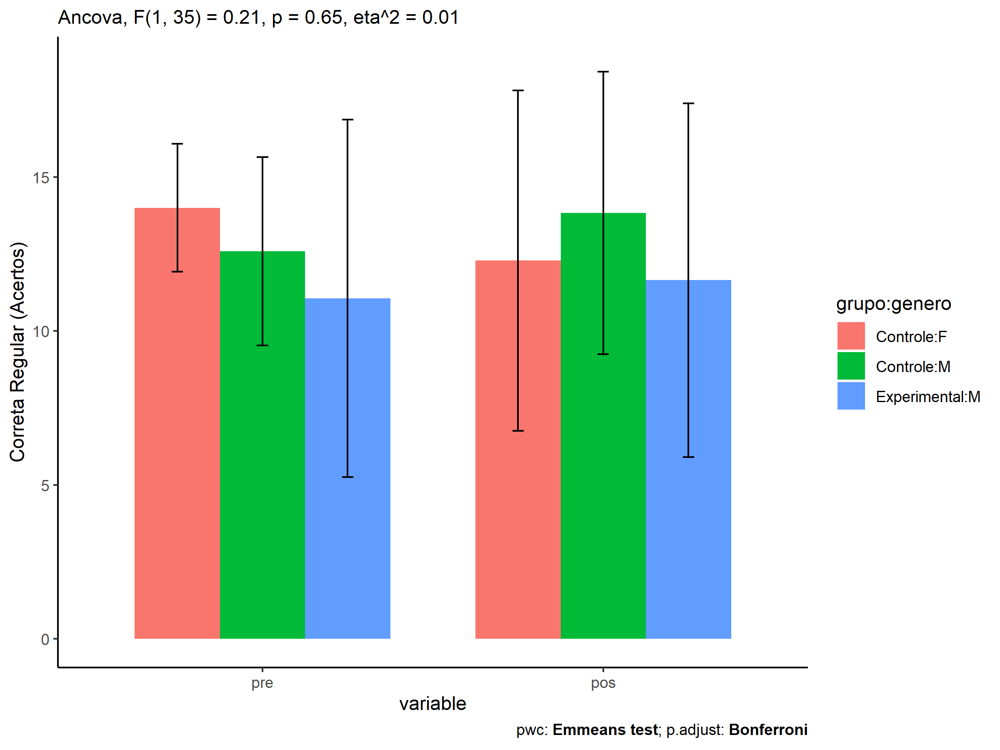<!-- -->

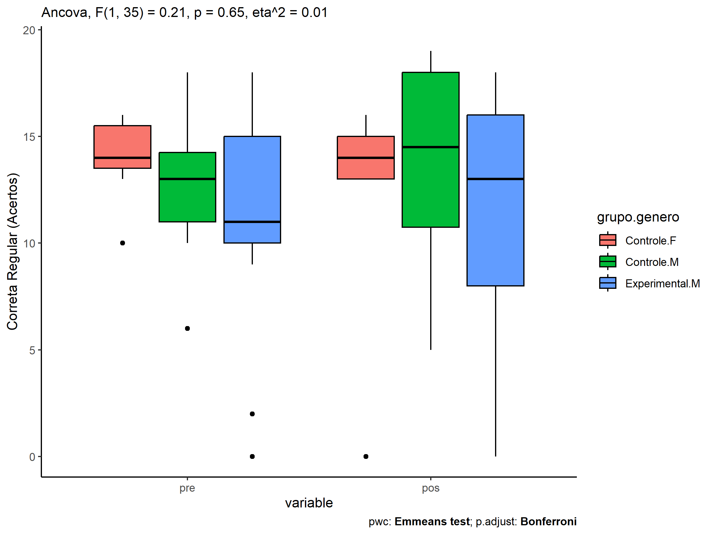<!-- -->

<!-- -->

### Correta Regular (TRI)

| var        | genero | grupo        |   n | M (pre) | SE (pre) | M (unadj) | SE (unadj) | M (adj) | SE (adj) |
|:-----------|:-------|:-------------|----:|--------:|---------:|----------:|-----------:|--------:|---------:|
| tri.CR.pos | F      | Controle     |   6 |  -0.218 |    0.189 |    -0.074 |      0.143 |  -0.227 |    0.296 |
| tri.CR.pos | M      | Controle     |  12 |  -0.689 |    0.194 |    -0.367 |      0.303 |  -0.265 |    0.209 |
| tri.CR.pos | M      | Experimental |  14 |  -0.460 |    0.252 |    -0.275 |      0.193 |  -0.297 |    0.191 |

|     | grupo    | genero | group1   | group2       | estimate | conf.low | conf.high |    se | statistic |     p | p.adj | p.adj.signif |
|:----|:---------|:-------|:---------|:-------------|---------:|---------:|----------:|------:|----------:|------:|------:|:-------------|
| 1   | Controle |        | F        | M            |    0.038 |   -0.712 |     0.788 | 0.366 |     0.104 | 0.918 | 0.918 | ns           |
| 3   | Controle |        | F        | M            |    0.472 |   -0.325 |     1.268 | 0.389 |     1.211 | 0.236 | 0.236 | ns           |
| 6   |          | M      | Controle | Experimental |    0.033 |   -0.549 |     0.614 | 0.284 |     0.115 | 0.909 | 0.909 | ns           |
| 8   |          | M      | Controle | Experimental |   -0.230 |   -0.857 |     0.397 | 0.306 |    -0.750 | 0.459 | 0.459 | ns           |

| grupo        | genero | group1 | group2 | estimate | conf.low | conf.high |    se | statistic |     p | p.adj | p.adj.signif |
|:-------------|:-------|:-------|:-------|---------:|---------:|----------:|------:|----------:|------:|------:|:-------------|
| Controle     | F      | pre    | pos    |   -0.114 |   -0.997 |     0.770 | 0.442 |    -0.257 | 0.798 | 0.798 | ns           |
| Controle     | M      | pre    | pos    |   -0.323 |   -0.971 |     0.326 | 0.324 |    -0.995 | 0.324 | 0.324 | ns           |
| Experimental | M      | pre    | pos    |   -0.176 |   -0.756 |     0.403 | 0.290 |    -0.609 | 0.545 | 0.545 | ns           |

<!-- -->

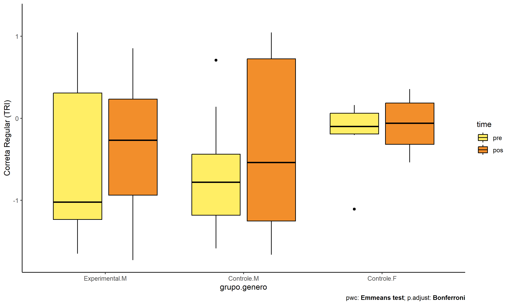<!-- -->

### Correta Irregular (Acertos)

| var          | genero | grupo        |   n | M (pre) | SE (pre) | M (unadj) | SE (unadj) | M (adj) | SE (adj) |
|:-------------|:-------|:-------------|----:|--------:|---------:|----------:|-----------:|--------:|---------:|
| score.CI.pos | F      | Controle     |   7 |   9.286 |    1.229 |     8.000 |      1.852 |   7.367 |    1.573 |
| score.CI.pos | M      | Controle     |  12 |   9.667 |    0.711 |     9.167 |      0.869 |   8.288 |    1.222 |
| score.CI.pos | M      | Experimental |  17 |   6.941 |    1.079 |     8.941 |      1.341 |   9.822 |    1.037 |

|     | grupo    | genero | group1   | group2       | estimate | conf.low | conf.high |    se | statistic |     p | p.adj | p.adj.signif |
|:----|:---------|:-------|:---------|:-------------|---------:|---------:|----------:|------:|----------:|------:|------:|:-------------|
| 1   | Controle |        | F        | M            |   -0.921 |   -4.926 |     3.085 | 1.966 |    -0.468 | 0.643 | 0.643 | ns           |
| 3   | Controle |        | F        | M            |   -0.381 |   -3.942 |     3.180 | 1.750 |    -0.218 | 0.829 | 0.829 | ns           |
| 6   |          | M      | Controle | Experimental |   -1.534 |   -4.888 |     1.819 | 1.646 |    -0.932 | 0.358 | 0.358 | ns           |
| 8   |          | M      | Controle | Experimental |    2.725 |   -0.098 |     5.549 | 1.388 |     1.964 | 0.058 | 0.058 | ns           |

| grupo        | genero | group1 | group2 | estimate | conf.low | conf.high |    se | statistic |     p | p.adj | p.adj.signif |
|:-------------|:-------|:-------|:-------|---------:|---------:|----------:|------:|----------:|------:|------:|:-------------|
| Controle     | F      | pre    | pos    |    1.286 |   -3.226 |     5.798 | 2.260 |     0.569 | 0.571 | 0.571 | ns           |
| Controle     | M      | pre    | pos    |    0.500 |   -2.946 |     3.946 | 1.726 |     0.290 | 0.773 | 0.773 | ns           |
| Experimental | M      | pre    | pos    |   -2.000 |   -4.895 |     0.895 | 1.450 |    -1.379 | 0.172 | 0.172 | ns           |

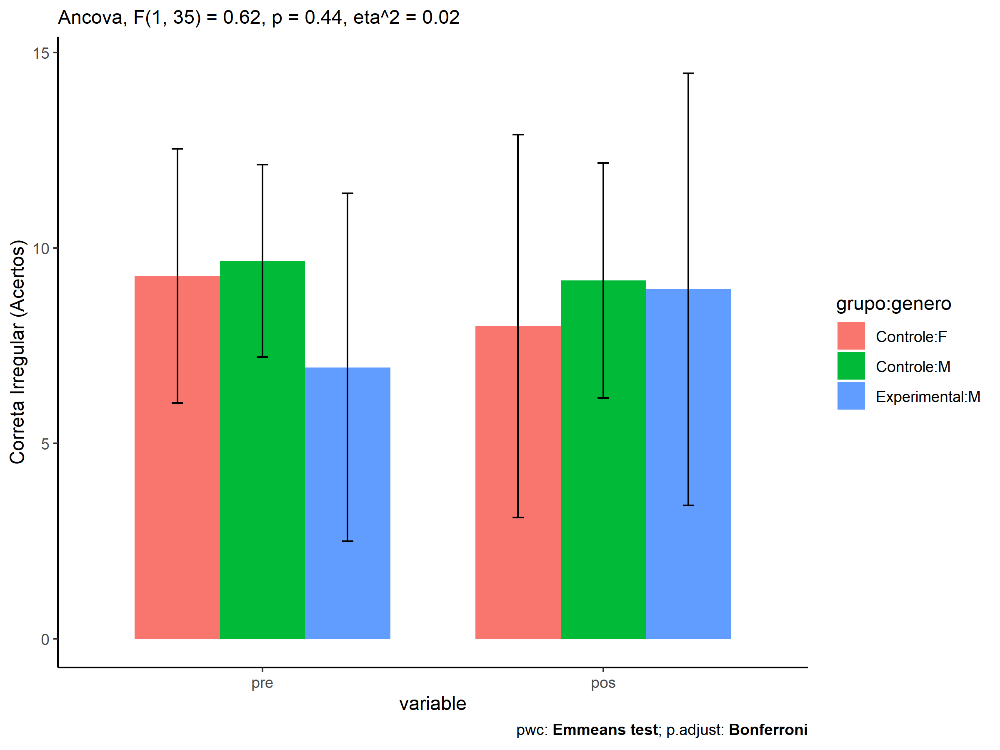<!-- -->

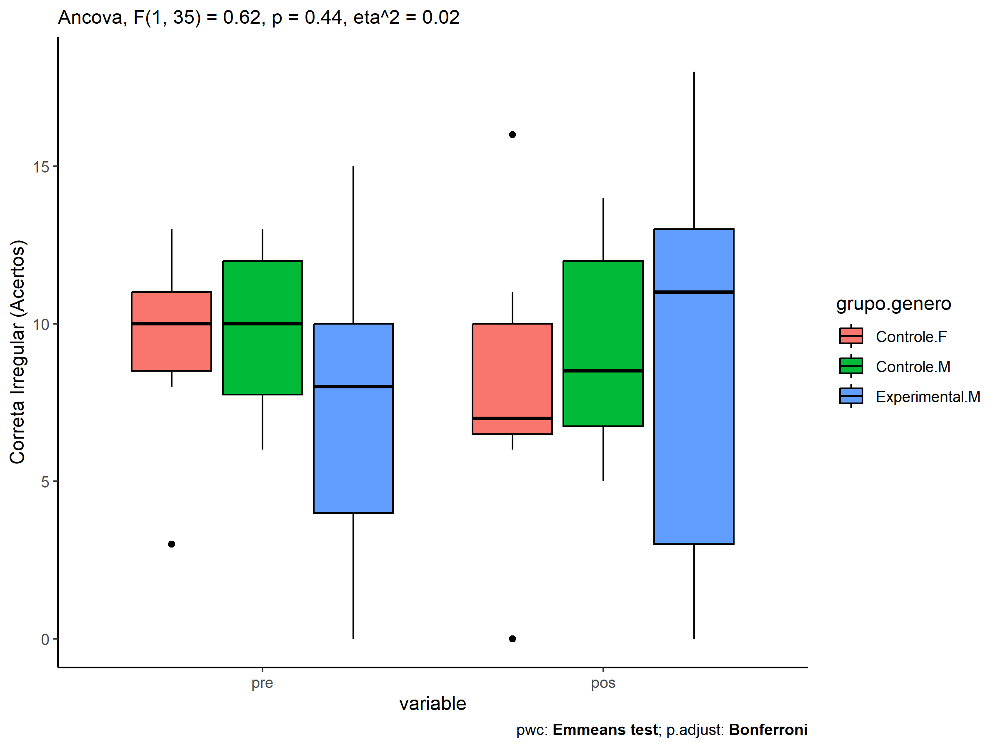<!-- -->

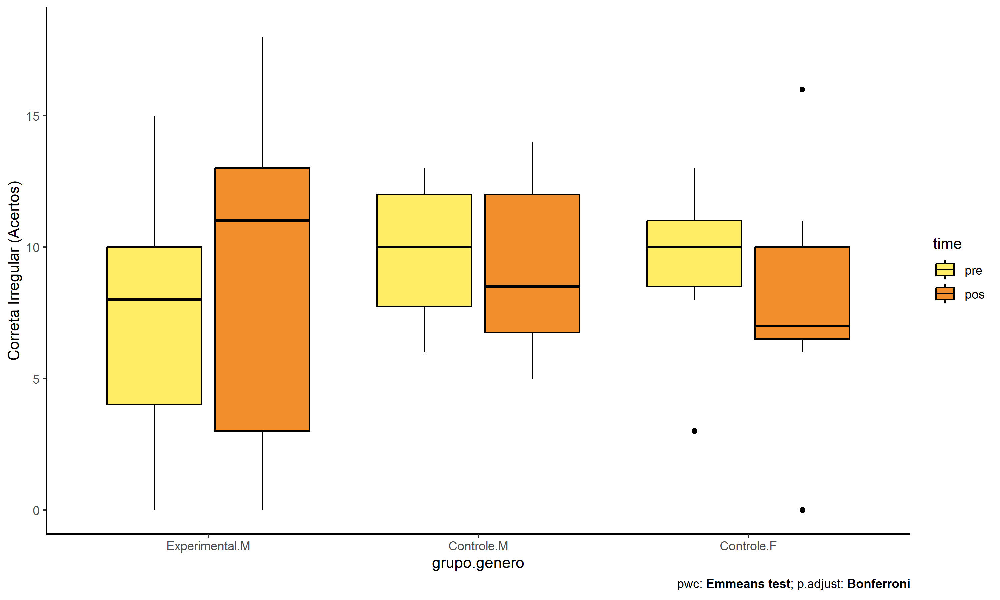<!-- -->

### Correta Irregular (TRI)

| var        | genero | grupo        |   n | M (pre) | SE (pre) | M (unadj) | SE (unadj) | M (adj) | SE (adj) |
|:-----------|:-------|:-------------|----:|--------:|---------:|----------:|-----------:|--------:|---------:|
| tri.CI.pos | F      | Controle     |   6 |  -0.908 |    0.275 |    -0.544 |      0.358 |  -0.468 |    0.252 |
| tri.CI.pos | M      | Controle     |  12 |  -0.638 |    0.158 |    -0.789 |      0.138 |  -0.919 |    0.180 |
| tri.CI.pos | M      | Experimental |  14 |  -0.910 |    0.213 |    -0.450 |      0.261 |  -0.371 |    0.165 |

|     | grupo    | genero | group1   | group2       | estimate | conf.low | conf.high |    se | statistic |     p | p.adj | p.adj.signif |
|:----|:---------|:-------|:---------|:-------------|---------:|---------:|----------:|------:|----------:|------:|------:|:-------------|
| 1   | Controle |        | F        | M            |    0.451 |   -0.186 |     1.089 | 0.311 |     1.450 | 0.158 | 0.158 | ns           |
| 3   | Controle |        | F        | M            |   -0.269 |   -0.975 |     0.437 | 0.345 |    -0.779 | 0.442 | 0.442 | ns           |
| 6   |          | M      | Controle | Experimental |   -0.548 |   -1.053 |    -0.043 | 0.246 |    -2.223 | 0.034 | 0.034 | \*           |
| 8   |          | M      | Controle | Experimental |    0.272 |   -0.284 |     0.827 | 0.272 |     1.001 | 0.325 | 0.325 | ns           |

| grupo        | genero | group1 | group2 | estimate | conf.low | conf.high |    se | statistic |     p | p.adj | p.adj.signif |
|:-------------|:-------|:-------|:-------|---------:|---------:|----------:|------:|----------:|------:|------:|:-------------|
| Controle     | F      | pre    | pos    |   -0.207 |   -1.038 |     0.623 | 0.415 |    -0.499 | 0.620 | 0.620 | ns           |
| Controle     | M      | pre    | pos    |    0.150 |   -0.459 |     0.759 | 0.305 |     0.493 | 0.624 | 0.624 | ns           |
| Experimental | M      | pre    | pos    |   -0.519 |   -1.064 |     0.026 | 0.273 |    -1.904 | 0.062 | 0.062 | ns           |

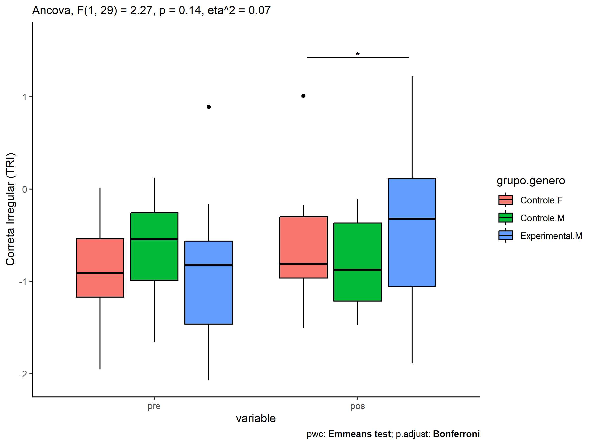<!-- -->

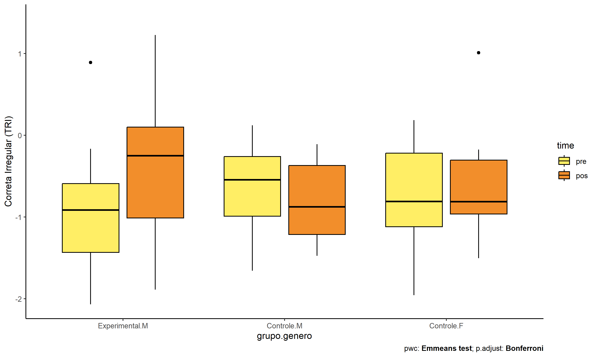<!-- -->

### Trocas Visuais (Acertos)

| var          | genero | grupo        |   n | M (pre) | SE (pre) | M (unadj) | SE (unadj) | M (adj) | SE (adj) |
|:-------------|:-------|:-------------|----:|--------:|---------:|----------:|-----------:|--------:|---------:|
| score.TV.pos | F      | Controle     |   7 |  17.286 |    0.680 |    16.143 |      2.747 |  13.606 |    1.825 |
| score.TV.pos | M      | Controle     |  12 |  12.500 |    1.449 |    14.833 |      1.347 |  15.757 |    1.351 |
| score.TV.pos | M      | Experimental |  17 |  13.235 |    1.628 |    13.706 |      1.562 |  14.098 |    1.127 |

|     | grupo    | genero | group1   | group2       | estimate | conf.low | conf.high |    se | statistic |     p | p.adj | p.adj.signif |
|:----|:---------|:-------|:---------|:-------------|---------:|---------:|----------:|------:|----------:|------:|------:|:-------------|
| 1   | Controle |        | F        | M            |   -2.152 |   -6.861 |     2.558 | 2.312 |    -0.931 | 0.359 | 0.359 | ns           |
| 3   | Controle |        | F        | M            |    4.786 |   -0.587 |    10.159 | 2.641 |     1.812 | 0.079 | 0.079 | ns           |
| 6   |          | M      | Controle | Experimental |    1.659 |   -1.908 |     5.227 | 1.751 |     0.947 | 0.351 | 0.351 | ns           |
| 8   |          | M      | Controle | Experimental |   -0.735 |   -4.995 |     3.524 | 2.094 |    -0.351 | 0.728 | 0.728 | ns           |

| grupo        | genero | group1 | group2 | estimate | conf.low | conf.high |    se | statistic |     p | p.adj | p.adj.signif |
|:-------------|:-------|:-------|:-------|---------:|---------:|----------:|------:|----------:|------:|------:|:-------------|
| Controle     | F      | pre    | pos    |    1.143 |   -5.071 |     7.357 | 3.112 |     0.367 | 0.715 | 0.715 | ns           |
| Controle     | M      | pre    | pos    |   -2.333 |   -7.079 |     2.413 | 2.377 |    -0.982 | 0.330 | 0.330 | ns           |
| Experimental | M      | pre    | pos    |   -0.471 |   -4.458 |     3.517 | 1.997 |    -0.236 | 0.814 | 0.814 | ns           |

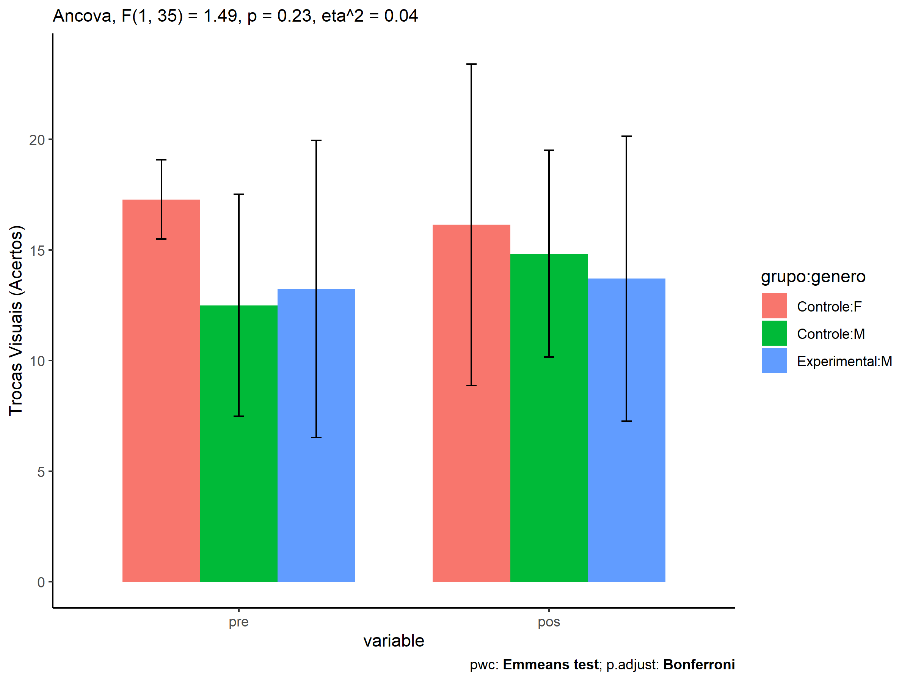<!-- -->

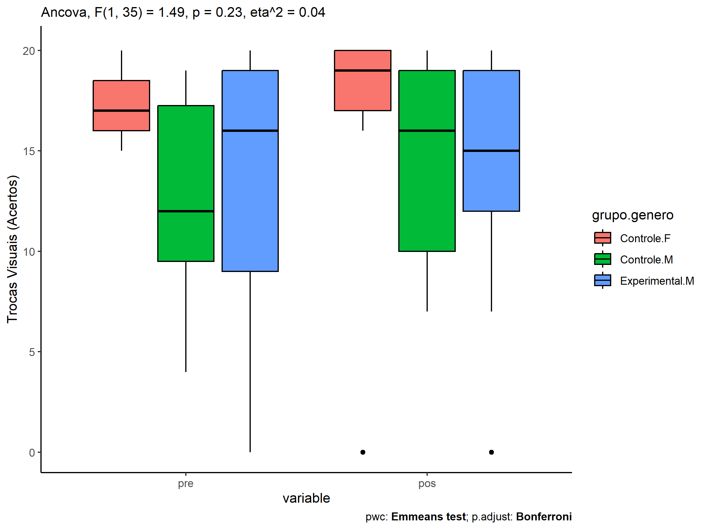<!-- -->

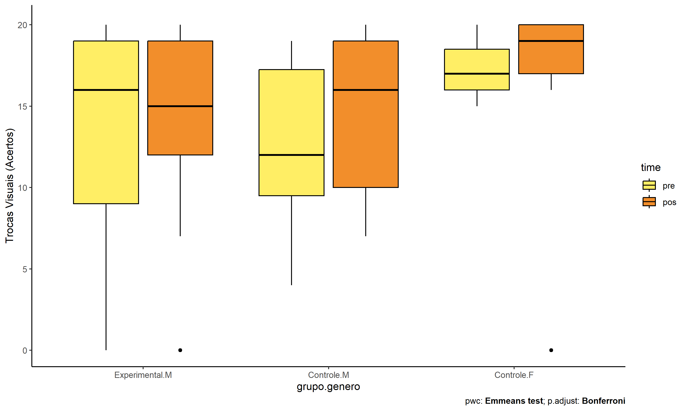<!-- -->

### Trocas Visuais (TRI)

| var        | genero | grupo        |   n | M (pre) | SE (pre) | M (unadj) | SE (unadj) | M (adj) | SE (adj) |
|:-----------|:-------|:-------------|----:|--------:|---------:|----------:|-----------:|--------:|---------:|
| tri.TV.pos | F      | Controle     |   6 |   0.066 |    0.248 |     0.583 |      0.217 |   0.293 |    0.286 |
| tri.TV.pos | M      | Controle     |  12 |  -0.902 |    0.240 |    -0.387 |      0.270 |  -0.117 |    0.207 |
| tri.TV.pos | M      | Experimental |  14 |  -0.249 |    0.248 |    -0.040 |      0.218 |  -0.148 |    0.183 |

|     | grupo    | genero | group1   | group2       | estimate | conf.low | conf.high |    se | statistic |     p | p.adj | p.adj.signif |
|:----|:---------|:-------|:---------|:-------------|---------:|---------:|----------:|------:|----------:|------:|------:|:-------------|
| 1   | Controle |        | F        | M            |    0.410 |   -0.344 |     1.163 | 0.368 |     1.114 | 0.275 | 0.275 | ns           |
| 3   | Controle |        | F        | M            |    0.969 |    0.107 |     1.830 | 0.421 |     2.300 | 0.029 | 0.029 | \*           |
| 6   |          | M      | Controle | Experimental |    0.031 |   -0.550 |     0.611 | 0.283 |     0.109 | 0.914 | 0.914 | ns           |
| 8   |          | M      | Controle | Experimental |   -0.653 |   -1.331 |     0.024 | 0.331 |    -1.971 | 0.058 | 0.058 | ns           |

| grupo        | genero | group1 | group2 | estimate | conf.low | conf.high |    se | statistic |     p | p.adj | p.adj.signif |
|:-------------|:-------|:-------|:-------|---------:|---------:|----------:|------:|----------:|------:|------:|:-------------|
| Controle     | F      | pre    | pos    |   -0.589 |   -1.538 |     0.361 | 0.475 |    -1.240 | 0.220 | 0.220 | ns           |
| Controle     | M      | pre    | pos    |   -0.515 |   -1.212 |     0.182 | 0.348 |    -1.478 | 0.144 | 0.144 | ns           |
| Experimental | M      | pre    | pos    |   -0.164 |   -0.787 |     0.459 | 0.312 |    -0.526 | 0.601 | 0.601 | ns           |

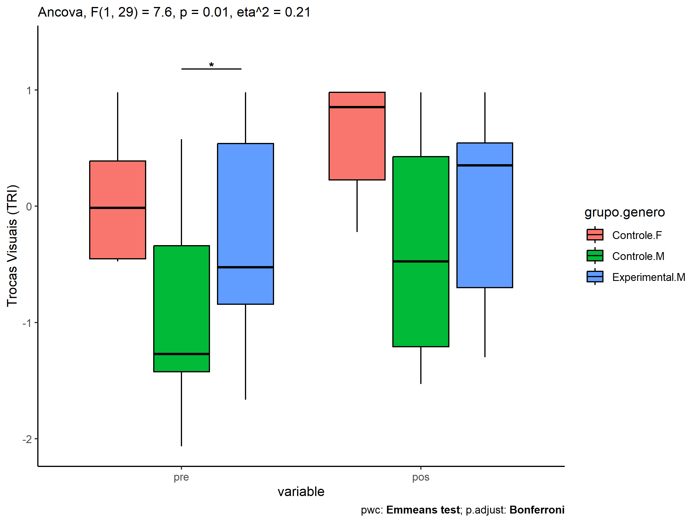<!-- -->

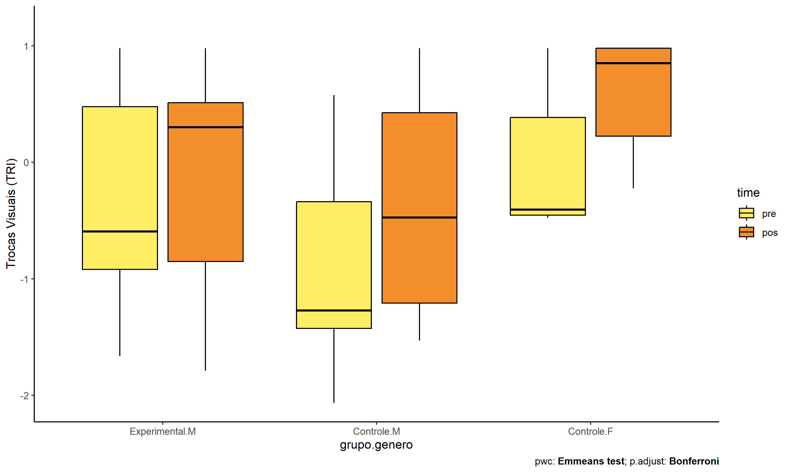<!-- -->

### Trocas Fonologicas (Acertos)

| var          | genero | grupo        |   n | M (pre) | SE (pre) | M (unadj) | SE (unadj) | M (adj) | SE (adj) |
|:-------------|:-------|:-------------|----:|--------:|---------:|----------:|-----------:|--------:|---------:|
| score.TF.pos | F      | Controle     |   7 |  14.429 |    1.110 |    13.000 |      2.268 |  11.758 |    1.842 |
| score.TF.pos | M      | Controle     |  12 |  12.250 |    1.095 |    13.167 |      1.424 |  13.106 |    1.379 |
| score.TF.pos | M      | Experimental |  17 |  11.118 |    1.590 |    12.765 |      1.371 |  13.319 |    1.170 |

|     | grupo    | genero | group1   | group2       | estimate | conf.low | conf.high |    se | statistic |     p | p.adj | p.adj.signif |
|:----|:---------|:-------|:---------|:-------------|---------:|---------:|----------:|------:|----------:|------:|------:|:-------------|
| 1   | Controle |        | F        | M            |   -1.348 |   -6.031 |     3.334 | 2.299 |    -0.587 | 0.562 | 0.562 | ns           |
| 3   | Controle |        | F        | M            |    2.179 |   -2.868 |     7.225 | 2.481 |     0.878 | 0.386 | 0.386 | ns           |
| 6   |          | M      | Controle | Experimental |   -0.212 |   -3.900 |     3.476 | 1.811 |    -0.117 | 0.907 | 0.907 | ns           |
| 8   |          | M      | Controle | Experimental |    1.132 |   -2.869 |     5.133 | 1.967 |     0.576 | 0.569 | 0.569 | ns           |

| grupo        | genero | group1 | group2 | estimate | conf.low | conf.high |    se | statistic |     p | p.adj | p.adj.signif |
|:-------------|:-------|:-------|:-------|---------:|---------:|----------:|------:|----------:|------:|------:|:-------------|
| Controle     | F      | pre    | pos    |    1.429 |   -4.286 |     7.143 | 2.862 |     0.499 | 0.619 | 0.619 | ns           |
| Controle     | M      | pre    | pos    |   -0.917 |   -5.281 |     3.448 | 2.186 |    -0.419 | 0.676 | 0.676 | ns           |
| Experimental | M      | pre    | pos    |   -1.647 |   -5.314 |     2.020 | 1.837 |    -0.897 | 0.373 | 0.373 | ns           |

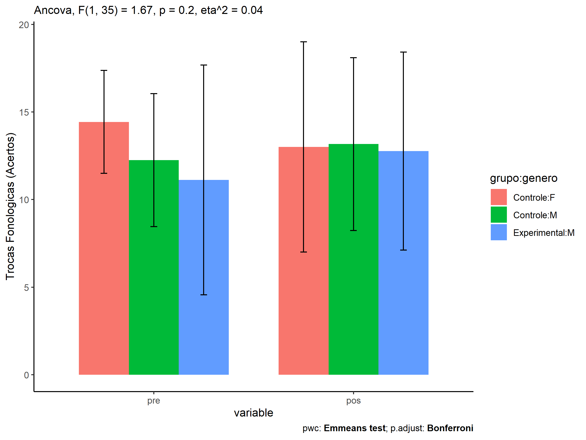<!-- -->

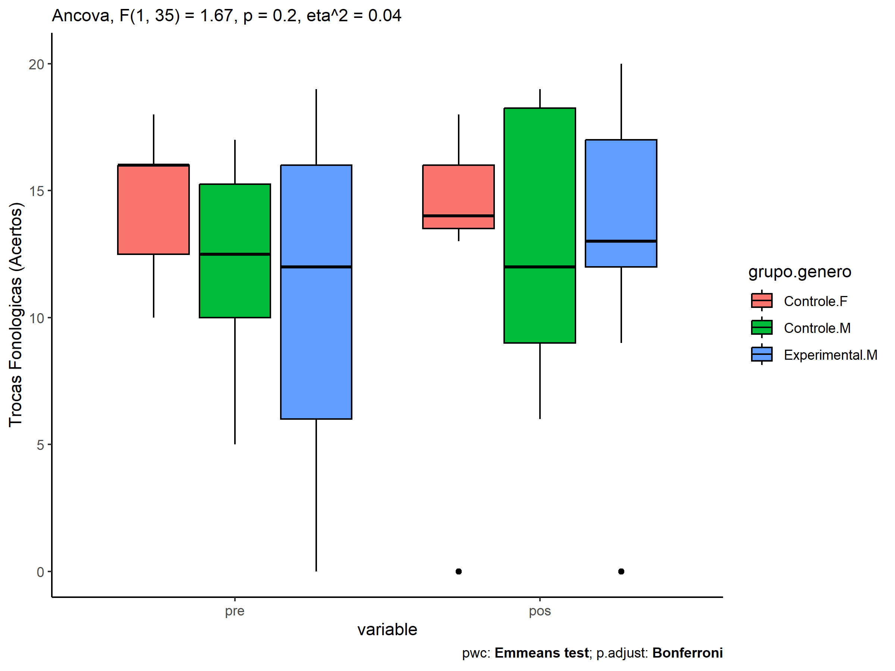<!-- -->

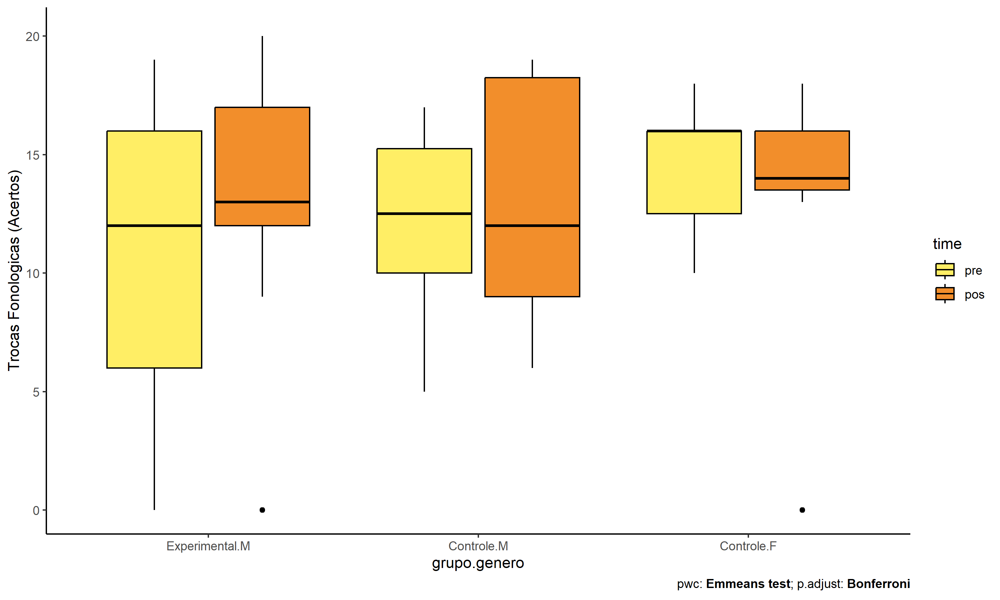<!-- -->

### Trocas Fonologicas (TRI)

| var        | genero | grupo        |   n | M (pre) | SE (pre) | M (unadj) | SE (unadj) | M (adj) | SE (adj) |
|:-----------|:-------|:-------------|----:|--------:|---------:|----------:|-----------:|--------:|---------:|
| tri.TF.pos | F      | Controle     |   6 |  -0.478 |    0.182 |    -0.163 |      0.188 |  -0.161 |    0.261 |
| tri.TF.pos | M      | Controle     |  12 |  -0.626 |    0.145 |    -0.418 |      0.268 |  -0.330 |    0.186 |
| tri.TF.pos | M      | Experimental |  14 |  -0.343 |    0.240 |    -0.139 |      0.177 |  -0.215 |    0.172 |

|     | grupo    | genero | group1   | group2       | estimate | conf.low | conf.high |    se | statistic |     p | p.adj | p.adj.signif |
|:----|:---------|:-------|:---------|:-------------|---------:|---------:|----------:|------:|----------:|------:|------:|:-------------|
| 1   | Controle |        | F        | M            |    0.168 |   -0.487 |     0.824 | 0.320 |     0.526 | 0.603 | 0.603 | ns           |
| 3   | Controle |        | F        | M            |    0.148 |   -0.569 |     0.866 | 0.351 |     0.423 | 0.675 | 0.675 | ns           |
| 6   |          | M      | Controle | Experimental |   -0.115 |   -0.638 |     0.409 | 0.256 |    -0.448 | 0.657 | 0.657 | ns           |
| 8   |          | M      | Controle | Experimental |   -0.283 |   -0.848 |     0.281 | 0.276 |    -1.026 | 0.313 | 0.313 | ns           |

| grupo        | genero | group1 | group2 | estimate | conf.low | conf.high |    se | statistic |     p | p.adj | p.adj.signif |
|:-------------|:-------|:-------|:-------|---------:|---------:|----------:|------:|----------:|------:|------:|:-------------|
| Controle     | F      | pre    | pos    |   -0.137 |   -0.987 |     0.714 | 0.425 |    -0.321 | 0.749 | 0.749 | ns           |
| Controle     | M      | pre    | pos    |   -0.208 |   -0.832 |     0.416 | 0.312 |    -0.667 | 0.508 | 0.508 | ns           |
| Experimental | M      | pre    | pos    |   -0.302 |   -0.860 |     0.256 | 0.279 |    -1.083 | 0.283 | 0.283 | ns           |

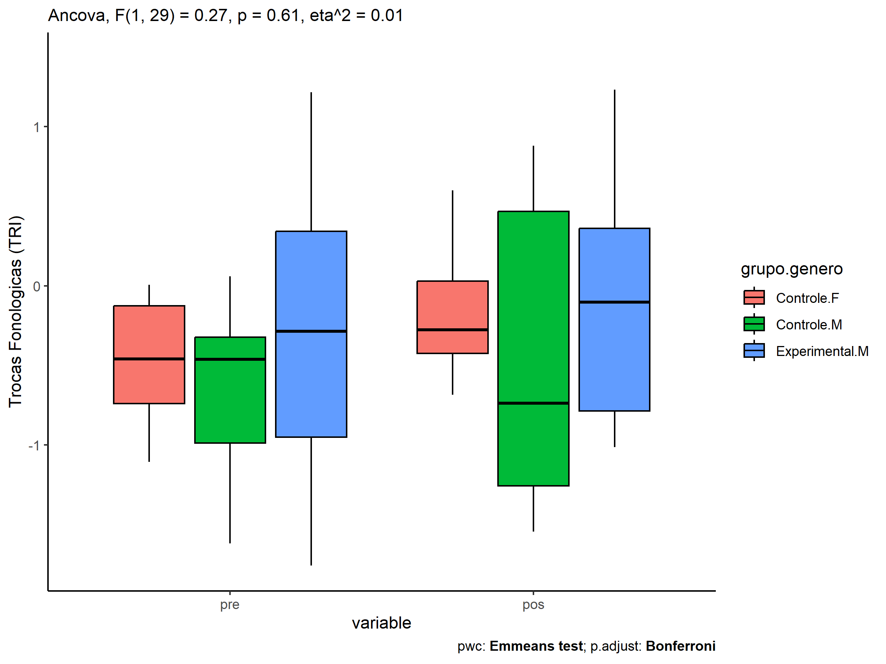<!-- -->

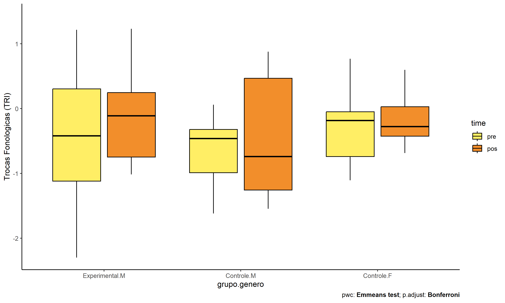<!-- -->

### Trocas Orograficas (Acertos)

| var          | genero | grupo        |   n | M (pre) | SE (pre) | M (unadj) | SE (unadj) | M (adj) | SE (adj) |
|:-------------|:-------|:-------------|----:|--------:|---------:|----------:|-----------:|--------:|---------:|
| score.TO.pos | F      | Controle     |   7 |  10.857 |    1.610 |     8.429 |      1.938 |   7.949 |    1.560 |
| score.TO.pos | M      | Controle     |  12 |   6.833 |    0.777 |     7.333 |      0.865 |   7.782 |    1.208 |
| score.TO.pos | M      | Experimental |  17 |   9.294 |    1.104 |     7.824 |      1.026 |   7.704 |    0.977 |

|     | grupo    | genero | group1   | group2       | estimate | conf.low | conf.high |    se | statistic |     p | p.adj | p.adj.signif |
|:----|:---------|:-------|:---------|:-------------|---------:|---------:|----------:|------:|----------:|------:|------:|:-------------|
| 1   | Controle |        | F        | M            |    0.167 |   -3.979 |     4.313 | 2.035 |     0.082 | 0.935 | 0.935 | ns           |
| 3   | Controle |        | F        | M            |    4.024 |    0.183 |     7.865 | 1.888 |     2.131 | 0.041 | 0.041 | \*           |
| 6   |          | M      | Controle | Experimental |    0.078 |   -3.128 |     3.283 | 1.574 |     0.049 | 0.961 | 0.961 | ns           |
| 8   |          | M      | Controle | Experimental |   -2.461 |   -5.506 |     0.584 | 1.497 |    -1.644 | 0.110 | 0.110 | ns           |

| grupo        | genero | group1 | group2 | estimate | conf.low | conf.high |    se | statistic |     p | p.adj | p.adj.signif |
|:-------------|:-------|:-------|:-------|---------:|---------:|----------:|------:|----------:|------:|------:|:-------------|
| Controle     | F      | pre    | pos    |    2.429 |   -1.854 |     6.711 | 2.145 |     1.132 | 0.262 | 0.262 | ns           |
| Controle     | M      | pre    | pos    |   -0.500 |   -3.771 |     2.771 | 1.638 |    -0.305 | 0.761 | 0.761 | ns           |
| Experimental | M      | pre    | pos    |    1.471 |   -1.278 |     4.219 | 1.376 |     1.068 | 0.289 | 0.289 | ns           |

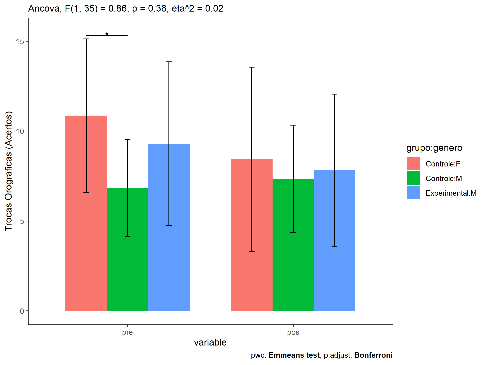<!-- -->

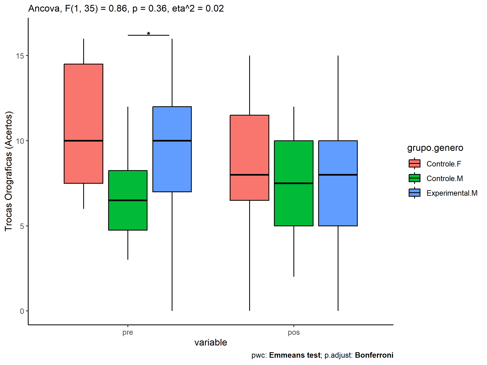<!-- -->

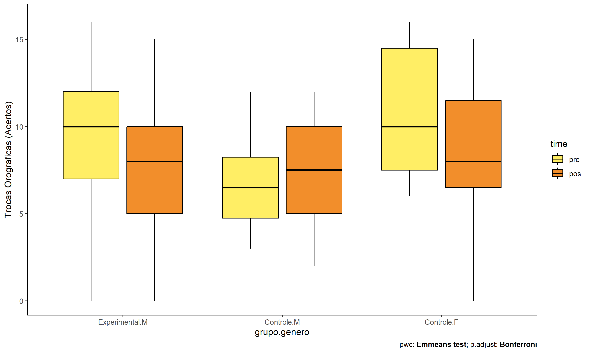<!-- -->

### Trocas Orograficas (TRI)

| var        | genero | grupo        |   n | M (pre) | SE (pre) | M (unadj) | SE (unadj) | M (adj) | SE (adj) |
|:-----------|:-------|:-------------|----:|--------:|---------:|----------:|-----------:|--------:|---------:|
| tri.TO.pos | F      | Controle     |   6 |  -0.366 |    0.346 |    -0.277 |      0.286 |  -0.264 |    0.275 |
| tri.TO.pos | M      | Controle     |  12 |  -0.674 |    0.160 |    -0.664 |      0.214 |  -0.497 |    0.203 |
| tri.TO.pos | M      | Experimental |  14 |  -0.042 |    0.211 |    -0.407 |      0.209 |  -0.555 |    0.187 |

|     | grupo    | genero | group1   | group2       | estimate | conf.low | conf.high |    se | statistic |     p | p.adj | p.adj.signif |
|:----|:---------|:-------|:---------|:-------------|---------:|---------:|----------:|------:|----------:|------:|------:|:-------------|
| 1   | Controle |        | F        | M            |    0.233 |   -0.466 |     0.933 | 0.341 |     0.684 | 0.500 | 0.500 | ns           |
| 3   | Controle |        | F        | M            |    0.308 |   -0.429 |     1.044 | 0.360 |     0.854 | 0.400 | 0.400 | ns           |
| 6   |          | M      | Controle | Experimental |    0.058 |   -0.530 |     0.646 | 0.287 |     0.202 | 0.842 | 0.842 | ns           |
| 8   |          | M      | Controle | Experimental |   -0.632 |   -1.212 |    -0.053 | 0.283 |    -2.231 | 0.034 | 0.034 | \*           |

| grupo        | genero | group1 | group2 | estimate | conf.low | conf.high |    se | statistic |     p | p.adj | p.adj.signif |
|:-------------|:-------|:-------|:-------|---------:|---------:|----------:|------:|----------:|------:|------:|:-------------|
| Controle     | F      | pre    | pos    |    0.149 |   -0.683 |     0.982 | 0.416 |     0.359 | 0.721 | 0.721 | ns           |
| Controle     | M      | pre    | pos    |   -0.010 |   -0.621 |     0.601 | 0.306 |    -0.033 | 0.974 | 0.974 | ns           |
| Experimental | M      | pre    | pos    |    0.361 |   -0.186 |     0.907 | 0.273 |     1.320 | 0.192 | 0.192 | ns           |

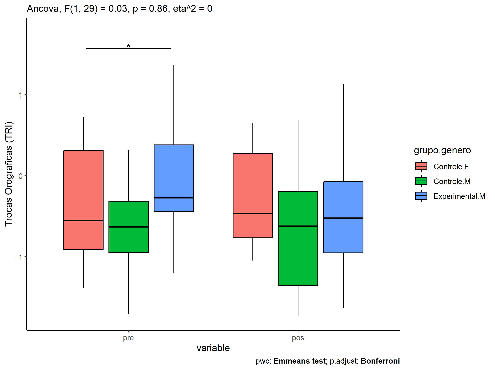<!-- -->

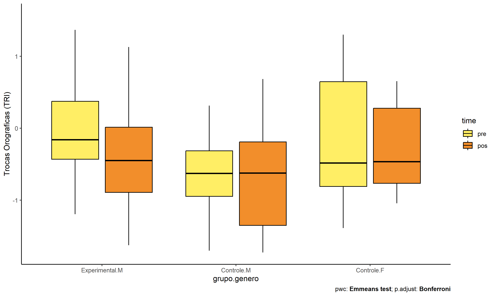<!-- -->

## factores: **idade:grupo**

### Leitura de Pseudo-Palavras (Acertos)

### Leitura de Pseudo-Palavras (TRI)

### Correta Regular (Acertos)

### Correta Regular (TRI)

### Correta Irregular (Acertos)

### Correta Irregular (TRI)

### Trocas Visuais (Acertos)

### Trocas Visuais (TRI)

### Trocas Fonologicas (Acertos)

### Trocas Fonologicas (TRI)

### Trocas Orograficas (Acertos)

### Trocas Orograficas (TRI)

## factores: **zona.participante:grupo**

### Leitura de Pseudo-Palavras (Acertos)

| var            | zona.participante | grupo        |   n | M (pre) | SE (pre) | M (unadj) | SE (unadj) | M (adj) | SE (adj) |
|:---------------|:------------------|:-------------|----:|--------:|---------:|----------:|-----------:|--------:|---------:|
| score.CLPP.pos | Rural             | Experimental |   6 |  66.167 |    6.853 |    66.000 |      5.633 |  61.642 |    3.308 |
| score.CLPP.pos | Urbana            | Controle     |  10 |  60.200 |    3.681 |    66.400 |      3.045 |  65.789 |    2.476 |
| score.CLPP.pos | Urbana            | Experimental |   6 |  50.667 |    6.642 |    57.333 |      5.395 |  62.710 |    3.366 |

|     | grupo        | zona.participante | group1   | group2       | estimate | conf.low | conf.high |    se | statistic |     p | p.adj | p.adj.signif |
|:----|:-------------|:------------------|:---------|:-------------|---------:|---------:|----------:|------:|----------:|------:|------:|:-------------|
| 2   | Experimental |                   | Urbana   | Rural        |    1.068 |   -9.248 |    11.383 | 4.910 |     0.218 | 0.830 | 0.830 | ns           |
| 4   | Experimental |                   | Urbana   | Rural        |  -15.500 |  -32.927 |     1.927 | 8.326 |    -1.862 | 0.078 | 0.078 | ns           |
| 5   |              | Urbana            | Controle | Experimental |    3.079 |   -5.764 |    11.923 | 4.209 |     0.732 | 0.474 | 0.474 | ns           |
| 7   |              | Urbana            | Controle | Experimental |    9.533 |   -6.054 |    25.121 | 7.447 |     1.280 | 0.216 | 0.216 | ns           |

| grupo        | zona.participante | group1 | group2 | estimate | conf.low | conf.high |    se | statistic |     p | p.adj | p.adj.signif |
|:-------------|:------------------|:-------|:-------|---------:|---------:|----------:|------:|----------:|------:|------:|:-------------|
| Controle     | Urbana            | pre    | pos    |   -4.582 |  -16.427 |     7.263 | 5.865 |    -0.781 | 0.439 | 0.439 | ns           |
| Experimental | Urbana            | pre    | pos    |   -3.333 |  -18.415 |    11.749 | 7.468 |    -0.446 | 0.658 | 0.658 | ns           |
| Experimental | Rural             | pre    | pos    |    0.881 |  -14.201 |    15.963 | 7.468 |     0.118 | 0.907 | 0.907 | ns           |

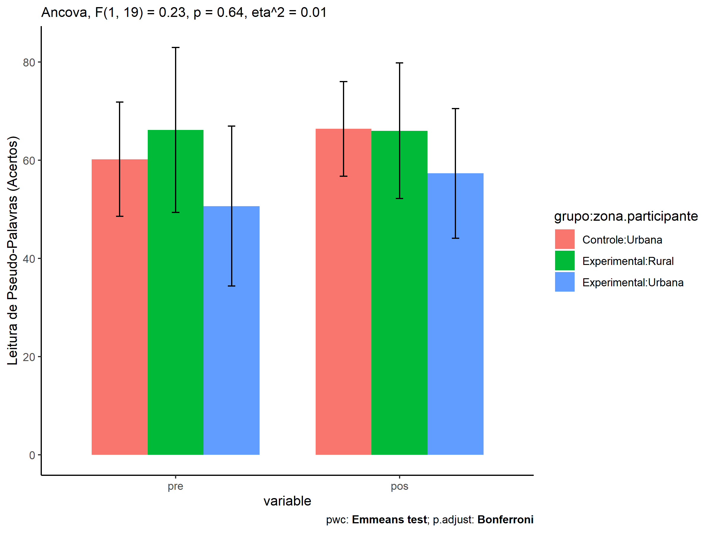<!-- -->

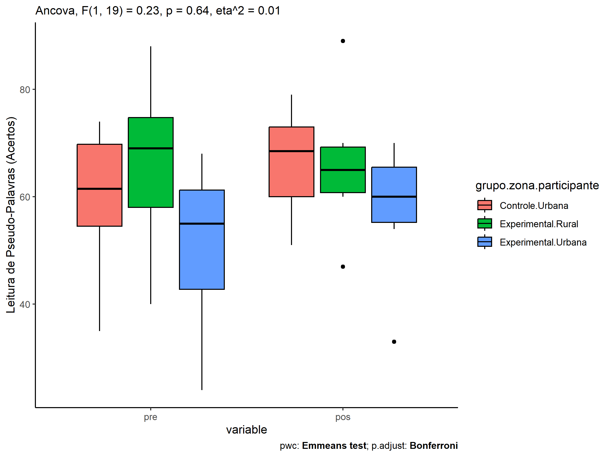<!-- -->

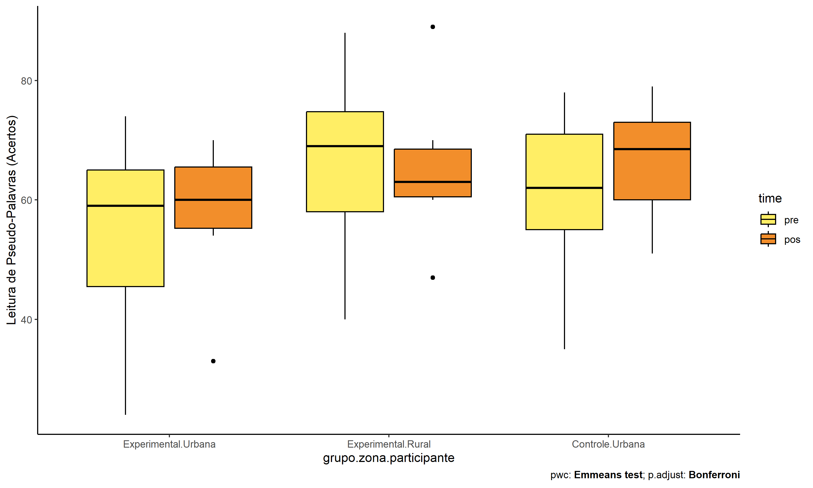<!-- -->

### Leitura de Pseudo-Palavras (TRI)

| var          | zona.participante | grupo        |   n | M (pre) | SE (pre) | M (unadj) | SE (unadj) | M (adj) | SE (adj) |
|:-------------|:------------------|:-------------|----:|--------:|---------:|----------:|-----------:|--------:|---------:|
| tri.CLPP.pos | Rural             | Experimental |   6 |  66.167 |    6.853 |    66.000 |      5.633 |  61.642 |    3.308 |
| tri.CLPP.pos | Urbana            | Controle     |  10 |  60.200 |    3.681 |    66.400 |      3.045 |  65.789 |    2.476 |
| tri.CLPP.pos | Urbana            | Experimental |   6 |  50.667 |    6.642 |    57.333 |      5.395 |  62.710 |    3.366 |

|     | grupo        | zona.participante | group1   | group2       | estimate | conf.low | conf.high |    se | statistic |     p | p.adj | p.adj.signif |
|:----|:-------------|:------------------|:---------|:-------------|---------:|---------:|----------:|------:|----------:|------:|------:|:-------------|
| 2   | Experimental |                   | Urbana   | Rural        |    1.068 |   -9.248 |    11.383 | 4.910 |     0.218 | 0.830 | 0.830 | ns           |
| 4   | Experimental |                   | Urbana   | Rural        |  -15.500 |  -32.927 |     1.927 | 8.326 |    -1.862 | 0.078 | 0.078 | ns           |
| 5   |              | Urbana            | Controle | Experimental |    3.079 |   -5.764 |    11.923 | 4.209 |     0.732 | 0.474 | 0.474 | ns           |
| 7   |              | Urbana            | Controle | Experimental |    9.533 |   -6.054 |    25.121 | 7.447 |     1.280 | 0.216 | 0.216 | ns           |

| grupo        | zona.participante | group1 | group2 | estimate | conf.low | conf.high |    se | statistic |     p | p.adj | p.adj.signif |
|:-------------|:------------------|:-------|:-------|---------:|---------:|----------:|------:|----------:|------:|------:|:-------------|
| Controle     | Urbana            | pre    | pos    |   -0.423 |   -1.244 |     0.397 | 0.406 |    -1.042 | 0.304 | 0.304 | ns           |
| Experimental | Urbana            | pre    | pos    |   -0.459 |   -1.504 |     0.586 | 0.518 |    -0.887 | 0.380 | 0.380 | ns           |
| Experimental | Rural             | pre    | pos    |    0.206 |   -0.839 |     1.252 | 0.518 |     0.399 | 0.692 | 0.692 | ns           |

<!-- -->

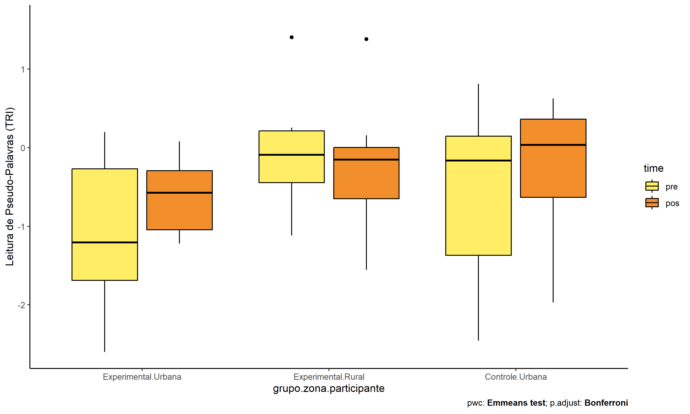<!-- -->

### Correta Regular (Acertos)

| var          | zona.participante | grupo        |   n | M (pre) | SE (pre) | M (unadj) | SE (unadj) | M (adj) | SE (adj) |
|:-------------|:------------------|:-------------|----:|--------:|---------:|----------:|-----------:|--------:|---------:|
| score.CR.pos | Rural             | Experimental |   7 |  12.143 |    2.613 |    13.714 |      1.614 |  13.694 |    2.081 |
| score.CR.pos | Urbana            | Controle     |  11 |  13.636 |    0.754 |    12.909 |      1.575 |  12.441 |    1.697 |
| score.CR.pos | Urbana            | Experimental |   8 |   9.875 |    2.065 |     9.750 |      2.455 |  10.411 |    2.010 |

|     | grupo        | zona.participante | group1   | group2       | estimate | conf.low | conf.high |    se | statistic |     p | p.adj | p.adj.signif |
|:----|:-------------|:------------------|:---------|:-------------|---------:|---------:|----------:|------:|----------:|------:|------:|:-------------|
| 2   | Experimental |                   | Urbana   | Rural        |   -3.283 |   -9.288 |     2.721 | 2.895 |    -1.134 | 0.269 | 0.269 | ns           |
| 4   | Experimental |                   | Urbana   | Rural        |   -2.268 |   -7.682 |     3.147 | 2.617 |    -0.866 | 0.395 | 0.395 | ns           |
| 5   |              | Urbana            | Controle | Experimental |    2.029 |   -3.563 |     7.622 | 2.697 |     0.753 | 0.460 | 0.460 | ns           |
| 7   |              | Urbana            | Controle | Experimental |    3.761 |   -1.100 |     8.623 | 2.350 |     1.601 | 0.123 | 0.123 | ns           |

| grupo        | zona.participante | group1 | group2 | estimate | conf.low | conf.high |    se | statistic |     p | p.adj | p.adj.signif |
|:-------------|:------------------|:-------|:-------|---------:|---------:|----------:|------:|----------:|------:|------:|:-------------|
| Controle     | Urbana            | pre    | pos    |    0.727 |   -3.850 |     5.304 | 2.274 |     0.320 | 0.751 | 0.751 | ns           |
| Experimental | Urbana            | pre    | pos    |    0.125 |   -5.242 |     5.492 | 2.666 |     0.047 | 0.963 | 0.963 | ns           |
| Experimental | Rural             | pre    | pos    |   -1.571 |   -7.309 |     4.166 | 2.850 |    -0.551 | 0.584 | 0.584 | ns           |

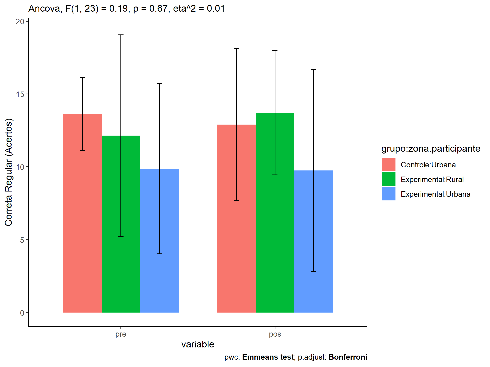<!-- -->

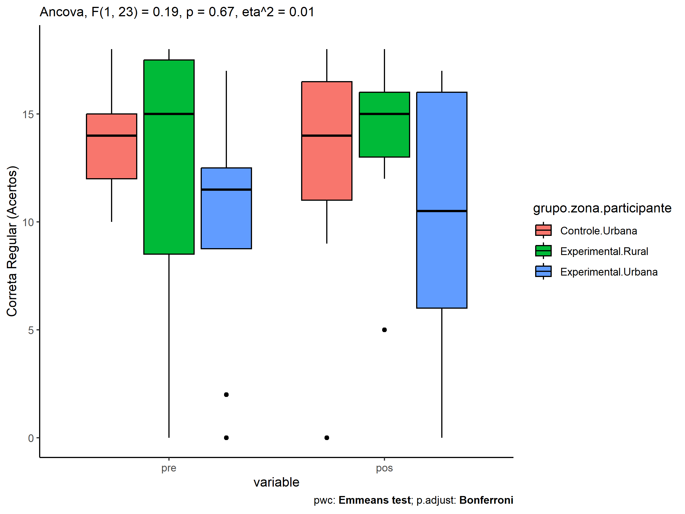<!-- -->

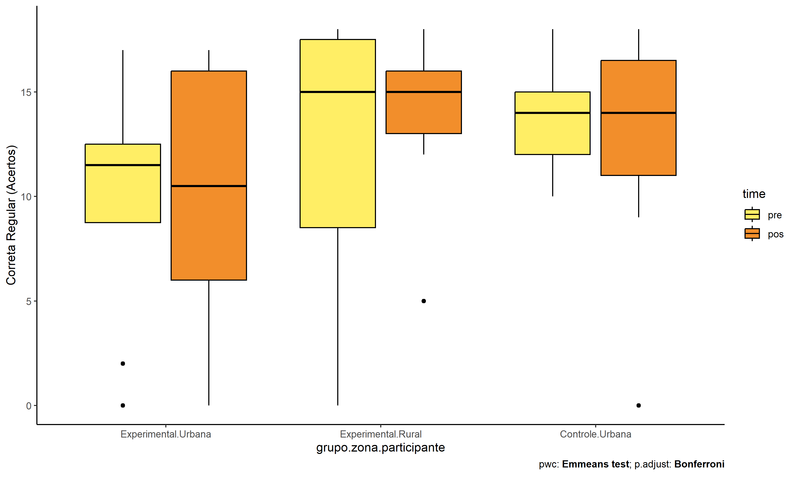<!-- -->

### Correta Regular (TRI)

| var        | zona.participante | grupo        |   n | M (pre) | SE (pre) | M (unadj) | SE (unadj) | M (adj) | SE (adj) |
|:-----------|:------------------|:-------------|----:|--------:|---------:|----------:|-----------:|--------:|---------:|
| tri.CR.pos | Rural             | Experimental |   6 |  -0.022 |    0.387 |    -0.259 |      0.339 |  -0.578 |    0.286 |
| tri.CR.pos | Urbana            | Controle     |  10 |  -0.491 |    0.220 |    -0.175 |      0.276 |  -0.184 |    0.208 |
| tri.CR.pos | Urbana            | Experimental |   6 |  -1.009 |    0.195 |    -0.165 |      0.249 |   0.170 |    0.288 |

|     | grupo        | zona.participante | group1   | group2       | estimate | conf.low | conf.high |    se | statistic |     p | p.adj | p.adj.signif |
|:----|:-------------|:------------------|:---------|:-------------|---------:|---------:|----------:|------:|----------:|------:|------:|:-------------|
| 2   | Experimental |                   | Urbana   | Rural        |    0.748 |   -0.158 |     1.654 | 0.431 |     1.734 | 0.100 | 0.100 | ns           |
| 4   | Experimental |                   | Urbana   | Rural        |   -0.987 |   -1.863 |    -0.111 | 0.419 |    -2.357 | 0.029 | 0.029 | \*           |
| 5   |              | Urbana            | Controle | Experimental |   -0.354 |   -1.102 |     0.394 | 0.356 |    -0.994 | 0.334 | 0.334 | ns           |
| 7   |              | Urbana            | Controle | Experimental |    0.518 |   -0.266 |     1.302 | 0.374 |     1.384 | 0.182 | 0.182 | ns           |

| grupo        | zona.participante | group1 | group2 | estimate | conf.low | conf.high |    se | statistic |     p | p.adj | p.adj.signif |
|:-------------|:------------------|:-------|:-------|---------:|---------:|----------:|------:|----------:|------:|------:|:-------------|
| Controle     | Urbana            | pre    | pos    |   -0.271 |   -0.969 |     0.427 | 0.346 |    -0.785 | 0.437 | 0.437 | ns           |
| Experimental | Urbana            | pre    | pos    |   -0.598 |   -1.487 |     0.290 | 0.440 |    -1.360 | 0.181 | 0.181 | ns           |
| Experimental | Rural             | pre    | pos    |    0.369 |   -0.520 |     1.258 | 0.440 |     0.838 | 0.407 | 0.407 | ns           |

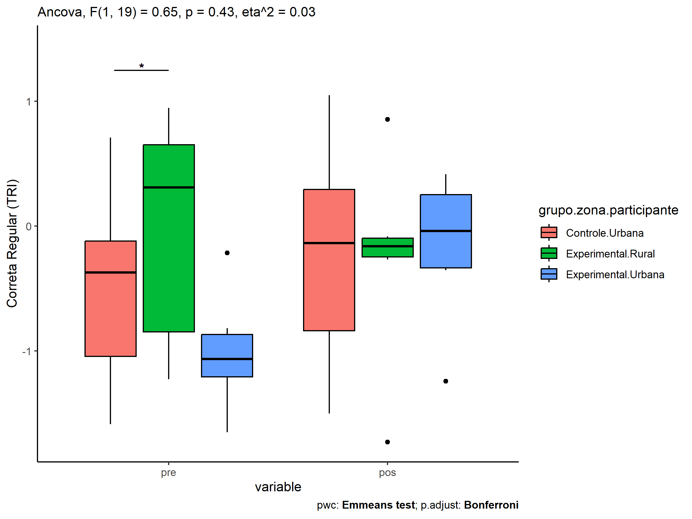<!-- -->

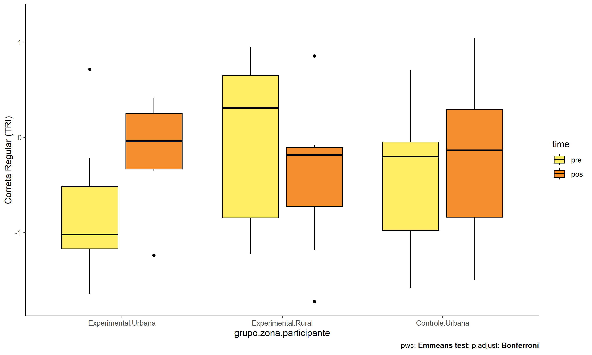<!-- -->

### Correta Irregular (Acertos)

| var          | zona.participante | grupo        |   n | M (pre) | SE (pre) | M (unadj) | SE (unadj) | M (adj) | SE (adj) |
|:-------------|:------------------|:-------------|----:|--------:|---------:|----------:|-----------:|--------:|---------:|
| score.CI.pos | Rural             | Experimental |   7 |   8.000 |    2.059 |    10.714 |      1.569 |  10.853 |    1.834 |
| score.CI.pos | Urbana            | Controle     |  11 |   9.818 |    0.913 |     8.636 |      1.337 |   7.840 |    1.513 |
| score.CI.pos | Urbana            | Experimental |   8 |   6.375 |    1.335 |     8.125 |      2.371 |   9.098 |    1.780 |

|     | grupo        | zona.participante | group1   | group2       | estimate | conf.low | conf.high |    se | statistic |     p | p.adj | p.adj.signif |
|:----|:-------------|:------------------|:---------|:-------------|---------:|---------:|----------:|------:|----------:|------:|------:|:-------------|
| 2   | Experimental |                   | Urbana   | Rural        |   -1.754 |   -7.028 |     3.519 | 2.543 |    -0.690 | 0.497 | 0.497 | ns           |
| 4   | Experimental |                   | Urbana   | Rural        |   -1.625 |   -5.916 |     2.666 | 2.074 |    -0.783 | 0.441 | 0.441 | ns           |
| 5   |              | Urbana            | Controle | Experimental |   -1.258 |   -6.266 |     3.750 | 2.415 |    -0.521 | 0.608 | 0.608 | ns           |
| 7   |              | Urbana            | Controle | Experimental |    3.443 |   -0.410 |     7.296 | 1.862 |     1.849 | 0.077 | 0.077 | ns           |

| grupo        | zona.participante | group1 | group2 | estimate | conf.low | conf.high |    se | statistic |     p | p.adj | p.adj.signif |
|:-------------|:------------------|:-------|:-------|---------:|---------:|----------:|------:|----------:|------:|------:|:-------------|
| Controle     | Urbana            | pre    | pos    |    1.182 |   -2.789 |     5.152 | 1.972 |     0.599 | 0.552 | 0.552 | ns           |
| Experimental | Urbana            | pre    | pos    |   -1.750 |   -6.406 |     2.906 | 2.313 |    -0.757 | 0.453 | 0.453 | ns           |
| Experimental | Rural             | pre    | pos    |   -2.714 |   -7.691 |     2.263 | 2.473 |    -1.098 | 0.278 | 0.278 | ns           |

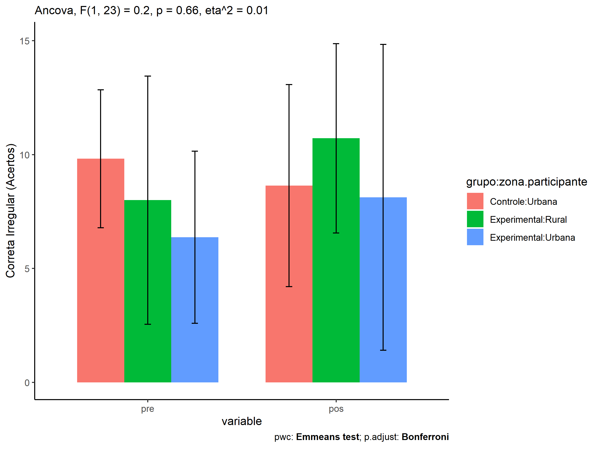<!-- -->

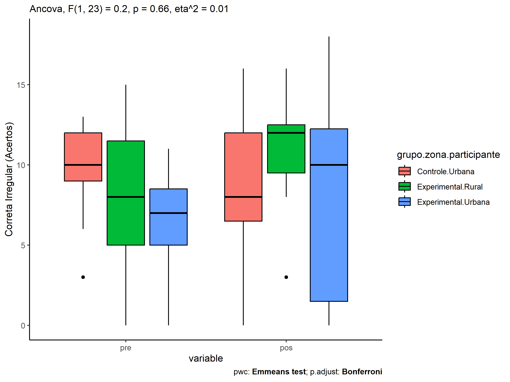<!-- -->

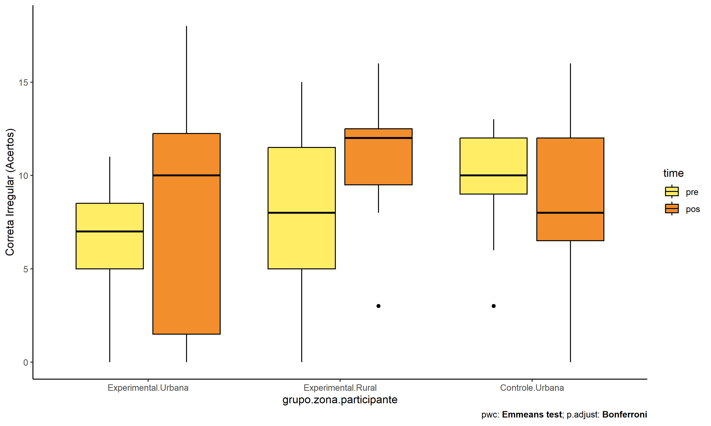<!-- -->

### Correta Irregular (TRI)

| var        | zona.participante | grupo        |   n | M (pre) | SE (pre) | M (unadj) | SE (unadj) | M (adj) | SE (adj) |
|:-----------|:------------------|:-------------|----:|--------:|---------:|----------:|-----------:|--------:|---------:|
| tri.CI.pos | Rural             | Experimental |   6 |  -0.567 |    0.392 |    -0.397 |      0.412 |  -0.510 |    0.269 |
| tri.CI.pos | Urbana            | Controle     |  10 |  -0.637 |    0.214 |    -0.602 |      0.231 |  -0.656 |    0.207 |
| tri.CI.pos | Urbana            | Experimental |   6 |  -0.947 |    0.146 |    -0.179 |      0.377 |   0.024 |    0.272 |

|     | grupo        | zona.participante | group1   | group2       | estimate | conf.low | conf.high |    se | statistic |     p | p.adj | p.adj.signif |
|:----|:-------------|:------------------|:---------|:-------------|---------:|---------:|----------:|------:|----------:|------:|------:|:-------------|
| 2   | Experimental |                   | Urbana   | Rural        |    0.533 |   -0.278 |     1.345 | 0.386 |     1.381 | 0.184 | 0.184 | ns           |
| 4   | Experimental |                   | Urbana   | Rural        |   -0.380 |   -1.228 |     0.469 | 0.405 |    -0.937 | 0.361 | 0.361 | ns           |
| 5   |              | Urbana            | Controle | Experimental |   -0.680 |   -1.403 |     0.043 | 0.344 |    -1.975 | 0.064 | 0.064 | ns           |
| 7   |              | Urbana            | Controle | Experimental |    0.310 |   -0.449 |     1.068 | 0.363 |     0.854 | 0.404 | 0.404 | ns           |

| grupo        | zona.participante | group1 | group2 | estimate | conf.low | conf.high |    se | statistic |     p | p.adj | p.adj.signif |
|:-------------|:------------------|:-------|:-------|---------:|---------:|----------:|------:|----------:|------:|------:|:-------------|
| Controle     | Urbana            | pre    | pos    |    0.040 |   -0.640 |     0.720 | 0.337 |     0.118 | 0.906 | 0.906 | ns           |
| Experimental | Urbana            | pre    | pos    |   -0.748 |   -1.613 |     0.118 | 0.429 |    -1.745 | 0.089 | 0.089 | ns           |
| Experimental | Rural             | pre    | pos    |   -0.232 |   -1.098 |     0.633 | 0.429 |    -0.542 | 0.591 | 0.591 | ns           |

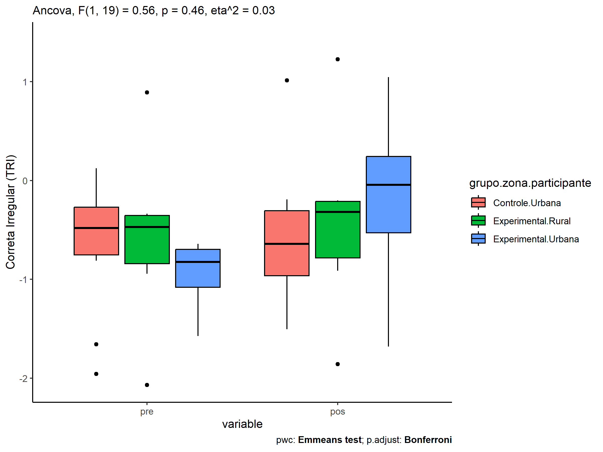<!-- -->

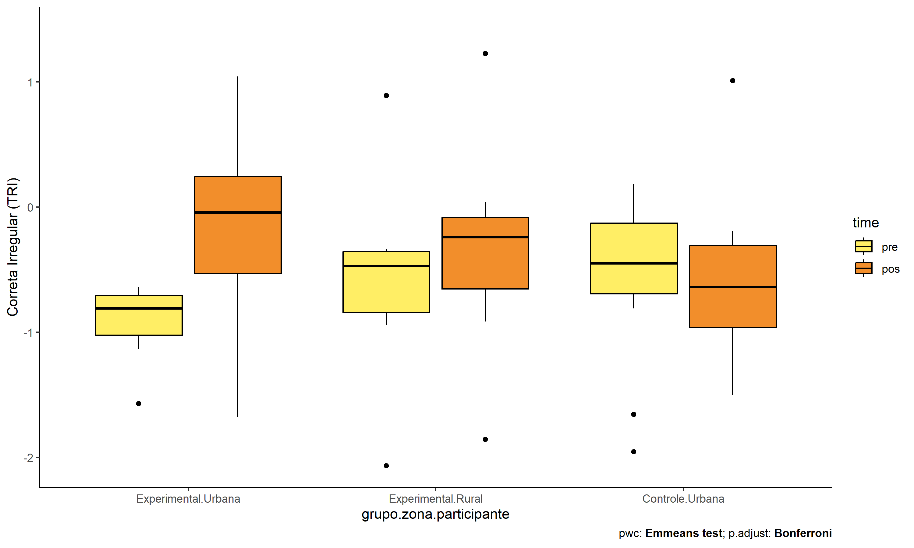<!-- -->

### Trocas Visuais (Acertos)

| var          | zona.participante | grupo        |   n | M (pre) | SE (pre) | M (unadj) | SE (unadj) | M (adj) | SE (adj) |
|:-------------|:------------------|:-------------|----:|--------:|---------:|----------:|-----------:|--------:|---------:|
| score.TV.pos | Rural             | Experimental |   7 |  15.143 |    2.721 |    16.286 |      1.584 |  15.845 |    2.093 |
| score.TV.pos | Urbana            | Controle     |  11 |  15.455 |    1.467 |    16.273 |      1.917 |  15.682 |    1.680 |
| score.TV.pos | Urbana            | Experimental |   8 |  11.750 |    2.498 |    10.375 |      2.570 |  11.573 |    2.005 |

|     | grupo        | zona.participante | group1   | group2       | estimate | conf.low | conf.high |    se | statistic |     p | p.adj | p.adj.signif |
|:----|:-------------|:------------------|:---------|:-------------|---------:|---------:|----------:|------:|----------:|------:|------:|:-------------|
| 2   | Experimental |                   | Urbana   | Rural        |   -4.273 |  -10.338 |     1.793 | 2.925 |    -1.461 | 0.158 | 0.158 | ns           |
| 4   | Experimental |                   | Urbana   | Rural        |   -3.393 |  -10.079 |     3.294 | 3.232 |    -1.050 | 0.305 | 0.305 | ns           |
| 5   |              | Urbana            | Controle | Experimental |    4.109 |   -1.395 |     9.614 | 2.654 |     1.548 | 0.136 | 0.136 | ns           |
| 7   |              | Urbana            | Controle | Experimental |    3.705 |   -2.299 |     9.708 | 2.902 |     1.277 | 0.214 | 0.214 | ns           |

| grupo        | zona.participante | group1 | group2 | estimate | conf.low | conf.high |    se | statistic |     p | p.adj | p.adj.signif |
|:-------------|:------------------|:-------|:-------|---------:|---------:|----------:|------:|----------:|------:|------:|:-------------|
| Controle     | Urbana            | pre    | pos    |   -0.818 |   -6.152 |     4.516 | 2.650 |    -0.309 | 0.759 | 0.759 | ns           |
| Experimental | Urbana            | pre    | pos    |    1.375 |   -4.880 |     7.630 | 3.107 |     0.443 | 0.660 | 0.660 | ns           |
| Experimental | Rural             | pre    | pos    |   -1.143 |   -7.829 |     5.544 | 3.322 |    -0.344 | 0.732 | 0.732 | ns           |

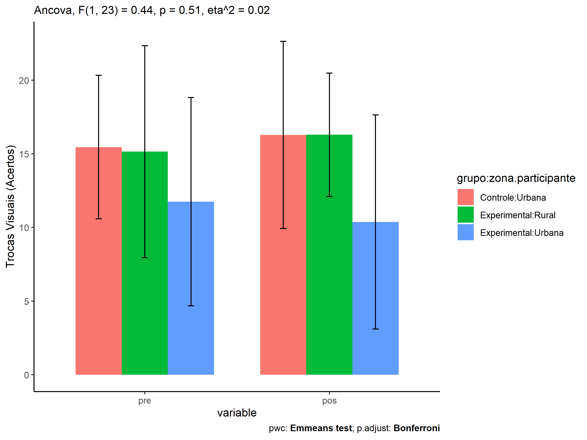<!-- -->

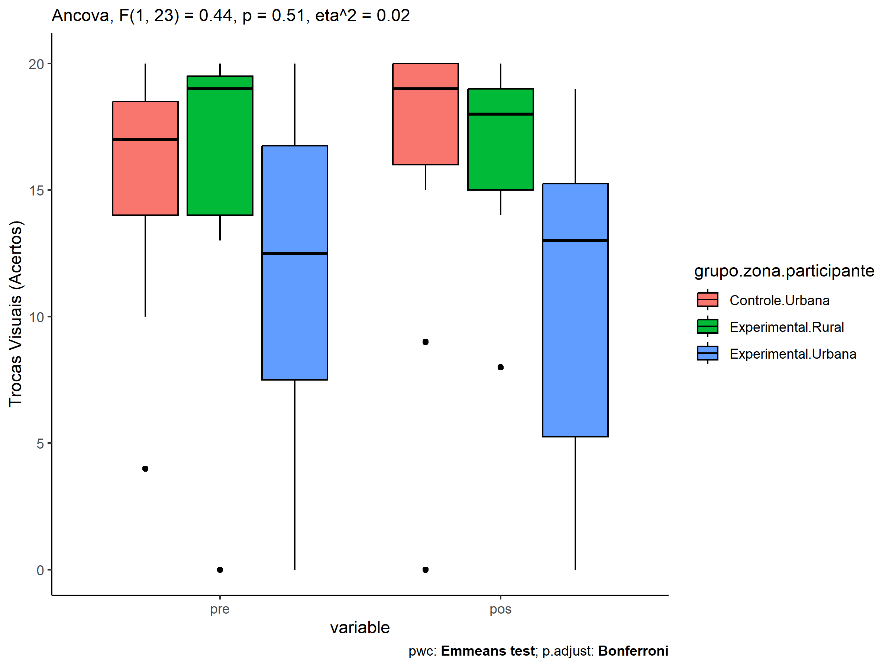<!-- -->

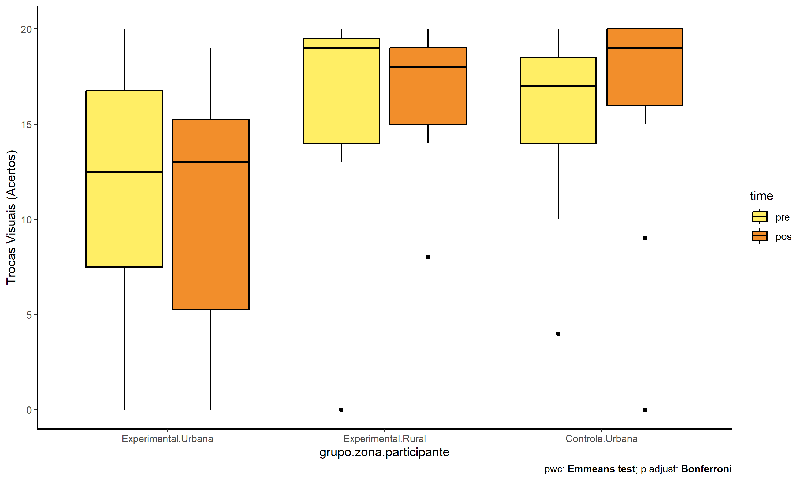<!-- -->

### Trocas Visuais (TRI)

| var        | zona.participante | grupo        |   n | M (pre) | SE (pre) | M (unadj) | SE (unadj) | M (adj) | SE (adj) |
|:-----------|:------------------|:-------------|----:|--------:|---------:|----------:|-----------:|--------:|---------:|
| tri.TV.pos | Rural             | Experimental |   6 |   0.484 |    0.273 |     0.362 |      0.221 |  -0.075 |    0.277 |
| tri.TV.pos | Urbana            | Controle     |  10 |  -0.354 |    0.319 |     0.338 |      0.287 |   0.396 |    0.194 |
| tri.TV.pos | Urbana            | Experimental |   6 |  -0.835 |    0.291 |    -0.659 |      0.300 |  -0.317 |    0.267 |

|     | grupo        | zona.participante | group1   | group2       | estimate | conf.low | conf.high |    se | statistic |     p | p.adj | p.adj.signif |
|:----|:-------------|:------------------|:---------|:-------------|---------:|---------:|----------:|------:|----------:|------:|------:|:-------------|
| 2   | Experimental |                   | Urbana   | Rural        |   -0.241 |   -1.110 |     0.627 | 0.413 |    -0.584 | 0.566 | 0.566 | ns           |
| 4   | Experimental |                   | Urbana   | Rural        |   -1.319 |   -2.354 |    -0.284 | 0.494 |    -2.668 | 0.015 | 0.015 | \*           |
| 5   |              | Urbana            | Controle | Experimental |    0.712 |    0.030 |     1.395 | 0.325 |     2.193 | 0.042 | 0.042 | \*           |
| 7   |              | Urbana            | Controle | Experimental |    0.481 |   -0.444 |     1.407 | 0.442 |     1.088 | 0.290 | 0.290 | ns           |

| grupo        | zona.participante | group1 | group2 | estimate | conf.low | conf.high |    se | statistic |     p | p.adj | p.adj.signif |
|:-------------|:------------------|:-------|:-------|---------:|---------:|----------:|------:|----------:|------:|------:|:-------------|
| Controle     | Urbana            | pre    | pos    |   -0.700 |   -1.483 |     0.083 | 0.388 |    -1.805 | 0.078 | 0.078 | ns           |
| Experimental | Urbana            | pre    | pos    |    0.082 |   -0.915 |     1.080 | 0.494 |     0.167 | 0.868 | 0.868 | ns           |
| Experimental | Rural             | pre    | pos    |    0.429 |   -0.568 |     1.426 | 0.494 |     0.869 | 0.390 | 0.390 | ns           |

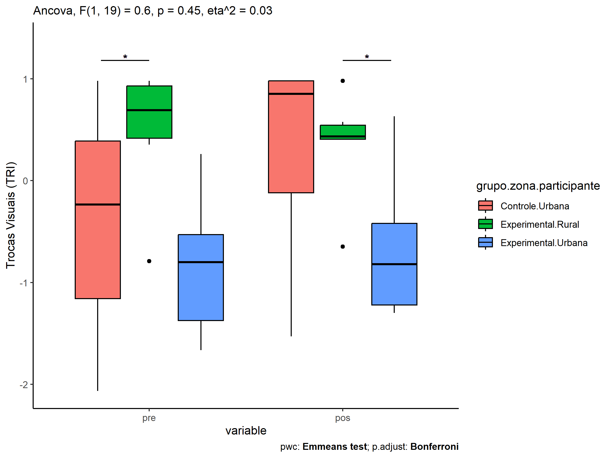<!-- -->

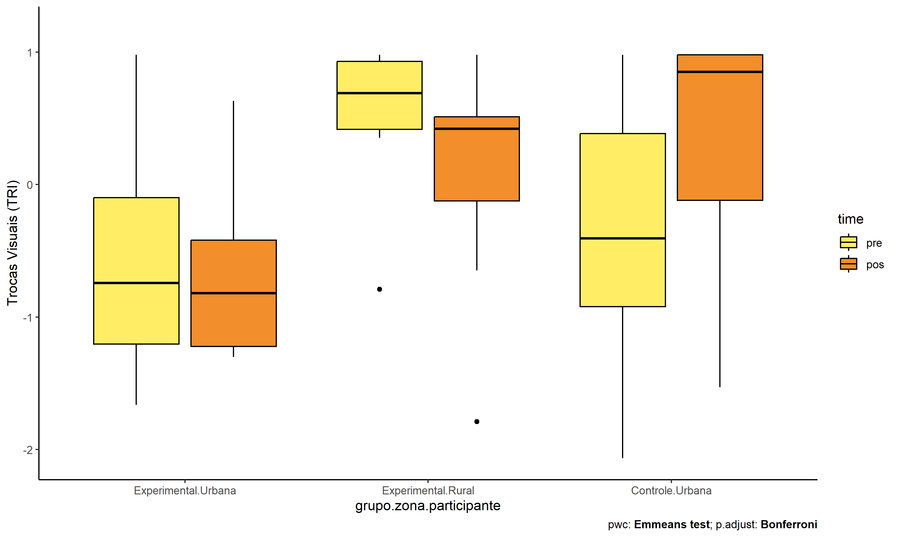<!-- -->

### Trocas Fonologicas (Acertos)

| var          | zona.participante | grupo        |   n | M (pre) | SE (pre) | M (unadj) | SE (unadj) | M (adj) | SE (adj) |
|:-------------|:------------------|:-------------|----:|--------:|---------:|----------:|-----------:|--------:|---------:|
| score.TF.pos | Rural             | Experimental |   7 |  13.286 |    2.634 |    15.857 |      0.937 |  15.723 |    2.003 |
| score.TF.pos | Urbana            | Controle     |  11 |  13.455 |    1.155 |    13.636 |      1.760 |  13.474 |    1.604 |
| score.TF.pos | Urbana            | Experimental |   8 |  10.375 |    2.412 |     9.125 |      2.142 |   9.466 |    1.910 |

|     | grupo        | zona.participante | group1   | group2       | estimate | conf.low | conf.high |    se | statistic |     p | p.adj | p.adj.signif |
|:----|:-------------|:------------------|:---------|:-------------|---------:|---------:|----------:|------:|----------:|------:|------:|:-------------|
| 2   | Experimental |                   | Urbana   | Rural        |   -6.257 |  -12.043 |    -0.471 | 2.790 |    -2.243 | 0.035 | 0.035 | \*           |
| 4   | Experimental |                   | Urbana   | Rural        |   -2.911 |   -9.081 |     3.260 | 2.983 |    -0.976 | 0.339 | 0.339 | ns           |
| 5   |              | Urbana            | Controle | Experimental |    4.009 |   -1.226 |     9.243 | 2.524 |     1.588 | 0.127 | 0.127 | ns           |
| 7   |              | Urbana            | Controle | Experimental |    3.080 |   -2.461 |     8.620 | 2.678 |     1.150 | 0.262 | 0.262 | ns           |

| grupo        | zona.participante | group1 | group2 | estimate | conf.low | conf.high |    se | statistic |     p | p.adj | p.adj.signif |
|:-------------|:------------------|:-------|:-------|---------:|---------:|----------:|------:|----------:|------:|------:|:-------------|
| Controle     | Urbana            | pre    | pos    |   -0.182 |   -4.914 |     4.550 | 2.351 |    -0.077 | 0.939 | 0.939 | ns           |
| Experimental | Urbana            | pre    | pos    |    1.250 |   -4.299 |     6.799 | 2.757 |     0.453 | 0.652 | 0.652 | ns           |
| Experimental | Rural             | pre    | pos    |   -2.571 |   -8.504 |     3.361 | 2.947 |    -0.873 | 0.387 | 0.387 | ns           |

<!-- -->

<!-- -->

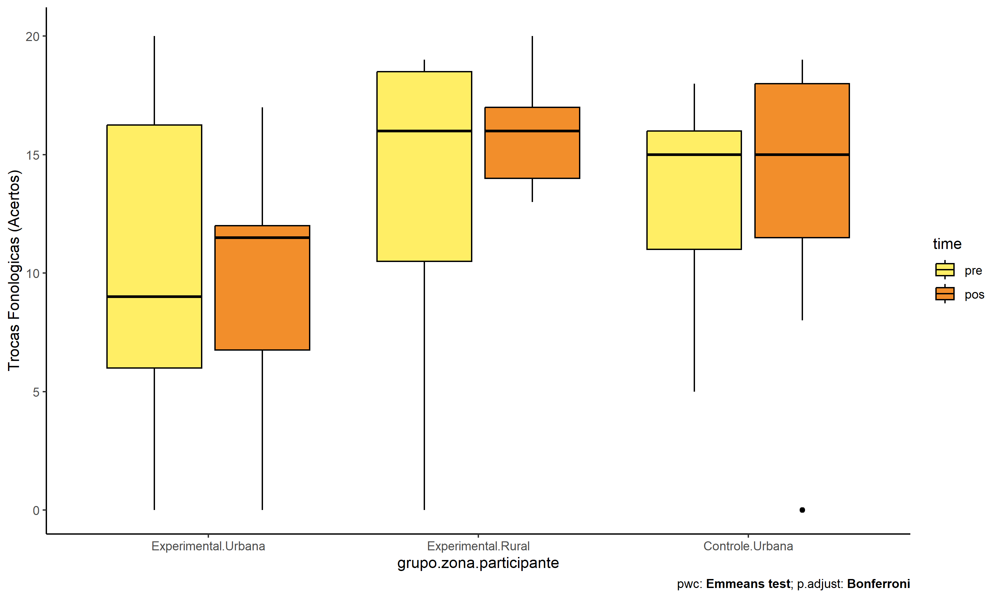<!-- -->

### Trocas Fonologicas (TRI)

| var        | zona.participante | grupo        |   n | M (pre) | SE (pre) | M (unadj) | SE (unadj) | M (adj) | SE (adj) |
|:-----------|:------------------|:-------------|----:|--------:|---------:|----------:|-----------:|--------:|---------:|
| tri.TF.pos | Rural             | Experimental |   6 |   0.108 |    0.338 |     0.310 |      0.225 |  -0.018 |    0.262 |
| tri.TF.pos | Urbana            | Controle     |  10 |  -0.609 |    0.180 |    -0.198 |      0.267 |  -0.129 |    0.185 |
| tri.TF.pos | Urbana            | Experimental |   6 |  -0.873 |    0.315 |    -0.563 |      0.178 |  -0.349 |    0.248 |

|     | grupo        | zona.participante | group1   | group2       | estimate | conf.low | conf.high |    se | statistic |     p | p.adj | p.adj.signif |
|:----|:-------------|:------------------|:---------|:-------------|---------:|---------:|----------:|------:|----------:|------:|------:|:-------------|
| 2   | Experimental |                   | Urbana   | Rural        |   -0.331 |   -1.136 |     0.474 | 0.383 |    -0.864 | 0.399 | 0.399 | ns           |
| 4   | Experimental |                   | Urbana   | Rural        |   -0.981 |   -1.827 |    -0.135 | 0.404 |    -2.426 | 0.025 | 0.025 | \*           |
| 5   |              | Urbana            | Controle | Experimental |    0.220 |   -0.418 |     0.858 | 0.304 |     0.723 | 0.479 | 0.479 | ns           |
| 7   |              | Urbana            | Controle | Experimental |    0.264 |   -0.493 |     1.021 | 0.362 |     0.730 | 0.474 | 0.474 | ns           |

| grupo        | zona.participante | group1 | group2 | estimate | conf.low | conf.high |    se | statistic |     p | p.adj | p.adj.signif |
|:-------------|:------------------|:-------|:-------|---------:|---------:|----------:|------:|----------:|------:|------:|:-------------|
| Controle     | Urbana            | pre    | pos    |   -0.286 |   -0.968 |     0.396 | 0.338 |    -0.847 | 0.402 | 0.402 | ns           |
| Experimental | Urbana            | pre    | pos    |   -0.009 |   -0.878 |     0.859 | 0.430 |    -0.021 | 0.983 | 0.983 | ns           |
| Experimental | Rural             | pre    | pos    |   -0.068 |   -0.937 |     0.800 | 0.430 |    -0.158 | 0.875 | 0.875 | ns           |

<!-- -->

<!-- -->

### Trocas Orograficas (Acertos)

| var          | zona.participante | grupo        |   n | M (pre) | SE (pre) | M (unadj) | SE (unadj) | M (adj) | SE (adj) |
|:-------------|:------------------|:-------------|----:|--------:|---------:|----------:|-----------:|--------:|---------:|
| score.TO.pos | Rural             | Experimental |   7 |   8.143 |    1.933 |     8.714 |      1.948 |   8.921 |    1.592 |
| score.TO.pos | Urbana            | Controle     |  11 |   9.455 |    1.358 |     8.909 |      1.217 |   8.768 |    1.269 |
| score.TO.pos | Urbana            | Experimental |   8 |   8.875 |    1.726 |     5.625 |      1.349 |   5.638 |    1.483 |

|     | grupo        | zona.participante | group1   | group2       | estimate | conf.low | conf.high |    se | statistic |     p | p.adj | p.adj.signif |
|:----|:-------------|:------------------|:---------|:-------------|---------:|---------:|----------:|------:|----------:|------:|------:|:-------------|
| 2   | Experimental |                   | Urbana   | Rural        |   -3.283 |   -7.795 |     1.229 | 2.176 |    -1.509 | 0.146 | 0.146 | ns           |
| 4   | Experimental |                   | Urbana   | Rural        |    0.732 |   -4.390 |     5.854 | 2.476 |     0.296 | 0.770 | 0.770 | ns           |
| 5   |              | Urbana            | Controle | Experimental |    3.131 |   -0.919 |     7.180 | 1.953 |     1.603 | 0.123 | 0.123 | ns           |
| 7   |              | Urbana            | Controle | Experimental |    0.580 |   -4.019 |     5.178 | 2.223 |     0.261 | 0.797 | 0.797 | ns           |

| grupo        | zona.participante | group1 | group2 | estimate | conf.low | conf.high |    se | statistic |     p | p.adj | p.adj.signif |
|:-------------|:------------------|:-------|:-------|---------:|---------:|----------:|------:|----------:|------:|------:|:-------------|
| Controle     | Urbana            | pre    | pos    |    0.545 |   -3.356 |     4.447 | 1.938 |     0.281 | 0.780 | 0.780 | ns           |
| Experimental | Urbana            | pre    | pos    |    3.250 |   -1.325 |     7.825 | 2.273 |     1.430 | 0.160 | 0.160 | ns           |
| Experimental | Rural             | pre    | pos    |   -0.571 |   -5.463 |     4.320 | 2.430 |    -0.235 | 0.815 | 0.815 | ns           |

<!-- -->

<!-- -->

<!-- -->

### Trocas Orograficas (TRI)

| var        | zona.participante | grupo        |   n | M (pre) | SE (pre) | M (unadj) | SE (unadj) | M (adj) | SE (adj) |
|:-----------|:------------------|:-------------|----:|--------:|---------:|----------:|-----------:|--------:|---------:|
| tri.TO.pos | Rural             | Experimental |   6 |  -0.308 |    0.357 |    -0.511 |      0.521 |  -0.506 |    0.288 |
| tri.TO.pos | Urbana            | Controle     |  10 |  -0.481 |    0.261 |    -0.311 |      0.204 |  -0.200 |    0.226 |
| tri.TO.pos | Urbana            | Experimental |   6 |   0.011 |    0.287 |    -0.555 |      0.241 |  -0.745 |    0.294 |

|     | grupo        | zona.participante | group1   | group2       | estimate | conf.low | conf.high |    se | statistic |     p | p.adj | p.adj.signif |
|:----|:-------------|:------------------|:---------|:-------------|---------:|---------:|----------:|------:|----------:|------:|------:|:-------------|
| 2   | Experimental |                   | Urbana   | Rural        |   -0.240 |   -1.105 |     0.625 | 0.412 |    -0.582 | 0.568 | 0.568 | ns           |
| 4   | Experimental |                   | Urbana   | Rural        |    0.319 |   -0.658 |     1.296 | 0.467 |     0.683 | 0.503 | 0.503 | ns           |
| 5   |              | Urbana            | Controle | Experimental |    0.546 |   -0.246 |     1.337 | 0.377 |     1.448 | 0.165 | 0.165 | ns           |
| 7   |              | Urbana            | Controle | Experimental |   -0.491 |   -1.365 |     0.383 | 0.418 |    -1.176 | 0.254 | 0.254 | ns           |

| grupo        | zona.participante | group1 | group2 | estimate | conf.low | conf.high |    se | statistic |     p | p.adj | p.adj.signif |
|:-------------|:------------------|:-------|:-------|---------:|---------:|----------:|------:|----------:|------:|------:|:-------------|
| Controle     | Urbana            | pre    | pos    |   -0.008 |   -0.770 |     0.754 | 0.377 |    -0.020 | 0.984 | 0.984 | ns           |
| Experimental | Urbana            | pre    | pos    |    0.383 |   -0.587 |     1.353 | 0.480 |     0.797 | 0.430 | 0.430 | ns           |
| Experimental | Rural             | pre    | pos    |    0.127 |   -0.844 |     1.097 | 0.480 |     0.264 | 0.793 | 0.793 | ns           |

<!-- -->

<!-- -->

## factores: **escola:grupo**

### Leitura de Pseudo-Palavras (Acertos)

| var            | escola | grupo        |   n | M (pre) | SE (pre) | M (unadj) | SE (unadj) | M (adj) | SE (adj) |
|:---------------|:-------|:-------------|----:|--------:|---------:|----------:|-----------:|--------:|---------:|
| score.CLPP.pos | E1     | Controle     |   6 |  64.333 |    3.211 |    70.667 |      2.906 |  68.714 |    3.159 |
| score.CLPP.pos | E4     | Experimental |   6 |  67.333 |    6.702 |    70.667 |      3.904 |  67.422 |    3.268 |
| score.CLPP.pos | E5     | Controle     |   6 |  60.500 |    3.128 |    59.833 |      3.673 |  59.532 |    3.096 |
| score.CLPP.pos | E5     | Experimental |   7 |  48.857 |    4.862 |    52.714 |      3.714 |  57.427 |    3.247 |

|     | grupo        | escola | group1   | group2       | estimate | conf.low | conf.high |    se | statistic |     p | p.adj | p.adj.signif |
|:----|:-------------|:-------|:---------|:-------------|---------:|---------:|----------:|------:|----------:|------:|------:|:-------------|
| 2   | Controle     |        | E1       | E5           |    9.182 |   -0.014 |    18.379 | 4.409 |     2.083 | 0.050 | 0.050 | ns           |
| 6   | Experimental |        | E4       | E5           |    9.995 |   -0.319 |    20.308 | 4.944 |     2.021 | 0.057 | 0.057 | ns           |
| 8   | Controle     |        | E1       | E5           |    3.833 |  -10.380 |    18.047 | 6.835 |     0.561 | 0.581 | 0.581 | ns           |
| 12  | Experimental |        | E4       | E5           |   18.476 |    4.779 |    32.173 | 6.586 |     2.805 | 0.011 | 0.011 | \*           |
| 15  |              | E5     | Controle | Experimental |    2.105 |   -7.324 |    11.533 | 4.520 |     0.466 | 0.647 | 0.647 | ns           |
| 18  |              | E5     | Controle | Experimental |   11.643 |   -2.054 |    25.340 | 6.586 |     1.768 | 0.092 | 0.092 | ns           |

| grupo        | escola | group1 | group2 | estimate | conf.low | conf.high |    se | statistic |     p | p.adj | p.adj.signif |
|:-------------|:-------|:-------|:-------|---------:|---------:|----------:|------:|----------:|------:|------:|:-------------|
| Controle     | E1     | pre    | pos    |   -4.381 |  -16.669 |     7.907 | 6.101 |    -0.718 | 0.476 | 0.476 | ns           |
| Controle     | E5     | pre    | pos    |    0.667 |  -12.085 |    13.418 | 6.331 |     0.105 | 0.917 | 0.917 | ns           |
| Experimental | E4     | pre    | pos    |   -3.333 |  -16.085 |     9.418 | 6.331 |    -0.526 | 0.601 | 0.601 | ns           |
| Experimental | E5     | pre    | pos    |   -1.750 |  -12.793 |     9.293 | 5.483 |    -0.319 | 0.751 | 0.751 | ns           |

    ## Scale for colour is already present.
    ## Adding another scale for colour, which will replace the existing scale.

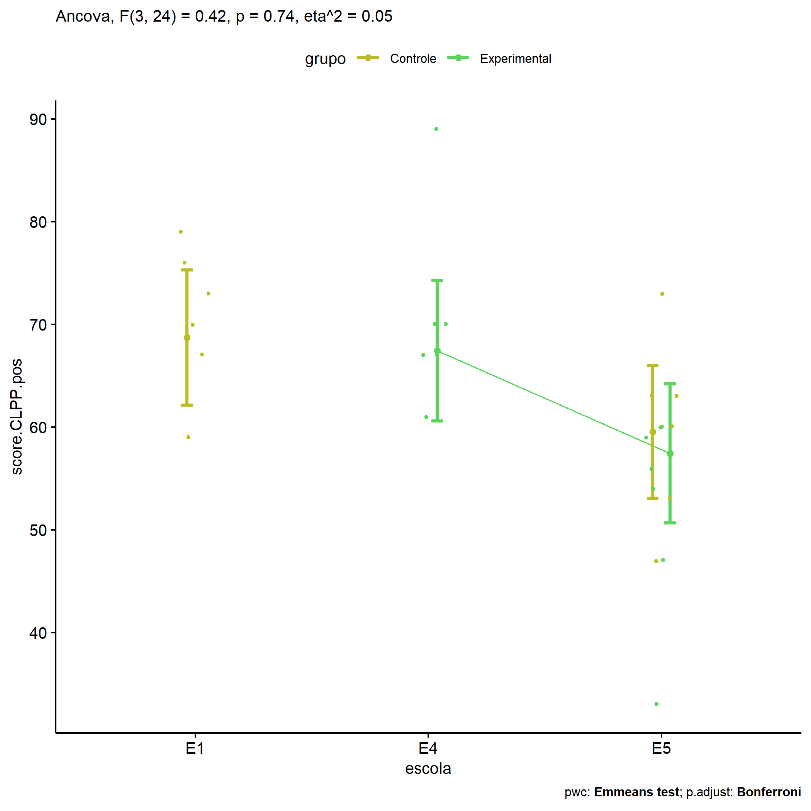<!-- -->

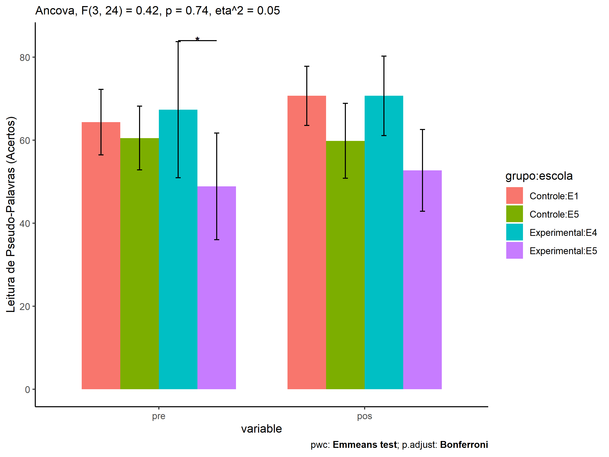<!-- -->

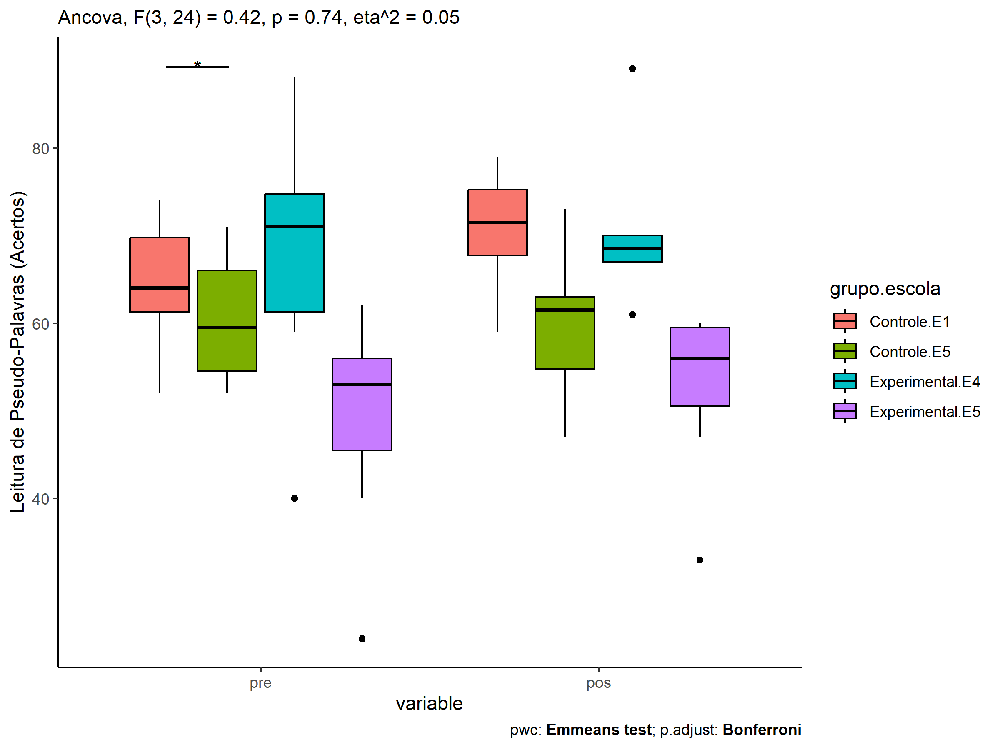<!-- -->

<!-- -->

### Leitura de Pseudo-Palavras (TRI)

| var          | escola | grupo        |   n | M (pre) | SE (pre) | M (unadj) | SE (unadj) | M (adj) | SE (adj) |
|:-------------|:-------|:-------------|----:|--------:|---------:|----------:|-----------:|--------:|---------:|
| tri.CLPP.pos | E1     | Controle     |   6 |  64.333 |    3.211 |    70.667 |      2.906 |  68.714 |    3.159 |
| tri.CLPP.pos | E4     | Experimental |   6 |  67.333 |    6.702 |    70.667 |      3.904 |  67.422 |    3.268 |
| tri.CLPP.pos | E5     | Controle     |   6 |  60.500 |    3.128 |    59.833 |      3.673 |  59.532 |    3.096 |
| tri.CLPP.pos | E5     | Experimental |   7 |  48.857 |    4.862 |    52.714 |      3.714 |  57.427 |    3.247 |

|     | grupo        | escola | group1   | group2       | estimate | conf.low | conf.high |    se | statistic |     p | p.adj | p.adj.signif |
|:----|:-------------|:-------|:---------|:-------------|---------:|---------:|----------:|------:|----------:|------:|------:|:-------------|
| 2   | Controle     |        | E1       | E5           |    9.182 |   -0.014 |    18.379 | 4.409 |     2.083 | 0.050 | 0.050 | ns           |
| 6   | Experimental |        | E4       | E5           |    9.995 |   -0.319 |    20.308 | 4.944 |     2.021 | 0.057 | 0.057 | ns           |
| 8   | Controle     |        | E1       | E5           |    3.833 |  -10.380 |    18.047 | 6.835 |     0.561 | 0.581 | 0.581 | ns           |
| 12  | Experimental |        | E4       | E5           |   18.476 |    4.779 |    32.173 | 6.586 |     2.805 | 0.011 | 0.011 | \*           |
| 15  |              | E5     | Controle | Experimental |    2.105 |   -7.324 |    11.533 | 4.520 |     0.466 | 0.647 | 0.647 | ns           |
| 18  |              | E5     | Controle | Experimental |   11.643 |   -2.054 |    25.340 | 6.586 |     1.768 | 0.092 | 0.092 | ns           |

| grupo        | escola | group1 | group2 | estimate | conf.low | conf.high |    se | statistic |     p | p.adj | p.adj.signif |
|:-------------|:-------|:-------|:-------|---------:|---------:|----------:|------:|----------:|------:|------:|:-------------|
| Controle     | E1     | pre    | pos    |   -0.308 |   -1.253 |     0.637 | 0.469 |    -0.656 | 0.515 | 0.515 | ns           |
| Controle     | E5     | pre    | pos    |   -0.420 |   -1.400 |     0.560 | 0.487 |    -0.863 | 0.393 | 0.393 | ns           |
| Experimental | E4     | pre    | pos    |   -0.528 |   -1.508 |     0.453 | 0.487 |    -1.084 | 0.284 | 0.284 | ns           |
| Experimental | E5     | pre    | pos    |    0.127 |   -0.722 |     0.976 | 0.422 |     0.302 | 0.764 | 0.764 | ns           |

    ## Scale for colour is already present.
    ## Adding another scale for colour, which will replace the existing scale.

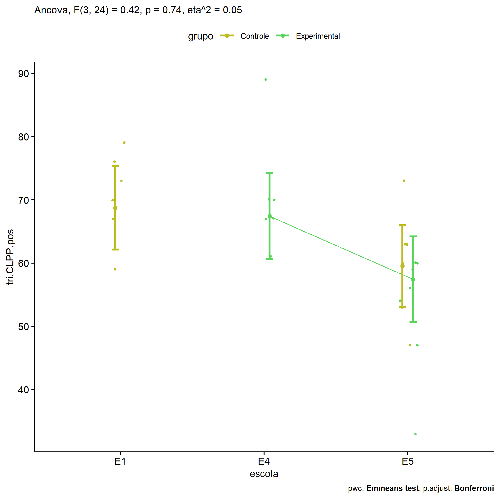<!-- -->

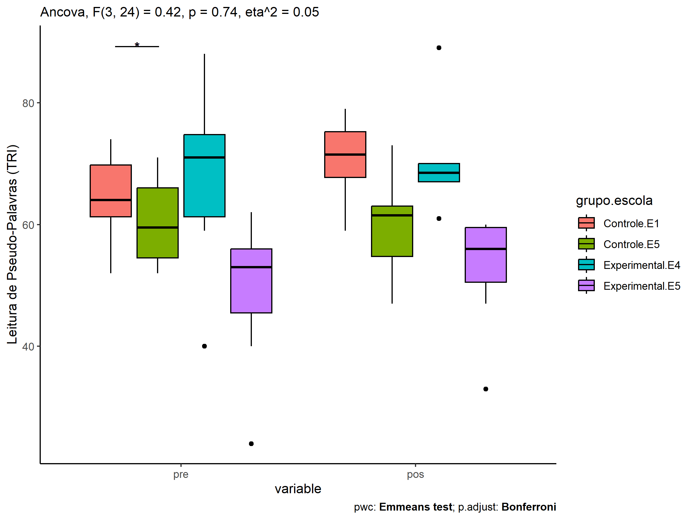<!-- -->

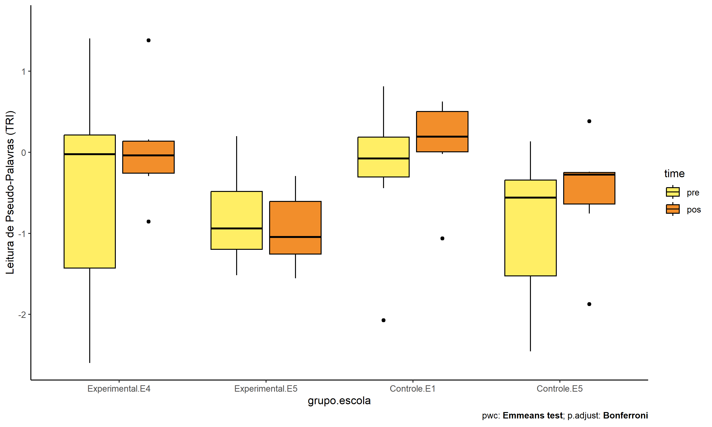<!-- -->

### Correta Regular (Acertos)

| var          | escola | grupo        |   n | M (pre) | SE (pre) | M (unadj) | SE (unadj) | M (adj) | SE (adj) |
|:-------------|:-------|:-------------|----:|--------:|---------:|----------:|-----------:|--------:|---------:|
| score.CR.pos | E1     | Controle     |   7 |  13.857 |    0.738 |    13.143 |      2.375 |  13.187 |    1.832 |
| score.CR.pos | E4     | Experimental |   6 |  15.000 |    1.265 |    16.167 |      0.543 |  16.241 |    2.038 |
| score.CR.pos | E5     | Controle     |   6 |  13.833 |    1.222 |    13.500 |      1.088 |  13.544 |    1.971 |
| score.CR.pos | E5     | Experimental |  10 |   8.300 |    1.892 |     8.400 |      1.694 |   8.298 |    1.737 |

|     | grupo        | escola | group1   | group2       | estimate | conf.low | conf.high |    se | statistic |     p | p.adj | p.adj.signif |
|:----|:-------------|:-------|:---------|:-------------|---------:|---------:|----------:|------:|----------:|------:|------:|:-------------|
| 2   | Controle     |        | E1       | E5           |   -0.357 |   -5.800 |     5.087 | 2.637 |    -0.135 | 0.894 | 0.894 | ns           |
| 6   | Experimental |        | E4       | E5           |    7.944 |    1.999 |    13.888 | 2.880 |     2.758 | 0.011 | 0.011 | \*           |
| 8   | Controle     |        | E1       | E5           |    0.024 |   -4.771 |     4.819 | 2.328 |     0.010 | 0.992 | 0.992 | ns           |
| 12  | Experimental |        | E4       | E5           |    6.700 |    2.249 |    11.151 | 2.161 |     3.100 | 0.005 | 0.005 | \*\*         |
| 15  |              | E5     | Controle | Experimental |    5.246 |   -0.430 |    10.922 | 2.750 |     1.908 | 0.068 | 0.068 | ns           |
| 18  |              | E5     | Controle | Experimental |    5.533 |    1.083 |     9.984 | 2.161 |     2.561 | 0.017 | 0.017 | \*           |

| grupo        | escola | group1 | group2 | estimate | conf.low | conf.high |    se | statistic |     p | p.adj | p.adj.signif |
|:-------------|:-------|:-------|:-------|---------:|---------:|----------:|------:|----------:|------:|------:|:-------------|
| Controle     | E1     | pre    | pos    |    0.714 |   -4.032 |     5.461 | 2.363 |     0.302 | 0.764 | 0.764 | ns           |
| Controle     | E5     | pre    | pos    |    0.333 |   -4.794 |     5.460 | 2.553 |     0.131 | 0.897 | 0.897 | ns           |
| Experimental | E4     | pre    | pos    |   -1.167 |   -6.294 |     3.960 | 2.553 |    -0.457 | 0.650 | 0.650 | ns           |
| Experimental | E5     | pre    | pos    |   -0.100 |   -4.071 |     3.871 | 1.977 |    -0.051 | 0.960 | 0.960 | ns           |

    ## Scale for colour is already present.
    ## Adding another scale for colour, which will replace the existing scale.

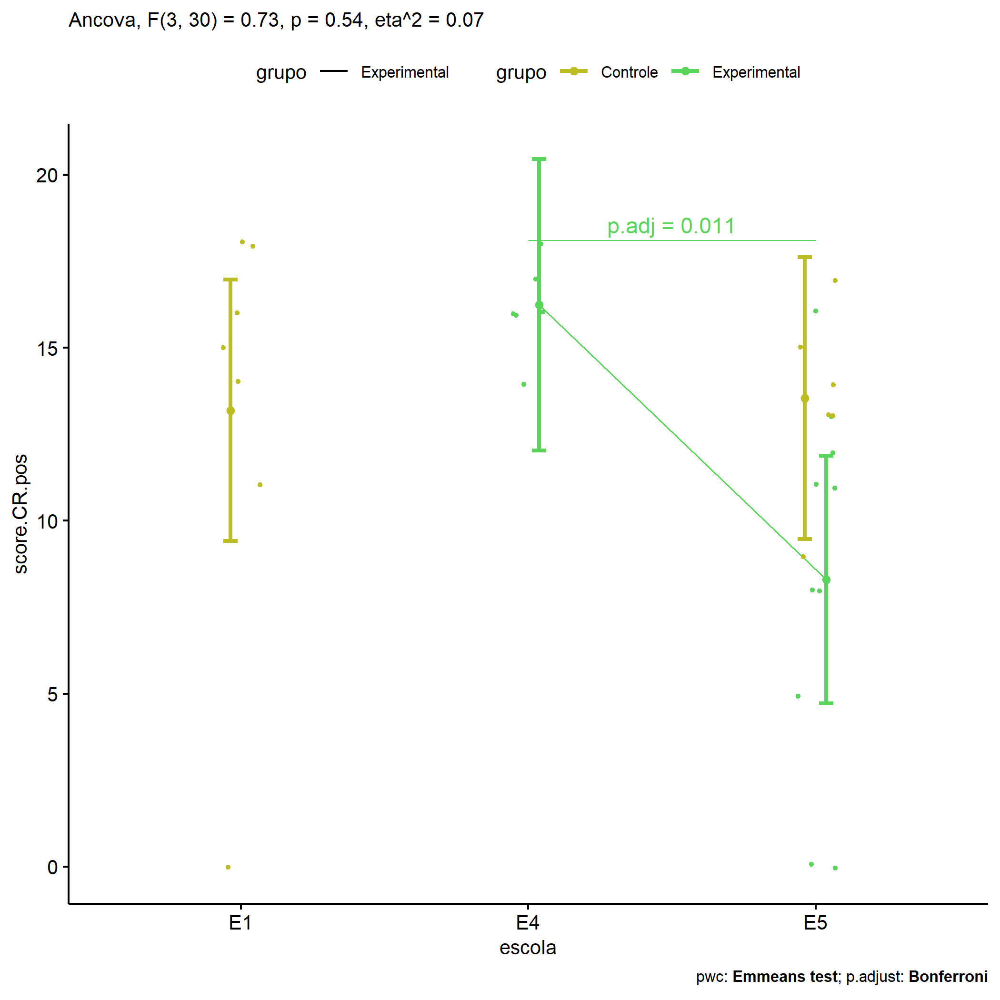<!-- -->

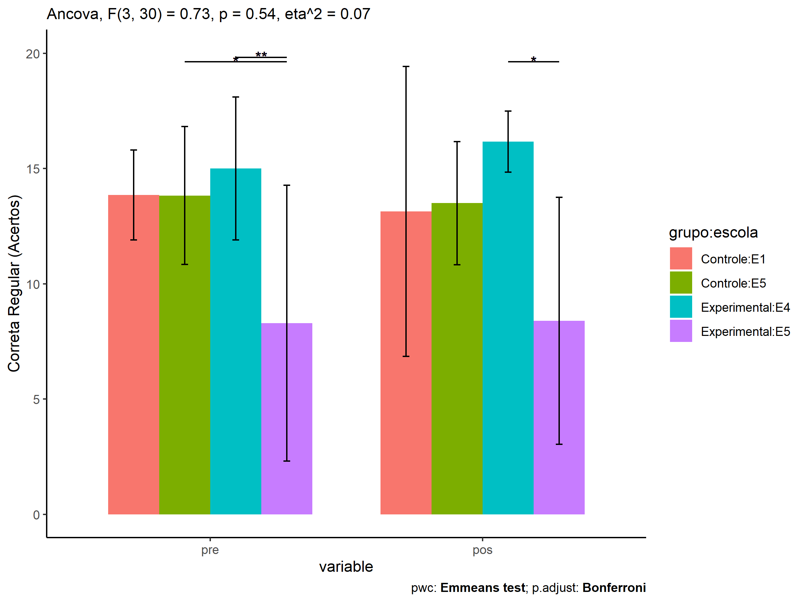<!-- -->

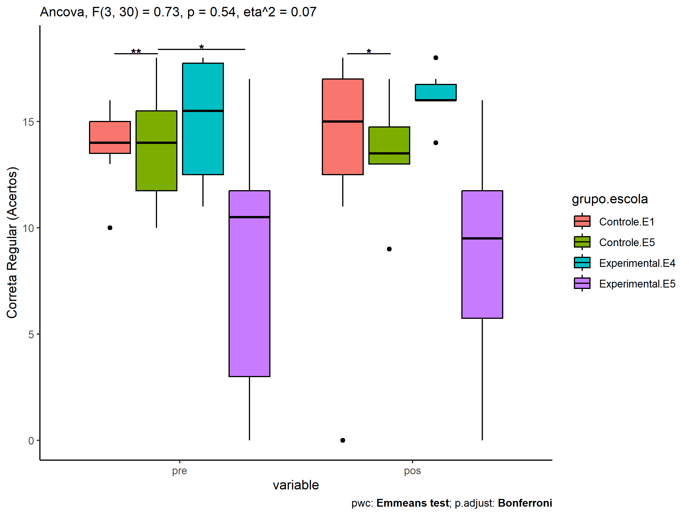<!-- -->

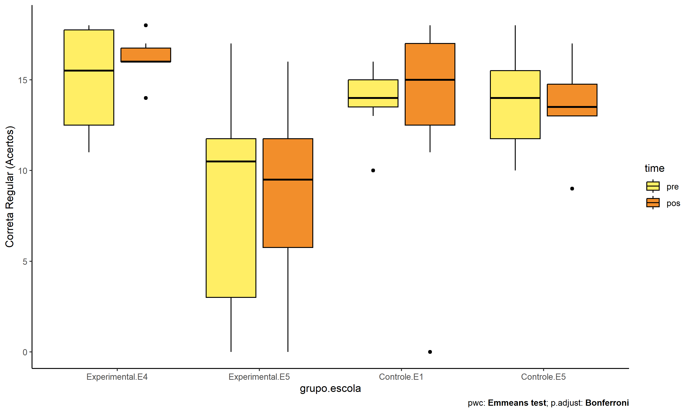<!-- -->

### Correta Regular (TRI)

| var        | escola | grupo        |   n | M (pre) | SE (pre) | M (unadj) | SE (unadj) | M (adj) | SE (adj) |
|:-----------|:-------|:-------------|----:|--------:|---------:|----------:|-----------:|--------:|---------:|
| tri.CR.pos | E1     | Controle     |   6 |  -0.412 |    0.251 |     0.221 |      0.321 |   0.190 |    0.234 |
| tri.CR.pos | E4     | Experimental |   6 |  -0.043 |    0.380 |     0.231 |      0.161 |   0.126 |    0.250 |
| tri.CR.pos | E5     | Controle     |   6 |  -0.572 |    0.349 |    -0.532 |      0.179 |  -0.530 |    0.233 |
| tri.CR.pos | E5     | Experimental |   7 |  -1.126 |    0.108 |    -0.823 |      0.223 |  -0.709 |    0.237 |

|     | grupo        | escola | group1   | group2       | estimate | conf.low | conf.high |    se | statistic |     p | p.adj | p.adj.signif |
|:----|:-------------|:-------|:---------|:-------------|---------:|---------:|----------:|------:|----------:|------:|------:|:-------------|
| 2   | Controle     |        | E1       | E5           |    0.721 |    0.032 |     1.410 | 0.330 |     2.182 | 0.041 | 0.041 | \*           |
| 6   | Experimental |        | E4       | E5           |    0.835 |    0.062 |     1.608 | 0.371 |     2.253 | 0.036 | 0.036 | \*           |
| 8   | Controle     |        | E1       | E5           |    0.160 |   -0.684 |     1.004 | 0.406 |     0.394 | 0.697 | 0.697 | ns           |
| 12  | Experimental |        | E4       | E5           |    1.083 |    0.270 |     1.896 | 0.391 |     2.771 | 0.011 | 0.011 | \*           |
| 15  |              | E5     | Controle | Experimental |    0.179 |   -0.513 |     0.871 | 0.332 |     0.539 | 0.596 | 0.596 | ns           |
| 18  |              | E5     | Controle | Experimental |    0.554 |   -0.258 |     1.367 | 0.391 |     1.418 | 0.171 | 0.171 | ns           |

| grupo        | escola | group1 | group2 | estimate | conf.low | conf.high |    se | statistic |     p | p.adj | p.adj.signif |
|:-------------|:-------|:-------|:-------|---------:|---------:|----------:|------:|----------:|------:|------:|:-------------|
| Controle     | E1     | pre    | pos    |   -0.574 |   -1.331 |     0.182 | 0.376 |    -1.529 | 0.133 | 0.133 | ns           |
| Controle     | E5     | pre    | pos    |   -0.040 |   -0.825 |     0.745 | 0.390 |    -0.102 | 0.919 | 0.919 | ns           |
| Experimental | E4     | pre    | pos    |   -0.274 |   -1.059 |     0.511 | 0.390 |    -0.703 | 0.486 | 0.486 | ns           |
| Experimental | E5     | pre    | pos    |   -0.028 |   -0.708 |     0.652 | 0.337 |    -0.083 | 0.934 | 0.934 | ns           |

    ## Scale for colour is already present.
    ## Adding another scale for colour, which will replace the existing scale.

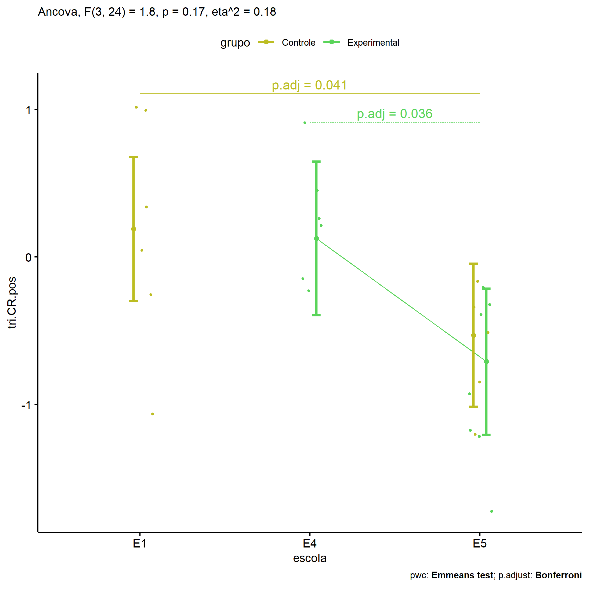<!-- -->

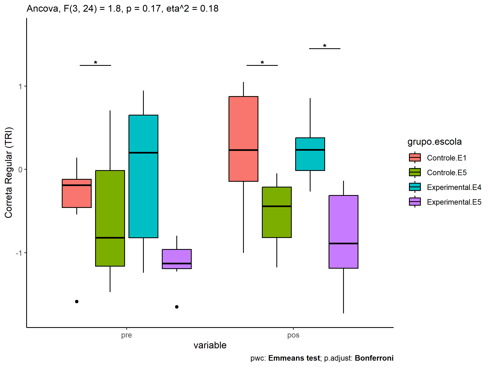<!-- -->

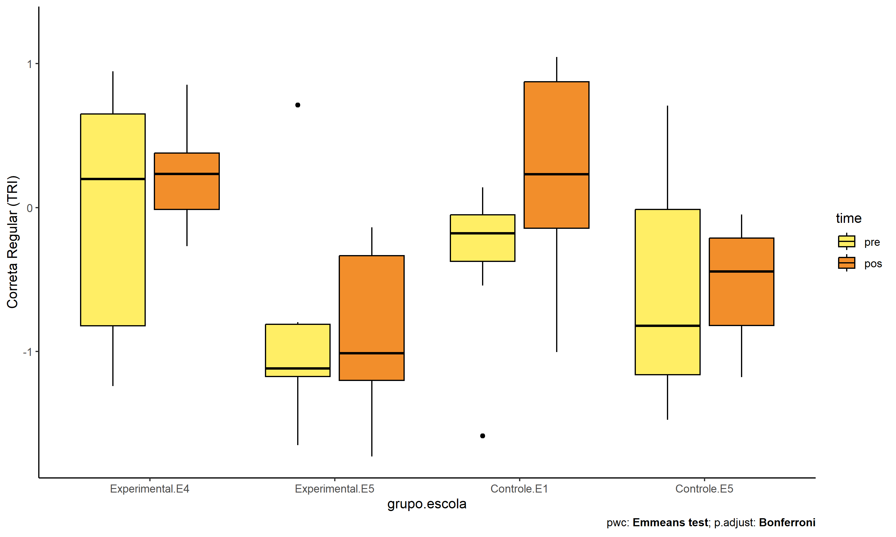<!-- -->

### Correta Irregular (Acertos)

| var          | escola | grupo        |   n | M (pre) | SE (pre) | M (unadj) | SE (unadj) | M (adj) | SE (adj) |
|:-------------|:-------|:-------------|----:|--------:|---------:|----------:|-----------:|--------:|---------:|
| score.CI.pos | E1     | Controle     |   7 |  11.143 |    0.553 |     9.000 |      1.927 |   8.298 |    1.781 |
| score.CI.pos | E4     | Experimental |   6 |  10.500 |    1.335 |    13.500 |      1.176 |  12.961 |    1.837 |
| score.CI.pos | E5     | Controle     |   6 |   7.500 |    1.118 |     7.167 |      0.601 |   7.390 |    1.761 |
| score.CI.pos | E5     | Experimental |  10 |   5.700 |    1.265 |     7.000 |      1.653 |   7.681 |    1.535 |

|     | grupo        | escola | group1   | group2       | estimate | conf.low | conf.high |    se | statistic |     p | p.adj | p.adj.signif |
|:----|:-------------|:-------|:---------|:-------------|---------:|---------:|----------:|------:|----------:|------:|------:|:-------------|
| 2   | Controle     |        | E1       | E5           |    0.908 |   -4.407 |     6.222 | 2.575 |     0.353 | 0.728 | 0.728 | ns           |
| 6   | Experimental |        | E4       | E5           |    5.280 |   -0.009 |    10.570 | 2.563 |     2.061 | 0.050 | 0.050 | ns           |
| 8   | Controle     |        | E1       | E5           |    3.643 |    0.034 |     7.251 | 1.752 |     2.079 | 0.048 | 0.048 | \*           |
| 12  | Experimental |        | E4       | E5           |    4.800 |    1.451 |     8.149 | 1.626 |     2.951 | 0.007 | 0.007 | \*\*         |
| 15  |              | E5     | Controle | Experimental |   -0.291 |   -4.956 |     4.374 | 2.260 |    -0.129 | 0.899 | 0.899 | ns           |
| 18  |              | E5     | Controle | Experimental |    1.800 |   -1.549 |     5.149 | 1.626 |     1.107 | 0.279 | 0.279 | ns           |

| grupo        | escola | group1 | group2 | estimate | conf.low | conf.high |    se | statistic |     p | p.adj | p.adj.signif |
|:-------------|:-------|:-------|:-------|---------:|---------:|----------:|------:|----------:|------:|------:|:-------------|
| Controle     | E1     | pre    | pos    |    2.143 |   -1.881 |     6.167 | 2.003 |     1.070 | 0.290 | 0.290 | ns           |
| Controle     | E5     | pre    | pos    |    0.333 |   -4.013 |     4.679 | 2.164 |     0.154 | 0.878 | 0.878 | ns           |
| Experimental | E4     | pre    | pos    |   -3.000 |   -7.346 |     1.346 | 2.164 |    -1.386 | 0.172 | 0.172 | ns           |
| Experimental | E5     | pre    | pos    |   -1.300 |   -4.666 |     2.066 | 1.676 |    -0.776 | 0.442 | 0.442 | ns           |

    ## Scale for colour is already present.
    ## Adding another scale for colour, which will replace the existing scale.

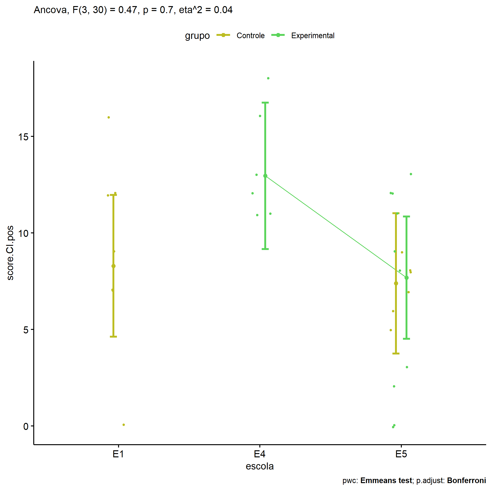<!-- -->

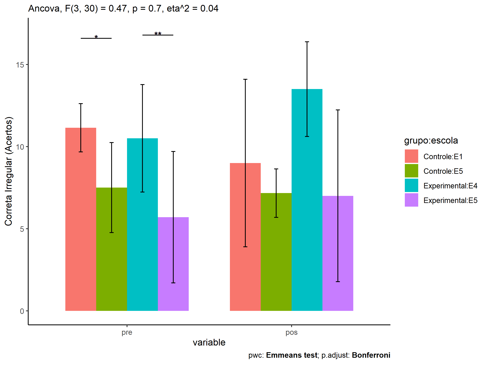<!-- -->

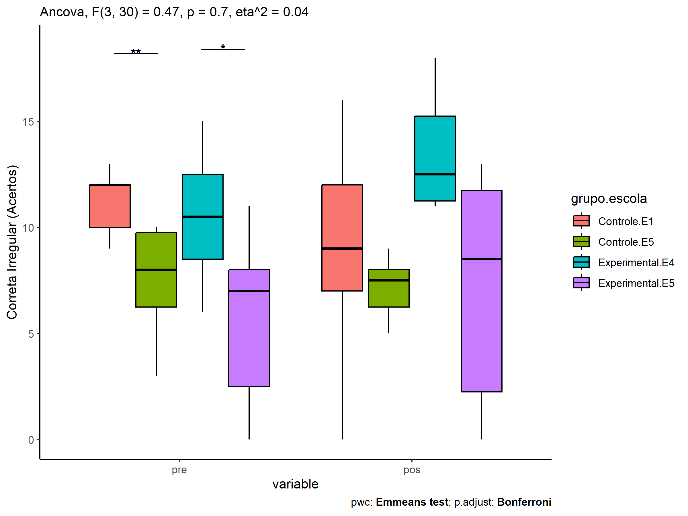<!-- -->

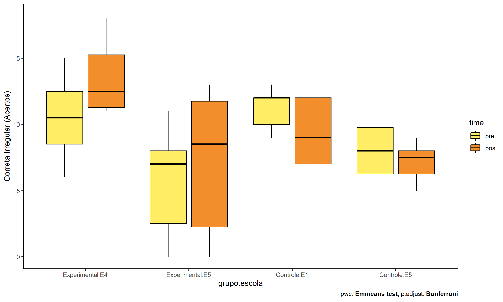<!-- -->

### Correta Irregular (TRI)

| var        | escola | grupo        |   n | M (pre) | SE (pre) | M (unadj) | SE (unadj) | M (adj) | SE (adj) |
|:-----------|:-------|:-------------|----:|--------:|---------:|----------:|-----------:|--------:|---------:|
| tri.CI.pos | E1     | Controle     |   6 |  -0.435 |    0.115 |    -0.306 |      0.295 |  -0.545 |    0.234 |
| tri.CI.pos | E4     | Experimental |   6 |  -0.507 |    0.326 |     0.276 |      0.288 |   0.086 |    0.230 |
| tri.CI.pos | E5     | Controle     |   6 |  -1.200 |    0.242 |    -1.087 |      0.182 |  -0.799 |    0.239 |
| tri.CI.pos | E5     | Experimental |   7 |  -0.959 |    0.206 |    -0.883 |      0.278 |  -0.762 |    0.210 |

|     | grupo        | escola | group1   | group2       | estimate | conf.low | conf.high |    se | statistic |     p | p.adj | p.adj.signif |
|:----|:-------------|:-------|:---------|:-------------|---------:|---------:|----------:|------:|----------:|------:|------:|:-------------|
| 2   | Controle     |        | E1       | E5           |    0.255 |   -0.481 |     0.990 | 0.353 |     0.722 | 0.479 | 0.479 | ns           |
| 6   | Experimental |        | E4       | E5           |    0.848 |    0.184 |     1.512 | 0.318 |     2.665 | 0.015 | 0.015 | \*           |
| 8   | Controle     |        | E1       | E5           |    0.765 |    0.066 |     1.464 | 0.336 |     2.277 | 0.033 | 0.033 | \*           |
| 12  | Experimental |        | E4       | E5           |    0.452 |   -0.221 |     1.126 | 0.324 |     1.397 | 0.177 | 0.177 | ns           |
| 15  |              | E5     | Controle | Experimental |   -0.038 |   -0.681 |     0.606 | 0.308 |    -0.122 | 0.904 | 0.904 | ns           |
| 18  |              | E5     | Controle | Experimental |   -0.241 |   -0.915 |     0.432 | 0.324 |    -0.745 | 0.465 | 0.465 | ns           |

| grupo        | escola | group1 | group2 | estimate | conf.low | conf.high |    se | statistic |     p | p.adj | p.adj.signif |
|:-------------|:-------|:-------|:-------|---------:|---------:|----------:|------:|----------:|------:|------:|:-------------|
| Controle     | E1     | pre    | pos    |   -0.041 |   -0.741 |     0.659 | 0.348 |    -0.118 | 0.906 | 0.906 | ns           |
| Controle     | E5     | pre    | pos    |   -0.114 |   -0.840 |     0.613 | 0.361 |    -0.316 | 0.754 | 0.754 | ns           |
| Experimental | E4     | pre    | pos    |   -0.783 |   -1.509 |    -0.056 | 0.361 |    -2.170 | 0.035 | 0.035 | \*           |
| Experimental | E5     | pre    | pos    |   -0.173 |   -0.802 |     0.456 | 0.312 |    -0.553 | 0.583 | 0.583 | ns           |

    ## Scale for colour is already present.
    ## Adding another scale for colour, which will replace the existing scale.

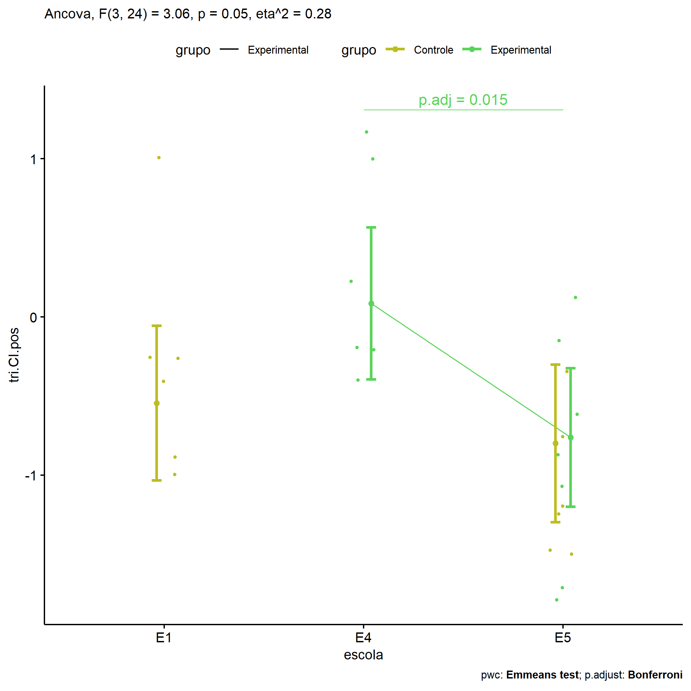<!-- -->

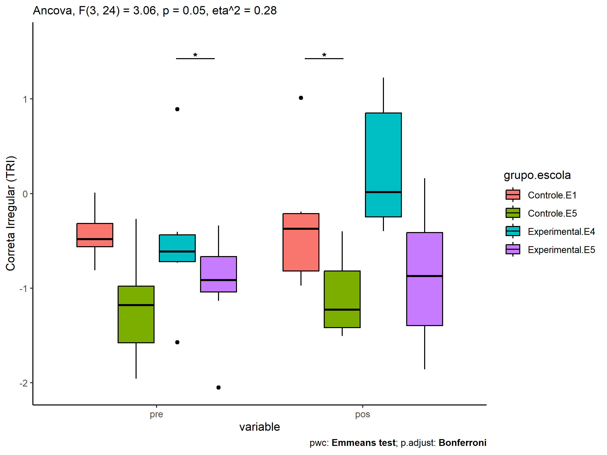<!-- -->

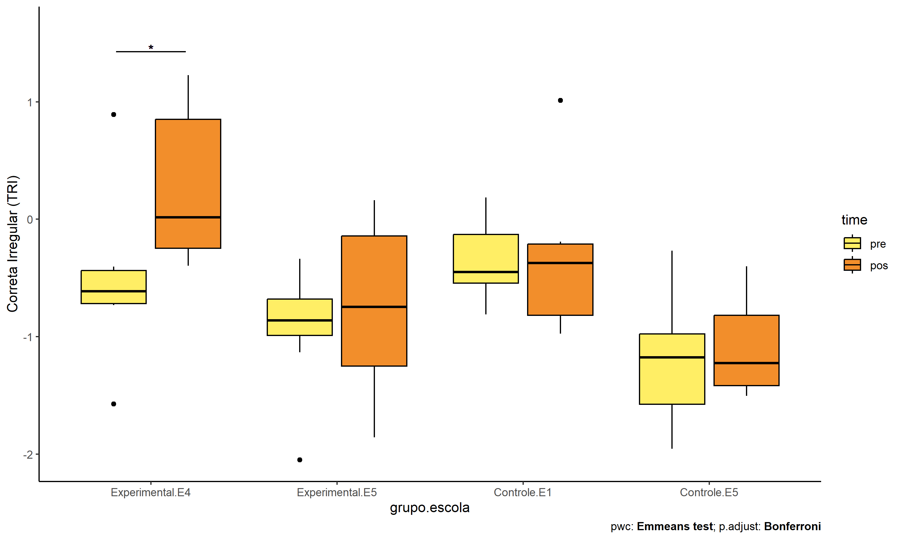<!-- -->

### Trocas Visuais (Acertos)

| var          | escola | grupo        |   n | M (pre) | SE (pre) | M (unadj) | SE (unadj) | M (adj) | SE (adj) |
|:-------------|:-------|:-------------|----:|--------:|---------:|----------:|-----------:|--------:|---------:|
| score.TV.pos | E1     | Controle     |   7 |  17.000 |    0.976 |    15.857 |      2.738 |  14.978 |    2.109 |
| score.TV.pos | E4     | Experimental |   6 |  15.333 |    2.246 |    16.667 |      1.202 |  16.394 |    2.224 |
| score.TV.pos | E5     | Controle     |   6 |  15.667 |    1.563 |    17.000 |      1.549 |  16.606 |    2.229 |
| score.TV.pos | E5     | Experimental |  10 |  11.800 |    2.356 |    10.400 |      2.056 |  11.415 |    1.804 |

|     | grupo        | escola | group1   | group2       | estimate | conf.low | conf.high |    se | statistic |     p | p.adj | p.adj.signif |
|:----|:-------------|:-------|:---------|:-------------|---------:|---------:|----------:|------:|----------:|------:|------:|:-------------|
| 2   | Controle     |        | E1       | E5           |   -1.629 |   -7.894 |     4.636 | 3.035 |    -0.537 | 0.597 | 0.597 | ns           |
| 6   | Experimental |        | E4       | E5           |    4.979 |   -0.989 |    10.947 | 2.892 |     1.722 | 0.098 | 0.098 | ns           |
| 8   | Controle     |        | E1       | E5           |    1.333 |   -5.002 |     7.669 | 3.076 |     0.433 | 0.668 | 0.668 | ns           |
| 12  | Experimental |        | E4       | E5           |    3.533 |   -2.347 |     9.414 | 2.855 |     1.238 | 0.227 | 0.227 | ns           |
| 15  |              | E5     | Controle | Experimental |    5.191 |   -0.811 |    11.193 | 2.908 |     1.785 | 0.087 | 0.087 | ns           |
| 18  |              | E5     | Controle | Experimental |    3.867 |   -2.014 |     9.747 | 2.855 |     1.354 | 0.188 | 0.188 | ns           |

| grupo        | escola | group1 | group2 | estimate | conf.low | conf.high |   se | statistic |     p | p.adj | p.adj.signif |
|:-------------|:-------|:-------|:-------|---------:|---------:|----------:|-----:|----------:|------:|------:|:-------------|
| Controle     | E1     | pre    | pos    |    1.143 |   -4.883 |     7.168 | 3.00 |     0.381 | 0.705 | 0.705 | ns           |
| Controle     | E5     | pre    | pos    |   -1.333 |   -7.842 |     5.175 | 3.24 |    -0.411 | 0.682 | 0.682 | ns           |
| Experimental | E4     | pre    | pos    |   -1.333 |   -7.842 |     5.175 | 3.24 |    -0.411 | 0.682 | 0.682 | ns           |
| Experimental | E5     | pre    | pos    |    1.400 |   -3.641 |     6.441 | 2.51 |     0.558 | 0.579 | 0.579 | ns           |

    ## Scale for colour is already present.
    ## Adding another scale for colour, which will replace the existing scale.

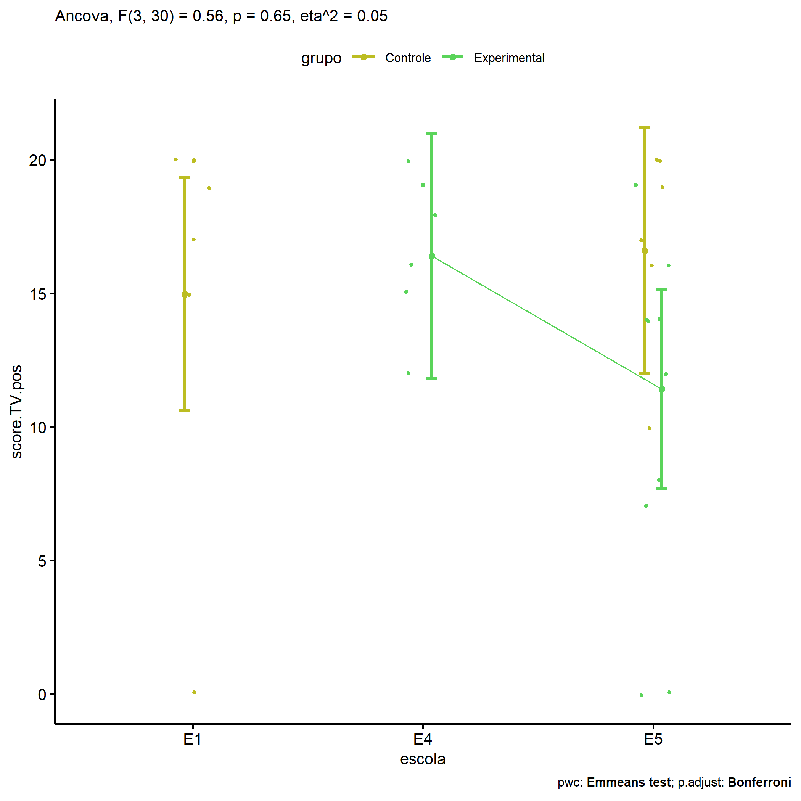<!-- -->

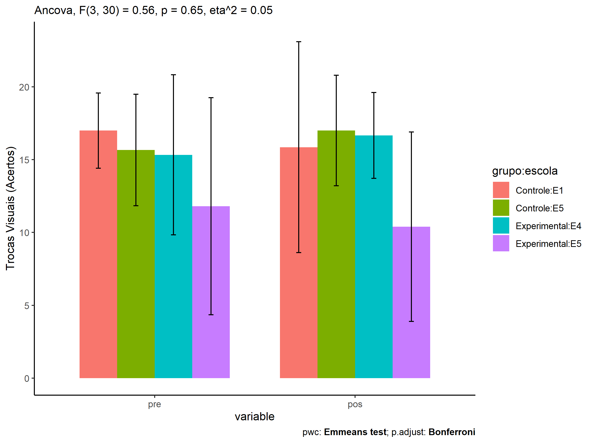<!-- -->

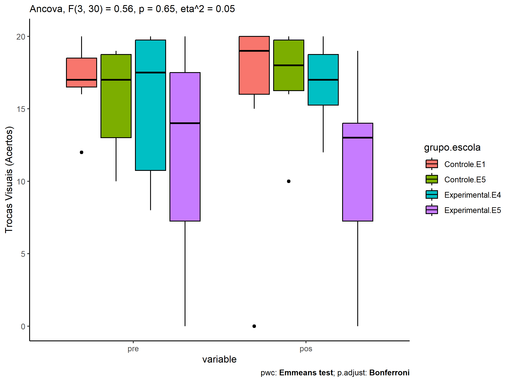<!-- -->

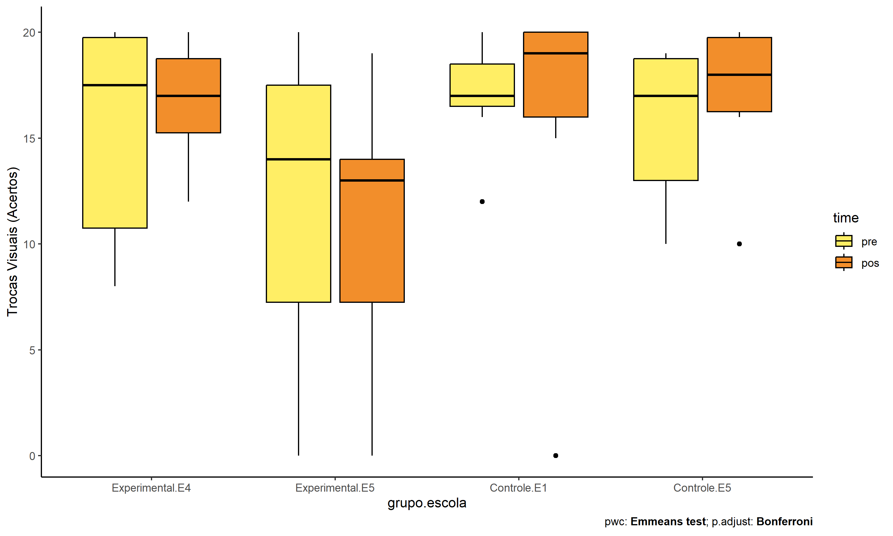<!-- -->

### Trocas Visuais (TRI)

| var        | escola | grupo        |   n | M (pre) | SE (pre) | M (unadj) | SE (unadj) | M (adj) | SE (adj) |
|:-----------|:-------|:-------------|----:|--------:|---------:|----------:|-----------:|--------:|---------:|
| tri.TV.pos | E1     | Controle     |   6 |  -0.048 |    0.353 |     0.426 |      0.319 |   0.335 |    0.312 |
| tri.TV.pos | E4     | Experimental |   6 |  -0.185 |    0.498 |    -0.082 |      0.341 |  -0.113 |    0.310 |
| tri.TV.pos | E5     | Controle     |   6 |  -0.420 |    0.332 |     0.071 |      0.386 |   0.143 |    0.311 |
| tri.TV.pos | E5     | Experimental |   7 |  -0.354 |    0.253 |    -0.553 |      0.298 |  -0.511 |    0.287 |

|     | grupo        | escola | group1   | group2       | estimate | conf.low | conf.high |    se | statistic |     p | p.adj | p.adj.signif |
|:----|:-------------|:-------|:---------|:-------------|---------:|---------:|----------:|------:|----------:|------:|------:|:-------------|
| 2   | Controle     |        | E1       | E5           |    0.192 |   -0.732 |     1.117 | 0.443 |     0.434 | 0.669 | 0.669 | ns           |
| 6   | Experimental |        | E4       | E5           |    0.398 |   -0.485 |     1.280 | 0.423 |     0.940 | 0.359 | 0.359 | ns           |
| 8   | Controle     |        | E1       | E5           |    0.372 |   -0.715 |     1.459 | 0.523 |     0.712 | 0.484 | 0.484 | ns           |
| 12  | Experimental |        | E4       | E5           |    0.169 |   -0.878 |     1.216 | 0.504 |     0.336 | 0.740 | 0.740 | ns           |
| 15  |              | E5     | Controle | Experimental |    0.654 |   -0.227 |     1.534 | 0.422 |     1.549 | 0.137 | 0.137 | ns           |
| 18  |              | E5     | Controle | Experimental |   -0.066 |   -1.113 |     0.981 | 0.504 |    -0.132 | 0.896 | 0.896 | ns           |

| grupo        | escola | group1 | group2 | estimate | conf.low | conf.high |    se | statistic |     p | p.adj | p.adj.signif |
|:-------------|:-------|:-------|:-------|---------:|---------:|----------:|------:|----------:|------:|------:|:-------------|
| Controle     | E1     | pre    | pos    |   -0.530 |   -1.518 |     0.458 | 0.491 |    -1.081 | 0.286 | 0.286 | ns           |
| Controle     | E5     | pre    | pos    |   -0.492 |   -1.517 |     0.533 | 0.509 |    -0.966 | 0.339 | 0.339 | ns           |
| Experimental | E4     | pre    | pos    |   -0.103 |   -1.128 |     0.923 | 0.509 |    -0.202 | 0.841 | 0.841 | ns           |
| Experimental | E5     | pre    | pos    |    0.520 |   -0.367 |     1.408 | 0.441 |     1.181 | 0.244 | 0.244 | ns           |

    ## Scale for colour is already present.
    ## Adding another scale for colour, which will replace the existing scale.

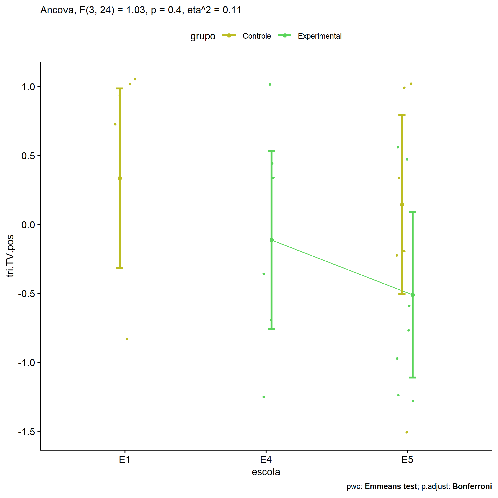<!-- -->

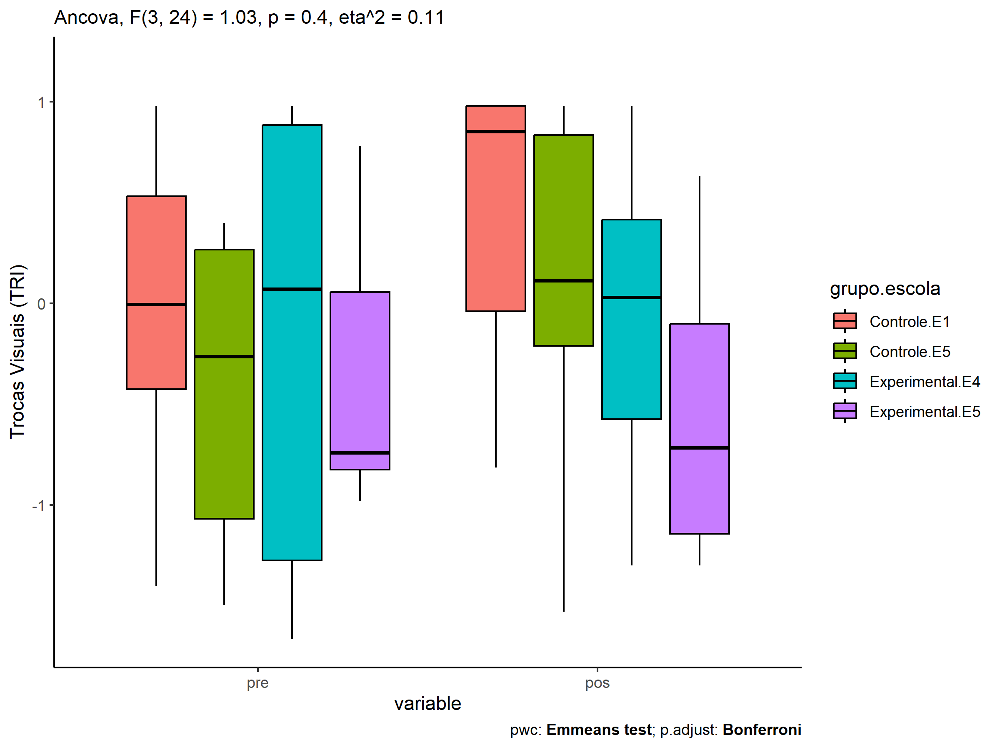<!-- -->

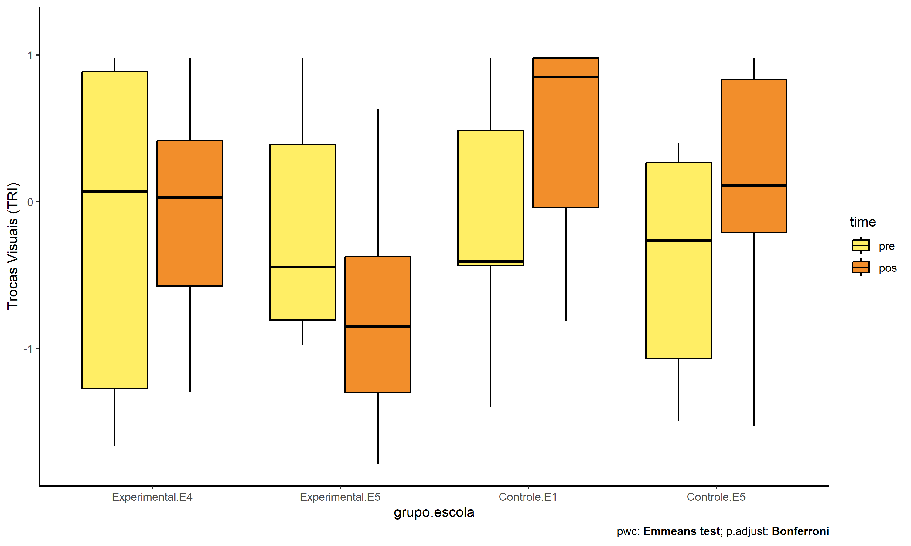<!-- -->

### Trocas Fonologicas (Acertos)

| var          | escola | grupo        |   n | M (pre) | SE (pre) | M (unadj) | SE (unadj) | M (adj) | SE (adj) |
|:-------------|:-------|:-------------|----:|--------:|---------:|----------:|-----------:|--------:|---------:|
| score.TF.pos | E1     | Controle     |   7 |  14.429 |    1.192 |    14.000 |      2.507 |  14.007 |    2.060 |
| score.TF.pos | E4     | Experimental |   6 |  14.667 |    2.108 |    15.833 |      1.327 |  15.841 |    2.229 |
| score.TF.pos | E5     | Controle     |   6 |  14.333 |    0.989 |    14.000 |      1.592 |  14.006 |    2.216 |
| score.TF.pos | E5     | Experimental |  10 |   9.300 |    2.050 |    10.000 |      1.814 |   9.987 |    1.849 |

|     | grupo        | escola | group1   | group2       | estimate | conf.low | conf.high |    se | statistic |     p | p.adj | p.adj.signif |
|:----|:-------------|:-------|:---------|:-------------|---------:|---------:|----------:|------:|----------:|------:|------:|:-------------|
| 2   | Controle     |        | E1       | E5           |    0.000 |   -6.151 |     6.152 | 2.981 |     0.000 | 1.000 | 1.000 | ns           |
| 6   | Experimental |        | E4       | E5           |    5.854 |   -0.348 |    12.056 | 3.005 |     1.948 | 0.063 | 0.063 | ns           |
| 8   | Controle     |        | E1       | E5           |    0.095 |   -5.520 |     5.711 | 2.727 |     0.035 | 0.972 | 0.972 | ns           |
| 12  | Experimental |        | E4       | E5           |    5.367 |    0.154 |    10.579 | 2.531 |     2.121 | 0.044 | 0.044 | \*           |
| 15  |              | E5     | Controle | Experimental |    4.020 |   -2.125 |    10.164 | 2.977 |     1.350 | 0.190 | 0.190 | ns           |
| 18  |              | E5     | Controle | Experimental |    5.033 |   -0.179 |    10.246 | 2.531 |     1.989 | 0.058 | 0.058 | ns           |

| grupo        | escola | group1 | group2 | estimate | conf.low | conf.high |    se | statistic |     p | p.adj | p.adj.signif |
|:-------------|:-------|:-------|:-------|---------:|---------:|----------:|------:|----------:|------:|------:|:-------------|
| Controle     | E1     | pre    | pos    |    0.429 |   -5.023 |     5.880 | 2.714 |     0.158 | 0.875 | 0.875 | ns           |
| Controle     | E5     | pre    | pos    |    0.333 |   -5.555 |     6.222 | 2.932 |     0.114 | 0.910 | 0.910 | ns           |
| Experimental | E4     | pre    | pos    |   -1.167 |   -7.055 |     4.722 | 2.932 |    -0.398 | 0.692 | 0.692 | ns           |
| Experimental | E5     | pre    | pos    |   -0.700 |   -5.261 |     3.861 | 2.271 |    -0.308 | 0.759 | 0.759 | ns           |

    ## Scale for colour is already present.
    ## Adding another scale for colour, which will replace the existing scale.

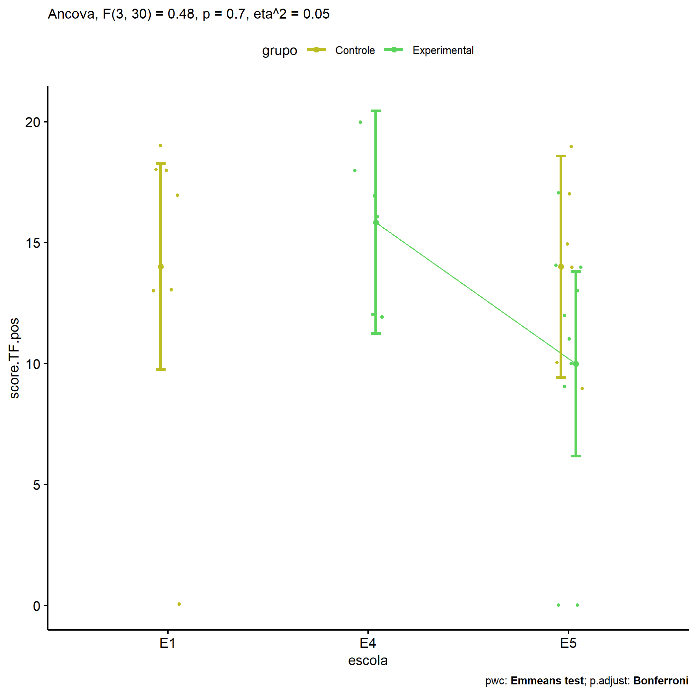<!-- -->

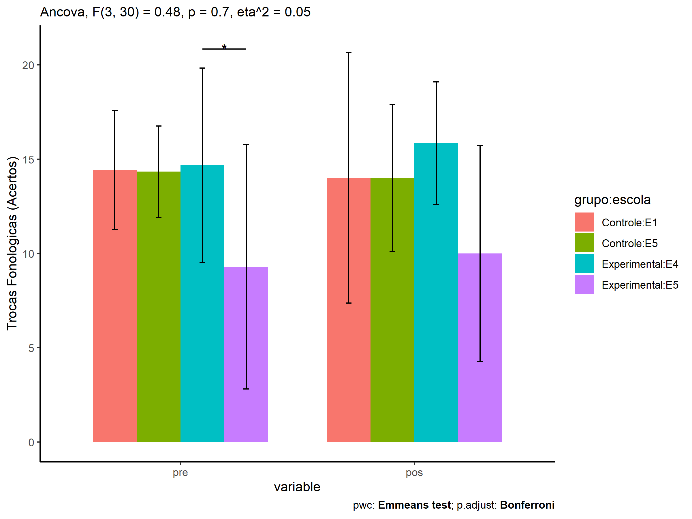<!-- -->

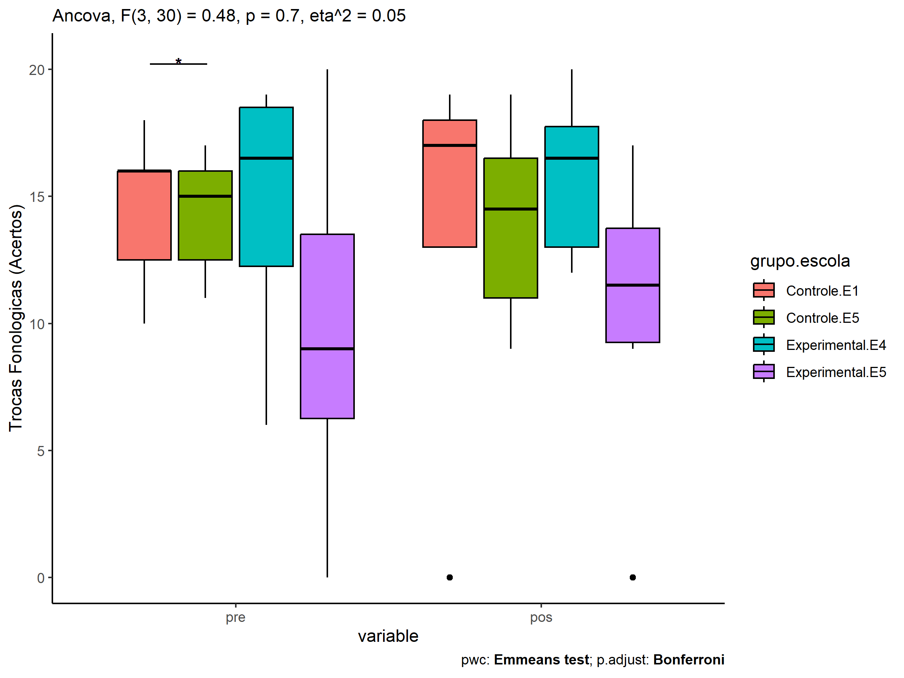<!-- -->

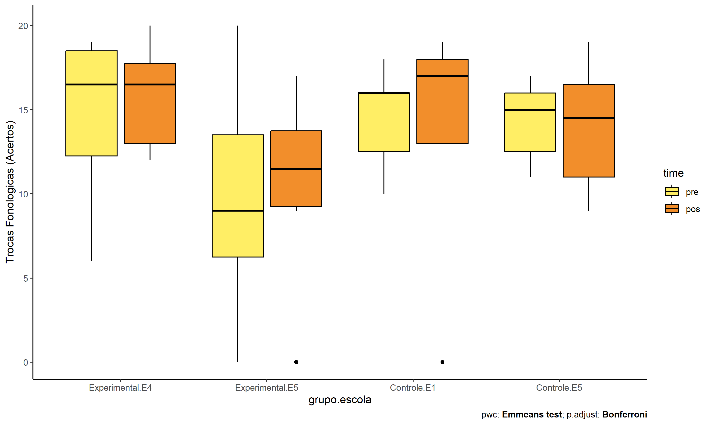<!-- -->

### Trocas Fonologicas (TRI)

| var        | escola | grupo        |   n | M (pre) | SE (pre) | M (unadj) | SE (unadj) | M (adj) | SE (adj) |
|:-----------|:-------|:-------------|----:|--------:|---------:|----------:|-----------:|--------:|---------:|
| tri.TF.pos | E1     | Controle     |   6 |  -0.426 |    0.215 |     0.093 |      0.245 |   0.078 |    0.249 |
| tri.TF.pos | E4     | Experimental |   6 |  -0.101 |    0.446 |     0.038 |      0.309 |  -0.136 |    0.258 |
| tri.TF.pos | E5     | Controle     |   6 |  -0.496 |    0.156 |    -0.400 |      0.328 |  -0.380 |    0.249 |
| tri.TF.pos | E5     | Experimental |   7 |  -0.750 |    0.255 |    -0.433 |      0.228 |  -0.288 |    0.237 |

|     | grupo        | escola | group1   | group2       | estimate | conf.low | conf.high |    se | statistic |     p | p.adj | p.adj.signif |
|:----|:-------------|:-------|:---------|:-------------|---------:|---------:|----------:|------:|----------:|------:|------:|:-------------|
| 2   | Controle     |        | E1       | E5           |    0.459 |   -0.277 |     1.194 | 0.353 |     1.300 | 0.208 | 0.208 | ns           |
| 6   | Experimental |        | E4       | E5           |    0.152 |   -0.600 |     0.904 | 0.360 |     0.422 | 0.678 | 0.678 | ns           |
| 8   | Controle     |        | E1       | E5           |    0.070 |   -0.792 |     0.931 | 0.414 |     0.169 | 0.868 | 0.868 | ns           |
| 12  | Experimental |        | E4       | E5           |    0.649 |   -0.181 |     1.479 | 0.399 |     1.626 | 0.119 | 0.119 | ns           |
| 15  |              | E5     | Controle | Experimental |   -0.092 |   -0.807 |     0.623 | 0.343 |    -0.268 | 0.791 | 0.791 | ns           |
| 18  |              | E5     | Controle | Experimental |    0.254 |   -0.576 |     1.084 | 0.399 |     0.636 | 0.532 | 0.532 | ns           |

| grupo        | escola | group1 | group2 | estimate | conf.low | conf.high |    se | statistic |     p | p.adj | p.adj.signif |
|:-------------|:-------|:-------|:-------|---------:|---------:|----------:|------:|----------:|------:|------:|:-------------|
| Controle     | E1     | pre    | pos    |   -0.348 |   -1.193 |     0.496 | 0.419 |    -0.831 | 0.410 | 0.410 | ns           |
| Controle     | E5     | pre    | pos    |   -0.096 |   -0.973 |     0.780 | 0.435 |    -0.221 | 0.826 | 0.826 | ns           |
| Experimental | E4     | pre    | pos    |   -0.139 |   -1.016 |     0.737 | 0.435 |    -0.320 | 0.750 | 0.750 | ns           |
| Experimental | E5     | pre    | pos    |   -0.045 |   -0.804 |     0.714 | 0.377 |    -0.119 | 0.906 | 0.906 | ns           |

    ## Scale for colour is already present.
    ## Adding another scale for colour, which will replace the existing scale.

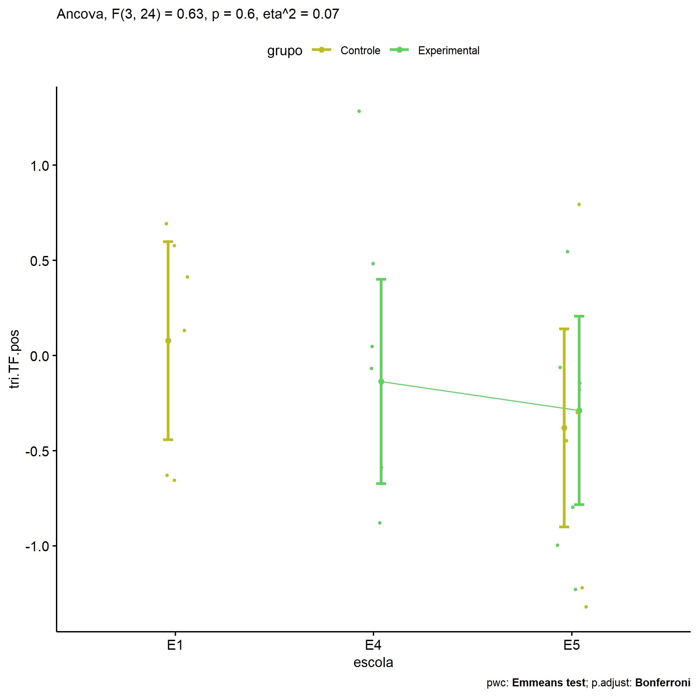<!-- -->

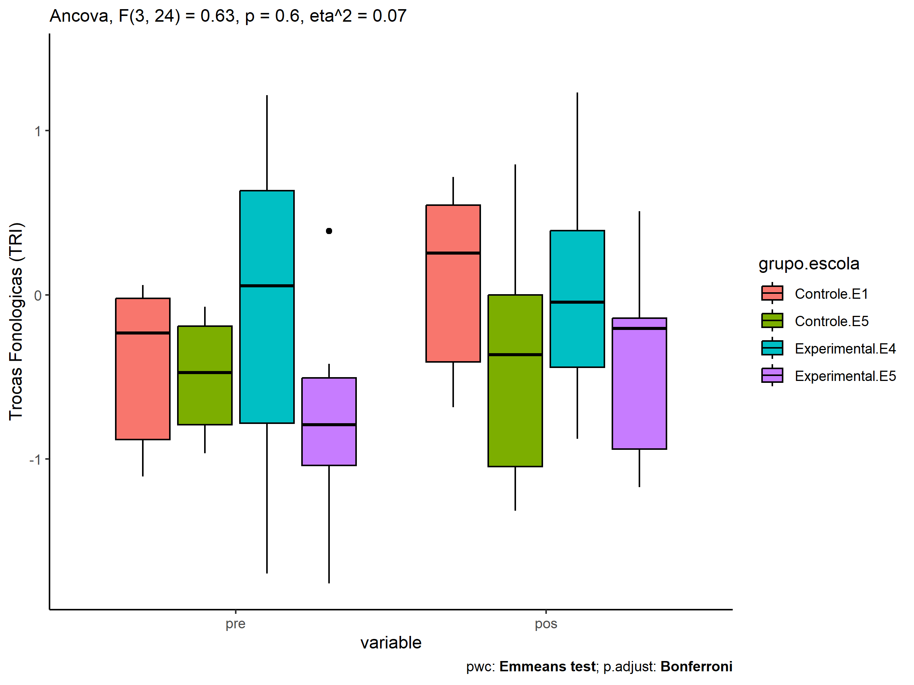<!-- -->

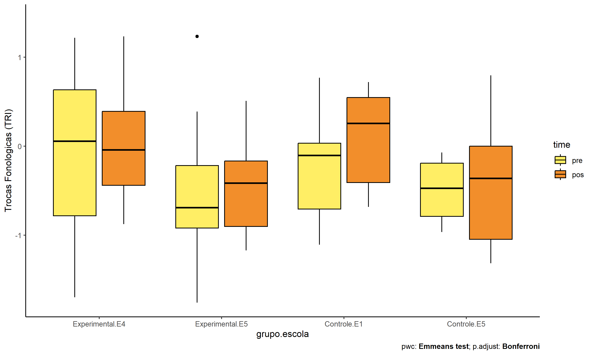<!-- -->

### Trocas Orograficas (Acertos)

| var          | escola | grupo        |   n | M (pre) | SE (pre) | M (unadj) | SE (unadj) | M (adj) | SE (adj) |
|:-------------|:-------|:-------------|----:|--------:|---------:|----------:|-----------:|--------:|---------:|
| score.TO.pos | E1     | Controle     |   7 |   9.857 |    1.908 |     8.571 |      1.950 |   8.329 |    1.649 |
| score.TO.pos | E4     | Experimental |   6 |  11.833 |    1.537 |     8.500 |      1.607 |   7.720 |    1.866 |
| score.TO.pos | E5     | Controle     |   6 |   9.167 |    0.833 |     8.167 |      0.601 |   8.112 |    1.770 |
| score.TO.pos | E5     | Experimental |  10 |   6.500 |    1.478 |     7.200 |      1.618 |   7.870 |    1.462 |

|     | grupo        | escola | group1   | group2       | estimate | conf.low | conf.high |    se | statistic |     p | p.adj | p.adj.signif |
|:----|:-------------|:-------|:---------|:-------------|---------:|---------:|----------:|------:|----------:|------:|------:|:-------------|
| 2   | Controle     |        | E1       | E5           |    0.217 |   -4.769 |     5.204 | 2.416 |     0.090 | 0.929 | 0.929 | ns           |
| 6   | Experimental |        | E4       | E5           |   -0.150 |   -5.299 |     4.999 | 2.495 |    -0.060 | 0.953 | 0.953 | ns           |
| 8   | Controle     |        | E1       | E5           |    0.690 |   -4.122 |     5.503 | 2.337 |     0.295 | 0.770 | 0.770 | ns           |
| 12  | Experimental |        | E4       | E5           |    5.333 |    0.866 |     9.800 | 2.169 |     2.459 | 0.021 | 0.021 | \*           |
| 15  |              | E5     | Controle | Experimental |    0.242 |   -4.516 |     5.000 | 2.305 |     0.105 | 0.917 | 0.917 | ns           |
| 18  |              | E5     | Controle | Experimental |    2.667 |   -1.800 |     7.134 | 2.169 |     1.229 | 0.230 | 0.230 | ns           |

| grupo        | escola | group1 | group2 | estimate | conf.low | conf.high |    se | statistic |     p | p.adj | p.adj.signif |
|:-------------|:-------|:-------|:-------|---------:|---------:|----------:|------:|----------:|------:|------:|:-------------|
| Controle     | E1     | pre    | pos    |    1.286 |   -3.331 |     5.903 | 2.299 |     0.559 | 0.578 | 0.578 | ns           |
| Controle     | E5     | pre    | pos    |    1.000 |   -3.987 |     5.987 | 2.483 |     0.403 | 0.689 | 0.689 | ns           |
| Experimental | E4     | pre    | pos    |    3.333 |   -1.654 |     8.320 | 2.483 |     1.343 | 0.185 | 0.185 | ns           |
| Experimental | E5     | pre    | pos    |   -0.700 |   -4.563 |     3.163 | 1.923 |    -0.364 | 0.717 | 0.717 | ns           |

    ## Scale for colour is already present.
    ## Adding another scale for colour, which will replace the existing scale.

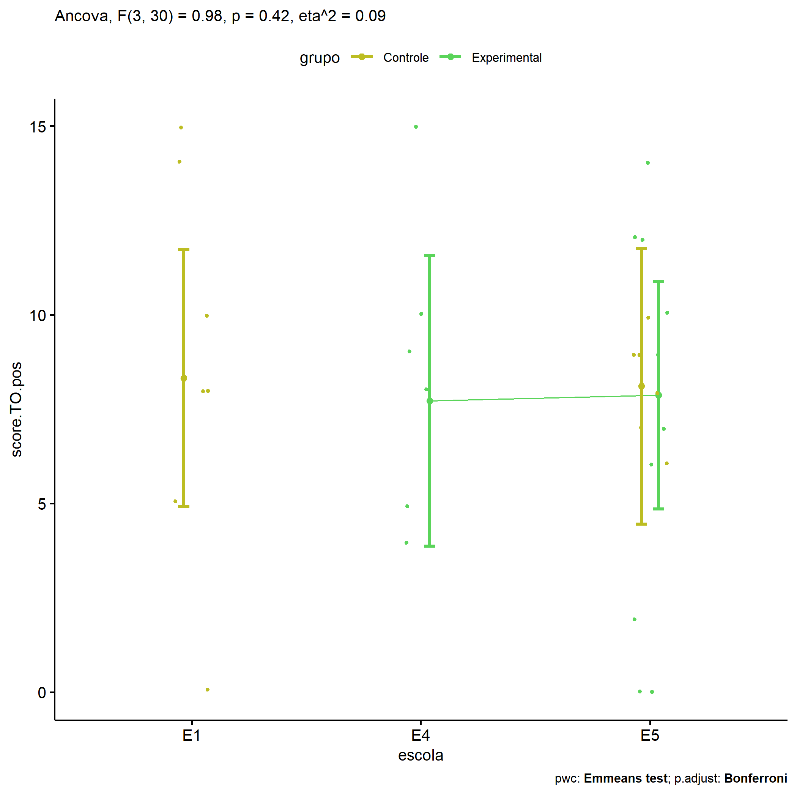<!-- -->

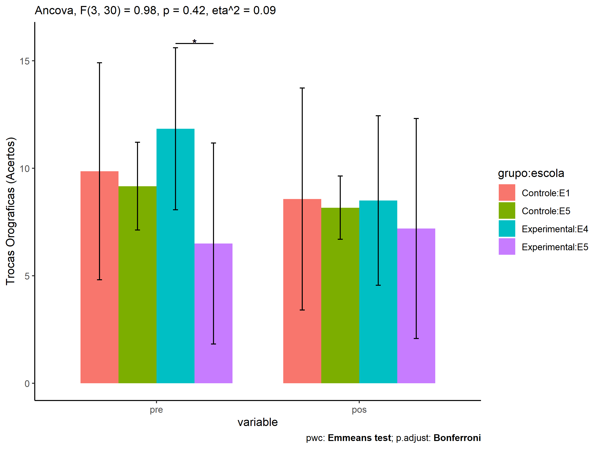<!-- -->

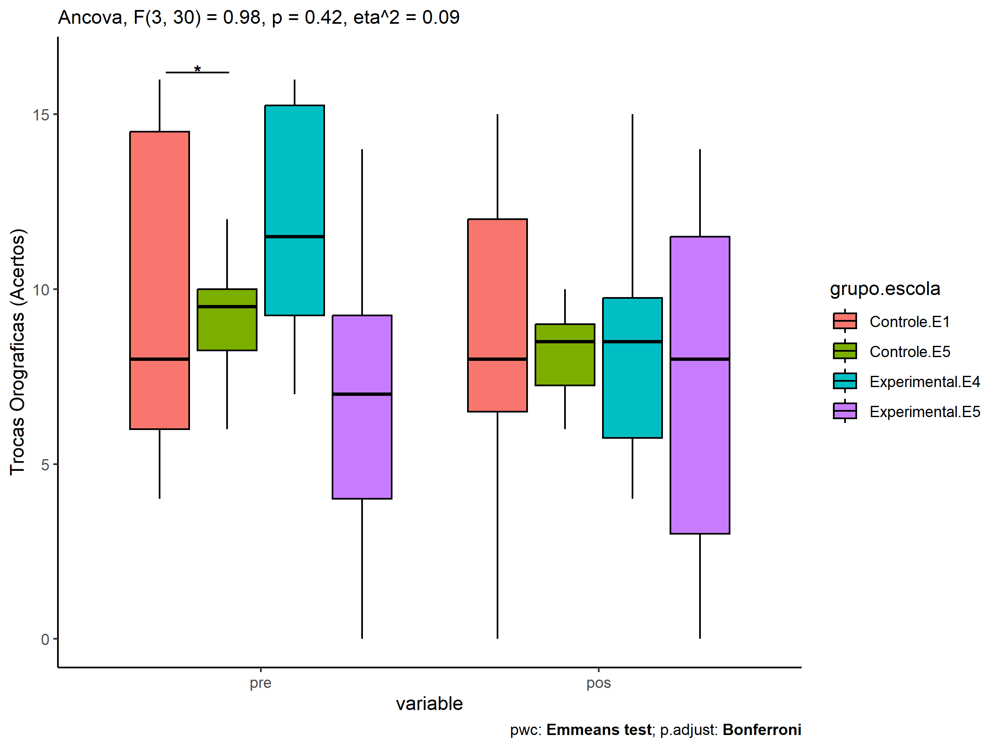<!-- -->

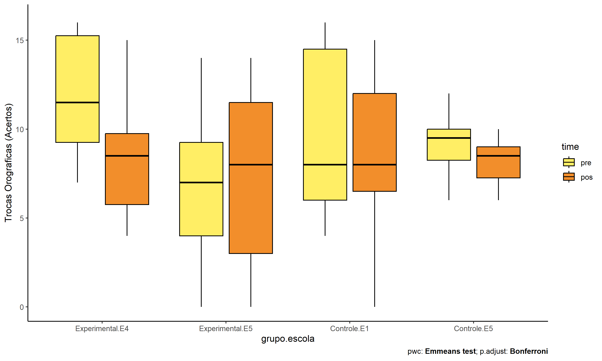<!-- -->

### Trocas Orograficas (TRI)

| var        | escola | grupo        |   n | M (pre) | SE (pre) | M (unadj) | SE (unadj) | M (adj) | SE (adj) |
|:-----------|:-------|:-------------|----:|--------:|---------:|----------:|-----------:|--------:|---------:|
| tri.TO.pos | E1     | Controle     |   6 |  -0.429 |    0.364 |    -0.334 |      0.342 |  -0.257 |    0.313 |
| tri.TO.pos | E4     | Experimental |   6 |   0.069 |    0.376 |    -0.539 |      0.389 |  -0.687 |    0.318 |
| tri.TO.pos | E5     | Controle     |   6 |  -0.361 |    0.165 |    -0.556 |      0.158 |  -0.509 |    0.312 |
| tri.TO.pos | E5     | Experimental |   7 |  -0.302 |    0.367 |    -0.329 |      0.372 |  -0.309 |    0.288 |

|     | grupo        | escola | group1   | group2       | estimate | conf.low | conf.high |    se | statistic |     p | p.adj | p.adj.signif |
|:----|:-------------|:-------|:---------|:-------------|---------:|---------:|----------:|------:|----------:|------:|------:|:-------------|
| 2   | Controle     |        | E1       | E5           |    0.252 |   -0.665 |     1.169 | 0.440 |     0.573 | 0.573 | 0.573 | ns           |
| 6   | Experimental |        | E4       | E5           |   -0.378 |   -1.275 |     0.519 | 0.430 |    -0.879 | 0.390 | 0.390 | ns           |
| 8   | Controle     |        | E1       | E5           |   -0.068 |   -1.071 |     0.935 | 0.482 |    -0.141 | 0.890 | 0.890 | ns           |
| 12  | Experimental |        | E4       | E5           |    0.372 |   -0.595 |     1.339 | 0.465 |     0.800 | 0.433 | 0.433 | ns           |
| 15  |              | E5     | Controle | Experimental |   -0.200 |   -1.084 |     0.684 | 0.424 |    -0.472 | 0.642 | 0.642 | ns           |
| 18  |              | E5     | Controle | Experimental |   -0.059 |   -1.025 |     0.908 | 0.465 |    -0.126 | 0.901 | 0.901 | ns           |

| grupo        | escola | group1 | group2 | estimate | conf.low | conf.high |    se | statistic |     p | p.adj | p.adj.signif |
|:-------------|:-------|:-------|:-------|---------:|---------:|----------:|------:|----------:|------:|------:|:-------------|
| Controle     | E1     | pre    | pos    |    0.153 |   -0.803 |     1.108 | 0.475 |     0.322 | 0.749 | 0.749 | ns           |
| Controle     | E5     | pre    | pos    |    0.194 |   -0.797 |     1.186 | 0.492 |     0.395 | 0.695 | 0.695 | ns           |
| Experimental | E4     | pre    | pos    |    0.608 |   -0.383 |     1.600 | 0.492 |     1.236 | 0.223 | 0.223 | ns           |
| Experimental | E5     | pre    | pos    |   -0.138 |   -0.997 |     0.721 | 0.426 |    -0.323 | 0.748 | 0.748 | ns           |

    ## Scale for colour is already present.
    ## Adding another scale for colour, which will replace the existing scale.

<!-- -->

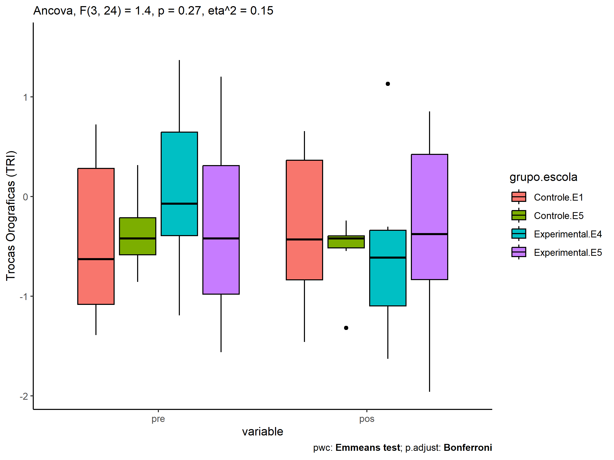<!-- -->

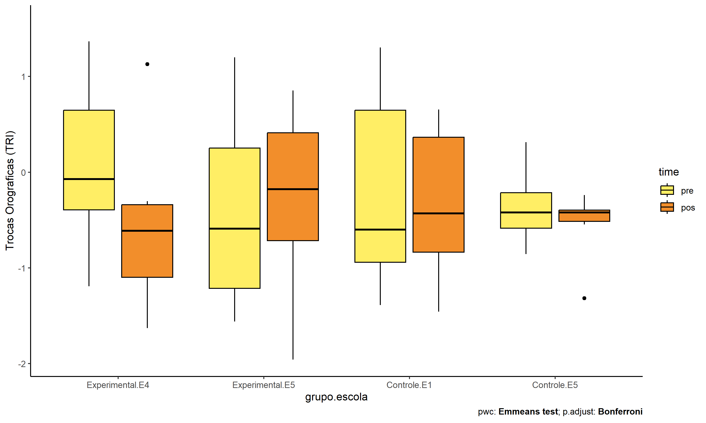<!-- -->

## factores: **zona.escola:grupo**

### Leitura de Pseudo-Palavras (Acertos)

| var            | zona.escola | grupo        |   n | M (pre) | SE (pre) | M (unadj) | SE (unadj) | M (adj) | SE (adj) |
|:---------------|:------------|:-------------|----:|--------:|---------:|----------:|-----------:|--------:|---------:|
| score.CLPP.pos | Rural       | Experimental |   8 |  66.000 |    5.155 |    69.500 |      3.412 |  65.085 |    3.308 |
| score.CLPP.pos | Urbana      | Controle     |  15 |  58.933 |    2.925 |    61.333 |      3.412 |  61.160 |    2.307 |
| score.CLPP.pos | Urbana      | Experimental |   8 |  50.750 |    4.617 |    54.000 |      3.464 |  58.739 |    3.330 |

|     | grupo        | zona.escola | group1   | group2       | estimate | conf.low | conf.high |    se | statistic |     p | p.adj | p.adj.signif |
|:----|:-------------|:------------|:---------|:-------------|---------:|---------:|----------:|------:|----------:|------:|------:|:-------------|
| 2   | Experimental |             | Urbana   | Rural        |   -6.346 |  -16.419 |     3.728 | 4.910 |    -1.292 | 0.207 | 0.207 | ns           |
| 4   | Experimental |             | Urbana   | Rural        |  -15.250 |  -28.203 |    -2.297 | 6.323 |    -2.412 | 0.023 | 0.023 | \*           |
| 5   |              | Urbana      | Controle | Experimental |    2.421 |   -5.912 |    10.754 | 4.061 |     0.596 | 0.556 | 0.556 | ns           |
| 7   |              | Urbana      | Controle | Experimental |    8.183 |   -3.158 |    19.525 | 5.537 |     1.478 | 0.151 | 0.151 | ns           |

| grupo        | zona.escola | group1 | group2 | estimate | conf.low | conf.high |    se | statistic |     p | p.adj | p.adj.signif |
|:-------------|:------------|:-------|:-------|---------:|---------:|----------:|------:|----------:|------:|------:|:-------------|
| Controle     | Urbana      | pre    | pos    |   -1.208 |  -10.145 |     7.729 | 4.468 |    -0.270 | 0.788 | 0.788 | ns           |
| Experimental | Urbana      | pre    | pos    |   -2.778 |  -14.203 |     8.648 | 5.712 |    -0.486 | 0.629 | 0.629 | ns           |
| Experimental | Rural       | pre    | pos    |   -3.500 |  -15.933 |     8.933 | 6.216 |    -0.563 | 0.575 | 0.575 | ns           |

<!-- -->

<!-- -->

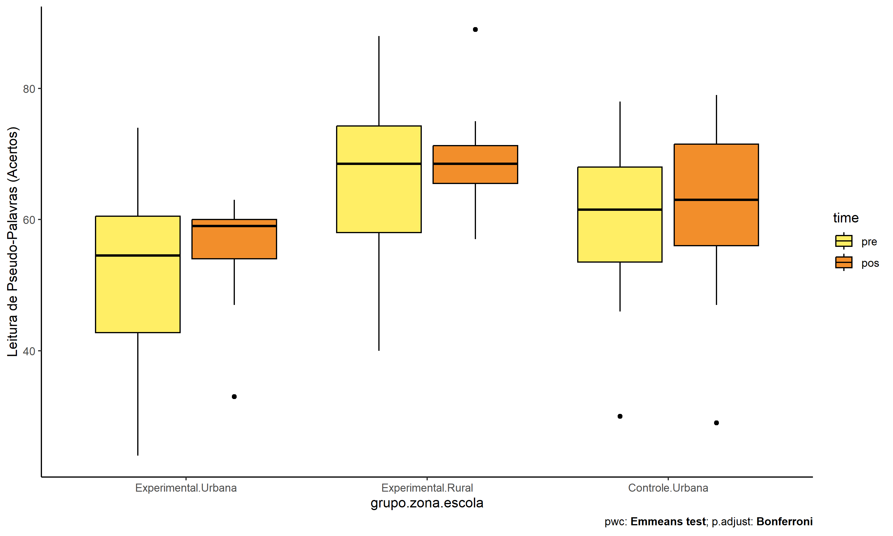<!-- -->

### Leitura de Pseudo-Palavras (TRI)

| var          | zona.escola | grupo        |   n | M (pre) | SE (pre) | M (unadj) | SE (unadj) | M (adj) | SE (adj) |
|:-------------|:------------|:-------------|----:|--------:|---------:|----------:|-----------:|--------:|---------:|
| tri.CLPP.pos | Rural       | Experimental |   8 |  66.000 |    5.155 |    69.500 |      3.412 |  65.085 |    3.308 |
| tri.CLPP.pos | Urbana      | Controle     |  15 |  58.933 |    2.925 |    61.333 |      3.412 |  61.160 |    2.307 |
| tri.CLPP.pos | Urbana      | Experimental |   8 |  50.750 |    4.617 |    54.000 |      3.464 |  58.739 |    3.330 |

|     | grupo        | zona.escola | group1   | group2       | estimate | conf.low | conf.high |    se | statistic |     p | p.adj | p.adj.signif |
|:----|:-------------|:------------|:---------|:-------------|---------:|---------:|----------:|------:|----------:|------:|------:|:-------------|
| 2   | Experimental |             | Urbana   | Rural        |   -6.346 |  -16.419 |     3.728 | 4.910 |    -1.292 | 0.207 | 0.207 | ns           |
| 4   | Experimental |             | Urbana   | Rural        |  -15.250 |  -28.203 |    -2.297 | 6.323 |    -2.412 | 0.023 | 0.023 | \*           |
| 5   |              | Urbana      | Controle | Experimental |    2.421 |   -5.912 |    10.754 | 4.061 |     0.596 | 0.556 | 0.556 | ns           |
| 7   |              | Urbana      | Controle | Experimental |    8.183 |   -3.158 |    19.525 | 5.537 |     1.478 | 0.151 | 0.151 | ns           |

| grupo        | zona.escola | group1 | group2 | estimate | conf.low | conf.high |    se | statistic |     p | p.adj | p.adj.signif |
|:-------------|:------------|:-------|:-------|---------:|---------:|----------:|------:|----------:|------:|------:|:-------------|
| Controle     | Urbana      | pre    | pos    |   -0.298 |   -0.929 |     0.334 | 0.316 |    -0.943 | 0.350 | 0.350 | ns           |
| Experimental | Urbana      | pre    | pos    |   -0.045 |   -0.852 |     0.763 | 0.404 |    -0.111 | 0.912 | 0.912 | ns           |
| Experimental | Rural       | pre    | pos    |   -0.445 |   -1.323 |     0.434 | 0.439 |    -1.012 | 0.316 | 0.316 | ns           |

<!-- -->

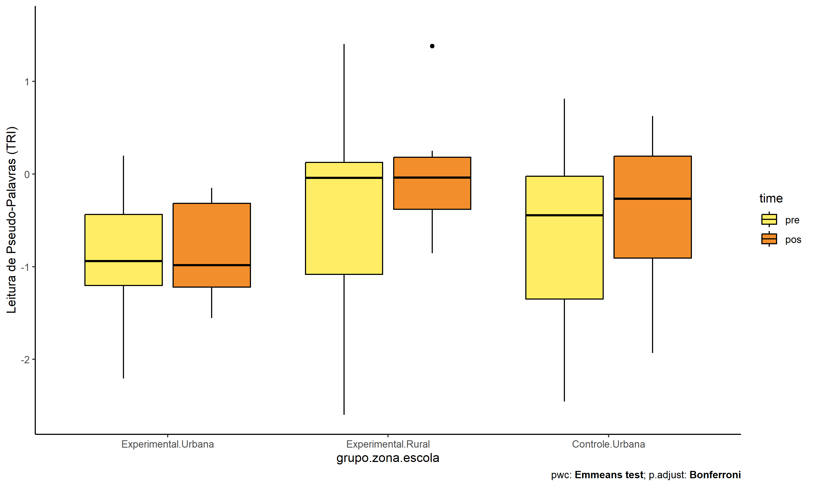<!-- -->

### Correta Regular (Acertos)

| var          | zona.escola | grupo        |   n | M (pre) | SE (pre) | M (unadj) | SE (unadj) | M (adj) | SE (adj) |
|:-------------|:------------|:-------------|----:|--------:|---------:|----------:|-----------:|--------:|---------:|
| score.CR.pos | Rural       | Experimental |   8 |  14.625 |    1.281 |    15.750 |      0.818 |  15.038 |    1.842 |
| score.CR.pos | Urbana      | Controle     |  16 |  13.125 |    0.735 |    12.938 |      1.263 |  12.598 |    1.270 |
| score.CR.pos | Urbana      | Experimental |  13 |   8.308 |    1.677 |     7.615 |      1.670 |   8.471 |    1.531 |

|     | grupo        | zona.escola | group1   | group2       | estimate | conf.low | conf.high |    se | statistic |     p | p.adj | p.adj.signif |
|:----|:-------------|:------------|:---------|:-------------|---------:|---------:|----------:|------:|----------:|------:|------:|:-------------|
| 2   | Experimental |             | Urbana   | Rural        |   -6.567 |  -11.745 |    -1.388 | 2.545 |    -2.580 | 0.015 | 0.015 | \*           |
| 4   | Experimental |             | Urbana   | Rural        |   -6.317 |  -10.342 |    -2.293 | 1.980 |    -3.190 | 0.003 | 0.003 | \*\*         |
| 5   |              | Urbana      | Controle | Experimental |    4.126 |   -0.097 |     8.350 | 2.076 |     1.988 | 0.055 | 0.055 | ns           |
| 7   |              | Urbana      | Controle | Experimental |    4.817 |    1.473 |     8.162 | 1.646 |     2.927 | 0.006 | 0.006 | \*\*         |

| grupo        | zona.escola | group1 | group2 | estimate | conf.low | conf.high |    se | statistic |     p | p.adj | p.adj.signif |
|:-------------|:------------|:-------|:-------|---------:|---------:|----------:|------:|----------:|------:|------:|:-------------|
| Controle     | Urbana      | pre    | pos    |    0.187 |   -3.144 |     3.519 | 1.669 |     0.112 | 0.911 | 0.911 | ns           |
| Experimental | Urbana      | pre    | pos    |    0.692 |   -3.003 |     4.388 | 1.852 |     0.374 | 0.710 | 0.710 | ns           |
| Experimental | Rural       | pre    | pos    |   -1.125 |   -5.836 |     3.586 | 2.361 |    -0.477 | 0.635 | 0.635 | ns           |

<!-- -->

<!-- -->

<!-- -->

### Correta Regular (TRI)

| var        | zona.escola | grupo        |   n | M (pre) | SE (pre) | M (unadj) | SE (unadj) | M (adj) | SE (adj) |
|:-----------|:------------|:-------------|----:|--------:|---------:|----------:|-----------:|--------:|---------:|
| tri.CR.pos | Rural       | Experimental |   8 |  -0.060 |    0.354 |     0.104 |      0.196 |  -0.094 |    0.256 |
| tri.CR.pos | Urbana      | Controle     |  15 |  -0.581 |    0.172 |    -0.286 |      0.221 |  -0.274 |    0.176 |
| tri.CR.pos | Urbana      | Experimental |   8 |  -0.985 |    0.169 |    -0.744 |      0.209 |  -0.569 |    0.252 |

|     | grupo        | zona.escola | group1   | group2       | estimate | conf.low | conf.high |    se | statistic |     p | p.adj | p.adj.signif |
|:----|:-------------|:------------|:---------|:-------------|---------:|---------:|----------:|------:|----------:|------:|------:|:-------------|
| 2   | Experimental |             | Urbana   | Rural        |   -0.475 |   -1.249 |     0.300 | 0.377 |    -1.258 | 0.219 | 0.219 | ns           |
| 4   | Experimental |             | Urbana   | Rural        |   -0.926 |   -1.671 |    -0.180 | 0.364 |    -2.543 | 0.017 | 0.017 | \*           |
| 5   |              | Urbana      | Controle | Experimental |    0.295 |   -0.334 |     0.923 | 0.306 |     0.963 | 0.344 | 0.344 | ns           |
| 7   |              | Urbana      | Controle | Experimental |    0.405 |   -0.248 |     1.057 | 0.319 |     1.270 | 0.214 | 0.214 | ns           |

| grupo        | zona.escola | group1 | group2 | estimate | conf.low | conf.high |    se | statistic |     p | p.adj | p.adj.signif |
|:-------------|:------------|:-------|:-------|---------:|---------:|----------:|------:|----------:|------:|------:|:-------------|
| Controle     | Urbana      | pre    | pos    |   -0.259 |   -0.791 |     0.274 | 0.266 |    -0.970 | 0.336 | 0.336 | ns           |
| Experimental | Urbana      | pre    | pos    |   -0.049 |   -0.730 |     0.632 | 0.341 |    -0.144 | 0.886 | 0.886 | ns           |
| Experimental | Rural       | pre    | pos    |   -0.163 |   -0.905 |     0.578 | 0.371 |    -0.441 | 0.661 | 0.661 | ns           |

<!-- -->

<!-- -->

### Correta Irregular (Acertos)

| var          | zona.escola | grupo        |   n | M (pre) | SE (pre) | M (unadj) | SE (unadj) | M (adj) | SE (adj) |
|:-------------|:------------|:-------------|----:|--------:|---------:|----------:|-----------:|--------:|---------:|
| score.CI.pos | Rural       | Experimental |   8 |  10.000 |    1.225 |    12.125 |      1.563 |  11.271 |    1.558 |
| score.CI.pos | Urbana      | Controle     |  16 |   9.250 |    0.674 |     8.000 |      0.890 |   7.462 |    1.093 |
| score.CI.pos | Urbana      | Experimental |  13 |   5.154 |    1.109 |     6.000 |      1.459 |   7.187 |    1.322 |

|     | grupo        | zona.escola | group1   | group2       | estimate | conf.low | conf.high |    se | statistic |     p | p.adj | p.adj.signif |
|:----|:-------------|:------------|:---------|:-------------|---------:|---------:|----------:|------:|----------:|------:|------:|:-------------|
| 2   | Experimental |             | Urbana   | Rural        |   -4.084 |   -8.498 |     0.330 | 2.170 |    -1.883 | 0.069 | 0.069 | ns           |
| 4   | Experimental |             | Urbana   | Rural        |   -4.846 |   -7.918 |    -1.774 | 1.512 |    -3.206 | 0.003 | 0.003 | \*\*         |
| 5   |              | Urbana      | Controle | Experimental |    0.275 |   -3.407 |     3.958 | 1.810 |     0.152 | 0.880 | 0.880 | ns           |
| 7   |              | Urbana      | Controle | Experimental |    4.096 |    1.544 |     6.649 | 1.256 |     3.261 | 0.003 | 0.003 | \*\*         |

| grupo        | zona.escola | group1 | group2 | estimate | conf.low | conf.high |    se | statistic |     p | p.adj | p.adj.signif |
|:-------------|:------------|:-------|:-------|---------:|---------:|----------:|------:|----------:|------:|------:|:-------------|
| Controle     | Urbana      | pre    | pos    |    1.250 |   -1.514 |     4.014 | 1.385 |     0.903 | 0.370 | 0.370 | ns           |
| Experimental | Urbana      | pre    | pos    |   -0.846 |   -3.912 |     2.220 | 1.537 |    -0.551 | 0.584 | 0.584 | ns           |
| Experimental | Rural       | pre    | pos    |   -2.125 |   -6.034 |     1.784 | 1.959 |    -1.085 | 0.282 | 0.282 | ns           |

<!-- -->

<!-- -->

<!-- -->

### Correta Irregular (TRI)

| var        | zona.escola | grupo        |   n | M (pre) | SE (pre) | M (unadj) | SE (unadj) | M (adj) | SE (adj) |
|:-----------|:------------|:-------------|----:|--------:|---------:|----------:|-----------:|--------:|---------:|
| tri.CI.pos | Rural       | Experimental |   8 |  -0.624 |    0.294 |    -0.034 |      0.341 |  -0.178 |    0.211 |
| tri.CI.pos | Urbana      | Controle     |  15 |  -0.785 |    0.148 |    -0.776 |      0.167 |  -0.804 |    0.152 |
| tri.CI.pos | Urbana      | Experimental |   8 |  -1.098 |    0.226 |    -0.887 |      0.241 |  -0.691 |    0.213 |

|     | grupo        | zona.escola | group1   | group2       | estimate | conf.low | conf.high |    se | statistic |     p | p.adj | p.adj.signif |
|:----|:-------------|:------------|:---------|:-------------|---------:|---------:|----------:|------:|----------:|------:|------:|:-------------|
| 2   | Experimental |             | Urbana   | Rural        |   -0.514 |   -1.138 |     0.111 | 0.304 |    -1.687 | 0.103 | 0.103 | ns           |
| 4   | Experimental |             | Urbana   | Rural        |   -0.474 |   -1.152 |     0.205 | 0.331 |    -1.431 | 0.164 | 0.164 | ns           |
| 5   |              | Urbana      | Controle | Experimental |   -0.113 |   -0.652 |     0.426 | 0.263 |    -0.430 | 0.671 | 0.671 | ns           |
| 7   |              | Urbana      | Controle | Experimental |    0.313 |   -0.281 |     0.907 | 0.290 |     1.079 | 0.290 | 0.290 | ns           |

| grupo        | zona.escola | group1 | group2 | estimate | conf.low | conf.high |    se | statistic |     p | p.adj | p.adj.signif |
|:-------------|:------------|:-------|:-------|---------:|---------:|----------:|------:|----------:|------:|------:|:-------------|
| Controle     | Urbana      | pre    | pos    |    0.051 |   -0.454 |     0.557 | 0.253 |     0.203 | 0.839 | 0.839 | ns           |
| Experimental | Urbana      | pre    | pos    |   -0.305 |   -0.951 |     0.342 | 0.323 |    -0.943 | 0.350 | 0.350 | ns           |
| Experimental | Rural       | pre    | pos    |   -0.590 |   -1.293 |     0.113 | 0.352 |    -1.678 | 0.099 | 0.099 | ns           |

<!-- -->

<!-- -->

### Trocas Visuais (Acertos)

| var          | zona.escola | grupo        |   n | M (pre) | SE (pre) | M (unadj) | SE (unadj) | M (adj) | SE (adj) |
|:-------------|:------------|:-------------|----:|--------:|---------:|----------:|-----------:|--------:|---------:|
| score.TV.pos | Rural       | Experimental |   8 |  16.000 |    1.742 |    17.250 |      0.977 |  16.179 |    1.894 |
| score.TV.pos | Urbana      | Controle     |  16 |  15.000 |    1.076 |    15.562 |      1.466 |  15.013 |    1.330 |
| score.TV.pos | Urbana      | Experimental |  13 |  11.385 |    2.102 |     9.462 |      2.056 |  10.797 |    1.518 |

|     | grupo        | zona.escola | group1   | group2       | estimate | conf.low | conf.high |    se | statistic |     p | p.adj | p.adj.signif |
|:----|:-------------|:------------|:---------|:-------------|---------:|---------:|----------:|------:|----------:|------:|------:|:-------------|
| 2   | Experimental |             | Urbana   | Rural        |   -5.383 |  -10.428 |    -0.337 | 2.480 |    -2.171 | 0.037 | 0.037 | \*           |
| 4   | Experimental |             | Urbana   | Rural        |   -4.615 |   -9.896 |     0.666 | 2.599 |    -1.776 | 0.085 | 0.085 | ns           |
| 5   |              | Urbana      | Controle | Experimental |    4.216 |    0.044 |     8.389 | 2.051 |     2.056 | 0.048 | 0.048 | \*           |
| 7   |              | Urbana      | Controle | Experimental |    3.615 |   -0.773 |     8.004 | 2.159 |     1.674 | 0.103 | 0.103 | ns           |

| grupo        | zona.escola | group1 | group2 | estimate | conf.low | conf.high |    se | statistic |     p | p.adj | p.adj.signif |
|:-------------|:------------|:-------|:-------|---------:|---------:|----------:|------:|----------:|------:|------:|:-------------|
| Controle     | Urbana      | pre    | pos    |   -0.563 |   -4.724 |     3.599 | 2.085 |    -0.270 | 0.788 | 0.788 | ns           |
| Experimental | Urbana      | pre    | pos    |    1.923 |   -2.693 |     6.540 | 2.314 |     0.831 | 0.409 | 0.409 | ns           |
| Experimental | Rural       | pre    | pos    |   -1.250 |   -7.135 |     4.635 | 2.949 |    -0.424 | 0.673 | 0.673 | ns           |

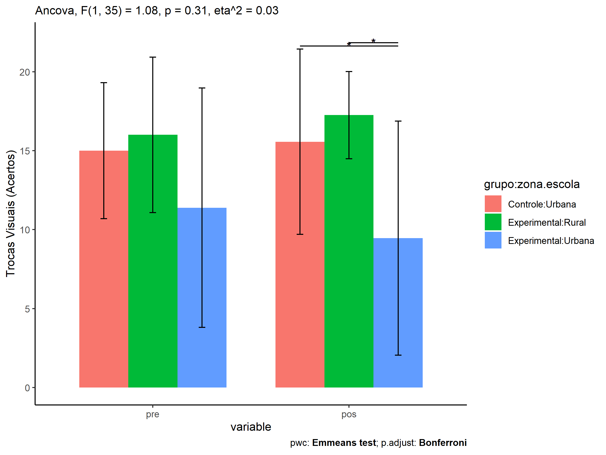<!-- -->

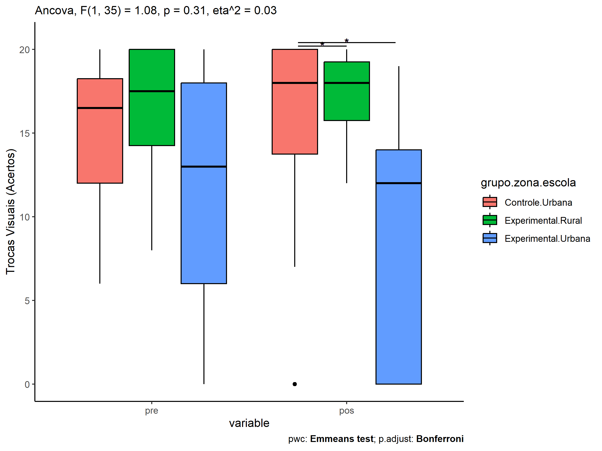<!-- -->

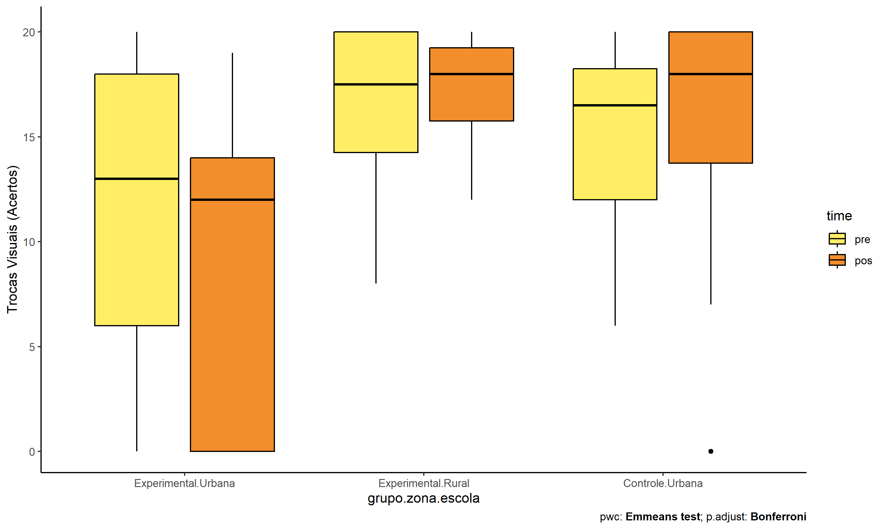<!-- -->

### Trocas Visuais (TRI)

| var        | zona.escola | grupo        |   n | M (pre) | SE (pre) | M (unadj) | SE (unadj) | M (adj) | SE (adj) |
|:-----------|:------------|:-------------|----:|--------:|---------:|----------:|-----------:|--------:|---------:|
| tri.TV.pos | Rural       | Experimental |   8 |  -0.091 |    0.399 |     0.098 |      0.283 |  -0.015 |    0.267 |
| tri.TV.pos | Urbana      | Controle     |  15 |  -0.439 |    0.220 |     0.065 |      0.239 |   0.137 |    0.194 |
| tri.TV.pos | Urbana      | Experimental |   8 |  -0.266 |    0.237 |    -0.412 |      0.294 |  -0.433 |    0.265 |

|     | grupo        | zona.escola | group1   | group2       | estimate | conf.low | conf.high |    se | statistic |     p | p.adj | p.adj.signif |
|:----|:-------------|:------------|:---------|:-------------|---------:|---------:|----------:|------:|----------:|------:|------:|:-------------|
| 2   | Experimental |             | Urbana   | Rural        |   -0.418 |   -1.187 |     0.352 | 0.375 |    -1.113 | 0.275 | 0.275 | ns           |
| 4   | Experimental |             | Urbana   | Rural        |   -0.175 |   -1.086 |     0.736 | 0.445 |    -0.394 | 0.697 | 0.697 | ns           |
| 5   |              | Urbana      | Controle | Experimental |    0.570 |   -0.105 |     1.244 | 0.329 |     1.733 | 0.094 | 0.094 | ns           |
| 7   |              | Urbana      | Controle | Experimental |   -0.174 |   -0.971 |     0.624 | 0.390 |    -0.445 | 0.659 | 0.659 | ns           |

| grupo        | zona.escola | group1 | group2 | estimate | conf.low | conf.high |    se | statistic |     p | p.adj | p.adj.signif |
|:-------------|:------------|:-------|:-------|---------:|---------:|----------:|------:|----------:|------:|------:|:-------------|
| Controle     | Urbana      | pre    | pos    |   -0.504 |   -1.147 |     0.138 | 0.321 |    -1.571 | 0.122 | 0.122 | ns           |
| Experimental | Urbana      | pre    | pos    |    0.318 |   -0.503 |     1.139 | 0.411 |     0.775 | 0.441 | 0.441 | ns           |
| Experimental | Rural       | pre    | pos    |   -0.189 |   -1.083 |     0.705 | 0.447 |    -0.423 | 0.674 | 0.674 | ns           |

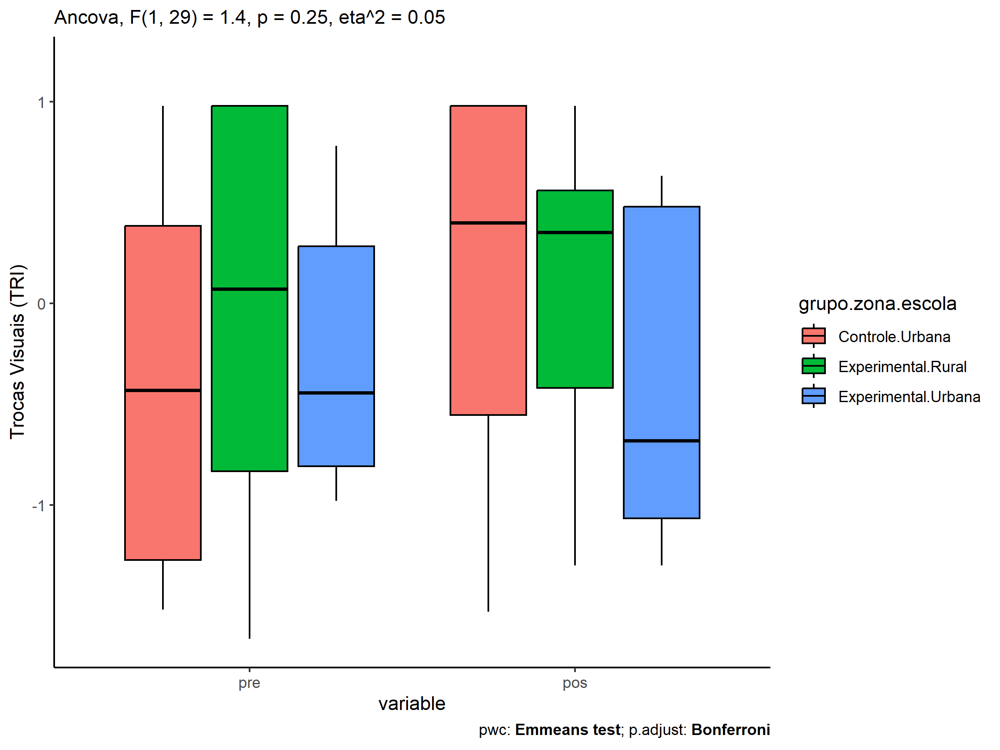<!-- -->

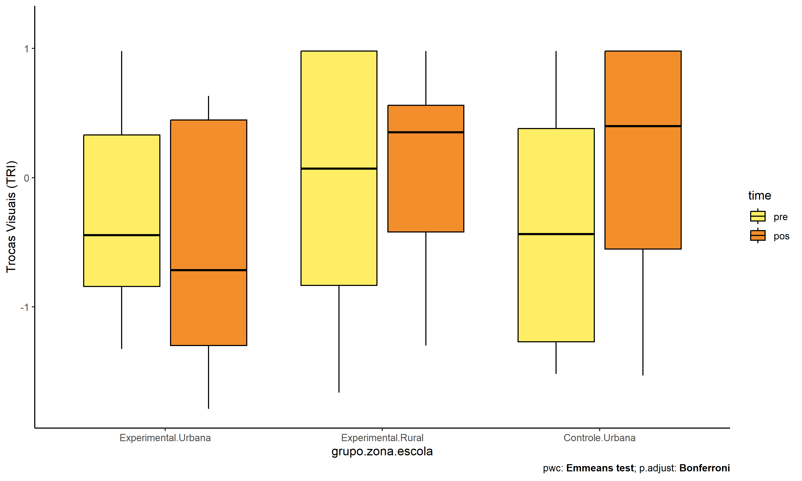<!-- -->

### Trocas Fonologicas (Acertos)

| var          | zona.escola | grupo        |   n | M (pre) | SE (pre) | M (unadj) | SE (unadj) | M (adj) | SE (adj) |
|:-------------|:------------|:-------------|----:|--------:|---------:|----------:|-----------:|--------:|---------:|
| score.TF.pos | Rural       | Experimental |   8 |  14.250 |    1.666 |    15.625 |      1.133 |  14.926 |    1.906 |
| score.TF.pos | Urbana      | Controle     |  16 |  13.688 |    0.805 |    13.000 |      1.326 |  12.480 |    1.351 |
| score.TF.pos | Urbana      | Experimental |  13 |   8.692 |    1.943 |     8.923 |      1.820 |   9.993 |    1.579 |

|     | grupo        | zona.escola | group1   | group2       | estimate | conf.low | conf.high |    se | statistic |     p | p.adj | p.adj.signif |
|:----|:-------------|:------------|:---------|:-------------|---------:|---------:|----------:|------:|----------:|------:|------:|:-------------|
| 2   | Experimental |             | Urbana   | Rural        |   -4.933 |  -10.153 |     0.288 | 2.566 |    -1.922 | 0.063 | 0.063 | ns           |
| 4   | Experimental |             | Urbana   | Rural        |   -5.558 |  -10.255 |    -0.860 | 2.312 |    -2.404 | 0.022 | 0.022 | \*           |
| 5   |              | Urbana      | Controle | Experimental |    2.487 |   -1.904 |     6.878 | 2.158 |     1.152 | 0.258 | 0.258 | ns           |
| 7   |              | Urbana      | Controle | Experimental |    4.995 |    1.092 |     8.899 | 1.921 |     2.601 | 0.014 | 0.014 | \*           |

| grupo        | zona.escola | group1 | group2 | estimate | conf.low | conf.high |    se | statistic |     p | p.adj | p.adj.signif |
|:-------------|:------------|:-------|:-------|---------:|---------:|----------:|------:|----------:|------:|------:|:-------------|
| Controle     | Urbana      | pre    | pos    |    0.687 |   -3.052 |     4.427 | 1.874 |     0.367 | 0.715 | 0.715 | ns           |
| Experimental | Urbana      | pre    | pos    |   -0.231 |   -4.379 |     3.918 | 2.079 |    -0.111 | 0.912 | 0.912 | ns           |
| Experimental | Rural       | pre    | pos    |   -1.375 |   -6.664 |     3.914 | 2.650 |    -0.519 | 0.606 | 0.606 | ns           |

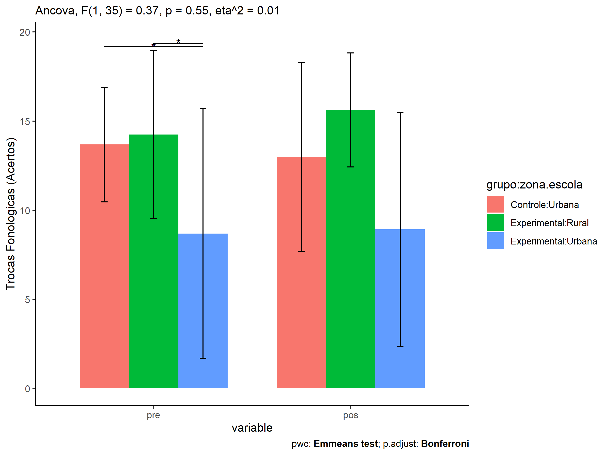<!-- -->

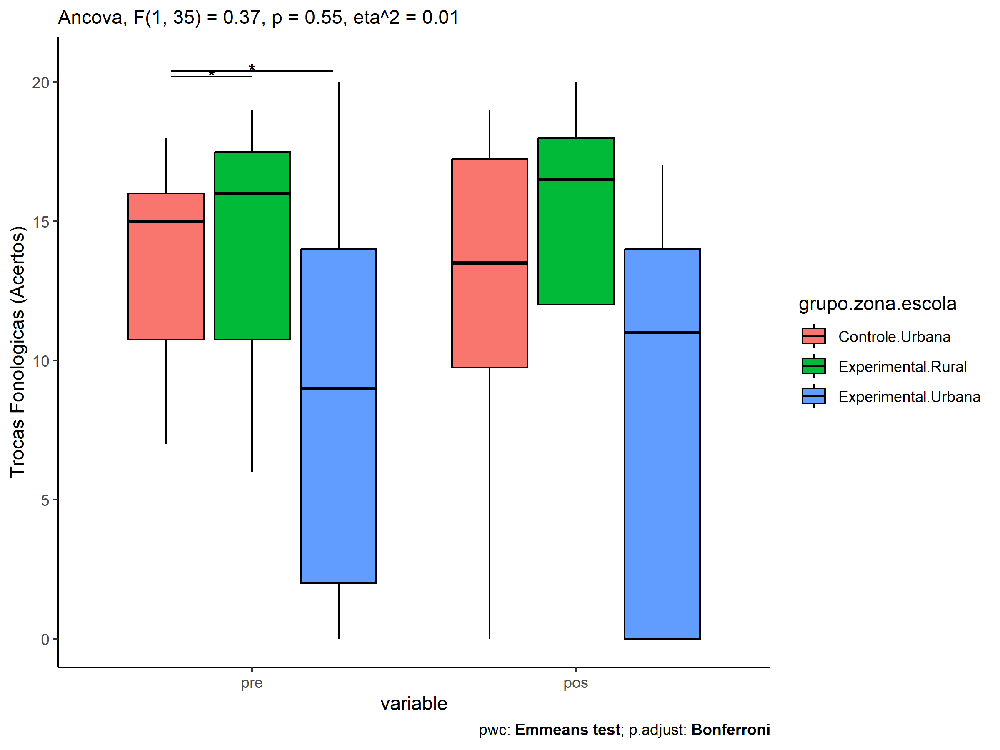<!-- -->

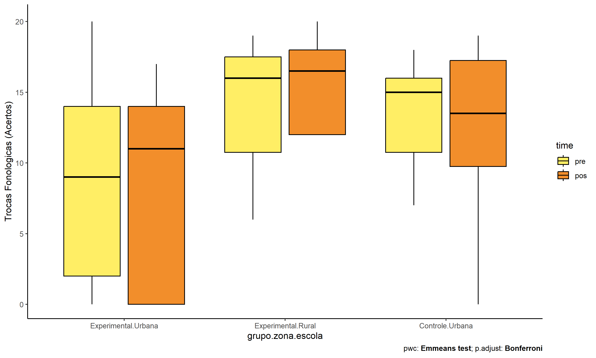<!-- -->

### Trocas Fonologicas (TRI)

| var        | zona.escola | grupo        |   n | M (pre) | SE (pre) | M (unadj) | SE (unadj) | M (adj) | SE (adj) |
|:-----------|:------------|:-------------|----:|--------:|---------:|----------:|-----------:|--------:|---------:|
| tri.TF.pos | Rural       | Experimental |   8 |  -0.250 |    0.356 |    -0.026 |      0.264 |  -0.144 |    0.218 |
| tri.TF.pos | Urbana      | Controle     |  15 |  -0.505 |    0.112 |    -0.336 |      0.193 |  -0.314 |    0.157 |
| tri.TF.pos | Urbana      | Experimental |   8 |  -0.609 |    0.262 |    -0.389 |      0.202 |  -0.311 |    0.216 |

|     | grupo        | zona.escola | group1   | group2       | estimate | conf.low | conf.high |    se | statistic |     p | p.adj | p.adj.signif |
|:----|:-------------|:------------|:---------|:-------------|---------:|---------:|----------:|------:|----------:|------:|------:|:-------------|
| 2   | Experimental |             | Urbana   | Rural        |   -0.167 |   -0.802 |     0.469 | 0.310 |    -0.539 | 0.595 | 0.595 | ns           |
| 4   | Experimental |             | Urbana   | Rural        |   -0.359 |   -1.072 |     0.354 | 0.348 |    -1.031 | 0.311 | 0.311 | ns           |
| 5   |              | Urbana      | Controle | Experimental |   -0.004 |   -0.551 |     0.544 | 0.267 |    -0.014 | 0.989 | 0.989 | ns           |
| 7   |              | Urbana      | Controle | Experimental |    0.104 |   -0.521 |     0.728 | 0.305 |     0.340 | 0.737 | 0.737 | ns           |

| grupo        | zona.escola | group1 | group2 | estimate | conf.low | conf.high |    se | statistic |     p | p.adj | p.adj.signif |
|:-------------|:------------|:-------|:-------|---------:|---------:|----------:|------:|----------:|------:|------:|:-------------|
| Controle     | Urbana      | pre    | pos    |   -0.090 |   -0.642 |     0.463 | 0.276 |    -0.325 | 0.747 | 0.747 | ns           |
| Experimental | Urbana      | pre    | pos    |   -0.178 |   -0.885 |     0.528 | 0.353 |    -0.505 | 0.616 | 0.616 | ns           |
| Experimental | Rural       | pre    | pos    |   -0.224 |   -0.993 |     0.545 | 0.384 |    -0.583 | 0.562 | 0.562 | ns           |

<!-- -->

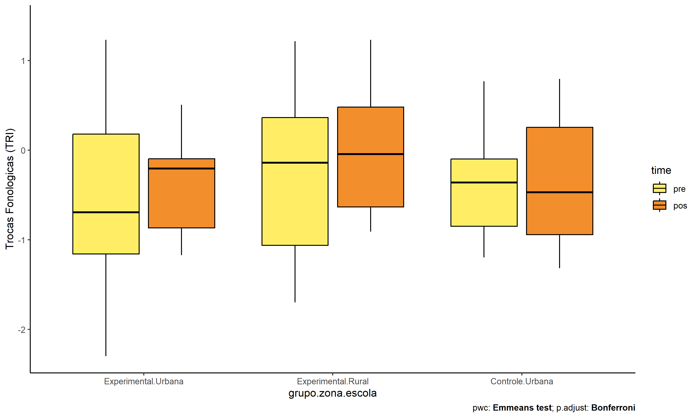<!-- -->

### Trocas Orograficas (Acertos)

| var          | zona.escola | grupo        |   n | M (pre) | SE (pre) | M (unadj) | SE (unadj) | M (adj) | SE (adj) |
|:-------------|:------------|:-------------|----:|--------:|---------:|----------:|-----------:|--------:|---------:|
| score.TO.pos | Rural       | Experimental |   8 |  11.125 |    1.274 |     8.750 |      1.221 |   8.094 |    1.581 |
| score.TO.pos | Urbana      | Controle     |  16 |   9.062 |    0.910 |     8.000 |      0.987 |   7.879 |    1.073 |
| score.TO.pos | Urbana      | Experimental |  13 |   6.462 |    1.284 |     5.923 |      1.439 |   6.476 |    1.249 |

|     | grupo        | zona.escola | group1   | group2       | estimate | conf.low | conf.high |    se | statistic |     p | p.adj | p.adj.signif |
|:----|:-------------|:------------|:---------|:-------------|---------:|---------:|----------:|------:|----------:|------:|------:|:-------------|
| 2   | Experimental |             | Urbana   | Rural        |   -1.619 |   -5.897 |     2.659 | 2.103 |    -0.770 | 0.447 | 0.447 | ns           |
| 4   | Experimental |             | Urbana   | Rural        |   -4.663 |   -8.326 |    -1.000 | 1.802 |    -2.587 | 0.014 | 0.014 | \*           |
| 5   |              | Urbana      | Controle | Experimental |    1.403 |   -1.987 |     4.793 | 1.666 |     0.842 | 0.406 | 0.406 | ns           |
| 7   |              | Urbana      | Controle | Experimental |    2.601 |   -0.443 |     5.645 | 1.498 |     1.737 | 0.092 | 0.092 | ns           |

| grupo        | zona.escola | group1 | group2 | estimate | conf.low | conf.high |    se | statistic |     p | p.adj | p.adj.signif |
|:-------------|:------------|:-------|:-------|---------:|---------:|----------:|------:|----------:|------:|------:|:-------------|
| Controle     | Urbana      | pre    | pos    |    1.062 |   -1.886 |     4.011 | 1.477 |     0.719 | 0.475 | 0.475 | ns           |
| Experimental | Urbana      | pre    | pos    |    0.538 |   -2.732 |     3.809 | 1.639 |     0.329 | 0.744 | 0.744 | ns           |
| Experimental | Rural       | pre    | pos    |    2.375 |   -1.794 |     6.544 | 2.089 |     1.137 | 0.260 | 0.260 | ns           |

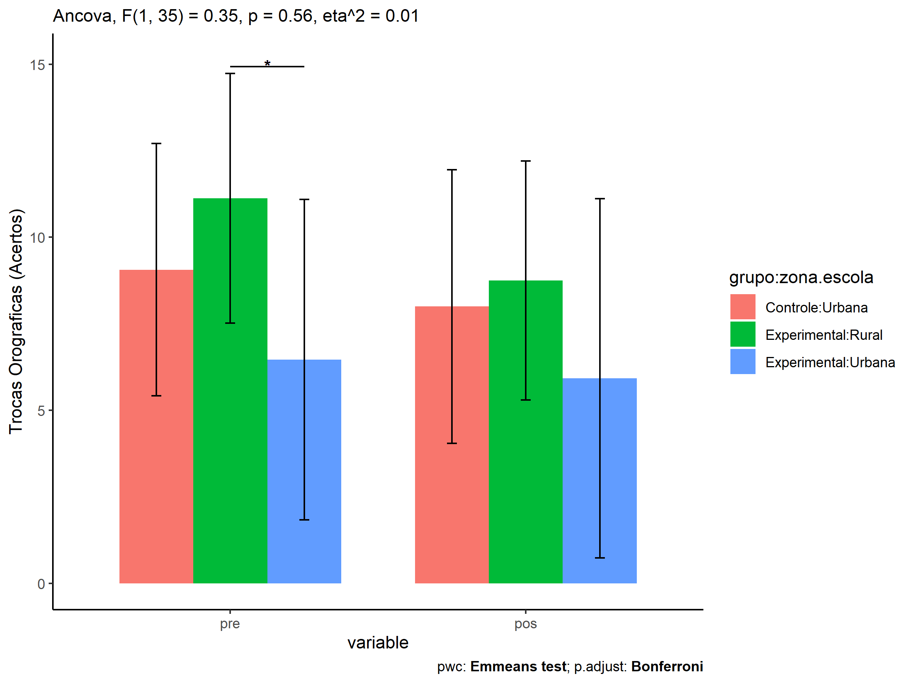<!-- -->

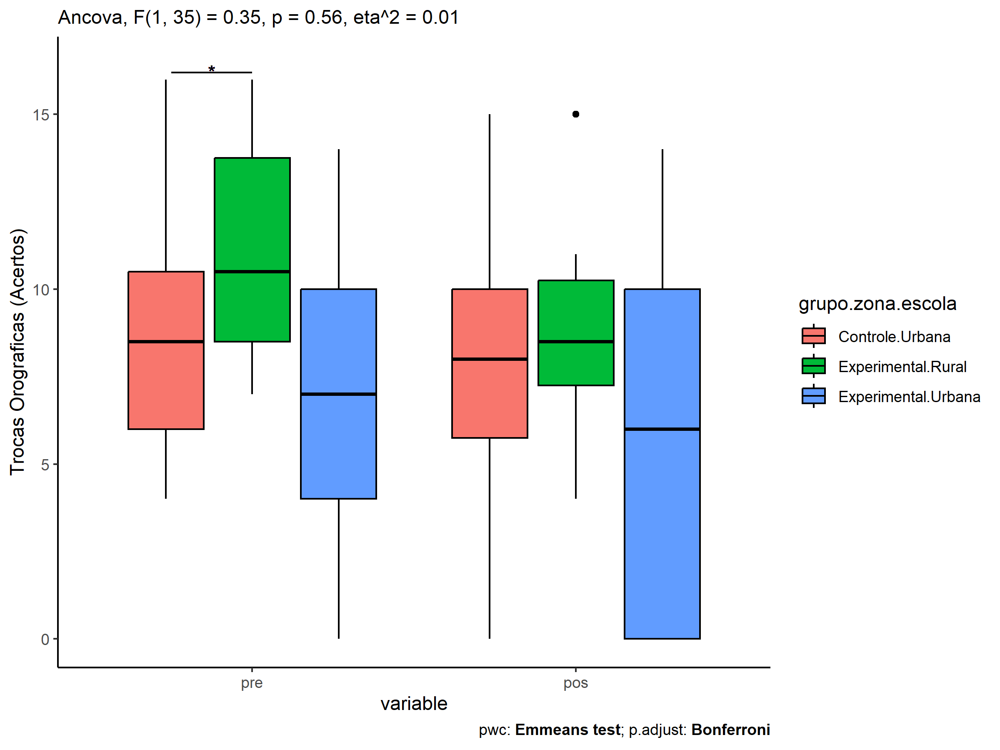<!-- -->

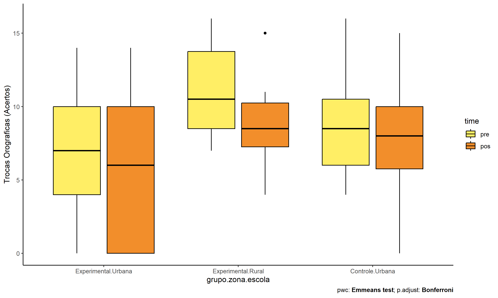<!-- -->

### Trocas Orograficas (TRI)

| var        | zona.escola | grupo        |   n | M (pre) | SE (pre) | M (unadj) | SE (unadj) | M (adj) | SE (adj) |
|:-----------|:------------|:-------------|----:|--------:|---------:|----------:|-----------:|--------:|---------:|
| tri.TO.pos | Rural       | Experimental |   8 |  -0.043 |    0.288 |    -0.487 |      0.294 |  -0.612 |    0.266 |
| tri.TO.pos | Urbana      | Controle     |  15 |  -0.421 |    0.155 |    -0.482 |      0.188 |  -0.421 |    0.193 |
| tri.TO.pos | Urbana      | Experimental |   8 |  -0.320 |    0.318 |    -0.414 |      0.333 |  -0.403 |    0.262 |

|     | grupo        | zona.escola | group1   | group2       | estimate | conf.low | conf.high |    se | statistic |     p | p.adj | p.adj.signif |
|:----|:-------------|:------------|:---------|:-------------|---------:|---------:|----------:|------:|----------:|------:|------:|:-------------|
| 2   | Experimental |             | Urbana   | Rural        |    0.209 |   -0.558 |     0.976 | 0.374 |     0.559 | 0.580 | 0.580 | ns           |
| 4   | Experimental |             | Urbana   | Rural        |   -0.277 |   -1.035 |     0.481 | 0.370 |    -0.748 | 0.461 | 0.461 | ns           |
| 5   |              | Urbana      | Controle | Experimental |   -0.018 |   -0.684 |     0.648 | 0.325 |    -0.055 | 0.956 | 0.956 | ns           |
| 7   |              | Urbana      | Controle | Experimental |   -0.101 |   -0.765 |     0.563 | 0.324 |    -0.312 | 0.757 | 0.757 | ns           |

| grupo        | zona.escola | group1 | group2 | estimate | conf.low | conf.high |    se | statistic |     p | p.adj | p.adj.signif |
|:-------------|:------------|:-------|:-------|---------:|---------:|----------:|------:|----------:|------:|------:|:-------------|
| Controle     | Urbana      | pre    | pos    |    0.168 |   -0.404 |     0.741 | 0.286 |     0.588 | 0.559 | 0.559 | ns           |
| Experimental | Urbana      | pre    | pos    |    0.015 |   -0.717 |     0.747 | 0.366 |     0.041 | 0.967 | 0.967 | ns           |
| Experimental | Rural       | pre    | pos    |    0.445 |   -0.352 |     1.241 | 0.398 |     1.116 | 0.269 | 0.269 | ns           |

<!-- -->

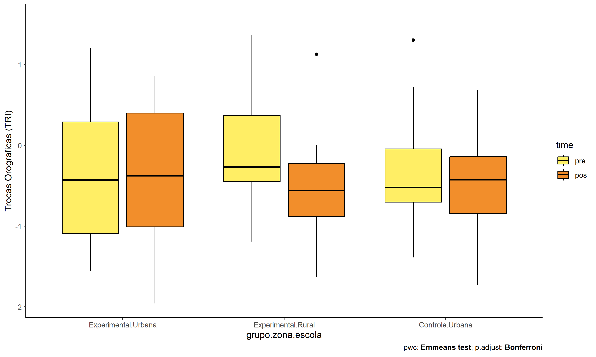<!-- -->

# Pairwise comparisons for grupo=“Experimental”

## factores: **grupo=“Experimental”:monitor**

### Leitura de Pseudo-Palavras (Acertos)

### Leitura de Pseudo-Palavras (TRI)

### Correta Regular (Acertos)

### Correta Regular (TRI)

### Correta Irregular (Acertos)

### Correta Irregular (TRI)

### Trocas Visuais (Acertos)

### Trocas Visuais (TRI)

### Trocas Fonologicas (Acertos)

### Trocas Fonologicas (TRI)

### Trocas Orograficas (Acertos)

### Trocas Orograficas (TRI)

## factores: **grupo=“Experimental”:monitor.genero**

### Leitura de Pseudo-Palavras (Acertos)

### Leitura de Pseudo-Palavras (TRI)

### Correta Regular (Acertos)

### Correta Regular (TRI)

### Correta Irregular (Acertos)

### Correta Irregular (TRI)

### Trocas Visuais (Acertos)

### Trocas Visuais (TRI)

### Trocas Fonologicas (Acertos)

### Trocas Fonologicas (TRI)

### Trocas Orograficas (Acertos)

### Trocas Orograficas (TRI)

## factores: **grupo=“Experimental”:monitor.area**

### Leitura de Pseudo-Palavras (Acertos)

### Leitura de Pseudo-Palavras (TRI)

### Correta Regular (Acertos)

### Correta Regular (TRI)

### Correta Irregular (Acertos)

### Correta Irregular (TRI)

### Trocas Visuais (Acertos)

### Trocas Visuais (TRI)

### Trocas Fonologicas (Acertos)

### Trocas Fonologicas (TRI)

### Trocas Orograficas (Acertos)

### Trocas Orograficas (TRI)

## factores: **grupo=“Experimental”:monitor.formacao**

### Leitura de Pseudo-Palavras (Acertos)

### Leitura de Pseudo-Palavras (TRI)

### Correta Regular (Acertos)

| var          | monitor.formacao |   n | M (pre) | SE (pre) | M (unadj) | SE (unadj) | M (adj) | SE (adj) |
|:-------------|:-----------------|----:|--------:|---------:|----------:|-----------:|--------:|---------:|
| score.CR.pos | ensino medio     |   5 |    14.6 |    1.568 |    11.000 |      3.050 |  10.996 |    2.209 |
| score.CR.pos | especializacao   |   6 |    15.0 |    1.265 |    16.167 |      0.543 |  16.170 |    2.017 |

| .y.          | group1       | group2         | estimate | conf.low | conf.high |    se | statistic |     p | p.adj | p.adj.signif |
|:-------------|:-------------|:---------------|---------:|---------:|----------:|------:|----------:|------:|------:|:-------------|
| score.CR.pos | ensino medio | especializacao |   -5.175 |  -12.081 |     1.731 | 2.995 |    -1.728 | 0.122 | 0.122 | ns           |
| score.CR.pre | ensino medio | especializacao |   -0.400 |   -4.902 |     4.102 | 1.990 |    -0.201 | 0.845 | 0.845 | ns           |

| monitor.formacao | group1 | group2 | estimate | conf.low | conf.high |    se | statistic |     p | p.adj | p.adj.signif |
|:-----------------|:-------|:-------|---------:|---------:|----------:|------:|----------:|------:|------:|:-------------|
| ensino medio     | pre    | pos    |    3.600 |   -1.752 |     8.952 | 2.547 |     1.413 | 0.175 | 0.175 | ns           |
| especializacao   | pre    | pos    |   -1.167 |   -6.052 |     3.719 | 2.326 |    -0.502 | 0.622 | 0.622 | ns           |

    ## Scale for colour is already present.
    ## Adding another scale for colour, which will replace the existing scale.

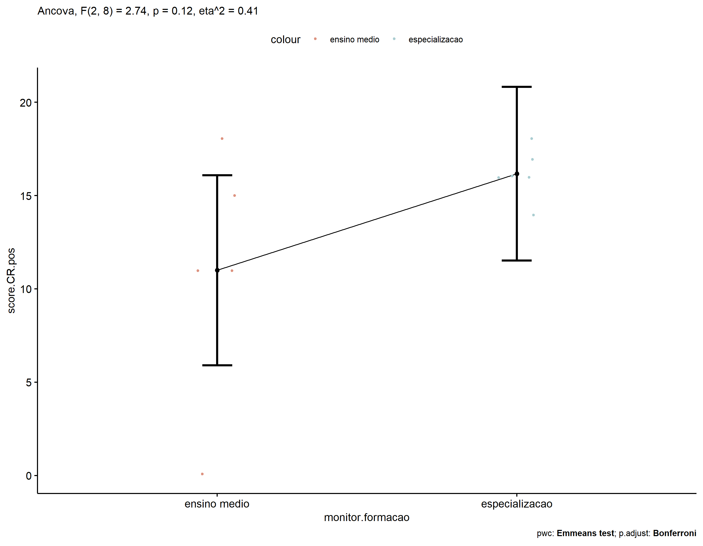<!-- -->

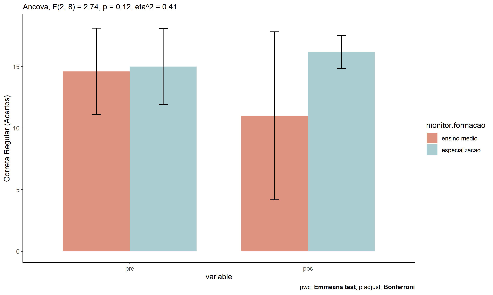<!-- -->

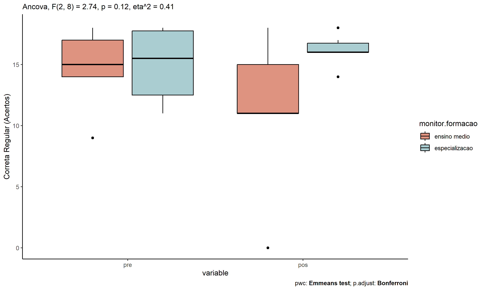<!-- -->

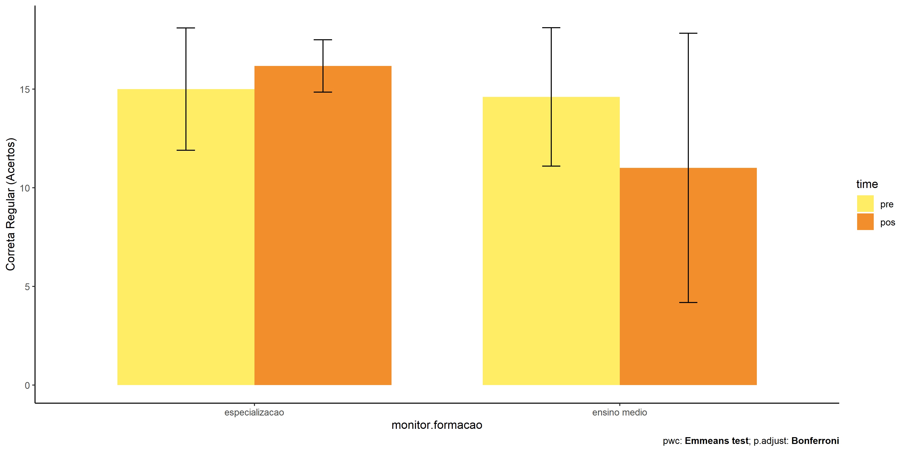<!-- -->

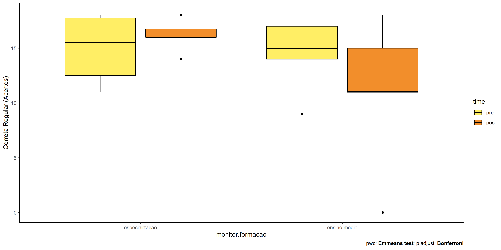<!-- -->

### Correta Regular (TRI)

### Correta Irregular (Acertos)

| var          | monitor.formacao |   n | M (pre) | SE (pre) | M (unadj) | SE (unadj) | M (adj) | SE (adj) |
|:-------------|:-----------------|----:|--------:|---------:|----------:|-----------:|--------:|---------:|
| score.CI.pos | ensino medio     |   5 |     8.0 |    1.924 |       7.0 |      2.429 |   7.551 |    1.929 |
| score.CI.pos | especializacao   |   6 |    10.5 |    1.335 |      13.5 |      1.176 |  13.041 |    1.751 |

| .y.          | group1       | group2         | estimate | conf.low | conf.high |    se | statistic |     p | p.adj | p.adj.signif |
|:-------------|:-------------|:---------------|---------:|---------:|----------:|------:|----------:|------:|------:|:-------------|
| score.CI.pos | ensino medio | especializacao |    -5.49 |  -11.681 |     0.700 | 2.685 |    -2.045 | 0.075 | 0.075 | ns           |
| score.CI.pre | ensino medio | especializacao |    -2.50 |   -7.656 |     2.656 | 2.279 |    -1.097 | 0.301 | 0.301 | ns           |

| monitor.formacao | group1 | group2 | estimate | conf.low | conf.high |    se | statistic |     p | p.adj | p.adj.signif |
|:-----------------|:-------|:-------|---------:|---------:|----------:|------:|----------:|------:|------:|:-------------|
| ensino medio     | pre    | pos    |        1 |   -4.306 |     6.306 | 2.525 |     0.396 | 0.697 | 0.697 | ns           |
| especializacao   | pre    | pos    |       -3 |   -7.843 |     1.843 | 2.305 |    -1.301 | 0.210 | 0.210 | ns           |

    ## Scale for colour is already present.
    ## Adding another scale for colour, which will replace the existing scale.

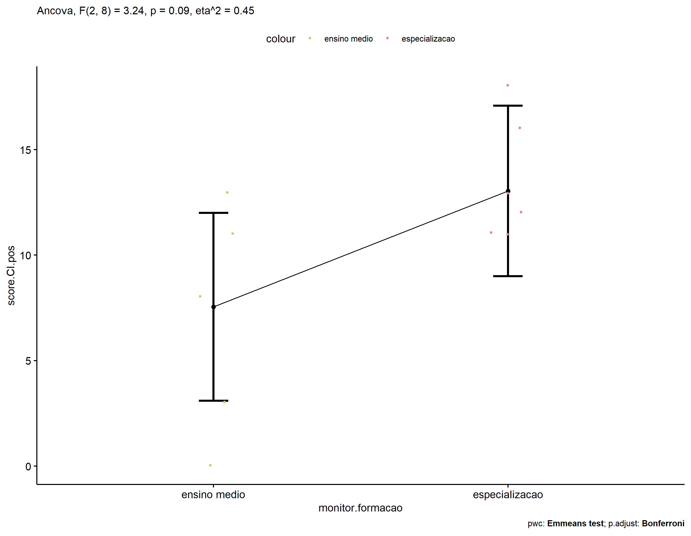<!-- -->

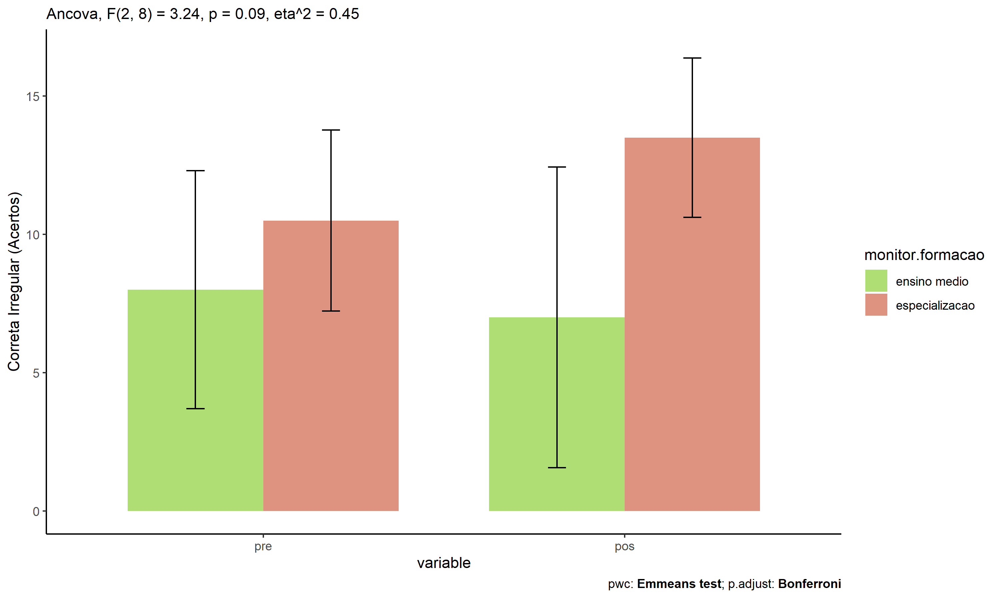<!-- -->

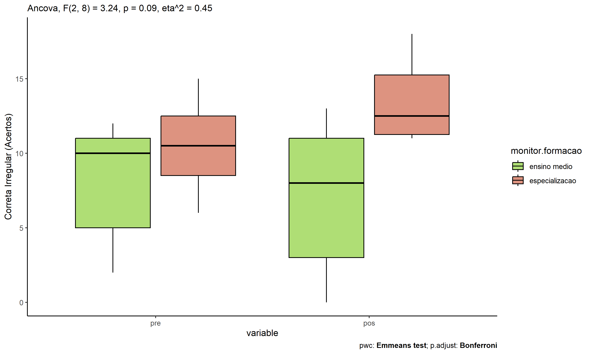<!-- -->

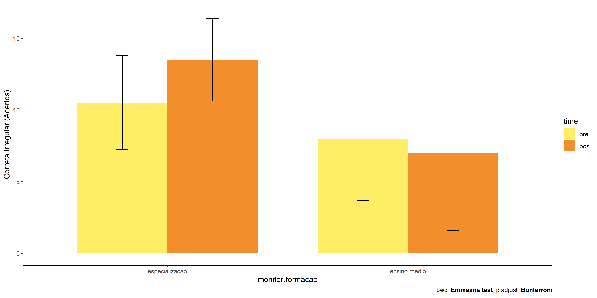<!-- -->

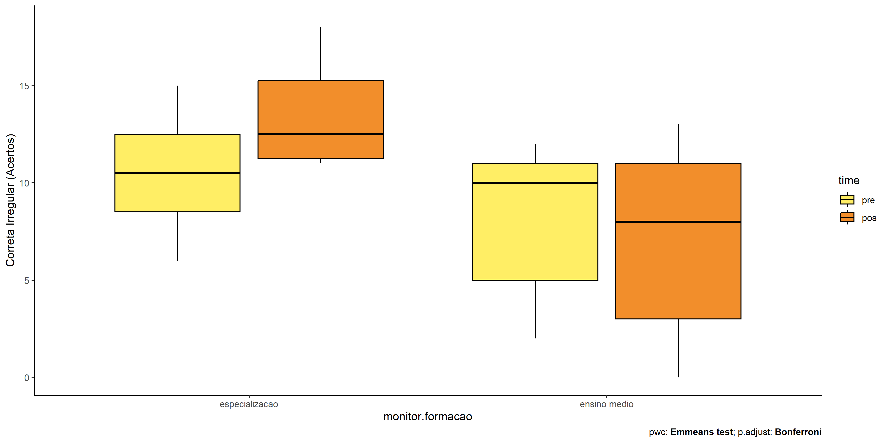<!-- -->

### Correta Irregular (TRI)

### Trocas Visuais (Acertos)

| var          | monitor.formacao |   n | M (pre) | SE (pre) | M (unadj) | SE (unadj) | M (adj) | SE (adj) |
|:-------------|:-----------------|----:|--------:|---------:|----------:|-----------:|--------:|---------:|
| score.TV.pos | ensino medio     |   5 |  18.600 |    0.748 |    13.800 |      3.720 |  13.293 |    2.902 |
| score.TV.pos | especializacao   |   6 |  15.333 |    2.246 |    16.667 |      1.202 |  17.089 |    2.630 |

| .y.          | group1       | group2         | estimate | conf.low | conf.high |    se | statistic |     p | p.adj | p.adj.signif |
|:-------------|:-------------|:---------------|---------:|---------:|----------:|------:|----------:|------:|------:|:-------------|
| score.TV.pos | ensino medio | especializacao |   -3.797 |  -13.189 |     5.596 | 4.073 |    -0.932 | 0.379 | 0.379 | ns           |
| score.TV.pre | ensino medio | especializacao |    3.267 |   -2.554 |     9.088 | 2.573 |     1.269 | 0.236 | 0.236 | ns           |

| monitor.formacao | group1 | group2 | estimate | conf.low | conf.high |    se | statistic |     p | p.adj | p.adj.signif |
|:-----------------|:-------|:-------|---------:|---------:|----------:|------:|----------:|------:|------:|:-------------|
| ensino medio     | pre    | pos    |    4.800 |   -2.081 |    11.681 | 3.275 |     1.466 | 0.160 | 0.160 | ns           |
| especializacao   | pre    | pos    |   -1.333 |   -7.614 |     4.948 | 2.990 |    -0.446 | 0.661 | 0.661 | ns           |

    ## Scale for colour is already present.
    ## Adding another scale for colour, which will replace the existing scale.

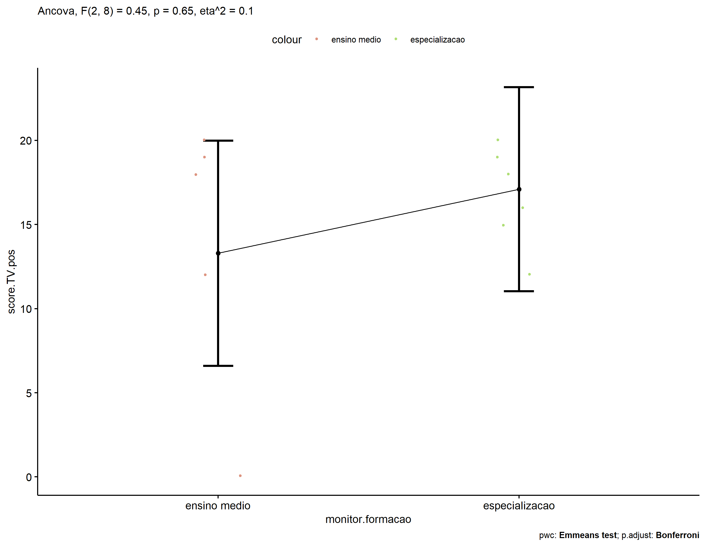<!-- -->

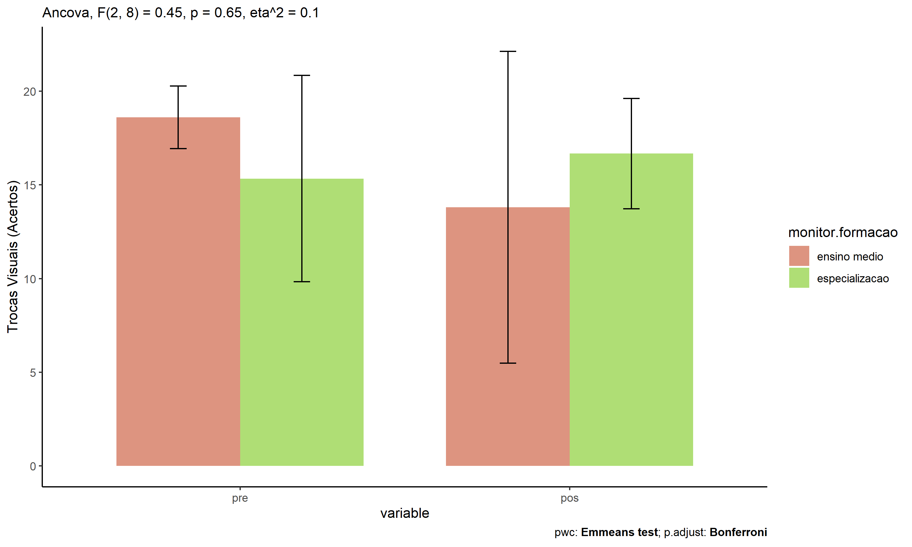<!-- -->

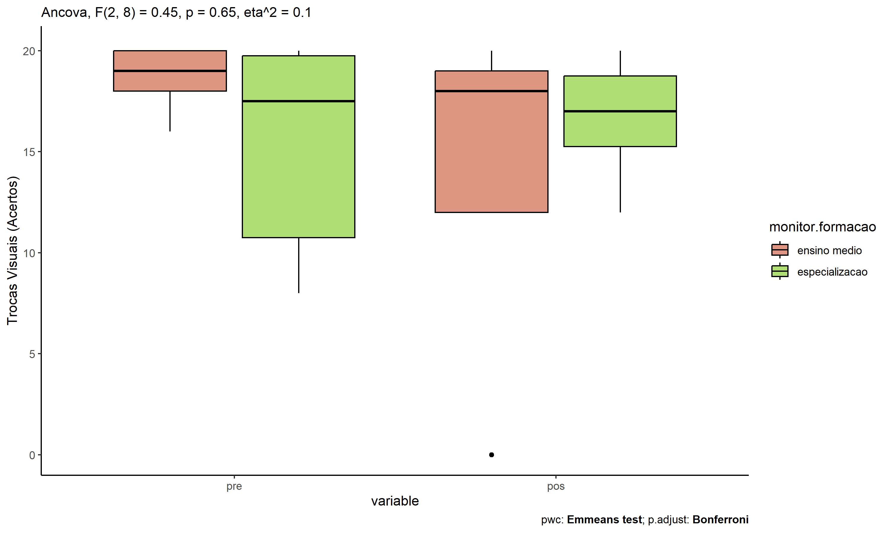<!-- -->

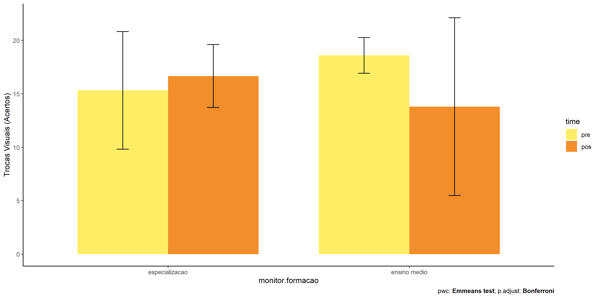<!-- -->

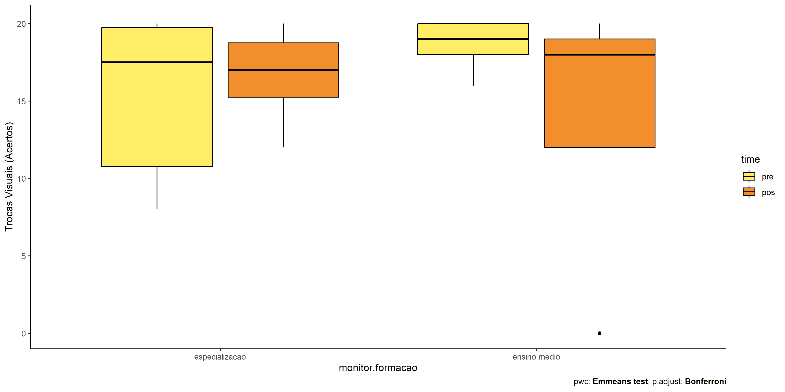<!-- -->

### Trocas Visuais (TRI)

### Trocas Fonologicas (Acertos)

| var          | monitor.formacao |   n | M (pre) | SE (pre) | M (unadj) | SE (unadj) | M (adj) | SE (adj) |
|:-------------|:-----------------|----:|--------:|---------:|----------:|-----------:|--------:|---------:|
| score.TF.pos | ensino medio     |   5 |  14.600 |    2.182 |    11.200 |      3.137 |  11.199 |    2.496 |
| score.TF.pos | especializacao   |   6 |  14.667 |    2.108 |    15.833 |      1.327 |  15.835 |    2.279 |

| .y.          | group1       | group2         | estimate | conf.low | conf.high |    se | statistic |     p | p.adj | p.adj.signif |
|:-------------|:-------------|:---------------|---------:|---------:|----------:|------:|----------:|------:|------:|:-------------|
| score.TF.pos | ensino medio | especializacao |   -4.636 |  -12.431 |     3.159 | 3.380 |    -1.371 | 0.207 | 0.207 | ns           |
| score.TF.pre | ensino medio | especializacao |   -0.067 |   -6.969 |     6.836 | 3.051 |    -0.022 | 0.983 | 0.983 | ns           |

| monitor.formacao | group1 | group2 | estimate | conf.low | conf.high |    se | statistic |     p | p.adj | p.adj.signif |
|:-----------------|:-------|:-------|---------:|---------:|----------:|------:|----------:|------:|------:|:-------------|
| ensino medio     | pre    | pos    |    3.400 |   -3.448 |    10.248 | 3.260 |     1.043 | 0.311 | 0.311 | ns           |
| especializacao   | pre    | pos    |   -1.167 |   -7.418 |     5.085 | 2.976 |    -0.392 | 0.700 | 0.700 | ns           |

    ## Scale for colour is already present.
    ## Adding another scale for colour, which will replace the existing scale.

<!-- -->

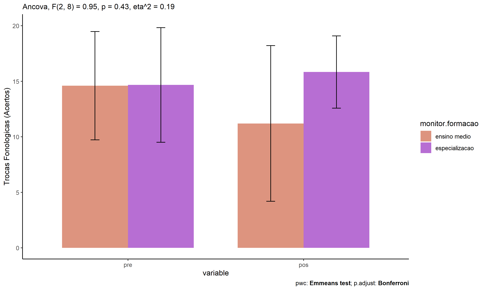<!-- -->

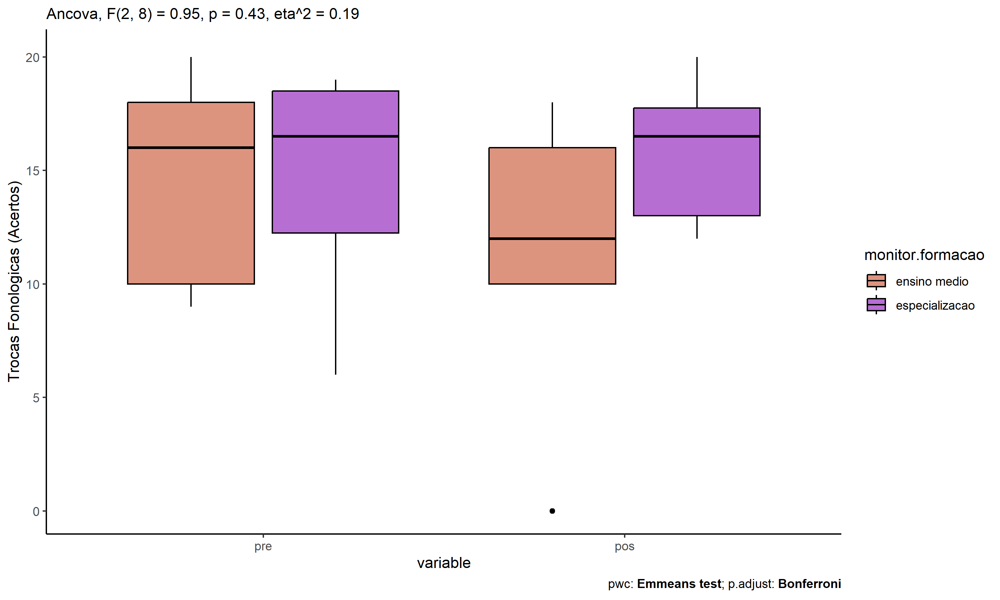<!-- -->

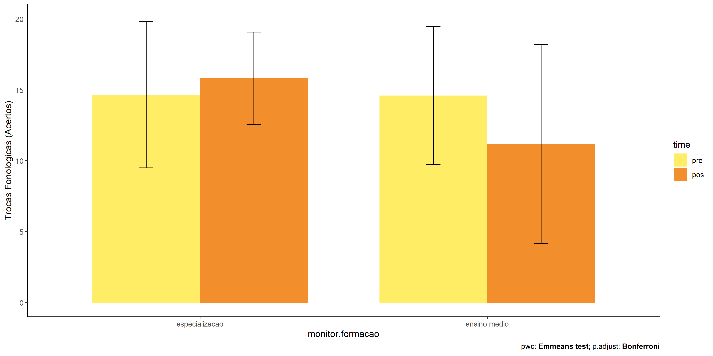<!-- -->

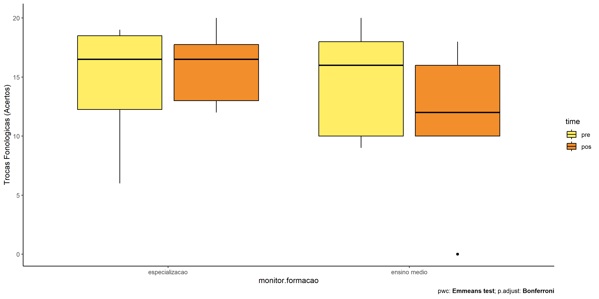<!-- -->

### Trocas Fonologicas (TRI)

### Trocas Orograficas (Acertos)

| var          | monitor.formacao |   n | M (pre) | SE (pre) | M (unadj) | SE (unadj) | M (adj) | SE (adj) |
|:-------------|:-----------------|----:|--------:|---------:|----------:|-----------:|--------:|---------:|
| score.TO.pos | ensino medio     |   5 |   7.800 |    1.241 |       7.2 |      2.177 |   7.886 |    2.242 |
| score.TO.pos | especializacao   |   6 |  11.833 |    1.537 |       8.5 |      1.607 |   7.928 |    2.014 |

| .y.          | group1       | group2         | estimate | conf.low | conf.high |    se | statistic |     p | p.adj | p.adj.signif |
|:-------------|:-------------|:---------------|---------:|---------:|----------:|------:|----------:|------:|------:|:-------------|
| score.TO.pos | ensino medio | especializacao |   -0.042 |   -7.583 |     7.499 | 3.270 |    -0.013 | 0.990 | 0.990 | ns           |
| score.TO.pre | ensino medio | especializacao |   -4.033 |   -8.636 |     0.570 | 2.035 |    -1.982 | 0.079 | 0.079 | ns           |

| monitor.formacao | group1 | group2 | estimate | conf.low | conf.high |    se | statistic |     p | p.adj | p.adj.signif |
|:-----------------|:-------|:-------|---------:|---------:|----------:|------:|----------:|------:|------:|:-------------|
| ensino medio     | pre    | pos    |    0.600 |   -4.584 |     5.784 | 2.467 |     0.243 | 0.811 | 0.811 | ns           |
| especializacao   | pre    | pos    |    3.333 |   -1.399 |     8.065 | 2.252 |     1.480 | 0.156 | 0.156 | ns           |

    ## Scale for colour is already present.
    ## Adding another scale for colour, which will replace the existing scale.

<!-- -->

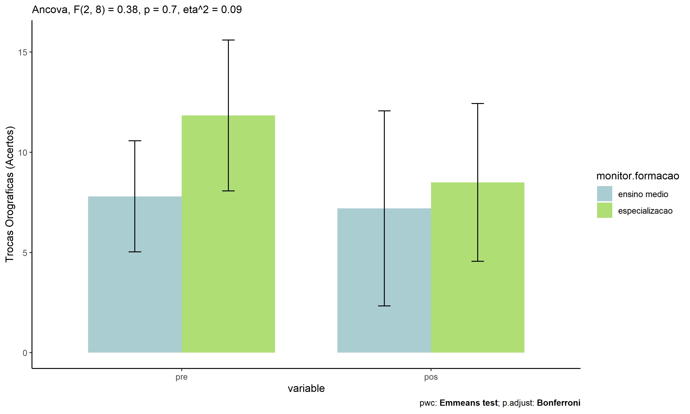<!-- -->

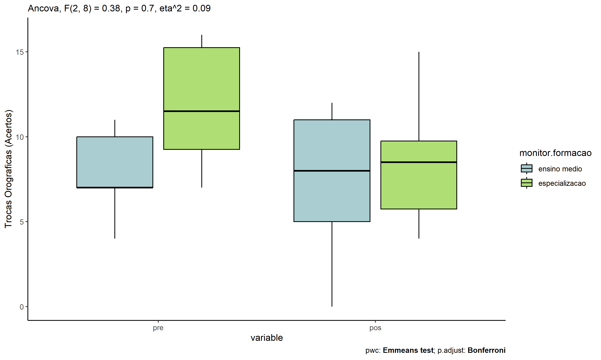<!-- -->

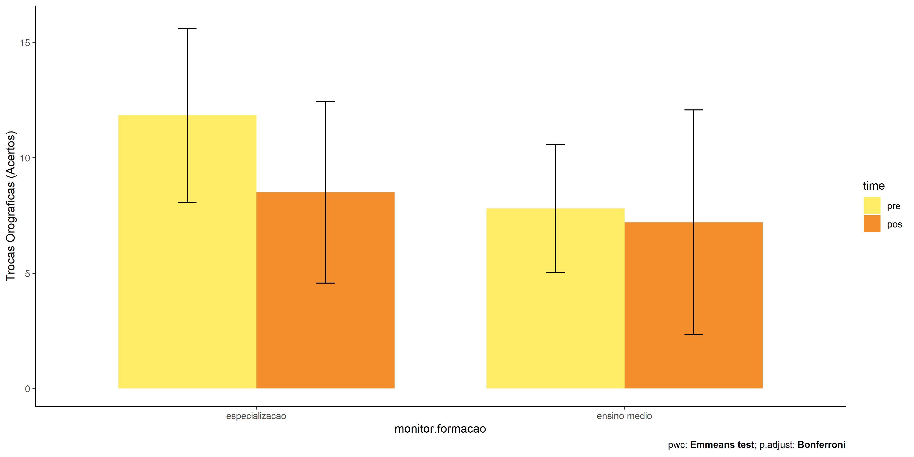<!-- -->

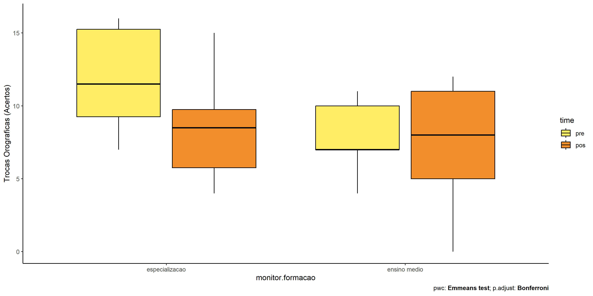<!-- -->

### Trocas Orograficas (TRI)

## factores: **grupo=“Experimental”:monitor.experiencia**

### Leitura de Pseudo-Palavras (Acertos)

### Leitura de Pseudo-Palavras (TRI)

### Correta Regular (Acertos)

### Correta Regular (TRI)

### Correta Irregular (Acertos)

### Correta Irregular (TRI)

### Trocas Visuais (Acertos)

### Trocas Visuais (TRI)

### Trocas Fonologicas (Acertos)

### Trocas Fonologicas (TRI)

### Trocas Orograficas (Acertos)

### Trocas Orograficas (TRI)
