ANCOVA in CLPP Test (Teste de Competencia em Leitura de Palavras e
Pseudo-palavras)
================
Geiser C. Challco <geiser@alumni.usp.br>

- [Descriptive Statistics of Initial
  Data](#descriptive-statistics-of-initial-data)
  - [Leitura de Pseudo-Palavras
    (Acertos)](#leitura-de-pseudo-palavras-acertos)
  - [Correta Regular (Acertos)](#correta-regular-acertos)
  - [Correta Irregular (Acertos)](#correta-irregular-acertos)
  - [Trocas Visuais (Acertos)](#trocas-visuais-acertos)
  - [Trocas Fonologicas (Acertos)](#trocas-fonologicas-acertos)
  - [Trocas Orograficas (Acertos)](#trocas-orograficas-acertos)
- [Checking of Assumptions](#checking-of-assumptions)
  - [Assumption: Normality
    distribution](#assumption-normality-distribution)
    - [Leitura de Pseudo-Palavras
      (Acertos)](#leitura-de-pseudo-palavras-acertos-1)
    - [Correta Regular (Acertos)](#correta-regular-acertos-1)
    - [Correta Irregular (Acertos)](#correta-irregular-acertos-1)
    - [Trocas Visuais (Acertos)](#trocas-visuais-acertos-1)
    - [Trocas Fonologicas (Acertos)](#trocas-fonologicas-acertos-1)
    - [Trocas Orograficas (Acertos)](#trocas-orograficas-acertos-1)
  - [Assumption: Homogeneity](#assumption-homogeneity)
    - [Leitura de Pseudo-Palavras
      (Acertos)](#leitura-de-pseudo-palavras-acertos-2)
    - [Correta Regular (Acertos)](#correta-regular-acertos-2)
    - [Correta Irregular (Acertos)](#correta-irregular-acertos-2)
    - [Trocas Visuais (Acertos)](#trocas-visuais-acertos-2)
    - [Trocas Fonologicas (Acertos)](#trocas-fonologicas-acertos-2)
    - [Trocas Orograficas (Acertos)](#trocas-orograficas-acertos-2)
- [Computation of ANCOVA test and Pairwise
  Comparison](#computation-of-ancova-test-and-pairwise-comparison)
  - [ANCOVA tests for one factor](#ancova-tests-for-one-factor)
    - [Leitura de Pseudo-Palavras
      (Acertos)](#leitura-de-pseudo-palavras-acertos-3)
    - [Correta Regular (Acertos)](#correta-regular-acertos-3)
    - [Correta Irregular (Acertos)](#correta-irregular-acertos-3)
    - [Trocas Visuais (Acertos)](#trocas-visuais-acertos-3)
    - [Trocas Fonologicas (Acertos)](#trocas-fonologicas-acertos-3)
    - [Trocas Orograficas (Acertos)](#trocas-orograficas-acertos-3)
  - [ANCOVA tests for two factors](#ancova-tests-for-two-factors)
    - [Leitura de Pseudo-Palavras
      (Acertos)](#leitura-de-pseudo-palavras-acertos-4)
    - [Correta Regular (Acertos)](#correta-regular-acertos-4)
    - [Correta Irregular (Acertos)](#correta-irregular-acertos-4)
    - [Trocas Visuais (Acertos)](#trocas-visuais-acertos-4)
    - [Trocas Fonologicas (Acertos)](#trocas-fonologicas-acertos-4)
    - [Trocas Orograficas (Acertos)](#trocas-orograficas-acertos-4)
  - [ANCOVA tests for
    grupo=“Experimental”](#ancova-tests-for-grupoexperimental)
    - [Leitura de Pseudo-Palavras
      (Acertos)](#leitura-de-pseudo-palavras-acertos-5)
    - [Correta Regular (Acertos)](#correta-regular-acertos-5)
    - [Correta Irregular (Acertos)](#correta-irregular-acertos-5)
    - [Trocas Visuais (Acertos)](#trocas-visuais-acertos-5)
    - [Trocas Fonologicas (Acertos)](#trocas-fonologicas-acertos-5)
    - [Trocas Orograficas (Acertos)](#trocas-orograficas-acertos-5)
- [Pairwise comparisons for one
  factor](#pairwise-comparisons-for-one-factor)
  - [factor: **grupo**](#factor-grupo)
    - [Leitura de Pseudo-Palavras
      (Acertos)](#leitura-de-pseudo-palavras-acertos-6)
    - [Correta Regular (Acertos)](#correta-regular-acertos-6)
    - [Correta Irregular (Acertos)](#correta-irregular-acertos-6)
    - [Trocas Visuais (Acertos)](#trocas-visuais-acertos-6)
    - [Trocas Fonologicas (Acertos)](#trocas-fonologicas-acertos-6)
    - [Trocas Orograficas (Acertos)](#trocas-orograficas-acertos-6)
  - [factor: **genero**](#factor-genero)
    - [Leitura de Pseudo-Palavras
      (Acertos)](#leitura-de-pseudo-palavras-acertos-7)
    - [Correta Regular (Acertos)](#correta-regular-acertos-7)
    - [Correta Irregular (Acertos)](#correta-irregular-acertos-7)
    - [Trocas Visuais (Acertos)](#trocas-visuais-acertos-7)
    - [Trocas Fonologicas (Acertos)](#trocas-fonologicas-acertos-7)
    - [Trocas Orograficas (Acertos)](#trocas-orograficas-acertos-7)
  - [factor: **idade**](#factor-idade)
    - [Leitura de Pseudo-Palavras
      (Acertos)](#leitura-de-pseudo-palavras-acertos-8)
    - [Correta Regular (Acertos)](#correta-regular-acertos-8)
    - [Correta Irregular (Acertos)](#correta-irregular-acertos-8)
    - [Trocas Visuais (Acertos)](#trocas-visuais-acertos-8)
    - [Trocas Fonologicas (Acertos)](#trocas-fonologicas-acertos-8)
    - [Trocas Orograficas (Acertos)](#trocas-orograficas-acertos-8)
  - [factor: **zona.participante**](#factor-zonaparticipante)
    - [Leitura de Pseudo-Palavras
      (Acertos)](#leitura-de-pseudo-palavras-acertos-9)
    - [Correta Regular (Acertos)](#correta-regular-acertos-9)
    - [Correta Irregular (Acertos)](#correta-irregular-acertos-9)
    - [Trocas Visuais (Acertos)](#trocas-visuais-acertos-9)
    - [Trocas Fonologicas (Acertos)](#trocas-fonologicas-acertos-9)
    - [Trocas Orograficas (Acertos)](#trocas-orograficas-acertos-9)
  - [factor: **escola**](#factor-escola)
    - [Leitura de Pseudo-Palavras
      (Acertos)](#leitura-de-pseudo-palavras-acertos-10)
    - [Correta Regular (Acertos)](#correta-regular-acertos-10)
    - [Correta Irregular (Acertos)](#correta-irregular-acertos-10)
    - [Trocas Visuais (Acertos)](#trocas-visuais-acertos-10)
    - [Trocas Fonologicas (Acertos)](#trocas-fonologicas-acertos-10)
    - [Trocas Orograficas (Acertos)](#trocas-orograficas-acertos-10)
  - [factor: **zona.escola**](#factor-zonaescola)
    - [Leitura de Pseudo-Palavras
      (Acertos)](#leitura-de-pseudo-palavras-acertos-11)
    - [Correta Regular (Acertos)](#correta-regular-acertos-11)
    - [Correta Irregular (Acertos)](#correta-irregular-acertos-11)
    - [Trocas Visuais (Acertos)](#trocas-visuais-acertos-11)
    - [Trocas Fonologicas (Acertos)](#trocas-fonologicas-acertos-11)
    - [Trocas Orograficas (Acertos)](#trocas-orograficas-acertos-11)
- [Pairwise comparisons for two
  factors](#pairwise-comparisons-for-two-factors)
  - [factores: **genero:grupo**](#factores-generogrupo)
    - [Leitura de Pseudo-Palavras
      (Acertos)](#leitura-de-pseudo-palavras-acertos-12)
    - [Correta Regular (Acertos)](#correta-regular-acertos-12)
    - [Correta Irregular (Acertos)](#correta-irregular-acertos-12)
    - [Trocas Visuais (Acertos)](#trocas-visuais-acertos-12)
    - [Trocas Fonologicas (Acertos)](#trocas-fonologicas-acertos-12)
    - [Trocas Orograficas (Acertos)](#trocas-orograficas-acertos-12)
  - [factores: **idade:grupo**](#factores-idadegrupo)
    - [Leitura de Pseudo-Palavras
      (Acertos)](#leitura-de-pseudo-palavras-acertos-13)
    - [Correta Regular (Acertos)](#correta-regular-acertos-13)
    - [Correta Irregular (Acertos)](#correta-irregular-acertos-13)
    - [Trocas Visuais (Acertos)](#trocas-visuais-acertos-13)
    - [Trocas Fonologicas (Acertos)](#trocas-fonologicas-acertos-13)
    - [Trocas Orograficas (Acertos)](#trocas-orograficas-acertos-13)
  - [factores:
    **zona.participante:grupo**](#factores-zonaparticipantegrupo)
    - [Leitura de Pseudo-Palavras
      (Acertos)](#leitura-de-pseudo-palavras-acertos-14)
    - [Correta Regular (Acertos)](#correta-regular-acertos-14)
    - [Correta Irregular (Acertos)](#correta-irregular-acertos-14)
    - [Trocas Visuais (Acertos)](#trocas-visuais-acertos-14)
    - [Trocas Fonologicas (Acertos)](#trocas-fonologicas-acertos-14)
    - [Trocas Orograficas (Acertos)](#trocas-orograficas-acertos-14)
  - [factores: **escola:grupo**](#factores-escolagrupo)
    - [Leitura de Pseudo-Palavras
      (Acertos)](#leitura-de-pseudo-palavras-acertos-15)
    - [Correta Regular (Acertos)](#correta-regular-acertos-15)
    - [Correta Irregular (Acertos)](#correta-irregular-acertos-15)
    - [Trocas Visuais (Acertos)](#trocas-visuais-acertos-15)
    - [Trocas Fonologicas (Acertos)](#trocas-fonologicas-acertos-15)
    - [Trocas Orograficas (Acertos)](#trocas-orograficas-acertos-15)
  - [factores: **zona.escola:grupo**](#factores-zonaescolagrupo)
    - [Leitura de Pseudo-Palavras
      (Acertos)](#leitura-de-pseudo-palavras-acertos-16)
    - [Correta Regular (Acertos)](#correta-regular-acertos-16)
    - [Correta Irregular (Acertos)](#correta-irregular-acertos-16)
    - [Trocas Visuais (Acertos)](#trocas-visuais-acertos-16)
    - [Trocas Fonologicas (Acertos)](#trocas-fonologicas-acertos-16)
    - [Trocas Orograficas (Acertos)](#trocas-orograficas-acertos-16)
- [Pairwise comparisons for
  grupo=“Experimental”](#pairwise-comparisons-for-grupoexperimental)
  - [factores:
    **grupo=“Experimental”:monitor**](#factores-grupoexperimentalmonitor)
    - [Leitura de Pseudo-Palavras
      (Acertos)](#leitura-de-pseudo-palavras-acertos-17)
    - [Correta Regular (Acertos)](#correta-regular-acertos-17)
    - [Correta Irregular (Acertos)](#correta-irregular-acertos-17)
    - [Trocas Visuais (Acertos)](#trocas-visuais-acertos-17)
    - [Trocas Fonologicas (Acertos)](#trocas-fonologicas-acertos-17)
    - [Trocas Orograficas (Acertos)](#trocas-orograficas-acertos-17)
  - [factores:
    **grupo=“Experimental”:monitor.genero**](#factores-grupoexperimentalmonitorgenero)
    - [Leitura de Pseudo-Palavras
      (Acertos)](#leitura-de-pseudo-palavras-acertos-18)
    - [Correta Regular (Acertos)](#correta-regular-acertos-18)
    - [Correta Irregular (Acertos)](#correta-irregular-acertos-18)
    - [Trocas Visuais (Acertos)](#trocas-visuais-acertos-18)
    - [Trocas Fonologicas (Acertos)](#trocas-fonologicas-acertos-18)
    - [Trocas Orograficas (Acertos)](#trocas-orograficas-acertos-18)
  - [factores:
    **grupo=“Experimental”:monitor.area**](#factores-grupoexperimentalmonitorarea)
    - [Leitura de Pseudo-Palavras
      (Acertos)](#leitura-de-pseudo-palavras-acertos-19)
    - [Correta Regular (Acertos)](#correta-regular-acertos-19)
    - [Correta Irregular (Acertos)](#correta-irregular-acertos-19)
    - [Trocas Visuais (Acertos)](#trocas-visuais-acertos-19)
    - [Trocas Fonologicas (Acertos)](#trocas-fonologicas-acertos-19)
    - [Trocas Orograficas (Acertos)](#trocas-orograficas-acertos-19)
  - [factores:
    **grupo=“Experimental”:monitor.formacao**](#factores-grupoexperimentalmonitorformacao)
    - [Leitura de Pseudo-Palavras
      (Acertos)](#leitura-de-pseudo-palavras-acertos-20)
    - [Correta Regular (Acertos)](#correta-regular-acertos-20)
    - [Correta Irregular (Acertos)](#correta-irregular-acertos-20)
    - [Trocas Visuais (Acertos)](#trocas-visuais-acertos-20)
    - [Trocas Fonologicas (Acertos)](#trocas-fonologicas-acertos-20)
    - [Trocas Orograficas (Acertos)](#trocas-orograficas-acertos-20)
  - [factores:
    **grupo=“Experimental”:monitor.experiencia**](#factores-grupoexperimentalmonitorexperiencia)
    - [Leitura de Pseudo-Palavras
      (Acertos)](#leitura-de-pseudo-palavras-acertos-21)
    - [Correta Regular (Acertos)](#correta-regular-acertos-21)
    - [Correta Irregular (Acertos)](#correta-irregular-acertos-21)
    - [Trocas Visuais (Acertos)](#trocas-visuais-acertos-21)
    - [Trocas Fonologicas (Acertos)](#trocas-fonologicas-acertos-21)
    - [Trocas Orograficas (Acertos)](#trocas-orograficas-acertos-21)

**NOTE**

- Teste ANCOVA para determinar se houve diferenças significativas no
  Teste de Competencia em Leitura de Palavras e Pseudo-palavras (medido
  usando pre- e pos-testes).
- ANCOVA test to determine whether there were significant differences in
  CLPP Test (measured using pre- and post-tests).

# Descriptive Statistics of Initial Data

## Leitura de Pseudo-Palavras (Acertos)

| grupo    | genero | idade | zona.participante | escola | zona.escola | variable       |   n |   mean | median | min | max |     sd |     se |      ci |   iqr |
|:---------|:-------|:------|:------------------|:-------|:------------|:---------------|----:|-------:|-------:|----:|----:|-------:|-------:|--------:|------:|
| Controle | F      |       |                   |        |             | score.CLPP.pos |  78 | 72.692 |   75.5 |  23 |  96 | 14.418 |  1.633 |   3.251 | 21.75 |
| Controle | M      |       |                   |        |             | score.CLPP.pos |  71 | 66.197 |   68.0 |  29 |  92 | 15.133 |  1.796 |   3.582 | 24.50 |
| WordGen  | F      |       |                   |        |             | score.CLPP.pos |  54 | 74.889 |   79.5 |  16 |  93 | 15.507 |  2.110 |   4.233 | 15.00 |
| WordGen  | M      |       |                   |        |             | score.CLPP.pos |  65 | 69.877 |   69.0 |  42 |  94 | 12.362 |  1.533 |   3.063 | 17.00 |
| Controle | F      |       |                   |        |             | score.CLPP.pre |  78 | 70.205 |   71.5 |  13 |  96 | 15.002 |  1.699 |   3.383 | 18.25 |
| Controle | M      |       |                   |        |             | score.CLPP.pre |  71 | 65.789 |   67.0 |  11 |  94 | 14.028 |  1.665 |   3.320 | 14.50 |
| WordGen  | F      |       |                   |        |             | score.CLPP.pre |  54 | 74.944 |   78.0 |  33 |  91 | 13.397 |  1.823 |   3.657 | 16.50 |
| WordGen  | M      |       |                   |        |             | score.CLPP.pre |  65 | 68.692 |   69.0 |  35 |  92 | 12.915 |  1.602 |   3.200 | 17.00 |
| Controle |        | 10y   |                   |        |             | score.CLPP.pos |  28 | 70.429 |   73.0 |  38 |  96 | 14.101 |  2.665 |   5.468 | 20.00 |
| Controle |        | 11y   |                   |        |             | score.CLPP.pos |  84 | 72.429 |   76.0 |  23 |  96 | 14.699 |  1.604 |   3.190 | 22.25 |
| Controle |        | 12y   |                   |        |             | score.CLPP.pos |  20 | 59.450 |   62.0 |  29 |  87 | 16.015 |  3.581 |   7.495 | 19.00 |
| Controle |        | 13y   |                   |        |             | score.CLPP.pos |   8 | 65.500 |   65.5 |  51 |  76 |  9.243 |  3.268 |   7.727 | 15.00 |
| Controle |        | 14y   |                   |        |             | score.CLPP.pos |   2 | 63.500 |   63.5 |  47 |  80 | 23.335 | 16.500 | 209.652 | 16.50 |
| Controle |        | 15y   |                   |        |             | score.CLPP.pos |   1 | 59.000 |   59.0 |  59 |  59 |        |        |         |  0.00 |
| Controle |        |       |                   |        |             | score.CLPP.pos |   6 | 69.167 |   61.5 |  55 |  90 | 15.587 |  6.364 |  16.358 | 22.50 |
| WordGen  |        | 10y   |                   |        |             | score.CLPP.pos |  23 | 67.957 |   70.0 |  16 |  86 | 15.953 |  3.326 |   6.899 | 22.00 |
| WordGen  |        | 11y   |                   |        |             | score.CLPP.pos |  73 | 74.808 |   77.0 |  40 |  94 | 12.714 |  1.488 |   2.966 | 18.00 |
| WordGen  |        | 12y   |                   |        |             | score.CLPP.pos |  15 | 67.933 |   69.0 |  38 |  93 | 15.201 |  3.925 |   8.418 | 19.00 |
| WordGen  |        | 13y   |                   |        |             | score.CLPP.pos |   5 | 66.400 |   67.0 |  42 |  81 | 15.915 |  7.118 |  19.762 | 18.00 |
| WordGen  |        | 14y   |                   |        |             | score.CLPP.pos |   1 | 61.000 |   61.0 |  61 |  61 |        |        |         |  0.00 |
| WordGen  |        |       |                   |        |             | score.CLPP.pos |   2 | 75.000 |   75.0 |  63 |  87 | 16.971 | 12.000 | 152.474 | 12.00 |
| Controle |        | 10y   |                   |        |             | score.CLPP.pre |  28 | 71.643 |   72.0 |  53 |  95 | 10.166 |  1.921 |   3.942 | 16.25 |
| Controle |        | 11y   |                   |        |             | score.CLPP.pre |  84 | 68.917 |   71.0 |  11 |  96 | 16.045 |  1.751 |   3.482 | 18.25 |
| Controle |        | 12y   |                   |        |             | score.CLPP.pre |  20 | 64.650 |   66.5 |  35 |  83 | 11.842 |  2.648 |   5.542 |  7.75 |
| Controle |        | 13y   |                   |        |             | score.CLPP.pre |   8 | 60.875 |   64.5 |  35 |  73 | 12.529 |  4.430 |  10.475 | 11.00 |
| Controle |        | 14y   |                   |        |             | score.CLPP.pre |   2 | 46.000 |   46.0 |  30 |  62 | 22.627 | 16.000 | 203.299 | 16.00 |
| Controle |        | 15y   |                   |        |             | score.CLPP.pre |   1 | 52.000 |   52.0 |  52 |  52 |        |        |         |  0.00 |
| Controle |        |       |                   |        |             | score.CLPP.pre |   6 | 71.333 |   67.5 |  51 |  90 | 14.390 |  5.875 |  15.101 | 15.25 |
| WordGen  |        | 10y   |                   |        |             | score.CLPP.pre |  23 | 70.565 |   70.0 |  47 |  88 | 10.483 |  2.186 |   4.533 | 14.50 |
| WordGen  |        | 11y   |                   |        |             | score.CLPP.pre |  73 | 73.781 |   74.0 |  38 |  92 | 12.361 |  1.447 |   2.884 | 15.00 |
| WordGen  |        | 12y   |                   |        |             | score.CLPP.pre |  15 | 67.800 |   75.0 |  33 |  91 | 17.469 |  4.511 |   9.674 | 16.50 |
| WordGen  |        | 13y   |                   |        |             | score.CLPP.pre |   5 | 64.400 |   60.0 |  50 |  80 | 12.280 |  5.492 |  15.248 | 16.00 |
| WordGen  |        | 14y   |                   |        |             | score.CLPP.pre |   1 | 35.000 |   35.0 |  35 |  35 |        |        |         |  0.00 |
| WordGen  |        |       |                   |        |             | score.CLPP.pre |   2 | 64.500 |   64.5 |  45 |  84 | 27.577 | 19.500 | 247.771 | 19.50 |
| Controle |        |       | Urbana            |        |             | score.CLPP.pos |  64 | 70.859 |   75.5 |  23 |  93 | 15.614 |  1.952 |   3.900 | 23.25 |
| Controle |        |       | Rural             |        |             | score.CLPP.pos |  51 | 69.824 |   70.0 |  45 |  96 | 13.995 |  1.960 |   3.936 | 22.00 |
| Controle |        |       |                   |        |             | score.CLPP.pos |  34 | 66.882 |   64.0 |  29 |  94 | 15.665 |  2.686 |   5.466 | 21.50 |
| WordGen  |        |       | Urbana            |        |             | score.CLPP.pos |  41 | 71.049 |   74.0 |  16 |  94 | 17.097 |  2.670 |   5.396 | 24.00 |
| WordGen  |        |       | Rural             |        |             | score.CLPP.pos |  52 | 72.058 |   73.0 |  42 |  93 | 13.455 |  1.866 |   3.746 | 22.25 |
| WordGen  |        |       |                   |        |             | score.CLPP.pos |  26 | 74.077 |   72.5 |  56 |  88 |  9.372 |  1.838 |   3.785 | 15.50 |
| Controle |        |       | Urbana            |        |             | score.CLPP.pre |  64 | 68.594 |   71.0 |  13 |  93 | 15.010 |  1.876 |   3.749 | 18.00 |
| Controle |        |       | Rural             |        |             | score.CLPP.pre |  51 | 68.137 |   67.0 |  35 |  96 | 13.458 |  1.885 |   3.785 | 16.50 |
| Controle |        |       |                   |        |             | score.CLPP.pre |  34 | 67.118 |   69.5 |  11 |  94 | 16.081 |  2.758 |   5.611 | 17.00 |
| WordGen  |        |       | Urbana            |        |             | score.CLPP.pre |  41 | 70.268 |   72.0 |  33 |  91 | 15.600 |  2.436 |   4.924 | 18.00 |
| WordGen  |        |       | Rural             |        |             | score.CLPP.pre |  52 | 71.500 |   71.5 |  38 |  91 | 12.770 |  1.771 |   3.555 | 16.25 |
| WordGen  |        |       |                   |        |             | score.CLPP.pre |  26 | 73.577 |   74.0 |  45 |  92 | 11.165 |  2.190 |   4.510 | 14.00 |
| Controle |        |       |                   | E1     |             | score.CLPP.pos |  12 | 75.250 |   77.0 |  57 |  93 | 10.830 |  3.126 |   6.881 | 11.75 |
| Controle |        |       |                   | E2     |             | score.CLPP.pos |  28 | 62.714 |   62.0 |  29 |  92 | 17.237 |  3.257 |   6.684 | 26.50 |
| Controle |        |       |                   | E3     |             | score.CLPP.pos |  19 | 71.105 |   76.0 |  46 |  96 | 14.689 |  3.370 |   7.080 | 22.00 |
| Controle |        |       |                   | E4     |             | score.CLPP.pos |  20 | 68.700 |   73.5 |  23 |  87 | 15.482 |  3.462 |   7.246 | 20.00 |
| Controle |        |       |                   | E5     |             | score.CLPP.pos |  58 | 70.190 |   70.0 |  38 |  96 | 14.336 |  1.882 |   3.769 | 23.50 |
| Controle |        |       |                   | E6     |             | score.CLPP.pos |  12 | 76.250 |   80.0 |  54 |  94 | 12.864 |  3.713 |   8.173 | 23.00 |
| WordGen  |        |       |                   | E1     |             | score.CLPP.pos |  11 | 71.182 |   74.0 |  51 |  91 | 12.448 |  3.753 |   8.363 | 17.00 |
| WordGen  |        |       |                   | E2     |             | score.CLPP.pos |  22 | 65.227 |   71.5 |  16 |  88 | 19.201 |  4.094 |   8.513 | 25.75 |
| WordGen  |        |       |                   | E3     |             | score.CLPP.pos |  16 | 69.188 |   68.0 |  49 |  93 | 14.039 |  3.510 |   7.481 | 23.25 |
| WordGen  |        |       |                   | E4     |             | score.CLPP.pos |   9 | 78.444 |   78.0 |  68 |  91 |  8.847 |  2.949 |   6.801 | 13.00 |
| WordGen  |        |       |                   | E5     |             | score.CLPP.pos |  48 | 75.354 |   79.0 |  47 |  94 | 12.800 |  1.848 |   3.717 | 23.25 |
| WordGen  |        |       |                   | E6     |             | score.CLPP.pos |  13 | 72.154 |   70.0 |  60 |  87 |  7.290 |  2.022 |   4.405 | 10.00 |
| Controle |        |       |                   | E1     |             | score.CLPP.pre |  12 | 71.583 |   71.5 |  52 |  92 | 10.698 |  3.088 |   6.797 | 12.50 |
| Controle |        |       |                   | E2     |             | score.CLPP.pre |  28 | 65.714 |   67.5 |  30 |  88 | 14.045 |  2.654 |   5.446 | 15.50 |
| Controle |        |       |                   | E3     |             | score.CLPP.pre |  19 | 63.263 |   67.0 |  35 |  96 | 17.770 |  4.077 |   8.565 | 27.00 |
| Controle |        |       |                   | E4     |             | score.CLPP.pre |  20 | 64.850 |   66.0 |  13 |  84 | 16.359 |  3.658 |   7.656 | 14.25 |
| Controle |        |       |                   | E5     |             | score.CLPP.pre |  58 | 70.776 |   69.5 |  48 |  95 | 11.546 |  1.516 |   3.036 | 15.00 |
| Controle |        |       |                   | E6     |             | score.CLPP.pre |  12 | 70.333 |   79.0 |  11 |  94 | 22.248 |  6.422 |  14.136 | 20.50 |
| WordGen  |        |       |                   | E1     |             | score.CLPP.pre |  11 | 67.182 |   69.0 |  35 |  87 | 16.594 |  5.003 |  11.148 | 17.50 |
| WordGen  |        |       |                   | E2     |             | score.CLPP.pre |  22 | 70.409 |   71.5 |  33 |  87 | 11.895 |  2.536 |   5.274 | 10.00 |
| WordGen  |        |       |                   | E3     |             | score.CLPP.pre |  16 | 67.812 |   69.5 |  38 |  91 | 16.130 |  4.032 |   8.595 | 17.50 |
| WordGen  |        |       |                   | E4     |             | score.CLPP.pre |   9 | 78.778 |   79.0 |  68 |  88 |  6.888 |  2.296 |   5.295 |  7.00 |
| WordGen  |        |       |                   | E5     |             | score.CLPP.pre |  48 | 73.062 |   76.0 |  39 |  92 | 14.054 |  2.028 |   4.081 | 20.25 |
| WordGen  |        |       |                   | E6     |             | score.CLPP.pre |  13 | 71.000 |   69.0 |  58 |  89 |  9.156 |  2.539 |   5.533 | 11.00 |
| Controle |        |       |                   |        | Urbana      | score.CLPP.pos |  98 | 68.673 |   70.0 |  29 |  96 | 15.289 |  1.544 |   3.065 | 23.00 |
| Controle |        |       |                   |        | Rural       | score.CLPP.pos |  51 | 71.373 |   75.0 |  23 |  96 | 14.620 |  2.047 |   4.112 | 19.50 |
| WordGen  |        |       |                   |        | Urbana      | score.CLPP.pos |  81 | 72.037 |   74.0 |  16 |  94 | 15.227 |  1.692 |   3.367 | 23.00 |
| WordGen  |        |       |                   |        | Rural       | score.CLPP.pos |  38 | 72.395 |   71.0 |  49 |  93 | 11.289 |  1.831 |   3.711 | 14.00 |
| Controle |        |       |                   |        | Urbana      | score.CLPP.pre |  98 | 69.429 |   69.5 |  30 |  95 | 12.323 |  1.245 |   2.471 | 16.00 |
| Controle |        |       |                   |        | Rural       | score.CLPP.pre |  51 | 65.549 |   67.0 |  11 |  96 | 18.219 |  2.551 |   5.124 | 20.50 |
| WordGen  |        |       |                   |        | Urbana      | score.CLPP.pre |  81 | 71.543 |   73.0 |  33 |  92 | 13.855 |  1.539 |   3.064 | 18.00 |
| WordGen  |        |       |                   |        | Rural       | score.CLPP.pre |  38 | 71.500 |   71.0 |  38 |  91 | 12.719 |  2.063 |   4.181 | 15.50 |

## Correta Regular (Acertos)

| grupo    | genero | idade | zona.participante | escola | zona.escola | variable     |   n |   mean | median | min | max |    sd |    se |     ci |   iqr |
|:---------|:-------|:------|:------------------|:-------|:------------|:-------------|----:|-------:|-------:|----:|----:|------:|------:|-------:|------:|
| Controle | F      |       |                   |        |             | score.CR.pos |  87 | 14.184 |   16.0 |   0 |  20 | 5.290 | 0.567 |  1.128 |  5.00 |
| Controle | M      |       |                   |        |             | score.CR.pos |  89 | 12.101 |   15.0 |   0 |  19 | 6.428 | 0.681 |  1.354 |  8.00 |
| WordGen  | F      |       |                   |        |             | score.CR.pos |  59 | 14.746 |   17.0 |   0 |  20 | 5.463 | 0.711 |  1.424 |  4.00 |
| WordGen  | M      |       |                   |        |             | score.CR.pos |  75 | 13.307 |   15.0 |   0 |  19 | 5.551 | 0.641 |  1.277 |  6.00 |
| WordGen  |        |       |                   |        |             | score.CR.pos |   1 |  0.000 |    0.0 |   0 |   0 |       |       |        |  0.00 |
| Controle | F      |       |                   |        |             | score.CR.pre |  87 | 14.471 |   16.0 |   0 |  19 | 4.350 | 0.466 |  0.927 |  4.50 |
| Controle | M      |       |                   |        |             | score.CR.pre |  89 | 13.438 |   15.0 |   0 |  20 | 4.482 | 0.475 |  0.944 |  4.00 |
| WordGen  | F      |       |                   |        |             | score.CR.pre |  59 | 16.068 |   17.0 |   0 |  20 | 3.413 | 0.444 |  0.890 |  3.00 |
| WordGen  | M      |       |                   |        |             | score.CR.pre |  75 | 14.333 |   16.0 |   0 |  20 | 4.524 | 0.522 |  1.041 |  5.50 |
| WordGen  |        |       |                   |        |             | score.CR.pre |   1 | 18.000 |   18.0 |  18 |  18 |       |       |        |  0.00 |
| Controle |        | 10y   |                   |        |             | score.CR.pos |  32 | 14.094 |   15.5 |   0 |  20 | 5.497 | 0.972 |  1.982 |  6.25 |
| Controle |        | 11y   |                   |        |             | score.CR.pos |  93 | 14.398 |   16.0 |   0 |  20 | 5.125 | 0.531 |  1.055 |  5.00 |
| Controle |        | 12y   |                   |        |             | score.CR.pos |  26 | 10.923 |   11.5 |   0 |  18 | 6.343 | 1.244 |  2.562 |  9.75 |
| Controle |        | 13y   |                   |        |             | score.CR.pos |  10 | 11.100 |   12.5 |   0 |  19 | 6.707 | 2.121 |  4.798 |  7.00 |
| Controle |        | 14y   |                   |        |             | score.CR.pos |   2 | 13.500 |   13.5 |  10 |  17 | 4.950 | 3.500 | 44.472 |  3.50 |
| Controle |        | 15y   |                   |        |             | score.CR.pos |   3 |  3.667 |    0.0 |   0 |  11 | 6.351 | 3.667 | 15.776 |  5.50 |
| Controle |        | 16y   |                   |        |             | score.CR.pos |   1 |  0.000 |    0.0 |   0 |   0 |       |       |        |  0.00 |
| Controle |        |       |                   |        |             | score.CR.pos |   9 |  9.778 |   12.0 |   0 |  19 | 7.710 | 2.570 |  5.926 | 15.00 |
| WordGen  |        | 10y   |                   |        |             | score.CR.pos |  23 | 14.478 |   16.0 |   3 |  19 | 3.964 | 0.827 |  1.714 |  5.50 |
| WordGen  |        | 11y   |                   |        |             | score.CR.pos |  79 | 14.937 |   17.0 |   0 |  20 | 4.858 | 0.547 |  1.088 |  4.00 |
| WordGen  |        | 12y   |                   |        |             | score.CR.pos |  17 | 13.882 |   15.0 |   0 |  19 | 4.635 | 1.124 |  2.383 |  3.00 |
| WordGen  |        | 13y   |                   |        |             | score.CR.pos |   8 |  8.875 |   10.0 |   0 |  19 | 8.132 | 2.875 |  6.798 | 15.50 |
| WordGen  |        | 14y   |                   |        |             | score.CR.pos |   5 |  2.800 |    0.0 |   0 |  14 | 6.261 | 2.800 |  7.774 |  0.00 |
| WordGen  |        |       |                   |        |             | score.CR.pos |   3 | 11.333 |   17.0 |   0 |  17 | 9.815 | 5.667 | 24.382 |  8.50 |
| Controle |        | 10y   |                   |        |             | score.CR.pre |  32 | 14.938 |   15.0 |   0 |  20 | 3.636 | 0.643 |  1.311 |  3.50 |
| Controle |        | 11y   |                   |        |             | score.CR.pre |  93 | 14.301 |   15.0 |   0 |  20 | 4.053 | 0.420 |  0.835 |  5.00 |
| Controle |        | 12y   |                   |        |             | score.CR.pre |  26 | 13.538 |   15.0 |   0 |  19 | 5.077 | 0.996 |  2.051 |  5.25 |
| Controle |        | 13y   |                   |        |             | score.CR.pre |  10 | 12.900 |   13.5 |   8 |  17 | 3.107 | 0.983 |  2.223 |  5.00 |
| Controle |        | 14y   |                   |        |             | score.CR.pre |   2 | 10.500 |   10.5 |   6 |  15 | 6.364 | 4.500 | 57.178 |  4.50 |
| Controle |        | 15y   |                   |        |             | score.CR.pre |   3 |  3.333 |    0.0 |   0 |  10 | 5.774 | 3.333 | 14.342 |  5.00 |
| Controle |        | 16y   |                   |        |             | score.CR.pre |   1 | 16.000 |   16.0 |  16 |  16 |       |       |        |  0.00 |
| Controle |        |       |                   |        |             | score.CR.pre |   9 | 13.222 |   15.0 |   0 |  18 | 5.630 | 1.877 |  4.327 |  5.00 |
| WordGen  |        | 10y   |                   |        |             | score.CR.pre |  23 | 15.217 |   16.0 |   8 |  19 | 2.938 | 0.613 |  1.271 |  2.00 |
| WordGen  |        | 11y   |                   |        |             | score.CR.pre |  79 | 15.861 |   17.0 |   0 |  20 | 3.525 | 0.397 |  0.790 |  3.00 |
| WordGen  |        | 12y   |                   |        |             | score.CR.pre |  17 | 14.353 |   16.0 |   0 |  20 | 5.147 | 1.248 |  2.646 |  3.00 |
| WordGen  |        | 13y   |                   |        |             | score.CR.pre |   8 | 14.250 |   14.5 |   8 |  17 | 2.915 | 1.031 |  2.437 |  2.50 |
| WordGen  |        | 14y   |                   |        |             | score.CR.pre |   5 |  7.000 |    7.0 |   0 |  18 | 7.550 | 3.376 |  9.374 | 10.00 |
| WordGen  |        |       |                   |        |             | score.CR.pre |   3 | 15.000 |   17.0 |  10 |  18 | 4.359 | 2.517 | 10.828 |  4.00 |
| Controle |        |       | Urbana            |        |             | score.CR.pos |  77 | 12.935 |   16.0 |   0 |  20 | 6.319 | 0.720 |  1.434 |  6.00 |
| Controle |        |       | Rural             |        |             | score.CR.pos |  56 | 14.161 |   15.0 |   0 |  20 | 4.600 | 0.615 |  1.232 |  5.25 |
| Controle |        |       |                   |        |             | score.CR.pos |  43 | 12.140 |   15.0 |   0 |  20 | 6.781 | 1.034 |  2.087 |  7.50 |
| WordGen  |        |       | Urbana            |        |             | score.CR.pos |  49 | 13.245 |   15.0 |   0 |  19 | 5.988 | 0.855 |  1.720 |  5.00 |
| WordGen  |        |       | Rural             |        |             | score.CR.pos |  52 | 15.288 |   16.0 |   7 |  19 | 3.327 | 0.461 |  0.926 |  6.00 |
| WordGen  |        |       |                   |        |             | score.CR.pos |  34 | 12.471 |   15.5 |   0 |  20 | 7.378 | 1.265 |  2.574 |  8.75 |
| Controle |        |       | Urbana            |        |             | score.CR.pre |  77 | 13.948 |   15.0 |   0 |  20 | 4.724 | 0.538 |  1.072 |  5.00 |
| Controle |        |       | Rural             |        |             | score.CR.pre |  56 | 14.000 |   15.0 |   0 |  20 | 4.125 | 0.551 |  1.105 |  5.00 |
| Controle |        |       |                   |        |             | score.CR.pre |  43 | 13.884 |   15.0 |   0 |  19 | 4.393 | 0.670 |  1.352 |  4.00 |
| WordGen  |        |       | Urbana            |        |             | score.CR.pre |  49 | 14.265 |   17.0 |   0 |  19 | 5.484 | 0.783 |  1.575 |  6.00 |
| WordGen  |        |       | Rural             |        |             | score.CR.pre |  52 | 15.231 |   16.0 |   6 |  20 | 3.473 | 0.482 |  0.967 |  4.00 |
| WordGen  |        |       |                   |        |             | score.CR.pre |  34 | 16.176 |   16.5 |  10 |  19 | 2.236 | 0.383 |  0.780 |  3.00 |
| Controle |        |       |                   | E1     |             | score.CR.pos |  15 | 12.733 |   16.0 |   0 |  19 | 7.015 | 1.811 |  3.885 |  7.00 |
| Controle |        |       |                   | E2     |             | score.CR.pos |  35 | 11.800 |   13.0 |   0 |  19 | 6.192 | 1.047 |  2.127 |  7.50 |
| Controle |        |       |                   | E3     |             | score.CR.pos |  22 | 13.136 |   15.0 |   0 |  20 | 5.701 | 1.216 |  2.528 |  7.50 |
| Controle |        |       |                   | E4     |             | score.CR.pos |  20 | 15.800 |   17.0 |   4 |  19 | 3.518 | 0.787 |  1.647 |  3.00 |
| Controle |        |       |                   | E5     |             | score.CR.pos |  68 | 12.912 |   15.0 |   0 |  20 | 5.902 | 0.716 |  1.428 |  6.00 |
| Controle |        |       |                   | E6     |             | score.CR.pos |  16 | 14.000 |   16.0 |   0 |  20 | 7.155 | 1.789 |  3.813 |  4.00 |
| WordGen  |        |       |                   | E1     |             | score.CR.pos |  13 | 13.077 |   15.0 |   0 |  19 | 6.278 | 1.741 |  3.794 |  6.00 |
| WordGen  |        |       |                   | E2     |             | score.CR.pos |  28 | 11.107 |   13.5 |   0 |  19 | 7.031 | 1.329 |  2.726 | 11.00 |
| WordGen  |        |       |                   | E3     |             | score.CR.pos |  16 | 14.562 |   15.5 |   8 |  19 | 3.405 | 0.851 |  1.815 |  5.00 |
| WordGen  |        |       |                   | E4     |             | score.CR.pos |  10 | 16.900 |   17.0 |  14 |  19 | 1.663 | 0.526 |  1.190 |  2.00 |
| WordGen  |        |       |                   | E5     |             | score.CR.pos |  54 | 14.093 |   16.0 |   0 |  19 | 5.430 | 0.739 |  1.482 |  5.75 |
| WordGen  |        |       |                   | E6     |             | score.CR.pos |  14 | 16.000 |   18.0 |   0 |  20 | 4.930 | 1.318 |  2.847 |  2.75 |
| Controle |        |       |                   | E1     |             | score.CR.pre |  15 | 14.267 |   15.0 |   0 |  18 | 4.527 | 1.169 |  2.507 |  3.50 |
| Controle |        |       |                   | E2     |             | score.CR.pre |  35 | 13.257 |   14.0 |   0 |  19 | 4.699 | 0.794 |  1.614 |  4.50 |
| Controle |        |       |                   | E3     |             | score.CR.pre |  22 | 12.091 |   11.5 |   0 |  18 | 4.524 | 0.965 |  2.006 |  5.00 |
| Controle |        |       |                   | E4     |             | score.CR.pre |  20 | 14.900 |   16.0 |   0 |  20 | 4.166 | 0.932 |  1.950 |  2.25 |
| Controle |        |       |                   | E5     |             | score.CR.pre |  68 | 14.397 |   15.0 |   0 |  20 | 4.015 | 0.487 |  0.972 |  4.00 |
| Controle |        |       |                   | E6     |             | score.CR.pre |  16 | 14.625 |   17.0 |   0 |  19 | 5.365 | 1.341 |  2.859 |  5.00 |
| WordGen  |        |       |                   | E1     |             | score.CR.pre |  13 | 12.462 |   15.0 |   0 |  19 | 6.578 | 1.824 |  3.975 |  8.00 |
| WordGen  |        |       |                   | E2     |             | score.CR.pre |  28 | 15.714 |   16.5 |   7 |  19 | 3.041 | 0.575 |  1.179 |  2.25 |
| WordGen  |        |       |                   | E3     |             | score.CR.pre |  16 | 13.812 |   15.0 |   6 |  19 | 4.167 | 1.042 |  2.220 |  5.75 |
| WordGen  |        |       |                   | E4     |             | score.CR.pre |  10 | 16.200 |   18.0 |   0 |  20 | 5.865 | 1.855 |  4.196 |  2.00 |
| WordGen  |        |       |                   | E5     |             | score.CR.pre |  54 | 15.315 |   17.0 |   0 |  20 | 3.781 | 0.515 |  1.032 |  3.75 |
| WordGen  |        |       |                   | E6     |             | score.CR.pre |  14 | 16.357 |   16.0 |  14 |  19 | 1.692 | 0.452 |  0.977 |  2.75 |
| Controle |        |       |                   |        | Urbana      | score.CR.pos | 118 | 12.559 |   15.0 |   0 |  20 | 6.101 | 0.562 |  1.112 |  7.00 |
| Controle |        |       |                   |        | Rural       | score.CR.pos |  58 | 14.293 |   16.0 |   0 |  20 | 5.560 | 0.730 |  1.462 |  4.75 |
| WordGen  |        |       |                   |        | Urbana      | score.CR.pos |  95 | 13.074 |   15.0 |   0 |  19 | 6.132 | 0.629 |  1.249 |  7.00 |
| WordGen  |        |       |                   |        | Rural       | score.CR.pos |  40 | 15.650 |   16.0 |   0 |  20 | 3.759 | 0.594 |  1.202 |  3.25 |
| Controle |        |       |                   |        | Urbana      | score.CR.pre | 118 | 14.042 |   15.0 |   0 |  20 | 4.286 | 0.395 |  0.781 |  4.00 |
| Controle |        |       |                   |        | Rural       | score.CR.pre |  58 | 13.759 |   15.0 |   0 |  20 | 4.758 | 0.625 |  1.251 |  6.00 |
| WordGen  |        |       |                   |        | Urbana      | score.CR.pre |  95 | 15.042 |   16.0 |   0 |  20 | 4.164 | 0.427 |  0.848 |  4.00 |
| WordGen  |        |       |                   |        | Rural       | score.CR.pre |  40 | 15.300 |   16.0 |   0 |  20 | 4.134 | 0.654 |  1.322 |  3.25 |

## Correta Irregular (Acertos)

| grupo    | genero | idade | zona.participante | escola | zona.escola | variable     |   n |   mean | median | min | max |    sd |    se |     ci |   iqr |
|:---------|:-------|:------|:------------------|:-------|:------------|:-------------|----:|-------:|-------:|----:|----:|------:|------:|-------:|------:|
| Controle | F      |       |                   |        |             | score.CI.pos |  87 | 11.414 |   12.0 |   0 |  19 | 5.266 | 0.565 |  1.122 |  8.00 |
| Controle | M      |       |                   |        |             | score.CI.pos |  89 |  9.573 |   11.0 |   0 |  17 | 5.374 | 0.570 |  1.132 |  6.00 |
| WordGen  | F      |       |                   |        |             | score.CI.pos |  59 | 12.746 |   14.0 |   0 |  19 | 4.809 | 0.626 |  1.253 |  4.50 |
| WordGen  | M      |       |                   |        |             | score.CI.pos |  75 | 11.053 |   12.0 |   0 |  18 | 4.849 | 0.560 |  1.116 |  6.00 |
| WordGen  |        |       |                   |        |             | score.CI.pos |   1 |  0.000 |    0.0 |   0 |   0 |       |       |        |  0.00 |
| Controle | F      |       |                   |        |             | score.CI.pre |  87 | 11.977 |   13.0 |   0 |  19 | 4.348 | 0.466 |  0.927 |  5.00 |
| Controle | M      |       |                   |        |             | score.CI.pre |  89 | 10.539 |   11.0 |   0 |  20 | 4.012 | 0.425 |  0.845 |  4.00 |
| WordGen  | F      |       |                   |        |             | score.CI.pre |  59 | 13.441 |   14.0 |   0 |  19 | 3.239 | 0.422 |  0.844 |  3.00 |
| WordGen  | M      |       |                   |        |             | score.CI.pre |  75 | 10.960 |   12.0 |   0 |  18 | 3.864 | 0.446 |  0.889 |  5.00 |
| WordGen  |        |       |                   |        |             | score.CI.pre |   1 | 11.000 |   11.0 |  11 |  11 |       |       |        |  0.00 |
| Controle |        | 10y   |                   |        |             | score.CI.pos |  32 | 11.000 |   11.5 |   0 |  19 | 5.112 | 0.904 |  1.843 |  7.25 |
| Controle |        | 11y   |                   |        |             | score.CI.pos |  93 | 11.312 |   12.0 |   0 |  19 | 4.998 | 0.518 |  1.029 |  7.00 |
| Controle |        | 12y   |                   |        |             | score.CI.pos |  26 | 10.192 |   12.0 |   0 |  17 | 5.810 | 1.140 |  2.347 |  9.00 |
| Controle |        | 13y   |                   |        |             | score.CI.pos |  10 |  8.700 |    9.0 |   0 |  16 | 5.498 | 1.739 |  3.933 |  5.50 |
| Controle |        | 14y   |                   |        |             | score.CI.pos |   2 |  8.000 |    8.0 |   6 |  10 | 2.828 | 2.000 | 25.412 |  2.00 |
| Controle |        | 15y   |                   |        |             | score.CI.pos |   3 |  4.000 |    0.0 |   0 |  12 | 6.928 | 4.000 | 17.211 |  6.00 |
| Controle |        | 16y   |                   |        |             | score.CI.pos |   1 |  0.000 |    0.0 |   0 |   0 |       |       |        |  0.00 |
| Controle |        |       |                   |        |             | score.CI.pos |   9 |  6.778 |    8.0 |   0 |  14 | 5.805 | 1.935 |  4.462 | 11.00 |
| WordGen  |        | 10y   |                   |        |             | score.CI.pos |  23 | 12.783 |   13.0 |   4 |  18 | 3.630 | 0.757 |  1.570 |  3.50 |
| WordGen  |        | 11y   |                   |        |             | score.CI.pos |  79 | 12.367 |   13.0 |   0 |  19 | 4.444 | 0.500 |  0.995 |  5.00 |
| WordGen  |        | 12y   |                   |        |             | score.CI.pos |  17 | 11.824 |   12.0 |   0 |  17 | 3.988 | 0.967 |  2.050 |  4.00 |
| WordGen  |        | 13y   |                   |        |             | score.CI.pos |   8 |  9.000 |   11.5 |   0 |  17 | 7.764 | 2.745 |  6.491 | 16.00 |
| WordGen  |        | 14y   |                   |        |             | score.CI.pos |   5 |  2.400 |    0.0 |   0 |  12 | 5.367 | 2.400 |  6.663 |  0.00 |
| WordGen  |        |       |                   |        |             | score.CI.pos |   3 |  8.333 |   12.0 |   0 |  13 | 7.234 | 4.177 | 17.971 |  6.50 |
| Controle |        | 10y   |                   |        |             | score.CI.pre |  32 | 11.906 |   13.0 |   0 |  19 | 3.631 | 0.642 |  1.309 |  4.00 |
| Controle |        | 11y   |                   |        |             | score.CI.pre |  93 | 11.667 |   12.0 |   0 |  20 | 4.192 | 0.435 |  0.863 |  4.00 |
| Controle |        | 12y   |                   |        |             | score.CI.pre |  26 | 11.000 |   12.0 |   0 |  17 | 4.454 | 0.874 |  1.799 |  4.50 |
| Controle |        | 13y   |                   |        |             | score.CI.pre |  10 |  9.800 |   10.0 |   5 |  13 | 2.741 | 0.867 |  1.961 |  3.25 |
| Controle |        | 14y   |                   |        |             | score.CI.pre |   2 |  7.000 |    7.0 |   6 |   8 | 1.414 | 1.000 | 12.706 |  1.00 |
| Controle |        | 15y   |                   |        |             | score.CI.pre |   3 |  4.000 |    0.0 |   0 |  12 | 6.928 | 4.000 | 17.211 |  6.00 |
| Controle |        | 16y   |                   |        |             | score.CI.pre |   1 | 14.000 |   14.0 |  14 |  14 |       |       |        |  0.00 |
| Controle |        |       |                   |        |             | score.CI.pre |   9 | 10.000 |   10.0 |   0 |  15 | 4.717 | 1.572 |  3.626 |  5.00 |
| WordGen  |        | 10y   |                   |        |             | score.CI.pre |  23 | 12.087 |   12.0 |   6 |  17 | 2.875 | 0.599 |  1.243 |  3.00 |
| WordGen  |        | 11y   |                   |        |             | score.CI.pre |  79 | 12.443 |   13.0 |   0 |  19 | 3.551 | 0.400 |  0.795 |  4.00 |
| WordGen  |        | 12y   |                   |        |             | score.CI.pre |  17 | 11.471 |   13.0 |   0 |  17 | 4.679 | 1.135 |  2.406 |  7.00 |
| WordGen  |        | 13y   |                   |        |             | score.CI.pre |   8 | 13.125 |   13.5 |   8 |  16 | 2.532 | 0.895 |  2.117 |  3.00 |
| WordGen  |        | 14y   |                   |        |             | score.CI.pre |   5 |  6.400 |    8.0 |   0 |  15 | 6.427 | 2.874 |  7.980 |  9.00 |
| WordGen  |        |       |                   |        |             | score.CI.pre |   3 | 11.000 |   11.0 |  10 |  12 | 1.000 | 0.577 |  2.484 |  1.00 |
| Controle |        |       | Urbana            |        |             | score.CI.pos |  77 |  9.870 |   11.0 |   0 |  18 | 5.595 | 0.638 |  1.270 |  8.00 |
| Controle |        |       | Rural             |        |             | score.CI.pos |  56 | 11.661 |   12.0 |   0 |  19 | 4.510 | 0.603 |  1.208 |  6.00 |
| Controle |        |       |                   |        |             | score.CI.pos |  43 | 10.047 |   11.0 |   0 |  18 | 5.904 | 0.900 |  1.817 |  9.00 |
| WordGen  |        |       | Urbana            |        |             | score.CI.pos |  49 | 11.571 |   12.0 |   0 |  19 | 5.416 | 0.774 |  1.556 |  6.00 |
| WordGen  |        |       | Rural             |        |             | score.CI.pos |  52 | 12.673 |   13.0 |   6 |  18 | 3.072 | 0.426 |  0.855 |  5.00 |
| WordGen  |        |       |                   |        |             | score.CI.pos |  34 | 10.441 |   12.5 |   0 |  18 | 6.325 | 1.085 |  2.207 |  6.75 |
| Controle |        |       | Urbana            |        |             | score.CI.pre |  77 | 11.013 |   12.0 |   0 |  19 | 4.390 | 0.500 |  0.997 |  5.00 |
| Controle |        |       | Rural             |        |             | score.CI.pre |  56 | 11.643 |   13.0 |   0 |  19 | 4.101 | 0.548 |  1.098 |  4.00 |
| Controle |        |       |                   |        |             | score.CI.pre |  43 | 11.163 |   12.0 |   0 |  20 | 4.169 | 0.636 |  1.283 |  3.50 |
| WordGen  |        |       | Urbana            |        |             | score.CI.pre |  49 | 11.816 |   13.0 |   0 |  19 | 4.746 | 0.678 |  1.363 |  4.00 |
| WordGen  |        |       | Rural             |        |             | score.CI.pre |  52 | 11.673 |   12.0 |   6 |  18 | 3.468 | 0.481 |  0.966 |  6.00 |
| WordGen  |        |       |                   |        |             | score.CI.pre |  34 | 12.941 |   13.0 |   7 |  16 | 2.373 | 0.407 |  0.828 |  3.00 |
| Controle |        |       |                   | E1     |             | score.CI.pos |  15 |  9.933 |   12.0 |   0 |  18 | 6.053 | 1.563 |  3.352 |  7.50 |
| Controle |        |       |                   | E2     |             | score.CI.pos |  35 |  8.886 |    8.0 |   0 |  18 | 5.296 | 0.895 |  1.819 |  7.00 |
| Controle |        |       |                   | E3     |             | score.CI.pos |  22 | 11.364 |   12.5 |   0 |  19 | 5.206 | 1.110 |  2.308 |  6.00 |
| Controle |        |       |                   | E4     |             | score.CI.pos |  20 | 12.400 |   13.0 |   2 |  17 | 3.691 | 0.825 |  1.727 |  4.25 |
| Controle |        |       |                   | E5     |             | score.CI.pos |  68 | 10.176 |   11.5 |   0 |  19 | 5.356 | 0.649 |  1.296 |  6.00 |
| Controle |        |       |                   | E6     |             | score.CI.pos |  16 | 12.188 |   15.0 |   0 |  18 | 6.442 | 1.610 |  3.433 |  5.25 |
| WordGen  |        |       |                   | E1     |             | score.CI.pos |  13 | 10.769 |   12.0 |   0 |  19 | 5.732 | 1.590 |  3.464 |  5.00 |
| WordGen  |        |       |                   | E2     |             | score.CI.pos |  28 |  9.464 |   11.0 |   0 |  17 | 5.853 | 1.106 |  2.270 |  6.25 |
| WordGen  |        |       |                   | E3     |             | score.CI.pos |  16 | 12.438 |   12.5 |   6 |  18 | 3.687 | 0.922 |  1.965 |  4.75 |
| WordGen  |        |       |                   | E4     |             | score.CI.pos |  10 | 13.600 |   14.0 |   9 |  18 | 3.204 | 1.013 |  2.292 |  5.00 |
| WordGen  |        |       |                   | E5     |             | score.CI.pos |  54 | 12.278 |   13.0 |   0 |  19 | 4.807 | 0.654 |  1.312 |  4.00 |
| WordGen  |        |       |                   | E6     |             | score.CI.pos |  14 | 12.714 |   14.0 |   0 |  18 | 4.340 | 1.160 |  2.506 |  3.75 |
| Controle |        |       |                   | E1     |             | score.CI.pre |  15 | 11.467 |   12.0 |   0 |  18 | 4.357 | 1.125 |  2.413 |  4.00 |
| Controle |        |       |                   | E2     |             | score.CI.pre |  35 | 11.057 |   12.0 |   0 |  19 | 4.249 | 0.718 |  1.460 |  5.00 |
| Controle |        |       |                   | E3     |             | score.CI.pre |  22 | 10.000 |   10.5 |   0 |  19 | 4.557 | 0.971 |  2.020 |  6.50 |
| Controle |        |       |                   | E4     |             | score.CI.pre |  20 | 11.750 |   12.5 |   1 |  17 | 3.740 | 0.836 |  1.750 |  3.00 |
| Controle |        |       |                   | E5     |             | score.CI.pre |  68 | 11.456 |   13.0 |   0 |  19 | 4.046 | 0.491 |  0.979 |  4.00 |
| Controle |        |       |                   | E6     |             | score.CI.pre |  16 | 11.688 |   13.0 |   0 |  20 | 5.212 | 1.303 |  2.777 |  5.75 |
| WordGen  |        |       |                   | E1     |             | score.CI.pre |  13 | 10.538 |   12.0 |   0 |  19 | 6.064 | 1.682 |  3.664 |  7.00 |
| WordGen  |        |       |                   | E2     |             | score.CI.pre |  28 | 12.464 |   13.0 |   6 |  17 | 3.133 | 0.592 |  1.215 |  4.00 |
| WordGen  |        |       |                   | E3     |             | score.CI.pre |  16 | 11.125 |   11.5 |   6 |  17 | 3.538 | 0.884 |  1.885 |  5.25 |
| WordGen  |        |       |                   | E4     |             | score.CI.pre |  10 | 12.200 |   13.5 |   0 |  18 | 5.073 | 1.604 |  3.629 |  3.25 |
| WordGen  |        |       |                   | E5     |             | score.CI.pre |  54 | 12.019 |   12.0 |   0 |  18 | 3.428 | 0.467 |  0.936 |  4.50 |
| WordGen  |        |       |                   | E6     |             | score.CI.pre |  14 | 13.643 |   14.5 |   7 |  16 | 2.560 | 0.684 |  1.478 |  3.50 |
| Controle |        |       |                   |        | Urbana      | score.CI.pos | 118 |  9.763 |   11.0 |   0 |  19 | 5.412 | 0.498 |  0.987 |  7.75 |
| Controle |        |       |                   |        | Rural       | score.CI.pos |  58 | 11.948 |   14.0 |   0 |  19 | 5.066 | 0.665 |  1.332 |  5.75 |
| WordGen  |        |       |                   |        | Urbana      | score.CI.pos |  95 | 11.242 |   12.0 |   0 |  19 | 5.353 | 0.549 |  1.090 |  5.50 |
| WordGen  |        |       |                   |        | Rural       | score.CI.pos |  40 | 12.825 |   14.0 |   0 |  18 | 3.755 | 0.594 |  1.201 |  4.50 |
| Controle |        |       |                   |        | Urbana      | score.CI.pre | 118 | 11.339 |   12.0 |   0 |  19 | 4.114 | 0.379 |  0.750 |  4.00 |
| Controle |        |       |                   |        | Rural       | score.CI.pre |  58 | 11.069 |   12.0 |   0 |  20 | 4.491 | 0.590 |  1.181 |  5.75 |
| WordGen  |        |       |                   |        | Urbana      | score.CI.pre |  95 | 11.947 |   12.0 |   0 |  19 | 3.808 | 0.391 |  0.776 |  5.00 |
| WordGen  |        |       |                   |        | Rural       | score.CI.pre |  40 | 12.275 |   13.0 |   0 |  18 | 3.762 | 0.595 |  1.203 |  4.25 |

## Trocas Visuais (Acertos)

| grupo    | genero | idade | zona.participante | escola | zona.escola | variable     |   n |   mean | median | min | max |     sd |    se |     ci |   iqr |
|:---------|:-------|:------|:------------------|:-------|:------------|:-------------|----:|-------:|-------:|----:|----:|-------:|------:|-------:|------:|
| Controle | F      |       |                   |        |             | score.TV.pos |  87 | 15.724 |   18.0 |   0 |  20 |  5.818 | 0.624 |  1.240 |  5.00 |
| Controle | M      |       |                   |        |             | score.TV.pos |  89 | 13.348 |   16.0 |   0 |  20 |  6.892 | 0.731 |  1.452 |  9.00 |
| WordGen  | F      |       |                   |        |             | score.TV.pos |  59 | 15.712 |   19.0 |   0 |  20 |  5.997 | 0.781 |  1.563 |  4.00 |
| WordGen  | M      |       |                   |        |             | score.TV.pos |  75 | 14.747 |   17.0 |   0 |  20 |  6.023 | 0.695 |  1.386 |  6.00 |
| WordGen  |        |       |                   |        |             | score.TV.pos |   1 |  0.000 |    0.0 |   0 |   0 |        |       |        |  0.00 |
| Controle | F      |       |                   |        |             | score.TV.pre |  87 | 16.195 |   18.0 |   0 |  20 |  4.356 | 0.467 |  0.928 |  4.00 |
| Controle | M      |       |                   |        |             | score.TV.pre |  89 | 15.236 |   17.0 |   0 |  20 |  5.541 | 0.587 |  1.167 |  6.00 |
| WordGen  | F      |       |                   |        |             | score.TV.pre |  59 | 17.237 |   18.0 |   0 |  20 |  3.715 | 0.484 |  0.968 |  2.00 |
| WordGen  | M      |       |                   |        |             | score.TV.pre |  75 | 16.147 |   18.0 |   0 |  20 |  4.901 | 0.566 |  1.128 |  4.50 |
| WordGen  |        |       |                   |        |             | score.TV.pre |   1 | 20.000 |   20.0 |  20 |  20 |        |       |        |  0.00 |
| Controle |        | 10y   |                   |        |             | score.TV.pos |  32 | 15.688 |   18.0 |   0 |  20 |  5.795 | 1.024 |  2.089 |  3.25 |
| Controle |        | 11y   |                   |        |             | score.TV.pos |  93 | 15.688 |   19.0 |   0 |  20 |  5.831 | 0.605 |  1.201 |  6.00 |
| Controle |        | 12y   |                   |        |             | score.TV.pos |  26 | 12.154 |   14.0 |   0 |  20 |  6.259 | 1.227 |  2.528 |  7.50 |
| Controle |        | 13y   |                   |        |             | score.TV.pos |  10 | 13.100 |   16.0 |   0 |  19 |  7.233 | 2.287 |  5.174 |  5.25 |
| Controle |        | 14y   |                   |        |             | score.TV.pos |   2 | 14.500 |   14.5 |  10 |  19 |  6.364 | 4.500 | 57.178 |  4.50 |
| Controle |        | 15y   |                   |        |             | score.TV.pos |   3 |  5.000 |    0.0 |   0 |  15 |  8.660 | 5.000 | 21.513 |  7.50 |
| Controle |        | 16y   |                   |        |             | score.TV.pos |   1 |  0.000 |    0.0 |   0 |   0 |        |       |        |  0.00 |
| Controle |        |       |                   |        |             | score.TV.pos |   9 | 11.556 |   16.0 |   0 |  20 |  8.890 | 2.963 |  6.833 | 18.00 |
| WordGen  |        | 10y   |                   |        |             | score.TV.pos |  23 | 16.217 |   18.0 |   3 |  20 |  4.089 | 0.853 |  1.768 |  4.50 |
| WordGen  |        | 11y   |                   |        |             | score.TV.pos |  79 | 16.215 |   18.0 |   0 |  20 |  5.198 | 0.585 |  1.164 |  3.00 |
| WordGen  |        | 12y   |                   |        |             | score.TV.pos |  17 | 15.647 |   18.0 |   0 |  20 |  5.159 | 1.251 |  2.653 |  6.00 |
| WordGen  |        | 13y   |                   |        |             | score.TV.pos |   8 |  9.000 |    9.0 |   0 |  20 |  8.384 | 2.964 |  7.009 | 17.00 |
| WordGen  |        | 14y   |                   |        |             | score.TV.pos |   5 |  1.600 |    0.0 |   0 |   8 |  3.578 | 1.600 |  4.442 |  0.00 |
| WordGen  |        |       |                   |        |             | score.TV.pos |   3 | 11.000 |   14.0 |   0 |  19 |  9.849 | 5.686 | 24.466 |  9.50 |
| Controle |        | 10y   |                   |        |             | score.TV.pre |  32 | 17.406 |   18.0 |   0 |  20 |  3.671 | 0.649 |  1.323 |  2.00 |
| Controle |        | 11y   |                   |        |             | score.TV.pre |  93 | 16.280 |   18.0 |   0 |  20 |  4.427 | 0.459 |  0.912 |  4.00 |
| Controle |        | 12y   |                   |        |             | score.TV.pre |  26 | 14.192 |   16.0 |   0 |  20 |  5.636 | 1.105 |  2.276 |  5.50 |
| Controle |        | 13y   |                   |        |             | score.TV.pre |  10 | 13.900 |   13.5 |   8 |  20 |  4.306 | 1.362 |  3.081 |  6.25 |
| Controle |        | 14y   |                   |        |             | score.TV.pre |   2 | 11.000 |   11.0 |   6 |  16 |  7.071 | 5.000 | 63.531 |  5.00 |
| Controle |        | 15y   |                   |        |             | score.TV.pre |   3 |  4.000 |    0.0 |   0 |  12 |  6.928 | 4.000 | 17.211 |  6.00 |
| Controle |        | 16y   |                   |        |             | score.TV.pre |   1 | 19.000 |   19.0 |  19 |  19 |        |       |        |  0.00 |
| Controle |        |       |                   |        |             | score.TV.pre |   9 | 14.778 |   18.0 |   0 |  20 |  6.685 | 2.228 |  5.139 |  7.00 |
| WordGen  |        | 10y   |                   |        |             | score.TV.pre |  23 | 17.087 |   18.0 |   9 |  20 |  2.891 | 0.603 |  1.250 |  3.00 |
| WordGen  |        | 11y   |                   |        |             | score.TV.pre |  79 | 17.228 |   19.0 |   0 |  20 |  3.866 | 0.435 |  0.866 |  2.00 |
| WordGen  |        | 12y   |                   |        |             | score.TV.pre |  17 | 15.353 |   17.0 |   0 |  20 |  5.396 | 1.309 |  2.774 |  3.00 |
| WordGen  |        | 13y   |                   |        |             | score.TV.pre |   8 | 16.625 |   19.0 |  11 |  20 |  3.777 | 1.335 |  3.158 |  5.00 |
| WordGen  |        | 14y   |                   |        |             | score.TV.pre |   5 |  9.800 |    9.0 |   0 |  20 | 10.010 | 4.477 | 12.429 | 20.00 |
| WordGen  |        |       |                   |        |             | score.TV.pre |   3 | 17.000 |   17.0 |  14 |  20 |  3.000 | 1.732 |  7.452 |  3.00 |
| Controle |        |       | Urbana            |        |             | score.TV.pos |  77 | 14.481 |   18.0 |   0 |  20 |  6.941 | 0.791 |  1.575 |  8.00 |
| Controle |        |       | Rural             |        |             | score.TV.pos |  56 | 15.929 |   18.0 |   0 |  20 |  4.932 | 0.659 |  1.321 |  4.25 |
| Controle |        |       |                   |        |             | score.TV.pos |  43 | 12.767 |   15.0 |   0 |  20 |  7.067 | 1.078 |  2.175 |  8.00 |
| WordGen  |        |       | Urbana            |        |             | score.TV.pos |  49 | 14.306 |   18.0 |   0 |  20 |  6.832 | 0.976 |  1.962 |  9.00 |
| WordGen  |        |       | Rural             |        |             | score.TV.pos |  52 | 17.019 |   18.0 |   9 |  20 |  3.165 | 0.439 |  0.881 |  3.00 |
| WordGen  |        |       |                   |        |             | score.TV.pos |  34 | 13.147 |   17.0 |   0 |  20 |  7.640 | 1.310 |  2.666 |  6.00 |
| Controle |        |       | Urbana            |        |             | score.TV.pre |  77 | 16.247 |   18.0 |   0 |  20 |  5.087 | 0.580 |  1.154 |  3.00 |
| Controle |        |       | Rural             |        |             | score.TV.pre |  56 | 15.661 |   17.0 |   0 |  20 |  4.481 | 0.599 |  1.200 |  5.00 |
| Controle |        |       |                   |        |             | score.TV.pre |  43 | 14.814 |   17.0 |   0 |  20 |  5.448 | 0.831 |  1.677 |  6.00 |
| WordGen  |        |       | Urbana            |        |             | score.TV.pre |  49 | 15.306 |   18.0 |   0 |  20 |  6.070 | 0.867 |  1.743 |  4.00 |
| WordGen  |        |       | Rural             |        |             | score.TV.pre |  52 | 17.442 |   19.0 |   5 |  20 |  3.115 | 0.432 |  0.867 |  3.00 |
| WordGen  |        |       |                   |        |             | score.TV.pre |  34 | 17.382 |   18.0 |  10 |  20 |  2.617 | 0.449 |  0.913 |  2.00 |
| Controle |        |       |                   | E1     |             | score.TV.pos |  15 | 14.733 |   19.0 |   0 |  20 |  7.842 | 2.025 |  4.343 |  5.50 |
| Controle |        |       |                   | E2     |             | score.TV.pos |  35 | 12.657 |   14.0 |   0 |  20 |  6.958 | 1.176 |  2.390 | 10.50 |
| Controle |        |       |                   | E3     |             | score.TV.pos |  22 | 15.864 |   18.5 |   0 |  20 |  5.809 | 1.238 |  2.575 |  5.00 |
| Controle |        |       |                   | E4     |             | score.TV.pos |  20 | 16.350 |   17.5 |   7 |  20 |  3.468 | 0.776 |  1.623 |  4.00 |
| Controle |        |       |                   | E5     |             | score.TV.pos |  68 | 14.662 |   17.0 |   0 |  20 |  6.452 | 0.782 |  1.562 |  6.00 |
| Controle |        |       |                   | E6     |             | score.TV.pos |  16 | 13.688 |   17.0 |   0 |  20 |  7.596 | 1.899 |  4.048 |  8.50 |
| WordGen  |        |       |                   | E1     |             | score.TV.pos |  13 | 13.692 |   18.0 |   0 |  20 |  7.375 | 2.046 |  4.457 | 11.00 |
| WordGen  |        |       |                   | E2     |             | score.TV.pos |  28 | 12.214 |   17.5 |   0 |  20 |  7.899 | 1.493 |  3.063 | 13.00 |
| WordGen  |        |       |                   | E3     |             | score.TV.pos |  16 | 16.375 |   17.0 |   9 |  20 |  3.757 | 0.939 |  2.002 |  7.00 |
| WordGen  |        |       |                   | E4     |             | score.TV.pos |  10 | 17.800 |   19.0 |  13 |  20 |  2.150 | 0.680 |  1.538 |  2.50 |
| WordGen  |        |       |                   | E5     |             | score.TV.pos |  54 | 15.741 |   18.0 |   0 |  20 |  5.704 | 0.776 |  1.557 |  4.50 |
| WordGen  |        |       |                   | E6     |             | score.TV.pos |  14 | 15.929 |   17.5 |   0 |  19 |  4.999 | 1.336 |  2.887 |  3.75 |
| Controle |        |       |                   | E1     |             | score.TV.pre |  15 | 16.667 |   18.0 |   0 |  20 |  5.066 | 1.308 |  2.806 |  2.50 |
| Controle |        |       |                   | E2     |             | score.TV.pre |  35 | 15.486 |   18.0 |   0 |  20 |  5.371 | 0.908 |  1.845 |  5.50 |
| Controle |        |       |                   | E3     |             | score.TV.pre |  22 | 14.545 |   15.0 |   0 |  20 |  5.298 | 1.130 |  2.349 |  6.75 |
| Controle |        |       |                   | E4     |             | score.TV.pre |  20 | 15.850 |   17.5 |   4 |  20 |  4.591 | 1.027 |  2.149 |  3.50 |
| Controle |        |       |                   | E5     |             | score.TV.pre |  68 | 16.103 |   17.5 |   0 |  20 |  4.476 | 0.543 |  1.083 |  3.25 |
| Controle |        |       |                   | E6     |             | score.TV.pre |  16 | 15.062 |   17.5 |   0 |  20 |  6.527 | 1.632 |  3.478 |  5.00 |
| WordGen  |        |       |                   | E1     |             | score.TV.pre |  13 | 13.231 |   17.0 |   0 |  19 |  7.886 | 2.187 |  4.766 | 10.00 |
| WordGen  |        |       |                   | E2     |             | score.TV.pre |  28 | 17.607 |   18.0 |   9 |  20 |  2.657 | 0.502 |  1.030 |  2.00 |
| WordGen  |        |       |                   | E3     |             | score.TV.pre |  16 | 16.812 |   19.0 |   5 |  20 |  4.549 | 1.137 |  2.424 |  4.50 |
| WordGen  |        |       |                   | E4     |             | score.TV.pre |  10 | 16.500 |   18.5 |   0 |  20 |  5.968 | 1.887 |  4.269 |  2.50 |
| WordGen  |        |       |                   | E5     |             | score.TV.pre |  54 | 17.111 |   18.0 |   0 |  20 |  3.795 | 0.516 |  1.036 |  3.50 |
| WordGen  |        |       |                   | E6     |             | score.TV.pre |  14 | 16.071 |   17.0 |  10 |  19 |  2.814 | 0.752 |  1.625 |  3.50 |
| Controle |        |       |                   |        | Urbana      | score.TV.pos | 118 | 14.076 |   17.0 |   0 |  20 |  6.791 | 0.625 |  1.238 |  8.75 |
| Controle |        |       |                   |        | Rural       | score.TV.pos |  58 | 15.431 |   18.0 |   0 |  20 |  5.731 | 0.753 |  1.507 |  5.00 |
| WordGen  |        |       |                   |        | Urbana      | score.TV.pos |  95 | 14.421 |   18.0 |   0 |  20 |  6.763 | 0.694 |  1.378 |  7.50 |
| WordGen  |        |       |                   |        | Rural       | score.TV.pos |  40 | 16.575 |   18.0 |   0 |  20 |  3.922 | 0.620 |  1.254 |  3.25 |
| Controle |        |       |                   |        | Urbana      | score.TV.pre | 118 | 15.992 |   18.0 |   0 |  20 |  4.803 | 0.442 |  0.876 |  3.75 |
| Controle |        |       |                   |        | Rural       | score.TV.pre |  58 | 15.138 |   17.0 |   0 |  20 |  5.375 | 0.706 |  1.413 |  5.75 |
| WordGen  |        |       |                   |        | Urbana      | score.TV.pre |  95 | 16.726 |   18.0 |   0 |  20 |  4.483 | 0.460 |  0.913 |  2.50 |
| WordGen  |        |       |                   |        | Rural       | score.TV.pre |  40 | 16.475 |   18.0 |   0 |  20 |  4.350 | 0.688 |  1.391 |  3.00 |

## Trocas Fonologicas (Acertos)

| grupo    | genero | idade | zona.participante | escola | zona.escola | variable     |   n |   mean | median | min | max |     sd |    se |     ci |   iqr |
|:---------|:-------|:------|:------------------|:-------|:------------|:-------------|----:|-------:|-------:|----:|----:|-------:|------:|-------:|------:|
| Controle | F      |       |                   |        |             | score.TF.pos |  87 | 14.230 |   17.0 |   0 |  20 |  5.868 | 0.629 |  1.251 |  8.00 |
| Controle | M      |       |                   |        |             | score.TF.pos |  89 | 12.191 |   14.0 |   0 |  20 |  6.890 | 0.730 |  1.451 |  9.00 |
| WordGen  | F      |       |                   |        |             | score.TF.pos |  59 | 14.559 |   17.0 |   0 |  20 |  5.978 | 0.778 |  1.558 |  7.50 |
| WordGen  | M      |       |                   |        |             | score.TF.pos |  75 | 14.053 |   15.0 |   0 |  20 |  5.914 | 0.683 |  1.361 |  7.00 |
| WordGen  |        |       |                   |        |             | score.TF.pos |   1 |  0.000 |    0.0 |   0 |   0 |        |       |        |  0.00 |
| Controle | F      |       |                   |        |             | score.TF.pre |  87 | 15.000 |   16.0 |   0 |  20 |  4.820 | 0.517 |  1.027 |  6.50 |
| Controle | M      |       |                   |        |             | score.TF.pre |  89 | 14.146 |   15.0 |   0 |  20 |  5.140 | 0.545 |  1.083 |  6.00 |
| WordGen  | F      |       |                   |        |             | score.TF.pre |  59 | 15.898 |   18.0 |   0 |  20 |  4.314 | 0.562 |  1.124 |  4.50 |
| WordGen  | M      |       |                   |        |             | score.TF.pre |  75 | 15.427 |   17.0 |   0 |  20 |  4.916 | 0.568 |  1.131 |  5.50 |
| WordGen  |        |       |                   |        |             | score.TF.pre |   1 | 20.000 |   20.0 |  20 |  20 |        |       |        |  0.00 |
| Controle |        | 10y   |                   |        |             | score.TF.pos |  32 | 13.438 |   14.0 |   0 |  20 |  5.897 | 1.042 |  2.126 |  7.25 |
| Controle |        | 11y   |                   |        |             | score.TF.pos |  93 | 14.581 |   17.0 |   0 |  20 |  5.920 | 0.614 |  1.219 |  8.00 |
| Controle |        | 12y   |                   |        |             | score.TF.pos |  26 | 10.846 |   11.5 |   0 |  20 |  6.491 | 1.273 |  2.622 | 10.25 |
| Controle |        | 13y   |                   |        |             | score.TF.pos |  10 | 12.800 |   15.0 |   0 |  19 |  7.099 | 2.245 |  5.079 |  4.50 |
| Controle |        | 14y   |                   |        |             | score.TF.pos |   2 | 14.000 |   14.0 |   9 |  19 |  7.071 | 5.000 | 63.531 |  5.00 |
| Controle |        | 15y   |                   |        |             | score.TF.pos |   3 |  4.333 |    0.0 |   0 |  13 |  7.506 | 4.333 | 18.645 |  6.50 |
| Controle |        | 16y   |                   |        |             | score.TF.pos |   1 |  0.000 |    0.0 |   0 |   0 |        |       |        |  0.00 |
| Controle |        |       |                   |        |             | score.TF.pos |   9 |  9.556 |   11.0 |   0 |  19 |  7.860 | 2.620 |  6.042 | 14.00 |
| WordGen  |        | 10y   |                   |        |             | score.TF.pos |  23 | 14.261 |   15.0 |   4 |  20 |  4.014 | 0.837 |  1.736 |  5.50 |
| WordGen  |        | 11y   |                   |        |             | score.TF.pos |  79 | 15.506 |   18.0 |   0 |  20 |  5.225 | 0.588 |  1.170 |  5.00 |
| WordGen  |        | 12y   |                   |        |             | score.TF.pos |  17 | 14.471 |   17.0 |   0 |  20 |  5.580 | 1.353 |  2.869 |  5.00 |
| WordGen  |        | 13y   |                   |        |             | score.TF.pos |   8 |  8.875 |    9.5 |   0 |  20 |  8.184 | 2.894 |  6.842 | 15.50 |
| WordGen  |        | 14y   |                   |        |             | score.TF.pos |   5 |  2.400 |    0.0 |   0 |  12 |  5.367 | 2.400 |  6.663 |  0.00 |
| WordGen  |        |       |                   |        |             | score.TF.pos |   3 | 10.333 |   11.0 |   0 |  20 | 10.017 | 5.783 | 24.883 | 10.00 |
| Controle |        | 10y   |                   |        |             | score.TF.pre |  32 | 15.469 |   17.0 |   0 |  20 |  4.429 | 0.783 |  1.597 |  6.25 |
| Controle |        | 11y   |                   |        |             | score.TF.pre |  93 | 15.301 |   17.0 |   0 |  20 |  4.452 | 0.462 |  0.917 |  5.00 |
| Controle |        | 12y   |                   |        |             | score.TF.pre |  26 | 13.346 |   14.0 |   0 |  20 |  5.491 | 1.077 |  2.218 |  6.75 |
| Controle |        | 13y   |                   |        |             | score.TF.pre |  10 | 13.100 |   12.5 |   8 |  18 |  3.985 | 1.260 |  2.850 |  6.50 |
| Controle |        | 14y   |                   |        |             | score.TF.pre |   2 | 10.500 |   10.5 |   7 |  14 |  4.950 | 3.500 | 44.472 |  3.50 |
| Controle |        | 15y   |                   |        |             | score.TF.pre |   3 |  3.333 |    0.0 |   0 |  10 |  5.774 | 3.333 | 14.342 |  5.00 |
| Controle |        | 16y   |                   |        |             | score.TF.pre |   1 | 18.000 |   18.0 |  18 |  18 |        |       |        |  0.00 |
| Controle |        |       |                   |        |             | score.TF.pre |   9 | 13.222 |   16.0 |   0 |  19 |  6.704 | 2.235 |  5.153 | 11.00 |
| WordGen  |        | 10y   |                   |        |             | score.TF.pre |  23 | 16.000 |   17.0 |   9 |  20 |  3.425 | 0.714 |  1.481 |  6.00 |
| WordGen  |        | 11y   |                   |        |             | score.TF.pre |  79 | 16.468 |   17.0 |   0 |  20 |  3.886 | 0.437 |  0.870 |  4.00 |
| WordGen  |        | 12y   |                   |        |             | score.TF.pre |  17 | 14.765 |   18.0 |   0 |  19 |  5.652 | 1.371 |  2.906 |  5.00 |
| WordGen  |        | 13y   |                   |        |             | score.TF.pre |   8 | 15.375 |   15.0 |  11 |  20 |  3.503 | 1.238 |  2.928 |  5.50 |
| WordGen  |        | 14y   |                   |        |             | score.TF.pre |   5 |  7.000 |    7.0 |   0 |  19 |  7.842 | 3.507 |  9.737 |  9.00 |
| WordGen  |        |       |                   |        |             | score.TF.pre |   3 | 12.333 |   15.0 |   3 |  19 |  8.327 | 4.807 | 20.685 |  8.00 |
| Controle |        |       | Urbana            |        |             | score.TF.pos |  77 | 13.026 |   16.0 |   0 |  20 |  6.817 | 0.777 |  1.547 | 11.00 |
| Controle |        |       | Rural             |        |             | score.TF.pos |  56 | 14.375 |   16.0 |   0 |  20 |  5.429 | 0.725 |  1.454 |  8.00 |
| Controle |        |       |                   |        |             | score.TF.pos |  43 | 11.977 |   14.0 |   0 |  20 |  6.944 | 1.059 |  2.137 |  9.00 |
| WordGen  |        |       | Urbana            |        |             | score.TF.pos |  49 | 13.163 |   15.0 |   0 |  20 |  6.427 | 0.918 |  1.846 |  8.00 |
| WordGen  |        |       | Rural             |        |             | score.TF.pos |  52 | 16.404 |   17.5 |   9 |  20 |  3.315 | 0.460 |  0.923 |  5.00 |
| WordGen  |        |       |                   |        |             | score.TF.pos |  34 | 12.206 |   15.0 |   0 |  20 |  7.563 | 1.297 |  2.639 |  9.75 |
| Controle |        |       | Urbana            |        |             | score.TF.pre |  77 | 14.558 |   16.0 |   0 |  20 |  5.116 | 0.583 |  1.161 |  5.00 |
| Controle |        |       | Rural             |        |             | score.TF.pre |  56 | 14.518 |   15.0 |   0 |  20 |  4.419 | 0.591 |  1.183 |  6.00 |
| Controle |        |       |                   |        |             | score.TF.pre |  43 | 14.651 |   17.0 |   0 |  20 |  5.546 | 0.846 |  1.707 |  6.50 |
| WordGen  |        |       | Urbana            |        |             | score.TF.pre |  49 | 14.367 |   17.0 |   0 |  20 |  5.954 | 0.851 |  1.710 |  7.00 |
| WordGen  |        |       | Rural             |        |             | score.TF.pre |  52 | 16.769 |   18.0 |   6 |  20 |  3.240 | 0.449 |  0.902 |  4.00 |
| WordGen  |        |       |                   |        |             | score.TF.pre |  34 | 15.853 |   17.0 |   3 |  20 |  3.932 | 0.674 |  1.372 |  4.50 |
| Controle |        |       |                   | E1     |             | score.TF.pos |  15 | 13.733 |   18.0 |   0 |  20 |  7.430 | 1.918 |  4.115 |  5.50 |
| Controle |        |       |                   | E2     |             | score.TF.pos |  35 | 11.429 |   12.0 |   0 |  20 |  6.766 | 1.144 |  2.324 | 10.50 |
| Controle |        |       |                   | E3     |             | score.TF.pos |  22 | 13.864 |   16.5 |   0 |  20 |  6.198 | 1.321 |  2.748 |  8.75 |
| Controle |        |       |                   | E4     |             | score.TF.pos |  20 | 14.300 |   16.5 |   5 |  20 |  5.100 | 1.140 |  2.387 | 10.25 |
| Controle |        |       |                   | E5     |             | score.TF.pos |  68 | 13.441 |   15.0 |   0 |  20 |  6.398 | 0.776 |  1.549 |  8.00 |
| Controle |        |       |                   | E6     |             | score.TF.pos |  16 | 13.250 |   15.5 |   0 |  20 |  7.289 | 1.822 |  3.884 |  7.25 |
| WordGen  |        |       |                   | E1     |             | score.TF.pos |  13 | 13.154 |   17.0 |   0 |  19 |  6.805 | 1.887 |  4.112 |  7.00 |
| WordGen  |        |       |                   | E2     |             | score.TF.pos |  28 | 11.357 |   14.5 |   0 |  20 |  7.380 | 1.395 |  2.862 | 12.50 |
| WordGen  |        |       |                   | E3     |             | score.TF.pos |  16 | 15.812 |   16.0 |   9 |  20 |  3.430 | 0.857 |  1.828 |  5.00 |
| WordGen  |        |       |                   | E4     |             | score.TF.pos |  10 | 17.800 |   19.0 |  14 |  20 |  1.989 | 0.629 |  1.423 |  2.00 |
| WordGen  |        |       |                   | E5     |             | score.TF.pos |  54 | 14.722 |   17.0 |   0 |  20 |  5.845 | 0.795 |  1.595 |  6.75 |
| WordGen  |        |       |                   | E6     |             | score.TF.pos |  14 | 14.143 |   16.0 |   0 |  20 |  5.517 | 1.475 |  3.186 |  6.50 |
| Controle |        |       |                   | E1     |             | score.TF.pre |  15 | 15.267 |   16.0 |   0 |  20 |  5.203 | 1.343 |  2.881 |  2.50 |
| Controle |        |       |                   | E2     |             | score.TF.pre |  35 | 14.600 |   17.0 |   0 |  20 |  5.163 | 0.873 |  1.774 |  5.00 |
| Controle |        |       |                   | E3     |             | score.TF.pre |  22 | 13.455 |   14.0 |   0 |  20 |  4.798 | 1.023 |  2.127 |  7.50 |
| Controle |        |       |                   | E4     |             | score.TF.pre |  20 | 13.550 |   14.0 |   4 |  20 |  4.395 | 0.983 |  2.057 |  6.25 |
| Controle |        |       |                   | E5     |             | score.TF.pre |  68 | 14.956 |   16.0 |   0 |  20 |  4.698 | 0.570 |  1.137 |  6.00 |
| Controle |        |       |                   | E6     |             | score.TF.pre |  16 | 15.000 |   18.5 |   0 |  20 |  6.693 | 1.673 |  3.567 |  6.75 |
| WordGen  |        |       |                   | E1     |             | score.TF.pre |  13 | 13.154 |   17.0 |   0 |  19 |  7.459 | 2.069 |  4.508 | 11.00 |
| WordGen  |        |       |                   | E2     |             | score.TF.pre |  28 | 16.464 |   18.0 |   9 |  20 |  3.012 | 0.569 |  1.168 |  3.25 |
| WordGen  |        |       |                   | E3     |             | score.TF.pre |  16 | 15.688 |   17.0 |   6 |  20 |  4.658 | 1.164 |  2.482 |  5.75 |
| WordGen  |        |       |                   | E4     |             | score.TF.pre |  10 | 16.300 |   19.0 |   0 |  20 |  6.111 | 1.932 |  4.372 |  4.25 |
| WordGen  |        |       |                   | E5     |             | score.TF.pre |  54 | 15.889 |   17.0 |   0 |  20 |  4.504 | 0.613 |  1.229 |  5.75 |
| WordGen  |        |       |                   | E6     |             | score.TF.pre |  14 | 15.071 |   15.5 |  10 |  19 |  3.198 | 0.855 |  1.846 |  5.50 |
| Controle |        |       |                   |        | Urbana      | score.TF.pos | 118 | 12.881 |   15.0 |   0 |  20 |  6.653 | 0.612 |  1.213 |  9.50 |
| Controle |        |       |                   |        | Rural       | score.TF.pos |  58 | 13.845 |   16.5 |   0 |  20 |  6.081 | 0.798 |  1.599 |  9.00 |
| WordGen  |        |       |                   |        | Urbana      | score.TF.pos |  95 | 13.516 |   16.0 |   0 |  20 |  6.562 | 0.673 |  1.337 |  8.00 |
| WordGen  |        |       |                   |        | Rural       | score.TF.pos |  40 | 15.725 |   17.0 |   0 |  20 |  4.194 | 0.663 |  1.341 |  5.00 |
| Controle |        |       |                   |        | Urbana      | score.TF.pre | 118 | 14.890 |   16.0 |   0 |  20 |  4.865 | 0.448 |  0.887 |  5.00 |
| Controle |        |       |                   |        | Rural       | score.TF.pre |  58 | 13.914 |   14.0 |   0 |  20 |  5.212 | 0.684 |  1.370 |  7.00 |
| WordGen  |        |       |                   |        | Urbana      | score.TF.pre |  95 | 15.684 |   17.0 |   0 |  20 |  4.716 | 0.484 |  0.961 |  5.50 |
| WordGen  |        |       |                   |        | Rural       | score.TF.pre |  40 | 15.625 |   17.0 |   0 |  20 |  4.539 | 0.718 |  1.452 |  5.00 |

## Trocas Orograficas (Acertos)

| grupo    | genero | idade | zona.participante | escola | zona.escola | variable     |   n |   mean | median | min | max |    sd |    se |     ci |   iqr |
|:---------|:-------|:------|:------------------|:-------|:------------|:-------------|----:|-------:|-------:|----:|----:|------:|------:|-------:|------:|
| Controle | F      |       |                   |        |             | score.TO.pos |  87 | 10.989 |   11.0 |   0 |  20 | 5.013 | 0.537 |  1.068 |  6.00 |
| Controle | M      |       |                   |        |             | score.TO.pos |  89 |  8.213 |    9.0 |   0 |  18 | 5.084 | 0.539 |  1.071 |  7.00 |
| WordGen  | F      |       |                   |        |             | score.TO.pos |  59 | 10.780 |   12.0 |   0 |  19 | 5.493 | 0.715 |  1.432 |  8.00 |
| WordGen  | M      |       |                   |        |             | score.TO.pos |  75 |  9.267 |    9.0 |   0 |  20 | 4.908 | 0.567 |  1.129 |  7.00 |
| WordGen  |        |       |                   |        |             | score.TO.pos |   1 |  0.000 |    0.0 |   0 |   0 |       |       |        |  0.00 |
| Controle | F      |       |                   |        |             | score.TO.pre |  87 | 10.598 |   10.0 |   0 |  20 | 4.699 | 0.504 |  1.001 |  6.00 |
| Controle | M      |       |                   |        |             | score.TO.pre |  89 |  8.640 |    8.0 |   0 |  17 | 4.331 | 0.459 |  0.912 |  6.00 |
| WordGen  | F      |       |                   |        |             | score.TO.pre |  59 | 11.136 |   11.0 |   0 |  19 | 4.179 | 0.544 |  1.089 |  6.50 |
| WordGen  | M      |       |                   |        |             | score.TO.pre |  75 |  9.440 |    9.0 |   0 |  19 | 4.313 | 0.498 |  0.992 |  6.00 |
| WordGen  |        |       |                   |        |             | score.TO.pre |   1 | 16.000 |   16.0 |  16 |  16 |       |       |        |  0.00 |
| Controle |        | 10y   |                   |        |             | score.TO.pos |  32 |  9.812 |   10.0 |   0 |  20 | 4.748 | 0.839 |  1.712 |  6.25 |
| Controle |        | 11y   |                   |        |             | score.TO.pos |  93 | 10.785 |   10.0 |   0 |  20 | 4.984 | 0.517 |  1.027 |  6.00 |
| Controle |        | 12y   |                   |        |             | score.TO.pos |  26 |  7.385 |    7.5 |   0 |  17 | 4.535 | 0.889 |  1.832 |  5.75 |
| Controle |        | 13y   |                   |        |             | score.TO.pos |  10 |  6.700 |    8.0 |   0 |  13 | 4.244 | 1.342 |  3.036 |  3.25 |
| Controle |        | 14y   |                   |        |             | score.TO.pos |   2 | 13.500 |   13.5 |  12 |  15 | 2.121 | 1.500 | 19.059 |  1.50 |
| Controle |        | 15y   |                   |        |             | score.TO.pos |   3 |  2.667 |    0.0 |   0 |   8 | 4.619 | 2.667 | 11.474 |  4.00 |
| Controle |        | 16y   |                   |        |             | score.TO.pos |   1 |  0.000 |    0.0 |   0 |   0 |       |       |        |  0.00 |
| Controle |        |       |                   |        |             | score.TO.pos |   9 |  8.444 |    8.0 |   0 |  19 | 7.452 | 2.484 |  5.728 | 12.00 |
| WordGen  |        | 10y   |                   |        |             | score.TO.pos |  23 | 10.217 |   11.0 |   2 |  16 | 3.861 | 0.805 |  1.669 |  5.00 |
| WordGen  |        | 11y   |                   |        |             | score.TO.pos |  79 | 11.038 |   11.0 |   0 |  20 | 5.011 | 0.564 |  1.122 |  7.00 |
| WordGen  |        | 12y   |                   |        |             | score.TO.pos |  17 |  8.000 |    8.0 |   0 |  18 | 4.528 | 1.098 |  2.328 |  5.00 |
| WordGen  |        | 13y   |                   |        |             | score.TO.pos |   8 |  5.750 |    5.5 |   0 |  12 | 5.418 | 1.916 |  4.530 | 11.25 |
| WordGen  |        | 14y   |                   |        |             | score.TO.pos |   5 |  3.000 |    0.0 |   0 |  15 | 6.708 | 3.000 |  8.329 |  0.00 |
| WordGen  |        |       |                   |        |             | score.TO.pos |   3 |  9.000 |    9.0 |   0 |  18 | 9.000 | 5.196 | 22.357 |  9.00 |
| Controle |        | 10y   |                   |        |             | score.TO.pre |  32 | 10.406 |   10.5 |   0 |  20 | 4.585 | 0.811 |  1.653 |  6.25 |
| Controle |        | 11y   |                   |        |             | score.TO.pre |  93 | 10.226 |   10.0 |   0 |  20 | 4.576 | 0.474 |  0.942 |  6.00 |
| Controle |        | 12y   |                   |        |             | score.TO.pre |  26 |  7.808 |    8.0 |   0 |  14 | 3.600 | 0.706 |  1.454 |  2.00 |
| Controle |        | 13y   |                   |        |             | score.TO.pre |  10 |  8.900 |    9.0 |   5 |  14 | 3.143 | 0.994 |  2.248 |  5.25 |
| Controle |        | 14y   |                   |        |             | score.TO.pre |   2 |  7.000 |    7.0 |   5 |   9 | 2.828 | 2.000 | 25.412 |  2.00 |
| Controle |        | 15y   |                   |        |             | score.TO.pre |   3 |  2.667 |    0.0 |   0 |   8 | 4.619 | 2.667 | 11.474 |  4.00 |
| Controle |        | 16y   |                   |        |             | score.TO.pre |   1 |  3.000 |    3.0 |   3 |   3 |       |       |        |  0.00 |
| Controle |        |       |                   |        |             | score.TO.pre |   9 | 10.000 |    8.0 |   0 |  19 | 6.403 | 2.134 |  4.922 |  9.00 |
| WordGen  |        | 10y   |                   |        |             | score.TO.pre |  23 | 10.174 |   11.0 |   5 |  17 | 3.857 | 0.804 |  1.668 |  7.00 |
| WordGen  |        | 11y   |                   |        |             | score.TO.pre |  79 | 11.051 |   11.0 |   0 |  19 | 4.169 | 0.469 |  0.934 |  6.00 |
| WordGen  |        | 12y   |                   |        |             | score.TO.pre |  17 |  8.353 |    8.0 |   0 |  19 | 4.582 | 1.111 |  2.356 |  3.00 |
| WordGen  |        | 13y   |                   |        |             | score.TO.pre |   8 |  8.875 |    9.5 |   5 |  11 | 2.357 | 0.833 |  1.970 |  3.50 |
| WordGen  |        | 14y   |                   |        |             | score.TO.pre |   5 |  4.200 |    4.0 |   0 |  10 | 4.382 | 1.960 |  5.441 |  7.00 |
| WordGen  |        |       |                   |        |             | score.TO.pre |   3 | 13.333 |   15.0 |   8 |  17 | 4.726 | 2.728 | 11.740 |  4.50 |
| Controle |        |       | Urbana            |        |             | score.TO.pos |  77 | 10.039 |   10.0 |   0 |  20 | 5.432 | 0.619 |  1.233 |  7.00 |
| Controle |        |       | Rural             |        |             | score.TO.pos |  56 | 10.321 |   10.0 |   0 |  20 | 4.733 | 0.633 |  1.268 |  6.25 |
| Controle |        |       |                   |        |             | score.TO.pos |  43 |  7.814 |    8.0 |   0 |  17 | 5.161 | 0.787 |  1.588 |  7.50 |
| WordGen  |        |       | Urbana            |        |             | score.TO.pos |  49 | 10.020 |   12.0 |   0 |  20 | 5.865 | 0.838 |  1.685 |  9.00 |
| WordGen  |        |       | Rural             |        |             | score.TO.pos |  52 | 10.673 |   10.5 |   3 |  18 | 4.043 | 0.561 |  1.125 |  6.25 |
| WordGen  |        |       |                   |        |             | score.TO.pos |  34 |  8.382 |    9.0 |   0 |  19 | 5.805 | 0.996 |  2.025 |  6.75 |
| Controle |        |       | Urbana            |        |             | score.TO.pre |  77 |  9.883 |   10.0 |   0 |  20 | 4.741 | 0.540 |  1.076 |  6.00 |
| Controle |        |       | Rural             |        |             | score.TO.pre |  56 |  9.571 |    9.0 |   0 |  20 | 4.694 | 0.627 |  1.257 |  5.00 |
| Controle |        |       |                   |        |             | score.TO.pre |  43 |  9.163 |    9.0 |   0 |  17 | 4.320 | 0.659 |  1.330 |  6.50 |
| WordGen  |        |       | Urbana            |        |             | score.TO.pre |  49 |  9.429 |   10.0 |   0 |  19 | 4.916 | 0.702 |  1.412 |  6.00 |
| WordGen  |        |       | Rural             |        |             | score.TO.pre |  52 | 10.385 |   10.0 |   3 |  19 | 4.011 | 0.556 |  1.117 |  6.00 |
| WordGen  |        |       |                   |        |             | score.TO.pre |  34 | 11.147 |   11.0 |   5 |  18 | 3.799 | 0.652 |  1.326 |  5.75 |
| Controle |        |       |                   | E1     |             | score.TO.pos |  15 |  9.067 |    9.0 |   0 |  18 | 5.910 | 1.526 |  3.273 |  7.50 |
| Controle |        |       |                   | E2     |             | score.TO.pos |  35 |  8.886 |    9.0 |   0 |  20 | 5.034 | 0.851 |  1.729 |  5.50 |
| Controle |        |       |                   | E3     |             | score.TO.pos |  22 | 10.682 |   11.5 |   0 |  20 | 5.635 | 1.201 |  2.498 |  8.50 |
| Controle |        |       |                   | E4     |             | score.TO.pos |  20 |  9.850 |   10.0 |   4 |  17 | 3.588 | 0.802 |  1.679 |  5.00 |
| Controle |        |       |                   | E5     |             | score.TO.pos |  68 |  9.897 |   10.0 |   0 |  20 | 5.415 | 0.657 |  1.311 |  7.00 |
| Controle |        |       |                   | E6     |             | score.TO.pos |  16 |  8.438 |    8.5 |   0 |  17 | 5.609 | 1.402 |  2.989 |  7.75 |
| WordGen  |        |       |                   | E1     |             | score.TO.pos |  13 |  9.538 |    9.0 |   0 |  18 | 5.651 | 1.567 |  3.415 |  7.00 |
| WordGen  |        |       |                   | E2     |             | score.TO.pos |  28 |  7.107 |    7.5 |   0 |  16 | 5.560 | 1.051 |  2.156 | 10.25 |
| WordGen  |        |       |                   | E3     |             | score.TO.pos |  16 | 10.000 |    8.5 |   5 |  18 | 4.227 | 1.057 |  2.252 |  6.75 |
| WordGen  |        |       |                   | E4     |             | score.TO.pos |  10 | 11.900 |   13.0 |   6 |  16 | 3.985 | 1.260 |  2.850 |  6.25 |
| WordGen  |        |       |                   | E5     |             | score.TO.pos |  54 | 11.370 |   12.0 |   0 |  20 | 5.275 | 0.718 |  1.440 |  8.00 |
| WordGen  |        |       |                   | E6     |             | score.TO.pos |  14 |  8.214 |    8.0 |   0 |  17 | 3.786 | 1.012 |  2.186 |  3.50 |
| Controle |        |       |                   | E1     |             | score.TO.pre |  15 |  9.667 |    8.0 |   0 |  17 | 5.178 | 1.337 |  2.867 |  8.50 |
| Controle |        |       |                   | E2     |             | score.TO.pre |  35 |  9.457 |    9.0 |   0 |  18 | 4.501 | 0.761 |  1.546 |  7.00 |
| Controle |        |       |                   | E3     |             | score.TO.pre |  22 |  9.227 |    8.5 |   0 |  20 | 5.042 | 1.075 |  2.236 |  4.00 |
| Controle |        |       |                   | E4     |             | score.TO.pre |  20 |  8.800 |    8.0 |   3 |  17 | 3.955 | 0.884 |  1.851 |  5.25 |
| Controle |        |       |                   | E5     |             | score.TO.pre |  68 | 10.206 |   10.5 |   0 |  20 | 4.557 | 0.553 |  1.103 |  5.00 |
| Controle |        |       |                   | E6     |             | score.TO.pre |  16 |  8.875 |    9.0 |   0 |  17 | 5.045 | 1.261 |  2.688 |  7.00 |
| WordGen  |        |       |                   | E1     |             | score.TO.pre |  13 |  7.462 |    8.0 |   0 |  15 | 5.238 | 1.453 |  3.165 |  8.00 |
| WordGen  |        |       |                   | E2     |             | score.TO.pre |  28 |  9.000 |   10.0 |   2 |  13 | 2.981 | 0.563 |  1.156 |  4.50 |
| WordGen  |        |       |                   | E3     |             | score.TO.pre |  16 | 10.375 |   10.0 |   4 |  19 | 4.365 | 1.091 |  2.326 |  6.25 |
| WordGen  |        |       |                   | E4     |             | score.TO.pre |  10 |  9.700 |   10.0 |   0 |  16 | 5.034 | 1.592 |  3.601 |  6.75 |
| WordGen  |        |       |                   | E5     |             | score.TO.pre |  54 | 11.722 |   12.0 |   0 |  19 | 4.267 | 0.581 |  1.165 |  7.50 |
| WordGen  |        |       |                   | E6     |             | score.TO.pre |  14 |  9.714 |    9.5 |   5 |  17 | 3.931 | 1.051 |  2.270 |  6.25 |
| Controle |        |       |                   |        | Urbana      | score.TO.pos | 118 |  9.492 |   10.0 |   0 |  20 | 5.344 | 0.492 |  0.974 |  6.00 |
| Controle |        |       |                   |        | Rural       | score.TO.pos |  58 |  9.776 |   10.0 |   0 |  20 | 5.009 | 0.658 |  1.317 |  5.75 |
| WordGen  |        |       |                   |        | Urbana      | score.TO.pos |  95 |  9.863 |   11.0 |   0 |  20 | 5.677 | 0.582 |  1.156 |  7.50 |
| WordGen  |        |       |                   |        | Rural       | score.TO.pos |  40 |  9.850 |    9.0 |   0 |  18 | 4.167 | 0.659 |  1.333 |  6.50 |
| Controle |        |       |                   |        | Urbana      | score.TO.pre | 118 |  9.915 |   10.0 |   0 |  20 | 4.594 | 0.423 |  0.838 |  6.00 |
| Controle |        |       |                   |        | Rural       | score.TO.pre |  58 |  8.983 |    8.5 |   0 |  20 | 4.617 | 0.606 |  1.214 |  5.75 |
| WordGen  |        |       |                   |        | Urbana      | score.TO.pre |  95 | 10.337 |   11.0 |   0 |  19 | 4.370 | 0.448 |  0.890 |  5.50 |
| WordGen  |        |       |                   |        | Rural       | score.TO.pre |  40 |  9.975 |   10.0 |   0 |  19 | 4.294 | 0.679 |  1.373 |  6.25 |

# Checking of Assumptions

## Assumption: Normality distribution

### Leitura de Pseudo-Palavras (Acertos)

| var            |   n |   skewness | kurtosis | symmetry | statistic | method     |   p | p.signif | normality |
|:---------------|----:|-----------:|---------:|:---------|----------:|:-----------|----:|:---------|:----------|
| score.CLPP.pos | 268 | -0.8160498 | 3.149909 | NO       |  50.44295 | D’Agostino |   0 | \*\*\*\* | \-        |
| score.CLPP.pos | 260 | -0.7169364 | 2.916076 | NO       |  42.76105 | D’Agostino |   0 | \*\*\*\* | \-        |
| score.CLPP.pos | 208 | -0.8431815 | 3.782985 | NO       |  45.61469 | D’Agostino |   0 | \*\*\*\* | \-        |
| score.CLPP.pos | 268 | -0.6615889 | 2.300723 | NO       |  36.35273 | D’Agostino |   0 | \*\*\*\* | \-        |
| score.CLPP.pos | 268 | -0.8416285 | 3.045130 | NO       |  50.93192 | D’Agostino |   0 | \*\*\*\* | \-        |

### Correta Regular (Acertos)

| var          |   n |  skewness | kurtosis | symmetry | statistic | method     |   p | p.signif | normality |
|:-------------|----:|----------:|---------:|:---------|----------:|:-----------|----:|:---------|:----------|
| score.CR.pos | 310 | -1.405401 | 1.362400 | NO       |  75.60014 | D’Agostino |   0 | \*\*\*\* | \-        |
| score.CR.pos | 299 | -1.399801 | 1.955104 | NO       |  78.67209 | D’Agostino |   0 | \*\*\*\* | \-        |
| score.CR.pos | 234 | -1.479091 | 1.843329 | NO       |  66.21913 | D’Agostino |   0 | \*\*\*\* | \-        |
| score.CR.pos | 311 | -1.312576 | 1.155520 | NO       |  68.01332 | D’Agostino |   0 | \*\*\*\* | \-        |
| score.CR.pos | 311 | -1.386068 | 1.190261 | NO       |  72.85731 | D’Agostino |   0 | \*\*\*\* | \-        |

### Correta Irregular (Acertos)

| var          |   n |   skewness |  kurtosis | symmetry | statistic | method     |     p | p.signif | normality |
|:-------------|----:|-----------:|----------:|:---------|----------:|:-----------|------:|:---------|:----------|
| score.CI.pos | 310 | -0.9790262 | 0.9393772 | NO       |  45.41108 | D’Agostino | 0e+00 | \*\*\*\* | \-        |
| score.CI.pos | 299 | -0.9019625 | 0.9843557 | NO       |  40.00877 | D’Agostino | 0e+00 | \*\*\*\* | \-        |
| score.CI.pos | 234 | -0.8748931 | 1.2202571 | NO       |  32.94378 | D’Agostino | 1e-07 | \*\*\*\* | \-        |
| score.CI.pos | 311 | -0.9598206 | 0.8707197 | NO       |  43.70379 | D’Agostino | 0e+00 | \*\*\*\* | \-        |
| score.CI.pos | 311 | -0.9992466 | 0.8524138 | NO       |  45.87012 | D’Agostino | 0e+00 | \*\*\*\* | \-        |

### Trocas Visuais (Acertos)

| var          |   n |  skewness | kurtosis | symmetry | statistic | method     |   p | p.signif | normality |
|:-------------|----:|----------:|---------:|:---------|----------:|:-----------|----:|:---------|:----------|
| score.TV.pos | 310 | -1.491703 | 1.505387 | NO       |  82.29801 | D’Agostino |   0 | \*\*\*\* | \-        |
| score.TV.pos | 299 | -1.590866 | 2.151153 | NO       |  91.67887 | D’Agostino |   0 | \*\*\*\* | \-        |
| score.TV.pos | 234 | -1.536863 | 2.044026 | NO       |  70.50070 | D’Agostino |   0 | \*\*\*\* | \-        |
| score.TV.pos | 311 | -1.349945 | 1.273975 | NO       |  71.52364 | D’Agostino |   0 | \*\*\*\* | \-        |
| score.TV.pos | 311 | -1.456127 | 1.346215 | NO       |  78.73665 | D’Agostino |   0 | \*\*\*\* | \-        |

### Trocas Fonologicas (Acertos)

| var          |   n |  skewness | kurtosis | symmetry | statistic | method     |   p | p.signif | normality |
|:-------------|----:|----------:|---------:|:---------|----------:|:-----------|----:|:---------|:----------|
| score.TF.pos | 310 | -1.257785 | 1.331307 | NO       |  66.29746 | D’Agostino |   0 | \*\*\*\* | \-        |
| score.TF.pos | 299 | -1.311352 | 1.649238 | NO       |  70.49802 | D’Agostino |   0 | \*\*\*\* | \-        |
| score.TF.pos | 234 | -1.338828 | 1.764856 | NO       |  58.99375 | D’Agostino |   0 | \*\*\*\* | \-        |
| score.TF.pos | 311 | -1.164714 | 1.177553 | NO       |  59.21483 | D’Agostino |   0 | \*\*\*\* | \-        |
| score.TF.pos | 311 | -1.255663 | 1.197654 | NO       |  64.97395 | D’Agostino |   0 | \*\*\*\* | \-        |

### Trocas Orograficas (Acertos)

| var          |   n |   skewness |  kurtosis | symmetry | statistic | method     |     p | p.signif | normality |
|:-------------|----:|-----------:|----------:|:---------|----------:|:-----------|------:|:---------|:----------|
| score.TO.pos | 310 | -0.7722286 | 0.6765004 | NO       |  30.85294 | D’Agostino | 2e-07 | \*\*\*\* | \-        |
| score.TO.pos | 299 | -0.7118963 | 0.8606315 | NO       |  28.42582 | D’Agostino | 7e-07 | \*\*\*\* | \-        |
| score.TO.pos | 234 | -0.7720869 | 1.1598941 | NO       |  27.92963 | D’Agostino | 9e-07 | \*\*\*\* | \-        |
| score.TO.pos | 311 | -0.7249890 | 0.6023752 | NO       |  27.63830 | D’Agostino | 1e-06 | \*\*\*\* | \-        |
| score.TO.pos | 311 | -0.7670423 | 0.5626596 | NO       |  29.59048 | D’Agostino | 4e-07 | \*\*\*\* | \-        |

## Assumption: Homogeneity

### Leitura de Pseudo-Palavras (Acertos)

| var            | method         | formula                             |   n | DFn.df1 | DFd.df2 | statistic |         p | p.signif |
|:---------------|:---------------|:------------------------------------|----:|--------:|--------:|----------:|----------:|:---------|
| score.CLPP.pos | Levene’s test  | `.res`~`grupo`\*`genero`            | 268 |       3 |     264 | 1.6302563 | 0.1827149 | ns       |
| score.CLPP.pos | Anova’s slopes | `.res`~`grupo`\*`genero`            | 268 |       3 |     260 | 0.2670000 | 0.8500000 | ns       |
| score.CLPP.pos | Levene’s test  | `.res`~`grupo`\*`idade`             | 260 |      10 |     249 | 0.5197310 | 0.8755804 | ns       |
| score.CLPP.pos | Anova’s slopes | `.res`~`grupo`\*`idade`             | 260 |       8 |     240 | 1.1780000 | 0.3130000 | ns       |
| score.CLPP.pos | Levene’s test  | `.res`~`grupo`\*`zona.participante` | 208 |       3 |     204 | 1.0012329 | 0.3933112 | ns       |
| score.CLPP.pos | Anova’s slopes | `.res`~`grupo`\*`zona.participante` | 208 |       3 |     200 | 1.4110000 | 0.2410000 | ns       |
| score.CLPP.pos | Levene’s test  | `.res`~`grupo`\*`escola`            | 268 |      11 |     256 | 1.6838275 | 0.0771888 | ns       |
| score.CLPP.pos | Anova’s slopes | `.res`~`grupo`\*`escola`            | 268 |      11 |     244 | 2.0690000 | 0.0230000 | ns       |
| score.CLPP.pos | Levene’s test  | `.res`~`grupo`\*`zona.escola`       | 268 |       3 |     264 | 0.6094739 | 0.6093880 | ns       |
| score.CLPP.pos | Anova’s slopes | `.res`~`grupo`\*`zona.escola`       | 268 |       3 |     260 | 3.6210000 | 0.0140000 | ns       |

### Correta Regular (Acertos)

| var          | method         | formula                             |   n | DFn.df1 | DFd.df2 | statistic |         p | p.signif |
|:-------------|:---------------|:------------------------------------|----:|--------:|--------:|----------:|----------:|:---------|
| score.CR.pos | Levene’s test  | `.res`~`grupo`\*`genero`            | 310 |       3 |     306 |  2.569156 | 0.0544469 | ns       |
| score.CR.pos | Anova’s slopes | `.res`~`grupo`\*`genero`            | 310 |       3 |     302 |  0.703000 | 0.5510000 | ns       |
| score.CR.pos | Levene’s test  | `.res`~`grupo`\*`idade`             | 299 |      11 |     287 |  1.617492 | 0.0931208 | ns       |
| score.CR.pos | Anova’s slopes | `.res`~`grupo`\*`idade`             | 299 |      10 |     276 |  1.189000 | 0.2980000 | ns       |
| score.CR.pos | Levene’s test  | `.res`~`grupo`\*`zona.participante` | 234 |       3 |     230 |  2.379162 | 0.0705025 | ns       |
| score.CR.pos | Anova’s slopes | `.res`~`grupo`\*`zona.participante` | 234 |       3 |     226 |  0.444000 | 0.7220000 | ns       |
| score.CR.pos | Levene’s test  | `.res`~`grupo`\*`escola`            | 311 |      11 |     299 |  1.738044 | 0.0646170 | ns       |
| score.CR.pos | Anova’s slopes | `.res`~`grupo`\*`escola`            | 311 |      11 |     287 |  1.789000 | 0.0550000 | ns       |
| score.CR.pos | Levene’s test  | `.res`~`grupo`\*`zona.escola`       | 311 |       3 |     307 |  2.280511 | 0.0793416 | ns       |
| score.CR.pos | Anova’s slopes | `.res`~`grupo`\*`zona.escola`       | 311 |       3 |     303 |  0.243000 | 0.8660000 | ns       |

### Correta Irregular (Acertos)

| var          | method         | formula                             |   n | DFn.df1 | DFd.df2 | statistic |         p | p.signif |
|:-------------|:---------------|:------------------------------------|----:|--------:|--------:|----------:|----------:|:---------|
| score.CI.pos | Levene’s test  | `.res`~`grupo`\*`genero`            | 310 |       3 |     306 |  1.642869 | 0.1794734 | ns       |
| score.CI.pos | Anova’s slopes | `.res`~`grupo`\*`genero`            | 310 |       3 |     302 |  1.424000 | 0.2360000 | ns       |
| score.CI.pos | Levene’s test  | `.res`~`grupo`\*`idade`             | 299 |      11 |     287 |  1.625685 | 0.0908999 | ns       |
| score.CI.pos | Anova’s slopes | `.res`~`grupo`\*`idade`             | 299 |      10 |     276 |  1.118000 | 0.3490000 | ns       |
| score.CI.pos | Levene’s test  | `.res`~`grupo`\*`zona.participante` | 234 |       3 |     230 |  4.587600 | 0.0038547 | \*       |
| score.CI.pos | Anova’s slopes | `.res`~`grupo`\*`zona.participante` | 234 |       3 |     226 |  0.571000 | 0.6350000 | ns       |
| score.CI.pos | Levene’s test  | `.res`~`grupo`\*`escola`            | 311 |      11 |     299 |  1.193118 | 0.2909563 | ns       |
| score.CI.pos | Anova’s slopes | `.res`~`grupo`\*`escola`            | 311 |      11 |     287 |  1.410000 | 0.1680000 | ns       |
| score.CI.pos | Levene’s test  | `.res`~`grupo`\*`zona.escola`       | 311 |       3 |     307 |  1.213189 | 0.3050272 | ns       |
| score.CI.pos | Anova’s slopes | `.res`~`grupo`\*`zona.escola`       | 311 |       3 |     303 |  0.659000 | 0.5780000 | ns       |

### Trocas Visuais (Acertos)

| var          | method         | formula                             |   n | DFn.df1 | DFd.df2 | statistic |         p | p.signif |
|:-------------|:---------------|:------------------------------------|----:|--------:|--------:|----------:|----------:|:---------|
| score.TV.pos | Levene’s test  | `.res`~`grupo`\*`genero`            | 310 |       3 |     306 | 2.1988592 | 0.0882104 | ns       |
| score.TV.pos | Anova’s slopes | `.res`~`grupo`\*`genero`            | 310 |       3 |     302 | 1.0540000 | 0.3690000 | ns       |
| score.TV.pos | Levene’s test  | `.res`~`grupo`\*`idade`             | 299 |      11 |     287 | 0.9224683 | 0.5189822 | ns       |
| score.TV.pos | Anova’s slopes | `.res`~`grupo`\*`idade`             | 299 |      10 |     276 | 1.0400000 | 0.4100000 | ns       |
| score.TV.pos | Levene’s test  | `.res`~`grupo`\*`zona.participante` | 234 |       3 |     230 | 3.1955624 | 0.0242797 | ns       |
| score.TV.pos | Anova’s slopes | `.res`~`grupo`\*`zona.participante` | 234 |       3 |     226 | 1.2490000 | 0.2930000 | ns       |
| score.TV.pos | Levene’s test  | `.res`~`grupo`\*`escola`            | 311 |      11 |     299 | 1.9793137 | 0.0301132 | ns       |
| score.TV.pos | Anova’s slopes | `.res`~`grupo`\*`escola`            | 311 |      11 |     287 | 1.5430000 | 0.1160000 | ns       |
| score.TV.pos | Levene’s test  | `.res`~`grupo`\*`zona.escola`       | 311 |       3 |     307 | 2.0932559 | 0.1010959 | ns       |
| score.TV.pos | Anova’s slopes | `.res`~`grupo`\*`zona.escola`       | 311 |       3 |     303 | 0.6310000 | 0.5960000 | ns       |

### Trocas Fonologicas (Acertos)

| var          | method         | formula                             |   n | DFn.df1 | DFd.df2 | statistic |         p | p.signif |
|:-------------|:---------------|:------------------------------------|----:|--------:|--------:|----------:|----------:|:---------|
| score.TF.pos | Levene’s test  | `.res`~`grupo`\*`genero`            | 310 |       3 |     306 |  3.308559 | 0.0204944 | ns       |
| score.TF.pos | Anova’s slopes | `.res`~`grupo`\*`genero`            | 310 |       3 |     302 |  1.417000 | 0.2380000 | ns       |
| score.TF.pos | Levene’s test  | `.res`~`grupo`\*`idade`             | 299 |      11 |     287 |  1.045826 | 0.4059589 | ns       |
| score.TF.pos | Anova’s slopes | `.res`~`grupo`\*`idade`             | 299 |      10 |     276 |  0.784000 | 0.6450000 | ns       |
| score.TF.pos | Levene’s test  | `.res`~`grupo`\*`zona.participante` | 234 |       3 |     230 |  2.733022 | 0.0445121 | ns       |
| score.TF.pos | Anova’s slopes | `.res`~`grupo`\*`zona.participante` | 234 |       3 |     226 |  0.612000 | 0.6080000 | ns       |
| score.TF.pos | Levene’s test  | `.res`~`grupo`\*`escola`            | 311 |      11 |     299 |  1.583679 | 0.1025326 | ns       |
| score.TF.pos | Anova’s slopes | `.res`~`grupo`\*`escola`            | 311 |      11 |     287 |  1.167000 | 0.3100000 | ns       |
| score.TF.pos | Levene’s test  | `.res`~`grupo`\*`zona.escola`       | 311 |       3 |     307 |  2.000744 | 0.1138717 | ns       |
| score.TF.pos | Anova’s slopes | `.res`~`grupo`\*`zona.escola`       | 311 |       3 |     303 |  0.177000 | 0.9120000 | ns       |

### Trocas Orograficas (Acertos)

| var          | method         | formula                             |   n | DFn.df1 | DFd.df2 | statistic |         p | p.signif |
|:-------------|:---------------|:------------------------------------|----:|--------:|--------:|----------:|----------:|:---------|
| score.TO.pos | Levene’s test  | `.res`~`grupo`\*`genero`            | 310 |       3 |     306 | 0.7532750 | 0.5211590 | ns       |
| score.TO.pos | Anova’s slopes | `.res`~`grupo`\*`genero`            | 310 |       3 |     302 | 1.8890000 | 0.1310000 | ns       |
| score.TO.pos | Levene’s test  | `.res`~`grupo`\*`idade`             | 299 |      11 |     287 | 1.3765348 | 0.1831628 | ns       |
| score.TO.pos | Anova’s slopes | `.res`~`grupo`\*`idade`             | 299 |      10 |     276 | 2.1520000 | 0.0210000 | ns       |
| score.TO.pos | Levene’s test  | `.res`~`grupo`\*`zona.participante` | 234 |       3 |     230 | 2.2476013 | 0.0835527 | ns       |
| score.TO.pos | Anova’s slopes | `.res`~`grupo`\*`zona.participante` | 234 |       3 |     226 | 0.7570000 | 0.5190000 | ns       |
| score.TO.pos | Levene’s test  | `.res`~`grupo`\*`escola`            | 311 |      11 |     299 | 1.5618540 | 0.1092353 | ns       |
| score.TO.pos | Anova’s slopes | `.res`~`grupo`\*`escola`            | 311 |      11 |     287 | 1.2940000 | 0.2270000 | ns       |
| score.TO.pos | Levene’s test  | `.res`~`grupo`\*`zona.escola`       | 311 |       3 |     307 | 0.9313302 | 0.4258307 | ns       |
| score.TO.pos | Anova’s slopes | `.res`~`grupo`\*`zona.escola`       | 311 |       3 |     303 | 0.5550000 | 0.6450000 | ns       |

# Computation of ANCOVA test and Pairwise Comparison

## ANCOVA tests for one factor

### Leitura de Pseudo-Palavras (Acertos)

|     | Effect            | DFn | DFd |       SSn |      SSd |       F | p       |   ges | p\<.05 |
|:----|:------------------|----:|----:|----------:|---------:|--------:|:--------|------:|:-------|
| 1   | score.CLPP.pre    |   1 | 265 | 24714.962 | 32158.15 | 203.664 | \<0.001 | 0.435 | \*     |
| 2   | grupo             |   1 | 265 |     3.052 | 32158.15 |   0.025 | 0.874   | 0.000 |        |
| 4   | genero            |   1 | 265 |   347.926 | 31813.28 |   2.898 | 0.09    | 0.011 |        |
| 6   | idade             |   5 | 253 |  2057.880 | 29594.87 |   3.518 | 0.004   | 0.065 | \*     |
| 8   | zona.participante |   1 | 205 |     8.336 | 25043.32 |   0.068 | 0.794   | 0.000 |        |
| 10  | escola            |   5 | 261 |  2204.969 | 29956.24 |   3.842 | 0.002   | 0.069 | \*     |
| 12  | zona.escola       |   1 | 265 |   604.858 | 31556.35 |   5.079 | 0.025   | 0.019 | \*     |

### Correta Regular (Acertos)

|     | Effect            | DFn | DFd |     SSn |      SSd |      F | p       |   ges | p\<.05 |
|:----|:------------------|----:|----:|--------:|---------:|-------:|:--------|------:|:-------|
| 1   | score.CR.pre      |   1 | 308 | 730.479 | 9775.930 | 23.014 | \<0.001 | 0.070 | \*     |
| 2   | grupo             |   1 | 308 |   6.272 | 9775.930 |  0.198 | 0.657   | 0.001 |        |
| 4   | genero            |   1 | 307 | 131.109 | 9433.337 |  4.267 | 0.04    | 0.014 | \*     |
| 6   | idade             |   6 | 291 | 986.269 | 8077.864 |  5.922 | \<0.001 | 0.109 | \*     |
| 8   | zona.participante |   1 | 231 | 124.795 | 5951.328 |  4.844 | 0.029   | 0.021 | \*     |
| 10  | escola            |   5 | 304 | 476.427 | 9305.775 |  3.113 | 0.009   | 0.049 | \*     |
| 12  | zona.escola       |   1 | 308 | 294.481 | 9487.721 |  9.560 | 0.002   | 0.030 | \*     |

### Correta Irregular (Acertos)

|     | Effect            | DFn | DFd |      SSn |      SSd |      F | p       |   ges | p\<.05 |
|:----|:------------------|----:|----:|---------:|---------:|-------:|:--------|------:|:-------|
| 1   | score.CI.pre      |   1 | 308 | 1178.260 | 7211.422 | 50.324 | \<0.001 | 0.140 | \*     |
| 2   | grupo             |   1 | 308 |   53.964 | 7211.422 |  2.305 | 0.13    | 0.007 |        |
| 4   | genero            |   1 | 307 |   51.931 | 7098.097 |  2.246 | 0.135   | 0.007 |        |
| 6   | idade             |   6 | 291 |  490.798 | 6331.735 |  3.759 | 0.001   | 0.072 | \*     |
| 8   | zona.participante |   1 | 231 |  122.681 | 4513.942 |  6.278 | 0.013   | 0.026 | \*     |
| 10  | escola            |   5 | 304 |  411.572 | 6853.814 |  3.651 | 0.003   | 0.057 | \*     |
| 12  | zona.escola       |   1 | 308 |  244.300 | 7021.085 | 10.717 | 0.001   | 0.034 | \*     |

### Trocas Visuais (Acertos)

|     | Effect            | DFn | DFd |      SSn |       SSd |      F | p       |   ges | p\<.05 |
|:----|:------------------|----:|----:|---------:|----------:|-------:|:--------|------:|:-------|
| 1   | score.TV.pre      |   1 | 308 |  870.809 | 11498.626 | 23.325 | \<0.001 | 0.070 | \*     |
| 2   | grupo             |   1 | 308 |    3.164 | 11498.626 |  0.085 | 0.771   | 0.000 |        |
| 4   | genero            |   1 | 307 |  148.788 | 11091.353 |  4.118 | 0.043   | 0.013 | \*     |
| 6   | idade             |   6 | 291 | 1229.907 |  9477.088 |  6.294 | \<0.001 | 0.115 | \*     |
| 8   | zona.participante |   1 | 231 |  185.000 |  6922.041 |  6.174 | 0.014   | 0.026 | \*     |
| 10  | escola            |   5 | 304 |  595.548 | 10906.241 |  3.320 | 0.006   | 0.052 | \*     |
| 12  | zona.escola       |   1 | 308 |  241.535 | 11260.254 |  6.607 | 0.011   | 0.021 | \*     |

### Trocas Fonologicas (Acertos)

|     | Effect            | DFn | DFd |      SSn |       SSd |      F | p       |   ges | p\<.05 |
|:----|:------------------|----:|----:|---------:|----------:|-------:|:--------|------:|:-------|
| 1   | score.TF.pre      |   1 | 308 | 1668.458 | 10524.663 | 48.827 | \<0.001 | 0.137 | \*     |
| 2   | grupo             |   1 | 308 |   14.906 | 10524.663 |  0.436 | 0.509   | 0.001 |        |
| 4   | genero            |   1 | 307 |   78.715 | 10202.426 |  2.369 | 0.125   | 0.008 |        |
| 6   | idade             |   6 | 291 |  750.137 |  9156.831 |  3.973 | \<0.001 | 0.076 | \*     |
| 8   | zona.participante |   1 | 231 |  167.968 |  6434.851 |  6.030 | 0.015   | 0.025 | \*     |
| 10  | escola            |   5 | 304 |  583.693 |  9955.876 |  3.565 | 0.004   | 0.055 | \*     |
| 12  | zona.escola       |   1 | 308 |  207.316 | 10332.253 |  6.180 | 0.013   | 0.020 | \*     |

### Trocas Orograficas (Acertos)

|     | Effect            | DFn | DFd |      SSn |      SSd |      F | p       |   ges | p\<.05 |
|:----|:------------------|----:|----:|---------:|---------:|-------:|:--------|------:|:-------|
| 1   | score.TO.pre      |   1 | 308 | 2065.335 | 6415.712 | 99.151 | \<0.001 | 0.244 | \*     |
| 2   | grupo             |   1 | 308 |    0.533 | 6415.712 |  0.026 | 0.873   | 0.000 |        |
| 4   | genero            |   1 | 307 |  105.633 | 6134.125 |  5.287 | 0.022   | 0.017 | \*     |
| 6   | idade             |   6 | 291 |  391.904 | 5608.280 |  3.389 | 0.003   | 0.065 | \*     |
| 8   | zona.participante |   1 | 231 |    5.411 | 4192.933 |  0.298 | 0.586   | 0.001 |        |
| 10  | escola            |   5 | 304 |  213.885 | 6202.361 |  2.097 | 0.066   | 0.033 |        |
| 12  | zona.escola       |   1 | 308 |   21.178 | 6395.067 |  1.020 | 0.313   | 0.003 |        |

## ANCOVA tests for two factors

### Leitura de Pseudo-Palavras (Acertos)

|     | Effect                  | DFn | DFd |       SSn |      SSd |       F | p       |   ges | p\<.05 |
|:----|:------------------------|----:|----:|----------:|---------:|--------:|:--------|------:|:-------|
| 1   | score.CLPP.pre          |   1 | 263 | 22883.649 | 31680.55 | 189.971 | \<0.001 | 0.419 | \*     |
| 4   | grupo:genero            |   1 | 263 |   120.581 | 31680.55 |   1.001 | 0.318   | 0.004 |        |
| 8   | grupo:idade             |   4 | 248 |   439.543 | 29154.91 |   0.935 | 0.444   | 0.015 |        |
| 12  | grupo:zona.participante |   1 | 203 |     8.924 | 25017.37 |   0.072 | 0.788   | 0.000 |        |
| 16  | grupo:escola            |   5 | 255 |   700.600 | 29253.90 |   1.221 | 0.299   | 0.023 |        |
| 20  | grupo:zona.escola       |   1 | 263 |   364.720 | 31187.13 |   3.076 | 0.081   | 0.012 |        |

### Correta Regular (Acertos)

|     | Effect                  | DFn | DFd |     SSn |      SSd |      F | p       |   ges | p\<.05 |
|:----|:------------------------|----:|----:|--------:|---------:|-------:|:--------|------:|:-------|
| 1   | score.CR.pre            |   1 | 305 | 653.674 | 9400.607 | 21.208 | \<0.001 | 0.065 | \*     |
| 4   | grupo:genero            |   1 | 305 |  14.704 | 9400.607 |  0.477 | 0.49    | 0.002 |        |
| 8   | grupo:idade             |   4 | 286 | 249.178 | 7825.139 |  2.277 | 0.061   | 0.031 |        |
| 12  | grupo:zona.participante |   1 | 229 |   3.622 | 5936.758 |  0.140 | 0.709   | 0.001 |        |
| 16  | grupo:escola            |   5 | 298 |  77.356 | 9215.778 |  0.500 | 0.776   | 0.008 |        |
| 20  | grupo:zona.escola       |   1 | 306 |   6.874 | 9471.264 |  0.222 | 0.638   | 0.001 |        |

### Correta Irregular (Acertos)

|     | Effect                  | DFn | DFd |     SSn |      SSd |      F | p       |   ges | p\<.05 |
|:----|:------------------------|----:|----:|--------:|---------:|-------:|:--------|------:|:-------|
| 1   | score.CI.pre            |   1 | 305 | 992.113 | 7015.738 | 43.131 | \<0.001 | 0.124 | \*     |
| 4   | grupo:genero            |   1 | 305 |   7.330 | 7015.738 |  0.319 | 0.573   | 0.001 |        |
| 8   | grupo:idade             |   4 | 286 |  84.903 | 6202.445 |  0.979 | 0.419   | 0.014 |        |
| 12  | grupo:zona.participante |   1 | 229 |   1.413 | 4435.679 |  0.073 | 0.787   | 0.000 |        |
| 16  | grupo:escola            |   5 | 298 |  57.221 | 6731.591 |  0.507 | 0.771   | 0.008 |        |
| 20  | grupo:zona.escola       |   1 | 306 |  12.996 | 6945.689 |  0.573 | 0.45    | 0.002 |        |

### Trocas Visuais (Acertos)

|     | Effect                  | DFn | DFd |     SSn |       SSd |      F | p       |   ges | p\<.05 |
|:----|:------------------------|----:|----:|--------:|----------:|-------:|:--------|------:|:-------|
| 1   | score.TV.pre            |   1 | 305 | 823.109 | 11038.760 | 22.742 | \<0.001 | 0.069 | \*     |
| 4   | grupo:genero            |   1 | 305 |  39.981 | 11038.760 |  1.105 | 0.294   | 0.004 |        |
| 8   | grupo:idade             |   4 | 286 | 439.690 |  9033.307 |  3.480 | 0.009   | 0.046 | \*     |
| 12  | grupo:zona.participante |   1 | 229 |   0.497 |  6916.878 |  0.016 | 0.898   | 0.000 |        |
| 16  | grupo:escola            |   5 | 298 |  68.448 | 10830.721 |  0.377 | 0.865   | 0.006 |        |
| 20  | grupo:zona.escola       |   1 | 306 |   5.501 | 11249.736 |  0.150 | 0.699   | 0.000 |        |

### Trocas Fonologicas (Acertos)

|     | Effect                  | DFn | DFd |      SSn |       SSd |      F | p       |   ges | p\<.05 |
|:----|:------------------------|----:|----:|---------:|----------:|-------:|:--------|------:|:-------|
| 1   | score.TF.pre            |   1 | 305 | 1660.192 | 10139.292 | 49.940 | \<0.001 | 0.141 | \*     |
| 4   | grupo:genero            |   1 | 305 |   34.324 | 10139.292 |  1.033 | 0.31    | 0.003 |        |
| 8   | grupo:idade             |   4 | 286 |  358.467 |  8789.612 |  2.916 | 0.022   | 0.039 | \*     |
| 12  | grupo:zona.participante |   1 | 229 |    6.624 |  6410.968 |  0.237 | 0.627   | 0.001 |        |
| 16  | grupo:escola            |   5 | 298 |   57.646 |  9876.555 |  0.348 | 0.883   | 0.006 |        |
| 20  | grupo:zona.escola       |   1 | 306 |   10.392 | 10303.549 |  0.309 | 0.579   | 0.001 |        |

### Trocas Orograficas (Acertos)

|     | Effect                  | DFn | DFd |      SSn |      SSd |      F | p       |   ges | p\<.05 |
|:----|:------------------------|----:|----:|---------:|---------:|-------:|:--------|------:|:-------|
| 1   | score.TO.pre            |   1 | 305 | 1858.670 | 6110.064 | 92.780 | \<0.001 | 0.233 | \*     |
| 4   | grupo:genero            |   1 | 305 |   23.474 | 6110.064 |  1.172 | 0.28    | 0.004 |        |
| 8   | grupo:idade             |   4 | 286 |  126.305 | 5479.537 |  1.648 | 0.162   | 0.023 |        |
| 12  | grupo:zona.participante |   1 | 229 |    2.165 | 4190.495 |  0.118 | 0.731   | 0.001 |        |
| 16  | grupo:escola            |   5 | 298 |  103.805 | 6098.554 |  1.014 | 0.409   | 0.017 |        |
| 20  | grupo:zona.escola       |   1 | 306 |    6.451 | 6388.268 |  0.309 | 0.579   | 0.001 |        |

## ANCOVA tests for grupo=“Experimental”

### Leitura de Pseudo-Palavras (Acertos)

|     | Effect              | DFn | DFd |      SSn |      SSd |      F | p       |   ges | p\<.05 |
|:----|:--------------------|----:|----:|---------:|---------:|-------:|:--------|------:|:-------|
| 1   | score.CLPP.pre      |   1 | 102 | 6446.844 | 11473.13 | 57.315 | \<0.001 | 0.360 | \*     |
| 2   | monitor             |   9 | 102 | 1306.485 | 11473.13 |  1.291 | 0.251   | 0.102 |        |
| 4   | monitor.genero      |   1 | 110 |  598.394 | 12181.22 |  5.404 | 0.022   | 0.047 | \*     |
| 6   | monitor.area        |   8 | 103 | 1226.005 | 11553.61 |  1.366 | 0.22    | 0.096 |        |
| 8   | monitor.formacao    |   2 | 109 |   39.274 | 12740.34 |  0.168 | 0.846   | 0.003 |        |
| 10  | monitor.experiencia |   1 | 110 |   33.340 | 12746.28 |  0.288 | 0.593   | 0.003 |        |

### Correta Regular (Acertos)

|     | Effect              | DFn | DFd |     SSn |      SSd |      F | p       |   ges | p\<.05 |
|:----|:--------------------|----:|----:|--------:|---------:|-------:|:--------|------:|:-------|
| 1   | score.CR.pre        |   1 | 118 | 357.926 | 3163.213 | 13.352 | \<0.001 | 0.102 | \*     |
| 2   | monitor             |   9 | 118 | 600.091 | 3163.213 |  2.487 | 0.012   | 0.159 | \*     |
| 4   | monitor.genero      |   1 | 126 | 123.138 | 3640.166 |  4.262 | 0.041   | 0.033 | \*     |
| 6   | monitor.area        |   8 | 119 | 597.555 | 3165.749 |  2.808 | 0.007   | 0.159 | \*     |
| 8   | monitor.formacao    |   2 | 125 |  73.832 | 3689.471 |  1.251 | 0.29    | 0.020 |        |
| 10  | monitor.experiencia |   1 | 126 |  17.232 | 3746.071 |  0.580 | 0.448   | 0.005 |        |

### Correta Irregular (Acertos)

|     | Effect              | DFn | DFd |     SSn |      SSd |      F | p       |   ges | p\<.05 |
|:----|:--------------------|----:|----:|--------:|---------:|-------:|:--------|------:|:-------|
| 1   | score.CI.pre        |   1 | 118 | 435.691 | 2458.634 | 20.911 | \<0.001 | 0.151 | \*     |
| 2   | monitor             |   9 | 118 | 405.725 | 2458.634 |  2.164 | 0.029   | 0.142 | \*     |
| 4   | monitor.genero      |   1 | 126 |  95.884 | 2768.476 |  4.364 | 0.039   | 0.033 | \*     |
| 6   | monitor.area        |   8 | 119 | 386.404 | 2477.955 |  2.320 | 0.024   | 0.135 | \*     |
| 8   | monitor.formacao    |   2 | 125 |  44.267 | 2820.093 |  0.981 | 0.378   | 0.015 |        |
| 10  | monitor.experiencia |   1 | 126 |  49.513 | 2814.846 |  2.216 | 0.139   | 0.017 |        |

### Trocas Visuais (Acertos)

|     | Effect              | DFn | DFd |     SSn |      SSd |      F |     p |   ges | p\<.05 |
|:----|:--------------------|----:|----:|--------:|---------:|-------:|------:|------:|:-------|
| 1   | score.TV.pre        |   1 | 118 | 348.827 | 3870.543 | 10.635 | 0.001 | 0.083 | \*     |
| 2   | monitor             |   9 | 118 | 739.617 | 3870.543 |  2.505 | 0.012 | 0.160 | \*     |
| 4   | monitor.genero      |   1 | 126 | 161.596 | 4448.564 |  4.577 | 0.034 | 0.035 | \*     |
| 6   | monitor.area        |   8 | 119 | 721.951 | 3888.210 |  2.762 | 0.008 | 0.157 | \*     |
| 8   | monitor.formacao    |   2 | 125 | 116.109 | 4494.052 |  1.615 | 0.203 | 0.025 |        |
| 10  | monitor.experiencia |   1 | 126 |  66.027 | 4544.133 |  1.831 | 0.178 | 0.014 |        |

### Trocas Fonologicas (Acertos)

|     | Effect              | DFn | DFd |     SSn |      SSd |      F | p       |   ges | p\<.05 |
|:----|:--------------------|----:|----:|--------:|---------:|-------:|:--------|------:|:-------|
| 1   | score.TF.pre        |   1 | 118 | 766.796 | 3349.595 | 27.013 | \<0.001 | 0.186 | \*     |
| 2   | monitor             |   9 | 118 | 615.683 | 3349.595 |  2.410 | 0.015   | 0.155 | \*     |
| 4   | monitor.genero      |   1 | 126 | 161.997 | 3803.281 |  5.367 | 0.022   | 0.041 | \*     |
| 6   | monitor.area        |   8 | 119 | 604.602 | 3360.675 |  2.676 | 0.01    | 0.152 | \*     |
| 8   | monitor.formacao    |   2 | 125 | 122.921 | 3842.356 |  1.999 | 0.14    | 0.031 |        |
| 10  | monitor.experiencia |   1 | 126 |  89.713 | 3875.565 |  2.917 | 0.09    | 0.023 |        |

### Trocas Orograficas (Acertos)

|     | Effect              | DFn | DFd |     SSn |      SSd |      F | p       |   ges | p\<.05 |
|:----|:--------------------|----:|----:|--------:|---------:|-------:|:--------|------:|:-------|
| 1   | score.TO.pre        |   1 | 118 | 784.161 | 2212.039 | 41.831 | \<0.001 | 0.262 | \*     |
| 2   | monitor             |   9 | 118 | 413.720 | 2212.039 |  2.452 | 0.013   | 0.158 | \*     |
| 4   | monitor.genero      |   1 | 126 | 214.734 | 2411.025 | 11.222 | 0.001   | 0.082 | \*     |
| 6   | monitor.area        |   8 | 119 | 386.450 | 2239.309 |  2.567 | 0.013   | 0.147 | \*     |
| 8   | monitor.formacao    |   2 | 125 | 114.491 | 2511.268 |  2.849 | 0.062   | 0.044 |        |
| 10  | monitor.experiencia |   1 | 126 | 124.440 | 2501.318 |  6.268 | 0.014   | 0.047 | \*     |

# Pairwise comparisons for one factor

## factor: **grupo**

### Leitura de Pseudo-Palavras (Acertos)

| var            | grupo    |   n | M (pre) | SE (pre) | M (unadj) | SE (unadj) | M (adj) | SE (adj) |
|:---------------|:---------|----:|--------:|---------:|----------:|-----------:|--------:|---------:|
| score.CLPP.pos | Controle | 149 |  68.101 |    1.201 |    69.597 |      1.234 |  70.635 |    0.905 |
| score.CLPP.pos | WordGen  | 119 |  71.529 |    1.233 |    72.151 |      1.287 |  70.852 |    1.014 |

| .y.            | group1   | group2  | estimate | conf.low | conf.high |    se | statistic |     p | p.adj | p.adj.signif |
|:---------------|:---------|:--------|---------:|---------:|----------:|------:|----------:|------:|------:|:-------------|
| score.CLPP.pos | Controle | WordGen |   -0.216 |   -2.902 |     2.470 | 1.364 |    -0.159 | 0.874 | 0.874 | ns           |
| score.CLPP.pre | Controle | WordGen |   -3.429 |   -6.851 |    -0.006 | 1.738 |    -1.973 | 0.050 | 0.050 | \*           |

| .y.        | grupo    | group1 | group2 | estimate | conf.low | conf.high |    se | statistic |     p | p.adj | p.adj.signif |
|:-----------|:---------|:-------|:-------|---------:|---------:|----------:|------:|----------:|------:|------:|:-------------|
| score.CLPP | Controle | pre    | pos    |   -1.439 |   -4.554 |     1.677 | 1.586 |    -0.907 | 0.365 | 0.365 | ns           |
| score.CLPP | WordGen  | pre    | pos    |   -0.276 |   -3.797 |     3.245 | 1.793 |    -0.154 | 0.878 | 0.878 | ns           |

    ## Scale for colour is already present.
    ## Adding another scale for colour, which will replace the existing scale.

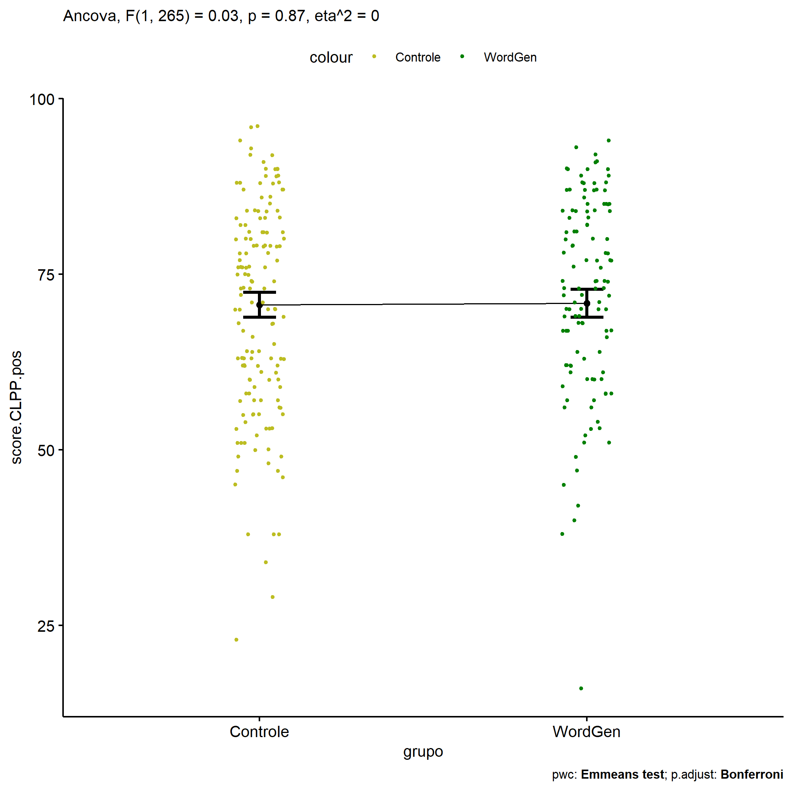<!-- -->

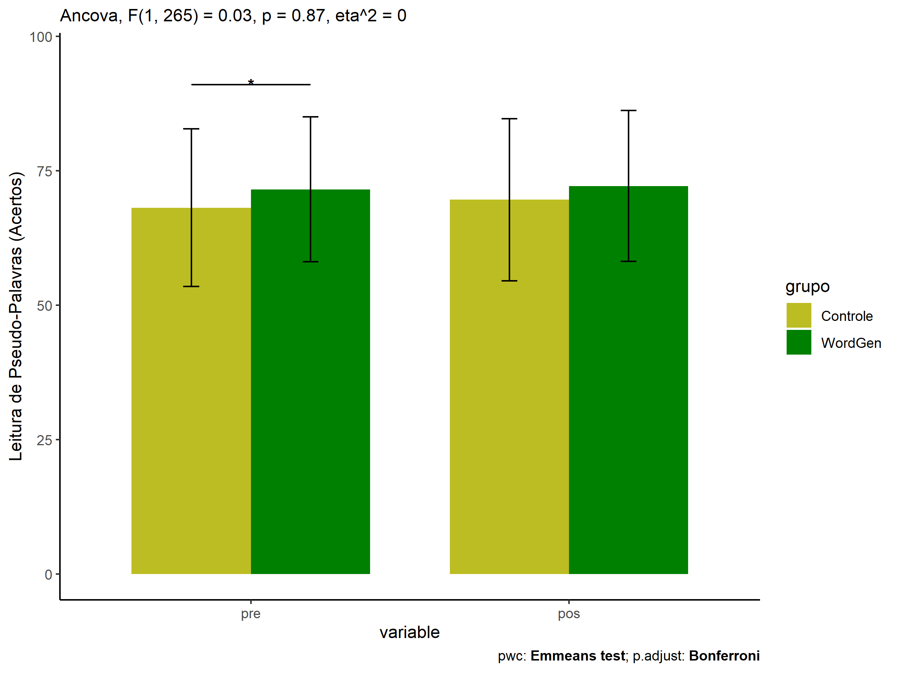<!-- -->

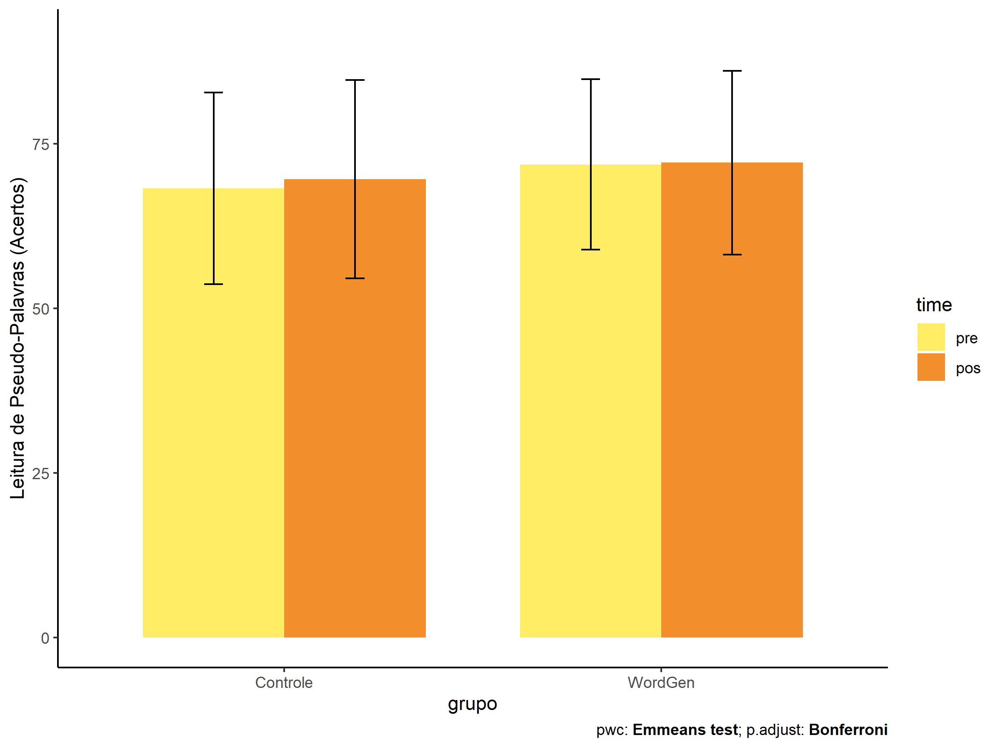<!-- -->

### Correta Regular (Acertos)

| var          | grupo    |   n | M (pre) | SE (pre) | M (unadj) | SE (unadj) | M (adj) | SE (adj) |
|:-------------|:---------|----:|--------:|---------:|----------:|-----------:|--------:|---------:|
| score.CR.pos | Controle | 176 |  13.949 |    0.334 |    13.131 |      0.450 |  13.312 |    0.426 |
| score.CR.pos | WordGen  | 135 |  15.119 |    0.356 |    13.837 |      0.486 |  13.601 |    0.487 |

| .y.          | group1   | group2  | estimate | conf.low | conf.high |    se | statistic |     p | p.adj | p.adj.signif |
|:-------------|:---------|:--------|---------:|---------:|----------:|------:|----------:|------:|------:|:-------------|
| score.CR.pos | Controle | WordGen |   -0.289 |   -1.569 |     0.991 | 0.650 |    -0.445 | 0.657 | 0.657 | ns           |
| score.CR.pre | Controle | WordGen |   -1.170 |   -2.140 |    -0.199 | 0.493 |    -2.372 | 0.018 | 0.018 | \*           |

| .y.      | grupo    | group1 | group2 | estimate | conf.low | conf.high |    se | statistic |     p | p.adj | p.adj.signif |
|:---------|:---------|:-------|:-------|---------:|---------:|----------:|------:|----------:|------:|------:|:-------------|
| score.CR | Controle | pre    | pos    |    0.818 |   -0.255 |     1.892 | 0.547 |     1.497 | 0.135 | 0.135 | ns           |
| score.CR | WordGen  | pre    | pos    |    1.281 |    0.056 |     2.507 | 0.624 |     2.053 | 0.040 | 0.040 | \*           |

    ## Scale for colour is already present.
    ## Adding another scale for colour, which will replace the existing scale.

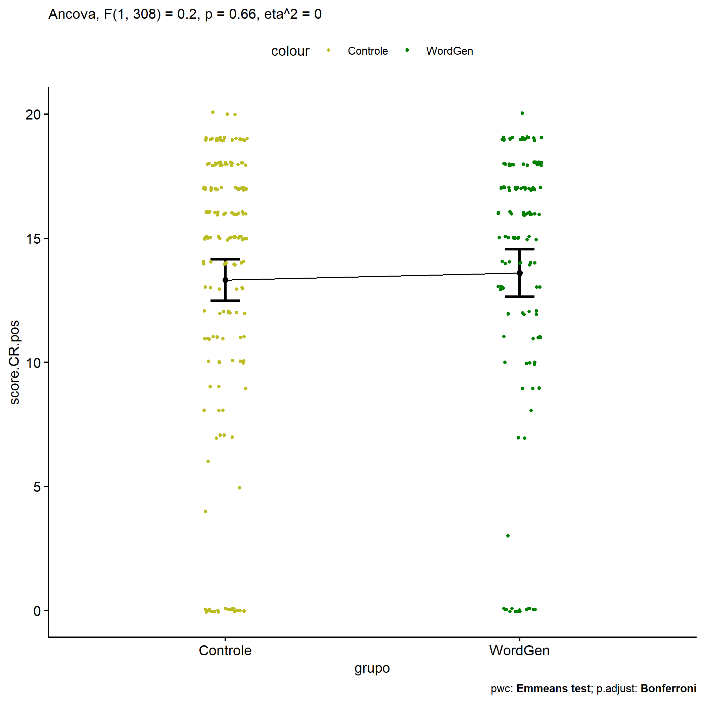<!-- -->

<!-- -->

<!-- -->

### Correta Irregular (Acertos)

| var          | grupo    |   n | M (pre) | SE (pre) | M (unadj) | SE (unadj) | M (adj) | SE (adj) |
|:-------------|:---------|----:|--------:|---------:|----------:|-----------:|--------:|---------:|
| score.CI.pos | Controle | 176 |  11.250 |    0.319 |    10.483 |      0.406 |  10.650 |    0.365 |
| score.CI.pos | WordGen  | 135 |  12.044 |    0.326 |    11.711 |      0.428 |  11.494 |    0.418 |

| .y.          | group1   | group2  | estimate | conf.low | conf.high |    se | statistic |     p | p.adj | p.adj.signif |
|:-------------|:---------|:--------|---------:|---------:|----------:|------:|----------:|------:|------:|:-------------|
| score.CI.pos | Controle | WordGen |   -0.844 |   -1.939 |     0.250 | 0.556 |    -1.518 | 0.130 | 0.130 | ns           |
| score.CI.pre | Controle | WordGen |   -0.794 |   -1.705 |     0.116 | 0.463 |    -1.718 | 0.087 | 0.087 | ns           |

| .y.      | grupo    | group1 | group2 | estimate | conf.low | conf.high |    se | statistic |     p | p.adj | p.adj.signif |
|:---------|:---------|:-------|:-------|---------:|---------:|----------:|------:|----------:|------:|------:|:-------------|
| score.CI | Controle | pre    | pos    |    0.767 |   -0.209 |     1.743 | 0.497 |     1.543 | 0.123 | 0.123 | ns           |
| score.CI | WordGen  | pre    | pos    |    0.333 |   -0.781 |     1.448 | 0.568 |     0.587 | 0.557 | 0.557 | ns           |

    ## Scale for colour is already present.
    ## Adding another scale for colour, which will replace the existing scale.

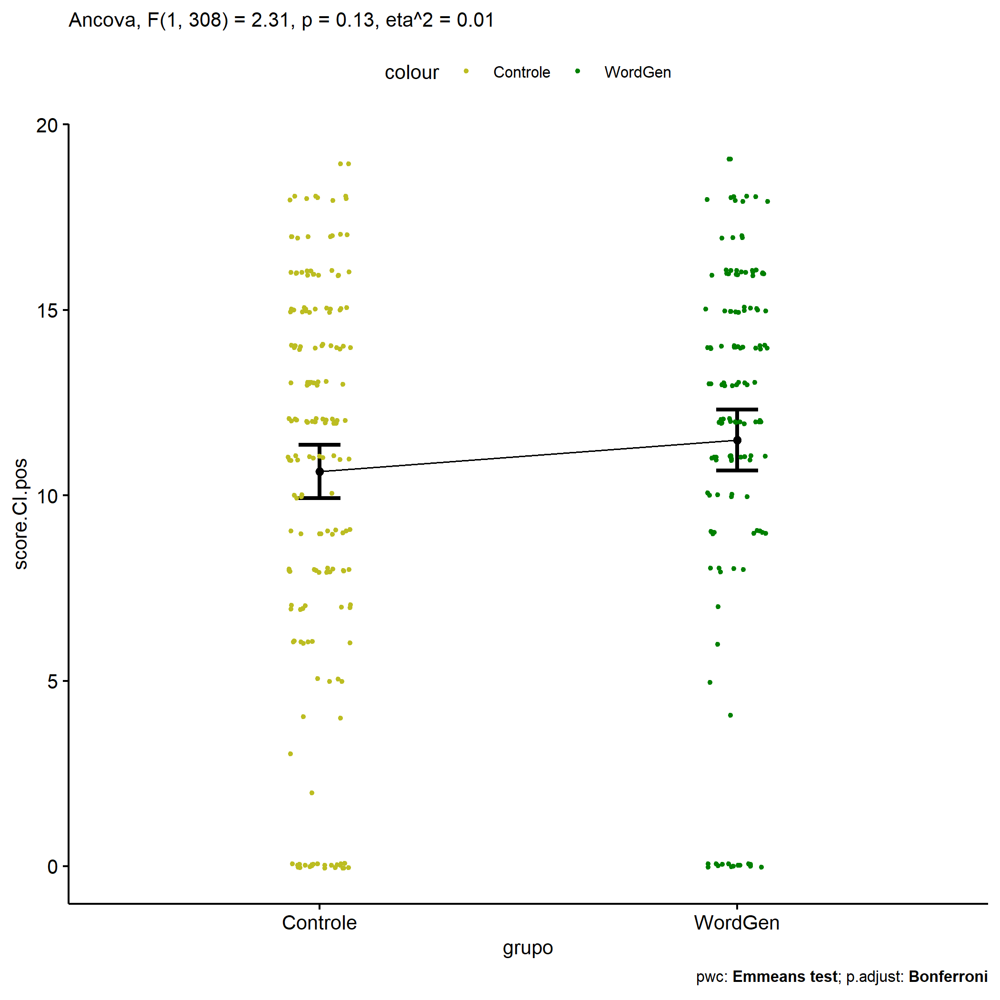<!-- -->

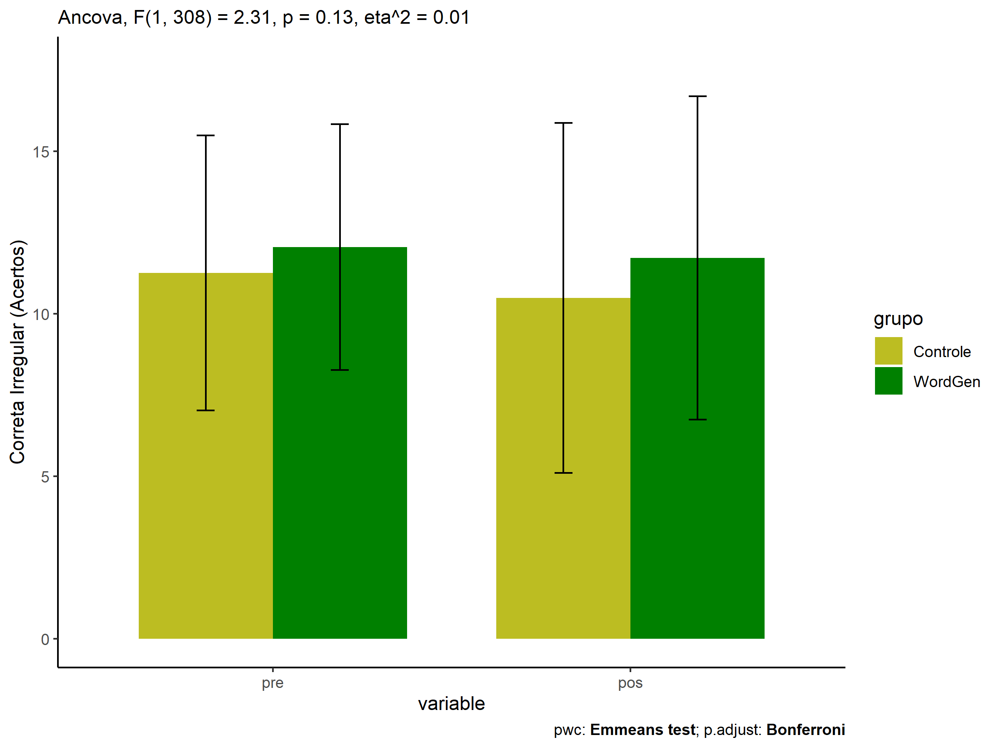<!-- -->

<!-- -->

### Trocas Visuais (Acertos)

| var          | grupo    |   n | M (pre) | SE (pre) | M (unadj) | SE (unadj) | M (adj) | SE (adj) |
|:-------------|:---------|----:|--------:|---------:|----------:|-----------:|--------:|---------:|
| score.TV.pos | Controle | 176 |  15.710 |    0.377 |    14.523 |      0.488 |  14.667 |    0.462 |
| score.TV.pos | WordGen  | 135 |  16.652 |    0.381 |    15.059 |      0.527 |  14.871 |    0.527 |

| .y.          | group1   | group2  | estimate | conf.low | conf.high |    se | statistic |     p | p.adj | p.adj.signif |
|:-------------|:---------|:--------|---------:|---------:|----------:|------:|----------:|------:|------:|:-------------|
| score.TV.pos | Controle | WordGen |   -0.204 |   -1.587 |     1.178 | 0.702 |    -0.291 | 0.771 | 0.771 | ns           |
| score.TV.pre | Controle | WordGen |   -0.942 |   -2.013 |     0.130 | 0.545 |    -1.729 | 0.085 | 0.085 | ns           |

| .y.      | grupo    | group1 | group2 | estimate | conf.low | conf.high |    se | statistic |     p | p.adj | p.adj.signif |
|:---------|:---------|:-------|:-------|---------:|---------:|----------:|------:|----------:|------:|------:|:-------------|
| score.TV | Controle | pre    | pos    |    1.187 |    0.015 |     2.360 | 0.597 |     1.990 | 0.047 | 0.047 | \*           |
| score.TV | WordGen  | pre    | pos    |    1.593 |    0.254 |     2.931 | 0.681 |     2.337 | 0.020 | 0.020 | \*           |

    ## Scale for colour is already present.
    ## Adding another scale for colour, which will replace the existing scale.

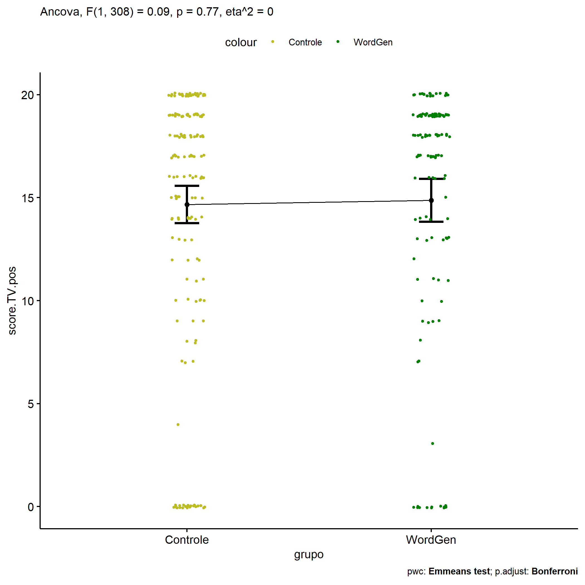<!-- -->

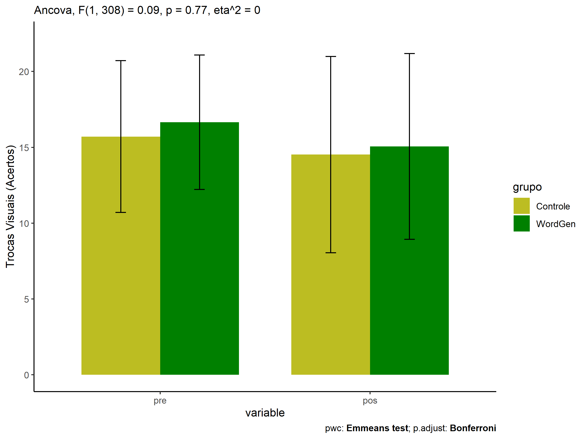<!-- -->

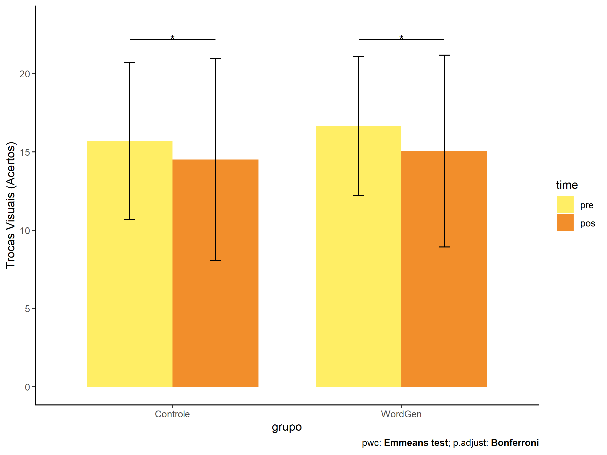<!-- -->

### Trocas Fonologicas (Acertos)

| var          | grupo    |   n | M (pre) | SE (pre) | M (unadj) | SE (unadj) | M (adj) | SE (adj) |
|:-------------|:---------|----:|--------:|---------:|----------:|-----------:|--------:|---------:|
| score.TF.pos | Controle | 176 |  14.568 |    0.376 |    13.199 |      0.488 |  13.428 |    0.442 |
| score.TF.pos | WordGen  | 135 |  15.667 |    0.400 |    14.170 |      0.519 |  13.872 |    0.505 |

| .y.          | group1   | group2  | estimate | conf.low | conf.high |    se | statistic |     p | p.adj | p.adj.signif |
|:-------------|:---------|:--------|---------:|---------:|----------:|------:|----------:|------:|------:|:-------------|
| score.TF.pos | Controle | WordGen |   -0.445 |   -1.769 |     0.880 | 0.673 |    -0.660 | 0.509 | 0.509 | ns           |
| score.TF.pre | Controle | WordGen |   -1.098 |   -2.189 |    -0.008 | 0.554 |    -1.982 | 0.048 | 0.048 | \*           |

| .y.      | grupo    | group1 | group2 | estimate | conf.low | conf.high |    se | statistic |     p | p.adj | p.adj.signif |
|:---------|:---------|:-------|:-------|---------:|---------:|----------:|------:|----------:|------:|------:|:-------------|
| score.TF | Controle | pre    | pos    |    1.369 |    0.195 |     2.544 | 0.598 |     2.290 | 0.022 | 0.022 | \*           |
| score.TF | WordGen  | pre    | pos    |    1.496 |    0.156 |     2.837 | 0.683 |     2.192 | 0.029 | 0.029 | \*           |

    ## Scale for colour is already present.
    ## Adding another scale for colour, which will replace the existing scale.

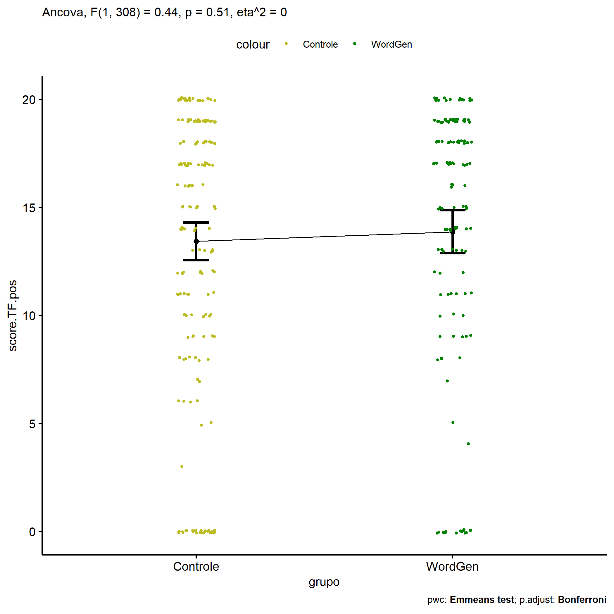<!-- -->

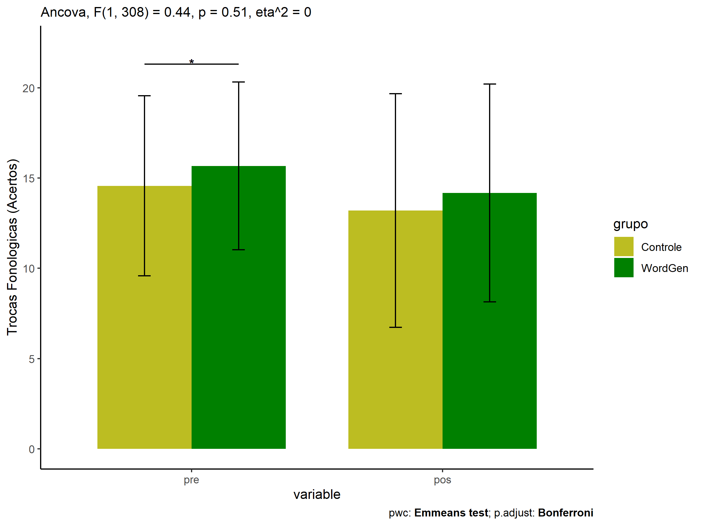<!-- -->

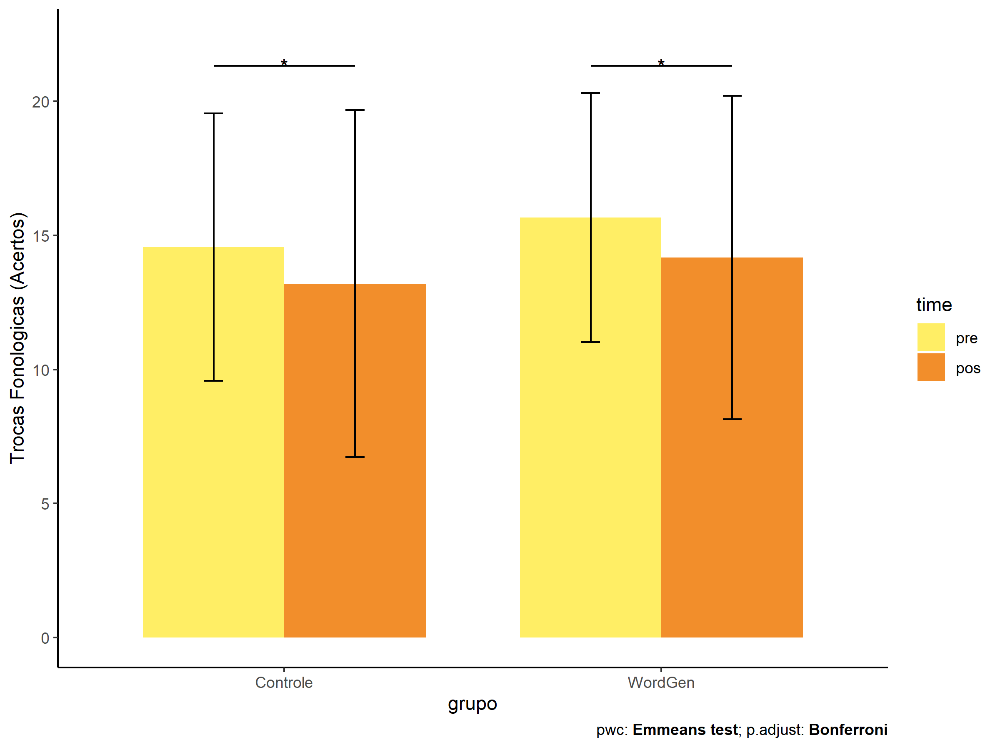<!-- -->

### Trocas Orograficas (Acertos)

| var          | grupo    |   n | M (pre) | SE (pre) | M (unadj) | SE (unadj) | M (adj) | SE (adj) |
|:-------------|:---------|----:|--------:|---------:|----------:|-----------:|--------:|---------:|
| score.TO.pos | Controle | 176 |   9.608 |    0.347 |     9.585 |      0.394 |   9.741 |    0.344 |
| score.TO.pos | WordGen  | 135 |  10.230 |    0.373 |     9.859 |      0.453 |   9.657 |    0.393 |

| .y.          | group1   | group2  | estimate | conf.low | conf.high |    se | statistic |     p | p.adj | p.adj.signif |
|:-------------|:---------|:--------|---------:|---------:|----------:|------:|----------:|------:|------:|:-------------|
| score.TO.pos | Controle | WordGen |    0.084 |   -0.946 |     1.114 | 0.523 |      0.16 | 0.873 | 0.873 | ns           |
| score.TO.pre | Controle | WordGen |   -0.622 |   -1.633 |     0.390 | 0.514 |     -1.21 | 0.227 | 0.227 | ns           |

| .y.      | grupo    | group1 | group2 | estimate | conf.low | conf.high |    se | statistic |     p | p.adj | p.adj.signif |
|:---------|:---------|:-------|:-------|---------:|---------:|----------:|------:|----------:|------:|------:|:-------------|
| score.TO | Controle | pre    | pos    |    0.023 |   -0.999 |     1.044 | 0.520 |     0.044 | 0.965 | 0.965 | ns           |
| score.TO | WordGen  | pre    | pos    |    0.370 |   -0.796 |     1.537 | 0.594 |     0.624 | 0.533 | 0.533 | ns           |

    ## Scale for colour is already present.
    ## Adding another scale for colour, which will replace the existing scale.

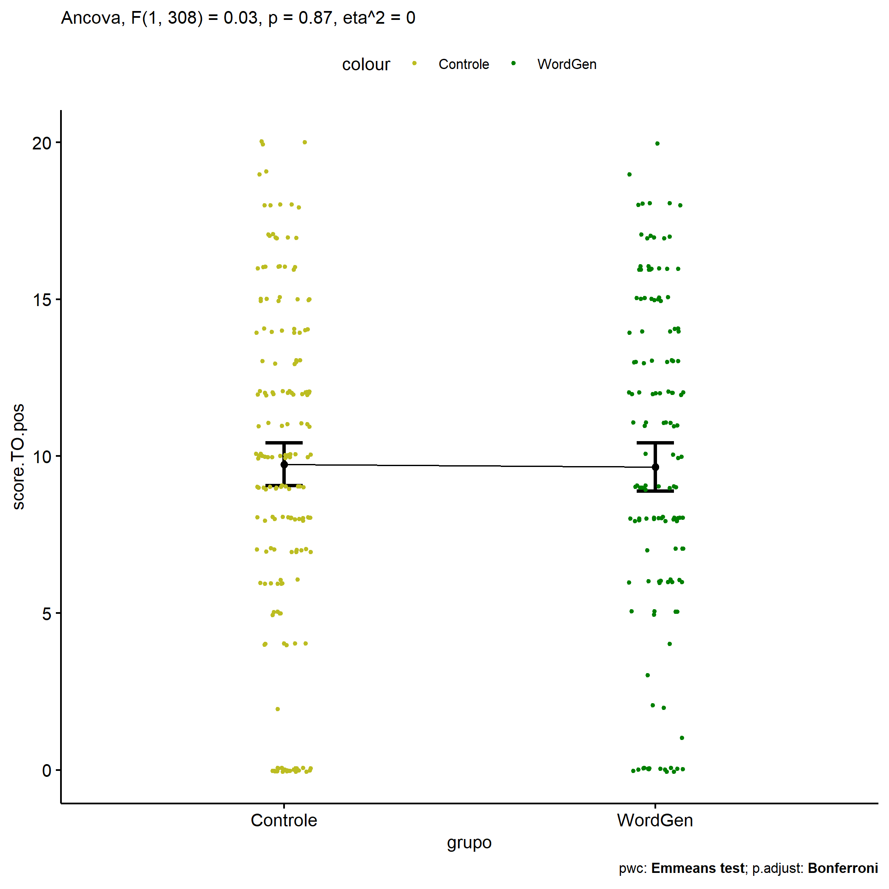<!-- -->

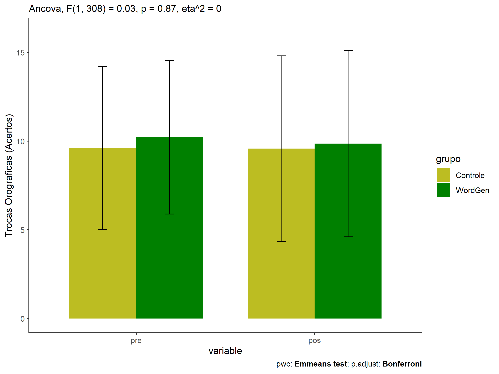<!-- -->

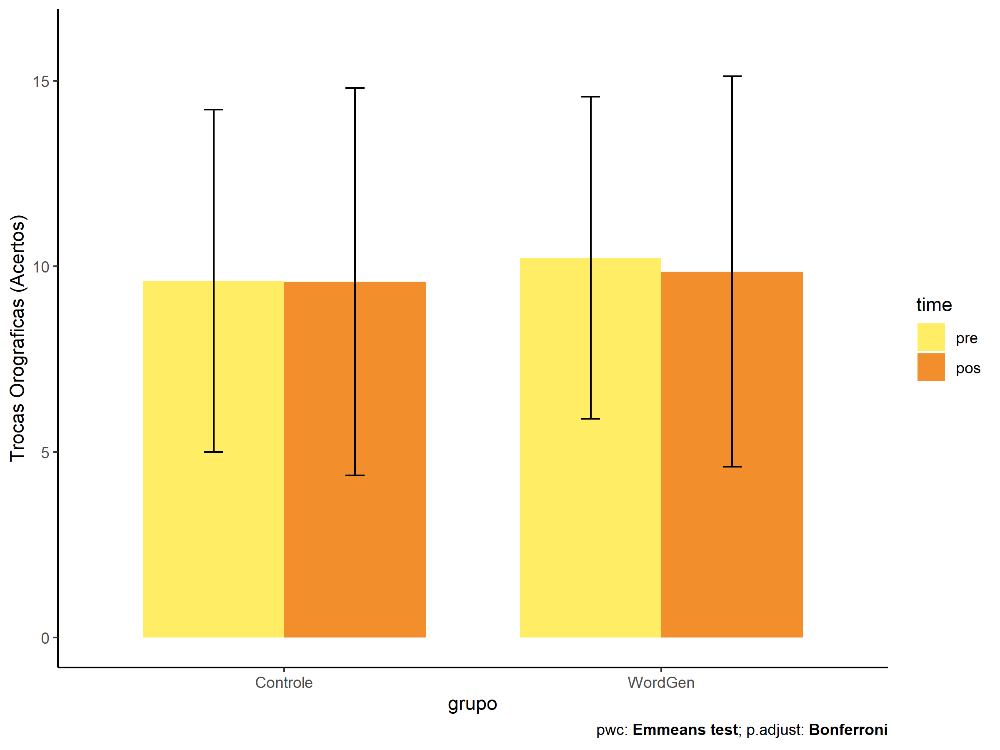<!-- -->

## factor: **genero**

### Leitura de Pseudo-Palavras (Acertos)

| var            | genero |   n | M (pre) | SE (pre) | M (unadj) | SE (unadj) | M (adj) | SE (adj) |
|:---------------|:-------|----:|--------:|---------:|----------:|-----------:|--------:|---------:|
| score.CLPP.pos | F      | 132 |  72.144 |    1.262 |    73.591 |      1.293 |  71.906 |    0.961 |
| score.CLPP.pos | M      | 136 |  67.176 |    1.161 |    67.956 |      1.196 |  69.591 |    0.947 |

| .y.            | group1 | group2 | estimate | conf.low | conf.high |    se | statistic |     p | p.adj | p.adj.signif |
|:---------------|:-------|:-------|---------:|---------:|----------:|------:|----------:|------:|------:|:-------------|
| score.CLPP.pos | F      | M      |    2.315 |   -0.362 |     4.992 | 1.360 |     1.702 | 0.090 | 0.090 | ns           |
| score.CLPP.pre | F      | M      |    4.967 |    1.594 |     8.341 | 1.713 |     2.899 | 0.004 | 0.004 | \*\*         |

| .y.        | genero | group1 | group2 | estimate | conf.low | conf.high |    se | statistic |     p | p.adj | p.adj.signif |
|:-----------|:-------|:-------|:-------|---------:|---------:|----------:|------:|----------:|------:|------:|:-------------|
| score.CLPP | F      | pre    | pos    |   -0.916 |   -4.242 |     2.411 | 1.694 |    -0.541 | 0.589 | 0.589 | ns           |
| score.CLPP | M      | pre    | pos    |   -0.941 |   -4.151 |     2.268 | 1.634 |    -0.576 | 0.565 | 0.565 | ns           |

    ## Scale for colour is already present.
    ## Adding another scale for colour, which will replace the existing scale.

<!-- -->

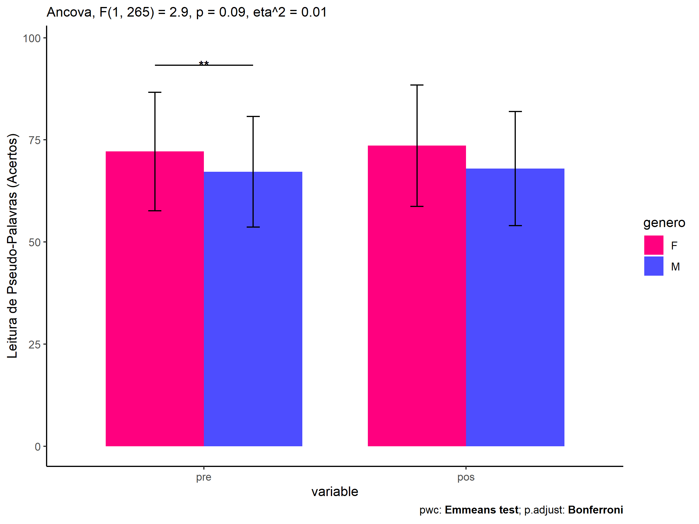<!-- -->

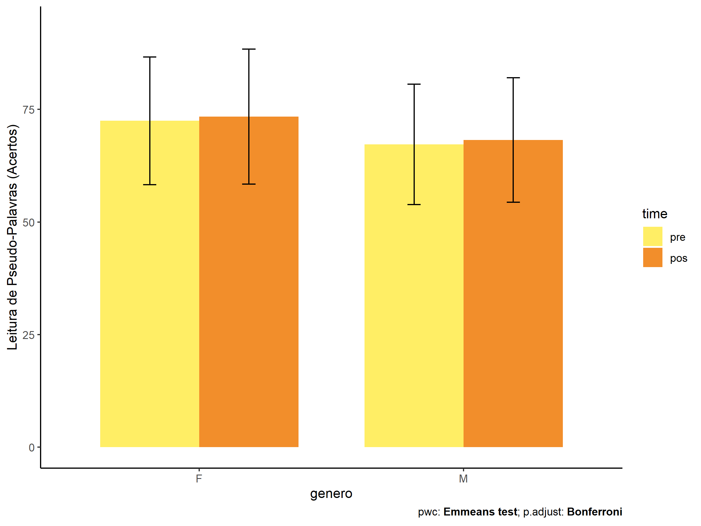<!-- -->

### Correta Regular (Acertos)

| var          | genero |   n | M (pre) | SE (pre) | M (unadj) | SE (unadj) | M (adj) | SE (adj) |
|:-------------|:-------|----:|--------:|---------:|----------:|-----------:|--------:|---------:|
| score.CR.pos | F      | 146 |  15.116 |    0.336 |    14.411 |      0.443 |  14.177 |    0.461 |
| score.CR.pos | M      | 164 |  13.848 |    0.352 |    12.652 |      0.473 |  12.860 |    0.435 |

| .y.          | group1 | group2 | estimate | conf.low | conf.high |    se | statistic |    p | p.adj | p.adj.signif |
|:-------------|:-------|:-------|---------:|---------:|----------:|------:|----------:|-----:|------:|:-------------|
| score.CR.pos | F      | M      |    1.317 |    0.062 |     2.572 | 0.638 |     2.066 | 0.04 |  0.04 | \*           |
| score.CR.pre | F      | M      |    1.269 |    0.305 |     2.233 | 0.490 |     2.590 | 0.01 |  0.01 | \*           |

| .y.      | genero | group1 | group2 | estimate | conf.low | conf.high |    se | statistic |     p | p.adj | p.adj.signif |
|:---------|:-------|:-------|:-------|---------:|---------:|----------:|------:|----------:|------:|------:|:-------------|
| score.CR | F      | pre    | pos    |    0.705 |   -0.460 |     1.871 | 0.593 |     1.189 | 0.235 | 0.235 | ns           |
| score.CR | M      | pre    | pos    |    1.195 |    0.096 |     2.295 | 0.560 |     2.135 | 0.033 | 0.033 | \*           |

    ## Scale for colour is already present.
    ## Adding another scale for colour, which will replace the existing scale.

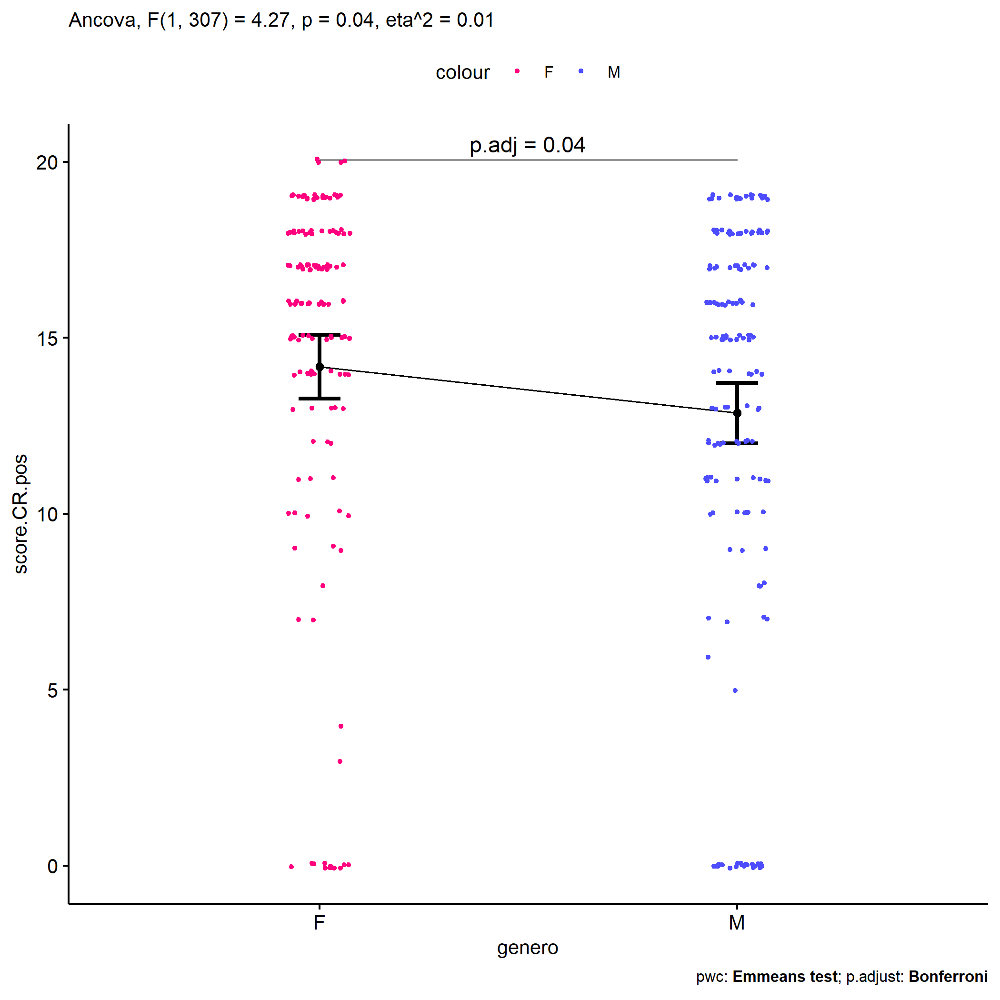<!-- -->

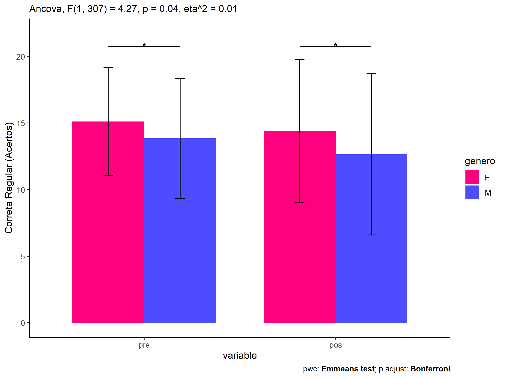<!-- -->

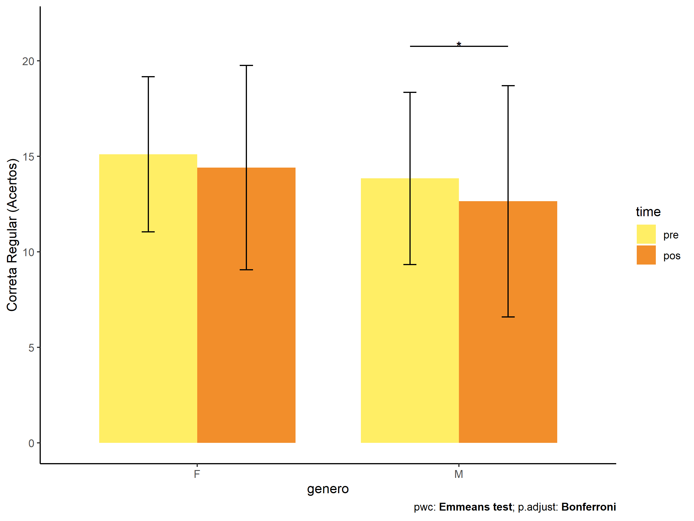<!-- -->

### Correta Irregular (Acertos)

| var          | genero |   n | M (pre) | SE (pre) | M (unadj) | SE (unadj) | M (adj) | SE (adj) |
|:-------------|:-------|----:|--------:|---------:|----------:|-----------:|--------:|---------:|
| score.CI.pos | F      | 146 |  12.568 |    0.330 |    11.952 |      0.423 |  11.497 |    0.404 |
| score.CI.pos | M      | 164 |  10.732 |    0.308 |    10.250 |      0.404 |  10.655 |    0.380 |

| .y.          | group1 | group2 | estimate | conf.low | conf.high |    se | statistic | p       | p.adj   | p.adj.signif |
|:-------------|:-------|:-------|---------:|---------:|----------:|------:|----------:|:--------|:--------|:-------------|
| score.CI.pos | F      | M      |    0.842 |   -0.263 |     1.947 | 0.562 |     1.499 | 0.135   | 0.135   | ns           |
| score.CI.pre | F      | M      |    1.837 |    0.949 |     2.724 | 0.451 |     4.073 | \<0.001 | \<0.001 | \*\*\*\*     |

| .y.      | genero | group1 | group2 | estimate | conf.low | conf.high |    se | statistic |     p | p.adj | p.adj.signif |
|:---------|:-------|:-------|:-------|---------:|---------:|----------:|------:|----------:|------:|------:|:-------------|
| score.CI | F      | pre    | pos    |    0.616 |   -0.439 |     1.672 | 0.538 |     1.147 | 0.252 | 0.252 | ns           |
| score.CI | M      | pre    | pos    |    0.482 |   -0.514 |     1.478 | 0.507 |     0.950 | 0.343 | 0.343 | ns           |

    ## Scale for colour is already present.
    ## Adding another scale for colour, which will replace the existing scale.

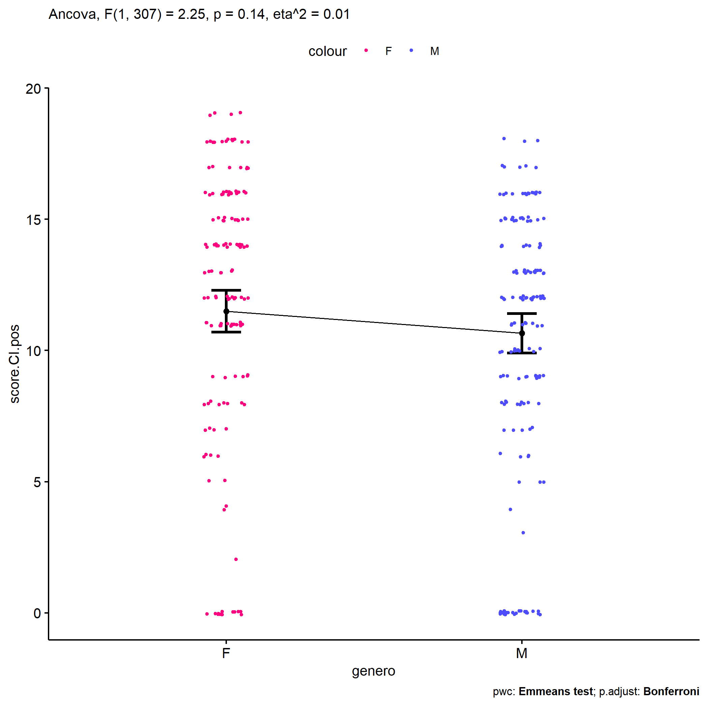<!-- -->

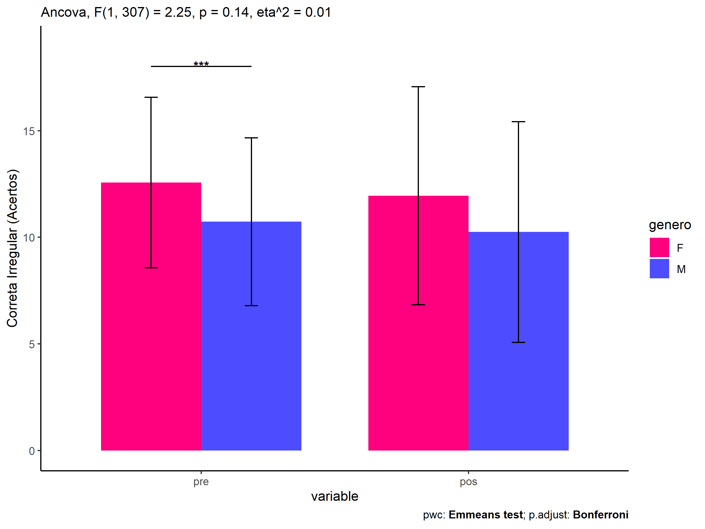<!-- -->

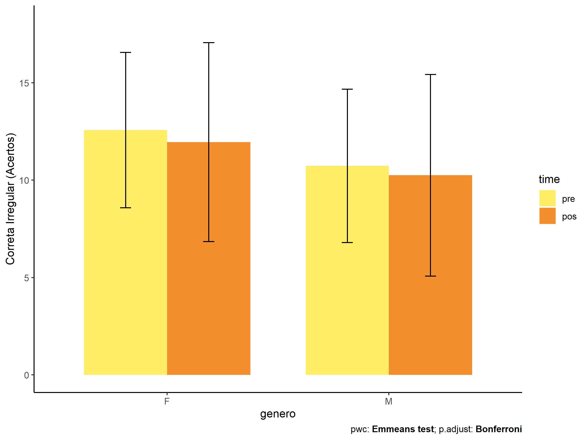<!-- -->

### Trocas Visuais (Acertos)

| var          | genero |   n | M (pre) | SE (pre) | M (unadj) | SE (unadj) | M (adj) | SE (adj) |
|:-------------|:-------|----:|--------:|---------:|----------:|-----------:|--------:|---------:|
| score.TV.pos | F      | 146 |  16.616 |    0.342 |    15.719 |      0.486 |  15.541 |    0.499 |
| score.TV.pos | M      | 164 |  15.652 |    0.411 |    13.988 |      0.510 |  14.146 |    0.470 |

| .y.          | group1 | group2 | estimate | conf.low | conf.high |    se | statistic |     p | p.adj | p.adj.signif |
|:-------------|:-------|:-------|---------:|---------:|----------:|------:|----------:|------:|------:|:-------------|
| score.TV.pos | F      | M      |    1.395 |    0.042 |     2.748 | 0.687 |     2.029 | 0.043 | 0.043 | \*           |
| score.TV.pre | F      | M      |    0.964 |   -0.102 |     2.030 | 0.542 |     1.779 | 0.076 | 0.076 | ns           |

| .y.      | genero | group1 | group2 | estimate | conf.low | conf.high |    se | statistic |     p | p.adj | p.adj.signif |
|:---------|:-------|:-------|:-------|---------:|---------:|----------:|------:|----------:|------:|------:|:-------------|
| score.TV | F      | pre    | pos    |    0.897 |   -0.377 |     2.171 | 0.649 |     1.383 | 0.167 | 0.167 | ns           |
| score.TV | M      | pre    | pos    |    1.665 |    0.463 |     2.867 | 0.612 |     2.720 | 0.007 | 0.007 | \*\*         |

    ## Scale for colour is already present.
    ## Adding another scale for colour, which will replace the existing scale.

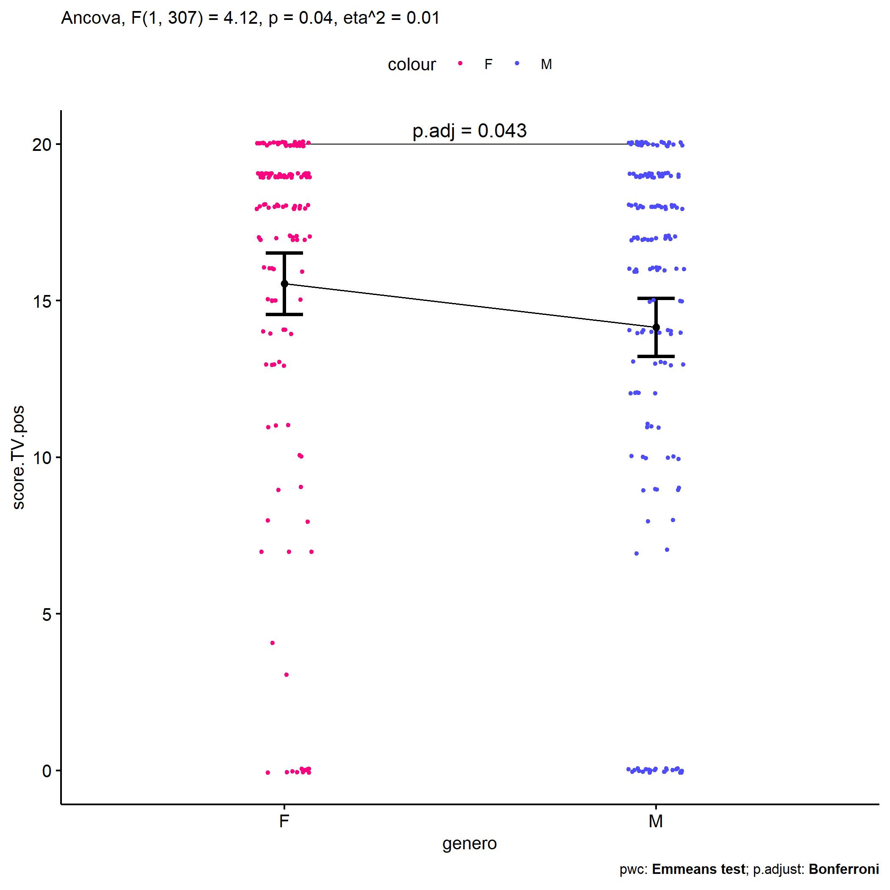<!-- -->

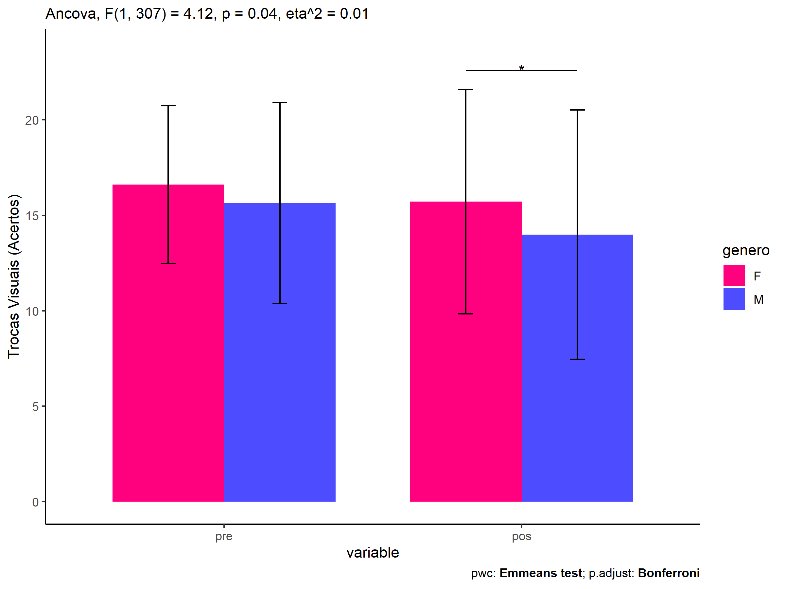<!-- -->

<!-- -->

### Trocas Fonologicas (Acertos)

| var          | genero |   n | M (pre) | SE (pre) | M (unadj) | SE (unadj) | M (adj) | SE (adj) |
|:-------------|:-------|----:|--------:|---------:|----------:|-----------:|--------:|---------:|
| score.TF.pos | F      | 146 |  15.363 |    0.383 |    14.363 |      0.488 |  14.200 |    0.478 |
| score.TF.pos | M      | 164 |  14.732 |    0.395 |    13.043 |      0.508 |  13.188 |    0.451 |

| .y.          | group1 | group2 | estimate | conf.low | conf.high |    se | statistic |     p | p.adj | p.adj.signif |
|:-------------|:-------|:-------|---------:|---------:|----------:|------:|----------:|------:|------:|:-------------|
| score.TF.pos | F      | M      |    1.012 |   -0.282 |     2.305 | 0.657 |     1.539 | 0.125 | 0.125 | ns           |
| score.TF.pre | F      | M      |    0.631 |   -0.458 |     1.720 | 0.553 |     1.141 | 0.255 | 0.255 | ns           |

| .y.      | genero | group1 | group2 | estimate | conf.low | conf.high |    se | statistic |     p | p.adj | p.adj.signif |
|:---------|:-------|:-------|:-------|---------:|---------:|----------:|------:|----------:|------:|------:|:-------------|
| score.TF | F      | pre    | pos    |    1.000 |   -0.284 |     2.284 | 0.654 |     1.529 | 0.127 | 0.127 | ns           |
| score.TF | M      | pre    | pos    |    1.689 |    0.477 |     2.901 | 0.617 |     2.737 | 0.006 | 0.006 | \*\*         |

    ## Scale for colour is already present.
    ## Adding another scale for colour, which will replace the existing scale.

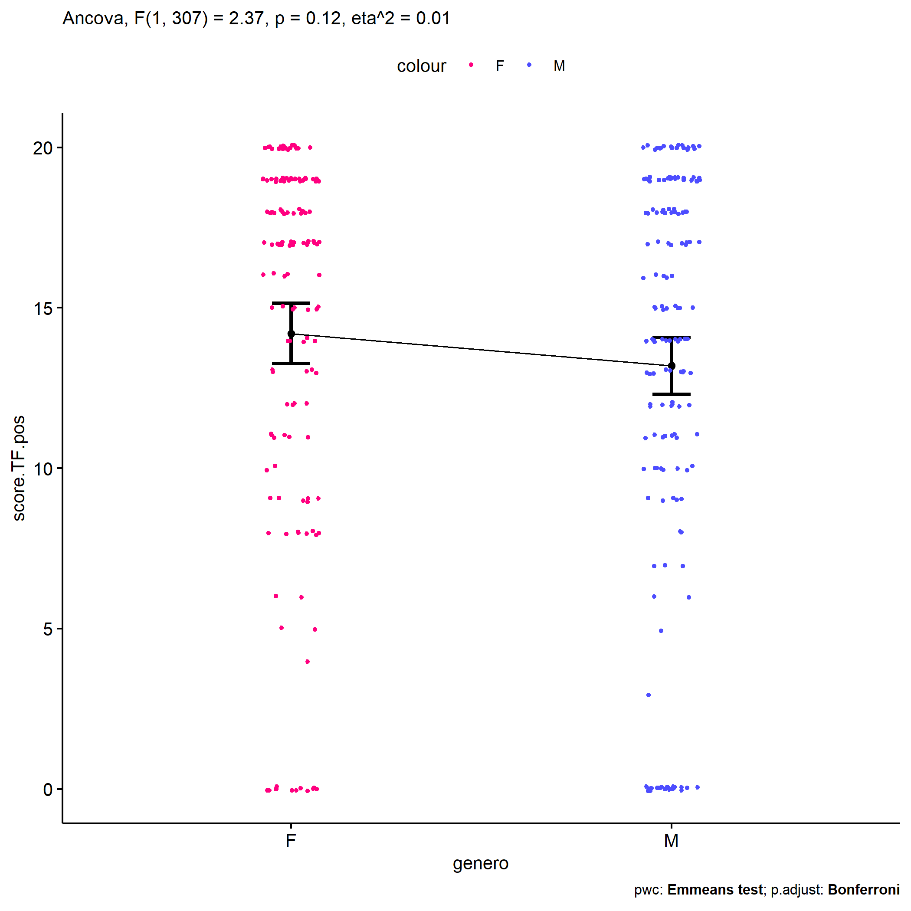<!-- -->

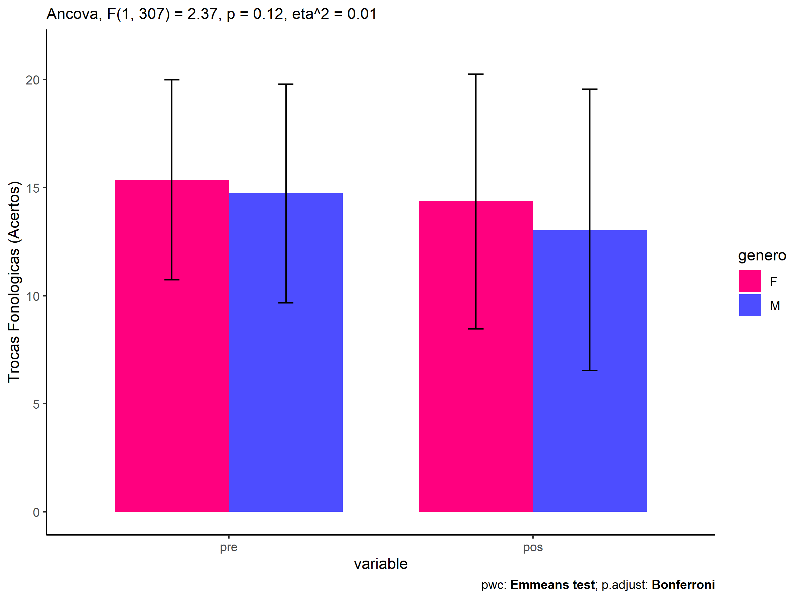<!-- -->

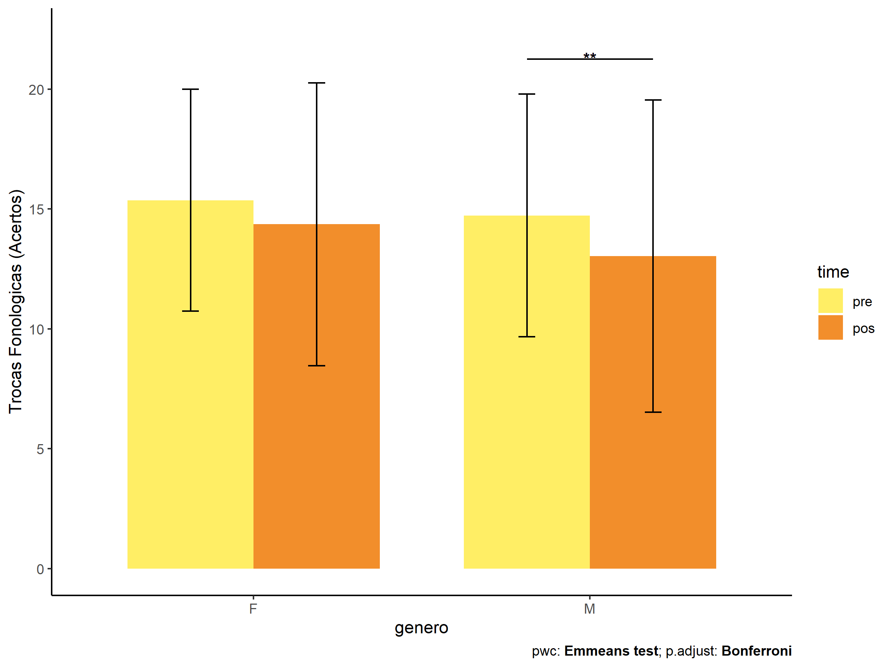<!-- -->

### Trocas Orograficas (Acertos)

| var          | genero |   n | M (pre) | SE (pre) | M (unadj) | SE (unadj) | M (adj) | SE (adj) |
|:-------------|:-------|----:|--------:|---------:|----------:|-----------:|--------:|---------:|
| score.TO.pos | F      | 146 |  10.815 |    0.372 |    10.904 |      0.430 |  10.367 |    0.374 |
| score.TO.pos | M      | 164 |   9.006 |    0.338 |     8.695 |      0.392 |   9.173 |    0.353 |

| .y.          | group1 | group2 | estimate | conf.low | conf.high |    se | statistic | p       | p.adj   | p.adj.signif |
|:-------------|:-------|:-------|---------:|---------:|----------:|------:|----------:|:--------|:--------|:-------------|
| score.TO.pos | F      | M      |    1.194 |    0.172 |     2.216 | 0.519 |     2.299 | 0.022   | 0.022   | \*           |
| score.TO.pre | F      | M      |    1.809 |    0.823 |     2.795 | 0.501 |     3.610 | \<0.001 | \<0.001 | \*\*\*       |

| .y.      | genero | group1 | group2 | estimate | conf.low | conf.high |    se | statistic |     p | p.adj | p.adj.signif |
|:---------|:-------|:-------|:-------|---------:|---------:|----------:|------:|----------:|------:|------:|:-------------|
| score.TO | F      | pre    | pos    |   -0.089 |   -1.184 |     1.006 | 0.558 |    -0.160 | 0.873 | 0.873 | ns           |
| score.TO | M      | pre    | pos    |    0.311 |   -0.723 |     1.344 | 0.526 |     0.591 | 0.555 | 0.555 | ns           |

    ## Scale for colour is already present.
    ## Adding another scale for colour, which will replace the existing scale.

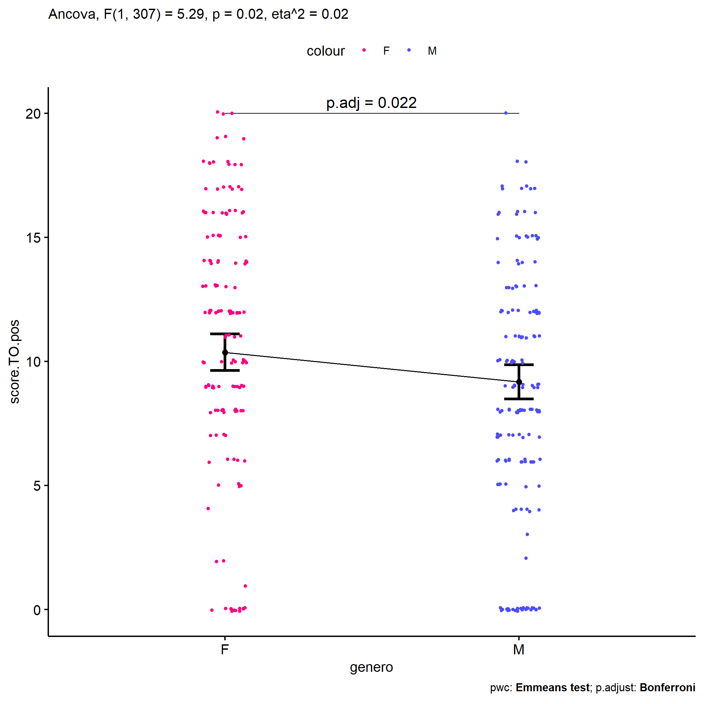<!-- -->

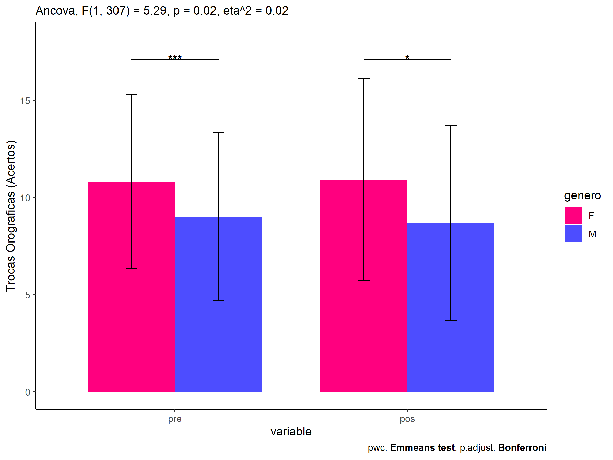<!-- -->

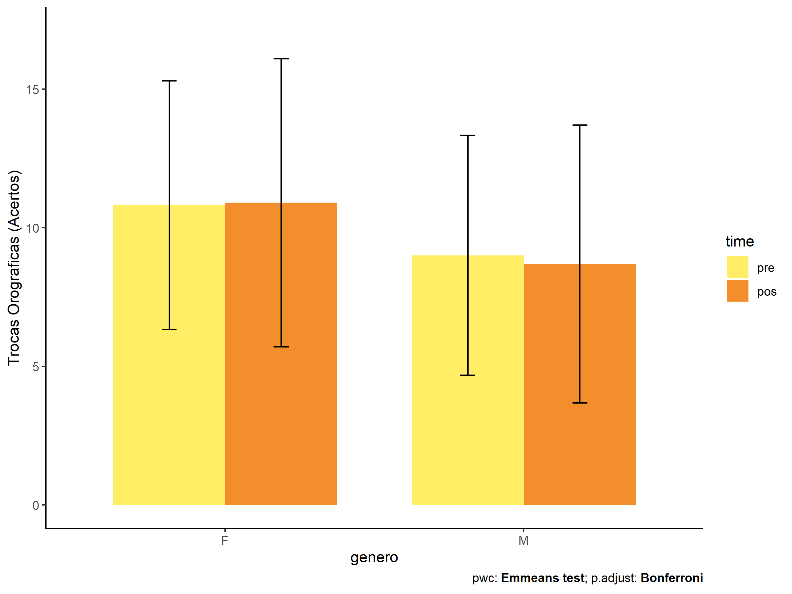<!-- -->

## factor: **idade**

### Leitura de Pseudo-Palavras (Acertos)

| var            | idade |   n | M (pre) | SE (pre) | M (unadj) | SE (unadj) | M (adj) | SE (adj) |
|:---------------|:------|----:|--------:|---------:|----------:|-----------:|--------:|---------:|
| score.CLPP.pos | 10y   |  51 |  71.157 |    1.431 |    69.314 |      2.081 |  68.539 |    1.520 |
| score.CLPP.pos | 11y   | 157 |  71.178 |    1.166 |    73.535 |      1.103 |  72.745 |    0.867 |
| score.CLPP.pos | 12y   |  35 |  66.000 |    2.429 |    63.086 |      2.708 |  65.801 |    1.844 |
| score.CLPP.pos | 13y   |  13 |  62.231 |    3.340 |    65.846 |      3.216 |  71.113 |    3.032 |

| .y.            | group1 | group2 | estimate | conf.low | conf.high |    se | statistic | p       | p.adj | p.adj.signif |
|:---------------|:-------|:-------|---------:|---------:|----------:|------:|----------:|:--------|------:|:-------------|
| score.CLPP.pos | 10y    | 11y    |   -4.207 |   -7.649 |    -0.765 | 1.748 |    -2.407 | 0.017   | 0.101 | ns           |
| score.CLPP.pos | 10y    | 12y    |    2.737 |   -1.978 |     7.452 | 2.394 |     1.143 | 0.254   | 1.000 | ns           |
| score.CLPP.pos | 10y    | 13y    |   -2.574 |   -9.267 |     4.119 | 3.398 |    -0.758 | 0.449   | 1.000 | ns           |
| score.CLPP.pos | 11y    | 12y    |    6.944 |    2.920 |    10.968 | 2.043 |     3.398 | \<0.001 | 0.005 | \*\*         |
| score.CLPP.pos | 11y    | 13y    |    1.632 |   -4.594 |     7.858 | 3.161 |     0.516 | 0.606   | 1.000 | ns           |
| score.CLPP.pos | 12y    | 13y    |   -5.312 |  -12.258 |     1.635 | 3.527 |    -1.506 | 0.133   | 0.800 | ns           |
| score.CLPP.pre | 10y    | 11y    |   -0.021 |   -4.369 |     4.326 | 2.208 |    -0.010 | 0.992   | 1.000 | ns           |
| score.CLPP.pre | 10y    | 12y    |    5.157 |   -0.764 |    11.078 | 3.006 |     1.715 | 0.088   | 0.525 | ns           |
| score.CLPP.pre | 10y    | 13y    |    8.926 |    0.545 |    17.307 | 4.256 |     2.097 | 0.037   | 0.222 | ns           |
| score.CLPP.pre | 11y    | 12y    |    5.178 |    0.136 |    10.221 | 2.560 |     2.023 | 0.044   | 0.265 | ns           |
| score.CLPP.pre | 11y    | 13y    |    8.948 |    1.162 |    16.733 | 3.953 |     2.263 | 0.024   | 0.147 | ns           |
| score.CLPP.pre | 12y    | 13y    |    3.769 |   -4.992 |    12.531 | 4.449 |     0.847 | 0.398   | 1.000 | ns           |

| .y.        | idade | group1 | group2 | estimate | conf.low | conf.high |    se | statistic |     p | p.adj | p.adj.signif |
|:-----------|:------|:-------|:-------|---------:|---------:|----------:|------:|----------:|------:|------:|:-------------|
| score.CLPP | 10y   | pre    | pos    |    2.150 |   -3.147 |     7.446 | 2.696 |     0.797 | 0.426 | 0.426 | ns           |
| score.CLPP | 11y   | pre    | pos    |   -1.956 |   -4.963 |     1.051 | 1.531 |    -1.278 | 0.202 | 0.202 | ns           |
| score.CLPP | 12y   | pre    | pos    |    2.461 |   -3.715 |     8.636 | 3.144 |     0.783 | 0.434 | 0.434 | ns           |
| score.CLPP | 13y   | pre    | pos    |   -2.957 |  -12.880 |     6.965 | 5.051 |    -0.585 | 0.558 | 0.558 | ns           |

    ## Scale for colour is already present.
    ## Adding another scale for colour, which will replace the existing scale.

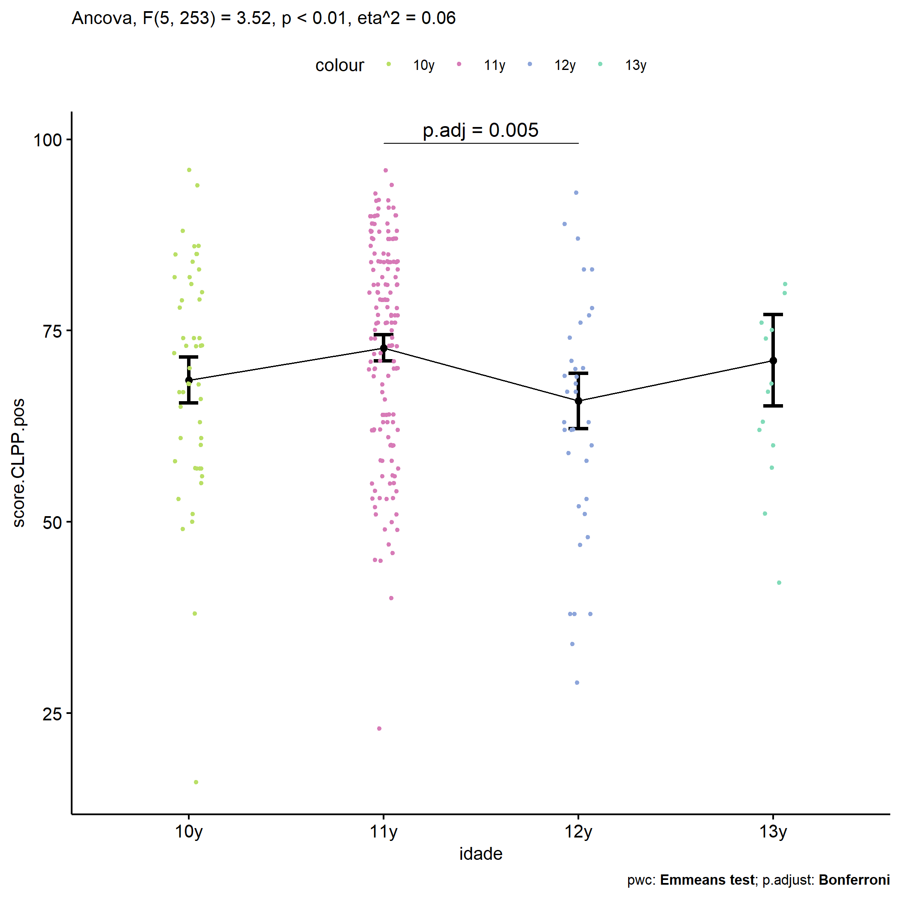<!-- -->

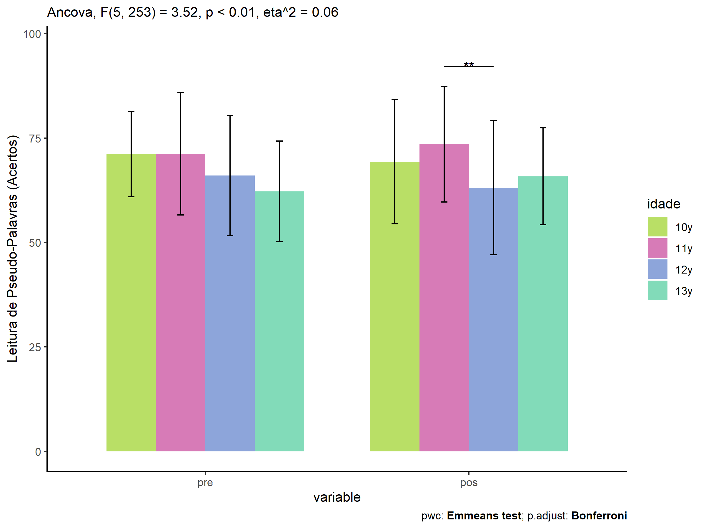<!-- -->

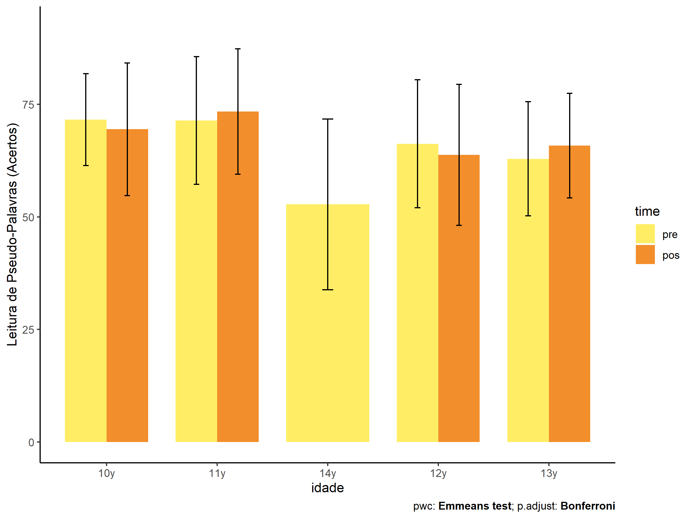<!-- -->

### Correta Regular (Acertos)

| var          | idade |   n | M (pre) | SE (pre) | M (unadj) | SE (unadj) | M (adj) | SE (adj) |
|:-------------|:------|----:|--------:|---------:|----------:|-----------:|--------:|---------:|
| score.CR.pos | 10y   |  55 |  15.055 |    0.450 |    14.255 |      0.658 |  14.159 |    0.711 |
| score.CR.pos | 11y   | 172 |  15.017 |    0.296 |    14.645 |      0.381 |  14.558 |    0.403 |
| score.CR.pos | 12y   |  43 |  13.860 |    0.772 |    12.093 |      0.893 |  12.246 |    0.806 |
| score.CR.pos | 13y   |  18 |  13.500 |    0.711 |    10.111 |      1.705 |  10.339 |    1.245 |
| score.CR.pos | 14y   |   7 |   8.000 |    2.610 |     5.857 |      2.865 |   7.226 |    2.055 |

| .y.          | group1 | group2 | estimate | conf.low | conf.high |    se | statistic | p       | p.adj   | p.adj.signif |
|:-------------|:-------|:-------|---------:|---------:|----------:|------:|----------:|:--------|:--------|:-------------|
| score.CR.pos | 10y    | 11y    |   -0.399 |   -2.005 |     1.208 | 0.816 |    -0.488 | 0.626   | 1       | ns           |
| score.CR.pos | 10y    | 12y    |    1.914 |   -0.205 |     4.033 | 1.077 |     1.777 | 0.077   | 0.765   | ns           |
| score.CR.pos | 10y    | 13y    |    3.821 |    0.995 |     6.647 | 1.436 |     2.661 | 0.008   | 0.082   | ns           |
| score.CR.pos | 10y    | 14y    |    6.933 |    2.636 |    11.230 | 2.183 |     3.176 | 0.002   | 0.017   | \*           |
| score.CR.pos | 11y    | 12y    |    2.312 |    0.535 |     4.089 | 0.903 |     2.561 | 0.011   | 0.109   | ns           |
| score.CR.pos | 11y    | 13y    |    4.219 |    1.640 |     6.799 | 1.311 |     3.219 | 0.001   | 0.014   | \*           |
| score.CR.pos | 11y    | 14y    |    7.332 |    3.194 |    11.469 | 2.102 |     3.488 | \<0.001 | 0.006   | \*\*         |
| score.CR.pos | 12y    | 13y    |    1.907 |   -1.005 |     4.819 | 1.480 |     1.289 | 0.198   | 1       | ns           |
| score.CR.pos | 12y    | 14y    |    5.019 |    0.700 |     9.339 | 2.194 |     2.287 | 0.023   | 0.229   | ns           |
| score.CR.pos | 13y    | 14y    |    3.112 |   -1.582 |     7.807 | 2.385 |     1.305 | 0.193   | 1       | ns           |
| score.CR.pre | 10y    | 11y    |    0.037 |   -1.190 |     1.265 | 0.624 |     0.059 | 0.953   | 1       | ns           |
| score.CR.pre | 10y    | 12y    |    1.194 |   -0.419 |     2.807 | 0.820 |     1.457 | 0.146   | 1       | ns           |
| score.CR.pre | 10y    | 13y    |    1.555 |   -0.597 |     3.706 | 1.093 |     1.422 | 0.156   | 1       | ns           |
| score.CR.pre | 10y    | 14y    |    7.055 |    3.874 |    10.235 | 1.616 |     4.366 | \<0.001 | \<0.001 | \*\*\*       |
| score.CR.pre | 11y    | 12y    |    1.157 |   -0.194 |     2.508 | 0.686 |     1.685 | 0.093   | 0.93    | ns           |
| score.CR.pre | 11y    | 13y    |    1.517 |   -0.446 |     3.481 | 0.997 |     1.521 | 0.129   | 1       | ns           |
| score.CR.pre | 11y    | 14y    |    7.017 |    3.962 |    10.073 | 1.552 |     4.520 | \<0.001 | \<0.001 | \*\*\*\*     |
| score.CR.pre | 12y    | 13y    |    0.360 |   -1.864 |     2.585 | 1.130 |     0.319 | 0.75    | 1       | ns           |
| score.CR.pre | 12y    | 14y    |    5.860 |    2.631 |     9.090 | 1.641 |     3.571 | \<0.001 | 0.004   | \*\*         |
| score.CR.pre | 13y    | 14y    |    5.500 |    1.970 |     9.030 | 1.794 |     3.067 | 0.002   | 0.024   | \*           |

| .y.      | idade | group1 | group2 | estimate | conf.low | conf.high |    se | statistic |     p | p.adj | p.adj.signif |
|:---------|:------|:-------|:-------|---------:|---------:|----------:|------:|----------:|------:|------:|:-------------|
| score.CR | 10y   | pre    | pos    |    0.800 |   -0.968 |     2.568 | 0.900 |     0.889 | 0.375 | 0.375 | ns           |
| score.CR | 11y   | pre    | pos    |    0.372 |   -0.628 |     1.372 | 0.509 |     0.731 | 0.465 | 0.465 | ns           |
| score.CR | 12y   | pre    | pos    |    1.767 |   -0.232 |     3.767 | 1.018 |     1.736 | 0.083 | 0.083 | ns           |
| score.CR | 13y   | pre    | pos    |    3.389 |    0.298 |     6.480 | 1.574 |     2.153 | 0.032 | 0.032 | \*           |
| score.CR | 14y   | pre    | pos    |    2.143 |   -2.814 |     7.100 | 2.524 |     0.849 | 0.396 | 0.396 | ns           |

    ## Scale for colour is already present.
    ## Adding another scale for colour, which will replace the existing scale.

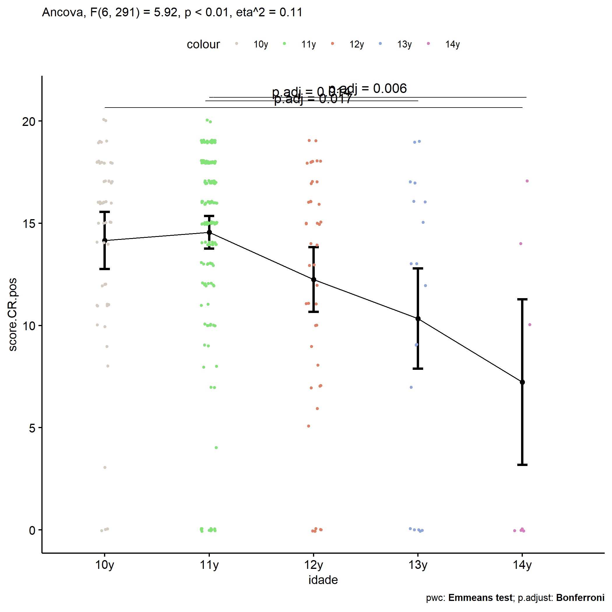<!-- -->

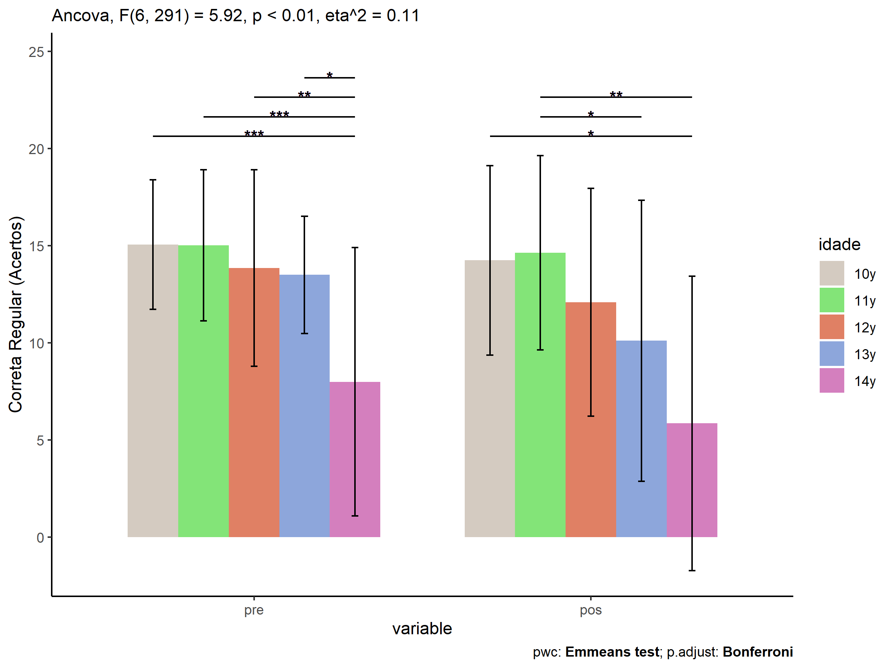<!-- -->

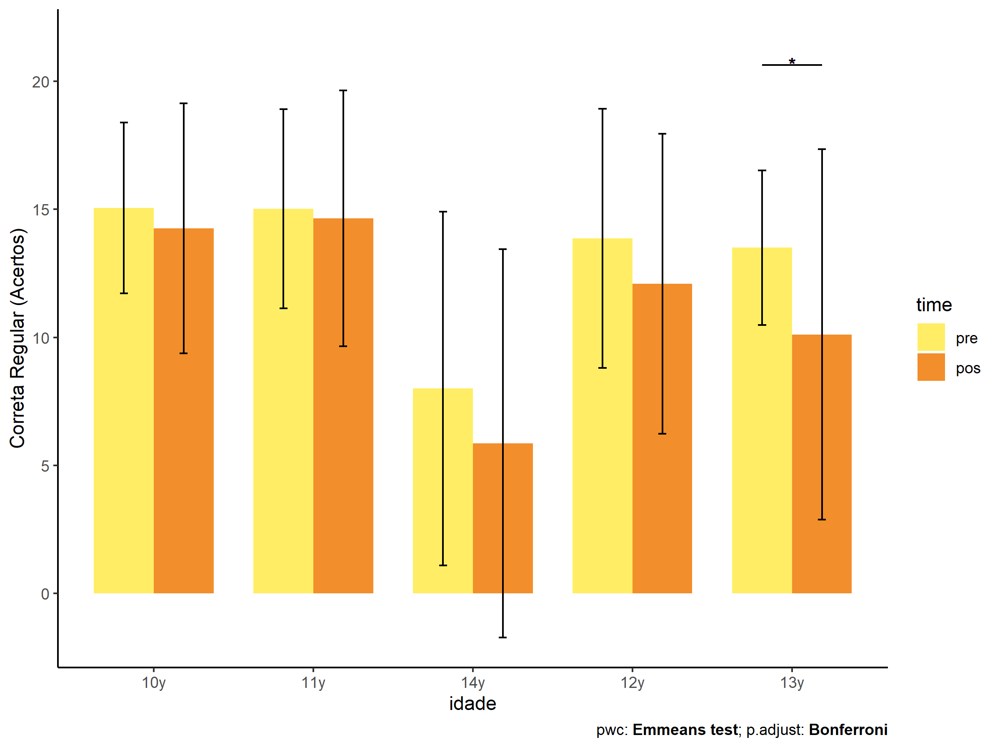<!-- -->

### Correta Irregular (Acertos)

| var          | idade |   n | M (pre) | SE (pre) | M (unadj) | SE (unadj) | M (adj) | SE (adj) |
|:-------------|:------|----:|--------:|---------:|----------:|-----------:|--------:|---------:|
| score.CI.pos | 10y   |  55 |  11.982 |    0.446 |    11.745 |      0.620 |  11.639 |    0.630 |
| score.CI.pos | 11y   | 172 |  12.023 |    0.299 |    11.797 |      0.363 |  11.673 |    0.357 |
| score.CI.pos | 12y   |  43 |  11.186 |    0.685 |    10.837 |      0.790 |  11.053 |    0.713 |
| score.CI.pos | 13y   |  18 |  11.278 |    0.727 |     8.833 |      1.507 |   9.012 |    1.101 |
| score.CI.pos | 14y   |   7 |   6.571 |    1.998 |     4.000 |      2.000 |   6.081 |    1.801 |

| .y.          | group1 | group2 | estimate | conf.low | conf.high |    se | statistic | p       | p.adj | p.adj.signif |
|:-------------|:-------|:-------|---------:|---------:|----------:|------:|----------:|:--------|------:|:-------------|
| score.CI.pos | 10y    | 11y    |   -0.034 |   -1.458 |     1.389 | 0.723 |    -0.047 | 0.962   | 1.000 | ns           |
| score.CI.pos | 10y    | 12y    |    0.587 |   -1.287 |     2.460 | 0.952 |     0.616 | 0.538   | 1.000 | ns           |
| score.CI.pos | 10y    | 13y    |    2.627 |    0.131 |     5.124 | 1.269 |     2.071 | 0.039   | 0.392 | ns           |
| score.CI.pos | 10y    | 14y    |    5.558 |    1.795 |     9.321 | 1.912 |     2.907 | 0.004   | 0.039 | \*           |
| score.CI.pos | 11y    | 12y    |    0.621 |   -0.950 |     2.192 | 0.798 |     0.778 | 0.437   | 1.000 | ns           |
| score.CI.pos | 11y    | 13y    |    2.662 |    0.383 |     4.940 | 1.158 |     2.299 | 0.022   | 0.222 | ns           |
| score.CI.pos | 11y    | 14y    |    5.592 |    1.970 |     9.215 | 1.841 |     3.039 | 0.003   | 0.026 | \*           |
| score.CI.pos | 12y    | 13y    |    2.041 |   -0.539 |     4.620 | 1.311 |     1.557 | 0.12    | 1.000 | ns           |
| score.CI.pos | 12y    | 14y    |    4.972 |    1.173 |     8.771 | 1.930 |     2.576 | 0.011   | 0.105 | ns           |
| score.CI.pos | 13y    | 14y    |    2.931 |   -1.214 |     7.075 | 2.106 |     1.392 | 0.165   | 1.000 | ns           |
| score.CI.pre | 10y    | 11y    |   -0.041 |   -1.228 |     1.145 | 0.603 |    -0.069 | 0.945   | 1.000 | ns           |
| score.CI.pre | 10y    | 12y    |    0.796 |   -0.764 |     2.355 | 0.792 |     1.004 | 0.316   | 1.000 | ns           |
| score.CI.pre | 10y    | 13y    |    0.704 |   -1.376 |     2.785 | 1.057 |     0.666 | 0.506   | 1.000 | ns           |
| score.CI.pre | 10y    | 14y    |    5.410 |    2.336 |     8.485 | 1.562 |     3.463 | \<0.001 | 0.006 | \*\*         |
| score.CI.pre | 11y    | 12y    |    0.837 |   -0.469 |     2.144 | 0.664 |     1.261 | 0.208   | 1.000 | ns           |
| score.CI.pre | 11y    | 13y    |    0.745 |   -1.153 |     2.644 | 0.964 |     0.773 | 0.44    | 1.000 | ns           |
| score.CI.pre | 11y    | 14y    |    5.452 |    2.498 |     8.406 | 1.501 |     3.632 | \<0.001 | 0.003 | \*\*         |
| score.CI.pre | 12y    | 13y    |   -0.092 |   -2.243 |     2.059 | 1.093 |    -0.084 | 0.933   | 1.000 | ns           |
| score.CI.pre | 12y    | 14y    |    4.615 |    1.492 |     7.737 | 1.587 |     2.908 | 0.004   | 0.039 | \*           |
| score.CI.pre | 13y    | 14y    |    4.706 |    1.294 |     8.119 | 1.734 |     2.714 | 0.007   | 0.070 | ns           |

| .y.      | idade | group1 | group2 | estimate | conf.low | conf.high |    se | statistic |     p | p.adj | p.adj.signif |
|:---------|:------|:-------|:-------|---------:|---------:|----------:|------:|----------:|------:|------:|:-------------|
| score.CI | 10y   | pre    | pos    |    0.236 |   -1.425 |     1.898 | 0.846 |     0.279 | 0.780 | 0.780 | ns           |
| score.CI | 11y   | pre    | pos    |    0.227 |   -0.713 |     1.166 | 0.478 |     0.474 | 0.636 | 0.636 | ns           |
| score.CI | 12y   | pre    | pos    |    0.349 |   -1.530 |     2.228 | 0.957 |     0.365 | 0.715 | 0.715 | ns           |
| score.CI | 13y   | pre    | pos    |    2.444 |   -0.460 |     5.348 | 1.479 |     1.653 | 0.099 | 0.099 | ns           |
| score.CI | 14y   | pre    | pos    |    2.571 |   -2.085 |     7.228 | 2.371 |     1.085 | 0.279 | 0.279 | ns           |

    ## Scale for colour is already present.
    ## Adding another scale for colour, which will replace the existing scale.

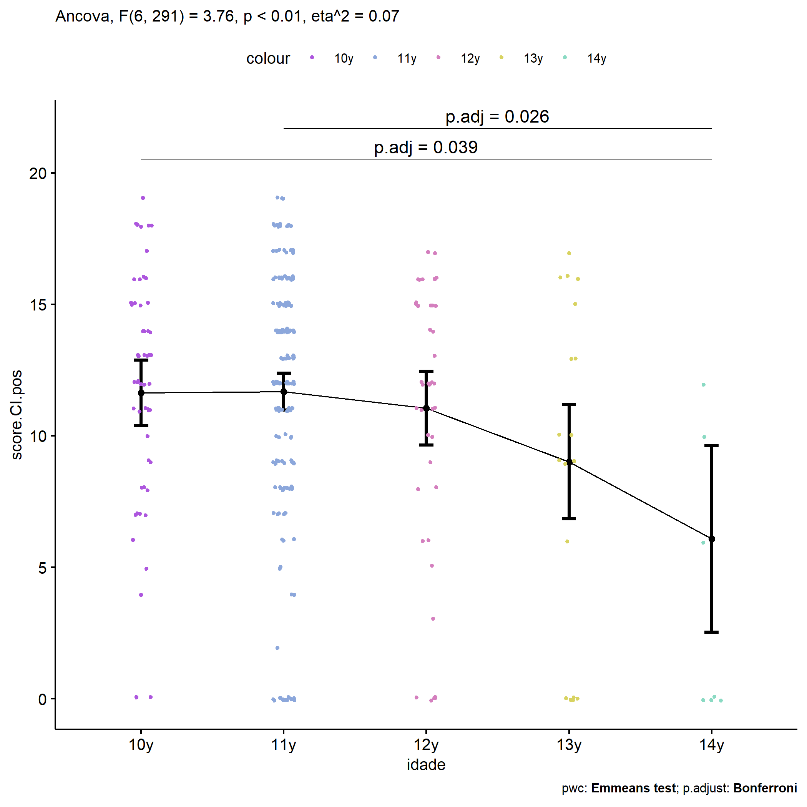<!-- -->

<!-- -->

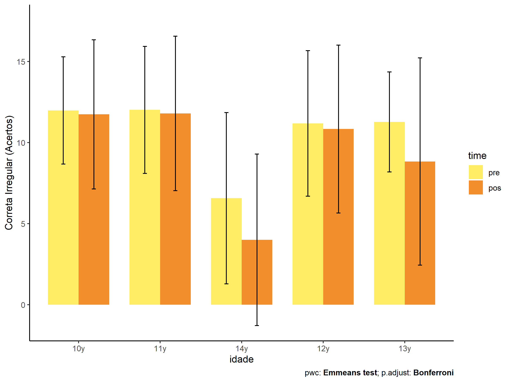<!-- -->

### Trocas Visuais (Acertos)

| var          | idade |   n | M (pre) | SE (pre) | M (unadj) | SE (unadj) | M (adj) | SE (adj) |
|:-------------|:------|----:|--------:|---------:|----------:|-----------:|--------:|---------:|
| score.TV.pos | 10y   |  55 |  17.273 |    0.451 |    15.909 |      0.690 |  15.725 |    0.772 |
| score.TV.pos | 11y   | 172 |  16.715 |    0.320 |    15.930 |      0.422 |  15.848 |    0.435 |
| score.TV.pos | 12y   |  43 |  14.651 |    0.840 |    13.535 |      0.921 |  13.829 |    0.877 |
| score.TV.pos | 13y   |  18 |  15.111 |    0.990 |    11.278 |      1.841 |  11.488 |    1.345 |
| score.TV.pos | 14y   |   7 |  10.143 |    3.284 |     5.286 |      2.801 |   6.403 |    2.202 |

| .y.          | group1 | group2 | estimate | conf.low | conf.high |    se | statistic | p       | p.adj   | p.adj.signif |
|:-------------|:-------|:-------|---------:|---------:|----------:|------:|----------:|:--------|:--------|:-------------|
| score.TV.pos | 10y    | 11y    |   -0.123 |   -1.861 |     1.615 | 0.883 |    -0.139 | 0.889   | 1       | ns           |
| score.TV.pos | 10y    | 12y    |    1.896 |   -0.419 |     4.210 | 1.176 |     1.612 | 0.108   | 1       | ns           |
| score.TV.pos | 10y    | 13y    |    4.237 |    1.176 |     7.297 | 1.555 |     2.725 | 0.007   | 0.068   | ns           |
| score.TV.pos | 10y    | 14y    |    9.322 |    4.700 |    13.943 | 2.348 |     3.970 | \<0.001 | \<0.001 | \*\*\*       |
| score.TV.pos | 11y    | 12y    |    2.018 |    0.083 |     3.954 | 0.983 |     2.053 | 0.041   | 0.41    | ns           |
| score.TV.pos | 11y    | 13y    |    4.360 |    1.573 |     7.146 | 1.416 |     3.079 | 0.002   | 0.023   | \*           |
| score.TV.pos | 11y    | 14y    |    9.445 |    5.013 |    13.876 | 2.251 |     4.195 | \<0.001 | \<0.001 | \*\*\*       |
| score.TV.pos | 12y    | 13y    |    2.341 |   -0.806 |     5.488 | 1.599 |     1.464 | 0.144   | 1       | ns           |
| score.TV.pos | 12y    | 14y    |    7.426 |    2.809 |    12.043 | 2.346 |     3.166 | 0.002   | 0.017   | \*           |
| score.TV.pos | 13y    | 14y    |    5.085 |    0.038 |    10.132 | 2.564 |     1.983 | 0.048   | 0.483   | ns           |
| score.TV.pre | 10y    | 11y    |    0.558 |   -0.786 |     1.902 | 0.683 |     0.817 | 0.415   | 1       | ns           |
| score.TV.pre | 10y    | 12y    |    2.622 |    0.855 |     4.388 | 0.897 |     2.921 | 0.004   | 0.038   | \*           |
| score.TV.pre | 10y    | 13y    |    2.162 |   -0.195 |     4.518 | 1.197 |     1.806 | 0.072   | 0.72    | ns           |
| score.TV.pre | 10y    | 14y    |    7.130 |    3.648 |    10.612 | 1.769 |     4.030 | \<0.001 | \<0.001 | \*\*\*       |
| score.TV.pre | 11y    | 12y    |    2.064 |    0.585 |     3.543 | 0.752 |     2.746 | 0.006   | 0.064   | ns           |
| score.TV.pre | 11y    | 13y    |    1.604 |   -0.546 |     3.754 | 1.092 |     1.469 | 0.143   | 1       | ns           |
| score.TV.pre | 11y    | 14y    |    6.572 |    3.227 |     9.918 | 1.700 |     3.866 | \<0.001 | 0.001   | \*\*         |
| score.TV.pre | 12y    | 13y    |   -0.460 |   -2.896 |     1.976 | 1.238 |    -0.372 | 0.71    | 1       | ns           |
| score.TV.pre | 12y    | 14y    |    4.508 |    0.972 |     8.045 | 1.797 |     2.509 | 0.013   | 0.127   | ns           |
| score.TV.pre | 13y    | 14y    |    4.968 |    1.103 |     8.833 | 1.964 |     2.530 | 0.012   | 0.119   | ns           |

| .y.      | idade | group1 | group2 | estimate | conf.low | conf.high |    se | statistic |     p | p.adj | p.adj.signif |
|:---------|:------|:-------|:-------|---------:|---------:|----------:|------:|----------:|------:|------:|:-------------|
| score.TV | 10y   | pre    | pos    |    1.364 |   -0.553 |     3.281 | 0.976 |     1.397 | 0.163 | 0.163 | ns           |
| score.TV | 11y   | pre    | pos    |    0.785 |   -0.299 |     1.869 | 0.552 |     1.422 | 0.156 | 0.156 | ns           |
| score.TV | 12y   | pre    | pos    |    1.116 |   -1.052 |     3.284 | 1.104 |     1.011 | 0.312 | 0.312 | ns           |
| score.TV | 13y   | pre    | pos    |    3.833 |    0.482 |     7.184 | 1.706 |     2.247 | 0.025 | 0.025 | \*           |
| score.TV | 14y   | pre    | pos    |    4.857 |   -0.516 |    10.230 | 2.736 |     1.775 | 0.076 | 0.076 | ns           |

    ## Scale for colour is already present.
    ## Adding another scale for colour, which will replace the existing scale.

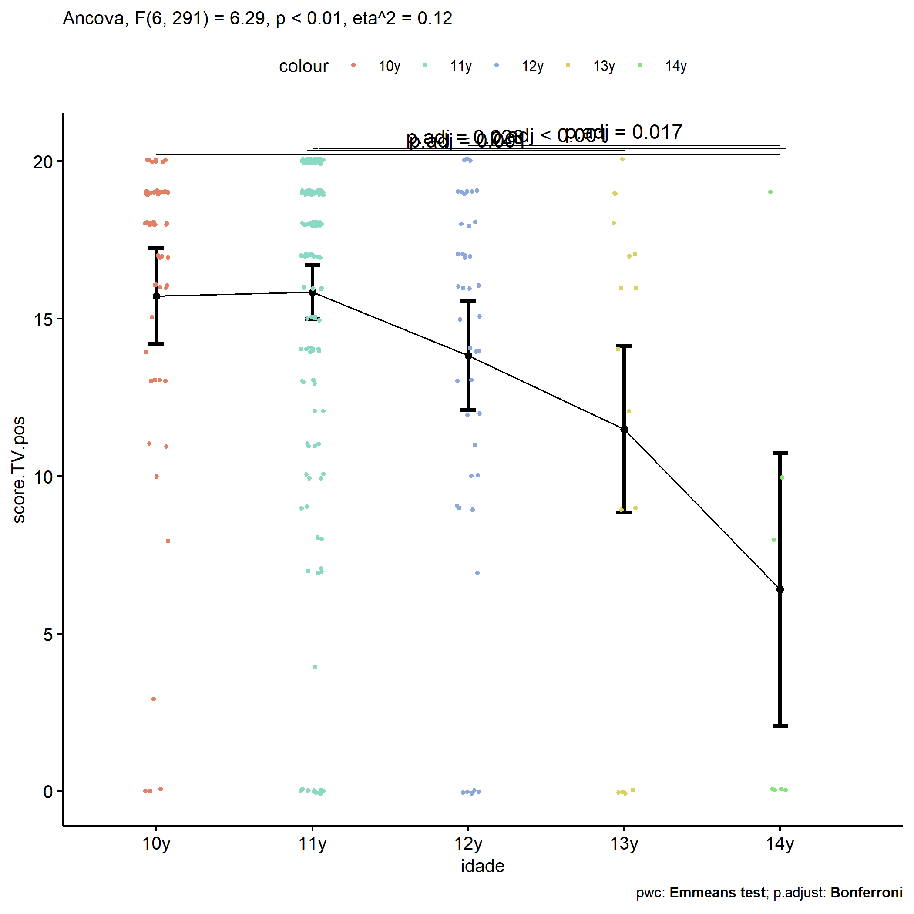<!-- -->

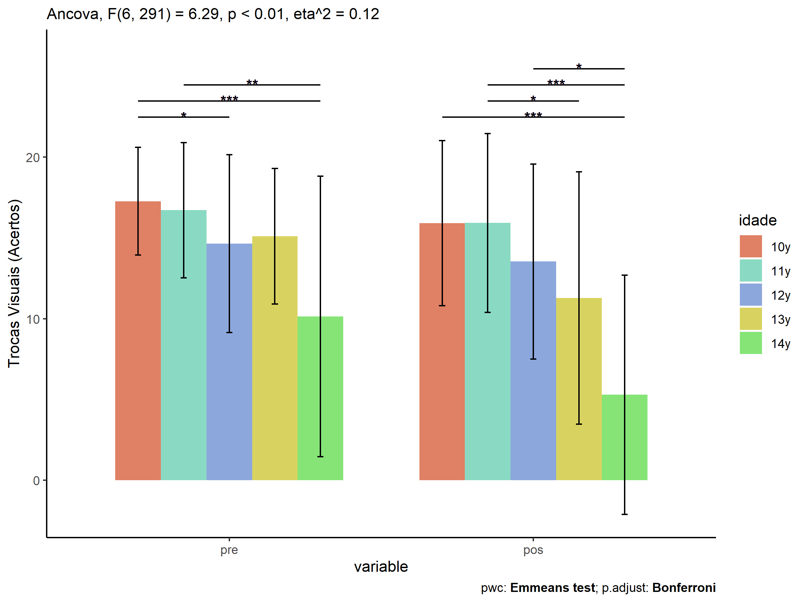<!-- -->

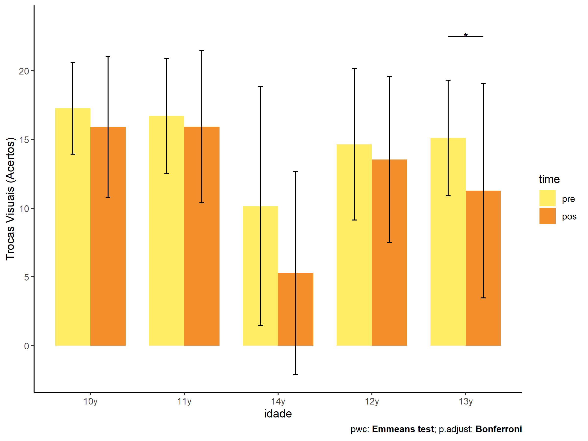<!-- -->

### Trocas Fonologicas (Acertos)

| var          | idade |   n | M (pre) | SE (pre) | M (unadj) | SE (unadj) | M (adj) | SE (adj) |
|:-------------|:------|----:|--------:|---------:|----------:|-----------:|--------:|---------:|
| score.TF.pos | 10y   |  55 |  15.691 |    0.541 |    13.782 |      0.697 |  13.616 |    0.757 |
| score.TF.pos | 11y   | 172 |  15.837 |    0.323 |    15.006 |      0.428 |  14.787 |    0.430 |
| score.TF.pos | 12y   |  43 |  13.907 |    0.844 |    12.279 |      0.966 |  12.765 |    0.861 |
| score.TF.pos | 13y   |  18 |  14.111 |    0.907 |    11.056 |      1.800 |  11.467 |    1.325 |
| score.TF.pos | 14y   |   7 |   8.000 |    2.619 |     5.714 |      2.917 |   8.358 |    2.187 |

| .y.          | group1 | group2 | estimate | conf.low | conf.high |    se | statistic | p       | p.adj   | p.adj.signif |
|:-------------|:-------|:-------|---------:|---------:|----------:|------:|----------:|:--------|:--------|:-------------|
| score.TF.pos | 10y    | 11y    |   -1.171 |   -2.881 |     0.540 | 0.869 |    -1.347 | 0.179   | 1       | ns           |
| score.TF.pos | 10y    | 12y    |    0.851 |   -1.412 |     3.114 | 1.150 |     0.740 | 0.46    | 1       | ns           |
| score.TF.pos | 10y    | 13y    |    2.149 |   -0.859 |     5.157 | 1.528 |     1.406 | 0.161   | 1       | ns           |
| score.TF.pos | 10y    | 14y    |    5.258 |    0.686 |     9.829 | 2.322 |     2.264 | 0.024   | 0.243   | ns           |
| score.TF.pos | 11y    | 12y    |    2.022 |    0.118 |     3.925 | 0.967 |     2.090 | 0.038   | 0.375   | ns           |
| score.TF.pos | 11y    | 13y    |    3.320 |    0.572 |     6.067 | 1.396 |     2.378 | 0.018   | 0.181   | ns           |
| score.TF.pos | 11y    | 14y    |    6.428 |    2.020 |    10.837 | 2.240 |     2.870 | 0.004   | 0.044   | \*           |
| score.TF.pos | 12y    | 13y    |    1.298 |   -1.802 |     4.399 | 1.575 |     0.824 | 0.411   | 1       | ns           |
| score.TF.pos | 12y    | 14y    |    4.407 |   -0.176 |     8.989 | 2.328 |     1.893 | 0.059   | 0.594   | ns           |
| score.TF.pos | 13y    | 14y    |    3.109 |   -1.891 |     8.108 | 2.540 |     1.224 | 0.222   | 1       | ns           |
| score.TF.pre | 10y    | 11y    |   -0.146 |   -1.504 |     1.212 | 0.690 |    -0.212 | 0.832   | 1       | ns           |
| score.TF.pre | 10y    | 12y    |    1.784 |   -0.001 |     3.569 | 0.907 |     1.967 | 0.05    | 0.501   | ns           |
| score.TF.pre | 10y    | 13y    |    1.580 |   -0.801 |     3.961 | 1.210 |     1.306 | 0.193   | 1       | ns           |
| score.TF.pre | 10y    | 14y    |    7.691 |    4.173 |    11.209 | 1.788 |     4.302 | \<0.001 | \<0.001 | \*\*\*       |
| score.TF.pre | 11y    | 12y    |    1.930 |    0.435 |     3.425 | 0.760 |     2.541 | 0.012   | 0.116   | ns           |
| score.TF.pre | 11y    | 13y    |    1.726 |   -0.446 |     3.898 | 1.104 |     1.564 | 0.119   | 1       | ns           |
| score.TF.pre | 11y    | 14y    |    7.837 |    4.457 |    11.218 | 1.718 |     4.563 | \<0.001 | \<0.001 | \*\*\*\*     |
| score.TF.pre | 12y    | 13y    |   -0.204 |   -2.665 |     2.257 | 1.251 |    -0.163 | 0.87    | 1       | ns           |
| score.TF.pre | 12y    | 14y    |    5.907 |    2.334 |     9.480 | 1.816 |     3.254 | 0.001   | 0.013   | \*           |
| score.TF.pre | 13y    | 14y    |    6.111 |    2.206 |    10.016 | 1.984 |     3.080 | 0.002   | 0.023   | \*           |

| .y.      | idade | group1 | group2 | estimate | conf.low | conf.high |    se | statistic |     p | p.adj | p.adj.signif |
|:---------|:------|:-------|:-------|---------:|---------:|----------:|------:|----------:|------:|------:|:-------------|
| score.TF | 10y   | pre    | pos    |    1.909 |   -0.035 |     3.853 | 0.990 |     1.929 | 0.054 | 0.054 | ns           |
| score.TF | 11y   | pre    | pos    |    0.831 |   -0.268 |     1.931 | 0.560 |     1.486 | 0.138 | 0.138 | ns           |
| score.TF | 12y   | pre    | pos    |    1.628 |   -0.570 |     3.826 | 1.119 |     1.454 | 0.146 | 0.146 | ns           |
| score.TF | 13y   | pre    | pos    |    3.056 |   -0.342 |     6.453 | 1.730 |     1.766 | 0.078 | 0.078 | ns           |
| score.TF | 14y   | pre    | pos    |    2.286 |   -3.163 |     7.734 | 2.774 |     0.824 | 0.410 | 0.410 | ns           |

    ## Scale for colour is already present.
    ## Adding another scale for colour, which will replace the existing scale.

<!-- -->

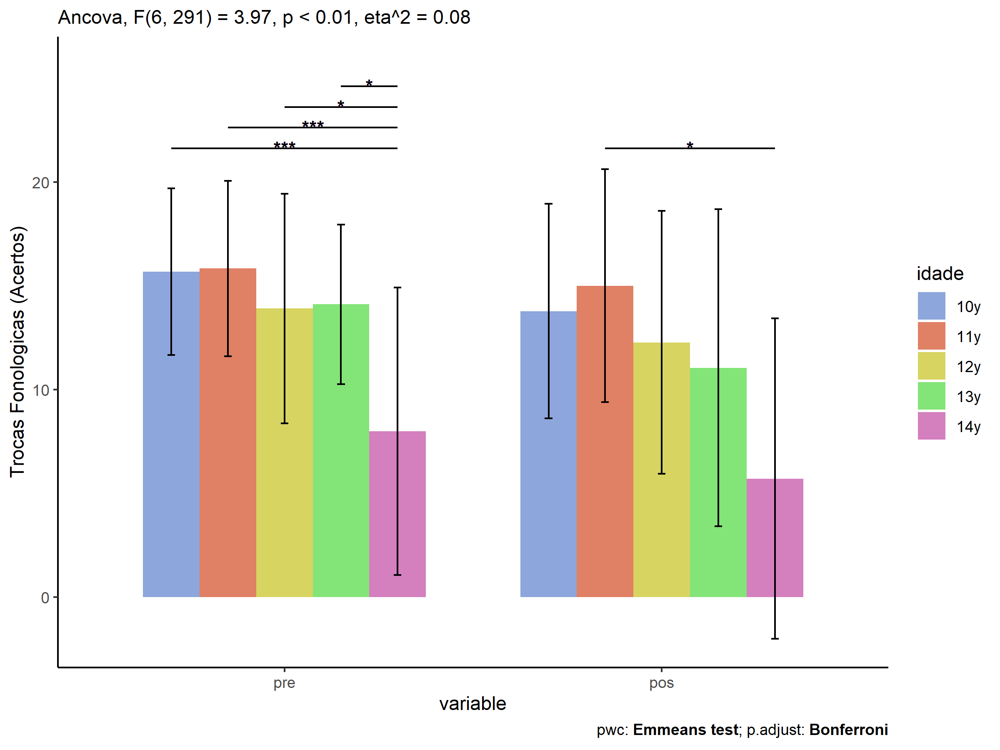<!-- -->

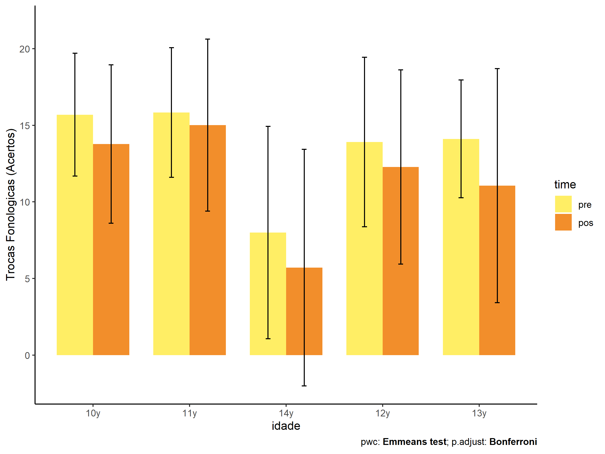<!-- -->

### Trocas Orograficas (Acertos)

| var          | idade |   n | M (pre) | SE (pre) | M (unadj) | SE (unadj) | M (adj) | SE (adj) |
|:-------------|:------|----:|--------:|---------:|----------:|-----------:|--------:|---------:|
| score.TO.pos | 10y   |  55 |  10.309 |    0.574 |     9.982 |      0.589 |   9.799 |    0.594 |
| score.TO.pos | 11y   | 172 |  10.605 |    0.336 |    10.901 |      0.380 |  10.574 |    0.338 |
| score.TO.pos | 12y   |  43 |   8.023 |    0.606 |     7.628 |      0.684 |   8.563 |    0.681 |
| score.TO.pos | 13y   |  18 |   8.889 |    0.646 |     6.278 |      1.102 |   6.790 |    1.039 |
| score.TO.pos | 14y   |   7 |   5.000 |    1.512 |     6.000 |      2.854 |   8.414 |    1.691 |

| .y.          | group1 | group2 | estimate | conf.low | conf.high |    se | statistic | p       | p.adj | p.adj.signif |
|:-------------|:-------|:-------|---------:|---------:|----------:|------:|----------:|:--------|------:|:-------------|
| score.TO.pos | 10y    | 11y    |   -0.775 |   -2.117 |     0.567 | 0.682 |    -1.136 | 0.257   | 1.000 | ns           |
| score.TO.pos | 10y    | 12y    |    1.236 |   -0.549 |     3.020 | 0.907 |     1.363 | 0.174   | 1.000 | ns           |
| score.TO.pos | 10y    | 13y    |    3.009 |    0.651 |     5.368 | 1.198 |     2.512 | 0.013   | 0.126 | ns           |
| score.TO.pos | 10y    | 14y    |    1.385 |   -2.149 |     4.919 | 1.796 |     0.771 | 0.441   | 1.000 | ns           |
| score.TO.pos | 11y    | 12y    |    2.011 |    0.501 |     3.520 | 0.767 |     2.622 | 0.009   | 0.092 | ns           |
| score.TO.pos | 11y    | 13y    |    3.784 |    1.628 |     5.940 | 1.095 |     3.455 | \<0.001 | 0.006 | \*\*         |
| score.TO.pos | 11y    | 14y    |    2.160 |   -1.248 |     5.567 | 1.731 |     1.248 | 0.213   | 1.000 | ns           |
| score.TO.pos | 12y    | 13y    |    1.774 |   -0.660 |     4.207 | 1.237 |     1.434 | 0.153   | 1.000 | ns           |
| score.TO.pos | 12y    | 14y    |    0.149 |   -3.400 |     3.698 | 1.803 |     0.083 | 0.934   | 1.000 | ns           |
| score.TO.pos | 13y    | 14y    |   -1.624 |   -5.511 |     2.262 | 1.975 |    -0.823 | 0.411   | 1.000 | ns           |
| score.TO.pre | 10y    | 11y    |   -0.296 |   -1.584 |     0.993 | 0.655 |    -0.452 | 0.652   | 1.000 | ns           |
| score.TO.pre | 10y    | 12y    |    2.286 |    0.593 |     3.979 | 0.860 |     2.658 | 0.008   | 0.083 | ns           |
| score.TO.pre | 10y    | 13y    |    1.420 |   -0.838 |     3.678 | 1.147 |     1.238 | 0.217   | 1.000 | ns           |
| score.TO.pre | 10y    | 14y    |    5.309 |    1.972 |     8.646 | 1.696 |     3.131 | 0.002   | 0.019 | \*           |
| score.TO.pre | 11y    | 12y    |    2.581 |    1.163 |     3.999 | 0.720 |     3.583 | \<0.001 | 0.004 | \*\*         |
| score.TO.pre | 11y    | 13y    |    1.716 |   -0.344 |     3.776 | 1.047 |     1.639 | 0.102   | 1.000 | ns           |
| score.TO.pre | 11y    | 14y    |    5.605 |    2.398 |     8.811 | 1.629 |     3.440 | \<0.001 | 0.007 | \*\*         |
| score.TO.pre | 12y    | 13y    |   -0.866 |   -3.200 |     1.469 | 1.186 |    -0.730 | 0.466   | 1.000 | ns           |
| score.TO.pre | 12y    | 14y    |    3.023 |   -0.366 |     6.413 | 1.722 |     1.756 | 0.08    | 0.802 | ns           |
| score.TO.pre | 13y    | 14y    |    3.889 |    0.185 |     7.593 | 1.882 |     2.066 | 0.04    | 0.397 | ns           |

| .y.      | idade | group1 | group2 | estimate | conf.low | conf.high |    se | statistic |     p | p.adj | p.adj.signif |
|:---------|:------|:-------|:-------|---------:|---------:|----------:|------:|----------:|------:|------:|:-------------|
| score.TO | 10y   | pre    | pos    |    0.327 |   -1.377 |     2.032 | 0.868 |     0.377 | 0.706 | 0.706 | ns           |
| score.TO | 11y   | pre    | pos    |   -0.297 |   -1.260 |     0.667 | 0.491 |    -0.604 | 0.546 | 0.546 | ns           |
| score.TO | 12y   | pre    | pos    |    0.395 |   -1.532 |     2.323 | 0.982 |     0.403 | 0.687 | 0.687 | ns           |
| score.TO | 13y   | pre    | pos    |    2.611 |   -0.368 |     5.591 | 1.517 |     1.721 | 0.086 | 0.086 | ns           |
| score.TO | 14y   | pre    | pos    |   -1.000 |   -5.778 |     3.778 | 2.433 |    -0.411 | 0.681 | 0.681 | ns           |

    ## Scale for colour is already present.
    ## Adding another scale for colour, which will replace the existing scale.

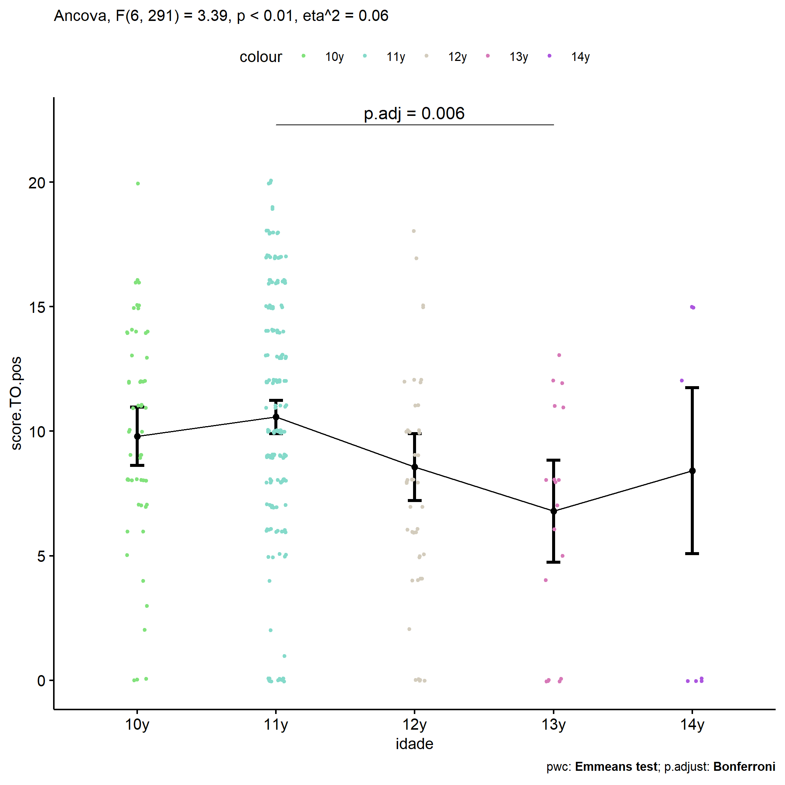<!-- -->

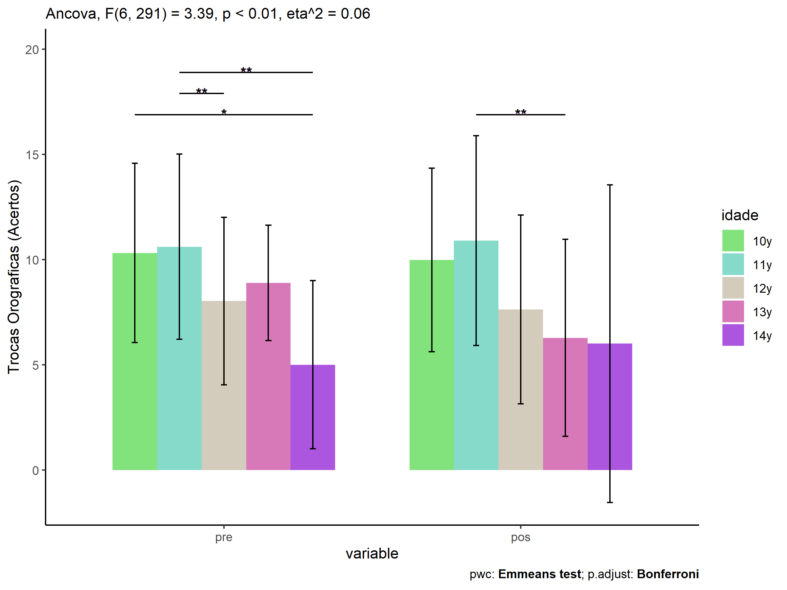<!-- -->

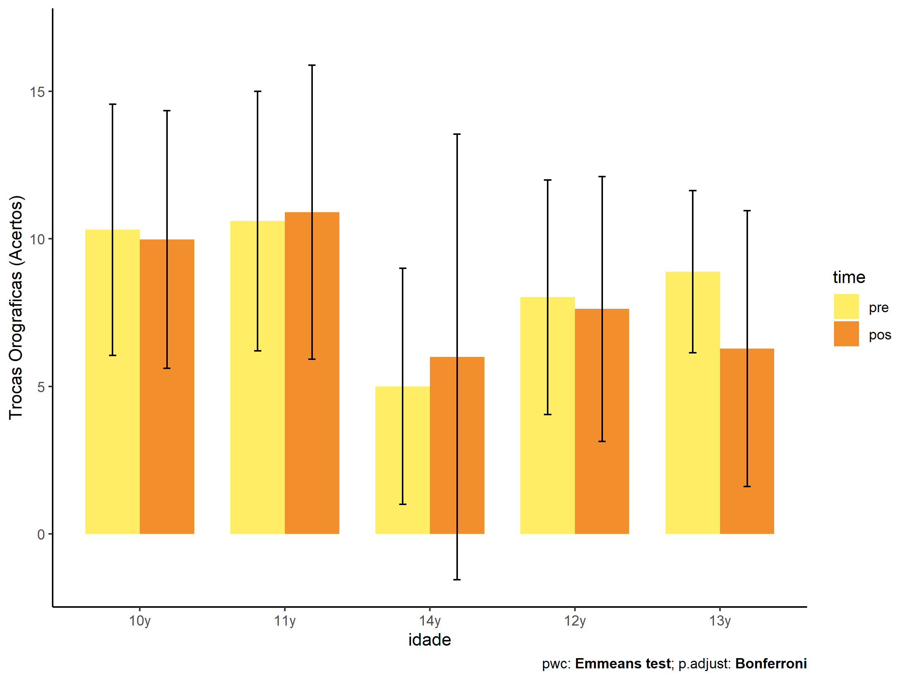<!-- -->

## factor: **zona.participante**

### Leitura de Pseudo-Palavras (Acertos)

| var            | zona.participante |   n | M (pre) | SE (pre) | M (unadj) | SE (unadj) | M (adj) | SE (adj) |
|:---------------|:------------------|----:|--------:|---------:|----------:|-----------:|--------:|---------:|
| score.CLPP.pos | Rural             | 103 |  69.835 |    1.297 |    70.951 |      1.350 |  70.740 |    1.089 |
| score.CLPP.pos | Urbana            | 105 |  69.248 |    1.482 |    70.933 |      1.574 |  71.141 |    1.079 |

| .y.            | group1 | group2 | estimate | conf.low | conf.high |    se | statistic |     p | p.adj | p.adj.signif |
|:---------------|:-------|:-------|---------:|---------:|----------:|------:|----------:|------:|------:|:-------------|
| score.CLPP.pos | Urbana | Rural  |    0.400 |   -2.622 |     3.423 | 1.533 |     0.261 | 0.794 | 0.794 | ns           |
| score.CLPP.pre | Urbana | Rural  |   -0.587 |   -4.476 |     3.301 | 1.972 |    -0.298 | 0.766 | 0.766 | ns           |

| .y.        | zona.participante | group1 | group2 | estimate | conf.low | conf.high |    se | statistic |     p | p.adj | p.adj.signif |
|:-----------|:------------------|:-------|:-------|---------:|---------:|----------:|------:|----------:|------:|------:|:-------------|
| score.CLPP | Urbana            | pre    | pos    |   -0.735 |   -4.511 |     3.041 | 1.921 |    -0.383 | 0.702 | 0.702 | ns           |
| score.CLPP | Rural             | pre    | pos    |   -1.501 |   -5.415 |     2.412 | 1.991 |    -0.754 | 0.451 | 0.451 | ns           |

    ## Scale for colour is already present.
    ## Adding another scale for colour, which will replace the existing scale.

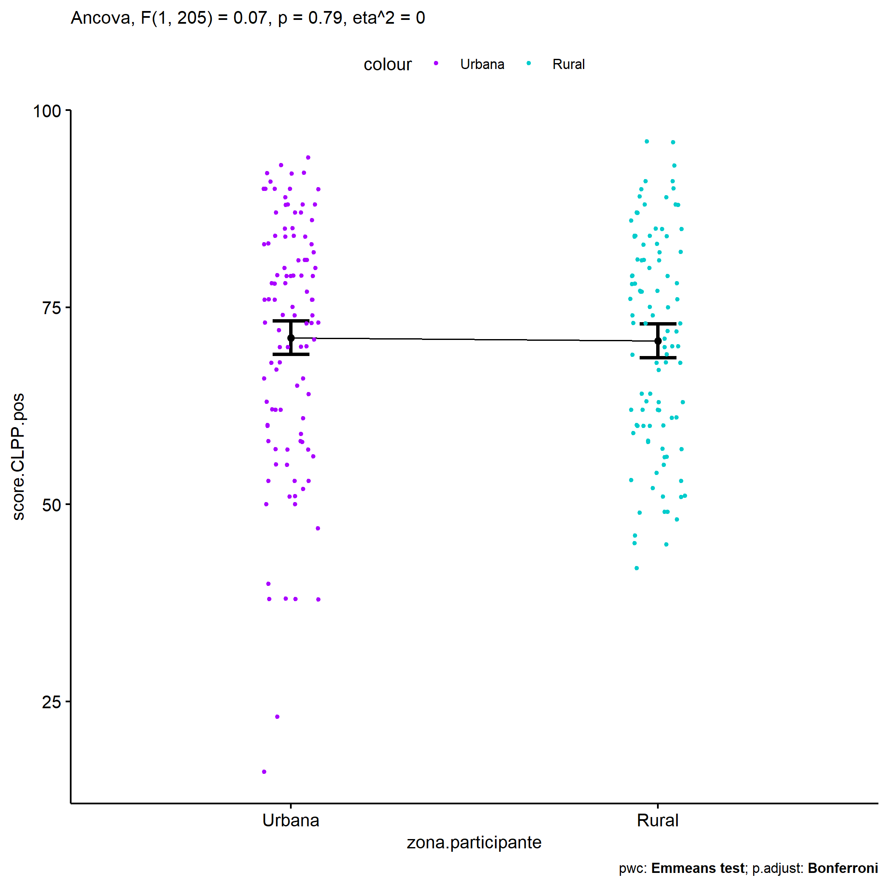<!-- -->

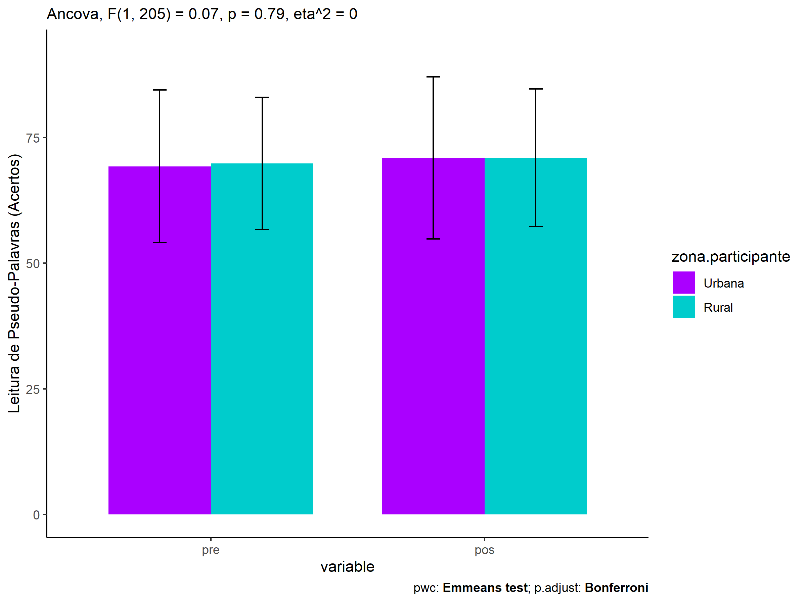<!-- -->

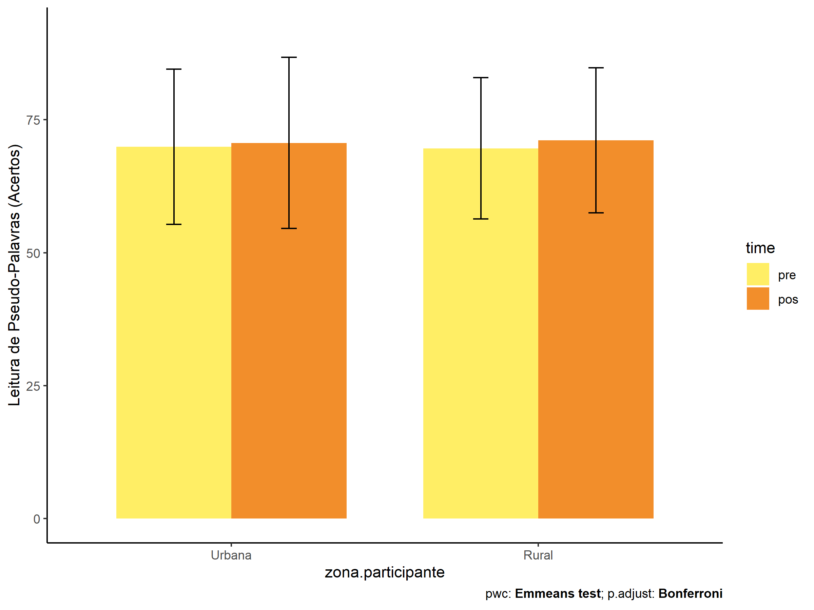<!-- -->

### Correta Regular (Acertos)

| var          | zona.participante |   n | M (pre) | SE (pre) | M (unadj) | SE (unadj) | M (adj) | SE (adj) |
|:-------------|:------------------|----:|--------:|---------:|----------:|-----------:|--------:|---------:|
| score.CR.pos | Rural             | 108 |  14.593 |    0.371 |    14.704 |      0.391 |  14.606 |    0.489 |
| score.CR.pos | Urbana            | 126 |  14.071 |    0.447 |    13.056 |      0.550 |  13.139 |    0.453 |

| .y.          | group1 | group2 | estimate | conf.low | conf.high |    se | statistic |     p | p.adj | p.adj.signif |
|:-------------|:-------|:-------|---------:|---------:|----------:|------:|----------:|------:|------:|:-------------|
| score.CR.pos | Urbana | Rural  |   -1.467 |   -2.781 |    -0.154 | 0.667 |    -2.201 | 0.029 | 0.029 | \*           |
| score.CR.pre | Urbana | Rural  |   -0.521 |   -1.688 |     0.646 | 0.592 |    -0.880 | 0.380 | 0.380 | ns           |

| .y.      | zona.participante | group1 | group2 | estimate | conf.low | conf.high |    se | statistic |     p | p.adj | p.adj.signif |
|:---------|:------------------|:-------|:-------|---------:|---------:|----------:|------:|----------:|------:|------:|:-------------|
| score.CR | Urbana            | pre    | pos    |    1.016 |   -0.204 |     2.235 | 0.621 |     1.637 | 0.102 | 0.102 | ns           |
| score.CR | Rural             | pre    | pos    |   -0.111 |   -1.428 |     1.206 | 0.670 |    -0.166 | 0.868 | 0.868 | ns           |

    ## Scale for colour is already present.
    ## Adding another scale for colour, which will replace the existing scale.

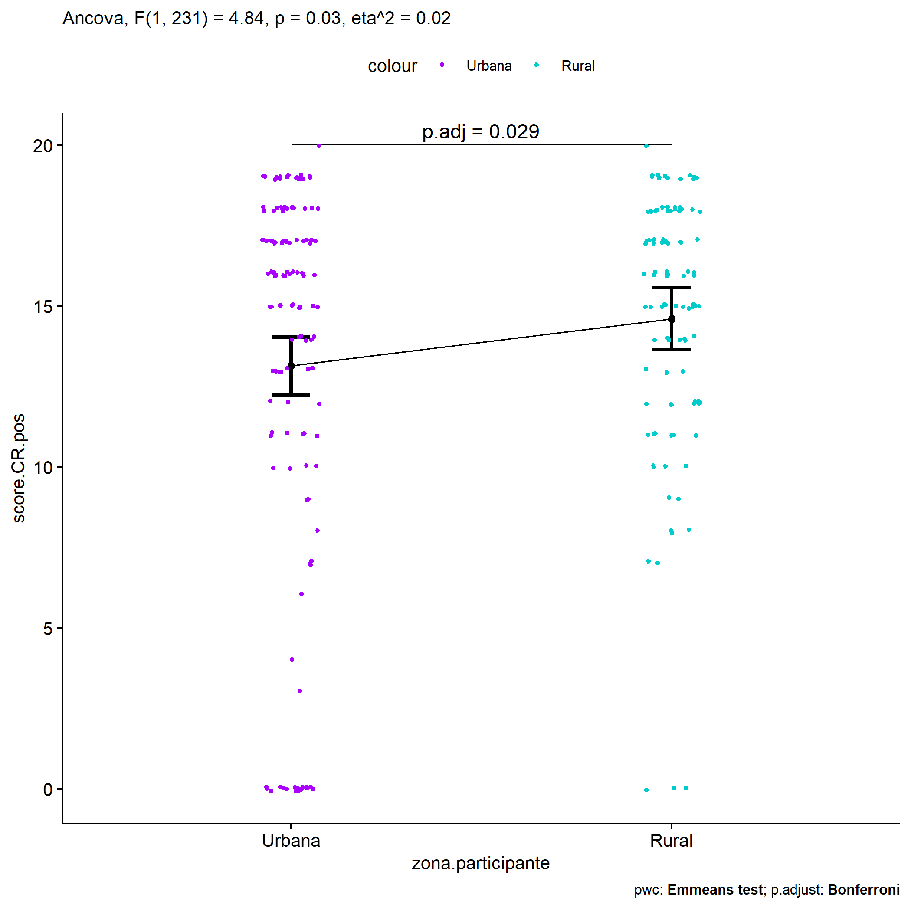<!-- -->

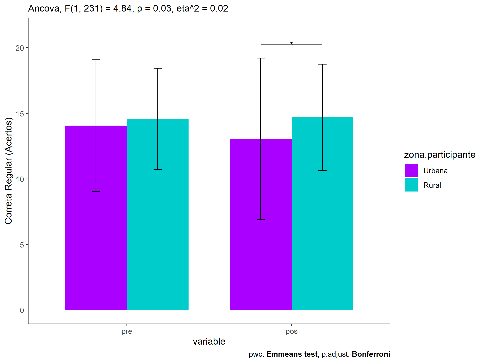<!-- -->

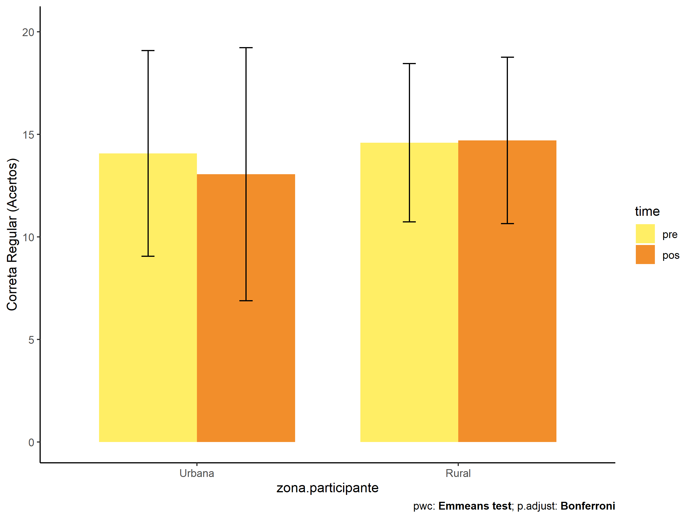<!-- -->

### Correta Irregular (Acertos)

| var          | zona.participante |   n | M (pre) | SE (pre) | M (unadj) | SE (unadj) | M (adj) | SE (adj) |
|:-------------|:------------------|----:|--------:|---------:|----------:|-----------:|--------:|---------:|
| score.CI.pos | Rural             | 108 |  11.657 |    0.365 |    12.148 |      0.375 |  12.060 |    0.426 |
| score.CI.pos | Urbana            | 126 |  11.325 |    0.404 |    10.532 |      0.496 |  10.607 |    0.394 |

| .y.          | group1 | group2 | estimate | conf.low | conf.high |    se | statistic |     p | p.adj | p.adj.signif |
|:-------------|:-------|:-------|---------:|---------:|----------:|------:|----------:|------:|------:|:-------------|
| score.CI.pos | Urbana | Rural  |   -1.454 |   -2.597 |    -0.311 | 0.580 |    -2.506 | 0.013 | 0.013 | \*           |
| score.CI.pre | Urbana | Rural  |   -0.332 |   -1.419 |     0.755 | 0.552 |    -0.602 | 0.548 | 0.548 | ns           |

| .y.      | zona.participante | group1 | group2 | estimate | conf.low | conf.high |    se | statistic |     p | p.adj | p.adj.signif |
|:---------|:------------------|:-------|:-------|---------:|---------:|----------:|------:|----------:|------:|------:|:-------------|
| score.CI | Urbana            | pre    | pos    |    0.794 |   -0.333 |     1.920 | 0.573 |     1.385 | 0.167 | 0.167 | ns           |
| score.CI | Rural             | pre    | pos    |   -0.491 |   -1.707 |     0.726 | 0.619 |    -0.793 | 0.428 | 0.428 | ns           |

    ## Scale for colour is already present.
    ## Adding another scale for colour, which will replace the existing scale.

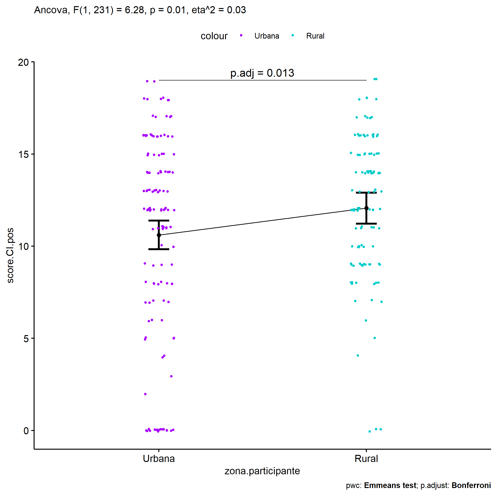<!-- -->

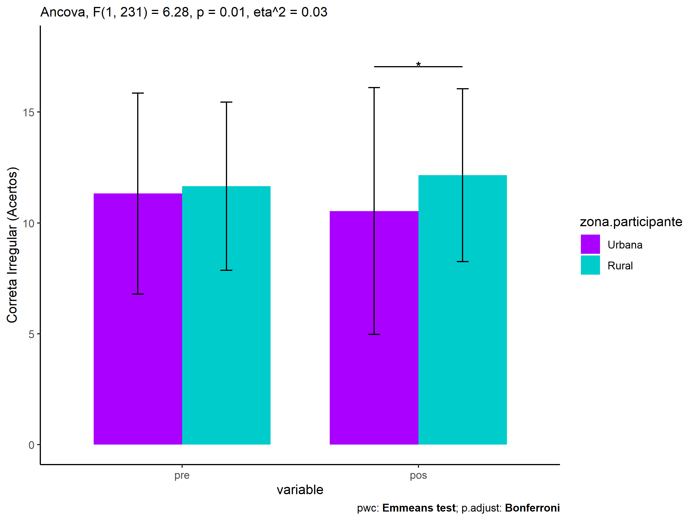<!-- -->

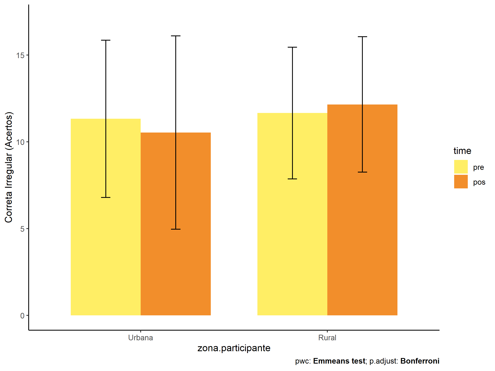<!-- -->

### Trocas Visuais (Acertos)

| var          | zona.participante |   n | M (pre) | SE (pre) | M (unadj) | SE (unadj) | M (adj) | SE (adj) |
|:-------------|:------------------|----:|--------:|---------:|----------:|-----------:|--------:|---------:|
| score.TV.pos | Rural             | 108 |  16.519 |    0.382 |    16.454 |      0.403 |  16.317 |    0.527 |
| score.TV.pos | Urbana            | 126 |  15.881 |    0.489 |    14.413 |      0.612 |  14.530 |    0.488 |

| .y.          | group1 | group2 | estimate | conf.low | conf.high |    se | statistic |     p | p.adj | p.adj.signif |
|:-------------|:-------|:-------|---------:|---------:|----------:|------:|----------:|------:|------:|:-------------|
| score.TV.pos | Urbana | Rural  |   -1.787 |   -3.205 |    -0.370 | 0.719 |    -2.485 | 0.014 | 0.014 | \*           |
| score.TV.pre | Urbana | Rural  |   -0.638 |   -1.889 |     0.614 | 0.635 |    -1.003 | 0.317 | 0.317 | ns           |

| .y.      | zona.participante | group1 | group2 | estimate | conf.low | conf.high |    se | statistic |     p | p.adj | p.adj.signif |
|:---------|:------------------|:-------|:-------|---------:|---------:|----------:|------:|----------:|------:|------:|:-------------|
| score.TV | Urbana            | pre    | pos    |    1.468 |    0.146 |     2.790 | 0.673 |     2.183 | 0.030 | 0.030 | \*           |
| score.TV | Rural             | pre    | pos    |    0.065 |   -1.363 |     1.493 | 0.727 |     0.089 | 0.929 | 0.929 | ns           |

    ## Scale for colour is already present.
    ## Adding another scale for colour, which will replace the existing scale.

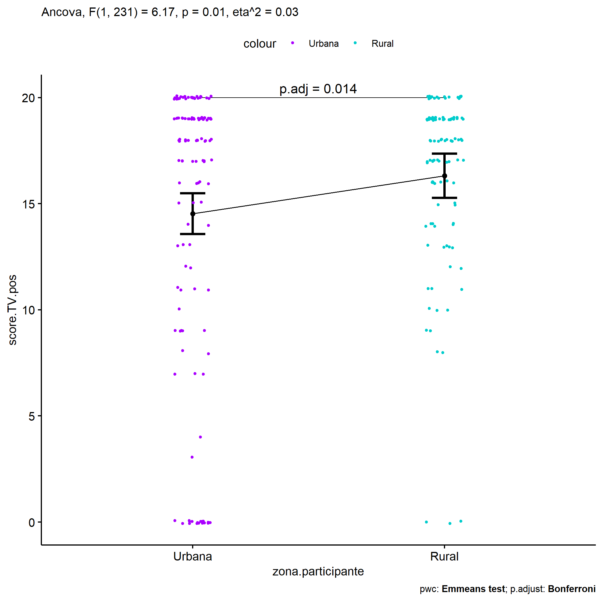<!-- -->

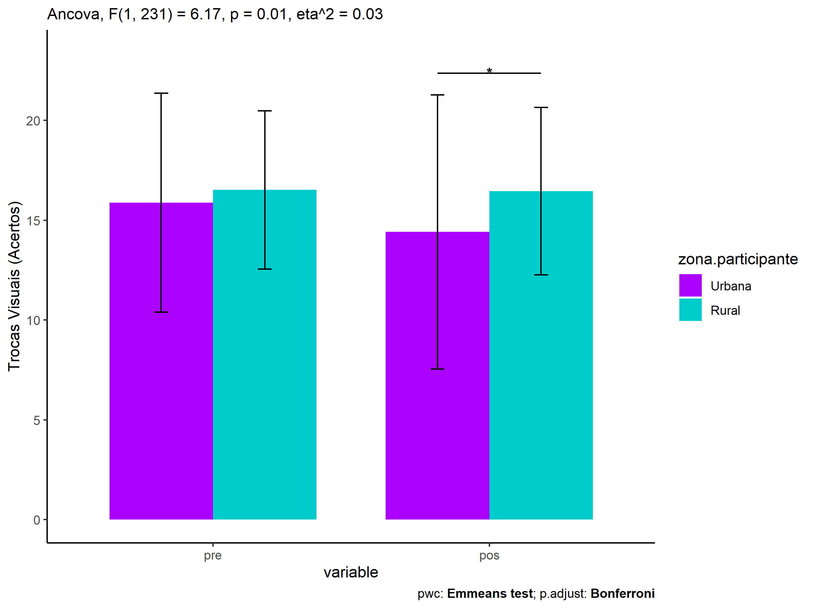<!-- -->

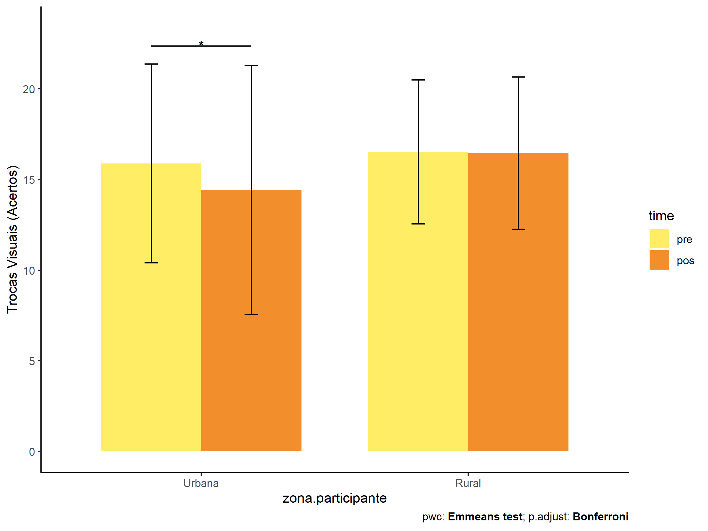<!-- -->

### Trocas Fonologicas (Acertos)

| var          | zona.participante |   n | M (pre) | SE (pre) | M (unadj) | SE (unadj) | M (adj) | SE (adj) |
|:-------------|:------------------|----:|--------:|---------:|----------:|-----------:|--------:|---------:|
| score.TF.pos | Rural             | 108 |  15.602 |    0.389 |    15.352 |      0.445 |  15.049 |    0.510 |
| score.TF.pos | Urbana            | 126 |  14.484 |    0.484 |    13.079 |      0.592 |  13.339 |    0.472 |

| .y.          | group1 | group2 | estimate | conf.low | conf.high |    se | statistic |     p | p.adj | p.adj.signif |
|:-------------|:-------|:-------|---------:|---------:|----------:|------:|----------:|------:|------:|:-------------|
| score.TF.pos | Urbana | Rural  |   -1.711 |   -3.084 |    -0.338 | 0.697 |    -2.456 | 0.015 | 0.015 | \*           |
| score.TF.pre | Urbana | Rural  |   -1.118 |   -2.369 |     0.133 | 0.635 |    -1.761 | 0.080 | 0.080 | ns           |

| .y.      | zona.participante | group1 | group2 | estimate | conf.low | conf.high |    se | statistic |     p | p.adj | p.adj.signif |
|:---------|:------------------|:-------|:-------|---------:|---------:|----------:|------:|----------:|------:|------:|:-------------|
| score.TF | Urbana            | pre    | pos    |    1.405 |    0.082 |     2.728 | 0.673 |     2.087 | 0.037 | 0.037 | \*           |
| score.TF | Rural             | pre    | pos    |    0.250 |   -1.179 |     1.679 | 0.727 |     0.344 | 0.731 | 0.731 | ns           |

    ## Scale for colour is already present.
    ## Adding another scale for colour, which will replace the existing scale.

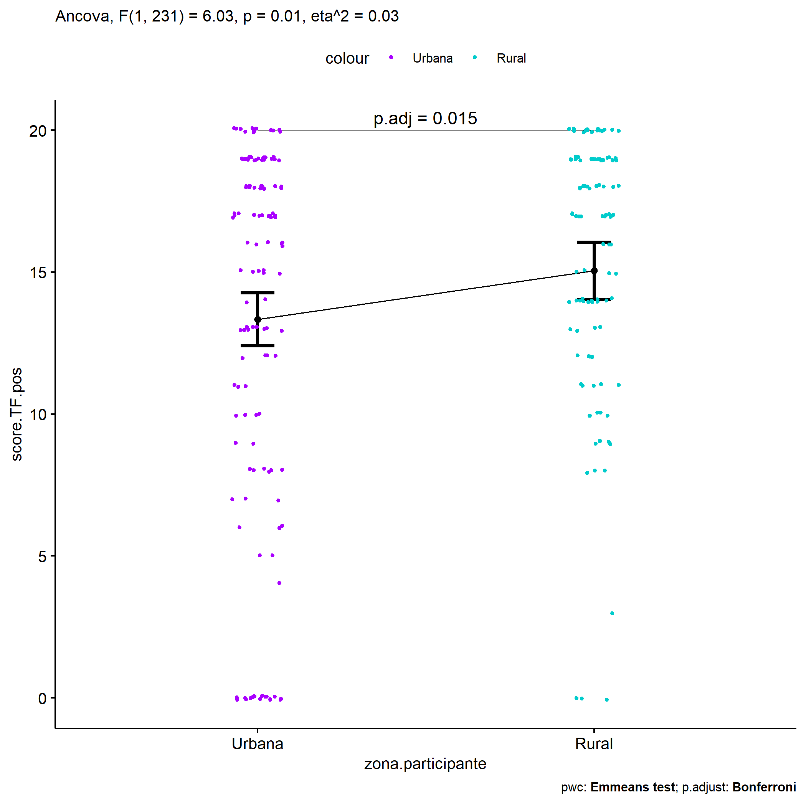<!-- -->

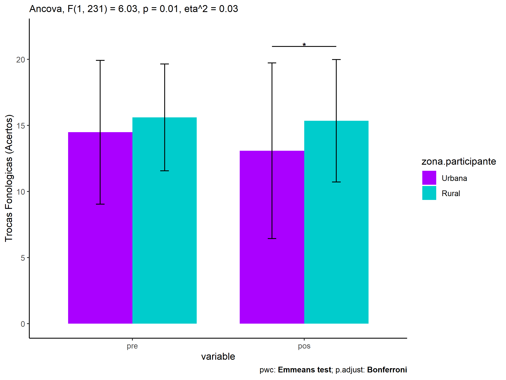<!-- -->

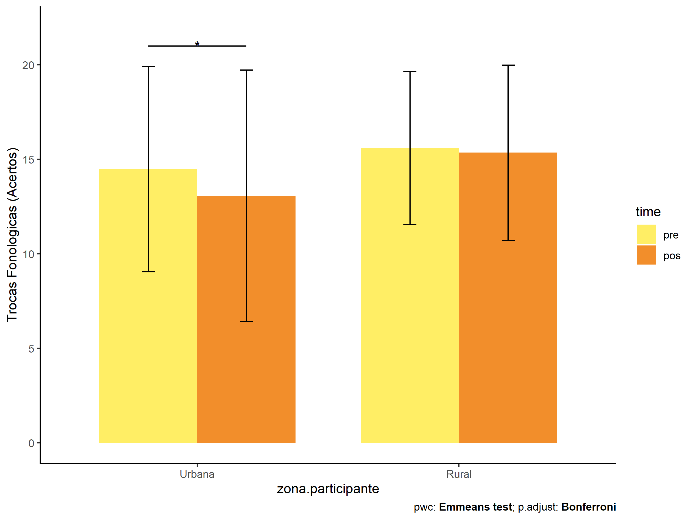<!-- -->

### Trocas Orograficas (Acertos)

| var          | zona.participante |   n | M (pre) | SE (pre) | M (unadj) | SE (unadj) | M (adj) | SE (adj) |
|:-------------|:------------------|----:|--------:|---------:|----------:|-----------:|--------:|---------:|
| score.TO.pos | Rural             | 108 |   9.963 |    0.421 |    10.491 |      0.423 |  10.408 |     0.41 |
| score.TO.pos | Urbana            | 126 |   9.706 |    0.427 |    10.032 |      0.497 |  10.103 |     0.38 |

| .y.          | group1 | group2 | estimate | conf.low | conf.high |    se | statistic |     p | p.adj | p.adj.signif |
|:-------------|:-------|:-------|---------:|---------:|----------:|------:|----------:|------:|------:|:-------------|
| score.TO.pos | Urbana | Rural  |   -0.305 |   -1.406 |     0.796 | 0.559 |    -0.546 | 0.586 | 0.586 | ns           |
| score.TO.pre | Urbana | Rural  |   -0.257 |   -1.447 |     0.934 | 0.604 |    -0.425 | 0.671 | 0.671 | ns           |

| .y.      | zona.participante | group1 | group2 | estimate | conf.low | conf.high |    se | statistic |     p | p.adj | p.adj.signif |
|:---------|:------------------|:-------|:-------|---------:|---------:|----------:|------:|----------:|------:|------:|:-------------|
| score.TO | Urbana            | pre    | pos    |   -0.325 |   -1.525 |     0.874 | 0.610 |    -0.533 | 0.594 | 0.594 | ns           |
| score.TO | Rural             | pre    | pos    |   -0.528 |   -1.823 |     0.768 | 0.659 |    -0.801 | 0.424 | 0.424 | ns           |

    ## Scale for colour is already present.
    ## Adding another scale for colour, which will replace the existing scale.

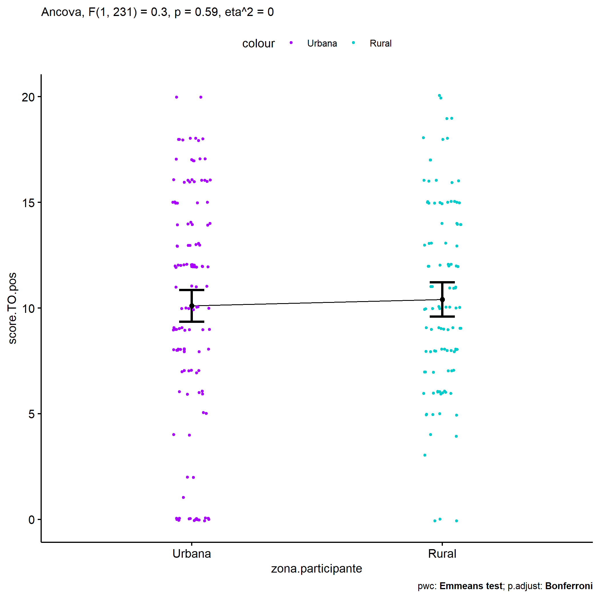<!-- -->

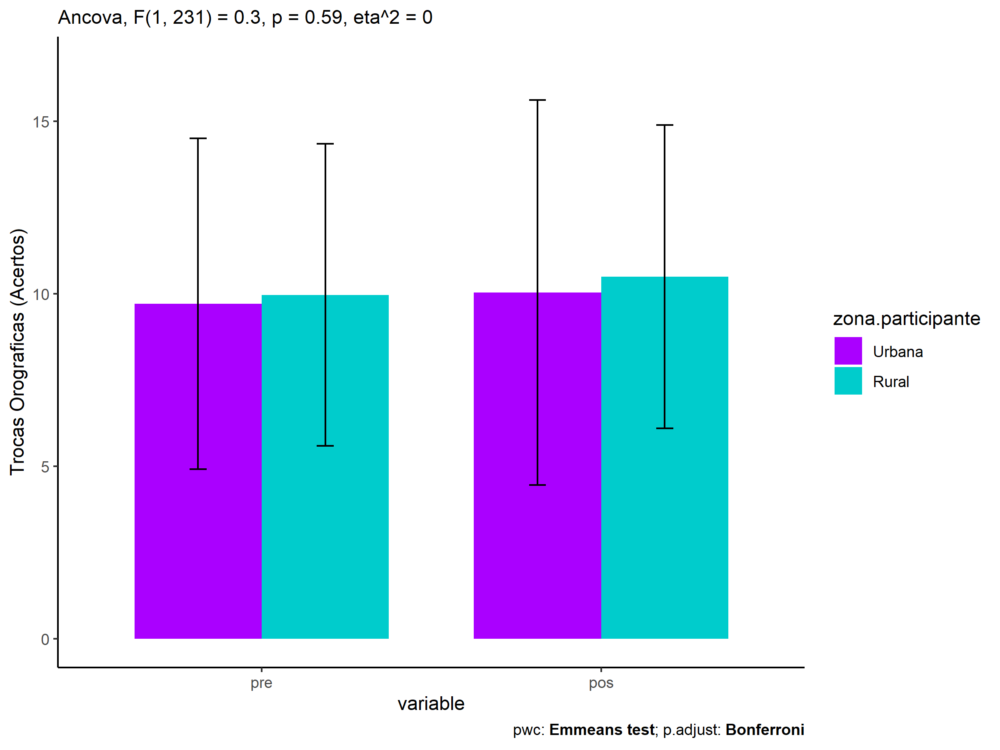<!-- -->

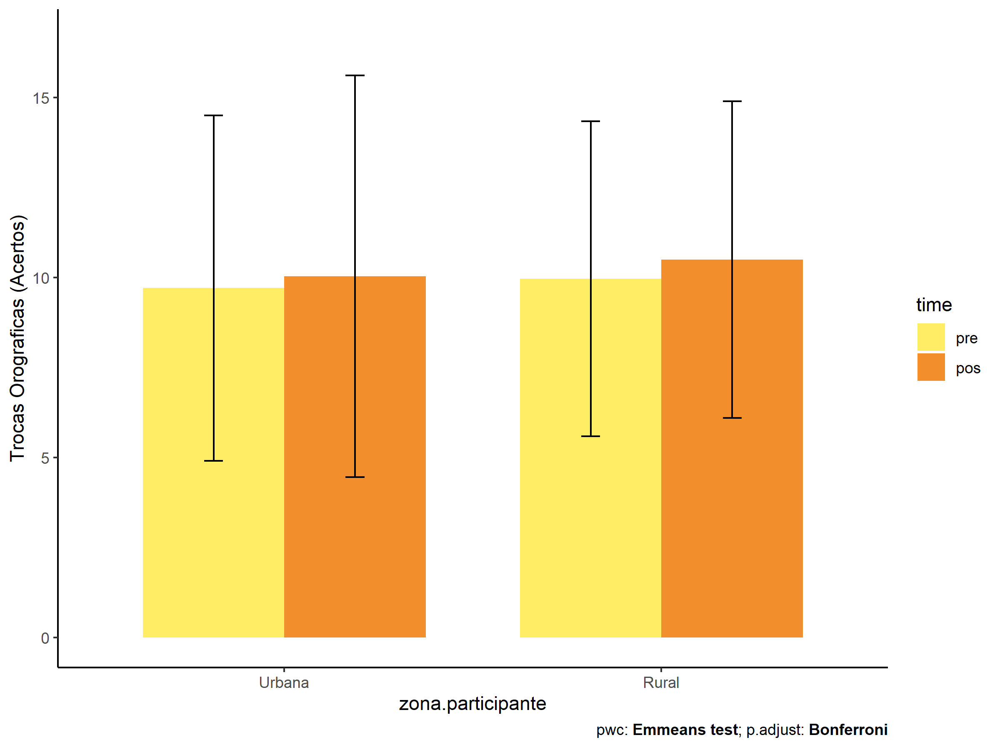<!-- -->

## factor: **escola**

### Leitura de Pseudo-Palavras (Acertos)

| var            | escola |   n | M (pre) | SE (pre) | M (unadj) | SE (unadj) | M (adj) | SE (adj) |
|:---------------|:-------|----:|--------:|---------:|----------:|-----------:|--------:|---------:|
| score.CLPP.pos | E1     |  23 |  69.478 |    2.855 |    73.304 |      2.408 |  73.402 |    2.234 |
| score.CLPP.pos | E2     |  50 |  67.780 |    1.870 |    63.820 |      2.543 |  65.069 |    1.518 |
| score.CLPP.pos | E3     |  35 |  65.343 |    2.865 |    70.229 |      2.403 |  73.128 |    1.822 |
| score.CLPP.pos | E4     |  29 |  69.172 |    2.866 |    71.724 |      2.666 |  72.029 |    1.990 |
| score.CLPP.pos | E5     | 106 |  71.811 |    1.237 |    72.528 |      1.344 |  71.046 |    1.046 |
| score.CLPP.pos | E6     |  25 |  70.680 |    3.280 |    74.120 |      2.067 |  73.404 |    2.143 |

| .y.            | group1 | group2 | estimate | conf.low | conf.high |    se | statistic | p       | p.adj | p.adj.signif |
|:---------------|:-------|:-------|---------:|---------:|----------:|------:|----------:|:--------|------:|:-------------|
| score.CLPP.pos | E1     | E2     |    8.334 |    3.017 |    13.651 | 2.700 |     3.086 | 0.002   | 0.034 | \*           |
| score.CLPP.pos | E1     | E3     |    0.274 |   -5.401 |     5.949 | 2.882 |     0.095 | 0.924   | 1.000 | ns           |
| score.CLPP.pos | E1     | E4     |    1.373 |   -4.517 |     7.263 | 2.991 |     0.459 | 0.647   | 1.000 | ns           |
| score.CLPP.pos | E1     | E5     |    2.357 |   -2.501 |     7.214 | 2.467 |     0.955 | 0.34    | 1.000 | ns           |
| score.CLPP.pos | E1     | E6     |   -0.002 |   -6.098 |     6.095 | 3.096 |     0.000 | 1       | 1.000 | ns           |
| score.CLPP.pos | E2     | E3     |   -8.060 |  -12.714 |    -3.405 | 2.364 |    -3.410 | \<0.001 | 0.011 | \*           |
| score.CLPP.pos | E2     | E4     |   -6.961 |  -11.886 |    -2.035 | 2.501 |    -2.783 | 0.006   | 0.087 | ns           |
| score.CLPP.pos | E2     | E5     |   -5.977 |   -9.615 |    -2.339 | 1.848 |    -3.235 | 0.001   | 0.021 | \*           |
| score.CLPP.pos | E2     | E6     |   -8.335 |  -13.510 |    -3.161 | 2.628 |    -3.172 | 0.002   | 0.025 | \*           |
| score.CLPP.pos | E3     | E4     |    1.099 |   -4.210 |     6.408 | 2.696 |     0.408 | 0.684   | 1.000 | ns           |
| score.CLPP.pos | E3     | E5     |    2.082 |   -2.073 |     6.238 | 2.110 |     0.987 | 0.325   | 1.000 | ns           |
| score.CLPP.pos | E3     | E6     |   -0.276 |   -5.822 |     5.270 | 2.816 |    -0.098 | 0.922   | 1.000 | ns           |
| score.CLPP.pos | E4     | E5     |    0.984 |   -3.444 |     5.411 | 2.248 |     0.437 | 0.662   | 1.000 | ns           |
| score.CLPP.pos | E4     | E6     |   -1.375 |   -7.133 |     4.384 | 2.925 |    -0.470 | 0.639   | 1.000 | ns           |
| score.CLPP.pos | E5     | E6     |   -2.358 |   -7.050 |     2.333 | 2.383 |    -0.990 | 0.323   | 1.000 | ns           |
| score.CLPP.pre | E1     | E2     |    1.698 |   -5.331 |     8.727 | 3.570 |     0.476 | 0.635   | 1.000 | ns           |
| score.CLPP.pre | E1     | E3     |    4.135 |   -3.353 |    11.624 | 3.803 |     1.087 | 0.278   | 1.000 | ns           |
| score.CLPP.pre | E1     | E4     |    0.306 |   -7.484 |     8.096 | 3.956 |     0.077 | 0.938   | 1.000 | ns           |
| score.CLPP.pre | E1     | E5     |   -2.333 |   -8.751 |     4.085 | 3.259 |    -0.716 | 0.475   | 1.000 | ns           |
| score.CLPP.pre | E1     | E6     |   -1.202 |   -9.263 |     6.859 | 4.094 |    -0.294 | 0.769   | 1.000 | ns           |
| score.CLPP.pre | E2     | E3     |    2.437 |   -3.712 |     8.586 | 3.123 |     0.780 | 0.436   | 1.000 | ns           |
| score.CLPP.pre | E2     | E4     |   -1.392 |   -7.905 |     5.120 | 3.307 |    -0.421 | 0.674   | 1.000 | ns           |
| score.CLPP.pre | E2     | E5     |   -4.031 |   -8.818 |     0.755 | 2.431 |    -1.658 | 0.098   | 1.000 | ns           |
| score.CLPP.pre | E2     | E6     |   -2.900 |   -9.734 |     3.934 | 3.471 |    -0.836 | 0.404   | 1.000 | ns           |
| score.CLPP.pre | E3     | E4     |   -3.830 |  -10.835 |     3.176 | 3.558 |    -1.076 | 0.283   | 1.000 | ns           |
| score.CLPP.pre | E3     | E5     |   -6.468 |  -11.907 |    -1.030 | 2.762 |    -2.342 | 0.02    | 0.299 | ns           |
| score.CLPP.pre | E3     | E6     |   -5.337 |  -12.643 |     1.969 | 3.710 |    -1.438 | 0.151   | 1.000 | ns           |
| score.CLPP.pre | E4     | E5     |   -2.639 |   -8.486 |     3.208 | 2.969 |    -0.889 | 0.375   | 1.000 | ns           |
| score.CLPP.pre | E4     | E6     |   -1.508 |   -9.122 |     6.107 | 3.867 |    -0.390 | 0.697   | 1.000 | ns           |
| score.CLPP.pre | E5     | E6     |    1.131 |   -5.072 |     7.334 | 3.150 |     0.359 | 0.72    | 1.000 | ns           |

| .y.        | escola | group1 | group2 | estimate | conf.low | conf.high |    se | statistic |     p | p.adj | p.adj.signif |
|:-----------|:-------|:-------|:-------|---------:|---------:|----------:|------:|----------:|------:|------:|:-------------|
| score.CLPP | E1     | pre    | pos    |   -3.344 |  -11.349 |     4.660 | 4.075 |    -0.821 | 0.412 | 0.412 | ns           |
| score.CLPP | E2     | pre    | pos    |    5.633 |    0.404 |    10.862 | 2.662 |     2.116 | 0.035 | 0.035 | \*           |
| score.CLPP | E3     | pre    | pos    |   -5.822 |  -12.308 |     0.664 | 3.302 |    -1.763 | 0.078 | 0.078 | ns           |
| score.CLPP | E4     | pre    | pos    |   -2.628 |   -9.842 |     4.587 | 3.673 |    -0.715 | 0.475 | 0.475 | ns           |
| score.CLPP | E5     | pre    | pos    |   -0.912 |   -4.602 |     2.777 | 1.878 |    -0.486 | 0.627 | 0.627 | ns           |
| score.CLPP | E6     | pre    | pos    |   -3.755 |  -11.237 |     3.728 | 3.809 |    -0.986 | 0.325 | 0.325 | ns           |

    ## Scale for colour is already present.
    ## Adding another scale for colour, which will replace the existing scale.

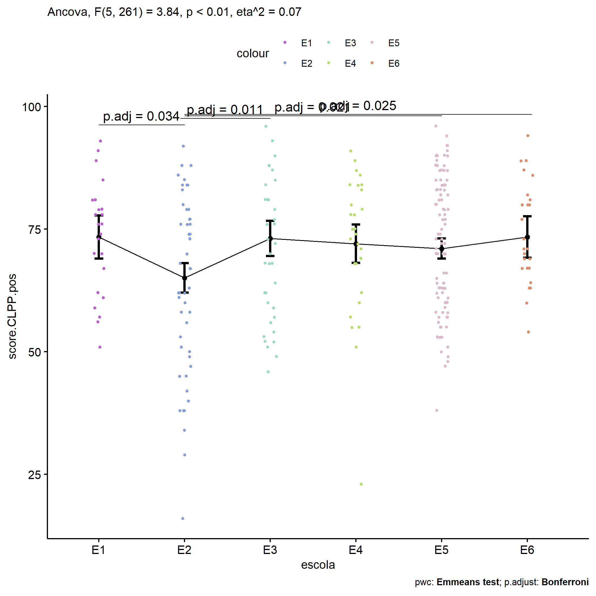<!-- -->

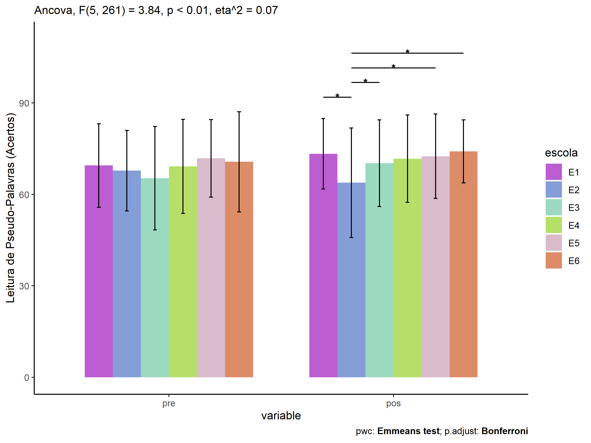<!-- -->

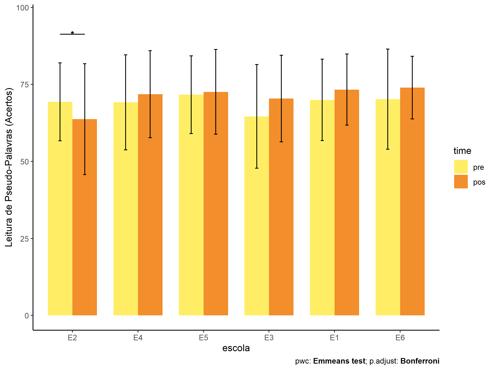<!-- -->

### Correta Regular (Acertos)

| var          | escola |   n | M (pre) | SE (pre) | M (unadj) | SE (unadj) | M (adj) | SE (adj) |
|:-------------|:-------|----:|--------:|---------:|----------:|-----------:|--------:|---------:|
| score.CR.pos | E1     |  28 |  13.429 |    1.047 |    12.893 |      1.240 |  13.254 |    1.048 |
| score.CR.pos | E2     |  63 |  14.349 |    0.529 |    11.492 |      0.823 |  11.530 |    0.697 |
| score.CR.pos | E3     |  38 |  12.816 |    0.714 |    13.737 |      0.789 |  14.314 |    0.906 |
| score.CR.pos | E4     |  30 |  15.333 |    0.865 |    16.167 |      0.555 |  15.858 |    1.012 |
| score.CR.pos | E5     | 122 |  14.803 |    0.355 |    13.434 |      0.516 |  13.313 |    0.502 |
| score.CR.pos | E6     |  30 |  15.433 |    0.752 |    14.933 |      1.132 |  14.590 |    1.013 |

| .y.          | group1 | group2 | estimate | conf.low | conf.high |    se | statistic | p       | p.adj | p.adj.signif |
|:-------------|:-------|:-------|---------:|---------:|----------:|------:|----------:|:--------|------:|:-------------|
| score.CR.pos | E1     | E2     |    1.724 |   -0.752 |     4.201 | 1.258 |     1.370 | 0.172   | 1.000 | ns           |
| score.CR.pos | E1     | E3     |   -1.059 |   -3.772 |     1.654 | 1.379 |    -0.768 | 0.443   | 1.000 | ns           |
| score.CR.pos | E1     | E4     |   -2.604 |   -5.478 |     0.270 | 1.461 |    -1.783 | 0.076   | 1.000 | ns           |
| score.CR.pos | E1     | E5     |   -0.058 |   -2.348 |     2.232 | 1.164 |    -0.050 | 0.96    | 1.000 | ns           |
| score.CR.pos | E1     | E6     |   -1.336 |   -4.211 |     1.540 | 1.461 |    -0.914 | 0.361   | 1.000 | ns           |
| score.CR.pos | E2     | E3     |   -2.784 |   -5.031 |    -0.537 | 1.142 |    -2.438 | 0.015   | 0.230 | ns           |
| score.CR.pos | E2     | E4     |   -4.329 |   -6.748 |    -1.909 | 1.229 |    -3.521 | \<0.001 | 0.007 | \*\*         |
| score.CR.pos | E2     | E5     |   -1.783 |   -3.473 |    -0.092 | 0.859 |    -2.075 | 0.039   | 0.582 | ns           |
| score.CR.pos | E2     | E6     |   -3.060 |   -5.480 |    -0.640 | 1.230 |    -2.488 | 0.013   | 0.201 | ns           |
| score.CR.pos | E3     | E4     |   -1.545 |   -4.229 |     1.139 | 1.364 |    -1.132 | 0.258   | 1.000 | ns           |
| score.CR.pos | E3     | E5     |    1.001 |   -1.042 |     3.044 | 1.038 |     0.964 | 0.336   | 1.000 | ns           |
| score.CR.pos | E3     | E6     |   -0.276 |   -2.962 |     2.410 | 1.365 |    -0.202 | 0.84    | 1.000 | ns           |
| score.CR.pos | E4     | E5     |    2.546 |    0.326 |     4.766 | 1.128 |     2.257 | 0.025   | 0.371 | ns           |
| score.CR.pos | E4     | E6     |    1.268 |   -1.543 |     4.080 | 1.429 |     0.888 | 0.375   | 1.000 | ns           |
| score.CR.pos | E5     | E6     |   -1.277 |   -3.498 |     0.943 | 1.128 |    -1.132 | 0.259   | 1.000 | ns           |
| score.CR.pre | E1     | E2     |   -0.921 |   -2.844 |     1.002 | 0.977 |    -0.942 | 0.347   | 1.000 | ns           |
| score.CR.pre | E1     | E3     |    0.613 |   -1.496 |     2.721 | 1.072 |     0.572 | 0.568   | 1.000 | ns           |
| score.CR.pre | E1     | E4     |   -1.905 |   -4.129 |     0.320 | 1.131 |    -1.685 | 0.093   | 1.000 | ns           |
| score.CR.pre | E1     | E5     |   -1.375 |   -3.149 |     0.399 | 0.902 |    -1.525 | 0.128   | 1.000 | ns           |
| score.CR.pre | E1     | E6     |   -2.005 |   -4.229 |     0.220 | 1.131 |    -1.773 | 0.077   | 1.000 | ns           |
| score.CR.pre | E2     | E3     |    1.533 |   -0.206 |     3.272 | 0.884 |     1.735 | 0.084   | 1.000 | ns           |
| score.CR.pre | E2     | E4     |   -0.984 |   -2.862 |     0.894 | 0.954 |    -1.031 | 0.303   | 1.000 | ns           |
| score.CR.pre | E2     | E5     |   -0.454 |   -1.768 |     0.859 | 0.668 |    -0.680 | 0.497   | 1.000 | ns           |
| score.CR.pre | E2     | E6     |   -1.084 |   -2.962 |     0.794 | 0.954 |    -1.136 | 0.257   | 1.000 | ns           |
| score.CR.pre | E3     | E4     |   -2.518 |   -4.585 |    -0.450 | 1.051 |    -2.396 | 0.017   | 0.258 | ns           |
| score.CR.pre | E3     | E5     |   -1.987 |   -3.560 |    -0.415 | 0.799 |    -2.486 | 0.013   | 0.202 | ns           |
| score.CR.pre | E3     | E6     |   -2.618 |   -4.685 |    -0.550 | 1.051 |    -2.491 | 0.013   | 0.199 | ns           |
| score.CR.pre | E4     | E5     |    0.530 |   -1.195 |     2.255 | 0.877 |     0.605 | 0.546   | 1.000 | ns           |
| score.CR.pre | E4     | E6     |   -0.100 |   -2.286 |     2.086 | 1.111 |    -0.090 | 0.928   | 1.000 | ns           |
| score.CR.pre | E5     | E6     |   -0.630 |   -2.355 |     1.095 | 0.877 |    -0.719 | 0.473   | 1.000 | ns           |

| .y.      | escola | group1 | group2 | estimate | conf.low | conf.high |    se | statistic |     p | p.adj | p.adj.signif |
|:---------|:-------|:-------|:-------|---------:|---------:|----------:|------:|----------:|------:|------:|:-------------|
| score.CR | E1     | pre    | pos    |    0.536 |   -2.123 |     3.194 | 1.354 |     0.396 | 0.692 | 0.692 | ns           |
| score.CR | E2     | pre    | pos    |    2.857 |    1.085 |     4.629 | 0.902 |     3.166 | 0.002 | 0.002 | \*\*         |
| score.CR | E3     | pre    | pos    |   -0.921 |   -3.203 |     1.361 | 1.162 |    -0.793 | 0.428 | 0.428 | ns           |
| score.CR | E4     | pre    | pos    |   -0.833 |   -3.402 |     1.735 | 1.308 |    -0.637 | 0.524 | 0.524 | ns           |
| score.CR | E5     | pre    | pos    |    1.369 |    0.095 |     2.642 | 0.649 |     2.111 | 0.035 | 0.035 | \*           |
| score.CR | E6     | pre    | pos    |    0.500 |   -2.068 |     3.068 | 1.308 |     0.382 | 0.702 | 0.702 | ns           |

    ## Scale for colour is already present.
    ## Adding another scale for colour, which will replace the existing scale.

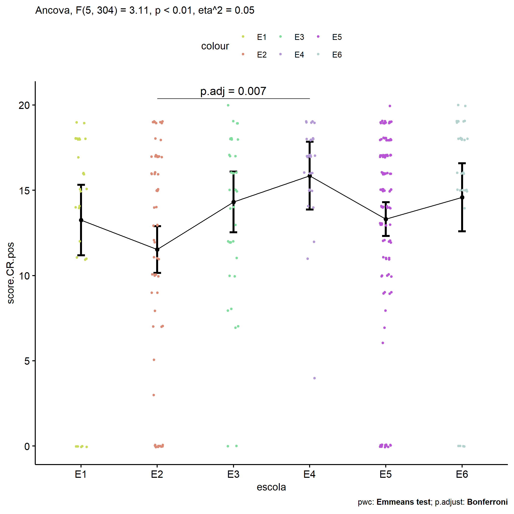<!-- -->

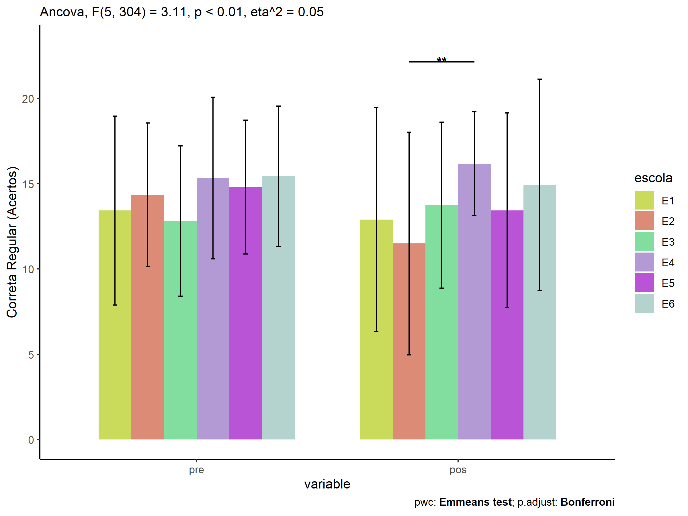<!-- -->

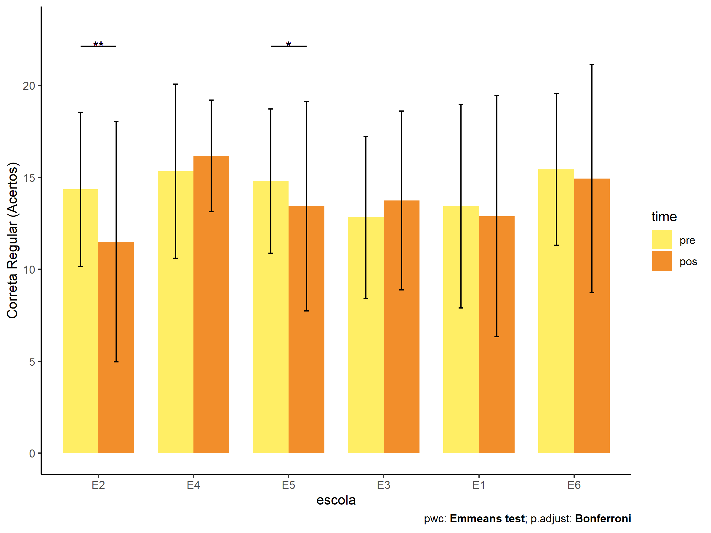<!-- -->

### Correta Irregular (Acertos)

| var          | escola |   n | M (pre) | SE (pre) | M (unadj) | SE (unadj) | M (adj) | SE (adj) |
|:-------------|:-------|----:|--------:|---------:|----------:|-----------:|--------:|---------:|
| score.CI.pos | E1     |  28 |  11.036 |    0.971 |    10.321 |      1.098 |  10.599 |    0.898 |
| score.CI.pos | E2     |  63 |  11.683 |    0.483 |     9.143 |      0.694 |   9.099 |    0.598 |
| score.CI.pos | E3     |  38 |  10.474 |    0.672 |    11.816 |      0.747 |  12.373 |    0.774 |
| score.CI.pos | E4     |  30 |  11.900 |    0.757 |    12.800 |      0.644 |  12.648 |    0.867 |
| score.CI.pos | E5     | 122 |  11.705 |    0.342 |    11.107 |      0.471 |  11.052 |    0.430 |
| score.CI.pos | E6     |  30 |  12.600 |    0.774 |    12.433 |      1.000 |  11.934 |    0.870 |

| .y.          | group1 | group2 | estimate | conf.low | conf.high |    se | statistic | p       | p.adj | p.adj.signif |
|:-------------|:-------|:-------|---------:|---------:|----------:|------:|----------:|:--------|------:|:-------------|
| score.CI.pos | E1     | E2     |    1.500 |   -0.624 |     3.624 | 1.079 |     1.390 | 0.166   | 1.000 | ns           |
| score.CI.pos | E1     | E3     |   -1.774 |   -4.102 |     0.555 | 1.183 |    -1.499 | 0.135   | 1.000 | ns           |
| score.CI.pos | E1     | E4     |   -2.049 |   -4.507 |     0.409 | 1.249 |    -1.641 | 0.102   | 1.000 | ns           |
| score.CI.pos | E1     | E5     |   -0.453 |   -2.413 |     1.507 | 0.996 |    -0.455 | 0.65    | 1.000 | ns           |
| score.CI.pos | E1     | E6     |   -1.335 |   -3.799 |     1.129 | 1.252 |    -1.066 | 0.287   | 1.000 | ns           |
| score.CI.pos | E2     | E3     |   -3.273 |   -5.199 |    -1.348 | 0.979 |    -3.345 | \<0.001 | 0.014 | \*           |
| score.CI.pos | E2     | E4     |   -3.549 |   -5.622 |    -1.476 | 1.053 |    -3.369 | \<0.001 | 0.013 | \*           |
| score.CI.pos | E2     | E5     |   -1.953 |   -3.402 |    -0.503 | 0.737 |    -2.651 | 0.008   | 0.127 | ns           |
| score.CI.pos | E2     | E6     |   -2.835 |   -4.911 |    -0.759 | 1.055 |    -2.687 | 0.008   | 0.114 | ns           |
| score.CI.pos | E3     | E4     |   -0.276 |   -2.565 |     2.014 | 1.164 |    -0.237 | 0.813   | 1.000 | ns           |
| score.CI.pos | E3     | E5     |    1.321 |   -0.423 |     3.064 | 0.886 |     1.491 | 0.137   | 1.000 | ns           |
| score.CI.pos | E3     | E6     |    0.439 |   -1.861 |     2.738 | 1.168 |     0.375 | 0.708   | 1.000 | ns           |
| score.CI.pos | E4     | E5     |    1.597 |   -0.308 |     3.501 | 0.968 |     1.650 | 0.1     | 1.000 | ns           |
| score.CI.pos | E4     | E6     |    0.714 |   -1.700 |     3.129 | 1.227 |     0.582 | 0.561   | 1.000 | ns           |
| score.CI.pos | E5     | E6     |   -0.882 |   -2.790 |     1.026 | 0.969 |    -0.910 | 0.364   | 1.000 | ns           |
| score.CI.pre | E1     | E2     |   -0.647 |   -2.458 |     1.164 | 0.920 |    -0.703 | 0.483   | 1.000 | ns           |
| score.CI.pre | E1     | E3     |    0.562 |   -1.424 |     2.548 | 1.009 |     0.557 | 0.578   | 1.000 | ns           |
| score.CI.pre | E1     | E4     |   -0.864 |   -2.959 |     1.231 | 1.065 |    -0.812 | 0.418   | 1.000 | ns           |
| score.CI.pre | E1     | E5     |   -0.669 |   -2.340 |     1.002 | 0.849 |    -0.788 | 0.431   | 1.000 | ns           |
| score.CI.pre | E1     | E6     |   -1.564 |   -3.659 |     0.531 | 1.065 |    -1.469 | 0.143   | 1.000 | ns           |
| score.CI.pre | E2     | E3     |    1.209 |   -0.429 |     2.847 | 0.832 |     1.453 | 0.147   | 1.000 | ns           |
| score.CI.pre | E2     | E4     |   -0.217 |   -1.986 |     1.551 | 0.899 |    -0.242 | 0.809   | 1.000 | ns           |
| score.CI.pre | E2     | E5     |   -0.022 |   -1.259 |     1.215 | 0.629 |    -0.036 | 0.972   | 1.000 | ns           |
| score.CI.pre | E2     | E6     |   -0.917 |   -2.686 |     0.851 | 0.899 |    -1.021 | 0.308   | 1.000 | ns           |
| score.CI.pre | E3     | E4     |   -1.426 |   -3.374 |     0.521 | 0.990 |    -1.441 | 0.151   | 1.000 | ns           |
| score.CI.pre | E3     | E5     |   -1.231 |   -2.712 |     0.250 | 0.753 |    -1.636 | 0.103   | 1.000 | ns           |
| score.CI.pre | E3     | E6     |   -2.126 |   -4.074 |    -0.179 | 0.990 |    -2.149 | 0.032   | 0.487 | ns           |
| score.CI.pre | E4     | E5     |    0.195 |   -1.430 |     1.820 | 0.826 |     0.236 | 0.813   | 1.000 | ns           |
| score.CI.pre | E4     | E6     |   -0.700 |   -2.759 |     1.359 | 1.046 |    -0.669 | 0.504   | 1.000 | ns           |
| score.CI.pre | E5     | E6     |   -0.895 |   -2.520 |     0.730 | 0.826 |    -1.084 | 0.279   | 1.000 | ns           |

| .y.      | escola | group1 | group2 | estimate | conf.low | conf.high |    se | statistic |     p | p.adj | p.adj.signif |
|:---------|:-------|:-------|:-------|---------:|---------:|----------:|------:|----------:|------:|------:|:-------------|
| score.CI | E1     | pre    | pos    |    0.714 |   -1.718 |     3.146 | 1.238 |     0.577 | 0.564 | 0.564 | ns           |
| score.CI | E2     | pre    | pos    |    2.540 |    0.918 |     4.161 | 0.826 |     3.076 | 0.002 | 0.002 | \*\*         |
| score.CI | E3     | pre    | pos    |   -1.342 |   -3.430 |     0.746 | 1.063 |    -1.263 | 0.207 | 0.207 | ns           |
| score.CI | E4     | pre    | pos    |   -0.900 |   -3.250 |     1.450 | 1.196 |    -0.752 | 0.452 | 0.452 | ns           |
| score.CI | E5     | pre    | pos    |    0.598 |   -0.567 |     1.763 | 0.593 |     1.009 | 0.314 | 0.314 | ns           |
| score.CI | E6     | pre    | pos    |    0.167 |   -2.183 |     2.516 | 1.196 |     0.139 | 0.889 | 0.889 | ns           |

    ## Scale for colour is already present.
    ## Adding another scale for colour, which will replace the existing scale.

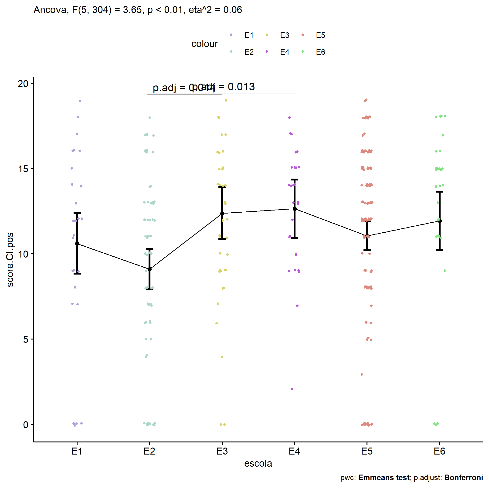<!-- -->

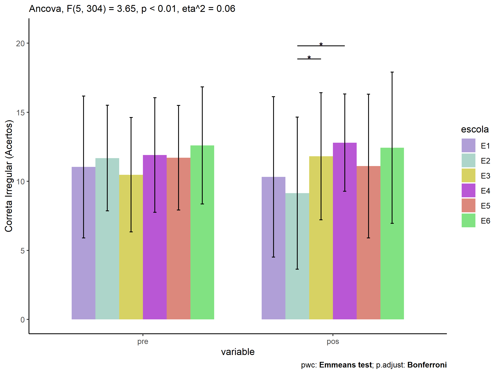<!-- -->

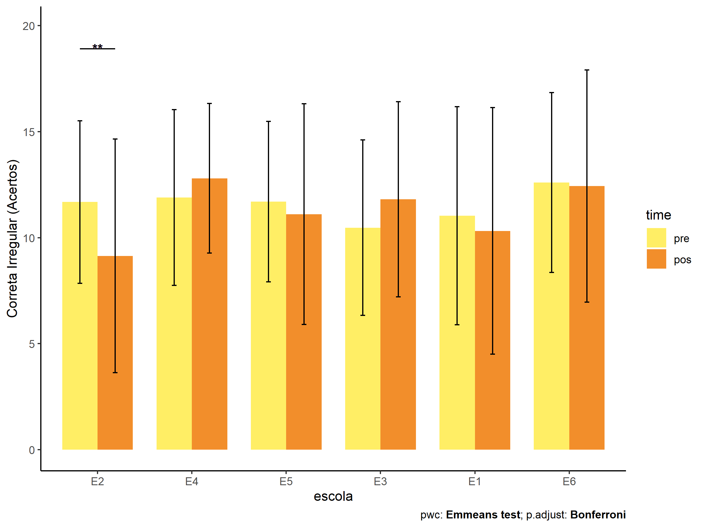<!-- -->

### Trocas Visuais (Acertos)

| var          | escola |   n | M (pre) | SE (pre) | M (unadj) | SE (unadj) | M (adj) | SE (adj) |
|:-------------|:-------|----:|--------:|---------:|----------:|-----------:|--------:|---------:|
| score.TV.pos | E1     |  28 |  15.071 |    1.253 |    14.250 |      1.419 |  14.633 |    1.134 |
| score.TV.pos | E2     |  63 |  16.429 |    0.564 |    12.460 |      0.924 |  12.347 |    0.755 |
| score.TV.pos | E3     |  38 |  15.500 |    0.821 |    16.079 |      0.810 |  16.305 |    0.973 |
| score.TV.pos | E4     |  30 |  16.067 |    0.912 |    16.833 |      0.572 |  16.852 |    1.094 |
| score.TV.pos | E5     | 122 |  16.549 |    0.380 |    15.139 |      0.555 |  14.982 |    0.543 |
| score.TV.pos | E6     |  30 |  15.533 |    0.928 |    14.733 |      1.188 |  14.947 |    1.094 |

| .y.          | group1 | group2 | estimate | conf.low | conf.high |    se | statistic | p       | p.adj | p.adj.signif |
|:-------------|:-------|:-------|---------:|---------:|----------:|------:|----------:|:--------|------:|:-------------|
| score.TV.pos | E1     | E2     |    2.285 |   -0.398 |     4.969 | 1.364 |     1.676 | 0.095   | 1.000 | ns           |
| score.TV.pos | E1     | E3     |   -1.672 |   -4.609 |     1.264 | 1.492 |    -1.121 | 0.263   | 1.000 | ns           |
| score.TV.pos | E1     | E4     |   -2.220 |   -5.320 |     0.880 | 1.576 |    -1.409 | 0.16    | 1.000 | ns           |
| score.TV.pos | E1     | E5     |   -0.350 |   -2.828 |     2.129 | 1.260 |    -0.278 | 0.782   | 1.000 | ns           |
| score.TV.pos | E1     | E6     |   -0.315 |   -3.412 |     2.783 | 1.574 |    -0.200 | 0.842   | 1.000 | ns           |
| score.TV.pos | E2     | E3     |   -3.958 |   -6.382 |    -1.533 | 1.232 |    -3.212 | 0.001   | 0.022 | \*           |
| score.TV.pos | E2     | E4     |   -4.505 |   -7.120 |    -1.890 | 1.329 |    -3.390 | \<0.001 | 0.012 | \*           |
| score.TV.pos | E2     | E5     |   -2.635 |   -4.464 |    -0.806 | 0.929 |    -2.835 | 0.005   | 0.073 | ns           |
| score.TV.pos | E2     | E6     |   -2.600 |   -5.218 |     0.018 | 1.330 |    -1.955 | 0.052   | 0.773 | ns           |
| score.TV.pos | E3     | E4     |   -0.547 |   -3.427 |     2.332 | 1.463 |    -0.374 | 0.709   | 1.000 | ns           |
| score.TV.pos | E3     | E5     |    1.323 |   -0.872 |     3.517 | 1.115 |     1.186 | 0.237   | 1.000 | ns           |
| score.TV.pos | E3     | E6     |    1.358 |   -1.521 |     4.236 | 1.463 |     0.928 | 0.354   | 1.000 | ns           |
| score.TV.pos | E4     | E5     |    1.870 |   -0.533 |     4.273 | 1.221 |     1.532 | 0.127   | 1.000 | ns           |
| score.TV.pos | E4     | E6     |    1.905 |   -1.139 |     4.949 | 1.547 |     1.232 | 0.219   | 1.000 | ns           |
| score.TV.pos | E5     | E6     |    0.035 |   -2.371 |     2.441 | 1.223 |     0.029 | 0.977   | 1.000 | ns           |
| score.TV.pre | E1     | E2     |   -1.357 |   -3.496 |     0.782 | 1.087 |    -1.248 | 0.213   | 1.000 | ns           |
| score.TV.pre | E1     | E3     |   -0.429 |   -2.774 |     1.917 | 1.192 |    -0.360 | 0.719   | 1.000 | ns           |
| score.TV.pre | E1     | E4     |   -0.995 |   -3.470 |     1.479 | 1.258 |    -0.791 | 0.429   | 1.000 | ns           |
| score.TV.pre | E1     | E5     |   -1.478 |   -3.451 |     0.496 | 1.003 |    -1.473 | 0.142   | 1.000 | ns           |
| score.TV.pre | E1     | E6     |   -0.462 |   -2.937 |     2.013 | 1.258 |    -0.367 | 0.714   | 1.000 | ns           |
| score.TV.pre | E2     | E3     |    0.929 |   -1.006 |     2.863 | 0.983 |     0.945 | 0.346   | 1.000 | ns           |
| score.TV.pre | E2     | E4     |    0.362 |   -1.727 |     2.451 | 1.062 |     0.341 | 0.733   | 1.000 | ns           |
| score.TV.pre | E2     | E5     |   -0.121 |   -1.582 |     1.341 | 0.743 |    -0.162 | 0.871   | 1.000 | ns           |
| score.TV.pre | E2     | E6     |    0.895 |   -1.194 |     2.984 | 1.062 |     0.843 | 0.4     | 1.000 | ns           |
| score.TV.pre | E3     | E4     |   -0.567 |   -2.867 |     1.733 | 1.169 |    -0.485 | 0.628   | 1.000 | ns           |
| score.TV.pre | E3     | E5     |   -1.049 |   -2.799 |     0.700 | 0.889 |    -1.180 | 0.239   | 1.000 | ns           |
| score.TV.pre | E3     | E6     |   -0.033 |   -2.333 |     2.267 | 1.169 |    -0.029 | 0.977   | 1.000 | ns           |
| score.TV.pre | E4     | E5     |   -0.483 |   -2.402 |     1.437 | 0.975 |    -0.495 | 0.621   | 1.000 | ns           |
| score.TV.pre | E4     | E6     |    0.533 |   -1.898 |     2.965 | 1.236 |     0.432 | 0.666   | 1.000 | ns           |
| score.TV.pre | E5     | E6     |    1.016 |   -0.903 |     2.935 | 0.975 |     1.042 | 0.298   | 1.000 | ns           |

| .y.      | escola | group1 | group2 | estimate | conf.low | conf.high |    se | statistic | p       | p.adj   | p.adj.signif |
|:---------|:-------|:-------|:-------|---------:|---------:|----------:|------:|----------:|:--------|:--------|:-------------|
| score.TV | E1     | pre    | pos    |    0.821 |   -2.094 |     3.737 | 1.485 |     0.553 | 0.58    | 0.58    | ns           |
| score.TV | E2     | pre    | pos    |    3.968 |    2.024 |     5.912 | 0.990 |     4.009 | \<0.001 | \<0.001 | \*\*\*\*     |
| score.TV | E3     | pre    | pos    |   -0.579 |   -3.082 |     1.924 | 1.274 |    -0.454 | 0.65    | 0.65    | ns           |
| score.TV | E4     | pre    | pos    |   -0.767 |   -3.584 |     2.050 | 1.434 |    -0.535 | 0.593   | 0.593   | ns           |
| score.TV | E5     | pre    | pos    |    1.410 |    0.013 |     2.807 | 0.711 |     1.982 | 0.048   | 0.048   | \*           |
| score.TV | E6     | pre    | pos    |    0.800 |   -2.017 |     3.617 | 1.434 |     0.558 | 0.577   | 0.577   | ns           |

    ## Scale for colour is already present.
    ## Adding another scale for colour, which will replace the existing scale.

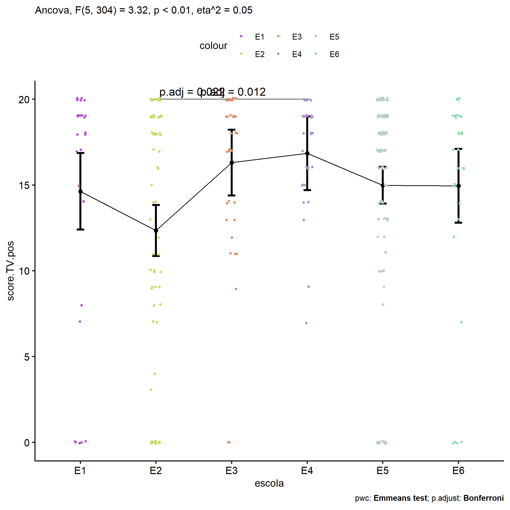<!-- -->

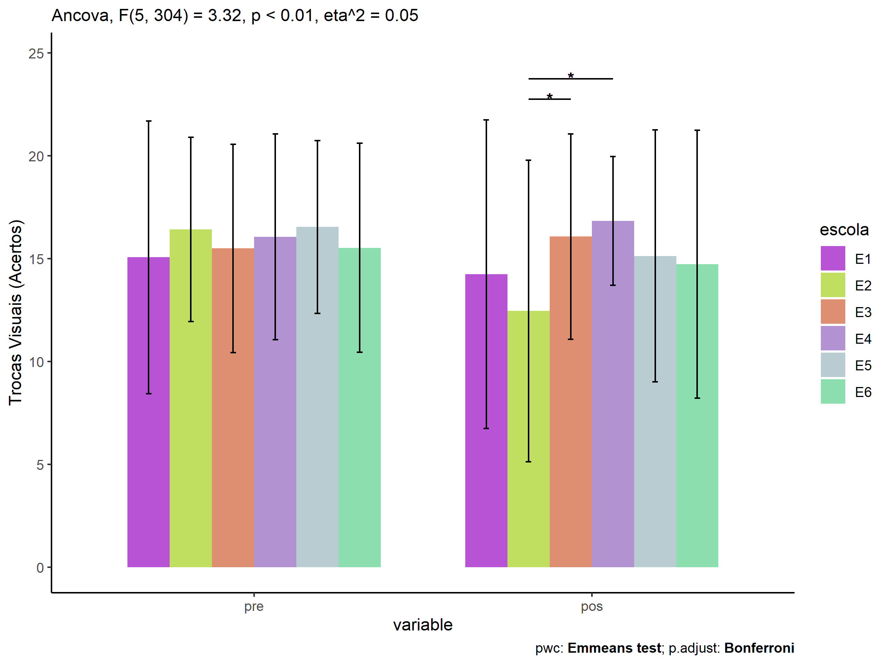<!-- -->

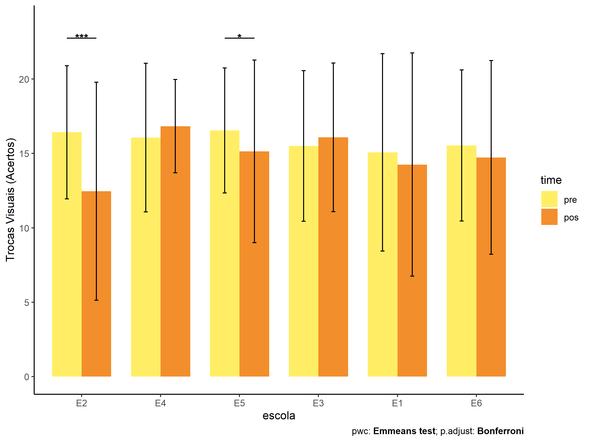<!-- -->

### Trocas Fonologicas (Acertos)

| var          | escola |   n | M (pre) | SE (pre) | M (unadj) | SE (unadj) | M (adj) | SE (adj) |
|:-------------|:-------|----:|--------:|---------:|----------:|-----------:|--------:|---------:|
| score.TF.pos | E1     |  28 |  14.286 |    1.194 |    13.464 |      1.327 |  13.845 |    1.083 |
| score.TF.pos | E2     |  63 |  15.429 |    0.556 |    11.397 |      0.880 |  11.204 |    0.721 |
| score.TF.pos | E3     |  38 |  14.395 |    0.780 |    14.684 |      0.851 |  15.011 |    0.929 |
| score.TF.pos | E4     |  30 |  14.467 |    0.931 |    15.467 |      0.838 |  15.757 |    1.046 |
| score.TF.pos | E5     | 122 |  15.369 |    0.418 |    14.008 |      0.558 |  13.846 |    0.519 |
| score.TF.pos | E6     |  30 |  15.033 |    0.962 |    13.667 |      1.174 |  13.673 |    1.045 |

| .y.          | group1 | group2 | estimate | conf.low | conf.high |    se | statistic | p       | p.adj | p.adj.signif |
|:-------------|:-------|:-------|---------:|---------:|----------:|------:|----------:|:--------|------:|:-------------|
| score.TF.pos | E1     | E2     |    2.641 |    0.079 |     5.203 | 1.302 |     2.028 | 0.043   | 0.651 | ns           |
| score.TF.pos | E1     | E3     |   -1.165 |   -3.970 |     1.640 | 1.425 |    -0.818 | 0.414   | 1.000 | ns           |
| score.TF.pos | E1     | E4     |   -1.912 |   -4.871 |     1.048 | 1.504 |    -1.271 | 0.205   | 1.000 | ns           |
| score.TF.pos | E1     | E5     |    0.000 |   -2.364 |     2.364 | 1.201 |     0.000 | 1       | 1.000 | ns           |
| score.TF.pos | E1     | E6     |    0.173 |   -2.788 |     3.134 | 1.505 |     0.115 | 0.909   | 1.000 | ns           |
| score.TF.pos | E2     | E3     |   -3.806 |   -6.123 |    -1.489 | 1.177 |    -3.233 | 0.001   | 0.020 | \*           |
| score.TF.pos | E2     | E4     |   -4.553 |   -7.054 |    -2.051 | 1.271 |    -3.582 | \<0.001 | 0.006 | \*\*         |
| score.TF.pos | E2     | E5     |   -2.641 |   -4.388 |    -0.894 | 0.888 |    -2.975 | 0.003   | 0.047 | \*           |
| score.TF.pos | E2     | E6     |   -2.468 |   -4.967 |     0.030 | 1.270 |    -1.944 | 0.053   | 0.792 | ns           |
| score.TF.pos | E3     | E4     |   -0.746 |   -3.497 |     2.004 | 1.398 |    -0.534 | 0.594   | 1.000 | ns           |
| score.TF.pos | E3     | E5     |    1.165 |   -0.931 |     3.261 | 1.065 |     1.094 | 0.275   | 1.000 | ns           |
| score.TF.pos | E3     | E6     |    1.338 |   -1.414 |     4.090 | 1.398 |     0.957 | 0.339   | 1.000 | ns           |
| score.TF.pos | E4     | E5     |    1.911 |   -0.387 |     4.209 | 1.168 |     1.637 | 0.103   | 1.000 | ns           |
| score.TF.pos | E4     | E6     |    2.084 |   -0.824 |     4.993 | 1.478 |     1.410 | 0.159   | 1.000 | ns           |
| score.TF.pos | E5     | E6     |    0.173 |   -2.122 |     2.468 | 1.166 |     0.148 | 0.882   | 1.000 | ns           |
| score.TF.pre | E1     | E2     |   -1.143 |   -3.326 |     1.040 | 1.109 |    -1.030 | 0.304   | 1.000 | ns           |
| score.TF.pre | E1     | E3     |   -0.109 |   -2.503 |     2.285 | 1.217 |    -0.090 | 0.929   | 1.000 | ns           |
| score.TF.pre | E1     | E4     |   -0.181 |   -2.707 |     2.345 | 1.284 |    -0.141 | 0.888   | 1.000 | ns           |
| score.TF.pre | E1     | E5     |   -1.083 |   -3.097 |     0.931 | 1.024 |    -1.058 | 0.291   | 1.000 | ns           |
| score.TF.pre | E1     | E6     |   -0.748 |   -3.273 |     1.778 | 1.284 |    -0.582 | 0.561   | 1.000 | ns           |
| score.TF.pre | E2     | E3     |    1.034 |   -0.940 |     3.008 | 1.003 |     1.030 | 0.304   | 1.000 | ns           |
| score.TF.pre | E2     | E4     |    0.962 |   -1.170 |     3.094 | 1.084 |     0.888 | 0.375   | 1.000 | ns           |
| score.TF.pre | E2     | E5     |    0.060 |   -1.431 |     1.551 | 0.758 |     0.079 | 0.937   | 1.000 | ns           |
| score.TF.pre | E2     | E6     |    0.395 |   -1.737 |     2.527 | 1.084 |     0.365 | 0.716   | 1.000 | ns           |
| score.TF.pre | E3     | E4     |   -0.072 |   -2.419 |     2.276 | 1.193 |    -0.060 | 0.952   | 1.000 | ns           |
| score.TF.pre | E3     | E5     |   -0.974 |   -2.760 |     0.812 | 0.907 |    -1.073 | 0.284   | 1.000 | ns           |
| score.TF.pre | E3     | E6     |   -0.639 |   -2.986 |     1.709 | 1.193 |    -0.535 | 0.593   | 1.000 | ns           |
| score.TF.pre | E4     | E5     |   -0.902 |   -2.861 |     1.057 | 0.995 |    -0.906 | 0.365   | 1.000 | ns           |
| score.TF.pre | E4     | E6     |   -0.567 |   -3.048 |     1.915 | 1.261 |    -0.449 | 0.654   | 1.000 | ns           |
| score.TF.pre | E5     | E6     |    0.336 |   -1.623 |     2.294 | 0.995 |     0.337 | 0.736   | 1.000 | ns           |

| .y.      | escola | group1 | group2 | estimate | conf.low | conf.high |    se | statistic | p       | p.adj   | p.adj.signif |
|:---------|:-------|:-------|:-------|---------:|---------:|----------:|------:|----------:|:--------|:--------|:-------------|
| score.TF | E1     | pre    | pos    |    0.821 |   -2.113 |     3.756 | 1.494 |     0.550 | 0.583   | 0.583   | ns           |
| score.TF | E2     | pre    | pos    |    4.032 |    2.075 |     5.988 | 0.996 |     4.047 | \<0.001 | \<0.001 | \*\*\*\*     |
| score.TF | E3     | pre    | pos    |   -0.289 |   -2.808 |     2.229 | 1.283 |    -0.226 | 0.822   | 0.822   | ns           |
| score.TF | E4     | pre    | pos    |   -1.000 |   -3.835 |     1.835 | 1.444 |    -0.693 | 0.489   | 0.489   | ns           |
| score.TF | E5     | pre    | pos    |    1.361 |   -0.045 |     2.766 | 0.716 |     1.901 | 0.058   | 0.058   | ns           |
| score.TF | E6     | pre    | pos    |    1.367 |   -1.468 |     4.202 | 1.444 |     0.947 | 0.344   | 0.344   | ns           |

    ## Scale for colour is already present.
    ## Adding another scale for colour, which will replace the existing scale.

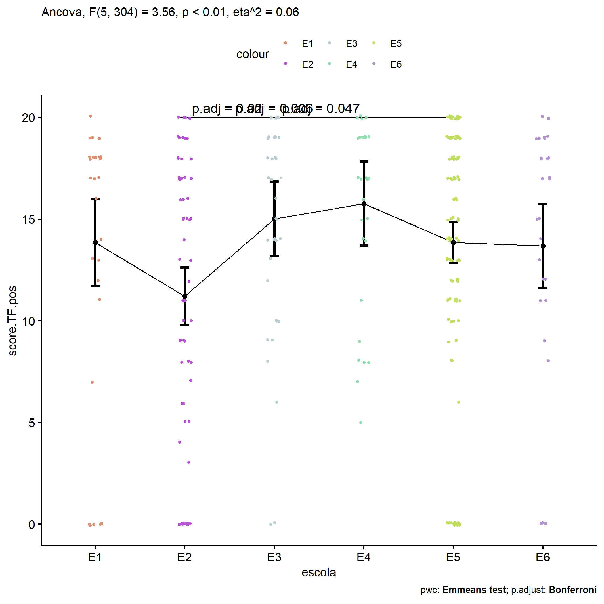<!-- -->

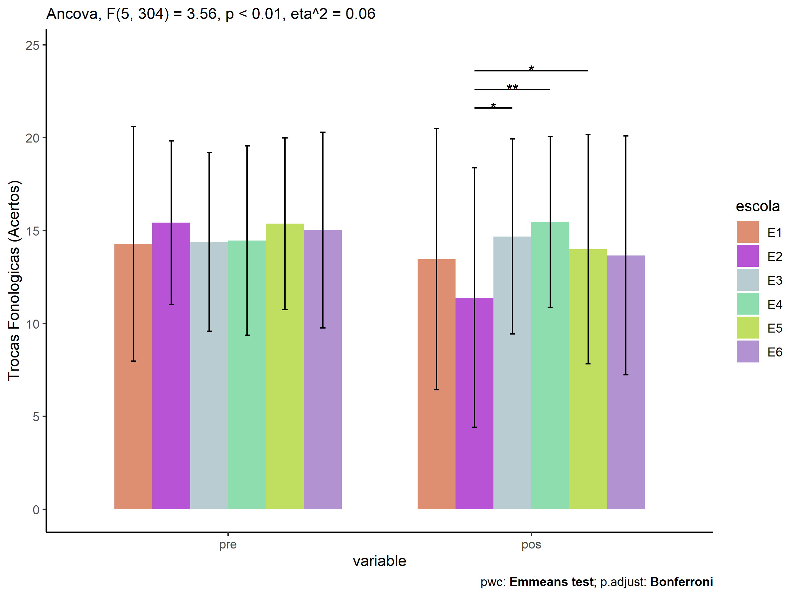<!-- -->

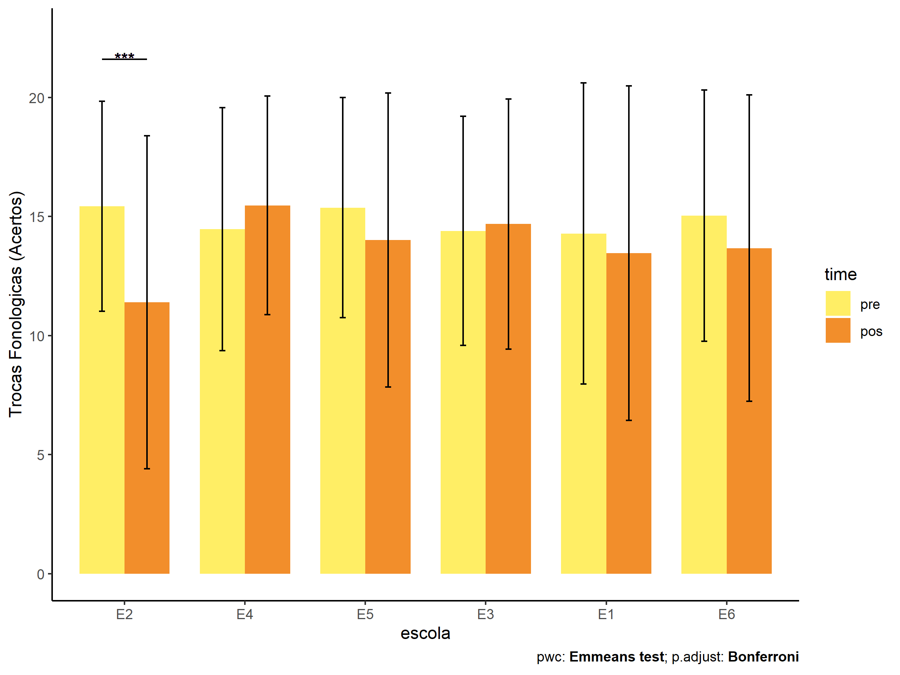<!-- -->

### Trocas Orograficas (Acertos)

| var          | escola |   n | M (pre) | SE (pre) | M (unadj) | SE (unadj) | M (adj) | SE (adj) |
|:-------------|:-------|----:|--------:|---------:|----------:|-----------:|--------:|---------:|
| score.TO.pos | E1     |  28 |   8.643 |    0.988 |     9.286 |      1.075 |   9.984 |    0.857 |
| score.TO.pos | E2     |  63 |   9.254 |    0.488 |     8.095 |      0.668 |   8.448 |    0.570 |
| score.TO.pos | E3     |  38 |   9.711 |    0.769 |    10.395 |      0.817 |  10.489 |    0.733 |
| score.TO.pos | E4     |  30 |   9.100 |    0.781 |    10.533 |      0.691 |  10.973 |    0.826 |
| score.TO.pos | E5     | 122 |  10.877 |    0.405 |    10.549 |      0.487 |   9.984 |    0.413 |
| score.TO.pos | E6     |  30 |   9.267 |    0.822 |     8.333 |      0.870 |   8.679 |    0.825 |

| .y.          | group1 | group2 | estimate | conf.low | conf.high |    se | statistic |     p | p.adj | p.adj.signif |
|:-------------|:-------|:-------|---------:|---------:|----------:|------:|----------:|------:|------:|:-------------|
| score.TO.pos | E1     | E2     |    1.536 |   -0.484 |     3.556 | 1.027 |     1.496 | 0.136 | 1.000 | ns           |
| score.TO.pos | E1     | E3     |   -0.505 |   -2.722 |     1.712 | 1.127 |    -0.448 | 0.654 | 1.000 | ns           |
| score.TO.pos | E1     | E4     |   -0.989 |   -3.325 |     1.347 | 1.187 |    -0.833 | 0.405 | 1.000 | ns           |
| score.TO.pos | E1     | E5     |    0.000 |   -1.880 |     1.880 | 0.955 |     0.000 | 1.000 | 1.000 | ns           |
| score.TO.pos | E1     | E6     |    1.305 |   -1.031 |     3.642 | 1.187 |     1.099 | 0.273 | 1.000 | ns           |
| score.TO.pos | E2     | E3     |   -2.041 |   -3.868 |    -0.215 | 0.928 |    -2.199 | 0.029 | 0.429 | ns           |
| score.TO.pos | E2     | E4     |   -2.525 |   -4.497 |    -0.553 | 1.002 |    -2.520 | 0.012 | 0.184 | ns           |
| score.TO.pos | E2     | E5     |   -1.536 |   -2.927 |    -0.144 | 0.707 |    -2.172 | 0.031 | 0.459 | ns           |
| score.TO.pos | E2     | E6     |   -0.231 |   -2.203 |     1.741 | 1.002 |    -0.230 | 0.818 | 1.000 | ns           |
| score.TO.pos | E3     | E4     |   -0.484 |   -2.656 |     1.688 | 1.104 |    -0.438 | 0.661 | 1.000 | ns           |
| score.TO.pos | E3     | E5     |    0.505 |   -1.151 |     2.162 | 0.842 |     0.600 | 0.549 | 1.000 | ns           |
| score.TO.pos | E3     | E6     |    1.810 |   -0.361 |     3.982 | 1.103 |     1.641 | 0.102 | 1.000 | ns           |
| score.TO.pos | E4     | E5     |    0.989 |   -0.833 |     2.812 | 0.926 |     1.068 | 0.286 | 1.000 | ns           |
| score.TO.pos | E4     | E6     |    2.294 |   -0.001 |     4.589 | 1.166 |     1.967 | 0.050 | 0.751 | ns           |
| score.TO.pos | E5     | E6     |    1.305 |   -0.516 |     3.126 | 0.925 |     1.410 | 0.159 | 1.000 | ns           |
| score.TO.pre | E1     | E2     |   -0.611 |   -2.601 |     1.379 | 1.011 |    -0.604 | 0.546 | 1.000 | ns           |
| score.TO.pre | E1     | E3     |   -1.068 |   -3.250 |     1.114 | 1.109 |    -0.963 | 0.336 | 1.000 | ns           |
| score.TO.pre | E1     | E4     |   -0.457 |   -2.759 |     1.845 | 1.170 |    -0.391 | 0.696 | 1.000 | ns           |
| score.TO.pre | E1     | E5     |   -2.234 |   -4.070 |    -0.398 | 0.933 |    -2.395 | 0.017 | 0.259 | ns           |
| score.TO.pre | E1     | E6     |   -0.624 |   -2.926 |     1.678 | 1.170 |    -0.533 | 0.594 | 1.000 | ns           |
| score.TO.pre | E2     | E3     |   -0.457 |   -2.256 |     1.343 | 0.914 |    -0.499 | 0.618 | 1.000 | ns           |
| score.TO.pre | E2     | E4     |    0.154 |   -1.789 |     2.097 | 0.988 |     0.156 | 0.876 | 1.000 | ns           |
| score.TO.pre | E2     | E5     |   -1.623 |   -2.982 |    -0.264 | 0.691 |    -2.350 | 0.019 | 0.291 | ns           |
| score.TO.pre | E2     | E6     |   -0.013 |   -1.956 |     1.931 | 0.988 |    -0.013 | 0.990 | 1.000 | ns           |
| score.TO.pre | E3     | E4     |    0.611 |   -1.529 |     2.750 | 1.087 |     0.561 | 0.575 | 1.000 | ns           |
| score.TO.pre | E3     | E5     |   -1.167 |   -2.794 |     0.461 | 0.827 |    -1.410 | 0.159 | 1.000 | ns           |
| score.TO.pre | E3     | E6     |    0.444 |   -1.696 |     2.584 | 1.087 |     0.408 | 0.683 | 1.000 | ns           |
| score.TO.pre | E4     | E5     |   -1.777 |   -3.562 |     0.008 | 0.907 |    -1.959 | 0.051 | 0.766 | ns           |
| score.TO.pre | E4     | E6     |   -0.167 |   -2.429 |     2.095 | 1.150 |    -0.145 | 0.885 | 1.000 | ns           |
| score.TO.pre | E5     | E6     |    1.610 |   -0.175 |     3.396 | 0.907 |     1.775 | 0.077 | 1.000 | ns           |

| .y.      | escola | group1 | group2 | estimate | conf.low | conf.high |    se | statistic |     p | p.adj | p.adj.signif |
|:---------|:-------|:-------|:-------|---------:|---------:|----------:|------:|----------:|------:|------:|:-------------|
| score.TO | E1     | pre    | pos    |   -0.643 |   -3.174 |     1.888 | 1.289 |    -0.499 | 0.618 | 0.618 | ns           |
| score.TO | E2     | pre    | pos    |    1.159 |   -0.528 |     2.846 | 0.859 |     1.349 | 0.178 | 0.178 | ns           |
| score.TO | E3     | pre    | pos    |   -0.684 |   -2.857 |     1.488 | 1.106 |    -0.619 | 0.536 | 0.536 | ns           |
| score.TO | E4     | pre    | pos    |   -1.433 |   -3.878 |     1.012 | 1.245 |    -1.151 | 0.250 | 0.250 | ns           |
| score.TO | E5     | pre    | pos    |    0.328 |   -0.885 |     1.540 | 0.617 |     0.531 | 0.596 | 0.596 | ns           |
| score.TO | E6     | pre    | pos    |    0.933 |   -1.512 |     3.378 | 1.245 |     0.750 | 0.454 | 0.454 | ns           |

    ## Scale for colour is already present.
    ## Adding another scale for colour, which will replace the existing scale.

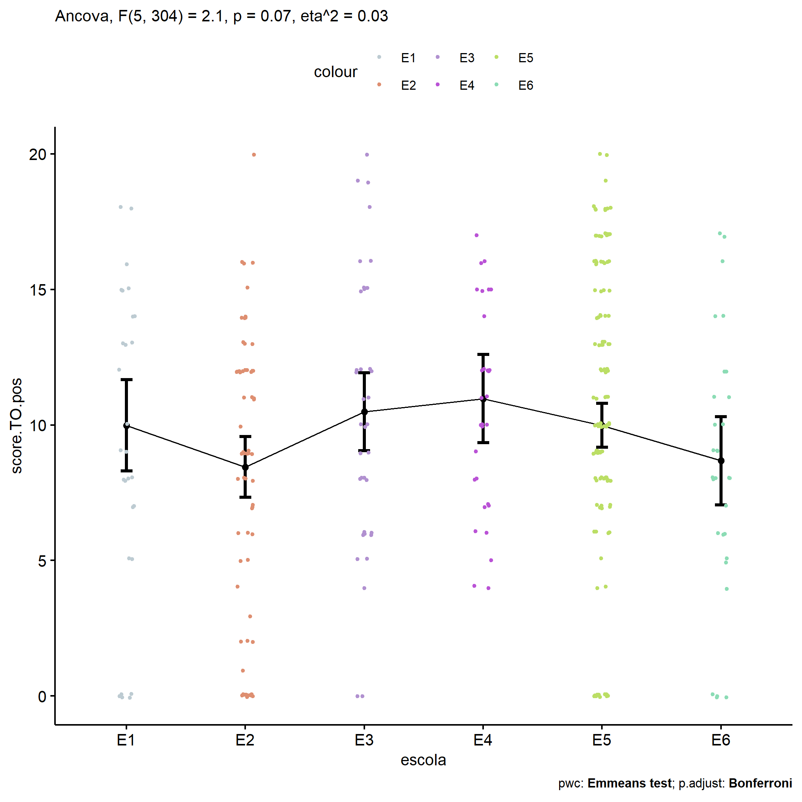<!-- -->

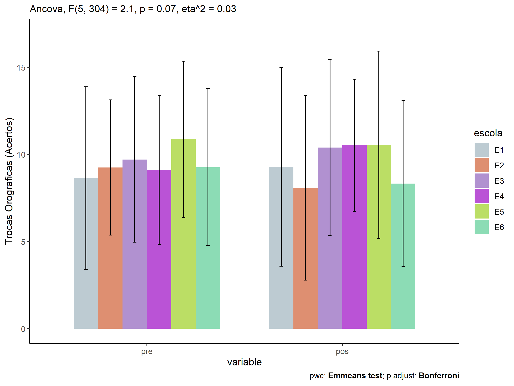<!-- -->

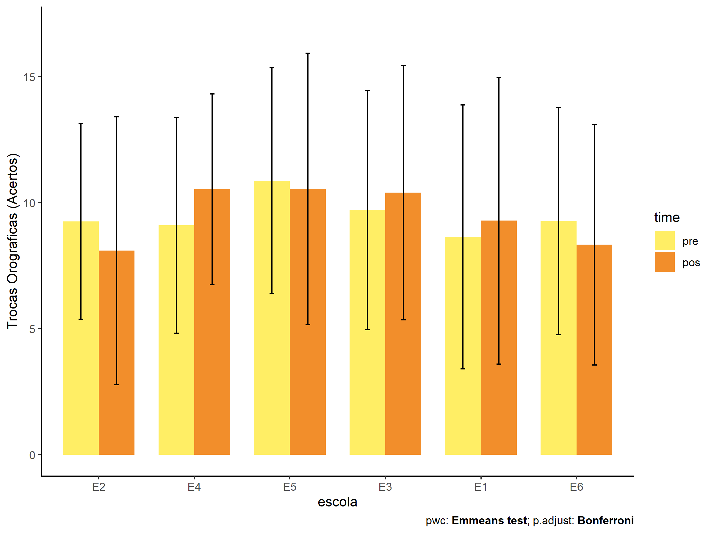<!-- -->

## factor: **zona.escola**

### Leitura de Pseudo-Palavras (Acertos)

| var            | zona.escola |   n | M (pre) | SE (pre) | M (unadj) | SE (unadj) | M (adj) | SE (adj) |
|:---------------|:------------|----:|--------:|---------:|----------:|-----------:|--------:|---------:|
| score.CLPP.pos | Rural       |  89 |  68.090 |    1.727 |    71.809 |      1.403 |  72.868 |    1.159 |
| score.CLPP.pos | Urbana      | 179 |  70.385 |    0.975 |    70.196 |      1.144 |  69.669 |    0.816 |

| .y.            | group1 | group2 | estimate | conf.low | conf.high |    se | statistic |     p | p.adj | p.adj.signif |
|:---------------|:-------|:-------|---------:|---------:|----------:|------:|----------:|------:|------:|:-------------|
| score.CLPP.pos | Urbana | Rural  |   -3.199 |   -5.994 |    -0.404 | 1.419 |    -2.254 | 0.025 | 0.025 | \*           |
| score.CLPP.pre | Urbana | Rural  |    2.296 |   -1.331 |     5.922 | 1.842 |     1.246 | 0.214 | 0.214 | ns           |

| .y.        | zona.escola | group1 | group2 | estimate | conf.low | conf.high |    se | statistic |     p | p.adj | p.adj.signif |
|:-----------|:------------|:-------|:-------|---------:|---------:|----------:|------:|----------:|------:|------:|:-------------|
| score.CLPP | Urbana      | pre    | pos    |    0.613 |   -2.238 |     3.464 | 1.452 |     0.422 | 0.673 | 0.673 | ns           |
| score.CLPP | Rural       | pre    | pos    |   -4.164 |   -8.260 |    -0.068 | 2.085 |    -1.997 | 0.046 | 0.046 | \*           |

    ## Scale for colour is already present.
    ## Adding another scale for colour, which will replace the existing scale.

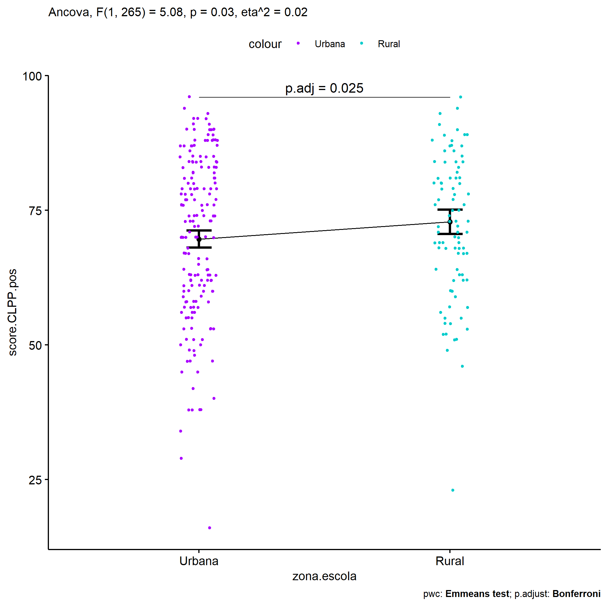<!-- -->

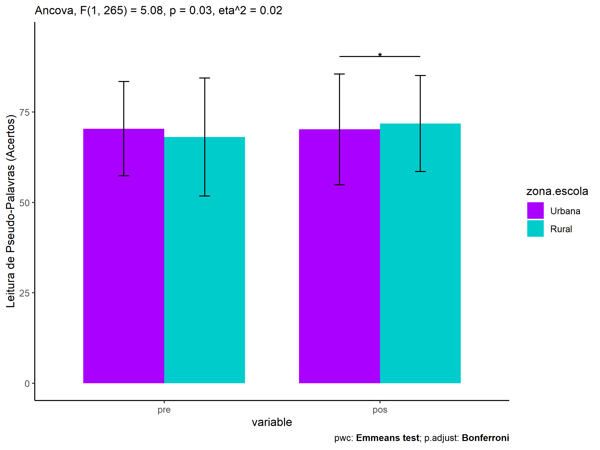<!-- -->

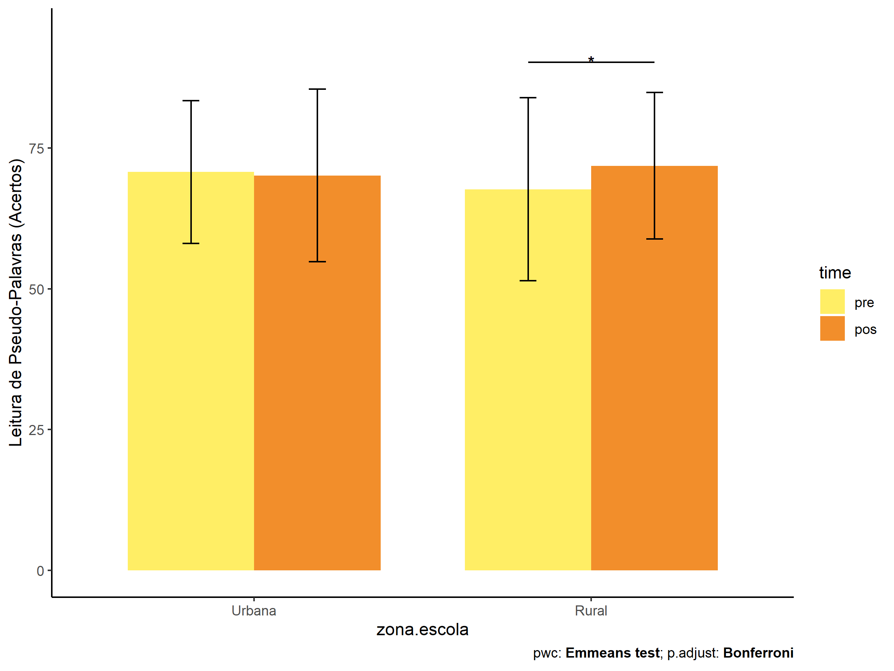<!-- -->

### Correta Regular (Acertos)

| var          | zona.escola |   n | M (pre) | SE (pre) | M (unadj) | SE (unadj) | M (adj) | SE (adj) |
|:-------------|:------------|----:|--------:|---------:|----------:|-----------:|--------:|---------:|
| score.CR.pos | Rural       |  98 |  14.388 |    0.460 |    14.847 |      0.498 |  14.872 |    0.561 |
| score.CR.pos | Urbana      | 213 |  14.488 |    0.291 |    12.789 |      0.418 |  12.777 |    0.380 |

| .y.          | group1 | group2 | estimate | conf.low | conf.high |    se | statistic |     p | p.adj | p.adj.signif |
|:-------------|:-------|:-------|---------:|---------:|----------:|------:|----------:|------:|------:|:-------------|
| score.CR.pos | Urbana | Rural  |   -2.095 |   -3.428 |    -0.762 | 0.677 |    -3.092 | 0.002 | 0.002 | \*\*         |
| score.CR.pre | Urbana | Rural  |    0.101 |   -0.944 |     1.145 | 0.531 |     0.189 | 0.850 | 0.850 | ns           |

| .y.      | zona.escola | group1 | group2 | estimate | conf.low | conf.high |    se | statistic | p       | p.adj   | p.adj.signif |
|:---------|:------------|:-------|:-------|---------:|---------:|----------:|------:|----------:|:--------|:--------|:-------------|
| score.CR | Urbana      | pre    | pos    |    1.700 |    0.728 |     2.671 | 0.495 |     3.436 | \<0.001 | \<0.001 | \*\*\*       |
| score.CR | Rural       | pre    | pos    |   -0.459 |   -1.891 |     0.973 | 0.729 |    -0.630 | 0.529   | 0.529   | ns           |

    ## Scale for colour is already present.
    ## Adding another scale for colour, which will replace the existing scale.

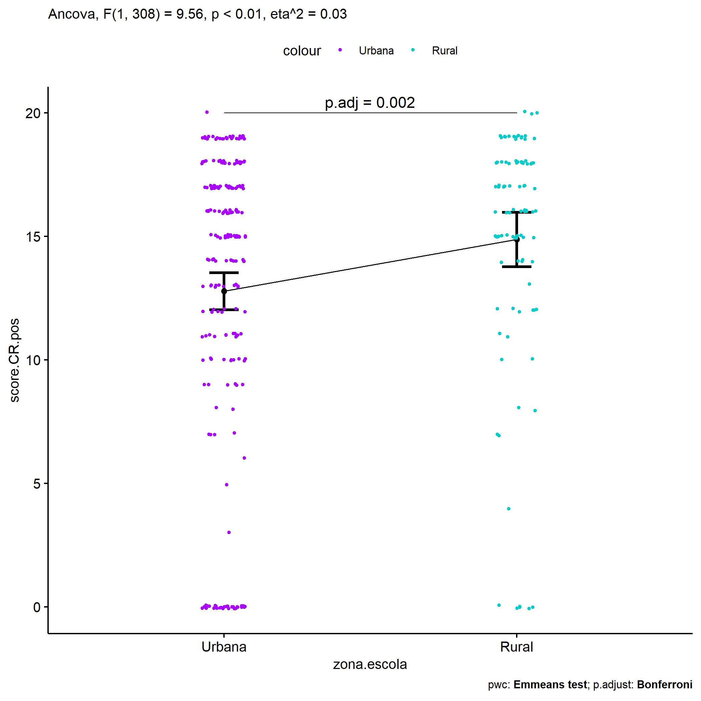<!-- -->

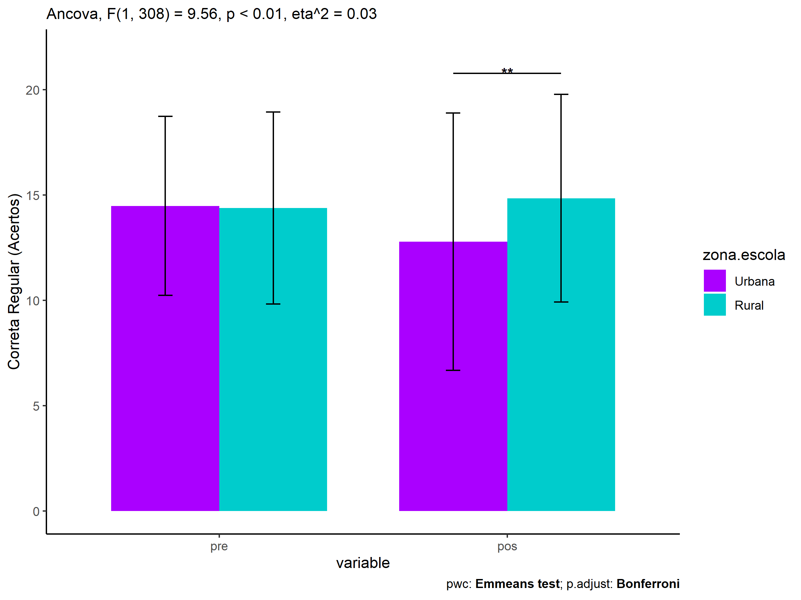<!-- -->

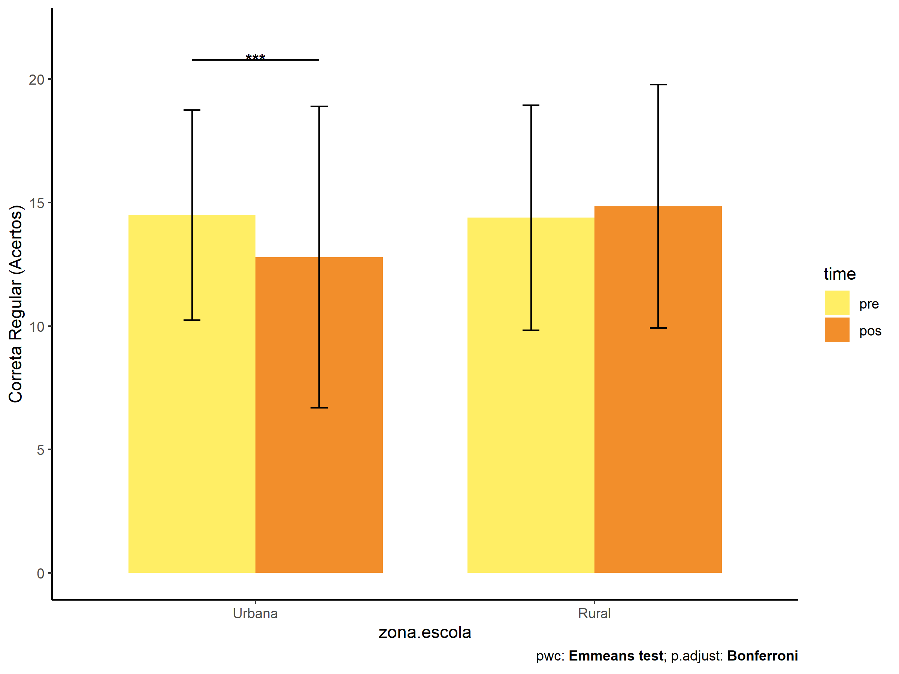<!-- -->

### Correta Irregular (Acertos)

| var          | zona.escola |   n | M (pre) | SE (pre) | M (unadj) | SE (unadj) | M (adj) | SE (adj) |
|:-------------|:------------|----:|--------:|---------:|----------:|-----------:|--------:|---------:|
| score.CI.pos | Rural       |  98 |  11.561 |    0.427 |    12.306 |      0.462 |  12.323 |    0.482 |
| score.CI.pos | Urbana      | 213 |  11.610 |    0.273 |    10.423 |      0.372 |  10.415 |    0.327 |

| .y.          | group1 | group2 | estimate | conf.low | conf.high |    se | statistic |     p | p.adj | p.adj.signif |
|:-------------|:-------|:-------|---------:|---------:|----------:|------:|----------:|------:|------:|:-------------|
| score.CI.pos | Urbana | Rural  |   -1.908 |   -3.055 |    -0.761 | 0.583 |    -3.274 | 0.001 | 0.001 | \*\*         |
| score.CI.pre | Urbana | Rural  |    0.049 |   -0.927 |     1.025 | 0.496 |     0.099 | 0.921 | 0.921 | ns           |

| .y.      | zona.escola | group1 | group2 | estimate | conf.low | conf.high |    se | statistic |     p | p.adj | p.adj.signif |
|:---------|:------------|:-------|:-------|---------:|---------:|----------:|------:|----------:|------:|------:|:-------------|
| score.CI | Urbana      | pre    | pos    |    1.188 |    0.303 |     2.073 | 0.451 |     2.636 | 0.009 | 0.009 | \*\*         |
| score.CI | Rural       | pre    | pos    |   -0.745 |   -2.050 |     0.560 | 0.664 |    -1.121 | 0.263 | 0.263 | ns           |

    ## Scale for colour is already present.
    ## Adding another scale for colour, which will replace the existing scale.

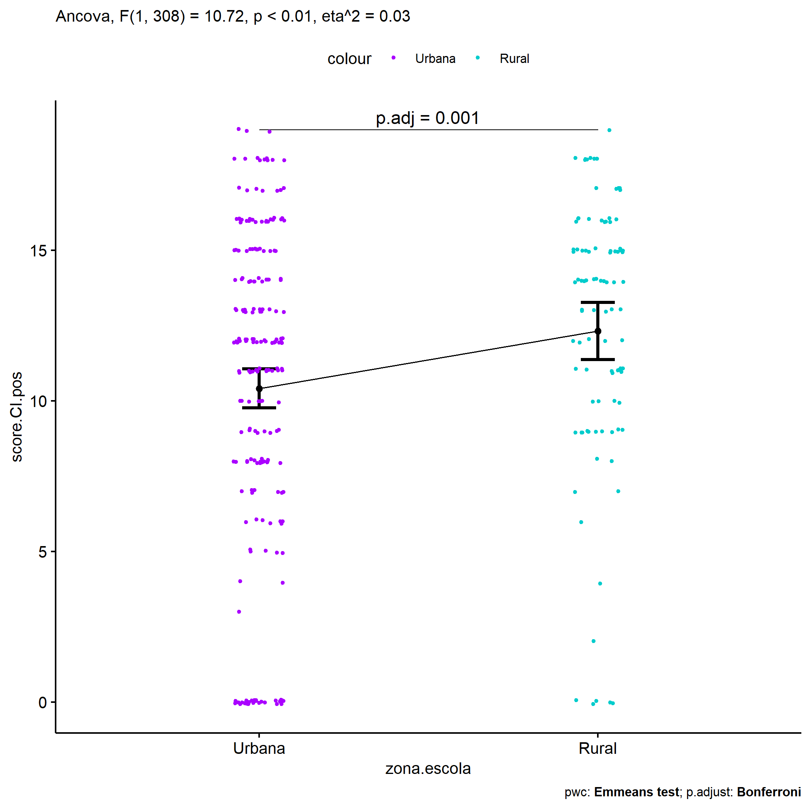<!-- -->

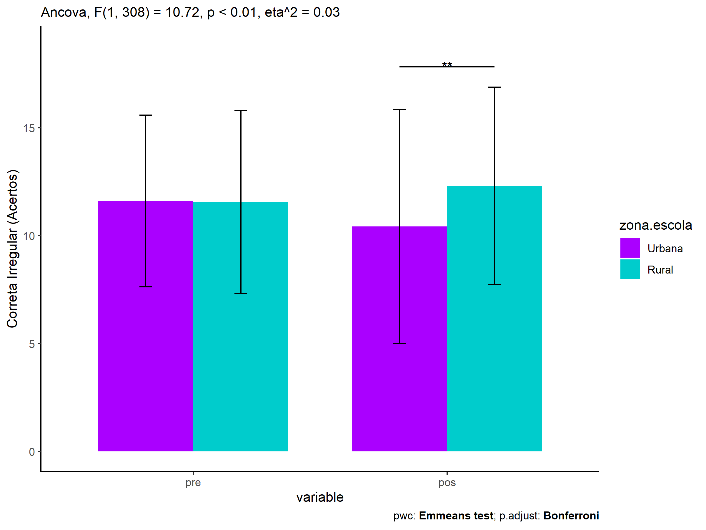<!-- -->

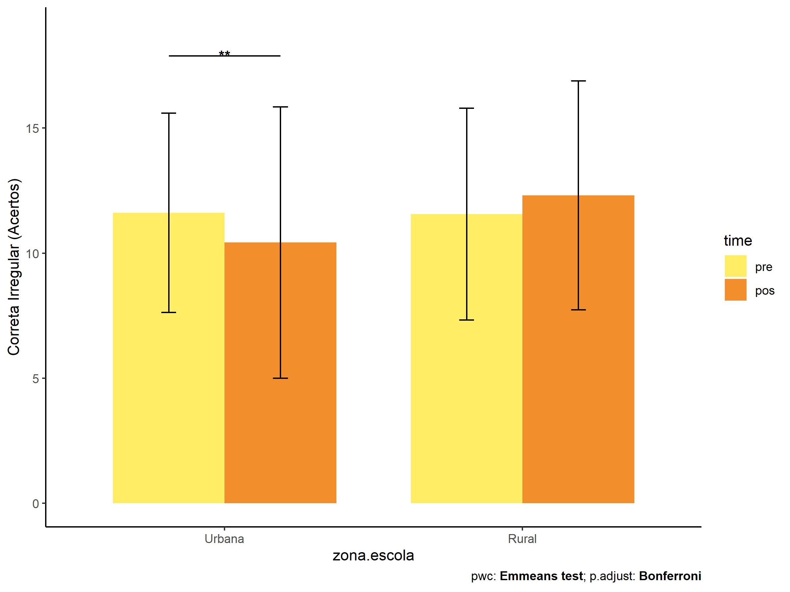<!-- -->

### Trocas Visuais (Acertos)

| var          | zona.escola |   n | M (pre) | SE (pre) | M (unadj) | SE (unadj) | M (adj) | SE (adj) |
|:-------------|:------------|----:|--------:|---------:|----------:|-----------:|--------:|---------:|
| score.TV.pos | Rural       |  98 |  15.684 |    0.505 |    15.898 |      0.513 |  16.057 |    0.612 |
| score.TV.pos | Urbana      | 213 |  16.319 |    0.320 |    14.230 |      0.464 |  14.157 |    0.415 |

| .y.          | group1 | group2 | estimate | conf.low | conf.high |    se | statistic |     p | p.adj | p.adj.signif |
|:-------------|:-------|:-------|---------:|---------:|----------:|------:|----------:|------:|------:|:-------------|
| score.TV.pos | Urbana | Rural  |   -1.901 |   -3.356 |    -0.446 | 0.739 |    -2.570 | 0.011 | 0.011 | \*           |
| score.TV.pre | Urbana | Rural  |    0.636 |   -0.511 |     1.782 | 0.583 |     1.091 | 0.276 | 0.276 | ns           |

| .y.      | zona.escola | group1 | group2 | estimate | conf.low | conf.high |    se | statistic | p       | p.adj   | p.adj.signif |
|:---------|:------------|:-------|:-------|---------:|---------:|----------:|------:|----------:|:--------|:--------|:-------------|
| score.TV | Urbana      | pre    | pos    |    2.089 |    1.027 |     3.151 | 0.541 |     3.863 | \<0.001 | \<0.001 | \*\*\*       |
| score.TV | Rural       | pre    | pos    |   -0.214 |   -1.780 |     1.351 | 0.797 |    -0.269 | 0.788   | 0.788   | ns           |

    ## Scale for colour is already present.
    ## Adding another scale for colour, which will replace the existing scale.

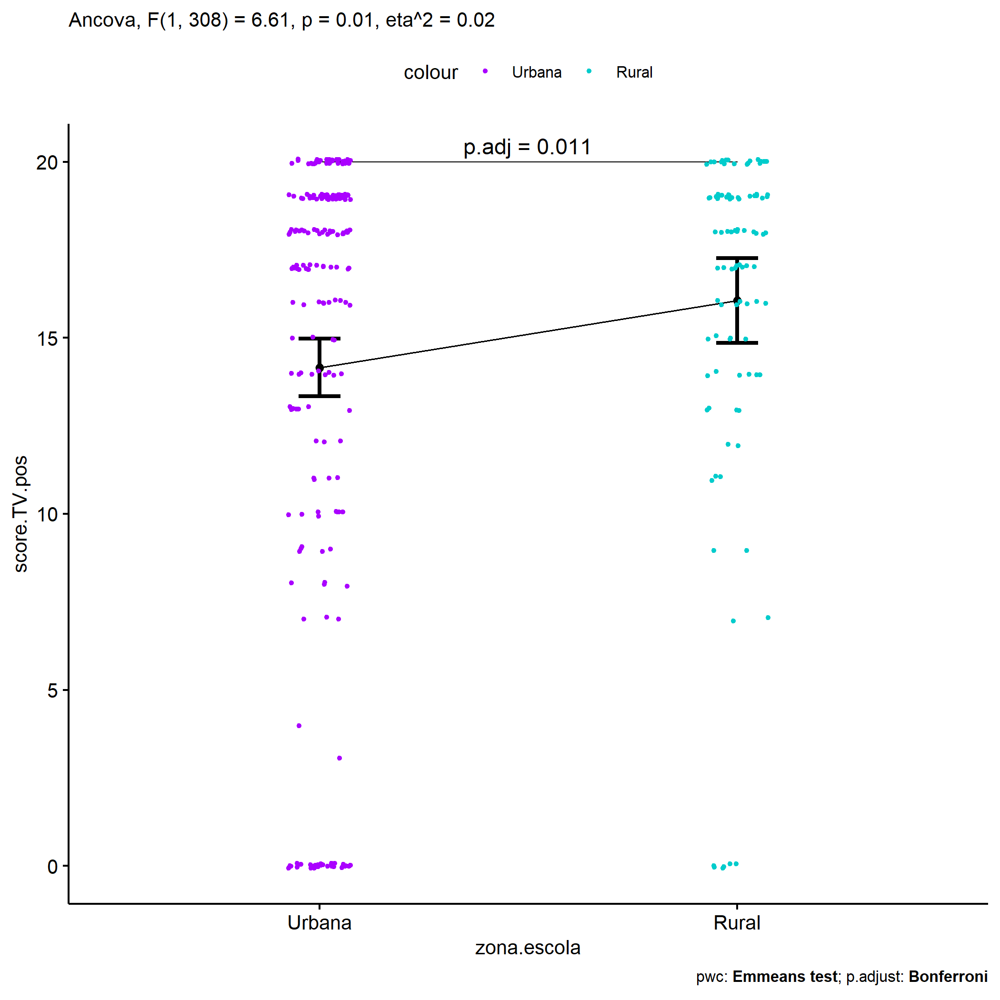<!-- -->

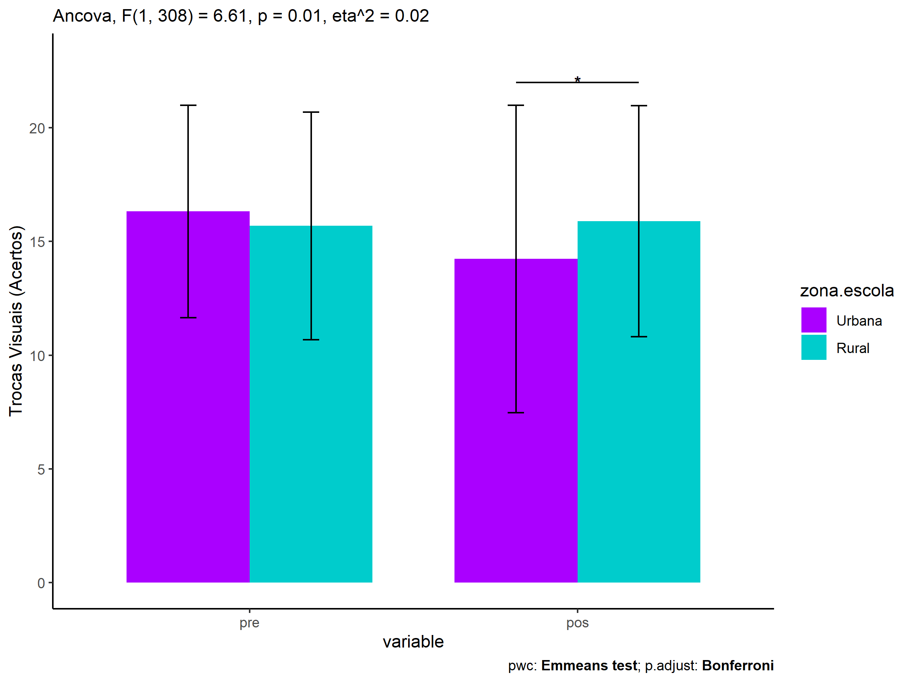<!-- -->

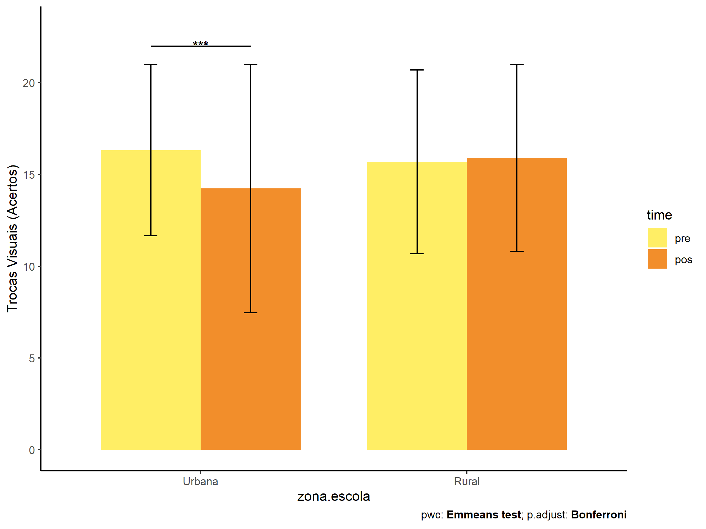<!-- -->

### Trocas Fonologicas (Acertos)

| var          | zona.escola |   n | M (pre) | SE (pre) | M (unadj) | SE (unadj) | M (adj) | SE (adj) |
|:-------------|:------------|----:|--------:|---------:|----------:|-----------:|--------:|---------:|
| score.TF.pos | Rural       |  98 |  14.612 |    0.505 |    14.612 |      0.550 |  14.826 |    0.586 |
| score.TF.pos | Urbana      | 213 |  15.244 |    0.329 |    13.164 |      0.453 |  13.066 |    0.397 |

| .y.          | group1 | group2 | estimate | conf.low | conf.high |    se | statistic |     p | p.adj | p.adj.signif |
|:-------------|:-------|:-------|---------:|---------:|----------:|------:|----------:|------:|------:|:-------------|
| score.TF.pos | Urbana | Rural  |   -1.761 |   -3.154 |    -0.367 | 0.708 |    -2.486 | 0.013 | 0.013 | \*           |
| score.TF.pre | Urbana | Rural  |    0.632 |   -0.537 |     1.800 | 0.594 |     1.064 | 0.288 | 0.288 | ns           |

| .y.      | zona.escola | group1 | group2 | estimate | conf.low | conf.high |    se | statistic | p       | p.adj   | p.adj.signif |
|:---------|:------------|:-------|:-------|---------:|---------:|----------:|------:|----------:|:--------|:--------|:-------------|
| score.TF | Urbana      | pre    | pos    |     2.08 |    1.013 |     3.147 | 0.543 |     3.827 | \<0.001 | \<0.001 | \*\*\*       |
| score.TF | Rural       | pre    | pos    |     0.00 |   -1.573 |     1.573 | 0.801 |     0.000 | 1       | 1       | ns           |

    ## Scale for colour is already present.
    ## Adding another scale for colour, which will replace the existing scale.

<!-- -->

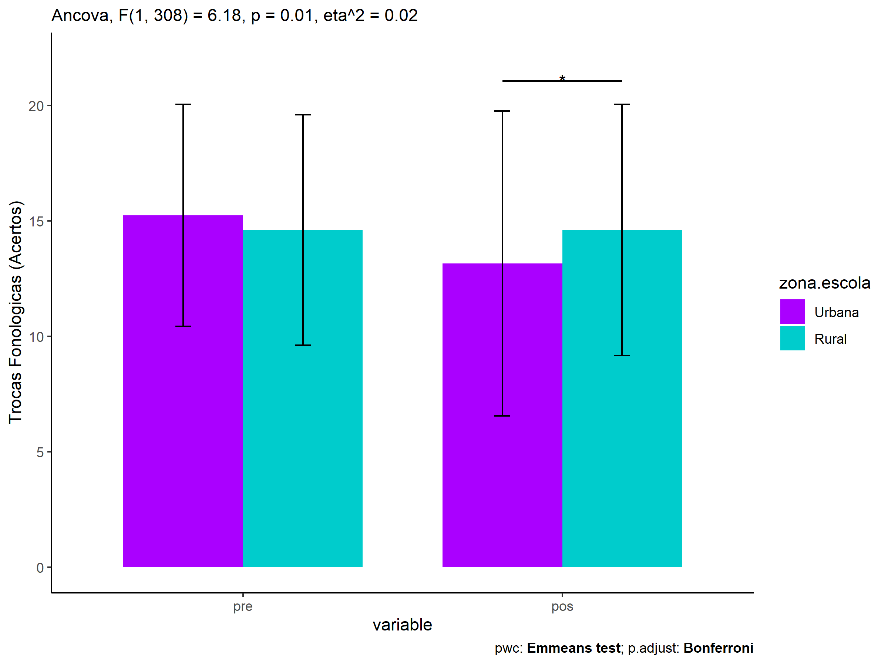<!-- -->

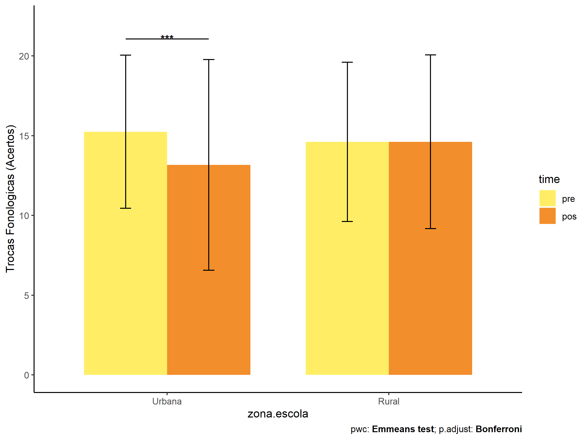<!-- -->

### Trocas Orograficas (Acertos)

| var          | zona.escola |   n | M (pre) | SE (pre) | M (unadj) | SE (unadj) | M (adj) | SE (adj) |
|:-------------|:------------|----:|--------:|---------:|----------:|-----------:|--------:|---------:|
| score.TO.pos | Rural       |  98 |   9.388 |    0.454 |     9.806 |      0.471 |  10.090 |    0.461 |
| score.TO.pos | Urbana      | 213 |  10.103 |    0.308 |     9.657 |      0.376 |   9.527 |    0.312 |

| .y.          | group1 | group2 | estimate | conf.low | conf.high |    se | statistic |     p | p.adj | p.adj.signif |
|:-------------|:-------|:-------|---------:|---------:|----------:|------:|----------:|------:|------:|:-------------|
| score.TO.pos | Urbana | Rural  |   -0.563 |   -1.661 |     0.534 | 0.558 |    -1.010 | 0.313 | 0.313 | ns           |
| score.TO.pre | Urbana | Rural  |    0.716 |   -0.363 |     1.794 | 0.548 |     1.305 | 0.193 | 0.193 | ns           |

| .y.      | zona.escola | group1 | group2 | estimate | conf.low | conf.high |    se | statistic |     p | p.adj | p.adj.signif |
|:---------|:------------|:-------|:-------|---------:|---------:|----------:|------:|----------:|------:|------:|:-------------|
| score.TO | Urbana      | pre    | pos    |    0.446 |   -0.483 |     1.375 | 0.473 |     0.943 | 0.346 | 0.346 | ns           |
| score.TO | Rural       | pre    | pos    |   -0.418 |   -1.787 |     0.951 | 0.697 |    -0.600 | 0.549 | 0.549 | ns           |

    ## Scale for colour is already present.
    ## Adding another scale for colour, which will replace the existing scale.

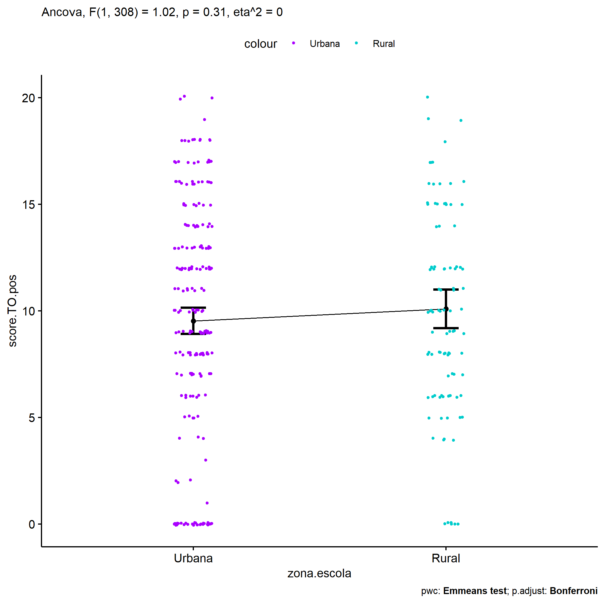<!-- -->

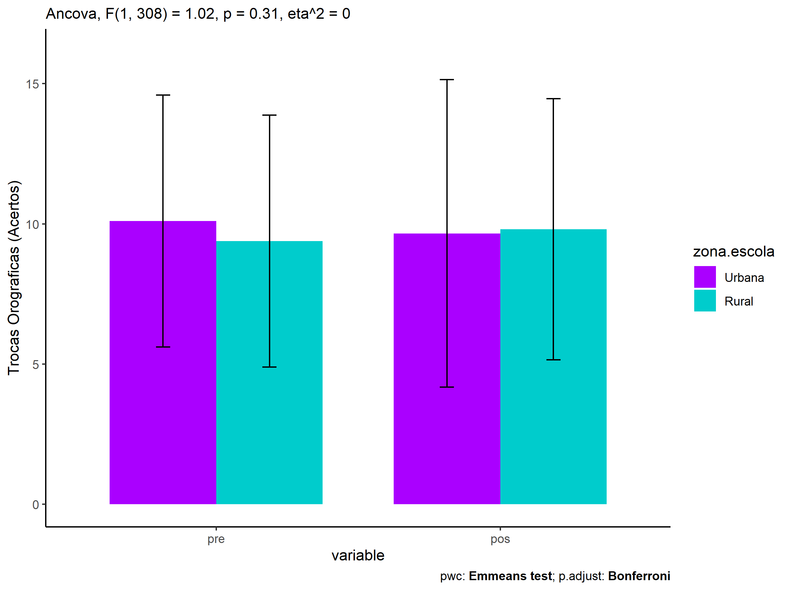<!-- -->

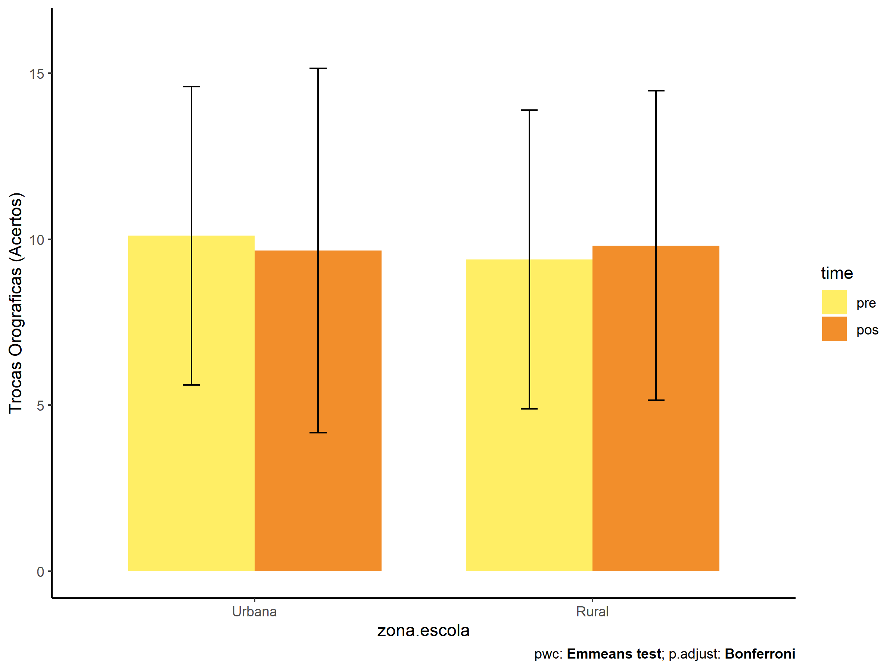<!-- -->

# Pairwise comparisons for two factors

## factores: **genero:grupo**

### Leitura de Pseudo-Palavras (Acertos)

| var            | genero | grupo    |   n | M (pre) | SE (pre) | M (unadj) | SE (unadj) | M (adj) | SE (adj) |
|:---------------|:-------|:---------|----:|--------:|---------:|----------:|-----------:|--------:|---------:|
| score.CLPP.pos | F      | Controle |  78 |  70.205 |    1.699 |    72.692 |      1.633 |  72.304 |    1.243 |
| score.CLPP.pos | F      | WordGen  |  54 |  74.944 |    1.823 |    74.889 |      2.110 |  71.335 |    1.516 |
| score.CLPP.pos | M      | Controle |  71 |  65.789 |    1.665 |    66.197 |      1.796 |  68.758 |    1.316 |
| score.CLPP.pos | M      | WordGen  |  65 |  68.692 |    1.602 |    69.877 |      1.533 |  70.499 |    1.362 |

| .y.            | grupo    | genero | group1   | group2  | estimate | conf.low | conf.high |    se | statistic |     p | p.adj | p.adj.signif |
|:---------------|:---------|:-------|:---------|:--------|---------:|---------:|----------:|------:|----------:|------:|------:|:-------------|
| score.CLPP.pos | Controle |        | F        | M       |    3.545 |   -0.024 |     7.115 | 1.813 |     1.956 | 0.052 | 0.052 | ns           |
| score.CLPP.pos | WordGen  |        | F        | M       |    0.836 |   -3.188 |     4.860 | 2.043 |     0.409 | 0.683 | 0.683 | ns           |
| score.CLPP.pre | Controle |        | F        | M       |    4.416 |   -0.086 |     8.918 | 2.286 |     1.932 | 0.054 | 0.054 | ns           |
| score.CLPP.pre | WordGen  |        | F        | M       |    6.252 |    1.199 |    11.306 | 2.567 |     2.436 | 0.016 | 0.016 | \*           |
| score.CLPP.pos |          | F      | Controle | WordGen |    0.969 |   -2.883 |     4.821 | 1.956 |     0.495 | 0.621 | 0.621 | ns           |
| score.CLPP.pos |          | M      | Controle | WordGen |   -1.740 |   -5.461 |     1.980 | 1.889 |    -0.921 | 0.358 | 0.358 | ns           |
| score.CLPP.pre |          | F      | Controle | WordGen |   -4.739 |   -9.598 |     0.119 | 2.468 |    -1.921 | 0.056 | 0.056 | ns           |
| score.CLPP.pre |          | M      | Controle | WordGen |   -2.904 |   -7.615 |     1.808 | 2.393 |    -1.213 | 0.226 | 0.226 | ns           |

| grupo    | genero | group1 | group2 | estimate | conf.low | conf.high |    se | statistic |     p | p.adj | p.adj.signif |
|:---------|:-------|:-------|:-------|---------:|---------:|----------:|------:|----------:|------:|------:|:-------------|
| Controle | F      | pre    | pos    |   -1.684 |   -5.982 |     2.614 | 2.188 |    -0.770 | 0.442 | 0.442 | ns           |
| Controle | M      | pre    | pos    |   -0.972 |   -5.358 |     3.415 | 2.233 |    -0.435 | 0.664 | 0.664 | ns           |
| WordGen  | F      | pre    | pos    |    0.163 |   -5.040 |     5.366 | 2.649 |     0.061 | 0.951 | 0.951 | ns           |
| WordGen  | M      | pre    | pos    |   -0.811 |   -5.481 |     3.859 | 2.378 |    -0.341 | 0.733 | 0.733 | ns           |

    ## Scale for colour is already present.
    ## Adding another scale for colour, which will replace the existing scale.

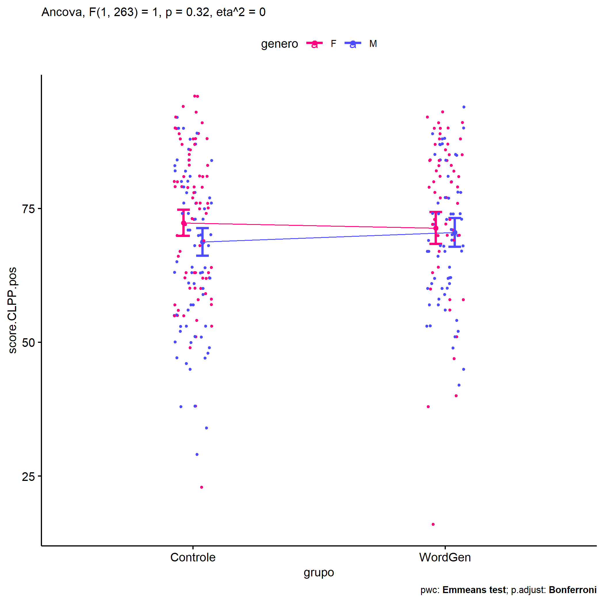<!-- -->

    ## Scale for colour is already present.
    ## Adding another scale for colour, which will replace the existing scale.

<!-- -->

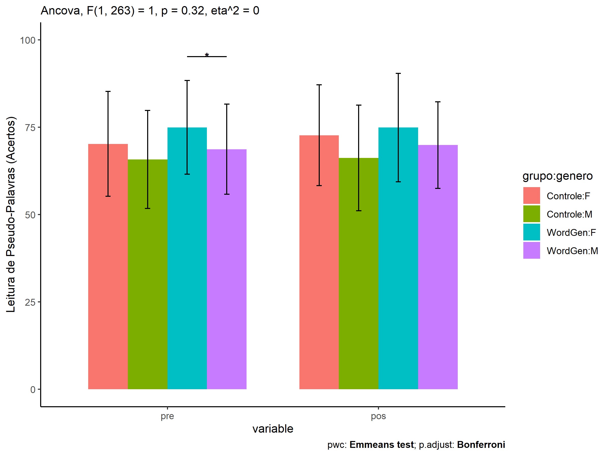<!-- -->

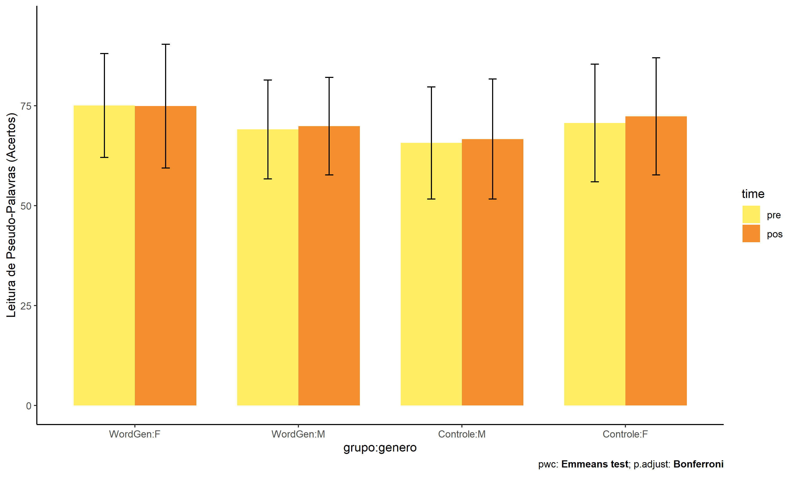<!-- -->

### Correta Regular (Acertos)

| var          | genero | grupo    |   n | M (pre) | SE (pre) | M (unadj) | SE (unadj) | M (adj) | SE (adj) |
|:-------------|:-------|:---------|----:|--------:|---------:|----------:|-----------:|--------:|---------:|
| score.CR.pos | F      | Controle |  87 |  14.471 |    0.466 |    14.184 |      0.567 |  14.175 |    0.595 |
| score.CR.pos | F      | WordGen  |  59 |  16.068 |    0.444 |    14.746 |      0.711 |  14.191 |    0.733 |
| score.CR.pos | M      | Controle |  89 |  13.438 |    0.475 |    12.101 |      0.681 |  12.446 |    0.593 |
| score.CR.pos | M      | WordGen  |  75 |  14.333 |    0.522 |    13.307 |      0.641 |  13.345 |    0.641 |

| .y.          | grupo    | genero | group1   | group2  | estimate | conf.low | conf.high |    se | statistic |     p | p.adj | p.adj.signif |
|:-------------|:---------|:-------|:---------|:--------|---------:|---------:|----------:|------:|----------:|------:|------:|:-------------|
| score.CR.pos | Controle |        | F        | M       |    1.729 |    0.075 |     3.383 | 0.841 |     2.058 | 0.040 | 0.040 | \*           |
| score.CR.pos | WordGen  |        | F        | M       |    0.846 |   -1.072 |     2.764 | 0.975 |     0.868 | 0.386 | 0.386 | ns           |
| score.CR.pre | Controle |        | F        | M       |    1.033 |   -0.234 |     2.301 | 0.644 |     1.604 | 0.110 | 0.110 | ns           |
| score.CR.pre | WordGen  |        | F        | M       |    1.734 |    0.271 |     3.197 | 0.744 |     2.333 | 0.020 | 0.020 | \*           |
| score.CR.pos |          | F      | Controle | WordGen |   -0.016 |   -1.873 |     1.841 | 0.944 |    -0.017 | 0.987 | 0.987 | ns           |
| score.CR.pos |          | M      | Controle | WordGen |   -0.899 |   -2.617 |     0.818 | 0.873 |    -1.030 | 0.304 | 0.304 | ns           |
| score.CR.pre |          | F      | Controle | WordGen |   -1.597 |   -3.014 |    -0.179 | 0.721 |    -2.216 | 0.027 | 0.027 | \*           |
| score.CR.pre |          | M      | Controle | WordGen |   -0.895 |   -2.213 |     0.423 | 0.670 |    -1.337 | 0.182 | 0.182 | ns           |

| grupo    | genero | group1 | group2 | estimate | conf.low | conf.high |    se | statistic |     p | p.adj | p.adj.signif |
|:---------|:-------|:-------|:-------|---------:|---------:|----------:|------:|----------:|------:|------:|:-------------|
| Controle | F      | pre    | pos    |    0.287 |   -1.218 |     1.793 | 0.766 |     0.375 | 0.708 | 0.708 | ns           |
| Controle | M      | pre    | pos    |    1.337 |   -0.151 |     2.825 | 0.758 |     1.764 | 0.078 | 0.078 | ns           |
| WordGen  | F      | pre    | pos    |    1.322 |   -0.506 |     3.150 | 0.931 |     1.420 | 0.156 | 0.156 | ns           |
| WordGen  | M      | pre    | pos    |    1.027 |   -0.595 |     2.648 | 0.826 |     1.244 | 0.214 | 0.214 | ns           |

    ## Scale for colour is already present.
    ## Adding another scale for colour, which will replace the existing scale.

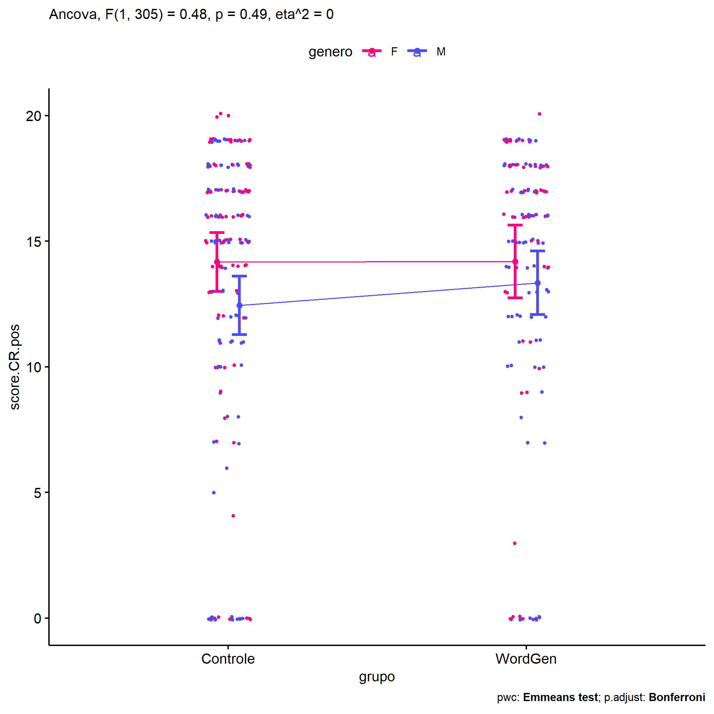<!-- -->

    ## Scale for colour is already present.
    ## Adding another scale for colour, which will replace the existing scale.

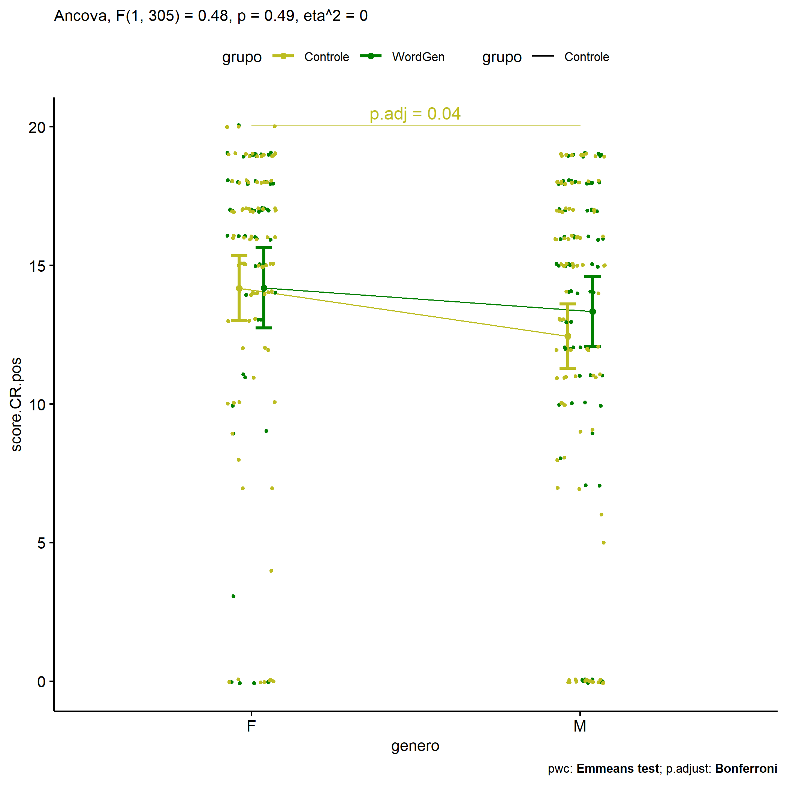<!-- -->

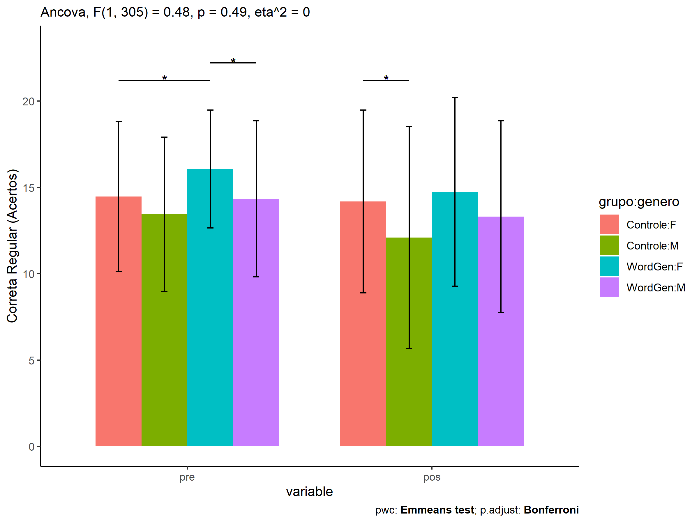<!-- -->

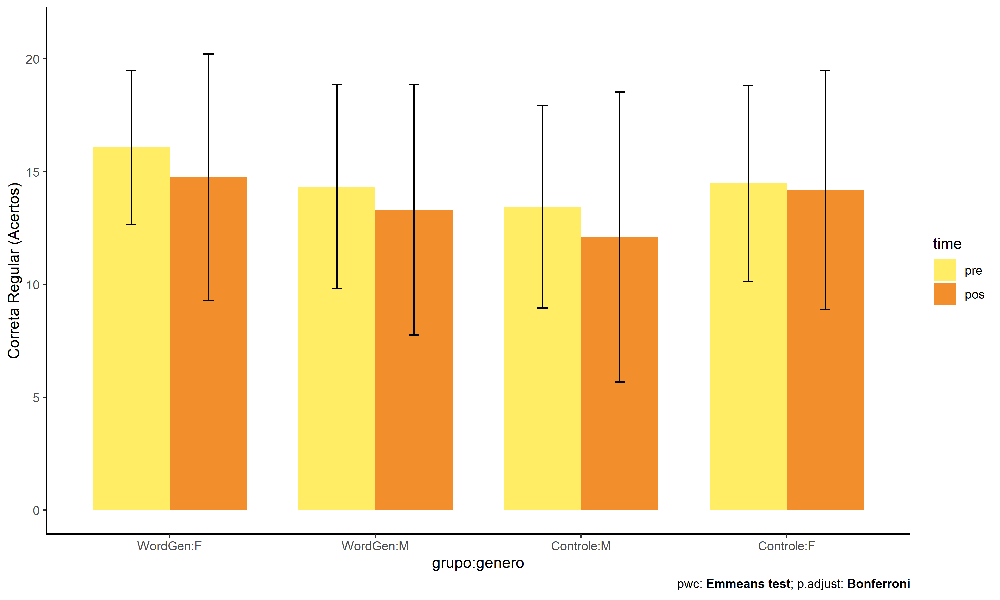<!-- -->

### Correta Irregular (Acertos)

| var          | genero | grupo    |   n | M (pre) | SE (pre) | M (unadj) | SE (unadj) | M (adj) | SE (adj) |
|:-------------|:-------|:---------|----:|--------:|---------:|----------:|-----------:|--------:|---------:|
| score.CI.pos | F      | Controle |  87 |  11.977 |    0.466 |    11.414 |      0.565 |  11.240 |    0.515 |
| score.CI.pos | F      | WordGen  |  59 |  13.441 |    0.422 |    12.746 |      0.626 |  11.904 |    0.637 |
| score.CI.pos | M      | Controle |  89 |  10.539 |    0.425 |     9.573 |      0.570 |  10.056 |    0.514 |
| score.CI.pos | M      | WordGen  |  75 |  10.960 |    0.446 |    11.053 |      0.560 |  11.344 |    0.556 |

| .y.          | grupo    | genero | group1   | group2  | estimate | conf.low | conf.high |    se | statistic | p       | p.adj   | p.adj.signif |
|:-------------|:---------|:-------|:---------|:--------|---------:|---------:|----------:|------:|----------:|:--------|:--------|:-------------|
| score.CI.pos | Controle |        | F        | M       |    1.184 |   -0.252 |     2.620 | 0.730 |     1.622 | 0.106   | 0.106   | ns           |
| score.CI.pos | WordGen  |        | F        | M       |    0.559 |   -1.118 |     2.236 | 0.852 |     0.656 | 0.512   | 0.512   | ns           |
| score.CI.pre | Controle |        | F        | M       |    1.438 |    0.268 |     2.607 | 0.594 |     2.419 | 0.016   | 0.016   | \*           |
| score.CI.pre | WordGen  |        | F        | M       |    2.481 |    1.131 |     3.831 | 0.686 |     3.616 | \<0.001 | \<0.001 | \*\*\*       |
| score.CI.pos |          | F      | Controle | WordGen |   -0.663 |   -2.268 |     0.941 | 0.815 |    -0.814 | 0.416   | 0.416   | ns           |
| score.CI.pos |          | M      | Controle | WordGen |   -1.288 |   -2.769 |     0.192 | 0.752 |    -1.712 | 0.088   | 0.088   | ns           |
| score.CI.pre |          | F      | Controle | WordGen |   -1.464 |   -2.772 |    -0.155 | 0.665 |    -2.201 | 0.028   | 0.028   | \*           |
| score.CI.pre |          | M      | Controle | WordGen |   -0.421 |   -1.637 |     0.795 | 0.618 |    -0.681 | 0.497   | 0.497   | ns           |

| grupo    | genero | group1 | group2 | estimate | conf.low | conf.high |    se | statistic |     p | p.adj | p.adj.signif |
|:---------|:-------|:-------|:-------|---------:|---------:|----------:|------:|----------:|------:|------:|:-------------|
| Controle | F      | pre    | pos    |    0.563 |   -0.797 |     1.923 | 0.692 |     0.813 | 0.416 | 0.416 | ns           |
| Controle | M      | pre    | pos    |    0.966 |   -0.378 |     2.311 | 0.685 |     1.412 | 0.159 | 0.159 | ns           |
| WordGen  | F      | pre    | pos    |    0.695 |   -0.956 |     2.346 | 0.841 |     0.826 | 0.409 | 0.409 | ns           |
| WordGen  | M      | pre    | pos    |   -0.093 |   -1.558 |     1.371 | 0.746 |    -0.125 | 0.900 | 0.900 | ns           |

    ## Scale for colour is already present.
    ## Adding another scale for colour, which will replace the existing scale.

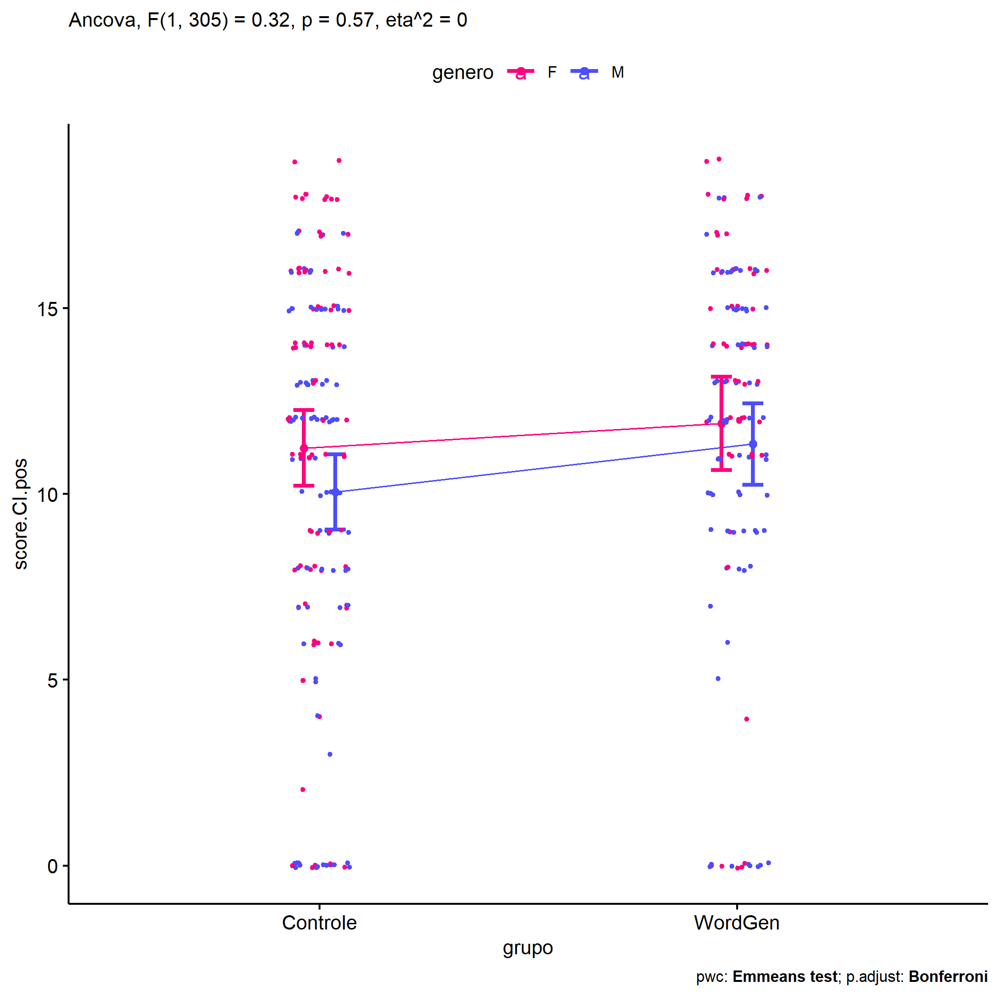<!-- -->

    ## Scale for colour is already present.
    ## Adding another scale for colour, which will replace the existing scale.

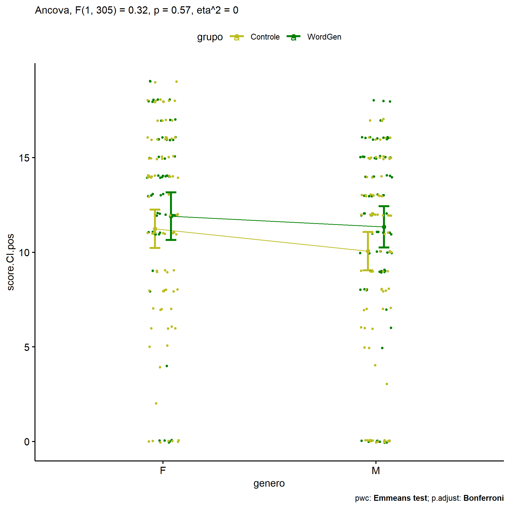<!-- -->

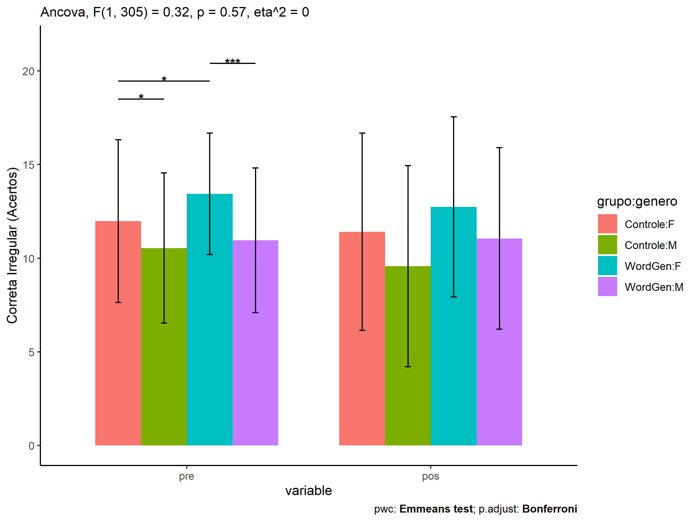<!-- -->

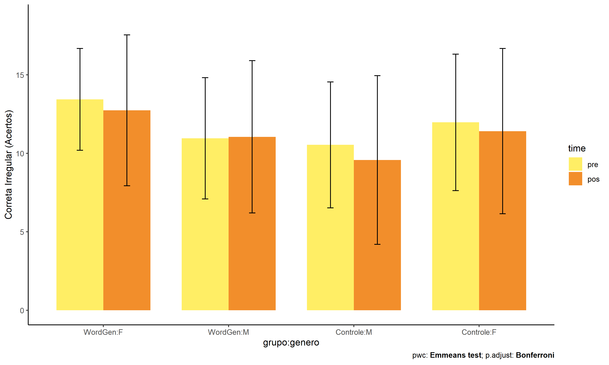<!-- -->

### Trocas Visuais (Acertos)

| var          | genero | grupo    |   n | M (pre) | SE (pre) | M (unadj) | SE (unadj) | M (adj) | SE (adj) |
|:-------------|:-------|:---------|----:|--------:|---------:|----------:|-----------:|--------:|---------:|
| score.TV.pos | F      | Controle |  87 |  16.195 |    0.467 |    15.724 |      0.624 |  15.693 |    0.645 |
| score.TV.pos | F      | WordGen  |  59 |  17.237 |    0.484 |    15.712 |      0.781 |  15.322 |    0.787 |
| score.TV.pos | M      | Controle |  89 |  15.236 |    0.587 |    13.348 |      0.731 |  13.649 |    0.641 |
| score.TV.pos | M      | WordGen  |  75 |  16.147 |    0.566 |    14.747 |      0.695 |  14.733 |    0.695 |

| .y.          | grupo    | genero | group1   | group2  | estimate | conf.low | conf.high |    se | statistic |     p | p.adj | p.adj.signif |
|:-------------|:---------|:-------|:---------|:--------|---------:|---------:|----------:|------:|----------:|------:|------:|:-------------|
| score.TV.pos | Controle |        | F        | M       |    2.045 |    0.255 |     3.835 | 0.910 |     2.248 | 0.025 | 0.025 | \*           |
| score.TV.pos | WordGen  |        | F        | M       |    0.589 |   -1.477 |     2.655 | 1.050 |     0.561 | 0.575 | 0.575 | ns           |
| score.TV.pre | Controle |        | F        | M       |    0.959 |   -0.451 |     2.369 | 0.717 |     1.339 | 0.182 | 0.182 | ns           |
| score.TV.pre | WordGen  |        | F        | M       |    1.091 |   -0.537 |     2.718 | 0.827 |     1.319 | 0.188 | 0.188 | ns           |
| score.TV.pos |          | F      | Controle | WordGen |    0.372 |   -1.630 |     2.374 | 1.017 |     0.365 | 0.715 | 0.715 | ns           |
| score.TV.pos |          | M      | Controle | WordGen |   -1.084 |   -2.944 |     0.776 | 0.945 |    -1.147 | 0.252 | 0.252 | ns           |
| score.TV.pre |          | F      | Controle | WordGen |   -1.042 |   -2.619 |     0.535 | 0.802 |    -1.300 | 0.195 | 0.195 | ns           |
| score.TV.pre |          | M      | Controle | WordGen |   -0.911 |   -2.377 |     0.555 | 0.745 |    -1.223 | 0.222 | 0.222 | ns           |

| grupo    | genero | group1 | group2 | estimate | conf.low | conf.high |    se | statistic |     p | p.adj | p.adj.signif |
|:---------|:-------|:-------|:-------|---------:|---------:|----------:|------:|----------:|------:|------:|:-------------|
| Controle | F      | pre    | pos    |    0.471 |   -1.178 |     2.120 | 0.840 |     0.561 | 0.575 | 0.575 | ns           |
| Controle | M      | pre    | pos    |    1.888 |    0.257 |     3.518 | 0.830 |     2.274 | 0.023 | 0.023 | \*           |
| WordGen  | F      | pre    | pos    |    1.525 |   -0.477 |     3.528 | 1.020 |     1.496 | 0.135 | 0.135 | ns           |
| WordGen  | M      | pre    | pos    |    1.400 |   -0.376 |     3.176 | 0.904 |     1.548 | 0.122 | 0.122 | ns           |

    ## Scale for colour is already present.
    ## Adding another scale for colour, which will replace the existing scale.

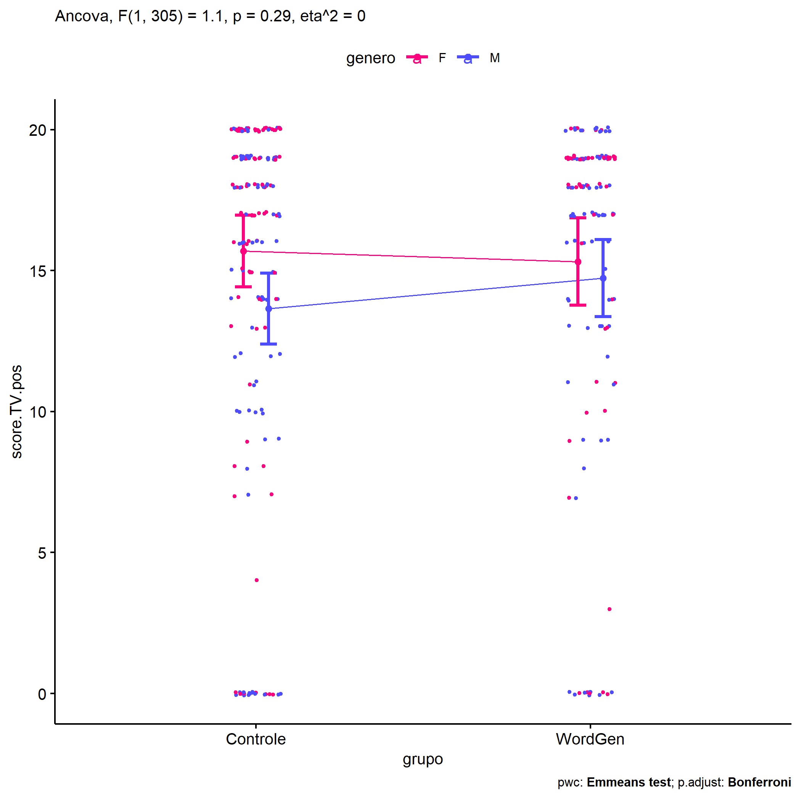<!-- -->

    ## Scale for colour is already present.
    ## Adding another scale for colour, which will replace the existing scale.

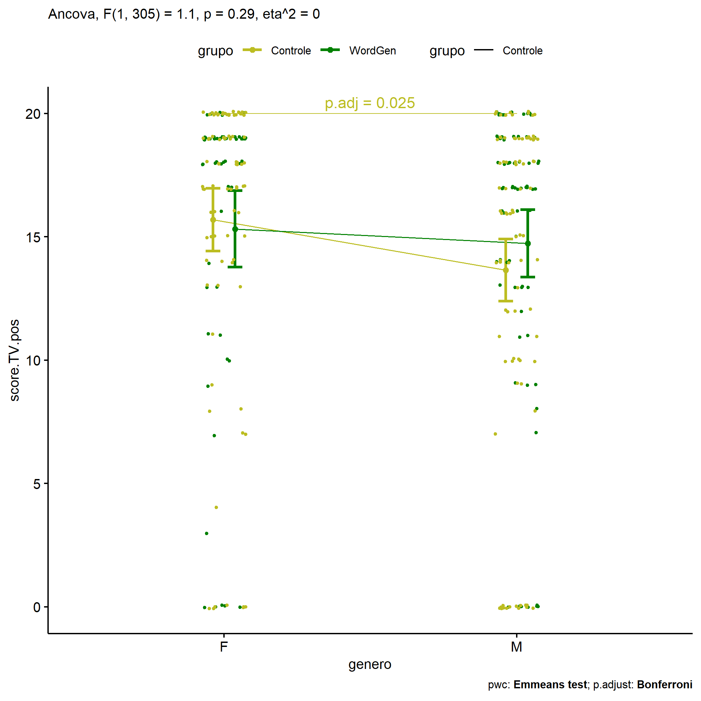<!-- -->

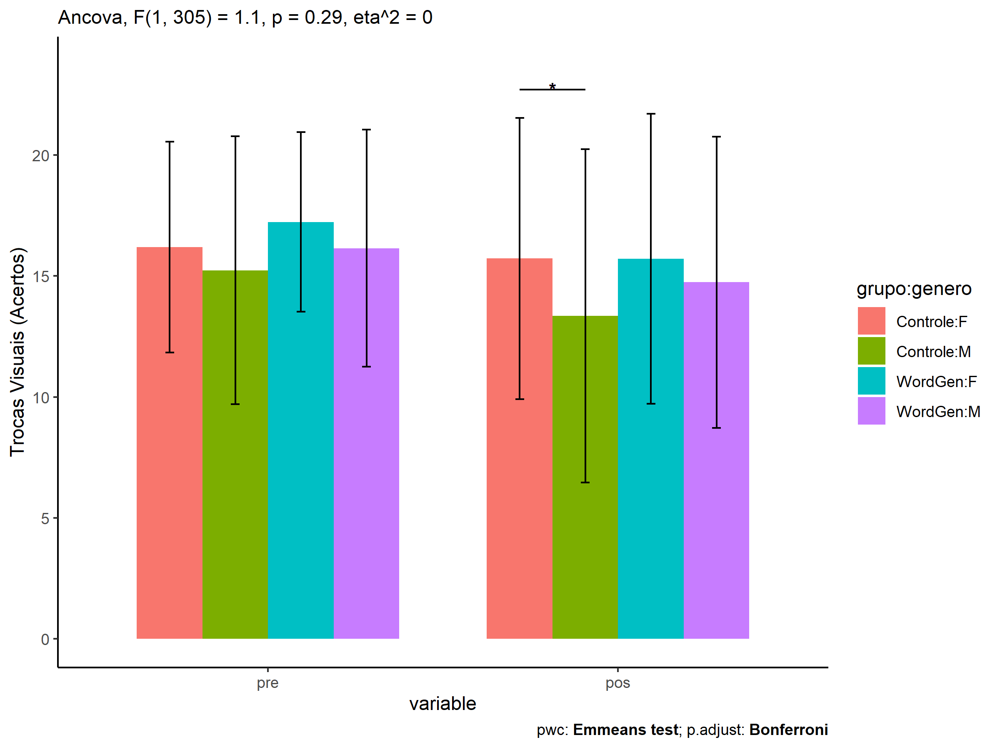<!-- -->

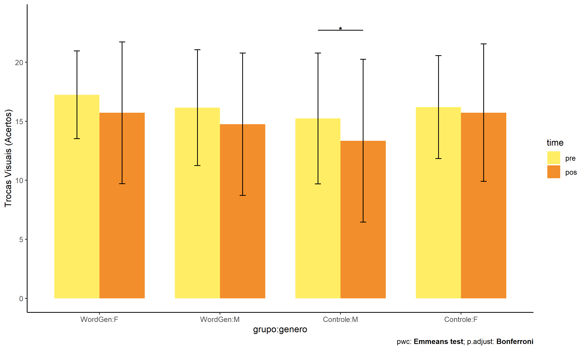<!-- -->

### Trocas Fonologicas (Acertos)

| var          | genero | grupo    |   n | M (pre) | SE (pre) | M (unadj) | SE (unadj) | M (adj) | SE (adj) |
|:-------------|:-------|:---------|----:|--------:|---------:|----------:|-----------:|--------:|---------:|
| score.TF.pos | F      | Controle |  87 |  15.000 |    0.517 |    14.230 |      0.629 |  14.244 |    0.618 |
| score.TF.pos | F      | WordGen  |  59 |  15.898 |    0.562 |    14.559 |      0.778 |  14.142 |    0.753 |
| score.TF.pos | M      | Controle |  89 |  14.146 |    0.545 |    12.191 |      0.730 |  12.615 |    0.614 |
| score.TF.pos | M      | WordGen  |  75 |  15.427 |    0.568 |    14.053 |      0.683 |  13.862 |    0.666 |

| .y.          | grupo    | genero | group1   | group2  | estimate | conf.low | conf.high |    se | statistic |     p | p.adj | p.adj.signif |
|:-------------|:---------|:-------|:---------|:--------|---------:|---------:|----------:|------:|----------:|------:|------:|:-------------|
| score.TF.pos | Controle |        | F        | M       |    1.629 |   -0.086 |     3.343 | 0.871 |     1.869 | 0.063 | 0.063 | ns           |
| score.TF.pos | WordGen  |        | F        | M       |    0.279 |   -1.696 |     2.255 | 1.004 |     0.278 | 0.781 | 0.781 | ns           |
| score.TF.pre | Controle |        | F        | M       |    0.854 |   -0.584 |     2.292 | 0.731 |     1.168 | 0.244 | 0.244 | ns           |
| score.TF.pre | WordGen  |        | F        | M       |    0.472 |   -1.188 |     2.132 | 0.844 |     0.559 | 0.577 | 0.577 | ns           |
| score.TF.pos |          | F      | Controle | WordGen |    0.102 |   -1.815 |     2.019 | 0.974 |     0.105 | 0.917 | 0.917 | ns           |
| score.TF.pos |          | M      | Controle | WordGen |   -1.247 |   -3.034 |     0.540 | 0.908 |    -1.373 | 0.171 | 0.171 | ns           |
| score.TF.pre |          | F      | Controle | WordGen |   -0.898 |   -2.507 |     0.710 | 0.818 |    -1.099 | 0.273 | 0.273 | ns           |
| score.TF.pre |          | M      | Controle | WordGen |   -1.281 |   -2.776 |     0.215 | 0.760 |    -1.685 | 0.093 | 0.093 | ns           |

| grupo    | genero | group1 | group2 | estimate | conf.low | conf.high |    se | statistic |     p | p.adj | p.adj.signif |
|:---------|:-------|:-------|:-------|---------:|---------:|----------:|------:|----------:|------:|------:|:-------------|
| Controle | F      | pre    | pos    |    0.770 |   -0.889 |     2.429 | 0.845 |     0.912 | 0.362 | 0.362 | ns           |
| Controle | M      | pre    | pos    |    1.955 |    0.315 |     3.595 | 0.835 |     2.341 | 0.020 | 0.020 | \*           |
| WordGen  | F      | pre    | pos    |    1.339 |   -0.675 |     3.353 | 1.026 |     1.306 | 0.192 | 0.192 | ns           |
| WordGen  | M      | pre    | pos    |    1.373 |   -0.413 |     3.160 | 0.910 |     1.510 | 0.132 | 0.132 | ns           |

    ## Scale for colour is already present.
    ## Adding another scale for colour, which will replace the existing scale.

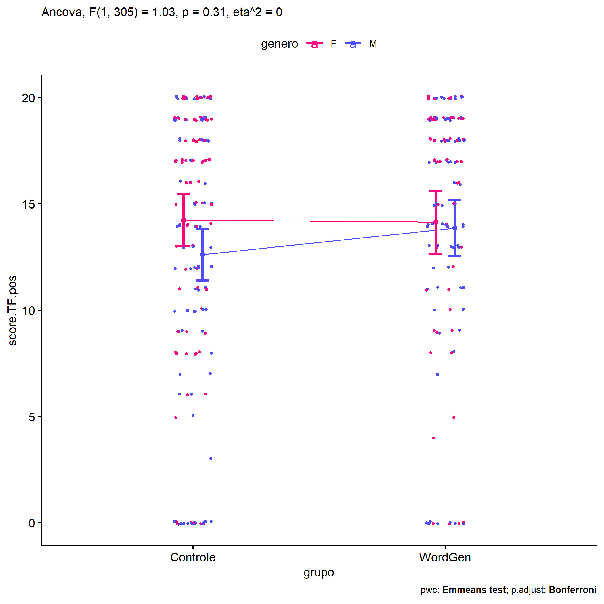<!-- -->

    ## Scale for colour is already present.
    ## Adding another scale for colour, which will replace the existing scale.

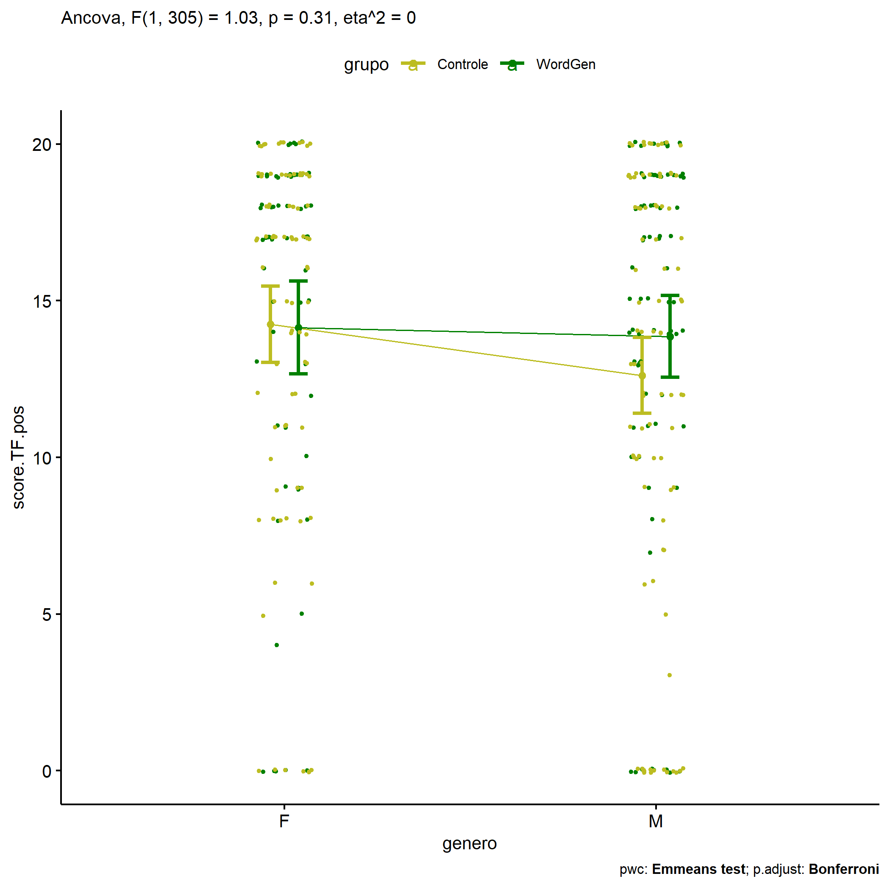<!-- -->

<!-- -->

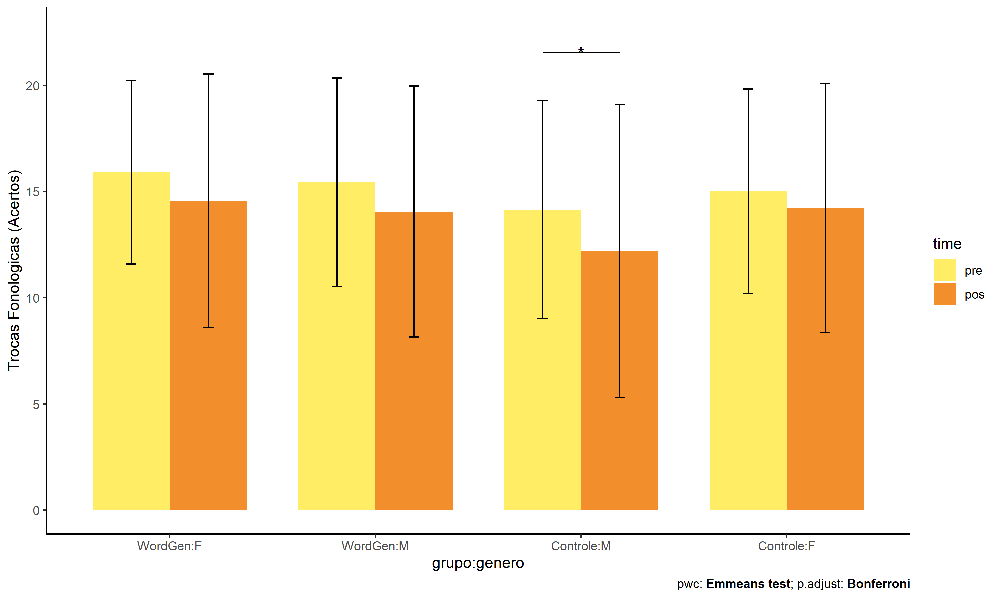<!-- -->

### Trocas Orograficas (Acertos)

| var          | genero | grupo    |   n | M (pre) | SE (pre) | M (unadj) | SE (unadj) | M (adj) | SE (adj) |
|:-------------|:-------|:---------|----:|--------:|---------:|----------:|-----------:|--------:|---------:|
| score.TO.pos | F      | Controle |  87 |  10.598 |    0.504 |    10.989 |      0.537 |  10.575 |    0.482 |
| score.TO.pos | F      | WordGen  |  59 |  11.136 |    0.544 |    10.780 |      0.715 |  10.065 |    0.587 |
| score.TO.pos | M      | Controle |  89 |   8.640 |    0.459 |     8.213 |      0.539 |   8.895 |    0.480 |
| score.TO.pos | M      | WordGen  |  75 |   9.440 |    0.498 |     9.267 |      0.567 |   9.501 |    0.517 |

| .y.          | grupo    | genero | group1   | group2  | estimate | conf.low | conf.high |    se | statistic |     p | p.adj | p.adj.signif |
|:-------------|:---------|:-------|:---------|:--------|---------:|---------:|----------:|------:|----------:|------:|------:|:-------------|
| score.TO.pos | Controle |        | F        | M       |    1.680 |    0.334 |     3.027 | 0.684 |     2.455 | 0.015 | 0.015 | \*           |
| score.TO.pos | WordGen  |        | F        | M       |    0.564 |   -0.980 |     2.109 | 0.785 |     0.719 | 0.473 | 0.473 | ns           |
| score.TO.pre | Controle |        | F        | M       |    1.957 |    0.650 |     3.264 | 0.664 |     2.947 | 0.003 | 0.003 | \*\*         |
| score.TO.pre | WordGen  |        | F        | M       |    1.696 |    0.187 |     3.204 | 0.767 |     2.212 | 0.028 | 0.028 | \*           |
| score.TO.pos |          | F      | Controle | WordGen |    0.510 |   -0.977 |     1.996 | 0.756 |     0.675 | 0.500 | 0.500 | ns           |
| score.TO.pos |          | M      | Controle | WordGen |   -0.606 |   -1.989 |     0.778 | 0.703 |    -0.862 | 0.390 | 0.390 | ns           |
| score.TO.pre |          | F      | Controle | WordGen |   -0.538 |   -2.000 |     0.924 | 0.743 |    -0.724 | 0.470 | 0.470 | ns           |
| score.TO.pre |          | M      | Controle | WordGen |   -0.800 |   -2.158 |     0.559 | 0.691 |    -1.158 | 0.248 | 0.248 | ns           |

| grupo    | genero | group1 | group2 | estimate | conf.low | conf.high |    se | statistic |     p | p.adj | p.adj.signif |
|:---------|:-------|:-------|:-------|---------:|---------:|----------:|------:|----------:|------:|------:|:-------------|
| Controle | F      | pre    | pos    |   -0.391 |   -1.810 |     1.029 | 0.723 |    -0.541 | 0.589 | 0.589 | ns           |
| Controle | M      | pre    | pos    |    0.427 |   -0.976 |     1.830 | 0.715 |     0.597 | 0.550 | 0.550 | ns           |
| WordGen  | F      | pre    | pos    |    0.356 |   -1.368 |     2.080 | 0.878 |     0.406 | 0.685 | 0.685 | ns           |
| WordGen  | M      | pre    | pos    |    0.173 |   -1.355 |     1.702 | 0.778 |     0.223 | 0.824 | 0.824 | ns           |

    ## Scale for colour is already present.
    ## Adding another scale for colour, which will replace the existing scale.

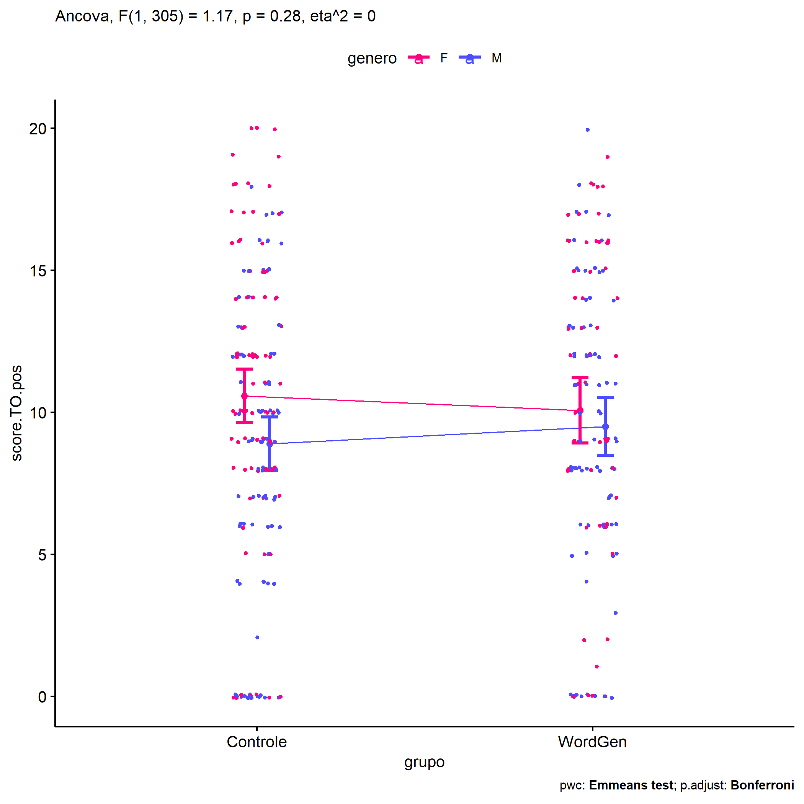<!-- -->

    ## Scale for colour is already present.
    ## Adding another scale for colour, which will replace the existing scale.

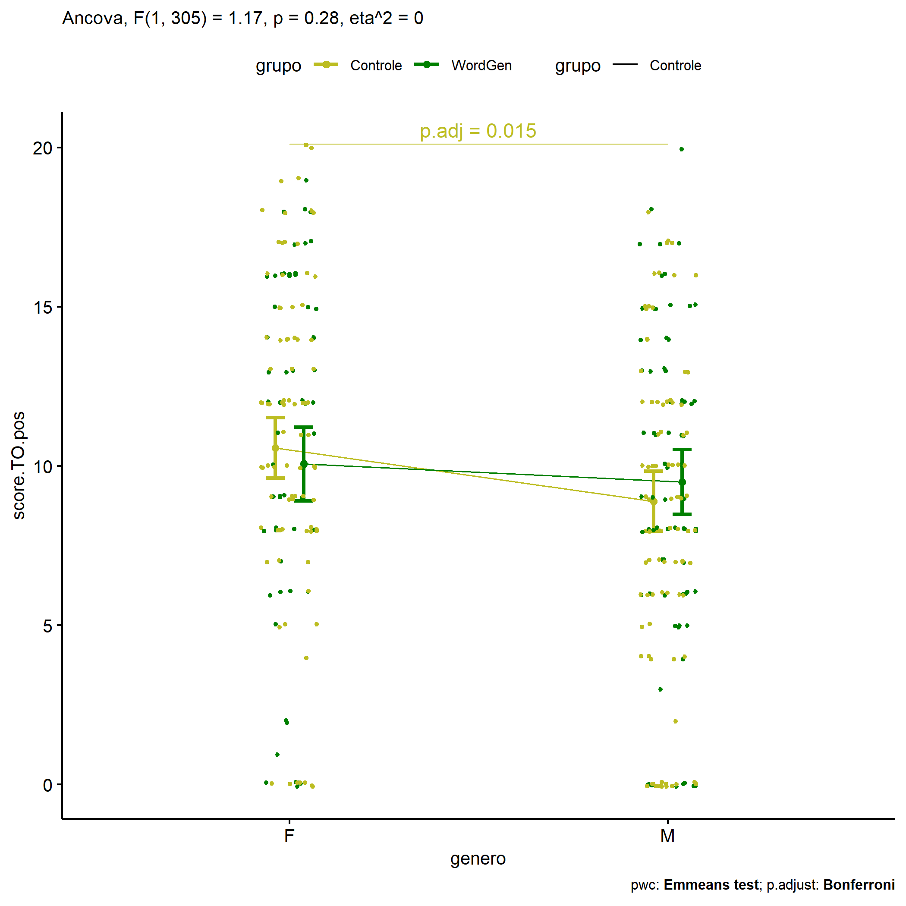<!-- -->

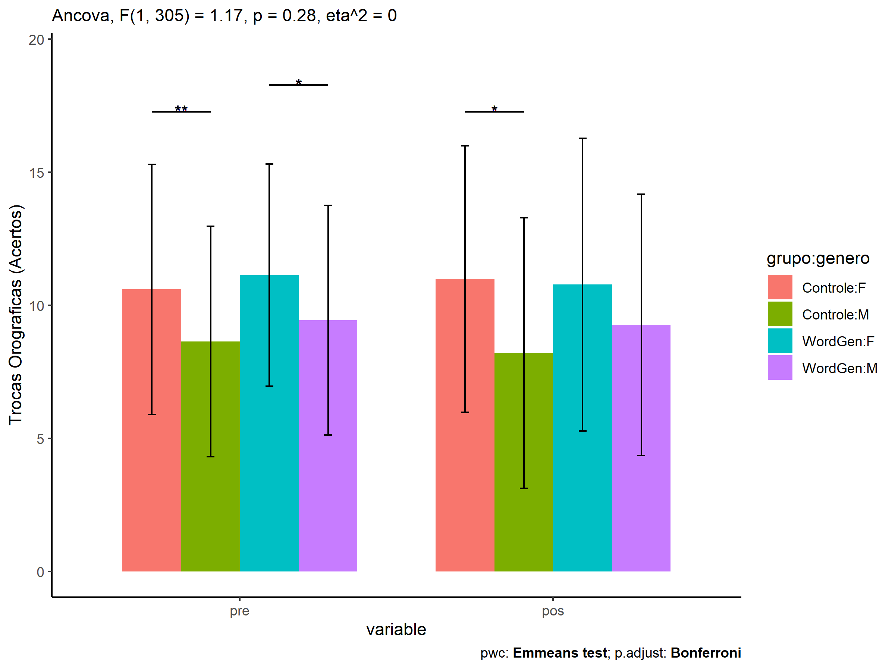<!-- -->

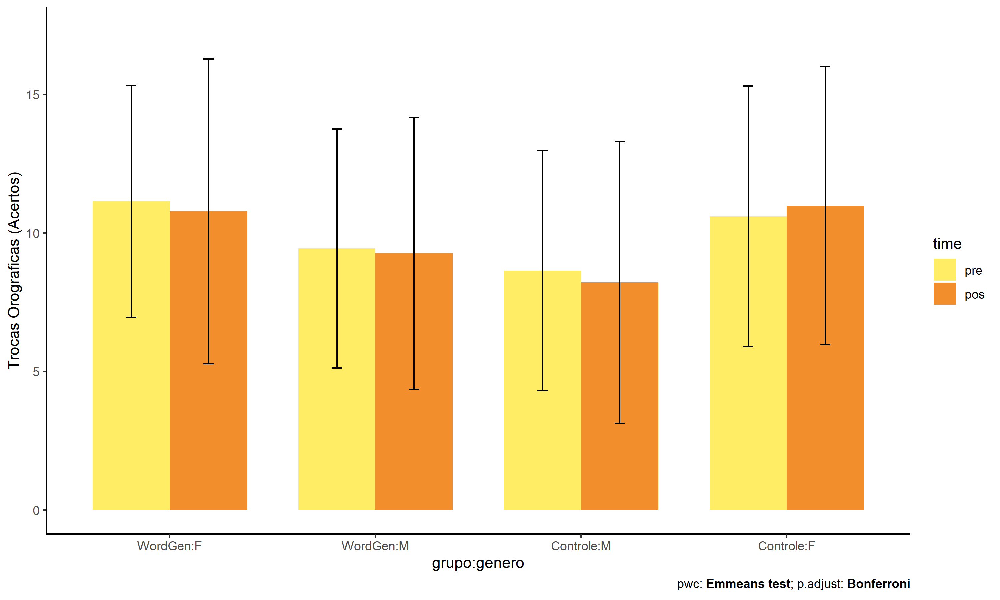<!-- -->

## factores: **idade:grupo**

### Leitura de Pseudo-Palavras (Acertos)

| var            | idade | grupo    |   n | M (pre) | SE (pre) | M (unadj) | SE (unadj) | M (adj) | SE (adj) |
|:---------------|:------|:---------|----:|--------:|---------:|----------:|-----------:|--------:|---------:|
| score.CLPP.pos | 10y   | Controle |  28 |  71.643 |    1.921 |    70.429 |      2.665 |  69.325 |    2.053 |
| score.CLPP.pos | 10y   | WordGen  |  23 |  70.565 |    2.186 |    67.957 |      3.326 |  67.582 |    2.263 |
| score.CLPP.pos | 11y   | Controle |  84 |  68.917 |    1.751 |    72.429 |      1.604 |  73.170 |    1.185 |
| score.CLPP.pos | 11y   | WordGen  |  73 |  73.781 |    1.447 |    74.808 |      1.488 |  72.257 |    1.284 |
| score.CLPP.pos | 12y   | Controle |  20 |  64.650 |    2.648 |    59.450 |      3.581 |  63.079 |    2.442 |
| score.CLPP.pos | 12y   | WordGen  |  15 |  67.800 |    4.511 |    67.933 |      3.925 |  69.430 |    2.804 |
| score.CLPP.pos | 13y   | Controle |   8 |  60.875 |    4.430 |    65.500 |      3.268 |  71.683 |    3.865 |
| score.CLPP.pos | 13y   | WordGen  |   5 |  64.400 |    5.492 |    66.400 |      7.118 |  70.198 |    4.862 |

| .y.            | grupo    | idade | group1   | group2  | estimate | conf.low | conf.high |    se | statistic | p       | p.adj | p.adj.signif |
|:---------------|:---------|:------|:---------|:--------|---------:|---------:|----------:|------:|----------:|:--------|------:|:-------------|
| score.CLPP.pos | Controle |       | 10y      | 11y     |   -3.845 |   -8.517 |     0.827 | 2.372 |    -1.621 | 0.106   | 0.638 | ns           |
| score.CLPP.pos | Controle |       | 10y      | 12y     |    6.246 |   -0.051 |    12.543 | 3.197 |     1.954 | 0.052   | 0.311 | ns           |
| score.CLPP.pos | Controle |       | 10y      | 13y     |   -2.359 |  -10.995 |     6.277 | 4.385 |    -0.538 | 0.591   | 1.000 | ns           |
| score.CLPP.pos | Controle |       | 11y      | 12y     |   10.091 |    4.756 |    15.426 | 2.709 |     3.725 | \<0.001 | 0.001 | \*\*         |
| score.CLPP.pos | Controle |       | 11y      | 13y     |    1.486 |   -6.463 |     9.436 | 4.036 |     0.368 | 0.713   | 1.000 | ns           |
| score.CLPP.pos | Controle |       | 12y      | 13y     |   -8.605 |  -17.555 |     0.345 | 4.544 |    -1.894 | 0.059   | 0.357 | ns           |
| score.CLPP.pos | WordGen  |       | 10y      | 11y     |   -4.675 |   -9.797 |     0.446 | 2.600 |    -1.798 | 0.073   | 0.440 | ns           |
| score.CLPP.pos | WordGen  |       | 10y      | 12y     |   -1.848 |   -8.948 |     5.251 | 3.604 |    -0.513 | 0.609   | 1.000 | ns           |
| score.CLPP.pos | WordGen  |       | 10y      | 13y     |   -2.616 |  -13.181 |     7.949 | 5.364 |    -0.488 | 0.626   | 1.000 | ns           |
| score.CLPP.pos | WordGen  |       | 11y      | 12y     |    2.827 |   -3.262 |     8.916 | 3.091 |     0.915 | 0.361   | 1.000 | ns           |
| score.CLPP.pos | WordGen  |       | 11y      | 13y     |    2.060 |   -7.866 |    11.985 | 5.039 |     0.409 | 0.683   | 1.000 | ns           |
| score.CLPP.pos | WordGen  |       | 12y      | 13y     |   -0.768 |  -11.811 |    10.276 | 5.607 |    -0.137 | 0.891   | 1.000 | ns           |
| score.CLPP.pre | Controle |       | 10y      | 11y     |    2.726 |   -3.141 |     8.593 | 2.979 |     0.915 | 0.361   | 1.000 | ns           |
| score.CLPP.pre | Controle |       | 10y      | 12y     |    6.993 |   -0.879 |    14.865 | 3.997 |     1.750 | 0.081   | 0.488 | ns           |
| score.CLPP.pre | Controle |       | 10y      | 13y     |   10.768 |   -0.011 |    21.547 | 5.473 |     1.968 | 0.05    | 0.301 | ns           |
| score.CLPP.pre | Controle |       | 11y      | 12y     |    4.267 |   -2.423 |    10.956 | 3.397 |     1.256 | 0.21    | 1.000 | ns           |
| score.CLPP.pre | Controle |       | 11y      | 13y     |    8.042 |   -1.907 |    17.990 | 5.051 |     1.592 | 0.113   | 0.676 | ns           |
| score.CLPP.pre | Controle |       | 12y      | 13y     |    3.775 |   -7.473 |    15.023 | 5.711 |     0.661 | 0.509   | 1.000 | ns           |
| score.CLPP.pre | WordGen  |       | 10y      | 11y     |   -3.216 |   -9.645 |     3.214 | 3.264 |    -0.985 | 0.326   | 1.000 | ns           |
| score.CLPP.pre | WordGen  |       | 10y      | 12y     |    2.765 |   -6.158 |    11.689 | 4.531 |     0.610 | 0.542   | 1.000 | ns           |
| score.CLPP.pre | WordGen  |       | 10y      | 13y     |    6.165 |   -7.102 |    19.432 | 6.736 |     0.915 | 0.361   | 1.000 | ns           |
| score.CLPP.pre | WordGen  |       | 11y      | 12y     |    5.981 |   -1.641 |    13.603 | 3.870 |     1.545 | 0.124   | 0.741 | ns           |
| score.CLPP.pre | WordGen  |       | 11y      | 13y     |    9.381 |   -3.048 |    21.810 | 6.311 |     1.487 | 0.138   | 0.830 | ns           |
| score.CLPP.pre | WordGen  |       | 12y      | 13y     |    3.400 |  -10.484 |    17.284 | 7.049 |     0.482 | 0.63    | 1.000 | ns           |
| score.CLPP.pos |          | 10y   | Controle | WordGen |    1.743 |   -4.274 |     7.759 | 3.055 |     0.571 | 0.569   | 0.569 | ns           |
| score.CLPP.pos |          | 11y   | Controle | WordGen |    0.912 |   -2.542 |     4.367 | 1.754 |     0.520 | 0.603   | 0.603 | ns           |
| score.CLPP.pos |          | 12y   | Controle | WordGen |   -6.352 |  -13.659 |     0.956 | 3.710 |    -1.712 | 0.088   | 0.088 | ns           |
| score.CLPP.pos |          | 13y   | Controle | WordGen |    1.486 |  -10.705 |    13.676 | 6.189 |     0.240 | 0.811   | 0.811 | ns           |
| score.CLPP.pre |          | 10y   | Controle | WordGen |    1.078 |   -6.489 |     8.644 | 3.842 |     0.281 | 0.779   | 0.779 | ns           |
| score.CLPP.pre |          | 11y   | Controle | WordGen |   -4.864 |   -9.166 |    -0.562 | 2.184 |    -2.227 | 0.027   | 0.027 | \*           |
| score.CLPP.pre |          | 12y   | Controle | WordGen |   -3.150 |  -12.334 |     6.034 | 4.663 |    -0.676 | 0.5     | 0.500 | ns           |
| score.CLPP.pre |          | 13y   | Controle | WordGen |   -3.525 |  -18.853 |    11.803 | 7.782 |    -0.453 | 0.651   | 0.651 | ns           |

| grupo    | idade | group1 | group2 | estimate | conf.low | conf.high |    se | statistic |     p | p.adj | p.adj.signif |
|:---------|:------|:-------|:-------|---------:|---------:|----------:|------:|----------:|------:|------:|:-------------|
| Controle | 10y   | pre    | pos    |    1.732 |   -5.261 |     8.725 | 3.560 |     0.487 | 0.627 | 0.627 | ns           |
| Controle | 11y   | pre    | pos    |   -2.934 |   -7.005 |     1.137 | 2.072 |    -1.416 | 0.157 | 0.157 | ns           |
| Controle | 12y   | pre    | pos    |    4.011 |   -3.978 |    12.001 | 4.067 |     0.986 | 0.324 | 0.324 | ns           |
| Controle | 13y   | pre    | pos    |   -6.900 |  -19.740 |     5.940 | 6.536 |    -1.056 | 0.292 | 0.292 | ns           |
| WordGen  | 10y   | pre    | pos    |    2.609 |   -5.373 |    10.591 | 4.063 |     0.642 | 0.521 | 0.521 | ns           |
| WordGen  | 11y   | pre    | pos    |   -0.810 |   -5.203 |     3.582 | 2.236 |    -0.362 | 0.717 | 0.717 | ns           |
| WordGen  | 12y   | pre    | pos    |    0.500 |   -9.070 |    10.070 | 4.872 |     0.103 | 0.918 | 0.918 | ns           |
| WordGen  | 13y   | pre    | pos    |    1.850 |  -13.581 |    17.281 | 7.855 |     0.236 | 0.814 | 0.814 | ns           |

    ## Scale for colour is already present.
    ## Adding another scale for colour, which will replace the existing scale.

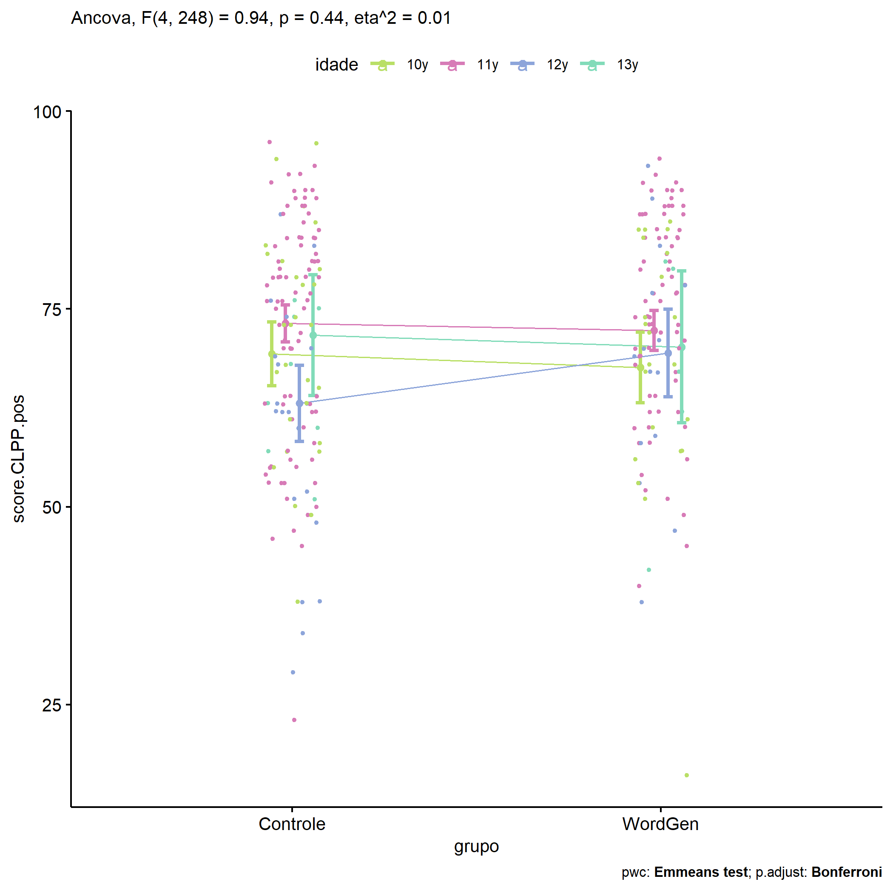<!-- -->

    ## Scale for colour is already present.
    ## Adding another scale for colour, which will replace the existing scale.

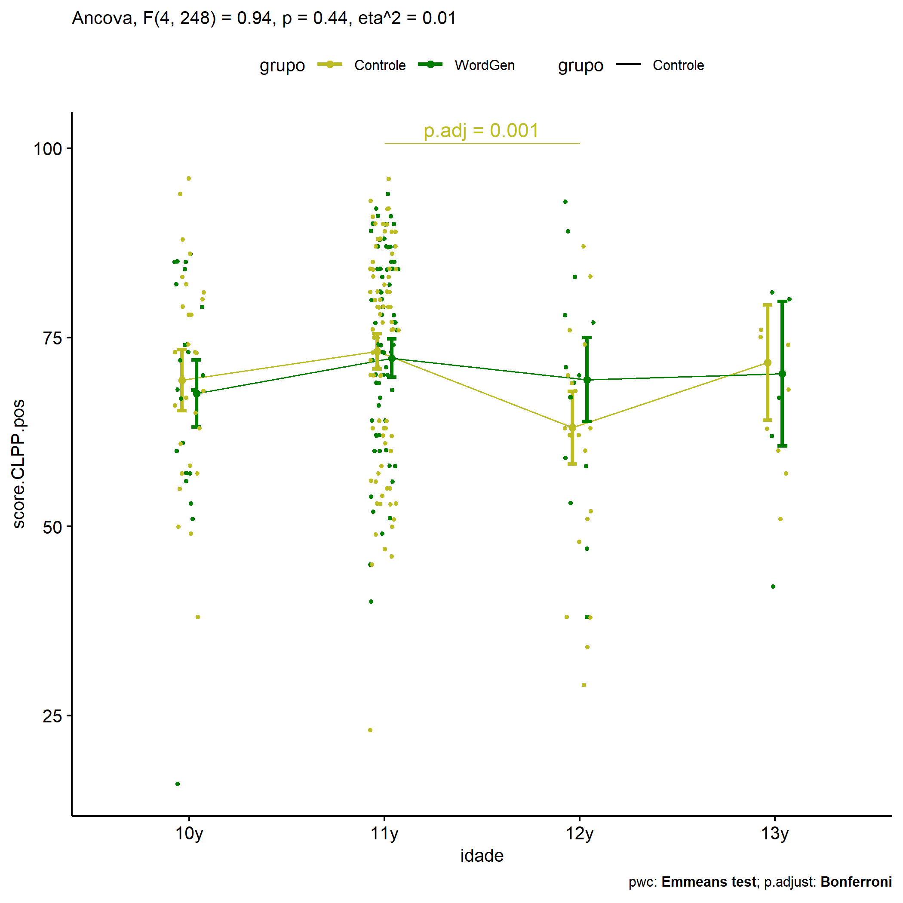<!-- -->

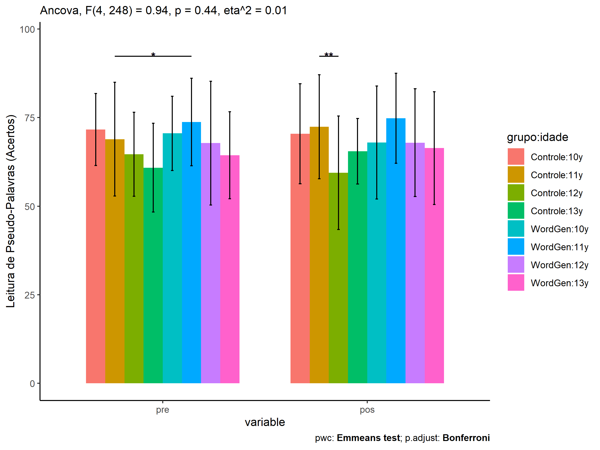<!-- -->

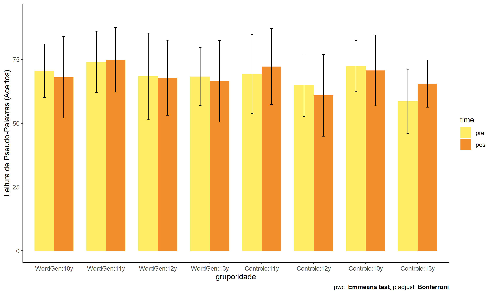<!-- -->

### Correta Regular (Acertos)

| var          | idade | grupo    |   n | M (pre) | SE (pre) | M (unadj) | SE (unadj) | M (adj) | SE (adj) |
|:-------------|:------|:---------|----:|--------:|---------:|----------:|-----------:|--------:|---------:|
| score.CR.pos | 10y   | Controle |  32 |  14.938 |    0.643 |    14.094 |      0.972 |  14.035 |    0.926 |
| score.CR.pos | 10y   | WordGen  |  23 |  15.217 |    0.613 |    14.478 |      0.827 |  14.368 |    1.093 |
| score.CR.pos | 11y   | Controle |  93 |  14.301 |    0.420 |    14.398 |      0.531 |  14.458 |    0.543 |
| score.CR.pos | 11y   | WordGen  |  79 |  15.861 |    0.397 |    14.937 |      0.547 |  14.707 |    0.597 |
| score.CR.pos | 12y   | Controle |  26 |  13.538 |    0.996 |    10.923 |      1.244 |  11.125 |    1.030 |
| score.CR.pos | 12y   | WordGen  |  17 |  14.353 |    1.248 |    13.882 |      1.124 |  13.933 |    1.270 |
| score.CR.pos | 13y   | Controle |  10 |  12.900 |    0.983 |    11.100 |      2.121 |  11.421 |    1.661 |
| score.CR.pos | 13y   | WordGen  |   8 |  14.250 |    1.031 |     8.875 |      2.875 |   8.945 |    1.851 |
| score.CR.pos | 14y   | WordGen  |   5 |   7.000 |    3.376 |     2.800 |      2.800 |   4.219 |    2.415 |

|     | .y.          | grupo    | idade | group1   | group2  | estimate | conf.low | conf.high |    se | statistic | p       | p.adj   | p.adj.signif |
|:----|:-------------|:---------|:------|:---------|:--------|---------:|---------:|----------:|------:|----------:|:--------|:--------|:-------------|
| 1   | score.CR.pos | Controle |       | 10y      | 11y     |   -0.423 |   -2.537 |     1.692 | 1.074 |    -0.393 | 0.694   | 1       | ns           |
| 2   | score.CR.pos | Controle |       | 10y      | 12y     |    2.910 |    0.181 |     5.640 | 1.387 |     2.099 | 0.037   | 0.22    | ns           |
| 3   | score.CR.pos | Controle |       | 10y      | 13y     |    2.614 |   -1.132 |     6.361 | 1.903 |     1.374 | 0.171   | 1       | ns           |
| 5   | score.CR.pos | Controle |       | 11y      | 12y     |    3.333 |    1.044 |     5.622 | 1.163 |     2.866 | 0.004   | 0.027   | \*           |
| 6   | score.CR.pos | Controle |       | 11y      | 13y     |    3.037 |   -0.399 |     6.473 | 1.746 |     1.740 | 0.083   | 0.498   | ns           |
| 8   | score.CR.pos | Controle |       | 12y      | 13y     |   -0.296 |   -4.132 |     3.540 | 1.949 |    -0.152 | 0.879   | 1       | ns           |
| 11  | score.CR.pos | WordGen  |       | 10y      | 11y     |   -0.339 |   -2.782 |     2.105 | 1.241 |    -0.273 | 0.785   | 1       | ns           |
| 12  | score.CR.pos | WordGen  |       | 10y      | 12y     |    0.435 |   -2.864 |     3.734 | 1.676 |     0.260 | 0.795   | 1       | ns           |
| 13  | score.CR.pos | WordGen  |       | 10y      | 13y     |    5.423 |    1.191 |     9.656 | 2.150 |     2.522 | 0.012   | 0.122   | ns           |
| 14  | score.CR.pos | WordGen  |       | 10y      | 14y     |   10.149 |    4.910 |    15.387 | 2.661 |     3.813 | \<0.001 | 0.002   | \*\*         |
| 15  | score.CR.pos | WordGen  |       | 11y      | 12y     |    0.774 |   -1.991 |     3.539 | 1.405 |     0.551 | 0.582   | 1       | ns           |
| 16  | score.CR.pos | WordGen  |       | 11y      | 13y     |    5.762 |    1.930 |     9.593 | 1.946 |     2.960 | 0.003   | 0.033   | \*           |
| 17  | score.CR.pos | WordGen  |       | 11y      | 14y     |   10.487 |    5.545 |    15.430 | 2.511 |     4.177 | \<0.001 | \<0.001 | \*\*\*       |
| 18  | score.CR.pos | WordGen  |       | 12y      | 13y     |    4.988 |    0.570 |     9.407 | 2.245 |     2.222 | 0.027   | 0.271   | ns           |
| 19  | score.CR.pos | WordGen  |       | 12y      | 14y     |    9.714 |    4.351 |    15.076 | 2.724 |     3.566 | \<0.001 | 0.004   | \*\*         |
| 20  | score.CR.pos | WordGen  |       | 13y      | 14y     |    4.725 |   -1.254 |    10.704 | 3.038 |     1.556 | 0.121   | 1       | ns           |
| 21  | score.CR.pre | Controle |       | 10y      | 11y     |    0.636 |   -0.974 |     2.246 | 0.818 |     0.778 | 0.437   | 1       | ns           |
| 22  | score.CR.pre | Controle |       | 10y      | 12y     |    1.399 |   -0.675 |     3.473 | 1.054 |     1.328 | 0.185   | 1       | ns           |
| 23  | score.CR.pre | Controle |       | 10y      | 13y     |    2.037 |   -0.808 |     4.883 | 1.446 |     1.409 | 0.16    | 0.959   | ns           |
| 25  | score.CR.pre | Controle |       | 11y      | 12y     |    0.763 |   -0.980 |     2.505 | 0.885 |     0.861 | 0.39    | 1       | ns           |
| 26  | score.CR.pre | Controle |       | 11y      | 13y     |    1.401 |   -1.213 |     4.015 | 1.328 |     1.055 | 0.292   | 1       | ns           |
| 28  | score.CR.pre | Controle |       | 12y      | 13y     |    0.638 |   -2.285 |     3.562 | 1.485 |     0.430 | 0.668   | 1       | ns           |
| 31  | score.CR.pre | WordGen  |       | 10y      | 11y     |   -0.643 |   -2.505 |     1.218 | 0.946 |    -0.680 | 0.497   | 1       | ns           |
| 32  | score.CR.pre | WordGen  |       | 10y      | 12y     |    0.864 |   -1.648 |     3.377 | 1.277 |     0.677 | 0.499   | 1       | ns           |
| 33  | score.CR.pre | WordGen  |       | 10y      | 13y     |    0.967 |   -2.257 |     4.192 | 1.638 |     0.591 | 0.555   | 1       | ns           |
| 34  | score.CR.pre | WordGen  |       | 10y      | 14y     |    8.217 |    4.341 |    12.094 | 1.969 |     4.173 | \<0.001 | \<0.001 | \*\*\*       |
| 35  | score.CR.pre | WordGen  |       | 11y      | 12y     |    1.508 |   -0.592 |     3.608 | 1.067 |     1.413 | 0.159   | 1       | ns           |
| 36  | score.CR.pre | WordGen  |       | 11y      | 13y     |    1.611 |   -1.304 |     4.525 | 1.481 |     1.088 | 0.278   | 1       | ns           |
| 37  | score.CR.pre | WordGen  |       | 11y      | 14y     |    8.861 |    5.238 |    12.483 | 1.840 |     4.814 | \<0.001 | \<0.001 | \*\*\*\*     |
| 38  | score.CR.pre | WordGen  |       | 12y      | 13y     |    0.103 |   -3.265 |     3.471 | 1.711 |     0.060 | 0.952   | 1       | ns           |
| 39  | score.CR.pre | WordGen  |       | 12y      | 14y     |    7.353 |    3.356 |    11.349 | 2.030 |     3.621 | \<0.001 | 0.003   | \*\*         |
| 40  | score.CR.pre | WordGen  |       | 13y      | 14y     |    7.250 |    2.772 |    11.728 | 2.275 |     3.187 | 0.002   | 0.016   | \*           |
| 41  | score.CR.pos |          | 10y   | Controle | WordGen |   -0.332 |   -3.150 |     2.485 | 1.431 |    -0.232 | 0.817   | 0.817   | ns           |
| 42  | score.CR.pos |          | 11y   | Controle | WordGen |   -0.249 |   -1.843 |     1.346 | 0.810 |    -0.307 | 0.759   | 0.759   | ns           |
| 43  | score.CR.pos |          | 12y   | Controle | WordGen |   -2.808 |   -6.024 |     0.409 | 1.634 |    -1.718 | 0.087   | 0.087   | ns           |
| 44  | score.CR.pos |          | 13y   | Controle | WordGen |    2.476 |   -2.416 |     7.369 | 2.486 |     0.996 | 0.32    | 0.32    | ns           |
| 46  | score.CR.pre |          | 10y   | Controle | WordGen |   -0.280 |   -2.427 |     1.868 | 1.091 |    -0.257 | 0.798   | 0.798   | ns           |
| 47  | score.CR.pre |          | 11y   | Controle | WordGen |   -1.560 |   -2.762 |    -0.358 | 0.611 |    -2.554 | 0.011   | 0.011   | \*           |
| 48  | score.CR.pre |          | 12y   | Controle | WordGen |   -0.814 |   -3.265 |     1.636 | 1.245 |    -0.654 | 0.513   | 0.513   | ns           |
| 49  | score.CR.pre |          | 13y   | Controle | WordGen |   -1.350 |   -5.076 |     2.376 | 1.893 |    -0.713 | 0.476   | 0.476   | ns           |

| grupo    | idade | group1 | group2 | estimate | conf.low | conf.high |    se | statistic |     p | p.adj | p.adj.signif |
|:---------|:------|:-------|:-------|---------:|---------:|----------:|------:|----------:|------:|------:|:-------------|
| Controle | 10y   | pre    | pos    |    0.844 |   -1.454 |     3.141 | 1.170 |     0.721 | 0.471 | 0.471 | ns           |
| Controle | 11y   | pre    | pos    |   -0.097 |   -1.445 |     1.251 | 0.686 |    -0.141 | 0.888 | 0.888 | ns           |
| Controle | 12y   | pre    | pos    |    2.615 |    0.066 |     5.165 | 1.298 |     2.015 | 0.044 | 0.044 | \*           |
| Controle | 13y   | pre    | pos    |    1.800 |   -2.310 |     5.910 | 2.093 |     0.860 | 0.390 | 0.390 | ns           |
| WordGen  | 10y   | pre    | pos    |    0.739 |   -1.971 |     3.449 | 1.380 |     0.536 | 0.592 | 0.592 | ns           |
| WordGen  | 11y   | pre    | pos    |    0.924 |   -0.538 |     2.386 | 0.745 |     1.241 | 0.215 | 0.215 | ns           |
| WordGen  | 12y   | pre    | pos    |    0.471 |   -2.682 |     3.623 | 1.605 |     0.293 | 0.769 | 0.769 | ns           |
| WordGen  | 13y   | pre    | pos    |    5.375 |    0.780 |     9.970 | 2.340 |     2.297 | 0.022 | 0.022 | \*           |
| WordGen  | 14y   | pre    | pos    |    4.200 |   -1.613 |    10.013 | 2.959 |     1.419 | 0.156 | 0.156 | ns           |

    ## Scale for colour is already present.
    ## Adding another scale for colour, which will replace the existing scale.

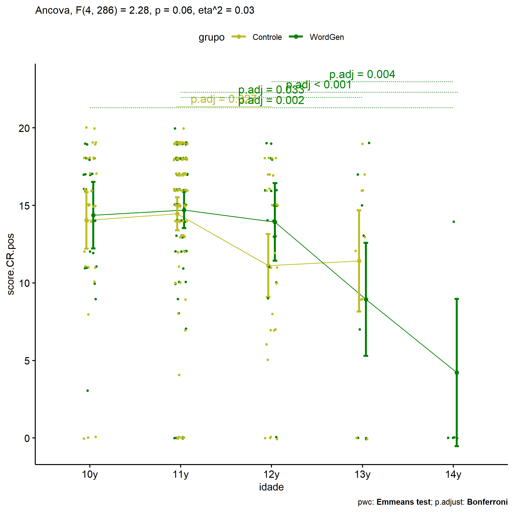<!-- -->

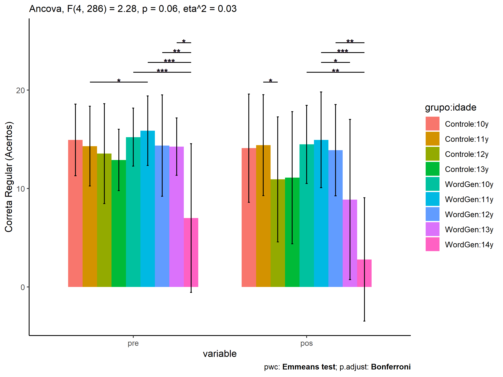<!-- -->

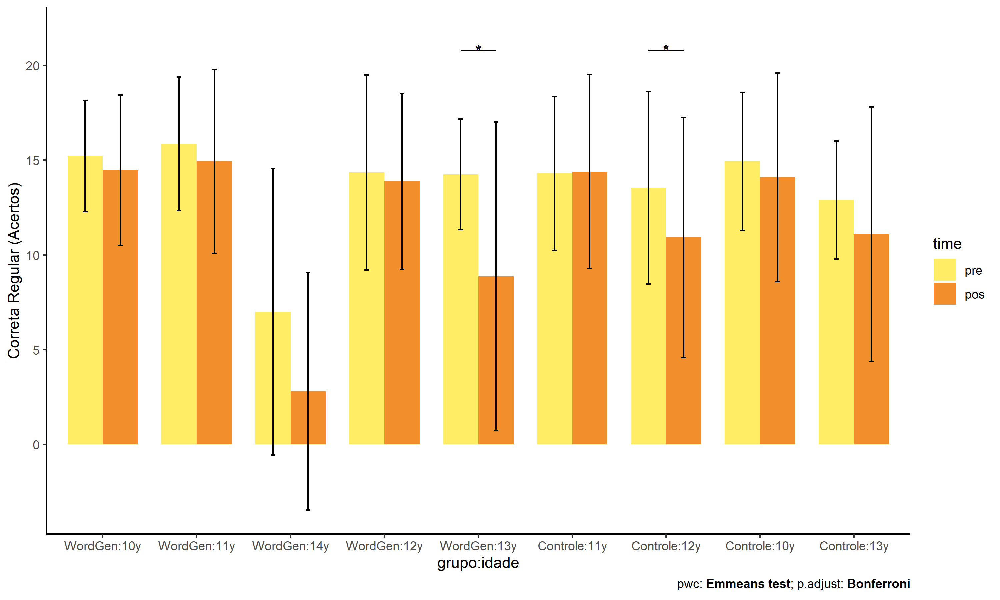<!-- -->

### Correta Irregular (Acertos)

| var          | idade | grupo    |   n | M (pre) | SE (pre) | M (unadj) | SE (unadj) | M (adj) | SE (adj) |
|:-------------|:------|:---------|----:|--------:|---------:|----------:|-----------:|--------:|---------:|
| score.CI.pos | 10y   | Controle |  32 |  11.906 |    0.642 |    11.000 |      0.904 |  10.938 |    0.825 |
| score.CI.pos | 10y   | WordGen  |  23 |  12.087 |    0.599 |    12.783 |      0.757 |  12.649 |    0.973 |
| score.CI.pos | 11y   | Controle |  93 |  11.667 |    0.435 |    11.312 |      0.518 |  11.345 |    0.484 |
| score.CI.pos | 11y   | WordGen  |  79 |  12.443 |    0.400 |    12.367 |      0.500 |  12.092 |    0.527 |
| score.CI.pos | 12y   | Controle |  26 |  11.000 |    0.874 |    10.192 |      1.140 |  10.491 |    0.917 |
| score.CI.pos | 12y   | WordGen  |  17 |  11.471 |    1.135 |    11.824 |      0.967 |  11.935 |    1.132 |
| score.CI.pos | 13y   | Controle |  10 |   9.800 |    0.867 |     8.700 |      1.739 |   9.476 |    1.482 |
| score.CI.pos | 13y   | WordGen  |   8 |  13.125 |    0.895 |     9.000 |      2.745 |   8.453 |    1.653 |
| score.CI.pos | 14y   | WordGen  |   5 |   6.400 |    2.874 |     2.400 |      2.400 |   4.528 |    2.121 |

|     | .y.          | grupo    | idade | group1   | group2  | estimate | conf.low | conf.high |    se | statistic | p       | p.adj | p.adj.signif |
|:----|:-------------|:---------|:------|:---------|:--------|---------:|---------:|----------:|------:|----------:|:--------|------:|:-------------|
| 1   | score.CI.pos | Controle |       | 10y      | 11y     |   -0.407 |   -2.290 |     1.476 | 0.957 |    -0.426 | 0.671   | 1.000 | ns           |
| 2   | score.CI.pos | Controle |       | 10y      | 12y     |    0.447 |   -1.981 |     2.876 | 1.234 |     0.362 | 0.717   | 1.000 | ns           |
| 3   | score.CI.pos | Controle |       | 10y      | 13y     |    1.462 |   -1.879 |     4.803 | 1.697 |     0.861 | 0.39    | 1.000 | ns           |
| 5   | score.CI.pos | Controle |       | 11y      | 12y     |    0.854 |   -1.186 |     2.894 | 1.036 |     0.824 | 0.41    | 1.000 | ns           |
| 6   | score.CI.pos | Controle |       | 11y      | 13y     |    1.869 |   -1.199 |     4.937 | 1.559 |     1.199 | 0.231   | 1.000 | ns           |
| 8   | score.CI.pos | Controle |       | 12y      | 13y     |    1.015 |   -2.407 |     4.437 | 1.739 |     0.584 | 0.56    | 1.000 | ns           |
| 11  | score.CI.pos | WordGen  |       | 10y      | 11y     |    0.557 |   -1.620 |     2.734 | 1.106 |     0.504 | 0.615   | 1.000 | ns           |
| 12  | score.CI.pos | WordGen  |       | 10y      | 12y     |    0.714 |   -2.225 |     3.653 | 1.493 |     0.478 | 0.633   | 1.000 | ns           |
| 13  | score.CI.pos | WordGen  |       | 10y      | 13y     |    4.196 |    0.422 |     7.969 | 1.917 |     2.189 | 0.029   | 0.294 | ns           |
| 14  | score.CI.pos | WordGen  |       | 10y      | 14y     |    8.120 |    3.519 |    12.722 | 2.338 |     3.473 | \<0.001 | 0.006 | \*\*         |
| 15  | score.CI.pos | WordGen  |       | 11y      | 12y     |    0.157 |   -2.303 |     2.616 | 1.250 |     0.125 | 0.9     | 1.000 | ns           |
| 16  | score.CI.pos | WordGen  |       | 11y      | 13y     |    3.638 |    0.229 |     7.048 | 1.732 |     2.100 | 0.037   | 0.366 | ns           |
| 17  | score.CI.pos | WordGen  |       | 11y      | 14y     |    7.563 |    3.244 |    11.883 | 2.194 |     3.447 | \<0.001 | 0.007 | \*\*         |
| 18  | score.CI.pos | WordGen  |       | 12y      | 13y     |    3.482 |   -0.464 |     7.427 | 2.004 |     1.737 | 0.083   | 0.835 | ns           |
| 19  | score.CI.pos | WordGen  |       | 12y      | 14y     |    7.407 |    2.680 |    12.133 | 2.401 |     3.084 | 0.002   | 0.022 | \*           |
| 20  | score.CI.pos | WordGen  |       | 13y      | 14y     |    3.925 |   -1.396 |     9.246 | 2.703 |     1.452 | 0.148   | 1.000 | ns           |
| 21  | score.CI.pre | Controle |       | 10y      | 11y     |    0.240 |   -1.333 |     1.812 | 0.799 |     0.300 | 0.764   | 1.000 | ns           |
| 22  | score.CI.pre | Controle |       | 10y      | 12y     |    0.906 |   -1.119 |     2.932 | 1.029 |     0.881 | 0.379   | 1.000 | ns           |
| 23  | score.CI.pre | Controle |       | 10y      | 13y     |    2.106 |   -0.673 |     4.886 | 1.412 |     1.492 | 0.137   | 0.822 | ns           |
| 25  | score.CI.pre | Controle |       | 11y      | 12y     |    0.667 |   -1.035 |     2.369 | 0.865 |     0.771 | 0.441   | 1.000 | ns           |
| 26  | score.CI.pre | Controle |       | 11y      | 13y     |    1.867 |   -0.687 |     4.420 | 1.297 |     1.439 | 0.151   | 0.907 | ns           |
| 28  | score.CI.pre | Controle |       | 12y      | 13y     |    1.200 |   -1.655 |     4.055 | 1.450 |     0.827 | 0.409   | 1.000 | ns           |
| 31  | score.CI.pre | WordGen  |       | 10y      | 11y     |   -0.356 |   -2.174 |     1.462 | 0.923 |    -0.386 | 0.7     | 1.000 | ns           |
| 32  | score.CI.pre | WordGen  |       | 10y      | 12y     |    0.616 |   -1.838 |     3.070 | 1.247 |     0.494 | 0.621   | 1.000 | ns           |
| 33  | score.CI.pre | WordGen  |       | 10y      | 13y     |   -1.038 |   -4.187 |     2.111 | 1.600 |    -0.649 | 0.517   | 1.000 | ns           |
| 34  | score.CI.pre | WordGen  |       | 10y      | 14y     |    5.687 |    1.901 |     9.473 | 1.923 |     2.957 | 0.003   | 0.034 | \*           |
| 35  | score.CI.pre | WordGen  |       | 11y      | 12y     |    0.972 |   -1.079 |     3.024 | 1.042 |     0.933 | 0.352   | 1.000 | ns           |
| 36  | score.CI.pre | WordGen  |       | 11y      | 13y     |   -0.682 |   -3.528 |     2.165 | 1.446 |    -0.472 | 0.638   | 1.000 | ns           |
| 37  | score.CI.pre | WordGen  |       | 11y      | 14y     |    6.043 |    2.505 |     9.581 | 1.797 |     3.362 | \<0.001 | 0.009 | \*\*         |
| 38  | score.CI.pre | WordGen  |       | 12y      | 13y     |   -1.654 |   -4.944 |     1.635 | 1.671 |    -0.990 | 0.323   | 1.000 | ns           |
| 39  | score.CI.pre | WordGen  |       | 12y      | 14y     |    5.071 |    1.167 |     8.974 | 1.983 |     2.557 | 0.011   | 0.111 | ns           |
| 40  | score.CI.pre | WordGen  |       | 13y      | 14y     |    6.725 |    2.351 |    11.099 | 2.222 |     3.026 | 0.003   | 0.027 | \*           |
| 41  | score.CI.pos |          | 10y   | Controle | WordGen |   -1.711 |   -4.222 |     0.801 | 1.276 |    -1.341 | 0.181   | 0.181 | ns           |
| 42  | score.CI.pos |          | 11y   | Controle | WordGen |   -0.746 |   -2.156 |     0.663 | 0.716 |    -1.042 | 0.298   | 0.298 | ns           |
| 43  | score.CI.pos |          | 12y   | Controle | WordGen |   -1.444 |   -4.310 |     1.422 | 1.456 |    -0.992 | 0.322   | 0.322 | ns           |
| 44  | score.CI.pos |          | 13y   | Controle | WordGen |    1.023 |   -3.359 |     5.405 | 2.226 |     0.459 | 0.646   | 0.646 | ns           |
| 46  | score.CI.pre |          | 10y   | Controle | WordGen |   -0.181 |   -2.278 |     1.917 | 1.066 |    -0.170 | 0.865   | 0.865 | ns           |
| 47  | score.CI.pre |          | 11y   | Controle | WordGen |   -0.776 |   -1.950 |     0.398 | 0.596 |    -1.302 | 0.194   | 0.194 | ns           |
| 48  | score.CI.pre |          | 12y   | Controle | WordGen |   -0.471 |   -2.864 |     1.922 | 1.216 |    -0.387 | 0.699   | 0.699 | ns           |
| 49  | score.CI.pre |          | 13y   | Controle | WordGen |   -3.325 |   -6.964 |     0.314 | 1.849 |    -1.798 | 0.073   | 0.073 | ns           |

| grupo    | idade | group1 | group2 | estimate | conf.low | conf.high |    se | statistic |     p | p.adj | p.adj.signif |
|:---------|:------|:-------|:-------|---------:|---------:|----------:|------:|----------:|------:|------:|:-------------|
| Controle | 10y   | pre    | pos    |    0.906 |   -1.270 |     3.083 | 1.108 |     0.818 | 0.414 | 0.414 | ns           |
| Controle | 11y   | pre    | pos    |    0.355 |   -0.922 |     1.632 | 0.650 |     0.546 | 0.585 | 0.585 | ns           |
| Controle | 12y   | pre    | pos    |    0.808 |   -1.607 |     3.222 | 1.229 |     0.657 | 0.511 | 0.511 | ns           |
| Controle | 13y   | pre    | pos    |    1.100 |   -2.794 |     4.994 | 1.982 |     0.555 | 0.579 | 0.579 | ns           |
| WordGen  | 10y   | pre    | pos    |   -0.696 |   -3.263 |     1.872 | 1.307 |    -0.532 | 0.595 | 0.595 | ns           |
| WordGen  | 11y   | pre    | pos    |    0.076 |   -1.309 |     1.461 | 0.705 |     0.108 | 0.914 | 0.914 | ns           |
| WordGen  | 12y   | pre    | pos    |   -0.353 |   -3.339 |     2.633 | 1.520 |    -0.232 | 0.817 | 0.817 | ns           |
| WordGen  | 13y   | pre    | pos    |    4.125 |   -0.228 |     8.478 | 2.216 |     1.861 | 0.063 | 0.063 | ns           |
| WordGen  | 14y   | pre    | pos    |    4.000 |   -1.506 |     9.506 | 2.803 |     1.427 | 0.154 | 0.154 | ns           |

    ## Scale for colour is already present.
    ## Adding another scale for colour, which will replace the existing scale.

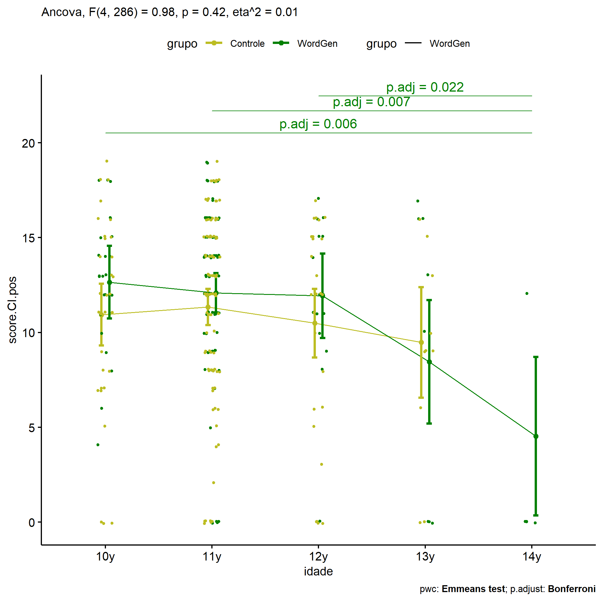<!-- -->

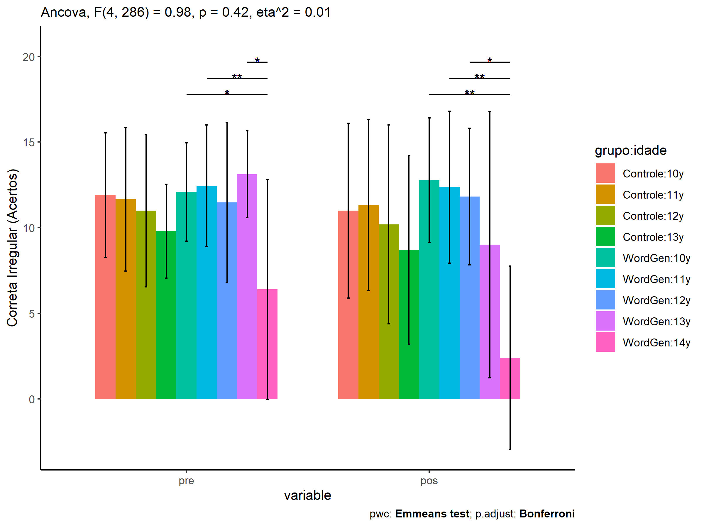<!-- -->

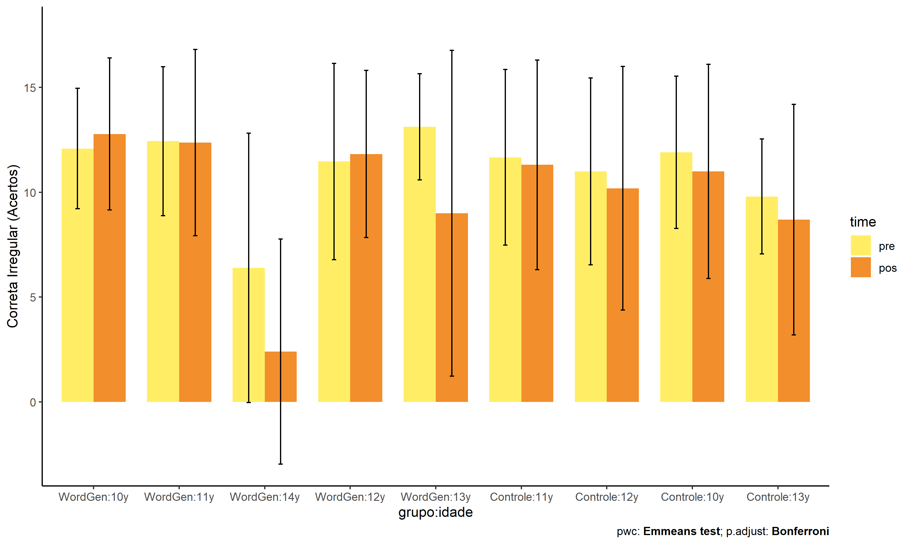<!-- -->

### Trocas Visuais (Acertos)

| var          | idade | grupo    |   n | M (pre) | SE (pre) | M (unadj) | SE (unadj) | M (adj) | SE (adj) |
|:-------------|:------|:---------|----:|--------:|---------:|----------:|-----------:|--------:|---------:|
| score.TV.pos | 10y   | Controle |  32 |  17.406 |    0.649 |    15.688 |      1.024 |  15.496 |    0.995 |
| score.TV.pos | 10y   | WordGen  |  23 |  17.087 |    0.603 |    16.217 |      0.853 |  16.081 |    1.171 |
| score.TV.pos | 11y   | Controle |  93 |  16.280 |    0.459 |    15.688 |      0.605 |  15.692 |    0.581 |
| score.TV.pos | 11y   | WordGen  |  79 |  17.228 |    0.435 |    16.215 |      0.585 |  16.055 |    0.635 |
| score.TV.pos | 12y   | Controle |  26 |  14.192 |    1.105 |    12.154 |      1.227 |  12.518 |    1.111 |
| score.TV.pos | 12y   | WordGen  |  17 |  15.353 |    1.309 |    15.647 |      1.251 |  15.811 |    1.362 |
| score.TV.pos | 13y   | Controle |  10 |  13.900 |    1.362 |    13.100 |      2.287 |  13.515 |    1.783 |
| score.TV.pos | 13y   | WordGen  |   8 |  16.625 |    1.335 |     9.000 |      2.964 |   8.944 |    1.983 |
| score.TV.pos | 14y   | WordGen  |   5 |   9.800 |    4.477 |     1.600 |      1.600 |   2.724 |    2.556 |

|     | .y.          | grupo    | idade | group1   | group2  | estimate | conf.low | conf.high |    se | statistic | p       | p.adj   | p.adj.signif |
|:----|:-------------|:---------|:------|:---------|:--------|---------:|---------:|----------:|------:|----------:|:--------|:--------|:-------------|
| 1   | score.TV.pos | Controle |       | 10y      | 11y     |   -0.196 |   -2.464 |     2.073 | 1.152 |    -0.170 | 0.865   | 1       | ns           |
| 2   | score.TV.pos | Controle |       | 10y      | 12y     |    2.978 |    0.024 |     5.931 | 1.500 |     1.985 | 0.048   | 0.289   | ns           |
| 3   | score.TV.pos | Controle |       | 10y      | 13y     |    1.981 |   -2.052 |     6.014 | 2.049 |     0.967 | 0.334   | 1       | ns           |
| 5   | score.TV.pos | Controle |       | 11y      | 12y     |    3.173 |    0.705 |     5.642 | 1.254 |     2.531 | 0.012   | 0.072   | ns           |
| 6   | score.TV.pos | Controle |       | 11y      | 13y     |    2.177 |   -1.514 |     5.867 | 1.875 |     1.161 | 0.247   | 1       | ns           |
| 8   | score.TV.pos | Controle |       | 12y      | 13y     |   -0.997 |   -5.104 |     3.111 | 2.087 |    -0.478 | 0.633   | 1       | ns           |
| 11  | score.TV.pos | WordGen  |       | 10y      | 11y     |    0.027 |   -2.589 |     2.642 | 1.329 |     0.020 | 0.984   | 1       | ns           |
| 12  | score.TV.pos | WordGen  |       | 10y      | 12y     |    0.270 |   -3.269 |     3.810 | 1.798 |     0.150 | 0.881   | 1       | ns           |
| 13  | score.TV.pos | WordGen  |       | 10y      | 13y     |    7.137 |    2.606 |    11.669 | 2.302 |     3.101 | 0.002   | 0.021   | \*           |
| 14  | score.TV.pos | WordGen  |       | 10y      | 14y     |   13.357 |    7.804 |    18.910 | 2.821 |     4.734 | \<0.001 | \<0.001 | \*\*\*\*     |
| 15  | score.TV.pos | WordGen  |       | 11y      | 12y     |    0.244 |   -2.720 |     3.208 | 1.506 |     0.162 | 0.871   | 1       | ns           |
| 16  | score.TV.pos | WordGen  |       | 11y      | 13y     |    7.111 |    3.015 |    11.207 | 2.081 |     3.417 | \<0.001 | 0.007   | \*\*         |
| 17  | score.TV.pos | WordGen  |       | 11y      | 14y     |   13.330 |    8.122 |    18.539 | 2.646 |     5.037 | \<0.001 | \<0.001 | \*\*\*\*     |
| 18  | score.TV.pos | WordGen  |       | 12y      | 13y     |    6.867 |    2.131 |    11.603 | 2.406 |     2.854 | 0.005   | 0.046   | \*           |
| 19  | score.TV.pos | WordGen  |       | 12y      | 14y     |   13.087 |    7.411 |    18.763 | 2.884 |     4.538 | \<0.001 | \<0.001 | \*\*\*\*     |
| 20  | score.TV.pos | WordGen  |       | 13y      | 14y     |    6.220 |   -0.155 |    12.594 | 3.238 |     1.921 | 0.056   | 0.558   | ns           |
| 21  | score.TV.pre | Controle |       | 10y      | 11y     |    1.127 |   -0.648 |     2.902 | 0.902 |     1.249 | 0.213   | 1       | ns           |
| 22  | score.TV.pre | Controle |       | 10y      | 12y     |    3.214 |    0.927 |     5.501 | 1.162 |     2.767 | 0.006   | 0.036   | \*           |
| 23  | score.TV.pre | Controle |       | 10y      | 13y     |    3.506 |    0.369 |     6.644 | 1.594 |     2.200 | 0.029   | 0.172   | ns           |
| 25  | score.TV.pre | Controle |       | 11y      | 12y     |    2.087 |    0.166 |     4.008 | 0.976 |     2.138 | 0.033   | 0.2     | ns           |
| 26  | score.TV.pre | Controle |       | 11y      | 13y     |    2.380 |   -0.503 |     5.262 | 1.464 |     1.625 | 0.105   | 0.631   | ns           |
| 28  | score.TV.pre | Controle |       | 12y      | 13y     |    0.292 |   -2.930 |     3.515 | 1.637 |     0.179 | 0.858   | 1       | ns           |
| 31  | score.TV.pre | WordGen  |       | 10y      | 11y     |   -0.141 |   -2.193 |     1.911 | 1.042 |    -0.135 | 0.893   | 1       | ns           |
| 32  | score.TV.pre | WordGen  |       | 10y      | 12y     |    1.734 |   -1.036 |     4.504 | 1.407 |     1.232 | 0.219   | 1       | ns           |
| 33  | score.TV.pre | WordGen  |       | 10y      | 13y     |    0.462 |   -3.093 |     4.017 | 1.806 |     0.256 | 0.798   | 1       | ns           |
| 34  | score.TV.pre | WordGen  |       | 10y      | 14y     |    7.287 |    3.014 |    11.560 | 2.171 |     3.356 | \<0.001 | 0.009   | \*\*         |
| 35  | score.TV.pre | WordGen  |       | 11y      | 12y     |    1.875 |   -0.441 |     4.190 | 1.176 |     1.594 | 0.112   | 1       | ns           |
| 36  | score.TV.pre | WordGen  |       | 11y      | 13y     |    0.603 |   -2.610 |     3.816 | 1.632 |     0.369 | 0.712   | 1       | ns           |
| 37  | score.TV.pre | WordGen  |       | 11y      | 14y     |    7.428 |    3.434 |    11.422 | 2.029 |     3.661 | \<0.001 | 0.003   | \*\*         |
| 38  | score.TV.pre | WordGen  |       | 12y      | 13y     |   -1.272 |   -4.985 |     2.441 | 1.886 |    -0.674 | 0.501   | 1       | ns           |
| 39  | score.TV.pre | WordGen  |       | 12y      | 14y     |    5.553 |    1.147 |     9.959 | 2.238 |     2.481 | 0.014   | 0.137   | ns           |
| 40  | score.TV.pre | WordGen  |       | 13y      | 14y     |    6.825 |    1.888 |    11.762 | 2.508 |     2.721 | 0.007   | 0.069   | ns           |
| 41  | score.TV.pos |          | 10y   | Controle | WordGen |   -0.585 |   -3.603 |     2.433 | 1.533 |    -0.382 | 0.703   | 0.703   | ns           |
| 42  | score.TV.pos |          | 11y   | Controle | WordGen |   -0.363 |   -2.058 |     1.332 | 0.861 |    -0.422 | 0.674   | 0.674   | ns           |
| 43  | score.TV.pos |          | 12y   | Controle | WordGen |   -3.292 |   -6.740 |     0.155 | 1.751 |    -1.880 | 0.061   | 0.061   | ns           |
| 44  | score.TV.pos |          | 13y   | Controle | WordGen |    4.571 |   -0.680 |     9.823 | 2.668 |     1.713 | 0.088   | 0.088   | ns           |
| 46  | score.TV.pre |          | 10y   | Controle | WordGen |    0.319 |   -2.048 |     2.687 | 1.203 |     0.265 | 0.791   | 0.791   | ns           |
| 47  | score.TV.pre |          | 11y   | Controle | WordGen |   -0.948 |   -2.273 |     0.377 | 0.673 |    -1.409 | 0.16    | 0.16    | ns           |
| 48  | score.TV.pre |          | 12y   | Controle | WordGen |   -1.161 |   -3.862 |     1.541 | 1.372 |    -0.846 | 0.398   | 0.398   | ns           |
| 49  | score.TV.pre |          | 13y   | Controle | WordGen |   -2.725 |   -6.833 |     1.383 | 2.087 |    -1.306 | 0.193   | 0.193   | ns           |

| grupo    | idade | group1 | group2 | estimate | conf.low | conf.high |    se | statistic |     p | p.adj | p.adj.signif |
|:---------|:------|:-------|:-------|---------:|---------:|----------:|------:|----------:|------:|------:|:-------------|
| Controle | 10y   | pre    | pos    |    1.719 |   -0.767 |     4.205 | 1.266 |     1.358 | 0.175 | 0.175 | ns           |
| Controle | 11y   | pre    | pos    |    0.591 |   -0.867 |     2.050 | 0.743 |     0.796 | 0.426 | 0.426 | ns           |
| Controle | 12y   | pre    | pos    |    2.038 |   -0.720 |     4.797 | 1.404 |     1.452 | 0.147 | 0.147 | ns           |
| Controle | 13y   | pre    | pos    |    0.800 |   -3.647 |     5.247 | 2.264 |     0.353 | 0.724 | 0.724 | ns           |
| WordGen  | 10y   | pre    | pos    |    0.870 |   -2.063 |     3.802 | 1.493 |     0.582 | 0.561 | 0.561 | ns           |
| WordGen  | 11y   | pre    | pos    |    1.013 |   -0.570 |     2.595 | 0.806 |     1.257 | 0.209 | 0.209 | ns           |
| WordGen  | 12y   | pre    | pos    |   -0.294 |   -3.705 |     3.117 | 1.737 |    -0.169 | 0.866 | 0.866 | ns           |
| WordGen  | 13y   | pre    | pos    |    7.625 |    2.653 |    12.597 | 2.532 |     3.012 | 0.003 | 0.003 | \*\*         |
| WordGen  | 14y   | pre    | pos    |    8.200 |    1.910 |    14.490 | 3.202 |     2.561 | 0.011 | 0.011 | \*           |

    ## Scale for colour is already present.
    ## Adding another scale for colour, which will replace the existing scale.

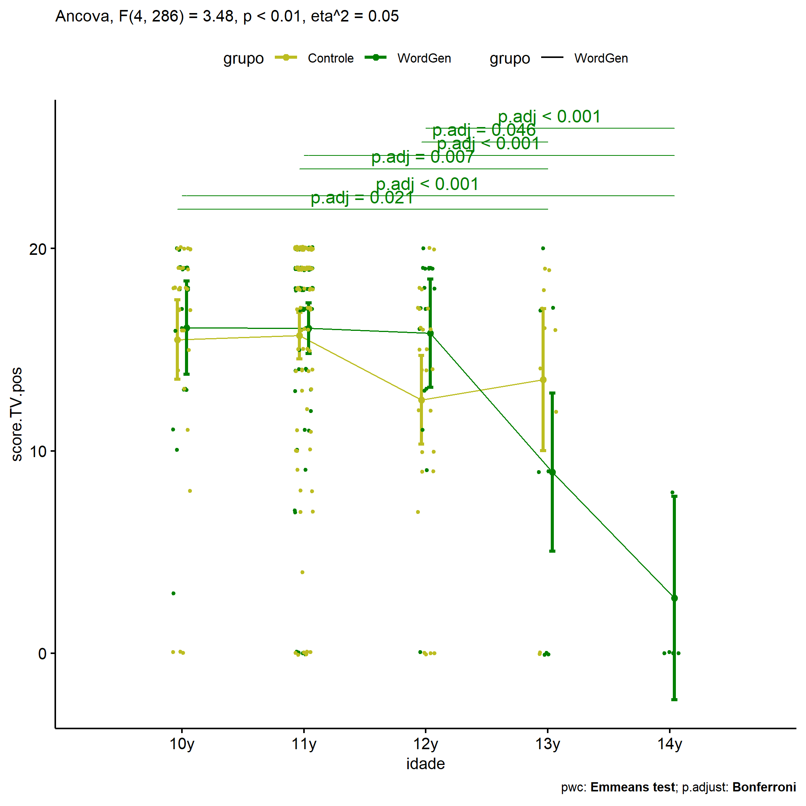<!-- -->

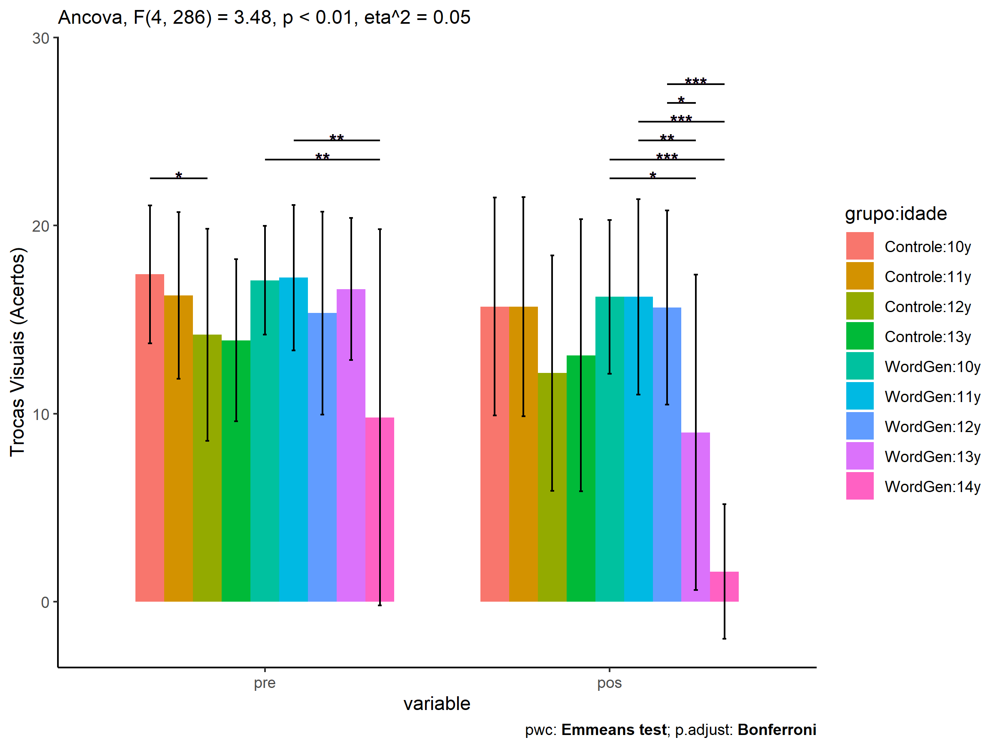<!-- -->

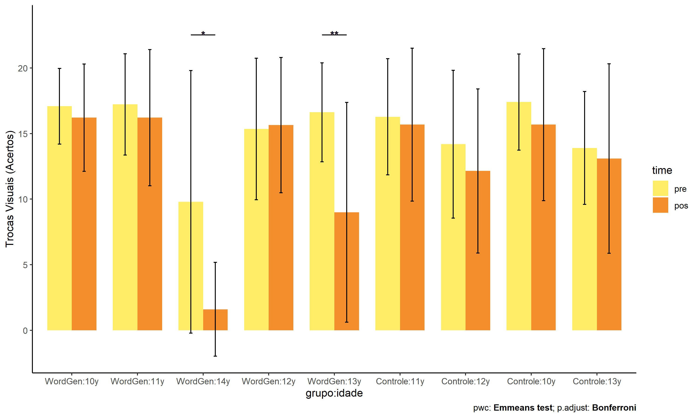<!-- -->

### Trocas Fonologicas (Acertos)

| var          | idade | grupo    |   n | M (pre) | SE (pre) | M (unadj) | SE (unadj) | M (adj) | SE (adj) |
|:-------------|:------|:---------|----:|--------:|---------:|----------:|-----------:|--------:|---------:|
| score.TF.pos | 10y   | Controle |  32 |  15.469 |    0.783 |    13.438 |      1.042 |  13.368 |    0.980 |
| score.TF.pos | 10y   | WordGen  |  23 |  16.000 |    0.714 |    14.261 |      0.837 |  14.008 |    1.158 |
| score.TF.pos | 11y   | Controle |  93 |  15.301 |    0.462 |    14.581 |      0.614 |  14.570 |    0.575 |
| score.TF.pos | 11y   | WordGen  |  79 |  16.468 |    0.437 |    15.506 |      0.588 |  15.091 |    0.630 |
| score.TF.pos | 12y   | Controle |  26 |  13.346 |    1.077 |    10.846 |      1.273 |  11.513 |    1.097 |
| score.TF.pos | 12y   | WordGen  |  17 |  14.765 |    1.371 |    14.471 |      1.353 |  14.646 |    1.345 |
| score.TF.pos | 13y   | Controle |  10 |  13.100 |    1.260 |    12.800 |      2.245 |  13.552 |    1.761 |
| score.TF.pos | 13y   | WordGen  |   8 |  15.375 |    1.238 |     8.875 |      2.894 |   8.838 |    1.961 |
| score.TF.pos | 14y   | WordGen  |   5 |   7.000 |    3.507 |     2.400 |      2.400 |   5.268 |    2.554 |

|     | .y.          | grupo    | idade | group1   | group2  | estimate | conf.low | conf.high |    se | statistic | p       | p.adj   | p.adj.signif |
|:----|:-------------|:---------|:------|:---------|:--------|---------:|---------:|----------:|------:|----------:|:--------|:--------|:-------------|
| 1   | score.TF.pos | Controle |       | 10y      | 11y     |   -1.201 |   -3.438 |     1.036 | 1.137 |    -1.057 | 0.291   | 1       | ns           |
| 2   | score.TF.pos | Controle |       | 10y      | 12y     |    1.855 |   -1.043 |     4.754 | 1.472 |     1.260 | 0.209   | 1       | ns           |
| 3   | score.TF.pos | Controle |       | 10y      | 13y     |   -0.184 |   -4.153 |     3.785 | 2.017 |    -0.091 | 0.927   | 1       | ns           |
| 5   | score.TF.pos | Controle |       | 11y      | 12y     |    3.057 |    0.618 |     5.495 | 1.239 |     2.468 | 0.014   | 0.085   | ns           |
| 6   | score.TF.pos | Controle |       | 11y      | 13y     |    1.017 |   -2.629 |     4.664 | 1.853 |     0.549 | 0.583   | 1       | ns           |
| 8   | score.TF.pos | Controle |       | 12y      | 13y     |   -2.039 |   -6.101 |     2.022 | 2.063 |    -0.988 | 0.324   | 1       | ns           |
| 11  | score.TF.pos | WordGen  |       | 10y      | 11y     |   -1.083 |   -3.670 |     1.504 | 1.314 |    -0.824 | 0.411   | 1       | ns           |
| 12  | score.TF.pos | WordGen  |       | 10y      | 12y     |   -0.638 |   -4.134 |     2.858 | 1.776 |    -0.359 | 0.72    | 1       | ns           |
| 13  | score.TF.pos | WordGen  |       | 10y      | 13y     |    5.169 |    0.688 |     9.650 | 2.277 |     2.271 | 0.024   | 0.239   | ns           |
| 14  | score.TF.pos | WordGen  |       | 10y      | 14y     |    8.740 |    3.197 |    14.283 | 2.816 |     3.104 | 0.002   | 0.021   | \*           |
| 15  | score.TF.pos | WordGen  |       | 11y      | 12y     |    0.445 |   -2.484 |     3.374 | 1.488 |     0.299 | 0.765   | 1       | ns           |
| 16  | score.TF.pos | WordGen  |       | 11y      | 13y     |    6.252 |    2.199 |    10.305 | 2.059 |     3.037 | 0.003   | 0.026   | \*           |
| 17  | score.TF.pos | WordGen  |       | 11y      | 14y     |    9.823 |    4.604 |    15.042 | 2.652 |     3.705 | \<0.001 | 0.003   | \*\*         |
| 18  | score.TF.pos | WordGen  |       | 12y      | 13y     |    5.807 |    1.127 |    10.488 | 2.378 |     2.442 | 0.015   | 0.152   | ns           |
| 19  | score.TF.pos | WordGen  |       | 12y      | 14y     |    9.378 |    3.711 |    15.045 | 2.879 |     3.257 | 0.001   | 0.013   | \*           |
| 20  | score.TF.pos | WordGen  |       | 13y      | 14y     |    3.571 |   -2.770 |     9.912 | 3.221 |     1.108 | 0.269   | 1       | ns           |
| 21  | score.TF.pre | Controle |       | 10y      | 11y     |    0.168 |   -1.625 |     1.960 | 0.911 |     0.184 | 0.854   | 1       | ns           |
| 22  | score.TF.pre | Controle |       | 10y      | 12y     |    2.123 |   -0.187 |     4.432 | 1.173 |     1.809 | 0.071   | 0.429   | ns           |
| 23  | score.TF.pre | Controle |       | 10y      | 13y     |    2.369 |   -0.800 |     5.537 | 1.610 |     1.472 | 0.142   | 0.854   | ns           |
| 25  | score.TF.pre | Controle |       | 11y      | 12y     |    1.955 |    0.015 |     3.895 | 0.986 |     1.983 | 0.048   | 0.29    | ns           |
| 26  | score.TF.pre | Controle |       | 11y      | 13y     |    2.201 |   -0.710 |     5.112 | 1.479 |     1.489 | 0.138   | 0.826   | ns           |
| 28  | score.TF.pre | Controle |       | 12y      | 13y     |    0.246 |   -3.008 |     3.501 | 1.653 |     0.149 | 0.882   | 1       | ns           |
| 31  | score.TF.pre | WordGen  |       | 10y      | 11y     |   -0.468 |   -2.541 |     1.604 | 1.053 |    -0.445 | 0.657   | 1       | ns           |
| 32  | score.TF.pre | WordGen  |       | 10y      | 12y     |    1.235 |   -1.562 |     4.033 | 1.421 |     0.869 | 0.385   | 1       | ns           |
| 33  | score.TF.pre | WordGen  |       | 10y      | 13y     |    0.625 |   -2.965 |     4.215 | 1.824 |     0.343 | 0.732   | 1       | ns           |
| 34  | score.TF.pre | WordGen  |       | 10y      | 14y     |    9.000 |    4.684 |    13.316 | 2.192 |     4.105 | \<0.001 | \<0.001 | \*\*\*       |
| 35  | score.TF.pre | WordGen  |       | 11y      | 12y     |    1.704 |   -0.635 |     4.042 | 1.188 |     1.434 | 0.153   | 1       | ns           |
| 36  | score.TF.pre | WordGen  |       | 11y      | 13y     |    1.093 |   -2.152 |     4.338 | 1.649 |     0.663 | 0.508   | 1       | ns           |
| 37  | score.TF.pre | WordGen  |       | 11y      | 14y     |    9.468 |    5.435 |    13.502 | 2.049 |     4.621 | \<0.001 | \<0.001 | \*\*\*\*     |
| 38  | score.TF.pre | WordGen  |       | 12y      | 13y     |   -0.610 |   -4.360 |     3.139 | 1.905 |    -0.320 | 0.749   | 1       | ns           |
| 39  | score.TF.pre | WordGen  |       | 12y      | 14y     |    7.765 |    3.315 |    12.214 | 2.261 |     3.435 | \<0.001 | 0.007   | \*\*         |
| 40  | score.TF.pre | WordGen  |       | 13y      | 14y     |    8.375 |    3.389 |    13.361 | 2.533 |     3.306 | 0.001   | 0.011   | \*           |
| 41  | score.TF.pos |          | 10y   | Controle | WordGen |   -0.639 |   -3.624 |     2.346 | 1.516 |    -0.422 | 0.674   | 0.674   | ns           |
| 42  | score.TF.pos |          | 11y   | Controle | WordGen |   -0.521 |   -2.200 |     1.158 | 0.853 |    -0.611 | 0.542   | 0.542   | ns           |
| 43  | score.TF.pos |          | 12y   | Controle | WordGen |   -3.133 |   -6.543 |     0.278 | 1.733 |    -1.808 | 0.072   | 0.072   | ns           |
| 44  | score.TF.pos |          | 13y   | Controle | WordGen |    4.714 |   -0.474 |     9.902 | 2.636 |     1.788 | 0.075   | 0.075   | ns           |
| 46  | score.TF.pre |          | 10y   | Controle | WordGen |   -0.531 |   -2.922 |     1.860 | 1.215 |    -0.437 | 0.662   | 0.662   | ns           |
| 47  | score.TF.pre |          | 11y   | Controle | WordGen |   -1.167 |   -2.505 |     0.171 | 0.680 |    -1.717 | 0.087   | 0.087   | ns           |
| 48  | score.TF.pre |          | 12y   | Controle | WordGen |   -1.419 |   -4.146 |     1.309 | 1.386 |    -1.024 | 0.307   | 0.307   | ns           |
| 49  | score.TF.pre |          | 13y   | Controle | WordGen |   -2.275 |   -6.424 |     1.874 | 2.108 |    -1.079 | 0.281   | 0.281   | ns           |

| grupo    | idade | group1 | group2 | estimate | conf.low | conf.high |    se | statistic |     p | p.adj | p.adj.signif |
|:---------|:------|:-------|:-------|---------:|---------:|----------:|------:|----------:|------:|------:|:-------------|
| Controle | 10y   | pre    | pos    |    2.031 |   -0.491 |     4.553 | 1.284 |     1.582 | 0.114 | 0.114 | ns           |
| Controle | 11y   | pre    | pos    |    0.720 |   -0.759 |     2.200 | 0.753 |     0.957 | 0.339 | 0.339 | ns           |
| Controle | 12y   | pre    | pos    |    2.500 |   -0.298 |     5.298 | 1.424 |     1.755 | 0.080 | 0.080 | ns           |
| Controle | 13y   | pre    | pos    |    0.300 |   -4.211 |     4.811 | 2.297 |     0.131 | 0.896 | 0.896 | ns           |
| WordGen  | 10y   | pre    | pos    |    1.739 |   -1.236 |     4.714 | 1.515 |     1.148 | 0.251 | 0.251 | ns           |
| WordGen  | 11y   | pre    | pos    |    0.962 |   -0.643 |     2.567 | 0.817 |     1.177 | 0.240 | 0.240 | ns           |
| WordGen  | 12y   | pre    | pos    |    0.294 |   -3.166 |     3.754 | 1.762 |     0.167 | 0.867 | 0.867 | ns           |
| WordGen  | 13y   | pre    | pos    |    6.500 |    1.456 |    11.544 | 2.568 |     2.531 | 0.012 | 0.012 | \*           |
| WordGen  | 14y   | pre    | pos    |    4.600 |   -1.780 |    10.980 | 3.248 |     1.416 | 0.157 | 0.157 | ns           |

    ## Scale for colour is already present.
    ## Adding another scale for colour, which will replace the existing scale.

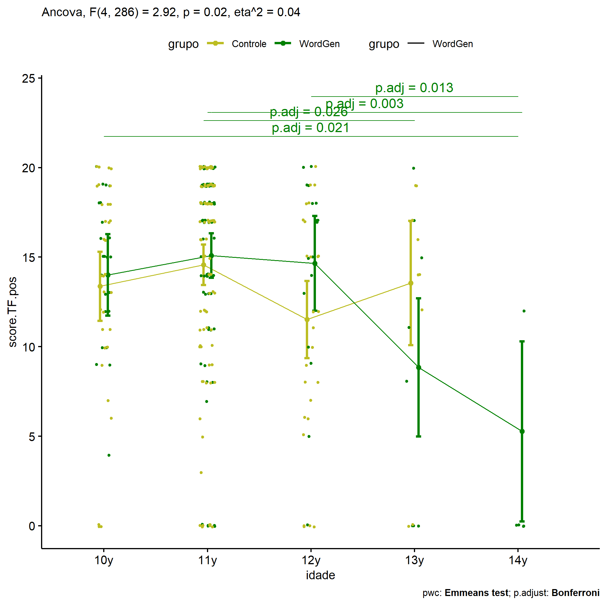<!-- -->

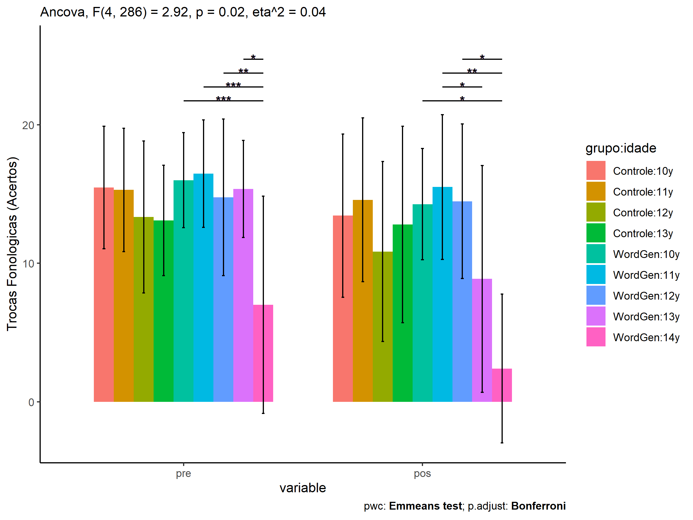<!-- -->

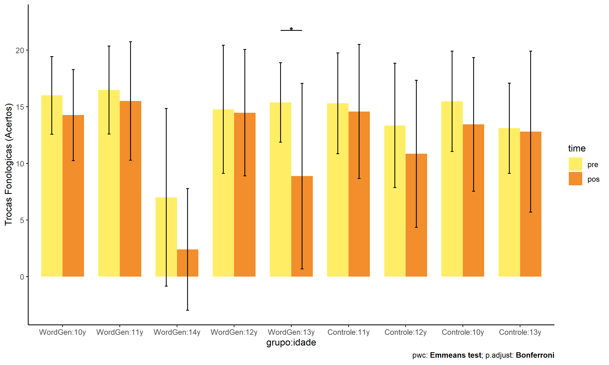<!-- -->

### Trocas Orograficas (Acertos)

| var          | idade | grupo    |   n | M (pre) | SE (pre) | M (unadj) | SE (unadj) | M (adj) | SE (adj) |
|:-------------|:------|:---------|----:|--------:|---------:|----------:|-----------:|--------:|---------:|
| score.TO.pos | 10y   | Controle |  32 |  10.406 |    0.811 |     9.812 |      0.839 |   9.595 |    0.778 |
| score.TO.pos | 10y   | WordGen  |  23 |  10.174 |    0.804 |    10.217 |      0.805 |  10.112 |    0.917 |
| score.TO.pos | 11y   | Controle |  93 |  10.226 |    0.474 |    10.785 |      0.517 |  10.655 |    0.456 |
| score.TO.pos | 11y   | WordGen  |  79 |  11.051 |    0.469 |    11.038 |      0.564 |  10.510 |    0.499 |
| score.TO.pos | 12y   | Controle |  26 |   7.808 |    0.706 |     7.385 |      0.889 |   8.421 |    0.872 |
| score.TO.pos | 12y   | WordGen  |  17 |   8.353 |    1.111 |     8.000 |      1.098 |   8.773 |    1.071 |
| score.TO.pos | 13y   | Controle |  10 |   8.900 |    0.994 |     6.700 |      1.342 |   7.209 |    1.391 |
| score.TO.pos | 13y   | WordGen  |   8 |   8.875 |    0.833 |     5.750 |      1.916 |   6.271 |    1.555 |
| score.TO.pos | 14y   | WordGen  |   5 |   4.200 |    1.960 |     3.000 |      3.000 |   5.777 |    1.997 |

|     | .y.          | grupo    | idade | group1   | group2  | estimate | conf.low | conf.high |    se | statistic | p       | p.adj | p.adj.signif |
|:----|:-------------|:---------|:------|:---------|:--------|---------:|---------:|----------:|------:|----------:|:--------|------:|:-------------|
| 1   | score.TO.pos | Controle |       | 10y      | 11y     |   -1.060 |   -2.833 |     0.714 | 0.901 |    -1.176 | 0.241   | 1.000 | ns           |
| 2   | score.TO.pos | Controle |       | 10y      | 12y     |    1.174 |   -1.132 |     3.480 | 1.171 |     1.002 | 0.317   | 1.000 | ns           |
| 3   | score.TO.pos | Controle |       | 10y      | 13y     |    2.386 |   -0.754 |     5.525 | 1.595 |     1.496 | 0.136   | 0.815 | ns           |
| 5   | score.TO.pos | Controle |       | 11y      | 12y     |    2.233 |    0.292 |     4.175 | 0.986 |     2.264 | 0.024   | 0.146 | ns           |
| 6   | score.TO.pos | Controle |       | 11y      | 13y     |    3.445 |    0.561 |     6.329 | 1.465 |     2.352 | 0.019   | 0.116 | ns           |
| 8   | score.TO.pos | Controle |       | 12y      | 13y     |    1.212 |   -2.010 |     4.434 | 1.637 |     0.740 | 0.46    | 1.000 | ns           |
| 11  | score.TO.pos | WordGen  |       | 10y      | 11y     |   -0.398 |   -2.450 |     1.655 | 1.043 |    -0.381 | 0.703   | 1.000 | ns           |
| 12  | score.TO.pos | WordGen  |       | 10y      | 12y     |    1.339 |   -1.437 |     4.115 | 1.410 |     0.949 | 0.343   | 1.000 | ns           |
| 13  | score.TO.pos | WordGen  |       | 10y      | 13y     |    3.841 |    0.286 |     7.395 | 1.806 |     2.127 | 0.034   | 0.343 | ns           |
| 14  | score.TO.pos | WordGen  |       | 10y      | 14y     |    4.335 |    0.005 |     8.665 | 2.200 |     1.971 | 0.05    | 0.497 | ns           |
| 15  | score.TO.pos | WordGen  |       | 11y      | 12y     |    1.736 |   -0.600 |     4.072 | 1.187 |     1.463 | 0.145   | 1.000 | ns           |
| 16  | score.TO.pos | WordGen  |       | 11y      | 13y     |    4.238 |    1.017 |     7.459 | 1.636 |     2.590 | 0.01    | 0.101 | ns           |
| 17  | score.TO.pos | WordGen  |       | 11y      | 14y     |    4.732 |    0.657 |     8.807 | 2.070 |     2.286 | 0.023   | 0.230 | ns           |
| 18  | score.TO.pos | WordGen  |       | 12y      | 13y     |    2.502 |   -1.208 |     6.212 | 1.885 |     1.327 | 0.185   | 1.000 | ns           |
| 19  | score.TO.pos | WordGen  |       | 12y      | 14y     |    2.996 |   -1.434 |     7.426 | 2.251 |     1.331 | 0.184   | 1.000 | ns           |
| 20  | score.TO.pos | WordGen  |       | 13y      | 14y     |    0.494 |   -4.471 |     5.459 | 2.522 |     0.196 | 0.845   | 1.000 | ns           |
| 21  | score.TO.pre | Controle |       | 10y      | 11y     |    0.180 |   -1.533 |     1.894 | 0.871 |     0.207 | 0.836   | 1.000 | ns           |
| 22  | score.TO.pre | Controle |       | 10y      | 12y     |    2.599 |    0.391 |     4.806 | 1.122 |     2.317 | 0.021   | 0.127 | ns           |
| 23  | score.TO.pre | Controle |       | 10y      | 13y     |    1.506 |   -1.523 |     4.536 | 1.539 |     0.979 | 0.329   | 1.000 | ns           |
| 25  | score.TO.pre | Controle |       | 11y      | 12y     |    2.418 |    0.563 |     4.273 | 0.942 |     2.566 | 0.011   | 0.065 | ns           |
| 26  | score.TO.pre | Controle |       | 11y      | 13y     |    1.326 |   -1.457 |     4.109 | 1.414 |     0.938 | 0.349   | 1.000 | ns           |
| 28  | score.TO.pre | Controle |       | 12y      | 13y     |   -1.092 |   -4.204 |     2.019 | 1.581 |    -0.691 | 0.49    | 1.000 | ns           |
| 31  | score.TO.pre | WordGen  |       | 10y      | 11y     |   -0.877 |   -2.858 |     1.105 | 1.007 |    -0.871 | 0.384   | 1.000 | ns           |
| 32  | score.TO.pre | WordGen  |       | 10y      | 12y     |    1.821 |   -0.854 |     4.496 | 1.359 |     1.340 | 0.181   | 1.000 | ns           |
| 33  | score.TO.pre | WordGen  |       | 10y      | 13y     |    1.299 |   -2.133 |     4.731 | 1.744 |     0.745 | 0.457   | 1.000 | ns           |
| 34  | score.TO.pre | WordGen  |       | 10y      | 14y     |    5.974 |    1.848 |    10.100 | 2.096 |     2.850 | 0.005   | 0.047 | \*           |
| 35  | score.TO.pre | WordGen  |       | 11y      | 12y     |    2.698 |    0.462 |     4.933 | 1.136 |     2.375 | 0.018   | 0.182 | ns           |
| 36  | score.TO.pre | WordGen  |       | 11y      | 13y     |    2.176 |   -0.927 |     5.278 | 1.576 |     1.380 | 0.169   | 1.000 | ns           |
| 37  | score.TO.pre | WordGen  |       | 11y      | 14y     |    6.851 |    2.994 |    10.707 | 1.959 |     3.497 | \<0.001 | 0.005 | \*\*         |
| 38  | score.TO.pre | WordGen  |       | 12y      | 13y     |   -0.522 |   -4.107 |     3.063 | 1.821 |    -0.287 | 0.775   | 1.000 | ns           |
| 39  | score.TO.pre | WordGen  |       | 12y      | 14y     |    4.153 |   -0.101 |     8.407 | 2.161 |     1.922 | 0.056   | 0.557 | ns           |
| 40  | score.TO.pre | WordGen  |       | 13y      | 14y     |    4.675 |   -0.092 |     9.442 | 2.422 |     1.930 | 0.055   | 0.546 | ns           |
| 41  | score.TO.pos |          | 10y   | Controle | WordGen |   -0.517 |   -2.882 |     1.848 | 1.202 |    -0.430 | 0.667   | 0.667 | ns           |
| 42  | score.TO.pos |          | 11y   | Controle | WordGen |    0.145 |   -1.183 |     1.473 | 0.674 |     0.215 | 0.83    | 0.830 | ns           |
| 43  | score.TO.pos |          | 12y   | Controle | WordGen |   -0.352 |   -3.052 |     2.347 | 1.371 |    -0.257 | 0.797   | 0.797 | ns           |
| 44  | score.TO.pos |          | 13y   | Controle | WordGen |    0.938 |   -3.166 |     5.042 | 2.085 |     0.450 | 0.653   | 0.653 | ns           |
| 46  | score.TO.pre |          | 10y   | Controle | WordGen |    0.232 |   -2.054 |     2.518 | 1.161 |     0.200 | 0.842   | 0.842 | ns           |
| 47  | score.TO.pre |          | 11y   | Controle | WordGen |   -0.825 |   -2.104 |     0.455 | 0.650 |    -1.269 | 0.206   | 0.206 | ns           |
| 48  | score.TO.pre |          | 12y   | Controle | WordGen |   -0.545 |   -3.153 |     2.063 | 1.325 |    -0.411 | 0.681   | 0.681 | ns           |
| 49  | score.TO.pre |          | 13y   | Controle | WordGen |    0.025 |   -3.941 |     3.991 | 2.015 |     0.012 | 0.99    | 0.990 | ns           |

| grupo    | idade | group1 | group2 | estimate | conf.low | conf.high |    se | statistic |     p | p.adj | p.adj.signif |
|:---------|:------|:-------|:-------|---------:|---------:|----------:|------:|----------:|------:|------:|:-------------|
| Controle | 10y   | pre    | pos    |    0.594 |   -1.643 |     2.831 | 1.139 |     0.521 | 0.602 | 0.602 | ns           |
| Controle | 11y   | pre    | pos    |   -0.559 |   -1.871 |     0.753 | 0.668 |    -0.837 | 0.403 | 0.403 | ns           |
| Controle | 12y   | pre    | pos    |    0.423 |   -2.058 |     2.905 | 1.263 |     0.335 | 0.738 | 0.738 | ns           |
| Controle | 13y   | pre    | pos    |    2.200 |   -1.801 |     6.201 | 2.037 |     1.080 | 0.281 | 0.281 | ns           |
| WordGen  | 10y   | pre    | pos    |   -0.043 |   -2.682 |     2.595 | 1.343 |    -0.032 | 0.974 | 0.974 | ns           |
| WordGen  | 11y   | pre    | pos    |    0.013 |   -1.411 |     1.436 | 0.725 |     0.017 | 0.986 | 0.986 | ns           |
| WordGen  | 12y   | pre    | pos    |    0.353 |   -2.716 |     3.422 | 1.562 |     0.226 | 0.821 | 0.821 | ns           |
| WordGen  | 13y   | pre    | pos    |    3.125 |   -1.349 |     7.599 | 2.278 |     1.372 | 0.171 | 0.171 | ns           |
| WordGen  | 14y   | pre    | pos    |    1.200 |   -4.459 |     6.859 | 2.881 |     0.417 | 0.677 | 0.677 | ns           |

    ## Scale for colour is already present.
    ## Adding another scale for colour, which will replace the existing scale.

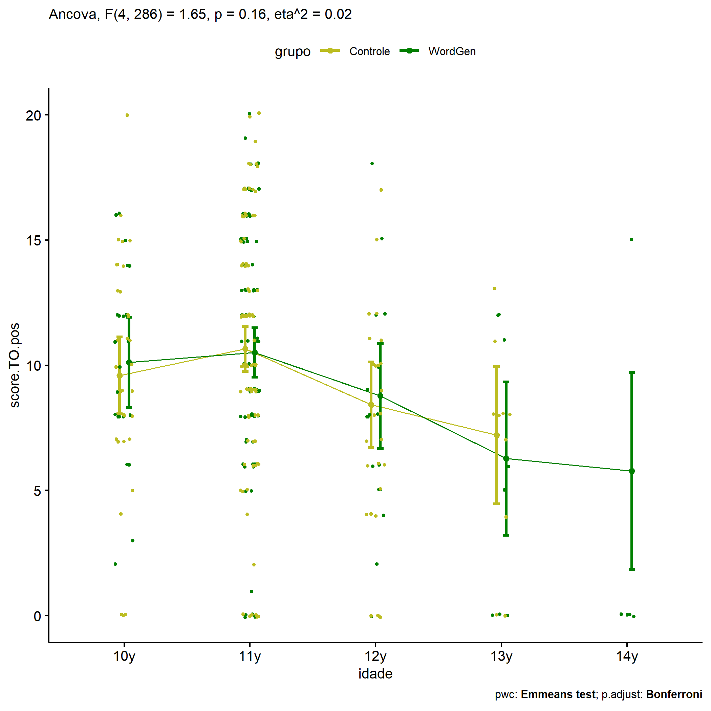<!-- -->

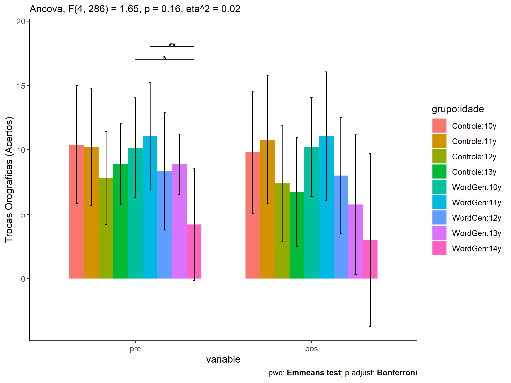<!-- -->

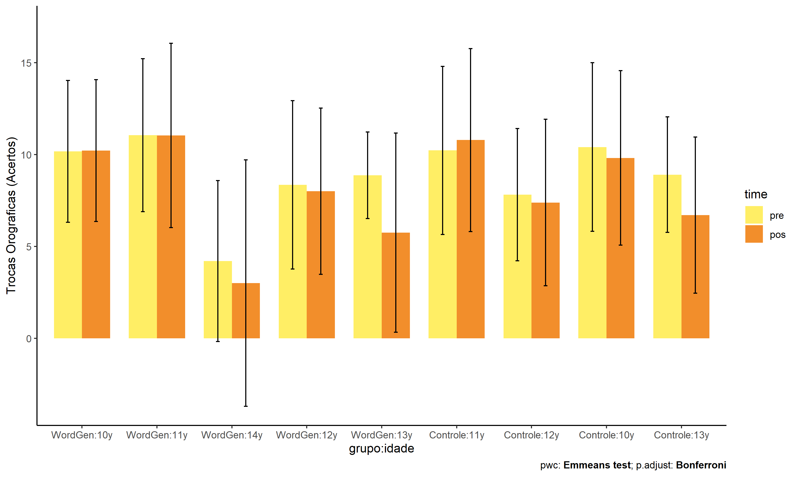<!-- -->

## factores: **zona.participante:grupo**

### Leitura de Pseudo-Palavras (Acertos)

| var            | zona.participante | grupo    |   n | M (pre) | SE (pre) | M (unadj) | SE (unadj) | M (adj) | SE (adj) |
|:---------------|:------------------|:---------|----:|--------:|---------:|----------:|-----------:|--------:|---------:|
| score.CLPP.pos | Rural             | Controle |  51 |  68.137 |    1.885 |    69.824 |      1.960 |  70.824 |    1.556 |
| score.CLPP.pos | Rural             | WordGen  |  52 |  71.500 |    1.771 |    72.058 |      1.866 |  70.657 |    1.543 |
| score.CLPP.pos | Urbana            | Controle |  64 |  68.594 |    1.876 |    70.859 |      1.952 |  71.534 |    1.389 |
| score.CLPP.pos | Urbana            | WordGen  |  41 |  70.268 |    2.436 |    71.049 |      2.670 |  70.528 |    1.734 |

| .y.            | grupo    | zona.participante | group1   | group2  | estimate | conf.low | conf.high |    se | statistic |     p | p.adj | p.adj.signif |
|:---------------|:---------|:------------------|:---------|:--------|---------:|---------:|----------:|------:|----------:|------:|------:|:-------------|
| score.CLPP.pos | Controle |                   | Urbana   | Rural   |    0.710 |   -3.399 |     4.819 | 2.084 |     0.341 | 0.734 | 0.734 | ns           |
| score.CLPP.pos | WordGen  |                   | Urbana   | Rural   |   -0.129 |   -4.703 |     4.444 | 2.320 |    -0.056 | 0.956 | 0.956 | ns           |
| score.CLPP.pre | Controle |                   | Urbana   | Rural   |    0.456 |   -4.809 |     5.722 | 2.671 |     0.171 | 0.864 | 0.864 | ns           |
| score.CLPP.pre | WordGen  |                   | Urbana   | Rural   |   -1.232 |   -7.091 |     4.628 | 2.972 |    -0.414 | 0.679 | 0.679 | ns           |
| score.CLPP.pos |          | Urbana            | Controle | WordGen |    1.006 |   -3.376 |     5.389 | 2.223 |     0.453 | 0.651 | 0.651 | ns           |
| score.CLPP.pos |          | Rural             | Controle | WordGen |    0.167 |   -4.162 |     4.496 | 2.195 |     0.076 | 0.939 | 0.939 | ns           |
| score.CLPP.pre |          | Urbana            | Controle | WordGen |   -1.675 |   -7.286 |     3.937 | 2.846 |    -0.588 | 0.557 | 0.557 | ns           |
| score.CLPP.pre |          | Rural             | Controle | WordGen |   -3.363 |   -8.891 |     2.166 | 2.804 |    -1.199 | 0.232 | 0.232 | ns           |

| grupo    | zona.participante | group1 | group2 | estimate | conf.low | conf.high |    se | statistic |     p | p.adj | p.adj.signif |
|:---------|:------------------|:-------|:-------|---------:|---------:|----------:|------:|----------:|------:|------:|:-------------|
| Controle | Urbana            | pre    | pos    |   -1.163 |   -5.998 |     3.673 | 2.460 |    -0.473 | 0.637 | 0.637 | ns           |
| Controle | Rural             | pre    | pos    |   -2.393 |   -7.898 |     3.112 | 2.801 |    -0.854 | 0.393 | 0.393 | ns           |
| WordGen  | Urbana            | pre    | pos    |   -0.022 |   -6.094 |     6.049 | 3.089 |    -0.007 | 0.994 | 0.994 | ns           |
| WordGen  | Rural             | pre    | pos    |   -0.558 |   -6.141 |     5.026 | 2.841 |    -0.196 | 0.844 | 0.844 | ns           |

    ## Scale for colour is already present.
    ## Adding another scale for colour, which will replace the existing scale.

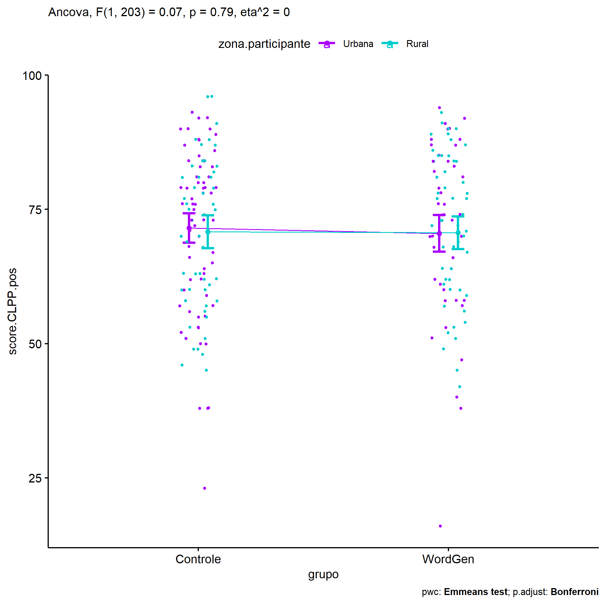<!-- -->

    ## Scale for colour is already present.
    ## Adding another scale for colour, which will replace the existing scale.

<!-- -->

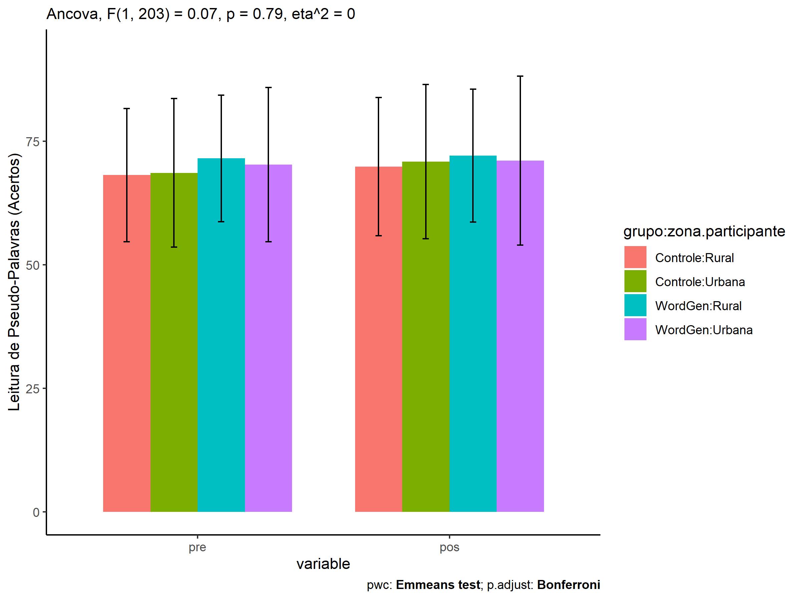<!-- -->

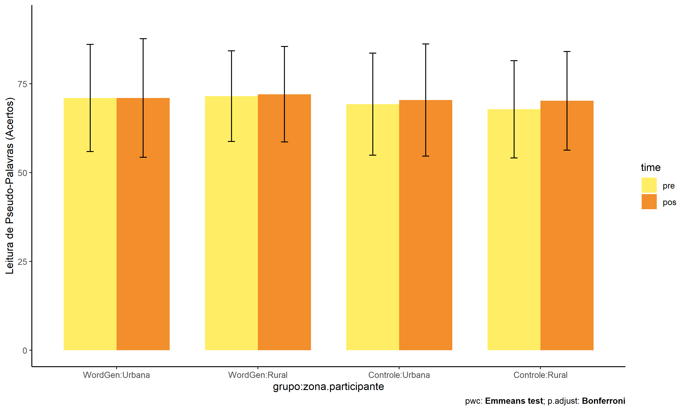<!-- -->

### Correta Regular (Acertos)

| var          | zona.participante | grupo    |   n | M (pre) | SE (pre) | M (unadj) | SE (unadj) | M (adj) | SE (adj) |
|:-------------|:------------------|:---------|----:|--------:|---------:|----------:|-----------:|--------:|---------:|
| score.CR.pos | Rural             | Controle |  56 |  14.000 |    0.551 |    14.161 |      0.615 |  14.267 |    0.681 |
| score.CR.pos | Rural             | WordGen  |  52 |  15.231 |    0.482 |    15.288 |      0.461 |  14.975 |    0.709 |
| score.CR.pos | Urbana            | Controle |  77 |  13.948 |    0.538 |    12.935 |      0.720 |  13.059 |    0.581 |
| score.CR.pos | Urbana            | WordGen  |  49 |  14.265 |    0.783 |    13.245 |      0.855 |  13.261 |    0.727 |

| .y.          | grupo    | zona.participante | group1   | group2  | estimate | conf.low | conf.high |    se | statistic |     p | p.adj | p.adj.signif |
|:-------------|:---------|:------------------|:---------|:--------|---------:|---------:|----------:|------:|----------:|------:|------:|:-------------|
| score.CR.pos | Controle |                   | Urbana   | Rural   |   -1.208 |   -2.970 |     0.554 | 0.894 |    -1.351 | 0.178 | 0.178 | ns           |
| score.CR.pos | WordGen  |                   | Urbana   | Rural   |   -1.714 |   -3.716 |     0.289 | 1.016 |    -1.686 | 0.093 | 0.093 | ns           |
| score.CR.pre | Controle |                   | Urbana   | Rural   |   -0.052 |   -1.615 |     1.511 | 0.793 |    -0.065 | 0.948 | 0.948 | ns           |
| score.CR.pre | WordGen  |                   | Urbana   | Rural   |   -0.965 |   -2.737 |     0.806 | 0.899 |    -1.074 | 0.284 | 0.284 | ns           |
| score.CR.pos |          | Urbana            | Controle | WordGen |   -0.201 |   -2.035 |     1.632 | 0.931 |    -0.216 | 0.829 | 0.829 | ns           |
| score.CR.pos |          | Rural             | Controle | WordGen |   -0.707 |   -2.648 |     1.233 | 0.985 |    -0.718 | 0.473 | 0.473 | ns           |
| score.CR.pre |          | Urbana            | Controle | WordGen |   -0.317 |   -1.943 |     1.309 | 0.825 |    -0.384 | 0.701 | 0.701 | ns           |
| score.CR.pre |          | Rural             | Controle | WordGen |   -1.231 |   -2.944 |     0.483 | 0.870 |    -1.415 | 0.158 | 0.158 | ns           |

| grupo    | zona.participante | group1 | group2 | estimate | conf.low | conf.high |    se | statistic |     p | p.adj | p.adj.signif |
|:---------|:------------------|:-------|:-------|---------:|---------:|----------:|------:|----------:|------:|------:|:-------------|
| Controle | Urbana            | pre    | pos    |    1.013 |   -0.548 |     2.574 | 0.794 |     1.275 | 0.203 | 0.203 | ns           |
| Controle | Rural             | pre    | pos    |   -0.161 |   -1.991 |     1.670 | 0.931 |    -0.173 | 0.863 | 0.863 | ns           |
| WordGen  | Urbana            | pre    | pos    |    1.020 |   -0.936 |     2.977 | 0.996 |     1.025 | 0.306 | 0.306 | ns           |
| WordGen  | Rural             | pre    | pos    |   -0.058 |   -1.957 |     1.842 | 0.967 |    -0.060 | 0.952 | 0.952 | ns           |

    ## Scale for colour is already present.
    ## Adding another scale for colour, which will replace the existing scale.

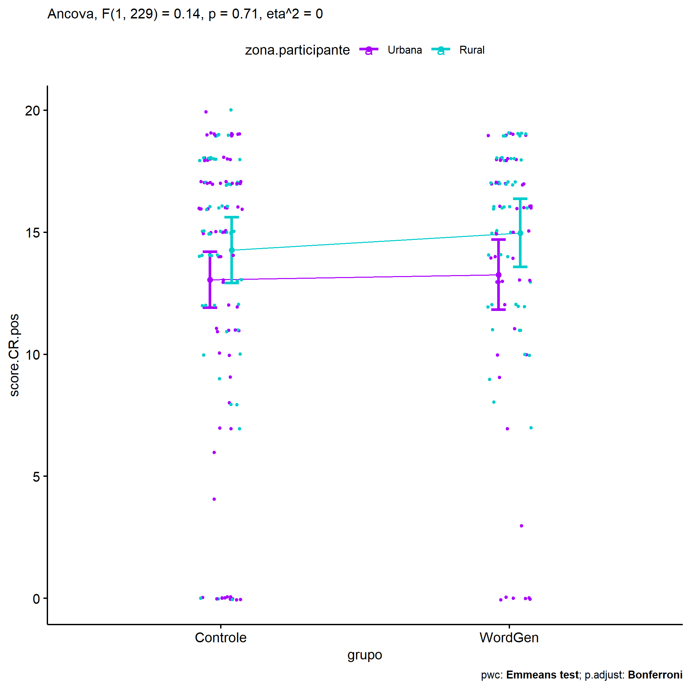<!-- -->

    ## Scale for colour is already present.
    ## Adding another scale for colour, which will replace the existing scale.

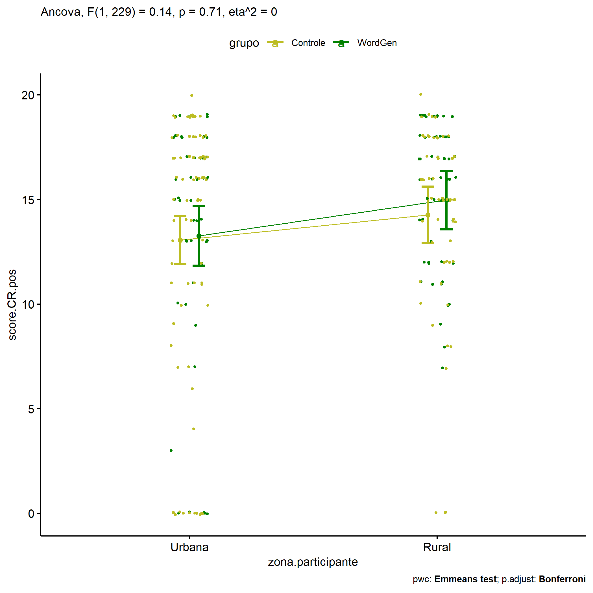<!-- -->

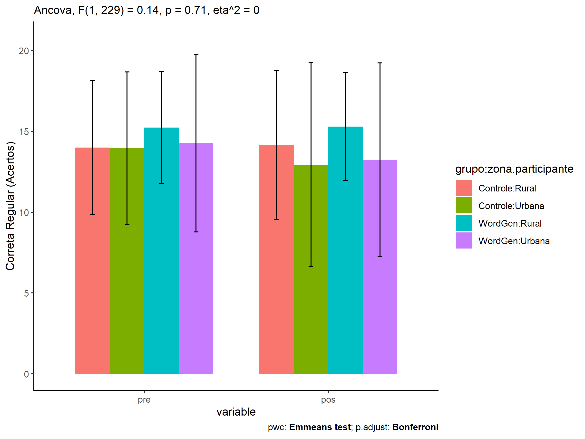<!-- -->

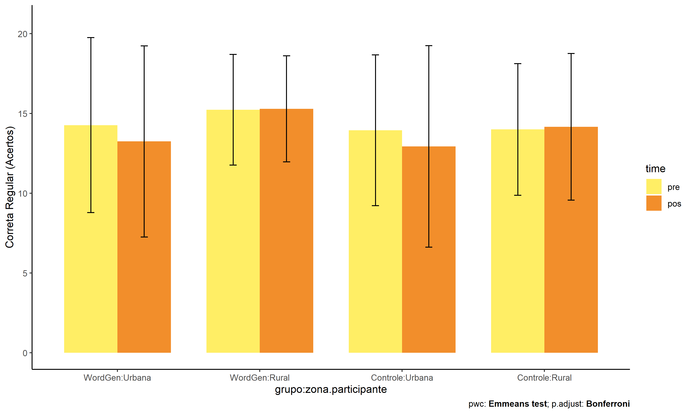<!-- -->

### Correta Irregular (Acertos)

| var          | zona.participante | grupo    |   n | M (pre) | SE (pre) | M (unadj) | SE (unadj) | M (adj) | SE (adj) |
|:-------------|:------------------|:---------|----:|--------:|---------:|----------:|-----------:|--------:|---------:|
| score.CI.pos | Rural             | Controle |  56 |  11.643 |    0.548 |    11.661 |      0.603 |  11.581 |    0.588 |
| score.CI.pos | Rural             | WordGen  |  52 |  11.673 |    0.481 |    12.673 |      0.426 |  12.579 |    0.610 |
| score.CI.pos | Urbana            | Controle |  77 |  11.013 |    0.500 |     9.870 |      0.638 |  10.095 |    0.503 |
| score.CI.pos | Urbana            | WordGen  |  49 |  11.816 |    0.678 |    11.571 |      0.774 |  11.408 |    0.629 |

| .y.          | grupo    | zona.participante | group1   | group2  | estimate | conf.low | conf.high |    se | statistic |     p | p.adj | p.adj.signif |
|:-------------|:---------|:------------------|:---------|:--------|---------:|---------:|----------:|------:|----------:|------:|------:|:-------------|
| score.CI.pos | Controle |                   | Urbana   | Rural   |   -1.487 |   -3.012 |     0.039 | 0.774 |    -1.920 | 0.056 | 0.056 | ns           |
| score.CI.pos | WordGen  |                   | Urbana   | Rural   |   -1.171 |   -2.897 |     0.556 | 0.876 |    -1.336 | 0.183 | 0.183 | ns           |
| score.CI.pre | Controle |                   | Urbana   | Rural   |   -0.630 |   -2.088 |     0.828 | 0.740 |    -0.851 | 0.396 | 0.396 | ns           |
| score.CI.pre | WordGen  |                   | Urbana   | Rural   |    0.143 |   -1.510 |     1.796 | 0.839 |     0.171 | 0.865 | 0.865 | ns           |
| score.CI.pos |          | Urbana            | Controle | WordGen |   -1.314 |   -2.902 |     0.275 | 0.806 |    -1.630 | 0.105 | 0.105 | ns           |
| score.CI.pos |          | Rural             | Controle | WordGen |   -0.998 |   -2.668 |     0.672 | 0.848 |    -1.177 | 0.240 | 0.240 | ns           |
| score.CI.pre |          | Urbana            | Controle | WordGen |   -0.803 |   -2.321 |     0.714 | 0.770 |    -1.043 | 0.298 | 0.298 | ns           |
| score.CI.pre |          | Rural             | Controle | WordGen |   -0.030 |   -1.629 |     1.569 | 0.812 |    -0.037 | 0.970 | 0.970 | ns           |

| grupo    | zona.participante | group1 | group2 | estimate | conf.low | conf.high |    se | statistic |     p | p.adj | p.adj.signif |
|:---------|:------------------|:-------|:-------|---------:|---------:|----------:|------:|----------:|------:|------:|:-------------|
| Controle | Urbana            | pre    | pos    |    1.143 |   -0.294 |     2.580 | 0.731 |     1.563 | 0.119 | 0.119 | ns           |
| Controle | Rural             | pre    | pos    |   -0.018 |   -1.703 |     1.667 | 0.858 |    -0.021 | 0.983 | 0.983 | ns           |
| WordGen  | Urbana            | pre    | pos    |    0.245 |   -1.557 |     2.046 | 0.917 |     0.267 | 0.789 | 0.789 | ns           |
| WordGen  | Rural             | pre    | pos    |   -1.000 |   -2.749 |     0.749 | 0.890 |    -1.124 | 0.262 | 0.262 | ns           |

    ## Scale for colour is already present.
    ## Adding another scale for colour, which will replace the existing scale.

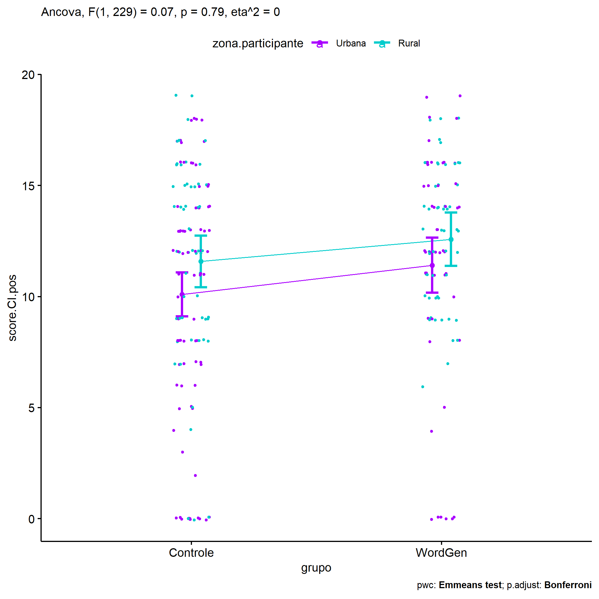<!-- -->

    ## Scale for colour is already present.
    ## Adding another scale for colour, which will replace the existing scale.

<!-- -->

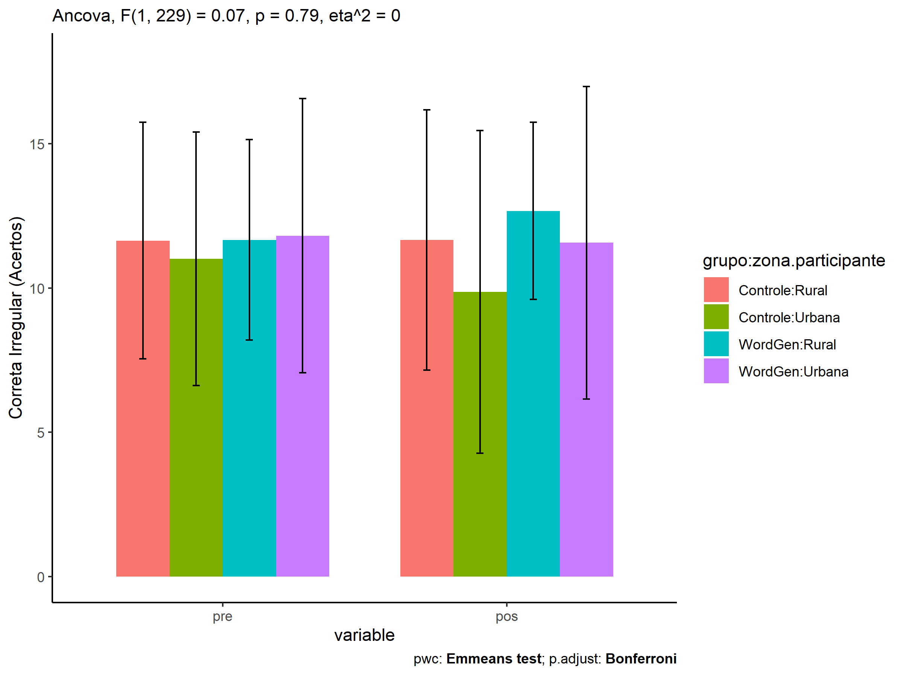<!-- -->

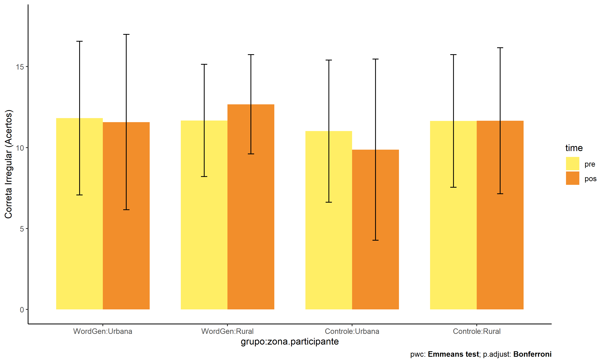<!-- -->

### Trocas Visuais (Acertos)

| var          | zona.participante | grupo    |   n | M (pre) | SE (pre) | M (unadj) | SE (unadj) | M (adj) | SE (adj) |
|:-------------|:------------------|:---------|----:|--------:|---------:|----------:|-----------:|--------:|---------:|
| score.TV.pos | Rural             | Controle |  56 |  15.661 |    0.599 |    15.929 |      0.659 |  16.132 |    0.735 |
| score.TV.pos | Rural             | WordGen  |  52 |  17.442 |    0.432 |    17.019 |      0.439 |  16.518 |    0.768 |
| score.TV.pos | Urbana            | Controle |  77 |  16.247 |    0.580 |    14.481 |      0.791 |  14.452 |    0.626 |
| score.TV.pos | Urbana            | WordGen  |  49 |  15.306 |    0.867 |    14.306 |      0.976 |  14.650 |    0.788 |

| .y.          | grupo    | zona.participante | group1   | group2  | estimate | conf.low | conf.high |    se | statistic |     p | p.adj | p.adj.signif |
|:-------------|:---------|:------------------|:---------|:--------|---------:|---------:|----------:|------:|----------:|------:|------:|:-------------|
| score.TV.pos | Controle |                   | Urbana   | Rural   |   -1.680 |   -3.584 |     0.224 | 0.966 |    -1.738 | 0.083 | 0.083 | ns           |
| score.TV.pos | WordGen  |                   | Urbana   | Rural   |   -1.869 |   -4.048 |     0.310 | 1.106 |    -1.690 | 0.092 | 0.092 | ns           |
| score.TV.pre | Controle |                   | Urbana   | Rural   |    0.586 |   -1.080 |     2.252 | 0.846 |     0.693 | 0.489 | 0.489 | ns           |
| score.TV.pre | WordGen  |                   | Urbana   | Rural   |   -2.136 |   -4.025 |    -0.247 | 0.959 |    -2.228 | 0.027 | 0.027 | \*           |
| score.TV.pos |          | Urbana            | Controle | WordGen |   -0.197 |   -2.181 |     1.786 | 1.007 |    -0.196 | 0.845 | 0.845 | ns           |
| score.TV.pos |          | Rural             | Controle | WordGen |   -0.386 |   -2.489 |     1.716 | 1.067 |    -0.362 | 0.718 | 0.718 | ns           |
| score.TV.pre |          | Urbana            | Controle | WordGen |    0.941 |   -0.793 |     2.675 | 0.880 |     1.069 | 0.286 | 0.286 | ns           |
| score.TV.pre |          | Rural             | Controle | WordGen |   -1.782 |   -3.609 |     0.046 | 0.927 |    -1.921 | 0.056 | 0.056 | ns           |

| grupo    | zona.participante | group1 | group2 | estimate | conf.low | conf.high |    se | statistic |     p | p.adj | p.adj.signif |
|:---------|:------------------|:-------|:-------|---------:|---------:|----------:|------:|----------:|------:|------:|:-------------|
| Controle | Urbana            | pre    | pos    |    1.766 |    0.077 |     3.455 | 0.860 |     2.055 | 0.040 | 0.040 | \*           |
| Controle | Rural             | pre    | pos    |   -0.268 |   -2.249 |     1.713 | 1.008 |    -0.266 | 0.791 | 0.791 | ns           |
| WordGen  | Urbana            | pre    | pos    |    1.000 |   -1.117 |     3.117 | 1.077 |     0.928 | 0.354 | 0.354 | ns           |
| WordGen  | Rural             | pre    | pos    |    0.423 |   -1.632 |     2.479 | 1.046 |     0.404 | 0.686 | 0.686 | ns           |

    ## Scale for colour is already present.
    ## Adding another scale for colour, which will replace the existing scale.

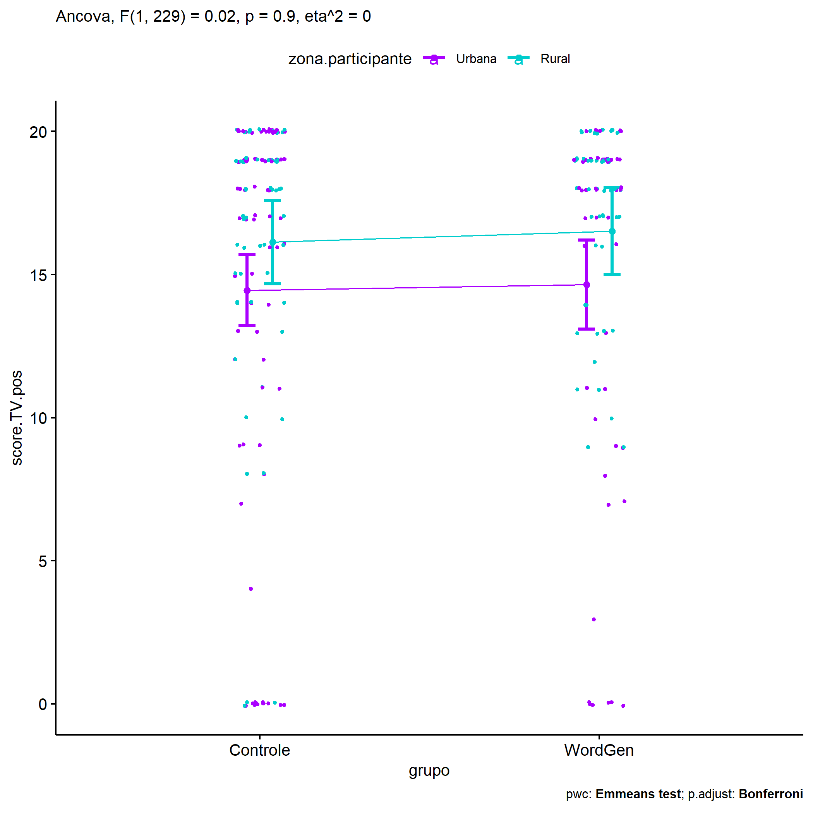<!-- -->

    ## Scale for colour is already present.
    ## Adding another scale for colour, which will replace the existing scale.

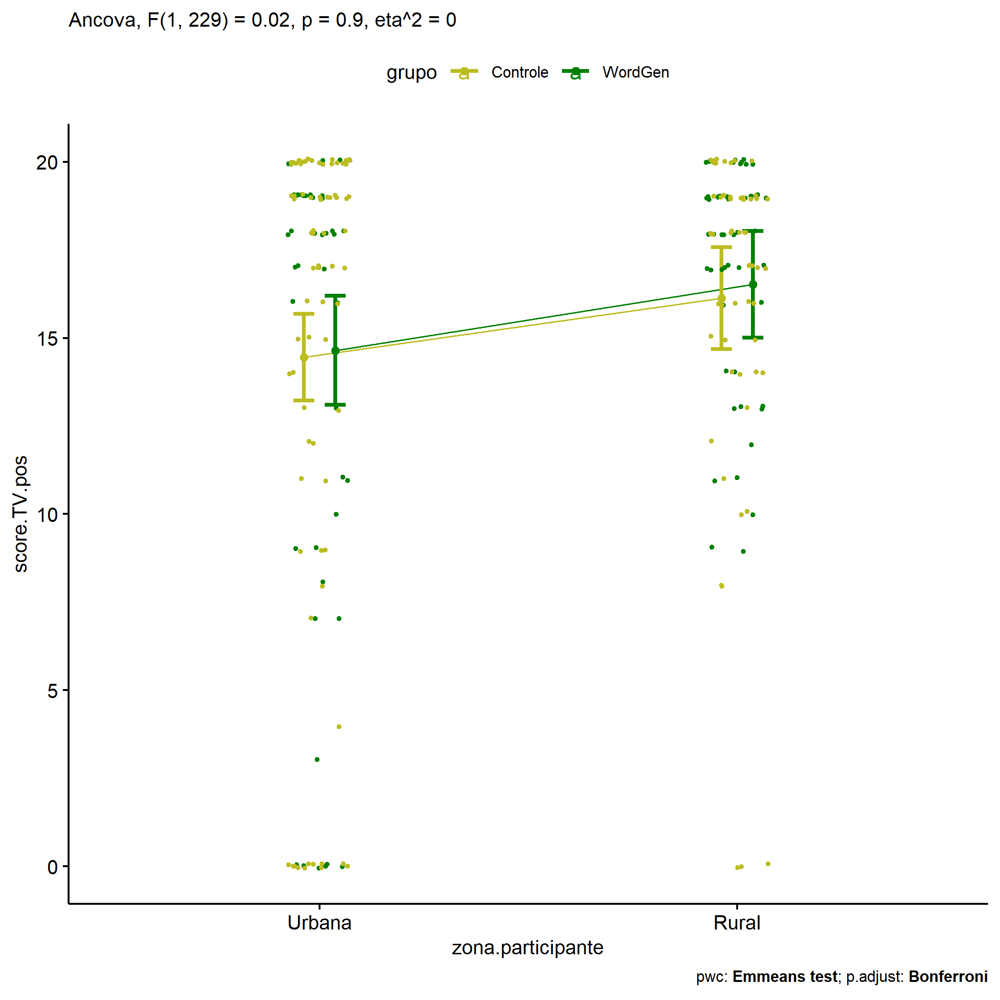<!-- -->

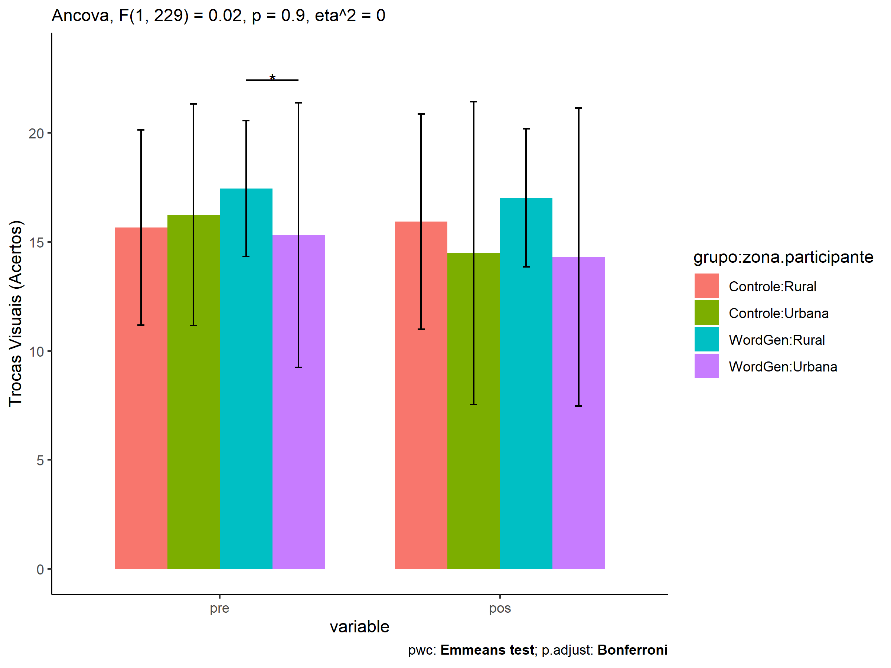<!-- -->

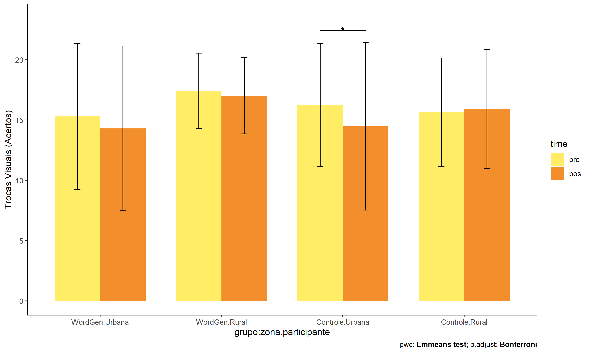<!-- -->

### Trocas Fonologicas (Acertos)

| var          | zona.participante | grupo    |   n | M (pre) | SE (pre) | M (unadj) | SE (unadj) | M (adj) | SE (adj) |
|:-------------|:------------------|:---------|----:|--------:|---------:|----------:|-----------:|--------:|---------:|
| score.TF.pos | Rural             | Controle |  56 |  14.518 |    0.591 |    14.375 |      0.725 |  14.612 |    0.708 |
| score.TF.pos | Rural             | WordGen  |  52 |  16.769 |    0.449 |    16.404 |      0.460 |  15.533 |    0.745 |
| score.TF.pos | Urbana            | Controle |  77 |  14.558 |    0.583 |    13.026 |      0.777 |  13.243 |    0.604 |
| score.TF.pos | Urbana            | WordGen  |  49 |  14.367 |    0.851 |    13.163 |      0.918 |  13.475 |    0.757 |

| .y.          | grupo    | zona.participante | group1   | group2  | estimate | conf.low | conf.high |    se | statistic |     p | p.adj | p.adj.signif |
|:-------------|:---------|:------------------|:---------|:--------|---------:|---------:|----------:|------:|----------:|------:|------:|:-------------|
| score.TF.pos | Controle |                   | Urbana   | Rural   |   -1.369 |   -3.200 |     0.462 | 0.929 |    -1.473 | 0.142 | 0.142 | ns           |
| score.TF.pos | WordGen  |                   | Urbana   | Rural   |   -2.058 |   -4.162 |     0.046 | 1.068 |    -1.927 | 0.055 | 0.055 | ns           |
| score.TF.pre | Controle |                   | Urbana   | Rural   |    0.041 |   -1.620 |     1.702 | 0.843 |     0.048 | 0.962 | 0.962 | ns           |
| score.TF.pre | WordGen  |                   | Urbana   | Rural   |   -2.402 |   -4.285 |    -0.519 | 0.956 |    -2.513 | 0.013 | 0.013 | \*           |
| score.TF.pos |          | Urbana            | Controle | WordGen |   -0.231 |   -2.137 |     1.674 | 0.967 |    -0.239 | 0.811 | 0.811 | ns           |
| score.TF.pos |          | Rural             | Controle | WordGen |   -0.920 |   -2.954 |     1.113 | 1.032 |    -0.892 | 0.374 | 0.374 | ns           |
| score.TF.pre |          | Urbana            | Controle | WordGen |    0.191 |   -1.537 |     1.919 | 0.877 |     0.218 | 0.828 | 0.828 | ns           |
| score.TF.pre |          | Rural             | Controle | WordGen |   -2.251 |   -4.073 |    -0.430 | 0.924 |    -2.435 | 0.016 | 0.016 | \*           |

| grupo    | zona.participante | group1 | group2 | estimate | conf.low | conf.high |    se | statistic |     p | p.adj | p.adj.signif |
|:---------|:------------------|:-------|:-------|---------:|---------:|----------:|------:|----------:|------:|------:|:-------------|
| Controle | Urbana            | pre    | pos    |    1.532 |   -0.151 |     3.216 | 0.857 |     1.789 | 0.074 | 0.074 | ns           |
| Controle | Rural             | pre    | pos    |    0.143 |   -1.831 |     2.117 | 1.004 |     0.142 | 0.887 | 0.887 | ns           |
| WordGen  | Urbana            | pre    | pos    |    1.204 |   -0.906 |     3.314 | 1.074 |     1.121 | 0.263 | 0.263 | ns           |
| WordGen  | Rural             | pre    | pos    |    0.365 |   -1.683 |     2.414 | 1.042 |     0.351 | 0.726 | 0.726 | ns           |

    ## Scale for colour is already present.
    ## Adding another scale for colour, which will replace the existing scale.

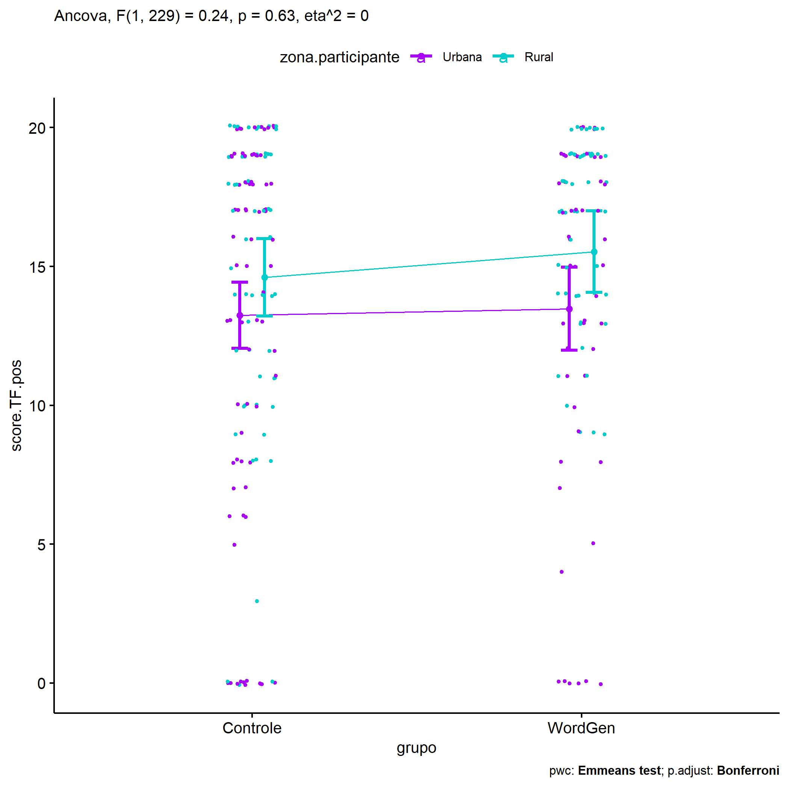<!-- -->

    ## Scale for colour is already present.
    ## Adding another scale for colour, which will replace the existing scale.

<!-- -->

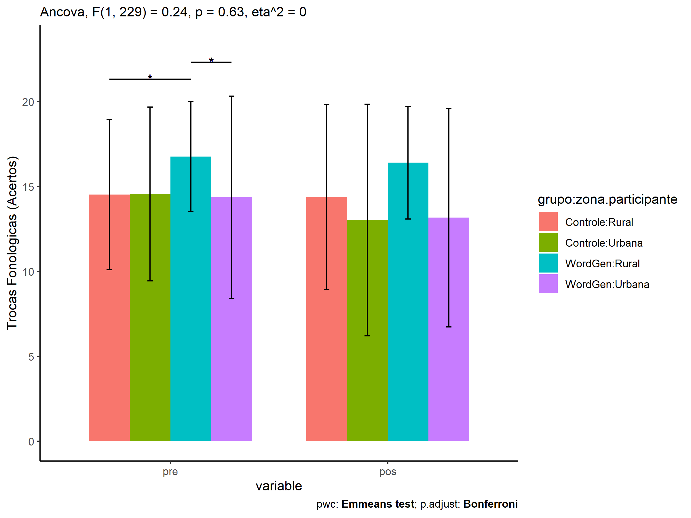<!-- -->

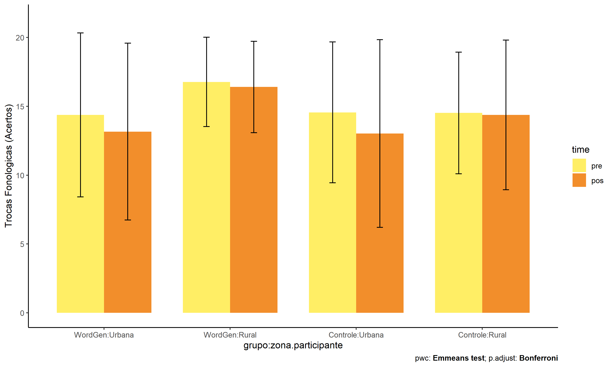<!-- -->

### Trocas Orograficas (Acertos)

| var          | zona.participante | grupo    |   n | M (pre) | SE (pre) | M (unadj) | SE (unadj) | M (adj) | SE (adj) |
|:-------------|:------------------|:---------|----:|--------:|---------:|----------:|-----------:|--------:|---------:|
| score.TO.pos | Rural             | Controle |  56 |   9.571 |    0.627 |    10.321 |      0.633 |  10.474 |    0.572 |
| score.TO.pos | Rural             | WordGen  |  52 |  10.385 |    0.556 |    10.673 |      0.561 |  10.337 |    0.594 |
| score.TO.pos | Urbana            | Controle |  77 |   9.883 |    0.540 |    10.039 |      0.619 |  10.004 |    0.488 |
| score.TO.pos | Urbana            | WordGen  |  49 |   9.429 |    0.702 |    10.020 |      0.838 |  10.258 |    0.612 |

| .y.          | grupo    | zona.participante | group1   | group2  | estimate | conf.low | conf.high |    se | statistic |     p | p.adj | p.adj.signif |
|:-------------|:---------|:------------------|:---------|:--------|---------:|---------:|----------:|------:|----------:|------:|------:|:-------------|
| score.TO.pos | Controle |                   | Urbana   | Rural   |   -0.470 |   -1.951 |     1.011 | 0.752 |    -0.625 | 0.533 | 0.533 | ns           |
| score.TO.pos | WordGen  |                   | Urbana   | Rural   |   -0.078 |   -1.760 |     1.604 | 0.854 |    -0.092 | 0.927 | 0.927 | ns           |
| score.TO.pre | Controle |                   | Urbana   | Rural   |    0.312 |   -1.286 |     1.909 | 0.811 |     0.385 | 0.701 | 0.701 | ns           |
| score.TO.pre | WordGen  |                   | Urbana   | Rural   |   -0.956 |   -2.767 |     0.855 | 0.919 |    -1.040 | 0.299 | 0.299 | ns           |
| score.TO.pos |          | Urbana            | Controle | WordGen |   -0.255 |   -1.796 |     1.287 | 0.782 |    -0.325 | 0.745 | 0.745 | ns           |
| score.TO.pos |          | Rural             | Controle | WordGen |    0.137 |   -1.489 |     1.763 | 0.825 |     0.166 | 0.868 | 0.868 | ns           |
| score.TO.pre |          | Urbana            | Controle | WordGen |    0.455 |   -1.207 |     2.116 | 0.843 |     0.539 | 0.590 | 0.590 | ns           |
| score.TO.pre |          | Rural             | Controle | WordGen |   -0.813 |   -2.565 |     0.938 | 0.889 |    -0.915 | 0.361 | 0.361 | ns           |

| grupo    | zona.participante | group1 | group2 | estimate | conf.low | conf.high |    se | statistic |     p | p.adj | p.adj.signif |
|:---------|:------------------|:-------|:-------|---------:|---------:|----------:|------:|----------:|------:|------:|:-------------|
| Controle | Urbana            | pre    | pos    |   -0.156 |   -1.695 |     1.383 | 0.783 |    -0.199 | 0.842 | 0.842 | ns           |
| Controle | Rural             | pre    | pos    |   -0.750 |   -2.554 |     1.054 | 0.918 |    -0.817 | 0.414 | 0.414 | ns           |
| WordGen  | Urbana            | pre    | pos    |   -0.592 |   -2.521 |     1.337 | 0.982 |    -0.603 | 0.547 | 0.547 | ns           |
| WordGen  | Rural             | pre    | pos    |   -0.288 |   -2.161 |     1.584 | 0.953 |    -0.303 | 0.762 | 0.762 | ns           |

    ## Scale for colour is already present.
    ## Adding another scale for colour, which will replace the existing scale.

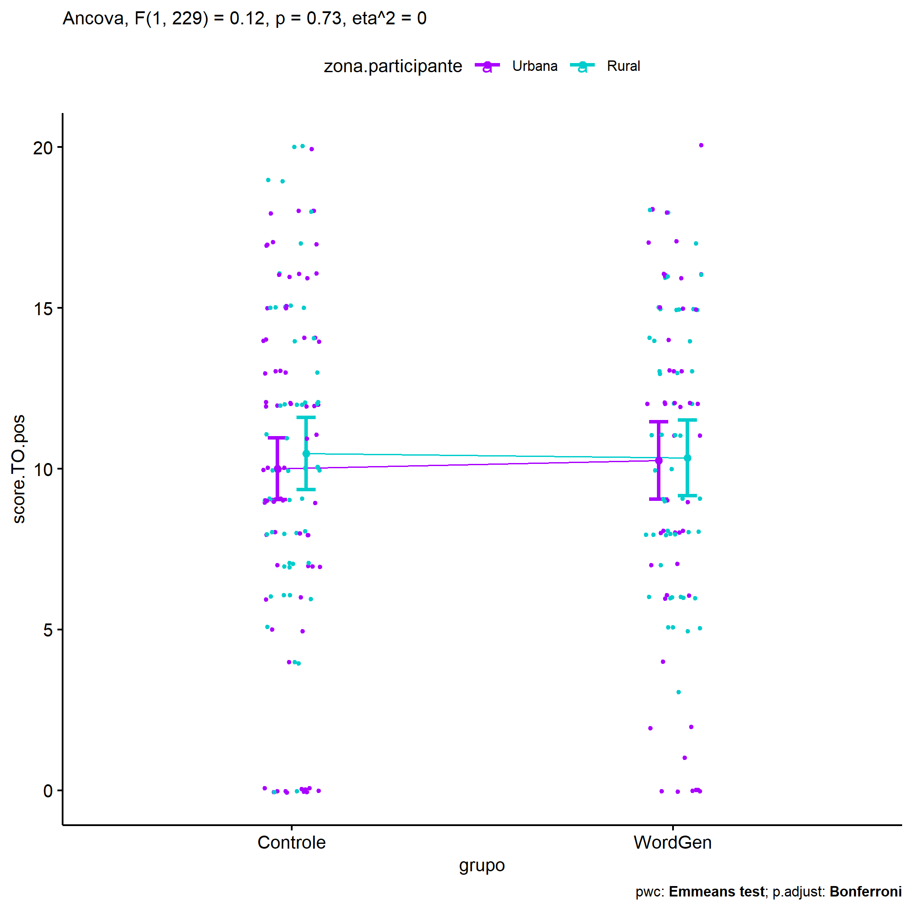<!-- -->

    ## Scale for colour is already present.
    ## Adding another scale for colour, which will replace the existing scale.

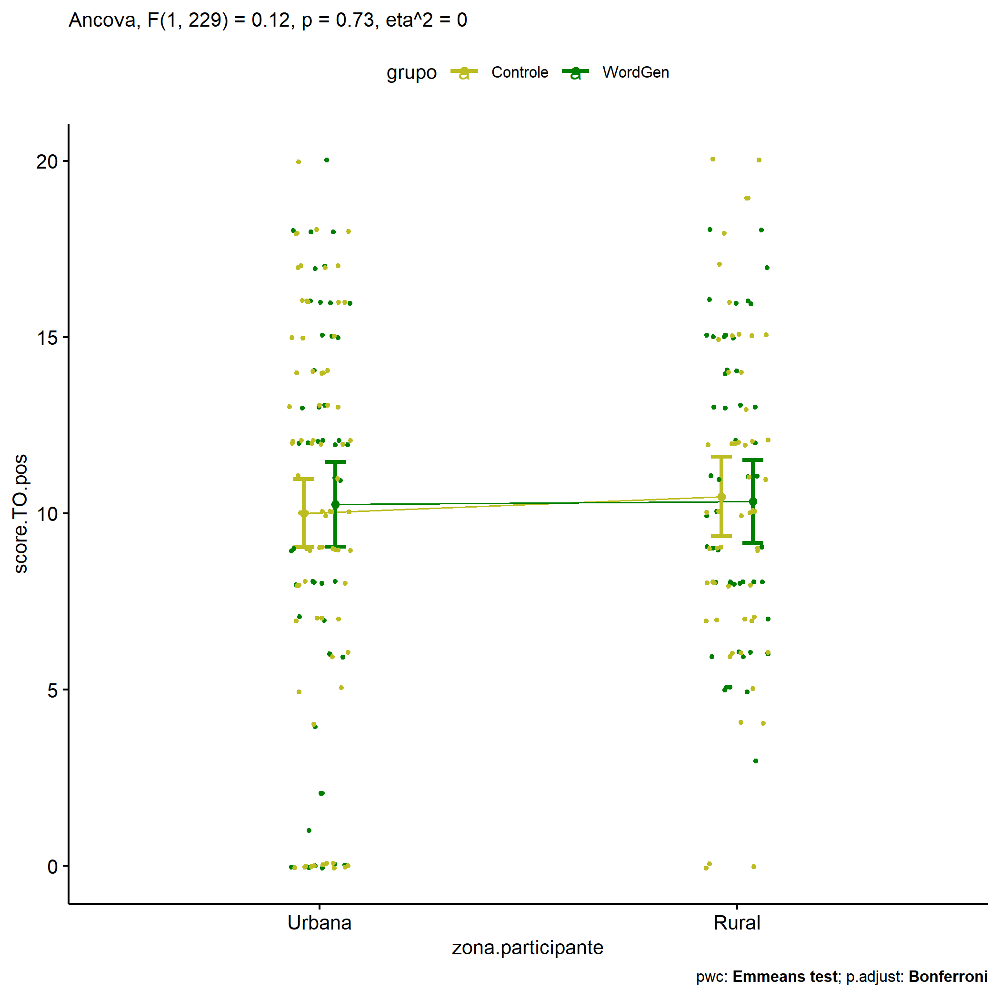<!-- -->

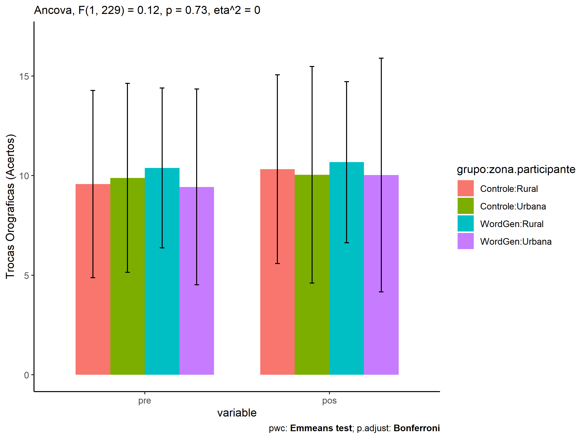<!-- -->

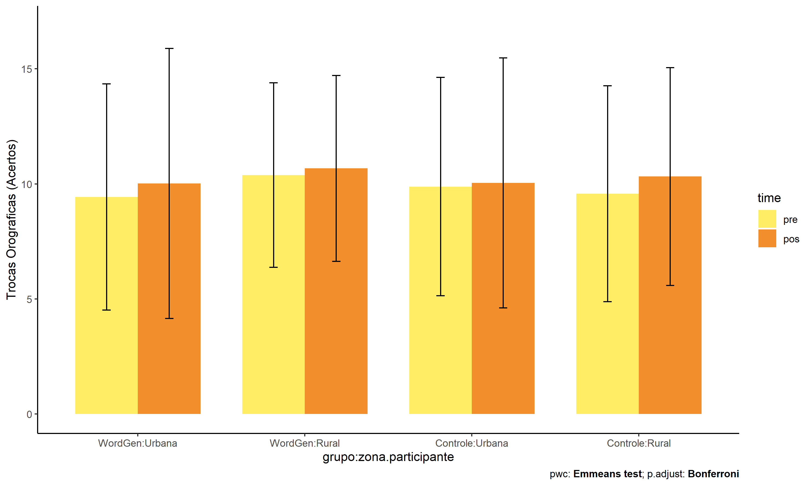<!-- -->

## factores: **escola:grupo**

### Leitura de Pseudo-Palavras (Acertos)

| var            | escola | grupo    |   n | M (pre) | SE (pre) | M (unadj) | SE (unadj) | M (adj) | SE (adj) |
|:---------------|:-------|:---------|----:|--------:|---------:|----------:|-----------:|--------:|---------:|
| score.CLPP.pos | E1     | Controle |  12 |  71.583 |    3.088 |    75.250 |      3.126 |  73.923 |    3.093 |
| score.CLPP.pos | E1     | WordGen  |  11 |  67.182 |    5.003 |    71.182 |      3.753 |  72.835 |    3.232 |
| score.CLPP.pos | E2     | Controle |  28 |  65.714 |    2.654 |    62.714 |      3.257 |  65.361 |    2.033 |
| score.CLPP.pos | E2     | WordGen  |  22 |  70.409 |    2.536 |    65.227 |      4.094 |  64.695 |    2.284 |
| score.CLPP.pos | E3     | Controle |  19 |  63.263 |    4.077 |    71.105 |      3.370 |  75.412 |    2.476 |
| score.CLPP.pos | E3     | WordGen  |  16 |  67.812 |    4.032 |    69.188 |      3.510 |  70.414 |    2.679 |
| score.CLPP.pos | E4     | Controle |  20 |  64.850 |    3.658 |    68.700 |      3.462 |  71.932 |    2.406 |
| score.CLPP.pos | E4     | WordGen  |   9 |  78.778 |    2.296 |    78.444 |      2.949 |  72.245 |    3.597 |
| score.CLPP.pos | E5     | Controle |  58 |  70.776 |    1.516 |    70.190 |      1.882 |  69.409 |    1.407 |
| score.CLPP.pos | E5     | WordGen  |  48 |  73.062 |    2.028 |    75.354 |      1.848 |  73.025 |    1.555 |
| score.CLPP.pos | E6     | Controle |  12 |  70.333 |    6.422 |    76.250 |      3.713 |  75.769 |    3.092 |
| score.CLPP.pos | E6     | WordGen  |  13 |  71.000 |    2.539 |    72.154 |      2.022 |  71.221 |    2.971 |

| .y.            | grupo    | escola | group1   | group2  | estimate | conf.low | conf.high |    se | statistic |     p | p.adj | p.adj.signif |
|:---------------|:---------|:-------|:---------|:--------|---------:|---------:|----------:|------:|----------:|------:|------:|:-------------|
| score.CLPP.pos | Controle |        | E1       | E2      |    8.561 |    1.263 |    15.860 | 3.706 |     2.310 | 0.022 | 0.325 | ns           |
| score.CLPP.pos | Controle |        | E1       | E3      |   -1.489 |   -9.306 |     6.327 | 3.969 |    -0.375 | 0.708 | 1.000 | ns           |
| score.CLPP.pos | Controle |        | E1       | E4      |    1.990 |   -5.737 |     9.718 | 3.924 |     0.507 | 0.612 | 1.000 | ns           |
| score.CLPP.pos | Controle |        | E1       | E5      |    4.514 |   -2.176 |    11.203 | 3.397 |     1.329 | 0.185 | 1.000 | ns           |
| score.CLPP.pos | Controle |        | E1       | E6      |   -1.846 |  -10.458 |     6.765 | 4.373 |    -0.422 | 0.673 | 1.000 | ns           |
| score.CLPP.pos | Controle |        | E2       | E3      |  -10.051 |  -16.324 |    -3.777 | 3.186 |    -3.155 | 0.002 | 0.027 | \*           |
| score.CLPP.pos | Controle |        | E2       | E4      |   -6.571 |  -12.747 |    -0.395 | 3.136 |    -2.095 | 0.037 | 0.557 | ns           |
| score.CLPP.pos | Controle |        | E2       | E5      |   -4.048 |   -8.925 |     0.829 | 2.477 |    -1.635 | 0.103 | 1.000 | ns           |
| score.CLPP.pos | Controle |        | E2       | E6      |  -10.408 |  -17.698 |    -3.117 | 3.702 |    -2.811 | 0.005 | 0.080 | ns           |
| score.CLPP.pos | Controle |        | E3       | E4      |    3.480 |   -3.279 |    10.239 | 3.432 |     1.014 | 0.312 | 1.000 | ns           |
| score.CLPP.pos | Controle |        | E3       | E5      |    6.003 |    0.383 |    11.623 | 2.854 |     2.104 | 0.036 | 0.546 | ns           |
| score.CLPP.pos | Controle |        | E3       | E6      |   -0.357 |   -8.163 |     7.449 | 3.964 |    -0.090 | 0.928 | 1.000 | ns           |
| score.CLPP.pos | Controle |        | E4       | E5      |    2.523 |   -2.975 |     8.021 | 2.792 |     0.904 | 0.367 | 1.000 | ns           |
| score.CLPP.pos | Controle |        | E4       | E6      |   -3.837 |  -11.556 |     3.882 | 3.920 |    -0.979 | 0.329 | 1.000 | ns           |
| score.CLPP.pos | Controle |        | E5       | E6      |   -6.360 |  -13.049 |     0.329 | 3.397 |    -1.872 | 0.062 | 0.935 | ns           |
| score.CLPP.pos | WordGen  |        | E1       | E2      |    8.140 |    0.345 |    15.935 | 3.958 |     2.056 | 0.041 | 0.611 | ns           |
| score.CLPP.pos | WordGen  |        | E1       | E3      |    2.421 |   -5.840 |    10.683 | 4.195 |     0.577 | 0.564 | 1.000 | ns           |
| score.CLPP.pos | WordGen  |        | E1       | E4      |    0.590 |   -8.953 |    10.132 | 4.846 |     0.122 | 0.903 | 1.000 | ns           |
| score.CLPP.pos | WordGen  |        | E1       | E5      |   -0.190 |   -7.263 |     6.882 | 3.591 |    -0.053 | 0.958 | 1.000 | ns           |
| score.CLPP.pos | WordGen  |        | E1       | E6      |    1.613 |   -7.035 |    10.262 | 4.392 |     0.367 | 0.714 | 1.000 | ns           |
| score.CLPP.pos | WordGen  |        | E2       | E3      |   -5.719 |  -12.653 |     1.216 | 3.521 |    -1.624 | 0.106 | 1.000 | ns           |
| score.CLPP.pos | WordGen  |        | E2       | E4      |   -7.550 |  -15.933 |     0.833 | 4.257 |    -1.774 | 0.077 | 1.000 | ns           |
| score.CLPP.pos | WordGen  |        | E2       | E5      |   -8.330 |  -13.766 |    -2.894 | 2.761 |    -3.018 | 0.003 | 0.042 | \*           |
| score.CLPP.pos | WordGen  |        | E2       | E6      |   -6.526 |  -13.905 |     0.853 | 3.747 |    -1.742 | 0.083 | 1.000 | ns           |
| score.CLPP.pos | WordGen  |        | E3       | E4      |   -1.832 |  -10.680 |     7.017 | 4.493 |    -0.408 | 0.684 | 1.000 | ns           |
| score.CLPP.pos | WordGen  |        | E3       | E5      |   -2.612 |   -8.720 |     3.497 | 3.102 |    -0.842 | 0.401 | 1.000 | ns           |
| score.CLPP.pos | WordGen  |        | E3       | E6      |   -0.808 |   -8.690 |     7.074 | 4.002 |    -0.202 | 0.840 | 1.000 | ns           |
| score.CLPP.pos | WordGen  |        | E4       | E5      |   -0.780 |   -8.460 |     6.901 | 3.900 |    -0.200 | 0.842 | 1.000 | ns           |
| score.CLPP.pos | WordGen  |        | E4       | E6      |    1.024 |   -8.152 |    10.199 | 4.659 |     0.220 | 0.826 | 1.000 | ns           |
| score.CLPP.pos | WordGen  |        | E5       | E6      |    1.804 |   -4.794 |     8.401 | 3.350 |     0.538 | 0.591 | 1.000 | ns           |
| score.CLPP.pre | Controle |        | E1       | E2      |    5.869 |   -3.692 |    15.430 | 4.855 |     1.209 | 0.228 | 1.000 | ns           |
| score.CLPP.pre | Controle |        | E1       | E3      |    8.320 |   -1.898 |    18.538 | 5.189 |     1.604 | 0.110 | 1.000 | ns           |
| score.CLPP.pre | Controle |        | E1       | E4      |    6.733 |   -3.385 |    16.852 | 5.138 |     1.310 | 0.191 | 1.000 | ns           |
| score.CLPP.pre | Controle |        | E1       | E5      |    0.807 |   -7.981 |     9.596 | 4.463 |     0.181 | 0.857 | 1.000 | ns           |
| score.CLPP.pre | Controle |        | E1       | E6      |    1.250 |  -10.063 |    12.563 | 5.745 |     0.218 | 0.828 | 1.000 | ns           |
| score.CLPP.pre | Controle |        | E2       | E3      |    2.451 |   -5.785 |    10.688 | 4.183 |     0.586 | 0.558 | 1.000 | ns           |
| score.CLPP.pre | Controle |        | E2       | E4      |    0.864 |   -7.249 |     8.977 | 4.120 |     0.210 | 0.834 | 1.000 | ns           |
| score.CLPP.pre | Controle |        | E2       | E5      |   -5.062 |  -11.438 |     1.315 | 3.238 |    -1.563 | 0.119 | 1.000 | ns           |
| score.CLPP.pre | Controle |        | E2       | E6      |   -4.619 |  -14.180 |     4.942 | 4.855 |    -0.951 | 0.342 | 1.000 | ns           |
| score.CLPP.pre | Controle |        | E3       | E4      |   -1.587 |  -10.464 |     7.291 | 4.508 |    -0.352 | 0.725 | 1.000 | ns           |
| score.CLPP.pre | Controle |        | E3       | E5      |   -7.513 |  -14.838 |    -0.188 | 3.720 |    -2.020 | 0.044 | 0.667 | ns           |
| score.CLPP.pre | Controle |        | E3       | E6      |   -7.070 |  -17.288 |     3.148 | 5.189 |    -1.363 | 0.174 | 1.000 | ns           |
| score.CLPP.pre | Controle |        | E4       | E5      |   -5.926 |  -13.112 |     1.260 | 3.649 |    -1.624 | 0.106 | 1.000 | ns           |
| score.CLPP.pre | Controle |        | E4       | E6      |   -5.483 |  -15.602 |     4.635 | 5.138 |    -1.067 | 0.287 | 1.000 | ns           |
| score.CLPP.pre | Controle |        | E5       | E6      |    0.443 |   -8.346 |     9.231 | 4.463 |     0.099 | 0.921 | 1.000 | ns           |
| score.CLPP.pre | WordGen  |        | E1       | E2      |   -3.227 |  -13.460 |     7.006 | 5.196 |    -0.621 | 0.535 | 1.000 | ns           |
| score.CLPP.pre | WordGen  |        | E1       | E3      |   -0.631 |  -11.484 |    10.223 | 5.512 |    -0.114 | 0.909 | 1.000 | ns           |
| score.CLPP.pre | WordGen  |        | E1       | E4      |  -11.596 |  -24.051 |     0.859 | 6.325 |    -1.833 | 0.068 | 1.000 | ns           |
| score.CLPP.pre | WordGen  |        | E1       | E5      |   -5.881 |  -15.144 |     3.383 | 4.704 |    -1.250 | 0.212 | 1.000 | ns           |
| score.CLPP.pre | WordGen  |        | E1       | E6      |   -3.818 |  -15.171 |     7.534 | 5.765 |    -0.662 | 0.508 | 1.000 | ns           |
| score.CLPP.pre | WordGen  |        | E2       | E3      |    2.597 |   -6.508 |    11.701 | 4.623 |     0.562 | 0.575 | 1.000 | ns           |
| score.CLPP.pre | WordGen  |        | E2       | E4      |   -8.369 |  -19.334 |     2.596 | 5.568 |    -1.503 | 0.134 | 1.000 | ns           |
| score.CLPP.pre | WordGen  |        | E2       | E5      |   -2.653 |   -9.788 |     4.481 | 3.623 |    -0.732 | 0.465 | 1.000 | ns           |
| score.CLPP.pre | WordGen  |        | E2       | E6      |   -0.591 |  -10.285 |     9.103 | 4.923 |    -0.120 | 0.905 | 1.000 | ns           |
| score.CLPP.pre | WordGen  |        | E3       | E4      |  -10.965 |  -22.512 |     0.581 | 5.863 |    -1.870 | 0.063 | 0.939 | ns           |
| score.CLPP.pre | WordGen  |        | E3       | E5      |   -5.250 |  -13.249 |     2.749 | 4.062 |    -1.292 | 0.197 | 1.000 | ns           |
| score.CLPP.pre | WordGen  |        | E3       | E6      |   -3.188 |  -13.535 |     7.160 | 5.254 |    -0.607 | 0.545 | 1.000 | ns           |
| score.CLPP.pre | WordGen  |        | E4       | E5      |    5.715 |   -4.351 |    15.781 | 5.111 |     1.118 | 0.265 | 1.000 | ns           |
| score.CLPP.pre | WordGen  |        | E4       | E6      |    7.778 |   -4.239 |    19.794 | 6.102 |     1.275 | 0.204 | 1.000 | ns           |
| score.CLPP.pre | WordGen  |        | E5       | E6      |    2.063 |   -6.602 |    10.727 | 4.400 |     0.469 | 0.640 | 1.000 | ns           |
| score.CLPP.pos |          | E1     | Controle | WordGen |    1.088 |   -7.727 |     9.902 | 4.476 |     0.243 | 0.808 | 0.808 | ns           |
| score.CLPP.pos |          | E2     | Controle | WordGen |    0.666 |   -5.359 |     6.692 | 3.060 |     0.218 | 0.828 | 0.828 | ns           |
| score.CLPP.pos |          | E3     | Controle | WordGen |    4.998 |   -2.171 |    12.168 | 3.641 |     1.373 | 0.171 | 0.171 | ns           |
| score.CLPP.pos |          | E4     | Controle | WordGen |   -0.313 |   -8.880 |     8.253 | 4.350 |    -0.072 | 0.943 | 0.943 | ns           |
| score.CLPP.pos |          | E5     | Controle | WordGen |   -3.616 |   -7.737 |     0.505 | 2.093 |    -1.728 | 0.085 | 0.085 | ns           |
| score.CLPP.pos |          | E6     | Controle | WordGen |    4.548 |   -3.897 |    12.992 | 4.288 |     1.061 | 0.290 | 0.290 | ns           |
| score.CLPP.pre |          | E1     | Controle | WordGen |    4.402 |   -7.166 |    15.969 | 5.874 |     0.749 | 0.454 | 0.454 | ns           |
| score.CLPP.pre |          | E2     | Controle | WordGen |   -4.695 |  -12.590 |     3.200 | 4.009 |    -1.171 | 0.243 | 0.243 | ns           |
| score.CLPP.pre |          | E3     | Controle | WordGen |   -4.549 |  -13.952 |     4.853 | 4.775 |    -0.953 | 0.342 | 0.342 | ns           |
| score.CLPP.pre |          | E4     | Controle | WordGen |  -13.928 |  -25.051 |    -2.805 | 5.648 |    -2.466 | 0.014 | 0.014 | \*           |
| score.CLPP.pre |          | E5     | Controle | WordGen |   -2.287 |   -7.694 |     3.121 | 2.746 |    -0.833 | 0.406 | 0.406 | ns           |
| score.CLPP.pre |          | E6     | Controle | WordGen |   -0.667 |  -11.760 |    10.427 | 5.633 |    -0.118 | 0.906 | 0.906 | ns           |

| grupo    | escola | group1 | group2 | estimate | conf.low | conf.high |    se | statistic |     p | p.adj | p.adj.signif |
|:---------|:-------|:-------|:-------|---------:|---------:|----------:|------:|----------:|------:|------:|:-------------|
| Controle | E1     | pre    | pos    |   -3.107 |  -13.944 |     7.730 | 5.517 |    -0.563 | 0.574 | 0.574 | ns           |
| Controle | E2     | pre    | pos    |    5.127 |   -1.822 |    12.076 | 3.538 |     1.449 | 0.148 | 0.148 | ns           |
| Controle | E3     | pre    | pos    |   -9.257 |  -17.864 |    -0.650 | 4.382 |    -2.113 | 0.035 | 0.035 | \*           |
| Controle | E4     | pre    | pos    |   -3.850 |  -12.561 |     4.861 | 4.435 |    -0.868 | 0.386 | 0.386 | ns           |
| Controle | E5     | pre    | pos    |   -0.191 |   -5.145 |     4.762 | 2.522 |    -0.076 | 0.940 | 0.940 | ns           |
| Controle | E6     | pre    | pos    |   -6.169 |  -16.608 |     4.269 | 5.314 |    -1.161 | 0.246 | 0.246 | ns           |
| WordGen  | E1     | pre    | pos    |   -4.000 |  -15.746 |     7.746 | 5.980 |    -0.669 | 0.504 | 0.504 | ns           |
| WordGen  | E2     | pre    | pos    |    6.023 |   -1.826 |    13.871 | 3.995 |     1.507 | 0.132 | 0.132 | ns           |
| WordGen  | E3     | pre    | pos    |   -1.375 |  -11.114 |     8.364 | 4.958 |    -0.277 | 0.782 | 0.782 | ns           |
| WordGen  | E4     | pre    | pos    |    0.778 |  -11.879 |    13.435 | 6.444 |     0.121 | 0.904 | 0.904 | ns           |
| WordGen  | E5     | pre    | pos    |   -1.748 |   -7.208 |     3.711 | 2.779 |    -0.629 | 0.530 | 0.530 | ns           |
| WordGen  | E6     | pre    | pos    |   -1.297 |  -11.907 |     9.314 | 5.402 |    -0.240 | 0.810 | 0.810 | ns           |

    ## Scale for colour is already present.
    ## Adding another scale for colour, which will replace the existing scale.

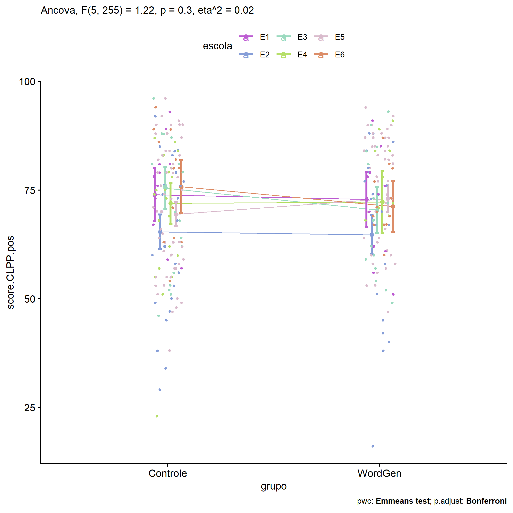<!-- -->

    ## Scale for colour is already present.
    ## Adding another scale for colour, which will replace the existing scale.

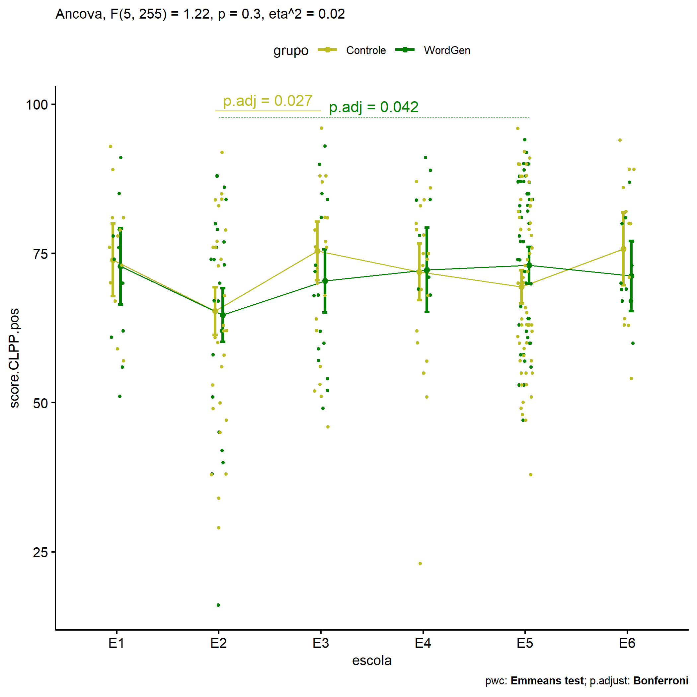<!-- -->

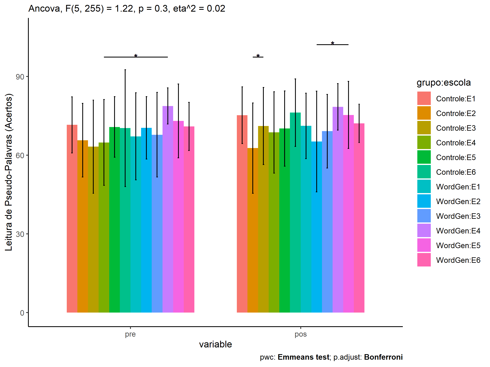<!-- -->

<!-- -->

### Correta Regular (Acertos)

| var          | escola | grupo    |   n | M (pre) | SE (pre) | M (unadj) | SE (unadj) | M (adj) | SE (adj) |
|:-------------|:-------|:---------|----:|--------:|---------:|----------:|-----------:|--------:|---------:|
| score.CR.pos | E1     | Controle |  15 |  14.267 |    1.169 |    12.733 |      1.811 |  12.801 |    1.436 |
| score.CR.pos | E1     | WordGen  |  13 |  12.462 |    1.824 |    13.077 |      1.741 |  13.783 |    1.550 |
| score.CR.pos | E2     | Controle |  35 |  13.257 |    0.794 |    11.800 |      1.047 |  12.224 |    0.944 |
| score.CR.pos | E2     | WordGen  |  28 |  15.714 |    0.575 |    11.107 |      1.329 |  10.662 |    1.055 |
| score.CR.pos | E3     | Controle |  22 |  12.091 |    0.965 |    13.136 |      1.216 |  13.973 |    1.199 |
| score.CR.pos | E3     | WordGen  |  16 |  13.812 |    1.042 |    14.562 |      0.851 |  14.790 |    1.391 |
| score.CR.pos | E4     | Controle |  20 |  14.900 |    0.932 |    15.800 |      0.787 |  15.643 |    1.244 |
| score.CR.pos | E4     | WordGen  |  10 |  16.200 |    1.855 |    16.900 |      0.526 |  16.283 |    1.763 |
| score.CR.pos | E5     | Controle |  68 |  14.397 |    0.487 |    12.912 |      0.716 |  12.933 |    0.674 |
| score.CR.pos | E5     | WordGen  |  54 |  15.315 |    0.515 |    14.093 |      0.739 |  13.789 |    0.760 |
| score.CR.pos | E6     | Controle |  16 |  14.625 |    1.341 |    14.000 |      1.789 |  13.940 |    1.390 |
| score.CR.pos | E6     | WordGen  |  14 |  16.357 |    0.452 |    16.000 |      1.318 |  15.328 |    1.493 |

| .y.          | grupo    | escola | group1   | group2  | estimate | conf.low | conf.high |    se | statistic |     p | p.adj | p.adj.signif |
|:-------------|:---------|:-------|:---------|:--------|---------:|---------:|----------:|------:|----------:|------:|------:|:-------------|
| score.CR.pos | Controle |        | E1       | E2      |    0.576 |   -2.804 |     3.957 | 1.718 |     0.335 | 0.738 | 1.000 | ns           |
| score.CR.pos | Controle |        | E1       | E3      |   -1.173 |   -4.851 |     2.506 | 1.869 |    -0.627 | 0.531 | 1.000 | ns           |
| score.CR.pos | Controle |        | E1       | E4      |   -2.843 |   -6.582 |     0.897 | 1.900 |    -1.496 | 0.136 | 1.000 | ns           |
| score.CR.pos | Controle |        | E1       | E5      |   -0.132 |   -3.254 |     2.990 | 1.586 |    -0.083 | 0.934 | 1.000 | ns           |
| score.CR.pos | Controle |        | E1       | E6      |   -1.140 |   -5.074 |     2.794 | 1.999 |    -0.570 | 0.569 | 1.000 | ns           |
| score.CR.pos | Controle |        | E2       | E3      |   -1.749 |   -4.731 |     1.234 | 1.516 |    -1.154 | 0.249 | 1.000 | ns           |
| score.CR.pos | Controle |        | E2       | E4      |   -3.419 |   -6.496 |    -0.342 | 1.564 |    -2.186 | 0.030 | 0.443 | ns           |
| score.CR.pos | Controle |        | E2       | E5      |   -0.709 |   -2.992 |     1.574 | 1.160 |    -0.611 | 0.542 | 1.000 | ns           |
| score.CR.pos | Controle |        | E2       | E6      |   -1.716 |   -5.025 |     1.593 | 1.681 |    -1.021 | 0.308 | 1.000 | ns           |
| score.CR.pos | Controle |        | E3       | E4      |   -1.670 |   -5.077 |     1.737 | 1.731 |    -0.965 | 0.335 | 1.000 | ns           |
| score.CR.pos | Controle |        | E3       | E5      |    1.040 |   -1.666 |     3.746 | 1.375 |     0.757 | 0.450 | 1.000 | ns           |
| score.CR.pos | Controle |        | E3       | E6      |    0.033 |   -3.583 |     3.648 | 1.837 |     0.018 | 0.986 | 1.000 | ns           |
| score.CR.pos | Controle |        | E4       | E5      |    2.710 |   -0.075 |     5.495 | 1.415 |     1.915 | 0.056 | 0.846 | ns           |
| score.CR.pos | Controle |        | E4       | E6      |    1.703 |   -1.968 |     5.374 | 1.865 |     0.913 | 0.362 | 1.000 | ns           |
| score.CR.pos | Controle |        | E5       | E6      |   -1.008 |   -4.049 |     2.033 | 1.545 |    -0.652 | 0.515 | 1.000 | ns           |
| score.CR.pos | WordGen  |        | E1       | E2      |    3.120 |   -0.584 |     6.825 | 1.882 |     1.658 | 0.098 | 1.000 | ns           |
| score.CR.pos | WordGen  |        | E1       | E3      |   -1.008 |   -5.099 |     3.084 | 2.079 |    -0.485 | 0.628 | 1.000 | ns           |
| score.CR.pos | WordGen  |        | E1       | E4      |   -2.501 |   -7.137 |     2.136 | 2.356 |    -1.061 | 0.289 | 1.000 | ns           |
| score.CR.pos | WordGen  |        | E1       | E5      |   -0.006 |   -3.414 |     3.401 | 1.731 |    -0.004 | 0.997 | 1.000 | ns           |
| score.CR.pos | WordGen  |        | E1       | E6      |   -1.545 |   -5.800 |     2.709 | 2.162 |    -0.715 | 0.475 | 1.000 | ns           |
| score.CR.pos | WordGen  |        | E2       | E3      |   -4.128 |   -7.569 |    -0.687 | 1.749 |    -2.361 | 0.019 | 0.283 | ns           |
| score.CR.pos | WordGen  |        | E2       | E4      |   -5.621 |   -9.653 |    -1.589 | 2.049 |    -2.743 | 0.006 | 0.097 | ns           |
| score.CR.pos | WordGen  |        | E2       | E5      |   -3.127 |   -5.676 |    -0.577 | 1.295 |    -2.414 | 0.016 | 0.246 | ns           |
| score.CR.pos | WordGen  |        | E2       | E6      |   -4.665 |   -8.249 |    -1.082 | 1.821 |    -2.562 | 0.011 | 0.163 | ns           |
| score.CR.pos | WordGen  |        | E3       | E4      |   -1.493 |   -5.919 |     2.933 | 2.249 |    -0.664 | 0.507 | 1.000 | ns           |
| score.CR.pos | WordGen  |        | E3       | E5      |    1.001 |   -2.122 |     4.124 | 1.587 |     0.631 | 0.529 | 1.000 | ns           |
| score.CR.pos | WordGen  |        | E3       | E6      |   -0.537 |   -4.560 |     3.485 | 2.044 |    -0.263 | 0.793 | 1.000 | ns           |
| score.CR.pos | WordGen  |        | E4       | E5      |    2.494 |   -1.276 |     6.264 | 1.916 |     1.302 | 0.194 | 1.000 | ns           |
| score.CR.pos | WordGen  |        | E4       | E6      |    0.956 |   -3.576 |     5.487 | 2.303 |     0.415 | 0.678 | 1.000 | ns           |
| score.CR.pos | WordGen  |        | E5       | E6      |   -1.539 |   -4.825 |     1.747 | 1.670 |    -0.922 | 0.357 | 1.000 | ns           |
| score.CR.pre | Controle |        | E1       | E2      |    1.010 |   -1.582 |     3.601 | 1.317 |     0.767 | 0.444 | 1.000 | ns           |
| score.CR.pre | Controle |        | E1       | E3      |    2.176 |   -0.636 |     4.987 | 1.429 |     1.523 | 0.129 | 1.000 | ns           |
| score.CR.pre | Controle |        | E1       | E4      |   -0.633 |   -3.501 |     2.235 | 1.457 |    -0.435 | 0.664 | 1.000 | ns           |
| score.CR.pre | Controle |        | E1       | E5      |   -0.130 |   -2.526 |     2.265 | 1.217 |    -0.107 | 0.915 | 1.000 | ns           |
| score.CR.pre | Controle |        | E1       | E6      |   -0.358 |   -3.376 |     2.659 | 1.533 |    -0.234 | 0.815 | 1.000 | ns           |
| score.CR.pre | Controle |        | E2       | E3      |    1.166 |   -1.118 |     3.451 | 1.161 |     1.005 | 0.316 | 1.000 | ns           |
| score.CR.pre | Controle |        | E2       | E4      |   -1.643 |   -3.996 |     0.711 | 1.196 |    -1.374 | 0.171 | 1.000 | ns           |
| score.CR.pre | Controle |        | E2       | E5      |   -1.140 |   -2.887 |     0.607 | 0.888 |    -1.284 | 0.200 | 1.000 | ns           |
| score.CR.pre | Controle |        | E2       | E6      |   -1.368 |   -3.902 |     1.166 | 1.288 |    -1.062 | 0.289 | 1.000 | ns           |
| score.CR.pre | Controle |        | E3       | E4      |   -2.809 |   -5.403 |    -0.215 | 1.318 |    -2.131 | 0.034 | 0.509 | ns           |
| score.CR.pre | Controle |        | E3       | E5      |   -2.306 |   -4.366 |    -0.247 | 1.047 |    -2.204 | 0.028 | 0.425 | ns           |
| score.CR.pre | Controle |        | E3       | E6      |   -2.534 |   -5.293 |     0.225 | 1.402 |    -1.808 | 0.072 | 1.000 | ns           |
| score.CR.pre | Controle |        | E4       | E5      |    0.503 |   -1.633 |     2.639 | 1.085 |     0.463 | 0.643 | 1.000 | ns           |
| score.CR.pre | Controle |        | E4       | E6      |    0.275 |   -2.541 |     3.091 | 1.431 |     0.192 | 0.848 | 1.000 | ns           |
| score.CR.pre | Controle |        | E5       | E6      |   -0.228 |   -2.561 |     2.105 | 1.186 |    -0.192 | 0.848 | 1.000 | ns           |
| score.CR.pre | WordGen  |        | E1       | E2      |   -3.253 |   -6.071 |    -0.435 | 1.432 |    -2.272 | 0.024 | 0.357 | ns           |
| score.CR.pre | WordGen  |        | E1       | E3      |   -1.351 |   -4.486 |     1.784 | 1.593 |    -0.848 | 0.397 | 1.000 | ns           |
| score.CR.pre | WordGen  |        | E1       | E4      |   -3.738 |   -7.270 |    -0.207 | 1.795 |    -2.083 | 0.038 | 0.571 | ns           |
| score.CR.pre | WordGen  |        | E1       | E5      |   -2.853 |   -5.447 |    -0.259 | 1.318 |    -2.165 | 0.031 | 0.468 | ns           |
| score.CR.pre | WordGen  |        | E1       | E6      |   -3.896 |   -7.130 |    -0.662 | 1.643 |    -2.371 | 0.018 | 0.276 | ns           |
| score.CR.pre | WordGen  |        | E2       | E3      |    1.902 |   -0.730 |     4.533 | 1.337 |     1.422 | 0.156 | 1.000 | ns           |
| score.CR.pre | WordGen  |        | E2       | E4      |   -0.486 |   -3.579 |     2.608 | 1.572 |    -0.309 | 0.758 | 1.000 | ns           |
| score.CR.pre | WordGen  |        | E2       | E5      |    0.399 |   -1.556 |     2.355 | 0.994 |     0.402 | 0.688 | 1.000 | ns           |
| score.CR.pre | WordGen  |        | E2       | E6      |   -0.643 |   -3.391 |     2.106 | 1.397 |    -0.460 | 0.646 | 1.000 | ns           |
| score.CR.pre | WordGen  |        | E3       | E4      |   -2.387 |   -5.772 |     0.997 | 1.720 |    -1.388 | 0.166 | 1.000 | ns           |
| score.CR.pre | WordGen  |        | E3       | E5      |   -1.502 |   -3.892 |     0.888 | 1.214 |    -1.237 | 0.217 | 1.000 | ns           |
| score.CR.pre | WordGen  |        | E3       | E6      |   -2.545 |   -5.617 |     0.528 | 1.561 |    -1.630 | 0.104 | 1.000 | ns           |
| score.CR.pre | WordGen  |        | E4       | E5      |    0.885 |   -2.005 |     3.776 | 1.469 |     0.603 | 0.547 | 1.000 | ns           |
| score.CR.pre | WordGen  |        | E4       | E6      |   -0.157 |   -3.634 |     3.319 | 1.767 |    -0.089 | 0.929 | 1.000 | ns           |
| score.CR.pre | WordGen  |        | E5       | E6      |   -1.042 |   -3.561 |     1.476 | 1.280 |    -0.815 | 0.416 | 1.000 | ns           |
| score.CR.pos |          | E1     | Controle | WordGen |   -0.982 |   -5.138 |     3.174 | 2.112 |    -0.465 | 0.642 | 0.642 | ns           |
| score.CR.pos |          | E2     | Controle | WordGen |    1.562 |   -1.237 |     4.361 | 1.422 |     1.098 | 0.273 | 0.273 | ns           |
| score.CR.pos |          | E3     | Controle | WordGen |   -0.817 |   -4.422 |     2.788 | 1.832 |    -0.446 | 0.656 | 0.656 | ns           |
| score.CR.pos |          | E4     | Controle | WordGen |   -0.640 |   -4.883 |     3.603 | 2.156 |    -0.297 | 0.767 | 0.767 | ns           |
| score.CR.pos |          | E5     | Controle | WordGen |   -0.856 |   -2.856 |     1.143 | 1.016 |    -0.843 | 0.400 | 0.400 | ns           |
| score.CR.pos |          | E6     | Controle | WordGen |   -1.387 |   -5.401 |     2.626 | 2.039 |    -0.680 | 0.497 | 0.497 | ns           |
| score.CR.pre |          | E1     | Controle | WordGen |    1.805 |   -1.377 |     4.987 | 1.617 |     1.116 | 0.265 | 0.265 | ns           |
| score.CR.pre |          | E2     | Controle | WordGen |   -2.457 |   -4.586 |    -0.328 | 1.082 |    -2.271 | 0.024 | 0.024 | \*           |
| score.CR.pre |          | E3     | Controle | WordGen |   -1.722 |   -4.480 |     1.037 | 1.402 |    -1.228 | 0.220 | 0.220 | ns           |
| score.CR.pre |          | E4     | Controle | WordGen |   -1.300 |   -4.552 |     1.952 | 1.652 |    -0.787 | 0.432 | 0.432 | ns           |
| score.CR.pre |          | E5     | Controle | WordGen |   -0.918 |   -2.448 |     0.613 | 0.778 |    -1.180 | 0.239 | 0.239 | ns           |
| score.CR.pre |          | E6     | Controle | WordGen |   -1.732 |   -4.805 |     1.341 | 1.561 |    -1.109 | 0.268 | 0.268 | ns           |

| grupo    | escola | group1 | group2 | estimate | conf.low | conf.high |    se | statistic | p       | p.adj   | p.adj.signif |
|:---------|:-------|:-------|:-------|---------:|---------:|----------:|------:|----------:|:--------|:--------|:-------------|
| Controle | E1     | pre    | pos    |    1.533 |   -2.099 |     5.165 | 1.849 |     0.829 | 0.407   | 0.407   | ns           |
| Controle | E2     | pre    | pos    |    1.457 |   -0.921 |     3.835 | 1.211 |     1.204 | 0.229   | 0.229   | ns           |
| Controle | E3     | pre    | pos    |   -1.045 |   -4.045 |     1.954 | 1.527 |    -0.685 | 0.494   | 0.494   | ns           |
| Controle | E4     | pre    | pos    |   -0.900 |   -4.045 |     2.245 | 1.602 |    -0.562 | 0.574   | 0.574   | ns           |
| Controle | E5     | pre    | pos    |    1.485 |   -0.221 |     3.191 | 0.869 |     1.710 | 0.088   | 0.088   | ns           |
| Controle | E6     | pre    | pos    |    0.625 |   -2.892 |     4.142 | 1.791 |     0.349 | 0.727   | 0.727   | ns           |
| WordGen  | E1     | pre    | pos    |   -0.615 |   -4.517 |     3.286 | 1.987 |    -0.310 | 0.757   | 0.757   | ns           |
| WordGen  | E2     | pre    | pos    |    4.607 |    1.949 |     7.266 | 1.354 |     3.404 | \<0.001 | \<0.001 | \*\*\*       |
| WordGen  | E3     | pre    | pos    |   -0.750 |   -4.267 |     2.767 | 1.791 |    -0.419 | 0.675   | 0.675   | ns           |
| WordGen  | E4     | pre    | pos    |   -0.700 |   -5.148 |     3.748 | 2.265 |    -0.309 | 0.757   | 0.757   | ns           |
| WordGen  | E5     | pre    | pos    |    1.222 |   -0.692 |     3.137 | 0.975 |     1.254 | 0.21    | 0.21    | ns           |
| WordGen  | E6     | pre    | pos    |    0.357 |   -3.402 |     4.117 | 1.914 |     0.187 | 0.852   | 0.852   | ns           |

    ## Scale for colour is already present.
    ## Adding another scale for colour, which will replace the existing scale.

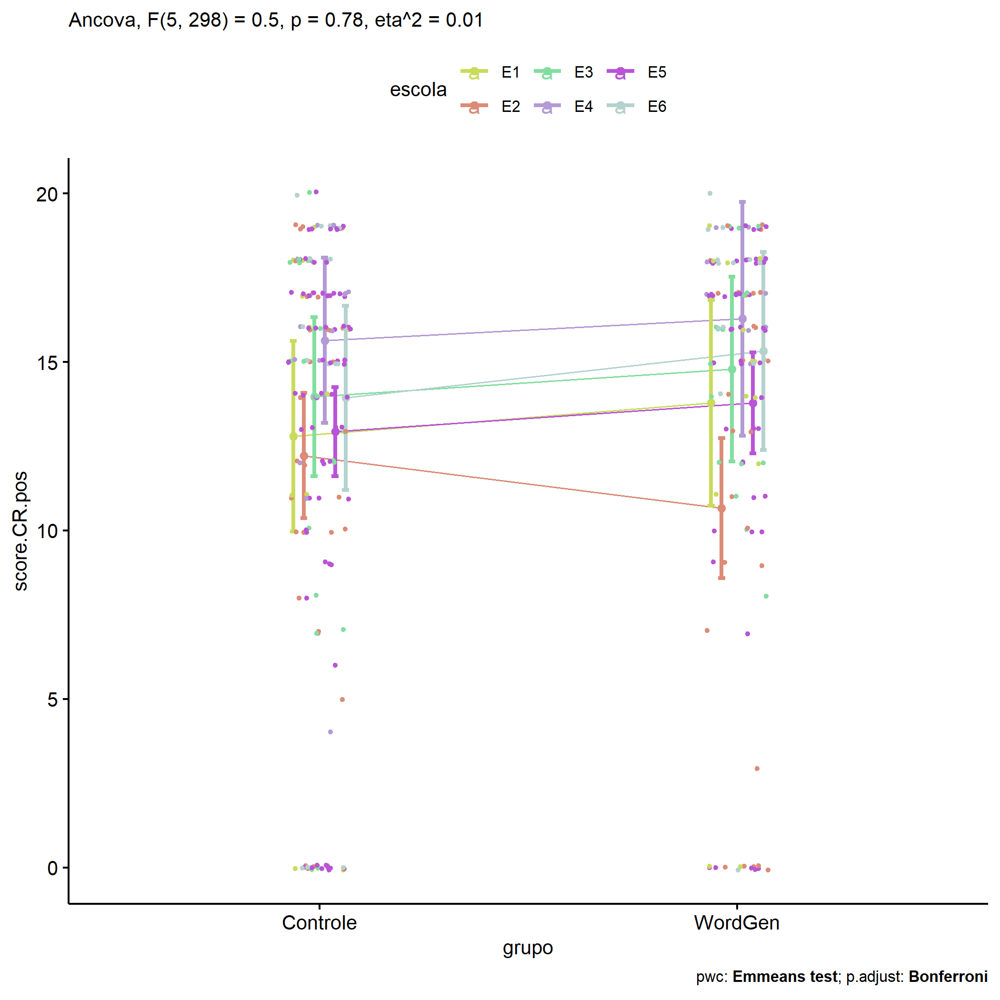<!-- -->

    ## Scale for colour is already present.
    ## Adding another scale for colour, which will replace the existing scale.

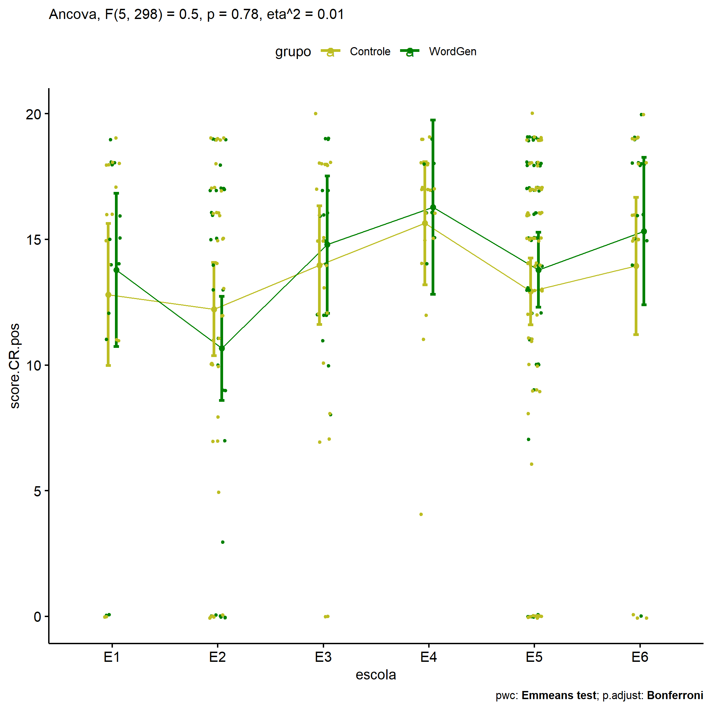<!-- -->

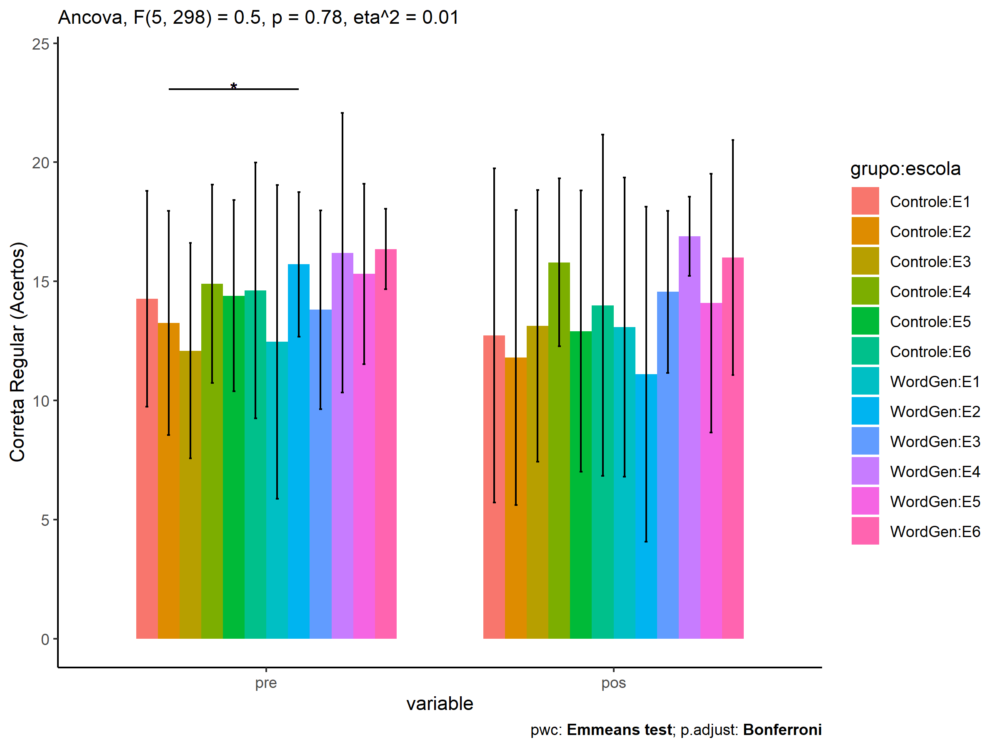<!-- -->

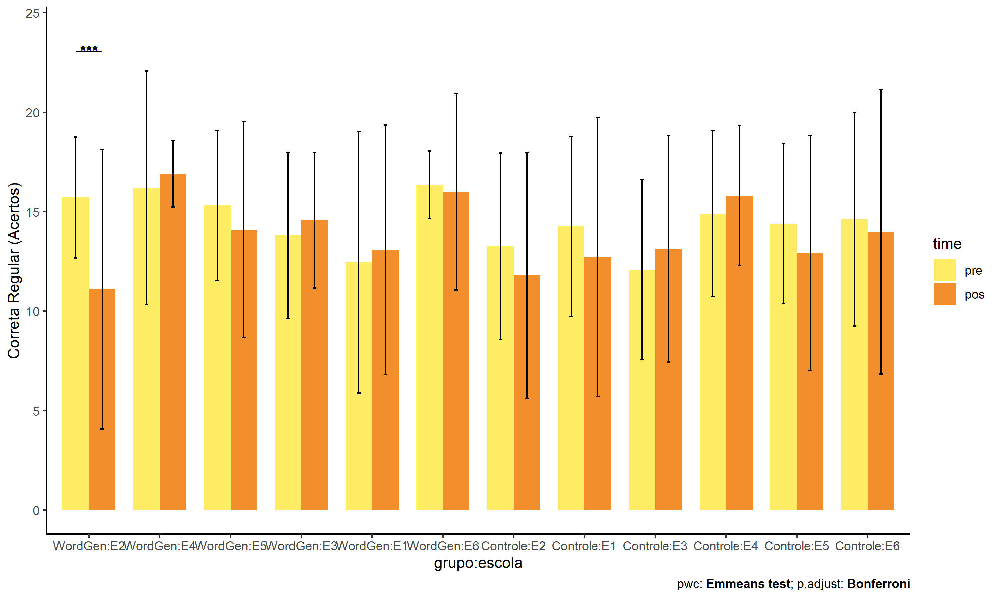<!-- -->

### Correta Irregular (Acertos)

| var          | escola | grupo    |   n | M (pre) | SE (pre) | M (unadj) | SE (unadj) | M (adj) | SE (adj) |
|:-------------|:-------|:---------|----:|--------:|---------:|----------:|-----------:|--------:|---------:|
| score.CI.pos | E1     | Controle |  15 |  11.467 |    1.125 |     9.933 |      1.563 |   9.996 |    1.227 |
| score.CI.pos | E1     | WordGen  |  13 |  10.538 |    1.682 |    10.769 |      1.590 |  11.289 |    1.320 |
| score.CI.pos | E2     | Controle |  35 |  11.057 |    0.718 |     8.886 |      0.895 |   9.150 |    0.804 |
| score.CI.pos | E2     | WordGen  |  28 |  12.464 |    0.592 |     9.464 |      1.106 |   9.036 |    0.900 |
| score.CI.pos | E3     | Controle |  22 |  10.000 |    0.971 |    11.364 |      1.110 |  12.149 |    1.019 |
| score.CI.pos | E3     | WordGen  |  16 |  11.125 |    0.884 |    12.438 |      0.922 |  12.669 |    1.189 |
| score.CI.pos | E4     | Controle |  20 |  11.750 |    0.836 |    12.400 |      0.825 |  12.324 |    1.063 |
| score.CI.pos | E4     | WordGen  |  10 |  12.200 |    1.604 |    13.600 |      1.013 |  13.302 |    1.504 |
| score.CI.pos | E5     | Controle |  68 |  11.456 |    0.491 |    10.176 |      0.649 |  10.245 |    0.576 |
| score.CI.pos | E5     | WordGen  |  54 |  12.019 |    0.467 |    12.278 |      0.654 |  12.069 |    0.647 |
| score.CI.pos | E6     | Controle |  16 |  11.688 |    1.303 |    12.188 |      1.610 |  12.142 |    1.188 |
| score.CI.pos | E6     | WordGen  |  14 |  13.643 |    0.684 |    12.714 |      1.160 |  11.706 |    1.278 |

| .y.          | grupo    | escola | group1   | group2  | estimate | conf.low | conf.high |    se | statistic |     p | p.adj | p.adj.signif |
|:-------------|:---------|:-------|:---------|:--------|---------:|---------:|----------:|------:|----------:|------:|------:|:-------------|
| score.CI.pos | Controle |        | E1       | E2      |    0.846 |   -2.041 |     3.733 | 1.467 |     0.577 | 0.565 | 1.000 | ns           |
| score.CI.pos | Controle |        | E1       | E3      |   -2.152 |   -5.290 |     0.986 | 1.595 |    -1.350 | 0.178 | 1.000 | ns           |
| score.CI.pos | Controle |        | E1       | E4      |   -2.327 |   -5.522 |     0.868 | 1.624 |    -1.433 | 0.153 | 1.000 | ns           |
| score.CI.pos | Controle |        | E1       | E5      |   -0.248 |   -2.917 |     2.420 | 1.356 |    -0.183 | 0.855 | 1.000 | ns           |
| score.CI.pos | Controle |        | E1       | E6      |   -2.145 |   -5.507 |     1.216 | 1.708 |    -1.256 | 0.210 | 1.000 | ns           |
| score.CI.pos | Controle |        | E2       | E3      |   -2.998 |   -5.547 |    -0.450 | 1.295 |    -2.315 | 0.021 | 0.319 | ns           |
| score.CI.pos | Controle |        | E2       | E4      |   -3.173 |   -5.797 |    -0.550 | 1.333 |    -2.380 | 0.018 | 0.269 | ns           |
| score.CI.pos | Controle |        | E2       | E5      |   -1.094 |   -3.041 |     0.852 | 0.989 |    -1.107 | 0.269 | 1.000 | ns           |
| score.CI.pos | Controle |        | E2       | E6      |   -2.991 |   -5.815 |    -0.168 | 1.435 |    -2.085 | 0.038 | 0.569 | ns           |
| score.CI.pos | Controle |        | E3       | E4      |   -0.175 |   -3.074 |     2.724 | 1.473 |    -0.119 | 0.906 | 1.000 | ns           |
| score.CI.pos | Controle |        | E3       | E5      |    1.904 |   -0.398 |     4.206 | 1.170 |     1.627 | 0.105 | 1.000 | ns           |
| score.CI.pos | Controle |        | E3       | E6      |    0.007 |   -3.074 |     3.088 | 1.566 |     0.004 | 0.996 | 1.000 | ns           |
| score.CI.pos | Controle |        | E4       | E5      |    2.079 |   -0.301 |     4.458 | 1.209 |     1.719 | 0.087 | 1.000 | ns           |
| score.CI.pos | Controle |        | E4       | E6      |    0.182 |   -2.955 |     3.319 | 1.594 |     0.114 | 0.909 | 1.000 | ns           |
| score.CI.pos | Controle |        | E5       | E6      |   -1.897 |   -4.496 |     0.702 | 1.321 |    -1.436 | 0.152 | 1.000 | ns           |
| score.CI.pos | WordGen  |        | E1       | E2      |    2.253 |   -0.897 |     5.403 | 1.600 |     1.408 | 0.160 | 1.000 | ns           |
| score.CI.pos | WordGen  |        | E1       | E3      |   -1.380 |   -4.873 |     2.114 | 1.775 |    -0.777 | 0.438 | 1.000 | ns           |
| score.CI.pos | WordGen  |        | E1       | E4      |   -2.013 |   -5.953 |     1.928 | 2.002 |    -1.005 | 0.316 | 1.000 | ns           |
| score.CI.pos | WordGen  |        | E1       | E5      |   -0.780 |   -3.676 |     2.116 | 1.472 |    -0.530 | 0.597 | 1.000 | ns           |
| score.CI.pos | WordGen  |        | E1       | E6      |   -0.417 |   -4.043 |     3.210 | 1.843 |    -0.226 | 0.821 | 1.000 | ns           |
| score.CI.pos | WordGen  |        | E2       | E3      |   -3.633 |   -6.569 |    -0.696 | 1.492 |    -2.434 | 0.016 | 0.233 | ns           |
| score.CI.pos | WordGen  |        | E2       | E4      |   -4.266 |   -7.712 |    -0.820 | 1.751 |    -2.436 | 0.015 | 0.231 | ns           |
| score.CI.pos | WordGen  |        | E2       | E5      |   -3.033 |   -5.212 |    -0.854 | 1.107 |    -2.739 | 0.007 | 0.098 | ns           |
| score.CI.pos | WordGen  |        | E2       | E6      |   -2.670 |   -5.735 |     0.396 | 1.558 |    -1.714 | 0.088 | 1.000 | ns           |
| score.CI.pos | WordGen  |        | E3       | E4      |   -0.633 |   -4.406 |     3.140 | 1.917 |    -0.330 | 0.741 | 1.000 | ns           |
| score.CI.pos | WordGen  |        | E3       | E5      |    0.600 |   -2.065 |     3.265 | 1.354 |     0.443 | 0.658 | 1.000 | ns           |
| score.CI.pos | WordGen  |        | E3       | E6      |    0.963 |   -2.477 |     4.402 | 1.748 |     0.551 | 0.582 | 1.000 | ns           |
| score.CI.pos | WordGen  |        | E4       | E5      |    1.233 |   -1.987 |     4.453 | 1.636 |     0.753 | 0.452 | 1.000 | ns           |
| score.CI.pos | WordGen  |        | E4       | E6      |    1.596 |   -2.281 |     5.473 | 1.970 |     0.810 | 0.419 | 1.000 | ns           |
| score.CI.pos | WordGen  |        | E5       | E6      |    0.363 |   -2.450 |     3.177 | 1.430 |     0.254 | 0.800 | 1.000 | ns           |
| score.CI.pre | Controle |        | E1       | E2      |    0.410 |   -2.054 |     2.873 | 1.252 |     0.327 | 0.744 | 1.000 | ns           |
| score.CI.pre | Controle |        | E1       | E3      |    1.467 |   -1.206 |     4.140 | 1.358 |     1.080 | 0.281 | 1.000 | ns           |
| score.CI.pre | Controle |        | E1       | E4      |   -0.283 |   -3.010 |     2.443 | 1.385 |    -0.205 | 0.838 | 1.000 | ns           |
| score.CI.pre | Controle |        | E1       | E5      |    0.011 |   -2.266 |     2.288 | 1.157 |     0.009 | 0.993 | 1.000 | ns           |
| score.CI.pre | Controle |        | E1       | E6      |   -0.221 |   -3.090 |     2.648 | 1.458 |    -0.151 | 0.880 | 1.000 | ns           |
| score.CI.pre | Controle |        | E2       | E3      |    1.057 |   -1.115 |     3.229 | 1.104 |     0.958 | 0.339 | 1.000 | ns           |
| score.CI.pre | Controle |        | E2       | E4      |   -0.693 |   -2.930 |     1.545 | 1.137 |    -0.609 | 0.543 | 1.000 | ns           |
| score.CI.pre | Controle |        | E2       | E5      |   -0.399 |   -2.059 |     1.262 | 0.844 |    -0.473 | 0.637 | 1.000 | ns           |
| score.CI.pre | Controle |        | E2       | E6      |   -0.630 |   -3.039 |     1.779 | 1.224 |    -0.515 | 0.607 | 1.000 | ns           |
| score.CI.pre | Controle |        | E3       | E4      |   -1.750 |   -4.216 |     0.716 | 1.253 |    -1.396 | 0.164 | 1.000 | ns           |
| score.CI.pre | Controle |        | E3       | E5      |   -1.456 |   -3.414 |     0.502 | 0.995 |    -1.463 | 0.144 | 1.000 | ns           |
| score.CI.pre | Controle |        | E3       | E6      |   -1.687 |   -4.310 |     0.935 | 1.333 |    -1.266 | 0.206 | 1.000 | ns           |
| score.CI.pre | Controle |        | E4       | E5      |    0.294 |   -1.736 |     2.325 | 1.032 |     0.285 | 0.776 | 1.000 | ns           |
| score.CI.pre | Controle |        | E4       | E6      |    0.062 |   -2.615 |     2.740 | 1.360 |     0.046 | 0.963 | 1.000 | ns           |
| score.CI.pre | Controle |        | E5       | E6      |   -0.232 |   -2.450 |     1.986 | 1.127 |    -0.206 | 0.837 | 1.000 | ns           |
| score.CI.pre | WordGen  |        | E1       | E2      |   -1.926 |   -4.605 |     0.753 | 1.361 |    -1.415 | 0.158 | 1.000 | ns           |
| score.CI.pre | WordGen  |        | E1       | E3      |   -0.587 |   -3.567 |     2.394 | 1.515 |    -0.387 | 0.699 | 1.000 | ns           |
| score.CI.pre | WordGen  |        | E1       | E4      |   -1.662 |   -5.019 |     1.696 | 1.706 |    -0.974 | 0.331 | 1.000 | ns           |
| score.CI.pre | WordGen  |        | E1       | E5      |   -1.480 |   -3.946 |     0.986 | 1.253 |    -1.181 | 0.238 | 1.000 | ns           |
| score.CI.pre | WordGen  |        | E1       | E6      |   -3.104 |   -6.179 |    -0.030 | 1.562 |    -1.987 | 0.048 | 0.717 | ns           |
| score.CI.pre | WordGen  |        | E2       | E3      |    1.339 |   -1.162 |     3.841 | 1.271 |     1.054 | 0.293 | 1.000 | ns           |
| score.CI.pre | WordGen  |        | E2       | E4      |    0.264 |   -2.676 |     3.205 | 1.494 |     0.177 | 0.860 | 1.000 | ns           |
| score.CI.pre | WordGen  |        | E2       | E5      |    0.446 |   -1.413 |     2.305 | 0.945 |     0.472 | 0.637 | 1.000 | ns           |
| score.CI.pre | WordGen  |        | E2       | E6      |   -1.179 |   -3.791 |     1.434 | 1.328 |    -0.888 | 0.375 | 1.000 | ns           |
| score.CI.pre | WordGen  |        | E3       | E4      |   -1.075 |   -4.293 |     2.143 | 1.635 |    -0.657 | 0.511 | 1.000 | ns           |
| score.CI.pre | WordGen  |        | E3       | E5      |   -0.894 |   -3.166 |     1.379 | 1.155 |    -0.774 | 0.440 | 1.000 | ns           |
| score.CI.pre | WordGen  |        | E3       | E6      |   -2.518 |   -5.439 |     0.403 | 1.484 |    -1.696 | 0.091 | 1.000 | ns           |
| score.CI.pre | WordGen  |        | E4       | E5      |    0.181 |   -2.567 |     2.930 | 1.396 |     0.130 | 0.897 | 1.000 | ns           |
| score.CI.pre | WordGen  |        | E4       | E6      |   -1.443 |   -4.748 |     1.862 | 1.679 |    -0.859 | 0.391 | 1.000 | ns           |
| score.CI.pre | WordGen  |        | E5       | E6      |   -1.624 |   -4.018 |     0.770 | 1.217 |    -1.335 | 0.183 | 1.000 | ns           |
| score.CI.pos |          | E1     | Controle | WordGen |   -1.293 |   -4.839 |     2.254 | 1.802 |    -0.717 | 0.474 | 0.474 | ns           |
| score.CI.pos |          | E2     | Controle | WordGen |    0.114 |   -2.265 |     2.493 | 1.209 |     0.094 | 0.925 | 0.925 | ns           |
| score.CI.pos |          | E3     | Controle | WordGen |   -0.520 |   -3.597 |     2.557 | 1.563 |    -0.333 | 0.740 | 0.740 | ns           |
| score.CI.pos |          | E4     | Controle | WordGen |   -0.978 |   -4.601 |     2.645 | 1.841 |    -0.531 | 0.595 | 0.595 | ns           |
| score.CI.pos |          | E5     | Controle | WordGen |   -1.824 |   -3.531 |    -0.118 | 0.867 |    -2.104 | 0.036 | 0.036 | \*           |
| score.CI.pos |          | E6     | Controle | WordGen |    0.436 |   -2.997 |     3.869 | 1.744 |     0.250 | 0.803 | 0.803 | ns           |
| score.CI.pre |          | E1     | Controle | WordGen |    0.928 |   -2.097 |     3.953 | 1.537 |     0.604 | 0.546 | 0.546 | ns           |
| score.CI.pre |          | E2     | Controle | WordGen |   -1.407 |   -3.431 |     0.617 | 1.028 |    -1.368 | 0.172 | 0.172 | ns           |
| score.CI.pre |          | E3     | Controle | WordGen |   -1.125 |   -3.748 |     1.498 | 1.333 |    -0.844 | 0.399 | 0.399 | ns           |
| score.CI.pre |          | E4     | Controle | WordGen |   -0.450 |   -3.542 |     2.642 | 1.571 |    -0.286 | 0.775 | 0.775 | ns           |
| score.CI.pre |          | E5     | Controle | WordGen |   -0.563 |   -2.018 |     0.892 | 0.739 |    -0.761 | 0.447 | 0.447 | ns           |
| score.CI.pre |          | E6     | Controle | WordGen |   -1.955 |   -4.877 |     0.966 | 1.484 |    -1.317 | 0.189 | 0.189 | ns           |

| grupo    | escola | group1 | group2 | estimate | conf.low | conf.high |    se | statistic |     p | p.adj | p.adj.signif |
|:---------|:-------|:-------|:-------|---------:|---------:|----------:|------:|----------:|------:|------:|:-------------|
| Controle | E1     | pre    | pos    |    1.533 |   -1.790 |     4.857 | 1.692 |     0.906 | 0.365 | 0.365 | ns           |
| Controle | E2     | pre    | pos    |    2.171 |   -0.004 |     4.347 | 1.108 |     1.960 | 0.050 | 0.050 | ns           |
| Controle | E3     | pre    | pos    |   -1.364 |   -4.108 |     1.381 | 1.397 |    -0.976 | 0.330 | 0.330 | ns           |
| Controle | E4     | pre    | pos    |   -0.650 |   -3.528 |     2.228 | 1.466 |    -0.444 | 0.658 | 0.658 | ns           |
| Controle | E5     | pre    | pos    |    1.279 |   -0.281 |     2.840 | 0.795 |     1.610 | 0.108 | 0.108 | ns           |
| Controle | E6     | pre    | pos    |   -0.500 |   -3.718 |     2.718 | 1.638 |    -0.305 | 0.760 | 0.760 | ns           |
| WordGen  | E1     | pre    | pos    |   -0.231 |   -3.801 |     3.339 | 1.818 |    -0.127 | 0.899 | 0.899 | ns           |
| WordGen  | E2     | pre    | pos    |    3.000 |    0.567 |     5.433 | 1.239 |     2.422 | 0.016 | 0.016 | \*           |
| WordGen  | E3     | pre    | pos    |   -1.313 |   -4.530 |     1.905 | 1.638 |    -0.801 | 0.423 | 0.423 | ns           |
| WordGen  | E4     | pre    | pos    |   -1.400 |   -5.470 |     2.670 | 2.073 |    -0.675 | 0.500 | 0.500 | ns           |
| WordGen  | E5     | pre    | pos    |   -0.259 |   -2.011 |     1.492 | 0.892 |    -0.291 | 0.771 | 0.771 | ns           |
| WordGen  | E6     | pre    | pos    |    0.929 |   -2.512 |     4.369 | 1.752 |     0.530 | 0.596 | 0.596 | ns           |

    ## Scale for colour is already present.
    ## Adding another scale for colour, which will replace the existing scale.

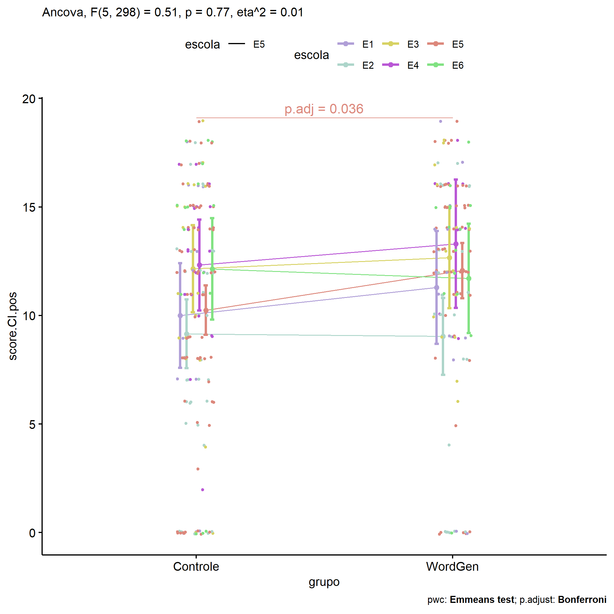<!-- -->

    ## Scale for colour is already present.
    ## Adding another scale for colour, which will replace the existing scale.

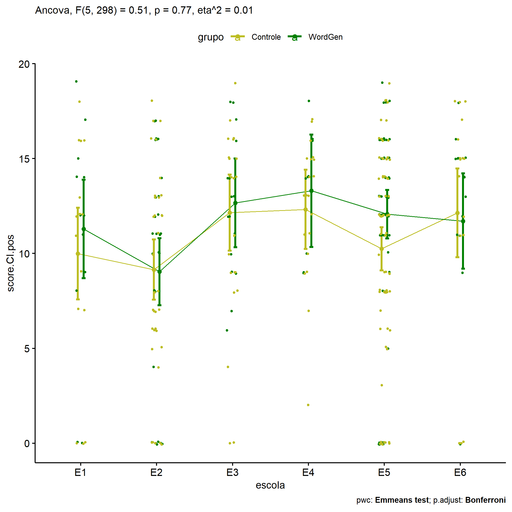<!-- -->

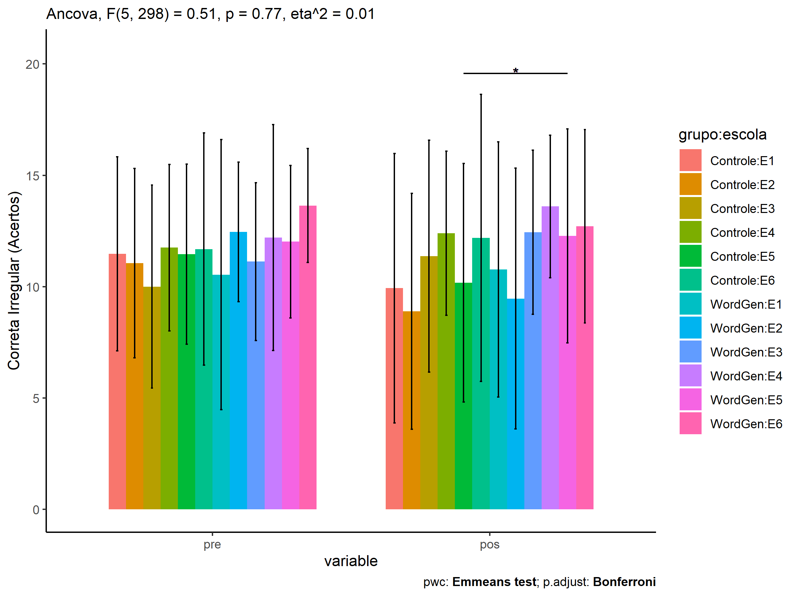<!-- -->

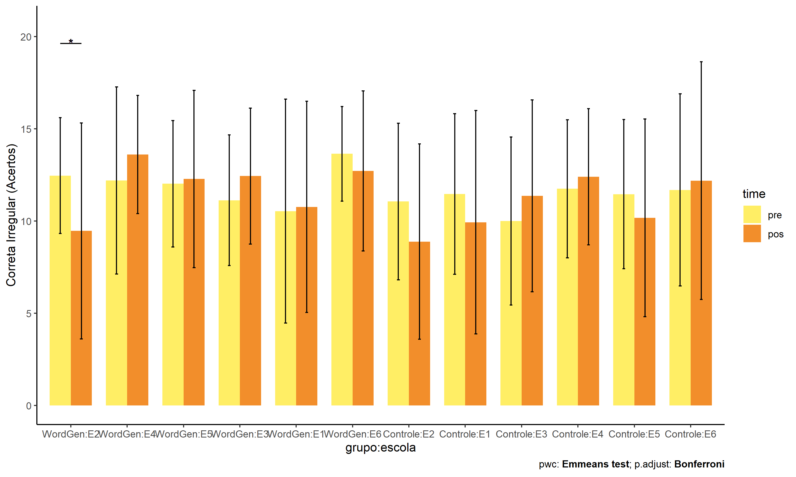<!-- -->

### Trocas Visuais (Acertos)

| var          | escola | grupo    |   n | M (pre) | SE (pre) | M (unadj) | SE (unadj) | M (adj) | SE (adj) |
|:-------------|:-------|:---------|----:|--------:|---------:|----------:|-----------:|--------:|---------:|
| score.TV.pos | E1     | Controle |  15 |  16.667 |    1.308 |    14.733 |      2.025 |  14.532 |    1.557 |
| score.TV.pos | E1     | WordGen  |  13 |  13.231 |    2.187 |    13.692 |      2.046 |  14.752 |    1.685 |
| score.TV.pos | E2     | Controle |  35 |  15.486 |    0.908 |    12.657 |      1.176 |  12.889 |    1.020 |
| score.TV.pos | E2     | WordGen  |  28 |  17.607 |    0.502 |    12.214 |      1.493 |  11.668 |    1.145 |
| score.TV.pos | E3     | Controle |  22 |  14.545 |    1.130 |    15.864 |      1.238 |  16.441 |    1.290 |
| score.TV.pos | E3     | WordGen  |  16 |  16.812 |    1.137 |    16.375 |      0.939 |  16.121 |    1.508 |
| score.TV.pos | E4     | Controle |  20 |  15.850 |    1.027 |    16.350 |      0.776 |  16.449 |    1.348 |
| score.TV.pos | E4     | WordGen  |  10 |  16.500 |    1.887 |    17.800 |      0.680 |  17.660 |    1.907 |
| score.TV.pos | E5     | Controle |  68 |  16.103 |    0.543 |    14.662 |      0.782 |  14.668 |    0.731 |
| score.TV.pos | E5     | WordGen  |  54 |  17.111 |    0.516 |    15.741 |      0.776 |  15.377 |    0.824 |
| score.TV.pos | E6     | Controle |  16 |  15.062 |    1.632 |    13.688 |      1.899 |  14.075 |    1.509 |
| score.TV.pos | E6     | WordGen  |  14 |  16.071 |    0.752 |    15.929 |      1.336 |  15.946 |    1.611 |

| .y.          | grupo    | escola | group1   | group2  | estimate | conf.low | conf.high |    se | statistic |     p | p.adj | p.adj.signif |
|:-------------|:---------|:-------|:---------|:--------|---------:|---------:|----------:|------:|----------:|------:|------:|:-------------|
| score.TV.pos | Controle |        | E1       | E2      |    1.643 |   -2.022 |     5.308 | 1.863 |     0.882 | 0.378 | 1.000 | ns           |
| score.TV.pos | Controle |        | E1       | E3      |   -1.909 |   -5.893 |     2.076 | 2.025 |    -0.943 | 0.347 | 1.000 | ns           |
| score.TV.pos | Controle |        | E1       | E4      |   -1.916 |   -5.970 |     2.138 | 2.060 |    -0.930 | 0.353 | 1.000 | ns           |
| score.TV.pos | Controle |        | E1       | E5      |   -0.135 |   -3.521 |     3.250 | 1.720 |    -0.079 | 0.937 | 1.000 | ns           |
| score.TV.pos | Controle |        | E1       | E6      |    0.457 |   -3.813 |     4.728 | 2.170 |     0.211 | 0.833 | 1.000 | ns           |
| score.TV.pos | Controle |        | E2       | E3      |   -3.551 |   -6.782 |    -0.321 | 1.642 |    -2.163 | 0.031 | 0.470 | ns           |
| score.TV.pos | Controle |        | E2       | E4      |   -3.559 |   -6.885 |    -0.233 | 1.690 |    -2.106 | 0.036 | 0.541 | ns           |
| score.TV.pos | Controle |        | E2       | E5      |   -1.778 |   -4.248 |     0.692 | 1.255 |    -1.417 | 0.158 | 1.000 | ns           |
| score.TV.pos | Controle |        | E2       | E6      |   -1.186 |   -4.767 |     2.395 | 1.820 |    -0.652 | 0.515 | 1.000 | ns           |
| score.TV.pos | Controle |        | E3       | E4      |   -0.008 |   -3.678 |     3.663 | 1.865 |    -0.004 | 0.997 | 1.000 | ns           |
| score.TV.pos | Controle |        | E3       | E5      |    1.773 |   -1.145 |     4.692 | 1.483 |     1.196 | 0.233 | 1.000 | ns           |
| score.TV.pos | Controle |        | E3       | E6      |    2.366 |   -1.533 |     6.265 | 1.981 |     1.194 | 0.233 | 1.000 | ns           |
| score.TV.pos | Controle |        | E4       | E5      |    1.781 |   -1.237 |     4.799 | 1.534 |     1.161 | 0.246 | 1.000 | ns           |
| score.TV.pos | Controle |        | E4       | E6      |    2.374 |   -1.607 |     6.355 | 2.023 |     1.173 | 0.242 | 1.000 | ns           |
| score.TV.pos | Controle |        | E5       | E6      |    0.593 |   -2.707 |     3.893 | 1.677 |     0.353 | 0.724 | 1.000 | ns           |
| score.TV.pos | WordGen  |        | E1       | E2      |    3.084 |   -0.948 |     7.115 | 2.049 |     1.505 | 0.133 | 1.000 | ns           |
| score.TV.pos | WordGen  |        | E1       | E3      |   -1.369 |   -5.829 |     3.092 | 2.266 |    -0.604 | 0.546 | 1.000 | ns           |
| score.TV.pos | WordGen  |        | E1       | E4      |   -2.908 |   -7.921 |     2.104 | 2.547 |    -1.142 | 0.254 | 1.000 | ns           |
| score.TV.pos | WordGen  |        | E1       | E5      |   -0.625 |   -4.333 |     3.083 | 1.884 |    -0.332 | 0.740 | 1.000 | ns           |
| score.TV.pos | WordGen  |        | E1       | E6      |   -1.194 |   -5.782 |     3.394 | 2.331 |    -0.512 | 0.609 | 1.000 | ns           |
| score.TV.pos | WordGen  |        | E2       | E3      |   -4.452 |   -8.172 |    -0.732 | 1.890 |    -2.355 | 0.019 | 0.287 | ns           |
| score.TV.pos | WordGen  |        | E2       | E4      |   -5.992 |  -10.366 |    -1.618 | 2.222 |    -2.696 | 0.007 | 0.111 | ns           |
| score.TV.pos | WordGen  |        | E2       | E5      |   -3.708 |   -6.472 |    -0.945 | 1.404 |    -2.641 | 0.009 | 0.131 | ns           |
| score.TV.pos | WordGen  |        | E2       | E6      |   -4.278 |   -8.168 |    -0.388 | 1.977 |    -2.164 | 0.031 | 0.469 | ns           |
| score.TV.pos | WordGen  |        | E3       | E4      |   -1.540 |   -6.322 |     3.243 | 2.430 |    -0.634 | 0.527 | 1.000 | ns           |
| score.TV.pos | WordGen  |        | E3       | E5      |    0.744 |   -2.633 |     4.121 | 1.716 |     0.433 | 0.665 | 1.000 | ns           |
| score.TV.pos | WordGen  |        | E3       | E6      |    0.175 |   -4.169 |     4.518 | 2.207 |     0.079 | 0.937 | 1.000 | ns           |
| score.TV.pos | WordGen  |        | E4       | E5      |    2.283 |   -1.802 |     6.369 | 2.076 |     1.100 | 0.272 | 1.000 | ns           |
| score.TV.pos | WordGen  |        | E4       | E6      |    1.714 |   -3.198 |     6.627 | 2.496 |     0.687 | 0.493 | 1.000 | ns           |
| score.TV.pos | WordGen  |        | E5       | E6      |   -0.569 |   -4.131 |     2.992 | 1.810 |    -0.315 | 0.753 | 1.000 | ns           |
| score.TV.pre | Controle |        | E1       | E2      |    1.181 |   -1.704 |     4.066 | 1.466 |     0.806 | 0.421 | 1.000 | ns           |
| score.TV.pre | Controle |        | E1       | E3      |    2.121 |   -1.009 |     5.251 | 1.590 |     1.334 | 0.183 | 1.000 | ns           |
| score.TV.pre | Controle |        | E1       | E4      |    0.817 |   -2.376 |     4.009 | 1.622 |     0.503 | 0.615 | 1.000 | ns           |
| score.TV.pre | Controle |        | E1       | E5      |    0.564 |   -2.103 |     3.230 | 1.355 |     0.416 | 0.678 | 1.000 | ns           |
| score.TV.pre | Controle |        | E1       | E6      |    1.604 |   -1.755 |     4.964 | 1.707 |     0.940 | 0.348 | 1.000 | ns           |
| score.TV.pre | Controle |        | E2       | E3      |    0.940 |   -1.603 |     3.483 | 1.292 |     0.728 | 0.467 | 1.000 | ns           |
| score.TV.pre | Controle |        | E2       | E4      |   -0.364 |   -2.984 |     2.256 | 1.331 |    -0.274 | 0.785 | 1.000 | ns           |
| score.TV.pre | Controle |        | E2       | E5      |   -0.617 |   -2.562 |     1.327 | 0.988 |    -0.625 | 0.533 | 1.000 | ns           |
| score.TV.pre | Controle |        | E2       | E6      |    0.423 |   -2.398 |     3.244 | 1.433 |     0.295 | 0.768 | 1.000 | ns           |
| score.TV.pre | Controle |        | E3       | E4      |   -1.305 |   -4.192 |     1.583 | 1.467 |    -0.889 | 0.375 | 1.000 | ns           |
| score.TV.pre | Controle |        | E3       | E5      |   -1.557 |   -3.850 |     0.735 | 1.165 |    -1.337 | 0.182 | 1.000 | ns           |
| score.TV.pre | Controle |        | E3       | E6      |   -0.517 |   -3.588 |     2.554 | 1.561 |    -0.331 | 0.741 | 1.000 | ns           |
| score.TV.pre | Controle |        | E4       | E5      |   -0.253 |   -2.631 |     2.125 | 1.208 |    -0.209 | 0.834 | 1.000 | ns           |
| score.TV.pre | Controle |        | E4       | E6      |    0.787 |   -2.348 |     3.923 | 1.593 |     0.494 | 0.621 | 1.000 | ns           |
| score.TV.pre | Controle |        | E5       | E6      |    1.040 |   -1.557 |     3.638 | 1.320 |     0.788 | 0.431 | 1.000 | ns           |
| score.TV.pre | WordGen  |        | E1       | E2      |   -4.376 |   -7.513 |    -1.239 | 1.594 |    -2.745 | 0.006 | 0.096 | ns           |
| score.TV.pre | WordGen  |        | E1       | E3      |   -3.582 |   -7.072 |    -0.092 | 1.774 |    -2.020 | 0.044 | 0.665 | ns           |
| score.TV.pre | WordGen  |        | E1       | E4      |   -3.269 |   -7.201 |     0.662 | 1.998 |    -1.636 | 0.103 | 1.000 | ns           |
| score.TV.pre | WordGen  |        | E1       | E5      |   -3.880 |   -6.768 |    -0.993 | 1.467 |    -2.644 | 0.009 | 0.129 | ns           |
| score.TV.pre | WordGen  |        | E1       | E6      |   -2.841 |   -6.441 |     0.760 | 1.829 |    -1.553 | 0.122 | 1.000 | ns           |
| score.TV.pre | WordGen  |        | E2       | E3      |    0.795 |   -2.135 |     3.724 | 1.489 |     0.534 | 0.594 | 1.000 | ns           |
| score.TV.pre | WordGen  |        | E2       | E4      |    1.107 |   -2.336 |     4.551 | 1.750 |     0.633 | 0.527 | 1.000 | ns           |
| score.TV.pre | WordGen  |        | E2       | E5      |    0.496 |   -1.681 |     2.673 | 1.106 |     0.448 | 0.654 | 1.000 | ns           |
| score.TV.pre | WordGen  |        | E2       | E6      |    1.536 |   -1.524 |     4.595 | 1.555 |     0.988 | 0.324 | 1.000 | ns           |
| score.TV.pre | WordGen  |        | E3       | E4      |    0.313 |   -3.455 |     4.080 | 1.915 |     0.163 | 0.870 | 1.000 | ns           |
| score.TV.pre | WordGen  |        | E3       | E5      |   -0.299 |   -2.959 |     2.362 | 1.352 |    -0.221 | 0.825 | 1.000 | ns           |
| score.TV.pre | WordGen  |        | E3       | E6      |    0.741 |   -2.680 |     4.162 | 1.738 |     0.426 | 0.670 | 1.000 | ns           |
| score.TV.pre | WordGen  |        | E4       | E5      |   -0.611 |   -3.829 |     2.607 | 1.635 |    -0.374 | 0.709 | 1.000 | ns           |
| score.TV.pre | WordGen  |        | E4       | E6      |    0.429 |   -3.442 |     4.299 | 1.967 |     0.218 | 0.828 | 1.000 | ns           |
| score.TV.pre | WordGen  |        | E5       | E6      |    1.040 |   -1.764 |     3.843 | 1.425 |     0.730 | 0.466 | 1.000 | ns           |
| score.TV.pos |          | E1     | Controle | WordGen |   -0.220 |   -4.743 |     4.303 | 2.298 |    -0.096 | 0.924 | 0.924 | ns           |
| score.TV.pos |          | E2     | Controle | WordGen |    1.221 |   -1.802 |     4.245 | 1.536 |     0.795 | 0.427 | 0.427 | ns           |
| score.TV.pos |          | E3     | Controle | WordGen |    0.320 |   -3.591 |     4.232 | 1.988 |     0.161 | 0.872 | 0.872 | ns           |
| score.TV.pos |          | E4     | Controle | WordGen |   -1.212 |   -5.807 |     3.384 | 2.335 |    -0.519 | 0.604 | 0.604 | ns           |
| score.TV.pos |          | E5     | Controle | WordGen |   -0.709 |   -2.877 |     1.458 | 1.101 |    -0.644 | 0.520 | 0.520 | ns           |
| score.TV.pos |          | E6     | Controle | WordGen |   -1.871 |   -6.215 |     2.473 | 2.208 |    -0.848 | 0.397 | 0.397 | ns           |
| score.TV.pre |          | E1     | Controle | WordGen |    3.436 |   -0.106 |     6.978 | 1.800 |     1.909 | 0.057 | 0.057 | ns           |
| score.TV.pre |          | E2     | Controle | WordGen |   -2.121 |   -4.491 |     0.249 | 1.204 |    -1.762 | 0.079 | 0.079 | ns           |
| score.TV.pre |          | E3     | Controle | WordGen |   -2.267 |   -5.338 |     0.804 | 1.561 |    -1.453 | 0.147 | 0.147 | ns           |
| score.TV.pre |          | E4     | Controle | WordGen |   -0.650 |   -4.270 |     2.970 | 1.840 |    -0.353 | 0.724 | 0.724 | ns           |
| score.TV.pre |          | E5     | Controle | WordGen |   -1.008 |   -2.712 |     0.696 | 0.866 |    -1.164 | 0.245 | 0.245 | ns           |
| score.TV.pre |          | E6     | Controle | WordGen |   -1.009 |   -4.430 |     2.412 | 1.738 |    -0.580 | 0.562 | 0.562 | ns           |

| grupo    | escola | group1 | group2 | estimate | conf.low | conf.high |    se | statistic | p       | p.adj   | p.adj.signif |
|:---------|:-------|:-------|:-------|---------:|---------:|----------:|------:|----------:|:--------|:--------|:-------------|
| Controle | E1     | pre    | pos    |    1.933 |   -2.054 |     5.920 | 2.030 |     0.952 | 0.341   | 0.341   | ns           |
| Controle | E2     | pre    | pos    |    2.829 |    0.218 |     5.439 | 1.329 |     2.128 | 0.034   | 0.034   | \*           |
| Controle | E3     | pre    | pos    |   -1.318 |   -4.610 |     1.974 | 1.676 |    -0.786 | 0.432   | 0.432   | ns           |
| Controle | E4     | pre    | pos    |   -0.500 |   -3.953 |     2.953 | 1.758 |    -0.284 | 0.776   | 0.776   | ns           |
| Controle | E5     | pre    | pos    |    1.441 |   -0.431 |     3.314 | 0.953 |     1.511 | 0.131   | 0.131   | ns           |
| Controle | E6     | pre    | pos    |    1.375 |   -2.485 |     5.235 | 1.966 |     0.700 | 0.485   | 0.485   | ns           |
| WordGen  | E1     | pre    | pos    |   -0.462 |   -4.744 |     3.821 | 2.181 |    -0.212 | 0.832   | 0.832   | ns           |
| WordGen  | E2     | pre    | pos    |    5.393 |    2.475 |     8.311 | 1.486 |     3.629 | \<0.001 | \<0.001 | \*\*\*       |
| WordGen  | E3     | pre    | pos    |    0.437 |   -3.423 |     4.298 | 1.966 |     0.223 | 0.824   | 0.824   | ns           |
| WordGen  | E4     | pre    | pos    |   -1.300 |   -6.183 |     3.583 | 2.486 |    -0.523 | 0.601   | 0.601   | ns           |
| WordGen  | E5     | pre    | pos    |    1.370 |   -0.731 |     3.472 | 1.070 |     1.281 | 0.201   | 0.201   | ns           |
| WordGen  | E6     | pre    | pos    |    0.143 |   -3.984 |     4.270 | 2.101 |     0.068 | 0.946   | 0.946   | ns           |

    ## Scale for colour is already present.
    ## Adding another scale for colour, which will replace the existing scale.

<!-- -->

    ## Scale for colour is already present.
    ## Adding another scale for colour, which will replace the existing scale.

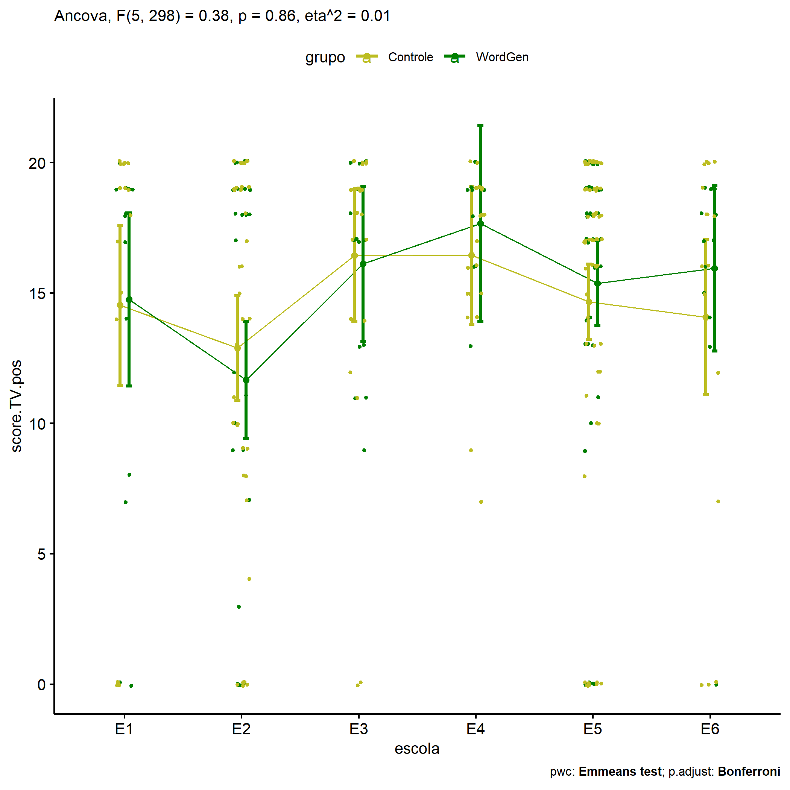<!-- -->

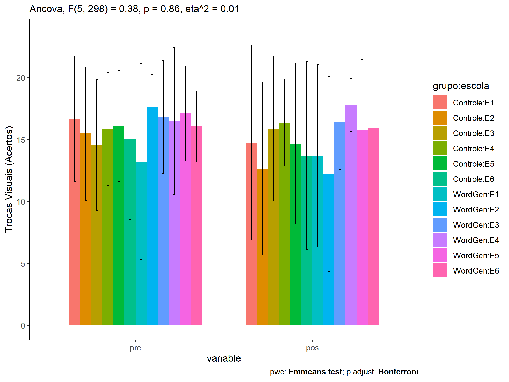<!-- -->

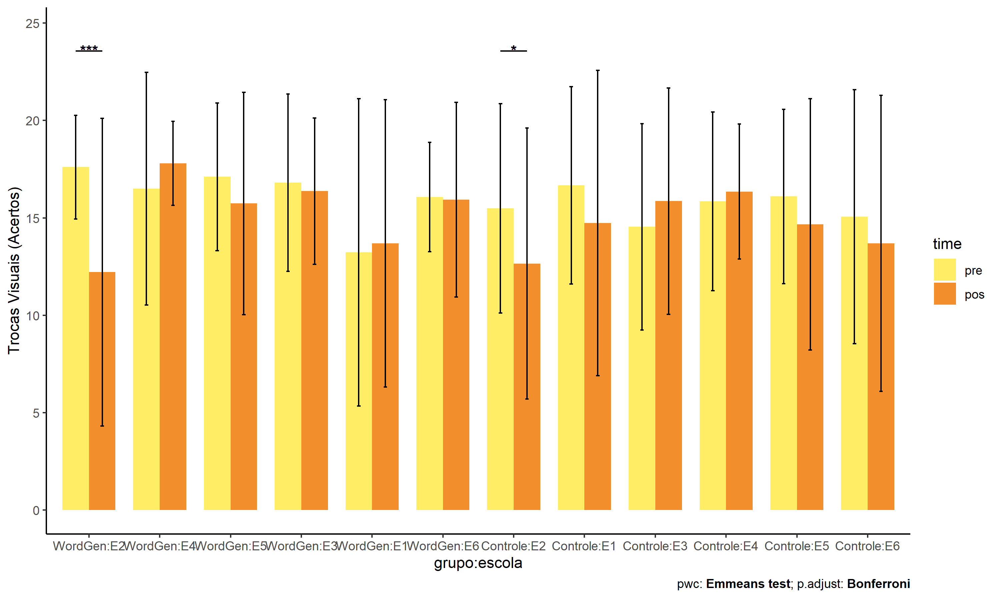<!-- -->

### Trocas Fonologicas (Acertos)

| var          | escola | grupo    |   n | M (pre) | SE (pre) | M (unadj) | SE (unadj) | M (adj) | SE (adj) |
|:-------------|:-------|:---------|----:|--------:|---------:|----------:|-----------:|--------:|---------:|
| score.TF.pos | E1     | Controle |  15 |  15.267 |    1.343 |    13.733 |      1.918 |  13.623 |    1.487 |
| score.TF.pos | E1     | WordGen  |  13 |  13.154 |    2.069 |    13.154 |      1.887 |  14.092 |    1.602 |
| score.TF.pos | E2     | Controle |  35 |  14.600 |    0.873 |    11.429 |      1.144 |  11.649 |    0.974 |
| score.TF.pos | E2     | WordGen  |  28 |  16.464 |    0.569 |    11.357 |      1.395 |  10.653 |    1.092 |
| score.TF.pos | E3     | Controle |  22 |  13.455 |    1.023 |    13.864 |      1.321 |  14.652 |    1.232 |
| score.TF.pos | E3     | WordGen  |  16 |  15.688 |    1.164 |    15.812 |      0.857 |  15.494 |    1.440 |
| score.TF.pos | E4     | Controle |  20 |  13.550 |    0.983 |    14.300 |      1.140 |  15.041 |    1.291 |
| score.TF.pos | E4     | WordGen  |  10 |  16.300 |    1.932 |    17.800 |      0.629 |  17.178 |    1.823 |
| score.TF.pos | E5     | Controle |  68 |  14.956 |    0.570 |    13.441 |      0.776 |  13.485 |    0.698 |
| score.TF.pos | E5     | WordGen  |  54 |  15.889 |    0.613 |    14.722 |      0.795 |  14.304 |    0.786 |
| score.TF.pos | E6     | Controle |  16 |  15.000 |    1.673 |    13.250 |      1.822 |  13.272 |    1.439 |
| score.TF.pos | E6     | WordGen  |  14 |  15.071 |    0.855 |    14.143 |      1.475 |  14.130 |    1.539 |

| .y.          | grupo    | escola | group1   | group2  | estimate | conf.low | conf.high |    se | statistic |     p | p.adj | p.adj.signif |
|:-------------|:---------|:-------|:---------|:--------|---------:|---------:|----------:|------:|----------:|------:|------:|:-------------|
| score.TF.pos | Controle |        | E1       | E2      |    1.974 |   -1.523 |     5.472 | 1.777 |     1.111 | 0.268 | 1.000 | ns           |
| score.TF.pos | Controle |        | E1       | E3      |   -1.029 |   -4.830 |     2.773 | 1.932 |    -0.533 | 0.595 | 1.000 | ns           |
| score.TF.pos | Controle |        | E1       | E4      |   -1.418 |   -5.295 |     2.459 | 1.970 |    -0.720 | 0.472 | 1.000 | ns           |
| score.TF.pos | Controle |        | E1       | E5      |    0.138 |   -3.094 |     3.370 | 1.642 |     0.084 | 0.933 | 1.000 | ns           |
| score.TF.pos | Controle |        | E1       | E6      |    0.351 |   -3.721 |     4.423 | 2.069 |     0.170 | 0.865 | 1.000 | ns           |
| score.TF.pos | Controle |        | E2       | E3      |   -3.003 |   -6.089 |     0.083 | 1.568 |    -1.915 | 0.056 | 0.847 | ns           |
| score.TF.pos | Controle |        | E2       | E4      |   -3.392 |   -6.571 |    -0.213 | 1.615 |    -2.100 | 0.037 | 0.549 | ns           |
| score.TF.pos | Controle |        | E2       | E5      |   -1.836 |   -4.194 |     0.521 | 1.198 |    -1.533 | 0.126 | 1.000 | ns           |
| score.TF.pos | Controle |        | E2       | E6      |   -1.623 |   -5.043 |     1.796 | 1.738 |    -0.934 | 0.351 | 1.000 | ns           |
| score.TF.pos | Controle |        | E3       | E4      |   -0.389 |   -3.889 |     3.111 | 1.779 |    -0.219 | 0.827 | 1.000 | ns           |
| score.TF.pos | Controle |        | E3       | E5      |    1.167 |   -1.619 |     3.953 | 1.416 |     0.824 | 0.410 | 1.000 | ns           |
| score.TF.pos | Controle |        | E3       | E6      |    1.380 |   -2.348 |     5.108 | 1.894 |     0.728 | 0.467 | 1.000 | ns           |
| score.TF.pos | Controle |        | E4       | E5      |    1.556 |   -1.332 |     4.444 | 1.468 |     1.060 | 0.290 | 1.000 | ns           |
| score.TF.pos | Controle |        | E4       | E6      |    1.769 |   -2.036 |     5.574 | 1.934 |     0.915 | 0.361 | 1.000 | ns           |
| score.TF.pos | Controle |        | E5       | E6      |    0.213 |   -2.935 |     3.361 | 1.600 |     0.133 | 0.894 | 1.000 | ns           |
| score.TF.pos | WordGen  |        | E1       | E2      |    3.438 |   -0.390 |     7.267 | 1.945 |     1.767 | 0.078 | 1.000 | ns           |
| score.TF.pos | WordGen  |        | E1       | E3      |   -1.402 |   -5.646 |     2.842 | 2.157 |    -0.650 | 0.516 | 1.000 | ns           |
| score.TF.pos | WordGen  |        | E1       | E4      |   -3.086 |   -7.870 |     1.698 | 2.431 |    -1.269 | 0.205 | 1.000 | ns           |
| score.TF.pos | WordGen  |        | E1       | E5      |   -0.212 |   -3.732 |     3.307 | 1.788 |    -0.119 | 0.906 | 1.000 | ns           |
| score.TF.pos | WordGen  |        | E1       | E6      |   -0.038 |   -4.409 |     4.333 | 2.221 |    -0.017 | 0.986 | 1.000 | ns           |
| score.TF.pos | WordGen  |        | E2       | E3      |   -4.841 |   -8.393 |    -1.288 | 1.805 |    -2.682 | 0.008 | 0.116 | ns           |
| score.TF.pos | WordGen  |        | E2       | E4      |   -6.524 |  -10.698 |    -2.351 | 2.121 |    -3.076 | 0.002 | 0.034 | \*           |
| score.TF.pos | WordGen  |        | E2       | E5      |   -3.650 |   -6.290 |    -1.011 | 1.341 |    -2.722 | 0.007 | 0.103 | ns           |
| score.TF.pos | WordGen  |        | E2       | E6      |   -3.476 |   -7.190 |     0.237 | 1.887 |    -1.842 | 0.066 | 0.996 | ns           |
| score.TF.pos | WordGen  |        | E3       | E4      |   -1.684 |   -6.252 |     2.884 | 2.321 |    -0.725 | 0.469 | 1.000 | ns           |
| score.TF.pos | WordGen  |        | E3       | E5      |    1.190 |   -2.035 |     4.415 | 1.639 |     0.726 | 0.468 | 1.000 | ns           |
| score.TF.pos | WordGen  |        | E3       | E6      |    1.364 |   -2.783 |     5.511 | 2.107 |     0.647 | 0.518 | 1.000 | ns           |
| score.TF.pos | WordGen  |        | E4       | E5      |    2.874 |   -1.027 |     6.775 | 1.982 |     1.450 | 0.148 | 1.000 | ns           |
| score.TF.pos | WordGen  |        | E4       | E6      |    3.048 |   -1.646 |     7.742 | 2.385 |     1.278 | 0.202 | 1.000 | ns           |
| score.TF.pos | WordGen  |        | E5       | E6      |    0.174 |   -3.226 |     3.574 | 1.727 |     0.101 | 0.920 | 1.000 | ns           |
| score.TF.pre | Controle |        | E1       | E2      |    0.667 |   -2.286 |     3.620 | 1.501 |     0.444 | 0.657 | 1.000 | ns           |
| score.TF.pre | Controle |        | E1       | E3      |    1.812 |   -1.392 |     5.016 | 1.628 |     1.113 | 0.267 | 1.000 | ns           |
| score.TF.pre | Controle |        | E1       | E4      |    1.717 |   -1.552 |     4.985 | 1.661 |     1.034 | 0.302 | 1.000 | ns           |
| score.TF.pre | Controle |        | E1       | E5      |    0.311 |   -2.419 |     3.040 | 1.387 |     0.224 | 0.823 | 1.000 | ns           |
| score.TF.pre | Controle |        | E1       | E6      |    0.267 |   -3.172 |     3.706 | 1.748 |     0.153 | 0.879 | 1.000 | ns           |
| score.TF.pre | Controle |        | E2       | E3      |    1.145 |   -1.458 |     3.749 | 1.323 |     0.866 | 0.387 | 1.000 | ns           |
| score.TF.pre | Controle |        | E2       | E4      |    1.050 |   -1.632 |     3.732 | 1.363 |     0.770 | 0.442 | 1.000 | ns           |
| score.TF.pre | Controle |        | E2       | E5      |   -0.356 |   -2.346 |     1.635 | 1.012 |    -0.352 | 0.725 | 1.000 | ns           |
| score.TF.pre | Controle |        | E2       | E6      |   -0.400 |   -3.288 |     2.488 | 1.467 |    -0.273 | 0.785 | 1.000 | ns           |
| score.TF.pre | Controle |        | E3       | E4      |   -0.095 |   -3.052 |     2.861 | 1.502 |    -0.064 | 0.949 | 1.000 | ns           |
| score.TF.pre | Controle |        | E3       | E5      |   -1.501 |   -3.848 |     0.846 | 1.193 |    -1.259 | 0.209 | 1.000 | ns           |
| score.TF.pre | Controle |        | E3       | E6      |   -1.545 |   -4.689 |     1.598 | 1.598 |    -0.967 | 0.334 | 1.000 | ns           |
| score.TF.pre | Controle |        | E4       | E5      |   -1.406 |   -3.840 |     1.028 | 1.237 |    -1.137 | 0.257 | 1.000 | ns           |
| score.TF.pre | Controle |        | E4       | E6      |   -1.450 |   -4.659 |     1.759 | 1.631 |    -0.889 | 0.375 | 1.000 | ns           |
| score.TF.pre | Controle |        | E5       | E6      |   -0.044 |   -2.703 |     2.615 | 1.351 |    -0.033 | 0.974 | 1.000 | ns           |
| score.TF.pre | WordGen  |        | E1       | E2      |   -3.310 |   -6.522 |    -0.099 | 1.632 |    -2.029 | 0.043 | 0.651 | ns           |
| score.TF.pre | WordGen  |        | E1       | E3      |   -2.534 |   -6.107 |     1.039 | 1.816 |    -1.396 | 0.164 | 1.000 | ns           |
| score.TF.pre | WordGen  |        | E1       | E4      |   -3.146 |   -7.171 |     0.879 | 2.045 |    -1.538 | 0.125 | 1.000 | ns           |
| score.TF.pre | WordGen  |        | E1       | E5      |   -2.735 |   -5.691 |     0.221 | 1.502 |    -1.821 | 0.070 | 1.000 | ns           |
| score.TF.pre | WordGen  |        | E1       | E6      |   -1.918 |   -5.603 |     1.768 | 1.873 |    -1.024 | 0.307 | 1.000 | ns           |
| score.TF.pre | WordGen  |        | E2       | E3      |    0.777 |   -2.222 |     3.776 | 1.524 |     0.510 | 0.611 | 1.000 | ns           |
| score.TF.pre | WordGen  |        | E2       | E4      |    0.164 |   -3.361 |     3.689 | 1.791 |     0.092 | 0.927 | 1.000 | ns           |
| score.TF.pre | WordGen  |        | E2       | E5      |    0.575 |   -1.653 |     2.804 | 1.132 |     0.508 | 0.612 | 1.000 | ns           |
| score.TF.pre | WordGen  |        | E2       | E6      |    1.393 |   -1.739 |     4.525 | 1.592 |     0.875 | 0.382 | 1.000 | ns           |
| score.TF.pre | WordGen  |        | E3       | E4      |   -0.612 |   -4.470 |     3.245 | 1.960 |    -0.312 | 0.755 | 1.000 | ns           |
| score.TF.pre | WordGen  |        | E3       | E5      |   -0.201 |   -2.925 |     2.522 | 1.384 |    -0.146 | 0.884 | 1.000 | ns           |
| score.TF.pre | WordGen  |        | E3       | E6      |    0.616 |   -2.886 |     4.118 | 1.779 |     0.346 | 0.729 | 1.000 | ns           |
| score.TF.pre | WordGen  |        | E4       | E5      |    0.411 |   -2.883 |     3.705 | 1.674 |     0.246 | 0.806 | 1.000 | ns           |
| score.TF.pre | WordGen  |        | E4       | E6      |    1.229 |   -2.733 |     5.190 | 2.013 |     0.610 | 0.542 | 1.000 | ns           |
| score.TF.pre | WordGen  |        | E5       | E6      |    0.817 |   -2.052 |     3.687 | 1.458 |     0.561 | 0.576 | 1.000 | ns           |
| score.TF.pos |          | E1     | Controle | WordGen |   -0.468 |   -4.771 |     3.834 | 2.186 |    -0.214 | 0.831 | 0.831 | ns           |
| score.TF.pos |          | E2     | Controle | WordGen |    0.996 |   -1.888 |     3.879 | 1.465 |     0.680 | 0.497 | 0.497 | ns           |
| score.TF.pos |          | E3     | Controle | WordGen |   -0.842 |   -4.576 |     2.893 | 1.898 |    -0.443 | 0.658 | 0.658 | ns           |
| score.TF.pos |          | E4     | Controle | WordGen |   -2.136 |   -6.540 |     2.267 | 2.238 |    -0.955 | 0.340 | 0.340 | ns           |
| score.TF.pos |          | E5     | Controle | WordGen |   -0.818 |   -2.887 |     1.251 | 1.051 |    -0.778 | 0.437 | 0.437 | ns           |
| score.TF.pos |          | E6     | Controle | WordGen |   -0.857 |   -5.004 |     3.289 | 2.107 |    -0.407 | 0.684 | 0.684 | ns           |
| score.TF.pre |          | E1     | Controle | WordGen |    2.113 |   -1.513 |     5.739 | 1.842 |     1.147 | 0.252 | 0.252 | ns           |
| score.TF.pre |          | E2     | Controle | WordGen |   -1.864 |   -4.290 |     0.562 | 1.233 |    -1.512 | 0.132 | 0.132 | ns           |
| score.TF.pre |          | E3     | Controle | WordGen |   -2.233 |   -5.377 |     0.911 | 1.598 |    -1.398 | 0.163 | 0.163 | ns           |
| score.TF.pre |          | E4     | Controle | WordGen |   -2.750 |   -6.456 |     0.956 | 1.883 |    -1.460 | 0.145 | 0.145 | ns           |
| score.TF.pre |          | E5     | Controle | WordGen |   -0.933 |   -2.677 |     0.811 | 0.886 |    -1.053 | 0.293 | 0.293 | ns           |
| score.TF.pre |          | E6     | Controle | WordGen |   -0.071 |   -3.573 |     3.430 | 1.779 |    -0.040 | 0.968 | 0.968 | ns           |

| grupo    | escola | group1 | group2 | estimate | conf.low | conf.high |    se | statistic | p       | p.adj   | p.adj.signif |
|:---------|:-------|:-------|:-------|---------:|---------:|----------:|------:|----------:|:--------|:--------|:-------------|
| Controle | E1     | pre    | pos    |    1.533 |   -2.475 |     5.542 | 2.041 |     0.751 | 0.453   | 0.453   | ns           |
| Controle | E2     | pre    | pos    |    3.171 |    0.547 |     5.796 | 1.336 |     2.374 | 0.018   | 0.018   | \*           |
| Controle | E3     | pre    | pos    |   -0.409 |   -3.719 |     2.901 | 1.685 |    -0.243 | 0.808   | 0.808   | ns           |
| Controle | E4     | pre    | pos    |   -0.750 |   -4.221 |     2.721 | 1.768 |    -0.424 | 0.671   | 0.671   | ns           |
| Controle | E5     | pre    | pos    |    1.515 |   -0.368 |     3.397 | 0.959 |     1.580 | 0.115   | 0.115   | ns           |
| Controle | E6     | pre    | pos    |    1.750 |   -2.131 |     5.631 | 1.976 |     0.886 | 0.376   | 0.376   | ns           |
| WordGen  | E1     | pre    | pos    |    0.000 |   -4.306 |     4.306 | 2.192 |     0.000 | 1       | 1       | ns           |
| WordGen  | E2     | pre    | pos    |    5.107 |    2.173 |     8.041 | 1.494 |     3.419 | \<0.001 | \<0.001 | \*\*\*       |
| WordGen  | E3     | pre    | pos    |   -0.125 |   -4.006 |     3.756 | 1.976 |    -0.063 | 0.95    | 0.95    | ns           |
| WordGen  | E4     | pre    | pos    |   -1.500 |   -6.409 |     3.409 | 2.500 |    -0.600 | 0.549   | 0.549   | ns           |
| WordGen  | E5     | pre    | pos    |    1.167 |   -0.946 |     3.279 | 1.076 |     1.085 | 0.279   | 0.279   | ns           |
| WordGen  | E6     | pre    | pos    |    0.929 |   -3.221 |     5.078 | 2.113 |     0.440 | 0.66    | 0.66    | ns           |

    ## Scale for colour is already present.
    ## Adding another scale for colour, which will replace the existing scale.

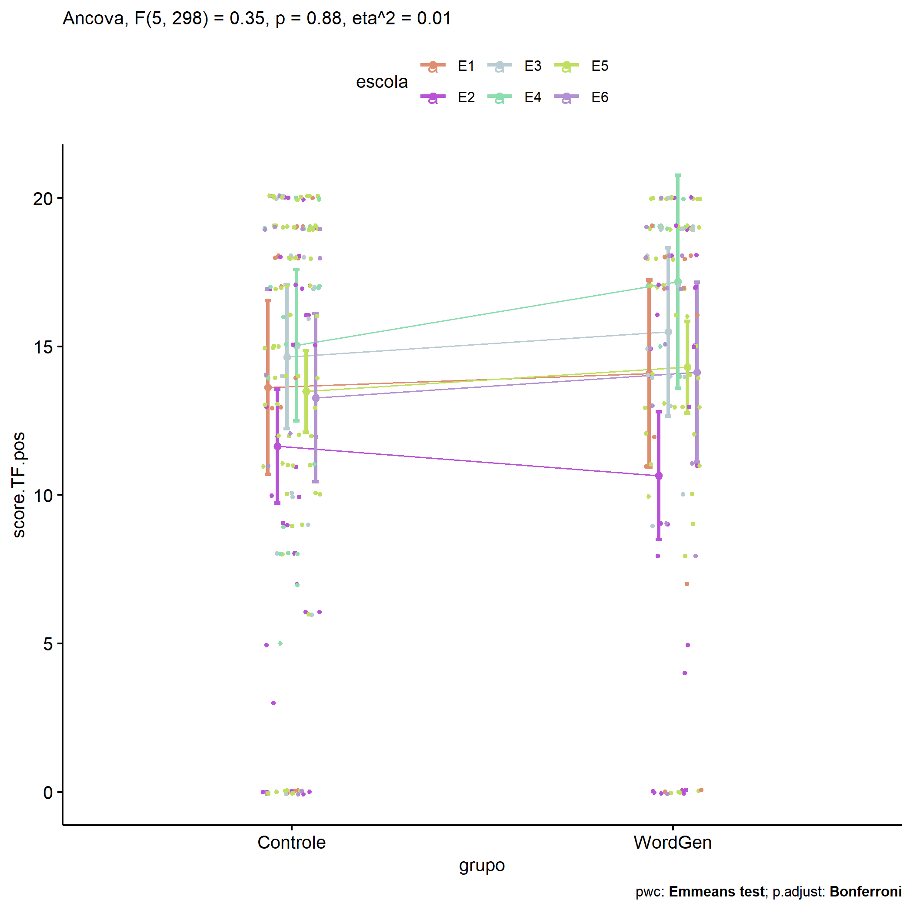<!-- -->

    ## Scale for colour is already present.
    ## Adding another scale for colour, which will replace the existing scale.

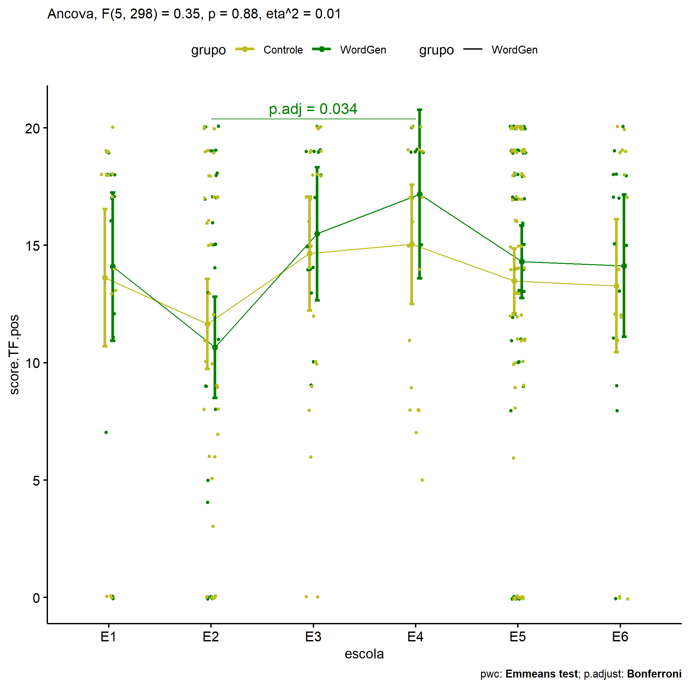<!-- -->

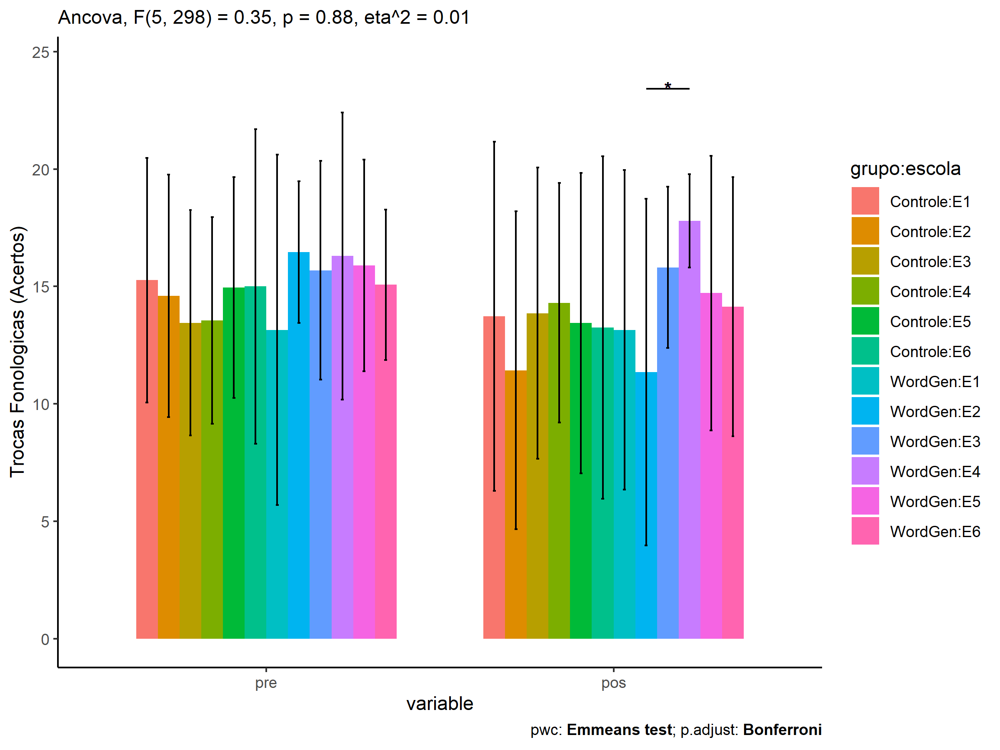<!-- -->

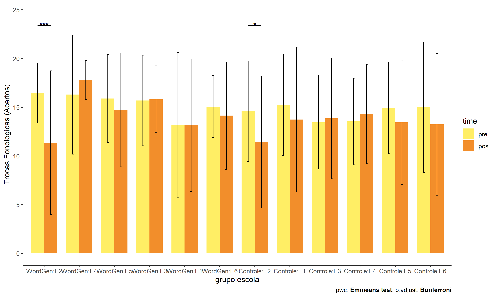<!-- -->

### Trocas Orograficas (Acertos)

| var          | escola | grupo    |   n | M (pre) | SE (pre) | M (unadj) | SE (unadj) | M (adj) | SE (adj) |
|:-------------|:-------|:---------|----:|--------:|---------:|----------:|-----------:|--------:|---------:|
| score.TO.pos | E1     | Controle |  15 |   9.667 |    1.337 |     9.067 |      1.526 |   9.186 |    1.168 |
| score.TO.pos | E1     | WordGen  |  13 |   7.462 |    1.453 |     9.538 |      1.567 |  10.904 |    1.263 |
| score.TO.pos | E2     | Controle |  35 |   9.457 |    0.761 |     8.886 |      0.851 |   9.123 |    0.765 |
| score.TO.pos | E2     | WordGen  |  28 |   9.000 |    0.563 |     7.107 |      1.051 |   7.603 |    0.856 |
| score.TO.pos | E3     | Controle |  22 |   9.227 |    1.075 |    10.682 |      1.201 |  11.049 |    0.965 |
| score.TO.pos | E3     | WordGen  |  16 |  10.375 |    1.091 |    10.000 |      1.057 |   9.719 |    1.131 |
| score.TO.pos | E4     | Controle |  20 |   8.800 |    0.884 |     9.850 |      0.802 |  10.459 |    1.014 |
| score.TO.pos | E4     | WordGen  |  10 |   9.700 |    1.592 |    11.900 |      1.260 |  12.000 |    1.431 |
| score.TO.pos | E5     | Controle |  68 |  10.206 |    0.553 |     9.897 |      0.657 |   9.712 |    0.549 |
| score.TO.pos | E5     | WordGen  |  54 |  11.722 |    0.581 |    11.370 |      0.718 |  10.328 |    0.625 |
| score.TO.pos | E6     | Controle |  16 |   8.875 |    1.261 |     8.438 |      1.402 |   9.004 |    1.132 |
| score.TO.pos | E6     | WordGen  |  14 |   9.714 |    1.051 |     8.214 |      1.012 |   8.307 |    1.209 |

| .y.          | grupo    | escola | group1   | group2  | estimate | conf.low | conf.high |    se | statistic |     p | p.adj | p.adj.signif |
|:-------------|:---------|:-------|:---------|:--------|---------:|---------:|----------:|------:|----------:|------:|------:|:-------------|
| score.TO.pos | Controle |        | E1       | E2      |    0.063 |   -2.685 |     2.810 | 1.396 |     0.045 | 0.964 | 1.000 | ns           |
| score.TO.pos | Controle |        | E1       | E3      |   -1.863 |   -4.845 |     1.118 | 1.515 |    -1.230 | 0.220 | 1.000 | ns           |
| score.TO.pos | Controle |        | E1       | E4      |   -1.273 |   -4.316 |     1.769 | 1.546 |    -0.823 | 0.411 | 1.000 | ns           |
| score.TO.pos | Controle |        | E1       | E5      |   -0.526 |   -3.066 |     2.015 | 1.291 |    -0.407 | 0.684 | 1.000 | ns           |
| score.TO.pos | Controle |        | E1       | E6      |    0.182 |   -3.019 |     3.383 | 1.627 |     0.112 | 0.911 | 1.000 | ns           |
| score.TO.pos | Controle |        | E2       | E3      |   -1.926 |   -4.348 |     0.496 | 1.231 |    -1.565 | 0.119 | 1.000 | ns           |
| score.TO.pos | Controle |        | E2       | E4      |   -1.336 |   -3.832 |     1.161 | 1.269 |    -1.053 | 0.293 | 1.000 | ns           |
| score.TO.pos | Controle |        | E2       | E5      |   -0.588 |   -2.442 |     1.266 | 0.942 |    -0.624 | 0.533 | 1.000 | ns           |
| score.TO.pos | Controle |        | E2       | E6      |    0.119 |   -2.568 |     2.807 | 1.366 |     0.087 | 0.930 | 1.000 | ns           |
| score.TO.pos | Controle |        | E3       | E4      |    0.590 |   -2.161 |     3.341 | 1.398 |     0.422 | 0.673 | 1.000 | ns           |
| score.TO.pos | Controle |        | E3       | E5      |    1.338 |   -0.849 |     3.524 | 1.111 |     1.204 | 0.230 | 1.000 | ns           |
| score.TO.pos | Controle |        | E3       | E6      |    2.045 |   -0.880 |     4.971 | 1.487 |     1.376 | 0.170 | 1.000 | ns           |
| score.TO.pos | Controle |        | E4       | E5      |    0.747 |   -1.523 |     3.018 | 1.154 |     0.648 | 0.518 | 1.000 | ns           |
| score.TO.pos | Controle |        | E4       | E6      |    1.455 |   -1.531 |     4.441 | 1.517 |     0.959 | 0.338 | 1.000 | ns           |
| score.TO.pos | Controle |        | E5       | E6      |    0.708 |   -1.771 |     3.186 | 1.259 |     0.562 | 0.575 | 1.000 | ns           |
| score.TO.pos | WordGen  |        | E1       | E2      |    3.301 |    0.307 |     6.294 | 1.521 |     2.170 | 0.031 | 0.462 | ns           |
| score.TO.pos | WordGen  |        | E1       | E3      |    1.185 |   -2.157 |     4.526 | 1.698 |     0.698 | 0.486 | 1.000 | ns           |
| score.TO.pos | WordGen  |        | E1       | E4      |   -1.097 |   -4.850 |     2.657 | 1.907 |    -0.575 | 0.566 | 1.000 | ns           |
| score.TO.pos | WordGen  |        | E1       | E5      |    0.576 |   -2.219 |     3.370 | 1.420 |     0.405 | 0.685 | 1.000 | ns           |
| score.TO.pos | WordGen  |        | E1       | E6      |    2.597 |   -0.842 |     6.036 | 1.747 |     1.486 | 0.138 | 1.000 | ns           |
| score.TO.pos | WordGen  |        | E2       | E3      |   -2.116 |   -4.910 |     0.679 | 1.420 |    -1.490 | 0.137 | 1.000 | ns           |
| score.TO.pos | WordGen  |        | E2       | E4      |   -4.397 |   -7.678 |    -1.117 | 1.667 |    -2.638 | 0.009 | 0.132 | ns           |
| score.TO.pos | WordGen  |        | E2       | E5      |   -2.725 |   -4.822 |    -0.628 | 1.066 |    -2.557 | 0.011 | 0.166 | ns           |
| score.TO.pos | WordGen  |        | E2       | E6      |   -0.704 |   -3.619 |     2.212 | 1.481 |    -0.475 | 0.635 | 1.000 | ns           |
| score.TO.pos | WordGen  |        | E3       | E4      |   -2.281 |   -5.871 |     1.308 | 1.824 |    -1.251 | 0.212 | 1.000 | ns           |
| score.TO.pos | WordGen  |        | E3       | E5      |   -0.609 |   -3.148 |     1.930 | 1.290 |    -0.472 | 0.637 | 1.000 | ns           |
| score.TO.pos | WordGen  |        | E3       | E6      |    1.412 |   -1.847 |     4.671 | 1.656 |     0.853 | 0.394 | 1.000 | ns           |
| score.TO.pos | WordGen  |        | E4       | E5      |    1.672 |   -1.401 |     4.746 | 1.562 |     1.071 | 0.285 | 1.000 | ns           |
| score.TO.pos | WordGen  |        | E4       | E6      |    3.694 |    0.008 |     7.380 | 1.873 |     1.972 | 0.050 | 0.743 | ns           |
| score.TO.pos | WordGen  |        | E5       | E6      |    2.021 |   -0.659 |     4.702 | 1.362 |     1.484 | 0.139 | 1.000 | ns           |
| score.TO.pre | Controle |        | E1       | E2      |    0.210 |   -2.492 |     2.911 | 1.373 |     0.153 | 0.879 | 1.000 | ns           |
| score.TO.pre | Controle |        | E1       | E3      |    0.439 |   -2.492 |     3.371 | 1.490 |     0.295 | 0.768 | 1.000 | ns           |
| score.TO.pre | Controle |        | E1       | E4      |    0.867 |   -2.123 |     3.857 | 1.519 |     0.570 | 0.569 | 1.000 | ns           |
| score.TO.pre | Controle |        | E1       | E5      |   -0.539 |   -3.036 |     1.958 | 1.269 |    -0.425 | 0.671 | 1.000 | ns           |
| score.TO.pre | Controle |        | E1       | E6      |    0.792 |   -2.355 |     3.938 | 1.599 |     0.495 | 0.621 | 1.000 | ns           |
| score.TO.pre | Controle |        | E2       | E3      |    0.230 |   -2.152 |     2.612 | 1.210 |     0.190 | 0.849 | 1.000 | ns           |
| score.TO.pre | Controle |        | E2       | E4      |    0.657 |   -1.797 |     3.111 | 1.247 |     0.527 | 0.599 | 1.000 | ns           |
| score.TO.pre | Controle |        | E2       | E5      |   -0.749 |   -2.570 |     1.072 | 0.925 |    -0.809 | 0.419 | 1.000 | ns           |
| score.TO.pre | Controle |        | E2       | E6      |    0.582 |   -2.060 |     3.224 | 1.342 |     0.434 | 0.665 | 1.000 | ns           |
| score.TO.pre | Controle |        | E3       | E4      |    0.427 |   -2.277 |     3.132 | 1.374 |     0.311 | 0.756 | 1.000 | ns           |
| score.TO.pre | Controle |        | E3       | E5      |   -0.979 |   -3.126 |     1.169 | 1.091 |    -0.897 | 0.370 | 1.000 | ns           |
| score.TO.pre | Controle |        | E3       | E6      |    0.352 |   -2.524 |     3.229 | 1.462 |     0.241 | 0.810 | 1.000 | ns           |
| score.TO.pre | Controle |        | E4       | E5      |   -1.406 |   -3.633 |     0.821 | 1.132 |    -1.242 | 0.215 | 1.000 | ns           |
| score.TO.pre | Controle |        | E4       | E6      |   -0.075 |   -3.011 |     2.861 | 1.492 |    -0.050 | 0.960 | 1.000 | ns           |
| score.TO.pre | Controle |        | E5       | E6      |    1.331 |   -1.102 |     3.763 | 1.236 |     1.077 | 0.282 | 1.000 | ns           |
| score.TO.pre | WordGen  |        | E1       | E2      |   -1.538 |   -4.476 |     1.400 | 1.493 |    -1.030 | 0.304 | 1.000 | ns           |
| score.TO.pre | WordGen  |        | E1       | E3      |   -2.913 |   -6.182 |     0.355 | 1.661 |    -1.754 | 0.080 | 1.000 | ns           |
| score.TO.pre | WordGen  |        | E1       | E4      |   -2.238 |   -5.921 |     1.444 | 1.871 |    -1.196 | 0.233 | 1.000 | ns           |
| score.TO.pre | WordGen  |        | E1       | E5      |   -4.261 |   -6.965 |    -1.556 | 1.374 |    -3.100 | 0.002 | 0.032 | \*           |
| score.TO.pre | WordGen  |        | E1       | E6      |   -2.253 |   -5.625 |     1.119 | 1.713 |    -1.315 | 0.190 | 1.000 | ns           |
| score.TO.pre | WordGen  |        | E2       | E3      |   -1.375 |   -4.118 |     1.368 | 1.394 |    -0.986 | 0.325 | 1.000 | ns           |
| score.TO.pre | WordGen  |        | E2       | E4      |   -0.700 |   -3.925 |     2.525 | 1.639 |    -0.427 | 0.670 | 1.000 | ns           |
| score.TO.pre | WordGen  |        | E2       | E5      |   -2.722 |   -4.761 |    -0.684 | 1.036 |    -2.628 | 0.009 | 0.136 | ns           |
| score.TO.pre | WordGen  |        | E2       | E6      |   -0.714 |   -3.580 |     2.151 | 1.456 |    -0.491 | 0.624 | 1.000 | ns           |
| score.TO.pre | WordGen  |        | E3       | E4      |    0.675 |   -2.854 |     4.204 | 1.793 |     0.376 | 0.707 | 1.000 | ns           |
| score.TO.pre | WordGen  |        | E3       | E5      |   -1.347 |   -3.839 |     1.145 | 1.266 |    -1.064 | 0.288 | 1.000 | ns           |
| score.TO.pre | WordGen  |        | E3       | E6      |    0.661 |   -2.543 |     3.864 | 1.628 |     0.406 | 0.685 | 1.000 | ns           |
| score.TO.pre | WordGen  |        | E4       | E5      |   -2.022 |   -5.036 |     0.992 | 1.531 |    -1.320 | 0.188 | 1.000 | ns           |
| score.TO.pre | WordGen  |        | E4       | E6      |   -0.014 |   -3.639 |     3.610 | 1.842 |    -0.008 | 0.994 | 1.000 | ns           |
| score.TO.pre | WordGen  |        | E5       | E6      |    2.008 |   -0.618 |     4.633 | 1.334 |     1.505 | 0.133 | 1.000 | ns           |
| score.TO.pos |          | E1     | Controle | WordGen |   -1.718 |   -5.101 |     1.665 | 1.719 |    -0.999 | 0.318 | 0.318 | ns           |
| score.TO.pos |          | E2     | Controle | WordGen |    1.520 |   -0.738 |     3.778 | 1.147 |     1.325 | 0.186 | 0.186 | ns           |
| score.TO.pos |          | E3     | Controle | WordGen |    1.330 |   -1.598 |     4.258 | 1.488 |     0.894 | 0.372 | 0.372 | ns           |
| score.TO.pos |          | E4     | Controle | WordGen |   -1.541 |   -4.991 |     1.908 | 1.753 |    -0.879 | 0.380 | 0.380 | ns           |
| score.TO.pos |          | E5     | Controle | WordGen |   -0.616 |   -2.249 |     1.016 | 0.829 |    -0.743 | 0.458 | 0.458 | ns           |
| score.TO.pos |          | E6     | Controle | WordGen |    0.697 |   -2.562 |     3.957 | 1.656 |     0.421 | 0.674 | 0.674 | ns           |
| score.TO.pre |          | E1     | Controle | WordGen |    2.205 |   -1.112 |     5.522 | 1.686 |     1.308 | 0.192 | 0.192 | ns           |
| score.TO.pre |          | E2     | Controle | WordGen |    0.457 |   -1.762 |     2.677 | 1.128 |     0.405 | 0.686 | 0.686 | ns           |
| score.TO.pre |          | E3     | Controle | WordGen |   -1.148 |   -4.024 |     1.729 | 1.462 |    -0.785 | 0.433 | 0.433 | ns           |
| score.TO.pre |          | E4     | Controle | WordGen |   -0.900 |   -4.290 |     2.490 | 1.723 |    -0.522 | 0.602 | 0.602 | ns           |
| score.TO.pre |          | E5     | Controle | WordGen |   -1.516 |   -3.112 |     0.079 | 0.811 |    -1.870 | 0.062 | 0.062 | ns           |
| score.TO.pre |          | E6     | Controle | WordGen |   -0.839 |   -4.043 |     2.364 | 1.628 |    -0.516 | 0.607 | 0.607 | ns           |

| grupo    | escola | group1 | group2 | estimate | conf.low | conf.high |    se | statistic |     p | p.adj | p.adj.signif |
|:---------|:-------|:-------|:-------|---------:|---------:|----------:|------:|----------:|------:|------:|:-------------|
| Controle | E1     | pre    | pos    |    0.600 |   -2.858 |     4.058 | 1.761 |     0.341 | 0.733 | 0.733 | ns           |
| Controle | E2     | pre    | pos    |    0.571 |   -1.692 |     2.835 | 1.153 |     0.496 | 0.620 | 0.620 | ns           |
| Controle | E3     | pre    | pos    |   -1.455 |   -4.310 |     1.401 | 1.454 |    -1.000 | 0.317 | 0.317 | ns           |
| Controle | E4     | pre    | pos    |   -1.050 |   -4.045 |     1.945 | 1.525 |    -0.689 | 0.491 | 0.491 | ns           |
| Controle | E5     | pre    | pos    |    0.309 |   -1.315 |     1.933 | 0.827 |     0.373 | 0.709 | 0.709 | ns           |
| Controle | E6     | pre    | pos    |    0.437 |   -2.911 |     3.786 | 1.705 |     0.257 | 0.798 | 0.798 | ns           |
| WordGen  | E1     | pre    | pos    |   -2.077 |   -5.791 |     1.638 | 1.891 |    -1.098 | 0.273 | 0.273 | ns           |
| WordGen  | E2     | pre    | pos    |    1.893 |   -0.638 |     4.424 | 1.289 |     1.469 | 0.142 | 0.142 | ns           |
| WordGen  | E3     | pre    | pos    |    0.375 |   -2.973 |     3.723 | 1.705 |     0.220 | 0.826 | 0.826 | ns           |
| WordGen  | E4     | pre    | pos    |   -2.200 |   -6.435 |     2.035 | 2.156 |    -1.020 | 0.308 | 0.308 | ns           |
| WordGen  | E5     | pre    | pos    |    0.352 |   -1.471 |     2.174 | 0.928 |     0.379 | 0.705 | 0.705 | ns           |
| WordGen  | E6     | pre    | pos    |    1.500 |   -2.079 |     5.079 | 1.823 |     0.823 | 0.411 | 0.411 | ns           |

    ## Scale for colour is already present.
    ## Adding another scale for colour, which will replace the existing scale.

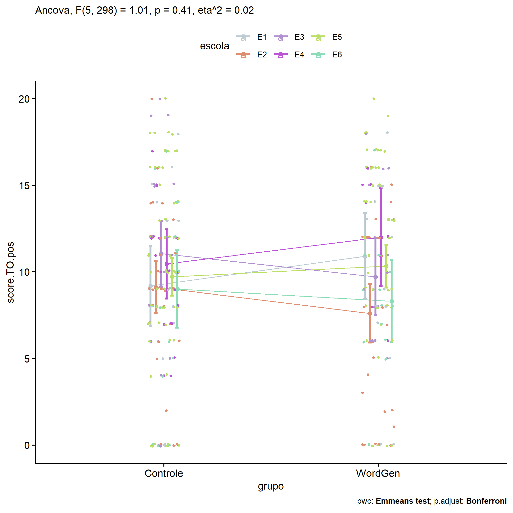<!-- -->

    ## Scale for colour is already present.
    ## Adding another scale for colour, which will replace the existing scale.

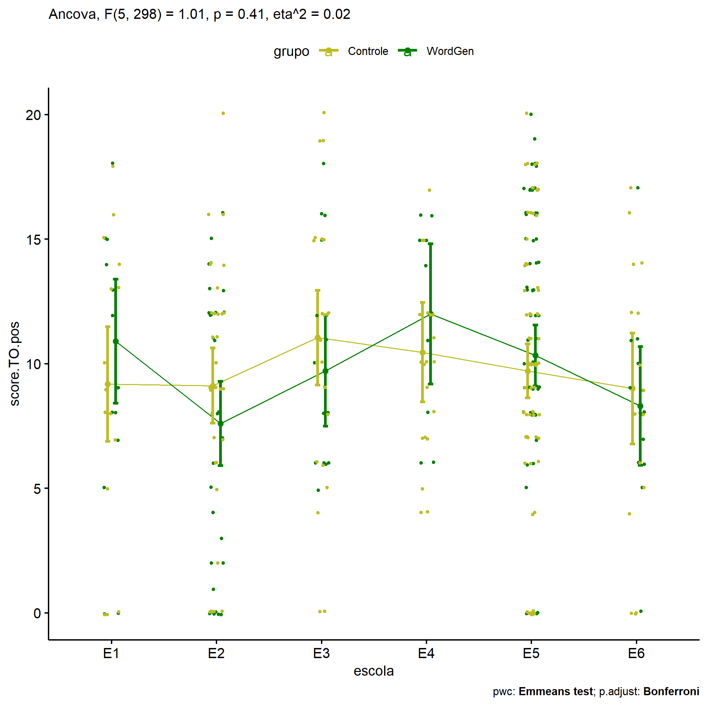<!-- -->

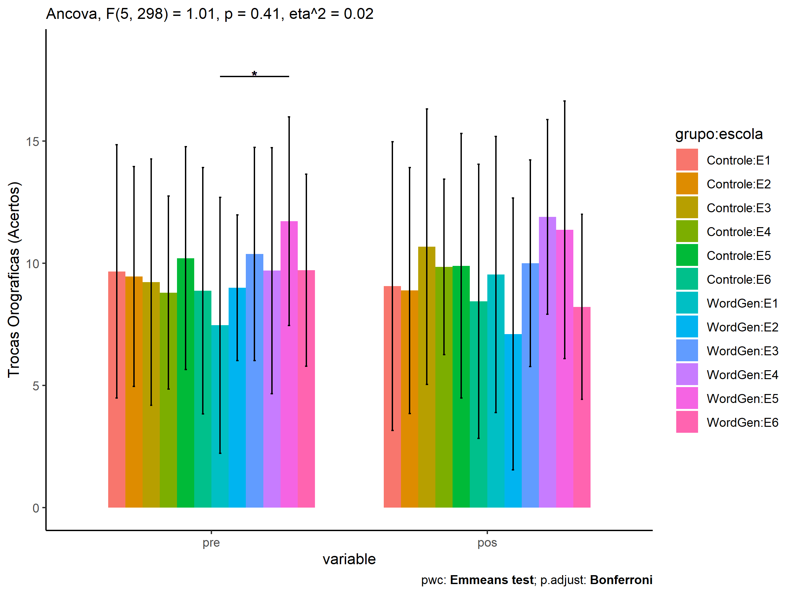<!-- -->

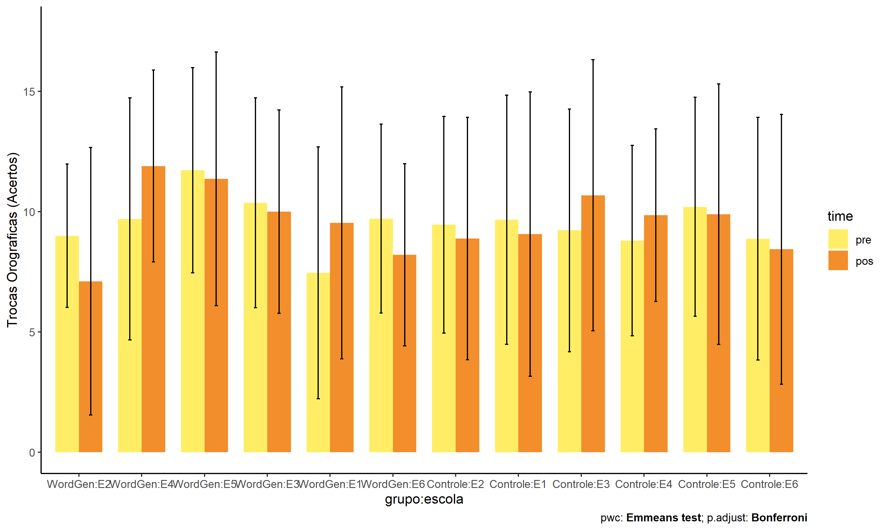<!-- -->

## factores: **zona.escola:grupo**

### Leitura de Pseudo-Palavras (Acertos)

| var            | zona.escola | grupo    |   n | M (pre) | SE (pre) | M (unadj) | SE (unadj) | M (adj) | SE (adj) |
|:---------------|:------------|:---------|----:|--------:|---------:|----------:|-----------:|--------:|---------:|
| score.CLPP.pos | Rural       | Controle |  51 |  65.549 |    2.551 |    71.373 |      2.047 |  74.204 |    1.537 |
| score.CLPP.pos | Rural       | WordGen  |  38 |  71.500 |    2.063 |    72.395 |      1.831 |  71.090 |    1.769 |
| score.CLPP.pos | Urbana      | Controle |  98 |  69.429 |    1.245 |    68.673 |      1.544 |  68.809 |    1.100 |
| score.CLPP.pos | Urbana      | WordGen  |  81 |  71.543 |    1.539 |    72.037 |      1.692 |  70.703 |    1.213 |

| .y.            | grupo    | zona.escola | group1   | group2  | estimate | conf.low | conf.high |    se | statistic |     p | p.adj | p.adj.signif |
|:---------------|:---------|:------------|:---------|:--------|---------:|---------:|----------:|------:|----------:|------:|------:|:-------------|
| score.CLPP.pos | Controle |             | Urbana   | Rural   |   -5.395 |   -9.115 |    -1.675 | 1.889 |    -2.856 | 0.005 | 0.005 | \*\*         |
| score.CLPP.pos | WordGen  |             | Urbana   | Rural   |   -0.388 |   -4.604 |     3.828 | 2.141 |    -0.181 | 0.856 | 0.856 | ns           |
| score.CLPP.pre | Controle |             | Urbana   | Rural   |    3.880 |   -0.922 |     8.681 | 2.439 |     1.591 | 0.113 | 0.113 | ns           |
| score.CLPP.pre | WordGen  |             | Urbana   | Rural   |    0.043 |   -5.425 |     5.512 | 2.777 |     0.016 | 0.988 | 0.988 | ns           |
| score.CLPP.pos |          | Urbana      | Controle | WordGen |   -1.894 |   -5.120 |     1.332 | 1.638 |    -1.156 | 0.249 | 0.249 | ns           |
| score.CLPP.pos |          | Rural       | Controle | WordGen |    3.114 |   -1.515 |     7.742 | 2.351 |     1.325 | 0.186 | 0.186 | ns           |
| score.CLPP.pre |          | Urbana      | Controle | WordGen |   -2.115 |   -6.291 |     2.062 | 2.121 |    -0.997 | 0.320 | 0.320 | ns           |
| score.CLPP.pre |          | Rural       | Controle | WordGen |   -5.951 |  -11.911 |     0.009 | 3.027 |    -1.966 | 0.050 | 0.050 | ns           |

| grupo    | zona.escola | group1 | group2 | estimate | conf.low | conf.high |    se | statistic |     p | p.adj | p.adj.signif |
|:---------|:------------|:-------|:-------|---------:|---------:|----------:|------:|----------:|------:|------:|:-------------|
| Controle | Urbana      | pre    | pos    |    1.060 |   -2.768 |     4.887 | 1.949 |     0.544 | 0.587 | 0.587 | ns           |
| Controle | Rural       | pre    | pos    |   -6.346 |  -11.691 |    -1.000 | 2.721 |    -2.332 | 0.020 | 0.020 | \*           |
| WordGen  | Urbana      | pre    | pos    |    0.047 |   -4.189 |     4.284 | 2.157 |     0.022 | 0.982 | 0.982 | ns           |
| WordGen  | Rural       | pre    | pos    |   -1.000 |   -7.317 |     5.317 | 3.216 |    -0.311 | 0.756 | 0.756 | ns           |

    ## Scale for colour is already present.
    ## Adding another scale for colour, which will replace the existing scale.

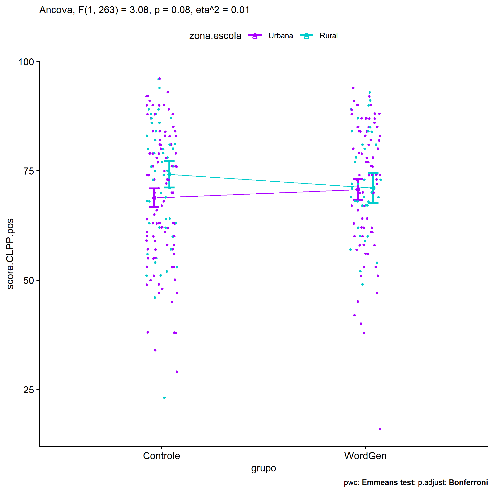<!-- -->

    ## Scale for colour is already present.
    ## Adding another scale for colour, which will replace the existing scale.

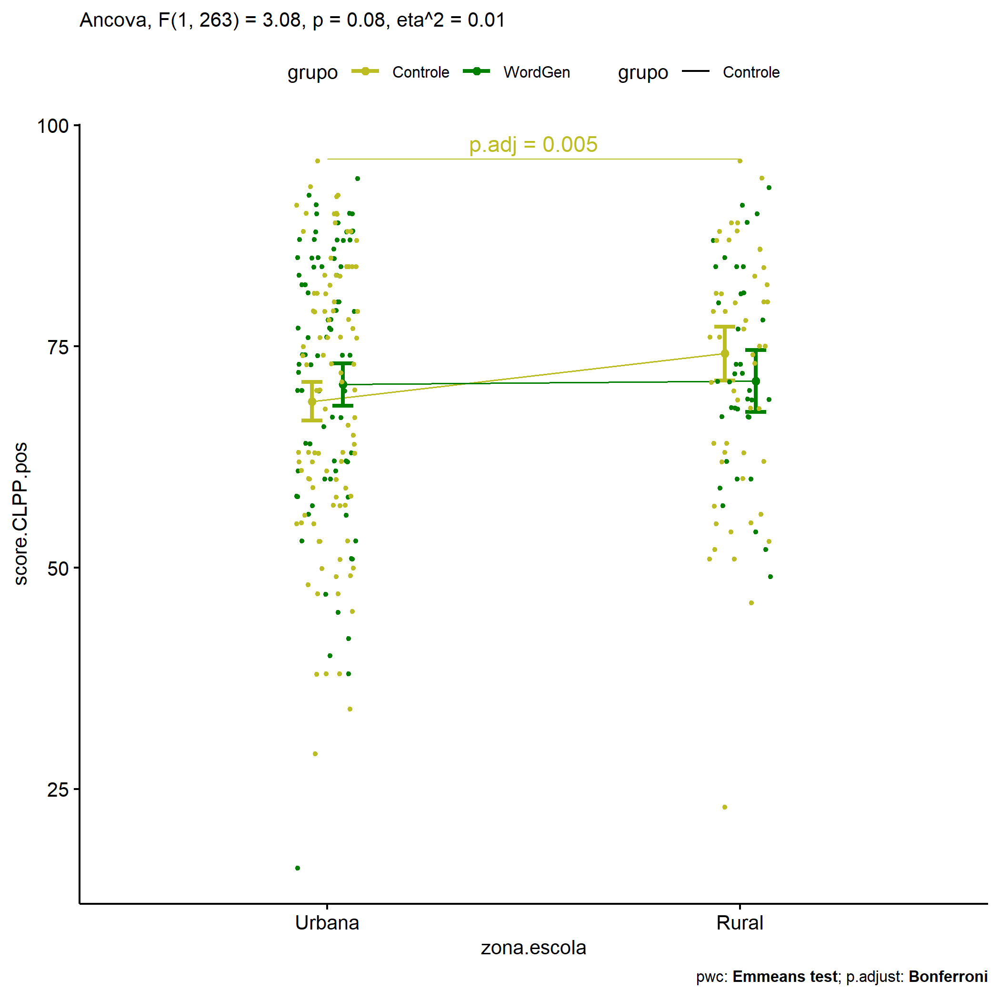<!-- -->

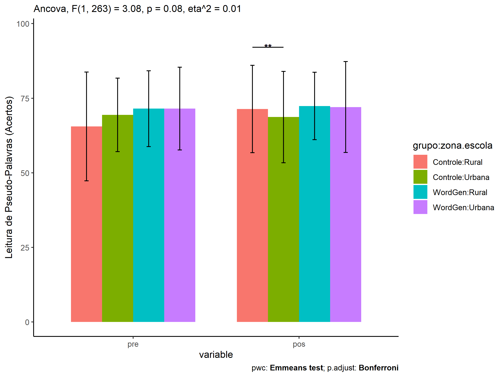<!-- -->

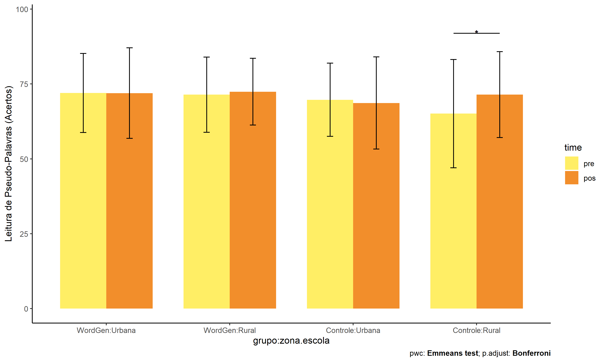<!-- -->

### Correta Regular (Acertos)

| var          | zona.escola | grupo    |   n | M (pre) | SE (pre) | M (unadj) | SE (unadj) | M (adj) | SE (adj) |
|:-------------|:------------|:---------|----:|--------:|---------:|----------:|-----------:|--------:|---------:|
| score.CR.pos | Rural       | Controle |  58 |  13.759 |    0.625 |    14.293 |      0.730 |  14.542 |    0.732 |
| score.CR.pos | Rural       | WordGen  |  40 |  15.300 |    0.654 |    15.650 |      0.594 |  15.349 |    0.882 |
| score.CR.pos | Urbana      | Controle | 118 |  14.042 |    0.395 |    12.559 |      0.562 |  12.707 |    0.513 |
| score.CR.pos | Urbana      | WordGen  |  95 |  15.042 |    0.427 |    13.074 |      0.629 |  12.865 |    0.572 |

| .y.          | grupo    | zona.escola | group1   | group2  | estimate | conf.low | conf.high |    se | statistic |     p | p.adj | p.adj.signif |
|:-------------|:---------|:------------|:---------|:--------|---------:|---------:|----------:|------:|----------:|------:|------:|:-------------|
| score.CR.pos | Controle |             | Urbana   | Rural   |   -1.835 |   -3.591 |    -0.079 | 0.892 |    -2.056 | 0.041 | 0.041 | \*           |
| score.CR.pos | WordGen  |             | Urbana   | Rural   |   -2.484 |   -4.548 |    -0.420 | 1.049 |    -2.369 | 0.018 | 0.018 | \*           |
| score.CR.pre | Controle |             | Urbana   | Rural   |    0.284 |   -1.080 |     1.648 | 0.693 |     0.409 | 0.683 | 0.683 | ns           |
| score.CR.pre | WordGen  |             | Urbana   | Rural   |   -0.258 |   -1.861 |     1.345 | 0.815 |    -0.317 | 0.752 | 0.752 | ns           |
| score.CR.pos |          | Urbana      | Controle | WordGen |   -0.157 |   -1.673 |     1.359 | 0.770 |    -0.204 | 0.838 | 0.838 | ns           |
| score.CR.pos |          | Rural       | Controle | WordGen |   -0.806 |   -3.067 |     1.455 | 1.149 |    -0.702 | 0.483 | 0.483 | ns           |
| score.CR.pre |          | Urbana      | Controle | WordGen |   -1.000 |   -2.172 |     0.173 | 0.596 |    -1.678 | 0.094 | 0.094 | ns           |
| score.CR.pre |          | Rural       | Controle | WordGen |   -1.541 |   -3.289 |     0.207 | 0.888 |    -1.735 | 0.084 | 0.084 | ns           |

| grupo    | zona.escola | group1 | group2 | estimate | conf.low | conf.high |    se | statistic |     p | p.adj | p.adj.signif |
|:---------|:------------|:-------|:-------|---------:|---------:|----------:|------:|----------:|------:|------:|:-------------|
| Controle | Urbana      | pre    | pos    |    1.483 |    0.180 |     2.786 | 0.663 |     2.236 | 0.026 | 0.026 | \*           |
| Controle | Rural       | pre    | pos    |   -0.534 |   -2.392 |     1.324 | 0.946 |    -0.565 | 0.572 | 0.572 | ns           |
| WordGen  | Urbana      | pre    | pos    |    1.968 |    0.517 |     3.420 | 0.739 |     2.663 | 0.008 | 0.008 | \*\*         |
| WordGen  | Rural       | pre    | pos    |   -0.350 |   -2.587 |     1.887 | 1.139 |    -0.307 | 0.759 | 0.759 | ns           |

    ## Scale for colour is already present.
    ## Adding another scale for colour, which will replace the existing scale.

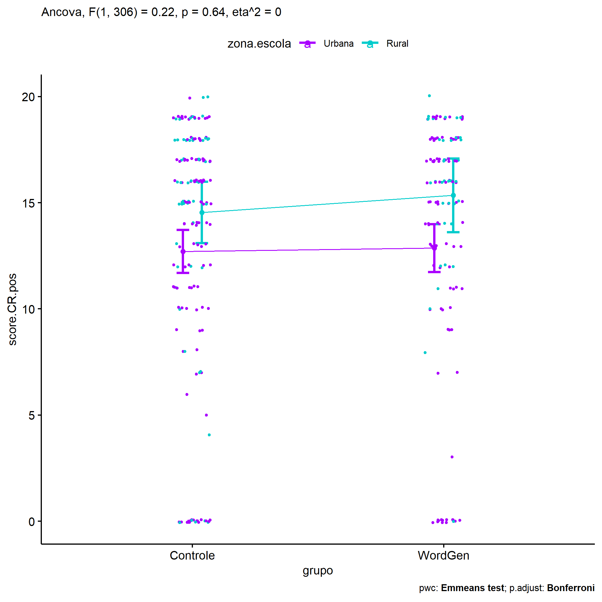<!-- -->

    ## Scale for colour is already present.
    ## Adding another scale for colour, which will replace the existing scale.

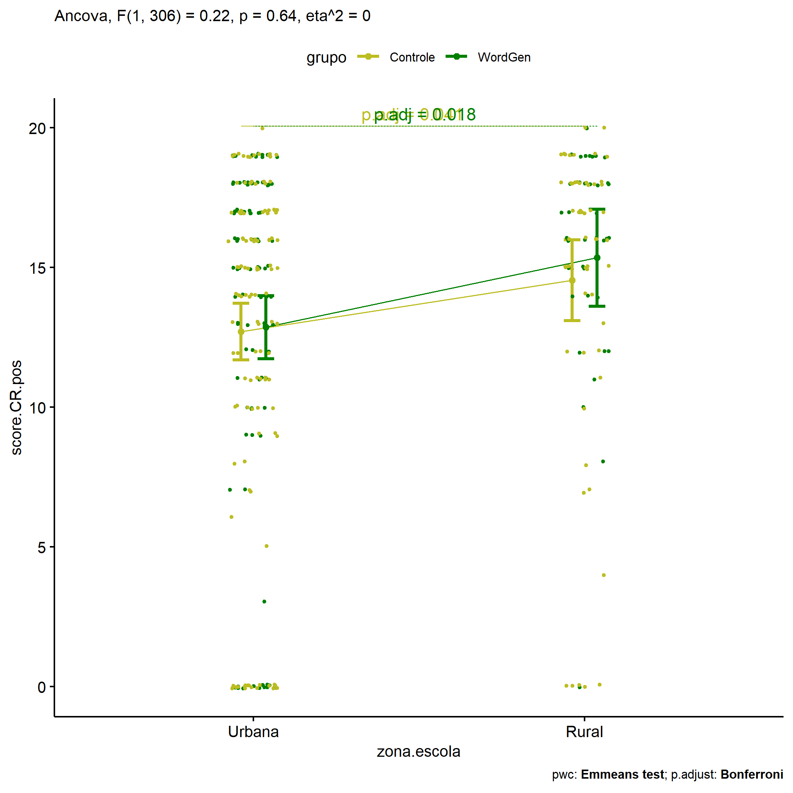<!-- -->

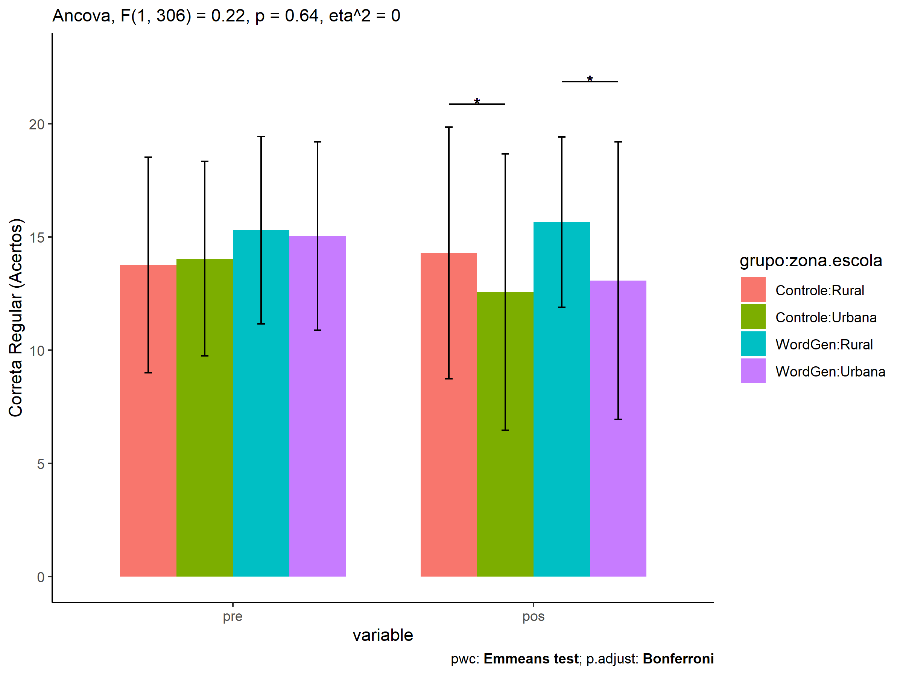<!-- -->

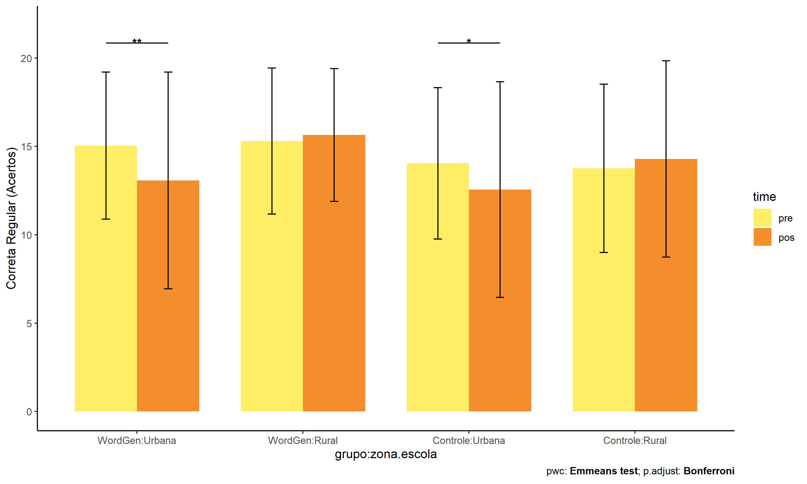<!-- -->

### Correta Irregular (Acertos)

| var          | zona.escola | grupo    |   n | M (pre) | SE (pre) | M (unadj) | SE (unadj) | M (adj) | SE (adj) |
|:-------------|:------------|:---------|----:|--------:|---------:|----------:|-----------:|--------:|---------:|
| score.CI.pos | Rural       | Controle |  58 |  11.069 |    0.590 |    11.948 |      0.665 |  12.203 |    0.627 |
| score.CI.pos | Rural       | WordGen  |  40 |  12.275 |    0.595 |    12.825 |      0.594 |  12.495 |    0.755 |
| score.CI.pos | Urbana      | Controle | 118 |  11.339 |    0.379 |     9.763 |      0.498 |   9.887 |    0.439 |
| score.CI.pos | Urbana      | WordGen  |  95 |  11.947 |    0.391 |    11.242 |      0.549 |  11.071 |    0.489 |

| .y.          | grupo    | zona.escola | group1   | group2  | estimate | conf.low | conf.high |    se | statistic |     p | p.adj | p.adj.signif |
|:-------------|:---------|:------------|:---------|:--------|---------:|---------:|----------:|------:|----------:|------:|------:|:-------------|
| score.CI.pos | Controle |             | Urbana   | Rural   |   -2.317 |   -3.820 |    -0.813 | 0.764 |    -3.031 | 0.003 | 0.003 | \*\*         |
| score.CI.pos | WordGen  |             | Urbana   | Rural   |   -1.424 |   -3.191 |     0.344 | 0.898 |    -1.585 | 0.114 | 0.114 | ns           |
| score.CI.pre | Controle |             | Urbana   | Rural   |    0.270 |   -1.009 |     1.549 | 0.650 |     0.415 | 0.678 | 0.678 | ns           |
| score.CI.pre | WordGen  |             | Urbana   | Rural   |   -0.328 |   -1.831 |     1.176 | 0.764 |    -0.429 | 0.668 | 0.668 | ns           |
| score.CI.pos |          | Urbana      | Controle | WordGen |   -1.184 |   -2.479 |     0.111 | 0.658 |    -1.800 | 0.073 | 0.073 | ns           |
| score.CI.pos |          | Rural       | Controle | WordGen |   -0.292 |   -2.225 |     1.642 | 0.983 |    -0.297 | 0.767 | 0.767 | ns           |
| score.CI.pre |          | Urbana      | Controle | WordGen |   -0.608 |   -1.708 |     0.491 | 0.559 |    -1.089 | 0.277 | 0.277 | ns           |
| score.CI.pre |          | Rural       | Controle | WordGen |   -1.206 |   -2.845 |     0.433 | 0.833 |    -1.448 | 0.149 | 0.149 | ns           |

| grupo    | zona.escola | group1 | group2 | estimate | conf.low | conf.high |    se | statistic |     p | p.adj | p.adj.signif |
|:---------|:------------|:-------|:-------|---------:|---------:|----------:|------:|----------:|------:|------:|:-------------|
| Controle | Urbana      | pre    | pos    |    1.576 |    0.392 |     2.761 | 0.603 |     2.613 | 0.009 | 0.009 | \*\*         |
| Controle | Rural       | pre    | pos    |   -0.879 |   -2.569 |     0.810 | 0.860 |    -1.022 | 0.307 | 0.307 | ns           |
| WordGen  | Urbana      | pre    | pos    |    0.705 |   -0.615 |     2.025 | 0.672 |     1.049 | 0.295 | 0.295 | ns           |
| WordGen  | Rural       | pre    | pos    |   -0.550 |   -2.584 |     1.484 | 1.036 |    -0.531 | 0.596 | 0.596 | ns           |

    ## Scale for colour is already present.
    ## Adding another scale for colour, which will replace the existing scale.

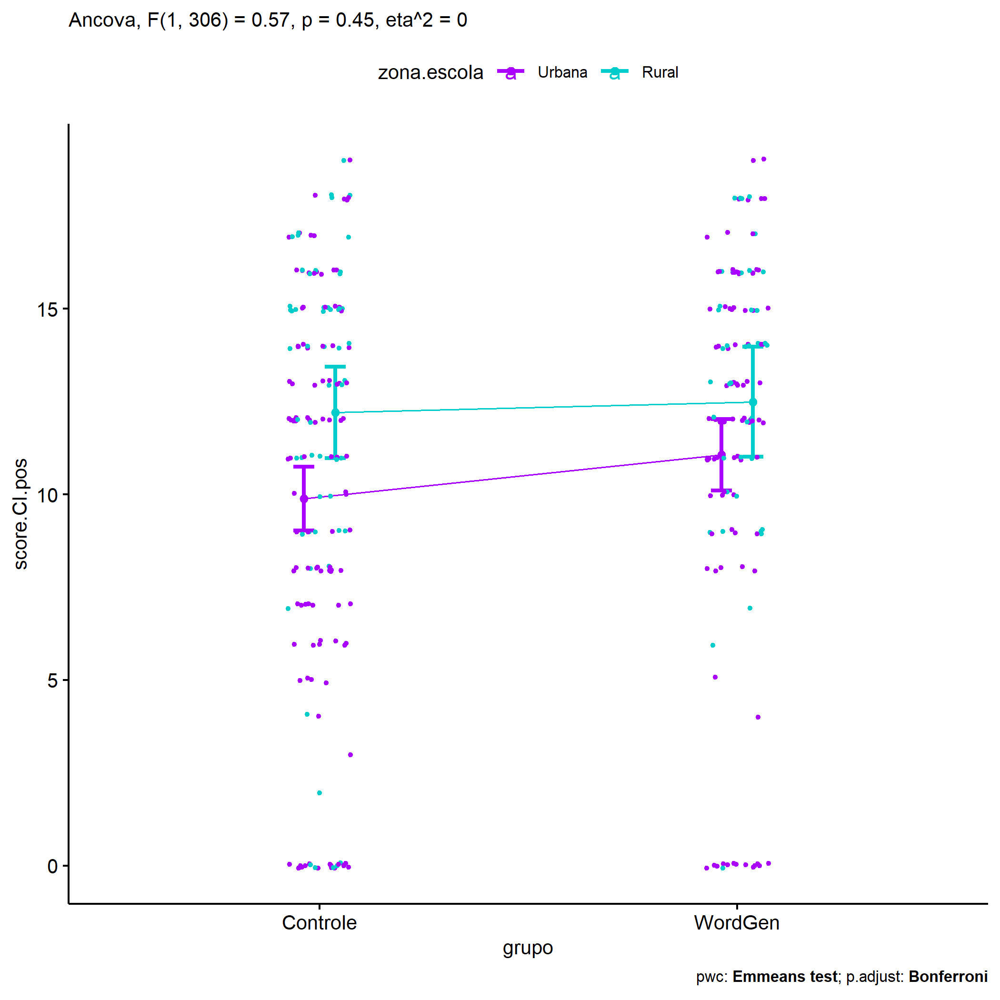<!-- -->

    ## Scale for colour is already present.
    ## Adding another scale for colour, which will replace the existing scale.

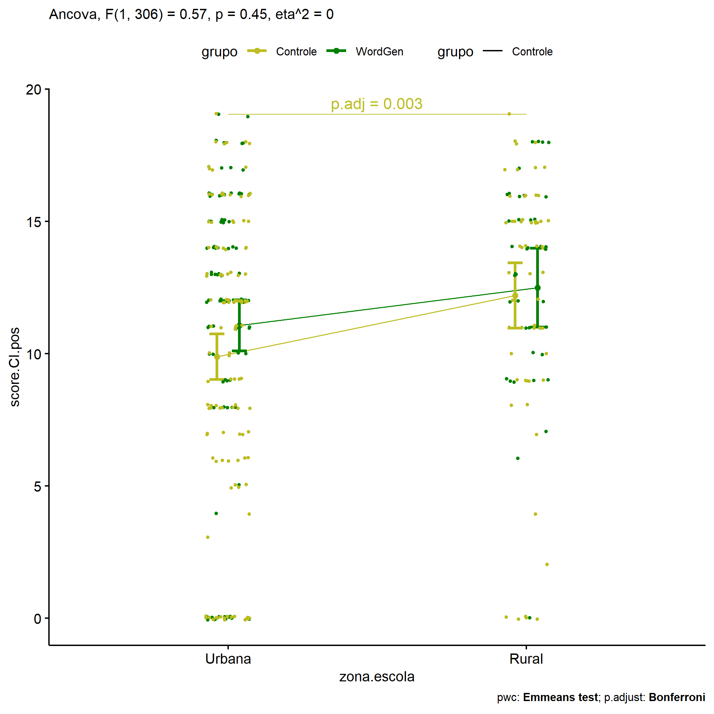<!-- -->

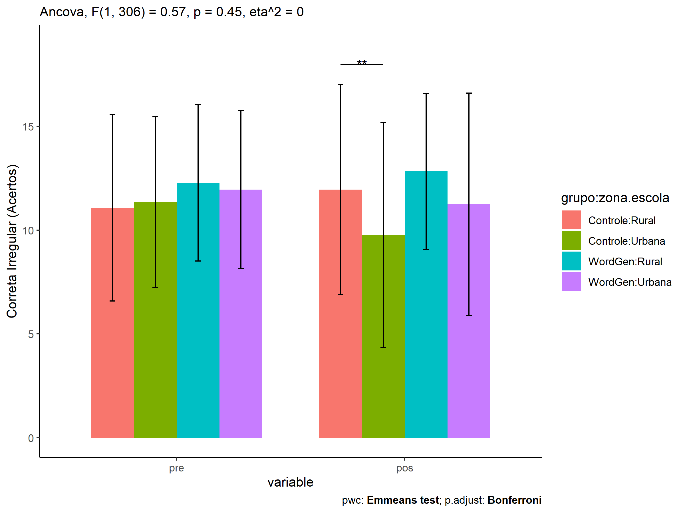<!-- -->

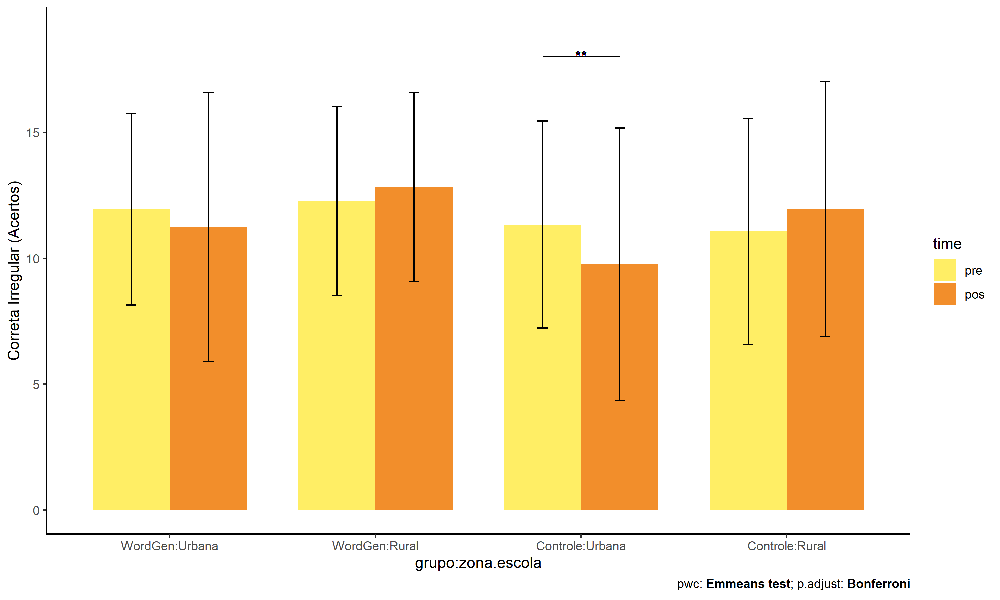<!-- -->

### Trocas Visuais (Acertos)

| var          | zona.escola | grupo    |   n | M (pre) | SE (pre) | M (unadj) | SE (unadj) | M (adj) | SE (adj) |
|:-------------|:------------|:---------|----:|--------:|---------:|----------:|-----------:|--------:|---------:|
| score.TV.pos | Rural       | Controle |  58 |  15.138 |    0.706 |    15.431 |      0.753 |  15.787 |    0.799 |
| score.TV.pos | Rural       | WordGen  |  40 |  16.475 |    0.688 |    16.575 |      0.620 |  16.446 |    0.959 |
| score.TV.pos | Urbana      | Controle | 118 |  15.992 |    0.442 |    14.076 |      0.625 |  14.123 |    0.558 |
| score.TV.pos | Urbana      | WordGen  |  95 |  16.726 |    0.460 |    14.421 |      0.694 |  14.201 |    0.624 |

| .y.          | grupo    | zona.escola | group1   | group2  | estimate | conf.low | conf.high |    se | statistic |     p | p.adj | p.adj.signif |
|:-------------|:---------|:------------|:---------|:--------|---------:|---------:|----------:|------:|----------:|------:|------:|:-------------|
| score.TV.pos | Controle |             | Urbana   | Rural   |   -1.664 |   -3.582 |     0.253 | 0.974 |    -1.708 | 0.089 | 0.089 | ns           |
| score.TV.pos | WordGen  |             | Urbana   | Rural   |   -2.245 |   -4.494 |     0.004 | 1.143 |    -1.964 | 0.050 | 0.050 | ns           |
| score.TV.pre | Controle |             | Urbana   | Rural   |    0.854 |   -0.650 |     2.357 | 0.764 |     1.117 | 0.265 | 0.265 | ns           |
| score.TV.pre | WordGen  |             | Urbana   | Rural   |    0.251 |   -1.516 |     2.019 | 0.898 |     0.280 | 0.780 | 0.780 | ns           |
| score.TV.pos |          | Urbana      | Controle | WordGen |   -0.078 |   -1.726 |     1.570 | 0.837 |    -0.093 | 0.926 | 0.926 | ns           |
| score.TV.pos |          | Rural       | Controle | WordGen |   -0.659 |   -3.118 |     1.801 | 1.250 |    -0.527 | 0.598 | 0.598 | ns           |
| score.TV.pre |          | Urbana      | Controle | WordGen |   -0.735 |   -2.027 |     0.558 | 0.657 |    -1.119 | 0.264 | 0.264 | ns           |
| score.TV.pre |          | Rural       | Controle | WordGen |   -1.337 |   -3.264 |     0.590 | 0.979 |    -1.365 | 0.173 | 0.173 | ns           |

| grupo    | zona.escola | group1 | group2 | estimate | conf.low | conf.high |    se | statistic |     p | p.adj | p.adj.signif |
|:---------|:------------|:-------|:-------|---------:|---------:|----------:|------:|----------:|------:|------:|:-------------|
| Controle | Urbana      | pre    | pos    |    1.915 |    0.488 |     3.343 | 0.727 |     2.635 | 0.009 | 0.009 | \*\*         |
| Controle | Rural       | pre    | pos    |   -0.293 |   -2.329 |     1.743 | 1.037 |    -0.283 | 0.777 | 0.777 | ns           |
| WordGen  | Urbana      | pre    | pos    |    2.305 |    0.714 |     3.896 | 0.810 |     2.846 | 0.005 | 0.005 | \*\*         |
| WordGen  | Rural       | pre    | pos    |   -0.100 |   -2.552 |     2.352 | 1.248 |    -0.080 | 0.936 | 0.936 | ns           |

    ## Scale for colour is already present.
    ## Adding another scale for colour, which will replace the existing scale.

<!-- -->

    ## Scale for colour is already present.
    ## Adding another scale for colour, which will replace the existing scale.

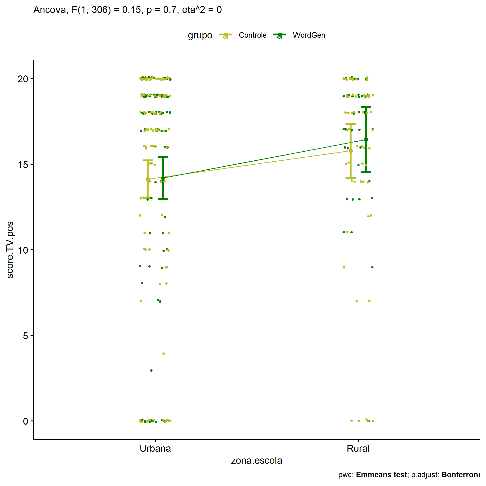<!-- -->

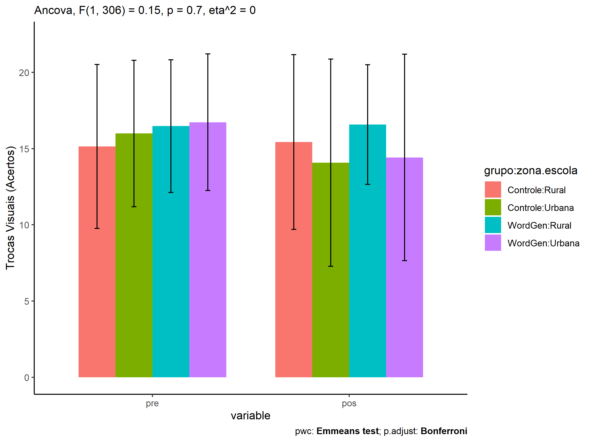<!-- -->

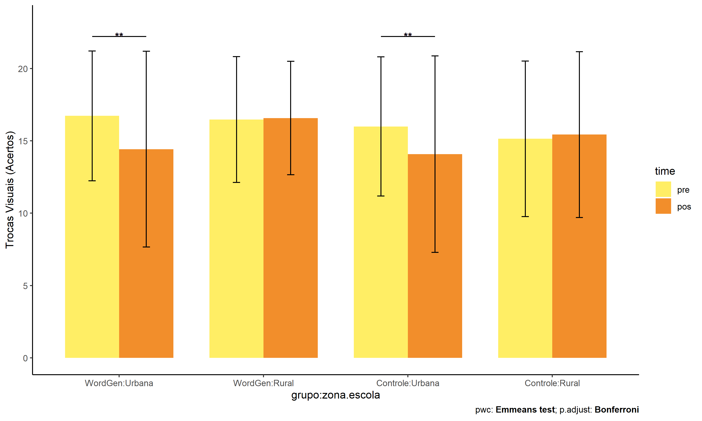<!-- -->

### Trocas Fonologicas (Acertos)

| var          | zona.escola | grupo    |   n | M (pre) | SE (pre) | M (unadj) | SE (unadj) | M (adj) | SE (adj) |
|:-------------|:------------|:---------|----:|--------:|---------:|----------:|-----------:|--------:|---------:|
| score.TF.pos | Rural       | Controle |  58 |  13.914 |    0.684 |    13.845 |      0.798 |  14.397 |    0.766 |
| score.TF.pos | Rural       | WordGen  |  40 |  15.625 |    0.718 |    15.725 |      0.663 |  15.442 |    0.918 |
| score.TF.pos | Urbana      | Controle | 118 |  14.890 |    0.448 |    12.881 |      0.612 |  12.957 |    0.534 |
| score.TF.pos | Urbana      | WordGen  |  95 |  15.684 |    0.484 |    13.516 |      0.673 |  13.204 |    0.597 |

| .y.          | grupo    | zona.escola | group1   | group2  | estimate | conf.low | conf.high |    se | statistic |     p | p.adj | p.adj.signif |
|:-------------|:---------|:------------|:---------|:--------|---------:|---------:|----------:|------:|----------:|------:|------:|:-------------|
| score.TF.pos | Controle |             | Urbana   | Rural   |   -1.440 |   -3.275 |     0.396 | 0.933 |    -1.543 | 0.124 | 0.124 | ns           |
| score.TF.pos | WordGen  |             | Urbana   | Rural   |   -2.238 |   -4.390 |    -0.086 | 1.094 |    -2.046 | 0.042 | 0.042 | \*           |
| score.TF.pre | Controle |             | Urbana   | Rural   |    0.976 |   -0.553 |     2.505 | 0.777 |     1.256 | 0.210 | 0.210 | ns           |
| score.TF.pre | WordGen  |             | Urbana   | Rural   |    0.059 |   -1.738 |     1.857 | 0.914 |     0.065 | 0.948 | 0.948 | ns           |
| score.TF.pos |          | Urbana      | Controle | WordGen |   -0.247 |   -1.824 |     1.331 | 0.802 |    -0.308 | 0.758 | 0.758 | ns           |
| score.TF.pos |          | Rural       | Controle | WordGen |   -1.045 |   -3.403 |     1.313 | 1.198 |    -0.872 | 0.384 | 0.384 | ns           |
| score.TF.pre |          | Urbana      | Controle | WordGen |   -0.794 |   -2.109 |     0.520 | 0.668 |    -1.189 | 0.235 | 0.235 | ns           |
| score.TF.pre |          | Rural       | Controle | WordGen |   -1.711 |   -3.671 |     0.249 | 0.996 |    -1.718 | 0.087 | 0.087 | ns           |

| grupo    | zona.escola | group1 | group2 | estimate | conf.low | conf.high |    se | statistic |     p | p.adj | p.adj.signif |
|:---------|:------------|:-------|:-------|---------:|---------:|----------:|------:|----------:|------:|------:|:-------------|
| Controle | Urbana      | pre    | pos    |    2.008 |    0.578 |     3.439 | 0.729 |     2.757 | 0.006 | 0.006 | \*\*         |
| Controle | Rural       | pre    | pos    |    0.069 |   -1.972 |     2.110 | 1.039 |     0.066 | 0.947 | 0.947 | ns           |
| WordGen  | Urbana      | pre    | pos    |    2.168 |    0.574 |     3.763 | 0.812 |     2.670 | 0.008 | 0.008 | \*\*         |
| WordGen  | Rural       | pre    | pos    |   -0.100 |   -2.558 |     2.358 | 1.251 |    -0.080 | 0.936 | 0.936 | ns           |

    ## Scale for colour is already present.
    ## Adding another scale for colour, which will replace the existing scale.

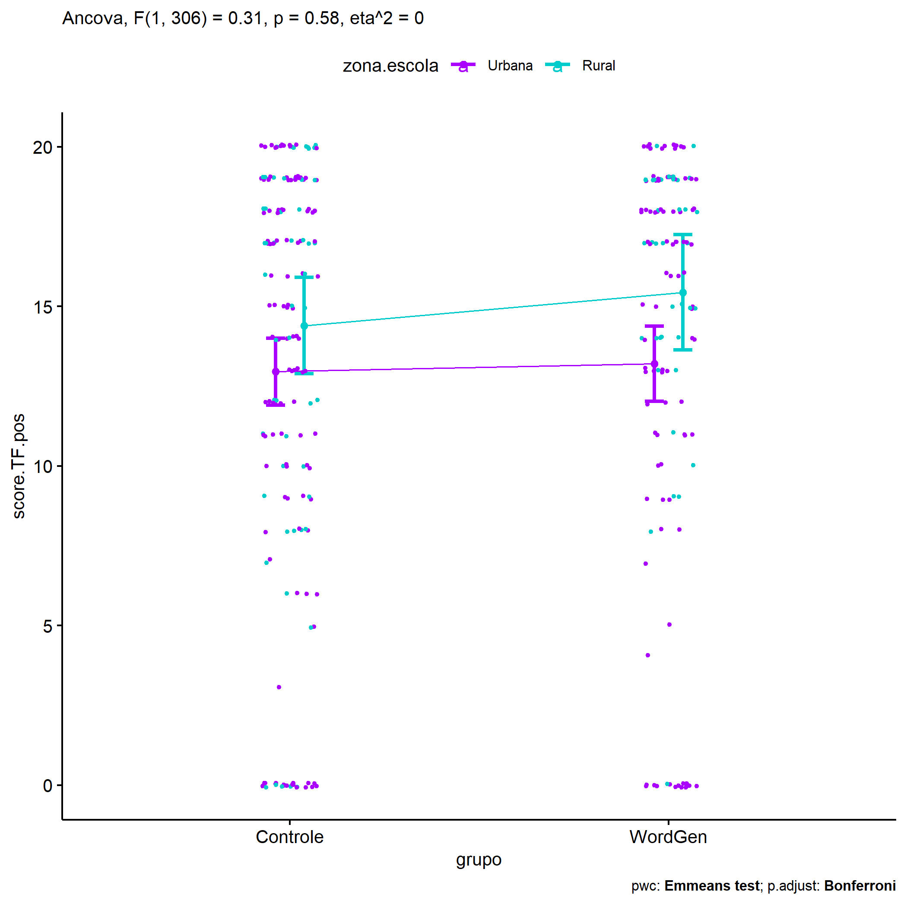<!-- -->

    ## Scale for colour is already present.
    ## Adding another scale for colour, which will replace the existing scale.

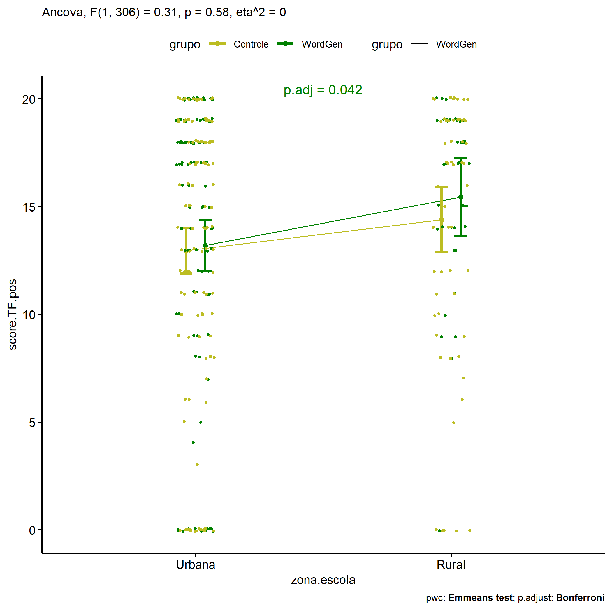<!-- -->

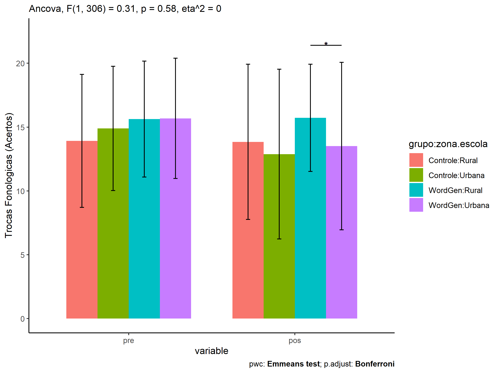<!-- -->

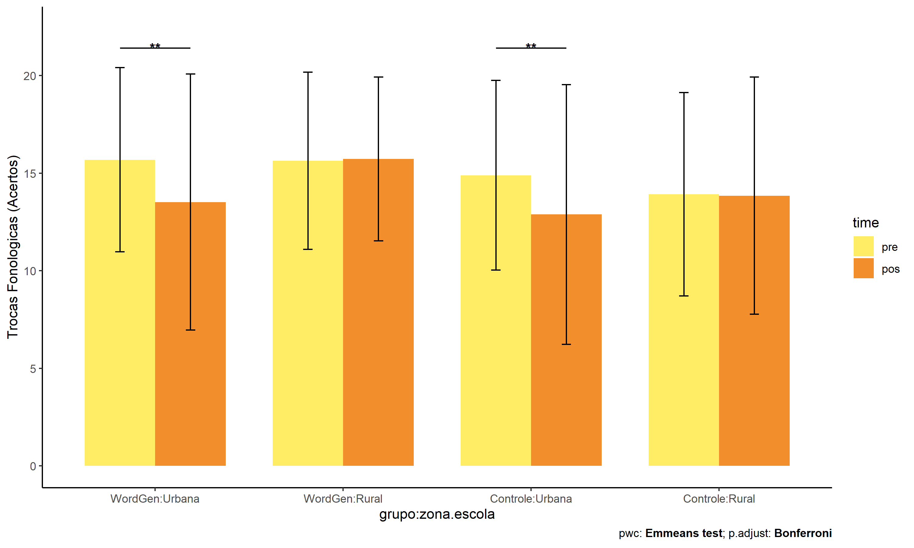<!-- -->

### Trocas Orograficas (Acertos)

| var          | zona.escola | grupo    |   n | M (pre) | SE (pre) | M (unadj) | SE (unadj) | M (adj) | SE (adj) |
|:-------------|:------------|:---------|----:|--------:|---------:|----------:|-----------:|--------:|---------:|
| score.TO.pos | Rural       | Controle |  58 |   8.983 |    0.606 |     9.776 |      0.658 |  10.296 |    0.602 |
| score.TO.pos | Rural       | WordGen  |  40 |   9.975 |    0.679 |     9.850 |      0.659 |   9.794 |    0.722 |
| score.TO.pos | Urbana      | Controle | 118 |   9.915 |    0.423 |     9.492 |      0.492 |   9.470 |    0.421 |
| score.TO.pos | Urbana      | WordGen  |  95 |  10.337 |    0.448 |     9.863 |      0.582 |   9.597 |    0.470 |

| .y.          | grupo    | zona.escola | group1   | group2  | estimate | conf.low | conf.high |    se | statistic |     p | p.adj | p.adj.signif |
|:-------------|:---------|:------------|:---------|:--------|---------:|---------:|----------:|------:|----------:|------:|------:|:-------------|
| score.TO.pos | Controle |             | Urbana   | Rural   |   -0.826 |   -2.271 |     0.620 | 0.735 |    -1.124 | 0.262 | 0.262 | ns           |
| score.TO.pos | WordGen  |             | Urbana   | Rural   |   -0.197 |   -1.892 |     1.498 | 0.861 |    -0.229 | 0.819 | 0.819 | ns           |
| score.TO.pre | Controle |             | Urbana   | Rural   |    0.932 |   -0.485 |     2.350 | 0.721 |     1.294 | 0.197 | 0.197 | ns           |
| score.TO.pre | WordGen  |             | Urbana   | Rural   |    0.362 |   -1.305 |     2.028 | 0.847 |     0.427 | 0.670 | 0.670 | ns           |
| score.TO.pos |          | Urbana      | Controle | WordGen |   -0.127 |   -1.367 |     1.113 | 0.630 |    -0.201 | 0.841 | 0.841 | ns           |
| score.TO.pos |          | Rural       | Controle | WordGen |    0.502 |   -1.349 |     2.353 | 0.941 |     0.534 | 0.594 | 0.594 | ns           |
| score.TO.pre |          | Urbana      | Controle | WordGen |   -0.422 |   -1.640 |     0.797 | 0.619 |    -0.681 | 0.497 | 0.497 | ns           |
| score.TO.pre |          | Rural       | Controle | WordGen |   -0.992 |   -2.809 |     0.825 | 0.924 |    -1.074 | 0.283 | 0.283 | ns           |

| grupo    | zona.escola | group1 | group2 | estimate | conf.low | conf.high |    se | statistic |     p | p.adj | p.adj.signif |
|:---------|:------------|:-------|:-------|---------:|---------:|----------:|------:|----------:|------:|------:|:-------------|
| Controle | Urbana      | pre    | pos    |    0.424 |   -0.826 |     1.674 | 0.636 |     0.666 | 0.506 | 0.506 | ns           |
| Controle | Rural       | pre    | pos    |   -0.793 |   -2.576 |     0.990 | 0.908 |    -0.874 | 0.383 | 0.383 | ns           |
| WordGen  | Urbana      | pre    | pos    |    0.474 |   -0.919 |     1.867 | 0.709 |     0.668 | 0.505 | 0.505 | ns           |
| WordGen  | Rural       | pre    | pos    |    0.125 |   -2.022 |     2.272 | 1.093 |     0.114 | 0.909 | 0.909 | ns           |

    ## Scale for colour is already present.
    ## Adding another scale for colour, which will replace the existing scale.

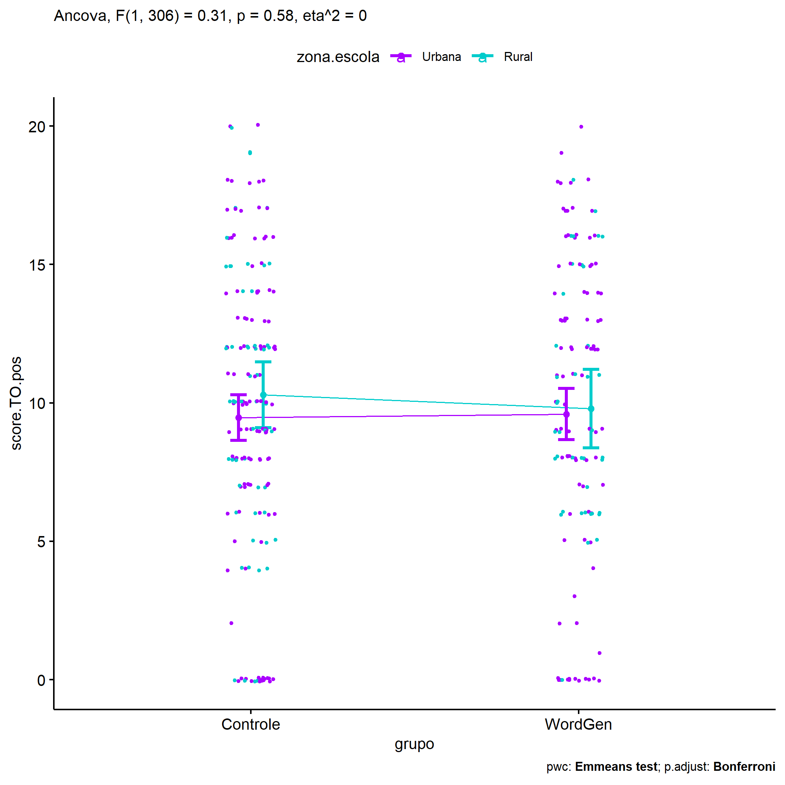<!-- -->

    ## Scale for colour is already present.
    ## Adding another scale for colour, which will replace the existing scale.

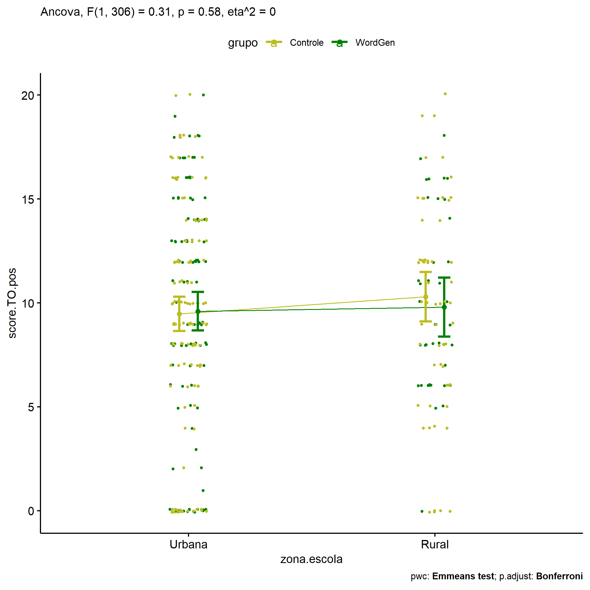<!-- -->

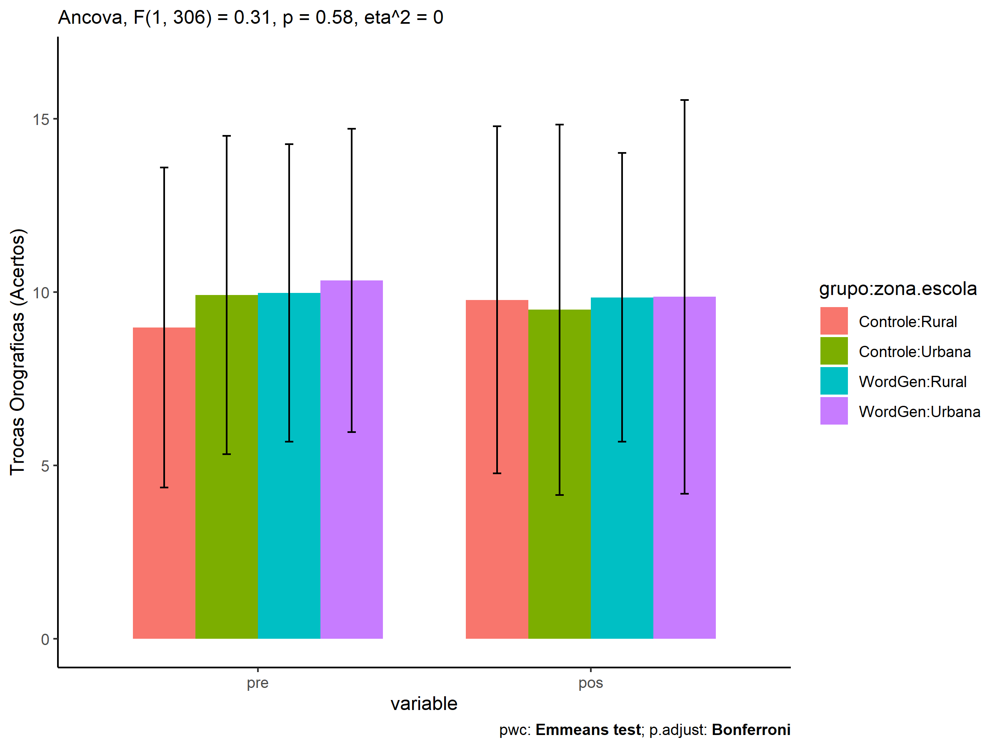<!-- -->

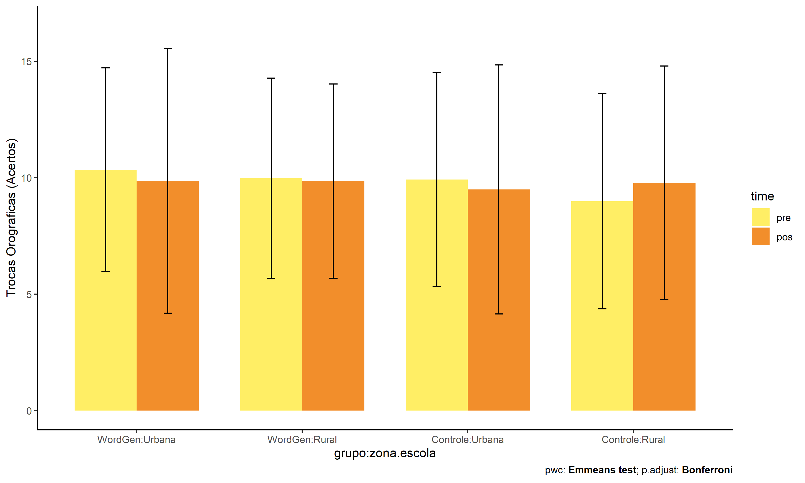<!-- -->

# Pairwise comparisons for grupo=“Experimental”

## factores: **grupo=“Experimental”:monitor**

### Leitura de Pseudo-Palavras (Acertos)

| var            | monitor |   n | M (pre) | SE (pre) | M (unadj) | SE (unadj) | M (adj) | SE (adj) |
|:---------------|:--------|----:|--------:|---------:|----------:|-----------:|--------:|---------:|
| score.CLPP.pos | AC      |  11 |  76.364 |    2.081 |    72.909 |      4.196 |  70.458 |    3.214 |
| score.CLPP.pos | CE      |   9 |  78.778 |    2.296 |    78.444 |      2.949 |  74.484 |    3.574 |
| score.CLPP.pos | EA      |  10 |  76.200 |    3.699 |    79.600 |      3.170 |  77.251 |    3.368 |
| score.CLPP.pos | GR      |  14 |  68.786 |    4.362 |    71.214 |      3.853 |  73.501 |    2.851 |
| score.CLPP.pos | JC      |  10 |  77.400 |    3.149 |    81.000 |      3.190 |  77.901 |    3.379 |
| score.CLPP.pos | MF      |  10 |  77.500 |    4.505 |    74.300 |      4.648 |  71.138 |    3.380 |
| score.CLPP.pos | ML      |  16 |  67.812 |    4.032 |    69.188 |      3.510 |  72.082 |    2.679 |
| score.CLPP.pos | MM      |   9 |  68.444 |    2.794 |    61.444 |      7.213 |  63.944 |    3.551 |
| score.CLPP.pos | PR      |  11 |  67.182 |    5.003 |    71.182 |      3.753 |  74.471 |    3.227 |
| score.CLPP.pos | VL      |  13 |  71.000 |    2.539 |    72.154 |      2.022 |  73.056 |    2.944 |

| .y.            | group1 | group2 | estimate | conf.low | conf.high |    se | statistic |     p | p.adj | p.adj.signif |
|:---------------|:-------|:-------|---------:|---------:|----------:|------:|----------:|------:|------:|:-------------|
| score.CLPP.pos | AC     | CE     |   -4.026 |  -13.489 |     5.437 | 4.771 |    -0.844 | 0.401 | 1.000 | ns           |
| score.CLPP.pos | AC     | EA     |   -6.793 |  -15.985 |     2.398 | 4.634 |    -1.466 | 0.146 | 1.000 | ns           |
| score.CLPP.pos | AC     | GR     |   -3.043 |  -11.609 |     5.523 | 4.319 |    -0.705 | 0.483 | 1.000 | ns           |
| score.CLPP.pos | AC     | JC     |   -7.443 |  -16.636 |     1.750 | 4.635 |    -1.606 | 0.111 | 1.000 | ns           |
| score.CLPP.pos | AC     | MF     |   -0.680 |   -9.874 |     8.513 | 4.635 |    -0.147 | 0.884 | 1.000 | ns           |
| score.CLPP.pos | AC     | ML     |   -1.625 |   -9.982 |     6.733 | 4.214 |    -0.386 | 0.701 | 1.000 | ns           |
| score.CLPP.pos | AC     | MM     |    6.514 |   -3.030 |    16.057 | 4.812 |     1.354 | 0.179 | 1.000 | ns           |
| score.CLPP.pos | AC     | PR     |   -4.013 |  -13.108 |     5.082 | 4.585 |    -0.875 | 0.384 | 1.000 | ns           |
| score.CLPP.pos | AC     | VL     |   -2.598 |  -11.261 |     6.065 | 4.367 |    -0.595 | 0.553 | 1.000 | ns           |
| score.CLPP.pos | CE     | EA     |   -2.767 |  -12.442 |     6.908 | 4.878 |    -0.567 | 0.572 | 1.000 | ns           |
| score.CLPP.pos | CE     | GR     |    0.983 |   -8.152 |    10.119 | 4.606 |     0.213 | 0.831 | 1.000 | ns           |
| score.CLPP.pos | CE     | JC     |   -3.417 |  -13.085 |     6.251 | 4.874 |    -0.701 | 0.485 | 1.000 | ns           |
| score.CLPP.pos | CE     | MF     |    3.346 |   -6.322 |    13.013 | 4.874 |     0.686 | 0.494 | 1.000 | ns           |
| score.CLPP.pos | CE     | ML     |    2.401 |   -6.546 |    11.349 | 4.511 |     0.532 | 0.596 | 1.000 | ns           |
| score.CLPP.pos | CE     | MM     |   10.540 |    0.479 |    20.600 | 5.072 |     2.078 | 0.040 | 1.000 | ns           |
| score.CLPP.pos | CE     | PR     |    0.013 |   -9.631 |     9.657 | 4.862 |     0.003 | 0.998 | 1.000 | ns           |
| score.CLPP.pos | CE     | VL     |    1.428 |   -7.783 |    10.638 | 4.644 |     0.308 | 0.759 | 1.000 | ns           |
| score.CLPP.pos | EA     | GR     |    3.750 |   -5.044 |    12.544 | 4.434 |     0.846 | 0.400 | 1.000 | ns           |
| score.CLPP.pos | EA     | JC     |   -0.650 |  -10.060 |     8.760 | 4.744 |    -0.137 | 0.891 | 1.000 | ns           |
| score.CLPP.pos | EA     | MF     |    6.113 |   -3.297 |    15.523 | 4.744 |     1.288 | 0.201 | 1.000 | ns           |
| score.CLPP.pos | EA     | ML     |    5.169 |   -3.422 |    13.759 | 4.331 |     1.193 | 0.235 | 1.000 | ns           |
| score.CLPP.pos | EA     | MM     |   13.307 |    3.558 |    23.055 | 4.915 |     2.707 | 0.008 | 0.358 | ns           |
| score.CLPP.pos | EA     | PR     |    2.780 |   -6.529 |    12.089 | 4.693 |     0.592 | 0.555 | 1.000 | ns           |
| score.CLPP.pos | EA     | VL     |    4.195 |   -4.694 |    13.084 | 4.482 |     0.936 | 0.351 | 1.000 | ns           |
| score.CLPP.pos | GR     | JC     |   -4.400 |  -13.224 |     4.423 | 4.448 |    -0.989 | 0.325 | 1.000 | ns           |
| score.CLPP.pos | GR     | MF     |    2.362 |   -6.464 |    11.189 | 4.450 |     0.531 | 0.597 | 1.000 | ns           |
| score.CLPP.pos | GR     | ML     |    1.418 |   -6.282 |     9.119 | 3.882 |     0.365 | 0.716 | 1.000 | ns           |
| score.CLPP.pos | GR     | MM     |    9.556 |    0.569 |    18.544 | 4.531 |     2.109 | 0.037 | 1.000 | ns           |
| score.CLPP.pos | GR     | PR     |   -0.970 |   -9.450 |     7.510 | 4.275 |    -0.227 | 0.821 | 1.000 | ns           |
| score.CLPP.pos | GR     | VL     |    0.445 |   -7.666 |     8.555 | 4.089 |     0.109 | 0.914 | 1.000 | ns           |
| score.CLPP.pos | JC     | MF     |    6.763 |   -2.645 |    16.170 | 4.743 |     1.426 | 0.157 | 1.000 | ns           |
| score.CLPP.pos | JC     | ML     |    5.818 |   -2.806 |    14.443 | 4.348 |     1.338 | 0.184 | 1.000 | ns           |
| score.CLPP.pos | JC     | MM     |   13.957 |    4.180 |    23.733 | 4.929 |     2.832 | 0.006 | 0.251 | ns           |
| score.CLPP.pos | JC     | PR     |    3.430 |   -5.913 |    12.772 | 4.710 |     0.728 | 0.468 | 1.000 | ns           |
| score.CLPP.pos | JC     | VL     |    4.845 |   -4.065 |    13.755 | 4.492 |     1.079 | 0.283 | 1.000 | ns           |
| score.CLPP.pos | MF     | ML     |   -0.944 |   -9.571 |     7.683 | 4.350 |    -0.217 | 0.829 | 1.000 | ns           |
| score.CLPP.pos | MF     | MM     |    7.194 |   -2.585 |    16.973 | 4.930 |     1.459 | 0.148 | 1.000 | ns           |
| score.CLPP.pos | MF     | PR     |   -3.333 |  -12.678 |     6.013 | 4.712 |    -0.707 | 0.481 | 1.000 | ns           |
| score.CLPP.pos | MF     | VL     |   -1.918 |  -10.830 |     6.995 | 4.493 |    -0.427 | 0.670 | 1.000 | ns           |
| score.CLPP.pos | ML     | MM     |    8.138 |   -0.628 |    16.904 | 4.419 |     1.841 | 0.068 | 1.000 | ns           |
| score.CLPP.pos | ML     | PR     |   -2.389 |  -10.629 |     5.851 | 4.154 |    -0.575 | 0.567 | 1.000 | ns           |
| score.CLPP.pos | ML     | VL     |   -0.974 |   -8.846 |     6.899 | 3.969 |    -0.245 | 0.807 | 1.000 | ns           |
| score.CLPP.pos | MM     | PR     |  -10.527 |  -19.984 |    -1.069 | 4.768 |    -2.208 | 0.030 | 1.000 | ns           |
| score.CLPP.pos | MM     | VL     |   -9.112 |  -18.243 |     0.020 | 4.604 |    -1.979 | 0.050 | 1.000 | ns           |
| score.CLPP.pos | PR     | VL     |    1.415 |   -7.226 |    10.056 | 4.356 |     0.325 | 0.746 | 1.000 | ns           |
| score.CLPP.pre | AC     | CE     |   -2.414 |  -13.694 |     8.866 | 5.688 |    -0.424 | 0.672 | 1.000 | ns           |
| score.CLPP.pre | AC     | EA     |    0.164 |  -10.802 |    11.129 | 5.529 |     0.030 | 0.976 | 1.000 | ns           |
| score.CLPP.pre | AC     | GR     |    7.578 |   -2.534 |    17.690 | 5.099 |     1.486 | 0.140 | 1.000 | ns           |
| score.CLPP.pre | AC     | JC     |   -1.036 |  -12.002 |     9.929 | 5.529 |    -0.187 | 0.852 | 1.000 | ns           |
| score.CLPP.pre | AC     | MF     |   -1.136 |  -12.102 |     9.829 | 5.529 |    -0.206 | 0.838 | 1.000 | ns           |
| score.CLPP.pre | AC     | ML     |    8.551 |   -1.279 |    18.381 | 4.956 |     1.725 | 0.087 | 1.000 | ns           |
| score.CLPP.pre | AC     | MM     |    7.919 |   -3.361 |    19.199 | 5.688 |     1.392 | 0.167 | 1.000 | ns           |
| score.CLPP.pre | AC     | PR     |    9.182 |   -1.519 |    19.883 | 5.396 |     1.702 | 0.092 | 1.000 | ns           |
| score.CLPP.pre | AC     | VL     |    5.364 |   -4.918 |    15.645 | 5.184 |     1.035 | 0.303 | 1.000 | ns           |
| score.CLPP.pre | CE     | EA     |    2.578 |   -8.953 |    14.109 | 5.814 |     0.443 | 0.658 | 1.000 | ns           |
| score.CLPP.pre | CE     | GR     |    9.992 |   -0.730 |    20.715 | 5.406 |     1.848 | 0.067 | 1.000 | ns           |
| score.CLPP.pre | CE     | JC     |    1.378 |  -10.153 |    12.909 | 5.814 |     0.237 | 0.813 | 1.000 | ns           |
| score.CLPP.pre | CE     | MF     |    1.278 |  -10.253 |    12.809 | 5.814 |     0.220 | 0.826 | 1.000 | ns           |
| score.CLPP.pre | CE     | ML     |   10.965 |    0.508 |    21.422 | 5.273 |     2.080 | 0.040 | 1.000 | ns           |
| score.CLPP.pre | CE     | MM     |   10.333 |   -1.497 |    22.164 | 5.965 |     1.732 | 0.086 | 1.000 | ns           |
| score.CLPP.pre | CE     | PR     |   11.596 |    0.316 |    22.876 | 5.688 |     2.039 | 0.044 | 1.000 | ns           |
| score.CLPP.pre | CE     | VL     |    7.778 |   -3.105 |    18.660 | 5.487 |     1.417 | 0.159 | 1.000 | ns           |
| score.CLPP.pre | EA     | GR     |    7.414 |   -2.977 |    17.805 | 5.239 |     1.415 | 0.160 | 1.000 | ns           |
| score.CLPP.pre | EA     | JC     |   -1.200 |  -12.424 |    10.024 | 5.659 |    -0.212 | 0.832 | 1.000 | ns           |
| score.CLPP.pre | EA     | MF     |   -1.300 |  -12.524 |     9.924 | 5.659 |    -0.230 | 0.819 | 1.000 | ns           |
| score.CLPP.pre | EA     | ML     |    8.388 |   -1.729 |    18.504 | 5.101 |     1.644 | 0.103 | 1.000 | ns           |
| score.CLPP.pre | EA     | MM     |    7.756 |   -3.776 |    19.287 | 5.814 |     1.334 | 0.185 | 1.000 | ns           |
| score.CLPP.pre | EA     | PR     |    9.018 |   -1.947 |    19.984 | 5.529 |     1.631 | 0.106 | 1.000 | ns           |
| score.CLPP.pre | EA     | VL     |    5.200 |   -5.356 |    15.756 | 5.323 |     0.977 | 0.331 | 1.000 | ns           |
| score.CLPP.pre | GR     | JC     |   -8.614 |  -19.005 |     1.777 | 5.239 |    -1.644 | 0.103 | 1.000 | ns           |
| score.CLPP.pre | GR     | MF     |   -8.714 |  -19.105 |     1.677 | 5.239 |    -1.663 | 0.099 | 1.000 | ns           |
| score.CLPP.pre | GR     | ML     |    0.973 |   -8.211 |    10.158 | 4.631 |     0.210 | 0.834 | 1.000 | ns           |
| score.CLPP.pre | GR     | MM     |    0.341 |  -10.381 |    11.064 | 5.406 |     0.063 | 0.950 | 1.000 | ns           |
| score.CLPP.pre | GR     | PR     |    1.604 |   -8.508 |    11.716 | 5.099 |     0.315 | 0.754 | 1.000 | ns           |
| score.CLPP.pre | GR     | VL     |   -2.214 |  -11.881 |     7.452 | 4.874 |    -0.454 | 0.651 | 1.000 | ns           |
| score.CLPP.pre | JC     | MF     |   -0.100 |  -11.324 |    11.124 | 5.659 |    -0.018 | 0.986 | 1.000 | ns           |
| score.CLPP.pre | JC     | ML     |    9.588 |   -0.529 |    19.704 | 5.101 |     1.880 | 0.063 | 1.000 | ns           |
| score.CLPP.pre | JC     | MM     |    8.956 |   -2.576 |    20.487 | 5.814 |     1.540 | 0.127 | 1.000 | ns           |
| score.CLPP.pre | JC     | PR     |   10.218 |   -0.747 |    21.184 | 5.529 |     1.848 | 0.067 | 1.000 | ns           |
| score.CLPP.pre | JC     | VL     |    6.400 |   -4.156 |    16.956 | 5.323 |     1.202 | 0.232 | 1.000 | ns           |
| score.CLPP.pre | MF     | ML     |    9.688 |   -0.429 |    19.804 | 5.101 |     1.899 | 0.060 | 1.000 | ns           |
| score.CLPP.pre | MF     | MM     |    9.056 |   -2.476 |    20.587 | 5.814 |     1.557 | 0.122 | 1.000 | ns           |
| score.CLPP.pre | MF     | PR     |   10.318 |   -0.647 |    21.284 | 5.529 |     1.866 | 0.065 | 1.000 | ns           |
| score.CLPP.pre | MF     | VL     |    6.500 |   -4.056 |    17.056 | 5.323 |     1.221 | 0.225 | 1.000 | ns           |
| score.CLPP.pre | ML     | MM     |   -0.632 |  -11.089 |     9.825 | 5.273 |    -0.120 | 0.905 | 1.000 | ns           |
| score.CLPP.pre | ML     | PR     |    0.631 |   -9.199 |    10.460 | 4.956 |     0.127 | 0.899 | 1.000 | ns           |
| score.CLPP.pre | ML     | VL     |   -3.188 |  -12.558 |     6.183 | 4.725 |    -0.675 | 0.501 | 1.000 | ns           |
| score.CLPP.pre | MM     | PR     |    1.263 |  -10.017 |    12.543 | 5.688 |     0.222 | 0.825 | 1.000 | ns           |
| score.CLPP.pre | MM     | VL     |   -2.556 |  -13.438 |     8.327 | 5.487 |    -0.466 | 0.642 | 1.000 | ns           |
| score.CLPP.pre | PR     | VL     |   -3.818 |  -14.100 |     6.463 | 5.184 |    -0.737 | 0.463 | 1.000 | ns           |

| .y.        | monitor | group1 | group2 | estimate | conf.low | conf.high |    se | statistic |     p | p.adj | p.adj.signif |
|:-----------|:--------|:-------|:-------|---------:|---------:|----------:|------:|----------:|------:|------:|:-------------|
| score.CLPP | AC      | pre    | pos    |    2.245 |   -7.942 |    12.432 | 5.169 |     0.434 | 0.665 | 0.665 | ns           |
| score.CLPP | CE      | pre    | pos    |    0.778 |  -10.648 |    12.203 | 5.797 |     0.134 | 0.893 | 0.893 | ns           |
| score.CLPP | EA      | pre    | pos    |   -3.400 |  -14.521 |     7.721 | 5.643 |    -0.603 | 0.547 | 0.547 | ns           |
| score.CLPP | GR      | pre    | pos    |   -1.667 |  -10.747 |     7.413 | 4.607 |    -0.362 | 0.718 | 0.718 | ns           |
| score.CLPP | JC      | pre    | pos    |   -3.455 |  -14.319 |     7.410 | 5.513 |    -0.627 | 0.532 | 0.532 | ns           |
| score.CLPP | MF      | pre    | pos    |    3.008 |   -7.452 |    13.467 | 5.307 |     0.567 | 0.571 | 0.571 | ns           |
| score.CLPP | ML      | pre    | pos    |   -1.375 |  -10.167 |     7.417 | 4.461 |    -0.308 | 0.758 | 0.758 | ns           |
| score.CLPP | MM      | pre    | pos    |    9.709 |   -1.073 |    20.492 | 5.471 |     1.775 | 0.077 | 0.077 | ns           |
| score.CLPP | PR      | pre    | pos    |   -4.000 |  -14.603 |     6.603 | 5.380 |    -0.743 | 0.458 | 0.458 | ns           |
| score.CLPP | VL      | pre    | pos    |   -1.297 |  -10.874 |     8.281 | 4.860 |    -0.267 | 0.790 | 0.790 | ns           |

    ## Scale for colour is already present.
    ## Adding another scale for colour, which will replace the existing scale.

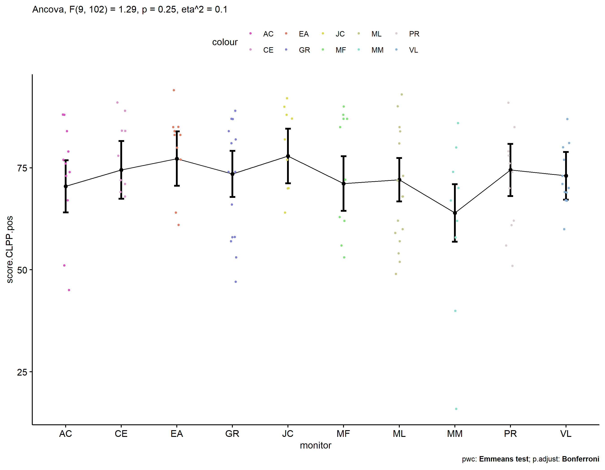<!-- -->

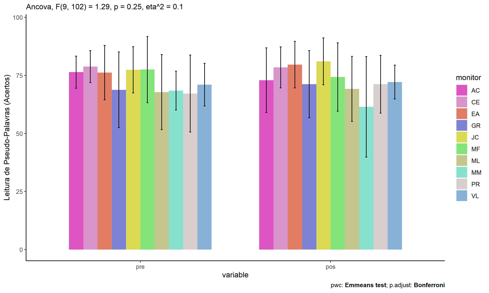<!-- -->

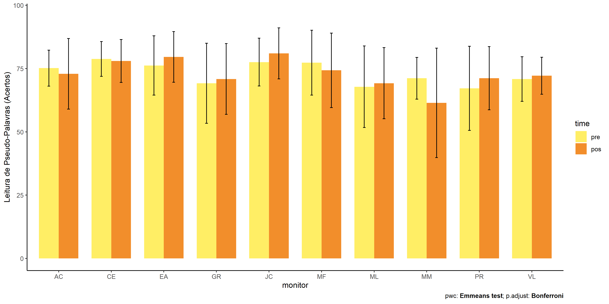<!-- -->

### Correta Regular (Acertos)

| var          | monitor |   n | M (pre) | SE (pre) | M (unadj) | SE (unadj) | M (adj) | SE (adj) |
|:-------------|:--------|----:|--------:|---------:|----------:|-----------:|--------:|---------:|
| score.CR.pos | AC      |  13 |  17.000 |    0.679 |    13.231 |      1.812 |  12.485 |    1.450 |
| score.CR.pos | CE      |  10 |  16.200 |    1.855 |    16.900 |      0.526 |  16.506 |    1.641 |
| score.CR.pos | EA      |  10 |  15.900 |    0.767 |    15.800 |      0.757 |  15.537 |    1.639 |
| score.CR.pos | GR      |  16 |  14.125 |    1.316 |    14.375 |      1.221 |  14.892 |    1.302 |
| score.CR.pos | JC      |  11 |  16.636 |    0.592 |    15.727 |      1.646 |  15.141 |    1.569 |
| score.CR.pos | MF      |  13 |  16.385 |    0.694 |    11.231 |      1.971 |  10.755 |    1.442 |
| score.CR.pos | ML      |  16 |  13.812 |    1.042 |    14.562 |      0.851 |  15.217 |    1.307 |
| score.CR.pos | MM      |  13 |  15.231 |    0.690 |     9.462 |      2.129 |   9.493 |    1.436 |
| score.CR.pos | PR      |  13 |  12.462 |    1.824 |    13.077 |      1.741 |  14.325 |    1.476 |
| score.CR.pos | VL      |  14 |  16.357 |    0.452 |    16.000 |      1.318 |  15.537 |    1.390 |

| .y.          | group1 | group2 | estimate | conf.low | conf.high |    se | statistic |     p | p.adj | p.adj.signif |
|:-------------|:-------|:-------|---------:|---------:|----------:|------:|----------:|------:|------:|:-------------|
| score.CR.pos | AC     | CE     |   -4.021 |   -8.337 |     0.296 | 2.180 |    -1.844 | 0.068 | 1.000 | ns           |
| score.CR.pos | AC     | EA     |   -3.052 |   -7.373 |     1.268 | 2.182 |    -1.399 | 0.164 | 1.000 | ns           |
| score.CR.pos | AC     | GR     |   -2.407 |   -6.296 |     1.482 | 1.964 |    -1.226 | 0.223 | 1.000 | ns           |
| score.CR.pos | AC     | JC     |   -2.656 |   -6.857 |     1.545 | 2.122 |    -1.252 | 0.213 | 1.000 | ns           |
| score.CR.pos | AC     | MF     |    1.730 |   -2.295 |     5.754 | 2.032 |     0.851 | 0.396 | 1.000 | ns           |
| score.CR.pos | AC     | ML     |   -2.732 |   -6.635 |     1.171 | 1.971 |    -1.386 | 0.168 | 1.000 | ns           |
| score.CR.pos | AC     | MM     |    2.992 |   -1.051 |     7.036 | 2.042 |     1.465 | 0.145 | 1.000 | ns           |
| score.CR.pos | AC     | PR     |   -1.840 |   -6.004 |     2.324 | 2.103 |    -0.875 | 0.383 | 1.000 | ns           |
| score.CR.pos | AC     | VL     |   -3.052 |   -7.004 |     0.900 | 1.996 |    -1.529 | 0.129 | 1.000 | ns           |
| score.CR.pos | CE     | EA     |    0.968 |   -3.618 |     5.554 | 2.316 |     0.418 | 0.677 | 1.000 | ns           |
| score.CR.pos | CE     | GR     |    1.614 |   -2.549 |     5.776 | 2.102 |     0.768 | 0.444 | 1.000 | ns           |
| score.CR.pos | CE     | JC     |    1.364 |   -3.117 |     5.845 | 2.263 |     0.603 | 0.548 | 1.000 | ns           |
| score.CR.pos | CE     | MF     |    5.750 |    1.437 |    10.063 | 2.178 |     2.640 | 0.009 | 0.423 | ns           |
| score.CR.pos | CE     | ML     |    1.289 |   -2.883 |     5.461 | 2.107 |     0.612 | 0.542 | 1.000 | ns           |
| score.CR.pos | CE     | MM     |    7.013 |    2.694 |    11.332 | 2.181 |     3.216 | 0.002 | 0.076 | ns           |
| score.CR.pos | CE     | PR     |    2.181 |   -2.223 |     6.584 | 2.224 |     0.981 | 0.329 | 1.000 | ns           |
| score.CR.pos | CE     | VL     |    0.969 |   -3.276 |     5.214 | 2.144 |     0.452 | 0.652 | 1.000 | ns           |
| score.CR.pos | EA     | GR     |    0.645 |   -3.509 |     4.800 | 2.098 |     0.308 | 0.759 | 1.000 | ns           |
| score.CR.pos | EA     | JC     |    0.396 |   -4.087 |     4.879 | 2.264 |     0.175 | 0.861 | 1.000 | ns           |
| score.CR.pos | EA     | MF     |    4.782 |    0.468 |     9.096 | 2.179 |     2.195 | 0.030 | 1.000 | ns           |
| score.CR.pos | EA     | ML     |    0.321 |   -3.842 |     4.483 | 2.102 |     0.152 | 0.879 | 1.000 | ns           |
| score.CR.pos | EA     | MM     |    6.044 |    1.729 |    10.360 | 2.179 |     2.774 | 0.006 | 0.290 | ns           |
| score.CR.pos | EA     | PR     |    1.213 |   -3.177 |     5.602 | 2.217 |     0.547 | 0.585 | 1.000 | ns           |
| score.CR.pos | EA     | VL     |    0.001 |   -4.246 |     4.247 | 2.144 |     0.000 | 1.000 | 1.000 | ns           |
| score.CR.pos | GR     | JC     |   -0.249 |   -4.309 |     3.811 | 2.050 |    -0.122 | 0.903 | 1.000 | ns           |
| score.CR.pos | GR     | MF     |    4.137 |    0.271 |     8.003 | 1.952 |     2.119 | 0.036 | 1.000 | ns           |
| score.CR.pos | GR     | ML     |   -0.325 |   -3.950 |     3.301 | 1.831 |    -0.177 | 0.860 | 1.000 | ns           |
| score.CR.pos | GR     | MM     |    5.399 |    1.562 |     9.237 | 1.938 |     2.786 | 0.006 | 0.280 | ns           |
| score.CR.pos | GR     | PR     |    0.567 |   -3.281 |     4.416 | 1.944 |     0.292 | 0.771 | 1.000 | ns           |
| score.CR.pos | GR     | VL     |   -0.645 |   -4.434 |     3.145 | 1.914 |    -0.337 | 0.737 | 1.000 | ns           |
| score.CR.pos | JC     | MF     |    4.386 |    0.185 |     8.587 | 2.121 |     2.068 | 0.041 | 1.000 | ns           |
| score.CR.pos | JC     | ML     |   -0.076 |   -4.147 |     3.996 | 2.056 |    -0.037 | 0.971 | 1.000 | ns           |
| score.CR.pos | JC     | MM     |    5.648 |    1.435 |     9.862 | 2.128 |     2.655 | 0.009 | 0.407 | ns           |
| score.CR.pos | JC     | PR     |    0.817 |   -3.500 |     5.133 | 2.180 |     0.375 | 0.709 | 1.000 | ns           |
| score.CR.pos | JC     | VL     |   -0.395 |   -4.527 |     3.736 | 2.086 |    -0.190 | 0.850 | 1.000 | ns           |
| score.CR.pos | MF     | ML     |   -4.462 |   -8.339 |    -0.585 | 1.958 |    -2.279 | 0.024 | 1.000 | ns           |
| score.CR.pos | MF     | MM     |    1.262 |   -2.769 |     5.293 | 2.036 |     0.620 | 0.536 | 1.000 | ns           |
| score.CR.pos | MF     | PR     |   -3.569 |   -7.698 |     0.559 | 2.085 |    -1.712 | 0.090 | 1.000 | ns           |
| score.CR.pos | MF     | VL     |   -4.781 |   -8.730 |    -0.832 | 1.994 |    -2.398 | 0.018 | 0.813 | ns           |
| score.CR.pos | ML     | MM     |    5.724 |    1.881 |     9.567 | 1.941 |     2.949 | 0.004 | 0.173 | ns           |
| score.CR.pos | ML     | PR     |    0.892 |   -2.950 |     4.734 | 1.940 |     0.460 | 0.646 | 1.000 | ns           |
| score.CR.pos | ML     | VL     |   -0.320 |   -4.121 |     3.481 | 1.919 |    -0.167 | 0.868 | 1.000 | ns           |
| score.CR.pos | MM     | PR     |   -4.832 |   -8.907 |    -0.757 | 2.058 |    -2.348 | 0.021 | 0.924 | ns           |
| score.CR.pos | MM     | VL     |   -6.044 |  -10.002 |    -2.086 | 1.999 |    -3.024 | 0.003 | 0.138 | ns           |
| score.CR.pos | PR     | VL     |   -1.212 |   -5.268 |     2.845 | 2.048 |    -0.592 | 0.555 | 1.000 | ns           |
| score.CR.pre | AC     | CE     |    0.800 |   -2.488 |     4.088 | 1.661 |     0.482 | 0.631 | 1.000 | ns           |
| score.CR.pre | AC     | EA     |    1.100 |   -2.188 |     4.388 | 1.661 |     0.662 | 0.509 | 1.000 | ns           |
| score.CR.pre | AC     | GR     |    2.875 |   -0.044 |     5.794 | 1.474 |     1.950 | 0.054 | 1.000 | ns           |
| score.CR.pre | AC     | JC     |    0.364 |   -2.839 |     3.566 | 1.617 |     0.225 | 0.823 | 1.000 | ns           |
| score.CR.pre | AC     | MF     |    0.615 |   -2.451 |     3.682 | 1.549 |     0.397 | 0.692 | 1.000 | ns           |
| score.CR.pre | AC     | ML     |    3.187 |    0.268 |     6.107 | 1.474 |     2.162 | 0.033 | 1.000 | ns           |
| score.CR.pre | AC     | MM     |    1.769 |   -1.297 |     4.836 | 1.549 |     1.142 | 0.256 | 1.000 | ns           |
| score.CR.pre | AC     | PR     |    4.538 |    1.472 |     7.605 | 1.549 |     2.931 | 0.004 | 0.183 | ns           |
| score.CR.pre | AC     | VL     |    0.643 |   -2.368 |     3.654 | 1.521 |     0.423 | 0.673 | 1.000 | ns           |
| score.CR.pre | CE     | EA     |    0.300 |   -3.196 |     3.796 | 1.766 |     0.170 | 0.865 | 1.000 | ns           |
| score.CR.pre | CE     | GR     |    2.075 |   -1.077 |     5.227 | 1.592 |     1.304 | 0.195 | 1.000 | ns           |
| score.CR.pre | CE     | JC     |   -0.436 |   -3.852 |     2.980 | 1.725 |    -0.253 | 0.801 | 1.000 | ns           |
| score.CR.pre | CE     | MF     |   -0.185 |   -3.473 |     3.104 | 1.661 |    -0.111 | 0.912 | 1.000 | ns           |
| score.CR.pre | CE     | ML     |    2.387 |   -0.764 |     5.539 | 1.592 |     1.500 | 0.136 | 1.000 | ns           |
| score.CR.pre | CE     | MM     |    0.969 |   -2.319 |     4.258 | 1.661 |     0.584 | 0.561 | 1.000 | ns           |
| score.CR.pre | CE     | PR     |    3.738 |    0.450 |     7.027 | 1.661 |     2.251 | 0.026 | 1.000 | ns           |
| score.CR.pre | CE     | VL     |   -0.157 |   -3.394 |     3.080 | 1.635 |    -0.096 | 0.924 | 1.000 | ns           |
| score.CR.pre | EA     | GR     |    1.775 |   -1.377 |     4.927 | 1.592 |     1.115 | 0.267 | 1.000 | ns           |
| score.CR.pre | EA     | JC     |   -0.736 |   -4.152 |     2.680 | 1.725 |    -0.427 | 0.670 | 1.000 | ns           |
| score.CR.pre | EA     | MF     |   -0.485 |   -3.773 |     2.804 | 1.661 |    -0.292 | 0.771 | 1.000 | ns           |
| score.CR.pre | EA     | ML     |    2.087 |   -1.064 |     5.239 | 1.592 |     1.312 | 0.192 | 1.000 | ns           |
| score.CR.pre | EA     | MM     |    0.669 |   -2.619 |     3.958 | 1.661 |     0.403 | 0.688 | 1.000 | ns           |
| score.CR.pre | EA     | PR     |    3.438 |    0.150 |     6.727 | 1.661 |     2.070 | 0.041 | 1.000 | ns           |
| score.CR.pre | EA     | VL     |   -0.457 |   -3.694 |     2.780 | 1.635 |    -0.280 | 0.780 | 1.000 | ns           |
| score.CR.pre | GR     | JC     |   -2.511 |   -5.573 |     0.551 | 1.546 |    -1.624 | 0.107 | 1.000 | ns           |
| score.CR.pre | GR     | MF     |   -2.260 |   -5.179 |     0.660 | 1.474 |    -1.533 | 0.128 | 1.000 | ns           |
| score.CR.pre | GR     | ML     |    0.313 |   -2.452 |     3.077 | 1.396 |     0.224 | 0.823 | 1.000 | ns           |
| score.CR.pre | GR     | MM     |   -1.106 |   -4.025 |     1.813 | 1.474 |    -0.750 | 0.455 | 1.000 | ns           |
| score.CR.pre | GR     | PR     |    1.663 |   -1.256 |     4.583 | 1.474 |     1.128 | 0.261 | 1.000 | ns           |
| score.CR.pre | GR     | VL     |   -2.232 |   -5.093 |     0.629 | 1.445 |    -1.545 | 0.125 | 1.000 | ns           |
| score.CR.pre | JC     | MF     |    0.252 |   -2.951 |     3.455 | 1.617 |     0.156 | 0.877 | 1.000 | ns           |
| score.CR.pre | JC     | ML     |    2.824 |   -0.238 |     5.886 | 1.546 |     1.826 | 0.070 | 1.000 | ns           |
| score.CR.pre | JC     | MM     |    1.406 |   -1.797 |     4.608 | 1.617 |     0.869 | 0.387 | 1.000 | ns           |
| score.CR.pre | JC     | PR     |    4.175 |    0.972 |     7.378 | 1.617 |     2.581 | 0.011 | 0.498 | ns           |
| score.CR.pre | JC     | VL     |    0.279 |   -2.871 |     3.429 | 1.591 |     0.176 | 0.861 | 1.000 | ns           |
| score.CR.pre | MF     | ML     |    2.572 |   -0.347 |     5.491 | 1.474 |     1.745 | 0.084 | 1.000 | ns           |
| score.CR.pre | MF     | MM     |    1.154 |   -1.913 |     4.220 | 1.549 |     0.745 | 0.458 | 1.000 | ns           |
| score.CR.pre | MF     | PR     |    3.923 |    0.857 |     6.990 | 1.549 |     2.533 | 0.013 | 0.567 | ns           |
| score.CR.pre | MF     | VL     |    0.027 |   -2.984 |     3.039 | 1.521 |     0.018 | 0.986 | 1.000 | ns           |
| score.CR.pre | ML     | MM     |   -1.418 |   -4.337 |     1.501 | 1.474 |    -0.962 | 0.338 | 1.000 | ns           |
| score.CR.pre | ML     | PR     |    1.351 |   -1.568 |     4.270 | 1.474 |     0.916 | 0.361 | 1.000 | ns           |
| score.CR.pre | ML     | VL     |   -2.545 |   -5.406 |     0.316 | 1.445 |    -1.761 | 0.081 | 1.000 | ns           |
| score.CR.pre | MM     | PR     |    2.769 |   -0.297 |     5.836 | 1.549 |     1.788 | 0.076 | 1.000 | ns           |
| score.CR.pre | MM     | VL     |   -1.126 |   -4.138 |     1.885 | 1.521 |    -0.741 | 0.460 | 1.000 | ns           |
| score.CR.pre | PR     | VL     |   -3.896 |   -6.907 |    -0.884 | 1.521 |    -2.562 | 0.012 | 0.525 | ns           |

| .y.      | monitor | group1 | group2 | estimate | conf.low | conf.high |    se | statistic |     p | p.adj | p.adj.signif |
|:---------|:--------|:-------|:-------|---------:|---------:|----------:|------:|----------:|------:|------:|:-------------|
| score.CR | AC      | pre    | pos    |    3.769 |    0.097 |     7.442 | 1.864 |     2.022 | 0.044 | 0.044 | \*           |
| score.CR | CE      | pre    | pos    |   -0.700 |   -4.887 |     3.487 | 2.126 |    -0.329 | 0.742 | 0.742 | ns           |
| score.CR | EA      | pre    | pos    |    0.100 |   -4.087 |     4.287 | 2.126 |     0.047 | 0.963 | 0.963 | ns           |
| score.CR | GR      | pre    | pos    |   -0.250 |   -3.560 |     3.060 | 1.680 |    -0.149 | 0.882 | 0.882 | ns           |
| score.CR | JC      | pre    | pos    |    0.909 |   -3.083 |     4.901 | 2.027 |     0.449 | 0.654 | 0.654 | ns           |
| score.CR | MF      | pre    | pos    |    5.154 |    1.481 |     8.826 | 1.864 |     2.765 | 0.006 | 0.006 | \*\*         |
| score.CR | ML      | pre    | pos    |   -0.750 |   -4.060 |     2.560 | 1.680 |    -0.446 | 0.656 | 0.656 | ns           |
| score.CR | MM      | pre    | pos    |    5.769 |    2.097 |     9.442 | 1.864 |     3.095 | 0.002 | 0.002 | \*\*         |
| score.CR | PR      | pre    | pos    |   -0.615 |   -4.288 |     3.057 | 1.864 |    -0.330 | 0.742 | 0.742 | ns           |
| score.CR | VL      | pre    | pos    |    0.357 |   -3.182 |     3.896 | 1.796 |     0.199 | 0.843 | 0.843 | ns           |

    ## Scale for colour is already present.
    ## Adding another scale for colour, which will replace the existing scale.

<!-- -->

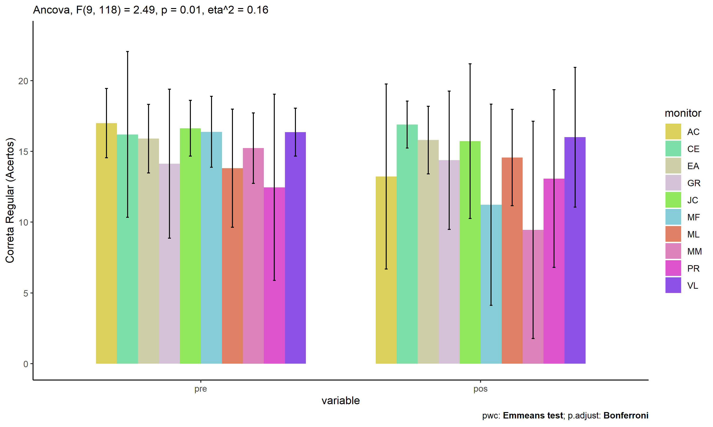<!-- -->

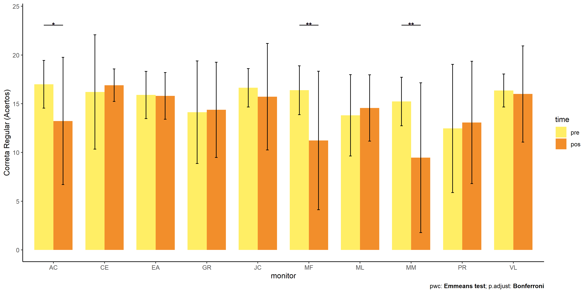<!-- -->

### Correta Irregular (Acertos)

| var          | monitor |   n | M (pre) | SE (pre) | M (unadj) | SE (unadj) | M (adj) | SE (adj) |
|:-------------|:--------|----:|--------:|---------:|----------:|-----------:|--------:|---------:|
| score.CI.pos | AC      |  13 |  12.923 |    0.916 |    10.615 |      1.483 |  10.266 |    1.268 |
| score.CI.pos | CE      |  10 |  12.200 |    1.604 |    13.600 |      1.013 |  13.621 |    1.443 |
| score.CI.pos | EA      |  10 |  12.500 |    1.186 |    14.500 |      0.687 |  14.367 |    1.444 |
| score.CI.pos | GR      |  16 |  11.812 |    1.134 |    12.375 |      1.008 |  12.594 |    1.142 |
| score.CI.pos | JC      |  11 |  12.000 |    0.647 |    12.545 |      1.534 |  12.668 |    1.377 |
| score.CI.pos | MF      |  13 |  13.077 |    0.512 |    10.615 |      1.845 |  10.188 |    1.269 |
| score.CI.pos | ML      |  16 |  11.125 |    0.884 |    12.438 |      0.922 |  13.008 |    1.148 |
| score.CI.pos | MM      |  13 |  12.846 |    0.659 |     8.154 |      1.860 |   7.844 |    1.268 |
| score.CI.pos | PR      |  13 |  10.538 |    1.682 |    10.769 |      1.590 |  11.639 |    1.280 |
| score.CI.pos | VL      |  14 |  13.643 |    0.684 |    12.714 |      1.160 |  11.997 |    1.230 |

| .y.          | group1 | group2 | estimate | conf.low | conf.high |    se | statistic | p       | p.adj | p.adj.signif |
|:-------------|:-------|:-------|---------:|---------:|----------:|------:|----------:|:--------|------:|:-------------|
| score.CI.pos | AC     | CE     |   -3.354 |   -7.160 |     0.451 | 1.922 |    -1.746 | 0.083   | 1.000 | ns           |
| score.CI.pos | AC     | EA     |   -4.101 |   -7.904 |    -0.298 | 1.921 |    -2.135 | 0.035   | 1.000 | ns           |
| score.CI.pos | AC     | GR     |   -2.328 |   -5.712 |     1.057 | 1.709 |    -1.362 | 0.176   | 1.000 | ns           |
| score.CI.pos | AC     | JC     |   -2.402 |   -6.111 |     1.307 | 1.873 |    -1.283 | 0.202   | 1.000 | ns           |
| score.CI.pos | AC     | MF     |    0.079 |   -3.467 |     3.624 | 1.790 |     0.044 | 0.965   | 1.000 | ns           |
| score.CI.pos | AC     | ML     |   -2.742 |   -6.140 |     0.657 | 1.716 |    -1.597 | 0.113   | 1.000 | ns           |
| score.CI.pos | AC     | MM     |    2.422 |   -1.123 |     5.968 | 1.790 |     1.353 | 0.179   | 1.000 | ns           |
| score.CI.pos | AC     | PR     |   -1.373 |   -4.958 |     2.211 | 1.810 |    -0.759 | 0.45    | 1.000 | ns           |
| score.CI.pos | AC     | VL     |   -1.731 |   -5.216 |     1.754 | 1.760 |    -0.983 | 0.327   | 1.000 | ns           |
| score.CI.pos | CE     | EA     |   -0.747 |   -4.790 |     3.296 | 2.042 |    -0.366 | 0.715   | 1.000 | ns           |
| score.CI.pos | CE     | GR     |    1.027 |   -2.618 |     4.672 | 1.841 |     0.558 | 0.578   | 1.000 | ns           |
| score.CI.pos | CE     | JC     |    0.952 |   -2.997 |     4.902 | 1.995 |     0.477 | 0.634   | 1.000 | ns           |
| score.CI.pos | CE     | MF     |    3.433 |   -0.374 |     7.240 | 1.922 |     1.786 | 0.077   | 1.000 | ns           |
| score.CI.pos | CE     | ML     |    0.613 |   -3.039 |     4.264 | 1.844 |     0.332 | 0.74    | 1.000 | ns           |
| score.CI.pos | CE     | MM     |    5.777 |    1.972 |     9.581 | 1.921 |     3.007 | 0.003   | 0.145 | ns           |
| score.CI.pos | CE     | PR     |    1.981 |   -1.839 |     5.801 | 1.929 |     1.027 | 0.306   | 1.000 | ns           |
| score.CI.pos | CE     | VL     |    1.624 |   -2.133 |     5.380 | 1.897 |     0.856 | 0.394   | 1.000 | ns           |
| score.CI.pos | EA     | GR     |    1.773 |   -1.874 |     5.420 | 1.842 |     0.963 | 0.338   | 1.000 | ns           |
| score.CI.pos | EA     | JC     |    1.699 |   -2.252 |     5.650 | 1.995 |     0.851 | 0.396   | 1.000 | ns           |
| score.CI.pos | EA     | MF     |    4.180 |    0.375 |     7.984 | 1.921 |     2.176 | 0.032   | 1.000 | ns           |
| score.CI.pos | EA     | ML     |    1.359 |   -2.297 |     5.016 | 1.846 |     0.736 | 0.463   | 1.000 | ns           |
| score.CI.pos | EA     | MM     |    6.523 |    2.720 |    10.326 | 1.920 |     3.397 | \<0.001 | 0.042 | \*           |
| score.CI.pos | EA     | PR     |    2.728 |   -1.099 |     6.555 | 1.932 |     1.412 | 0.161   | 1.000 | ns           |
| score.CI.pos | EA     | VL     |    2.370 |   -1.381 |     6.121 | 1.894 |     1.251 | 0.213   | 1.000 | ns           |
| score.CI.pos | GR     | JC     |   -0.075 |   -3.615 |     3.466 | 1.788 |    -0.042 | 0.967   | 1.000 | ns           |
| score.CI.pos | GR     | MF     |    2.406 |   -0.981 |     5.793 | 1.710 |     1.407 | 0.162   | 1.000 | ns           |
| score.CI.pos | GR     | ML     |   -0.414 |   -3.614 |     2.785 | 1.616 |    -0.256 | 0.798   | 1.000 | ns           |
| score.CI.pos | GR     | MM     |    4.750 |    1.367 |     8.133 | 1.708 |     2.780 | 0.006   | 0.284 | ns           |
| score.CI.pos | GR     | PR     |    0.954 |   -2.433 |     4.341 | 1.710 |     0.558 | 0.578   | 1.000 | ns           |
| score.CI.pos | GR     | VL     |    0.597 |   -2.736 |     3.929 | 1.683 |     0.355 | 0.724   | 1.000 | ns           |
| score.CI.pos | JC     | MF     |    2.481 |   -1.230 |     6.192 | 1.874 |     1.324 | 0.188   | 1.000 | ns           |
| score.CI.pos | JC     | ML     |   -0.339 |   -3.885 |     3.206 | 1.791 |    -0.190 | 0.85    | 1.000 | ns           |
| score.CI.pos | JC     | MM     |    4.824 |    1.116 |     8.532 | 1.872 |     2.577 | 0.011   | 0.505 | ns           |
| score.CI.pos | JC     | PR     |    1.029 |   -2.688 |     4.746 | 1.877 |     0.548 | 0.585   | 1.000 | ns           |
| score.CI.pos | JC     | VL     |    0.671 |   -2.989 |     4.331 | 1.848 |     0.363 | 0.717   | 1.000 | ns           |
| score.CI.pos | MF     | ML     |   -2.820 |   -6.223 |     0.583 | 1.718 |    -1.641 | 0.103   | 1.000 | ns           |
| score.CI.pos | MF     | MM     |    2.344 |   -1.202 |     5.889 | 1.791 |     1.309 | 0.193   | 1.000 | ns           |
| score.CI.pos | MF     | PR     |   -1.452 |   -5.042 |     2.138 | 1.813 |    -0.801 | 0.425   | 1.000 | ns           |
| score.CI.pos | MF     | VL     |   -1.810 |   -5.293 |     1.674 | 1.759 |    -1.029 | 0.306   | 1.000 | ns           |
| score.CI.pos | ML     | MM     |    5.164 |    1.767 |     8.560 | 1.715 |     3.011 | 0.003   | 0.144 | ns           |
| score.CI.pos | ML     | PR     |    1.368 |   -2.009 |     4.746 | 1.706 |     0.802 | 0.424   | 1.000 | ns           |
| score.CI.pos | ML     | VL     |    1.011 |   -2.344 |     4.365 | 1.694 |     0.597 | 0.552   | 1.000 | ns           |
| score.CI.pos | MM     | PR     |   -3.795 |   -7.378 |    -0.213 | 1.809 |    -2.098 | 0.038   | 1.000 | ns           |
| score.CI.pos | MM     | VL     |   -4.153 |   -7.639 |    -0.667 | 1.760 |    -2.359 | 0.02    | 0.898 | ns           |
| score.CI.pos | PR     | VL     |   -0.358 |   -3.906 |     3.191 | 1.792 |    -0.200 | 0.842   | 1.000 | ns           |
| score.CI.pre | AC     | CE     |    0.723 |   -2.394 |     3.840 | 1.574 |     0.459 | 0.647   | 1.000 | ns           |
| score.CI.pre | AC     | EA     |    0.423 |   -2.694 |     3.540 | 1.574 |     0.269 | 0.789   | 1.000 | ns           |
| score.CI.pre | AC     | GR     |    1.111 |   -1.656 |     3.877 | 1.397 |     0.795 | 0.428   | 1.000 | ns           |
| score.CI.pre | AC     | JC     |    0.923 |   -2.112 |     3.959 | 1.533 |     0.602 | 0.548   | 1.000 | ns           |
| score.CI.pre | AC     | MF     |   -0.154 |   -3.060 |     2.752 | 1.468 |    -0.105 | 0.917   | 1.000 | ns           |
| score.CI.pre | AC     | ML     |    1.798 |   -0.969 |     4.565 | 1.397 |     1.287 | 0.201   | 1.000 | ns           |
| score.CI.pre | AC     | MM     |    0.077 |   -2.829 |     2.983 | 1.468 |     0.052 | 0.958   | 1.000 | ns           |
| score.CI.pre | AC     | PR     |    2.385 |   -0.522 |     5.291 | 1.468 |     1.625 | 0.107   | 1.000 | ns           |
| score.CI.pre | AC     | VL     |   -0.720 |   -3.574 |     2.134 | 1.441 |    -0.499 | 0.618   | 1.000 | ns           |
| score.CI.pre | CE     | EA     |   -0.300 |   -3.614 |     3.014 | 1.673 |    -0.179 | 0.858   | 1.000 | ns           |
| score.CI.pre | CE     | GR     |    0.387 |   -2.599 |     3.374 | 1.508 |     0.257 | 0.798   | 1.000 | ns           |
| score.CI.pre | CE     | JC     |    0.200 |   -3.037 |     3.437 | 1.635 |     0.122 | 0.903   | 1.000 | ns           |
| score.CI.pre | CE     | MF     |   -0.877 |   -3.994 |     2.240 | 1.574 |    -0.557 | 0.578   | 1.000 | ns           |
| score.CI.pre | CE     | ML     |    1.075 |   -1.912 |     4.062 | 1.508 |     0.713 | 0.477   | 1.000 | ns           |
| score.CI.pre | CE     | MM     |   -0.646 |   -3.763 |     2.470 | 1.574 |    -0.411 | 0.682   | 1.000 | ns           |
| score.CI.pre | CE     | PR     |    1.662 |   -1.455 |     4.778 | 1.574 |     1.056 | 0.293   | 1.000 | ns           |
| score.CI.pre | CE     | VL     |   -1.443 |   -4.511 |     1.625 | 1.549 |    -0.931 | 0.354   | 1.000 | ns           |
| score.CI.pre | EA     | GR     |    0.687 |   -2.299 |     3.674 | 1.508 |     0.456 | 0.649   | 1.000 | ns           |
| score.CI.pre | EA     | JC     |    0.500 |   -2.737 |     3.737 | 1.635 |     0.306 | 0.76    | 1.000 | ns           |
| score.CI.pre | EA     | MF     |   -0.577 |   -3.694 |     2.540 | 1.574 |    -0.367 | 0.715   | 1.000 | ns           |
| score.CI.pre | EA     | ML     |    1.375 |   -1.612 |     4.362 | 1.508 |     0.912 | 0.364   | 1.000 | ns           |
| score.CI.pre | EA     | MM     |   -0.346 |   -3.463 |     2.770 | 1.574 |    -0.220 | 0.826   | 1.000 | ns           |
| score.CI.pre | EA     | PR     |    1.962 |   -1.155 |     5.078 | 1.574 |     1.246 | 0.215   | 1.000 | ns           |
| score.CI.pre | EA     | VL     |   -1.143 |   -4.211 |     1.925 | 1.549 |    -0.738 | 0.462   | 1.000 | ns           |
| score.CI.pre | GR     | JC     |   -0.187 |   -3.090 |     2.715 | 1.466 |    -0.128 | 0.898   | 1.000 | ns           |
| score.CI.pre | GR     | MF     |   -1.264 |   -4.031 |     1.502 | 1.397 |    -0.905 | 0.367   | 1.000 | ns           |
| score.CI.pre | GR     | ML     |    0.687 |   -1.932 |     3.307 | 1.323 |     0.520 | 0.604   | 1.000 | ns           |
| score.CI.pre | GR     | MM     |   -1.034 |   -3.800 |     1.733 | 1.397 |    -0.740 | 0.461   | 1.000 | ns           |
| score.CI.pre | GR     | PR     |    1.274 |   -1.493 |     4.041 | 1.397 |     0.912 | 0.364   | 1.000 | ns           |
| score.CI.pre | GR     | VL     |   -1.830 |   -4.542 |     0.881 | 1.369 |    -1.337 | 0.184   | 1.000 | ns           |
| score.CI.pre | JC     | MF     |   -1.077 |   -4.112 |     1.959 | 1.533 |    -0.703 | 0.484   | 1.000 | ns           |
| score.CI.pre | JC     | ML     |    0.875 |   -2.027 |     3.777 | 1.466 |     0.597 | 0.552   | 1.000 | ns           |
| score.CI.pre | JC     | MM     |   -0.846 |   -3.882 |     2.189 | 1.533 |    -0.552 | 0.582   | 1.000 | ns           |
| score.CI.pre | JC     | PR     |    1.462 |   -1.574 |     4.497 | 1.533 |     0.953 | 0.342   | 1.000 | ns           |
| score.CI.pre | JC     | VL     |   -1.643 |   -4.628 |     1.342 | 1.508 |    -1.090 | 0.278   | 1.000 | ns           |
| score.CI.pre | MF     | ML     |    1.952 |   -0.815 |     4.719 | 1.397 |     1.397 | 0.165   | 1.000 | ns           |
| score.CI.pre | MF     | MM     |    0.231 |   -2.675 |     3.137 | 1.468 |     0.157 | 0.875   | 1.000 | ns           |
| score.CI.pre | MF     | PR     |    2.538 |   -0.368 |     5.445 | 1.468 |     1.730 | 0.086   | 1.000 | ns           |
| score.CI.pre | MF     | VL     |   -0.566 |   -3.420 |     2.288 | 1.441 |    -0.393 | 0.695   | 1.000 | ns           |
| score.CI.pre | ML     | MM     |   -1.721 |   -4.488 |     1.045 | 1.397 |    -1.232 | 0.22    | 1.000 | ns           |
| score.CI.pre | ML     | PR     |    0.587 |   -2.180 |     3.353 | 1.397 |     0.420 | 0.675   | 1.000 | ns           |
| score.CI.pre | ML     | VL     |   -2.518 |   -5.229 |     0.194 | 1.369 |    -1.839 | 0.068   | 1.000 | ns           |
| score.CI.pre | MM     | PR     |    2.308 |   -0.599 |     5.214 | 1.468 |     1.572 | 0.119   | 1.000 | ns           |
| score.CI.pre | MM     | VL     |   -0.797 |   -3.651 |     2.057 | 1.441 |    -0.553 | 0.581   | 1.000 | ns           |
| score.CI.pre | PR     | VL     |   -3.104 |   -5.958 |    -0.251 | 1.441 |    -2.154 | 0.033   | 1.000 | ns           |

| .y.      | monitor | group1 | group2 | estimate | conf.low | conf.high |    se | statistic |     p | p.adj | p.adj.signif |
|:---------|:--------|:-------|:-------|---------:|---------:|----------:|------:|----------:|------:|------:|:-------------|
| score.CI | AC      | pre    | pos    |    2.308 |   -1.075 |     5.690 | 1.717 |     1.344 | 0.180 | 0.180 | ns           |
| score.CI | CE      | pre    | pos    |   -1.400 |   -5.257 |     2.457 | 1.958 |    -0.715 | 0.475 | 0.475 | ns           |
| score.CI | EA      | pre    | pos    |   -2.000 |   -5.857 |     1.857 | 1.958 |    -1.022 | 0.308 | 0.308 | ns           |
| score.CI | GR      | pre    | pos    |   -0.562 |   -3.611 |     2.486 | 1.548 |    -0.363 | 0.717 | 0.717 | ns           |
| score.CI | JC      | pre    | pos    |   -0.545 |   -4.223 |     3.132 | 1.867 |    -0.292 | 0.770 | 0.770 | ns           |
| score.CI | MF      | pre    | pos    |    2.462 |   -0.921 |     5.844 | 1.717 |     1.434 | 0.153 | 0.153 | ns           |
| score.CI | ML      | pre    | pos    |   -1.312 |   -4.361 |     1.736 | 1.548 |    -0.848 | 0.397 | 0.397 | ns           |
| score.CI | MM      | pre    | pos    |    4.692 |    1.310 |     8.075 | 1.717 |     2.733 | 0.007 | 0.007 | \*\*         |
| score.CI | PR      | pre    | pos    |   -0.231 |   -3.613 |     3.152 | 1.717 |    -0.134 | 0.893 | 0.893 | ns           |
| score.CI | VL      | pre    | pos    |    0.929 |   -2.331 |     4.188 | 1.655 |     0.561 | 0.575 | 0.575 | ns           |

    ## Scale for colour is already present.
    ## Adding another scale for colour, which will replace the existing scale.

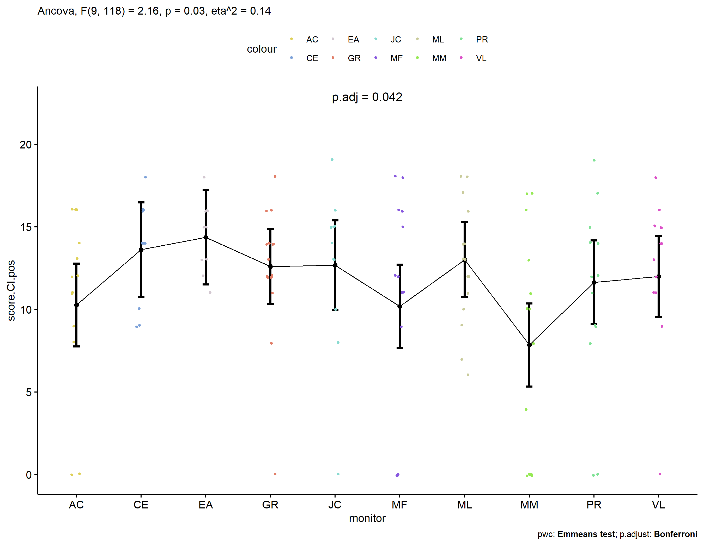<!-- -->

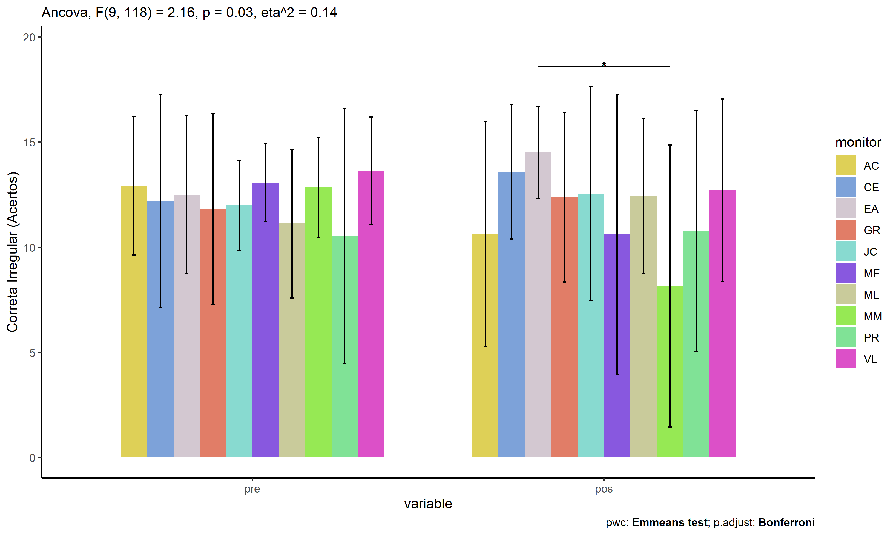<!-- -->

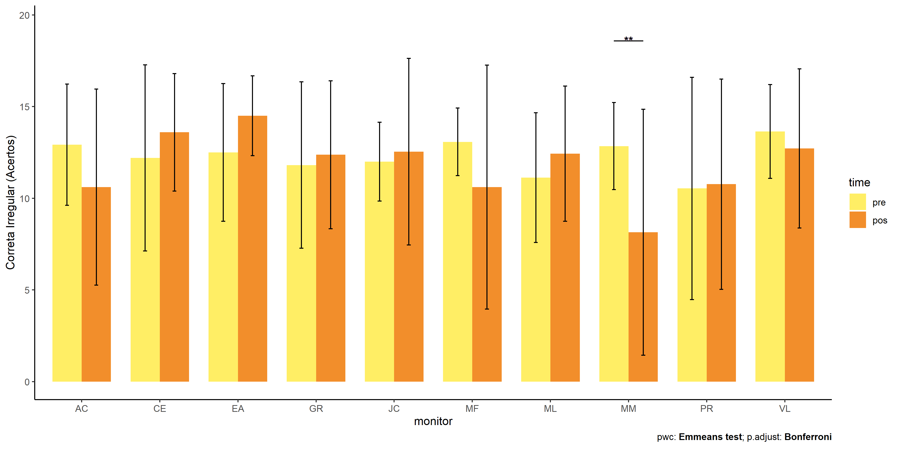<!-- -->

### Trocas Visuais (Acertos)

| var          | monitor |   n | M (pre) | SE (pre) | M (unadj) | SE (unadj) | M (adj) | SE (adj) |
|:-------------|:--------|----:|--------:|---------:|----------:|-----------:|--------:|---------:|
| score.TV.pos | AC      |  13 |  18.385 |    0.474 |    14.846 |      2.015 |  14.193 |    1.601 |
| score.TV.pos | CE      |  10 |  16.500 |    1.887 |    17.800 |      0.680 |  17.908 |    1.811 |
| score.TV.pos | EA      |  10 |  18.600 |    0.521 |    18.500 |      0.401 |  17.759 |    1.825 |
| score.TV.pos | GR      |  16 |  14.688 |    1.347 |    15.188 |      1.342 |  16.028 |    1.455 |
| score.TV.pos | JC      |  11 |  18.727 |    0.524 |    17.000 |      1.716 |  16.208 |    1.744 |
| score.TV.pos | MF      |  13 |  18.154 |    0.639 |    12.692 |      2.122 |  12.132 |    1.598 |
| score.TV.pos | ML      |  16 |  16.812 |    1.137 |    16.375 |      0.939 |  16.357 |    1.432 |
| score.TV.pos | MM      |  13 |  17.692 |    0.654 |     9.923 |      2.376 |   9.549 |    1.593 |
| score.TV.pos | PR      |  13 |  13.231 |    2.187 |    13.692 |      2.046 |  15.122 |    1.648 |
| score.TV.pos | VL      |  14 |  16.071 |    0.752 |    15.929 |      1.336 |  16.210 |    1.533 |

| .y.          | group1 | group2 | estimate | conf.low | conf.high |    se | statistic | p       | p.adj | p.adj.signif |
|:-------------|:-------|:-------|---------:|---------:|----------:|------:|----------:|:--------|------:|:-------------|
| score.TV.pos | AC     | CE     |   -3.715 |   -8.508 |     1.077 | 2.420 |    -1.535 | 0.127   | 1.000 | ns           |
| score.TV.pos | AC     | EA     |   -3.567 |   -8.338 |     1.204 | 2.409 |    -1.481 | 0.141   | 1.000 | ns           |
| score.TV.pos | AC     | GR     |   -1.835 |   -6.166 |     2.495 | 2.187 |    -0.839 | 0.403   | 1.000 | ns           |
| score.TV.pos | AC     | JC     |   -2.015 |   -6.662 |     2.632 | 2.347 |    -0.859 | 0.392   | 1.000 | ns           |
| score.TV.pos | AC     | MF     |    2.061 |   -2.388 |     6.509 | 2.247 |     0.917 | 0.361   | 1.000 | ns           |
| score.TV.pos | AC     | ML     |   -2.164 |   -6.417 |     2.088 | 2.147 |    -1.008 | 0.316   | 1.000 | ns           |
| score.TV.pos | AC     | MM     |    4.643 |    0.192 |     9.095 | 2.248 |     2.065 | 0.041   | 1.000 | ns           |
| score.TV.pos | AC     | PR     |   -0.929 |   -5.554 |     3.696 | 2.335 |    -0.398 | 0.691   | 1.000 | ns           |
| score.TV.pos | AC     | VL     |   -2.017 |   -6.422 |     2.388 | 2.224 |    -0.907 | 0.366   | 1.000 | ns           |
| score.TV.pos | CE     | EA     |    0.149 |   -4.949 |     5.247 | 2.574 |     0.058 | 0.954   | 1.000 | ns           |
| score.TV.pos | CE     | GR     |    1.880 |   -2.713 |     6.473 | 2.320 |     0.810 | 0.419   | 1.000 | ns           |
| score.TV.pos | CE     | JC     |    1.700 |   -3.285 |     6.686 | 2.518 |     0.675 | 0.501   | 1.000 | ns           |
| score.TV.pos | CE     | MF     |    5.776 |    0.988 |    10.564 | 2.418 |     2.389 | 0.018   | 0.831 | ns           |
| score.TV.pos | CE     | ML     |    1.551 |   -3.021 |     6.124 | 2.309 |     0.672 | 0.503   | 1.000 | ns           |
| score.TV.pos | CE     | MM     |    8.359 |    3.579 |    13.138 | 2.414 |     3.463 | \<0.001 | 0.033 | \*           |
| score.TV.pos | CE     | PR     |    2.786 |   -2.051 |     7.624 | 2.443 |     1.141 | 0.256   | 1.000 | ns           |
| score.TV.pos | CE     | VL     |    1.698 |   -2.999 |     6.395 | 2.372 |     0.716 | 0.475   | 1.000 | ns           |
| score.TV.pos | EA     | GR     |    1.731 |   -2.940 |     6.403 | 2.359 |     0.734 | 0.464   | 1.000 | ns           |
| score.TV.pos | EA     | JC     |    1.551 |   -3.404 |     6.507 | 2.502 |     0.620 | 0.536   | 1.000 | ns           |
| score.TV.pos | EA     | MF     |    5.627 |    0.856 |    10.399 | 2.410 |     2.335 | 0.021   | 0.955 | ns           |
| score.TV.pos | EA     | ML     |    1.403 |   -3.190 |     5.995 | 2.319 |     0.605 | 0.547   | 1.000 | ns           |
| score.TV.pos | EA     | MM     |    8.210 |    3.434 |    12.986 | 2.412 |     3.404 | \<0.001 | 0.041 | \*           |
| score.TV.pos | EA     | PR     |    2.638 |   -2.311 |     7.587 | 2.499 |     1.055 | 0.293   | 1.000 | ns           |
| score.TV.pos | EA     | VL     |    1.550 |   -3.187 |     6.286 | 2.392 |     0.648 | 0.518   | 1.000 | ns           |
| score.TV.pos | GR     | JC     |   -0.180 |   -4.731 |     4.372 | 2.298 |    -0.078 | 0.938   | 1.000 | ns           |
| score.TV.pos | GR     | MF     |    3.896 |   -0.423 |     8.216 | 2.181 |     1.786 | 0.077   | 1.000 | ns           |
| score.TV.pos | GR     | ML     |   -0.329 |   -4.372 |     3.715 | 2.042 |    -0.161 | 0.872   | 1.000 | ns           |
| score.TV.pos | GR     | MM     |    6.479 |    2.180 |    10.777 | 2.171 |     2.985 | 0.003   | 0.155 | ns           |
| score.TV.pos | GR     | PR     |    0.906 |   -3.343 |     5.156 | 2.146 |     0.422 | 0.674   | 1.000 | ns           |
| score.TV.pos | GR     | VL     |   -0.182 |   -4.346 |     3.983 | 2.103 |    -0.086 | 0.931   | 1.000 | ns           |
| score.TV.pos | JC     | MF     |    4.076 |   -0.572 |     8.724 | 2.347 |     1.736 | 0.085   | 1.000 | ns           |
| score.TV.pos | JC     | ML     |   -0.149 |   -4.616 |     4.318 | 2.256 |    -0.066 | 0.948   | 1.000 | ns           |
| score.TV.pos | JC     | MM     |    6.659 |    2.005 |    11.312 | 2.350 |     2.834 | 0.005   | 0.244 | ns           |
| score.TV.pos | JC     | PR     |    1.086 |   -3.752 |     5.924 | 2.443 |     0.445 | 0.657   | 1.000 | ns           |
| score.TV.pos | JC     | VL     |   -0.002 |   -4.618 |     4.614 | 2.331 |    -0.001 | 0.999   | 1.000 | ns           |
| score.TV.pos | MF     | ML     |   -4.225 |   -8.472 |     0.023 | 2.145 |    -1.970 | 0.051   | 1.000 | ns           |
| score.TV.pos | MF     | MM     |    2.583 |   -1.867 |     7.033 | 2.247 |     1.149 | 0.253   | 1.000 | ns           |
| score.TV.pos | MF     | PR     |   -2.990 |   -7.599 |     1.620 | 2.328 |    -1.284 | 0.202   | 1.000 | ns           |
| score.TV.pos | MF     | VL     |   -4.078 |   -8.476 |     0.320 | 2.221 |    -1.836 | 0.069   | 1.000 | ns           |
| score.TV.pos | ML     | MM     |    6.807 |    2.567 |    11.048 | 2.141 |     3.179 | 0.002   | 0.085 | ns           |
| score.TV.pos | ML     | PR     |    1.235 |   -3.090 |     5.560 | 2.184 |     0.566 | 0.573   | 1.000 | ns           |
| score.TV.pos | ML     | VL     |    0.147 |   -4.008 |     4.301 | 2.098 |     0.070 | 0.944   | 1.000 | ns           |
| score.TV.pos | MM     | PR     |   -5.572 |  -10.154 |    -0.991 | 2.313 |    -2.409 | 0.018   | 0.790 | ns           |
| score.TV.pos | MM     | VL     |   -6.661 |  -11.047 |    -2.274 | 2.215 |    -3.007 | 0.003   | 0.145 | ns           |
| score.TV.pos | PR     | VL     |   -1.088 |   -5.512 |     3.335 | 2.234 |    -0.487 | 0.627   | 1.000 | ns           |
| score.TV.pre | AC     | CE     |    1.885 |   -1.644 |     5.413 | 1.782 |     1.058 | 0.292   | 1.000 | ns           |
| score.TV.pre | AC     | EA     |   -0.215 |   -3.744 |     3.313 | 1.782 |    -0.121 | 0.904   | 1.000 | ns           |
| score.TV.pre | AC     | GR     |    3.697 |    0.565 |     6.829 | 1.582 |     2.337 | 0.021   | 0.949 | ns           |
| score.TV.pre | AC     | JC     |   -0.343 |   -3.779 |     3.094 | 1.736 |    -0.197 | 0.844   | 1.000 | ns           |
| score.TV.pre | AC     | MF     |    0.231 |   -3.059 |     3.521 | 1.662 |     0.139 | 0.89    | 1.000 | ns           |
| score.TV.pre | AC     | ML     |    1.572 |   -1.560 |     4.704 | 1.582 |     0.994 | 0.322   | 1.000 | ns           |
| score.TV.pre | AC     | MM     |    0.692 |   -2.598 |     3.983 | 1.662 |     0.417 | 0.678   | 1.000 | ns           |
| score.TV.pre | AC     | PR     |    5.154 |    1.864 |     8.444 | 1.662 |     3.102 | 0.002   | 0.108 | ns           |
| score.TV.pre | AC     | VL     |    2.313 |   -0.918 |     5.544 | 1.632 |     1.418 | 0.159   | 1.000 | ns           |
| score.TV.pre | CE     | EA     |   -2.100 |   -5.851 |     1.651 | 1.895 |    -1.108 | 0.27    | 1.000 | ns           |
| score.TV.pre | CE     | GR     |    1.812 |   -1.569 |     5.194 | 1.708 |     1.061 | 0.291   | 1.000 | ns           |
| score.TV.pre | CE     | JC     |   -2.227 |   -5.892 |     1.438 | 1.851 |    -1.203 | 0.231   | 1.000 | ns           |
| score.TV.pre | CE     | MF     |   -1.654 |   -5.182 |     1.875 | 1.782 |    -0.928 | 0.355   | 1.000 | ns           |
| score.TV.pre | CE     | ML     |   -0.312 |   -3.694 |     3.069 | 1.708 |    -0.183 | 0.855   | 1.000 | ns           |
| score.TV.pre | CE     | MM     |   -1.192 |   -4.721 |     2.336 | 1.782 |    -0.669 | 0.505   | 1.000 | ns           |
| score.TV.pre | CE     | PR     |    3.269 |   -0.259 |     6.798 | 1.782 |     1.835 | 0.069   | 1.000 | ns           |
| score.TV.pre | CE     | VL     |    0.429 |   -3.045 |     3.902 | 1.754 |     0.244 | 0.807   | 1.000 | ns           |
| score.TV.pre | EA     | GR     |    3.912 |    0.531 |     7.294 | 1.708 |     2.291 | 0.024   | 1.000 | ns           |
| score.TV.pre | EA     | JC     |   -0.127 |   -3.792 |     3.538 | 1.851 |    -0.069 | 0.945   | 1.000 | ns           |
| score.TV.pre | EA     | MF     |    0.446 |   -3.082 |     3.975 | 1.782 |     0.250 | 0.803   | 1.000 | ns           |
| score.TV.pre | EA     | ML     |    1.787 |   -1.594 |     5.169 | 1.708 |     1.047 | 0.297   | 1.000 | ns           |
| score.TV.pre | EA     | MM     |    0.908 |   -2.621 |     4.436 | 1.782 |     0.509 | 0.611   | 1.000 | ns           |
| score.TV.pre | EA     | PR     |    5.369 |    1.841 |     8.898 | 1.782 |     3.013 | 0.003   | 0.142 | ns           |
| score.TV.pre | EA     | VL     |    2.529 |   -0.945 |     6.002 | 1.754 |     1.442 | 0.152   | 1.000 | ns           |
| score.TV.pre | GR     | JC     |   -4.040 |   -7.325 |    -0.754 | 1.659 |    -2.435 | 0.016   | 0.738 | ns           |
| score.TV.pre | GR     | MF     |   -3.466 |   -6.599 |    -0.334 | 1.582 |    -2.191 | 0.03    | 1.000 | ns           |
| score.TV.pre | GR     | ML     |   -2.125 |   -5.091 |     0.841 | 1.498 |    -1.419 | 0.159   | 1.000 | ns           |
| score.TV.pre | GR     | MM     |   -3.005 |   -6.137 |     0.127 | 1.582 |    -1.900 | 0.06    | 1.000 | ns           |
| score.TV.pre | GR     | PR     |    1.457 |   -1.676 |     4.589 | 1.582 |     0.921 | 0.359   | 1.000 | ns           |
| score.TV.pre | GR     | VL     |   -1.384 |   -4.454 |     1.686 | 1.550 |    -0.893 | 0.374   | 1.000 | ns           |
| score.TV.pre | JC     | MF     |    0.573 |   -2.863 |     4.010 | 1.736 |     0.330 | 0.742   | 1.000 | ns           |
| score.TV.pre | JC     | ML     |    1.915 |   -1.371 |     5.200 | 1.659 |     1.154 | 0.251   | 1.000 | ns           |
| score.TV.pre | JC     | MM     |    1.035 |   -2.402 |     4.472 | 1.736 |     0.596 | 0.552   | 1.000 | ns           |
| score.TV.pre | JC     | PR     |    5.497 |    2.060 |     8.933 | 1.736 |     3.167 | 0.002   | 0.088 | ns           |
| score.TV.pre | JC     | VL     |    2.656 |   -0.724 |     6.036 | 1.707 |     1.556 | 0.122   | 1.000 | ns           |
| score.TV.pre | MF     | ML     |    1.341 |   -1.791 |     4.474 | 1.582 |     0.848 | 0.398   | 1.000 | ns           |
| score.TV.pre | MF     | MM     |    0.462 |   -2.829 |     3.752 | 1.662 |     0.278 | 0.782   | 1.000 | ns           |
| score.TV.pre | MF     | PR     |    4.923 |    1.633 |     8.213 | 1.662 |     2.963 | 0.004   | 0.166 | ns           |
| score.TV.pre | MF     | VL     |    2.082 |   -1.149 |     5.313 | 1.632 |     1.276 | 0.204   | 1.000 | ns           |
| score.TV.pre | ML     | MM     |   -0.880 |   -4.012 |     2.252 | 1.582 |    -0.556 | 0.579   | 1.000 | ns           |
| score.TV.pre | ML     | PR     |    3.582 |    0.449 |     6.714 | 1.582 |     2.264 | 0.025   | 1.000 | ns           |
| score.TV.pre | ML     | VL     |    0.741 |   -2.329 |     3.811 | 1.550 |     0.478 | 0.634   | 1.000 | ns           |
| score.TV.pre | MM     | PR     |    4.462 |    1.171 |     7.752 | 1.662 |     2.685 | 0.008   | 0.373 | ns           |
| score.TV.pre | MM     | VL     |    1.621 |   -1.610 |     4.852 | 1.632 |     0.993 | 0.323   | 1.000 | ns           |
| score.TV.pre | PR     | VL     |   -2.841 |   -6.072 |     0.390 | 1.632 |    -1.741 | 0.084   | 1.000 | ns           |

| .y.      | monitor | group1 | group2 | estimate | conf.low | conf.high |    se | statistic | p       | p.adj   | p.adj.signif |
|:---------|:--------|:-------|:-------|---------:|---------:|----------:|------:|----------:|:--------|:--------|:-------------|
| score.TV | AC      | pre    | pos    |    3.538 |   -0.454 |     7.531 | 2.027 |     1.746 | 0.082   | 0.082   | ns           |
| score.TV | CE      | pre    | pos    |   -1.300 |   -5.852 |     3.252 | 2.311 |    -0.563 | 0.574   | 0.574   | ns           |
| score.TV | EA      | pre    | pos    |    0.100 |   -4.452 |     4.652 | 2.311 |     0.043 | 0.966   | 0.966   | ns           |
| score.TV | GR      | pre    | pos    |   -0.500 |   -4.099 |     3.099 | 1.827 |    -0.274 | 0.785   | 0.785   | ns           |
| score.TV | JC      | pre    | pos    |    1.727 |   -2.613 |     6.068 | 2.203 |     0.784 | 0.434   | 0.434   | ns           |
| score.TV | MF      | pre    | pos    |    5.462 |    1.469 |     9.454 | 2.027 |     2.695 | 0.008   | 0.008   | \*\*         |
| score.TV | ML      | pre    | pos    |    0.438 |   -3.162 |     4.037 | 1.827 |     0.239 | 0.811   | 0.811   | ns           |
| score.TV | MM      | pre    | pos    |    7.769 |    3.776 |    11.762 | 2.027 |     3.833 | \<0.001 | \<0.001 | \*\*\*       |
| score.TV | PR      | pre    | pos    |   -0.462 |   -4.454 |     3.531 | 2.027 |    -0.228 | 0.82    | 0.82    | ns           |
| score.TV | VL      | pre    | pos    |    0.143 |   -3.705 |     3.990 | 1.953 |     0.073 | 0.942   | 0.942   | ns           |

    ## Scale for colour is already present.
    ## Adding another scale for colour, which will replace the existing scale.

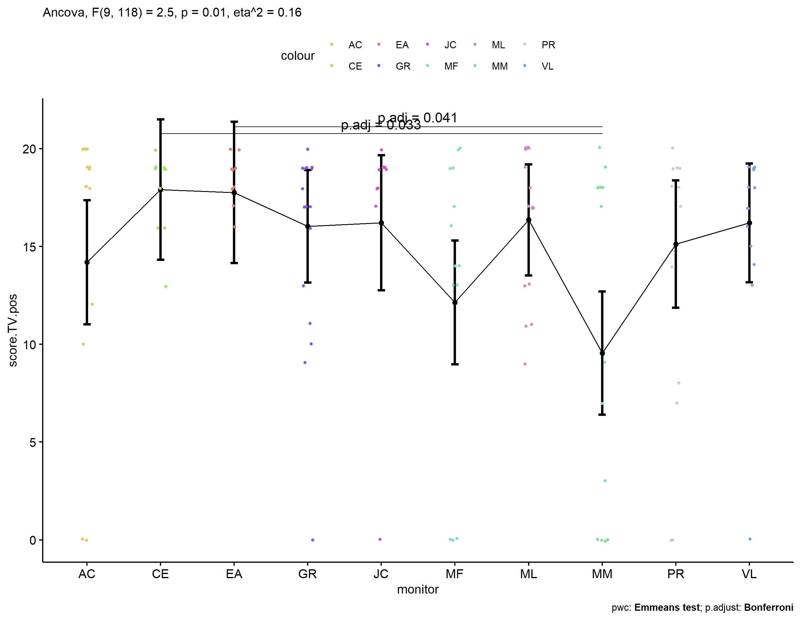<!-- -->

<!-- -->

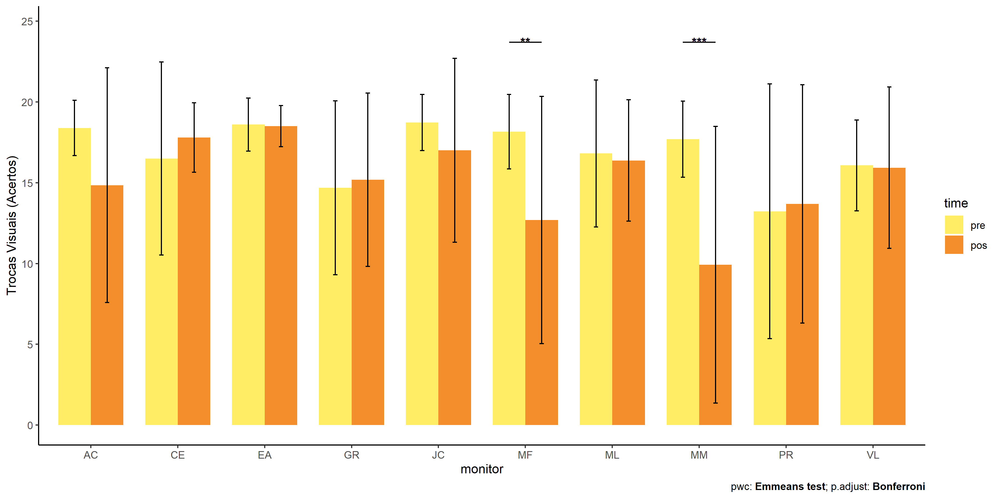<!-- -->

### Trocas Fonologicas (Acertos)

| var          | monitor |   n | M (pre) | SE (pre) | M (unadj) | SE (unadj) | M (adj) | SE (adj) |
|:-------------|:--------|----:|--------:|---------:|----------:|-----------:|--------:|---------:|
| score.TF.pos | AC      |  13 |  17.231 |    0.802 |    13.385 |      1.910 |  12.588 |    1.486 |
| score.TF.pos | CE      |  10 |  16.300 |    1.932 |    17.800 |      0.629 |  17.521 |    1.686 |
| score.TF.pos | EA      |  10 |  17.200 |    0.772 |    17.200 |      0.892 |  16.420 |    1.691 |
| score.TF.pos | GR      |  16 |  13.562 |    1.357 |    13.812 |      1.330 |  15.057 |    1.353 |
| score.TF.pos | JC      |  11 |  17.818 |    0.658 |    16.091 |      1.811 |  14.967 |    1.621 |
| score.TF.pos | MF      |  13 |  16.769 |    1.392 |    12.538 |      2.192 |  11.998 |    1.481 |
| score.TF.pos | ML      |  16 |  15.688 |    1.164 |    15.812 |      0.857 |  15.874 |    1.332 |
| score.TF.pos | MM      |  13 |  16.538 |    0.666 |     9.846 |      2.233 |   9.434 |    1.480 |
| score.TF.pos | PR      |  13 |  13.154 |    2.069 |    13.154 |      1.887 |  14.625 |    1.505 |
| score.TF.pos | VL      |  14 |  15.071 |    0.855 |    14.143 |      1.475 |  14.547 |    1.426 |

| .y.          | group1 | group2 | estimate | conf.low | conf.high |    se | statistic | p       | p.adj | p.adj.signif |
|:-------------|:-------|:-------|---------:|---------:|----------:|------:|----------:|:--------|------:|:-------------|
| score.TF.pos | AC     | CE     |   -4.933 |   -9.375 |    -0.491 | 2.243 |    -2.199 | 0.03    | 1.000 | ns           |
| score.TF.pos | AC     | EA     |   -3.833 |   -8.270 |     0.605 | 2.241 |    -1.710 | 0.09    | 1.000 | ns           |
| score.TF.pos | AC     | GR     |   -2.469 |   -6.484 |     1.547 | 2.028 |    -1.217 | 0.226   | 1.000 | ns           |
| score.TF.pos | AC     | JC     |   -2.379 |   -6.704 |     1.945 | 2.184 |    -1.090 | 0.278   | 1.000 | ns           |
| score.TF.pos | AC     | MF     |    0.589 |   -3.550 |     4.729 | 2.090 |     0.282 | 0.778   | 1.000 | ns           |
| score.TF.pos | AC     | ML     |   -3.287 |   -7.240 |     0.667 | 1.996 |    -1.646 | 0.102   | 1.000 | ns           |
| score.TF.pos | AC     | MM     |    3.153 |   -0.988 |     7.294 | 2.091 |     1.508 | 0.134   | 1.000 | ns           |
| score.TF.pos | AC     | PR     |   -2.037 |   -6.265 |     2.190 | 2.135 |    -0.954 | 0.342   | 1.000 | ns           |
| score.TF.pos | AC     | VL     |   -1.960 |   -6.049 |     2.130 | 2.065 |    -0.949 | 0.345   | 1.000 | ns           |
| score.TF.pos | CE     | EA     |    1.101 |   -3.622 |     5.823 | 2.385 |     0.462 | 0.645   | 1.000 | ns           |
| score.TF.pos | CE     | GR     |    2.464 |   -1.828 |     6.757 | 2.168 |     1.137 | 0.258   | 1.000 | ns           |
| score.TF.pos | CE     | JC     |    2.554 |   -2.067 |     7.175 | 2.334 |     1.094 | 0.276   | 1.000 | ns           |
| score.TF.pos | CE     | MF     |    5.523 |    1.084 |     9.962 | 2.242 |     2.464 | 0.015   | 0.684 | ns           |
| score.TF.pos | CE     | ML     |    1.647 |   -2.608 |     5.902 | 2.149 |     0.766 | 0.445   | 1.000 | ns           |
| score.TF.pos | CE     | MM     |    8.087 |    3.648 |    12.525 | 2.241 |     3.608 | \<0.001 | 0.020 | \*           |
| score.TF.pos | CE     | PR     |    2.896 |   -1.592 |     7.383 | 2.266 |     1.278 | 0.204   | 1.000 | ns           |
| score.TF.pos | CE     | VL     |    2.974 |   -1.403 |     7.350 | 2.210 |     1.346 | 0.181   | 1.000 | ns           |
| score.TF.pos | EA     | GR     |    1.364 |   -2.959 |     5.686 | 2.183 |     0.625 | 0.533   | 1.000 | ns           |
| score.TF.pos | EA     | JC     |    1.453 |   -3.159 |     6.065 | 2.329 |     0.624 | 0.534   | 1.000 | ns           |
| score.TF.pos | EA     | MF     |    4.422 |   -0.017 |     8.861 | 2.242 |     1.973 | 0.051   | 1.000 | ns           |
| score.TF.pos | EA     | ML     |    0.546 |   -3.719 |     4.811 | 2.154 |     0.253 | 0.8     | 1.000 | ns           |
| score.TF.pos | EA     | MM     |    6.986 |    2.546 |    11.426 | 2.242 |     3.116 | 0.002   | 0.104 | ns           |
| score.TF.pos | EA     | PR     |    1.795 |   -2.725 |     6.315 | 2.283 |     0.786 | 0.433   | 1.000 | ns           |
| score.TF.pos | EA     | VL     |    1.873 |   -2.519 |     6.265 | 2.218 |     0.845 | 0.4     | 1.000 | ns           |
| score.TF.pos | GR     | JC     |    0.089 |   -4.140 |     4.319 | 2.136 |     0.042 | 0.967   | 1.000 | ns           |
| score.TF.pos | GR     | MF     |    3.058 |   -0.940 |     7.056 | 2.019 |     1.515 | 0.132   | 1.000 | ns           |
| score.TF.pos | GR     | ML     |   -0.818 |   -4.575 |     2.940 | 1.897 |    -0.431 | 0.667   | 1.000 | ns           |
| score.TF.pos | GR     | MM     |    5.622 |    1.632 |     9.612 | 2.015 |     2.790 | 0.006   | 0.276 | ns           |
| score.TF.pos | GR     | PR     |    0.431 |   -3.509 |     4.372 | 1.990 |     0.217 | 0.829   | 1.000 | ns           |
| score.TF.pos | GR     | VL     |    0.509 |   -3.365 |     4.384 | 1.956 |     0.260 | 0.795   | 1.000 | ns           |
| score.TF.pos | JC     | MF     |    2.969 |   -1.359 |     7.297 | 2.186 |     1.358 | 0.177   | 1.000 | ns           |
| score.TF.pos | JC     | ML     |   -0.907 |   -5.064 |     3.250 | 2.099 |    -0.432 | 0.666   | 1.000 | ns           |
| score.TF.pos | JC     | MM     |    5.533 |    1.202 |     9.864 | 2.187 |     2.530 | 0.013   | 0.573 | ns           |
| score.TF.pos | JC     | PR     |    0.342 |   -4.092 |     4.776 | 2.239 |     0.153 | 0.879   | 1.000 | ns           |
| score.TF.pos | JC     | VL     |    0.420 |   -3.871 |     4.711 | 2.167 |     0.194 | 0.847   | 1.000 | ns           |
| score.TF.pos | MF     | ML     |   -3.876 |   -7.822 |     0.070 | 1.993 |    -1.945 | 0.054   | 1.000 | ns           |
| score.TF.pos | MF     | MM     |    2.564 |   -1.575 |     6.703 | 2.090 |     1.227 | 0.222   | 1.000 | ns           |
| score.TF.pos | MF     | PR     |   -2.627 |   -6.836 |     1.582 | 2.125 |    -1.236 | 0.219   | 1.000 | ns           |
| score.TF.pos | MF     | VL     |   -2.549 |   -6.629 |     1.531 | 2.060 |    -1.237 | 0.218   | 1.000 | ns           |
| score.TF.pos | ML     | MM     |    6.440 |    2.496 |    10.383 | 1.991 |     3.234 | 0.002   | 0.071 | ns           |
| score.TF.pos | ML     | PR     |    1.249 |   -2.727 |     5.225 | 2.008 |     0.622 | 0.535   | 1.000 | ns           |
| score.TF.pos | ML     | VL     |    1.327 |   -2.536 |     5.190 | 1.951 |     0.680 | 0.498   | 1.000 | ns           |
| score.TF.pos | MM     | PR     |   -5.191 |   -9.391 |    -0.991 | 2.121 |    -2.447 | 0.016   | 0.714 | ns           |
| score.TF.pos | MM     | VL     |   -5.113 |   -9.189 |    -1.037 | 2.058 |    -2.484 | 0.014   | 0.647 | ns           |
| score.TF.pos | PR     | VL     |    0.078 |   -4.006 |     4.162 | 2.062 |     0.038 | 0.97    | 1.000 | ns           |
| score.TF.pre | AC     | CE     |    0.931 |   -2.869 |     4.731 | 1.919 |     0.485 | 0.629   | 1.000 | ns           |
| score.TF.pre | AC     | EA     |    0.031 |   -3.769 |     3.831 | 1.919 |     0.016 | 0.987   | 1.000 | ns           |
| score.TF.pre | AC     | GR     |    3.668 |    0.295 |     7.042 | 1.704 |     2.153 | 0.033   | 1.000 | ns           |
| score.TF.pre | AC     | JC     |   -0.587 |   -4.289 |     3.114 | 1.869 |    -0.314 | 0.754   | 1.000 | ns           |
| score.TF.pre | AC     | MF     |    0.462 |   -3.082 |     4.005 | 1.790 |     0.258 | 0.797   | 1.000 | ns           |
| score.TF.pre | AC     | ML     |    1.543 |   -1.830 |     4.917 | 1.704 |     0.906 | 0.367   | 1.000 | ns           |
| score.TF.pre | AC     | MM     |    0.692 |   -2.851 |     4.236 | 1.790 |     0.387 | 0.7     | 1.000 | ns           |
| score.TF.pre | AC     | PR     |    4.077 |    0.533 |     7.620 | 1.790 |     2.278 | 0.025   | 1.000 | ns           |
| score.TF.pre | AC     | VL     |    2.159 |   -1.320 |     5.639 | 1.757 |     1.229 | 0.222   | 1.000 | ns           |
| score.TF.pre | CE     | EA     |   -0.900 |   -4.940 |     3.140 | 2.040 |    -0.441 | 0.66    | 1.000 | ns           |
| score.TF.pre | CE     | GR     |    2.737 |   -0.904 |     6.379 | 1.839 |     1.488 | 0.139   | 1.000 | ns           |
| score.TF.pre | CE     | JC     |   -1.518 |   -5.466 |     2.429 | 1.994 |    -0.762 | 0.448   | 1.000 | ns           |
| score.TF.pre | CE     | MF     |   -0.469 |   -4.269 |     3.331 | 1.919 |    -0.245 | 0.807   | 1.000 | ns           |
| score.TF.pre | CE     | ML     |    0.612 |   -3.029 |     4.254 | 1.839 |     0.333 | 0.74    | 1.000 | ns           |
| score.TF.pre | CE     | MM     |   -0.238 |   -4.038 |     3.562 | 1.919 |    -0.124 | 0.901   | 1.000 | ns           |
| score.TF.pre | CE     | PR     |    3.146 |   -0.654 |     6.946 | 1.919 |     1.639 | 0.104   | 1.000 | ns           |
| score.TF.pre | CE     | VL     |    1.229 |   -2.512 |     4.969 | 1.889 |     0.650 | 0.517   | 1.000 | ns           |
| score.TF.pre | EA     | GR     |    3.637 |   -0.004 |     7.279 | 1.839 |     1.978 | 0.05    | 1.000 | ns           |
| score.TF.pre | EA     | JC     |   -0.618 |   -4.566 |     3.329 | 1.994 |    -0.310 | 0.757   | 1.000 | ns           |
| score.TF.pre | EA     | MF     |    0.431 |   -3.369 |     4.231 | 1.919 |     0.224 | 0.823   | 1.000 | ns           |
| score.TF.pre | EA     | ML     |    1.512 |   -2.129 |     5.154 | 1.839 |     0.822 | 0.413   | 1.000 | ns           |
| score.TF.pre | EA     | MM     |    0.662 |   -3.138 |     4.462 | 1.919 |     0.345 | 0.731   | 1.000 | ns           |
| score.TF.pre | EA     | PR     |    4.046 |    0.246 |     7.846 | 1.919 |     2.108 | 0.037   | 1.000 | ns           |
| score.TF.pre | EA     | VL     |    2.129 |   -1.612 |     5.869 | 1.889 |     1.127 | 0.262   | 1.000 | ns           |
| score.TF.pre | GR     | JC     |   -4.256 |   -7.794 |    -0.717 | 1.787 |    -2.381 | 0.019   | 0.847 | ns           |
| score.TF.pre | GR     | MF     |   -3.207 |   -6.580 |     0.167 | 1.704 |    -1.882 | 0.062   | 1.000 | ns           |
| score.TF.pre | GR     | ML     |   -2.125 |   -5.319 |     1.069 | 1.613 |    -1.317 | 0.19    | 1.000 | ns           |
| score.TF.pre | GR     | MM     |   -2.976 |   -6.349 |     0.397 | 1.704 |    -1.747 | 0.083   | 1.000 | ns           |
| score.TF.pre | GR     | PR     |    0.409 |   -2.965 |     3.782 | 1.704 |     0.240 | 0.811   | 1.000 | ns           |
| score.TF.pre | GR     | VL     |   -1.509 |   -4.815 |     1.797 | 1.670 |    -0.904 | 0.368   | 1.000 | ns           |
| score.TF.pre | JC     | MF     |    1.049 |   -2.652 |     4.750 | 1.869 |     0.561 | 0.576   | 1.000 | ns           |
| score.TF.pre | JC     | ML     |    2.131 |   -1.408 |     5.669 | 1.787 |     1.192 | 0.236   | 1.000 | ns           |
| score.TF.pre | JC     | MM     |    1.280 |   -2.421 |     4.981 | 1.869 |     0.685 | 0.495   | 1.000 | ns           |
| score.TF.pre | JC     | PR     |    4.664 |    0.963 |     8.365 | 1.869 |     2.495 | 0.014   | 0.628 | ns           |
| score.TF.pre | JC     | VL     |    2.747 |   -0.893 |     6.387 | 1.838 |     1.494 | 0.138   | 1.000 | ns           |
| score.TF.pre | MF     | ML     |    1.082 |   -2.292 |     4.455 | 1.704 |     0.635 | 0.527   | 1.000 | ns           |
| score.TF.pre | MF     | MM     |    0.231 |   -3.313 |     3.774 | 1.790 |     0.129 | 0.898   | 1.000 | ns           |
| score.TF.pre | MF     | PR     |    3.615 |    0.072 |     7.159 | 1.790 |     2.020 | 0.046   | 1.000 | ns           |
| score.TF.pre | MF     | VL     |    1.698 |   -1.782 |     5.177 | 1.757 |     0.966 | 0.336   | 1.000 | ns           |
| score.TF.pre | ML     | MM     |   -0.851 |   -4.224 |     2.522 | 1.704 |    -0.500 | 0.618   | 1.000 | ns           |
| score.TF.pre | ML     | PR     |    2.534 |   -0.840 |     5.907 | 1.704 |     1.487 | 0.14    | 1.000 | ns           |
| score.TF.pre | ML     | VL     |    0.616 |   -2.690 |     3.922 | 1.670 |     0.369 | 0.713   | 1.000 | ns           |
| score.TF.pre | MM     | PR     |    3.385 |   -0.159 |     6.928 | 1.790 |     1.891 | 0.061   | 1.000 | ns           |
| score.TF.pre | MM     | VL     |    1.467 |   -2.013 |     4.947 | 1.757 |     0.835 | 0.405   | 1.000 | ns           |
| score.TF.pre | PR     | VL     |   -1.918 |   -5.397 |     1.562 | 1.757 |    -1.091 | 0.277   | 1.000 | ns           |

| .y.      | monitor | group1 | group2 | estimate | conf.low | conf.high |    se | statistic |     p | p.adj | p.adj.signif |
|:---------|:--------|:-------|:-------|---------:|---------:|----------:|------:|----------:|------:|------:|:-------------|
| score.TF | AC      | pre    | pos    |    3.846 |   -0.221 |     7.913 | 2.065 |     1.863 | 0.064 | 0.064 | ns           |
| score.TF | CE      | pre    | pos    |   -1.500 |   -6.137 |     3.137 | 2.354 |    -0.637 | 0.525 | 0.525 | ns           |
| score.TF | EA      | pre    | pos    |    0.000 |   -4.637 |     4.637 | 2.354 |     0.000 | 1.000 | 1.000 | ns           |
| score.TF | GR      | pre    | pos    |   -0.250 |   -3.916 |     3.416 | 1.861 |    -0.134 | 0.893 | 0.893 | ns           |
| score.TF | JC      | pre    | pos    |    1.727 |   -2.694 |     6.149 | 2.244 |     0.770 | 0.442 | 0.442 | ns           |
| score.TF | MF      | pre    | pos    |    4.231 |    0.164 |     8.298 | 2.065 |     2.049 | 0.042 | 0.042 | \*           |
| score.TF | ML      | pre    | pos    |   -0.125 |   -3.791 |     3.541 | 1.861 |    -0.067 | 0.947 | 0.947 | ns           |
| score.TF | MM      | pre    | pos    |    6.692 |    2.625 |    10.759 | 2.065 |     3.242 | 0.001 | 0.001 | \*\*         |
| score.TF | PR      | pre    | pos    |    0.000 |   -4.067 |     4.067 | 2.065 |     0.000 | 1.000 | 1.000 | ns           |
| score.TF | VL      | pre    | pos    |    0.929 |   -2.991 |     4.848 | 1.989 |     0.467 | 0.641 | 0.641 | ns           |

    ## Scale for colour is already present.
    ## Adding another scale for colour, which will replace the existing scale.

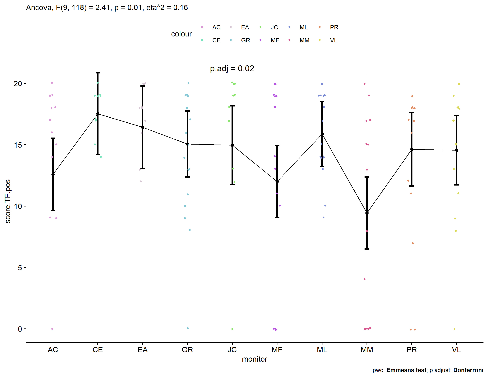<!-- -->

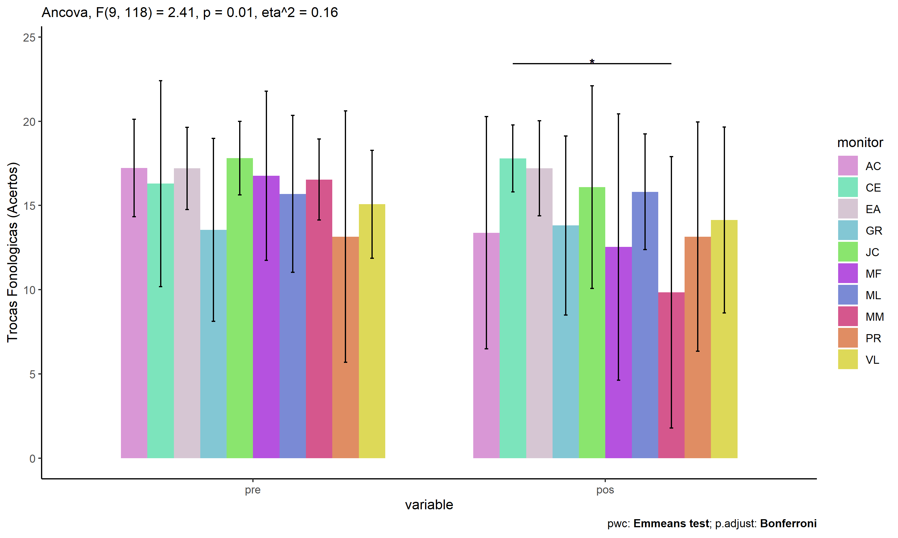<!-- -->

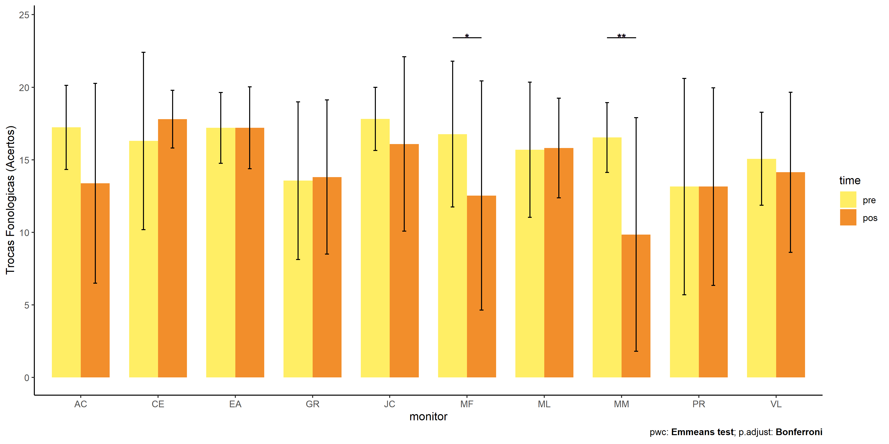<!-- -->

### Trocas Orograficas (Acertos)

| var          | monitor |   n | M (pre) | SE (pre) | M (unadj) | SE (unadj) | M (adj) | SE (adj) |
|:-------------|:--------|----:|--------:|---------:|----------:|-----------:|--------:|---------:|
| score.TO.pos | AC      |  13 |   9.615 |    0.747 |     9.615 |      1.412 |  10.045 |    1.203 |
| score.TO.pos | CE      |  10 |   9.700 |    1.592 |    11.900 |      1.260 |  12.278 |    1.370 |
| score.TO.pos | EA      |  10 |  12.000 |    1.520 |    13.600 |      1.231 |  12.572 |    1.378 |
| score.TO.pos | GR      |  16 |  10.688 |    1.117 |    10.688 |      1.217 |  10.462 |    1.083 |
| score.TO.pos | JC      |  11 |  12.364 |    1.208 |    12.273 |      1.743 |  11.022 |    1.320 |
| score.TO.pos | MF      |  13 |  12.923 |    1.141 |    10.077 |      1.820 |   8.485 |    1.226 |
| score.TO.pos | ML      |  16 |  10.375 |    1.091 |    10.000 |      1.057 |   9.965 |    1.082 |
| score.TO.pos | MM      |  13 |   8.846 |    0.791 |     5.154 |      1.523 |   6.053 |    1.209 |
| score.TO.pos | PR      |  13 |   7.462 |    1.453 |     9.538 |      1.567 |  11.284 |    1.231 |
| score.TO.pos | VL      |  14 |   9.714 |    1.051 |     8.214 |      1.012 |   8.583 |    1.159 |

| .y.          | group1 | group2 | estimate | conf.low | conf.high |    se | statistic | p       | p.adj | p.adj.signif |
|:-------------|:-------|:-------|---------:|---------:|----------:|------:|----------:|:--------|------:|:-------------|
| score.TO.pos | AC     | CE     |   -2.233 |   -5.839 |     1.374 | 1.821 |    -1.226 | 0.223   | 1.000 | ns           |
| score.TO.pos | AC     | EA     |   -2.527 |   -6.161 |     1.107 | 1.835 |    -1.377 | 0.171   | 1.000 | ns           |
| score.TO.pos | AC     | GR     |   -0.417 |   -3.625 |     2.791 | 1.620 |    -0.257 | 0.797   | 1.000 | ns           |
| score.TO.pos | AC     | JC     |   -0.978 |   -4.528 |     2.572 | 1.793 |    -0.545 | 0.586   | 1.000 | ns           |
| score.TO.pos | AC     | MF     |    1.560 |   -1.860 |     4.979 | 1.727 |     0.903 | 0.368   | 1.000 | ns           |
| score.TO.pos | AC     | ML     |    0.080 |   -3.125 |     3.284 | 1.618 |     0.049 | 0.961   | 1.000 | ns           |
| score.TO.pos | AC     | MM     |    3.991 |    0.625 |     7.357 | 1.700 |     2.348 | 0.021   | 0.924 | ns           |
| score.TO.pos | AC     | PR     |   -1.239 |   -4.626 |     2.148 | 1.710 |    -0.725 | 0.47    | 1.000 | ns           |
| score.TO.pos | AC     | VL     |    1.462 |   -1.841 |     4.764 | 1.668 |     0.876 | 0.383   | 1.000 | ns           |
| score.TO.pos | CE     | EA     |   -0.294 |   -4.153 |     3.564 | 1.948 |    -0.151 | 0.88    | 1.000 | ns           |
| score.TO.pos | CE     | GR     |    1.816 |   -1.645 |     5.277 | 1.748 |     1.039 | 0.301   | 1.000 | ns           |
| score.TO.pos | CE     | JC     |    1.255 |   -2.524 |     5.034 | 1.908 |     0.658 | 0.512   | 1.000 | ns           |
| score.TO.pos | CE     | MF     |    3.793 |    0.136 |     7.449 | 1.846 |     2.054 | 0.042   | 1.000 | ns           |
| score.TO.pos | CE     | ML     |    2.313 |   -1.146 |     5.771 | 1.747 |     1.324 | 0.188   | 1.000 | ns           |
| score.TO.pos | CE     | MM     |    6.224 |    2.614 |     9.834 | 1.823 |     3.414 | \<0.001 | 0.039 | \*           |
| score.TO.pos | CE     | PR     |    0.994 |   -2.637 |     4.624 | 1.833 |     0.542 | 0.589   | 1.000 | ns           |
| score.TO.pos | CE     | VL     |    3.694 |    0.144 |     7.244 | 1.793 |     2.061 | 0.042   | 1.000 | ns           |
| score.TO.pos | EA     | GR     |    2.110 |   -1.355 |     5.575 | 1.750 |     1.206 | 0.23    | 1.000 | ns           |
| score.TO.pos | EA     | JC     |    1.550 |   -2.197 |     5.296 | 1.892 |     0.819 | 0.414   | 1.000 | ns           |
| score.TO.pos | EA     | MF     |    4.087 |    0.477 |     7.698 | 1.823 |     2.242 | 0.027   | 1.000 | ns           |
| score.TO.pos | EA     | ML     |    2.607 |   -0.863 |     6.077 | 1.752 |     1.488 | 0.139   | 1.000 | ns           |
| score.TO.pos | EA     | MM     |    6.519 |    2.864 |    10.173 | 1.845 |     3.532 | \<0.001 | 0.026 | \*           |
| score.TO.pos | EA     | PR     |    1.288 |   -2.417 |     4.993 | 1.871 |     0.688 | 0.493   | 1.000 | ns           |
| score.TO.pos | EA     | VL     |    3.989 |    0.413 |     7.564 | 1.806 |     2.209 | 0.029   | 1.000 | ns           |
| score.TO.pos | GR     | JC     |   -0.561 |   -3.934 |     2.812 | 1.703 |    -0.329 | 0.743   | 1.000 | ns           |
| score.TO.pos | GR     | MF     |    1.977 |   -1.252 |     5.205 | 1.630 |     1.212 | 0.228   | 1.000 | ns           |
| score.TO.pos | GR     | ML     |    0.497 |   -2.535 |     3.528 | 1.531 |     0.324 | 0.746   | 1.000 | ns           |
| score.TO.pos | GR     | MM     |    4.408 |    1.188 |     7.628 | 1.626 |     2.711 | 0.008   | 0.347 | ns           |
| score.TO.pos | GR     | PR     |   -0.822 |   -4.080 |     2.435 | 1.645 |    -0.500 | 0.618   | 1.000 | ns           |
| score.TO.pos | GR     | VL     |    1.878 |   -1.265 |     5.021 | 1.587 |     1.184 | 0.239   | 1.000 | ns           |
| score.TO.pos | JC     | MF     |    2.538 |   -0.976 |     6.052 | 1.775 |     1.430 | 0.155   | 1.000 | ns           |
| score.TO.pos | JC     | ML     |    1.057 |   -2.321 |     4.436 | 1.706 |     0.620 | 0.537   | 1.000 | ns           |
| score.TO.pos | JC     | MM     |    4.969 |    1.396 |     8.543 | 1.805 |     2.754 | 0.007   | 0.307 | ns           |
| score.TO.pos | JC     | PR     |   -0.262 |   -3.892 |     3.369 | 1.833 |    -0.143 | 0.887   | 1.000 | ns           |
| score.TO.pos | JC     | VL     |    2.439 |   -1.051 |     5.929 | 1.762 |     1.384 | 0.169   | 1.000 | ns           |
| score.TO.pos | MF     | ML     |   -1.480 |   -4.717 |     1.756 | 1.635 |    -0.906 | 0.367   | 1.000 | ns           |
| score.TO.pos | MF     | MM     |    2.432 |   -1.017 |     5.880 | 1.741 |     1.396 | 0.165   | 1.000 | ns           |
| score.TO.pos | MF     | PR     |   -2.799 |   -6.314 |     0.716 | 1.775 |    -1.577 | 0.117   | 1.000 | ns           |
| score.TO.pos | MF     | VL     |   -0.098 |   -3.455 |     3.258 | 1.695 |    -0.058 | 0.954   | 1.000 | ns           |
| score.TO.pos | ML     | MM     |    3.912 |    0.698 |     7.126 | 1.623 |     2.410 | 0.017   | 0.787 | ns           |
| score.TO.pos | ML     | PR     |   -1.319 |   -4.567 |     1.929 | 1.640 |    -0.804 | 0.423   | 1.000 | ns           |
| score.TO.pos | ML     | VL     |    1.382 |   -1.758 |     4.522 | 1.586 |     0.871 | 0.385   | 1.000 | ns           |
| score.TO.pos | MM     | PR     |   -5.231 |   -8.604 |    -1.858 | 1.703 |    -3.071 | 0.003   | 0.119 | ns           |
| score.TO.pos | MM     | VL     |   -2.530 |   -5.836 |     0.776 | 1.670 |    -1.515 | 0.132   | 1.000 | ns           |
| score.TO.pos | PR     | VL     |    2.701 |   -0.628 |     6.030 | 1.681 |     1.607 | 0.111   | 1.000 | ns           |
| score.TO.pre | AC     | CE     |   -0.085 |   -3.583 |     3.414 | 1.767 |    -0.048 | 0.962   | 1.000 | ns           |
| score.TO.pre | AC     | EA     |   -2.385 |   -5.883 |     1.114 | 1.767 |    -1.350 | 0.18    | 1.000 | ns           |
| score.TO.pre | AC     | GR     |   -1.072 |   -4.178 |     2.034 | 1.568 |    -0.684 | 0.496   | 1.000 | ns           |
| score.TO.pre | AC     | JC     |   -2.748 |   -6.156 |     0.659 | 1.721 |    -1.597 | 0.113   | 1.000 | ns           |
| score.TO.pre | AC     | MF     |   -3.308 |   -6.570 |    -0.045 | 1.648 |    -2.008 | 0.047   | 1.000 | ns           |
| score.TO.pre | AC     | ML     |   -0.760 |   -3.865 |     2.346 | 1.568 |    -0.484 | 0.629   | 1.000 | ns           |
| score.TO.pre | AC     | MM     |    0.769 |   -2.493 |     4.032 | 1.648 |     0.467 | 0.641   | 1.000 | ns           |
| score.TO.pre | AC     | PR     |    2.154 |   -1.108 |     5.416 | 1.648 |     1.307 | 0.194   | 1.000 | ns           |
| score.TO.pre | AC     | VL     |   -0.099 |   -3.302 |     3.105 | 1.618 |    -0.061 | 0.951   | 1.000 | ns           |
| score.TO.pre | CE     | EA     |   -2.300 |   -6.020 |     1.420 | 1.878 |    -1.224 | 0.223   | 1.000 | ns           |
| score.TO.pre | CE     | GR     |   -0.988 |   -4.340 |     2.365 | 1.693 |    -0.583 | 0.561   | 1.000 | ns           |
| score.TO.pre | CE     | JC     |   -2.664 |   -6.298 |     0.970 | 1.835 |    -1.451 | 0.149   | 1.000 | ns           |
| score.TO.pre | CE     | MF     |   -3.223 |   -6.722 |     0.275 | 1.767 |    -1.824 | 0.071   | 1.000 | ns           |
| score.TO.pre | CE     | ML     |   -0.675 |   -4.028 |     2.678 | 1.693 |    -0.399 | 0.691   | 1.000 | ns           |
| score.TO.pre | CE     | MM     |    0.854 |   -2.645 |     4.352 | 1.767 |     0.483 | 0.63    | 1.000 | ns           |
| score.TO.pre | CE     | PR     |    2.238 |   -1.260 |     5.737 | 1.767 |     1.267 | 0.208   | 1.000 | ns           |
| score.TO.pre | CE     | VL     |   -0.014 |   -3.458 |     3.429 | 1.739 |    -0.008 | 0.993   | 1.000 | ns           |
| score.TO.pre | EA     | GR     |    1.312 |   -2.040 |     4.665 | 1.693 |     0.775 | 0.44    | 1.000 | ns           |
| score.TO.pre | EA     | JC     |   -0.364 |   -3.998 |     3.270 | 1.835 |    -0.198 | 0.843   | 1.000 | ns           |
| score.TO.pre | EA     | MF     |   -0.923 |   -4.422 |     2.575 | 1.767 |    -0.522 | 0.602   | 1.000 | ns           |
| score.TO.pre | EA     | ML     |    1.625 |   -1.728 |     4.978 | 1.693 |     0.960 | 0.339   | 1.000 | ns           |
| score.TO.pre | EA     | MM     |    3.154 |   -0.345 |     6.652 | 1.767 |     1.785 | 0.077   | 1.000 | ns           |
| score.TO.pre | EA     | PR     |    4.538 |    1.040 |     8.037 | 1.767 |     2.569 | 0.011   | 0.515 | ns           |
| score.TO.pre | EA     | VL     |    2.286 |   -1.158 |     5.729 | 1.739 |     1.314 | 0.191   | 1.000 | ns           |
| score.TO.pre | GR     | JC     |   -1.676 |   -4.934 |     1.582 | 1.645 |    -1.019 | 0.31    | 1.000 | ns           |
| score.TO.pre | GR     | MF     |   -2.236 |   -5.341 |     0.870 | 1.568 |    -1.425 | 0.157   | 1.000 | ns           |
| score.TO.pre | GR     | ML     |    0.313 |   -2.628 |     3.253 | 1.485 |     0.210 | 0.834   | 1.000 | ns           |
| score.TO.pre | GR     | MM     |    1.841 |   -1.264 |     4.947 | 1.568 |     1.174 | 0.243   | 1.000 | ns           |
| score.TO.pre | GR     | PR     |    3.226 |    0.120 |     6.332 | 1.568 |     2.057 | 0.042   | 1.000 | ns           |
| score.TO.pre | GR     | VL     |    0.973 |   -2.071 |     4.017 | 1.537 |     0.633 | 0.528   | 1.000 | ns           |
| score.TO.pre | JC     | MF     |   -0.559 |   -3.967 |     2.848 | 1.721 |    -0.325 | 0.746   | 1.000 | ns           |
| score.TO.pre | JC     | ML     |    1.989 |   -1.269 |     5.246 | 1.645 |     1.209 | 0.229   | 1.000 | ns           |
| score.TO.pre | JC     | MM     |    3.517 |    0.110 |     6.925 | 1.721 |     2.044 | 0.043   | 1.000 | ns           |
| score.TO.pre | JC     | PR     |    4.902 |    1.495 |     8.309 | 1.721 |     2.849 | 0.005   | 0.233 | ns           |
| score.TO.pre | JC     | VL     |    2.649 |   -0.702 |     6.000 | 1.692 |     1.565 | 0.12    | 1.000 | ns           |
| score.TO.pre | MF     | ML     |    2.548 |   -0.558 |     5.654 | 1.568 |     1.625 | 0.107   | 1.000 | ns           |
| score.TO.pre | MF     | MM     |    4.077 |    0.815 |     7.339 | 1.648 |     2.475 | 0.015   | 0.664 | ns           |
| score.TO.pre | MF     | PR     |    5.462 |    2.199 |     8.724 | 1.648 |     3.315 | 0.001   | 0.055 | ns           |
| score.TO.pre | MF     | VL     |    3.209 |    0.005 |     6.412 | 1.618 |     1.983 | 0.05    | 1.000 | ns           |
| score.TO.pre | ML     | MM     |    1.529 |   -1.577 |     4.634 | 1.568 |     0.975 | 0.332   | 1.000 | ns           |
| score.TO.pre | ML     | PR     |    2.913 |   -0.192 |     6.019 | 1.568 |     1.858 | 0.066   | 1.000 | ns           |
| score.TO.pre | ML     | VL     |    0.661 |   -2.383 |     3.705 | 1.537 |     0.430 | 0.668   | 1.000 | ns           |
| score.TO.pre | MM     | PR     |    1.385 |   -1.878 |     4.647 | 1.648 |     0.840 | 0.402   | 1.000 | ns           |
| score.TO.pre | MM     | VL     |   -0.868 |   -4.072 |     2.335 | 1.618 |    -0.537 | 0.593   | 1.000 | ns           |
| score.TO.pre | PR     | VL     |   -2.253 |   -5.456 |     0.951 | 1.618 |    -1.392 | 0.166   | 1.000 | ns           |

| .y.      | monitor | group1 | group2 | estimate | conf.low | conf.high |    se | statistic |     p | p.adj | p.adj.signif |
|:---------|:--------|:-------|:-------|---------:|---------:|----------:|------:|----------:|------:|------:|:-------------|
| score.TO | AC      | pre    | pos    |    0.000 |   -3.575 |     3.575 | 1.815 |     0.000 | 1.000 | 1.000 | ns           |
| score.TO | CE      | pre    | pos    |   -2.200 |   -6.277 |     1.877 | 2.069 |    -1.063 | 0.289 | 0.289 | ns           |
| score.TO | EA      | pre    | pos    |   -1.600 |   -5.677 |     2.477 | 2.069 |    -0.773 | 0.440 | 0.440 | ns           |
| score.TO | GR      | pre    | pos    |    0.000 |   -3.223 |     3.223 | 1.636 |     0.000 | 1.000 | 1.000 | ns           |
| score.TO | JC      | pre    | pos    |    0.091 |   -3.796 |     3.978 | 1.973 |     0.046 | 0.963 | 0.963 | ns           |
| score.TO | MF      | pre    | pos    |    2.846 |   -0.729 |     6.422 | 1.815 |     1.568 | 0.118 | 0.118 | ns           |
| score.TO | ML      | pre    | pos    |    0.375 |   -2.848 |     3.598 | 1.636 |     0.229 | 0.819 | 0.819 | ns           |
| score.TO | MM      | pre    | pos    |    3.692 |    0.117 |     7.268 | 1.815 |     2.034 | 0.043 | 0.043 | \*           |
| score.TO | PR      | pre    | pos    |   -2.077 |   -5.652 |     1.498 | 1.815 |    -1.144 | 0.254 | 0.254 | ns           |
| score.TO | VL      | pre    | pos    |    1.500 |   -1.945 |     4.945 | 1.749 |     0.858 | 0.392 | 0.392 | ns           |

    ## Scale for colour is already present.
    ## Adding another scale for colour, which will replace the existing scale.

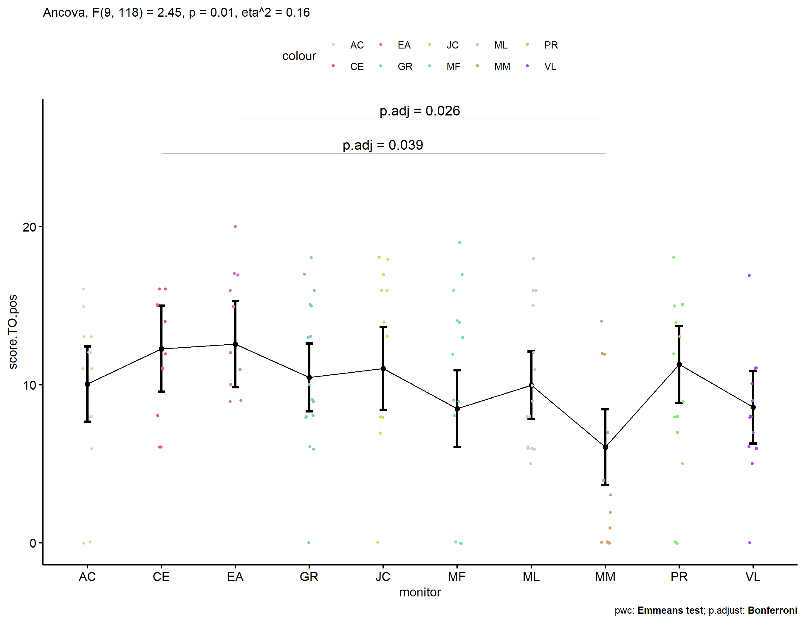<!-- -->

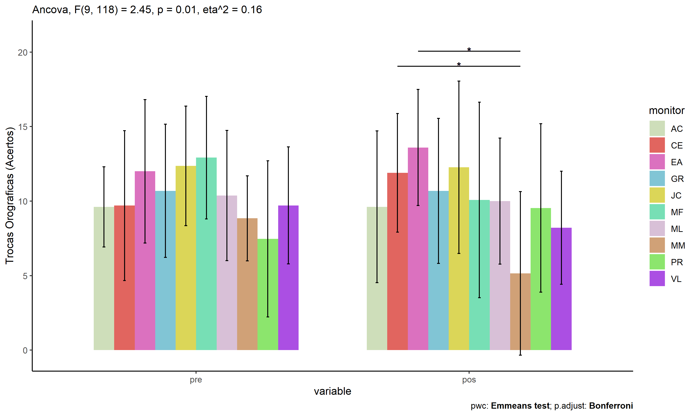<!-- -->

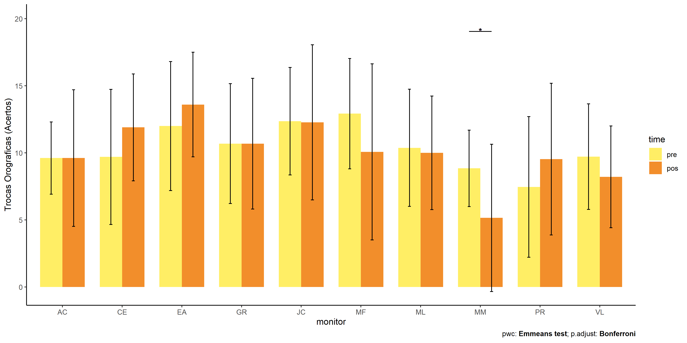<!-- -->

## factores: **grupo=“Experimental”:monitor.genero**

### Leitura de Pseudo-Palavras (Acertos)

| var            | monitor.genero |   n | M (pre) | SE (pre) | M (unadj) | SE (unadj) | M (adj) | SE (adj) |
|:---------------|:---------------|----:|--------:|---------:|----------:|-----------:|--------:|---------:|
| score.CLPP.pos | F              |  73 |   71.26 |    1.527 |    70.411 |      1.686 |  71.159 |    1.235 |
| score.CLPP.pos | M              |  40 |   74.60 |    1.981 |    77.375 |      1.719 |  76.009 |    1.672 |

| .y.            | group1 | group2 | estimate | conf.low | conf.high |    se | statistic |     p | p.adj | p.adj.signif |
|:---------------|:-------|:-------|---------:|---------:|----------:|------:|----------:|------:|------:|:-------------|
| score.CLPP.pos | F      | M      |    -4.85 |   -8.984 |    -0.715 | 2.086 |    -2.325 | 0.022 | 0.022 | \*           |
| score.CLPP.pre | F      | M      |    -3.34 |   -8.356 |     1.677 | 2.532 |    -1.319 | 0.190 | 0.190 | ns           |

| .y.        | monitor.genero | group1 | group2 | estimate | conf.low | conf.high |    se | statistic |     p | p.adj | p.adj.signif |
|:-----------|:---------------|:-------|:-------|---------:|---------:|----------:|------:|----------:|------:|------:|:-------------|
| score.CLPP | F              | pre    | pos    |    1.339 |   -2.669 |     5.347 | 2.035 |     0.658 | 0.511 | 0.511 | ns           |
| score.CLPP | M              | pre    | pos    |   -2.585 |   -8.138 |     2.967 | 2.819 |    -0.917 | 0.360 | 0.360 | ns           |

    ## Scale for colour is already present.
    ## Adding another scale for colour, which will replace the existing scale.

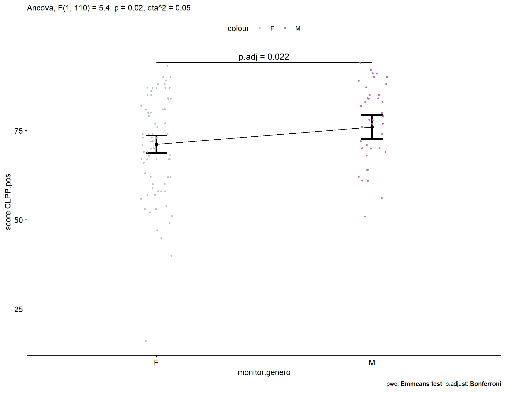<!-- -->

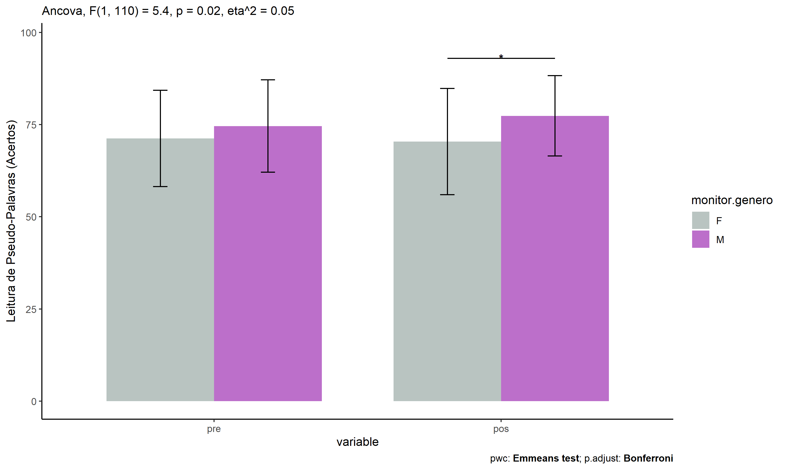<!-- -->

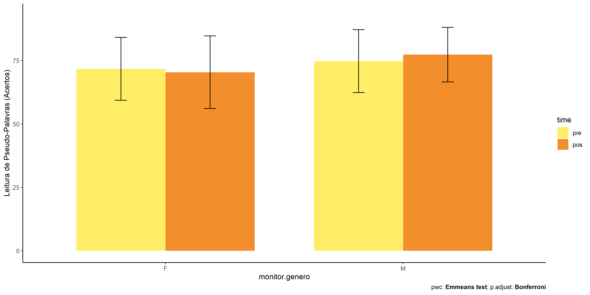<!-- -->

### Correta Regular (Acertos)

| var          | monitor.genero |   n | M (pre) | SE (pre) | M (unadj) | SE (unadj) | M (adj) | SE (adj) |
|:-------------|:---------------|----:|--------:|---------:|----------:|-----------:|--------:|---------:|
| score.CR.pos | F              |  85 |  15.388 |    0.385 |    13.271 |      0.655 |  13.235 |    0.583 |
| score.CR.pos | M              |  44 |  15.136 |    0.747 |    15.227 |      0.706 |  15.297 |    0.811 |

| .y.          | group1 | group2 | estimate | conf.low | conf.high |    se | statistic |     p | p.adj | p.adj.signif |
|:-------------|:-------|:-------|---------:|---------:|----------:|------:|----------:|------:|------:|:-------------|
| score.CR.pos | F      | M      |   -2.062 |   -4.038 |    -0.085 | 0.999 |    -2.065 | 0.041 | 0.041 | \*           |
| score.CR.pre | F      | M      |    0.252 |   -1.248 |     1.752 | 0.758 |     0.332 | 0.740 | 0.740 | ns           |

| .y.      | monitor.genero | group1 | group2 | estimate | conf.low | conf.high |    se | statistic |     p | p.adj | p.adj.signif |
|:---------|:---------------|:-------|:-------|---------:|---------:|----------:|------:|----------:|------:|------:|:-------------|
| score.CR | F              | pre    | pos    |    2.118 |    0.634 |     3.601 | 0.753 |     2.812 | 0.005 | 0.005 | \*\*         |
| score.CR | M              | pre    | pos    |   -0.091 |   -2.153 |     1.971 | 1.047 |    -0.087 | 0.931 | 0.931 | ns           |

    ## Scale for colour is already present.
    ## Adding another scale for colour, which will replace the existing scale.

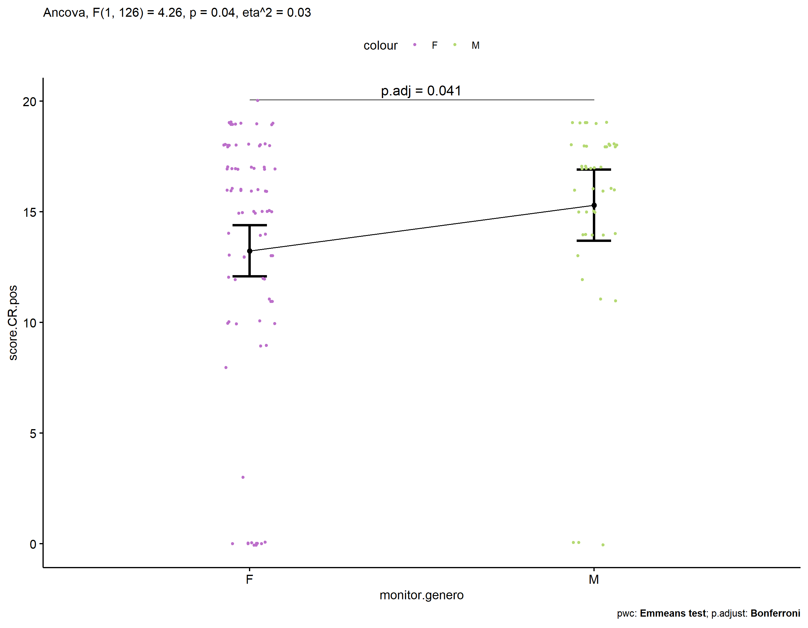<!-- -->

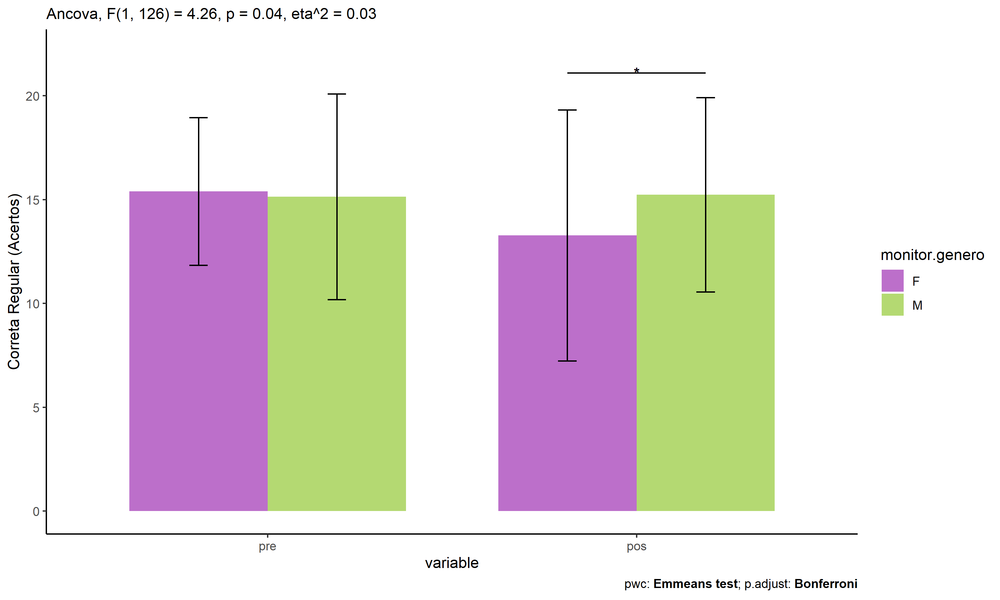<!-- -->

<!-- -->

### Correta Irregular (Acertos)

| var          | monitor.genero |   n | M (pre) | SE (pre) | M (unadj) | SE (unadj) | M (adj) | SE (adj) |
|:-------------|:---------------|----:|--------:|---------:|----------:|-----------:|--------:|---------:|
| score.CI.pos | F              |  85 |  12.506 |    0.352 |    11.259 |      0.569 |  11.129 |    0.509 |
| score.CI.pos | M              |  44 |  11.727 |    0.679 |    12.705 |      0.681 |  12.956 |    0.709 |

| .y.          | group1 | group2 | estimate | conf.low | conf.high |    se | statistic |     p | p.adj | p.adj.signif |
|:-------------|:-------|:-------|---------:|---------:|----------:|------:|----------:|------:|------:|:-------------|
| score.CI.pos | F      | M      |   -1.828 |   -3.559 |    -0.096 | 0.875 |    -2.089 | 0.039 | 0.039 | \*           |
| score.CI.pre | F      | M      |    0.779 |   -0.589 |     2.146 | 0.691 |     1.127 | 0.262 | 0.262 | ns           |

| .y.      | monitor.genero | group1 | group2 | estimate | conf.low | conf.high |    se | statistic |     p | p.adj | p.adj.signif |
|:---------|:---------------|:-------|:-------|---------:|---------:|----------:|------:|----------:|------:|------:|:-------------|
| score.CI | F              | pre    | pos    |    1.247 |   -0.086 |     2.581 | 0.677 |     1.842 | 0.067 | 0.067 | ns           |
| score.CI | M              | pre    | pos    |   -0.977 |   -2.831 |     0.876 | 0.941 |    -1.038 | 0.300 | 0.300 | ns           |

    ## Scale for colour is already present.
    ## Adding another scale for colour, which will replace the existing scale.

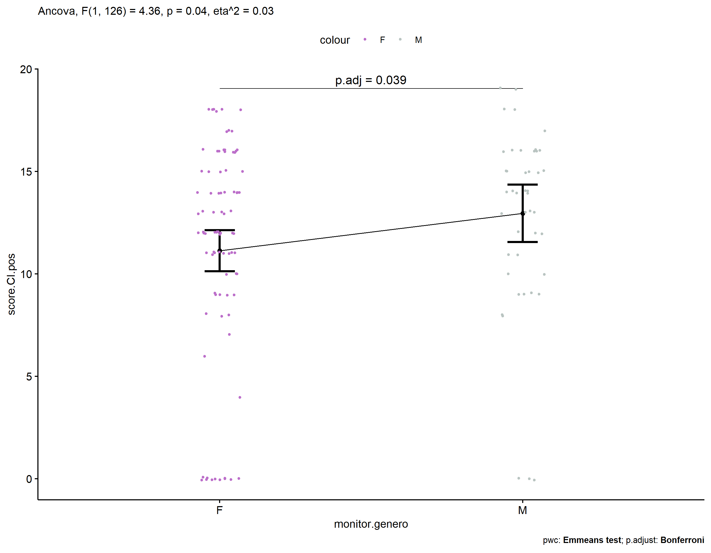<!-- -->

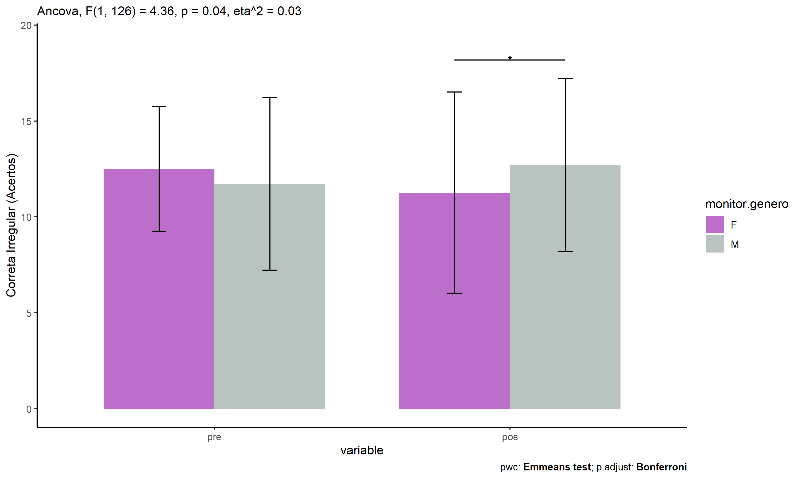<!-- -->

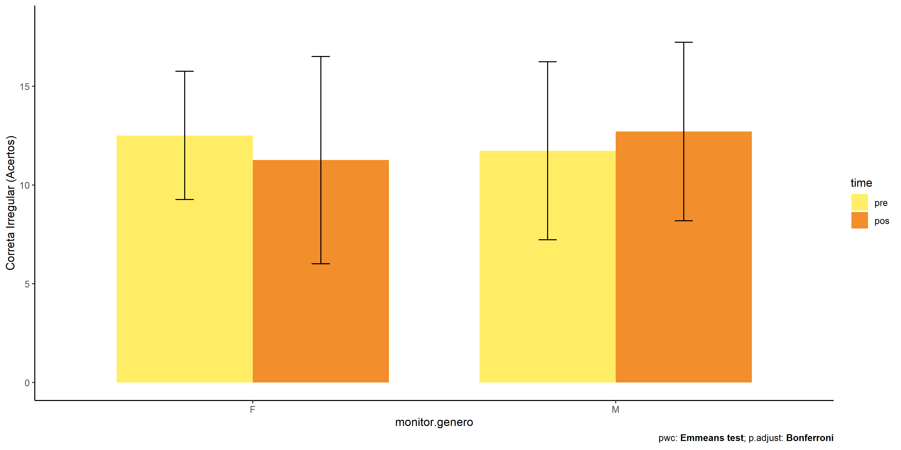<!-- -->

### Trocas Visuais (Acertos)

| var          | monitor.genero |   n | M (pre) | SE (pre) | M (unadj) | SE (unadj) | M (adj) | SE (adj) |
|:-------------|:---------------|----:|--------:|---------:|----------:|-----------:|--------:|---------:|
| score.TV.pos | F              |  85 |  16.871 |    0.403 |    14.294 |      0.709 |  14.256 |    0.645 |
| score.TV.pos | M              |  44 |  16.568 |    0.847 |    16.545 |      0.795 |  16.618 |    0.896 |

| .y.          | group1 | group2 | estimate | conf.low | conf.high |    se | statistic |     p | p.adj | p.adj.signif |
|:-------------|:-------|:-------|---------:|---------:|----------:|------:|----------:|------:|------:|:-------------|
| score.TV.pos | F      | M      |   -2.362 |   -4.547 |    -0.177 | 1.104 |    -2.139 | 0.034 | 0.034 | \*           |
| score.TV.pre | F      | M      |    0.302 |   -1.334 |     1.939 | 0.827 |     0.366 | 0.715 | 0.715 | ns           |

| .y.      | monitor.genero | group1 | group2 | estimate | conf.low | conf.high |    se | statistic |     p | p.adj | p.adj.signif |
|:---------|:---------------|:-------|:-------|---------:|---------:|----------:|------:|----------:|------:|------:|:-------------|
| score.TV | F              | pre    | pos    |    2.576 |    0.956 |     4.196 | 0.823 |     3.132 | 0.002 | 0.002 | \*\*         |
| score.TV | M              | pre    | pos    |    0.023 |   -2.229 |     2.274 | 1.143 |     0.020 | 0.984 | 0.984 | ns           |

    ## Scale for colour is already present.
    ## Adding another scale for colour, which will replace the existing scale.

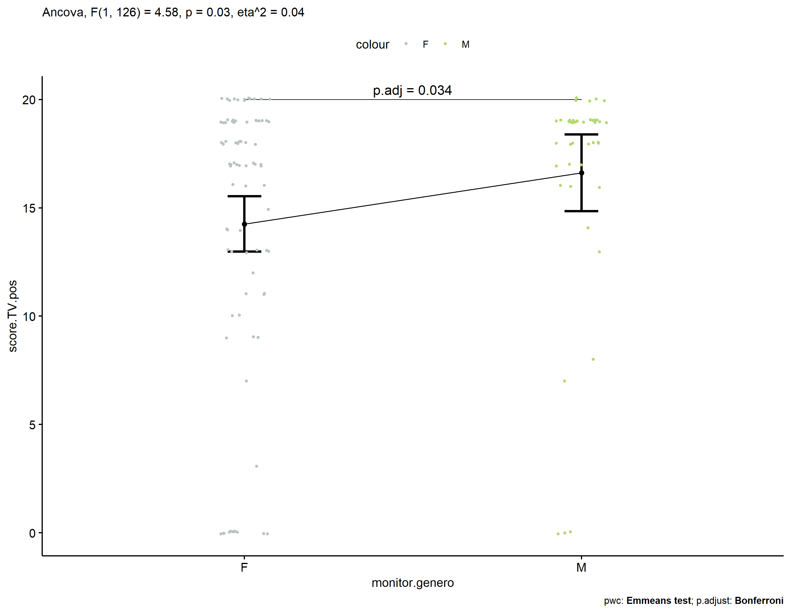<!-- -->

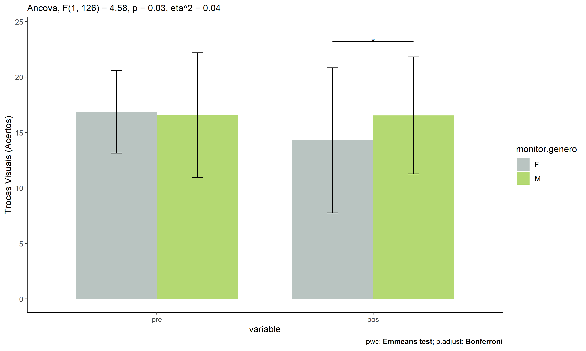<!-- -->

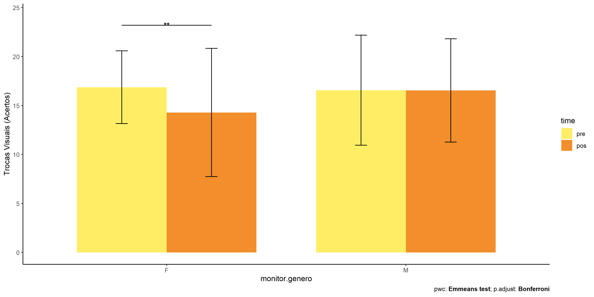<!-- -->

### Trocas Fonologicas (Acertos)

| var          | monitor.genero |   n | M (pre) | SE (pre) | M (unadj) | SE (unadj) | M (adj) | SE (adj) |
|:-------------|:---------------|----:|--------:|---------:|----------:|-----------:|--------:|---------:|
| score.TF.pos | F              |  85 |  15.718 |    0.459 |    13.376 |      0.687 |  13.418 |    0.596 |
| score.TF.pos | M              |  44 |  15.955 |    0.817 |    15.864 |      0.788 |  15.783 |    0.828 |

| .y.          | group1 | group2 | estimate | conf.low | conf.high |    se | statistic |     p | p.adj | p.adj.signif |
|:-------------|:-------|:-------|---------:|---------:|----------:|------:|----------:|------:|------:|:-------------|
| score.TF.pos | F      | M      |   -2.365 |   -4.384 |    -0.345 | 1.021 |    -2.317 | 0.022 | 0.022 | \*           |
| score.TF.pre | F      | M      |   -0.237 |   -1.952 |     1.479 | 0.867 |    -0.273 | 0.785 | 0.785 | ns           |

| .y.      | monitor.genero | group1 | group2 | estimate | conf.low | conf.high |    se | statistic |     p | p.adj | p.adj.signif |
|:---------|:---------------|:-------|:-------|---------:|---------:|----------:|------:|----------:|------:|------:|:-------------|
| score.TF | F              | pre    | pos    |    2.341 |    0.720 |     3.962 | 0.823 |     2.845 | 0.005 | 0.005 | \*\*         |
| score.TF | M              | pre    | pos    |    0.091 |   -2.162 |     2.344 | 1.144 |     0.079 | 0.937 | 0.937 | ns           |

    ## Scale for colour is already present.
    ## Adding another scale for colour, which will replace the existing scale.

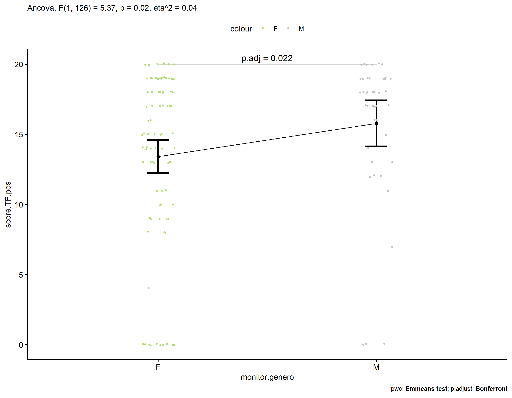<!-- -->

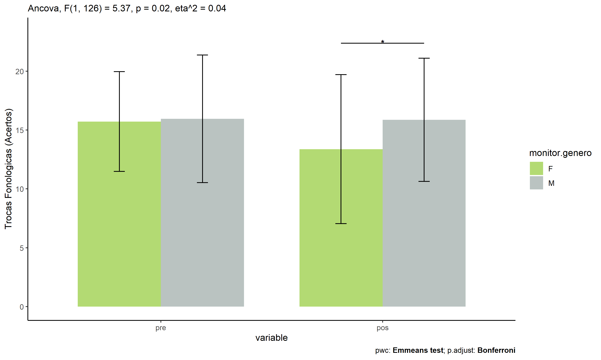<!-- -->

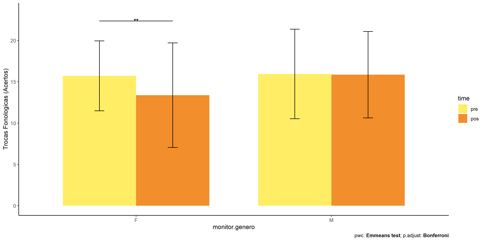<!-- -->

### Trocas Orograficas (Acertos)

| var          | monitor.genero |   n | M (pre) | SE (pre) | M (unadj) | SE (unadj) | M (adj) | SE (adj) |
|:-------------|:---------------|----:|--------:|---------:|----------:|-----------:|--------:|---------:|
| score.TO.pos | F              |  85 |  10.365 |    0.427 |     9.047 |      0.565 |   9.017 |    0.474 |
| score.TO.pos | M              |  44 |  10.227 |    0.766 |    11.682 |      0.762 |  11.739 |    0.660 |

| .y.          | group1 | group2 | estimate | conf.low | conf.high |    se | statistic |     p | p.adj | p.adj.signif |
|:-------------|:-------|:-------|---------:|---------:|----------:|------:|----------:|------:|------:|:-------------|
| score.TO.pos | F      | M      |   -2.722 |   -4.330 |    -1.114 | 0.813 |     -3.35 | 0.001 | 0.001 | \*\*         |
| score.TO.pre | F      | M      |    0.137 |   -1.465 |     1.739 | 0.810 |      0.17 | 0.865 | 0.865 | ns           |

| .y.      | monitor.genero | group1 | group2 | estimate | conf.low | conf.high |    se | statistic |     p | p.adj | p.adj.signif |
|:---------|:---------------|:-------|:-------|---------:|---------:|----------:|------:|----------:|------:|------:|:-------------|
| score.TO | F              | pre    | pos    |    1.318 |   -0.125 |     2.760 | 0.733 |     1.799 | 0.073 | 0.073 | ns           |
| score.TO | M              | pre    | pos    |   -1.455 |   -3.460 |     0.551 | 1.018 |    -1.429 | 0.154 | 0.154 | ns           |

    ## Scale for colour is already present.
    ## Adding another scale for colour, which will replace the existing scale.

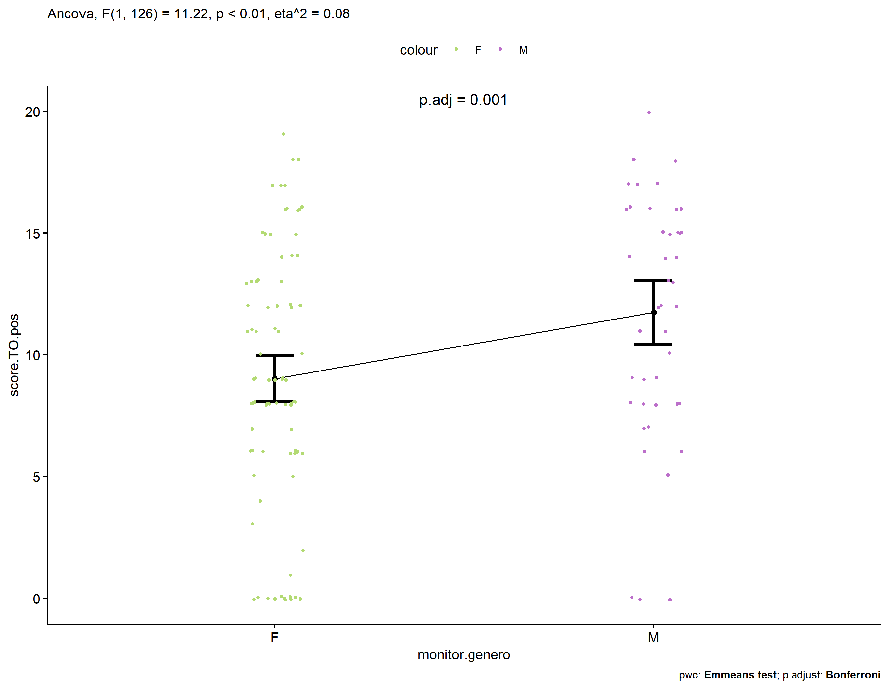<!-- -->

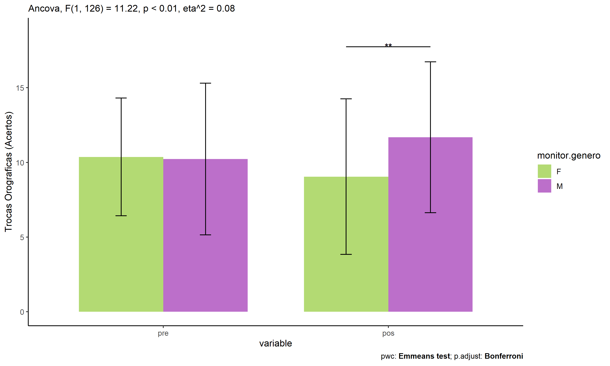<!-- -->

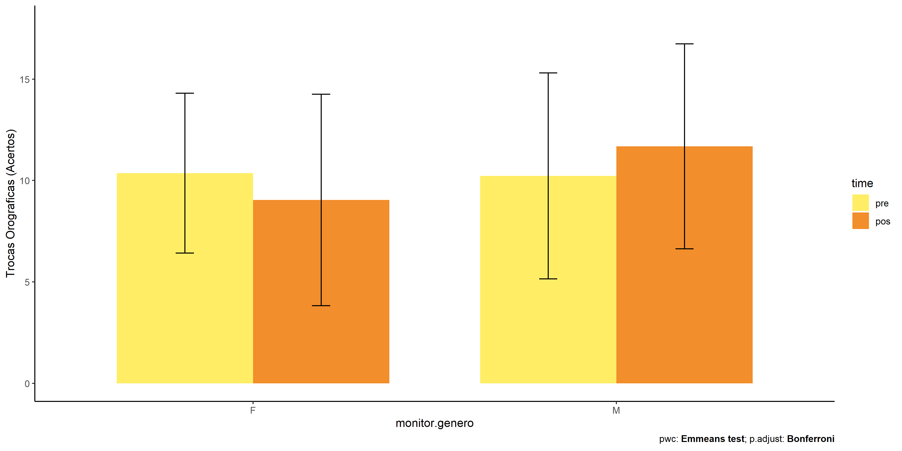<!-- -->

## factores: **grupo=“Experimental”:monitor.area**

### Leitura de Pseudo-Palavras (Acertos)

| var            | monitor.area               |   n | M (pre) | SE (pre) | M (unadj) | SE (unadj) | M (adj) | SE (adj) |
|:---------------|:---------------------------|----:|--------:|---------:|----------:|-----------:|--------:|---------:|
| score.CLPP.pos | Arquitetura e Urbanismo    |  10 |  77.400 |    3.149 |    81.000 |      3.190 |  77.853 |    3.374 |
| score.CLPP.pos | Ciencias Biologicas        |  16 |  67.812 |    4.032 |    69.188 |      3.510 |  72.127 |    2.675 |
| score.CLPP.pos | Comunicacao Social         |   9 |  78.778 |    2.296 |    78.444 |      2.949 |  74.422 |    3.568 |
| score.CLPP.pos | Historia                   |  11 |  67.182 |    5.003 |    71.182 |      3.753 |  74.522 |    3.222 |
| score.CLPP.pos | Letras - Lingua Portuguesa |  10 |  77.500 |    4.505 |    74.300 |      4.648 |  71.089 |    3.375 |
| score.CLPP.pos | Matematica                 |  24 |  71.875 |    3.014 |    74.708 |      2.698 |  75.069 |    2.162 |
| score.CLPP.pos | Nutricao                   |   9 |  68.444 |    2.794 |    61.444 |      7.213 |  63.983 |    3.545 |
| score.CLPP.pos | Pedagogia                  |  11 |  76.364 |    2.081 |    72.909 |      4.196 |  70.420 |    3.209 |
| score.CLPP.pos | Servico Social             |  13 |  71.000 |    2.539 |    72.154 |      2.022 |  73.070 |    2.940 |

| .y.            | group1                  | group2              | estimate | conf.low | conf.high |    se | statistic |     p | p.adj | p.adj.signif |
|:---------------|:------------------------|:--------------------|---------:|---------:|----------:|------:|----------:|------:|------:|:-------------|
| score.CLPP.pos | Arquitetura e Urbanismo | Ciencias Biologicas |    5.726 |   -2.883 |    14.334 | 4.341 |     1.319 | 0.190 | 1.000 | ns           |
| score.CLPP.pos | Arquitetura e Urbanismo | Comunicacao Social  |    3.430 |   -6.223 |    13.084 | 4.868 |     0.705 | 0.483 | 1.000 | ns           |
| score.CLPP.pos | Arquitetura e Urbanismo | Historia            |    3.331 |   -5.995 |    12.657 | 4.702 |     0.708 | 0.480 | 1.000 | ns           |
| score.CLPP.pos | Arquitetura e Urbanismo | Letras              |    6.763 |   -2.630 |    16.157 | 4.736 |     1.428 | 0.156 | 1.000 | ns           |
| score.CLPP.pos | Arquitetura e Urbanismo | Matematica          |    2.784 |   -5.172 |    10.741 | 4.012 |     0.694 | 0.489 | 1.000 | ns           |
| score.CLPP.pos | Arquitetura e Urbanismo | Nutricao            |   13.870 |    4.111 |    23.630 | 4.921 |     2.819 | 0.006 | 0.208 | ns           |
| score.CLPP.pos | Arquitetura e Urbanismo | Pedagogia           |    7.433 |   -1.746 |    16.612 | 4.628 |     1.606 | 0.111 | 1.000 | ns           |
| score.CLPP.pos | Arquitetura e Urbanismo | Servico Social      |    4.783 |   -4.113 |    13.679 | 4.485 |     1.066 | 0.289 | 1.000 | ns           |
| score.CLPP.pos | Ciencias Biologicas     | Comunicacao Social  |   -2.296 |  -11.226 |     6.635 | 4.503 |    -0.510 | 0.611 | 1.000 | ns           |
| score.CLPP.pos | Ciencias Biologicas     | Historia            |   -2.395 |  -10.622 |     5.833 | 4.149 |    -0.577 | 0.565 | 1.000 | ns           |
| score.CLPP.pos | Ciencias Biologicas     | Letras              |    1.038 |   -7.574 |     9.649 | 4.342 |     0.239 | 0.812 | 1.000 | ns           |
| score.CLPP.pos | Ciencias Biologicas     | Matematica          |   -2.942 |   -9.753 |     3.869 | 3.434 |    -0.857 | 0.394 | 1.000 | ns           |
| score.CLPP.pos | Ciencias Biologicas     | Nutricao            |    8.144 |   -0.608 |    16.897 | 4.413 |     1.845 | 0.068 | 1.000 | ns           |
| score.CLPP.pos | Ciencias Biologicas     | Pedagogia           |    1.707 |   -6.636 |    10.050 | 4.207 |     0.406 | 0.686 | 1.000 | ns           |
| score.CLPP.pos | Ciencias Biologicas     | Servico Social      |   -0.943 |   -8.803 |     6.917 | 3.963 |    -0.238 | 0.812 | 1.000 | ns           |
| score.CLPP.pos | Comunicacao Social      | Historia            |   -0.099 |   -9.725 |     9.527 | 4.854 |    -0.020 | 0.984 | 1.000 | ns           |
| score.CLPP.pos | Comunicacao Social      | Letras              |    3.333 |   -6.320 |    12.987 | 4.867 |     0.685 | 0.495 | 1.000 | ns           |
| score.CLPP.pos | Comunicacao Social      | Matematica          |   -0.646 |   -8.932 |     7.640 | 4.178 |    -0.155 | 0.877 | 1.000 | ns           |
| score.CLPP.pos | Comunicacao Social      | Nutricao            |   10.440 |    0.398 |    20.482 | 5.064 |     2.062 | 0.042 | 1.000 | ns           |
| score.CLPP.pos | Comunicacao Social      | Pedagogia           |    4.003 |   -5.446 |    13.452 | 4.764 |     0.840 | 0.403 | 1.000 | ns           |
| score.CLPP.pos | Comunicacao Social      | Servico Social      |    1.353 |   -7.842 |    10.548 | 4.636 |     0.292 | 0.771 | 1.000 | ns           |
| score.CLPP.pos | Historia                | Letras              |    3.432 |   -5.896 |    12.761 | 4.704 |     0.730 | 0.467 | 1.000 | ns           |
| score.CLPP.pos | Historia                | Matematica          |   -0.547 |   -8.233 |     7.139 | 3.875 |    -0.141 | 0.888 | 1.000 | ns           |
| score.CLPP.pos | Historia                | Nutricao            |   10.539 |    1.096 |    19.982 | 4.761 |     2.213 | 0.029 | 1.000 | ns           |
| score.CLPP.pos | Historia                | Pedagogia           |    4.102 |   -4.977 |    13.181 | 4.578 |     0.896 | 0.372 | 1.000 | ns           |
| score.CLPP.pos | Historia                | Servico Social      |    1.452 |   -7.175 |    10.079 | 4.350 |     0.334 | 0.739 | 1.000 | ns           |
| score.CLPP.pos | Letras                  | Lingua Portuguesa   |   -3.979 |  -11.938 |     3.979 | 4.013 |    -0.992 | 0.324 | 1.000 | ns           |
| score.CLPP.pos | Letras                  | Lingua Portuguesa   |    7.107 |   -2.655 |    16.869 | 4.922 |     1.444 | 0.152 | 1.000 | ns           |
| score.CLPP.pos | Letras                  | Lingua Portuguesa   |    0.669 |   -8.510 |     9.849 | 4.629 |     0.145 | 0.885 | 1.000 | ns           |
| score.CLPP.pos | Letras                  | Lingua Portuguesa   |   -1.980 |  -10.878 |     6.917 | 4.486 |    -0.441 | 0.660 | 1.000 | ns           |
| score.CLPP.pos | Matematica              | Nutricao            |   11.086 |    2.857 |    19.315 | 4.149 |     2.672 | 0.009 | 0.316 | ns           |
| score.CLPP.pos | Matematica              | Pedagogia           |    4.649 |   -3.034 |    12.331 | 3.874 |     1.200 | 0.233 | 1.000 | ns           |
| score.CLPP.pos | Matematica              | Servico Social      |    1.999 |   -5.236 |     9.234 | 3.648 |     0.548 | 0.585 | 1.000 | ns           |
| score.CLPP.pos | Nutricao                | Pedagogia           |   -6.437 |  -15.965 |     3.091 | 4.804 |    -1.340 | 0.183 | 1.000 | ns           |
| score.CLPP.pos | Nutricao                | Servico Social      |   -9.087 |  -18.205 |     0.031 | 4.597 |    -1.977 | 0.051 | 1.000 | ns           |
| score.CLPP.pos | Pedagogia               | Servico Social      |   -2.650 |  -11.299 |     5.999 | 4.361 |    -0.608 | 0.545 | 1.000 | ns           |
| score.CLPP.pre | Arquitetura e Urbanismo | Ciencias Biologicas |    9.588 |   -0.577 |    19.752 | 5.126 |     1.871 | 0.064 | 1.000 | ns           |
| score.CLPP.pre | Arquitetura e Urbanismo | Comunicacao Social  |   -1.378 |  -12.963 |    10.207 | 5.842 |    -0.236 | 0.814 | 1.000 | ns           |
| score.CLPP.pre | Arquitetura e Urbanismo | Historia            |   10.218 |   -0.799 |    21.235 | 5.556 |     1.839 | 0.069 | 1.000 | ns           |
| score.CLPP.pre | Arquitetura e Urbanismo | Letras              |   -0.100 |  -11.376 |    11.176 | 5.686 |    -0.018 | 0.986 | 1.000 | ns           |
| score.CLPP.pre | Arquitetura e Urbanismo | Matematica          |    5.525 |   -3.965 |    15.015 | 4.786 |     1.154 | 0.251 | 1.000 | ns           |
| score.CLPP.pre | Arquitetura e Urbanismo | Nutricao            |    8.956 |   -2.630 |    20.541 | 5.842 |     1.533 | 0.128 | 1.000 | ns           |
| score.CLPP.pre | Arquitetura e Urbanismo | Pedagogia           |    1.036 |   -9.981 |    12.053 | 5.556 |     0.187 | 0.852 | 1.000 | ns           |
| score.CLPP.pre | Arquitetura e Urbanismo | Servico Social      |    6.400 |   -4.206 |    17.006 | 5.348 |     1.197 | 0.234 | 1.000 | ns           |
| score.CLPP.pre | Ciencias Biologicas     | Comunicacao Social  |  -10.965 |  -21.471 |    -0.459 | 5.298 |    -2.070 | 0.041 | 1.000 | ns           |
| score.CLPP.pre | Ciencias Biologicas     | Historia            |    0.631 |   -9.245 |    10.507 | 4.980 |     0.127 | 0.899 | 1.000 | ns           |
| score.CLPP.pre | Ciencias Biologicas     | Letras              |   -9.688 |  -19.852 |     0.477 | 5.126 |    -1.890 | 0.062 | 1.000 | ns           |
| score.CLPP.pre | Ciencias Biologicas     | Matematica          |   -4.062 |  -12.200 |     4.075 | 4.104 |    -0.990 | 0.324 | 1.000 | ns           |
| score.CLPP.pre | Ciencias Biologicas     | Nutricao            |   -0.632 |  -11.138 |     9.874 | 5.298 |    -0.119 | 0.905 | 1.000 | ns           |
| score.CLPP.pre | Ciencias Biologicas     | Pedagogia           |   -8.551 |  -18.427 |     1.325 | 4.980 |    -1.717 | 0.089 | 1.000 | ns           |
| score.CLPP.pre | Ciencias Biologicas     | Servico Social      |   -3.188 |  -12.602 |     6.227 | 4.748 |    -0.671 | 0.503 | 1.000 | ns           |
| score.CLPP.pre | Comunicacao Social      | Historia            |   11.596 |    0.263 |    22.929 | 5.715 |     2.029 | 0.045 | 1.000 | ns           |
| score.CLPP.pre | Comunicacao Social      | Letras              |    1.278 |  -10.307 |    12.863 | 5.842 |     0.219 | 0.827 | 1.000 | ns           |
| score.CLPP.pre | Comunicacao Social      | Matematica          |    6.903 |   -2.953 |    16.758 | 4.970 |     1.389 | 0.168 | 1.000 | ns           |
| score.CLPP.pre | Comunicacao Social      | Nutricao            |   10.333 |   -1.553 |    22.220 | 5.994 |     1.724 | 0.088 | 1.000 | ns           |
| score.CLPP.pre | Comunicacao Social      | Pedagogia           |    2.414 |   -8.919 |    13.747 | 5.715 |     0.422 | 0.674 | 1.000 | ns           |
| score.CLPP.pre | Comunicacao Social      | Servico Social      |    7.778 |   -3.156 |    18.711 | 5.514 |     1.411 | 0.161 | 1.000 | ns           |
| score.CLPP.pre | Historia                | Letras              |  -10.318 |  -21.335 |     0.699 | 5.556 |    -1.857 | 0.066 | 1.000 | ns           |
| score.CLPP.pre | Historia                | Matematica          |   -4.693 |  -13.874 |     4.488 | 4.630 |    -1.014 | 0.313 | 1.000 | ns           |
| score.CLPP.pre | Historia                | Nutricao            |   -1.263 |  -12.596 |    10.070 | 5.715 |    -0.221 | 0.826 | 1.000 | ns           |
| score.CLPP.pre | Historia                | Pedagogia           |   -9.182 |  -19.933 |     1.570 | 5.422 |    -1.694 | 0.093 | 1.000 | ns           |
| score.CLPP.pre | Historia                | Servico Social      |   -3.818 |  -14.148 |     6.511 | 5.209 |    -0.733 | 0.465 | 1.000 | ns           |
| score.CLPP.pre | Letras                  | Lingua Portuguesa   |    5.625 |   -3.865 |    15.115 | 4.786 |     1.175 | 0.243 | 1.000 | ns           |
| score.CLPP.pre | Letras                  | Lingua Portuguesa   |    9.056 |   -2.530 |    20.641 | 5.842 |     1.550 | 0.124 | 1.000 | ns           |
| score.CLPP.pre | Letras                  | Lingua Portuguesa   |    1.136 |   -9.881 |    12.153 | 5.556 |     0.205 | 0.838 | 1.000 | ns           |
| score.CLPP.pre | Letras                  | Lingua Portuguesa   |    6.500 |   -4.106 |    17.106 | 5.348 |     1.215 | 0.227 | 1.000 | ns           |
| score.CLPP.pre | Matematica              | Nutricao            |    3.431 |   -6.425 |    13.286 | 4.970 |     0.690 | 0.492 | 1.000 | ns           |
| score.CLPP.pre | Matematica              | Pedagogia           |   -4.489 |  -13.669 |     4.692 | 4.630 |    -0.970 | 0.335 | 1.000 | ns           |
| score.CLPP.pre | Matematica              | Servico Social      |    0.875 |   -7.808 |     9.558 | 4.379 |     0.200 | 0.842 | 1.000 | ns           |
| score.CLPP.pre | Nutricao                | Pedagogia           |   -7.919 |  -19.252 |     3.414 | 5.715 |    -1.386 | 0.169 | 1.000 | ns           |
| score.CLPP.pre | Nutricao                | Servico Social      |   -2.556 |  -13.489 |     8.378 | 5.514 |    -0.463 | 0.644 | 1.000 | ns           |
| score.CLPP.pre | Pedagogia               | Servico Social      |    5.364 |   -4.966 |    15.693 | 5.209 |     1.030 | 0.306 | 1.000 | ns           |

| .y.        | monitor.area               | group1 | group2 | estimate | conf.low | conf.high |    se | statistic |     p | p.adj | p.adj.signif |
|:-----------|:---------------------------|:-------|:-------|---------:|---------:|----------:|------:|----------:|------:|------:|:-------------|
| score.CLPP | Arquitetura e Urbanismo    | pre    | pos    |   -3.455 |  -14.385 |     7.476 | 5.547 |    -0.623 | 0.534 | 0.534 | ns           |
| score.CLPP | Ciencias Biologicas        | pre    | pos    |   -1.375 |  -10.220 |     7.470 | 4.488 |    -0.306 | 0.760 | 0.760 | ns           |
| score.CLPP | Comunicacao Social         | pre    | pos    |    0.778 |  -10.717 |    12.272 | 5.833 |     0.133 | 0.894 | 0.894 | ns           |
| score.CLPP | Historia                   | pre    | pos    |   -4.000 |  -14.667 |     6.667 | 5.413 |    -0.739 | 0.461 | 0.461 | ns           |
| score.CLPP | Letras - Lingua Portuguesa | pre    | pos    |    3.008 |   -7.515 |    13.530 | 5.340 |     0.563 | 0.574 | 0.574 | ns           |
| score.CLPP | Matematica                 | pre    | pos    |   -2.360 |   -9.436 |     4.716 | 3.591 |    -0.657 | 0.512 | 0.512 | ns           |
| score.CLPP | Nutricao                   | pre    | pos    |    9.709 |   -1.139 |    20.558 | 5.505 |     1.764 | 0.079 | 0.079 | ns           |
| score.CLPP | Pedagogia                  | pre    | pos    |    2.245 |   -8.004 |    12.494 | 5.201 |     0.432 | 0.666 | 0.666 | ns           |
| score.CLPP | Servico Social             | pre    | pos    |   -1.297 |  -10.932 |     8.339 | 4.889 |    -0.265 | 0.791 | 0.791 | ns           |

    ## Scale for colour is already present.
    ## Adding another scale for colour, which will replace the existing scale.

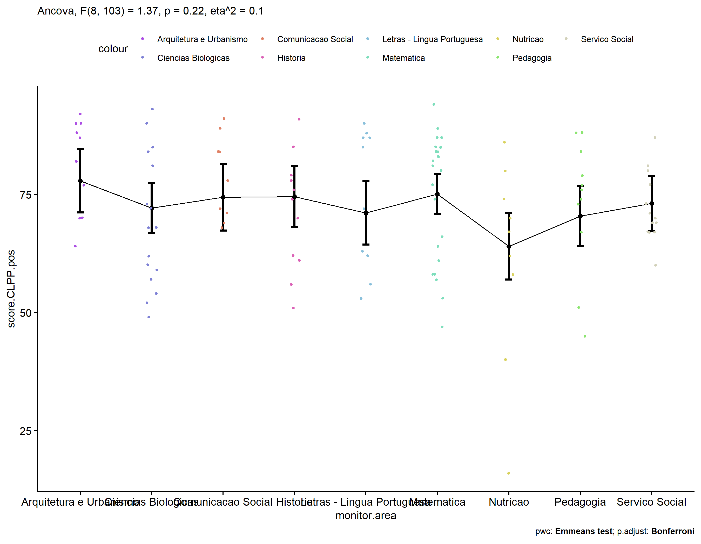<!-- -->

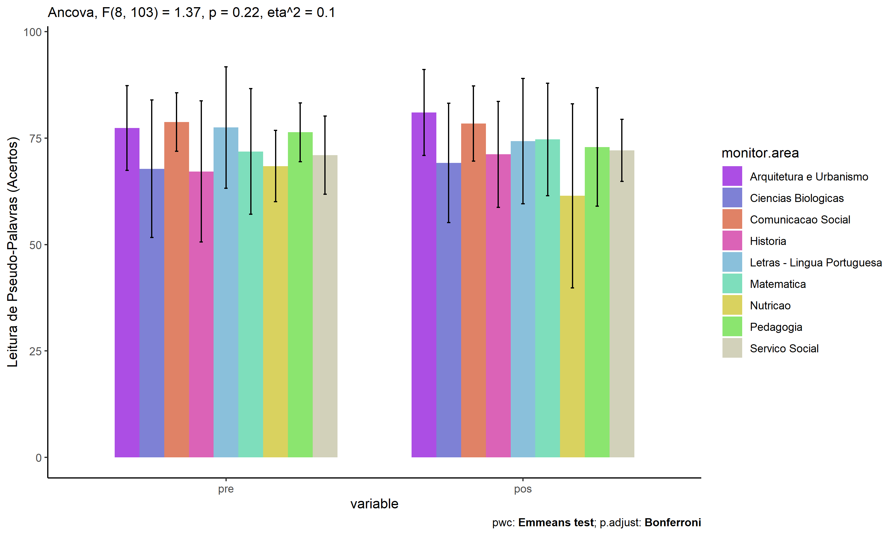<!-- -->

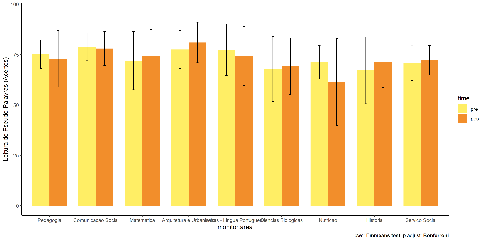<!-- -->

### Correta Regular (Acertos)

| var          | monitor.area               |   n | M (pre) | SE (pre) | M (unadj) | SE (unadj) | M (adj) | SE (adj) |
|:-------------|:---------------------------|----:|--------:|---------:|----------:|-----------:|--------:|---------:|
| score.CR.pos | Arquitetura e Urbanismo    |  11 |  16.636 |    0.592 |    15.727 |      1.646 |  15.136 |    1.563 |
| score.CR.pos | Ciencias Biologicas        |  16 |  13.812 |    1.042 |    14.562 |      0.851 |  15.223 |    1.302 |
| score.CR.pos | Comunicacao Social         |  10 |  16.200 |    1.855 |    16.900 |      0.526 |  16.502 |    1.635 |
| score.CR.pos | Historia                   |  13 |  12.462 |    1.824 |    13.077 |      1.741 |  14.335 |    1.470 |
| score.CR.pos | Letras - Lingua Portuguesa |  13 |  16.385 |    0.694 |    11.231 |      1.971 |  10.751 |    1.436 |
| score.CR.pos | Matematica                 |  26 |  14.808 |    0.867 |    14.923 |      0.806 |  15.142 |    1.013 |
| score.CR.pos | Nutricao                   |  13 |  15.231 |    0.690 |     9.462 |      2.129 |   9.493 |    1.431 |
| score.CR.pos | Pedagogia                  |  13 |  17.000 |    0.679 |    13.231 |      1.812 |  12.479 |    1.445 |
| score.CR.pos | Servico Social             |  14 |  16.357 |    0.452 |    16.000 |      1.318 |  15.533 |    1.384 |

| .y.          | group1                  | group2              | estimate | conf.low | conf.high |    se | statistic |     p | p.adj | p.adj.signif |
|:-------------|:------------------------|:--------------------|---------:|---------:|----------:|------:|----------:|------:|------:|:-------------|
| score.CR.pos | Arquitetura e Urbanismo | Ciencias Biologicas |   -0.086 |   -4.141 |     3.969 | 2.048 |    -0.042 | 0.966 | 1.000 | ns           |
| score.CR.pos | Arquitetura e Urbanismo | Comunicacao Social  |   -1.366 |   -5.830 |     3.098 | 2.254 |    -0.606 | 0.546 | 1.000 | ns           |
| score.CR.pos | Arquitetura e Urbanismo | Historia            |    0.801 |   -3.497 |     5.099 | 2.171 |     0.369 | 0.713 | 1.000 | ns           |
| score.CR.pos | Arquitetura e Urbanismo | Letras              |    4.385 |    0.201 |     8.569 | 2.113 |     2.075 | 0.040 | 1.000 | ns           |
| score.CR.pos | Arquitetura e Urbanismo | Matematica          |   -0.006 |   -3.705 |     3.693 | 1.868 |    -0.003 | 0.997 | 1.000 | ns           |
| score.CR.pos | Arquitetura e Urbanismo | Nutricao            |    5.643 |    1.446 |     9.840 | 2.120 |     2.662 | 0.009 | 0.318 | ns           |
| score.CR.pos | Arquitetura e Urbanismo | Pedagogia           |    2.658 |   -1.527 |     6.842 | 2.113 |     1.257 | 0.211 | 1.000 | ns           |
| score.CR.pos | Arquitetura e Urbanismo | Servico Social      |   -0.396 |   -4.512 |     3.719 | 2.078 |    -0.191 | 0.849 | 1.000 | ns           |
| score.CR.pos | Ciencias Biologicas     | Comunicacao Social  |   -1.280 |   -5.435 |     2.876 | 2.099 |    -0.610 | 0.543 | 1.000 | ns           |
| score.CR.pos | Ciencias Biologicas     | Historia            |    0.887 |   -2.940 |     4.714 | 1.933 |     0.459 | 0.647 | 1.000 | ns           |
| score.CR.pos | Ciencias Biologicas     | Letras              |    4.471 |    0.610 |     8.333 | 1.950 |     2.293 | 0.024 | 0.850 | ns           |
| score.CR.pos | Ciencias Biologicas     | Matematica          |    0.080 |   -3.173 |     3.334 | 1.643 |     0.049 | 0.961 | 1.000 | ns           |
| score.CR.pos | Ciencias Biologicas     | Nutricao            |    5.729 |    1.901 |     9.557 | 1.933 |     2.963 | 0.004 | 0.132 | ns           |
| score.CR.pos | Ciencias Biologicas     | Pedagogia           |    2.744 |   -1.143 |     6.631 | 1.963 |     1.398 | 0.165 | 1.000 | ns           |
| score.CR.pos | Ciencias Biologicas     | Servico Social      |   -0.310 |   -4.096 |     3.475 | 1.912 |    -0.162 | 0.871 | 1.000 | ns           |
| score.CR.pos | Comunicacao Social      | Historia            |    2.167 |   -2.219 |     6.552 | 2.215 |     0.978 | 0.330 | 1.000 | ns           |
| score.CR.pos | Comunicacao Social      | Letras              |    5.751 |    1.455 |    10.047 | 2.170 |     2.651 | 0.009 | 0.328 | ns           |
| score.CR.pos | Comunicacao Social      | Matematica          |    1.360 |   -2.454 |     5.175 | 1.926 |     0.706 | 0.482 | 1.000 | ns           |
| score.CR.pos | Comunicacao Social      | Nutricao            |    7.009 |    2.707 |    11.311 | 2.173 |     3.226 | 0.002 | 0.058 | ns           |
| score.CR.pos | Comunicacao Social      | Pedagogia           |    4.024 |   -0.276 |     8.324 | 2.172 |     1.853 | 0.066 | 1.000 | ns           |
| score.CR.pos | Comunicacao Social      | Servico Social      |    0.970 |   -3.259 |     5.198 | 2.136 |     0.454 | 0.651 | 1.000 | ns           |
| score.CR.pos | Historia                | Letras              |    3.584 |   -0.527 |     7.696 | 2.076 |     1.726 | 0.087 | 1.000 | ns           |
| score.CR.pos | Historia                | Matematica          |   -0.807 |   -4.320 |     2.706 | 1.774 |    -0.455 | 0.650 | 1.000 | ns           |
| score.CR.pos | Historia                | Nutricao            |    4.842 |    0.783 |     8.901 | 2.050 |     2.362 | 0.020 | 0.712 | ns           |
| score.CR.pos | Historia                | Pedagogia           |    1.857 |   -2.290 |     6.003 | 2.094 |     0.887 | 0.377 | 1.000 | ns           |
| score.CR.pos | Historia                | Servico Social      |   -1.197 |   -5.237 |     2.842 | 2.040 |    -0.587 | 0.558 | 1.000 | ns           |
| score.CR.pos | Letras                  | Lingua Portuguesa   |   -4.391 |   -7.880 |    -0.902 | 1.762 |    -2.492 | 0.014 | 0.507 | ns           |
| score.CR.pos | Letras                  | Lingua Portuguesa   |    1.258 |   -2.757 |     5.273 | 2.028 |     0.620 | 0.536 | 1.000 | ns           |
| score.CR.pos | Letras                  | Lingua Portuguesa   |   -1.727 |   -5.736 |     2.281 | 2.024 |    -0.853 | 0.395 | 1.000 | ns           |
| score.CR.pos | Letras                  | Lingua Portuguesa   |   -4.781 |   -8.715 |    -0.848 | 1.987 |    -2.407 | 0.018 | 0.635 | ns           |
| score.CR.pos | Matematica              | Nutricao            |    5.649 |    2.178 |     9.120 | 1.753 |     3.223 | 0.002 | 0.059 | ns           |
| score.CR.pos | Matematica              | Pedagogia           |    2.664 |   -0.844 |     6.171 | 1.771 |     1.504 | 0.135 | 1.000 | ns           |
| score.CR.pos | Matematica              | Servico Social      |   -0.390 |   -3.796 |     3.015 | 1.720 |    -0.227 | 0.821 | 1.000 | ns           |
| score.CR.pos | Nutricao                | Pedagogia           |   -2.985 |   -7.013 |     1.042 | 2.034 |    -1.468 | 0.145 | 1.000 | ns           |
| score.CR.pos | Nutricao                | Servico Social      |   -6.039 |   -9.982 |    -2.097 | 1.991 |    -3.033 | 0.003 | 0.107 | ns           |
| score.CR.pos | Pedagogia               | Servico Social      |   -3.054 |   -6.991 |     0.883 | 1.988 |    -1.536 | 0.127 | 1.000 | ns           |
| score.CR.pre | Arquitetura e Urbanismo | Ciencias Biologicas |    2.824 |   -0.241 |     5.889 | 1.548 |     1.824 | 0.071 | 1.000 | ns           |
| score.CR.pre | Arquitetura e Urbanismo | Comunicacao Social  |    0.436 |   -2.983 |     3.855 | 1.727 |     0.253 | 0.801 | 1.000 | ns           |
| score.CR.pre | Arquitetura e Urbanismo | Historia            |    4.175 |    0.969 |     7.381 | 1.619 |     2.578 | 0.011 | 0.401 | ns           |
| score.CR.pre | Arquitetura e Urbanismo | Letras              |    0.252 |   -2.954 |     3.458 | 1.619 |     0.155 | 0.877 | 1.000 | ns           |
| score.CR.pre | Arquitetura e Urbanismo | Matematica          |    1.829 |   -0.986 |     4.643 | 1.422 |     1.286 | 0.201 | 1.000 | ns           |
| score.CR.pre | Arquitetura e Urbanismo | Nutricao            |    1.406 |   -1.800 |     4.611 | 1.619 |     0.868 | 0.387 | 1.000 | ns           |
| score.CR.pre | Arquitetura e Urbanismo | Pedagogia           |   -0.364 |   -3.569 |     2.842 | 1.619 |    -0.225 | 0.823 | 1.000 | ns           |
| score.CR.pre | Arquitetura e Urbanismo | Servico Social      |    0.279 |   -2.874 |     3.432 | 1.592 |     0.175 | 0.861 | 1.000 | ns           |
| score.CR.pre | Ciencias Biologicas     | Comunicacao Social  |   -2.388 |   -5.542 |     0.767 | 1.593 |    -1.499 | 0.137 | 1.000 | ns           |
| score.CR.pre | Ciencias Biologicas     | Historia            |    1.351 |   -1.571 |     4.273 | 1.476 |     0.915 | 0.362 | 1.000 | ns           |
| score.CR.pre | Ciencias Biologicas     | Letras              |   -2.572 |   -5.494 |     0.350 | 1.476 |    -1.743 | 0.084 | 1.000 | ns           |
| score.CR.pre | Ciencias Biologicas     | Matematica          |   -0.995 |   -3.482 |     1.491 | 1.256 |    -0.792 | 0.430 | 1.000 | ns           |
| score.CR.pre | Ciencias Biologicas     | Nutricao            |   -1.418 |   -4.340 |     1.504 | 1.476 |    -0.961 | 0.338 | 1.000 | ns           |
| score.CR.pre | Ciencias Biologicas     | Pedagogia           |   -3.187 |   -6.109 |    -0.266 | 1.476 |    -2.160 | 0.033 | 1.000 | ns           |
| score.CR.pre | Ciencias Biologicas     | Servico Social      |   -2.545 |   -5.408 |     0.319 | 1.446 |    -1.759 | 0.081 | 1.000 | ns           |
| score.CR.pre | Comunicacao Social      | Historia            |    3.738 |    0.447 |     7.030 | 1.662 |     2.249 | 0.026 | 0.949 | ns           |
| score.CR.pre | Comunicacao Social      | Letras              |   -0.185 |   -3.476 |     3.107 | 1.662 |    -0.111 | 0.912 | 1.000 | ns           |
| score.CR.pre | Comunicacao Social      | Matematica          |    1.392 |   -1.519 |     4.304 | 1.471 |     0.947 | 0.346 | 1.000 | ns           |
| score.CR.pre | Comunicacao Social      | Nutricao            |    0.969 |   -2.322 |     4.261 | 1.662 |     0.583 | 0.561 | 1.000 | ns           |
| score.CR.pre | Comunicacao Social      | Pedagogia           |   -0.800 |   -4.091 |     2.491 | 1.662 |    -0.481 | 0.631 | 1.000 | ns           |
| score.CR.pre | Comunicacao Social      | Servico Social      |   -0.157 |   -3.397 |     3.083 | 1.636 |    -0.096 | 0.924 | 1.000 | ns           |
| score.CR.pre | Historia                | Letras              |   -3.923 |   -6.992 |    -0.854 | 1.550 |    -2.531 | 0.013 | 0.456 | ns           |
| score.CR.pre | Historia                | Matematica          |   -2.346 |   -5.004 |     0.312 | 1.343 |    -1.748 | 0.083 | 1.000 | ns           |
| score.CR.pre | Historia                | Nutricao            |   -2.769 |   -5.839 |     0.300 | 1.550 |    -1.786 | 0.077 | 1.000 | ns           |
| score.CR.pre | Historia                | Pedagogia           |   -4.538 |   -7.608 |    -1.469 | 1.550 |    -2.928 | 0.004 | 0.147 | ns           |
| score.CR.pre | Historia                | Servico Social      |   -3.896 |   -6.910 |    -0.882 | 1.522 |    -2.559 | 0.012 | 0.423 | ns           |
| score.CR.pre | Letras                  | Lingua Portuguesa   |    1.577 |   -1.081 |     4.235 | 1.343 |     1.175 | 0.242 | 1.000 | ns           |
| score.CR.pre | Letras                  | Lingua Portuguesa   |    1.154 |   -1.915 |     4.223 | 1.550 |     0.744 | 0.458 | 1.000 | ns           |
| score.CR.pre | Letras                  | Lingua Portuguesa   |   -0.615 |   -3.685 |     2.454 | 1.550 |    -0.397 | 0.692 | 1.000 | ns           |
| score.CR.pre | Letras                  | Lingua Portuguesa   |    0.027 |   -2.987 |     3.041 | 1.522 |     0.018 | 0.986 | 1.000 | ns           |
| score.CR.pre | Matematica              | Nutricao            |   -0.423 |   -3.081 |     2.235 | 1.343 |    -0.315 | 0.753 | 1.000 | ns           |
| score.CR.pre | Matematica              | Pedagogia           |   -2.192 |   -4.850 |     0.466 | 1.343 |    -1.633 | 0.105 | 1.000 | ns           |
| score.CR.pre | Matematica              | Servico Social      |   -1.549 |   -4.143 |     1.045 | 1.310 |    -1.183 | 0.239 | 1.000 | ns           |
| score.CR.pre | Nutricao                | Pedagogia           |   -1.769 |   -4.839 |     1.300 | 1.550 |    -1.141 | 0.256 | 1.000 | ns           |
| score.CR.pre | Nutricao                | Servico Social      |   -1.126 |   -4.140 |     1.888 | 1.522 |    -0.740 | 0.461 | 1.000 | ns           |
| score.CR.pre | Pedagogia               | Servico Social      |    0.643 |   -2.371 |     3.657 | 1.522 |     0.422 | 0.674 | 1.000 | ns           |

| .y.      | monitor.area               | group1 | group2 | estimate | conf.low | conf.high |    se | statistic |     p | p.adj | p.adj.signif |
|:---------|:---------------------------|:-------|:-------|---------:|---------:|----------:|------:|----------:|------:|------:|:-------------|
| score.CR | Arquitetura e Urbanismo    | pre    | pos    |    0.909 |   -3.078 |     4.896 | 2.024 |     0.449 | 0.654 | 0.654 | ns           |
| score.CR | Ciencias Biologicas        | pre    | pos    |   -0.750 |   -4.056 |     2.556 | 1.678 |    -0.447 | 0.655 | 0.655 | ns           |
| score.CR | Comunicacao Social         | pre    | pos    |   -0.700 |   -4.882 |     3.482 | 2.123 |    -0.330 | 0.742 | 0.742 | ns           |
| score.CR | Historia                   | pre    | pos    |   -0.615 |   -4.283 |     3.052 | 1.862 |    -0.331 | 0.741 | 0.741 | ns           |
| score.CR | Letras - Lingua Portuguesa | pre    | pos    |    5.154 |    1.486 |     8.822 | 1.862 |     2.768 | 0.006 | 0.006 | \*\*         |
| score.CR | Matematica                 | pre    | pos    |   -0.115 |   -2.709 |     2.478 | 1.317 |    -0.088 | 0.930 | 0.930 | ns           |
| score.CR | Nutricao                   | pre    | pos    |    5.769 |    2.101 |     9.437 | 1.862 |     3.099 | 0.002 | 0.002 | \*\*         |
| score.CR | Pedagogia                  | pre    | pos    |    3.769 |    0.101 |     7.437 | 1.862 |     2.024 | 0.044 | 0.044 | \*           |
| score.CR | Servico Social             | pre    | pos    |    0.357 |   -3.177 |     3.892 | 1.794 |     0.199 | 0.842 | 0.842 | ns           |

    ## Scale for colour is already present.
    ## Adding another scale for colour, which will replace the existing scale.

<!-- -->

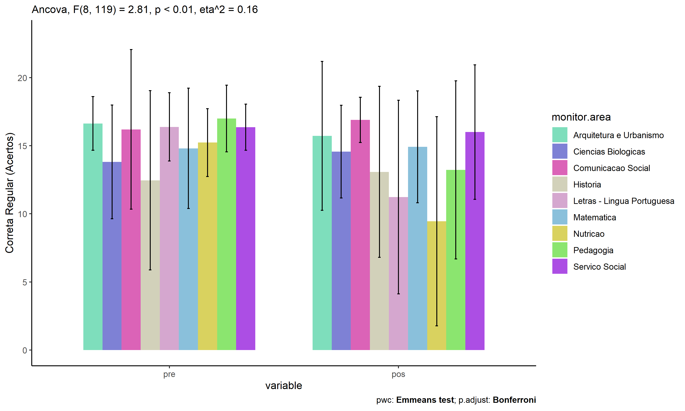<!-- -->

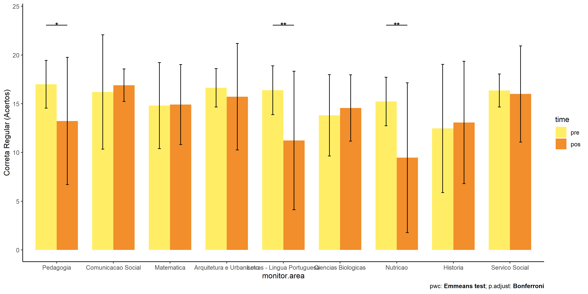<!-- -->

### Correta Irregular (Acertos)

| var          | monitor.area               |   n | M (pre) | SE (pre) | M (unadj) | SE (unadj) | M (adj) | SE (adj) |
|:-------------|:---------------------------|----:|--------:|---------:|----------:|-----------:|--------:|---------:|
| score.CI.pos | Arquitetura e Urbanismo    |  11 |  12.000 |    0.647 |    12.545 |      1.534 |  12.669 |    1.376 |
| score.CI.pos | Ciencias Biologicas        |  16 |  11.125 |    0.884 |    12.438 |      0.922 |  13.013 |    1.148 |
| score.CI.pos | Comunicacao Social         |  10 |  12.200 |    1.604 |    13.600 |      1.013 |  13.621 |    1.443 |
| score.CI.pos | Historia                   |  13 |  10.538 |    1.682 |    10.769 |      1.590 |  11.647 |    1.280 |
| score.CI.pos | Letras - Lingua Portuguesa |  13 |  13.077 |    0.512 |    10.615 |      1.845 |  10.184 |    1.269 |
| score.CI.pos | Matematica                 |  26 |  12.077 |    0.821 |    13.192 |      0.695 |  13.277 |    0.895 |
| score.CI.pos | Nutricao                   |  13 |  12.846 |    0.659 |     8.154 |      1.860 |   7.841 |    1.267 |
| score.CI.pos | Pedagogia                  |  13 |  12.923 |    0.916 |    10.615 |      1.483 |  10.263 |    1.268 |
| score.CI.pos | Servico Social             |  14 |  13.643 |    0.684 |    12.714 |      1.160 |  11.991 |    1.230 |

| .y.          | group1                  | group2              | estimate | conf.low | conf.high |    se | statistic | p       | p.adj | p.adj.signif |
|:-------------|:------------------------|:--------------------|---------:|---------:|----------:|------:|----------:|:--------|------:|:-------------|
| score.CI.pos | Arquitetura e Urbanismo | Ciencias Biologicas |   -0.343 |   -3.888 |     3.201 | 1.790 |    -0.192 | 0.848   | 1.000 | ns           |
| score.CI.pos | Arquitetura e Urbanismo | Comunicacao Social  |   -0.951 |   -4.900 |     2.997 | 1.994 |    -0.477 | 0.634   | 1.000 | ns           |
| score.CI.pos | Arquitetura e Urbanismo | Historia            |    1.022 |   -2.693 |     4.738 | 1.877 |     0.545 | 0.587   | 1.000 | ns           |
| score.CI.pos | Arquitetura e Urbanismo | Letras              |    2.486 |   -1.224 |     6.195 | 1.873 |     1.327 | 0.187   | 1.000 | ns           |
| score.CI.pos | Arquitetura e Urbanismo | Matematica          |   -0.607 |   -3.857 |     2.643 | 1.641 |    -0.370 | 0.712   | 1.000 | ns           |
| score.CI.pos | Arquitetura e Urbanismo | Nutricao            |    4.828 |    1.122 |     8.534 | 1.872 |     2.579 | 0.011   | 0.400 | ns           |
| score.CI.pos | Arquitetura e Urbanismo | Pedagogia           |    2.406 |   -1.301 |     6.114 | 1.872 |     1.285 | 0.201   | 1.000 | ns           |
| score.CI.pos | Arquitetura e Urbanismo | Servico Social      |    0.679 |   -2.980 |     4.337 | 1.848 |     0.367 | 0.714   | 1.000 | ns           |
| score.CI.pos | Ciencias Biologicas     | Comunicacao Social  |   -0.608 |   -4.258 |     3.042 | 1.843 |    -0.330 | 0.742   | 1.000 | ns           |
| score.CI.pos | Ciencias Biologicas     | Historia            |    1.366 |   -2.011 |     4.742 | 1.705 |     0.801 | 0.425   | 1.000 | ns           |
| score.CI.pos | Ciencias Biologicas     | Letras              |    2.829 |   -0.572 |     6.230 | 1.718 |     1.647 | 0.102   | 1.000 | ns           |
| score.CI.pos | Ciencias Biologicas     | Matematica          |   -0.264 |   -3.143 |     2.615 | 1.454 |    -0.181 | 0.856   | 1.000 | ns           |
| score.CI.pos | Ciencias Biologicas     | Nutricao            |    5.171 |    1.776 |     8.567 | 1.715 |     3.016 | 0.003   | 0.113 | ns           |
| score.CI.pos | Ciencias Biologicas     | Pedagogia           |    2.750 |   -0.648 |     6.147 | 1.716 |     1.603 | 0.112   | 1.000 | ns           |
| score.CI.pos | Ciencias Biologicas     | Servico Social      |    1.022 |   -2.331 |     4.375 | 1.693 |     0.604 | 0.547   | 1.000 | ns           |
| score.CI.pos | Comunicacao Social      | Historia            |    1.974 |   -1.845 |     5.792 | 1.928 |     1.024 | 0.308   | 1.000 | ns           |
| score.CI.pos | Comunicacao Social      | Letras              |    3.437 |   -0.369 |     7.243 | 1.922 |     1.788 | 0.076   | 1.000 | ns           |
| score.CI.pos | Comunicacao Social      | Matematica          |    0.344 |   -3.018 |     3.707 | 1.698 |     0.203 | 0.84    | 1.000 | ns           |
| score.CI.pos | Comunicacao Social      | Nutricao            |    5.779 |    1.976 |     9.583 | 1.921 |     3.009 | 0.003   | 0.115 | ns           |
| score.CI.pos | Comunicacao Social      | Pedagogia           |    3.358 |   -0.446 |     7.162 | 1.921 |     1.748 | 0.083   | 1.000 | ns           |
| score.CI.pos | Comunicacao Social      | Servico Social      |    1.630 |   -2.125 |     5.385 | 1.896 |     0.860 | 0.392   | 1.000 | ns           |
| score.CI.pos | Historia                | Letras              |    1.463 |   -2.125 |     5.052 | 1.812 |     0.807 | 0.421   | 1.000 | ns           |
| score.CI.pos | Historia                | Matematica          |   -1.629 |   -4.718 |     1.459 | 1.560 |    -1.045 | 0.298   | 1.000 | ns           |
| score.CI.pos | Historia                | Nutricao            |    3.806 |    0.225 |     7.386 | 1.808 |     2.105 | 0.037   | 1.000 | ns           |
| score.CI.pos | Historia                | Pedagogia           |    1.384 |   -2.199 |     4.967 | 1.810 |     0.765 | 0.446   | 1.000 | ns           |
| score.CI.pos | Historia                | Servico Social      |   -0.344 |   -3.891 |     3.204 | 1.791 |    -0.192 | 0.848   | 1.000 | ns           |
| score.CI.pos | Letras                  | Lingua Portuguesa   |   -3.093 |   -6.170 |    -0.016 | 1.554 |    -1.990 | 0.049   | 1.000 | ns           |
| score.CI.pos | Letras                  | Lingua Portuguesa   |    2.342 |   -1.202 |     5.887 | 1.790 |     1.309 | 0.193   | 1.000 | ns           |
| score.CI.pos | Letras                  | Lingua Portuguesa   |   -0.079 |   -3.624 |     3.465 | 1.790 |    -0.044 | 0.965   | 1.000 | ns           |
| score.CI.pos | Letras                  | Lingua Portuguesa   |   -1.807 |   -5.289 |     1.676 | 1.759 |    -1.027 | 0.306   | 1.000 | ns           |
| score.CI.pos | Matematica              | Nutricao            |    5.435 |    2.361 |     8.509 | 1.552 |     3.501 | \<0.001 | 0.024 | \*           |
| score.CI.pos | Matematica              | Pedagogia           |    3.013 |   -0.062 |     6.088 | 1.553 |     1.940 | 0.055   | 1.000 | ns           |
| score.CI.pos | Matematica              | Servico Social      |    1.286 |   -1.729 |     4.301 | 1.523 |     0.844 | 0.4     | 1.000 | ns           |
| score.CI.pos | Nutricao                | Pedagogia           |   -2.422 |   -5.966 |     1.122 | 1.790 |    -1.353 | 0.179   | 1.000 | ns           |
| score.CI.pos | Nutricao                | Servico Social      |   -4.149 |   -7.634 |    -0.665 | 1.760 |    -2.358 | 0.02    | 0.720 | ns           |
| score.CI.pos | Pedagogia               | Servico Social      |   -1.728 |   -5.211 |     1.756 | 1.759 |    -0.982 | 0.328   | 1.000 | ns           |
| score.CI.pre | Arquitetura e Urbanismo | Ciencias Biologicas |    0.875 |   -2.017 |     3.767 | 1.461 |     0.599 | 0.55    | 1.000 | ns           |
| score.CI.pre | Arquitetura e Urbanismo | Comunicacao Social  |   -0.200 |   -3.426 |     3.026 | 1.630 |    -0.123 | 0.903   | 1.000 | ns           |
| score.CI.pre | Arquitetura e Urbanismo | Historia            |    1.462 |   -1.564 |     4.487 | 1.528 |     0.957 | 0.341   | 1.000 | ns           |
| score.CI.pre | Arquitetura e Urbanismo | Letras              |   -1.077 |   -4.102 |     1.948 | 1.528 |    -0.705 | 0.482   | 1.000 | ns           |
| score.CI.pre | Arquitetura e Urbanismo | Matematica          |   -0.077 |   -2.733 |     2.579 | 1.341 |    -0.057 | 0.954   | 1.000 | ns           |
| score.CI.pre | Arquitetura e Urbanismo | Nutricao            |   -0.846 |   -3.871 |     2.179 | 1.528 |    -0.554 | 0.581   | 1.000 | ns           |
| score.CI.pre | Arquitetura e Urbanismo | Pedagogia           |   -0.923 |   -3.948 |     2.102 | 1.528 |    -0.604 | 0.547   | 1.000 | ns           |
| score.CI.pre | Arquitetura e Urbanismo | Servico Social      |   -1.643 |   -4.618 |     1.332 | 1.503 |    -1.093 | 0.276   | 1.000 | ns           |
| score.CI.pre | Ciencias Biologicas     | Comunicacao Social  |   -1.075 |   -4.052 |     1.902 | 1.503 |    -0.715 | 0.476   | 1.000 | ns           |
| score.CI.pre | Ciencias Biologicas     | Historia            |    0.587 |   -2.171 |     3.344 | 1.393 |     0.421 | 0.674   | 1.000 | ns           |
| score.CI.pre | Ciencias Biologicas     | Letras              |   -1.952 |   -4.709 |     0.805 | 1.393 |    -1.402 | 0.164   | 1.000 | ns           |
| score.CI.pre | Ciencias Biologicas     | Matematica          |   -0.952 |   -3.298 |     1.394 | 1.185 |    -0.803 | 0.423   | 1.000 | ns           |
| score.CI.pre | Ciencias Biologicas     | Nutricao            |   -1.721 |   -4.478 |     1.036 | 1.393 |    -1.236 | 0.219   | 1.000 | ns           |
| score.CI.pre | Ciencias Biologicas     | Pedagogia           |   -1.798 |   -4.555 |     0.959 | 1.393 |    -1.291 | 0.199   | 1.000 | ns           |
| score.CI.pre | Ciencias Biologicas     | Servico Social      |   -2.518 |   -5.220 |     0.185 | 1.365 |    -1.845 | 0.068   | 1.000 | ns           |
| score.CI.pre | Comunicacao Social      | Historia            |    1.662 |   -1.444 |     4.768 | 1.569 |     1.059 | 0.292   | 1.000 | ns           |
| score.CI.pre | Comunicacao Social      | Letras              |   -0.877 |   -3.983 |     2.229 | 1.569 |    -0.559 | 0.577   | 1.000 | ns           |
| score.CI.pre | Comunicacao Social      | Matematica          |    0.123 |   -2.625 |     2.871 | 1.388 |     0.089 | 0.929   | 1.000 | ns           |
| score.CI.pre | Comunicacao Social      | Nutricao            |   -0.646 |   -3.752 |     2.460 | 1.569 |    -0.412 | 0.681   | 1.000 | ns           |
| score.CI.pre | Comunicacao Social      | Pedagogia           |   -0.723 |   -3.829 |     2.383 | 1.569 |    -0.461 | 0.646   | 1.000 | ns           |
| score.CI.pre | Comunicacao Social      | Servico Social      |   -1.443 |   -4.500 |     1.615 | 1.544 |    -0.934 | 0.352   | 1.000 | ns           |
| score.CI.pre | Historia                | Letras              |   -2.538 |   -5.435 |     0.358 | 1.463 |    -1.735 | 0.085   | 1.000 | ns           |
| score.CI.pre | Historia                | Matematica          |   -1.538 |   -4.047 |     0.970 | 1.267 |    -1.214 | 0.227   | 1.000 | ns           |
| score.CI.pre | Historia                | Nutricao            |   -2.308 |   -5.204 |     0.589 | 1.463 |    -1.578 | 0.117   | 1.000 | ns           |
| score.CI.pre | Historia                | Pedagogia           |   -2.385 |   -5.281 |     0.512 | 1.463 |    -1.630 | 0.106   | 1.000 | ns           |
| score.CI.pre | Historia                | Servico Social      |   -3.104 |   -5.949 |    -0.260 | 1.437 |    -2.161 | 0.033   | 1.000 | ns           |
| score.CI.pre | Letras                  | Lingua Portuguesa   |    1.000 |   -1.508 |     3.508 | 1.267 |     0.789 | 0.431   | 1.000 | ns           |
| score.CI.pre | Letras                  | Lingua Portuguesa   |    0.231 |   -2.666 |     3.127 | 1.463 |     0.158 | 0.875   | 1.000 | ns           |
| score.CI.pre | Letras                  | Lingua Portuguesa   |    0.154 |   -2.743 |     3.050 | 1.463 |     0.105 | 0.916   | 1.000 | ns           |
| score.CI.pre | Letras                  | Lingua Portuguesa   |   -0.566 |   -3.410 |     2.278 | 1.437 |    -0.394 | 0.694   | 1.000 | ns           |
| score.CI.pre | Matematica              | Nutricao            |   -0.769 |   -3.278 |     1.739 | 1.267 |    -0.607 | 0.545   | 1.000 | ns           |
| score.CI.pre | Matematica              | Pedagogia           |   -0.846 |   -3.354 |     1.662 | 1.267 |    -0.668 | 0.505   | 1.000 | ns           |
| score.CI.pre | Matematica              | Servico Social      |   -1.566 |   -4.014 |     0.882 | 1.236 |    -1.267 | 0.208   | 1.000 | ns           |
| score.CI.pre | Nutricao                | Pedagogia           |   -0.077 |   -2.973 |     2.819 | 1.463 |    -0.053 | 0.958   | 1.000 | ns           |
| score.CI.pre | Nutricao                | Servico Social      |   -0.797 |   -3.641 |     2.047 | 1.437 |    -0.555 | 0.58    | 1.000 | ns           |
| score.CI.pre | Pedagogia               | Servico Social      |   -0.720 |   -3.564 |     2.124 | 1.437 |    -0.501 | 0.617   | 1.000 | ns           |

| .y.      | monitor.area               | group1 | group2 | estimate | conf.low | conf.high |    se | statistic |     p | p.adj | p.adj.signif |
|:---------|:---------------------------|:-------|:-------|---------:|---------:|----------:|------:|----------:|------:|------:|:-------------|
| score.CI | Arquitetura e Urbanismo    | pre    | pos    |   -0.545 |   -4.219 |     3.128 | 1.865 |    -0.292 | 0.770 | 0.770 | ns           |
| score.CI | Ciencias Biologicas        | pre    | pos    |   -1.313 |   -4.359 |     1.734 | 1.546 |    -0.849 | 0.397 | 0.397 | ns           |
| score.CI | Comunicacao Social         | pre    | pos    |   -1.400 |   -5.253 |     2.453 | 1.956 |    -0.716 | 0.475 | 0.475 | ns           |
| score.CI | Historia                   | pre    | pos    |   -0.231 |   -3.610 |     3.149 | 1.716 |    -0.135 | 0.893 | 0.893 | ns           |
| score.CI | Letras - Lingua Portuguesa | pre    | pos    |    2.462 |   -0.918 |     5.841 | 1.716 |     1.435 | 0.153 | 0.153 | ns           |
| score.CI | Matematica                 | pre    | pos    |   -1.115 |   -3.505 |     1.274 | 1.213 |    -0.919 | 0.359 | 0.359 | ns           |
| score.CI | Nutricao                   | pre    | pos    |    4.692 |    1.313 |     8.072 | 1.716 |     2.735 | 0.007 | 0.007 | \*\*         |
| score.CI | Pedagogia                  | pre    | pos    |    2.308 |   -1.072 |     5.687 | 1.716 |     1.345 | 0.180 | 0.180 | ns           |
| score.CI | Servico Social             | pre    | pos    |    0.929 |   -2.328 |     4.185 | 1.653 |     0.562 | 0.575 | 0.575 | ns           |

    ## Scale for colour is already present.
    ## Adding another scale for colour, which will replace the existing scale.

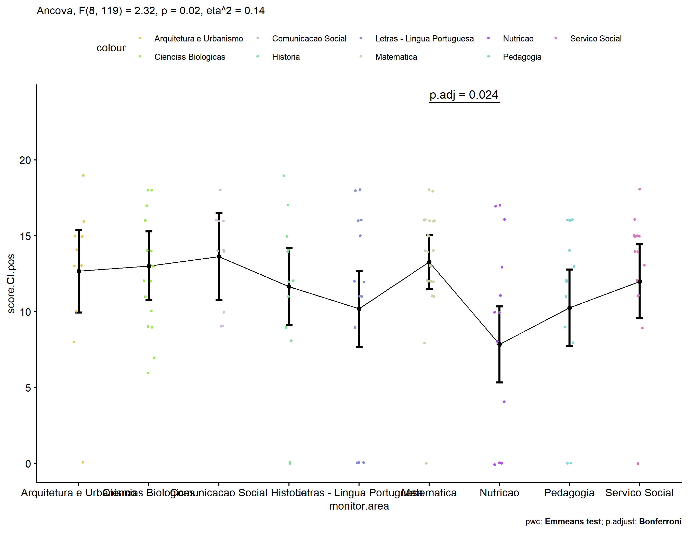<!-- -->

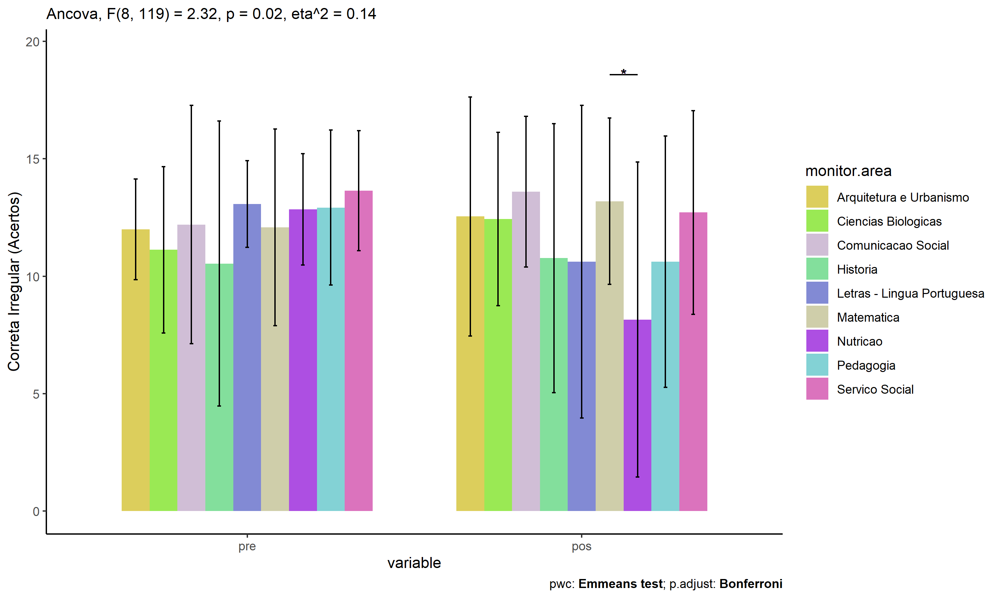<!-- -->

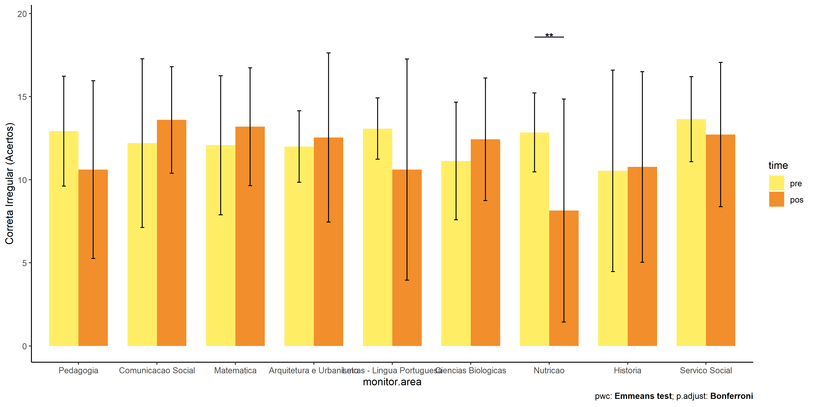<!-- -->

### Trocas Visuais (Acertos)

| var          | monitor.area               |   n | M (pre) | SE (pre) | M (unadj) | SE (unadj) | M (adj) | SE (adj) |
|:-------------|:---------------------------|----:|--------:|---------:|----------:|-----------:|--------:|---------:|
| score.TV.pos | Arquitetura e Urbanismo    |  11 |  18.727 |    0.524 |    17.000 |      1.716 |  16.171 |    1.740 |
| score.TV.pos | Ciencias Biologicas        |  16 |  16.812 |    1.137 |    16.375 |      0.939 |  16.356 |    1.429 |
| score.TV.pos | Comunicacao Social         |  10 |  16.500 |    1.887 |    17.800 |      0.680 |  17.913 |    1.808 |
| score.TV.pos | Historia                   |  13 |  13.231 |    2.187 |    13.692 |      2.046 |  15.188 |    1.642 |
| score.TV.pos | Letras - Lingua Portuguesa |  13 |  18.154 |    0.639 |    12.692 |      2.122 |  12.106 |    1.594 |
| score.TV.pos | Matematica                 |  26 |  16.192 |    0.923 |    16.462 |      0.890 |  16.705 |    1.123 |
| score.TV.pos | Nutricao                   |  13 |  17.692 |    0.654 |     9.923 |      2.376 |   9.532 |    1.589 |
| score.TV.pos | Pedagogia                  |  13 |  18.385 |    0.474 |    14.846 |      2.015 |  14.162 |    1.597 |
| score.TV.pos | Servico Social             |  14 |  16.071 |    0.752 |    15.929 |      1.336 |  16.223 |    1.530 |

| .y.          | group1                  | group2              | estimate | conf.low | conf.high |    se | statistic | p       | p.adj | p.adj.signif |
|:-------------|:------------------------|:--------------------|---------:|---------:|----------:|------:|----------:|:--------|------:|:-------------|
| score.TV.pos | Arquitetura e Urbanismo | Ciencias Biologicas |   -0.185 |   -4.641 |     4.272 | 2.251 |    -0.082 | 0.935   | 1.000 | ns           |
| score.TV.pos | Arquitetura e Urbanismo | Comunicacao Social  |   -1.742 |   -6.716 |     3.232 | 2.512 |    -0.693 | 0.489   | 1.000 | ns           |
| score.TV.pos | Arquitetura e Urbanismo | Historia            |    0.984 |   -3.837 |     5.804 | 2.434 |     0.404 | 0.687   | 1.000 | ns           |
| score.TV.pos | Arquitetura e Urbanismo | Letras              |    4.065 |   -0.574 |     8.704 | 2.343 |     1.735 | 0.085   | 1.000 | ns           |
| score.TV.pos | Arquitetura e Urbanismo | Matematica          |   -0.533 |   -4.650 |     3.583 | 2.079 |    -0.257 | 0.798   | 1.000 | ns           |
| score.TV.pos | Arquitetura e Urbanismo | Nutricao            |    6.639 |    1.996 |    11.283 | 2.345 |     2.831 | 0.005   | 0.196 | ns           |
| score.TV.pos | Arquitetura e Urbanismo | Pedagogia           |    2.009 |   -2.629 |     6.647 | 2.342 |     0.858 | 0.393   | 1.000 | ns           |
| score.TV.pos | Arquitetura e Urbanismo | Servico Social      |   -0.052 |   -4.656 |     4.553 | 2.325 |    -0.022 | 0.982   | 1.000 | ns           |
| score.TV.pos | Ciencias Biologicas     | Comunicacao Social  |   -1.557 |   -6.120 |     3.006 | 2.305 |    -0.676 | 0.501   | 1.000 | ns           |
| score.TV.pos | Ciencias Biologicas     | Historia            |    1.168 |   -3.144 |     5.481 | 2.178 |     0.536 | 0.593   | 1.000 | ns           |
| score.TV.pos | Ciencias Biologicas     | Letras              |    4.250 |    0.011 |     8.488 | 2.141 |     1.985 | 0.049   | 1.000 | ns           |
| score.TV.pos | Ciencias Biologicas     | Matematica          |   -0.349 |   -3.948 |     3.251 | 1.818 |    -0.192 | 0.848   | 1.000 | ns           |
| score.TV.pos | Ciencias Biologicas     | Nutricao            |    6.824 |    2.592 |    11.055 | 2.137 |     3.193 | 0.002   | 0.065 | ns           |
| score.TV.pos | Ciencias Biologicas     | Pedagogia           |    2.194 |   -2.049 |     6.437 | 2.143 |     1.024 | 0.308   | 1.000 | ns           |
| score.TV.pos | Ciencias Biologicas     | Servico Social      |    0.133 |   -4.013 |     4.279 | 2.094 |     0.064 | 0.949   | 1.000 | ns           |
| score.TV.pos | Comunicacao Social      | Historia            |    2.725 |   -2.100 |     7.550 | 2.437 |     1.118 | 0.266   | 1.000 | ns           |
| score.TV.pos | Comunicacao Social      | Letras              |    5.807 |    1.030 |    10.584 | 2.413 |     2.407 | 0.018   | 0.635 | ns           |
| score.TV.pos | Comunicacao Social      | Matematica          |    1.208 |   -3.004 |     5.421 | 2.127 |     0.568 | 0.571   | 1.000 | ns           |
| score.TV.pos | Comunicacao Social      | Nutricao            |    8.381 |    3.612 |    13.150 | 2.409 |     3.480 | \<0.001 | 0.025 | \*           |
| score.TV.pos | Comunicacao Social      | Pedagogia           |    3.751 |   -1.031 |     8.533 | 2.415 |     1.553 | 0.123   | 1.000 | ns           |
| score.TV.pos | Comunicacao Social      | Servico Social      |    1.690 |   -2.997 |     6.378 | 2.367 |     0.714 | 0.477   | 1.000 | ns           |
| score.TV.pos | Historia                | Letras              |    3.082 |   -1.512 |     7.675 | 2.320 |     1.328 | 0.187   | 1.000 | ns           |
| score.TV.pos | Historia                | Matematica          |   -1.517 |   -5.427 |     2.393 | 1.974 |    -0.768 | 0.444   | 1.000 | ns           |
| score.TV.pos | Historia                | Nutricao            |    5.656 |    1.089 |    10.222 | 2.306 |     2.452 | 0.016   | 0.563 | ns           |
| score.TV.pos | Historia                | Pedagogia           |    1.025 |   -3.583 |     5.634 | 2.327 |     0.441 | 0.66    | 1.000 | ns           |
| score.TV.pos | Historia                | Servico Social      |   -1.035 |   -5.447 |     3.377 | 2.228 |    -0.465 | 0.643   | 1.000 | ns           |
| score.TV.pos | Letras                  | Lingua Portuguesa   |   -4.599 |   -8.472 |    -0.725 | 1.956 |    -2.351 | 0.02    | 0.733 | ns           |
| score.TV.pos | Letras                  | Lingua Portuguesa   |    2.574 |   -1.867 |     7.015 | 2.243 |     1.148 | 0.253   | 1.000 | ns           |
| score.TV.pos | Letras                  | Lingua Portuguesa   |   -2.056 |   -6.496 |     2.384 | 2.242 |    -0.917 | 0.361   | 1.000 | ns           |
| score.TV.pos | Letras                  | Lingua Portuguesa   |   -4.117 |   -8.505 |     0.271 | 2.216 |    -1.858 | 0.066   | 1.000 | ns           |
| score.TV.pos | Matematica              | Nutricao            |    7.173 |    3.311 |    11.034 | 1.950 |     3.678 | \<0.001 | 0.013 | \*           |
| score.TV.pos | Matematica              | Pedagogia           |    2.542 |   -1.338 |     6.423 | 1.960 |     1.297 | 0.197   | 1.000 | ns           |
| score.TV.pos | Matematica              | Servico Social      |    0.482 |   -3.270 |     4.234 | 1.895 |     0.254 | 0.8     | 1.000 | ns           |
| score.TV.pos | Nutricao                | Pedagogia           |   -4.630 |   -9.073 |    -0.188 | 2.244 |    -2.064 | 0.041   | 1.000 | ns           |
| score.TV.pos | Nutricao                | Servico Social      |   -6.691 |  -11.068 |    -2.314 | 2.210 |    -3.027 | 0.003   | 0.109 | ns           |
| score.TV.pos | Pedagogia               | Servico Social      |   -2.061 |   -6.455 |     2.334 | 2.219 |    -0.928 | 0.355   | 1.000 | ns           |
| score.TV.pre | Arquitetura e Urbanismo | Ciencias Biologicas |    1.915 |   -1.428 |     5.258 | 1.688 |     1.134 | 0.259   | 1.000 | ns           |
| score.TV.pre | Arquitetura e Urbanismo | Comunicacao Social  |    2.227 |   -1.502 |     5.956 | 1.884 |     1.183 | 0.239   | 1.000 | ns           |
| score.TV.pre | Arquitetura e Urbanismo | Historia            |    5.497 |    2.000 |     8.993 | 1.766 |     3.112 | 0.002   | 0.084 | ns           |
| score.TV.pre | Arquitetura e Urbanismo | Letras              |    0.573 |   -2.923 |     4.070 | 1.766 |     0.325 | 0.746   | 1.000 | ns           |
| score.TV.pre | Arquitetura e Urbanismo | Matematica          |    2.535 |   -0.535 |     5.605 | 1.551 |     1.635 | 0.105   | 1.000 | ns           |
| score.TV.pre | Arquitetura e Urbanismo | Nutricao            |    1.035 |   -2.462 |     4.532 | 1.766 |     0.586 | 0.559   | 1.000 | ns           |
| score.TV.pre | Arquitetura e Urbanismo | Pedagogia           |    0.343 |   -3.154 |     3.839 | 1.766 |     0.194 | 0.846   | 1.000 | ns           |
| score.TV.pre | Arquitetura e Urbanismo | Servico Social      |    2.656 |   -0.783 |     6.095 | 1.737 |     1.529 | 0.129   | 1.000 | ns           |
| score.TV.pre | Ciencias Biologicas     | Comunicacao Social  |    0.312 |   -3.128 |     3.753 | 1.738 |     0.180 | 0.858   | 1.000 | ns           |
| score.TV.pre | Ciencias Biologicas     | Historia            |    3.582 |    0.395 |     6.769 | 1.610 |     2.225 | 0.028   | 1.000 | ns           |
| score.TV.pre | Ciencias Biologicas     | Letras              |   -1.341 |   -4.528 |     1.846 | 1.610 |    -0.833 | 0.406   | 1.000 | ns           |
| score.TV.pre | Ciencias Biologicas     | Matematica          |    0.620 |   -2.092 |     3.332 | 1.370 |     0.453 | 0.652   | 1.000 | ns           |
| score.TV.pre | Ciencias Biologicas     | Nutricao            |   -0.880 |   -4.067 |     2.307 | 1.610 |    -0.547 | 0.586   | 1.000 | ns           |
| score.TV.pre | Ciencias Biologicas     | Pedagogia           |   -1.572 |   -4.759 |     1.615 | 1.610 |    -0.977 | 0.331   | 1.000 | ns           |
| score.TV.pre | Ciencias Biologicas     | Servico Social      |    0.741 |   -2.382 |     3.865 | 1.578 |     0.470 | 0.639   | 1.000 | ns           |
| score.TV.pre | Comunicacao Social      | Historia            |    3.269 |   -0.321 |     6.859 | 1.813 |     1.803 | 0.074   | 1.000 | ns           |
| score.TV.pre | Comunicacao Social      | Letras              |   -1.654 |   -5.244 |     1.936 | 1.813 |    -0.912 | 0.364   | 1.000 | ns           |
| score.TV.pre | Comunicacao Social      | Matematica          |    0.308 |   -2.868 |     3.484 | 1.604 |     0.192 | 0.848   | 1.000 | ns           |
| score.TV.pre | Comunicacao Social      | Nutricao            |   -1.192 |   -4.782 |     2.398 | 1.813 |    -0.658 | 0.512   | 1.000 | ns           |
| score.TV.pre | Comunicacao Social      | Pedagogia           |   -1.885 |   -5.475 |     1.705 | 1.813 |    -1.039 | 0.301   | 1.000 | ns           |
| score.TV.pre | Comunicacao Social      | Servico Social      |    0.429 |   -3.105 |     3.962 | 1.785 |     0.240 | 0.811   | 1.000 | ns           |
| score.TV.pre | Historia                | Letras              |   -4.923 |   -8.271 |    -1.575 | 1.691 |    -2.912 | 0.004   | 0.154 | ns           |
| score.TV.pre | Historia                | Matematica          |   -2.962 |   -5.861 |    -0.062 | 1.464 |    -2.022 | 0.045   | 1.000 | ns           |
| score.TV.pre | Historia                | Nutricao            |   -4.462 |   -7.809 |    -1.114 | 1.691 |    -2.639 | 0.009   | 0.339 | ns           |
| score.TV.pre | Historia                | Pedagogia           |   -5.154 |   -8.502 |    -1.806 | 1.691 |    -3.048 | 0.003   | 0.102 | ns           |
| score.TV.pre | Historia                | Servico Social      |   -2.841 |   -6.128 |     0.447 | 1.660 |    -1.711 | 0.09    | 1.000 | ns           |
| score.TV.pre | Letras                  | Lingua Portuguesa   |    1.962 |   -0.938 |     4.861 | 1.464 |     1.340 | 0.183   | 1.000 | ns           |
| score.TV.pre | Letras                  | Lingua Portuguesa   |    0.462 |   -2.886 |     3.809 | 1.691 |     0.273 | 0.785   | 1.000 | ns           |
| score.TV.pre | Letras                  | Lingua Portuguesa   |   -0.231 |   -3.578 |     3.117 | 1.691 |    -0.136 | 0.892   | 1.000 | ns           |
| score.TV.pre | Letras                  | Lingua Portuguesa   |    2.082 |   -1.205 |     5.370 | 1.660 |     1.254 | 0.212   | 1.000 | ns           |
| score.TV.pre | Matematica              | Nutricao            |   -1.500 |   -4.399 |     1.399 | 1.464 |    -1.024 | 0.308   | 1.000 | ns           |
| score.TV.pre | Matematica              | Pedagogia           |   -2.192 |   -5.092 |     0.707 | 1.464 |    -1.497 | 0.137   | 1.000 | ns           |
| score.TV.pre | Matematica              | Servico Social      |    0.121 |   -2.708 |     2.950 | 1.429 |     0.085 | 0.933   | 1.000 | ns           |
| score.TV.pre | Nutricao                | Pedagogia           |   -0.692 |   -4.040 |     2.655 | 1.691 |    -0.409 | 0.683   | 1.000 | ns           |
| score.TV.pre | Nutricao                | Servico Social      |    1.621 |   -1.667 |     4.908 | 1.660 |     0.976 | 0.331   | 1.000 | ns           |
| score.TV.pre | Pedagogia               | Servico Social      |    2.313 |   -0.974 |     5.601 | 1.660 |     1.393 | 0.166   | 1.000 | ns           |

| .y.      | monitor.area               | group1 | group2 | estimate | conf.low | conf.high |    se | statistic | p       | p.adj   | p.adj.signif |
|:---------|:---------------------------|:-------|:-------|---------:|---------:|----------:|------:|----------:|:--------|:--------|:-------------|
| score.TV | Arquitetura e Urbanismo    | pre    | pos    |    1.727 |   -2.650 |     6.104 | 2.222 |     0.777 | 0.438   | 0.438   | ns           |
| score.TV | Ciencias Biologicas        | pre    | pos    |    0.438 |   -3.192 |     4.067 | 1.842 |     0.237 | 0.812   | 0.812   | ns           |
| score.TV | Comunicacao Social         | pre    | pos    |   -1.300 |   -5.891 |     3.291 | 2.330 |    -0.558 | 0.577   | 0.577   | ns           |
| score.TV | Historia                   | pre    | pos    |   -0.462 |   -4.488 |     3.565 | 2.044 |    -0.226 | 0.822   | 0.822   | ns           |
| score.TV | Letras - Lingua Portuguesa | pre    | pos    |    5.462 |    1.435 |     9.488 | 2.044 |     2.672 | 0.008   | 0.008   | \*\*         |
| score.TV | Matematica                 | pre    | pos    |   -0.269 |   -3.116 |     2.578 | 1.445 |    -0.186 | 0.852   | 0.852   | ns           |
| score.TV | Nutricao                   | pre    | pos    |    7.769 |    3.743 |    11.795 | 2.044 |     3.801 | \<0.001 | \<0.001 | \*\*\*       |
| score.TV | Pedagogia                  | pre    | pos    |    3.538 |   -0.488 |     7.565 | 2.044 |     1.731 | 0.085   | 0.085   | ns           |
| score.TV | Servico Social             | pre    | pos    |    0.143 |   -3.737 |     4.023 | 1.970 |     0.073 | 0.942   | 0.942   | ns           |

    ## Scale for colour is already present.
    ## Adding another scale for colour, which will replace the existing scale.

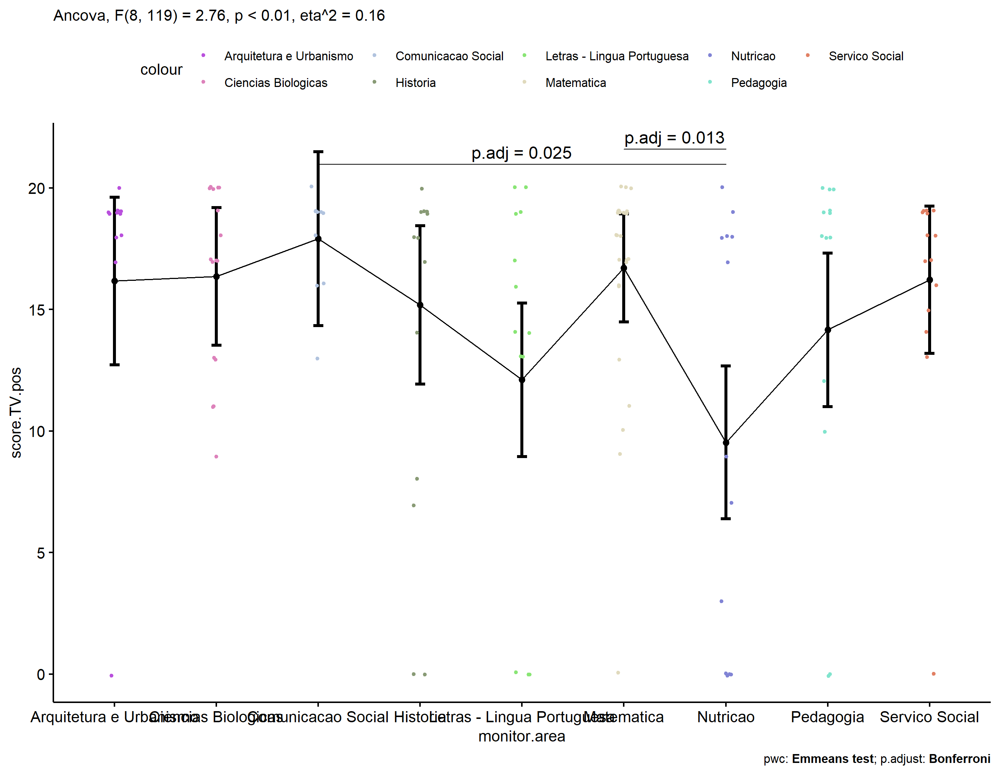<!-- -->

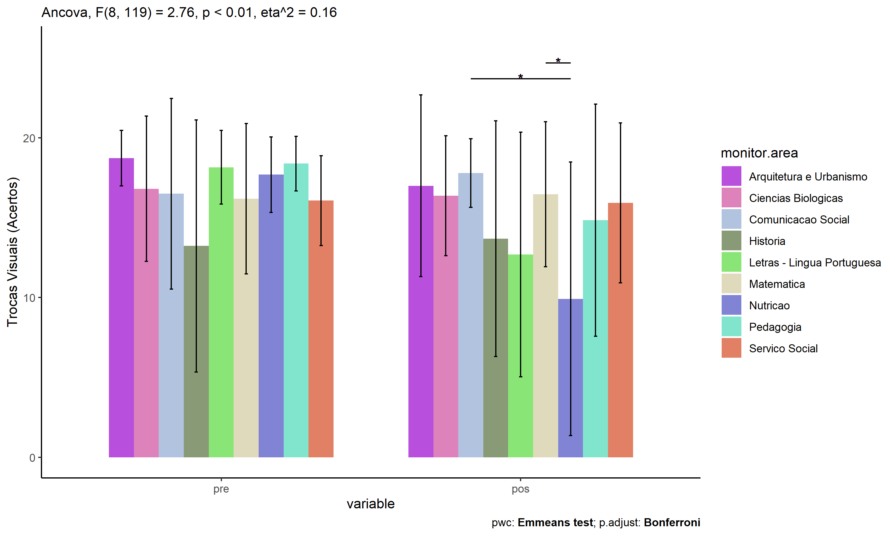<!-- -->

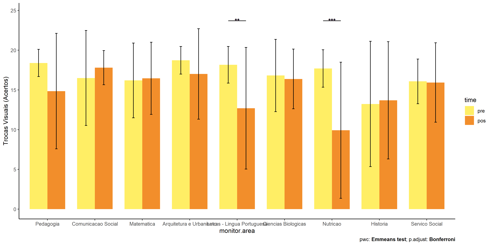<!-- -->

### Trocas Fonologicas (Acertos)

| var          | monitor.area               |   n | M (pre) | SE (pre) | M (unadj) | SE (unadj) | M (adj) | SE (adj) |
|:-------------|:---------------------------|----:|--------:|---------:|----------:|-----------:|--------:|---------:|
| score.TF.pos | Arquitetura e Urbanismo    |  11 |  17.818 |    0.658 |    16.091 |      1.811 |  14.943 |    1.616 |
| score.TF.pos | Ciencias Biologicas        |  16 |  15.688 |    1.164 |    15.812 |      0.857 |  15.876 |    1.329 |
| score.TF.pos | Comunicacao Social         |  10 |  16.300 |    1.932 |    17.800 |      0.629 |  17.515 |    1.681 |
| score.TF.pos | Historia                   |  13 |  13.154 |    2.069 |    13.154 |      1.887 |  14.657 |    1.500 |
| score.TF.pos | Letras - Lingua Portuguesa |  13 |  16.769 |    1.392 |    12.538 |      2.192 |  11.987 |    1.477 |
| score.TF.pos | Matematica                 |  26 |  14.962 |    0.942 |    15.115 |      0.934 |  15.591 |    1.046 |
| score.TF.pos | Nutricao                   |  13 |  16.538 |    0.666 |     9.846 |      2.233 |   9.426 |    1.476 |
| score.TF.pos | Pedagogia                  |  13 |  17.231 |    0.802 |    13.385 |      1.910 |  12.571 |    1.482 |
| score.TF.pos | Servico Social             |  14 |  15.071 |    0.855 |    14.143 |      1.475 |  14.556 |    1.422 |

| .y.          | group1                  | group2              | estimate | conf.low | conf.high |    se | statistic | p       | p.adj | p.adj.signif |
|:-------------|:------------------------|:--------------------|---------:|---------:|----------:|------:|----------:|:--------|------:|:-------------|
| score.TF.pos | Arquitetura e Urbanismo | Ciencias Biologicas |   -0.932 |   -5.078 |     3.213 | 2.093 |    -0.445 | 0.657   | 1.000 | ns           |
| score.TF.pos | Arquitetura e Urbanismo | Comunicacao Social  |   -2.572 |   -7.180 |     2.037 | 2.327 |    -1.105 | 0.271   | 1.000 | ns           |
| score.TF.pos | Arquitetura e Urbanismo | Historia            |    0.286 |   -4.132 |     4.705 | 2.232 |     0.128 | 0.898   | 1.000 | ns           |
| score.TF.pos | Arquitetura e Urbanismo | Letras              |    2.956 |   -1.360 |     7.273 | 2.180 |     1.356 | 0.178   | 1.000 | ns           |
| score.TF.pos | Arquitetura e Urbanismo | Matematica          |   -0.648 |   -4.479 |     3.183 | 1.935 |    -0.335 | 0.738   | 1.000 | ns           |
| score.TF.pos | Arquitetura e Urbanismo | Nutricao            |    5.517 |    1.198 |     9.837 | 2.181 |     2.530 | 0.013   | 0.458 | ns           |
| score.TF.pos | Arquitetura e Urbanismo | Pedagogia           |    2.372 |   -1.940 |     6.685 | 2.178 |     1.089 | 0.278   | 1.000 | ns           |
| score.TF.pos | Arquitetura e Urbanismo | Servico Social      |    0.387 |   -3.891 |     4.665 | 2.161 |     0.179 | 0.858   | 1.000 | ns           |
| score.TF.pos | Ciencias Biologicas     | Comunicacao Social  |   -1.639 |   -5.883 |     2.604 | 2.143 |    -0.765 | 0.446   | 1.000 | ns           |
| score.TF.pos | Ciencias Biologicas     | Historia            |    1.219 |   -2.746 |     5.183 | 2.002 |     0.609 | 0.544   | 1.000 | ns           |
| score.TF.pos | Ciencias Biologicas     | Letras              |    3.889 |   -0.047 |     7.824 | 1.988 |     1.957 | 0.053   | 1.000 | ns           |
| score.TF.pos | Ciencias Biologicas     | Matematica          |    0.285 |   -3.062 |     3.631 | 1.690 |     0.168 | 0.867   | 1.000 | ns           |
| score.TF.pos | Ciencias Biologicas     | Nutricao            |    6.450 |    2.517 |    10.383 | 1.986 |     3.247 | 0.002   | 0.055 | ns           |
| score.TF.pos | Ciencias Biologicas     | Pedagogia           |    3.305 |   -0.637 |     7.247 | 1.991 |     1.660 | 0.1     | 1.000 | ns           |
| score.TF.pos | Ciencias Biologicas     | Servico Social      |    1.320 |   -2.534 |     5.173 | 1.946 |     0.678 | 0.499   | 1.000 | ns           |
| score.TF.pos | Comunicacao Social      | Historia            |    2.858 |   -1.616 |     7.332 | 2.260 |     1.265 | 0.208   | 1.000 | ns           |
| score.TF.pos | Comunicacao Social      | Letras              |    5.528 |    1.101 |     9.955 | 2.236 |     2.473 | 0.015   | 0.534 | ns           |
| score.TF.pos | Comunicacao Social      | Matematica          |    1.924 |   -2.001 |     5.849 | 1.982 |     0.971 | 0.334   | 1.000 | ns           |
| score.TF.pos | Comunicacao Social      | Nutricao            |    8.089 |    3.663 |    12.516 | 2.235 |     3.619 | \<0.001 | 0.016 | \*           |
| score.TF.pos | Comunicacao Social      | Pedagogia           |    4.944 |    0.514 |     9.375 | 2.237 |     2.210 | 0.029   | 1.000 | ns           |
| score.TF.pos | Comunicacao Social      | Servico Social      |    2.959 |   -1.405 |     7.323 | 2.204 |     1.342 | 0.182   | 1.000 | ns           |
| score.TF.pos | Historia                | Letras              |    2.670 |   -1.525 |     6.865 | 2.119 |     1.260 | 0.21    | 1.000 | ns           |
| score.TF.pos | Historia                | Matematica          |   -0.934 |   -4.528 |     2.660 | 1.815 |    -0.515 | 0.608   | 1.000 | ns           |
| score.TF.pos | Historia                | Nutricao            |    5.231 |    1.044 |     9.418 | 2.115 |     2.474 | 0.015   | 0.532 | ns           |
| score.TF.pos | Historia                | Pedagogia           |    2.086 |   -2.127 |     6.300 | 2.128 |     0.980 | 0.329   | 1.000 | ns           |
| score.TF.pos | Historia                | Servico Social      |    0.101 |   -3.972 |     4.173 | 2.057 |     0.049 | 0.961   | 1.000 | ns           |
| score.TF.pos | Letras                  | Lingua Portuguesa   |   -3.604 |   -7.198 |    -0.010 | 1.815 |    -1.986 | 0.049   | 1.000 | ns           |
| score.TF.pos | Letras                  | Lingua Portuguesa   |    2.561 |   -1.566 |     6.689 | 2.085 |     1.229 | 0.222   | 1.000 | ns           |
| score.TF.pos | Letras                  | Lingua Portuguesa   |   -0.584 |   -4.712 |     3.545 | 2.085 |    -0.280 | 0.78    | 1.000 | ns           |
| score.TF.pos | Letras                  | Lingua Portuguesa   |   -2.569 |   -6.638 |     1.499 | 2.055 |    -1.250 | 0.214   | 1.000 | ns           |
| score.TF.pos | Matematica              | Nutricao            |    6.165 |    2.576 |     9.755 | 1.813 |     3.401 | \<0.001 | 0.033 | \*           |
| score.TF.pos | Matematica              | Pedagogia           |    3.020 |   -0.585 |     6.626 | 1.821 |     1.659 | 0.1     | 1.000 | ns           |
| score.TF.pos | Matematica              | Servico Social      |    1.035 |   -2.453 |     4.523 | 1.762 |     0.587 | 0.558   | 1.000 | ns           |
| score.TF.pos | Nutricao                | Pedagogia           |   -3.145 |   -7.275 |     0.985 | 2.086 |    -1.508 | 0.134   | 1.000 | ns           |
| score.TF.pos | Nutricao                | Servico Social      |   -5.130 |   -9.195 |    -1.066 | 2.053 |    -2.499 | 0.014   | 0.497 | ns           |
| score.TF.pos | Pedagogia               | Servico Social      |   -1.985 |   -6.063 |     2.092 | 2.059 |    -0.964 | 0.337   | 1.000 | ns           |
| score.TF.pre | Arquitetura e Urbanismo | Ciencias Biologicas |    2.131 |   -1.450 |     5.712 | 1.809 |     1.178 | 0.241   | 1.000 | ns           |
| score.TF.pre | Arquitetura e Urbanismo | Comunicacao Social  |    1.518 |   -2.476 |     5.513 | 2.018 |     0.752 | 0.453   | 1.000 | ns           |
| score.TF.pre | Arquitetura e Urbanismo | Historia            |    4.664 |    0.919 |     8.410 | 1.892 |     2.466 | 0.015   | 0.543 | ns           |
| score.TF.pre | Arquitetura e Urbanismo | Letras              |    1.049 |   -2.696 |     4.794 | 1.892 |     0.555 | 0.58    | 1.000 | ns           |
| score.TF.pre | Arquitetura e Urbanismo | Matematica          |    2.857 |   -0.432 |     6.145 | 1.661 |     1.720 | 0.088   | 1.000 | ns           |
| score.TF.pre | Arquitetura e Urbanismo | Nutricao            |    1.280 |   -2.466 |     5.025 | 1.892 |     0.676 | 0.5     | 1.000 | ns           |
| score.TF.pre | Arquitetura e Urbanismo | Pedagogia           |    0.587 |   -3.158 |     4.333 | 1.892 |     0.311 | 0.757   | 1.000 | ns           |
| score.TF.pre | Arquitetura e Urbanismo | Servico Social      |    2.747 |   -0.937 |     6.430 | 1.860 |     1.476 | 0.142   | 1.000 | ns           |
| score.TF.pre | Ciencias Biologicas     | Comunicacao Social  |   -0.613 |   -4.298 |     3.073 | 1.861 |    -0.329 | 0.743   | 1.000 | ns           |
| score.TF.pre | Ciencias Biologicas     | Historia            |    2.534 |   -0.880 |     5.947 | 1.724 |     1.469 | 0.144   | 1.000 | ns           |
| score.TF.pre | Ciencias Biologicas     | Letras              |   -1.082 |   -4.495 |     2.332 | 1.724 |    -0.627 | 0.532   | 1.000 | ns           |
| score.TF.pre | Ciencias Biologicas     | Matematica          |    0.726 |   -2.179 |     3.631 | 1.467 |     0.495 | 0.622   | 1.000 | ns           |
| score.TF.pre | Ciencias Biologicas     | Nutricao            |   -0.851 |   -4.265 |     2.563 | 1.724 |    -0.494 | 0.623   | 1.000 | ns           |
| score.TF.pre | Ciencias Biologicas     | Pedagogia           |   -1.543 |   -4.957 |     1.870 | 1.724 |    -0.895 | 0.373   | 1.000 | ns           |
| score.TF.pre | Ciencias Biologicas     | Servico Social      |    0.616 |   -2.730 |     3.962 | 1.690 |     0.365 | 0.716   | 1.000 | ns           |
| score.TF.pre | Comunicacao Social      | Historia            |    3.146 |   -0.699 |     6.992 | 1.942 |     1.620 | 0.108   | 1.000 | ns           |
| score.TF.pre | Comunicacao Social      | Letras              |   -0.469 |   -4.315 |     3.376 | 1.942 |    -0.242 | 0.81    | 1.000 | ns           |
| score.TF.pre | Comunicacao Social      | Matematica          |    1.338 |   -2.063 |     4.740 | 1.718 |     0.779 | 0.438   | 1.000 | ns           |
| score.TF.pre | Comunicacao Social      | Nutricao            |   -0.238 |   -4.084 |     3.607 | 1.942 |    -0.123 | 0.902   | 1.000 | ns           |
| score.TF.pre | Comunicacao Social      | Pedagogia           |   -0.931 |   -4.776 |     2.915 | 1.942 |    -0.479 | 0.633   | 1.000 | ns           |
| score.TF.pre | Comunicacao Social      | Servico Social      |    1.229 |   -2.557 |     5.014 | 1.912 |     0.643 | 0.522   | 1.000 | ns           |
| score.TF.pre | Historia                | Letras              |   -3.615 |   -7.201 |    -0.029 | 1.811 |    -1.996 | 0.048   | 1.000 | ns           |
| score.TF.pre | Historia                | Matematica          |   -1.808 |   -4.913 |     1.298 | 1.569 |    -1.152 | 0.251   | 1.000 | ns           |
| score.TF.pre | Historia                | Nutricao            |   -3.385 |   -6.971 |     0.201 | 1.811 |    -1.869 | 0.064   | 1.000 | ns           |
| score.TF.pre | Historia                | Pedagogia           |   -4.077 |   -7.663 |    -0.491 | 1.811 |    -2.251 | 0.026   | 0.943 | ns           |
| score.TF.pre | Historia                | Servico Social      |   -1.918 |   -5.439 |     1.604 | 1.779 |    -1.078 | 0.283   | 1.000 | ns           |
| score.TF.pre | Letras                  | Lingua Portuguesa   |    1.808 |   -1.298 |     4.913 | 1.569 |     1.152 | 0.251   | 1.000 | ns           |
| score.TF.pre | Letras                  | Lingua Portuguesa   |    0.231 |   -3.355 |     3.817 | 1.811 |     0.127 | 0.899   | 1.000 | ns           |
| score.TF.pre | Letras                  | Lingua Portuguesa   |   -0.462 |   -4.047 |     3.124 | 1.811 |    -0.255 | 0.799   | 1.000 | ns           |
| score.TF.pre | Letras                  | Lingua Portuguesa   |    1.698 |   -1.824 |     5.219 | 1.779 |     0.955 | 0.342   | 1.000 | ns           |
| score.TF.pre | Matematica              | Nutricao            |   -1.577 |   -4.682 |     1.529 | 1.569 |    -1.005 | 0.317   | 1.000 | ns           |
| score.TF.pre | Matematica              | Pedagogia           |   -2.269 |   -5.375 |     0.836 | 1.569 |    -1.447 | 0.151   | 1.000 | ns           |
| score.TF.pre | Matematica              | Servico Social      |   -0.110 |   -3.141 |     2.921 | 1.531 |    -0.072 | 0.943   | 1.000 | ns           |
| score.TF.pre | Nutricao                | Pedagogia           |   -0.692 |   -4.278 |     2.894 | 1.811 |    -0.382 | 0.703   | 1.000 | ns           |
| score.TF.pre | Nutricao                | Servico Social      |    1.467 |   -2.054 |     4.988 | 1.779 |     0.825 | 0.411   | 1.000 | ns           |
| score.TF.pre | Pedagogia               | Servico Social      |    2.159 |   -1.362 |     5.681 | 1.779 |     1.214 | 0.227   | 1.000 | ns           |

| .y.      | monitor.area               | group1 | group2 | estimate | conf.low | conf.high |    se | statistic |     p | p.adj | p.adj.signif |
|:---------|:---------------------------|:-------|:-------|---------:|---------:|----------:|------:|----------:|------:|------:|:-------------|
| score.TF | Arquitetura e Urbanismo    | pre    | pos    |    1.727 |   -2.726 |     6.180 | 2.261 |     0.764 | 0.446 | 0.446 | ns           |
| score.TF | Ciencias Biologicas        | pre    | pos    |   -0.125 |   -3.817 |     3.567 | 1.874 |    -0.067 | 0.947 | 0.947 | ns           |
| score.TF | Comunicacao Social         | pre    | pos    |   -1.500 |   -6.171 |     3.171 | 2.371 |    -0.633 | 0.528 | 0.528 | ns           |
| score.TF | Historia                   | pre    | pos    |    0.000 |   -4.096 |     4.096 | 2.079 |     0.000 | 1.000 | 1.000 | ns           |
| score.TF | Letras - Lingua Portuguesa | pre    | pos    |    4.231 |    0.134 |     8.327 | 2.079 |     2.035 | 0.043 | 0.043 | \*           |
| score.TF | Matematica                 | pre    | pos    |   -0.154 |   -3.050 |     2.743 | 1.470 |    -0.105 | 0.917 | 0.917 | ns           |
| score.TF | Nutricao                   | pre    | pos    |    6.692 |    2.596 |    10.789 | 2.079 |     3.218 | 0.001 | 0.001 | \*\*         |
| score.TF | Pedagogia                  | pre    | pos    |    3.846 |   -0.250 |     7.942 | 2.079 |     1.850 | 0.066 | 0.066 | ns           |
| score.TF | Servico Social             | pre    | pos    |    0.929 |   -3.019 |     4.876 | 2.004 |     0.463 | 0.643 | 0.643 | ns           |

    ## Scale for colour is already present.
    ## Adding another scale for colour, which will replace the existing scale.

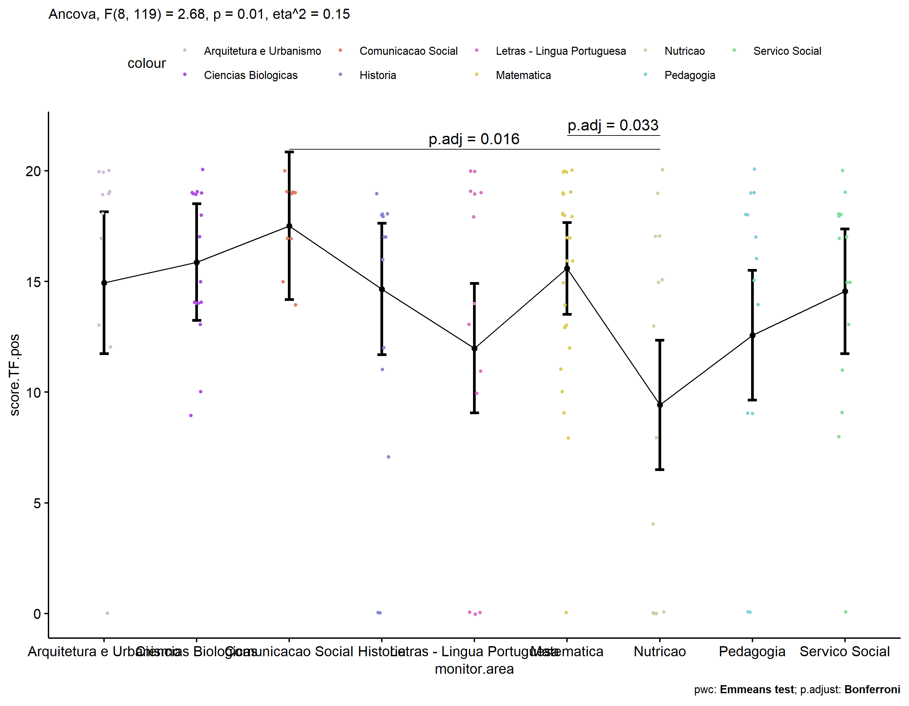<!-- -->

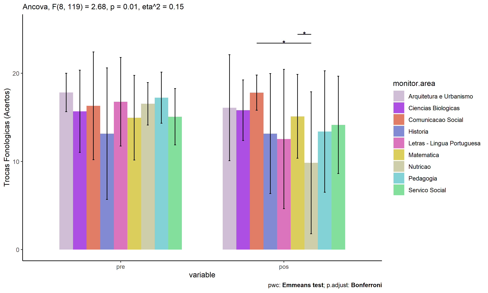<!-- -->

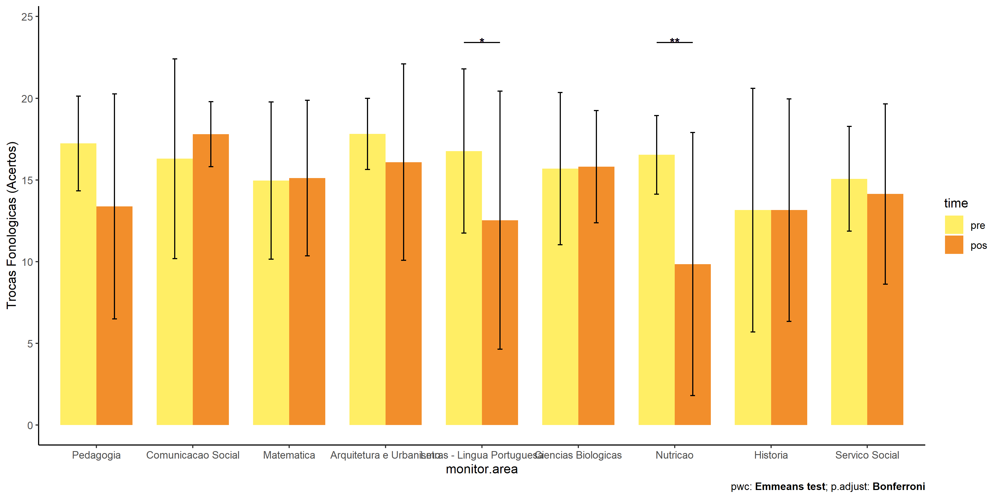<!-- -->

### Trocas Orograficas (Acertos)

| var          | monitor.area               |   n | M (pre) | SE (pre) | M (unadj) | SE (unadj) | M (adj) | SE (adj) |
|:-------------|:---------------------------|----:|--------:|---------:|----------:|-----------:|--------:|---------:|
| score.TO.pos | Arquitetura e Urbanismo    |  11 |  12.364 |    1.208 |    12.273 |      1.743 |  11.006 |    1.322 |
| score.TO.pos | Ciencias Biologicas        |  16 |  10.375 |    1.091 |    10.000 |      1.057 |   9.965 |    1.084 |
| score.TO.pos | Comunicacao Social         |  10 |   9.700 |    1.592 |    11.900 |      1.260 |  12.283 |    1.373 |
| score.TO.pos | Historia                   |  13 |   7.462 |    1.453 |     9.538 |      1.567 |  11.307 |    1.233 |
| score.TO.pos | Letras - Lingua Portuguesa |  13 |  12.923 |    1.141 |    10.077 |      1.820 |   8.464 |    1.228 |
| score.TO.pos | Matematica                 |  26 |  11.192 |    0.893 |    11.808 |      0.915 |  11.266 |    0.855 |
| score.TO.pos | Nutricao                   |  13 |   8.846 |    0.791 |     5.154 |      1.523 |   6.065 |    1.211 |
| score.TO.pos | Pedagogia                  |  13 |   9.615 |    0.747 |     9.615 |      1.412 |  10.050 |    1.205 |
| score.TO.pos | Servico Social             |  14 |   9.714 |    1.051 |     8.214 |      1.012 |   8.588 |    1.161 |

| .y.          | group1                  | group2              | estimate | conf.low | conf.high |    se | statistic | p       | p.adj | p.adj.signif |
|:-------------|:------------------------|:--------------------|---------:|---------:|----------:|------:|----------:|:--------|------:|:-------------|
| score.TO.pos | Arquitetura e Urbanismo | Ciencias Biologicas |    1.041 |   -2.343 |     4.426 | 1.709 |     0.609 | 0.544   | 1.000 | ns           |
| score.TO.pos | Arquitetura e Urbanismo | Comunicacao Social  |   -1.277 |   -5.063 |     2.509 | 1.912 |    -0.668 | 0.506   | 1.000 | ns           |
| score.TO.pos | Arquitetura e Urbanismo | Historia            |   -0.301 |   -3.937 |     3.335 | 1.836 |    -0.164 | 0.87    | 1.000 | ns           |
| score.TO.pos | Arquitetura e Urbanismo | Letras              |    2.542 |   -0.978 |     6.063 | 1.778 |     1.430 | 0.155   | 1.000 | ns           |
| score.TO.pos | Arquitetura e Urbanismo | Matematica          |   -0.260 |   -3.358 |     2.837 | 1.564 |    -0.166 | 0.868   | 1.000 | ns           |
| score.TO.pos | Arquitetura e Urbanismo | Nutricao            |    4.941 |    1.361 |     8.521 | 1.808 |     2.733 | 0.007   | 0.260 | ns           |
| score.TO.pos | Arquitetura e Urbanismo | Pedagogia           |    0.956 |   -2.601 |     4.512 | 1.796 |     0.532 | 0.596   | 1.000 | ns           |
| score.TO.pos | Arquitetura e Urbanismo | Servico Social      |    2.418 |   -1.078 |     5.914 | 1.766 |     1.369 | 0.173   | 1.000 | ns           |
| score.TO.pos | Ciencias Biologicas     | Comunicacao Social  |   -2.318 |   -5.783 |     1.147 | 1.750 |    -1.325 | 0.188   | 1.000 | ns           |
| score.TO.pos | Ciencias Biologicas     | Historia            |   -1.342 |   -4.596 |     1.911 | 1.643 |    -0.817 | 0.415   | 1.000 | ns           |
| score.TO.pos | Ciencias Biologicas     | Letras              |    1.501 |   -1.742 |     4.743 | 1.638 |     0.917 | 0.361   | 1.000 | ns           |
| score.TO.pos | Ciencias Biologicas     | Matematica          |   -1.302 |   -4.035 |     1.432 | 1.381 |    -0.943 | 0.348   | 1.000 | ns           |
| score.TO.pos | Ciencias Biologicas     | Nutricao            |    3.899 |    0.679 |     7.119 | 1.626 |     2.398 | 0.018   | 0.650 | ns           |
| score.TO.pos | Ciencias Biologicas     | Pedagogia           |   -0.086 |   -3.296 |     3.125 | 1.621 |    -0.053 | 0.958   | 1.000 | ns           |
| score.TO.pos | Ciencias Biologicas     | Servico Social      |    1.377 |   -1.769 |     4.522 | 1.589 |     0.866 | 0.388   | 1.000 | ns           |
| score.TO.pos | Comunicacao Social      | Historia            |    0.975 |   -2.662 |     4.613 | 1.837 |     0.531 | 0.596   | 1.000 | ns           |
| score.TO.pos | Comunicacao Social      | Letras              |    3.819 |    0.156 |     7.482 | 1.850 |     2.064 | 0.041   | 1.000 | ns           |
| score.TO.pos | Comunicacao Social      | Matematica          |    1.016 |   -2.192 |     4.225 | 1.620 |     0.627 | 0.532   | 1.000 | ns           |
| score.TO.pos | Comunicacao Social      | Nutricao            |    6.217 |    2.601 |     9.834 | 1.826 |     3.404 | \<0.001 | 0.033 | \*           |
| score.TO.pos | Comunicacao Social      | Pedagogia           |    2.232 |   -1.381 |     5.845 | 1.825 |     1.223 | 0.224   | 1.000 | ns           |
| score.TO.pos | Comunicacao Social      | Servico Social      |    3.695 |    0.138 |     7.251 | 1.796 |     2.057 | 0.042   | 1.000 | ns           |
| score.TO.pos | Historia                | Letras              |    2.843 |   -0.677 |     6.364 | 1.778 |     1.599 | 0.112   | 1.000 | ns           |
| score.TO.pos | Historia                | Matematica          |    0.041 |   -2.959 |     3.041 | 1.515 |     0.027 | 0.979   | 1.000 | ns           |
| score.TO.pos | Historia                | Nutricao            |    5.242 |    1.863 |     8.621 | 1.706 |     3.072 | 0.003   | 0.095 | ns           |
| score.TO.pos | Historia                | Pedagogia           |    1.257 |   -2.136 |     4.650 | 1.714 |     0.733 | 0.465   | 1.000 | ns           |
| score.TO.pos | Historia                | Servico Social      |    2.719 |   -0.616 |     6.054 | 1.684 |     1.614 | 0.109   | 1.000 | ns           |
| score.TO.pos | Letras                  | Lingua Portuguesa   |   -2.802 |   -5.738 |     0.133 | 1.483 |    -1.890 | 0.061   | 1.000 | ns           |
| score.TO.pos | Letras                  | Lingua Portuguesa   |    2.399 |   -1.056 |     5.853 | 1.744 |     1.375 | 0.172   | 1.000 | ns           |
| score.TO.pos | Letras                  | Lingua Portuguesa   |   -1.587 |   -5.012 |     1.839 | 1.730 |    -0.917 | 0.361   | 1.000 | ns           |
| score.TO.pos | Letras                  | Lingua Portuguesa   |   -0.124 |   -3.487 |     3.238 | 1.698 |    -0.073 | 0.942   | 1.000 | ns           |
| score.TO.pos | Matematica              | Nutricao            |    5.201 |    2.251 |     8.152 | 1.490 |     3.490 | \<0.001 | 0.024 | \*           |
| score.TO.pos | Matematica              | Pedagogia           |    1.216 |   -1.717 |     4.148 | 1.481 |     0.821 | 0.413   | 1.000 | ns           |
| score.TO.pos | Matematica              | Servico Social      |    2.678 |   -0.183 |     5.539 | 1.445 |     1.854 | 0.066   | 1.000 | ns           |
| score.TO.pos | Nutricao                | Pedagogia           |   -3.985 |   -7.357 |    -0.613 | 1.703 |    -2.340 | 0.021   | 0.754 | ns           |
| score.TO.pos | Nutricao                | Servico Social      |   -2.523 |   -5.835 |     0.789 | 1.673 |    -1.508 | 0.134   | 1.000 | ns           |
| score.TO.pos | Pedagogia               | Servico Social      |    1.462 |   -1.846 |     4.771 | 1.671 |     0.875 | 0.383   | 1.000 | ns           |
| score.TO.pre | Arquitetura e Urbanismo | Ciencias Biologicas |    1.989 |   -1.263 |     5.241 | 1.642 |     1.211 | 0.228   | 1.000 | ns           |
| score.TO.pre | Arquitetura e Urbanismo | Comunicacao Social  |    2.664 |   -0.964 |     6.291 | 1.832 |     1.454 | 0.149   | 1.000 | ns           |
| score.TO.pre | Arquitetura e Urbanismo | Historia            |    4.902 |    1.501 |     8.304 | 1.718 |     2.853 | 0.005   | 0.183 | ns           |
| score.TO.pre | Arquitetura e Urbanismo | Letras              |   -0.559 |   -3.961 |     2.842 | 1.718 |    -0.326 | 0.745   | 1.000 | ns           |
| score.TO.pre | Arquitetura e Urbanismo | Matematica          |    1.171 |   -1.815 |     4.158 | 1.508 |     0.777 | 0.439   | 1.000 | ns           |
| score.TO.pre | Arquitetura e Urbanismo | Nutricao            |    3.517 |    0.116 |     6.919 | 1.718 |     2.047 | 0.043   | 1.000 | ns           |
| score.TO.pre | Arquitetura e Urbanismo | Pedagogia           |    2.748 |   -0.653 |     6.150 | 1.718 |     1.600 | 0.112   | 1.000 | ns           |
| score.TO.pre | Arquitetura e Urbanismo | Servico Social      |    2.649 |   -0.696 |     5.995 | 1.690 |     1.568 | 0.12    | 1.000 | ns           |
| score.TO.pre | Ciencias Biologicas     | Comunicacao Social  |    0.675 |   -2.672 |     4.022 | 1.690 |     0.399 | 0.69    | 1.000 | ns           |
| score.TO.pre | Ciencias Biologicas     | Historia            |    2.913 |   -0.187 |     6.014 | 1.566 |     1.861 | 0.065   | 1.000 | ns           |
| score.TO.pre | Ciencias Biologicas     | Letras              |   -2.548 |   -5.648 |     0.552 | 1.566 |    -1.627 | 0.106   | 1.000 | ns           |
| score.TO.pre | Ciencias Biologicas     | Matematica          |   -0.817 |   -3.455 |     1.821 | 1.332 |    -0.613 | 0.541   | 1.000 | ns           |
| score.TO.pre | Ciencias Biologicas     | Nutricao            |    1.529 |   -1.571 |     4.629 | 1.566 |     0.976 | 0.331   | 1.000 | ns           |
| score.TO.pre | Ciencias Biologicas     | Pedagogia           |    0.760 |   -2.341 |     3.860 | 1.566 |     0.485 | 0.628   | 1.000 | ns           |
| score.TO.pre | Ciencias Biologicas     | Servico Social      |    0.661 |   -2.378 |     3.699 | 1.535 |     0.431 | 0.668   | 1.000 | ns           |
| score.TO.pre | Comunicacao Social      | Historia            |    2.238 |   -1.254 |     5.731 | 1.764 |     1.269 | 0.207   | 1.000 | ns           |
| score.TO.pre | Comunicacao Social      | Letras              |   -3.223 |   -6.715 |     0.269 | 1.764 |    -1.827 | 0.07    | 1.000 | ns           |
| score.TO.pre | Comunicacao Social      | Matematica          |   -1.492 |   -4.582 |     1.597 | 1.560 |    -0.956 | 0.341   | 1.000 | ns           |
| score.TO.pre | Comunicacao Social      | Nutricao            |    0.854 |   -2.638 |     4.346 | 1.764 |     0.484 | 0.629   | 1.000 | ns           |
| score.TO.pre | Comunicacao Social      | Pedagogia           |    0.085 |   -3.408 |     3.577 | 1.764 |     0.048 | 0.962   | 1.000 | ns           |
| score.TO.pre | Comunicacao Social      | Servico Social      |   -0.014 |   -3.452 |     3.423 | 1.736 |    -0.008 | 0.993   | 1.000 | ns           |
| score.TO.pre | Historia                | Letras              |   -5.462 |   -8.718 |    -2.205 | 1.645 |    -3.320 | 0.001   | 0.043 | \*           |
| score.TO.pre | Historia                | Matematica          |   -3.731 |   -6.551 |    -0.910 | 1.424 |    -2.619 | 0.01    | 0.358 | ns           |
| score.TO.pre | Historia                | Nutricao            |   -1.385 |   -4.641 |     1.872 | 1.645 |    -0.842 | 0.402   | 1.000 | ns           |
| score.TO.pre | Historia                | Pedagogia           |   -2.154 |   -5.410 |     1.103 | 1.645 |    -1.309 | 0.193   | 1.000 | ns           |
| score.TO.pre | Historia                | Servico Social      |   -2.253 |   -5.451 |     0.945 | 1.615 |    -1.395 | 0.166   | 1.000 | ns           |
| score.TO.pre | Letras                  | Lingua Portuguesa   |    1.731 |   -1.090 |     4.551 | 1.424 |     1.215 | 0.227   | 1.000 | ns           |
| score.TO.pre | Letras                  | Lingua Portuguesa   |    4.077 |    0.820 |     7.334 | 1.645 |     2.479 | 0.015   | 0.525 | ns           |
| score.TO.pre | Letras                  | Lingua Portuguesa   |    3.308 |    0.051 |     6.564 | 1.645 |     2.011 | 0.047   | 1.000 | ns           |
| score.TO.pre | Letras                  | Lingua Portuguesa   |    3.209 |    0.011 |     6.407 | 1.615 |     1.987 | 0.049   | 1.000 | ns           |
| score.TO.pre | Matematica              | Nutricao            |    2.346 |   -0.474 |     5.166 | 1.424 |     1.647 | 0.102   | 1.000 | ns           |
| score.TO.pre | Matematica              | Pedagogia           |    1.577 |   -1.243 |     4.397 | 1.424 |     1.107 | 0.27    | 1.000 | ns           |
| score.TO.pre | Matematica              | Servico Social      |    1.478 |   -1.274 |     4.230 | 1.390 |     1.063 | 0.29    | 1.000 | ns           |
| score.TO.pre | Nutricao                | Pedagogia           |   -0.769 |   -4.026 |     2.487 | 1.645 |    -0.468 | 0.641   | 1.000 | ns           |
| score.TO.pre | Nutricao                | Servico Social      |   -0.868 |   -4.066 |     2.330 | 1.615 |    -0.537 | 0.592   | 1.000 | ns           |
| score.TO.pre | Pedagogia               | Servico Social      |   -0.099 |   -3.297 |     3.099 | 1.615 |    -0.061 | 0.951   | 1.000 | ns           |

| .y.      | monitor.area               | group1 | group2 | estimate | conf.low | conf.high |    se | statistic |     p | p.adj | p.adj.signif |
|:---------|:---------------------------|:-------|:-------|---------:|---------:|----------:|------:|----------:|------:|------:|:-------------|
| score.TO | Arquitetura e Urbanismo    | pre    | pos    |    0.091 |   -3.803 |     3.985 | 1.977 |     0.046 | 0.963 | 0.963 | ns           |
| score.TO | Ciencias Biologicas        | pre    | pos    |    0.375 |   -2.854 |     3.604 | 1.639 |     0.229 | 0.819 | 0.819 | ns           |
| score.TO | Comunicacao Social         | pre    | pos    |   -2.200 |   -6.284 |     1.884 | 2.073 |    -1.061 | 0.290 | 0.290 | ns           |
| score.TO | Historia                   | pre    | pos    |   -2.077 |   -5.659 |     1.505 | 1.818 |    -1.142 | 0.255 | 0.255 | ns           |
| score.TO | Letras - Lingua Portuguesa | pre    | pos    |    2.846 |   -0.736 |     6.428 | 1.818 |     1.565 | 0.119 | 0.119 | ns           |
| score.TO | Matematica                 | pre    | pos    |   -0.615 |   -3.148 |     1.918 | 1.286 |    -0.479 | 0.633 | 0.633 | ns           |
| score.TO | Nutricao                   | pre    | pos    |    3.692 |    0.110 |     7.274 | 1.818 |     2.030 | 0.043 | 0.043 | \*           |
| score.TO | Pedagogia                  | pre    | pos    |    0.000 |   -3.582 |     3.582 | 1.818 |     0.000 | 1.000 | 1.000 | ns           |
| score.TO | Servico Social             | pre    | pos    |    1.500 |   -1.952 |     4.952 | 1.752 |     0.856 | 0.393 | 0.393 | ns           |

    ## Scale for colour is already present.
    ## Adding another scale for colour, which will replace the existing scale.

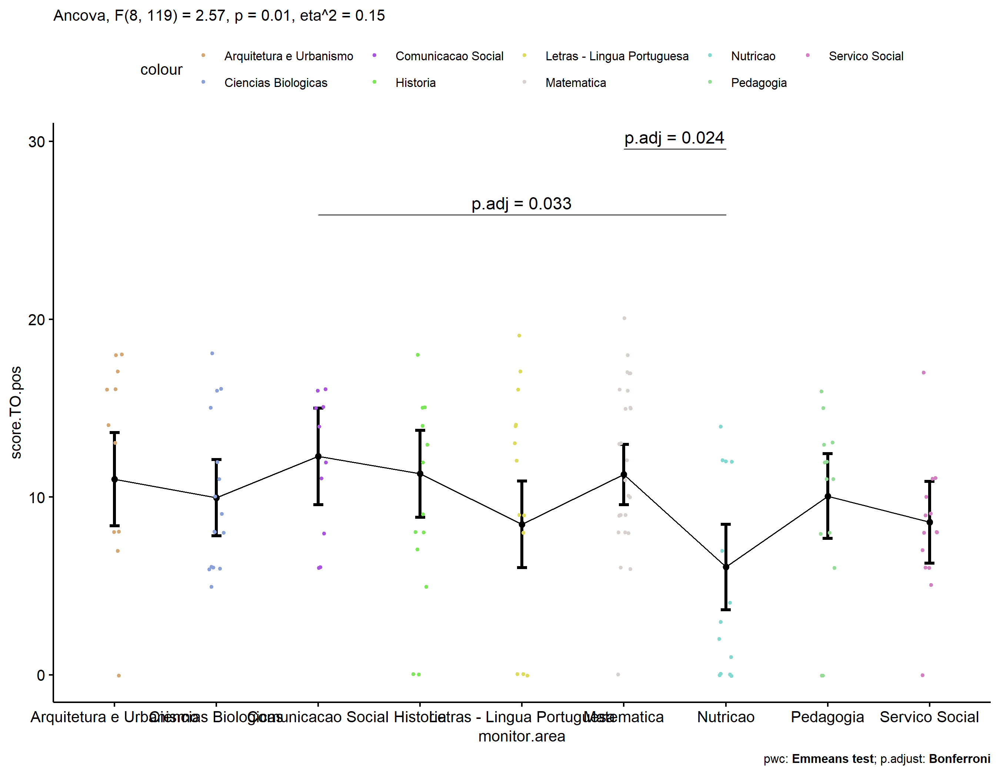<!-- -->

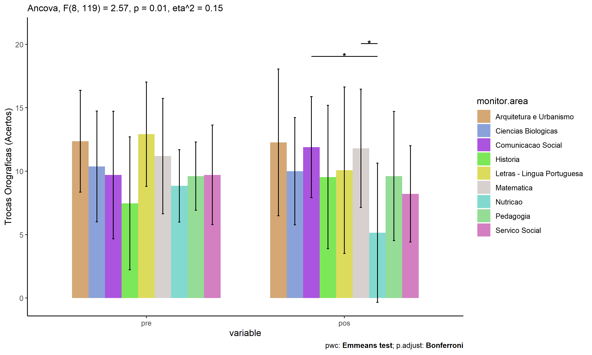<!-- -->

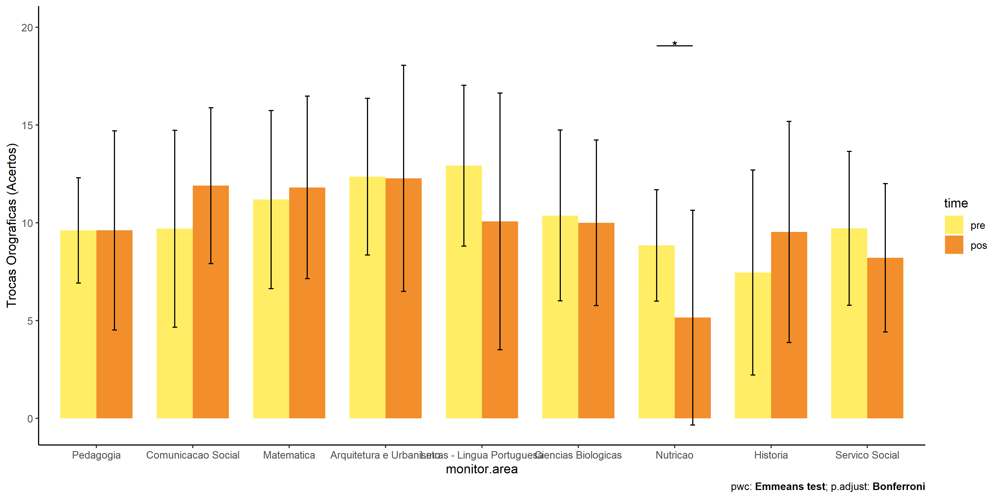<!-- -->

## factores: **grupo=“Experimental”:monitor.formacao**

### Leitura de Pseudo-Palavras (Acertos)

| var            | monitor.formacao |   n | M (pre) | SE (pre) | M (unadj) | SE (unadj) | M (adj) | SE (adj) |
|:---------------|:-----------------|----:|--------:|---------:|----------:|-----------:|--------:|---------:|
| score.CLPP.pos | ensino medio     |  83 |  70.783 |    1.518 |    71.458 |      1.554 |  72.528 |    1.194 |
| score.CLPP.pos | especializacao   |   9 |  78.778 |    2.296 |    78.444 |      2.949 |  74.357 |    3.640 |
| score.CLPP.pos | graduacao        |  21 |  76.286 |    2.017 |    76.095 |      2.706 |  73.616 |    2.380 |

| .y.            | group1         | group2         | estimate | conf.low | conf.high |    se | statistic |     p | p.adj | p.adj.signif |
|:---------------|:---------------|:---------------|---------:|---------:|----------:|------:|----------:|------:|------:|:-------------|
| score.CLPP.pos | ensino medio   | especializacao |   -1.828 |   -9.457 |     5.800 | 3.849 |    -0.475 | 0.636 | 1.000 | ns           |
| score.CLPP.pos | ensino medio   | graduacao      |   -1.087 |   -6.395 |     4.221 | 2.678 |    -0.406 | 0.686 | 1.000 | ns           |
| score.CLPP.pos | especializacao | graduacao      |    0.741 |   -7.805 |     9.288 | 4.312 |     0.172 | 0.864 | 1.000 | ns           |
| score.CLPP.pre | ensino medio   | especializacao |   -7.995 |  -16.835 |     0.845 | 4.461 |    -1.792 | 0.076 | 0.228 | ns           |
| score.CLPP.pre | ensino medio   | graduacao      |   -5.503 |  -11.656 |     0.650 | 3.105 |    -1.772 | 0.079 | 0.237 | ns           |
| score.CLPP.pre | especializacao | graduacao      |    2.492 |   -7.544 |    12.528 | 5.064 |     0.492 | 0.624 | 1.000 | ns           |

| .y.        | monitor.formacao | group1 | group2 | estimate | conf.low | conf.high |    se | statistic |     p | p.adj | p.adj.signif |
|:-----------|:-----------------|:-------|:-------|---------:|---------:|----------:|------:|----------:|------:|------:|:-------------|
| score.CLPP | ensino medio     | pre    | pos    |   -0.027 |   -3.836 |     3.782 | 1.933 |    -0.014 | 0.989 | 0.989 | ns           |
| score.CLPP | especializacao   | pre    | pos    |    0.778 |  -10.849 |    12.404 | 5.901 |     0.132 | 0.895 | 0.895 | ns           |
| score.CLPP | graduacao        | pre    | pos    |   -0.487 |   -8.124 |     7.151 | 3.877 |    -0.126 | 0.900 | 0.900 | ns           |

    ## Scale for colour is already present.
    ## Adding another scale for colour, which will replace the existing scale.

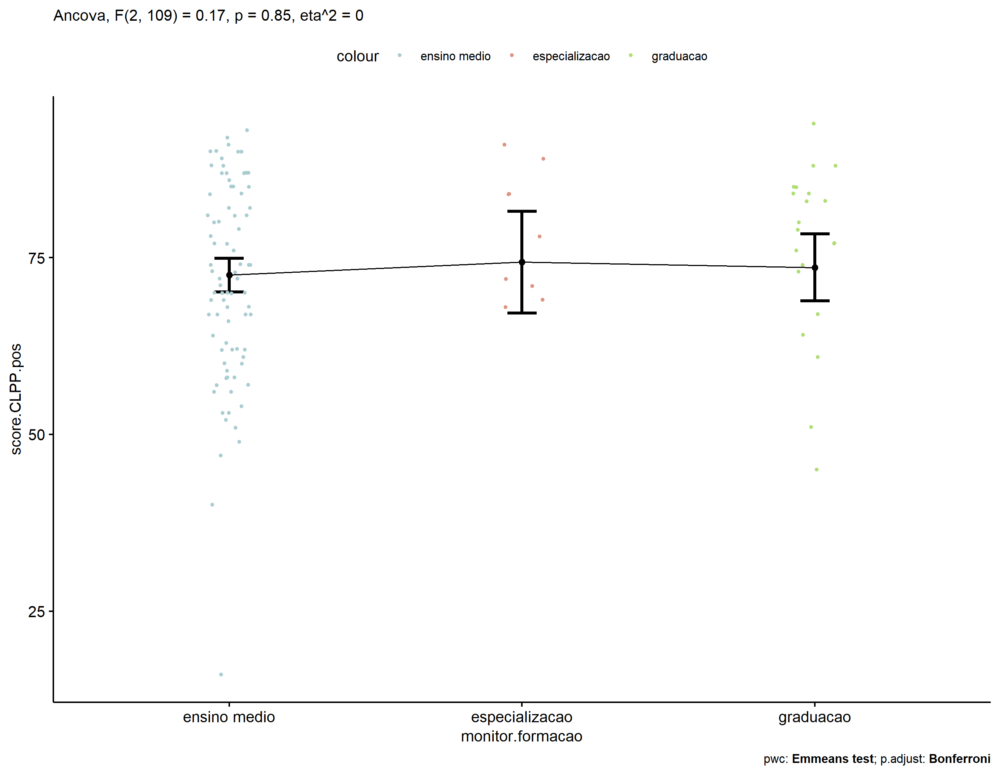<!-- -->

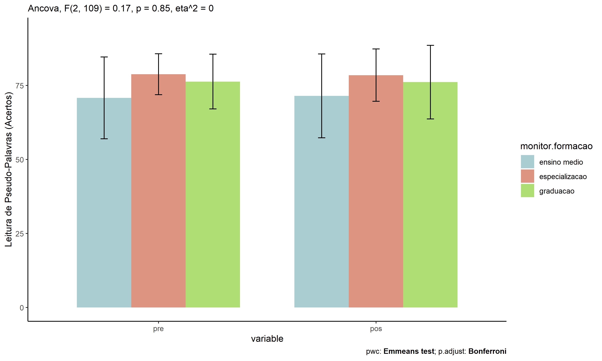<!-- -->

<!-- -->

### Correta Regular (Acertos)

| var          | monitor.formacao |   n | M (pre) | SE (pre) | M (unadj) | SE (unadj) | M (adj) | SE (adj) |
|:-------------|:-----------------|----:|--------:|---------:|----------:|-----------:|--------:|---------:|
| score.CR.pos | ensino medio     |  96 |  14.917 |    0.421 |    13.531 |      0.609 |  13.684 |    0.556 |
| score.CR.pos | especializacao   |  10 |  16.200 |    1.855 |    16.900 |      0.526 |  16.545 |    1.721 |
| score.CR.pos | graduacao        |  23 |  16.522 |    0.510 |    14.348 |      1.090 |  13.865 |    1.142 |

| .y.          | group1         | group2         | estimate | conf.low | conf.high |    se | statistic |     p | p.adj | p.adj.signif |
|:-------------|:---------------|:---------------|---------:|---------:|----------:|------:|----------:|------:|------:|:-------------|
| score.CR.pos | ensino medio   | especializacao |   -2.861 |   -6.447 |     0.725 | 1.812 |    -1.579 | 0.117 | 0.351 | ns           |
| score.CR.pos | ensino medio   | graduacao      |   -0.182 |   -2.707 |     2.343 | 1.276 |    -0.142 | 0.887 | 1.000 | ns           |
| score.CR.pos | especializacao | graduacao      |    2.679 |   -1.394 |     6.753 | 2.058 |     1.302 | 0.195 | 0.586 | ns           |
| score.CR.pre | ensino medio   | especializacao |   -1.283 |   -3.943 |     1.376 | 1.344 |    -0.955 | 0.341 | 1.000 | ns           |
| score.CR.pre | ensino medio   | graduacao      |   -1.605 |   -3.463 |     0.253 | 0.939 |    -1.710 | 0.090 | 0.269 | ns           |
| score.CR.pre | especializacao | graduacao      |   -0.322 |   -3.353 |     2.710 | 1.532 |    -0.210 | 0.834 | 1.000 | ns           |

| .y.      | monitor.formacao | group1 | group2 | estimate | conf.low | conf.high |    se | statistic |     p | p.adj | p.adj.signif |
|:---------|:-----------------|:-------|:-------|---------:|---------:|----------:|------:|----------:|------:|------:|:-------------|
| score.CR | ensino medio     | pre    | pos    |    1.385 |   -0.010 |     2.781 | 0.709 |     1.955 | 0.052 | 0.052 | ns           |
| score.CR | especializacao   | pre    | pos    |   -0.700 |   -5.024 |     3.624 | 2.195 |    -0.319 | 0.750 | 0.750 | ns           |
| score.CR | graduacao        | pre    | pos    |    2.174 |   -0.677 |     5.025 | 1.448 |     1.502 | 0.134 | 0.134 | ns           |

    ## Scale for colour is already present.
    ## Adding another scale for colour, which will replace the existing scale.

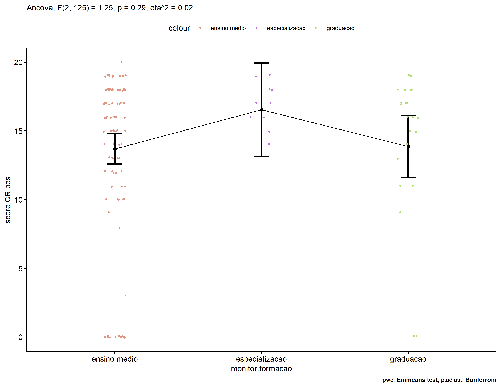<!-- -->

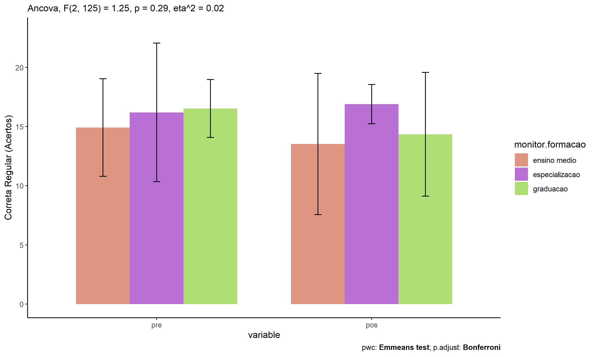<!-- -->

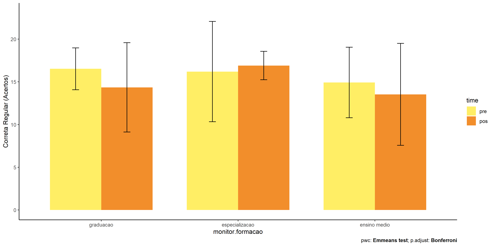<!-- -->

### Correta Irregular (Acertos)

| var          | monitor.formacao |   n | M (pre) | SE (pre) | M (unadj) | SE (unadj) | M (adj) | SE (adj) |
|:-------------|:-----------------|----:|--------:|---------:|----------:|-----------:|--------:|---------:|
| score.CI.pos | ensino medio     |  96 |  12.125 |    0.374 |    11.427 |      0.538 |  11.481 |    0.485 |
| score.CI.pos | especializacao   |  10 |  12.200 |    1.604 |    13.600 |      1.013 |  13.619 |    1.502 |
| score.CI.pos | graduacao        |  23 |  12.739 |    0.715 |    12.304 |      0.965 |  12.073 |    0.992 |

| .y.          | group1         | group2         | estimate | conf.low | conf.high |    se | statistic |     p | p.adj | p.adj.signif |
|:-------------|:---------------|:---------------|---------:|---------:|----------:|------:|----------:|------:|------:|:-------------|
| score.CI.pos | ensino medio   | especializacao |   -2.138 |   -5.262 |     0.986 | 1.578 |    -1.355 | 0.178 | 0.534 | ns           |
| score.CI.pos | ensino medio   | graduacao      |   -0.592 |   -2.779 |     1.594 | 1.105 |    -0.536 | 0.593 | 1.000 | ns           |
| score.CI.pos | especializacao | graduacao      |    1.546 |   -2.017 |     5.109 | 1.800 |     0.859 | 0.392 | 1.000 | ns           |
| score.CI.pre | ensino medio   | especializacao |   -0.075 |   -2.539 |     2.389 | 1.245 |    -0.060 | 0.952 | 1.000 | ns           |
| score.CI.pre | ensino medio   | graduacao      |   -0.614 |   -2.335 |     1.107 | 0.870 |    -0.706 | 0.481 | 1.000 | ns           |
| score.CI.pre | especializacao | graduacao      |   -0.539 |   -3.347 |     2.269 | 1.419 |    -0.380 | 0.705 | 1.000 | ns           |

| .y.      | monitor.formacao | group1 | group2 | estimate | conf.low | conf.high |    se | statistic |     p | p.adj | p.adj.signif |
|:---------|:-----------------|:-------|:-------|---------:|---------:|----------:|------:|----------:|------:|------:|:-------------|
| score.CI | ensino medio     | pre    | pos    |    0.698 |   -0.564 |     1.960 | 0.641 |     1.089 | 0.277 | 0.277 | ns           |
| score.CI | especializacao   | pre    | pos    |   -1.400 |   -5.311 |     2.511 | 1.986 |    -0.705 | 0.481 | 0.481 | ns           |
| score.CI | graduacao        | pre    | pos    |    0.435 |   -2.144 |     3.014 | 1.309 |     0.332 | 0.740 | 0.740 | ns           |

    ## Scale for colour is already present.
    ## Adding another scale for colour, which will replace the existing scale.

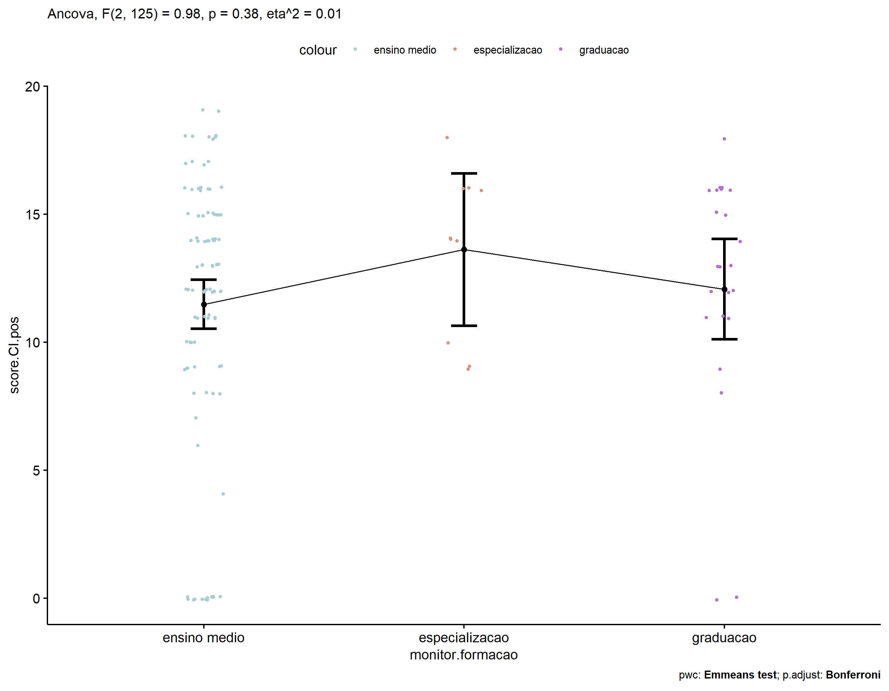<!-- -->

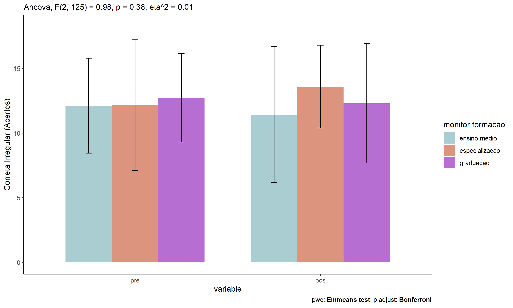<!-- -->

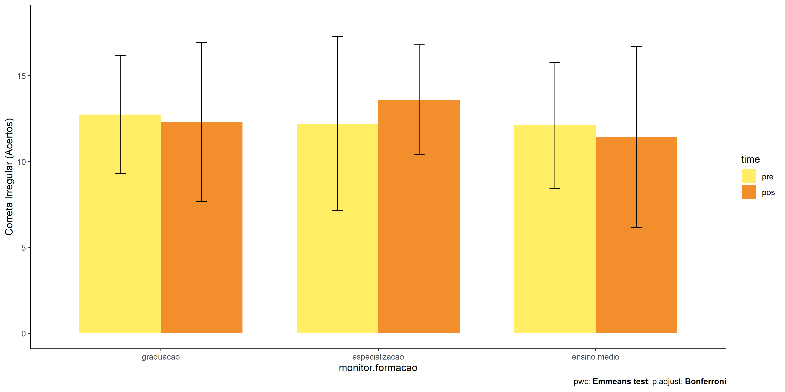<!-- -->

### Trocas Visuais (Acertos)

| var          | monitor.formacao |   n | M (pre) | SE (pre) | M (unadj) | SE (unadj) | M (adj) | SE (adj) |
|:-------------|:-----------------|----:|--------:|---------:|----------:|-----------:|--------:|---------:|
| score.TV.pos | ensino medio     |  96 |  16.385 |    0.475 |    14.448 |      0.663 |  14.578 |    0.614 |
| score.TV.pos | especializacao   |  10 |  16.500 |    1.887 |    17.800 |      0.680 |  17.891 |    1.896 |
| score.TV.pos | graduacao        |  23 |  18.478 |    0.344 |    16.435 |      1.196 |  15.850 |    1.267 |

| .y.          | group1         | group2         | estimate | conf.low | conf.high |    se | statistic |     p | p.adj | p.adj.signif |
|:-------------|:---------------|:---------------|---------:|---------:|----------:|------:|----------:|------:|------:|:-------------|
| score.TV.pos | ensino medio   | especializacao |   -3.313 |   -7.256 |     0.630 | 1.992 |    -1.663 | 0.099 | 0.297 | ns           |
| score.TV.pos | ensino medio   | graduacao      |   -1.272 |   -4.072 |     1.529 | 1.415 |    -0.899 | 0.371 | 1.000 | ns           |
| score.TV.pos | especializacao | graduacao      |    2.041 |   -2.479 |     6.561 | 2.284 |     0.894 | 0.373 | 1.000 | ns           |
| score.TV.pre | ensino medio   | especializacao |   -0.115 |   -3.008 |     2.779 | 1.462 |    -0.078 | 0.938 | 1.000 | ns           |
| score.TV.pre | ensino medio   | graduacao      |   -2.093 |   -4.114 |    -0.072 | 1.021 |    -2.049 | 0.043 | 0.128 | ns           |
| score.TV.pre | especializacao | graduacao      |   -1.978 |   -5.276 |     1.320 | 1.667 |    -1.187 | 0.237 | 0.712 | ns           |

| .y.      | monitor.formacao | group1 | group2 | estimate | conf.low | conf.high |    se | statistic |     p | p.adj | p.adj.signif |
|:---------|:-----------------|:-------|:-------|---------:|---------:|----------:|------:|----------:|------:|------:|:-------------|
| score.TV | ensino medio     | pre    | pos    |    1.937 |    0.416 |     3.459 | 0.772 |     2.508 | 0.013 | 0.013 | \*           |
| score.TV | especializacao   | pre    | pos    |   -1.300 |   -6.014 |     3.414 | 2.393 |    -0.543 | 0.588 | 0.588 | ns           |
| score.TV | graduacao        | pre    | pos    |    2.043 |   -1.065 |     5.152 | 1.578 |     1.295 | 0.197 | 0.197 | ns           |

    ## Scale for colour is already present.
    ## Adding another scale for colour, which will replace the existing scale.

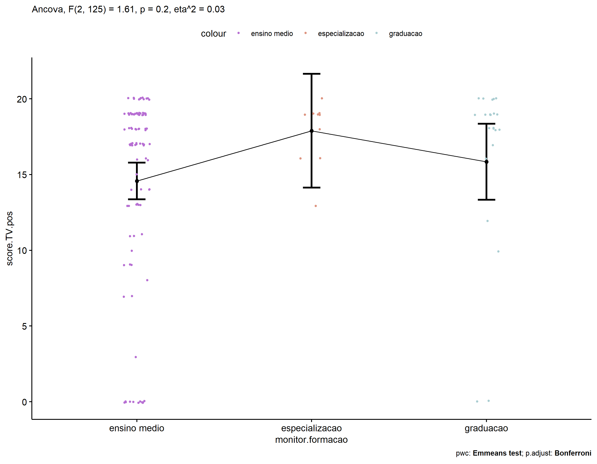<!-- -->

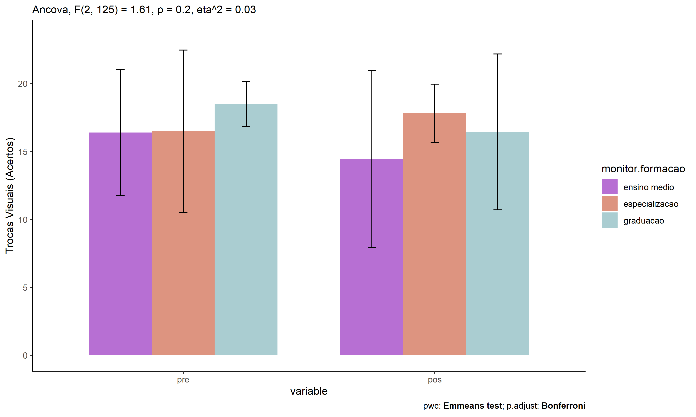<!-- -->

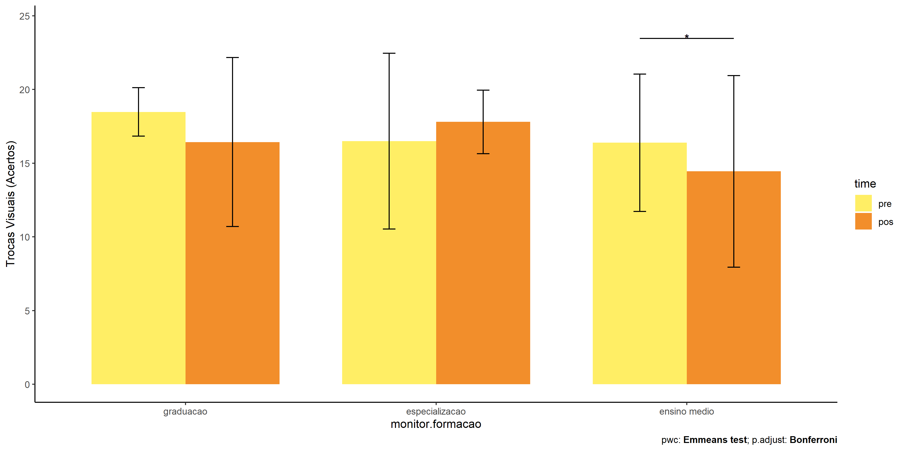<!-- -->

### Trocas Fonologicas (Acertos)

| var          | monitor.formacao |   n | M (pre) | SE (pre) | M (unadj) | SE (unadj) | M (adj) | SE (adj) |
|:-------------|:-----------------|----:|--------:|---------:|----------:|-----------:|--------:|---------:|
| score.TF.pos | ensino medio     |  96 |  15.406 |    0.493 |    13.656 |      0.645 |  13.857 |    0.567 |
| score.TF.pos | especializacao   |  10 |  16.300 |    1.932 |    17.800 |      0.629 |  17.543 |    1.754 |
| score.TF.pos | graduacao        |  23 |  17.217 |    0.552 |    15.043 |      1.195 |  14.318 |    1.166 |

| .y.          | group1         | group2         | estimate | conf.low | conf.high |    se | statistic |     p | p.adj | p.adj.signif |
|:-------------|:---------------|:---------------|---------:|---------:|----------:|------:|----------:|------:|------:|:-------------|
| score.TF.pos | ensino medio   | especializacao |   -3.687 |   -7.338 |    -0.036 | 1.845 |    -1.998 | 0.048 | 0.144 | ns           |
| score.TF.pos | ensino medio   | graduacao      |   -0.461 |   -3.037 |     2.115 | 1.302 |    -0.354 | 0.724 | 1.000 | ns           |
| score.TF.pos | especializacao | graduacao      |    3.226 |   -0.935 |     7.387 | 2.102 |     1.534 | 0.127 | 0.382 | ns           |
| score.TF.pre | ensino medio   | especializacao |   -0.894 |   -3.941 |     2.153 | 1.540 |    -0.580 | 0.563 | 1.000 | ns           |
| score.TF.pre | ensino medio   | graduacao      |   -1.811 |   -3.940 |     0.318 | 1.076 |    -1.684 | 0.095 | 0.284 | ns           |
| score.TF.pre | especializacao | graduacao      |   -0.917 |   -4.391 |     2.556 | 1.755 |    -0.523 | 0.602 | 1.000 | ns           |

| .y.      | monitor.formacao | group1 | group2 | estimate | conf.low | conf.high |    se | statistic |     p | p.adj | p.adj.signif |
|:---------|:-----------------|:-------|:-------|---------:|---------:|----------:|------:|----------:|------:|------:|:-------------|
| score.TF | ensino medio     | pre    | pos    |    1.750 |    0.225 |     3.275 | 0.774 |     2.260 | 0.025 | 0.025 | \*           |
| score.TF | especializacao   | pre    | pos    |   -1.500 |   -6.226 |     3.226 | 2.400 |    -0.625 | 0.532 | 0.532 | ns           |
| score.TF | graduacao        | pre    | pos    |    2.174 |   -0.942 |     5.290 | 1.582 |     1.374 | 0.171 | 0.171 | ns           |

    ## Scale for colour is already present.
    ## Adding another scale for colour, which will replace the existing scale.

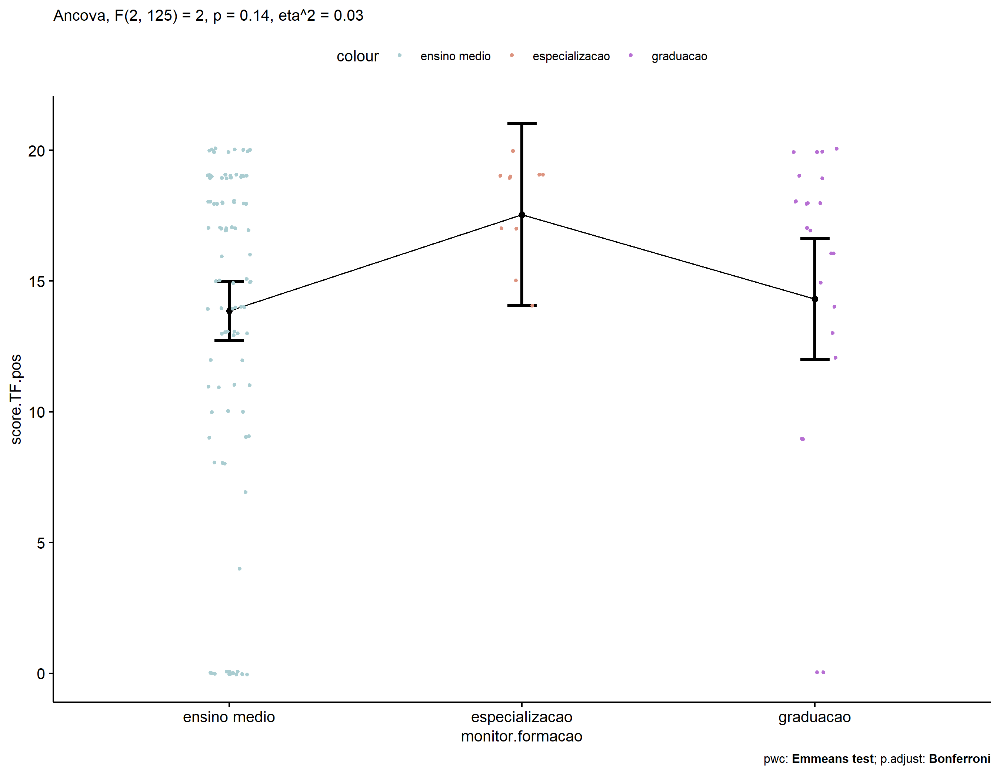<!-- -->

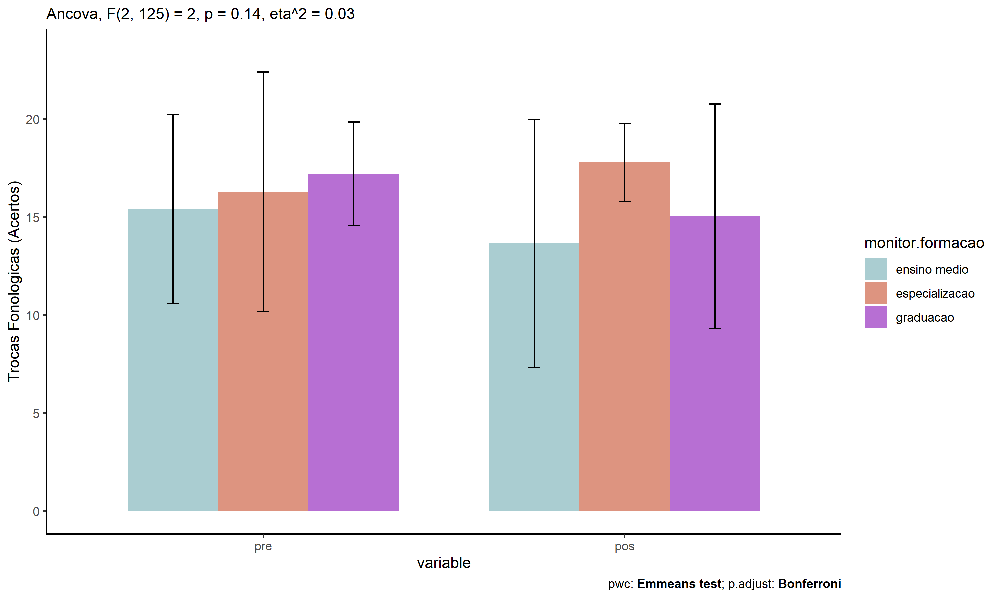<!-- -->

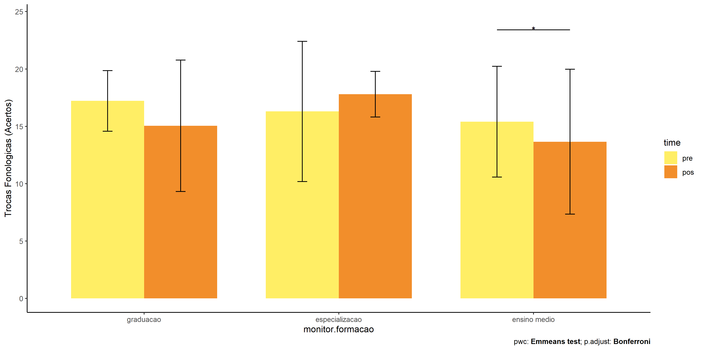<!-- -->

### Trocas Orograficas (Acertos)

| var          | monitor.formacao |   n | M (pre) | SE (pre) | M (unadj) | SE (unadj) | M (adj) | SE (adj) |
|:-------------|:-----------------|----:|--------:|---------:|----------:|-----------:|--------:|---------:|
| score.TO.pos | ensino medio     |  96 |  10.302 |    0.451 |     9.406 |      0.553 |   9.416 |    0.457 |
| score.TO.pos | especializacao   |  10 |   9.700 |    1.592 |    11.900 |      1.260 |  12.290 |    1.419 |
| score.TO.pos | graduacao        |  23 |  10.652 |    0.804 |    11.348 |      1.030 |  11.137 |    0.935 |

| .y.          | group1         | group2         | estimate | conf.low | conf.high |    se | statistic |     p | p.adj | p.adj.signif |
|:-------------|:---------------|:---------------|---------:|---------:|----------:|------:|----------:|------:|------:|:-------------|
| score.TO.pos | ensino medio   | especializacao |   -2.874 |   -5.823 |     0.076 | 1.490 |    -1.928 | 0.056 | 0.168 | ns           |
| score.TO.pos | ensino medio   | graduacao      |   -1.721 |   -3.781 |     0.340 | 1.041 |    -1.653 | 0.101 | 0.303 | ns           |
| score.TO.pos | especializacao | graduacao      |    1.153 |   -2.212 |     4.517 | 1.700 |     0.678 | 0.499 | 1.000 | ns           |
| score.TO.pre | ensino medio   | especializacao |    0.602 |   -2.272 |     3.477 | 1.453 |     0.415 | 0.679 | 1.000 | ns           |
| score.TO.pre | ensino medio   | graduacao      |   -0.350 |   -2.358 |     1.658 | 1.015 |    -0.345 | 0.731 | 1.000 | ns           |
| score.TO.pre | especializacao | graduacao      |   -0.952 |   -4.229 |     2.325 | 1.656 |    -0.575 | 0.566 | 1.000 | ns           |

| .y.      | monitor.formacao | group1 | group2 | estimate | conf.low | conf.high |    se | statistic |     p | p.adj | p.adj.signif |
|:---------|:-----------------|:-------|:-------|---------:|---------:|----------:|------:|----------:|------:|------:|:-------------|
| score.TO | ensino medio     | pre    | pos    |    0.896 |   -0.477 |     2.269 | 0.697 |     1.285 | 0.200 | 0.200 | ns           |
| score.TO | especializacao   | pre    | pos    |   -2.200 |   -6.453 |     2.053 | 2.160 |    -1.019 | 0.309 | 0.309 | ns           |
| score.TO | graduacao        | pre    | pos    |   -0.696 |   -3.500 |     2.109 | 1.424 |    -0.489 | 0.626 | 0.626 | ns           |

    ## Scale for colour is already present.
    ## Adding another scale for colour, which will replace the existing scale.

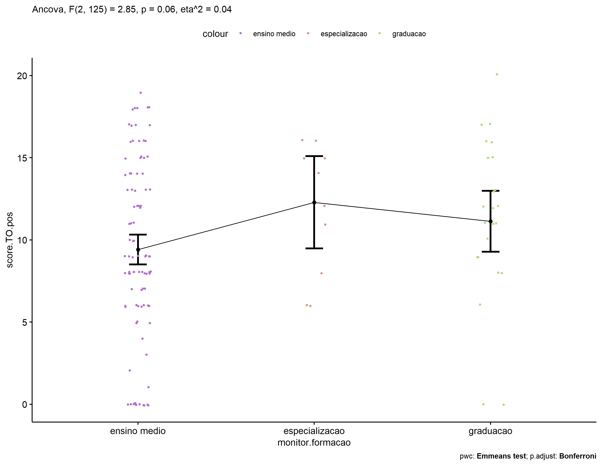<!-- -->

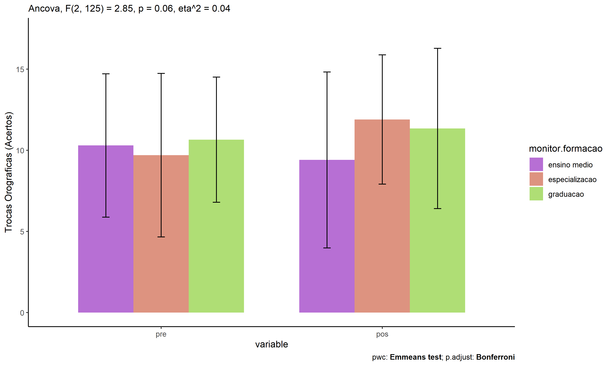<!-- -->

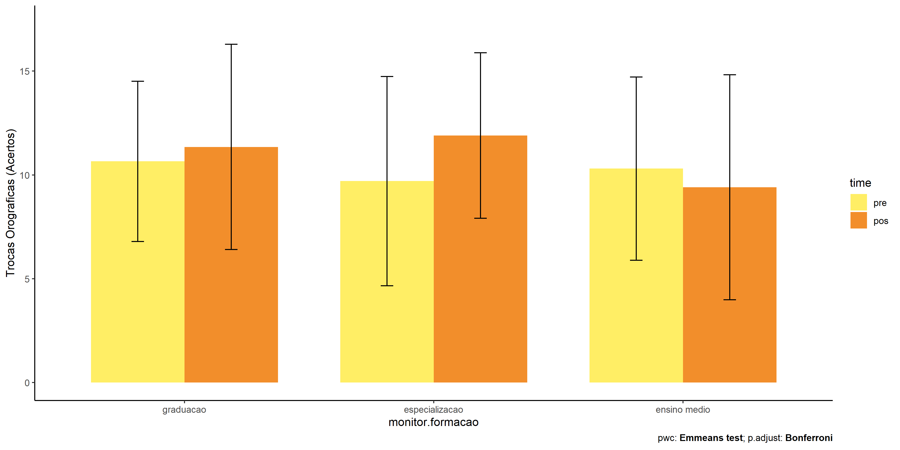<!-- -->

## factores: **grupo=“Experimental”:monitor.experiencia**

### Leitura de Pseudo-Palavras (Acertos)

| var            | monitor.experiencia |   n | M (pre) | SE (pre) | M (unadj) | SE (unadj) | M (adj) | SE (adj) |
|:---------------|:--------------------|----:|--------:|---------:|----------:|-----------:|--------:|---------:|
| score.CLPP.pos | maior 01 ano        |  81 |  72.506 |    1.561 |    73.259 |      1.451 |  73.218 |    1.196 |
| score.CLPP.pos | menor 01 ano        |  32 |  72.281 |    1.703 |    71.906 |      2.678 |  72.012 |    1.903 |

| .y.            | group1       | group2       | estimate | conf.low | conf.high |    se | statistic |     p | p.adj | p.adj.signif |
|:---------------|:-------------|:-------------|---------:|---------:|----------:|------:|----------:|------:|------:|:-------------|
| score.CLPP.pos | maior 01 ano | menor 01 ano |    1.206 |   -3.249 |     5.660 | 2.248 |     0.536 | 0.593 | 0.593 | ns           |
| score.CLPP.pre | maior 01 ano | menor 01 ano |    0.225 |   -5.141 |     5.591 | 2.708 |     0.083 | 0.934 | 0.934 | ns           |

| .y.        | monitor.experiencia | group1 | group2 | estimate | conf.low | conf.high |    se | statistic |     p | p.adj | p.adj.signif |
|:-----------|:--------------------|:-------|:-------|---------:|---------:|----------:|------:|----------:|------:|------:|:-------------|
| score.CLPP | maior 01 ano        | pre    | pos    |   -0.595 |   -4.526 |     3.337 | 1.996 |    -0.298 | 0.766 | 0.766 | ns           |
| score.CLPP | menor 01 ano        | pre    | pos    |    0.988 |   -5.159 |     7.136 | 3.120 |     0.317 | 0.752 | 0.752 | ns           |

    ## Scale for colour is already present.
    ## Adding another scale for colour, which will replace the existing scale.

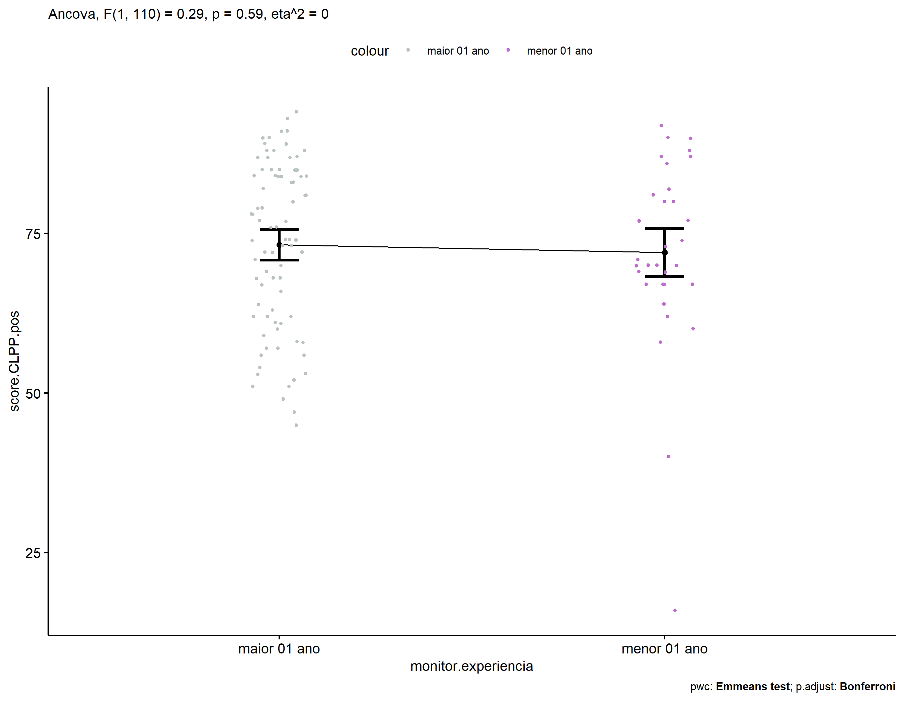<!-- -->

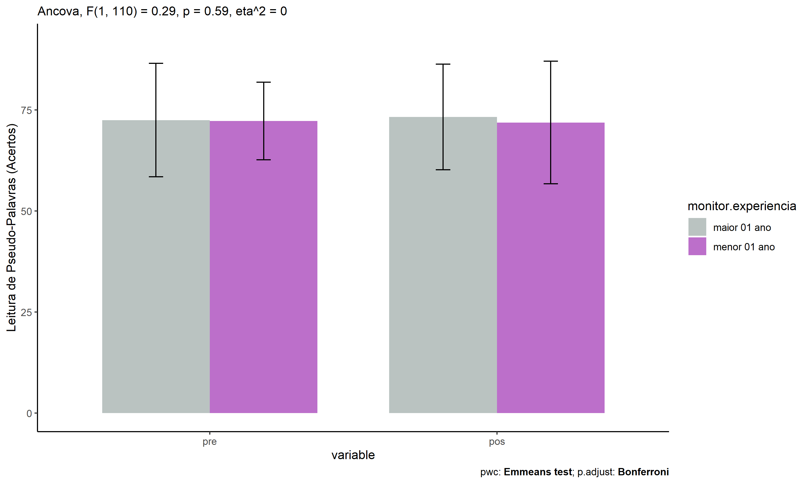<!-- -->

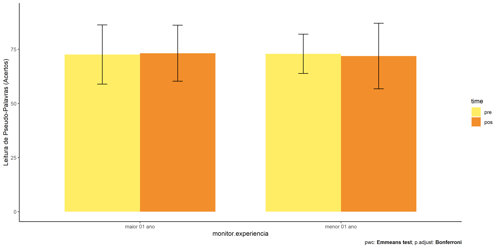<!-- -->

### Correta Regular (Acertos)

| var          | monitor.experiencia |   n | M (pre) | SE (pre) | M (unadj) | SE (unadj) | M (adj) | SE (adj) |
|:-------------|:--------------------|----:|--------:|---------:|----------:|-----------:|--------:|---------:|
| score.CR.pos | maior 01 ano        |  91 |  14.989 |    0.485 |    14.044 |      0.546 |  14.176 |    0.573 |
| score.CR.pos | menor 01 ano        |  38 |  16.053 |    0.341 |    13.684 |      1.091 |  13.368 |    0.889 |

| .y.          | group1       | group2       | estimate | conf.low | conf.high |    se | statistic |     p | p.adj | p.adj.signif |
|:-------------|:-------------|:-------------|---------:|---------:|----------:|------:|----------:|------:|------:|:-------------|
| score.CR.pos | maior 01 ano | menor 01 ano |    0.808 |   -1.292 |     2.907 | 1.061 |     0.761 | 0.448 | 0.448 | ns           |
| score.CR.pre | maior 01 ano | menor 01 ano |   -1.064 |   -2.613 |     0.486 | 0.783 |    -1.358 | 0.177 | 0.177 | ns           |

| .y.      | monitor.experiencia | group1 | group2 | estimate | conf.low | conf.high |    se | statistic |     p | p.adj | p.adj.signif |
|:---------|:--------------------|:-------|:-------|---------:|---------:|----------:|------:|----------:|------:|------:|:-------------|
| score.CR | maior 01 ano        | pre    | pos    |    0.945 |   -0.498 |     2.388 | 0.733 |     1.290 | 0.198 | 0.198 | ns           |
| score.CR | menor 01 ano        | pre    | pos    |    2.368 |    0.136 |     4.601 | 1.134 |     2.089 | 0.038 | 0.038 | \*           |

    ## Scale for colour is already present.
    ## Adding another scale for colour, which will replace the existing scale.

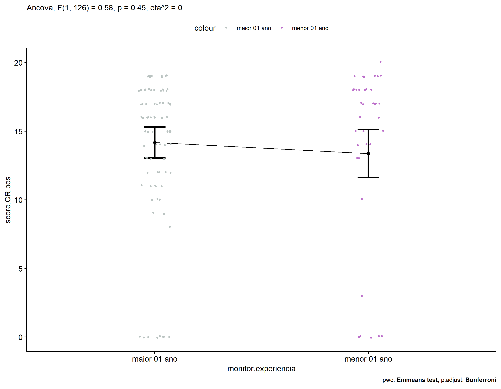<!-- -->

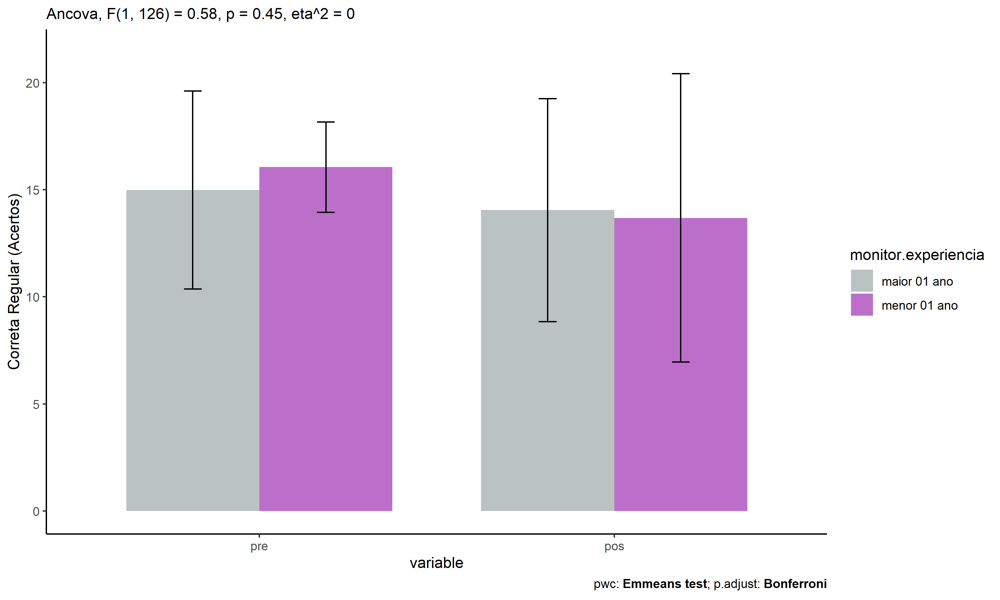<!-- -->

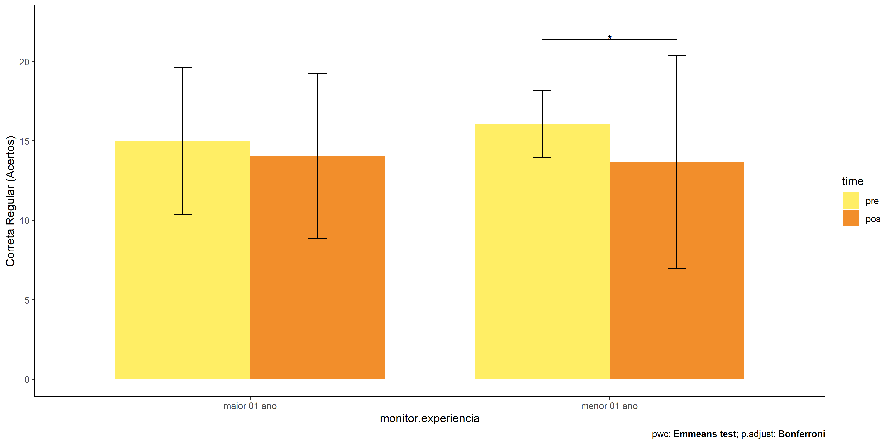<!-- -->

### Correta Irregular (Acertos)

| var          | monitor.experiencia |   n | M (pre) | SE (pre) | M (unadj) | SE (unadj) | M (adj) | SE (adj) |
|:-------------|:--------------------|----:|--------:|---------:|----------:|-----------:|--------:|---------:|
| score.CI.pos | maior 01 ano        |  91 |  11.967 |    0.433 |    12.022 |      0.496 |  12.155 |    0.496 |
| score.CI.pos | menor 01 ano        |  38 |  12.895 |    0.392 |    11.105 |      0.930 |  10.787 |    0.770 |

| .y.          | group1       | group2       | estimate | conf.low | conf.high |    se | statistic |     p | p.adj | p.adj.signif |
|:-------------|:-------------|:-------------|---------:|---------:|----------:|------:|----------:|------:|------:|:-------------|
| score.CI.pos | maior 01 ano | menor 01 ano |    1.368 |   -0.450 |     3.186 | 0.919 |     1.489 | 0.139 | 0.139 | ns           |
| score.CI.pre | maior 01 ano | menor 01 ano |   -0.928 |   -2.347 |     0.492 | 0.717 |    -1.293 | 0.198 | 0.198 | ns           |

| .y.      | monitor.experiencia | group1 | group2 | estimate | conf.low | conf.high |    se | statistic |     p | p.adj | p.adj.signif |
|:---------|:--------------------|:-------|:-------|---------:|---------:|----------:|------:|----------:|------:|------:|:-------------|
| score.CI | maior 01 ano        | pre    | pos    |   -0.055 |   -1.348 |     1.238 | 0.657 |    -0.084 | 0.933 | 0.933 | ns           |
| score.CI | menor 01 ano        | pre    | pos    |    1.789 |   -0.211 |     3.790 | 1.016 |     1.761 | 0.079 | 0.079 | ns           |

    ## Scale for colour is already present.
    ## Adding another scale for colour, which will replace the existing scale.

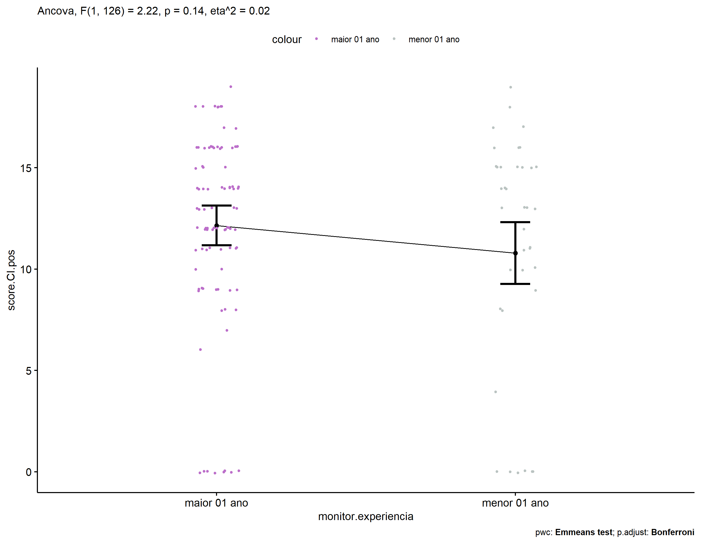<!-- -->

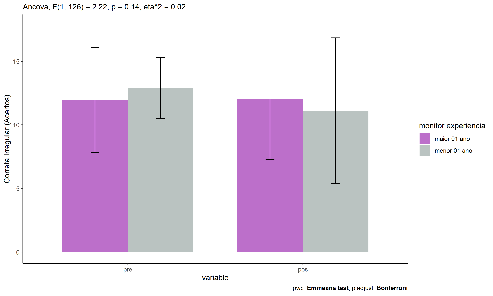<!-- -->

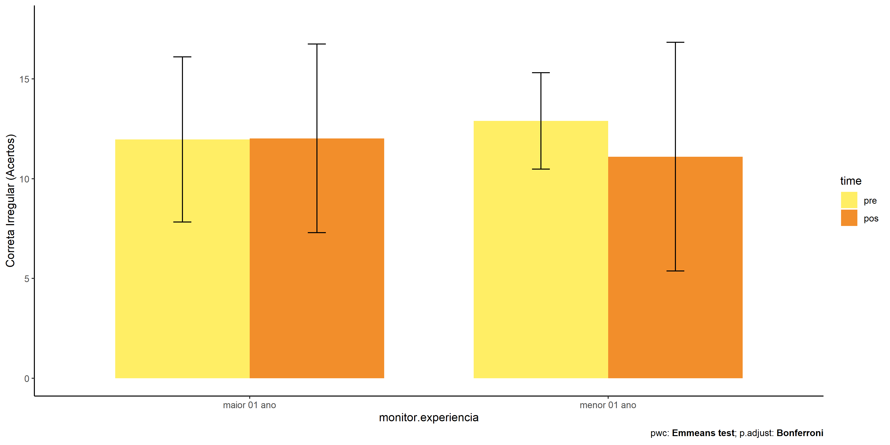<!-- -->

### Trocas Visuais (Acertos)

| var          | monitor.experiencia |   n | M (pre) | SE (pre) | M (unadj) | SE (unadj) | M (adj) | SE (adj) |
|:-------------|:--------------------|----:|--------:|---------:|----------:|-----------:|--------:|---------:|
| score.TV.pos | maior 01 ano        |  91 |  16.505 |    0.525 |    15.429 |      0.605 |  15.526 |    0.630 |
| score.TV.pos | menor 01 ano        |  38 |  17.395 |    0.418 |    14.184 |      1.161 |  13.950 |    0.977 |

| .y.          | group1       | group2       | estimate | conf.low | conf.high |    se | statistic |     p | p.adj | p.adj.signif |
|:-------------|:-------------|:-------------|---------:|---------:|----------:|------:|----------:|------:|------:|:-------------|
| score.TV.pos | maior 01 ano | menor 01 ano |    1.576 |   -0.729 |     3.881 | 1.165 |     1.353 | 0.178 | 0.178 | ns           |
| score.TV.pre | maior 01 ano | menor 01 ano |   -0.889 |   -2.585 |     0.806 | 0.857 |    -1.038 | 0.301 | 0.301 | ns           |

| .y.      | monitor.experiencia | group1 | group2 | estimate | conf.low | conf.high |    se | statistic |     p | p.adj | p.adj.signif |
|:---------|:--------------------|:-------|:-------|---------:|---------:|----------:|------:|----------:|------:|------:|:-------------|
| score.TV | maior 01 ano        | pre    | pos    |    1.077 |   -0.498 |     2.652 | 0.800 |     1.347 | 0.179 | 0.179 | ns           |
| score.TV | menor 01 ano        | pre    | pos    |    3.211 |    0.773 |     5.648 | 1.238 |     2.594 | 0.010 | 0.010 | \*           |

    ## Scale for colour is already present.
    ## Adding another scale for colour, which will replace the existing scale.

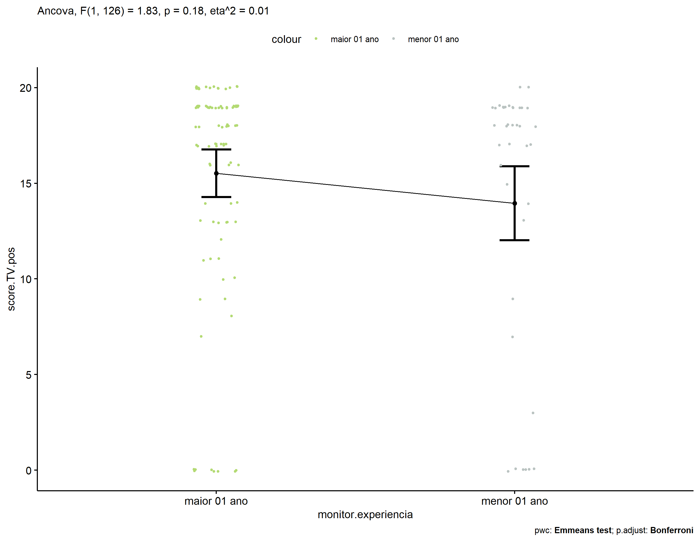<!-- -->

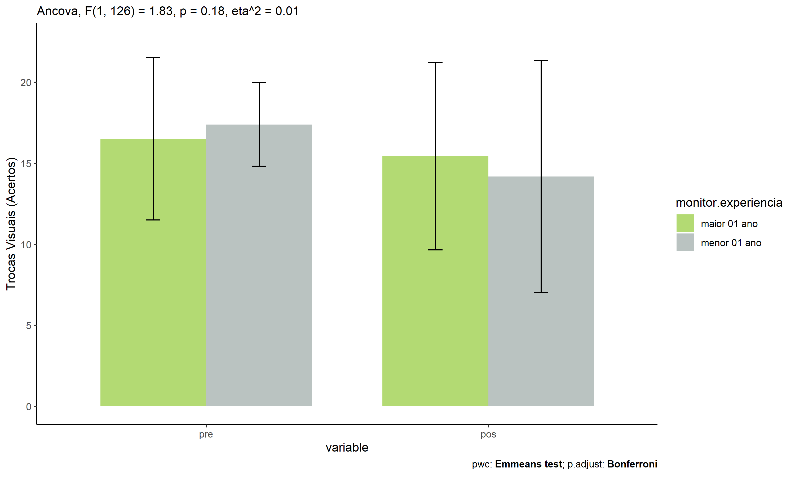<!-- -->

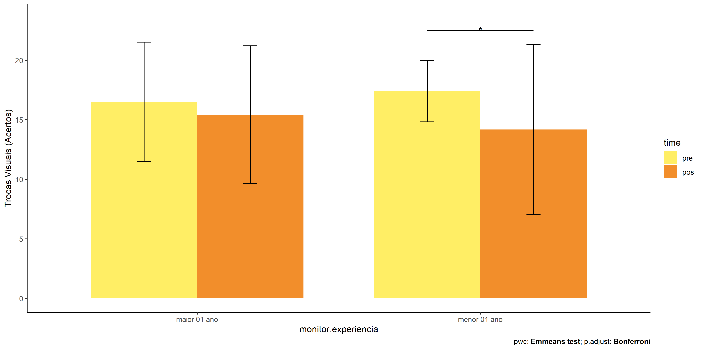<!-- -->

### Trocas Fonologicas (Acertos)

| var          | monitor.experiencia |   n | M (pre) | SE (pre) | M (unadj) | SE (unadj) | M (adj) | SE (adj) |
|:-------------|:--------------------|----:|--------:|---------:|----------:|-----------:|--------:|---------:|
| score.TF.pos | maior 01 ano        |  91 |  15.560 |    0.547 |    14.637 |      0.594 |  14.765 |    0.582 |
| score.TF.pos | menor 01 ano        |  38 |  16.368 |    0.459 |    13.237 |      1.127 |  12.930 |    0.902 |

| .y.          | group1       | group2       | estimate | conf.low | conf.high |    se | statistic |    p | p.adj | p.adj.signif |
|:-------------|:-------------|:-------------|---------:|---------:|----------:|------:|----------:|-----:|------:|:-------------|
| score.TF.pos | maior 01 ano | menor 01 ano |    1.835 |   -0.291 |     3.962 | 1.075 |     1.708 | 0.09 |  0.09 | ns           |
| score.TF.pre | maior 01 ano | menor 01 ano |   -0.808 |   -2.587 |     0.971 | 0.899 |    -0.899 | 0.37 |  0.37 | ns           |

| .y.      | monitor.experiencia | group1 | group2 | estimate | conf.low | conf.high |    se | statistic |     p | p.adj | p.adj.signif |
|:---------|:--------------------|:-------|:-------|---------:|---------:|----------:|------:|----------:|------:|------:|:-------------|
| score.TF | maior 01 ano        | pre    | pos    |    0.923 |   -0.655 |     2.501 | 0.801 |     1.152 | 0.250 | 0.250 | ns           |
| score.TF | menor 01 ano        | pre    | pos    |    3.132 |    0.689 |     5.574 | 1.240 |     2.525 | 0.012 | 0.012 | \*           |

    ## Scale for colour is already present.
    ## Adding another scale for colour, which will replace the existing scale.

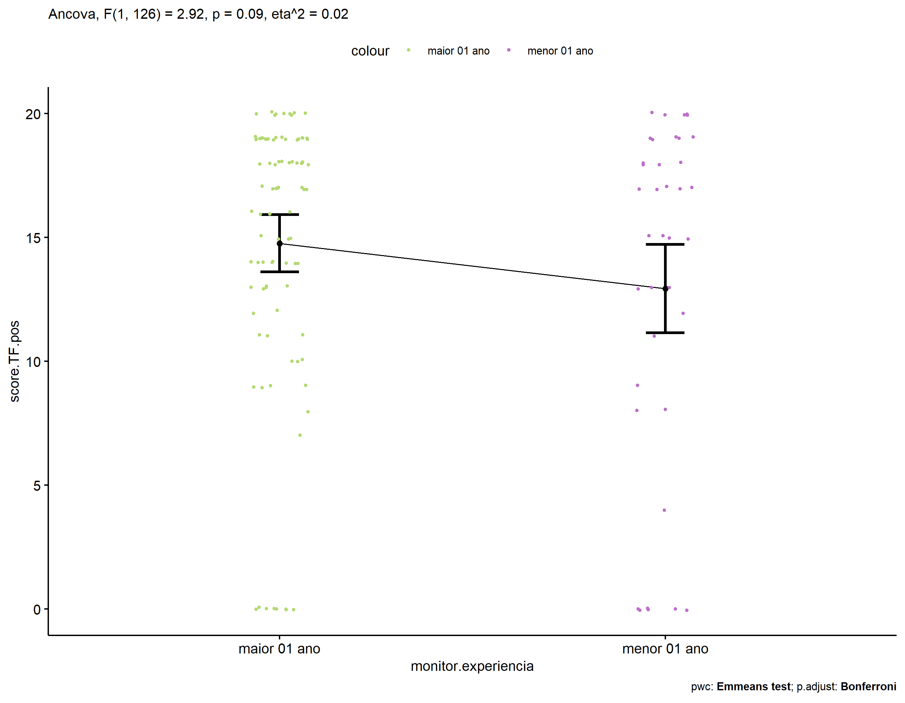<!-- -->

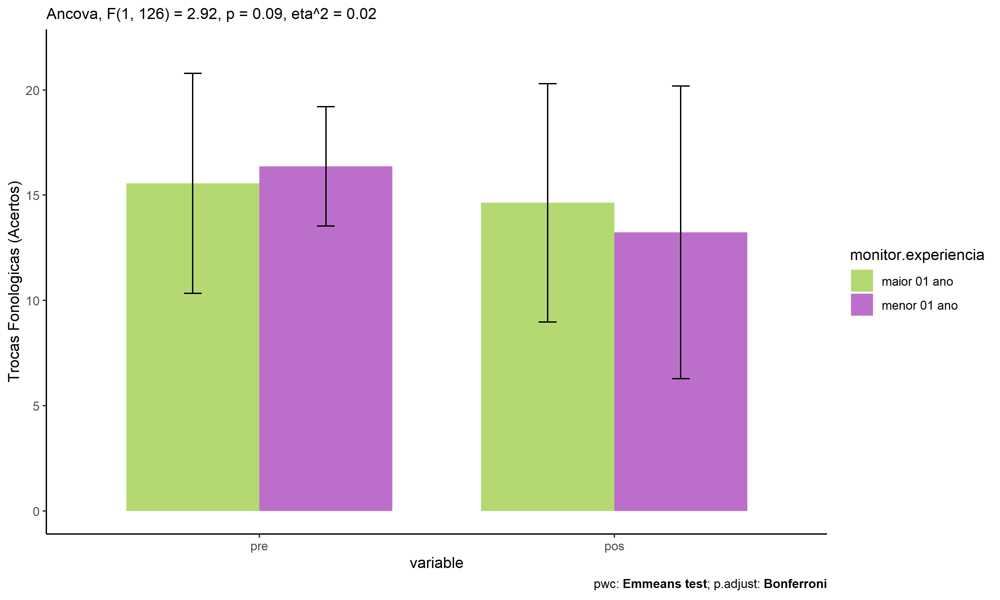<!-- -->

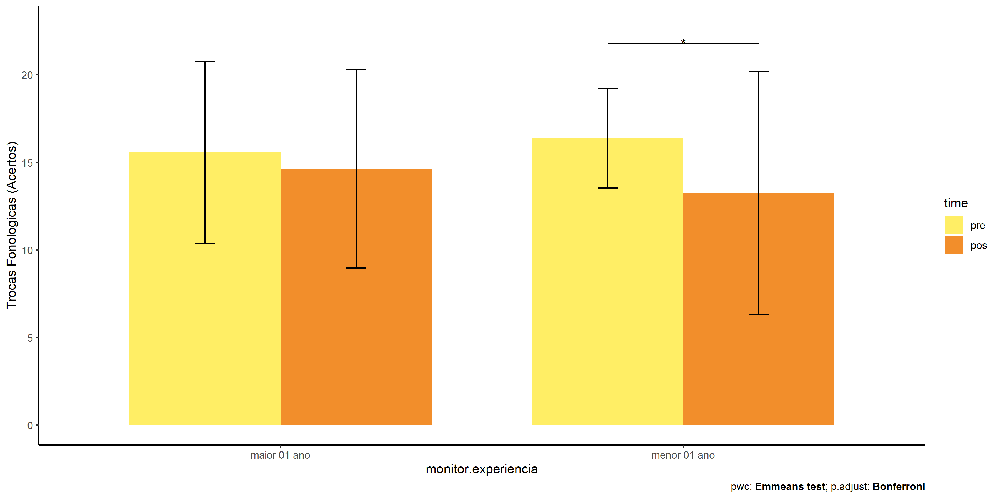<!-- -->

### Trocas Orograficas (Acertos)

| var          | monitor.experiencia |   n | M (pre) | SE (pre) | M (unadj) | SE (unadj) | M (adj) | SE (adj) |
|:-------------|:--------------------|----:|--------:|---------:|----------:|-----------:|--------:|---------:|
| score.TO.pos | maior 01 ano        |  91 |  10.374 |    0.479 |    10.615 |      0.525 |  10.581 |    0.467 |
| score.TO.pos | menor 01 ano        |  38 |  10.184 |    0.618 |     8.342 |      0.918 |   8.426 |    0.723 |

| .y.          | group1       | group2       | estimate | conf.low | conf.high |    se | statistic |     p | p.adj | p.adj.signif |
|:-------------|:-------------|:-------------|---------:|---------:|----------:|------:|----------:|------:|------:|:-------------|
| score.TO.pos | maior 01 ano | menor 01 ano |    2.155 |    0.452 |     3.858 | 0.861 |     2.504 | 0.014 | 0.014 | \*           |
| score.TO.pre | maior 01 ano | menor 01 ano |    0.189 |   -1.477 |     1.855 | 0.842 |     0.225 | 0.822 | 0.822 | ns           |

| .y.      | monitor.experiencia | group1 | group2 | estimate | conf.low | conf.high |    se | statistic |     p | p.adj | p.adj.signif |
|:---------|:--------------------|:-------|:-------|---------:|---------:|----------:|------:|----------:|------:|------:|:-------------|
| score.TO | maior 01 ano        | pre    | pos    |   -0.242 |   -1.643 |     1.160 | 0.712 |    -0.340 | 0.734 | 0.734 | ns           |
| score.TO | menor 01 ano        | pre    | pos    |    1.842 |   -0.327 |     4.011 | 1.101 |     1.672 | 0.096 | 0.096 | ns           |

    ## Scale for colour is already present.
    ## Adding another scale for colour, which will replace the existing scale.

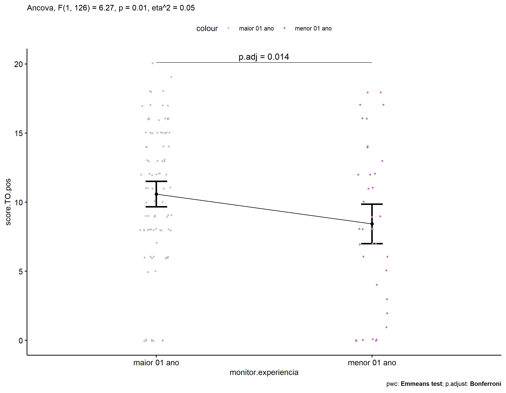<!-- -->

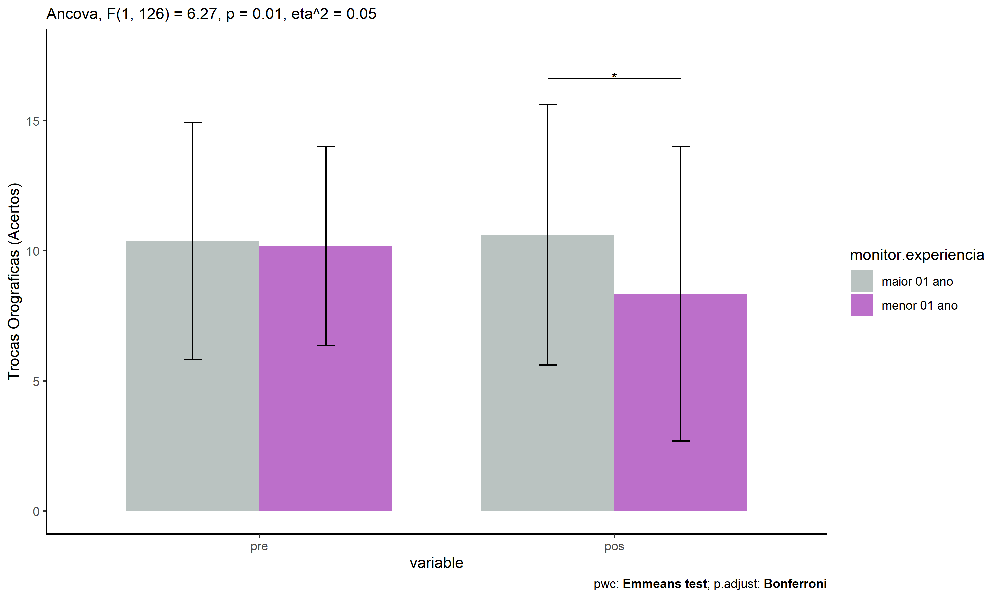<!-- -->

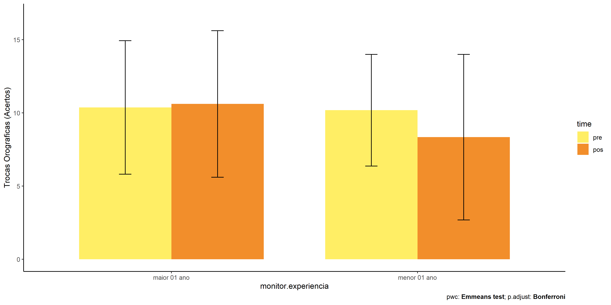<!-- -->
