ANCOVA in CLPP Test (Teste de Competencia em Leitura de Palavras e
Pseudo-palavras)
================
Geiser C. Challco <geiser@alumni.usp.br>

- [Descriptive Statistics of Initial
  Data](#descriptive-statistics-of-initial-data)
  - [Leitura de Pseudo-Palavras
    (Acertos)](#leitura-de-pseudo-palavras-acertos)
  - [Correta Regular (Acertos)](#correta-regular-acertos)
  - [Correta Irregular (Acertos)](#correta-irregular-acertos)
  - [Trocas Visuais (Acertos)](#trocas-visuais-acertos)
  - [Trocas Fonologicas (Acertos)](#trocas-fonologicas-acertos)
  - [Trocas Orograficas (Acertos)](#trocas-orograficas-acertos)
- [Checking of Assumptions](#checking-of-assumptions)
  - [Assumption: Normality
    distribution](#assumption-normality-distribution)
    - [Leitura de Pseudo-Palavras
      (Acertos)](#leitura-de-pseudo-palavras-acertos-1)
    - [Correta Regular (Acertos)](#correta-regular-acertos-1)
    - [Correta Irregular (Acertos)](#correta-irregular-acertos-1)
    - [Trocas Visuais (Acertos)](#trocas-visuais-acertos-1)
    - [Trocas Fonologicas (Acertos)](#trocas-fonologicas-acertos-1)
    - [Trocas Orograficas (Acertos)](#trocas-orograficas-acertos-1)
  - [Assumption: Homogeneity](#assumption-homogeneity)
    - [Leitura de Pseudo-Palavras
      (Acertos)](#leitura-de-pseudo-palavras-acertos-2)
    - [Correta Regular (Acertos)](#correta-regular-acertos-2)
    - [Correta Irregular (Acertos)](#correta-irregular-acertos-2)
    - [Trocas Visuais (Acertos)](#trocas-visuais-acertos-2)
    - [Trocas Fonologicas (Acertos)](#trocas-fonologicas-acertos-2)
    - [Trocas Orograficas (Acertos)](#trocas-orograficas-acertos-2)
- [Computation of ANCOVA test and Pairwise
  Comparison](#computation-of-ancova-test-and-pairwise-comparison)
  - [ANCOVA tests for one factor](#ancova-tests-for-one-factor)
    - [Leitura de Pseudo-Palavras
      (Acertos)](#leitura-de-pseudo-palavras-acertos-3)
    - [Correta Regular (Acertos)](#correta-regular-acertos-3)
    - [Correta Irregular (Acertos)](#correta-irregular-acertos-3)
    - [Trocas Visuais (Acertos)](#trocas-visuais-acertos-3)
    - [Trocas Fonologicas (Acertos)](#trocas-fonologicas-acertos-3)
    - [Trocas Orograficas (Acertos)](#trocas-orograficas-acertos-3)
  - [ANCOVA tests for two factors](#ancova-tests-for-two-factors)
    - [Leitura de Pseudo-Palavras
      (Acertos)](#leitura-de-pseudo-palavras-acertos-4)
    - [Correta Regular (Acertos)](#correta-regular-acertos-4)
    - [Correta Irregular (Acertos)](#correta-irregular-acertos-4)
    - [Trocas Visuais (Acertos)](#trocas-visuais-acertos-4)
    - [Trocas Fonologicas (Acertos)](#trocas-fonologicas-acertos-4)
    - [Trocas Orograficas (Acertos)](#trocas-orograficas-acertos-4)
  - [ANCOVA tests for
    grupo=“Experimental”](#ancova-tests-for-grupoexperimental)
    - [Leitura de Pseudo-Palavras
      (Acertos)](#leitura-de-pseudo-palavras-acertos-5)
    - [Correta Regular (Acertos)](#correta-regular-acertos-5)
    - [Correta Irregular (Acertos)](#correta-irregular-acertos-5)
    - [Trocas Visuais (Acertos)](#trocas-visuais-acertos-5)
    - [Trocas Fonologicas (Acertos)](#trocas-fonologicas-acertos-5)
    - [Trocas Orograficas (Acertos)](#trocas-orograficas-acertos-5)
- [Pairwise comparisons for one
  factor](#pairwise-comparisons-for-one-factor)
  - [factor: **grupo**](#factor-grupo)
    - [Leitura de Pseudo-Palavras
      (Acertos)](#leitura-de-pseudo-palavras-acertos-6)
    - [Correta Regular (Acertos)](#correta-regular-acertos-6)
    - [Correta Irregular (Acertos)](#correta-irregular-acertos-6)
    - [Trocas Visuais (Acertos)](#trocas-visuais-acertos-6)
    - [Trocas Fonologicas (Acertos)](#trocas-fonologicas-acertos-6)
    - [Trocas Orograficas (Acertos)](#trocas-orograficas-acertos-6)
  - [factor: **genero**](#factor-genero)
    - [Leitura de Pseudo-Palavras
      (Acertos)](#leitura-de-pseudo-palavras-acertos-7)
    - [Correta Regular (Acertos)](#correta-regular-acertos-7)
    - [Correta Irregular (Acertos)](#correta-irregular-acertos-7)
    - [Trocas Visuais (Acertos)](#trocas-visuais-acertos-7)
    - [Trocas Fonologicas (Acertos)](#trocas-fonologicas-acertos-7)
    - [Trocas Orograficas (Acertos)](#trocas-orograficas-acertos-7)
  - [factor: **idade**](#factor-idade)
    - [Leitura de Pseudo-Palavras
      (Acertos)](#leitura-de-pseudo-palavras-acertos-8)
    - [Correta Regular (Acertos)](#correta-regular-acertos-8)
    - [Correta Irregular (Acertos)](#correta-irregular-acertos-8)
    - [Trocas Visuais (Acertos)](#trocas-visuais-acertos-8)
    - [Trocas Fonologicas (Acertos)](#trocas-fonologicas-acertos-8)
    - [Trocas Orograficas (Acertos)](#trocas-orograficas-acertos-8)
  - [factor: **zona.participante**](#factor-zonaparticipante)
    - [Leitura de Pseudo-Palavras
      (Acertos)](#leitura-de-pseudo-palavras-acertos-9)
    - [Correta Regular (Acertos)](#correta-regular-acertos-9)
    - [Correta Irregular (Acertos)](#correta-irregular-acertos-9)
    - [Trocas Visuais (Acertos)](#trocas-visuais-acertos-9)
    - [Trocas Fonologicas (Acertos)](#trocas-fonologicas-acertos-9)
    - [Trocas Orograficas (Acertos)](#trocas-orograficas-acertos-9)
  - [factor: **escola**](#factor-escola)
    - [Leitura de Pseudo-Palavras
      (Acertos)](#leitura-de-pseudo-palavras-acertos-10)
    - [Correta Regular (Acertos)](#correta-regular-acertos-10)
    - [Correta Irregular (Acertos)](#correta-irregular-acertos-10)
    - [Trocas Visuais (Acertos)](#trocas-visuais-acertos-10)
    - [Trocas Fonologicas (Acertos)](#trocas-fonologicas-acertos-10)
    - [Trocas Orograficas (Acertos)](#trocas-orograficas-acertos-10)
  - [factor: **zona.escola**](#factor-zonaescola)
    - [Leitura de Pseudo-Palavras
      (Acertos)](#leitura-de-pseudo-palavras-acertos-11)
    - [Correta Regular (Acertos)](#correta-regular-acertos-11)
    - [Correta Irregular (Acertos)](#correta-irregular-acertos-11)
    - [Trocas Visuais (Acertos)](#trocas-visuais-acertos-11)
    - [Trocas Fonologicas (Acertos)](#trocas-fonologicas-acertos-11)
    - [Trocas Orograficas (Acertos)](#trocas-orograficas-acertos-11)
- [Pairwise comparisons for two
  factors](#pairwise-comparisons-for-two-factors)
  - [factores: **genero:grupo**](#factores-generogrupo)
    - [Leitura de Pseudo-Palavras
      (Acertos)](#leitura-de-pseudo-palavras-acertos-12)
    - [Correta Regular (Acertos)](#correta-regular-acertos-12)
    - [Correta Irregular (Acertos)](#correta-irregular-acertos-12)
    - [Trocas Visuais (Acertos)](#trocas-visuais-acertos-12)
    - [Trocas Fonologicas (Acertos)](#trocas-fonologicas-acertos-12)
    - [Trocas Orograficas (Acertos)](#trocas-orograficas-acertos-12)
  - [factores: **idade:grupo**](#factores-idadegrupo)
    - [Leitura de Pseudo-Palavras
      (Acertos)](#leitura-de-pseudo-palavras-acertos-13)
    - [Correta Regular (Acertos)](#correta-regular-acertos-13)
    - [Correta Irregular (Acertos)](#correta-irregular-acertos-13)
    - [Trocas Visuais (Acertos)](#trocas-visuais-acertos-13)
    - [Trocas Fonologicas (Acertos)](#trocas-fonologicas-acertos-13)
    - [Trocas Orograficas (Acertos)](#trocas-orograficas-acertos-13)
  - [factores:
    **zona.participante:grupo**](#factores-zonaparticipantegrupo)
    - [Leitura de Pseudo-Palavras
      (Acertos)](#leitura-de-pseudo-palavras-acertos-14)
    - [Correta Regular (Acertos)](#correta-regular-acertos-14)
    - [Correta Irregular (Acertos)](#correta-irregular-acertos-14)
    - [Trocas Visuais (Acertos)](#trocas-visuais-acertos-14)
    - [Trocas Fonologicas (Acertos)](#trocas-fonologicas-acertos-14)
    - [Trocas Orograficas (Acertos)](#trocas-orograficas-acertos-14)
  - [factores: **escola:grupo**](#factores-escolagrupo)
    - [Leitura de Pseudo-Palavras
      (Acertos)](#leitura-de-pseudo-palavras-acertos-15)
    - [Correta Regular (Acertos)](#correta-regular-acertos-15)
    - [Correta Irregular (Acertos)](#correta-irregular-acertos-15)
    - [Trocas Visuais (Acertos)](#trocas-visuais-acertos-15)
    - [Trocas Fonologicas (Acertos)](#trocas-fonologicas-acertos-15)
    - [Trocas Orograficas (Acertos)](#trocas-orograficas-acertos-15)
  - [factores: **zona.escola:grupo**](#factores-zonaescolagrupo)
    - [Leitura de Pseudo-Palavras
      (Acertos)](#leitura-de-pseudo-palavras-acertos-16)
    - [Correta Regular (Acertos)](#correta-regular-acertos-16)
    - [Correta Irregular (Acertos)](#correta-irregular-acertos-16)
    - [Trocas Visuais (Acertos)](#trocas-visuais-acertos-16)
    - [Trocas Fonologicas (Acertos)](#trocas-fonologicas-acertos-16)
    - [Trocas Orograficas (Acertos)](#trocas-orograficas-acertos-16)
- [Pairwise comparisons for
  grupo=“Experimental”](#pairwise-comparisons-for-grupoexperimental)
  - [factores:
    **grupo=“Experimental”:monitor**](#factores-grupoexperimentalmonitor)
    - [Leitura de Pseudo-Palavras
      (Acertos)](#leitura-de-pseudo-palavras-acertos-17)
    - [Correta Regular (Acertos)](#correta-regular-acertos-17)
    - [Correta Irregular (Acertos)](#correta-irregular-acertos-17)
    - [Trocas Visuais (Acertos)](#trocas-visuais-acertos-17)
    - [Trocas Fonologicas (Acertos)](#trocas-fonologicas-acertos-17)
    - [Trocas Orograficas (Acertos)](#trocas-orograficas-acertos-17)
  - [factores:
    **grupo=“Experimental”:monitor.genero**](#factores-grupoexperimentalmonitorgenero)
    - [Leitura de Pseudo-Palavras
      (Acertos)](#leitura-de-pseudo-palavras-acertos-18)
    - [Correta Regular (Acertos)](#correta-regular-acertos-18)
    - [Correta Irregular (Acertos)](#correta-irregular-acertos-18)
    - [Trocas Visuais (Acertos)](#trocas-visuais-acertos-18)
    - [Trocas Fonologicas (Acertos)](#trocas-fonologicas-acertos-18)
    - [Trocas Orograficas (Acertos)](#trocas-orograficas-acertos-18)
  - [factores:
    **grupo=“Experimental”:monitor.area**](#factores-grupoexperimentalmonitorarea)
    - [Leitura de Pseudo-Palavras
      (Acertos)](#leitura-de-pseudo-palavras-acertos-19)
    - [Correta Regular (Acertos)](#correta-regular-acertos-19)
    - [Correta Irregular (Acertos)](#correta-irregular-acertos-19)
    - [Trocas Visuais (Acertos)](#trocas-visuais-acertos-19)
    - [Trocas Fonologicas (Acertos)](#trocas-fonologicas-acertos-19)
    - [Trocas Orograficas (Acertos)](#trocas-orograficas-acertos-19)
  - [factores:
    **grupo=“Experimental”:monitor.formacao**](#factores-grupoexperimentalmonitorformacao)
    - [Leitura de Pseudo-Palavras
      (Acertos)](#leitura-de-pseudo-palavras-acertos-20)
    - [Correta Regular (Acertos)](#correta-regular-acertos-20)
    - [Correta Irregular (Acertos)](#correta-irregular-acertos-20)
    - [Trocas Visuais (Acertos)](#trocas-visuais-acertos-20)
    - [Trocas Fonologicas (Acertos)](#trocas-fonologicas-acertos-20)
    - [Trocas Orograficas (Acertos)](#trocas-orograficas-acertos-20)
  - [factores:
    **grupo=“Experimental”:monitor.experiencia**](#factores-grupoexperimentalmonitorexperiencia)
    - [Leitura de Pseudo-Palavras
      (Acertos)](#leitura-de-pseudo-palavras-acertos-21)
    - [Correta Regular (Acertos)](#correta-regular-acertos-21)
    - [Correta Irregular (Acertos)](#correta-irregular-acertos-21)
    - [Trocas Visuais (Acertos)](#trocas-visuais-acertos-21)
    - [Trocas Fonologicas (Acertos)](#trocas-fonologicas-acertos-21)
    - [Trocas Orograficas (Acertos)](#trocas-orograficas-acertos-21)

**NOTE**

- Teste ANCOVA para determinar se houve diferenças significativas no
  Teste de Competencia em Leitura de Palavras e Pseudo-palavras (medido
  usando pre- e pos-testes).
- ANCOVA test to determine whether there were significant differences in
  CLPP Test (measured using pre- and post-tests).

# Descriptive Statistics of Initial Data

## Leitura de Pseudo-Palavras (Acertos)

| grupo        | genero | idade | zona.participante | escola | zona.escola | variable       |   n |   mean | median | min | max |     sd |     se |      ci |   iqr |
|:-------------|:-------|:------|:------------------|:-------|:------------|:---------------|----:|-------:|-------:|----:|----:|-------:|-------:|--------:|------:|
| Controle     | F      |       |                   |        |             | score.CLPP.pos |  78 | 72.692 |   75.5 |  23 |  96 | 14.418 |  1.633 |   3.251 | 21.75 |
| Controle     | M      |       |                   |        |             | score.CLPP.pos |  71 | 66.197 |   68.0 |  29 |  92 | 15.133 |  1.796 |   3.582 | 24.50 |
| Experimental | F      |       |                   |        |             | score.CLPP.pos |  56 | 74.286 |   79.0 |  16 |  93 | 15.553 |  2.078 |   4.165 | 16.50 |
| Experimental | M      |       |                   |        |             | score.CLPP.pos |  79 | 68.532 |   68.0 |  33 |  94 | 12.755 |  1.435 |   2.857 | 17.00 |
| Controle     | F      |       |                   |        |             | score.CLPP.pre |  78 | 70.205 |   71.5 |  13 |  96 | 15.002 |  1.699 |   3.383 | 18.25 |
| Controle     | M      |       |                   |        |             | score.CLPP.pre |  71 | 65.789 |   67.0 |  11 |  94 | 14.028 |  1.665 |   3.320 | 14.50 |
| Experimental | F      |       |                   |        |             | score.CLPP.pre |  56 | 73.982 |   78.0 |  33 |  91 | 14.168 |  1.893 |   3.794 | 16.50 |
| Experimental | M      |       |                   |        |             | score.CLPP.pre |  79 | 67.127 |   68.0 |  24 |  92 | 13.781 |  1.550 |   3.087 | 16.50 |
| Controle     |        | 10y   |                   |        |             | score.CLPP.pos |  28 | 70.429 |   73.0 |  38 |  96 | 14.101 |  2.665 |   5.468 | 20.00 |
| Controle     |        | 11y   |                   |        |             | score.CLPP.pos |  84 | 72.429 |   76.0 |  23 |  96 | 14.699 |  1.604 |   3.190 | 22.25 |
| Controle     |        | 12y   |                   |        |             | score.CLPP.pos |  20 | 59.450 |   62.0 |  29 |  87 | 16.015 |  3.581 |   7.495 | 19.00 |
| Controle     |        | 13y   |                   |        |             | score.CLPP.pos |   8 | 65.500 |   65.5 |  51 |  76 |  9.243 |  3.268 |   7.727 | 15.00 |
| Controle     |        | 14y   |                   |        |             | score.CLPP.pos |   2 | 63.500 |   63.5 |  47 |  80 | 23.335 | 16.500 | 209.652 | 16.50 |
| Controle     |        | 15y   |                   |        |             | score.CLPP.pos |   1 | 59.000 |   59.0 |  59 |  59 |        |        |         |  0.00 |
| Controle     |        |       |                   |        |             | score.CLPP.pos |   6 | 69.167 |   61.5 |  55 |  90 | 15.587 |  6.364 |  16.358 | 22.50 |
| Experimental |        | 10y   |                   |        |             | score.CLPP.pos |  27 | 67.667 |   70.0 |  16 |  89 | 16.770 |  3.227 |   6.634 | 22.00 |
| Experimental |        | 11y   |                   |        |             | score.CLPP.pos |  82 | 73.183 |   74.0 |  40 |  94 | 13.066 |  1.443 |   2.871 | 21.75 |
| Experimental |        | 12y   |                   |        |             | score.CLPP.pos |  16 | 67.250 |   68.0 |  38 |  93 | 14.938 |  3.734 |   7.960 | 19.50 |
| Experimental |        | 13y   |                   |        |             | score.CLPP.pos |   7 | 65.571 |   67.0 |  42 |  81 | 13.227 |  4.999 |  12.233 | 12.50 |
| Experimental |        | 14y   |                   |        |             | score.CLPP.pos |   1 | 61.000 |   61.0 |  61 |  61 |        |        |         |  0.00 |
| Experimental |        |       |                   |        |             | score.CLPP.pos |   2 | 75.000 |   75.0 |  63 |  87 | 16.971 | 12.000 | 152.474 | 12.00 |
| Controle     |        | 10y   |                   |        |             | score.CLPP.pre |  28 | 71.643 |   72.0 |  53 |  95 | 10.166 |  1.921 |   3.942 | 16.25 |
| Controle     |        | 11y   |                   |        |             | score.CLPP.pre |  84 | 68.917 |   71.0 |  11 |  96 | 16.045 |  1.751 |   3.482 | 18.25 |
| Controle     |        | 12y   |                   |        |             | score.CLPP.pre |  20 | 64.650 |   66.5 |  35 |  83 | 11.842 |  2.648 |   5.542 |  7.75 |
| Controle     |        | 13y   |                   |        |             | score.CLPP.pre |   8 | 60.875 |   64.5 |  35 |  73 | 12.529 |  4.430 |  10.475 | 11.00 |
| Controle     |        | 14y   |                   |        |             | score.CLPP.pre |   2 | 46.000 |   46.0 |  30 |  62 | 22.627 | 16.000 | 203.299 | 16.00 |
| Controle     |        | 15y   |                   |        |             | score.CLPP.pre |   1 | 52.000 |   52.0 |  52 |  52 |        |        |         |  0.00 |
| Controle     |        |       |                   |        |             | score.CLPP.pre |   6 | 71.333 |   67.5 |  51 |  90 | 14.390 |  5.875 |  15.101 | 15.25 |
| Experimental |        | 10y   |                   |        |             | score.CLPP.pre |  27 | 69.556 |   70.0 |  24 |  88 | 13.695 |  2.636 |   5.418 | 14.50 |
| Experimental |        | 11y   |                   |        |             | score.CLPP.pre |  82 | 71.927 |   72.0 |  38 |  92 | 13.343 |  1.474 |   2.932 | 17.50 |
| Experimental |        | 12y   |                   |        |             | score.CLPP.pre |  16 | 67.000 |   71.5 |  33 |  91 | 17.178 |  4.294 |   9.153 | 17.75 |
| Experimental |        | 13y   |                   |        |             | score.CLPP.pre |   7 | 62.000 |   59.0 |  50 |  80 | 10.970 |  4.146 |  10.145 | 11.50 |
| Experimental |        | 14y   |                   |        |             | score.CLPP.pre |   1 | 35.000 |   35.0 |  35 |  35 |        |        |         |  0.00 |
| Experimental |        |       |                   |        |             | score.CLPP.pre |   2 | 64.500 |   64.5 |  45 |  84 | 27.577 | 19.500 | 247.771 | 19.50 |
| Controle     |        |       | Urbana            |        |             | score.CLPP.pos |  64 | 70.859 |   75.5 |  23 |  93 | 15.614 |  1.952 |   3.900 | 23.25 |
| Controle     |        |       | Rural             |        |             | score.CLPP.pos |  51 | 69.824 |   70.0 |  45 |  96 | 13.995 |  1.960 |   3.936 | 22.00 |
| Controle     |        |       |                   |        |             | score.CLPP.pos |  34 | 66.882 |   64.0 |  29 |  94 | 15.665 |  2.686 |   5.466 | 21.50 |
| Experimental |        |       | Urbana            |        |             | score.CLPP.pos |  47 | 69.298 |   70.0 |  16 |  94 | 17.163 |  2.503 |   5.039 | 25.00 |
| Experimental |        |       | Rural             |        |             | score.CLPP.pos |  58 | 71.431 |   72.0 |  42 |  93 | 13.496 |  1.772 |   3.549 | 22.75 |
| Experimental |        |       |                   |        |             | score.CLPP.pos |  30 | 72.467 |   71.5 |  56 |  88 | 10.061 |  1.837 |   3.757 | 13.75 |
| Controle     |        |       | Urbana            |        |             | score.CLPP.pre |  64 | 68.594 |   71.0 |  13 |  93 | 15.010 |  1.876 |   3.749 | 18.00 |
| Controle     |        |       | Rural             |        |             | score.CLPP.pre |  51 | 68.137 |   67.0 |  35 |  96 | 13.458 |  1.885 |   3.785 | 16.50 |
| Controle     |        |       |                   |        |             | score.CLPP.pre |  34 | 67.118 |   69.5 |  11 |  94 | 16.081 |  2.758 |   5.611 | 17.00 |
| Experimental |        |       | Urbana            |        |             | score.CLPP.pre |  47 | 67.766 |   69.0 |  24 |  91 | 16.855 |  2.459 |   4.949 | 20.50 |
| Experimental |        |       | Rural             |        |             | score.CLPP.pre |  58 | 70.948 |   71.5 |  38 |  91 | 13.165 |  1.729 |   3.462 | 17.00 |
| Experimental |        |       |                   |        |             | score.CLPP.pre |  30 | 71.533 |   71.0 |  45 |  92 | 11.875 |  2.168 |   4.434 | 17.50 |
| Controle     |        |       |                   | E1     |             | score.CLPP.pos |  12 | 75.250 |   77.0 |  57 |  93 | 10.830 |  3.126 |   6.881 | 11.75 |
| Controle     |        |       |                   | E2     |             | score.CLPP.pos |  28 | 62.714 |   62.0 |  29 |  92 | 17.237 |  3.257 |   6.684 | 26.50 |
| Controle     |        |       |                   | E3     |             | score.CLPP.pos |  19 | 71.105 |   76.0 |  46 |  96 | 14.689 |  3.370 |   7.080 | 22.00 |
| Controle     |        |       |                   | E4     |             | score.CLPP.pos |  20 | 68.700 |   73.5 |  23 |  87 | 15.482 |  3.462 |   7.246 | 20.00 |
| Controle     |        |       |                   | E5     |             | score.CLPP.pos |  58 | 70.190 |   70.0 |  38 |  96 | 14.336 |  1.882 |   3.769 | 23.50 |
| Controle     |        |       |                   | E6     |             | score.CLPP.pos |  12 | 76.250 |   80.0 |  54 |  94 | 12.864 |  3.713 |   8.173 | 23.00 |
| Experimental |        |       |                   | E1     |             | score.CLPP.pos |  11 | 71.182 |   74.0 |  51 |  91 | 12.448 |  3.753 |   8.363 | 17.00 |
| Experimental |        |       |                   | E2     |             | score.CLPP.pos |  23 | 65.130 |   70.0 |  16 |  88 | 18.765 |  3.913 |   8.115 | 23.50 |
| Experimental |        |       |                   | E3     |             | score.CLPP.pos |  16 | 69.188 |   68.0 |  49 |  93 | 14.039 |  3.510 |   7.481 | 23.25 |
| Experimental |        |       |                   | E4     |             | score.CLPP.pos |  15 | 75.333 |   71.0 |  61 |  91 |  9.641 |  2.489 |   5.339 | 15.50 |
| Experimental |        |       |                   | E5     |             | score.CLPP.pos |  55 | 72.473 |   74.0 |  33 |  94 | 14.537 |  1.960 |   3.930 | 25.00 |
| Experimental |        |       |                   | E6     |             | score.CLPP.pos |  15 | 71.333 |   70.0 |  57 |  87 |  7.862 |  2.030 |   4.354 |  9.00 |
| Controle     |        |       |                   | E1     |             | score.CLPP.pre |  12 | 71.583 |   71.5 |  52 |  92 | 10.698 |  3.088 |   6.797 | 12.50 |
| Controle     |        |       |                   | E2     |             | score.CLPP.pre |  28 | 65.714 |   67.5 |  30 |  88 | 14.045 |  2.654 |   5.446 | 15.50 |
| Controle     |        |       |                   | E3     |             | score.CLPP.pre |  19 | 63.263 |   67.0 |  35 |  96 | 17.770 |  4.077 |   8.565 | 27.00 |
| Controle     |        |       |                   | E4     |             | score.CLPP.pre |  20 | 64.850 |   66.0 |  13 |  84 | 16.359 |  3.658 |   7.656 | 14.25 |
| Controle     |        |       |                   | E5     |             | score.CLPP.pre |  58 | 70.776 |   69.5 |  48 |  95 | 11.546 |  1.516 |   3.036 | 15.00 |
| Controle     |        |       |                   | E6     |             | score.CLPP.pre |  12 | 70.333 |   79.0 |  11 |  94 | 22.248 |  6.422 |  14.136 | 20.50 |
| Experimental |        |       |                   | E1     |             | score.CLPP.pre |  11 | 67.182 |   69.0 |  35 |  87 | 16.594 |  5.003 |  11.148 | 17.50 |
| Experimental |        |       |                   | E2     |             | score.CLPP.pre |  23 | 70.130 |   70.0 |  33 |  87 | 11.698 |  2.439 |   5.059 | 11.50 |
| Experimental |        |       |                   | E3     |             | score.CLPP.pre |  16 | 67.812 |   69.5 |  38 |  91 | 16.130 |  4.032 |   8.595 | 17.50 |
| Experimental |        |       |                   | E4     |             | score.CLPP.pre |  15 | 74.200 |   75.0 |  40 |  88 | 12.531 |  3.236 |   6.939 | 12.00 |
| Experimental |        |       |                   | E5     |             | score.CLPP.pre |  55 | 69.982 |   72.0 |  24 |  92 | 16.018 |  2.160 |   4.330 | 25.50 |
| Experimental |        |       |                   | E6     |             | score.CLPP.pre |  15 | 69.800 |   69.0 |  55 |  89 |  9.428 |  2.434 |   5.221 | 11.50 |
| Controle     |        |       |                   |        | Urbana      | score.CLPP.pos |  98 | 68.673 |   70.0 |  29 |  96 | 15.289 |  1.544 |   3.065 | 23.00 |
| Controle     |        |       |                   |        | Rural       | score.CLPP.pos |  51 | 71.373 |   75.0 |  23 |  96 | 14.620 |  2.047 |   4.112 | 19.50 |
| Experimental |        |       |                   |        | Urbana      | score.CLPP.pos |  89 | 70.416 |   74.0 |  16 |  94 | 15.663 |  1.660 |   3.299 | 24.00 |
| Experimental |        |       |                   |        | Rural       | score.CLPP.pos |  46 | 71.891 |   70.0 |  49 |  93 | 10.977 |  1.619 |   3.260 | 13.75 |
| Controle     |        |       |                   |        | Urbana      | score.CLPP.pre |  98 | 69.429 |   69.5 |  30 |  95 | 12.323 |  1.245 |   2.471 | 16.00 |
| Controle     |        |       |                   |        | Rural       | score.CLPP.pre |  51 | 65.549 |   67.0 |  11 |  96 | 18.219 |  2.551 |   5.124 | 20.50 |
| Experimental |        |       |                   |        | Urbana      | score.CLPP.pre |  89 | 69.674 |   72.0 |  24 |  92 | 14.961 |  1.586 |   3.152 | 19.00 |
| Experimental |        |       |                   |        | Rural       | score.CLPP.pre |  46 | 70.543 |   71.0 |  38 |  91 | 13.058 |  1.925 |   3.878 | 15.00 |

## Correta Regular (Acertos)

| grupo        | genero | idade | zona.participante | escola | zona.escola | variable     |   n |   mean | median | min | max |    sd |    se |     ci |   iqr |
|:-------------|:-------|:------|:------------------|:-------|:------------|:-------------|----:|-------:|-------:|----:|----:|------:|------:|-------:|------:|
| Controle     | F      |       |                   |        |             | score.CR.pos |  87 | 14.184 |   16.0 |   0 |  20 | 5.290 | 0.567 |  1.128 |  5.00 |
| Controle     | M      |       |                   |        |             | score.CR.pos |  89 | 12.101 |   15.0 |   0 |  19 | 6.428 | 0.681 |  1.354 |  8.00 |
| Experimental | F      |       |                   |        |             | score.CR.pos |  63 | 14.238 |   17.0 |   0 |  20 | 5.910 | 0.745 |  1.488 |  4.50 |
| Experimental | M      |       |                   |        |             | score.CR.pos |  92 | 13.000 |   15.0 |   0 |  19 | 5.592 | 0.583 |  1.158 |  6.00 |
| Experimental |        |       |                   |        |             | score.CR.pos |   1 |  0.000 |    0.0 |   0 |   0 |       |       |        |  0.00 |
| Controle     | F      |       |                   |        |             | score.CR.pre |  87 | 14.471 |   16.0 |   0 |  19 | 4.350 | 0.466 |  0.927 |  4.50 |
| Controle     | M      |       |                   |        |             | score.CR.pre |  89 | 13.438 |   15.0 |   0 |  20 | 4.482 | 0.475 |  0.944 |  4.00 |
| Experimental | F      |       |                   |        |             | score.CR.pre |  63 | 15.635 |   17.0 |   0 |  20 | 4.073 | 0.513 |  1.026 |  3.00 |
| Experimental | M      |       |                   |        |             | score.CR.pre |  92 | 13.728 |   15.0 |   0 |  20 | 4.919 | 0.513 |  1.019 |  6.00 |
| Experimental |        |       |                   |        |             | score.CR.pre |   1 | 18.000 |   18.0 |  18 |  18 |       |       |        |  0.00 |
| Controle     |        | 10y   |                   |        |             | score.CR.pos |  32 | 14.094 |   15.5 |   0 |  20 | 5.497 | 0.972 |  1.982 |  6.25 |
| Controle     |        | 11y   |                   |        |             | score.CR.pos |  93 | 14.398 |   16.0 |   0 |  20 | 5.125 | 0.531 |  1.055 |  5.00 |
| Controle     |        | 12y   |                   |        |             | score.CR.pos |  26 | 10.923 |   11.5 |   0 |  18 | 6.343 | 1.244 |  2.562 |  9.75 |
| Controle     |        | 13y   |                   |        |             | score.CR.pos |  10 | 11.100 |   12.5 |   0 |  19 | 6.707 | 2.121 |  4.798 |  7.00 |
| Controle     |        | 14y   |                   |        |             | score.CR.pos |   2 | 13.500 |   13.5 |  10 |  17 | 4.950 | 3.500 | 44.472 |  3.50 |
| Controle     |        | 15y   |                   |        |             | score.CR.pos |   3 |  3.667 |    0.0 |   0 |  11 | 6.351 | 3.667 | 15.776 |  5.50 |
| Controle     |        | 16y   |                   |        |             | score.CR.pos |   1 |  0.000 |    0.0 |   0 |   0 |       |       |        |  0.00 |
| Controle     |        |       |                   |        |             | score.CR.pos |   9 |  9.778 |   12.0 |   0 |  19 | 7.710 | 2.570 |  5.926 | 15.00 |
| Experimental |        | 10y   |                   |        |             | score.CR.pos |  27 | 14.556 |   16.0 |   3 |  19 | 3.994 | 0.769 |  1.580 |  6.00 |
| Experimental |        | 11y   |                   |        |             | score.CR.pos |  89 | 14.539 |   16.0 |   0 |  20 | 5.023 | 0.532 |  1.058 |  5.00 |
| Experimental |        | 12y   |                   |        |             | score.CR.pos |  19 | 13.000 |   14.0 |   0 |  19 | 5.426 | 1.245 |  2.615 |  5.00 |
| Experimental |        | 13y   |                   |        |             | score.CR.pos |  12 |  9.250 |   11.5 |   0 |  19 | 7.509 | 2.168 |  4.771 | 15.50 |
| Experimental |        | 14y   |                   |        |             | score.CR.pos |   6 |  2.333 |    0.0 |   0 |  14 | 5.715 | 2.333 |  5.998 |  0.00 |
| Experimental |        |       |                   |        |             | score.CR.pos |   3 | 11.333 |   17.0 |   0 |  17 | 9.815 | 5.667 | 24.382 |  8.50 |
| Controle     |        | 10y   |                   |        |             | score.CR.pre |  32 | 14.938 |   15.0 |   0 |  20 | 3.636 | 0.643 |  1.311 |  3.50 |
| Controle     |        | 11y   |                   |        |             | score.CR.pre |  93 | 14.301 |   15.0 |   0 |  20 | 4.053 | 0.420 |  0.835 |  5.00 |
| Controle     |        | 12y   |                   |        |             | score.CR.pre |  26 | 13.538 |   15.0 |   0 |  19 | 5.077 | 0.996 |  2.051 |  5.25 |
| Controle     |        | 13y   |                   |        |             | score.CR.pre |  10 | 12.900 |   13.5 |   8 |  17 | 3.107 | 0.983 |  2.223 |  5.00 |
| Controle     |        | 14y   |                   |        |             | score.CR.pre |   2 | 10.500 |   10.5 |   6 |  15 | 6.364 | 4.500 | 57.178 |  4.50 |
| Controle     |        | 15y   |                   |        |             | score.CR.pre |   3 |  3.333 |    0.0 |   0 |  10 | 5.774 | 3.333 | 14.342 |  5.00 |
| Controle     |        | 16y   |                   |        |             | score.CR.pre |   1 | 16.000 |   16.0 |  16 |  16 |       |       |        |  0.00 |
| Controle     |        |       |                   |        |             | score.CR.pre |   9 | 13.222 |   15.0 |   0 |  18 | 5.630 | 1.877 |  4.327 |  5.00 |
| Experimental |        | 10y   |                   |        |             | score.CR.pre |  27 | 15.037 |   16.0 |   2 |  19 | 3.858 | 0.742 |  1.526 |  3.00 |
| Experimental |        | 11y   |                   |        |             | score.CR.pre |  89 | 15.517 |   17.0 |   0 |  20 | 3.618 | 0.384 |  0.762 |  4.00 |
| Experimental |        | 12y   |                   |        |             | score.CR.pre |  19 | 13.316 |   16.0 |   0 |  20 | 5.954 | 1.366 |  2.870 |  7.50 |
| Experimental |        | 13y   |                   |        |             | score.CR.pre |  12 | 11.333 |   13.5 |   0 |  17 | 5.929 | 1.712 |  3.767 |  5.75 |
| Experimental |        | 14y   |                   |        |             | score.CR.pre |   6 |  7.500 |    8.5 |   0 |  18 | 6.863 | 2.802 |  7.202 |  8.25 |
| Experimental |        |       |                   |        |             | score.CR.pre |   3 | 15.000 |   17.0 |  10 |  18 | 4.359 | 2.517 | 10.828 |  4.00 |
| Controle     |        |       | Urbana            |        |             | score.CR.pos |  77 | 12.935 |   16.0 |   0 |  20 | 6.319 | 0.720 |  1.434 |  6.00 |
| Controle     |        |       | Rural             |        |             | score.CR.pos |  56 | 14.161 |   15.0 |   0 |  20 | 4.600 | 0.615 |  1.232 |  5.25 |
| Controle     |        |       |                   |        |             | score.CR.pos |  43 | 12.140 |   15.0 |   0 |  20 | 6.781 | 1.034 |  2.087 |  7.50 |
| Experimental |        |       | Urbana            |        |             | score.CR.pos |  57 | 12.754 |   15.0 |   0 |  19 | 6.185 | 0.819 |  1.641 |  7.00 |
| Experimental |        |       | Rural             |        |             | score.CR.pos |  59 | 15.102 |   16.0 |   5 |  19 | 3.448 | 0.449 |  0.898 |  6.00 |
| Experimental |        |       |                   |        |             | score.CR.pos |  40 | 11.875 |   15.0 |   0 |  20 | 7.391 | 1.169 |  2.364 | 11.25 |
| Controle     |        |       | Urbana            |        |             | score.CR.pre |  77 | 13.948 |   15.0 |   0 |  20 | 4.724 | 0.538 |  1.072 |  5.00 |
| Controle     |        |       | Rural             |        |             | score.CR.pre |  56 | 14.000 |   15.0 |   0 |  20 | 4.125 | 0.551 |  1.105 |  5.00 |
| Controle     |        |       |                   |        |             | score.CR.pre |  43 | 13.884 |   15.0 |   0 |  19 | 4.393 | 0.670 |  1.352 |  4.00 |
| Experimental |        |       | Urbana            |        |             | score.CR.pre |  57 | 13.649 |   16.0 |   0 |  19 | 5.693 | 0.754 |  1.511 |  7.00 |
| Experimental |        |       | Rural             |        |             | score.CR.pre |  59 | 14.864 |   16.0 |   0 |  20 | 4.070 | 0.530 |  1.061 |  4.00 |
| Experimental |        |       |                   |        |             | score.CR.pre |  40 | 15.275 |   16.0 |   0 |  19 | 3.686 | 0.583 |  1.179 |  4.00 |
| Controle     |        |       |                   | E1     |             | score.CR.pos |  15 | 12.733 |   16.0 |   0 |  19 | 7.015 | 1.811 |  3.885 |  7.00 |
| Controle     |        |       |                   | E2     |             | score.CR.pos |  35 | 11.800 |   13.0 |   0 |  19 | 6.192 | 1.047 |  2.127 |  7.50 |
| Controle     |        |       |                   | E3     |             | score.CR.pos |  22 | 13.136 |   15.0 |   0 |  20 | 5.701 | 1.216 |  2.528 |  7.50 |
| Controle     |        |       |                   | E4     |             | score.CR.pos |  20 | 15.800 |   17.0 |   4 |  19 | 3.518 | 0.787 |  1.647 |  3.00 |
| Controle     |        |       |                   | E5     |             | score.CR.pos |  68 | 12.912 |   15.0 |   0 |  20 | 5.902 | 0.716 |  1.428 |  6.00 |
| Controle     |        |       |                   | E6     |             | score.CR.pos |  16 | 14.000 |   16.0 |   0 |  20 | 7.155 | 1.789 |  3.813 |  4.00 |
| Experimental |        |       |                   | E1     |             | score.CR.pos |  13 | 13.077 |   15.0 |   0 |  19 | 6.278 | 1.741 |  3.794 |  6.00 |
| Experimental |        |       |                   | E2     |             | score.CR.pos |  31 | 10.516 |   13.0 |   0 |  19 | 7.270 | 1.306 |  2.667 | 15.50 |
| Experimental |        |       |                   | E3     |             | score.CR.pos |  16 | 14.562 |   15.5 |   8 |  19 | 3.405 | 0.851 |  1.815 |  5.00 |
| Experimental |        |       |                   | E4     |             | score.CR.pos |  16 | 16.625 |   16.5 |  14 |  19 | 1.544 | 0.386 |  0.823 |  2.00 |
| Experimental |        |       |                   | E5     |             | score.CR.pos |  64 | 13.203 |   15.0 |   0 |  19 | 5.766 | 0.721 |  1.440 |  7.00 |
| Experimental |        |       |                   | E6     |             | score.CR.pos |  16 | 15.812 |   18.0 |   0 |  20 | 4.792 | 1.198 |  2.553 |  3.00 |
| Controle     |        |       |                   | E1     |             | score.CR.pre |  15 | 14.267 |   15.0 |   0 |  18 | 4.527 | 1.169 |  2.507 |  3.50 |
| Controle     |        |       |                   | E2     |             | score.CR.pre |  35 | 13.257 |   14.0 |   0 |  19 | 4.699 | 0.794 |  1.614 |  4.50 |
| Controle     |        |       |                   | E3     |             | score.CR.pre |  22 | 12.091 |   11.5 |   0 |  18 | 4.524 | 0.965 |  2.006 |  5.00 |
| Controle     |        |       |                   | E4     |             | score.CR.pre |  20 | 14.900 |   16.0 |   0 |  20 | 4.166 | 0.932 |  1.950 |  2.25 |
| Controle     |        |       |                   | E5     |             | score.CR.pre |  68 | 14.397 |   15.0 |   0 |  20 | 4.015 | 0.487 |  0.972 |  4.00 |
| Controle     |        |       |                   | E6     |             | score.CR.pre |  16 | 14.625 |   17.0 |   0 |  19 | 5.365 | 1.341 |  2.859 |  5.00 |
| Experimental |        |       |                   | E1     |             | score.CR.pre |  13 | 12.462 |   15.0 |   0 |  19 | 6.578 | 1.824 |  3.975 |  8.00 |
| Experimental |        |       |                   | E2     |             | score.CR.pre |  31 | 15.000 |   16.0 |   0 |  19 | 4.139 | 0.743 |  1.518 |  2.50 |
| Experimental |        |       |                   | E3     |             | score.CR.pre |  16 | 13.812 |   15.0 |   6 |  19 | 4.167 | 1.042 |  2.220 |  5.75 |
| Experimental |        |       |                   | E4     |             | score.CR.pre |  16 | 15.750 |   17.5 |   0 |  20 | 4.919 | 1.230 |  2.621 |  3.50 |
| Experimental |        |       |                   | E5     |             | score.CR.pre |  64 | 14.219 |   16.0 |   0 |  20 | 4.871 | 0.609 |  1.217 |  7.00 |
| Experimental |        |       |                   | E6     |             | score.CR.pre |  16 | 16.000 |   16.0 |   9 |  19 | 2.477 | 0.619 |  1.320 |  3.25 |
| Controle     |        |       |                   |        | Urbana      | score.CR.pos | 118 | 12.559 |   15.0 |   0 |  20 | 6.101 | 0.562 |  1.112 |  7.00 |
| Controle     |        |       |                   |        | Rural       | score.CR.pos |  58 | 14.293 |   16.0 |   0 |  20 | 5.560 | 0.730 |  1.462 |  4.75 |
| Experimental |        |       |                   |        | Urbana      | score.CR.pos | 108 | 12.417 |   15.0 |   0 |  19 | 6.347 | 0.611 |  1.211 |  7.00 |
| Experimental |        |       |                   |        | Rural       | score.CR.pos |  48 | 15.667 |   16.0 |   0 |  20 | 3.539 | 0.511 |  1.028 |  3.25 |
| Controle     |        |       |                   |        | Urbana      | score.CR.pre | 118 | 14.042 |   15.0 |   0 |  20 | 4.286 | 0.395 |  0.781 |  4.00 |
| Controle     |        |       |                   |        | Rural       | score.CR.pre |  58 | 13.759 |   15.0 |   0 |  20 | 4.758 | 0.625 |  1.251 |  6.00 |
| Experimental |        |       |                   |        | Urbana      | score.CR.pre | 108 | 14.231 |   16.0 |   0 |  20 | 4.917 | 0.473 |  0.938 |  6.25 |
| Experimental |        |       |                   |        | Rural       | score.CR.pre |  48 | 15.188 |   16.0 |   0 |  20 | 4.025 | 0.581 |  1.169 |  4.00 |

## Correta Irregular (Acertos)

| grupo        | genero | idade | zona.participante | escola | zona.escola | variable     |   n |   mean | median | min | max |    sd |    se |     ci |   iqr |
|:-------------|:-------|:------|:------------------|:-------|:------------|:-------------|----:|-------:|-------:|----:|----:|------:|------:|-------:|------:|
| Controle     | F      |       |                   |        |             | score.CI.pos |  87 | 11.414 |   12.0 |   0 |  19 | 5.266 | 0.565 |  1.122 |  8.00 |
| Controle     | M      |       |                   |        |             | score.CI.pos |  89 |  9.573 |   11.0 |   0 |  17 | 5.374 | 0.570 |  1.132 |  6.00 |
| Experimental | F      |       |                   |        |             | score.CI.pos |  63 | 12.302 |   13.0 |   0 |  19 | 5.170 | 0.651 |  1.302 |  5.00 |
| Experimental | M      |       |                   |        |             | score.CI.pos |  92 | 10.663 |   12.0 |   0 |  18 | 5.017 | 0.523 |  1.039 |  5.25 |
| Experimental |        |       |                   |        |             | score.CI.pos |   1 |  0.000 |    0.0 |   0 |   0 |       |       |        |  0.00 |
| Controle     | F      |       |                   |        |             | score.CI.pre |  87 | 11.977 |   13.0 |   0 |  19 | 4.348 | 0.466 |  0.927 |  5.00 |
| Controle     | M      |       |                   |        |             | score.CI.pre |  89 | 10.539 |   11.0 |   0 |  20 | 4.012 | 0.425 |  0.845 |  4.00 |
| Experimental | F      |       |                   |        |             | score.CI.pre |  63 | 13.048 |   14.0 |   0 |  19 | 3.652 | 0.460 |  0.920 |  3.00 |
| Experimental | M      |       |                   |        |             | score.CI.pre |  92 | 10.217 |   11.0 |   0 |  18 | 4.253 | 0.443 |  0.881 |  5.25 |
| Experimental |        |       |                   |        |             | score.CI.pre |   1 | 11.000 |   11.0 |  11 |  11 |       |       |        |  0.00 |
| Controle     |        | 10y   |                   |        |             | score.CI.pos |  32 | 11.000 |   11.5 |   0 |  19 | 5.112 | 0.904 |  1.843 |  7.25 |
| Controle     |        | 11y   |                   |        |             | score.CI.pos |  93 | 11.312 |   12.0 |   0 |  19 | 4.998 | 0.518 |  1.029 |  7.00 |
| Controle     |        | 12y   |                   |        |             | score.CI.pos |  26 | 10.192 |   12.0 |   0 |  17 | 5.810 | 1.140 |  2.347 |  9.00 |
| Controle     |        | 13y   |                   |        |             | score.CI.pos |  10 |  8.700 |    9.0 |   0 |  16 | 5.498 | 1.739 |  3.933 |  5.50 |
| Controle     |        | 14y   |                   |        |             | score.CI.pos |   2 |  8.000 |    8.0 |   6 |  10 | 2.828 | 2.000 | 25.412 |  2.00 |
| Controle     |        | 15y   |                   |        |             | score.CI.pos |   3 |  4.000 |    0.0 |   0 |  12 | 6.928 | 4.000 | 17.211 |  6.00 |
| Controle     |        | 16y   |                   |        |             | score.CI.pos |   1 |  0.000 |    0.0 |   0 |   0 |       |       |        |  0.00 |
| Controle     |        |       |                   |        |             | score.CI.pos |   9 |  6.778 |    8.0 |   0 |  14 | 5.805 | 1.935 |  4.462 | 11.00 |
| Experimental |        | 10y   |                   |        |             | score.CI.pos |  27 | 12.481 |   13.0 |   2 |  18 | 3.994 | 0.769 |  1.580 |  3.50 |
| Experimental |        | 11y   |                   |        |             | score.CI.pos |  89 | 11.989 |   13.0 |   0 |  19 | 4.529 | 0.480 |  0.954 |  5.00 |
| Experimental |        | 12y   |                   |        |             | score.CI.pos |  19 | 10.737 |   12.0 |   0 |  17 | 4.998 | 1.147 |  2.409 |  5.00 |
| Experimental |        | 13y   |                   |        |             | score.CI.pos |  12 |  9.250 |   11.5 |   0 |  18 | 7.387 | 2.132 |  4.693 | 16.00 |
| Experimental |        | 14y   |                   |        |             | score.CI.pos |   6 |  2.000 |    0.0 |   0 |  12 | 4.899 | 2.000 |  5.141 |  0.00 |
| Experimental |        |       |                   |        |             | score.CI.pos |   3 |  8.333 |   12.0 |   0 |  13 | 7.234 | 4.177 | 17.971 |  6.50 |
| Controle     |        | 10y   |                   |        |             | score.CI.pre |  32 | 11.906 |   13.0 |   0 |  19 | 3.631 | 0.642 |  1.309 |  4.00 |
| Controle     |        | 11y   |                   |        |             | score.CI.pre |  93 | 11.667 |   12.0 |   0 |  20 | 4.192 | 0.435 |  0.863 |  4.00 |
| Controle     |        | 12y   |                   |        |             | score.CI.pre |  26 | 11.000 |   12.0 |   0 |  17 | 4.454 | 0.874 |  1.799 |  4.50 |
| Controle     |        | 13y   |                   |        |             | score.CI.pre |  10 |  9.800 |   10.0 |   5 |  13 | 2.741 | 0.867 |  1.961 |  3.25 |
| Controle     |        | 14y   |                   |        |             | score.CI.pre |   2 |  7.000 |    7.0 |   6 |   8 | 1.414 | 1.000 | 12.706 |  1.00 |
| Controle     |        | 15y   |                   |        |             | score.CI.pre |   3 |  4.000 |    0.0 |   0 |  12 | 6.928 | 4.000 | 17.211 |  6.00 |
| Controle     |        | 16y   |                   |        |             | score.CI.pre |   1 | 14.000 |   14.0 |  14 |  14 |       |       |        |  0.00 |
| Controle     |        |       |                   |        |             | score.CI.pre |   9 | 10.000 |   10.0 |   0 |  15 | 4.717 | 1.572 |  3.626 |  5.00 |
| Experimental |        | 10y   |                   |        |             | score.CI.pre |  27 | 11.852 |   12.0 |   2 |  17 | 3.348 | 0.644 |  1.324 |  3.00 |
| Experimental |        | 11y   |                   |        |             | score.CI.pre |  89 | 11.910 |   12.0 |   0 |  19 | 3.759 | 0.398 |  0.792 |  6.00 |
| Experimental |        | 12y   |                   |        |             | score.CI.pre |  19 | 10.526 |   13.0 |   0 |  17 | 5.306 | 1.217 |  2.557 |  8.00 |
| Experimental |        | 13y   |                   |        |             | score.CI.pre |  12 | 10.000 |   12.0 |   0 |  16 | 5.721 | 1.651 |  3.635 |  7.25 |
| Experimental |        | 14y   |                   |        |             | score.CI.pre |   6 |  6.667 |    8.0 |   0 |  15 | 5.785 | 2.362 |  6.071 |  6.75 |
| Experimental |        |       |                   |        |             | score.CI.pre |   3 | 11.000 |   11.0 |  10 |  12 | 1.000 | 0.577 |  2.484 |  1.00 |
| Controle     |        |       | Urbana            |        |             | score.CI.pos |  77 |  9.870 |   11.0 |   0 |  18 | 5.595 | 0.638 |  1.270 |  8.00 |
| Controle     |        |       | Rural             |        |             | score.CI.pos |  56 | 11.661 |   12.0 |   0 |  19 | 4.510 | 0.603 |  1.208 |  6.00 |
| Controle     |        |       |                   |        |             | score.CI.pos |  43 | 10.047 |   11.0 |   0 |  18 | 5.904 | 0.900 |  1.817 |  9.00 |
| Experimental |        |       | Urbana            |        |             | score.CI.pos |  57 | 11.088 |   12.0 |   0 |  19 | 5.677 | 0.752 |  1.506 |  6.00 |
| Experimental |        |       | Rural             |        |             | score.CI.pos |  59 | 12.441 |   13.0 |   3 |  18 | 3.239 | 0.422 |  0.844 |  5.00 |
| Experimental |        |       |                   |        |             | score.CI.pos |  40 |  9.750 |   12.0 |   0 |  18 | 6.380 | 1.009 |  2.040 | 12.75 |
| Controle     |        |       | Urbana            |        |             | score.CI.pre |  77 | 11.013 |   12.0 |   0 |  19 | 4.390 | 0.500 |  0.997 |  5.00 |
| Controle     |        |       | Rural             |        |             | score.CI.pre |  56 | 11.643 |   13.0 |   0 |  19 | 4.101 | 0.548 |  1.098 |  4.00 |
| Controle     |        |       |                   |        |             | score.CI.pre |  43 | 11.163 |   12.0 |   0 |  20 | 4.169 | 0.636 |  1.283 |  3.50 |
| Experimental |        |       | Urbana            |        |             | score.CI.pre |  57 | 11.053 |   12.0 |   0 |  19 | 4.973 | 0.659 |  1.319 |  7.00 |
| Experimental |        |       | Rural             |        |             | score.CI.pre |  59 | 11.237 |   12.0 |   0 |  18 | 3.883 | 0.506 |  1.012 |  6.00 |
| Experimental |        |       |                   |        |             | score.CI.pre |  40 | 12.000 |   12.5 |   0 |  16 | 3.545 | 0.560 |  1.134 |  3.25 |
| Controle     |        |       |                   | E1     |             | score.CI.pos |  15 |  9.933 |   12.0 |   0 |  18 | 6.053 | 1.563 |  3.352 |  7.50 |
| Controle     |        |       |                   | E2     |             | score.CI.pos |  35 |  8.886 |    8.0 |   0 |  18 | 5.296 | 0.895 |  1.819 |  7.00 |
| Controle     |        |       |                   | E3     |             | score.CI.pos |  22 | 11.364 |   12.5 |   0 |  19 | 5.206 | 1.110 |  2.308 |  6.00 |
| Controle     |        |       |                   | E4     |             | score.CI.pos |  20 | 12.400 |   13.0 |   2 |  17 | 3.691 | 0.825 |  1.727 |  4.25 |
| Controle     |        |       |                   | E5     |             | score.CI.pos |  68 | 10.176 |   11.5 |   0 |  19 | 5.356 | 0.649 |  1.296 |  6.00 |
| Controle     |        |       |                   | E6     |             | score.CI.pos |  16 | 12.188 |   15.0 |   0 |  18 | 6.442 | 1.610 |  3.433 |  5.25 |
| Experimental |        |       |                   | E1     |             | score.CI.pos |  13 | 10.769 |   12.0 |   0 |  19 | 5.732 | 1.590 |  3.464 |  5.00 |
| Experimental |        |       |                   | E2     |             | score.CI.pos |  31 |  8.806 |   10.0 |   0 |  17 | 6.036 | 1.084 |  2.214 | 11.00 |
| Experimental |        |       |                   | E3     |             | score.CI.pos |  16 | 12.438 |   12.5 |   6 |  18 | 3.687 | 0.922 |  1.965 |  4.75 |
| Experimental |        |       |                   | E4     |             | score.CI.pos |  16 | 13.562 |   14.0 |   9 |  18 | 2.988 | 0.747 |  1.592 |  5.00 |
| Experimental |        |       |                   | E5     |             | score.CI.pos |  64 | 11.453 |   12.5 |   0 |  19 | 5.204 | 0.650 |  1.300 |  4.25 |
| Experimental |        |       |                   | E6     |             | score.CI.pos |  16 | 12.125 |   13.5 |   0 |  18 | 4.717 | 1.179 |  2.514 |  4.00 |
| Controle     |        |       |                   | E1     |             | score.CI.pre |  15 | 11.467 |   12.0 |   0 |  18 | 4.357 | 1.125 |  2.413 |  4.00 |
| Controle     |        |       |                   | E2     |             | score.CI.pre |  35 | 11.057 |   12.0 |   0 |  19 | 4.249 | 0.718 |  1.460 |  5.00 |
| Controle     |        |       |                   | E3     |             | score.CI.pre |  22 | 10.000 |   10.5 |   0 |  19 | 4.557 | 0.971 |  2.020 |  6.50 |
| Controle     |        |       |                   | E4     |             | score.CI.pre |  20 | 11.750 |   12.5 |   1 |  17 | 3.740 | 0.836 |  1.750 |  3.00 |
| Controle     |        |       |                   | E5     |             | score.CI.pre |  68 | 11.456 |   13.0 |   0 |  19 | 4.046 | 0.491 |  0.979 |  4.00 |
| Controle     |        |       |                   | E6     |             | score.CI.pre |  16 | 11.688 |   13.0 |   0 |  20 | 5.212 | 1.303 |  2.777 |  5.75 |
| Experimental |        |       |                   | E1     |             | score.CI.pre |  13 | 10.538 |   12.0 |   0 |  19 | 6.064 | 1.682 |  3.664 |  7.00 |
| Experimental |        |       |                   | E2     |             | score.CI.pre |  31 | 11.581 |   13.0 |   0 |  17 | 4.185 | 0.752 |  1.535 |  6.50 |
| Experimental |        |       |                   | E3     |             | score.CI.pre |  16 | 11.125 |   11.5 |   6 |  17 | 3.538 | 0.884 |  1.885 |  5.25 |
| Experimental |        |       |                   | E4     |             | score.CI.pre |  16 | 11.562 |   13.0 |   0 |  18 | 4.442 | 1.110 |  2.367 |  4.75 |
| Experimental |        |       |                   | E5     |             | score.CI.pre |  64 | 11.031 |   12.0 |   0 |  18 | 4.186 | 0.523 |  1.046 |  5.25 |
| Experimental |        |       |                   | E6     |             | score.CI.pre |  16 | 13.000 |   13.5 |   5 |  16 | 3.225 | 0.806 |  1.718 |  3.25 |
| Controle     |        |       |                   |        | Urbana      | score.CI.pos | 118 |  9.763 |   11.0 |   0 |  19 | 5.412 | 0.498 |  0.987 |  7.75 |
| Controle     |        |       |                   |        | Rural       | score.CI.pos |  58 | 11.948 |   14.0 |   0 |  19 | 5.066 | 0.665 |  1.332 |  5.75 |
| Experimental |        |       |                   |        | Urbana      | score.CI.pos | 108 | 10.611 |   12.0 |   0 |  19 | 5.587 | 0.538 |  1.066 |  7.00 |
| Experimental |        |       |                   |        | Rural       | score.CI.pos |  48 | 12.708 |   13.0 |   0 |  18 | 3.831 | 0.553 |  1.113 |  4.25 |
| Controle     |        |       |                   |        | Urbana      | score.CI.pre | 118 | 11.339 |   12.0 |   0 |  19 | 4.114 | 0.379 |  0.750 |  4.00 |
| Controle     |        |       |                   |        | Rural       | score.CI.pre |  58 | 11.069 |   12.0 |   0 |  20 | 4.491 | 0.590 |  1.181 |  5.75 |
| Experimental |        |       |                   |        | Urbana      | score.CI.pre | 108 | 11.130 |   12.0 |   0 |  19 | 4.411 | 0.424 |  0.841 |  6.00 |
| Experimental |        |       |                   |        | Rural       | score.CI.pre |  48 | 11.896 |   13.0 |   0 |  18 | 3.777 | 0.545 |  1.097 |  5.25 |

## Trocas Visuais (Acertos)

| grupo        | genero | idade | zona.participante | escola | zona.escola | variable     |   n |   mean | median | min | max |    sd |    se |     ci |   iqr |
|:-------------|:-------|:------|:------------------|:-------|:------------|:-------------|----:|-------:|-------:|----:|----:|------:|------:|-------:|------:|
| Controle     | F      |       |                   |        |             | score.TV.pos |  87 | 15.724 |   18.0 |   0 |  20 | 5.818 | 0.624 |  1.240 |  5.00 |
| Controle     | M      |       |                   |        |             | score.TV.pos |  89 | 13.348 |   16.0 |   0 |  20 | 6.892 | 0.731 |  1.452 |  9.00 |
| Experimental | F      |       |                   |        |             | score.TV.pos |  63 | 15.159 |   19.0 |   0 |  20 | 6.444 | 0.812 |  1.623 |  6.00 |
| Experimental | M      |       |                   |        |             | score.TV.pos |  92 | 14.554 |   17.0 |   0 |  20 | 6.079 | 0.634 |  1.259 |  6.00 |
| Experimental |        |       |                   |        |             | score.TV.pos |   1 |  0.000 |    0.0 |   0 |   0 |       |       |        |  0.00 |
| Controle     | F      |       |                   |        |             | score.TV.pre |  87 | 16.195 |   18.0 |   0 |  20 | 4.356 | 0.467 |  0.928 |  4.00 |
| Controle     | M      |       |                   |        |             | score.TV.pre |  89 | 15.236 |   17.0 |   0 |  20 | 5.541 | 0.587 |  1.167 |  6.00 |
| Experimental | F      |       |                   |        |             | score.TV.pre |  63 | 16.952 |   18.0 |   0 |  20 | 4.248 | 0.535 |  1.070 |  2.00 |
| Experimental | M      |       |                   |        |             | score.TV.pre |  92 | 15.609 |   18.0 |   0 |  20 | 5.362 | 0.559 |  1.110 |  5.00 |
| Experimental |        |       |                   |        |             | score.TV.pre |   1 | 20.000 |   20.0 |  20 |  20 |       |       |        |  0.00 |
| Controle     |        | 10y   |                   |        |             | score.TV.pos |  32 | 15.688 |   18.0 |   0 |  20 | 5.795 | 1.024 |  2.089 |  3.25 |
| Controle     |        | 11y   |                   |        |             | score.TV.pos |  93 | 15.688 |   19.0 |   0 |  20 | 5.831 | 0.605 |  1.201 |  6.00 |
| Controle     |        | 12y   |                   |        |             | score.TV.pos |  26 | 12.154 |   14.0 |   0 |  20 | 6.259 | 1.227 |  2.528 |  7.50 |
| Controle     |        | 13y   |                   |        |             | score.TV.pos |  10 | 13.100 |   16.0 |   0 |  19 | 7.233 | 2.287 |  5.174 |  5.25 |
| Controle     |        | 14y   |                   |        |             | score.TV.pos |   2 | 14.500 |   14.5 |  10 |  19 | 6.364 | 4.500 | 57.178 |  4.50 |
| Controle     |        | 15y   |                   |        |             | score.TV.pos |   3 |  5.000 |    0.0 |   0 |  15 | 8.660 | 5.000 | 21.513 |  7.50 |
| Controle     |        | 16y   |                   |        |             | score.TV.pos |   1 |  0.000 |    0.0 |   0 |   0 |       |       |        |  0.00 |
| Controle     |        |       |                   |        |             | score.TV.pos |   9 | 11.556 |   16.0 |   0 |  20 | 8.890 | 2.963 |  6.833 | 18.00 |
| Experimental |        | 10y   |                   |        |             | score.TV.pos |  27 | 16.185 |   18.0 |   3 |  20 | 4.288 | 0.825 |  1.696 |  4.50 |
| Experimental |        | 11y   |                   |        |             | score.TV.pos |  89 | 16.000 |   18.0 |   0 |  20 | 5.238 | 0.555 |  1.103 |  4.00 |
| Experimental |        | 12y   |                   |        |             | score.TV.pos |  19 | 15.053 |   18.0 |   0 |  20 | 6.160 | 1.413 |  2.969 |  6.00 |
| Experimental |        | 13y   |                   |        |             | score.TV.pos |  12 |  8.833 |    9.0 |   0 |  20 | 7.433 | 2.146 |  4.722 | 14.75 |
| Experimental |        | 14y   |                   |        |             | score.TV.pos |   6 |  1.333 |    0.0 |   0 |   8 | 3.266 | 1.333 |  3.427 |  0.00 |
| Experimental |        |       |                   |        |             | score.TV.pos |   3 | 11.000 |   14.0 |   0 |  19 | 9.849 | 5.686 | 24.466 |  9.50 |
| Controle     |        | 10y   |                   |        |             | score.TV.pre |  32 | 17.406 |   18.0 |   0 |  20 | 3.671 | 0.649 |  1.323 |  2.00 |
| Controle     |        | 11y   |                   |        |             | score.TV.pre |  93 | 16.280 |   18.0 |   0 |  20 | 4.427 | 0.459 |  0.912 |  4.00 |
| Controle     |        | 12y   |                   |        |             | score.TV.pre |  26 | 14.192 |   16.0 |   0 |  20 | 5.636 | 1.105 |  2.276 |  5.50 |
| Controle     |        | 13y   |                   |        |             | score.TV.pre |  10 | 13.900 |   13.5 |   8 |  20 | 4.306 | 1.362 |  3.081 |  6.25 |
| Controle     |        | 14y   |                   |        |             | score.TV.pre |   2 | 11.000 |   11.0 |   6 |  16 | 7.071 | 5.000 | 63.531 |  5.00 |
| Controle     |        | 15y   |                   |        |             | score.TV.pre |   3 |  4.000 |    0.0 |   0 |  12 | 6.928 | 4.000 | 17.211 |  6.00 |
| Controle     |        | 16y   |                   |        |             | score.TV.pre |   1 | 19.000 |   19.0 |  19 |  19 |       |       |        |  0.00 |
| Controle     |        |       |                   |        |             | score.TV.pre |   9 | 14.778 |   18.0 |   0 |  20 | 6.685 | 2.228 |  5.139 |  7.00 |
| Experimental |        | 10y   |                   |        |             | score.TV.pre |  27 | 16.852 |   18.0 |   6 |  20 | 3.527 | 0.679 |  1.395 |  3.50 |
| Experimental |        | 11y   |                   |        |             | score.TV.pre |  89 | 17.124 |   19.0 |   0 |  20 | 3.834 | 0.406 |  0.808 |  3.00 |
| Experimental |        | 12y   |                   |        |             | score.TV.pre |  19 | 14.789 |   17.0 |   0 |  20 | 6.312 | 1.448 |  3.042 |  6.00 |
| Experimental |        | 13y   |                   |        |             | score.TV.pre |  12 | 12.750 |   13.0 |   0 |  20 | 7.149 | 2.064 |  4.542 |  8.50 |
| Experimental |        | 14y   |                   |        |             | score.TV.pre |   6 | 10.000 |   10.0 |   0 |  20 | 8.967 | 3.661 |  9.410 | 15.50 |
| Experimental |        |       |                   |        |             | score.TV.pre |   3 | 17.000 |   17.0 |  14 |  20 | 3.000 | 1.732 |  7.452 |  3.00 |
| Controle     |        |       | Urbana            |        |             | score.TV.pos |  77 | 14.481 |   18.0 |   0 |  20 | 6.941 | 0.791 |  1.575 |  8.00 |
| Controle     |        |       | Rural             |        |             | score.TV.pos |  56 | 15.929 |   18.0 |   0 |  20 | 4.932 | 0.659 |  1.321 |  4.25 |
| Controle     |        |       |                   |        |             | score.TV.pos |  43 | 12.767 |   15.0 |   0 |  20 | 7.067 | 1.078 |  2.175 |  8.00 |
| Experimental |        |       | Urbana            |        |             | score.TV.pos |  57 | 13.754 |   18.0 |   0 |  20 | 6.965 | 0.923 |  1.848 | 10.00 |
| Experimental |        |       | Rural             |        |             | score.TV.pos |  59 | 16.932 |   18.0 |   8 |  20 | 3.269 | 0.426 |  0.852 |  3.00 |
| Experimental |        |       |                   |        |             | score.TV.pos |  40 | 12.775 |   16.5 |   0 |  20 | 7.744 | 1.224 |  2.477 | 10.00 |
| Controle     |        |       | Urbana            |        |             | score.TV.pre |  77 | 16.247 |   18.0 |   0 |  20 | 5.087 | 0.580 |  1.154 |  3.00 |
| Controle     |        |       | Rural             |        |             | score.TV.pre |  56 | 15.661 |   17.0 |   0 |  20 | 4.481 | 0.599 |  1.200 |  5.00 |
| Controle     |        |       |                   |        |             | score.TV.pre |  43 | 14.814 |   17.0 |   0 |  20 | 5.448 | 0.831 |  1.677 |  6.00 |
| Experimental |        |       | Urbana            |        |             | score.TV.pre |  57 | 14.807 |   18.0 |   0 |  20 | 6.275 | 0.831 |  1.665 |  8.00 |
| Experimental |        |       | Rural             |        |             | score.TV.pre |  59 | 17.169 |   19.0 |   0 |  20 | 3.802 | 0.495 |  0.991 |  3.00 |
| Experimental |        |       |                   |        |             | score.TV.pre |  40 | 16.675 |   18.0 |   0 |  20 | 3.918 | 0.620 |  1.253 |  3.00 |
| Controle     |        |       |                   | E1     |             | score.TV.pos |  15 | 14.733 |   19.0 |   0 |  20 | 7.842 | 2.025 |  4.343 |  5.50 |
| Controle     |        |       |                   | E2     |             | score.TV.pos |  35 | 12.657 |   14.0 |   0 |  20 | 6.958 | 1.176 |  2.390 | 10.50 |
| Controle     |        |       |                   | E3     |             | score.TV.pos |  22 | 15.864 |   18.5 |   0 |  20 | 5.809 | 1.238 |  2.575 |  5.00 |
| Controle     |        |       |                   | E4     |             | score.TV.pos |  20 | 16.350 |   17.5 |   7 |  20 | 3.468 | 0.776 |  1.623 |  4.00 |
| Controle     |        |       |                   | E5     |             | score.TV.pos |  68 | 14.662 |   17.0 |   0 |  20 | 6.452 | 0.782 |  1.562 |  6.00 |
| Controle     |        |       |                   | E6     |             | score.TV.pos |  16 | 13.688 |   17.0 |   0 |  20 | 7.596 | 1.899 |  4.048 |  8.50 |
| Experimental |        |       |                   | E1     |             | score.TV.pos |  13 | 13.692 |   18.0 |   0 |  20 | 7.375 | 2.046 |  4.457 | 11.00 |
| Experimental |        |       |                   | E2     |             | score.TV.pos |  31 | 11.645 |   17.0 |   0 |  20 | 8.204 | 1.473 |  3.009 | 17.50 |
| Experimental |        |       |                   | E3     |             | score.TV.pos |  16 | 16.375 |   17.0 |   9 |  20 | 3.757 | 0.939 |  2.002 |  7.00 |
| Experimental |        |       |                   | E4     |             | score.TV.pos |  16 | 17.375 |   18.5 |  12 |  20 | 2.446 | 0.612 |  1.303 |  3.00 |
| Experimental |        |       |                   | E5     |             | score.TV.pos |  64 | 14.906 |   17.5 |   0 |  20 | 6.102 | 0.763 |  1.524 |  5.25 |
| Experimental |        |       |                   | E6     |             | score.TV.pos |  16 | 16.312 |   18.0 |   0 |  20 | 4.785 | 1.196 |  2.550 |  3.25 |
| Controle     |        |       |                   | E1     |             | score.TV.pre |  15 | 16.667 |   18.0 |   0 |  20 | 5.066 | 1.308 |  2.806 |  2.50 |
| Controle     |        |       |                   | E2     |             | score.TV.pre |  35 | 15.486 |   18.0 |   0 |  20 | 5.371 | 0.908 |  1.845 |  5.50 |
| Controle     |        |       |                   | E3     |             | score.TV.pre |  22 | 14.545 |   15.0 |   0 |  20 | 5.298 | 1.130 |  2.349 |  6.75 |
| Controle     |        |       |                   | E4     |             | score.TV.pre |  20 | 15.850 |   17.5 |   4 |  20 | 4.591 | 1.027 |  2.149 |  3.50 |
| Controle     |        |       |                   | E5     |             | score.TV.pre |  68 | 16.103 |   17.5 |   0 |  20 | 4.476 | 0.543 |  1.083 |  3.25 |
| Controle     |        |       |                   | E6     |             | score.TV.pre |  16 | 15.062 |   17.5 |   0 |  20 | 6.527 | 1.632 |  3.478 |  5.00 |
| Experimental |        |       |                   | E1     |             | score.TV.pre |  13 | 13.231 |   17.0 |   0 |  19 | 7.886 | 2.187 |  4.766 | 10.00 |
| Experimental |        |       |                   | E2     |             | score.TV.pre |  31 | 16.871 |   18.0 |   0 |  20 | 4.201 | 0.755 |  1.541 |  2.00 |
| Experimental |        |       |                   | E3     |             | score.TV.pre |  16 | 16.812 |   19.0 |   5 |  20 | 4.549 | 1.137 |  2.424 |  4.50 |
| Experimental |        |       |                   | E4     |             | score.TV.pre |  16 | 16.062 |   18.5 |   0 |  20 | 5.639 | 1.410 |  3.005 |  3.25 |
| Experimental |        |       |                   | E5     |             | score.TV.pre |  64 | 16.281 |   18.0 |   0 |  20 | 4.881 | 0.610 |  1.219 |  4.00 |
| Experimental |        |       |                   | E6     |             | score.TV.pre |  16 | 16.312 |   17.0 |  10 |  20 | 2.798 | 0.700 |  1.491 |  2.50 |
| Controle     |        |       |                   |        | Urbana      | score.TV.pos | 118 | 14.076 |   17.0 |   0 |  20 | 6.791 | 0.625 |  1.238 |  8.75 |
| Controle     |        |       |                   |        | Rural       | score.TV.pos |  58 | 15.431 |   18.0 |   0 |  20 | 5.731 | 0.753 |  1.507 |  5.00 |
| Experimental |        |       |                   |        | Urbana      | score.TV.pos | 108 | 13.824 |   17.5 |   0 |  20 | 6.998 | 0.673 |  1.335 |  9.00 |
| Experimental |        |       |                   |        | Rural       | score.TV.pos |  48 | 16.688 |   18.0 |   0 |  20 | 3.737 | 0.539 |  1.085 |  3.25 |
| Controle     |        |       |                   |        | Urbana      | score.TV.pre | 118 | 15.992 |   18.0 |   0 |  20 | 4.803 | 0.442 |  0.876 |  3.75 |
| Controle     |        |       |                   |        | Rural       | score.TV.pre |  58 | 15.138 |   17.0 |   0 |  20 | 5.375 | 0.706 |  1.413 |  5.75 |
| Experimental |        |       |                   |        | Urbana      | score.TV.pre | 108 | 16.083 |   18.0 |   0 |  20 | 5.210 | 0.501 |  0.994 |  4.00 |
| Experimental |        |       |                   |        | Rural       | score.TV.pre |  48 | 16.396 |   18.0 |   0 |  20 | 4.399 | 0.635 |  1.277 |  3.00 |

## Trocas Fonologicas (Acertos)

| grupo        | genero | idade | zona.participante | escola | zona.escola | variable     |   n |   mean | median | min | max |     sd |    se |     ci |   iqr |
|:-------------|:-------|:------|:------------------|:-------|:------------|:-------------|----:|-------:|-------:|----:|----:|-------:|------:|-------:|------:|
| Controle     | F      |       |                   |        |             | score.TF.pos |  87 | 14.230 |   17.0 |   0 |  20 |  5.868 | 0.629 |  1.251 |  8.00 |
| Controle     | M      |       |                   |        |             | score.TF.pos |  89 | 12.191 |   14.0 |   0 |  20 |  6.890 | 0.730 |  1.451 |  9.00 |
| Experimental | F      |       |                   |        |             | score.TF.pos |  63 | 14.016 |   17.0 |   0 |  20 |  6.349 | 0.800 |  1.599 |  8.50 |
| Experimental | M      |       |                   |        |             | score.TF.pos |  92 | 13.815 |   15.0 |   0 |  20 |  5.857 | 0.611 |  1.213 |  6.00 |
| Experimental |        |       |                   |        |             | score.TF.pos |   1 |  0.000 |    0.0 |   0 |   0 |        |       |        |  0.00 |
| Controle     | F      |       |                   |        |             | score.TF.pre |  87 | 15.000 |   16.0 |   0 |  20 |  4.820 | 0.517 |  1.027 |  6.50 |
| Controle     | M      |       |                   |        |             | score.TF.pre |  89 | 14.146 |   15.0 |   0 |  20 |  5.140 | 0.545 |  1.083 |  6.00 |
| Experimental | F      |       |                   |        |             | score.TF.pre |  63 | 15.492 |   17.0 |   0 |  20 |  4.809 | 0.606 |  1.211 |  6.00 |
| Experimental | M      |       |                   |        |             | score.TF.pre |  92 | 14.630 |   16.5 |   0 |  20 |  5.481 | 0.571 |  1.135 |  7.00 |
| Experimental |        |       |                   |        |             | score.TF.pre |   1 | 20.000 |   20.0 |  20 |  20 |        |       |        |  0.00 |
| Controle     |        | 10y   |                   |        |             | score.TF.pos |  32 | 13.438 |   14.0 |   0 |  20 |  5.897 | 1.042 |  2.126 |  7.25 |
| Controle     |        | 11y   |                   |        |             | score.TF.pos |  93 | 14.581 |   17.0 |   0 |  20 |  5.920 | 0.614 |  1.219 |  8.00 |
| Controle     |        | 12y   |                   |        |             | score.TF.pos |  26 | 10.846 |   11.5 |   0 |  20 |  6.491 | 1.273 |  2.622 | 10.25 |
| Controle     |        | 13y   |                   |        |             | score.TF.pos |  10 | 12.800 |   15.0 |   0 |  19 |  7.099 | 2.245 |  5.079 |  4.50 |
| Controle     |        | 14y   |                   |        |             | score.TF.pos |   2 | 14.000 |   14.0 |   9 |  19 |  7.071 | 5.000 | 63.531 |  5.00 |
| Controle     |        | 15y   |                   |        |             | score.TF.pos |   3 |  4.333 |    0.0 |   0 |  13 |  7.506 | 4.333 | 18.645 |  6.50 |
| Controle     |        | 16y   |                   |        |             | score.TF.pos |   1 |  0.000 |    0.0 |   0 |   0 |        |       |        |  0.00 |
| Controle     |        |       |                   |        |             | score.TF.pos |   9 |  9.556 |   11.0 |   0 |  19 |  7.860 | 2.620 |  6.042 | 14.00 |
| Experimental |        | 10y   |                   |        |             | score.TF.pos |  27 | 14.481 |   15.0 |   4 |  20 |  4.070 | 0.783 |  1.610 |  6.00 |
| Experimental |        | 11y   |                   |        |             | score.TF.pos |  89 | 15.146 |   17.0 |   0 |  20 |  5.278 | 0.559 |  1.112 |  6.00 |
| Experimental |        | 12y   |                   |        |             | score.TF.pos |  19 | 13.579 |   15.0 |   0 |  20 |  6.230 | 1.429 |  3.003 |  7.00 |
| Experimental |        | 13y   |                   |        |             | score.TF.pos |  12 |  9.500 |   11.5 |   0 |  20 |  7.657 | 2.211 |  4.865 | 15.50 |
| Experimental |        | 14y   |                   |        |             | score.TF.pos |   6 |  2.000 |    0.0 |   0 |  12 |  4.899 | 2.000 |  5.141 |  0.00 |
| Experimental |        |       |                   |        |             | score.TF.pos |   3 | 10.333 |   11.0 |   0 |  20 | 10.017 | 5.783 | 24.883 | 10.00 |
| Controle     |        | 10y   |                   |        |             | score.TF.pre |  32 | 15.469 |   17.0 |   0 |  20 |  4.429 | 0.783 |  1.597 |  6.25 |
| Controle     |        | 11y   |                   |        |             | score.TF.pre |  93 | 15.301 |   17.0 |   0 |  20 |  4.452 | 0.462 |  0.917 |  5.00 |
| Controle     |        | 12y   |                   |        |             | score.TF.pre |  26 | 13.346 |   14.0 |   0 |  20 |  5.491 | 1.077 |  2.218 |  6.75 |
| Controle     |        | 13y   |                   |        |             | score.TF.pre |  10 | 13.100 |   12.5 |   8 |  18 |  3.985 | 1.260 |  2.850 |  6.50 |
| Controle     |        | 14y   |                   |        |             | score.TF.pre |   2 | 10.500 |   10.5 |   7 |  14 |  4.950 | 3.500 | 44.472 |  3.50 |
| Controle     |        | 15y   |                   |        |             | score.TF.pre |   3 |  3.333 |    0.0 |   0 |  10 |  5.774 | 3.333 | 14.342 |  5.00 |
| Controle     |        | 16y   |                   |        |             | score.TF.pre |   1 | 18.000 |   18.0 |  18 |  18 |        |       |        |  0.00 |
| Controle     |        |       |                   |        |             | score.TF.pre |   9 | 13.222 |   16.0 |   0 |  19 |  6.704 | 2.235 |  5.153 | 11.00 |
| Experimental |        | 10y   |                   |        |             | score.TF.pre |  27 | 15.778 |   16.0 |   7 |  20 |  3.651 | 0.703 |  1.444 |  6.00 |
| Experimental |        | 11y   |                   |        |             | score.TF.pre |  89 | 16.101 |   17.0 |   0 |  20 |  4.181 | 0.443 |  0.881 |  4.00 |
| Experimental |        | 12y   |                   |        |             | score.TF.pre |  19 | 13.737 |   16.0 |   0 |  19 |  6.376 | 1.463 |  3.073 |  9.00 |
| Experimental |        | 13y   |                   |        |             | score.TF.pre |  12 | 12.333 |   13.0 |   0 |  20 |  6.527 | 1.884 |  4.147 |  6.25 |
| Experimental |        | 14y   |                   |        |             | score.TF.pre |   6 |  6.167 |    4.5 |   0 |  19 |  7.305 | 2.982 |  7.666 |  8.00 |
| Experimental |        |       |                   |        |             | score.TF.pre |   3 | 12.333 |   15.0 |   3 |  19 |  8.327 | 4.807 | 20.685 |  8.00 |
| Controle     |        |       | Urbana            |        |             | score.TF.pos |  77 | 13.026 |   16.0 |   0 |  20 |  6.817 | 0.777 |  1.547 | 11.00 |
| Controle     |        |       | Rural             |        |             | score.TF.pos |  56 | 14.375 |   16.0 |   0 |  20 |  5.429 | 0.725 |  1.454 |  8.00 |
| Controle     |        |       |                   |        |             | score.TF.pos |  43 | 11.977 |   14.0 |   0 |  20 |  6.944 | 1.059 |  2.137 |  9.00 |
| Experimental |        |       | Urbana            |        |             | score.TF.pos |  57 | 12.596 |   14.0 |   0 |  20 |  6.480 | 0.858 |  1.719 |  9.00 |
| Experimental |        |       | Rural             |        |             | score.TF.pos |  59 | 16.339 |   17.0 |   9 |  20 |  3.214 | 0.418 |  0.838 |  5.00 |
| Experimental |        |       |                   |        |             | score.TF.pos |  40 | 11.800 |   14.5 |   0 |  20 |  7.579 | 1.198 |  2.424 | 12.00 |
| Controle     |        |       | Urbana            |        |             | score.TF.pre |  77 | 14.558 |   16.0 |   0 |  20 |  5.116 | 0.583 |  1.161 |  5.00 |
| Controle     |        |       | Rural             |        |             | score.TF.pre |  56 | 14.518 |   15.0 |   0 |  20 |  4.419 | 0.591 |  1.183 |  6.00 |
| Controle     |        |       |                   |        |             | score.TF.pre |  43 | 14.651 |   17.0 |   0 |  20 |  5.546 | 0.846 |  1.707 |  6.50 |
| Experimental |        |       | Urbana            |        |             | score.TF.pre |  57 | 13.807 |   16.0 |   0 |  20 |  6.177 | 0.818 |  1.639 |  9.00 |
| Experimental |        |       | Rural             |        |             | score.TF.pre |  59 | 16.356 |   18.0 |   0 |  20 |  3.943 | 0.513 |  1.027 |  4.00 |
| Experimental |        |       |                   |        |             | score.TF.pre |  40 | 14.750 |   16.0 |   0 |  20 |  5.037 | 0.796 |  1.611 |  6.00 |
| Controle     |        |       |                   | E1     |             | score.TF.pos |  15 | 13.733 |   18.0 |   0 |  20 |  7.430 | 1.918 |  4.115 |  5.50 |
| Controle     |        |       |                   | E2     |             | score.TF.pos |  35 | 11.429 |   12.0 |   0 |  20 |  6.766 | 1.144 |  2.324 | 10.50 |
| Controle     |        |       |                   | E3     |             | score.TF.pos |  22 | 13.864 |   16.5 |   0 |  20 |  6.198 | 1.321 |  2.748 |  8.75 |
| Controle     |        |       |                   | E4     |             | score.TF.pos |  20 | 14.300 |   16.5 |   5 |  20 |  5.100 | 1.140 |  2.387 | 10.25 |
| Controle     |        |       |                   | E5     |             | score.TF.pos |  68 | 13.441 |   15.0 |   0 |  20 |  6.398 | 0.776 |  1.549 |  8.00 |
| Controle     |        |       |                   | E6     |             | score.TF.pos |  16 | 13.250 |   15.5 |   0 |  20 |  7.289 | 1.822 |  3.884 |  7.25 |
| Experimental |        |       |                   | E1     |             | score.TF.pos |  13 | 13.154 |   17.0 |   0 |  19 |  6.805 | 1.887 |  4.112 |  7.00 |
| Experimental |        |       |                   | E2     |             | score.TF.pos |  31 | 10.774 |   14.0 |   0 |  20 |  7.615 | 1.368 |  2.793 | 15.00 |
| Experimental |        |       |                   | E3     |             | score.TF.pos |  16 | 15.812 |   16.0 |   9 |  20 |  3.430 | 0.857 |  1.828 |  5.00 |
| Experimental |        |       |                   | E4     |             | score.TF.pos |  16 | 17.062 |   17.5 |  12 |  20 |  2.620 | 0.655 |  1.396 |  3.25 |
| Experimental |        |       |                   | E5     |             | score.TF.pos |  64 | 13.984 |   15.5 |   0 |  20 |  6.036 | 0.754 |  1.508 |  8.00 |
| Experimental |        |       |                   | E6     |             | score.TF.pos |  16 | 14.250 |   16.0 |   0 |  20 |  5.260 | 1.315 |  2.803 |  6.25 |
| Controle     |        |       |                   | E1     |             | score.TF.pre |  15 | 15.267 |   16.0 |   0 |  20 |  5.203 | 1.343 |  2.881 |  2.50 |
| Controle     |        |       |                   | E2     |             | score.TF.pre |  35 | 14.600 |   17.0 |   0 |  20 |  5.163 | 0.873 |  1.774 |  5.00 |
| Controle     |        |       |                   | E3     |             | score.TF.pre |  22 | 13.455 |   14.0 |   0 |  20 |  4.798 | 1.023 |  2.127 |  7.50 |
| Controle     |        |       |                   | E4     |             | score.TF.pre |  20 | 13.550 |   14.0 |   4 |  20 |  4.395 | 0.983 |  2.057 |  6.25 |
| Controle     |        |       |                   | E5     |             | score.TF.pre |  68 | 14.956 |   16.0 |   0 |  20 |  4.698 | 0.570 |  1.137 |  6.00 |
| Controle     |        |       |                   | E6     |             | score.TF.pre |  16 | 15.000 |   18.5 |   0 |  20 |  6.693 | 1.673 |  3.567 |  6.75 |
| Experimental |        |       |                   | E1     |             | score.TF.pre |  13 | 13.154 |   17.0 |   0 |  19 |  7.459 | 2.069 |  4.508 | 11.00 |
| Experimental |        |       |                   | E2     |             | score.TF.pre |  31 | 15.516 |   18.0 |   0 |  20 |  4.830 | 0.867 |  1.772 |  4.00 |
| Experimental |        |       |                   | E3     |             | score.TF.pre |  16 | 15.688 |   17.0 |   6 |  20 |  4.658 | 1.164 |  2.482 |  5.75 |
| Experimental |        |       |                   | E4     |             | score.TF.pre |  16 | 15.688 |   18.0 |   0 |  20 |  5.654 | 1.413 |  3.013 |  4.25 |
| Experimental |        |       |                   | E5     |             | score.TF.pre |  64 | 14.859 |   16.5 |   0 |  20 |  5.374 | 0.672 |  1.342 |  7.00 |
| Experimental |        |       |                   | E6     |             | score.TF.pre |  16 | 14.812 |   15.5 |  10 |  19 |  3.250 | 0.812 |  1.732 |  6.25 |
| Controle     |        |       |                   |        | Urbana      | score.TF.pos | 118 | 12.881 |   15.0 |   0 |  20 |  6.653 | 0.612 |  1.213 |  9.50 |
| Controle     |        |       |                   |        | Rural       | score.TF.pos |  58 | 13.845 |   16.5 |   0 |  20 |  6.081 | 0.798 |  1.599 |  9.00 |
| Experimental |        |       |                   |        | Urbana      | score.TF.pos | 108 | 12.963 |   15.0 |   0 |  20 |  6.702 | 0.645 |  1.278 |  8.00 |
| Experimental |        |       |                   |        | Rural       | score.TF.pos |  48 | 15.708 |   17.0 |   0 |  20 |  4.016 | 0.580 |  1.166 |  5.00 |
| Controle     |        |       |                   |        | Urbana      | score.TF.pre | 118 | 14.890 |   16.0 |   0 |  20 |  4.865 | 0.448 |  0.887 |  5.00 |
| Controle     |        |       |                   |        | Rural       | score.TF.pre |  58 | 13.914 |   14.0 |   0 |  20 |  5.212 | 0.684 |  1.370 |  7.00 |
| Experimental |        |       |                   |        | Urbana      | score.TF.pre | 108 | 14.843 |   17.0 |   0 |  20 |  5.501 | 0.529 |  1.049 |  6.00 |
| Experimental |        |       |                   |        | Rural       | score.TF.pre |  48 | 15.396 |   17.0 |   0 |  20 |  4.546 | 0.656 |  1.320 |  5.50 |

## Trocas Orograficas (Acertos)

| grupo        | genero | idade | zona.participante | escola | zona.escola | variable     |   n |   mean | median | min | max |    sd |    se |     ci |   iqr |
|:-------------|:-------|:------|:------------------|:-------|:------------|:-------------|----:|-------:|-------:|----:|----:|------:|------:|-------:|------:|
| Controle     | F      |       |                   |        |             | score.TO.pos |  87 | 10.989 |   11.0 |   0 |  20 | 5.013 | 0.537 |  1.068 |  6.00 |
| Controle     | M      |       |                   |        |             | score.TO.pos |  89 |  8.213 |    9.0 |   0 |  18 | 5.084 | 0.539 |  1.071 |  7.00 |
| Experimental | F      |       |                   |        |             | score.TO.pos |  63 | 10.317 |   12.0 |   0 |  19 | 5.747 | 0.724 |  1.447 |  9.00 |
| Experimental | M      |       |                   |        |             | score.TO.pos |  92 |  9.000 |    9.0 |   0 |  20 | 4.802 | 0.501 |  0.994 |  6.00 |
| Experimental |        |       |                   |        |             | score.TO.pos |   1 |  0.000 |    0.0 |   0 |   0 |       |       |        |  0.00 |
| Controle     | F      |       |                   |        |             | score.TO.pre |  87 | 10.598 |   10.0 |   0 |  20 | 4.699 | 0.504 |  1.001 |  6.00 |
| Controle     | M      |       |                   |        |             | score.TO.pre |  89 |  8.640 |    8.0 |   0 |  17 | 4.331 | 0.459 |  0.912 |  6.00 |
| Experimental | F      |       |                   |        |             | score.TO.pre |  63 | 10.667 |   11.0 |   0 |  19 | 4.476 | 0.564 |  1.127 |  6.50 |
| Experimental | M      |       |                   |        |             | score.TO.pre |  92 |  9.413 |    9.5 |   0 |  19 | 4.333 | 0.452 |  0.897 |  5.25 |
| Experimental |        |       |                   |        |             | score.TO.pre |   1 | 16.000 |   16.0 |  16 |  16 |       |       |        |  0.00 |
| Controle     |        | 10y   |                   |        |             | score.TO.pos |  32 |  9.812 |   10.0 |   0 |  20 | 4.748 | 0.839 |  1.712 |  6.25 |
| Controle     |        | 11y   |                   |        |             | score.TO.pos |  93 | 10.785 |   10.0 |   0 |  20 | 4.984 | 0.517 |  1.027 |  6.00 |
| Controle     |        | 12y   |                   |        |             | score.TO.pos |  26 |  7.385 |    7.5 |   0 |  17 | 4.535 | 0.889 |  1.832 |  5.75 |
| Controle     |        | 13y   |                   |        |             | score.TO.pos |  10 |  6.700 |    8.0 |   0 |  13 | 4.244 | 1.342 |  3.036 |  3.25 |
| Controle     |        | 14y   |                   |        |             | score.TO.pos |   2 | 13.500 |   13.5 |  12 |  15 | 2.121 | 1.500 | 19.059 |  1.50 |
| Controle     |        | 15y   |                   |        |             | score.TO.pos |   3 |  2.667 |    0.0 |   0 |   8 | 4.619 | 2.667 | 11.474 |  4.00 |
| Controle     |        | 16y   |                   |        |             | score.TO.pos |   1 |  0.000 |    0.0 |   0 |   0 |       |       |        |  0.00 |
| Controle     |        |       |                   |        |             | score.TO.pos |   9 |  8.444 |    8.0 |   0 |  19 | 7.452 | 2.484 |  5.728 | 12.00 |
| Experimental |        | 10y   |                   |        |             | score.TO.pos |  27 |  9.963 |   10.0 |   2 |  16 | 3.937 | 0.758 |  1.557 |  5.00 |
| Experimental |        | 11y   |                   |        |             | score.TO.pos |  89 | 10.584 |   11.0 |   0 |  20 | 5.061 | 0.536 |  1.066 |  8.00 |
| Experimental |        | 12y   |                   |        |             | score.TO.pos |  19 |  7.737 |    8.0 |   0 |  18 | 4.712 | 1.081 |  2.271 |  5.50 |
| Experimental |        | 13y   |                   |        |             | score.TO.pos |  12 |  6.500 |    7.0 |   0 |  14 | 5.419 | 1.564 |  3.443 | 11.25 |
| Experimental |        | 14y   |                   |        |             | score.TO.pos |   6 |  2.500 |    0.0 |   0 |  15 | 6.124 | 2.500 |  6.426 |  0.00 |
| Experimental |        |       |                   |        |             | score.TO.pos |   3 |  9.000 |    9.0 |   0 |  18 | 9.000 | 5.196 | 22.357 |  9.00 |
| Controle     |        | 10y   |                   |        |             | score.TO.pre |  32 | 10.406 |   10.5 |   0 |  20 | 4.585 | 0.811 |  1.653 |  6.25 |
| Controle     |        | 11y   |                   |        |             | score.TO.pre |  93 | 10.226 |   10.0 |   0 |  20 | 4.576 | 0.474 |  0.942 |  6.00 |
| Controle     |        | 12y   |                   |        |             | score.TO.pre |  26 |  7.808 |    8.0 |   0 |  14 | 3.600 | 0.706 |  1.454 |  2.00 |
| Controle     |        | 13y   |                   |        |             | score.TO.pre |  10 |  8.900 |    9.0 |   5 |  14 | 3.143 | 0.994 |  2.248 |  5.25 |
| Controle     |        | 14y   |                   |        |             | score.TO.pre |   2 |  7.000 |    7.0 |   5 |   9 | 2.828 | 2.000 | 25.412 |  2.00 |
| Controle     |        | 15y   |                   |        |             | score.TO.pre |   3 |  2.667 |    0.0 |   0 |   8 | 4.619 | 2.667 | 11.474 |  4.00 |
| Controle     |        | 16y   |                   |        |             | score.TO.pre |   1 |  3.000 |    3.0 |   3 |   3 |       |       |        |  0.00 |
| Controle     |        |       |                   |        |             | score.TO.pre |   9 | 10.000 |    8.0 |   0 |  19 | 6.403 | 2.134 |  4.922 |  9.00 |
| Experimental |        | 10y   |                   |        |             | score.TO.pre |  27 | 10.037 |   10.0 |   5 |  17 | 3.878 | 0.746 |  1.534 |  6.50 |
| Experimental |        | 11y   |                   |        |             | score.TO.pre |  89 | 10.775 |   11.0 |   0 |  19 | 4.120 | 0.437 |  0.868 |  6.00 |
| Experimental |        | 12y   |                   |        |             | score.TO.pre |  19 |  8.053 |    8.0 |   0 |  19 | 4.778 | 1.096 |  2.303 |  4.50 |
| Experimental |        | 13y   |                   |        |             | score.TO.pre |  12 |  8.417 |    9.5 |   0 |  16 | 4.963 | 1.433 |  3.153 |  5.25 |
| Experimental |        | 14y   |                   |        |             | score.TO.pre |   6 |  5.000 |    5.5 |   0 |  10 | 4.382 | 1.789 |  4.598 |  7.50 |
| Experimental |        |       |                   |        |             | score.TO.pre |   3 | 13.333 |   15.0 |   8 |  17 | 4.726 | 2.728 | 11.740 |  4.50 |
| Controle     |        |       | Urbana            |        |             | score.TO.pos |  77 | 10.039 |   10.0 |   0 |  20 | 5.432 | 0.619 |  1.233 |  7.00 |
| Controle     |        |       | Rural             |        |             | score.TO.pos |  56 | 10.321 |   10.0 |   0 |  20 | 4.733 | 0.633 |  1.268 |  6.25 |
| Controle     |        |       |                   |        |             | score.TO.pos |  43 |  7.814 |    8.0 |   0 |  17 | 5.161 | 0.787 |  1.588 |  7.50 |
| Experimental |        |       | Urbana            |        |             | score.TO.pos |  57 |  9.404 |    9.0 |   0 |  20 | 5.803 | 0.769 |  1.540 |  8.00 |
| Experimental |        |       | Rural             |        |             | score.TO.pos |  59 | 10.441 |   10.0 |   2 |  18 | 4.186 | 0.545 |  1.091 |  6.50 |
| Experimental |        |       |                   |        |             | score.TO.pos |  40 |  8.150 |    9.0 |   0 |  19 | 5.713 | 0.903 |  1.827 |  8.25 |
| Controle     |        |       | Urbana            |        |             | score.TO.pre |  77 |  9.883 |   10.0 |   0 |  20 | 4.741 | 0.540 |  1.076 |  6.00 |
| Controle     |        |       | Rural             |        |             | score.TO.pre |  56 |  9.571 |    9.0 |   0 |  20 | 4.694 | 0.627 |  1.257 |  5.00 |
| Controle     |        |       |                   |        |             | score.TO.pre |  43 |  9.163 |    9.0 |   0 |  17 | 4.320 | 0.659 |  1.330 |  6.50 |
| Experimental |        |       | Urbana            |        |             | score.TO.pre |  57 |  9.351 |   10.0 |   0 |  19 | 4.872 | 0.645 |  1.293 |  5.00 |
| Experimental |        |       | Rural             |        |             | score.TO.pre |  59 | 10.119 |   10.0 |   0 |  19 | 4.169 | 0.543 |  1.086 |  6.00 |
| Experimental |        |       |                   |        |             | score.TO.pre |  40 | 10.600 |   11.0 |   0 |  18 | 4.144 | 0.655 |  1.325 |  7.00 |
| Controle     |        |       |                   | E1     |             | score.TO.pos |  15 |  9.067 |    9.0 |   0 |  18 | 5.910 | 1.526 |  3.273 |  7.50 |
| Controle     |        |       |                   | E2     |             | score.TO.pos |  35 |  8.886 |    9.0 |   0 |  20 | 5.034 | 0.851 |  1.729 |  5.50 |
| Controle     |        |       |                   | E3     |             | score.TO.pos |  22 | 10.682 |   11.5 |   0 |  20 | 5.635 | 1.201 |  2.498 |  8.50 |
| Controle     |        |       |                   | E4     |             | score.TO.pos |  20 |  9.850 |   10.0 |   4 |  17 | 3.588 | 0.802 |  1.679 |  5.00 |
| Controle     |        |       |                   | E5     |             | score.TO.pos |  68 |  9.897 |   10.0 |   0 |  20 | 5.415 | 0.657 |  1.311 |  7.00 |
| Controle     |        |       |                   | E6     |             | score.TO.pos |  16 |  8.438 |    8.5 |   0 |  17 | 5.609 | 1.402 |  2.989 |  7.75 |
| Experimental |        |       |                   | E1     |             | score.TO.pos |  13 |  9.538 |    9.0 |   0 |  18 | 5.651 | 1.567 |  3.415 |  7.00 |
| Experimental |        |       |                   | E2     |             | score.TO.pos |  31 |  6.581 |    6.0 |   0 |  16 | 5.572 | 1.001 |  2.044 | 11.50 |
| Experimental |        |       |                   | E3     |             | score.TO.pos |  16 | 10.000 |    8.5 |   5 |  18 | 4.227 | 1.057 |  2.252 |  6.75 |
| Experimental |        |       |                   | E4     |             | score.TO.pos |  16 | 10.625 |   10.5 |   4 |  16 | 4.193 | 1.048 |  2.234 |  7.50 |
| Experimental |        |       |                   | E5     |             | score.TO.pos |  64 | 10.719 |   11.5 |   0 |  20 | 5.429 | 0.679 |  1.356 |  7.00 |
| Experimental |        |       |                   | E6     |             | score.TO.pos |  16 |  8.375 |    8.0 |   0 |  17 | 3.594 | 0.898 |  1.915 |  3.50 |
| Controle     |        |       |                   | E1     |             | score.TO.pre |  15 |  9.667 |    8.0 |   0 |  17 | 5.178 | 1.337 |  2.867 |  8.50 |
| Controle     |        |       |                   | E2     |             | score.TO.pre |  35 |  9.457 |    9.0 |   0 |  18 | 4.501 | 0.761 |  1.546 |  7.00 |
| Controle     |        |       |                   | E3     |             | score.TO.pre |  22 |  9.227 |    8.5 |   0 |  20 | 5.042 | 1.075 |  2.236 |  4.00 |
| Controle     |        |       |                   | E4     |             | score.TO.pre |  20 |  8.800 |    8.0 |   3 |  17 | 3.955 | 0.884 |  1.851 |  5.25 |
| Controle     |        |       |                   | E5     |             | score.TO.pre |  68 | 10.206 |   10.5 |   0 |  20 | 4.557 | 0.553 |  1.103 |  5.00 |
| Controle     |        |       |                   | E6     |             | score.TO.pre |  16 |  8.875 |    9.0 |   0 |  17 | 5.045 | 1.261 |  2.688 |  7.00 |
| Experimental |        |       |                   | E1     |             | score.TO.pre |  13 |  7.462 |    8.0 |   0 |  15 | 5.238 | 1.453 |  3.165 |  8.00 |
| Experimental |        |       |                   | E2     |             | score.TO.pre |  31 |  8.742 |   10.0 |   0 |  13 | 3.266 | 0.587 |  1.198 |  4.50 |
| Experimental |        |       |                   | E3     |             | score.TO.pre |  16 | 10.375 |   10.0 |   4 |  19 | 4.365 | 1.091 |  2.326 |  6.25 |
| Experimental |        |       |                   | E4     |             | score.TO.pre |  16 | 10.500 |   10.0 |   0 |  16 | 4.590 | 1.147 |  2.446 |  7.25 |
| Experimental |        |       |                   | E5     |             | score.TO.pre |  64 | 10.906 |   11.5 |   0 |  19 | 4.700 | 0.587 |  1.174 |  7.25 |
| Experimental |        |       |                   | E6     |             | score.TO.pre |  16 |  9.625 |    9.5 |   5 |  17 | 3.739 | 0.935 |  1.993 |  4.75 |
| Controle     |        |       |                   |        | Urbana      | score.TO.pos | 118 |  9.492 |   10.0 |   0 |  20 | 5.344 | 0.492 |  0.974 |  6.00 |
| Controle     |        |       |                   |        | Rural       | score.TO.pos |  58 |  9.776 |   10.0 |   0 |  20 | 5.009 | 0.658 |  1.317 |  5.75 |
| Experimental |        |       |                   |        | Urbana      | score.TO.pos | 108 |  9.389 |   10.0 |   0 |  20 | 5.743 | 0.553 |  1.096 |  8.25 |
| Experimental |        |       |                   |        | Rural       | score.TO.pos |  48 |  9.667 |    9.0 |   0 |  18 | 4.044 | 0.584 |  1.174 |  6.00 |
| Controle     |        |       |                   |        | Urbana      | score.TO.pre | 118 |  9.915 |   10.0 |   0 |  20 | 4.594 | 0.423 |  0.838 |  6.00 |
| Controle     |        |       |                   |        | Rural       | score.TO.pre |  58 |  8.983 |    8.5 |   0 |  20 | 4.617 | 0.606 |  1.214 |  5.75 |
| Experimental |        |       |                   |        | Urbana      | score.TO.pre | 108 |  9.870 |   10.0 |   0 |  19 | 4.559 | 0.439 |  0.870 |  6.00 |
| Experimental |        |       |                   |        | Rural       | score.TO.pre |  48 | 10.167 |   10.0 |   0 |  19 | 4.174 | 0.602 |  1.212 |  6.25 |

# Checking of Assumptions

## Assumption: Normality distribution

### Leitura de Pseudo-Palavras (Acertos)

| var            |   n |   skewness | kurtosis | symmetry | statistic | method     |   p | p.signif | normality |
|:---------------|----:|-----------:|---------:|:---------|----------:|:-----------|----:|:---------|:----------|
| score.CLPP.pos | 284 | -0.7801323 | 3.158589 | NO       |  51.20778 | D’Agostino |   0 | \*\*\*\* | \-        |
| score.CLPP.pos | 276 | -0.6814617 | 2.966665 | NO       |  43.66935 | D’Agostino |   0 | \*\*\*\* | \-        |
| score.CLPP.pos | 220 | -0.7952100 | 3.691290 | NO       |  45.22348 | D’Agostino |   0 | \*\*\*\* | \-        |
| score.CLPP.pos | 284 | -0.6177322 | 2.282648 | NO       |  35.95792 | D’Agostino |   0 | \*\*\*\* | \-        |
| score.CLPP.pos | 284 | -0.7947420 | 2.965451 | NO       |  50.43773 | D’Agostino |   0 | \*\*\*\* | \-        |

### Correta Regular (Acertos)

| var          |   n |  skewness | kurtosis | symmetry | statistic | method     |   p | p.signif | normality |
|:-------------|----:|----------:|---------:|:---------|----------:|:-----------|----:|:---------|:----------|
| score.CR.pos | 331 | -1.372572 | 1.309354 | NO       |  77.53108 | D’Agostino |   0 | \*\*\*\* | \-        |
| score.CR.pos | 320 | -1.381174 | 1.845812 | NO       |  81.33714 | D’Agostino |   0 | \*\*\*\* | \-        |
| score.CR.pos | 249 | -1.446759 | 1.719753 | NO       |  67.27546 | D’Agostino |   0 | \*\*\*\* | \-        |
| score.CR.pos | 332 | -1.257747 | 1.081206 | NO       |  67.80275 | D’Agostino |   0 | \*\*\*\* | \-        |
| score.CR.pos | 332 | -1.331780 | 1.105191 | NO       |  72.86650 | D’Agostino |   0 | \*\*\*\* | \-        |

### Correta Irregular (Acertos)

| var          |   n |   skewness |  kurtosis | symmetry | statistic | method     |     p | p.signif | normality |
|:-------------|----:|-----------:|----------:|:---------|----------:|:-----------|------:|:---------|:----------|
| score.CI.pos | 331 | -0.9329739 | 0.8745973 | NO       |  44.60093 | D’Agostino | 0e+00 | \*\*\*\* | \-        |
| score.CI.pos | 320 | -0.8874947 | 0.9719023 | NO       |  41.52768 | D’Agostino | 0e+00 | \*\*\*\* | \-        |
| score.CI.pos | 249 | -0.8436820 | 1.0956598 | NO       |  32.21689 | D’Agostino | 1e-07 | \*\*\*\* | \-        |
| score.CI.pos | 332 | -0.9007567 | 0.7481992 | NO       |  41.38287 | D’Agostino | 0e+00 | \*\*\*\* | \-        |
| score.CI.pos | 332 | -0.9400167 | 0.7377769 | NO       |  43.72966 | D’Agostino | 0e+00 | \*\*\*\* | \-        |

### Trocas Visuais (Acertos)

| var          |   n |  skewness | kurtosis | symmetry | statistic | method     |   p | p.signif | normality |
|:-------------|----:|----------:|---------:|:---------|----------:|:-----------|----:|:---------|:----------|
| score.TV.pos | 331 | -1.469327 | 1.547945 | NO       |  86.35603 | D’Agostino |   0 | \*\*\*\* | \-        |
| score.TV.pos | 320 | -1.599672 | 2.152352 | NO       |  97.99477 | D’Agostino |   0 | \*\*\*\* | \-        |
| score.TV.pos | 249 | -1.521220 | 2.086116 | NO       |  74.00250 | D’Agostino |   0 | \*\*\*\* | \-        |
| score.TV.pos | 332 | -1.313009 | 1.307218 | NO       |  73.86099 | D’Agostino |   0 | \*\*\*\* | \-        |
| score.TV.pos | 332 | -1.424394 | 1.364744 | NO       |  81.70103 | D’Agostino |   0 | \*\*\*\* | \-        |

### Trocas Fonologicas (Acertos)

| var          |   n |  skewness | kurtosis | symmetry | statistic | method     |   p | p.signif | normality |
|:-------------|----:|----------:|---------:|:---------|----------:|:-----------|----:|:---------|:----------|
| score.TF.pos | 331 | -1.252587 | 1.366739 | NO       |  70.39958 | D’Agostino |   0 | \*\*\*\* | \-        |
| score.TF.pos | 320 | -1.309462 | 1.606471 | NO       |  74.36954 | D’Agostino |   0 | \*\*\*\* | \-        |
| score.TF.pos | 249 | -1.308763 | 1.643094 | NO       |  59.75317 | D’Agostino |   0 | \*\*\*\* | \-        |
| score.TF.pos | 332 | -1.165820 | 1.219579 | NO       |  63.35747 | D’Agostino |   0 | \*\*\*\* | \-        |
| score.TF.pos | 332 | -1.237939 | 1.194692 | NO       |  67.75863 | D’Agostino |   0 | \*\*\*\* | \-        |

### Trocas Orograficas (Acertos)

| var          |   n |   skewness |  kurtosis | symmetry | statistic | method     |        p | p.signif | normality |
|:-------------|----:|-----------:|----------:|:---------|----------:|:-----------|---------:|:---------|:----------|
| score.TO.pos | 331 | -0.6790843 | 0.5382934 | NO       |  26.01314 | D’Agostino | 2.20e-06 | \*\*\*\* | \-        |
| score.TO.pos | 320 | -0.6001216 | 0.7973606 | NO       |  23.57965 | D’Agostino | 7.60e-06 | \*\*\*\* | \-        |
| score.TO.pos | 249 | -0.6322534 | 0.8792441 | NO       |  20.94465 | D’Agostino | 2.83e-05 | \*\*\*   | \-        |
| score.TO.pos | 332 | -0.6350102 | 0.4394225 | NO       |  22.74278 | D’Agostino | 1.15e-05 | \*\*\*   | \-        |
| score.TO.pos | 332 | -0.6733987 | 0.4292930 | NO       |  24.77708 | D’Agostino | 4.20e-06 | \*\*\*\* | \-        |

## Assumption: Homogeneity

### Leitura de Pseudo-Palavras (Acertos)

| var            | method         | formula                             |   n | DFn.df1 | DFd.df2 | statistic |         p | p.signif |
|:---------------|:---------------|:------------------------------------|----:|--------:|--------:|----------:|----------:|:---------|
| score.CLPP.pos | Levene’s test  | `.res`~`grupo`\*`genero`            | 284 |       3 |     280 | 1.7316904 | 0.1606808 | ns       |
| score.CLPP.pos | Anova’s slopes | `.res`~`grupo`\*`genero`            | 284 |       3 |     276 | 0.2350000 | 0.8720000 | ns       |
| score.CLPP.pos | Levene’s test  | `.res`~`grupo`\*`idade`             | 276 |      10 |     265 | 0.5751747 | 0.8337481 | ns       |
| score.CLPP.pos | Anova’s slopes | `.res`~`grupo`\*`idade`             | 276 |       8 |     256 | 1.2570000 | 0.2660000 | ns       |
| score.CLPP.pos | Levene’s test  | `.res`~`grupo`\*`zona.participante` | 220 |       3 |     216 | 1.0098185 | 0.3892646 | ns       |
| score.CLPP.pos | Anova’s slopes | `.res`~`grupo`\*`zona.participante` | 220 |       3 |     212 | 1.3090000 | 0.2720000 | ns       |
| score.CLPP.pos | Levene’s test  | `.res`~`grupo`\*`escola`            | 284 |      11 |     272 | 1.5930567 | 0.1003981 | ns       |
| score.CLPP.pos | Anova’s slopes | `.res`~`grupo`\*`escola`            | 284 |      11 |     260 | 2.1250000 | 0.0190000 | ns       |
| score.CLPP.pos | Levene’s test  | `.res`~`grupo`\*`zona.escola`       | 284 |       3 |     280 | 0.6157255 | 0.6053229 | ns       |
| score.CLPP.pos | Anova’s slopes | `.res`~`grupo`\*`zona.escola`       | 284 |       3 |     276 | 4.2640000 | 0.0060000 | \*       |

### Correta Regular (Acertos)

| var          | method         | formula                             |   n | DFn.df1 | DFd.df2 | statistic |         p | p.signif |
|:-------------|:---------------|:------------------------------------|----:|--------:|--------:|----------:|----------:|:---------|
| score.CR.pos | Levene’s test  | `.res`~`grupo`\*`genero`            | 331 |       3 |     327 |  2.334749 | 0.0738072 | ns       |
| score.CR.pos | Anova’s slopes | `.res`~`grupo`\*`genero`            | 331 |       3 |     323 |  0.940000 | 0.4220000 | ns       |
| score.CR.pos | Levene’s test  | `.res`~`grupo`\*`idade`             | 320 |      11 |     308 |  1.442302 | 0.1528562 | ns       |
| score.CR.pos | Anova’s slopes | `.res`~`grupo`\*`idade`             | 320 |      10 |     297 |  1.479000 | 0.1460000 | ns       |
| score.CR.pos | Levene’s test  | `.res`~`grupo`\*`zona.participante` | 249 |       3 |     245 |  2.565208 | 0.0552255 | ns       |
| score.CR.pos | Anova’s slopes | `.res`~`grupo`\*`zona.participante` | 249 |       3 |     241 |  0.462000 | 0.7090000 | ns       |
| score.CR.pos | Levene’s test  | `.res`~`grupo`\*`escola`            | 332 |      11 |     320 |  2.129772 | 0.0181128 | ns       |
| score.CR.pos | Anova’s slopes | `.res`~`grupo`\*`escola`            | 332 |      11 |     308 |  1.876000 | 0.0420000 | ns       |
| score.CR.pos | Levene’s test  | `.res`~`grupo`\*`zona.escola`       | 332 |       3 |     328 |  3.336202 | 0.0196689 | ns       |
| score.CR.pos | Anova’s slopes | `.res`~`grupo`\*`zona.escola`       | 332 |       3 |     324 |  0.454000 | 0.7150000 | ns       |

### Correta Irregular (Acertos)

| var          | method         | formula                             |   n | DFn.df1 | DFd.df2 | statistic |         p | p.signif |
|:-------------|:---------------|:------------------------------------|----:|--------:|--------:|----------:|----------:|:---------|
| score.CI.pos | Levene’s test  | `.res`~`grupo`\*`genero`            | 331 |       3 |     327 |  1.314943 | 0.2694326 | ns       |
| score.CI.pos | Anova’s slopes | `.res`~`grupo`\*`genero`            | 331 |       3 |     323 |  1.589000 | 0.1920000 | ns       |
| score.CI.pos | Levene’s test  | `.res`~`grupo`\*`idade`             | 320 |      11 |     308 |  1.693981 | 0.0737219 | ns       |
| score.CI.pos | Anova’s slopes | `.res`~`grupo`\*`idade`             | 320 |      10 |     297 |  1.212000 | 0.2830000 | ns       |
| score.CI.pos | Levene’s test  | `.res`~`grupo`\*`zona.participante` | 249 |       3 |     245 |  4.752522 | 0.0030642 | \*       |
| score.CI.pos | Anova’s slopes | `.res`~`grupo`\*`zona.participante` | 249 |       3 |     241 |  0.230000 | 0.8750000 | ns       |
| score.CI.pos | Levene’s test  | `.res`~`grupo`\*`escola`            | 332 |      11 |     320 |  1.314902 | 0.2145339 | ns       |
| score.CI.pos | Anova’s slopes | `.res`~`grupo`\*`escola`            | 332 |      11 |     308 |  1.381000 | 0.1800000 | ns       |
| score.CI.pos | Levene’s test  | `.res`~`grupo`\*`zona.escola`       | 332 |       3 |     328 |  1.567143 | 0.1971891 | ns       |
| score.CI.pos | Anova’s slopes | `.res`~`grupo`\*`zona.escola`       | 332 |       3 |     324 |  0.592000 | 0.6210000 | ns       |

### Trocas Visuais (Acertos)

| var          | method         | formula                             |   n | DFn.df1 | DFd.df2 | statistic |         p | p.signif |
|:-------------|:---------------|:------------------------------------|----:|--------:|--------:|----------:|----------:|:---------|
| score.TV.pos | Levene’s test  | `.res`~`grupo`\*`genero`            | 331 |       3 |     327 | 2.1106318 | 0.0987141 | ns       |
| score.TV.pos | Anova’s slopes | `.res`~`grupo`\*`genero`            | 331 |       3 |     323 | 1.2820000 | 0.2810000 | ns       |
| score.TV.pos | Levene’s test  | `.res`~`grupo`\*`idade`             | 320 |      11 |     308 | 0.8277872 | 0.6122940 | ns       |
| score.TV.pos | Anova’s slopes | `.res`~`grupo`\*`idade`             | 320 |      10 |     297 | 1.2330000 | 0.2690000 | ns       |
| score.TV.pos | Levene’s test  | `.res`~`grupo`\*`zona.participante` | 249 |       3 |     245 | 4.0403552 | 0.0078976 | \*       |
| score.TV.pos | Anova’s slopes | `.res`~`grupo`\*`zona.participante` | 249 |       3 |     241 | 1.3170000 | 0.2690000 | ns       |
| score.TV.pos | Levene’s test  | `.res`~`grupo`\*`escola`            | 332 |      11 |     320 | 2.3430891 | 0.0087143 | \*       |
| score.TV.pos | Anova’s slopes | `.res`~`grupo`\*`escola`            | 332 |      11 |     308 | 1.4450000 | 0.1520000 | ns       |
| score.TV.pos | Levene’s test  | `.res`~`grupo`\*`zona.escola`       | 332 |       3 |     328 | 2.7940950 | 0.0403918 | ns       |
| score.TV.pos | Anova’s slopes | `.res`~`grupo`\*`zona.escola`       | 332 |       3 |     324 | 1.0160000 | 0.3860000 | ns       |

### Trocas Fonologicas (Acertos)

| var          | method         | formula                             |   n | DFn.df1 | DFd.df2 | statistic |         p | p.signif |
|:-------------|:---------------|:------------------------------------|----:|--------:|--------:|----------:|----------:|:---------|
| score.TF.pos | Levene’s test  | `.res`~`grupo`\*`genero`            | 331 |       3 |     327 |  3.274853 | 0.0213487 | ns       |
| score.TF.pos | Anova’s slopes | `.res`~`grupo`\*`genero`            | 331 |       3 |     323 |  1.356000 | 0.2560000 | ns       |
| score.TF.pos | Levene’s test  | `.res`~`grupo`\*`idade`             | 320 |      11 |     308 |  1.049929 | 0.4021733 | ns       |
| score.TF.pos | Anova’s slopes | `.res`~`grupo`\*`idade`             | 320 |      10 |     297 |  0.954000 | 0.4840000 | ns       |
| score.TF.pos | Levene’s test  | `.res`~`grupo`\*`zona.participante` | 249 |       3 |     245 |  3.603416 | 0.0140975 | ns       |
| score.TF.pos | Anova’s slopes | `.res`~`grupo`\*`zona.participante` | 249 |       3 |     241 |  0.672000 | 0.5700000 | ns       |
| score.TF.pos | Levene’s test  | `.res`~`grupo`\*`escola`            | 332 |      11 |     320 |  1.607803 | 0.0951301 | ns       |
| score.TF.pos | Anova’s slopes | `.res`~`grupo`\*`escola`            | 332 |      11 |     308 |  1.336000 | 0.2030000 | ns       |
| score.TF.pos | Levene’s test  | `.res`~`grupo`\*`zona.escola`       | 332 |       3 |     328 |  2.511079 | 0.0586122 | ns       |
| score.TF.pos | Anova’s slopes | `.res`~`grupo`\*`zona.escola`       | 332 |       3 |     324 |  0.193000 | 0.9010000 | ns       |

### Trocas Orograficas (Acertos)

| var          | method         | formula                             |   n | DFn.df1 | DFd.df2 | statistic |         p | p.signif |
|:-------------|:---------------|:------------------------------------|----:|--------:|--------:|----------:|----------:|:---------|
| score.TO.pos | Levene’s test  | `.res`~`grupo`\*`genero`            | 331 |       3 |     327 | 0.5894364 | 0.6223095 | ns       |
| score.TO.pos | Anova’s slopes | `.res`~`grupo`\*`genero`            | 331 |       3 |     323 | 2.5580000 | 0.0550000 | ns       |
| score.TO.pos | Levene’s test  | `.res`~`grupo`\*`idade`             | 320 |      11 |     308 | 1.4673967 | 0.1425959 | ns       |
| score.TO.pos | Anova’s slopes | `.res`~`grupo`\*`idade`             | 320 |      10 |     297 | 1.8060000 | 0.0590000 | ns       |
| score.TO.pos | Levene’s test  | `.res`~`grupo`\*`zona.participante` | 249 |       3 |     245 | 2.4746999 | 0.0621271 | ns       |
| score.TO.pos | Anova’s slopes | `.res`~`grupo`\*`zona.participante` | 249 |       3 |     241 | 0.5910000 | 0.6210000 | ns       |
| score.TO.pos | Levene’s test  | `.res`~`grupo`\*`escola`            | 332 |      11 |     320 | 1.4001395 | 0.1712322 | ns       |
| score.TO.pos | Anova’s slopes | `.res`~`grupo`\*`escola`            | 332 |      11 |     308 | 1.3020000 | 0.2220000 | ns       |
| score.TO.pos | Levene’s test  | `.res`~`grupo`\*`zona.escola`       | 332 |       3 |     328 | 1.7204673 | 0.1625912 | ns       |
| score.TO.pos | Anova’s slopes | `.res`~`grupo`\*`zona.escola`       | 332 |       3 |     324 | 0.5520000 | 0.6470000 | ns       |

# Computation of ANCOVA test and Pairwise Comparison

## ANCOVA tests for one factor

### Leitura de Pseudo-Palavras (Acertos)

|     | Effect            | DFn | DFd |       SSn |      SSd |       F | p       |   ges | p\<.05 |
|:----|:------------------|----:|----:|----------:|---------:|--------:|:--------|------:|:-------|
| 1   | score.CLPP.pre    |   1 | 281 | 27478.999 | 33204.94 | 232.544 | \<0.001 | 0.453 | \*     |
| 2   | grupo             |   1 | 281 |     0.160 | 33204.94 |   0.001 | 0.971   | 0.000 |        |
| 4   | genero            |   1 | 281 |   396.612 | 32808.49 |   3.397 | 0.066   | 0.012 |        |
| 6   | idade             |   5 | 269 |  1976.626 | 30719.76 |   3.462 | 0.005   | 0.060 | \*     |
| 8   | zona.participante |   1 | 217 |    13.793 | 26037.61 |   0.115 | 0.735   | 0.001 |        |
| 10  | escola            |   5 | 277 |  2210.347 | 30994.76 |   3.951 | 0.002   | 0.067 | \*     |
| 12  | zona.escola       |   1 | 281 |   666.152 | 32538.95 |   5.753 | 0.017   | 0.020 | \*     |

### Correta Regular (Acertos)

|     | Effect            | DFn | DFd |      SSn |       SSd |      F | p       |   ges | p\<.05 |
|:----|:------------------|----:|----:|---------:|----------:|-------:|:--------|------:|:-------|
| 1   | score.CR.pre      |   1 | 329 | 1040.389 | 10443.522 | 32.775 | \<0.001 | 0.091 | \*     |
| 2   | grupo             |   1 | 329 |    0.304 | 10443.522 |  0.010 | 0.922   | 0.000 |        |
| 4   | genero            |   1 | 328 |  101.569 | 10123.789 |  3.291 | 0.071   | 0.010 |        |
| 6   | idade             |   6 | 312 | 1025.055 |  8711.106 |  6.119 | \<0.001 | 0.105 | \*     |
| 8   | zona.participante |   1 | 246 |  151.023 |  6380.329 |  5.823 | 0.017   | 0.023 | \*     |
| 10  | escola            |   5 | 325 |  586.415 |  9857.411 |  3.867 | 0.002   | 0.056 | \*     |
| 12  | zona.escola       |   1 | 329 |  387.758 | 10056.068 | 12.686 | \<0.001 | 0.037 | \*     |

### Correta Irregular (Acertos)

|     | Effect            | DFn | DFd |      SSn |      SSd |      F | p       |   ges | p\<.05 |
|:----|:------------------|----:|----:|---------:|---------:|-------:|:--------|------:|:-------|
| 1   | score.CI.pre      |   1 | 329 | 1530.327 | 7721.366 | 65.206 | \<0.001 | 0.165 | \*     |
| 2   | grupo             |   1 | 329 |   42.236 | 7721.366 |  1.800 | 0.181   | 0.005 |        |
| 4   | genero            |   1 | 328 |   32.871 | 7616.083 |  1.416 | 0.235   | 0.004 |        |
| 6   | idade             |   6 | 312 |  504.719 | 6821.031 |  3.848 | 0.001   | 0.069 | \*     |
| 8   | zona.participante |   1 | 246 |  134.243 | 4859.058 |  6.796 | 0.01    | 0.027 | \*     |
| 10  | escola            |   5 | 325 |  488.749 | 7274.853 |  4.367 | \<0.001 | 0.063 | \*     |
| 12  | zona.escola       |   1 | 329 |  294.576 | 7469.026 | 12.976 | \<0.001 | 0.038 | \*     |

### Trocas Visuais (Acertos)

|     | Effect            | DFn | DFd |      SSn |       SSd |      F | p       |   ges | p\<.05 |
|:----|:------------------|----:|----:|---------:|----------:|-------:|:--------|------:|:-------|
| 1   | score.TV.pre      |   1 | 329 | 1304.548 | 12203.797 | 35.169 | \<0.001 | 0.097 | \*     |
| 2   | grupo             |   1 | 329 |    0.002 | 12203.797 |  0.000 | 0.994   | 0.000 |        |
| 4   | genero            |   1 | 328 |   97.252 | 11841.728 |  2.694 | 0.102   | 0.008 |        |
| 6   | idade             |   6 | 312 | 1330.760 | 10100.687 |  6.851 | \<0.001 | 0.116 | \*     |
| 8   | zona.participante |   1 | 246 |  231.288 |  7303.336 |  7.791 | 0.006   | 0.031 | \*     |
| 10  | escola            |   5 | 325 |  699.515 | 11504.284 |  3.952 | 0.002   | 0.057 | \*     |
| 12  | zona.escola       |   1 | 329 |  341.693 | 11862.106 |  9.477 | 0.002   | 0.028 | \*     |

### Trocas Fonologicas (Acertos)

|     | Effect            | DFn | DFd |      SSn |       SSd |      F | p       |   ges | p\<.05 |
|:----|:------------------|----:|----:|---------:|----------:|-------:|:--------|------:|:-------|
| 1   | score.TF.pre      |   1 | 329 | 2011.806 | 11124.465 | 59.498 | \<0.001 | 0.153 | \*     |
| 2   | grupo             |   1 | 329 |   12.778 | 11124.465 |  0.378 | 0.539   | 0.001 |        |
| 4   | genero            |   1 | 328 |   42.746 | 10836.146 |  1.294 | 0.256   | 0.004 |        |
| 6   | idade             |   6 | 312 |  766.889 |  9739.404 |  4.095 | \<0.001 | 0.073 | \*     |
| 8   | zona.participante |   1 | 246 |  235.461 |  6847.762 |  8.459 | 0.004   | 0.033 | \*     |
| 10  | escola            |   5 | 325 |  658.390 | 10478.853 |  4.084 | 0.001   | 0.059 | \*     |
| 12  | zona.escola       |   1 | 329 |  262.188 | 10875.055 |  7.932 | 0.005   | 0.024 | \*     |

### Trocas Orograficas (Acertos)

|     | Effect            | DFn | DFd |      SSn |      SSd |       F | p       |   ges | p\<.05 |
|:----|:------------------|----:|----:|---------:|---------:|--------:|:--------|------:|:-------|
| 1   | score.TO.pre      |   1 | 329 | 2207.698 | 6867.921 | 105.757 | \<0.001 | 0.243 | \*     |
| 2   | grupo             |   1 | 329 |    8.083 | 6867.921 |   0.387 | 0.534   | 0.001 |        |
| 4   | genero            |   1 | 328 |  115.041 | 6588.324 |   5.727 | 0.017   | 0.017 | \*     |
| 6   | idade             |   6 | 312 |  375.055 | 6088.863 |   3.203 | 0.005   | 0.058 | \*     |
| 8   | zona.participante |   1 | 246 |   15.356 | 4542.115 |   0.832 | 0.363   | 0.003 |        |
| 10  | escola            |   5 | 325 |  215.763 | 6660.241 |   2.106 | 0.064   | 0.031 |        |
| 12  | zona.escola       |   1 | 329 |   17.896 | 6858.108 |   0.859 | 0.355   | 0.003 |        |

## ANCOVA tests for two factors

### Leitura de Pseudo-Palavras (Acertos)

|     | Effect                  | DFn | DFd |       SSn |      SSd |       F | p       |   ges | p\<.05 |
|:----|:------------------------|----:|----:|----------:|---------:|--------:|:--------|------:|:-------|
| 1   | score.CLPP.pre          |   1 | 279 | 25328.128 | 32702.83 | 216.084 | \<0.001 | 0.436 | \*     |
| 4   | grupo:genero            |   1 | 279 |    97.443 | 32702.83 |   0.831 | 0.363   | 0.003 |        |
| 8   | grupo:idade             |   4 | 264 |   450.518 | 30265.32 |   0.982 | 0.418   | 0.015 |        |
| 12  | grupo:zona.participante |   1 | 215 |     4.816 | 26007.87 |   0.040 | 0.842   | 0.000 |        |
| 16  | grupo:escola            |   5 | 271 |   592.820 | 30401.55 |   1.057 | 0.385   | 0.019 |        |
| 20  | grupo:zona.escola       |   1 | 279 |   322.353 | 32216.47 |   2.792 | 0.096   | 0.010 |        |

### Correta Regular (Acertos)

|     | Effect                  | DFn | DFd |     SSn |       SSd |      F | p       |   ges | p\<.05 |
|:----|:------------------------|----:|----:|--------:|----------:|-------:|:--------|------:|:-------|
| 1   | score.CR.pre            |   1 | 326 | 964.437 | 10090.139 | 31.160 | \<0.001 | 0.087 | \*     |
| 4   | grupo:genero            |   1 | 326 |  27.983 | 10090.139 |  0.904 | 0.342   | 0.003 |        |
| 8   | grupo:idade             |   4 | 307 | 228.316 |  8482.768 |  2.066 | 0.085   | 0.026 |        |
| 12  | grupo:zona.participante |   1 | 244 |   7.788 |  6368.473 |  0.298 | 0.585   | 0.001 |        |
| 16  | grupo:escola            |   5 | 319 |  93.874 |  9762.523 |  0.613 | 0.69    | 0.010 |        |
| 20  | grupo:zona.escola       |   1 | 327 |  19.489 | 10035.480 |  0.635 | 0.426   | 0.002 |        |

### Correta Irregular (Acertos)

|     | Effect                  | DFn | DFd |      SSn |      SSd |      F | p       |   ges | p\<.05 |
|:----|:------------------------|----:|----:|---------:|---------:|-------:|:--------|------:|:-------|
| 1   | score.CI.pre            |   1 | 326 | 1333.882 | 7540.821 | 57.666 | \<0.001 | 0.150 | \*     |
| 4   | grupo:genero            |   1 | 326 |   15.794 | 7540.821 |  0.683 | 0.409   | 0.002 |        |
| 8   | grupo:idade             |   4 | 307 |   74.755 | 6714.272 |  0.855 | 0.492   | 0.011 |        |
| 12  | grupo:zona.participante |   1 | 244 |    0.730 | 4784.497 |  0.037 | 0.847   | 0.000 |        |
| 16  | grupo:escola            |   5 | 319 |   60.686 | 7166.632 |  0.540 | 0.746   | 0.008 |        |
| 20  | grupo:zona.escola       |   1 | 327 |    6.700 | 7414.607 |  0.295 | 0.587   | 0.001 |        |

### Trocas Visuais (Acertos)

|     | Effect                  | DFn | DFd |      SSn |       SSd |      F | p       |   ges | p\<.05 |
|:----|:------------------------|----:|----:|---------:|----------:|-------:|:--------|------:|:-------|
| 1   | score.TV.pre            |   1 | 326 | 1265.019 | 11763.704 | 35.057 | \<0.001 | 0.097 | \*     |
| 4   | grupo:genero            |   1 | 326 |   74.764 | 11763.704 |  2.072 | 0.151   | 0.006 |        |
| 8   | grupo:idade             |   4 | 307 |  426.914 |  9673.648 |  3.387 | 0.01    | 0.042 | \*     |
| 12  | grupo:zona.participante |   1 | 244 |    3.984 |  7298.637 |  0.133 | 0.715   | 0.001 |        |
| 16  | grupo:escola            |   5 | 319 |   87.817 | 11416.298 |  0.491 | 0.783   | 0.008 |        |
| 20  | grupo:zona.escola       |   1 | 327 |   19.298 | 11842.677 |  0.533 | 0.466   | 0.002 |        |

### Trocas Fonologicas (Acertos)

|     | Effect                  | DFn | DFd |      SSn |       SSd |      F | p       |   ges | p\<.05 |
|:----|:------------------------|----:|----:|---------:|----------:|-------:|:--------|------:|:-------|
| 1   | score.TF.pre            |   1 | 326 | 2018.480 | 10741.518 | 61.260 | \<0.001 | 0.158 | \*     |
| 4   | grupo:genero            |   1 | 326 |   68.580 | 10741.518 |  2.081 | 0.15    | 0.006 |        |
| 8   | grupo:idade             |   4 | 307 |  295.402 |  9437.773 |  2.402 | 0.05    | 0.030 | \*     |
| 12  | grupo:zona.participante |   1 | 244 |   21.745 |  6812.208 |  0.779 | 0.378   | 0.003 |        |
| 16  | grupo:escola            |   5 | 319 |   59.295 | 10403.650 |  0.364 | 0.873   | 0.006 |        |
| 20  | grupo:zona.escola       |   1 | 327 |   19.270 | 10840.288 |  0.581 | 0.446   | 0.002 |        |

### Trocas Orograficas (Acertos)

|     | Effect                  | DFn | DFd |      SSn |      SSd |       F | p       |   ges | p\<.05 |
|:----|:------------------------|----:|----:|---------:|---------:|--------:|:--------|------:|:-------|
| 1   | score.TO.pre            |   1 | 326 | 2017.370 | 6564.213 | 100.189 | \<0.001 | 0.235 | \*     |
| 4   | grupo:genero            |   1 | 326 |   22.915 | 6564.213 |   1.138 | 0.287   | 0.003 |        |
| 8   | grupo:idade             |   4 | 307 |  152.304 | 5925.936 |   1.973 | 0.099   | 0.025 |        |
| 12  | grupo:zona.participante |   1 | 244 |    0.206 | 4537.549 |   0.011 | 0.916   | 0.000 |        |
| 16  | grupo:escola            |   5 | 319 |   97.985 | 6555.899 |   0.954 | 0.447   | 0.015 |        |
| 20  | grupo:zona.escola       |   1 | 327 |    9.093 | 6841.447 |   0.435 | 0.51    | 0.001 |        |

## ANCOVA tests for grupo=“Experimental”

### Leitura de Pseudo-Palavras (Acertos)

|     | Effect              | DFn | DFd |      SSn |      SSd |      F | p       |   ges | p\<.05 |
|:----|:--------------------|----:|----:|---------:|---------:|-------:|:--------|------:|:-------|
| 1   | score.CLPP.pre      |   1 | 113 | 7682.995 | 12412.50 | 69.944 | \<0.001 | 0.382 | \*     |
| 2   | monitor             |   9 | 113 | 1217.353 | 12412.50 |  1.231 | 0.283   | 0.089 |        |
| 4   | monitor.genero      |   1 | 121 |  519.408 | 13110.45 |  4.794 | 0.03    | 0.038 | \*     |
| 6   | monitor.area        |   8 | 114 | 1195.144 | 12434.71 |  1.370 | 0.217   | 0.088 |        |
| 8   | monitor.formacao    |   2 | 120 |   40.659 | 13589.20 |  0.180 | 0.836   | 0.003 |        |
| 10  | monitor.experiencia |   1 | 121 |   28.592 | 13601.26 |  0.254 | 0.615   | 0.002 |        |

### Correta Regular (Acertos)

|     | Effect              | DFn | DFd |     SSn |      SSd |      F | p       |   ges | p\<.05 |
|:----|:--------------------|----:|----:|--------:|---------:|-------:|:--------|------:|:-------|
| 1   | score.CR.pre        |   1 | 130 | 405.425 | 3516.305 | 14.989 | \<0.001 | 0.103 | \*     |
| 2   | monitor             |   9 | 130 | 579.302 | 3516.305 |  2.380 | 0.016   | 0.141 | \*     |
| 4   | monitor.genero      |   1 | 138 |  90.028 | 4005.579 |  3.102 | 0.08    | 0.022 |        |
| 6   | monitor.area        |   8 | 131 | 579.143 | 3516.464 |  2.697 | 0.009   | 0.141 | \*     |
| 8   | monitor.formacao    |   2 | 137 | 117.573 | 3978.034 |  2.025 | 0.136   | 0.029 |        |
| 10  | monitor.experiencia |   1 | 138 |  31.377 | 4064.230 |  1.065 | 0.304   | 0.008 |        |

### Correta Irregular (Acertos)

|     | Effect              | DFn | DFd |     SSn |      SSd |      F | p       |   ges | p\<.05 |
|:----|:--------------------|----:|----:|--------:|---------:|-------:|:--------|------:|:-------|
| 1   | score.CI.pre        |   1 | 130 | 541.911 | 2747.504 | 25.641 | \<0.001 | 0.165 | \*     |
| 2   | monitor             |   9 | 130 | 378.146 | 2747.504 |  1.988 | 0.046   | 0.121 | \*     |
| 4   | monitor.genero      |   1 | 138 |  86.351 | 3039.300 |  3.921 | 0.05    | 0.028 | \*     |
| 6   | monitor.area        |   8 | 131 | 372.482 | 2753.168 |  2.215 | 0.03    | 0.119 | \*     |
| 8   | monitor.formacao    |   2 | 137 |  88.619 | 3037.032 |  1.999 | 0.139   | 0.028 |        |
| 10  | monitor.experiencia |   1 | 138 |  80.771 | 3044.879 |  3.661 | 0.058   | 0.026 |        |

### Trocas Visuais (Acertos)

|     | Effect              | DFn | DFd |     SSn |      SSd |      F | p       |   ges | p\<.05 |
|:----|:--------------------|----:|----:|--------:|---------:|-------:|:--------|------:|:-------|
| 1   | score.TV.pre        |   1 | 130 | 391.322 | 4254.983 | 11.956 | \<0.001 | 0.084 | \*     |
| 2   | monitor             |   9 | 130 | 707.660 | 4254.983 |  2.402 | 0.015   | 0.143 | \*     |
| 4   | monitor.genero      |   1 | 138 | 122.069 | 4840.574 |  3.480 | 0.064   | 0.025 |        |
| 6   | monitor.area        |   8 | 131 | 694.768 | 4267.875 |  2.666 | 0.01    | 0.140 | \*     |
| 8   | monitor.formacao    |   2 | 137 | 148.312 | 4814.330 |  2.110 | 0.125   | 0.030 |        |
| 10  | monitor.experiencia |   1 | 138 |  79.900 | 4882.743 |  2.258 | 0.135   | 0.016 |        |

### Trocas Fonologicas (Acertos)

|     | Effect              | DFn | DFd |     SSn |      SSd |      F | p       |   ges | p\<.05 |
|:----|:--------------------|----:|----:|--------:|---------:|-------:|:--------|------:|:-------|
| 1   | score.TF.pre        |   1 | 130 | 761.006 | 3736.533 | 26.477 | \<0.001 | 0.169 | \*     |
| 2   | monitor             |   9 | 130 | 603.011 | 3736.533 |  2.331 | 0.018   | 0.139 | \*     |
| 4   | monitor.genero      |   1 | 138 | 131.222 | 4208.322 |  4.303 | 0.04    | 0.030 | \*     |
| 6   | monitor.area        |   8 | 131 | 591.653 | 3747.891 |  2.585 | 0.012   | 0.136 | \*     |
| 8   | monitor.formacao    |   2 | 137 | 157.977 | 4181.567 |  2.588 | 0.079   | 0.036 |        |
| 10  | monitor.experiencia |   1 | 138 | 121.488 | 4218.057 |  3.975 | 0.048   | 0.028 | \*     |

### Trocas Orograficas (Acertos)

|     | Effect              | DFn | DFd |     SSn |      SSd |      F | p       |   ges | p\<.05 |
|:----|:--------------------|----:|----:|--------:|---------:|-------:|:--------|------:|:-------|
| 1   | score.TO.pre        |   1 | 130 | 785.966 | 2482.328 | 41.161 | \<0.001 | 0.240 | \*     |
| 2   | monitor             |   9 | 130 | 359.492 | 2482.328 |  2.092 | 0.035   | 0.127 | \*     |
| 4   | monitor.genero      |   1 | 138 | 130.966 | 2710.853 |  6.667 | 0.011   | 0.046 | \*     |
| 6   | monitor.area        |   8 | 131 | 330.676 | 2511.143 |  2.156 | 0.035   | 0.116 | \*     |
| 8   | monitor.formacao    |   2 | 137 |  71.970 | 2769.850 |  1.780 | 0.173   | 0.025 |        |
| 10  | monitor.experiencia |   1 | 138 | 140.826 | 2700.993 |  7.195 | 0.008   | 0.050 | \*     |

# Pairwise comparisons for one factor

## factor: **grupo**

### Leitura de Pseudo-Palavras (Acertos)

| var            | grupo        |   n | M (pre) | SE (pre) | M (unadj) | SE (unadj) | M (adj) | SE (adj) |
|:---------------|:-------------|----:|--------:|---------:|----------:|-----------:|--------:|---------:|
| score.CLPP.pos | Controle     | 149 |  68.101 |    1.201 |    69.597 |      1.234 |  70.203 |    0.891 |
| score.CLPP.pos | Experimental | 135 |  69.970 |    1.231 |    70.919 |      1.223 |  70.250 |    0.937 |

| .y.            | group1   | group2       | estimate | conf.low | conf.high |    se | statistic |     p | p.adj | p.adj.signif |
|:---------------|:---------|:-------------|---------:|---------:|----------:|------:|----------:|------:|------:|:-------------|
| score.CLPP.pos | Controle | Experimental |   -0.048 |   -2.596 |      2.50 | 1.294 |    -0.037 | 0.971 | 0.971 | ns           |
| score.CLPP.pre | Controle | Experimental |   -1.870 |   -5.259 |      1.52 | 1.722 |    -1.086 | 0.279 | 0.279 | ns           |

| .y.        | grupo        | group1 | group2 | estimate | conf.low | conf.high |    se | statistic |     p | p.adj | p.adj.signif |
|:-----------|:-------------|:-------|:-------|---------:|---------:|----------:|------:|----------:|------:|------:|:-------------|
| score.CLPP | Controle     | pre    | pos    |   -1.439 |   -4.604 |     1.726 | 1.612 |    -0.893 | 0.372 | 0.372 | ns           |
| score.CLPP | Experimental | pre    | pos    |   -0.639 |   -3.990 |     2.713 | 1.707 |    -0.374 | 0.708 | 0.708 | ns           |

    ## Scale for colour is already present.
    ## Adding another scale for colour, which will replace the existing scale.

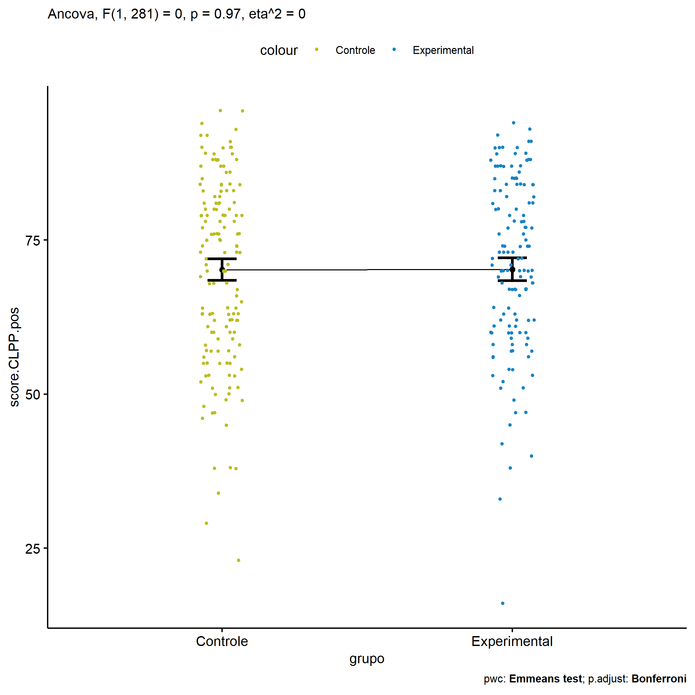<!-- -->

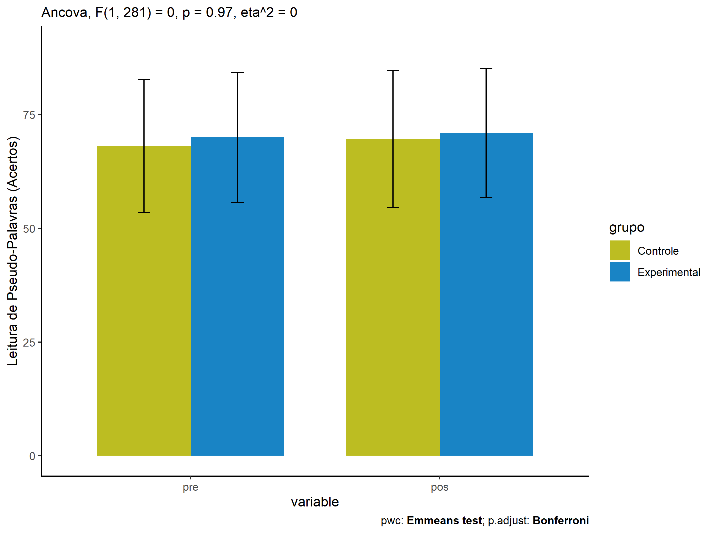<!-- -->

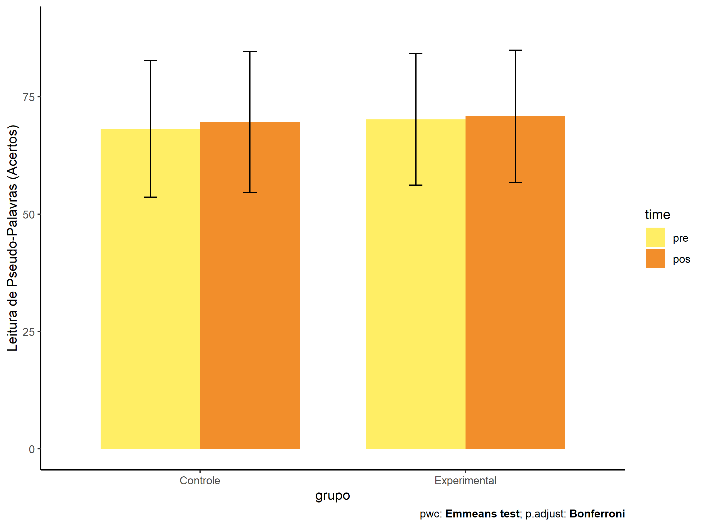<!-- -->

### Correta Regular (Acertos)

| var          | grupo        |   n | M (pre) | SE (pre) | M (unadj) | SE (unadj) | M (adj) | SE (adj) |
|:-------------|:-------------|----:|--------:|---------:|----------:|-----------:|--------:|---------:|
| score.CR.pos | Controle     | 176 |  13.949 |    0.334 |    13.131 |      0.450 |  13.237 |    0.425 |
| score.CR.pos | Experimental | 156 |  14.526 |    0.374 |    13.417 |      0.466 |  13.297 |    0.452 |

| .y.          | group1   | group2       | estimate | conf.low | conf.high |    se | statistic |     p | p.adj | p.adj.signif |
|:-------------|:---------|:-------------|---------:|---------:|----------:|------:|----------:|------:|------:|:-------------|
| score.CR.pos | Controle | Experimental |   -0.061 |   -1.282 |     1.161 | 0.621 |    -0.098 | 0.922 | 0.922 | ns           |
| score.CR.pre | Controle | Experimental |   -0.577 |   -1.560 |     0.407 | 0.500 |    -1.154 | 0.249 | 0.249 | ns           |

| .y.      | grupo        | group1 | group2 | estimate | conf.low | conf.high |    se | statistic |     p | p.adj | p.adj.signif |
|:---------|:-------------|:-------|:-------|---------:|---------:|----------:|------:|----------:|------:|------:|:-------------|
| score.CR | Controle     | pre    | pos    |    0.818 |   -0.284 |     1.921 | 0.561 |     1.457 | 0.145 | 0.145 | ns           |
| score.CR | Experimental | pre    | pos    |    1.109 |   -0.062 |     2.280 | 0.596 |     1.860 | 0.063 | 0.063 | ns           |

    ## Scale for colour is already present.
    ## Adding another scale for colour, which will replace the existing scale.

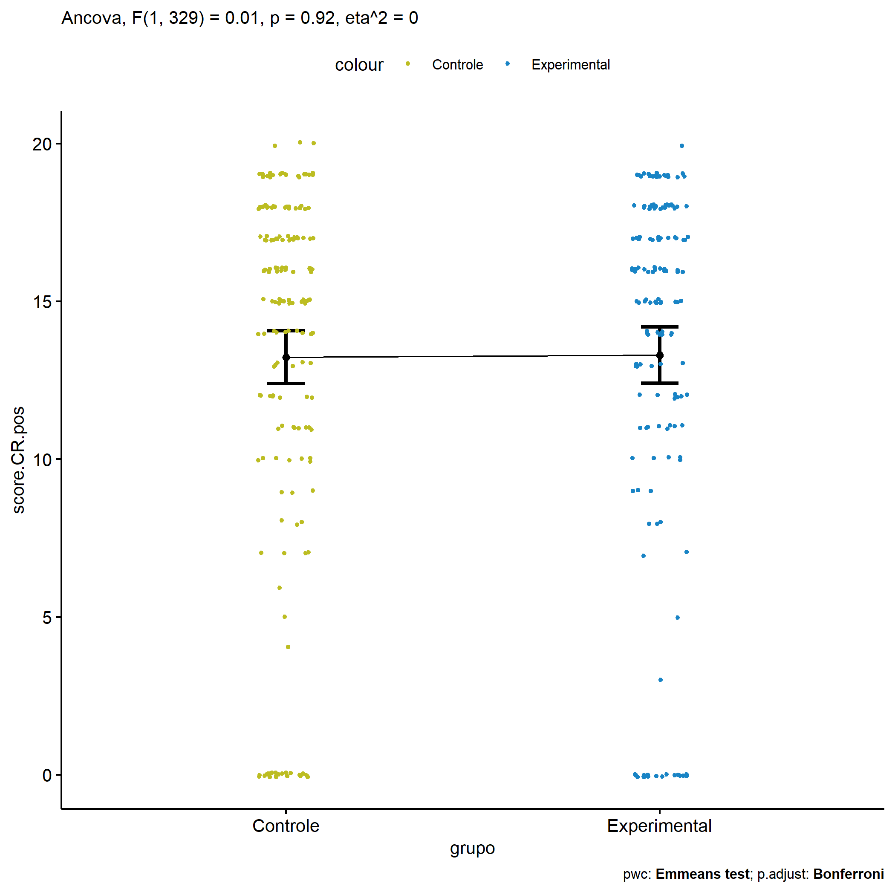<!-- -->

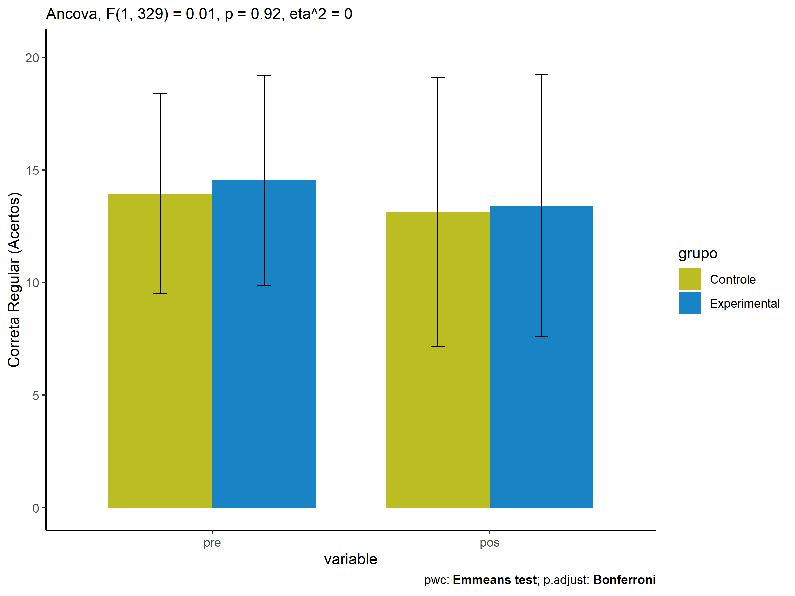<!-- -->

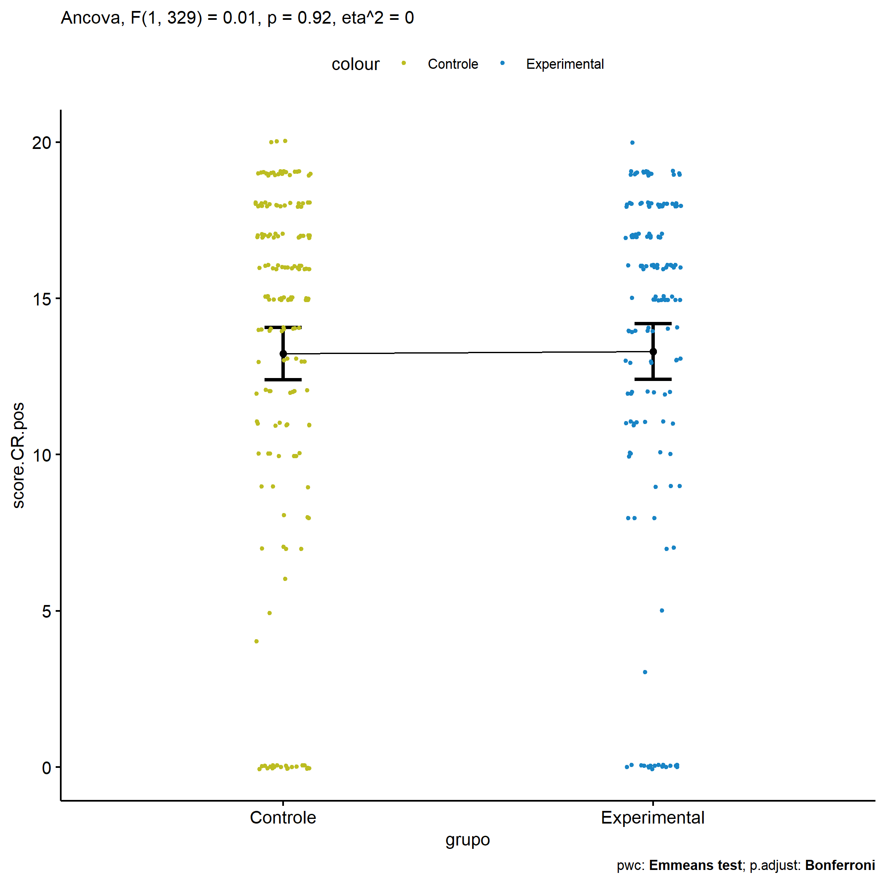<!-- -->

### Correta Irregular (Acertos)

| var          | grupo        |   n | M (pre) | SE (pre) | M (unadj) | SE (unadj) | M (adj) | SE (adj) |
|:-------------|:-------------|----:|--------:|---------:|----------:|-----------:|--------:|---------:|
| score.CI.pos | Controle     | 176 |  11.250 |    0.319 |    10.483 |      0.406 |  10.511 |    0.365 |
| score.CI.pos | Experimental | 156 |  11.365 |    0.339 |    11.256 |      0.416 |  11.225 |    0.388 |

| .y.          | group1   | group2       | estimate | conf.low | conf.high |    se | statistic |     p | p.adj | p.adj.signif |
|:-------------|:---------|:-------------|---------:|---------:|----------:|------:|----------:|------:|------:|:-------------|
| score.CI.pos | Controle | Experimental |   -0.715 |   -1.763 |     0.333 | 0.533 |    -1.342 | 0.181 | 0.181 | ns           |
| score.CI.pre | Controle | Experimental |   -0.115 |   -1.030 |     0.800 | 0.465 |    -0.248 | 0.804 | 0.804 | ns           |

| .y.      | grupo        | group1 | group2 | estimate | conf.low | conf.high |    se | statistic |     p | p.adj | p.adj.signif |
|:---------|:-------------|:-------|:-------|---------:|---------:|----------:|------:|----------:|------:|------:|:-------------|
| score.CI | Controle     | pre    | pos    |    0.767 |   -0.236 |     1.770 | 0.511 |     1.502 | 0.134 | 0.134 | ns           |
| score.CI | Experimental | pre    | pos    |    0.109 |   -0.956 |     1.174 | 0.543 |     0.201 | 0.841 | 0.841 | ns           |

    ## Scale for colour is already present.
    ## Adding another scale for colour, which will replace the existing scale.

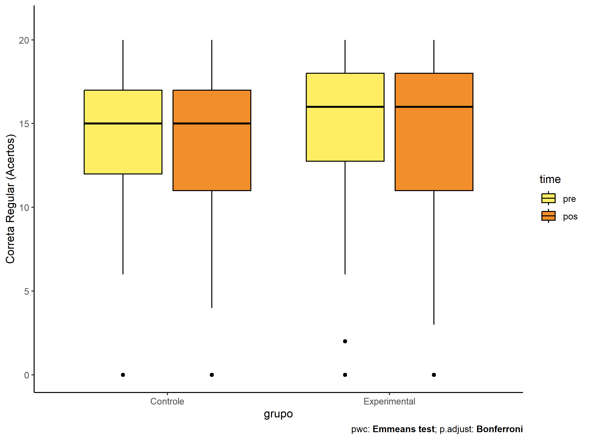<!-- -->

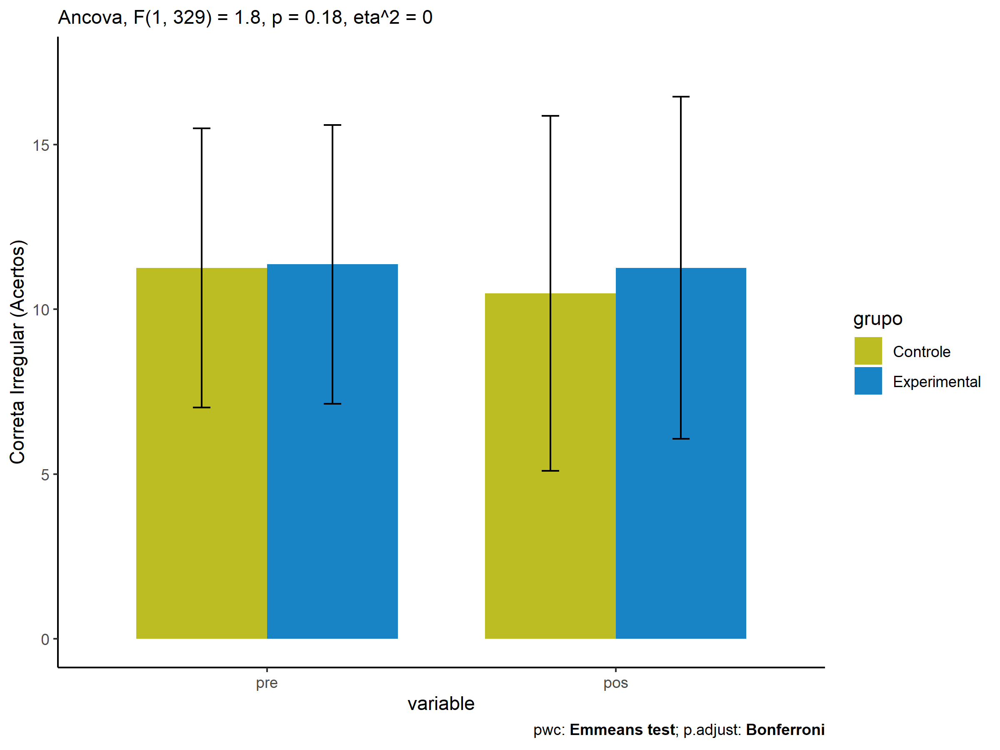<!-- -->

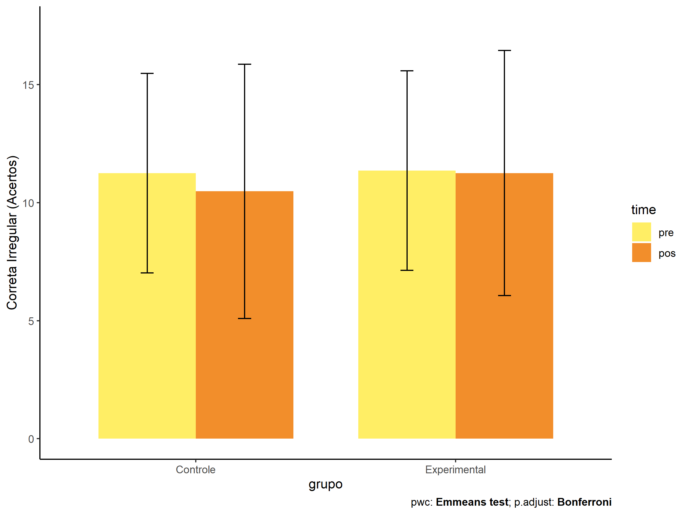<!-- -->

### Trocas Visuais (Acertos)

| var          | grupo        |   n | M (pre) | SE (pre) | M (unadj) | SE (unadj) | M (adj) | SE (adj) |
|:-------------|:-------------|----:|--------:|---------:|----------:|-----------:|--------:|---------:|
| score.TV.pos | Controle     | 176 |  15.710 |    0.377 |    14.523 |      0.488 |  14.611 |    0.459 |
| score.TV.pos | Experimental | 156 |  16.179 |    0.397 |    14.705 |      0.505 |  14.606 |    0.488 |

| .y.          | group1   | group2       | estimate | conf.low | conf.high |    se | statistic |     p | p.adj | p.adj.signif |
|:-------------|:---------|:-------------|---------:|---------:|----------:|------:|----------:|------:|------:|:-------------|
| score.TV.pos | Controle | Experimental |    0.005 |   -1.314 |     1.324 | 0.670 |     0.007 | 0.994 | 0.994 | ns           |
| score.TV.pre | Controle | Experimental |   -0.469 |   -1.547 |     0.608 | 0.548 |    -0.857 | 0.392 | 0.392 | ns           |

| .y.      | grupo        | group1 | group2 | estimate | conf.low | conf.high |    se | statistic |     p | p.adj | p.adj.signif |
|:---------|:-------------|:-------|:-------|---------:|---------:|----------:|------:|----------:|------:|------:|:-------------|
| score.TV | Controle     | pre    | pos    |    1.188 |   -0.013 |     2.388 | 0.611 |     1.943 | 0.052 | 0.052 | ns           |
| score.TV | Experimental | pre    | pos    |    1.474 |    0.200 |     2.749 | 0.649 |     2.271 | 0.023 | 0.023 | \*           |

    ## Scale for colour is already present.
    ## Adding another scale for colour, which will replace the existing scale.

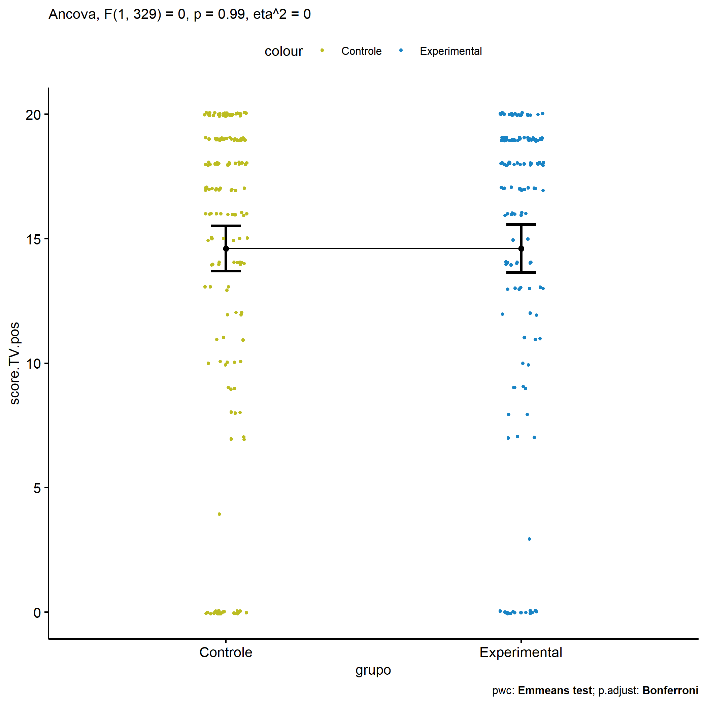<!-- -->

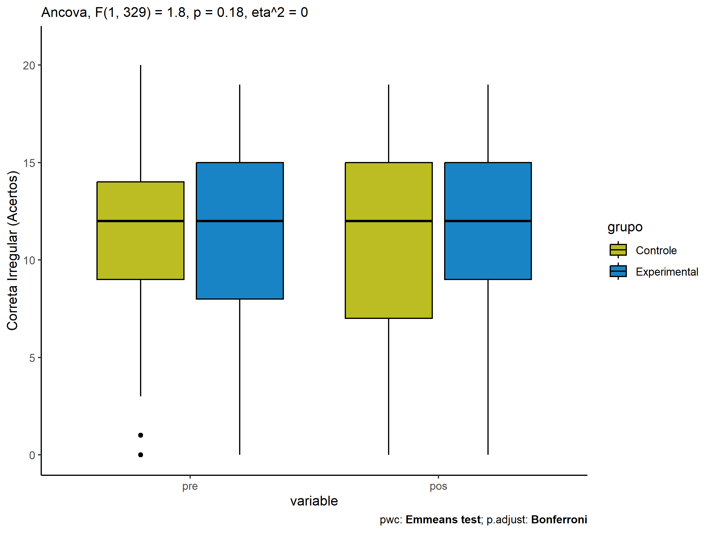<!-- -->

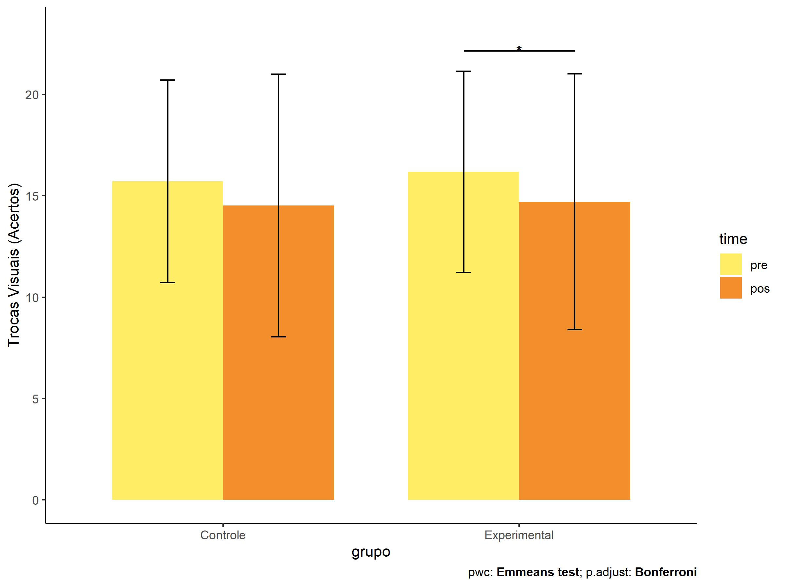<!-- -->

### Trocas Fonologicas (Acertos)

| var          | grupo        |   n | M (pre) | SE (pre) | M (unadj) | SE (unadj) | M (adj) | SE (adj) |
|:-------------|:-------------|----:|--------:|---------:|----------:|-----------:|--------:|---------:|
| score.TF.pos | Controle     | 176 |  14.568 |    0.376 |    13.199 |      0.488 |  13.300 |    0.439 |
| score.TF.pos | Experimental | 156 |  15.013 |    0.418 |    13.808 |      0.490 |  13.694 |    0.466 |

| .y.          | group1   | group2       | estimate | conf.low | conf.high |    se | statistic |     p | p.adj | p.adj.signif |
|:-------------|:---------|:-------------|---------:|---------:|----------:|------:|----------:|------:|------:|:-------------|
| score.TF.pos | Controle | Experimental |   -0.393 |   -1.653 |     0.866 | 0.640 |    -0.615 | 0.539 | 0.539 | ns           |
| score.TF.pre | Controle | Experimental |   -0.445 |   -1.547 |     0.658 | 0.561 |    -0.793 | 0.428 | 0.428 | ns           |

| .y.      | grupo        | group1 | group2 | estimate | conf.low | conf.high |    se | statistic |     p | p.adj | p.adj.signif |
|:---------|:-------------|:-------|:-------|---------:|---------:|----------:|------:|----------:|------:|------:|:-------------|
| score.TF | Controle     | pre    | pos    |    1.369 |    0.169 |      2.57 | 0.611 |     2.240 | 0.025 | 0.025 | \*           |
| score.TF | Experimental | pre    | pos    |    1.205 |   -0.070 |      2.48 | 0.649 |     1.856 | 0.064 | 0.064 | ns           |

    ## Scale for colour is already present.
    ## Adding another scale for colour, which will replace the existing scale.

<!-- -->

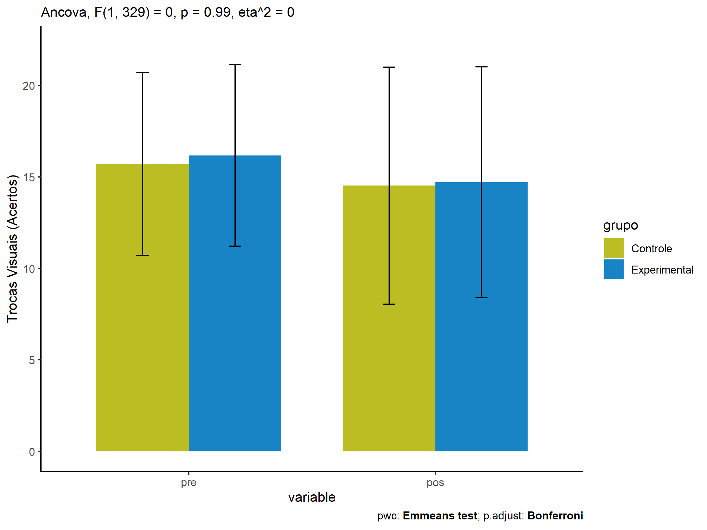<!-- -->

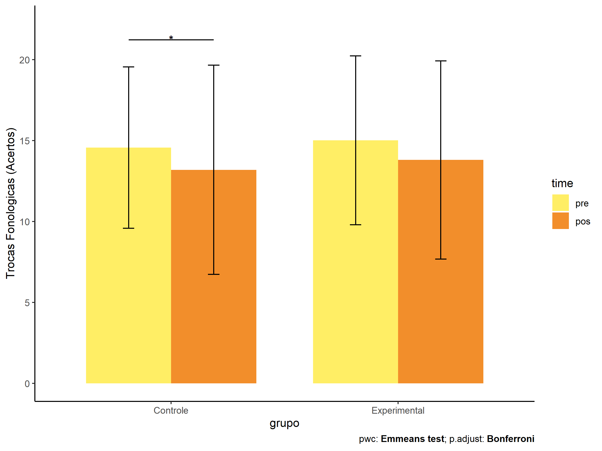<!-- -->

### Trocas Orograficas (Acertos)

| var          | grupo        |   n | M (pre) | SE (pre) | M (unadj) | SE (unadj) | M (adj) | SE (adj) |
|:-------------|:-------------|----:|--------:|---------:|----------:|-----------:|--------:|---------:|
| score.TO.pos | Controle     | 176 |   9.608 |    0.347 |     9.585 |      0.394 |   9.680 |    0.345 |
| score.TO.pos | Experimental | 156 |   9.962 |    0.355 |     9.474 |      0.422 |   9.367 |    0.366 |

| .y.          | group1   | group2       | estimate | conf.low | conf.high |    se | statistic |     p | p.adj | p.adj.signif |
|:-------------|:---------|:-------------|---------:|---------:|----------:|------:|----------:|------:|------:|:-------------|
| score.TO.pos | Controle | Experimental |    0.313 |   -0.676 |     1.302 | 0.503 |     0.622 | 0.534 | 0.534 | ns           |
| score.TO.pre | Controle | Experimental |   -0.354 |   -1.333 |     0.626 | 0.498 |    -0.710 | 0.478 | 0.478 | ns           |

| .y.      | grupo        | group1 | group2 | estimate | conf.low | conf.high |    se | statistic |     p | p.adj | p.adj.signif |
|:---------|:-------------|:-------|:-------|---------:|---------:|----------:|------:|----------:|------:|------:|:-------------|
| score.TO | Controle     | pre    | pos    |    0.023 |   -1.003 |     1.048 | 0.522 |     0.044 | 0.965 | 0.965 | ns           |
| score.TO | Experimental | pre    | pos    |    0.487 |   -0.602 |     1.576 | 0.555 |     0.878 | 0.380 | 0.380 | ns           |

    ## Scale for colour is already present.
    ## Adding another scale for colour, which will replace the existing scale.

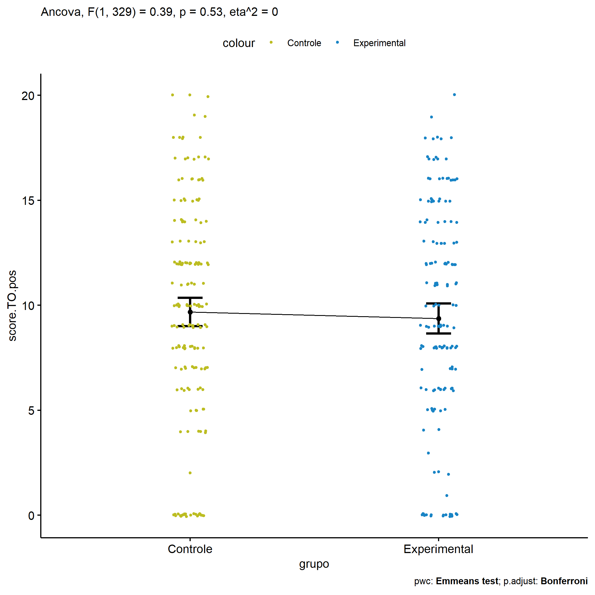<!-- -->

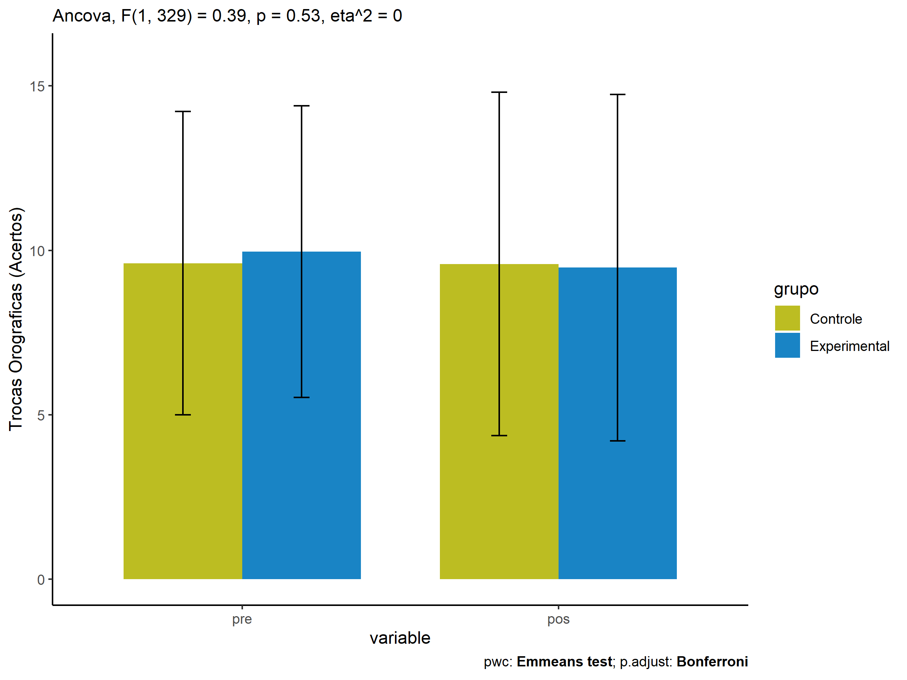<!-- -->

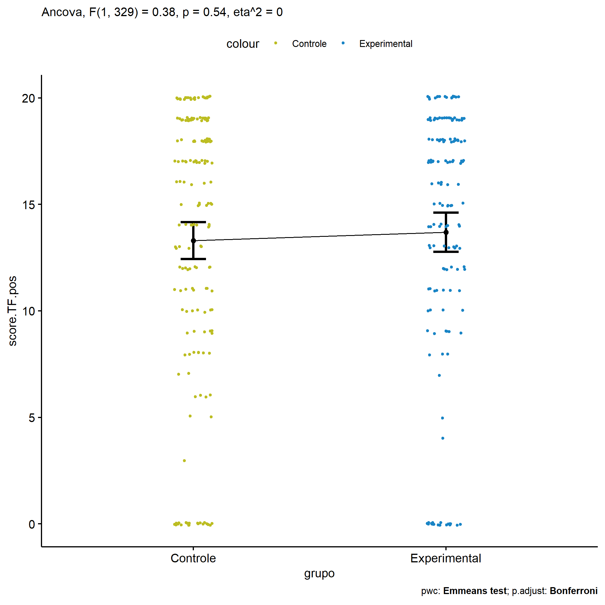<!-- -->

## factor: **genero**

### Leitura de Pseudo-Palavras (Acertos)

| var            | genero |   n | M (pre) | SE (pre) | M (unadj) | SE (unadj) | M (adj) | SE (adj) |
|:---------------|:-------|----:|--------:|---------:|----------:|-----------:|--------:|---------:|
| score.CLPP.pos | F      | 134 |  71.784 |    1.272 |    73.358 |      1.284 |  71.497 |    0.942 |
| score.CLPP.pos | M      | 150 |  66.493 |    1.132 |    67.427 |      1.138 |  69.089 |    0.889 |

| .y.            | group1 | group2 | estimate | conf.low | conf.high |    se | statistic |     p | p.adj | p.adj.signif |
|:---------------|:-------|:-------|---------:|---------:|----------:|------:|----------:|------:|------:|:-------------|
| score.CLPP.pos | F      | M      |    2.408 |   -0.164 |     4.979 | 1.306 |     1.843 | 0.066 | 0.066 | ns           |
| score.CLPP.pre | F      | M      |    5.290 |    1.949 |     8.631 | 1.697 |     3.117 | 0.002 | 0.002 | \*\*         |

| .y.        | genero | group1 | group2 | estimate | conf.low | conf.high |    se | statistic |     p | p.adj | p.adj.signif |
|:-----------|:-------|:-------|:-------|---------:|---------:|----------:|------:|----------:|------:|------:|:-------------|
| score.CLPP | F      | pre    | pos    |   -1.016 |   -4.344 |     2.311 | 1.694 |    -0.600 | 0.549 | 0.549 | ns           |
| score.CLPP | M      | pre    | pos    |   -1.130 |   -4.216 |     1.956 | 1.572 |    -0.719 | 0.472 | 0.472 | ns           |

    ## Scale for colour is already present.
    ## Adding another scale for colour, which will replace the existing scale.

<!-- -->

<!-- -->

<!-- -->

### Correta Regular (Acertos)

| var          | genero |   n | M (pre) | SE (pre) | M (unadj) | SE (unadj) | M (adj) | SE (adj) |
|:-------------|:-------|----:|--------:|---------:|----------:|-----------:|--------:|---------:|
| score.CR.pos | F      | 150 |  14.960 |    0.348 |    14.207 |      0.452 |  13.921 |    0.456 |
| score.CR.pos | M      | 181 |  13.586 |    0.349 |    12.558 |      0.447 |  12.795 |    0.415 |

| .y.          | group1 | group2 | estimate | conf.low | conf.high |    se | statistic |     p | p.adj | p.adj.signif |
|:-------------|:-------|:-------|---------:|---------:|----------:|------:|----------:|------:|------:|:-------------|
| score.CR.pos | F      | M      |    1.126 |   -0.095 |     2.346 | 0.621 |     1.814 | 0.071 | 0.071 | ns           |
| score.CR.pre | F      | M      |    1.374 |    0.396 |     2.353 | 0.498 |     2.762 | 0.006 | 0.006 | \*\*         |

| .y.      | genero | group1 | group2 | estimate | conf.low | conf.high |    se | statistic |    p | p.adj | p.adj.signif |
|:---------|:-------|:-------|:-------|---------:|---------:|----------:|------:|----------:|-----:|------:|:-------------|
| score.CR | F      | pre    | pos    |    0.753 |   -0.425 |     1.932 | 0.600 |     1.255 | 0.21 |  0.21 | ns           |
| score.CR | M      | pre    | pos    |    1.028 |   -0.045 |     2.100 | 0.546 |     1.881 | 0.06 |  0.06 | ns           |

    ## Scale for colour is already present.
    ## Adding another scale for colour, which will replace the existing scale.

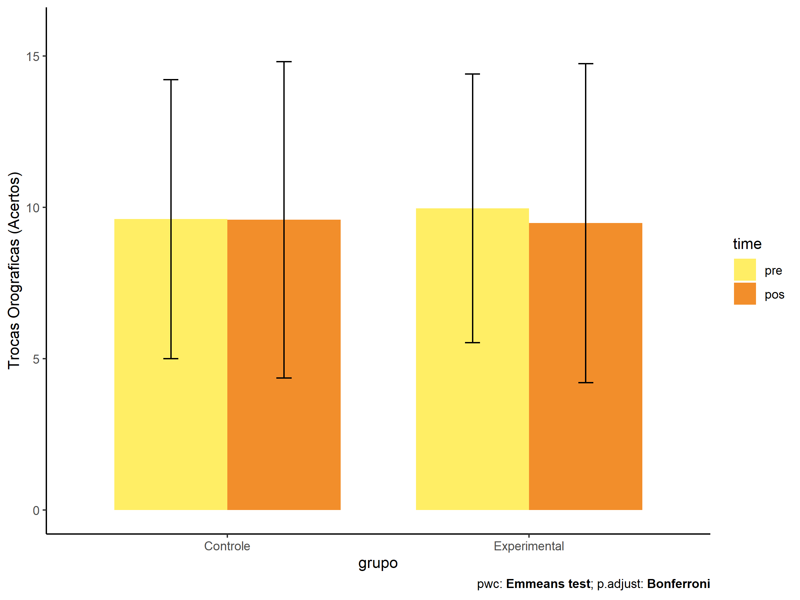<!-- -->

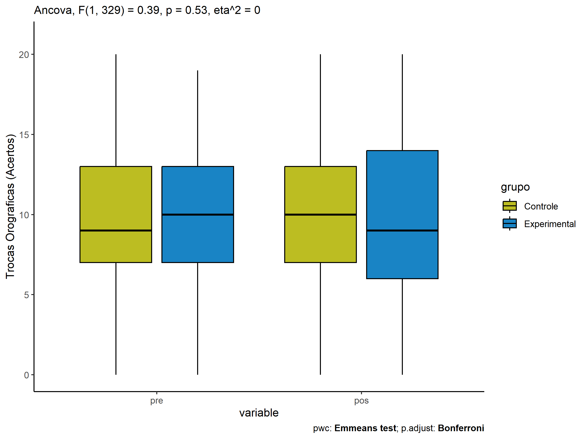<!-- -->

<!-- -->

### Correta Irregular (Acertos)

| var          | genero |   n | M (pre) | SE (pre) | M (unadj) | SE (unadj) | M (adj) | SE (adj) |
|:-------------|:-------|----:|--------:|---------:|----------:|-----------:|--------:|---------:|
| score.CI.pos | F      | 150 |  12.427 |    0.334 |    11.787 |      0.427 |  11.236 |    0.400 |
| score.CI.pos | M      | 181 |  10.376 |    0.307 |    10.127 |      0.387 |  10.584 |    0.363 |

| .y.          | group1 | group2 | estimate | conf.low | conf.high |    se | statistic | p       | p.adj   | p.adj.signif |
|:-------------|:-------|:-------|---------:|---------:|----------:|------:|----------:|:--------|:--------|:-------------|
| score.CI.pos | F      | M      |    0.652 |   -0.426 |     1.731 | 0.548 |     1.190 | 0.235   | 0.235   | ns           |
| score.CI.pre | F      | M      |    2.051 |    1.158 |     2.944 | 0.454 |     4.518 | \<0.001 | \<0.001 | \*\*\*\*     |

| .y.      | genero | group1 | group2 | estimate | conf.low | conf.high |    se | statistic |     p | p.adj | p.adj.signif |
|:---------|:-------|:-------|:-------|---------:|---------:|----------:|------:|----------:|------:|------:|:-------------|
| score.CI | F      | pre    | pos    |    0.640 |   -0.425 |     1.705 | 0.542 |     1.180 | 0.238 | 0.238 | ns           |
| score.CI | M      | pre    | pos    |    0.249 |   -0.721 |     1.218 | 0.494 |     0.504 | 0.615 | 0.615 | ns           |

    ## Scale for colour is already present.
    ## Adding another scale for colour, which will replace the existing scale.

<!-- -->

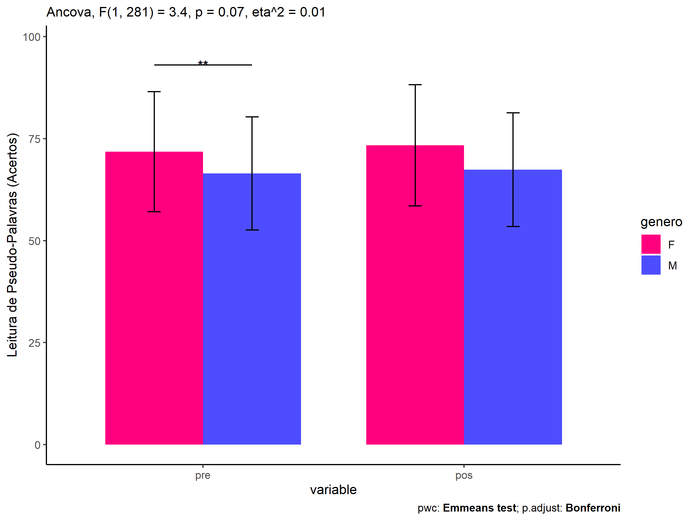<!-- -->

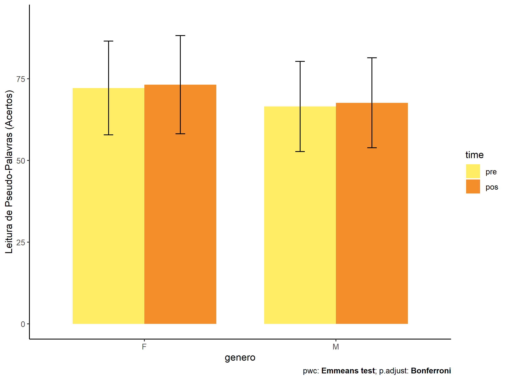<!-- -->

### Trocas Visuais (Acertos)

| var          | genero |   n | M (pre) | SE (pre) | M (unadj) | SE (unadj) | M (adj) | SE (adj) |
|:-------------|:-------|----:|--------:|---------:|----------:|-----------:|--------:|---------:|
| score.TV.pos | F      | 150 |  16.513 |    0.352 |    15.487 |      0.496 |  15.252 |    0.492 |
| score.TV.pos | M      | 181 |  15.425 |    0.404 |    13.961 |      0.483 |  14.156 |    0.448 |

| .y.          | group1 | group2 | estimate | conf.low | conf.high |    se | statistic |     p | p.adj | p.adj.signif |
|:-------------|:-------|:-------|---------:|---------:|----------:|------:|----------:|------:|------:|:-------------|
| score.TV.pos | F      | M      |    1.095 |   -0.218 |     2.408 | 0.667 |     1.641 | 0.102 | 0.102 | ns           |
| score.TV.pre | F      | M      |    1.088 |    0.010 |     2.165 | 0.548 |     1.986 | 0.048 | 0.048 | \*           |

| .y.      | genero | group1 | group2 | estimate | conf.low | conf.high |    se | statistic |     p | p.adj | p.adj.signif |
|:---------|:-------|:-------|:-------|---------:|---------:|----------:|------:|----------:|------:|------:|:-------------|
| score.TV | F      | pre    | pos    |    1.027 |   -0.260 |     2.314 | 0.655 |     1.566 | 0.118 | 0.118 | ns           |
| score.TV | M      | pre    | pos    |    1.464 |    0.292 |     2.636 | 0.597 |     2.454 | 0.014 | 0.014 | \*           |

    ## Scale for colour is already present.
    ## Adding another scale for colour, which will replace the existing scale.

<!-- -->

<!-- -->

<!-- -->

### Trocas Fonologicas (Acertos)

| var          | genero |   n | M (pre) | SE (pre) | M (unadj) | SE (unadj) | M (adj) | SE (adj) |
|:-------------|:-------|----:|--------:|---------:|----------:|-----------:|--------:|---------:|
| score.TF.pos | F      | 150 |  15.207 |    0.392 |    14.140 |      0.494 |  13.922 |    0.470 |
| score.TF.pos | M      | 181 |  14.392 |    0.394 |    13.017 |      0.477 |  13.197 |    0.428 |

| .y.          | group1 | group2 | estimate | conf.low | conf.high |    se | statistic |     p | p.adj | p.adj.signif |
|:-------------|:-------|:-------|---------:|---------:|----------:|------:|----------:|------:|------:|:-------------|
| score.TF.pos | F      | M      |    0.724 |   -0.528 |     1.977 | 0.637 |     1.137 | 0.256 | 0.256 | ns           |
| score.TF.pre | F      | M      |    0.814 |   -0.290 |     1.919 | 0.562 |     1.450 | 0.148 | 0.148 | ns           |

| .y.      | genero | group1 | group2 | estimate | conf.low | conf.high |    se | statistic |     p | p.adj | p.adj.signif |
|:---------|:-------|:-------|:-------|---------:|---------:|----------:|------:|----------:|------:|------:|:-------------|
| score.TF | F      | pre    | pos    |    1.067 |   -0.226 |     2.359 | 0.658 |     1.620 | 0.106 | 0.106 | ns           |
| score.TF | M      | pre    | pos    |    1.376 |    0.199 |     2.553 | 0.599 |     2.295 | 0.022 | 0.022 | \*           |

    ## Scale for colour is already present.
    ## Adding another scale for colour, which will replace the existing scale.

<!-- -->

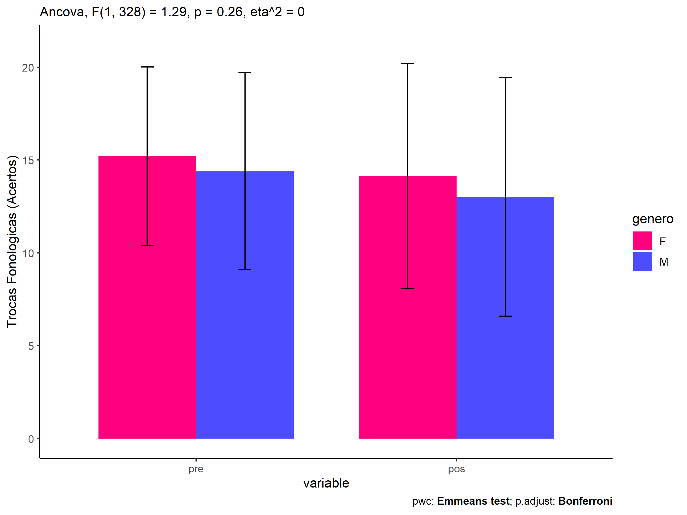<!-- -->

<!-- -->

### Trocas Orograficas (Acertos)

| var          | genero |   n | M (pre) | SE (pre) | M (unadj) | SE (unadj) | M (adj) | SE (adj) |
|:-------------|:-------|----:|--------:|---------:|----------:|-----------:|--------:|---------:|
| score.TO.pos | F      | 150 |  10.627 |    0.375 |    10.707 |      0.435 |  10.220 |    0.369 |
| score.TO.pos | M      | 181 |   9.033 |    0.322 |     8.613 |      0.368 |   9.017 |    0.336 |

| .y.          | group1 | group2 | estimate | conf.low | conf.high |    se | statistic |     p | p.adj | p.adj.signif |
|:-------------|:-------|:-------|---------:|---------:|----------:|------:|----------:|------:|------:|:-------------|
| score.TO.pos | F      | M      |    1.203 |    0.214 |     2.192 | 0.503 |     2.393 | 0.017 | 0.017 | \*           |
| score.TO.pre | F      | M      |    1.594 |    0.626 |     2.561 | 0.492 |     3.240 | 0.001 | 0.001 | \*\*         |

| .y.      | genero | group1 | group2 | estimate | conf.low | conf.high |    se | statistic |     p | p.adj | p.adj.signif |
|:---------|:-------|:-------|:-------|---------:|---------:|----------:|------:|----------:|------:|------:|:-------------|
| score.TO | F      | pre    | pos    |    -0.08 |   -1.168 |     1.008 | 0.554 |    -0.144 | 0.885 | 0.885 | ns           |
| score.TO | M      | pre    | pos    |     0.42 |   -0.571 |     1.410 | 0.504 |     0.832 | 0.405 | 0.405 | ns           |

    ## Scale for colour is already present.
    ## Adding another scale for colour, which will replace the existing scale.

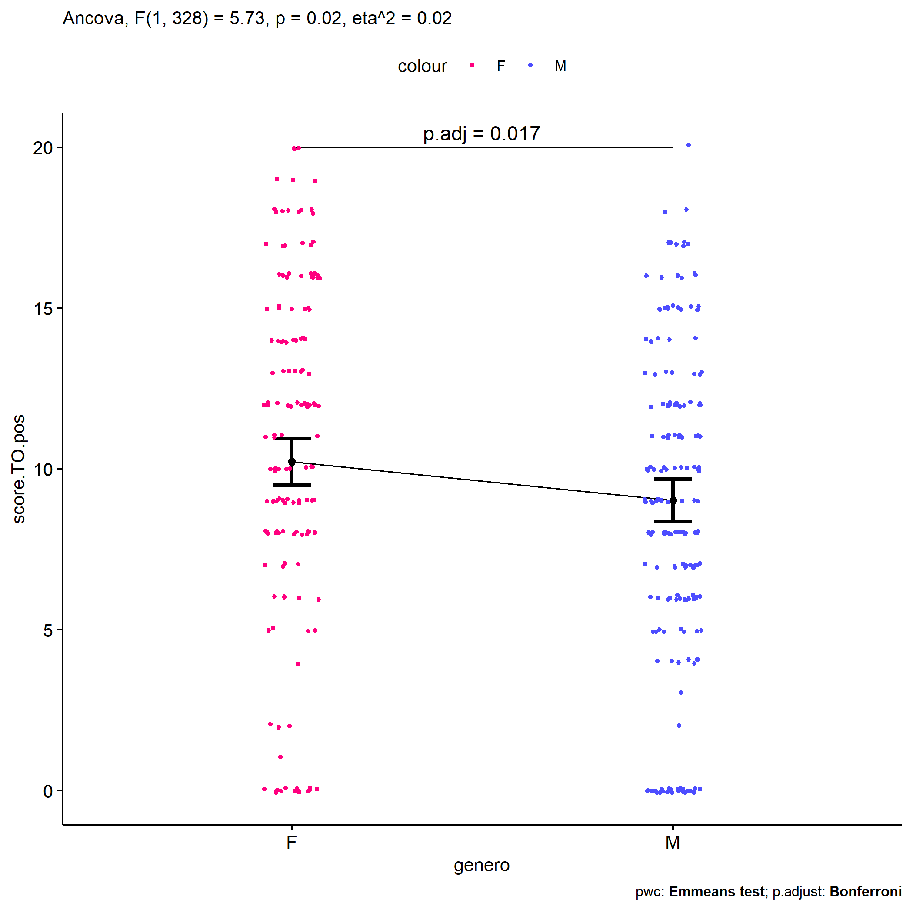<!-- -->

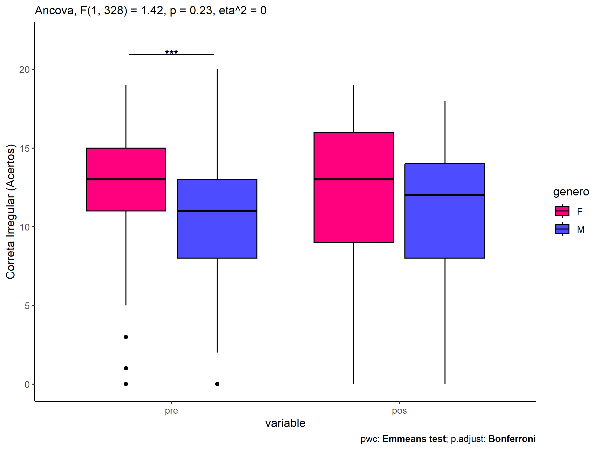<!-- -->

<!-- -->

## factor: **idade**

### Leitura de Pseudo-Palavras (Acertos)

| var            | idade |   n | M (pre) | SE (pre) | M (unadj) | SE (unadj) | M (adj) | SE (adj) |
|:---------------|:------|----:|--------:|---------:|----------:|-----------:|--------:|---------:|
| score.CLPP.pos | 10y   |  55 |  70.618 |    1.613 |    69.073 |      2.075 |  68.197 |    1.446 |
| score.CLPP.pos | 11y   | 166 |  70.404 |    1.149 |    72.801 |      1.077 |  72.071 |    0.833 |
| score.CLPP.pos | 12y   |  36 |  65.694 |    2.380 |    62.917 |      2.637 |  65.382 |    1.793 |
| score.CLPP.pos | 13y   |  15 |  61.400 |    2.948 |    65.533 |      2.801 |  70.912 |    2.790 |

| .y.            | group1 | group2 | estimate | conf.low | conf.high |    se | statistic | p       | p.adj | p.adj.signif |
|:---------------|:-------|:-------|---------:|---------:|----------:|------:|----------:|:--------|------:|:-------------|
| score.CLPP.pos | 10y    | 11y    |   -3.874 |   -7.156 |    -0.593 | 1.667 |    -2.324 | 0.021   | 0.125 | ns           |
| score.CLPP.pos | 10y    | 12y    |    2.815 |   -1.729 |     7.359 | 2.308 |     1.220 | 0.224   | 1.000 | ns           |
| score.CLPP.pos | 10y    | 13y    |   -2.716 |   -8.917 |     3.486 | 3.150 |    -0.862 | 0.389   | 1.000 | ns           |
| score.CLPP.pos | 11y    | 12y    |    6.689 |    2.787 |    10.591 | 1.982 |     3.375 | \<0.001 | 0.005 | \*\*         |
| score.CLPP.pos | 11y    | 13y    |    1.158 |   -4.588 |     6.905 | 2.919 |     0.397 | 0.692   | 1.000 | ns           |
| score.CLPP.pos | 12y    | 13y    |   -5.531 |  -12.025 |     0.963 | 3.298 |    -1.677 | 0.095   | 0.568 | ns           |
| score.CLPP.pre | 10y    | 11y    |    0.215 |   -4.087 |     4.516 | 2.185 |     0.098 | 0.922   | 1.000 | ns           |
| score.CLPP.pre | 10y    | 12y    |    4.924 |   -1.004 |    10.851 | 3.011 |     1.635 | 0.103   | 0.619 | ns           |
| score.CLPP.pre | 10y    | 13y    |    9.218 |    1.164 |    17.272 | 4.091 |     2.253 | 0.025   | 0.150 | ns           |
| score.CLPP.pre | 11y    | 12y    |    4.709 |   -0.374 |     9.793 | 2.582 |     1.824 | 0.069   | 0.416 | ns           |
| score.CLPP.pre | 11y    | 13y    |    9.004 |    1.549 |    16.459 | 3.786 |     2.378 | 0.018   | 0.109 | ns           |
| score.CLPP.pre | 12y    | 13y    |    4.294 |   -4.203 |    12.792 | 4.316 |     0.995 | 0.321   | 1.000 | ns           |

| .y.        | idade | group1 | group2 | estimate | conf.low | conf.high |    se | statistic |     p | p.adj | p.adj.signif |
|:-----------|:------|:-------|:-------|---------:|---------:|----------:|------:|----------:|------:|------:|:-------------|
| score.CLPP | 10y   | pre    | pos    |    1.855 |   -3.319 |     7.028 | 2.634 |     0.704 | 0.482 | 0.482 | ns           |
| score.CLPP | 11y   | pre    | pos    |   -1.960 |   -4.922 |     1.002 | 1.508 |    -1.300 | 0.194 | 0.194 | ns           |
| score.CLPP | 12y   | pre    | pos    |    2.360 |   -3.816 |     8.537 | 3.145 |     0.751 | 0.453 | 0.453 | ns           |
| score.CLPP | 13y   | pre    | pos    |   -3.050 |  -12.312 |     6.212 | 4.716 |    -0.647 | 0.518 | 0.518 | ns           |

    ## Scale for colour is already present.
    ## Adding another scale for colour, which will replace the existing scale.

<!-- -->

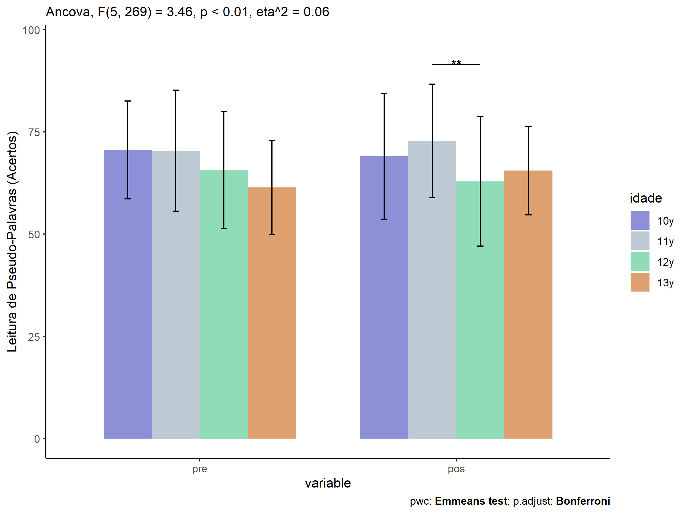<!-- -->

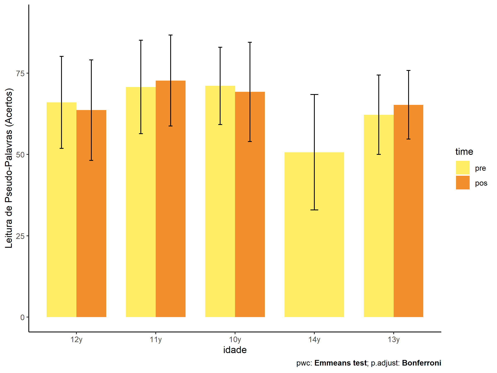<!-- -->

### Correta Regular (Acertos)

| var          | idade |   n | M (pre) | SE (pre) | M (unadj) | SE (unadj) | M (adj) | SE (adj) |
|:-------------|:------|----:|--------:|---------:|----------:|-----------:|--------:|---------:|
| score.CR.pos | 10y   |  59 |  14.983 |    0.483 |    14.305 |      0.629 |  14.148 |    0.690 |
| score.CR.pos | 11y   | 182 |  14.896 |    0.288 |    14.467 |      0.375 |  14.331 |    0.394 |
| score.CR.pos | 12y   |  45 |  13.444 |    0.805 |    11.800 |      0.894 |  12.018 |    0.791 |
| score.CR.pos | 13y   |  22 |  12.045 |    1.027 |    10.091 |      1.503 |  10.649 |    1.139 |
| score.CR.pos | 14y   |   8 |   8.250 |    2.274 |     5.125 |      2.587 |   6.607 |    1.918 |

| .y.          | group1 | group2 | estimate | conf.low | conf.high |    se | statistic | p       | p.adj   | p.adj.signif |
|:-------------|:-------|:-------|---------:|---------:|----------:|------:|----------:|:--------|:--------|:-------------|
| score.CR.pos | 10y    | 11y    |   -0.183 |   -1.742 |     1.375 | 0.792 |    -0.231 | 0.817   | 1       | ns           |
| score.CR.pos | 10y    | 12y    |    2.131 |    0.061 |     4.200 | 1.052 |     2.026 | 0.044   | 0.437   | ns           |
| score.CR.pos | 10y    | 13y    |    3.499 |    0.869 |     6.130 | 1.337 |     2.618 | 0.009   | 0.093   | ns           |
| score.CR.pos | 10y    | 14y    |    7.541 |    3.512 |    11.571 | 2.048 |     3.683 | \<0.001 | 0.003   | \*\*         |
| score.CR.pos | 11y    | 12y    |    2.314 |    0.570 |     4.057 | 0.886 |     2.611 | 0.009   | 0.095   | ns           |
| score.CR.pos | 11y    | 13y    |    3.682 |    1.301 |     6.064 | 1.210 |     3.043 | 0.003   | 0.025   | \*           |
| score.CR.pos | 11y    | 14y    |    7.725 |    3.855 |    11.594 | 1.967 |     3.928 | \<0.001 | 0.001   | \*\*         |
| score.CR.pos | 12y    | 13y    |    1.369 |   -1.344 |     4.082 | 1.379 |     0.993 | 0.322   | 1       | ns           |
| score.CR.pos | 12y    | 14y    |    5.411 |    1.355 |     9.467 | 2.061 |     2.625 | 0.009   | 0.091   | ns           |
| score.CR.pos | 13y    | 14y    |    4.042 |   -0.285 |     8.369 | 2.199 |     1.838 | 0.067   | 0.67    | ns           |
| score.CR.pre | 10y    | 11y    |    0.087 |   -1.162 |     1.337 | 0.635 |     0.138 | 0.891   | 1       | ns           |
| score.CR.pre | 10y    | 12y    |    1.539 |   -0.112 |     3.189 | 0.839 |     1.834 | 0.068   | 0.676   | ns           |
| score.CR.pre | 10y    | 13y    |    2.938 |    0.854 |     5.021 | 1.059 |     2.774 | 0.006   | 0.059   | ns           |
| score.CR.pre | 10y    | 14y    |    6.733 |    3.591 |     9.875 | 1.597 |     4.216 | \<0.001 | \<0.001 | \*\*\*       |
| score.CR.pre | 11y    | 12y    |    1.451 |    0.063 |     2.840 | 0.706 |     2.056 | 0.041   | 0.406   | ns           |
| score.CR.pre | 11y    | 13y    |    2.850 |    0.968 |     4.733 | 0.957 |     2.979 | 0.003   | 0.031   | \*           |
| score.CR.pre | 11y    | 14y    |    6.646 |    3.633 |     9.658 | 1.531 |     4.340 | \<0.001 | \<0.001 | \*\*\*       |
| score.CR.pre | 12y    | 13y    |    1.399 |   -0.771 |     3.569 | 1.103 |     1.269 | 0.205   | 1       | ns           |
| score.CR.pre | 12y    | 14y    |    5.194 |    1.994 |     8.395 | 1.626 |     3.194 | 0.002   | 0.015   | \*           |
| score.CR.pre | 13y    | 14y    |    3.795 |    0.352 |     7.239 | 1.750 |     2.169 | 0.031   | 0.309   | ns           |

| .y.      | idade | group1 | group2 | estimate | conf.low | conf.high |    se | statistic |     p | p.adj | p.adj.signif |
|:---------|:------|:-------|:-------|---------:|---------:|----------:|------:|----------:|------:|------:|:-------------|
| score.CR | 10y   | pre    | pos    |    0.678 |   -1.073 |     2.429 | 0.891 |     0.761 | 0.447 | 0.447 | ns           |
| score.CR | 11y   | pre    | pos    |    0.429 |   -0.568 |     1.425 | 0.508 |     0.844 | 0.399 | 0.399 | ns           |
| score.CR | 12y   | pre    | pos    |    1.644 |   -0.360 |     3.649 | 1.021 |     1.611 | 0.108 | 0.108 | ns           |
| score.CR | 13y   | pre    | pos    |    1.955 |   -0.912 |     4.821 | 1.460 |     1.339 | 0.181 | 0.181 | ns           |
| score.CR | 14y   | pre    | pos    |    3.125 |   -1.629 |     7.879 | 2.421 |     1.291 | 0.197 | 0.197 | ns           |

    ## Scale for colour is already present.
    ## Adding another scale for colour, which will replace the existing scale.

<!-- -->

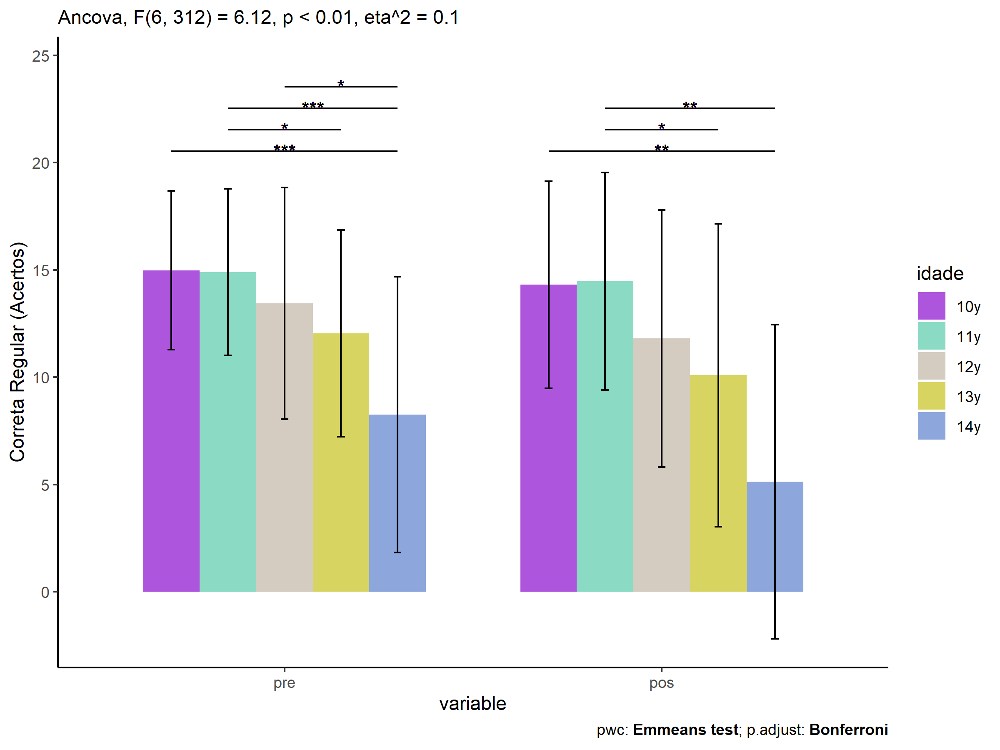<!-- -->

<!-- -->

### Correta Irregular (Acertos)

| var          | idade |   n | M (pre) | SE (pre) | M (unadj) | SE (unadj) | M (adj) | SE (adj) |
|:-------------|:------|----:|--------:|---------:|----------:|-----------:|--------:|---------:|
| score.CI.pos | 10y   |  59 |  11.881 |    0.452 |    11.678 |      0.606 |  11.474 |    0.610 |
| score.CI.pos | 11y   | 182 |  11.786 |    0.295 |    11.643 |      0.354 |  11.480 |    0.348 |
| score.CI.pos | 12y   |  45 |  10.800 |    0.713 |    10.422 |      0.809 |  10.681 |    0.699 |
| score.CI.pos | 13y   |  22 |   9.909 |    0.962 |     9.000 |      1.375 |   9.639 |    1.003 |
| score.CI.pos | 14y   |   8 |   6.750 |    1.740 |     3.500 |      1.803 |   5.490 |    1.682 |

| .y.          | group1 | group2 | estimate | conf.low | conf.high |    se | statistic | p       | p.adj | p.adj.signif |
|:-------------|:-------|:-------|---------:|---------:|----------:|------:|----------:|:--------|------:|:-------------|
| score.CI.pos | 10y    | 11y    |   -0.006 |   -1.385 |     1.374 | 0.701 |    -0.008 | 0.993   | 1.000 | ns           |
| score.CI.pos | 10y    | 12y    |    0.794 |   -1.034 |     2.621 | 0.929 |     0.854 | 0.394   | 1.000 | ns           |
| score.CI.pos | 10y    | 13y    |    1.835 |   -0.479 |     4.149 | 1.176 |     1.560 | 0.12    | 1.000 | ns           |
| score.CI.pos | 10y    | 14y    |    5.985 |    2.454 |     9.516 | 1.795 |     3.335 | \<0.001 | 0.010 | \*\*         |
| score.CI.pos | 11y    | 12y    |    0.799 |   -0.739 |     2.338 | 0.782 |     1.022 | 0.307   | 1.000 | ns           |
| score.CI.pos | 11y    | 13y    |    1.841 |   -0.252 |     3.933 | 1.063 |     1.731 | 0.084   | 0.844 | ns           |
| score.CI.pos | 11y    | 14y    |    5.991 |    2.602 |     9.379 | 1.722 |     3.479 | \<0.001 | 0.006 | \*\*         |
| score.CI.pos | 12y    | 13y    |    1.041 |   -1.357 |     3.440 | 1.219 |     0.854 | 0.394   | 1.000 | ns           |
| score.CI.pos | 12y    | 14y    |    5.191 |    1.620 |     8.763 | 1.815 |     2.860 | 0.005   | 0.045 | \*           |
| score.CI.pos | 13y    | 14y    |    4.150 |    0.326 |     7.973 | 1.943 |     2.136 | 0.033   | 0.335 | ns           |
| score.CI.pre | 10y    | 11y    |    0.096 |   -1.106 |     1.297 | 0.611 |     0.157 | 0.876   | 1.000 | ns           |
| score.CI.pre | 10y    | 12y    |    1.081 |   -0.506 |     2.668 | 0.807 |     1.341 | 0.181   | 1.000 | ns           |
| score.CI.pre | 10y    | 13y    |    1.972 |   -0.031 |     3.975 | 1.018 |     1.937 | 0.054   | 0.536 | ns           |
| score.CI.pre | 10y    | 14y    |    5.131 |    2.110 |     8.153 | 1.535 |     3.342 | \<0.001 | 0.009 | \*\*         |
| score.CI.pre | 11y    | 12y    |    0.986 |   -0.349 |     2.321 | 0.678 |     1.453 | 0.147   | 1.000 | ns           |
| score.CI.pre | 11y    | 13y    |    1.877 |    0.067 |     3.687 | 0.920 |     2.040 | 0.042   | 0.422 | ns           |
| score.CI.pre | 11y    | 14y    |    5.036 |    2.139 |     7.932 | 1.472 |     3.421 | \<0.001 | 0.007 | \*\*         |
| score.CI.pre | 12y    | 13y    |    0.891 |   -1.195 |     2.977 | 1.060 |     0.840 | 0.401   | 1.000 | ns           |
| score.CI.pre | 12y    | 14y    |    4.050 |    0.973 |     7.127 | 1.564 |     2.590 | 0.01    | 0.100 | ns           |
| score.CI.pre | 13y    | 14y    |    3.159 |   -0.152 |     6.470 | 1.683 |     1.878 | 0.061   | 0.614 | ns           |

| .y.      | idade | group1 | group2 | estimate | conf.low | conf.high |    se | statistic |     p | p.adj | p.adj.signif |
|:---------|:------|:-------|:-------|---------:|---------:|----------:|------:|----------:|------:|------:|:-------------|
| score.CI | 10y   | pre    | pos    |    0.203 |   -1.443 |     1.850 | 0.838 |     0.243 | 0.808 | 0.808 | ns           |
| score.CI | 11y   | pre    | pos    |    0.143 |   -0.795 |     1.080 | 0.477 |     0.299 | 0.765 | 0.765 | ns           |
| score.CI | 12y   | pre    | pos    |    0.378 |   -1.508 |     2.263 | 0.960 |     0.394 | 0.694 | 0.694 | ns           |
| score.CI | 13y   | pre    | pos    |    0.909 |   -1.787 |     3.605 | 1.373 |     0.662 | 0.508 | 0.508 | ns           |
| score.CI | 14y   | pre    | pos    |    3.250 |   -1.221 |     7.721 | 2.277 |     1.427 | 0.154 | 0.154 | ns           |

    ## Scale for colour is already present.
    ## Adding another scale for colour, which will replace the existing scale.

<!-- -->

<!-- -->

<!-- -->

### Trocas Visuais (Acertos)

| var          | idade |   n | M (pre) | SE (pre) | M (unadj) | SE (unadj) | M (adj) | SE (adj) |
|:-------------|:------|----:|--------:|---------:|----------:|-----------:|--------:|---------:|
| score.TV.pos | 10y   |  59 |  17.153 |    0.467 |    15.915 |      0.667 |  15.662 |    0.743 |
| score.TV.pos | 11y   | 182 |  16.692 |    0.308 |    15.841 |      0.410 |  15.694 |    0.423 |
| score.TV.pos | 12y   |  45 |  14.444 |    0.875 |    13.378 |      0.941 |  13.751 |    0.854 |
| score.TV.pos | 13y   |  22 |  13.273 |    1.262 |    10.773 |      1.597 |  11.417 |    1.227 |
| score.TV.pos | 14y   |   8 |  10.250 |    2.846 |     4.625 |      2.514 |   5.970 |    2.049 |

| .y.          | group1 | group2 | estimate | conf.low | conf.high |    se | statistic | p       | p.adj   | p.adj.signif |
|:-------------|:-------|:-------|---------:|---------:|----------:|------:|----------:|:--------|:--------|:-------------|
| score.TV.pos | 10y    | 11y    |   -0.032 |   -1.708 |     1.644 | 0.852 |    -0.038 | 0.97    | 1       | ns           |
| score.TV.pos | 10y    | 12y    |    1.910 |   -0.333 |     4.154 | 1.140 |     1.676 | 0.095   | 0.948   | ns           |
| score.TV.pos | 10y    | 13y    |    4.244 |    1.401 |     7.087 | 1.445 |     2.938 | 0.004   | 0.036   | \*           |
| score.TV.pos | 10y    | 14y    |    9.692 |    5.375 |    14.009 | 2.194 |     4.417 | \<0.001 | \<0.001 | \*\*\*       |
| score.TV.pos | 11y    | 12y    |    1.942 |    0.056 |     3.829 | 0.959 |     2.026 | 0.044   | 0.436   | ns           |
| score.TV.pos | 11y    | 13y    |    4.276 |    1.710 |     6.843 | 1.304 |     3.278 | 0.001   | 0.012   | \*           |
| score.TV.pos | 11y    | 14y    |    9.724 |    5.590 |    13.858 | 2.101 |     4.628 | \<0.001 | \<0.001 | \*\*\*\*     |
| score.TV.pos | 12y    | 13y    |    2.334 |   -0.578 |     5.246 | 1.480 |     1.577 | 0.116   | 1       | ns           |
| score.TV.pos | 12y    | 14y    |    7.782 |    3.454 |    12.109 | 2.199 |     3.538 | \<0.001 | 0.005   | \*\*         |
| score.TV.pos | 13y    | 14y    |    5.448 |    0.815 |    10.081 | 2.355 |     2.314 | 0.021   | 0.213   | ns           |
| score.TV.pre | 10y    | 11y    |    0.460 |   -0.896 |     1.816 | 0.689 |     0.668 | 0.505   | 1       | ns           |
| score.TV.pre | 10y    | 12y    |    2.708 |    0.917 |     4.499 | 0.910 |     2.975 | 0.003   | 0.032   | \*           |
| score.TV.pre | 10y    | 13y    |    3.880 |    1.619 |     6.141 | 1.149 |     3.377 | \<0.001 | 0.008   | \*\*         |
| score.TV.pre | 10y    | 14y    |    6.903 |    3.493 |    10.312 | 1.733 |     3.983 | \<0.001 | \<0.001 | \*\*\*       |
| score.TV.pre | 11y    | 12y    |    2.248 |    0.741 |     3.755 | 0.766 |     2.936 | 0.004   | 0.036   | \*           |
| score.TV.pre | 11y    | 13y    |    3.420 |    1.377 |     5.462 | 1.038 |     3.294 | 0.001   | 0.011   | \*           |
| score.TV.pre | 11y    | 14y    |    6.442 |    3.173 |     9.712 | 1.662 |     3.877 | \<0.001 | 0.001   | \*\*         |
| score.TV.pre | 12y    | 13y    |    1.172 |   -1.183 |     3.526 | 1.197 |     0.979 | 0.328   | 1       | ns           |
| score.TV.pre | 12y    | 14y    |    4.194 |    0.722 |     7.667 | 1.765 |     2.377 | 0.018   | 0.181   | ns           |
| score.TV.pre | 13y    | 14y    |    3.023 |   -0.714 |     6.759 | 1.899 |     1.592 | 0.112   | 1       | ns           |

| .y.      | idade | group1 | group2 | estimate | conf.low | conf.high |    se | statistic |     p | p.adj | p.adj.signif |
|:---------|:------|:-------|:-------|---------:|---------:|----------:|------:|----------:|------:|------:|:-------------|
| score.TV | 10y   | pre    | pos    |    1.237 |   -0.649 |     3.124 | 0.961 |     1.288 | 0.198 | 0.198 | ns           |
| score.TV | 11y   | pre    | pos    |    0.852 |   -0.223 |     1.926 | 0.547 |     1.557 | 0.120 | 0.120 | ns           |
| score.TV | 12y   | pre    | pos    |    1.067 |   -1.094 |     3.227 | 1.100 |     0.970 | 0.333 | 0.333 | ns           |
| score.TV | 13y   | pre    | pos    |    2.500 |   -0.590 |     5.590 | 1.573 |     1.589 | 0.113 | 0.113 | ns           |
| score.TV | 14y   | pre    | pos    |    5.625 |    0.502 |    10.748 | 2.609 |     2.156 | 0.031 | 0.031 | \*           |

    ## Scale for colour is already present.
    ## Adding another scale for colour, which will replace the existing scale.

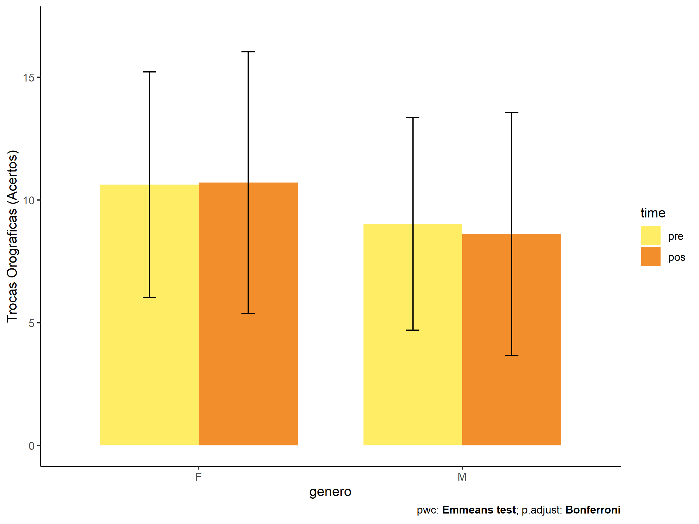<!-- -->

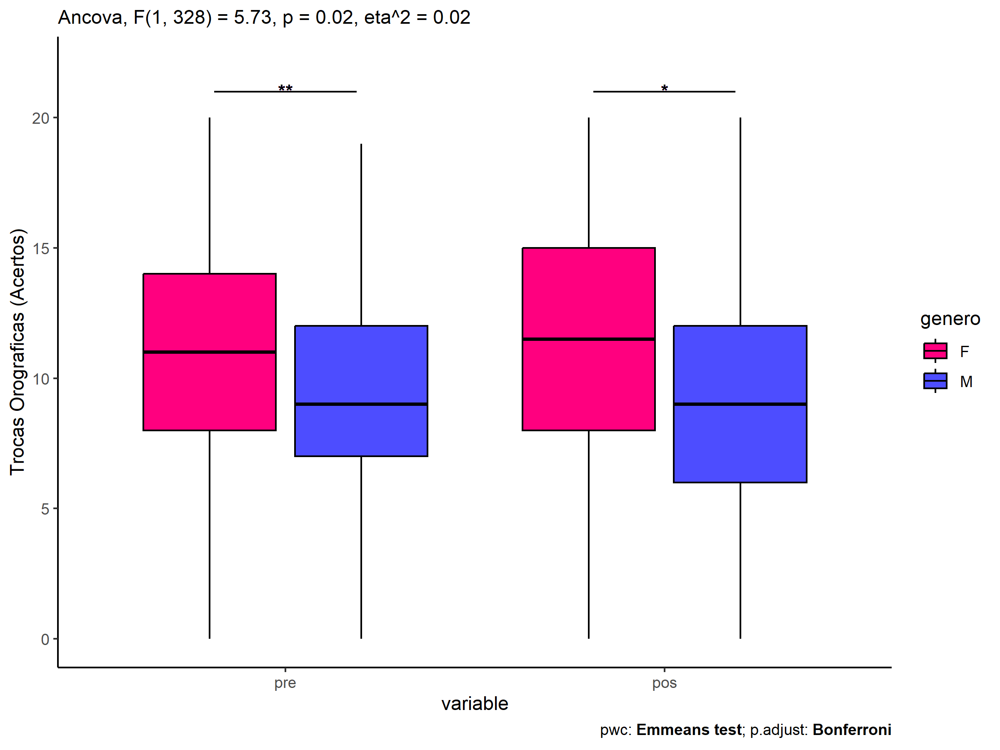<!-- -->

<!-- -->

### Trocas Fonologicas (Acertos)

| var          | idade |   n | M (pre) | SE (pre) | M (unadj) | SE (unadj) | M (adj) | SE (adj) |
|:-------------|:------|----:|--------:|---------:|----------:|-----------:|--------:|---------:|
| score.TF.pos | 10y   |  59 |  15.610 |    0.529 |    13.915 |      0.667 |  13.671 |    0.729 |
| score.TF.pos | 11y   | 182 |  15.692 |    0.321 |    14.857 |      0.416 |  14.582 |    0.417 |
| score.TF.pos | 12y   |  45 |  13.511 |    0.867 |    12.000 |      0.962 |  12.525 |    0.839 |
| score.TF.pos | 13y   |  22 |  12.682 |    1.154 |    11.000 |      1.583 |  11.830 |    1.201 |
| score.TF.pos | 14y   |   8 |   7.250 |    2.389 |     5.000 |      2.625 |   7.822 |    2.044 |

| .y.          | group1 | group2 | estimate | conf.low | conf.high |    se | statistic | p       | p.adj   | p.adj.signif |
|:-------------|:-------|:-------|---------:|---------:|----------:|------:|----------:|:--------|:--------|:-------------|
| score.TF.pos | 10y    | 11y    |   -0.912 |   -2.559 |     0.736 | 0.837 |    -1.089 | 0.277   | 1       | ns           |
| score.TF.pos | 10y    | 12y    |    1.145 |   -1.049 |     3.340 | 1.115 |     1.027 | 0.305   | 1       | ns           |
| score.TF.pos | 10y    | 13y    |    1.841 |   -0.934 |     4.616 | 1.410 |     1.305 | 0.193   | 1       | ns           |
| score.TF.pos | 10y    | 14y    |    5.848 |    1.557 |    10.139 | 2.181 |     2.682 | 0.008   | 0.077   | ns           |
| score.TF.pos | 11y    | 12y    |    2.057 |    0.203 |     3.911 | 0.942 |     2.183 | 0.03    | 0.298   | ns           |
| score.TF.pos | 11y    | 13y    |    2.753 |    0.238 |     5.267 | 1.278 |     2.154 | 0.032   | 0.32    | ns           |
| score.TF.pos | 11y    | 14y    |    6.760 |    2.630 |    10.889 | 2.099 |     3.221 | 0.001   | 0.014   | \*           |
| score.TF.pos | 12y    | 13y    |    0.696 |   -2.167 |     3.559 | 1.455 |     0.478 | 0.633   | 1       | ns           |
| score.TF.pos | 12y    | 14y    |    4.703 |    0.402 |     9.004 | 2.186 |     2.151 | 0.032   | 0.322   | ns           |
| score.TF.pos | 13y    | 14y    |    4.007 |   -0.590 |     8.605 | 2.337 |     1.715 | 0.087   | 0.873   | ns           |
| score.TF.pre | 10y    | 11y    |   -0.082 |   -1.457 |     1.293 | 0.699 |    -0.118 | 0.907   | 1       | ns           |
| score.TF.pre | 10y    | 12y    |    2.099 |    0.282 |     3.916 | 0.923 |     2.273 | 0.024   | 0.237   | ns           |
| score.TF.pre | 10y    | 13y    |    2.928 |    0.635 |     5.221 | 1.165 |     2.513 | 0.012   | 0.125   | ns           |
| score.TF.pre | 10y    | 14y    |    8.360 |    4.902 |    11.819 | 1.758 |     4.757 | \<0.001 | \<0.001 | \*\*\*\*     |
| score.TF.pre | 11y    | 12y    |    2.181 |    0.653 |     3.709 | 0.777 |     2.808 | 0.005   | 0.053   | ns           |
| score.TF.pre | 11y    | 13y    |    3.010 |    0.939 |     5.082 | 1.053 |     2.859 | 0.005   | 0.045   | \*           |
| score.TF.pre | 11y    | 14y    |    8.442 |    5.126 |    11.758 | 1.685 |     5.010 | \<0.001 | \<0.001 | \*\*\*\*     |
| score.TF.pre | 12y    | 13y    |    0.829 |   -1.559 |     3.217 | 1.214 |     0.683 | 0.495   | 1       | ns           |
| score.TF.pre | 12y    | 14y    |    6.261 |    2.739 |     9.783 | 1.790 |     3.498 | \<0.001 | 0.005   | \*\*         |
| score.TF.pre | 13y    | 14y    |    5.432 |    1.642 |     9.222 | 1.926 |     2.820 | 0.005   | 0.051   | ns           |

| .y.      | idade | group1 | group2 | estimate | conf.low | conf.high |    se | statistic |     p | p.adj | p.adj.signif |
|:---------|:------|:-------|:-------|---------:|---------:|----------:|------:|----------:|------:|------:|:-------------|
| score.TF | 10y   | pre    | pos    |    1.695 |   -0.215 |     3.605 | 0.973 |     1.742 | 0.082 | 0.082 | ns           |
| score.TF | 11y   | pre    | pos    |    0.835 |   -0.252 |     1.923 | 0.554 |     1.508 | 0.132 | 0.132 | ns           |
| score.TF | 12y   | pre    | pos    |    1.511 |   -0.676 |     3.698 | 1.114 |     1.357 | 0.175 | 0.175 | ns           |
| score.TF | 13y   | pre    | pos    |    1.682 |   -1.446 |     4.810 | 1.593 |     1.056 | 0.291 | 0.291 | ns           |
| score.TF | 14y   | pre    | pos    |    2.250 |   -2.938 |     7.438 | 2.642 |     0.852 | 0.395 | 0.395 | ns           |

    ## Scale for colour is already present.
    ## Adding another scale for colour, which will replace the existing scale.

<!-- -->

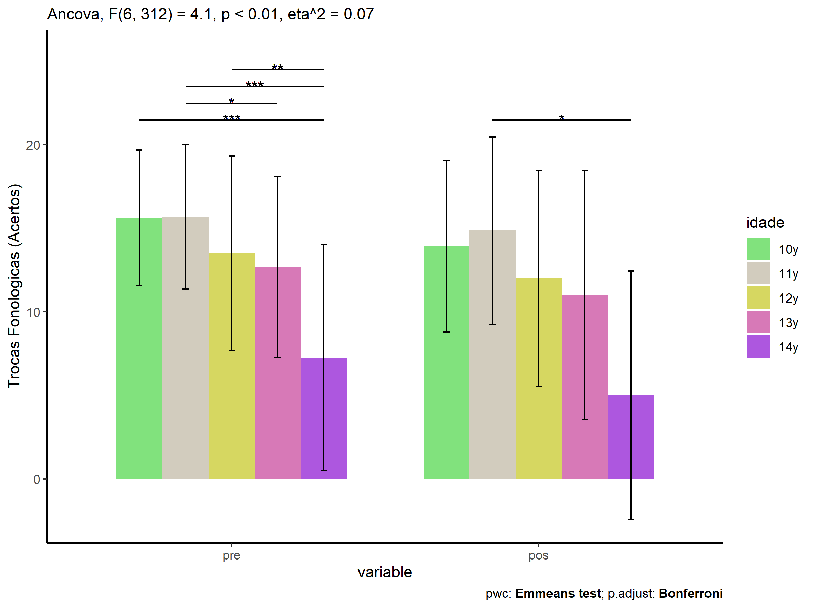<!-- -->

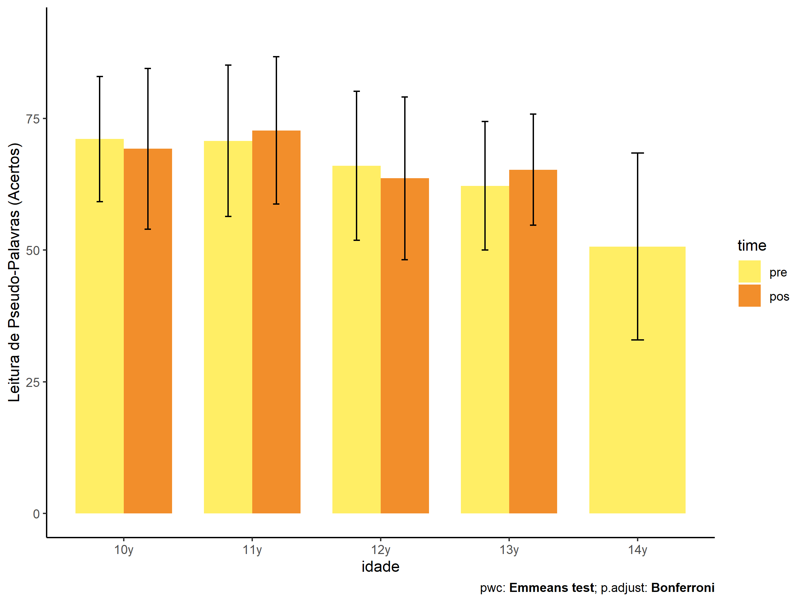<!-- -->

### Trocas Orograficas (Acertos)

| var          | idade |   n | M (pre) | SE (pre) | M (unadj) | SE (unadj) | M (adj) | SE (adj) |
|:-------------|:------|----:|--------:|---------:|----------:|-----------:|--------:|---------:|
| score.TO.pos | 10y   |  59 |  10.237 |    0.553 |     9.881 |      0.568 |   9.680 |    0.577 |
| score.TO.pos | 11y   | 182 |  10.495 |    0.323 |    10.687 |      0.371 |  10.361 |    0.331 |
| score.TO.pos | 12y   |  45 |   7.911 |    0.610 |     7.533 |      0.680 |   8.461 |    0.670 |
| score.TO.pos | 13y   |  22 |   8.636 |    0.884 |     6.591 |      1.025 |   7.167 |    0.947 |
| score.TO.pos | 14y   |   8 |   5.500 |    1.402 |     5.250 |      2.583 |   7.348 |    1.586 |

| .y.          | group1 | group2 | estimate | conf.low | conf.high |    se | statistic | p       | p.adj | p.adj.signif |
|:-------------|:-------|:-------|---------:|---------:|----------:|------:|----------:|:--------|------:|:-------------|
| score.TO.pos | 10y    | 11y    |   -0.681 |   -1.986 |     0.625 | 0.664 |    -1.026 | 0.306   | 1.000 | ns           |
| score.TO.pos | 10y    | 12y    |    1.219 |   -0.526 |     2.964 | 0.887 |     1.374 | 0.17    | 1.000 | ns           |
| score.TO.pos | 10y    | 13y    |    2.513 |    0.329 |     4.698 | 1.110 |     2.264 | 0.024   | 0.243 | ns           |
| score.TO.pos | 10y    | 14y    |    2.332 |   -0.996 |     5.659 | 1.691 |     1.379 | 0.169   | 1.000 | ns           |
| score.TO.pos | 11y    | 12y    |    1.899 |    0.419 |     3.380 | 0.753 |     2.524 | 0.012   | 0.121 | ns           |
| score.TO.pos | 11y    | 13y    |    3.194 |    1.216 |     5.172 | 1.005 |     3.177 | 0.002   | 0.016 | \*           |
| score.TO.pos | 11y    | 14y    |    3.012 |   -0.187 |     6.212 | 1.626 |     1.852 | 0.065   | 0.649 | ns           |
| score.TO.pos | 12y    | 13y    |    1.294 |   -0.974 |     3.563 | 1.153 |     1.123 | 0.262   | 1.000 | ns           |
| score.TO.pos | 12y    | 14y    |    1.113 |   -2.242 |     4.467 | 1.705 |     0.653 | 0.514   | 1.000 | ns           |
| score.TO.pos | 13y    | 14y    |   -0.182 |   -3.797 |     3.434 | 1.837 |    -0.099 | 0.921   | 1.000 | ns           |
| score.TO.pre | 10y    | 11y    |   -0.257 |   -1.518 |     1.003 | 0.641 |    -0.402 | 0.688   | 1.000 | ns           |
| score.TO.pre | 10y    | 12y    |    2.326 |    0.661 |     3.991 | 0.846 |     2.749 | 0.006   | 0.063 | ns           |
| score.TO.pre | 10y    | 13y    |    1.601 |   -0.501 |     3.702 | 1.068 |     1.499 | 0.135   | 1.000 | ns           |
| score.TO.pre | 10y    | 14y    |    4.737 |    1.568 |     7.907 | 1.611 |     2.941 | 0.004   | 0.035 | \*           |
| score.TO.pre | 11y    | 12y    |    2.583 |    1.183 |     3.984 | 0.712 |     3.629 | \<0.001 | 0.003 | \*\*         |
| score.TO.pre | 11y    | 13y    |    1.858 |   -0.041 |     3.757 | 0.965 |     1.925 | 0.055   | 0.551 | ns           |
| score.TO.pre | 11y    | 14y    |    4.995 |    1.956 |     8.033 | 1.544 |     3.234 | 0.001   | 0.014 | \*           |
| score.TO.pre | 12y    | 13y    |   -0.725 |   -2.914 |     1.463 | 1.112 |    -0.652 | 0.515   | 1.000 | ns           |
| score.TO.pre | 12y    | 14y    |    2.411 |   -0.817 |     5.639 | 1.640 |     1.470 | 0.143   | 1.000 | ns           |
| score.TO.pre | 13y    | 14y    |    3.136 |   -0.337 |     6.610 | 1.765 |     1.777 | 0.077   | 0.766 | ns           |

| .y.      | idade | group1 | group2 | estimate | conf.low | conf.high |    se | statistic |     p | p.adj | p.adj.signif |
|:---------|:------|:-------|:-------|---------:|---------:|----------:|------:|----------:|------:|------:|:-------------|
| score.TO | 10y   | pre    | pos    |    0.356 |   -1.304 |     2.015 | 0.845 |     0.421 | 0.674 | 0.674 | ns           |
| score.TO | 11y   | pre    | pos    |   -0.192 |   -1.137 |     0.753 | 0.481 |    -0.400 | 0.690 | 0.690 | ns           |
| score.TO | 12y   | pre    | pos    |    0.378 |   -1.522 |     2.278 | 0.968 |     0.390 | 0.696 | 0.696 | ns           |
| score.TO | 13y   | pre    | pos    |    2.045 |   -0.672 |     4.763 | 1.384 |     1.478 | 0.140 | 0.140 | ns           |
| score.TO | 14y   | pre    | pos    |    0.250 |   -4.257 |     4.757 | 2.295 |     0.109 | 0.913 | 0.913 | ns           |

    ## Scale for colour is already present.
    ## Adding another scale for colour, which will replace the existing scale.

<!-- -->

<!-- -->

<!-- -->

## factor: **zona.participante**

### Leitura de Pseudo-Palavras (Acertos)

| var            | zona.participante |   n | M (pre) | SE (pre) | M (unadj) | SE (unadj) | M (adj) | SE (adj) |
|:---------------|:------------------|----:|--------:|---------:|----------:|-----------:|--------:|---------:|
| score.CLPP.pos | Rural             | 109 |  69.633 |    1.275 |    70.679 |      1.311 |  70.183 |     1.05 |
| score.CLPP.pos | Urbana            | 111 |  68.243 |    1.495 |    70.198 |      1.540 |  70.685 |     1.04 |

| .y.            | group1 | group2 | estimate | conf.low | conf.high |    se | statistic |     p | p.adj | p.adj.signif |
|:---------------|:-------|:-------|---------:|---------:|----------:|------:|----------:|------:|------:|:-------------|
| score.CLPP.pos | Urbana | Rural  |    0.501 |   -2.413 |     3.416 | 1.479 |     0.339 | 0.735 | 0.735 | ns           |
| score.CLPP.pre | Urbana | Rural  |   -1.390 |   -5.268 |     2.489 | 1.968 |    -0.706 | 0.481 | 0.481 | ns           |

| .y.        | zona.participante | group1 | group2 | estimate | conf.low | conf.high |    se | statistic |     p | p.adj | p.adj.signif |
|:-----------|:------------------|:-------|:-------|---------:|---------:|----------:|------:|----------:|------:|------:|:-------------|
| score.CLPP | Urbana            | pre    | pos    |   -0.932 |   -4.653 |     2.789 | 1.893 |    -0.492 | 0.623 | 0.623 | ns           |
| score.CLPP | Rural             | pre    | pos    |   -1.321 |   -5.170 |     2.527 | 1.958 |    -0.675 | 0.500 | 0.500 | ns           |

    ## Scale for colour is already present.
    ## Adding another scale for colour, which will replace the existing scale.

<!-- -->

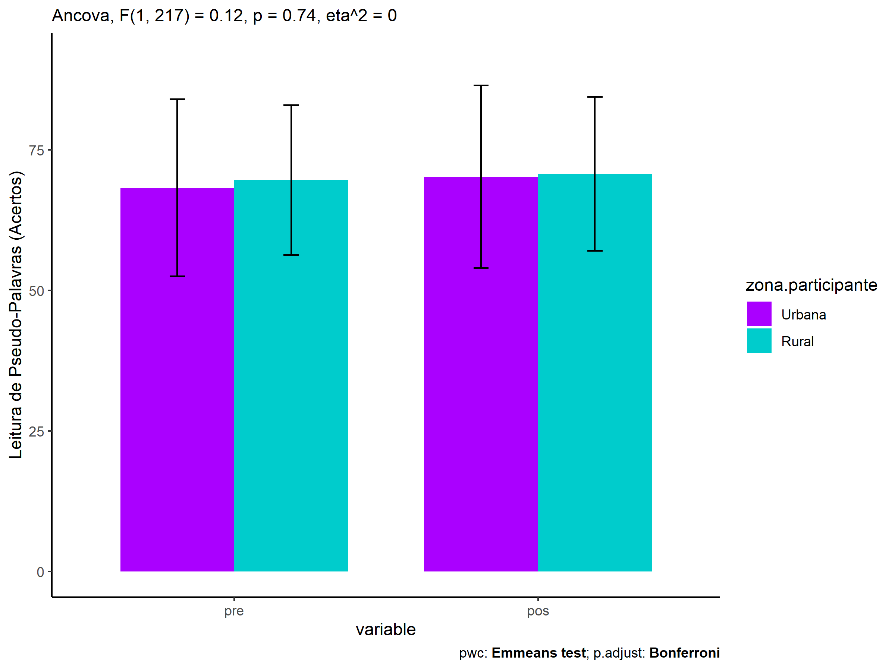<!-- -->

<!-- -->

### Correta Regular (Acertos)

| var          | zona.participante |   n | M (pre) | SE (pre) | M (unadj) | SE (unadj) | M (adj) | SE (adj) |
|:-------------|:------------------|----:|--------:|---------:|----------:|-----------:|--------:|---------:|
| score.CR.pos | Rural             | 115 |  14.443 |    0.383 |    14.643 |      0.379 |  14.525 |    0.475 |
| score.CR.pos | Urbana            | 134 |  13.821 |    0.444 |    12.858 |      0.539 |  12.960 |    0.440 |

| .y.          | group1 | group2 | estimate | conf.low | conf.high |    se | statistic |     p | p.adj | p.adj.signif |
|:-------------|:-------|:-------|---------:|---------:|----------:|------:|----------:|------:|------:|:-------------|
| score.CR.pos | Urbana | Rural  |   -1.566 |   -2.843 |    -0.288 | 0.649 |    -2.413 | 0.017 | 0.017 | \*           |
| score.CR.pre | Urbana | Rural  |   -0.623 |   -1.797 |     0.552 | 0.596 |    -1.044 | 0.297 | 0.297 | ns           |

| .y.      | zona.participante | group1 | group2 | estimate | conf.low | conf.high |    se | statistic |     p | p.adj | p.adj.signif |
|:---------|:------------------|:-------|:-------|---------:|---------:|----------:|------:|----------:|------:|------:|:-------------|
| score.CR | Urbana            | pre    | pos    |    0.963 |   -0.244 |     2.170 | 0.614 |     1.567 | 0.118 | 0.118 | ns           |
| score.CR | Rural             | pre    | pos    |   -0.200 |   -1.503 |     1.103 | 0.663 |    -0.302 | 0.763 | 0.763 | ns           |

    ## Scale for colour is already present.
    ## Adding another scale for colour, which will replace the existing scale.

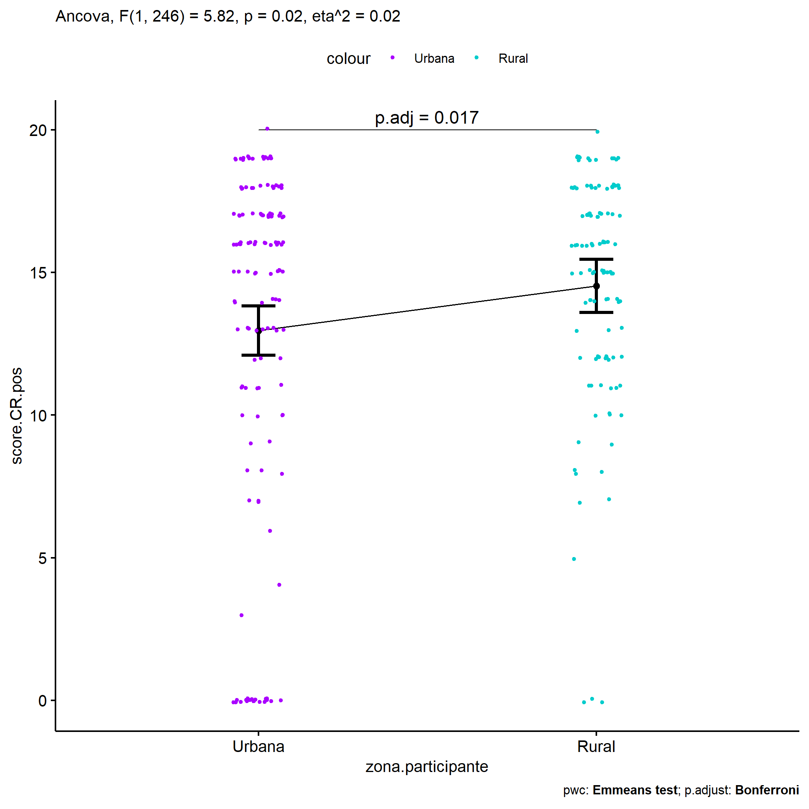<!-- -->

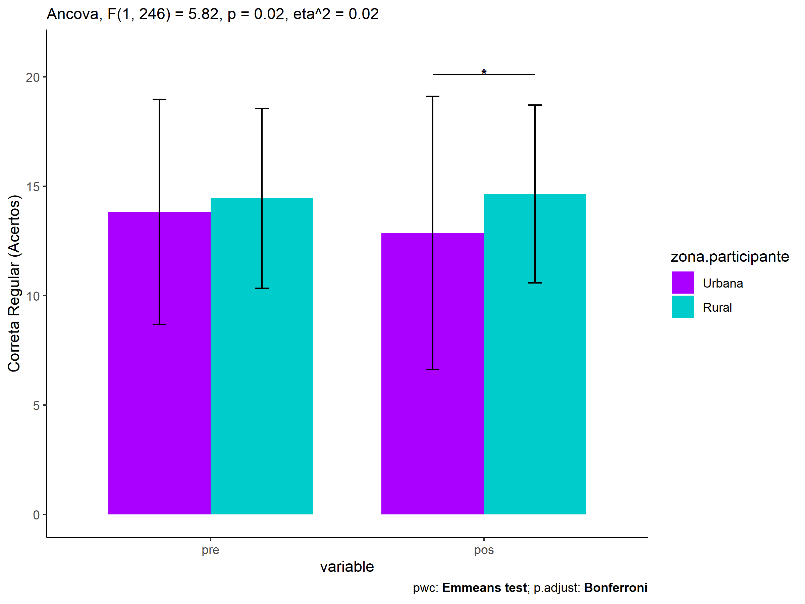<!-- -->

<!-- -->

### Correta Irregular (Acertos)

| var          | zona.participante |   n | M (pre) | SE (pre) | M (unadj) | SE (unadj) | M (adj) | SE (adj) |
|:-------------|:------------------|----:|--------:|---------:|----------:|-----------:|--------:|---------:|
| score.CI.pos | Rural             | 115 |  11.435 |    0.371 |    12.061 |      0.365 |  11.954 |    0.415 |
| score.CI.pos | Urbana            | 134 |  11.030 |    0.400 |    10.388 |      0.487 |  10.480 |    0.384 |

| .y.          | group1 | group2 | estimate | conf.low | conf.high |    se | statistic |     p | p.adj | p.adj.signif |
|:-------------|:-------|:-------|---------:|---------:|----------:|------:|----------:|------:|------:|:-------------|
| score.CI.pos | Urbana | Rural  |   -1.474 |   -2.588 |    -0.360 | 0.566 |    -2.607 | 0.010 | 0.010 | \*\*         |
| score.CI.pre | Urbana | Rural  |   -0.405 |   -1.492 |     0.682 | 0.552 |    -0.734 | 0.464 | 0.464 | ns           |

| .y.      | zona.participante | group1 | group2 | estimate | conf.low | conf.high |    se | statistic |     p | p.adj | p.adj.signif |
|:---------|:------------------|:-------|:-------|---------:|---------:|----------:|------:|----------:|------:|------:|:-------------|
| score.CI | Urbana            | pre    | pos    |    0.642 |   -0.472 |     1.755 | 0.567 |     1.132 | 0.258 | 0.258 | ns           |
| score.CI | Rural             | pre    | pos    |   -0.626 |   -1.828 |     0.576 | 0.612 |    -1.023 | 0.307 | 0.307 | ns           |

    ## Scale for colour is already present.
    ## Adding another scale for colour, which will replace the existing scale.

<!-- -->

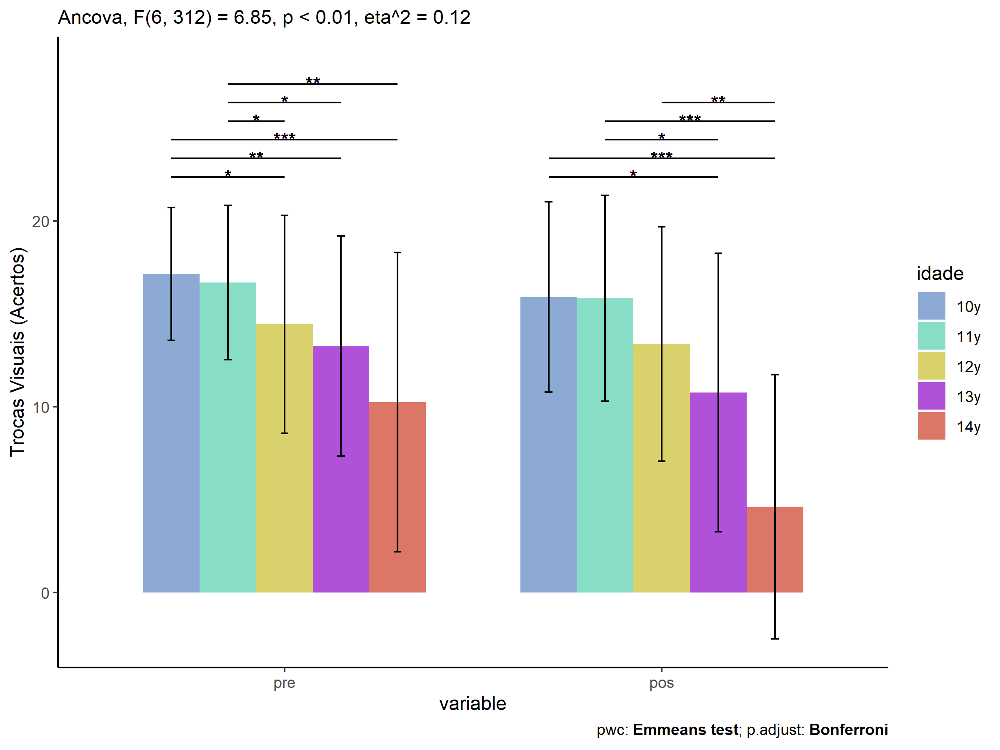<!-- -->

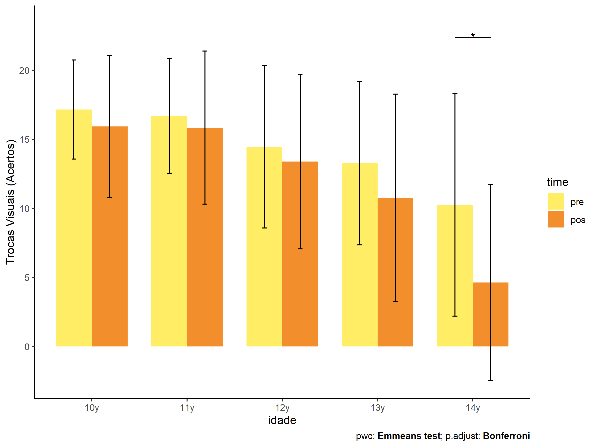<!-- -->

### Trocas Visuais (Acertos)

| var          | zona.participante |   n | M (pre) | SE (pre) | M (unadj) | SE (unadj) | M (adj) | SE (adj) |
|:-------------|:------------------|----:|--------:|---------:|----------:|-----------:|--------:|---------:|
| score.TV.pos | Rural             | 115 |  16.435 |    0.391 |    16.443 |      0.389 |  16.265 |    0.509 |
| score.TV.pos | Urbana            | 134 |  15.634 |    0.488 |    14.172 |      0.599 |  14.325 |    0.471 |

| .y.          | group1 | group2 | estimate | conf.low | conf.high |    se | statistic |     p | p.adj | p.adj.signif |
|:-------------|:-------|:-------|---------:|---------:|----------:|------:|----------:|------:|------:|:-------------|
| score.TV.pos | Urbana | Rural  |   -1.939 |   -3.308 |    -0.571 | 0.695 |    -2.791 | 0.006 | 0.006 | \*\*         |
| score.TV.pre | Urbana | Rural  |   -0.800 |   -2.060 |     0.459 | 0.639 |    -1.252 | 0.212 | 0.212 | ns           |

| .y.      | zona.participante | group1 | group2 | estimate | conf.low | conf.high |    se | statistic |     p | p.adj | p.adj.signif |
|:---------|:------------------|:-------|:-------|---------:|---------:|----------:|------:|----------:|------:|------:|:-------------|
| score.TV | Urbana            | pre    | pos    |    1.463 |    0.156 |     2.769 | 0.665 |     2.200 | 0.028 | 0.028 | \*           |
| score.TV | Rural             | pre    | pos    |   -0.009 |   -1.419 |     1.401 | 0.718 |    -0.012 | 0.990 | 0.990 | ns           |

    ## Scale for colour is already present.
    ## Adding another scale for colour, which will replace the existing scale.

<!-- -->

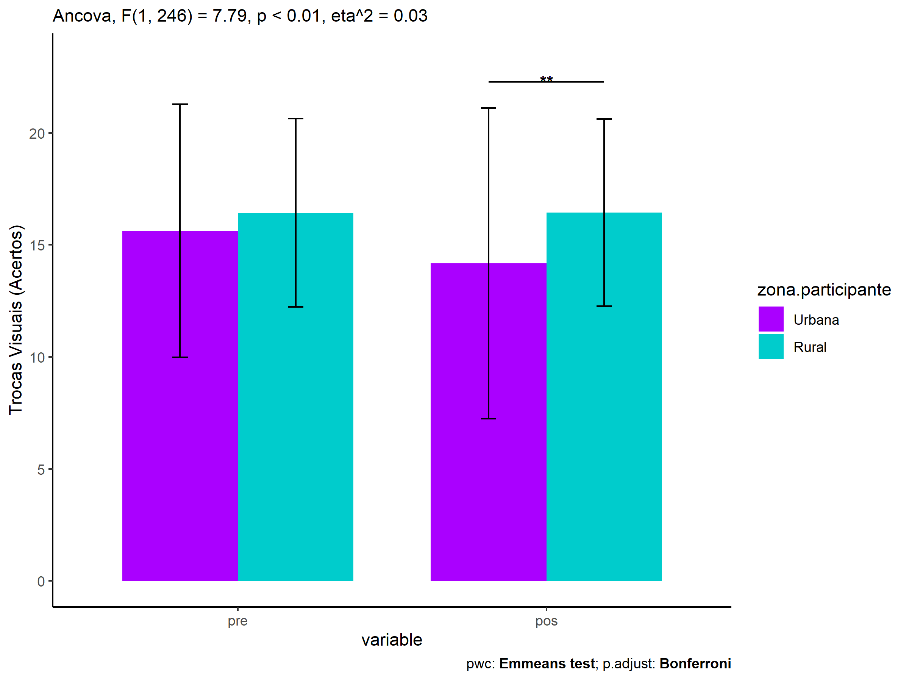<!-- -->

<!-- -->

### Trocas Fonologicas (Acertos)

| var          | zona.participante |   n | M (pre) | SE (pre) | M (unadj) | SE (unadj) | M (adj) | SE (adj) |
|:-------------|:------------------|----:|--------:|---------:|----------:|-----------:|--------:|---------:|
| score.TF.pos | Rural             | 115 |  15.461 |    0.398 |    15.383 |      0.422 |  15.074 |    0.494 |
| score.TF.pos | Urbana            | 134 |  14.239 |    0.482 |    12.843 |      0.575 |  13.109 |    0.457 |

| .y.          | group1 | group2 | estimate | conf.low | conf.high |    se | statistic |     p | p.adj | p.adj.signif |
|:-------------|:-------|:-------|---------:|---------:|----------:|------:|----------:|------:|------:|:-------------|
| score.TF.pos | Urbana | Rural  |   -1.965 |   -3.296 |    -0.634 | 0.676 |    -2.908 | 0.004 | 0.004 | \*\*         |
| score.TF.pre | Urbana | Rural  |   -1.222 |   -2.478 |     0.034 | 0.638 |    -1.916 | 0.056 | 0.056 | ns           |

| .y.      | zona.participante | group1 | group2 | estimate | conf.low | conf.high |    se | statistic |     p | p.adj | p.adj.signif |
|:---------|:------------------|:-------|:-------|---------:|---------:|----------:|------:|----------:|------:|------:|:-------------|
| score.TF | Urbana            | pre    | pos    |    1.396 |    0.098 |     2.693 | 0.660 |     2.113 | 0.035 | 0.035 | \*           |
| score.TF | Rural             | pre    | pos    |    0.078 |   -1.323 |     1.479 | 0.713 |     0.110 | 0.913 | 0.913 | ns           |

    ## Scale for colour is already present.
    ## Adding another scale for colour, which will replace the existing scale.

<!-- -->

<!-- -->

<!-- -->

### Trocas Orograficas (Acertos)

| var          | zona.participante |   n | M (pre) | SE (pre) | M (unadj) | SE (unadj) | M (adj) | SE (adj) |
|:-------------|:------------------|----:|--------:|---------:|----------:|-----------:|--------:|---------:|
| score.TO.pos | Rural             | 115 |   9.852 |    0.412 |    10.383 |      0.414 |  10.320 |    0.401 |
| score.TO.pos | Urbana            | 134 |   9.657 |    0.413 |     9.769 |      0.482 |   9.822 |    0.371 |

| .y.          | group1 | group2 | estimate | conf.low | conf.high |    se | statistic |     p | p.adj | p.adj.signif |
|:-------------|:-------|:-------|---------:|---------:|----------:|------:|----------:|------:|------:|:-------------|
| score.TO.pos | Urbana | Rural  |   -0.498 |   -1.574 |     0.578 | 0.546 |    -0.912 | 0.363 | 0.363 | ns           |
| score.TO.pre | Urbana | Rural  |   -0.195 |   -1.352 |     0.962 | 0.587 |    -0.333 | 0.740 | 0.740 | ns           |

| .y.      | zona.participante | group1 | group2 | estimate | conf.low | conf.high |    se | statistic |     p | p.adj | p.adj.signif |
|:---------|:------------------|:-------|:-------|---------:|---------:|----------:|------:|----------:|------:|------:|:-------------|
| score.TO | Urbana            | pre    | pos    |   -0.112 |   -1.278 |     1.055 | 0.594 |    -0.189 | 0.851 | 0.851 | ns           |
| score.TO | Rural             | pre    | pos    |   -0.530 |   -1.790 |     0.729 | 0.641 |    -0.828 | 0.408 | 0.408 | ns           |

    ## Scale for colour is already present.
    ## Adding another scale for colour, which will replace the existing scale.

<!-- -->

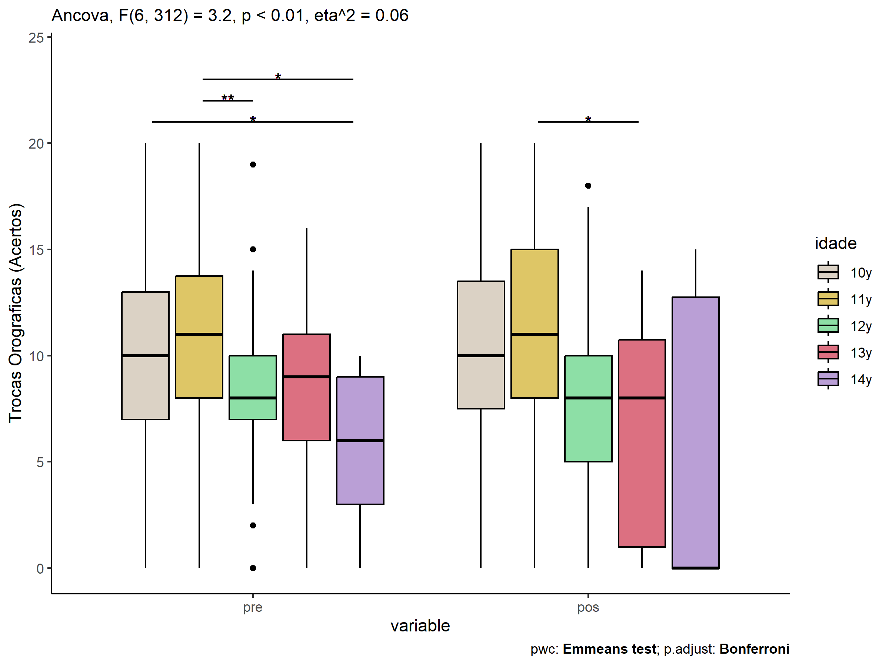<!-- -->

<!-- -->

## factor: **escola**

### Leitura de Pseudo-Palavras (Acertos)

| var            | escola |   n | M (pre) | SE (pre) | M (unadj) | SE (unadj) | M (adj) | SE (adj) |
|:---------------|:-------|----:|--------:|---------:|----------:|-----------:|--------:|---------:|
| score.CLPP.pos | E1     |  23 |  69.478 |    2.855 |    73.304 |      2.408 |  72.973 |    2.206 |
| score.CLPP.pos | E2     |  51 |  67.706 |    1.835 |    63.804 |      2.493 |  64.675 |    1.482 |
| score.CLPP.pos | E3     |  35 |  65.343 |    2.865 |    70.229 |      2.403 |  72.703 |    1.795 |
| score.CLPP.pos | E4     |  35 |  68.857 |    2.598 |    71.543 |      2.289 |  71.633 |    1.788 |
| score.CLPP.pos | E5     | 113 |  70.389 |    1.302 |    71.301 |      1.356 |  70.351 |    0.997 |
| score.CLPP.pos | E6     |  27 |  70.037 |    3.087 |    73.519 |      2.014 |  72.808 |    2.036 |

| .y.            | group1 | group2 | estimate | conf.low | conf.high |    se | statistic | p       | p.adj | p.adj.signif |
|:---------------|:-------|:-------|---------:|---------:|----------:|------:|----------:|:--------|------:|:-------------|
| score.CLPP.pos | E1     | E2     |    8.298 |    3.065 |    13.530 | 2.658 |     3.122 | 0.002   | 0.030 | \*           |
| score.CLPP.pos | E1     | E3     |    0.270 |   -5.331 |     5.871 | 2.845 |     0.095 | 0.924   | 1.000 | ns           |
| score.CLPP.pos | E1     | E4     |    1.340 |   -4.250 |     6.930 | 2.839 |     0.472 | 0.637   | 1.000 | ns           |
| score.CLPP.pos | E1     | E5     |    2.622 |   -2.142 |     7.386 | 2.420 |     1.083 | 0.28    | 1.000 | ns           |
| score.CLPP.pos | E1     | E6     |    0.165 |   -5.744 |     6.074 | 3.002 |     0.055 | 0.956   | 1.000 | ns           |
| score.CLPP.pos | E2     | E3     |   -8.028 |  -12.603 |    -3.453 | 2.324 |    -3.454 | \<0.001 | 0.010 | \*\*         |
| score.CLPP.pos | E2     | E4     |   -6.958 |  -11.530 |    -2.386 | 2.322 |    -2.996 | 0.003   | 0.045 | \*           |
| score.CLPP.pos | E2     | E5     |   -5.676 |   -9.197 |    -2.156 | 1.788 |    -3.174 | 0.002   | 0.025 | \*           |
| score.CLPP.pos | E2     | E6     |   -8.133 |  -13.093 |    -3.173 | 2.520 |    -3.228 | 0.001   | 0.021 | \*           |
| score.CLPP.pos | E3     | E4     |    1.070 |   -3.917 |     6.057 | 2.533 |     0.422 | 0.673   | 1.000 | ns           |
| score.CLPP.pos | E3     | E5     |    2.352 |   -1.700 |     6.403 | 2.058 |     1.143 | 0.254   | 1.000 | ns           |
| score.CLPP.pos | E3     | E6     |   -0.105 |   -5.454 |     5.244 | 2.717 |    -0.039 | 0.969   | 1.000 | ns           |
| score.CLPP.pos | E4     | E5     |    1.282 |   -2.749 |     5.312 | 2.047 |     0.626 | 0.532   | 1.000 | ns           |
| score.CLPP.pos | E4     | E6     |   -1.175 |   -6.510 |     4.160 | 2.710 |    -0.434 | 0.665   | 1.000 | ns           |
| score.CLPP.pos | E5     | E6     |   -2.457 |   -6.917 |     2.004 | 2.266 |    -1.084 | 0.279   | 1.000 | ns           |
| score.CLPP.pre | E1     | E2     |    1.772 |   -5.410 |     8.955 | 3.649 |     0.486 | 0.628   | 1.000 | ns           |
| score.CLPP.pre | E1     | E3     |    4.135 |   -3.541 |    11.811 | 3.899 |     1.061 | 0.29    | 1.000 | ns           |
| score.CLPP.pre | E1     | E4     |    0.621 |   -7.055 |     8.297 | 3.899 |     0.159 | 0.874   | 1.000 | ns           |
| score.CLPP.pre | E1     | E5     |   -0.911 |   -7.453 |     5.630 | 3.323 |    -0.274 | 0.784   | 1.000 | ns           |
| score.CLPP.pre | E1     | E6     |   -0.559 |   -8.673 |     7.556 | 4.122 |    -0.136 | 0.892   | 1.000 | ns           |
| score.CLPP.pre | E2     | E3     |    2.363 |   -3.914 |     8.640 | 3.189 |     0.741 | 0.459   | 1.000 | ns           |
| score.CLPP.pre | E2     | E4     |   -1.151 |   -7.428 |     5.126 | 3.189 |    -0.361 | 0.718   | 1.000 | ns           |
| score.CLPP.pre | E2     | E5     |   -2.683 |   -7.508 |     2.141 | 2.451 |    -1.095 | 0.274   | 1.000 | ns           |
| score.CLPP.pre | E2     | E6     |   -2.331 |   -9.137 |     4.475 | 3.457 |    -0.674 | 0.501   | 1.000 | ns           |
| score.CLPP.pre | E3     | E4     |   -3.514 |  -10.350 |     3.322 | 3.473 |    -1.012 | 0.312   | 1.000 | ns           |
| score.CLPP.pre | E3     | E5     |   -5.047 |  -10.578 |     0.485 | 2.810 |    -1.796 | 0.074   | 1.000 | ns           |
| score.CLPP.pre | E3     | E6     |   -4.694 |  -12.019 |     2.631 | 3.721 |    -1.262 | 0.208   | 1.000 | ns           |
| score.CLPP.pre | E4     | E5     |   -1.532 |   -7.064 |     4.000 | 2.810 |    -0.545 | 0.586   | 1.000 | ns           |
| score.CLPP.pre | E4     | E6     |   -1.180 |   -8.505 |     6.145 | 3.721 |    -0.317 | 0.751   | 1.000 | ns           |
| score.CLPP.pre | E5     | E6     |    0.352 |   -5.773 |     6.478 | 3.112 |     0.113 | 0.91    | 1.000 | ns           |

| .y.        | escola | group1 | group2 | estimate | conf.low | conf.high |    se | statistic |     p | p.adj | p.adj.signif |
|:-----------|:-------|:-------|:-------|---------:|---------:|----------:|------:|----------:|------:|------:|:-------------|
| score.CLPP | E1     | pre    | pos    |   -3.344 |  -11.480 |     4.791 | 4.143 |    -0.807 | 0.420 | 0.420 | ns           |
| score.CLPP | E2     | pre    | pos    |    5.096 |   -0.153 |    10.344 | 2.672 |     1.907 | 0.057 | 0.057 | ns           |
| score.CLPP | E3     | pre    | pos    |   -5.822 |  -12.414 |     0.770 | 3.357 |    -1.735 | 0.083 | 0.083 | ns           |
| score.CLPP | E4     | pre    | pos    |   -2.754 |   -9.438 |     3.930 | 3.404 |    -0.809 | 0.419 | 0.419 | ns           |
| score.CLPP | E5     | pre    | pos    |   -0.862 |   -4.486 |     2.761 | 1.845 |    -0.467 | 0.640 | 0.640 | ns           |
| score.CLPP | E6     | pre    | pos    |   -3.715 |  -11.057 |     3.626 | 3.738 |    -0.994 | 0.321 | 0.321 | ns           |

    ## Scale for colour is already present.
    ## Adding another scale for colour, which will replace the existing scale.

<!-- -->

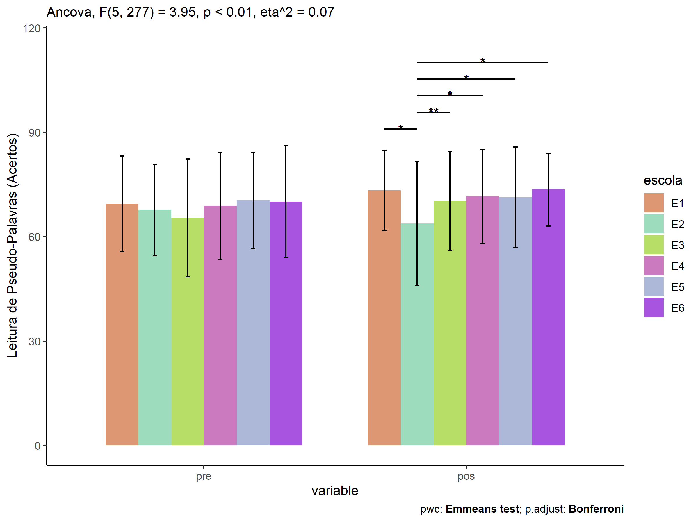<!-- -->

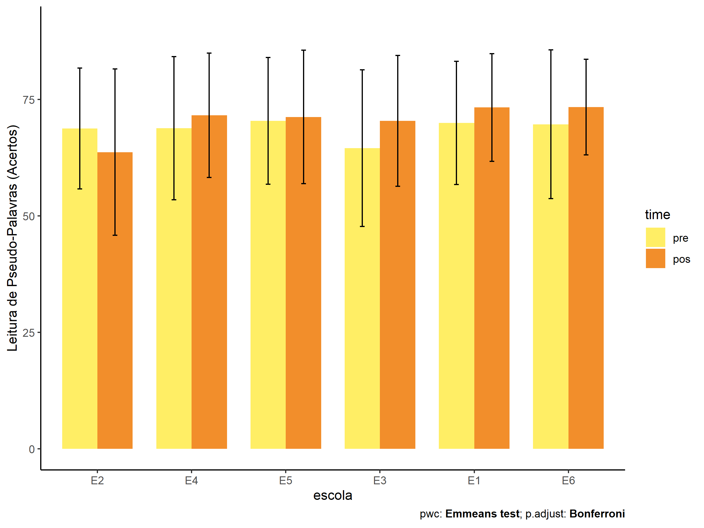<!-- -->

### Correta Regular (Acertos)

| var          | escola |   n | M (pre) | SE (pre) | M (unadj) | SE (unadj) | M (adj) | SE (adj) |
|:-------------|:-------|----:|--------:|---------:|----------:|-----------:|--------:|---------:|
| score.CR.pos | E1     |  28 |  13.429 |    1.047 |    12.893 |      1.240 |  13.190 |    1.042 |
| score.CR.pos | E2     |  66 |  14.076 |    0.554 |    11.197 |      0.825 |  11.251 |    0.678 |
| score.CR.pos | E3     |  38 |  12.816 |    0.714 |    13.737 |      0.789 |  14.265 |    0.898 |
| score.CR.pos | E4     |  36 |  15.278 |    0.745 |    16.167 |      0.469 |  15.769 |    0.921 |
| score.CR.pos | E5     | 132 |  14.311 |    0.386 |    13.053 |      0.506 |  13.019 |    0.479 |
| score.CR.pos | E6     |  32 |  15.312 |    0.737 |    14.906 |      1.071 |  14.495 |    0.976 |

| .y.          | group1 | group2 | estimate | conf.low | conf.high |    se | statistic | p       | p.adj | p.adj.signif |
|:-------------|:-------|:-------|---------:|---------:|----------:|------:|----------:|:--------|------:|:-------------|
| score.CR.pos | E1     | E2     |    1.939 |   -0.506 |     4.384 | 1.243 |     1.560 | 0.12    | 1.000 | ns           |
| score.CR.pos | E1     | E3     |   -1.074 |   -3.774 |     1.625 | 1.372 |    -0.783 | 0.434   | 1.000 | ns           |
| score.CR.pos | E1     | E4     |   -2.579 |   -5.320 |     0.162 | 1.393 |    -1.851 | 0.065   | 0.977 | ns           |
| score.CR.pos | E1     | E5     |    0.171 |   -2.086 |     2.429 | 1.147 |     0.149 | 0.881   | 1.000 | ns           |
| score.CR.pos | E1     | E6     |   -1.305 |   -4.120 |     1.510 | 1.431 |    -0.912 | 0.362   | 1.000 | ns           |
| score.CR.pos | E2     | E3     |   -3.014 |   -5.226 |    -0.801 | 1.125 |    -2.679 | 0.008   | 0.116 | ns           |
| score.CR.pos | E2     | E4     |   -4.518 |   -6.768 |    -2.267 | 1.144 |    -3.949 | \<0.001 | 0.001 | \*\*         |
| score.CR.pos | E2     | E5     |   -1.768 |   -3.401 |    -0.134 | 0.830 |    -2.129 | 0.034   | 0.510 | ns           |
| score.CR.pos | E2     | E6     |   -3.244 |   -5.584 |    -0.905 | 1.189 |    -2.728 | 0.007   | 0.101 | ns           |
| score.CR.pos | E3     | E4     |   -1.504 |   -4.045 |     1.037 | 1.292 |    -1.165 | 0.245   | 1.000 | ns           |
| score.CR.pos | E3     | E5     |    1.246 |   -0.759 |     3.250 | 1.019 |     1.223 | 0.222   | 1.000 | ns           |
| score.CR.pos | E3     | E6     |   -0.231 |   -2.851 |     2.390 | 1.332 |    -0.173 | 0.863   | 1.000 | ns           |
| score.CR.pos | E4     | E5     |    2.750 |    0.709 |     4.791 | 1.038 |     2.650 | 0.008   | 0.126 | ns           |
| score.CR.pos | E4     | E6     |    1.273 |   -1.359 |     3.906 | 1.338 |     0.952 | 0.342   | 1.000 | ns           |
| score.CR.pos | E5     | E6     |   -1.477 |   -3.616 |     0.662 | 1.087 |    -1.358 | 0.175   | 1.000 | ns           |
| score.CR.pre | E1     | E2     |   -0.647 |   -2.655 |     1.361 | 1.021 |    -0.634 | 0.526   | 1.000 | ns           |
| score.CR.pre | E1     | E3     |    0.613 |   -1.604 |     2.830 | 1.127 |     0.544 | 0.587   | 1.000 | ns           |
| score.CR.pre | E1     | E4     |   -1.849 |   -4.092 |     0.394 | 1.140 |    -1.622 | 0.106   | 1.000 | ns           |
| score.CR.pre | E1     | E5     |   -0.882 |   -2.734 |     0.970 | 0.942 |    -0.937 | 0.35    | 1.000 | ns           |
| score.CR.pre | E1     | E6     |   -1.884 |   -4.188 |     0.420 | 1.171 |    -1.609 | 0.109   | 1.000 | ns           |
| score.CR.pre | E2     | E3     |    1.260 |   -0.553 |     3.073 | 0.921 |     1.367 | 0.172   | 1.000 | ns           |
| score.CR.pre | E2     | E4     |   -1.202 |   -3.047 |     0.642 | 0.938 |    -1.282 | 0.201   | 1.000 | ns           |
| score.CR.pre | E2     | E5     |   -0.235 |   -1.577 |     1.107 | 0.682 |    -0.344 | 0.731   | 1.000 | ns           |
| score.CR.pre | E2     | E6     |   -1.237 |   -3.154 |     0.681 | 0.975 |    -1.269 | 0.205   | 1.000 | ns           |
| score.CR.pre | E3     | E4     |   -2.462 |   -4.532 |    -0.392 | 1.052 |    -2.339 | 0.02    | 0.299 | ns           |
| score.CR.pre | E3     | E5     |   -1.495 |   -3.134 |     0.144 | 0.833 |    -1.794 | 0.074   | 1.000 | ns           |
| score.CR.pre | E3     | E6     |   -2.497 |   -4.633 |    -0.361 | 1.086 |    -2.300 | 0.022   | 0.332 | ns           |
| score.CR.pre | E4     | E5     |    0.967 |   -0.707 |     2.641 | 0.851 |     1.137 | 0.256   | 1.000 | ns           |
| score.CR.pre | E4     | E6     |   -0.035 |   -2.198 |     2.128 | 1.099 |    -0.032 | 0.975   | 1.000 | ns           |
| score.CR.pre | E5     | E6     |   -1.002 |   -2.756 |     0.752 | 0.892 |    -1.124 | 0.262   | 1.000 | ns           |

| .y.      | escola | group1 | group2 | estimate | conf.low | conf.high |    se | statistic |     p | p.adj | p.adj.signif |
|:---------|:-------|:-------|:-------|---------:|---------:|----------:|------:|----------:|------:|------:|:-------------|
| score.CR | E1     | pre    | pos    |    0.536 |   -2.181 |     3.253 | 1.384 |     0.387 | 0.699 | 0.699 | ns           |
| score.CR | E2     | pre    | pos    |    2.879 |    1.109 |     4.648 | 0.901 |     3.194 | 0.001 | 0.001 | \*\*         |
| score.CR | E3     | pre    | pos    |   -0.921 |   -3.253 |     1.411 | 1.188 |    -0.775 | 0.438 | 0.438 | ns           |
| score.CR | E4     | pre    | pos    |   -0.889 |   -3.285 |     1.507 | 1.220 |    -0.728 | 0.467 | 0.467 | ns           |
| score.CR | E5     | pre    | pos    |    1.258 |    0.006 |     2.509 | 0.637 |     1.973 | 0.049 | 0.049 | \*           |
| score.CR | E6     | pre    | pos    |    0.406 |   -2.135 |     2.948 | 1.294 |     0.314 | 0.754 | 0.754 | ns           |

    ## Scale for colour is already present.
    ## Adding another scale for colour, which will replace the existing scale.

<!-- -->

<!-- -->

<!-- -->

### Correta Irregular (Acertos)

| var          | escola |   n | M (pre) | SE (pre) | M (unadj) | SE (unadj) | M (adj) | SE (adj) |
|:-------------|:-------|----:|--------:|---------:|----------:|-----------:|--------:|---------:|
| score.CI.pos | E1     |  28 |  11.036 |    0.971 |    10.321 |      1.098 |  10.458 |    0.894 |
| score.CI.pos | E2     |  66 |  11.303 |    0.516 |     8.848 |      0.691 |   8.849 |    0.582 |
| score.CI.pos | E3     |  38 |  10.474 |    0.672 |    11.816 |      0.747 |  12.238 |    0.769 |
| score.CI.pos | E4     |  36 |  11.667 |    0.668 |    12.917 |      0.567 |  12.732 |    0.789 |
| score.CI.pos | E5     | 132 |  11.250 |    0.357 |    10.795 |      0.461 |  10.823 |    0.412 |
| score.CI.pos | E6     |  32 |  12.344 |    0.763 |    12.156 |      0.982 |  11.628 |    0.839 |

| .y.          | group1 | group2 | estimate | conf.low | conf.high |    se | statistic | p       | p.adj | p.adj.signif |
|:-------------|:-------|:-------|---------:|---------:|----------:|------:|----------:|:--------|------:|:-------------|
| score.CI.pos | E1     | E2     |    1.609 |   -0.491 |     3.708 | 1.067 |     1.508 | 0.133   | 1.000 | ns           |
| score.CI.pos | E1     | E3     |   -1.780 |   -4.099 |     0.539 | 1.179 |    -1.510 | 0.132   | 1.000 | ns           |
| score.CI.pos | E1     | E4     |   -2.274 |   -4.621 |     0.072 | 1.193 |    -1.907 | 0.057   | 0.861 | ns           |
| score.CI.pos | E1     | E5     |   -0.365 |   -2.302 |     1.572 | 0.984 |    -0.371 | 0.711   | 1.000 | ns           |
| score.CI.pos | E1     | E6     |   -1.170 |   -3.583 |     1.244 | 1.227 |    -0.953 | 0.341   | 1.000 | ns           |
| score.CI.pos | E2     | E3     |   -3.389 |   -5.287 |    -1.491 | 0.965 |    -3.513 | \<0.001 | 0.008 | \*\*         |
| score.CI.pos | E2     | E4     |   -3.883 |   -5.812 |    -1.954 | 0.981 |    -3.960 | \<0.001 | 0.001 | \*\*         |
| score.CI.pos | E2     | E5     |   -1.974 |   -3.377 |    -0.571 | 0.713 |    -2.767 | 0.006   | 0.090 | ns           |
| score.CI.pos | E2     | E6     |   -2.779 |   -4.787 |    -0.770 | 1.021 |    -2.721 | 0.007   | 0.103 | ns           |
| score.CI.pos | E3     | E4     |   -0.494 |   -2.664 |     1.675 | 1.103 |    -0.448 | 0.654   | 1.000 | ns           |
| score.CI.pos | E3     | E5     |    1.415 |   -0.301 |     3.131 | 0.872 |     1.622 | 0.106   | 1.000 | ns           |
| score.CI.pos | E3     | E6     |    0.611 |   -1.634 |     2.855 | 1.141 |     0.535 | 0.593   | 1.000 | ns           |
| score.CI.pos | E4     | E5     |    1.909 |    0.159 |     3.660 | 0.890 |     2.145 | 0.033   | 0.490 | ns           |
| score.CI.pos | E4     | E6     |    1.105 |   -1.158 |     3.368 | 1.150 |     0.960 | 0.338   | 1.000 | ns           |
| score.CI.pos | E5     | E6     |   -0.805 |   -2.643 |     1.034 | 0.935 |    -0.861 | 0.39    | 1.000 | ns           |
| score.CI.pre | E1     | E2     |   -0.267 |   -2.145 |     1.610 | 0.954 |    -0.280 | 0.78    | 1.000 | ns           |
| score.CI.pre | E1     | E3     |    0.562 |   -1.511 |     2.636 | 1.054 |     0.533 | 0.594   | 1.000 | ns           |
| score.CI.pre | E1     | E4     |   -0.631 |   -2.729 |     1.467 | 1.066 |    -0.592 | 0.554   | 1.000 | ns           |
| score.CI.pre | E1     | E5     |   -0.214 |   -1.946 |     1.518 | 0.881 |    -0.243 | 0.808   | 1.000 | ns           |
| score.CI.pre | E1     | E6     |   -1.308 |   -3.462 |     0.846 | 1.095 |    -1.194 | 0.233   | 1.000 | ns           |
| score.CI.pre | E2     | E3     |    0.829 |   -0.866 |     2.525 | 0.862 |     0.962 | 0.337   | 1.000 | ns           |
| score.CI.pre | E2     | E4     |   -0.364 |   -2.089 |     1.361 | 0.877 |    -0.415 | 0.679   | 1.000 | ns           |
| score.CI.pre | E2     | E5     |    0.053 |   -1.202 |     1.308 | 0.638 |     0.083 | 0.934   | 1.000 | ns           |
| score.CI.pre | E2     | E6     |   -1.041 |   -2.834 |     0.753 | 0.912 |    -1.142 | 0.254   | 1.000 | ns           |
| score.CI.pre | E3     | E4     |   -1.193 |   -3.129 |     0.743 | 0.984 |    -1.212 | 0.226   | 1.000 | ns           |
| score.CI.pre | E3     | E5     |   -0.776 |   -2.309 |     0.756 | 0.779 |    -0.996 | 0.32    | 1.000 | ns           |
| score.CI.pre | E3     | E6     |   -1.870 |   -3.868 |     0.127 | 1.015 |    -1.842 | 0.066   | 0.996 | ns           |
| score.CI.pre | E4     | E5     |    0.417 |   -1.149 |     1.982 | 0.796 |     0.524 | 0.601   | 1.000 | ns           |
| score.CI.pre | E4     | E6     |   -0.677 |   -2.700 |     1.346 | 1.028 |    -0.659 | 0.511   | 1.000 | ns           |
| score.CI.pre | E5     | E6     |   -1.094 |   -2.734 |     0.547 | 0.834 |    -1.312 | 0.191   | 1.000 | ns           |

| .y.      | escola | group1 | group2 | estimate | conf.low | conf.high |    se | statistic |     p | p.adj | p.adj.signif |
|:---------|:-------|:-------|:-------|---------:|---------:|----------:|------:|----------:|------:|------:|:-------------|
| score.CI | E1     | pre    | pos    |    0.714 |   -1.771 |     3.200 | 1.266 |     0.564 | 0.573 | 0.573 | ns           |
| score.CI | E2     | pre    | pos    |    2.455 |    0.836 |     4.073 | 0.824 |     2.977 | 0.003 | 0.003 | \*\*         |
| score.CI | E3     | pre    | pos    |   -1.342 |   -3.476 |     0.791 | 1.086 |    -1.235 | 0.217 | 0.217 | ns           |
| score.CI | E4     | pre    | pos    |   -1.250 |   -3.442 |     0.942 | 1.116 |    -1.120 | 0.263 | 0.263 | ns           |
| score.CI | E5     | pre    | pos    |    0.455 |   -0.690 |     1.599 | 0.583 |     0.780 | 0.436 | 0.436 | ns           |
| score.CI | E6     | pre    | pos    |    0.188 |   -2.137 |     2.512 | 1.184 |     0.158 | 0.874 | 0.874 | ns           |

    ## Scale for colour is already present.
    ## Adding another scale for colour, which will replace the existing scale.

<!-- -->

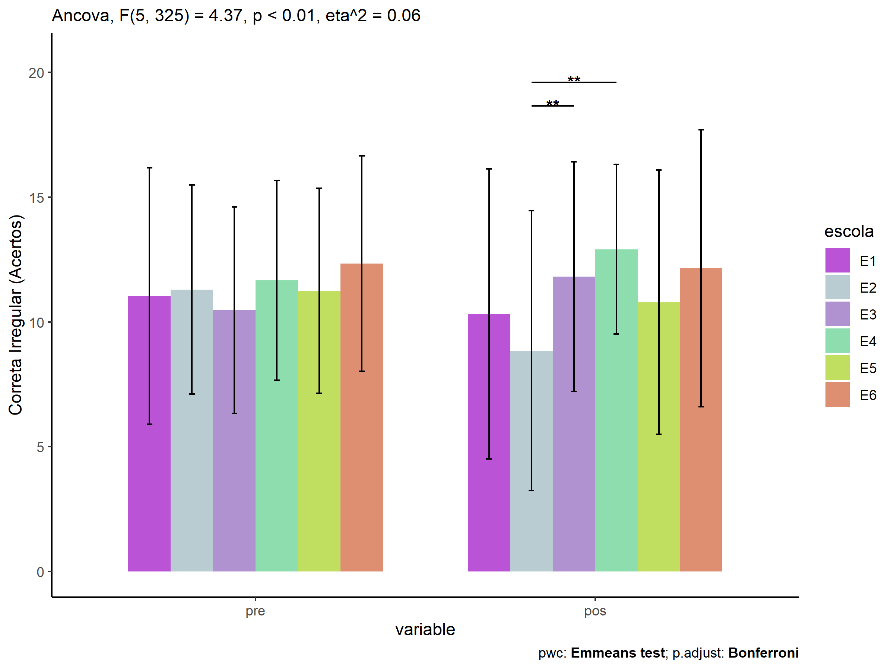<!-- -->

<!-- -->

### Trocas Visuais (Acertos)

| var          | escola |   n | M (pre) | SE (pre) | M (unadj) | SE (unadj) | M (adj) | SE (adj) |
|:-------------|:-------|----:|--------:|---------:|----------:|-----------:|--------:|---------:|
| score.TV.pos | E1     |  28 |  15.071 |    1.253 |    14.250 |      1.419 |  14.599 |    1.126 |
| score.TV.pos | E2     |  66 |  16.136 |    0.599 |    12.182 |      0.926 |  12.098 |    0.732 |
| score.TV.pos | E3     |  38 |  15.500 |    0.821 |    16.079 |      0.810 |  16.254 |    0.966 |
| score.TV.pos | E4     |  36 |  15.944 |    0.835 |    16.806 |      0.510 |  16.800 |    0.992 |
| score.TV.pos | E5     | 132 |  16.189 |    0.406 |    14.780 |      0.545 |  14.675 |    0.518 |
| score.TV.pos | E6     |  32 |  15.688 |    0.880 |    15.000 |      1.129 |  15.099 |    1.052 |

| .y.          | group1 | group2 | estimate | conf.low | conf.high |    se | statistic | p       | p.adj | p.adj.signif |
|:-------------|:-------|:-------|---------:|---------:|----------:|------:|----------:|:--------|------:|:-------------|
| score.TV.pos | E1     | E2     |    2.501 |   -0.142 |     5.144 | 1.344 |     1.861 | 0.064   | 0.954 | ns           |
| score.TV.pos | E1     | E3     |   -1.655 |   -4.570 |     1.261 | 1.482 |    -1.116 | 0.265   | 1.000 | ns           |
| score.TV.pos | E1     | E4     |   -2.201 |   -5.152 |     0.751 | 1.500 |    -1.467 | 0.143   | 1.000 | ns           |
| score.TV.pos | E1     | E5     |   -0.076 |   -2.515 |     2.364 | 1.240 |    -0.061 | 0.951   | 1.000 | ns           |
| score.TV.pos | E1     | E6     |   -0.500 |   -3.529 |     2.530 | 1.540 |    -0.324 | 0.746   | 1.000 | ns           |
| score.TV.pos | E2     | E3     |   -4.156 |   -6.541 |    -1.771 | 1.212 |    -3.428 | \<0.001 | 0.010 | \*           |
| score.TV.pos | E2     | E4     |   -4.702 |   -7.127 |    -2.277 | 1.233 |    -3.814 | \<0.001 | 0.002 | \*\*         |
| score.TV.pos | E2     | E5     |   -2.577 |   -4.341 |    -0.812 | 0.897 |    -2.873 | 0.004   | 0.065 | ns           |
| score.TV.pos | E2     | E6     |   -3.001 |   -5.523 |    -0.479 | 1.282 |    -2.341 | 0.02    | 0.298 | ns           |
| score.TV.pos | E3     | E4     |   -0.546 |   -3.269 |     2.177 | 1.384 |    -0.394 | 0.694   | 1.000 | ns           |
| score.TV.pos | E3     | E5     |    1.579 |   -0.578 |     3.736 | 1.096 |     1.440 | 0.151   | 1.000 | ns           |
| score.TV.pos | E3     | E6     |    1.155 |   -1.653 |     3.964 | 1.428 |     0.809 | 0.419   | 1.000 | ns           |
| score.TV.pos | E4     | E5     |    2.125 |   -0.076 |     4.326 | 1.119 |     1.899 | 0.058   | 0.876 | ns           |
| score.TV.pos | E4     | E6     |    1.701 |   -1.143 |     4.545 | 1.446 |     1.177 | 0.24    | 1.000 | ns           |
| score.TV.pos | E5     | E6     |   -0.424 |   -2.731 |     1.883 | 1.173 |    -0.361 | 0.718   | 1.000 | ns           |
| score.TV.pre | E1     | E2     |   -1.065 |   -3.286 |     1.156 | 1.129 |    -0.943 | 0.346   | 1.000 | ns           |
| score.TV.pre | E1     | E3     |   -0.429 |   -2.881 |     2.024 | 1.247 |    -0.344 | 0.731   | 1.000 | ns           |
| score.TV.pre | E1     | E4     |   -0.873 |   -3.354 |     1.608 | 1.261 |    -0.692 | 0.489   | 1.000 | ns           |
| score.TV.pre | E1     | E5     |   -1.118 |   -3.167 |     0.931 | 1.041 |    -1.073 | 0.284   | 1.000 | ns           |
| score.TV.pre | E1     | E6     |   -0.616 |   -3.164 |     1.932 | 1.295 |    -0.476 | 0.635   | 1.000 | ns           |
| score.TV.pre | E2     | E3     |    0.636 |   -1.369 |     2.642 | 1.019 |     0.624 | 0.533   | 1.000 | ns           |
| score.TV.pre | E2     | E4     |    0.192 |   -1.848 |     2.232 | 1.037 |     0.185 | 0.853   | 1.000 | ns           |
| score.TV.pre | E2     | E5     |   -0.053 |   -1.538 |     1.432 | 0.755 |    -0.070 | 0.944   | 1.000 | ns           |
| score.TV.pre | E2     | E6     |    0.449 |   -1.672 |     2.570 | 1.078 |     0.416 | 0.677   | 1.000 | ns           |
| score.TV.pre | E3     | E4     |   -0.444 |   -2.735 |     1.846 | 1.164 |    -0.382 | 0.703   | 1.000 | ns           |
| score.TV.pre | E3     | E5     |   -0.689 |   -2.502 |     1.123 | 0.922 |    -0.748 | 0.455   | 1.000 | ns           |
| score.TV.pre | E3     | E6     |   -0.188 |   -2.550 |     2.175 | 1.201 |    -0.156 | 0.876   | 1.000 | ns           |
| score.TV.pre | E4     | E5     |   -0.245 |   -2.096 |     1.607 | 0.941 |    -0.260 | 0.795   | 1.000 | ns           |
| score.TV.pre | E4     | E6     |    0.257 |   -2.136 |     2.649 | 1.216 |     0.211 | 0.833   | 1.000 | ns           |
| score.TV.pre | E5     | E6     |    0.502 |   -1.438 |     2.442 | 0.986 |     0.509 | 0.611   | 1.000 | ns           |

| .y.      | escola | group1 | group2 | estimate | conf.low | conf.high |    se | statistic | p       | p.adj   | p.adj.signif |
|:---------|:-------|:-------|:-------|---------:|---------:|----------:|------:|----------:|:--------|:--------|:-------------|
| score.TV | E1     | pre    | pos    |    0.821 |   -2.159 |     3.801 | 1.518 |     0.541 | 0.589   | 0.589   | ns           |
| score.TV | E2     | pre    | pos    |    3.955 |    2.014 |     5.895 | 0.988 |     4.001 | \<0.001 | \<0.001 | \*\*\*\*     |
| score.TV | E3     | pre    | pos    |   -0.579 |   -3.137 |     1.979 | 1.303 |    -0.444 | 0.657   | 0.657   | ns           |
| score.TV | E4     | pre    | pos    |   -0.861 |   -3.489 |     1.767 | 1.338 |    -0.643 | 0.52    | 0.52    | ns           |
| score.TV | E5     | pre    | pos    |    1.409 |    0.037 |     2.782 | 0.699 |     2.016 | 0.044   | 0.044   | \*           |
| score.TV | E6     | pre    | pos    |    0.687 |   -2.100 |     3.475 | 1.420 |     0.484 | 0.628   | 0.628   | ns           |

    ## Scale for colour is already present.
    ## Adding another scale for colour, which will replace the existing scale.

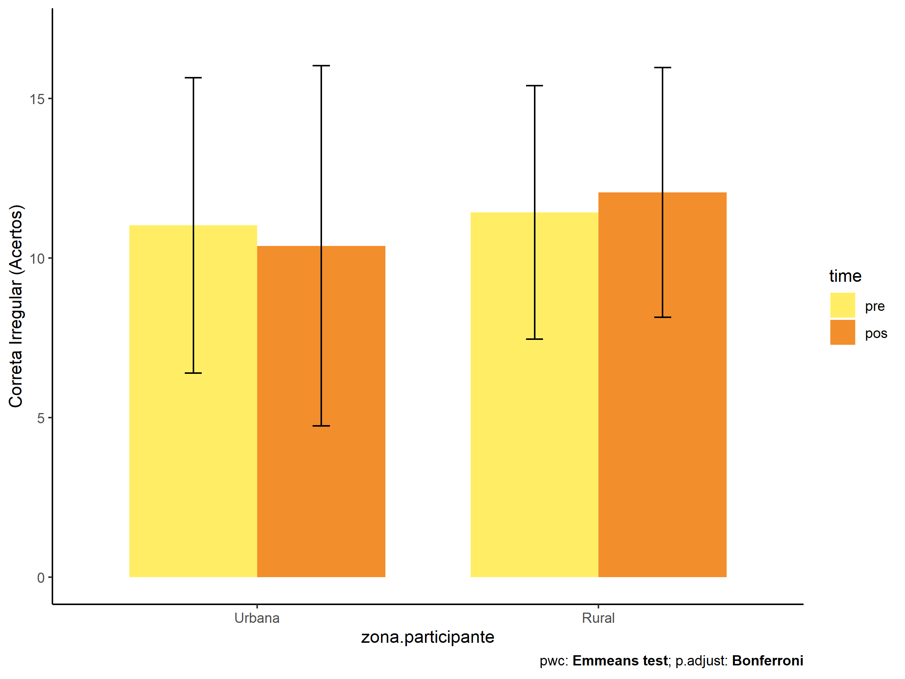<!-- -->

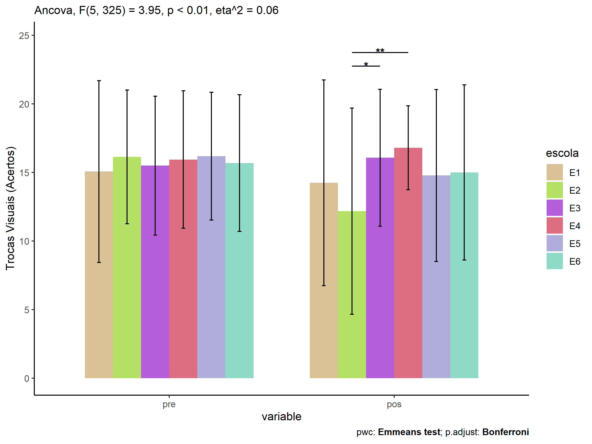<!-- -->

<!-- -->

### Trocas Fonologicas (Acertos)

| var          | escola |   n | M (pre) | SE (pre) | M (unadj) | SE (unadj) | M (adj) | SE (adj) |
|:-------------|:-------|----:|--------:|---------:|----------:|-----------:|--------:|---------:|
| score.TF.pos | E1     |  28 |  14.286 |    1.194 |    13.464 |      1.327 |  13.708 |    1.074 |
| score.TF.pos | E2     |  66 |  15.030 |    0.614 |    11.121 |      0.877 |  10.996 |    0.699 |
| score.TF.pos | E3     |  38 |  14.395 |    0.780 |    14.684 |      0.851 |  14.874 |    0.921 |
| score.TF.pos | E4     |  36 |  14.500 |    0.839 |    15.528 |      0.726 |  15.665 |    0.947 |
| score.TF.pos | E5     | 132 |  14.909 |    0.437 |    13.705 |      0.540 |  13.639 |    0.494 |
| score.TF.pos | E6     |  32 |  14.906 |    0.915 |    13.750 |      1.109 |  13.686 |    1.004 |

| .y.          | group1 | group2 | estimate | conf.low | conf.high |    se | statistic | p       | p.adj | p.adj.signif |
|:-------------|:-------|:-------|---------:|---------:|----------:|------:|----------:|:--------|------:|:-------------|
| score.TF.pos | E1     | E2     |    2.712 |    0.191 |     5.233 | 1.281 |     2.116 | 0.035   | 0.526 | ns           |
| score.TF.pos | E1     | E3     |   -1.166 |   -3.948 |     1.616 | 1.414 |    -0.824 | 0.41    | 1.000 | ns           |
| score.TF.pos | E1     | E4     |   -1.957 |   -4.772 |     0.858 | 1.431 |    -1.368 | 0.172   | 1.000 | ns           |
| score.TF.pos | E1     | E5     |    0.069 |   -2.257 |     2.394 | 1.182 |     0.058 | 0.954   | 1.000 | ns           |
| score.TF.pos | E1     | E6     |    0.022 |   -2.870 |     2.914 | 1.470 |     0.015 | 0.988   | 1.000 | ns           |
| score.TF.pos | E2     | E3     |   -3.878 |   -6.154 |    -1.602 | 1.157 |    -3.352 | \<0.001 | 0.013 | \*           |
| score.TF.pos | E2     | E4     |   -4.669 |   -6.985 |    -2.354 | 1.177 |    -3.967 | \<0.001 | 0.001 | \*\*         |
| score.TF.pos | E2     | E5     |   -2.643 |   -4.328 |    -0.959 | 0.856 |    -3.088 | 0.002   | 0.033 | \*           |
| score.TF.pos | E2     | E6     |   -2.690 |   -5.097 |    -0.284 | 1.223 |    -2.199 | 0.029   | 0.428 | ns           |
| score.TF.pos | E3     | E4     |   -0.791 |   -3.390 |     1.807 | 1.321 |    -0.599 | 0.549   | 1.000 | ns           |
| score.TF.pos | E3     | E5     |    1.235 |   -0.823 |     3.292 | 1.046 |     1.181 | 0.239   | 1.000 | ns           |
| score.TF.pos | E3     | E6     |    1.188 |   -1.493 |     3.869 | 1.363 |     0.872 | 0.384   | 1.000 | ns           |
| score.TF.pos | E4     | E5     |    2.026 |   -0.075 |     4.127 | 1.068 |     1.897 | 0.059   | 0.880 | ns           |
| score.TF.pos | E4     | E6     |    1.979 |   -0.735 |     4.694 | 1.380 |     1.434 | 0.152   | 1.000 | ns           |
| score.TF.pos | E5     | E6     |   -0.047 |   -2.248 |     2.154 | 1.119 |    -0.042 | 0.967   | 1.000 | ns           |
| score.TF.pre | E1     | E2     |   -0.745 |   -3.019 |     1.530 | 1.156 |    -0.644 | 0.52    | 1.000 | ns           |
| score.TF.pre | E1     | E3     |   -0.109 |   -2.621 |     2.403 | 1.277 |    -0.085 | 0.932   | 1.000 | ns           |
| score.TF.pre | E1     | E4     |   -0.214 |   -2.756 |     2.327 | 1.292 |    -0.166 | 0.868   | 1.000 | ns           |
| score.TF.pre | E1     | E5     |   -0.623 |   -2.722 |     1.475 | 1.067 |    -0.584 | 0.559   | 1.000 | ns           |
| score.TF.pre | E1     | E6     |   -0.621 |   -3.231 |     1.990 | 1.327 |    -0.468 | 0.64    | 1.000 | ns           |
| score.TF.pre | E2     | E3     |    0.636 |   -1.418 |     2.689 | 1.044 |     0.609 | 0.543   | 1.000 | ns           |
| score.TF.pre | E2     | E4     |    0.530 |   -1.560 |     2.620 | 1.062 |     0.499 | 0.618   | 1.000 | ns           |
| score.TF.pre | E2     | E5     |    0.121 |   -1.399 |     1.642 | 0.773 |     0.157 | 0.875   | 1.000 | ns           |
| score.TF.pre | E2     | E6     |    0.124 |   -2.049 |     2.297 | 1.104 |     0.112 | 0.911   | 1.000 | ns           |
| score.TF.pre | E3     | E4     |   -0.105 |   -2.451 |     2.241 | 1.192 |    -0.088 | 0.93    | 1.000 | ns           |
| score.TF.pre | E3     | E5     |   -0.514 |   -2.371 |     1.342 | 0.944 |    -0.545 | 0.586   | 1.000 | ns           |
| score.TF.pre | E3     | E6     |   -0.512 |   -2.931 |     1.908 | 1.230 |    -0.416 | 0.678   | 1.000 | ns           |
| score.TF.pre | E4     | E5     |   -0.409 |   -2.306 |     1.487 | 0.964 |    -0.424 | 0.672   | 1.000 | ns           |
| score.TF.pre | E4     | E6     |   -0.406 |   -2.857 |     2.044 | 1.246 |    -0.326 | 0.745   | 1.000 | ns           |
| score.TF.pre | E5     | E6     |    0.003 |   -1.985 |     1.990 | 1.010 |     0.003 | 0.998   | 1.000 | ns           |

| .y.      | escola | group1 | group2 | estimate | conf.low | conf.high |    se | statistic | p       | p.adj   | p.adj.signif |
|:---------|:-------|:-------|:-------|---------:|---------:|----------:|------:|----------:|:--------|:--------|:-------------|
| score.TF | E1     | pre    | pos    |    0.821 |   -2.168 |     3.811 | 1.522 |     0.540 | 0.59    | 0.59    | ns           |
| score.TF | E2     | pre    | pos    |    3.909 |    1.962 |     5.856 | 0.992 |     3.942 | \<0.001 | \<0.001 | \*\*\*\*     |
| score.TF | E3     | pre    | pos    |   -0.289 |   -2.855 |     2.276 | 1.307 |    -0.222 | 0.825   | 0.825   | ns           |
| score.TF | E4     | pre    | pos    |   -1.028 |   -3.664 |     1.609 | 1.343 |    -0.766 | 0.444   | 0.444   | ns           |
| score.TF | E5     | pre    | pos    |    1.205 |   -0.172 |     2.581 | 0.701 |     1.718 | 0.086   | 0.086   | ns           |
| score.TF | E6     | pre    | pos    |    1.156 |   -1.640 |     3.952 | 1.424 |     0.812 | 0.417   | 0.417   | ns           |

    ## Scale for colour is already present.
    ## Adding another scale for colour, which will replace the existing scale.

<!-- -->

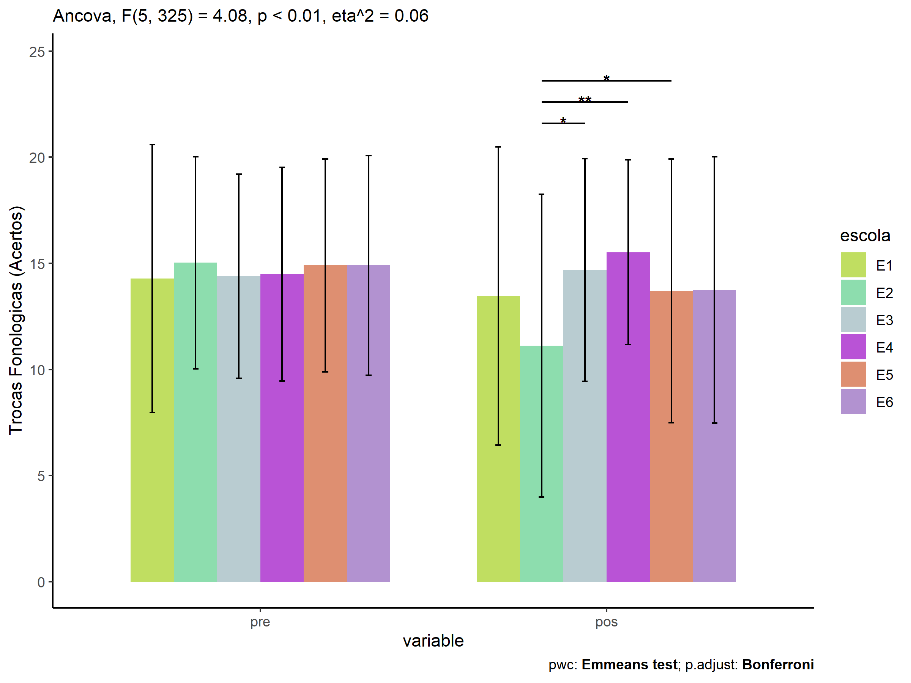<!-- -->

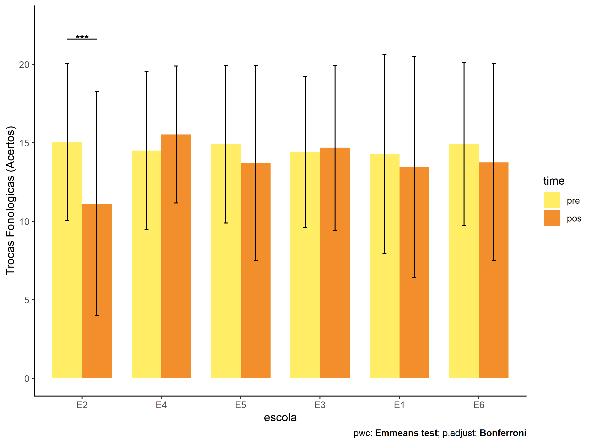<!-- -->

### Trocas Orograficas (Acertos)

| var          | escola |   n | M (pre) | SE (pre) | M (unadj) | SE (unadj) | M (adj) | SE (adj) |
|:-------------|:-------|----:|--------:|---------:|----------:|-----------:|--------:|---------:|
| score.TO.pos | E1     |  28 |   8.643 |    0.988 |     9.286 |      1.075 |   9.916 |    0.858 |
| score.TO.pos | E2     |  66 |   9.121 |    0.487 |     7.803 |      0.662 |   8.167 |    0.558 |
| score.TO.pos | E3     |  38 |   9.711 |    0.769 |    10.395 |      0.817 |  10.430 |    0.734 |
| score.TO.pos | E4     |  36 |   9.556 |    0.712 |    10.194 |      0.638 |  10.316 |    0.755 |
| score.TO.pos | E5     | 132 |  10.545 |    0.402 |    10.295 |      0.471 |   9.866 |    0.396 |
| score.TO.pos | E6     |  32 |   9.250 |    0.775 |     8.406 |      0.819 |   8.698 |    0.801 |

| .y.          | group1 | group2 | estimate | conf.low | conf.high |    se | statistic |     p | p.adj | p.adj.signif |
|:-------------|:-------|:-------|---------:|---------:|----------:|------:|----------:|------:|------:|:-------------|
| score.TO.pos | E1     | E2     |    1.749 |   -0.260 |     3.758 | 1.021 |     1.713 | 0.088 | 1.000 | ns           |
| score.TO.pos | E1     | E3     |   -0.514 |   -2.735 |     1.707 | 1.129 |    -0.455 | 0.649 | 1.000 | ns           |
| score.TO.pos | E1     | E4     |   -0.400 |   -2.646 |     1.846 | 1.142 |    -0.350 | 0.726 | 1.000 | ns           |
| score.TO.pos | E1     | E5     |    0.050 |   -1.814 |     1.915 | 0.948 |     0.053 | 0.958 | 1.000 | ns           |
| score.TO.pos | E1     | E6     |    1.218 |   -1.088 |     3.523 | 1.172 |     1.039 | 0.300 | 1.000 | ns           |
| score.TO.pos | E2     | E3     |   -2.263 |   -4.078 |    -0.449 | 0.922 |    -2.454 | 0.015 | 0.220 | ns           |
| score.TO.pos | E2     | E4     |   -2.149 |   -3.995 |    -0.304 | 0.938 |    -2.291 | 0.023 | 0.339 | ns           |
| score.TO.pos | E2     | E5     |   -1.699 |   -3.050 |    -0.347 | 0.687 |    -2.473 | 0.014 | 0.209 | ns           |
| score.TO.pos | E2     | E6     |   -0.531 |   -2.450 |     1.387 | 0.975 |    -0.545 | 0.586 | 1.000 | ns           |
| score.TO.pos | E3     | E4     |    0.114 |   -1.957 |     2.185 | 1.053 |     0.108 | 0.914 | 1.000 | ns           |
| score.TO.pos | E3     | E5     |    0.565 |   -1.078 |     2.207 | 0.835 |     0.676 | 0.499 | 1.000 | ns           |
| score.TO.pos | E3     | E6     |    1.732 |   -0.405 |     3.869 | 1.086 |     1.594 | 0.112 | 1.000 | ns           |
| score.TO.pos | E4     | E5     |    0.451 |   -1.227 |     2.129 | 0.853 |     0.528 | 0.598 | 1.000 | ns           |
| score.TO.pos | E4     | E6     |    1.618 |   -0.546 |     3.782 | 1.100 |     1.471 | 0.142 | 1.000 | ns           |
| score.TO.pos | E5     | E6     |    1.167 |   -0.593 |     2.928 | 0.895 |     1.304 | 0.193 | 1.000 | ns           |
| score.TO.pre | E1     | E2     |   -0.478 |   -2.478 |     1.521 | 1.016 |    -0.471 | 0.638 | 1.000 | ns           |
| score.TO.pre | E1     | E3     |   -1.068 |   -3.276 |     1.140 | 1.122 |    -0.951 | 0.342 | 1.000 | ns           |
| score.TO.pre | E1     | E4     |   -0.913 |   -3.147 |     1.321 | 1.136 |    -0.804 | 0.422 | 1.000 | ns           |
| score.TO.pre | E1     | E5     |   -1.903 |   -3.747 |    -0.058 | 0.938 |    -2.029 | 0.043 | 0.649 | ns           |
| score.TO.pre | E1     | E6     |   -0.607 |   -2.901 |     1.687 | 1.166 |    -0.521 | 0.603 | 1.000 | ns           |
| score.TO.pre | E2     | E3     |   -0.589 |   -2.395 |     1.216 | 0.918 |    -0.642 | 0.521 | 1.000 | ns           |
| score.TO.pre | E2     | E4     |   -0.434 |   -2.271 |     1.403 | 0.934 |    -0.465 | 0.642 | 1.000 | ns           |
| score.TO.pre | E2     | E5     |   -1.424 |   -2.761 |    -0.088 | 0.679 |    -2.096 | 0.037 | 0.552 | ns           |
| score.TO.pre | E2     | E6     |   -0.129 |   -2.039 |     1.781 | 0.971 |    -0.133 | 0.895 | 1.000 | ns           |
| score.TO.pre | E3     | E4     |    0.155 |   -1.907 |     2.217 | 1.048 |     0.148 | 0.883 | 1.000 | ns           |
| score.TO.pre | E3     | E5     |   -0.835 |   -2.467 |     0.797 | 0.830 |    -1.006 | 0.315 | 1.000 | ns           |
| score.TO.pre | E3     | E6     |    0.461 |   -1.667 |     2.588 | 1.081 |     0.426 | 0.670 | 1.000 | ns           |
| score.TO.pre | E4     | E5     |   -0.990 |   -2.657 |     0.677 | 0.847 |    -1.168 | 0.244 | 1.000 | ns           |
| score.TO.pre | E4     | E6     |    0.306 |   -1.848 |     2.460 | 1.095 |     0.279 | 0.780 | 1.000 | ns           |
| score.TO.pre | E5     | E6     |    1.295 |   -0.451 |     3.042 | 0.888 |     1.459 | 0.146 | 1.000 | ns           |

| .y.      | escola | group1 | group2 | estimate | conf.low | conf.high |    se | statistic |     p | p.adj | p.adj.signif |
|:---------|:-------|:-------|:-------|---------:|---------:|----------:|------:|----------:|------:|------:|:-------------|
| score.TO | E1     | pre    | pos    |   -0.643 |   -3.188 |     1.902 | 1.296 |    -0.496 | 0.620 | 0.620 | ns           |
| score.TO | E2     | pre    | pos    |    1.318 |   -0.340 |     2.976 | 0.844 |     1.561 | 0.119 | 0.119 | ns           |
| score.TO | E3     | pre    | pos    |   -0.684 |   -2.869 |     1.501 | 1.113 |    -0.615 | 0.539 | 0.539 | ns           |
| score.TO | E4     | pre    | pos    |   -0.639 |   -2.884 |     1.606 | 1.143 |    -0.559 | 0.576 | 0.576 | ns           |
| score.TO | E5     | pre    | pos    |    0.250 |   -0.922 |     1.422 | 0.597 |     0.419 | 0.676 | 0.676 | ns           |
| score.TO | E6     | pre    | pos    |    0.844 |   -1.537 |     3.225 | 1.213 |     0.696 | 0.487 | 0.487 | ns           |

    ## Scale for colour is already present.
    ## Adding another scale for colour, which will replace the existing scale.

<!-- -->

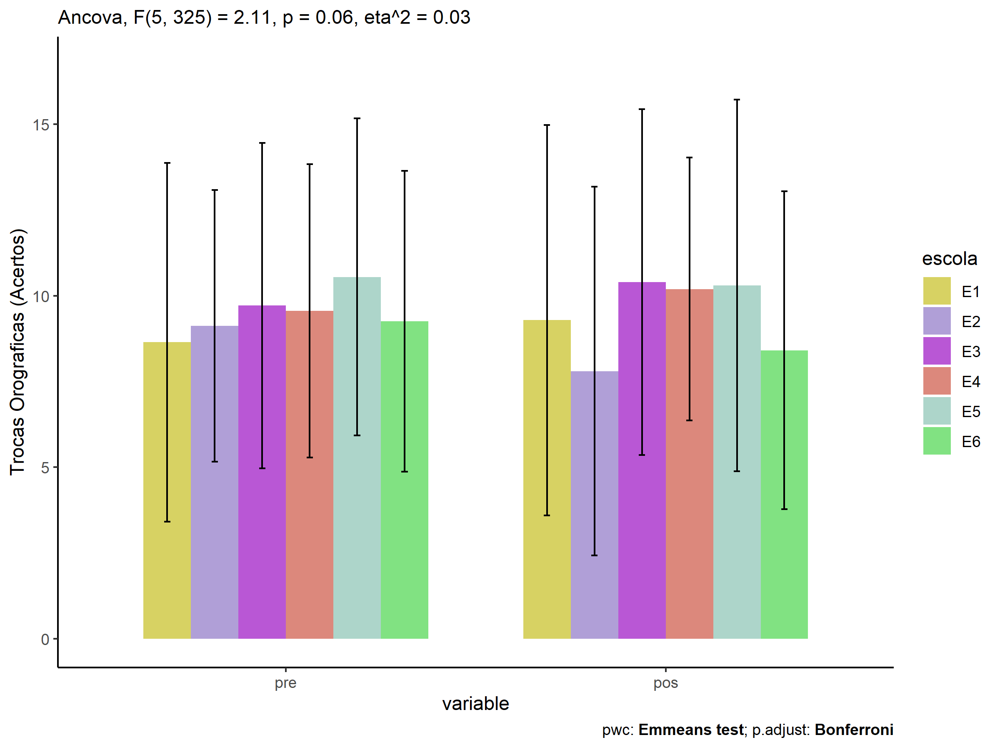<!-- -->

<!-- -->

## factor: **zona.escola**

### Leitura de Pseudo-Palavras (Acertos)

| var            | zona.escola |   n | M (pre) | SE (pre) | M (unadj) | SE (unadj) | M (adj) | SE (adj) |
|:---------------|:------------|----:|--------:|---------:|----------:|-----------:|--------:|---------:|
| score.CLPP.pos | Rural       |  97 |  67.918 |    1.634 |    71.619 |      1.316 |  72.355 |    1.094 |
| score.CLPP.pos | Urbana      | 187 |  69.545 |    0.995 |    69.503 |      1.130 |  69.121 |    0.787 |

| .y.            | group1 | group2 | estimate | conf.low | conf.high |    se | statistic |     p | p.adj | p.adj.signif |
|:---------------|:-------|:-------|---------:|---------:|----------:|------:|----------:|------:|------:|:-------------|
| score.CLPP.pos | Urbana | Rural  |   -3.234 |   -5.888 |     -0.58 | 1.348 |    -2.398 | 0.017 | 0.017 | \*           |
| score.CLPP.pre | Urbana | Rural  |    1.628 |   -1.944 |      5.20 | 1.815 |     0.897 | 0.370 | 0.370 | ns           |

| .y.        | zona.escola | group1 | group2 | estimate | conf.low | conf.high |    se | statistic |     p | p.adj | p.adj.signif |
|:-----------|:------------|:-------|:-------|---------:|---------:|----------:|------:|----------:|------:|------:|:-------------|
| score.CLPP | Urbana      | pre    | pos    |    0.457 |   -2.360 |     3.274 | 1.434 |     0.318 | 0.750 | 0.750 | ns           |
| score.CLPP | Rural       | pre    | pos    |   -4.107 |   -8.086 |    -0.129 | 2.026 |    -2.027 | 0.043 | 0.043 | \*           |

    ## Scale for colour is already present.
    ## Adding another scale for colour, which will replace the existing scale.

<!-- -->

<!-- -->

<!-- -->

### Correta Regular (Acertos)

| var          | zona.escola |   n | M (pre) | SE (pre) | M (unadj) | SE (unadj) | M (adj) | SE (adj) |
|:-------------|:------------|----:|--------:|---------:|----------:|-----------:|--------:|---------:|
| score.CR.pos | Rural       | 106 |  14.406 |    0.435 |    14.915 |      0.464 |  14.844 |    0.537 |
| score.CR.pos | Urbana      | 226 |  14.133 |    0.305 |    12.491 |      0.413 |  12.525 |    0.368 |

| .y.          | group1 | group2 | estimate | conf.low | conf.high |    se | statistic | p       | p.adj   | p.adj.signif |
|:-------------|:-------|:-------|---------:|---------:|----------:|------:|----------:|:--------|:--------|:-------------|
| score.CR.pos | Urbana | Rural  |   -2.319 |   -3.600 |    -1.038 | 0.651 |    -3.562 | \<0.001 | \<0.001 | \*\*\*       |
| score.CR.pre | Urbana | Rural  |   -0.273 |   -1.328 |     0.782 | 0.536 |    -0.509 | 0.611   | 0.611   | ns           |

| .y.      | zona.escola | group1 | group2 | estimate | conf.low | conf.high |    se | statistic | p       | p.adj   | p.adj.signif |
|:---------|:------------|:-------|:-------|---------:|---------:|----------:|------:|----------:|:--------|:--------|:-------------|
| score.CR | Urbana      | pre    | pos    |    1.642 |    0.679 |     2.604 | 0.490 |     3.350 | \<0.001 | \<0.001 | \*\*\*       |
| score.CR | Rural       | pre    | pos    |   -0.509 |   -1.914 |     0.896 | 0.716 |    -0.712 | 0.477   | 0.477   | ns           |

    ## Scale for colour is already present.
    ## Adding another scale for colour, which will replace the existing scale.

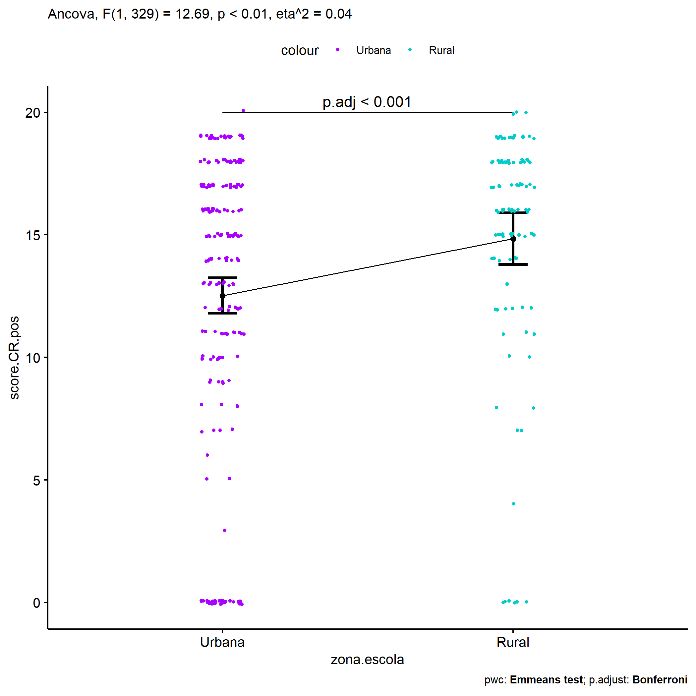<!-- -->

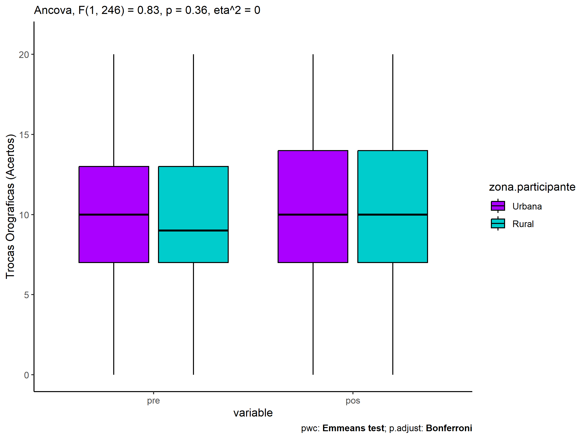<!-- -->

<!-- -->

### Correta Irregular (Acertos)

| var          | zona.escola |   n | M (pre) | SE (pre) | M (unadj) | SE (unadj) | M (adj) | SE (adj) |
|:-------------|:------------|----:|--------:|---------:|----------:|-----------:|--------:|---------:|
| score.CI.pos | Rural       | 106 |  11.443 |    0.406 |    12.292 |      0.441 |  12.222 |    0.463 |
| score.CI.pos | Urbana      | 226 |  11.239 |    0.283 |    10.168 |      0.366 |  10.201 |    0.317 |

| .y.          | group1 | group2 | estimate | conf.low | conf.high |    se | statistic | p       | p.adj   | p.adj.signif |
|:-------------|:-------|:-------|---------:|---------:|----------:|------:|----------:|:--------|:--------|:-------------|
| score.CI.pos | Urbana | Rural  |   -2.021 |   -3.125 |    -0.917 | 0.561 |    -3.602 | \<0.001 | \<0.001 | \*\*\*       |
| score.CI.pre | Urbana | Rural  |   -0.204 |   -1.184 |     0.775 | 0.498 |    -0.411 | 0.682   | 0.682   | ns           |

| .y.      | zona.escola | group1 | group2 | estimate | conf.low | conf.high |    se | statistic |     p | p.adj | p.adj.signif |
|:---------|:------------|:-------|:-------|---------:|---------:|----------:|------:|----------:|------:|------:|:-------------|
| score.CI | Urbana      | pre    | pos    |    1.071 |    0.194 |     1.948 | 0.447 |     2.397 | 0.017 | 0.017 | \*           |
| score.CI | Rural       | pre    | pos    |   -0.849 |   -2.130 |     0.432 | 0.652 |    -1.302 | 0.193 | 0.193 | ns           |

    ## Scale for colour is already present.
    ## Adding another scale for colour, which will replace the existing scale.

<!-- -->

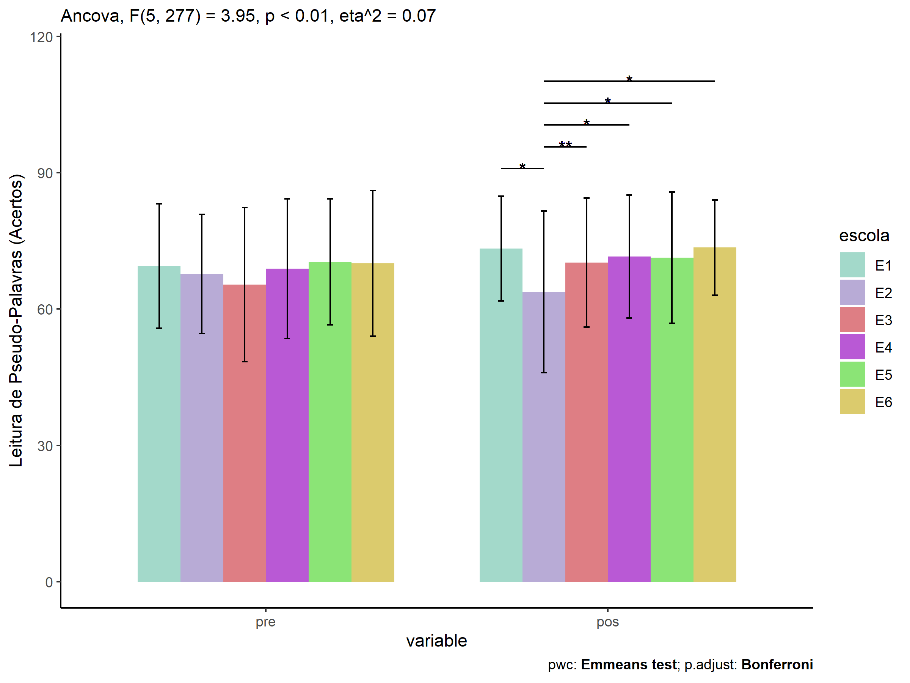<!-- -->

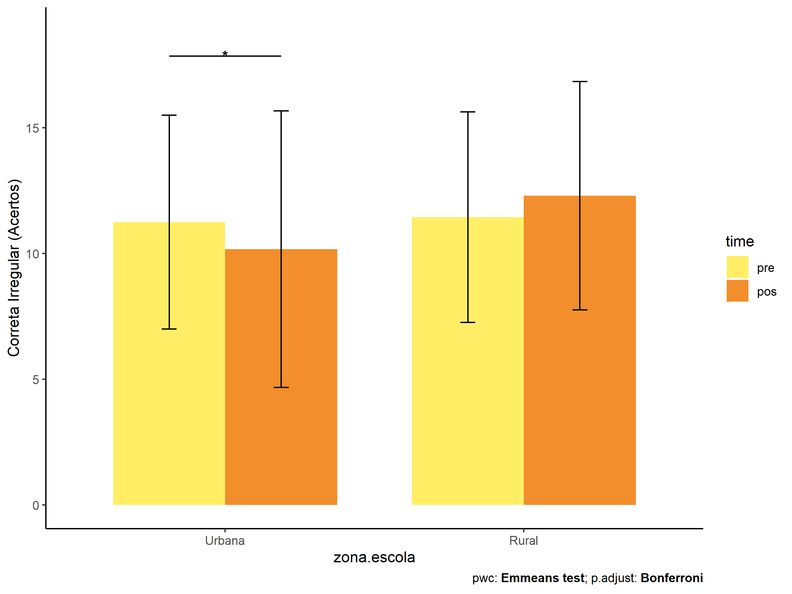<!-- -->

### Trocas Visuais (Acertos)

| var          | zona.escola |   n | M (pre) | SE (pre) | M (unadj) | SE (unadj) | M (adj) | SE (adj) |
|:-------------|:------------|----:|--------:|---------:|----------:|-----------:|--------:|---------:|
| score.TV.pos | Rural       | 106 |  15.708 |    0.483 |    16.000 |      0.481 |  16.090 |    0.583 |
| score.TV.pos | Urbana      | 226 |  16.035 |    0.332 |    13.956 |      0.457 |  13.913 |    0.399 |

| .y.          | group1 | group2 | estimate | conf.low | conf.high |    se | statistic |     p | p.adj | p.adj.signif |
|:-------------|:-------|:-------|---------:|---------:|----------:|------:|----------:|------:|------:|:-------------|
| score.TV.pos | Urbana | Rural  |   -2.177 |   -3.568 |    -0.786 | 0.707 |    -3.078 | 0.002 | 0.002 | \*\*         |
| score.TV.pre | Urbana | Rural  |    0.328 |   -0.827 |     1.482 | 0.587 |     0.559 | 0.577 | 0.577 | ns           |

| .y.      | zona.escola | group1 | group2 | estimate | conf.low | conf.high |    se | statistic | p       | p.adj   | p.adj.signif |
|:---------|:------------|:-------|:-------|---------:|---------:|----------:|------:|----------:|:--------|:--------|:-------------|
| score.TV | Urbana      | pre    | pos    |    2.080 |    1.028 |     3.132 | 0.536 |     3.881 | \<0.001 | \<0.001 | \*\*\*       |
| score.TV | Rural       | pre    | pos    |   -0.292 |   -1.829 |     1.244 | 0.782 |    -0.374 | 0.709   | 0.709   | ns           |

    ## Scale for colour is already present.
    ## Adding another scale for colour, which will replace the existing scale.

<!-- -->

<!-- -->

<!-- -->

### Trocas Fonologicas (Acertos)

| var          | zona.escola |   n | M (pre) | SE (pre) | M (unadj) | SE (unadj) | M (adj) | SE (adj) |
|:-------------|:------------|----:|--------:|---------:|----------:|-----------:|--------:|---------:|
| score.TF.pos | Rural       | 106 |  14.585 |    0.481 |    14.689 |      0.515 |  14.783 |    0.559 |
| score.TF.pos | Urbana      | 226 |  14.867 |    0.344 |    12.920 |      0.443 |  12.876 |    0.382 |

| .y.          | group1 | group2 | estimate | conf.low | conf.high |    se | statistic |     p | p.adj | p.adj.signif |
|:-------------|:-------|:-------|---------:|---------:|----------:|------:|----------:|------:|------:|:-------------|
| score.TF.pos | Urbana | Rural  |   -1.907 |   -3.239 |    -0.575 | 0.677 |    -2.816 | 0.005 | 0.005 | \*\*         |
| score.TF.pre | Urbana | Rural  |    0.282 |   -0.899 |     1.464 | 0.600 |     0.470 | 0.639 | 0.639 | ns           |

| .y.      | zona.escola | group1 | group2 | estimate | conf.low | conf.high |    se | statistic | p       | p.adj   | p.adj.signif |
|:---------|:------------|:-------|:-------|---------:|---------:|----------:|------:|----------:|:--------|:--------|:-------------|
| score.TF | Urbana      | pre    | pos    |    1.947 |    0.892 |     3.002 | 0.537 |     3.624 | \<0.001 | \<0.001 | \*\*\*       |
| score.TF | Rural       | pre    | pos    |   -0.104 |   -1.644 |     1.437 | 0.784 |    -0.132 | 0.895   | 0.895   | ns           |

    ## Scale for colour is already present.
    ## Adding another scale for colour, which will replace the existing scale.

<!-- -->

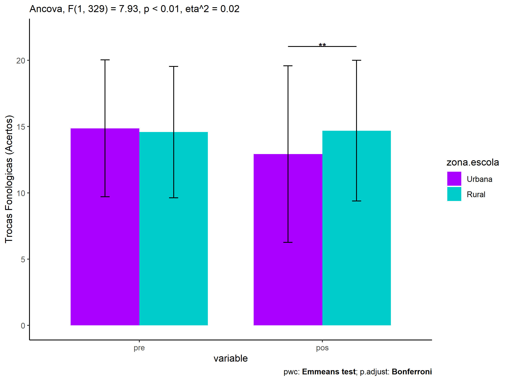<!-- -->

<!-- -->

### Trocas Orograficas (Acertos)

| var          | zona.escola |   n | M (pre) | SE (pre) | M (unadj) | SE (unadj) | M (adj) | SE (adj) |
|:-------------|:------------|----:|--------:|---------:|----------:|-----------:|--------:|---------:|
| score.TO.pos | Rural       | 106 |   9.519 |    0.431 |     9.726 |      0.444 |   9.872 |    0.444 |
| score.TO.pos | Urbana      | 226 |   9.894 |    0.304 |     9.442 |      0.368 |   9.374 |    0.304 |

| .y.          | group1 | group2 | estimate | conf.low | conf.high |    se | statistic |     p | p.adj | p.adj.signif |
|:-------------|:-------|:-------|---------:|---------:|----------:|------:|----------:|------:|------:|:-------------|
| score.TO.pos | Urbana | Rural  |   -0.498 |   -1.557 |     0.560 | 0.538 |    -0.927 | 0.355 | 0.355 | ns           |
| score.TO.pre | Urbana | Rural  |    0.375 |   -0.674 |     1.423 | 0.533 |     0.703 | 0.482 | 0.482 | ns           |

| .y.      | zona.escola | group1 | group2 | estimate | conf.low | conf.high |    se | statistic |     p | p.adj | p.adj.signif |
|:---------|:------------|:-------|:-------|---------:|---------:|----------:|------:|----------:|------:|------:|:-------------|
| score.TO | Urbana      | pre    | pos    |    0.451 |   -0.453 |     1.356 | 0.461 |     0.979 | 0.328 | 0.328 | ns           |
| score.TO | Rural       | pre    | pos    |   -0.208 |   -1.529 |     1.114 | 0.673 |    -0.308 | 0.758 | 0.758 | ns           |

    ## Scale for colour is already present.
    ## Adding another scale for colour, which will replace the existing scale.

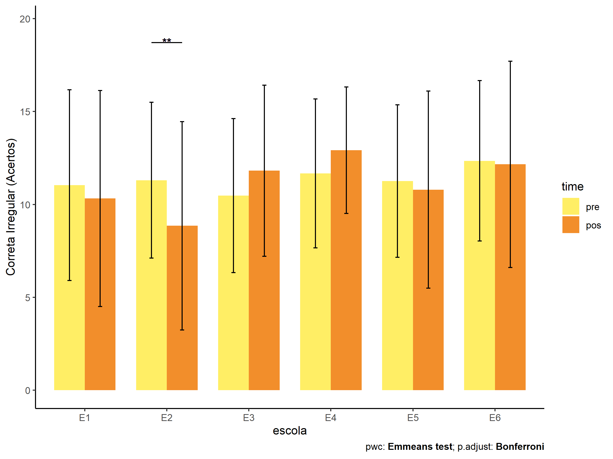<!-- -->

<!-- -->

<!-- -->

# Pairwise comparisons for two factors

## factores: **genero:grupo**

### Leitura de Pseudo-Palavras (Acertos)

| var            | genero | grupo        |   n | M (pre) | SE (pre) | M (unadj) | SE (unadj) | M (adj) | SE (adj) |
|:---------------|:-------|:-------------|----:|--------:|---------:|----------:|-----------:|--------:|---------:|
| score.CLPP.pos | F      | Controle     |  78 |  70.205 |    1.699 |    72.692 |      1.633 |  71.882 |    1.227 |
| score.CLPP.pos | F      | Experimental |  56 |  73.982 |    1.893 |    74.286 |      2.078 |  70.956 |    1.464 |
| score.CLPP.pos | M      | Controle     |  71 |  65.789 |    1.665 |    66.197 |      1.796 |  68.332 |    1.293 |
| score.CLPP.pos | M      | Experimental |  79 |  67.127 |    1.550 |    68.532 |      1.435 |  69.774 |    1.221 |

| .y.            | grupo        | genero | group1   | group2       | estimate | conf.low | conf.high |    se | statistic |     p | p.adj | p.adj.signif |
|:---------------|:-------------|:-------|:---------|:-------------|---------:|---------:|----------:|------:|----------:|------:|------:|:-------------|
| score.CLPP.pos | Controle     |        | F        | M            |    3.550 |    0.032 |     7.068 | 1.787 |     1.987 | 0.048 | 0.048 | \*           |
| score.CLPP.pos | Experimental |        | F        | M            |    1.183 |   -2.590 |     4.956 | 1.917 |     0.617 | 0.538 | 0.538 | ns           |
| score.CLPP.pre | Controle     |        | F        | M            |    4.416 |   -0.189 |     9.022 | 2.340 |     1.888 | 0.060 | 0.060 | ns           |
| score.CLPP.pre | Experimental |        | F        | M            |    6.856 |    1.951 |    11.760 | 2.492 |     2.752 | 0.006 | 0.006 | \*\*         |
| score.CLPP.pos |              | F      | Controle | Experimental |    0.925 |   -2.823 |     4.673 | 1.904 |     0.486 | 0.627 | 0.627 | ns           |
| score.CLPP.pos |              | M      | Controle | Experimental |   -1.442 |   -4.930 |     2.045 | 1.772 |    -0.814 | 0.416 | 0.416 | ns           |
| score.CLPP.pre |              | F      | Controle | Experimental |   -3.777 |   -8.695 |     1.141 | 2.498 |    -1.512 | 0.132 | 0.132 | ns           |
| score.CLPP.pre |              | M      | Controle | Experimental |   -1.338 |   -5.929 |     3.253 | 2.332 |    -0.574 | 0.567 | 0.567 | ns           |

| grupo        | genero | group1 | group2 | estimate | conf.low | conf.high |    se | statistic |     p | p.adj | p.adj.signif |
|:-------------|:-------|:-------|:-------|---------:|---------:|----------:|------:|----------:|------:|------:|:-------------|
| Controle     | F      | pre    | pos    |   -1.684 |   -6.039 |     2.671 | 2.218 |    -0.759 | 0.448 | 0.448 | ns           |
| Controle     | M      | pre    | pos    |   -0.972 |   -5.417 |     3.473 | 2.263 |    -0.429 | 0.668 | 0.668 | ns           |
| Experimental | F      | pre    | pos    |   -0.138 |   -5.298 |     5.022 | 2.627 |    -0.053 | 0.958 | 0.958 | ns           |
| Experimental | M      | pre    | pos    |   -1.223 |   -5.514 |     3.068 | 2.185 |    -0.560 | 0.576 | 0.576 | ns           |

    ## Scale for colour is already present.
    ## Adding another scale for colour, which will replace the existing scale.

<!-- -->

    ## Scale for colour is already present.
    ## Adding another scale for colour, which will replace the existing scale.

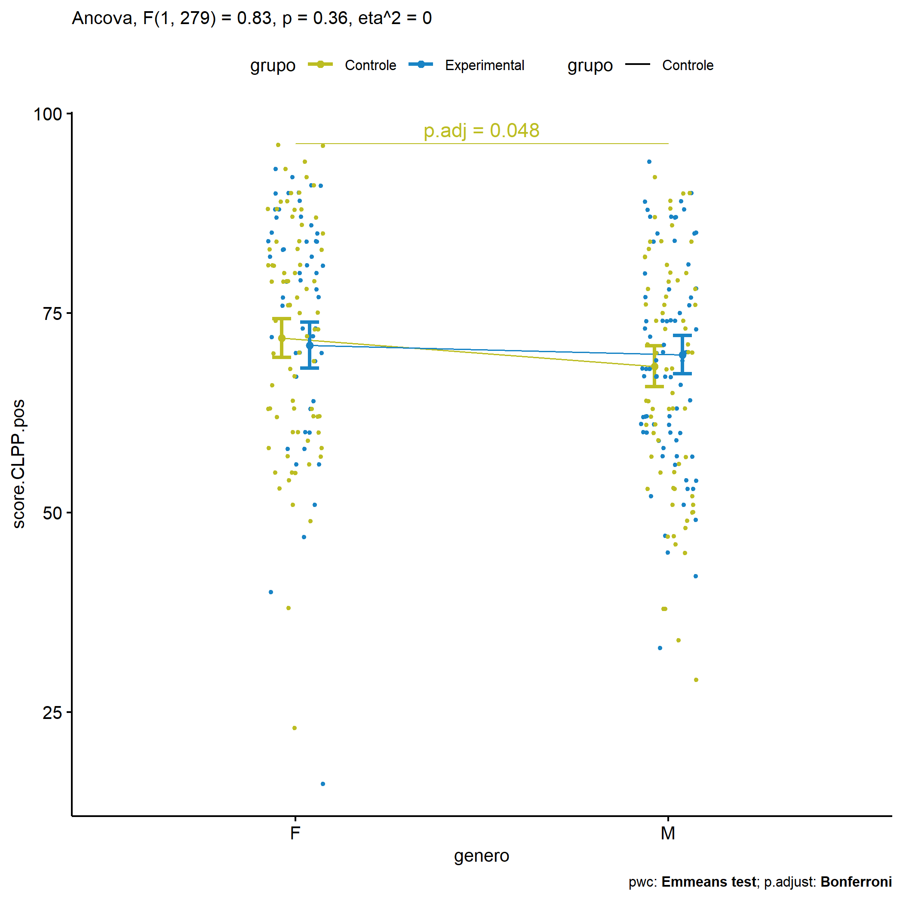<!-- -->

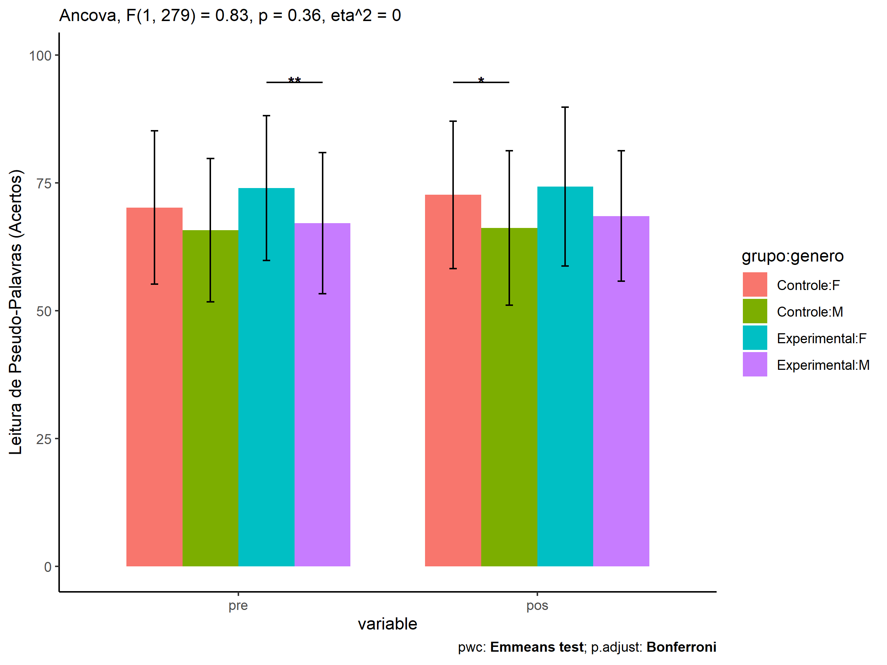<!-- -->

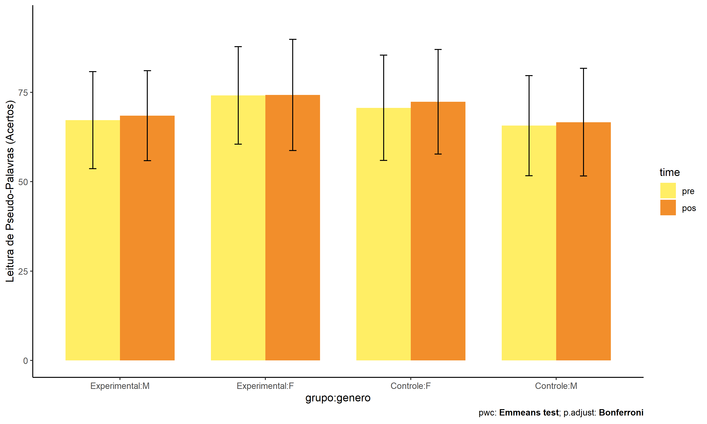<!-- -->

### Correta Regular (Acertos)

| var          | genero | grupo        |   n | M (pre) | SE (pre) | M (unadj) | SE (unadj) | M (adj) | SE (adj) |
|:-------------|:-------|:-------------|----:|--------:|---------:|----------:|-----------:|--------:|---------:|
| score.CR.pos | F      | Controle     |  87 |  14.471 |    0.466 |    14.184 |      0.567 |  14.084 |    0.597 |
| score.CR.pos | F      | Experimental |  63 |  15.635 |    0.513 |    14.238 |      0.745 |  13.694 |    0.708 |
| score.CR.pos | M      | Controle     |  89 |  13.438 |    0.475 |    12.101 |      0.681 |  12.395 |    0.592 |
| score.CR.pos | M      | Experimental |  92 |  13.728 |    0.513 |    13.000 |      0.583 |  13.183 |    0.581 |

| .y.          | grupo        | genero | group1   | group2       | estimate | conf.low | conf.high |    se | statistic |     p | p.adj | p.adj.signif |
|:-------------|:-------------|:-------|:---------|:-------------|---------:|---------:|----------:|------:|----------:|------:|------:|:-------------|
| score.CR.pos | Controle     |        | F        | M            |    1.689 |    0.033 |     3.345 | 0.842 |     2.006 | 0.046 | 0.046 | \*           |
| score.CR.pos | Experimental |        | F        | M            |    0.511 |   -1.297 |     2.319 | 0.919 |     0.556 | 0.579 | 0.579 | ns           |
| score.CR.pre | Controle     |        | F        | M            |    1.033 |   -0.302 |     2.368 | 0.679 |     1.522 | 0.129 | 0.129 | ns           |
| score.CR.pre | Experimental |        | F        | M            |    1.907 |    0.458 |     3.355 | 0.736 |     2.590 | 0.010 | 0.010 | \*           |
| score.CR.pos |              | F      | Controle | Experimental |    0.390 |   -1.428 |     2.207 | 0.924 |     0.422 | 0.673 | 0.673 | ns           |
| score.CR.pos |              | M      | Controle | Experimental |   -0.788 |   -2.416 |     0.839 | 0.827 |    -0.953 | 0.341 | 0.341 | ns           |
| score.CR.pre |              | F      | Controle | Experimental |   -1.164 |   -2.629 |     0.301 | 0.745 |    -1.563 | 0.119 | 0.119 | ns           |
| score.CR.pre |              | M      | Controle | Experimental |   -0.290 |   -1.607 |     1.027 | 0.669 |    -0.433 | 0.665 | 0.665 | ns           |

| grupo        | genero | group1 | group2 | estimate | conf.low | conf.high |    se | statistic |     p | p.adj | p.adj.signif |
|:-------------|:-------|:-------|:-------|---------:|---------:|----------:|------:|----------:|------:|------:|:-------------|
| Controle     | F      | pre    | pos    |    0.287 |   -1.261 |     1.835 | 0.788 |     0.365 | 0.716 | 0.716 | ns           |
| Controle     | M      | pre    | pos    |    1.337 |   -0.193 |     2.868 | 0.779 |     1.715 | 0.087 | 0.087 | ns           |
| Experimental | F      | pre    | pos    |    1.397 |   -0.422 |     3.216 | 0.926 |     1.508 | 0.132 | 0.132 | ns           |
| Experimental | M      | pre    | pos    |    0.728 |   -0.777 |     2.234 | 0.767 |     0.950 | 0.342 | 0.342 | ns           |

    ## Scale for colour is already present.
    ## Adding another scale for colour, which will replace the existing scale.

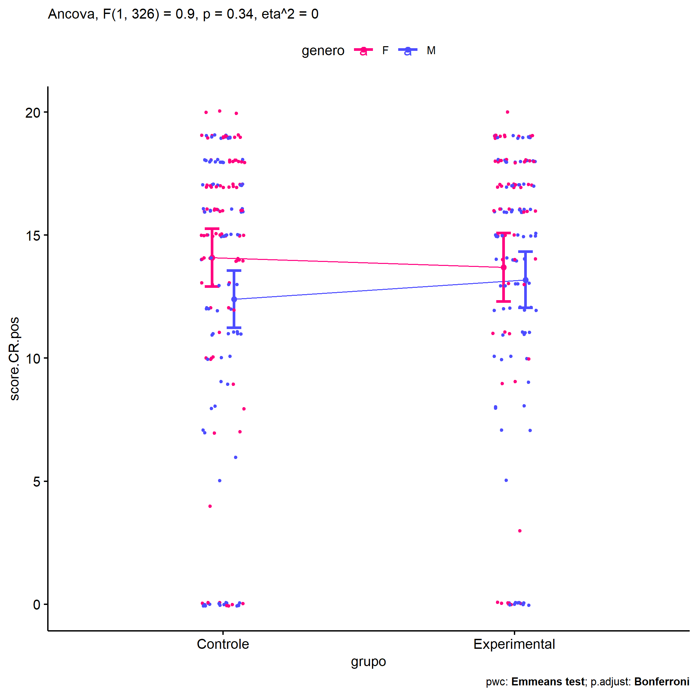<!-- -->

    ## Scale for colour is already present.
    ## Adding another scale for colour, which will replace the existing scale.

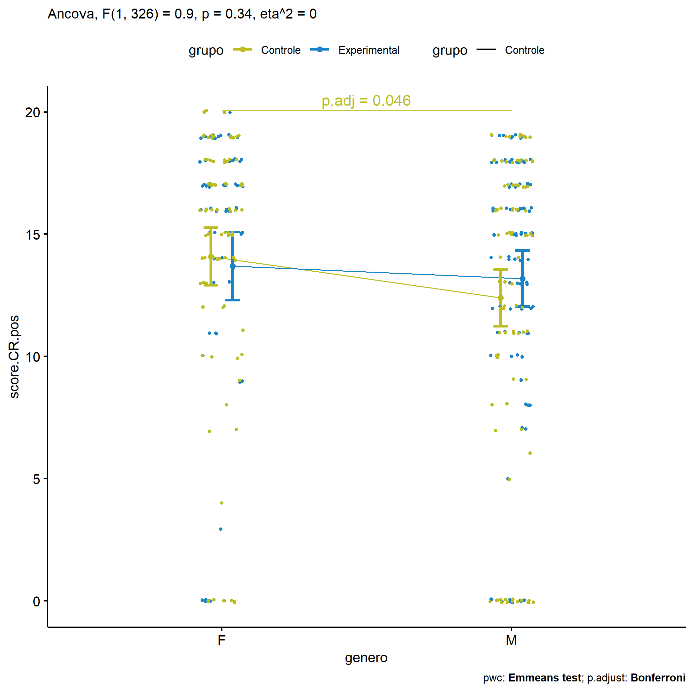<!-- -->

<!-- -->

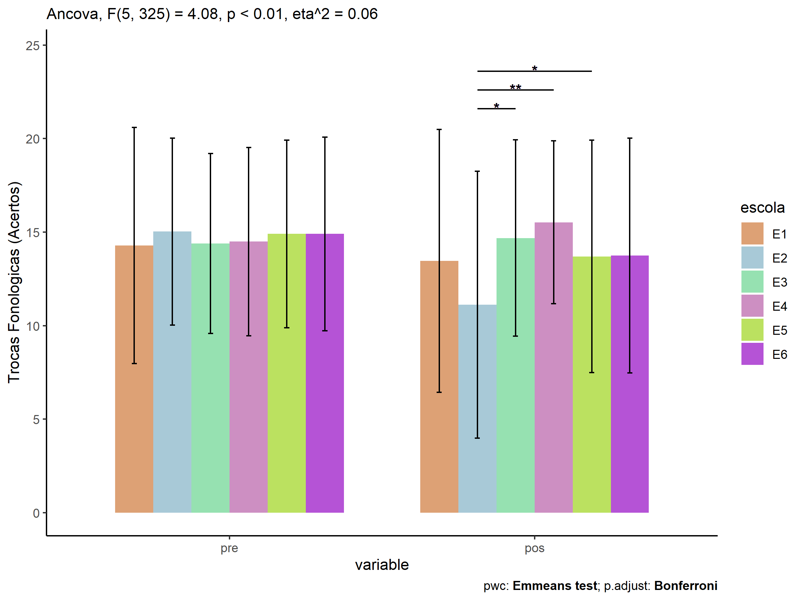<!-- -->

### Correta Irregular (Acertos)

| var          | genero | grupo        |   n | M (pre) | SE (pre) | M (unadj) | SE (unadj) | M (adj) | SE (adj) |
|:-------------|:-------|:-------------|----:|--------:|---------:|----------:|-----------:|--------:|---------:|
| score.CI.pos | F      | Controle     |  87 |  11.977 |    0.466 |    11.414 |      0.565 |  11.083 |    0.517 |
| score.CI.pos | F      | Experimental |  63 |  13.048 |    0.460 |    12.302 |      0.651 |  11.445 |    0.616 |
| score.CI.pos | M      | Controle     |  89 |  10.539 |    0.425 |     9.573 |      0.570 |   9.950 |    0.512 |
| score.CI.pos | M      | Experimental |  92 |  10.217 |    0.443 |    10.663 |      0.523 |  11.198 |    0.506 |

| .y.          | grupo        | genero | group1   | group2       | estimate | conf.low | conf.high |    se | statistic | p       | p.adj   | p.adj.signif |
|:-------------|:-------------|:-------|:---------|:-------------|---------:|---------:|----------:|------:|----------:|:--------|:--------|:-------------|
| score.CI.pos | Controle     |        | F        | M            |    1.134 |   -0.305 |     2.572 | 0.731 |     1.551 | 0.122   | 0.122   | ns           |
| score.CI.pos | Experimental |        | F        | M            |    0.247 |   -1.342 |     1.835 | 0.808 |     0.305 | 0.76    | 0.76    | ns           |
| score.CI.pre | Controle     |        | F        | M            |    1.438 |    0.220 |     2.656 | 0.619 |     2.322 | 0.021   | 0.021   | \*           |
| score.CI.pre | Experimental |        | F        | M            |    2.830 |    1.509 |     4.151 | 0.672 |     4.214 | \<0.001 | \<0.001 | \*\*\*\*     |
| score.CI.pos |              | F      | Controle | Experimental |   -0.361 |   -1.932 |     1.210 | 0.799 |    -0.452 | 0.651   | 0.651   | ns           |
| score.CI.pos |              | M      | Controle | Experimental |   -1.248 |   -2.656 |     0.159 | 0.715 |    -1.745 | 0.082   | 0.082   | ns           |
| score.CI.pre |              | F      | Controle | Experimental |   -1.071 |   -2.407 |     0.266 | 0.679 |    -1.576 | 0.116   | 0.116   | ns           |
| score.CI.pre |              | M      | Controle | Experimental |    0.322 |   -0.879 |     1.523 | 0.611 |     0.527 | 0.598   | 0.598   | ns           |

| grupo        | genero | group1 | group2 | estimate | conf.low | conf.high |    se | statistic |     p | p.adj | p.adj.signif |
|:-------------|:-------|:-------|:-------|---------:|---------:|----------:|------:|----------:|------:|------:|:-------------|
| Controle     | F      | pre    | pos    |    0.563 |   -0.833 |     1.960 | 0.711 |     0.792 | 0.429 | 0.429 | ns           |
| Controle     | M      | pre    | pos    |    0.966 |   -0.414 |     2.347 | 0.703 |     1.374 | 0.170 | 0.170 | ns           |
| Experimental | F      | pre    | pos    |    0.746 |   -0.895 |     2.387 | 0.836 |     0.893 | 0.372 | 0.372 | ns           |
| Experimental | M      | pre    | pos    |   -0.446 |   -1.804 |     0.912 | 0.692 |    -0.644 | 0.520 | 0.520 | ns           |

    ## Scale for colour is already present.
    ## Adding another scale for colour, which will replace the existing scale.

<!-- -->

    ## Scale for colour is already present.
    ## Adding another scale for colour, which will replace the existing scale.

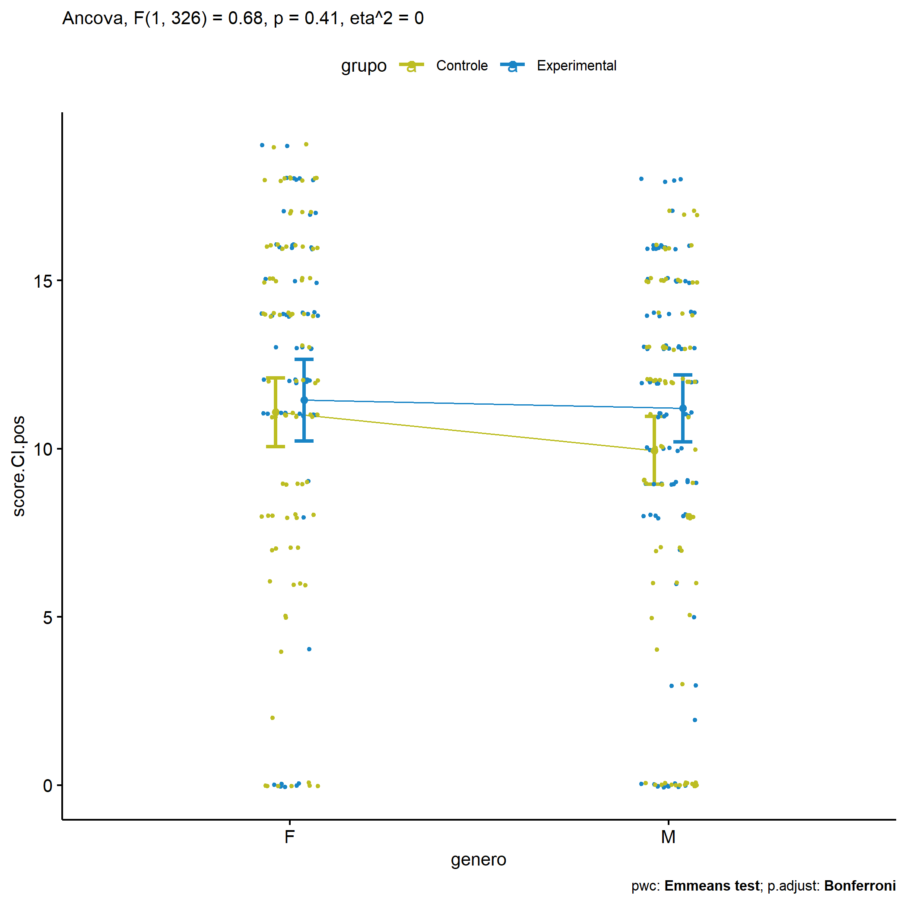<!-- -->

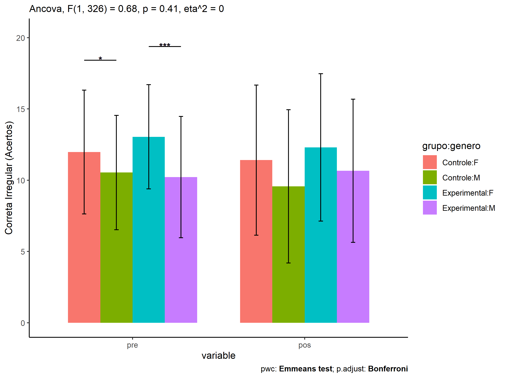<!-- -->

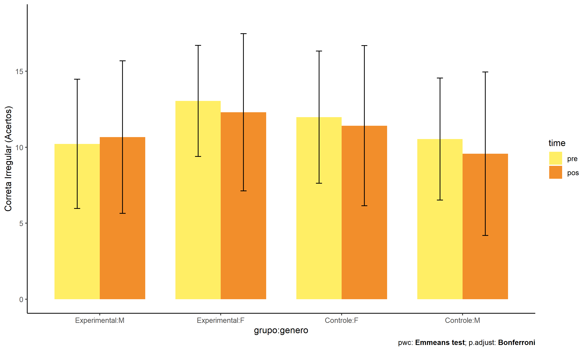<!-- -->

### Trocas Visuais (Acertos)

| var          | genero | grupo        |   n | M (pre) | SE (pre) | M (unadj) | SE (unadj) | M (adj) | SE (adj) |
|:-------------|:-------|:-------------|----:|--------:|---------:|----------:|-----------:|--------:|---------:|
| score.TV.pos | F      | Controle     |  87 |  16.195 |    0.467 |    15.724 |      0.624 |  15.614 |    0.644 |
| score.TV.pos | F      | Experimental |  63 |  16.952 |    0.535 |    15.159 |      0.812 |  14.749 |    0.760 |
| score.TV.pos | M      | Controle     |  89 |  15.236 |    0.587 |    13.348 |      0.731 |  13.619 |    0.638 |
| score.TV.pos | M      | Experimental |  92 |  15.609 |    0.559 |    14.554 |      0.634 |  14.677 |    0.627 |

| .y.          | grupo        | genero | group1   | group2       | estimate | conf.low | conf.high |    se | statistic |     p | p.adj | p.adj.signif |
|:-------------|:-------------|:-------|:---------|:-------------|---------:|---------:|----------:|------:|----------:|------:|------:|:-------------|
| score.TV.pos | Controle     |        | F        | M            |    1.996 |    0.210 |     3.782 | 0.908 |     2.198 | 0.029 | 0.029 | \*           |
| score.TV.pos | Experimental |        | F        | M            |    0.072 |   -1.868 |     2.013 | 0.986 |     0.073 | 0.942 | 0.942 | ns           |
| score.TV.pre | Controle     |        | F        | M            |    0.959 |   -0.514 |     2.433 | 0.749 |     1.281 | 0.201 | 0.201 | ns           |
| score.TV.pre | Experimental |        | F        | M            |    1.344 |   -0.254 |     2.942 | 0.812 |     1.654 | 0.099 | 0.099 | ns           |
| score.TV.pos |              | F      | Controle | Experimental |    0.865 |   -1.092 |     2.823 | 0.995 |     0.869 | 0.385 | 0.385 | ns           |
| score.TV.pos |              | M      | Controle | Experimental |   -1.058 |   -2.816 |     0.699 | 0.893 |    -1.185 | 0.237 | 0.237 | ns           |
| score.TV.pre |              | F      | Controle | Experimental |   -0.757 |   -2.374 |     0.860 | 0.822 |    -0.921 | 0.358 | 0.358 | ns           |
| score.TV.pre |              | M      | Controle | Experimental |   -0.373 |   -1.826 |     1.080 | 0.739 |    -0.505 | 0.614 | 0.614 | ns           |

| grupo        | genero | group1 | group2 | estimate | conf.low | conf.high |    se | statistic |     p | p.adj | p.adj.signif |
|:-------------|:-------|:-------|:-------|---------:|---------:|----------:|------:|----------:|------:|------:|:-------------|
| Controle     | F      | pre    | pos    |    0.471 |   -1.220 |     2.162 | 0.861 |     0.547 | 0.584 | 0.584 | ns           |
| Controle     | M      | pre    | pos    |    1.888 |    0.216 |     3.559 | 0.851 |     2.217 | 0.027 | 0.027 | \*           |
| Experimental | F      | pre    | pos    |    1.794 |   -0.193 |     3.781 | 1.012 |     1.772 | 0.077 | 0.077 | ns           |
| Experimental | M      | pre    | pos    |    1.054 |   -0.590 |     2.699 | 0.837 |     1.259 | 0.208 | 0.208 | ns           |

    ## Scale for colour is already present.
    ## Adding another scale for colour, which will replace the existing scale.

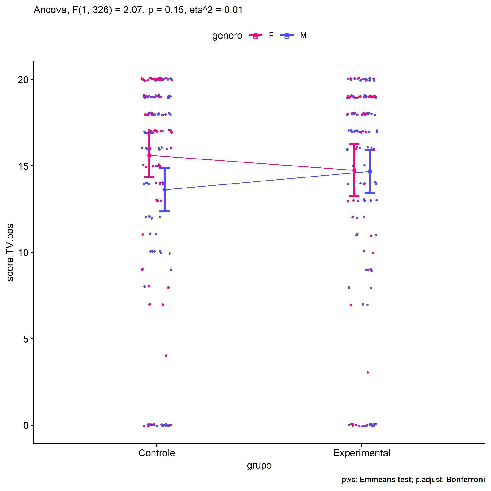<!-- -->

    ## Scale for colour is already present.
    ## Adding another scale for colour, which will replace the existing scale.

<!-- -->

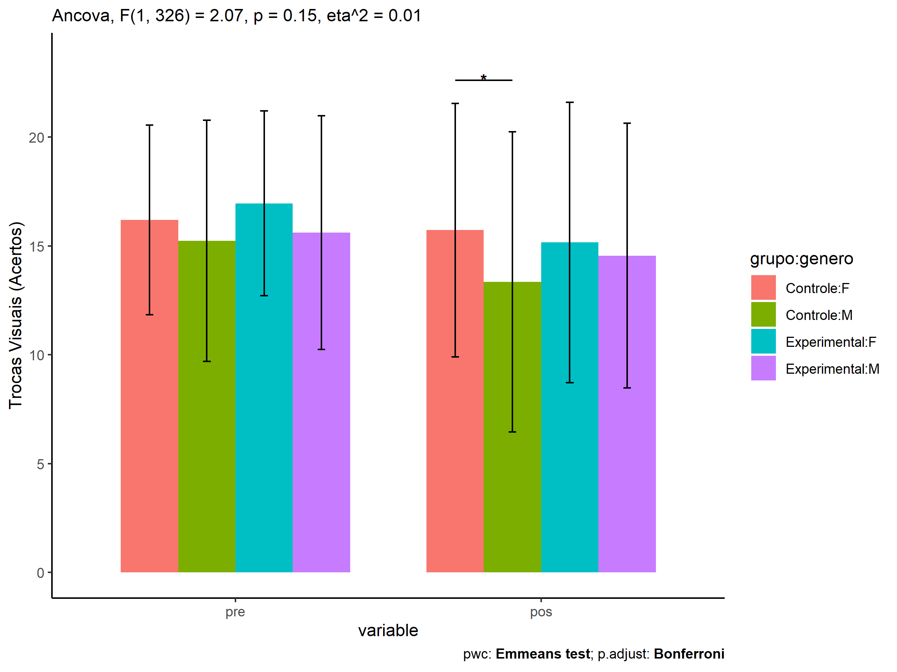<!-- -->

<!-- -->

### Trocas Fonologicas (Acertos)

| var          | genero | grupo        |   n | M (pre) | SE (pre) | M (unadj) | SE (unadj) | M (adj) | SE (adj) |
|:-------------|:-------|:-------------|----:|--------:|---------:|----------:|-----------:|--------:|---------:|
| score.TF.pos | F      | Controle     |  87 |  15.000 |    0.517 |    14.230 |      0.629 |  14.114 |    0.616 |
| score.TF.pos | F      | Experimental |  63 |  15.492 |    0.606 |    14.016 |      0.800 |  13.660 |    0.725 |
| score.TF.pos | M      | Controle     |  89 |  14.146 |    0.545 |    12.191 |      0.730 |  12.491 |    0.610 |
| score.TF.pos | M      | Experimental |  92 |  14.630 |    0.571 |    13.815 |      0.611 |  13.879 |    0.599 |

| .y.          | grupo        | genero | group1   | group2       | estimate | conf.low | conf.high |    se | statistic |     p | p.adj | p.adj.signif |
|:-------------|:-------------|:-------|:---------|:-------------|---------:|---------:|----------:|------:|----------:|------:|------:|:-------------|
| score.TF.pos | Controle     |        | F        | M            |    1.623 |   -0.083 |     3.328 | 0.867 |     1.871 | 0.062 | 0.062 | ns           |
| score.TF.pos | Experimental |        | F        | M            |   -0.219 |   -2.069 |     1.630 | 0.940 |    -0.233 | 0.816 | 0.816 | ns           |
| score.TF.pre | Controle     |        | F        | M            |    0.854 |   -0.657 |     2.365 | 0.768 |     1.112 | 0.267 | 0.267 | ns           |
| score.TF.pre | Experimental |        | F        | M            |    0.862 |   -0.778 |     2.501 | 0.833 |     1.034 | 0.302 | 0.302 | ns           |
| score.TF.pos |              | F      | Controle | Experimental |    0.454 |   -1.415 |     2.323 | 0.950 |     0.478 | 0.633 | 0.633 | ns           |
| score.TF.pos |              | M      | Controle | Experimental |   -1.388 |   -3.068 |     0.292 | 0.854 |    -1.625 | 0.105 | 0.105 | ns           |
| score.TF.pre |              | F      | Controle | Experimental |   -0.492 |   -2.150 |     1.166 | 0.843 |    -0.584 | 0.560 | 0.560 | ns           |
| score.TF.pre |              | M      | Controle | Experimental |   -0.484 |   -1.975 |     1.006 | 0.758 |    -0.639 | 0.523 | 0.523 | ns           |

| grupo        | genero | group1 | group2 | estimate | conf.low | conf.high |    se | statistic |     p | p.adj | p.adj.signif |
|:-------------|:-------|:-------|:-------|---------:|---------:|----------:|------:|----------:|------:|------:|:-------------|
| Controle     | F      | pre    | pos    |    0.770 |   -0.927 |     2.467 | 0.864 |     0.891 | 0.373 | 0.373 | ns           |
| Controle     | M      | pre    | pos    |    1.955 |    0.277 |     3.633 | 0.855 |     2.288 | 0.022 | 0.022 | \*           |
| Experimental | F      | pre    | pos    |    1.476 |   -0.518 |     3.470 | 1.016 |     1.453 | 0.147 | 0.147 | ns           |
| Experimental | M      | pre    | pos    |    0.815 |   -0.835 |     2.466 | 0.840 |     0.970 | 0.332 | 0.332 | ns           |

    ## Scale for colour is already present.
    ## Adding another scale for colour, which will replace the existing scale.

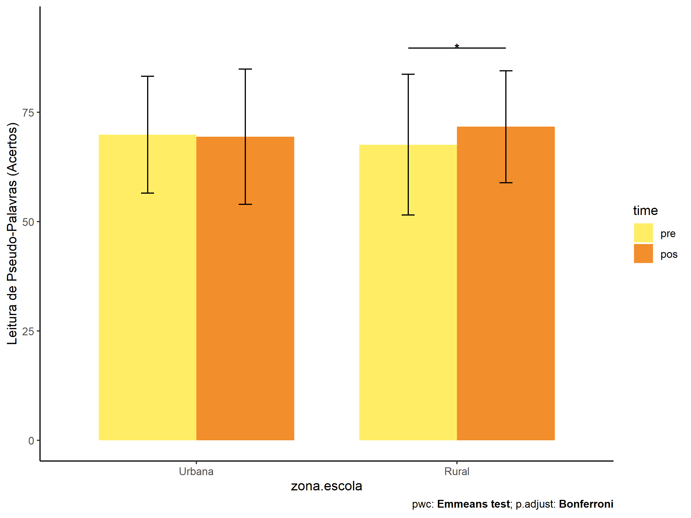<!-- -->

    ## Scale for colour is already present.
    ## Adding another scale for colour, which will replace the existing scale.

<!-- -->

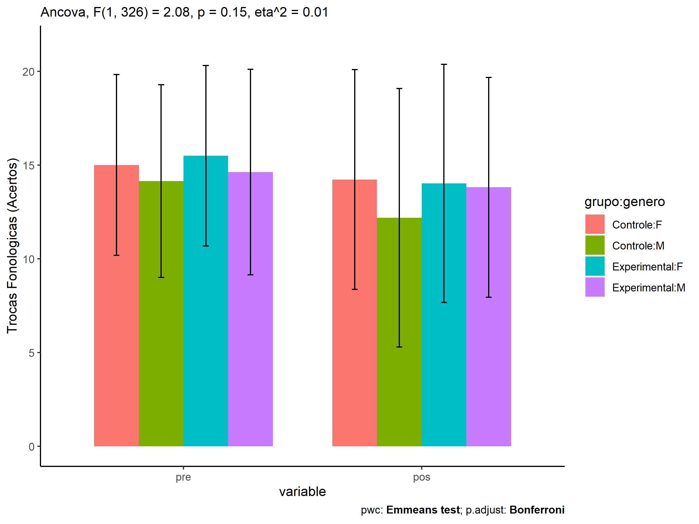<!-- -->

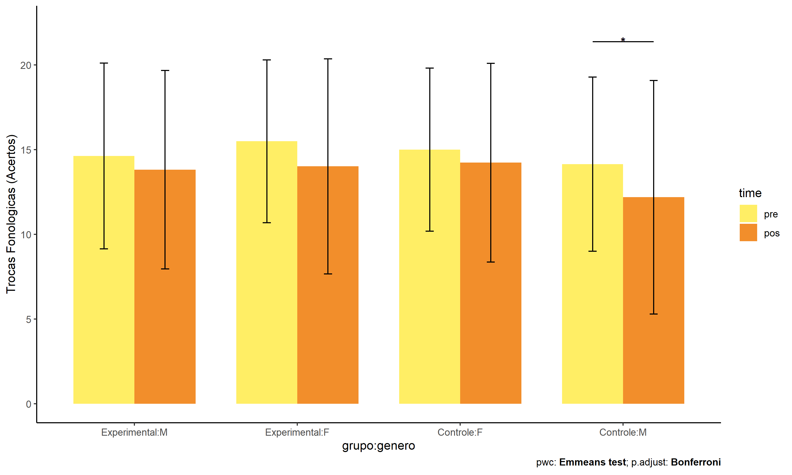<!-- -->

### Trocas Orograficas (Acertos)

| var          | genero | grupo        |   n | M (pre) | SE (pre) | M (unadj) | SE (unadj) | M (adj) | SE (adj) |
|:-------------|:-------|:-------------|----:|--------:|---------:|----------:|-----------:|--------:|---------:|
| score.TO.pos | F      | Controle     |  87 |  10.598 |    0.504 |    10.989 |      0.537 |  10.519 |    0.483 |
| score.TO.pos | F      | Experimental |  63 |  10.667 |    0.564 |    10.317 |      0.724 |   9.810 |    0.568 |
| score.TO.pos | M      | Controle     |  89 |   8.640 |    0.459 |     8.213 |      0.539 |   8.835 |    0.480 |
| score.TO.pos | M      | Experimental |  92 |   9.413 |    0.452 |     9.000 |      0.501 |   9.191 |    0.468 |

| .y.          | grupo        | genero | group1   | group2       | estimate | conf.low | conf.high |    se | statistic |     p | p.adj | p.adj.signif |
|:-------------|:-------------|:-------|:---------|:-------------|---------:|---------:|----------:|------:|----------:|------:|------:|:-------------|
| score.TO.pos | Controle     |        | F        | M            |    1.685 |    0.337 |     3.033 | 0.685 |     2.458 | 0.014 | 0.014 | \*           |
| score.TO.pos | Experimental |        | F        | M            |    0.619 |   -0.831 |     2.069 | 0.737 |     0.840 | 0.402 | 0.402 | ns           |
| score.TO.pre | Controle     |        | F        | M            |    1.957 |    0.635 |     3.280 | 0.672 |     2.912 | 0.004 | 0.004 | \*\*         |
| score.TO.pre | Experimental |        | F        | M            |    1.254 |   -0.181 |     2.688 | 0.729 |     1.719 | 0.086 | 0.086 | ns           |
| score.TO.pos |              | F      | Controle | Experimental |    0.709 |   -0.751 |     2.170 | 0.742 |     0.956 | 0.340 | 0.340 | ns           |
| score.TO.pos |              | M      | Controle | Experimental |   -0.356 |   -1.671 |     0.959 | 0.669 |    -0.533 | 0.595 | 0.595 | ns           |
| score.TO.pre |              | F      | Controle | Experimental |   -0.069 |   -1.520 |     1.382 | 0.738 |    -0.094 | 0.926 | 0.926 | ns           |
| score.TO.pre |              | M      | Controle | Experimental |   -0.773 |   -2.077 |     0.531 | 0.663 |    -1.166 | 0.245 | 0.245 | ns           |

| grupo        | genero | group1 | group2 | estimate | conf.low | conf.high |    se | statistic |     p | p.adj | p.adj.signif |
|:-------------|:-------|:-------|:-------|---------:|---------:|----------:|------:|----------:|------:|------:|:-------------|
| Controle     | F      | pre    | pos    |   -0.391 |   -1.820 |     1.039 | 0.728 |    -0.537 | 0.592 | 0.592 | ns           |
| Controle     | M      | pre    | pos    |    0.427 |   -0.987 |     1.840 | 0.720 |     0.593 | 0.553 | 0.553 | ns           |
| Experimental | F      | pre    | pos    |    0.349 |   -1.331 |     2.029 | 0.856 |     0.408 | 0.683 | 0.683 | ns           |
| Experimental | M      | pre    | pos    |    0.413 |   -0.977 |     1.803 | 0.708 |     0.583 | 0.560 | 0.560 | ns           |

    ## Scale for colour is already present.
    ## Adding another scale for colour, which will replace the existing scale.

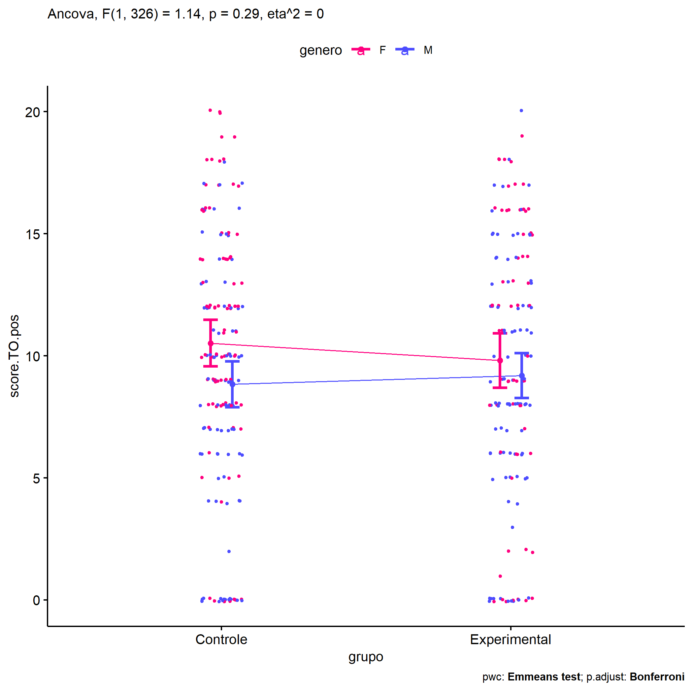<!-- -->

    ## Scale for colour is already present.
    ## Adding another scale for colour, which will replace the existing scale.

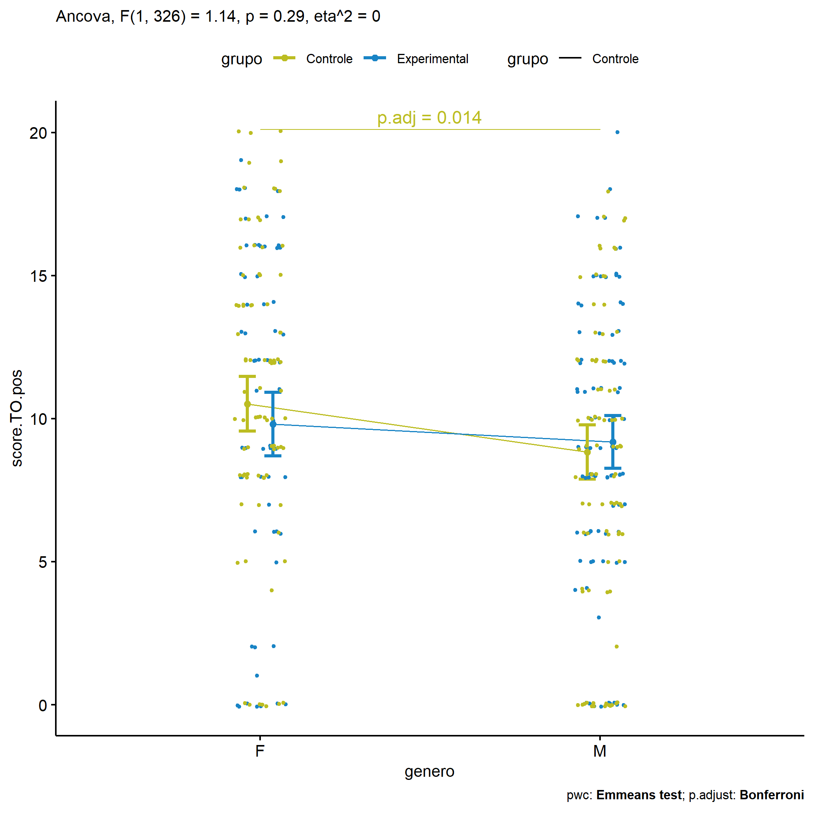<!-- -->

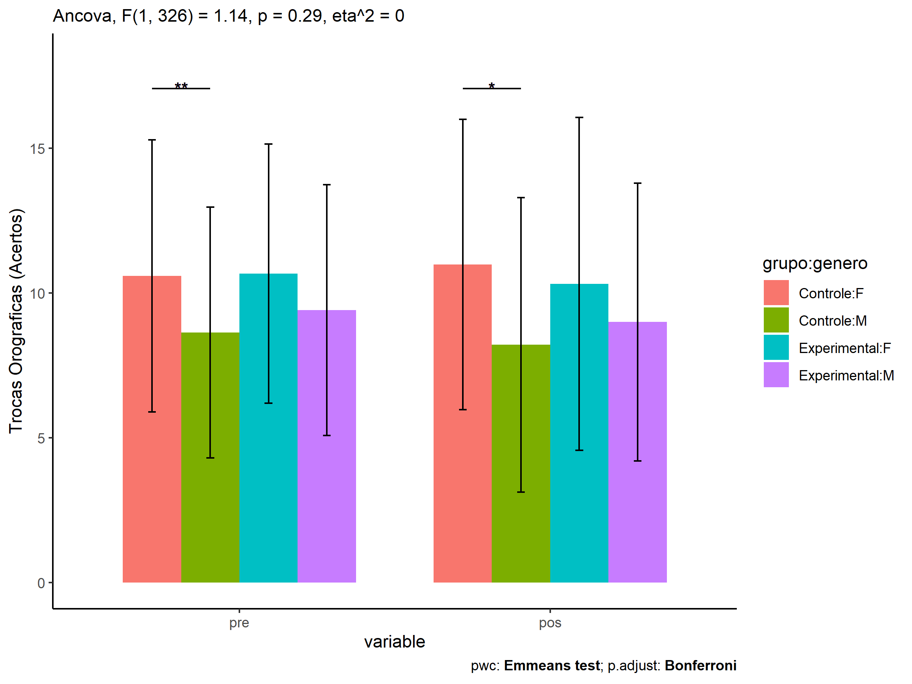<!-- -->

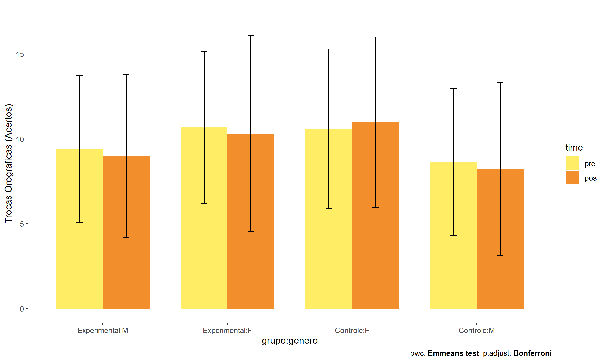<!-- -->

## factores: **idade:grupo**

### Leitura de Pseudo-Palavras (Acertos)

| var            | idade | grupo        |   n | M (pre) | SE (pre) | M (unadj) | SE (unadj) | M (adj) | SE (adj) |
|:---------------|:------|:-------------|----:|--------:|---------:|----------:|-----------:|--------:|---------:|
| score.CLPP.pos | 10y   | Controle     |  28 |  71.643 |    1.921 |    70.429 |      2.665 |  68.857 |    2.028 |
| score.CLPP.pos | 10y   | Experimental |  27 |  69.556 |    2.636 |    67.667 |      3.227 |  67.512 |    2.062 |
| score.CLPP.pos | 11y   | Controle     |  84 |  68.917 |    1.751 |    72.429 |      1.604 |  72.707 |    1.169 |
| score.CLPP.pos | 11y   | Experimental |  82 |  71.927 |    1.474 |    73.183 |      1.443 |  71.419 |    1.190 |
| score.CLPP.pos | 12y   | Controle     |  20 |  64.650 |    2.648 |    59.450 |      3.581 |  62.623 |    2.406 |
| score.CLPP.pos | 12y   | Experimental |  16 |  67.000 |    4.294 |    67.250 |      3.734 |  68.829 |    2.681 |
| score.CLPP.pos | 13y   | Controle     |   8 |  60.875 |    4.430 |    65.500 |      3.268 |  71.235 |    3.809 |
| score.CLPP.pos | 13y   | Experimental |   7 |  62.000 |    4.146 |    65.571 |      4.999 |  70.543 |    4.065 |

| .y.            | grupo        | idade | group1   | group2       | estimate | conf.low | conf.high |    se | statistic | p       | p.adj | p.adj.signif |
|:---------------|:-------------|:------|:---------|:-------------|---------:|---------:|----------:|------:|----------:|:--------|------:|:-------------|
| score.CLPP.pos | Controle     |       | 10y      | 11y          |   -3.850 |   -8.461 |     0.762 | 2.342 |    -1.644 | 0.101   | 0.608 | ns           |
| score.CLPP.pos | Controle     |       | 10y      | 12y          |    6.234 |    0.023 |    12.445 | 3.154 |     1.976 | 0.049   | 0.295 | ns           |
| score.CLPP.pos | Controle     |       | 10y      | 13y          |   -2.377 |  -10.894 |     6.140 | 4.326 |    -0.550 | 0.583   | 1.000 | ns           |
| score.CLPP.pos | Controle     |       | 11y      | 12y          |   10.084 |    4.819 |    15.348 | 2.674 |     3.771 | \<0.001 | 0.001 | \*\*         |
| score.CLPP.pos | Controle     |       | 11y      | 13y          |    1.472 |   -6.370 |     9.315 | 3.983 |     0.370 | 0.712   | 1.000 | ns           |
| score.CLPP.pos | Controle     |       | 12y      | 13y          |   -8.611 |  -17.445 |     0.223 | 4.486 |    -1.919 | 0.056   | 0.336 | ns           |
| score.CLPP.pos | Experimental |       | 10y      | 11y          |   -3.907 |   -8.594 |     0.780 | 2.380 |    -1.642 | 0.102   | 0.611 | ns           |
| score.CLPP.pos | Experimental |       | 10y      | 12y          |   -1.317 |   -7.978 |     5.344 | 3.383 |    -0.389 | 0.697   | 1.000 | ns           |
| score.CLPP.pos | Experimental |       | 10y      | 13y          |   -3.031 |  -12.008 |     5.946 | 4.559 |    -0.665 | 0.507   | 1.000 | ns           |
| score.CLPP.pos | Experimental |       | 11y      | 12y          |    2.590 |   -3.195 |     8.375 | 2.938 |     0.882 | 0.379   | 1.000 | ns           |
| score.CLPP.pos | Experimental |       | 11y      | 13y          |    0.876 |   -7.483 |     9.235 | 4.245 |     0.206 | 0.837   | 1.000 | ns           |
| score.CLPP.pos | Experimental |       | 12y      | 13y          |   -1.714 |  -11.287 |     7.859 | 4.862 |    -0.353 | 0.725   | 1.000 | ns           |
| score.CLPP.pre | Controle     |       | 10y      | 11y          |    2.726 |   -3.325 |     8.778 | 3.073 |     0.887 | 0.376   | 1.000 | ns           |
| score.CLPP.pre | Controle     |       | 10y      | 12y          |    6.993 |   -1.126 |    15.112 | 4.123 |     1.696 | 0.091   | 0.547 | ns           |
| score.CLPP.pre | Controle     |       | 10y      | 13y          |   10.768 |   -0.350 |    21.885 | 5.646 |     1.907 | 0.058   | 0.346 | ns           |
| score.CLPP.pre | Controle     |       | 11y      | 12y          |    4.267 |   -2.633 |    11.167 | 3.504 |     1.218 | 0.224   | 1.000 | ns           |
| score.CLPP.pre | Controle     |       | 11y      | 13y          |    8.042 |   -2.219 |    18.303 | 5.211 |     1.543 | 0.124   | 0.744 | ns           |
| score.CLPP.pre | Controle     |       | 12y      | 13y          |    3.775 |   -7.826 |    15.376 | 5.892 |     0.641 | 0.522   | 1.000 | ns           |
| score.CLPP.pre | Experimental |       | 10y      | 11y          |   -2.371 |   -8.524 |     3.782 | 3.125 |    -0.759 | 0.449   | 1.000 | ns           |
| score.CLPP.pre | Experimental |       | 10y      | 12y          |    2.556 |   -6.194 |    11.305 | 4.444 |     0.575 | 0.566   | 1.000 | ns           |
| score.CLPP.pre | Experimental |       | 10y      | 13y          |    7.556 |   -4.207 |    19.318 | 5.974 |     1.265 | 0.207   | 1.000 | ns           |
| score.CLPP.pre | Experimental |       | 11y      | 12y          |    4.927 |   -2.652 |    12.506 | 3.849 |     1.280 | 0.202   | 1.000 | ns           |
| score.CLPP.pre | Experimental |       | 11y      | 13y          |    9.927 |   -0.993 |    20.847 | 5.546 |     1.790 | 0.075   | 0.448 | ns           |
| score.CLPP.pre | Experimental |       | 12y      | 13y          |    5.000 |   -7.567 |    17.567 | 6.382 |     0.783 | 0.434   | 1.000 | ns           |
| score.CLPP.pos |              | 10y   | Controle | Experimental |    1.346 |   -4.349 |     7.040 | 2.892 |     0.465 | 0.642   | 0.642 | ns           |
| score.CLPP.pos |              | 11y   | Controle | Experimental |    1.288 |   -1.999 |     4.575 | 1.670 |     0.771 | 0.441   | 0.441 | ns           |
| score.CLPP.pos |              | 12y   | Controle | Experimental |   -6.206 |  -13.286 |     0.875 | 3.596 |    -1.726 | 0.086   | 0.086 | ns           |
| score.CLPP.pos |              | 13y   | Controle | Experimental |    0.692 |  -10.229 |    11.613 | 5.546 |     0.125 | 0.901   | 0.901 | ns           |
| score.CLPP.pre |              | 10y   | Controle | Experimental |    2.087 |   -5.393 |     9.567 | 3.799 |     0.549 | 0.583   | 0.583 | ns           |
| score.CLPP.pre |              | 11y   | Controle | Experimental |   -3.010 |   -7.315 |     1.295 | 2.186 |    -1.377 | 0.17    | 0.170 | ns           |
| score.CLPP.pre |              | 12y   | Controle | Experimental |   -2.350 |  -11.651 |     6.951 | 4.724 |    -0.497 | 0.619   | 0.619 | ns           |
| score.CLPP.pre |              | 13y   | Controle | Experimental |   -1.125 |  -15.478 |    13.228 | 7.289 |    -0.154 | 0.877   | 0.877 | ns           |

| grupo        | idade | group1 | group2 | estimate | conf.low | conf.high |    se | statistic |     p | p.adj | p.adj.signif |
|:-------------|:------|:-------|:-------|---------:|---------:|----------:|------:|----------:|------:|------:|:-------------|
| Controle     | 10y   | pre    | pos    |    1.732 |   -5.390 |     8.853 | 3.626 |     0.478 | 0.633 | 0.633 | ns           |
| Controle     | 11y   | pre    | pos    |   -2.934 |   -7.080 |     1.212 | 2.111 |    -1.390 | 0.165 | 0.165 | ns           |
| Controle     | 12y   | pre    | pos    |    4.011 |   -4.125 |    12.148 | 4.142 |     0.968 | 0.333 | 0.333 | ns           |
| Controle     | 13y   | pre    | pos    |   -6.900 |  -19.976 |     6.176 | 6.657 |    -1.036 | 0.300 | 0.300 | ns           |
| Experimental | 10y   | pre    | pos    |    1.889 |   -5.614 |     9.392 | 3.820 |     0.495 | 0.621 | 0.621 | ns           |
| Experimental | 11y   | pre    | pos    |   -0.954 |   -5.172 |     3.264 | 2.147 |    -0.444 | 0.657 | 0.657 | ns           |
| Experimental | 12y   | pre    | pos    |    0.353 |   -9.102 |     9.808 | 4.814 |     0.073 | 0.942 | 0.942 | ns           |
| Experimental | 13y   | pre    | pos    |    0.800 |  -12.276 |    13.876 | 6.657 |     0.120 | 0.904 | 0.904 | ns           |

    ## Scale for colour is already present.
    ## Adding another scale for colour, which will replace the existing scale.

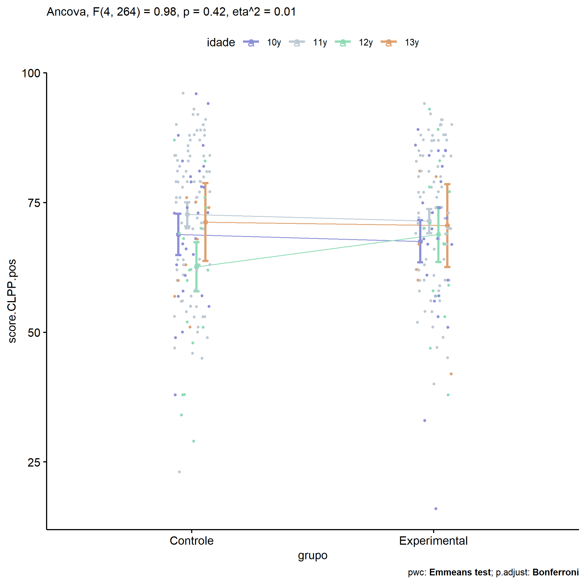<!-- -->

    ## Scale for colour is already present.
    ## Adding another scale for colour, which will replace the existing scale.

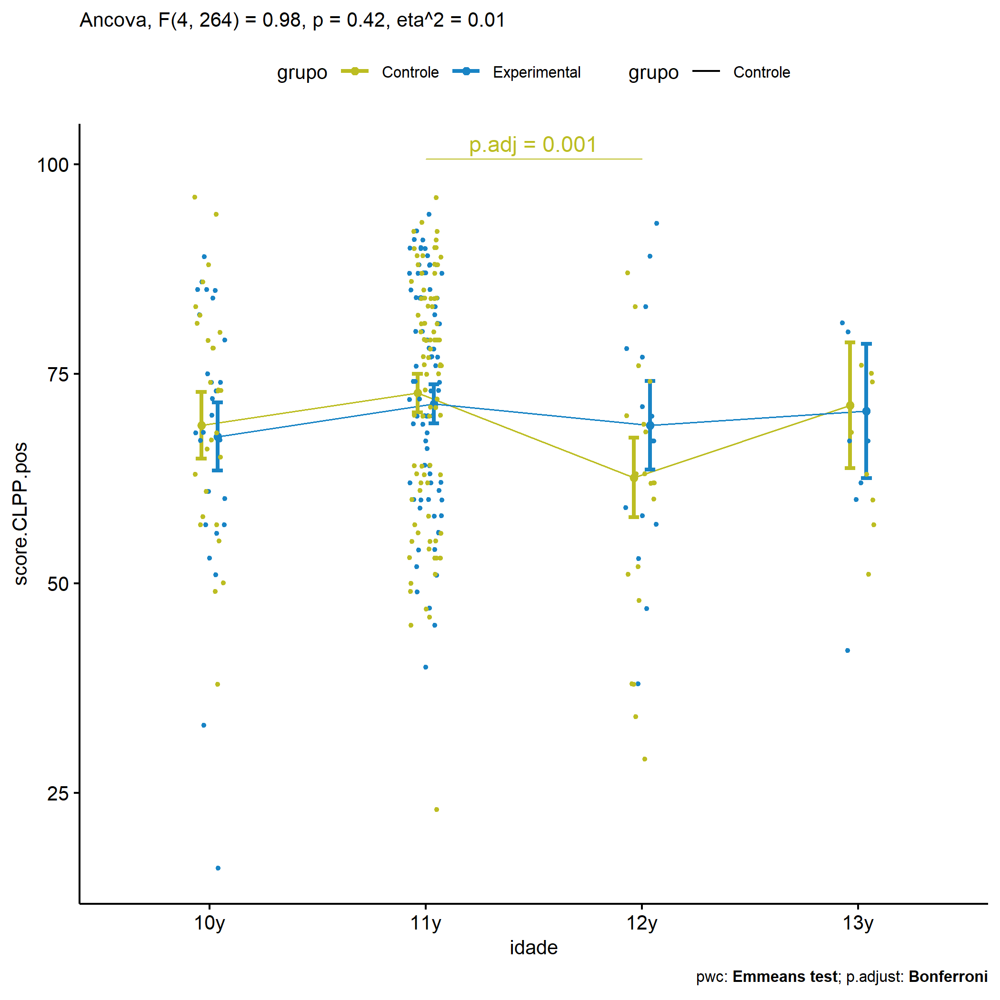<!-- -->

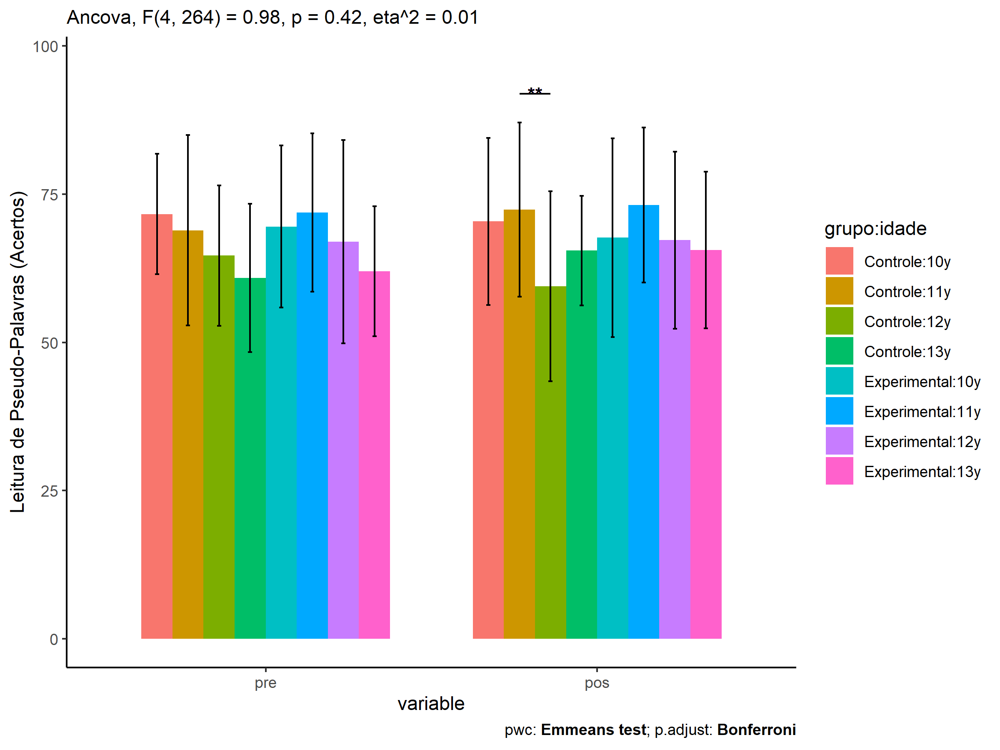<!-- -->

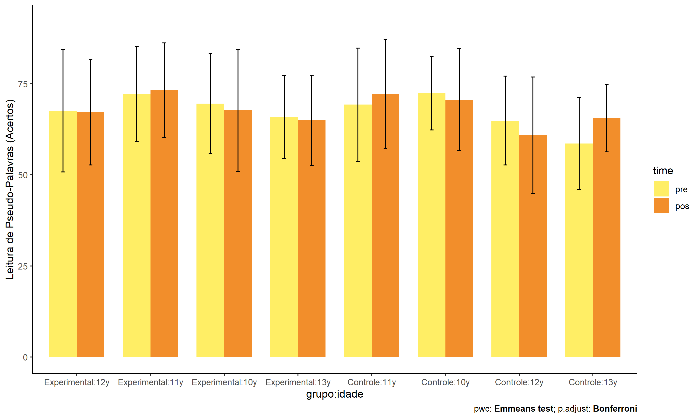<!-- -->

### Correta Regular (Acertos)

| var          | idade | grupo        |   n | M (pre) | SE (pre) | M (unadj) | SE (unadj) | M (adj) | SE (adj) |
|:-------------|:------|:-------------|----:|--------:|---------:|----------:|-----------:|--------:|---------:|
| score.CR.pos | 10y   | Controle     |  32 |  14.938 |    0.643 |    14.094 |      0.972 |  13.961 |    0.931 |
| score.CR.pos | 10y   | Experimental |  27 |  15.037 |    0.742 |    14.556 |      0.769 |  14.400 |    1.014 |
| score.CR.pos | 11y   | Controle     |  93 |  14.301 |    0.420 |    14.398 |      0.531 |  14.412 |    0.546 |
| score.CR.pos | 11y   | Experimental |  89 |  15.517 |    0.384 |    14.539 |      0.532 |  14.273 |    0.564 |
| score.CR.pos | 12y   | Controle     |  26 |  13.538 |    0.996 |    10.923 |      1.244 |  11.113 |    1.034 |
| score.CR.pos | 12y   | Experimental |  19 |  13.316 |    1.366 |    13.000 |      1.245 |  13.242 |    1.210 |
| score.CR.pos | 13y   | Controle     |  10 |  12.900 |    0.983 |    11.100 |      2.121 |  11.438 |    1.668 |
| score.CR.pos | 13y   | Experimental |  12 |  11.333 |    1.712 |     9.250 |      2.168 |   9.950 |    1.535 |
| score.CR.pos | 14y   | Experimental |   6 |   7.500 |    2.802 |     2.333 |      2.333 |   3.918 |    2.204 |

|     | .y.          | grupo        | idade | group1   | group2       | estimate | conf.low | conf.high |    se | statistic | p       | p.adj   | p.adj.signif |
|:----|:-------------|:-------------|:------|:---------|:-------------|---------:|---------:|----------:|------:|----------:|:--------|:--------|:-------------|
| 1   | score.CR.pos | Controle     |       | 10y      | 11y          |   -0.451 |   -2.576 |     1.673 | 1.080 |    -0.418 | 0.676   | 1       | ns           |
| 2   | score.CR.pos | Controle     |       | 10y      | 12y          |    2.848 |    0.106 |     5.589 | 1.393 |     2.044 | 0.042   | 0.251   | ns           |
| 3   | score.CR.pos | Controle     |       | 10y      | 13y          |    2.523 |   -1.240 |     6.286 | 1.912 |     1.319 | 0.188   | 1       | ns           |
| 5   | score.CR.pos | Controle     |       | 11y      | 12y          |    3.299 |    0.999 |     5.599 | 1.169 |     2.822 | 0.005   | 0.031   | \*           |
| 6   | score.CR.pos | Controle     |       | 11y      | 13y          |    2.974 |   -0.478 |     6.427 | 1.754 |     1.695 | 0.091   | 0.546   | ns           |
| 8   | score.CR.pos | Controle     |       | 12y      | 13y          |   -0.324 |   -4.179 |     3.531 | 1.959 |    -0.166 | 0.869   | 1       | ns           |
| 11  | score.CR.pos | Experimental |       | 10y      | 11y          |    0.127 |   -2.150 |     2.404 | 1.157 |     0.110 | 0.913   | 1       | ns           |
| 12  | score.CR.pos | Experimental |       | 10y      | 12y          |    1.158 |   -1.953 |     4.269 | 1.581 |     0.733 | 0.464   | 1       | ns           |
| 13  | score.CR.pos | Experimental |       | 10y      | 13y          |    4.450 |    0.820 |     8.081 | 1.845 |     2.412 | 0.016   | 0.165   | ns           |
| 14  | score.CR.pos | Experimental |       | 10y      | 14y          |   10.482 |    5.689 |    15.275 | 2.435 |     4.304 | \<0.001 | \<0.001 | \*\*\*       |
| 15  | score.CR.pos | Experimental |       | 11y      | 12y          |    1.031 |   -1.604 |     3.667 | 1.339 |     0.770 | 0.442   | 1       | ns           |
| 16  | score.CR.pos | Experimental |       | 11y      | 13y          |    4.323 |    1.085 |     7.562 | 1.646 |     2.627 | 0.009   | 0.091   | ns           |
| 17  | score.CR.pos | Experimental |       | 11y      | 14y          |   10.355 |    5.844 |    14.866 | 2.292 |     4.517 | \<0.001 | \<0.001 | \*\*\*\*     |
| 18  | score.CR.pos | Experimental |       | 12y      | 13y          |    3.292 |   -0.537 |     7.121 | 1.946 |     1.692 | 0.092   | 0.917   | ns           |
| 19  | score.CR.pos | Experimental |       | 12y      | 14y          |    9.324 |    4.406 |    14.242 | 2.499 |     3.730 | \<0.001 | 0.002   | \*\*         |
| 20  | score.CR.pos | Experimental |       | 13y      | 14y          |    6.032 |    0.825 |    11.238 | 2.646 |     2.280 | 0.023   | 0.233   | ns           |
| 21  | score.CR.pre | Controle     |       | 10y      | 11y          |    0.636 |   -1.069 |     2.342 | 0.867 |     0.734 | 0.463   | 1       | ns           |
| 22  | score.CR.pre | Controle     |       | 10y      | 12y          |    1.399 |   -0.798 |     3.596 | 1.116 |     1.253 | 0.211   | 1       | ns           |
| 23  | score.CR.pre | Controle     |       | 10y      | 13y          |    2.038 |   -0.977 |     5.052 | 1.532 |     1.330 | 0.184   | 1       | ns           |
| 25  | score.CR.pre | Controle     |       | 11y      | 12y          |    0.763 |   -1.083 |     2.608 | 0.938 |     0.813 | 0.417   | 1       | ns           |
| 26  | score.CR.pre | Controle     |       | 11y      | 13y          |    1.401 |   -1.368 |     4.170 | 1.407 |     0.996 | 0.32    | 1       | ns           |
| 28  | score.CR.pre | Controle     |       | 12y      | 13y          |    0.638 |   -2.457 |     3.734 | 1.573 |     0.406 | 0.685   | 1       | ns           |
| 31  | score.CR.pre | Experimental |       | 10y      | 11y          |   -0.480 |   -2.308 |     1.348 | 0.929 |    -0.517 | 0.606   | 1       | ns           |
| 32  | score.CR.pre | Experimental |       | 10y      | 12y          |    1.721 |   -0.770 |     4.213 | 1.266 |     1.360 | 0.175   | 1       | ns           |
| 33  | score.CR.pre | Experimental |       | 10y      | 13y          |    3.704 |    0.817 |     6.590 | 1.467 |     2.525 | 0.012   | 0.121   | ns           |
| 34  | score.CR.pre | Experimental |       | 10y      | 14y          |    7.537 |    3.782 |    11.292 | 1.908 |     3.950 | \<0.001 | \<0.001 | \*\*\*       |
| 35  | score.CR.pre | Experimental |       | 11y      | 12y          |    2.201 |    0.098 |     4.304 | 1.069 |     2.060 | 0.04    | 0.403   | ns           |
| 36  | score.CR.pre | Experimental |       | 11y      | 13y          |    4.184 |    1.625 |     6.742 | 1.300 |     3.218 | 0.001   | 0.014   | \*           |
| 37  | score.CR.pre | Experimental |       | 11y      | 14y          |    8.017 |    4.508 |    11.526 | 1.783 |     4.495 | \<0.001 | \<0.001 | \*\*\*\*     |
| 38  | score.CR.pre | Experimental |       | 12y      | 13y          |    1.982 |   -1.085 |     5.050 | 1.559 |     1.272 | 0.204   | 1       | ns           |
| 39  | score.CR.pre | Experimental |       | 12y      | 14y          |    5.816 |    1.920 |     9.712 | 1.980 |     2.937 | 0.004   | 0.036   | \*           |
| 40  | score.CR.pre | Experimental |       | 13y      | 14y          |    3.833 |   -0.327 |     7.993 | 2.114 |     1.813 | 0.071   | 0.708   | ns           |
| 41  | score.CR.pos |              | 10y   | Controle | Experimental |   -0.439 |   -3.145 |     2.268 | 1.375 |    -0.319 | 0.75    | 0.75    | ns           |
| 42  | score.CR.pos |              | 11y   | Controle | Experimental |    0.139 |   -1.406 |     1.684 | 0.785 |     0.177 | 0.859   | 0.859   | ns           |
| 43  | score.CR.pos |              | 12y   | Controle | Experimental |   -2.128 |   -5.254 |     0.998 | 1.589 |    -1.340 | 0.181   | 0.181   | ns           |
| 44  | score.CR.pos |              | 13y   | Controle | Experimental |    1.488 |   -2.952 |     5.928 | 2.256 |     0.660 | 0.51    | 0.51    | ns           |
| 46  | score.CR.pre |              | 10y   | Controle | Experimental |   -0.100 |   -2.274 |     2.075 | 1.105 |    -0.090 | 0.928   | 0.928   | ns           |
| 47  | score.CR.pre |              | 11y   | Controle | Experimental |   -1.216 |   -2.449 |     0.018 | 0.627 |    -1.939 | 0.053   | 0.053   | ns           |
| 48  | score.CR.pre |              | 12y   | Controle | Experimental |    0.223 |   -2.288 |     2.734 | 1.276 |     0.174 | 0.862   | 0.862   | ns           |
| 49  | score.CR.pre |              | 13y   | Controle | Experimental |    1.567 |   -1.996 |     5.129 | 1.810 |     0.865 | 0.387   | 0.387   | ns           |

| grupo        | idade | group1 | group2 | estimate | conf.low | conf.high |    se | statistic |     p | p.adj | p.adj.signif |
|:-------------|:------|:-------|:-------|---------:|---------:|----------:|------:|----------:|------:|------:|:-------------|
| Controle     | 10y   | pre    | pos    |    0.844 |   -1.522 |     3.210 | 1.205 |     0.700 | 0.484 | 0.484 | ns           |
| Controle     | 11y   | pre    | pos    |   -0.097 |   -1.485 |     1.291 | 0.707 |    -0.137 | 0.891 | 0.891 | ns           |
| Controle     | 12y   | pre    | pos    |    2.615 |   -0.009 |     5.240 | 1.336 |     1.957 | 0.051 | 0.051 | ns           |
| Controle     | 13y   | pre    | pos    |    1.800 |   -2.432 |     6.032 | 2.155 |     0.835 | 0.404 | 0.404 | ns           |
| Experimental | 10y   | pre    | pos    |    0.481 |   -2.094 |     3.057 | 1.311 |     0.367 | 0.714 | 0.714 | ns           |
| Experimental | 11y   | pre    | pos    |    0.978 |   -0.441 |     2.396 | 0.722 |     1.353 | 0.176 | 0.176 | ns           |
| Experimental | 12y   | pre    | pos    |    0.316 |   -2.755 |     3.386 | 1.563 |     0.202 | 0.840 | 0.840 | ns           |
| Experimental | 13y   | pre    | pos    |    2.083 |   -1.780 |     5.947 | 1.967 |     1.059 | 0.290 | 0.290 | ns           |
| Experimental | 14y   | pre    | pos    |    5.167 |   -0.297 |    10.630 | 2.782 |     1.857 | 0.064 | 0.064 | ns           |

    ## Scale for colour is already present.
    ## Adding another scale for colour, which will replace the existing scale.

<!-- -->

<!-- -->

<!-- -->

### Correta Irregular (Acertos)

| var          | idade | grupo        |   n | M (pre) | SE (pre) | M (unadj) | SE (unadj) | M (adj) | SE (adj) |
|:-------------|:------|:-------------|----:|--------:|---------:|----------:|-----------:|--------:|---------:|
| score.CI.pos | 10y   | Controle     |  32 |  11.906 |    0.642 |    11.000 |      0.904 |  10.799 |    0.829 |
| score.CI.pos | 10y   | Experimental |  27 |  11.852 |    0.644 |    12.481 |      0.769 |  12.303 |    0.902 |
| score.CI.pos | 11y   | Controle     |  93 |  11.667 |    0.435 |    11.312 |      0.518 |  11.212 |    0.486 |
| score.CI.pos | 11y   | Experimental |  89 |  11.910 |    0.398 |    11.989 |      0.480 |  11.786 |    0.498 |
| score.CI.pos | 12y   | Controle     |  26 |  11.000 |    0.874 |    10.192 |      1.140 |  10.377 |    0.920 |
| score.CI.pos | 12y   | Experimental |  19 |  10.526 |    1.217 |    10.737 |      1.147 |  11.123 |    1.077 |
| score.CI.pos | 13y   | Controle     |  10 |   9.800 |    0.867 |     8.700 |      1.739 |   9.395 |    1.486 |
| score.CI.pos | 13y   | Experimental |  12 |  10.000 |    1.651 |     9.250 |      2.132 |   9.860 |    1.356 |
| score.CI.pos | 14y   | Experimental |   6 |   6.667 |    2.362 |     2.000 |      2.000 |   4.030 |    1.939 |

|     | .y.          | grupo        | idade | group1   | group2       | estimate | conf.low | conf.high |    se | statistic | p       | p.adj | p.adj.signif |
|:----|:-------------|:-------------|:------|:---------|:-------------|---------:|---------:|----------:|------:|----------:|:--------|------:|:-------------|
| 1   | score.CI.pos | Controle     |       | 10y      | 11y          |   -0.414 |   -2.304 |     1.477 | 0.961 |    -0.431 | 0.667   | 1.000 | ns           |
| 2   | score.CI.pos | Controle     |       | 10y      | 12y          |    0.422 |   -2.016 |     2.860 | 1.239 |     0.340 | 0.734   | 1.000 | ns           |
| 3   | score.CI.pos | Controle     |       | 10y      | 13y          |    1.403 |   -1.949 |     4.755 | 1.704 |     0.824 | 0.411   | 1.000 | ns           |
| 5   | score.CI.pos | Controle     |       | 11y      | 12y          |    0.836 |   -1.212 |     2.883 | 1.041 |     0.803 | 0.423   | 1.000 | ns           |
| 6   | score.CI.pos | Controle     |       | 11y      | 13y          |    1.817 |   -1.262 |     4.896 | 1.565 |     1.161 | 0.246   | 1.000 | ns           |
| 8   | score.CI.pos | Controle     |       | 12y      | 13y          |    0.981 |   -2.454 |     4.417 | 1.746 |     0.562 | 0.574   | 1.000 | ns           |
| 11  | score.CI.pos | Experimental |       | 10y      | 11y          |    0.518 |   -1.509 |     2.544 | 1.030 |     0.503 | 0.616   | 1.000 | ns           |
| 12  | score.CI.pos | Experimental |       | 10y      | 12y          |    1.180 |   -1.587 |     3.947 | 1.406 |     0.839 | 0.402   | 1.000 | ns           |
| 13  | score.CI.pos | Experimental |       | 10y      | 13y          |    2.443 |   -0.766 |     5.652 | 1.631 |     1.498 | 0.135   | 1.000 | ns           |
| 14  | score.CI.pos | Experimental |       | 10y      | 14y          |    8.273 |    4.058 |    12.489 | 2.142 |     3.862 | \<0.001 | 0.001 | \*\*         |
| 15  | score.CI.pos | Experimental |       | 11y      | 12y          |    0.663 |   -1.675 |     3.000 | 1.188 |     0.558 | 0.577   | 1.000 | ns           |
| 16  | score.CI.pos | Experimental |       | 11y      | 13y          |    1.925 |   -0.922 |     4.772 | 1.447 |     1.331 | 0.184   | 1.000 | ns           |
| 17  | score.CI.pos | Experimental |       | 11y      | 14y          |    7.756 |    3.808 |    11.704 | 2.006 |     3.866 | \<0.001 | 0.001 | \*\*         |
| 18  | score.CI.pos | Experimental |       | 12y      | 13y          |    1.263 |   -2.139 |     4.664 | 1.729 |     0.730 | 0.466   | 1.000 | ns           |
| 19  | score.CI.pos | Experimental |       | 12y      | 14y          |    7.093 |    2.746 |    11.441 | 2.209 |     3.211 | 0.001   | 0.015 | \*           |
| 20  | score.CI.pos | Experimental |       | 13y      | 14y          |    5.830 |    1.199 |    10.462 | 2.354 |     2.477 | 0.014   | 0.138 | ns           |
| 21  | score.CI.pre | Controle     |       | 10y      | 11y          |    0.240 |   -1.419 |     1.898 | 0.843 |     0.284 | 0.776   | 1.000 | ns           |
| 22  | score.CI.pre | Controle     |       | 10y      | 12y          |    0.906 |   -1.230 |     3.043 | 1.086 |     0.835 | 0.405   | 1.000 | ns           |
| 23  | score.CI.pre | Controle     |       | 10y      | 13y          |    2.106 |   -0.825 |     5.038 | 1.490 |     1.414 | 0.158   | 0.951 | ns           |
| 25  | score.CI.pre | Controle     |       | 11y      | 12y          |    0.667 |   -1.128 |     2.462 | 0.912 |     0.731 | 0.465   | 1.000 | ns           |
| 26  | score.CI.pre | Controle     |       | 11y      | 13y          |    1.867 |   -0.826 |     4.560 | 1.369 |     1.364 | 0.174   | 1.000 | ns           |
| 28  | score.CI.pre | Controle     |       | 12y      | 13y          |    1.200 |   -1.811 |     4.211 | 1.530 |     0.784 | 0.434   | 1.000 | ns           |
| 31  | score.CI.pre | Experimental |       | 10y      | 11y          |   -0.058 |   -1.836 |     1.720 | 0.904 |    -0.064 | 0.949   | 1.000 | ns           |
| 32  | score.CI.pre | Experimental |       | 10y      | 12y          |    1.326 |   -1.098 |     3.749 | 1.231 |     1.076 | 0.283   | 1.000 | ns           |
| 33  | score.CI.pre | Experimental |       | 10y      | 13y          |    1.852 |   -0.956 |     4.659 | 1.427 |     1.298 | 0.195   | 1.000 | ns           |
| 34  | score.CI.pre | Experimental |       | 10y      | 14y          |    5.185 |    1.533 |     8.837 | 1.856 |     2.794 | 0.006   | 0.055 | ns           |
| 35  | score.CI.pre | Experimental |       | 11y      | 12y          |    1.384 |   -0.661 |     3.429 | 1.039 |     1.332 | 0.184   | 1.000 | ns           |
| 36  | score.CI.pre | Experimental |       | 11y      | 13y          |    1.910 |   -0.578 |     4.399 | 1.265 |     1.510 | 0.132   | 1.000 | ns           |
| 37  | score.CI.pre | Experimental |       | 11y      | 14y          |    5.243 |    1.830 |     8.657 | 1.734 |     3.023 | 0.003   | 0.027 | \*           |
| 38  | score.CI.pre | Experimental |       | 12y      | 13y          |    0.526 |   -2.457 |     3.510 | 1.516 |     0.347 | 0.729   | 1.000 | ns           |
| 39  | score.CI.pre | Experimental |       | 12y      | 14y          |    3.860 |    0.070 |     7.649 | 1.926 |     2.004 | 0.046   | 0.459 | ns           |
| 40  | score.CI.pre | Experimental |       | 13y      | 14y          |    3.333 |   -0.713 |     7.379 | 2.056 |     1.621 | 0.106   | 1.000 | ns           |
| 41  | score.CI.pos |              | 10y   | Controle | Experimental |   -1.505 |   -3.915 |     0.906 | 1.225 |    -1.228 | 0.22    | 0.220 | ns           |
| 42  | score.CI.pos |              | 11y   | Controle | Experimental |   -0.573 |   -1.941 |     0.795 | 0.695 |    -0.825 | 0.41    | 0.410 | ns           |
| 43  | score.CI.pos |              | 12y   | Controle | Experimental |   -0.746 |   -3.531 |     2.038 | 1.415 |    -0.527 | 0.598   | 0.598 | ns           |
| 44  | score.CI.pos |              | 13y   | Controle | Experimental |   -0.465 |   -4.414 |     3.484 | 2.007 |    -0.232 | 0.817   | 0.817 | ns           |
| 46  | score.CI.pre |              | 10y   | Controle | Experimental |    0.054 |   -2.060 |     2.169 | 1.075 |     0.051 | 0.96    | 0.960 | ns           |
| 47  | score.CI.pre |              | 11y   | Controle | Experimental |   -0.243 |   -1.443 |     0.956 | 0.610 |    -0.399 | 0.69    | 0.690 | ns           |
| 48  | score.CI.pre |              | 12y   | Controle | Experimental |    0.474 |   -1.969 |     2.916 | 1.241 |     0.382 | 0.703   | 0.703 | ns           |
| 49  | score.CI.pre |              | 13y   | Controle | Experimental |   -0.200 |   -3.665 |     3.265 | 1.761 |    -0.114 | 0.91    | 0.910 | ns           |

| grupo        | idade | group1 | group2 | estimate | conf.low | conf.high |    se | statistic |     p | p.adj | p.adj.signif |
|:-------------|:------|:-------|:-------|---------:|---------:|----------:|------:|----------:|------:|------:|:-------------|
| Controle     | 10y   | pre    | pos    |    0.906 |   -1.340 |     3.153 | 1.144 |     0.792 | 0.429 | 0.429 | ns           |
| Controle     | 11y   | pre    | pos    |    0.355 |   -0.963 |     1.673 | 0.671 |     0.529 | 0.597 | 0.597 | ns           |
| Controle     | 12y   | pre    | pos    |    0.808 |   -1.685 |     3.300 | 1.269 |     0.636 | 0.525 | 0.525 | ns           |
| Controle     | 13y   | pre    | pos    |    1.100 |   -2.919 |     5.119 | 2.046 |     0.538 | 0.591 | 0.591 | ns           |
| Experimental | 10y   | pre    | pos    |   -0.630 |   -3.075 |     1.816 | 1.245 |    -0.506 | 0.613 | 0.613 | ns           |
| Experimental | 11y   | pre    | pos    |   -0.079 |   -1.426 |     1.268 | 0.686 |    -0.115 | 0.909 | 0.909 | ns           |
| Experimental | 12y   | pre    | pos    |   -0.211 |   -3.126 |     2.705 | 1.485 |    -0.142 | 0.887 | 0.887 | ns           |
| Experimental | 13y   | pre    | pos    |    0.750 |   -2.919 |     4.419 | 1.868 |     0.401 | 0.688 | 0.688 | ns           |
| Experimental | 14y   | pre    | pos    |    4.667 |   -0.521 |     9.855 | 2.642 |     1.766 | 0.078 | 0.078 | ns           |

    ## Scale for colour is already present.
    ## Adding another scale for colour, which will replace the existing scale.

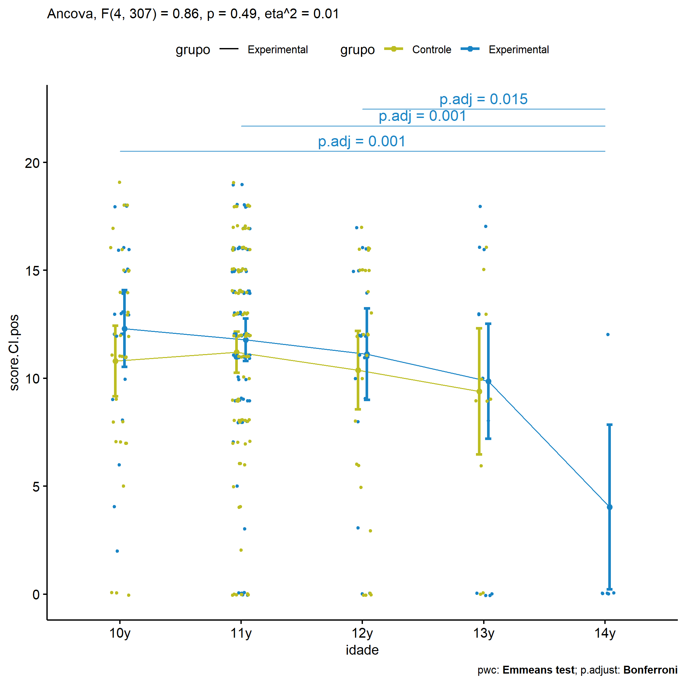<!-- -->

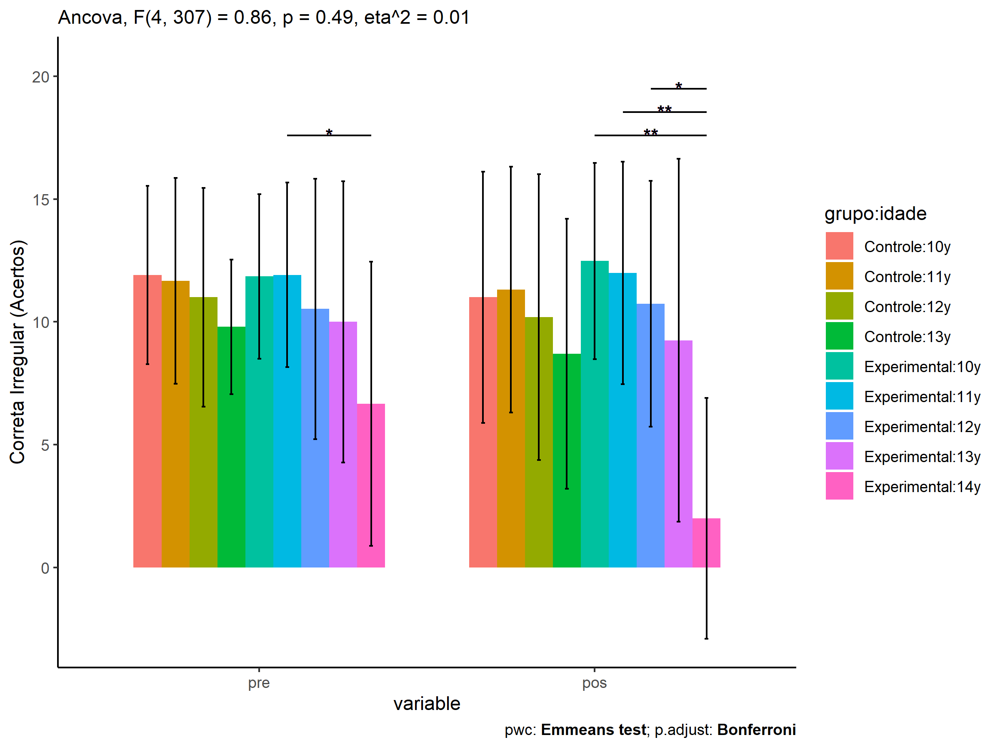<!-- -->

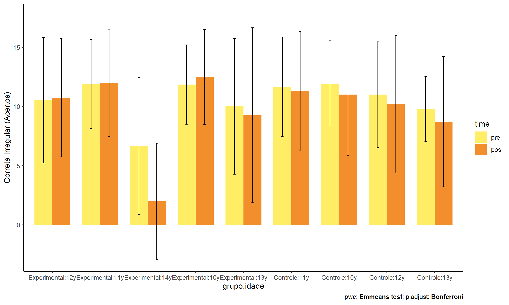<!-- -->

### Trocas Visuais (Acertos)

| var          | idade | grupo        |   n | M (pre) | SE (pre) | M (unadj) | SE (unadj) | M (adj) | SE (adj) |
|:-------------|:------|:-------------|----:|--------:|---------:|----------:|-----------:|--------:|---------:|
| score.TV.pos | 10y   | Controle     |  32 |  17.406 |    0.649 |    15.688 |      1.024 |  15.402 |    0.995 |
| score.TV.pos | 10y   | Experimental |  27 |  16.852 |    0.679 |    16.185 |      0.825 |  16.020 |    1.080 |
| score.TV.pos | 11y   | Controle     |  93 |  16.280 |    0.459 |    15.688 |      0.605 |  15.647 |    0.581 |
| score.TV.pos | 11y   | Experimental |  89 |  17.124 |    0.406 |    16.000 |      0.555 |  15.776 |    0.598 |
| score.TV.pos | 12y   | Controle     |  26 |  14.192 |    1.105 |    12.154 |      1.227 |  12.565 |    1.107 |
| score.TV.pos | 12y   | Experimental |  19 |  14.789 |    1.448 |    15.053 |      1.413 |  15.334 |    1.289 |
| score.TV.pos | 13y   | Controle     |  10 |  13.900 |    1.362 |    13.100 |      2.287 |  13.575 |    1.779 |
| score.TV.pos | 13y   | Experimental |  12 |  12.750 |    2.064 |     8.833 |      2.146 |   9.557 |    1.635 |
| score.TV.pos | 14y   | Experimental |   6 |  10.000 |    3.661 |     1.333 |      1.333 |   2.654 |    2.327 |

|     | .y.          | grupo        | idade | group1   | group2       | estimate | conf.low | conf.high |    se | statistic | p       | p.adj   | p.adj.signif |
|:----|:-------------|:-------------|:------|:---------|:-------------|---------:|---------:|----------:|------:|----------:|:--------|:--------|:-------------|
| 1   | score.TV.pos | Controle     |       | 10y      | 11y          |   -0.245 |   -2.511 |     2.021 | 1.151 |    -0.213 | 0.832   | 1       | ns           |
| 2   | score.TV.pos | Controle     |       | 10y      | 12y          |    2.837 |   -0.108 |     5.782 | 1.497 |     1.895 | 0.059   | 0.354   | ns           |
| 3   | score.TV.pos | Controle     |       | 10y      | 13y          |    1.827 |   -2.197 |     5.852 | 2.045 |     0.893 | 0.372   | 1       | ns           |
| 5   | score.TV.pos | Controle     |       | 11y      | 12y          |    3.082 |    0.618 |     5.545 | 1.252 |     2.462 | 0.014   | 0.086   | ns           |
| 6   | score.TV.pos | Controle     |       | 11y      | 13y          |    2.072 |   -1.613 |     5.757 | 1.873 |     1.107 | 0.269   | 1       | ns           |
| 8   | score.TV.pos | Controle     |       | 12y      | 13y          |   -1.010 |   -5.114 |     3.095 | 2.086 |    -0.484 | 0.629   | 1       | ns           |
| 11  | score.TV.pos | Experimental |       | 10y      | 11y          |    0.244 |   -2.179 |     2.668 | 1.232 |     0.198 | 0.843   | 1       | ns           |
| 12  | score.TV.pos | Experimental |       | 10y      | 12y          |    0.685 |   -2.629 |     4.000 | 1.685 |     0.407 | 0.684   | 1       | ns           |
| 13  | score.TV.pos | Experimental |       | 10y      | 13y          |    6.462 |    2.595 |    10.330 | 1.965 |     3.288 | 0.001   | 0.011   | \*           |
| 14  | score.TV.pos | Experimental |       | 10y      | 14y          |   13.366 |    8.300 |    18.432 | 2.574 |     5.192 | \<0.001 | \<0.001 | \*\*\*\*     |
| 15  | score.TV.pos | Experimental |       | 11y      | 12y          |    0.441 |   -2.364 |     3.247 | 1.426 |     0.310 | 0.757   | 1       | ns           |
| 16  | score.TV.pos | Experimental |       | 11y      | 13y          |    6.218 |    2.774 |     9.663 | 1.750 |     3.553 | \<0.001 | 0.004   | \*\*         |
| 17  | score.TV.pos | Experimental |       | 11y      | 14y          |   13.122 |    8.369 |    17.876 | 2.416 |     5.432 | \<0.001 | \<0.001 | \*\*\*\*     |
| 18  | score.TV.pos | Experimental |       | 12y      | 13y          |    5.777 |    1.701 |     9.854 | 2.072 |     2.789 | 0.006   | 0.056   | ns           |
| 19  | score.TV.pos | Experimental |       | 12y      | 14y          |   12.681 |    7.474 |    17.887 | 2.646 |     4.793 | \<0.001 | \<0.001 | \*\*\*\*     |
| 20  | score.TV.pos | Experimental |       | 13y      | 14y          |    6.904 |    1.376 |    12.431 | 2.809 |     2.458 | 0.015   | 0.145   | ns           |
| 21  | score.TV.pre | Controle     |       | 10y      | 11y          |    1.127 |   -0.732 |     2.986 | 0.945 |     1.193 | 0.234   | 1       | ns           |
| 22  | score.TV.pre | Controle     |       | 10y      | 12y          |    3.214 |    0.819 |     5.609 | 1.217 |     2.641 | 0.009   | 0.052   | ns           |
| 23  | score.TV.pre | Controle     |       | 10y      | 13y          |    3.506 |    0.220 |     6.792 | 1.670 |     2.100 | 0.037   | 0.219   | ns           |
| 25  | score.TV.pre | Controle     |       | 11y      | 12y          |    2.087 |    0.075 |     4.099 | 1.023 |     2.041 | 0.042   | 0.253   | ns           |
| 26  | score.TV.pre | Controle     |       | 11y      | 13y          |    2.380 |   -0.639 |     5.398 | 1.534 |     1.551 | 0.122   | 0.731   | ns           |
| 28  | score.TV.pre | Controle     |       | 12y      | 13y          |    0.292 |   -3.083 |     3.667 | 1.715 |     0.170 | 0.865   | 1       | ns           |
| 31  | score.TV.pre | Experimental |       | 10y      | 11y          |   -0.272 |   -2.265 |     1.721 | 1.013 |    -0.268 | 0.789   | 1       | ns           |
| 32  | score.TV.pre | Experimental |       | 10y      | 12y          |    2.062 |   -0.654 |     4.778 | 1.380 |     1.494 | 0.136   | 1       | ns           |
| 33  | score.TV.pre | Experimental |       | 10y      | 13y          |    4.102 |    0.955 |     7.249 | 1.599 |     2.565 | 0.011   | 0.108   | ns           |
| 34  | score.TV.pre | Experimental |       | 10y      | 14y          |    6.852 |    2.758 |    10.945 | 2.080 |     3.294 | 0.001   | 0.011   | \*           |
| 35  | score.TV.pre | Experimental |       | 11y      | 12y          |    2.334 |    0.042 |     4.626 | 1.165 |     2.004 | 0.046   | 0.46    | ns           |
| 36  | score.TV.pre | Experimental |       | 11y      | 13y          |    4.374 |    1.584 |     7.163 | 1.417 |     3.086 | 0.002   | 0.022   | \*           |
| 37  | score.TV.pre | Experimental |       | 11y      | 14y          |    7.124 |    3.298 |    10.949 | 1.944 |     3.664 | \<0.001 | 0.003   | \*\*         |
| 38  | score.TV.pre | Experimental |       | 12y      | 13y          |    2.039 |   -1.305 |     5.384 | 1.700 |     1.200 | 0.231   | 1       | ns           |
| 39  | score.TV.pre | Experimental |       | 12y      | 14y          |    4.789 |    0.542 |     9.037 | 2.158 |     2.219 | 0.027   | 0.272   | ns           |
| 40  | score.TV.pre | Experimental |       | 13y      | 14y          |    2.750 |   -1.785 |     7.285 | 2.305 |     1.193 | 0.234   | 1       | ns           |
| 41  | score.TV.pos |              | 10y   | Controle | Experimental |   -0.618 |   -3.501 |     2.265 | 1.465 |    -0.422 | 0.674   | 0.674   | ns           |
| 42  | score.TV.pos |              | 11y   | Controle | Experimental |   -0.129 |   -1.768 |     1.511 | 0.833 |    -0.155 | 0.877   | 0.877   | ns           |
| 43  | score.TV.pos |              | 12y   | Controle | Experimental |   -2.769 |   -6.099 |     0.561 | 1.692 |    -1.637 | 0.103   | 0.103   | ns           |
| 44  | score.TV.pos |              | 13y   | Controle | Experimental |    4.017 |   -0.708 |     8.743 | 2.401 |     1.673 | 0.095   | 0.095   | ns           |
| 46  | score.TV.pre |              | 10y   | Controle | Experimental |    0.554 |   -1.816 |     2.925 | 1.204 |     0.460 | 0.646   | 0.646   | ns           |
| 47  | score.TV.pre |              | 11y   | Controle | Experimental |   -0.844 |   -2.189 |     0.501 | 0.683 |    -1.235 | 0.218   | 0.218   | ns           |
| 48  | score.TV.pre |              | 12y   | Controle | Experimental |   -0.597 |   -3.335 |     2.140 | 1.391 |    -0.429 | 0.668   | 0.668   | ns           |
| 49  | score.TV.pre |              | 13y   | Controle | Experimental |    1.150 |   -2.734 |     5.034 | 1.974 |     0.583 | 0.561   | 0.561   | ns           |

| grupo        | idade | group1 | group2 | estimate | conf.low | conf.high |    se | statistic |     p | p.adj | p.adj.signif |
|:-------------|:------|:-------|:-------|---------:|---------:|----------:|------:|----------:|------:|------:|:-------------|
| Controle     | 10y   | pre    | pos    |    1.719 |   -0.822 |     4.259 | 1.294 |     1.329 | 0.184 | 0.184 | ns           |
| Controle     | 11y   | pre    | pos    |    0.591 |   -0.899 |     2.082 | 0.759 |     0.779 | 0.436 | 0.436 | ns           |
| Controle     | 12y   | pre    | pos    |    2.038 |   -0.780 |     4.857 | 1.435 |     1.420 | 0.156 | 0.156 | ns           |
| Controle     | 13y   | pre    | pos    |    0.800 |   -3.745 |     5.345 | 2.314 |     0.346 | 0.730 | 0.730 | ns           |
| Experimental | 10y   | pre    | pos    |    0.667 |   -2.099 |     3.433 | 1.408 |     0.473 | 0.636 | 0.636 | ns           |
| Experimental | 11y   | pre    | pos    |    1.124 |   -0.400 |     2.647 | 0.776 |     1.448 | 0.148 | 0.148 | ns           |
| Experimental | 12y   | pre    | pos    |   -0.263 |   -3.560 |     3.034 | 1.679 |    -0.157 | 0.876 | 0.876 | ns           |
| Experimental | 13y   | pre    | pos    |    3.917 |   -0.232 |     8.066 | 2.113 |     1.854 | 0.064 | 0.064 | ns           |
| Experimental | 14y   | pre    | pos    |    8.667 |    2.799 |    14.534 | 2.988 |     2.901 | 0.004 | 0.004 | \*\*         |

    ## Scale for colour is already present.
    ## Adding another scale for colour, which will replace the existing scale.

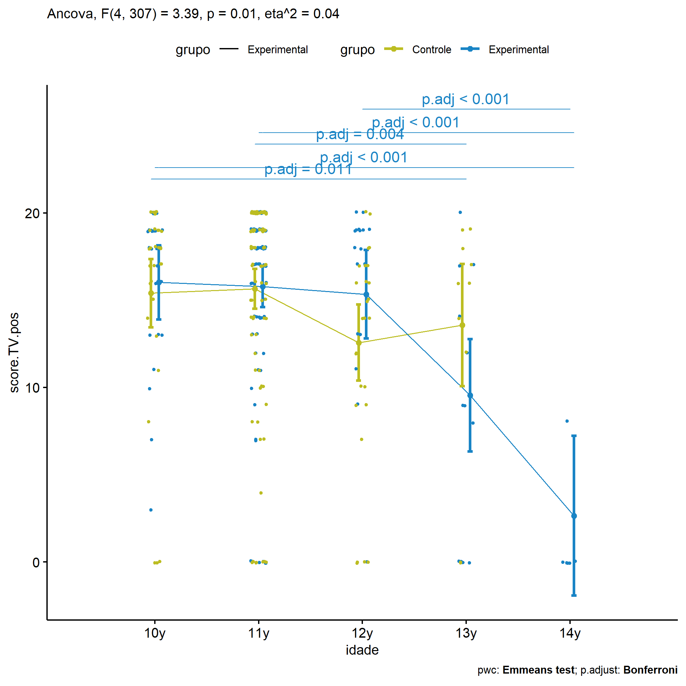<!-- -->

<!-- -->

<!-- -->

### Trocas Fonologicas (Acertos)

| var          | idade | grupo        |   n | M (pre) | SE (pre) | M (unadj) | SE (unadj) | M (adj) | SE (adj) |
|:-------------|:------|:-------------|----:|--------:|---------:|----------:|-----------:|--------:|---------:|
| score.TF.pos | 10y   | Controle     |  32 |  15.469 |    0.783 |    13.438 |      1.042 |  13.265 |    0.981 |
| score.TF.pos | 10y   | Experimental |  27 |  15.778 |    0.703 |    14.481 |      0.783 |  14.202 |    1.069 |
| score.TF.pos | 11y   | Controle     |  93 |  15.301 |    0.462 |    14.581 |      0.614 |  14.466 |    0.576 |
| score.TF.pos | 11y   | Experimental |  89 |  16.101 |    0.443 |    15.146 |      0.559 |  14.754 |    0.593 |
| score.TF.pos | 12y   | Controle     |  26 |  13.346 |    1.077 |    10.846 |      1.273 |  11.410 |    1.093 |
| score.TF.pos | 12y   | Experimental |  19 |  13.737 |    1.463 |    13.579 |      1.429 |  14.008 |    1.275 |
| score.TF.pos | 13y   | Controle     |  10 |  13.100 |    1.260 |    12.800 |      2.245 |  13.450 |    1.758 |
| score.TF.pos | 13y   | Experimental |  12 |  12.333 |    1.884 |     9.500 |      2.211 |  10.416 |    1.611 |
| score.TF.pos | 14y   | Experimental |   6 |   6.167 |    2.982 |     2.000 |      2.000 |   5.057 |    2.342 |

|     | .y.          | grupo        | idade | group1   | group2       | estimate | conf.low | conf.high |    se | statistic | p       | p.adj   | p.adj.signif |
|:----|:-------------|:-------------|:------|:---------|:-------------|---------:|---------:|----------:|------:|----------:|:--------|:--------|:-------------|
| 1   | score.TF.pos | Controle     |       | 10y      | 11y          |   -1.201 |   -3.438 |     1.035 | 1.137 |    -1.057 | 0.291   | 1       | ns           |
| 2   | score.TF.pos | Controle     |       | 10y      | 12y          |    1.854 |   -1.041 |     4.750 | 1.471 |     1.260 | 0.208   | 1       | ns           |
| 3   | score.TF.pos | Controle     |       | 10y      | 13y          |   -0.185 |   -4.151 |     3.781 | 2.016 |    -0.092 | 0.927   | 1       | ns           |
| 5   | score.TF.pos | Controle     |       | 11y      | 12y          |    3.056 |    0.621 |     5.491 | 1.237 |     2.469 | 0.014   | 0.084   | ns           |
| 6   | score.TF.pos | Controle     |       | 11y      | 13y          |    1.016 |   -2.627 |     4.660 | 1.852 |     0.549 | 0.583   | 1       | ns           |
| 8   | score.TF.pos | Controle     |       | 12y      | 13y          |   -2.039 |   -6.100 |     2.022 | 2.064 |    -0.988 | 0.324   | 1       | ns           |
| 11  | score.TF.pos | Experimental |       | 10y      | 11y          |   -0.552 |   -2.950 |     1.846 | 1.219 |    -0.453 | 0.651   | 1       | ns           |
| 12  | score.TF.pos | Experimental |       | 10y      | 12y          |    0.194 |   -3.085 |     3.473 | 1.666 |     0.116 | 0.907   | 1       | ns           |
| 13  | score.TF.pos | Experimental |       | 10y      | 13y          |    3.786 |   -0.028 |     7.600 | 1.938 |     1.953 | 0.052   | 0.517   | ns           |
| 14  | score.TF.pos | Experimental |       | 10y      | 14y          |    9.145 |    4.055 |    14.235 | 2.587 |     3.535 | \<0.001 | 0.005   | \*\*         |
| 15  | score.TF.pos | Experimental |       | 11y      | 12y          |    0.746 |   -2.030 |     3.522 | 1.411 |     0.529 | 0.597   | 1       | ns           |
| 16  | score.TF.pos | Experimental |       | 11y      | 13y          |    4.338 |    0.944 |     7.731 | 1.725 |     2.515 | 0.012   | 0.124   | ns           |
| 17  | score.TF.pos | Experimental |       | 11y      | 14y          |    9.697 |    4.907 |    14.487 | 2.434 |     3.983 | \<0.001 | \<0.001 | \*\*\*       |
| 18  | score.TF.pos | Experimental |       | 12y      | 13y          |    3.592 |   -0.437 |     7.620 | 2.047 |     1.754 | 0.08    | 0.804   | ns           |
| 19  | score.TF.pos | Experimental |       | 12y      | 14y          |    8.951 |    3.741 |    14.160 | 2.647 |     3.381 | \<0.001 | 0.008   | \*\*         |
| 20  | score.TF.pos | Experimental |       | 13y      | 14y          |    5.359 |   -0.159 |    10.877 | 2.804 |     1.911 | 0.057   | 0.569   | ns           |
| 21  | score.TF.pre | Controle     |       | 10y      | 11y          |    0.168 |   -1.720 |     2.055 | 0.959 |     0.175 | 0.861   | 1       | ns           |
| 22  | score.TF.pre | Controle     |       | 10y      | 12y          |    2.123 |   -0.309 |     4.554 | 1.236 |     1.718 | 0.087   | 0.521   | ns           |
| 23  | score.TF.pre | Controle     |       | 10y      | 13y          |    2.369 |   -0.968 |     5.705 | 1.695 |     1.397 | 0.163   | 0.98    | ns           |
| 25  | score.TF.pre | Controle     |       | 11y      | 12y          |    1.955 |   -0.088 |     3.998 | 1.038 |     1.883 | 0.061   | 0.364   | ns           |
| 26  | score.TF.pre | Controle     |       | 11y      | 13y          |    2.201 |   -0.864 |     5.266 | 1.557 |     1.413 | 0.159   | 0.952   | ns           |
| 28  | score.TF.pre | Controle     |       | 12y      | 13y          |    0.246 |   -3.181 |     3.673 | 1.741 |     0.141 | 0.888   | 1       | ns           |
| 31  | score.TF.pre | Experimental |       | 10y      | 11y          |   -0.323 |   -2.347 |     1.700 | 1.028 |    -0.314 | 0.753   | 1       | ns           |
| 32  | score.TF.pre | Experimental |       | 10y      | 12y          |    2.041 |   -0.717 |     4.799 | 1.401 |     1.456 | 0.146   | 1       | ns           |
| 33  | score.TF.pre | Experimental |       | 10y      | 13y          |    3.444 |    0.249 |     6.640 | 1.624 |     2.121 | 0.035   | 0.347   | ns           |
| 34  | score.TF.pre | Experimental |       | 10y      | 14y          |    9.611 |    5.455 |    13.768 | 2.112 |     4.550 | \<0.001 | \<0.001 | \*\*\*\*     |
| 35  | score.TF.pre | Experimental |       | 11y      | 12y          |    2.364 |    0.037 |     4.692 | 1.183 |     1.999 | 0.046   | 0.465   | ns           |
| 36  | score.TF.pre | Experimental |       | 11y      | 13y          |    3.768 |    0.936 |     6.600 | 1.439 |     2.618 | 0.009   | 0.093   | ns           |
| 37  | score.TF.pre | Experimental |       | 11y      | 14y          |    9.934 |    6.050 |    13.819 | 1.974 |     5.033 | \<0.001 | \<0.001 | \*\*\*\*     |
| 38  | score.TF.pre | Experimental |       | 12y      | 13y          |    1.404 |   -1.992 |     4.799 | 1.726 |     0.813 | 0.417   | 1       | ns           |
| 39  | score.TF.pre | Experimental |       | 12y      | 14y          |    7.570 |    3.258 |    11.883 | 2.192 |     3.454 | \<0.001 | 0.006   | \*\*         |
| 40  | score.TF.pre | Experimental |       | 13y      | 14y          |    6.167 |    1.562 |    10.771 | 2.340 |     2.635 | 0.009   | 0.088   | ns           |
| 41  | score.TF.pos |              | 10y   | Controle | Experimental |   -0.937 |   -3.789 |     1.915 | 1.449 |    -0.646 | 0.519   | 0.519   | ns           |
| 42  | score.TF.pos |              | 11y   | Controle | Experimental |   -0.288 |   -1.909 |     1.334 | 0.824 |    -0.349 | 0.727   | 0.727   | ns           |
| 43  | score.TF.pos |              | 12y   | Controle | Experimental |   -2.597 |   -5.891 |     0.697 | 1.674 |    -1.551 | 0.122   | 0.122   | ns           |
| 44  | score.TF.pos |              | 13y   | Controle | Experimental |    3.034 |   -1.640 |     7.708 | 2.375 |     1.277 | 0.202   | 0.202   | ns           |
| 46  | score.TF.pre |              | 10y   | Controle | Experimental |   -0.309 |   -2.716 |     2.098 | 1.223 |    -0.253 | 0.801   | 0.801   | ns           |
| 47  | score.TF.pre |              | 11y   | Controle | Experimental |   -0.800 |   -2.166 |     0.566 | 0.694 |    -1.153 | 0.25    | 0.25    | ns           |
| 48  | score.TF.pre |              | 12y   | Controle | Experimental |   -0.391 |   -3.170 |     2.389 | 1.413 |    -0.277 | 0.782   | 0.782   | ns           |
| 49  | score.TF.pre |              | 13y   | Controle | Experimental |    0.767 |   -3.176 |     4.710 | 2.004 |     0.383 | 0.702   | 0.702   | ns           |

| grupo        | idade | group1 | group2 | estimate | conf.low | conf.high |    se | statistic |     p | p.adj | p.adj.signif |
|:-------------|:------|:-------|:-------|---------:|---------:|----------:|------:|----------:|------:|------:|:-------------|
| Controle     | 10y   | pre    | pos    |    2.031 |   -0.548 |     4.611 | 1.313 |     1.547 | 0.122 | 0.122 | ns           |
| Controle     | 11y   | pre    | pos    |    0.720 |   -0.793 |     2.233 | 0.770 |     0.935 | 0.350 | 0.350 | ns           |
| Controle     | 12y   | pre    | pos    |    2.500 |   -0.361 |     5.361 | 1.457 |     1.716 | 0.087 | 0.087 | ns           |
| Controle     | 13y   | pre    | pos    |    0.300 |   -4.314 |     4.914 | 2.349 |     0.128 | 0.898 | 0.898 | ns           |
| Experimental | 10y   | pre    | pos    |    1.296 |   -1.512 |     4.104 | 1.430 |     0.907 | 0.365 | 0.365 | ns           |
| Experimental | 11y   | pre    | pos    |    0.955 |   -0.592 |     2.502 | 0.788 |     1.213 | 0.226 | 0.226 | ns           |
| Experimental | 12y   | pre    | pos    |    0.158 |   -3.189 |     3.505 | 1.704 |     0.093 | 0.926 | 0.926 | ns           |
| Experimental | 13y   | pre    | pos    |    2.833 |   -1.379 |     7.045 | 2.145 |     1.321 | 0.187 | 0.187 | ns           |
| Experimental | 14y   | pre    | pos    |    4.167 |   -1.790 |    10.123 | 3.033 |     1.374 | 0.170 | 0.170 | ns           |

    ## Scale for colour is already present.
    ## Adding another scale for colour, which will replace the existing scale.

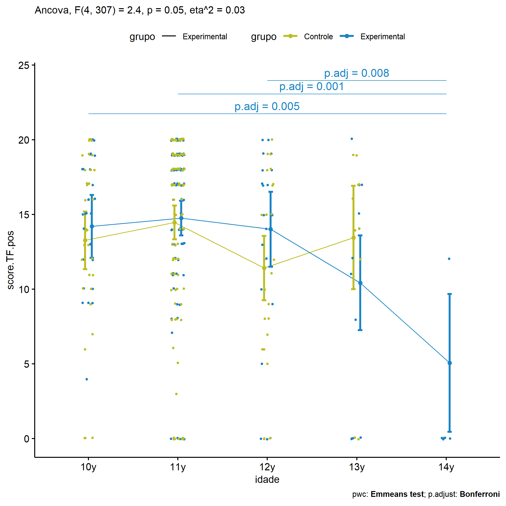<!-- -->

<!-- -->

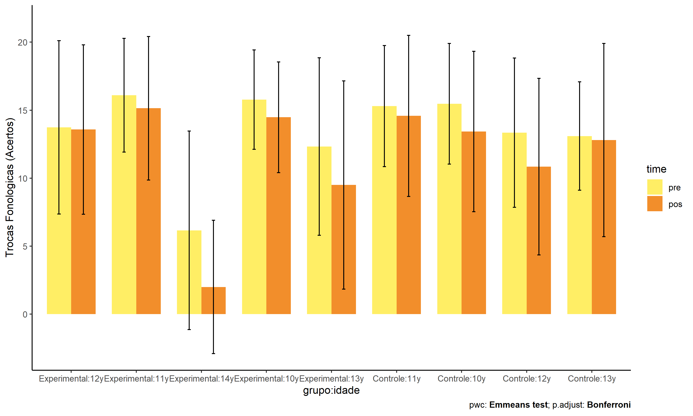<!-- -->

### Trocas Orograficas (Acertos)

| var          | idade | grupo        |   n | M (pre) | SE (pre) | M (unadj) | SE (unadj) | M (adj) | SE (adj) |
|:-------------|:------|:-------------|----:|--------:|---------:|----------:|-----------:|--------:|---------:|
| score.TO.pos | 10y   | Controle     |  32 |  10.406 |    0.811 |     9.812 |      0.839 |   9.540 |    0.780 |
| score.TO.pos | 10y   | Experimental |  27 |  10.037 |    0.746 |     9.963 |      0.758 |   9.868 |    0.849 |
| score.TO.pos | 11y   | Controle     |  93 |  10.226 |    0.474 |    10.785 |      0.517 |  10.599 |    0.458 |
| score.TO.pos | 11y   | Experimental |  89 |  10.775 |    0.437 |    10.584 |      0.536 |  10.134 |    0.471 |
| score.TO.pos | 12y   | Controle     |  26 |   7.808 |    0.706 |     7.385 |      0.889 |   8.365 |    0.873 |
| score.TO.pos | 12y   | Experimental |  19 |   8.053 |    1.096 |     7.737 |      1.081 |   8.599 |    1.017 |
| score.TO.pos | 13y   | Controle     |  10 |   8.900 |    0.994 |     6.700 |      1.342 |   7.153 |    1.396 |
| score.TO.pos | 13y   | Experimental |  12 |   8.417 |    1.433 |     6.500 |      1.564 |   7.186 |    1.276 |
| score.TO.pos | 14y   | Experimental |   6 |   5.000 |    1.789 |     2.500 |      2.500 |   4.833 |    1.823 |

|     | .y.          | grupo        | idade | group1   | group2       | estimate | conf.low | conf.high |    se | statistic |     p | p.adj | p.adj.signif |
|:----|:-------------|:-------------|:------|:---------|:-------------|---------:|---------:|----------:|------:|----------:|------:|------:|:-------------|
| 1   | score.TO.pos | Controle     |       | 10y      | 11y          |   -1.059 |   -2.838 |     0.719 | 0.904 |    -1.172 | 0.242 | 1.000 | ns           |
| 2   | score.TO.pos | Controle     |       | 10y      | 12y          |    1.175 |   -1.136 |     3.486 | 1.174 |     1.001 | 0.318 | 1.000 | ns           |
| 3   | score.TO.pos | Controle     |       | 10y      | 13y          |    2.386 |   -0.763 |     5.536 | 1.600 |     1.491 | 0.137 | 0.822 | ns           |
| 5   | score.TO.pos | Controle     |       | 11y      | 12y          |    2.235 |    0.289 |     4.180 | 0.989 |     2.260 | 0.025 | 0.147 | ns           |
| 6   | score.TO.pos | Controle     |       | 11y      | 13y          |    3.446 |    0.553 |     6.338 | 1.470 |     2.344 | 0.020 | 0.118 | ns           |
| 8   | score.TO.pos | Controle     |       | 12y      | 13y          |    1.211 |   -2.021 |     4.443 | 1.642 |     0.737 | 0.461 | 1.000 | ns           |
| 11  | score.TO.pos | Experimental |       | 10y      | 11y          |   -0.265 |   -2.174 |     1.643 | 0.970 |    -0.274 | 0.785 | 1.000 | ns           |
| 12  | score.TO.pos | Experimental |       | 10y      | 12y          |    1.270 |   -1.340 |     3.879 | 1.326 |     0.958 | 0.339 | 1.000 | ns           |
| 13  | score.TO.pos | Experimental |       | 10y      | 13y          |    2.682 |   -0.335 |     5.699 | 1.533 |     1.749 | 0.081 | 0.813 | ns           |
| 14  | score.TO.pos | Experimental |       | 10y      | 14y          |    5.035 |    1.075 |     8.995 | 2.013 |     2.502 | 0.013 | 0.129 | ns           |
| 15  | score.TO.pos | Experimental |       | 11y      | 12y          |    1.535 |   -0.681 |     3.751 | 1.126 |     1.363 | 0.174 | 1.000 | ns           |
| 16  | score.TO.pos | Experimental |       | 11y      | 13y          |    2.947 |    0.264 |     5.630 | 1.363 |     2.162 | 0.031 | 0.314 | ns           |
| 17  | score.TO.pos | Experimental |       | 11y      | 14y          |    5.300 |    1.579 |     9.021 | 1.891 |     2.803 | 0.005 | 0.054 | ns           |
| 18  | score.TO.pos | Experimental |       | 12y      | 13y          |    1.412 |   -1.788 |     4.613 | 1.627 |     0.868 | 0.386 | 1.000 | ns           |
| 19  | score.TO.pos | Experimental |       | 12y      | 14y          |    3.765 |   -0.314 |     7.845 | 2.073 |     1.816 | 0.070 | 0.703 | ns           |
| 20  | score.TO.pos | Experimental |       | 13y      | 14y          |    2.353 |   -2.004 |     6.711 | 2.214 |     1.063 | 0.289 | 1.000 | ns           |
| 21  | score.TO.pre | Controle     |       | 10y      | 11y          |    0.180 |   -1.556 |     1.917 | 0.882 |     0.205 | 0.838 | 1.000 | ns           |
| 22  | score.TO.pre | Controle     |       | 10y      | 12y          |    2.599 |    0.362 |     4.835 | 1.137 |     2.286 | 0.023 | 0.138 | ns           |
| 23  | score.TO.pre | Controle     |       | 10y      | 13y          |    1.506 |   -1.563 |     4.575 | 1.560 |     0.966 | 0.335 | 1.000 | ns           |
| 25  | score.TO.pre | Controle     |       | 11y      | 12y          |    2.418 |    0.539 |     4.298 | 0.955 |     2.532 | 0.012 | 0.071 | ns           |
| 26  | score.TO.pre | Controle     |       | 11y      | 13y          |    1.326 |   -1.494 |     4.145 | 1.433 |     0.925 | 0.356 | 1.000 | ns           |
| 28  | score.TO.pre | Controle     |       | 12y      | 13y          |   -1.092 |   -4.245 |     2.060 | 1.602 |    -0.682 | 0.496 | 1.000 | ns           |
| 31  | score.TO.pre | Experimental |       | 10y      | 11y          |   -0.738 |   -2.600 |     1.123 | 0.946 |    -0.780 | 0.436 | 1.000 | ns           |
| 32  | score.TO.pre | Experimental |       | 10y      | 12y          |    1.984 |   -0.552 |     4.521 | 1.289 |     1.539 | 0.125 | 1.000 | ns           |
| 33  | score.TO.pre | Experimental |       | 10y      | 13y          |    1.620 |   -1.319 |     4.560 | 1.494 |     1.085 | 0.279 | 1.000 | ns           |
| 34  | score.TO.pre | Experimental |       | 10y      | 14y          |    5.037 |    1.213 |     8.861 | 1.943 |     2.592 | 0.010 | 0.100 | ns           |
| 35  | score.TO.pre | Experimental |       | 11y      | 12y          |    2.723 |    0.582 |     4.864 | 1.088 |     2.502 | 0.013 | 0.129 | ns           |
| 36  | score.TO.pre | Experimental |       | 11y      | 13y          |    2.359 |   -0.247 |     4.964 | 1.324 |     1.781 | 0.076 | 0.758 | ns           |
| 37  | score.TO.pre | Experimental |       | 11y      | 14y          |    5.775 |    2.202 |     9.349 | 1.816 |     3.180 | 0.002 | 0.016 | \*           |
| 38  | score.TO.pre | Experimental |       | 12y      | 13y          |   -0.364 |   -3.488 |     2.760 | 1.587 |    -0.229 | 0.819 | 1.000 | ns           |
| 39  | score.TO.pre | Experimental |       | 12y      | 14y          |    3.053 |   -0.915 |     7.020 | 2.016 |     1.514 | 0.131 | 1.000 | ns           |
| 40  | score.TO.pre | Experimental |       | 13y      | 14y          |    3.417 |   -0.819 |     7.653 | 2.153 |     1.587 | 0.114 | 1.000 | ns           |
| 41  | score.TO.pos |              | 10y   | Controle | Experimental |   -0.328 |   -2.597 |     1.940 | 1.153 |    -0.285 | 0.776 | 0.776 | ns           |
| 42  | score.TO.pos |              | 11y   | Controle | Experimental |    0.466 |   -0.823 |     1.754 | 0.655 |     0.711 | 0.478 | 0.478 | ns           |
| 43  | score.TO.pos |              | 12y   | Controle | Experimental |   -0.234 |   -2.854 |     2.386 | 1.331 |    -0.176 | 0.860 | 0.860 | ns           |
| 44  | score.TO.pos |              | 13y   | Controle | Experimental |   -0.033 |   -3.750 |     3.684 | 1.889 |    -0.017 | 0.986 | 0.986 | ns           |
| 46  | score.TO.pre |              | 10y   | Controle | Experimental |    0.369 |   -1.845 |     2.583 | 1.125 |     0.328 | 0.743 | 0.743 | ns           |
| 47  | score.TO.pre |              | 11y   | Controle | Experimental |   -0.549 |   -1.806 |     0.707 | 0.638 |    -0.861 | 0.390 | 0.390 | ns           |
| 48  | score.TO.pre |              | 12y   | Controle | Experimental |   -0.245 |   -2.802 |     2.312 | 1.299 |    -0.189 | 0.851 | 0.851 | ns           |
| 49  | score.TO.pre |              | 13y   | Controle | Experimental |    0.483 |   -3.144 |     4.111 | 1.843 |     0.262 | 0.793 | 0.793 | ns           |

| grupo        | idade | group1 | group2 | estimate | conf.low | conf.high |    se | statistic |     p | p.adj | p.adj.signif |
|:-------------|:------|:-------|:-------|---------:|---------:|----------:|------:|----------:|------:|------:|:-------------|
| Controle     | 10y   | pre    | pos    |    0.594 |   -1.662 |     2.850 | 1.149 |     0.517 | 0.605 | 0.605 | ns           |
| Controle     | 11y   | pre    | pos    |   -0.559 |   -1.883 |     0.764 | 0.674 |    -0.830 | 0.407 | 0.407 | ns           |
| Controle     | 12y   | pre    | pos    |    0.423 |   -2.080 |     2.926 | 1.274 |     0.332 | 0.740 | 0.740 | ns           |
| Controle     | 13y   | pre    | pos    |    2.200 |   -1.836 |     6.236 | 2.055 |     1.071 | 0.285 | 0.285 | ns           |
| Experimental | 10y   | pre    | pos    |    0.074 |   -2.382 |     2.530 | 1.251 |     0.059 | 0.953 | 0.953 | ns           |
| Experimental | 11y   | pre    | pos    |    0.191 |   -1.162 |     1.544 | 0.689 |     0.277 | 0.782 | 0.782 | ns           |
| Experimental | 12y   | pre    | pos    |    0.316 |   -2.612 |     3.244 | 1.491 |     0.212 | 0.832 | 0.832 | ns           |
| Experimental | 13y   | pre    | pos    |    1.917 |   -1.768 |     5.601 | 1.876 |     1.022 | 0.307 | 0.307 | ns           |
| Experimental | 14y   | pre    | pos    |    2.500 |   -2.710 |     7.710 | 2.653 |     0.942 | 0.346 | 0.346 | ns           |

    ## Scale for colour is already present.
    ## Adding another scale for colour, which will replace the existing scale.

<!-- -->

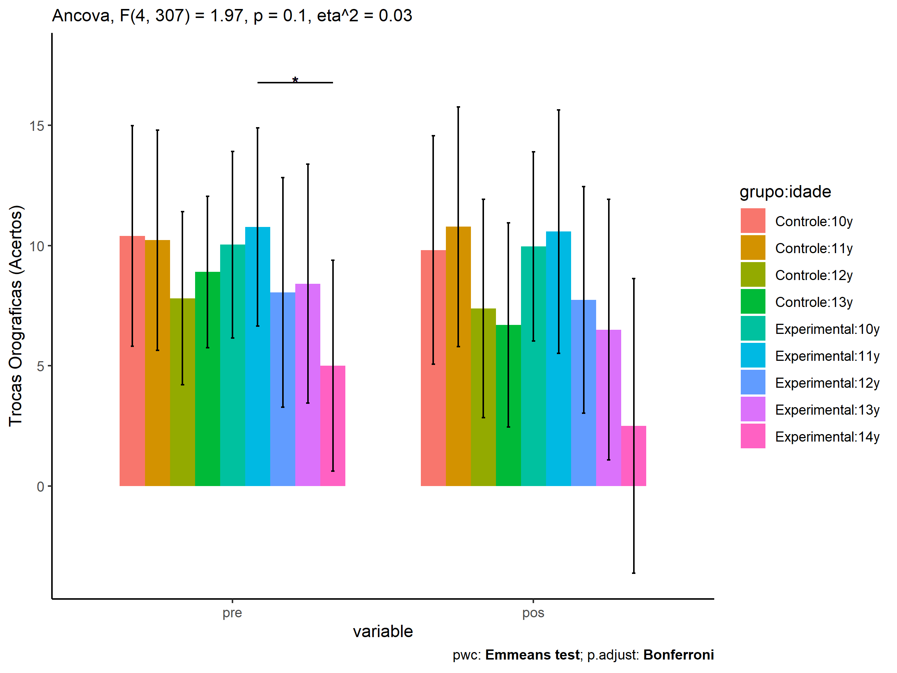<!-- -->

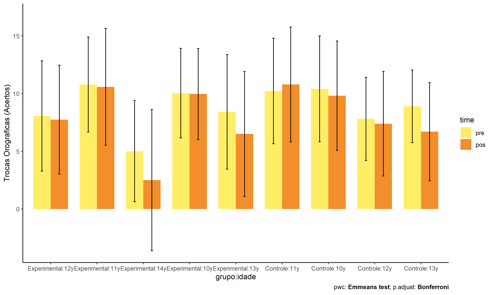<!-- -->

## factores: **zona.participante:grupo**

### Leitura de Pseudo-Palavras (Acertos)

| var            | zona.participante | grupo        |   n | M (pre) | SE (pre) | M (unadj) | SE (unadj) | M (adj) | SE (adj) |
|:---------------|:------------------|:-------------|----:|--------:|---------:|----------:|-----------:|--------:|---------:|
| score.CLPP.pos | Rural             | Controle     |  51 |  68.137 |    1.885 |    69.824 |      1.960 |  70.385 |    1.541 |
| score.CLPP.pos | Rural             | Experimental |  58 |  70.948 |    1.729 |    71.431 |      1.772 |  70.006 |    1.448 |
| score.CLPP.pos | Urbana            | Controle     |  64 |  68.594 |    1.876 |    70.859 |      1.952 |  71.098 |    1.375 |
| score.CLPP.pos | Urbana            | Experimental |  47 |  67.766 |    2.459 |    69.298 |      2.503 |  70.122 |    1.605 |

| .y.            | grupo        | zona.participante | group1   | group2       | estimate | conf.low | conf.high |    se | statistic |     p | p.adj | p.adj.signif |
|:---------------|:-------------|:------------------|:---------|:-------------|---------:|---------:|----------:|------:|----------:|------:|------:|:-------------|
| score.CLPP.pos | Controle     |                   | Urbana   | Rural        |    0.713 |   -3.356 |     4.783 | 2.065 |     0.345 | 0.730 | 0.730 | ns           |
| score.CLPP.pos | Experimental |                   | Urbana   | Rural        |    0.116 |   -4.151 |     4.383 | 2.165 |     0.054 | 0.957 | 0.957 | ns           |
| score.CLPP.pre | Controle     |                   | Urbana   | Rural        |    0.456 |   -4.954 |     5.867 | 2.745 |     0.166 | 0.868 | 0.868 | ns           |
| score.CLPP.pre | Experimental |                   | Urbana   | Rural        |   -3.182 |   -8.839 |     2.475 | 2.870 |    -1.109 | 0.269 | 0.269 | ns           |
| score.CLPP.pos |              | Urbana            | Controle | Experimental |    0.976 |   -3.189 |     5.142 | 2.113 |     0.462 | 0.645 | 0.645 | ns           |
| score.CLPP.pos |              | Rural             | Controle | Experimental |    0.379 |   -3.792 |     4.550 | 2.116 |     0.179 | 0.858 | 0.858 | ns           |
| score.CLPP.pre |              | Urbana            | Controle | Experimental |    0.828 |   -4.709 |     6.365 | 2.809 |     0.295 | 0.769 | 0.769 | ns           |
| score.CLPP.pre |              | Rural             | Controle | Experimental |   -2.811 |   -8.344 |     2.722 | 2.807 |    -1.001 | 0.318 | 0.318 | ns           |

| grupo        | zona.participante | group1 | group2 | estimate | conf.low | conf.high |    se | statistic |     p | p.adj | p.adj.signif |
|:-------------|:------------------|:-------|:-------|---------:|---------:|----------:|------:|----------:|------:|------:|:-------------|
| Controle     | Urbana            | pre    | pos    |   -1.163 |   -6.067 |     3.742 | 2.495 |    -0.466 | 0.642 | 0.642 | ns           |
| Controle     | Rural             | pre    | pos    |   -2.393 |   -7.975 |     3.190 | 2.841 |    -0.842 | 0.400 | 0.400 | ns           |
| Experimental | Urbana            | pre    | pos    |   -0.634 |   -6.383 |     5.114 | 2.925 |    -0.217 | 0.828 | 0.828 | ns           |
| Experimental | Rural             | pre    | pos    |   -0.306 |   -5.645 |     5.033 | 2.717 |    -0.113 | 0.910 | 0.910 | ns           |

    ## Scale for colour is already present.
    ## Adding another scale for colour, which will replace the existing scale.

<!-- -->

    ## Scale for colour is already present.
    ## Adding another scale for colour, which will replace the existing scale.

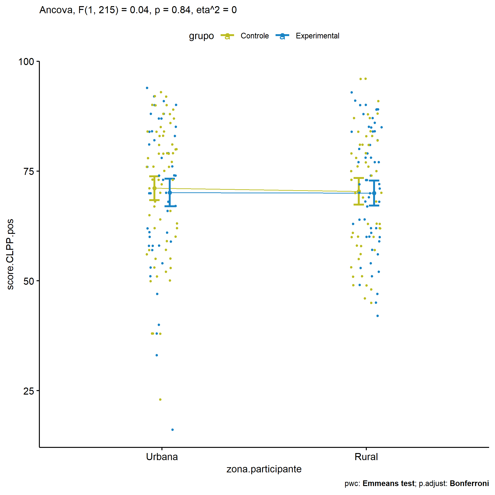<!-- -->

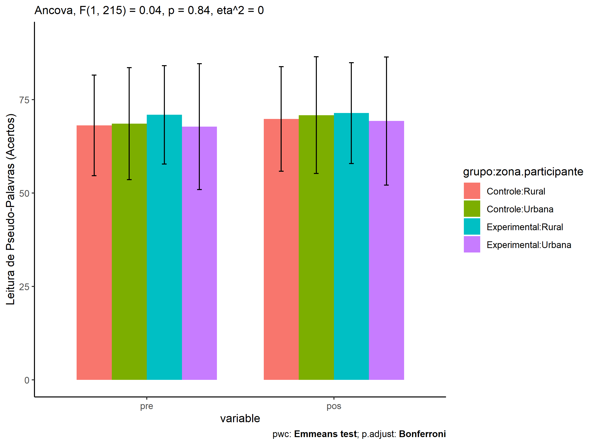<!-- -->

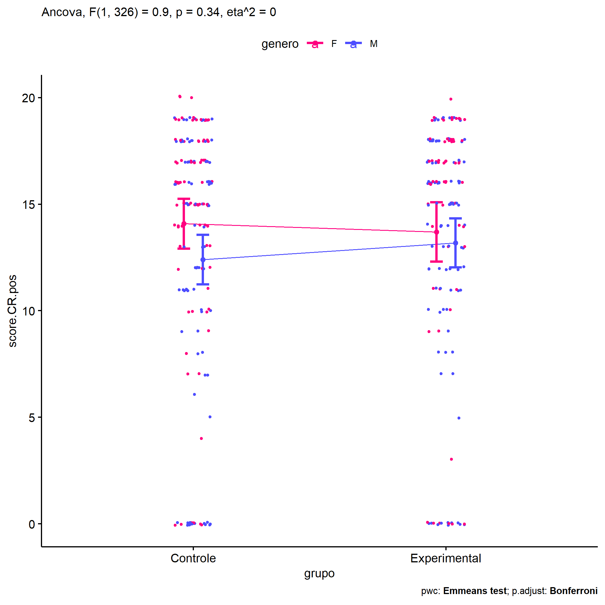<!-- -->

### Correta Regular (Acertos)

| var          | zona.participante | grupo        |   n | M (pre) | SE (pre) | M (unadj) | SE (unadj) | M (adj) | SE (adj) |
|:-------------|:------------------|:-------------|----:|--------:|---------:|----------:|-----------:|--------:|---------:|
| score.CR.pos | Rural             | Controle     |  56 |  14.000 |    0.551 |    14.161 |      0.615 |  14.199 |    0.683 |
| score.CR.pos | Rural             | Experimental |  59 |  14.864 |    0.530 |    15.102 |      0.449 |  14.837 |    0.667 |
| score.CR.pos | Urbana            | Controle     |  77 |  13.948 |    0.538 |    12.935 |      0.720 |  12.991 |    0.582 |
| score.CR.pos | Urbana            | Experimental |  57 |  13.649 |    0.754 |    12.754 |      0.819 |  12.915 |    0.677 |

| .y.          | grupo        | zona.participante | group1   | group2       | estimate | conf.low | conf.high |    se | statistic |     p | p.adj | p.adj.signif |
|:-------------|:-------------|:------------------|:---------|:-------------|---------:|---------:|----------:|------:|----------:|------:|------:|:-------------|
| score.CR.pos | Controle     |                   | Urbana   | Rural        |   -1.207 |   -2.975 |     0.560 | 0.897 |    -1.346 | 0.180 | 0.180 | ns           |
| score.CR.pos | Experimental |                   | Urbana   | Rural        |   -1.922 |   -3.799 |    -0.046 | 0.953 |    -2.018 | 0.045 | 0.045 | \*           |
| score.CR.pre | Controle     |                   | Urbana   | Rural        |   -0.052 |   -1.677 |     1.573 | 0.825 |    -0.063 | 0.950 | 0.950 | ns           |
| score.CR.pre | Experimental |                   | Urbana   | Rural        |   -1.215 |   -2.934 |     0.503 | 0.873 |    -1.393 | 0.165 | 0.165 | ns           |
| score.CR.pos |              | Urbana            | Controle | Experimental |    0.076 |   -1.683 |     1.835 | 0.893 |     0.085 | 0.932 | 0.932 | ns           |
| score.CR.pos |              | Rural             | Controle | Experimental |   -0.639 |   -2.520 |     1.243 | 0.955 |    -0.669 | 0.504 | 0.504 | ns           |
| score.CR.pre |              | Urbana            | Controle | Experimental |    0.299 |   -1.318 |     1.916 | 0.821 |     0.364 | 0.716 | 0.716 | ns           |
| score.CR.pre |              | Rural             | Controle | Experimental |   -0.864 |   -2.591 |     0.862 | 0.876 |    -0.986 | 0.325 | 0.325 | ns           |

| grupo        | zona.participante | group1 | group2 | estimate | conf.low | conf.high |    se | statistic |     p | p.adj | p.adj.signif |
|:-------------|:------------------|:-------|:-------|---------:|---------:|----------:|------:|----------:|------:|------:|:-------------|
| Controle     | Urbana            | pre    | pos    |    1.013 |   -0.582 |     2.608 | 0.812 |     1.248 | 0.213 | 0.213 | ns           |
| Controle     | Rural             | pre    | pos    |   -0.161 |   -2.031 |     1.710 | 0.952 |    -0.169 | 0.866 | 0.866 | ns           |
| Experimental | Urbana            | pre    | pos    |    0.895 |   -0.960 |     2.749 | 0.944 |     0.948 | 0.344 | 0.344 | ns           |
| Experimental | Rural             | pre    | pos    |   -0.237 |   -2.060 |     1.585 | 0.928 |    -0.256 | 0.798 | 0.798 | ns           |

    ## Scale for colour is already present.
    ## Adding another scale for colour, which will replace the existing scale.

<!-- -->

    ## Scale for colour is already present.
    ## Adding another scale for colour, which will replace the existing scale.

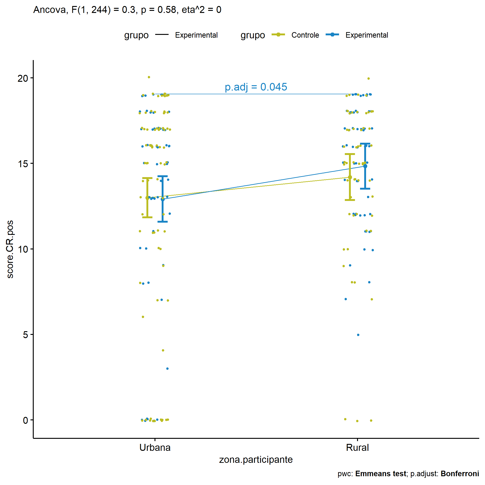<!-- -->

<!-- -->

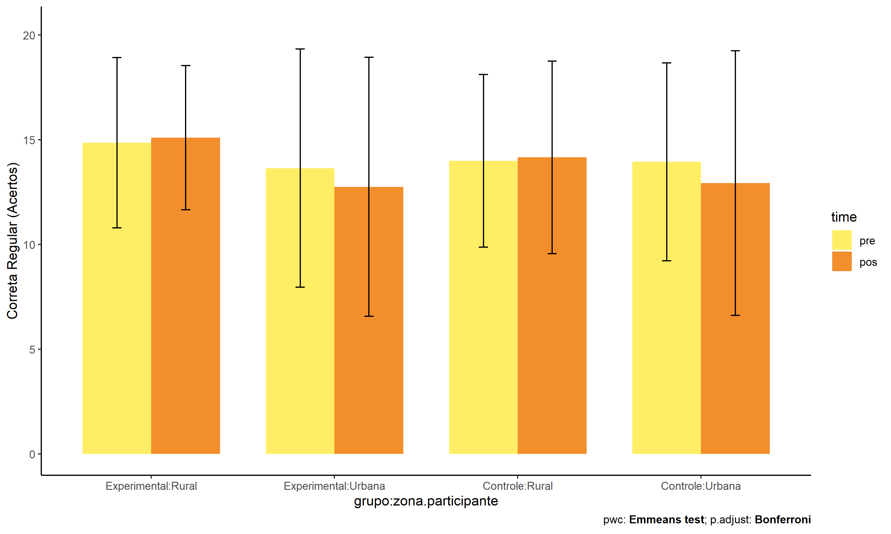<!-- -->

### Correta Irregular (Acertos)

| var          | zona.participante | grupo        |   n | M (pre) | SE (pre) | M (unadj) | SE (unadj) | M (adj) | SE (adj) |
|:-------------|:------------------|:-------------|----:|--------:|---------:|----------:|-----------:|--------:|---------:|
| score.CI.pos | Rural             | Controle     |  56 |  11.643 |    0.548 |    11.661 |      0.603 |  11.451 |    0.592 |
| score.CI.pos | Rural             | Experimental |  59 |  11.237 |    0.506 |    12.441 |      0.422 |  12.431 |    0.576 |
| score.CI.pos | Urbana            | Controle     |  77 |  11.013 |    0.500 |     9.870 |      0.638 |   9.970 |    0.505 |
| score.CI.pos | Urbana            | Experimental |  57 |  11.053 |    0.659 |    11.088 |      0.752 |  11.169 |    0.587 |

| .y.          | grupo        | zona.participante | group1   | group2       | estimate | conf.low | conf.high |    se | statistic |     p | p.adj | p.adj.signif |
|:-------------|:-------------|:------------------|:---------|:-------------|---------:|---------:|----------:|------:|----------:|------:|------:|:-------------|
| score.CI.pos | Controle     |                   | Urbana   | Rural        |   -1.481 |   -3.015 |     0.053 | 0.779 |    -1.901 | 0.058 | 0.058 | ns           |
| score.CI.pos | Experimental |                   | Urbana   | Rural        |   -1.262 |   -2.882 |     0.358 | 0.822 |    -1.534 | 0.126 | 0.126 | ns           |
| score.CI.pre | Controle     |                   | Urbana   | Rural        |   -0.630 |   -2.137 |     0.877 | 0.765 |    -0.823 | 0.411 | 0.411 | ns           |
| score.CI.pre | Experimental |                   | Urbana   | Rural        |   -0.185 |   -1.778 |     1.409 | 0.809 |    -0.228 | 0.820 | 0.820 | ns           |
| score.CI.pos |              | Urbana            | Controle | Experimental |   -1.198 |   -2.722 |     0.326 | 0.774 |    -1.548 | 0.123 | 0.123 | ns           |
| score.CI.pos |              | Rural             | Controle | Experimental |   -0.980 |   -2.608 |     0.649 | 0.827 |    -1.185 | 0.237 | 0.237 | ns           |
| score.CI.pre |              | Urbana            | Controle | Experimental |   -0.040 |   -1.539 |     1.460 | 0.761 |    -0.052 | 0.959 | 0.959 | ns           |
| score.CI.pre |              | Rural             | Controle | Experimental |    0.406 |   -1.195 |     2.006 | 0.813 |     0.499 | 0.618 | 0.618 | ns           |

| grupo        | zona.participante | group1 | group2 | estimate | conf.low | conf.high |    se | statistic |     p | p.adj | p.adj.signif |
|:-------------|:------------------|:-------|:-------|---------:|---------:|----------:|------:|----------:|------:|------:|:-------------|
| Controle     | Urbana            | pre    | pos    |    1.143 |   -0.327 |     2.613 | 0.748 |     1.528 | 0.127 | 0.127 | ns           |
| Controle     | Rural             | pre    | pos    |   -0.018 |   -1.742 |     1.706 | 0.877 |    -0.020 | 0.984 | 0.984 | ns           |
| Experimental | Urbana            | pre    | pos    |   -0.035 |   -1.744 |     1.673 | 0.870 |    -0.040 | 0.968 | 0.968 | ns           |
| Experimental | Rural             | pre    | pos    |   -1.203 |   -2.883 |     0.476 | 0.855 |    -1.408 | 0.160 | 0.160 | ns           |

    ## Scale for colour is already present.
    ## Adding another scale for colour, which will replace the existing scale.

<!-- -->

    ## Scale for colour is already present.
    ## Adding another scale for colour, which will replace the existing scale.

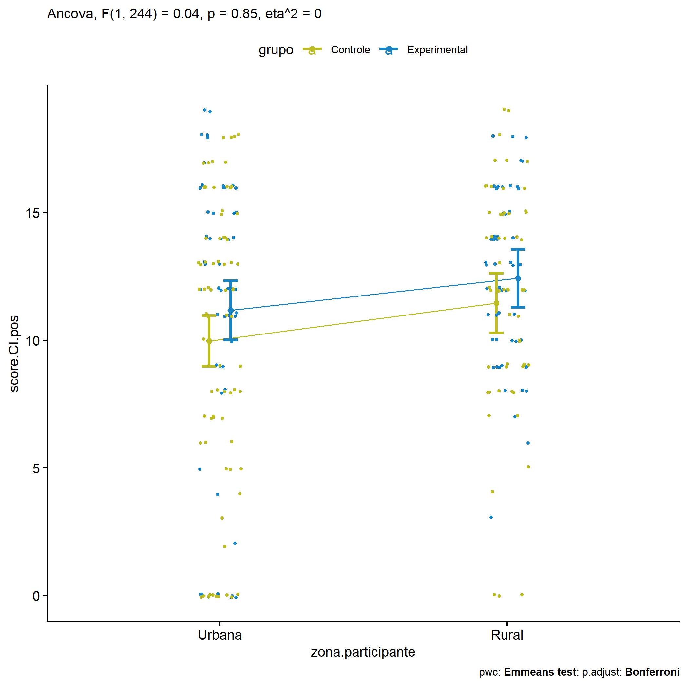<!-- -->

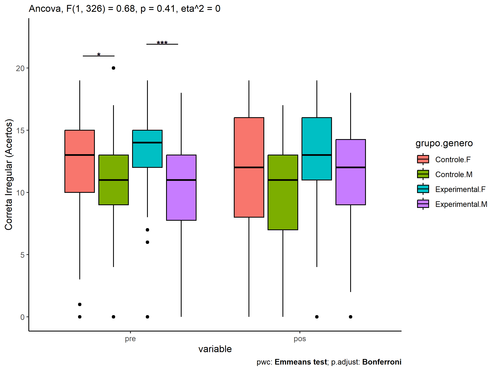<!-- -->

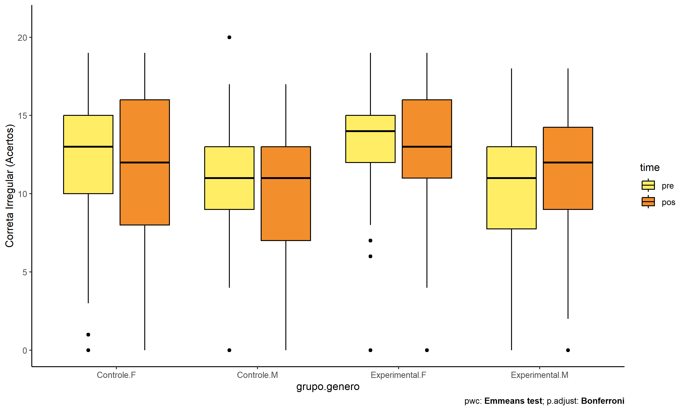<!-- -->

### Trocas Visuais (Acertos)

| var          | zona.participante | grupo        |   n | M (pre) | SE (pre) | M (unadj) | SE (unadj) | M (adj) | SE (adj) |
|:-------------|:------------------|:-------------|----:|--------:|---------:|----------:|-----------:|--------:|---------:|
| score.TV.pos | Rural             | Controle     |  56 |  15.661 |    0.599 |    15.929 |      0.659 |  16.070 |    0.731 |
| score.TV.pos | Rural             | Experimental |  59 |  17.169 |    0.495 |    16.932 |      0.426 |  16.452 |    0.717 |
| score.TV.pos | Urbana            | Controle     |  77 |  16.247 |    0.580 |    14.481 |      0.791 |  14.381 |    0.624 |
| score.TV.pos | Urbana            | Experimental |  57 |  14.807 |    0.831 |    13.754 |      0.923 |  14.247 |    0.729 |

| .y.          | grupo        | zona.participante | group1   | group2       | estimate | conf.low | conf.high |    se | statistic |     p | p.adj | p.adj.signif |
|:-------------|:-------------|:------------------|:---------|:-------------|---------:|---------:|----------:|------:|----------:|------:|------:|:-------------|
| score.TV.pos | Controle     |                   | Urbana   | Rural        |   -1.689 |   -3.583 |     0.204 | 0.961 |    -1.757 | 0.080 | 0.080 | ns           |
| score.TV.pos | Experimental |                   | Urbana   | Rural        |   -2.205 |   -4.232 |    -0.178 | 1.029 |    -2.143 | 0.033 | 0.033 | \*           |
| score.TV.pre | Controle     |                   | Urbana   | Rural        |    0.586 |   -1.142 |     2.314 | 0.877 |     0.668 | 0.505 | 0.505 | ns           |
| score.TV.pre | Experimental |                   | Urbana   | Rural        |   -2.362 |   -4.190 |    -0.535 | 0.928 |    -2.546 | 0.011 | 0.011 | \*           |
| score.TV.pos |              | Urbana            | Controle | Experimental |    0.133 |   -1.759 |     2.026 | 0.961 |     0.139 | 0.890 | 0.890 | ns           |
| score.TV.pos |              | Rural             | Controle | Experimental |   -0.382 |   -2.403 |     1.638 | 1.026 |    -0.373 | 0.710 | 0.710 | ns           |
| score.TV.pre |              | Urbana            | Controle | Experimental |    1.440 |   -0.280 |     3.159 | 0.873 |     1.649 | 0.100 | 0.100 | ns           |
| score.TV.pre |              | Rural             | Controle | Experimental |   -1.509 |   -3.345 |     0.327 | 0.932 |    -1.619 | 0.107 | 0.107 | ns           |

| grupo        | zona.participante | group1 | group2 | estimate | conf.low | conf.high |    se | statistic |     p | p.adj | p.adj.signif |
|:-------------|:------------------|:-------|:-------|---------:|---------:|----------:|------:|----------:|------:|------:|:-------------|
| Controle     | Urbana            | pre    | pos    |    1.766 |    0.047 |     3.486 | 0.875 |     2.018 | 0.044 | 0.044 | \*           |
| Controle     | Rural             | pre    | pos    |   -0.268 |   -2.284 |     1.749 | 1.026 |    -0.261 | 0.794 | 0.794 | ns           |
| Experimental | Urbana            | pre    | pos    |    1.053 |   -0.946 |     3.051 | 1.017 |     1.035 | 0.301 | 0.301 | ns           |
| Experimental | Rural             | pre    | pos    |    0.237 |   -1.727 |     2.202 | 1.000 |     0.237 | 0.812 | 0.812 | ns           |

    ## Scale for colour is already present.
    ## Adding another scale for colour, which will replace the existing scale.

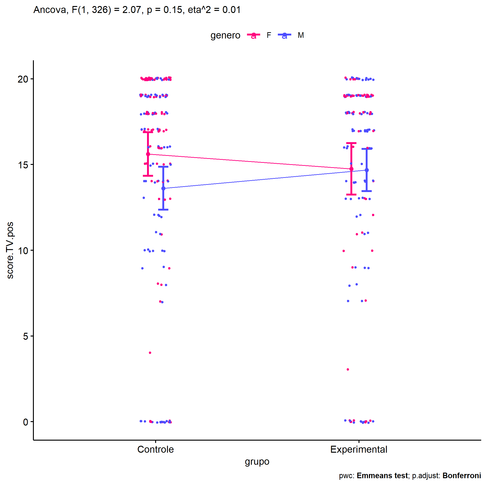<!-- -->

    ## Scale for colour is already present.
    ## Adding another scale for colour, which will replace the existing scale.

<!-- -->

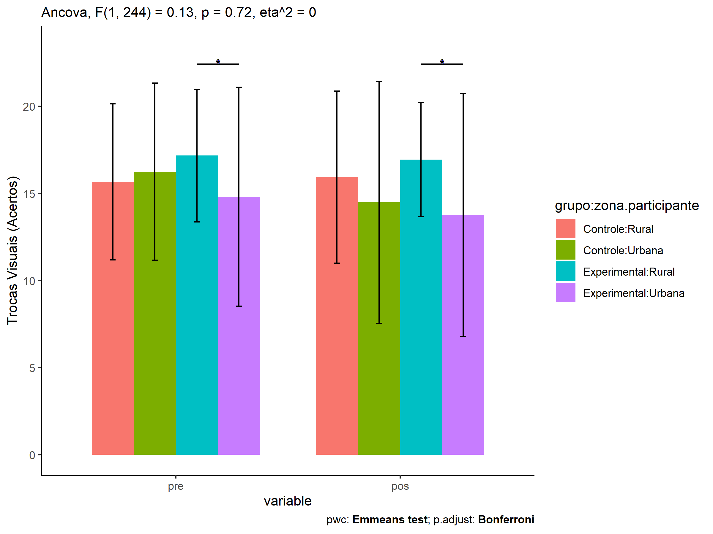<!-- -->

<!-- -->

### Trocas Fonologicas (Acertos)

| var          | zona.participante | grupo        |   n | M (pre) | SE (pre) | M (unadj) | SE (unadj) | M (adj) | SE (adj) |
|:-------------|:------------------|:-------------|----:|--------:|---------:|----------:|-----------:|--------:|---------:|
| score.TF.pos | Rural             | Controle     |  56 |  14.518 |    0.591 |    14.375 |      0.725 |  14.506 |    0.706 |
| score.TF.pos | Rural             | Experimental |  59 |  16.356 |    0.513 |    16.339 |      0.418 |  15.625 |    0.696 |
| score.TF.pos | Urbana            | Controle     |  77 |  14.558 |    0.583 |    13.026 |      0.777 |  13.139 |    0.602 |
| score.TF.pos | Urbana            | Experimental |  57 |  13.807 |    0.818 |    12.596 |      0.858 |  13.055 |    0.703 |

| .y.          | grupo        | zona.participante | group1   | group2       | estimate | conf.low | conf.high |    se | statistic |     p | p.adj | p.adj.signif |
|:-------------|:-------------|:------------------|:---------|:-------------|---------:|---------:|----------:|------:|----------:|------:|------:|:-------------|
| score.TF.pos | Controle     |                   | Urbana   | Rural        |   -1.368 |   -3.196 |     0.460 | 0.928 |    -1.474 | 0.142 | 0.142 | ns           |
| score.TF.pos | Experimental |                   | Urbana   | Rural        |   -2.570 |   -4.532 |    -0.607 | 0.996 |    -2.579 | 0.010 | 0.010 | \*           |
| score.TF.pre | Controle     |                   | Urbana   | Rural        |    0.041 |   -1.686 |     1.767 | 0.876 |     0.046 | 0.963 | 0.963 | ns           |
| score.TF.pre | Experimental |                   | Urbana   | Rural        |   -2.549 |   -4.374 |    -0.723 | 0.927 |    -2.750 | 0.006 | 0.006 | \*\*         |
| score.TF.pos |              | Urbana            | Controle | Experimental |    0.084 |   -1.738 |     1.905 | 0.925 |     0.091 | 0.928 | 0.928 | ns           |
| score.TF.pos |              | Rural             | Controle | Experimental |   -1.118 |   -3.075 |     0.839 | 0.994 |    -1.125 | 0.262 | 0.262 | ns           |
| score.TF.pre |              | Urbana            | Controle | Experimental |    0.751 |   -0.966 |     2.469 | 0.872 |     0.862 | 0.390 | 0.390 | ns           |
| score.TF.pre |              | Rural             | Controle | Experimental |   -1.838 |   -3.672 |    -0.004 | 0.931 |    -1.974 | 0.049 | 0.049 | \*           |

| grupo        | zona.participante | group1 | group2 | estimate | conf.low | conf.high |    se | statistic |     p | p.adj | p.adj.signif |
|:-------------|:------------------|:-------|:-------|---------:|---------:|----------:|------:|----------:|------:|------:|:-------------|
| Controle     | Urbana            | pre    | pos    |    1.532 |   -0.173 |     3.237 | 0.868 |     1.766 | 0.078 | 0.078 | ns           |
| Controle     | Rural             | pre    | pos    |    0.143 |   -1.856 |     2.142 | 1.018 |     0.140 | 0.888 | 0.888 | ns           |
| Experimental | Urbana            | pre    | pos    |    1.211 |   -0.771 |     3.192 | 1.009 |     1.200 | 0.231 | 0.231 | ns           |
| Experimental | Rural             | pre    | pos    |    0.017 |   -1.931 |     1.965 | 0.991 |     0.017 | 0.986 | 0.986 | ns           |

    ## Scale for colour is already present.
    ## Adding another scale for colour, which will replace the existing scale.

<!-- -->

    ## Scale for colour is already present.
    ## Adding another scale for colour, which will replace the existing scale.

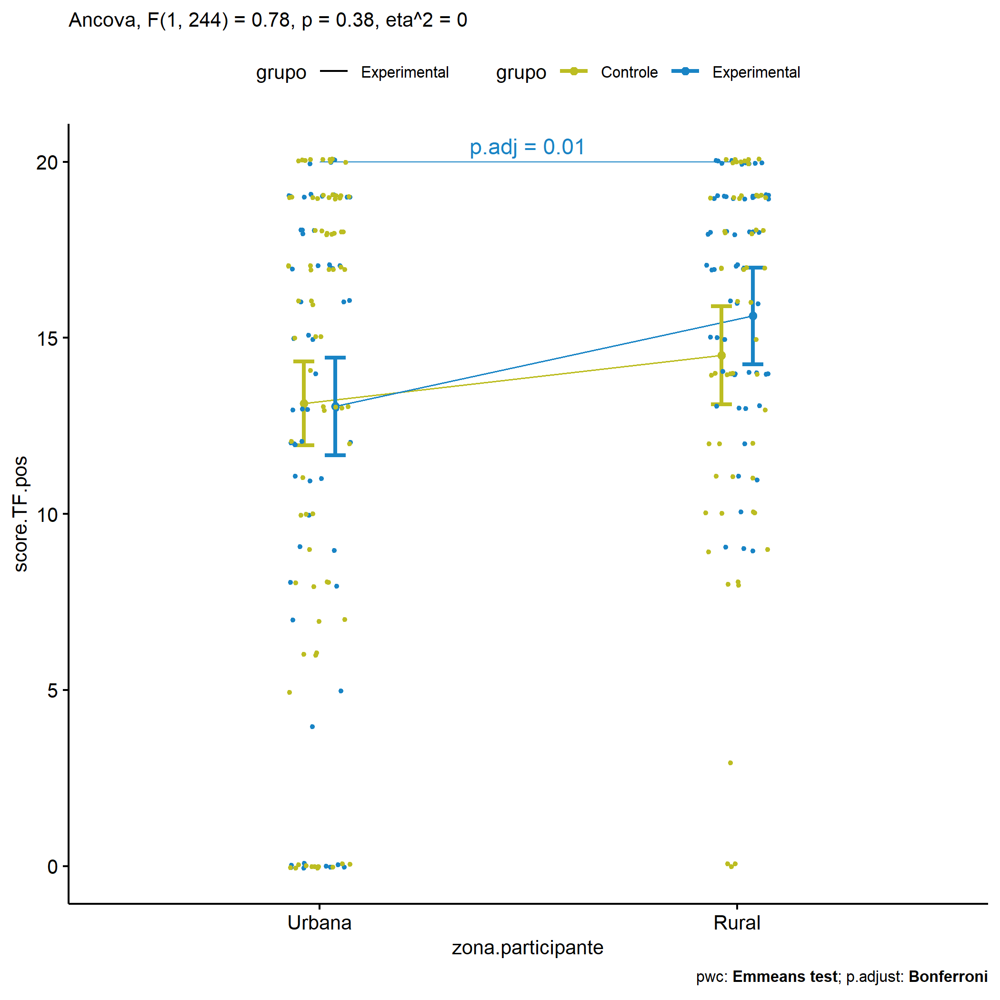<!-- -->

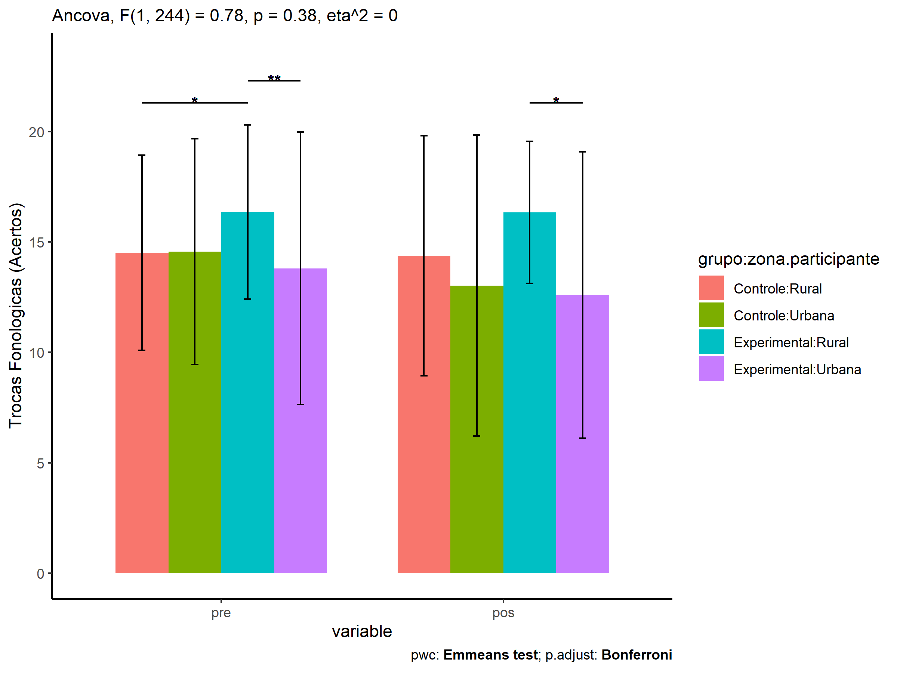<!-- -->

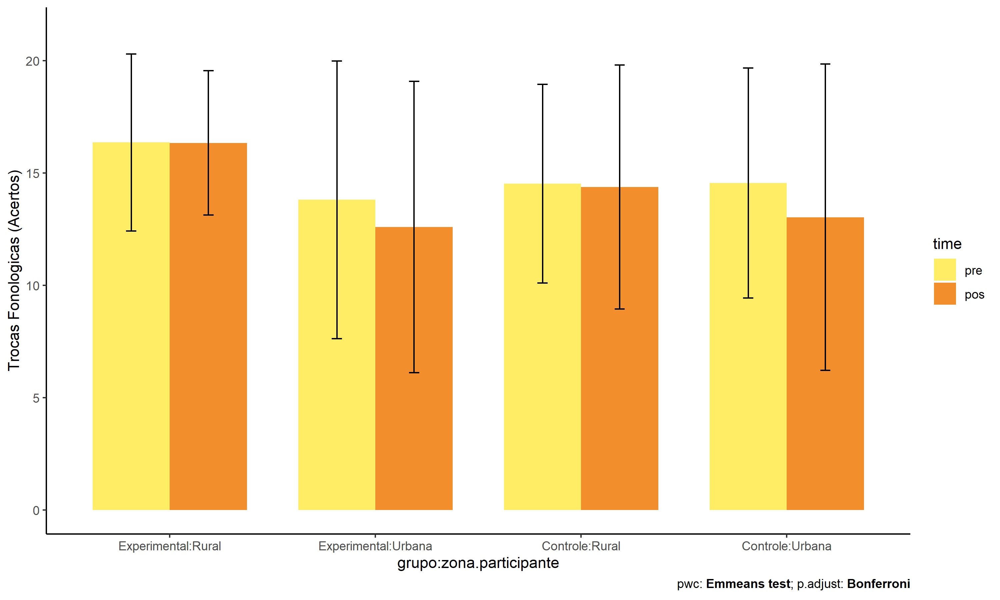<!-- -->

### Trocas Orograficas (Acertos)

| var          | zona.participante | grupo        |   n | M (pre) | SE (pre) | M (unadj) | SE (unadj) | M (adj) | SE (adj) |
|:-------------|:------------------|:-------------|----:|--------:|---------:|----------:|-----------:|--------:|---------:|
| score.TO.pos | Rural             | Controle     |  56 |   9.571 |    0.627 |    10.321 |      0.633 |  10.425 |    0.576 |
| score.TO.pos | Rural             | Experimental |  59 |  10.119 |    0.543 |    10.441 |      0.545 |  10.221 |    0.562 |
| score.TO.pos | Urbana            | Controle     |  77 |   9.883 |    0.540 |    10.039 |      0.619 |   9.958 |    0.492 |
| score.TO.pos | Urbana            | Experimental |  57 |   9.351 |    0.645 |     9.404 |      0.769 |   9.638 |    0.572 |

| .y.          | grupo        | zona.participante | group1   | group2       | estimate | conf.low | conf.high |    se | statistic |     p | p.adj | p.adj.signif |
|:-------------|:-------------|:------------------|:---------|:-------------|---------:|---------:|----------:|------:|----------:|------:|------:|:-------------|
| score.TO.pos | Controle     |                   | Urbana   | Rural        |   -0.467 |   -1.959 |     1.025 | 0.758 |    -0.616 | 0.538 | 0.538 | ns           |
| score.TO.pos | Experimental |                   | Urbana   | Rural        |   -0.583 |   -2.163 |     0.997 | 0.802 |    -0.727 | 0.468 | 0.468 | ns           |
| score.TO.pre | Controle     |                   | Urbana   | Rural        |    0.312 |   -1.291 |     1.914 | 0.814 |     0.383 | 0.702 | 0.702 | ns           |
| score.TO.pre | Experimental |                   | Urbana   | Rural        |   -0.768 |   -2.462 |     0.927 | 0.860 |    -0.892 | 0.373 | 0.373 | ns           |
| score.TO.pos |              | Urbana            | Controle | Experimental |    0.321 |   -1.165 |     1.806 | 0.754 |     0.425 | 0.671 | 0.671 | ns           |
| score.TO.pos |              | Rural             | Controle | Experimental |    0.204 |   -1.382 |     1.790 | 0.805 |     0.254 | 0.800 | 0.800 | ns           |
| score.TO.pre |              | Urbana            | Controle | Experimental |    0.532 |   -1.062 |     2.126 | 0.809 |     0.658 | 0.511 | 0.511 | ns           |
| score.TO.pre |              | Rural             | Controle | Experimental |   -0.547 |   -2.249 |     1.155 | 0.864 |    -0.633 | 0.527 | 0.527 | ns           |

| grupo        | zona.participante | group1 | group2 | estimate | conf.low | conf.high |    se | statistic |     p | p.adj | p.adj.signif |
|:-------------|:------------------|:-------|:-------|---------:|---------:|----------:|------:|----------:|------:|------:|:-------------|
| Controle     | Urbana            | pre    | pos    |   -0.156 |   -1.699 |     1.387 | 0.785 |    -0.198 | 0.843 | 0.843 | ns           |
| Controle     | Rural             | pre    | pos    |   -0.750 |   -2.559 |     1.059 | 0.921 |    -0.814 | 0.416 | 0.416 | ns           |
| Experimental | Urbana            | pre    | pos    |   -0.053 |   -1.846 |     1.741 | 0.913 |    -0.058 | 0.954 | 0.954 | ns           |
| Experimental | Rural             | pre    | pos    |   -0.322 |   -2.085 |     1.441 | 0.897 |    -0.359 | 0.720 | 0.720 | ns           |

    ## Scale for colour is already present.
    ## Adding another scale for colour, which will replace the existing scale.

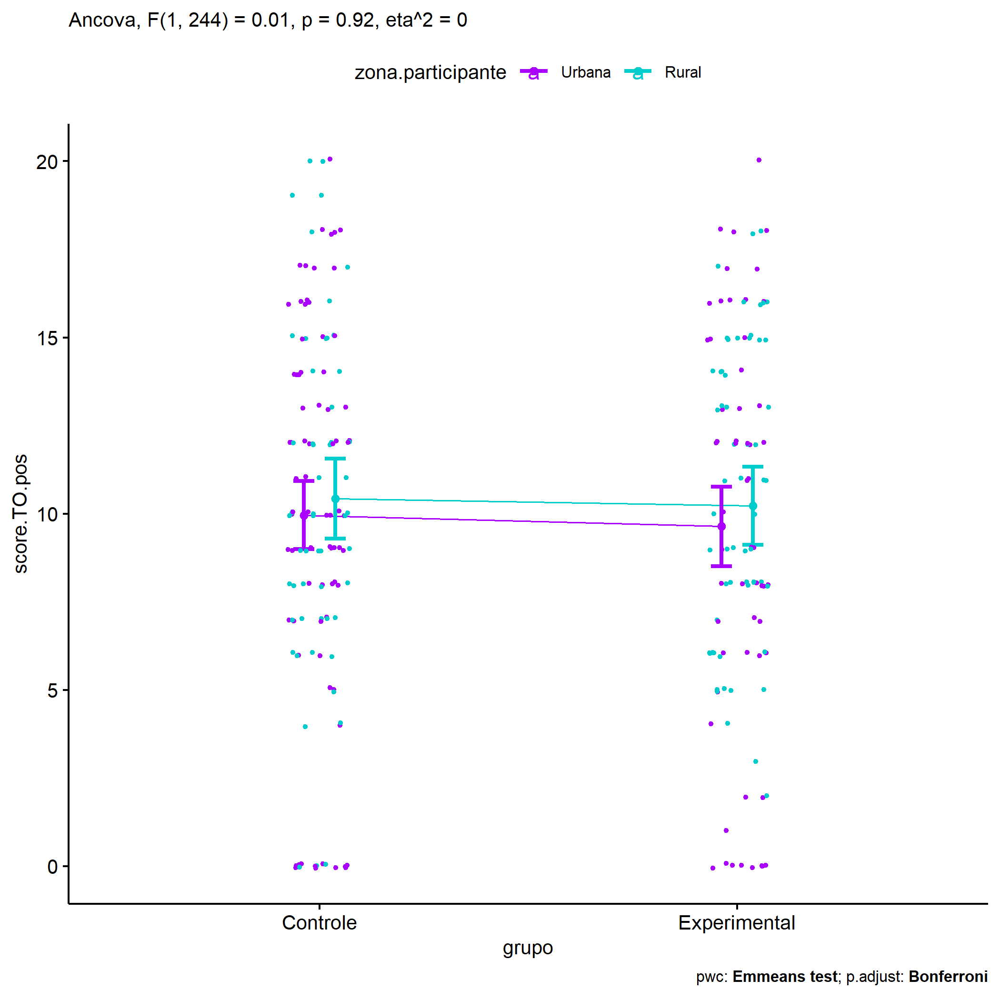<!-- -->

    ## Scale for colour is already present.
    ## Adding another scale for colour, which will replace the existing scale.

<!-- -->

<!-- -->

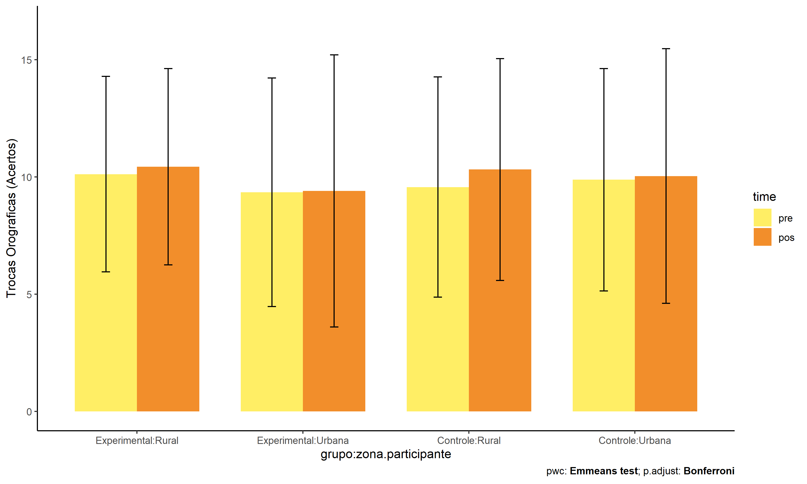<!-- -->

## factores: **escola:grupo**

### Leitura de Pseudo-Palavras (Acertos)

| var            | escola | grupo        |   n | M (pre) | SE (pre) | M (unadj) | SE (unadj) | M (adj) | SE (adj) |
|:---------------|:-------|:-------------|----:|--------:|---------:|----------:|-----------:|--------:|---------:|
| score.CLPP.pos | E1     | Controle     |  12 |  71.583 |    3.088 |    75.250 |      3.126 |  73.480 |    3.060 |
| score.CLPP.pos | E1     | Experimental |  11 |  67.182 |    5.003 |    71.182 |      3.753 |  72.415 |    3.194 |
| score.CLPP.pos | E2     | Controle     |  28 |  65.714 |    2.654 |    62.714 |      3.257 |  64.949 |    2.007 |
| score.CLPP.pos | E2     | Experimental |  23 |  70.130 |    2.439 |    65.130 |      3.913 |  64.352 |    2.209 |
| score.CLPP.pos | E3     | Controle     |  19 |  63.263 |    4.077 |    71.105 |      3.370 |  75.013 |    2.443 |
| score.CLPP.pos | E3     | Experimental |  16 |  67.812 |    4.032 |    69.188 |      3.510 |  69.991 |    2.648 |
| score.CLPP.pos | E4     | Controle     |  20 |  64.850 |    3.658 |    68.700 |      3.462 |  71.525 |    2.375 |
| score.CLPP.pos | E4     | Experimental |  15 |  74.200 |    3.236 |    75.333 |      2.489 |  71.777 |    2.744 |
| score.CLPP.pos | E5     | Controle     |  58 |  70.776 |    1.516 |    70.190 |      1.882 |  68.971 |    1.393 |
| score.CLPP.pos | E5     | Experimental |  55 |  69.982 |    2.160 |    72.473 |      1.960 |  71.795 |    1.429 |
| score.CLPP.pos | E6     | Controle     |  12 |  70.333 |    6.422 |    76.250 |      3.713 |  75.333 |    3.058 |
| score.CLPP.pos | E6     | Experimental |  15 |  69.800 |    2.434 |    71.333 |      2.030 |  70.780 |    2.735 |

| .y.            | grupo        | escola | group1   | group2       | estimate | conf.low | conf.high |    se | statistic |     p | p.adj | p.adj.signif |
|:---------------|:-------------|:-------|:---------|:-------------|---------:|---------:|----------:|------:|----------:|------:|------:|:-------------|
| score.CLPP.pos | Controle     |        | E1       | E2           |    8.530 |    1.318 |    15.743 | 3.664 |     2.328 | 0.021 | 0.309 | ns           |
| score.CLPP.pos | Controle     |        | E1       | E3           |   -1.533 |   -9.256 |     6.190 | 3.923 |    -0.391 | 0.696 | 1.000 | ns           |
| score.CLPP.pos | Controle     |        | E1       | E4           |    1.955 |   -5.682 |     9.592 | 3.879 |     0.504 | 0.615 | 1.000 | ns           |
| score.CLPP.pos | Controle     |        | E1       | E5           |    4.509 |   -2.104 |    11.123 | 3.359 |     1.342 | 0.181 | 1.000 | ns           |
| score.CLPP.pos | Controle     |        | E1       | E6           |   -1.853 |  -10.367 |     6.661 | 4.324 |    -0.429 | 0.669 | 1.000 | ns           |
| score.CLPP.pos | Controle     |        | E2       | E3           |  -10.064 |  -16.265 |    -3.862 | 3.150 |    -3.195 | 0.002 | 0.023 | \*           |
| score.CLPP.pos | Controle     |        | E2       | E4           |   -6.576 |  -12.681 |    -0.470 | 3.101 |    -2.120 | 0.035 | 0.523 | ns           |
| score.CLPP.pos | Controle     |        | E2       | E5           |   -4.021 |   -8.840 |     0.798 | 2.448 |    -1.643 | 0.102 | 1.000 | ns           |
| score.CLPP.pos | Controle     |        | E2       | E6           |  -10.383 |  -17.589 |    -3.177 | 3.660 |    -2.837 | 0.005 | 0.073 | ns           |
| score.CLPP.pos | Controle     |        | E3       | E4           |    3.488 |   -3.194 |    10.170 | 3.394 |     1.028 | 0.305 | 1.000 | ns           |
| score.CLPP.pos | Controle     |        | E3       | E5           |    6.043 |    0.492 |    11.593 | 2.819 |     2.143 | 0.033 | 0.495 | ns           |
| score.CLPP.pos | Controle     |        | E3       | E6           |   -0.320 |   -8.033 |     7.394 | 3.918 |    -0.082 | 0.935 | 1.000 | ns           |
| score.CLPP.pos | Controle     |        | E4       | E5           |    2.554 |   -2.877 |     7.986 | 2.759 |     0.926 | 0.355 | 1.000 | ns           |
| score.CLPP.pos | Controle     |        | E4       | E6           |   -3.808 |  -11.437 |     3.821 | 3.875 |    -0.983 | 0.327 | 1.000 | ns           |
| score.CLPP.pos | Controle     |        | E5       | E6           |   -6.362 |  -12.975 |     0.251 | 3.359 |    -1.894 | 0.059 | 0.889 | ns           |
| score.CLPP.pos | Experimental |        | E1       | E2           |    8.064 |    0.415 |    15.712 | 3.885 |     2.076 | 0.039 | 0.583 | ns           |
| score.CLPP.pos | Experimental |        | E1       | E3           |    2.425 |   -5.743 |    10.592 | 4.149 |     0.584 | 0.559 | 1.000 | ns           |
| score.CLPP.pos | Experimental |        | E1       | E4           |    0.638 |   -7.662 |     8.938 | 4.216 |     0.151 | 0.880 | 1.000 | ns           |
| score.CLPP.pos | Experimental |        | E1       | E5           |    0.620 |   -6.272 |     7.512 | 3.500 |     0.177 | 0.860 | 1.000 | ns           |
| score.CLPP.pos | Experimental |        | E1       | E6           |    1.635 |   -6.645 |     9.916 | 4.206 |     0.389 | 0.698 | 1.000 | ns           |
| score.CLPP.pos | Experimental |        | E2       | E3           |   -5.639 |  -12.430 |     1.152 | 3.450 |    -1.635 | 0.103 | 1.000 | ns           |
| score.CLPP.pos | Experimental |        | E2       | E4           |   -7.426 |  -14.355 |    -0.496 | 3.520 |    -2.110 | 0.036 | 0.537 | ns           |
| score.CLPP.pos | Experimental |        | E2       | E5           |   -7.444 |  -12.622 |    -2.266 | 2.630 |    -2.830 | 0.005 | 0.075 | ns           |
| score.CLPP.pos | Experimental |        | E2       | E6           |   -6.428 |  -13.349 |     0.492 | 3.515 |    -1.829 | 0.069 | 1.000 | ns           |
| score.CLPP.pos | Experimental |        | E3       | E4           |   -1.787 |   -9.302 |     5.728 | 3.817 |    -0.468 | 0.640 | 1.000 | ns           |
| score.CLPP.pos | Experimental |        | E3       | E5           |   -1.805 |   -7.731 |     4.121 | 3.010 |    -0.600 | 0.549 | 1.000 | ns           |
| score.CLPP.pos | Experimental |        | E3       | E6           |   -0.789 |   -8.286 |     6.707 | 3.808 |    -0.207 | 0.836 | 1.000 | ns           |
| score.CLPP.pos | Experimental |        | E4       | E5           |   -0.018 |   -6.103 |     6.067 | 3.091 |    -0.006 | 0.995 | 1.000 | ns           |
| score.CLPP.pos | Experimental |        | E4       | E6           |    0.997 |   -6.627 |     8.621 | 3.872 |     0.258 | 0.797 | 1.000 | ns           |
| score.CLPP.pos | Experimental |        | E5       | E6           |    1.015 |   -5.059 |     7.089 | 3.085 |     0.329 | 0.742 | 1.000 | ns           |
| score.CLPP.pre | Controle     |        | E1       | E2           |    5.869 |   -3.995 |    15.733 | 5.010 |     1.171 | 0.242 | 1.000 | ns           |
| score.CLPP.pre | Controle     |        | E1       | E3           |    8.320 |   -2.222 |    18.862 | 5.355 |     1.554 | 0.121 | 1.000 | ns           |
| score.CLPP.pre | Controle     |        | E1       | E4           |    6.733 |   -3.706 |    17.173 | 5.303 |     1.270 | 0.205 | 1.000 | ns           |
| score.CLPP.pre | Controle     |        | E1       | E5           |    0.807 |   -8.259 |     9.874 | 4.605 |     0.175 | 0.861 | 1.000 | ns           |
| score.CLPP.pre | Controle     |        | E1       | E6           |    1.250 |  -10.422 |    12.922 | 5.928 |     0.211 | 0.833 | 1.000 | ns           |
| score.CLPP.pre | Controle     |        | E2       | E3           |    2.451 |   -6.047 |    10.949 | 4.316 |     0.568 | 0.571 | 1.000 | ns           |
| score.CLPP.pre | Controle     |        | E2       | E4           |    0.864 |   -7.506 |     9.234 | 4.252 |     0.203 | 0.839 | 1.000 | ns           |
| score.CLPP.pre | Controle     |        | E2       | E5           |   -5.062 |  -11.641 |     1.517 | 3.342 |    -1.515 | 0.131 | 1.000 | ns           |
| score.CLPP.pre | Controle     |        | E2       | E6           |   -4.619 |  -14.483 |     5.245 | 5.010 |    -0.922 | 0.357 | 1.000 | ns           |
| score.CLPP.pre | Controle     |        | E3       | E4           |   -1.587 |  -10.746 |     7.572 | 4.652 |    -0.341 | 0.733 | 1.000 | ns           |
| score.CLPP.pre | Controle     |        | E3       | E5           |   -7.513 |  -15.070 |     0.044 | 3.839 |    -1.957 | 0.051 | 0.770 | ns           |
| score.CLPP.pre | Controle     |        | E3       | E6           |   -7.070 |  -17.612 |     3.472 | 5.355 |    -1.320 | 0.188 | 1.000 | ns           |
| score.CLPP.pre | Controle     |        | E4       | E5           |   -5.926 |  -13.339 |     1.488 | 3.766 |    -1.574 | 0.117 | 1.000 | ns           |
| score.CLPP.pre | Controle     |        | E4       | E6           |   -5.483 |  -15.923 |     4.956 | 5.303 |    -1.034 | 0.302 | 1.000 | ns           |
| score.CLPP.pre | Controle     |        | E5       | E6           |    0.443 |   -8.624 |     9.509 | 4.605 |     0.096 | 0.924 | 1.000 | ns           |
| score.CLPP.pre | Experimental |        | E1       | E2           |   -2.949 |  -13.429 |     7.532 | 5.324 |    -0.554 | 0.580 | 1.000 | ns           |
| score.CLPP.pre | Experimental |        | E1       | E3           |   -0.631 |  -11.828 |    10.567 | 5.688 |    -0.111 | 0.912 | 1.000 | ns           |
| score.CLPP.pre | Experimental |        | E1       | E4           |   -7.018 |  -18.367 |     4.331 | 5.765 |    -1.217 | 0.224 | 1.000 | ns           |
| score.CLPP.pre | Experimental |        | E1       | E5           |   -2.800 |  -12.243 |     6.643 | 4.796 |    -0.584 | 0.560 | 1.000 | ns           |
| score.CLPP.pre | Experimental |        | E1       | E6           |   -2.618 |  -13.967 |     8.731 | 5.765 |    -0.454 | 0.650 | 1.000 | ns           |
| score.CLPP.pre | Experimental |        | E2       | E3           |    2.318 |   -6.989 |    11.625 | 4.727 |     0.490 | 0.624 | 1.000 | ns           |
| score.CLPP.pre | Experimental |        | E2       | E4           |   -4.070 |  -13.558 |     5.419 | 4.820 |    -0.844 | 0.399 | 1.000 | ns           |
| score.CLPP.pre | Experimental |        | E2       | E5           |    0.149 |   -6.951 |     7.248 | 3.606 |     0.041 | 0.967 | 1.000 | ns           |
| score.CLPP.pre | Experimental |        | E2       | E6           |    0.330 |   -9.158 |     9.819 | 4.820 |     0.069 | 0.945 | 1.000 | ns           |
| score.CLPP.pre | Experimental |        | E3       | E4           |   -6.387 |  -16.662 |     3.887 | 5.219 |    -1.224 | 0.222 | 1.000 | ns           |
| score.CLPP.pre | Experimental |        | E3       | E5           |   -2.169 |  -10.290 |     5.951 | 4.125 |    -0.526 | 0.599 | 1.000 | ns           |
| score.CLPP.pre | Experimental |        | E3       | E6           |   -1.988 |  -12.262 |     8.287 | 5.219 |    -0.381 | 0.704 | 1.000 | ns           |
| score.CLPP.pre | Experimental |        | E4       | E5           |    4.218 |   -4.110 |    12.546 | 4.230 |     0.997 | 0.320 | 1.000 | ns           |
| score.CLPP.pre | Experimental |        | E4       | E6           |    4.400 |   -6.039 |    14.839 | 5.303 |     0.830 | 0.407 | 1.000 | ns           |
| score.CLPP.pre | Experimental |        | E5       | E6           |    0.182 |   -8.146 |     8.510 | 4.230 |     0.043 | 0.966 | 1.000 | ns           |
| score.CLPP.pos |              | E1     | Controle | Experimental |    1.064 |   -7.648 |     9.777 | 4.425 |     0.241 | 0.810 | 0.810 | ns           |
| score.CLPP.pos |              | E2     | Controle | Experimental |    0.598 |   -5.283 |     6.478 | 2.987 |     0.200 | 0.842 | 0.842 | ns           |
| score.CLPP.pos |              | E3     | Controle | Experimental |    5.022 |   -2.064 |    12.109 | 3.599 |     1.395 | 0.164 | 0.164 | ns           |
| score.CLPP.pos |              | E4     | Controle | Experimental |   -0.252 |   -7.421 |     6.916 | 3.641 |    -0.069 | 0.945 | 0.945 | ns           |
| score.CLPP.pos |              | E5     | Controle | Experimental |   -2.825 |   -6.750 |     1.100 | 1.994 |    -1.417 | 0.158 | 0.158 | ns           |
| score.CLPP.pos |              | E6     | Controle | Experimental |    4.553 |   -3.524 |    12.629 | 4.102 |     1.110 | 0.268 | 0.268 | ns           |
| score.CLPP.pre |              | E1     | Controle | Experimental |    4.402 |   -7.532 |    16.335 | 6.062 |     0.726 | 0.468 | 0.468 | ns           |
| score.CLPP.pre |              | E2     | Controle | Experimental |   -4.416 |  -12.462 |     3.629 | 4.087 |    -1.081 | 0.281 | 0.281 | ns           |
| score.CLPP.pre |              | E3     | Controle | Experimental |   -4.549 |  -14.250 |     5.151 | 4.927 |    -0.923 | 0.357 | 0.357 | ns           |
| score.CLPP.pre |              | E4     | Controle | Experimental |   -9.350 |  -19.115 |     0.415 | 4.960 |    -1.885 | 0.060 | 0.060 | ns           |
| score.CLPP.pre |              | E5     | Controle | Experimental |    0.794 |   -4.587 |     6.175 | 2.733 |     0.291 | 0.772 | 0.772 | ns           |
| score.CLPP.pre |              | E6     | Controle | Experimental |    0.533 |  -10.539 |    11.606 | 5.624 |     0.095 | 0.925 | 0.925 | ns           |

| grupo        | escola | group1 | group2 | estimate | conf.low | conf.high |    se | statistic |     p | p.adj | p.adj.signif |
|:-------------|:-------|:-------|:-------|---------:|---------:|----------:|------:|----------:|------:|------:|:-------------|
| Controle     | E1     | pre    | pos    |   -3.107 |  -14.202 |     7.988 | 5.649 |    -0.550 | 0.583 | 0.583 | ns           |
| Controle     | E2     | pre    | pos    |    5.127 |   -1.987 |    12.242 | 3.622 |     1.415 | 0.157 | 0.157 | ns           |
| Controle     | E3     | pre    | pos    |   -9.257 |  -18.069 |    -0.446 | 4.486 |    -2.063 | 0.040 | 0.040 | \*           |
| Controle     | E4     | pre    | pos    |   -3.850 |  -12.768 |     5.068 | 4.541 |    -0.848 | 0.397 | 0.397 | ns           |
| Controle     | E5     | pre    | pos    |   -0.191 |   -5.263 |     4.880 | 2.582 |    -0.074 | 0.941 | 0.941 | ns           |
| Controle     | E6     | pre    | pos    |   -6.169 |  -16.856 |     4.518 | 5.441 |    -1.134 | 0.257 | 0.257 | ns           |
| Experimental | E1     | pre    | pos    |   -4.000 |  -16.025 |     8.025 | 6.123 |    -0.653 | 0.514 | 0.514 | ns           |
| Experimental | E2     | pre    | pos    |    4.836 |   -2.980 |    12.652 | 3.980 |     1.215 | 0.225 | 0.225 | ns           |
| Experimental | E3     | pre    | pos    |   -1.375 |  -11.346 |     8.596 | 5.077 |    -0.271 | 0.787 | 0.787 | ns           |
| Experimental | E4     | pre    | pos    |   -1.050 |  -11.186 |     9.086 | 5.161 |    -0.203 | 0.839 | 0.839 | ns           |
| Experimental | E5     | pre    | pos    |   -1.551 |   -6.747 |     3.644 | 2.645 |    -0.586 | 0.558 | 0.558 | ns           |
| Experimental | E6     | pre    | pos    |   -1.583 |  -11.719 |     8.552 | 5.161 |    -0.307 | 0.759 | 0.759 | ns           |

    ## Scale for colour is already present.
    ## Adding another scale for colour, which will replace the existing scale.

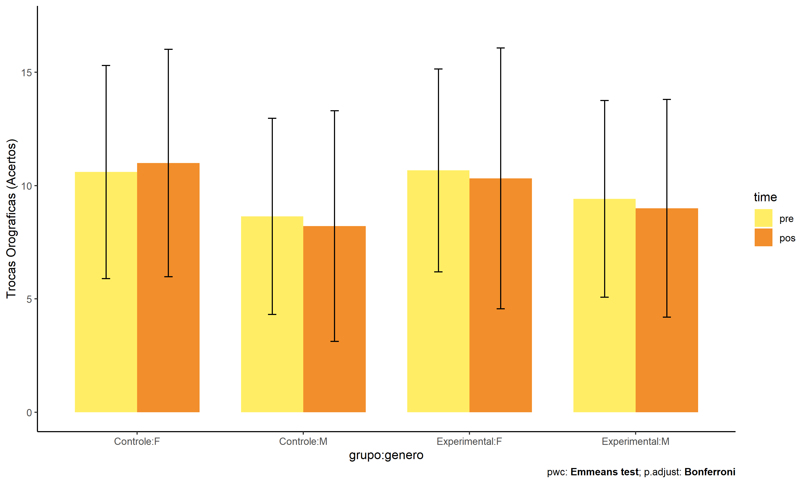<!-- -->

    ## Scale for colour is already present.
    ## Adding another scale for colour, which will replace the existing scale.

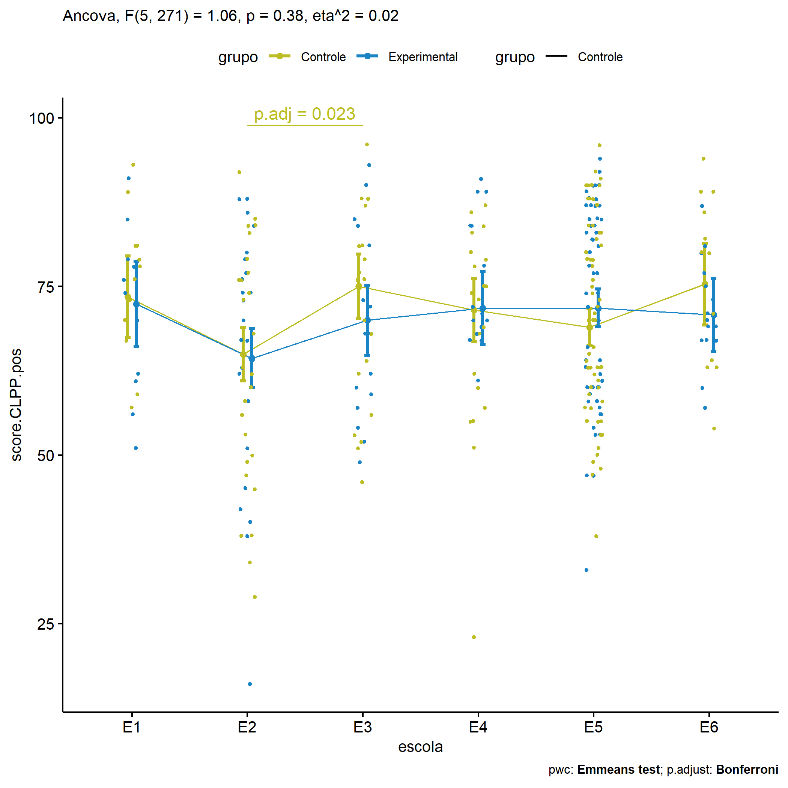<!-- -->

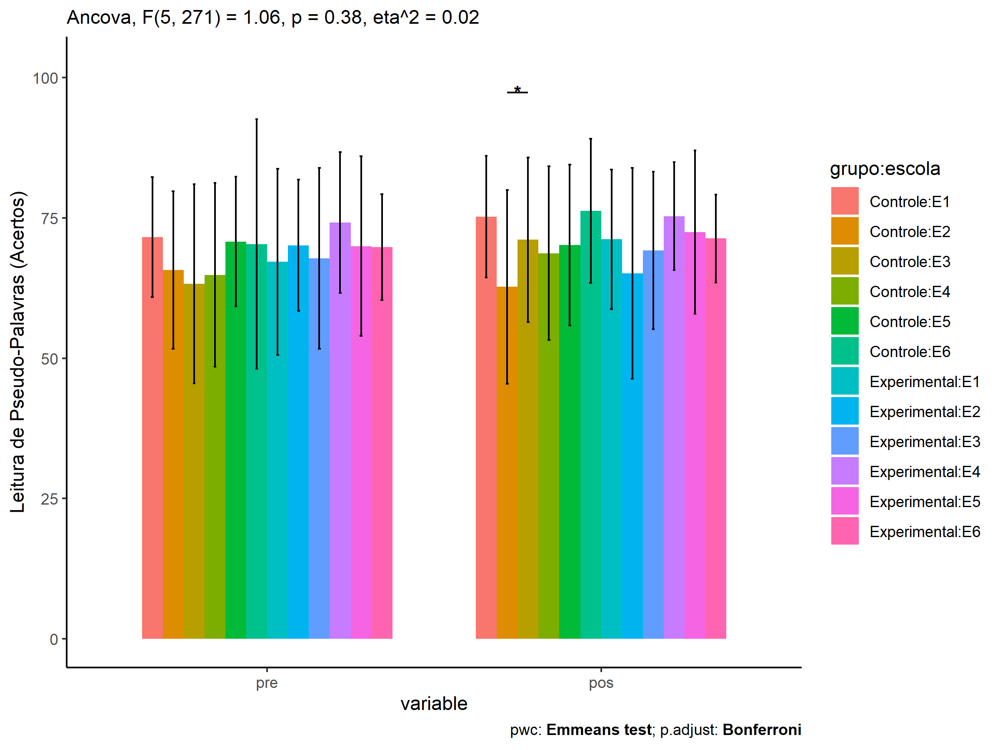<!-- -->

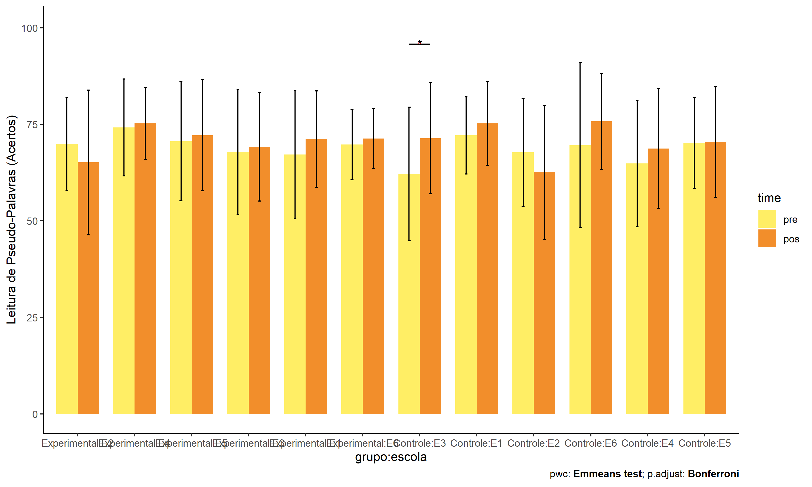<!-- -->

### Correta Regular (Acertos)

| var          | escola | grupo        |   n | M (pre) | SE (pre) | M (unadj) | SE (unadj) | M (adj) | SE (adj) |
|:-------------|:-------|:-------------|----:|--------:|---------:|----------:|-----------:|--------:|---------:|
| score.CR.pos | E1     | Controle     |  15 |  14.267 |    1.169 |    12.733 |      1.811 |  12.715 |    1.428 |
| score.CR.pos | E1     | Experimental |  13 |  12.462 |    1.824 |    13.077 |      1.741 |  13.749 |    1.539 |
| score.CR.pos | E2     | Controle     |  35 |  13.257 |    0.794 |    11.800 |      1.047 |  12.168 |    0.937 |
| score.CR.pos | E2     | Experimental |  31 |  15.000 |    0.743 |    10.516 |      1.306 |  10.218 |    0.995 |
| score.CR.pos | E3     | Controle     |  22 |  12.091 |    0.965 |    13.136 |      1.216 |  13.950 |    1.188 |
| score.CR.pos | E3     | Experimental |  16 |  13.812 |    1.042 |    14.562 |      0.851 |  14.718 |    1.383 |
| score.CR.pos | E4     | Controle     |  20 |  14.900 |    0.932 |    15.800 |      0.787 |  15.540 |    1.238 |
| score.CR.pos | E4     | Experimental |  16 |  15.750 |    1.230 |    16.625 |      0.386 |  16.040 |    1.387 |
| score.CR.pos | E5     | Controle     |  68 |  14.397 |    0.487 |    12.912 |      0.716 |  12.844 |    0.671 |
| score.CR.pos | E5     | Experimental |  64 |  14.219 |    0.609 |    13.203 |      0.721 |  13.204 |    0.692 |
| score.CR.pos | E6     | Controle     |  16 |  14.625 |    1.341 |    14.000 |      1.789 |  13.845 |    1.383 |
| score.CR.pos | E6     | Experimental |  16 |  16.000 |    0.619 |    15.812 |      1.198 |  15.132 |    1.388 |

| .y.          | grupo        | escola | group1   | group2       | estimate | conf.low | conf.high |    se | statistic | p       | p.adj | p.adj.signif |
|:-------------|:-------------|:-------|:---------|:-------------|---------:|---------:|----------:|------:|----------:|:--------|------:|:-------------|
| score.CR.pos | Controle     |        | E1       | E2           |    0.548 |   -2.814 |     3.909 | 1.709 |     0.321 | 0.749   | 1.000 | ns           |
| score.CR.pos | Controle     |        | E1       | E3           |   -1.234 |   -4.890 |     2.422 | 1.858 |    -0.664 | 0.507   | 1.000 | ns           |
| score.CR.pos | Controle     |        | E1       | E4           |   -2.825 |   -6.543 |     0.894 | 1.890 |    -1.495 | 0.136   | 1.000 | ns           |
| score.CR.pos | Controle     |        | E1       | E5           |   -0.129 |   -3.233 |     2.976 | 1.578 |    -0.082 | 0.935   | 1.000 | ns           |
| score.CR.pos | Controle     |        | E1       | E6           |   -1.130 |   -5.042 |     2.782 | 1.988 |    -0.568 | 0.57    | 1.000 | ns           |
| score.CR.pos | Controle     |        | E2       | E3           |   -1.782 |   -4.747 |     1.183 | 1.507 |    -1.182 | 0.238   | 1.000 | ns           |
| score.CR.pos | Controle     |        | E2       | E4           |   -3.372 |   -6.431 |    -0.314 | 1.555 |    -2.169 | 0.031   | 0.462 | ns           |
| score.CR.pos | Controle     |        | E2       | E5           |   -0.676 |   -2.946 |     1.593 | 1.153 |    -0.586 | 0.558   | 1.000 | ns           |
| score.CR.pos | Controle     |        | E2       | E6           |   -1.677 |   -4.967 |     1.612 | 1.672 |    -1.003 | 0.317   | 1.000 | ns           |
| score.CR.pos | Controle     |        | E3       | E4           |   -1.590 |   -4.974 |     1.793 | 1.720 |    -0.925 | 0.356   | 1.000 | ns           |
| score.CR.pos | Controle     |        | E3       | E5           |    1.106 |   -1.582 |     3.793 | 1.366 |     0.809 | 0.419   | 1.000 | ns           |
| score.CR.pos | Controle     |        | E3       | E6           |    0.104 |   -3.488 |     3.697 | 1.826 |     0.057 | 0.954   | 1.000 | ns           |
| score.CR.pos | Controle     |        | E4       | E5           |    2.696 |   -0.073 |     5.465 | 1.408 |     1.915 | 0.056   | 0.845 | ns           |
| score.CR.pos | Controle     |        | E4       | E6           |    1.695 |   -1.956 |     5.346 | 1.856 |     0.913 | 0.362   | 1.000 | ns           |
| score.CR.pos | Controle     |        | E5       | E6           |   -1.001 |   -4.026 |     2.023 | 1.537 |    -0.651 | 0.515   | 1.000 | ns           |
| score.CR.pos | Experimental |        | E1       | E2           |    3.531 |   -0.082 |     7.143 | 1.836 |     1.923 | 0.055   | 0.831 | ns           |
| score.CR.pos | Experimental |        | E1       | E3           |   -0.969 |   -5.037 |     3.099 | 2.068 |    -0.469 | 0.639   | 1.000 | ns           |
| score.CR.pos | Experimental |        | E1       | E4           |   -2.292 |   -6.380 |     1.796 | 2.078 |    -1.103 | 0.271   | 1.000 | ns           |
| score.CR.pos | Experimental |        | E1       | E5           |    0.545 |   -2.774 |     3.865 | 1.687 |     0.323 | 0.747   | 1.000 | ns           |
| score.CR.pos | Experimental |        | E1       | E6           |   -1.384 |   -5.475 |     2.708 | 2.080 |    -0.665 | 0.506   | 1.000 | ns           |
| score.CR.pos | Experimental |        | E2       | E3           |   -4.500 |   -7.854 |    -1.146 | 1.705 |    -2.640 | 0.009   | 0.131 | ns           |
| score.CR.pos | Experimental |        | E2       | E4           |   -5.822 |   -9.174 |    -2.470 | 1.704 |    -3.417 | \<0.001 | 0.011 | \*           |
| score.CR.pos | Experimental |        | E2       | E5           |   -2.985 |   -5.369 |    -0.602 | 1.212 |    -2.464 | 0.014   | 0.214 | ns           |
| score.CR.pos | Experimental |        | E2       | E6           |   -4.914 |   -8.267 |    -1.561 | 1.704 |    -2.884 | 0.004   | 0.063 | ns           |
| score.CR.pos | Experimental |        | E3       | E4           |   -1.322 |   -5.179 |     2.535 | 1.960 |    -0.675 | 0.5     | 1.000 | ns           |
| score.CR.pos | Experimental |        | E3       | E5           |    1.515 |   -1.528 |     4.557 | 1.547 |     0.979 | 0.328   | 1.000 | ns           |
| score.CR.pos | Experimental |        | E3       | E6           |   -0.414 |   -4.274 |     3.445 | 1.962 |    -0.211 | 0.833   | 1.000 | ns           |
| score.CR.pos | Experimental |        | E4       | E5           |    2.837 |   -0.212 |     5.886 | 1.550 |     1.830 | 0.068   | 1.000 | ns           |
| score.CR.pos | Experimental |        | E4       | E6           |    0.908 |   -2.940 |     4.756 | 1.956 |     0.464 | 0.643   | 1.000 | ns           |
| score.CR.pos | Experimental |        | E5       | E6           |   -1.929 |   -4.980 |     1.123 | 1.551 |    -1.244 | 0.215   | 1.000 | ns           |
| score.CR.pre | Controle     |        | E1       | E2           |    1.010 |   -1.738 |     3.757 | 1.397 |     0.723 | 0.47    | 1.000 | ns           |
| score.CR.pre | Controle     |        | E1       | E3           |    2.176 |   -0.805 |     5.157 | 1.515 |     1.436 | 0.152   | 1.000 | ns           |
| score.CR.pre | Controle     |        | E1       | E4           |   -0.633 |   -3.674 |     2.408 | 1.546 |    -0.410 | 0.682   | 1.000 | ns           |
| score.CR.pre | Controle     |        | E1       | E5           |   -0.130 |   -2.670 |     2.409 | 1.291 |    -0.101 | 0.92    | 1.000 | ns           |
| score.CR.pre | Controle     |        | E1       | E6           |   -0.358 |   -3.558 |     2.841 | 1.626 |    -0.220 | 0.826   | 1.000 | ns           |
| score.CR.pre | Controle     |        | E2       | E3           |    1.166 |   -1.256 |     3.589 | 1.231 |     0.947 | 0.344   | 1.000 | ns           |
| score.CR.pre | Controle     |        | E2       | E4           |   -1.643 |   -4.138 |     0.853 | 1.268 |    -1.295 | 0.196   | 1.000 | ns           |
| score.CR.pre | Controle     |        | E2       | E5           |   -1.140 |   -2.992 |     0.712 | 0.941 |    -1.211 | 0.227   | 1.000 | ns           |
| score.CR.pre | Controle     |        | E2       | E6           |   -1.368 |   -4.055 |     1.319 | 1.366 |    -1.002 | 0.317   | 1.000 | ns           |
| score.CR.pre | Controle     |        | E3       | E4           |   -2.809 |   -5.560 |    -0.058 | 1.398 |    -2.009 | 0.045   | 0.680 | ns           |
| score.CR.pre | Controle     |        | E3       | E5           |   -2.306 |   -4.490 |    -0.122 | 1.110 |    -2.078 | 0.039   | 0.578 | ns           |
| score.CR.pre | Controle     |        | E3       | E6           |   -2.534 |   -5.459 |     0.391 | 1.487 |    -1.704 | 0.089   | 1.000 | ns           |
| score.CR.pre | Controle     |        | E4       | E5           |    0.503 |   -1.762 |     2.768 | 1.151 |     0.437 | 0.662   | 1.000 | ns           |
| score.CR.pre | Controle     |        | E4       | E6           |    0.275 |   -2.711 |     3.261 | 1.518 |     0.181 | 0.856   | 1.000 | ns           |
| score.CR.pre | Controle     |        | E5       | E6           |   -0.228 |   -2.702 |     2.246 | 1.257 |    -0.181 | 0.856   | 1.000 | ns           |
| score.CR.pre | Experimental |        | E1       | E2           |   -2.538 |   -5.480 |     0.403 | 1.495 |    -1.698 | 0.091   | 1.000 | ns           |
| score.CR.pre | Experimental |        | E1       | E3           |   -1.351 |   -4.675 |     1.973 | 1.690 |    -0.800 | 0.425   | 1.000 | ns           |
| score.CR.pre | Experimental |        | E1       | E4           |   -3.288 |   -6.613 |     0.036 | 1.690 |    -1.946 | 0.053   | 0.788 | ns           |
| score.CR.pre | Experimental |        | E1       | E5           |   -1.757 |   -4.466 |     0.951 | 1.377 |    -1.276 | 0.203   | 1.000 | ns           |
| score.CR.pre | Experimental |        | E1       | E6           |   -3.538 |   -6.863 |    -0.214 | 1.690 |    -2.094 | 0.037   | 0.556 | ns           |
| score.CR.pre | Experimental |        | E2       | E3           |    1.188 |   -1.553 |     3.928 | 1.393 |     0.852 | 0.395   | 1.000 | ns           |
| score.CR.pre | Experimental |        | E2       | E4           |   -0.750 |   -3.491 |     1.991 | 1.393 |    -0.538 | 0.591   | 1.000 | ns           |
| score.CR.pre | Experimental |        | E2       | E5           |    0.781 |   -1.167 |     2.729 | 0.990 |     0.789 | 0.431   | 1.000 | ns           |
| score.CR.pre | Experimental |        | E2       | E6           |   -1.000 |   -3.741 |     1.741 | 1.393 |    -0.718 | 0.473   | 1.000 | ns           |
| score.CR.pre | Experimental |        | E3       | E4           |   -1.937 |   -5.085 |     1.210 | 1.600 |    -1.211 | 0.227   | 1.000 | ns           |
| score.CR.pre | Experimental |        | E3       | E5           |   -0.406 |   -2.895 |     2.082 | 1.265 |    -0.321 | 0.748   | 1.000 | ns           |
| score.CR.pre | Experimental |        | E3       | E6           |   -2.187 |   -5.335 |     0.960 | 1.600 |    -1.367 | 0.173   | 1.000 | ns           |
| score.CR.pre | Experimental |        | E4       | E5           |    1.531 |   -0.957 |     4.020 | 1.265 |     1.211 | 0.227   | 1.000 | ns           |
| score.CR.pre | Experimental |        | E4       | E6           |   -0.250 |   -3.398 |     2.898 | 1.600 |    -0.156 | 0.876   | 1.000 | ns           |
| score.CR.pre | Experimental |        | E5       | E6           |   -1.781 |   -4.270 |     0.707 | 1.265 |    -1.408 | 0.16    | 1.000 | ns           |
| score.CR.pos |              | E1     | Controle | Experimental |   -1.033 |   -5.165 |     3.098 | 2.100 |    -0.492 | 0.623   | 0.623 | ns           |
| score.CR.pos |              | E2     | Controle | Experimental |    1.950 |   -0.745 |     4.644 | 1.370 |     1.424 | 0.156   | 0.156 | ns           |
| score.CR.pos |              | E3     | Controle | Experimental |   -0.768 |   -4.352 |     2.815 | 1.821 |    -0.422 | 0.673   | 0.673 | ns           |
| score.CR.pos |              | E4     | Controle | Experimental |   -0.500 |   -4.153 |     3.152 | 1.856 |    -0.269 | 0.788   | 0.788 | ns           |
| score.CR.pos |              | E5     | Controle | Experimental |   -0.359 |   -2.255 |     1.536 | 0.964 |    -0.373 | 0.709   | 0.709 | ns           |
| score.CR.pos |              | E6     | Controle | Experimental |   -1.287 |   -5.140 |     2.565 | 1.958 |    -0.657 | 0.511   | 0.511 | ns           |
| score.CR.pre |              | E1     | Controle | Experimental |    1.805 |   -1.568 |     5.179 | 1.715 |     1.053 | 0.293   | 0.293 | ns           |
| score.CR.pre |              | E2     | Controle | Experimental |   -1.743 |   -3.939 |     0.453 | 1.116 |    -1.562 | 0.119   | 0.119 | ns           |
| score.CR.pre |              | E3     | Controle | Experimental |   -1.722 |   -4.647 |     1.204 | 1.487 |    -1.158 | 0.248   | 0.248 | ns           |
| score.CR.pre |              | E4     | Controle | Experimental |   -0.850 |   -3.836 |     2.136 | 1.518 |    -0.560 | 0.576   | 0.576 | ns           |
| score.CR.pre |              | E5     | Controle | Experimental |    0.178 |   -1.372 |     1.729 | 0.788 |     0.226 | 0.821   | 0.821 | ns           |
| score.CR.pre |              | E6     | Controle | Experimental |   -1.375 |   -4.523 |     1.773 | 1.600 |    -0.859 | 0.391   | 0.391 | ns           |

| grupo        | escola | group1 | group2 | estimate | conf.low | conf.high |    se | statistic | p       | p.adj   | p.adj.signif |
|:-------------|:-------|:-------|:-------|---------:|---------:|----------:|------:|----------:|:--------|:--------|:-------------|
| Controle     | E1     | pre    | pos    |    1.533 |   -2.192 |     5.258 | 1.897 |     0.808 | 0.419   | 0.419   | ns           |
| Controle     | E2     | pre    | pos    |    1.457 |   -0.981 |     3.896 | 1.242 |     1.173 | 0.241   | 0.241   | ns           |
| Controle     | E3     | pre    | pos    |   -1.045 |   -4.121 |     2.030 | 1.566 |    -0.667 | 0.505   | 0.505   | ns           |
| Controle     | E4     | pre    | pos    |   -0.900 |   -4.126 |     2.326 | 1.643 |    -0.548 | 0.584   | 0.584   | ns           |
| Controle     | E5     | pre    | pos    |    1.485 |   -0.264 |     3.235 | 0.891 |     1.667 | 0.096   | 0.096   | ns           |
| Controle     | E6     | pre    | pos    |    0.625 |   -2.982 |     4.232 | 1.837 |     0.340 | 0.734   | 0.734   | ns           |
| Experimental | E1     | pre    | pos    |   -0.615 |   -4.617 |     3.386 | 2.038 |    -0.302 | 0.763   | 0.763   | ns           |
| Experimental | E2     | pre    | pos    |    4.484 |    1.893 |     7.075 | 1.320 |     3.398 | \<0.001 | \<0.001 | \*\*\*       |
| Experimental | E3     | pre    | pos    |   -0.750 |   -4.357 |     2.857 | 1.837 |    -0.408 | 0.683   | 0.683   | ns           |
| Experimental | E4     | pre    | pos    |   -0.875 |   -4.482 |     2.732 | 1.837 |    -0.476 | 0.634   | 0.634   | ns           |
| Experimental | E5     | pre    | pos    |    1.016 |   -0.788 |     2.819 | 0.918 |     1.106 | 0.269   | 0.269   | ns           |
| Experimental | E6     | pre    | pos    |    0.188 |   -3.419 |     3.794 | 1.837 |     0.102 | 0.919   | 0.919   | ns           |

    ## Scale for colour is already present.
    ## Adding another scale for colour, which will replace the existing scale.

<!-- -->

    ## Scale for colour is already present.
    ## Adding another scale for colour, which will replace the existing scale.

<!-- -->

<!-- -->

<!-- -->

### Correta Irregular (Acertos)

| var          | escola | grupo        |   n | M (pre) | SE (pre) | M (unadj) | SE (unadj) | M (adj) | SE (adj) |
|:-------------|:-------|:-------------|----:|--------:|---------:|----------:|-----------:|--------:|---------:|
| score.CI.pos | E1     | Controle     |  15 |  11.467 |    1.125 |     9.933 |      1.563 |   9.850 |    1.224 |
| score.CI.pos | E1     | Experimental |  13 |  10.538 |    1.682 |    10.769 |      1.590 |  11.164 |    1.315 |
| score.CI.pos | E2     | Controle     |  35 |  11.057 |    0.718 |     8.886 |      0.895 |   9.013 |    0.801 |
| score.CI.pos | E2     | Experimental |  31 |  11.581 |    0.752 |     8.806 |      1.084 |   8.664 |    0.851 |
| score.CI.pos | E3     | Controle     |  22 |  10.000 |    0.971 |    11.364 |      1.110 |  12.035 |    1.014 |
| score.CI.pos | E3     | Experimental |  16 |  11.125 |    0.884 |    12.438 |      0.922 |  12.530 |    1.185 |
| score.CI.pos | E4     | Controle     |  20 |  11.750 |    0.836 |    12.400 |      0.825 |  12.170 |    1.060 |
| score.CI.pos | E4     | Experimental |  16 |  11.562 |    1.110 |    13.562 |      0.747 |  13.430 |    1.185 |
| score.CI.pos | E5     | Controle     |  68 |  11.456 |    0.491 |    10.176 |      0.649 |  10.098 |    0.575 |
| score.CI.pos | E5     | Experimental |  64 |  11.031 |    0.523 |    11.453 |      0.650 |  11.594 |    0.593 |
| score.CI.pos | E6     | Controle     |  16 |  11.688 |    1.303 |    12.188 |      1.610 |  11.990 |    1.185 |
| score.CI.pos | E6     | Experimental |  16 |  13.000 |    0.806 |    12.125 |      1.179 |  11.252 |    1.190 |

| .y.          | grupo        | escola | group1   | group2       | estimate | conf.low | conf.high |    se | statistic |     p | p.adj | p.adj.signif |
|:-------------|:-------------|:-------|:---------|:-------------|---------:|---------:|----------:|------:|----------:|------:|------:|:-------------|
| score.CI.pos | Controle     |        | E1       | E2           |    0.837 |   -2.042 |     3.715 | 1.463 |     0.572 | 0.568 | 1.000 | ns           |
| score.CI.pos | Controle     |        | E1       | E3           |   -2.185 |   -5.313 |     0.942 | 1.590 |    -1.375 | 0.170 | 1.000 | ns           |
| score.CI.pos | Controle     |        | E1       | E4           |   -2.321 |   -5.506 |     0.865 | 1.619 |    -1.433 | 0.153 | 1.000 | ns           |
| score.CI.pos | Controle     |        | E1       | E5           |   -0.249 |   -2.909 |     2.411 | 1.352 |    -0.184 | 0.854 | 1.000 | ns           |
| score.CI.pos | Controle     |        | E1       | E6           |   -2.140 |   -5.492 |     1.211 | 1.704 |    -1.256 | 0.210 | 1.000 | ns           |
| score.CI.pos | Controle     |        | E2       | E3           |   -3.022 |   -5.563 |    -0.482 | 1.291 |    -2.341 | 0.020 | 0.298 | ns           |
| score.CI.pos | Controle     |        | E2       | E4           |   -3.158 |   -5.773 |    -0.542 | 1.329 |    -2.375 | 0.018 | 0.272 | ns           |
| score.CI.pos | Controle     |        | E2       | E5           |   -1.085 |   -3.026 |     0.855 | 0.986 |    -1.100 | 0.272 | 1.000 | ns           |
| score.CI.pos | Controle     |        | E2       | E6           |   -2.977 |   -5.792 |    -0.162 | 1.431 |    -2.081 | 0.038 | 0.574 | ns           |
| score.CI.pos | Controle     |        | E3       | E4           |   -0.135 |   -3.024 |     2.754 | 1.468 |    -0.092 | 0.927 | 1.000 | ns           |
| score.CI.pos | Controle     |        | E3       | E5           |    1.937 |   -0.357 |     4.231 | 1.166 |     1.661 | 0.098 | 1.000 | ns           |
| score.CI.pos | Controle     |        | E3       | E6           |    0.045 |   -3.026 |     3.116 | 1.561 |     0.029 | 0.977 | 1.000 | ns           |
| score.CI.pos | Controle     |        | E4       | E5           |    2.072 |   -0.300 |     4.444 | 1.206 |     1.718 | 0.087 | 1.000 | ns           |
| score.CI.pos | Controle     |        | E4       | E6           |    0.180 |   -2.947 |     3.308 | 1.590 |     0.113 | 0.910 | 1.000 | ns           |
| score.CI.pos | Controle     |        | E5       | E6           |   -1.892 |   -4.483 |     0.699 | 1.317 |    -1.436 | 0.152 | 1.000 | ns           |
| score.CI.pos | Experimental |        | E1       | E2           |    2.499 |   -0.585 |     5.583 | 1.568 |     1.595 | 0.112 | 1.000 | ns           |
| score.CI.pos | Experimental |        | E1       | E3           |   -1.366 |   -4.849 |     2.116 | 1.770 |    -0.772 | 0.441 | 1.000 | ns           |
| score.CI.pos | Experimental |        | E1       | E4           |   -2.266 |   -5.750 |     1.218 | 1.771 |    -1.280 | 0.202 | 1.000 | ns           |
| score.CI.pos | Experimental |        | E1       | E5           |   -0.430 |   -3.268 |     2.407 | 1.442 |    -0.298 | 0.766 | 1.000 | ns           |
| score.CI.pos | Experimental |        | E1       | E6           |   -0.088 |   -3.583 |     3.407 | 1.776 |    -0.050 | 0.960 | 1.000 | ns           |
| score.CI.pos | Experimental |        | E2       | E3           |   -3.866 |   -6.737 |    -0.995 | 1.459 |    -2.649 | 0.008 | 0.127 | ns           |
| score.CI.pos | Experimental |        | E2       | E4           |   -4.765 |   -7.636 |    -1.895 | 1.459 |    -3.266 | 0.001 | 0.018 | \*           |
| score.CI.pos | Experimental |        | E2       | E5           |   -2.930 |   -4.971 |    -0.888 | 1.038 |    -2.823 | 0.005 | 0.076 | ns           |
| score.CI.pos | Experimental |        | E2       | E6           |   -2.588 |   -5.464 |     0.288 | 1.462 |    -1.770 | 0.078 | 1.000 | ns           |
| score.CI.pos | Experimental |        | E3       | E4           |   -0.900 |   -4.197 |     2.398 | 1.676 |    -0.537 | 0.592 | 1.000 | ns           |
| score.CI.pos | Experimental |        | E3       | E5           |    0.936 |   -1.670 |     3.543 | 1.325 |     0.707 | 0.480 | 1.000 | ns           |
| score.CI.pos | Experimental |        | E3       | E6           |    1.278 |   -2.027 |     4.583 | 1.680 |     0.761 | 0.447 | 1.000 | ns           |
| score.CI.pos | Experimental |        | E4       | E5           |    1.836 |   -0.771 |     4.443 | 1.325 |     1.385 | 0.167 | 1.000 | ns           |
| score.CI.pos | Experimental |        | E4       | E6           |    2.178 |   -1.124 |     5.479 | 1.678 |     1.298 | 0.195 | 1.000 | ns           |
| score.CI.pos | Experimental |        | E5       | E6           |    0.342 |   -2.276 |     2.959 | 1.330 |     0.257 | 0.797 | 1.000 | ns           |
| score.CI.pre | Controle     |        | E1       | E2           |    0.410 |   -2.174 |     2.994 | 1.313 |     0.312 | 0.755 | 1.000 | ns           |
| score.CI.pre | Controle     |        | E1       | E3           |    1.467 |   -1.337 |     4.270 | 1.425 |     1.029 | 0.304 | 1.000 | ns           |
| score.CI.pre | Controle     |        | E1       | E4           |   -0.283 |   -3.143 |     2.577 | 1.454 |    -0.195 | 0.846 | 1.000 | ns           |
| score.CI.pre | Controle     |        | E1       | E5           |    0.011 |   -2.378 |     2.399 | 1.214 |     0.009 | 0.993 | 1.000 | ns           |
| score.CI.pre | Controle     |        | E1       | E6           |   -0.221 |   -3.230 |     2.788 | 1.530 |    -0.144 | 0.885 | 1.000 | ns           |
| score.CI.pre | Controle     |        | E2       | E3           |    1.057 |   -1.221 |     3.335 | 1.158 |     0.913 | 0.362 | 1.000 | ns           |
| score.CI.pre | Controle     |        | E2       | E4           |   -0.693 |   -3.040 |     1.654 | 1.193 |    -0.581 | 0.562 | 1.000 | ns           |
| score.CI.pre | Controle     |        | E2       | E5           |   -0.399 |   -2.141 |     1.343 | 0.885 |    -0.450 | 0.653 | 1.000 | ns           |
| score.CI.pre | Controle     |        | E2       | E6           |   -0.630 |   -3.157 |     1.896 | 1.284 |    -0.491 | 0.624 | 1.000 | ns           |
| score.CI.pre | Controle     |        | E3       | E4           |   -1.750 |   -4.337 |     0.837 | 1.315 |    -1.331 | 0.184 | 1.000 | ns           |
| score.CI.pre | Controle     |        | E3       | E5           |   -1.456 |   -3.510 |     0.598 | 1.044 |    -1.395 | 0.164 | 1.000 | ns           |
| score.CI.pre | Controle     |        | E3       | E6           |   -1.687 |   -4.439 |     1.064 | 1.398 |    -1.207 | 0.228 | 1.000 | ns           |
| score.CI.pre | Controle     |        | E4       | E5           |    0.294 |   -1.836 |     2.424 | 1.083 |     0.272 | 0.786 | 1.000 | ns           |
| score.CI.pre | Controle     |        | E4       | E6           |    0.063 |   -2.746 |     2.871 | 1.427 |     0.044 | 0.965 | 1.000 | ns           |
| score.CI.pre | Controle     |        | E5       | E6           |   -0.232 |   -2.558 |     2.095 | 1.183 |    -0.196 | 0.845 | 1.000 | ns           |
| score.CI.pre | Experimental |        | E1       | E2           |   -1.042 |   -3.809 |     1.725 | 1.406 |    -0.741 | 0.459 | 1.000 | ns           |
| score.CI.pre | Experimental |        | E1       | E3           |   -0.587 |   -3.713 |     2.540 | 1.589 |    -0.369 | 0.712 | 1.000 | ns           |
| score.CI.pre | Experimental |        | E1       | E4           |   -1.024 |   -4.151 |     2.102 | 1.589 |    -0.644 | 0.520 | 1.000 | ns           |
| score.CI.pre | Experimental |        | E1       | E5           |   -0.493 |   -3.040 |     2.054 | 1.295 |    -0.381 | 0.704 | 1.000 | ns           |
| score.CI.pre | Experimental |        | E1       | E6           |   -2.462 |   -5.588 |     0.665 | 1.589 |    -1.549 | 0.122 | 1.000 | ns           |
| score.CI.pre | Experimental |        | E2       | E3           |    0.456 |   -2.122 |     3.033 | 1.310 |     0.348 | 0.728 | 1.000 | ns           |
| score.CI.pre | Experimental |        | E2       | E4           |    0.018 |   -2.559 |     2.596 | 1.310 |     0.014 | 0.989 | 1.000 | ns           |
| score.CI.pre | Experimental |        | E2       | E5           |    0.549 |   -1.283 |     2.382 | 0.931 |     0.590 | 0.556 | 1.000 | ns           |
| score.CI.pre | Experimental |        | E2       | E6           |   -1.419 |   -3.997 |     1.158 | 1.310 |    -1.083 | 0.279 | 1.000 | ns           |
| score.CI.pre | Experimental |        | E3       | E4           |   -0.437 |   -3.398 |     2.523 | 1.505 |    -0.291 | 0.771 | 1.000 | ns           |
| score.CI.pre | Experimental |        | E3       | E5           |    0.094 |   -2.247 |     2.434 | 1.190 |     0.079 | 0.937 | 1.000 | ns           |
| score.CI.pre | Experimental |        | E3       | E6           |   -1.875 |   -4.835 |     1.085 | 1.505 |    -1.246 | 0.214 | 1.000 | ns           |
| score.CI.pre | Experimental |        | E4       | E5           |    0.531 |   -1.809 |     2.872 | 1.190 |     0.447 | 0.655 | 1.000 | ns           |
| score.CI.pre | Experimental |        | E4       | E6           |   -1.438 |   -4.398 |     1.523 | 1.505 |    -0.955 | 0.340 | 1.000 | ns           |
| score.CI.pre | Experimental |        | E5       | E6           |   -1.969 |   -4.309 |     0.372 | 1.190 |    -1.655 | 0.099 | 1.000 | ns           |
| score.CI.pos |              | E1     | Controle | Experimental |   -1.314 |   -4.849 |     2.222 | 1.797 |    -0.731 | 0.465 | 0.465 | ns           |
| score.CI.pos |              | E2     | Controle | Experimental |    0.349 |   -1.952 |     2.650 | 1.169 |     0.298 | 0.766 | 0.766 | ns           |
| score.CI.pos |              | E3     | Controle | Experimental |   -0.495 |   -3.562 |     2.572 | 1.559 |    -0.317 | 0.751 | 0.751 | ns           |
| score.CI.pos |              | E4     | Controle | Experimental |   -1.259 |   -4.387 |     1.869 | 1.590 |    -0.792 | 0.429 | 0.429 | ns           |
| score.CI.pos |              | E5     | Controle | Experimental |   -1.495 |   -3.120 |     0.130 | 0.826 |    -1.811 | 0.071 | 0.071 | ns           |
| score.CI.pos |              | E6     | Controle | Experimental |    0.738 |   -2.563 |     4.039 | 1.678 |     0.440 | 0.660 | 0.660 | ns           |
| score.CI.pre |              | E1     | Controle | Experimental |    0.928 |   -2.245 |     4.101 | 1.613 |     0.576 | 0.565 | 0.565 | ns           |
| score.CI.pre |              | E2     | Controle | Experimental |   -0.524 |   -2.589 |     1.542 | 1.050 |    -0.499 | 0.618 | 0.618 | ns           |
| score.CI.pre |              | E3     | Controle | Experimental |   -1.125 |   -3.876 |     1.626 | 1.398 |    -0.805 | 0.422 | 0.422 | ns           |
| score.CI.pre |              | E4     | Controle | Experimental |    0.187 |   -2.621 |     2.996 | 1.427 |     0.131 | 0.896 | 0.896 | ns           |
| score.CI.pre |              | E5     | Controle | Experimental |    0.425 |   -1.034 |     1.883 | 0.741 |     0.573 | 0.567 | 0.567 | ns           |
| score.CI.pre |              | E6     | Controle | Experimental |   -1.312 |   -4.273 |     1.648 | 1.505 |    -0.872 | 0.384 | 0.384 | ns           |

| grupo        | escola | group1 | group2 | estimate | conf.low | conf.high |    se | statistic |     p | p.adj | p.adj.signif |
|:-------------|:-------|:-------|:-------|---------:|---------:|----------:|------:|----------:|------:|------:|:-------------|
| Controle     | E1     | pre    | pos    |    1.533 |   -1.880 |     4.946 | 1.738 |     0.882 | 0.378 | 0.378 | ns           |
| Controle     | E2     | pre    | pos    |    2.171 |   -0.063 |     4.406 | 1.138 |     1.908 | 0.057 | 0.057 | ns           |
| Controle     | E3     | pre    | pos    |   -1.364 |   -4.182 |     1.454 | 1.435 |    -0.950 | 0.342 | 0.342 | ns           |
| Controle     | E4     | pre    | pos    |   -0.650 |   -3.606 |     2.306 | 1.505 |    -0.432 | 0.666 | 0.666 | ns           |
| Controle     | E5     | pre    | pos    |    1.279 |   -0.324 |     2.882 | 0.816 |     1.567 | 0.118 | 0.118 | ns           |
| Controle     | E6     | pre    | pos    |   -0.500 |   -3.805 |     2.805 | 1.683 |    -0.297 | 0.766 | 0.766 | ns           |
| Experimental | E1     | pre    | pos    |   -0.231 |   -3.897 |     3.435 | 1.867 |    -0.124 | 0.902 | 0.902 | ns           |
| Experimental | E2     | pre    | pos    |    2.774 |    0.400 |     5.148 | 1.209 |     2.295 | 0.022 | 0.022 | \*           |
| Experimental | E3     | pre    | pos    |   -1.313 |   -4.617 |     1.992 | 1.683 |    -0.780 | 0.436 | 0.436 | ns           |
| Experimental | E4     | pre    | pos    |   -2.000 |   -5.305 |     1.305 | 1.683 |    -1.188 | 0.235 | 0.235 | ns           |
| Experimental | E5     | pre    | pos    |   -0.422 |   -2.074 |     1.230 | 0.841 |    -0.501 | 0.616 | 0.616 | ns           |
| Experimental | E6     | pre    | pos    |    0.875 |   -2.430 |     4.180 | 1.683 |     0.520 | 0.603 | 0.603 | ns           |

    ## Scale for colour is already present.
    ## Adding another scale for colour, which will replace the existing scale.

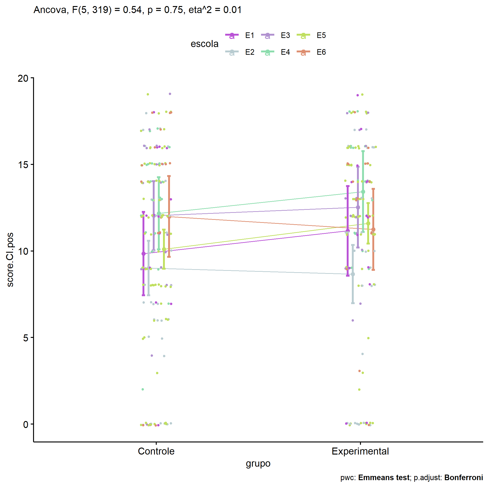<!-- -->

    ## Scale for colour is already present.
    ## Adding another scale for colour, which will replace the existing scale.

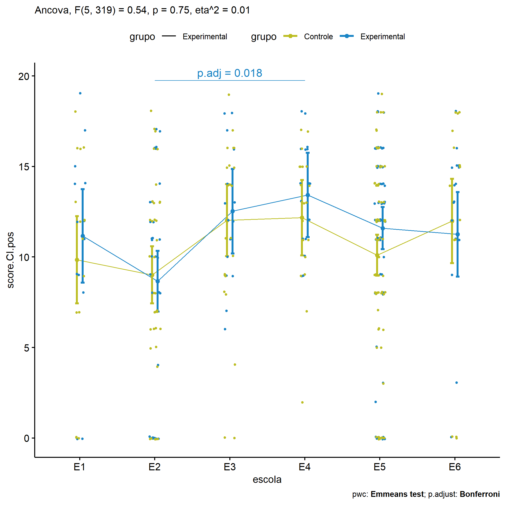<!-- -->

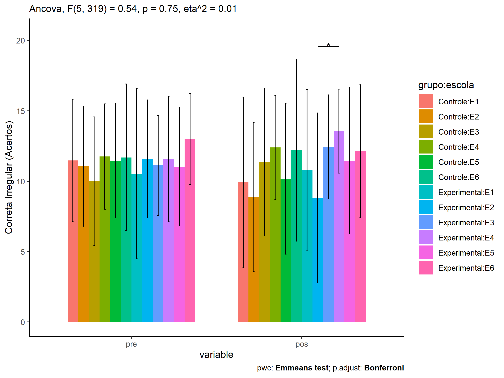<!-- -->

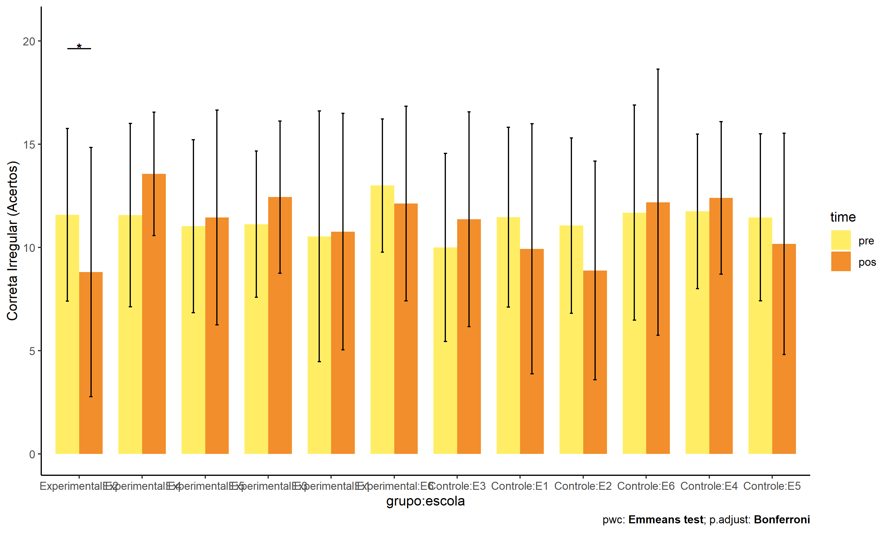<!-- -->

### Trocas Visuais (Acertos)

| var          | escola | grupo        |   n | M (pre) | SE (pre) | M (unadj) | SE (unadj) | M (adj) | SE (adj) |
|:-------------|:-------|:-------------|----:|--------:|---------:|----------:|-----------:|--------:|---------:|
| score.TV.pos | E1     | Controle     |  15 |  16.667 |    1.308 |    14.733 |      2.025 |  14.431 |    1.545 |
| score.TV.pos | E1     | Experimental |  13 |  13.231 |    2.187 |    13.692 |      2.046 |  14.800 |    1.669 |
| score.TV.pos | E2     | Controle     |  35 |  15.486 |    0.908 |    12.657 |      1.176 |  12.840 |    1.012 |
| score.TV.pos | E2     | Experimental |  31 |  16.871 |    0.755 |    11.645 |      1.473 |  11.260 |    1.076 |
| score.TV.pos | E3     | Controle     |  22 |  14.545 |    1.130 |    15.864 |      1.238 |  16.432 |    1.279 |
| score.TV.pos | E3     | Experimental |  16 |  16.812 |    1.137 |    16.375 |      0.939 |  16.013 |    1.497 |
| score.TV.pos | E4     | Controle     |  20 |  15.850 |    1.027 |    16.350 |      0.776 |  16.383 |    1.338 |
| score.TV.pos | E4     | Experimental |  16 |  16.062 |    1.410 |    17.375 |      0.612 |  17.321 |    1.496 |
| score.TV.pos | E5     | Controle     |  68 |  16.103 |    0.543 |    14.662 |      0.782 |  14.591 |    0.726 |
| score.TV.pos | E5     | Experimental |  64 |  16.281 |    0.610 |    14.906 |      0.763 |  14.762 |    0.748 |
| score.TV.pos | E6     | Controle     |  16 |  15.062 |    1.632 |    13.688 |      1.899 |  14.044 |    1.497 |
| score.TV.pos | E6     | Experimental |  16 |  16.312 |    0.700 |    16.312 |      1.196 |  16.156 |    1.496 |

| .y.          | grupo        | escola | group1   | group2       | estimate | conf.low | conf.high |    se | statistic |     p | p.adj | p.adj.signif |
|:-------------|:-------------|:-------|:---------|:-------------|---------:|---------:|----------:|------:|----------:|------:|------:|:-------------|
| score.TV.pos | Controle     |        | E1       | E2           |    1.592 |   -2.044 |     5.227 | 1.848 |     0.861 | 0.390 | 1.000 | ns           |
| score.TV.pos | Controle     |        | E1       | E3           |   -2.000 |   -5.951 |     1.951 | 2.008 |    -0.996 | 0.320 | 1.000 | ns           |
| score.TV.pos | Controle     |        | E1       | E4           |   -1.952 |   -5.973 |     2.070 | 2.044 |    -0.955 | 0.340 | 1.000 | ns           |
| score.TV.pos | Controle     |        | E1       | E5           |   -0.160 |   -3.518 |     3.199 | 1.707 |    -0.094 | 0.926 | 1.000 | ns           |
| score.TV.pos | Controle     |        | E1       | E6           |    0.388 |   -3.847 |     4.623 | 2.153 |     0.180 | 0.857 | 1.000 | ns           |
| score.TV.pos | Controle     |        | E2       | E3           |   -3.592 |   -6.797 |    -0.387 | 1.629 |    -2.205 | 0.028 | 0.422 | ns           |
| score.TV.pos | Controle     |        | E2       | E4           |   -3.543 |   -6.843 |    -0.244 | 1.677 |    -2.113 | 0.035 | 0.531 | ns           |
| score.TV.pos | Controle     |        | E2       | E5           |   -1.751 |   -4.201 |     0.698 | 1.245 |    -1.407 | 0.161 | 1.000 | ns           |
| score.TV.pos | Controle     |        | E2       | E6           |   -1.204 |   -4.756 |     2.348 | 1.806 |    -0.667 | 0.505 | 1.000 | ns           |
| score.TV.pos | Controle     |        | E3       | E4           |    0.049 |   -3.592 |     3.689 | 1.850 |     0.026 | 0.979 | 1.000 | ns           |
| score.TV.pos | Controle     |        | E3       | E5           |    1.841 |   -1.053 |     4.735 | 1.471 |     1.251 | 0.212 | 1.000 | ns           |
| score.TV.pos | Controle     |        | E3       | E6           |    2.388 |   -1.480 |     6.256 | 1.966 |     1.215 | 0.225 | 1.000 | ns           |
| score.TV.pos | Controle     |        | E4       | E5           |    1.792 |   -1.202 |     4.786 | 1.522 |     1.178 | 0.240 | 1.000 | ns           |
| score.TV.pos | Controle     |        | E4       | E6           |    2.340 |   -1.610 |     6.289 | 2.007 |     1.166 | 0.245 | 1.000 | ns           |
| score.TV.pos | Controle     |        | E5       | E6           |    0.548 |   -2.726 |     3.821 | 1.664 |     0.329 | 0.742 | 1.000 | ns           |
| score.TV.pos | Experimental |        | E1       | E2           |    3.540 |   -0.378 |     7.459 | 1.992 |     1.778 | 0.076 | 1.000 | ns           |
| score.TV.pos | Experimental |        | E1       | E3           |   -1.214 |   -5.634 |     3.206 | 2.247 |    -0.540 | 0.589 | 1.000 | ns           |
| score.TV.pos | Experimental |        | E1       | E4           |   -2.521 |   -6.932 |     1.889 | 2.242 |    -1.125 | 0.262 | 1.000 | ns           |
| score.TV.pos | Experimental |        | E1       | E5           |    0.037 |   -3.566 |     3.640 | 1.831 |     0.020 | 0.984 | 1.000 | ns           |
| score.TV.pos | Experimental |        | E1       | E6           |   -1.356 |   -5.770 |     3.057 | 2.243 |    -0.605 | 0.546 | 1.000 | ns           |
| score.TV.pos | Experimental |        | E2       | E3           |   -4.754 |   -8.377 |    -1.131 | 1.842 |    -2.581 | 0.010 | 0.154 | ns           |
| score.TV.pos | Experimental |        | E2       | E4           |   -6.061 |   -9.686 |    -2.437 | 1.842 |    -3.290 | 0.001 | 0.017 | \*           |
| score.TV.pos | Experimental |        | E2       | E5           |   -3.503 |   -6.080 |    -0.926 | 1.310 |    -2.675 | 0.008 | 0.118 | ns           |
| score.TV.pos | Experimental |        | E2       | E6           |   -4.896 |   -8.520 |    -1.273 | 1.842 |    -2.658 | 0.008 | 0.124 | ns           |
| score.TV.pos | Experimental |        | E3       | E4           |   -1.308 |   -5.470 |     2.855 | 2.116 |    -0.618 | 0.537 | 1.000 | ns           |
| score.TV.pos | Experimental |        | E3       | E5           |    1.251 |   -2.040 |     4.541 | 1.672 |     0.748 | 0.455 | 1.000 | ns           |
| score.TV.pos | Experimental |        | E3       | E6           |   -0.143 |   -4.304 |     4.019 | 2.115 |    -0.067 | 0.946 | 1.000 | ns           |
| score.TV.pos | Experimental |        | E4       | E5           |    2.558 |   -0.731 |     5.848 | 1.672 |     1.530 | 0.127 | 1.000 | ns           |
| score.TV.pos | Experimental |        | E4       | E6           |    1.165 |   -2.996 |     5.326 | 2.115 |     0.551 | 0.582 | 1.000 | ns           |
| score.TV.pos | Experimental |        | E5       | E6           |   -1.393 |   -4.683 |     1.896 | 1.672 |    -0.833 | 0.405 | 1.000 | ns           |
| score.TV.pre | Controle     |        | E1       | E2           |    1.181 |   -1.853 |     4.215 | 1.542 |     0.766 | 0.444 | 1.000 | ns           |
| score.TV.pre | Controle     |        | E1       | E3           |    2.121 |   -1.171 |     5.414 | 1.673 |     1.268 | 0.206 | 1.000 | ns           |
| score.TV.pre | Controle     |        | E1       | E4           |    0.817 |   -2.542 |     4.175 | 1.707 |     0.478 | 0.633 | 1.000 | ns           |
| score.TV.pre | Controle     |        | E1       | E5           |    0.564 |   -2.241 |     3.369 | 1.426 |     0.395 | 0.693 | 1.000 | ns           |
| score.TV.pre | Controle     |        | E1       | E6           |    1.604 |   -1.930 |     5.138 | 1.796 |     0.893 | 0.372 | 1.000 | ns           |
| score.TV.pre | Controle     |        | E2       | E3           |    0.940 |   -1.735 |     3.615 | 1.360 |     0.691 | 0.490 | 1.000 | ns           |
| score.TV.pre | Controle     |        | E2       | E4           |   -0.364 |   -3.120 |     2.392 | 1.401 |    -0.260 | 0.795 | 1.000 | ns           |
| score.TV.pre | Controle     |        | E2       | E5           |   -0.617 |   -2.663 |     1.428 | 1.040 |    -0.594 | 0.553 | 1.000 | ns           |
| score.TV.pre | Controle     |        | E2       | E6           |    0.423 |   -2.544 |     3.391 | 1.508 |     0.281 | 0.779 | 1.000 | ns           |
| score.TV.pre | Controle     |        | E3       | E4           |   -1.305 |   -4.342 |     1.733 | 1.544 |    -0.845 | 0.399 | 1.000 | ns           |
| score.TV.pre | Controle     |        | E3       | E5           |   -1.557 |   -3.969 |     0.854 | 1.226 |    -1.271 | 0.205 | 1.000 | ns           |
| score.TV.pre | Controle     |        | E3       | E6           |   -0.517 |   -3.748 |     2.714 | 1.642 |    -0.315 | 0.753 | 1.000 | ns           |
| score.TV.pre | Controle     |        | E4       | E5           |   -0.253 |   -2.754 |     2.248 | 1.271 |    -0.199 | 0.842 | 1.000 | ns           |
| score.TV.pre | Controle     |        | E4       | E6           |    0.787 |   -2.510 |     4.085 | 1.676 |     0.470 | 0.639 | 1.000 | ns           |
| score.TV.pre | Controle     |        | E5       | E6           |    1.040 |   -1.692 |     3.773 | 1.389 |     0.749 | 0.454 | 1.000 | ns           |
| score.TV.pre | Experimental |        | E1       | E2           |   -3.640 |   -6.889 |    -0.391 | 1.651 |    -2.204 | 0.028 | 0.423 | ns           |
| score.TV.pre | Experimental |        | E1       | E3           |   -3.582 |   -7.253 |     0.090 | 1.866 |    -1.919 | 0.056 | 0.837 | ns           |
| score.TV.pre | Experimental |        | E1       | E4           |   -2.832 |   -6.503 |     0.840 | 1.866 |    -1.517 | 0.130 | 1.000 | ns           |
| score.TV.pre | Experimental |        | E1       | E5           |   -3.050 |   -6.042 |    -0.059 | 1.520 |    -2.006 | 0.046 | 0.685 | ns           |
| score.TV.pre | Experimental |        | E1       | E6           |   -3.082 |   -6.753 |     0.590 | 1.866 |    -1.651 | 0.100 | 1.000 | ns           |
| score.TV.pre | Experimental |        | E2       | E3           |    0.058 |   -2.968 |     3.085 | 1.538 |     0.038 | 0.970 | 1.000 | ns           |
| score.TV.pre | Experimental |        | E2       | E4           |    0.808 |   -2.218 |     3.835 | 1.538 |     0.526 | 0.600 | 1.000 | ns           |
| score.TV.pre | Experimental |        | E2       | E5           |    0.590 |   -1.562 |     2.741 | 1.094 |     0.539 | 0.590 | 1.000 | ns           |
| score.TV.pre | Experimental |        | E2       | E6           |    0.558 |   -2.468 |     3.585 | 1.538 |     0.363 | 0.717 | 1.000 | ns           |
| score.TV.pre | Experimental |        | E3       | E4           |    0.750 |   -2.726 |     4.226 | 1.767 |     0.424 | 0.672 | 1.000 | ns           |
| score.TV.pre | Experimental |        | E3       | E5           |    0.531 |   -2.217 |     3.280 | 1.397 |     0.380 | 0.704 | 1.000 | ns           |
| score.TV.pre | Experimental |        | E3       | E6           |    0.500 |   -2.976 |     3.976 | 1.767 |     0.283 | 0.777 | 1.000 | ns           |
| score.TV.pre | Experimental |        | E4       | E5           |   -0.219 |   -2.967 |     2.530 | 1.397 |    -0.157 | 0.876 | 1.000 | ns           |
| score.TV.pre | Experimental |        | E4       | E6           |   -0.250 |   -3.726 |     3.226 | 1.767 |    -0.141 | 0.888 | 1.000 | ns           |
| score.TV.pre | Experimental |        | E5       | E6           |   -0.031 |   -2.780 |     2.717 | 1.397 |    -0.022 | 0.982 | 1.000 | ns           |
| score.TV.pos |              | E1     | Controle | Experimental |   -0.368 |   -4.851 |     4.115 | 2.279 |    -0.162 | 0.872 | 0.872 | ns           |
| score.TV.pos |              | E2     | Controle | Experimental |    1.580 |   -1.328 |     4.489 | 1.478 |     1.069 | 0.286 | 0.286 | ns           |
| score.TV.pos |              | E3     | Controle | Experimental |    0.418 |   -3.460 |     4.297 | 1.971 |     0.212 | 0.832 | 0.832 | ns           |
| score.TV.pos |              | E4     | Controle | Experimental |   -0.938 |   -4.886 |     3.010 | 2.007 |    -0.467 | 0.641 | 0.641 | ns           |
| score.TV.pos |              | E5     | Controle | Experimental |   -0.171 |   -2.221 |     1.879 | 1.042 |    -0.164 | 0.869 | 0.869 | ns           |
| score.TV.pos |              | E6     | Controle | Experimental |   -2.112 |   -6.277 |     2.052 | 2.117 |    -0.998 | 0.319 | 0.319 | ns           |
| score.TV.pre |              | E1     | Controle | Experimental |    3.436 |   -0.290 |     7.162 | 1.894 |     1.814 | 0.071 | 0.071 | ns           |
| score.TV.pre |              | E2     | Controle | Experimental |   -1.385 |   -3.810 |     1.040 | 1.233 |    -1.124 | 0.262 | 0.262 | ns           |
| score.TV.pre |              | E3     | Controle | Experimental |   -2.267 |   -5.498 |     0.964 | 1.642 |    -1.381 | 0.168 | 0.168 | ns           |
| score.TV.pre |              | E4     | Controle | Experimental |   -0.212 |   -3.510 |     3.085 | 1.676 |    -0.127 | 0.899 | 0.899 | ns           |
| score.TV.pre |              | E5     | Controle | Experimental |   -0.178 |   -1.891 |     1.534 | 0.870 |    -0.205 | 0.838 | 0.838 | ns           |
| score.TV.pre |              | E6     | Controle | Experimental |   -1.250 |   -4.726 |     2.226 | 1.767 |    -0.707 | 0.480 | 0.480 | ns           |

| grupo        | escola | group1 | group2 | estimate | conf.low | conf.high |    se | statistic | p       | p.adj   | p.adj.signif |
|:-------------|:-------|:-------|:-------|---------:|---------:|----------:|------:|----------:|:--------|:--------|:-------------|
| Controle     | E1     | pre    | pos    |    1.933 |   -2.150 |     6.017 | 2.079 |     0.930 | 0.353   | 0.353   | ns           |
| Controle     | E2     | pre    | pos    |    2.829 |    0.156 |     5.502 | 1.361 |     2.078 | 0.038   | 0.038   | \*           |
| Controle     | E3     | pre    | pos    |   -1.318 |   -4.690 |     2.053 | 1.717 |    -0.768 | 0.443   | 0.443   | ns           |
| Controle     | E4     | pre    | pos    |   -0.500 |   -4.036 |     3.036 | 1.801 |    -0.278 | 0.781   | 0.781   | ns           |
| Controle     | E5     | pre    | pos    |    1.441 |   -0.477 |     3.359 | 0.977 |     1.476 | 0.141   | 0.141   | ns           |
| Controle     | E6     | pre    | pos    |    1.375 |   -2.579 |     5.329 | 2.013 |     0.683 | 0.495   | 0.495   | ns           |
| Experimental | E1     | pre    | pos    |   -0.462 |   -4.848 |     3.924 | 2.234 |    -0.207 | 0.836   | 0.836   | ns           |
| Experimental | E2     | pre    | pos    |    5.226 |    2.386 |     8.066 | 1.446 |     3.613 | \<0.001 | \<0.001 | \*\*\*       |
| Experimental | E3     | pre    | pos    |    0.438 |   -3.516 |     4.391 | 2.013 |     0.217 | 0.828   | 0.828   | ns           |
| Experimental | E4     | pre    | pos    |   -1.312 |   -5.266 |     2.641 | 2.013 |    -0.652 | 0.515   | 0.515   | ns           |
| Experimental | E5     | pre    | pos    |    1.375 |   -0.602 |     3.352 | 1.007 |     1.366 | 0.172   | 0.172   | ns           |
| Experimental | E6     | pre    | pos    |    0.000 |   -3.954 |     3.954 | 2.013 |     0.000 | 1       | 1       | ns           |

    ## Scale for colour is already present.
    ## Adding another scale for colour, which will replace the existing scale.

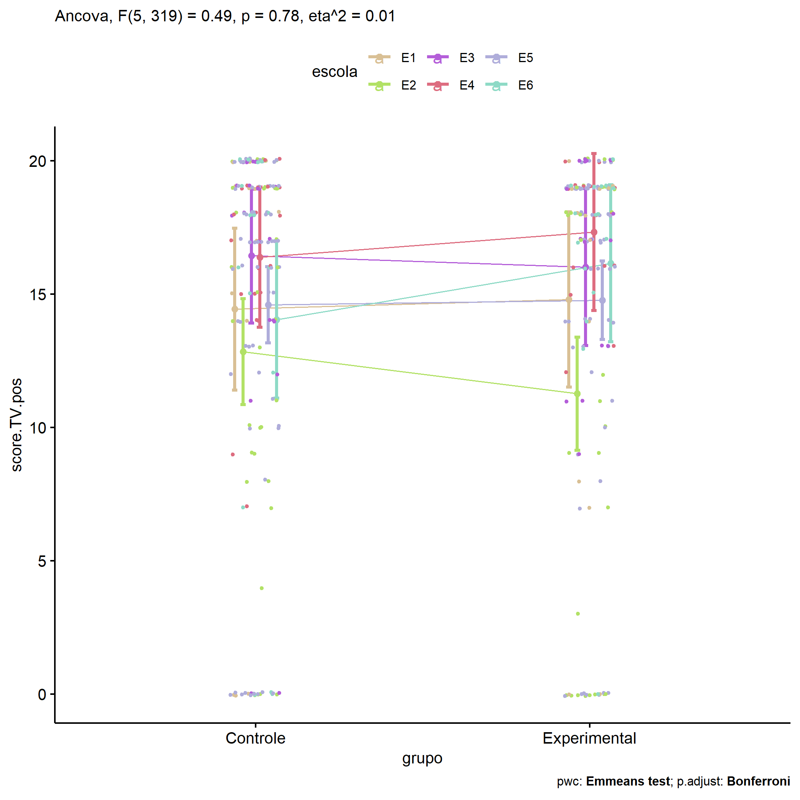<!-- -->

    ## Scale for colour is already present.
    ## Adding another scale for colour, which will replace the existing scale.

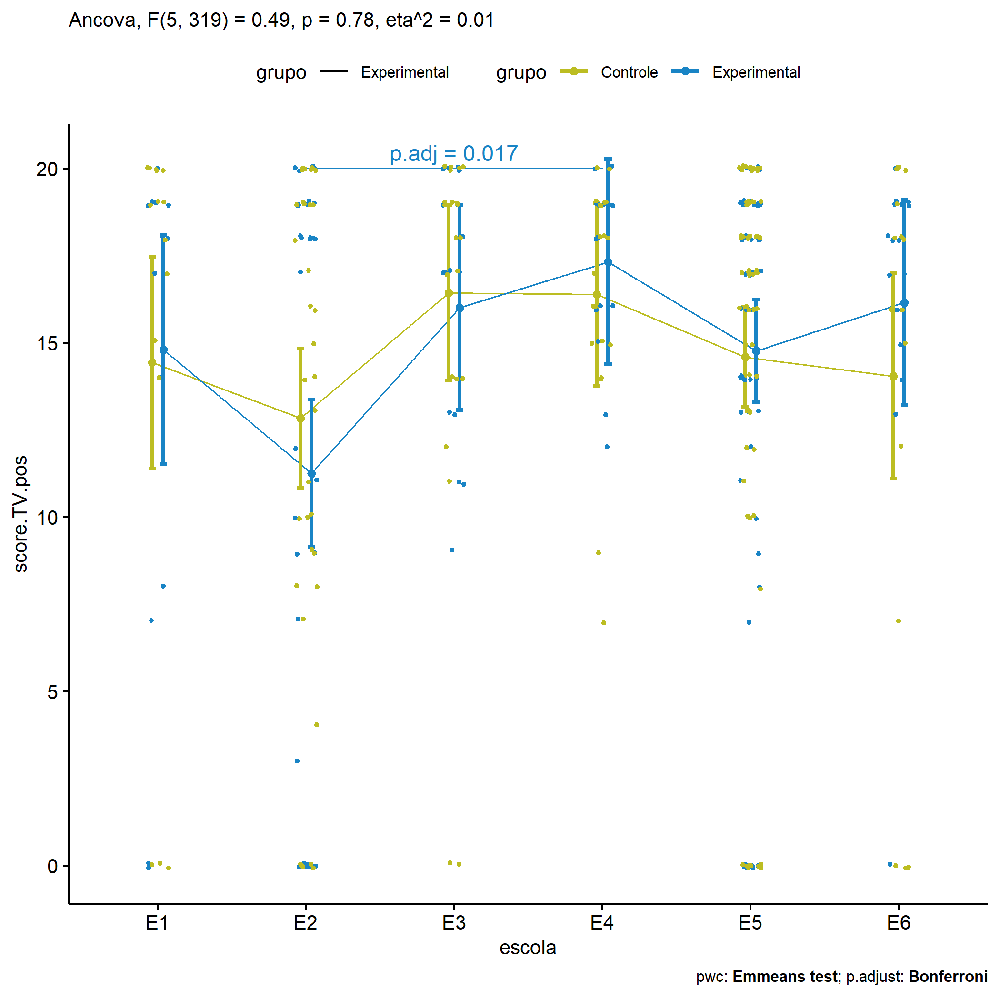<!-- -->

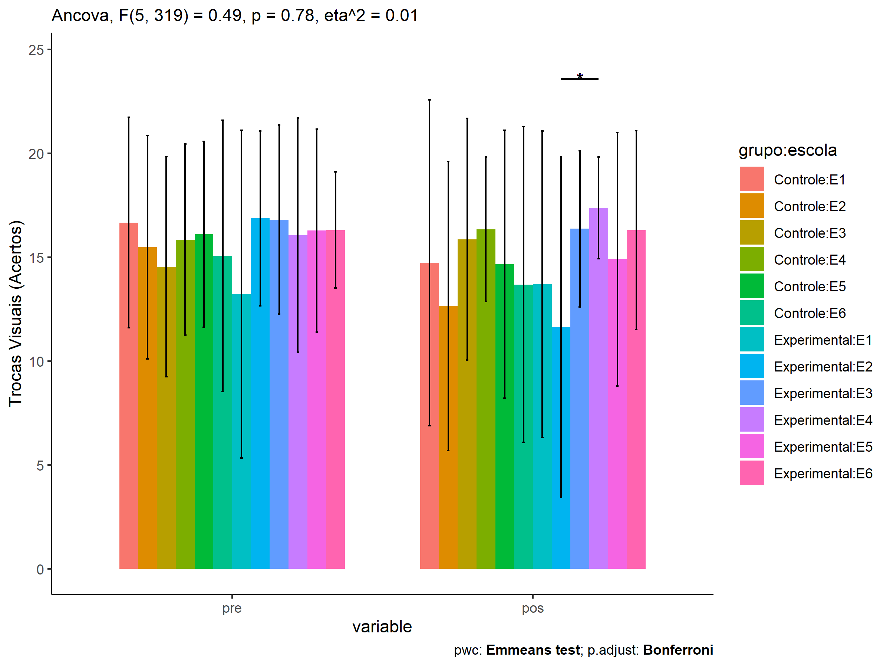<!-- -->

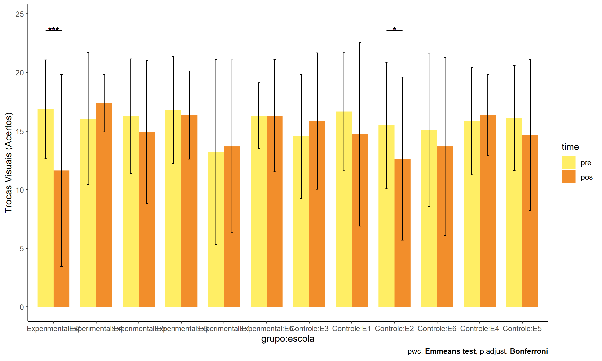<!-- -->

### Trocas Fonologicas (Acertos)

| var          | escola | grupo        |   n | M (pre) | SE (pre) | M (unadj) | SE (unadj) | M (adj) | SE (adj) |
|:-------------|:-------|:-------------|----:|--------:|---------:|----------:|-----------:|--------:|---------:|
| score.TF.pos | E1     | Controle     |  15 |  15.267 |    1.343 |    13.733 |      1.918 |  13.492 |    1.475 |
| score.TF.pos | E1     | Experimental |  13 |  13.154 |    2.069 |    13.154 |      1.887 |  13.954 |    1.587 |
| score.TF.pos | E2     | Controle     |  35 |  14.600 |    0.873 |    11.429 |      1.144 |  11.516 |    0.965 |
| score.TF.pos | E2     | Experimental |  31 |  15.516 |    0.867 |    10.774 |      1.368 |  10.410 |    1.027 |
| score.TF.pos | E3     | Controle     |  22 |  13.455 |    1.023 |    13.864 |      1.321 |  14.516 |    1.220 |
| score.TF.pos | E3     | Experimental |  16 |  15.688 |    1.164 |    15.812 |      0.857 |  15.364 |    1.429 |
| score.TF.pos | E4     | Controle     |  20 |  13.550 |    0.983 |    14.300 |      1.140 |  14.905 |    1.279 |
| score.TF.pos | E4     | Experimental |  16 |  15.688 |    1.413 |    17.062 |      0.655 |  16.614 |    1.429 |
| score.TF.pos | E5     | Controle     |  68 |  14.956 |    0.570 |    13.441 |      0.776 |  13.353 |    0.693 |
| score.TF.pos | E5     | Experimental |  64 |  14.859 |    0.672 |    13.984 |      0.754 |  13.944 |    0.714 |
| score.TF.pos | E6     | Controle     |  16 |  15.000 |    1.673 |    13.250 |      1.822 |  13.140 |    1.428 |
| score.TF.pos | E6     | Experimental |  16 |  14.812 |    0.812 |    14.250 |      1.315 |  14.233 |    1.428 |

| .y.          | grupo        | escola | group1   | group2       | estimate | conf.low | conf.high |    se | statistic | p       | p.adj | p.adj.signif |
|:-------------|:-------------|:-------|:---------|:-------------|---------:|---------:|----------:|------:|----------:|:--------|------:|:-------------|
| score.TF.pos | Controle     |        | E1       | E2           |    1.976 |   -1.492 |     5.444 | 1.763 |     1.121 | 0.263   | 1.000 | ns           |
| score.TF.pos | Controle     |        | E1       | E3           |   -1.024 |   -4.792 |     2.745 | 1.916 |    -0.534 | 0.593   | 1.000 | ns           |
| score.TF.pos | Controle     |        | E1       | E4           |   -1.413 |   -5.256 |     2.430 | 1.954 |    -0.723 | 0.47    | 1.000 | ns           |
| score.TF.pos | Controle     |        | E1       | E5           |    0.139 |   -3.066 |     3.344 | 1.629 |     0.085 | 0.932   | 1.000 | ns           |
| score.TF.pos | Controle     |        | E1       | E6           |    0.352 |   -3.686 |     4.390 | 2.053 |     0.171 | 0.864   | 1.000 | ns           |
| score.TF.pos | Controle     |        | E2       | E3           |   -3.000 |   -6.060 |     0.060 | 1.555 |    -1.929 | 0.055   | 0.820 | ns           |
| score.TF.pos | Controle     |        | E2       | E4           |   -3.389 |   -6.541 |    -0.237 | 1.602 |    -2.115 | 0.035   | 0.528 | ns           |
| score.TF.pos | Controle     |        | E2       | E5           |   -1.837 |   -4.175 |     0.501 | 1.188 |    -1.546 | 0.123   | 1.000 | ns           |
| score.TF.pos | Controle     |        | E2       | E6           |   -1.624 |   -5.015 |     1.767 | 1.724 |    -0.942 | 0.347   | 1.000 | ns           |
| score.TF.pos | Controle     |        | E3       | E4           |   -0.389 |   -3.861 |     3.082 | 1.764 |    -0.221 | 0.826   | 1.000 | ns           |
| score.TF.pos | Controle     |        | E3       | E5           |    1.163 |   -1.599 |     3.925 | 1.404 |     0.828 | 0.408   | 1.000 | ns           |
| score.TF.pos | Controle     |        | E3       | E6           |    1.376 |   -2.321 |     5.072 | 1.879 |     0.732 | 0.465   | 1.000 | ns           |
| score.TF.pos | Controle     |        | E4       | E5           |    1.552 |   -1.311 |     4.415 | 1.455 |     1.066 | 0.287   | 1.000 | ns           |
| score.TF.pos | Controle     |        | E4       | E6           |    1.765 |   -2.008 |     5.538 | 1.918 |     0.920 | 0.358   | 1.000 | ns           |
| score.TF.pos | Controle     |        | E5       | E6           |    0.213 |   -2.909 |     3.335 | 1.587 |     0.134 | 0.893   | 1.000 | ns           |
| score.TF.pos | Experimental |        | E1       | E2           |    3.544 |   -0.179 |     7.268 | 1.893 |     1.873 | 0.062   | 0.931 | ns           |
| score.TF.pos | Experimental |        | E1       | E3           |   -1.409 |   -5.616 |     2.797 | 2.138 |    -0.659 | 0.51    | 1.000 | ns           |
| score.TF.pos | Experimental |        | E1       | E4           |   -2.659 |   -6.866 |     1.547 | 2.138 |    -1.244 | 0.214   | 1.000 | ns           |
| score.TF.pos | Experimental |        | E1       | E5           |    0.010 |   -3.414 |     3.435 | 1.741 |     0.006 | 0.995   | 1.000 | ns           |
| score.TF.pos | Experimental |        | E1       | E6           |   -0.278 |   -4.479 |     3.922 | 2.135 |    -0.130 | 0.896   | 1.000 | ns           |
| score.TF.pos | Experimental |        | E2       | E3           |   -4.954 |   -8.413 |    -1.495 | 1.758 |    -2.818 | 0.005   | 0.077 | ns           |
| score.TF.pos | Experimental |        | E2       | E4           |   -6.204 |   -9.663 |    -2.745 | 1.758 |    -3.529 | \<0.001 | 0.007 | \*\*         |
| score.TF.pos | Experimental |        | E2       | E5           |   -3.534 |   -5.994 |    -1.074 | 1.250 |    -2.826 | 0.005   | 0.075 | ns           |
| score.TF.pos | Experimental |        | E2       | E6           |   -3.823 |   -7.282 |    -0.363 | 1.758 |    -2.174 | 0.03    | 0.457 | ns           |
| score.TF.pos | Experimental |        | E3       | E4           |   -1.250 |   -5.222 |     2.722 | 2.019 |    -0.619 | 0.536   | 1.000 | ns           |
| score.TF.pos | Experimental |        | E3       | E5           |    1.420 |   -1.722 |     4.562 | 1.597 |     0.889 | 0.375   | 1.000 | ns           |
| score.TF.pos | Experimental |        | E3       | E6           |    1.131 |   -2.843 |     5.105 | 2.020 |     0.560 | 0.576   | 1.000 | ns           |
| score.TF.pos | Experimental |        | E4       | E5           |    2.670 |   -0.472 |     5.812 | 1.597 |     1.672 | 0.096   | 1.000 | ns           |
| score.TF.pos | Experimental |        | E4       | E6           |    2.381 |   -1.593 |     6.355 | 2.020 |     1.179 | 0.239   | 1.000 | ns           |
| score.TF.pos | Experimental |        | E5       | E6           |   -0.289 |   -3.429 |     2.852 | 1.596 |    -0.181 | 0.857   | 1.000 | ns           |
| score.TF.pre | Controle     |        | E1       | E2           |    0.667 |   -2.451 |     3.784 | 1.585 |     0.421 | 0.674   | 1.000 | ns           |
| score.TF.pre | Controle     |        | E1       | E3           |    1.812 |   -1.571 |     5.195 | 1.719 |     1.054 | 0.293   | 1.000 | ns           |
| score.TF.pre | Controle     |        | E1       | E4           |    1.717 |   -1.734 |     5.167 | 1.754 |     0.979 | 0.328   | 1.000 | ns           |
| score.TF.pre | Controle     |        | E1       | E5           |    0.311 |   -2.571 |     3.193 | 1.465 |     0.212 | 0.832   | 1.000 | ns           |
| score.TF.pre | Controle     |        | E1       | E6           |    0.267 |   -3.364 |     3.897 | 1.845 |     0.145 | 0.885   | 1.000 | ns           |
| score.TF.pre | Controle     |        | E2       | E3           |    1.145 |   -1.603 |     3.894 | 1.397 |     0.820 | 0.413   | 1.000 | ns           |
| score.TF.pre | Controle     |        | E2       | E4           |    1.050 |   -1.782 |     3.882 | 1.439 |     0.730 | 0.466   | 1.000 | ns           |
| score.TF.pre | Controle     |        | E2       | E5           |   -0.356 |   -2.457 |     1.746 | 1.068 |    -0.333 | 0.739   | 1.000 | ns           |
| score.TF.pre | Controle     |        | E2       | E6           |   -0.400 |   -3.449 |     2.649 | 1.550 |    -0.258 | 0.796   | 1.000 | ns           |
| score.TF.pre | Controle     |        | E3       | E4           |   -0.095 |   -3.217 |     3.026 | 1.586 |    -0.060 | 0.952   | 1.000 | ns           |
| score.TF.pre | Controle     |        | E3       | E5           |   -1.501 |   -3.979 |     0.976 | 1.259 |    -1.192 | 0.234   | 1.000 | ns           |
| score.TF.pre | Controle     |        | E3       | E6           |   -1.545 |   -4.865 |     1.774 | 1.687 |    -0.916 | 0.36    | 1.000 | ns           |
| score.TF.pre | Controle     |        | E4       | E5           |   -1.406 |   -3.976 |     1.164 | 1.306 |    -1.076 | 0.283   | 1.000 | ns           |
| score.TF.pre | Controle     |        | E4       | E6           |   -1.450 |   -4.838 |     1.938 | 1.722 |    -0.842 | 0.4     | 1.000 | ns           |
| score.TF.pre | Controle     |        | E5       | E6           |   -0.044 |   -2.851 |     2.763 | 1.427 |    -0.031 | 0.975   | 1.000 | ns           |
| score.TF.pre | Experimental |        | E1       | E2           |   -2.362 |   -5.700 |     0.976 | 1.697 |    -1.392 | 0.165   | 1.000 | ns           |
| score.TF.pre | Experimental |        | E1       | E3           |   -2.534 |   -6.306 |     1.238 | 1.917 |    -1.321 | 0.187   | 1.000 | ns           |
| score.TF.pre | Experimental |        | E1       | E4           |   -2.534 |   -6.306 |     1.238 | 1.917 |    -1.321 | 0.187   | 1.000 | ns           |
| score.TF.pre | Experimental |        | E1       | E5           |   -1.706 |   -4.779 |     1.368 | 1.562 |    -1.092 | 0.276   | 1.000 | ns           |
| score.TF.pre | Experimental |        | E1       | E6           |   -1.659 |   -5.431 |     2.113 | 1.917 |    -0.865 | 0.388   | 1.000 | ns           |
| score.TF.pre | Experimental |        | E2       | E3           |   -0.171 |   -3.281 |     2.938 | 1.581 |    -0.108 | 0.914   | 1.000 | ns           |
| score.TF.pre | Experimental |        | E2       | E4           |   -0.171 |   -3.281 |     2.938 | 1.581 |    -0.108 | 0.914   | 1.000 | ns           |
| score.TF.pre | Experimental |        | E2       | E5           |    0.657 |   -1.554 |     2.867 | 1.124 |     0.585 | 0.559   | 1.000 | ns           |
| score.TF.pre | Experimental |        | E2       | E6           |    0.704 |   -2.406 |     3.813 | 1.581 |     0.445 | 0.657   | 1.000 | ns           |
| score.TF.pre | Experimental |        | E3       | E4           |    0.000 |   -3.572 |     3.572 | 1.815 |     0.000 | 1       | 1.000 | ns           |
| score.TF.pre | Experimental |        | E3       | E5           |    0.828 |   -1.996 |     3.652 | 1.435 |     0.577 | 0.564   | 1.000 | ns           |
| score.TF.pre | Experimental |        | E3       | E6           |    0.875 |   -2.697 |     4.447 | 1.815 |     0.482 | 0.63    | 1.000 | ns           |
| score.TF.pre | Experimental |        | E4       | E5           |    0.828 |   -1.996 |     3.652 | 1.435 |     0.577 | 0.564   | 1.000 | ns           |
| score.TF.pre | Experimental |        | E4       | E6           |    0.875 |   -2.697 |     4.447 | 1.815 |     0.482 | 0.63    | 1.000 | ns           |
| score.TF.pre | Experimental |        | E5       | E6           |    0.047 |   -2.777 |     2.871 | 1.435 |     0.033 | 0.974   | 1.000 | ns           |
| score.TF.pos |              | E1     | Controle | Experimental |   -0.462 |   -4.728 |     3.803 | 2.168 |    -0.213 | 0.831   | 0.831 | ns           |
| score.TF.pos |              | E2     | Controle | Experimental |    1.106 |   -1.667 |     3.879 | 1.410 |     0.785 | 0.433   | 0.433 | ns           |
| score.TF.pos |              | E3     | Controle | Experimental |   -0.848 |   -4.550 |     2.854 | 1.881 |    -0.451 | 0.653   | 0.653 | ns           |
| score.TF.pos |              | E4     | Controle | Experimental |   -1.709 |   -5.486 |     2.069 | 1.920 |    -0.890 | 0.374   | 0.374 | ns           |
| score.TF.pos |              | E5     | Controle | Experimental |   -0.591 |   -2.548 |     1.366 | 0.995 |    -0.594 | 0.553   | 0.553 | ns           |
| score.TF.pos |              | E6     | Controle | Experimental |   -1.092 |   -5.065 |     2.880 | 2.019 |    -0.541 | 0.589   | 0.589 | ns           |
| score.TF.pre |              | E1     | Controle | Experimental |    2.113 |   -1.715 |     5.941 | 1.946 |     1.086 | 0.278   | 0.278 | ns           |
| score.TF.pre |              | E2     | Controle | Experimental |   -0.916 |   -3.408 |     1.575 | 1.266 |    -0.723 | 0.47    | 0.470 | ns           |
| score.TF.pre |              | E3     | Controle | Experimental |   -2.233 |   -5.552 |     1.086 | 1.687 |    -1.324 | 0.187   | 0.187 | ns           |
| score.TF.pre |              | E4     | Controle | Experimental |   -2.137 |   -5.526 |     1.251 | 1.722 |    -1.241 | 0.215   | 0.215 | ns           |
| score.TF.pre |              | E5     | Controle | Experimental |    0.097 |   -1.663 |     1.856 | 0.894 |     0.108 | 0.914   | 0.914 | ns           |
| score.TF.pre |              | E6     | Controle | Experimental |    0.187 |   -3.384 |     3.759 | 1.815 |     0.103 | 0.918   | 0.918 | ns           |

| grupo        | escola | group1 | group2 | estimate | conf.low | conf.high |    se | statistic |     p | p.adj | p.adj.signif |
|:-------------|:-------|:-------|:-------|---------:|---------:|----------:|------:|----------:|------:|------:|:-------------|
| Controle     | E1     | pre    | pos    |    1.533 |   -2.563 |     5.630 | 2.086 |     0.735 | 0.463 | 0.463 | ns           |
| Controle     | E2     | pre    | pos    |    3.171 |    0.490 |     5.853 | 1.366 |     2.322 | 0.021 | 0.021 | \*           |
| Controle     | E3     | pre    | pos    |   -0.409 |   -3.792 |     2.974 | 1.723 |    -0.237 | 0.812 | 0.812 | ns           |
| Controle     | E4     | pre    | pos    |   -0.750 |   -4.298 |     2.798 | 1.807 |    -0.415 | 0.678 | 0.678 | ns           |
| Controle     | E5     | pre    | pos    |    1.515 |   -0.409 |     3.439 | 0.980 |     1.546 | 0.123 | 0.123 | ns           |
| Controle     | E6     | pre    | pos    |    1.750 |   -2.217 |     5.717 | 2.020 |     0.866 | 0.387 | 0.387 | ns           |
| Experimental | E1     | pre    | pos    |    0.000 |   -4.401 |     4.401 | 2.241 |     0.000 | 1.000 | 1.000 | ns           |
| Experimental | E2     | pre    | pos    |    4.742 |    1.892 |     7.592 | 1.451 |     3.268 | 0.001 | 0.001 | \*\*         |
| Experimental | E3     | pre    | pos    |   -0.125 |   -4.092 |     3.842 | 2.020 |    -0.062 | 0.951 | 0.951 | ns           |
| Experimental | E4     | pre    | pos    |   -1.375 |   -5.342 |     2.592 | 2.020 |    -0.681 | 0.496 | 0.496 | ns           |
| Experimental | E5     | pre    | pos    |    0.875 |   -1.108 |     2.858 | 1.010 |     0.866 | 0.387 | 0.387 | ns           |
| Experimental | E6     | pre    | pos    |    0.563 |   -3.404 |     4.529 | 2.020 |     0.278 | 0.781 | 0.781 | ns           |

    ## Scale for colour is already present.
    ## Adding another scale for colour, which will replace the existing scale.

<!-- -->

    ## Scale for colour is already present.
    ## Adding another scale for colour, which will replace the existing scale.

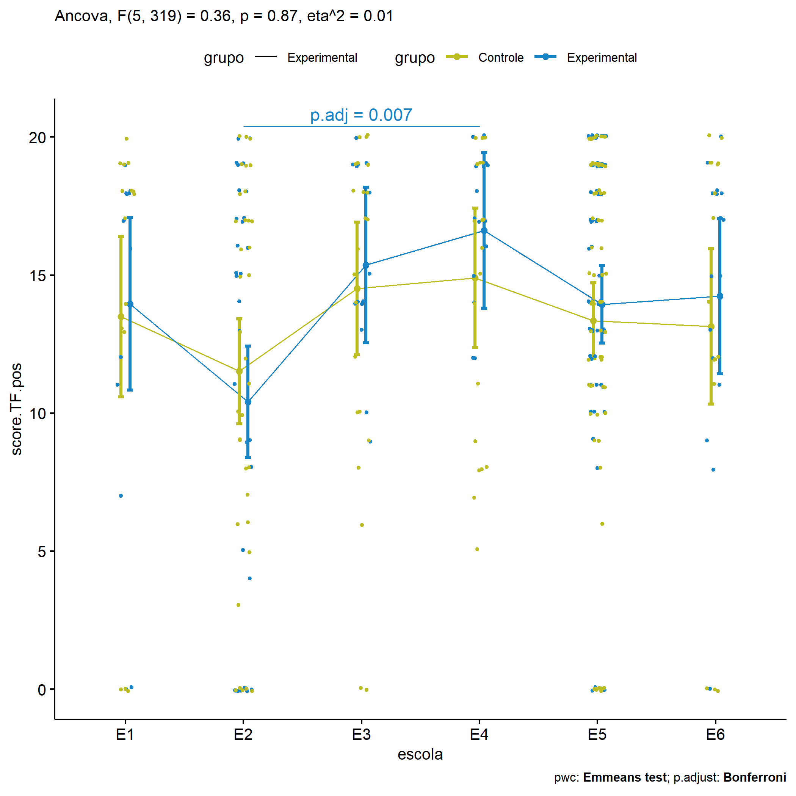<!-- -->

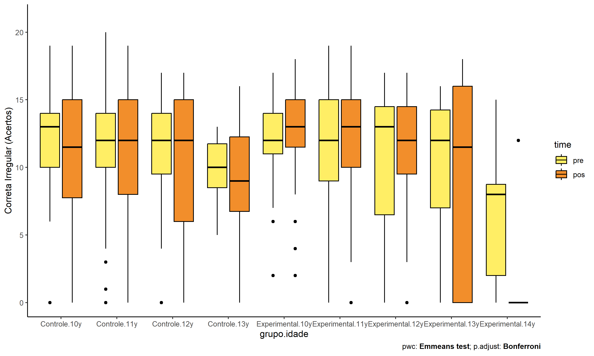<!-- -->

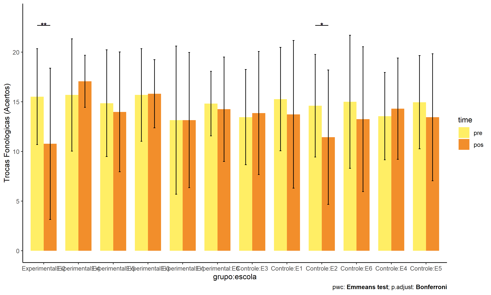<!-- -->

### Trocas Orograficas (Acertos)

| var          | escola | grupo        |   n | M (pre) | SE (pre) | M (unadj) | SE (unadj) | M (adj) | SE (adj) |
|:-------------|:-------|:-------------|----:|--------:|---------:|----------:|-----------:|--------:|---------:|
| score.TO.pos | E1     | Controle     |  15 |   9.667 |    1.337 |     9.067 |      1.526 |   9.127 |    1.171 |
| score.TO.pos | E1     | Experimental |  13 |   7.462 |    1.453 |     9.538 |      1.567 |  10.832 |    1.264 |
| score.TO.pos | E2     | Controle     |  35 |   9.457 |    0.761 |     8.886 |      0.851 |   9.063 |    0.766 |
| score.TO.pos | E2     | Experimental |  31 |   8.742 |    0.587 |     6.581 |      1.001 |   7.158 |    0.816 |
| score.TO.pos | E3     | Controle     |  22 |   9.227 |    1.075 |    10.682 |      1.201 |  10.988 |    0.967 |
| score.TO.pos | E3     | Experimental |  16 |  10.375 |    1.091 |    10.000 |      1.057 |   9.664 |    1.134 |
| score.TO.pos | E4     | Controle     |  20 |   8.800 |    0.884 |     9.850 |      0.802 |  10.395 |    1.015 |
| score.TO.pos | E4     | Experimental |  16 |  10.500 |    1.147 |    10.625 |      1.048 |  10.219 |    1.134 |
| score.TO.pos | E5     | Controle     |  68 |  10.206 |    0.553 |     9.897 |      0.657 |   9.656 |    0.550 |
| score.TO.pos | E5     | Experimental |  64 |  10.906 |    0.587 |    10.719 |      0.679 |  10.086 |    0.570 |
| score.TO.pos | E6     | Controle     |  16 |   8.875 |    1.261 |     8.438 |      1.402 |   8.940 |    1.134 |
| score.TO.pos | E6     | Experimental |  16 |   9.625 |    0.935 |     8.375 |      0.898 |   8.458 |    1.133 |

| .y.          | grupo        | escola | group1   | group2       | estimate | conf.low | conf.high |    se | statistic |     p | p.adj | p.adj.signif |
|:-------------|:-------------|:-------|:---------|:-------------|---------:|---------:|----------:|------:|----------:|------:|------:|:-------------|
| score.TO.pos | Controle     |        | E1       | E2           |    0.064 |   -2.689 |     2.816 | 1.399 |     0.046 | 0.964 | 1.000 | ns           |
| score.TO.pos | Controle     |        | E1       | E3           |   -1.861 |   -4.848 |     1.126 | 1.518 |    -1.226 | 0.221 | 1.000 | ns           |
| score.TO.pos | Controle     |        | E1       | E4           |   -1.268 |   -4.316 |     1.780 | 1.549 |    -0.819 | 0.414 | 1.000 | ns           |
| score.TO.pos | Controle     |        | E1       | E5           |   -0.529 |   -3.074 |     2.016 | 1.294 |    -0.409 | 0.683 | 1.000 | ns           |
| score.TO.pos | Controle     |        | E1       | E6           |    0.186 |   -3.020 |     3.393 | 1.630 |     0.114 | 0.909 | 1.000 | ns           |
| score.TO.pos | Controle     |        | E2       | E3           |   -1.925 |   -4.351 |     0.502 | 1.233 |    -1.560 | 0.120 | 1.000 | ns           |
| score.TO.pos | Controle     |        | E2       | E4           |   -1.332 |   -3.833 |     1.169 | 1.271 |    -1.048 | 0.296 | 1.000 | ns           |
| score.TO.pos | Controle     |        | E2       | E5           |   -0.593 |   -2.450 |     1.265 | 0.944 |    -0.628 | 0.531 | 1.000 | ns           |
| score.TO.pos | Controle     |        | E2       | E6           |    0.123 |   -2.570 |     2.815 | 1.368 |     0.090 | 0.929 | 1.000 | ns           |
| score.TO.pos | Controle     |        | E3       | E4           |    0.593 |   -2.163 |     3.349 | 1.401 |     0.423 | 0.672 | 1.000 | ns           |
| score.TO.pos | Controle     |        | E3       | E5           |    1.332 |   -0.858 |     3.522 | 1.113 |     1.197 | 0.232 | 1.000 | ns           |
| score.TO.pos | Controle     |        | E3       | E6           |    2.047 |   -0.883 |     4.978 | 1.490 |     1.374 | 0.170 | 1.000 | ns           |
| score.TO.pos | Controle     |        | E4       | E5           |    0.739 |   -1.535 |     3.013 | 1.156 |     0.640 | 0.523 | 1.000 | ns           |
| score.TO.pos | Controle     |        | E4       | E6           |    1.454 |   -1.537 |     4.446 | 1.521 |     0.957 | 0.340 | 1.000 | ns           |
| score.TO.pos | Controle     |        | E5       | E6           |    0.715 |   -1.767 |     3.198 | 1.262 |     0.567 | 0.571 | 1.000 | ns           |
| score.TO.pos | Experimental |        | E1       | E2           |    3.674 |    0.723 |     6.624 | 1.500 |     2.450 | 0.015 | 0.222 | ns           |
| score.TO.pos | Experimental |        | E1       | E3           |    1.168 |   -2.178 |     4.514 | 1.701 |     0.687 | 0.493 | 1.000 | ns           |
| score.TO.pos | Experimental |        | E1       | E4           |    0.613 |   -2.734 |     3.960 | 1.701 |     0.360 | 0.719 | 1.000 | ns           |
| score.TO.pos | Experimental |        | E1       | E5           |    0.746 |   -1.994 |     3.486 | 1.393 |     0.536 | 0.592 | 1.000 | ns           |
| score.TO.pos | Experimental |        | E1       | E6           |    2.373 |   -0.965 |     5.712 | 1.697 |     1.399 | 0.163 | 1.000 | ns           |
| score.TO.pos | Experimental |        | E2       | E3           |   -2.506 |   -5.257 |     0.245 | 1.399 |    -1.792 | 0.074 | 1.000 | ns           |
| score.TO.pos | Experimental |        | E2       | E4           |   -3.061 |   -5.814 |    -0.309 | 1.399 |    -2.188 | 0.029 | 0.441 | ns           |
| score.TO.pos | Experimental |        | E2       | E5           |   -2.928 |   -4.894 |    -0.961 | 0.999 |    -2.929 | 0.004 | 0.055 | ns           |
| score.TO.pos | Experimental |        | E2       | E6           |   -1.300 |   -4.048 |     1.447 | 1.396 |    -0.931 | 0.352 | 1.000 | ns           |
| score.TO.pos | Experimental |        | E3       | E4           |   -0.555 |   -3.708 |     2.598 | 1.603 |    -0.346 | 0.729 | 1.000 | ns           |
| score.TO.pos | Experimental |        | E3       | E5           |   -0.422 |   -2.915 |     2.072 | 1.267 |    -0.333 | 0.740 | 1.000 | ns           |
| score.TO.pos | Experimental |        | E3       | E6           |    1.206 |   -1.949 |     4.360 | 1.603 |     0.752 | 0.453 | 1.000 | ns           |
| score.TO.pos | Experimental |        | E4       | E5           |    0.133 |   -2.360 |     2.627 | 1.267 |     0.105 | 0.916 | 1.000 | ns           |
| score.TO.pos | Experimental |        | E4       | E6           |    1.761 |   -1.394 |     4.915 | 1.604 |     1.098 | 0.273 | 1.000 | ns           |
| score.TO.pos | Experimental |        | E5       | E6           |    1.627 |   -0.870 |     4.124 | 1.269 |     1.282 | 0.201 | 1.000 | ns           |
| score.TO.pre | Controle     |        | E1       | E2           |    0.210 |   -2.531 |     2.950 | 1.393 |     0.150 | 0.881 | 1.000 | ns           |
| score.TO.pre | Controle     |        | E1       | E3           |    0.439 |   -2.534 |     3.413 | 1.511 |     0.291 | 0.771 | 1.000 | ns           |
| score.TO.pre | Controle     |        | E1       | E4           |    0.867 |   -2.167 |     3.900 | 1.542 |     0.562 | 0.574 | 1.000 | ns           |
| score.TO.pre | Controle     |        | E1       | E5           |   -0.539 |   -3.072 |     1.994 | 1.288 |    -0.419 | 0.676 | 1.000 | ns           |
| score.TO.pre | Controle     |        | E1       | E6           |    0.792 |   -2.400 |     3.983 | 1.622 |     0.488 | 0.626 | 1.000 | ns           |
| score.TO.pre | Controle     |        | E2       | E3           |    0.230 |   -2.186 |     2.646 | 1.228 |     0.187 | 0.852 | 1.000 | ns           |
| score.TO.pre | Controle     |        | E2       | E4           |    0.657 |   -1.832 |     3.146 | 1.265 |     0.519 | 0.604 | 1.000 | ns           |
| score.TO.pre | Controle     |        | E2       | E5           |   -0.749 |   -2.596 |     1.099 | 0.939 |    -0.797 | 0.426 | 1.000 | ns           |
| score.TO.pre | Controle     |        | E2       | E6           |    0.582 |   -2.098 |     3.262 | 1.362 |     0.427 | 0.669 | 1.000 | ns           |
| score.TO.pre | Controle     |        | E3       | E4           |    0.427 |   -2.316 |     3.171 | 1.395 |     0.306 | 0.760 | 1.000 | ns           |
| score.TO.pre | Controle     |        | E3       | E5           |   -0.979 |   -3.157 |     1.200 | 1.107 |    -0.884 | 0.377 | 1.000 | ns           |
| score.TO.pre | Controle     |        | E3       | E6           |    0.352 |   -2.566 |     3.270 | 1.483 |     0.238 | 0.812 | 1.000 | ns           |
| score.TO.pre | Controle     |        | E4       | E5           |   -1.406 |   -3.665 |     0.853 | 1.148 |    -1.224 | 0.222 | 1.000 | ns           |
| score.TO.pre | Controle     |        | E4       | E6           |   -0.075 |   -3.054 |     2.904 | 1.514 |    -0.050 | 0.961 | 1.000 | ns           |
| score.TO.pre | Controle     |        | E5       | E6           |    1.331 |   -1.137 |     3.798 | 1.254 |     1.061 | 0.289 | 1.000 | ns           |
| score.TO.pre | Experimental |        | E1       | E2           |   -1.280 |   -4.215 |     1.654 | 1.492 |    -0.858 | 0.391 | 1.000 | ns           |
| score.TO.pre | Experimental |        | E1       | E3           |   -2.913 |   -6.229 |     0.403 | 1.685 |    -1.729 | 0.085 | 1.000 | ns           |
| score.TO.pre | Experimental |        | E1       | E4           |   -3.038 |   -6.354 |     0.278 | 1.685 |    -1.803 | 0.072 | 1.000 | ns           |
| score.TO.pre | Experimental |        | E1       | E5           |   -3.445 |   -6.146 |    -0.743 | 1.373 |    -2.509 | 0.013 | 0.189 | ns           |
| score.TO.pre | Experimental |        | E1       | E6           |   -2.163 |   -5.479 |     1.153 | 1.685 |    -1.284 | 0.200 | 1.000 | ns           |
| score.TO.pre | Experimental |        | E2       | E3           |   -1.633 |   -4.367 |     1.101 | 1.390 |    -1.175 | 0.241 | 1.000 | ns           |
| score.TO.pre | Experimental |        | E2       | E4           |   -1.758 |   -4.492 |     0.976 | 1.390 |    -1.265 | 0.207 | 1.000 | ns           |
| score.TO.pre | Experimental |        | E2       | E5           |   -2.164 |   -4.108 |    -0.221 | 0.988 |    -2.191 | 0.029 | 0.437 | ns           |
| score.TO.pre | Experimental |        | E2       | E6           |   -0.883 |   -3.617 |     1.851 | 1.390 |    -0.636 | 0.526 | 1.000 | ns           |
| score.TO.pre | Experimental |        | E3       | E4           |   -0.125 |   -3.265 |     3.015 | 1.596 |    -0.078 | 0.938 | 1.000 | ns           |
| score.TO.pre | Experimental |        | E3       | E5           |   -0.531 |   -3.013 |     1.951 | 1.262 |    -0.421 | 0.674 | 1.000 | ns           |
| score.TO.pre | Experimental |        | E3       | E6           |    0.750 |   -2.390 |     3.890 | 1.596 |     0.470 | 0.639 | 1.000 | ns           |
| score.TO.pre | Experimental |        | E4       | E5           |   -0.406 |   -2.888 |     2.076 | 1.262 |    -0.322 | 0.748 | 1.000 | ns           |
| score.TO.pre | Experimental |        | E4       | E6           |    0.875 |   -2.265 |     4.015 | 1.596 |     0.548 | 0.584 | 1.000 | ns           |
| score.TO.pre | Experimental |        | E5       | E6           |    1.281 |   -1.201 |     3.763 | 1.262 |     1.016 | 0.311 | 1.000 | ns           |
| score.TO.pos |              | E1     | Controle | Experimental |   -1.705 |   -5.094 |     1.683 | 1.722 |    -0.990 | 0.323 | 0.323 | ns           |
| score.TO.pos |              | E2     | Controle | Experimental |    1.905 |   -0.296 |     4.106 | 1.119 |     1.703 | 0.090 | 0.090 | ns           |
| score.TO.pos |              | E3     | Controle | Experimental |    1.324 |   -1.610 |     4.257 | 1.491 |     0.888 | 0.375 | 0.375 | ns           |
| score.TO.pos |              | E4     | Controle | Experimental |    0.176 |   -2.822 |     3.173 | 1.524 |     0.115 | 0.908 | 0.908 | ns           |
| score.TO.pos |              | E5     | Controle | Experimental |   -0.430 |   -1.985 |     1.125 | 0.790 |    -0.544 | 0.587 | 0.587 | ns           |
| score.TO.pos |              | E6     | Controle | Experimental |    0.482 |   -2.673 |     3.636 | 1.603 |     0.301 | 0.764 | 0.764 | ns           |
| score.TO.pre |              | E1     | Controle | Experimental |    2.205 |   -1.160 |     5.570 | 1.710 |     1.289 | 0.198 | 0.198 | ns           |
| score.TO.pre |              | E2     | Controle | Experimental |    0.715 |   -1.475 |     2.905 | 1.113 |     0.642 | 0.521 | 0.521 | ns           |
| score.TO.pre |              | E3     | Controle | Experimental |   -1.148 |   -4.066 |     1.770 | 1.483 |    -0.774 | 0.440 | 0.440 | ns           |
| score.TO.pre |              | E4     | Controle | Experimental |   -1.700 |   -4.679 |     1.279 | 1.514 |    -1.123 | 0.262 | 0.262 | ns           |
| score.TO.pre |              | E5     | Controle | Experimental |   -0.700 |   -2.247 |     0.846 | 0.786 |    -0.891 | 0.374 | 0.374 | ns           |
| score.TO.pre |              | E6     | Controle | Experimental |   -0.750 |   -3.890 |     2.390 | 1.596 |    -0.470 | 0.639 | 0.639 | ns           |

| grupo        | escola | group1 | group2 | estimate | conf.low | conf.high |    se | statistic |     p | p.adj | p.adj.signif |
|:-------------|:-------|:-------|:-------|---------:|---------:|----------:|------:|----------:|------:|------:|:-------------|
| Controle     | E1     | pre    | pos    |    0.600 |   -2.885 |     4.085 | 1.775 |     0.338 | 0.735 | 0.735 | ns           |
| Controle     | E2     | pre    | pos    |    0.571 |   -1.710 |     2.853 | 1.162 |     0.492 | 0.623 | 0.623 | ns           |
| Controle     | E3     | pre    | pos    |   -1.455 |   -4.332 |     1.423 | 1.465 |    -0.993 | 0.321 | 0.321 | ns           |
| Controle     | E4     | pre    | pos    |   -1.050 |   -4.068 |     1.968 | 1.537 |    -0.683 | 0.495 | 0.495 | ns           |
| Controle     | E5     | pre    | pos    |    0.309 |   -1.328 |     1.945 | 0.833 |     0.371 | 0.711 | 0.711 | ns           |
| Controle     | E6     | pre    | pos    |    0.437 |   -2.936 |     3.811 | 1.718 |     0.255 | 0.799 | 0.799 | ns           |
| Experimental | E1     | pre    | pos    |   -2.077 |   -5.820 |     1.666 | 1.906 |    -1.090 | 0.276 | 0.276 | ns           |
| Experimental | E2     | pre    | pos    |    2.161 |   -0.263 |     4.585 | 1.234 |     1.751 | 0.080 | 0.080 | ns           |
| Experimental | E3     | pre    | pos    |    0.375 |   -2.999 |     3.749 | 1.718 |     0.218 | 0.827 | 0.827 | ns           |
| Experimental | E4     | pre    | pos    |   -0.125 |   -3.499 |     3.249 | 1.718 |    -0.073 | 0.942 | 0.942 | ns           |
| Experimental | E5     | pre    | pos    |    0.188 |   -1.499 |     1.874 | 0.859 |     0.218 | 0.827 | 0.827 | ns           |
| Experimental | E6     | pre    | pos    |    1.250 |   -2.124 |     4.624 | 1.718 |     0.728 | 0.467 | 0.467 | ns           |

    ## Scale for colour is already present.
    ## Adding another scale for colour, which will replace the existing scale.

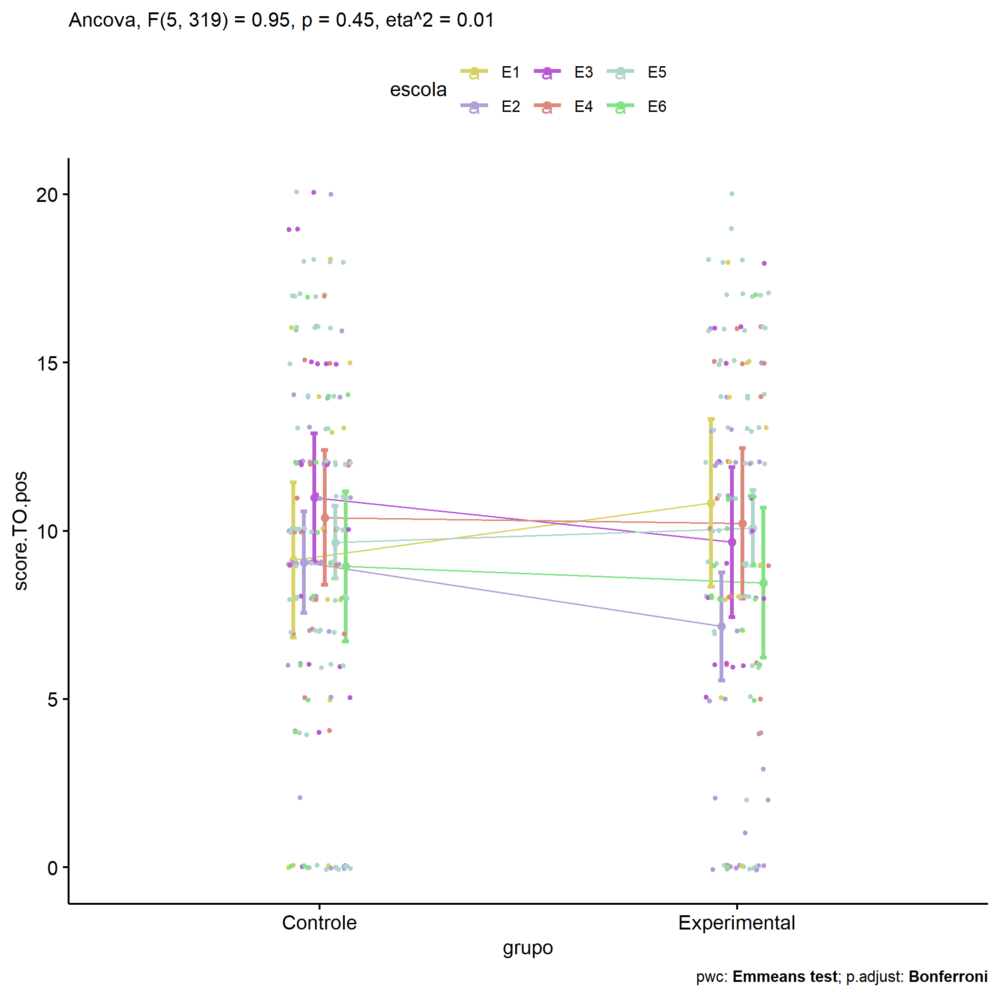<!-- -->

    ## Scale for colour is already present.
    ## Adding another scale for colour, which will replace the existing scale.

<!-- -->

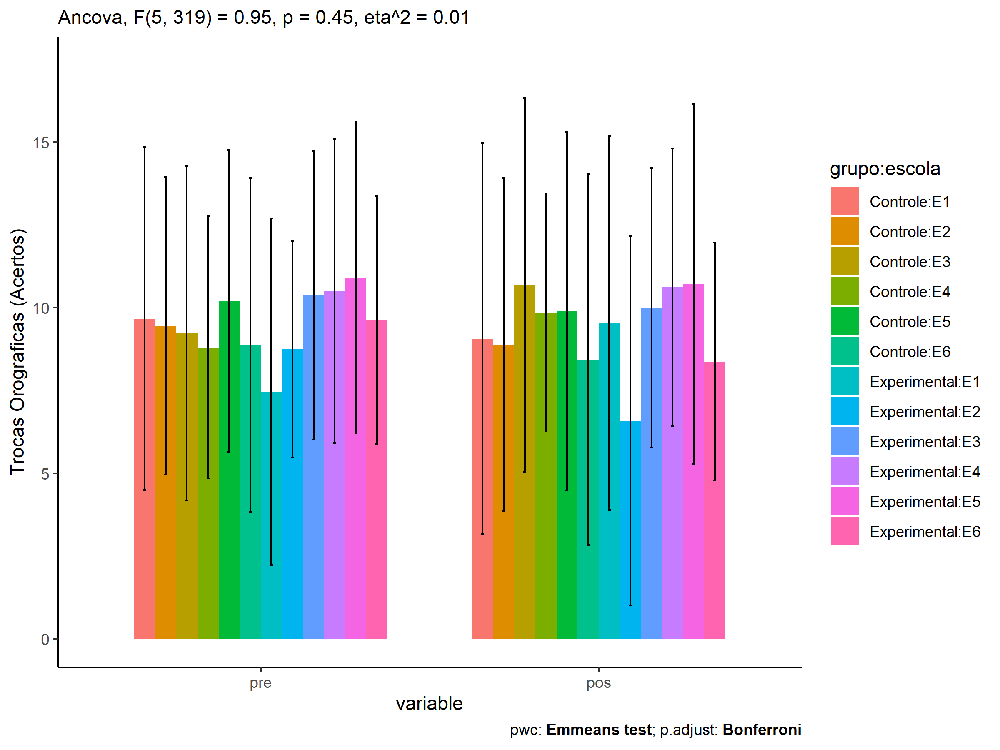<!-- -->

<!-- -->

## factores: **zona.escola:grupo**

### Leitura de Pseudo-Palavras (Acertos)

| var            | zona.escola | grupo        |   n | M (pre) | SE (pre) | M (unadj) | SE (unadj) | M (adj) | SE (adj) |
|:---------------|:------------|:-------------|----:|--------:|---------:|----------:|-----------:|--------:|---------:|
| score.CLPP.pos | Rural       | Controle     |  51 |  65.549 |    2.551 |    71.373 |      2.047 |  73.755 |    1.512 |
| score.CLPP.pos | Rural       | Experimental |  46 |  70.543 |    1.925 |    71.891 |      1.619 |  70.815 |    1.586 |
| score.CLPP.pos | Urbana      | Controle     |  98 |  69.429 |    1.245 |    68.673 |      1.544 |  68.369 |    1.086 |
| score.CLPP.pos | Urbana      | Experimental |  89 |  69.674 |    1.586 |    70.416 |      1.660 |  69.941 |    1.139 |

| .y.            | grupo        | zona.escola | group1   | group2       | estimate | conf.low | conf.high |    se | statistic |     p | p.adj | p.adj.signif |
|:---------------|:-------------|:------------|:---------|:-------------|---------:|---------:|----------:|------:|----------:|------:|------:|:-------------|
| score.CLPP.pos | Controle     |             | Urbana   | Rural        |   -5.386 |   -9.054 |    -1.718 | 1.863 |    -2.891 | 0.004 | 0.004 | \*\*         |
| score.CLPP.pos | Experimental |             | Urbana   | Rural        |   -0.873 |   -4.715 |     2.968 | 1.952 |    -0.448 | 0.655 | 0.655 | ns           |
| score.CLPP.pre | Controle     |             | Urbana   | Rural        |    3.880 |   -1.041 |     8.801 | 2.500 |     1.552 | 0.122 | 0.122 | ns           |
| score.CLPP.pre | Experimental |             | Urbana   | Rural        |   -0.869 |   -6.045 |     4.306 | 2.629 |    -0.331 | 0.741 | 0.741 | ns           |
| score.CLPP.pos |              | Urbana      | Controle | Experimental |   -1.572 |   -4.670 |     1.525 | 1.573 |    -0.999 | 0.319 | 0.319 | ns           |
| score.CLPP.pos |              | Rural       | Controle | Experimental |    2.940 |   -1.383 |     7.264 | 2.196 |     1.339 | 0.182 | 0.182 | ns           |
| score.CLPP.pre |              | Urbana      | Controle | Experimental |   -0.246 |   -4.419 |     3.928 | 2.120 |    -0.116 | 0.908 | 0.908 | ns           |
| score.CLPP.pre |              | Rural       | Controle | Experimental |   -4.994 |  -10.790 |     0.801 | 2.944 |    -1.696 | 0.091 | 0.091 | ns           |

| grupo        | zona.escola | group1 | group2 | estimate | conf.low | conf.high |    se | statistic |     p | p.adj | p.adj.signif |
|:-------------|:------------|:-------|:-------|---------:|---------:|----------:|------:|----------:|------:|------:|:-------------|
| Controle     | Urbana      | pre    | pos    |    1.060 |   -2.828 |     4.948 | 1.980 |     0.535 | 0.593 | 0.593 | ns           |
| Controle     | Rural       | pre    | pos    |   -6.346 |  -11.776 |    -0.916 | 2.765 |    -2.295 | 0.022 | 0.022 | \*           |
| Experimental | Urbana      | pre    | pos    |   -0.215 |   -4.300 |     3.871 | 2.080 |    -0.103 | 0.918 | 0.918 | ns           |
| Experimental | Rural       | pre    | pos    |   -1.426 |   -7.270 |     4.419 | 2.976 |    -0.479 | 0.632 | 0.632 | ns           |

    ## Scale for colour is already present.
    ## Adding another scale for colour, which will replace the existing scale.

<!-- -->

    ## Scale for colour is already present.
    ## Adding another scale for colour, which will replace the existing scale.

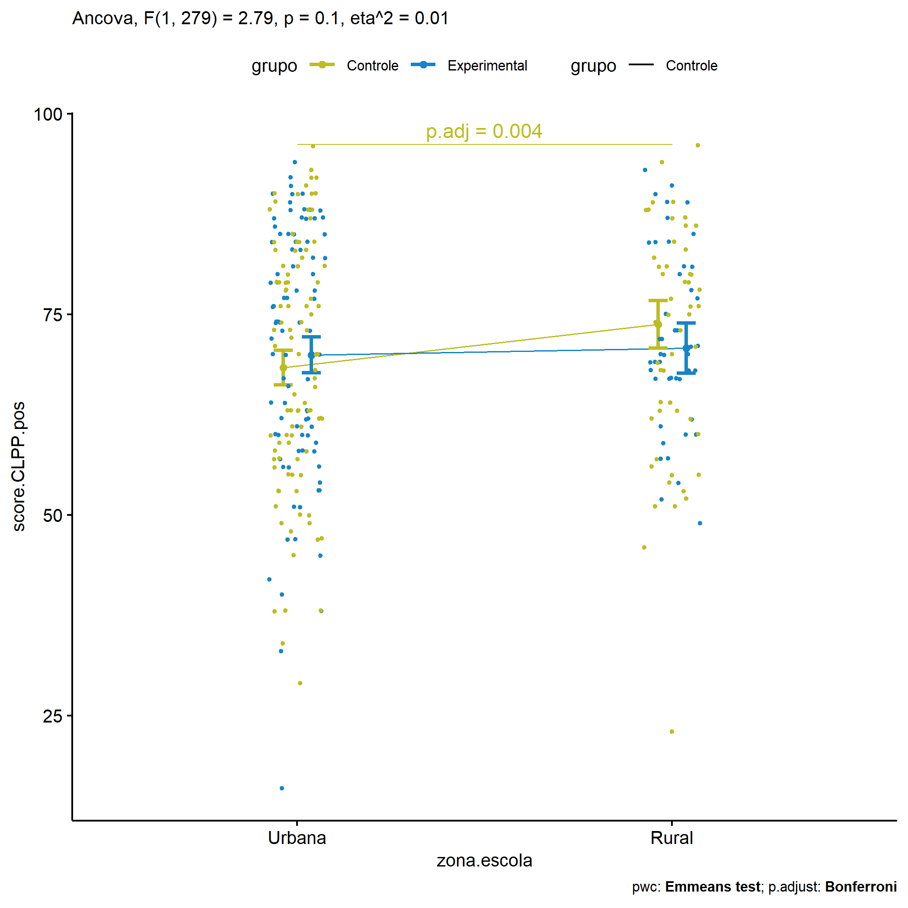<!-- -->

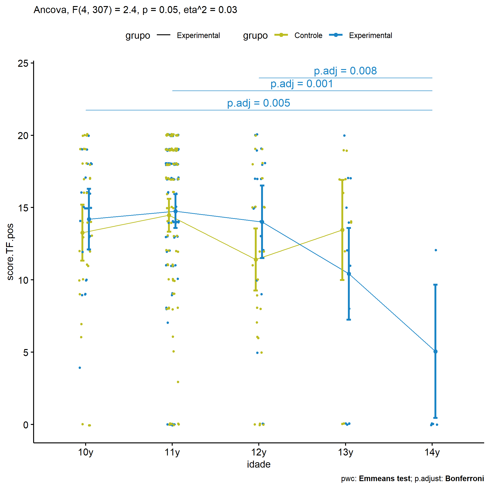<!-- -->

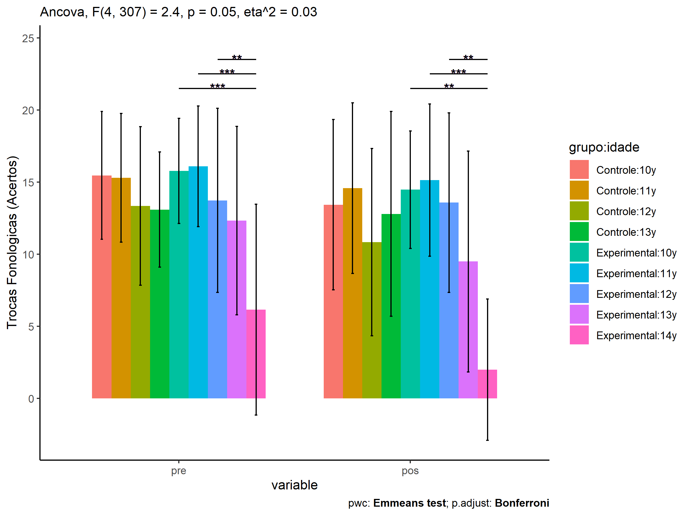<!-- -->

### Correta Regular (Acertos)

| var          | zona.escola | grupo        |   n | M (pre) | SE (pre) | M (unadj) | SE (unadj) | M (adj) | SE (adj) |
|:-------------|:------------|:-------------|----:|--------:|---------:|----------:|-----------:|--------:|---------:|
| score.CR.pos | Rural       | Controle     |  58 |  13.759 |    0.625 |    14.293 |      0.730 |  14.468 |    0.728 |
| score.CR.pos | Rural       | Experimental |  48 |  15.188 |    0.581 |    15.667 |      0.511 |  15.299 |    0.802 |
| score.CR.pos | Urbana      | Controle     | 118 |  14.042 |    0.395 |    12.559 |      0.562 |  12.627 |    0.510 |
| score.CR.pos | Urbana      | Experimental | 108 |  14.231 |    0.473 |    12.417 |      0.611 |  12.412 |    0.533 |

| .y.          | grupo        | zona.escola | group1   | group2       | estimate | conf.low | conf.high |    se | statistic |     p | p.adj | p.adj.signif |
|:-------------|:-------------|:------------|:---------|:-------------|---------:|---------:|----------:|------:|----------:|------:|------:|:-------------|
| score.CR.pos | Controle     |             | Urbana   | Rural        |   -1.842 |   -3.590 |    -0.094 | 0.889 |    -2.073 | 0.039 | 0.039 | \*           |
| score.CR.pos | Experimental |             | Urbana   | Rural        |   -2.887 |   -4.781 |    -0.992 | 0.963 |    -2.997 | 0.003 | 0.003 | \*\*         |
| score.CR.pre | Controle     |             | Urbana   | Rural        |    0.284 |   -1.151 |     1.719 | 0.730 |     0.389 | 0.698 | 0.698 | ns           |
| score.CR.pre | Experimental |             | Urbana   | Rural        |   -0.956 |   -2.508 |     0.596 | 0.789 |    -1.211 | 0.227 | 0.227 | ns           |
| score.CR.pos |              | Urbana      | Controle | Experimental |    0.215 |   -1.237 |     1.666 | 0.738 |     0.291 | 0.771 | 0.771 | ns           |
| score.CR.pos |              | Rural       | Controle | Experimental |   -0.830 |   -2.965 |     1.304 | 1.085 |    -0.765 | 0.445 | 0.445 | ns           |
| score.CR.pre |              | Urbana      | Controle | Experimental |   -0.189 |   -1.381 |     1.003 | 0.606 |    -0.312 | 0.755 | 0.755 | ns           |
| score.CR.pre |              | Rural       | Controle | Experimental |   -1.429 |   -3.175 |     0.317 | 0.888 |    -1.610 | 0.108 | 0.108 | ns           |

| grupo        | zona.escola | group1 | group2 | estimate | conf.low | conf.high |    se | statistic |     p | p.adj | p.adj.signif |
|:-------------|:------------|:-------|:-------|---------:|---------:|----------:|------:|----------:|------:|------:|:-------------|
| Controle     | Urbana      | pre    | pos    |    1.483 |    0.151 |     2.815 | 0.678 |     2.187 | 0.029 | 0.029 | \*           |
| Controle     | Rural       | pre    | pos    |   -0.534 |   -2.434 |     1.365 | 0.967 |    -0.552 | 0.581 | 0.581 | ns           |
| Experimental | Urbana      | pre    | pos    |    1.815 |    0.423 |     3.207 | 0.709 |     2.560 | 0.011 | 0.011 | \*           |
| Experimental | Rural       | pre    | pos    |   -0.479 |   -2.567 |     1.609 | 1.063 |    -0.451 | 0.652 | 0.652 | ns           |

    ## Scale for colour is already present.
    ## Adding another scale for colour, which will replace the existing scale.

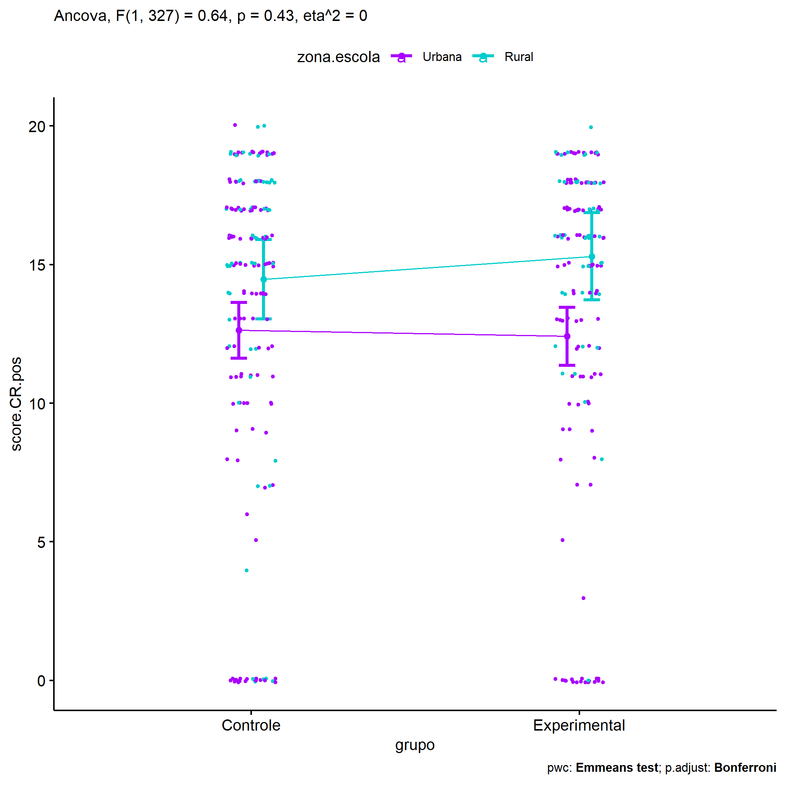<!-- -->

    ## Scale for colour is already present.
    ## Adding another scale for colour, which will replace the existing scale.

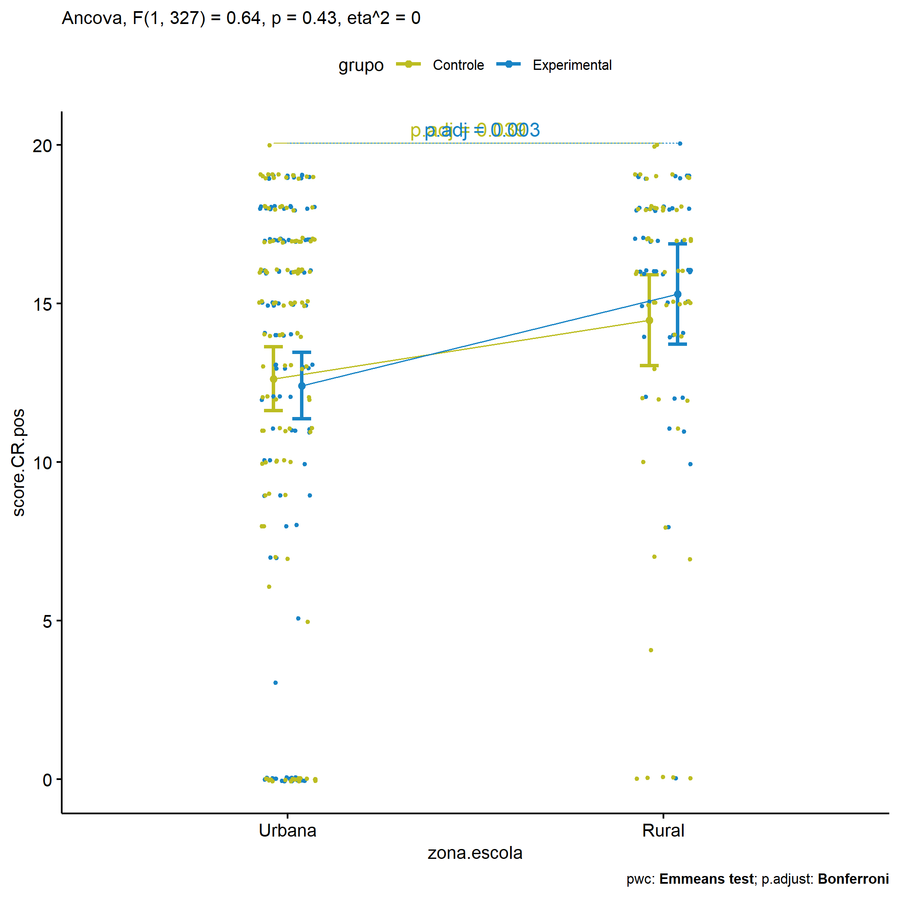<!-- -->

<!-- -->

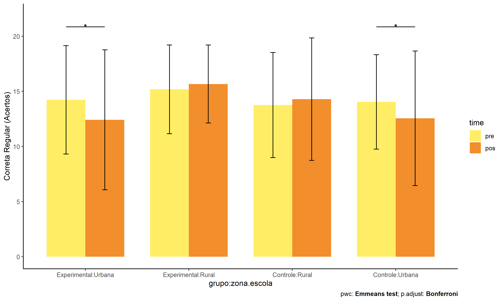<!-- -->

### Correta Irregular (Acertos)

| var          | zona.escola | grupo        |   n | M (pre) | SE (pre) | M (unadj) | SE (unadj) | M (adj) | SE (adj) |
|:-------------|:------------|:-------------|----:|--------:|---------:|----------:|-----------:|--------:|---------:|
| score.CI.pos | Rural       | Controle     |  58 |  11.069 |    0.590 |    11.948 |      0.665 |  12.067 |    0.625 |
| score.CI.pos | Rural       | Experimental |  48 |  11.896 |    0.545 |    12.708 |      0.553 |  12.409 |    0.688 |
| score.CI.pos | Urbana      | Controle     | 118 |  11.339 |    0.379 |     9.763 |      0.498 |   9.745 |    0.438 |
| score.CI.pos | Urbana      | Experimental | 108 |  11.130 |    0.424 |    10.611 |      0.538 |  10.699 |    0.458 |

| .y.          | grupo        | zona.escola | group1   | group2       | estimate | conf.low | conf.high |    se | statistic |     p | p.adj | p.adj.signif |
|:-------------|:-------------|:------------|:---------|:-------------|---------:|---------:|----------:|------:|----------:|------:|------:|:-------------|
| score.CI.pos | Controle     |             | Urbana   | Rural        |   -2.322 |   -3.825 |    -0.820 | 0.764 |    -3.040 | 0.003 | 0.003 | \*\*         |
| score.CI.pos | Experimental |             | Urbana   | Rural        |   -1.710 |   -3.337 |    -0.082 | 0.827 |    -2.066 | 0.040 | 0.040 | \*           |
| score.CI.pre | Controle     |             | Urbana   | Rural        |    0.270 |   -1.066 |     1.606 | 0.679 |     0.398 | 0.691 | 0.691 | ns           |
| score.CI.pre | Experimental |             | Urbana   | Rural        |   -0.766 |   -2.211 |     0.679 | 0.735 |    -1.043 | 0.298 | 0.298 | ns           |
| score.CI.pos |              | Urbana      | Controle | Experimental |   -0.954 |   -2.202 |     0.293 | 0.634 |    -1.505 | 0.133 | 0.133 | ns           |
| score.CI.pos |              | Rural       | Controle | Experimental |   -0.342 |   -2.172 |     1.489 | 0.931 |    -0.367 | 0.714 | 0.714 | ns           |
| score.CI.pre |              | Urbana      | Controle | Experimental |    0.209 |   -0.900 |     1.319 | 0.564 |     0.371 | 0.711 | 0.711 | ns           |
| score.CI.pre |              | Rural       | Controle | Experimental |   -0.827 |   -2.453 |     0.799 | 0.826 |    -1.001 | 0.318 | 0.318 | ns           |

| grupo        | zona.escola | group1 | group2 | estimate | conf.low | conf.high |    se | statistic |     p | p.adj | p.adj.signif |
|:-------------|:------------|:-------|:-------|---------:|---------:|----------:|------:|----------:|------:|------:|:-------------|
| Controle     | Urbana      | pre    | pos    |    1.576 |    0.362 |     2.791 | 0.618 |     2.549 | 0.011 | 0.011 | \*           |
| Controle     | Rural       | pre    | pos    |   -0.879 |   -2.611 |     0.853 | 0.882 |    -0.997 | 0.319 | 0.319 | ns           |
| Experimental | Urbana      | pre    | pos    |    0.519 |   -0.751 |     1.788 | 0.646 |     0.802 | 0.423 | 0.423 | ns           |
| Experimental | Rural       | pre    | pos    |   -0.812 |   -2.716 |     1.091 | 0.970 |    -0.838 | 0.402 | 0.402 | ns           |

    ## Scale for colour is already present.
    ## Adding another scale for colour, which will replace the existing scale.

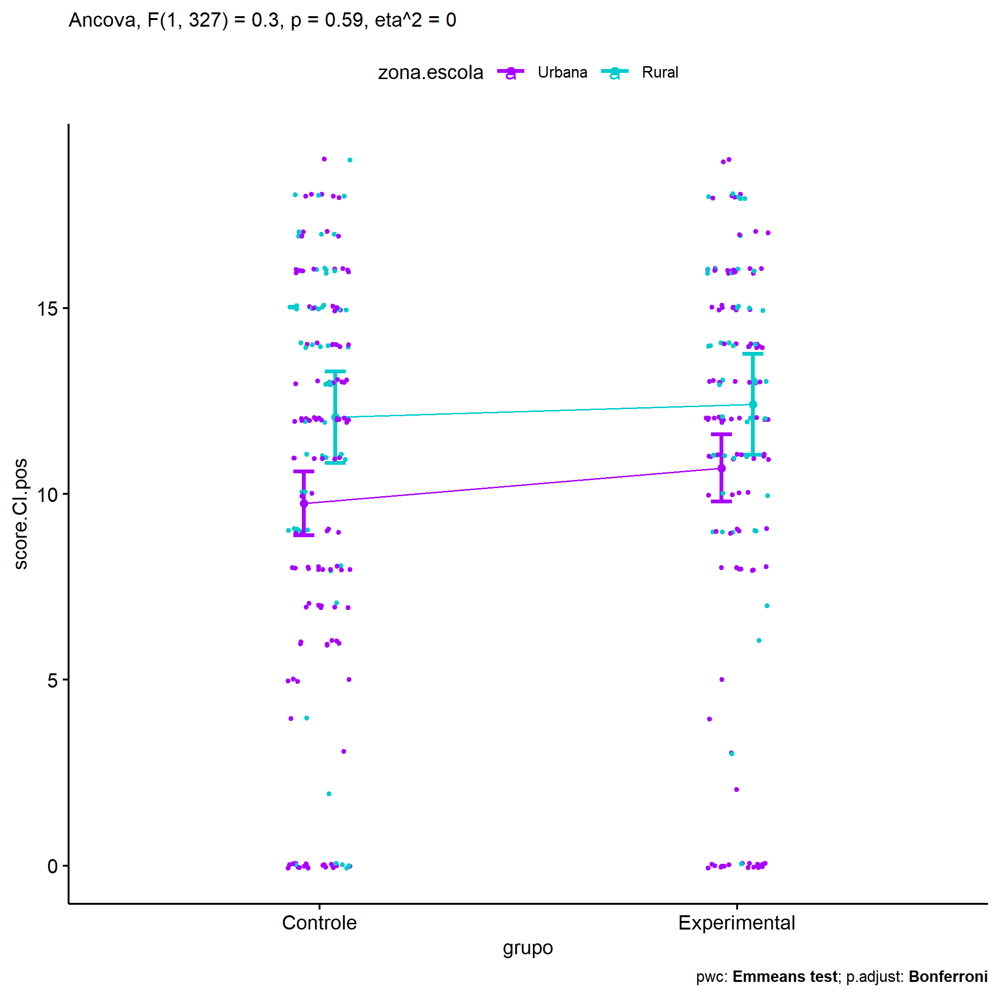<!-- -->

    ## Scale for colour is already present.
    ## Adding another scale for colour, which will replace the existing scale.

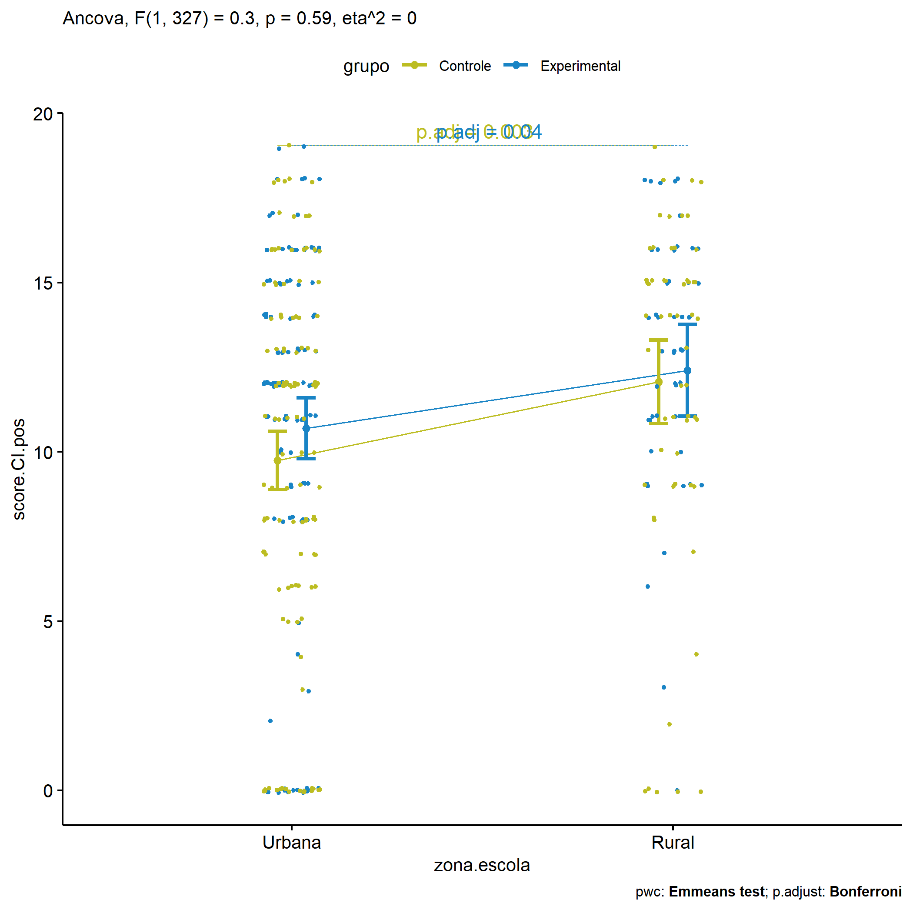<!-- -->

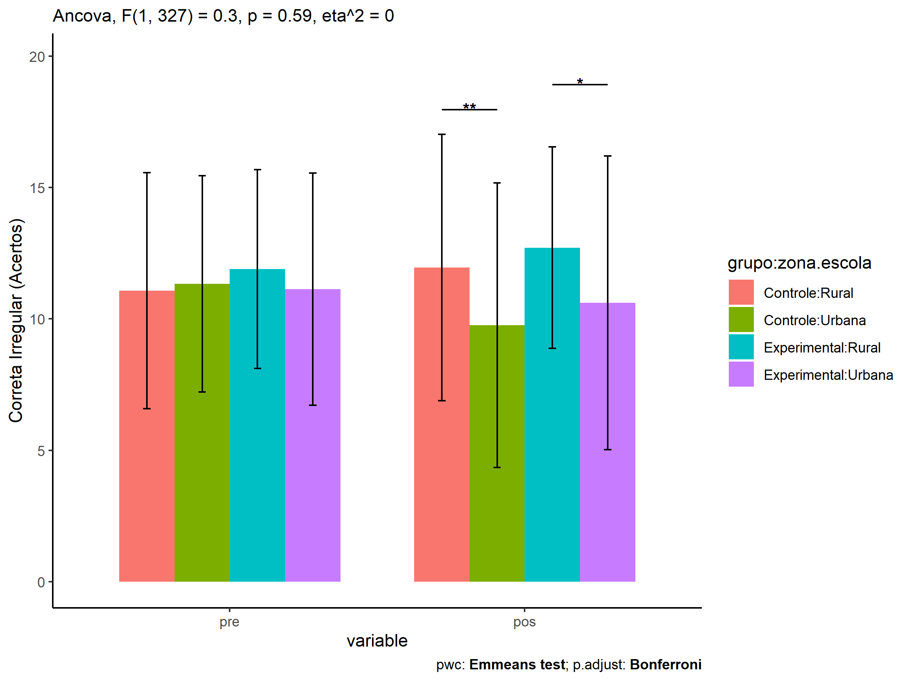<!-- -->

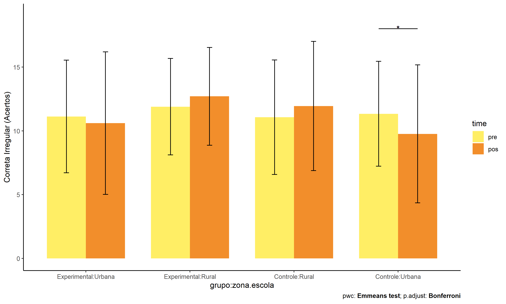<!-- -->

### Trocas Visuais (Acertos)

| var          | zona.escola | grupo        |   n | M (pre) | SE (pre) | M (unadj) | SE (unadj) | M (adj) | SE (adj) |
|:-------------|:------------|:-------------|----:|--------:|---------:|----------:|-----------:|--------:|---------:|
| score.TV.pos | Rural       | Controle     |  58 |  15.138 |    0.706 |    15.431 |      0.753 |  15.750 |    0.792 |
| score.TV.pos | Rural       | Experimental |  48 |  16.396 |    0.635 |    16.688 |      0.539 |  16.500 |    0.869 |
| score.TV.pos | Urbana      | Controle     | 118 |  15.992 |    0.442 |    14.076 |      0.625 |  14.052 |    0.554 |
| score.TV.pos | Urbana      | Experimental | 108 |  16.083 |    0.501 |    13.824 |      0.673 |  13.763 |    0.579 |

| .y.          | grupo        | zona.escola | group1   | group2       | estimate | conf.low | conf.high |    se | statistic |     p | p.adj | p.adj.signif |
|:-------------|:-------------|:------------|:---------|:-------------|---------:|---------:|----------:|------:|----------:|------:|------:|:-------------|
| score.TV.pos | Controle     |             | Urbana   | Rural        |   -1.698 |   -3.600 |     0.203 | 0.967 |    -1.757 | 0.080 | 0.080 | ns           |
| score.TV.pos | Experimental |             | Urbana   | Rural        |   -2.738 |   -4.792 |    -0.684 | 1.044 |    -2.622 | 0.009 | 0.009 | \*\*         |
| score.TV.pre | Controle     |             | Urbana   | Rural        |    0.854 |   -0.720 |     2.427 | 0.800 |     1.067 | 0.287 | 0.287 | ns           |
| score.TV.pre | Experimental |             | Urbana   | Rural        |   -0.313 |   -2.015 |     1.390 | 0.865 |    -0.361 | 0.718 | 0.718 | ns           |
| score.TV.pos |              | Urbana      | Controle | Experimental |    0.289 |   -1.287 |     1.866 | 0.801 |     0.361 | 0.718 | 0.718 | ns           |
| score.TV.pos |              | Rural       | Controle | Experimental |   -0.750 |   -3.066 |     1.566 | 1.177 |    -0.637 | 0.524 | 0.524 | ns           |
| score.TV.pre |              | Urbana      | Controle | Experimental |   -0.092 |   -1.398 |     1.215 | 0.664 |    -0.138 | 0.890 | 0.890 | ns           |
| score.TV.pre |              | Rural       | Controle | Experimental |   -1.258 |   -3.172 |     0.657 | 0.973 |    -1.293 | 0.197 | 0.197 | ns           |

| grupo        | zona.escola | group1 | group2 | estimate | conf.low | conf.high |    se | statistic |     p | p.adj | p.adj.signif |
|:-------------|:------------|:-------|:-------|---------:|---------:|----------:|------:|----------:|------:|------:|:-------------|
| Controle     | Urbana      | pre    | pos    |    1.915 |    0.458 |     3.373 | 0.742 |     2.580 | 0.010 | 0.010 | \*           |
| Controle     | Rural       | pre    | pos    |   -0.293 |   -2.372 |     1.786 | 1.059 |    -0.277 | 0.782 | 0.782 | ns           |
| Experimental | Urbana      | pre    | pos    |    2.259 |    0.736 |     3.783 | 0.776 |     2.912 | 0.004 | 0.004 | \*\*         |
| Experimental | Rural       | pre    | pos    |   -0.292 |   -2.577 |     1.994 | 1.164 |    -0.251 | 0.802 | 0.802 | ns           |

    ## Scale for colour is already present.
    ## Adding another scale for colour, which will replace the existing scale.

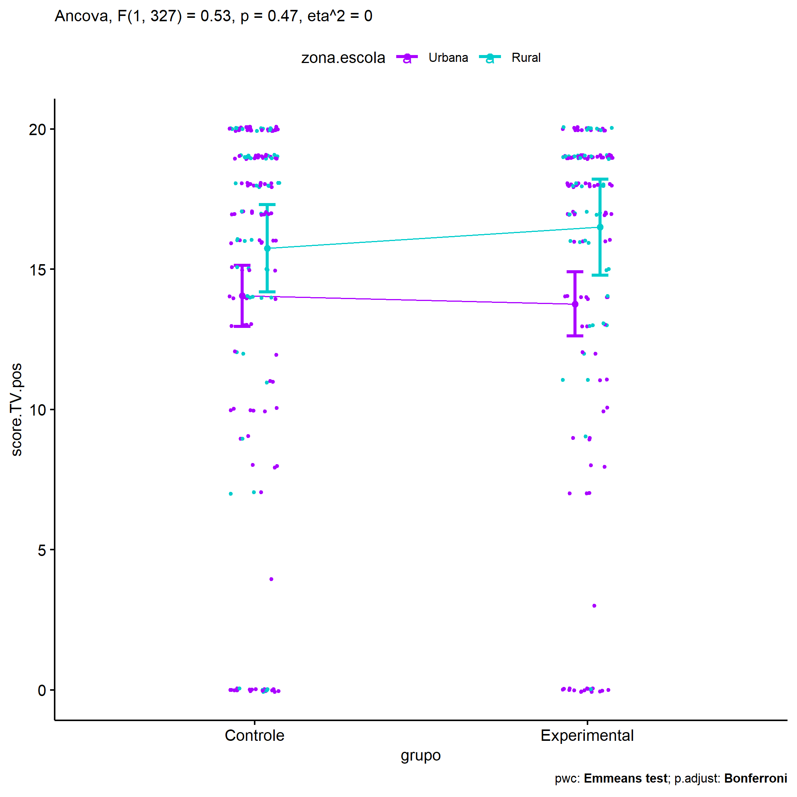<!-- -->

    ## Scale for colour is already present.
    ## Adding another scale for colour, which will replace the existing scale.

<!-- -->

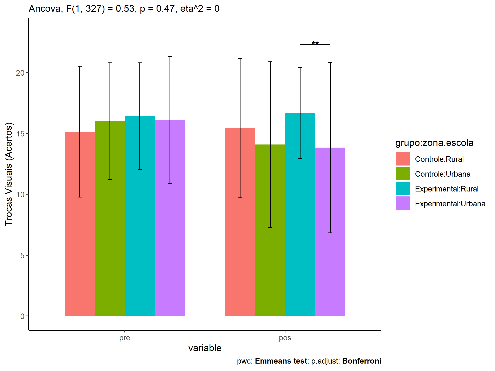<!-- -->

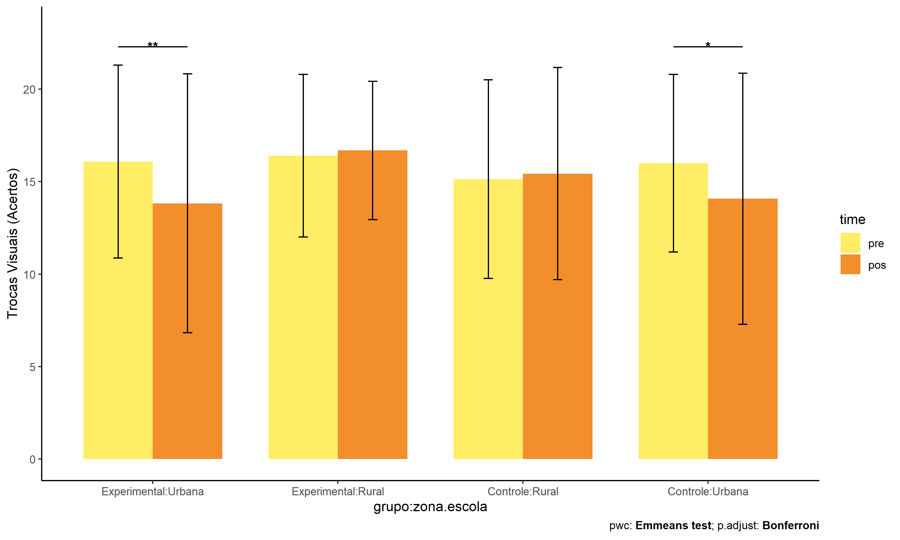<!-- -->

### Trocas Fonologicas (Acertos)

| var          | zona.escola | grupo        |   n | M (pre) | SE (pre) | M (unadj) | SE (unadj) | M (adj) | SE (adj) |
|:-------------|:------------|:-------------|----:|--------:|---------:|----------:|-----------:|--------:|---------:|
| score.TF.pos | Rural       | Controle     |  58 |  13.914 |    0.684 |    13.845 |      0.798 |  14.264 |    0.758 |
| score.TF.pos | Rural       | Experimental |  48 |  15.396 |    0.656 |    15.708 |      0.580 |  15.408 |    0.832 |
| score.TF.pos | Urbana      | Controle     | 118 |  14.890 |    0.448 |    12.881 |      0.612 |  12.827 |    0.530 |
| score.TF.pos | Urbana      | Experimental | 108 |  14.843 |    0.529 |    12.963 |      0.645 |  12.931 |    0.554 |

| .y.          | grupo        | zona.escola | group1   | group2       | estimate | conf.low | conf.high |    se | statistic |     p | p.adj | p.adj.signif |
|:-------------|:-------------|:------------|:---------|:-------------|---------:|---------:|----------:|------:|----------:|------:|------:|:-------------|
| score.TF.pos | Controle     |             | Urbana   | Rural        |   -1.437 |   -3.258 |     0.383 | 0.925 |    -1.553 | 0.121 | 0.121 | ns           |
| score.TF.pos | Experimental |             | Urbana   | Rural        |   -2.477 |   -4.443 |    -0.511 | 0.999 |    -2.478 | 0.014 | 0.014 | \*           |
| score.TF.pre | Controle     |             | Urbana   | Rural        |    0.976 |   -0.633 |     2.585 | 0.818 |     1.194 | 0.233 | 0.233 | ns           |
| score.TF.pre | Experimental |             | Urbana   | Rural        |   -0.553 |   -2.293 |     1.187 | 0.885 |    -0.625 | 0.532 | 0.532 | ns           |
| score.TF.pos |              | Urbana      | Controle | Experimental |   -0.105 |   -1.613 |     1.404 | 0.767 |    -0.136 | 0.892 | 0.892 | ns           |
| score.TF.pos |              | Rural       | Controle | Experimental |   -1.144 |   -3.362 |     1.074 | 1.127 |    -1.015 | 0.311 | 0.311 | ns           |
| score.TF.pre |              | Urbana      | Controle | Experimental |    0.047 |   -1.289 |     1.383 | 0.679 |     0.070 | 0.945 | 0.945 | ns           |
| score.TF.pre |              | Rural       | Controle | Experimental |   -1.482 |   -3.439 |     0.475 | 0.995 |    -1.490 | 0.137 | 0.137 | ns           |

| grupo        | zona.escola | group1 | group2 | estimate | conf.low | conf.high |    se | statistic |     p | p.adj | p.adj.signif |
|:-------------|:------------|:-------|:-------|---------:|---------:|----------:|------:|----------:|------:|------:|:-------------|
| Controle     | Urbana      | pre    | pos    |    2.008 |    0.549 |     3.468 | 0.743 |     2.702 | 0.007 | 0.007 | \*\*         |
| Controle     | Rural       | pre    | pos    |    0.069 |   -2.013 |     2.150 | 1.060 |     0.065 | 0.948 | 0.948 | ns           |
| Experimental | Urbana      | pre    | pos    |    1.880 |    0.354 |     3.405 | 0.777 |     2.420 | 0.016 | 0.016 | \*           |
| Experimental | Rural       | pre    | pos    |   -0.312 |   -2.601 |     1.976 | 1.165 |    -0.268 | 0.789 | 0.789 | ns           |

    ## Scale for colour is already present.
    ## Adding another scale for colour, which will replace the existing scale.

<!-- -->

    ## Scale for colour is already present.
    ## Adding another scale for colour, which will replace the existing scale.

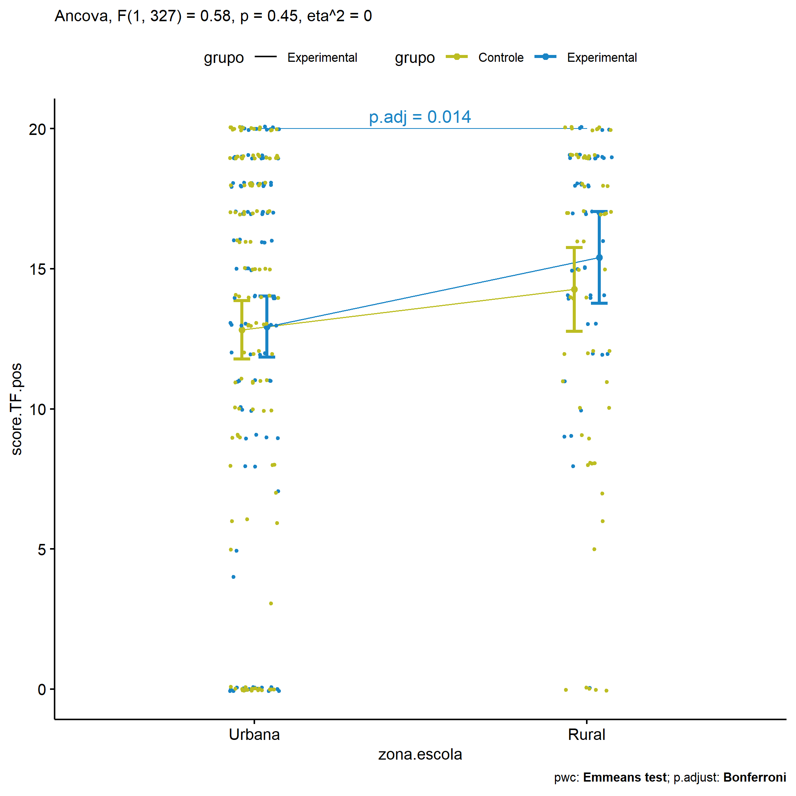<!-- -->

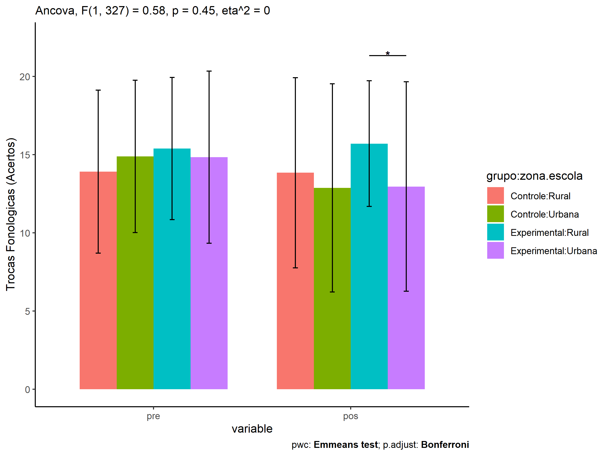<!-- -->

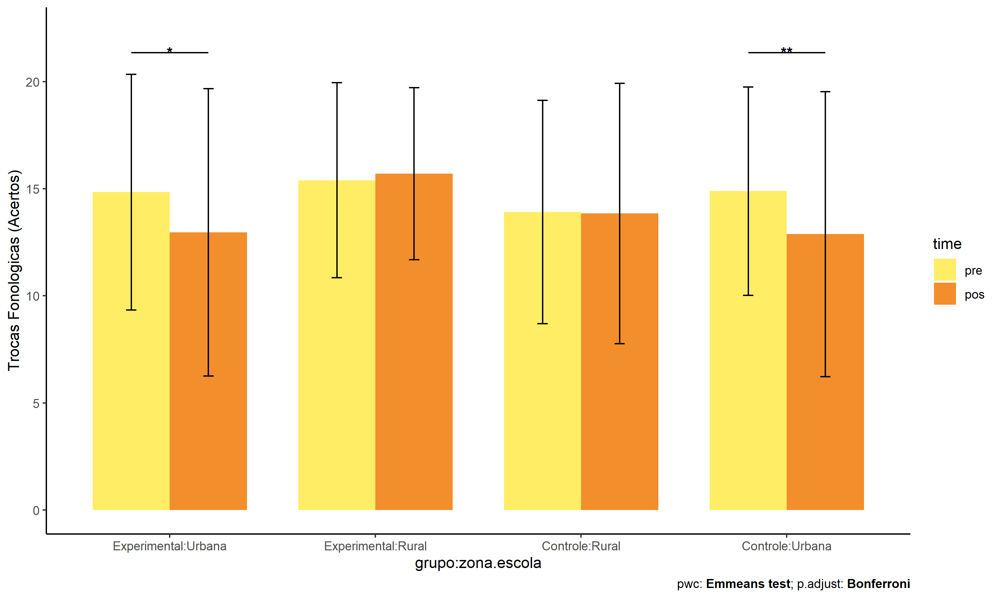<!-- -->

### Trocas Orograficas (Acertos)

| var          | zona.escola | grupo        |   n | M (pre) | SE (pre) | M (unadj) | SE (unadj) | M (adj) | SE (adj) |
|:-------------|:------------|:-------------|----:|--------:|---------:|----------:|-----------:|--------:|---------:|
| score.TO.pos | Rural       | Controle     |  58 |   8.983 |    0.606 |     9.776 |      0.658 |  10.231 |    0.602 |
| score.TO.pos | Rural       | Experimental |  48 |  10.167 |    0.602 |     9.667 |      0.584 |   9.441 |    0.661 |
| score.TO.pos | Urbana      | Controle     | 118 |   9.915 |    0.423 |     9.492 |      0.492 |   9.410 |    0.421 |
| score.TO.pos | Urbana      | Experimental | 108 |   9.870 |    0.439 |     9.389 |      0.553 |   9.333 |    0.440 |

| .y.          | grupo        | zona.escola | group1   | group2       | estimate | conf.low | conf.high |    se | statistic |     p | p.adj | p.adj.signif |
|:-------------|:-------------|:------------|:---------|:-------------|---------:|---------:|----------:|------:|----------:|------:|------:|:-------------|
| score.TO.pos | Controle     |             | Urbana   | Rural        |   -0.821 |   -2.268 |     0.626 | 0.735 |    -1.117 | 0.265 | 0.265 | ns           |
| score.TO.pos | Experimental |             | Urbana   | Rural        |   -0.107 |   -1.669 |     1.454 | 0.794 |    -0.135 | 0.893 | 0.893 | ns           |
| score.TO.pre | Controle     |             | Urbana   | Rural        |    0.932 |   -0.496 |     2.361 | 0.726 |     1.284 | 0.200 | 0.200 | ns           |
| score.TO.pre | Experimental |             | Urbana   | Rural        |   -0.296 |   -1.842 |     1.249 | 0.786 |    -0.377 | 0.706 | 0.706 | ns           |
| score.TO.pos |              | Urbana      | Controle | Experimental |    0.077 |   -1.121 |     1.275 | 0.609 |     0.126 | 0.900 | 0.900 | ns           |
| score.TO.pos |              | Rural       | Controle | Experimental |    0.791 |   -0.970 |     2.551 | 0.895 |     0.883 | 0.378 | 0.378 | ns           |
| score.TO.pre |              | Urbana      | Controle | Experimental |    0.045 |   -1.142 |     1.231 | 0.603 |     0.074 | 0.941 | 0.941 | ns           |
| score.TO.pre |              | Rural       | Controle | Experimental |   -1.184 |   -2.922 |     0.554 | 0.884 |    -1.340 | 0.181 | 0.181 | ns           |

| grupo        | zona.escola | group1 | group2 | estimate | conf.low | conf.high |    se | statistic |     p | p.adj | p.adj.signif |
|:-------------|:------------|:-------|:-------|---------:|---------:|----------:|------:|----------:|------:|------:|:-------------|
| Controle     | Urbana      | pre    | pos    |    0.424 |   -0.831 |     1.678 | 0.639 |     0.663 | 0.507 | 0.507 | ns           |
| Controle     | Rural       | pre    | pos    |   -0.793 |   -2.582 |     0.996 | 0.911 |    -0.870 | 0.384 | 0.384 | ns           |
| Experimental | Urbana      | pre    | pos    |    0.481 |   -0.830 |     1.793 | 0.668 |     0.721 | 0.471 | 0.471 | ns           |
| Experimental | Rural       | pre    | pos    |    0.500 |   -1.467 |     2.467 | 1.002 |     0.499 | 0.618 | 0.618 | ns           |

    ## Scale for colour is already present.
    ## Adding another scale for colour, which will replace the existing scale.

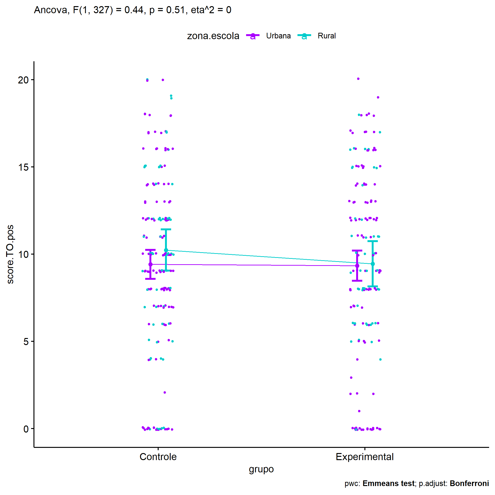<!-- -->

    ## Scale for colour is already present.
    ## Adding another scale for colour, which will replace the existing scale.

<!-- -->

<!-- -->

<!-- -->

# Pairwise comparisons for grupo=“Experimental”

## factores: **grupo=“Experimental”:monitor**

### Leitura de Pseudo-Palavras (Acertos)

| var            | monitor |   n | M (pre) | SE (pre) | M (unadj) | SE (unadj) | M (adj) | SE (adj) |
|:---------------|:--------|----:|--------:|---------:|----------:|-----------:|--------:|---------:|
| score.CLPP.pos | AC      |  11 |  76.364 |    2.081 |    72.909 |      4.196 |  69.967 |    3.180 |
| score.CLPP.pos | CE      |  15 |  74.200 |    3.236 |    75.333 |      2.489 |  73.754 |    2.713 |
| score.CLPP.pos | EA      |  11 |  74.364 |    3.817 |    76.636 |      4.124 |  74.954 |    3.166 |
| score.CLPP.pos | GR      |  14 |  68.786 |    4.362 |    71.214 |      3.853 |  73.046 |    2.810 |
| score.CLPP.pos | JC      |  10 |  77.400 |    3.149 |    81.000 |      3.190 |  77.405 |    3.342 |
| score.CLPP.pos | MF      |  11 |  75.545 |    4.519 |    72.636 |      4.521 |  70.210 |    3.173 |
| score.CLPP.pos | ML      |  16 |  67.812 |    4.032 |    69.188 |      3.510 |  71.632 |    2.636 |
| score.CLPP.pos | MM      |  10 |  68.000 |    2.539 |    61.600 |      6.454 |  63.927 |    3.326 |
| score.CLPP.pos | PR      |  11 |  67.182 |    5.003 |    71.182 |      3.753 |  74.024 |    3.178 |
| score.CLPP.pos | VL      |  15 |  69.800 |    2.434 |    71.333 |      2.030 |  72.526 |    2.710 |

| .y.            | group1 | group2 | estimate | conf.low | conf.high |    se | statistic |     p | p.adj | p.adj.signif |
|:---------------|:-------|:-------|---------:|---------:|----------:|------:|----------:|------:|------:|:-------------|
| score.CLPP.pos | AC     | CE     |   -3.787 |  -12.036 |     4.462 | 4.164 |    -0.910 | 0.365 | 1.000 | ns           |
| score.CLPP.pos | AC     | EA     |   -4.987 |  -13.846 |     3.872 | 4.472 |    -1.115 | 0.267 | 1.000 | ns           |
| score.CLPP.pos | AC     | GR     |   -3.079 |  -11.521 |     5.363 | 4.261 |    -0.723 | 0.471 | 1.000 | ns           |
| score.CLPP.pos | AC     | JC     |   -7.438 |  -16.512 |     1.636 | 4.580 |    -1.624 | 0.107 | 1.000 | ns           |
| score.CLPP.pos | AC     | MF     |   -0.243 |   -9.097 |     8.612 | 4.469 |    -0.054 | 0.957 | 1.000 | ns           |
| score.CLPP.pos | AC     | ML     |   -1.665 |   -9.898 |     6.567 | 4.155 |    -0.401 | 0.689 | 1.000 | ns           |
| score.CLPP.pos | AC     | MM     |    6.040 |   -3.118 |    15.198 | 4.622 |     1.307 | 0.194 | 1.000 | ns           |
| score.CLPP.pos | AC     | PR     |   -4.057 |  -13.016 |     4.902 | 4.522 |    -0.897 | 0.372 | 1.000 | ns           |
| score.CLPP.pos | AC     | VL     |   -2.559 |  -10.860 |     5.741 | 4.190 |    -0.611 | 0.543 | 1.000 | ns           |
| score.CLPP.pos | CE     | EA     |   -1.200 |   -9.442 |     7.043 | 4.160 |    -0.288 | 0.774 | 1.000 | ns           |
| score.CLPP.pos | CE     | GR     |    0.708 |   -7.050 |     8.467 | 3.916 |     0.181 | 0.857 | 1.000 | ns           |
| score.CLPP.pos | CE     | JC     |   -3.651 |  -12.141 |     4.840 | 4.286 |    -0.852 | 0.396 | 1.000 | ns           |
| score.CLPP.pos | CE     | MF     |    3.545 |   -4.700 |    11.790 | 4.162 |     0.852 | 0.396 | 1.000 | ns           |
| score.CLPP.pos | CE     | ML     |    2.122 |   -5.401 |     9.645 | 3.797 |     0.559 | 0.577 | 1.000 | ns           |
| score.CLPP.pos | CE     | MM     |    9.828 |    1.300 |    18.355 | 4.304 |     2.283 | 0.024 | 1.000 | ns           |
| score.CLPP.pos | CE     | PR     |   -0.270 |   -8.578 |     8.039 | 4.194 |    -0.064 | 0.949 | 1.000 | ns           |
| score.CLPP.pos | CE     | VL     |    1.228 |   -6.382 |     8.839 | 3.841 |     0.320 | 0.750 | 1.000 | ns           |
| score.CLPP.pos | EA     | GR     |    1.908 |   -6.499 |    10.316 | 4.244 |     0.450 | 0.654 | 1.000 | ns           |
| score.CLPP.pos | EA     | JC     |   -2.451 |  -11.535 |     6.633 | 4.585 |    -0.535 | 0.594 | 1.000 | ns           |
| score.CLPP.pos | EA     | MF     |    4.745 |   -4.111 |    13.600 | 4.470 |     1.061 | 0.291 | 1.000 | ns           |
| score.CLPP.pos | EA     | ML     |    3.322 |   -4.869 |    11.513 | 4.135 |     0.803 | 0.423 | 1.000 | ns           |
| score.CLPP.pos | EA     | MM     |   11.027 |    1.905 |    20.150 | 4.604 |     2.395 | 0.018 | 0.822 | ns           |
| score.CLPP.pos | EA     | PR     |    0.930 |   -7.988 |     9.849 | 4.502 |     0.207 | 0.837 | 1.000 | ns           |
| score.CLPP.pos | EA     | VL     |    2.428 |   -5.843 |    10.699 | 4.175 |     0.582 | 0.562 | 1.000 | ns           |
| score.CLPP.pos | GR     | JC     |   -4.359 |  -13.052 |     4.334 | 4.388 |    -0.993 | 0.323 | 1.000 | ns           |
| score.CLPP.pos | GR     | MF     |    2.836 |   -5.590 |    11.263 | 4.253 |     0.667 | 0.506 | 1.000 | ns           |
| score.CLPP.pos | GR     | ML     |    1.414 |   -6.187 |     9.014 | 3.836 |     0.369 | 0.713 | 1.000 | ns           |
| score.CLPP.pos | GR     | MM     |    9.119 |    0.521 |    17.717 | 4.340 |     2.101 | 0.038 | 1.000 | ns           |
| score.CLPP.pos | GR     | PR     |   -0.978 |   -9.347 |     7.392 | 4.225 |    -0.231 | 0.817 | 1.000 | ns           |
| score.CLPP.pos | GR     | VL     |    0.520 |   -7.198 |     8.238 | 3.896 |     0.133 | 0.894 | 1.000 | ns           |
| score.CLPP.pos | JC     | MF     |    7.195 |   -1.881 |    16.272 | 4.581 |     1.571 | 0.119 | 1.000 | ns           |
| score.CLPP.pos | JC     | ML     |    5.773 |   -2.719 |    14.264 | 4.286 |     1.347 | 0.181 | 1.000 | ns           |
| score.CLPP.pos | JC     | MM     |   13.478 |    4.087 |    22.870 | 4.740 |     2.843 | 0.005 | 0.238 | ns           |
| score.CLPP.pos | JC     | PR     |    3.381 |   -5.819 |    12.581 | 4.644 |     0.728 | 0.468 | 1.000 | ns           |
| score.CLPP.pos | JC     | VL     |    4.879 |   -3.674 |    13.431 | 4.317 |     1.130 | 0.261 | 1.000 | ns           |
| score.CLPP.pos | MF     | ML     |   -1.423 |   -9.637 |     6.792 | 4.146 |    -0.343 | 0.732 | 1.000 | ns           |
| score.CLPP.pos | MF     | MM     |    6.283 |   -2.859 |    15.425 | 4.614 |     1.362 | 0.176 | 1.000 | ns           |
| score.CLPP.pos | MF     | PR     |   -3.814 |  -12.756 |     5.127 | 4.513 |    -0.845 | 0.400 | 1.000 | ns           |
| score.CLPP.pos | MF     | VL     |   -2.316 |  -10.603 |     5.971 | 4.183 |    -0.554 | 0.581 | 1.000 | ns           |
| score.CLPP.pos | ML     | MM     |    7.706 |   -0.665 |    16.076 | 4.225 |     1.824 | 0.071 | 1.000 | ns           |
| score.CLPP.pos | ML     | PR     |   -2.392 |  -10.525 |     5.742 | 4.105 |    -0.583 | 0.561 | 1.000 | ns           |
| score.CLPP.pos | ML     | VL     |   -0.894 |   -8.362 |     6.575 | 3.770 |    -0.237 | 0.813 | 1.000 | ns           |
| score.CLPP.pos | MM     | PR     |  -10.097 |  -19.171 |    -1.024 | 4.580 |    -2.205 | 0.029 | 1.000 | ns           |
| score.CLPP.pos | MM     | VL     |   -8.599 |  -17.081 |    -0.118 | 4.281 |    -2.009 | 0.047 | 1.000 | ns           |
| score.CLPP.pos | PR     | VL     |    1.498 |   -6.754 |     9.750 | 4.165 |     0.360 | 0.720 | 1.000 | ns           |
| score.CLPP.pre | AC     | CE     |    2.164 |   -8.084 |    12.411 | 5.173 |     0.418 | 0.677 | 1.000 | ns           |
| score.CLPP.pre | AC     | EA     |    2.000 |   -9.008 |    13.008 | 5.557 |     0.360 | 0.720 | 1.000 | ns           |
| score.CLPP.pre | AC     | GR     |    7.578 |   -2.823 |    17.979 | 5.251 |     1.443 | 0.152 | 1.000 | ns           |
| score.CLPP.pre | AC     | JC     |   -1.036 |  -12.316 |    10.243 | 5.694 |    -0.182 | 0.856 | 1.000 | ns           |
| score.CLPP.pre | AC     | MF     |    0.818 |  -10.189 |    11.826 | 5.557 |     0.147 | 0.883 | 1.000 | ns           |
| score.CLPP.pre | AC     | ML     |    8.551 |   -1.560 |    18.662 | 5.104 |     1.675 | 0.097 | 1.000 | ns           |
| score.CLPP.pre | AC     | MM     |    8.364 |   -2.916 |    19.643 | 5.694 |     1.469 | 0.145 | 1.000 | ns           |
| score.CLPP.pre | AC     | PR     |    9.182 |   -1.826 |    20.189 | 5.557 |     1.652 | 0.101 | 1.000 | ns           |
| score.CLPP.pre | AC     | VL     |    6.564 |   -3.684 |    16.811 | 5.173 |     1.269 | 0.207 | 1.000 | ns           |
| score.CLPP.pre | CE     | EA     |   -0.164 |  -10.411 |    10.084 | 5.173 |    -0.032 | 0.975 | 1.000 | ns           |
| score.CLPP.pre | CE     | GR     |    5.414 |   -4.179 |    15.008 | 4.843 |     1.118 | 0.266 | 1.000 | ns           |
| score.CLPP.pre | CE     | JC     |   -3.200 |  -13.739 |     7.339 | 5.320 |    -0.601 | 0.549 | 1.000 | ns           |
| score.CLPP.pre | CE     | MF     |   -1.345 |  -11.593 |     8.902 | 5.173 |    -0.260 | 0.795 | 1.000 | ns           |
| score.CLPP.pre | CE     | ML     |    6.387 |   -2.890 |    15.665 | 4.683 |     1.364 | 0.175 | 1.000 | ns           |
| score.CLPP.pre | CE     | MM     |    6.200 |   -4.339 |    16.739 | 5.320 |     1.165 | 0.246 | 1.000 | ns           |
| score.CLPP.pre | CE     | PR     |    7.018 |   -3.229 |    17.266 | 5.173 |     1.357 | 0.178 | 1.000 | ns           |
| score.CLPP.pre | CE     | VL     |    4.400 |   -5.026 |    13.826 | 4.758 |     0.925 | 0.357 | 1.000 | ns           |
| score.CLPP.pre | EA     | GR     |    5.578 |   -4.823 |    15.979 | 5.251 |     1.062 | 0.290 | 1.000 | ns           |
| score.CLPP.pre | EA     | JC     |   -3.036 |  -14.316 |     8.243 | 5.694 |    -0.533 | 0.595 | 1.000 | ns           |
| score.CLPP.pre | EA     | MF     |   -1.182 |  -12.189 |     9.826 | 5.557 |    -0.213 | 0.832 | 1.000 | ns           |
| score.CLPP.pre | EA     | ML     |    6.551 |   -3.560 |    16.662 | 5.104 |     1.284 | 0.202 | 1.000 | ns           |
| score.CLPP.pre | EA     | MM     |    6.364 |   -4.916 |    17.643 | 5.694 |     1.118 | 0.266 | 1.000 | ns           |
| score.CLPP.pre | EA     | PR     |    7.182 |   -3.826 |    18.189 | 5.557 |     1.292 | 0.199 | 1.000 | ns           |
| score.CLPP.pre | EA     | VL     |    4.564 |   -5.684 |    14.811 | 5.173 |     0.882 | 0.380 | 1.000 | ns           |
| score.CLPP.pre | GR     | JC     |   -8.614 |  -19.303 |     2.074 | 5.396 |    -1.597 | 0.113 | 1.000 | ns           |
| score.CLPP.pre | GR     | MF     |   -6.760 |  -17.161 |     3.642 | 5.251 |    -1.287 | 0.201 | 1.000 | ns           |
| score.CLPP.pre | GR     | ML     |    0.973 |   -8.474 |    10.421 | 4.769 |     0.204 | 0.839 | 1.000 | ns           |
| score.CLPP.pre | GR     | MM     |    0.786 |   -9.903 |    11.474 | 5.396 |     0.146 | 0.884 | 1.000 | ns           |
| score.CLPP.pre | GR     | PR     |    1.604 |   -8.797 |    12.005 | 5.251 |     0.305 | 0.761 | 1.000 | ns           |
| score.CLPP.pre | GR     | VL     |   -1.014 |  -10.608 |     8.579 | 4.843 |    -0.209 | 0.834 | 1.000 | ns           |
| score.CLPP.pre | JC     | MF     |    1.855 |   -9.425 |    13.134 | 5.694 |     0.326 | 0.745 | 1.000 | ns           |
| score.CLPP.pre | JC     | ML     |    9.588 |   -0.819 |    19.994 | 5.253 |     1.825 | 0.071 | 1.000 | ns           |
| score.CLPP.pre | JC     | MM     |    9.400 |   -2.145 |    20.945 | 5.828 |     1.613 | 0.110 | 1.000 | ns           |
| score.CLPP.pre | JC     | PR     |   10.218 |   -1.061 |    21.498 | 5.694 |     1.795 | 0.075 | 1.000 | ns           |
| score.CLPP.pre | JC     | VL     |    7.600 |   -2.939 |    18.139 | 5.320 |     1.429 | 0.156 | 1.000 | ns           |
| score.CLPP.pre | MF     | ML     |    7.733 |   -2.378 |    17.844 | 5.104 |     1.515 | 0.133 | 1.000 | ns           |
| score.CLPP.pre | MF     | MM     |    7.545 |   -3.734 |    18.825 | 5.694 |     1.325 | 0.188 | 1.000 | ns           |
| score.CLPP.pre | MF     | PR     |    8.364 |   -2.644 |    19.371 | 5.557 |     1.505 | 0.135 | 1.000 | ns           |
| score.CLPP.pre | MF     | VL     |    5.745 |   -4.502 |    15.993 | 5.173 |     1.111 | 0.269 | 1.000 | ns           |
| score.CLPP.pre | ML     | MM     |   -0.188 |  -10.594 |    10.219 | 5.253 |    -0.036 | 0.972 | 1.000 | ns           |
| score.CLPP.pre | ML     | PR     |    0.631 |   -9.481 |    10.742 | 5.104 |     0.124 | 0.902 | 1.000 | ns           |
| score.CLPP.pre | ML     | VL     |   -1.988 |  -11.265 |     7.290 | 4.683 |    -0.424 | 0.672 | 1.000 | ns           |
| score.CLPP.pre | MM     | PR     |    0.818 |  -10.461 |    12.098 | 5.694 |     0.144 | 0.886 | 1.000 | ns           |
| score.CLPP.pre | MM     | VL     |   -1.800 |  -12.339 |     8.739 | 5.320 |    -0.338 | 0.736 | 1.000 | ns           |
| score.CLPP.pre | PR     | VL     |   -2.618 |  -12.866 |     7.629 | 5.173 |    -0.506 | 0.614 | 1.000 | ns           |

| .y.        | monitor | group1 | group2 | estimate | conf.low | conf.high |    se | statistic |     p | p.adj | p.adj.signif |
|:-----------|:--------|:-------|:-------|---------:|---------:|----------:|------:|----------:|------:|------:|:-------------|
| score.CLPP | AC      | pre    | pos    |    2.245 |   -8.120 |    12.610 | 5.262 |     0.427 | 0.670 | 0.670 | ns           |
| score.CLPP | CE      | pre    | pos    |   -1.050 |  -10.143 |     8.043 | 4.616 |    -0.227 | 0.820 | 0.820 | ns           |
| score.CLPP | EA      | pre    | pos    |   -2.273 |  -13.061 |     8.515 | 5.477 |    -0.415 | 0.679 | 0.679 | ns           |
| score.CLPP | GR      | pre    | pos    |   -1.667 |  -10.905 |     7.572 | 4.690 |    -0.355 | 0.723 | 0.723 | ns           |
| score.CLPP | JC      | pre    | pos    |   -3.750 |  -14.583 |     7.083 | 5.500 |    -0.682 | 0.496 | 0.496 | ns           |
| score.CLPP | MF      | pre    | pos    |    3.149 |   -7.044 |    13.343 | 5.175 |     0.609 | 0.543 | 0.543 | ns           |
| score.CLPP | ML      | pre    | pos    |   -1.375 |  -10.320 |     7.570 | 4.541 |    -0.303 | 0.762 | 0.762 | ns           |
| score.CLPP | MM      | pre    | pos    |    9.043 |   -1.432 |    19.518 | 5.318 |     1.700 | 0.090 | 0.090 | ns           |
| score.CLPP | PR      | pre    | pos    |   -4.000 |  -14.788 |     6.788 | 5.477 |    -0.730 | 0.466 | 0.466 | ns           |
| score.CLPP | VL      | pre    | pos    |   -1.583 |  -10.676 |     7.509 | 4.616 |    -0.343 | 0.732 | 0.732 | ns           |

    ## Scale for colour is already present.
    ## Adding another scale for colour, which will replace the existing scale.

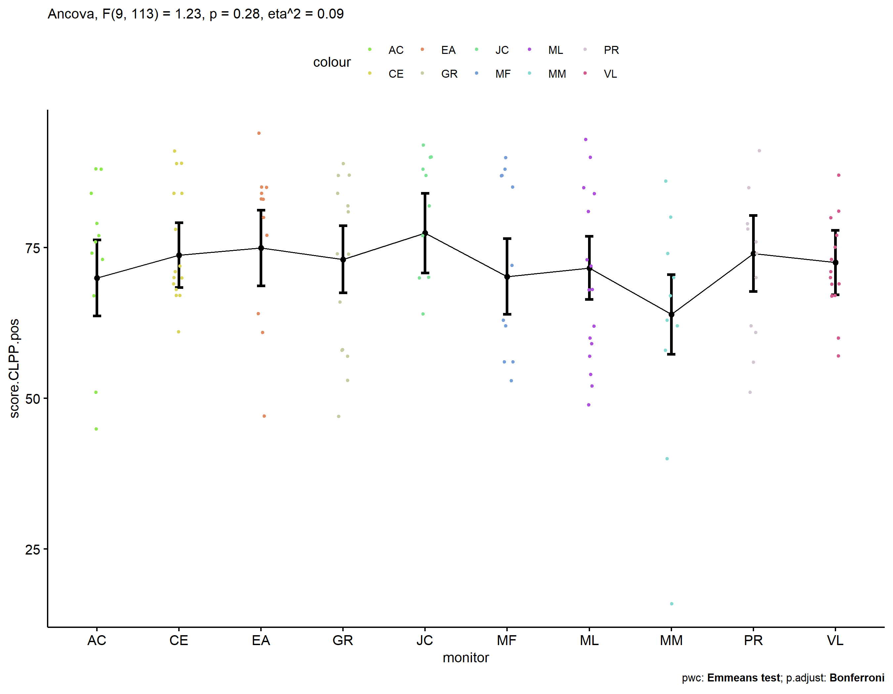<!-- -->

<!-- -->

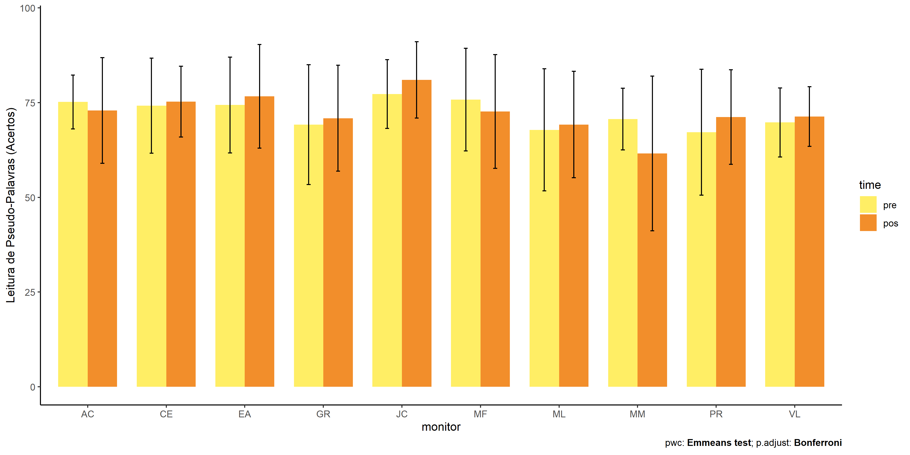<!-- -->

### Correta Regular (Acertos)

| var          | monitor |   n | M (pre) | SE (pre) | M (unadj) | SE (unadj) | M (adj) | SE (adj) |
|:-------------|:--------|----:|--------:|---------:|----------:|-----------:|--------:|---------:|
| score.CR.pos | AC      |  13 |  17.000 |    0.679 |    13.231 |      1.812 |  12.434 |    1.457 |
| score.CR.pos | CE      |  16 |  15.750 |    1.230 |    16.625 |      0.386 |  16.392 |    1.302 |
| score.CR.pos | EA      |  11 |  15.455 |    0.824 |    14.818 |      1.197 |  14.719 |    1.568 |
| score.CR.pos | GR      |  16 |  14.125 |    1.316 |    14.375 |      1.221 |  14.876 |    1.307 |
| score.CR.pos | JC      |  12 |  16.667 |    0.541 |    14.417 |      1.994 |  13.770 |    1.511 |
| score.CR.pos | MF      |  14 |  16.214 |    0.664 |    11.214 |      1.825 |  10.772 |    1.395 |
| score.CR.pos | ML      |  16 |  13.812 |    1.042 |    14.562 |      0.851 |  15.204 |    1.311 |
| score.CR.pos | MM      |  14 |  15.214 |    0.639 |     9.857 |      2.011 |   9.866 |    1.390 |
| score.CR.pos | PR      |  13 |  12.462 |    1.824 |    13.077 |      1.741 |  14.328 |    1.478 |
| score.CR.pos | VL      |  16 |  16.000 |    0.619 |    15.812 |      1.198 |  15.467 |    1.303 |

| .y.          | group1 | group2 | estimate | conf.low | conf.high |    se | statistic | p       | p.adj | p.adj.signif |
|:-------------|:-------|:-------|---------:|---------:|----------:|------:|----------:|:--------|------:|:-------------|
| score.CR.pos | AC     | CE     |   -3.958 |   -7.811 |    -0.106 | 1.947 |    -2.033 | 0.044   | 1.000 | ns           |
| score.CR.pos | AC     | EA     |   -2.285 |   -6.515 |     1.945 | 2.138 |    -1.069 | 0.287   | 1.000 | ns           |
| score.CR.pos | AC     | GR     |   -2.442 |   -6.340 |     1.457 | 1.971 |    -1.239 | 0.218   | 1.000 | ns           |
| score.CR.pos | AC     | JC     |   -1.336 |   -5.456 |     2.783 | 2.082 |    -0.642 | 0.522   | 1.000 | ns           |
| score.CR.pos | AC     | MF     |    1.662 |   -2.305 |     5.629 | 2.005 |     0.829 | 0.409   | 1.000 | ns           |
| score.CR.pos | AC     | ML     |   -2.770 |   -6.682 |     1.141 | 1.977 |    -1.401 | 0.164   | 1.000 | ns           |
| score.CR.pos | AC     | MM     |    2.568 |   -1.417 |     6.552 | 2.014 |     1.275 | 0.205   | 1.000 | ns           |
| score.CR.pos | AC     | PR     |   -1.894 |   -6.064 |     2.275 | 2.107 |    -0.899 | 0.37    | 1.000 | ns           |
| score.CR.pos | AC     | VL     |   -3.033 |   -6.882 |     0.816 | 1.945 |    -1.559 | 0.121   | 1.000 | ns           |
| score.CR.pos | CE     | EA     |    1.673 |   -2.357 |     5.704 | 2.037 |     0.821 | 0.413   | 1.000 | ns           |
| score.CR.pos | CE     | GR     |    1.517 |   -2.140 |     5.174 | 1.848 |     0.820 | 0.413   | 1.000 | ns           |
| score.CR.pos | CE     | JC     |    2.622 |   -1.313 |     6.557 | 1.989 |     1.318 | 0.19    | 1.000 | ns           |
| score.CR.pos | CE     | MF     |    5.620 |    1.853 |     9.387 | 1.904 |     2.952 | 0.004   | 0.169 | ns           |
| score.CR.pos | CE     | ML     |    1.188 |   -2.477 |     4.853 | 1.853 |     0.641 | 0.522   | 1.000 | ns           |
| score.CR.pos | CE     | MM     |    6.526 |    2.759 |    10.294 | 1.904 |     3.427 | \<0.001 | 0.037 | \*           |
| score.CR.pos | CE     | PR     |    2.064 |   -1.852 |     5.980 | 1.979 |     1.043 | 0.299   | 1.000 | ns           |
| score.CR.pos | CE     | VL     |    0.925 |   -2.713 |     4.564 | 1.839 |     0.503 | 0.616   | 1.000 | ns           |
| score.CR.pos | EA     | GR     |   -0.157 |   -4.199 |     3.885 | 2.043 |    -0.077 | 0.939   | 1.000 | ns           |
| score.CR.pos | EA     | JC     |    0.949 |   -3.355 |     5.253 | 2.176 |     0.436 | 0.664   | 1.000 | ns           |
| score.CR.pos | EA     | MF     |    3.947 |   -0.203 |     8.096 | 2.097 |     1.882 | 0.062   | 1.000 | ns           |
| score.CR.pos | EA     | ML     |   -0.485 |   -4.533 |     3.562 | 2.046 |    -0.237 | 0.813   | 1.000 | ns           |
| score.CR.pos | EA     | MM     |    4.853 |    0.707 |     8.999 | 2.096 |     2.316 | 0.022   | 0.997 | ns           |
| score.CR.pos | EA     | PR     |    0.390 |   -3.881 |     4.662 | 2.159 |     0.181 | 0.857   | 1.000 | ns           |
| score.CR.pos | EA     | VL     |   -0.748 |   -4.780 |     3.284 | 2.038 |    -0.367 | 0.714   | 1.000 | ns           |
| score.CR.pos | GR     | JC     |    1.105 |   -2.867 |     5.078 | 2.008 |     0.550 | 0.583   | 1.000 | ns           |
| score.CR.pos | GR     | MF     |    4.104 |    0.307 |     7.900 | 1.919 |     2.139 | 0.034   | 1.000 | ns           |
| score.CR.pos | GR     | ML     |   -0.329 |   -3.967 |     3.310 | 1.839 |    -0.179 | 0.859   | 1.000 | ns           |
| score.CR.pos | GR     | MM     |    5.009 |    1.236 |     8.783 | 1.908 |     2.626 | 0.01    | 0.435 | ns           |
| score.CR.pos | GR     | PR     |    0.547 |   -3.314 |     4.408 | 1.952 |     0.280 | 0.78    | 1.000 | ns           |
| score.CR.pos | GR     | VL     |   -0.591 |   -4.255 |     3.072 | 1.852 |    -0.319 | 0.75    | 1.000 | ns           |
| score.CR.pos | JC     | MF     |    2.998 |   -1.051 |     7.047 | 2.047 |     1.465 | 0.145   | 1.000 | ns           |
| score.CR.pos | JC     | ML     |   -1.434 |   -5.418 |     2.550 | 2.014 |    -0.712 | 0.478   | 1.000 | ns           |
| score.CR.pos | JC     | MM     |    3.904 |   -0.158 |     7.966 | 2.053 |     1.902 | 0.059   | 1.000 | ns           |
| score.CR.pos | JC     | PR     |   -0.558 |   -4.790 |     3.674 | 2.139 |    -0.261 | 0.795   | 1.000 | ns           |
| score.CR.pos | JC     | VL     |   -1.697 |   -5.629 |     2.236 | 1.988 |    -0.854 | 0.395   | 1.000 | ns           |
| score.CR.pos | MF     | ML     |   -4.432 |   -8.238 |    -0.626 | 1.924 |    -2.304 | 0.023   | 1.000 | ns           |
| score.CR.pos | MF     | MM     |    0.906 |   -2.990 |     4.802 | 1.969 |     0.460 | 0.646   | 1.000 | ns           |
| score.CR.pos | MF     | PR     |   -3.556 |   -7.613 |     0.500 | 2.050 |    -1.734 | 0.085   | 1.000 | ns           |
| score.CR.pos | MF     | VL     |   -4.695 |   -8.461 |    -0.929 | 1.903 |    -2.467 | 0.015   | 0.673 | ns           |
| score.CR.pos | ML     | MM     |    5.338 |    1.559 |     9.117 | 1.910 |     2.794 | 0.006   | 0.269 | ns           |
| score.CR.pos | ML     | PR     |    0.876 |   -2.979 |     4.730 | 1.948 |     0.450 | 0.654   | 1.000 | ns           |
| score.CR.pos | ML     | VL     |   -0.263 |   -3.935 |     3.410 | 1.856 |    -0.142 | 0.888   | 1.000 | ns           |
| score.CR.pos | MM     | PR     |   -4.462 |   -8.476 |    -0.449 | 2.029 |    -2.199 | 0.03    | 1.000 | ns           |
| score.CR.pos | MM     | VL     |   -5.601 |   -9.371 |    -1.831 | 1.906 |    -2.939 | 0.004   | 0.175 | ns           |
| score.CR.pos | PR     | VL     |   -1.139 |   -5.066 |     2.789 | 1.985 |    -0.574 | 0.567   | 1.000 | ns           |
| score.CR.pre | AC     | CE     |    1.250 |   -1.629 |     4.129 | 1.456 |     0.859 | 0.392   | 1.000 | ns           |
| score.CR.pre | AC     | EA     |    1.545 |   -1.614 |     4.705 | 1.597 |     0.968 | 0.335   | 1.000 | ns           |
| score.CR.pre | AC     | GR     |    2.875 |   -0.004 |     5.754 | 1.456 |     1.975 | 0.05    | 1.000 | ns           |
| score.CR.pre | AC     | JC     |    0.333 |   -2.754 |     3.420 | 1.560 |     0.214 | 0.831   | 1.000 | ns           |
| score.CR.pre | AC     | MF     |    0.786 |   -2.184 |     3.756 | 1.501 |     0.523 | 0.602   | 1.000 | ns           |
| score.CR.pre | AC     | ML     |    3.188 |    0.308 |     6.067 | 1.456 |     2.190 | 0.03    | 1.000 | ns           |
| score.CR.pre | AC     | MM     |    1.786 |   -1.184 |     4.756 | 1.501 |     1.189 | 0.236   | 1.000 | ns           |
| score.CR.pre | AC     | PR     |    4.538 |    1.514 |     7.563 | 1.529 |     2.968 | 0.004   | 0.160 | ns           |
| score.CR.pre | AC     | VL     |    1.000 |   -1.879 |     3.879 | 1.456 |     0.687 | 0.493   | 1.000 | ns           |
| score.CR.pre | CE     | EA     |    0.295 |   -2.725 |     3.316 | 1.527 |     0.194 | 0.847   | 1.000 | ns           |
| score.CR.pre | CE     | GR     |    1.625 |   -1.101 |     4.351 | 1.378 |     1.179 | 0.24    | 1.000 | ns           |
| score.CR.pre | CE     | JC     |   -0.917 |   -3.861 |     2.028 | 1.489 |    -0.616 | 0.539   | 1.000 | ns           |
| score.CR.pre | CE     | MF     |   -0.464 |   -3.286 |     2.358 | 1.427 |    -0.325 | 0.745   | 1.000 | ns           |
| score.CR.pre | CE     | ML     |    1.938 |   -0.789 |     4.664 | 1.378 |     1.406 | 0.162   | 1.000 | ns           |
| score.CR.pre | CE     | MM     |    0.536 |   -2.286 |     3.358 | 1.427 |     0.376 | 0.708   | 1.000 | ns           |
| score.CR.pre | CE     | PR     |    3.288 |    0.409 |     6.168 | 1.456 |     2.259 | 0.026   | 1.000 | ns           |
| score.CR.pre | CE     | VL     |   -0.250 |   -2.976 |     2.476 | 1.378 |    -0.181 | 0.856   | 1.000 | ns           |
| score.CR.pre | EA     | GR     |    1.330 |   -1.691 |     4.350 | 1.527 |     0.871 | 0.385   | 1.000 | ns           |
| score.CR.pre | EA     | JC     |   -1.212 |   -4.431 |     2.007 | 1.627 |    -0.745 | 0.458   | 1.000 | ns           |
| score.CR.pre | EA     | MF     |   -0.760 |   -3.867 |     2.347 | 1.571 |    -0.484 | 0.629   | 1.000 | ns           |
| score.CR.pre | EA     | ML     |    1.642 |   -1.378 |     4.662 | 1.527 |     1.076 | 0.284   | 1.000 | ns           |
| score.CR.pre | EA     | MM     |    0.240 |   -2.867 |     3.347 | 1.571 |     0.153 | 0.879   | 1.000 | ns           |
| score.CR.pre | EA     | PR     |    2.993 |   -0.166 |     6.152 | 1.597 |     1.874 | 0.063   | 1.000 | ns           |
| score.CR.pre | EA     | VL     |   -0.545 |   -3.566 |     2.475 | 1.527 |    -0.357 | 0.721   | 1.000 | ns           |
| score.CR.pre | GR     | JC     |   -2.542 |   -5.486 |     0.403 | 1.489 |    -1.707 | 0.09    | 1.000 | ns           |
| score.CR.pre | GR     | MF     |   -2.089 |   -4.911 |     0.733 | 1.427 |    -1.465 | 0.145   | 1.000 | ns           |
| score.CR.pre | GR     | ML     |    0.313 |   -2.414 |     3.039 | 1.378 |     0.227 | 0.821   | 1.000 | ns           |
| score.CR.pre | GR     | MM     |   -1.089 |   -3.911 |     1.733 | 1.427 |    -0.764 | 0.446   | 1.000 | ns           |
| score.CR.pre | GR     | PR     |    1.663 |   -1.216 |     4.543 | 1.456 |     1.143 | 0.255   | 1.000 | ns           |
| score.CR.pre | GR     | VL     |   -1.875 |   -4.601 |     0.851 | 1.378 |    -1.360 | 0.176   | 1.000 | ns           |
| score.CR.pre | JC     | MF     |    0.452 |   -2.581 |     3.486 | 1.533 |     0.295 | 0.768   | 1.000 | ns           |
| score.CR.pre | JC     | ML     |    2.854 |   -0.091 |     5.799 | 1.489 |     1.917 | 0.057   | 1.000 | ns           |
| score.CR.pre | JC     | MM     |    1.452 |   -1.581 |     4.486 | 1.533 |     0.947 | 0.345   | 1.000 | ns           |
| score.CR.pre | JC     | PR     |    4.205 |    1.118 |     7.292 | 1.560 |     2.695 | 0.008   | 0.359 | ns           |
| score.CR.pre | JC     | VL     |    0.667 |   -2.278 |     3.611 | 1.489 |     0.448 | 0.655   | 1.000 | ns           |
| score.CR.pre | MF     | ML     |    2.402 |   -0.420 |     5.224 | 1.427 |     1.684 | 0.095   | 1.000 | ns           |
| score.CR.pre | MF     | MM     |    1.000 |   -1.915 |     3.915 | 1.473 |     0.679 | 0.499   | 1.000 | ns           |
| score.CR.pre | MF     | PR     |    3.753 |    0.783 |     6.723 | 1.501 |     2.500 | 0.014   | 0.615 | ns           |
| score.CR.pre | MF     | VL     |    0.214 |   -2.608 |     3.036 | 1.427 |     0.150 | 0.881   | 1.000 | ns           |
| score.CR.pre | ML     | MM     |   -1.402 |   -4.224 |     1.420 | 1.427 |    -0.983 | 0.328   | 1.000 | ns           |
| score.CR.pre | ML     | PR     |    1.351 |   -1.528 |     4.230 | 1.456 |     0.928 | 0.355   | 1.000 | ns           |
| score.CR.pre | ML     | VL     |   -2.188 |   -4.914 |     0.539 | 1.378 |    -1.587 | 0.115   | 1.000 | ns           |
| score.CR.pre | MM     | PR     |    2.753 |   -0.217 |     5.723 | 1.501 |     1.833 | 0.069   | 1.000 | ns           |
| score.CR.pre | MM     | VL     |   -0.786 |   -3.608 |     2.036 | 1.427 |    -0.551 | 0.583   | 1.000 | ns           |
| score.CR.pre | PR     | VL     |   -3.538 |   -6.418 |    -0.659 | 1.456 |    -2.431 | 0.016   | 0.738 | ns           |

| .y.      | monitor | group1 | group2 | estimate | conf.low | conf.high |    se | statistic |     p | p.adj | p.adj.signif |
|:---------|:--------|:-------|:-------|---------:|---------:|----------:|------:|----------:|------:|------:|:-------------|
| score.CR | AC      | pre    | pos    |    3.769 |    0.100 |     7.438 | 1.863 |     2.023 | 0.044 | 0.044 | \*           |
| score.CR | CE      | pre    | pos    |   -0.875 |   -4.182 |     2.432 | 1.680 |    -0.521 | 0.603 | 0.603 | ns           |
| score.CR | EA      | pre    | pos    |    0.636 |   -3.352 |     4.625 | 2.026 |     0.314 | 0.754 | 0.754 | ns           |
| score.CR | GR      | pre    | pos    |   -0.250 |   -3.557 |     3.057 | 1.680 |    -0.149 | 0.882 | 0.882 | ns           |
| score.CR | JC      | pre    | pos    |    2.250 |   -1.569 |     6.069 | 1.939 |     1.160 | 0.247 | 0.247 | ns           |
| score.CR | MF      | pre    | pos    |    5.000 |    1.465 |     8.535 | 1.795 |     2.785 | 0.006 | 0.006 | \*\*         |
| score.CR | ML      | pre    | pos    |   -0.750 |   -4.057 |     2.557 | 1.680 |    -0.447 | 0.656 | 0.656 | ns           |
| score.CR | MM      | pre    | pos    |    5.357 |    1.822 |     8.893 | 1.795 |     2.984 | 0.003 | 0.003 | \*\*         |
| score.CR | PR      | pre    | pos    |   -0.615 |   -4.284 |     3.053 | 1.863 |    -0.330 | 0.741 | 0.741 | ns           |
| score.CR | VL      | pre    | pos    |    0.187 |   -3.120 |     3.495 | 1.680 |     0.112 | 0.911 | 0.911 | ns           |

    ## Scale for colour is already present.
    ## Adding another scale for colour, which will replace the existing scale.

<!-- -->

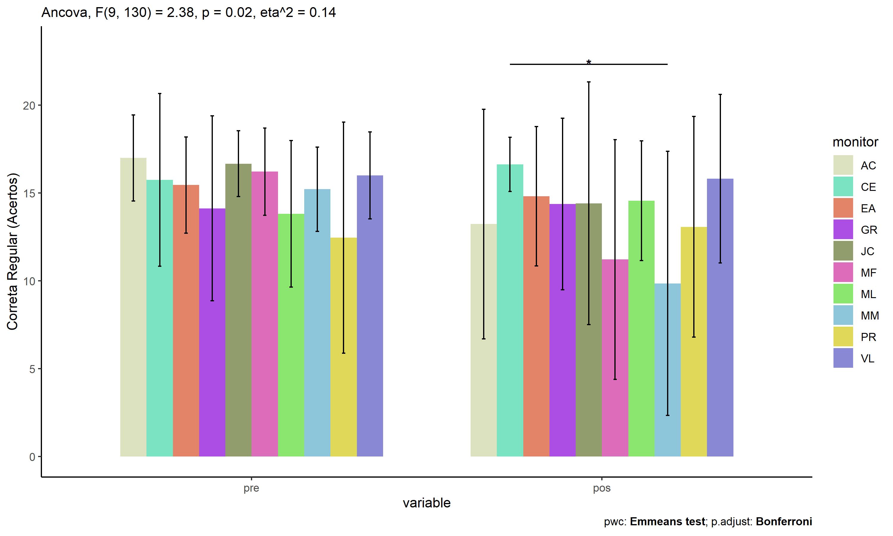<!-- -->

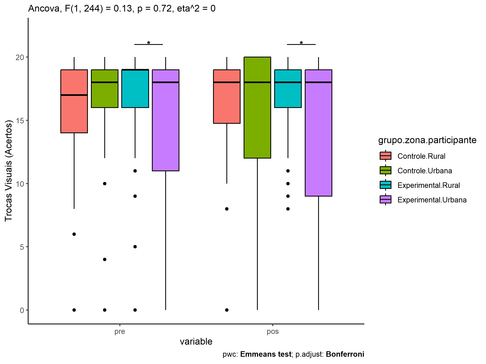<!-- -->

### Correta Irregular (Acertos)

| var          | monitor |   n | M (pre) | SE (pre) | M (unadj) | SE (unadj) | M (adj) | SE (adj) |
|:-------------|:--------|----:|--------:|---------:|----------:|-----------:|--------:|---------:|
| score.CI.pos | AC      |  13 |  12.923 |    0.916 |    10.615 |      1.483 |  10.120 |    1.279 |
| score.CI.pos | CE      |  16 |  11.562 |    1.110 |    13.562 |      0.747 |  13.786 |    1.150 |
| score.CI.pos | EA      |  11 |  12.091 |    1.148 |    13.455 |      1.216 |  13.399 |    1.386 |
| score.CI.pos | GR      |  16 |  11.812 |    1.134 |    12.375 |      1.008 |  12.467 |    1.149 |
| score.CI.pos | JC      |  12 |  11.833 |    0.613 |    11.500 |      1.747 |  11.581 |    1.327 |
| score.CI.pos | MF      |  14 |  12.929 |    0.497 |    10.643 |      1.708 |  10.144 |    1.233 |
| score.CI.pos | ML      |  16 |  11.125 |    0.884 |    12.438 |      0.922 |  12.893 |    1.153 |
| score.CI.pos | MM      |  14 |  12.071 |    0.986 |     8.143 |      1.722 |   8.098 |    1.229 |
| score.CI.pos | PR      |  13 |  10.538 |    1.682 |    10.769 |      1.590 |  11.535 |    1.284 |
| score.CI.pos | VL      |  16 |  13.000 |    0.806 |    12.125 |      1.179 |  11.589 |    1.154 |

| .y.          | group1 | group2 | estimate | conf.low | conf.high |    se | statistic | p       | p.adj | p.adj.signif |
|:-------------|:-------|:-------|---------:|---------:|----------:|------:|----------:|:--------|------:|:-------------|
| score.CI.pos | AC     | CE     |   -3.667 |   -7.074 |    -0.259 | 1.722 |    -2.129 | 0.035   | 1.000 | ns           |
| score.CI.pos | AC     | EA     |   -3.279 |   -7.009 |     0.451 | 1.885 |    -1.739 | 0.084   | 1.000 | ns           |
| score.CI.pos | AC     | GR     |   -2.347 |   -5.751 |     1.057 | 1.720 |    -1.364 | 0.175   | 1.000 | ns           |
| score.CI.pos | AC     | JC     |   -1.461 |   -5.109 |     2.187 | 1.844 |    -0.792 | 0.43    | 1.000 | ns           |
| score.CI.pos | AC     | MF     |   -0.025 |   -3.528 |     3.479 | 1.771 |    -0.014 | 0.989   | 1.000 | ns           |
| score.CI.pos | AC     | ML     |   -2.773 |   -6.190 |     0.643 | 1.727 |    -1.606 | 0.111   | 1.000 | ns           |
| score.CI.pos | AC     | MM     |    2.022 |   -1.485 |     5.530 | 1.773 |     1.141 | 0.256   | 1.000 | ns           |
| score.CI.pos | AC     | PR     |   -1.415 |   -5.017 |     2.186 | 1.820 |    -0.777 | 0.438   | 1.000 | ns           |
| score.CI.pos | AC     | VL     |   -1.469 |   -4.865 |     1.927 | 1.717 |    -0.856 | 0.394   | 1.000 | ns           |
| score.CI.pos | CE     | EA     |    0.387 |   -3.177 |     3.951 | 1.801 |     0.215 | 0.83    | 1.000 | ns           |
| score.CI.pos | CE     | GR     |    1.320 |   -1.896 |     4.536 | 1.626 |     0.812 | 0.418   | 1.000 | ns           |
| score.CI.pos | CE     | JC     |    2.206 |   -1.268 |     5.679 | 1.756 |     1.256 | 0.211   | 1.000 | ns           |
| score.CI.pos | CE     | MF     |    3.642 |    0.302 |     6.983 | 1.688 |     2.157 | 0.033   | 1.000 | ns           |
| score.CI.pos | CE     | ML     |    0.894 |   -2.323 |     4.110 | 1.626 |     0.550 | 0.584   | 1.000 | ns           |
| score.CI.pos | CE     | MM     |    5.689 |    2.359 |     9.019 | 1.683 |     3.380 | \<0.001 | 0.043 | \*           |
| score.CI.pos | CE     | PR     |    2.252 |   -1.151 |     5.654 | 1.720 |     1.309 | 0.193   | 1.000 | ns           |
| score.CI.pos | CE     | VL     |    2.198 |   -1.031 |     5.427 | 1.632 |     1.347 | 0.18    | 1.000 | ns           |
| score.CI.pos | EA     | GR     |    0.932 |   -2.631 |     4.495 | 1.801 |     0.518 | 0.606   | 1.000 | ns           |
| score.CI.pos | EA     | JC     |    1.818 |   -1.979 |     5.615 | 1.919 |     0.947 | 0.345   | 1.000 | ns           |
| score.CI.pos | EA     | MF     |    3.255 |   -0.414 |     6.923 | 1.854 |     1.755 | 0.082   | 1.000 | ns           |
| score.CI.pos | EA     | ML     |    0.506 |   -3.062 |     4.074 | 1.803 |     0.281 | 0.779   | 1.000 | ns           |
| score.CI.pos | EA     | MM     |    5.301 |    1.637 |     8.966 | 1.852 |     2.862 | 0.005   | 0.221 | ns           |
| score.CI.pos | EA     | PR     |    1.864 |   -1.876 |     5.604 | 1.890 |     0.986 | 0.326   | 1.000 | ns           |
| score.CI.pos | EA     | VL     |    1.810 |   -1.757 |     5.378 | 1.803 |     1.004 | 0.317   | 1.000 | ns           |
| score.CI.pos | GR     | JC     |    0.886 |   -2.587 |     4.359 | 1.756 |     0.505 | 0.615   | 1.000 | ns           |
| score.CI.pos | GR     | MF     |    2.323 |   -1.014 |     5.659 | 1.686 |     1.377 | 0.171   | 1.000 | ns           |
| score.CI.pos | GR     | ML     |   -0.426 |   -3.645 |     2.793 | 1.627 |    -0.262 | 0.794   | 1.000 | ns           |
| score.CI.pos | GR     | MM     |    4.369 |    1.040 |     7.698 | 1.683 |     2.597 | 0.01    | 0.472 | ns           |
| score.CI.pos | GR     | PR     |    0.932 |   -2.474 |     4.338 | 1.722 |     0.541 | 0.589   | 1.000 | ns           |
| score.CI.pos | GR     | VL     |    0.878 |   -2.347 |     4.103 | 1.630 |     0.539 | 0.591   | 1.000 | ns           |
| score.CI.pos | JC     | MF     |    1.436 |   -2.149 |     5.022 | 1.812 |     0.793 | 0.429   | 1.000 | ns           |
| score.CI.pos | JC     | ML     |   -1.312 |   -4.789 |     2.164 | 1.757 |    -0.747 | 0.457   | 1.000 | ns           |
| score.CI.pos | JC     | MM     |    3.483 |   -0.095 |     7.061 | 1.809 |     1.926 | 0.056   | 1.000 | ns           |
| score.CI.pos | JC     | PR     |    0.046 |   -3.605 |     3.697 | 1.845 |     0.025 | 0.98    | 1.000 | ns           |
| score.CI.pos | JC     | VL     |   -0.008 |   -3.489 |     3.474 | 1.760 |    -0.004 | 0.996   | 1.000 | ns           |
| score.CI.pos | MF     | ML     |   -2.749 |   -6.098 |     0.601 | 1.693 |    -1.624 | 0.107   | 1.000 | ns           |
| score.CI.pos | MF     | MM     |    2.047 |   -1.396 |     5.489 | 1.740 |     1.176 | 0.242   | 1.000 | ns           |
| score.CI.pos | MF     | PR     |   -1.391 |   -4.928 |     2.147 | 1.788 |    -0.778 | 0.438   | 1.000 | ns           |
| score.CI.pos | MF     | VL     |   -1.444 |   -4.773 |     1.884 | 1.682 |    -0.858 | 0.392   | 1.000 | ns           |
| score.CI.pos | ML     | MM     |    4.795 |    1.461 |     8.129 | 1.685 |     2.845 | 0.005   | 0.232 | ns           |
| score.CI.pos | ML     | PR     |    1.358 |   -2.040 |     4.756 | 1.718 |     0.791 | 0.431   | 1.000 | ns           |
| score.CI.pos | ML     | VL     |    1.304 |   -1.935 |     4.543 | 1.637 |     0.797 | 0.427   | 1.000 | ns           |
| score.CI.pos | MM     | PR     |   -3.437 |   -6.955 |     0.080 | 1.778 |    -1.933 | 0.055   | 1.000 | ns           |
| score.CI.pos | MM     | VL     |   -3.491 |   -6.825 |    -0.157 | 1.685 |    -2.072 | 0.04    | 1.000 | ns           |
| score.CI.pos | PR     | VL     |   -0.054 |   -3.488 |     3.380 | 1.736 |    -0.031 | 0.975   | 1.000 | ns           |
| score.CI.pre | AC     | CE     |    1.361 |   -1.480 |     4.201 | 1.436 |     0.948 | 0.345   | 1.000 | ns           |
| score.CI.pre | AC     | EA     |    0.832 |   -2.284 |     3.948 | 1.575 |     0.528 | 0.598   | 1.000 | ns           |
| score.CI.pre | AC     | GR     |    1.111 |   -1.730 |     3.951 | 1.436 |     0.774 | 0.441   | 1.000 | ns           |
| score.CI.pre | AC     | JC     |    1.090 |   -1.955 |     4.135 | 1.539 |     0.708 | 0.48    | 1.000 | ns           |
| score.CI.pre | AC     | MF     |   -0.005 |   -2.935 |     2.924 | 1.481 |    -0.004 | 0.997   | 1.000 | ns           |
| score.CI.pre | AC     | ML     |    1.798 |   -1.042 |     4.638 | 1.436 |     1.252 | 0.213   | 1.000 | ns           |
| score.CI.pre | AC     | MM     |    0.852 |   -2.078 |     3.781 | 1.481 |     0.575 | 0.566   | 1.000 | ns           |
| score.CI.pre | AC     | PR     |    2.385 |   -0.599 |     5.368 | 1.508 |     1.581 | 0.116   | 1.000 | ns           |
| score.CI.pre | AC     | VL     |   -0.077 |   -2.917 |     2.763 | 1.436 |    -0.054 | 0.957   | 1.000 | ns           |
| score.CI.pre | CE     | EA     |   -0.528 |   -3.508 |     2.451 | 1.506 |    -0.351 | 0.726   | 1.000 | ns           |
| score.CI.pre | CE     | GR     |   -0.250 |   -2.939 |     2.439 | 1.359 |    -0.184 | 0.854   | 1.000 | ns           |
| score.CI.pre | CE     | JC     |   -0.271 |   -3.176 |     2.634 | 1.468 |    -0.184 | 0.854   | 1.000 | ns           |
| score.CI.pre | CE     | MF     |   -1.366 |   -4.150 |     1.418 | 1.407 |    -0.971 | 0.333   | 1.000 | ns           |
| score.CI.pre | CE     | ML     |    0.438 |   -2.252 |     3.127 | 1.359 |     0.322 | 0.748   | 1.000 | ns           |
| score.CI.pre | CE     | MM     |   -0.509 |   -3.293 |     2.275 | 1.407 |    -0.362 | 0.718   | 1.000 | ns           |
| score.CI.pre | CE     | PR     |    1.024 |   -1.816 |     3.864 | 1.436 |     0.713 | 0.477   | 1.000 | ns           |
| score.CI.pre | CE     | VL     |   -1.438 |   -4.127 |     1.252 | 1.359 |    -1.057 | 0.292   | 1.000 | ns           |
| score.CI.pre | EA     | GR     |    0.278 |   -2.701 |     3.258 | 1.506 |     0.185 | 0.854   | 1.000 | ns           |
| score.CI.pre | EA     | JC     |    0.258 |   -2.917 |     3.433 | 1.605 |     0.160 | 0.873   | 1.000 | ns           |
| score.CI.pre | EA     | MF     |   -0.838 |   -3.902 |     2.227 | 1.549 |    -0.541 | 0.59    | 1.000 | ns           |
| score.CI.pre | EA     | ML     |    0.966 |   -2.013 |     3.945 | 1.506 |     0.641 | 0.522   | 1.000 | ns           |
| score.CI.pre | EA     | MM     |    0.019 |   -3.045 |     3.084 | 1.549 |     0.013 | 0.99    | 1.000 | ns           |
| score.CI.pre | EA     | PR     |    1.552 |   -1.564 |     4.669 | 1.575 |     0.986 | 0.326   | 1.000 | ns           |
| score.CI.pre | EA     | VL     |   -0.909 |   -3.888 |     2.070 | 1.506 |    -0.604 | 0.547   | 1.000 | ns           |
| score.CI.pre | GR     | JC     |   -0.021 |   -2.926 |     2.884 | 1.468 |    -0.014 | 0.989   | 1.000 | ns           |
| score.CI.pre | GR     | MF     |   -1.116 |   -3.900 |     1.668 | 1.407 |    -0.793 | 0.429   | 1.000 | ns           |
| score.CI.pre | GR     | ML     |    0.688 |   -2.002 |     3.377 | 1.359 |     0.506 | 0.614   | 1.000 | ns           |
| score.CI.pre | GR     | MM     |   -0.259 |   -3.043 |     2.525 | 1.407 |    -0.184 | 0.854   | 1.000 | ns           |
| score.CI.pre | GR     | PR     |    1.274 |   -1.566 |     4.114 | 1.436 |     0.887 | 0.376   | 1.000 | ns           |
| score.CI.pre | GR     | VL     |   -1.187 |   -3.877 |     1.502 | 1.359 |    -0.874 | 0.384   | 1.000 | ns           |
| score.CI.pre | JC     | MF     |   -1.095 |   -4.088 |     1.897 | 1.513 |    -0.724 | 0.47    | 1.000 | ns           |
| score.CI.pre | JC     | ML     |    0.708 |   -2.196 |     3.613 | 1.468 |     0.482 | 0.63    | 1.000 | ns           |
| score.CI.pre | JC     | MM     |   -0.238 |   -3.230 |     2.754 | 1.513 |    -0.157 | 0.875   | 1.000 | ns           |
| score.CI.pre | JC     | PR     |    1.295 |   -1.750 |     4.340 | 1.539 |     0.841 | 0.402   | 1.000 | ns           |
| score.CI.pre | JC     | VL     |   -1.167 |   -4.071 |     1.738 | 1.468 |    -0.795 | 0.428   | 1.000 | ns           |
| score.CI.pre | MF     | ML     |    1.804 |   -0.980 |     4.587 | 1.407 |     1.282 | 0.202   | 1.000 | ns           |
| score.CI.pre | MF     | MM     |    0.857 |   -2.018 |     3.732 | 1.453 |     0.590 | 0.556   | 1.000 | ns           |
| score.CI.pre | MF     | PR     |    2.390 |   -0.540 |     5.320 | 1.481 |     1.614 | 0.109   | 1.000 | ns           |
| score.CI.pre | MF     | VL     |   -0.071 |   -2.855 |     2.712 | 1.407 |    -0.051 | 0.96    | 1.000 | ns           |
| score.CI.pre | ML     | MM     |   -0.946 |   -3.730 |     1.837 | 1.407 |    -0.673 | 0.502   | 1.000 | ns           |
| score.CI.pre | ML     | PR     |    0.587 |   -2.254 |     3.427 | 1.436 |     0.409 | 0.684   | 1.000 | ns           |
| score.CI.pre | ML     | VL     |   -1.875 |   -4.564 |     0.814 | 1.359 |    -1.379 | 0.17    | 1.000 | ns           |
| score.CI.pre | MM     | PR     |    1.533 |   -1.397 |     4.463 | 1.481 |     1.035 | 0.303   | 1.000 | ns           |
| score.CI.pre | MM     | VL     |   -0.929 |   -3.712 |     1.855 | 1.407 |    -0.660 | 0.51    | 1.000 | ns           |
| score.CI.pre | PR     | VL     |   -2.462 |   -5.302 |     0.379 | 1.436 |    -1.715 | 0.089   | 1.000 | ns           |

| .y.      | monitor | group1 | group2 | estimate | conf.low | conf.high |    se | statistic |     p | p.adj | p.adj.signif |
|:---------|:--------|:-------|:-------|---------:|---------:|----------:|------:|----------:|------:|------:|:-------------|
| score.CI | AC      | pre    | pos    |    2.308 |   -1.142 |     5.757 | 1.752 |     1.317 | 0.189 | 0.189 | ns           |
| score.CI | CE      | pre    | pos    |   -2.000 |   -5.109 |     1.109 | 1.579 |    -1.267 | 0.206 | 0.206 | ns           |
| score.CI | EA      | pre    | pos    |   -1.364 |   -5.114 |     2.386 | 1.904 |    -0.716 | 0.475 | 0.475 | ns           |
| score.CI | GR      | pre    | pos    |   -0.563 |   -3.672 |     2.547 | 1.579 |    -0.356 | 0.722 | 0.722 | ns           |
| score.CI | JC      | pre    | pos    |    0.333 |   -3.257 |     3.924 | 1.823 |     0.183 | 0.855 | 0.855 | ns           |
| score.CI | MF      | pre    | pos    |    2.286 |   -1.038 |     5.610 | 1.688 |     1.354 | 0.177 | 0.177 | ns           |
| score.CI | ML      | pre    | pos    |   -1.312 |   -4.422 |     1.797 | 1.579 |    -0.831 | 0.407 | 0.407 | ns           |
| score.CI | MM      | pre    | pos    |    3.929 |    0.605 |     7.252 | 1.688 |     2.327 | 0.021 | 0.021 | \*           |
| score.CI | PR      | pre    | pos    |   -0.231 |   -3.680 |     3.219 | 1.752 |    -0.132 | 0.895 | 0.895 | ns           |
| score.CI | VL      | pre    | pos    |    0.875 |   -2.234 |     3.984 | 1.579 |     0.554 | 0.580 | 0.580 | ns           |

    ## Scale for colour is already present.
    ## Adding another scale for colour, which will replace the existing scale.

<!-- -->

<!-- -->

<!-- -->

### Trocas Visuais (Acertos)

| var          | monitor |   n | M (pre) | SE (pre) | M (unadj) | SE (unadj) | M (adj) | SE (adj) |
|:-------------|:--------|----:|--------:|---------:|----------:|-----------:|--------:|---------:|
| score.TV.pos | AC      |  13 |  18.385 |    0.474 |    14.846 |      2.015 |  14.179 |    1.598 |
| score.TV.pos | CE      |  16 |  16.062 |    1.410 |    17.375 |      0.612 |  17.661 |    1.433 |
| score.TV.pos | EA      |  11 |  18.273 |    0.574 |    18.091 |      0.547 |  17.469 |    1.734 |
| score.TV.pos | GR      |  16 |  14.688 |    1.347 |    15.188 |      1.342 |  16.038 |    1.451 |
| score.TV.pos | JC      |  12 |  18.833 |    0.490 |    15.583 |      2.112 |  14.732 |    1.670 |
| score.TV.pos | MF      |  14 |  18.143 |    0.592 |    12.643 |      1.966 |  12.075 |    1.538 |
| score.TV.pos | ML      |  16 |  16.812 |    1.137 |    16.375 |      0.939 |  16.353 |    1.430 |
| score.TV.pos | MM      |  14 |  17.786 |    0.613 |    10.571 |      2.294 |  10.150 |    1.534 |
| score.TV.pos | PR      |  13 |  13.231 |    2.187 |    13.692 |      2.046 |  15.141 |    1.641 |
| score.TV.pos | VL      |  16 |  16.312 |    0.700 |    16.312 |      1.196 |  16.496 |    1.431 |

| .y.          | group1 | group2 | estimate | conf.low | conf.high |    se | statistic | p       | p.adj | p.adj.signif |
|:-------------|:-------|:-------|---------:|---------:|----------:|------:|----------:|:--------|------:|:-------------|
| score.TV.pos | AC     | CE     |   -3.482 |   -7.744 |     0.779 | 2.154 |    -1.617 | 0.108   | 1.000 | ns           |
| score.TV.pos | AC     | EA     |   -3.291 |   -7.928 |     1.346 | 2.344 |    -1.404 | 0.163   | 1.000 | ns           |
| score.TV.pos | AC     | GR     |   -1.859 |   -6.174 |     2.455 | 2.181 |    -0.853 | 0.395   | 1.000 | ns           |
| score.TV.pos | AC     | JC     |   -0.553 |   -5.085 |     3.979 | 2.291 |    -0.241 | 0.81    | 1.000 | ns           |
| score.TV.pos | AC     | MF     |    2.104 |   -2.256 |     6.464 | 2.204 |     0.955 | 0.341   | 1.000 | ns           |
| score.TV.pos | AC     | ML     |   -2.174 |   -6.417 |     2.068 | 2.144 |    -1.014 | 0.312   | 1.000 | ns           |
| score.TV.pos | AC     | MM     |    4.029 |   -0.333 |     8.391 | 2.205 |     1.827 | 0.07    | 1.000 | ns           |
| score.TV.pos | AC     | PR     |   -0.962 |   -5.564 |     3.639 | 2.326 |    -0.414 | 0.68    | 1.000 | ns           |
| score.TV.pos | AC     | VL     |   -2.317 |   -6.571 |     1.937 | 2.150 |    -1.078 | 0.283   | 1.000 | ns           |
| score.TV.pos | CE     | EA     |    0.192 |   -4.272 |     4.655 | 2.256 |     0.085 | 0.932   | 1.000 | ns           |
| score.TV.pos | CE     | GR     |    1.623 |   -2.392 |     5.638 | 2.029 |     0.800 | 0.425   | 1.000 | ns           |
| score.TV.pos | CE     | JC     |    2.929 |   -1.442 |     7.300 | 2.209 |     1.326 | 0.187   | 1.000 | ns           |
| score.TV.pos | CE     | MF     |    5.586 |    1.415 |     9.757 | 2.108 |     2.650 | 0.009   | 0.407 | ns           |
| score.TV.pos | CE     | ML     |    1.308 |   -2.698 |     5.313 | 2.025 |     0.646 | 0.519   | 1.000 | ns           |
| score.TV.pos | CE     | MM     |    7.511 |    3.349 |    11.673 | 2.104 |     3.570 | \<0.001 | 0.023 | \*           |
| score.TV.pos | CE     | PR     |    2.520 |   -1.758 |     6.798 | 2.163 |     1.165 | 0.246   | 1.000 | ns           |
| score.TV.pos | CE     | VL     |    1.165 |   -2.837 |     5.167 | 2.023 |     0.576 | 0.566   | 1.000 | ns           |
| score.TV.pos | EA     | GR     |    1.431 |   -3.081 |     5.944 | 2.281 |     0.628 | 0.531   | 1.000 | ns           |
| score.TV.pos | EA     | JC     |    2.738 |   -1.989 |     7.464 | 2.389 |     1.146 | 0.254   | 1.000 | ns           |
| score.TV.pos | EA     | MF     |    5.395 |    0.834 |     9.955 | 2.305 |     2.340 | 0.021   | 0.936 | ns           |
| score.TV.pos | EA     | ML     |    1.116 |   -3.330 |     5.563 | 2.247 |     0.497 | 0.62    | 1.000 | ns           |
| score.TV.pos | EA     | MM     |    7.320 |    2.758 |    11.881 | 2.306 |     3.174 | 0.002   | 0.084 | ns           |
| score.TV.pos | EA     | PR     |    2.329 |   -2.457 |     7.114 | 2.419 |     0.963 | 0.338   | 1.000 | ns           |
| score.TV.pos | EA     | VL     |    0.974 |   -3.483 |     5.431 | 2.253 |     0.432 | 0.666   | 1.000 | ns           |
| score.TV.pos | GR     | JC     |    1.306 |   -3.124 |     5.737 | 2.240 |     0.583 | 0.561   | 1.000 | ns           |
| score.TV.pos | GR     | MF     |    3.963 |   -0.258 |     8.184 | 2.134 |     1.858 | 0.065   | 1.000 | ns           |
| score.TV.pos | GR     | ML     |   -0.315 |   -4.348 |     3.718 | 2.038 |    -0.155 | 0.877   | 1.000 | ns           |
| score.TV.pos | GR     | MM     |    5.888 |    1.682 |    10.094 | 2.126 |     2.770 | 0.006   | 0.289 | ns           |
| score.TV.pos | GR     | PR     |    0.897 |   -3.343 |     5.137 | 2.143 |     0.419 | 0.676   | 1.000 | ns           |
| score.TV.pos | GR     | VL     |   -0.458 |   -4.478 |     3.562 | 2.032 |    -0.225 | 0.822   | 1.000 | ns           |
| score.TV.pos | JC     | MF     |    2.657 |   -1.799 |     7.113 | 2.252 |     1.180 | 0.24    | 1.000 | ns           |
| score.TV.pos | JC     | ML     |   -1.621 |   -5.970 |     2.727 | 2.198 |    -0.738 | 0.462   | 1.000 | ns           |
| score.TV.pos | JC     | MM     |    4.582 |    0.122 |     9.041 | 2.254 |     2.033 | 0.044   | 1.000 | ns           |
| score.TV.pos | JC     | PR     |   -0.409 |   -5.127 |     4.309 | 2.385 |    -0.172 | 0.864   | 1.000 | ns           |
| score.TV.pos | JC     | VL     |   -1.764 |   -6.127 |     2.599 | 2.205 |    -0.800 | 0.425   | 1.000 | ns           |
| score.TV.pos | MF     | ML     |   -4.278 |   -8.432 |    -0.124 | 2.100 |    -2.038 | 0.044   | 1.000 | ns           |
| score.TV.pos | MF     | MM     |    1.925 |   -2.354 |     6.204 | 2.163 |     0.890 | 0.375   | 1.000 | ns           |
| score.TV.pos | MF     | PR     |   -3.066 |   -7.576 |     1.443 | 2.279 |    -1.345 | 0.181   | 1.000 | ns           |
| score.TV.pos | MF     | VL     |   -4.421 |   -8.586 |    -0.257 | 2.105 |    -2.100 | 0.038   | 1.000 | ns           |
| score.TV.pos | ML     | MM     |    6.203 |    2.055 |    10.352 | 2.097 |     2.958 | 0.004   | 0.165 | ns           |
| score.TV.pos | ML     | PR     |    1.212 |   -3.097 |     5.521 | 2.178 |     0.557 | 0.579   | 1.000 | ns           |
| score.TV.pos | ML     | VL     |   -0.143 |   -4.146 |     3.861 | 2.024 |    -0.071 | 0.944   | 1.000 | ns           |
| score.TV.pos | MM     | PR     |   -4.991 |   -9.480 |    -0.502 | 2.269 |    -2.200 | 0.03    | 1.000 | ns           |
| score.TV.pos | MM     | VL     |   -6.346 |  -10.502 |    -2.189 | 2.101 |    -3.020 | 0.003   | 0.137 | ns           |
| score.TV.pos | PR     | VL     |   -1.355 |   -5.643 |     2.933 | 2.167 |    -0.625 | 0.533   | 1.000 | ns           |
| score.TV.pre | AC     | CE     |    2.322 |   -0.787 |     5.432 | 1.572 |     1.477 | 0.142   | 1.000 | ns           |
| score.TV.pre | AC     | EA     |    0.112 |   -3.300 |     3.524 | 1.725 |     0.065 | 0.948   | 1.000 | ns           |
| score.TV.pre | AC     | GR     |    3.697 |    0.588 |     6.807 | 1.572 |     2.352 | 0.02    | 0.907 | ns           |
| score.TV.pre | AC     | JC     |   -0.449 |   -3.783 |     2.885 | 1.685 |    -0.266 | 0.79    | 1.000 | ns           |
| score.TV.pre | AC     | MF     |    0.242 |   -2.966 |     3.449 | 1.621 |     0.149 | 0.882   | 1.000 | ns           |
| score.TV.pre | AC     | ML     |    1.572 |   -1.537 |     4.682 | 1.572 |     1.000 | 0.319   | 1.000 | ns           |
| score.TV.pre | AC     | MM     |    0.599 |   -2.609 |     3.806 | 1.621 |     0.369 | 0.712   | 1.000 | ns           |
| score.TV.pre | AC     | PR     |    5.154 |    1.887 |     8.420 | 1.651 |     3.121 | 0.002   | 0.100 | ns           |
| score.TV.pre | AC     | VL     |    2.072 |   -1.037 |     5.182 | 1.572 |     1.318 | 0.19    | 1.000 | ns           |
| score.TV.pre | CE     | EA     |   -2.210 |   -5.472 |     1.052 | 1.649 |    -1.340 | 0.182   | 1.000 | ns           |
| score.TV.pre | CE     | GR     |    1.375 |   -1.569 |     4.319 | 1.488 |     0.924 | 0.357   | 1.000 | ns           |
| score.TV.pre | CE     | JC     |   -2.771 |   -5.951 |     0.409 | 1.608 |    -1.724 | 0.087   | 1.000 | ns           |
| score.TV.pre | CE     | MF     |   -2.080 |   -5.128 |     0.967 | 1.541 |    -1.350 | 0.179   | 1.000 | ns           |
| score.TV.pre | CE     | ML     |   -0.750 |   -3.694 |     2.194 | 1.488 |    -0.504 | 0.615   | 1.000 | ns           |
| score.TV.pre | CE     | MM     |   -1.723 |   -4.771 |     1.324 | 1.541 |    -1.119 | 0.265   | 1.000 | ns           |
| score.TV.pre | CE     | PR     |    2.832 |   -0.278 |     5.941 | 1.572 |     1.801 | 0.074   | 1.000 | ns           |
| score.TV.pre | CE     | VL     |   -0.250 |   -3.194 |     2.694 | 1.488 |    -0.168 | 0.867   | 1.000 | ns           |
| score.TV.pre | EA     | GR     |    3.585 |    0.323 |     6.847 | 1.649 |     2.174 | 0.031   | 1.000 | ns           |
| score.TV.pre | EA     | JC     |   -0.561 |   -4.037 |     2.916 | 1.757 |    -0.319 | 0.75    | 1.000 | ns           |
| score.TV.pre | EA     | MF     |    0.130 |   -3.226 |     3.485 | 1.696 |     0.077 | 0.939   | 1.000 | ns           |
| score.TV.pre | EA     | ML     |    1.460 |   -1.802 |     4.722 | 1.649 |     0.886 | 0.377   | 1.000 | ns           |
| score.TV.pre | EA     | MM     |    0.487 |   -2.868 |     3.842 | 1.696 |     0.287 | 0.774   | 1.000 | ns           |
| score.TV.pre | EA     | PR     |    5.042 |    1.630 |     8.454 | 1.725 |     2.924 | 0.004   | 0.184 | ns           |
| score.TV.pre | EA     | VL     |    1.960 |   -1.302 |     5.222 | 1.649 |     1.189 | 0.237   | 1.000 | ns           |
| score.TV.pre | GR     | JC     |   -4.146 |   -7.326 |    -0.966 | 1.608 |    -2.579 | 0.011   | 0.496 | ns           |
| score.TV.pre | GR     | MF     |   -3.455 |   -6.503 |    -0.408 | 1.541 |    -2.243 | 0.027   | 1.000 | ns           |
| score.TV.pre | GR     | ML     |   -2.125 |   -5.069 |     0.819 | 1.488 |    -1.428 | 0.156   | 1.000 | ns           |
| score.TV.pre | GR     | MM     |   -3.098 |   -6.146 |    -0.051 | 1.541 |    -2.011 | 0.046   | 1.000 | ns           |
| score.TV.pre | GR     | PR     |    1.457 |   -1.653 |     4.566 | 1.572 |     0.927 | 0.356   | 1.000 | ns           |
| score.TV.pre | GR     | VL     |   -1.625 |   -4.569 |     1.319 | 1.488 |    -1.092 | 0.277   | 1.000 | ns           |
| score.TV.pre | JC     | MF     |    0.690 |   -2.586 |     3.967 | 1.656 |     0.417 | 0.677   | 1.000 | ns           |
| score.TV.pre | JC     | ML     |    2.021 |   -1.159 |     5.201 | 1.608 |     1.257 | 0.211   | 1.000 | ns           |
| score.TV.pre | JC     | MM     |    1.048 |   -2.229 |     4.324 | 1.656 |     0.633 | 0.528   | 1.000 | ns           |
| score.TV.pre | JC     | PR     |    5.603 |    2.269 |     8.936 | 1.685 |     3.324 | 0.001   | 0.052 | ns           |
| score.TV.pre | JC     | VL     |    2.521 |   -0.659 |     5.701 | 1.608 |     1.568 | 0.119   | 1.000 | ns           |
| score.TV.pre | MF     | ML     |    1.330 |   -1.717 |     4.378 | 1.541 |     0.864 | 0.389   | 1.000 | ns           |
| score.TV.pre | MF     | MM     |    0.357 |   -2.790 |     3.505 | 1.591 |     0.224 | 0.823   | 1.000 | ns           |
| score.TV.pre | MF     | PR     |    4.912 |    1.704 |     8.120 | 1.621 |     3.029 | 0.003   | 0.133 | ns           |
| score.TV.pre | MF     | VL     |    1.830 |   -1.217 |     4.878 | 1.541 |     1.188 | 0.237   | 1.000 | ns           |
| score.TV.pre | ML     | MM     |   -0.973 |   -4.021 |     2.074 | 1.541 |    -0.632 | 0.529   | 1.000 | ns           |
| score.TV.pre | ML     | PR     |    3.582 |    0.472 |     6.691 | 1.572 |     2.279 | 0.024   | 1.000 | ns           |
| score.TV.pre | ML     | VL     |    0.500 |   -2.444 |     3.444 | 1.488 |     0.336 | 0.737   | 1.000 | ns           |
| score.TV.pre | MM     | PR     |    4.555 |    1.347 |     7.763 | 1.621 |     2.809 | 0.006   | 0.258 | ns           |
| score.TV.pre | MM     | VL     |    1.473 |   -1.574 |     4.521 | 1.541 |     0.956 | 0.341   | 1.000 | ns           |
| score.TV.pre | PR     | VL     |   -3.082 |   -6.191 |     0.028 | 1.572 |    -1.961 | 0.052   | 1.000 | ns           |

| .y.      | monitor | group1 | group2 | estimate | conf.low | conf.high |    se | statistic | p       | p.adj   | p.adj.signif |
|:---------|:--------|:-------|:-------|---------:|---------:|----------:|------:|----------:|:--------|:--------|:-------------|
| score.TV | AC      | pre    | pos    |    3.538 |   -0.444 |     7.521 | 2.023 |     1.749 | 0.081   | 0.081   | ns           |
| score.TV | CE      | pre    | pos    |   -1.313 |   -4.903 |     2.278 | 1.823 |    -0.720 | 0.472   | 0.472   | ns           |
| score.TV | EA      | pre    | pos    |    0.182 |   -4.148 |     4.512 | 2.199 |     0.083 | 0.934   | 0.934   | ns           |
| score.TV | GR      | pre    | pos    |   -0.500 |   -4.090 |     3.090 | 1.823 |    -0.274 | 0.784   | 0.784   | ns           |
| score.TV | JC      | pre    | pos    |    3.250 |   -0.896 |     7.396 | 2.105 |     1.544 | 0.124   | 0.124   | ns           |
| score.TV | MF      | pre    | pos    |    5.500 |    1.662 |     9.338 | 1.949 |     2.822 | 0.005   | 0.005   | \*\*         |
| score.TV | ML      | pre    | pos    |    0.438 |   -3.153 |     4.028 | 1.823 |     0.240 | 0.811   | 0.811   | ns           |
| score.TV | MM      | pre    | pos    |    7.214 |    3.376 |    11.052 | 1.949 |     3.701 | \<0.001 | \<0.001 | \*\*\*       |
| score.TV | PR      | pre    | pos    |   -0.462 |   -4.444 |     3.521 | 2.023 |    -0.228 | 0.82    | 0.82    | ns           |
| score.TV | VL      | pre    | pos    |    0.000 |   -3.590 |     3.590 | 1.823 |     0.000 | 1       | 1       | ns           |

    ## Scale for colour is already present.
    ## Adding another scale for colour, which will replace the existing scale.

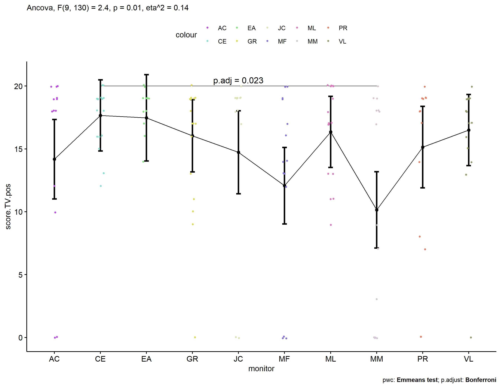<!-- -->

<!-- -->

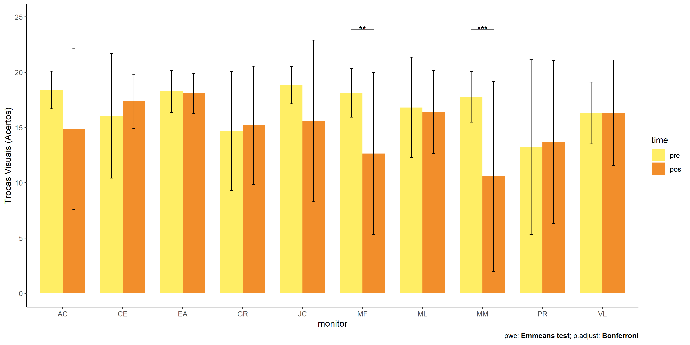<!-- -->

### Trocas Fonologicas (Acertos)

| var          | monitor |   n | M (pre) | SE (pre) | M (unadj) | SE (unadj) | M (adj) | SE (adj) |
|:-------------|:--------|----:|--------:|---------:|----------:|-----------:|--------:|---------:|
| score.TF.pos | AC      |  13 |  17.231 |    0.802 |    13.385 |      1.910 |  12.567 |    1.495 |
| score.TF.pos | CE      |  16 |  15.688 |    1.413 |    17.062 |      0.655 |  17.059 |    1.340 |
| score.TF.pos | EA      |  11 |  16.727 |    0.843 |    16.818 |      0.893 |  16.266 |    1.620 |
| score.TF.pos | GR      |  16 |  13.562 |    1.357 |    13.812 |      1.330 |  14.930 |    1.358 |
| score.TF.pos | JC      |  12 |  18.000 |    0.628 |    14.750 |      2.129 |  13.526 |    1.566 |
| score.TF.pos | MF      |  14 |  16.214 |    1.403 |    12.357 |      2.037 |  12.076 |    1.434 |
| score.TF.pos | ML      |  16 |  15.688 |    1.164 |    15.812 |      0.857 |  15.809 |    1.340 |
| score.TF.pos | MM      |  14 |  16.643 |    0.626 |    10.286 |      2.113 |   9.778 |    1.436 |
| score.TF.pos | PR      |  13 |  13.154 |    2.069 |    13.154 |      1.887 |  14.487 |    1.509 |
| score.TF.pos | VL      |  16 |  14.812 |    0.812 |    14.250 |      1.315 |  14.708 |    1.343 |

| .y.          | group1 | group2 | estimate | conf.low | conf.high |    se | statistic | p       | p.adj | p.adj.signif |
|:-------------|:-------|:-------|---------:|---------:|----------:|------:|----------:|:--------|------:|:-------------|
| score.TF.pos | AC     | CE     |   -4.492 |   -8.465 |    -0.519 | 2.008 |    -2.237 | 0.027   | 1.000 | ns           |
| score.TF.pos | AC     | EA     |   -3.699 |   -8.046 |     0.647 | 2.197 |    -1.684 | 0.095   | 1.000 | ns           |
| score.TF.pos | AC     | GR     |   -2.364 |   -6.393 |     1.666 | 2.037 |    -1.160 | 0.248   | 1.000 | ns           |
| score.TF.pos | AC     | JC     |   -0.959 |   -5.208 |     3.289 | 2.148 |    -0.447 | 0.656   | 1.000 | ns           |
| score.TF.pos | AC     | MF     |    0.491 |   -3.599 |     4.582 | 2.068 |     0.238 | 0.813   | 1.000 | ns           |
| score.TF.pos | AC     | ML     |   -3.242 |   -7.215 |     0.731 | 2.008 |    -1.615 | 0.109   | 1.000 | ns           |
| score.TF.pos | AC     | MM     |    2.789 |   -1.298 |     6.876 | 2.066 |     1.350 | 0.179   | 1.000 | ns           |
| score.TF.pos | AC     | PR     |   -1.921 |   -6.162 |     2.321 | 2.144 |    -0.896 | 0.372   | 1.000 | ns           |
| score.TF.pos | AC     | VL     |   -2.141 |   -6.132 |     1.849 | 2.017 |    -1.062 | 0.29    | 1.000 | ns           |
| score.TF.pos | CE     | EA     |    0.793 |   -3.367 |     4.953 | 2.103 |     0.377 | 0.707   | 1.000 | ns           |
| score.TF.pos | CE     | GR     |    2.129 |   -1.646 |     5.903 | 1.908 |     1.116 | 0.267   | 1.000 | ns           |
| score.TF.pos | CE     | JC     |    3.533 |   -0.545 |     7.610 | 2.061 |     1.714 | 0.089   | 1.000 | ns           |
| score.TF.pos | CE     | MF     |    4.983 |    1.100 |     8.866 | 1.963 |     2.539 | 0.012   | 0.553 | ns           |
| score.TF.pos | CE     | ML     |    1.250 |   -2.500 |     5.000 | 1.895 |     0.659 | 0.511   | 1.000 | ns           |
| score.TF.pos | CE     | MM     |    7.281 |    3.394 |    11.167 | 1.964 |     3.706 | \<0.001 | 0.014 | \*           |
| score.TF.pos | CE     | PR     |    2.572 |   -1.422 |     6.565 | 2.019 |     1.274 | 0.205   | 1.000 | ns           |
| score.TF.pos | CE     | VL     |    2.351 |   -1.403 |     6.105 | 1.898 |     1.239 | 0.218   | 1.000 | ns           |
| score.TF.pos | EA     | GR     |    1.336 |   -2.868 |     5.539 | 2.125 |     0.629 | 0.531   | 1.000 | ns           |
| score.TF.pos | EA     | JC     |    2.740 |   -1.695 |     7.175 | 2.242 |     1.222 | 0.224   | 1.000 | ns           |
| score.TF.pos | EA     | MF     |    4.190 |   -0.084 |     8.465 | 2.161 |     1.939 | 0.055   | 1.000 | ns           |
| score.TF.pos | EA     | ML     |    0.457 |   -3.703 |     4.617 | 2.103 |     0.217 | 0.828   | 1.000 | ns           |
| score.TF.pos | EA     | MM     |    6.488 |    2.214 |    10.761 | 2.160 |     3.004 | 0.003   | 0.144 | ns           |
| score.TF.pos | EA     | PR     |    1.779 |   -2.627 |     6.184 | 2.227 |     0.799 | 0.426   | 1.000 | ns           |
| score.TF.pos | EA     | VL     |    1.558 |   -2.615 |     5.730 | 2.109 |     0.739 | 0.461   | 1.000 | ns           |
| score.TF.pos | GR     | JC     |    1.404 |   -2.745 |     5.553 | 2.097 |     0.669 | 0.504   | 1.000 | ns           |
| score.TF.pos | GR     | MF     |    2.855 |   -1.064 |     6.773 | 1.981 |     1.441 | 0.152   | 1.000 | ns           |
| score.TF.pos | GR     | ML     |   -0.879 |   -4.653 |     2.896 | 1.908 |    -0.461 | 0.646   | 1.000 | ns           |
| score.TF.pos | GR     | MM     |    5.152 |    1.221 |     9.084 | 1.987 |     2.593 | 0.011   | 0.478 | ns           |
| score.TF.pos | GR     | PR     |    0.443 |   -3.518 |     4.404 | 2.002 |     0.221 | 0.825   | 1.000 | ns           |
| score.TF.pos | GR     | VL     |    0.222 |   -3.536 |     3.981 | 1.900 |     0.117 | 0.907   | 1.000 | ns           |
| score.TF.pos | JC     | MF     |    1.451 |   -2.738 |     5.639 | 2.117 |     0.685 | 0.494   | 1.000 | ns           |
| score.TF.pos | JC     | ML     |   -2.283 |   -6.360 |     1.795 | 2.061 |    -1.108 | 0.27    | 1.000 | ns           |
| score.TF.pos | JC     | MM     |    3.748 |   -0.434 |     7.930 | 2.114 |     1.773 | 0.079   | 1.000 | ns           |
| score.TF.pos | JC     | PR     |   -0.961 |   -5.319 |     3.397 | 2.203 |    -0.436 | 0.663   | 1.000 | ns           |
| score.TF.pos | JC     | VL     |   -1.182 |   -5.284 |     2.920 | 2.073 |    -0.570 | 0.57    | 1.000 | ns           |
| score.TF.pos | MF     | ML     |   -3.733 |   -7.616 |     0.150 | 1.963 |    -1.902 | 0.059   | 1.000 | ns           |
| score.TF.pos | MF     | MM     |    2.298 |   -1.712 |     6.307 | 2.027 |     1.134 | 0.259   | 1.000 | ns           |
| score.TF.pos | MF     | PR     |   -2.412 |   -6.544 |     1.721 | 2.089 |    -1.155 | 0.25    | 1.000 | ns           |
| score.TF.pos | MF     | VL     |   -2.633 |   -6.525 |     1.259 | 1.967 |    -1.338 | 0.183   | 1.000 | ns           |
| score.TF.pos | ML     | MM     |    6.031 |    2.144 |     9.917 | 1.964 |     3.070 | 0.003   | 0.117 | ns           |
| score.TF.pos | ML     | PR     |    1.322 |   -2.672 |     5.315 | 2.019 |     0.655 | 0.514   | 1.000 | ns           |
| score.TF.pos | ML     | VL     |    1.101 |   -2.653 |     4.855 | 1.898 |     0.580 | 0.563   | 1.000 | ns           |
| score.TF.pos | MM     | PR     |   -4.709 |   -8.855 |    -0.563 | 2.096 |    -2.247 | 0.026   | 1.000 | ns           |
| score.TF.pos | MM     | VL     |   -4.930 |   -8.829 |    -1.031 | 1.971 |    -2.501 | 0.014   | 0.613 | ns           |
| score.TF.pos | PR     | VL     |   -0.221 |   -4.196 |     3.754 | 2.009 |    -0.110 | 0.913   | 1.000 | ns           |
| score.TF.pre | AC     | CE     |    1.543 |   -1.831 |     4.917 | 1.706 |     0.905 | 0.367   | 1.000 | ns           |
| score.TF.pre | AC     | EA     |    0.503 |   -3.198 |     4.205 | 1.871 |     0.269 | 0.788   | 1.000 | ns           |
| score.TF.pre | AC     | GR     |    3.668 |    0.294 |     7.042 | 1.706 |     2.151 | 0.033   | 1.000 | ns           |
| score.TF.pre | AC     | JC     |   -0.769 |   -4.386 |     2.848 | 1.828 |    -0.421 | 0.675   | 1.000 | ns           |
| score.TF.pre | AC     | MF     |    1.016 |   -2.464 |     4.497 | 1.759 |     0.578 | 0.564   | 1.000 | ns           |
| score.TF.pre | AC     | ML     |    1.543 |   -1.831 |     4.917 | 1.706 |     0.905 | 0.367   | 1.000 | ns           |
| score.TF.pre | AC     | MM     |    0.588 |   -2.892 |     4.068 | 1.759 |     0.334 | 0.739   | 1.000 | ns           |
| score.TF.pre | AC     | PR     |    4.077 |    0.533 |     7.621 | 1.792 |     2.276 | 0.024   | 1.000 | ns           |
| score.TF.pre | AC     | VL     |    2.418 |   -0.956 |     5.792 | 1.706 |     1.418 | 0.159   | 1.000 | ns           |
| score.TF.pre | CE     | EA     |   -1.040 |   -4.579 |     2.499 | 1.789 |    -0.581 | 0.562   | 1.000 | ns           |
| score.TF.pre | CE     | GR     |    2.125 |   -1.070 |     5.320 | 1.615 |     1.316 | 0.191   | 1.000 | ns           |
| score.TF.pre | CE     | JC     |   -2.312 |   -5.763 |     1.138 | 1.744 |    -1.326 | 0.187   | 1.000 | ns           |
| score.TF.pre | CE     | MF     |   -0.527 |   -3.834 |     2.780 | 1.672 |    -0.315 | 0.753   | 1.000 | ns           |
| score.TF.pre | CE     | ML     |    0.000 |   -3.195 |     3.195 | 1.615 |     0.000 | 1       | 1.000 | ns           |
| score.TF.pre | CE     | MM     |   -0.955 |   -4.262 |     2.351 | 1.672 |    -0.572 | 0.569   | 1.000 | ns           |
| score.TF.pre | CE     | PR     |    2.534 |   -0.840 |     5.908 | 1.706 |     1.486 | 0.14    | 1.000 | ns           |
| score.TF.pre | CE     | VL     |    0.875 |   -2.320 |     4.070 | 1.615 |     0.542 | 0.589   | 1.000 | ns           |
| score.TF.pre | EA     | GR     |    3.165 |   -0.374 |     6.704 | 1.789 |     1.769 | 0.079   | 1.000 | ns           |
| score.TF.pre | EA     | JC     |   -1.273 |   -5.044 |     2.499 | 1.907 |    -0.668 | 0.506   | 1.000 | ns           |
| score.TF.pre | EA     | MF     |    0.513 |   -3.128 |     4.154 | 1.840 |     0.279 | 0.781   | 1.000 | ns           |
| score.TF.pre | EA     | ML     |    1.040 |   -2.499 |     4.579 | 1.789 |     0.581 | 0.562   | 1.000 | ns           |
| score.TF.pre | EA     | MM     |    0.084 |   -3.556 |     3.725 | 1.840 |     0.046 | 0.963   | 1.000 | ns           |
| score.TF.pre | EA     | PR     |    3.573 |   -0.128 |     7.275 | 1.871 |     1.910 | 0.058   | 1.000 | ns           |
| score.TF.pre | EA     | VL     |    1.915 |   -1.624 |     5.454 | 1.789 |     1.070 | 0.286   | 1.000 | ns           |
| score.TF.pre | GR     | JC     |   -4.437 |   -7.888 |    -0.987 | 1.744 |    -2.544 | 0.012   | 0.545 | ns           |
| score.TF.pre | GR     | MF     |   -2.652 |   -5.959 |     0.655 | 1.672 |    -1.586 | 0.115   | 1.000 | ns           |
| score.TF.pre | GR     | ML     |   -2.125 |   -5.320 |     1.070 | 1.615 |    -1.316 | 0.191   | 1.000 | ns           |
| score.TF.pre | GR     | MM     |   -3.080 |   -6.387 |     0.226 | 1.672 |    -1.843 | 0.068   | 1.000 | ns           |
| score.TF.pre | GR     | PR     |    0.409 |   -2.965 |     3.783 | 1.706 |     0.240 | 0.811   | 1.000 | ns           |
| score.TF.pre | GR     | VL     |   -1.250 |   -4.445 |     1.945 | 1.615 |    -0.774 | 0.44    | 1.000 | ns           |
| score.TF.pre | JC     | MF     |    1.786 |   -1.769 |     5.340 | 1.797 |     0.994 | 0.322   | 1.000 | ns           |
| score.TF.pre | JC     | ML     |    2.312 |   -1.138 |     5.763 | 1.744 |     1.326 | 0.187   | 1.000 | ns           |
| score.TF.pre | JC     | MM     |    1.357 |   -2.197 |     4.912 | 1.797 |     0.755 | 0.451   | 1.000 | ns           |
| score.TF.pre | JC     | PR     |    4.846 |    1.229 |     8.463 | 1.828 |     2.650 | 0.009   | 0.406 | ns           |
| score.TF.pre | JC     | VL     |    3.187 |   -0.263 |     6.638 | 1.744 |     1.827 | 0.07    | 1.000 | ns           |
| score.TF.pre | MF     | ML     |    0.527 |   -2.780 |     3.834 | 1.672 |     0.315 | 0.753   | 1.000 | ns           |
| score.TF.pre | MF     | MM     |   -0.429 |   -3.844 |     2.987 | 1.726 |    -0.248 | 0.804   | 1.000 | ns           |
| score.TF.pre | MF     | PR     |    3.060 |   -0.420 |     6.541 | 1.759 |     1.740 | 0.084   | 1.000 | ns           |
| score.TF.pre | MF     | VL     |    1.402 |   -1.905 |     4.709 | 1.672 |     0.839 | 0.403   | 1.000 | ns           |
| score.TF.pre | ML     | MM     |   -0.955 |   -4.262 |     2.351 | 1.672 |    -0.572 | 0.569   | 1.000 | ns           |
| score.TF.pre | ML     | PR     |    2.534 |   -0.840 |     5.908 | 1.706 |     1.486 | 0.14    | 1.000 | ns           |
| score.TF.pre | ML     | VL     |    0.875 |   -2.320 |     4.070 | 1.615 |     0.542 | 0.589   | 1.000 | ns           |
| score.TF.pre | MM     | PR     |    3.489 |    0.009 |     6.969 | 1.759 |     1.983 | 0.049   | 1.000 | ns           |
| score.TF.pre | MM     | VL     |    1.830 |   -1.476 |     5.137 | 1.672 |     1.095 | 0.276   | 1.000 | ns           |
| score.TF.pre | PR     | VL     |   -1.659 |   -5.033 |     1.715 | 1.706 |    -0.973 | 0.333   | 1.000 | ns           |

| .y.      | monitor | group1 | group2 | estimate | conf.low | conf.high |    se | statistic |     p | p.adj | p.adj.signif |
|:---------|:--------|:-------|:-------|---------:|---------:|----------:|------:|----------:|------:|------:|:-------------|
| score.TF | AC      | pre    | pos    |    3.846 |   -0.211 |     7.903 | 2.061 |     1.867 | 0.063 | 0.063 | ns           |
| score.TF | CE      | pre    | pos    |   -1.375 |   -5.032 |     2.282 | 1.857 |    -0.740 | 0.460 | 0.460 | ns           |
| score.TF | EA      | pre    | pos    |   -0.091 |   -4.502 |     4.320 | 2.240 |    -0.041 | 0.968 | 0.968 | ns           |
| score.TF | GR      | pre    | pos    |   -0.250 |   -3.907 |     3.407 | 1.857 |    -0.135 | 0.893 | 0.893 | ns           |
| score.TF | JC      | pre    | pos    |    3.250 |   -0.973 |     7.473 | 2.145 |     1.515 | 0.131 | 0.131 | ns           |
| score.TF | MF      | pre    | pos    |    3.857 |   -0.053 |     7.767 | 1.986 |     1.943 | 0.053 | 0.053 | ns           |
| score.TF | ML      | pre    | pos    |   -0.125 |   -3.782 |     3.532 | 1.857 |    -0.067 | 0.946 | 0.946 | ns           |
| score.TF | MM      | pre    | pos    |    6.357 |    2.447 |    10.267 | 1.986 |     3.202 | 0.002 | 0.002 | \*\*         |
| score.TF | PR      | pre    | pos    |    0.000 |   -4.057 |     4.057 | 2.061 |     0.000 | 1.000 | 1.000 | ns           |
| score.TF | VL      | pre    | pos    |    0.562 |   -3.095 |     4.220 | 1.857 |     0.303 | 0.762 | 0.762 | ns           |

    ## Scale for colour is already present.
    ## Adding another scale for colour, which will replace the existing scale.

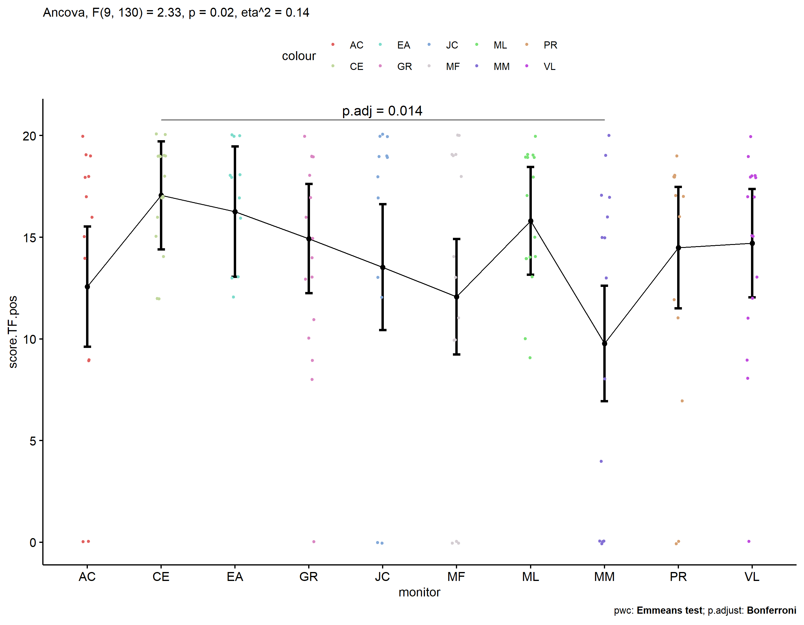<!-- -->

<!-- -->

<!-- -->

### Trocas Orograficas (Acertos)

| var          | monitor |   n | M (pre) | SE (pre) | M (unadj) | SE (unadj) | M (adj) | SE (adj) |
|:-------------|:--------|----:|--------:|---------:|----------:|-----------:|--------:|---------:|
| score.TO.pos | AC      |  13 |   9.615 |    0.747 |     9.615 |      1.412 |  10.010 |    1.214 |
| score.TO.pos | CE      |  16 |  10.500 |    1.147 |    10.625 |      1.048 |  10.503 |    1.093 |
| score.TO.pos | EA      |  11 |  11.818 |    1.387 |    13.455 |      1.123 |  12.562 |    1.325 |
| score.TO.pos | GR      |  16 |  10.688 |    1.117 |    10.688 |      1.217 |  10.456 |    1.093 |
| score.TO.pos | JC      |  12 |  11.917 |    1.190 |    11.250 |      1.891 |  10.300 |    1.270 |
| score.TO.pos | MF      |  14 |  12.286 |    1.233 |    10.214 |      1.691 |   9.049 |    1.182 |
| score.TO.pos | ML      |  16 |  10.375 |    1.091 |    10.000 |      1.057 |   9.951 |    1.092 |
| score.TO.pos | MM      |  14 |   8.929 |    0.737 |     5.143 |      1.410 |   5.939 |    1.174 |
| score.TO.pos | PR      |  13 |   7.462 |    1.453 |     9.538 |      1.567 |  11.192 |    1.239 |
| score.TO.pos | VL      |  16 |   9.625 |    0.935 |     8.375 |      0.898 |   8.764 |    1.094 |

| .y.          | group1 | group2 | estimate | conf.low | conf.high |    se | statistic | p       | p.adj | p.adj.signif |
|:-------------|:-------|:-------|---------:|---------:|----------:|------:|----------:|:--------|------:|:-------------|
| score.TO.pos | AC     | CE     |   -0.493 |   -3.725 |     2.739 | 1.634 |    -0.302 | 0.763   | 1.000 | ns           |
| score.TO.pos | AC     | EA     |   -2.552 |   -6.116 |     1.012 | 1.801 |    -1.417 | 0.159   | 1.000 | ns           |
| score.TO.pos | AC     | GR     |   -0.446 |   -3.679 |     2.788 | 1.635 |    -0.273 | 0.786   | 1.000 | ns           |
| score.TO.pos | AC     | JC     |   -0.290 |   -3.775 |     3.196 | 1.762 |    -0.164 | 0.87    | 1.000 | ns           |
| score.TO.pos | AC     | MF     |    0.962 |   -2.403 |     4.326 | 1.701 |     0.565 | 0.573   | 1.000 | ns           |
| score.TO.pos | AC     | ML     |    0.059 |   -3.172 |     3.290 | 1.633 |     0.036 | 0.971   | 1.000 | ns           |
| score.TO.pos | AC     | MM     |    4.071 |    0.739 |     7.403 | 1.684 |     2.417 | 0.017   | 0.766 | ns           |
| score.TO.pos | AC     | PR     |   -1.182 |   -4.595 |     2.231 | 1.725 |    -0.685 | 0.495   | 1.000 | ns           |
| score.TO.pos | AC     | VL     |    1.246 |   -1.982 |     4.474 | 1.632 |     0.764 | 0.446   | 1.000 | ns           |
| score.TO.pos | CE     | EA     |   -2.059 |   -5.454 |     1.335 | 1.716 |    -1.200 | 0.232   | 1.000 | ns           |
| score.TO.pos | CE     | GR     |    0.047 |   -3.010 |     3.104 | 1.545 |     0.030 | 0.976   | 1.000 | ns           |
| score.TO.pos | CE     | JC     |    0.203 |   -3.108 |     3.514 | 1.674 |     0.121 | 0.904   | 1.000 | ns           |
| score.TO.pos | CE     | MF     |    1.454 |   -1.726 |     4.634 | 1.607 |     0.905 | 0.367   | 1.000 | ns           |
| score.TO.pos | CE     | ML     |    0.552 |   -2.505 |     3.609 | 1.545 |     0.357 | 0.721   | 1.000 | ns           |
| score.TO.pos | CE     | MM     |    4.564 |    1.387 |     7.740 | 1.606 |     2.843 | 0.005   | 0.234 | ns           |
| score.TO.pos | CE     | PR     |   -0.689 |   -3.963 |     2.585 | 1.655 |    -0.416 | 0.678   | 1.000 | ns           |
| score.TO.pos | CE     | VL     |    1.739 |   -1.322 |     4.799 | 1.547 |     1.124 | 0.263   | 1.000 | ns           |
| score.TO.pos | EA     | GR     |    2.106 |   -1.286 |     5.498 | 1.715 |     1.228 | 0.222   | 1.000 | ns           |
| score.TO.pos | EA     | JC     |    2.262 |   -1.347 |     5.871 | 1.824 |     1.240 | 0.217   | 1.000 | ns           |
| score.TO.pos | EA     | MF     |    3.513 |    0.029 |     6.998 | 1.761 |     1.995 | 0.048   | 1.000 | ns           |
| score.TO.pos | EA     | ML     |    2.611 |   -0.785 |     6.007 | 1.717 |     1.521 | 0.131   | 1.000 | ns           |
| score.TO.pos | EA     | MM     |    6.623 |    3.101 |    10.145 | 1.780 |     3.720 | \<0.001 | 0.013 | \*           |
| score.TO.pos | EA     | PR     |    1.370 |   -2.257 |     4.998 | 1.834 |     0.747 | 0.456   | 1.000 | ns           |
| score.TO.pos | EA     | VL     |    3.798 |    0.389 |     7.207 | 1.723 |     2.204 | 0.029   | 1.000 | ns           |
| score.TO.pos | GR     | JC     |    0.156 |   -3.153 |     3.465 | 1.672 |     0.093 | 0.926   | 1.000 | ns           |
| score.TO.pos | GR     | MF     |    1.407 |   -1.770 |     4.584 | 1.606 |     0.876 | 0.382   | 1.000 | ns           |
| score.TO.pos | GR     | ML     |    0.505 |   -2.552 |     3.562 | 1.545 |     0.327 | 0.744   | 1.000 | ns           |
| score.TO.pos | GR     | MM     |    4.517 |    1.337 |     7.696 | 1.607 |     2.810 | 0.006   | 0.257 | ns           |
| score.TO.pos | GR     | PR     |   -0.736 |   -4.016 |     2.544 | 1.658 |    -0.444 | 0.658   | 1.000 | ns           |
| score.TO.pos | GR     | VL     |    1.692 |   -1.371 |     4.754 | 1.548 |     1.093 | 0.277   | 1.000 | ns           |
| score.TO.pos | JC     | MF     |    1.251 |   -2.150 |     4.653 | 1.719 |     0.728 | 0.468   | 1.000 | ns           |
| score.TO.pos | JC     | ML     |    0.349 |   -2.964 |     3.662 | 1.675 |     0.208 | 0.835   | 1.000 | ns           |
| score.TO.pos | JC     | MM     |    4.361 |    0.918 |     7.804 | 1.740 |     2.506 | 0.013   | 0.606 | ns           |
| score.TO.pos | JC     | PR     |   -0.892 |   -4.445 |     2.661 | 1.796 |    -0.497 | 0.62    | 1.000 | ns           |
| score.TO.pos | JC     | VL     |    1.536 |   -1.791 |     4.863 | 1.682 |     0.913 | 0.363   | 1.000 | ns           |
| score.TO.pos | MF     | ML     |   -0.902 |   -4.085 |     2.280 | 1.609 |    -0.561 | 0.576   | 1.000 | ns           |
| score.TO.pos | MF     | MM     |    3.110 |   -0.213 |     6.433 | 1.680 |     1.851 | 0.066   | 1.000 | ns           |
| score.TO.pos | MF     | PR     |   -2.143 |   -5.585 |     1.298 | 1.739 |    -1.232 | 0.22    | 1.000 | ns           |
| score.TO.pos | MF     | VL     |    0.284 |   -2.915 |     3.484 | 1.617 |     0.176 | 0.861   | 1.000 | ns           |
| score.TO.pos | ML     | MM     |    4.012 |    0.837 |     7.186 | 1.605 |     2.500 | 0.014   | 0.614 | ns           |
| score.TO.pos | ML     | PR     |   -1.241 |   -4.511 |     2.029 | 1.653 |    -0.751 | 0.454   | 1.000 | ns           |
| score.TO.pos | ML     | VL     |    1.187 |   -1.873 |     4.246 | 1.546 |     0.767 | 0.444   | 1.000 | ns           |
| score.TO.pos | MM     | PR     |   -5.253 |   -8.593 |    -1.913 | 1.688 |    -3.111 | 0.002   | 0.103 | ns           |
| score.TO.pos | MM     | VL     |   -2.825 |   -5.991 |     0.341 | 1.600 |    -1.765 | 0.08    | 1.000 | ns           |
| score.TO.pos | PR     | VL     |    2.428 |   -0.824 |     5.679 | 1.643 |     1.477 | 0.142   | 1.000 | ns           |
| score.TO.pre | AC     | CE     |   -0.885 |   -3.981 |     2.212 | 1.565 |    -0.565 | 0.573   | 1.000 | ns           |
| score.TO.pre | AC     | EA     |   -2.203 |   -5.600 |     1.194 | 1.717 |    -1.283 | 0.202   | 1.000 | ns           |
| score.TO.pre | AC     | GR     |   -1.072 |   -4.168 |     2.024 | 1.565 |    -0.685 | 0.495   | 1.000 | ns           |
| score.TO.pre | AC     | JC     |   -2.301 |   -5.621 |     1.018 | 1.678 |    -1.371 | 0.173   | 1.000 | ns           |
| score.TO.pre | AC     | MF     |   -2.670 |   -5.864 |     0.523 | 1.614 |    -1.654 | 0.101   | 1.000 | ns           |
| score.TO.pre | AC     | ML     |   -0.760 |   -3.856 |     2.337 | 1.565 |    -0.485 | 0.628   | 1.000 | ns           |
| score.TO.pre | AC     | MM     |    0.687 |   -2.507 |     3.881 | 1.614 |     0.425 | 0.671   | 1.000 | ns           |
| score.TO.pre | AC     | PR     |    2.154 |   -1.099 |     5.406 | 1.644 |     1.310 | 0.192   | 1.000 | ns           |
| score.TO.pre | AC     | VL     |   -0.010 |   -3.106 |     3.087 | 1.565 |    -0.006 | 0.995   | 1.000 | ns           |
| score.TO.pre | CE     | EA     |   -1.318 |   -4.566 |     1.930 | 1.642 |    -0.803 | 0.423   | 1.000 | ns           |
| score.TO.pre | CE     | GR     |   -0.187 |   -3.119 |     2.744 | 1.482 |    -0.127 | 0.9     | 1.000 | ns           |
| score.TO.pre | CE     | JC     |   -1.417 |   -4.583 |     1.750 | 1.601 |    -0.885 | 0.378   | 1.000 | ns           |
| score.TO.pre | CE     | MF     |   -1.786 |   -4.820 |     1.249 | 1.534 |    -1.164 | 0.246   | 1.000 | ns           |
| score.TO.pre | CE     | ML     |    0.125 |   -2.807 |     3.057 | 1.482 |     0.084 | 0.933   | 1.000 | ns           |
| score.TO.pre | CE     | MM     |    1.571 |   -1.463 |     4.606 | 1.534 |     1.024 | 0.308   | 1.000 | ns           |
| score.TO.pre | CE     | PR     |    3.038 |   -0.058 |     6.135 | 1.565 |     1.941 | 0.054   | 1.000 | ns           |
| score.TO.pre | CE     | VL     |    0.875 |   -2.057 |     3.807 | 1.482 |     0.590 | 0.556   | 1.000 | ns           |
| score.TO.pre | EA     | GR     |    1.131 |   -2.117 |     4.378 | 1.642 |     0.689 | 0.492   | 1.000 | ns           |
| score.TO.pre | EA     | JC     |   -0.098 |   -3.560 |     3.363 | 1.750 |    -0.056 | 0.955   | 1.000 | ns           |
| score.TO.pre | EA     | MF     |   -0.468 |   -3.808 |     2.873 | 1.689 |    -0.277 | 0.782   | 1.000 | ns           |
| score.TO.pre | EA     | ML     |    1.443 |   -1.805 |     4.691 | 1.642 |     0.879 | 0.381   | 1.000 | ns           |
| score.TO.pre | EA     | MM     |    2.890 |   -0.451 |     6.231 | 1.689 |     1.711 | 0.089   | 1.000 | ns           |
| score.TO.pre | EA     | PR     |    4.357 |    0.960 |     7.754 | 1.717 |     2.537 | 0.012   | 0.556 | ns           |
| score.TO.pre | EA     | VL     |    2.193 |   -1.055 |     5.441 | 1.642 |     1.336 | 0.184   | 1.000 | ns           |
| score.TO.pre | GR     | JC     |   -1.229 |   -4.396 |     1.937 | 1.601 |    -0.768 | 0.444   | 1.000 | ns           |
| score.TO.pre | GR     | MF     |   -1.598 |   -4.633 |     1.436 | 1.534 |    -1.042 | 0.299   | 1.000 | ns           |
| score.TO.pre | GR     | ML     |    0.312 |   -2.619 |     3.244 | 1.482 |     0.211 | 0.833   | 1.000 | ns           |
| score.TO.pre | GR     | MM     |    1.759 |   -1.276 |     4.793 | 1.534 |     1.147 | 0.254   | 1.000 | ns           |
| score.TO.pre | GR     | PR     |    3.226 |    0.130 |     6.322 | 1.565 |     2.061 | 0.041   | 1.000 | ns           |
| score.TO.pre | GR     | VL     |    1.062 |   -1.869 |     3.994 | 1.482 |     0.717 | 0.475   | 1.000 | ns           |
| score.TO.pre | JC     | MF     |   -0.369 |   -3.631 |     2.893 | 1.649 |    -0.224 | 0.823   | 1.000 | ns           |
| score.TO.pre | JC     | ML     |    1.542 |   -1.625 |     4.708 | 1.601 |     0.963 | 0.337   | 1.000 | ns           |
| score.TO.pre | JC     | MM     |    2.988 |   -0.274 |     6.250 | 1.649 |     1.812 | 0.072   | 1.000 | ns           |
| score.TO.pre | JC     | PR     |    4.455 |    1.136 |     7.775 | 1.678 |     2.655 | 0.009   | 0.401 | ns           |
| score.TO.pre | JC     | VL     |    2.292 |   -0.875 |     5.458 | 1.601 |     1.432 | 0.155   | 1.000 | ns           |
| score.TO.pre | MF     | ML     |    1.911 |   -1.124 |     4.945 | 1.534 |     1.246 | 0.215   | 1.000 | ns           |
| score.TO.pre | MF     | MM     |    3.357 |    0.223 |     6.491 | 1.584 |     2.119 | 0.036   | 1.000 | ns           |
| score.TO.pre | MF     | PR     |    4.824 |    1.630 |     8.018 | 1.614 |     2.988 | 0.003   | 0.151 | ns           |
| score.TO.pre | MF     | VL     |    2.661 |   -0.374 |     5.695 | 1.534 |     1.735 | 0.085   | 1.000 | ns           |
| score.TO.pre | ML     | MM     |    1.446 |   -1.588 |     4.481 | 1.534 |     0.943 | 0.347   | 1.000 | ns           |
| score.TO.pre | ML     | PR     |    2.913 |   -0.183 |     6.010 | 1.565 |     1.862 | 0.065   | 1.000 | ns           |
| score.TO.pre | ML     | VL     |    0.750 |   -2.182 |     3.682 | 1.482 |     0.506 | 0.614   | 1.000 | ns           |
| score.TO.pre | MM     | PR     |    1.467 |   -1.727 |     4.661 | 1.614 |     0.909 | 0.365   | 1.000 | ns           |
| score.TO.pre | MM     | VL     |   -0.696 |   -3.731 |     2.338 | 1.534 |    -0.454 | 0.651   | 1.000 | ns           |
| score.TO.pre | PR     | VL     |   -2.163 |   -5.260 |     0.933 | 1.565 |    -1.382 | 0.169   | 1.000 | ns           |

| .y.      | monitor | group1 | group2 | estimate | conf.low | conf.high |    se | statistic |     p | p.adj | p.adj.signif |
|:---------|:--------|:-------|:-------|---------:|---------:|----------:|------:|----------:|------:|------:|:-------------|
| score.TO | AC      | pre    | pos    |    0.000 |   -3.561 |     3.561 | 1.808 |     0.000 | 1.000 | 1.000 | ns           |
| score.TO | CE      | pre    | pos    |   -0.125 |   -3.335 |     3.085 | 1.630 |    -0.077 | 0.939 | 0.939 | ns           |
| score.TO | EA      | pre    | pos    |   -1.636 |   -5.508 |     2.235 | 1.966 |    -0.832 | 0.406 | 0.406 | ns           |
| score.TO | GR      | pre    | pos    |    0.000 |   -3.210 |     3.210 | 1.630 |     0.000 | 1.000 | 1.000 | ns           |
| score.TO | JC      | pre    | pos    |    0.667 |   -3.040 |     4.373 | 1.882 |     0.354 | 0.723 | 0.723 | ns           |
| score.TO | MF      | pre    | pos    |    2.071 |   -1.360 |     5.503 | 1.743 |     1.189 | 0.236 | 0.236 | ns           |
| score.TO | ML      | pre    | pos    |    0.375 |   -2.835 |     3.585 | 1.630 |     0.230 | 0.818 | 0.818 | ns           |
| score.TO | MM      | pre    | pos    |    3.786 |    0.354 |     7.217 | 1.743 |     2.172 | 0.031 | 0.031 | \*           |
| score.TO | PR      | pre    | pos    |   -2.077 |   -5.638 |     1.484 | 1.808 |    -1.148 | 0.252 | 0.252 | ns           |
| score.TO | VL      | pre    | pos    |    1.250 |   -1.960 |     4.460 | 1.630 |     0.767 | 0.444 | 0.444 | ns           |

    ## Scale for colour is already present.
    ## Adding another scale for colour, which will replace the existing scale.

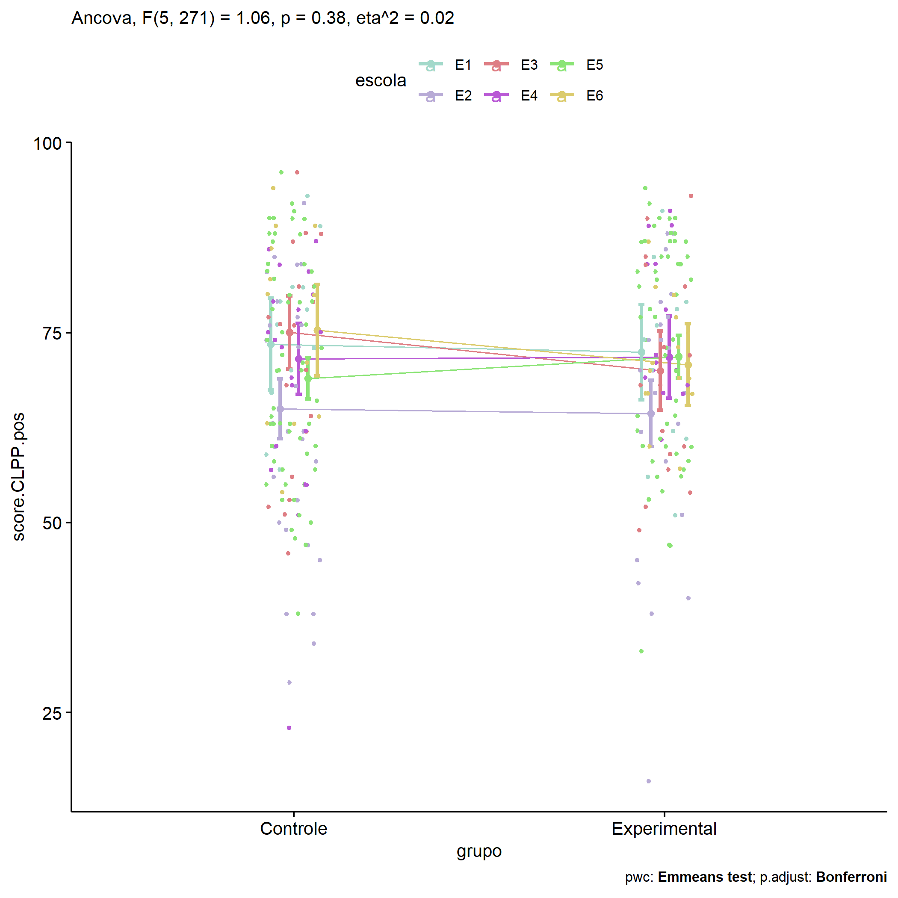<!-- -->

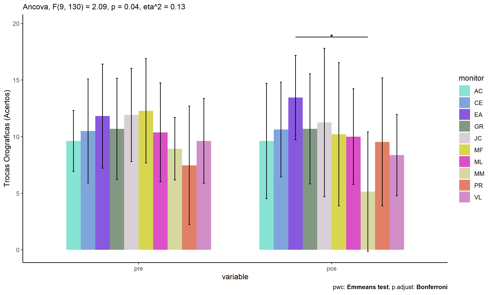<!-- -->

<!-- -->

## factores: **grupo=“Experimental”:monitor.genero**

### Leitura de Pseudo-Palavras (Acertos)

| var            | monitor.genero |   n | M (pre) | SE (pre) | M (unadj) | SE (unadj) | M (adj) | SE (adj) |
|:---------------|:---------------|----:|--------:|---------:|----------:|-----------:|--------:|---------:|
| score.CLPP.pos | F              |  77 |  70.727 |    1.479 |    70.013 |      1.622 |  70.628 |    1.188 |
| score.CLPP.pos | M              |  47 |  73.277 |    1.930 |    75.872 |      1.687 |  74.865 |    1.523 |

| .y.            | group1 | group2 | estimate | conf.low | conf.high |    se | statistic |     p | p.adj | p.adj.signif |
|:---------------|:-------|:-------|---------:|---------:|----------:|------:|----------:|------:|------:|:-------------|
| score.CLPP.pos | F      | M      |   -4.238 |   -8.070 |    -0.406 | 1.936 |    -2.189 | 0.030 | 0.030 | \*           |
| score.CLPP.pre | F      | M      |   -2.549 |   -7.339 |     2.240 | 2.420 |    -1.054 | 0.294 | 0.294 | ns           |

| .y.        | monitor.genero | group1 | group2 | estimate | conf.low | conf.high |    se | statistic |     p | p.adj | p.adj.signif |
|:-----------|:---------------|:-------|:-------|---------:|---------:|----------:|------:|----------:|------:|------:|:-------------|
| score.CLPP | F              | pre    | pos    |    1.243 |   -2.700 |     5.186 | 2.002 |     0.621 | 0.535 | 0.535 | ns           |
| score.CLPP | M              | pre    | pos    |   -2.425 |   -7.574 |     2.723 | 2.615 |    -0.928 | 0.355 | 0.355 | ns           |

    ## Scale for colour is already present.
    ## Adding another scale for colour, which will replace the existing scale.

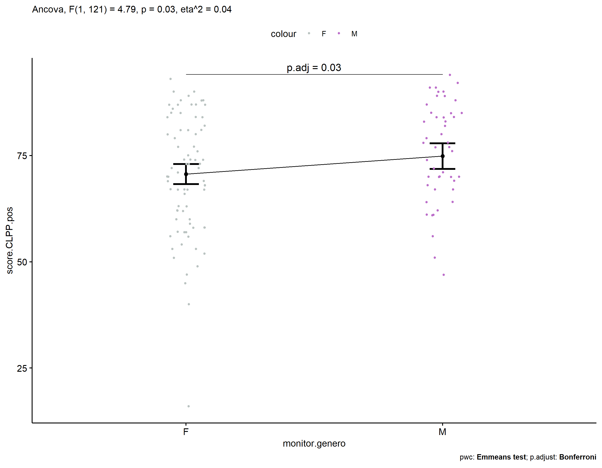<!-- -->

<!-- -->

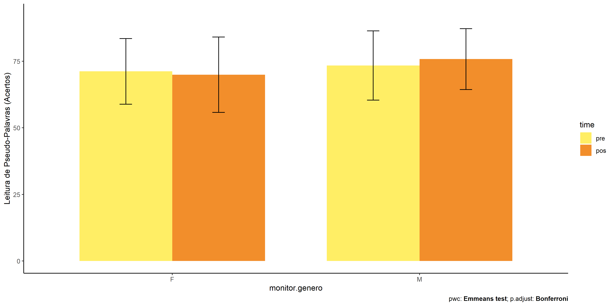<!-- -->

### Correta Regular (Acertos)

| var          | monitor.genero |   n | M (pre) | SE (pre) | M (unadj) | SE (unadj) | M (adj) | SE (adj) |
|:-------------|:---------------|----:|--------:|---------:|----------:|-----------:|--------:|---------:|
| score.CR.pos | F              |  89 |  15.326 |    0.376 |    13.292 |      0.629 |  13.254 |    0.571 |
| score.CR.pos | M              |  52 |  15.077 |    0.651 |    14.846 |      0.696 |  14.911 |    0.747 |

| .y.          | group1 | group2 | estimate | conf.low | conf.high |    se | statistic |     p | p.adj | p.adj.signif |
|:-------------|:-------|:-------|---------:|---------:|----------:|------:|----------:|------:|------:|:-------------|
| score.CR.pos | F      | M      |   -1.657 |   -3.517 |     0.203 | 0.941 |    -1.761 | 0.080 | 0.080 | ns           |
| score.CR.pre | F      | M      |    0.249 |   -1.134 |     1.632 | 0.700 |     0.356 | 0.723 | 0.723 | ns           |

| .y.      | monitor.genero | group1 | group2 | estimate | conf.low | conf.high |    se | statistic |     p | p.adj | p.adj.signif |
|:---------|:---------------|:-------|:-------|---------:|---------:|----------:|------:|----------:|------:|------:|:-------------|
| score.CR | F              | pre    | pos    |    2.034 |    0.594 |     3.474 | 0.732 |     2.780 | 0.006 | 0.006 | \*\*         |
| score.CR | M              | pre    | pos    |    0.231 |   -1.653 |     2.115 | 0.957 |     0.241 | 0.810 | 0.810 | ns           |

    ## Scale for colour is already present.
    ## Adding another scale for colour, which will replace the existing scale.

<!-- -->

<!-- -->

<!-- -->

### Correta Irregular (Acertos)

| var          | monitor.genero |   n | M (pre) | SE (pre) | M (unadj) | SE (unadj) | M (adj) | SE (adj) |
|:-------------|:---------------|----:|--------:|---------:|----------:|-----------:|--------:|---------:|
| score.CI.pos | F              |  89 |  12.281 |    0.366 |    11.146 |      0.553 |  10.994 |    0.498 |
| score.CI.pos | M              |  52 |  11.481 |    0.598 |    12.365 |      0.665 |  12.625 |    0.653 |

| .y.          | group1 | group2 | estimate | conf.low | conf.high |    se | statistic |     p | p.adj | p.adj.signif |
|:-------------|:-------|:-------|---------:|---------:|----------:|------:|----------:|------:|------:|:-------------|
| score.CI.pos | F      | M      |    -1.63 |   -3.259 |    -0.002 | 0.823 |    -1.980 | 0.050 | 0.050 | \*           |
| score.CI.pre | F      | M      |     0.80 |   -0.509 |     2.109 | 0.662 |     1.209 | 0.229 | 0.229 | ns           |

| .y.      | monitor.genero | group1 | group2 | estimate | conf.low | conf.high |    se | statistic |     p | p.adj | p.adj.signif |
|:---------|:---------------|:-------|:-------|---------:|---------:|----------:|------:|----------:|------:|------:|:-------------|
| score.CI | F              | pre    | pos    |    1.135 |   -0.186 |     2.455 | 0.671 |     1.692 | 0.092 | 0.092 | ns           |
| score.CI | M              | pre    | pos    |   -0.885 |   -2.612 |     0.843 | 0.878 |    -1.008 | 0.314 | 0.314 | ns           |

    ## Scale for colour is already present.
    ## Adding another scale for colour, which will replace the existing scale.

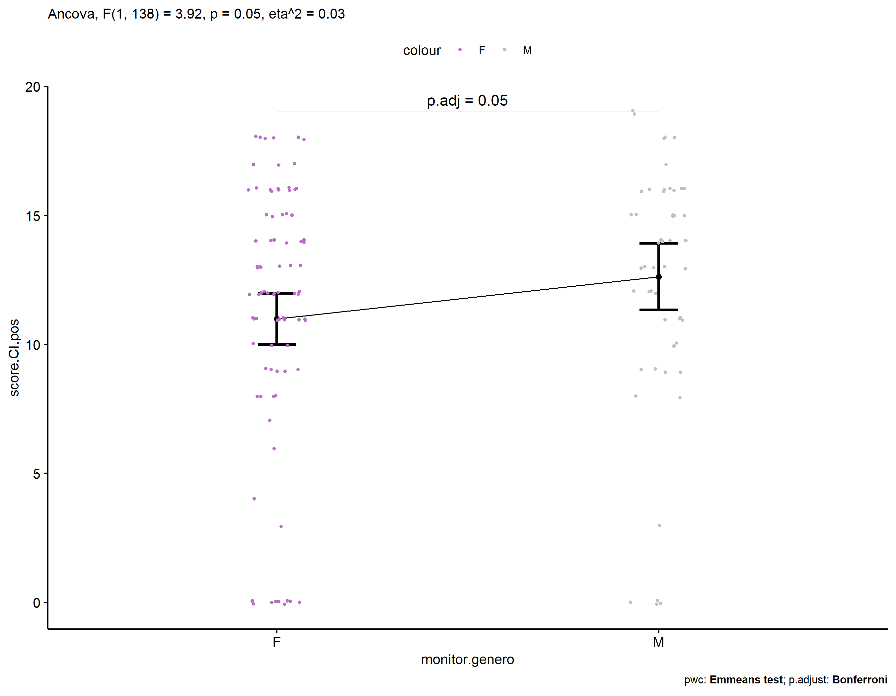<!-- -->

<!-- -->

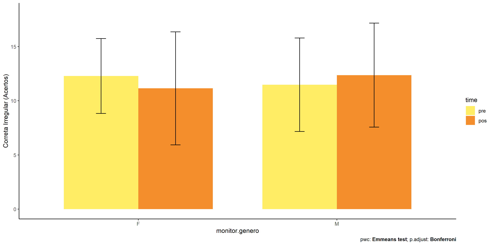<!-- -->

### Trocas Visuais (Acertos)

| var          | monitor.genero |   n | M (pre) | SE (pre) | M (unadj) | SE (unadj) | M (adj) | SE (adj) |
|:-------------|:---------------|----:|--------:|---------:|----------:|-----------:|--------:|---------:|
| score.TV.pos | F              |  89 |  16.933 |    0.387 |    14.427 |      0.684 |  14.366 |    0.628 |
| score.TV.pos | M              |  52 |  16.462 |    0.760 |    16.192 |      0.755 |  16.297 |    0.822 |

| .y.          | group1 | group2 | estimate | conf.low | conf.high |    se | statistic |     p | p.adj | p.adj.signif |
|:-------------|:-------|:-------|---------:|---------:|----------:|------:|----------:|------:|------:|:-------------|
| score.TV.pos | F      | M      |   -1.931 |   -3.978 |     0.116 | 1.035 |    -1.865 | 0.064 | 0.064 | ns           |
| score.TV.pre | F      | M      |    0.471 |   -1.052 |     1.994 | 0.770 |     0.611 | 0.542 | 0.542 | ns           |

| .y.      | monitor.genero | group1 | group2 | estimate | conf.low | conf.high |    se | statistic |     p | p.adj | p.adj.signif |
|:---------|:---------------|:-------|:-------|---------:|---------:|----------:|------:|----------:|------:|------:|:-------------|
| score.TV | F              | pre    | pos    |    2.506 |    0.934 |     4.077 | 0.798 |     3.139 | 0.002 | 0.002 | \*\*         |
| score.TV | M              | pre    | pos    |    0.269 |   -1.787 |     2.325 | 1.044 |     0.258 | 0.797 | 0.797 | ns           |

    ## Scale for colour is already present.
    ## Adding another scale for colour, which will replace the existing scale.

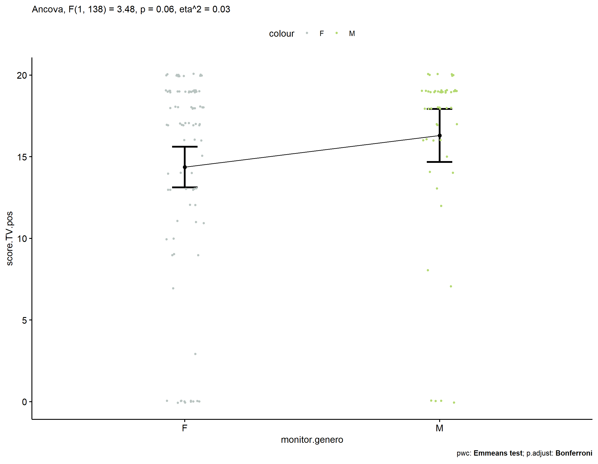<!-- -->

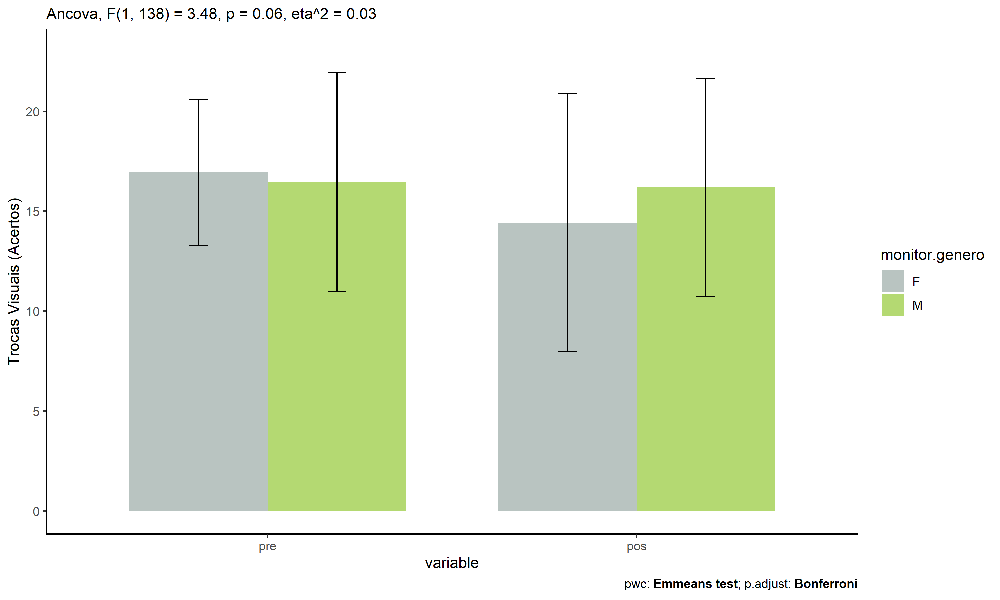<!-- -->

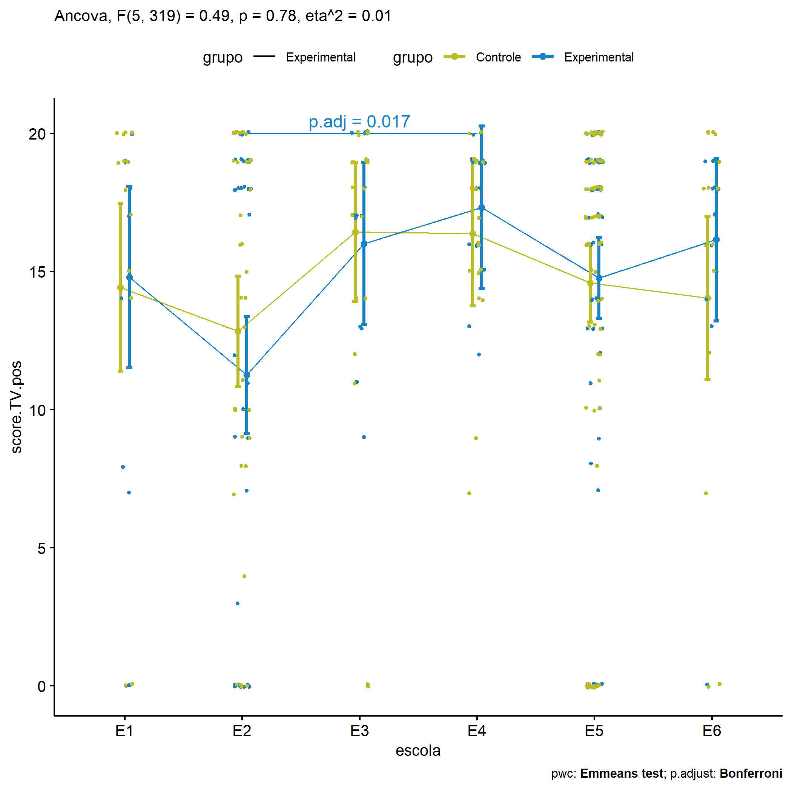<!-- -->

### Trocas Fonologicas (Acertos)

| var          | monitor.genero |   n | M (pre) | SE (pre) | M (unadj) | SE (unadj) | M (adj) | SE (adj) |
|:-------------|:---------------|----:|--------:|---------:|----------:|-----------:|--------:|---------:|
| score.TF.pos | F              |  89 |  15.607 |    0.450 |    13.404 |      0.660 |   13.44 |    0.585 |
| score.TF.pos | M              |  52 |  15.808 |    0.736 |    15.500 |      0.747 |   15.44 |    0.766 |

| .y.          | group1 | group2 | estimate | conf.low | conf.high |    se | statistic |     p | p.adj | p.adj.signif |
|:-------------|:-------|:-------|---------:|---------:|----------:|------:|----------:|------:|------:|:-------------|
| score.TF.pos | F      | M      |   -2.000 |   -3.906 |    -0.094 | 0.964 |    -2.074 | 0.040 | 0.040 | \*           |
| score.TF.pre | F      | M      |   -0.201 |   -1.810 |     1.409 | 0.814 |    -0.247 | 0.805 | 0.805 | ns           |

| .y.      | monitor.genero | group1 | group2 | estimate | conf.low | conf.high |    se | statistic |     p | p.adj | p.adj.signif |
|:---------|:---------------|:-------|:-------|---------:|---------:|----------:|------:|----------:|------:|------:|:-------------|
| score.TF | F              | pre    | pos    |    2.202 |    0.628 |     3.777 | 0.800 |     2.753 | 0.006 | 0.006 | \*\*         |
| score.TF | M              | pre    | pos    |    0.308 |   -1.752 |     2.368 | 1.046 |     0.294 | 0.769 | 0.769 | ns           |

    ## Scale for colour is already present.
    ## Adding another scale for colour, which will replace the existing scale.

<!-- -->

<!-- -->

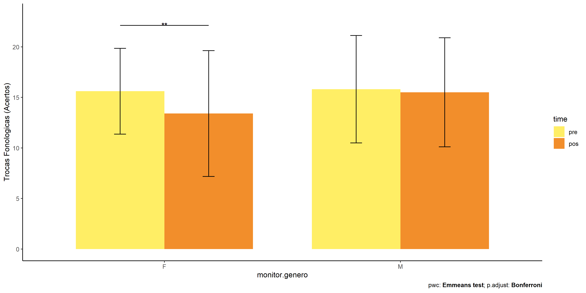<!-- -->

### Trocas Orograficas (Acertos)

| var          | monitor.genero |   n | M (pre) | SE (pre) | M (unadj) | SE (unadj) | M (adj) | SE (adj) |
|:-------------|:---------------|----:|--------:|---------:|----------:|-----------:|--------:|---------:|
| score.TO.pos | F              |  89 |  10.258 |    0.416 |     9.045 |      0.543 |   9.065 |    0.470 |
| score.TO.pos | M              |  52 |  10.346 |    0.674 |    11.096 |      0.715 |  11.062 |    0.615 |

| .y.          | group1 | group2 | estimate | conf.low | conf.high |    se | statistic |     p | p.adj | p.adj.signif |
|:-------------|:-------|:-------|---------:|---------:|----------:|------:|----------:|------:|------:|:-------------|
| score.TO.pos | F      | M      |   -1.998 |   -3.527 |    -0.468 | 0.774 |    -2.582 | 0.011 | 0.011 | \*           |
| score.TO.pre | F      | M      |   -0.088 |   -1.569 |     1.394 | 0.749 |    -0.117 | 0.907 | 0.907 | ns           |

| .y.      | monitor.genero | group1 | group2 | estimate | conf.low | conf.high |    se | statistic |     p | p.adj | p.adj.signif |
|:---------|:---------------|:-------|:-------|---------:|---------:|----------:|------:|----------:|------:|------:|:-------------|
| score.TO | F              | pre    | pos    |    1.213 |   -0.183 |     2.610 | 0.709 |     1.710 | 0.088 | 0.088 | ns           |
| score.TO | M              | pre    | pos    |   -0.750 |   -2.577 |     1.077 | 0.928 |    -0.808 | 0.420 | 0.420 | ns           |

    ## Scale for colour is already present.
    ## Adding another scale for colour, which will replace the existing scale.

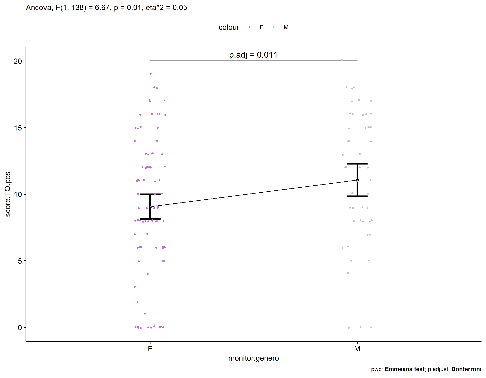<!-- -->

<!-- -->

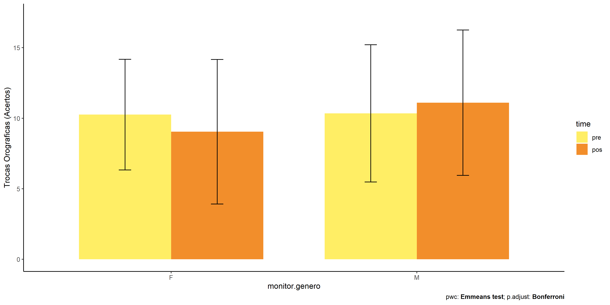<!-- -->

## factores: **grupo=“Experimental”:monitor.area**

### Leitura de Pseudo-Palavras (Acertos)

| var            | monitor.area               |   n | M (pre) | SE (pre) | M (unadj) | SE (unadj) | M (adj) | SE (adj) |
|:---------------|:---------------------------|----:|--------:|---------:|----------:|-----------:|--------:|---------:|
| score.CLPP.pos | Arquitetura e Urbanismo    |  10 |  77.400 |    3.149 |    81.000 |      3.190 |  77.386 |    3.330 |
| score.CLPP.pos | Ciencias Biologicas        |  16 |  67.812 |    4.032 |    69.188 |      3.510 |  71.645 |    2.627 |
| score.CLPP.pos | Comunicacao Social         |  15 |  74.200 |    3.236 |    75.333 |      2.489 |  73.746 |    2.703 |
| score.CLPP.pos | Historia                   |  11 |  67.182 |    5.003 |    71.182 |      3.753 |  74.039 |    3.167 |
| score.CLPP.pos | Letras - Lingua Portuguesa |  11 |  75.545 |    4.519 |    72.636 |      4.521 |  70.197 |    3.162 |
| score.CLPP.pos | Matematica                 |  25 |  71.240 |    2.960 |    73.600 |      2.815 |  73.887 |    2.089 |
| score.CLPP.pos | Nutricao                   |  10 |  68.000 |    2.539 |    61.600 |      6.454 |  63.939 |    3.314 |
| score.CLPP.pos | Pedagogia                  |  11 |  76.364 |    2.081 |    72.909 |      4.196 |  69.951 |    3.168 |
| score.CLPP.pos | Servico Social             |  15 |  69.800 |    2.434 |    71.333 |      2.030 |  72.533 |    2.700 |

| .y.            | group1                  | group2              | estimate | conf.low | conf.high |    se | statistic |     p | p.adj | p.adj.signif |
|:---------------|:------------------------|:--------------------|---------:|---------:|----------:|------:|----------:|------:|------:|:-------------|
| score.CLPP.pos | Arquitetura e Urbanismo | Ciencias Biologicas |    5.741 |   -2.719 |    14.200 | 4.271 |     1.344 | 0.182 | 1.000 | ns           |
| score.CLPP.pos | Arquitetura e Urbanismo | Comunicacao Social  |    3.640 |   -4.820 |    12.100 | 4.270 |     0.852 | 0.396 | 1.000 | ns           |
| score.CLPP.pos | Arquitetura e Urbanismo | Historia            |    3.347 |   -5.819 |    12.512 | 4.627 |     0.723 | 0.471 | 1.000 | ns           |
| score.CLPP.pos | Arquitetura e Urbanismo | Letras              |    7.189 |   -1.855 |    16.233 | 4.565 |     1.575 | 0.118 | 1.000 | ns           |
| score.CLPP.pos | Arquitetura e Urbanismo | Matematica          |    3.499 |   -4.296 |    11.293 | 3.935 |     0.889 | 0.376 | 1.000 | ns           |
| score.CLPP.pos | Arquitetura e Urbanismo | Nutricao            |   13.447 |    4.090 |    22.803 | 4.723 |     2.847 | 0.005 | 0.188 | ns           |
| score.CLPP.pos | Arquitetura e Urbanismo | Pedagogia           |    7.435 |   -1.607 |    16.476 | 4.564 |     1.629 | 0.106 | 1.000 | ns           |
| score.CLPP.pos | Arquitetura e Urbanismo | Servico Social      |    4.853 |   -3.668 |    13.374 | 4.301 |     1.128 | 0.262 | 1.000 | ns           |
| score.CLPP.pos | Ciencias Biologicas     | Comunicacao Social  |   -2.100 |   -9.596 |     5.395 | 3.784 |    -0.555 | 0.580 | 1.000 | ns           |
| score.CLPP.pos | Ciencias Biologicas     | Historia            |   -2.394 |  -10.498 |     5.710 | 4.091 |    -0.585 | 0.560 | 1.000 | ns           |
| score.CLPP.pos | Ciencias Biologicas     | Letras              |    1.449 |   -6.735 |     9.632 | 4.131 |     0.351 | 0.727 | 1.000 | ns           |
| score.CLPP.pos | Ciencias Biologicas     | Matematica          |   -2.242 |   -8.885 |     4.401 | 3.353 |    -0.668 | 0.505 | 1.000 | ns           |
| score.CLPP.pos | Ciencias Biologicas     | Nutricao            |    7.706 |   -0.634 |    16.046 | 4.210 |     1.830 | 0.070 | 1.000 | ns           |
| score.CLPP.pos | Ciencias Biologicas     | Pedagogia           |    1.694 |   -6.508 |     9.896 | 4.140 |     0.409 | 0.683 | 1.000 | ns           |
| score.CLPP.pos | Ciencias Biologicas     | Servico Social      |   -0.887 |   -8.329 |     6.554 | 3.756 |    -0.236 | 0.814 | 1.000 | ns           |
| score.CLPP.pos | Comunicacao Social      | Historia            |   -0.293 |   -8.571 |     7.985 | 4.179 |    -0.070 | 0.944 | 1.000 | ns           |
| score.CLPP.pos | Comunicacao Social      | Letras              |    3.549 |   -4.666 |    11.764 | 4.147 |     0.856 | 0.394 | 1.000 | ns           |
| score.CLPP.pos | Comunicacao Social      | Matematica          |   -0.141 |   -6.913 |     6.630 | 3.418 |    -0.041 | 0.967 | 1.000 | ns           |
| score.CLPP.pos | Comunicacao Social      | Nutricao            |    9.807 |    1.311 |    18.303 | 4.289 |     2.287 | 0.024 | 0.866 | ns           |
| score.CLPP.pos | Comunicacao Social      | Pedagogia           |    3.795 |   -4.425 |    12.014 | 4.149 |     0.915 | 0.362 | 1.000 | ns           |
| score.CLPP.pos | Comunicacao Social      | Servico Social      |    1.213 |   -6.369 |     8.796 | 3.828 |     0.317 | 0.752 | 1.000 | ns           |
| score.CLPP.pos | Historia                | Letras              |    3.842 |   -5.066 |    12.751 | 4.497 |     0.854 | 0.395 | 1.000 | ns           |
| score.CLPP.pos | Historia                | Matematica          |    0.152 |   -7.358 |     7.662 | 3.791 |     0.040 | 0.968 | 1.000 | ns           |
| score.CLPP.pos | Historia                | Nutricao            |   10.100 |    1.059 |    19.141 | 4.564 |     2.213 | 0.029 | 1.000 | ns           |
| score.CLPP.pos | Historia                | Pedagogia           |    4.088 |   -4.838 |    13.014 | 4.506 |     0.907 | 0.366 | 1.000 | ns           |
| score.CLPP.pos | Historia                | Servico Social      |    1.507 |   -6.715 |     9.729 | 4.150 |     0.363 | 0.717 | 1.000 | ns           |
| score.CLPP.pos | Letras                  | Lingua Portuguesa   |   -3.690 |  -11.203 |     3.822 | 3.792 |    -0.973 | 0.333 | 1.000 | ns           |
| score.CLPP.pos | Letras                  | Lingua Portuguesa   |    6.258 |   -2.851 |    15.366 | 4.598 |     1.361 | 0.176 | 1.000 | ns           |
| score.CLPP.pos | Letras                  | Lingua Portuguesa   |    0.245 |   -8.577 |     9.068 | 4.454 |     0.055 | 0.956 | 1.000 | ns           |
| score.CLPP.pos | Letras                  | Lingua Portuguesa   |   -2.336 |  -10.592 |     5.921 | 4.168 |    -0.560 | 0.576 | 1.000 | ns           |
| score.CLPP.pos | Matematica              | Nutricao            |    9.948 |    2.192 |    17.704 | 3.915 |     2.541 | 0.012 | 0.447 | ns           |
| score.CLPP.pos | Matematica              | Pedagogia           |    3.936 |   -3.588 |    11.460 | 3.798 |     1.036 | 0.302 | 1.000 | ns           |
| score.CLPP.pos | Matematica              | Servico Social      |    1.355 |   -5.406 |     8.115 | 3.413 |     0.397 | 0.692 | 1.000 | ns           |
| score.CLPP.pos | Nutricao                | Pedagogia           |   -6.012 |  -15.136 |     3.112 | 4.606 |    -1.305 | 0.194 | 1.000 | ns           |
| score.CLPP.pos | Nutricao                | Servico Social      |   -8.593 |  -17.044 |    -0.143 | 4.266 |    -2.014 | 0.046 | 1.000 | ns           |
| score.CLPP.pos | Pedagogia               | Servico Social      |   -2.581 |  -10.851 |     5.689 | 4.175 |    -0.618 | 0.538 | 1.000 | ns           |
| score.CLPP.pre | Arquitetura e Urbanismo | Ciencias Biologicas |    9.588 |   -0.824 |    19.999 | 5.256 |     1.824 | 0.071 | 1.000 | ns           |
| score.CLPP.pre | Arquitetura e Urbanismo | Comunicacao Social  |    3.200 |   -7.344 |    13.744 | 5.323 |     0.601 | 0.549 | 1.000 | ns           |
| score.CLPP.pre | Arquitetura e Urbanismo | Historia            |   10.218 |   -1.067 |    21.503 | 5.697 |     1.794 | 0.076 | 1.000 | ns           |
| score.CLPP.pre | Arquitetura e Urbanismo | Letras              |    1.855 |   -9.430 |    13.139 | 5.697 |     0.326 | 0.745 | 1.000 | ns           |
| score.CLPP.pre | Arquitetura e Urbanismo | Matematica          |    6.160 |   -3.504 |    15.824 | 4.879 |     1.263 | 0.209 | 1.000 | ns           |
| score.CLPP.pre | Arquitetura e Urbanismo | Nutricao            |    9.400 |   -2.150 |    20.950 | 5.831 |     1.612 | 0.110 | 1.000 | ns           |
| score.CLPP.pre | Arquitetura e Urbanismo | Pedagogia           |    1.036 |  -10.248 |    12.321 | 5.697 |     0.182 | 0.856 | 1.000 | ns           |
| score.CLPP.pre | Arquitetura e Urbanismo | Servico Social      |    7.600 |   -2.944 |    18.144 | 5.323 |     1.428 | 0.156 | 1.000 | ns           |
| score.CLPP.pre | Ciencias Biologicas     | Comunicacao Social  |   -6.388 |  -15.670 |     2.895 | 4.686 |    -1.363 | 0.176 | 1.000 | ns           |
| score.CLPP.pre | Ciencias Biologicas     | Historia            |    0.631 |   -9.485 |    10.747 | 5.107 |     0.123 | 0.902 | 1.000 | ns           |
| score.CLPP.pre | Ciencias Biologicas     | Letras              |   -7.733 |  -17.849 |     2.383 | 5.107 |    -1.514 | 0.133 | 1.000 | ns           |
| score.CLPP.pre | Ciencias Biologicas     | Matematica          |   -3.428 |  -11.696 |     4.841 | 4.174 |    -0.821 | 0.413 | 1.000 | ns           |
| score.CLPP.pre | Ciencias Biologicas     | Nutricao            |   -0.188 |  -10.599 |    10.224 | 5.256 |    -0.036 | 0.972 | 1.000 | ns           |
| score.CLPP.pre | Ciencias Biologicas     | Pedagogia           |   -8.551 |  -18.667 |     1.565 | 5.107 |    -1.674 | 0.097 | 1.000 | ns           |
| score.CLPP.pre | Ciencias Biologicas     | Servico Social      |   -1.988 |  -11.270 |     7.295 | 4.686 |    -0.424 | 0.672 | 1.000 | ns           |
| score.CLPP.pre | Comunicacao Social      | Historia            |    7.018 |   -3.234 |    17.271 | 5.176 |     1.356 | 0.178 | 1.000 | ns           |
| score.CLPP.pre | Comunicacao Social      | Letras              |   -1.345 |  -11.598 |     8.907 | 5.176 |    -0.260 | 0.795 | 1.000 | ns           |
| score.CLPP.pre | Comunicacao Social      | Matematica          |    2.960 |   -5.475 |    11.395 | 4.258 |     0.695 | 0.488 | 1.000 | ns           |
| score.CLPP.pre | Comunicacao Social      | Nutricao            |    6.200 |   -4.344 |    16.744 | 5.323 |     1.165 | 0.247 | 1.000 | ns           |
| score.CLPP.pre | Comunicacao Social      | Pedagogia           |   -2.164 |  -12.416 |     8.089 | 5.176 |    -0.418 | 0.677 | 1.000 | ns           |
| score.CLPP.pre | Comunicacao Social      | Servico Social      |    4.400 |   -5.031 |    13.831 | 4.761 |     0.924 | 0.357 | 1.000 | ns           |
| score.CLPP.pre | Historia                | Letras              |   -8.364 |  -19.376 |     2.649 | 5.560 |    -1.504 | 0.135 | 1.000 | ns           |
| score.CLPP.pre | Historia                | Matematica          |   -4.058 |  -13.403 |     5.286 | 4.718 |    -0.860 | 0.391 | 1.000 | ns           |
| score.CLPP.pre | Historia                | Nutricao            |   -0.818 |  -12.103 |    10.467 | 5.697 |    -0.144 | 0.886 | 1.000 | ns           |
| score.CLPP.pre | Historia                | Pedagogia           |   -9.182 |  -20.195 |     1.831 | 5.560 |    -1.651 | 0.101 | 1.000 | ns           |
| score.CLPP.pre | Historia                | Servico Social      |   -2.618 |  -12.871 |     7.634 | 5.176 |    -0.506 | 0.614 | 1.000 | ns           |
| score.CLPP.pre | Letras                  | Lingua Portuguesa   |    4.305 |   -5.039 |    13.650 | 4.718 |     0.913 | 0.363 | 1.000 | ns           |
| score.CLPP.pre | Letras                  | Lingua Portuguesa   |    7.545 |   -3.739 |    18.830 | 5.697 |     1.324 | 0.188 | 1.000 | ns           |
| score.CLPP.pre | Letras                  | Lingua Portuguesa   |   -0.818 |  -11.831 |    10.195 | 5.560 |    -0.147 | 0.883 | 1.000 | ns           |
| score.CLPP.pre | Letras                  | Lingua Portuguesa   |    5.745 |   -4.507 |    15.998 | 5.176 |     1.110 | 0.269 | 1.000 | ns           |
| score.CLPP.pre | Matematica              | Nutricao            |    3.240 |   -6.424 |    12.904 | 4.879 |     0.664 | 0.508 | 1.000 | ns           |
| score.CLPP.pre | Matematica              | Pedagogia           |   -5.124 |  -14.468 |     4.221 | 4.718 |    -1.086 | 0.280 | 1.000 | ns           |
| score.CLPP.pre | Matematica              | Servico Social      |    1.440 |   -6.995 |     9.875 | 4.258 |     0.338 | 0.736 | 1.000 | ns           |
| score.CLPP.pre | Nutricao                | Pedagogia           |   -8.364 |  -19.648 |     2.921 | 5.697 |    -1.468 | 0.145 | 1.000 | ns           |
| score.CLPP.pre | Nutricao                | Servico Social      |   -1.800 |  -12.344 |     8.744 | 5.323 |    -0.338 | 0.736 | 1.000 | ns           |
| score.CLPP.pre | Pedagogia               | Servico Social      |    6.564 |   -3.689 |    16.816 | 5.176 |     1.268 | 0.207 | 1.000 | ns           |

| .y.        | monitor.area               | group1 | group2 | estimate | conf.low | conf.high |    se | statistic |     p | p.adj | p.adj.signif |
|:-----------|:---------------------------|:-------|:-------|---------:|---------:|----------:|------:|----------:|------:|------:|:-------------|
| score.CLPP | Arquitetura e Urbanismo    | pre    | pos    |   -3.750 |  -14.589 |     7.089 | 5.503 |    -0.681 | 0.496 | 0.496 | ns           |
| score.CLPP | Ciencias Biologicas        | pre    | pos    |   -1.375 |  -10.325 |     7.575 | 4.544 |    -0.303 | 0.762 | 0.762 | ns           |
| score.CLPP | Comunicacao Social         | pre    | pos    |   -1.050 |  -10.148 |     8.048 | 4.619 |    -0.227 | 0.820 | 0.820 | ns           |
| score.CLPP | Historia                   | pre    | pos    |   -4.000 |  -14.794 |     6.794 | 5.480 |    -0.730 | 0.466 | 0.466 | ns           |
| score.CLPP | Letras - Lingua Portuguesa | pre    | pos    |    3.149 |   -7.050 |    13.349 | 5.178 |     0.608 | 0.544 | 0.544 | ns           |
| score.CLPP | Matematica                 | pre    | pos    |   -1.923 |   -8.944 |     5.098 | 3.565 |    -0.539 | 0.590 | 0.590 | ns           |
| score.CLPP | Nutricao                   | pre    | pos    |    9.043 |   -1.439 |    19.524 | 5.321 |     1.699 | 0.091 | 0.091 | ns           |
| score.CLPP | Pedagogia                  | pre    | pos    |    2.245 |   -8.126 |    12.616 | 5.265 |     0.426 | 0.670 | 0.670 | ns           |
| score.CLPP | Servico Social             | pre    | pos    |   -1.583 |  -10.681 |     7.515 | 4.619 |    -0.343 | 0.732 | 0.732 | ns           |

    ## Scale for colour is already present.
    ## Adding another scale for colour, which will replace the existing scale.

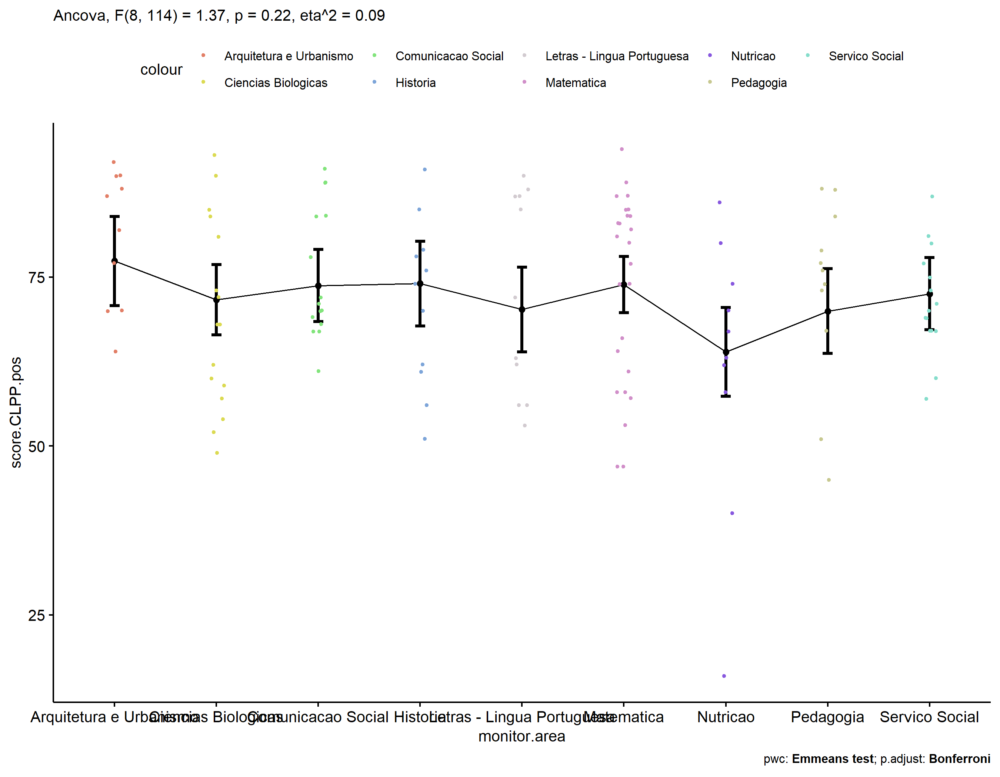<!-- -->

<!-- -->

<!-- -->

### Correta Regular (Acertos)

| var          | monitor.area               |   n | M (pre) | SE (pre) | M (unadj) | SE (unadj) | M (adj) | SE (adj) |
|:-------------|:---------------------------|----:|--------:|---------:|----------:|-----------:|--------:|---------:|
| score.CR.pos | Arquitetura e Urbanismo    |  12 |  16.667 |    0.541 |    14.417 |      1.994 |  13.771 |    1.505 |
| score.CR.pos | Ciencias Biologicas        |  16 |  13.812 |    1.042 |    14.562 |      0.851 |  15.203 |    1.306 |
| score.CR.pos | Comunicacao Social         |  16 |  15.750 |    1.230 |    16.625 |      0.386 |  16.392 |    1.297 |
| score.CR.pos | Historia                   |  13 |  12.462 |    1.824 |    13.077 |      1.741 |  14.326 |    1.472 |
| score.CR.pos | Letras - Lingua Portuguesa |  14 |  16.214 |    0.664 |    11.214 |      1.825 |  10.773 |    1.389 |
| score.CR.pos | Matematica                 |  27 |  14.667 |    0.846 |    14.556 |      0.858 |  14.811 |    0.999 |
| score.CR.pos | Nutricao                   |  14 |  15.214 |    0.639 |     9.857 |      2.011 |   9.866 |    1.385 |
| score.CR.pos | Pedagogia                  |  13 |  17.000 |    0.679 |    13.231 |      1.812 |  12.435 |    1.451 |
| score.CR.pos | Servico Social             |  16 |  16.000 |    0.619 |    15.812 |      1.198 |  15.467 |    1.298 |

| .y.          | group1                  | group2              | estimate | conf.low | conf.high |    se | statistic | p       | p.adj | p.adj.signif |
|:-------------|:------------------------|:--------------------|---------:|---------:|----------:|------:|----------:|:--------|------:|:-------------|
| score.CR.pos | Arquitetura e Urbanismo | Ciencias Biologicas |   -1.432 |   -5.400 |     2.536 | 2.006 |    -0.714 | 0.477   | 1.000 | ns           |
| score.CR.pos | Arquitetura e Urbanismo | Comunicacao Social  |   -2.621 |   -6.541 |     1.298 | 1.981 |    -1.323 | 0.188   | 1.000 | ns           |
| score.CR.pos | Arquitetura e Urbanismo | Historia            |   -0.555 |   -4.770 |     3.659 | 2.130 |    -0.261 | 0.795   | 1.000 | ns           |
| score.CR.pos | Arquitetura e Urbanismo | Letras              |    2.999 |   -1.035 |     7.032 | 2.039 |     1.471 | 0.144   | 1.000 | ns           |
| score.CR.pos | Arquitetura e Urbanismo | Matematica          |   -1.040 |   -4.625 |     2.545 | 1.812 |    -0.574 | 0.567   | 1.000 | ns           |
| score.CR.pos | Arquitetura e Urbanismo | Nutricao            |    3.905 |   -0.141 |     7.951 | 2.045 |     1.909 | 0.058   | 1.000 | ns           |
| score.CR.pos | Arquitetura e Urbanismo | Pedagogia           |    1.336 |   -2.768 |     5.440 | 2.074 |     0.644 | 0.521   | 1.000 | ns           |
| score.CR.pos | Arquitetura e Urbanismo | Servico Social      |   -1.696 |   -5.613 |     2.221 | 1.980 |    -0.857 | 0.393   | 1.000 | ns           |
| score.CR.pos | Ciencias Biologicas     | Comunicacao Social  |   -1.189 |   -4.840 |     2.461 | 1.845 |    -0.645 | 0.52    | 1.000 | ns           |
| score.CR.pos | Ciencias Biologicas     | Historia            |    0.877 |   -2.963 |     4.716 | 1.941 |     0.452 | 0.652   | 1.000 | ns           |
| score.CR.pos | Ciencias Biologicas     | Letras              |    4.431 |    0.640 |     8.222 | 1.916 |     2.312 | 0.022   | 0.804 | ns           |
| score.CR.pos | Ciencias Biologicas     | Matematica          |    0.392 |   -2.848 |     3.631 | 1.638 |     0.239 | 0.811   | 1.000 | ns           |
| score.CR.pos | Ciencias Biologicas     | Nutricao            |    5.337 |    1.572 |     9.102 | 1.903 |     2.805 | 0.006   | 0.209 | ns           |
| score.CR.pos | Ciencias Biologicas     | Pedagogia           |    2.768 |   -1.128 |     6.664 | 1.969 |     1.406 | 0.162   | 1.000 | ns           |
| score.CR.pos | Ciencias Biologicas     | Servico Social      |   -0.264 |   -3.922 |     3.394 | 1.849 |    -0.143 | 0.887   | 1.000 | ns           |
| score.CR.pos | Comunicacao Social      | Historia            |    2.066 |   -1.834 |     5.967 | 1.972 |     1.048 | 0.297   | 1.000 | ns           |
| score.CR.pos | Comunicacao Social      | Letras              |    5.620 |    1.868 |     9.372 | 1.897 |     2.963 | 0.004   | 0.130 | ns           |
| score.CR.pos | Comunicacao Social      | Matematica          |    1.581 |   -1.662 |     4.824 | 1.639 |     0.965 | 0.337   | 1.000 | ns           |
| score.CR.pos | Comunicacao Social      | Nutricao            |    6.526 |    2.774 |    10.279 | 1.897 |     3.440 | \<0.001 | 0.028 | \*           |
| score.CR.pos | Comunicacao Social      | Pedagogia           |    3.958 |    0.120 |     7.795 | 1.940 |     2.040 | 0.043   | 1.000 | ns           |
| score.CR.pos | Comunicacao Social      | Servico Social      |    0.925 |   -2.699 |     4.549 | 1.832 |     0.505 | 0.614   | 1.000 | ns           |
| score.CR.pos | Historia                | Letras              |    3.554 |   -0.486 |     7.594 | 2.042 |     1.740 | 0.084   | 1.000 | ns           |
| score.CR.pos | Historia                | Matematica          |   -0.485 |   -3.982 |     3.012 | 1.768 |    -0.274 | 0.784   | 1.000 | ns           |
| score.CR.pos | Historia                | Nutricao            |    4.460 |    0.463 |     8.458 | 2.021 |     2.207 | 0.029   | 1.000 | ns           |
| score.CR.pos | Historia                | Pedagogia           |    1.891 |   -2.261 |     6.044 | 2.099 |     0.901 | 0.369   | 1.000 | ns           |
| score.CR.pos | Historia                | Servico Social      |   -1.141 |   -5.053 |     2.771 | 1.977 |    -0.577 | 0.565   | 1.000 | ns           |
| score.CR.pos | Letras                  | Lingua Portuguesa   |   -4.039 |   -7.433 |    -0.645 | 1.716 |    -2.354 | 0.02    | 0.722 | ns           |
| score.CR.pos | Letras                  | Lingua Portuguesa   |    0.907 |   -2.974 |     4.787 | 1.962 |     0.462 | 0.645   | 1.000 | ns           |
| score.CR.pos | Letras                  | Lingua Portuguesa   |   -1.662 |   -5.614 |     2.289 | 1.998 |    -0.832 | 0.407   | 1.000 | ns           |
| score.CR.pos | Letras                  | Lingua Portuguesa   |   -4.695 |   -8.446 |    -0.944 | 1.896 |    -2.476 | 0.015   | 0.524 | ns           |
| score.CR.pos | Matematica              | Nutricao            |    4.945 |    1.567 |     8.323 | 1.708 |     2.896 | 0.004   | 0.159 | ns           |
| score.CR.pos | Matematica              | Pedagogia           |    2.376 |   -1.125 |     5.877 | 1.770 |     1.343 | 0.182   | 1.000 | ns           |
| score.CR.pos | Matematica              | Servico Social      |   -0.656 |   -3.904 |     2.592 | 1.642 |    -0.400 | 0.69    | 1.000 | ns           |
| score.CR.pos | Nutricao                | Pedagogia           |   -2.569 |   -6.538 |     1.400 | 2.006 |    -1.280 | 0.203   | 1.000 | ns           |
| score.CR.pos | Nutricao                | Servico Social      |   -5.601 |   -9.356 |    -1.846 | 1.898 |    -2.951 | 0.004   | 0.135 | ns           |
| score.CR.pos | Pedagogia               | Servico Social      |   -3.032 |   -6.866 |     0.802 | 1.938 |    -1.565 | 0.12    | 1.000 | ns           |
| score.CR.pre | Arquitetura e Urbanismo | Ciencias Biologicas |    2.854 |   -0.088 |     5.796 | 1.487 |     1.919 | 0.057   | 1.000 | ns           |
| score.CR.pre | Arquitetura e Urbanismo | Comunicacao Social  |    0.917 |   -2.025 |     3.859 | 1.487 |     0.616 | 0.539   | 1.000 | ns           |
| score.CR.pre | Arquitetura e Urbanismo | Historia            |    4.205 |    1.121 |     7.289 | 1.559 |     2.697 | 0.008   | 0.285 | ns           |
| score.CR.pre | Arquitetura e Urbanismo | Letras              |    0.452 |   -2.578 |     3.483 | 1.532 |     0.295 | 0.768   | 1.000 | ns           |
| score.CR.pre | Arquitetura e Urbanismo | Matematica          |    2.000 |   -0.673 |     4.673 | 1.351 |     1.480 | 0.141   | 1.000 | ns           |
| score.CR.pre | Arquitetura e Urbanismo | Nutricao            |    1.452 |   -1.578 |     4.483 | 1.532 |     0.948 | 0.345   | 1.000 | ns           |
| score.CR.pre | Arquitetura e Urbanismo | Pedagogia           |   -0.333 |   -3.417 |     2.751 | 1.559 |    -0.214 | 0.831   | 1.000 | ns           |
| score.CR.pre | Arquitetura e Urbanismo | Servico Social      |    0.667 |   -2.275 |     3.609 | 1.487 |     0.448 | 0.655   | 1.000 | ns           |
| score.CR.pre | Ciencias Biologicas     | Comunicacao Social  |   -1.937 |   -4.661 |     0.786 | 1.377 |    -1.407 | 0.162   | 1.000 | ns           |
| score.CR.pre | Ciencias Biologicas     | Historia            |    1.351 |   -1.526 |     4.227 | 1.454 |     0.929 | 0.355   | 1.000 | ns           |
| score.CR.pre | Ciencias Biologicas     | Letras              |   -2.402 |   -5.221 |     0.417 | 1.425 |    -1.685 | 0.094   | 1.000 | ns           |
| score.CR.pre | Ciencias Biologicas     | Matematica          |   -0.854 |   -3.285 |     1.576 | 1.229 |    -0.695 | 0.488   | 1.000 | ns           |
| score.CR.pre | Ciencias Biologicas     | Nutricao            |   -1.402 |   -4.221 |     1.417 | 1.425 |    -0.984 | 0.327   | 1.000 | ns           |
| score.CR.pre | Ciencias Biologicas     | Pedagogia           |   -3.188 |   -6.064 |    -0.311 | 1.454 |    -2.192 | 0.03    | 1.000 | ns           |
| score.CR.pre | Ciencias Biologicas     | Servico Social      |   -2.187 |   -4.911 |     0.536 | 1.377 |    -1.589 | 0.115   | 1.000 | ns           |
| score.CR.pre | Comunicacao Social      | Historia            |    3.288 |    0.412 |     6.165 | 1.454 |     2.261 | 0.025   | 0.913 | ns           |
| score.CR.pre | Comunicacao Social      | Letras              |   -0.464 |   -3.284 |     2.355 | 1.425 |    -0.326 | 0.745   | 1.000 | ns           |
| score.CR.pre | Comunicacao Social      | Matematica          |    1.083 |   -1.347 |     3.514 | 1.229 |     0.882 | 0.38    | 1.000 | ns           |
| score.CR.pre | Comunicacao Social      | Nutricao            |    0.536 |   -2.284 |     3.355 | 1.425 |     0.376 | 0.708   | 1.000 | ns           |
| score.CR.pre | Comunicacao Social      | Pedagogia           |   -1.250 |   -4.127 |     1.627 | 1.454 |    -0.860 | 0.392   | 1.000 | ns           |
| score.CR.pre | Comunicacao Social      | Servico Social      |   -0.250 |   -2.974 |     2.474 | 1.377 |    -0.182 | 0.856   | 1.000 | ns           |
| score.CR.pre | Historia                | Letras              |   -3.753 |   -6.720 |    -0.786 | 1.500 |    -2.502 | 0.014   | 0.489 | ns           |
| score.CR.pre | Historia                | Matematica          |   -2.205 |   -4.806 |     0.395 | 1.315 |    -1.677 | 0.096   | 1.000 | ns           |
| score.CR.pre | Historia                | Nutricao            |   -2.753 |   -5.720 |     0.214 | 1.500 |    -1.835 | 0.069   | 1.000 | ns           |
| score.CR.pre | Historia                | Pedagogia           |   -4.538 |   -7.560 |    -1.517 | 1.528 |    -2.971 | 0.004   | 0.127 | ns           |
| score.CR.pre | Historia                | Servico Social      |   -3.538 |   -6.415 |    -0.662 | 1.454 |    -2.433 | 0.016   | 0.587 | ns           |
| score.CR.pre | Letras                  | Lingua Portuguesa   |    1.548 |   -0.990 |     4.085 | 1.283 |     1.207 | 0.23    | 1.000 | ns           |
| score.CR.pre | Letras                  | Lingua Portuguesa   |    1.000 |   -1.912 |     3.912 | 1.472 |     0.679 | 0.498   | 1.000 | ns           |
| score.CR.pre | Letras                  | Lingua Portuguesa   |   -0.786 |   -3.753 |     2.181 | 1.500 |    -0.524 | 0.601   | 1.000 | ns           |
| score.CR.pre | Letras                  | Lingua Portuguesa   |    0.214 |   -2.605 |     3.034 | 1.425 |     0.150 | 0.881   | 1.000 | ns           |
| score.CR.pre | Matematica              | Nutricao            |   -0.548 |   -3.085 |     1.990 | 1.283 |    -0.427 | 0.67    | 1.000 | ns           |
| score.CR.pre | Matematica              | Pedagogia           |   -2.333 |   -4.934 |     0.267 | 1.315 |    -1.775 | 0.078   | 1.000 | ns           |
| score.CR.pre | Matematica              | Servico Social      |   -1.333 |   -3.764 |     1.097 | 1.229 |    -1.085 | 0.28    | 1.000 | ns           |
| score.CR.pre | Nutricao                | Pedagogia           |   -1.786 |   -4.753 |     1.181 | 1.500 |    -1.190 | 0.236   | 1.000 | ns           |
| score.CR.pre | Nutricao                | Servico Social      |   -0.786 |   -3.605 |     2.034 | 1.425 |    -0.551 | 0.582   | 1.000 | ns           |
| score.CR.pre | Pedagogia               | Servico Social      |    1.000 |   -1.877 |     3.877 | 1.454 |     0.688 | 0.493   | 1.000 | ns           |

| .y.      | monitor.area               | group1 | group2 | estimate | conf.low | conf.high |    se | statistic |     p | p.adj | p.adj.signif |
|:---------|:---------------------------|:-------|:-------|---------:|---------:|----------:|------:|----------:|------:|------:|:-------------|
| score.CR | Arquitetura e Urbanismo    | pre    | pos    |    2.250 |   -1.558 |     6.058 | 1.934 |     1.163 | 0.246 | 0.246 | ns           |
| score.CR | Ciencias Biologicas        | pre    | pos    |   -0.750 |   -4.048 |     2.548 | 1.675 |    -0.448 | 0.655 | 0.655 | ns           |
| score.CR | Comunicacao Social         | pre    | pos    |   -0.875 |   -4.173 |     2.423 | 1.675 |    -0.522 | 0.602 | 0.602 | ns           |
| score.CR | Historia                   | pre    | pos    |   -0.615 |   -4.274 |     3.043 | 1.858 |    -0.331 | 0.741 | 0.741 | ns           |
| score.CR | Letras - Lingua Portuguesa | pre    | pos    |    5.000 |    1.474 |     8.526 | 1.791 |     2.792 | 0.006 | 0.006 | \*\*         |
| score.CR | Matematica                 | pre    | pos    |    0.111 |   -2.428 |     2.650 | 1.289 |     0.086 | 0.931 | 0.931 | ns           |
| score.CR | Nutricao                   | pre    | pos    |    5.357 |    1.831 |     8.883 | 1.791 |     2.992 | 0.003 | 0.003 | \*\*         |
| score.CR | Pedagogia                  | pre    | pos    |    3.769 |    0.110 |     7.428 | 1.858 |     2.028 | 0.044 | 0.044 | \*           |
| score.CR | Servico Social             | pre    | pos    |    0.187 |   -3.110 |     3.485 | 1.675 |     0.112 | 0.911 | 0.911 | ns           |

    ## Scale for colour is already present.
    ## Adding another scale for colour, which will replace the existing scale.

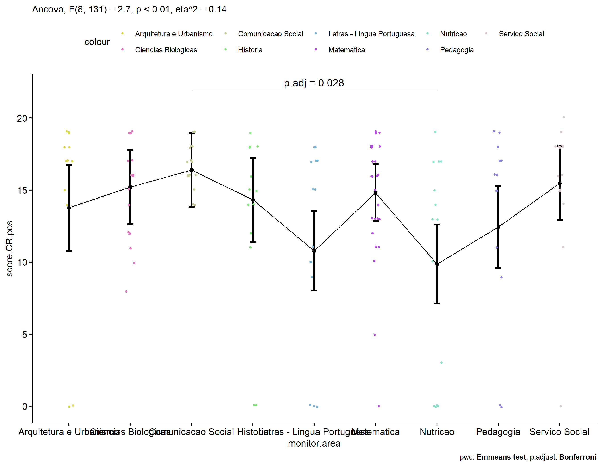<!-- -->

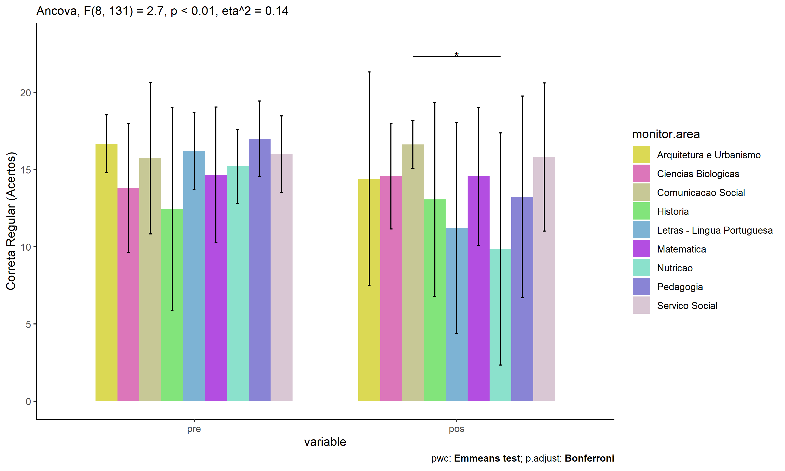<!-- -->

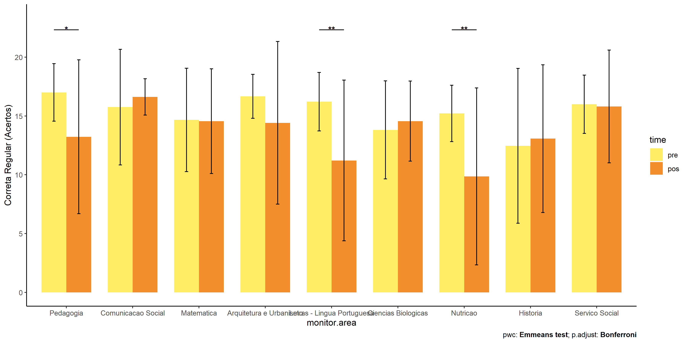<!-- -->

### Correta Irregular (Acertos)

| var          | monitor.area               |   n | M (pre) | SE (pre) | M (unadj) | SE (unadj) | M (adj) | SE (adj) |
|:-------------|:---------------------------|----:|--------:|---------:|----------:|-----------:|--------:|---------:|
| score.CI.pos | Arquitetura e Urbanismo    |  12 |  11.833 |    0.613 |    11.500 |      1.747 |  11.581 |    1.323 |
| score.CI.pos | Ciencias Biologicas        |  16 |  11.125 |    0.884 |    12.438 |      0.922 |  12.894 |    1.150 |
| score.CI.pos | Comunicacao Social         |  16 |  11.562 |    1.110 |    13.562 |      0.747 |  13.787 |    1.147 |
| score.CI.pos | Historia                   |  13 |  10.538 |    1.682 |    10.769 |      1.590 |  11.536 |    1.280 |
| score.CI.pos | Letras - Lingua Portuguesa |  14 |  12.929 |    0.497 |    10.643 |      1.708 |  10.143 |    1.229 |
| score.CI.pos | Matematica                 |  27 |  11.926 |    0.804 |    12.815 |      0.768 |  12.847 |    0.882 |
| score.CI.pos | Nutricao                   |  14 |  12.071 |    0.986 |     8.143 |      1.722 |   8.097 |    1.225 |
| score.CI.pos | Pedagogia                  |  13 |  12.923 |    0.916 |    10.615 |      1.483 |  10.119 |    1.275 |
| score.CI.pos | Servico Social             |  16 |  13.000 |    0.806 |    12.125 |      1.179 |  11.588 |    1.151 |

| .y.          | group1                  | group2              | estimate | conf.low | conf.high |    se | statistic | p       | p.adj | p.adj.signif |
|:-------------|:------------------------|:--------------------|---------:|---------:|----------:|------:|----------:|:--------|------:|:-------------|
| score.CI.pos | Arquitetura e Urbanismo | Ciencias Biologicas |   -1.313 |   -4.779 |     2.154 | 1.752 |    -0.749 | 0.455   | 1.000 | ns           |
| score.CI.pos | Arquitetura e Urbanismo | Comunicacao Social  |   -2.206 |   -5.670 |     1.258 | 1.751 |    -1.260 | 0.21    | 1.000 | ns           |
| score.CI.pos | Arquitetura e Urbanismo | Historia            |    0.045 |   -3.596 |     3.685 | 1.840 |     0.024 | 0.981   | 1.000 | ns           |
| score.CI.pos | Arquitetura e Urbanismo | Letras              |    1.437 |   -2.137 |     5.012 | 1.807 |     0.795 | 0.428   | 1.000 | ns           |
| score.CI.pos | Arquitetura e Urbanismo | Matematica          |   -1.266 |   -4.412 |     1.881 | 1.591 |    -0.796 | 0.428   | 1.000 | ns           |
| score.CI.pos | Arquitetura e Urbanismo | Nutricao            |    3.483 |   -0.085 |     7.051 | 1.804 |     1.931 | 0.056   | 1.000 | ns           |
| score.CI.pos | Arquitetura e Urbanismo | Pedagogia           |    1.462 |   -2.175 |     5.099 | 1.839 |     0.795 | 0.428   | 1.000 | ns           |
| score.CI.pos | Arquitetura e Urbanismo | Servico Social      |   -0.007 |   -3.478 |     3.465 | 1.755 |    -0.004 | 0.997   | 1.000 | ns           |
| score.CI.pos | Ciencias Biologicas     | Comunicacao Social  |   -0.893 |   -4.101 |     2.314 | 1.621 |    -0.551 | 0.583   | 1.000 | ns           |
| score.CI.pos | Ciencias Biologicas     | Historia            |    1.357 |   -2.031 |     4.746 | 1.713 |     0.793 | 0.429   | 1.000 | ns           |
| score.CI.pos | Ciencias Biologicas     | Letras              |    2.750 |   -0.589 |     6.090 | 1.688 |     1.629 | 0.106   | 1.000 | ns           |
| score.CI.pos | Ciencias Biologicas     | Matematica          |    0.047 |   -2.819 |     2.913 | 1.449 |     0.032 | 0.974   | 1.000 | ns           |
| score.CI.pos | Ciencias Biologicas     | Nutricao            |    4.796 |    1.471 |     8.121 | 1.681 |     2.854 | 0.005   | 0.181 | ns           |
| score.CI.pos | Ciencias Biologicas     | Pedagogia           |    2.775 |   -0.632 |     6.181 | 1.722 |     1.611 | 0.11    | 1.000 | ns           |
| score.CI.pos | Ciencias Biologicas     | Servico Social      |    1.306 |   -1.924 |     4.536 | 1.633 |     0.800 | 0.425   | 1.000 | ns           |
| score.CI.pos | Comunicacao Social      | Historia            |    2.251 |   -1.142 |     5.644 | 1.715 |     1.312 | 0.192   | 1.000 | ns           |
| score.CI.pos | Comunicacao Social      | Letras              |    3.643 |    0.313 |     6.974 | 1.684 |     2.164 | 0.032   | 1.000 | ns           |
| score.CI.pos | Comunicacao Social      | Matematica          |    0.940 |   -1.922 |     3.802 | 1.447 |     0.650 | 0.517   | 1.000 | ns           |
| score.CI.pos | Comunicacao Social      | Nutricao            |    5.689 |    2.369 |     9.010 | 1.679 |     3.389 | \<0.001 | 0.033 | \*           |
| score.CI.pos | Comunicacao Social      | Pedagogia           |    3.668 |    0.270 |     7.066 | 1.718 |     2.135 | 0.035   | 1.000 | ns           |
| score.CI.pos | Comunicacao Social      | Servico Social      |    2.199 |   -1.021 |     5.419 | 1.628 |     1.351 | 0.179   | 1.000 | ns           |
| score.CI.pos | Historia                | Letras              |    1.393 |   -2.135 |     4.920 | 1.783 |     0.781 | 0.436   | 1.000 | ns           |
| score.CI.pos | Historia                | Matematica          |   -1.310 |   -4.385 |     1.764 | 1.554 |    -0.843 | 0.401   | 1.000 | ns           |
| score.CI.pos | Historia                | Nutricao            |    3.439 |   -0.069 |     6.946 | 1.773 |     1.939 | 0.055   | 1.000 | ns           |
| score.CI.pos | Historia                | Pedagogia           |    1.417 |   -2.174 |     5.008 | 1.815 |     0.781 | 0.436   | 1.000 | ns           |
| score.CI.pos | Historia                | Servico Social      |   -0.052 |   -3.476 |     3.373 | 1.731 |    -0.030 | 0.976   | 1.000 | ns           |
| score.CI.pos | Letras                  | Lingua Portuguesa   |   -2.703 |   -5.697 |     0.291 | 1.513 |    -1.786 | 0.076   | 1.000 | ns           |
| score.CI.pos | Letras                  | Lingua Portuguesa   |    2.046 |   -1.386 |     5.478 | 1.735 |     1.179 | 0.24    | 1.000 | ns           |
| score.CI.pos | Letras                  | Lingua Portuguesa   |    0.025 |   -3.468 |     3.518 | 1.766 |     0.014 | 0.989   | 1.000 | ns           |
| score.CI.pos | Letras                  | Lingua Portuguesa   |   -1.444 |   -4.763 |     1.875 | 1.678 |    -0.861 | 0.391   | 1.000 | ns           |
| score.CI.pos | Matematica              | Nutricao            |    4.749 |    1.762 |     7.736 | 1.510 |     3.145 | 0.002   | 0.074 | ns           |
| score.CI.pos | Matematica              | Pedagogia           |    2.728 |   -0.341 |     5.796 | 1.551 |     1.759 | 0.081   | 1.000 | ns           |
| score.CI.pos | Matematica              | Servico Social      |    1.259 |   -1.611 |     4.129 | 1.451 |     0.868 | 0.387   | 1.000 | ns           |
| score.CI.pos | Nutricao                | Pedagogia           |   -2.021 |   -5.519 |     1.476 | 1.768 |    -1.143 | 0.255   | 1.000 | ns           |
| score.CI.pos | Nutricao                | Servico Social      |   -3.490 |   -6.815 |    -0.166 | 1.680 |    -2.077 | 0.04    | 1.000 | ns           |
| score.CI.pos | Pedagogia               | Servico Social      |   -1.469 |   -4.855 |     1.917 | 1.712 |    -0.858 | 0.392   | 1.000 | ns           |
| score.CI.pre | Arquitetura e Urbanismo | Ciencias Biologicas |    0.708 |   -2.186 |     3.602 | 1.463 |     0.484 | 0.629   | 1.000 | ns           |
| score.CI.pre | Arquitetura e Urbanismo | Comunicacao Social  |    0.271 |   -2.623 |     3.165 | 1.463 |     0.185 | 0.853   | 1.000 | ns           |
| score.CI.pre | Arquitetura e Urbanismo | Historia            |    1.295 |   -1.739 |     4.328 | 1.534 |     0.844 | 0.4     | 1.000 | ns           |
| score.CI.pre | Arquitetura e Urbanismo | Letras              |   -1.095 |   -4.076 |     1.886 | 1.507 |    -0.727 | 0.469   | 1.000 | ns           |
| score.CI.pre | Arquitetura e Urbanismo | Matematica          |   -0.093 |   -2.722 |     2.537 | 1.329 |    -0.070 | 0.945   | 1.000 | ns           |
| score.CI.pre | Arquitetura e Urbanismo | Nutricao            |   -0.238 |   -3.219 |     2.743 | 1.507 |    -0.158 | 0.875   | 1.000 | ns           |
| score.CI.pre | Arquitetura e Urbanismo | Pedagogia           |   -1.090 |   -4.123 |     1.944 | 1.534 |    -0.711 | 0.479   | 1.000 | ns           |
| score.CI.pre | Arquitetura e Urbanismo | Servico Social      |   -1.167 |   -4.061 |     1.727 | 1.463 |    -0.797 | 0.427   | 1.000 | ns           |
| score.CI.pre | Ciencias Biologicas     | Comunicacao Social  |   -0.437 |   -3.117 |     2.242 | 1.354 |    -0.323 | 0.747   | 1.000 | ns           |
| score.CI.pre | Ciencias Biologicas     | Historia            |    0.587 |   -2.243 |     3.416 | 1.430 |     0.410 | 0.682   | 1.000 | ns           |
| score.CI.pre | Ciencias Biologicas     | Letras              |   -1.804 |   -4.577 |     0.970 | 1.402 |    -1.286 | 0.201   | 1.000 | ns           |
| score.CI.pre | Ciencias Biologicas     | Matematica          |   -0.801 |   -3.192 |     1.590 | 1.209 |    -0.663 | 0.509   | 1.000 | ns           |
| score.CI.pre | Ciencias Biologicas     | Nutricao            |   -0.946 |   -3.720 |     1.827 | 1.402 |    -0.675 | 0.501   | 1.000 | ns           |
| score.CI.pre | Ciencias Biologicas     | Pedagogia           |   -1.798 |   -4.628 |     1.031 | 1.430 |    -1.257 | 0.211   | 1.000 | ns           |
| score.CI.pre | Ciencias Biologicas     | Servico Social      |   -1.875 |   -4.554 |     0.804 | 1.354 |    -1.384 | 0.169   | 1.000 | ns           |
| score.CI.pre | Comunicacao Social      | Historia            |    1.024 |   -1.806 |     3.854 | 1.430 |     0.716 | 0.475   | 1.000 | ns           |
| score.CI.pre | Comunicacao Social      | Letras              |   -1.366 |   -4.139 |     1.407 | 1.402 |    -0.974 | 0.332   | 1.000 | ns           |
| score.CI.pre | Comunicacao Social      | Matematica          |   -0.363 |   -2.754 |     2.027 | 1.209 |    -0.301 | 0.764   | 1.000 | ns           |
| score.CI.pre | Comunicacao Social      | Nutricao            |   -0.509 |   -3.282 |     2.264 | 1.402 |    -0.363 | 0.717   | 1.000 | ns           |
| score.CI.pre | Comunicacao Social      | Pedagogia           |   -1.361 |   -4.190 |     1.469 | 1.430 |    -0.951 | 0.343   | 1.000 | ns           |
| score.CI.pre | Comunicacao Social      | Servico Social      |   -1.438 |   -4.117 |     1.242 | 1.354 |    -1.061 | 0.29    | 1.000 | ns           |
| score.CI.pre | Historia                | Letras              |   -2.390 |   -5.309 |     0.529 | 1.476 |    -1.620 | 0.108   | 1.000 | ns           |
| score.CI.pre | Historia                | Matematica          |   -1.387 |   -3.946 |     1.171 | 1.293 |    -1.073 | 0.285   | 1.000 | ns           |
| score.CI.pre | Historia                | Nutricao            |   -1.533 |   -4.452 |     1.386 | 1.476 |    -1.039 | 0.301   | 1.000 | ns           |
| score.CI.pre | Historia                | Pedagogia           |   -2.385 |   -5.357 |     0.588 | 1.503 |    -1.587 | 0.115   | 1.000 | ns           |
| score.CI.pre | Historia                | Servico Social      |   -2.462 |   -5.291 |     0.368 | 1.430 |    -1.721 | 0.088   | 1.000 | ns           |
| score.CI.pre | Letras                  | Lingua Portuguesa   |    1.003 |   -1.493 |     3.498 | 1.262 |     0.795 | 0.428   | 1.000 | ns           |
| score.CI.pre | Letras                  | Lingua Portuguesa   |    0.857 |   -2.007 |     3.721 | 1.448 |     0.592 | 0.555   | 1.000 | ns           |
| score.CI.pre | Letras                  | Lingua Portuguesa   |    0.005 |   -2.913 |     2.924 | 1.476 |     0.004 | 0.997   | 1.000 | ns           |
| score.CI.pre | Letras                  | Lingua Portuguesa   |   -0.071 |   -2.845 |     2.702 | 1.402 |    -0.051 | 0.959   | 1.000 | ns           |
| score.CI.pre | Matematica              | Nutricao            |   -0.146 |   -2.641 |     2.350 | 1.262 |    -0.115 | 0.908   | 1.000 | ns           |
| score.CI.pre | Matematica              | Pedagogia           |   -0.997 |   -3.555 |     1.561 | 1.293 |    -0.771 | 0.442   | 1.000 | ns           |
| score.CI.pre | Matematica              | Servico Social      |   -1.074 |   -3.465 |     1.317 | 1.209 |    -0.889 | 0.376   | 1.000 | ns           |
| score.CI.pre | Nutricao                | Pedagogia           |   -0.852 |   -3.770 |     2.067 | 1.476 |    -0.577 | 0.565   | 1.000 | ns           |
| score.CI.pre | Nutricao                | Servico Social      |   -0.929 |   -3.702 |     1.845 | 1.402 |    -0.662 | 0.509   | 1.000 | ns           |
| score.CI.pre | Pedagogia               | Servico Social      |   -0.077 |   -2.906 |     2.753 | 1.430 |    -0.054 | 0.957   | 1.000 | ns           |

| .y.      | monitor.area               | group1 | group2 | estimate | conf.low | conf.high |    se | statistic |     p | p.adj | p.adj.signif |
|:---------|:---------------------------|:-------|:-------|---------:|---------:|----------:|------:|----------:|------:|------:|:-------------|
| score.CI | Arquitetura e Urbanismo    | pre    | pos    |    0.333 |   -3.246 |     3.913 | 1.818 |     0.183 | 0.855 | 0.855 | ns           |
| score.CI | Ciencias Biologicas        | pre    | pos    |   -1.312 |   -4.412 |     1.787 | 1.574 |    -0.834 | 0.405 | 0.405 | ns           |
| score.CI | Comunicacao Social         | pre    | pos    |   -2.000 |   -5.100 |     1.100 | 1.574 |    -1.270 | 0.205 | 0.205 | ns           |
| score.CI | Historia                   | pre    | pos    |   -0.231 |   -3.670 |     3.208 | 1.746 |    -0.132 | 0.895 | 0.895 | ns           |
| score.CI | Letras - Lingua Portuguesa | pre    | pos    |    2.286 |   -1.028 |     5.599 | 1.683 |     1.358 | 0.176 | 0.176 | ns           |
| score.CI | Matematica                 | pre    | pos    |   -0.889 |   -3.275 |     1.497 | 1.212 |    -0.733 | 0.464 | 0.464 | ns           |
| score.CI | Nutricao                   | pre    | pos    |    3.929 |    0.615 |     7.242 | 1.683 |     2.334 | 0.020 | 0.020 | \*           |
| score.CI | Pedagogia                  | pre    | pos    |    2.308 |   -1.131 |     5.747 | 1.746 |     1.321 | 0.188 | 0.188 | ns           |
| score.CI | Servico Social             | pre    | pos    |    0.875 |   -2.225 |     3.975 | 1.574 |     0.556 | 0.579 | 0.579 | ns           |

    ## Scale for colour is already present.
    ## Adding another scale for colour, which will replace the existing scale.

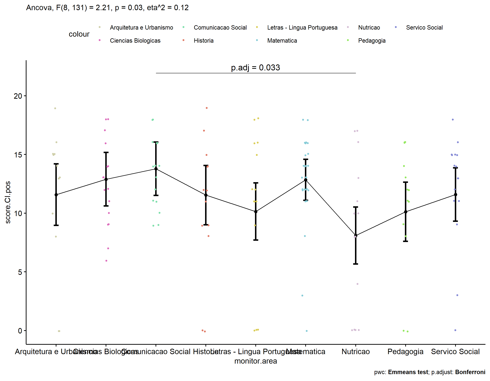<!-- -->

<!-- -->

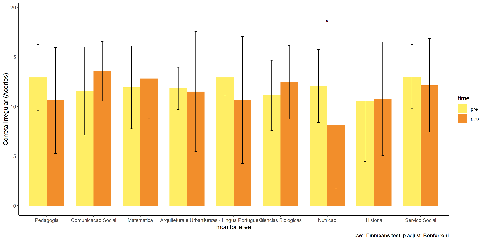<!-- -->

### Trocas Visuais (Acertos)

| var          | monitor.area               |   n | M (pre) | SE (pre) | M (unadj) | SE (unadj) | M (adj) | SE (adj) |
|:-------------|:---------------------------|----:|--------:|---------:|----------:|-----------:|--------:|---------:|
| score.TV.pos | Arquitetura e Urbanismo    |  12 |  18.833 |    0.490 |    15.583 |      2.112 |  14.703 |    1.665 |
| score.TV.pos | Ciencias Biologicas        |  16 |  16.812 |    1.137 |    16.375 |      0.939 |  16.352 |    1.427 |
| score.TV.pos | Comunicacao Social         |  16 |  16.062 |    1.410 |    17.375 |      0.612 |  17.671 |    1.429 |
| score.TV.pos | Historia                   |  13 |  13.231 |    2.187 |    13.692 |      2.046 |  15.190 |    1.635 |
| score.TV.pos | Letras - Lingua Portuguesa |  14 |  18.143 |    0.592 |    12.643 |      1.966 |  12.055 |    1.534 |
| score.TV.pos | Matematica                 |  27 |  16.148 |    0.889 |    16.370 |      0.861 |  16.630 |    1.101 |
| score.TV.pos | Nutricao                   |  14 |  17.786 |    0.613 |    10.571 |      2.294 |  10.136 |    1.530 |
| score.TV.pos | Pedagogia                  |  13 |  18.385 |    0.474 |    14.846 |      2.015 |  14.156 |    1.594 |
| score.TV.pos | Servico Social             |  16 |  16.312 |    0.700 |    16.312 |      1.196 |  16.502 |    1.428 |

| .y.          | group1                  | group2              | estimate | conf.low | conf.high |    se | statistic | p       | p.adj | p.adj.signif |
|:-------------|:------------------------|:--------------------|---------:|---------:|----------:|------:|----------:|:--------|------:|:-------------|
| score.TV.pos | Arquitetura e Urbanismo | Ciencias Biologicas |   -1.649 |   -5.986 |     2.688 | 2.192 |    -0.752 | 0.453   | 1.000 | ns           |
| score.TV.pos | Arquitetura e Urbanismo | Comunicacao Social  |   -2.968 |   -7.327 |     1.391 | 2.203 |    -1.347 | 0.18    | 1.000 | ns           |
| score.TV.pos | Arquitetura e Urbanismo | Historia            |   -0.487 |   -5.188 |     4.214 | 2.376 |    -0.205 | 0.838   | 1.000 | ns           |
| score.TV.pos | Arquitetura e Urbanismo | Letras              |    2.647 |   -1.797 |     7.092 | 2.247 |     1.178 | 0.241   | 1.000 | ns           |
| score.TV.pos | Arquitetura e Urbanismo | Matematica          |   -1.927 |   -5.893 |     2.039 | 2.005 |    -0.961 | 0.338   | 1.000 | ns           |
| score.TV.pos | Arquitetura e Urbanismo | Nutricao            |    4.567 |    0.119 |     9.016 | 2.249 |     2.031 | 0.044   | 1.000 | ns           |
| score.TV.pos | Arquitetura e Urbanismo | Pedagogia           |    0.547 |   -3.975 |     5.068 | 2.286 |     0.239 | 0.811   | 1.000 | ns           |
| score.TV.pos | Arquitetura e Urbanismo | Servico Social      |   -1.799 |   -6.150 |     2.552 | 2.199 |    -0.818 | 0.415   | 1.000 | ns           |
| score.TV.pos | Ciencias Biologicas     | Comunicacao Social  |   -1.318 |   -5.314 |     2.678 | 2.020 |    -0.653 | 0.515   | 1.000 | ns           |
| score.TV.pos | Ciencias Biologicas     | Historia            |    1.162 |   -3.134 |     5.458 | 2.172 |     0.535 | 0.593   | 1.000 | ns           |
| score.TV.pos | Ciencias Biologicas     | Letras              |    4.297 |    0.153 |     8.440 | 2.095 |     2.051 | 0.042   | 1.000 | ns           |
| score.TV.pos | Ciencias Biologicas     | Matematica          |   -0.277 |   -3.843 |     3.288 | 1.802 |    -0.154 | 0.878   | 1.000 | ns           |
| score.TV.pos | Ciencias Biologicas     | Nutricao            |    6.217 |    2.078 |    10.355 | 2.092 |     2.972 | 0.004   | 0.127 | ns           |
| score.TV.pos | Ciencias Biologicas     | Pedagogia           |    2.196 |   -2.035 |     6.428 | 2.139 |     1.027 | 0.306   | 1.000 | ns           |
| score.TV.pos | Ciencias Biologicas     | Servico Social      |   -0.150 |   -4.144 |     3.844 | 2.019 |    -0.074 | 0.941   | 1.000 | ns           |
| score.TV.pos | Comunicacao Social      | Historia            |    2.481 |   -1.786 |     6.747 | 2.157 |     1.150 | 0.252   | 1.000 | ns           |
| score.TV.pos | Comunicacao Social      | Letras              |    5.615 |    1.455 |     9.775 | 2.103 |     2.670 | 0.009   | 0.307 | ns           |
| score.TV.pos | Comunicacao Social      | Matematica          |    1.041 |   -2.521 |     4.603 | 1.801 |     0.578 | 0.564   | 1.000 | ns           |
| score.TV.pos | Comunicacao Social      | Nutricao            |    7.535 |    3.384 |    11.686 | 2.098 |     3.591 | \<0.001 | 0.017 | \*           |
| score.TV.pos | Comunicacao Social      | Pedagogia           |    3.515 |   -0.735 |     7.764 | 2.148 |     1.636 | 0.104   | 1.000 | ns           |
| score.TV.pos | Comunicacao Social      | Servico Social      |    1.169 |   -2.824 |     5.161 | 2.018 |     0.579 | 0.564   | 1.000 | ns           |
| score.TV.pos | Historia                | Letras              |    3.134 |   -1.359 |     7.628 | 2.272 |     1.380 | 0.17    | 1.000 | ns           |
| score.TV.pos | Historia                | Matematica          |   -1.440 |   -5.310 |     2.431 | 1.957 |    -0.736 | 0.463   | 1.000 | ns           |
| score.TV.pos | Historia                | Nutricao            |    5.054 |    0.581 |     9.528 | 2.261 |     2.235 | 0.027   | 0.976 | ns           |
| score.TV.pos | Historia                | Pedagogia           |    1.034 |   -3.551 |     5.619 | 2.318 |     0.446 | 0.656   | 1.000 | ns           |
| score.TV.pos | Historia                | Servico Social      |   -1.312 |   -5.588 |     2.963 | 2.161 |    -0.607 | 0.545   | 1.000 | ns           |
| score.TV.pos | Letras                  | Lingua Portuguesa   |   -4.574 |   -8.321 |    -0.827 | 1.894 |    -2.415 | 0.017   | 0.616 | ns           |
| score.TV.pos | Letras                  | Lingua Portuguesa   |    1.920 |   -2.349 |     6.188 | 2.158 |     0.890 | 0.375   | 1.000 | ns           |
| score.TV.pos | Letras                  | Lingua Portuguesa   |   -2.101 |   -6.450 |     2.249 | 2.199 |    -0.955 | 0.341   | 1.000 | ns           |
| score.TV.pos | Letras                  | Lingua Portuguesa   |   -4.447 |   -8.600 |    -0.293 | 2.100 |    -2.118 | 0.036   | 1.000 | ns           |
| score.TV.pos | Matematica              | Nutricao            |    6.494 |    2.756 |    10.232 | 1.889 |     3.437 | \<0.001 | 0.028 | \*           |
| score.TV.pos | Matematica              | Pedagogia           |    2.474 |   -1.373 |     6.320 | 1.944 |     1.272 | 0.206   | 1.000 | ns           |
| score.TV.pos | Matematica              | Servico Social      |    0.128 |   -3.435 |     3.690 | 1.801 |     0.071 | 0.944   | 1.000 | ns           |
| score.TV.pos | Nutricao                | Pedagogia           |   -4.021 |   -8.372 |     0.331 | 2.200 |    -1.828 | 0.07    | 1.000 | ns           |
| score.TV.pos | Nutricao                | Servico Social      |   -6.366 |  -10.513 |    -2.220 | 2.096 |    -3.038 | 0.003   | 0.104 | ns           |
| score.TV.pos | Pedagogia               | Servico Social      |   -2.346 |   -6.589 |     1.897 | 2.145 |    -1.094 | 0.276   | 1.000 | ns           |
| score.TV.pre | Arquitetura e Urbanismo | Ciencias Biologicas |    2.021 |   -1.204 |     5.245 | 1.630 |     1.240 | 0.217   | 1.000 | ns           |
| score.TV.pre | Arquitetura e Urbanismo | Comunicacao Social  |    2.771 |   -0.454 |     5.995 | 1.630 |     1.700 | 0.092   | 1.000 | ns           |
| score.TV.pre | Arquitetura e Urbanismo | Historia            |    5.603 |    2.222 |     8.983 | 1.709 |     3.279 | 0.001   | 0.048 | \*           |
| score.TV.pre | Arquitetura e Urbanismo | Letras              |    0.690 |   -2.631 |     4.012 | 1.679 |     0.411 | 0.682   | 1.000 | ns           |
| score.TV.pre | Arquitetura e Urbanismo | Matematica          |    2.685 |   -0.244 |     5.615 | 1.481 |     1.813 | 0.072   | 1.000 | ns           |
| score.TV.pre | Arquitetura e Urbanismo | Nutricao            |    1.048 |   -2.274 |     4.369 | 1.679 |     0.624 | 0.534   | 1.000 | ns           |
| score.TV.pre | Arquitetura e Urbanismo | Pedagogia           |    0.449 |   -2.932 |     3.829 | 1.709 |     0.263 | 0.793   | 1.000 | ns           |
| score.TV.pre | Arquitetura e Urbanismo | Servico Social      |    2.521 |   -0.704 |     5.745 | 1.630 |     1.546 | 0.124   | 1.000 | ns           |
| score.TV.pre | Ciencias Biologicas     | Comunicacao Social  |    0.750 |   -2.235 |     3.735 | 1.509 |     0.497 | 0.62    | 1.000 | ns           |
| score.TV.pre | Ciencias Biologicas     | Historia            |    3.582 |    0.429 |     6.735 | 1.594 |     2.247 | 0.026   | 0.947 | ns           |
| score.TV.pre | Ciencias Biologicas     | Letras              |   -1.330 |   -4.421 |     1.760 | 1.562 |    -0.852 | 0.396   | 1.000 | ns           |
| score.TV.pre | Ciencias Biologicas     | Matematica          |    0.664 |   -2.000 |     3.328 | 1.347 |     0.493 | 0.623   | 1.000 | ns           |
| score.TV.pre | Ciencias Biologicas     | Nutricao            |   -0.973 |   -4.063 |     2.117 | 1.562 |    -0.623 | 0.534   | 1.000 | ns           |
| score.TV.pre | Ciencias Biologicas     | Pedagogia           |   -1.572 |   -4.725 |     1.581 | 1.594 |    -0.986 | 0.326   | 1.000 | ns           |
| score.TV.pre | Ciencias Biologicas     | Servico Social      |    0.500 |   -2.485 |     3.485 | 1.509 |     0.331 | 0.741   | 1.000 | ns           |
| score.TV.pre | Comunicacao Social      | Historia            |    2.832 |   -0.321 |     5.985 | 1.594 |     1.777 | 0.078   | 1.000 | ns           |
| score.TV.pre | Comunicacao Social      | Letras              |   -2.080 |   -5.171 |     1.010 | 1.562 |    -1.332 | 0.185   | 1.000 | ns           |
| score.TV.pre | Comunicacao Social      | Matematica          |   -0.086 |   -2.750 |     2.578 | 1.347 |    -0.064 | 0.949   | 1.000 | ns           |
| score.TV.pre | Comunicacao Social      | Nutricao            |   -1.723 |   -4.813 |     1.367 | 1.562 |    -1.103 | 0.272   | 1.000 | ns           |
| score.TV.pre | Comunicacao Social      | Pedagogia           |   -2.322 |   -5.475 |     0.831 | 1.594 |    -1.457 | 0.148   | 1.000 | ns           |
| score.TV.pre | Comunicacao Social      | Servico Social      |   -0.250 |   -3.235 |     2.735 | 1.509 |    -0.166 | 0.869   | 1.000 | ns           |
| score.TV.pre | Historia                | Letras              |   -4.912 |   -8.164 |    -1.660 | 1.644 |    -2.988 | 0.003   | 0.121 | ns           |
| score.TV.pre | Historia                | Matematica          |   -2.917 |   -5.768 |    -0.067 | 1.441 |    -2.024 | 0.045   | 1.000 | ns           |
| score.TV.pre | Historia                | Nutricao            |   -4.555 |   -7.807 |    -1.303 | 1.644 |    -2.770 | 0.006   | 0.231 | ns           |
| score.TV.pre | Historia                | Pedagogia           |   -5.154 |   -8.466 |    -1.842 | 1.674 |    -3.078 | 0.003   | 0.091 | ns           |
| score.TV.pre | Historia                | Servico Social      |   -3.082 |   -6.235 |     0.071 | 1.594 |    -1.933 | 0.055   | 1.000 | ns           |
| score.TV.pre | Letras                  | Lingua Portuguesa   |    1.995 |   -0.786 |     4.776 | 1.406 |     1.419 | 0.158   | 1.000 | ns           |
| score.TV.pre | Letras                  | Lingua Portuguesa   |    0.357 |   -2.834 |     3.549 | 1.613 |     0.221 | 0.825   | 1.000 | ns           |
| score.TV.pre | Letras                  | Lingua Portuguesa   |   -0.242 |   -3.494 |     3.011 | 1.644 |    -0.147 | 0.883   | 1.000 | ns           |
| score.TV.pre | Letras                  | Lingua Portuguesa   |    1.830 |   -1.260 |     4.921 | 1.562 |     1.172 | 0.243   | 1.000 | ns           |
| score.TV.pre | Matematica              | Nutricao            |   -1.638 |   -4.419 |     1.143 | 1.406 |    -1.165 | 0.246   | 1.000 | ns           |
| score.TV.pre | Matematica              | Pedagogia           |   -2.236 |   -5.087 |     0.614 | 1.441 |    -1.552 | 0.123   | 1.000 | ns           |
| score.TV.pre | Matematica              | Servico Social      |   -0.164 |   -2.828 |     2.500 | 1.347 |    -0.122 | 0.903   | 1.000 | ns           |
| score.TV.pre | Nutricao                | Pedagogia           |   -0.599 |   -3.851 |     2.653 | 1.644 |    -0.364 | 0.716   | 1.000 | ns           |
| score.TV.pre | Nutricao                | Servico Social      |    1.473 |   -1.617 |     4.563 | 1.562 |     0.943 | 0.347   | 1.000 | ns           |
| score.TV.pre | Pedagogia               | Servico Social      |    2.072 |   -1.081 |     5.225 | 1.594 |     1.300 | 0.196   | 1.000 | ns           |

| .y.      | monitor.area               | group1 | group2 | estimate | conf.low | conf.high |    se | statistic | p       | p.adj   | p.adj.signif |
|:---------|:---------------------------|:-------|:-------|---------:|---------:|----------:|------:|----------:|:--------|:--------|:-------------|
| score.TV | Arquitetura e Urbanismo    | pre    | pos    |    3.250 |   -0.921 |     7.421 | 2.118 |     1.534 | 0.126   | 0.126   | ns           |
| score.TV | Ciencias Biologicas        | pre    | pos    |    0.437 |   -3.174 |     4.049 | 1.834 |     0.239 | 0.812   | 0.812   | ns           |
| score.TV | Comunicacao Social         | pre    | pos    |   -1.313 |   -4.924 |     2.299 | 1.834 |    -0.716 | 0.475   | 0.475   | ns           |
| score.TV | Historia                   | pre    | pos    |   -0.462 |   -4.469 |     3.545 | 2.035 |    -0.227 | 0.821   | 0.821   | ns           |
| score.TV | Letras - Lingua Portuguesa | pre    | pos    |    5.500 |    1.639 |     9.361 | 1.961 |     2.805 | 0.005   | 0.005   | \*\*         |
| score.TV | Matematica                 | pre    | pos    |   -0.222 |   -3.003 |     2.558 | 1.412 |    -0.157 | 0.875   | 0.875   | ns           |
| score.TV | Nutricao                   | pre    | pos    |    7.214 |    3.353 |    11.075 | 1.961 |     3.679 | \<0.001 | \<0.001 | \*\*\*       |
| score.TV | Pedagogia                  | pre    | pos    |    3.538 |   -0.469 |     7.545 | 2.035 |     1.739 | 0.083   | 0.083   | ns           |
| score.TV | Servico Social             | pre    | pos    |    0.000 |   -3.612 |     3.612 | 1.834 |     0.000 | 1       | 1       | ns           |

    ## Scale for colour is already present.
    ## Adding another scale for colour, which will replace the existing scale.

<!-- -->

<!-- -->

<!-- -->

### Trocas Fonologicas (Acertos)

| var          | monitor.area               |   n | M (pre) | SE (pre) | M (unadj) | SE (unadj) | M (adj) | SE (adj) |
|:-------------|:---------------------------|----:|--------:|---------:|----------:|-----------:|--------:|---------:|
| score.TF.pos | Arquitetura e Urbanismo    |  12 |  18.000 |    0.628 |    14.750 |      2.129 |  13.503 |    1.562 |
| score.TF.pos | Ciencias Biologicas        |  16 |  15.688 |    1.164 |    15.812 |      0.857 |  15.809 |    1.337 |
| score.TF.pos | Comunicacao Social         |  16 |  15.688 |    1.413 |    17.062 |      0.655 |  17.059 |    1.337 |
| score.TF.pos | Historia                   |  13 |  13.154 |    2.069 |    13.154 |      1.887 |  14.512 |    1.505 |
| score.TF.pos | Letras - Lingua Portuguesa |  14 |  16.214 |    1.403 |    12.357 |      2.037 |  12.070 |    1.431 |
| score.TF.pos | Matematica                 |  27 |  14.852 |    0.913 |    15.037 |      0.902 |  15.483 |    1.033 |
| score.TF.pos | Nutricao                   |  14 |  16.643 |    0.626 |    10.286 |      2.113 |   9.769 |    1.433 |
| score.TF.pos | Pedagogia                  |  13 |  17.231 |    0.802 |    13.385 |      1.910 |  12.551 |    1.492 |
| score.TF.pos | Servico Social             |  16 |  14.812 |    0.812 |    14.250 |      1.315 |  14.717 |    1.340 |

| .y.          | group1                  | group2              | estimate | conf.low | conf.high |    se | statistic | p       | p.adj | p.adj.signif |
|:-------------|:------------------------|:--------------------|---------:|---------:|----------:|------:|----------:|:--------|------:|:-------------|
| score.TF.pos | Arquitetura e Urbanismo | Ciencias Biologicas |   -2.306 |   -6.373 |     1.762 | 2.056 |    -1.121 | 0.264   | 1.000 | ns           |
| score.TF.pos | Arquitetura e Urbanismo | Comunicacao Social  |   -3.556 |   -7.623 |     0.512 | 2.056 |    -1.729 | 0.086   | 1.000 | ns           |
| score.TF.pos | Arquitetura e Urbanismo | Historia            |   -1.009 |   -5.354 |     3.337 | 2.197 |    -0.459 | 0.647   | 1.000 | ns           |
| score.TF.pos | Arquitetura e Urbanismo | Letras              |    1.433 |   -2.745 |     5.611 | 2.112 |     0.679 | 0.499   | 1.000 | ns           |
| score.TF.pos | Arquitetura e Urbanismo | Matematica          |   -1.979 |   -5.704 |     1.745 | 1.883 |    -1.051 | 0.295   | 1.000 | ns           |
| score.TF.pos | Arquitetura e Urbanismo | Nutricao            |    3.735 |   -0.437 |     7.906 | 2.109 |     1.771 | 0.079   | 1.000 | ns           |
| score.TF.pos | Arquitetura e Urbanismo | Pedagogia           |    0.952 |   -3.287 |     5.191 | 2.143 |     0.444 | 0.658   | 1.000 | ns           |
| score.TF.pos | Arquitetura e Urbanismo | Servico Social      |   -1.213 |   -5.304 |     2.877 | 2.068 |    -0.587 | 0.558   | 1.000 | ns           |
| score.TF.pos | Ciencias Biologicas     | Comunicacao Social  |   -1.250 |   -4.991 |     2.491 | 1.891 |    -0.661 | 0.51    | 1.000 | ns           |
| score.TF.pos | Ciencias Biologicas     | Historia            |    1.297 |   -2.687 |     5.280 | 2.014 |     0.644 | 0.521   | 1.000 | ns           |
| score.TF.pos | Ciencias Biologicas     | Letras              |    3.739 |   -0.135 |     7.612 | 1.958 |     1.909 | 0.058   | 1.000 | ns           |
| score.TF.pos | Ciencias Biologicas     | Matematica          |    0.326 |   -3.016 |     3.669 | 1.690 |     0.193 | 0.847   | 1.000 | ns           |
| score.TF.pos | Ciencias Biologicas     | Nutricao            |    6.040 |    2.163 |     9.917 | 1.960 |     3.082 | 0.003   | 0.090 | ns           |
| score.TF.pos | Ciencias Biologicas     | Pedagogia           |    3.257 |   -0.706 |     7.220 | 2.003 |     1.626 | 0.106   | 1.000 | ns           |
| score.TF.pos | Ciencias Biologicas     | Servico Social      |    1.092 |   -2.653 |     4.837 | 1.893 |     0.577 | 0.565   | 1.000 | ns           |
| score.TF.pos | Comunicacao Social      | Historia            |    2.547 |   -1.437 |     6.530 | 2.014 |     1.265 | 0.208   | 1.000 | ns           |
| score.TF.pos | Comunicacao Social      | Letras              |    4.989 |    1.115 |     8.862 | 1.958 |     2.548 | 0.012   | 0.432 | ns           |
| score.TF.pos | Comunicacao Social      | Matematica          |    1.576 |   -1.766 |     4.919 | 1.690 |     0.933 | 0.353   | 1.000 | ns           |
| score.TF.pos | Comunicacao Social      | Nutricao            |    7.290 |    3.413 |    11.167 | 1.960 |     3.720 | \<0.001 | 0.011 | \*           |
| score.TF.pos | Comunicacao Social      | Pedagogia           |    4.507 |    0.544 |     8.470 | 2.003 |     2.250 | 0.026   | 0.940 | ns           |
| score.TF.pos | Comunicacao Social      | Servico Social      |    2.342 |   -1.403 |     6.087 | 1.893 |     1.237 | 0.218   | 1.000 | ns           |
| score.TF.pos | Historia                | Letras              |    2.442 |   -1.679 |     6.563 | 2.083 |     1.172 | 0.243   | 1.000 | ns           |
| score.TF.pos | Historia                | Matematica          |   -0.970 |   -4.559 |     2.618 | 1.814 |    -0.535 | 0.594   | 1.000 | ns           |
| score.TF.pos | Historia                | Nutricao            |    4.744 |    0.609 |     8.878 | 2.090 |     2.269 | 0.025   | 0.895 | ns           |
| score.TF.pos | Historia                | Pedagogia           |    1.961 |   -2.269 |     6.190 | 2.138 |     0.917 | 0.361   | 1.000 | ns           |
| score.TF.pos | Historia                | Servico Social      |   -0.205 |   -4.169 |     3.760 | 2.004 |    -0.102 | 0.919   | 1.000 | ns           |
| score.TF.pos | Letras                  | Lingua Portuguesa   |   -3.412 |   -6.908 |     0.083 | 1.767 |    -1.931 | 0.056   | 1.000 | ns           |
| score.TF.pos | Letras                  | Lingua Portuguesa   |    2.302 |   -1.698 |     6.302 | 2.022 |     1.138 | 0.257   | 1.000 | ns           |
| score.TF.pos | Letras                  | Lingua Portuguesa   |   -0.481 |   -4.562 |     3.600 | 2.063 |    -0.233 | 0.816   | 1.000 | ns           |
| score.TF.pos | Letras                  | Lingua Portuguesa   |   -2.646 |   -6.529 |     1.236 | 1.963 |    -1.348 | 0.18    | 1.000 | ns           |
| score.TF.pos | Matematica              | Nutricao            |    5.714 |    2.211 |     9.217 | 1.771 |     3.227 | 0.002   | 0.057 | ns           |
| score.TF.pos | Matematica              | Pedagogia           |    2.931 |   -0.672 |     6.535 | 1.822 |     1.609 | 0.11    | 1.000 | ns           |
| score.TF.pos | Matematica              | Servico Social      |    0.766 |   -2.572 |     4.104 | 1.688 |     0.454 | 0.651   | 1.000 | ns           |
| score.TF.pos | Nutricao                | Pedagogia           |   -2.783 |   -6.860 |     1.294 | 2.061 |    -1.350 | 0.179   | 1.000 | ns           |
| score.TF.pos | Nutricao                | Servico Social      |   -4.948 |   -8.838 |    -1.059 | 1.966 |    -2.517 | 0.013   | 0.470 | ns           |
| score.TF.pos | Pedagogia               | Servico Social      |   -2.165 |   -6.146 |     1.815 | 2.012 |    -1.076 | 0.284   | 1.000 | ns           |
| score.TF.pre | Arquitetura e Urbanismo | Ciencias Biologicas |    2.313 |   -1.166 |     5.791 | 1.758 |     1.315 | 0.191   | 1.000 | ns           |
| score.TF.pre | Arquitetura e Urbanismo | Comunicacao Social  |    2.312 |   -1.166 |     5.791 | 1.758 |     1.315 | 0.191   | 1.000 | ns           |
| score.TF.pre | Arquitetura e Urbanismo | Historia            |    4.846 |    1.200 |     8.492 | 1.843 |     2.629 | 0.01    | 0.345 | ns           |
| score.TF.pre | Arquitetura e Urbanismo | Letras              |    1.786 |   -1.797 |     5.369 | 1.811 |     0.986 | 0.326   | 1.000 | ns           |
| score.TF.pre | Arquitetura e Urbanismo | Matematica          |    3.148 |   -0.012 |     6.308 | 1.597 |     1.971 | 0.051   | 1.000 | ns           |
| score.TF.pre | Arquitetura e Urbanismo | Nutricao            |    1.357 |   -2.226 |     4.940 | 1.811 |     0.749 | 0.455   | 1.000 | ns           |
| score.TF.pre | Arquitetura e Urbanismo | Pedagogia           |    0.769 |   -2.877 |     4.415 | 1.843 |     0.417 | 0.677   | 1.000 | ns           |
| score.TF.pre | Arquitetura e Urbanismo | Servico Social      |    3.187 |   -0.291 |     6.666 | 1.758 |     1.813 | 0.072   | 1.000 | ns           |
| score.TF.pre | Ciencias Biologicas     | Comunicacao Social  |    0.000 |   -3.220 |     3.220 | 1.628 |     0.000 | 1       | 1.000 | ns           |
| score.TF.pre | Ciencias Biologicas     | Historia            |    2.534 |   -0.867 |     5.934 | 1.719 |     1.474 | 0.143   | 1.000 | ns           |
| score.TF.pre | Ciencias Biologicas     | Letras              |   -0.527 |   -3.860 |     2.806 | 1.685 |    -0.313 | 0.755   | 1.000 | ns           |
| score.TF.pre | Ciencias Biologicas     | Matematica          |    0.836 |   -2.038 |     3.709 | 1.453 |     0.575 | 0.566   | 1.000 | ns           |
| score.TF.pre | Ciencias Biologicas     | Nutricao            |   -0.955 |   -4.288 |     2.378 | 1.685 |    -0.567 | 0.572   | 1.000 | ns           |
| score.TF.pre | Ciencias Biologicas     | Pedagogia           |   -1.543 |   -4.944 |     1.857 | 1.719 |    -0.898 | 0.371   | 1.000 | ns           |
| score.TF.pre | Ciencias Biologicas     | Servico Social      |    0.875 |   -2.345 |     4.095 | 1.628 |     0.538 | 0.592   | 1.000 | ns           |
| score.TF.pre | Comunicacao Social      | Historia            |    2.534 |   -0.867 |     5.934 | 1.719 |     1.474 | 0.143   | 1.000 | ns           |
| score.TF.pre | Comunicacao Social      | Letras              |   -0.527 |   -3.860 |     2.806 | 1.685 |    -0.313 | 0.755   | 1.000 | ns           |
| score.TF.pre | Comunicacao Social      | Matematica          |    0.836 |   -2.038 |     3.709 | 1.453 |     0.575 | 0.566   | 1.000 | ns           |
| score.TF.pre | Comunicacao Social      | Nutricao            |   -0.955 |   -4.288 |     2.378 | 1.685 |    -0.567 | 0.572   | 1.000 | ns           |
| score.TF.pre | Comunicacao Social      | Pedagogia           |   -1.543 |   -4.944 |     1.857 | 1.719 |    -0.898 | 0.371   | 1.000 | ns           |
| score.TF.pre | Comunicacao Social      | Servico Social      |    0.875 |   -2.345 |     4.095 | 1.628 |     0.538 | 0.592   | 1.000 | ns           |
| score.TF.pre | Historia                | Letras              |   -3.060 |   -6.568 |     0.448 | 1.773 |    -1.726 | 0.087   | 1.000 | ns           |
| score.TF.pre | Historia                | Matematica          |   -1.698 |   -4.773 |     1.377 | 1.554 |    -1.092 | 0.277   | 1.000 | ns           |
| score.TF.pre | Historia                | Nutricao            |   -3.489 |   -6.997 |     0.019 | 1.773 |    -1.967 | 0.051   | 1.000 | ns           |
| score.TF.pre | Historia                | Pedagogia           |   -4.077 |   -7.649 |    -0.505 | 1.806 |    -2.258 | 0.026   | 0.922 | ns           |
| score.TF.pre | Historia                | Servico Social      |   -1.659 |   -5.059 |     1.742 | 1.719 |    -0.965 | 0.336   | 1.000 | ns           |
| score.TF.pre | Letras                  | Lingua Portuguesa   |    1.362 |   -1.637 |     4.362 | 1.516 |     0.898 | 0.371   | 1.000 | ns           |
| score.TF.pre | Letras                  | Lingua Portuguesa   |   -0.429 |   -3.871 |     3.014 | 1.740 |    -0.246 | 0.806   | 1.000 | ns           |
| score.TF.pre | Letras                  | Lingua Portuguesa   |   -1.016 |   -4.524 |     2.491 | 1.773 |    -0.573 | 0.567   | 1.000 | ns           |
| score.TF.pre | Letras                  | Lingua Portuguesa   |    1.402 |   -1.931 |     4.735 | 1.685 |     0.832 | 0.407   | 1.000 | ns           |
| score.TF.pre | Matematica              | Nutricao            |   -1.791 |   -4.791 |     1.209 | 1.516 |    -1.181 | 0.24    | 1.000 | ns           |
| score.TF.pre | Matematica              | Pedagogia           |   -2.379 |   -5.453 |     0.696 | 1.554 |    -1.531 | 0.128   | 1.000 | ns           |
| score.TF.pre | Matematica              | Servico Social      |    0.039 |   -2.834 |     2.913 | 1.453 |     0.027 | 0.978   | 1.000 | ns           |
| score.TF.pre | Nutricao                | Pedagogia           |   -0.588 |   -4.096 |     2.920 | 1.773 |    -0.332 | 0.741   | 1.000 | ns           |
| score.TF.pre | Nutricao                | Servico Social      |    1.830 |   -1.503 |     5.163 | 1.685 |     1.086 | 0.279   | 1.000 | ns           |
| score.TF.pre | Pedagogia               | Servico Social      |    2.418 |   -0.982 |     5.819 | 1.719 |     1.407 | 0.162   | 1.000 | ns           |

| .y.      | monitor.area               | group1 | group2 | estimate | conf.low | conf.high |    se | statistic |     p | p.adj | p.adj.signif |
|:---------|:---------------------------|:-------|:-------|---------:|---------:|----------:|------:|----------:|------:|------:|:-------------|
| score.TF | Arquitetura e Urbanismo    | pre    | pos    |    3.250 |   -0.993 |     7.493 | 2.155 |     1.508 | 0.133 | 0.133 | ns           |
| score.TF | Ciencias Biologicas        | pre    | pos    |   -0.125 |   -3.799 |     3.549 | 1.866 |    -0.067 | 0.947 | 0.947 | ns           |
| score.TF | Comunicacao Social         | pre    | pos    |   -1.375 |   -5.049 |     2.299 | 1.866 |    -0.737 | 0.462 | 0.462 | ns           |
| score.TF | Historia                   | pre    | pos    |    0.000 |   -4.076 |     4.076 | 2.070 |     0.000 | 1.000 | 1.000 | ns           |
| score.TF | Letras - Lingua Portuguesa | pre    | pos    |    3.857 |   -0.071 |     7.785 | 1.995 |     1.933 | 0.054 | 0.054 | ns           |
| score.TF | Matematica                 | pre    | pos    |   -0.185 |   -3.014 |     2.643 | 1.437 |    -0.129 | 0.898 | 0.898 | ns           |
| score.TF | Nutricao                   | pre    | pos    |    6.357 |    2.429 |    10.285 | 1.995 |     3.187 | 0.002 | 0.002 | \*\*         |
| score.TF | Pedagogia                  | pre    | pos    |    3.846 |   -0.230 |     7.922 | 2.070 |     1.858 | 0.064 | 0.064 | ns           |
| score.TF | Servico Social             | pre    | pos    |    0.563 |   -3.112 |     4.237 | 1.866 |     0.301 | 0.763 | 0.763 | ns           |

    ## Scale for colour is already present.
    ## Adding another scale for colour, which will replace the existing scale.

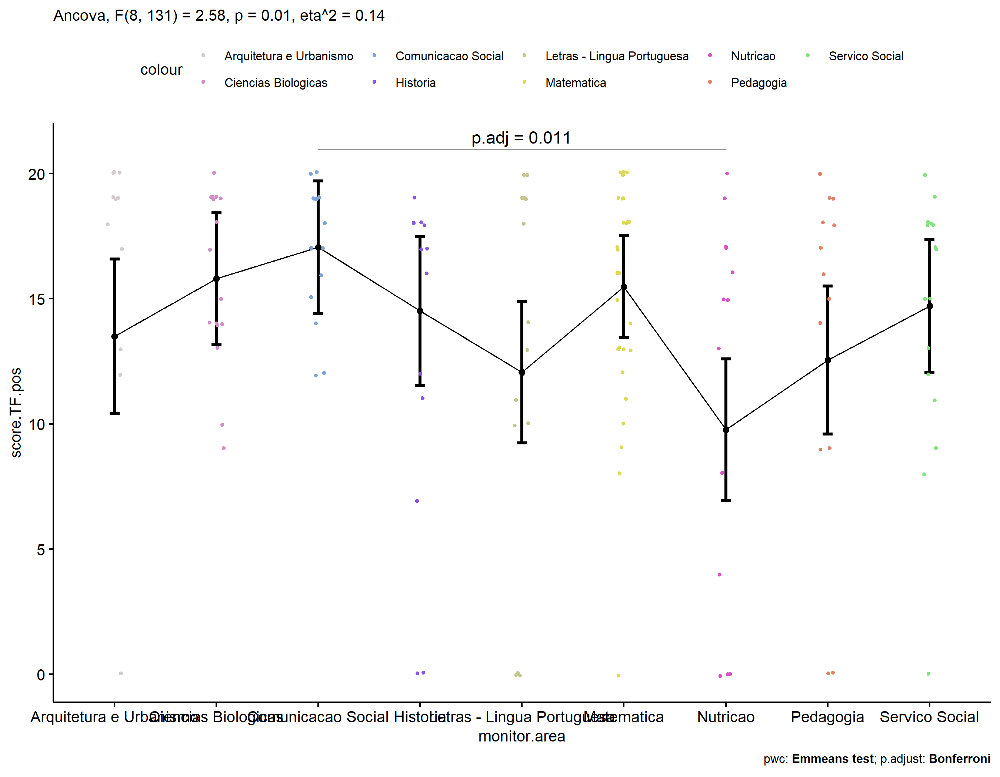<!-- -->

<!-- -->

<!-- -->

### Trocas Orograficas (Acertos)

| var          | monitor.area               |   n | M (pre) | SE (pre) | M (unadj) | SE (unadj) | M (adj) | SE (adj) |
|:-------------|:---------------------------|----:|--------:|---------:|----------:|-----------:|--------:|---------:|
| score.TO.pos | Arquitetura e Urbanismo    |  12 |  11.917 |    1.190 |    11.250 |      1.891 |  10.289 |    1.273 |
| score.TO.pos | Ciencias Biologicas        |  16 |  10.375 |    1.091 |    10.000 |      1.057 |   9.950 |    1.095 |
| score.TO.pos | Comunicacao Social         |  16 |  10.500 |    1.147 |    10.625 |      1.048 |  10.501 |    1.095 |
| score.TO.pos | Historia                   |  13 |   7.462 |    1.453 |     9.538 |      1.567 |  11.211 |    1.241 |
| score.TO.pos | Letras - Lingua Portuguesa |  14 |  12.286 |    1.233 |    10.214 |      1.691 |   9.035 |    1.184 |
| score.TO.pos | Matematica                 |  27 |  11.148 |    0.860 |    11.815 |      0.880 |  11.308 |    0.846 |
| score.TO.pos | Nutricao                   |  14 |   8.929 |    0.737 |     5.143 |      1.410 |   5.948 |    1.177 |
| score.TO.pos | Pedagogia                  |  13 |   9.615 |    0.747 |     9.615 |      1.412 |  10.015 |    1.216 |
| score.TO.pos | Servico Social             |  16 |   9.625 |    0.935 |     8.375 |      0.898 |   8.769 |    1.096 |

| .y.          | group1                  | group2              | estimate | conf.low | conf.high |    se | statistic | p       | p.adj | p.adj.signif |
|:-------------|:------------------------|:--------------------|---------:|---------:|----------:|------:|----------:|:--------|------:|:-------------|
| score.TO.pos | Arquitetura e Urbanismo | Ciencias Biologicas |    0.339 |   -2.980 |     3.658 | 1.678 |     0.202 | 0.84    | 1.000 | ns           |
| score.TO.pos | Arquitetura e Urbanismo | Comunicacao Social  |   -0.212 |   -3.530 |     3.105 | 1.677 |    -0.127 | 0.899   | 1.000 | ns           |
| score.TO.pos | Arquitetura e Urbanismo | Historia            |   -0.922 |   -4.481 |     2.637 | 1.799 |    -0.512 | 0.609   | 1.000 | ns           |
| score.TO.pos | Arquitetura e Urbanismo | Letras              |    1.254 |   -2.154 |     4.662 | 1.723 |     0.728 | 0.468   | 1.000 | ns           |
| score.TO.pos | Arquitetura e Urbanismo | Matematica          |   -1.019 |   -4.027 |     1.989 | 1.521 |    -0.670 | 0.504   | 1.000 | ns           |
| score.TO.pos | Arquitetura e Urbanismo | Nutricao            |    4.341 |    0.891 |     7.790 | 1.744 |     2.489 | 0.014   | 0.506 | ns           |
| score.TO.pos | Arquitetura e Urbanismo | Pedagogia           |    0.274 |   -3.218 |     3.766 | 1.765 |     0.155 | 0.877   | 1.000 | ns           |
| score.TO.pos | Arquitetura e Urbanismo | Servico Social      |    1.520 |   -1.813 |     4.854 | 1.685 |     0.902 | 0.369   | 1.000 | ns           |
| score.TO.pos | Ciencias Biologicas     | Comunicacao Social  |   -0.551 |   -3.613 |     2.511 | 1.548 |    -0.356 | 0.722   | 1.000 | ns           |
| score.TO.pos | Ciencias Biologicas     | Historia            |   -1.261 |   -4.537 |     2.016 | 1.656 |    -0.761 | 0.448   | 1.000 | ns           |
| score.TO.pos | Ciencias Biologicas     | Letras              |    0.915 |   -2.273 |     4.103 | 1.612 |     0.568 | 0.571   | 1.000 | ns           |
| score.TO.pos | Ciencias Biologicas     | Matematica          |   -1.358 |   -4.094 |     1.378 | 1.383 |    -0.982 | 0.328   | 1.000 | ns           |
| score.TO.pos | Ciencias Biologicas     | Nutricao            |    4.002 |    0.822 |     7.183 | 1.608 |     2.489 | 0.014   | 0.506 | ns           |
| score.TO.pos | Ciencias Biologicas     | Pedagogia           |   -0.064 |   -3.301 |     3.173 | 1.636 |    -0.039 | 0.969   | 1.000 | ns           |
| score.TO.pos | Ciencias Biologicas     | Servico Social      |    1.182 |   -1.884 |     4.247 | 1.549 |     0.763 | 0.447   | 1.000 | ns           |
| score.TO.pos | Comunicacao Social      | Historia            |   -0.709 |   -3.990 |     2.571 | 1.658 |    -0.428 | 0.669   | 1.000 | ns           |
| score.TO.pos | Comunicacao Social      | Letras              |    1.466 |   -1.720 |     4.652 | 1.611 |     0.910 | 0.364   | 1.000 | ns           |
| score.TO.pos | Comunicacao Social      | Matematica          |   -0.807 |   -3.542 |     1.928 | 1.383 |    -0.583 | 0.561   | 1.000 | ns           |
| score.TO.pos | Comunicacao Social      | Nutricao            |    4.553 |    1.371 |     7.736 | 1.609 |     2.830 | 0.005   | 0.194 | ns           |
| score.TO.pos | Comunicacao Social      | Pedagogia           |    0.487 |   -2.751 |     3.725 | 1.637 |     0.297 | 0.767   | 1.000 | ns           |
| score.TO.pos | Comunicacao Social      | Servico Social      |    1.733 |   -1.333 |     4.799 | 1.550 |     1.118 | 0.266   | 1.000 | ns           |
| score.TO.pos | Historia                | Letras              |    2.176 |   -1.272 |     5.623 | 1.743 |     1.248 | 0.214   | 1.000 | ns           |
| score.TO.pos | Historia                | Matematica          |   -0.097 |   -3.096 |     2.901 | 1.516 |    -0.064 | 0.949   | 1.000 | ns           |
| score.TO.pos | Historia                | Nutricao            |    5.263 |    1.916 |     8.609 | 1.692 |     3.111 | 0.002   | 0.082 | ns           |
| score.TO.pos | Historia                | Pedagogia           |    1.196 |   -2.223 |     4.616 | 1.728 |     0.692 | 0.49    | 1.000 | ns           |
| score.TO.pos | Historia                | Servico Social      |    2.442 |   -0.815 |     5.700 | 1.647 |     1.483 | 0.14    | 1.000 | ns           |
| score.TO.pos | Letras                  | Lingua Portuguesa   |   -2.273 |   -5.133 |     0.587 | 1.446 |    -1.572 | 0.118   | 1.000 | ns           |
| score.TO.pos | Letras                  | Lingua Portuguesa   |    3.087 |   -0.242 |     6.416 | 1.683 |     1.834 | 0.069   | 1.000 | ns           |
| score.TO.pos | Letras                  | Lingua Portuguesa   |   -0.980 |   -4.350 |     2.391 | 1.704 |    -0.575 | 0.566   | 1.000 | ns           |
| score.TO.pos | Letras                  | Lingua Portuguesa   |    0.267 |   -2.939 |     3.472 | 1.621 |     0.164 | 0.87    | 1.000 | ns           |
| score.TO.pos | Matematica              | Nutricao            |    5.360 |    2.480 |     8.240 | 1.456 |     3.681 | \<0.001 | 0.012 | \*           |
| score.TO.pos | Matematica              | Pedagogia           |    1.293 |   -1.643 |     4.230 | 1.485 |     0.871 | 0.385   | 1.000 | ns           |
| score.TO.pos | Matematica              | Servico Social      |    2.539 |   -0.207 |     5.286 | 1.388 |     1.829 | 0.07    | 1.000 | ns           |
| score.TO.pos | Nutricao                | Pedagogia           |   -4.067 |   -7.405 |    -0.728 | 1.688 |    -2.410 | 0.017   | 0.625 | ns           |
| score.TO.pos | Nutricao                | Servico Social      |   -2.820 |   -5.993 |     0.352 | 1.604 |    -1.759 | 0.081   | 1.000 | ns           |
| score.TO.pos | Pedagogia               | Servico Social      |    1.246 |   -1.988 |     4.480 | 1.635 |     0.762 | 0.447   | 1.000 | ns           |
| score.TO.pre | Arquitetura e Urbanismo | Ciencias Biologicas |    1.542 |   -1.618 |     4.702 | 1.597 |     0.965 | 0.336   | 1.000 | ns           |
| score.TO.pre | Arquitetura e Urbanismo | Comunicacao Social  |    1.417 |   -1.743 |     4.577 | 1.597 |     0.887 | 0.377   | 1.000 | ns           |
| score.TO.pre | Arquitetura e Urbanismo | Historia            |    4.455 |    1.143 |     7.768 | 1.675 |     2.660 | 0.009   | 0.316 | ns           |
| score.TO.pre | Arquitetura e Urbanismo | Letras              |   -0.369 |   -3.624 |     2.886 | 1.646 |    -0.224 | 0.823   | 1.000 | ns           |
| score.TO.pre | Arquitetura e Urbanismo | Matematica          |    0.769 |   -2.102 |     3.639 | 1.451 |     0.530 | 0.597   | 1.000 | ns           |
| score.TO.pre | Arquitetura e Urbanismo | Nutricao            |    2.988 |   -0.267 |     6.243 | 1.646 |     1.816 | 0.072   | 1.000 | ns           |
| score.TO.pre | Arquitetura e Urbanismo | Pedagogia           |    2.301 |   -1.011 |     5.614 | 1.675 |     1.374 | 0.172   | 1.000 | ns           |
| score.TO.pre | Arquitetura e Urbanismo | Servico Social      |    2.292 |   -0.868 |     5.452 | 1.597 |     1.435 | 0.154   | 1.000 | ns           |
| score.TO.pre | Ciencias Biologicas     | Comunicacao Social  |   -0.125 |   -3.051 |     2.801 | 1.479 |    -0.085 | 0.933   | 1.000 | ns           |
| score.TO.pre | Ciencias Biologicas     | Historia            |    2.913 |   -0.176 |     6.003 | 1.562 |     1.865 | 0.064   | 1.000 | ns           |
| score.TO.pre | Ciencias Biologicas     | Letras              |   -1.911 |   -4.939 |     1.118 | 1.531 |    -1.248 | 0.214   | 1.000 | ns           |
| score.TO.pre | Ciencias Biologicas     | Matematica          |   -0.773 |   -3.384 |     1.838 | 1.320 |    -0.586 | 0.559   | 1.000 | ns           |
| score.TO.pre | Ciencias Biologicas     | Nutricao            |    1.446 |   -1.582 |     4.475 | 1.531 |     0.945 | 0.346   | 1.000 | ns           |
| score.TO.pre | Ciencias Biologicas     | Pedagogia           |    0.760 |   -2.330 |     3.849 | 1.562 |     0.486 | 0.628   | 1.000 | ns           |
| score.TO.pre | Ciencias Biologicas     | Servico Social      |    0.750 |   -2.176 |     3.676 | 1.479 |     0.507 | 0.613   | 1.000 | ns           |
| score.TO.pre | Comunicacao Social      | Historia            |    3.038 |   -0.051 |     6.128 | 1.562 |     1.945 | 0.054   | 1.000 | ns           |
| score.TO.pre | Comunicacao Social      | Letras              |   -1.786 |   -4.814 |     1.243 | 1.531 |    -1.166 | 0.246   | 1.000 | ns           |
| score.TO.pre | Comunicacao Social      | Matematica          |   -0.648 |   -3.259 |     1.963 | 1.320 |    -0.491 | 0.624   | 1.000 | ns           |
| score.TO.pre | Comunicacao Social      | Nutricao            |    1.571 |   -1.457 |     4.600 | 1.531 |     1.026 | 0.307   | 1.000 | ns           |
| score.TO.pre | Comunicacao Social      | Pedagogia           |    0.885 |   -2.205 |     3.974 | 1.562 |     0.566 | 0.572   | 1.000 | ns           |
| score.TO.pre | Comunicacao Social      | Servico Social      |    0.875 |   -2.051 |     3.801 | 1.479 |     0.592 | 0.555   | 1.000 | ns           |
| score.TO.pre | Historia                | Letras              |   -4.824 |   -8.011 |    -1.637 | 1.611 |    -2.994 | 0.003   | 0.118 | ns           |
| score.TO.pre | Historia                | Matematica          |   -3.687 |   -6.480 |    -0.893 | 1.412 |    -2.611 | 0.01    | 0.363 | ns           |
| score.TO.pre | Historia                | Nutricao            |   -1.467 |   -4.654 |     1.720 | 1.611 |    -0.911 | 0.364   | 1.000 | ns           |
| score.TO.pre | Historia                | Pedagogia           |   -2.154 |   -5.400 |     1.092 | 1.641 |    -1.313 | 0.192   | 1.000 | ns           |
| score.TO.pre | Historia                | Servico Social      |   -2.163 |   -5.253 |     0.926 | 1.562 |    -1.385 | 0.168   | 1.000 | ns           |
| score.TO.pre | Letras                  | Lingua Portuguesa   |    1.138 |   -1.588 |     3.863 | 1.378 |     0.826 | 0.41    | 1.000 | ns           |
| score.TO.pre | Letras                  | Lingua Portuguesa   |    3.357 |    0.230 |     6.485 | 1.581 |     2.123 | 0.036   | 1.000 | ns           |
| score.TO.pre | Letras                  | Lingua Portuguesa   |    2.670 |   -0.517 |     5.858 | 1.611 |     1.657 | 0.1     | 1.000 | ns           |
| score.TO.pre | Letras                  | Lingua Portuguesa   |    2.661 |   -0.368 |     5.689 | 1.531 |     1.738 | 0.085   | 1.000 | ns           |
| score.TO.pre | Matematica              | Nutricao            |    2.220 |   -0.506 |     4.945 | 1.378 |     1.611 | 0.11    | 1.000 | ns           |
| score.TO.pre | Matematica              | Pedagogia           |    1.533 |   -1.261 |     4.326 | 1.412 |     1.085 | 0.28    | 1.000 | ns           |
| score.TO.pre | Matematica              | Servico Social      |    1.523 |   -1.088 |     4.134 | 1.320 |     1.154 | 0.251   | 1.000 | ns           |
| score.TO.pre | Nutricao                | Pedagogia           |   -0.687 |   -3.874 |     2.500 | 1.611 |    -0.426 | 0.671   | 1.000 | ns           |
| score.TO.pre | Nutricao                | Servico Social      |   -0.696 |   -3.725 |     2.332 | 1.531 |    -0.455 | 0.65    | 1.000 | ns           |
| score.TO.pre | Pedagogia               | Servico Social      |   -0.010 |   -3.099 |     3.080 | 1.562 |    -0.006 | 0.995   | 1.000 | ns           |

| .y.      | monitor.area               | group1 | group2 | estimate | conf.low | conf.high |    se | statistic |     p | p.adj | p.adj.signif |
|:---------|:---------------------------|:-------|:-------|---------:|---------:|----------:|------:|----------:|------:|------:|:-------------|
| score.TO | Arquitetura e Urbanismo    | pre    | pos    |    0.667 |   -3.045 |     4.378 | 1.885 |     0.354 | 0.724 | 0.724 | ns           |
| score.TO | Ciencias Biologicas        | pre    | pos    |    0.375 |   -2.839 |     3.589 | 1.632 |     0.230 | 0.818 | 0.818 | ns           |
| score.TO | Comunicacao Social         | pre    | pos    |   -0.125 |   -3.339 |     3.089 | 1.632 |    -0.077 | 0.939 | 0.939 | ns           |
| score.TO | Historia                   | pre    | pos    |   -2.077 |   -5.643 |     1.489 | 1.811 |    -1.147 | 0.252 | 0.252 | ns           |
| score.TO | Letras - Lingua Portuguesa | pre    | pos    |    2.071 |   -1.365 |     5.508 | 1.745 |     1.187 | 0.236 | 0.236 | ns           |
| score.TO | Matematica                 | pre    | pos    |   -0.667 |   -3.141 |     1.808 | 1.257 |    -0.531 | 0.596 | 0.596 | ns           |
| score.TO | Nutricao                   | pre    | pos    |    3.786 |    0.350 |     7.222 | 1.745 |     2.169 | 0.031 | 0.031 | \*           |
| score.TO | Pedagogia                  | pre    | pos    |    0.000 |   -3.566 |     3.566 | 1.811 |     0.000 | 1.000 | 1.000 | ns           |
| score.TO | Servico Social             | pre    | pos    |    1.250 |   -1.964 |     4.464 | 1.632 |     0.766 | 0.445 | 0.445 | ns           |

    ## Scale for colour is already present.
    ## Adding another scale for colour, which will replace the existing scale.

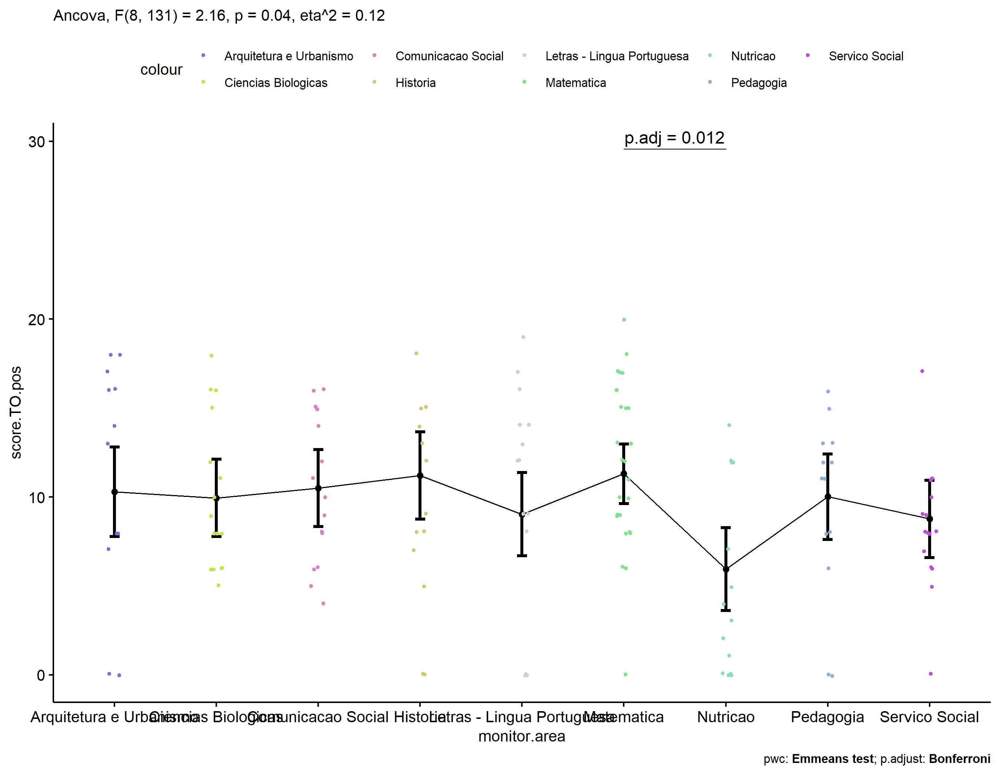<!-- -->

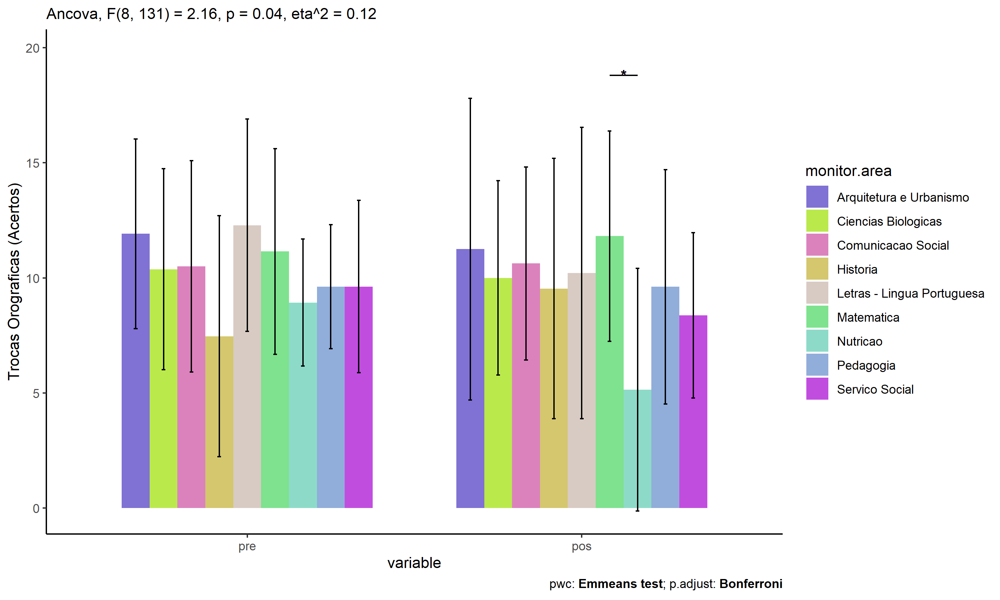<!-- -->

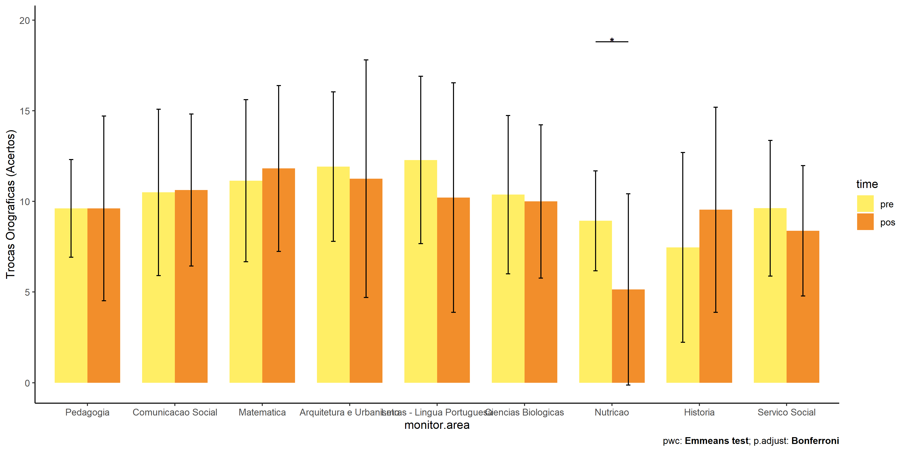<!-- -->

## factores: **grupo=“Experimental”:monitor.formacao**

### Leitura de Pseudo-Palavras (Acertos)

| var            | monitor.formacao |   n | M (pre) | SE (pre) | M (unadj) | SE (unadj) | M (adj) | SE (adj) |
|:---------------|:-----------------|----:|--------:|---------:|----------:|-----------:|--------:|---------:|
| score.CLPP.pos | ensino medio     |  87 |  70.333 |    1.471 |    71.057 |      1.505 |  71.936 |    1.145 |
| score.CLPP.pos | especializacao   |  15 |  74.200 |    3.236 |    75.333 |      2.489 |  73.714 |    2.754 |
| score.CLPP.pos | graduacao        |  22 |  75.364 |    2.133 |    74.773 |      2.899 |  72.401 |    2.285 |

| .y.            | group1         | group2         | estimate | conf.low | conf.high |    se | statistic |     p | p.adj | p.adj.signif |
|:---------------|:---------------|:---------------|---------:|---------:|----------:|------:|----------:|------:|------:|:-------------|
| score.CLPP.pos | ensino medio   | especializacao |   -1.778 |   -7.695 |     4.140 | 2.989 |    -0.595 | 0.553 | 1.000 | ns           |
| score.CLPP.pos | ensino medio   | graduacao      |   -0.465 |   -5.547 |     4.617 | 2.567 |    -0.181 | 0.857 | 1.000 | ns           |
| score.CLPP.pos | especializacao | graduacao      |    1.312 |   -5.745 |     8.370 | 3.564 |     0.368 | 0.713 | 1.000 | ns           |
| score.CLPP.pre | ensino medio   | especializacao |   -3.867 |  -11.068 |     3.335 | 3.637 |    -1.063 | 0.290 | 0.870 | ns           |
| score.CLPP.pre | ensino medio   | graduacao      |   -5.030 |  -11.177 |     1.117 | 3.105 |    -1.620 | 0.108 | 0.323 | ns           |
| score.CLPP.pre | especializacao | graduacao      |   -1.164 |   -9.789 |     7.461 | 4.357 |    -0.267 | 0.790 | 1.000 | ns           |

| .y.        | monitor.formacao | group1 | group2 | estimate | conf.low | conf.high |    se | statistic |     p | p.adj | p.adj.signif |
|:-----------|:-----------------|:-------|:-------|---------:|---------:|----------:|------:|----------:|------:|------:|:-------------|
| score.CLPP | ensino medio     | pre    | pos    |   -0.031 |   -3.786 |     3.724 | 1.907 |    -0.016 | 0.987 | 0.987 | ns           |
| score.CLPP | especializacao   | pre    | pos    |   -1.050 |  -10.239 |     8.139 | 4.666 |    -0.225 | 0.822 | 0.822 | ns           |
| score.CLPP | graduacao        | pre    | pos    |    0.019 |   -7.528 |     7.566 | 3.832 |     0.005 | 0.996 | 0.996 | ns           |

    ## Scale for colour is already present.
    ## Adding another scale for colour, which will replace the existing scale.

<!-- -->

<!-- -->

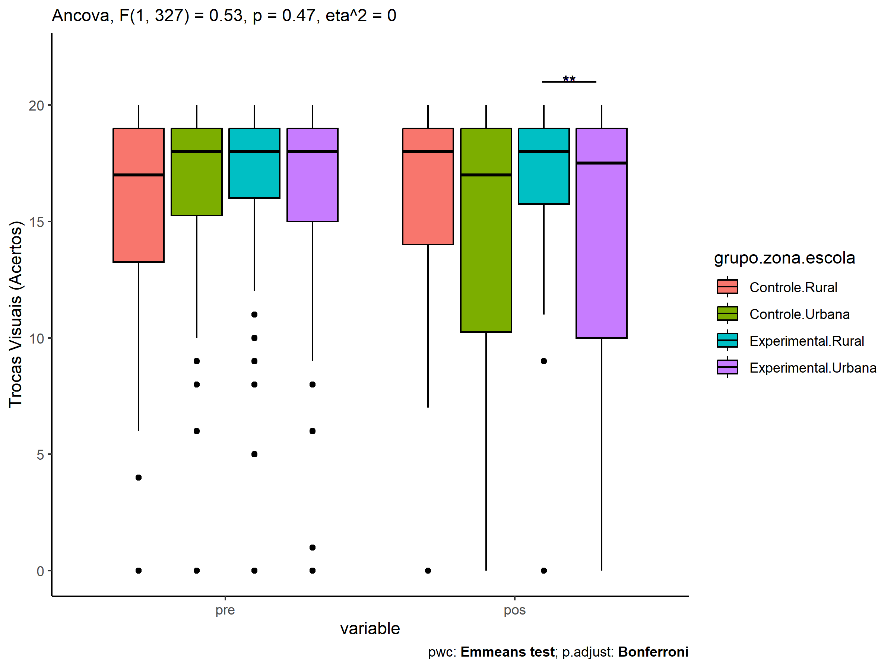<!-- -->

### Correta Regular (Acertos)

| var          | monitor.formacao |   n | M (pre) | SE (pre) | M (unadj) | SE (unadj) | M (adj) | SE (adj) |
|:-------------|:-----------------|----:|--------:|---------:|----------:|-----------:|--------:|---------:|
| score.CR.pos | ensino medio     | 101 |  14.901 |    0.407 |    13.406 |      0.597 |  13.538 |    0.538 |
| score.CR.pos | especializacao   |  16 |  15.750 |    1.230 |    16.625 |      0.386 |  16.420 |    1.348 |
| score.CR.pos | graduacao        |  24 |  16.292 |    0.540 |    13.958 |      1.114 |  13.539 |    1.107 |

| .y.          | group1         | group2         | estimate | conf.low | conf.high |    se | statistic |     p | p.adj | p.adj.signif |
|:-------------|:---------------|:---------------|---------:|---------:|----------:|------:|----------:|------:|------:|:-------------|
| score.CR.pos | ensino medio   | especializacao |   -2.882 |   -5.756 |    -0.009 | 1.453 |    -1.983 | 0.049 | 0.148 | ns           |
| score.CR.pos | ensino medio   | graduacao      |   -0.001 |   -2.441 |     2.440 | 1.234 |    -0.001 | 1.000 | 1.000 | ns           |
| score.CR.pos | especializacao | graduacao      |    2.882 |   -0.560 |     6.323 | 1.740 |     1.656 | 0.100 | 0.300 | ns           |
| score.CR.pre | ensino medio   | especializacao |   -0.849 |   -2.970 |     1.272 | 1.073 |    -0.792 | 0.430 | 1.000 | ns           |
| score.CR.pre | ensino medio   | graduacao      |   -1.391 |   -3.181 |     0.399 | 0.905 |    -1.536 | 0.127 | 0.380 | ns           |
| score.CR.pre | especializacao | graduacao      |   -0.542 |   -3.086 |     2.002 | 1.287 |    -0.421 | 0.674 | 1.000 | ns           |

| .y.      | monitor.formacao | group1 | group2 | estimate | conf.low | conf.high |    se | statistic |     p | p.adj | p.adj.signif |
|:---------|:-----------------|:-------|:-------|---------:|---------:|----------:|------:|----------:|------:|------:|:-------------|
| score.CR | ensino medio     | pre    | pos    |    1.495 |    0.149 |     2.841 | 0.684 |     2.187 | 0.030 | 0.030 | \*           |
| score.CR | especializacao   | pre    | pos    |   -0.875 |   -4.257 |     2.507 | 1.718 |    -0.509 | 0.611 | 0.611 | ns           |
| score.CR | graduacao        | pre    | pos    |    2.333 |   -0.428 |     5.095 | 1.403 |     1.664 | 0.097 | 0.097 | ns           |

    ## Scale for colour is already present.
    ## Adding another scale for colour, which will replace the existing scale.

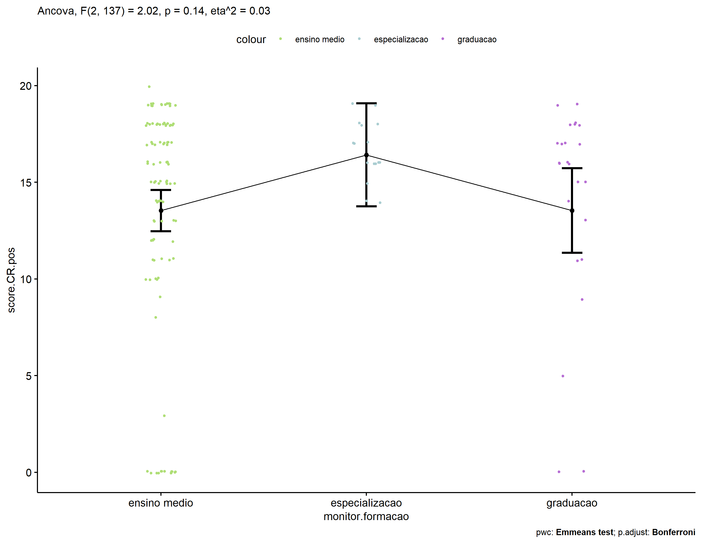<!-- -->

<!-- -->

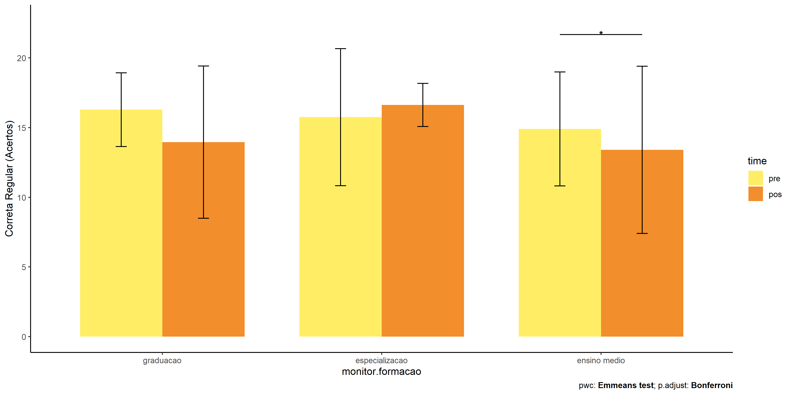<!-- -->

### Correta Irregular (Acertos)

| var          | monitor.formacao |   n | M (pre) | SE (pre) | M (unadj) | SE (unadj) | M (adj) | SE (adj) |
|:-------------|:-----------------|----:|--------:|---------:|----------:|-----------:|--------:|---------:|
| score.CI.pos | ensino medio     | 101 |  11.921 |    0.377 |    11.208 |      0.531 |  11.240 |    0.469 |
| score.CI.pos | especializacao   |  16 |  11.562 |    1.110 |    13.562 |      0.747 |  13.774 |    1.178 |
| score.CI.pos | graduacao        |  24 |  12.542 |    0.712 |    11.917 |      1.002 |  11.640 |    0.963 |

| .y.          | group1         | group2         | estimate | conf.low | conf.high |    se | statistic |     p | p.adj | p.adj.signif |
|:-------------|:---------------|:---------------|---------:|---------:|----------:|------:|----------:|------:|------:|:-------------|
| score.CI.pos | ensino medio   | especializacao |   -2.533 |   -5.039 |    -0.027 | 1.267 |    -1.999 | 0.048 | 0.143 | ns           |
| score.CI.pos | ensino medio   | graduacao      |   -0.399 |   -2.517 |     1.719 | 1.071 |    -0.373 | 0.710 | 1.000 | ns           |
| score.CI.pos | especializacao | graduacao      |    2.134 |   -0.878 |     5.146 | 1.523 |     1.401 | 0.163 | 0.490 | ns           |
| score.CI.pre | ensino medio   | especializacao |    0.358 |   -1.672 |     2.388 | 1.027 |     0.349 | 0.728 | 1.000 | ns           |
| score.CI.pre | ensino medio   | graduacao      |   -0.621 |   -2.334 |     1.092 | 0.866 |    -0.717 | 0.475 | 1.000 | ns           |
| score.CI.pre | especializacao | graduacao      |   -0.979 |   -3.414 |     1.456 | 1.232 |    -0.795 | 0.428 | 1.000 | ns           |

| .y.      | monitor.formacao | group1 | group2 | estimate | conf.low | conf.high |    se | statistic |     p | p.adj | p.adj.signif |
|:---------|:-----------------|:-------|:-------|---------:|---------:|----------:|------:|----------:|------:|------:|:-------------|
| score.CI | ensino medio     | pre    | pos    |    0.713 |   -0.529 |     1.955 | 0.631 |     1.130 | 0.259 | 0.259 | ns           |
| score.CI | especializacao   | pre    | pos    |   -2.000 |   -5.120 |     1.120 | 1.585 |    -1.262 | 0.208 | 0.208 | ns           |
| score.CI | graduacao        | pre    | pos    |    0.625 |   -1.922 |     3.172 | 1.294 |     0.483 | 0.629 | 0.629 | ns           |

    ## Scale for colour is already present.
    ## Adding another scale for colour, which will replace the existing scale.

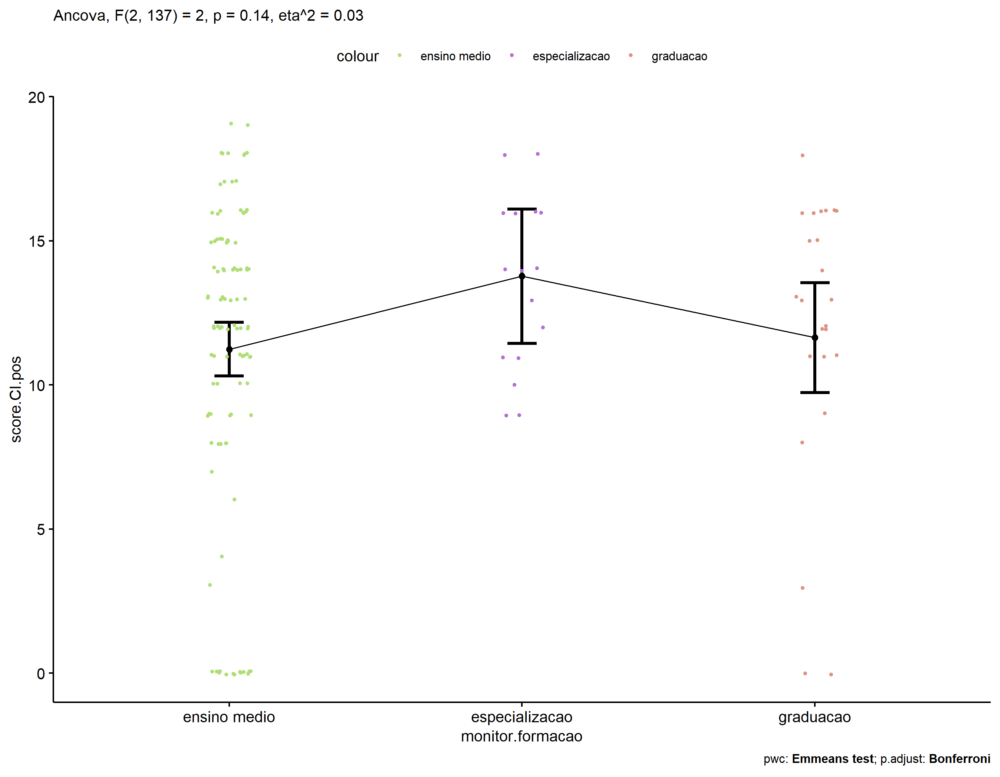<!-- -->

<!-- -->

<!-- -->

### Trocas Visuais (Acertos)

| var          | monitor.formacao |   n | M (pre) | SE (pre) | M (unadj) | SE (unadj) | M (adj) | SE (adj) |
|:-------------|:-----------------|----:|--------:|---------:|----------:|-----------:|--------:|---------:|
| score.TV.pos | ensino medio     | 101 |  16.495 |    0.455 |    14.416 |      0.652 |  14.504 |    0.591 |
| score.TV.pos | especializacao   |  16 |  16.062 |    1.410 |    17.375 |      0.612 |  17.609 |    1.484 |
| score.TV.pos | graduacao        |  24 |  18.333 |    0.359 |    16.333 |      1.149 |  15.805 |    1.224 |

| .y.          | group1         | group2         | estimate | conf.low | conf.high |    se | statistic |     p | p.adj | p.adj.signif |
|:-------------|:---------------|:---------------|---------:|---------:|----------:|------:|----------:|------:|------:|:-------------|
| score.TV.pos | ensino medio   | especializacao |   -3.104 |   -6.260 |     0.051 | 1.596 |    -1.945 | 0.054 | 0.161 | ns           |
| score.TV.pos | ensino medio   | graduacao      |   -1.301 |   -3.996 |     1.394 | 1.363 |    -0.955 | 0.341 | 1.000 | ns           |
| score.TV.pos | especializacao | graduacao      |    1.803 |   -2.015 |     5.622 | 1.931 |     0.934 | 0.352 | 1.000 | ns           |
| score.TV.pre | ensino medio   | especializacao |    0.433 |   -1.895 |     2.760 | 1.177 |     0.367 | 0.714 | 1.000 | ns           |
| score.TV.pre | ensino medio   | graduacao      |   -1.838 |   -3.803 |     0.126 | 0.994 |    -1.850 | 0.066 | 0.199 | ns           |
| score.TV.pre | especializacao | graduacao      |   -2.271 |   -5.063 |     0.521 | 1.412 |    -1.608 | 0.110 | 0.330 | ns           |

| .y.      | monitor.formacao | group1 | group2 | estimate | conf.low | conf.high |    se | statistic |     p | p.adj | p.adj.signif |
|:---------|:-----------------|:-------|:-------|---------:|---------:|----------:|------:|----------:|------:|------:|:-------------|
| score.TV | ensino medio     | pre    | pos    |    2.079 |    0.611 |     3.547 | 0.746 |     2.788 | 0.006 | 0.006 | \*\*         |
| score.TV | especializacao   | pre    | pos    |   -1.313 |   -5.001 |     2.376 | 1.874 |    -0.700 | 0.484 | 0.484 | ns           |
| score.TV | graduacao        | pre    | pos    |    2.000 |   -1.012 |     5.012 | 1.530 |     1.307 | 0.192 | 0.192 | ns           |

    ## Scale for colour is already present.
    ## Adding another scale for colour, which will replace the existing scale.

<!-- -->

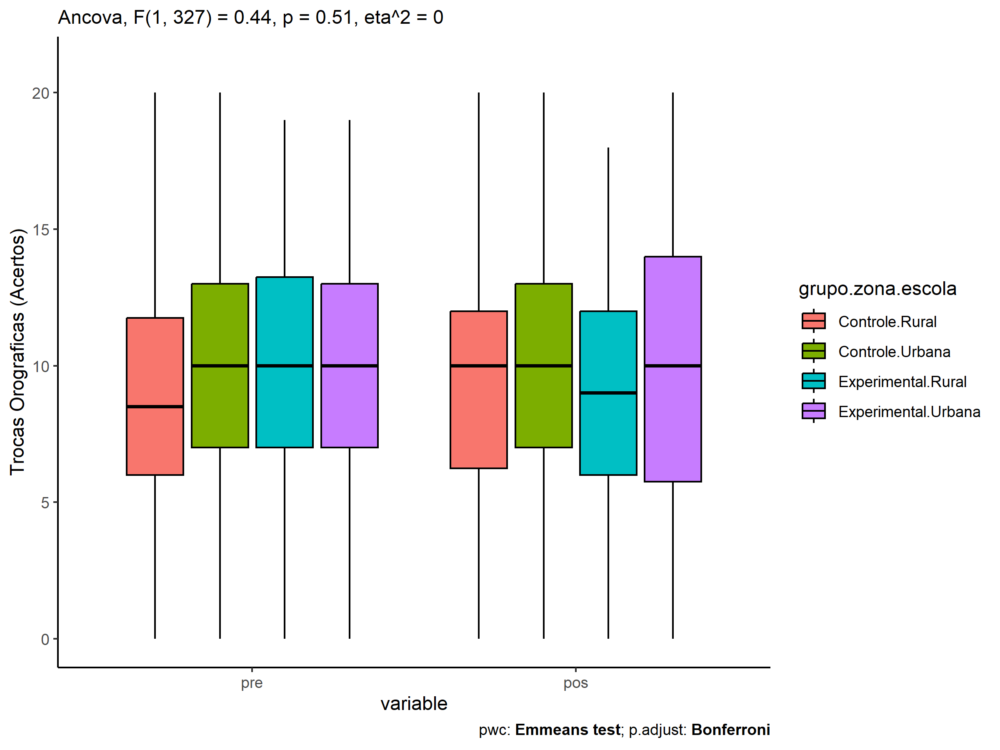<!-- -->

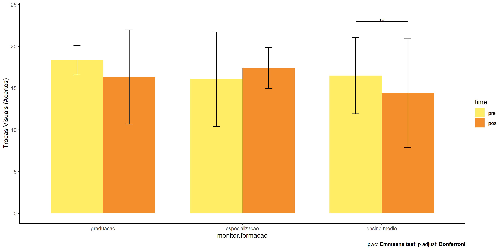<!-- -->

### Trocas Fonologicas (Acertos)

| var          | monitor.formacao |   n | M (pre) | SE (pre) | M (unadj) | SE (unadj) | M (adj) | SE (adj) |
|:-------------|:-----------------|----:|--------:|---------:|----------:|-----------:|--------:|---------:|
| score.TF.pos | ensino medio     | 101 |  15.366 |    0.479 |    13.535 |      0.631 |  13.683 |    0.551 |
| score.TF.pos | especializacao   |  16 |  15.688 |    1.413 |    17.062 |      0.655 |  17.059 |    1.381 |
| score.TF.pos | graduacao        |  24 |  17.000 |    0.571 |    14.958 |      1.148 |  14.334 |    1.136 |

| .y.          | group1         | group2         | estimate | conf.low | conf.high |    se | statistic |     p | p.adj | p.adj.signif |
|:-------------|:---------------|:---------------|---------:|---------:|----------:|------:|----------:|------:|------:|:-------------|
| score.TF.pos | ensino medio   | especializacao |   -3.376 |   -6.316 |    -0.436 | 1.487 |    -2.270 | 0.025 | 0.074 | ns           |
| score.TF.pos | ensino medio   | graduacao      |   -0.651 |   -3.153 |     1.852 | 1.265 |    -0.514 | 0.608 | 1.000 | ns           |
| score.TF.pos | especializacao | graduacao      |    2.725 |   -0.811 |     6.261 | 1.788 |     1.524 | 0.130 | 0.389 | ns           |
| score.TF.pre | ensino medio   | especializacao |   -0.321 |   -2.791 |     2.148 | 1.249 |    -0.257 | 0.797 | 1.000 | ns           |
| score.TF.pre | ensino medio   | graduacao      |   -1.634 |   -3.718 |     0.450 | 1.054 |    -1.550 | 0.123 | 0.370 | ns           |
| score.TF.pre | especializacao | graduacao      |   -1.312 |   -4.275 |     1.650 | 1.498 |    -0.876 | 0.382 | 1.000 | ns           |

| .y.      | monitor.formacao | group1 | group2 | estimate | conf.low | conf.high |    se | statistic |     p | p.adj | p.adj.signif |
|:---------|:-----------------|:-------|:-------|---------:|---------:|----------:|------:|----------:|------:|------:|:-------------|
| score.TF | ensino medio     | pre    | pos    |    1.832 |    0.357 |     3.306 | 0.749 |     2.445 | 0.015 | 0.015 | \*           |
| score.TF | especializacao   | pre    | pos    |   -1.375 |   -5.080 |     2.330 | 1.882 |    -0.731 | 0.466 | 0.466 | ns           |
| score.TF | graduacao        | pre    | pos    |    2.042 |   -0.983 |     5.067 | 1.537 |     1.329 | 0.185 | 0.185 | ns           |

    ## Scale for colour is already present.
    ## Adding another scale for colour, which will replace the existing scale.

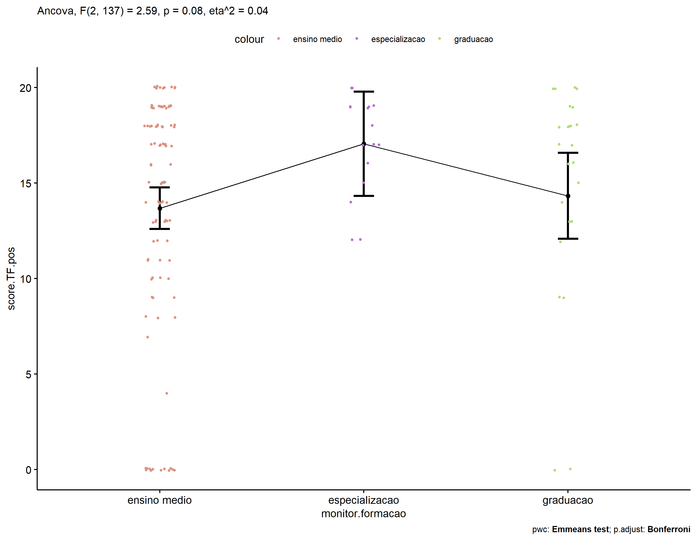<!-- -->

<!-- -->

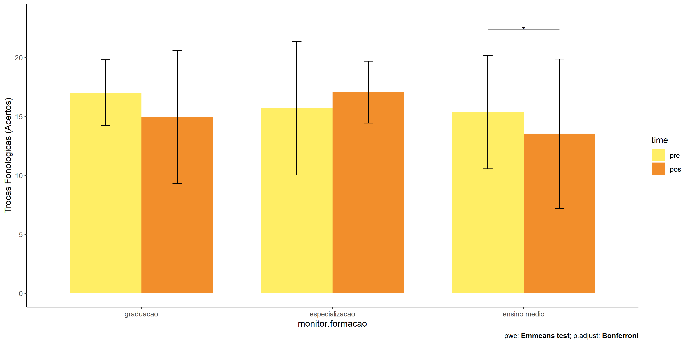<!-- -->

### Trocas Orograficas (Acertos)

| var          | monitor.formacao |   n | M (pre) | SE (pre) | M (unadj) | SE (unadj) | M (adj) | SE (adj) |
|:-------------|:-----------------|----:|--------:|---------:|----------:|-----------:|--------:|---------:|
| score.TO.pos | ensino medio     | 101 |  10.178 |    0.435 |     9.297 |      0.536 |   9.365 |    0.448 |
| score.TO.pos | especializacao   |  16 |  10.500 |    1.147 |    10.625 |      1.048 |  10.498 |    1.124 |
| score.TO.pos | graduacao        |  24 |  10.625 |    0.770 |    11.375 |      0.987 |  11.172 |    0.918 |

| .y.          | group1         | group2         | estimate | conf.low | conf.high |    se | statistic |     p | p.adj | p.adj.signif |
|:-------------|:---------------|:---------------|---------:|---------:|----------:|------:|----------:|------:|------:|:-------------|
| score.TO.pos | ensino medio   | especializacao |   -1.133 |   -3.526 |     1.260 | 1.210 |    -0.936 | 0.351 | 1.000 | ns           |
| score.TO.pos | ensino medio   | graduacao      |   -1.807 |   -3.828 |     0.213 | 1.022 |    -1.769 | 0.079 | 0.238 | ns           |
| score.TO.pos | especializacao | graduacao      |   -0.674 |   -3.544 |     2.196 | 1.451 |    -0.465 | 0.643 | 1.000 | ns           |
| score.TO.pre | ensino medio   | especializacao |   -0.322 |   -2.612 |     1.968 | 1.158 |    -0.278 | 0.782 | 1.000 | ns           |
| score.TO.pre | ensino medio   | graduacao      |   -0.447 |   -2.379 |     1.486 | 0.977 |    -0.457 | 0.648 | 1.000 | ns           |
| score.TO.pre | especializacao | graduacao      |   -0.125 |   -2.872 |     2.622 | 1.389 |    -0.090 | 0.928 | 1.000 | ns           |

| .y.      | monitor.formacao | group1 | group2 | estimate | conf.low | conf.high |    se | statistic |     p | p.adj | p.adj.signif |
|:---------|:-----------------|:-------|:-------|---------:|---------:|----------:|------:|----------:|------:|------:|:-------------|
| score.TO | ensino medio     | pre    | pos    |    0.881 |   -0.439 |     2.201 | 0.670 |     1.314 | 0.190 | 0.190 | ns           |
| score.TO | especializacao   | pre    | pos    |   -0.125 |   -3.441 |     3.191 | 1.684 |    -0.074 | 0.941 | 0.941 | ns           |
| score.TO | graduacao        | pre    | pos    |   -0.750 |   -3.457 |     1.957 | 1.375 |    -0.545 | 0.586 | 0.586 | ns           |

    ## Scale for colour is already present.
    ## Adding another scale for colour, which will replace the existing scale.

<!-- -->

<!-- -->

<!-- -->

## factores: **grupo=“Experimental”:monitor.experiencia**

### Leitura de Pseudo-Palavras (Acertos)

| var            | monitor.experiencia |   n | M (pre) | SE (pre) | M (unadj) | SE (unadj) | M (adj) | SE (adj) |
|:---------------|:--------------------|----:|--------:|---------:|----------:|-----------:|--------:|---------:|
| score.CLPP.pos | maior 01 ano        |  89 |  71.787 |    1.508 |    72.596 |      1.388 |  72.535 |    1.124 |
| score.CLPP.pos | menor 01 ano        |  35 |  71.457 |    1.648 |    71.314 |      2.496 |  71.468 |    1.792 |

| .y.            | group1       | group2       | estimate | conf.low | conf.high |    se | statistic |     p | p.adj | p.adj.signif |
|:---------------|:-------------|:-------------|---------:|---------:|----------:|------:|----------:|------:|------:|:-------------|
| score.CLPP.pos | maior 01 ano | menor 01 ano |    1.067 |   -3.121 |     5.255 | 2.115 |     0.504 | 0.615 | 0.615 | ns           |
| score.CLPP.pre | maior 01 ano | menor 01 ano |    0.329 |   -4.856 |     5.515 | 2.620 |     0.126 | 0.900 | 0.900 | ns           |

| .y.        | monitor.experiencia | group1 | group2 | estimate | conf.low | conf.high |    se | statistic |     p | p.adj | p.adj.signif |
|:-----------|:--------------------|:-------|:-------|---------:|---------:|----------:|------:|----------:|------:|------:|:-------------|
| score.CLPP | maior 01 ano        | pre    | pos    |   -0.633 |   -4.401 |     3.134 | 1.913 |    -0.331 | 0.741 | 0.741 | ns           |
| score.CLPP | menor 01 ano        | pre    | pos    |    0.876 |   -5.003 |     6.755 | 2.985 |     0.293 | 0.769 | 0.769 | ns           |

    ## Scale for colour is already present.
    ## Adding another scale for colour, which will replace the existing scale.

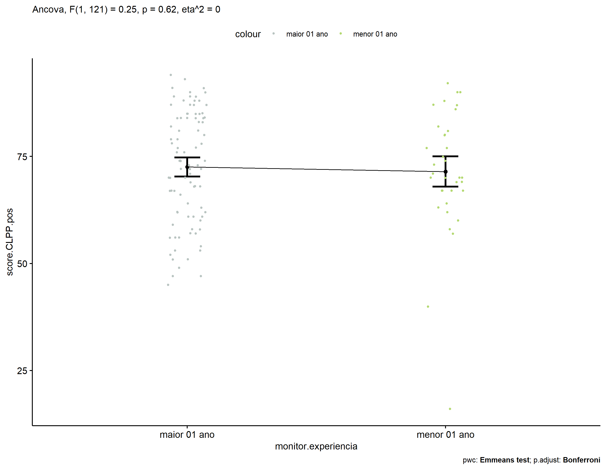<!-- -->

<!-- -->

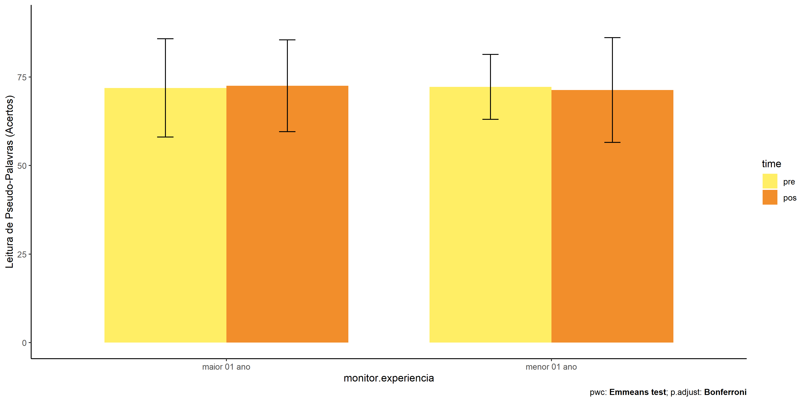<!-- -->

### Correta Regular (Acertos)

| var          | monitor.experiencia |   n | M (pre) | SE (pre) | M (unadj) | SE (unadj) | M (adj) | SE (adj) |
|:-------------|:--------------------|----:|--------:|---------:|----------:|-----------:|--------:|---------:|
| score.CR.pos | maior 01 ano        |  99 |  14.939 |    0.453 |    14.051 |      0.515 |  14.175 |    0.546 |
| score.CR.pos | menor 01 ano        |  42 |  15.929 |    0.356 |    13.429 |      1.047 |  13.136 |    0.841 |

| .y.          | group1       | group2       | estimate | conf.low | conf.high |    se | statistic |     p | p.adj | p.adj.signif |
|:-------------|:-------------|:-------------|---------:|---------:|----------:|------:|----------:|------:|------:|:-------------|
| score.CR.pos | maior 01 ano | menor 01 ano |    1.038 |   -0.951 |     3.027 | 1.006 |     1.032 | 0.304 | 0.304 | ns           |
| score.CR.pre | maior 01 ano | menor 01 ano |   -0.989 |   -2.440 |     0.461 | 0.734 |    -1.348 | 0.180 | 0.180 | ns           |

| .y.      | monitor.experiencia | group1 | group2 | estimate | conf.low | conf.high |    se | statistic |     p | p.adj | p.adj.signif |
|:---------|:--------------------|:-------|:-------|---------:|---------:|----------:|------:|----------:|------:|------:|:-------------|
| score.CR | maior 01 ano        | pre    | pos    |    0.889 |   -0.481 |     2.259 | 0.696 |     1.278 | 0.202 | 0.202 | ns           |
| score.CR | menor 01 ano        | pre    | pos    |    2.500 |    0.397 |     4.603 | 1.068 |     2.340 | 0.020 | 0.020 | \*           |

    ## Scale for colour is already present.
    ## Adding another scale for colour, which will replace the existing scale.

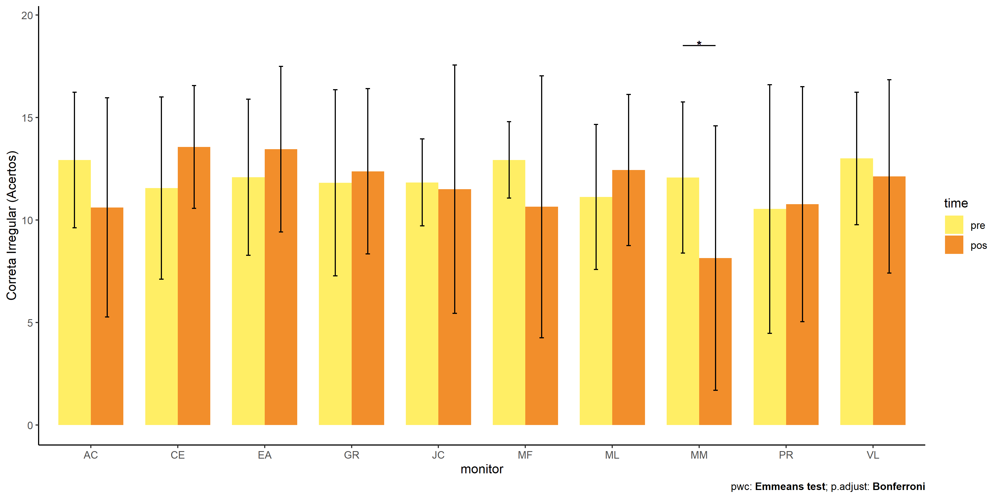<!-- -->

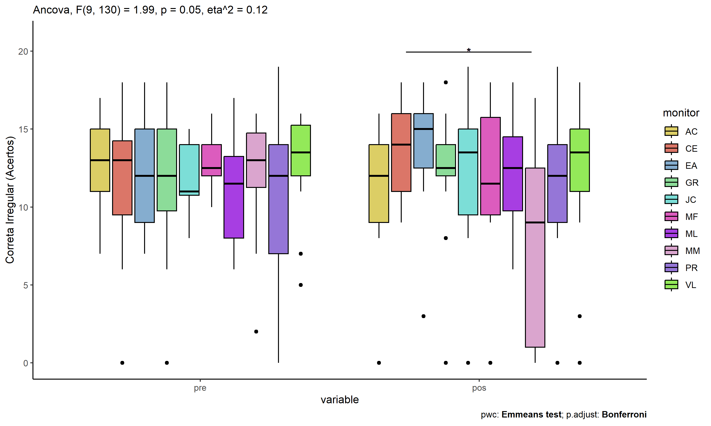<!-- -->

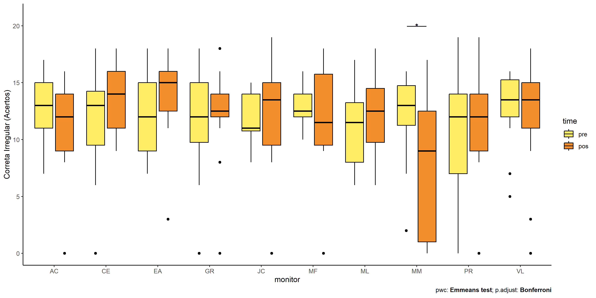<!-- -->

### Correta Irregular (Acertos)

| var          | monitor.experiencia |   n | M (pre) | SE (pre) | M (unadj) | SE (unadj) | M (adj) | SE (adj) |
|:-------------|:--------------------|----:|--------:|---------:|----------:|-----------:|--------:|---------:|
| score.CI.pos | maior 01 ano        |  99 |  11.828 |    0.408 |    12.010 |      0.471 |  12.090 |    0.472 |
| score.CI.pos | menor 01 ano        |  42 |  12.357 |    0.478 |    10.619 |      0.904 |  10.431 |    0.726 |

| .y.          | group1       | group2       | estimate | conf.low | conf.high |    se | statistic |     p | p.adj | p.adj.signif |
|:-------------|:-------------|:-------------|---------:|---------:|----------:|------:|----------:|------:|------:|:-------------|
| score.CI.pos | maior 01 ano | menor 01 ano |    1.658 |   -0.055 |     3.372 | 0.867 |     1.913 | 0.058 | 0.058 | ns           |
| score.CI.pre | maior 01 ano | menor 01 ano |   -0.529 |   -1.914 |     0.856 | 0.701 |    -0.755 | 0.452 | 0.452 | ns           |

| .y.      | monitor.experiencia | group1 | group2 | estimate | conf.low | conf.high |    se | statistic |     p | p.adj | p.adj.signif |
|:---------|:--------------------|:-------|:-------|---------:|---------:|----------:|------:|----------:|------:|------:|:-------------|
| score.CI | maior 01 ano        | pre    | pos    |   -0.182 |   -1.434 |     1.071 | 0.636 |    -0.286 | 0.775 | 0.775 | ns           |
| score.CI | menor 01 ano        | pre    | pos    |    1.738 |   -0.185 |     3.661 | 0.977 |     1.779 | 0.076 | 0.076 | ns           |

    ## Scale for colour is already present.
    ## Adding another scale for colour, which will replace the existing scale.

<!-- -->

<!-- -->

<!-- -->

### Trocas Visuais (Acertos)

| var          | monitor.experiencia |   n | M (pre) | SE (pre) | M (unadj) | SE (unadj) | M (adj) | SE (adj) |
|:-------------|:--------------------|----:|--------:|---------:|----------:|-----------:|--------:|---------:|
| score.TV.pos | maior 01 ano        |  99 |  16.434 |    0.499 |    15.455 |      0.562 |  15.572 |    0.599 |
| score.TV.pos | menor 01 ano        |  42 |  17.524 |    0.390 |    14.190 |      1.122 |  13.915 |    0.922 |

| .y.          | group1       | group2       | estimate | conf.low | conf.high |    se | statistic |     p | p.adj | p.adj.signif |
|:-------------|:-------------|:-------------|---------:|---------:|----------:|------:|----------:|------:|------:|:-------------|
| score.TV.pos | maior 01 ano | menor 01 ano |    1.657 |   -0.523 |     3.837 | 1.102 |     1.503 | 0.135 | 0.135 | ns           |
| score.TV.pre | maior 01 ano | menor 01 ano |   -1.089 |   -2.688 |     0.509 | 0.809 |    -1.347 | 0.180 | 0.180 | ns           |

| .y.      | monitor.experiencia | group1 | group2 | estimate | conf.low | conf.high |    se | statistic |     p | p.adj | p.adj.signif |
|:---------|:--------------------|:-------|:-------|---------:|---------:|----------:|------:|----------:|------:|------:|:-------------|
| score.TV | maior 01 ano        | pre    | pos    |    0.980 |   -0.513 |     2.472 | 0.758 |     1.292 | 0.197 | 0.197 | ns           |
| score.TV | menor 01 ano        | pre    | pos    |    3.333 |    1.042 |     5.625 | 1.164 |     2.863 | 0.005 | 0.005 | \*\*         |

    ## Scale for colour is already present.
    ## Adding another scale for colour, which will replace the existing scale.

<!-- -->

<!-- -->

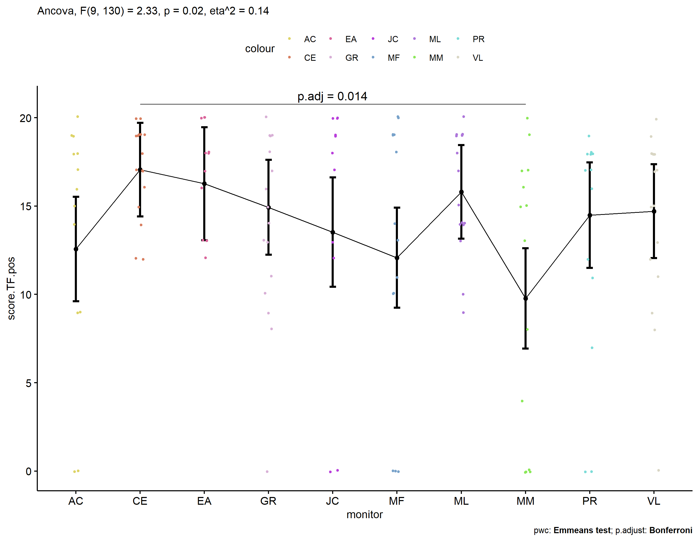<!-- -->

### Trocas Fonologicas (Acertos)

| var          | monitor.experiencia |   n | M (pre) | SE (pre) | M (unadj) | SE (unadj) | M (adj) | SE (adj) |
|:-------------|:--------------------|----:|--------:|---------:|----------:|-----------:|--------:|---------:|
| score.TF.pos | maior 01 ano        |  99 |  15.404 |    0.522 |    14.646 |      0.554 |  14.784 |    0.556 |
| score.TF.pos | menor 01 ano        |  42 |  16.333 |    0.453 |    13.071 |      1.075 |  12.746 |    0.856 |

| .y.          | group1       | group2       | estimate | conf.low | conf.high |    se | statistic |     p | p.adj | p.adj.signif |
|:-------------|:-------------|:-------------|---------:|---------:|----------:|------:|----------:|------:|------:|:-------------|
| score.TF.pos | maior 01 ano | menor 01 ano |    2.038 |    0.017 |     4.060 | 1.022 |     1.994 | 0.048 | 0.048 | \*           |
| score.TF.pre | maior 01 ano | menor 01 ano |   -0.929 |   -2.621 |     0.762 | 0.855 |    -1.086 | 0.279 | 0.279 | ns           |

| .y.      | monitor.experiencia | group1 | group2 | estimate | conf.low | conf.high |    se | statistic |     p | p.adj | p.adj.signif |
|:---------|:--------------------|:-------|:-------|---------:|---------:|----------:|------:|----------:|------:|------:|:-------------|
| score.TF | maior 01 ano        | pre    | pos    |    0.758 |   -0.740 |     2.255 | 0.761 |     0.996 | 0.320 | 0.320 | ns           |
| score.TF | menor 01 ano        | pre    | pos    |    3.262 |    0.963 |     5.561 | 1.168 |     2.793 | 0.006 | 0.006 | \*\*         |

    ## Scale for colour is already present.
    ## Adding another scale for colour, which will replace the existing scale.

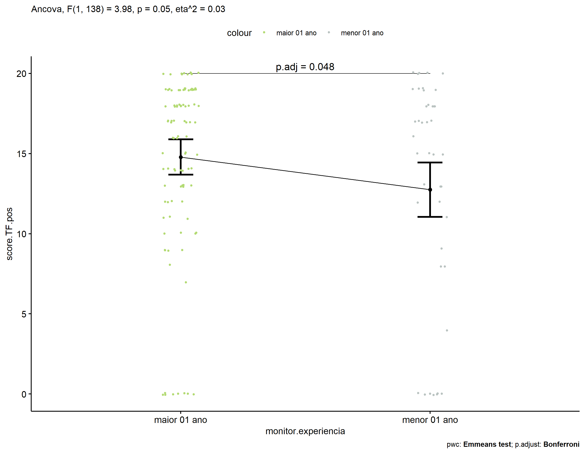<!-- -->

<!-- -->

<!-- -->

### Trocas Orograficas (Acertos)

| var          | monitor.experiencia |   n | M (pre) | SE (pre) | M (unadj) | SE (unadj) | M (adj) | SE (adj) |
|:-------------|:--------------------|----:|--------:|---------:|----------:|-----------:|--------:|---------:|
| score.TO.pos | maior 01 ano        |  99 |  10.394 |    0.454 |    10.515 |      0.494 |  10.453 |    0.445 |
| score.TO.pos | menor 01 ano        |  42 |  10.048 |    0.569 |     8.119 |      0.859 |   8.266 |    0.683 |

| .y.          | group1       | group2       | estimate | conf.low | conf.high |    se | statistic |     p | p.adj | p.adj.signif |
|:-------------|:-------------|:-------------|---------:|---------:|----------:|------:|----------:|------:|------:|:-------------|
| score.TO.pos | maior 01 ano | menor 01 ano |    2.187 |    0.575 |     3.799 | 0.815 |     2.682 | 0.008 | 0.008 | \*\*         |
| score.TO.pre | maior 01 ano | menor 01 ano |    0.346 |   -1.215 |     1.908 | 0.790 |     0.438 | 0.662 | 0.662 | ns           |

| .y.      | monitor.experiencia | group1 | group2 | estimate | conf.low | conf.high |    se | statistic |     p | p.adj | p.adj.signif |
|:---------|:--------------------|:-------|:-------|---------:|---------:|----------:|------:|----------:|------:|------:|:-------------|
| score.TO | maior 01 ano        | pre    | pos    |   -0.121 |   -1.442 |     1.199 | 0.671 |    -0.181 | 0.857 | 0.857 | ns           |
| score.TO | menor 01 ano        | pre    | pos    |    1.929 |   -0.099 |     3.956 | 1.030 |     1.873 | 0.062 | 0.062 | ns           |

    ## Scale for colour is already present.
    ## Adding another scale for colour, which will replace the existing scale.

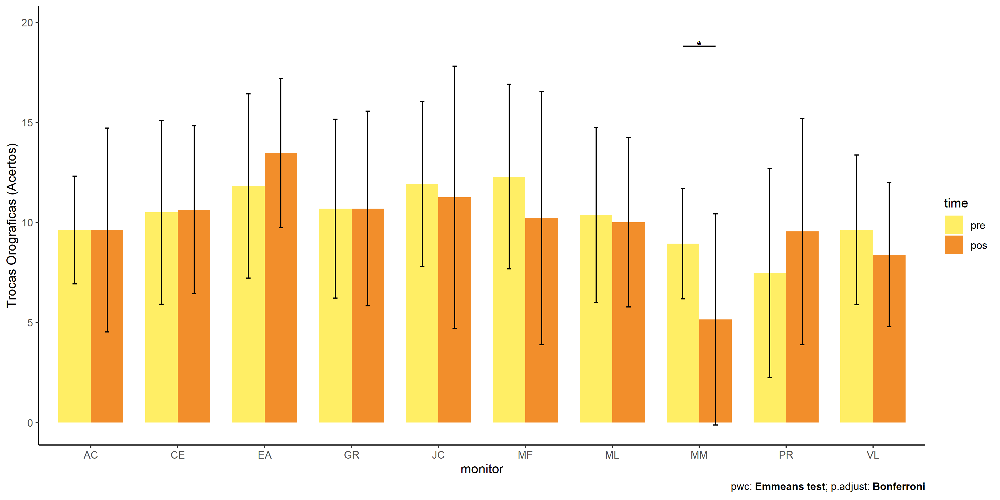<!-- -->

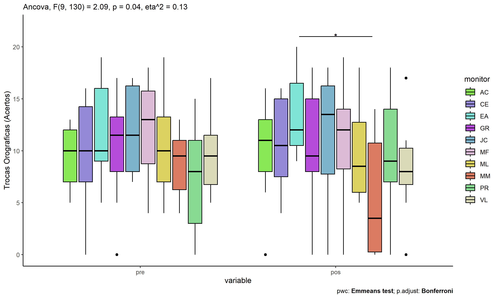<!-- -->

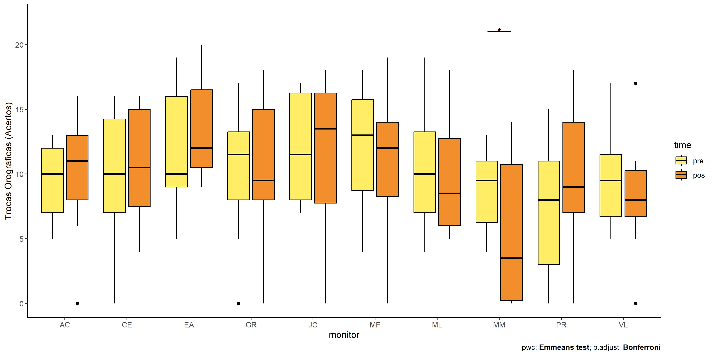<!-- -->
