ANCOVA in Triagem Test - Reading of Words per Minutes and Reading
Comprehension (Teste Triagem - Leitura de Palavras por Minuto e
Compreensao Leitora)
================
Geiser C. Challco <geiser@alumni.usp.br>

- [Descriptive Statistics of Initial
  Data](#descriptive-statistics-of-initial-data)
  - [Quant. Palavras Lidas](#quant-palavras-lidas)
  - [Compreensao Leitora (Acertos)](#compreensao-leitora-acertos)
  - [Compreensao Leitora (TRI)](#compreensao-leitora-tri)
- [Checking of Assumptions](#checking-of-assumptions)
  - [Assumption: Normality
    distribution](#assumption-normality-distribution)
    - [Quant. Palavras Lidas](#quant-palavras-lidas-1)
    - [Compreensao Leitora (Acertos)](#compreensao-leitora-acertos-1)
    - [Compreensao Leitora (TRI)](#compreensao-leitora-tri-1)
  - [Assumption: Homogeneity](#assumption-homogeneity)
    - [Quant. Palavras Lidas](#quant-palavras-lidas-2)
    - [Compreensao Leitora (Acertos)](#compreensao-leitora-acertos-2)
    - [Compreensao Leitora (TRI)](#compreensao-leitora-tri-2)
- [Computation of ANCOVA test and Pairwise
  Comparison](#computation-of-ancova-test-and-pairwise-comparison)
  - [ANCOVA tests for one factor](#ancova-tests-for-one-factor)
    - [Quant. Palavras Lidas](#quant-palavras-lidas-3)
    - [Compreensao Leitora (Acertos)](#compreensao-leitora-acertos-3)
    - [Compreensao Leitora (TRI)](#compreensao-leitora-tri-3)
  - [ANCOVA tests for two factors](#ancova-tests-for-two-factors)
    - [Quant. Palavras Lidas](#quant-palavras-lidas-4)
    - [Compreensao Leitora (Acertos)](#compreensao-leitora-acertos-4)
    - [Compreensao Leitora (TRI)](#compreensao-leitora-tri-4)
  - [ANCOVA tests for
    grupo=“Experimental”](#ancova-tests-for-grupoexperimental)
    - [Quant. Palavras Lidas](#quant-palavras-lidas-5)
    - [Compreensao Leitora (Acertos)](#compreensao-leitora-acertos-5)
    - [Compreensao Leitora (TRI)](#compreensao-leitora-tri-5)
- [Pairwise comparisons for one
  factor](#pairwise-comparisons-for-one-factor)
  - [factor: **grupo**](#factor-grupo)
    - [Quant. Palavras Lidas](#quant-palavras-lidas-6)
    - [Compreensao Leitora (Acertos)](#compreensao-leitora-acertos-6)
    - [Compreensao Leitora (TRI)](#compreensao-leitora-tri-6)
  - [factor: **genero**](#factor-genero)
    - [Quant. Palavras Lidas](#quant-palavras-lidas-7)
    - [Compreensao Leitora (Acertos)](#compreensao-leitora-acertos-7)
    - [Compreensao Leitora (TRI)](#compreensao-leitora-tri-7)
  - [factor: **idade**](#factor-idade)
    - [Quant. Palavras Lidas](#quant-palavras-lidas-8)
    - [Compreensao Leitora (Acertos)](#compreensao-leitora-acertos-8)
    - [Compreensao Leitora (TRI)](#compreensao-leitora-tri-8)
  - [factor: **zona.participante**](#factor-zonaparticipante)
    - [Quant. Palavras Lidas](#quant-palavras-lidas-9)
    - [Compreensao Leitora (Acertos)](#compreensao-leitora-acertos-9)
    - [Compreensao Leitora (TRI)](#compreensao-leitora-tri-9)
  - [factor: **escola**](#factor-escola)
    - [Quant. Palavras Lidas](#quant-palavras-lidas-10)
    - [Compreensao Leitora (Acertos)](#compreensao-leitora-acertos-10)
    - [Compreensao Leitora (TRI)](#compreensao-leitora-tri-10)
  - [factor: **zona.escola**](#factor-zonaescola)
    - [Quant. Palavras Lidas](#quant-palavras-lidas-11)
    - [Compreensao Leitora (Acertos)](#compreensao-leitora-acertos-11)
    - [Compreensao Leitora (TRI)](#compreensao-leitora-tri-11)
- [Pairwise comparisons for two
  factors](#pairwise-comparisons-for-two-factors)
  - [factores: **genero:grupo**](#factores-generogrupo)
    - [Quant. Palavras Lidas](#quant-palavras-lidas-12)
    - [Compreensao Leitora (Acertos)](#compreensao-leitora-acertos-12)
    - [Compreensao Leitora (TRI)](#compreensao-leitora-tri-12)
  - [factores: **idade:grupo**](#factores-idadegrupo)
    - [Quant. Palavras Lidas](#quant-palavras-lidas-13)
    - [Compreensao Leitora (Acertos)](#compreensao-leitora-acertos-13)
    - [Compreensao Leitora (TRI)](#compreensao-leitora-tri-13)
  - [factores:
    **zona.participante:grupo**](#factores-zonaparticipantegrupo)
    - [Quant. Palavras Lidas](#quant-palavras-lidas-14)
    - [Compreensao Leitora (Acertos)](#compreensao-leitora-acertos-14)
    - [Compreensao Leitora (TRI)](#compreensao-leitora-tri-14)
  - [factores: **escola:grupo**](#factores-escolagrupo)
    - [Quant. Palavras Lidas](#quant-palavras-lidas-15)
    - [Compreensao Leitora (Acertos)](#compreensao-leitora-acertos-15)
    - [Compreensao Leitora (TRI)](#compreensao-leitora-tri-15)
  - [factores: **zona.escola:grupo**](#factores-zonaescolagrupo)
    - [Quant. Palavras Lidas](#quant-palavras-lidas-16)
    - [Compreensao Leitora (Acertos)](#compreensao-leitora-acertos-16)
    - [Compreensao Leitora (TRI)](#compreensao-leitora-tri-16)
- [Pairwise comparisons for
  grupo=“Experimental”](#pairwise-comparisons-for-grupoexperimental)
  - [factores:
    **grupo=“Experimental”:monitor**](#factores-grupoexperimentalmonitor)
    - [Quant. Palavras Lidas](#quant-palavras-lidas-17)
    - [Compreensao Leitora (Acertos)](#compreensao-leitora-acertos-17)
    - [Compreensao Leitora (TRI)](#compreensao-leitora-tri-17)
  - [factores:
    **grupo=“Experimental”:monitor.genero**](#factores-grupoexperimentalmonitorgenero)
    - [Quant. Palavras Lidas](#quant-palavras-lidas-18)
    - [Compreensao Leitora (Acertos)](#compreensao-leitora-acertos-18)
    - [Compreensao Leitora (TRI)](#compreensao-leitora-tri-18)
  - [factores:
    **grupo=“Experimental”:monitor.area**](#factores-grupoexperimentalmonitorarea)
    - [Quant. Palavras Lidas](#quant-palavras-lidas-19)
    - [Compreensao Leitora (Acertos)](#compreensao-leitora-acertos-19)
    - [Compreensao Leitora (TRI)](#compreensao-leitora-tri-19)
  - [factores:
    **grupo=“Experimental”:monitor.formacao**](#factores-grupoexperimentalmonitorformacao)
    - [Quant. Palavras Lidas](#quant-palavras-lidas-20)
    - [Compreensao Leitora (Acertos)](#compreensao-leitora-acertos-20)
    - [Compreensao Leitora (TRI)](#compreensao-leitora-tri-20)
  - [factores:
    **grupo=“Experimental”:monitor.experiencia**](#factores-grupoexperimentalmonitorexperiencia)
    - [Quant. Palavras Lidas](#quant-palavras-lidas-21)
    - [Compreensao Leitora (Acertos)](#compreensao-leitora-acertos-21)
    - [Compreensao Leitora (TRI)](#compreensao-leitora-tri-21)

**NOTE**

- Teste ANCOVA para determinar se houve diferenças significativas no
  Teste Triagem - Leitura de Palavras por Minuto e Compreensao Leitora
  (medido usando pre- e pos-testes).
- ANCOVA test to determine whether there were significant differences in
  Triagem Test - Reading of Words per Minutes and Reading Comprehension
  (measured using pre- and post-tests).

# Descriptive Statistics of Initial Data

## Quant. Palavras Lidas

| grupo    | genero | idade | zona.participante | escola | zona.escola | variable           |   n |    mean | median | min | max |      sd |     se |      ci |    iqr |
|:---------|:-------|:------|:------------------|:-------|:------------|:-------------------|----:|--------:|-------:|----:|----:|--------:|-------:|--------:|-------:|
| Controle | F      |       |                   |        |             | palavras.lidas.pos |  73 | 115.973 |  100.0 |  13 | 262 |  47.235 |  5.528 |  11.021 |  55.00 |
| Controle | M      |       |                   |        |             | palavras.lidas.pos |  64 | 113.875 |  104.5 |   8 | 430 |  72.372 |  9.047 |  18.078 |  71.00 |
| WordGen  | F      |       |                   |        |             | palavras.lidas.pos |  50 | 162.560 |  145.5 |  57 | 430 |  75.532 | 10.682 |  21.466 |  96.00 |
| WordGen  | M      |       |                   |        |             | palavras.lidas.pos |  54 | 123.148 |  110.0 |  33 | 419 |  60.059 |  8.173 |  16.393 |  54.75 |
| Controle | F      |       |                   |        |             | palavras.lidas.pre |  73 | 123.466 |   94.0 |  20 | 319 |  82.731 |  9.683 |  19.303 | 119.00 |
| Controle | M      |       |                   |        |             | palavras.lidas.pre |  64 | 121.531 |  100.0 |   1 | 398 |  79.468 |  9.934 |  19.851 | 100.00 |
| WordGen  | F      |       |                   |        |             | palavras.lidas.pre |  50 | 139.780 |  117.5 |  13 | 373 |  87.988 | 12.443 |  25.006 |  98.50 |
| WordGen  | M      |       |                   |        |             | palavras.lidas.pre |  54 | 115.315 |   85.0 |  27 | 338 |  82.761 | 11.262 |  22.589 |  68.50 |
| Controle |        | 10y   |                   |        |             | palavras.lidas.pos |  26 | 108.808 |   94.5 |  43 | 252 |  45.768 |  8.976 |  18.486 |  34.50 |
| Controle |        | 11y   |                   |        |             | palavras.lidas.pos |  79 | 120.418 |  108.0 |  13 | 430 |  65.306 |  7.347 |  14.628 |  70.50 |
| Controle |        | 12y   |                   |        |             | palavras.lidas.pos |  17 | 106.529 |   95.0 |   8 | 228 |  52.566 | 12.749 |  27.027 |  57.00 |
| Controle |        | 13y   |                   |        |             | palavras.lidas.pos |   9 |  98.889 |   87.0 |  18 | 223 |  74.104 | 24.701 |  56.961 |  79.00 |
| Controle |        | 14y   |                   |        |             | palavras.lidas.pos |   1 | 141.000 |  141.0 | 141 | 141 |         |        |         |   0.00 |
| Controle |        | 15y   |                   |        |             | palavras.lidas.pos |   1 |  29.000 |   29.0 |  29 |  29 |         |        |         |   0.00 |
| Controle |        |       |                   |        |             | palavras.lidas.pos |   4 | 135.250 |  128.0 | 123 | 162 |  18.446 |  9.223 |  29.351 |  17.25 |
| WordGen  |        | 10y   |                   |        |             | palavras.lidas.pos |  19 | 144.368 |  132.0 |  39 | 335 |  78.333 | 17.971 |  37.756 |  90.50 |
| WordGen  |        | 11y   |                   |        |             | palavras.lidas.pos |  64 | 144.109 |  138.5 |  33 | 430 |  72.012 |  9.002 |  17.988 |  84.00 |
| WordGen  |        | 12y   |                   |        |             | palavras.lidas.pos |  14 | 136.571 |  119.0 |  57 | 293 |  70.705 | 18.897 |  40.824 |  59.25 |
| WordGen  |        | 13y   |                   |        |             | palavras.lidas.pos |   4 | 126.750 |  118.5 |  94 | 176 |  39.744 | 19.872 |  63.242 |  55.75 |
| WordGen  |        |       |                   |        |             | palavras.lidas.pos |   3 | 131.000 |  146.0 |  94 | 153 |  32.234 | 18.610 |  80.073 |  29.50 |
| Controle |        | 10y   |                   |        |             | palavras.lidas.pre |  26 | 123.808 |  100.5 |   2 | 317 |  87.709 | 17.201 |  35.426 | 117.25 |
| Controle |        | 11y   |                   |        |             | palavras.lidas.pre |  79 | 124.203 |  101.0 |   1 | 398 |  82.074 |  9.234 |  18.384 | 107.00 |
| Controle |        | 12y   |                   |        |             | palavras.lidas.pre |  17 | 132.529 |   94.0 |  33 | 300 |  75.491 | 18.309 |  38.814 | 101.00 |
| Controle |        | 13y   |                   |        |             | palavras.lidas.pre |   9 |  96.333 |   98.0 |   5 | 231 |  77.970 | 25.990 |  59.933 |  91.00 |
| Controle |        | 14y   |                   |        |             | palavras.lidas.pre |   1 | 208.000 |  208.0 | 208 | 208 |         |        |         |   0.00 |
| Controle |        | 15y   |                   |        |             | palavras.lidas.pre |   1 | 151.000 |  151.0 | 151 | 151 |         |        |         |   0.00 |
| Controle |        |       |                   |        |             | palavras.lidas.pre |   4 |  70.250 |   58.5 |  33 | 131 |  44.866 | 22.433 |  71.391 |  52.25 |
| WordGen  |        | 10y   |                   |        |             | palavras.lidas.pre |  19 |  85.053 |   80.0 |  13 | 206 |  49.686 | 11.399 |  23.948 |  46.00 |
| WordGen  |        | 11y   |                   |        |             | palavras.lidas.pre |  64 | 148.844 |  124.5 |  27 | 373 |  92.448 | 11.556 |  23.093 | 104.25 |
| WordGen  |        | 12y   |                   |        |             | palavras.lidas.pre |  14 | 106.929 |   72.5 |  33 | 297 |  79.998 | 21.380 |  46.189 | 100.00 |
| WordGen  |        | 13y   |                   |        |             | palavras.lidas.pre |   4 |  84.750 |   88.5 |  39 | 123 |  36.280 | 18.140 |  57.730 |  41.25 |
| WordGen  |        |       |                   |        |             | palavras.lidas.pre |   3 |  79.333 |   55.0 |  50 | 133 |  46.544 | 26.872 | 115.621 |  41.50 |
| Controle |        |       | Urbana            |        |             | palavras.lidas.pos |  61 | 112.098 |   94.0 |   8 | 430 |  72.869 |  9.330 |  18.662 |  63.00 |
| Controle |        |       | Rural             |        |             | palavras.lidas.pos |  47 | 116.553 |  112.0 |  18 | 228 |  48.159 |  7.025 |  14.140 |  53.00 |
| Controle |        |       |                   |        |             | palavras.lidas.pos |  29 | 118.552 |  119.0 |  33 | 223 |  47.996 |  8.913 |  18.257 |  64.00 |
| WordGen  |        |       | Urbana            |        |             | palavras.lidas.pos |  36 | 161.417 |  142.5 |  39 | 430 |  81.056 | 13.509 |  27.425 |  96.50 |
| WordGen  |        |       | Rural             |        |             | palavras.lidas.pos |  43 | 118.837 |  119.0 |  33 | 270 |  48.009 |  7.321 |  14.775 |  57.50 |
| WordGen  |        |       |                   |        |             | palavras.lidas.pos |  25 | 154.280 |  146.0 |  57 | 419 |  77.429 | 15.486 |  31.961 |  77.00 |
| Controle |        |       | Urbana            |        |             | palavras.lidas.pre |  61 | 132.492 |  107.0 |   2 | 398 |  88.066 | 11.276 |  22.555 | 123.00 |
| Controle |        |       | Rural             |        |             | palavras.lidas.pre |  47 | 124.404 |  102.0 |  29 | 319 |  79.055 | 11.531 |  23.211 | 105.50 |
| Controle |        |       |                   |        |             | palavras.lidas.pre |  29 |  98.690 |   85.0 |   1 | 256 |  64.159 | 11.914 |  24.405 |  99.00 |
| WordGen  |        |       | Urbana            |        |             | palavras.lidas.pre |  36 | 146.083 |  129.0 |  29 | 373 |  92.586 | 15.431 |  31.327 | 111.50 |
| WordGen  |        |       | Rural             |        |             | palavras.lidas.pre |  43 | 124.814 |   91.0 |  27 | 341 |  91.589 | 13.967 |  28.187 |  84.00 |
| WordGen  |        |       |                   |        |             | palavras.lidas.pre |  25 | 103.600 |   92.0 |  13 | 262 |  57.214 | 11.443 |  23.617 |  63.00 |
| Controle |        |       |                   | E1     |             | palavras.lidas.pos |  13 |  86.154 |   84.0 |  29 | 162 |  39.391 | 10.925 |  23.804 |  21.00 |
| Controle |        |       |                   | E2     |             | palavras.lidas.pos |  13 | 153.154 |  138.0 |  13 | 430 | 105.773 | 29.336 |  63.918 | 112.00 |
| Controle |        |       |                   | E3     |             | palavras.lidas.pos |  18 |  94.722 |   89.0 |   8 | 211 |  54.892 | 12.938 |  27.297 |  71.75 |
| Controle |        |       |                   | E4     |             | palavras.lidas.pos |  20 |  98.450 |   97.5 |  49 | 141 |  26.975 |  6.032 |  12.625 |  43.00 |
| Controle |        |       |                   | E5     |             | palavras.lidas.pos |  59 | 122.780 |  105.0 |  33 | 363 |  57.800 |  7.525 |  15.063 |  56.00 |
| Controle |        |       |                   | E6     |             | palavras.lidas.pos |  14 | 123.214 |  128.5 |  33 | 204 |  49.569 | 13.248 |  28.620 |  66.25 |
| WordGen  |        |       |                   | E1     |             | palavras.lidas.pos |   8 | 192.500 |  181.0 |  33 | 430 | 125.007 | 44.197 | 104.509 | 130.75 |
| WordGen  |        |       |                   | E2     |             | palavras.lidas.pos |  10 | 181.000 |  158.0 |  94 | 335 |  72.283 | 22.858 |  51.708 |  60.25 |
| WordGen  |        |       |                   | E3     |             | palavras.lidas.pos |  15 | 101.867 |   95.0 |  33 | 162 |  39.388 | 10.170 |  21.812 |  43.00 |
| WordGen  |        |       |                   | E4     |             | palavras.lidas.pos |  10 | 100.600 |   92.0 |  72 | 141 |  23.220 |  7.343 |  16.610 |  30.00 |
| WordGen  |        |       |                   | E5     |             | palavras.lidas.pos |  50 | 153.680 |  144.0 |  39 | 419 |  66.817 |  9.449 |  18.989 |  81.25 |
| WordGen  |        |       |                   | E6     |             | palavras.lidas.pos |  11 | 110.000 |  103.0 |  57 | 178 |  37.834 | 11.407 |  25.417 |  49.00 |
| Controle |        |       |                   | E1     |             | palavras.lidas.pre |  13 |  85.385 |   79.0 |  33 | 151 |  34.384 |  9.536 |  20.778 |  46.00 |
| Controle |        |       |                   | E2     |             | palavras.lidas.pre |  13 |  87.692 |   79.0 |  20 | 189 |  52.385 | 14.529 |  31.656 |  81.00 |
| Controle |        |       |                   | E3     |             | palavras.lidas.pre |  18 | 113.500 |   89.0 |  32 | 319 |  74.730 | 17.614 |  37.163 |  61.00 |
| Controle |        |       |                   | E4     |             | palavras.lidas.pre |  20 | 247.650 |  229.5 | 175 | 398 |  61.262 | 13.699 |  28.672 | 101.75 |
| Controle |        |       |                   | E5     |             | palavras.lidas.pre |  59 | 103.525 |   85.0 |   1 | 293 |  65.482 |  8.525 |  17.065 |  83.50 |
| Controle |        |       |                   | E6     |             | palavras.lidas.pre |  14 | 102.643 |  114.5 |   5 | 205 |  64.207 | 17.160 |  37.072 | 103.50 |
| WordGen  |        |       |                   | E1     |             | palavras.lidas.pre |   8 | 123.625 |  114.5 |  27 | 262 |  72.281 | 25.555 |  60.428 |  75.75 |
| WordGen  |        |       |                   | E2     |             | palavras.lidas.pre |  10 |  88.300 |   85.5 |  70 | 132 |  19.247 |  6.087 |  13.769 |  23.50 |
| WordGen  |        |       |                   | E3     |             | palavras.lidas.pre |  15 |  84.800 |   70.0 |  33 | 201 |  47.116 | 12.165 |  26.092 |  56.00 |
| WordGen  |        |       |                   | E4     |             | palavras.lidas.pre |  10 | 283.700 |  304.0 | 178 | 341 |  54.285 | 17.167 |  38.833 |  50.25 |
| WordGen  |        |       |                   | E5     |             | palavras.lidas.pre |  50 | 123.380 |   92.5 |  29 | 373 |  80.738 | 11.418 |  22.945 |  71.00 |
| WordGen  |        |       |                   | E6     |             | palavras.lidas.pre |  11 |  96.909 |   92.0 |  13 | 206 |  65.612 | 19.783 |  44.079 | 105.50 |
| Controle |        |       |                   |        | Urbana      | palavras.lidas.pos |  85 | 121.824 |  102.0 |  13 | 430 |  66.904 |  7.257 |  14.431 |  61.00 |
| Controle |        |       |                   |        | Rural       | palavras.lidas.pos |  52 | 103.827 |  102.5 |   8 | 211 |  45.228 |  6.272 |  12.592 |  63.75 |
| WordGen  |        |       |                   |        | Urbana      | palavras.lidas.pos |  68 | 162.265 |  145.0 |  33 | 430 |  76.264 |  9.248 |  18.460 |  80.50 |
| WordGen  |        |       |                   |        | Rural       | palavras.lidas.pos |  36 | 104.000 |   94.5 |  33 | 178 |  34.420 |  5.737 |  11.646 |  39.00 |
| Controle |        |       |                   |        | Urbana      | palavras.lidas.pre |  85 |  98.329 |   81.0 |   1 | 293 |  59.867 |  6.493 |  12.913 |  74.00 |
| Controle |        |       |                   |        | Rural       | palavras.lidas.pre |  52 | 162.173 |  168.5 |   5 | 398 |  94.788 | 13.145 |  26.389 | 135.25 |
| WordGen  |        |       |                   |        | Urbana      | palavras.lidas.pre |  68 | 118.250 |   91.0 |  27 | 373 |  74.296 |  9.010 |  17.984 |  71.00 |
| WordGen  |        |       |                   |        | Rural       | palavras.lidas.pre |  36 | 143.750 |  117.5 |  13 | 341 | 103.202 | 17.200 |  34.918 | 136.00 |

## Compreensao Leitora (Acertos)

| grupo    | genero | idade | zona.participante | escola | zona.escola | variable              |   n |  mean | median | min | max |    sd |    se |     ci |  iqr |
|:---------|:-------|:------|:------------------|:-------|:------------|:----------------------|----:|------:|-------:|----:|----:|------:|------:|-------:|-----:|
| Controle | F      |       |                   |        |             | score.compreensao.pos |  79 | 5.253 |    5.0 |   1 |  10 | 2.574 | 0.290 |  0.577 | 4.00 |
| Controle | M      |       |                   |        |             | score.compreensao.pos |  74 | 4.392 |    4.0 |   0 |  10 | 2.832 | 0.329 |  0.656 | 5.00 |
| WordGen  | F      |       |                   |        |             | score.compreensao.pos |  55 | 5.964 |    6.0 |   1 |  10 | 2.742 | 0.370 |  0.741 | 4.50 |
| WordGen  | M      |       |                   |        |             | score.compreensao.pos |  60 | 4.467 |    4.0 |   0 |  10 | 2.310 | 0.298 |  0.597 | 3.00 |
| Controle | F      |       |                   |        |             | score.compreensao.pre |  79 | 5.291 |    5.0 |   0 |  10 | 2.646 | 0.298 |  0.593 | 4.00 |
| Controle | M      |       |                   |        |             | score.compreensao.pre |  74 | 4.892 |    4.0 |   1 |  10 | 2.408 | 0.280 |  0.558 | 3.00 |
| WordGen  | F      |       |                   |        |             | score.compreensao.pre |  55 | 6.345 |    6.0 |   1 |  10 | 2.654 | 0.358 |  0.718 | 3.00 |
| WordGen  | M      |       |                   |        |             | score.compreensao.pre |  60 | 4.767 |    4.0 |   1 |  10 | 2.683 | 0.346 |  0.693 | 5.00 |
| Controle |        | 10y   |                   |        |             | score.compreensao.pos |  28 | 5.071 |    4.5 |   1 |  10 | 2.595 | 0.490 |  1.006 | 4.00 |
| Controle |        | 11y   |                   |        |             | score.compreensao.pos |  86 | 5.081 |    4.0 |   0 |  10 | 2.919 | 0.315 |  0.626 | 4.00 |
| Controle |        | 12y   |                   |        |             | score.compreensao.pos |  21 | 4.571 |    4.0 |   1 |   9 | 2.420 | 0.528 |  1.102 | 3.00 |
| Controle |        | 13y   |                   |        |             | score.compreensao.pos |  10 | 3.800 |    3.5 |   2 |   7 | 1.619 | 0.512 |  1.158 | 1.00 |
| Controle |        | 14y   |                   |        |             | score.compreensao.pos |   2 | 4.500 |    4.5 |   2 |   7 | 3.536 | 2.500 | 31.766 | 2.50 |
| Controle |        | 15y   |                   |        |             | score.compreensao.pos |   1 | 1.000 |    1.0 |   1 |   1 |       |       |        | 0.00 |
| Controle |        |       |                   |        |             | score.compreensao.pos |   5 | 3.400 |    3.0 |   1 |   7 | 2.608 | 1.166 |  3.238 | 4.00 |
| WordGen  |        | 10y   |                   |        |             | score.compreensao.pos |  22 | 5.045 |    5.0 |   1 |   9 | 2.478 | 0.528 |  1.099 | 4.00 |
| WordGen  |        | 11y   |                   |        |             | score.compreensao.pos |  68 | 5.574 |    5.0 |   0 |  10 | 2.744 | 0.333 |  0.664 | 4.25 |
| WordGen  |        | 12y   |                   |        |             | score.compreensao.pos |  16 | 4.688 |    4.5 |   2 |   9 | 2.522 | 0.631 |  1.344 | 4.25 |
| WordGen  |        | 13y   |                   |        |             | score.compreensao.pos |   6 | 3.333 |    3.0 |   2 |   5 | 1.033 | 0.422 |  1.084 | 0.75 |
| WordGen  |        |       |                   |        |             | score.compreensao.pos |   3 | 3.667 |    3.0 |   2 |   6 | 2.082 | 1.202 |  5.171 | 2.00 |
| Controle |        | 10y   |                   |        |             | score.compreensao.pre |  28 | 5.321 |    5.0 |   1 |  10 | 2.525 | 0.477 |  0.979 | 4.25 |
| Controle |        | 11y   |                   |        |             | score.compreensao.pre |  86 | 5.279 |    5.0 |   1 |  10 | 2.597 | 0.280 |  0.557 | 4.00 |
| Controle |        | 12y   |                   |        |             | score.compreensao.pre |  21 | 5.048 |    5.0 |   2 |  10 | 2.179 | 0.475 |  0.992 | 3.00 |
| Controle |        | 13y   |                   |        |             | score.compreensao.pre |  10 | 3.900 |    4.0 |   0 |   8 | 2.470 | 0.781 |  1.767 | 3.50 |
| Controle |        | 14y   |                   |        |             | score.compreensao.pre |   2 | 4.000 |    4.0 |   2 |   6 | 2.828 | 2.000 | 25.412 | 2.00 |
| Controle |        | 15y   |                   |        |             | score.compreensao.pre |   1 | 2.000 |    2.0 |   2 |   2 |       |       |        | 0.00 |
| Controle |        |       |                   |        |             | score.compreensao.pre |   5 | 4.400 |    3.0 |   1 |   9 | 3.130 | 1.400 |  3.887 | 3.00 |
| WordGen  |        | 10y   |                   |        |             | score.compreensao.pre |  22 | 4.909 |    5.0 |   1 |  10 | 2.991 | 0.638 |  1.326 | 5.00 |
| WordGen  |        | 11y   |                   |        |             | score.compreensao.pre |  68 | 6.118 |    6.0 |   1 |  10 | 2.821 | 0.342 |  0.683 | 4.00 |
| WordGen  |        | 12y   |                   |        |             | score.compreensao.pre |  16 | 4.812 |    5.0 |   1 |   8 | 2.040 | 0.510 |  1.087 | 2.50 |
| WordGen  |        | 13y   |                   |        |             | score.compreensao.pre |   6 | 4.167 |    4.0 |   2 |   8 | 2.041 | 0.833 |  2.142 | 0.75 |
| WordGen  |        |       |                   |        |             | score.compreensao.pre |   3 | 3.000 |    3.0 |   2 |   4 | 1.000 | 0.577 |  2.484 | 1.00 |
| Controle |        |       | Urbana            |        |             | score.compreensao.pos |  67 | 5.194 |    5.0 |   1 |  10 | 2.693 | 0.329 |  0.657 | 4.00 |
| Controle |        |       | Rural             |        |             | score.compreensao.pos |  51 | 4.353 |    4.0 |   1 |  10 | 2.644 | 0.370 |  0.744 | 3.00 |
| Controle |        |       |                   |        |             | score.compreensao.pos |  35 | 4.857 |    4.0 |   0 |  10 | 2.881 | 0.487 |  0.990 | 5.50 |
| WordGen  |        |       | Urbana            |        |             | score.compreensao.pos |  43 | 5.326 |    5.0 |   1 |  10 | 2.598 | 0.396 |  0.799 | 4.00 |
| WordGen  |        |       | Rural             |        |             | score.compreensao.pos |  46 | 5.217 |    5.0 |   0 |  10 | 2.724 | 0.402 |  0.809 | 4.75 |
| WordGen  |        |       |                   |        |             | score.compreensao.pos |  26 | 4.885 |    5.0 |   1 |  10 | 2.566 | 0.503 |  1.037 | 3.00 |
| Controle |        |       | Urbana            |        |             | score.compreensao.pre |  67 | 5.194 |    5.0 |   1 |  10 | 2.439 | 0.298 |  0.595 | 4.00 |
| Controle |        |       | Rural             |        |             | score.compreensao.pre |  51 | 4.608 |    4.0 |   1 |  10 | 2.359 | 0.330 |  0.663 | 3.00 |
| Controle |        |       |                   |        |             | score.compreensao.pre |  35 | 5.629 |    6.0 |   0 |  10 | 2.881 | 0.487 |  0.990 | 4.50 |
| WordGen  |        |       | Urbana            |        |             | score.compreensao.pre |  43 | 5.256 |    6.0 |   1 |  10 | 2.821 | 0.430 |  0.868 | 5.50 |
| WordGen  |        |       | Rural             |        |             | score.compreensao.pre |  46 | 5.457 |    5.5 |   1 |  10 | 2.730 | 0.403 |  0.811 | 4.50 |
| WordGen  |        |       |                   |        |             | score.compreensao.pre |  26 | 6.077 |    6.0 |   2 |  10 | 2.799 | 0.549 |  1.131 | 5.00 |
| Controle |        |       |                   | E1     |             | score.compreensao.pos |  13 | 5.615 |    6.0 |   1 |  10 | 2.663 | 0.738 |  1.609 | 3.00 |
| Controle |        |       |                   | E2     |             | score.compreensao.pos |  29 | 4.724 |    4.0 |   1 |  10 | 2.951 | 0.548 |  1.122 | 5.00 |
| Controle |        |       |                   | E3     |             | score.compreensao.pos |  19 | 4.684 |    4.0 |   1 |  10 | 2.689 | 0.617 |  1.296 | 3.50 |
| Controle |        |       |                   | E4     |             | score.compreensao.pos |  19 | 5.474 |    5.0 |   2 |  10 | 2.695 | 0.618 |  1.299 | 4.00 |
| Controle |        |       |                   | E5     |             | score.compreensao.pos |  59 | 4.424 |    4.0 |   0 |  10 | 2.621 | 0.341 |  0.683 | 4.00 |
| Controle |        |       |                   | E6     |             | score.compreensao.pos |  14 | 5.429 |    4.5 |   1 |  10 | 2.928 | 0.782 |  1.690 | 5.00 |
| WordGen  |        |       |                   | E1     |             | score.compreensao.pos |   8 | 5.875 |    5.5 |   2 |  10 | 3.441 | 1.217 |  2.877 | 5.50 |
| WordGen  |        |       |                   | E2     |             | score.compreensao.pos |  22 | 3.818 |    4.0 |   0 |   8 | 1.967 | 0.419 |  0.872 | 2.75 |
| WordGen  |        |       |                   | E3     |             | score.compreensao.pos |  14 | 5.429 |    5.5 |   1 |  10 | 2.954 | 0.789 |  1.706 | 5.25 |
| WordGen  |        |       |                   | E4     |             | score.compreensao.pos |  10 | 5.900 |    5.5 |   2 |  10 | 2.846 | 0.900 |  2.036 | 4.50 |
| WordGen  |        |       |                   | E5     |             | score.compreensao.pos |  50 | 5.460 |    5.0 |   1 |  10 | 2.443 | 0.345 |  0.694 | 4.00 |
| WordGen  |        |       |                   | E6     |             | score.compreensao.pos |  11 | 5.182 |    5.0 |   1 |  10 | 2.960 | 0.893 |  1.989 | 3.50 |
| Controle |        |       |                   | E1     |             | score.compreensao.pre |  13 | 5.462 |    5.0 |   2 |  10 | 2.367 | 0.656 |  1.430 | 3.00 |
| Controle |        |       |                   | E2     |             | score.compreensao.pre |  29 | 4.379 |    3.0 |   1 |  10 | 2.821 | 0.524 |  1.073 | 4.00 |
| Controle |        |       |                   | E3     |             | score.compreensao.pre |  19 | 5.000 |    4.0 |   3 |  10 | 2.186 | 0.501 |  1.054 | 3.50 |
| Controle |        |       |                   | E4     |             | score.compreensao.pre |  19 | 5.789 |    5.0 |   3 |  10 | 2.070 | 0.475 |  0.998 | 2.00 |
| Controle |        |       |                   | E5     |             | score.compreensao.pre |  59 | 4.881 |    4.0 |   0 |  10 | 2.519 | 0.328 |  0.657 | 3.00 |
| Controle |        |       |                   | E6     |             | score.compreensao.pre |  14 | 6.357 |    7.5 |   1 |  10 | 2.818 | 0.753 |  1.627 | 4.00 |
| WordGen  |        |       |                   | E1     |             | score.compreensao.pre |   8 | 5.500 |    6.0 |   1 |  10 | 3.295 | 1.165 |  2.755 | 4.75 |
| WordGen  |        |       |                   | E2     |             | score.compreensao.pre |  22 | 4.091 |    3.5 |   1 |   9 | 2.635 | 0.562 |  1.168 | 4.25 |
| WordGen  |        |       |                   | E3     |             | score.compreensao.pre |  14 | 5.786 |    6.0 |   1 |  10 | 2.778 | 0.743 |  1.604 | 3.75 |
| WordGen  |        |       |                   | E4     |             | score.compreensao.pre |  10 | 6.700 |    7.0 |   1 |  10 | 2.669 | 0.844 |  1.909 | 2.75 |
| WordGen  |        |       |                   | E5     |             | score.compreensao.pre |  50 | 5.660 |    6.0 |   1 |  10 | 2.623 | 0.371 |  0.746 | 3.00 |
| WordGen  |        |       |                   | E6     |             | score.compreensao.pre |  11 | 6.364 |    6.0 |   2 |  10 | 2.908 | 0.877 |  1.953 | 5.50 |
| Controle |        |       |                   |        | Urbana      | score.compreensao.pos | 101 | 4.663 |    4.0 |   0 |  10 | 2.725 | 0.271 |  0.538 | 5.00 |
| Controle |        |       |                   |        | Rural       | score.compreensao.pos |  52 | 5.173 |    4.5 |   1 |  10 | 2.728 | 0.378 |  0.759 | 4.25 |
| WordGen  |        |       |                   |        | Urbana      | score.compreensao.pos |  80 | 5.050 |    5.0 |   0 |  10 | 2.525 | 0.282 |  0.562 | 4.00 |
| WordGen  |        |       |                   |        | Rural       | score.compreensao.pos |  35 | 5.486 |    5.0 |   1 |  10 | 2.853 | 0.482 |  0.980 | 4.50 |
| Controle |        |       |                   |        | Urbana      | score.compreensao.pre | 101 | 4.812 |    4.0 |   0 |  10 | 2.587 | 0.257 |  0.511 | 4.00 |
| Controle |        |       |                   |        | Rural       | score.compreensao.pre |  52 | 5.654 |    5.0 |   1 |  10 | 2.351 | 0.326 |  0.654 | 4.00 |
| WordGen  |        |       |                   |        | Urbana      | score.compreensao.pre |  80 | 5.213 |    5.0 |   1 |  10 | 2.750 | 0.307 |  0.612 | 4.50 |
| WordGen  |        |       |                   |        | Rural       | score.compreensao.pre |  35 | 6.229 |    6.0 |   1 |  10 | 2.734 | 0.462 |  0.939 | 4.00 |

## Compreensao Leitora (TRI)

| grupo    | genero | idade | zona.participante | escola | zona.escola | variable            |   n |   mean | median |    min |    max |    sd |    se |    ci |   iqr |
|:---------|:-------|:------|:------------------|:-------|:------------|:--------------------|----:|-------:|-------:|-------:|-------:|------:|------:|------:|------:|
| Controle | F      |       |                   |        |             | tri.compreensao.pos |  79 |  0.125 |  0.062 | -1.006 |  1.791 | 0.838 | 0.094 | 0.188 | 1.204 |
| Controle | M      |       |                   |        |             | tri.compreensao.pos |  75 | -0.120 | -0.511 | -1.035 |  1.791 | 0.867 | 0.100 | 0.200 | 1.388 |
| WordGen  | F      |       |                   |        |             | tri.compreensao.pos |  55 |  0.329 |  0.457 | -1.033 |  1.791 | 0.933 | 0.126 | 0.252 | 1.545 |
| WordGen  | M      |       |                   |        |             | tri.compreensao.pos |  60 | -0.103 | -0.359 | -1.034 |  1.791 | 0.700 | 0.090 | 0.181 | 1.147 |
| Controle | F      |       |                   |        |             | tri.compreensao.pre |  79 |  0.159 | -0.014 | -1.035 |  1.791 | 0.863 | 0.097 | 0.193 | 1.283 |
| Controle | M      |       |                   |        |             | tri.compreensao.pre |  75 | -0.016 | -0.211 | -1.032 |  1.791 | 0.745 | 0.086 | 0.171 | 1.045 |
| WordGen  | F      |       |                   |        |             | tri.compreensao.pre |  55 |  0.487 |  0.426 | -0.992 |  1.791 | 0.869 | 0.117 | 0.235 | 1.196 |
| WordGen  | M      |       |                   |        |             | tri.compreensao.pre |  60 |  0.030 | -0.118 | -0.993 |  1.791 | 0.810 | 0.105 | 0.209 | 1.296 |
| Controle |        | 10y   |                   |        |             | tri.compreensao.pos |  28 |  0.083 | -0.038 | -0.898 |  1.791 | 0.826 | 0.156 | 0.320 | 1.204 |
| Controle |        | 11y   |                   |        |             | tri.compreensao.pos |  86 |  0.109 | -0.035 | -1.033 |  1.791 | 0.912 | 0.098 | 0.195 | 1.470 |
| Controle |        | 12y   |                   |        |             | tri.compreensao.pos |  22 | -0.135 | -0.494 | -1.035 |  1.256 | 0.796 | 0.170 | 0.353 | 1.272 |
| Controle |        | 13y   |                   |        |             | tri.compreensao.pos |  10 | -0.394 | -0.488 | -0.979 |  0.537 | 0.513 | 0.162 | 0.367 | 0.721 |
| Controle |        | 14y   |                   |        |             | tri.compreensao.pos |   2 | -0.154 | -0.154 | -0.804 |  0.497 | 0.920 | 0.650 | 8.264 | 0.650 |
| Controle |        | 15y   |                   |        |             | tri.compreensao.pos |   1 | -0.943 | -0.943 | -0.943 | -0.943 |       |       |       | 0.000 |
| Controle |        |       |                   |        |             | tri.compreensao.pos |   5 | -0.546 | -0.870 | -1.033 |  0.376 | 0.617 | 0.276 | 0.766 | 0.807 |
| WordGen  |        | 10y   |                   |        |             | tri.compreensao.pos |  22 | -0.003 |  0.011 | -1.033 |  1.060 | 0.763 | 0.163 | 0.338 | 1.420 |
| WordGen  |        | 11y   |                   |        |             | tri.compreensao.pos |  68 |  0.260 |  0.042 | -1.034 |  1.791 | 0.890 | 0.108 | 0.215 | 1.330 |
| WordGen  |        | 12y   |                   |        |             | tri.compreensao.pos |  16 | -0.128 | -0.373 | -0.993 |  1.412 | 0.796 | 0.199 | 0.424 | 0.856 |
| WordGen  |        | 13y   |                   |        |             | tri.compreensao.pos |   6 | -0.461 | -0.464 | -0.770 |  0.022 | 0.282 | 0.115 | 0.296 | 0.263 |
| WordGen  |        |       |                   |        |             | tri.compreensao.pos |   3 | -0.286 | -0.617 | -0.762 |  0.522 | 0.703 | 0.406 | 1.747 | 0.642 |
| Controle |        | 10y   |                   |        |             | tri.compreensao.pre |  28 |  0.153 | -0.013 | -1.003 |  1.791 | 0.773 | 0.146 | 0.300 | 0.990 |
| Controle |        | 11y   |                   |        |             | tri.compreensao.pre |  86 |  0.128 | -0.052 | -1.035 |  1.791 | 0.859 | 0.093 | 0.184 | 1.247 |
| Controle |        | 12y   |                   |        |             | tri.compreensao.pre |  22 |  0.077 |  0.139 | -1.003 |  1.791 | 0.703 | 0.150 | 0.312 | 0.983 |
| Controle |        | 13y   |                   |        |             | tri.compreensao.pre |  10 | -0.414 | -0.670 | -1.035 |  0.841 | 0.627 | 0.198 | 0.449 | 0.820 |
| Controle |        | 14y   |                   |        |             | tri.compreensao.pre |   2 | -0.182 | -0.182 | -0.617 |  0.253 | 0.615 | 0.435 | 5.528 | 0.435 |
| Controle |        | 15y   |                   |        |             | tri.compreensao.pre |   1 | -0.617 | -0.617 | -0.617 | -0.617 |       |       |       | 0.000 |
| Controle |        |       |                   |        |             | tri.compreensao.pre |   5 | -0.095 | -0.675 | -0.922 |  1.246 | 0.955 | 0.427 | 1.186 | 1.286 |
| WordGen  |        | 10y   |                   |        |             | tri.compreensao.pre |  22 |  0.078 |  0.080 | -0.943 |  1.791 | 0.927 | 0.198 | 0.411 | 1.388 |
| WordGen  |        | 11y   |                   |        |             | tri.compreensao.pre |  68 |  0.467 |  0.471 | -0.983 |  1.791 | 0.867 | 0.105 | 0.210 | 1.349 |
| WordGen  |        | 12y   |                   |        |             | tri.compreensao.pre |  16 | -0.049 | -0.119 | -0.993 |  0.784 | 0.554 | 0.138 | 0.295 | 0.825 |
| WordGen  |        | 13y   |                   |        |             | tri.compreensao.pre |   6 | -0.297 | -0.265 | -0.939 |  0.740 | 0.627 | 0.256 | 0.658 | 0.683 |
| WordGen  |        |       |                   |        |             | tri.compreensao.pre |   3 | -0.784 | -0.880 | -0.992 | -0.480 | 0.269 | 0.155 | 0.669 | 0.256 |
| Controle |        |       | Urbana            |        |             | tri.compreensao.pos |  68 |  0.090 |  0.028 | -1.035 |  1.791 | 0.852 | 0.103 | 0.206 | 1.348 |
| Controle |        |       | Rural             |        |             | tri.compreensao.pos |  51 | -0.103 | -0.375 | -1.033 |  1.791 | 0.848 | 0.119 | 0.238 | 1.029 |
| Controle |        |       |                   |        |             | tri.compreensao.pos |  35 | -0.001 | -0.371 | -1.033 |  1.791 | 0.892 | 0.151 | 0.306 | 1.594 |
| WordGen  |        |       | Urbana            |        |             | tri.compreensao.pos |  43 |  0.168 | -0.042 | -1.022 |  1.791 | 0.840 | 0.128 | 0.259 | 1.281 |
| WordGen  |        |       | Rural             |        |             | tri.compreensao.pos |  46 |  0.120 |  0.034 | -1.034 |  1.791 | 0.836 | 0.123 | 0.248 | 1.311 |
| WordGen  |        |       |                   |        |             | tri.compreensao.pos |  26 | -0.031 | -0.377 | -1.033 |  1.791 | 0.884 | 0.173 | 0.357 | 1.259 |
| Controle |        |       | Urbana            |        |             | tri.compreensao.pre |  68 |  0.074 | -0.016 | -1.035 |  1.791 | 0.789 | 0.096 | 0.191 | 1.202 |
| Controle |        |       | Rural             |        |             | tri.compreensao.pre |  51 | -0.051 | -0.228 | -1.032 |  1.791 | 0.760 | 0.106 | 0.214 | 1.083 |
| Controle |        |       |                   |        |             | tri.compreensao.pre |  35 |  0.255 |  0.118 | -1.035 |  1.791 | 0.905 | 0.153 | 0.311 | 1.355 |
| WordGen  |        |       | Urbana            |        |             | tri.compreensao.pre |  43 |  0.184 |  0.223 | -0.993 |  1.791 | 0.838 | 0.128 | 0.258 | 1.254 |
| WordGen  |        |       | Rural             |        |             | tri.compreensao.pre |  46 |  0.239 |  0.251 | -0.983 |  1.791 | 0.832 | 0.123 | 0.247 | 1.267 |
| WordGen  |        |       |                   |        |             | tri.compreensao.pre |  26 |  0.373 |  0.187 | -0.992 |  1.791 | 0.984 | 0.193 | 0.398 | 1.824 |
| Controle |        |       |                   | E1     |             | tri.compreensao.pos |  13 |  0.284 |  0.261 | -0.943 |  1.791 | 0.819 | 0.227 | 0.495 | 0.778 |
| Controle |        |       |                   | E2     |             | tri.compreensao.pos |  29 |  0.034 | -0.428 | -1.006 |  1.791 | 0.891 | 0.165 | 0.339 | 1.507 |
| Controle |        |       |                   | E3     |             | tri.compreensao.pos |  19 | -0.014 |  0.046 | -1.033 |  1.791 | 0.845 | 0.194 | 0.407 | 1.224 |
| Controle |        |       |                   | E4     |             | tri.compreensao.pos |  19 |  0.195 | -0.137 | -0.846 |  1.791 | 0.857 | 0.197 | 0.413 | 1.091 |
| Controle |        |       |                   | E5     |             | tri.compreensao.pos |  60 | -0.147 | -0.426 | -1.035 |  1.791 | 0.838 | 0.108 | 0.217 | 1.152 |
| Controle |        |       |                   | E6     |             | tri.compreensao.pos |  14 |  0.109 | -0.283 | -1.033 |  1.791 | 0.945 | 0.253 | 0.546 | 1.639 |
| WordGen  |        |       |                   | E1     |             | tri.compreensao.pos |   8 |  0.423 |  0.375 | -0.700 |  1.791 | 1.050 | 0.371 | 0.878 | 1.702 |
| WordGen  |        |       |                   | E2     |             | tri.compreensao.pos |  22 | -0.368 | -0.463 | -1.034 |  0.971 | 0.560 | 0.119 | 0.249 | 0.778 |
| WordGen  |        |       |                   | E3     |             | tri.compreensao.pos |  14 |  0.195 |  0.257 | -0.983 |  1.791 | 0.903 | 0.241 | 0.521 | 1.513 |
| WordGen  |        |       |                   | E4     |             | tri.compreensao.pos |  10 |  0.306 |  0.189 | -0.979 |  1.791 | 0.986 | 0.312 | 0.706 | 1.532 |
| WordGen  |        |       |                   | E5     |             | tri.compreensao.pos |  50 |  0.221 |  0.049 | -0.940 |  1.791 | 0.781 | 0.111 | 0.222 | 1.083 |
| WordGen  |        |       |                   | E6     |             | tri.compreensao.pos |  11 | -0.016 | -0.543 | -1.033 |  1.791 | 1.032 | 0.311 | 0.693 | 1.191 |
| Controle |        |       |                   | E1     |             | tri.compreensao.pre |  13 |  0.219 | -0.019 | -0.617 |  1.791 | 0.688 | 0.191 | 0.416 | 1.064 |
| Controle |        |       |                   | E2     |             | tri.compreensao.pre |  29 | -0.144 | -0.518 | -1.035 |  1.791 | 0.845 | 0.157 | 0.321 | 1.256 |
| Controle |        |       |                   | E3     |             | tri.compreensao.pre |  19 |  0.026 | -0.119 | -1.003 |  1.791 | 0.745 | 0.171 | 0.359 | 1.133 |
| Controle |        |       |                   | E4     |             | tri.compreensao.pre |  19 |  0.343 |  0.253 | -0.611 |  1.791 | 0.674 | 0.155 | 0.325 | 0.822 |
| Controle |        |       |                   | E5     |             | tri.compreensao.pre |  60 | -0.013 | -0.223 | -1.035 |  1.791 | 0.829 | 0.107 | 0.214 | 1.111 |
| Controle |        |       |                   | E6     |             | tri.compreensao.pre |  14 |  0.465 |  0.631 | -1.025 |  1.791 | 0.890 | 0.238 | 0.514 | 1.252 |
| WordGen  |        |       |                   | E1     |             | tri.compreensao.pre |   8 |  0.282 |  0.231 | -0.932 |  1.791 | 0.929 | 0.328 | 0.776 | 1.054 |
| WordGen  |        |       |                   | E2     |             | tri.compreensao.pre |  22 | -0.148 | -0.479 | -0.993 |  1.381 | 0.810 | 0.173 | 0.359 | 1.490 |
| WordGen  |        |       |                   | E3     |             | tri.compreensao.pre |  14 |  0.340 |  0.499 | -0.842 |  1.791 | 0.820 | 0.219 | 0.474 | 0.984 |
| WordGen  |        |       |                   | E4     |             | tri.compreensao.pre |  10 |  0.662 |  0.630 | -0.898 |  1.791 | 0.847 | 0.268 | 0.606 | 0.838 |
| WordGen  |        |       |                   | E5     |             | tri.compreensao.pre |  50 |  0.267 |  0.322 | -0.992 |  1.791 | 0.835 | 0.118 | 0.237 | 1.191 |
| WordGen  |        |       |                   | E6     |             | tri.compreensao.pre |  11 |  0.442 | -0.004 | -0.585 |  1.791 | 1.029 | 0.310 | 0.691 | 2.034 |
| Controle |        |       |                   |        | Urbana      | tri.compreensao.pos | 102 | -0.041 | -0.295 | -1.035 |  1.791 | 0.856 | 0.085 | 0.168 | 1.297 |
| Controle |        |       |                   |        | Rural       | tri.compreensao.pos |  52 |  0.096 | -0.157 | -1.033 |  1.791 | 0.864 | 0.120 | 0.241 | 1.392 |
| WordGen  |        |       |                   |        | Urbana      | tri.compreensao.pos |  80 |  0.079 | -0.042 | -1.034 |  1.791 | 0.800 | 0.089 | 0.178 | 1.248 |
| WordGen  |        |       |                   |        | Rural       | tri.compreensao.pos |  35 |  0.160 |  0.022 | -1.033 |  1.791 | 0.948 | 0.160 | 0.326 | 1.507 |
| Controle |        |       |                   |        | Urbana      | tri.compreensao.pre | 102 | -0.021 | -0.267 | -1.035 |  1.791 | 0.817 | 0.081 | 0.160 | 1.166 |
| Controle |        |       |                   |        | Rural       | tri.compreensao.pre |  52 |  0.260 |  0.191 | -1.025 |  1.791 | 0.770 | 0.107 | 0.214 | 1.066 |
| WordGen  |        |       |                   |        | Urbana      | tri.compreensao.pre |  80 |  0.154 |  0.042 | -0.993 |  1.791 | 0.847 | 0.095 | 0.189 | 1.339 |
| WordGen  |        |       |                   |        | Rural       | tri.compreensao.pre |  35 |  0.464 |  0.464 | -0.898 |  1.791 | 0.881 | 0.149 | 0.303 | 1.467 |

# Checking of Assumptions

## Assumption: Normality distribution

### Quant. Palavras Lidas

| var                |   n | skewness | kurtosis | symmetry | statistic | method     |   p | p.signif | normality |
|:-------------------|----:|---------:|---------:|:---------|----------:|:-----------|----:|:---------|:----------|
| palavras.lidas.pos | 241 | 1.630638 | 4.795338 | NO       |  95.06008 | D’Agostino |   0 | \*\*\*\* | \-        |
| palavras.lidas.pos | 234 | 1.624969 | 4.361792 | NO       |  90.05616 | D’Agostino |   0 | \*\*\*\* | \-        |
| palavras.lidas.pos | 187 | 1.675352 | 4.960807 | NO       |  79.27170 | D’Agostino |   0 | \*\*\*\* | QQ        |
| palavras.lidas.pos | 241 | 1.219121 | 3.711996 | NO       |  68.87318 | D’Agostino |   0 | \*\*\*\* | \-        |
| palavras.lidas.pos | 241 | 1.501961 | 4.253120 | NO       |  85.84254 | D’Agostino |   0 | \*\*\*\* | \-        |

### Compreensao Leitora (Acertos)

| var                   |   n |   skewness |   kurtosis | symmetry | statistic | method     |         p | p.signif | normality |
|:----------------------|----:|-----------:|-----------:|:---------|----------:|:-----------|----------:|:---------|:----------|
| score.compreensao.pos | 268 |  0.0502490 | -0.2033084 | YES      | 0.3484103 | D’Agostino | 0.8401245 | ns       | \-        |
| score.compreensao.pos | 260 | -0.0138725 | -0.1995879 | YES      | 0.2089676 | D’Agostino | 0.9007894 | ns       | \-        |
| score.compreensao.pos | 207 |  0.0614264 | -0.1396210 | YES      | 0.1562787 | D’Agostino | 0.9248355 | ns       | \-        |
| score.compreensao.pos | 268 |  0.0141077 | -0.2161293 | YES      | 0.2922101 | D’Agostino | 0.8640669 | ns       | \-        |
| score.compreensao.pos | 268 |  0.0278047 | -0.1533043 | YES      | 0.1123412 | D’Agostino | 0.9453778 | ns       | \-        |

### Compreensao Leitora (TRI)

| var                 |   n |  skewness |  kurtosis | symmetry | statistic | method     |         p | p.signif | normality |
|:--------------------|----:|----------:|----------:|:---------|----------:|:-----------|----------:|:---------|:----------|
| tri.compreensao.pos | 269 | 0.2261157 | 0.3378049 | YES      |  4.052585 | D’Agostino | 0.1318233 | ns       | \-        |
| tri.compreensao.pos | 261 | 0.1843415 | 0.2320838 | YES      |  2.552931 | D’Agostino | 0.2790218 | ns       | \-        |
| tri.compreensao.pos | 208 | 0.2738572 | 0.3433623 | YES      |  4.230145 | D’Agostino | 0.1206246 | ns       | \-        |
| tri.compreensao.pos | 269 | 0.1800704 | 0.3434831 | YES      |  3.230993 | D’Agostino | 0.1987920 | ns       | \-        |
| tri.compreensao.pos | 269 | 0.2081442 | 0.3802386 | YES      |  3.986821 | D’Agostino | 0.1362300 | ns       | \-        |

## Assumption: Homogeneity

### Quant. Palavras Lidas

| var                | method         | formula                             |   n | DFn.df1 | DFd.df2 | statistic |         p | p.signif |
|:-------------------|:---------------|:------------------------------------|----:|--------:|--------:|----------:|----------:|:---------|
| palavras.lidas.pos | Levene’s test  | `.res`~`grupo`\*`genero`            | 241 |       3 |     237 | 2.5641793 | 0.0553837 | ns       |
| palavras.lidas.pos | Anova’s slopes | `.res`~`grupo`\*`genero`            | 241 |       3 |     233 | 0.1980000 | 0.8980000 | ns       |
| palavras.lidas.pos | Levene’s test  | `.res`~`grupo`\*`idade`             | 234 |       9 |     224 | 0.8790094 | 0.5447384 | ns       |
| palavras.lidas.pos | Anova’s slopes | `.res`~`grupo`\*`idade`             | 234 |       7 |     216 | 0.5190000 | 0.8200000 | ns       |
| palavras.lidas.pos | Levene’s test  | `.res`~`grupo`\*`zona.participante` | 187 |       3 |     183 | 1.3627608 | 0.2556615 | ns       |
| palavras.lidas.pos | Anova’s slopes | `.res`~`grupo`\*`zona.participante` | 187 |       3 |     179 | 0.5880000 | 0.6240000 | ns       |
| palavras.lidas.pos | Levene’s test  | `.res`~`grupo`\*`escola`            | 241 |      11 |     229 | 1.9959294 | 0.0297113 | ns       |
| palavras.lidas.pos | Anova’s slopes | `.res`~`grupo`\*`escola`            | 241 |      11 |     217 | 2.4010000 | 0.0080000 | \*       |
| palavras.lidas.pos | Levene’s test  | `.res`~`grupo`\*`zona.escola`       | 241 |       3 |     237 | 1.6976487 | 0.1682018 | ns       |
| palavras.lidas.pos | Anova’s slopes | `.res`~`grupo`\*`zona.escola`       | 241 |       3 |     233 | 4.5100000 | 0.0040000 | \*       |

### Compreensao Leitora (Acertos)

| var                   | method         | formula                             |   n | DFn.df1 | DFd.df2 | statistic |         p | p.signif |
|:----------------------|:---------------|:------------------------------------|----:|--------:|--------:|----------:|----------:|:---------|
| score.compreensao.pos | Levene’s test  | `.res`~`grupo`\*`genero`            | 268 |       3 |     264 | 0.5352947 | 0.6584729 | ns       |
| score.compreensao.pos | Anova’s slopes | `.res`~`grupo`\*`genero`            | 268 |       3 |     260 | 1.9560000 | 0.1210000 | ns       |
| score.compreensao.pos | Levene’s test  | `.res`~`grupo`\*`idade`             | 260 |       9 |     250 | 1.0568524 | 0.3955028 | ns       |
| score.compreensao.pos | Anova’s slopes | `.res`~`grupo`\*`idade`             | 260 |       8 |     241 | 0.6630000 | 0.7240000 | ns       |
| score.compreensao.pos | Levene’s test  | `.res`~`grupo`\*`zona.participante` | 207 |       3 |     203 | 0.3271134 | 0.8057570 | ns       |
| score.compreensao.pos | Anova’s slopes | `.res`~`grupo`\*`zona.participante` | 207 |       3 |     199 | 0.5210000 | 0.6690000 | ns       |
| score.compreensao.pos | Levene’s test  | `.res`~`grupo`\*`escola`            | 268 |      11 |     256 | 0.4575313 | 0.9276737 | ns       |
| score.compreensao.pos | Anova’s slopes | `.res`~`grupo`\*`escola`            | 268 |      11 |     244 | 1.0790000 | 0.3790000 | ns       |
| score.compreensao.pos | Levene’s test  | `.res`~`grupo`\*`zona.escola`       | 268 |       3 |     264 | 0.2711527 | 0.8461772 | ns       |
| score.compreensao.pos | Anova’s slopes | `.res`~`grupo`\*`zona.escola`       | 268 |       3 |     260 | 1.6430000 | 0.1800000 | ns       |

### Compreensao Leitora (TRI)

| var                 | method         | formula                             |   n | DFn.df1 | DFd.df2 | statistic |         p | p.signif |
|:--------------------|:---------------|:------------------------------------|----:|--------:|--------:|----------:|----------:|:---------|
| tri.compreensao.pos | Levene’s test  | `.res`~`grupo`\*`genero`            | 269 |       3 |     265 | 0.6032317 | 0.6134260 | ns       |
| tri.compreensao.pos | Anova’s slopes | `.res`~`grupo`\*`genero`            | 269 |       3 |     261 | 2.0830000 | 0.1030000 | ns       |
| tri.compreensao.pos | Levene’s test  | `.res`~`grupo`\*`idade`             | 261 |       9 |     251 | 1.0901398 | 0.3704588 | ns       |
| tri.compreensao.pos | Anova’s slopes | `.res`~`grupo`\*`idade`             | 261 |       8 |     242 | 0.6690000 | 0.7190000 | ns       |
| tri.compreensao.pos | Levene’s test  | `.res`~`grupo`\*`zona.participante` | 208 |       3 |     204 | 0.4524125 | 0.7158685 | ns       |
| tri.compreensao.pos | Anova’s slopes | `.res`~`grupo`\*`zona.participante` | 208 |       3 |     200 | 0.5130000 | 0.6740000 | ns       |
| tri.compreensao.pos | Levene’s test  | `.res`~`grupo`\*`escola`            | 269 |      11 |     257 | 0.3180864 | 0.9815857 | ns       |
| tri.compreensao.pos | Anova’s slopes | `.res`~`grupo`\*`escola`            | 269 |      11 |     245 | 0.9560000 | 0.4870000 | ns       |
| tri.compreensao.pos | Levene’s test  | `.res`~`grupo`\*`zona.escola`       | 269 |       3 |     265 | 0.0902488 | 0.9653656 | ns       |
| tri.compreensao.pos | Anova’s slopes | `.res`~`grupo`\*`zona.escola`       | 269 |       3 |     261 | 1.4310000 | 0.2340000 | ns       |

# Computation of ANCOVA test and Pairwise Comparison

## ANCOVA tests for one factor

### Quant. Palavras Lidas

|     | Effect             | DFn | DFd |        SSn |      SSd |      F | p       |   ges | p\<.05 |
|:----|:-------------------|----:|----:|-----------:|---------:|-------:|:--------|------:|:-------|
| 1   | palavras.lidas.pre |   1 | 238 |  37968.427 | 963857.6 |  9.375 | 0.002   | 0.038 | \*     |
| 2   | grupo              |   1 | 238 |  41231.516 | 963857.6 | 10.181 | 0.002   | 0.041 | \*     |
| 4   | genero             |   1 | 238 |  13635.955 | 991453.2 |  3.273 | 0.072   | 0.014 |        |
| 6   | idade              |   5 | 227 |  15121.102 | 985991.7 |  0.696 | 0.627   | 0.015 |        |
| 8   | zona.participante  |   1 | 184 |   5804.339 | 786289.9 |  1.358 | 0.245   | 0.007 |        |
| 10  | escola             |   5 | 234 | 205490.859 | 799598.3 | 12.027 | \<0.001 | 0.204 | \*     |
| 12  | zona.escola        |   1 | 238 | 113410.285 | 891678.8 | 30.271 | \<0.001 | 0.113 | \*     |

### Compreensao Leitora (Acertos)

|     | Effect                | DFn | DFd |     SSn |     SSd |       F | p       |   ges | p\<.05 |
|:----|:----------------------|----:|----:|--------:|--------:|--------:|:--------|------:|:-------|
| 1   | score.compreensao.pre |   1 | 265 | 999.309 | 916.771 | 288.858 | \<0.001 | 0.522 | \*     |
| 2   | grupo                 |   1 | 265 |   0.079 | 916.771 |   0.023 | 0.88    | 0.000 |        |
| 4   | genero                |   1 | 265 |  15.015 | 901.835 |   4.412 | 0.037   | 0.016 | \*     |
| 6   | idade                 |   5 | 253 |   8.254 | 895.892 |   0.466 | 0.801   | 0.009 |        |
| 8   | zona.participante     |   1 | 204 |   5.538 | 713.577 |   1.583 | 0.21    | 0.008 |        |
| 10  | escola                |   5 | 261 |  13.479 | 903.371 |   0.779 | 0.566   | 0.015 |        |
| 12  | zona.escola           |   1 | 265 |   2.271 | 914.580 |   0.658 | 0.418   | 0.002 |        |

### Compreensao Leitora (TRI)

|     | Effect              | DFn | DFd |     SSn |    SSd |       F | p       |   ges | p\<.05 |
|:----|:--------------------|----:|----:|--------:|-------:|--------:|:--------|------:|:-------|
| 1   | tri.compreensao.pre |   1 | 266 | 102.876 | 91.133 | 300.277 | \<0.001 | 0.530 | \*     |
| 2   | grupo               |   1 | 266 |   0.065 | 91.133 |   0.189 | 0.664   | 0.001 |        |
| 4   | genero              |   1 | 266 |   0.790 | 90.407 |   2.324 | 0.129   | 0.009 |        |
| 6   | idade               |   5 | 254 |   0.765 | 88.538 |   0.439 | 0.821   | 0.009 |        |
| 8   | zona.participante   |   1 | 205 |   0.468 | 71.519 |   1.341 | 0.248   | 0.006 |        |
| 10  | escola              |   5 | 262 |   2.369 | 88.828 |   1.397 | 0.226   | 0.026 |        |
| 12  | zona.escola         |   1 | 266 |   0.634 | 90.563 |   1.862 | 0.174   | 0.007 |        |

## ANCOVA tests for two factors

### Quant. Palavras Lidas

|     | Effect                  | DFn | DFd |       SSn |      SSd |     F |     p |   ges | p\<.05 |
|:----|:------------------------|----:|----:|----------:|---------:|------:|------:|------:|:-------|
| 1   | palavras.lidas.pre      |   1 | 236 | 31007.765 | 930342.3 | 7.866 | 0.005 | 0.032 | \*     |
| 4   | grupo:genero            |   1 | 236 | 17171.610 | 930342.3 | 4.356 | 0.038 | 0.018 | \*     |
| 8   | grupo:idade             |   3 | 223 |  4476.248 | 941732.7 | 0.353 | 0.787 | 0.005 |        |
| 12  | grupo:zona.participante |   1 | 182 | 23373.868 | 734595.5 | 5.791 | 0.017 | 0.031 | \*     |
| 16  | grupo:escola            |   5 | 228 | 38975.175 | 734043.5 | 2.421 | 0.037 | 0.050 | \*     |
| 20  | grupo:zona.escola       |   1 | 236 | 13788.198 | 842331.2 | 3.863 | 0.051 | 0.016 |        |

### Compreensao Leitora (Acertos)

|     | Effect                  | DFn | DFd |     SSn |     SSd |       F | p       |   ges | p\<.05 |
|:----|:------------------------|----:|----:|--------:|--------:|--------:|:--------|------:|:-------|
| 1   | score.compreensao.pre   |   1 | 263 | 922.577 | 900.855 | 269.342 | \<0.001 | 0.506 | \*     |
| 4   | grupo:genero            |   1 | 263 |   0.746 | 900.855 |   0.218 | 0.641   | 0.001 |        |
| 8   | grupo:idade             |   3 | 249 |   3.794 | 892.087 |   0.353 | 0.787   | 0.004 |        |
| 12  | grupo:zona.participante |   1 | 202 |   0.284 | 712.047 |   0.081 | 0.777   | 0.000 |        |
| 16  | grupo:escola            |   5 | 255 |  12.865 | 890.369 |   0.737 | 0.596   | 0.014 |        |
| 20  | grupo:zona.escola       |   1 | 263 |   0.586 | 913.951 |   0.169 | 0.682   | 0.001 |        |

### Compreensao Leitora (TRI)

|     | Effect                  | DFn | DFd |    SSn |    SSd |       F | p       |   ges | p\<.05 |
|:----|:------------------------|----:|----:|-------:|-------:|--------:|:--------|------:|:-------|
| 1   | tri.compreensao.pre     |   1 | 264 | 95.974 | 90.358 | 280.408 | \<0.001 | 0.515 | \*     |
| 4   | grupo:genero            |   1 | 264 |  0.006 | 90.358 |   0.018 | 0.892   | 0.000 |        |
| 8   | grupo:idade             |   3 | 250 |  0.347 | 87.963 |   0.328 | 0.805   | 0.004 |        |
| 12  | grupo:zona.participante |   1 | 203 |  0.001 | 71.518 |   0.003 | 0.958   | 0.000 |        |
| 16  | grupo:escola            |   5 | 256 |  2.829 | 85.937 |   1.685 | 0.139   | 0.032 |        |
| 20  | grupo:zona.escola       |   1 | 264 |  0.084 | 90.391 |   0.246 | 0.62    | 0.001 |        |

## ANCOVA tests for grupo=“Experimental”

### Quant. Palavras Lidas

|     | Effect              | DFn | DFd |        SSn |      SSd |      F | p       |   ges | p\<.05 |
|:----|:--------------------|----:|----:|-----------:|---------:|-------:|:--------|------:|:-------|
| 1   | palavras.lidas.pre  |   1 |  89 |  99223.525 | 303413.9 | 29.105 | \<0.001 | 0.246 | \*     |
| 2   | monitor             |   8 |  89 | 168890.195 | 303413.9 |  6.193 | \<0.001 | 0.358 | \*     |
| 4   | monitor.genero      |   1 |  96 |   2666.249 | 469637.8 |  0.545 | 0.462   | 0.006 |        |
| 6   | monitor.area        |   7 |  90 | 164984.068 | 307320.0 |  6.902 | \<0.001 | 0.349 | \*     |
| 8   | monitor.formacao    |   2 |  95 |  94960.667 | 377343.4 | 11.954 | \<0.001 | 0.201 | \*     |
| 10  | monitor.experiencia |   1 |  96 |      6.446 | 472297.6 |  0.001 | 0.971   | 0.000 |        |

### Compreensao Leitora (Acertos)

|     | Effect                | DFn | DFd |     SSn |     SSd |       F | p       |   ges | p\<.05 |
|:----|:----------------------|----:|----:|--------:|--------:|--------:|:--------|------:|:-------|
| 1   | score.compreensao.pre |   1 |  98 | 381.358 | 280.711 | 133.137 | \<0.001 | 0.576 | \*     |
| 2   | monitor               |   9 |  98 |  64.864 | 280.711 |   2.516 | 0.012   | 0.188 | \*     |
| 4   | monitor.genero        |   1 | 106 |  29.053 | 316.522 |   9.730 | 0.002   | 0.084 | \*     |
| 6   | monitor.area          |   8 |  99 |  63.112 | 282.464 |   2.765 | 0.008   | 0.183 | \*     |
| 8   | monitor.formacao      |   2 | 105 |   3.967 | 341.608 |   0.610 | 0.545   | 0.011 |        |
| 10  | monitor.experiencia   |   1 | 106 |   7.813 | 337.763 |   2.452 | 0.12    | 0.023 |        |

### Compreensao Leitora (TRI)

|     | Effect              | DFn | DFd |    SSn |    SSd |       F | p       |   ges | p\<.05 |
|:----|:--------------------|----:|----:|-------:|-------:|--------:|:--------|------:|:-------|
| 1   | tri.compreensao.pre |   1 |  98 | 39.117 | 28.421 | 134.883 | \<0.001 | 0.579 | \*     |
| 2   | monitor             |   9 |  98 |  8.020 | 28.421 |   3.073 | 0.003   | 0.220 | \*     |
| 4   | monitor.genero      |   1 | 106 |  2.721 | 33.720 |   8.553 | 0.004   | 0.075 | \*     |
| 6   | monitor.area        |   8 |  99 |  8.015 | 28.425 |   3.490 | 0.001   | 0.220 | \*     |
| 8   | monitor.formacao    |   2 | 105 |  0.944 | 35.497 |   1.397 | 0.252   | 0.026 |        |
| 10  | monitor.experiencia |   1 | 106 |  0.598 | 35.843 |   1.770 | 0.186   | 0.016 |        |

# Pairwise comparisons for one factor

## factor: **grupo**

### Quant. Palavras Lidas

| var                | grupo    |   n | M (pre) | SE (pre) | M (unadj) | SE (unadj) | M (adj) | SE (adj) |
|:-------------------|:---------|----:|--------:|---------:|----------:|-----------:|--------:|---------:|
| palavras.lidas.pos | Controle | 137 | 122.562 |    6.914 |   114.993 |      5.132 | 115.288 |    5.438 |
| palavras.lidas.pos | WordGen  | 104 | 127.077 |    8.412 |   142.096 |      6.907 | 141.707 |    6.242 |

| .y.                | group1   | group2  | estimate | conf.low | conf.high |     se | statistic |     p | p.adj | p.adj.signif |
|:-------------------|:---------|:--------|---------:|---------:|----------:|-------:|----------:|------:|------:|:-------------|
| palavras.lidas.pos | Controle | WordGen |  -26.418 |  -42.729 |   -10.108 |  8.280 |    -3.191 | 0.002 | 0.002 | \*\*         |
| palavras.lidas.pre | Controle | WordGen |   -4.515 |  -25.794 |    16.764 | 10.802 |    -0.418 | 0.676 | 0.676 | ns           |

| .y.            | grupo    | group1 | group2 | estimate | conf.low | conf.high |    se | statistic |     p | p.adj | p.adj.signif |
|:---------------|:---------|:-------|:-------|---------:|---------:|----------:|------:|----------:|------:|------:|:-------------|
| palavras.lidas | Controle | pre    | pos    |    9.276 |   -7.391 |    25.944 | 8.485 |     1.093 | 0.275 | 0.275 | ns           |
| palavras.lidas | WordGen  | pre    | pos    |  -23.172 |  -42.366 |    -3.978 | 9.771 |    -2.371 | 0.018 | 0.018 | \*           |

    ## Scale for colour is already present.
    ## Adding another scale for colour, which will replace the existing scale.

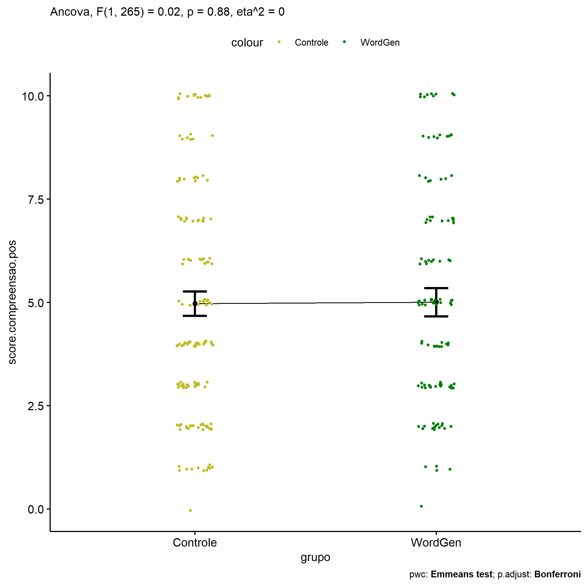<!-- -->

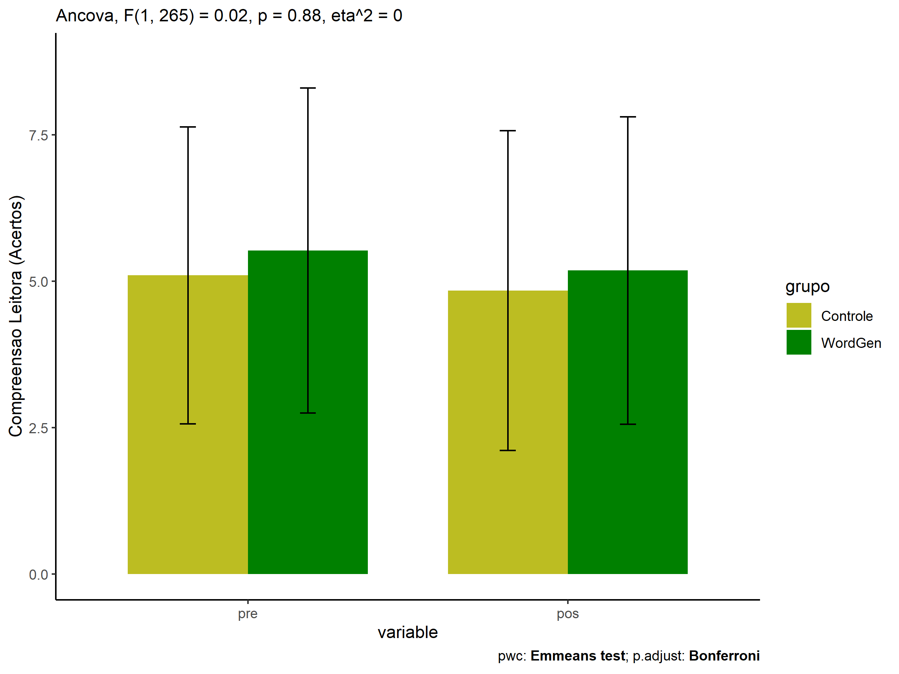<!-- -->

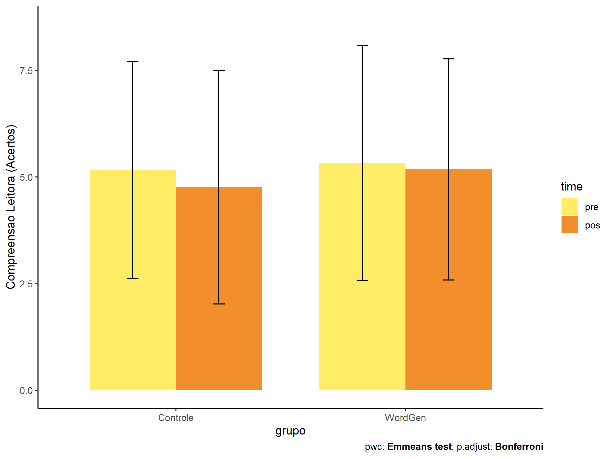<!-- -->

<!-- -->

<!-- -->

### Compreensao Leitora (Acertos)

| var                   | grupo    |   n | M (pre) | SE (pre) | M (unadj) | SE (unadj) | M (adj) | SE (adj) |
|:----------------------|:---------|----:|--------:|---------:|----------:|-----------:|--------:|---------:|
| score.compreensao.pos | Controle | 153 |   5.098 |    0.205 |     4.837 |      0.221 |   4.970 |    0.151 |
| score.compreensao.pos | WordGen  | 115 |   5.522 |    0.259 |     5.183 |      0.245 |   5.005 |    0.174 |

| .y.                   | group1   | group2  | estimate | conf.low | conf.high |    se | statistic |     p | p.adj | p.adj.signif |
|:----------------------|:---------|:--------|---------:|---------:|----------:|------:|----------:|------:|------:|:-------------|
| score.compreensao.pos | Controle | WordGen |   -0.035 |   -0.488 |     0.419 | 0.230 |    -0.151 | 0.880 | 0.880 | ns           |
| score.compreensao.pre | Controle | WordGen |   -0.424 |   -1.065 |     0.218 | 0.326 |    -1.301 | 0.194 | 0.194 | ns           |

| .y.               | grupo    | group1 | group2 | estimate | conf.low | conf.high |    se | statistic |     p | p.adj | p.adj.signif |
|:------------------|:---------|:-------|:-------|---------:|---------:|----------:|------:|----------:|------:|------:|:-------------|
| score.compreensao | Controle | pre    | pos    |    0.393 |   -0.184 |     0.970 | 0.294 |     1.338 | 0.181 | 0.181 | ns           |
| score.compreensao | WordGen  | pre    | pos    |    0.153 |   -0.511 |     0.817 | 0.338 |     0.452 | 0.651 | 0.651 | ns           |

    ## Scale for colour is already present.
    ## Adding another scale for colour, which will replace the existing scale.

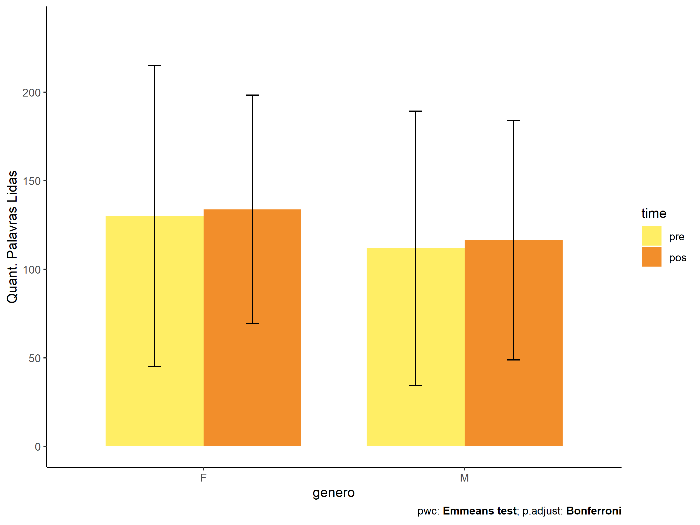<!-- -->

<!-- -->

<!-- -->

<!-- -->

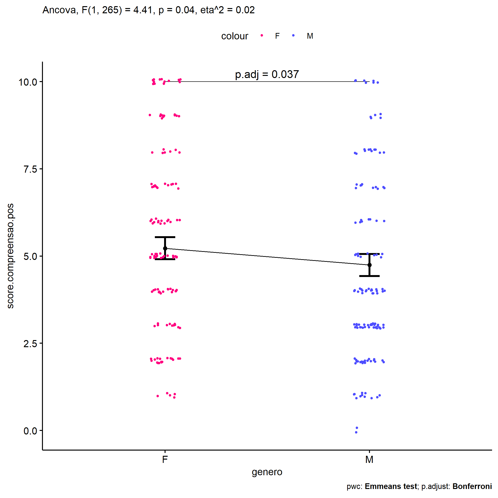<!-- -->

### Compreensao Leitora (TRI)

| var                 | grupo    |   n | M (pre) | SE (pre) | M (unadj) | SE (unadj) | M (adj) | SE (adj) |
|:--------------------|:---------|----:|--------:|---------:|----------:|-----------:|--------:|---------:|
| tri.compreensao.pos | Controle | 154 |   0.074 |    0.065 |     0.005 |      0.069 |   0.061 |    0.047 |
| tri.compreensao.pos | WordGen  | 115 |   0.248 |    0.081 |     0.104 |      0.079 |   0.029 |    0.055 |

| .y.                 | group1   | group2  | estimate | conf.low | conf.high |    se | statistic |     p | p.adj | p.adj.signif |
|:--------------------|:---------|:--------|---------:|---------:|----------:|------:|----------:|------:|------:|:-------------|
| tri.compreensao.pos | Controle | WordGen |    0.031 |   -0.111 |     0.174 | 0.073 |     0.434 | 0.664 | 0.664 | ns           |
| tri.compreensao.pre | Controle | WordGen |   -0.174 |   -0.377 |     0.028 | 0.103 |    -1.697 | 0.091 | 0.091 | ns           |

| .y.             | grupo    | group1 | group2 | estimate | conf.low | conf.high |    se | statistic |     p | p.adj | p.adj.signif |
|:----------------|:---------|:-------|:-------|---------:|---------:|----------:|------:|----------:|------:|------:|:-------------|
| tri.compreensao | Controle | pre    | pos    |    0.110 |   -0.072 |     0.293 | 0.093 |     1.190 | 0.235 | 0.235 | ns           |
| tri.compreensao | WordGen  | pre    | pos    |    0.088 |   -0.122 |     0.298 | 0.107 |     0.823 | 0.411 | 0.411 | ns           |

    ## Scale for colour is already present.
    ## Adding another scale for colour, which will replace the existing scale.

<!-- -->

<!-- -->

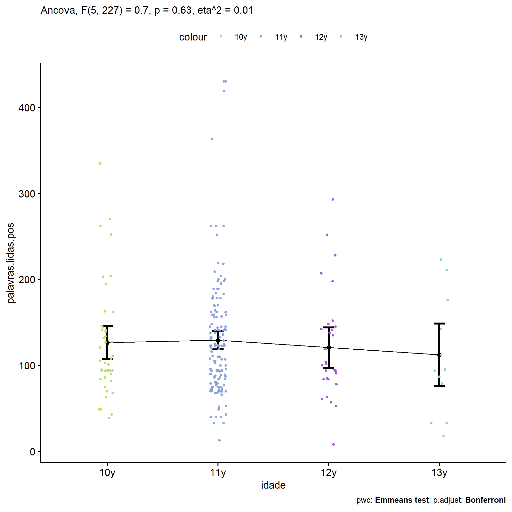<!-- -->

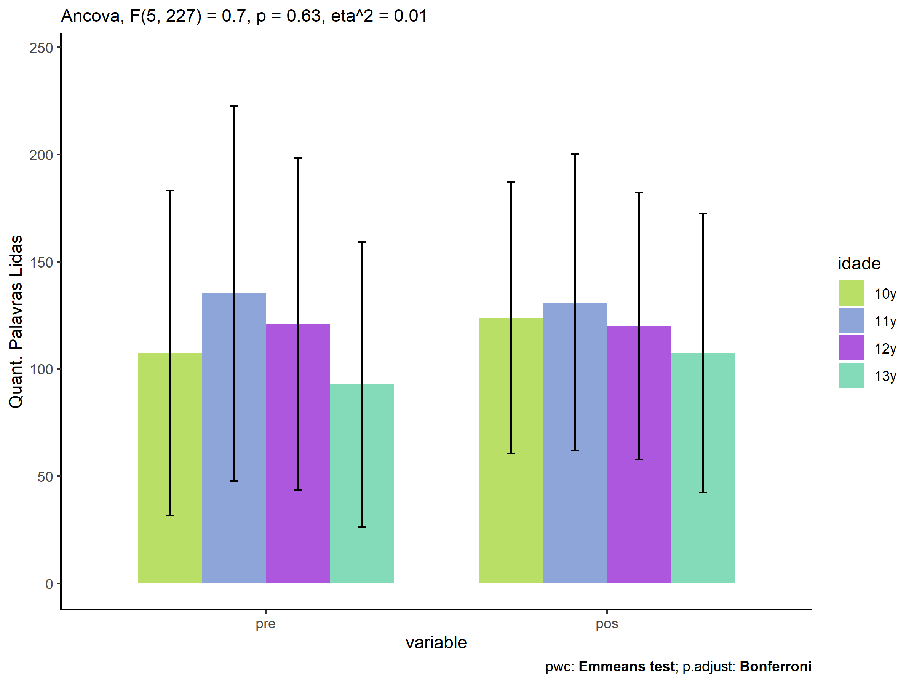<!-- -->

<!-- -->

## factor: **genero**

### Quant. Palavras Lidas

| var                | genero |   n | M (pre) | SE (pre) | M (unadj) | SE (unadj) | M (adj) | SE (adj) |
|:-------------------|:-------|----:|--------:|---------:|----------:|-----------:|--------:|---------:|
| palavras.lidas.pos | F      | 123 | 130.098 |    7.658 |   134.911 |      5.799 | 134.074 |    5.826 |
| palavras.lidas.pos | M      | 118 | 118.686 |    7.429 |   118.119 |      6.159 | 118.991 |    5.949 |

| .y.                | group1 | group2 | estimate | conf.low | conf.high |     se | statistic |     p | p.adj | p.adj.signif |
|:-------------------|:-------|:-------|---------:|---------:|----------:|-------:|----------:|------:|------:|:-------------|
| palavras.lidas.pos | F      | M      |   15.083 |    -1.34 |    31.506 |  8.337 |     1.809 | 0.072 | 0.072 | ns           |
| palavras.lidas.pre | F      | M      |   11.411 |    -9.63 |    32.452 | 10.681 |     1.068 | 0.286 | 0.286 | ns           |

| .y.            | genero | group1 | group2 | estimate | conf.low | conf.high |    se | statistic |     p | p.adj | p.adj.signif |
|:---------------|:-------|:-------|:-------|---------:|---------:|----------:|------:|----------:|------:|------:|:-------------|
| palavras.lidas | F      | pre    | pos    |   -3.643 |  -21.601 |    14.315 | 9.142 |    -0.398 | 0.690 | 0.690 | ns           |
| palavras.lidas | M      | pre    | pos    |   -4.522 |  -22.257 |    13.214 | 9.029 |    -0.501 | 0.617 | 0.617 | ns           |

    ## Scale for colour is already present.
    ## Adding another scale for colour, which will replace the existing scale.

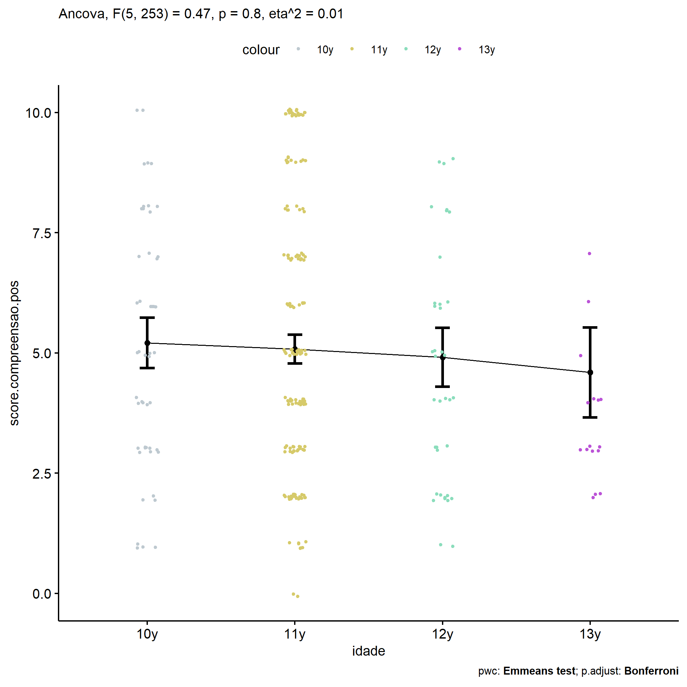<!-- -->

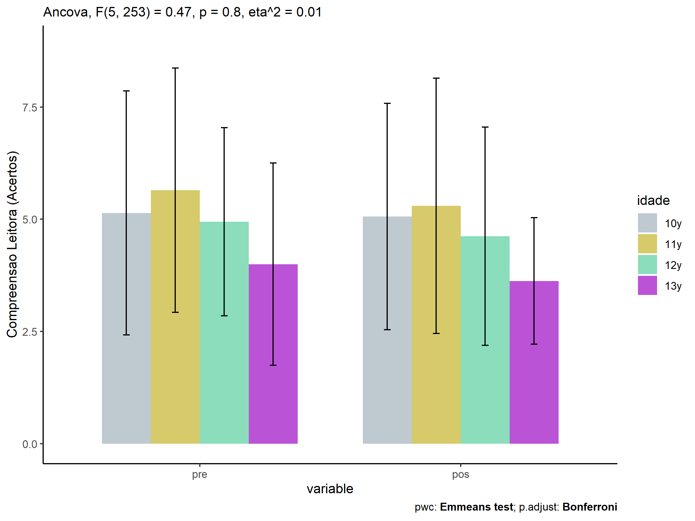<!-- -->

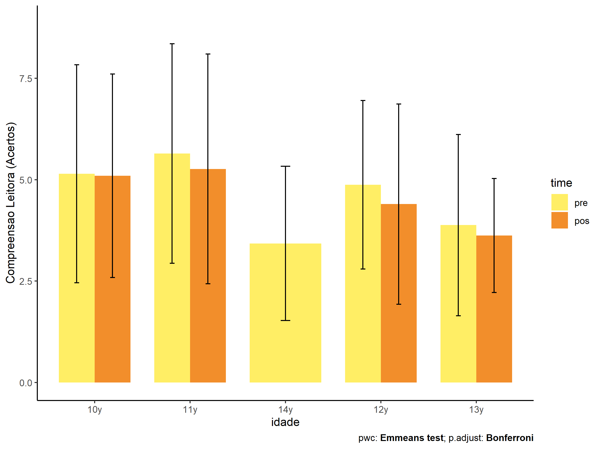<!-- -->

<!-- -->

<!-- -->

### Compreensao Leitora (Acertos)

| var                   | genero |   n | M (pre) | SE (pre) | M (unadj) | SE (unadj) | M (adj) | SE (adj) |
|:----------------------|:-------|----:|--------:|---------:|----------:|-----------:|--------:|---------:|
| score.compreensao.pos | F      | 134 |   5.724 |    0.232 |     5.545 |      0.230 |   5.225 |    0.161 |
| score.compreensao.pos | M      | 134 |   4.836 |    0.218 |     4.425 |      0.225 |   4.745 |    0.161 |

| .y.                   | group1 | group2 | estimate | conf.low | conf.high |    se | statistic |     p | p.adj | p.adj.signif |
|:----------------------|:-------|:-------|---------:|---------:|----------:|------:|----------:|------:|------:|:-------------|
| score.compreensao.pos | F      | M      |    0.480 |     0.03 |     0.930 | 0.229 |     2.101 | 0.037 | 0.037 | \*           |
| score.compreensao.pre | F      | M      |    0.888 |     0.26 |     1.516 | 0.319 |     2.786 | 0.006 | 0.006 | \*\*         |

| .y.               | genero | group1 | group2 | estimate | conf.low | conf.high |    se | statistic |     p | p.adj | p.adj.signif |
|:------------------|:-------|:-------|:-------|---------:|---------:|----------:|------:|----------:|------:|------:|:-------------|
| score.compreensao | F      | pre    | pos    |    0.193 |   -0.420 |     0.806 | 0.312 |     0.619 | 0.536 | 0.536 | ns           |
| score.compreensao | M      | pre    | pos    |    0.397 |   -0.199 |     0.993 | 0.303 |     1.307 | 0.192 | 0.192 | ns           |

    ## Scale for colour is already present.
    ## Adding another scale for colour, which will replace the existing scale.

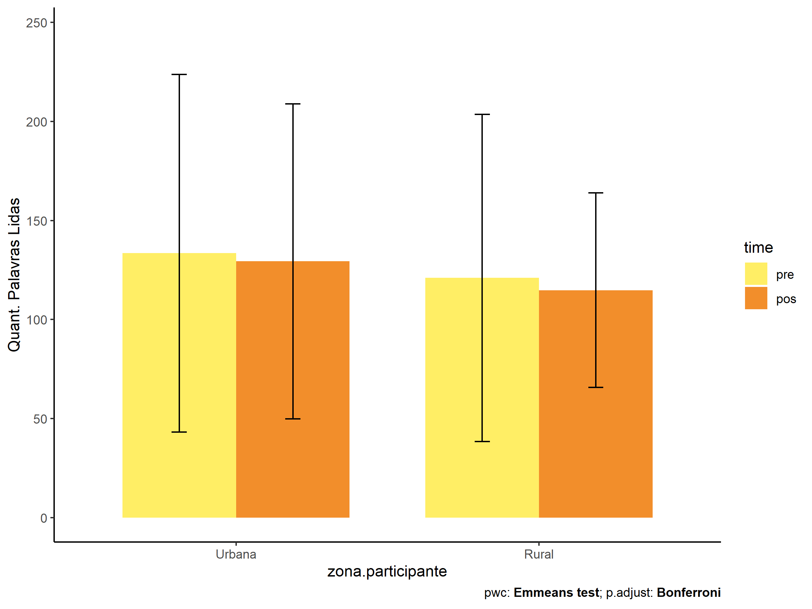<!-- -->

<!-- -->

<!-- -->

<!-- -->

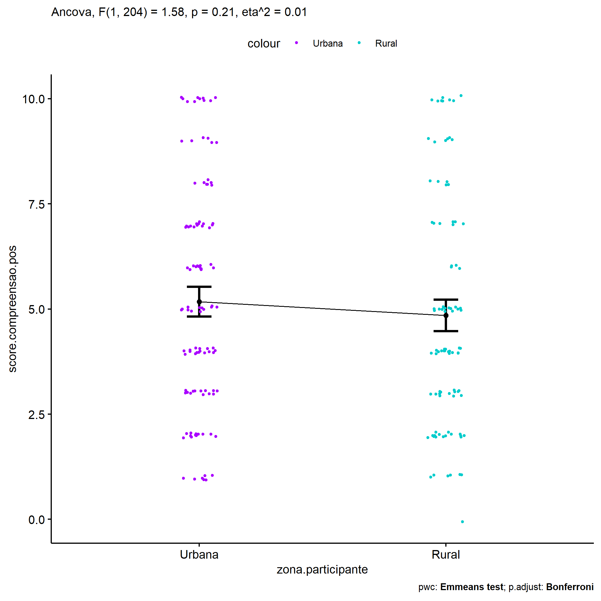<!-- -->

### Compreensao Leitora (TRI)

| var                 | genero |   n | M (pre) | SE (pre) | M (unadj) | SE (unadj) | M (adj) | SE (adj) |
|:--------------------|:-------|----:|--------:|---------:|----------:|-----------:|--------:|---------:|
| tri.compreensao.pos | F      | 134 |   0.294 |    0.076 |     0.209 |      0.076 |   0.103 |    0.051 |
| tri.compreensao.pos | M      | 135 |   0.004 |    0.066 |    -0.113 |      0.068 |  -0.007 |    0.051 |

| .y.                 | group1 | group2 | estimate | conf.low | conf.high |    se | statistic |     p | p.adj | p.adj.signif |
|:--------------------|:-------|:-------|---------:|---------:|----------:|------:|----------:|------:|------:|:-------------|
| tri.compreensao.pos | F      | M      |    0.110 |   -0.032 |     0.252 | 0.072 |     1.524 | 0.129 | 0.129 | ns           |
| tri.compreensao.pre | F      | M      |    0.289 |    0.091 |     0.488 | 0.101 |     2.873 | 0.004 | 0.004 | \*\*         |

| .y.             | genero | group1 | group2 | estimate | conf.low | conf.high |    se | statistic |     p | p.adj | p.adj.signif |
|:----------------|:-------|:-------|:-------|---------:|---------:|----------:|------:|----------:|------:|------:|:-------------|
| tri.compreensao | F      | pre    | pos    |    0.098 |   -0.096 |     0.292 | 0.099 |     0.990 | 0.323 | 0.323 | ns           |
| tri.compreensao | M      | pre    | pos    |    0.107 |   -0.082 |     0.295 | 0.096 |     1.112 | 0.267 | 0.267 | ns           |

    ## Scale for colour is already present.
    ## Adding another scale for colour, which will replace the existing scale.

<!-- -->

<!-- -->

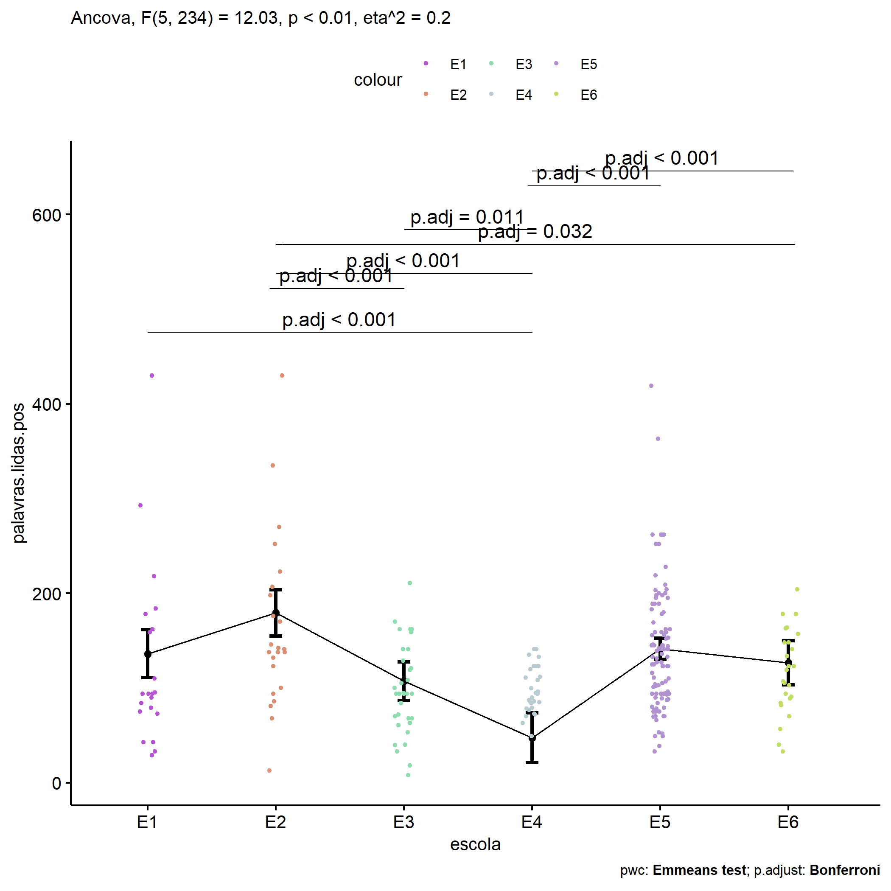<!-- -->

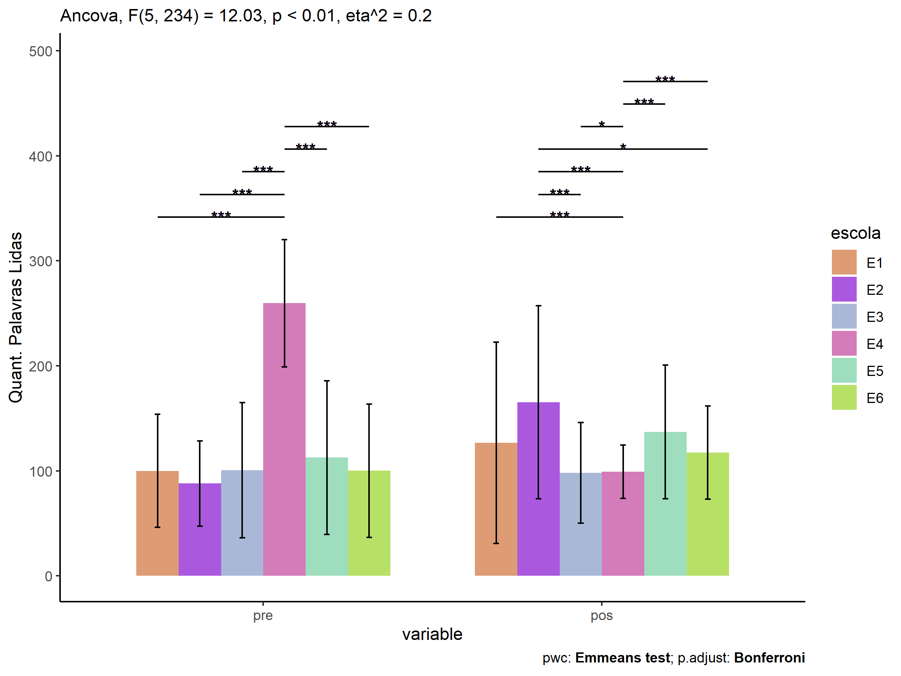<!-- -->

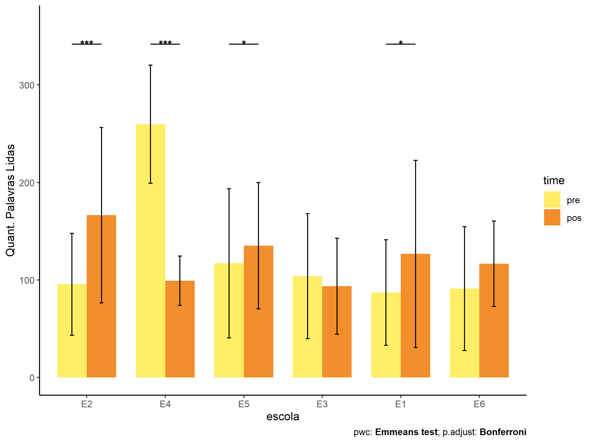<!-- -->

## factor: **idade**

### Quant. Palavras Lidas

| var                | idade |   n | M (pre) | SE (pre) | M (unadj) | SE (unadj) | M (adj) | SE (adj) |
|:-------------------|:------|----:|--------:|---------:|----------:|-----------:|--------:|---------:|
| palavras.lidas.pos | 10y   |  45 | 107.444 |   11.309 |   123.822 |      9.447 | 126.597 |    9.871 |
| palavras.lidas.pos | 11y   | 143 | 135.231 |    7.311 |   131.021 |      5.783 | 129.539 |    5.535 |
| palavras.lidas.pos | 12y   |  31 | 120.968 |   13.889 |   120.097 |     11.175 | 120.800 |   11.839 |
| palavras.lidas.pos | 13y   |  13 |  92.769 |   18.424 |   107.462 |     18.049 | 112.484 |   18.360 |

| .y.                | group1 | group2 | estimate | conf.low | conf.high |     se | statistic |     p | p.adj | p.adj.signif |
|:-------------------|:-------|:-------|---------:|---------:|----------:|-------:|----------:|------:|------:|:-------------|
| palavras.lidas.pos | 10y    | 11y    |   -2.942 |  -25.325 |    19.441 | 11.359 |    -0.259 | 0.796 | 1.000 | ns           |
| palavras.lidas.pos | 10y    | 12y    |    5.797 |  -24.547 |    36.141 | 15.400 |     0.376 | 0.707 | 1.000 | ns           |
| palavras.lidas.pos | 10y    | 13y    |   14.113 |  -26.807 |    55.032 | 20.766 |     0.680 | 0.497 | 1.000 | ns           |
| palavras.lidas.pos | 11y    | 12y    |    8.739 |  -17.032 |    34.511 | 13.079 |     0.668 | 0.505 | 1.000 | ns           |
| palavras.lidas.pos | 11y    | 13y    |   17.055 |  -20.821 |    54.931 | 19.222 |     0.887 | 0.376 | 1.000 | ns           |
| palavras.lidas.pos | 12y    | 13y    |    8.316 |  -34.694 |    51.326 | 21.827 |     0.381 | 0.704 | 1.000 | ns           |
| palavras.lidas.pre | 10y    | 11y    |  -27.786 |  -55.742 |     0.170 | 14.188 |    -1.958 | 0.051 | 0.308 | ns           |
| palavras.lidas.pre | 10y    | 12y    |  -13.523 |  -51.699 |    24.653 | 19.375 |    -0.698 | 0.486 | 1.000 | ns           |
| palavras.lidas.pre | 10y    | 13y    |   14.675 |  -36.825 |    66.175 | 26.136 |     0.561 | 0.575 | 1.000 | ns           |
| palavras.lidas.pre | 11y    | 12y    |   14.263 |  -18.141 |    46.667 | 16.445 |     0.867 | 0.387 | 1.000 | ns           |
| palavras.lidas.pre | 11y    | 13y    |   42.462 |   -4.918 |    89.841 | 24.046 |     1.766 | 0.079 | 0.473 | ns           |
| palavras.lidas.pre | 12y    | 13y    |   28.199 |  -25.845 |    82.242 | 27.427 |     1.028 | 0.305 | 1.000 | ns           |

| .y.            | idade | group1 | group2 | estimate | conf.low | conf.high |     se | statistic |     p | p.adj | p.adj.signif |
|:---------------|:------|:-------|:-------|---------:|---------:|----------:|-------:|----------:|------:|------:|:-------------|
| palavras.lidas | 10y   | pre    | pos    |  -19.035 |  -48.668 |    10.599 | 15.084 |    -1.262 | 0.208 | 0.208 | ns           |
| palavras.lidas | 11y   | pre    | pos    |   -0.142 |  -16.892 |    16.608 |  8.526 |    -0.017 | 0.987 | 0.987 | ns           |
| palavras.lidas | 12y   | pre    | pos    |    8.774 |  -25.880 |    43.428 | 17.639 |     0.497 | 0.619 | 0.619 | ns           |
| palavras.lidas | 13y   | pre    | pos    |  -21.375 |  -75.426 |    32.676 | 27.512 |    -0.777 | 0.438 | 0.438 | ns           |

    ## Scale for colour is already present.
    ## Adding another scale for colour, which will replace the existing scale.

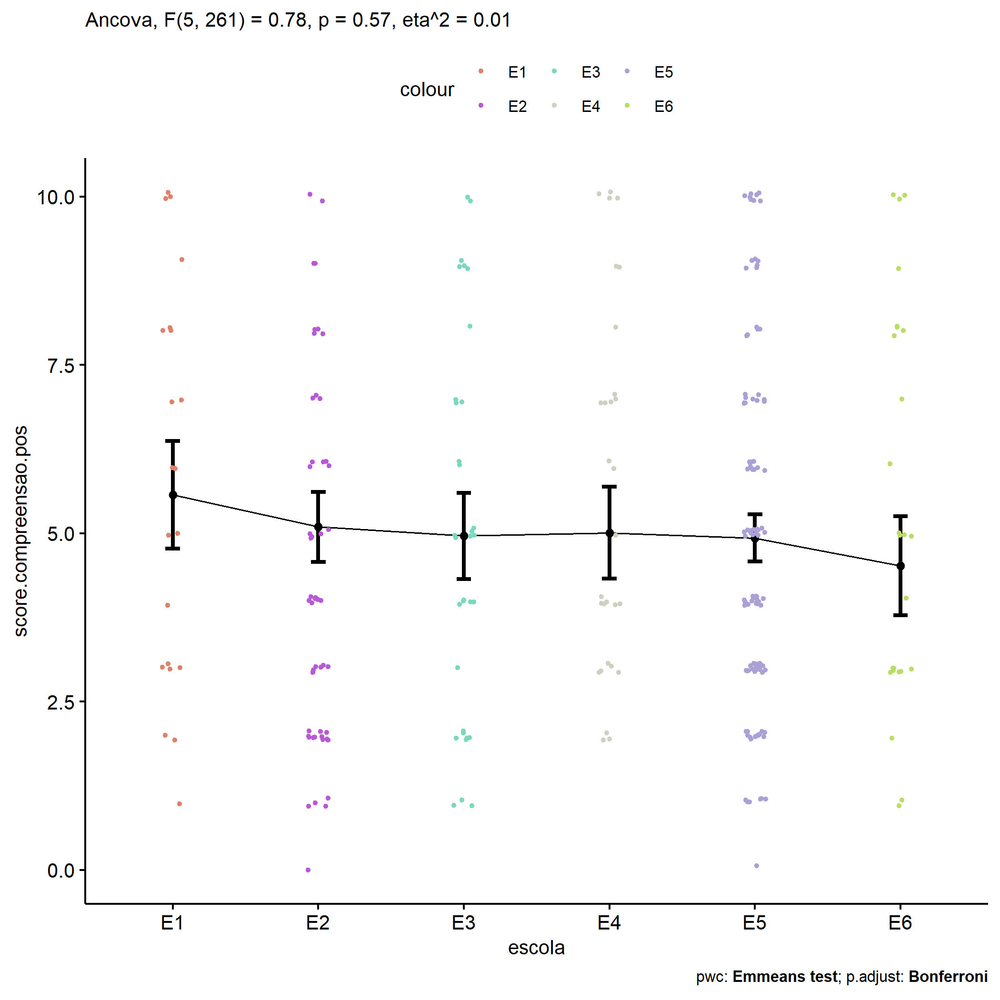<!-- -->

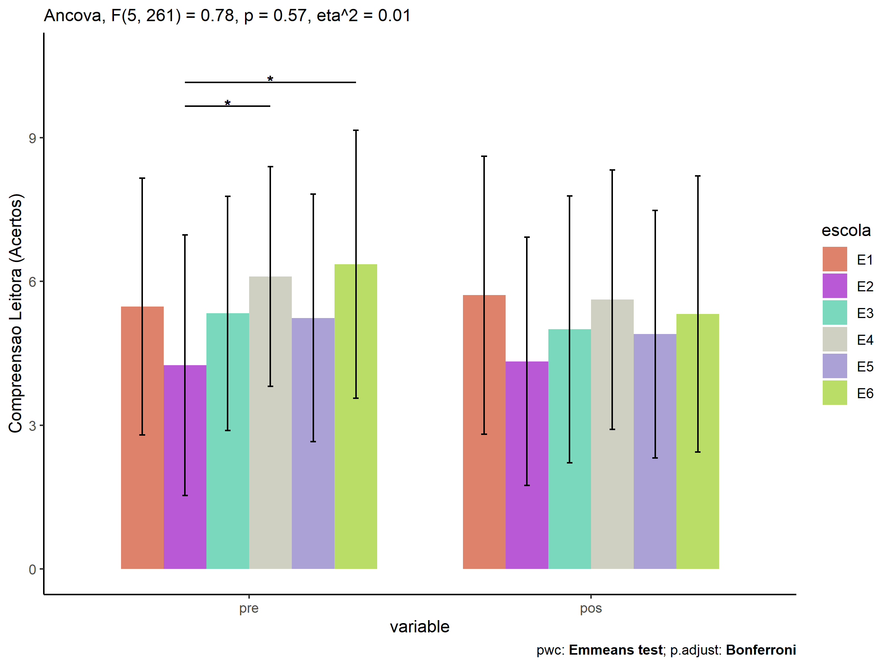<!-- -->

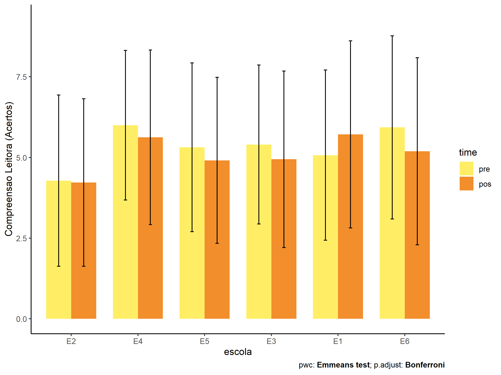<!-- -->

<!-- -->

<!-- -->

### Compreensao Leitora (Acertos)

| var                   | idade |   n | M (pre) | SE (pre) | M (unadj) | SE (unadj) | M (adj) | SE (adj) |
|:----------------------|:------|----:|--------:|---------:|----------:|-----------:|--------:|---------:|
| score.compreensao.pos | 10y   |  50 |   5.140 |    0.384 |     5.060 |      0.356 |   5.209 |    0.266 |
| score.compreensao.pos | 11y   | 154 |   5.649 |    0.219 |     5.299 |      0.229 |   5.080 |    0.152 |
| score.compreensao.pos | 12y   |  37 |   4.946 |    0.344 |     4.622 |      0.400 |   4.910 |    0.310 |
| score.compreensao.pos | 13y   |  16 |   4.000 |    0.563 |     3.625 |      0.352 |   4.595 |    0.475 |

| .y.                   | group1 | group2 | estimate | conf.low | conf.high |    se | statistic |     p | p.adj | p.adj.signif |
|:----------------------|:-------|:-------|---------:|---------:|----------:|------:|----------:|------:|------:|:-------------|
| score.compreensao.pos | 10y    | 11y    |    0.128 |   -0.477 |     0.734 | 0.307 |     0.418 | 0.677 | 1.000 | ns           |
| score.compreensao.pos | 10y    | 12y    |    0.299 |   -0.506 |     1.103 | 0.408 |     0.731 | 0.466 | 1.000 | ns           |
| score.compreensao.pos | 10y    | 13y    |    0.613 |   -0.457 |     1.684 | 0.543 |     1.129 | 0.260 | 1.000 | ns           |
| score.compreensao.pos | 11y    | 12y    |    0.170 |   -0.512 |     0.852 | 0.346 |     0.492 | 0.623 | 1.000 | ns           |
| score.compreensao.pos | 11y    | 13y    |    0.485 |   -0.500 |     1.470 | 0.500 |     0.970 | 0.333 | 1.000 | ns           |
| score.compreensao.pos | 12y    | 13y    |    0.315 |   -0.798 |     1.428 | 0.565 |     0.557 | 0.578 | 1.000 | ns           |
| score.compreensao.pre | 10y    | 11y    |   -0.509 |   -1.347 |     0.329 | 0.426 |    -1.197 | 0.232 | 1.000 | ns           |
| score.compreensao.pre | 10y    | 12y    |    0.194 |   -0.922 |     1.311 | 0.567 |     0.342 | 0.732 | 1.000 | ns           |
| score.compreensao.pre | 10y    | 13y    |    1.140 |   -0.339 |     2.619 | 0.751 |     1.518 | 0.130 | 0.781 | ns           |
| score.compreensao.pre | 11y    | 12y    |    0.703 |   -0.239 |     1.646 | 0.479 |     1.470 | 0.143 | 0.857 | ns           |
| score.compreensao.pre | 11y    | 13y    |    1.649 |    0.297 |     3.002 | 0.687 |     2.402 | 0.017 | 0.102 | ns           |
| score.compreensao.pre | 12y    | 13y    |    0.946 |   -0.594 |     2.486 | 0.782 |     1.209 | 0.228 | 1.000 | ns           |

| .y.               | idade | group1 | group2 | estimate | conf.low | conf.high |    se | statistic |     p | p.adj | p.adj.signif |
|:------------------|:------|:-------|:-------|---------:|---------:|----------:|------:|----------:|------:|------:|:-------------|
| score.compreensao | 10y   | pre    | pos    |    0.050 |   -0.954 |     1.054 | 0.511 |     0.098 | 0.922 | 0.922 | ns           |
| score.compreensao | 11y   | pre    | pos    |    0.379 |   -0.193 |     0.950 | 0.291 |     1.302 | 0.194 | 0.194 | ns           |
| score.compreensao | 12y   | pre    | pos    |    0.475 |   -0.675 |     1.625 | 0.585 |     0.811 | 0.418 | 0.418 | ns           |
| score.compreensao | 13y   | pre    | pos    |    0.257 |   -1.534 |     2.049 | 0.912 |     0.282 | 0.778 | 0.778 | ns           |

    ## Scale for colour is already present.
    ## Adding another scale for colour, which will replace the existing scale.

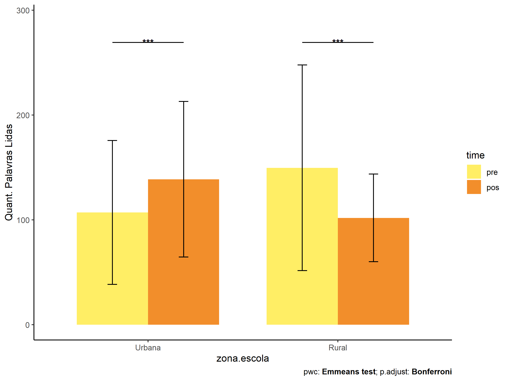<!-- -->

<!-- -->

<!-- -->

<!-- -->

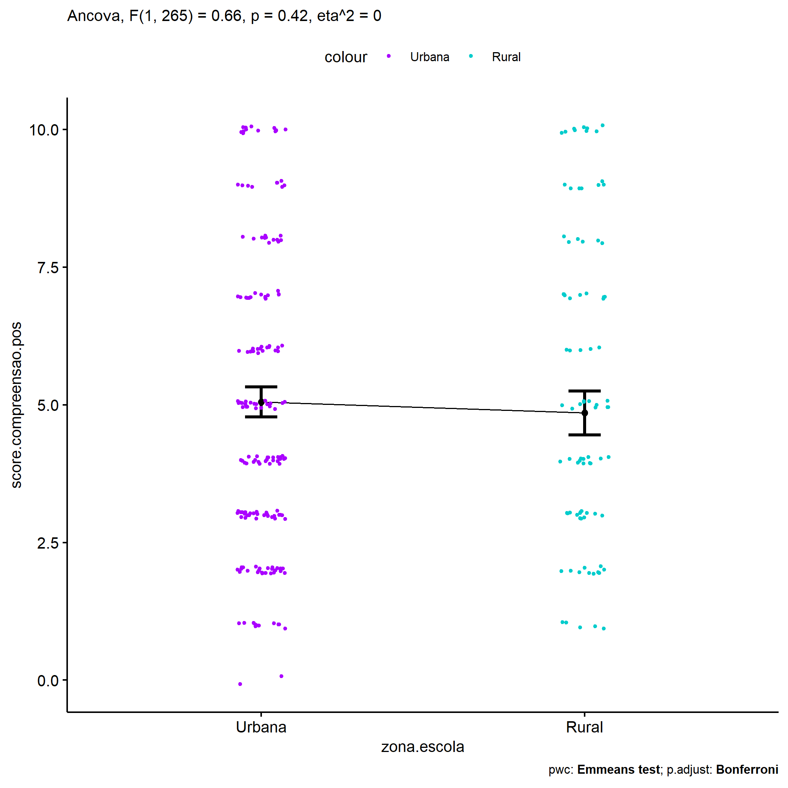<!-- -->

### Compreensao Leitora (TRI)

| var                 | idade |   n | M (pre) | SE (pre) | M (unadj) | SE (unadj) | M (adj) | SE (adj) |
|:--------------------|:------|----:|--------:|---------:|----------:|-----------:|--------:|---------:|
| tri.compreensao.pos | 10y   |  50 |   0.120 |    0.118 |     0.045 |      0.112 |   0.082 |    0.084 |
| tri.compreensao.pos | 11y   | 154 |   0.278 |    0.071 |     0.176 |      0.073 |   0.097 |    0.048 |
| tri.compreensao.pos | 12y   |  38 |   0.024 |    0.104 |    -0.132 |      0.127 |  -0.026 |    0.096 |
| tri.compreensao.pos | 13y   |  16 |  -0.370 |    0.152 |    -0.419 |      0.108 |  -0.024 |    0.150 |

| .y.                 | group1 | group2 | estimate | conf.low | conf.high |    se | statistic |     p | p.adj | p.adj.signif |
|:--------------------|:-------|:-------|---------:|---------:|----------:|------:|----------:|------:|------:|:-------------|
| tri.compreensao.pos | 10y    | 11y    |   -0.015 |   -0.205 |     0.175 | 0.096 |    -0.157 | 0.876 | 1.000 | ns           |
| tri.compreensao.pos | 10y    | 12y    |    0.107 |   -0.143 |     0.358 | 0.127 |     0.844 | 0.400 | 1.000 | ns           |
| tri.compreensao.pos | 10y    | 13y    |    0.105 |   -0.232 |     0.442 | 0.171 |     0.615 | 0.539 | 1.000 | ns           |
| tri.compreensao.pos | 11y    | 12y    |    0.122 |   -0.089 |     0.334 | 0.108 |     1.138 | 0.256 | 1.000 | ns           |
| tri.compreensao.pos | 11y    | 13y    |    0.120 |   -0.191 |     0.431 | 0.158 |     0.763 | 0.446 | 1.000 | ns           |
| tri.compreensao.pos | 12y    | 13y    |   -0.002 |   -0.351 |     0.346 | 0.177 |    -0.012 | 0.991 | 1.000 | ns           |
| tri.compreensao.pre | 10y    | 11y    |   -0.158 |   -0.422 |     0.106 | 0.134 |    -1.176 | 0.241 | 1.000 | ns           |
| tri.compreensao.pre | 10y    | 12y    |    0.096 |   -0.254 |     0.445 | 0.177 |     0.539 | 0.590 | 1.000 | ns           |
| tri.compreensao.pre | 10y    | 13y    |    0.490 |    0.024 |     0.956 | 0.237 |     2.070 | 0.039 | 0.237 | ns           |
| tri.compreensao.pre | 11y    | 12y    |    0.253 |   -0.041 |     0.547 | 0.149 |     1.698 | 0.091 | 0.545 | ns           |
| tri.compreensao.pre | 11y    | 13y    |    0.648 |    0.221 |     1.074 | 0.216 |     2.992 | 0.003 | 0.018 | \*           |
| tri.compreensao.pre | 12y    | 13y    |    0.394 |   -0.089 |     0.878 | 0.246 |     1.605 | 0.110 | 0.658 | ns           |

| .y.             | idade | group1 | group2 | estimate | conf.low | conf.high |    se | statistic |     p | p.adj | p.adj.signif |
|:----------------|:------|:-------|:-------|---------:|---------:|----------:|------:|----------:|------:|------:|:-------------|
| tri.compreensao | 10y   | pre    | pos    |    0.072 |   -0.245 |     0.389 | 0.161 |     0.444 | 0.657 | 0.657 | ns           |
| tri.compreensao | 11y   | pre    | pos    |    0.106 |   -0.075 |     0.286 | 0.092 |     1.150 | 0.251 | 0.251 | ns           |
| tri.compreensao | 12y   | pre    | pos    |    0.198 |   -0.163 |     0.559 | 0.184 |     1.079 | 0.281 | 0.281 | ns           |
| tri.compreensao | 13y   | pre    | pos    |    0.018 |   -0.548 |     0.583 | 0.288 |     0.061 | 0.951 | 0.951 | ns           |

    ## Scale for colour is already present.
    ## Adding another scale for colour, which will replace the existing scale.

<!-- -->

<!-- -->

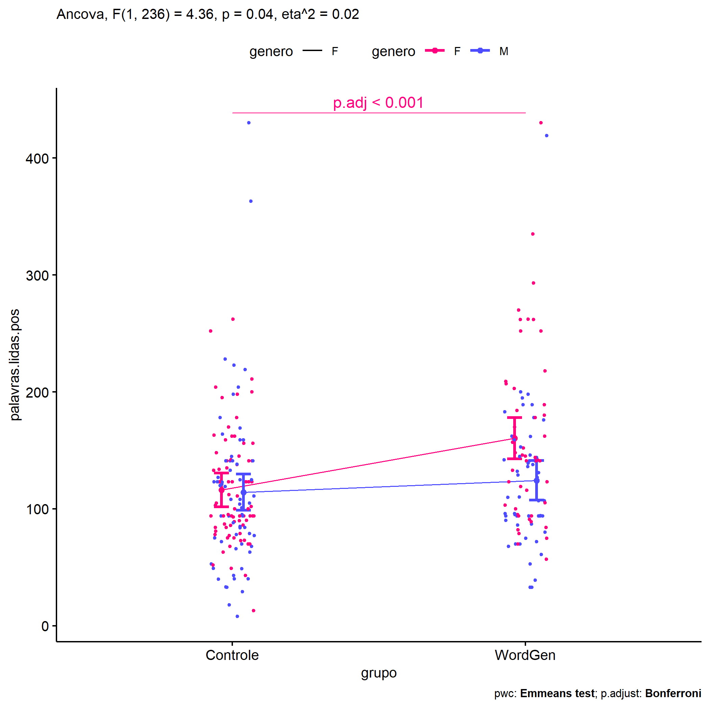<!-- -->

<!-- -->

<!-- -->

## factor: **zona.participante**

### Quant. Palavras Lidas

| var                | zona.participante |   n | M (pre) | SE (pre) | M (unadj) | SE (unadj) | M (adj) | SE (adj) |
|:-------------------|:------------------|----:|--------:|---------:|----------:|-----------:|--------:|---------:|
| palavras.lidas.pos | Rural             |  90 | 124.600 |    8.937 |   117.644 |      5.042 | 118.462 |    6.901 |
| palavras.lidas.pos | Urbana            |  97 | 137.536 |    9.091 |   130.402 |      8.051 | 129.643 |    6.646 |

| .y.                | group1 | group2 | estimate | conf.low | conf.high |     se | statistic |     p | p.adj | p.adj.signif |
|:-------------------|:-------|:-------|---------:|---------:|----------:|-------:|----------:|------:|------:|:-------------|
| palavras.lidas.pos | Urbana | Rural  |   11.181 |   -7.747 |    30.110 |  9.594 |     1.165 | 0.245 | 0.245 | ns           |
| palavras.lidas.pre | Urbana | Rural  |   12.936 |  -12.266 |    38.138 | 12.774 |     1.013 | 0.313 | 0.313 | ns           |

| .y.            | zona.participante | group1 | group2 | estimate | conf.low | conf.high |     se | statistic |     p | p.adj | p.adj.signif |
|:---------------|:------------------|:-------|:-------|---------:|---------:|----------:|-------:|----------:|------:|------:|:-------------|
| palavras.lidas | Urbana            | pre    | pos    |    4.077 |  -16.691 |    24.845 | 10.565 |     0.386 | 0.700 | 0.700 | ns           |
| palavras.lidas | Rural             | pre    | pos    |    6.199 |  -15.680 |    28.078 | 11.130 |     0.557 | 0.578 | 0.578 | ns           |

    ## Scale for colour is already present.
    ## Adding another scale for colour, which will replace the existing scale.

<!-- -->

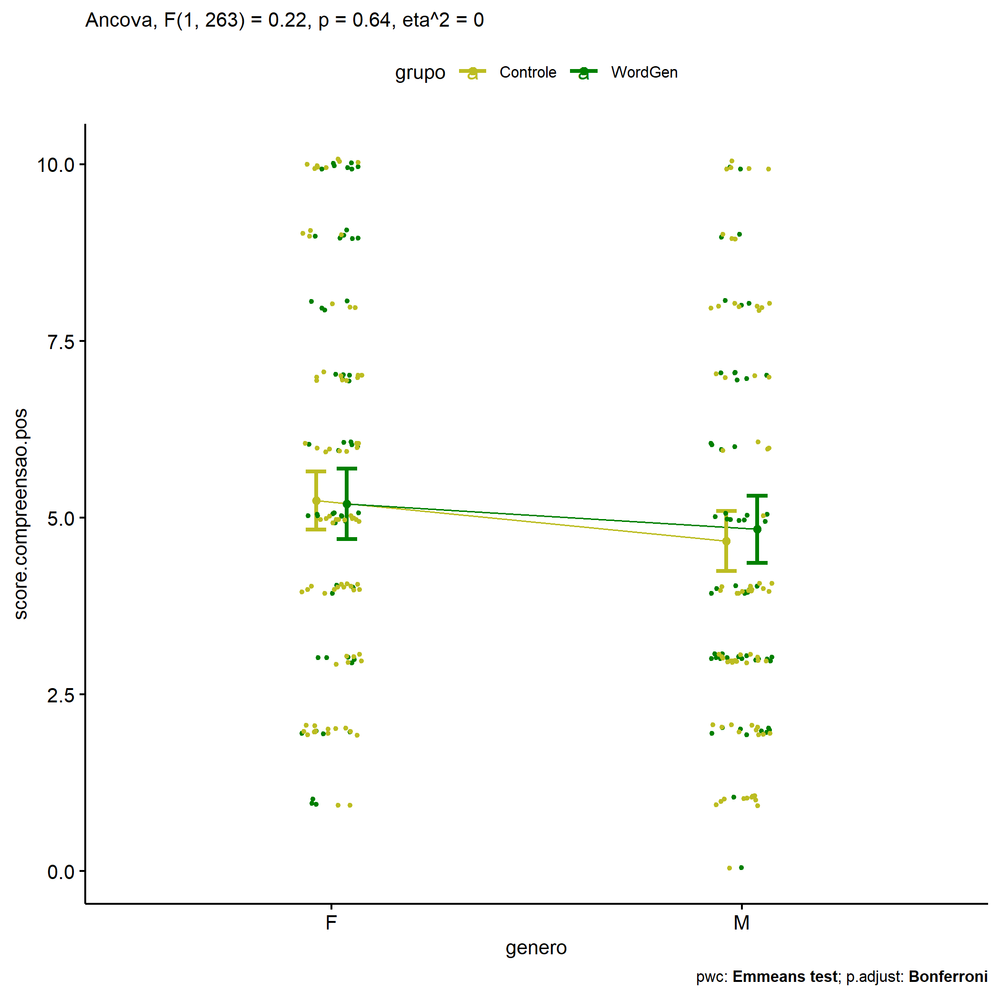<!-- -->

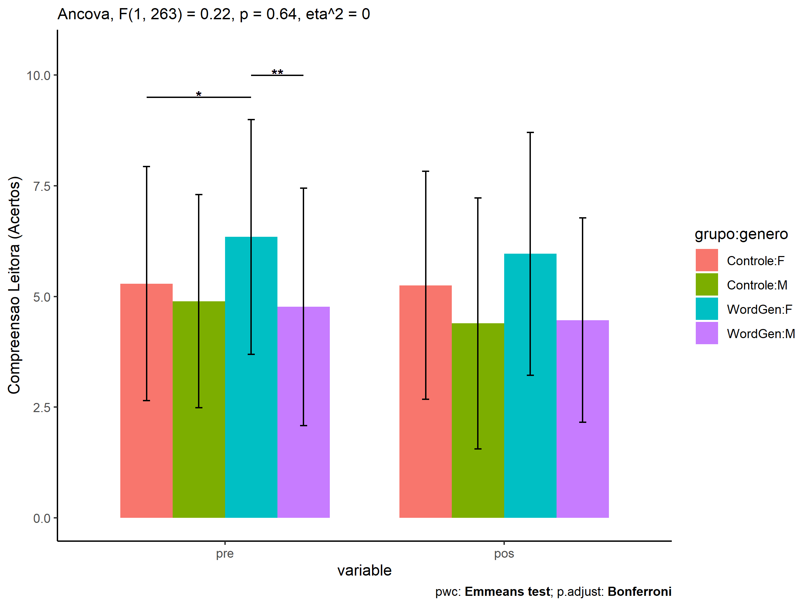<!-- -->

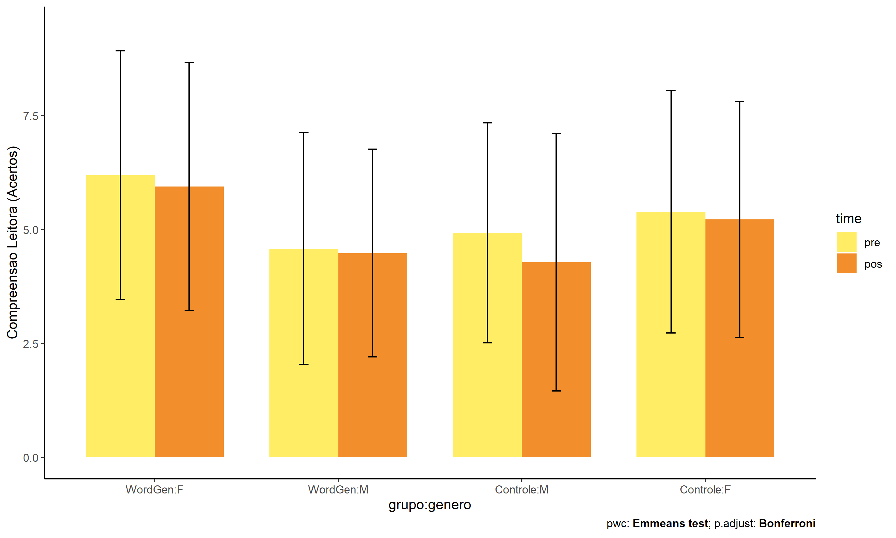<!-- -->

<!-- -->

### Compreensao Leitora (Acertos)

| var                   | zona.participante |   n | M (pre) | SE (pre) | M (unadj) | SE (unadj) | M (adj) | SE (adj) |
|:----------------------|:------------------|----:|--------:|---------:|----------:|-----------:|--------:|---------:|
| score.compreensao.pos | Rural             |  97 |   5.010 |    0.260 |     4.763 |      0.274 |   4.845 |    0.190 |
| score.compreensao.pos | Urbana            | 110 |   5.218 |    0.246 |     5.245 |      0.252 |   5.173 |    0.178 |

| .y.                   | group1 | group2 | estimate | conf.low | conf.high |    se | statistic |     p | p.adj | p.adj.signif |
|:----------------------|:-------|:-------|---------:|---------:|----------:|------:|----------:|------:|------:|:-------------|
| score.compreensao.pos | Urbana | Rural  |    0.328 |   -0.186 |     0.842 | 0.261 |     1.258 | 0.210 | 0.210 | ns           |
| score.compreensao.pre | Urbana | Rural  |    0.208 |   -0.499 |     0.915 | 0.358 |     0.580 | 0.563 | 0.563 | ns           |

| .y.               | zona.participante | group1 | group2 | estimate | conf.low | conf.high |    se | statistic |     p | p.adj | p.adj.signif |
|:------------------|:------------------|:-------|:-------|---------:|---------:|----------:|------:|----------:|------:|------:|:-------------|
| score.compreensao | Urbana            | pre    | pos    |    0.010 |   -0.663 |     0.683 | 0.342 |     0.029 | 0.977 | 0.977 | ns           |
| score.compreensao | Rural             | pre    | pos    |    0.216 |   -0.503 |     0.934 | 0.366 |     0.591 | 0.555 | 0.555 | ns           |

    ## Scale for colour is already present.
    ## Adding another scale for colour, which will replace the existing scale.

<!-- -->

<!-- -->

<!-- -->

<!-- -->

<!-- -->

### Compreensao Leitora (TRI)

| var                 | zona.participante |   n | M (pre) | SE (pre) | M (unadj) | SE (unadj) | M (adj) | SE (adj) |
|:--------------------|:------------------|----:|--------:|---------:|----------:|-----------:|--------:|---------:|
| tri.compreensao.pos | Rural             |  97 |   0.087 |    0.082 |     0.003 |      0.086 |   0.015 |    0.060 |
| tri.compreensao.pos | Urbana            | 111 |   0.117 |    0.077 |     0.120 |      0.080 |   0.110 |    0.056 |

| .y.                 | group1 | group2 | estimate | conf.low | conf.high |    se | statistic |     p | p.adj | p.adj.signif |
|:--------------------|:-------|:-------|---------:|---------:|----------:|------:|----------:|------:|------:|:-------------|
| tri.compreensao.pos | Urbana | Rural  |    0.095 |   -0.067 |     0.257 | 0.082 |     1.158 | 0.248 | 0.248 | ns           |
| tri.compreensao.pre | Urbana | Rural  |    0.030 |   -0.191 |     0.251 | 0.112 |     0.268 | 0.789 | 0.789 | ns           |

| .y.             | zona.participante | group1 | group2 | estimate | conf.low | conf.high |    se | statistic |     p | p.adj | p.adj.signif |
|:----------------|:------------------|:-------|:-------|---------:|---------:|----------:|------:|----------:|------:|------:|:-------------|
| tri.compreensao | Urbana            | pre    | pos    |    0.007 |   -0.204 |     0.218 | 0.107 |     0.069 | 0.945 | 0.945 | ns           |
| tri.compreensao | Rural             | pre    | pos    |    0.080 |   -0.146 |     0.306 | 0.115 |     0.698 | 0.485 | 0.485 | ns           |

    ## Scale for colour is already present.
    ## Adding another scale for colour, which will replace the existing scale.

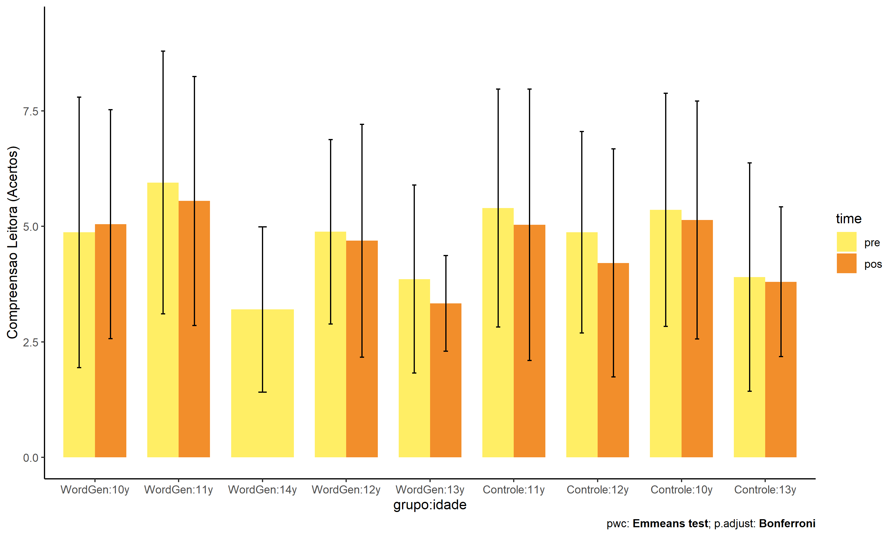<!-- -->

<!-- -->

<!-- -->

<!-- -->

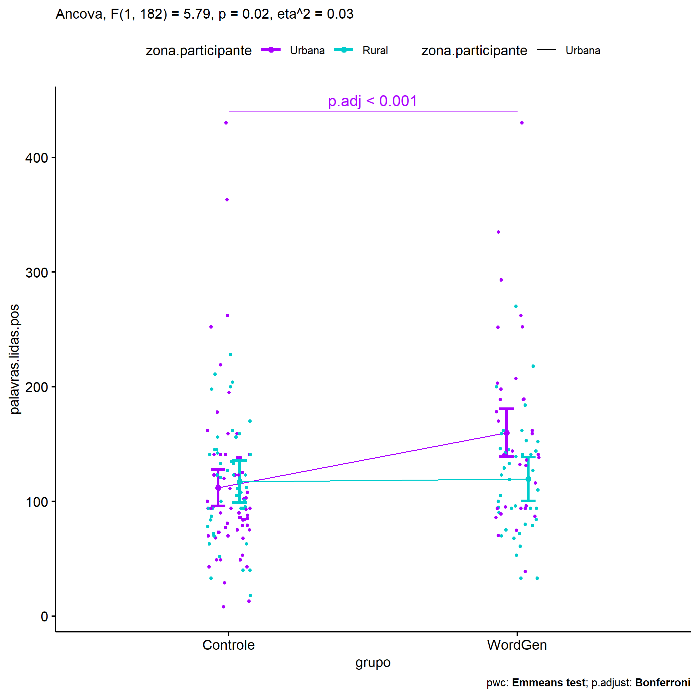<!-- -->

## factor: **escola**

### Quant. Palavras Lidas

| var                | escola |   n | M (pre) | SE (pre) | M (unadj) | SE (unadj) | M (adj) | SE (adj) |
|:-------------------|:-------|----:|--------:|---------:|----------:|-----------:|--------:|---------:|
| palavras.lidas.pos | E1     |  21 |  99.952 |   11.751 |   126.667 |     20.932 | 136.067 |   12.836 |
| palavras.lidas.pos | E2     |  23 |  87.957 |    8.466 |   165.261 |     19.155 | 179.253 |   12.373 |
| palavras.lidas.pos | E3     |  33 | 100.455 |   11.212 |    97.970 |      8.335 | 107.178 |   10.272 |
| palavras.lidas.pos | E4     |  30 | 259.667 |   11.064 |    99.167 |      4.637 |  47.433 |   13.257 |
| palavras.lidas.pos | E5     | 109 | 112.633 |    7.012 |   136.954 |      6.102 | 141.500 |    5.642 |
| palavras.lidas.pos | E6     |  25 | 100.120 |   12.705 |   117.400 |      8.882 | 126.736 |   11.777 |

| .y.                | group1 | group2 | estimate | conf.low | conf.high |     se | statistic | p       | p.adj   | p.adj.signif |
|:-------------------|:-------|:-------|---------:|---------:|----------:|-------:|----------:|:--------|:--------|:-------------|
| palavras.lidas.pos | E1     | E2     |  -43.186 |  -77.973 |    -8.399 | 17.657 |    -2.446 | 0.015   | 0.228   | ns           |
| palavras.lidas.pos | E1     | E3     |   28.889 |   -3.259 |    61.038 | 16.318 |     1.770 | 0.078   | 1       | ns           |
| palavras.lidas.pos | E1     | E4     |   88.634 |   51.098 |   126.170 | 19.052 |     4.652 | \<0.001 | \<0.001 | \*\*\*\*     |
| palavras.lidas.pos | E1     | E5     |   -5.434 |  -32.918 |    22.051 | 13.950 |    -0.390 | 0.697   | 1       | ns           |
| palavras.lidas.pos | E1     | E6     |    9.331 |  -24.759 |    43.421 | 17.303 |     0.539 | 0.59    | 1       | ns           |
| palavras.lidas.pos | E2     | E3     |   72.075 |   40.760 |   103.390 | 15.895 |     4.534 | \<0.001 | \<0.001 | \*\*\*       |
| palavras.lidas.pos | E2     | E4     |  131.820 |   94.319 |   169.321 | 19.034 |     6.925 | \<0.001 | \<0.001 | \*\*\*\*     |
| palavras.lidas.pos | E2     | E5     |   37.752 |   11.175 |    64.330 | 13.490 |     2.799 | 0.006   | 0.083   | ns           |
| palavras.lidas.pos | E2     | E6     |   52.517 |   19.213 |    85.821 | 16.904 |     3.107 | 0.002   | 0.032   | \*           |
| palavras.lidas.pos | E3     | E4     |   59.745 |   25.434 |    94.055 | 17.415 |     3.431 | \<0.001 | 0.011   | \*           |
| palavras.lidas.pos | E3     | E5     |  -34.323 |  -57.248 |   -11.398 | 11.636 |    -2.950 | 0.004   | 0.053   | ns           |
| palavras.lidas.pos | E3     | E6     |  -19.558 |  -50.095 |    10.978 | 15.499 |    -1.262 | 0.208   | 1       | ns           |
| palavras.lidas.pos | E4     | E5     |  -94.068 | -123.187 |   -64.948 | 14.780 |    -6.364 | \<0.001 | \<0.001 | \*\*\*\*     |
| palavras.lidas.pos | E4     | E6     |  -79.303 | -115.459 |   -43.148 | 18.352 |    -4.321 | \<0.001 | \<0.001 | \*\*\*       |
| palavras.lidas.pos | E5     | E6     |   14.765 |  -10.814 |    40.343 | 12.983 |     1.137 | 0.257   | 1       | ns           |
| palavras.lidas.pre | E1     | E2     |   11.996 |  -26.970 |    50.962 | 19.779 |     0.607 | 0.545   | 1       | ns           |
| palavras.lidas.pre | E1     | E3     |   -0.502 |  -36.540 |    35.536 | 18.292 |    -0.027 | 0.978   | 1       | ns           |
| palavras.lidas.pre | E1     | E4     | -159.714 | -196.447 |  -122.982 | 18.645 |    -8.566 | \<0.001 | \<0.001 | \*\*\*\*     |
| palavras.lidas.pre | E1     | E5     |  -12.681 |  -43.447 |    18.086 | 15.617 |    -0.812 | 0.418   | 1       | ns           |
| palavras.lidas.pre | E1     | E6     |   -0.168 |  -38.382 |    38.047 | 19.397 |    -0.009 | 0.993   | 1       | ns           |
| palavras.lidas.pre | E2     | E3     |  -12.498 |  -47.566 |    22.570 | 17.800 |    -0.702 | 0.483   | 1       | ns           |
| palavras.lidas.pre | E2     | E4     | -171.710 | -207.491 |  -135.930 | 18.162 |    -9.455 | \<0.001 | \<0.001 | \*\*\*\*     |
| palavras.lidas.pre | E2     | E5     |  -24.677 |  -54.300 |     4.947 | 15.037 |    -1.641 | 0.102   | 1       | ns           |
| palavras.lidas.pre | E2     | E6     |  -12.163 |  -49.464 |    25.137 | 18.933 |    -0.642 | 0.521   | 1       | ns           |
| palavras.lidas.pre | E3     | E4     | -159.212 | -191.780 |  -126.645 | 16.531 |    -9.631 | \<0.001 | \<0.001 | \*\*\*\*     |
| palavras.lidas.pre | E3     | E5     |  -12.178 |  -37.830 |    13.473 | 13.020 |    -0.935 | 0.351   | 1       | ns           |
| palavras.lidas.pre | E3     | E6     |    0.335 |  -33.896 |    34.566 | 17.375 |     0.019 | 0.985   | 1       | ns           |
| palavras.lidas.pre | E4     | E5     |  147.034 |  120.416 |   173.651 | 13.511 |    10.883 | \<0.001 | \<0.001 | \*\*\*\*     |
| palavras.lidas.pre | E4     | E6     |  159.547 |  124.586 |   194.508 | 17.746 |     8.991 | \<0.001 | \<0.001 | \*\*\*\*     |
| palavras.lidas.pre | E5     | E6     |   12.513 |  -16.116 |    41.142 | 14.532 |     0.861 | 0.39    | 1       | ns           |

| .y.            | escola | group1 | group2 | estimate | conf.low | conf.high |     se | statistic | p       | p.adj   | p.adj.signif |
|:---------------|:-------|:-------|:-------|---------:|---------:|----------:|-------:|----------:|:--------|:--------|:-------------|
| palavras.lidas | E1     | pre    | pos    |  -39.702 |  -76.652 |    -2.752 | 18.810 |    -2.111 | 0.035   | 0.035   | \*           |
| palavras.lidas | E2     | pre    | pos    |  -70.804 | -102.032 |   -39.575 | 15.897 |    -4.454 | \<0.001 | \<0.001 | \*\*\*\*     |
| palavras.lidas | E3     | pre    | pos    |   10.358 |  -20.026 |    40.742 | 15.467 |     0.670 | 0.503   | 0.503   | ns           |
| palavras.lidas | E4     | pre    | pos    |  160.500 |  127.451 |   193.549 | 16.824 |     9.540 | \<0.001 | \<0.001 | \*\*\*\*     |
| palavras.lidas | E5     | pre    | pos    |  -18.043 |  -34.900 |    -1.187 |  8.581 |    -2.103 | 0.036   | 0.036   | \*           |
| palavras.lidas | E6     | pre    | pos    |  -25.481 |  -60.052 |     9.089 | 17.598 |    -1.448 | 0.148   | 0.148   | ns           |

    ## Scale for colour is already present.
    ## Adding another scale for colour, which will replace the existing scale.

<!-- -->

<!-- -->

<!-- -->

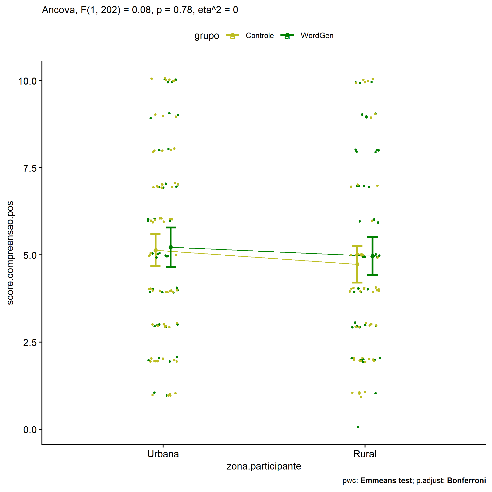<!-- -->

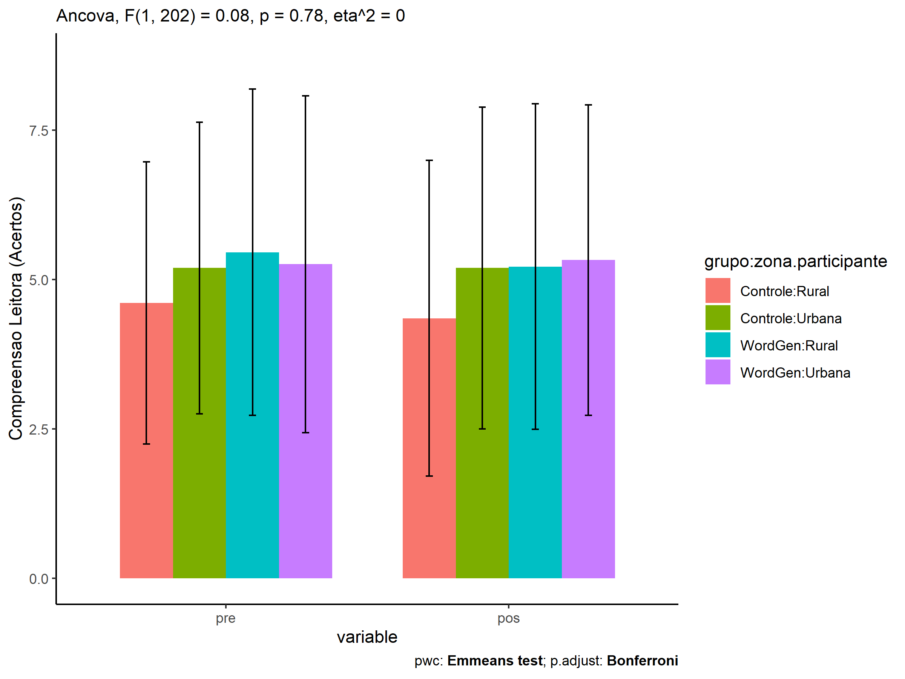<!-- -->

### Compreensao Leitora (Acertos)

| var                   | escola |   n | M (pre) | SE (pre) | M (unadj) | SE (unadj) | M (adj) | SE (adj) |
|:----------------------|:-------|----:|--------:|---------:|----------:|-----------:|--------:|---------:|
| score.compreensao.pos | E1     |  21 |   5.476 |    0.584 |     5.714 |      0.633 |   5.568 |    0.406 |
| score.compreensao.pos | E2     |  51 |   4.255 |    0.381 |     4.333 |      0.363 |   5.095 |    0.264 |
| score.compreensao.pos | E3     |  33 |   5.333 |    0.426 |     5.000 |      0.485 |   4.960 |    0.324 |
| score.compreensao.pos | E4     |  29 |   6.103 |    0.425 |     5.621 |      0.502 |   5.009 |    0.347 |
| score.compreensao.pos | E5     | 109 |   5.239 |    0.248 |     4.899 |      0.247 |   4.930 |    0.178 |
| score.compreensao.pos | E6     |  25 |   6.360 |    0.559 |     5.320 |      0.577 |   4.517 |    0.375 |

| .y.                   | group1 | group2 | estimate | conf.low | conf.high |    se | statistic |     p | p.adj | p.adj.signif |
|:----------------------|:-------|:-------|---------:|---------:|----------:|------:|----------:|------:|------:|:-------------|
| score.compreensao.pos | E1     | E2     |    0.473 |   -0.483 |     1.429 | 0.485 |     0.975 | 0.330 | 1.000 | ns           |
| score.compreensao.pos | E1     | E3     |    0.608 |   -0.415 |     1.631 | 0.519 |     1.171 | 0.243 | 1.000 | ns           |
| score.compreensao.pos | E1     | E4     |    0.560 |   -0.491 |     1.611 | 0.534 |     1.049 | 0.295 | 1.000 | ns           |
| score.compreensao.pos | E1     | E5     |    0.639 |   -0.235 |     1.512 | 0.443 |     1.440 | 0.151 | 1.000 | ns           |
| score.compreensao.pos | E1     | E6     |    1.051 |   -0.036 |     2.138 | 0.552 |     1.904 | 0.058 | 0.870 | ns           |
| score.compreensao.pos | E2     | E3     |    0.135 |   -0.689 |     0.959 | 0.418 |     0.322 | 0.748 | 1.000 | ns           |
| score.compreensao.pos | E2     | E4     |    0.086 |   -0.781 |     0.954 | 0.440 |     0.196 | 0.844 | 1.000 | ns           |
| score.compreensao.pos | E2     | E5     |    0.165 |   -0.462 |     0.793 | 0.319 |     0.519 | 0.604 | 1.000 | ns           |
| score.compreensao.pos | E2     | E6     |    0.578 |   -0.335 |     1.491 | 0.464 |     1.246 | 0.214 | 1.000 | ns           |
| score.compreensao.pos | E3     | E4     |   -0.048 |   -0.983 |     0.887 | 0.475 |    -0.102 | 0.919 | 1.000 | ns           |
| score.compreensao.pos | E3     | E5     |    0.030 |   -0.697 |     0.758 | 0.370 |     0.082 | 0.934 | 1.000 | ns           |
| score.compreensao.pos | E3     | E6     |    0.443 |   -0.532 |     1.418 | 0.495 |     0.894 | 0.372 | 1.000 | ns           |
| score.compreensao.pos | E4     | E5     |    0.079 |   -0.690 |     0.848 | 0.391 |     0.202 | 0.840 | 1.000 | ns           |
| score.compreensao.pos | E4     | E6     |    0.491 |   -0.509 |     1.491 | 0.508 |     0.967 | 0.334 | 1.000 | ns           |
| score.compreensao.pos | E5     | E6     |    0.413 |   -0.406 |     1.231 | 0.416 |     0.993 | 0.322 | 1.000 | ns           |
| score.compreensao.pre | E1     | E2     |    1.221 |   -0.102 |     2.545 | 0.672 |     1.817 | 0.070 | 1.000 | ns           |
| score.compreensao.pre | E1     | E3     |    0.143 |   -1.282 |     1.568 | 0.724 |     0.197 | 0.844 | 1.000 | ns           |
| score.compreensao.pre | E1     | E4     |   -0.627 |   -2.090 |     0.835 | 0.743 |    -0.845 | 0.399 | 1.000 | ns           |
| score.compreensao.pre | E1     | E5     |    0.238 |   -0.979 |     1.454 | 0.618 |     0.385 | 0.701 | 1.000 | ns           |
| score.compreensao.pre | E1     | E6     |   -0.884 |   -2.395 |     0.627 | 0.767 |    -1.152 | 0.250 | 1.000 | ns           |
| score.compreensao.pre | E2     | E3     |   -1.078 |   -2.219 |     0.062 | 0.579 |    -1.862 | 0.064 | 0.955 | ns           |
| score.compreensao.pre | E2     | E4     |   -1.849 |   -3.036 |    -0.661 | 0.603 |    -3.066 | 0.002 | 0.036 | \*           |
| score.compreensao.pre | E2     | E5     |   -0.984 |   -1.850 |    -0.118 | 0.440 |    -2.237 | 0.026 | 0.392 | ns           |
| score.compreensao.pre | E2     | E6     |   -2.105 |   -3.351 |    -0.859 | 0.633 |    -3.326 | 0.001 | 0.015 | \*           |
| score.compreensao.pre | E3     | E4     |   -0.770 |   -2.069 |     0.529 | 0.660 |    -1.167 | 0.244 | 1.000 | ns           |
| score.compreensao.pre | E3     | E5     |    0.095 |   -0.919 |     1.109 | 0.515 |     0.184 | 0.854 | 1.000 | ns           |
| score.compreensao.pre | E3     | E6     |   -1.027 |   -2.380 |     0.327 | 0.687 |    -1.494 | 0.136 | 1.000 | ns           |
| score.compreensao.pre | E4     | E5     |    0.865 |   -0.202 |     1.931 | 0.542 |     1.597 | 0.111 | 1.000 | ns           |
| score.compreensao.pre | E4     | E6     |   -0.257 |   -1.650 |     1.136 | 0.707 |    -0.363 | 0.717 | 1.000 | ns           |
| score.compreensao.pre | E5     | E6     |   -1.121 |   -2.253 |     0.010 | 0.575 |    -1.951 | 0.052 | 0.782 | ns           |

| .y.               | escola | group1 | group2 | estimate | conf.low | conf.high |    se | statistic |     p | p.adj | p.adj.signif |
|:------------------|:-------|:-------|:-------|---------:|---------:|----------:|------:|----------:|------:|------:|:-------------|
| score.compreensao | E1     | pre    | pos    |   -0.643 |   -2.136 |     0.851 | 0.760 |    -0.845 | 0.398 | 0.398 | ns           |
| score.compreensao | E2     | pre    | pos    |    0.058 |   -0.924 |     1.041 | 0.500 |     0.117 | 0.907 | 0.907 | ns           |
| score.compreensao | E3     | pre    | pos    |    0.456 |   -0.773 |     1.684 | 0.625 |     0.729 | 0.467 | 0.467 | ns           |
| score.compreensao | E4     | pre    | pos    |    0.379 |   -0.968 |     1.727 | 0.686 |     0.553 | 0.581 | 0.581 | ns           |
| score.compreensao | E5     | pre    | pos    |    0.405 |   -0.277 |     1.087 | 0.347 |     1.167 | 0.244 | 0.244 | ns           |
| score.compreensao | E6     | pre    | pos    |    0.739 |   -0.659 |     2.136 | 0.711 |     1.038 | 0.300 | 0.300 | ns           |

    ## Scale for colour is already present.
    ## Adding another scale for colour, which will replace the existing scale.

<!-- -->

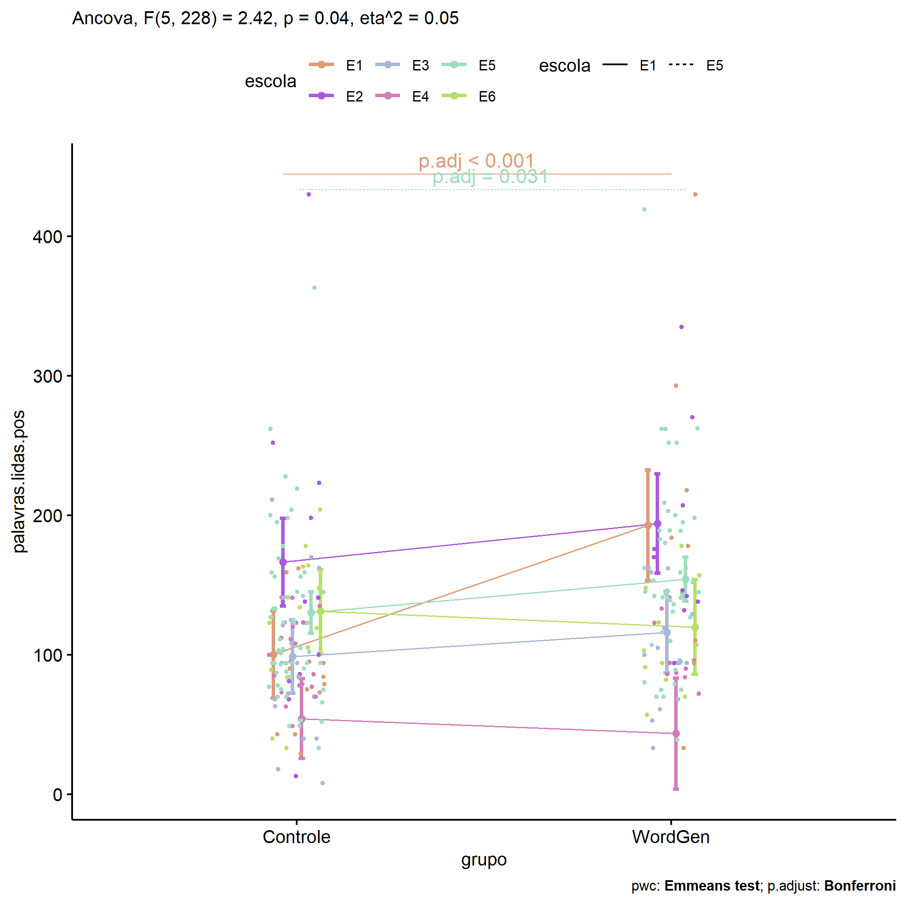<!-- -->

<!-- -->

<!-- -->

<!-- -->

### Compreensao Leitora (TRI)

| var                 | escola |   n | M (pre) | SE (pre) | M (unadj) | SE (unadj) | M (adj) | SE (adj) |
|:--------------------|:-------|----:|--------:|---------:|----------:|-----------:|--------:|---------:|
| tri.compreensao.pos | E1     |  21 |   0.243 |    0.167 |     0.337 |      0.194 |   0.266 |    0.127 |
| tri.compreensao.pos | E2     |  51 |  -0.145 |    0.115 |    -0.139 |      0.110 |   0.082 |    0.083 |
| tri.compreensao.pos | E3     |  33 |   0.159 |    0.136 |     0.075 |      0.150 |   0.067 |    0.101 |
| tri.compreensao.pos | E4     |  29 |   0.453 |    0.137 |     0.233 |      0.165 |   0.004 |    0.109 |
| tri.compreensao.pos | E5     | 110 |   0.114 |    0.080 |     0.020 |      0.079 |   0.046 |    0.056 |
| tri.compreensao.pos | E6     |  25 |   0.455 |    0.187 |     0.054 |      0.193 |  -0.177 |    0.117 |

| .y.                 | group1 | group2 | estimate | conf.low | conf.high |    se | statistic |     p | p.adj | p.adj.signif |
|:--------------------|:-------|:-------|---------:|---------:|----------:|------:|----------:|------:|------:|:-------------|
| tri.compreensao.pos | E1     | E2     |    0.184 |   -0.115 |     0.483 | 0.152 |     1.210 | 0.227 | 1.000 | ns           |
| tri.compreensao.pos | E1     | E3     |    0.199 |   -0.121 |     0.519 | 0.163 |     1.224 | 0.222 | 1.000 | ns           |
| tri.compreensao.pos | E1     | E4     |    0.262 |   -0.067 |     0.591 | 0.167 |     1.568 | 0.118 | 1.000 | ns           |
| tri.compreensao.pos | E1     | E5     |    0.220 |   -0.053 |     0.493 | 0.139 |     1.585 | 0.114 | 1.000 | ns           |
| tri.compreensao.pos | E1     | E6     |    0.443 |    0.103 |     0.783 | 0.173 |     2.568 | 0.011 | 0.162 | ns           |
| tri.compreensao.pos | E2     | E3     |    0.015 |   -0.242 |     0.273 | 0.131 |     0.117 | 0.907 | 1.000 | ns           |
| tri.compreensao.pos | E2     | E4     |    0.078 |   -0.193 |     0.350 | 0.138 |     0.566 | 0.572 | 1.000 | ns           |
| tri.compreensao.pos | E2     | E5     |    0.036 |   -0.159 |     0.232 | 0.099 |     0.364 | 0.716 | 1.000 | ns           |
| tri.compreensao.pos | E2     | E6     |    0.259 |   -0.025 |     0.544 | 0.145 |     1.795 | 0.074 | 1.000 | ns           |
| tri.compreensao.pos | E3     | E4     |    0.063 |   -0.230 |     0.356 | 0.149 |     0.422 | 0.673 | 1.000 | ns           |
| tri.compreensao.pos | E3     | E5     |    0.021 |   -0.207 |     0.248 | 0.116 |     0.181 | 0.857 | 1.000 | ns           |
| tri.compreensao.pos | E3     | E6     |    0.244 |   -0.061 |     0.549 | 0.155 |     1.576 | 0.116 | 1.000 | ns           |
| tri.compreensao.pos | E4     | E5     |   -0.042 |   -0.283 |     0.199 | 0.122 |    -0.343 | 0.732 | 1.000 | ns           |
| tri.compreensao.pos | E4     | E6     |    0.181 |   -0.132 |     0.494 | 0.159 |     1.141 | 0.255 | 1.000 | ns           |
| tri.compreensao.pos | E5     | E6     |    0.223 |   -0.032 |     0.479 | 0.130 |     1.719 | 0.087 | 1.000 | ns           |
| tri.compreensao.pre | E1     | E2     |    0.388 |   -0.032 |     0.808 | 0.213 |     1.820 | 0.070 | 1.000 | ns           |
| tri.compreensao.pre | E1     | E3     |    0.084 |   -0.368 |     0.536 | 0.230 |     0.365 | 0.715 | 1.000 | ns           |
| tri.compreensao.pre | E1     | E4     |   -0.210 |   -0.674 |     0.254 | 0.236 |    -0.890 | 0.374 | 1.000 | ns           |
| tri.compreensao.pre | E1     | E5     |    0.129 |   -0.257 |     0.515 | 0.196 |     0.657 | 0.512 | 1.000 | ns           |
| tri.compreensao.pre | E1     | E6     |   -0.212 |   -0.692 |     0.268 | 0.244 |    -0.870 | 0.385 | 1.000 | ns           |
| tri.compreensao.pre | E2     | E3     |   -0.304 |   -0.666 |     0.058 | 0.184 |    -1.656 | 0.099 | 1.000 | ns           |
| tri.compreensao.pre | E2     | E4     |   -0.598 |   -0.975 |    -0.221 | 0.191 |    -3.125 | 0.002 | 0.030 | \*           |
| tri.compreensao.pre | E2     | E5     |   -0.259 |   -0.534 |     0.015 | 0.139 |    -1.861 | 0.064 | 0.957 | ns           |
| tri.compreensao.pre | E2     | E6     |   -0.600 |   -0.996 |    -0.205 | 0.201 |    -2.988 | 0.003 | 0.046 | \*           |
| tri.compreensao.pre | E3     | E4     |   -0.294 |   -0.706 |     0.119 | 0.209 |    -1.402 | 0.162 | 1.000 | ns           |
| tri.compreensao.pre | E3     | E5     |    0.045 |   -0.277 |     0.367 | 0.163 |     0.275 | 0.783 | 1.000 | ns           |
| tri.compreensao.pre | E3     | E6     |   -0.296 |   -0.725 |     0.134 | 0.218 |    -1.356 | 0.176 | 1.000 | ns           |
| tri.compreensao.pre | E4     | E5     |    0.339 |    0.000 |     0.677 | 0.172 |     1.972 | 0.050 | 0.745 | ns           |
| tri.compreensao.pre | E4     | E6     |   -0.002 |   -0.444 |     0.440 | 0.225 |    -0.009 | 0.993 | 1.000 | ns           |
| tri.compreensao.pre | E5     | E6     |   -0.341 |   -0.700 |     0.018 | 0.182 |    -1.869 | 0.063 | 0.941 | ns           |

| .y.             | escola | group1 | group2 | estimate | conf.low | conf.high |    se | statistic |     p | p.adj | p.adj.signif |
|:----------------|:-------|:-------|:-------|---------:|---------:|----------:|------:|----------:|------:|------:|:-------------|
| tri.compreensao | E1     | pre    | pos    |   -0.245 |   -0.718 |     0.229 | 0.241 |    -1.014 | 0.311 | 0.311 | ns           |
| tri.compreensao | E2     | pre    | pos    |    0.016 |   -0.295 |     0.328 | 0.159 |     0.104 | 0.918 | 0.918 | ns           |
| tri.compreensao | E3     | pre    | pos    |    0.132 |   -0.257 |     0.522 | 0.198 |     0.667 | 0.505 | 0.505 | ns           |
| tri.compreensao | E4     | pre    | pos    |    0.176 |   -0.251 |     0.603 | 0.217 |     0.809 | 0.419 | 0.419 | ns           |
| tri.compreensao | E5     | pre    | pos    |    0.133 |   -0.083 |     0.348 | 0.110 |     1.209 | 0.227 | 0.227 | ns           |
| tri.compreensao | E6     | pre    | pos    |    0.308 |   -0.135 |     0.751 | 0.226 |     1.366 | 0.173 | 0.173 | ns           |

    ## Scale for colour is already present.
    ## Adding another scale for colour, which will replace the existing scale.

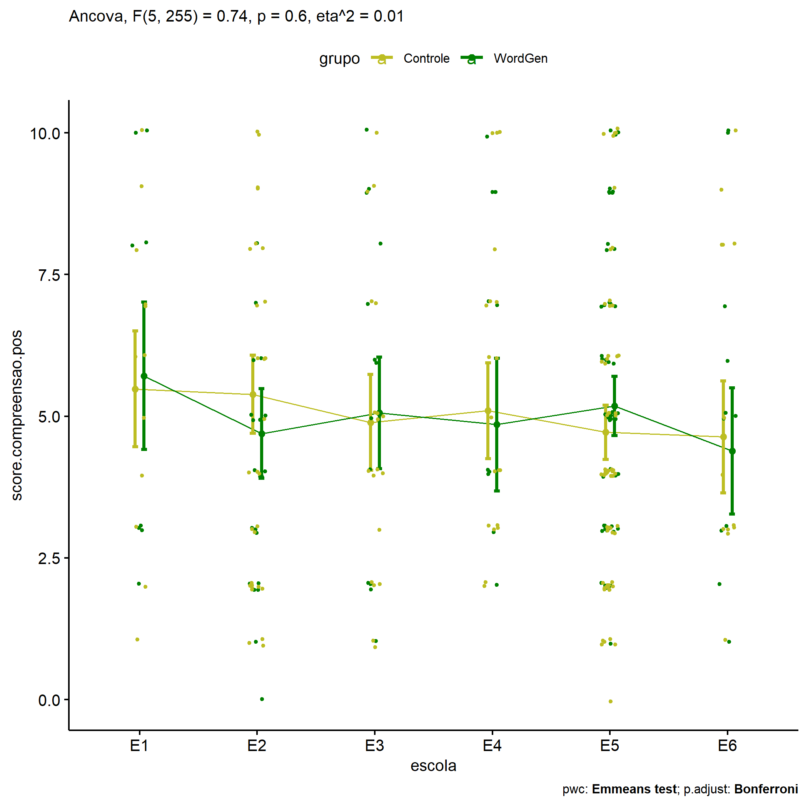<!-- -->

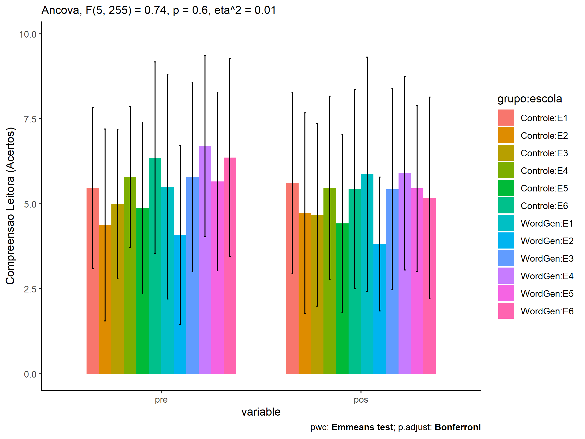<!-- -->

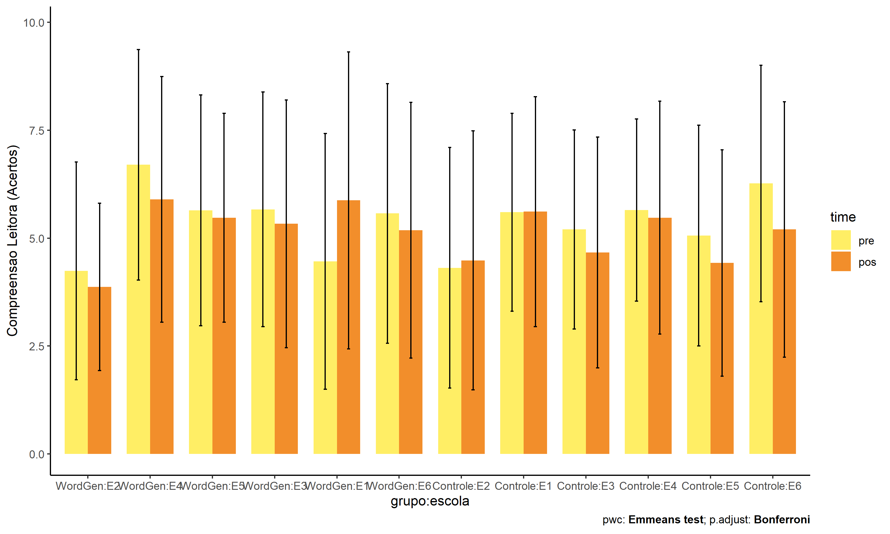<!-- -->

<!-- -->

<!-- -->

## factor: **zona.escola**

### Quant. Palavras Lidas

| var                | zona.escola |   n | M (pre) | SE (pre) | M (unadj) | SE (unadj) | M (adj) | SE (adj) |
|:-------------------|:------------|----:|--------:|---------:|----------:|-----------:|--------:|---------:|
| palavras.lidas.pos | Rural       |  88 | 154.636 |   10.463 |   103.898 |      4.364 |  96.928 |    6.694 |
| palavras.lidas.pos | Urbana      | 153 | 107.183 |    5.431 |   139.797 |      5.965 | 143.806 |    5.022 |

| .y.                | group1 | group2 | estimate | conf.low | conf.high |     se | statistic | p       | p.adj   | p.adj.signif |
|:-------------------|:-------|:-------|---------:|---------:|----------:|-------:|----------:|:--------|:--------|:-------------|
| palavras.lidas.pos | Urbana | Rural  |   46.878 |   30.093 |    63.663 |  8.520 |     5.502 | \<0.001 | \<0.001 | \*\*\*\*     |
| palavras.lidas.pre | Urbana | Rural  |  -47.453 |  -68.500 |   -26.407 | 10.684 |    -4.442 | \<0.001 | \<0.001 | \*\*\*\*     |

| .y.            | zona.escola | group1 | group2 | estimate | conf.low | conf.high |     se | statistic | p       | p.adj   | p.adj.signif |
|:---------------|:------------|:-------|:-------|---------:|---------:|----------:|-------:|----------:|:--------|:--------|:-------------|
| palavras.lidas | Urbana      | pre    | pos    |  -31.752 |  -46.942 |   -16.563 |  7.733 |    -4.106 | \<0.001 | \<0.001 | \*\*\*\*     |
| palavras.lidas | Rural       | pre    | pos    |   47.779 |   26.834 |    68.723 | 10.662 |     4.481 | \<0.001 | \<0.001 | \*\*\*\*     |

    ## Scale for colour is already present.
    ## Adding another scale for colour, which will replace the existing scale.

<!-- -->

<!-- -->

<!-- -->

<!-- -->

<!-- -->

### Compreensao Leitora (Acertos)

| var                   | zona.escola |   n | M (pre) | SE (pre) | M (unadj) | SE (unadj) | M (adj) | SE (adj) |
|:----------------------|:------------|----:|--------:|---------:|----------:|-----------:|--------:|---------:|
| score.compreensao.pos | Rural       |  87 |   5.885 |    0.269 |     5.299 |      0.297 |   4.851 |    0.201 |
| score.compreensao.pos | Urbana      | 181 |   4.989 |    0.198 |     4.834 |      0.196 |   5.050 |    0.139 |

| .y.                   | group1 | group2 | estimate | conf.low | conf.high |    se | statistic |     p | p.adj | p.adj.signif |
|:----------------------|:-------|:-------|---------:|---------:|----------:|------:|----------:|------:|------:|:-------------|
| score.compreensao.pos | Urbana | Rural  |    0.199 |   -0.284 |     0.682 | 0.245 |     0.811 | 0.418 | 0.418 | ns           |
| score.compreensao.pre | Urbana | Rural  |   -0.896 |   -1.567 |    -0.225 | 0.341 |    -2.628 | 0.009 | 0.009 | \*\*         |

| .y.               | zona.escola | group1 | group2 | estimate | conf.low | conf.high |    se | statistic |     p | p.adj | p.adj.signif |
|:------------------|:------------|:-------|:-------|---------:|---------:|----------:|------:|----------:|------:|------:|:-------------|
| score.compreensao | Urbana      | pre    | pos    |    0.195 |   -0.331 |     0.722 | 0.268 |     0.728 | 0.467 | 0.467 | ns           |
| score.compreensao | Rural       | pre    | pos    |    0.525 |   -0.240 |     1.289 | 0.389 |     1.348 | 0.178 | 0.178 | ns           |

    ## Scale for colour is already present.
    ## Adding another scale for colour, which will replace the existing scale.

<!-- -->

<!-- -->

<!-- -->

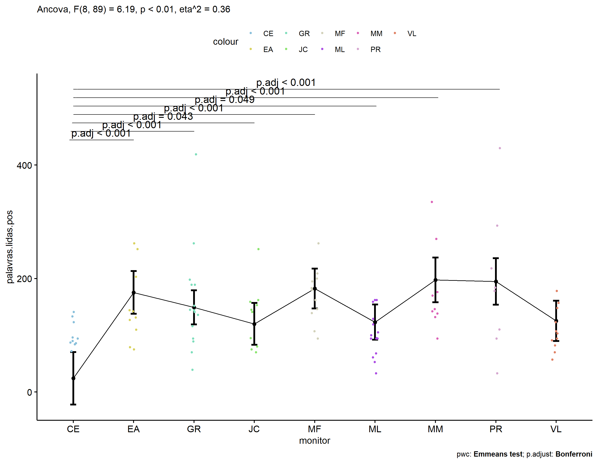<!-- -->

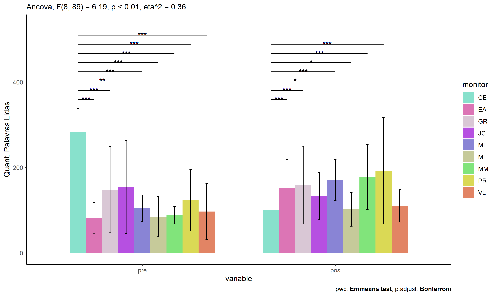<!-- -->

### Compreensao Leitora (TRI)

| var                 | zona.escola |   n | M (pre) | SE (pre) | M (unadj) | SE (unadj) | M (adj) | SE (adj) |
|:--------------------|:------------|----:|--------:|---------:|----------:|-----------:|--------:|---------:|
| tri.compreensao.pos | Rural       |  87 |   0.342 |    0.088 |     0.122 |      0.096 |  -0.024 |    0.063 |
| tri.compreensao.pos | Urbana      | 182 |   0.056 |    0.062 |     0.012 |      0.062 |   0.081 |    0.043 |

| .y.                 | group1 | group2 | estimate | conf.low | conf.high |    se | statistic |     p | p.adj | p.adj.signif |
|:--------------------|:-------|:-------|---------:|---------:|----------:|------:|----------:|------:|------:|:-------------|
| tri.compreensao.pos | Urbana | Rural  |    0.105 |   -0.047 |     0.257 | 0.077 |     1.364 | 0.174 | 0.174 | ns           |
| tri.compreensao.pre | Urbana | Rural  |   -0.286 |   -0.498 |    -0.073 | 0.108 |    -2.648 | 0.009 | 0.009 | \*\*         |

| .y.             | zona.escola | group1 | group2 | estimate | conf.low | conf.high |    se | statistic |     p | p.adj | p.adj.signif |
|:----------------|:------------|:-------|:-------|---------:|---------:|----------:|------:|----------:|------:|------:|:-------------|
| tri.compreensao | Urbana      | pre    | pos    |    0.059 |   -0.108 |     0.226 | 0.085 |     0.697 | 0.486 | 0.486 | ns           |
| tri.compreensao | Rural       | pre    | pos    |    0.200 |   -0.043 |     0.442 | 0.123 |     1.619 | 0.106 | 0.106 | ns           |

    ## Scale for colour is already present.
    ## Adding another scale for colour, which will replace the existing scale.

<!-- -->

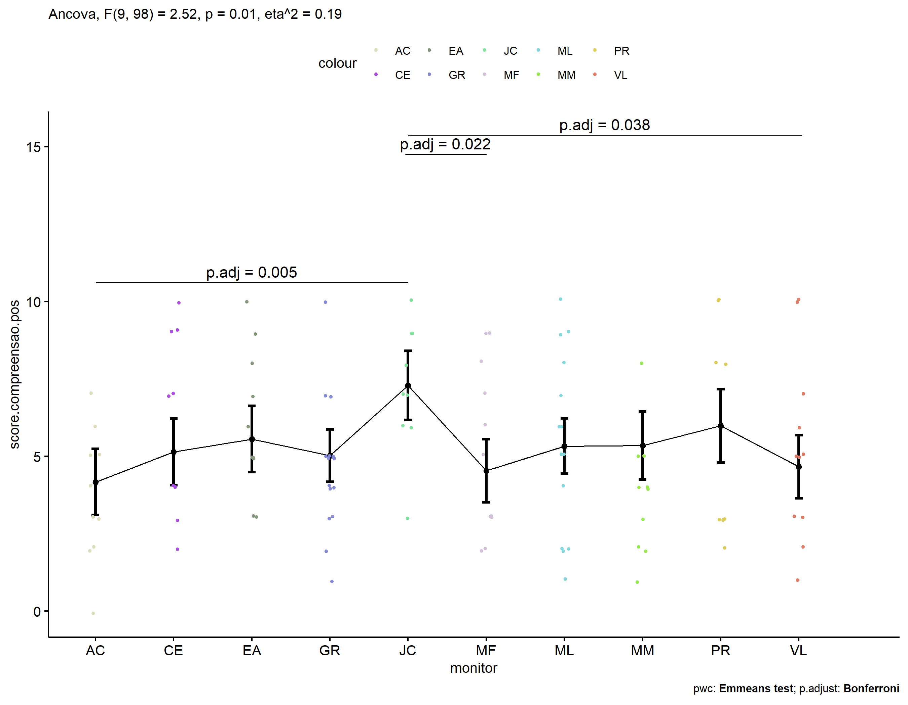<!-- -->

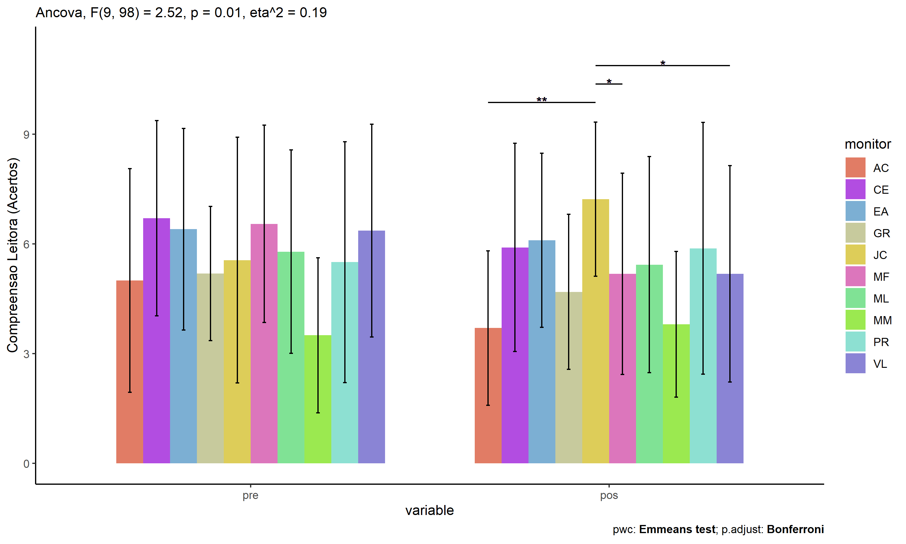<!-- -->

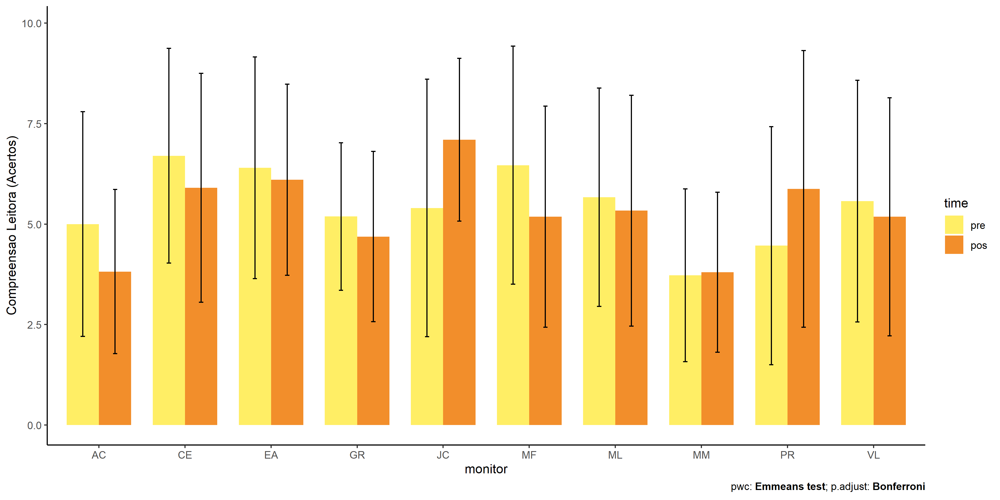<!-- -->

<!-- -->

# Pairwise comparisons for two factors

## factores: **genero:grupo**

### Quant. Palavras Lidas

| var                | genero | grupo    |   n | M (pre) | SE (pre) | M (unadj) | SE (unadj) | M (adj) | SE (adj) |
|:-------------------|:-------|:---------|----:|--------:|---------:|----------:|-----------:|--------:|---------:|
| palavras.lidas.pos | F      | Controle |  73 | 123.466 |    9.683 |   115.973 |      5.528 | 116.117 |    7.349 |
| palavras.lidas.pos | F      | WordGen  |  50 | 139.780 |   12.443 |   162.560 |     10.682 | 160.456 |    8.911 |
| palavras.lidas.pos | M      | Controle |  64 | 121.531 |    9.934 |   113.875 |      9.047 | 114.286 |    7.850 |
| palavras.lidas.pos | M      | WordGen  |  54 | 115.315 |   11.262 |   123.148 |      8.173 | 124.415 |    8.556 |

| .y.                | grupo    | genero | group1   | group2  | estimate | conf.low | conf.high |     se | statistic | p       | p.adj   | p.adj.signif |
|:-------------------|:---------|:-------|:---------|:--------|---------:|---------:|----------:|-------:|----------:|:--------|:--------|:-------------|
| palavras.lidas.pos | Controle |        | F        | M       |    1.831 |  -19.351 |    23.013 | 10.752 |     0.170 | 0.865   | 0.865   | ns           |
| palavras.lidas.pos | WordGen  |        | F        | M       |   36.041 |   11.649 |    60.432 | 12.381 |     2.911 | 0.004   | 0.004   | \*\*         |
| palavras.lidas.pre | Controle |        | F        | M       |    1.935 |  -26.068 |    29.937 | 14.215 |     0.136 | 0.892   | 0.892   | ns           |
| palavras.lidas.pre | WordGen  |        | F        | M       |   24.465 |   -7.629 |    56.560 | 16.291 |     1.502 | 0.134   | 0.134   | ns           |
| palavras.lidas.pos |          | F      | Controle | WordGen |  -44.339 |  -67.101 |   -21.578 | 11.554 |    -3.838 | \<0.001 | \<0.001 | \*\*\*       |
| palavras.lidas.pos |          | M      | Controle | WordGen |  -10.130 |  -32.994 |    12.734 | 11.606 |    -0.873 | 0.384   | 0.384   | ns           |
| palavras.lidas.pre |          | F      | Controle | WordGen |  -16.314 |  -46.334 |    13.705 | 15.238 |    -1.071 | 0.285   | 0.285   | ns           |
| palavras.lidas.pre |          | M      | Controle | WordGen |    6.216 |  -24.000 |    36.433 | 15.338 |     0.405 | 0.686   | 0.686   | ns           |

| grupo    | genero | group1 | group2 | estimate | conf.low | conf.high |     se | statistic |     p | p.adj | p.adj.signif |
|:---------|:-------|:-------|:-------|---------:|---------:|----------:|-------:|----------:|------:|------:|:-------------|
| Controle | F      | pre    | pos    |   12.848 |  -10.163 |    35.859 | 11.714 |     1.097 | 0.273 | 0.273 | ns           |
| Controle | M      | pre    | pos    |    5.814 |  -17.978 |    29.606 | 12.111 |     0.480 | 0.631 | 0.631 | ns           |
| WordGen  | F      | pre    | pos    |  -28.474 |  -56.504 |    -0.444 | 14.269 |    -1.995 | 0.046 | 0.046 | \*           |
| WordGen  | M      | pre    | pos    |  -16.907 |  -42.948 |     9.134 | 13.256 |    -1.275 | 0.203 | 0.203 | ns           |

    ## Scale for colour is already present.
    ## Adding another scale for colour, which will replace the existing scale.

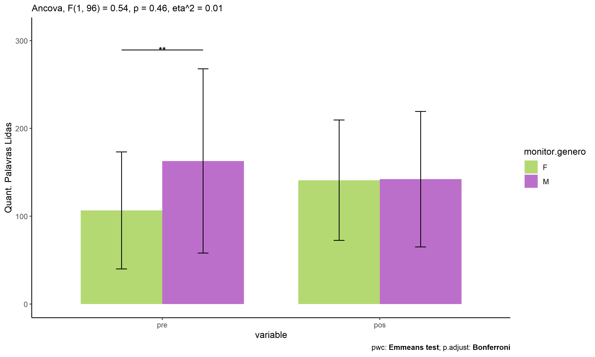<!-- -->

    ## Scale for colour is already present.
    ## Adding another scale for colour, which will replace the existing scale.

<!-- -->

<!-- -->

<!-- -->

<!-- -->

<!-- -->

### Compreensao Leitora (Acertos)

| var                   | genero | grupo    |   n | M (pre) | SE (pre) | M (unadj) | SE (unadj) | M (adj) | SE (adj) |
|:----------------------|:-------|:---------|----:|--------:|---------:|----------:|-----------:|--------:|---------:|
| score.compreensao.pos | F      | Controle |  79 |   5.291 |    0.298 |     5.253 |      0.290 |   5.245 |    0.208 |
| score.compreensao.pos | F      | WordGen  |  55 |   6.345 |    0.358 |     5.964 |      0.370 |   5.195 |    0.254 |
| score.compreensao.pos | M      | Controle |  74 |   4.892 |    0.280 |     4.392 |      0.329 |   4.672 |    0.216 |
| score.compreensao.pos | M      | WordGen  |  60 |   4.767 |    0.346 |     4.467 |      0.298 |   4.837 |    0.240 |

| .y.                   | grupo    | genero | group1   | group2  | estimate | conf.low | conf.high |    se | statistic |     p | p.adj | p.adj.signif |
|:----------------------|:---------|:-------|:---------|:--------|---------:|---------:|----------:|------:|----------:|------:|------:|:-------------|
| score.compreensao.pos | Controle |        | F        | M       |    0.573 |   -0.017 |     1.164 | 0.300 |     1.912 | 0.057 | 0.057 | ns           |
| score.compreensao.pos | WordGen  |        | F        | M       |    0.359 |   -0.335 |     1.052 | 0.352 |     1.018 | 0.310 | 0.310 | ns           |
| score.compreensao.pre | Controle |        | F        | M       |    0.399 |   -0.427 |     1.225 | 0.419 |     0.952 | 0.342 | 0.342 | ns           |
| score.compreensao.pre | WordGen  |        | F        | M       |    1.579 |    0.626 |     2.532 | 0.484 |     3.262 | 0.001 | 0.001 | \*\*         |
| score.compreensao.pos |          | F      | Controle | WordGen |    0.050 |   -0.597 |     0.696 | 0.328 |     0.151 | 0.880 | 0.880 | ns           |
| score.compreensao.pos |          | M      | Controle | WordGen |   -0.165 |   -0.798 |     0.468 | 0.322 |    -0.513 | 0.608 | 0.608 | ns           |
| score.compreensao.pre |          | F      | Controle | WordGen |   -1.054 |   -1.951 |    -0.158 | 0.455 |    -2.316 | 0.021 | 0.021 | \*           |
| score.compreensao.pre |          | M      | Controle | WordGen |    0.125 |   -0.762 |     1.012 | 0.450 |     0.278 | 0.781 | 0.781 | ns           |

| grupo    | genero | group1 | group2 | estimate | conf.low | conf.high |    se | statistic |     p | p.adj | p.adj.signif |
|:---------|:-------|:-------|:-------|---------:|---------:|----------:|------:|----------:|------:|------:|:-------------|
| Controle | F      | pre    | pos    |    0.166 |   -0.627 |     0.959 | 0.404 |     0.411 | 0.681 | 0.681 | ns           |
| Controle | M      | pre    | pos    |    0.644 |   -0.159 |     1.447 | 0.409 |     1.574 | 0.116 | 0.116 | ns           |
| WordGen  | F      | pre    | pos    |    0.247 |   -0.714 |     1.207 | 0.489 |     0.504 | 0.614 | 0.614 | ns           |
| WordGen  | M      | pre    | pos    |    0.099 |   -0.785 |     0.984 | 0.450 |     0.221 | 0.825 | 0.825 | ns           |

    ## Scale for colour is already present.
    ## Adding another scale for colour, which will replace the existing scale.

<!-- -->

    ## Scale for colour is already present.
    ## Adding another scale for colour, which will replace the existing scale.

<!-- -->

<!-- -->

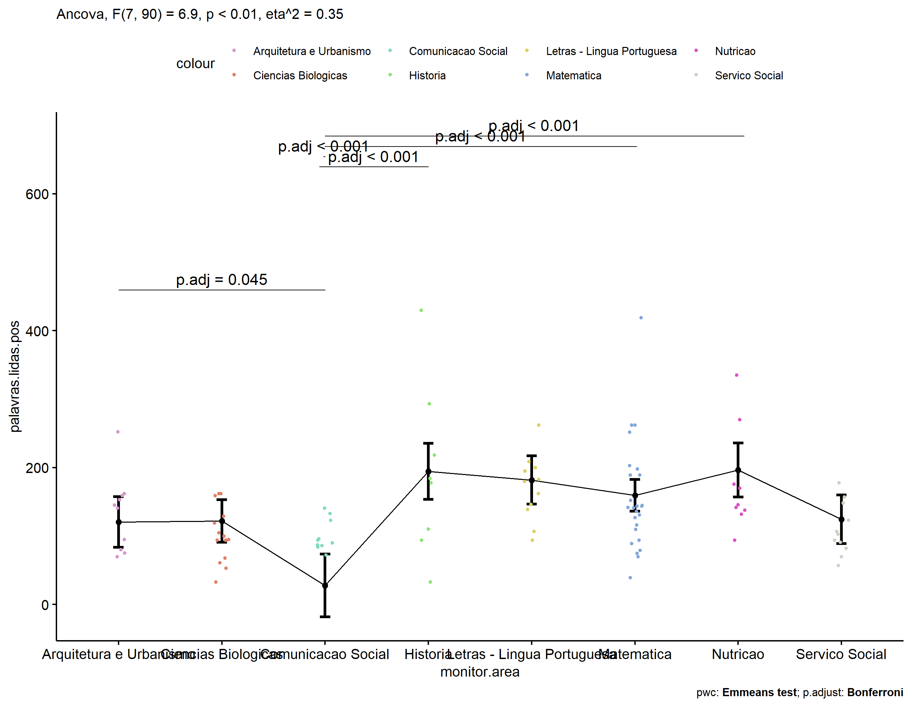<!-- -->

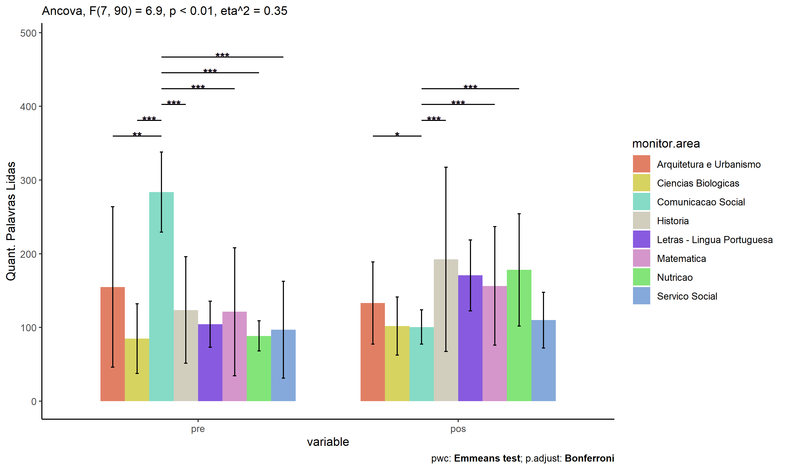<!-- -->

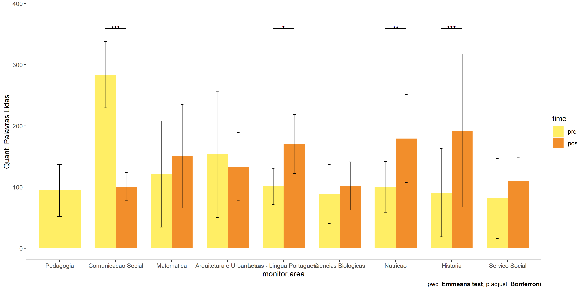<!-- -->

### Compreensao Leitora (TRI)

| var                 | genero | grupo    |   n | M (pre) | SE (pre) | M (unadj) | SE (unadj) | M (adj) | SE (adj) |
|:--------------------|:-------|:---------|----:|--------:|---------:|----------:|-----------:|--------:|---------:|
| tri.compreensao.pos | F      | Controle |  79 |   0.159 |    0.097 |     0.125 |      0.094 |   0.117 |    0.066 |
| tri.compreensao.pos | F      | WordGen  |  55 |   0.487 |    0.117 |     0.329 |      0.126 |   0.081 |    0.080 |
| tri.compreensao.pos | M      | Controle |  75 |  -0.016 |    0.086 |    -0.120 |      0.100 |   0.000 |    0.068 |
| tri.compreensao.pos | M      | WordGen  |  60 |   0.030 |    0.105 |    -0.103 |      0.090 |  -0.016 |    0.076 |

| .y.                 | grupo    | genero | group1   | group2  | estimate | conf.low | conf.high |    se | statistic |     p | p.adj | p.adj.signif |
|:--------------------|:---------|:-------|:---------|:--------|---------:|---------:|----------:|------:|----------:|------:|------:|:-------------|
| tri.compreensao.pos | Controle |        | F        | M       |    0.117 |   -0.069 |     0.303 | 0.095 |     1.236 | 0.218 | 0.218 | ns           |
| tri.compreensao.pos | WordGen  |        | F        | M       |    0.097 |   -0.121 |     0.316 | 0.111 |     0.876 | 0.382 | 0.382 | ns           |
| tri.compreensao.pre | Controle |        | F        | M       |    0.175 |   -0.085 |     0.436 | 0.132 |     1.325 | 0.186 | 0.186 | ns           |
| tri.compreensao.pre | WordGen  |        | F        | M       |    0.457 |    0.155 |     0.759 | 0.153 |     2.981 | 0.003 | 0.003 | \*\*         |
| tri.compreensao.pos |          | F      | Controle | WordGen |    0.036 |   -0.168 |     0.240 | 0.104 |     0.345 | 0.731 | 0.731 | ns           |
| tri.compreensao.pos |          | M      | Controle | WordGen |    0.016 |   -0.183 |     0.216 | 0.101 |     0.159 | 0.874 | 0.874 | ns           |
| tri.compreensao.pre |          | F      | Controle | WordGen |   -0.327 |   -0.611 |    -0.044 | 0.144 |    -2.271 | 0.024 | 0.024 | \*           |
| tri.compreensao.pre |          | M      | Controle | WordGen |   -0.046 |   -0.326 |     0.234 | 0.142 |    -0.323 | 0.747 | 0.747 | ns           |

| grupo    | genero | group1 | group2 | estimate | conf.low | conf.high |    se | statistic |     p | p.adj | p.adj.signif |
|:---------|:-------|:-------|:-------|---------:|---------:|----------:|------:|----------:|------:|------:|:-------------|
| Controle | F      | pre    | pos    |    0.083 |   -0.168 |     0.335 | 0.128 |     0.649 | 0.516 | 0.516 | ns           |
| Controle | M      | pre    | pos    |    0.143 |   -0.111 |     0.397 | 0.129 |     1.105 | 0.270 | 0.270 | ns           |
| WordGen  | F      | pre    | pos    |    0.124 |   -0.181 |     0.428 | 0.155 |     0.798 | 0.425 | 0.425 | ns           |
| WordGen  | M      | pre    | pos    |    0.062 |   -0.218 |     0.343 | 0.143 |     0.437 | 0.662 | 0.662 | ns           |

    ## Scale for colour is already present.
    ## Adding another scale for colour, which will replace the existing scale.

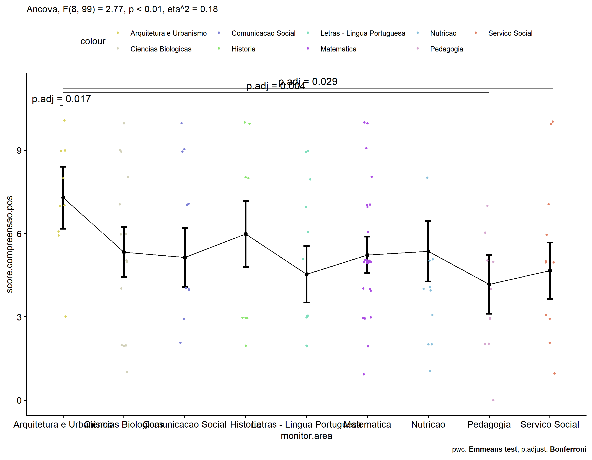<!-- -->

    ## Scale for colour is already present.
    ## Adding another scale for colour, which will replace the existing scale.

<!-- -->

<!-- -->

<!-- -->

<!-- -->

<!-- -->

## factores: **idade:grupo**

### Quant. Palavras Lidas

| var                | idade | grupo    |   n | M (pre) | SE (pre) | M (unadj) | SE (unadj) | M (adj) | SE (adj) |
|:-------------------|:------|:---------|----:|--------:|---------:|----------:|-----------:|--------:|---------:|
| palavras.lidas.pos | 10y   | Controle |  26 | 123.808 |   17.201 |   108.808 |      8.976 | 109.197 |   12.801 |
| palavras.lidas.pos | 10y   | WordGen  |  19 |  85.053 |   11.399 |   144.368 |     17.971 | 150.887 |   15.132 |
| palavras.lidas.pos | 11y   | Controle |  79 | 124.203 |    9.234 |   120.418 |      7.347 | 120.745 |    7.344 |
| palavras.lidas.pos | 11y   | WordGen  |  64 | 148.844 |   11.556 |   144.109 |      9.002 | 140.540 |    8.245 |
| palavras.lidas.pos | 12y   | Controle |  17 | 132.529 |   18.309 |   106.529 |     12.749 | 105.540 |   15.833 |
| palavras.lidas.pos | 12y   | WordGen  |  14 | 106.929 |   21.380 |   136.571 |     18.897 | 139.630 |   17.474 |
| palavras.lidas.pos | 13y   | Controle |   9 |  96.333 |   25.990 |    98.889 |     24.701 | 103.623 |   21.814 |

|     | .y.                | grupo    | idade | group1   | group2  | estimate | conf.low | conf.high |     se | statistic |     p | p.adj | p.adj.signif |
|:----|:-------------------|:---------|:------|:---------|:--------|---------:|---------:|----------:|-------:|----------:|------:|------:|:-------------|
| 1   | palavras.lidas.pos | Controle |       | 10y      | 11y     |  -11.548 |  -40.631 |    17.536 | 14.757 |    -0.783 | 0.435 | 1.000 | ns           |
| 2   | palavras.lidas.pos | Controle |       | 10y      | 12y     |    3.658 |  -36.474 |    43.789 | 20.363 |     0.180 | 0.858 | 1.000 | ns           |
| 3   | palavras.lidas.pos | Controle |       | 10y      | 13y     |    5.574 |  -44.256 |    55.404 | 25.284 |     0.220 | 0.826 | 1.000 | ns           |
| 4   | palavras.lidas.pos | Controle |       | 11y      | 12y     |   15.205 |  -19.197 |    49.607 | 17.456 |     0.871 | 0.385 | 1.000 | ns           |
| 5   | palavras.lidas.pos | Controle |       | 11y      | 13y     |   17.122 |  -28.225 |    62.469 | 23.009 |     0.744 | 0.458 | 1.000 | ns           |
| 6   | palavras.lidas.pos | Controle |       | 12y      | 13y     |    1.917 |  -51.244 |    55.077 | 26.974 |     0.071 | 0.943 | 1.000 | ns           |
| 7   | palavras.lidas.pos | WordGen  |       | 10y      | 11y     |   10.347 |  -23.911 |    44.604 | 17.383 |     0.595 | 0.552 | 1.000 | ns           |
| 8   | palavras.lidas.pos | WordGen  |       | 10y      | 12y     |   11.256 |  -34.108 |    56.621 | 23.018 |     0.489 | 0.625 | 1.000 | ns           |
| 10  | palavras.lidas.pos | WordGen  |       | 11y      | 12y     |    0.910 |  -37.294 |    39.113 | 19.385 |     0.047 | 0.963 | 1.000 | ns           |
| 13  | palavras.lidas.pre | Controle |       | 10y      | 11y     |   -0.395 |  -37.392 |    36.602 | 18.773 |    -0.021 | 0.983 | 1.000 | ns           |
| 14  | palavras.lidas.pre | Controle |       | 10y      | 12y     |   -8.722 |  -59.760 |    42.317 | 25.898 |    -0.337 | 0.737 | 1.000 | ns           |
| 15  | palavras.lidas.pre | Controle |       | 10y      | 13y     |   27.474 |  -35.811 |    90.759 | 32.112 |     0.856 | 0.393 | 1.000 | ns           |
| 16  | palavras.lidas.pre | Controle |       | 11y      | 12y     |   -8.327 |  -52.076 |    35.423 | 22.199 |    -0.375 | 0.708 | 1.000 | ns           |
| 17  | palavras.lidas.pre | Controle |       | 11y      | 13y     |   27.869 |  -29.699 |    85.437 | 29.211 |     0.954 | 0.341 | 1.000 | ns           |
| 18  | palavras.lidas.pre | Controle |       | 12y      | 13y     |   36.196 |  -31.259 |   103.651 | 34.228 |     1.057 | 0.291 | 1.000 | ns           |
| 19  | palavras.lidas.pre | WordGen  |       | 10y      | 11y     |  -63.791 | -106.542 |   -21.040 | 21.693 |    -2.941 | 0.004 | 0.011 | \*           |
| 20  | palavras.lidas.pre | WordGen  |       | 10y      | 12y     |  -21.876 |  -79.512 |    35.760 | 29.245 |    -0.748 | 0.455 | 1.000 | ns           |
| 22  | palavras.lidas.pre | WordGen  |       | 11y      | 12y     |   41.915 |   -6.365 |    90.195 | 24.498 |     1.711 | 0.088 | 0.265 | ns           |
| 25  | palavras.lidas.pos |          | 10y   | Controle | WordGen |  -41.689 |  -80.722 |    -2.656 | 19.806 |    -2.105 | 0.036 | 0.036 | \*           |
| 26  | palavras.lidas.pos |          | 11y   | Controle | WordGen |  -19.795 |  -41.580 |     1.990 | 11.054 |    -1.791 | 0.075 | 0.075 | ns           |
| 27  | palavras.lidas.pos |          | 12y   | Controle | WordGen |  -34.090 |  -80.591 |    12.410 | 23.595 |    -1.445 | 0.150 | 0.150 | ns           |
| 29  | palavras.lidas.pre |          | 10y   | Controle | WordGen |   38.755 |  -10.633 |    88.143 | 25.060 |     1.546 | 0.123 | 0.123 | ns           |
| 30  | palavras.lidas.pre |          | 11y   | Controle | WordGen |  -24.641 |  -52.161 |     2.878 | 13.964 |    -1.765 | 0.079 | 0.079 | ns           |
| 31  | palavras.lidas.pre |          | 12y   | Controle | WordGen |   25.601 |  -33.456 |    84.657 | 29.966 |     0.854 | 0.394 | 0.394 | ns           |

| grupo    | idade | group1 | group2 | estimate | conf.low | conf.high |     se | statistic |     p | p.adj | p.adj.signif |
|:---------|:------|:-------|:-------|---------:|---------:|----------:|-------:|----------:|------:|------:|:-------------|
| Controle | 10y   | pre    | pos    |    8.626 |  -30.085 |    47.338 | 19.703 |     0.438 | 0.662 | 0.662 | ns           |
| Controle | 11y   | pre    | pos    |    4.669 |  -17.812 |    27.150 | 11.442 |     0.408 | 0.683 | 0.683 | ns           |
| Controle | 12y   | pre    | pos    |   27.668 |  -17.922 |    73.258 | 23.204 |     1.192 | 0.234 | 0.234 | ns           |
| Controle | 13y   | pre    | pos    |    1.711 |  -65.857 |    69.280 | 34.391 |     0.050 | 0.960 | 0.960 | ns           |
| WordGen  | 10y   | pre    | pos    |  -57.412 | -103.002 |   -11.822 | 23.204 |    -2.474 | 0.014 | 0.014 | \*           |
| WordGen  | 11y   | pre    | pos    |   -6.499 |  -31.374 |    18.376 | 12.661 |    -0.513 | 0.608 | 0.608 | ns           |
| WordGen  | 12y   | pre    | pos    |  -16.404 |  -69.256 |    36.448 | 26.901 |    -0.610 | 0.542 | 0.542 | ns           |
| WordGen  | 13y   | pre    | pos    |  -61.800 | -150.848 |    27.248 | 45.323 |    -1.364 | 0.173 | 0.173 | ns           |

    ## Scale for colour is already present.
    ## Adding another scale for colour, which will replace the existing scale.

<!-- -->

<!-- -->

<!-- -->

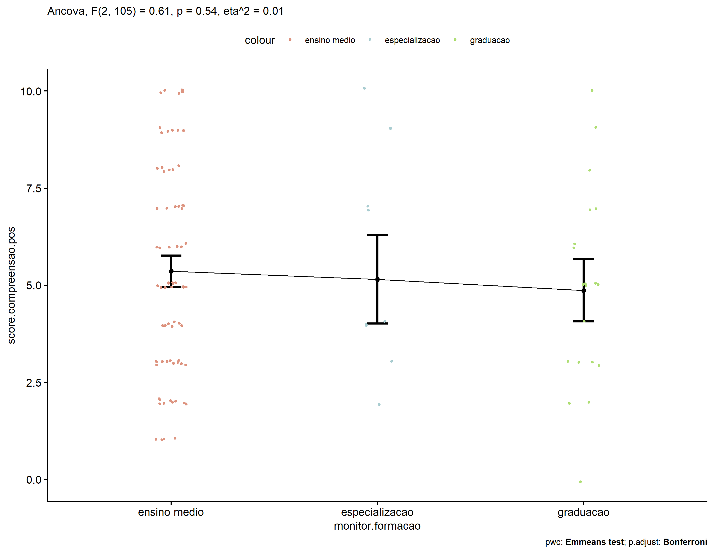<!-- -->

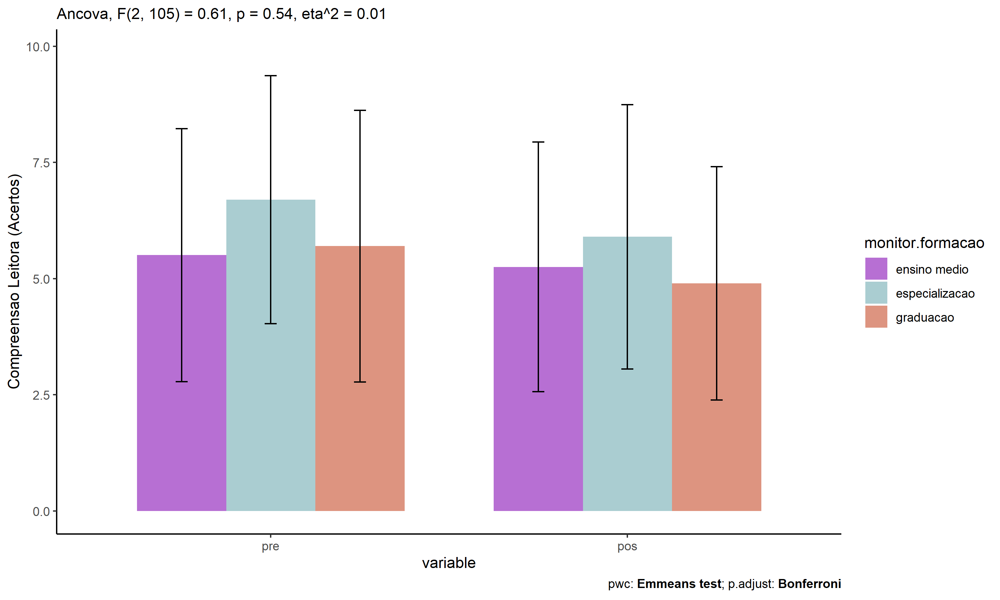<!-- -->

### Compreensao Leitora (Acertos)

| var                   | idade | grupo    |   n | M (pre) | SE (pre) | M (unadj) | SE (unadj) | M (adj) | SE (adj) |
|:----------------------|:------|:---------|----:|--------:|---------:|----------:|-----------:|--------:|---------:|
| score.compreensao.pos | 10y   | Controle |  28 |   5.321 |    0.477 |     5.071 |      0.490 |   5.089 |    0.358 |
| score.compreensao.pos | 10y   | WordGen  |  22 |   4.909 |    0.638 |     5.045 |      0.528 |   5.362 |    0.404 |
| score.compreensao.pos | 11y   | Controle |  86 |   5.279 |    0.280 |     5.081 |      0.315 |   5.130 |    0.204 |
| score.compreensao.pos | 11y   | WordGen  |  68 |   6.118 |    0.342 |     5.574 |      0.333 |   5.015 |    0.232 |
| score.compreensao.pos | 12y   | Controle |  21 |   5.048 |    0.475 |     4.571 |      0.528 |   4.788 |    0.414 |
| score.compreensao.pos | 12y   | WordGen  |  16 |   4.812 |    0.510 |     4.688 |      0.631 |   5.074 |    0.474 |
| score.compreensao.pos | 13y   | Controle |  10 |   3.900 |    0.781 |     3.800 |      0.512 |   4.848 |    0.603 |
| score.compreensao.pos | 13y   | WordGen  |   6 |   4.167 |    0.833 |     3.333 |      0.422 |   4.188 |    0.775 |

| .y.                   | grupo    | idade | group1   | group2  | estimate | conf.low | conf.high |    se | statistic |     p | p.adj | p.adj.signif |
|:----------------------|:---------|:------|:---------|:--------|---------:|---------:|----------:|------:|----------:|------:|------:|:-------------|
| score.compreensao.pos | Controle |       | 10y      | 11y     |   -0.041 |   -0.852 |     0.771 | 0.412 |    -0.099 | 0.922 | 1.000 | ns           |
| score.compreensao.pos | Controle |       | 10y      | 12y     |    0.302 |   -0.776 |     1.379 | 0.547 |     0.552 | 0.582 | 1.000 | ns           |
| score.compreensao.pos | Controle |       | 10y      | 13y     |    0.242 |   -1.139 |     1.622 | 0.701 |     0.345 | 0.730 | 1.000 | ns           |
| score.compreensao.pos | Controle |       | 11y      | 12y     |    0.342 |   -0.566 |     1.251 | 0.461 |     0.742 | 0.459 | 1.000 | ns           |
| score.compreensao.pos | Controle |       | 11y      | 13y     |    0.283 |   -0.970 |     1.535 | 0.636 |     0.444 | 0.657 | 1.000 | ns           |
| score.compreensao.pos | Controle |       | 12y      | 13y     |   -0.060 |   -1.497 |     1.377 | 0.730 |    -0.082 | 0.935 | 1.000 | ns           |
| score.compreensao.pos | WordGen  |       | 10y      | 11y     |    0.347 |   -0.574 |     1.269 | 0.468 |     0.742 | 0.459 | 1.000 | ns           |
| score.compreensao.pos | WordGen  |       | 10y      | 12y     |    0.288 |   -0.938 |     1.514 | 0.622 |     0.463 | 0.644 | 1.000 | ns           |
| score.compreensao.pos | WordGen  |       | 10y      | 13y     |    1.174 |   -0.545 |     2.894 | 0.873 |     1.345 | 0.180 | 1.000 | ns           |
| score.compreensao.pos | WordGen  |       | 11y      | 12y     |   -0.059 |   -1.103 |     0.984 | 0.530 |    -0.112 | 0.911 | 1.000 | ns           |
| score.compreensao.pos | WordGen  |       | 11y      | 13y     |    0.827 |   -0.772 |     2.426 | 0.812 |     1.019 | 0.309 | 1.000 | ns           |
| score.compreensao.pos | WordGen  |       | 12y      | 13y     |    0.886 |   -0.901 |     2.673 | 0.907 |     0.977 | 0.330 | 1.000 | ns           |
| score.compreensao.pre | Controle |       | 10y      | 11y     |    0.042 |   -1.077 |     1.162 | 0.568 |     0.075 | 0.941 | 1.000 | ns           |
| score.compreensao.pre | Controle |       | 10y      | 12y     |    0.274 |   -1.212 |     1.759 | 0.754 |     0.363 | 0.717 | 1.000 | ns           |
| score.compreensao.pre | Controle |       | 10y      | 13y     |    1.421 |   -0.474 |     3.317 | 0.962 |     1.477 | 0.141 | 0.846 | ns           |
| score.compreensao.pre | Controle |       | 11y      | 12y     |    0.231 |   -1.021 |     1.484 | 0.636 |     0.364 | 0.716 | 1.000 | ns           |
| score.compreensao.pre | Controle |       | 11y      | 13y     |    1.379 |   -0.340 |     3.098 | 0.873 |     1.580 | 0.115 | 0.692 | ns           |
| score.compreensao.pre | Controle |       | 12y      | 13y     |    1.148 |   -0.829 |     3.125 | 1.004 |     1.143 | 0.254 | 1.000 | ns           |
| score.compreensao.pre | WordGen  |       | 10y      | 11y     |   -1.209 |   -2.471 |     0.053 | 0.641 |    -1.886 | 0.060 | 0.363 | ns           |
| score.compreensao.pre | WordGen  |       | 10y      | 12y     |    0.097 |   -1.594 |     1.787 | 0.858 |     0.113 | 0.910 | 1.000 | ns           |
| score.compreensao.pre | WordGen  |       | 10y      | 13y     |    0.742 |   -1.627 |     3.112 | 1.203 |     0.617 | 0.538 | 1.000 | ns           |
| score.compreensao.pre | WordGen  |       | 11y      | 12y     |    1.305 |   -0.125 |     2.735 | 0.726 |     1.798 | 0.073 | 0.440 | ns           |
| score.compreensao.pre | WordGen  |       | 11y      | 13y     |    1.951 |   -0.240 |     4.142 | 1.113 |     1.754 | 0.081 | 0.484 | ns           |
| score.compreensao.pre | WordGen  |       | 12y      | 13y     |    0.646 |   -1.817 |     3.109 | 1.251 |     0.516 | 0.606 | 1.000 | ns           |
| score.compreensao.pos |          | 10y   | Controle | WordGen |   -0.273 |   -1.336 |     0.791 | 0.540 |    -0.505 | 0.614 | 0.614 | ns           |
| score.compreensao.pos |          | 11y   | Controle | WordGen |    0.115 |   -0.495 |     0.725 | 0.310 |     0.372 | 0.710 | 0.710 | ns           |
| score.compreensao.pos |          | 12y   | Controle | WordGen |   -0.286 |   -1.525 |     0.952 | 0.629 |    -0.455 | 0.649 | 0.649 | ns           |
| score.compreensao.pos |          | 13y   | Controle | WordGen |    0.660 |   -1.267 |     2.587 | 0.978 |     0.674 | 0.501 | 0.501 | ns           |
| score.compreensao.pre |          | 10y   | Controle | WordGen |    0.412 |   -1.054 |     1.878 | 0.744 |     0.554 | 0.580 | 0.580 | ns           |
| score.compreensao.pre |          | 11y   | Controle | WordGen |   -0.839 |   -1.674 |    -0.004 | 0.424 |    -1.978 | 0.049 | 0.049 | \*           |
| score.compreensao.pre |          | 12y   | Controle | WordGen |    0.235 |   -1.472 |     1.943 | 0.867 |     0.271 | 0.786 | 0.786 | ns           |
| score.compreensao.pre |          | 13y   | Controle | WordGen |   -0.267 |   -2.924 |     2.390 | 1.349 |    -0.198 | 0.843 | 0.843 | ns           |

| grupo    | idade | group1 | group2 | estimate | conf.low | conf.high |    se | statistic |     p | p.adj | p.adj.signif |
|:---------|:------|:-------|:-------|---------:|---------:|----------:|------:|----------:|------:|------:|:-------------|
| Controle | 10y   | pre    | pos    |    0.217 |   -1.117 |     1.551 | 0.679 |     0.319 | 0.750 | 0.750 | ns           |
| Controle | 11y   | pre    | pos    |    0.361 |   -0.413 |     1.136 | 0.394 |     0.916 | 0.360 | 0.360 | ns           |
| Controle | 12y   | pre    | pos    |    0.661 |   -0.846 |     2.168 | 0.767 |     0.862 | 0.389 | 0.389 | ns           |
| Controle | 13y   | pre    | pos    |    0.100 |   -2.210 |     2.410 | 1.176 |     0.085 | 0.932 | 0.932 | ns           |
| WordGen  | 10y   | pre    | pos    |   -0.176 |   -1.716 |     1.364 | 0.784 |    -0.224 | 0.823 | 0.823 | ns           |
| WordGen  | 11y   | pre    | pos    |    0.397 |   -0.458 |     1.253 | 0.435 |     0.913 | 0.362 | 0.362 | ns           |
| WordGen  | 12y   | pre    | pos    |    0.195 |   -1.604 |     1.994 | 0.916 |     0.213 | 0.832 | 0.832 | ns           |
| WordGen  | 13y   | pre    | pos    |    0.524 |   -2.350 |     3.397 | 1.463 |     0.358 | 0.720 | 0.720 | ns           |

    ## Scale for colour is already present.
    ## Adding another scale for colour, which will replace the existing scale.

<!-- -->

    ## Scale for colour is already present.
    ## Adding another scale for colour, which will replace the existing scale.

<!-- -->

<!-- -->

<!-- -->

<!-- -->

<!-- -->

### Compreensao Leitora (TRI)

| var                 | idade | grupo    |   n | M (pre) | SE (pre) | M (unadj) | SE (unadj) | M (adj) | SE (adj) |
|:--------------------|:------|:---------|----:|--------:|---------:|----------:|-----------:|--------:|---------:|
| tri.compreensao.pos | 10y   | Controle |  28 |   0.153 |    0.146 |     0.083 |      0.156 |   0.095 |    0.112 |
| tri.compreensao.pos | 10y   | WordGen  |  22 |   0.078 |    0.198 |    -0.003 |      0.163 |   0.065 |    0.127 |
| tri.compreensao.pos | 11y   | Controle |  86 |   0.128 |    0.093 |     0.109 |      0.098 |   0.140 |    0.064 |
| tri.compreensao.pos | 11y   | WordGen  |  68 |   0.467 |    0.105 |     0.260 |      0.108 |   0.039 |    0.073 |
| tri.compreensao.pos | 12y   | Controle |  22 |   0.077 |    0.150 |    -0.135 |      0.170 |  -0.067 |    0.127 |
| tri.compreensao.pos | 12y   | WordGen  |  16 |  -0.049 |    0.138 |    -0.128 |      0.199 |   0.034 |    0.149 |
| tri.compreensao.pos | 13y   | Controle |  10 |  -0.414 |    0.198 |    -0.394 |      0.162 |   0.039 |    0.190 |
| tri.compreensao.pos | 13y   | WordGen  |   6 |  -0.297 |    0.256 |    -0.461 |      0.115 |  -0.116 |    0.243 |

| .y.                 | grupo    | idade | group1   | group2  | estimate | conf.low | conf.high |    se | statistic |     p | p.adj | p.adj.signif |
|:--------------------|:---------|:------|:---------|:--------|---------:|---------:|----------:|------:|----------:|------:|------:|:-------------|
| tri.compreensao.pos | Controle |       | 10y      | 11y     |   -0.045 |   -0.300 |     0.209 | 0.129 |    -0.352 | 0.725 | 1.000 | ns           |
| tri.compreensao.pos | Controle |       | 10y      | 12y     |    0.162 |   -0.171 |     0.495 | 0.169 |     0.957 | 0.340 | 1.000 | ns           |
| tri.compreensao.pos | Controle |       | 10y      | 13y     |    0.056 |   -0.377 |     0.490 | 0.220 |     0.256 | 0.798 | 1.000 | ns           |
| tri.compreensao.pos | Controle |       | 11y      | 12y     |    0.207 |   -0.072 |     0.487 | 0.142 |     1.461 | 0.145 | 0.871 | ns           |
| tri.compreensao.pos | Controle |       | 11y      | 13y     |    0.102 |   -0.292 |     0.495 | 0.200 |     0.509 | 0.611 | 1.000 | ns           |
| tri.compreensao.pos | Controle |       | 12y      | 13y     |   -0.105 |   -0.554 |     0.343 | 0.228 |    -0.464 | 0.643 | 1.000 | ns           |
| tri.compreensao.pos | WordGen  |       | 10y      | 11y     |    0.026 |   -0.263 |     0.315 | 0.147 |     0.178 | 0.859 | 1.000 | ns           |
| tri.compreensao.pos | WordGen  |       | 10y      | 12y     |    0.032 |   -0.353 |     0.416 | 0.195 |     0.163 | 0.871 | 1.000 | ns           |
| tri.compreensao.pos | WordGen  |       | 10y      | 13y     |    0.181 |   -0.359 |     0.721 | 0.274 |     0.661 | 0.509 | 1.000 | ns           |
| tri.compreensao.pos | WordGen  |       | 11y      | 12y     |    0.006 |   -0.323 |     0.334 | 0.167 |     0.034 | 0.973 | 1.000 | ns           |
| tri.compreensao.pos | WordGen  |       | 11y      | 13y     |    0.155 |   -0.348 |     0.657 | 0.255 |     0.607 | 0.545 | 1.000 | ns           |
| tri.compreensao.pos | WordGen  |       | 12y      | 13y     |    0.149 |   -0.411 |     0.709 | 0.284 |     0.524 | 0.600 | 1.000 | ns           |
| tri.compreensao.pre | Controle |       | 10y      | 11y     |    0.025 |   -0.326 |     0.376 | 0.178 |     0.142 | 0.887 | 1.000 | ns           |
| tri.compreensao.pre | Controle |       | 10y      | 12y     |    0.076 |   -0.384 |     0.535 | 0.233 |     0.325 | 0.746 | 1.000 | ns           |
| tri.compreensao.pre | Controle |       | 10y      | 13y     |    0.567 |   -0.028 |     1.161 | 0.302 |     1.878 | 0.061 | 0.369 | ns           |
| tri.compreensao.pre | Controle |       | 11y      | 12y     |    0.050 |   -0.335 |     0.436 | 0.196 |     0.258 | 0.797 | 1.000 | ns           |
| tri.compreensao.pre | Controle |       | 11y      | 13y     |    0.542 |    0.002 |     1.081 | 0.274 |     1.979 | 0.049 | 0.294 | ns           |
| tri.compreensao.pre | Controle |       | 12y      | 13y     |    0.491 |   -0.124 |     1.107 | 0.312 |     1.572 | 0.117 | 0.703 | ns           |
| tri.compreensao.pre | WordGen  |       | 10y      | 11y     |   -0.389 |   -0.785 |     0.006 | 0.201 |    -1.938 | 0.054 | 0.322 | ns           |
| tri.compreensao.pre | WordGen  |       | 10y      | 12y     |    0.126 |   -0.404 |     0.657 | 0.269 |     0.469 | 0.639 | 1.000 | ns           |
| tri.compreensao.pre | WordGen  |       | 10y      | 13y     |    0.374 |   -0.369 |     1.118 | 0.377 |     0.992 | 0.322 | 1.000 | ns           |
| tri.compreensao.pre | WordGen  |       | 11y      | 12y     |    0.516 |    0.068 |     0.964 | 0.228 |     2.266 | 0.024 | 0.146 | ns           |
| tri.compreensao.pre | WordGen  |       | 11y      | 13y     |    0.764 |    0.077 |     1.451 | 0.349 |     2.190 | 0.029 | 0.177 | ns           |
| tri.compreensao.pre | WordGen  |       | 12y      | 13y     |    0.248 |   -0.524 |     1.020 | 0.392 |     0.633 | 0.528 | 1.000 | ns           |
| tri.compreensao.pos |          | 10y   | Controle | WordGen |    0.030 |   -0.304 |     0.363 | 0.169 |     0.175 | 0.861 | 0.861 | ns           |
| tri.compreensao.pos |          | 11y   | Controle | WordGen |    0.101 |   -0.091 |     0.293 | 0.098 |     1.037 | 0.301 | 0.301 | ns           |
| tri.compreensao.pos |          | 12y   | Controle | WordGen |   -0.100 |   -0.485 |     0.284 | 0.195 |    -0.515 | 0.607 | 0.607 | ns           |
| tri.compreensao.pos |          | 13y   | Controle | WordGen |    0.154 |   -0.450 |     0.758 | 0.307 |     0.503 | 0.615 | 0.615 | ns           |
| tri.compreensao.pre |          | 10y   | Controle | WordGen |    0.075 |   -0.384 |     0.535 | 0.233 |     0.323 | 0.747 | 0.747 | ns           |
| tri.compreensao.pre |          | 11y   | Controle | WordGen |   -0.339 |   -0.601 |    -0.078 | 0.133 |    -2.553 | 0.011 | 0.011 | \*           |
| tri.compreensao.pre |          | 12y   | Controle | WordGen |    0.126 |   -0.404 |     0.656 | 0.269 |     0.468 | 0.640 | 0.640 | ns           |
| tri.compreensao.pre |          | 13y   | Controle | WordGen |   -0.117 |   -0.950 |     0.716 | 0.423 |    -0.277 | 0.782 | 0.782 | ns           |

| grupo    | idade | group1 | group2 | estimate | conf.low | conf.high |    se | statistic |     p | p.adj | p.adj.signif |
|:---------|:------|:-------|:-------|---------:|---------:|----------:|------:|----------:|------:|------:|:-------------|
| Controle | 10y   | pre    | pos    |    0.069 |   -0.352 |     0.490 | 0.214 |     0.320 | 0.749 | 0.749 | ns           |
| Controle | 11y   | pre    | pos    |    0.059 |   -0.185 |     0.303 | 0.124 |     0.475 | 0.635 | 0.635 | ns           |
| Controle | 12y   | pre    | pos    |    0.264 |   -0.207 |     0.735 | 0.240 |     1.103 | 0.271 | 0.271 | ns           |
| Controle | 13y   | pre    | pos    |   -0.020 |   -0.749 |     0.709 | 0.371 |    -0.054 | 0.957 | 0.957 | ns           |
| WordGen  | 10y   | pre    | pos    |    0.075 |   -0.411 |     0.561 | 0.247 |     0.301 | 0.763 | 0.763 | ns           |
| WordGen  | 11y   | pre    | pos    |    0.161 |   -0.108 |     0.431 | 0.137 |     1.175 | 0.240 | 0.240 | ns           |
| WordGen  | 12y   | pre    | pos    |    0.101 |   -0.466 |     0.669 | 0.289 |     0.351 | 0.726 | 0.726 | ns           |
| WordGen  | 13y   | pre    | pos    |    0.077 |   -0.829 |     0.984 | 0.462 |     0.167 | 0.867 | 0.867 | ns           |

    ## Scale for colour is already present.
    ## Adding another scale for colour, which will replace the existing scale.

<!-- -->

    ## Scale for colour is already present.
    ## Adding another scale for colour, which will replace the existing scale.

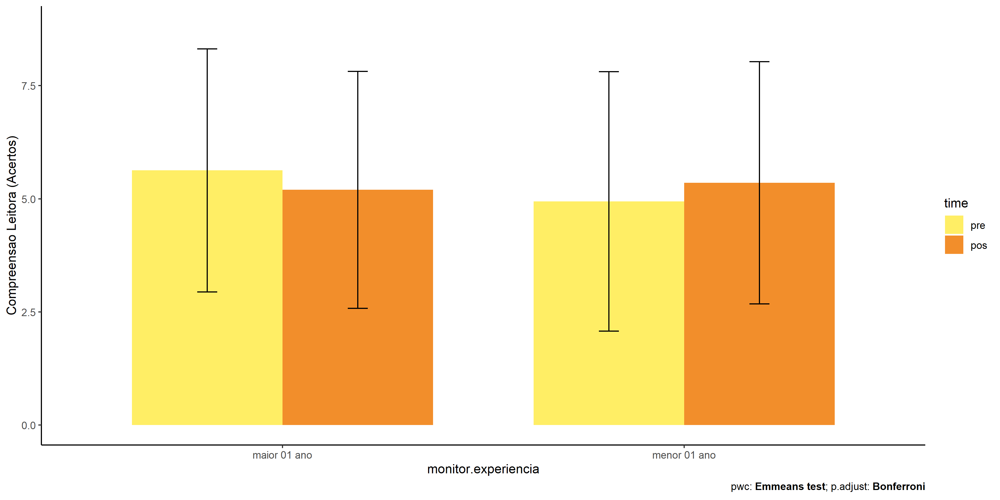<!-- -->

<!-- -->

<!-- -->

<!-- -->

<!-- -->

## factores: **zona.participante:grupo**

### Quant. Palavras Lidas

| var                | zona.participante | grupo    |   n | M (pre) | SE (pre) | M (unadj) | SE (unadj) | M (adj) | SE (adj) |
|:-------------------|:------------------|:---------|----:|--------:|---------:|----------:|-----------:|--------:|---------:|
| palavras.lidas.pos | Rural             | Controle |  47 | 124.404 |   11.531 |   116.553 |      7.025 | 117.323 |    9.274 |
| palavras.lidas.pos | Rural             | WordGen  |  43 | 124.814 |   13.967 |   118.837 |      7.321 | 119.561 |    9.695 |
| palavras.lidas.pos | Urbana            | Controle |  61 | 132.492 |   11.276 |   112.098 |      9.330 | 111.967 |    8.135 |
| palavras.lidas.pos | Urbana            | WordGen  |  36 | 146.083 |   15.431 |   161.417 |     13.509 | 159.771 |   10.618 |

| .y.                | grupo    | zona.participante | group1   | group2  | estimate | conf.low | conf.high |     se | statistic | p       | p.adj   | p.adj.signif |
|:-------------------|:---------|:------------------|:---------|:--------|---------:|---------:|----------:|-------:|----------:|:--------|:--------|:-------------|
| palavras.lidas.pos | Controle |                   | Urbana   | Rural   |   -5.356 |  -29.700 |    18.989 | 12.338 |    -0.434 | 0.665   | 0.665   | ns           |
| palavras.lidas.pos | WordGen  |                   | Urbana   | Rural   |   40.210 |   11.803 |    68.617 | 14.397 |     2.793 | 0.006   | 0.006   | \*\*         |
| palavras.lidas.pre | Controle |                   | Urbana   | Rural   |    8.088 |  -25.468 |    41.643 | 17.007 |     0.476 | 0.635   | 0.635   | ns           |
| palavras.lidas.pre | WordGen  |                   | Urbana   | Rural   |   21.269 |  -17.787 |    60.326 | 19.796 |     1.074 | 0.284   | 0.284   | ns           |
| palavras.lidas.pos |          | Urbana            | Controle | WordGen |  -47.804 |  -74.189 |   -21.420 | 13.372 |    -3.575 | \<0.001 | \<0.001 | \*\*\*       |
| palavras.lidas.pos |          | Rural             | Controle | WordGen |   -2.238 |  -28.691 |    24.214 | 13.407 |    -0.167 | 0.868   | 0.868   | ns           |
| palavras.lidas.pre |          | Urbana            | Controle | WordGen |  -13.592 |  -49.928 |    22.745 | 18.417 |    -0.738 | 0.461   | 0.461   | ns           |
| palavras.lidas.pre |          | Rural             | Controle | WordGen |   -0.410 |  -36.894 |    36.075 | 18.492 |    -0.022 | 0.982   | 0.982   | ns           |

| grupo    | zona.participante | group1 | group2 | estimate | conf.low | conf.high |     se | statistic |     p | p.adj | p.adj.signif |
|:---------|:------------------|:-------|:-------|---------:|---------:|----------:|-------:|----------:|------:|------:|:-------------|
| Controle | Urbana            | pre    | pos    |   22.396 |   -3.787 |    48.579 | 13.319 |     1.681 | 0.093 | 0.093 | ns           |
| Controle | Rural             | pre    | pos    |   11.164 |  -18.898 |    41.227 | 15.293 |     0.730 | 0.466 | 0.466 | ns           |
| WordGen  | Urbana            | pre    | pos    |  -25.840 |  -59.447 |     7.767 | 17.096 |    -1.511 | 0.131 | 0.131 | ns           |
| WordGen  | Rural             | pre    | pos    |    0.575 |  -31.007 |    32.156 | 16.066 |     0.036 | 0.971 | 0.971 | ns           |

    ## Scale for colour is already present.
    ## Adding another scale for colour, which will replace the existing scale.

<!-- -->

    ## Scale for colour is already present.
    ## Adding another scale for colour, which will replace the existing scale.

<!-- -->

<!-- -->

<!-- -->

<!-- -->

<!-- -->

### Compreensao Leitora (Acertos)

| var                   | zona.participante | grupo    |   n | M (pre) | SE (pre) | M (unadj) | SE (unadj) | M (adj) | SE (adj) |
|:----------------------|:------------------|:---------|----:|--------:|---------:|----------:|-----------:|--------:|---------:|
| score.compreensao.pos | Rural             | Controle |  51 |   4.608 |    0.330 |     4.353 |      0.370 |   4.732 |    0.264 |
| score.compreensao.pos | Rural             | WordGen  |  46 |   5.457 |    0.403 |     5.217 |      0.402 |   4.969 |    0.277 |
| score.compreensao.pos | Urbana            | Controle |  67 |   5.194 |    0.298 |     5.194 |      0.329 |   5.140 |    0.229 |
| score.compreensao.pos | Urbana            | WordGen  |  43 |   5.256 |    0.430 |     5.326 |      0.396 |   5.226 |    0.286 |

| .y.                   | grupo    | zona.participante | group1   | group2  | estimate | conf.low | conf.high |    se | statistic |     p | p.adj | p.adj.signif |
|:----------------------|:---------|:------------------|:---------|:--------|---------:|---------:|----------:|------:|----------:|------:|------:|:-------------|
| score.compreensao.pos | Controle |                   | Urbana   | Rural   |    0.407 |   -0.283 |     1.098 | 0.350 |     1.164 | 0.246 | 0.246 | ns           |
| score.compreensao.pos | WordGen  |                   | Urbana   | Rural   |    0.257 |   -0.529 |     1.042 | 0.398 |     0.644 | 0.520 | 0.520 | ns           |
| score.compreensao.pre | Controle |                   | Urbana   | Rural   |    0.586 |   -0.355 |     1.528 | 0.477 |     1.228 | 0.221 | 0.221 | ns           |
| score.compreensao.pre | WordGen  |                   | Urbana   | Rural   |   -0.201 |   -1.275 |     0.874 | 0.545 |    -0.368 | 0.713 | 0.713 | ns           |
| score.compreensao.pos |          | Urbana            | Controle | WordGen |   -0.086 |   -0.809 |     0.638 | 0.367 |    -0.234 | 0.815 | 0.815 | ns           |
| score.compreensao.pos |          | Rural             | Controle | WordGen |   -0.237 |   -0.994 |     0.521 | 0.384 |    -0.616 | 0.539 | 0.539 | ns           |
| score.compreensao.pre |          | Urbana            | Controle | WordGen |   -0.062 |   -1.052 |     0.928 | 0.502 |    -0.123 | 0.902 | 0.902 | ns           |
| score.compreensao.pre |          | Rural             | Controle | WordGen |   -0.849 |   -1.879 |     0.181 | 0.522 |    -1.624 | 0.106 | 0.106 | ns           |

| grupo    | zona.participante | group1 | group2 | estimate | conf.low | conf.high |    se | statistic |     p | p.adj | p.adj.signif |
|:---------|:------------------|:-------|:-------|---------:|---------:|----------:|------:|----------:|------:|------:|:-------------|
| Controle | Urbana            | pre    | pos    |    0.206 |   -0.650 |     1.063 | 0.436 |     0.473 | 0.636 | 0.636 | ns           |
| Controle | Rural             | pre    | pos    |    0.271 |   -0.722 |     1.264 | 0.505 |     0.537 | 0.592 | 0.592 | ns           |
| WordGen  | Urbana            | pre    | pos    |   -0.304 |   -1.388 |     0.780 | 0.551 |    -0.552 | 0.581 | 0.581 | ns           |
| WordGen  | Rural             | pre    | pos    |    0.163 |   -0.874 |     1.201 | 0.528 |     0.309 | 0.757 | 0.757 | ns           |

    ## Scale for colour is already present.
    ## Adding another scale for colour, which will replace the existing scale.

<!-- -->

    ## Scale for colour is already present.
    ## Adding another scale for colour, which will replace the existing scale.

<!-- -->

<!-- -->

<!-- -->

<!-- -->

<!-- -->

### Compreensao Leitora (TRI)

| var                 | zona.participante | grupo    |   n | M (pre) | SE (pre) | M (unadj) | SE (unadj) | M (adj) | SE (adj) |
|:--------------------|:------------------|:---------|----:|--------:|---------:|----------:|-----------:|--------:|---------:|
| tri.compreensao.pos | Rural             | Controle |  51 |  -0.051 |    0.106 |    -0.103 |      0.119 |   0.012 |    0.083 |
| tri.compreensao.pos | Rural             | WordGen  |  46 |   0.239 |    0.123 |     0.120 |      0.123 |   0.017 |    0.088 |
| tri.compreensao.pos | Urbana            | Controle |  68 |   0.074 |    0.096 |     0.090 |      0.103 |   0.111 |    0.072 |
| tri.compreensao.pos | Urbana            | WordGen  |  43 |   0.184 |    0.128 |     0.168 |      0.128 |   0.107 |    0.091 |

| .y.                 | grupo    | zona.participante | group1   | group2  | estimate | conf.low | conf.high |    se | statistic |     p | p.adj | p.adj.signif |
|:--------------------|:---------|:------------------|:---------|:--------|---------:|---------:|----------:|------:|----------:|------:|------:|:-------------|
| tri.compreensao.pos | Controle |                   | Urbana   | Rural   |    0.099 |   -0.118 |     0.316 | 0.110 |     0.898 | 0.370 | 0.370 | ns           |
| tri.compreensao.pos | WordGen  |                   | Urbana   | Rural   |    0.090 |   -0.158 |     0.338 | 0.126 |     0.716 | 0.475 | 0.475 | ns           |
| tri.compreensao.pre | Controle |                   | Urbana   | Rural   |    0.125 |   -0.168 |     0.418 | 0.149 |     0.840 | 0.402 | 0.402 | ns           |
| tri.compreensao.pre | WordGen  |                   | Urbana   | Rural   |   -0.055 |   -0.391 |     0.280 | 0.170 |    -0.324 | 0.746 | 0.746 | ns           |
| tri.compreensao.pos |          | Urbana            | Controle | WordGen |    0.004 |   -0.224 |     0.232 | 0.116 |     0.034 | 0.973 | 0.973 | ns           |
| tri.compreensao.pos |          | Rural             | Controle | WordGen |   -0.005 |   -0.245 |     0.235 | 0.122 |    -0.040 | 0.968 | 0.968 | ns           |
| tri.compreensao.pre |          | Urbana            | Controle | WordGen |   -0.109 |   -0.417 |     0.199 | 0.156 |    -0.699 | 0.485 | 0.485 | ns           |
| tri.compreensao.pre |          | Rural             | Controle | WordGen |   -0.289 |   -0.611 |     0.032 | 0.163 |    -1.774 | 0.078 | 0.078 | ns           |

| grupo    | zona.participante | group1 | group2 | estimate | conf.low | conf.high |    se | statistic |     p | p.adj | p.adj.signif |
|:---------|:------------------|:-------|:-------|---------:|---------:|----------:|------:|----------:|------:|------:|:-------------|
| Controle | Urbana            | pre    | pos    |    0.043 |   -0.225 |     0.312 | 0.137 |     0.318 | 0.751 | 0.751 | ns           |
| Controle | Rural             | pre    | pos    |    0.067 |   -0.246 |     0.379 | 0.159 |     0.420 | 0.675 | 0.675 | ns           |
| WordGen  | Urbana            | pre    | pos    |   -0.051 |   -0.392 |     0.290 | 0.173 |    -0.296 | 0.767 | 0.767 | ns           |
| WordGen  | Rural             | pre    | pos    |    0.097 |   -0.229 |     0.424 | 0.166 |     0.585 | 0.559 | 0.559 | ns           |

    ## Scale for colour is already present.
    ## Adding another scale for colour, which will replace the existing scale.

<!-- -->

    ## Scale for colour is already present.
    ## Adding another scale for colour, which will replace the existing scale.

<!-- -->

<!-- -->

<!-- -->

<!-- -->

<!-- -->

## factores: **escola:grupo**

### Quant. Palavras Lidas

| var                | escola | grupo    |   n | M (pre) | SE (pre) | M (unadj) | SE (unadj) | M (adj) | SE (adj) |
|:-------------------|:-------|:---------|----:|--------:|---------:|----------:|-----------:|--------:|---------:|
| palavras.lidas.pos | E1     | Controle |  13 |  85.385 |    9.536 |    86.154 |     10.925 | 100.195 |   15.897 |
| palavras.lidas.pos | E1     | WordGen  |   8 | 123.625 |   25.555 |   192.500 |     44.197 | 192.818 |   20.061 |
| palavras.lidas.pos | E2     | Controle |  13 |  87.692 |   14.529 |   153.154 |     29.336 | 166.367 |   15.878 |
| palavras.lidas.pos | E2     | WordGen  |  10 |  88.300 |    6.087 |   181.000 |     22.858 | 193.995 |   18.063 |
| palavras.lidas.pos | E3     | Controle |  18 | 113.500 |   17.614 |    94.722 |     12.938 |  98.674 |   13.389 |
| palavras.lidas.pos | E3     | WordGen  |  15 |  84.800 |   12.165 |   101.867 |     10.170 | 116.118 |   14.827 |
| palavras.lidas.pos | E4     | Controle |  20 | 247.650 |   13.699 |    98.450 |      6.032 |  54.259 |   14.526 |
| palavras.lidas.pos | E4     | WordGen  |  10 | 283.700 |   17.167 |   100.600 |      7.343 |  43.471 |   20.139 |
| palavras.lidas.pos | E5     | Controle |  59 | 103.525 |    8.525 |   122.780 |      7.525 | 130.311 |    7.485 |
| palavras.lidas.pos | E5     | WordGen  |  50 | 123.380 |   11.418 |   153.680 |      9.449 | 154.086 |    8.025 |
| palavras.lidas.pos | E6     | Controle |  14 | 102.643 |   17.160 |   123.214 |     13.248 | 131.062 |   15.216 |
| palavras.lidas.pos | E6     | WordGen  |  11 |  96.909 |   19.783 |   110.000 |     11.407 | 119.905 |   17.181 |

| .y.                | grupo    | escola | group1   | group2  | estimate | conf.low | conf.high |     se | statistic | p       | p.adj   | p.adj.signif |
|:-------------------|:---------|:-------|:---------|:--------|---------:|---------:|----------:|-------:|----------:|:--------|:--------|:-------------|
| palavras.lidas.pos | Controle |        | E1       | E2      |  -66.172 | -110.025 |   -22.318 | 22.256 |    -2.973 | 0.003   | 0.049   | \*           |
| palavras.lidas.pos | Controle |        | E1       | E3      |    1.521 |  -39.296 |    42.339 | 20.715 |     0.073 | 0.942   | 1       | ns           |
| palavras.lidas.pos | Controle |        | E1       | E4      |   45.936 |    2.074 |    89.798 | 22.260 |     2.064 | 0.04    | 0.603   | ns           |
| palavras.lidas.pos | Controle |        | E1       | E5      |  -30.116 |  -64.432 |     4.201 | 17.416 |    -1.729 | 0.085   | 1       | ns           |
| palavras.lidas.pos | Controle |        | E1       | E6      |  -30.867 |  -73.974 |    12.240 | 21.877 |    -1.411 | 0.16    | 1       | ns           |
| palavras.lidas.pos | Controle |        | E2       | E3      |   67.693 |   26.895 |   108.492 | 20.705 |     3.269 | 0.001   | 0.019   | \*           |
| palavras.lidas.pos | Controle |        | E2       | E4      |  112.108 |   68.355 |   155.861 | 22.205 |     5.049 | \<0.001 | \<0.001 | \*\*\*\*     |
| palavras.lidas.pos | Controle |        | E2       | E5      |   36.056 |    1.755 |    70.358 | 17.408 |     2.071 | 0.039   | 0.592   | ns           |
| palavras.lidas.pos | Controle |        | E2       | E6      |   35.305 |   -7.791 |    78.401 | 21.871 |     1.614 | 0.108   | 1       | ns           |
| palavras.lidas.pos | Controle |        | E3       | E4      |   44.415 |    5.045 |    83.785 | 19.981 |     2.223 | 0.027   | 0.408   | ns           |
| palavras.lidas.pos | Controle |        | E3       | E5      |  -31.637 |  -61.763 |    -1.511 | 15.289 |    -2.069 | 0.04    | 0.595   | ns           |
| palavras.lidas.pos | Controle |        | E3       | E6      |  -32.388 |  -72.248 |     7.471 | 20.229 |    -1.601 | 0.111   | 1       | ns           |
| palavras.lidas.pos | Controle |        | E4       | E5      |  -76.052 | -109.263 |   -42.841 | 16.855 |    -4.512 | \<0.001 | \<0.001 | \*\*\*       |
| palavras.lidas.pos | Controle |        | E4       | E6      |  -76.803 | -119.079 |   -34.527 | 21.455 |    -3.580 | \<0.001 | 0.006   | \*\*         |
| palavras.lidas.pos | Controle |        | E5       | E6      |   -0.751 |  -33.989 |    32.486 | 16.868 |    -0.045 | 0.965   | 1       | ns           |
| palavras.lidas.pos | WordGen  |        | E1       | E2      |   -1.177 |  -54.360 |    52.006 | 26.991 |    -0.044 | 0.965   | 1       | ns           |
| palavras.lidas.pos | WordGen  |        | E1       | E3      |   76.700 |   27.556 |   125.844 | 24.941 |     3.075 | 0.002   | 0.035   | \*           |
| palavras.lidas.pos | WordGen  |        | E1       | E4      |  149.346 |   93.304 |   205.389 | 28.442 |     5.251 | \<0.001 | \<0.001 | \*\*\*\*     |
| palavras.lidas.pos | WordGen  |        | E1       | E5      |   38.732 |   -3.841 |    81.305 | 21.606 |     1.793 | 0.074   | 1       | ns           |
| palavras.lidas.pos | WordGen  |        | E1       | E6      |   72.912 |   20.874 |   124.951 | 26.410 |     2.761 | 0.006   | 0.094   | ns           |
| palavras.lidas.pos | WordGen  |        | E2       | E3      |   77.877 |   32.232 |   123.522 | 23.165 |     3.362 | \<0.001 | 0.014   | \*           |
| palavras.lidas.pos | WordGen  |        | E2       | E4      |  150.524 |   95.850 |   205.197 | 27.747 |     5.425 | \<0.001 | \<0.001 | \*\*\*\*     |
| palavras.lidas.pos | WordGen  |        | E2       | E5      |   39.909 |    0.977 |    78.842 | 19.759 |     2.020 | 0.045   | 0.669   | ns           |
| palavras.lidas.pos | WordGen  |        | E2       | E6      |   74.090 |   25.230 |   122.949 | 24.797 |     2.988 | 0.003   | 0.047   | \*           |
| palavras.lidas.pos | WordGen  |        | E3       | E4      |   72.646 |   21.753 |   123.540 | 25.829 |     2.813 | 0.005   | 0.08    | ns           |
| palavras.lidas.pos | WordGen  |        | E3       | E5      |  -37.968 |  -71.170 |    -4.766 | 16.850 |    -2.253 | 0.025   | 0.378   | ns           |
| palavras.lidas.pos | WordGen  |        | E3       | E6      |   -3.788 |  -48.190 |    40.615 | 22.534 |    -0.168 | 0.867   | 1       | ns           |
| palavras.lidas.pos | WordGen  |        | E4       | E5      | -110.614 | -153.385 |   -67.844 | 21.706 |    -5.096 | \<0.001 | \<0.001 | \*\*\*\*     |
| palavras.lidas.pos | WordGen  |        | E4       | E6      |  -76.434 | -129.663 |   -23.205 | 27.014 |    -2.829 | 0.005   | 0.076   | ns           |
| palavras.lidas.pos | WordGen  |        | E5       | E6      |   34.180 |   -3.174 |    71.534 | 18.957 |     1.803 | 0.073   | 1       | ns           |
| palavras.lidas.pre | Controle |        | E1       | E2      |   -2.308 |  -52.752 |    48.137 | 25.602 |    -0.090 | 0.928   | 1       | ns           |
| palavras.lidas.pre | Controle |        | E1       | E3      |  -28.115 |  -74.926 |    18.695 | 23.757 |    -1.183 | 0.238   | 1       | ns           |
| palavras.lidas.pre | Controle |        | E1       | E4      | -162.265 | -208.084 |  -116.447 | 23.254 |    -6.978 | \<0.001 | \<0.001 | \*\*\*\*     |
| palavras.lidas.pre | Controle |        | E1       | E5      |  -18.141 |  -57.545 |    21.263 | 19.998 |    -0.907 | 0.365   | 1       | ns           |
| palavras.lidas.pre | Controle |        | E1       | E6      |  -17.258 |  -66.794 |    32.278 | 25.140 |    -0.686 | 0.493   | 1       | ns           |
| palavras.lidas.pre | Controle |        | E2       | E3      |  -25.808 |  -72.618 |    21.003 | 23.757 |    -1.086 | 0.278   | 1       | ns           |
| palavras.lidas.pre | Controle |        | E2       | E4      | -159.958 | -205.776 |  -114.139 | 23.254 |    -6.879 | \<0.001 | \<0.001 | \*\*\*\*     |
| palavras.lidas.pre | Controle |        | E2       | E5      |  -15.833 |  -55.237 |    23.571 | 19.998 |    -0.792 | 0.429   | 1       | ns           |
| palavras.lidas.pre | Controle |        | E2       | E6      |  -14.951 |  -64.486 |    34.585 | 25.140 |    -0.595 | 0.553   | 1       | ns           |
| palavras.lidas.pre | Controle |        | E3       | E4      | -134.150 | -175.934 |   -92.366 | 21.206 |    -6.326 | \<0.001 | \<0.001 | \*\*\*\*     |
| palavras.lidas.pre | Controle |        | E3       | E5      |    9.975 |  -24.656 |    44.605 | 17.575 |     0.568 | 0.571   | 1       | ns           |
| palavras.lidas.pre | Controle |        | E3       | E6      |   10.857 |  -34.973 |    56.687 | 23.259 |     0.467 | 0.641   | 1       | ns           |
| palavras.lidas.pre | Controle |        | E4       | E5      |  144.125 |  110.847 |   177.402 | 16.889 |     8.534 | \<0.001 | \<0.001 | \*\*\*\*     |
| palavras.lidas.pre | Controle |        | E4       | E6      |  145.007 |  100.191 |   189.823 | 22.745 |     6.375 | \<0.001 | \<0.001 | \*\*\*\*     |
| palavras.lidas.pre | Controle |        | E5       | E6      |    0.883 |  -37.351 |    39.116 | 19.404 |     0.045 | 0.964   | 1       | ns           |
| palavras.lidas.pre | WordGen  |        | E1       | E2      |   35.325 |  -25.680 |    96.330 | 30.961 |     1.141 | 0.255   | 1       | ns           |
| palavras.lidas.pre | WordGen  |        | E1       | E3      |   38.825 |  -17.480 |    95.130 | 28.576 |     1.359 | 0.176   | 1       | ns           |
| palavras.lidas.pre | WordGen  |        | E1       | E4      | -160.075 | -221.080 |   -99.070 | 30.961 |    -5.170 | \<0.001 | \<0.001 | \*\*\*\*     |
| palavras.lidas.pre | WordGen  |        | E1       | E5      |    0.245 |  -48.728 |    49.218 | 24.855 |     0.010 | 0.992   | 1       | ns           |
| palavras.lidas.pre | WordGen  |        | E1       | E6      |   26.716 |  -33.044 |    86.476 | 30.329 |     0.881 | 0.379   | 1       | ns           |
| palavras.lidas.pre | WordGen  |        | E2       | E3      |    3.500 |  -49.005 |    56.005 | 26.647 |     0.131 | 0.896   | 1       | ns           |
| palavras.lidas.pre | WordGen  |        | E2       | E4      | -195.400 | -252.916 |  -137.884 | 29.190 |    -6.694 | \<0.001 | \<0.001 | \*\*\*\*     |
| palavras.lidas.pre | WordGen  |        | E2       | E5      |  -35.080 |  -79.632 |     9.472 | 22.611 |    -1.551 | 0.122   | 1       | ns           |
| palavras.lidas.pre | WordGen  |        | E2       | E6      |   -8.609 |  -64.803 |    47.584 | 28.519 |    -0.302 | 0.763   | 1       | ns           |
| palavras.lidas.pre | WordGen  |        | E3       | E4      | -198.900 | -251.405 |  -146.395 | 26.647 |    -7.464 | \<0.001 | \<0.001 | \*\*\*\*     |
| palavras.lidas.pre | WordGen  |        | E3       | E5      |  -38.580 |  -76.442 |    -0.718 | 19.215 |    -2.008 | 0.046   | 0.688   | ns           |
| palavras.lidas.pre | WordGen  |        | E3       | E6      |  -12.109 |  -63.162 |    38.943 | 25.910 |    -0.467 | 0.641   | 1       | ns           |
| palavras.lidas.pre | WordGen  |        | E4       | E5      |  160.320 |  115.768 |   204.872 | 22.611 |     7.090 | \<0.001 | \<0.001 | \*\*\*\*     |
| palavras.lidas.pre | WordGen  |        | E4       | E6      |  186.791 |  130.597 |   242.984 | 28.519 |     6.550 | \<0.001 | \<0.001 | \*\*\*\*     |
| palavras.lidas.pre | WordGen  |        | E5       | E6      |   26.471 |  -16.360 |    69.302 | 21.737 |     1.218 | 0.225   | 1       | ns           |
| palavras.lidas.pos |          | E1     | Controle | WordGen |  -92.623 | -143.048 |   -42.197 | 25.591 |    -3.619 | \<0.001 | \<0.001 | \*\*\*       |
| palavras.lidas.pos |          | E2     | Controle | WordGen |  -27.628 |  -74.655 |    19.399 | 23.866 |    -1.158 | 0.248   | 0.248   | ns           |
| palavras.lidas.pos |          | E3     | Controle | WordGen |  -17.444 |  -56.665 |    21.777 | 19.905 |    -0.876 | 0.382   | 0.382   | ns           |
| palavras.lidas.pos |          | E4     | Controle | WordGen |   10.787 |  -32.706 |    54.280 | 22.073 |     0.489 | 0.626   | 0.626   | ns           |
| palavras.lidas.pos |          | E5     | Controle | WordGen |  -23.775 |  -45.383 |    -2.167 | 10.966 |    -2.168 | 0.031   | 0.031   | \*           |
| palavras.lidas.pos |          | E6     | Controle | WordGen |   11.157 |  -33.895 |    56.208 | 22.864 |     0.488 | 0.626   | 0.626   | ns           |
| palavras.lidas.pre |          | E1     | Controle | WordGen |  -38.240 |  -96.032 |    19.551 | 29.330 |    -1.304 | 0.194   | 0.194   | ns           |
| palavras.lidas.pre |          | E2     | Controle | WordGen |   -0.608 |  -54.704 |    53.488 | 27.455 |    -0.022 | 0.982   | 0.982   | ns           |
| palavras.lidas.pre |          | E3     | Controle | WordGen |   28.700 |  -16.262 |    73.662 | 22.819 |     1.258 | 0.21    | 0.21    | ns           |
| palavras.lidas.pre |          | E4     | Controle | WordGen |  -36.050 |  -85.860 |    13.760 | 25.280 |    -1.426 | 0.155   | 0.155   | ns           |
| palavras.lidas.pre |          | E5     | Controle | WordGen |  -19.855 |  -44.576 |     4.867 | 12.547 |    -1.582 | 0.115   | 0.115   | ns           |
| palavras.lidas.pre |          | E6     | Controle | WordGen |    5.734 |  -46.084 |    57.552 | 26.299 |     0.218 | 0.828   | 0.828   | ns           |

| grupo    | escola | group1 | group2 | estimate | conf.low | conf.high |     se | statistic | p       | p.adj   | p.adj.signif |
|:---------|:-------|:-------|:-------|---------:|---------:|----------:|-------:|----------:|:--------|:--------|:-------------|
| Controle | E1     | pre    | pos    |   -2.421 |  -50.307 |    45.466 | 24.376 |    -0.099 | 0.921   | 0.921   | ns           |
| Controle | E2     | pre    | pos    |  -56.790 |  -98.171 |   -15.409 | 21.064 |    -2.696 | 0.007   | 0.007   | \*\*         |
| Controle | E3     | pre    | pos    |   28.955 |  -11.057 |    68.967 | 20.367 |     1.422 | 0.156   | 0.156   | ns           |
| Controle | E4     | pre    | pos    |  149.200 |  109.238 |   189.162 | 20.342 |     7.335 | \<0.001 | \<0.001 | \*\*\*\*     |
| Controle | E5     | pre    | pos    |   -8.918 |  -31.380 |    13.543 | 11.434 |    -0.780 | 0.436   | 0.436   | ns           |
| Controle | E6     | pre    | pos    |  -21.267 |  -67.411 |    24.878 | 23.489 |    -0.905 | 0.366   | 0.366   | ns           |
| WordGen  | E1     | pre    | pos    | -101.808 | -158.594 |   -45.022 | 28.906 |    -3.522 | \<0.001 | \<0.001 | \*\*\*       |
| WordGen  | E2     | pre    | pos    |  -87.565 | -133.892 |   -41.239 | 23.582 |    -3.713 | \<0.001 | \<0.001 | \*\*\*       |
| WordGen  | E3     | pre    | pos    |  -12.992 |  -58.409 |    32.426 | 23.119 |    -0.562 | 0.574   | 0.574   | ns           |
| WordGen  | E4     | pre    | pos    |  183.100 |  126.585 |   239.615 | 28.768 |     6.365 | \<0.001 | \<0.001 | \*\*\*\*     |
| WordGen  | E5     | pre    | pos    |  -28.421 |  -53.209 |    -3.633 | 12.618 |    -2.252 | 0.025   | 0.025   | \*           |
| WordGen  | E6     | pre    | pos    |  -28.571 |  -79.488 |    22.345 | 25.918 |    -1.102 | 0.271   | 0.271   | ns           |

    ## Scale for colour is already present.
    ## Adding another scale for colour, which will replace the existing scale.

<!-- -->

    ## Scale for colour is already present.
    ## Adding another scale for colour, which will replace the existing scale.

<!-- -->

<!-- -->

<!-- -->

<!-- -->

<!-- -->

### Compreensao Leitora (Acertos)

| var                   | escola | grupo    |   n | M (pre) | SE (pre) | M (unadj) | SE (unadj) | M (adj) | SE (adj) |
|:----------------------|:-------|:---------|----:|--------:|---------:|----------:|-----------:|--------:|---------:|
| score.compreensao.pos | E1     | Controle |  13 |   5.462 |    0.656 |     5.615 |      0.738 |   5.482 |    0.518 |
| score.compreensao.pos | E1     | WordGen  |   8 |   5.500 |    1.165 |     5.875 |      1.217 |   5.713 |    0.661 |
| score.compreensao.pos | E2     | Controle |  29 |   4.379 |    0.524 |     4.724 |      0.548 |   5.387 |    0.349 |
| score.compreensao.pos | E2     | WordGen  |  22 |   4.091 |    0.562 |     3.818 |      0.419 |   4.694 |    0.402 |
| score.compreensao.pos | E3     | Controle |  19 |   5.000 |    0.501 |     4.684 |      0.617 |   4.890 |    0.429 |
| score.compreensao.pos | E3     | WordGen  |  14 |   5.786 |    0.743 |     5.429 |      0.789 |   5.056 |    0.500 |
| score.compreensao.pos | E4     | Controle |  19 |   5.789 |    0.475 |     5.474 |      0.618 |   5.098 |    0.429 |
| score.compreensao.pos | E4     | WordGen  |  10 |   6.700 |    0.844 |     5.900 |      0.900 |   4.854 |    0.594 |
| score.compreensao.pos | E5     | Controle |  59 |   4.881 |    0.328 |     4.424 |      0.341 |   4.717 |    0.244 |
| score.compreensao.pos | E5     | WordGen  |  50 |   5.660 |    0.371 |     5.460 |      0.345 |   5.180 |    0.265 |
| score.compreensao.pos | E6     | Controle |  14 |   6.357 |    0.753 |     5.429 |      0.782 |   4.635 |    0.502 |
| score.compreensao.pos | E6     | WordGen  |  11 |   6.364 |    0.877 |     5.182 |      0.893 |   4.384 |    0.565 |

| .y.                   | grupo    | escola | group1   | group2  | estimate | conf.low | conf.high |    se | statistic |     p | p.adj | p.adj.signif |
|:----------------------|:---------|:-------|:---------|:--------|---------:|---------:|----------:|------:|----------:|------:|------:|:-------------|
| score.compreensao.pos | Controle |        | E1       | E2      |    0.094 |   -1.138 |     1.326 | 0.626 |     0.151 | 0.880 | 1.000 | ns           |
| score.compreensao.pos | Controle |        | E1       | E3      |    0.591 |   -0.734 |     1.916 | 0.673 |     0.879 | 0.380 | 1.000 | ns           |
| score.compreensao.pos | Controle |        | E1       | E4      |    0.383 |   -0.942 |     1.708 | 0.673 |     0.570 | 0.569 | 1.000 | ns           |
| score.compreensao.pos | Controle |        | E1       | E5      |    0.764 |   -0.364 |     1.893 | 0.573 |     1.334 | 0.183 | 1.000 | ns           |
| score.compreensao.pos | Controle |        | E1       | E6      |    0.846 |   -0.573 |     2.266 | 0.721 |     1.174 | 0.241 | 1.000 | ns           |
| score.compreensao.pos | Controle |        | E2       | E3      |    0.497 |   -0.590 |     1.585 | 0.552 |     0.900 | 0.369 | 1.000 | ns           |
| score.compreensao.pos | Controle |        | E2       | E4      |    0.289 |   -0.804 |     1.382 | 0.555 |     0.521 | 0.603 | 1.000 | ns           |
| score.compreensao.pos | Controle |        | E2       | E5      |    0.670 |   -0.166 |     1.506 | 0.424 |     1.579 | 0.116 | 1.000 | ns           |
| score.compreensao.pos | Controle |        | E2       | E6      |    0.752 |   -0.458 |     1.962 | 0.615 |     1.224 | 0.222 | 1.000 | ns           |
| score.compreensao.pos | Controle |        | E3       | E4      |   -0.208 |   -1.404 |     0.988 | 0.607 |    -0.343 | 0.732 | 1.000 | ns           |
| score.compreensao.pos | Controle |        | E3       | E5      |    0.173 |   -0.798 |     1.144 | 0.493 |     0.351 | 0.726 | 1.000 | ns           |
| score.compreensao.pos | Controle |        | E3       | E6      |    0.255 |   -1.047 |     1.557 | 0.661 |     0.386 | 0.700 | 1.000 | ns           |
| score.compreensao.pos | Controle |        | E4       | E5      |    0.381 |   -0.593 |     1.355 | 0.495 |     0.771 | 0.442 | 1.000 | ns           |
| score.compreensao.pos | Controle |        | E4       | E6      |    0.463 |   -0.834 |     1.760 | 0.659 |     0.703 | 0.483 | 1.000 | ns           |
| score.compreensao.pos | Controle |        | E5       | E6      |    0.082 |   -1.020 |     1.184 | 0.559 |     0.147 | 0.884 | 1.000 | ns           |
| score.compreensao.pos | WordGen  |        | E1       | E2      |    1.019 |   -0.505 |     2.543 | 0.774 |     1.317 | 0.189 | 1.000 | ns           |
| score.compreensao.pos | WordGen  |        | E1       | E3      |    0.657 |   -0.974 |     2.288 | 0.828 |     0.793 | 0.428 | 1.000 | ns           |
| score.compreensao.pos | WordGen  |        | E1       | E4      |    0.859 |   -0.890 |     2.607 | 0.888 |     0.967 | 0.334 | 1.000 | ns           |
| score.compreensao.pos | WordGen  |        | E1       | E5      |    0.533 |   -0.868 |     1.934 | 0.712 |     0.749 | 0.455 | 1.000 | ns           |
| score.compreensao.pos | WordGen  |        | E1       | E6      |    1.329 |   -0.382 |     3.041 | 0.869 |     1.529 | 0.127 | 1.000 | ns           |
| score.compreensao.pos | WordGen  |        | E2       | E3      |   -0.362 |   -1.629 |     0.905 | 0.643 |    -0.563 | 0.574 | 1.000 | ns           |
| score.compreensao.pos | WordGen  |        | E2       | E4      |   -0.160 |   -1.583 |     1.262 | 0.722 |    -0.222 | 0.824 | 1.000 | ns           |
| score.compreensao.pos | WordGen  |        | E2       | E5      |   -0.486 |   -1.438 |     0.465 | 0.483 |    -1.006 | 0.315 | 1.000 | ns           |
| score.compreensao.pos | WordGen  |        | E2       | E6      |    0.310 |   -1.064 |     1.684 | 0.698 |     0.445 | 0.657 | 1.000 | ns           |
| score.compreensao.pos | WordGen  |        | E3       | E4      |    0.202 |   -1.324 |     1.728 | 0.775 |     0.261 | 0.795 | 1.000 | ns           |
| score.compreensao.pos | WordGen  |        | E3       | E5      |   -0.124 |   -1.237 |     0.989 | 0.565 |    -0.219 | 0.826 | 1.000 | ns           |
| score.compreensao.pos | WordGen  |        | E3       | E6      |    0.672 |   -0.811 |     2.156 | 0.753 |     0.893 | 0.373 | 1.000 | ns           |
| score.compreensao.pos | WordGen  |        | E4       | E5      |   -0.326 |   -1.604 |     0.952 | 0.649 |    -0.502 | 0.616 | 1.000 | ns           |
| score.compreensao.pos | WordGen  |        | E4       | E6      |    0.470 |   -1.138 |     2.079 | 0.817 |     0.576 | 0.565 | 1.000 | ns           |
| score.compreensao.pos | WordGen  |        | E5       | E6      |    0.796 |   -0.431 |     2.023 | 0.623 |     1.278 | 0.202 | 1.000 | ns           |
| score.compreensao.pre | Controle |        | E1       | E2      |    1.082 |   -0.628 |     2.792 | 0.868 |     1.246 | 0.214 | 1.000 | ns           |
| score.compreensao.pre | Controle |        | E1       | E3      |    0.462 |   -1.382 |     2.306 | 0.936 |     0.493 | 0.623 | 1.000 | ns           |
| score.compreensao.pre | Controle |        | E1       | E4      |   -0.328 |   -2.172 |     1.516 | 0.936 |    -0.350 | 0.726 | 1.000 | ns           |
| score.compreensao.pre | Controle |        | E1       | E5      |    0.580 |   -0.989 |     2.150 | 0.797 |     0.728 | 0.467 | 1.000 | ns           |
| score.compreensao.pre | Controle |        | E1       | E6      |   -0.896 |   -2.869 |     1.078 | 1.002 |    -0.894 | 0.372 | 1.000 | ns           |
| score.compreensao.pre | Controle |        | E2       | E3      |   -0.621 |   -2.133 |     0.891 | 0.768 |    -0.808 | 0.420 | 1.000 | ns           |
| score.compreensao.pre | Controle |        | E2       | E4      |   -1.410 |   -2.922 |     0.102 | 0.768 |    -1.836 | 0.067 | 1.000 | ns           |
| score.compreensao.pre | Controle |        | E2       | E5      |   -0.502 |   -1.664 |     0.660 | 0.590 |    -0.851 | 0.396 | 1.000 | ns           |
| score.compreensao.pre | Controle |        | E2       | E6      |   -1.978 |   -3.645 |    -0.311 | 0.847 |    -2.336 | 0.020 | 0.304 | ns           |
| score.compreensao.pre | Controle |        | E3       | E4      |   -0.789 |   -2.452 |     0.873 | 0.844 |    -0.935 | 0.350 | 1.000 | ns           |
| score.compreensao.pre | Controle |        | E3       | E5      |    0.119 |   -1.233 |     1.470 | 0.686 |     0.173 | 0.863 | 1.000 | ns           |
| score.compreensao.pre | Controle |        | E3       | E6      |   -1.357 |   -3.162 |     0.447 | 0.916 |    -1.481 | 0.140 | 1.000 | ns           |
| score.compreensao.pre | Controle |        | E4       | E5      |    0.908 |   -0.443 |     2.260 | 0.686 |     1.323 | 0.187 | 1.000 | ns           |
| score.compreensao.pre | Controle |        | E4       | E6      |   -0.568 |   -2.372 |     1.237 | 0.916 |    -0.620 | 0.536 | 1.000 | ns           |
| score.compreensao.pre | Controle |        | E5       | E6      |   -1.476 |   -2.999 |     0.047 | 0.773 |    -1.908 | 0.057 | 0.862 | ns           |
| score.compreensao.pre | WordGen  |        | E1       | E2      |    1.409 |   -0.706 |     3.524 | 1.074 |     1.312 | 0.191 | 1.000 | ns           |
| score.compreensao.pre | WordGen  |        | E1       | E3      |   -0.286 |   -2.556 |     1.985 | 1.153 |    -0.248 | 0.804 | 1.000 | ns           |
| score.compreensao.pre | WordGen  |        | E1       | E4      |   -1.200 |   -3.630 |     1.230 | 1.234 |    -0.972 | 0.332 | 1.000 | ns           |
| score.compreensao.pre | WordGen  |        | E1       | E5      |   -0.160 |   -2.111 |     1.791 | 0.991 |    -0.162 | 0.872 | 1.000 | ns           |
| score.compreensao.pre | WordGen  |        | E1       | E6      |   -0.864 |   -3.244 |     1.517 | 1.209 |    -0.714 | 0.476 | 1.000 | ns           |
| score.compreensao.pre | WordGen  |        | E2       | E3      |   -1.695 |   -3.446 |     0.057 | 0.889 |    -1.906 | 0.058 | 0.868 | ns           |
| score.compreensao.pre | WordGen  |        | E2       | E4      |   -2.609 |   -4.563 |    -0.655 | 0.992 |    -2.630 | 0.009 | 0.136 | ns           |
| score.compreensao.pre | WordGen  |        | E2       | E5      |   -1.569 |   -2.880 |    -0.258 | 0.666 |    -2.357 | 0.019 | 0.287 | ns           |
| score.compreensao.pre | WordGen  |        | E2       | E6      |   -2.273 |   -4.165 |    -0.381 | 0.961 |    -2.366 | 0.019 | 0.281 | ns           |
| score.compreensao.pre | WordGen  |        | E3       | E4      |   -0.914 |   -3.035 |     1.207 | 1.077 |    -0.849 | 0.397 | 1.000 | ns           |
| score.compreensao.pre | WordGen  |        | E3       | E5      |    0.126 |   -1.423 |     1.675 | 0.787 |     0.160 | 0.873 | 1.000 | ns           |
| score.compreensao.pre | WordGen  |        | E3       | E6      |   -0.578 |   -2.642 |     1.486 | 1.048 |    -0.551 | 0.582 | 1.000 | ns           |
| score.compreensao.pre | WordGen  |        | E4       | E5      |    1.040 |   -0.735 |     2.815 | 0.901 |     1.154 | 0.250 | 1.000 | ns           |
| score.compreensao.pre | WordGen  |        | E4       | E6      |    0.336 |   -1.902 |     2.575 | 1.137 |     0.296 | 0.768 | 1.000 | ns           |
| score.compreensao.pre | WordGen  |        | E5       | E6      |   -0.704 |   -2.410 |     1.003 | 0.866 |    -0.812 | 0.417 | 1.000 | ns           |
| score.compreensao.pos |          | E1     | Controle | WordGen |   -0.231 |   -1.885 |     1.422 | 0.840 |    -0.275 | 0.783 | 0.783 | ns           |
| score.compreensao.pos |          | E2     | Controle | WordGen |    0.694 |   -0.347 |     1.734 | 0.528 |     1.312 | 0.191 | 0.191 | ns           |
| score.compreensao.pos |          | E3     | Controle | WordGen |   -0.166 |   -1.464 |     1.132 | 0.659 |    -0.251 | 0.802 | 0.802 | ns           |
| score.compreensao.pos |          | E4     | Controle | WordGen |    0.244 |   -1.196 |     1.684 | 0.731 |     0.334 | 0.739 | 0.739 | ns           |
| score.compreensao.pos |          | E5     | Controle | WordGen |   -0.463 |   -1.174 |     0.248 | 0.361 |    -1.283 | 0.201 | 0.201 | ns           |
| score.compreensao.pos |          | E6     | Controle | WordGen |    0.252 |   -1.231 |     1.734 | 0.753 |     0.334 | 0.739 | 0.739 | ns           |
| score.compreensao.pre |          | E1     | Controle | WordGen |   -0.038 |   -2.341 |     2.264 | 1.169 |    -0.033 | 0.974 | 0.974 | ns           |
| score.compreensao.pre |          | E2     | Controle | WordGen |    0.288 |   -1.160 |     1.737 | 0.736 |     0.392 | 0.695 | 0.695 | ns           |
| score.compreensao.pre |          | E3     | Controle | WordGen |   -0.786 |   -2.590 |     1.019 | 0.916 |    -0.857 | 0.392 | 0.392 | ns           |
| score.compreensao.pre |          | E4     | Controle | WordGen |   -0.911 |   -2.912 |     1.091 | 1.016 |    -0.896 | 0.371 | 0.371 | ns           |
| score.compreensao.pre |          | E5     | Controle | WordGen |   -0.779 |   -1.763 |     0.206 | 0.500 |    -1.557 | 0.121 | 0.121 | ns           |
| score.compreensao.pre |          | E6     | Controle | WordGen |   -0.006 |   -2.071 |     2.058 | 1.048 |    -0.006 | 0.995 | 0.995 | ns           |

| grupo    | escola | group1 | group2 | estimate | conf.low | conf.high |    se | statistic |     p | p.adj | p.adj.signif |
|:---------|:-------|:-------|:-------|---------:|---------:|----------:|------:|----------:|------:|------:|:-------------|
| Controle | E1     | pre    | pos    |   -0.015 |   -1.979 |     1.948 | 1.000 |    -0.015 | 0.988 | 0.988 | ns           |
| Controle | E2     | pre    | pos    |   -0.171 |   -1.477 |     1.134 | 0.665 |    -0.258 | 0.797 | 0.797 | ns           |
| Controle | E3     | pre    | pos    |    0.533 |   -1.086 |     2.152 | 0.824 |     0.647 | 0.518 | 0.518 | ns           |
| Controle | E4     | pre    | pos    |    0.176 |   -1.484 |     1.836 | 0.845 |     0.209 | 0.835 | 0.835 | ns           |
| Controle | E5     | pre    | pos    |    0.635 |   -0.287 |     1.557 | 0.469 |     1.353 | 0.177 | 0.177 | ns           |
| Controle | E6     | pre    | pos    |    1.067 |   -0.825 |     2.959 | 0.963 |     1.107 | 0.269 | 0.269 | ns           |
| WordGen  | E1     | pre    | pos    |   -1.413 |   -3.742 |     0.915 | 1.185 |    -1.192 | 0.234 | 0.234 | ns           |
| WordGen  | E2     | pre    | pos    |    0.370 |   -1.127 |     1.867 | 0.762 |     0.486 | 0.627 | 0.627 | ns           |
| WordGen  | E3     | pre    | pos    |    0.333 |   -1.559 |     2.225 | 0.963 |     0.346 | 0.729 | 0.729 | ns           |
| WordGen  | E4     | pre    | pos    |    0.800 |   -1.517 |     3.117 | 1.180 |     0.678 | 0.498 | 0.498 | ns           |
| WordGen  | E5     | pre    | pos    |    0.171 |   -0.845 |     1.187 | 0.517 |     0.330 | 0.741 | 0.741 | ns           |
| WordGen  | E6     | pre    | pos    |    0.390 |   -1.698 |     2.477 | 1.063 |     0.367 | 0.714 | 0.714 | ns           |

    ## Scale for colour is already present.
    ## Adding another scale for colour, which will replace the existing scale.

<!-- -->

    ## Scale for colour is already present.
    ## Adding another scale for colour, which will replace the existing scale.

<!-- -->

<!-- -->

<!-- -->

<!-- -->

<!-- -->

### Compreensao Leitora (TRI)

| var                 | escola | grupo    |   n | M (pre) | SE (pre) | M (unadj) | SE (unadj) | M (adj) | SE (adj) |
|:--------------------|:-------|:---------|----:|--------:|---------:|----------:|-----------:|--------:|---------:|
| tri.compreensao.pos | E1     | Controle |  13 |   0.219 |    0.191 |     0.284 |      0.227 |   0.232 |    0.161 |
| tri.compreensao.pos | E1     | WordGen  |   8 |   0.282 |    0.328 |     0.423 |      0.371 |   0.323 |    0.205 |
| tri.compreensao.pos | E2     | Controle |  29 |  -0.144 |    0.157 |     0.034 |      0.165 |   0.253 |    0.108 |
| tri.compreensao.pos | E2     | WordGen  |  22 |  -0.148 |    0.173 |    -0.368 |      0.119 |  -0.146 |    0.124 |
| tri.compreensao.pos | E3     | Controle |  19 |   0.026 |    0.171 |    -0.014 |      0.194 |   0.078 |    0.133 |
| tri.compreensao.pos | E3     | WordGen  |  14 |   0.340 |    0.219 |     0.195 |      0.241 |   0.052 |    0.155 |
| tri.compreensao.pos | E4     | Controle |  19 |   0.343 |    0.155 |     0.195 |      0.197 |   0.050 |    0.133 |
| tri.compreensao.pos | E4     | WordGen  |  10 |   0.662 |    0.268 |     0.306 |      0.312 |  -0.079 |    0.185 |
| tri.compreensao.pos | E5     | Controle |  60 |  -0.013 |    0.107 |    -0.147 |      0.108 |  -0.026 |    0.075 |
| tri.compreensao.pos | E5     | WordGen  |  50 |   0.267 |    0.118 |     0.221 |      0.111 |   0.132 |    0.082 |
| tri.compreensao.pos | E6     | Controle |  14 |   0.465 |    0.238 |     0.109 |      0.253 |  -0.128 |    0.155 |
| tri.compreensao.pos | E6     | WordGen  |  11 |   0.442 |    0.310 |    -0.016 |      0.311 |  -0.236 |    0.175 |

| .y.                 | grupo    | escola | group1   | group2  | estimate | conf.low | conf.high |    se | statistic |     p | p.adj | p.adj.signif |
|:--------------------|:---------|:-------|:---------|:--------|---------:|---------:|----------:|------:|----------:|------:|------:|:-------------|
| tri.compreensao.pos | Controle |        | E1       | E2      |   -0.021 |   -0.403 |     0.361 | 0.194 |    -0.108 | 0.914 | 1.000 | ns           |
| tri.compreensao.pos | Controle |        | E1       | E3      |    0.154 |   -0.257 |     0.565 | 0.209 |     0.737 | 0.462 | 1.000 | ns           |
| tri.compreensao.pos | Controle |        | E1       | E4      |    0.182 |   -0.229 |     0.592 | 0.209 |     0.870 | 0.385 | 1.000 | ns           |
| tri.compreensao.pos | Controle |        | E1       | E5      |    0.258 |   -0.092 |     0.607 | 0.178 |     1.451 | 0.148 | 1.000 | ns           |
| tri.compreensao.pos | Controle |        | E1       | E6      |    0.360 |   -0.080 |     0.800 | 0.223 |     1.610 | 0.109 | 1.000 | ns           |
| tri.compreensao.pos | Controle |        | E2       | E3      |    0.175 |   -0.162 |     0.512 | 0.171 |     1.021 | 0.308 | 1.000 | ns           |
| tri.compreensao.pos | Controle |        | E2       | E4      |    0.203 |   -0.137 |     0.542 | 0.172 |     1.175 | 0.241 | 1.000 | ns           |
| tri.compreensao.pos | Controle |        | E2       | E5      |    0.279 |    0.020 |     0.537 | 0.131 |     2.124 | 0.035 | 0.520 | ns           |
| tri.compreensao.pos | Controle |        | E2       | E6      |    0.381 |    0.006 |     0.756 | 0.190 |     1.999 | 0.047 | 0.700 | ns           |
| tri.compreensao.pos | Controle |        | E3       | E4      |    0.028 |   -0.343 |     0.399 | 0.188 |     0.147 | 0.883 | 1.000 | ns           |
| tri.compreensao.pos | Controle |        | E3       | E5      |    0.104 |   -0.197 |     0.404 | 0.153 |     0.680 | 0.497 | 1.000 | ns           |
| tri.compreensao.pos | Controle |        | E3       | E6      |    0.206 |   -0.198 |     0.610 | 0.205 |     1.004 | 0.316 | 1.000 | ns           |
| tri.compreensao.pos | Controle |        | E4       | E5      |    0.076 |   -0.226 |     0.378 | 0.153 |     0.496 | 0.620 | 1.000 | ns           |
| tri.compreensao.pos | Controle |        | E4       | E6      |    0.178 |   -0.224 |     0.580 | 0.204 |     0.873 | 0.384 | 1.000 | ns           |
| tri.compreensao.pos | Controle |        | E5       | E6      |    0.102 |   -0.239 |     0.443 | 0.173 |     0.589 | 0.556 | 1.000 | ns           |
| tri.compreensao.pos | WordGen  |        | E1       | E2      |    0.469 |   -0.003 |     0.942 | 0.240 |     1.955 | 0.052 | 0.775 | ns           |
| tri.compreensao.pos | WordGen  |        | E1       | E3      |    0.271 |   -0.235 |     0.777 | 0.257 |     1.055 | 0.292 | 1.000 | ns           |
| tri.compreensao.pos | WordGen  |        | E1       | E4      |    0.402 |   -0.140 |     0.944 | 0.275 |     1.459 | 0.146 | 1.000 | ns           |
| tri.compreensao.pos | WordGen  |        | E1       | E5      |    0.191 |   -0.243 |     0.626 | 0.221 |     0.866 | 0.387 | 1.000 | ns           |
| tri.compreensao.pos | WordGen  |        | E1       | E6      |    0.559 |    0.029 |     1.090 | 0.269 |     2.077 | 0.039 | 0.582 | ns           |
| tri.compreensao.pos | WordGen  |        | E2       | E3      |   -0.198 |   -0.591 |     0.194 | 0.199 |    -0.995 | 0.321 | 1.000 | ns           |
| tri.compreensao.pos | WordGen  |        | E2       | E4      |   -0.067 |   -0.508 |     0.373 | 0.224 |    -0.301 | 0.764 | 1.000 | ns           |
| tri.compreensao.pos | WordGen  |        | E2       | E5      |   -0.278 |   -0.572 |     0.016 | 0.149 |    -1.862 | 0.064 | 0.957 | ns           |
| tri.compreensao.pos | WordGen  |        | E2       | E6      |    0.090 |   -0.334 |     0.515 | 0.216 |     0.419 | 0.676 | 1.000 | ns           |
| tri.compreensao.pos | WordGen  |        | E3       | E4      |    0.131 |   -0.342 |     0.604 | 0.240 |     0.545 | 0.586 | 1.000 | ns           |
| tri.compreensao.pos | WordGen  |        | E3       | E5      |   -0.080 |   -0.425 |     0.265 | 0.175 |    -0.455 | 0.649 | 1.000 | ns           |
| tri.compreensao.pos | WordGen  |        | E3       | E6      |    0.288 |   -0.171 |     0.748 | 0.233 |     1.235 | 0.218 | 1.000 | ns           |
| tri.compreensao.pos | WordGen  |        | E4       | E5      |   -0.211 |   -0.607 |     0.186 | 0.201 |    -1.046 | 0.296 | 1.000 | ns           |
| tri.compreensao.pos | WordGen  |        | E4       | E6      |    0.158 |   -0.341 |     0.656 | 0.253 |     0.622 | 0.535 | 1.000 | ns           |
| tri.compreensao.pos | WordGen  |        | E5       | E6      |    0.368 |   -0.012 |     0.749 | 0.193 |     1.907 | 0.058 | 0.865 | ns           |
| tri.compreensao.pre | Controle |        | E1       | E2      |    0.363 |   -0.179 |     0.904 | 0.275 |     1.318 | 0.189 | 1.000 | ns           |
| tri.compreensao.pre | Controle |        | E1       | E3      |    0.193 |   -0.391 |     0.777 | 0.297 |     0.651 | 0.516 | 1.000 | ns           |
| tri.compreensao.pre | Controle |        | E1       | E4      |   -0.124 |   -0.708 |     0.460 | 0.297 |    -0.417 | 0.677 | 1.000 | ns           |
| tri.compreensao.pre | Controle |        | E1       | E5      |    0.232 |   -0.264 |     0.728 | 0.252 |     0.921 | 0.358 | 1.000 | ns           |
| tri.compreensao.pre | Controle |        | E1       | E6      |   -0.246 |   -0.871 |     0.379 | 0.317 |    -0.774 | 0.439 | 1.000 | ns           |
| tri.compreensao.pre | Controle |        | E2       | E3      |   -0.170 |   -0.648 |     0.309 | 0.243 |    -0.697 | 0.486 | 1.000 | ns           |
| tri.compreensao.pre | Controle |        | E2       | E4      |   -0.486 |   -0.965 |    -0.007 | 0.243 |    -1.999 | 0.047 | 0.699 | ns           |
| tri.compreensao.pre | Controle |        | E2       | E5      |   -0.130 |   -0.497 |     0.236 | 0.186 |    -0.700 | 0.484 | 1.000 | ns           |
| tri.compreensao.pre | Controle |        | E2       | E6      |   -0.608 |   -1.136 |    -0.080 | 0.268 |    -2.269 | 0.024 | 0.362 | ns           |
| tri.compreensao.pre | Controle |        | E3       | E4      |   -0.317 |   -0.843 |     0.210 | 0.267 |    -1.185 | 0.237 | 1.000 | ns           |
| tri.compreensao.pre | Controle |        | E3       | E5      |    0.039 |   -0.388 |     0.466 | 0.217 |     0.180 | 0.857 | 1.000 | ns           |
| tri.compreensao.pre | Controle |        | E3       | E6      |   -0.439 |   -1.010 |     0.133 | 0.290 |    -1.512 | 0.132 | 1.000 | ns           |
| tri.compreensao.pre | Controle |        | E4       | E5      |    0.356 |   -0.071 |     0.783 | 0.217 |     1.640 | 0.102 | 1.000 | ns           |
| tri.compreensao.pre | Controle |        | E4       | E6      |   -0.122 |   -0.694 |     0.449 | 0.290 |    -0.421 | 0.674 | 1.000 | ns           |
| tri.compreensao.pre | Controle |        | E5       | E6      |   -0.478 |   -0.959 |     0.004 | 0.245 |    -1.954 | 0.052 | 0.777 | ns           |
| tri.compreensao.pre | WordGen  |        | E1       | E2      |    0.429 |   -0.240 |     1.099 | 0.340 |     1.263 | 0.208 | 1.000 | ns           |
| tri.compreensao.pre | WordGen  |        | E1       | E3      |   -0.058 |   -0.777 |     0.661 | 0.365 |    -0.159 | 0.874 | 1.000 | ns           |
| tri.compreensao.pre | WordGen  |        | E1       | E4      |   -0.380 |   -1.150 |     0.389 | 0.391 |    -0.973 | 0.331 | 1.000 | ns           |
| tri.compreensao.pre | WordGen  |        | E1       | E5      |    0.015 |   -0.603 |     0.633 | 0.314 |     0.048 | 0.962 | 1.000 | ns           |
| tri.compreensao.pre | WordGen  |        | E1       | E6      |   -0.161 |   -0.914 |     0.593 | 0.383 |    -0.419 | 0.675 | 1.000 | ns           |
| tri.compreensao.pre | WordGen  |        | E2       | E3      |   -0.487 |   -1.042 |     0.067 | 0.282 |    -1.730 | 0.085 | 1.000 | ns           |
| tri.compreensao.pre | WordGen  |        | E2       | E4      |   -0.810 |   -1.428 |    -0.191 | 0.314 |    -2.577 | 0.011 | 0.158 | ns           |
| tri.compreensao.pre | WordGen  |        | E2       | E5      |   -0.414 |   -0.829 |     0.001 | 0.211 |    -1.966 | 0.050 | 0.755 | ns           |
| tri.compreensao.pre | WordGen  |        | E2       | E6      |   -0.590 |   -1.189 |     0.009 | 0.304 |    -1.939 | 0.054 | 0.804 | ns           |
| tri.compreensao.pre | WordGen  |        | E3       | E4      |   -0.322 |   -0.994 |     0.349 | 0.341 |    -0.945 | 0.346 | 1.000 | ns           |
| tri.compreensao.pre | WordGen  |        | E3       | E5      |    0.073 |   -0.418 |     0.563 | 0.249 |     0.293 | 0.770 | 1.000 | ns           |
| tri.compreensao.pre | WordGen  |        | E3       | E6      |   -0.103 |   -0.756 |     0.551 | 0.332 |    -0.309 | 0.757 | 1.000 | ns           |
| tri.compreensao.pre | WordGen  |        | E4       | E5      |    0.395 |   -0.167 |     0.957 | 0.285 |     1.385 | 0.167 | 1.000 | ns           |
| tri.compreensao.pre | WordGen  |        | E4       | E6      |    0.220 |   -0.489 |     0.929 | 0.360 |     0.610 | 0.542 | 1.000 | ns           |
| tri.compreensao.pre | WordGen  |        | E5       | E6      |   -0.176 |   -0.716 |     0.365 | 0.274 |    -0.640 | 0.523 | 1.000 | ns           |
| tri.compreensao.pos |          | E1     | Controle | WordGen |   -0.092 |   -0.604 |     0.421 | 0.260 |    -0.351 | 0.726 | 0.726 | ns           |
| tri.compreensao.pos |          | E2     | Controle | WordGen |    0.399 |    0.076 |     0.721 | 0.164 |     2.433 | 0.016 | 0.016 | \*           |
| tri.compreensao.pos |          | E3     | Controle | WordGen |    0.026 |   -0.377 |     0.428 | 0.205 |     0.125 | 0.901 | 0.901 | ns           |
| tri.compreensao.pos |          | E4     | Controle | WordGen |    0.129 |   -0.318 |     0.575 | 0.227 |     0.568 | 0.571 | 0.571 | ns           |
| tri.compreensao.pos |          | E5     | Controle | WordGen |   -0.158 |   -0.378 |     0.062 | 0.112 |    -1.415 | 0.158 | 0.158 | ns           |
| tri.compreensao.pos |          | E6     | Controle | WordGen |    0.108 |   -0.352 |     0.568 | 0.233 |     0.463 | 0.644 | 0.644 | ns           |
| tri.compreensao.pre |          | E1     | Controle | WordGen |   -0.063 |   -0.792 |     0.666 | 0.370 |    -0.169 | 0.866 | 0.866 | ns           |
| tri.compreensao.pre |          | E2     | Controle | WordGen |    0.004 |   -0.455 |     0.463 | 0.233 |     0.018 | 0.986 | 0.986 | ns           |
| tri.compreensao.pre |          | E3     | Controle | WordGen |   -0.314 |   -0.885 |     0.258 | 0.290 |    -1.081 | 0.281 | 0.281 | ns           |
| tri.compreensao.pre |          | E4     | Controle | WordGen |   -0.319 |   -0.953 |     0.314 | 0.322 |    -0.992 | 0.322 | 0.322 | ns           |
| tri.compreensao.pre |          | E5     | Controle | WordGen |   -0.280 |   -0.590 |     0.031 | 0.158 |    -1.774 | 0.077 | 0.077 | ns           |
| tri.compreensao.pre |          | E6     | Controle | WordGen |    0.022 |   -0.631 |     0.676 | 0.332 |     0.068 | 0.946 | 0.946 | ns           |

| grupo    | escola | group1 | group2 | estimate | conf.low | conf.high |    se | statistic |     p | p.adj | p.adj.signif |
|:---------|:-------|:-------|:-------|---------:|---------:|----------:|------:|----------:|------:|------:|:-------------|
| Controle | E1     | pre    | pos    |   -0.045 |   -0.665 |     0.576 | 0.316 |    -0.141 | 0.888 | 0.888 | ns           |
| Controle | E2     | pre    | pos    |   -0.149 |   -0.562 |     0.264 | 0.210 |    -0.710 | 0.478 | 0.478 | ns           |
| Controle | E3     | pre    | pos    |    0.129 |   -0.383 |     0.641 | 0.261 |     0.495 | 0.621 | 0.621 | ns           |
| Controle | E4     | pre    | pos    |    0.088 |   -0.437 |     0.612 | 0.267 |     0.328 | 0.743 | 0.743 | ns           |
| Controle | E5     | pre    | pos    |    0.207 |   -0.083 |     0.497 | 0.148 |     1.400 | 0.162 | 0.162 | ns           |
| Controle | E6     | pre    | pos    |    0.404 |   -0.194 |     1.003 | 0.305 |     1.328 | 0.185 | 0.185 | ns           |
| WordGen  | E1     | pre    | pos    |   -0.500 |   -1.236 |     0.236 | 0.375 |    -1.335 | 0.183 | 0.183 | ns           |
| WordGen  | E2     | pre    | pos    |    0.238 |   -0.236 |     0.711 | 0.241 |     0.987 | 0.324 | 0.324 | ns           |
| WordGen  | E3     | pre    | pos    |    0.131 |   -0.468 |     0.729 | 0.305 |     0.429 | 0.668 | 0.668 | ns           |
| WordGen  | E4     | pre    | pos    |    0.356 |   -0.376 |     1.089 | 0.373 |     0.955 | 0.340 | 0.340 | ns           |
| WordGen  | E5     | pre    | pos    |    0.055 |   -0.266 |     0.376 | 0.164 |     0.337 | 0.736 | 0.736 | ns           |
| WordGen  | E6     | pre    | pos    |    0.212 |   -0.448 |     0.872 | 0.336 |     0.631 | 0.528 | 0.528 | ns           |

    ## Scale for colour is already present.
    ## Adding another scale for colour, which will replace the existing scale.

<!-- -->

    ## Scale for colour is already present.
    ## Adding another scale for colour, which will replace the existing scale.

<!-- -->

<!-- -->

<!-- -->

<!-- -->

<!-- -->

## factores: **zona.escola:grupo**

### Quant. Palavras Lidas

| var                | zona.escola | grupo    |   n | M (pre) | SE (pre) | M (unadj) | SE (unadj) | M (adj) | SE (adj) |
|:-------------------|:------------|:---------|----:|--------:|---------:|----------:|-----------:|--------:|---------:|
| palavras.lidas.pos | Rural       | Controle |  52 | 162.173 |   13.145 |   103.827 |      6.272 |  95.746 |    8.486 |
| palavras.lidas.pos | Rural       | WordGen  |  36 | 143.750 |   17.200 |   104.000 |      5.737 |  99.872 |   10.001 |
| palavras.lidas.pos | Urbana      | Controle |  85 |  98.329 |    6.493 |   121.824 |      7.257 | 127.441 |    6.605 |
| palavras.lidas.pos | Urbana      | WordGen  |  68 | 118.250 |    9.010 |   162.265 |      9.248 | 163.608 |    7.251 |

| .y.                | grupo    | zona.escola | group1   | group2  | estimate | conf.low | conf.high |     se | statistic | p       | p.adj   | p.adj.signif |
|:-------------------|:---------|:------------|:---------|:--------|---------:|---------:|----------:|-------:|----------:|:--------|:--------|:-------------|
| palavras.lidas.pos | Controle |             | Urbana   | Rural   |   31.695 |   10.085 |    53.304 | 10.969 |     2.890 | 0.004   | 0.004   | \*\*         |
| palavras.lidas.pos | WordGen  |             | Urbana   | Rural   |   63.736 |   39.353 |    88.118 | 12.377 |     5.150 | \<0.001 | \<0.001 | \*\*\*\*     |
| palavras.lidas.pre | Controle |             | Urbana   | Rural   |  -63.844 |  -91.454 |   -36.234 | 14.015 |    -4.555 | \<0.001 | \<0.001 | \*\*\*\*     |
| palavras.lidas.pre | WordGen  |             | Urbana   | Rural   |  -25.500 |  -57.824 |     6.824 | 16.408 |    -1.554 | 0.121   | 0.121   | ns           |
| palavras.lidas.pos |          | Urbana      | Controle | WordGen |  -36.167 |  -55.412 |   -16.923 |  9.768 |    -3.702 | \<0.001 | \<0.001 | \*\*\*       |
| palavras.lidas.pos |          | Rural       | Controle | WordGen |   -4.126 |  -29.706 |    21.454 | 12.984 |    -0.318 | 0.751   | 0.751   | ns           |
| palavras.lidas.pre |          | Urbana      | Controle | WordGen |  -19.921 |  -45.436 |     5.595 | 12.952 |    -1.538 | 0.125   | 0.125   | ns           |
| palavras.lidas.pre |          | Rural       | Controle | WordGen |   18.423 |  -15.579 |    52.425 | 17.260 |     1.067 | 0.287   | 0.287   | ns           |

| grupo    | zona.escola | group1 | group2 | estimate | conf.low | conf.high |     se | statistic | p       | p.adj   | p.adj.signif |
|:---------|:------------|:-------|:-------|---------:|---------:|----------:|-------:|----------:|:--------|:--------|:-------------|
| Controle | Urbana      | pre    | pos    |  -16.827 |  -36.988 |     3.335 | 10.264 |    -1.639 | 0.102   | 0.102   | ns           |
| Controle | Rural       | pre    | pos    |   60.021 |   33.047 |    86.994 | 13.731 |     4.371 | \<0.001 | \<0.001 | \*\*\*\*     |
| WordGen  | Urbana      | pre    | pos    |  -49.922 |  -72.515 |   -27.329 | 11.501 |    -4.340 | \<0.001 | \<0.001 | \*\*\*\*     |
| WordGen  | Rural       | pre    | pos    |   30.975 |   -1.515 |    63.465 | 16.540 |     1.873 | 0.062   | 0.062   | ns           |

    ## Scale for colour is already present.
    ## Adding another scale for colour, which will replace the existing scale.

<!-- -->

    ## Scale for colour is already present.
    ## Adding another scale for colour, which will replace the existing scale.

<!-- -->

<!-- -->

<!-- -->

<!-- -->

<!-- -->

### Compreensao Leitora (Acertos)

| var                   | zona.escola | grupo    |   n | M (pre) | SE (pre) | M (unadj) | SE (unadj) | M (adj) | SE (adj) |
|:----------------------|:------------|:---------|----:|--------:|---------:|----------:|-----------:|--------:|---------:|
| score.compreensao.pos | Rural       | Controle |  52 |   5.654 |    0.326 |     5.173 |      0.378 |   4.896 |    0.259 |
| score.compreensao.pos | Rural       | WordGen  |  35 |   6.229 |    0.462 |     5.486 |      0.482 |   4.783 |    0.318 |
| score.compreensao.pos | Urbana      | Controle | 101 |   4.812 |    0.257 |     4.663 |      0.271 |   5.010 |    0.187 |
| score.compreensao.pos | Urbana      | WordGen  |  80 |   5.213 |    0.307 |     5.050 |      0.282 |   5.100 |    0.208 |

| .y.                   | grupo    | zona.escola | group1   | group2  | estimate | conf.low | conf.high |    se | statistic |     p | p.adj | p.adj.signif |
|:----------------------|:---------|:------------|:---------|:--------|---------:|---------:|----------:|------:|----------:|------:|------:|:-------------|
| score.compreensao.pos | Controle |             | Urbana   | Rural   |    0.114 |   -0.517 |     0.744 | 0.320 |     0.355 | 0.723 | 0.723 | ns           |
| score.compreensao.pos | WordGen  |             | Urbana   | Rural   |    0.317 |   -0.432 |     1.066 | 0.380 |     0.833 | 0.406 | 0.406 | ns           |
| score.compreensao.pre | Controle |             | Urbana   | Rural   |   -0.842 |   -1.720 |     0.036 | 0.446 |    -1.888 | 0.060 | 0.060 | ns           |
| score.compreensao.pre | WordGen  |             | Urbana   | Rural   |   -1.016 |   -2.059 |     0.027 | 0.530 |    -1.919 | 0.056 | 0.056 | ns           |
| score.compreensao.pos |          | Urbana      | Controle | WordGen |   -0.090 |   -0.640 |     0.460 | 0.280 |    -0.322 | 0.748 | 0.748 | ns           |
| score.compreensao.pos |          | Rural       | Controle | WordGen |    0.113 |   -0.691 |     0.917 | 0.408 |     0.277 | 0.782 | 0.782 | ns           |
| score.compreensao.pre |          | Urbana      | Controle | WordGen |   -0.401 |   -1.171 |     0.369 | 0.391 |    -1.024 | 0.307 | 0.307 | ns           |
| score.compreensao.pre |          | Rural       | Controle | WordGen |   -0.575 |   -1.700 |     0.550 | 0.571 |    -1.006 | 0.315 | 0.315 | ns           |

| grupo    | zona.escola | group1 | group2 | estimate | conf.low | conf.high |    se | statistic |     p | p.adj | p.adj.signif |
|:---------|:------------|:-------|:-------|---------:|---------:|----------:|------:|----------:|------:|------:|:-------------|
| Controle | Urbana      | pre    | pos    |    0.330 |   -0.377 |     1.036 | 0.360 |     0.916 | 0.360 | 0.360 | ns           |
| Controle | Rural       | pre    | pos    |    0.564 |   -0.429 |     1.556 | 0.505 |     1.115 | 0.265 | 0.265 | ns           |
| WordGen  | Urbana      | pre    | pos    |    0.027 |   -0.766 |     0.820 | 0.404 |     0.067 | 0.947 | 0.947 | ns           |
| WordGen  | Rural       | pre    | pos    |    0.453 |   -0.750 |     1.656 | 0.613 |     0.739 | 0.460 | 0.460 | ns           |

    ## Scale for colour is already present.
    ## Adding another scale for colour, which will replace the existing scale.

<!-- -->

    ## Scale for colour is already present.
    ## Adding another scale for colour, which will replace the existing scale.

<!-- -->

<!-- -->

<!-- -->

<!-- -->

<!-- -->

### Compreensao Leitora (TRI)

| var                 | zona.escola | grupo    |   n | M (pre) | SE (pre) | M (unadj) | SE (unadj) | M (adj) | SE (adj) |
|:--------------------|:------------|:---------|----:|--------:|---------:|----------:|-----------:|--------:|---------:|
| tri.compreensao.pos | Rural       | Controle |  52 |   0.260 |    0.107 |     0.096 |      0.120 |   0.012 |    0.081 |
| tri.compreensao.pos | Rural       | WordGen  |  35 |   0.464 |    0.149 |     0.160 |      0.160 |  -0.077 |    0.100 |
| tri.compreensao.pos | Urbana      | Controle | 102 |  -0.021 |    0.081 |    -0.041 |      0.085 |   0.087 |    0.058 |
| tri.compreensao.pos | Urbana      | WordGen  |  80 |   0.154 |    0.095 |     0.079 |      0.089 |   0.075 |    0.065 |

| .y.                 | grupo    | zona.escola | group1   | group2  | estimate | conf.low | conf.high |    se | statistic |     p | p.adj | p.adj.signif |
|:--------------------|:---------|:------------|:---------|:--------|---------:|---------:|----------:|------:|----------:|------:|------:|:-------------|
| tri.compreensao.pos | Controle |             | Urbana   | Rural   |    0.075 |   -0.122 |     0.273 | 0.100 |     0.751 | 0.454 | 0.454 | ns           |
| tri.compreensao.pos | WordGen  |             | Urbana   | Rural   |    0.152 |   -0.083 |     0.387 | 0.119 |     1.276 | 0.203 | 0.203 | ns           |
| tri.compreensao.pre | Controle |             | Urbana   | Rural   |   -0.280 |   -0.558 |    -0.003 | 0.141 |    -1.993 | 0.047 | 0.047 | \*           |
| tri.compreensao.pre | WordGen  |             | Urbana   | Rural   |   -0.310 |   -0.639 |     0.020 | 0.167 |    -1.850 | 0.065 | 0.065 | ns           |
| tri.compreensao.pos |          | Urbana      | Controle | WordGen |    0.012 |   -0.160 |     0.185 | 0.088 |     0.141 | 0.888 | 0.888 | ns           |
| tri.compreensao.pos |          | Rural       | Controle | WordGen |    0.089 |   -0.163 |     0.342 | 0.128 |     0.696 | 0.487 | 0.487 | ns           |
| tri.compreensao.pre |          | Urbana      | Controle | WordGen |   -0.175 |   -0.418 |     0.068 | 0.123 |    -1.418 | 0.157 | 0.157 | ns           |
| tri.compreensao.pre |          | Rural       | Controle | WordGen |   -0.204 |   -0.560 |     0.151 | 0.181 |    -1.131 | 0.259 | 0.259 | ns           |

| grupo    | zona.escola | group1 | group2 | estimate | conf.low | conf.high |    se | statistic |     p | p.adj | p.adj.signif |
|:---------|:------------|:-------|:-------|---------:|---------:|----------:|------:|----------:|------:|------:|:-------------|
| Controle | Urbana      | pre    | pos    |    0.075 |   -0.148 |     0.298 | 0.114 |     0.660 | 0.510 | 0.510 | ns           |
| Controle | Rural       | pre    | pos    |    0.193 |   -0.121 |     0.508 | 0.160 |     1.207 | 0.228 | 0.228 | ns           |
| WordGen  | Urbana      | pre    | pos    |    0.039 |   -0.212 |     0.290 | 0.128 |     0.303 | 0.762 | 0.762 | ns           |
| WordGen  | Rural       | pre    | pos    |    0.204 |   -0.177 |     0.586 | 0.194 |     1.053 | 0.293 | 0.293 | ns           |

    ## Scale for colour is already present.
    ## Adding another scale for colour, which will replace the existing scale.

<!-- -->

    ## Scale for colour is already present.
    ## Adding another scale for colour, which will replace the existing scale.

<!-- -->

<!-- -->

<!-- -->

<!-- -->

<!-- -->

# Pairwise comparisons for grupo=“Experimental”

## factores: **grupo=“Experimental”:monitor**

### Quant. Palavras Lidas

| var                | monitor |   n | M (pre) | SE (pre) | M (unadj) | SE (unadj) | M (adj) | SE (adj) |
|:-------------------|:--------|----:|--------:|---------:|----------:|-----------:|--------:|---------:|
| palavras.lidas.pos | CE      |  10 | 283.700 |   17.167 |   100.600 |      7.343 |  24.181 |   23.272 |
| palavras.lidas.pos | EA      |  10 |  81.400 |   11.549 |   152.500 |     20.803 | 175.488 |   18.949 |
| palavras.lidas.pos | GR      |  15 | 147.933 |   26.003 |   158.867 |     23.518 | 149.161 |   15.183 |
| palavras.lidas.pos | JC      |  10 | 154.900 |   34.420 |   133.200 |     17.598 | 120.071 |   18.624 |
| palavras.lidas.pos | MF      |  11 | 104.273 |    9.417 |   170.636 |     14.498 | 182.385 |   17.739 |
| palavras.lidas.pos | ML      |  15 |  84.800 |   12.165 |   101.867 |     10.170 | 123.184 |   15.585 |
| palavras.lidas.pos | MM      |   9 |  88.556 |    6.799 |   178.111 |     25.351 | 197.583 |   19.794 |
| palavras.lidas.pos | PR      |   8 | 123.625 |   25.555 |   192.500 |     44.197 | 194.739 |   20.647 |
| palavras.lidas.pos | VL      |  11 |  96.909 |   19.783 |   110.000 |     11.407 | 125.367 |   17.834 |

| .y.                | group1 | group2 | estimate | conf.low | conf.high |     se | statistic | p       | p.adj   | p.adj.signif |
|:-------------------|:-------|:-------|---------:|---------:|----------:|-------:|----------:|:--------|:--------|:-------------|
| palavras.lidas.pos | CE     | EA     | -151.307 | -214.808 |   -87.806 | 31.959 |    -4.734 | \<0.001 | \<0.001 | \*\*\*       |
| palavras.lidas.pos | CE     | GR     | -124.980 | -178.338 |   -71.623 | 26.853 |    -4.654 | \<0.001 | \<0.001 | \*\*\*       |
| palavras.lidas.pos | CE     | JC     |  -95.890 | -152.770 |   -39.011 | 28.626 |    -3.350 | 0.001   | 0.043   | \*           |
| palavras.lidas.pos | CE     | MF     | -158.204 | -218.404 |   -98.004 | 30.297 |    -5.222 | \<0.001 | \<0.001 | \*\*\*\*     |
| palavras.lidas.pos | CE     | ML     |  -99.003 | -158.493 |   -39.513 | 29.940 |    -3.307 | 0.001   | 0.049   | \*           |
| palavras.lidas.pos | CE     | MM     | -173.402 | -237.346 |  -109.459 | 32.181 |    -5.388 | \<0.001 | \<0.001 | \*\*\*\*     |
| palavras.lidas.pos | CE     | PR     | -170.558 | -232.749 |  -108.368 | 31.299 |    -5.449 | \<0.001 | \<0.001 | \*\*\*\*     |
| palavras.lidas.pos | CE     | VL     | -101.186 | -162.115 |   -40.257 | 30.664 |    -3.300 | 0.001   | 0.05    | ns           |
| palavras.lidas.pos | EA     | GR     |   26.327 |  -22.543 |    75.197 | 24.595 |     1.070 | 0.287   | 1       | ns           |
| palavras.lidas.pos | EA     | JC     |   55.417 |    1.855 |   108.979 | 26.956 |     2.056 | 0.043   | 1       | ns           |
| palavras.lidas.pos | EA     | MF     |   -6.897 |  -57.757 |    43.962 | 25.596 |    -0.269 | 0.788   | 1       | ns           |
| palavras.lidas.pos | EA     | ML     |   52.304 |    4.937 |    99.671 | 23.839 |     2.194 | 0.031   | 1       | ns           |
| palavras.lidas.pos | EA     | MM     |  -22.095 |  -75.416 |    31.226 | 26.835 |    -0.823 | 0.413   | 1       | ns           |
| palavras.lidas.pos | EA     | PR     |  -19.251 |  -74.810 |    36.308 | 27.962 |    -0.688 | 0.493   | 1       | ns           |
| palavras.lidas.pos | EA     | VL     |   50.121 |   -0.648 |   100.889 | 25.551 |     1.962 | 0.053   | 1       | ns           |
| palavras.lidas.pos | GR     | JC     |   29.090 |  -18.290 |    76.470 | 23.845 |     1.220 | 0.226   | 1       | ns           |
| palavras.lidas.pos | GR     | MF     |  -33.224 |  -79.950 |    13.502 | 23.516 |    -1.413 | 0.161   | 1       | ns           |
| palavras.lidas.pos | GR     | ML     |   25.977 |  -17.899 |    69.854 | 22.082 |     1.176 | 0.243   | 1       | ns           |
| palavras.lidas.pos | GR     | MM     |  -48.422 |  -98.505 |     1.661 | 25.206 |    -1.921 | 0.058   | 1       | ns           |
| palavras.lidas.pos | GR     | PR     |  -45.578 |  -96.560 |     5.403 | 25.658 |    -1.776 | 0.079   | 1       | ns           |
| palavras.lidas.pos | GR     | VL     |   23.794 |  -23.176 |    70.764 | 23.639 |     1.007 | 0.317   | 1       | ns           |
| palavras.lidas.pos | JC     | MF     |  -62.314 | -113.826 |   -10.802 | 25.925 |    -2.404 | 0.018   | 0.659   | ns           |
| palavras.lidas.pos | JC     | ML     |   -3.113 |  -52.146 |    45.920 | 24.677 |    -0.126 | 0.9     | 1       | ns           |
| palavras.lidas.pos | JC     | MM     |  -77.512 | -132.153 |   -22.871 | 27.500 |    -2.819 | 0.006   | 0.214   | ns           |
| palavras.lidas.pos | JC     | PR     |  -74.668 | -129.989 |   -19.347 | 27.842 |    -2.682 | 0.009   | 0.314   | ns           |
| palavras.lidas.pos | JC     | VL     |   -5.296 |  -57.062 |    46.470 | 26.053 |    -0.203 | 0.839   | 1       | ns           |
| palavras.lidas.pos | MF     | ML     |   59.201 |   13.013 |   105.389 | 23.245 |     2.547 | 0.013   | 0.453   | ns           |
| palavras.lidas.pos | MF     | MM     |  -15.198 |  -67.421 |    37.025 | 26.282 |    -0.578 | 0.565   | 1       | ns           |
| palavras.lidas.pos | MF     | PR     |  -12.354 |  -66.376 |    41.667 | 27.188 |    -0.454 | 0.651   | 1       | ns           |
| palavras.lidas.pos | MF     | VL     |   57.018 |    7.531 |   106.505 | 24.906 |     2.289 | 0.024   | 0.879   | ns           |
| palavras.lidas.pos | ML     | MM     |  -74.399 | -123.320 |   -25.478 | 24.621 |    -3.022 | 0.003   | 0.118   | ns           |
| palavras.lidas.pos | ML     | PR     |  -71.555 | -122.830 |   -20.280 | 25.806 |    -2.773 | 0.007   | 0.244   | ns           |
| palavras.lidas.pos | ML     | VL     |   -2.183 |  -48.289 |    43.922 | 23.204 |    -0.094 | 0.925   | 1       | ns           |
| palavras.lidas.pos | MM     | PR     |    2.844 |  -53.886 |    59.573 | 28.551 |     0.100 | 0.921   | 1       | ns           |
| palavras.lidas.pos | MM     | VL     |   72.216 |   20.049 |   124.383 | 26.254 |     2.751 | 0.007   | 0.259   | ns           |
| palavras.lidas.pos | PR     | VL     |   69.372 |   15.248 |   123.496 | 27.239 |     2.547 | 0.013   | 0.453   | ns           |
| palavras.lidas.pre | CE     | EA     |  202.300 |  142.265 |   262.335 | 30.219 |     6.694 | \<0.001 | \<0.001 | \*\*\*\*     |
| palavras.lidas.pre | CE     | GR     |  135.767 |   80.962 |   190.571 | 27.586 |     4.922 | \<0.001 | \<0.001 | \*\*\*       |
| palavras.lidas.pre | CE     | JC     |  128.800 |   68.765 |   188.835 | 30.219 |     4.262 | \<0.001 | 0.002   | \*\*         |
| palavras.lidas.pre | CE     | MF     |  179.427 |  120.772 |   238.082 | 29.524 |     6.077 | \<0.001 | \<0.001 | \*\*\*\*     |
| palavras.lidas.pre | CE     | ML     |  198.900 |  144.096 |   253.704 | 27.586 |     7.210 | \<0.001 | \<0.001 | \*\*\*\*     |
| palavras.lidas.pre | CE     | MM     |  195.144 |  133.464 |   256.825 | 31.047 |     6.285 | \<0.001 | \<0.001 | \*\*\*\*     |
| palavras.lidas.pre | CE     | PR     |  160.075 |   96.398 |   223.752 | 32.052 |     4.994 | \<0.001 | \<0.001 | \*\*\*       |
| palavras.lidas.pre | CE     | VL     |  186.791 |  128.136 |   245.446 | 29.524 |     6.327 | \<0.001 | \<0.001 | \*\*\*\*     |
| palavras.lidas.pre | EA     | GR     |  -66.533 | -121.338 |   -11.729 | 27.586 |    -2.412 | 0.018   | 0.644   | ns           |
| palavras.lidas.pre | EA     | JC     |  -73.500 | -133.535 |   -13.465 | 30.219 |    -2.432 | 0.017   | 0.611   | ns           |
| palavras.lidas.pre | EA     | MF     |  -22.873 |  -81.528 |    35.782 | 29.524 |    -0.775 | 0.441   | 1       | ns           |
| palavras.lidas.pre | EA     | ML     |   -3.400 |  -58.204 |    51.404 | 27.586 |    -0.123 | 0.902   | 1       | ns           |
| palavras.lidas.pre | EA     | MM     |   -7.156 |  -68.836 |    54.525 | 31.047 |    -0.230 | 0.818   | 1       | ns           |
| palavras.lidas.pre | EA     | PR     |  -42.225 | -105.902 |    21.452 | 32.052 |    -1.317 | 0.191   | 1       | ns           |
| palavras.lidas.pre | EA     | VL     |  -15.509 |  -74.164 |    43.146 | 29.524 |    -0.525 | 0.601   | 1       | ns           |
| palavras.lidas.pre | GR     | JC     |   -6.967 |  -61.771 |    47.838 | 27.586 |    -0.253 | 0.801   | 1       | ns           |
| palavras.lidas.pre | GR     | MF     |   43.661 |   -9.628 |    96.949 | 26.823 |     1.628 | 0.107   | 1       | ns           |
| palavras.lidas.pre | GR     | ML     |   63.133 |   14.115 |   112.152 | 24.674 |     2.559 | 0.012   | 0.438   | ns           |
| palavras.lidas.pre | GR     | MM     |   59.378 |    2.776 |   115.980 | 28.491 |     2.084 | 0.04    | 1       | ns           |
| palavras.lidas.pre | GR     | PR     |   24.308 |  -34.463 |    83.080 | 29.583 |     0.822 | 0.413   | 1       | ns           |
| palavras.lidas.pre | GR     | VL     |   51.024 |   -2.265 |   104.313 | 26.823 |     1.902 | 0.06    | 1       | ns           |
| palavras.lidas.pre | JC     | MF     |   50.627 |   -8.028 |   109.282 | 29.524 |     1.715 | 0.09    | 1       | ns           |
| palavras.lidas.pre | JC     | ML     |   70.100 |   15.296 |   124.904 | 27.586 |     2.541 | 0.013   | 0.459   | ns           |
| palavras.lidas.pre | JC     | MM     |   66.344 |    4.664 |   128.025 | 31.047 |     2.137 | 0.035   | 1       | ns           |
| palavras.lidas.pre | JC     | PR     |   31.275 |  -32.402 |    94.952 | 32.052 |     0.976 | 0.332   | 1       | ns           |
| palavras.lidas.pre | JC     | VL     |   57.991 |   -0.664 |   116.646 | 29.524 |     1.964 | 0.053   | 1       | ns           |
| palavras.lidas.pre | MF     | ML     |   19.473 |  -33.816 |    72.762 | 26.823 |     0.726 | 0.47    | 1       | ns           |
| palavras.lidas.pre | MF     | MM     |   15.717 |  -44.621 |    76.055 | 30.371 |     0.518 | 0.606   | 1       | ns           |
| palavras.lidas.pre | MF     | PR     |  -19.352 |  -81.730 |    43.025 | 31.398 |    -0.616 | 0.539   | 1       | ns           |
| palavras.lidas.pre | MF     | VL     |    7.364 |  -49.878 |    64.605 | 28.813 |     0.256 | 0.799   | 1       | ns           |
| palavras.lidas.pre | ML     | MM     |   -3.756 |  -60.357 |    52.846 | 28.491 |    -0.132 | 0.895   | 1       | ns           |
| palavras.lidas.pre | ML     | PR     |  -38.825 |  -97.596 |    19.946 | 29.583 |    -1.312 | 0.193   | 1       | ns           |
| palavras.lidas.pre | ML     | VL     |  -12.109 |  -65.398 |    41.180 | 26.823 |    -0.451 | 0.653   | 1       | ns           |
| palavras.lidas.pre | MM     | PR     |  -35.069 | -100.300 |    30.161 | 32.834 |    -1.068 | 0.288   | 1       | ns           |
| palavras.lidas.pre | MM     | VL     |   -8.354 |  -68.691 |    51.984 | 30.371 |    -0.275 | 0.784   | 1       | ns           |
| palavras.lidas.pre | PR     | VL     |   26.716 |  -35.661 |    89.093 | 31.398 |     0.851 | 0.397   | 1       | ns           |

| .y.            | monitor | group1 | group2 | estimate | conf.low | conf.high |     se | statistic | p       | p.adj   | p.adj.signif |
|:---------------|:--------|:-------|:-------|---------:|---------:|----------:|-------:|----------:|:--------|:--------|:-------------|
| palavras.lidas | CE      | pre    | pos    |  183.100 |  124.333 |   241.867 | 29.807 |     6.143 | \<0.001 | \<0.001 | \*\*\*\*     |
| palavras.lidas | EA      | pre    | pos    |  -71.100 | -129.867 |   -12.333 | 29.807 |    -2.385 | 0.018   | 0.018   | \*           |
| palavras.lidas | GR      | pre    | pos    |   -1.004 |  -48.232 |    46.223 | 23.954 |    -0.042 | 0.967   | 0.967   | ns           |
| palavras.lidas | JC      | pre    | pos    |   20.436 |  -36.980 |    77.852 | 29.121 |     0.702 | 0.484   | 0.484   | ns           |
| palavras.lidas | MF      | pre    | pos    |  -69.406 | -123.240 |   -15.572 | 27.305 |    -2.542 | 0.012   | 0.012   | \*           |
| palavras.lidas | ML      | pre    | pos    |  -12.992 |  -60.219 |    34.236 | 23.954 |    -0.542 | 0.588   | 0.588   | ns           |
| palavras.lidas | MM      | pre    | pos    |  -79.400 | -138.167 |   -20.633 | 29.807 |    -2.664 | 0.008   | 0.008   | \*\*         |
| palavras.lidas | PR      | pre    | pos    | -101.808 | -160.857 |   -42.759 | 29.950 |    -3.399 | \<0.001 | \<0.001 | \*\*\*       |
| palavras.lidas | VL      | pre    | pos    |  -28.571 |  -81.517 |    24.374 | 26.854 |    -1.064 | 0.289   | 0.289   | ns           |

    ## Scale for colour is already present.
    ## Adding another scale for colour, which will replace the existing scale.

<!-- -->

<!-- -->

<!-- -->

<!-- -->

<!-- -->

### Compreensao Leitora (Acertos)

| var                   | monitor |   n | M (pre) | SE (pre) | M (unadj) | SE (unadj) | M (adj) | SE (adj) |
|:----------------------|:--------|----:|--------:|---------:|----------:|-----------:|--------:|---------:|
| score.compreensao.pos | AC      |  10 |   5.000 |    0.966 |     3.700 |      0.667 |   4.170 |    0.537 |
| score.compreensao.pos | CE      |  10 |   6.700 |    0.844 |     5.900 |      0.900 |   5.143 |    0.539 |
| score.compreensao.pos | EA      |  10 |   6.400 |    0.872 |     6.100 |      0.752 |   5.559 |    0.537 |
| score.compreensao.pos | GR      |  16 |   5.188 |    0.458 |     4.688 |      0.530 |   5.022 |    0.424 |
| score.compreensao.pos | JC      |   9 |   5.556 |    1.119 |     7.222 |      0.703 |   7.291 |    0.564 |
| score.compreensao.pos | MF      |  11 |   6.545 |    0.813 |     5.182 |      0.829 |   4.536 |    0.513 |
| score.compreensao.pos | ML      |  14 |   5.786 |    0.743 |     5.429 |      0.789 |   5.332 |    0.452 |
| score.compreensao.pos | MM      |  10 |   3.500 |    0.671 |     3.800 |      0.629 |   5.354 |    0.552 |
| score.compreensao.pos | PR      |   8 |   5.500 |    1.165 |     5.875 |      1.217 |   5.984 |    0.598 |
| score.compreensao.pos | VL      |  11 |   6.364 |    0.877 |     5.182 |      0.893 |   4.667 |    0.512 |

| .y.                   | group1 | group2 | estimate | conf.low | conf.high |    se | statistic | p       | p.adj | p.adj.signif |
|:----------------------|:-------|:-------|---------:|---------:|----------:|------:|----------:|:--------|------:|:-------------|
| score.compreensao.pos | AC     | CE     |   -0.972 |   -2.489 |     0.544 | 0.764 |    -1.272 | 0.206   | 1.000 | ns           |
| score.compreensao.pos | AC     | EA     |   -1.389 |   -2.901 |     0.123 | 0.762 |    -1.823 | 0.071   | 1.000 | ns           |
| score.compreensao.pos | AC     | GR     |   -0.852 |   -2.206 |     0.502 | 0.682 |    -1.249 | 0.215   | 1.000 | ns           |
| score.compreensao.pos | AC     | JC     |   -3.121 |   -4.666 |    -1.576 | 0.778 |    -4.010 | \<0.001 | 0.005 | \*\*         |
| score.compreensao.pos | AC     | MF     |   -0.366 |   -1.846 |     1.114 | 0.746 |    -0.490 | 0.625   | 1.000 | ns           |
| score.compreensao.pos | AC     | ML     |   -1.161 |   -2.555 |     0.233 | 0.702 |    -1.653 | 0.102   | 1.000 | ns           |
| score.compreensao.pos | AC     | MM     |   -1.183 |   -2.697 |     0.330 | 0.763 |    -1.551 | 0.124   | 1.000 | ns           |
| score.compreensao.pos | AC     | PR     |   -1.814 |   -3.408 |    -0.220 | 0.803 |    -2.258 | 0.026   | 1.000 | ns           |
| score.compreensao.pos | AC     | VL     |   -0.497 |   -1.974 |     0.980 | 0.744 |    -0.668 | 0.506   | 1.000 | ns           |
| score.compreensao.pos | CE     | EA     |   -0.417 |   -1.919 |     1.086 | 0.757 |    -0.550 | 0.583   | 1.000 | ns           |
| score.compreensao.pos | CE     | GR     |    0.120 |   -1.247 |     1.487 | 0.689 |     0.175 | 0.862   | 1.000 | ns           |
| score.compreensao.pos | CE     | JC     |   -2.149 |   -3.698 |    -0.599 | 0.781 |    -2.751 | 0.007   | 0.318 | ns           |
| score.compreensao.pos | CE     | MF     |    0.607 |   -0.861 |     2.074 | 0.740 |     0.820 | 0.414   | 1.000 | ns           |
| score.compreensao.pos | CE     | ML     |   -0.189 |   -1.584 |     1.206 | 0.703 |    -0.269 | 0.789   | 1.000 | ns           |
| score.compreensao.pos | CE     | MM     |   -0.211 |   -1.765 |     1.343 | 0.783 |    -0.269 | 0.788   | 1.000 | ns           |
| score.compreensao.pos | CE     | PR     |   -0.842 |   -2.442 |     0.759 | 0.806 |    -1.044 | 0.299   | 1.000 | ns           |
| score.compreensao.pos | CE     | VL     |    0.475 |   -0.993 |     1.943 | 0.740 |     0.642 | 0.522   | 1.000 | ns           |
| score.compreensao.pos | EA     | GR     |    0.537 |   -0.825 |     1.899 | 0.686 |     0.782 | 0.436   | 1.000 | ns           |
| score.compreensao.pos | EA     | JC     |   -1.732 |   -3.279 |    -0.185 | 0.779 |    -2.222 | 0.029   | 1.000 | ns           |
| score.compreensao.pos | EA     | MF     |    1.023 |   -0.444 |     2.491 | 0.740 |     1.384 | 0.17    | 1.000 | ns           |
| score.compreensao.pos | EA     | ML     |    0.228 |   -1.165 |     1.621 | 0.702 |     0.325 | 0.746   | 1.000 | ns           |
| score.compreensao.pos | EA     | MM     |    0.206 |   -1.339 |     1.750 | 0.778 |     0.264 | 0.792   | 1.000 | ns           |
| score.compreensao.pos | EA     | PR     |   -0.425 |   -2.022 |     1.172 | 0.805 |    -0.528 | 0.599   | 1.000 | ns           |
| score.compreensao.pos | EA     | VL     |    0.892 |   -0.576 |     2.359 | 0.739 |     1.206 | 0.231   | 1.000 | ns           |
| score.compreensao.pos | GR     | JC     |   -2.269 |   -3.669 |    -0.869 | 0.706 |    -3.216 | 0.002   | 0.079 | ns           |
| score.compreensao.pos | GR     | MF     |    0.486 |   -0.840 |     1.813 | 0.668 |     0.728 | 0.469   | 1.000 | ns           |
| score.compreensao.pos | GR     | ML     |   -0.309 |   -1.540 |     0.922 | 0.621 |    -0.498 | 0.62    | 1.000 | ns           |
| score.compreensao.pos | GR     | MM     |   -0.331 |   -1.701 |     1.039 | 0.690 |    -0.480 | 0.633   | 1.000 | ns           |
| score.compreensao.pos | GR     | PR     |   -0.962 |   -2.417 |     0.493 | 0.733 |    -1.312 | 0.193   | 1.000 | ns           |
| score.compreensao.pos | GR     | VL     |    0.355 |   -0.969 |     1.679 | 0.667 |     0.532 | 0.596   | 1.000 | ns           |
| score.compreensao.pos | JC     | MF     |    2.755 |    1.241 |     4.270 | 0.763 |     3.610 | \<0.001 | 0.022 | \*           |
| score.compreensao.pos | JC     | ML     |    1.960 |    0.525 |     3.395 | 0.723 |     2.710 | 0.008   | 0.358 | ns           |
| score.compreensao.pos | JC     | MM     |    1.938 |    0.374 |     3.502 | 0.788 |     2.459 | 0.016   | 0.707 | ns           |
| score.compreensao.pos | JC     | PR     |    1.307 |   -0.325 |     2.939 | 0.822 |     1.589 | 0.115   | 1.000 | ns           |
| score.compreensao.pos | JC     | VL     |    2.624 |    1.111 |     4.137 | 0.762 |     3.442 | \<0.001 | 0.038 | \*           |
| score.compreensao.pos | MF     | ML     |   -0.795 |   -2.152 |     0.561 | 0.684 |    -1.164 | 0.247   | 1.000 | ns           |
| score.compreensao.pos | MF     | MM     |   -0.817 |   -2.333 |     0.698 | 0.764 |    -1.070 | 0.287   | 1.000 | ns           |
| score.compreensao.pos | MF     | PR     |   -1.448 |   -3.014 |     0.118 | 0.789 |    -1.835 | 0.07    | 1.000 | ns           |
| score.compreensao.pos | MF     | VL     |   -0.131 |   -1.564 |     1.301 | 0.722 |    -0.182 | 0.856   | 1.000 | ns           |
| score.compreensao.pos | ML     | MM     |   -0.022 |   -1.441 |     1.397 | 0.715 |    -0.031 | 0.975   | 1.000 | ns           |
| score.compreensao.pos | ML     | PR     |   -0.653 |   -2.142 |     0.836 | 0.750 |    -0.870 | 0.386   | 1.000 | ns           |
| score.compreensao.pos | ML     | VL     |    0.664 |   -0.691 |     2.019 | 0.683 |     0.973 | 0.333   | 1.000 | ns           |
| score.compreensao.pos | MM     | PR     |   -0.631 |   -2.243 |     0.982 | 0.813 |    -0.776 | 0.439   | 1.000 | ns           |
| score.compreensao.pos | MM     | VL     |    0.686 |   -0.824 |     2.196 | 0.761 |     0.902 | 0.369   | 1.000 | ns           |
| score.compreensao.pos | PR     | VL     |    1.317 |   -0.247 |     2.881 | 0.788 |     1.671 | 0.098   | 1.000 | ns           |
| score.compreensao.pre | AC     | CE     |   -1.700 |   -4.112 |     0.712 | 1.215 |    -1.399 | 0.165   | 1.000 | ns           |
| score.compreensao.pre | AC     | EA     |   -1.400 |   -3.812 |     1.012 | 1.215 |    -1.152 | 0.252   | 1.000 | ns           |
| score.compreensao.pre | AC     | GR     |   -0.187 |   -2.361 |     1.986 | 1.096 |    -0.171 | 0.864   | 1.000 | ns           |
| score.compreensao.pre | AC     | JC     |   -0.556 |   -3.033 |     1.922 | 1.249 |    -0.445 | 0.657   | 1.000 | ns           |
| score.compreensao.pre | AC     | MF     |   -1.545 |   -3.902 |     0.811 | 1.188 |    -1.301 | 0.196   | 1.000 | ns           |
| score.compreensao.pre | AC     | ML     |   -0.786 |   -3.019 |     1.447 | 1.125 |    -0.698 | 0.487   | 1.000 | ns           |
| score.compreensao.pre | AC     | MM     |    1.500 |   -0.912 |     3.912 | 1.215 |     1.234 | 0.22    | 1.000 | ns           |
| score.compreensao.pre | AC     | PR     |   -0.500 |   -3.058 |     2.058 | 1.289 |    -0.388 | 0.699   | 1.000 | ns           |
| score.compreensao.pre | AC     | VL     |   -1.364 |   -3.720 |     0.993 | 1.188 |    -1.148 | 0.254   | 1.000 | ns           |
| score.compreensao.pre | CE     | EA     |    0.300 |   -2.112 |     2.712 | 1.215 |     0.247 | 0.806   | 1.000 | ns           |
| score.compreensao.pre | CE     | GR     |    1.512 |   -0.661 |     3.686 | 1.096 |     1.381 | 0.171   | 1.000 | ns           |
| score.compreensao.pre | CE     | JC     |    1.144 |   -1.333 |     3.622 | 1.249 |     0.916 | 0.362   | 1.000 | ns           |
| score.compreensao.pre | CE     | MF     |    0.155 |   -2.202 |     2.511 | 1.188 |     0.130 | 0.897   | 1.000 | ns           |
| score.compreensao.pre | CE     | ML     |    0.914 |   -1.319 |     3.147 | 1.125 |     0.812 | 0.418   | 1.000 | ns           |
| score.compreensao.pre | CE     | MM     |    3.200 |    0.788 |     5.612 | 1.215 |     2.633 | 0.01    | 0.442 | ns           |
| score.compreensao.pre | CE     | PR     |    1.200 |   -1.358 |     3.758 | 1.289 |     0.931 | 0.354   | 1.000 | ns           |
| score.compreensao.pre | CE     | VL     |    0.336 |   -2.020 |     2.693 | 1.188 |     0.283 | 0.778   | 1.000 | ns           |
| score.compreensao.pre | EA     | GR     |    1.213 |   -0.961 |     3.386 | 1.096 |     1.107 | 0.271   | 1.000 | ns           |
| score.compreensao.pre | EA     | JC     |    0.844 |   -1.633 |     3.322 | 1.249 |     0.676 | 0.5     | 1.000 | ns           |
| score.compreensao.pre | EA     | MF     |   -0.145 |   -2.502 |     2.211 | 1.188 |    -0.122 | 0.903   | 1.000 | ns           |
| score.compreensao.pre | EA     | ML     |    0.614 |   -1.619 |     2.847 | 1.125 |     0.546 | 0.586   | 1.000 | ns           |
| score.compreensao.pre | EA     | MM     |    2.900 |    0.488 |     5.312 | 1.215 |     2.386 | 0.019   | 0.852 | ns           |
| score.compreensao.pre | EA     | PR     |    0.900 |   -1.658 |     3.458 | 1.289 |     0.698 | 0.487   | 1.000 | ns           |
| score.compreensao.pre | EA     | VL     |    0.036 |   -2.320 |     2.393 | 1.188 |     0.031 | 0.976   | 1.000 | ns           |
| score.compreensao.pre | GR     | JC     |   -0.368 |   -2.615 |     1.879 | 1.132 |    -0.325 | 0.746   | 1.000 | ns           |
| score.compreensao.pre | GR     | MF     |   -1.358 |   -3.470 |     0.754 | 1.065 |    -1.276 | 0.205   | 1.000 | ns           |
| score.compreensao.pre | GR     | ML     |   -0.598 |   -2.572 |     1.375 | 0.995 |    -0.601 | 0.549   | 1.000 | ns           |
| score.compreensao.pre | GR     | MM     |    1.688 |   -0.486 |     3.861 | 1.096 |     1.540 | 0.127   | 1.000 | ns           |
| score.compreensao.pre | GR     | PR     |   -0.313 |   -2.648 |     2.023 | 1.177 |    -0.266 | 0.791   | 1.000 | ns           |
| score.compreensao.pre | GR     | VL     |   -1.176 |   -3.288 |     0.936 | 1.065 |    -1.105 | 0.272   | 1.000 | ns           |
| score.compreensao.pre | JC     | MF     |   -0.990 |   -3.414 |     1.434 | 1.222 |    -0.810 | 0.42    | 1.000 | ns           |
| score.compreensao.pre | JC     | ML     |   -0.230 |   -2.534 |     2.074 | 1.161 |    -0.198 | 0.843   | 1.000 | ns           |
| score.compreensao.pre | JC     | MM     |    2.056 |   -0.422 |     4.533 | 1.249 |     1.646 | 0.103   | 1.000 | ns           |
| score.compreensao.pre | JC     | PR     |    0.056 |   -2.565 |     2.676 | 1.321 |     0.042 | 0.967   | 1.000 | ns           |
| score.compreensao.pre | JC     | VL     |   -0.808 |   -3.232 |     1.616 | 1.222 |    -0.662 | 0.51    | 1.000 | ns           |
| score.compreensao.pre | MF     | ML     |    0.760 |   -1.413 |     2.933 | 1.095 |     0.694 | 0.489   | 1.000 | ns           |
| score.compreensao.pre | MF     | MM     |    3.045 |    0.689 |     5.402 | 1.188 |     2.565 | 0.012   | 0.532 | ns           |
| score.compreensao.pre | MF     | PR     |    1.045 |   -1.460 |     3.551 | 1.263 |     0.828 | 0.41    | 1.000 | ns           |
| score.compreensao.pre | MF     | VL     |    0.182 |   -2.118 |     2.481 | 1.159 |     0.157 | 0.876   | 1.000 | ns           |
| score.compreensao.pre | ML     | MM     |    2.286 |    0.053 |     4.519 | 1.125 |     2.031 | 0.045   | 1.000 | ns           |
| score.compreensao.pre | ML     | PR     |    0.286 |   -2.104 |     2.676 | 1.205 |     0.237 | 0.813   | 1.000 | ns           |
| score.compreensao.pre | ML     | VL     |   -0.578 |   -2.751 |     1.595 | 1.095 |    -0.528 | 0.599   | 1.000 | ns           |
| score.compreensao.pre | MM     | PR     |   -2.000 |   -4.558 |     0.558 | 1.289 |    -1.551 | 0.124   | 1.000 | ns           |
| score.compreensao.pre | MM     | VL     |   -2.864 |   -5.220 |    -0.507 | 1.188 |    -2.411 | 0.018   | 0.798 | ns           |
| score.compreensao.pre | PR     | VL     |   -0.864 |   -3.369 |     1.642 | 1.263 |    -0.684 | 0.496   | 1.000 | ns           |

| .y.               | monitor | group1 | group2 | estimate | conf.low | conf.high |    se | statistic |     p | p.adj | p.adj.signif |
|:------------------|:--------|:-------|:-------|---------:|---------:|----------:|------:|----------:|------:|------:|:-------------|
| score.compreensao | AC      | pre    | pos    |    1.182 |   -0.990 |     3.354 | 1.102 |     1.072 | 0.285 | 0.285 | ns           |
| score.compreensao | CE      | pre    | pos    |    0.800 |   -1.527 |     3.127 | 1.181 |     0.678 | 0.499 | 0.499 | ns           |
| score.compreensao | EA      | pre    | pos    |    0.300 |   -2.027 |     2.627 | 1.181 |     0.254 | 0.800 | 0.800 | ns           |
| score.compreensao | GR      | pre    | pos    |    0.500 |   -1.340 |     2.340 | 0.933 |     0.536 | 0.593 | 0.593 | ns           |
| score.compreensao | JC      | pre    | pos    |   -1.700 |   -4.027 |     0.627 | 1.181 |    -1.440 | 0.151 | 0.151 | ns           |
| score.compreensao | MF      | pre    | pos    |    1.280 |   -0.852 |     3.412 | 1.082 |     1.183 | 0.238 | 0.238 | ns           |
| score.compreensao | ML      | pre    | pos    |    0.333 |   -1.567 |     2.233 | 0.964 |     0.346 | 0.730 | 0.730 | ns           |
| score.compreensao | MM      | pre    | pos    |   -0.073 |   -2.346 |     2.201 | 1.154 |    -0.063 | 0.950 | 0.950 | ns           |
| score.compreensao | PR      | pre    | pos    |   -1.413 |   -3.752 |     0.925 | 1.186 |    -1.191 | 0.235 | 0.235 | ns           |
| score.compreensao | VL      | pre    | pos    |    0.390 |   -1.707 |     2.486 | 1.064 |     0.366 | 0.715 | 0.715 | ns           |

    ## Scale for colour is already present.
    ## Adding another scale for colour, which will replace the existing scale.

<!-- -->

<!-- -->

<!-- -->

<!-- -->

<!-- -->

### Compreensao Leitora (TRI)

| var                 | monitor |   n | M (pre) | SE (pre) | M (unadj) | SE (unadj) | M (adj) | SE (adj) |
|:--------------------|:--------|----:|--------:|---------:|----------:|-----------:|--------:|---------:|
| tri.compreensao.pos | AC      |  10 |   0.163 |    0.270 |    -0.337 |      0.193 |  -0.265 |    0.170 |
| tri.compreensao.pos | CE      |  10 |   0.662 |    0.268 |     0.306 |      0.312 |   0.014 |    0.172 |
| tri.compreensao.pos | EA      |  10 |   0.475 |    0.262 |     0.345 |      0.267 |   0.190 |    0.171 |
| tri.compreensao.pos | GR      |  16 |   0.033 |    0.167 |    -0.005 |      0.156 |   0.163 |    0.135 |
| tri.compreensao.pos | JC      |   9 |   0.267 |    0.338 |     0.838 |      0.220 |   0.834 |    0.180 |
| tri.compreensao.pos | MF      |  11 |   0.540 |    0.293 |     0.155 |      0.261 |  -0.048 |    0.163 |
| tri.compreensao.pos | ML      |  14 |   0.340 |    0.219 |     0.195 |      0.241 |   0.139 |    0.144 |
| tri.compreensao.pos | MM      |  10 |  -0.514 |    0.227 |    -0.394 |      0.189 |   0.172 |    0.177 |
| tri.compreensao.pos | PR      |   8 |   0.282 |    0.328 |     0.423 |      0.371 |   0.409 |    0.190 |
| tri.compreensao.pos | VL      |  11 |   0.442 |    0.310 |    -0.016 |      0.311 |  -0.147 |    0.163 |

| .y.                 | group1 | group2 | estimate | conf.low | conf.high |    se | statistic | p       | p.adj | p.adj.signif |
|:--------------------|:-------|:-------|---------:|---------:|----------:|------:|----------:|:--------|------:|:-------------|
| tri.compreensao.pos | AC     | CE     |   -0.279 |   -0.761 |     0.203 | 0.243 |    -1.150 | 0.253   | 1.000 | ns           |
| tri.compreensao.pos | AC     | EA     |   -0.455 |   -0.935 |     0.024 | 0.242 |    -1.884 | 0.063   | 1.000 | ns           |
| tri.compreensao.pos | AC     | GR     |   -0.428 |   -0.859 |     0.004 | 0.217 |    -1.968 | 0.052   | 1.000 | ns           |
| tri.compreensao.pos | AC     | JC     |   -1.099 |   -1.590 |    -0.608 | 0.248 |    -4.440 | \<0.001 | 0.001 | \*\*         |
| tri.compreensao.pos | AC     | MF     |   -0.217 |   -0.687 |     0.252 | 0.236 |    -0.919 | 0.36    | 1.000 | ns           |
| tri.compreensao.pos | AC     | ML     |   -0.404 |   -0.847 |     0.039 | 0.223 |    -1.809 | 0.073   | 1.000 | ns           |
| tri.compreensao.pos | AC     | MM     |   -0.437 |   -0.922 |     0.048 | 0.245 |    -1.786 | 0.077   | 1.000 | ns           |
| tri.compreensao.pos | AC     | PR     |   -0.674 |   -1.181 |    -0.167 | 0.256 |    -2.636 | 0.01    | 0.438 | ns           |
| tri.compreensao.pos | AC     | VL     |   -0.117 |   -0.586 |     0.351 | 0.236 |    -0.498 | 0.62    | 1.000 | ns           |
| tri.compreensao.pos | CE     | EA     |   -0.176 |   -0.654 |     0.303 | 0.241 |    -0.730 | 0.467   | 1.000 | ns           |
| tri.compreensao.pos | CE     | GR     |   -0.148 |   -0.586 |     0.290 | 0.221 |    -0.672 | 0.503   | 1.000 | ns           |
| tri.compreensao.pos | CE     | JC     |   -0.820 |   -1.313 |    -0.326 | 0.249 |    -3.297 | 0.001   | 0.061 | ns           |
| tri.compreensao.pos | CE     | MF     |    0.062 |   -0.405 |     0.529 | 0.235 |     0.263 | 0.793   | 1.000 | ns           |
| tri.compreensao.pos | CE     | ML     |   -0.125 |   -0.569 |     0.320 | 0.224 |    -0.557 | 0.579   | 1.000 | ns           |
| tri.compreensao.pos | CE     | MM     |   -0.158 |   -0.658 |     0.342 | 0.252 |    -0.626 | 0.533   | 1.000 | ns           |
| tri.compreensao.pos | CE     | PR     |   -0.395 |   -0.904 |     0.115 | 0.257 |    -1.538 | 0.127   | 1.000 | ns           |
| tri.compreensao.pos | CE     | VL     |    0.162 |   -0.306 |     0.629 | 0.236 |     0.686 | 0.494   | 1.000 | ns           |
| tri.compreensao.pos | EA     | GR     |    0.028 |   -0.407 |     0.462 | 0.219 |     0.126 | 0.9     | 1.000 | ns           |
| tri.compreensao.pos | EA     | JC     |   -0.644 |   -1.136 |    -0.152 | 0.248 |    -2.599 | 0.011   | 0.486 | ns           |
| tri.compreensao.pos | EA     | MF     |    0.238 |   -0.229 |     0.705 | 0.235 |     1.011 | 0.315   | 1.000 | ns           |
| tri.compreensao.pos | EA     | ML     |    0.051 |   -0.392 |     0.494 | 0.223 |     0.229 | 0.819   | 1.000 | ns           |
| tri.compreensao.pos | EA     | MM     |    0.018 |   -0.475 |     0.512 | 0.249 |     0.073 | 0.942   | 1.000 | ns           |
| tri.compreensao.pos | EA     | PR     |   -0.219 |   -0.726 |     0.289 | 0.256 |    -0.855 | 0.395   | 1.000 | ns           |
| tri.compreensao.pos | EA     | VL     |    0.338 |   -0.129 |     0.805 | 0.235 |     1.435 | 0.154   | 1.000 | ns           |
| tri.compreensao.pos | GR     | JC     |   -0.671 |   -1.118 |    -0.225 | 0.225 |    -2.986 | 0.004   | 0.161 | ns           |
| tri.compreensao.pos | GR     | MF     |    0.210 |   -0.213 |     0.634 | 0.213 |     0.986 | 0.327   | 1.000 | ns           |
| tri.compreensao.pos | GR     | ML     |    0.024 |   -0.369 |     0.417 | 0.198 |     0.119 | 0.905   | 1.000 | ns           |
| tri.compreensao.pos | GR     | MM     |   -0.009 |   -0.445 |     0.427 | 0.220 |    -0.042 | 0.966   | 1.000 | ns           |
| tri.compreensao.pos | GR     | PR     |   -0.246 |   -0.710 |     0.218 | 0.234 |    -1.053 | 0.295   | 1.000 | ns           |
| tri.compreensao.pos | GR     | VL     |    0.310 |   -0.112 |     0.732 | 0.212 |     1.460 | 0.148   | 1.000 | ns           |
| tri.compreensao.pos | JC     | MF     |    0.882 |    0.400 |     1.363 | 0.243 |     3.634 | \<0.001 | 0.020 | \*           |
| tri.compreensao.pos | JC     | ML     |    0.695 |    0.238 |     1.152 | 0.230 |     3.021 | 0.003   | 0.145 | ns           |
| tri.compreensao.pos | JC     | MM     |    0.662 |    0.162 |     1.163 | 0.252 |     2.625 | 0.01    | 0.452 | ns           |
| tri.compreensao.pos | JC     | PR     |    0.425 |   -0.094 |     0.945 | 0.262 |     1.625 | 0.107   | 1.000 | ns           |
| tri.compreensao.pos | JC     | VL     |    0.982 |    0.501 |     1.462 | 0.242 |     4.051 | \<0.001 | 0.005 | \*\*         |
| tri.compreensao.pos | MF     | ML     |   -0.187 |   -0.618 |     0.245 | 0.217 |    -0.859 | 0.393   | 1.000 | ns           |
| tri.compreensao.pos | MF     | MM     |   -0.220 |   -0.705 |     0.265 | 0.244 |    -0.898 | 0.371   | 1.000 | ns           |
| tri.compreensao.pos | MF     | PR     |   -0.456 |   -0.954 |     0.041 | 0.251 |    -1.820 | 0.072   | 1.000 | ns           |
| tri.compreensao.pos | MF     | VL     |    0.100 |   -0.356 |     0.556 | 0.230 |     0.435 | 0.665   | 1.000 | ns           |
| tri.compreensao.pos | ML     | MM     |   -0.033 |   -0.488 |     0.422 | 0.229 |    -0.144 | 0.886   | 1.000 | ns           |
| tri.compreensao.pos | ML     | PR     |   -0.270 |   -0.743 |     0.204 | 0.239 |    -1.130 | 0.261   | 1.000 | ns           |
| tri.compreensao.pos | ML     | VL     |    0.286 |   -0.144 |     0.717 | 0.217 |     1.320 | 0.19    | 1.000 | ns           |
| tri.compreensao.pos | MM     | PR     |   -0.237 |   -0.753 |     0.280 | 0.260 |    -0.910 | 0.365   | 1.000 | ns           |
| tri.compreensao.pos | MM     | VL     |    0.319 |   -0.163 |     0.801 | 0.243 |     1.315 | 0.191   | 1.000 | ns           |
| tri.compreensao.pos | PR     | VL     |    0.556 |    0.059 |     1.053 | 0.250 |     2.221 | 0.029   | 1.000 | ns           |
| tri.compreensao.pre | AC     | CE     |   -0.499 |   -1.263 |     0.266 | 0.385 |    -1.293 | 0.199   | 1.000 | ns           |
| tri.compreensao.pre | AC     | EA     |   -0.311 |   -1.076 |     0.454 | 0.385 |    -0.807 | 0.421   | 1.000 | ns           |
| tri.compreensao.pre | AC     | GR     |    0.130 |   -0.559 |     0.820 | 0.347 |     0.375 | 0.709   | 1.000 | ns           |
| tri.compreensao.pre | AC     | JC     |   -0.104 |   -0.890 |     0.682 | 0.396 |    -0.262 | 0.794   | 1.000 | ns           |
| tri.compreensao.pre | AC     | MF     |   -0.377 |   -1.124 |     0.371 | 0.377 |    -1.000 | 0.32    | 1.000 | ns           |
| tri.compreensao.pre | AC     | ML     |   -0.176 |   -0.884 |     0.532 | 0.357 |    -0.494 | 0.623   | 1.000 | ns           |
| tri.compreensao.pre | AC     | MM     |    0.677 |   -0.088 |     1.442 | 0.385 |     1.756 | 0.082   | 1.000 | ns           |
| tri.compreensao.pre | AC     | PR     |   -0.118 |   -0.930 |     0.693 | 0.409 |    -0.289 | 0.773   | 1.000 | ns           |
| tri.compreensao.pre | AC     | VL     |   -0.279 |   -1.026 |     0.468 | 0.377 |    -0.740 | 0.461   | 1.000 | ns           |
| tri.compreensao.pre | CE     | EA     |    0.187 |   -0.578 |     0.952 | 0.385 |     0.486 | 0.628   | 1.000 | ns           |
| tri.compreensao.pre | CE     | GR     |    0.629 |   -0.061 |     1.318 | 0.347 |     1.810 | 0.073   | 1.000 | ns           |
| tri.compreensao.pre | CE     | JC     |    0.395 |   -0.391 |     1.181 | 0.396 |     0.997 | 0.321   | 1.000 | ns           |
| tri.compreensao.pre | CE     | MF     |    0.122 |   -0.625 |     0.869 | 0.377 |     0.324 | 0.747   | 1.000 | ns           |
| tri.compreensao.pre | CE     | ML     |    0.322 |   -0.386 |     1.031 | 0.357 |     0.903 | 0.369   | 1.000 | ns           |
| tri.compreensao.pre | CE     | MM     |    1.176 |    0.411 |     1.941 | 0.385 |     3.050 | 0.003   | 0.132 | ns           |
| tri.compreensao.pre | CE     | PR     |    0.380 |   -0.431 |     1.192 | 0.409 |     0.930 | 0.355   | 1.000 | ns           |
| tri.compreensao.pre | CE     | VL     |    0.220 |   -0.528 |     0.967 | 0.377 |     0.583 | 0.561   | 1.000 | ns           |
| tri.compreensao.pre | EA     | GR     |    0.441 |   -0.248 |     1.131 | 0.347 |     1.271 | 0.207   | 1.000 | ns           |
| tri.compreensao.pre | EA     | JC     |    0.207 |   -0.578 |     0.993 | 0.396 |     0.524 | 0.602   | 1.000 | ns           |
| tri.compreensao.pre | EA     | MF     |   -0.065 |   -0.813 |     0.682 | 0.377 |    -0.174 | 0.862   | 1.000 | ns           |
| tri.compreensao.pre | EA     | ML     |    0.135 |   -0.573 |     0.843 | 0.357 |     0.378 | 0.706   | 1.000 | ns           |
| tri.compreensao.pre | EA     | MM     |    0.988 |    0.223 |     1.753 | 0.385 |     2.564 | 0.012   | 0.534 | ns           |
| tri.compreensao.pre | EA     | PR     |    0.193 |   -0.618 |     1.004 | 0.409 |     0.472 | 0.638   | 1.000 | ns           |
| tri.compreensao.pre | EA     | VL     |    0.032 |   -0.715 |     0.780 | 0.377 |     0.086 | 0.932   | 1.000 | ns           |
| tri.compreensao.pre | GR     | JC     |   -0.234 |   -0.947 |     0.479 | 0.359 |    -0.652 | 0.516   | 1.000 | ns           |
| tri.compreensao.pre | GR     | MF     |   -0.507 |   -1.177 |     0.163 | 0.338 |    -1.502 | 0.136   | 1.000 | ns           |
| tri.compreensao.pre | GR     | ML     |   -0.307 |   -0.932 |     0.319 | 0.315 |    -0.972 | 0.334   | 1.000 | ns           |
| tri.compreensao.pre | GR     | MM     |    0.547 |   -0.143 |     1.236 | 0.347 |     1.574 | 0.119   | 1.000 | ns           |
| tri.compreensao.pre | GR     | PR     |   -0.249 |   -0.989 |     0.492 | 0.373 |    -0.666 | 0.507   | 1.000 | ns           |
| tri.compreensao.pre | GR     | VL     |   -0.409 |   -1.079 |     0.261 | 0.338 |    -1.212 | 0.228   | 1.000 | ns           |
| tri.compreensao.pre | JC     | MF     |   -0.273 |   -1.042 |     0.496 | 0.387 |    -0.704 | 0.483   | 1.000 | ns           |
| tri.compreensao.pre | JC     | ML     |   -0.072 |   -0.803 |     0.658 | 0.368 |    -0.197 | 0.844   | 1.000 | ns           |
| tri.compreensao.pre | JC     | MM     |    0.781 |   -0.005 |     1.567 | 0.396 |     1.972 | 0.051   | 1.000 | ns           |
| tri.compreensao.pre | JC     | PR     |   -0.015 |   -0.846 |     0.817 | 0.419 |    -0.035 | 0.972   | 1.000 | ns           |
| tri.compreensao.pre | JC     | VL     |   -0.175 |   -0.944 |     0.594 | 0.387 |    -0.452 | 0.652   | 1.000 | ns           |
| tri.compreensao.pre | MF     | ML     |    0.200 |   -0.489 |     0.890 | 0.347 |     0.577 | 0.565   | 1.000 | ns           |
| tri.compreensao.pre | MF     | MM     |    1.054 |    0.306 |     1.801 | 0.377 |     2.798 | 0.006   | 0.278 | ns           |
| tri.compreensao.pre | MF     | PR     |    0.258 |   -0.536 |     1.053 | 0.401 |     0.645 | 0.52    | 1.000 | ns           |
| tri.compreensao.pre | MF     | VL     |    0.098 |   -0.631 |     0.827 | 0.368 |     0.266 | 0.791   | 1.000 | ns           |
| tri.compreensao.pre | ML     | MM     |    0.853 |    0.145 |     1.561 | 0.357 |     2.391 | 0.019   | 0.841 | ns           |
| tri.compreensao.pre | ML     | PR     |    0.058 |   -0.700 |     0.816 | 0.382 |     0.152 | 0.88    | 1.000 | ns           |
| tri.compreensao.pre | ML     | VL     |   -0.103 |   -0.792 |     0.587 | 0.347 |    -0.296 | 0.768   | 1.000 | ns           |
| tri.compreensao.pre | MM     | PR     |   -0.795 |   -1.607 |     0.016 | 0.409 |    -1.945 | 0.055   | 1.000 | ns           |
| tri.compreensao.pre | MM     | VL     |   -0.956 |   -1.703 |    -0.209 | 0.377 |    -2.538 | 0.013   | 0.572 | ns           |
| tri.compreensao.pre | PR     | VL     |   -0.161 |   -0.955 |     0.634 | 0.401 |    -0.401 | 0.689   | 1.000 | ns           |

| .y.             | monitor | group1 | group2 | estimate | conf.low | conf.high |    se | statistic |     p | p.adj | p.adj.signif |
|:----------------|:--------|:-------|:-------|---------:|---------:|----------:|------:|----------:|------:|------:|:-------------|
| tri.compreensao | AC      | pre    | pos    |    0.449 |   -0.243 |     1.142 | 0.351 |     1.278 | 0.203 | 0.203 | ns           |
| tri.compreensao | CE      | pre    | pos    |    0.356 |   -0.386 |     1.099 | 0.377 |     0.946 | 0.345 | 0.345 | ns           |
| tri.compreensao | EA      | pre    | pos    |    0.130 |   -0.613 |     0.872 | 0.377 |     0.344 | 0.731 | 0.731 | ns           |
| tri.compreensao | GR      | pre    | pos    |    0.038 |   -0.549 |     0.624 | 0.298 |     0.126 | 0.900 | 0.900 | ns           |
| tri.compreensao | JC      | pre    | pos    |   -0.498 |   -1.240 |     0.245 | 0.377 |    -1.321 | 0.188 | 0.188 | ns           |
| tri.compreensao | MF      | pre    | pos    |    0.370 |   -0.310 |     1.050 | 0.345 |     1.073 | 0.285 | 0.285 | ns           |
| tri.compreensao | ML      | pre    | pos    |    0.131 |   -0.475 |     0.737 | 0.307 |     0.425 | 0.671 | 0.671 | ns           |
| tri.compreensao | MM      | pre    | pos    |   -0.044 |   -0.769 |     0.682 | 0.368 |    -0.119 | 0.906 | 0.906 | ns           |
| tri.compreensao | PR      | pre    | pos    |   -0.500 |   -1.246 |     0.246 | 0.378 |    -1.322 | 0.188 | 0.188 | ns           |
| tri.compreensao | VL      | pre    | pos    |    0.212 |   -0.457 |     0.881 | 0.339 |     0.625 | 0.533 | 0.533 | ns           |

    ## Scale for colour is already present.
    ## Adding another scale for colour, which will replace the existing scale.

<!-- -->

<!-- -->

<!-- -->

<!-- -->

<!-- -->

## factores: **grupo=“Experimental”:monitor.genero**

### Quant. Palavras Lidas

| var                | monitor.genero |   n | M (pre) | SE (pre) | M (unadj) | SE (unadj) | M (adj) | SE (adj) |
|:-------------------|:---------------|----:|--------:|---------:|----------:|-----------:|--------:|---------:|
| palavras.lidas.pos | F              |  61 | 106.574 |    8.525 |   141.000 |      8.777 | 145.770 |    9.143 |
| palavras.lidas.pos | M              |  38 | 162.868 |   17.015 |   142.184 |     12.523 | 134.526 |   11.725 |

| .y.                | group1 | group2 | estimate | conf.low | conf.high |     se | statistic |     p | p.adj | p.adj.signif |
|:-------------------|:-------|:-------|---------:|---------:|----------:|-------:|----------:|------:|------:|:-------------|
| palavras.lidas.pos | F      | M      |   11.244 |  -18.988 |    41.476 | 15.231 |     0.738 | 0.462 | 0.462 | ns           |
| palavras.lidas.pre | F      | M      |  -56.295 |  -90.461 |   -22.129 | 17.215 |    -3.270 | 0.001 | 0.001 | \*\*         |

| .y.            | monitor.genero | group1 | group2 | estimate | conf.low | conf.high |     se | statistic |     p | p.adj | p.adj.signif |
|:---------------|:---------------|:-------|:-------|---------:|---------:|----------:|-------:|----------:|------:|------:|:-------------|
| palavras.lidas | F              | pre    | pos    |  -36.533 |  -62.333 |   -10.734 | 13.091 |    -2.791 | 0.006 | 0.006 | \*\*         |
| palavras.lidas | M              | pre    | pos    |    5.998 |  -27.827 |    39.822 | 17.163 |     0.349 | 0.727 | 0.727 | ns           |

    ## Scale for colour is already present.
    ## Adding another scale for colour, which will replace the existing scale.

<!-- -->

<!-- -->

<!-- -->

<!-- -->

<!-- -->

### Compreensao Leitora (Acertos)

| var                   | monitor.genero |   n | M (pre) | SE (pre) | M (unadj) | SE (unadj) | M (adj) | SE (adj) |
|:----------------------|:---------------|----:|--------:|---------:|----------:|-----------:|--------:|---------:|
| score.compreensao.pos | F              |  72 |   5.431 |    0.312 |     4.722 |      0.297 |   4.875 |    0.204 |
| score.compreensao.pos | M              |  37 |   6.081 |    0.481 |     6.270 |      0.436 |   5.973 |    0.285 |

| .y.                   | group1 | group2 | estimate | conf.low | conf.high |    se | statistic |     p | p.adj | p.adj.signif |
|:----------------------|:-------|:-------|---------:|---------:|----------:|------:|----------:|------:|------:|:-------------|
| score.compreensao.pos | F      | M      |   -1.097 |   -1.795 |     -0.40 | 0.352 |    -3.119 | 0.002 | 0.002 | \*\*         |
| score.compreensao.pre | F      | M      |   -0.651 |   -1.751 |      0.45 | 0.555 |    -1.171 | 0.244 | 0.244 | ns           |

| .y.               | monitor.genero | group1 | group2 | estimate | conf.low | conf.high |    se | statistic |     p | p.adj | p.adj.signif |
|:------------------|:---------------|:-------|:-------|---------:|---------:|----------:|------:|----------:|------:|------:|:-------------|
| score.compreensao | F              | pre    | pos    |    0.605 |   -0.234 |     1.444 | 0.426 |     1.420 | 0.157 | 0.157 | ns           |
| score.compreensao | M              | pre    | pos    |   -0.612 |   -1.774 |     0.550 | 0.590 |    -1.038 | 0.300 | 0.300 | ns           |

    ## Scale for colour is already present.
    ## Adding another scale for colour, which will replace the existing scale.

<!-- -->

<!-- -->

<!-- -->

<!-- -->

<!-- -->

### Compreensao Leitora (TRI)

| var                 | monitor.genero |   n | M (pre) | SE (pre) | M (unadj) | SE (unadj) | M (adj) | SE (adj) |
|:--------------------|:---------------|----:|--------:|---------:|----------:|-----------:|--------:|---------:|
| tri.compreensao.pos | F              |  72 |   0.175 |    0.103 |    -0.043 |      0.093 |   0.017 |    0.067 |
| tri.compreensao.pos | M              |  37 |   0.433 |    0.145 |     0.471 |      0.145 |   0.354 |    0.093 |

| .y.                 | group1 | group2 | estimate | conf.low | conf.high |    se | statistic |     p | p.adj | p.adj.signif |
|:--------------------|:-------|:-------|---------:|---------:|----------:|------:|----------:|------:|------:|:-------------|
| tri.compreensao.pos | F      | M      |   -0.337 |   -0.565 |    -0.109 | 0.115 |    -2.925 | 0.004 | 0.004 | \*\*         |
| tri.compreensao.pre | F      | M      |   -0.258 |   -0.610 |     0.093 | 0.177 |    -1.456 | 0.148 | 0.148 | ns           |

| .y.             | monitor.genero | group1 | group2 | estimate | conf.low | conf.high |    se | statistic |     p | p.adj | p.adj.signif |
|:----------------|:---------------|:-------|:-------|---------:|---------:|----------:|------:|----------:|------:|------:|:-------------|
| tri.compreensao | F              | pre    | pos    |    0.187 |   -0.083 |     0.456 | 0.137 |     1.366 | 0.173 | 0.173 | ns           |
| tri.compreensao | M              | pre    | pos    |   -0.158 |   -0.530 |     0.215 | 0.189 |    -0.833 | 0.406 | 0.406 | ns           |

    ## Scale for colour is already present.
    ## Adding another scale for colour, which will replace the existing scale.

<!-- -->

<!-- -->

<!-- -->

<!-- -->

<!-- -->

## factores: **grupo=“Experimental”:monitor.area**

### Quant. Palavras Lidas

| var                | monitor.area               |   n | M (pre) | SE (pre) | M (unadj) | SE (unadj) | M (adj) | SE (adj) |
|:-------------------|:---------------------------|----:|--------:|---------:|----------:|-----------:|--------:|---------:|
| palavras.lidas.pos | Arquitetura e Urbanismo    |  10 | 154.900 |   34.420 |   133.200 |     17.598 | 120.713 |   18.629 |
| palavras.lidas.pos | Ciencias Biologicas        |  15 |  84.800 |   12.165 |   101.867 |     10.170 | 122.142 |   15.567 |
| palavras.lidas.pos | Comunicacao Social         |  10 | 283.700 |   17.167 |   100.600 |      7.343 |  27.917 |   23.027 |
| palavras.lidas.pos | Historia                   |   8 | 123.625 |   25.555 |   192.500 |     44.197 | 194.630 |   20.664 |
| palavras.lidas.pos | Letras - Lingua Portuguesa |  11 | 104.273 |    9.417 |   170.636 |     14.498 | 181.811 |   17.745 |
| palavras.lidas.pos | Matematica                 |  25 | 121.320 |   17.347 |   156.320 |     16.090 | 159.527 |   11.703 |
| palavras.lidas.pos | Nutricao                   |   9 |  88.556 |    6.799 |   178.111 |     25.351 | 196.631 |   19.790 |
| palavras.lidas.pos | Servico Social             |  11 |  96.909 |   19.783 |   110.000 |     11.407 | 124.616 |   17.834 |

| .y.                | group1                  | group2              | estimate | conf.low | conf.high |     se | statistic | p       | p.adj   | p.adj.signif |
|:-------------------|:------------------------|:--------------------|---------:|---------:|----------:|-------:|----------:|:--------|:--------|:-------------|
| palavras.lidas.pos | Arquitetura e Urbanismo | Ciencias Biologicas |   -1.429 |  -50.394 |    47.536 | 24.647 |    -0.058 | 0.954   | 1       | ns           |
| palavras.lidas.pos | Arquitetura e Urbanismo | Comunicacao Social  |   92.796 |   36.170 |   149.422 | 28.503 |     3.256 | 0.002   | 0.045   | \*           |
| palavras.lidas.pos | Arquitetura e Urbanismo | Historia            |  -73.917 | -129.257 |   -18.577 | 27.856 |    -2.654 | 0.009   | 0.264   | ns           |
| palavras.lidas.pos | Arquitetura e Urbanismo | Letras              |  -61.098 | -112.594 |    -9.601 | 25.921 |    -2.357 | 0.021   | 0.576   | ns           |
| palavras.lidas.pos | Arquitetura e Urbanismo | Matematica          |  -38.814 |  -82.650 |     5.022 | 22.065 |    -1.759 | 0.082   | 1       | ns           |
| palavras.lidas.pos | Arquitetura e Urbanismo | Nutricao            |  -75.918 | -130.515 |   -21.321 | 27.481 |    -2.763 | 0.007   | 0.195   | ns           |
| palavras.lidas.pos | Arquitetura e Urbanismo | Servico Social      |   -3.903 |  -55.638 |    47.832 | 26.041 |    -0.150 | 0.881   | 1       | ns           |
| palavras.lidas.pos | Ciencias Biologicas     | Comunicacao Social  |   94.225 |   35.361 |   153.089 | 29.629 |     3.180 | 0.002   | 0.057   | ns           |
| palavras.lidas.pos | Ciencias Biologicas     | Historia            |  -72.488 | -123.767 |   -21.209 | 25.812 |    -2.808 | 0.006   | 0.171   | ns           |
| palavras.lidas.pos | Ciencias Biologicas     | Letras              |  -59.669 | -105.879 |   -13.459 | 23.260 |    -2.565 | 0.012   | 0.335   | ns           |
| palavras.lidas.pos | Ciencias Biologicas     | Matematica          |  -37.385 |  -75.839 |     1.068 | 19.356 |    -1.931 | 0.057   | 1       | ns           |
| palavras.lidas.pos | Ciencias Biologicas     | Nutricao            |  -74.489 | -123.442 |   -25.536 | 24.641 |    -3.023 | 0.003   | 0.091   | ns           |
| palavras.lidas.pos | Ciencias Biologicas     | Servico Social      |   -2.474 |  -48.607 |    43.658 | 23.221 |    -0.107 | 0.915   | 1       | ns           |
| palavras.lidas.pos | Comunicacao Social      | Historia            | -166.713 | -228.533 |  -104.893 | 31.117 |    -5.358 | \<0.001 | \<0.001 | \*\*\*\*     |
| palavras.lidas.pos | Comunicacao Social      | Letras              | -153.894 | -213.599 |   -94.189 | 30.053 |    -5.121 | \<0.001 | \<0.001 | \*\*\*\*     |
| palavras.lidas.pos | Comunicacao Social      | Matematica          | -131.610 | -183.563 |   -79.658 | 26.151 |    -5.033 | \<0.001 | \<0.001 | \*\*\*\*     |
| palavras.lidas.pos | Comunicacao Social      | Nutricao            | -168.714 | -232.104 |  -105.324 | 31.908 |    -5.288 | \<0.001 | \<0.001 | \*\*\*\*     |
| palavras.lidas.pos | Comunicacao Social      | Servico Social      |  -96.699 | -157.096 |   -36.302 | 30.401 |    -3.181 | 0.002   | 0.056   | ns           |
| palavras.lidas.pos | Historia                | Letras              |   12.819 |  -41.231 |    66.869 | 27.206 |     0.471 | 0.639   | 1       | ns           |
| palavras.lidas.pos | Historia                | Matematica          |   35.103 |  -12.056 |    82.261 | 23.737 |     1.479 | 0.143   | 1       | ns           |
| palavras.lidas.pos | Historia                | Nutricao            |   -2.001 |  -58.746 |    54.744 | 28.563 |    -0.070 | 0.944   | 1       | ns           |
| palavras.lidas.pos | Historia                | Servico Social      |   70.014 |   15.867 |   124.161 | 27.255 |     2.569 | 0.012   | 0.332   | ns           |
| palavras.lidas.pos | Letras                  | Lingua Portuguesa   |   22.284 |  -19.826 |    64.394 | 21.196 |     1.051 | 0.296   | 1       | ns           |
| palavras.lidas.pos | Letras                  | Lingua Portuguesa   |  -14.820 |  -67.073 |    37.432 | 26.301 |    -0.563 | 0.575   | 1       | ns           |
| palavras.lidas.pos | Letras                  | Lingua Portuguesa   |   57.195 |    7.676 |   106.713 | 24.925 |     2.295 | 0.024   | 0.674   | ns           |
| palavras.lidas.pos | Matematica              | Nutricao            |  -37.104 |  -82.597 |     8.389 | 22.899 |    -1.620 | 0.109   | 1       | ns           |
| palavras.lidas.pos | Matematica              | Servico Social      |   34.911 |   -7.310 |    77.133 | 21.252 |     1.643 | 0.104   | 1       | ns           |
| palavras.lidas.pos | Nutricao                | Servico Social      |   72.015 |   19.815 |   124.215 | 26.275 |     2.741 | 0.007   | 0.207   | ns           |
| palavras.lidas.pre | Arquitetura e Urbanismo | Ciencias Biologicas |   70.100 |   13.872 |   126.328 | 28.307 |     2.476 | 0.015   | 0.423   | ns           |
| palavras.lidas.pre | Arquitetura e Urbanismo | Comunicacao Social  | -128.800 | -190.395 |   -67.205 | 31.008 |    -4.154 | \<0.001 | 0.002   | \*\*         |
| palavras.lidas.pre | Arquitetura e Urbanismo | Historia            |   31.275 |  -34.056 |    96.606 | 32.889 |     0.951 | 0.344   | 1       | ns           |
| palavras.lidas.pre | Arquitetura e Urbanismo | Letras              |   50.627 |   -9.551 |   110.806 | 30.296 |     1.671 | 0.098   | 1       | ns           |
| palavras.lidas.pre | Arquitetura e Urbanismo | Matematica          |   33.580 |  -17.954 |    85.114 | 25.944 |     1.294 | 0.199   | 1       | ns           |
| palavras.lidas.pre | Arquitetura e Urbanismo | Nutricao            |   66.344 |    3.062 |   129.627 | 31.858 |     2.082 | 0.04    | 1       | ns           |
| palavras.lidas.pre | Arquitetura e Urbanismo | Servico Social      |   57.991 |   -2.187 |   118.169 | 30.296 |     1.914 | 0.059   | 1       | ns           |
| palavras.lidas.pre | Ciencias Biologicas     | Comunicacao Social  | -198.900 | -255.128 |  -142.672 | 28.307 |    -7.027 | \<0.001 | \<0.001 | \*\*\*\*     |
| palavras.lidas.pre | Ciencias Biologicas     | Historia            |  -38.825 |  -99.123 |    21.473 | 30.356 |    -1.279 | 0.204   | 1       | ns           |
| palavras.lidas.pre | Ciencias Biologicas     | Letras              |  -19.473 |  -74.146 |    35.200 | 27.524 |    -0.707 | 0.481   | 1       | ns           |
| palavras.lidas.pre | Ciencias Biologicas     | Matematica          |  -36.520 |  -81.502 |     8.462 | 22.645 |    -1.613 | 0.11    | 1       | ns           |
| palavras.lidas.pre | Ciencias Biologicas     | Nutricao            |   -3.756 |  -61.827 |    54.316 | 29.235 |    -0.128 | 0.898   | 1       | ns           |
| palavras.lidas.pre | Ciencias Biologicas     | Servico Social      |  -12.109 |  -66.782 |    42.564 | 27.524 |    -0.440 | 0.661   | 1       | ns           |
| palavras.lidas.pre | Comunicacao Social      | Historia            |  160.075 |   94.744 |   225.406 | 32.889 |     4.867 | \<0.001 | \<0.001 | \*\*\*       |
| palavras.lidas.pre | Comunicacao Social      | Letras              |  179.427 |  119.249 |   239.606 | 30.296 |     5.923 | \<0.001 | \<0.001 | \*\*\*\*     |
| palavras.lidas.pre | Comunicacao Social      | Matematica          |  162.380 |  110.846 |   213.914 | 25.944 |     6.259 | \<0.001 | \<0.001 | \*\*\*\*     |
| palavras.lidas.pre | Comunicacao Social      | Nutricao            |  195.144 |  131.862 |   258.427 | 31.858 |     6.125 | \<0.001 | \<0.001 | \*\*\*\*     |
| palavras.lidas.pre | Comunicacao Social      | Servico Social      |  186.791 |  126.613 |   246.969 | 30.296 |     6.166 | \<0.001 | \<0.001 | \*\*\*\*     |
| palavras.lidas.pre | Historia                | Letras              |   19.352 |  -44.645 |    83.350 | 32.218 |     0.601 | 0.55    | 1       | ns           |
| palavras.lidas.pre | Historia                | Matematica          |    2.305 |  -53.641 |    58.251 | 28.165 |     0.082 | 0.935   | 1       | ns           |
| palavras.lidas.pre | Historia                | Nutricao            |   35.069 |  -31.855 |   101.994 | 33.692 |     1.041 | 0.301   | 1       | ns           |
| palavras.lidas.pre | Historia                | Servico Social      |   26.716 |  -37.282 |    90.713 | 32.218 |     0.829 | 0.409   | 1       | ns           |
| palavras.lidas.pre | Letras                  | Lingua Portuguesa   |  -17.047 |  -66.880 |    32.785 | 25.087 |    -0.680 | 0.499   | 1       | ns           |
| palavras.lidas.pre | Letras                  | Lingua Portuguesa   |   15.717 |  -46.188 |    77.622 | 31.165 |     0.504 | 0.615   | 1       | ns           |
| palavras.lidas.pre | Letras                  | Lingua Portuguesa   |    7.364 |  -51.364 |    66.092 | 29.565 |     0.249 | 0.804   | 1       | ns           |
| palavras.lidas.pre | Matematica              | Nutricao            |   32.764 |  -20.775 |    86.304 | 26.953 |     1.216 | 0.227   | 1       | ns           |
| palavras.lidas.pre | Matematica              | Servico Social      |   24.411 |  -25.422 |    74.243 | 25.087 |     0.973 | 0.333   | 1       | ns           |
| palavras.lidas.pre | Nutricao                | Servico Social      |   -8.354 |  -70.258 |    53.551 | 31.165 |    -0.268 | 0.789   | 1       | ns           |

| .y.            | monitor.area               | group1 | group2 | estimate | conf.low | conf.high |     se | statistic | p       | p.adj   | p.adj.signif |
|:---------------|:---------------------------|:-------|:-------|---------:|---------:|----------:|-------:|----------:|:--------|:--------|:-------------|
| palavras.lidas | Arquitetura e Urbanismo    | pre    | pos    |   20.436 |  -37.528 |    78.401 | 29.401 |     0.695 | 0.488   | 0.488   | ns           |
| palavras.lidas | Ciencias Biologicas        | pre    | pos    |  -12.992 |  -60.670 |    34.687 | 24.184 |    -0.537 | 0.592   | 0.592   | ns           |
| palavras.lidas | Comunicacao Social         | pre    | pos    |  183.100 |  123.772 |   242.428 | 30.093 |     6.084 | \<0.001 | \<0.001 | \*\*\*\*     |
| palavras.lidas | Historia                   | pre    | pos    | -101.808 | -161.420 |   -42.195 | 30.237 |    -3.367 | \<0.001 | \<0.001 | \*\*\*       |
| palavras.lidas | Letras - Lingua Portuguesa | pre    | pos    |  -69.406 | -123.754 |   -15.058 | 27.567 |    -2.518 | 0.013   | 0.013   | \*           |
| palavras.lidas | Matematica                 | pre    | pos    |  -28.988 |  -66.148 |     8.172 | 18.849 |    -1.538 | 0.126   | 0.126   | ns           |
| palavras.lidas | Nutricao                   | pre    | pos    |  -79.400 | -138.728 |   -20.072 | 30.093 |    -2.638 | 0.009   | 0.009   | \*\*         |
| palavras.lidas | Servico Social             | pre    | pos    |  -28.571 |  -82.022 |    24.880 | 27.112 |    -1.054 | 0.293   | 0.293   | ns           |

    ## Scale for colour is already present.
    ## Adding another scale for colour, which will replace the existing scale.

<!-- -->

<!-- -->

<!-- -->

<!-- -->

<!-- -->

### Compreensao Leitora (Acertos)

| var                   | monitor.area               |   n | M (pre) | SE (pre) | M (unadj) | SE (unadj) | M (adj) | SE (adj) |
|:----------------------|:---------------------------|----:|--------:|---------:|----------:|-----------:|--------:|---------:|
| score.compreensao.pos | Arquitetura e Urbanismo    |   9 |   5.556 |    1.119 |     7.222 |      0.703 |   7.292 |    0.563 |
| score.compreensao.pos | Ciencias Biologicas        |  14 |   5.786 |    0.743 |     5.429 |      0.789 |   5.331 |    0.452 |
| score.compreensao.pos | Comunicacao Social         |  10 |   6.700 |    0.844 |     5.900 |      0.900 |   5.137 |    0.538 |
| score.compreensao.pos | Historia                   |   8 |   5.500 |    1.165 |     5.875 |      1.217 |   5.985 |    0.597 |
| score.compreensao.pos | Letras - Lingua Portuguesa |  11 |   6.545 |    0.813 |     5.182 |      0.829 |   4.531 |    0.512 |
| score.compreensao.pos | Matematica                 |  26 |   5.654 |    0.444 |     5.231 |      0.448 |   5.229 |    0.331 |
| score.compreensao.pos | Nutricao                   |  10 |   3.500 |    0.671 |     3.800 |      0.629 |   5.365 |    0.551 |
| score.compreensao.pos | Pedagogia                  |  10 |   5.000 |    0.966 |     3.700 |      0.667 |   4.174 |    0.536 |
| score.compreensao.pos | Servico Social             |  11 |   6.364 |    0.877 |     5.182 |      0.893 |   4.664 |    0.511 |

| .y.                   | group1                  | group2              | estimate | conf.low | conf.high |    se | statistic | p       | p.adj | p.adj.signif |
|:----------------------|:------------------------|:--------------------|---------:|---------:|----------:|------:|----------:|:--------|------:|:-------------|
| score.compreensao.pos | Arquitetura e Urbanismo | Ciencias Biologicas |    1.961 |    0.529 |     3.393 | 0.722 |     2.717 | 0.008   | 0.280 | ns           |
| score.compreensao.pos | Arquitetura e Urbanismo | Comunicacao Social  |    2.155 |    0.608 |     3.701 | 0.779 |     2.765 | 0.007   | 0.244 | ns           |
| score.compreensao.pos | Arquitetura e Urbanismo | Historia            |    1.307 |   -0.322 |     2.935 | 0.821 |     1.592 | 0.115   | 1.000 | ns           |
| score.compreensao.pos | Arquitetura e Urbanismo | Letras              |    2.761 |    1.249 |     4.272 | 0.762 |     3.624 | \<0.001 | 0.017 | \*           |
| score.compreensao.pos | Arquitetura e Urbanismo | Matematica          |    2.063 |    0.767 |     3.359 | 0.653 |     3.158 | 0.002   | 0.076 | ns           |
| score.compreensao.pos | Arquitetura e Urbanismo | Nutricao            |    1.927 |    0.366 |     3.487 | 0.787 |     2.450 | 0.016   | 0.578 | ns           |
| score.compreensao.pos | Arquitetura e Urbanismo | Pedagogia           |    3.118 |    1.577 |     4.660 | 0.777 |     4.014 | \<0.001 | 0.004 | \*\*         |
| score.compreensao.pos | Arquitetura e Urbanismo | Servico Social      |    2.628 |    1.119 |     4.138 | 0.761 |     3.454 | \<0.001 | 0.029 | \*           |
| score.compreensao.pos | Ciencias Biologicas     | Comunicacao Social  |    0.194 |   -1.198 |     1.586 | 0.702 |     0.276 | 0.783   | 1.000 | ns           |
| score.compreensao.pos | Ciencias Biologicas     | Historia            |   -0.654 |   -2.140 |     0.832 | 0.749 |    -0.874 | 0.384   | 1.000 | ns           |
| score.compreensao.pos | Ciencias Biologicas     | Letras              |    0.800 |   -0.554 |     2.153 | 0.682 |     1.172 | 0.244   | 1.000 | ns           |
| score.compreensao.pos | Ciencias Biologicas     | Matematica          |    0.102 |   -1.009 |     1.213 | 0.560 |     0.182 | 0.856   | 1.000 | ns           |
| score.compreensao.pos | Ciencias Biologicas     | Nutricao            |   -0.034 |   -1.450 |     1.382 | 0.714 |    -0.048 | 0.962   | 1.000 | ns           |
| score.compreensao.pos | Ciencias Biologicas     | Pedagogia           |    1.157 |   -0.234 |     2.548 | 0.701 |     1.650 | 0.102   | 1.000 | ns           |
| score.compreensao.pos | Ciencias Biologicas     | Servico Social      |    0.667 |   -0.685 |     2.019 | 0.682 |     0.979 | 0.33    | 1.000 | ns           |
| score.compreensao.pos | Comunicacao Social      | Historia            |   -0.848 |   -2.445 |     0.749 | 0.805 |    -1.054 | 0.294   | 1.000 | ns           |
| score.compreensao.pos | Comunicacao Social      | Letras              |    0.606 |   -0.859 |     2.070 | 0.738 |     0.821 | 0.414   | 1.000 | ns           |
| score.compreensao.pos | Comunicacao Social      | Matematica          |   -0.092 |   -1.346 |     1.162 | 0.632 |    -0.145 | 0.885   | 1.000 | ns           |
| score.compreensao.pos | Comunicacao Social      | Nutricao            |   -0.228 |   -1.778 |     1.322 | 0.781 |    -0.292 | 0.771   | 1.000 | ns           |
| score.compreensao.pos | Comunicacao Social      | Pedagogia           |    0.963 |   -0.550 |     2.477 | 0.763 |     1.263 | 0.21    | 1.000 | ns           |
| score.compreensao.pos | Comunicacao Social      | Servico Social      |    0.473 |   -0.992 |     1.938 | 0.738 |     0.641 | 0.523   | 1.000 | ns           |
| score.compreensao.pos | Historia                | Letras              |    1.454 |   -0.109 |     3.016 | 0.788 |     1.846 | 0.068   | 1.000 | ns           |
| score.compreensao.pos | Historia                | Matematica          |    0.756 |   -0.599 |     2.111 | 0.683 |     1.107 | 0.271   | 1.000 | ns           |
| score.compreensao.pos | Historia                | Nutricao            |    0.620 |   -0.989 |     2.229 | 0.811 |     0.765 | 0.446   | 1.000 | ns           |
| score.compreensao.pos | Historia                | Pedagogia           |    1.811 |    0.220 |     3.402 | 0.802 |     2.259 | 0.026   | 0.939 | ns           |
| score.compreensao.pos | Historia                | Servico Social      |    1.322 |   -0.239 |     2.883 | 0.787 |     1.680 | 0.096   | 1.000 | ns           |
| score.compreensao.pos | Letras                  | Lingua Portuguesa   |   -0.698 |   -1.908 |     0.513 | 0.610 |    -1.144 | 0.256   | 1.000 | ns           |
| score.compreensao.pos | Letras                  | Lingua Portuguesa   |   -0.834 |   -2.346 |     0.678 | 0.762 |    -1.095 | 0.276   | 1.000 | ns           |
| score.compreensao.pos | Letras                  | Lingua Portuguesa   |    0.357 |   -1.119 |     1.834 | 0.744 |     0.480 | 0.632   | 1.000 | ns           |
| score.compreensao.pos | Letras                  | Lingua Portuguesa   |   -0.132 |   -1.562 |     1.297 | 0.720 |    -0.184 | 0.855   | 1.000 | ns           |
| score.compreensao.pos | Matematica              | Nutricao            |   -0.136 |   -1.411 |     1.139 | 0.643 |    -0.212 | 0.833   | 1.000 | ns           |
| score.compreensao.pos | Matematica              | Pedagogia           |    1.055 |   -0.195 |     2.305 | 0.630 |     1.675 | 0.097   | 1.000 | ns           |
| score.compreensao.pos | Matematica              | Servico Social      |    0.565 |   -0.643 |     1.774 | 0.609 |     0.928 | 0.356   | 1.000 | ns           |
| score.compreensao.pos | Nutricao                | Pedagogia           |    1.191 |   -0.319 |     2.702 | 0.761 |     1.565 | 0.121   | 1.000 | ns           |
| score.compreensao.pos | Nutricao                | Servico Social      |    0.702 |   -0.805 |     2.208 | 0.759 |     0.924 | 0.358   | 1.000 | ns           |
| score.compreensao.pos | Pedagogia               | Servico Social      |   -0.490 |   -1.964 |     0.984 | 0.743 |    -0.659 | 0.511   | 1.000 | ns           |
| score.compreensao.pre | Arquitetura e Urbanismo | Ciencias Biologicas |   -0.230 |   -2.537 |     2.076 | 1.163 |    -0.198 | 0.843   | 1.000 | ns           |
| score.compreensao.pre | Arquitetura e Urbanismo | Comunicacao Social  |   -1.144 |   -3.625 |     1.336 | 1.250 |    -0.915 | 0.362   | 1.000 | ns           |
| score.compreensao.pre | Arquitetura e Urbanismo | Historia            |    0.056 |   -2.568 |     2.679 | 1.322 |     0.042 | 0.967   | 1.000 | ns           |
| score.compreensao.pre | Arquitetura e Urbanismo | Letras              |   -0.990 |   -3.416 |     1.436 | 1.223 |    -0.809 | 0.42    | 1.000 | ns           |
| score.compreensao.pre | Arquitetura e Urbanismo | Matematica          |   -0.098 |   -2.186 |     1.989 | 1.052 |    -0.093 | 0.926   | 1.000 | ns           |
| score.compreensao.pre | Arquitetura e Urbanismo | Nutricao            |    2.056 |   -0.425 |     4.536 | 1.250 |     1.644 | 0.103   | 1.000 | ns           |
| score.compreensao.pre | Arquitetura e Urbanismo | Pedagogia           |    0.556 |   -1.925 |     3.036 | 1.250 |     0.444 | 0.658   | 1.000 | ns           |
| score.compreensao.pre | Arquitetura e Urbanismo | Servico Social      |   -0.808 |   -3.234 |     1.618 | 1.223 |    -0.661 | 0.51    | 1.000 | ns           |
| score.compreensao.pre | Ciencias Biologicas     | Comunicacao Social  |   -0.914 |   -3.149 |     1.321 | 1.127 |    -0.812 | 0.419   | 1.000 | ns           |
| score.compreensao.pre | Ciencias Biologicas     | Historia            |    0.286 |   -2.107 |     2.678 | 1.206 |     0.237 | 0.813   | 1.000 | ns           |
| score.compreensao.pre | Ciencias Biologicas     | Letras              |   -0.760 |   -2.935 |     1.415 | 1.096 |    -0.693 | 0.49    | 1.000 | ns           |
| score.compreensao.pre | Ciencias Biologicas     | Matematica          |    0.132 |   -1.658 |     1.921 | 0.902 |     0.146 | 0.884   | 1.000 | ns           |
| score.compreensao.pre | Ciencias Biologicas     | Nutricao            |    2.286 |    0.051 |     4.521 | 1.127 |     2.029 | 0.045   | 1.000 | ns           |
| score.compreensao.pre | Ciencias Biologicas     | Pedagogia           |    0.786 |   -1.449 |     3.021 | 1.127 |     0.697 | 0.487   | 1.000 | ns           |
| score.compreensao.pre | Ciencias Biologicas     | Servico Social      |   -0.578 |   -2.753 |     1.597 | 1.096 |    -0.527 | 0.599   | 1.000 | ns           |
| score.compreensao.pre | Comunicacao Social      | Historia            |    1.200 |   -1.361 |     3.761 | 1.291 |     0.930 | 0.355   | 1.000 | ns           |
| score.compreensao.pre | Comunicacao Social      | Letras              |    0.155 |   -2.204 |     2.513 | 1.189 |     0.130 | 0.897   | 1.000 | ns           |
| score.compreensao.pre | Comunicacao Social      | Matematica          |    1.046 |   -0.963 |     3.055 | 1.012 |     1.033 | 0.304   | 1.000 | ns           |
| score.compreensao.pre | Comunicacao Social      | Nutricao            |    3.200 |    0.786 |     5.614 | 1.217 |     2.630 | 0.01    | 0.356 | ns           |
| score.compreensao.pre | Comunicacao Social      | Pedagogia           |    1.700 |   -0.714 |     4.114 | 1.217 |     1.397 | 0.165   | 1.000 | ns           |
| score.compreensao.pre | Comunicacao Social      | Servico Social      |    0.336 |   -2.022 |     2.695 | 1.189 |     0.283 | 0.778   | 1.000 | ns           |
| score.compreensao.pre | Historia                | Letras              |   -1.045 |   -3.554 |     1.463 | 1.264 |    -0.827 | 0.41    | 1.000 | ns           |
| score.compreensao.pre | Historia                | Matematica          |   -0.154 |   -2.336 |     2.029 | 1.100 |    -0.140 | 0.889   | 1.000 | ns           |
| score.compreensao.pre | Historia                | Nutricao            |    2.000 |   -0.561 |     4.561 | 1.291 |     1.550 | 0.124   | 1.000 | ns           |
| score.compreensao.pre | Historia                | Pedagogia           |    0.500 |   -2.061 |     3.061 | 1.291 |     0.387 | 0.699   | 1.000 | ns           |
| score.compreensao.pre | Historia                | Servico Social      |   -0.864 |   -3.372 |     1.645 | 1.264 |    -0.683 | 0.496   | 1.000 | ns           |
| score.compreensao.pre | Letras                  | Lingua Portuguesa   |    0.892 |   -1.050 |     2.833 | 0.979 |     0.911 | 0.364   | 1.000 | ns           |
| score.compreensao.pre | Letras                  | Lingua Portuguesa   |    3.045 |    0.687 |     5.404 | 1.189 |     2.562 | 0.012   | 0.429 | ns           |
| score.compreensao.pre | Letras                  | Lingua Portuguesa   |    1.545 |   -0.813 |     3.904 | 1.189 |     1.300 | 0.197   | 1.000 | ns           |
| score.compreensao.pre | Letras                  | Lingua Portuguesa   |    0.182 |   -2.120 |     2.484 | 1.160 |     0.157 | 0.876   | 1.000 | ns           |
| score.compreensao.pre | Matematica              | Nutricao            |    2.154 |    0.145 |     4.163 | 1.012 |     2.127 | 0.036   | 1.000 | ns           |
| score.compreensao.pre | Matematica              | Pedagogia           |    0.654 |   -1.355 |     2.663 | 1.012 |     0.646 | 0.52    | 1.000 | ns           |
| score.compreensao.pre | Matematica              | Servico Social      |   -0.710 |   -2.651 |     1.232 | 0.979 |    -0.725 | 0.47    | 1.000 | ns           |
| score.compreensao.pre | Nutricao                | Pedagogia           |   -1.500 |   -3.914 |     0.914 | 1.217 |    -1.233 | 0.221   | 1.000 | ns           |
| score.compreensao.pre | Nutricao                | Servico Social      |   -2.864 |   -5.222 |    -0.505 | 1.189 |    -2.409 | 0.018   | 0.642 | ns           |
| score.compreensao.pre | Pedagogia               | Servico Social      |   -1.364 |   -3.722 |     0.995 | 1.189 |    -1.147 | 0.254   | 1.000 | ns           |

| .y.               | monitor.area               | group1 | group2 | estimate | conf.low | conf.high |    se | statistic |     p | p.adj | p.adj.signif |
|:------------------|:---------------------------|:-------|:-------|---------:|---------:|----------:|------:|----------:|------:|------:|:-------------|
| score.compreensao | Arquitetura e Urbanismo    | pre    | pos    |   -1.700 |   -4.033 |     0.633 | 1.184 |    -1.436 | 0.152 | 0.152 | ns           |
| score.compreensao | Ciencias Biologicas        | pre    | pos    |    0.333 |   -1.571 |     2.238 | 0.966 |     0.345 | 0.730 | 0.730 | ns           |
| score.compreensao | Comunicacao Social         | pre    | pos    |    0.800 |   -1.533 |     3.133 | 1.184 |     0.676 | 0.500 | 0.500 | ns           |
| score.compreensao | Historia                   | pre    | pos    |   -1.413 |   -3.757 |     0.930 | 1.189 |    -1.189 | 0.236 | 0.236 | ns           |
| score.compreensao | Letras - Lingua Portuguesa | pre    | pos    |    1.280 |   -0.857 |     3.417 | 1.084 |     1.180 | 0.239 | 0.239 | ns           |
| score.compreensao | Matematica                 | pre    | pos    |    0.423 |   -1.024 |     1.870 | 0.734 |     0.576 | 0.565 | 0.565 | ns           |
| score.compreensao | Nutricao                   | pre    | pos    |   -0.073 |   -2.352 |     2.206 | 1.156 |    -0.063 | 0.950 | 0.950 | ns           |
| score.compreensao | Pedagogia                  | pre    | pos    |    1.182 |   -0.996 |     3.359 | 1.105 |     1.070 | 0.286 | 0.286 | ns           |
| score.compreensao | Servico Social             | pre    | pos    |    0.390 |   -1.712 |     2.491 | 1.066 |     0.365 | 0.715 | 0.715 | ns           |

    ## Scale for colour is already present.
    ## Adding another scale for colour, which will replace the existing scale.

<!-- -->

<!-- -->

<!-- -->

<!-- -->

<!-- -->

### Compreensao Leitora (TRI)

| var                 | monitor.area               |   n | M (pre) | SE (pre) | M (unadj) | SE (unadj) | M (adj) | SE (adj) |
|:--------------------|:---------------------------|----:|--------:|---------:|----------:|-----------:|--------:|---------:|
| tri.compreensao.pos | Arquitetura e Urbanismo    |   9 |   0.267 |    0.338 |     0.838 |      0.220 |   0.834 |    0.179 |
| tri.compreensao.pos | Ciencias Biologicas        |  14 |   0.340 |    0.219 |     0.195 |      0.241 |   0.139 |    0.143 |
| tri.compreensao.pos | Comunicacao Social         |  10 |   0.662 |    0.268 |     0.306 |      0.312 |   0.014 |    0.171 |
| tri.compreensao.pos | Historia                   |   8 |   0.282 |    0.328 |     0.423 |      0.371 |   0.409 |    0.189 |
| tri.compreensao.pos | Letras - Lingua Portuguesa |  11 |   0.540 |    0.293 |     0.155 |      0.261 |  -0.048 |    0.162 |
| tri.compreensao.pos | Matematica                 |  26 |   0.203 |    0.147 |     0.130 |      0.142 |   0.173 |    0.105 |
| tri.compreensao.pos | Nutricao                   |  10 |  -0.514 |    0.227 |    -0.394 |      0.189 |   0.173 |    0.176 |
| tri.compreensao.pos | Pedagogia                  |  10 |   0.163 |    0.270 |    -0.337 |      0.193 |  -0.265 |    0.170 |
| tri.compreensao.pos | Servico Social             |  11 |   0.442 |    0.310 |    -0.016 |      0.311 |  -0.148 |    0.162 |

| .y.                 | group1                  | group2              | estimate | conf.low | conf.high |    se | statistic | p       | p.adj   | p.adj.signif |
|:--------------------|:------------------------|:--------------------|---------:|---------:|----------:|------:|----------:|:--------|:--------|:-------------|
| tri.compreensao.pos | Arquitetura e Urbanismo | Ciencias Biologicas |    0.695 |    0.241 |     1.150 | 0.229 |     3.036 | 0.003   | 0.11    | ns           |
| tri.compreensao.pos | Arquitetura e Urbanismo | Comunicacao Social  |    0.820 |    0.329 |     1.311 | 0.247 |     3.315 | 0.001   | 0.046   | \*           |
| tri.compreensao.pos | Arquitetura e Urbanismo | Historia            |    0.425 |   -0.091 |     0.942 | 0.260 |     1.634 | 0.106   | 1       | ns           |
| tri.compreensao.pos | Arquitetura e Urbanismo | Letras              |    0.882 |    0.403 |     1.361 | 0.241 |     3.653 | \<0.001 | 0.015   | \*           |
| tri.compreensao.pos | Arquitetura e Urbanismo | Matematica          |    0.661 |    0.250 |     1.072 | 0.207 |     3.188 | 0.002   | 0.069   | ns           |
| tri.compreensao.pos | Arquitetura e Urbanismo | Nutricao            |    0.661 |    0.164 |     1.159 | 0.251 |     2.636 | 0.01    | 0.351   | ns           |
| tri.compreensao.pos | Arquitetura e Urbanismo | Pedagogia           |    1.099 |    0.610 |     1.588 | 0.246 |     4.462 | \<0.001 | \<0.001 | \*\*\*       |
| tri.compreensao.pos | Arquitetura e Urbanismo | Servico Social      |    0.982 |    0.503 |     1.460 | 0.241 |     4.072 | \<0.001 | 0.003   | \*\*         |
| tri.compreensao.pos | Ciencias Biologicas     | Comunicacao Social  |    0.125 |   -0.317 |     0.567 | 0.223 |     0.561 | 0.576   | 1       | ns           |
| tri.compreensao.pos | Ciencias Biologicas     | Historia            |   -0.270 |   -0.741 |     0.201 | 0.238 |    -1.136 | 0.259   | 1       | ns           |
| tri.compreensao.pos | Ciencias Biologicas     | Letras              |    0.187 |   -0.242 |     0.616 | 0.216 |     0.864 | 0.39    | 1       | ns           |
| tri.compreensao.pos | Ciencias Biologicas     | Matematica          |   -0.034 |   -0.387 |     0.318 | 0.178 |    -0.193 | 0.847   | 1       | ns           |
| tri.compreensao.pos | Ciencias Biologicas     | Nutricao            |   -0.034 |   -0.486 |     0.419 | 0.228 |    -0.148 | 0.883   | 1       | ns           |
| tri.compreensao.pos | Ciencias Biologicas     | Pedagogia           |    0.404 |   -0.037 |     0.845 | 0.222 |     1.818 | 0.072   | 1       | ns           |
| tri.compreensao.pos | Ciencias Biologicas     | Servico Social      |    0.287 |   -0.142 |     0.715 | 0.216 |     1.327 | 0.188   | 1       | ns           |
| tri.compreensao.pos | Comunicacao Social      | Historia            |   -0.395 |   -0.901 |     0.112 | 0.255 |    -1.547 | 0.125   | 1       | ns           |
| tri.compreensao.pos | Comunicacao Social      | Letras              |    0.062 |   -0.403 |     0.527 | 0.234 |     0.264 | 0.792   | 1       | ns           |
| tri.compreensao.pos | Comunicacao Social      | Matematica          |   -0.159 |   -0.559 |     0.240 | 0.201 |    -0.792 | 0.431   | 1       | ns           |
| tri.compreensao.pos | Comunicacao Social      | Nutricao            |   -0.159 |   -0.656 |     0.338 | 0.250 |    -0.634 | 0.527   | 1       | ns           |
| tri.compreensao.pos | Comunicacao Social      | Pedagogia           |    0.279 |   -0.201 |     0.758 | 0.242 |     1.154 | 0.251   | 1       | ns           |
| tri.compreensao.pos | Comunicacao Social      | Servico Social      |    0.162 |   -0.304 |     0.627 | 0.235 |     0.689 | 0.493   | 1       | ns           |
| tri.compreensao.pos | Historia                | Letras              |    0.457 |   -0.038 |     0.952 | 0.249 |     1.831 | 0.07    | 1       | ns           |
| tri.compreensao.pos | Historia                | Matematica          |    0.235 |   -0.195 |     0.665 | 0.217 |     1.087 | 0.28    | 1       | ns           |
| tri.compreensao.pos | Historia                | Nutricao            |    0.236 |   -0.278 |     0.750 | 0.259 |     0.912 | 0.364   | 1       | ns           |
| tri.compreensao.pos | Historia                | Pedagogia           |    0.674 |    0.169 |     1.178 | 0.254 |     2.649 | 0.009   | 0.338   | ns           |
| tri.compreensao.pos | Historia                | Servico Social      |    0.556 |    0.062 |     1.051 | 0.249 |     2.233 | 0.028   | 1       | ns           |
| tri.compreensao.pos | Letras                  | Lingua Portuguesa   |   -0.221 |   -0.606 |     0.163 | 0.194 |    -1.141 | 0.257   | 1       | ns           |
| tri.compreensao.pos | Letras                  | Lingua Portuguesa   |   -0.221 |   -0.703 |     0.262 | 0.243 |    -0.908 | 0.366   | 1       | ns           |
| tri.compreensao.pos | Letras                  | Lingua Portuguesa   |    0.217 |   -0.250 |     0.684 | 0.235 |     0.922 | 0.359   | 1       | ns           |
| tri.compreensao.pos | Letras                  | Lingua Portuguesa   |    0.100 |   -0.354 |     0.553 | 0.229 |     0.436 | 0.664   | 1       | ns           |
| tri.compreensao.pos | Matematica              | Nutricao            |    0.001 |   -0.405 |     0.406 | 0.204 |     0.003 | 0.998   | 1       | ns           |
| tri.compreensao.pos | Matematica              | Pedagogia           |    0.438 |    0.042 |     0.834 | 0.199 |     2.197 | 0.03    | 1       | ns           |
| tri.compreensao.pos | Matematica              | Servico Social      |    0.321 |   -0.063 |     0.705 | 0.193 |     1.660 | 0.1     | 1       | ns           |
| tri.compreensao.pos | Nutricao                | Pedagogia           |    0.438 |   -0.045 |     0.920 | 0.243 |     1.798 | 0.075   | 1       | ns           |
| tri.compreensao.pos | Nutricao                | Servico Social      |    0.320 |   -0.159 |     0.800 | 0.242 |     1.326 | 0.188   | 1       | ns           |
| tri.compreensao.pos | Pedagogia               | Servico Social      |   -0.117 |   -0.583 |     0.349 | 0.235 |    -0.499 | 0.619   | 1       | ns           |
| tri.compreensao.pre | Arquitetura e Urbanismo | Ciencias Biologicas |   -0.072 |   -0.805 |     0.660 | 0.369 |    -0.196 | 0.845   | 1       | ns           |
| tri.compreensao.pre | Arquitetura e Urbanismo | Comunicacao Social  |   -0.395 |   -1.183 |     0.393 | 0.397 |    -0.994 | 0.323   | 1       | ns           |
| tri.compreensao.pre | Arquitetura e Urbanismo | Historia            |   -0.015 |   -0.848 |     0.819 | 0.420 |    -0.035 | 0.972   | 1       | ns           |
| tri.compreensao.pre | Arquitetura e Urbanismo | Letras              |   -0.273 |   -1.044 |     0.498 | 0.389 |    -0.702 | 0.484   | 1       | ns           |
| tri.compreensao.pre | Arquitetura e Urbanismo | Matematica          |    0.064 |   -0.599 |     0.728 | 0.334 |     0.192 | 0.848   | 1       | ns           |
| tri.compreensao.pre | Arquitetura e Urbanismo | Nutricao            |    0.781 |   -0.007 |     1.569 | 0.397 |     1.966 | 0.052   | 1       | ns           |
| tri.compreensao.pre | Arquitetura e Urbanismo | Pedagogia           |    0.104 |   -0.684 |     0.892 | 0.397 |     0.261 | 0.794   | 1       | ns           |
| tri.compreensao.pre | Arquitetura e Urbanismo | Servico Social      |   -0.175 |   -0.946 |     0.596 | 0.389 |    -0.451 | 0.653   | 1       | ns           |
| tri.compreensao.pre | Ciencias Biologicas     | Comunicacao Social  |   -0.322 |   -1.033 |     0.388 | 0.358 |    -0.900 | 0.37    | 1       | ns           |
| tri.compreensao.pre | Ciencias Biologicas     | Historia            |    0.058 |   -0.702 |     0.818 | 0.383 |     0.151 | 0.88    | 1       | ns           |
| tri.compreensao.pre | Ciencias Biologicas     | Letras              |   -0.200 |   -0.892 |     0.491 | 0.348 |    -0.575 | 0.566   | 1       | ns           |
| tri.compreensao.pre | Ciencias Biologicas     | Matematica          |    0.137 |   -0.432 |     0.705 | 0.287 |     0.477 | 0.634   | 1       | ns           |
| tri.compreensao.pre | Ciencias Biologicas     | Nutricao            |    0.853 |    0.143 |     1.564 | 0.358 |     2.384 | 0.019   | 0.685   | ns           |
| tri.compreensao.pre | Ciencias Biologicas     | Pedagogia           |    0.176 |   -0.534 |     0.886 | 0.358 |     0.492 | 0.624   | 1       | ns           |
| tri.compreensao.pre | Ciencias Biologicas     | Servico Social      |   -0.103 |   -0.794 |     0.589 | 0.348 |    -0.295 | 0.769   | 1       | ns           |
| tri.compreensao.pre | Comunicacao Social      | Historia            |    0.380 |   -0.433 |     1.194 | 0.410 |     0.927 | 0.356   | 1       | ns           |
| tri.compreensao.pre | Comunicacao Social      | Letras              |    0.122 |   -0.628 |     0.871 | 0.378 |     0.323 | 0.748   | 1       | ns           |
| tri.compreensao.pre | Comunicacao Social      | Matematica          |    0.459 |   -0.179 |     1.097 | 0.322 |     1.427 | 0.157   | 1       | ns           |
| tri.compreensao.pre | Comunicacao Social      | Nutricao            |    1.176 |    0.409 |     1.943 | 0.387 |     3.040 | 0.003   | 0.109   | ns           |
| tri.compreensao.pre | Comunicacao Social      | Pedagogia           |    0.499 |   -0.269 |     1.266 | 0.387 |     1.289 | 0.2     | 1       | ns           |
| tri.compreensao.pre | Comunicacao Social      | Servico Social      |    0.220 |   -0.530 |     0.969 | 0.378 |     0.582 | 0.562   | 1       | ns           |
| tri.compreensao.pre | Historia                | Letras              |   -0.258 |   -1.055 |     0.539 | 0.402 |    -0.643 | 0.522   | 1       | ns           |
| tri.compreensao.pre | Historia                | Matematica          |    0.079 |   -0.615 |     0.772 | 0.350 |     0.225 | 0.822   | 1       | ns           |
| tri.compreensao.pre | Historia                | Nutricao            |    0.795 |   -0.018 |     1.609 | 0.410 |     1.939 | 0.055   | 1       | ns           |
| tri.compreensao.pre | Historia                | Pedagogia           |    0.118 |   -0.695 |     0.932 | 0.410 |     0.289 | 0.774   | 1       | ns           |
| tri.compreensao.pre | Historia                | Servico Social      |   -0.161 |   -0.958 |     0.637 | 0.402 |    -0.400 | 0.69    | 1       | ns           |
| tri.compreensao.pre | Letras                  | Lingua Portuguesa   |    0.337 |   -0.280 |     0.954 | 0.311 |     1.084 | 0.281   | 1       | ns           |
| tri.compreensao.pre | Letras                  | Lingua Portuguesa   |    1.054 |    0.304 |     1.803 | 0.378 |     2.789 | 0.006   | 0.228   | ns           |
| tri.compreensao.pre | Letras                  | Lingua Portuguesa   |    0.377 |   -0.373 |     1.126 | 0.378 |     0.997 | 0.321   | 1       | ns           |
| tri.compreensao.pre | Letras                  | Lingua Portuguesa   |    0.098 |   -0.634 |     0.829 | 0.369 |     0.265 | 0.791   | 1       | ns           |
| tri.compreensao.pre | Matematica              | Nutricao            |    0.717 |    0.078 |     1.355 | 0.322 |     2.227 | 0.028   | 1       | ns           |
| tri.compreensao.pre | Matematica              | Pedagogia           |    0.040 |   -0.599 |     0.678 | 0.322 |     0.123 | 0.902   | 1       | ns           |
| tri.compreensao.pre | Matematica              | Servico Social      |   -0.239 |   -0.856 |     0.378 | 0.311 |    -0.770 | 0.443   | 1       | ns           |
| tri.compreensao.pre | Nutricao                | Pedagogia           |   -0.677 |   -1.444 |     0.090 | 0.387 |    -1.751 | 0.083   | 1       | ns           |
| tri.compreensao.pre | Nutricao                | Servico Social      |   -0.956 |   -1.705 |    -0.206 | 0.378 |    -2.530 | 0.013   | 0.466   | ns           |
| tri.compreensao.pre | Pedagogia               | Servico Social      |   -0.279 |   -1.028 |     0.471 | 0.378 |    -0.738 | 0.462   | 1       | ns           |

| .y.             | monitor.area               | group1 | group2 | estimate | conf.low | conf.high |    se | statistic |     p | p.adj | p.adj.signif |
|:----------------|:---------------------------|:-------|:-------|---------:|---------:|----------:|------:|----------:|------:|------:|:-------------|
| tri.compreensao | Arquitetura e Urbanismo    | pre    | pos    |   -0.498 |   -1.241 |     0.246 | 0.377 |    -1.319 | 0.189 | 0.189 | ns           |
| tri.compreensao | Ciencias Biologicas        | pre    | pos    |    0.131 |   -0.476 |     0.738 | 0.308 |     0.424 | 0.672 | 0.672 | ns           |
| tri.compreensao | Comunicacao Social         | pre    | pos    |    0.356 |   -0.387 |     1.100 | 0.377 |     0.944 | 0.346 | 0.346 | ns           |
| tri.compreensao | Historia                   | pre    | pos    |   -0.500 |   -1.247 |     0.247 | 0.379 |    -1.320 | 0.188 | 0.188 | ns           |
| tri.compreensao | Letras - Lingua Portuguesa | pre    | pos    |    0.370 |   -0.311 |     1.051 | 0.346 |     1.071 | 0.285 | 0.285 | ns           |
| tri.compreensao | Matematica                 | pre    | pos    |    0.073 |   -0.388 |     0.534 | 0.234 |     0.312 | 0.755 | 0.755 | ns           |
| tri.compreensao | Nutricao                   | pre    | pos    |   -0.044 |   -0.770 |     0.683 | 0.369 |    -0.118 | 0.906 | 0.906 | ns           |
| tri.compreensao | Pedagogia                  | pre    | pos    |    0.449 |   -0.245 |     1.143 | 0.352 |     1.276 | 0.203 | 0.203 | ns           |
| tri.compreensao | Servico Social             | pre    | pos    |    0.212 |   -0.458 |     0.882 | 0.340 |     0.624 | 0.533 | 0.533 | ns           |

    ## Scale for colour is already present.
    ## Adding another scale for colour, which will replace the existing scale.

<!-- -->

<!-- -->

<!-- -->

<!-- -->

<!-- -->

## factores: **grupo=“Experimental”:monitor.formacao**

### Quant. Palavras Lidas

| var                | monitor.formacao |   n | M (pre) | SE (pre) | M (unadj) | SE (unadj) | M (adj) | SE (adj) |
|:-------------------|:-----------------|----:|--------:|---------:|----------:|-----------:|--------:|---------:|
| palavras.lidas.pos | ensino medio     |  79 | 114.418 |    8.354 |   145.228 |      8.447 | 151.778 |    7.203 |
| palavras.lidas.pos | especializacao   |  10 | 283.700 |   17.167 |   100.600 |      7.343 |  26.595 |   24.541 |
| palavras.lidas.pos | graduacao        |  10 |  81.400 |   11.549 |   152.500 |     20.803 | 174.762 |   20.390 |

| .y.                | group1         | group2         | estimate | conf.low | conf.high |     se | statistic | p       | p.adj   | p.adj.signif |
|:-------------------|:---------------|:---------------|---------:|---------:|----------:|-------:|----------:|:--------|:--------|:-------------|
| palavras.lidas.pos | ensino medio   | especializacao |  125.182 |   73.018 |   177.347 | 26.276 |     4.764 | \<0.001 | \<0.001 | \*\*\*\*     |
| palavras.lidas.pos | ensino medio   | graduacao      |  -22.984 |  -65.411 |    19.443 | 21.371 |    -1.075 | 0.285   | 0.855   | ns           |
| palavras.lidas.pos | especializacao | graduacao      | -148.166 | -215.236 |   -81.097 | 33.784 |    -4.386 | \<0.001 | \<0.001 | \*\*\*\*     |
| palavras.lidas.pre | ensino medio   | especializacao | -169.282 | -215.827 |  -122.737 | 23.449 |    -7.219 | \<0.001 | \<0.001 | \*\*\*\*     |
| palavras.lidas.pre | ensino medio   | graduacao      |   33.018 |  -13.527 |    79.563 | 23.449 |     1.408 | 0.162   | 0.487   | ns           |
| palavras.lidas.pre | especializacao | graduacao      |  202.300 |  140.284 |   264.316 | 31.243 |     6.475 | \<0.001 | \<0.001 | \*\*\*\*     |

| .y.            | monitor.formacao | group1 | group2 | estimate | conf.low | conf.high |     se | statistic | p       | p.adj   | p.adj.signif |
|:---------------|:-----------------|:-------|:-------|---------:|---------:|----------:|-------:|----------:|:--------|:--------|:-------------|
| palavras.lidas | ensino medio     | pre    | pos    |  -35.675 |  -56.609 |   -14.742 | 10.621 |    -3.359 | \<0.001 | \<0.001 | \*\*\*       |
| palavras.lidas | especializacao   | pre    | pos    |  183.100 |  121.656 |   244.544 | 31.175 |     5.873 | \<0.001 | \<0.001 | \*\*\*\*     |
| palavras.lidas | graduacao        | pre    | pos    |  -64.119 | -116.907 |   -11.331 | 26.784 |    -2.394 | 0.018   | 0.018   | \*           |

    ## Scale for colour is already present.
    ## Adding another scale for colour, which will replace the existing scale.

<!-- -->

<!-- -->

<!-- -->

<!-- -->

<!-- -->

### Compreensao Leitora (Acertos)

| var                   | monitor.formacao |   n | M (pre) | SE (pre) | M (unadj) | SE (unadj) | M (adj) | SE (adj) |
|:----------------------|:-----------------|----:|--------:|---------:|----------:|-----------:|--------:|---------:|
| score.compreensao.pos | ensino medio     |  79 |   5.506 |    0.306 |     5.253 |      0.302 |   5.357 |    0.203 |
| score.compreensao.pos | especializacao   |  10 |   6.700 |    0.844 |     5.900 |      0.900 |   5.148 |    0.574 |
| score.compreensao.pos | graduacao        |  20 |   5.700 |    0.653 |     4.900 |      0.561 |   4.865 |    0.403 |

| .y.                   | group1         | group2         | estimate | conf.low | conf.high |    se | statistic |     p | p.adj | p.adj.signif |
|:----------------------|:---------------|:---------------|---------:|---------:|----------:|------:|----------:|------:|------:|:-------------|
| score.compreensao.pos | ensino medio   | especializacao |    0.210 |   -1.000 |     1.420 | 0.610 |     0.344 | 0.732 | 1.000 | ns           |
| score.compreensao.pos | ensino medio   | graduacao      |    0.492 |   -0.403 |     1.388 | 0.452 |     1.090 | 0.278 | 0.835 | ns           |
| score.compreensao.pos | especializacao | graduacao      |    0.282 |   -1.108 |     1.673 | 0.701 |     0.403 | 0.688 | 1.000 | ns           |
| score.compreensao.pre | ensino medio   | especializacao |   -1.194 |   -3.026 |     0.639 | 0.924 |    -1.291 | 0.199 | 0.598 | ns           |
| score.compreensao.pre | ensino medio   | graduacao      |   -0.194 |   -1.560 |     1.173 | 0.689 |    -0.281 | 0.779 | 1.000 | ns           |
| score.compreensao.pre | especializacao | graduacao      |    1.000 |   -1.115 |     3.115 | 1.067 |     0.937 | 0.351 | 1.000 | ns           |

| .y.               | monitor.formacao | group1 | group2 | estimate | conf.low | conf.high |    se | statistic |     p | p.adj | p.adj.signif |
|:------------------|:-----------------|:-------|:-------|---------:|---------:|----------:|------:|----------:|------:|------:|:-------------|
| score.compreensao | ensino medio     | pre    | pos    |    0.003 |   -0.804 |     0.811 | 0.410 |     0.008 | 0.994 | 0.994 | ns           |
| score.compreensao | especializacao   | pre    | pos    |    0.800 |   -1.570 |     3.170 | 1.203 |     0.665 | 0.507 | 0.507 | ns           |
| score.compreensao | graduacao        | pre    | pos    |    0.732 |   -0.885 |     2.349 | 0.821 |     0.891 | 0.374 | 0.374 | ns           |

    ## Scale for colour is already present.
    ## Adding another scale for colour, which will replace the existing scale.

<!-- -->

<!-- -->

<!-- -->

<!-- -->

<!-- -->

### Compreensao Leitora (TRI)

| var                 | monitor.formacao |   n | M (pre) | SE (pre) | M (unadj) | SE (unadj) | M (adj) | SE (adj) |
|:--------------------|:-----------------|----:|--------:|---------:|----------:|-----------:|--------:|---------:|
| tri.compreensao.pos | ensino medio     |  79 |   0.198 |    0.100 |     0.141 |      0.097 |   0.188 |    0.066 |
| tri.compreensao.pos | especializacao   |  10 |   0.662 |    0.268 |     0.306 |      0.312 |   0.017 |    0.186 |
| tri.compreensao.pos | graduacao        |  20 |   0.319 |    0.186 |     0.004 |      0.178 |  -0.037 |    0.130 |

| .y.                 | group1         | group2         | estimate | conf.low | conf.high |    se | statistic |     p | p.adj | p.adj.signif |
|:--------------------|:---------------|:---------------|---------:|---------:|----------:|------:|----------:|------:|------:|:-------------|
| tri.compreensao.pos | ensino medio   | especializacao |    0.172 |   -0.220 |     0.563 | 0.197 |     0.870 | 0.386 | 1.000 | ns           |
| tri.compreensao.pos | ensino medio   | graduacao      |    0.225 |   -0.064 |     0.514 | 0.146 |     1.546 | 0.125 | 0.375 | ns           |
| tri.compreensao.pos | especializacao | graduacao      |    0.054 |   -0.395 |     0.502 | 0.226 |     0.237 | 0.813 | 1.000 | ns           |
| tri.compreensao.pre | ensino medio   | especializacao |   -0.464 |   -1.049 |     0.120 | 0.295 |    -1.574 | 0.118 | 0.355 | ns           |
| tri.compreensao.pre | ensino medio   | graduacao      |   -0.121 |   -0.558 |     0.315 | 0.220 |    -0.552 | 0.582 | 1.000 | ns           |
| tri.compreensao.pre | especializacao | graduacao      |    0.343 |   -0.332 |     1.018 | 0.340 |     1.008 | 0.316 | 0.948 | ns           |

| .y.             | monitor.formacao | group1 | group2 | estimate | conf.low | conf.high |    se | statistic |     p | p.adj | p.adj.signif |
|:----------------|:-----------------|:-------|:-------|---------:|---------:|----------:|------:|----------:|------:|------:|:-------------|
| tri.compreensao | ensino medio     | pre    | pos    |   -0.012 |   -0.271 |     0.246 | 0.131 |    -0.093 | 0.926 | 0.926 | ns           |
| tri.compreensao | especializacao   | pre    | pos    |    0.356 |   -0.403 |     1.115 | 0.385 |     0.925 | 0.356 | 0.356 | ns           |
| tri.compreensao | graduacao        | pre    | pos    |    0.290 |   -0.228 |     0.808 | 0.263 |     1.103 | 0.271 | 0.271 | ns           |

    ## Scale for colour is already present.
    ## Adding another scale for colour, which will replace the existing scale.

<!-- -->

<!-- -->

<!-- -->

<!-- -->

<!-- -->

## factores: **grupo=“Experimental”:monitor.experiencia**

### Quant. Palavras Lidas

| var                | monitor.experiencia |   n | M (pre) | SE (pre) | M (unadj) | SE (unadj) | M (adj) | SE (adj) |
|:-------------------|:--------------------|----:|--------:|---------:|----------:|-----------:|--------:|---------:|
| palavras.lidas.pos | maior 01 ano        |  69 | 134.464 |   10.920 |   142.884 |      9.120 | 141.624 |     8.46 |
| palavras.lidas.pos | menor 01 ano        |  30 | 113.733 |   14.335 |   138.167 |     11.336 | 141.065 |    12.86 |

| .y.                | group1       | group2       | estimate | conf.low | conf.high |     se | statistic |     p | p.adj | p.adj.signif |
|:-------------------|:-------------|:-------------|---------:|---------:|----------:|-------:|----------:|------:|------:|:-------------|
| palavras.lidas.pos | maior 01 ano | menor 01 ano |    0.559 |  -30.074 |    31.192 | 15.432 |     0.036 | 0.971 | 0.971 | ns           |
| palavras.lidas.pre | maior 01 ano | menor 01 ano |   20.730 |  -17.136 |    58.597 | 19.079 |     1.087 | 0.280 | 0.280 | ns           |

| .y.            | monitor.experiencia | group1 | group2 | estimate | conf.low | conf.high |     se | statistic |     p | p.adj | p.adj.signif |
|:---------------|:--------------------|:-------|:-------|---------:|---------:|----------:|-------:|----------:|------:|------:|:-------------|
| palavras.lidas | maior 01 ano        | pre    | pos    |  -17.786 |  -42.734 |     7.162 | 12.659 |    -1.405 | 0.161 | 0.161 | ns           |
| palavras.lidas | menor 01 ano        | pre    | pos    |  -30.446 |  -68.866 |     7.974 | 19.495 |    -1.562 | 0.120 | 0.120 | ns           |

    ## Scale for colour is already present.
    ## Adding another scale for colour, which will replace the existing scale.

<!-- -->

<!-- -->

<!-- -->

<!-- -->

<!-- -->

### Compreensao Leitora (Acertos)

| var                   | monitor.experiencia |   n | M (pre) | SE (pre) | M (unadj) | SE (unadj) | M (adj) | SE (adj) |
|:----------------------|:--------------------|----:|--------:|---------:|----------:|-----------:|--------:|---------:|
| score.compreensao.pos | maior 01 ano        |  79 |   5.835 |    0.298 |     5.215 |      0.298 |   5.082 |    0.201 |
| score.compreensao.pos | menor 01 ano        |  30 |   5.167 |    0.547 |     5.333 |      0.497 |   5.685 |    0.327 |

| .y.                   | group1       | group2       | estimate | conf.low | conf.high |    se | statistic |     p | p.adj | p.adj.signif |
|:----------------------|:-------------|:-------------|---------:|---------:|----------:|------:|----------:|------:|------:|:-------------|
| score.compreensao.pos | maior 01 ano | menor 01 ano |   -0.603 |   -1.367 |     0.160 | 0.385 |    -1.566 | 0.120 | 0.120 | ns           |
| score.compreensao.pre | maior 01 ano | menor 01 ano |    0.669 |   -0.499 |     1.836 | 0.589 |     1.136 | 0.259 | 0.259 | ns           |

| .y.               | monitor.experiencia | group1 | group2 | estimate | conf.low | conf.high |    se | statistic |     p | p.adj | p.adj.signif |
|:------------------|:--------------------|:-------|:-------|---------:|---------:|----------:|------:|----------:|------:|------:|:-------------|
| score.compreensao | maior 01 ano        | pre    | pos    |    0.432 |   -0.382 |     1.246 | 0.413 |     1.045 | 0.297 | 0.297 | ns           |
| score.compreensao | menor 01 ano        | pre    | pos    |   -0.412 |   -1.719 |     0.895 | 0.663 |    -0.621 | 0.535 | 0.535 | ns           |

    ## Scale for colour is already present.
    ## Adding another scale for colour, which will replace the existing scale.

<!-- -->

<!-- -->

<!-- -->

<!-- -->

<!-- -->

### Compreensao Leitora (TRI)

| var                 | monitor.experiencia |   n | M (pre) | SE (pre) | M (unadj) | SE (unadj) | M (adj) | SE (adj) |
|:--------------------|:--------------------|----:|--------:|---------:|----------:|-----------:|--------:|---------:|
| tri.compreensao.pos | maior 01 ano        |  79 |   0.335 |    0.093 |     0.138 |      0.094 |   0.085 |    0.066 |
| tri.compreensao.pos | menor 01 ano        |  30 |   0.071 |    0.182 |     0.114 |      0.169 |   0.253 |    0.107 |

| .y.                 | group1       | group2       | estimate | conf.low | conf.high |    se | statistic |     p | p.adj | p.adj.signif |
|:--------------------|:-------------|:-------------|---------:|---------:|----------:|------:|----------:|------:|------:|:-------------|
| tri.compreensao.pos | maior 01 ano | menor 01 ano |   -0.167 |   -0.417 |     0.082 | 0.126 |    -1.330 | 0.186 | 0.186 | ns           |
| tri.compreensao.pre | maior 01 ano | menor 01 ano |    0.264 |   -0.109 |     0.637 | 0.188 |     1.404 | 0.163 | 0.163 | ns           |

| .y.             | monitor.experiencia | group1 | group2 | estimate | conf.low | conf.high |    se | statistic |     p | p.adj | p.adj.signif |
|:----------------|:--------------------|:-------|:-------|---------:|---------:|----------:|------:|----------:|------:|------:|:-------------|
| tri.compreensao | maior 01 ano        | pre    | pos    |    0.137 |   -0.124 |     0.397 | 0.132 |     1.032 | 0.303 | 0.303 | ns           |
| tri.compreensao | menor 01 ano        | pre    | pos    |   -0.096 |   -0.515 |     0.323 | 0.213 |    -0.450 | 0.653 | 0.653 | ns           |

    ## Scale for colour is already present.
    ## Adding another scale for colour, which will replace the existing scale.

<!-- -->

<!-- -->

<!-- -->

<!-- -->

<!-- -->
