ANCOVA in Triagem Test - Reading of Words per Minutes and Reading
Comprehension (Teste Triagem - Leitura de Palavras por Minuto e
Compreensao Leitora)
================
Geiser C. Challco <geiser@alumni.usp.br>

- [Descriptive Statistics of Initial
  Data](#descriptive-statistics-of-initial-data)
  - [Quant. Palavras Lidas](#quant-palavras-lidas)
  - [Compreensao Leitora (Acertos)](#compreensao-leitora-acertos)
- [Checking of Assumptions](#checking-of-assumptions)
  - [Assumption: Normality
    distribution](#assumption-normality-distribution)
    - [Quant. Palavras Lidas](#quant-palavras-lidas-1)
    - [Compreensao Leitora (Acertos)](#compreensao-leitora-acertos-1)
  - [Assumption: Homogeneity](#assumption-homogeneity)
    - [Quant. Palavras Lidas](#quant-palavras-lidas-2)
    - [Compreensao Leitora (Acertos)](#compreensao-leitora-acertos-2)
- [Computation of ANCOVA test and Pairwise
  Comparison](#computation-of-ancova-test-and-pairwise-comparison)
  - [ANCOVA tests for one factor](#ancova-tests-for-one-factor)
    - [Quant. Palavras Lidas](#quant-palavras-lidas-3)
    - [Compreensao Leitora (Acertos)](#compreensao-leitora-acertos-3)
  - [ANCOVA tests for two factors](#ancova-tests-for-two-factors)
    - [Quant. Palavras Lidas](#quant-palavras-lidas-4)
    - [Compreensao Leitora (Acertos)](#compreensao-leitora-acertos-4)
  - [ANCOVA tests for
    grupo=“Experimental”](#ancova-tests-for-grupoexperimental)
    - [Quant. Palavras Lidas](#quant-palavras-lidas-5)
    - [Compreensao Leitora (Acertos)](#compreensao-leitora-acertos-5)
- [Pairwise comparisons for one
  factor](#pairwise-comparisons-for-one-factor)
  - [factor: **grupo**](#factor-grupo)
    - [Quant. Palavras Lidas](#quant-palavras-lidas-6)
    - [Compreensao Leitora (Acertos)](#compreensao-leitora-acertos-6)
  - [factor: **genero**](#factor-genero)
    - [Quant. Palavras Lidas](#quant-palavras-lidas-7)
    - [Compreensao Leitora (Acertos)](#compreensao-leitora-acertos-7)
  - [factor: **idade**](#factor-idade)
    - [Quant. Palavras Lidas](#quant-palavras-lidas-8)
    - [Compreensao Leitora (Acertos)](#compreensao-leitora-acertos-8)
  - [factor: **zona.participante**](#factor-zonaparticipante)
    - [Quant. Palavras Lidas](#quant-palavras-lidas-9)
    - [Compreensao Leitora (Acertos)](#compreensao-leitora-acertos-9)
  - [factor: **escola**](#factor-escola)
    - [Quant. Palavras Lidas](#quant-palavras-lidas-10)
    - [Compreensao Leitora (Acertos)](#compreensao-leitora-acertos-10)
  - [factor: **zona.escola**](#factor-zonaescola)
    - [Quant. Palavras Lidas](#quant-palavras-lidas-11)
    - [Compreensao Leitora (Acertos)](#compreensao-leitora-acertos-11)
- [Pairwise comparisons for two
  factors](#pairwise-comparisons-for-two-factors)
  - [factores: **genero:grupo**](#factores-generogrupo)
    - [Quant. Palavras Lidas](#quant-palavras-lidas-12)
    - [Compreensao Leitora (Acertos)](#compreensao-leitora-acertos-12)
  - [factores: **idade:grupo**](#factores-idadegrupo)
    - [Quant. Palavras Lidas](#quant-palavras-lidas-13)
    - [Compreensao Leitora (Acertos)](#compreensao-leitora-acertos-13)
  - [factores:
    **zona.participante:grupo**](#factores-zonaparticipantegrupo)
    - [Quant. Palavras Lidas](#quant-palavras-lidas-14)
    - [Compreensao Leitora (Acertos)](#compreensao-leitora-acertos-14)
  - [factores: **escola:grupo**](#factores-escolagrupo)
    - [Quant. Palavras Lidas](#quant-palavras-lidas-15)
    - [Compreensao Leitora (Acertos)](#compreensao-leitora-acertos-15)
  - [factores: **zona.escola:grupo**](#factores-zonaescolagrupo)
    - [Quant. Palavras Lidas](#quant-palavras-lidas-16)
    - [Compreensao Leitora (Acertos)](#compreensao-leitora-acertos-16)
- [Pairwise comparisons for
  grupo=“Experimental”](#pairwise-comparisons-for-grupoexperimental)
  - [factores:
    **grupo=“Experimental”:monitor**](#factores-grupoexperimentalmonitor)
    - [Quant. Palavras Lidas](#quant-palavras-lidas-17)
    - [Compreensao Leitora (Acertos)](#compreensao-leitora-acertos-17)
  - [factores:
    **grupo=“Experimental”:monitor.genero**](#factores-grupoexperimentalmonitorgenero)
    - [Quant. Palavras Lidas](#quant-palavras-lidas-18)
    - [Compreensao Leitora (Acertos)](#compreensao-leitora-acertos-18)
  - [factores:
    **grupo=“Experimental”:monitor.area**](#factores-grupoexperimentalmonitorarea)
    - [Quant. Palavras Lidas](#quant-palavras-lidas-19)
    - [Compreensao Leitora (Acertos)](#compreensao-leitora-acertos-19)
  - [factores:
    **grupo=“Experimental”:monitor.formacao**](#factores-grupoexperimentalmonitorformacao)
    - [Quant. Palavras Lidas](#quant-palavras-lidas-20)
    - [Compreensao Leitora (Acertos)](#compreensao-leitora-acertos-20)
  - [factores:
    **grupo=“Experimental”:monitor.experiencia**](#factores-grupoexperimentalmonitorexperiencia)
    - [Quant. Palavras Lidas](#quant-palavras-lidas-21)
    - [Compreensao Leitora (Acertos)](#compreensao-leitora-acertos-21)

**NOTE**

- Teste ANCOVA para determinar se houve diferenças significativas no
  Teste Triagem - Leitura de Palavras por Minuto e Compreensao Leitora
  (medido usando pre- e pos-testes).
- ANCOVA test to determine whether there were significant differences in
  Triagem Test - Reading of Words per Minutes and Reading Comprehension
  (measured using pre- and post-tests).

# Descriptive Statistics of Initial Data

## Quant. Palavras Lidas

| grupo    | genero | idade | zona.participante | escola | zona.escola | variable           |   n |    mean | median | min | max |      sd |     se |      ci |    iqr |
|:---------|:-------|:------|:------------------|:-------|:------------|:-------------------|----:|--------:|-------:|----:|----:|--------:|-------:|--------:|-------:|
| Controle | F      |       |                   |        |             | palavras.lidas.pos |  23 |  89.391 |   90.0 |  13 | 162 |  34.185 |  7.128 |  14.783 |  24.00 |
| Controle | M      |       |                   |        |             | palavras.lidas.pos |  17 |  93.059 |   72.0 |  18 | 363 |  81.218 | 19.698 |  41.759 |  83.00 |
| Stari    | F      |       |                   |        |             | palavras.lidas.pos |  14 | 103.714 |   79.0 |  59 | 204 |  52.263 | 13.968 |  30.176 |  58.25 |
| Stari    | M      |       |                   |        |             | palavras.lidas.pos |  17 |  95.294 |   73.0 |  14 | 252 |  66.426 | 16.111 |  34.153 |  72.00 |
| Controle | F      |       |                   |        |             | palavras.lidas.pre |  23 |  73.609 |   42.0 |  20 | 317 |  70.135 | 14.624 |  30.329 |  39.50 |
| Controle | M      |       |                   |        |             | palavras.lidas.pre |  17 |  85.059 |   67.0 |   5 | 252 |  68.629 | 16.645 |  35.286 |  34.00 |
| Stari    | F      |       |                   |        |             | palavras.lidas.pre |  14 |  83.857 |   62.0 |  22 | 189 |  60.606 | 16.198 |  34.993 |  90.25 |
| Stari    | M      |       |                   |        |             | palavras.lidas.pre |  17 |  76.706 |   52.0 |   6 | 371 |  83.394 | 20.226 |  42.877 |  46.00 |
| Controle |        | 10y   |                   |        |             | palavras.lidas.pos |   8 |  95.875 |   94.0 |  43 | 141 |  29.245 | 10.340 |  24.449 |  13.75 |
| Controle |        | 11y   |                   |        |             | palavras.lidas.pos |  23 |  95.391 |   75.0 |  13 | 363 |  69.883 | 14.572 |  30.220 |  35.50 |
| Controle |        | 12y   |                   |        |             | palavras.lidas.pos |   3 |  97.667 |   85.0 |  63 | 145 |  42.442 | 24.504 | 105.432 |  41.00 |
| Controle |        | 13y   |                   |        |             | palavras.lidas.pos |   4 |  58.000 |   60.0 |  18 |  94 |  38.131 | 19.066 |  60.675 |  59.50 |
| Controle |        | 15y   |                   |        |             | palavras.lidas.pos |   1 |  29.000 |   29.0 |  29 |  29 |         |        |         |   0.00 |
| Controle |        |       |                   |        |             | palavras.lidas.pos |   1 | 123.000 |  123.0 | 123 | 123 |         |        |         |   0.00 |
| Stari    |        | 10y   |                   |        |             | palavras.lidas.pos |   6 | 113.333 |   93.5 |  71 | 195 |  46.393 | 18.940 |  48.686 |  41.50 |
| Stari    |        | 11y   |                   |        |             | palavras.lidas.pos |  18 | 111.778 |   88.5 |  27 | 252 |  66.588 | 15.695 |  33.113 |  94.25 |
| Stari    |        | 12y   |                   |        |             | palavras.lidas.pos |   6 |  51.167 |   55.0 |  14 |  70 |  19.692 |  8.039 |  20.665 |  11.75 |
| Stari    |        | 13y   |                   |        |             | palavras.lidas.pos |   1 |  73.000 |   73.0 |  73 |  73 |         |        |         |   0.00 |
| Controle |        | 10y   |                   |        |             | palavras.lidas.pre |   8 |  80.875 |   51.5 |  21 | 317 |  96.727 | 34.198 |  80.866 |  26.50 |
| Controle |        | 11y   |                   |        |             | palavras.lidas.pre |  23 |  76.609 |   62.0 |  20 | 252 |  58.164 | 12.128 |  25.152 |  42.00 |
| Controle |        | 12y   |                   |        |             | palavras.lidas.pre |   3 | 144.667 |  141.0 |  65 | 228 |  81.562 | 47.090 | 202.611 |  81.50 |
| Controle |        | 13y   |                   |        |             | palavras.lidas.pre |   4 |  28.000 |   31.0 |   5 |  45 |  16.773 |  8.386 |  26.690 |  13.00 |
| Controle |        | 15y   |                   |        |             | palavras.lidas.pre |   1 | 151.000 |  151.0 | 151 | 151 |         |        |         |   0.00 |
| Controle |        |       |                   |        |             | palavras.lidas.pre |   1 |  33.000 |   33.0 |  33 |  33 |         |        |         |   0.00 |
| Stari    |        | 10y   |                   |        |             | palavras.lidas.pre |   6 |  56.000 |   43.5 |   6 | 123 |  45.532 | 18.589 |  47.783 |  61.25 |
| Stari    |        | 11y   |                   |        |             | palavras.lidas.pre |  18 | 102.500 |   70.0 |  26 | 371 |  85.543 | 20.163 |  42.540 |  93.75 |
| Stari    |        | 12y   |                   |        |             | palavras.lidas.pre |   6 |  43.833 |   33.0 |  28 |  79 |  20.576 |  8.400 |  21.593 |  21.00 |
| Stari    |        | 13y   |                   |        |             | palavras.lidas.pre |   1 |  34.000 |   34.0 |  34 |  34 |         |        |         |   0.00 |
| Controle |        |       | Urbana            |        |             | palavras.lidas.pos |  22 |  92.909 |   85.5 |  13 | 363 |  69.009 | 14.713 |  30.597 |  25.50 |
| Controle |        |       | Rural             |        |             | palavras.lidas.pos |  11 |  93.727 |   87.0 |  18 | 159 |  47.455 | 14.308 |  31.881 |  69.50 |
| Controle |        |       |                   |        |             | palavras.lidas.pos |   7 |  80.429 |   84.0 |  33 | 123 |  36.317 | 13.727 |  33.588 |  55.50 |
| Stari    |        |       | Urbana            |        |             | palavras.lidas.pos |  10 |  80.800 |   70.0 |  14 | 204 |  62.730 | 19.837 |  44.874 |  45.25 |
| Stari    |        |       | Rural             |        |             | palavras.lidas.pos |  12 | 117.917 |   92.0 |  51 | 252 |  64.957 | 18.751 |  41.271 |  83.75 |
| Stari    |        |       |                   |        |             | palavras.lidas.pos |   9 |  94.333 |   73.0 |  50 | 195 |  46.128 | 15.376 |  35.457 |  60.00 |
| Controle |        |       | Urbana            |        |             | palavras.lidas.pre |  22 |  89.227 |   66.0 |  20 | 317 |  75.361 | 16.067 |  33.413 |  57.75 |
| Controle |        |       | Rural             |        |             | palavras.lidas.pre |  11 |  79.727 |   45.0 |  29 | 252 |  71.477 | 21.551 |  48.019 |  67.00 |
| Controle |        |       |                   |        |             | palavras.lidas.pre |   7 |  42.714 |   45.0 |   5 |  70 |  22.321 |  8.437 |  20.644 |  24.50 |
| Stari    |        |       | Urbana            |        |             | palavras.lidas.pre |  10 | 126.000 |  113.0 |  26 | 371 |  99.090 | 31.335 |  70.885 |  82.50 |
| Stari    |        |       | Rural             |        |             | palavras.lidas.pre |  12 |  74.917 |   60.0 |  22 | 189 |  51.369 | 14.829 |  32.639 |  32.25 |
| Stari    |        |       |                   |        |             | palavras.lidas.pre |   9 |  35.444 |   33.0 |   6 |  73 |  18.311 |  6.104 |  14.075 |   5.00 |
| Controle |        |       |                   | E1     |             | palavras.lidas.pos |   7 |  76.571 |   75.0 |  29 | 162 |  45.280 | 17.114 |  41.877 |  49.00 |
| Controle |        |       |                   | E2     |             | palavras.lidas.pos |   4 |  62.000 |   74.5 |  13 |  86 |  33.536 | 16.768 |  53.363 |  28.00 |
| Controle |        |       |                   | E3     |             | palavras.lidas.pos |   5 |  52.600 |   63.0 |  18 |  72 |  23.147 | 10.352 |  28.741 |  30.00 |
| Controle |        |       |                   | E4     |             | palavras.lidas.pos |   3 |  98.667 |   85.0 |  70 | 141 |  37.421 | 21.605 |  92.959 |  35.50 |
| Controle |        |       |                   | E5     |             | palavras.lidas.pos |  17 | 118.529 |   94.0 |  49 | 363 |  70.032 | 16.985 |  36.007 |  37.00 |
| Controle |        |       |                   | E6     |             | palavras.lidas.pos |   4 |  70.000 |   62.0 |  33 | 123 |  41.929 | 20.964 |  66.718 |  55.50 |
| Stari    |        |       |                   | E1     |             | palavras.lidas.pos |   4 |  76.500 |   57.0 |  14 | 178 |  74.764 | 37.382 | 118.966 |  86.00 |
| Stari    |        |       |                   | E2     |             | palavras.lidas.pos |   4 | 106.750 |   80.0 |  63 | 204 |  65.835 | 32.918 | 104.758 |  50.25 |
| Stari    |        |       |                   | E3     |             | palavras.lidas.pos |   3 |  62.333 |   66.0 |  51 |  70 |  10.017 |  5.783 |  24.883 |   9.50 |
| Stari    |        |       |                   | E4     |             | palavras.lidas.pos |   1 |  72.000 |   72.0 |  72 |  72 |         |        |         |   0.00 |
| Stari    |        |       |                   | E5     |             | palavras.lidas.pos |  14 | 115.000 |   94.0 |  31 | 252 |  63.331 | 16.926 |  36.566 |  66.25 |
| Stari    |        |       |                   | E6     |             | palavras.lidas.pos |   5 |  94.000 |   73.0 |  50 | 195 |  58.745 | 26.272 |  72.942 |  34.00 |
| Controle |        |       |                   | E1     |             | palavras.lidas.pre |   7 |  75.714 |   66.0 |  33 | 151 |  40.182 | 15.187 |  37.162 |  40.00 |
| Controle |        |       |                   | E2     |             | palavras.lidas.pre |   4 |  33.500 |   36.0 |  20 |  42 |   9.469 |  4.735 |  15.068 |   7.00 |
| Controle |        |       |                   | E3     |             | palavras.lidas.pre |   5 |  86.400 |   50.0 |  32 | 252 |  93.564 | 41.843 | 116.176 |  32.00 |
| Controle |        |       |                   | E4     |             | palavras.lidas.pre |   3 | 244.000 |  228.0 | 187 | 317 |  66.461 | 38.371 | 165.097 |  65.00 |
| Controle |        |       |                   | E5     |             | palavras.lidas.pre |  17 |  68.235 |   62.0 |  21 | 162 |  43.253 | 10.490 |  22.239 |  31.00 |
| Controle |        |       |                   | E6     |             | palavras.lidas.pre |   4 |  37.750 |   39.5 |   5 |  67 |  26.120 | 13.060 |  41.563 |  26.75 |
| Stari    |        |       |                   | E1     |             | palavras.lidas.pre |   4 |  96.250 |  101.5 |  33 | 149 |  51.156 | 25.578 |  81.400 |  62.75 |
| Stari    |        |       |                   | E2     |             | palavras.lidas.pre |   4 | 132.000 |   62.0 |  33 | 371 | 160.052 | 80.026 | 254.679 |  96.50 |
| Stari    |        |       |                   | E3     |             | palavras.lidas.pre |   3 |  89.667 |   59.0 |  48 | 162 |  62.883 | 36.306 | 156.211 |  57.00 |
| Stari    |        |       |                   | E4     |             | palavras.lidas.pre |   1 | 185.000 |  185.0 | 185 | 185 |         |        |         |   0.00 |
| Stari    |        |       |                   | E5     |             | palavras.lidas.pre |  14 |  68.571 |   56.5 |  22 | 189 |  46.674 | 12.474 |  26.948 |  58.25 |
| Stari    |        |       |                   | E6     |             | palavras.lidas.pre |   5 |  30.200 |   31.0 |   6 |  52 |  16.438 |  7.351 |  20.410 |   6.00 |
| Controle |        |       |                   |        | Urbana      | palavras.lidas.pos |  28 |  99.964 |   91.5 |  13 | 363 |  63.713 | 12.041 |  24.705 |  44.50 |
| Controle |        |       |                   |        | Rural       | palavras.lidas.pos |  12 |  69.917 |   70.0 |  18 | 141 |  35.925 | 10.371 |  22.826 |  44.25 |
| Stari    |        |       |                   |        | Urbana      | palavras.lidas.pos |  22 | 106.500 |   88.5 |  14 | 252 |  64.189 | 13.685 |  28.460 |  66.50 |
| Stari    |        |       |                   |        | Rural       | palavras.lidas.pos |   9 |  81.000 |   70.0 |  50 | 195 |  44.688 | 14.896 |  34.350 |  14.00 |
| Controle |        |       |                   |        | Urbana      | palavras.lidas.pre |  28 |  65.143 |   51.5 |  20 | 162 |  40.752 |  7.701 |  15.802 |  35.50 |
| Controle |        |       |                   |        | Rural       | palavras.lidas.pre |  12 | 109.583 |   57.5 |   5 | 317 | 105.928 | 30.579 |  67.304 | 164.50 |
| Stari    |        |       |                   |        | Urbana      | palavras.lidas.pre |  22 |  85.136 |   65.5 |  22 | 371 |  77.503 | 16.524 |  34.363 |  68.25 |
| Stari    |        |       |                   |        | Rural       | palavras.lidas.pre |   9 |  67.222 |   48.0 |   6 | 185 |  62.476 | 20.825 |  48.023 |  28.00 |

## Compreensao Leitora (Acertos)

| grupo    | genero | idade | zona.participante | escola | zona.escola | variable              |   n |  mean | median | min | max |    sd |    se |    ci |  iqr |
|:---------|:-------|:------|:------------------|:-------|:------------|:----------------------|----:|------:|-------:|----:|----:|------:|------:|------:|-----:|
| Controle | F      |       |                   |        |             | score.compreensao.pos |  24 | 4.208 |    4.0 |   2 |   9 | 1.793 | 0.366 | 0.757 | 2.00 |
| Controle | M      |       |                   |        |             | score.compreensao.pos |  21 | 2.714 |    3.0 |   0 |   6 | 1.454 | 0.317 | 0.662 | 2.00 |
| Stari    | F      |       |                   |        |             | score.compreensao.pos |  18 | 3.667 |    3.0 |   1 |   9 | 1.782 | 0.420 | 0.886 | 1.00 |
| Stari    | M      |       |                   |        |             | score.compreensao.pos |  19 | 2.737 |    2.0 |   1 |   6 | 1.628 | 0.373 | 0.784 | 3.00 |
| Controle | F      |       |                   |        |             | score.compreensao.pre |  24 | 3.458 |    3.0 |   0 |   9 | 1.744 | 0.356 | 0.736 | 1.25 |
| Controle | M      |       |                   |        |             | score.compreensao.pre |  21 | 3.286 |    3.0 |   1 |   6 | 1.271 | 0.277 | 0.578 | 2.00 |
| Stari    | F      |       |                   |        |             | score.compreensao.pre |  18 | 2.833 |    2.0 |   1 |   6 | 1.543 | 0.364 | 0.768 | 1.00 |
| Stari    | M      |       |                   |        |             | score.compreensao.pre |  19 | 2.895 |    3.0 |   0 |   6 | 1.729 | 0.397 | 0.833 | 2.00 |
| Controle |        | 10y   |                   |        |             | score.compreensao.pos |   9 | 4.778 |    5.0 |   2 |   9 | 2.279 | 0.760 | 1.752 | 3.00 |
| Controle |        | 11y   |                   |        |             | score.compreensao.pos |  24 | 3.250 |    3.0 |   0 |   6 | 1.648 | 0.336 | 0.696 | 2.00 |
| Controle |        | 12y   |                   |        |             | score.compreensao.pos |   5 | 3.200 |    4.0 |   1 |   5 | 1.643 | 0.735 | 2.040 | 2.00 |
| Controle |        | 13y   |                   |        |             | score.compreensao.pos |   4 | 3.750 |    4.0 |   3 |   4 | 0.500 | 0.250 | 0.796 | 0.25 |
| Controle |        | 14y   |                   |        |             | score.compreensao.pos |   1 | 2.000 |    2.0 |   2 |   2 |       |       |       | 0.00 |
| Controle |        | 15y   |                   |        |             | score.compreensao.pos |   1 | 1.000 |    1.0 |   1 |   1 |       |       |       | 0.00 |
| Controle |        |       |                   |        |             | score.compreensao.pos |   1 | 3.000 |    3.0 |   3 |   3 |       |       |       | 0.00 |
| Stari    |        | 10y   |                   |        |             | score.compreensao.pos |   7 | 3.000 |    3.0 |   2 |   4 | 1.000 | 0.378 | 0.925 | 2.00 |
| Stari    |        | 11y   |                   |        |             | score.compreensao.pos |  21 | 3.429 |    3.0 |   1 |   9 | 1.989 | 0.434 | 0.905 | 3.00 |
| Stari    |        | 12y   |                   |        |             | score.compreensao.pos |   8 | 2.375 |    3.0 |   1 |   4 | 1.188 | 0.420 | 0.993 | 2.00 |
| Stari    |        | 13y   |                   |        |             | score.compreensao.pos |   1 | 6.000 |    6.0 |   6 |   6 |       |       |       | 0.00 |
| Controle |        | 10y   |                   |        |             | score.compreensao.pre |   9 | 4.556 |    4.0 |   3 |   9 | 1.878 | 0.626 | 1.444 | 2.00 |
| Controle |        | 11y   |                   |        |             | score.compreensao.pre |  24 | 3.333 |    3.0 |   1 |   6 | 1.274 | 0.260 | 0.538 | 2.00 |
| Controle |        | 12y   |                   |        |             | score.compreensao.pre |   5 | 3.200 |    3.0 |   2 |   4 | 0.837 | 0.374 | 1.039 | 1.00 |
| Controle |        | 13y   |                   |        |             | score.compreensao.pre |   4 | 2.000 |    2.0 |   0 |   4 | 1.826 | 0.913 | 2.905 | 2.50 |
| Controle |        | 14y   |                   |        |             | score.compreensao.pre |   1 | 2.000 |    2.0 |   2 |   2 |       |       |       | 0.00 |
| Controle |        | 15y   |                   |        |             | score.compreensao.pre |   1 | 2.000 |    2.0 |   2 |   2 |       |       |       | 0.00 |
| Controle |        |       |                   |        |             | score.compreensao.pre |   1 | 3.000 |    3.0 |   3 |   3 |       |       |       | 0.00 |
| Stari    |        | 10y   |                   |        |             | score.compreensao.pre |   7 | 3.286 |    3.0 |   1 |   6 | 1.976 | 0.747 | 1.828 | 2.50 |
| Stari    |        | 11y   |                   |        |             | score.compreensao.pre |  21 | 2.762 |    2.0 |   0 |   6 | 1.578 | 0.344 | 0.718 | 1.00 |
| Stari    |        | 12y   |                   |        |             | score.compreensao.pre |   8 | 2.750 |    2.5 |   1 |   6 | 1.669 | 0.590 | 1.395 | 1.50 |
| Stari    |        | 13y   |                   |        |             | score.compreensao.pre |   1 | 3.000 |    3.0 |   3 |   3 |       |       |       | 0.00 |
| Controle |        |       | Urbana            |        |             | score.compreensao.pos |  23 | 4.000 |    4.0 |   1 |   9 | 2.067 | 0.431 | 0.894 | 3.50 |
| Controle |        |       | Rural             |        |             | score.compreensao.pos |  12 | 3.667 |    4.0 |   2 |   5 | 0.985 | 0.284 | 0.626 | 1.00 |
| Controle |        |       |                   |        |             | score.compreensao.pos |  10 | 2.200 |    2.5 |   0 |   4 | 1.229 | 0.389 | 0.879 | 1.75 |
| Stari    |        |       | Urbana            |        |             | score.compreensao.pos |  12 | 2.917 |    3.0 |   1 |   5 | 1.443 | 0.417 | 0.917 | 2.25 |
| Stari    |        |       | Rural             |        |             | score.compreensao.pos |  15 | 3.533 |    3.0 |   1 |   9 | 1.995 | 0.515 | 1.105 | 2.00 |
| Stari    |        |       |                   |        |             | score.compreensao.pos |  10 | 3.000 |    3.0 |   1 |   6 | 1.764 | 0.558 | 1.262 | 2.75 |
| Controle |        |       | Urbana            |        |             | score.compreensao.pre |  23 | 3.696 |    3.0 |   1 |   9 | 1.743 | 0.364 | 0.754 | 2.50 |
| Controle |        |       | Rural             |        |             | score.compreensao.pre |  12 | 3.417 |    3.5 |   2 |   5 | 0.900 | 0.260 | 0.572 | 1.00 |
| Controle |        |       |                   |        |             | score.compreensao.pre |  10 | 2.600 |    3.0 |   0 |   5 | 1.430 | 0.452 | 1.023 | 1.00 |
| Stari    |        |       | Urbana            |        |             | score.compreensao.pre |  12 | 2.167 |    2.0 |   0 |   6 | 1.467 | 0.423 | 0.932 | 0.50 |
| Stari    |        |       | Rural             |        |             | score.compreensao.pre |  15 | 3.267 |    3.0 |   1 |   6 | 1.831 | 0.473 | 1.014 | 3.00 |
| Stari    |        |       |                   |        |             | score.compreensao.pre |  10 | 3.100 |    3.0 |   1 |   5 | 1.287 | 0.407 | 0.920 | 1.50 |
| Controle |        |       |                   | E1     |             | score.compreensao.pos |   7 | 4.429 |    5.0 |   1 |   9 | 2.699 | 1.020 | 2.496 | 3.00 |
| Controle |        |       |                   | E2     |             | score.compreensao.pos |   8 | 2.750 |    2.0 |   1 |   6 | 1.581 | 0.559 | 1.322 | 1.25 |
| Controle |        |       |                   | E3     |             | score.compreensao.pos |   6 | 4.000 |    4.0 |   2 |   5 | 1.095 | 0.447 | 1.150 | 0.75 |
| Controle |        |       |                   | E4     |             | score.compreensao.pos |   3 | 5.667 |    6.0 |   4 |   7 | 1.528 | 0.882 | 3.795 | 1.50 |
| Controle |        |       |                   | E5     |             | score.compreensao.pos |  17 | 3.176 |    3.0 |   0 |   6 | 1.468 | 0.356 | 0.755 | 2.00 |
| Controle |        |       |                   | E6     |             | score.compreensao.pos |   4 | 2.500 |    3.0 |   1 |   3 | 1.000 | 0.500 | 1.591 | 0.50 |
| Stari    |        |       |                   | E1     |             | score.compreensao.pos |   4 | 2.000 |    2.0 |   1 |   3 | 1.155 | 0.577 | 1.837 | 2.00 |
| Stari    |        |       |                   | E2     |             | score.compreensao.pos |   7 | 2.714 |    3.0 |   1 |   5 | 1.380 | 0.522 | 1.276 | 1.00 |
| Stari    |        |       |                   | E3     |             | score.compreensao.pos |   6 | 3.167 |    3.5 |   1 |   5 | 1.472 | 0.601 | 1.545 | 1.75 |
| Stari    |        |       |                   | E4     |             | score.compreensao.pos |   1 | 3.000 |    3.0 |   3 |   3 |       |       |       | 0.00 |
| Stari    |        |       |                   | E5     |             | score.compreensao.pos |  14 | 3.571 |    3.5 |   1 |   9 | 2.209 | 0.590 | 1.275 | 2.75 |
| Stari    |        |       |                   | E6     |             | score.compreensao.pos |   5 | 3.800 |    4.0 |   2 |   6 | 1.483 | 0.663 | 1.842 | 1.00 |
| Controle |        |       |                   | E1     |             | score.compreensao.pre |   7 | 3.857 |    4.0 |   2 |   6 | 1.574 | 0.595 | 1.455 | 2.50 |
| Controle |        |       |                   | E2     |             | score.compreensao.pre |   8 | 2.625 |    2.5 |   1 |   5 | 1.188 | 0.420 | 0.993 | 1.00 |
| Controle |        |       |                   | E3     |             | score.compreensao.pre |   6 | 3.833 |    4.0 |   3 |   5 | 0.753 | 0.307 | 0.790 | 0.75 |
| Controle |        |       |                   | E4     |             | score.compreensao.pre |   3 | 5.333 |    4.0 |   3 |   9 | 3.215 | 1.856 | 7.985 | 3.00 |
| Controle |        |       |                   | E5     |             | score.compreensao.pre |  17 | 3.059 |    3.0 |   0 |   5 | 1.249 | 0.303 | 0.642 | 2.00 |
| Controle |        |       |                   | E6     |             | score.compreensao.pre |   4 | 3.250 |    3.5 |   1 |   5 | 1.708 | 0.854 | 2.718 | 1.75 |
| Stari    |        |       |                   | E1     |             | score.compreensao.pre |   4 | 2.000 |    2.0 |   1 |   3 | 0.816 | 0.408 | 1.299 | 0.50 |
| Stari    |        |       |                   | E2     |             | score.compreensao.pre |   7 | 2.000 |    2.0 |   1 |   3 | 0.577 | 0.218 | 0.534 | 0.00 |
| Stari    |        |       |                   | E3     |             | score.compreensao.pre |   6 | 3.500 |    3.0 |   2 |   6 | 1.643 | 0.671 | 1.724 | 2.25 |
| Stari    |        |       |                   | E4     |             | score.compreensao.pre |   1 | 2.000 |    2.0 |   2 |   2 |       |       |       | 0.00 |
| Stari    |        |       |                   | E5     |             | score.compreensao.pre |  14 | 3.429 |    3.0 |   0 |   6 | 2.065 | 0.552 | 1.192 | 3.00 |
| Stari    |        |       |                   | E6     |             | score.compreensao.pre |   5 | 2.600 |    3.0 |   1 |   4 | 1.140 | 0.510 | 1.416 | 1.00 |
| Controle |        |       |                   |        | Urbana      | score.compreensao.pos |  32 | 3.344 |    3.0 |   0 |   9 | 1.860 | 0.329 | 0.671 | 2.00 |
| Controle |        |       |                   |        | Rural       | score.compreensao.pos |  13 | 3.923 |    4.0 |   1 |   7 | 1.605 | 0.445 | 0.970 | 2.00 |
| Stari    |        |       |                   |        | Urbana      | score.compreensao.pos |  25 | 3.080 |    3.0 |   1 |   9 | 1.913 | 0.383 | 0.790 | 2.00 |
| Stari    |        |       |                   |        | Rural       | score.compreensao.pos |  12 | 3.417 |    3.5 |   1 |   6 | 1.379 | 0.398 | 0.876 | 1.25 |
| Controle |        |       |                   |        | Urbana      | score.compreensao.pre |  32 | 3.125 |    3.0 |   0 |   6 | 1.338 | 0.237 | 0.482 | 2.00 |
| Controle |        |       |                   |        | Rural       | score.compreensao.pre |  13 | 4.000 |    4.0 |   1 |   9 | 1.826 | 0.506 | 1.103 | 1.00 |
| Stari    |        |       |                   |        | Urbana      | score.compreensao.pre |  25 | 2.800 |    2.0 |   0 |   6 | 1.732 | 0.346 | 0.715 | 1.00 |
| Stari    |        |       |                   |        | Rural       | score.compreensao.pre |  12 | 3.000 |    3.0 |   1 |   6 | 1.414 | 0.408 | 0.899 | 1.25 |

# Checking of Assumptions

## Assumption: Normality distribution

### Quant. Palavras Lidas

| var                |   n | skewness | kurtosis | symmetry | statistic | method     |   p | p.signif | normality |
|:-------------------|----:|---------:|---------:|:---------|----------:|:-----------|----:|:---------|:----------|
| palavras.lidas.pos |  71 | 1.889713 | 6.166330 | NO       |  45.41781 | D’Agostino |   0 | \*\*\*\* | NO        |
| palavras.lidas.pos |  70 | 1.994857 | 7.215737 | NO       |  48.90036 | D’Agostino |   0 | \*\*\*\* | NO        |
| palavras.lidas.pos |  55 | 1.977039 | 6.397585 | NO       |  40.75369 | D’Agostino |   0 | \*\*\*\* | NO        |
| palavras.lidas.pos |  71 | 1.869956 | 6.057746 | NO       |  44.84371 | D’Agostino |   0 | \*\*\*\* | NO        |
| palavras.lidas.pos |  71 | 1.820950 | 6.192326 | NO       |  44.27938 | D’Agostino |   0 | \*\*\*\* | NO        |

### Compreensao Leitora (Acertos)

| var                   |   n |  skewness | kurtosis | symmetry | statistic | method     |         p | p.signif | normality |
|:----------------------|----:|----------:|---------:|:---------|----------:|:-----------|----------:|:---------|:----------|
| score.compreensao.pos |  82 | 0.7071547 | 1.009405 | NO       | 10.678409 | D’Agostino | 0.0047997 | \*\*     | NO        |
| score.compreensao.pos |  81 | 0.5715372 | 1.313956 | NO       |  9.678286 | D’Agostino | 0.0079138 | \*\*     | NO        |
| score.compreensao.pos |  62 | 0.8377779 | 1.624135 | NO       | 12.985012 | D’Agostino | 0.0015147 | \*\*     | NO        |
| score.compreensao.pos |  82 | 0.6232912 | 1.329829 | NO       | 10.613441 | D’Agostino | 0.0049582 | \*\*     | NO        |
| score.compreensao.pos |  82 | 0.7449267 | 1.526076 | NO       | 13.424330 | D’Agostino | 0.0012160 | \*\*     | NO        |

## Assumption: Homogeneity

### Quant. Palavras Lidas

| var                | method         | formula                             |   n | DFn.df1 | DFd.df2 | statistic |         p | p.signif |
|:-------------------|:---------------|:------------------------------------|----:|--------:|--------:|----------:|----------:|:---------|
| palavras.lidas.pos | Levene’s test  | `.res`~`grupo`\*`genero`            |  71 |       3 |      67 | 1.6801548 | 0.1795963 | ns       |
| palavras.lidas.pos | Anova’s slopes | `.res`~`grupo`\*`genero`            |  71 |       3 |      63 | 0.5780000 | 0.6320000 | ns       |
| palavras.lidas.pos | Levene’s test  | `.res`~`grupo`\*`idade`             |  70 |       8 |      61 | 0.8149862 | 0.5922344 | ns       |
| palavras.lidas.pos | Anova’s slopes | `.res`~`grupo`\*`idade`             |  70 |       6 |      54 | 0.2440000 | 0.9600000 | ns       |
| palavras.lidas.pos | Levene’s test  | `.res`~`grupo`\*`zona.participante` |  55 |       3 |      51 | 0.1007164 | 0.9592393 | ns       |
| palavras.lidas.pos | Anova’s slopes | `.res`~`grupo`\*`zona.participante` |  55 |       3 |      47 | 0.6230000 | 0.6030000 | ns       |
| palavras.lidas.pos | Levene’s test  | `.res`~`grupo`\*`escola`            |  71 |      11 |      59 | 0.5473025 | 0.8625605 | ns       |
| palavras.lidas.pos | Anova’s slopes | `.res`~`grupo`\*`escola`            |  71 |      10 |      48 | 0.3710000 | 0.9530000 | ns       |
| palavras.lidas.pos | Levene’s test  | `.res`~`grupo`\*`zona.escola`       |  71 |       3 |      67 | 0.5570540 | 0.6452182 | ns       |
| palavras.lidas.pos | Anova’s slopes | `.res`~`grupo`\*`zona.escola`       |  71 |       3 |      63 | 0.4850000 | 0.6940000 | ns       |

### Compreensao Leitora (Acertos)

| var                   | method         | formula                             |   n | DFn.df1 | DFd.df2 | statistic |         p | p.signif |
|:----------------------|:---------------|:------------------------------------|----:|--------:|--------:|----------:|----------:|:---------|
| score.compreensao.pos | Levene’s test  | `.res`~`grupo`\*`genero`            |  82 |       3 |      78 | 0.2495393 | 0.8614338 | ns       |
| score.compreensao.pos | Anova’s slopes | `.res`~`grupo`\*`genero`            |  82 |       3 |      74 | 0.3630000 | 0.7800000 | ns       |
| score.compreensao.pos | Levene’s test  | `.res`~`grupo`\*`idade`             |  81 |       9 |      71 | 1.0177496 | 0.4344703 | ns       |
| score.compreensao.pos | Anova’s slopes | `.res`~`grupo`\*`idade`             |  81 |       6 |      64 | 0.4040000 | 0.8740000 | ns       |
| score.compreensao.pos | Levene’s test  | `.res`~`grupo`\*`zona.participante` |  62 |       3 |      58 | 1.6997680 | 0.1770700 | ns       |
| score.compreensao.pos | Anova’s slopes | `.res`~`grupo`\*`zona.participante` |  62 |       3 |      54 | 0.9500000 | 0.4230000 | ns       |
| score.compreensao.pos | Levene’s test  | `.res`~`grupo`\*`escola`            |  82 |      11 |      70 | 0.6821378 | 0.7507378 | ns       |
| score.compreensao.pos | Anova’s slopes | `.res`~`grupo`\*`escola`            |  82 |      10 |      59 | 1.3370000 | 0.2330000 | ns       |
| score.compreensao.pos | Levene’s test  | `.res`~`grupo`\*`zona.escola`       |  82 |       3 |      78 | 0.4286304 | 0.7330482 | ns       |
| score.compreensao.pos | Anova’s slopes | `.res`~`grupo`\*`zona.escola`       |  82 |       3 |      74 | 0.3270000 | 0.8060000 | ns       |

# Computation of ANCOVA test and Pairwise Comparison

## ANCOVA tests for one factor

### Quant. Palavras Lidas

|     | Effect             | DFn | DFd |       SSn |      SSd |     F |     p |   ges | p\<.05 |
|:----|:-------------------|----:|----:|----------:|---------:|------:|------:|------:|:-------|
| 1   | palavras.lidas.pre |   1 |  68 | 11187.203 | 226849.4 | 3.353 | 0.071 | 0.047 |        |
| 2   | grupo              |   1 |  68 |  1085.312 | 226849.4 | 0.325 | 0.570 | 0.005 |        |
| 4   | genero             |   1 |  68 |    27.634 | 227907.1 | 0.008 | 0.928 | 0.000 |        |
| 6   | idade              |   4 |  64 | 19208.223 | 207341.8 | 1.482 | 0.218 | 0.085 |        |
| 8   | zona.participante  |   1 |  52 |  6201.222 | 197482.7 | 1.633 | 0.207 | 0.030 |        |
| 10  | escola             |   5 |  64 | 42984.568 | 184950.1 | 2.975 | 0.018 | 0.189 | \*     |
| 12  | zona.escola        |   1 |  68 | 14715.127 | 213219.6 | 4.693 | 0.034 | 0.065 | \*     |

### Compreensao Leitora (Acertos)

|     | Effect                | DFn | DFd |    SSn |     SSd |      F | p       |   ges | p\<.05 |
|:----|:----------------------|----:|----:|-------:|--------:|-------:|:--------|------:|:-------|
| 1   | score.compreensao.pre |   1 |  79 | 21.627 | 229.293 |  7.451 | 0.008   | 0.086 | \*     |
| 2   | grupo                 |   1 |  79 |  0.456 | 229.293 |  0.157 | 0.693   | 0.002 |        |
| 4   | genero                |   1 |  79 | 30.544 | 199.205 | 12.113 | \<0.001 | 0.133 | \*     |
| 6   | idade                 |   5 |  74 | 18.188 | 211.460 |  1.273 | 0.285   | 0.079 |        |
| 8   | zona.participante     |   1 |  59 |  0.148 | 167.943 |  0.052 | 0.82    | 0.001 |        |
| 10  | escola                |   5 |  75 |  8.510 | 221.239 |  0.577 | 0.717   | 0.037 |        |
| 12  | zona.escola           |   1 |  79 |  1.295 | 228.454 |  0.448 | 0.505   | 0.006 |        |

## ANCOVA tests for two factors

### Quant. Palavras Lidas

|     | Effect                  | DFn | DFd |       SSn |      SSd |     F |     p |   ges | p\<.05 |
|:----|:------------------------|----:|----:|----------:|---------:|------:|------:|------:|:-------|
| 1   | palavras.lidas.pre      |   1 |  66 | 10927.895 | 226432.9 | 3.185 | 0.079 | 0.046 |        |
| 4   | grupo:genero            |   1 |  66 |   328.966 | 226432.9 | 0.096 | 0.758 | 0.001 |        |
| 8   | grupo:idade             |   3 |  60 |  3623.383 | 202375.7 | 0.358 | 0.783 | 0.018 |        |
| 12  | grupo:zona.participante |   1 |  50 |  6269.513 | 191202.1 | 1.639 | 0.206 | 0.032 |        |
| 16  | grupo:escola            |   5 |  58 |  2235.653 | 182543.1 | 0.142 | 0.982 | 0.012 |        |
| 20  | grupo:zona.escola       |   1 |  66 |  1129.311 | 211097.0 | 0.353 | 0.554 | 0.005 |        |

### Compreensao Leitora (Acertos)

|     | Effect                  | DFn | DFd |    SSn |     SSd |     F |     p |   ges | p\<.05 |
|:----|:------------------------|----:|----:|-------:|--------:|------:|------:|------:|:-------|
| 1   | score.compreensao.pre   |   1 |  77 | 20.129 | 197.800 | 7.836 | 0.006 | 0.092 | \*     |
| 4   | grupo:genero            |   1 |  77 |  1.211 | 197.800 | 0.471 | 0.494 | 0.006 |        |
| 8   | grupo:idade             |   3 |  70 | 13.429 | 197.820 | 1.584 | 0.201 | 0.064 |        |
| 12  | grupo:zona.participante |   1 |  57 |  0.770 | 165.757 | 0.265 | 0.609 | 0.005 |        |
| 16  | grupo:escola            |   5 |  69 | 19.515 | 201.441 | 1.337 | 0.259 | 0.088 |        |
| 20  | grupo:zona.escola       |   1 |  77 |  0.004 | 227.885 | 0.001 | 0.972 | 0.000 |        |

## ANCOVA tests for grupo=“Experimental”

### Quant. Palavras Lidas

|     | Effect              | DFn | DFd |       SSn |      SSd |     F |     p |   ges | p\<.05 |
|:----|:--------------------|----:|----:|----------:|---------:|------:|------:|------:|:-------|
| 1   | palavras.lidas.pre  |   1 |  17 | 10341.334 | 41444.92 | 4.242 | 0.055 | 0.200 |        |
| 2   | monitor             |   8 |  17 | 24639.534 | 41444.92 | 1.263 | 0.324 | 0.373 |        |
| 4   | monitor.genero      |   1 |  24 |   317.188 | 65767.26 | 0.116 | 0.737 | 0.005 |        |
| 6   | monitor.area        |   7 |  18 | 23085.687 | 42998.76 | 1.381 | 0.272 | 0.349 |        |
| 8   | monitor.formacao    |   2 |  23 | 11972.523 | 54111.93 | 2.544 | 0.100 | 0.181 |        |
| 10  | monitor.experiencia |   1 |  24 |   596.298 | 65488.15 | 0.219 | 0.644 | 0.009 |        |

### Compreensao Leitora (Acertos)

|     | Effect                | DFn | DFd |    SSn |    SSd |     F |     p |   ges | p\<.05 |
|:----|:----------------------|----:|----:|-------:|-------:|------:|------:|------:|:-------|
| 1   | score.compreensao.pre |   1 |  22 |  0.000 | 74.133 | 0.000 | 0.995 | 0.000 |        |
| 2   | monitor               |   9 |  22 | 19.604 | 74.133 | 0.646 | 0.746 | 0.209 |        |
| 4   | monitor.genero        |   1 |  30 |  0.005 | 93.732 | 0.002 | 0.968 | 0.000 |        |
| 6   | monitor.area          |   8 |  23 | 18.116 | 75.621 | 0.689 | 0.697 | 0.193 |        |
| 8   | monitor.formacao      |   2 |  29 |  0.147 | 93.589 | 0.023 | 0.977 | 0.002 |        |
| 10  | monitor.experiencia   |   1 |  30 |  0.878 | 92.859 | 0.284 | 0.598 | 0.009 |        |

# Pairwise comparisons for one factor

## factor: **grupo**

### Quant. Palavras Lidas

| var                | grupo    |   n | M (pre) | SE (pre) | M (unadj) | SE (unadj) | M (adj) | SE (adj) |
|:-------------------|:---------|----:|--------:|---------:|----------:|-----------:|--------:|---------:|
| palavras.lidas.pos | Controle |  40 |  78.475 |   10.886 |    90.950 |      9.177 |  91.065 |    9.133 |
| palavras.lidas.pos | Stari    |  31 |  79.935 |   13.093 |    99.097 |     10.709 |  98.948 |   10.374 |

| .y.                | group1   | group2 | estimate | conf.low | conf.high |     se | statistic |     p | p.adj | p.adj.signif |
|:-------------------|:---------|:-------|---------:|---------:|----------:|-------:|----------:|------:|------:|:-------------|
| palavras.lidas.pos | Controle | Stari  |   -7.884 |  -35.464 |    19.697 | 13.822 |    -0.570 | 0.570 | 0.570 | ns           |
| palavras.lidas.pre | Controle | Stari  |   -1.460 |  -35.180 |    32.259 | 16.902 |    -0.086 | 0.931 | 0.931 | ns           |

| .y.            | grupo    | group1 | group2 | estimate | conf.low | conf.high |     se | statistic |     p | p.adj | p.adj.signif |
|:---------------|:---------|:-------|:-------|---------:|---------:|----------:|-------:|----------:|------:|------:|:-------------|
| palavras.lidas | Controle | pre    | pos    |   -9.986 |  -36.505 |    16.533 | 13.427 |    -0.744 | 0.458 | 0.458 | ns           |
| palavras.lidas | Stari    | pre    | pos    |  -18.920 |  -48.224 |    10.384 | 14.837 |    -1.275 | 0.204 | 0.204 | ns           |

    ## Scale for colour is already present.
    ## Adding another scale for colour, which will replace the existing scale.

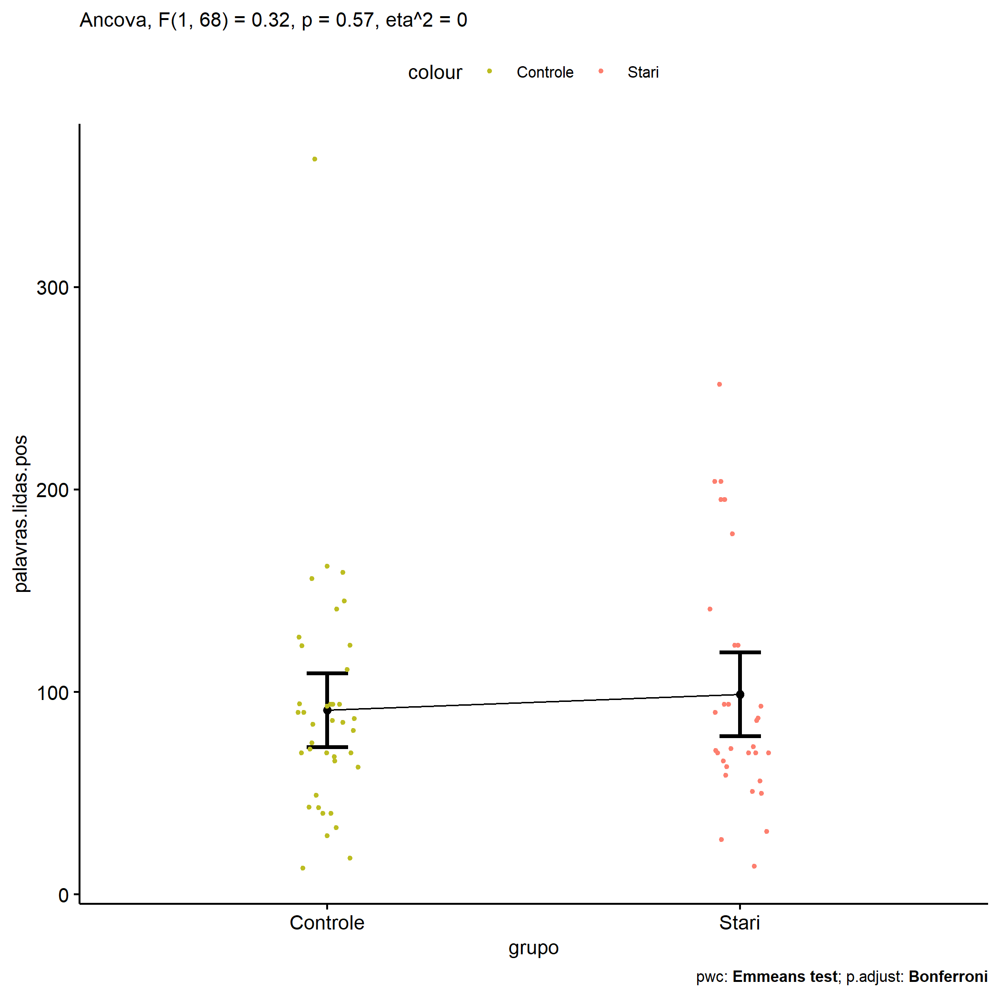<!-- -->

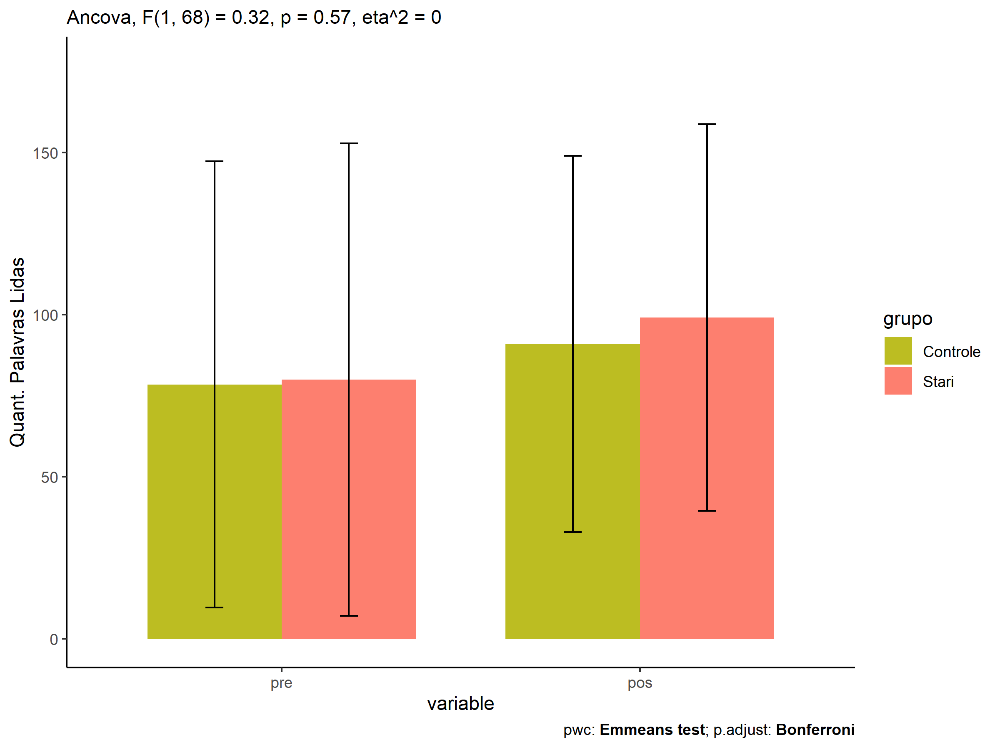<!-- -->

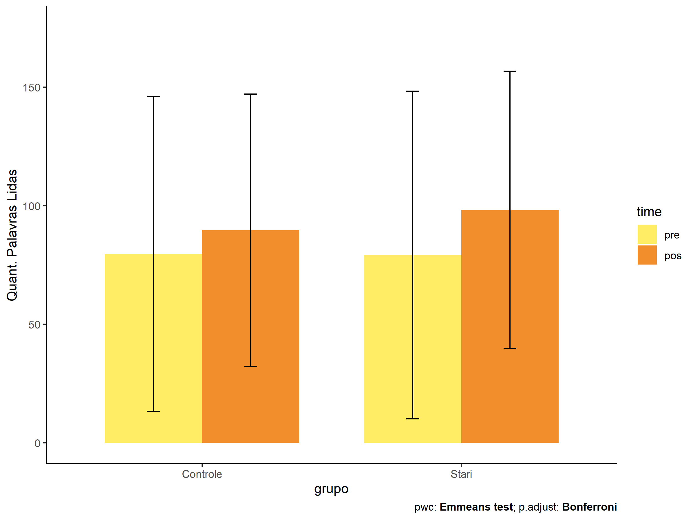<!-- -->

### Compreensao Leitora (Acertos)

| var                   | grupo    |   n | M (pre) | SE (pre) | M (unadj) | SE (unadj) | M (adj) | SE (adj) |
|:----------------------|:---------|----:|--------:|---------:|----------:|-----------:|--------:|---------:|
| score.compreensao.pos | Controle |  45 |   3.378 |    0.228 |     3.511 |      0.267 |   3.434 |    0.256 |
| score.compreensao.pos | Stari    |  37 |   2.865 |    0.266 |     3.189 |      0.287 |   3.282 |    0.282 |

| .y.                   | group1   | group2 | estimate | conf.low | conf.high |    se | statistic |     p | p.adj | p.adj.signif |
|:----------------------|:---------|:-------|---------:|---------:|----------:|------:|----------:|------:|------:|:-------------|
| score.compreensao.pos | Controle | Stari  |    0.152 |   -0.611 |     0.915 | 0.383 |     0.397 | 0.693 | 0.693 | ns           |
| score.compreensao.pre | Controle | Stari  |    0.513 |   -0.180 |     1.206 | 0.348 |     1.473 | 0.145 | 0.145 | ns           |

| .y.               | grupo    | group1 | group2 | estimate | conf.low | conf.high |    se | statistic |     p | p.adj | p.adj.signif |
|:------------------|:---------|:-------|:-------|---------:|---------:|----------:|------:|----------:|------:|------:|:-------------|
| score.compreensao | Controle | pre    | pos    |    0.043 |   -0.646 |     0.731 | 0.349 |     0.122 | 0.903 | 0.903 | ns           |
| score.compreensao | Stari    | pre    | pos    |   -0.308 |   -1.061 |     0.444 | 0.381 |    -0.808 | 0.420 | 0.420 | ns           |

    ## Scale for colour is already present.
    ## Adding another scale for colour, which will replace the existing scale.

<!-- -->

<!-- -->

<!-- -->

## factor: **genero**

### Quant. Palavras Lidas

| var                | genero |   n | M (pre) | SE (pre) | M (unadj) | SE (unadj) | M (adj) | SE (adj) |
|:-------------------|:-------|----:|--------:|---------:|----------:|-----------:|--------:|---------:|
| palavras.lidas.pos | F      |  37 |  77.486 |   10.853 |    94.811 |      6.878 |  95.105 |    9.519 |
| palavras.lidas.pos | M      |  34 |  80.882 |   12.918 |    94.176 |     12.531 |  93.856 |    9.930 |

| .y.                | group1 | group2 | estimate | conf.low | conf.high |     se | statistic |     p | p.adj | p.adj.signif |
|:-------------------|:-------|:-------|---------:|---------:|----------:|-------:|----------:|------:|------:|:-------------|
| palavras.lidas.pos | F      | M      |    1.249 |  -26.204 |    28.702 | 13.758 |     0.091 | 0.928 | 0.928 | ns           |
| palavras.lidas.pre | F      | M      |   -3.396 |  -36.865 |    30.073 | 16.777 |    -0.202 | 0.840 | 0.840 | ns           |

| .y.            | genero | group1 | group2 | estimate | conf.low | conf.high |     se | statistic |     p | p.adj | p.adj.signif |
|:---------------|:-------|:-------|:-------|---------:|---------:|----------:|-------:|----------:|------:|------:|:-------------|
| palavras.lidas | F      | pre    | pos    |  -16.698 |  -44.461 |    11.065 | 14.056 |    -1.188 | 0.237 | 0.237 | ns           |
| palavras.lidas | M      | pre    | pos    |  -11.683 |  -39.617 |    16.250 | 14.143 |    -0.826 | 0.410 | 0.410 | ns           |

    ## Scale for colour is already present.
    ## Adding another scale for colour, which will replace the existing scale.

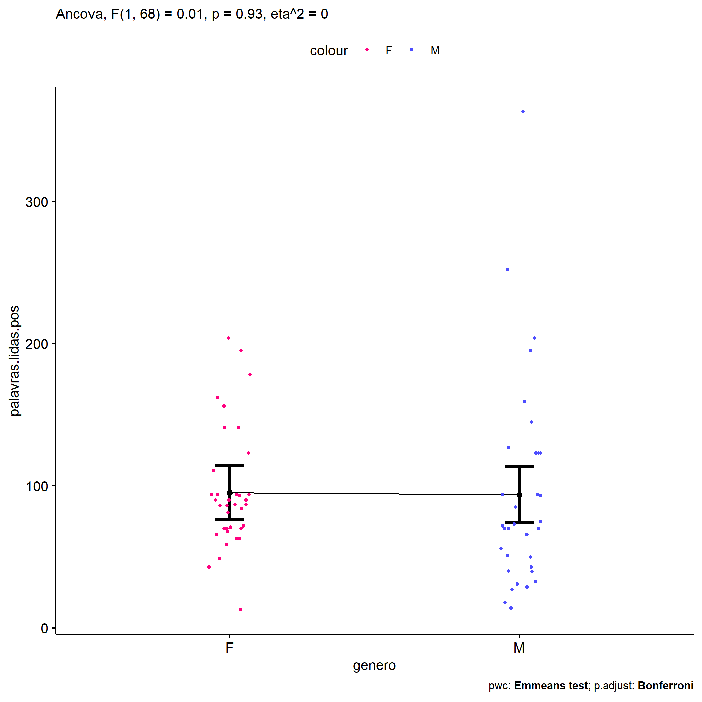<!-- -->

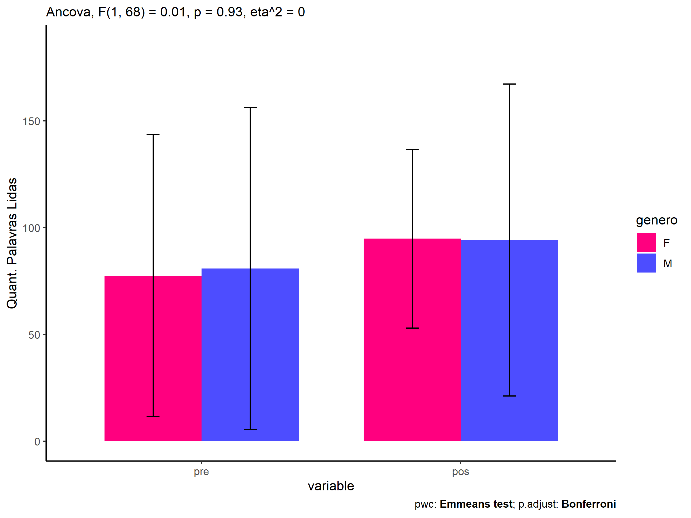<!-- -->

<!-- -->

### Compreensao Leitora (Acertos)

| var                   | genero |   n | M (pre) | SE (pre) | M (unadj) | SE (unadj) | M (adj) | SE (adj) |
|:----------------------|:-------|----:|--------:|---------:|----------:|-----------:|--------:|---------:|
| score.compreensao.pos | F      |  42 |    3.19 |    0.258 |     3.976 |      0.276 |   3.962 |    0.245 |
| score.compreensao.pos | M      |  40 |    3.10 |    0.237 |     2.725 |      0.240 |   2.740 |    0.251 |

| .y.                   | group1 | group2 | estimate | conf.low | conf.high |    se | statistic | p       | p.adj   | p.adj.signif |
|:----------------------|:-------|:-------|---------:|---------:|----------:|------:|----------:|:--------|:--------|:-------------|
| score.compreensao.pos | F      | M      |    1.222 |    0.523 |     1.920 | 0.351 |     3.480 | \<0.001 | \<0.001 | \*\*\*       |
| score.compreensao.pre | F      | M      |    0.090 |   -0.608 |     0.789 | 0.351 |     0.258 | 0.797   | 0.797   | ns           |

| .y.               | genero | group1 | group2 | estimate | conf.low | conf.high |    se | statistic |     p | p.adj | p.adj.signif |
|:------------------|:-------|:-------|:-------|---------:|---------:|----------:|------:|----------:|------:|------:|:-------------|
| score.compreensao | F      | pre    | pos    |   -0.698 |   -1.401 |     0.006 | 0.357 |    -1.957 | 0.052 | 0.052 | ns           |
| score.compreensao | M      | pre    | pos    |    0.467 |   -0.234 |     1.168 | 0.355 |     1.314 | 0.191 | 0.191 | ns           |

    ## Scale for colour is already present.
    ## Adding another scale for colour, which will replace the existing scale.

<!-- -->

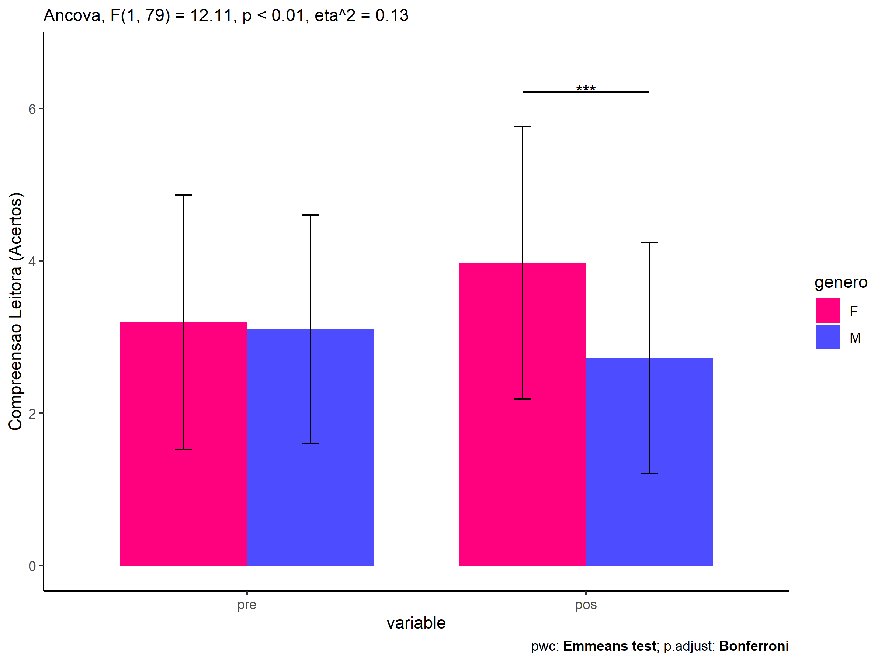<!-- -->

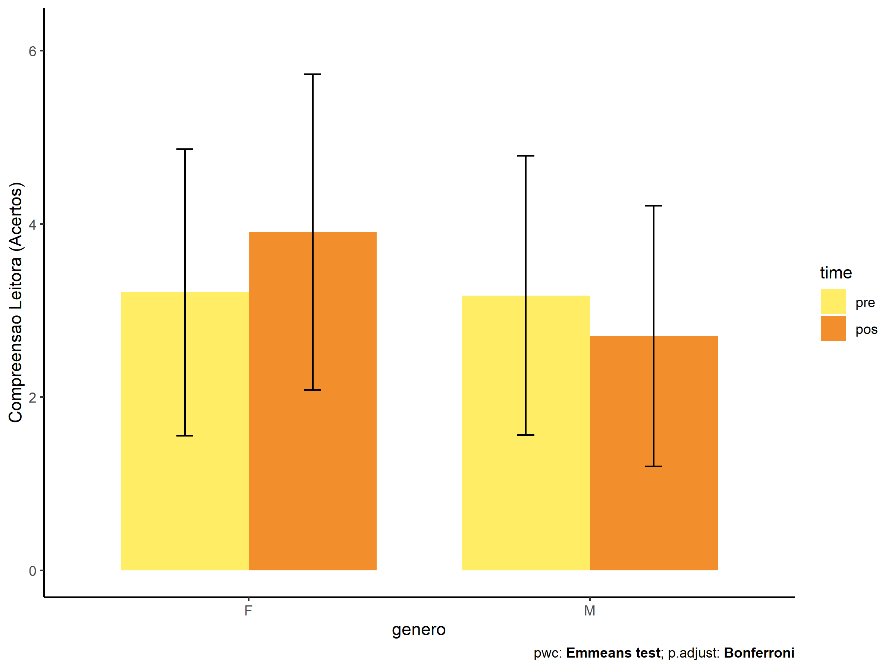<!-- -->

## factor: **idade**

### Quant. Palavras Lidas

| var                | idade |   n | M (pre) | SE (pre) | M (unadj) | SE (unadj) | M (adj) | SE (adj) |
|:-------------------|:------|----:|--------:|---------:|----------:|-----------:|--------:|---------:|
| palavras.lidas.pos | 10y   |  14 |  70.214 |   20.699 |   103.357 |      9.888 | 104.893 |   15.236 |
| palavras.lidas.pos | 11y   |  41 |  87.976 |   11.197 |   102.585 |     10.636 | 100.922 |    8.938 |
| palavras.lidas.pos | 12y   |   9 |  77.444 |   22.285 |    66.667 |     11.706 |  66.900 |   18.973 |
| palavras.lidas.pos | 13y   |   5 |  29.200 |    6.606 |    61.000 |     15.070 |  69.923 |   25.938 |

| .y.                | group1 | group2 | estimate | conf.low | conf.high |     se | statistic |     p | p.adj | p.adj.signif |
|:-------------------|:-------|:-------|---------:|---------:|----------:|-------:|----------:|------:|------:|:-------------|
| palavras.lidas.pos | 10y    | 11y    |    3.971 |  -31.407 |    39.349 | 17.709 |     0.224 | 0.823 | 1.000 | ns           |
| palavras.lidas.pos | 10y    | 12y    |   37.993 |  -10.610 |    86.596 | 24.329 |     1.562 | 0.123 | 0.740 | ns           |
| palavras.lidas.pos | 10y    | 13y    |   34.969 |  -24.842 |    94.780 | 29.939 |     1.168 | 0.247 | 1.000 | ns           |
| palavras.lidas.pos | 11y    | 12y    |   34.022 |   -7.888 |    75.932 | 20.979 |     1.622 | 0.110 | 0.659 | ns           |
| palavras.lidas.pos | 11y    | 13y    |   30.998 |  -24.145 |    86.141 | 27.603 |     1.123 | 0.266 | 1.000 | ns           |
| palavras.lidas.pos | 12y    | 13y    |   -3.023 |  -67.183 |    61.136 | 32.116 |    -0.094 | 0.925 | 1.000 | ns           |
| palavras.lidas.pre | 10y    | 11y    |  -17.761 |  -61.152 |    25.629 | 21.726 |    -0.818 | 0.417 | 1.000 | ns           |
| palavras.lidas.pre | 10y    | 12y    |   -7.230 |  -67.119 |    52.659 | 29.987 |    -0.241 | 0.810 | 1.000 | ns           |
| palavras.lidas.pre | 10y    | 13y    |   41.014 |  -32.015 |   114.043 | 36.567 |     1.122 | 0.266 | 1.000 | ns           |
| palavras.lidas.pre | 11y    | 12y    |   10.531 |  -41.067 |    62.130 | 25.836 |     0.408 | 0.685 | 1.000 | ns           |
| palavras.lidas.pre | 11y    | 13y    |   58.776 |   -7.624 |   125.176 | 33.248 |     1.768 | 0.082 | 0.491 | ns           |
| palavras.lidas.pre | 12y    | 13y    |   48.244 |  -29.941 |   126.430 | 39.149 |     1.232 | 0.222 | 1.000 | ns           |

| .y.            | idade | group1 | group2 | estimate | conf.low | conf.high |     se | statistic |     p | p.adj | p.adj.signif |
|:---------------|:------|:-------|:-------|---------:|---------:|----------:|-------:|----------:|------:|------:|:-------------|
| palavras.lidas | 10y   | pre    | pos    |  -34.795 |  -80.373 |    10.784 | 23.065 |    -1.509 | 0.134 | 0.134 | ns           |
| palavras.lidas | 11y   | pre    | pos    |  -14.175 |  -40.288 |    11.938 | 13.214 |    -1.073 | 0.285 | 0.285 | ns           |
| palavras.lidas | 12y   | pre    | pos    |   15.414 |  -36.152 |    66.980 | 26.095 |     0.591 | 0.556 | 0.556 | ns           |
| palavras.lidas | 13y   | pre    | pos    |  -26.333 | -101.748 |    49.082 | 38.163 |    -0.690 | 0.491 | 0.491 | ns           |

    ## Scale for colour is already present.
    ## Adding another scale for colour, which will replace the existing scale.

<!-- -->

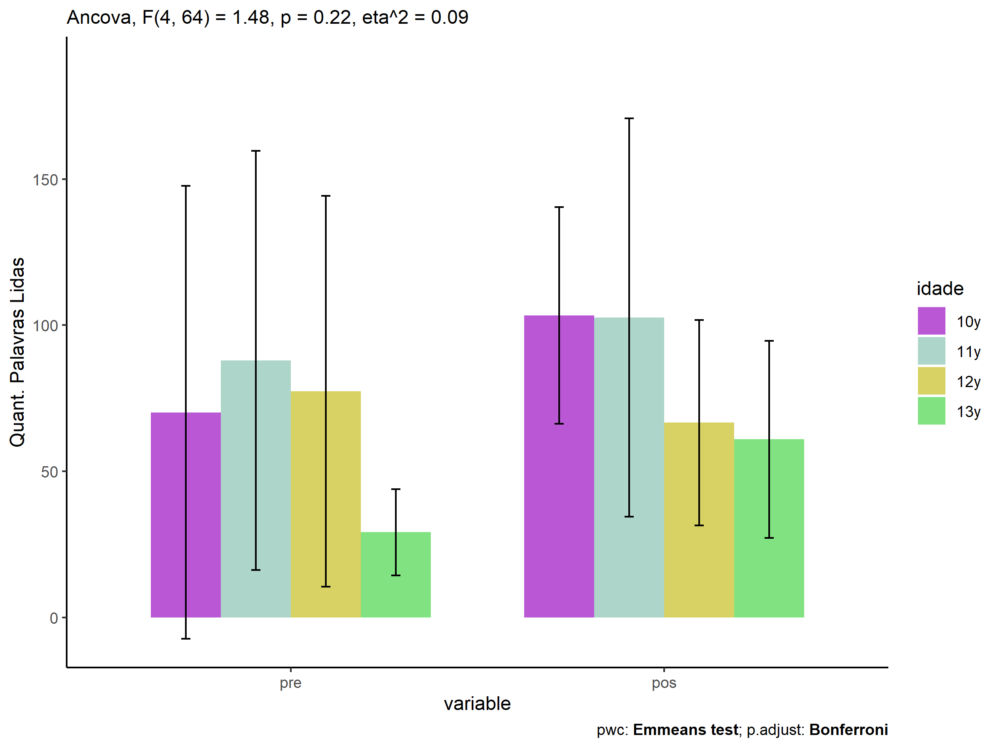<!-- -->

<!-- -->

### Compreensao Leitora (Acertos)

| var                   | idade |   n | M (pre) | SE (pre) | M (unadj) | SE (unadj) | M (adj) | SE (adj) |
|:----------------------|:------|----:|--------:|---------:|----------:|-----------:|--------:|---------:|
| score.compreensao.pos | 10y   |  16 |   4.000 |    0.492 |     4.000 |      0.500 |   3.741 |    0.435 |
| score.compreensao.pos | 11y   |  45 |   3.067 |    0.214 |     3.333 |      0.268 |   3.368 |    0.252 |
| score.compreensao.pos | 12y   |  13 |   2.923 |    0.383 |     2.692 |      0.382 |   2.772 |    0.470 |
| score.compreensao.pos | 13y   |   5 |   2.200 |    0.735 |     4.200 |      0.490 |   4.508 |    0.766 |

| .y.                   | group1 | group2 | estimate | conf.low | conf.high |    se | statistic |     p | p.adj | p.adj.signif |
|:----------------------|:-------|:-------|---------:|---------:|----------:|------:|----------:|------:|------:|:-------------|
| score.compreensao.pos | 10y    | 11y    |    0.373 |   -0.635 |     1.380 | 0.506 |     0.737 | 0.463 | 1.000 | ns           |
| score.compreensao.pos | 10y    | 12y    |    0.968 |   -0.318 |     2.255 | 0.645 |     1.501 | 0.138 | 0.826 | ns           |
| score.compreensao.pos | 10y    | 13y    |   -0.767 |   -2.550 |     1.016 | 0.895 |    -0.857 | 0.394 | 1.000 | ns           |
| score.compreensao.pos | 11y    | 12y    |    0.596 |   -0.465 |     1.657 | 0.533 |     1.119 | 0.267 | 1.000 | ns           |
| score.compreensao.pos | 11y    | 13y    |   -1.140 |   -2.742 |     0.463 | 0.804 |    -1.417 | 0.161 | 0.964 | ns           |
| score.compreensao.pos | 12y    | 13y    |   -1.735 |   -3.517 |     0.046 | 0.894 |    -1.941 | 0.056 | 0.336 | ns           |
| score.compreensao.pre | 10y    | 11y    |    0.933 |    0.029 |     1.838 | 0.454 |     2.055 | 0.043 | 0.260 | ns           |
| score.compreensao.pre | 10y    | 12y    |    1.077 |   -0.083 |     2.237 | 0.582 |     1.849 | 0.068 | 0.411 | ns           |
| score.compreensao.pre | 10y    | 13y    |    1.800 |    0.208 |     3.392 | 0.799 |     2.252 | 0.027 | 0.163 | ns           |
| score.compreensao.pre | 11y    | 12y    |    0.144 |   -0.835 |     1.122 | 0.491 |     0.292 | 0.771 | 1.000 | ns           |
| score.compreensao.pre | 11y    | 13y    |    0.867 |   -0.598 |     2.332 | 0.735 |     1.179 | 0.242 | 1.000 | ns           |
| score.compreensao.pre | 12y    | 13y    |    0.723 |   -0.912 |     2.358 | 0.821 |     0.881 | 0.381 | 1.000 | ns           |

| .y.               | idade | group1 | group2 | estimate | conf.low | conf.high |    se | statistic |     p | p.adj | p.adj.signif |
|:------------------|:------|:-------|:-------|---------:|---------:|----------:|------:|----------:|------:|------:|:-------------|
| score.compreensao | 10y   | pre    | pos    |    0.000 |   -1.179 |     1.179 | 0.597 |     0.000 | 1.000 | 1.000 | ns           |
| score.compreensao | 11y   | pre    | pos    |   -0.158 |   -0.845 |     0.530 | 0.348 |    -0.453 | 0.651 | 0.651 | ns           |
| score.compreensao | 12y   | pre    | pos    |    0.357 |   -0.882 |     1.596 | 0.627 |     0.569 | 0.570 | 0.570 | ns           |
| score.compreensao | 13y   | pre    | pos    |   -1.700 |   -3.719 |     0.319 | 1.022 |    -1.663 | 0.098 | 0.098 | ns           |

    ## Scale for colour is already present.
    ## Adding another scale for colour, which will replace the existing scale.

<!-- -->

<!-- -->

<!-- -->

## factor: **zona.participante**

### Quant. Palavras Lidas

| var                | zona.participante |   n | M (pre) | SE (pre) | M (unadj) | SE (unadj) | M (adj) | SE (adj) |
|:-------------------|:------------------|----:|--------:|---------:|----------:|-----------:|--------:|---------:|
| palavras.lidas.pos | Rural             |  23 |  77.217 |   12.594 |   106.348 |     11.953 | 109.007 |   12.943 |
| palavras.lidas.pos | Urbana            |  32 | 100.719 |   14.788 |    89.125 |     11.727 |  87.214 |   10.951 |

| .y.                | group1 | group2 | estimate | conf.low | conf.high |     se | statistic |     p | p.adj | p.adj.signif |
|:-------------------|:-------|:-------|---------:|---------:|----------:|-------:|----------:|------:|------:|:-------------|
| palavras.lidas.pos | Urbana | Rural  |  -21.793 |  -56.015 |    12.429 | 17.055 |    -1.278 | 0.207 | 0.207 | ns           |
| palavras.lidas.pre | Urbana | Rural  |   23.501 |  -17.556 |    64.559 | 20.470 |     1.148 | 0.256 | 0.256 | ns           |

| .y.            | zona.participante | group1 | group2 | estimate | conf.low | conf.high |     se | statistic |     p | p.adj | p.adj.signif |
|:---------------|:------------------|:-------|:-------|---------:|---------:|----------:|-------:|----------:|------:|------:|:-------------|
| palavras.lidas | Urbana            | pre    | pos    |    4.118 |  -26.927 |    35.163 | 15.680 |     0.263 | 0.793 | 0.793 | ns           |
| palavras.lidas | Rural             | pre    | pos    |  -24.338 |  -62.006 |    13.329 | 19.025 |    -1.279 | 0.203 | 0.203 | ns           |

    ## Scale for colour is already present.
    ## Adding another scale for colour, which will replace the existing scale.

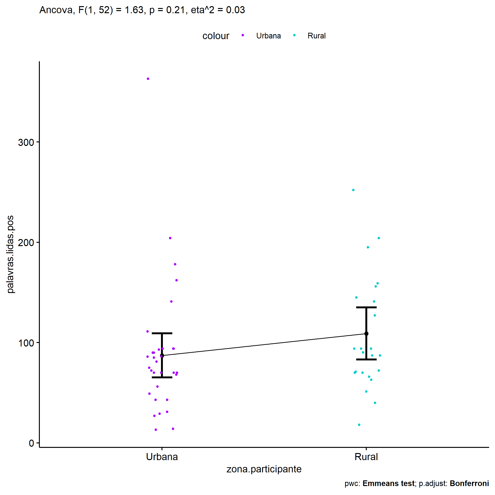<!-- -->

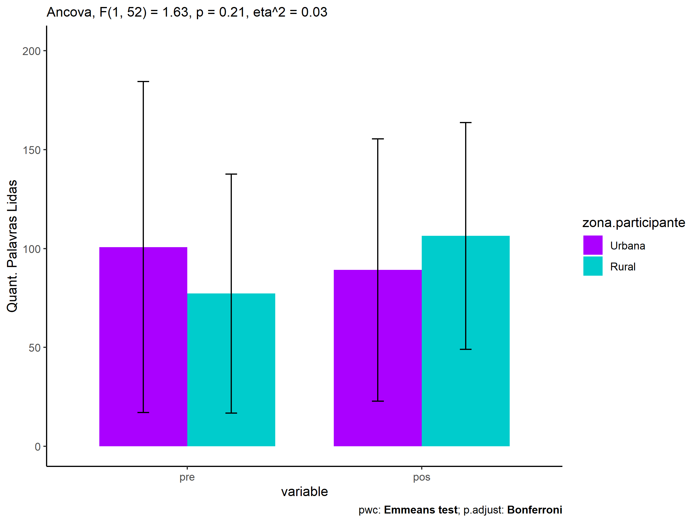<!-- -->

<!-- -->

### Compreensao Leitora (Acertos)

| var                   | zona.participante |   n | M (pre) | SE (pre) | M (unadj) | SE (unadj) | M (adj) | SE (adj) |
|:----------------------|:------------------|----:|--------:|---------:|----------:|-----------:|--------:|---------:|
| score.compreensao.pos | Rural             |  27 |   3.333 |    0.282 |     3.593 |      0.308 |   3.557 |    0.325 |
| score.compreensao.pos | Urbana            |  35 |   3.171 |    0.303 |     3.629 |      0.326 |   3.656 |    0.285 |

| .y.                   | group1 | group2 | estimate | conf.low | conf.high |    se | statistic |     p | p.adj | p.adj.signif |
|:----------------------|:-------|:-------|---------:|---------:|----------:|------:|----------:|------:|------:|:-------------|
| score.compreensao.pos | Urbana | Rural  |    0.099 |   -0.767 |     0.964 | 0.433 |     0.228 | 0.820 | 0.820 | ns           |
| score.compreensao.pre | Urbana | Rural  |   -0.162 |   -1.011 |     0.688 | 0.425 |    -0.381 | 0.704 | 0.704 | ns           |

| .y.               | zona.participante | group1 | group2 | estimate | conf.low | conf.high |    se | statistic |     p | p.adj | p.adj.signif |
|:------------------|:------------------|:-------|:-------|---------:|---------:|----------:|------:|----------:|------:|------:|:-------------|
| score.compreensao | Urbana            | pre    | pos    |   -0.189 |   -0.980 |     0.603 | 0.400 |    -0.471 | 0.638 | 0.638 | ns           |
| score.compreensao | Rural             | pre    | pos    |   -0.259 |   -1.204 |     0.685 | 0.477 |    -0.543 | 0.588 | 0.588 | ns           |

    ## Scale for colour is already present.
    ## Adding another scale for colour, which will replace the existing scale.

<!-- -->

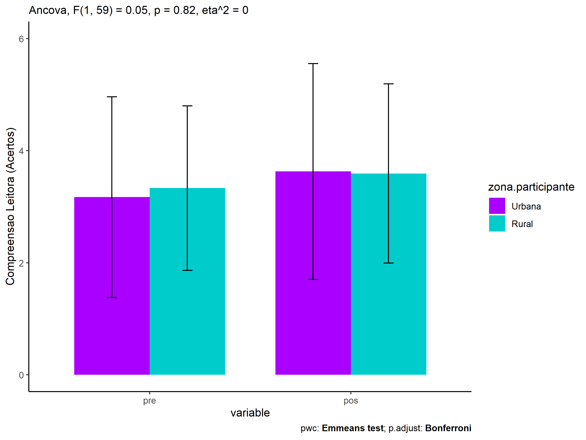<!-- -->

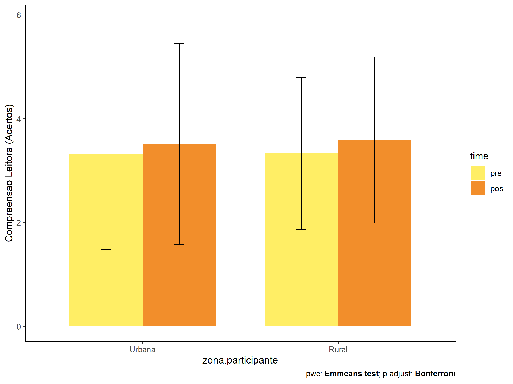<!-- -->

## factor: **escola**

### Quant. Palavras Lidas

| var                | escola |   n | M (pre) | SE (pre) | M (unadj) | SE (unadj) | M (adj) | SE (adj) |
|:-------------------|:-------|----:|--------:|---------:|----------:|-----------:|--------:|---------:|
| palavras.lidas.pos | E1     |  11 |  83.182 |   13.008 |    76.545 |     16.257 |  72.733 |   16.641 |
| palavras.lidas.pos | E2     |   8 |  82.750 |   41.517 |    84.375 |     19.078 |  80.689 |   19.487 |
| palavras.lidas.pos | E3     |   8 |  87.625 |   27.693 |    56.250 |      6.710 |  51.138 |   19.539 |
| palavras.lidas.pos | E5     |  31 |  68.387 |    7.914 |   116.935 |     11.855 | 117.451 |    9.873 |
| palavras.lidas.pos | E6     |   9 |  33.556 |    6.723 |    83.333 |     16.815 |  94.037 |   18.816 |

| .y.                | group1 | group2 | estimate | conf.low | conf.high |     se | statistic |     p | p.adj | p.adj.signif |
|:-------------------|:-------|:-------|---------:|---------:|----------:|-------:|----------:|------:|------:|:-------------|
| palavras.lidas.pos | E1     | E2     |   -7.956 |  -59.021 |    43.109 | 25.537 |    -0.312 | 0.756 | 1.000 | ns           |
| palavras.lidas.pos | E1     | E3     |   21.595 |  -29.481 |    72.671 | 25.543 |     0.845 | 0.401 | 1.000 | ns           |
| palavras.lidas.pos | E1     | E5     |  -44.718 |  -83.442 |    -5.993 | 19.366 |    -2.309 | 0.024 | 0.243 | ns           |
| palavras.lidas.pos | E1     | E6     |  -21.304 |  -72.052 |    29.444 | 25.379 |    -0.839 | 0.405 | 1.000 | ns           |
| palavras.lidas.pos | E2     | E3     |   29.551 |  -25.410 |    84.512 | 27.486 |     1.075 | 0.287 | 1.000 | ns           |
| palavras.lidas.pos | E2     | E5     |  -36.762 |  -80.473 |     6.949 | 21.860 |    -1.682 | 0.098 | 0.977 | ns           |
| palavras.lidas.pos | E2     | E6     |  -13.348 |  -67.981 |    41.285 | 27.322 |    -0.489 | 0.627 | 1.000 | ns           |
| palavras.lidas.pos | E3     | E5     |  -66.313 | -110.126 |   -22.499 | 21.911 |    -3.026 | 0.004 | 0.036 | \*           |
| palavras.lidas.pos | E3     | E6     |  -42.899 |  -97.785 |    11.987 | 27.448 |    -1.563 | 0.123 | 1.000 | ns           |
| palavras.lidas.pos | E5     | E6     |   23.414 |  -18.992 |    65.820 | 21.207 |     1.104 | 0.274 | 1.000 | ns           |
| palavras.lidas.pre | E1     | E2     |    0.432 |  -54.846 |    55.710 | 27.653 |     0.016 | 0.988 | 1.000 | ns           |
| palavras.lidas.pre | E1     | E3     |   -4.443 |  -59.721 |    50.835 | 27.653 |    -0.161 | 0.873 | 1.000 | ns           |
| palavras.lidas.pre | E1     | E5     |   14.795 |  -26.956 |    56.545 | 20.886 |     0.708 | 0.481 | 1.000 | ns           |
| palavras.lidas.pre | E1     | E6     |   49.626 |   -3.844 |   103.097 | 26.749 |     1.855 | 0.068 | 0.683 | ns           |
| palavras.lidas.pre | E2     | E3     |   -4.875 |  -64.357 |    54.607 | 29.756 |    -0.164 | 0.870 | 1.000 | ns           |
| palavras.lidas.pre | E2     | E5     |   14.363 |  -32.813 |    61.539 | 23.600 |     0.609 | 0.545 | 1.000 | ns           |
| palavras.lidas.pre | E2     | E6     |   49.194 |   -8.612 |   107.001 | 28.918 |     1.701 | 0.094 | 0.939 | ns           |
| palavras.lidas.pre | E3     | E5     |   19.238 |  -27.938 |    66.414 | 23.600 |     0.815 | 0.418 | 1.000 | ns           |
| palavras.lidas.pre | E3     | E6     |   54.069 |   -3.737 |   111.876 | 28.918 |     1.870 | 0.066 | 0.662 | ns           |
| palavras.lidas.pre | E5     | E6     |   34.832 |  -10.213 |    79.876 | 22.534 |     1.546 | 0.127 | 1.000 | ns           |

| .y.            | escola | group1 | group2 | estimate | conf.low | conf.high |     se | statistic |     p | p.adj | p.adj.signif |
|:---------------|:-------|:-------|:-------|---------:|---------:|----------:|-------:|----------:|------:|------:|:-------------|
| palavras.lidas | E1     | pre    | pos    |    4.526 |  -40.914 |    49.966 | 22.989 |     0.197 | 0.844 | 0.844 | ns           |
| palavras.lidas | E2     | pre    | pos    |   -0.153 |  -48.075 |    47.769 | 24.245 |    -0.006 | 0.995 | 0.995 | ns           |
| palavras.lidas | E3     | pre    | pos    |   25.458 |  -26.018 |    76.935 | 26.043 |     0.978 | 0.330 | 0.330 | ns           |
| palavras.lidas | E5     | pre    | pos    |  -46.654 |  -75.076 |   -18.233 | 14.379 |    -3.245 | 0.001 | 0.001 | \*\*         |
| palavras.lidas | E6     | pre    | pos    |  -53.000 | -103.437 |    -2.563 | 25.517 |    -2.077 | 0.040 | 0.040 | \*           |

    ## Scale for colour is already present.
    ## Adding another scale for colour, which will replace the existing scale.

<!-- -->

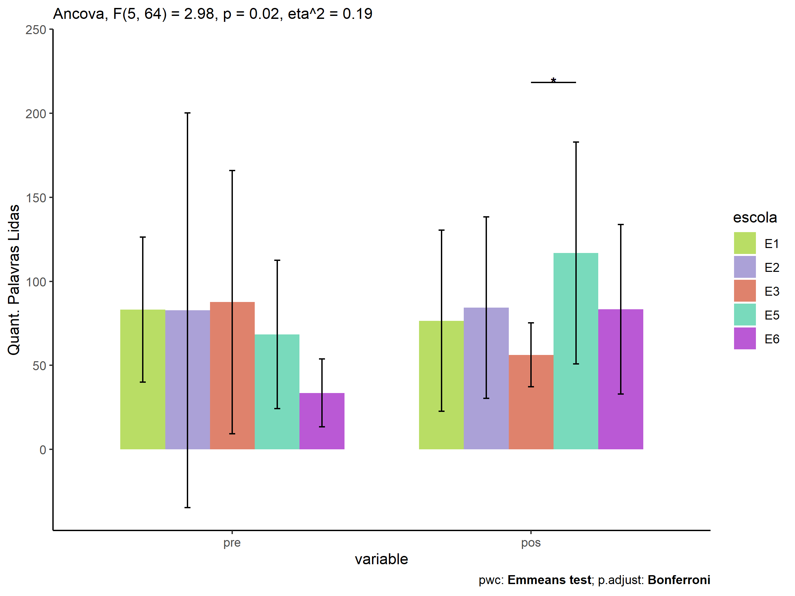<!-- -->

<!-- -->

### Compreensao Leitora (Acertos)

| var                   | escola |   n | M (pre) | SE (pre) | M (unadj) | SE (unadj) | M (adj) | SE (adj) |
|:----------------------|:-------|----:|--------:|---------:|----------:|-----------:|--------:|---------:|
| score.compreensao.pos | E1     |  11 |   3.182 |    0.483 |     3.545 |      0.755 |   3.520 |    0.523 |
| score.compreensao.pos | E2     |  15 |   2.333 |    0.252 |     2.733 |      0.371 |   2.916 |    0.459 |
| score.compreensao.pos | E3     |  12 |   3.667 |    0.355 |     3.583 |      0.379 |   3.439 |    0.507 |
| score.compreensao.pos | E5     |  31 |   3.226 |    0.296 |     3.355 |      0.326 |   3.318 |    0.312 |
| score.compreensao.pos | E6     |   9 |   2.889 |    0.455 |     3.222 |      0.465 |   3.268 |    0.578 |

| .y.                   | group1 | group2 | estimate | conf.low | conf.high |    se | statistic |     p | p.adj | p.adj.signif |
|:----------------------|:-------|:-------|---------:|---------:|----------:|------:|----------:|------:|------:|:-------------|
| score.compreensao.pos | E1     | E2     |    0.604 |   -0.788 |     1.995 | 0.698 |     0.865 | 0.390 | 1.000 | ns           |
| score.compreensao.pos | E1     | E3     |    0.081 |   -1.367 |     1.529 | 0.726 |     0.112 | 0.911 | 1.000 | ns           |
| score.compreensao.pos | E1     | E5     |    0.201 |   -1.011 |     1.413 | 0.608 |     0.331 | 0.741 | 1.000 | ns           |
| score.compreensao.pos | E1     | E6     |    0.251 |   -1.303 |     1.806 | 0.780 |     0.322 | 0.748 | 1.000 | ns           |
| score.compreensao.pos | E2     | E3     |   -0.523 |   -1.911 |     0.866 | 0.697 |    -0.750 | 0.456 | 1.000 | ns           |
| score.compreensao.pos | E2     | E5     |   -0.402 |   -1.517 |     0.712 | 0.559 |    -0.720 | 0.474 | 1.000 | ns           |
| score.compreensao.pos | E2     | E6     |   -0.352 |   -1.817 |     1.112 | 0.735 |    -0.480 | 0.633 | 1.000 | ns           |
| score.compreensao.pos | E3     | E5     |    0.120 |   -1.060 |     1.301 | 0.592 |     0.203 | 0.840 | 1.000 | ns           |
| score.compreensao.pos | E3     | E6     |    0.170 |   -1.368 |     1.708 | 0.772 |     0.220 | 0.826 | 1.000 | ns           |
| score.compreensao.pos | E5     | E6     |    0.050 |   -1.261 |     1.361 | 0.658 |     0.076 | 0.940 | 1.000 | ns           |
| score.compreensao.pre | E1     | E2     |    0.848 |   -0.293 |     1.990 | 0.573 |     1.482 | 0.143 | 1.000 | ns           |
| score.compreensao.pre | E1     | E3     |   -0.485 |   -1.685 |     0.715 | 0.602 |    -0.805 | 0.423 | 1.000 | ns           |
| score.compreensao.pre | E1     | E5     |   -0.044 |   -1.053 |     0.965 | 0.506 |    -0.087 | 0.931 | 1.000 | ns           |
| score.compreensao.pre | E1     | E6     |    0.293 |   -0.999 |     1.585 | 0.648 |     0.452 | 0.653 | 1.000 | ns           |
| score.compreensao.pre | E2     | E3     |   -1.333 |   -2.447 |    -0.220 | 0.559 |    -2.386 | 0.020 | 0.196 | ns           |
| score.compreensao.pre | E2     | E5     |   -0.892 |   -1.797 |     0.012 | 0.454 |    -1.967 | 0.053 | 0.530 | ns           |
| score.compreensao.pre | E2     | E6     |   -0.556 |   -1.768 |     0.657 | 0.608 |    -0.913 | 0.364 | 1.000 | ns           |
| score.compreensao.pre | E3     | E5     |    0.441 |   -0.537 |     1.418 | 0.491 |     0.899 | 0.372 | 1.000 | ns           |
| score.compreensao.pre | E3     | E6     |    0.778 |   -0.490 |     2.046 | 0.636 |     1.223 | 0.225 | 1.000 | ns           |
| score.compreensao.pre | E5     | E6     |    0.337 |   -0.752 |     1.426 | 0.546 |     0.617 | 0.539 | 1.000 | ns           |

| .y.               | escola | group1 | group2 | estimate | conf.low | conf.high |    se | statistic |     p | p.adj | p.adj.signif |
|:------------------|:-------|:-------|:-------|---------:|---------:|----------:|------:|----------:|------:|------:|:-------------|
| score.compreensao | E1     | pre    | pos    |    0.026 |   -1.267 |     1.319 | 0.655 |     0.040 | 0.968 | 0.968 | ns           |
| score.compreensao | E2     | pre    | pos    |   -0.154 |   -1.272 |     0.964 | 0.566 |    -0.273 | 0.785 | 0.785 | ns           |
| score.compreensao | E3     | pre    | pos    |    0.083 |   -1.227 |     1.394 | 0.663 |     0.126 | 0.900 | 0.900 | ns           |
| score.compreensao | E5     | pre    | pos    |   -0.136 |   -0.945 |     0.673 | 0.410 |    -0.332 | 0.740 | 0.740 | ns           |
| score.compreensao | E6     | pre    | pos    |   -0.400 |   -1.836 |     1.036 | 0.727 |    -0.550 | 0.583 | 0.583 | ns           |

    ## Scale for colour is already present.
    ## Adding another scale for colour, which will replace the existing scale.

<!-- -->

<!-- -->

<!-- -->

## factor: **zona.escola**

### Quant. Palavras Lidas

| var                | zona.escola |   n | M (pre) | SE (pre) | M (unadj) | SE (unadj) | M (adj) | SE (adj) |
|:-------------------|:------------|----:|--------:|---------:|----------:|-----------:|--------:|---------:|
| palavras.lidas.pos | Rural       |  21 |  91.429 |   19.753 |    74.667 |      8.564 |  72.146 |   12.277 |
| palavras.lidas.pos | Urbana      |  50 |  73.940 |    8.473 |   102.840 |      8.959 | 103.899 |    7.935 |

| .y.                | group1 | group2 | estimate | conf.low | conf.high |     se | statistic |     p | p.adj | p.adj.signif |
|:-------------------|:-------|:-------|---------:|---------:|----------:|-------:|----------:|------:|------:|:-------------|
| palavras.lidas.pos | Urbana | Rural  |   31.753 |    2.504 |    61.002 | 14.658 |     2.166 | 0.034 | 0.034 | \*           |
| palavras.lidas.pre | Urbana | Rural  |  -17.489 |  -53.892 |    18.915 | 18.248 |    -0.958 | 0.341 | 0.341 | ns           |

| .y.            | zona.escola | group1 | group2 | estimate | conf.low | conf.high |     se | statistic |     p | p.adj | p.adj.signif |
|:---------------|:------------|:-------|:-------|---------:|---------:|----------:|-------:|----------:|------:|------:|:-------------|
| palavras.lidas | Urbana      | pre    | pos    |  -26.278 |  -49.595 |    -2.960 | 11.806 |    -2.226 | 0.027 | 0.027 | \*           |
| palavras.lidas | Rural       | pre    | pos    |   12.538 |  -23.249 |    48.326 | 18.119 |     0.692 | 0.490 | 0.490 | ns           |

    ## Scale for colour is already present.
    ## Adding another scale for colour, which will replace the existing scale.

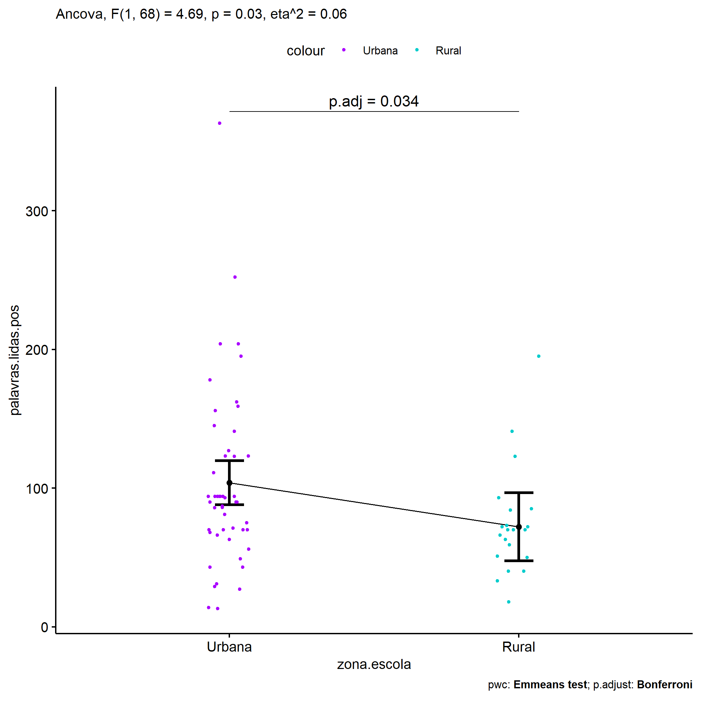<!-- -->

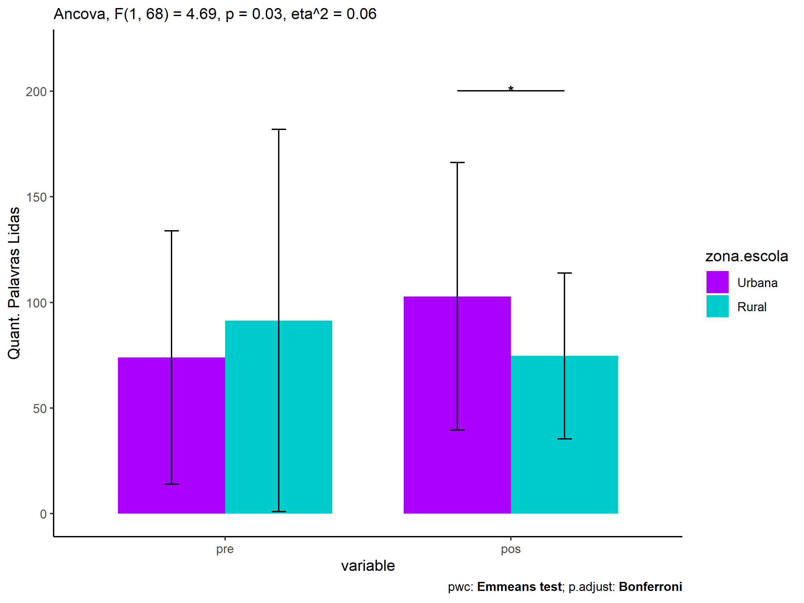<!-- -->

<!-- -->

### Compreensao Leitora (Acertos)

| var                   | zona.escola |   n | M (pre) | SE (pre) | M (unadj) | SE (unadj) | M (adj) | SE (adj) |
|:----------------------|:------------|----:|--------:|---------:|----------:|-----------:|--------:|---------:|
| score.compreensao.pos | Rural       |  25 |   3.520 |    0.337 |     3.680 |      0.298 |   3.558 |    0.343 |
| score.compreensao.pos | Urbana      |  57 |   2.982 |    0.201 |     3.228 |      0.248 |   3.282 |    0.226 |

| .y.                   | group1 | group2 | estimate | conf.low | conf.high |    se | statistic |     p | p.adj | p.adj.signif |
|:----------------------|:-------|:-------|---------:|---------:|----------:|------:|----------:|------:|------:|:-------------|
| score.compreensao.pos | Urbana | Rural  |   -0.276 |   -1.099 |     0.546 | 0.413 |    -0.669 | 0.505 | 0.505 | ns           |
| score.compreensao.pre | Urbana | Rural  |   -0.538 |   -1.287 |     0.212 | 0.377 |    -1.427 | 0.157 | 0.157 | ns           |

| .y.               | zona.escola | group1 | group2 | estimate | conf.low | conf.high |    se | statistic |     p | p.adj | p.adj.signif |
|:------------------|:------------|:-------|:-------|---------:|---------:|----------:|------:|----------:|------:|------:|:-------------|
| score.compreensao | Urbana      | pre    | pos    |   -0.094 |   -0.704 |     0.515 | 0.309 |    -0.306 | 0.760 | 0.760 | ns           |
| score.compreensao | Rural       | pre    | pos    |   -0.192 |   -1.122 |     0.737 | 0.471 |    -0.409 | 0.683 | 0.683 | ns           |

    ## Scale for colour is already present.
    ## Adding another scale for colour, which will replace the existing scale.

<!-- -->

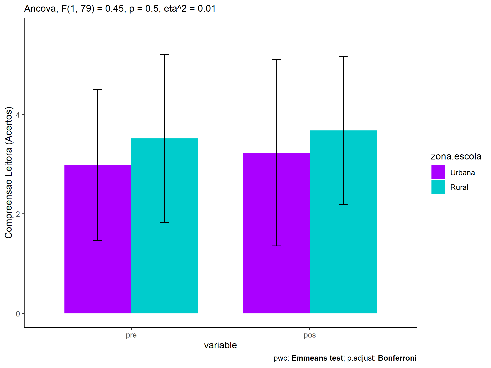<!-- -->

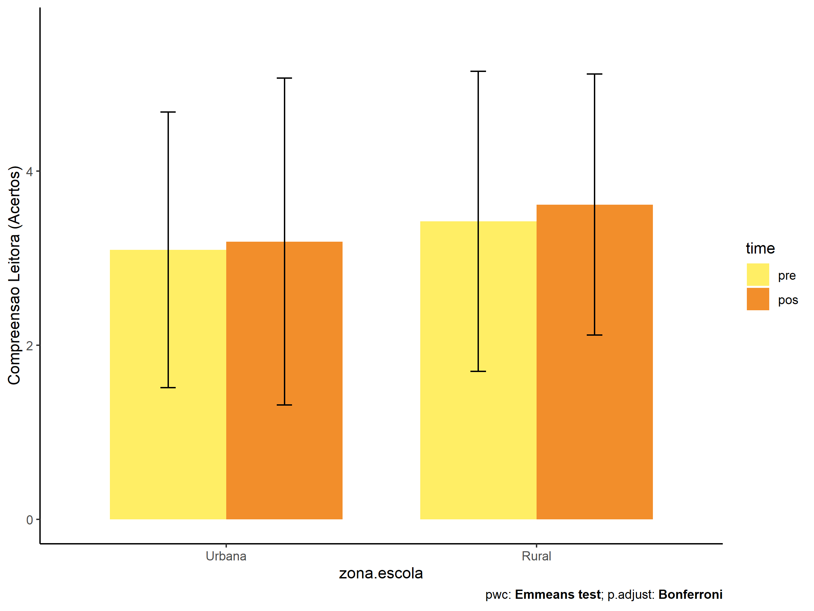<!-- -->

# Pairwise comparisons for two factors

## factores: **genero:grupo**

### Quant. Palavras Lidas

| var                | genero | grupo    |   n | M (pre) | SE (pre) | M (unadj) | SE (unadj) | M (adj) | SE (adj) |
|:-------------------|:-------|:---------|----:|--------:|---------:|----------:|-----------:|--------:|---------:|
| palavras.lidas.pos | F      | Controle |  23 |  73.609 |   14.624 |    89.391 |      7.128 |  90.374 |   12.226 |
| palavras.lidas.pos | F      | Stari    |  14 |  83.857 |   16.198 |   103.714 |     13.968 | 102.867 |   15.662 |
| palavras.lidas.pos | M      | Controle |  17 |  85.059 |   16.645 |    93.059 |     19.698 |  91.997 |   14.219 |
| palavras.lidas.pos | M      | Stari    |  17 |  76.706 |   20.226 |    95.294 |     16.111 |  95.724 |   14.208 |

| .y.                | grupo    | genero | group1   | group2 | estimate | conf.low | conf.high |     se | statistic |     p | p.adj | p.adj.signif |
|:-------------------|:---------|:-------|:---------|:-------|---------:|---------:|----------:|-------:|----------:|------:|------:|:-------------|
| palavras.lidas.pos | Controle |        | F        | M      |   -1.623 |  -39.097 |    35.852 | 18.769 |    -0.086 | 0.931 | 0.931 | ns           |
| palavras.lidas.pos | Stari    |        | F        | M      |    7.143 |  -35.087 |    49.373 | 21.151 |     0.338 | 0.737 | 0.737 | ns           |
| palavras.lidas.pre | Controle |        | F        | M      |  -11.450 |  -57.102 |    34.202 | 22.872 |    -0.501 | 0.618 | 0.618 | ns           |
| palavras.lidas.pre | Stari    |        | F        | M      |    7.151 |  -44.361 |    58.664 | 25.808 |     0.277 | 0.783 | 0.783 | ns           |
| palavras.lidas.pos |          | F      | Controle | Stari  |  -12.493 |  -52.187 |    27.202 | 19.882 |    -0.628 | 0.532 | 0.532 | ns           |
| palavras.lidas.pos |          | M      | Controle | Stari  |   -3.727 |  -43.874 |    36.419 | 20.108 |    -0.185 | 0.854 | 0.854 | ns           |
| palavras.lidas.pre |          | F      | Controle | Stari  |  -10.248 |  -58.631 |    38.134 | 24.240 |    -0.423 | 0.674 | 0.674 | ns           |
| palavras.lidas.pre |          | M      | Controle | Stari  |    8.353 |  -40.603 |    57.309 | 24.527 |     0.341 | 0.735 | 0.735 | ns           |

| grupo    | genero | group1 | group2 | estimate | conf.low | conf.high |     se | statistic |     p | p.adj | p.adj.signif |
|:---------|:-------|:-------|:-------|---------:|---------:|----------:|-------:|----------:|------:|------:|:-------------|
| Controle | F      | pre    | pos    |  -14.458 |  -50.888 |    21.971 | 18.441 |    -0.784 | 0.434 | 0.434 | ns           |
| Controle | M      | pre    | pos    |   -6.116 |  -45.829 |    33.597 | 20.103 |    -0.304 | 0.761 | 0.761 | ns           |
| Stari    | F      | pre    | pos    |  -20.364 |  -64.320 |    23.592 | 22.251 |    -0.915 | 0.362 | 0.362 | ns           |
| Stari    | M      | pre    | pos    |  -17.455 |  -57.562 |    22.653 | 20.303 |    -0.860 | 0.391 | 0.391 | ns           |

    ## Scale for colour is already present.
    ## Adding another scale for colour, which will replace the existing scale.

<!-- -->

    ## Scale for colour is already present.
    ## Adding another scale for colour, which will replace the existing scale.

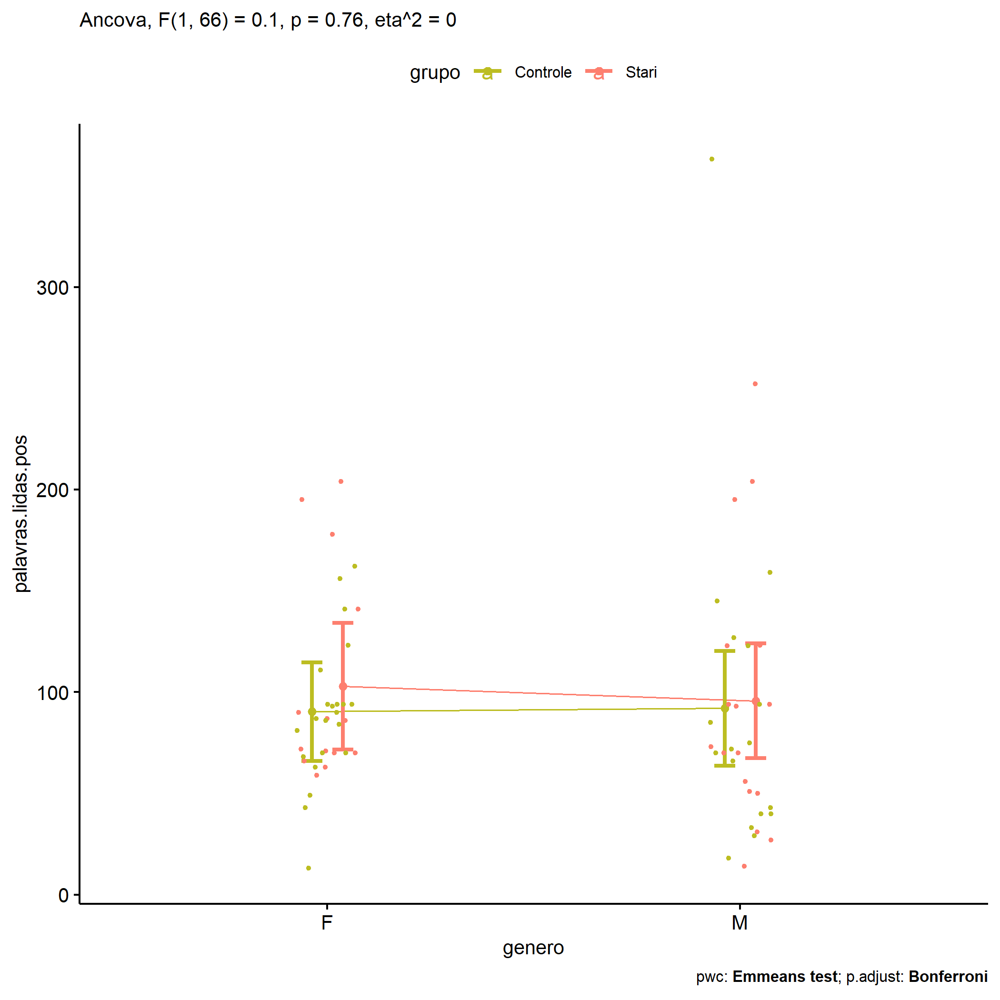<!-- -->

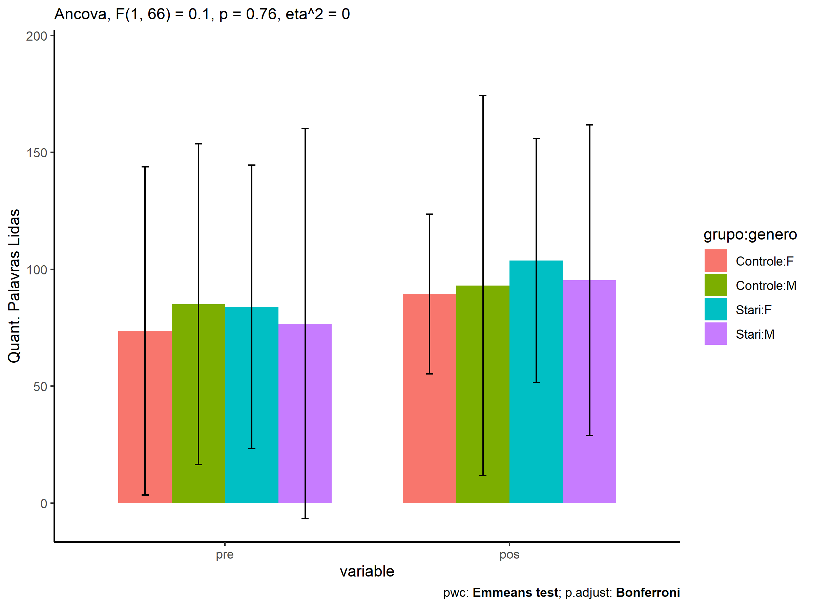<!-- -->

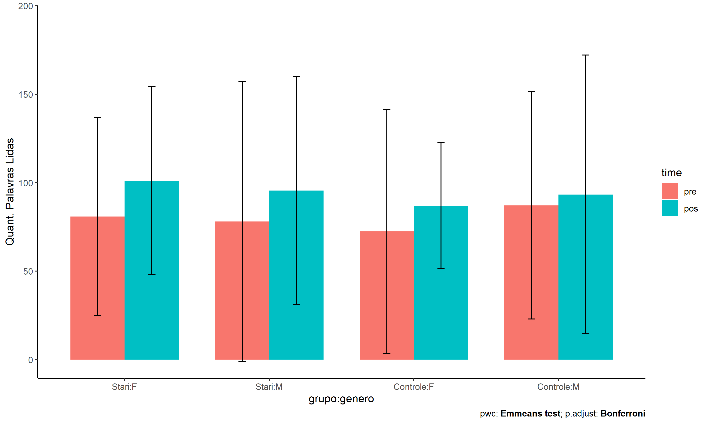<!-- -->

### Compreensao Leitora (Acertos)

| var                   | genero | grupo    |   n | M (pre) | SE (pre) | M (unadj) | SE (unadj) | M (adj) | SE (adj) |
|:----------------------|:-------|:---------|----:|--------:|---------:|----------:|-----------:|--------:|---------:|
| score.compreensao.pos | F      | Controle |  24 |   3.458 |    0.356 |     4.208 |      0.366 |   4.108 |    0.329 |
| score.compreensao.pos | F      | Stari    |  18 |   2.833 |    0.364 |     3.667 |      0.420 |   3.767 |    0.379 |
| score.compreensao.pos | M      | Controle |  21 |   3.286 |    0.277 |     2.714 |      0.317 |   2.670 |    0.350 |
| score.compreensao.pos | M      | Stari    |  19 |   2.895 |    0.397 |     2.737 |      0.373 |   2.817 |    0.369 |

| .y.                   | grupo    | genero | group1   | group2 | estimate | conf.low | conf.high |    se | statistic |     p | p.adj | p.adj.signif |
|:----------------------|:---------|:-------|:---------|:-------|---------:|---------:|----------:|------:|----------:|------:|------:|:-------------|
| score.compreensao.pos | Controle |        | F        | M      |    1.439 |    0.484 |     2.393 | 0.479 |     3.002 | 0.004 | 0.004 | \*\*         |
| score.compreensao.pos | Stari    |        | F        | M      |    0.949 |   -0.100 |     1.999 | 0.527 |     1.801 | 0.076 | 0.076 | ns           |
| score.compreensao.pre | Controle |        | F        | M      |    0.173 |   -0.772 |     1.117 | 0.474 |     0.364 | 0.717 | 0.717 | ns           |
| score.compreensao.pre | Stari    |        | F        | M      |   -0.061 |   -1.101 |     0.978 | 0.522 |    -0.118 | 0.907 | 0.907 | ns           |
| score.compreensao.pos |          | F      | Controle | Stari  |    0.342 |   -0.664 |     1.347 | 0.505 |     0.677 | 0.501 | 0.501 | ns           |
| score.compreensao.pos |          | M      | Controle | Stari  |   -0.148 |   -1.162 |     0.867 | 0.509 |    -0.290 | 0.773 | 0.773 | ns           |
| score.compreensao.pre |          | F      | Controle | Stari  |    0.625 |   -0.360 |     1.610 | 0.495 |     1.263 | 0.210 | 0.210 | ns           |
| score.compreensao.pre |          | M      | Controle | Stari  |    0.391 |   -0.610 |     1.392 | 0.503 |     0.778 | 0.439 | 0.439 | ns           |

| grupo    | genero | group1 | group2 | estimate | conf.low | conf.high |    se | statistic |     p | p.adj | p.adj.signif |
|:---------|:-------|:-------|:-------|---------:|---------:|----------:|------:|----------:|------:|------:|:-------------|
| Controle | F      | pre    | pos    |   -0.622 |   -1.556 |     0.313 | 0.473 |    -1.314 | 0.191 | 0.191 | ns           |
| Controle | M      | pre    | pos    |    0.796 |   -0.179 |     1.771 | 0.494 |     1.613 | 0.109 | 0.109 | ns           |
| Stari    | F      | pre    | pos    |   -0.772 |   -1.847 |     0.303 | 0.545 |    -1.417 | 0.158 | 0.158 | ns           |
| Stari    | M      | pre    | pos    |    0.133 |   -0.881 |     1.146 | 0.513 |     0.259 | 0.796 | 0.796 | ns           |

    ## Scale for colour is already present.
    ## Adding another scale for colour, which will replace the existing scale.

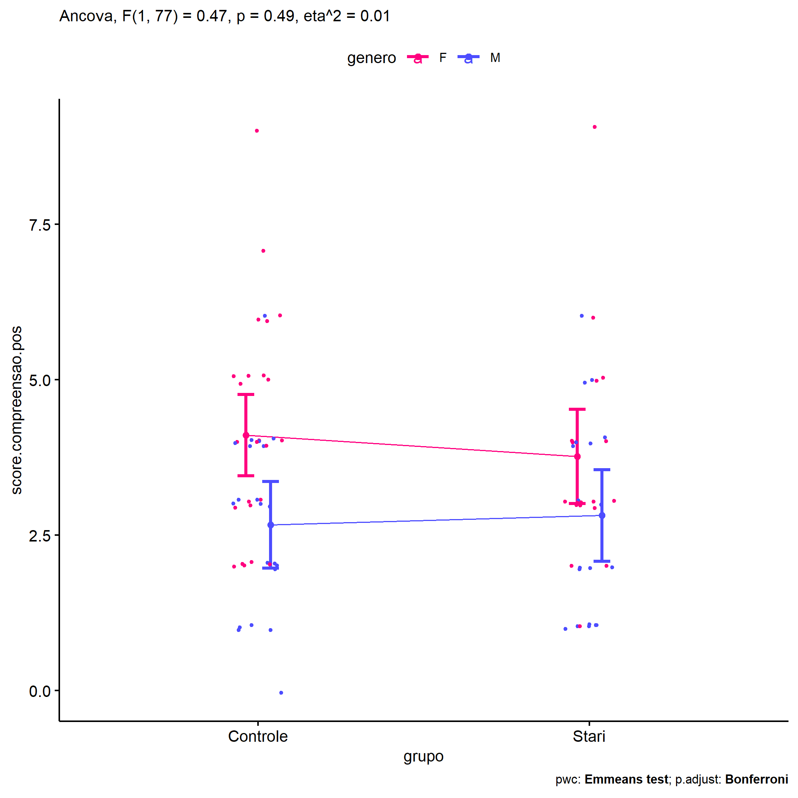<!-- -->

    ## Scale for colour is already present.
    ## Adding another scale for colour, which will replace the existing scale.

<!-- -->

<!-- -->

<!-- -->

## factores: **idade:grupo**

### Quant. Palavras Lidas

| var                | idade | grupo    |   n | M (pre) | SE (pre) | M (unadj) | SE (unadj) | M (adj) | SE (adj) |
|:-------------------|:------|:---------|----:|--------:|---------:|----------:|-----------:|--------:|---------:|
| palavras.lidas.pos | 10y   | Controle |   8 |  80.875 |   34.198 |    95.875 |     10.340 |  95.671 |   21.045 |
| palavras.lidas.pos | 10y   | Stari    |   6 |  56.000 |   18.589 |   113.333 |     18.940 | 116.983 |   24.446 |
| palavras.lidas.pos | 11y   | Controle |  23 |  76.609 |   12.128 |    95.391 |     14.572 |  95.848 |   12.416 |
| palavras.lidas.pos | 11y   | Stari    |  18 | 102.500 |   20.163 |   111.778 |     15.695 | 108.223 |   14.268 |
| palavras.lidas.pos | 12y   | Stari    |   6 |  43.833 |    8.400 |    51.167 |      8.039 |  56.701 |   24.634 |

|     | .y.                | grupo    | idade | group1   | group2 | estimate | conf.low | conf.high |     se | statistic |     p | p.adj | p.adj.signif |
|:----|:-------------------|:---------|:------|:---------|:-------|---------:|---------:|----------:|-------:|----------:|------:|------:|:-------------|
| 1   | palavras.lidas.pos | Controle |       | 10y      | 11y    |   -0.177 |  -49.149 |    48.795 | 24.436 |    -0.007 | 0.994 | 0.994 | ns           |
| 4   | palavras.lidas.pos | Stari    |       | 10y      | 11y    |    8.760 |  -48.452 |    65.971 | 28.548 |     0.307 | 0.760 | 1.000 | ns           |
| 5   | palavras.lidas.pos | Stari    |       | 10y      | 12y    |   60.282 |   -8.643 |   129.207 | 34.393 |     1.753 | 0.085 | 0.256 | ns           |
| 6   | palavras.lidas.pos | Stari    |       | 11y      | 12y    |   51.522 |   -6.262 |   109.306 | 28.834 |     1.787 | 0.079 | 0.238 | ns           |
| 7   | palavras.lidas.pre | Controle |       | 10y      | 11y    |    4.266 |  -53.543 |    62.076 | 28.858 |     0.148 | 0.883 | 0.883 | ns           |
| 10  | palavras.lidas.pre | Stari    |       | 10y      | 11y    |  -46.500 | -112.892 |    19.892 | 33.143 |    -1.403 | 0.166 | 0.498 | ns           |
| 11  | palavras.lidas.pre | Stari    |       | 10y      | 12y    |   12.167 |  -69.147 |    93.480 | 40.591 |     0.300 | 0.765 | 1.000 | ns           |
| 12  | palavras.lidas.pre | Stari    |       | 11y      | 12y    |   58.667 |   -7.726 |   125.059 | 33.143 |     1.770 | 0.082 | 0.246 | ns           |
| 13  | palavras.lidas.pos |          | 10y   | Controle | Stari  |  -21.312 |  -85.980 |    43.356 | 32.269 |    -0.660 | 0.512 | 0.512 | ns           |
| 14  | palavras.lidas.pos |          | 11y   | Controle | Stari  |  -12.375 |  -50.370 |    25.620 | 18.959 |    -0.653 | 0.517 | 0.517 | ns           |
| 16  | palavras.lidas.pre |          | 10y   | Controle | Stari  |   24.875 |  -51.187 |   100.937 | 37.970 |     0.655 | 0.515 | 0.515 | ns           |
| 17  | palavras.lidas.pre |          | 11y   | Controle | Stari  |  -25.891 |  -70.213 |    18.430 | 22.125 |    -1.170 | 0.247 | 0.247 | ns           |

| grupo    | idade | group1 | group2 | estimate | conf.low | conf.high |     se | statistic |     p | p.adj | p.adj.signif |
|:---------|:------|:-------|:-------|---------:|---------:|----------:|-------:|----------:|------:|------:|:-------------|
| Controle | 10y   | pre    | pos    |  -18.875 |  -80.401 |    42.651 | 31.092 |    -0.607 | 0.545 | 0.545 | ns           |
| Controle | 11y   | pre    | pos    |  -18.051 |  -53.894 |    17.791 | 18.113 |    -0.997 | 0.321 | 0.321 | ns           |
| Stari    | 10y   | pre    | pos    |  -55.619 | -126.064 |    14.826 | 35.600 |    -1.562 | 0.121 | 0.121 | ns           |
| Stari    | 11y   | pre    | pos    |   -7.976 |  -47.537 |    31.585 | 19.992 |    -0.399 | 0.691 | 0.691 | ns           |
| Stari    | 12y   | pre    | pos    |    6.933 |  -58.453 |    72.320 | 33.043 |     0.210 | 0.834 | 0.834 | ns           |

    ## Scale for colour is already present.
    ## Adding another scale for colour, which will replace the existing scale.

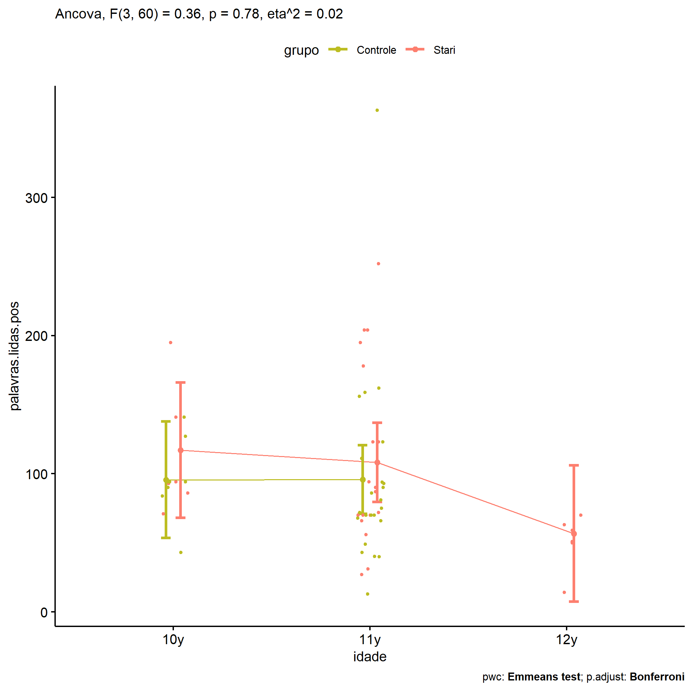<!-- -->

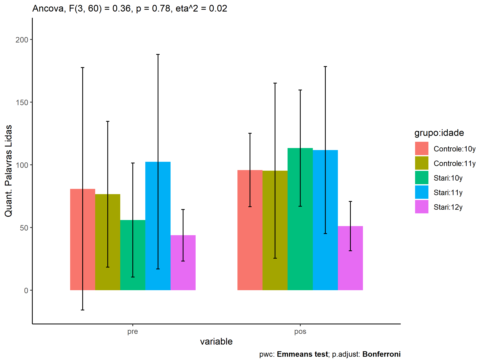<!-- -->

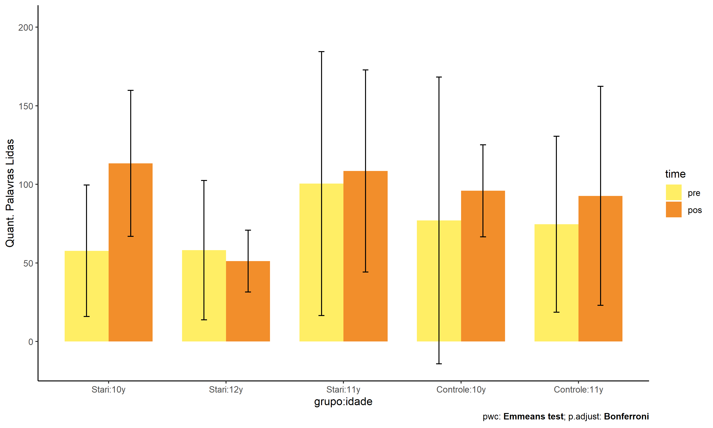<!-- -->

### Compreensao Leitora (Acertos)

| var                   | idade | grupo    |   n | M (pre) | SE (pre) | M (unadj) | SE (unadj) | M (adj) | SE (adj) |
|:----------------------|:------|:---------|----:|--------:|---------:|----------:|-----------:|--------:|---------:|
| score.compreensao.pos | 10y   | Controle |   9 |   4.556 |    0.626 |     4.778 |      0.760 |   4.405 |    0.598 |
| score.compreensao.pos | 10y   | Stari    |   7 |   3.286 |    0.747 |     3.000 |      0.378 |   2.988 |    0.648 |
| score.compreensao.pos | 11y   | Controle |  24 |   3.333 |    0.260 |     3.250 |      0.336 |   3.224 |    0.350 |
| score.compreensao.pos | 11y   | Stari    |  21 |   2.762 |    0.344 |     3.429 |      0.434 |   3.565 |    0.380 |
| score.compreensao.pos | 12y   | Controle |   5 |   3.200 |    0.374 |     3.200 |      0.735 |   3.212 |    0.767 |
| score.compreensao.pos | 12y   | Stari    |   8 |   2.750 |    0.590 |     2.375 |      0.420 |   2.515 |    0.610 |

| .y.                   | grupo    | idade | group1   | group2 | estimate | conf.low | conf.high |    se | statistic |     p | p.adj | p.adj.signif |
|:----------------------|:---------|:------|:---------|:-------|---------:|---------:|----------:|------:|----------:|------:|------:|:-------------|
| score.compreensao.pos | Controle |       | 10y      | 11y    |    1.180 |   -0.197 |     2.558 | 0.690 |     1.710 | 0.092 | 0.275 | ns           |
| score.compreensao.pos | Controle |       | 10y      | 12y    |    1.192 |   -0.751 |     3.135 | 0.973 |     1.225 | 0.225 | 0.675 | ns           |
| score.compreensao.pos | Controle |       | 11y      | 12y    |    0.012 |   -1.670 |     1.694 | 0.843 |     0.014 | 0.989 | 1.000 | ns           |
| score.compreensao.pos | Stari    |       | 10y      | 11y    |   -0.578 |   -2.077 |     0.922 | 0.751 |    -0.769 | 0.445 | 1.000 | ns           |
| score.compreensao.pos | Stari    |       | 10y      | 12y    |    0.473 |   -1.304 |     2.249 | 0.890 |     0.531 | 0.597 | 1.000 | ns           |
| score.compreensao.pos | Stari    |       | 11y      | 12y    |    1.050 |   -0.371 |     2.472 | 0.712 |     1.475 | 0.145 | 0.435 | ns           |
| score.compreensao.pre | Controle |       | 10y      | 11y    |    1.222 |    0.022 |     2.423 | 0.602 |     2.032 | 0.046 | 0.138 | ns           |
| score.compreensao.pre | Controle |       | 10y      | 12y    |    1.356 |   -0.358 |     3.069 | 0.859 |     1.579 | 0.119 | 0.357 | ns           |
| score.compreensao.pre | Controle |       | 11y      | 12y    |    0.133 |   -1.377 |     1.643 | 0.757 |     0.176 | 0.861 | 1.000 | ns           |
| score.compreensao.pre | Stari    |       | 10y      | 11y    |    0.524 |   -0.817 |     1.864 | 0.672 |     0.780 | 0.438 | 1.000 | ns           |
| score.compreensao.pre | Stari    |       | 10y      | 12y    |    0.536 |   -1.054 |     2.125 | 0.797 |     0.673 | 0.504 | 1.000 | ns           |
| score.compreensao.pre | Stari    |       | 11y      | 12y    |    0.012 |   -1.264 |     1.288 | 0.639 |     0.019 | 0.985 | 1.000 | ns           |
| score.compreensao.pos |          | 10y   | Controle | Stari  |    1.417 |   -0.341 |     3.175 | 0.881 |     1.609 | 0.112 | 0.112 | ns           |
| score.compreensao.pos |          | 11y   | Controle | Stari  |   -0.341 |   -1.375 |     0.693 | 0.518 |    -0.658 | 0.513 | 0.513 | ns           |
| score.compreensao.pos |          | 12y   | Controle | Stari  |    0.697 |   -1.257 |     2.651 | 0.979 |     0.712 | 0.479 | 0.479 | ns           |
| score.compreensao.pre |          | 10y   | Controle | Stari  |    1.270 |   -0.278 |     2.818 | 0.776 |     1.637 | 0.106 | 0.106 | ns           |
| score.compreensao.pre |          | 11y   | Controle | Stari  |    0.571 |   -0.346 |     1.489 | 0.460 |     1.242 | 0.218 | 0.218 | ns           |
| score.compreensao.pre |          | 12y   | Controle | Stari  |    0.450 |   -1.301 |     2.201 | 0.877 |     0.513 | 0.610 | 0.610 | ns           |

| grupo    | idade | group1 | group2 | estimate | conf.low | conf.high |    se | statistic |     p | p.adj | p.adj.signif |
|:---------|:------|:-------|:-------|---------:|---------:|----------:|------:|----------:|------:|------:|:-------------|
| Controle | 10y   | pre    | pos    |   -0.222 |   -1.785 |     1.341 | 0.791 |    -0.281 | 0.779 | 0.779 | ns           |
| Controle | 11y   | pre    | pos    |    0.360 |   -0.578 |     1.298 | 0.474 |     0.759 | 0.449 | 0.449 | ns           |
| Controle | 12y   | pre    | pos    |    0.200 |   -1.808 |     2.208 | 1.016 |     0.197 | 0.844 | 0.844 | ns           |
| Stari    | 10y   | pre    | pos    |    0.286 |   -1.487 |     2.058 | 0.897 |     0.319 | 0.750 | 0.750 | ns           |
| Stari    | 11y   | pre    | pos    |   -0.733 |   -1.734 |     0.268 | 0.506 |    -1.448 | 0.150 | 0.150 | ns           |
| Stari    | 12y   | pre    | pos    |    0.525 |   -1.048 |     2.098 | 0.796 |     0.660 | 0.510 | 0.510 | ns           |

    ## Scale for colour is already present.
    ## Adding another scale for colour, which will replace the existing scale.

<!-- -->

    ## Scale for colour is already present.
    ## Adding another scale for colour, which will replace the existing scale.

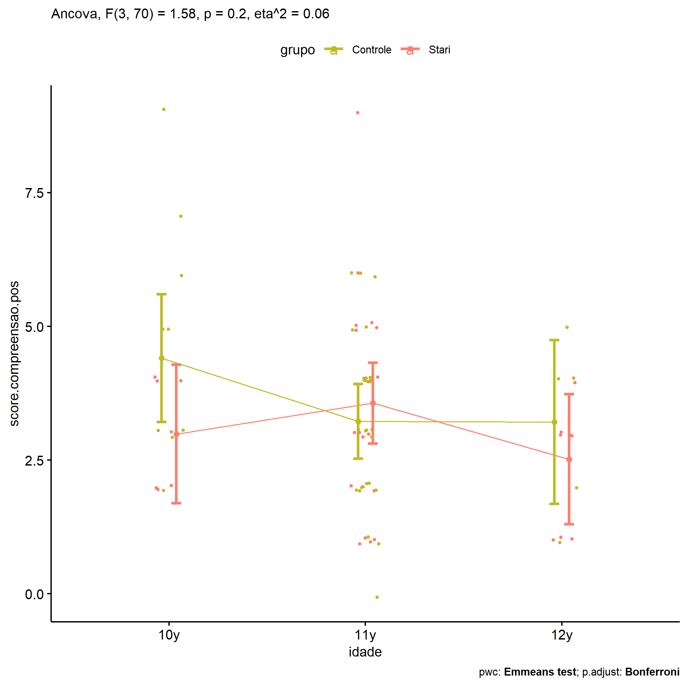<!-- -->

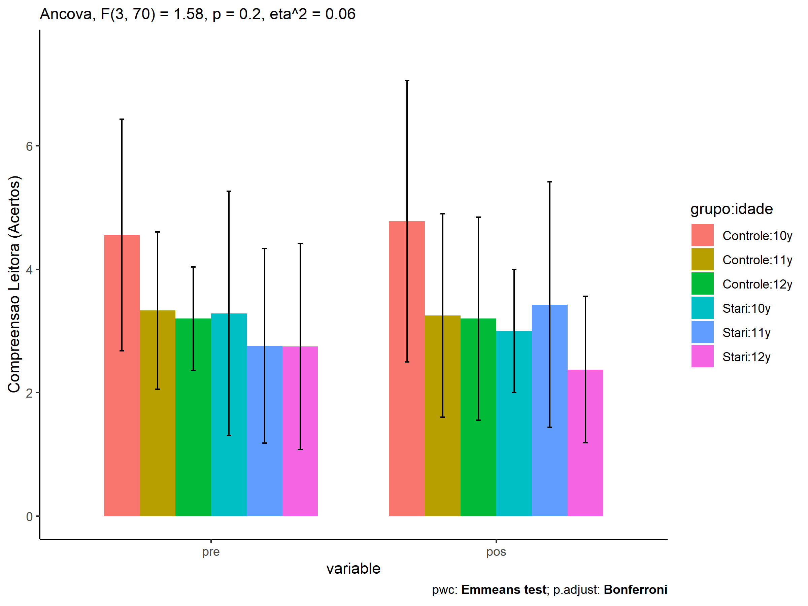<!-- -->

<!-- -->

## factores: **zona.participante:grupo**

### Quant. Palavras Lidas

| var                | zona.participante | grupo    |   n | M (pre) | SE (pre) | M (unadj) | SE (unadj) | M (adj) | SE (adj) |
|:-------------------|:------------------|:---------|----:|--------:|---------:|----------:|-----------:|--------:|---------:|
| palavras.lidas.pos | Rural             | Controle |  11 |  79.727 |   21.551 |    93.727 |     14.308 |  96.114 |   18.689 |
| palavras.lidas.pos | Rural             | Stari    |  12 |  74.917 |   14.829 |   117.917 |     18.751 | 121.332 |   17.946 |
| palavras.lidas.pos | Urbana            | Controle |  22 |  89.227 |   16.067 |    92.909 |     14.713 |  93.265 |   13.185 |
| palavras.lidas.pos | Urbana            | Stari    |  10 | 126.000 |   31.335 |    80.800 |     19.837 |  73.294 |   19.970 |

| .y.                | grupo    | zona.participante | group1   | group2 | estimate | conf.low | conf.high |     se | statistic |     p | p.adj | p.adj.signif |
|:-------------------|:---------|:------------------|:---------|:-------|---------:|---------:|----------:|-------:|----------:|------:|------:|:-------------|
| palavras.lidas.pos | Controle |                   | Urbana   | Rural  |   -2.849 |  -48.768 |    43.070 | 22.862 |    -0.125 | 0.901 | 0.901 | ns           |
| palavras.lidas.pos | Stari    |                   | Urbana   | Rural  |  -48.038 | -102.520 |     6.444 | 27.125 |    -1.771 | 0.083 | 0.083 | ns           |
| palavras.lidas.pre | Controle |                   | Urbana   | Rural  |    9.500 |  -46.186 |    65.186 | 27.738 |     0.342 | 0.733 | 0.733 | ns           |
| palavras.lidas.pre | Stari    |                   | Urbana   | Rural  |   51.083 |  -13.485 |   115.652 | 32.162 |     1.588 | 0.118 | 0.118 | ns           |
| palavras.lidas.pos |          | Urbana            | Controle | Stari  |   19.971 |  -28.159 |    68.101 | 23.962 |     0.833 | 0.409 | 0.409 | ns           |
| palavras.lidas.pos |          | Rural             | Controle | Stari  |  -25.218 |  -77.077 |    26.641 | 25.819 |    -0.977 | 0.333 | 0.333 | ns           |
| palavras.lidas.pre |          | Urbana            | Controle | Stari  |  -36.773 |  -94.285 |    20.740 | 28.648 |    -1.284 | 0.205 | 0.205 | ns           |
| palavras.lidas.pre |          | Rural             | Controle | Stari  |    4.811 |  -58.136 |    67.758 | 31.355 |     0.153 | 0.879 | 0.879 | ns           |

| grupo    | zona.participante | group1 | group2 | estimate | conf.low | conf.high |     se | statistic |     p | p.adj | p.adj.signif |
|:---------|:------------------|:-------|:-------|---------:|---------:|----------:|-------:|----------:|------:|------:|:-------------|
| Controle | Urbana            | pre    | pos    |   -7.490 |  -46.191 |    31.210 | 19.540 |    -0.383 | 0.702 | 0.702 | ns           |
| Controle | Rural             | pre    | pos    |   -8.689 |  -64.602 |    47.223 | 28.230 |    -0.308 | 0.759 | 0.759 | ns           |
| Stari    | Urbana            | pre    | pos    |   25.013 |  -28.983 |    79.008 | 27.262 |     0.917 | 0.361 | 0.361 | ns           |
| Stari    | Rural             | pre    | pos    |  -37.150 |  -89.027 |    14.727 | 26.192 |    -1.418 | 0.159 | 0.159 | ns           |

    ## Scale for colour is already present.
    ## Adding another scale for colour, which will replace the existing scale.

<!-- -->

    ## Scale for colour is already present.
    ## Adding another scale for colour, which will replace the existing scale.

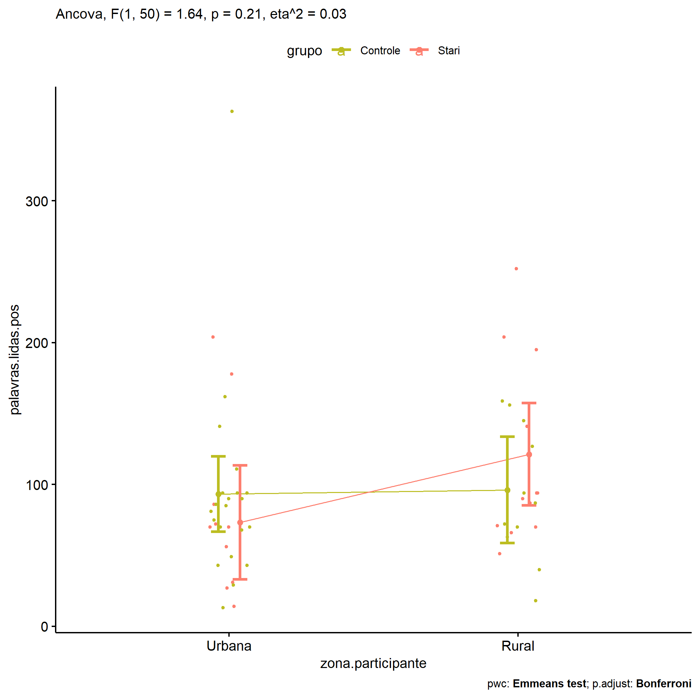<!-- -->

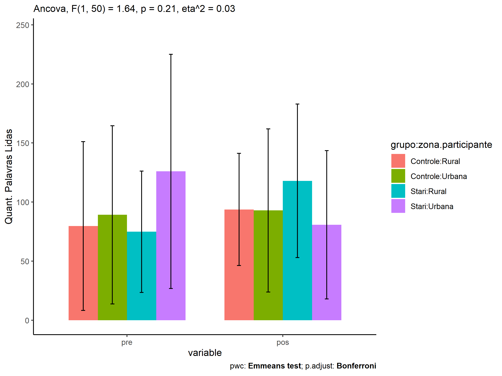<!-- -->

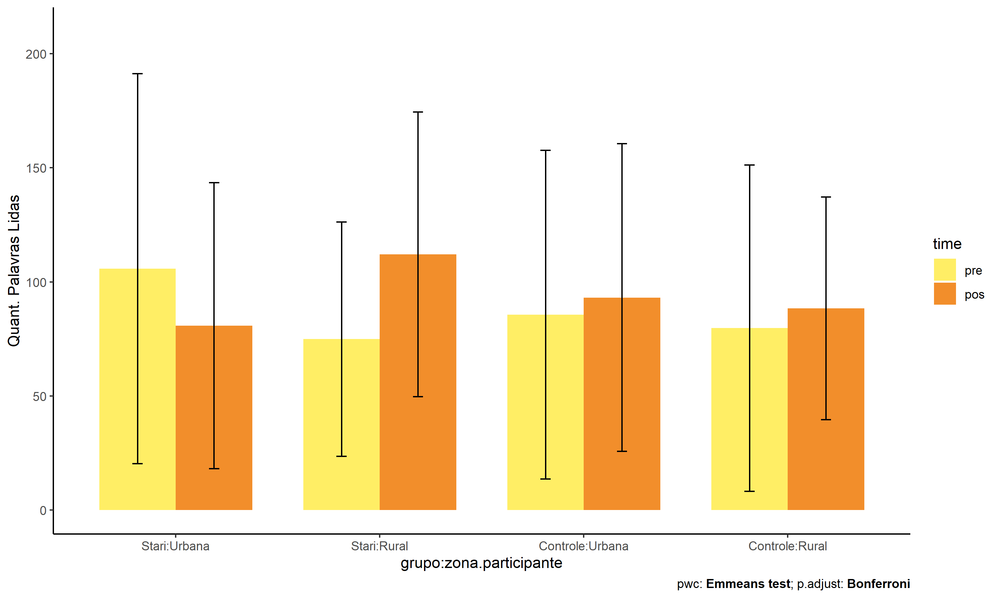<!-- -->

### Compreensao Leitora (Acertos)

| var                   | zona.participante | grupo    |   n | M (pre) | SE (pre) | M (unadj) | SE (unadj) | M (adj) | SE (adj) |
|:----------------------|:------------------|:---------|----:|--------:|---------:|----------:|-----------:|--------:|---------:|
| score.compreensao.pos | Rural             | Controle |  12 |   3.417 |    0.260 |     3.667 |      0.284 |   3.606 |    0.493 |
| score.compreensao.pos | Rural             | Stari    |  15 |   3.267 |    0.473 |     3.533 |      0.515 |   3.525 |    0.440 |
| score.compreensao.pos | Urbana            | Controle |  23 |   3.696 |    0.364 |     4.000 |      0.431 |   3.843 |    0.361 |
| score.compreensao.pos | Urbana            | Stari    |  12 |   2.167 |    0.423 |     2.917 |      0.417 |   3.289 |    0.515 |

| .y.                   | grupo    | zona.participante | group1   | group2 | estimate | conf.low | conf.high |    se | statistic |     p | p.adj | p.adj.signif |
|:----------------------|:---------|:------------------|:---------|:-------|---------:|---------:|----------:|------:|----------:|------:|------:|:-------------|
| score.compreensao.pos | Controle |                   | Urbana   | Rural  |    0.237 |   -0.982 |     1.455 | 0.609 |     0.389 | 0.699 | 0.699 | ns           |
| score.compreensao.pos | Stari    |                   | Urbana   | Rural  |   -0.236 |   -1.594 |     1.123 | 0.678 |    -0.347 | 0.730 | 0.730 | ns           |
| score.compreensao.pre | Controle |                   | Urbana   | Rural  |    0.279 |   -0.853 |     1.411 | 0.566 |     0.493 | 0.624 | 0.624 | ns           |
| score.compreensao.pre | Stari    |                   | Urbana   | Rural  |   -1.100 |   -2.332 |     0.132 | 0.615 |    -1.788 | 0.079 | 0.079 | ns           |
| score.compreensao.pos |          | Urbana            | Controle | Stari  |    0.554 |   -0.737 |     1.844 | 0.644 |     0.859 | 0.394 | 0.394 | ns           |
| score.compreensao.pos |          | Rural             | Controle | Stari  |    0.081 |   -1.242 |     1.405 | 0.661 |     0.123 | 0.902 | 0.902 | ns           |
| score.compreensao.pre |          | Urbana            | Controle | Stari  |    1.529 |    0.397 |     2.661 | 0.566 |     2.703 | 0.009 | 0.009 | \*\*         |
| score.compreensao.pre |          | Rural             | Controle | Stari  |    0.150 |   -1.082 |     1.382 | 0.615 |     0.244 | 0.808 | 0.808 | ns           |

| grupo    | zona.participante | group1 | group2 | estimate | conf.low | conf.high |    se | statistic |     p | p.adj | p.adj.signif |
|:---------|:------------------|:-------|:-------|---------:|---------:|----------:|------:|----------:|------:|------:|:-------------|
| Controle | Urbana            | pre    | pos    |    0.075 |   -0.901 |     1.051 | 0.493 |     0.152 | 0.879 | 0.879 | ns           |
| Controle | Rural             | pre    | pos    |   -0.250 |   -1.644 |     1.144 | 0.704 |    -0.355 | 0.723 | 0.723 | ns           |
| Stari    | Urbana            | pre    | pos    |   -0.417 |   -1.720 |     0.887 | 0.659 |    -0.633 | 0.528 | 0.528 | ns           |
| Stari    | Rural             | pre    | pos    |   -0.267 |   -1.513 |     0.980 | 0.630 |    -0.423 | 0.673 | 0.673 | ns           |

    ## Scale for colour is already present.
    ## Adding another scale for colour, which will replace the existing scale.

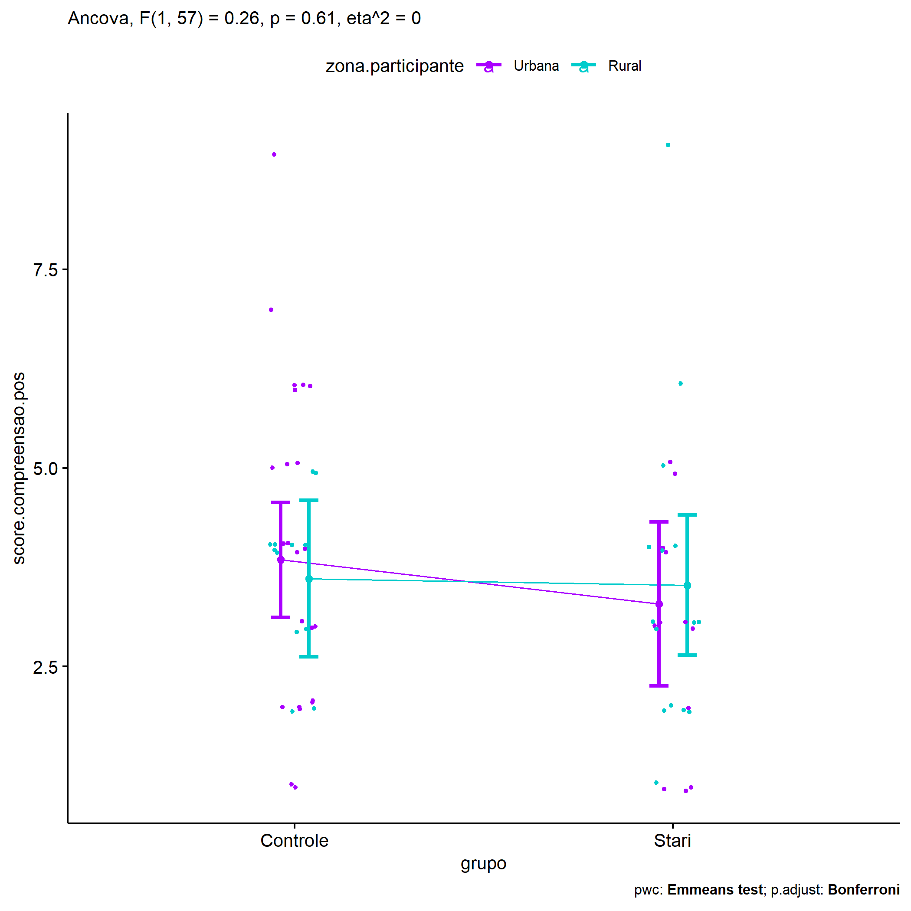<!-- -->

    ## Scale for colour is already present.
    ## Adding another scale for colour, which will replace the existing scale.

<!-- -->

<!-- -->

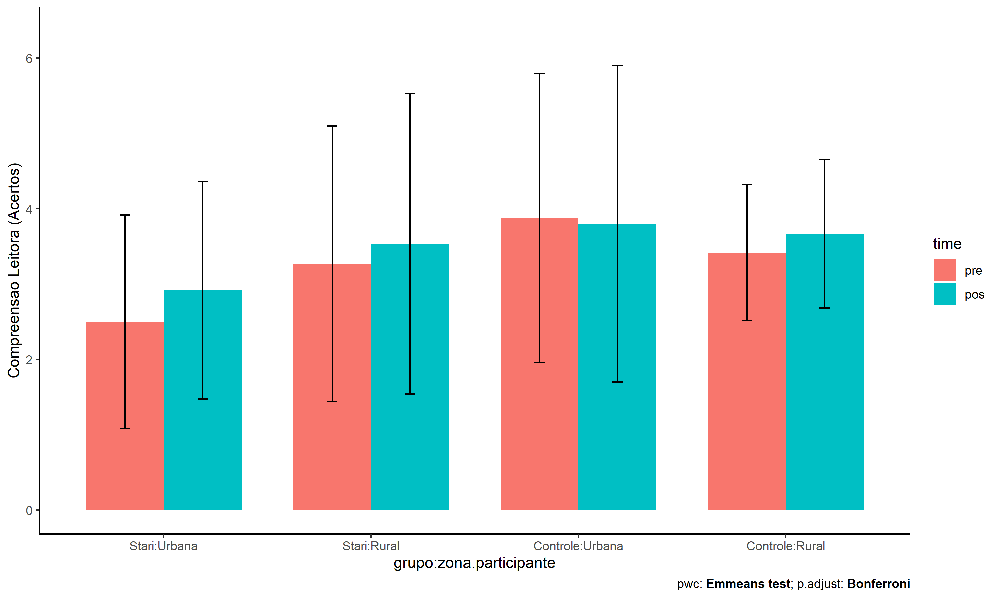<!-- -->

## factores: **escola:grupo**

### Quant. Palavras Lidas

| var                | escola | grupo    |   n | M (pre) | SE (pre) | M (unadj) | SE (unadj) | M (adj) | SE (adj) |
|:-------------------|:-------|:---------|----:|--------:|---------:|----------:|-----------:|--------:|---------:|
| palavras.lidas.pos | E1     | Controle |   7 |  75.714 |   15.187 |    76.571 |     17.114 |  74.863 |   22.979 |
| palavras.lidas.pos | E3     | Controle |   5 |  86.400 |   41.843 |    52.600 |     10.352 |  48.709 |   27.361 |
| palavras.lidas.pos | E5     | Controle |  17 |  68.235 |   10.490 |   118.529 |     16.985 | 118.349 |   14.712 |
| palavras.lidas.pos | E5     | Stari    |  14 |  68.571 |   12.474 |   115.000 |     16.926 | 114.751 |   16.212 |
| palavras.lidas.pos | E6     | Stari    |   5 |  30.200 |    7.351 |    94.000 |     26.272 | 101.591 |   28.011 |

|     | .y.                | grupo    | escola | group1   | group2 | estimate | conf.low | conf.high |     se | statistic |     p | p.adj | p.adj.signif |
|:----|:-------------------|:---------|:-------|:---------|:-------|---------:|---------:|----------:|-------:|----------:|------:|------:|:-------------|
| 1   | palavras.lidas.pos | Controle |        | E1       | E3     |   26.155 |  -45.634 |    97.943 | 35.573 |     0.735 | 0.466 | 1.000 | ns           |
| 2   | palavras.lidas.pos | Controle |        | E1       | E5     |  -43.486 |  -98.531 |    11.559 | 27.276 |    -1.594 | 0.118 | 0.355 | ns           |
| 4   | palavras.lidas.pos | Controle |        | E3       | E5     |  -69.640 | -132.295 |    -6.986 | 31.046 |    -2.243 | 0.030 | 0.091 | ns           |
| 12  | palavras.lidas.pos | Stari    |        | E5       | E6     |   13.161 |  -52.253 |    78.575 | 32.414 |     0.406 | 0.687 | 0.687 | ns           |
| 13  | palavras.lidas.pre | Controle |        | E1       | E3     |  -10.686 |  -68.770 |    47.398 | 28.802 |    -0.371 | 0.712 | 1.000 | ns           |
| 14  | palavras.lidas.pre | Controle |        | E1       | E5     |    7.479 |  -37.070 |    52.028 | 22.090 |     0.339 | 0.737 | 1.000 | ns           |
| 16  | palavras.lidas.pre | Controle |        | E3       | E5     |   18.165 |  -32.302 |    68.631 | 25.024 |     0.726 | 0.472 | 1.000 | ns           |
| 24  | palavras.lidas.pre | Stari    |        | E5       | E6     |   38.371 |  -13.309 |    90.052 | 25.627 |     1.497 | 0.142 | 0.142 | ns           |
| 27  | palavras.lidas.pos |          | E5     | Controle | Stari  |    3.598 |  -40.579 |    47.775 | 21.891 |     0.164 | 0.870 | 0.870 | ns           |
| 31  | palavras.lidas.pre |          | E5     | Controle | Stari  |   -0.336 |  -36.137 |    35.465 | 17.752 |    -0.019 | 0.985 | 0.985 | ns           |

| grupo    | escola | group1 | group2 | estimate | conf.low | conf.high |     se | statistic |     p | p.adj | p.adj.signif |
|:---------|:-------|:-------|:-------|---------:|---------:|----------:|-------:|----------:|------:|------:|:-------------|
| Controle | E1     | pre    | pos    |    2.554 |  -56.928 |    62.035 | 30.042 |     0.085 | 0.932 | 0.932 | ns           |
| Controle | E3     | pre    | pos    |   37.567 |  -32.027 |   107.160 | 35.149 |     1.069 | 0.287 | 0.287 | ns           |
| Controle | E5     | pre    | pos    |  -46.918 |  -85.788 |    -8.049 | 19.632 |    -2.390 | 0.018 | 0.018 | \*           |
| Stari    | E5     | pre    | pos    |  -46.429 |  -89.868 |    -2.989 | 21.940 |    -2.116 | 0.036 | 0.036 | \*           |
| Stari    | E6     | pre    | pos    |  -66.167 | -135.760 |     3.427 | 35.149 |    -1.882 | 0.062 | 0.062 | ns           |

    ## Scale for colour is already present.
    ## Adding another scale for colour, which will replace the existing scale.

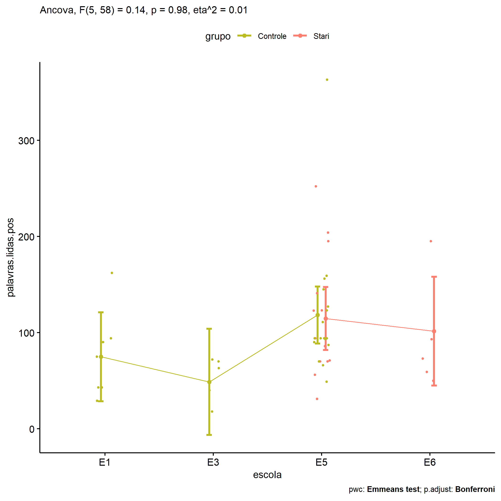<!-- -->

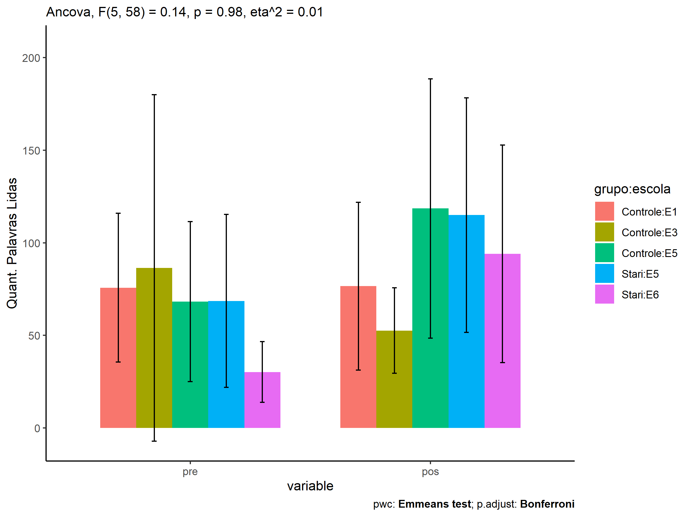<!-- -->

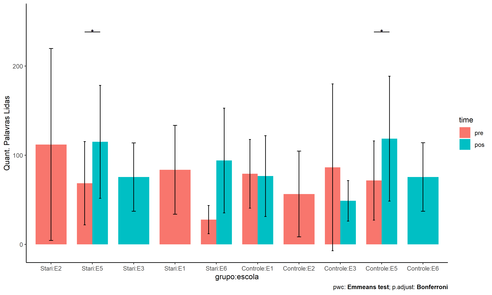<!-- -->

### Compreensao Leitora (Acertos)

| var                   | escola | grupo    |   n | M (pre) | SE (pre) | M (unadj) | SE (unadj) | M (adj) | SE (adj) |
|:----------------------|:-------|:---------|----:|--------:|---------:|----------:|-----------:|--------:|---------:|
| score.compreensao.pos | E1     | Controle |   7 |   3.857 |    0.595 |     4.429 |      1.020 |   4.275 |    0.677 |
| score.compreensao.pos | E2     | Controle |   8 |   2.625 |    0.420 |     2.750 |      0.559 |   2.856 |    0.630 |
| score.compreensao.pos | E2     | Stari    |   7 |   2.000 |    0.218 |     2.714 |      0.522 |   2.953 |    0.691 |
| score.compreensao.pos | E3     | Controle |   6 |   3.833 |    0.307 |     4.000 |      0.447 |   3.851 |    0.730 |
| score.compreensao.pos | E3     | Stari    |   6 |   3.500 |    0.671 |     3.167 |      0.601 |   3.088 |    0.724 |
| score.compreensao.pos | E5     | Controle |  17 |   3.059 |    0.303 |     3.176 |      0.356 |   3.191 |    0.429 |
| score.compreensao.pos | E5     | Stari    |  14 |   3.429 |    0.552 |     3.571 |      0.590 |   3.508 |    0.475 |
| score.compreensao.pos | E6     | Stari    |   5 |   2.600 |    0.510 |     3.800 |      0.663 |   3.912 |    0.794 |

|     | .y.                   | grupo    | escola | group1   | group2 | estimate | conf.low | conf.high |    se | statistic |     p | p.adj | p.adj.signif |
|:----|:----------------------|:---------|:-------|:---------|:-------|---------:|---------:|----------:|------:|----------:|------:|------:|:-------------|
| 1   | score.compreensao.pos | Controle |        | E1       | E2     |    1.418 |   -0.450 |     3.287 | 0.934 |     1.518 | 0.134 | 0.805 | ns           |
| 2   | score.compreensao.pos | Controle |        | E1       | E3     |    0.424 |   -1.542 |     2.389 | 0.983 |     0.431 | 0.668 | 1.000 | ns           |
| 3   | score.compreensao.pos | Controle |        | E1       | E5     |    1.083 |   -0.523 |     2.690 | 0.803 |     1.349 | 0.182 | 1.000 | ns           |
| 5   | score.compreensao.pos | Controle |        | E2       | E3     |   -0.995 |   -2.940 |     0.950 | 0.973 |    -1.023 | 0.310 | 1.000 | ns           |
| 6   | score.compreensao.pos | Controle |        | E2       | E5     |   -0.335 |   -1.856 |     1.186 | 0.761 |    -0.440 | 0.661 | 1.000 | ns           |
| 8   | score.compreensao.pos | Controle |        | E3       | E5     |    0.660 |   -1.035 |     2.355 | 0.848 |     0.779 | 0.439 | 1.000 | ns           |
| 15  | score.compreensao.pos | Stari    |        | E2       | E3     |   -0.136 |   -2.156 |     1.885 | 1.010 |    -0.134 | 0.894 | 1.000 | ns           |
| 16  | score.compreensao.pos | Stari    |        | E2       | E5     |   -0.555 |   -2.250 |     1.140 | 0.848 |    -0.655 | 0.515 | 1.000 | ns           |
| 17  | score.compreensao.pos | Stari    |        | E2       | E6     |   -0.959 |   -3.036 |     1.118 | 1.039 |    -0.923 | 0.360 | 1.000 | ns           |
| 18  | score.compreensao.pos | Stari    |        | E3       | E5     |   -0.420 |   -2.144 |     1.304 | 0.862 |    -0.487 | 0.628 | 1.000 | ns           |
| 19  | score.compreensao.pos | Stari    |        | E3       | E6     |   -0.823 |   -2.981 |     1.334 | 1.079 |    -0.763 | 0.448 | 1.000 | ns           |
| 20  | score.compreensao.pos | Stari    |        | E5       | E6     |   -0.404 |   -2.262 |     1.455 | 0.930 |    -0.434 | 0.666 | 1.000 | ns           |
| 21  | score.compreensao.pre | Controle |        | E1       | E2     |    1.232 |   -0.258 |     2.722 | 0.745 |     1.653 | 0.103 | 0.621 | ns           |
| 22  | score.compreensao.pre | Controle |        | E1       | E3     |    0.024 |   -1.578 |     1.626 | 0.801 |     0.030 | 0.976 | 1.000 | ns           |
| 23  | score.compreensao.pre | Controle |        | E1       | E5     |    0.798 |   -0.495 |     2.091 | 0.647 |     1.234 | 0.222 | 1.000 | ns           |
| 25  | score.compreensao.pre | Controle |        | E2       | E3     |   -1.208 |   -2.763 |     0.347 | 0.778 |    -1.553 | 0.125 | 0.753 | ns           |
| 26  | score.compreensao.pre | Controle |        | E2       | E5     |   -0.434 |   -1.668 |     0.801 | 0.618 |    -0.702 | 0.485 | 1.000 | ns           |
| 28  | score.compreensao.pre | Controle |        | E3       | E5     |    0.775 |   -0.593 |     2.142 | 0.684 |     1.132 | 0.262 | 1.000 | ns           |
| 35  | score.compreensao.pre | Stari    |        | E2       | E3     |   -1.500 |   -3.102 |     0.102 | 0.801 |    -1.872 | 0.066 | 0.396 | ns           |
| 36  | score.compreensao.pre | Stari    |        | E2       | E5     |   -1.429 |   -2.761 |    -0.096 | 0.667 |    -2.143 | 0.036 | 0.217 | ns           |
| 37  | score.compreensao.pre | Stari    |        | E2       | E6     |   -0.600 |   -2.286 |     1.086 | 0.843 |    -0.711 | 0.480 | 1.000 | ns           |
| 38  | score.compreensao.pre | Stari    |        | E3       | E5     |    0.071 |   -1.334 |     1.476 | 0.703 |     0.102 | 0.919 | 1.000 | ns           |
| 39  | score.compreensao.pre | Stari    |        | E3       | E6     |    0.900 |   -0.844 |     2.644 | 0.872 |     1.032 | 0.306 | 1.000 | ns           |
| 40  | score.compreensao.pre | Stari    |        | E5       | E6     |    0.829 |   -0.672 |     2.329 | 0.750 |     1.104 | 0.274 | 1.000 | ns           |
| 42  | score.compreensao.pos |          | E2     | Controle | Stari  |   -0.096 |   -1.935 |     1.743 | 0.920 |    -0.105 | 0.917 | 0.917 | ns           |
| 43  | score.compreensao.pos |          | E3     | Controle | Stari  |    0.763 |   -1.280 |     2.805 | 1.021 |     0.747 | 0.458 | 0.458 | ns           |
| 44  | score.compreensao.pos |          | E5     | Controle | Stari  |   -0.317 |   -1.597 |     0.963 | 0.640 |    -0.495 | 0.622 | 0.622 | ns           |
| 47  | score.compreensao.pre |          | E2     | Controle | Stari  |    0.625 |   -0.865 |     2.115 | 0.745 |     0.838 | 0.405 | 0.405 | ns           |
| 48  | score.compreensao.pre |          | E3     | Controle | Stari  |    0.333 |   -1.329 |     1.996 | 0.832 |     0.401 | 0.690 | 0.690 | ns           |
| 49  | score.compreensao.pre |          | E5     | Controle | Stari  |   -0.370 |   -1.409 |     0.669 | 0.520 |    -0.711 | 0.480 | 0.480 | ns           |

| grupo    | escola | group1 | group2 | estimate | conf.low | conf.high |    se | statistic |     p | p.adj | p.adj.signif |
|:---------|:-------|:-------|:-------|---------:|---------:|----------:|------:|----------:|------:|------:|:-------------|
| Controle | E1     | pre    | pos    |   -0.054 |   -1.694 |     1.587 | 0.830 |    -0.065 | 0.949 | 0.949 | ns           |
| Controle | E2     | pre    | pos    |    0.069 |   -1.471 |     1.610 | 0.779 |     0.089 | 0.929 | 0.929 | ns           |
| Controle | E3     | pre    | pos    |   -0.167 |   -1.997 |     1.664 | 0.926 |    -0.180 | 0.857 | 0.857 | ns           |
| Controle | E5     | pre    | pos    |   -0.121 |   -1.193 |     0.951 | 0.542 |    -0.223 | 0.824 | 0.824 | ns           |
| Stari    | E2     | pre    | pos    |   -0.381 |   -1.979 |     1.217 | 0.808 |    -0.471 | 0.638 | 0.638 | ns           |
| Stari    | E3     | pre    | pos    |    0.333 |   -1.497 |     2.164 | 0.926 |     0.360 | 0.719 | 0.719 | ns           |
| Stari    | E5     | pre    | pos    |   -0.143 |   -1.341 |     1.055 | 0.606 |    -0.236 | 0.814 | 0.814 | ns           |
| Stari    | E6     | pre    | pos    |   -1.467 |   -3.386 |     0.453 | 0.971 |    -1.511 | 0.133 | 0.133 | ns           |

    ## Scale for colour is already present.
    ## Adding another scale for colour, which will replace the existing scale.

<!-- -->

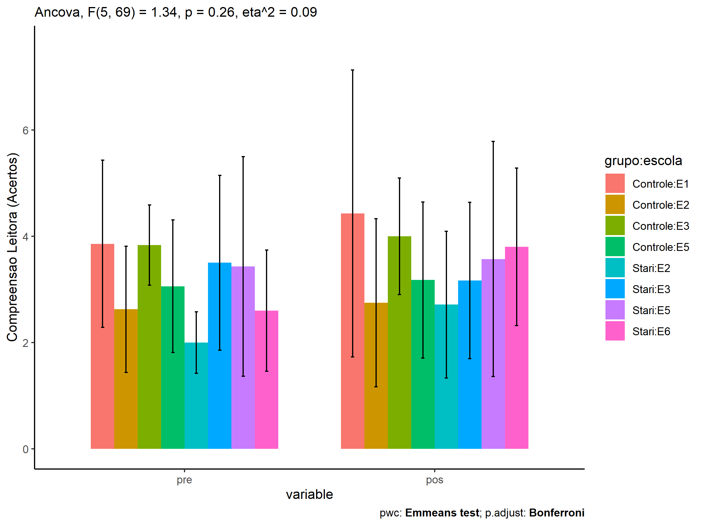<!-- -->

<!-- -->

## factores: **zona.escola:grupo**

### Quant. Palavras Lidas

| var                | zona.escola | grupo    |   n | M (pre) | SE (pre) | M (unadj) | SE (unadj) | M (adj) | SE (adj) |
|:-------------------|:------------|:---------|----:|--------:|---------:|----------:|-----------:|--------:|---------:|
| palavras.lidas.pos | Rural       | Controle |  12 | 109.583 |   30.579 |    69.917 |     10.371 |  63.333 |   16.603 |
| palavras.lidas.pos | Rural       | Stari    |   9 |  67.222 |   20.825 |    81.000 |     14.896 |  83.569 |   18.888 |
| palavras.lidas.pos | Urbana      | Controle |  28 |  65.143 |    7.701 |    99.964 |     12.041 | 102.983 |   10.777 |
| palavras.lidas.pos | Urbana      | Stari    |  22 |  85.136 |   16.524 |   106.500 |     13.685 | 105.198 |   12.072 |

| .y.                | grupo    | zona.escola | group1   | group2 | estimate | conf.low | conf.high |     se | statistic |     p | p.adj | p.adj.signif |
|:-------------------|:---------|:------------|:---------|:-------|---------:|---------:|----------:|-------:|----------:|------:|------:|:-------------|
| palavras.lidas.pos | Controle |             | Urbana   | Rural  |   39.650 |   -0.290 |    79.589 | 20.004 |     1.982 | 0.052 | 0.052 | ns           |
| palavras.lidas.pos | Stari    |             | Urbana   | Rural  |   21.629 |  -23.190 |    66.448 | 22.448 |     0.964 | 0.339 | 0.339 | ns           |
| palavras.lidas.pre | Controle |             | Urbana   | Rural  |  -44.440 |  -92.453 |     3.572 | 24.054 |    -1.848 | 0.069 | 0.069 | ns           |
| palavras.lidas.pre | Stari    |             | Urbana   | Rural  |   17.914 |  -37.146 |    72.974 | 27.585 |     0.649 | 0.518 | 0.518 | ns           |
| palavras.lidas.pos |          | Urbana      | Controle | Stari  |   -2.216 |  -34.628 |    30.196 | 16.234 |    -0.136 | 0.892 | 0.892 | ns           |
| palavras.lidas.pos |          | Rural       | Controle | Stari  |  -20.236 |  -70.728 |    30.255 | 25.289 |    -0.800 | 0.426 | 0.426 | ns           |
| palavras.lidas.pre |          | Urbana      | Controle | Stari  |  -19.994 |  -59.638 |    19.651 | 19.862 |    -1.007 | 0.318 | 0.318 | ns           |
| palavras.lidas.pre |          | Rural       | Controle | Stari  |   42.361 |  -18.999 |   103.721 | 30.742 |     1.378 | 0.173 | 0.173 | ns           |

| grupo    | zona.escola | group1 | group2 | estimate | conf.low | conf.high |     se | statistic |     p | p.adj | p.adj.signif |
|:---------|:------------|:-------|:-------|---------:|---------:|----------:|-------:|----------:|------:|------:|:-------------|
| Controle | Urbana      | pre    | pos    |  -30.536 |  -61.804 |     0.733 | 15.828 |    -1.929 | 0.056 | 0.056 | ns           |
| Controle | Rural       | pre    | pos    |   40.512 |   -8.004 |    89.028 | 24.559 |     1.650 | 0.101 | 0.101 | ns           |
| Stari    | Urbana      | pre    | pos    |  -21.328 |  -56.195 |    13.540 | 17.650 |    -1.208 | 0.229 | 0.229 | ns           |
| Stari    | Rural       | pre    | pos    |  -20.817 |  -73.621 |    31.988 | 26.730 |    -0.779 | 0.437 | 0.437 | ns           |

    ## Scale for colour is already present.
    ## Adding another scale for colour, which will replace the existing scale.

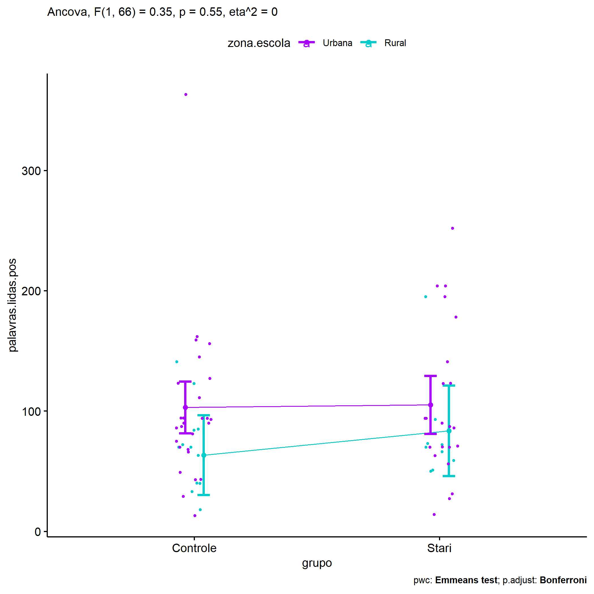<!-- -->

    ## Scale for colour is already present.
    ## Adding another scale for colour, which will replace the existing scale.

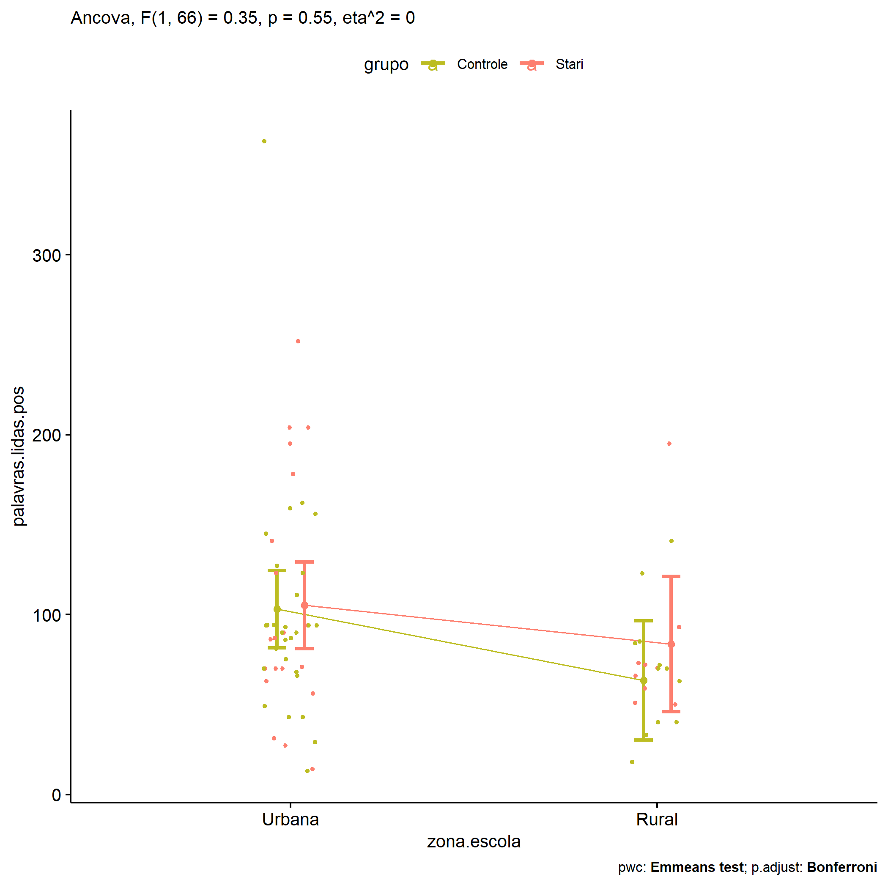<!-- -->

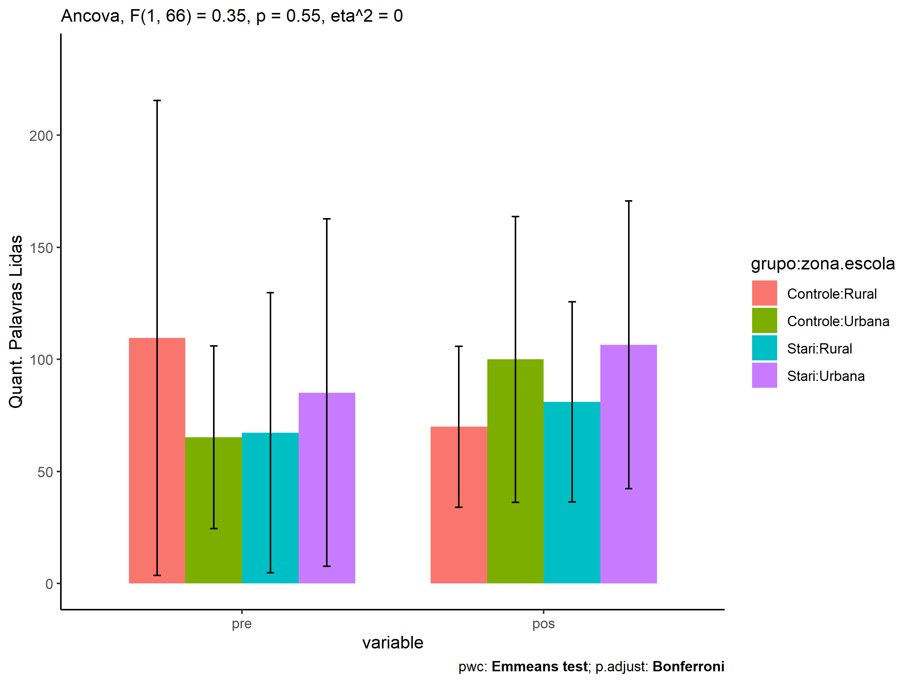<!-- -->

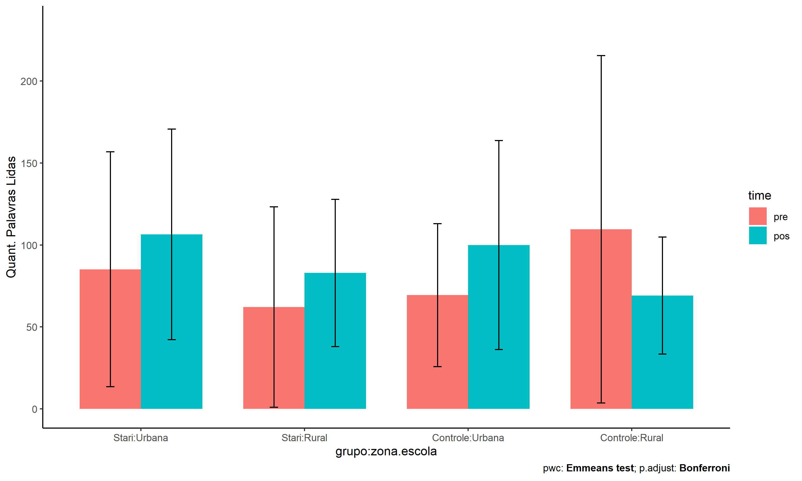<!-- -->

### Compreensao Leitora (Acertos)

| var                   | zona.escola | grupo    |   n | M (pre) | SE (pre) | M (unadj) | SE (unadj) | M (adj) | SE (adj) |
|:----------------------|:------------|:---------|----:|--------:|---------:|----------:|-----------:|--------:|---------:|
| score.compreensao.pos | Rural       | Controle |  13 |   4.000 |    0.506 |     3.923 |      0.445 |   3.653 |    0.489 |
| score.compreensao.pos | Rural       | Stari    |  12 |   3.000 |    0.408 |     3.417 |      0.398 |   3.463 |    0.497 |
| score.compreensao.pos | Urbana      | Controle |  32 |   3.125 |    0.237 |     3.344 |      0.329 |   3.351 |    0.304 |
| score.compreensao.pos | Urbana      | Stari    |  25 |   2.800 |    0.346 |     3.080 |      0.383 |   3.190 |    0.347 |

| .y.                   | grupo    | zona.escola | group1   | group2 | estimate | conf.low | conf.high |    se | statistic |     p | p.adj | p.adj.signif |
|:----------------------|:---------|:------------|:---------|:-------|---------:|---------:|----------:|------:|----------:|------:|------:|:-------------|
| score.compreensao.pos | Controle |             | Urbana   | Rural  |   -0.302 |   -1.450 |     0.845 | 0.576 |    -0.524 | 0.602 | 0.602 | ns           |
| score.compreensao.pos | Stari    |             | Urbana   | Rural  |   -0.273 |   -1.477 |     0.931 | 0.605 |    -0.452 | 0.653 | 0.653 | ns           |
| score.compreensao.pre | Controle |             | Urbana   | Rural  |   -0.875 |   -1.896 |     0.146 | 0.513 |    -1.707 | 0.092 | 0.092 | ns           |
| score.compreensao.pre | Stari    |             | Urbana   | Rural  |   -0.200 |   -1.290 |     0.890 | 0.547 |    -0.365 | 0.716 | 0.716 | ns           |
| score.compreensao.pos |          | Urbana      | Controle | Stari  |    0.161 |   -0.757 |     1.079 | 0.461 |     0.349 | 0.728 | 0.728 | ns           |
| score.compreensao.pos |          | Rural       | Controle | Stari  |    0.190 |   -1.204 |     1.583 | 0.700 |     0.271 | 0.787 | 0.787 | ns           |
| score.compreensao.pre |          | Urbana      | Controle | Stari  |    0.325 |   -0.503 |     1.153 | 0.416 |     0.781 | 0.437 | 0.437 | ns           |
| score.compreensao.pre |          | Rural       | Controle | Stari  |    1.000 |   -0.242 |     2.242 | 0.624 |     1.603 | 0.113 | 0.113 | ns           |

| grupo    | zona.escola | group1 | group2 | estimate | conf.low | conf.high |    se | statistic |     p | p.adj | p.adj.signif |
|:---------|:------------|:-------|:-------|---------:|---------:|----------:|------:|----------:|------:|------:|:-------------|
| Controle | Urbana      | pre    | pos    |   -0.008 |   -0.826 |     0.810 | 0.414 |    -0.019 | 0.985 | 0.985 | ns           |
| Controle | Rural       | pre    | pos    |    0.214 |   -1.076 |     1.504 | 0.653 |     0.328 | 0.743 | 0.743 | ns           |
| Stari    | Urbana      | pre    | pos    |   -0.183 |   -1.097 |     0.731 | 0.463 |    -0.396 | 0.692 | 0.692 | ns           |
| Stari    | Rural       | pre    | pos    |   -0.571 |   -1.911 |     0.770 | 0.679 |    -0.840 | 0.402 | 0.402 | ns           |

    ## Scale for colour is already present.
    ## Adding another scale for colour, which will replace the existing scale.

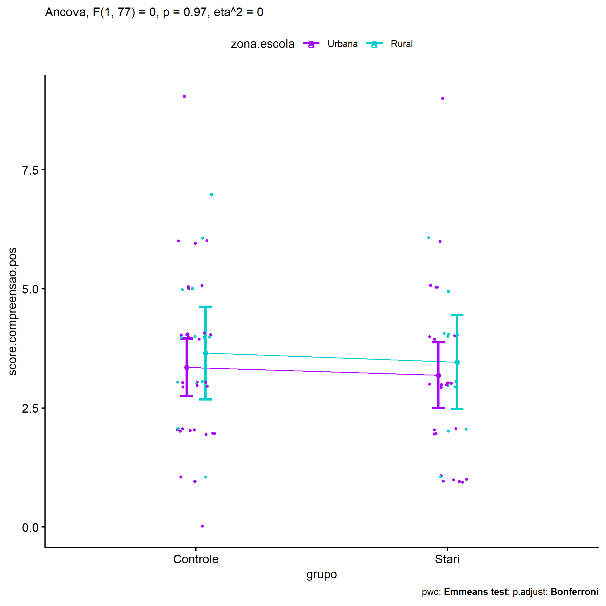<!-- -->

    ## Scale for colour is already present.
    ## Adding another scale for colour, which will replace the existing scale.

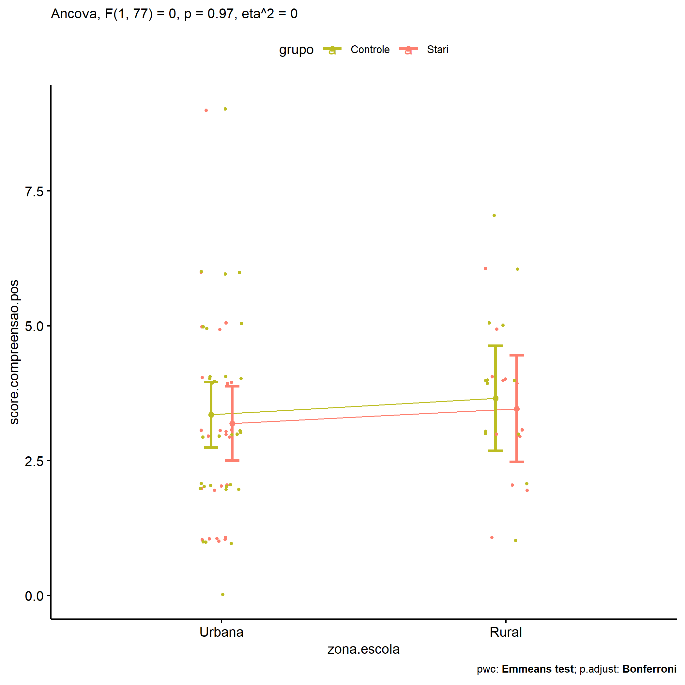<!-- -->

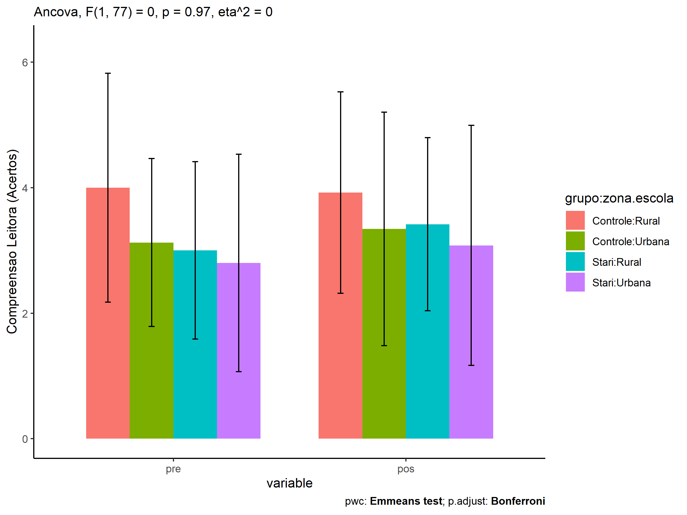<!-- -->

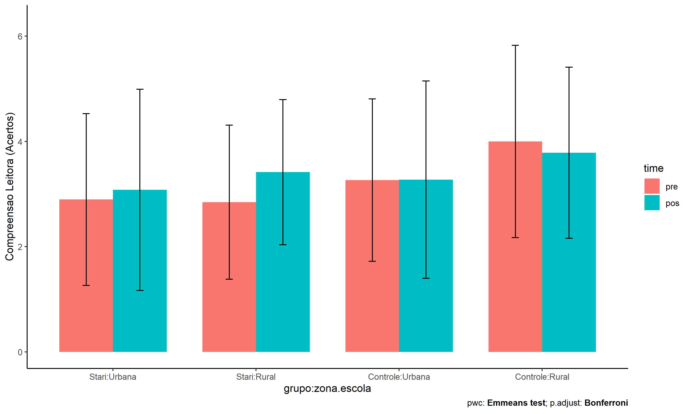<!-- -->

# Pairwise comparisons for grupo=“Experimental”

## factores: **grupo=“Experimental”:monitor**

### Quant. Palavras Lidas

### Compreensao Leitora (Acertos)

| var                   | monitor |   n | M (pre) | SE (pre) | M (unadj) | SE (unadj) | M (adj) | SE (adj) |
|:----------------------|:--------|----:|--------:|---------:|----------:|-----------:|--------:|---------:|
| score.compreensao.pos | ML      |   6 |     3.5 |    0.671 |     3.167 |      0.601 |   3.033 |    0.622 |
| score.compreensao.pos | VL      |   5 |     2.6 |    0.510 |     3.800 |      0.663 |   3.960 |    0.685 |

| .y.                   | group1 | group2 | estimate | conf.low | conf.high |    se | statistic |     p | p.adj | p.adj.signif |
|:----------------------|:-------|:-------|---------:|---------:|----------:|------:|----------:|------:|------:|:-------------|
| score.compreensao.pos | ML     | VL     |   -0.927 |   -3.120 |     1.266 | 0.951 |    -0.975 | 0.358 | 0.358 | ns           |
| score.compreensao.pre | ML     | VL     |    0.900 |   -1.075 |     2.875 | 0.873 |     1.031 | 0.329 | 0.329 | ns           |

| .y.               | monitor | group1 | group2 | estimate | conf.low | conf.high |    se | statistic |     p | p.adj | p.adj.signif |
|:------------------|:--------|:-------|:-------|---------:|---------:|----------:|------:|----------:|------:|------:|:-------------|
| score.compreensao | ML      | pre    | pos    |    0.333 |   -1.316 |     1.982 | 0.799 |     0.417 | 0.680 | 0.680 | ns           |
| score.compreensao | VL      | pre    | pos    |   -1.467 |   -3.196 |     0.263 | 0.838 |    -1.750 | 0.093 | 0.093 | ns           |

    ## Scale for colour is already present.
    ## Adding another scale for colour, which will replace the existing scale.

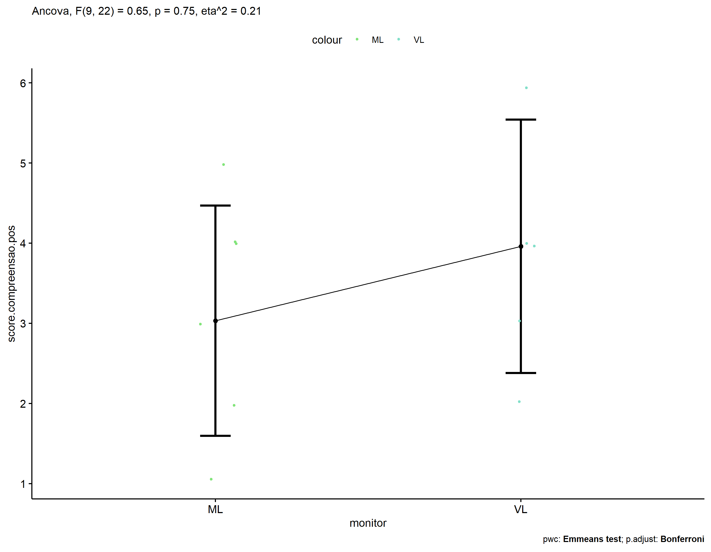<!-- -->

<!-- -->

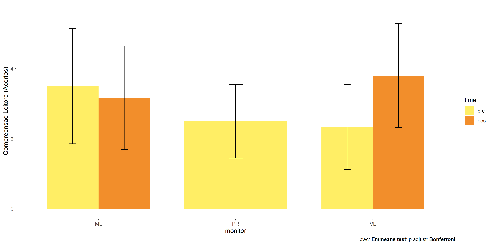<!-- -->

## factores: **grupo=“Experimental”:monitor.genero**

### Quant. Palavras Lidas

| var                | monitor.genero |   n | M (pre) | SE (pre) | M (unadj) | SE (unadj) | M (adj) | SE (adj) |
|:-------------------|:---------------|----:|--------:|---------:|----------:|-----------:|--------:|---------:|
| palavras.lidas.pos | F              |  15 |  61.200 |   12.845 |    89.800 |     12.420 |  91.999 |   13.676 |
| palavras.lidas.pos | M              |  12 |  84.167 |   15.292 |    87.667 |     16.609 |  84.918 |   15.335 |

| .y.                | group1 | group2 | estimate | conf.low | conf.high |     se | statistic |     p | p.adj | p.adj.signif |
|:-------------------|:-------|:-------|---------:|---------:|----------:|-------:|----------:|------:|------:|:-------------|
| palavras.lidas.pos | F      | M      |    7.080 |  -35.872 |    50.033 | 20.811 |     0.340 | 0.737 | 0.737 | ns           |
| palavras.lidas.pre | F      | M      |  -22.967 |  -63.800 |    17.867 | 19.827 |    -1.158 | 0.258 | 0.258 | ns           |

| .y.            | monitor.genero | group1 | group2 | estimate | conf.low | conf.high |     se | statistic |     p | p.adj | p.adj.signif |
|:---------------|:---------------|:-------|:-------|---------:|---------:|----------:|-------:|----------:|------:|------:|:-------------|
| palavras.lidas | F              | pre    | pos    |  -26.295 |  -60.288 |     7.697 | 16.988 |    -1.548 | 0.127 | 0.127 | ns           |
| palavras.lidas | M              | pre    | pos    |   -7.167 |  -47.823 |    33.489 | 20.318 |    -0.353 | 0.726 | 0.726 | ns           |

    ## Scale for colour is already present.
    ## Adding another scale for colour, which will replace the existing scale.

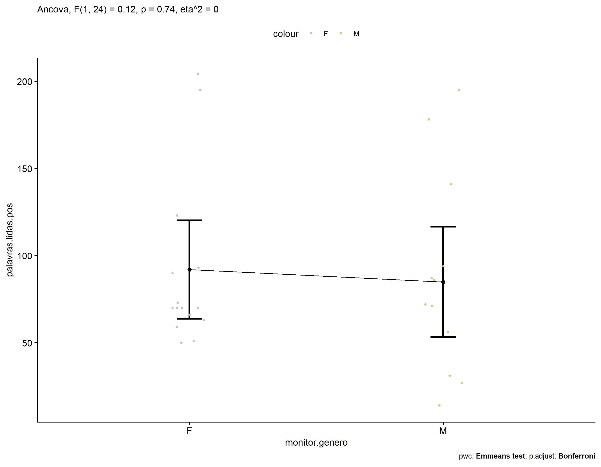<!-- -->

<!-- -->

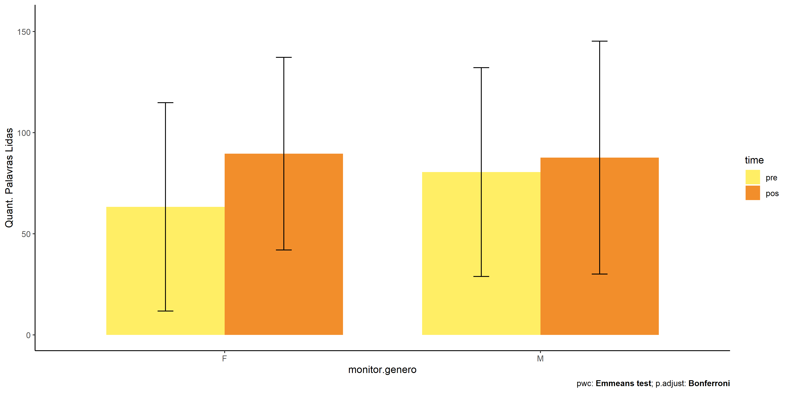<!-- -->

### Compreensao Leitora (Acertos)

| var                   | monitor.genero |   n | M (pre) | SE (pre) | M (unadj) | SE (unadj) | M (adj) | SE (adj) |
|:----------------------|:---------------|----:|--------:|---------:|----------:|-----------:|--------:|---------:|
| score.compreensao.pos | F              |  21 |   3.095 |    0.330 |     3.286 |      0.346 |   3.192 |    0.391 |
| score.compreensao.pos | M              |  12 |   2.250 |    0.429 |     3.000 |      0.615 |   3.165 |    0.523 |

| .y.                   | group1 | group2 | estimate | conf.low | conf.high |    se | statistic |     p | p.adj | p.adj.signif |
|:----------------------|:-------|:-------|---------:|---------:|----------:|------:|----------:|------:|------:|:-------------|
| score.compreensao.pos | F      | M      |    0.027 |   -1.329 |     1.383 | 0.664 |     0.041 | 0.968 | 0.968 | ns           |
| score.compreensao.pre | F      | M      |    0.845 |   -0.264 |     1.955 | 0.544 |     1.554 | 0.130 | 0.130 | ns           |

| .y.               | monitor.genero | group1 | group2 | estimate | conf.low | conf.high |    se | statistic |     p | p.adj | p.adj.signif |
|:------------------|:---------------|:-------|:-------|---------:|---------:|----------:|------:|----------:|------:|------:|:-------------|
| score.compreensao | F              | pre    | pos    |   -0.286 |   -1.293 |     0.722 | 0.504 |    -0.566 | 0.573 | 0.573 | ns           |
| score.compreensao | M              | pre    | pos    |   -0.571 |   -1.871 |     0.728 | 0.650 |    -0.878 | 0.383 | 0.383 | ns           |

    ## Scale for colour is already present.
    ## Adding another scale for colour, which will replace the existing scale.

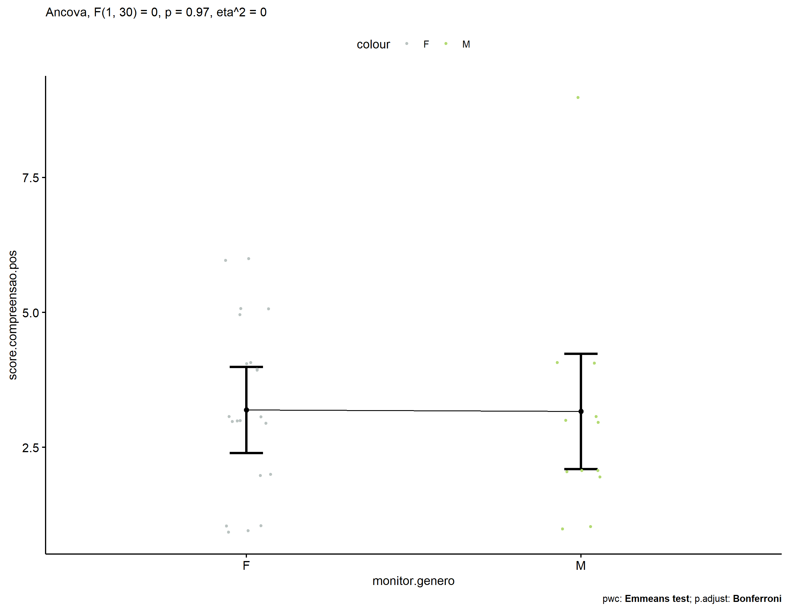<!-- -->

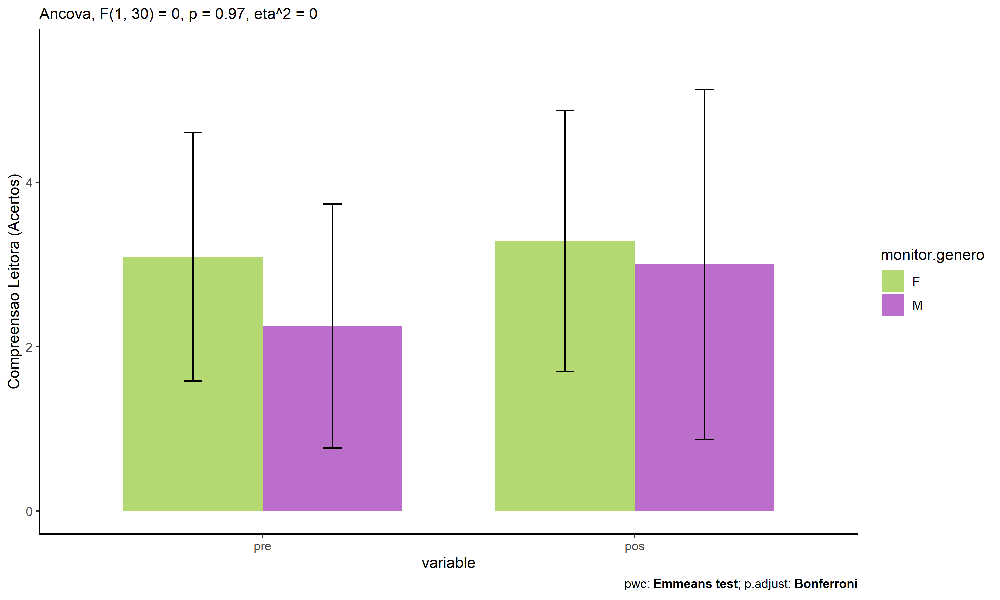<!-- -->

<!-- -->

## factores: **grupo=“Experimental”:monitor.area**

### Quant. Palavras Lidas

| var                | monitor.area   |   n | M (pre) | SE (pre) | M (unadj) | SE (unadj) | M (adj) | SE (adj) |
|:-------------------|:---------------|----:|--------:|---------:|----------:|-----------:|--------:|---------:|
| palavras.lidas.pos | Matematica     |   5 |    72.4 |   30.197 |     136.2 |     28.906 | 120.028 |   24.712 |
| palavras.lidas.pos | Servico Social |   5 |    30.2 |    7.351 |      94.0 |     26.272 | 110.172 |   24.712 |

| .y.                | group1     | group2         | estimate | conf.low | conf.high |     se | statistic |     p | p.adj | p.adj.signif |
|:-------------------|:-----------|:---------------|---------:|---------:|----------:|-------:|----------:|------:|------:|:-------------|
| palavras.lidas.pos | Matematica | Servico Social |    9.855 |  -76.950 |    96.660 | 36.710 |     0.268 | 0.796 | 0.796 | ns           |
| palavras.lidas.pre | Matematica | Servico Social |   42.200 |  -29.468 |   113.868 | 31.079 |     1.358 | 0.212 | 0.212 | ns           |

| .y.            | monitor.area   | group1 | group2 | estimate | conf.low | conf.high |     se | statistic |     p | p.adj | p.adj.signif |
|:---------------|:---------------|:-------|:-------|---------:|---------:|----------:|-------:|----------:|------:|------:|:-------------|
| palavras.lidas | Matematica     | pre    | pos    |  -63.800 | -129.761 |     2.161 | 32.147 |    -1.985 | 0.057 | 0.057 | ns           |
| palavras.lidas | Servico Social | pre    | pos    |  -66.167 | -129.319 |    -3.014 | 30.779 |    -2.150 | 0.041 | 0.041 | \*           |

    ## Scale for colour is already present.
    ## Adding another scale for colour, which will replace the existing scale.

<!-- -->

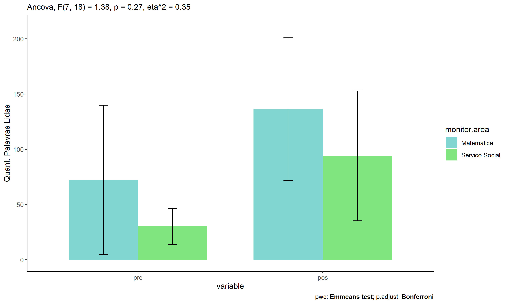<!-- -->

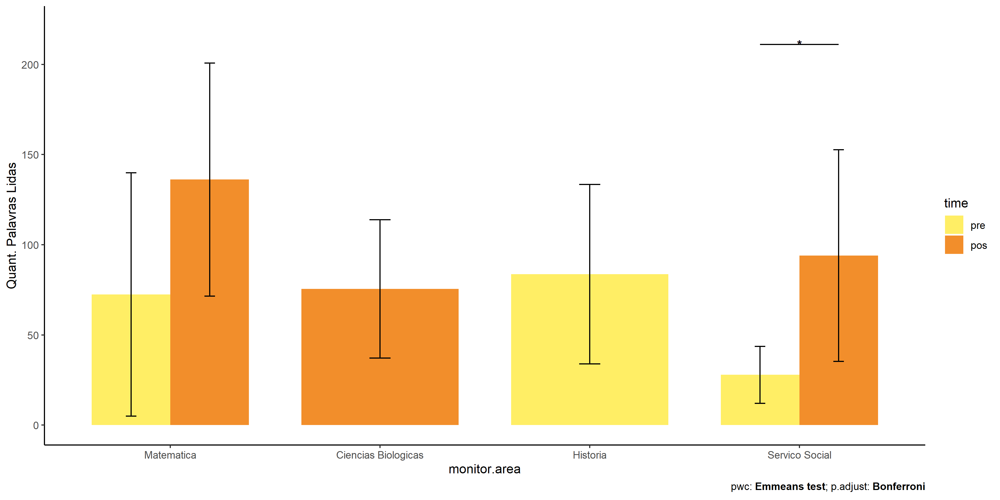<!-- -->

### Compreensao Leitora (Acertos)

| var                   | monitor.area        |   n | M (pre) | SE (pre) | M (unadj) | SE (unadj) | M (adj) | SE (adj) |
|:----------------------|:--------------------|----:|--------:|---------:|----------:|-----------:|--------:|---------:|
| score.compreensao.pos | Ciencias Biologicas |   6 |     3.5 |    0.671 |     3.167 |      0.601 |   3.167 |    0.866 |
| score.compreensao.pos | Matematica          |   5 |     4.4 |    0.812 |     4.800 |      1.319 |   4.899 |    1.008 |
| score.compreensao.pos | Servico Social      |   5 |     2.6 |    0.510 |     3.800 |      0.663 |   3.701 |    1.008 |

| .y.                   | group1              | group2         | estimate | conf.low | conf.high |    se | statistic |     p | p.adj | p.adj.signif |
|:----------------------|:--------------------|:---------------|---------:|---------:|----------:|------:|----------:|------:|------:|:-------------|
| score.compreensao.pos | Ciencias Biologicas | Matematica     |   -1.732 |   -4.627 |     1.163 | 1.329 |    -1.303 | 0.217 | 0.651 | ns           |
| score.compreensao.pos | Ciencias Biologicas | Servico Social |   -0.535 |   -3.430 |     2.361 | 1.329 |    -0.402 | 0.695 | 1.000 | ns           |
| score.compreensao.pos | Matematica          | Servico Social |    1.197 |   -2.077 |     4.472 | 1.503 |     0.797 | 0.441 | 1.000 | ns           |
| score.compreensao.pre | Ciencias Biologicas | Matematica     |   -0.900 |   -2.949 |     1.149 | 0.949 |    -0.949 | 0.360 | 1.000 | ns           |
| score.compreensao.pre | Ciencias Biologicas | Servico Social |    0.900 |   -1.149 |     2.949 | 0.949 |     0.949 | 0.360 | 1.000 | ns           |
| score.compreensao.pre | Matematica          | Servico Social |    1.800 |   -0.340 |     3.940 | 0.991 |     1.817 | 0.092 | 0.277 | ns           |

| .y.               | monitor.area        | group1 | group2 | estimate | conf.low | conf.high |    se | statistic |     p | p.adj | p.adj.signif |
|:------------------|:--------------------|:-------|:-------|---------:|---------:|----------:|------:|----------:|------:|------:|:-------------|
| score.compreensao | Ciencias Biologicas | pre    | pos    |    0.333 |   -1.682 |     2.349 | 0.989 |     0.337 | 0.738 | 0.738 | ns           |
| score.compreensao | Matematica          | pre    | pos    |   -0.400 |   -2.608 |     1.808 | 1.084 |    -0.369 | 0.715 | 0.715 | ns           |
| score.compreensao | Servico Social      | pre    | pos    |   -1.467 |   -3.580 |     0.647 | 1.038 |    -1.413 | 0.167 | 0.167 | ns           |

    ## Scale for colour is already present.
    ## Adding another scale for colour, which will replace the existing scale.

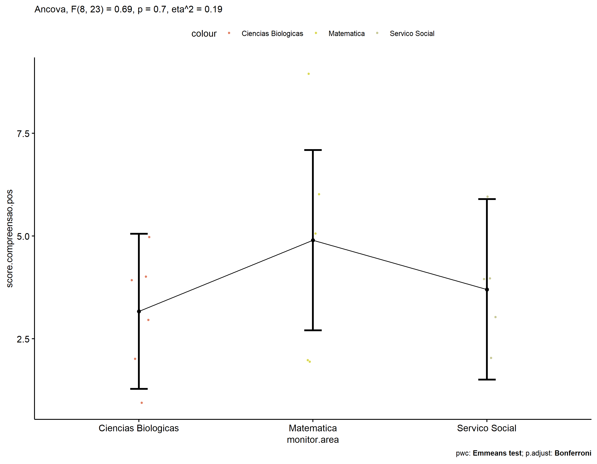<!-- -->

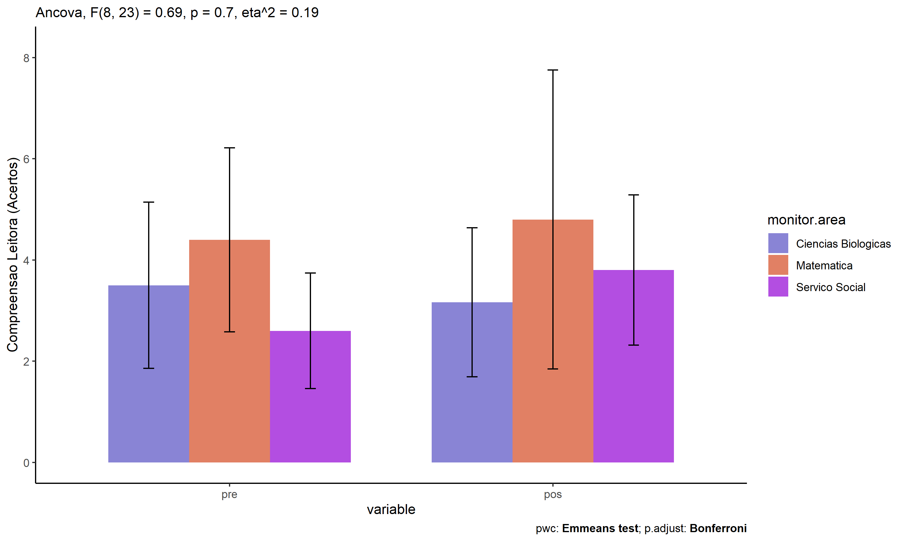<!-- -->

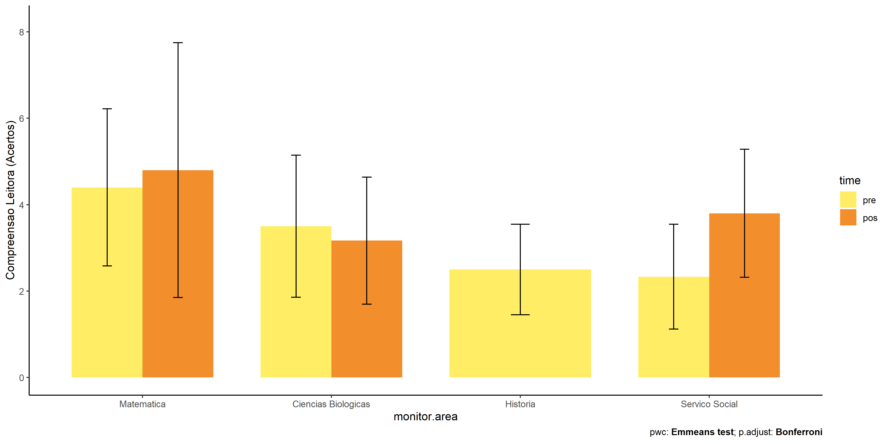<!-- -->

## factores: **grupo=“Experimental”:monitor.formacao**

### Quant. Palavras Lidas

### Compreensao Leitora (Acertos)

| var                   | monitor.formacao |   n | M (pre) | SE (pre) | M (unadj) | SE (unadj) | M (adj) | SE (adj) |
|:----------------------|:-----------------|----:|--------:|---------:|----------:|-----------:|--------:|---------:|
| score.compreensao.pos | ensino medio     |  26 |   2.808 |    0.304 |     3.154 |      0.302 |   3.155 |    0.352 |
| score.compreensao.pos | graduacao        |   6 |   2.833 |    0.703 |     3.333 |      1.174 |   3.327 |    0.733 |

| .y.                   | group1       | group2    | estimate | conf.low | conf.high |    se | statistic |     p | p.adj | p.adj.signif |
|:----------------------|:-------------|:----------|---------:|---------:|----------:|------:|----------:|------:|------:|:-------------|
| score.compreensao.pos | ensino medio | graduacao |   -0.172 |   -1.836 |     1.493 | 0.814 |    -0.211 | 0.834 | 0.834 | ns           |
| score.compreensao.pre | ensino medio | graduacao |   -0.026 |   -1.487 |     1.436 | 0.716 |    -0.036 | 0.972 | 0.972 | ns           |

| .y.               | monitor.formacao | group1 | group2 | estimate | conf.low | conf.high |    se | statistic |     p | p.adj | p.adj.signif |
|:------------------|:-----------------|:-------|:-------|---------:|---------:|----------:|------:|----------:|------:|------:|:-------------|
| score.compreensao | ensino medio     | pre    | pos    |   -0.361 |   -1.274 |     0.552 | 0.457 |    -0.790 | 0.433 | 0.433 | ns           |
| score.compreensao | graduacao        | pre    | pos    |   -0.500 |   -2.452 |     1.452 | 0.977 |    -0.512 | 0.611 | 0.611 | ns           |

    ## Scale for colour is already present.
    ## Adding another scale for colour, which will replace the existing scale.

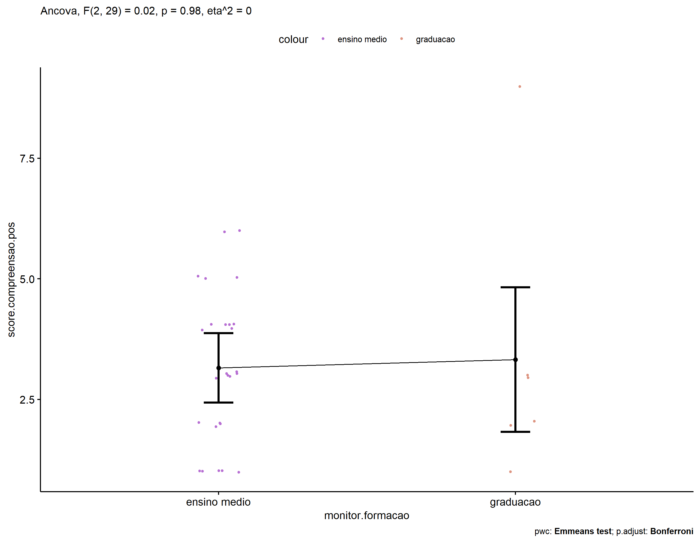<!-- -->

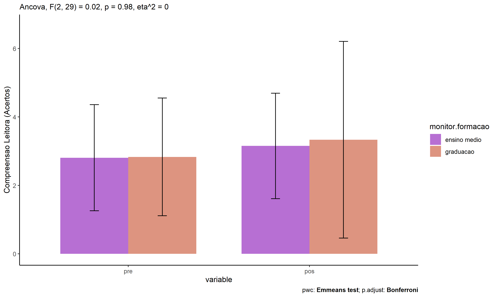<!-- -->

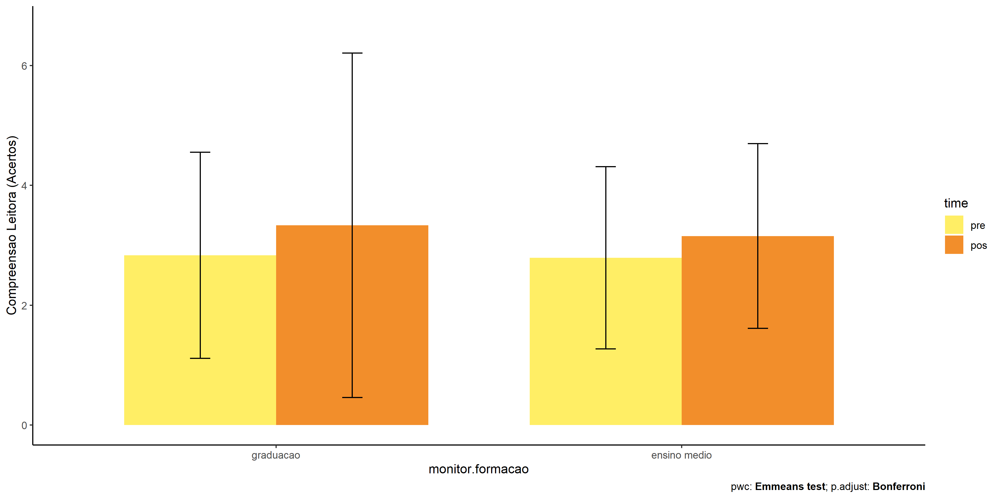<!-- -->

## factores: **grupo=“Experimental”:monitor.experiencia**

### Quant. Palavras Lidas

| var                | monitor.experiencia |   n | M (pre) | SE (pre) | M (unadj) | SE (unadj) | M (adj) | SE (adj) |
|:-------------------|:--------------------|----:|--------:|---------:|----------:|-----------:|--------:|---------:|
| palavras.lidas.pos | maior 01 ano        |  15 |  87.133 |   15.141 |    95.933 |     15.223 |  93.335 |   13.894 |
| palavras.lidas.pos | menor 01 ano        |  12 |  51.750 |    9.748 |    80.000 |     11.833 |  83.248 |   15.645 |

| .y.                | group1       | group2       | estimate | conf.low | conf.high |     se | statistic |     p | p.adj | p.adj.signif |
|:-------------------|:-------------|:-------------|---------:|---------:|----------:|-------:|----------:|------:|------:|:-------------|
| palavras.lidas.pos | maior 01 ano | menor 01 ano |   10.087 |  -34.447 |    54.621 | 21.578 |     0.467 | 0.644 | 0.644 | ns           |
| palavras.lidas.pre | maior 01 ano | menor 01 ano |   35.383 |   -3.916 |    74.683 | 19.082 |     1.854 | 0.076 | 0.076 | ns           |

| .y.            | monitor.experiencia | group1 | group2 | estimate | conf.low | conf.high |     se | statistic |     p | p.adj | p.adj.signif |
|:---------------|:--------------------|:-------|:-------|---------:|---------:|----------:|-------:|----------:|------:|------:|:-------------|
| palavras.lidas | maior 01 ano        | pre    | pos    |  -10.072 |  -42.656 |    22.512 | 16.284 |    -0.619 | 0.539 | 0.539 | ns           |
| palavras.lidas | menor 01 ano        | pre    | pos    |  -31.000 |  -71.149 |     9.149 | 20.064 |    -1.545 | 0.128 | 0.128 | ns           |

    ## Scale for colour is already present.
    ## Adding another scale for colour, which will replace the existing scale.

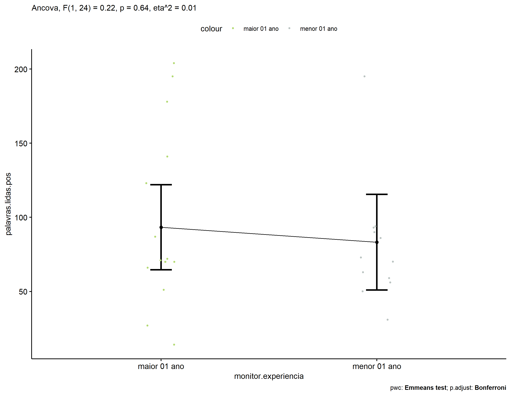<!-- -->

<!-- -->

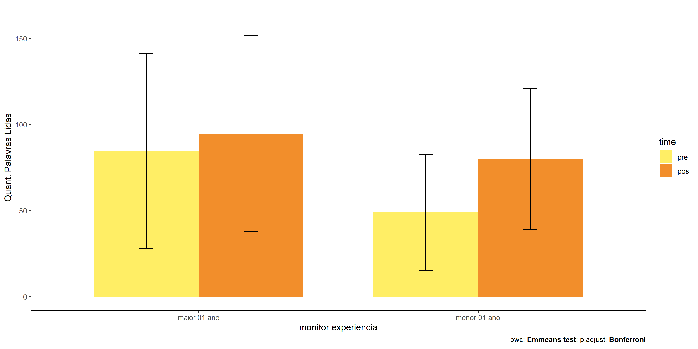<!-- -->

### Compreensao Leitora (Acertos)

| var                   | monitor.experiencia |   n | M (pre) | SE (pre) | M (unadj) | SE (unadj) | M (adj) | SE (adj) |
|:----------------------|:--------------------|----:|--------:|---------:|----------:|-----------:|--------:|---------:|
| score.compreensao.pos | maior 01 ano        |  21 |   3.190 |    0.356 |     3.190 |      0.440 |   3.050 |    0.394 |
| score.compreensao.pos | menor 01 ano        |  12 |   2.083 |    0.313 |     3.167 |      0.386 |   3.412 |    0.530 |

| .y.                   | group1       | group2       | estimate | conf.low | conf.high |    se | statistic |     p | p.adj | p.adj.signif |
|:----------------------|:-------------|:-------------|---------:|---------:|----------:|------:|----------:|------:|------:|:-------------|
| score.compreensao.pos | maior 01 ano | menor 01 ano |   -0.362 |   -1.751 |     1.027 | 0.680 |    -0.533 | 0.598 | 0.598 | ns           |
| score.compreensao.pre | maior 01 ano | menor 01 ano |    1.107 |    0.029 |     2.185 | 0.529 |     2.094 | 0.044 | 0.044 | \*           |

| .y.               | monitor.experiencia | group1 | group2 | estimate | conf.low | conf.high |    se | statistic |     p | p.adj | p.adj.signif |
|:------------------|:--------------------|:-------|:-------|---------:|---------:|----------:|------:|----------:|------:|------:|:-------------|
| score.compreensao | maior 01 ano        | pre    | pos    |    0.027 |   -0.945 |     0.998 | 0.486 |     0.055 | 0.956 | 0.956 | ns           |
| score.compreensao | menor 01 ano        | pre    | pos    |   -1.167 |   -2.455 |     0.122 | 0.645 |    -1.808 | 0.075 | 0.075 | ns           |

    ## Scale for colour is already present.
    ## Adding another scale for colour, which will replace the existing scale.

<!-- -->

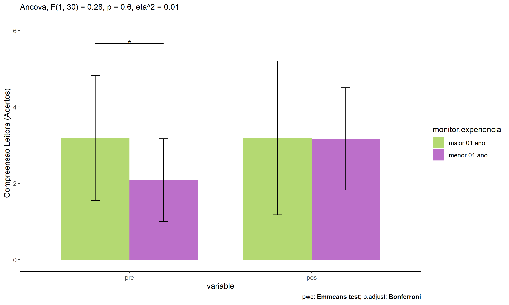<!-- -->

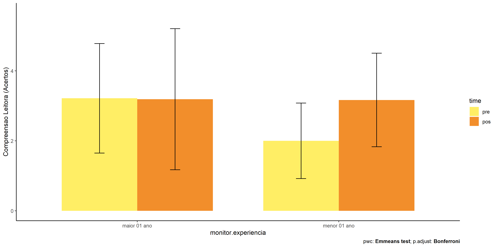<!-- -->
