ANCOVA in Triagem Test - Reading of Words per Minutes and Reading
Comprehension (Teste Triagem - Leitura de Palavras por Minuto e
Compreensao Leitora)
================
Geiser C. Challco <geiser@alumni.usp.br>

- [Descriptive Statistics of Initial
  Data](#descriptive-statistics-of-initial-data)
  - [Quant. Palavras Lidas](#quant-palavras-lidas)
  - [Compreensao Leitora (Acertos)](#compreensao-leitora-acertos)
  - [Compreensao Leitora (TRI)](#compreensao-leitora-tri)
- [Checking of Assumptions](#checking-of-assumptions)
  - [Assumption: Normality
    distribution](#assumption-normality-distribution)
    - [Quant. Palavras Lidas](#quant-palavras-lidas-1)
    - [Compreensao Leitora (Acertos)](#compreensao-leitora-acertos-1)
    - [Compreensao Leitora (TRI)](#compreensao-leitora-tri-1)
  - [Assumption: Homogeneity](#assumption-homogeneity)
    - [Quant. Palavras Lidas](#quant-palavras-lidas-2)
    - [Compreensao Leitora (Acertos)](#compreensao-leitora-acertos-2)
    - [Compreensao Leitora (TRI)](#compreensao-leitora-tri-2)
- [Computation of ANCOVA test and Pairwise
  Comparison](#computation-of-ancova-test-and-pairwise-comparison)
  - [ANCOVA tests for one factor](#ancova-tests-for-one-factor)
    - [Quant. Palavras Lidas](#quant-palavras-lidas-3)
    - [Compreensao Leitora (Acertos)](#compreensao-leitora-acertos-3)
    - [Compreensao Leitora (TRI)](#compreensao-leitora-tri-3)
  - [ANCOVA tests for two factors](#ancova-tests-for-two-factors)
    - [Quant. Palavras Lidas](#quant-palavras-lidas-4)
    - [Compreensao Leitora (Acertos)](#compreensao-leitora-acertos-4)
    - [Compreensao Leitora (TRI)](#compreensao-leitora-tri-4)
  - [ANCOVA tests for
    grupo=“Experimental”](#ancova-tests-for-grupoexperimental)
    - [Quant. Palavras Lidas](#quant-palavras-lidas-5)
    - [Compreensao Leitora (Acertos)](#compreensao-leitora-acertos-5)
    - [Compreensao Leitora (TRI)](#compreensao-leitora-tri-5)
- [Pairwise comparisons for one
  factor](#pairwise-comparisons-for-one-factor)
  - [factor: **grupo**](#factor-grupo)
    - [Quant. Palavras Lidas](#quant-palavras-lidas-6)
    - [Compreensao Leitora (Acertos)](#compreensao-leitora-acertos-6)
    - [Compreensao Leitora (TRI)](#compreensao-leitora-tri-6)
  - [factor: **genero**](#factor-genero)
    - [Quant. Palavras Lidas](#quant-palavras-lidas-7)
    - [Compreensao Leitora (Acertos)](#compreensao-leitora-acertos-7)
    - [Compreensao Leitora (TRI)](#compreensao-leitora-tri-7)
  - [factor: **idade**](#factor-idade)
    - [Quant. Palavras Lidas](#quant-palavras-lidas-8)
    - [Compreensao Leitora (Acertos)](#compreensao-leitora-acertos-8)
    - [Compreensao Leitora (TRI)](#compreensao-leitora-tri-8)
  - [factor: **zona.participante**](#factor-zonaparticipante)
    - [Quant. Palavras Lidas](#quant-palavras-lidas-9)
    - [Compreensao Leitora (Acertos)](#compreensao-leitora-acertos-9)
    - [Compreensao Leitora (TRI)](#compreensao-leitora-tri-9)
  - [factor: **escola**](#factor-escola)
    - [Quant. Palavras Lidas](#quant-palavras-lidas-10)
    - [Compreensao Leitora (Acertos)](#compreensao-leitora-acertos-10)
    - [Compreensao Leitora (TRI)](#compreensao-leitora-tri-10)
  - [factor: **zona.escola**](#factor-zonaescola)
    - [Quant. Palavras Lidas](#quant-palavras-lidas-11)
    - [Compreensao Leitora (Acertos)](#compreensao-leitora-acertos-11)
    - [Compreensao Leitora (TRI)](#compreensao-leitora-tri-11)
- [Pairwise comparisons for two
  factors](#pairwise-comparisons-for-two-factors)
  - [factores: **genero:grupo**](#factores-generogrupo)
    - [Quant. Palavras Lidas](#quant-palavras-lidas-12)
    - [Compreensao Leitora (Acertos)](#compreensao-leitora-acertos-12)
    - [Compreensao Leitora (TRI)](#compreensao-leitora-tri-12)
  - [factores: **idade:grupo**](#factores-idadegrupo)
    - [Quant. Palavras Lidas](#quant-palavras-lidas-13)
    - [Compreensao Leitora (Acertos)](#compreensao-leitora-acertos-13)
    - [Compreensao Leitora (TRI)](#compreensao-leitora-tri-13)
  - [factores:
    **zona.participante:grupo**](#factores-zonaparticipantegrupo)
    - [Quant. Palavras Lidas](#quant-palavras-lidas-14)
    - [Compreensao Leitora (Acertos)](#compreensao-leitora-acertos-14)
    - [Compreensao Leitora (TRI)](#compreensao-leitora-tri-14)
  - [factores: **escola:grupo**](#factores-escolagrupo)
    - [Quant. Palavras Lidas](#quant-palavras-lidas-15)
    - [Compreensao Leitora (Acertos)](#compreensao-leitora-acertos-15)
    - [Compreensao Leitora (TRI)](#compreensao-leitora-tri-15)
  - [factores: **zona.escola:grupo**](#factores-zonaescolagrupo)
    - [Quant. Palavras Lidas](#quant-palavras-lidas-16)
    - [Compreensao Leitora (Acertos)](#compreensao-leitora-acertos-16)
    - [Compreensao Leitora (TRI)](#compreensao-leitora-tri-16)
- [Pairwise comparisons for
  grupo=“Experimental”](#pairwise-comparisons-for-grupoexperimental)
  - [factores:
    **grupo=“Experimental”:monitor**](#factores-grupoexperimentalmonitor)
    - [Quant. Palavras Lidas](#quant-palavras-lidas-17)
    - [Compreensao Leitora (Acertos)](#compreensao-leitora-acertos-17)
    - [Compreensao Leitora (TRI)](#compreensao-leitora-tri-17)
  - [factores:
    **grupo=“Experimental”:monitor.genero**](#factores-grupoexperimentalmonitorgenero)
    - [Quant. Palavras Lidas](#quant-palavras-lidas-18)
    - [Compreensao Leitora (Acertos)](#compreensao-leitora-acertos-18)
    - [Compreensao Leitora (TRI)](#compreensao-leitora-tri-18)
  - [factores:
    **grupo=“Experimental”:monitor.area**](#factores-grupoexperimentalmonitorarea)
    - [Quant. Palavras Lidas](#quant-palavras-lidas-19)
    - [Compreensao Leitora (Acertos)](#compreensao-leitora-acertos-19)
    - [Compreensao Leitora (TRI)](#compreensao-leitora-tri-19)
  - [factores:
    **grupo=“Experimental”:monitor.formacao**](#factores-grupoexperimentalmonitorformacao)
    - [Quant. Palavras Lidas](#quant-palavras-lidas-20)
    - [Compreensao Leitora (Acertos)](#compreensao-leitora-acertos-20)
    - [Compreensao Leitora (TRI)](#compreensao-leitora-tri-20)
  - [factores:
    **grupo=“Experimental”:monitor.experiencia**](#factores-grupoexperimentalmonitorexperiencia)
    - [Quant. Palavras Lidas](#quant-palavras-lidas-21)
    - [Compreensao Leitora (Acertos)](#compreensao-leitora-acertos-21)
    - [Compreensao Leitora (TRI)](#compreensao-leitora-tri-21)

**NOTE**

- Teste ANCOVA para determinar se houve diferenças significativas no
  Teste Triagem - Leitura de Palavras por Minuto e Compreensao Leitora
  (medido usando pre- e pos-testes).
- ANCOVA test to determine whether there were significant differences in
  Triagem Test - Reading of Words per Minutes and Reading Comprehension
  (measured using pre- and post-tests).

# Descriptive Statistics of Initial Data

## Quant. Palavras Lidas

| grupo        | genero | idade | zona.participante | escola | zona.escola | variable           |   n |    mean | median | min | max |      sd |     se |       ci |    iqr |
|:-------------|:-------|:------|:------------------|:-------|:------------|:-------------------|----:|--------:|-------:|----:|----:|--------:|-------:|---------:|-------:|
| Controle     | F      |       |                   |        |             | palavras.lidas.pos |   7 |  87.000 |   87.0 |  43 | 162 |  38.884 | 14.697 |   35.962 |  25.50 |
| Controle     | M      |       |                   |        |             | palavras.lidas.pos |   9 | 103.333 |   70.0 |  29 | 363 | 104.490 | 34.830 |   80.318 |  42.00 |
| Experimental | F      |       |                   |        |             | palavras.lidas.pos |   2 |  91.000 |   91.0 |  79 | 103 |  16.971 | 12.000 |  152.474 |  12.00 |
| Experimental | M      |       |                   |        |             | palavras.lidas.pos |  14 |  93.143 |   82.5 |  37 | 162 |  38.145 | 10.195 |   22.024 |  37.75 |
| Controle     | F      |       |                   |        |             | palavras.lidas.pre |   7 |  52.000 |   42.0 |  29 | 101 |  25.554 |  9.658 |   23.633 |  28.00 |
| Controle     | M      |       |                   |        |             | palavras.lidas.pre |   9 |  87.444 |   70.0 |  33 | 228 |  62.915 | 20.972 |   48.361 |  32.00 |
| Experimental | F      |       |                   |        |             | palavras.lidas.pre |   2 |  89.000 |   89.0 |  44 | 134 |  63.640 | 45.000 |  571.779 |  45.00 |
| Experimental | M      |       |                   |        |             | palavras.lidas.pre |  14 | 134.857 |  142.5 |   7 | 299 |  95.914 | 25.634 |   55.379 | 118.75 |
| Controle     |        | 10y   |                   |        |             | palavras.lidas.pos |   4 |  77.750 |   87.0 |  43 |  94 |  23.528 | 11.764 |   37.439 |  17.25 |
| Controle     |        | 11y   |                   |        |             | palavras.lidas.pos |   9 | 114.111 |   70.0 |  40 | 363 | 104.183 | 34.728 |   80.082 | 110.00 |
| Controle     |        | 12y   |                   |        |             | palavras.lidas.pos |   1 |  85.000 |   85.0 |  85 |  85 |         |        |          |   0.00 |
| Controle     |        | 13y   |                   |        |             | palavras.lidas.pos |   1 |  87.000 |   87.0 |  87 |  87 |         |        |          |   0.00 |
| Controle     |        | 15y   |                   |        |             | palavras.lidas.pos |   1 |  29.000 |   29.0 |  29 |  29 |         |        |          |   0.00 |
| Experimental |        | 10y   |                   |        |             | palavras.lidas.pos |   4 | 110.750 |  109.0 |  68 | 157 |  48.355 | 24.178 |   76.944 |  80.75 |
| Experimental |        | 11y   |                   |        |             | palavras.lidas.pos |   9 |  88.333 |   84.0 |  37 | 162 |  35.770 | 11.923 |   27.495 |  39.00 |
| Experimental |        | 12y   |                   |        |             | palavras.lidas.pos |   1 |  74.000 |   74.0 |  74 |  74 |         |        |          |   0.00 |
| Experimental |        | 13y   |                   |        |             | palavras.lidas.pos |   2 |  87.000 |   87.0 |  81 |  93 |   8.485 |  6.000 |   76.237 |   6.00 |
| Controle     |        | 10y   |                   |        |             | palavras.lidas.pre |   4 |  49.500 |   50.0 |  32 |  66 |  15.351 |  7.676 |   24.428 |  20.50 |
| Controle     |        | 11y   |                   |        |             | palavras.lidas.pre |   9 |  60.556 |   69.0 |  33 | 101 |  22.897 |  7.632 |   17.600 |  30.00 |
| Controle     |        | 12y   |                   |        |             | palavras.lidas.pre |   1 | 228.000 |  228.0 | 228 | 228 |         |        |          |   0.00 |
| Controle     |        | 13y   |                   |        |             | palavras.lidas.pre |   1 |  29.000 |   29.0 |  29 |  29 |         |        |          |   0.00 |
| Controle     |        | 15y   |                   |        |             | palavras.lidas.pre |   1 | 151.000 |  151.0 | 151 | 151 |         |        |          |   0.00 |
| Experimental |        | 10y   |                   |        |             | palavras.lidas.pre |   4 | 157.500 |  139.0 |  62 | 290 | 113.890 | 56.945 |  181.225 | 171.00 |
| Experimental |        | 11y   |                   |        |             | palavras.lidas.pre |   9 | 135.778 |  134.0 |   7 | 299 |  85.704 | 28.568 |   65.878 |  90.00 |
| Experimental |        | 12y   |                   |        |             | palavras.lidas.pre |   1 |  30.000 |   30.0 |  30 |  30 |         |        |          |   0.00 |
| Experimental |        | 13y   |                   |        |             | palavras.lidas.pre |   2 |  92.000 |   92.0 |  10 | 174 | 115.966 | 82.000 | 1041.909 |  82.00 |
| Controle     |        |       | Urbana            |        |             | palavras.lidas.pos |  11 | 100.273 |   75.0 |  29 | 363 |  94.360 | 28.451 |   63.392 |  46.00 |
| Controle     |        |       | Rural             |        |             | palavras.lidas.pos |   2 | 123.000 |  123.0 |  87 | 159 |  50.912 | 36.000 |  457.423 |  36.00 |
| Controle     |        |       |                   |        |             | palavras.lidas.pos |   3 |  63.333 |   66.0 |  40 |  84 |  22.121 | 12.771 |   54.951 |  22.00 |
| Experimental |        |       | Urbana            |        |             | palavras.lidas.pos |   6 | 104.333 |   95.5 |  61 | 162 |  43.159 | 17.619 |   45.292 |  70.25 |
| Experimental |        |       | Rural             |        |             | palavras.lidas.pos |   6 |  86.667 |   81.5 |  37 | 157 |  39.743 | 16.225 |   41.707 |  21.50 |
| Experimental |        |       |                   |        |             | palavras.lidas.pos |   4 |  85.000 |   83.5 |  70 | 103 |  15.642 |  7.821 |   24.890 |  22.50 |
| Controle     |        |       | Urbana            |        |             | palavras.lidas.pre |  11 |  84.818 |   69.0 |  33 | 228 |  57.984 | 17.483 |   38.954 |  40.00 |
| Controle     |        |       | Rural             |        |             | palavras.lidas.pre |   2 |  34.500 |   34.5 |  29 |  40 |   7.778 |  5.500 |   69.884 |   5.50 |
| Controle     |        |       |                   |        |             | palavras.lidas.pre |   3 |  49.667 |   47.0 |  32 |  70 |  19.140 | 11.050 |   47.546 |  19.00 |
| Experimental |        |       | Urbana            |        |             | palavras.lidas.pre |   6 | 135.000 |  147.5 |  62 | 181 |  51.408 | 20.987 |   53.950 |  80.75 |
| Experimental |        |       | Rural             |        |             | palavras.lidas.pre |   6 | 169.833 |  189.5 |   7 | 299 | 122.920 | 50.182 |  128.997 | 197.25 |
| Experimental |        |       |                   |        |             | palavras.lidas.pre |   4 |  59.250 |   46.5 |  10 | 134 |  54.414 | 27.207 |   86.585 |  55.75 |
| Controle     |        |       |                   | E1     |             | palavras.lidas.pos |   7 |  76.571 |   75.0 |  29 | 162 |  45.280 | 17.114 |   41.877 |  49.00 |
| Controle     |        |       |                   | E4     |             | palavras.lidas.pos |   1 |  85.000 |   85.0 |  85 |  85 |         |        |          |   0.00 |
| Controle     |        |       |                   | E5     |             | palavras.lidas.pos |   6 | 132.333 |   78.5 |  49 | 363 | 119.334 | 48.718 |  125.234 |  74.00 |
| Controle     |        |       |                   | E6     |             | palavras.lidas.pos |   2 |  62.000 |   62.0 |  40 |  84 |  31.113 | 22.000 |  279.537 |  22.00 |
| Experimental |        |       |                   | E2     |             | palavras.lidas.pos |   1 |  37.000 |   37.0 |  37 |  37 |         |        |          |   0.00 |
| Experimental |        |       |                   | E4     |             | palavras.lidas.pos |   6 |  94.000 |   82.5 |  64 | 157 |  34.843 | 14.224 |   36.565 |  32.25 |
| Experimental |        |       |                   | E5     |             | palavras.lidas.pos |   7 | 105.857 |   95.0 |  61 | 162 |  36.407 | 13.761 |   33.671 |  39.50 |
| Experimental |        |       |                   | E6     |             | palavras.lidas.pos |   2 |  72.000 |   72.0 |  70 |  74 |   2.828 |  2.000 |   25.412 |   2.00 |
| Controle     |        |       |                   | E1     |             | palavras.lidas.pre |   7 |  75.714 |   66.0 |  33 | 151 |  40.182 | 15.187 |   37.162 |  40.00 |
| Controle     |        |       |                   | E4     |             | palavras.lidas.pre |   1 | 228.000 |  228.0 | 228 | 228 |         |        |          |   0.00 |
| Controle     |        |       |                   | E5     |             | palavras.lidas.pre |   6 |  52.333 |   54.5 |  29 |  70 |  19.315 |  7.885 |   20.270 |  32.75 |
| Controle     |        |       |                   | E6     |             | palavras.lidas.pre |   2 |  39.500 |   39.5 |  32 |  47 |  10.607 |  7.500 |   95.297 |   7.50 |
| Experimental |        |       |                   | E2     |             | palavras.lidas.pre |   1 |   7.000 |    7.0 |   7 |   7 |         |        |          |   0.00 |
| Experimental |        |       |                   | E4     |             | palavras.lidas.pre |   6 | 213.333 |  198.0 | 121 | 299 |  69.767 | 28.482 |   73.216 |  95.50 |
| Experimental |        |       |                   | E5     |             | palavras.lidas.pre |   7 |  98.000 |   91.0 |  10 | 181 |  63.961 | 24.175 |   59.154 |  96.00 |
| Experimental |        |       |                   | E6     |             | palavras.lidas.pre |   2 |  46.500 |   46.5 |  30 |  63 |  23.335 | 16.500 |  209.652 |  16.50 |
| Controle     |        |       |                   |        | Urbana      | palavras.lidas.pos |  13 | 102.308 |   75.0 |  29 | 363 |  88.294 | 24.488 |   53.356 |  45.00 |
| Controle     |        |       |                   |        | Rural       | palavras.lidas.pos |   3 |  69.667 |   84.0 |  40 |  85 |  25.697 | 14.836 |   63.835 |  22.50 |
| Experimental |        |       |                   |        | Urbana      | palavras.lidas.pos |   8 |  97.250 |   94.0 |  37 | 162 |  41.579 | 14.700 |   34.761 |  39.75 |
| Experimental |        |       |                   |        | Rural       | palavras.lidas.pos |   8 |  88.500 |   77.5 |  64 | 157 |  31.177 | 11.023 |   26.065 |  21.00 |
| Controle     |        |       |                   |        | Urbana      | palavras.lidas.pre |  13 |  64.923 |   66.0 |  29 | 151 |  33.315 |  9.240 |   20.132 |  30.00 |
| Controle     |        |       |                   |        | Rural       | palavras.lidas.pre |   3 | 102.333 |   47.0 |  32 | 228 | 109.089 | 62.982 |  270.991 |  98.00 |
| Experimental |        |       |                   |        | Urbana      | palavras.lidas.pre |   8 |  86.625 |   76.5 |   7 | 181 |  67.392 | 23.827 |   56.341 | 106.00 |
| Experimental |        |       |                   |        | Rural       | palavras.lidas.pre |   8 | 171.625 |  177.5 |  30 | 299 |  97.565 | 34.494 |   81.566 | 127.25 |

## Compreensao Leitora (Acertos)

| grupo        | genero | idade | zona.participante | escola | zona.escola | variable              |   n |  mean | median | min | max |    sd |    se |     ci |  iqr |
|:-------------|:-------|:------|:------------------|:-------|:------------|:----------------------|----:|------:|-------:|----:|----:|------:|------:|-------:|-----:|
| Controle     | F      |       |                   |        |             | score.compreensao.pos |   7 | 4.286 |    4.0 |   2 |   9 | 2.430 | 0.918 |  2.247 | 2.50 |
| Controle     | M      |       |                   |        |             | score.compreensao.pos |  11 | 2.455 |    2.0 |   0 |   6 | 1.753 | 0.529 |  1.178 | 2.50 |
| Experimental | F      |       |                   |        |             | score.compreensao.pos |   2 | 4.000 |    4.0 |   3 |   5 | 1.414 | 1.000 | 12.706 | 1.00 |
| Experimental | M      |       |                   |        |             | score.compreensao.pos |  14 | 4.214 |    4.0 |   0 |   9 | 2.155 | 0.576 |  1.244 | 2.00 |
| Controle     | F      |       |                   |        |             | score.compreensao.pre |   7 | 3.571 |    4.0 |   2 |   5 | 1.272 | 0.481 |  1.177 | 2.00 |
| Controle     | M      |       |                   |        |             | score.compreensao.pre |  11 | 3.000 |    3.0 |   2 |   6 | 1.265 | 0.381 |  0.850 | 1.50 |
| Experimental | F      |       |                   |        |             | score.compreensao.pre |   2 | 4.000 |    4.0 |   3 |   5 | 1.414 | 1.000 | 12.706 | 1.00 |
| Experimental | M      |       |                   |        |             | score.compreensao.pre |  14 | 4.143 |    3.5 |   0 |   9 | 2.538 | 0.678 |  1.465 | 2.75 |
| Controle     |        | 10y   |                   |        |             | score.compreensao.pos |   4 | 5.500 |    5.0 |   3 |   9 | 2.517 | 1.258 |  4.004 | 1.50 |
| Controle     |        | 11y   |                   |        |             | score.compreensao.pos |   9 | 2.444 |    2.0 |   0 |   6 | 1.810 | 0.603 |  1.392 | 2.00 |
| Controle     |        | 12y   |                   |        |             | score.compreensao.pos |   2 | 3.000 |    3.0 |   2 |   4 | 1.414 | 1.000 | 12.706 | 1.00 |
| Controle     |        | 13y   |                   |        |             | score.compreensao.pos |   1 | 4.000 |    4.0 |   4 |   4 |       |       |        | 0.00 |
| Controle     |        | 14y   |                   |        |             | score.compreensao.pos |   1 | 2.000 |    2.0 |   2 |   2 |       |       |        | 0.00 |
| Controle     |        | 15y   |                   |        |             | score.compreensao.pos |   1 | 1.000 |    1.0 |   1 |   1 |       |       |        | 0.00 |
| Experimental |        | 10y   |                   |        |             | score.compreensao.pos |   4 | 5.250 |    4.5 |   3 |   9 | 2.630 | 1.315 |  4.185 | 2.25 |
| Experimental |        | 11y   |                   |        |             | score.compreensao.pos |   9 | 4.222 |    4.0 |   2 |   7 | 1.481 | 0.494 |  1.139 | 2.00 |
| Experimental |        | 12y   |                   |        |             | score.compreensao.pos |   1 | 5.000 |    5.0 |   5 |   5 |       |       |        | 0.00 |
| Experimental |        | 13y   |                   |        |             | score.compreensao.pos |   2 | 1.500 |    1.5 |   0 |   3 | 2.121 | 1.500 | 19.059 | 1.50 |
| Controle     |        | 10y   |                   |        |             | score.compreensao.pre |   4 | 4.250 |    4.5 |   3 |   5 | 0.957 | 0.479 |  1.523 | 1.25 |
| Controle     |        | 11y   |                   |        |             | score.compreensao.pre |   9 | 3.000 |    3.0 |   2 |   6 | 1.323 | 0.441 |  1.017 | 1.00 |
| Controle     |        | 12y   |                   |        |             | score.compreensao.pre |   2 | 3.000 |    3.0 |   2 |   4 | 1.414 | 1.000 | 12.706 | 1.00 |
| Controle     |        | 13y   |                   |        |             | score.compreensao.pre |   1 | 4.000 |    4.0 |   4 |   4 |       |       |        | 0.00 |
| Controle     |        | 14y   |                   |        |             | score.compreensao.pre |   1 | 2.000 |    2.0 |   2 |   2 |       |       |        | 0.00 |
| Controle     |        | 15y   |                   |        |             | score.compreensao.pre |   1 | 2.000 |    2.0 |   2 |   2 |       |       |        | 0.00 |
| Experimental |        | 10y   |                   |        |             | score.compreensao.pre |   4 | 5.250 |    4.5 |   3 |   9 | 2.872 | 1.436 |  4.570 | 3.75 |
| Experimental |        | 11y   |                   |        |             | score.compreensao.pre |   9 | 3.556 |    3.0 |   0 |   8 | 2.455 | 0.818 |  1.887 | 3.00 |
| Experimental |        | 12y   |                   |        |             | score.compreensao.pre |   1 | 3.000 |    3.0 |   3 |   3 |       |       |        | 0.00 |
| Experimental |        | 13y   |                   |        |             | score.compreensao.pre |   2 | 5.000 |    5.0 |   4 |   6 | 1.414 | 1.000 | 12.706 | 1.00 |
| Controle     |        |       | Urbana            |        |             | score.compreensao.pos |  11 | 3.818 |    4.0 |   1 |   9 | 2.401 | 0.724 |  1.613 | 3.00 |
| Controle     |        |       | Rural             |        |             | score.compreensao.pos |   2 | 3.500 |    3.5 |   3 |   4 | 0.707 | 0.500 |  6.353 | 0.50 |
| Controle     |        |       |                   |        |             | score.compreensao.pos |   5 | 1.600 |    2.0 |   0 |   3 | 1.140 | 0.510 |  1.416 | 1.00 |
| Experimental |        |       | Urbana            |        |             | score.compreensao.pos |   6 | 4.000 |    3.5 |   2 |   7 | 1.789 | 0.730 |  1.877 | 1.75 |
| Experimental |        |       | Rural             |        |             | score.compreensao.pos |   6 | 5.000 |    4.5 |   3 |   9 | 2.098 | 0.856 |  2.201 | 1.00 |
| Experimental |        |       |                   |        |             | score.compreensao.pos |   4 | 3.250 |    4.0 |   0 |   5 | 2.363 | 1.181 |  3.760 | 2.75 |
| Controle     |        |       | Urbana            |        |             | score.compreensao.pre |  11 | 3.455 |    3.0 |   2 |   6 | 1.440 | 0.434 |  0.967 | 2.50 |
| Controle     |        |       | Rural             |        |             | score.compreensao.pre |   2 | 3.000 |    3.0 |   2 |   4 | 1.414 | 1.000 | 12.706 | 1.00 |
| Controle     |        |       |                   |        |             | score.compreensao.pre |   5 | 2.800 |    3.0 |   2 |   4 | 0.837 | 0.374 |  1.039 | 1.00 |
| Experimental |        |       | Urbana            |        |             | score.compreensao.pre |   6 | 2.833 |    2.5 |   0 |   6 | 2.317 | 0.946 |  2.431 | 3.25 |
| Experimental |        |       | Rural             |        |             | score.compreensao.pre |   6 | 6.000 |    5.5 |   3 |   9 | 2.191 | 0.894 |  2.299 | 2.50 |
| Experimental |        |       |                   |        |             | score.compreensao.pre |   4 | 3.250 |    3.0 |   3 |   4 | 0.500 | 0.250 |  0.796 | 0.25 |
| Controle     |        |       |                   | E1     |             | score.compreensao.pos |   7 | 4.429 |    5.0 |   1 |   9 | 2.699 | 1.020 |  2.496 | 3.00 |
| Controle     |        |       |                   | E2     |             | score.compreensao.pos |   2 | 2.000 |    2.0 |   2 |   2 | 0.000 | 0.000 |  0.000 | 0.00 |
| Controle     |        |       |                   | E4     |             | score.compreensao.pos |   1 | 4.000 |    4.0 |   4 |   4 |       |       |        | 0.00 |
| Controle     |        |       |                   | E5     |             | score.compreensao.pos |   6 | 2.333 |    2.5 |   0 |   4 | 1.633 | 0.667 |  1.714 | 2.50 |
| Controle     |        |       |                   | E6     |             | score.compreensao.pos |   2 | 2.000 |    2.0 |   1 |   3 | 1.414 | 1.000 | 12.706 | 1.00 |
| Experimental |        |       |                   | E2     |             | score.compreensao.pos |   1 | 3.000 |    3.0 |   3 |   3 |       |       |        | 0.00 |
| Experimental |        |       |                   | E4     |             | score.compreensao.pos |   6 | 4.833 |    4.0 |   2 |   9 | 2.639 | 1.078 |  2.770 | 3.00 |
| Experimental |        |       |                   | E5     |             | score.compreensao.pos |   7 | 3.571 |    4.0 |   0 |   5 | 1.813 | 0.685 |  1.676 | 2.00 |
| Experimental |        |       |                   | E6     |             | score.compreensao.pos |   2 | 5.000 |    5.0 |   5 |   5 | 0.000 | 0.000 |  0.000 | 0.00 |
| Controle     |        |       |                   | E1     |             | score.compreensao.pre |   7 | 3.857 |    4.0 |   2 |   6 | 1.574 | 0.595 |  1.455 | 2.50 |
| Controle     |        |       |                   | E2     |             | score.compreensao.pre |   2 | 2.000 |    2.0 |   2 |   2 | 0.000 | 0.000 |  0.000 | 0.00 |
| Controle     |        |       |                   | E4     |             | score.compreensao.pre |   1 | 4.000 |    4.0 |   4 |   4 |       |       |        | 0.00 |
| Controle     |        |       |                   | E5     |             | score.compreensao.pre |   6 | 2.667 |    2.5 |   2 |   4 | 0.816 | 0.333 |  0.857 | 1.00 |
| Controle     |        |       |                   | E6     |             | score.compreensao.pre |   2 | 3.500 |    3.5 |   3 |   4 | 0.707 | 0.500 |  6.353 | 0.50 |
| Experimental |        |       |                   | E2     |             | score.compreensao.pre |   1 | 3.000 |    3.0 |   3 |   3 |       |       |        | 0.00 |
| Experimental |        |       |                   | E4     |             | score.compreensao.pre |   6 | 5.667 |    6.0 |   0 |   9 | 3.141 | 1.282 |  3.296 | 2.25 |
| Experimental |        |       |                   | E5     |             | score.compreensao.pre |   7 | 3.286 |    3.0 |   1 |   5 | 1.496 | 0.565 |  1.384 | 2.00 |
| Experimental |        |       |                   | E6     |             | score.compreensao.pre |   2 | 3.000 |    3.0 |   3 |   3 | 0.000 | 0.000 |  0.000 | 0.00 |
| Controle     |        |       |                   |        | Urbana      | score.compreensao.pos |  15 | 3.267 |    3.0 |   0 |   9 | 2.314 | 0.597 |  1.281 | 2.50 |
| Controle     |        |       |                   |        | Rural       | score.compreensao.pos |   3 | 2.667 |    3.0 |   1 |   4 | 1.528 | 0.882 |  3.795 | 1.50 |
| Experimental |        |       |                   |        | Urbana      | score.compreensao.pos |   8 | 3.500 |    3.5 |   0 |   5 | 1.690 | 0.598 |  1.413 | 2.00 |
| Experimental |        |       |                   |        | Rural       | score.compreensao.pos |   8 | 4.875 |    4.5 |   2 |   9 | 2.232 | 0.789 |  1.866 | 1.75 |
| Controle     |        |       |                   |        | Urbana      | score.compreensao.pre |  15 | 3.133 |    3.0 |   2 |   6 | 1.356 | 0.350 |  0.751 | 2.00 |
| Controle     |        |       |                   |        | Rural       | score.compreensao.pre |   3 | 3.667 |    4.0 |   3 |   4 | 0.577 | 0.333 |  1.434 | 0.50 |
| Experimental |        |       |                   |        | Urbana      | score.compreensao.pre |   8 | 3.250 |    3.0 |   1 |   5 | 1.389 | 0.491 |  1.161 | 1.50 |
| Experimental |        |       |                   |        | Rural       | score.compreensao.pre |   8 | 5.000 |    5.5 |   0 |   9 | 2.928 | 1.035 |  2.448 | 3.50 |

## Compreensao Leitora (TRI)

| grupo        | genero | idade | zona.participante | escola | zona.escola | variable            |   n |   mean | median |    min |    max |    sd |    se |    ci |   iqr |
|:-------------|:-------|:------|:------------------|:-------|:------------|:--------------------|----:|-------:|-------:|-------:|-------:|------:|------:|------:|------:|
| Controle     | F      |       |                   |        |             | tri.compreensao.pos |   7 | -0.142 | -0.344 | -0.874 |  1.381 | 0.794 | 0.300 | 0.735 | 0.861 |
| Controle     | M      |       |                   |        |             | tri.compreensao.pos |  11 | -0.721 | -0.840 | -1.033 |  0.323 | 0.394 | 0.119 | 0.265 | 0.400 |
| Experimental | F      |       |                   |        |             | tri.compreensao.pos |   2 | -0.378 | -0.378 | -0.768 |  0.011 | 0.550 | 0.389 | 4.945 | 0.389 |
| Experimental | M      |       |                   |        |             | tri.compreensao.pos |  14 | -0.250 | -0.287 | -1.035 |  1.077 | 0.616 | 0.165 | 0.355 | 0.774 |
| Controle     | F      |       |                   |        |             | tri.compreensao.pre |   7 | -0.379 | -0.380 | -0.809 | -0.019 | 0.297 | 0.112 | 0.275 | 0.420 |
| Controle     | M      |       |                   |        |             | tri.compreensao.pre |  11 | -0.458 | -0.431 | -1.032 |  0.302 | 0.414 | 0.125 | 0.278 | 0.491 |
| Experimental | F      |       |                   |        |             | tri.compreensao.pre |   2 | -0.196 | -0.196 | -0.415 |  0.023 | 0.310 | 0.219 | 2.785 | 0.219 |
| Experimental | M      |       |                   |        |             | tri.compreensao.pre |  14 | -0.161 | -0.371 | -1.035 |  1.143 | 0.726 | 0.194 | 0.419 | 1.180 |
| Controle     |        | 10y   |                   |        |             | tri.compreensao.pos |   4 |  0.266 |  0.141 | -0.598 |  1.381 | 0.827 | 0.413 | 1.316 | 0.676 |
| Controle     |        | 11y   |                   |        |             | tri.compreensao.pos |   9 | -0.716 | -0.842 | -1.033 |  0.323 | 0.427 | 0.142 | 0.328 | 0.408 |
| Controle     |        | 12y   |                   |        |             | tri.compreensao.pos |   2 | -0.727 | -0.727 | -0.916 | -0.538 | 0.267 | 0.189 | 2.403 | 0.189 |
| Controle     |        | 13y   |                   |        |             | tri.compreensao.pos |   1 | -0.344 | -0.344 | -0.344 | -0.344 |       |       |       | 0.000 |
| Controle     |        | 14y   |                   |        |             | tri.compreensao.pos |   1 | -0.804 | -0.804 | -0.804 | -0.804 |       |       |       | 0.000 |
| Controle     |        | 15y   |                   |        |             | tri.compreensao.pos |   1 | -0.943 | -0.943 | -0.943 | -0.943 |       |       |       | 0.000 |
| Experimental |        | 10y   |                   |        |             | tri.compreensao.pos |   4 | -0.155 | -0.345 | -1.010 |  1.077 | 0.903 | 0.451 | 1.437 | 0.897 |
| Experimental |        | 11y   |                   |        |             | tri.compreensao.pos |   9 | -0.267 | -0.318 | -0.873 |  0.638 | 0.508 | 0.169 | 0.391 | 0.782 |
| Experimental |        | 12y   |                   |        |             | tri.compreensao.pos |   1 |  0.059 |  0.059 |  0.059 |  0.059 |       |       |       | 0.000 |
| Experimental |        | 13y   |                   |        |             | tri.compreensao.pos |   2 | -0.645 | -0.645 | -1.035 | -0.255 | 0.551 | 0.390 | 4.954 | 0.390 |
| Controle     |        | 10y   |                   |        |             | tri.compreensao.pre |   4 | -0.176 | -0.151 | -0.380 | -0.019 | 0.181 | 0.091 | 0.288 | 0.276 |
| Controle     |        | 11y   |                   |        |             | tri.compreensao.pre |   9 | -0.429 | -0.431 | -1.032 |  0.302 | 0.447 | 0.149 | 0.343 | 0.583 |
| Controle     |        | 12y   |                   |        |             | tri.compreensao.pre |   2 | -0.630 | -0.630 | -0.880 | -0.380 | 0.353 | 0.250 | 3.172 | 0.250 |
| Controle     |        | 13y   |                   |        |             | tri.compreensao.pre |   1 | -0.634 | -0.634 | -0.634 | -0.634 |       |       |       | 0.000 |
| Controle     |        | 14y   |                   |        |             | tri.compreensao.pre |   1 | -0.617 | -0.617 | -0.617 | -0.617 |       |       |       | 0.000 |
| Controle     |        | 15y   |                   |        |             | tri.compreensao.pre |   1 | -0.617 | -0.617 | -0.617 | -0.617 |       |       |       | 0.000 |
| Experimental |        | 10y   |                   |        |             | tri.compreensao.pre |   4 | -0.033 | -0.176 | -0.840 |  1.060 | 0.894 | 0.447 | 1.422 | 1.232 |
| Experimental |        | 11y   |                   |        |             | tri.compreensao.pre |   9 | -0.237 | -0.415 | -1.035 |  1.143 | 0.707 | 0.236 | 0.544 | 0.866 |
| Experimental |        | 12y   |                   |        |             | tri.compreensao.pre |   1 | -0.497 | -0.497 | -0.497 | -0.497 |       |       |       | 0.000 |
| Experimental |        | 13y   |                   |        |             | tri.compreensao.pre |   2 |  0.064 |  0.064 | -0.271 |  0.398 | 0.473 | 0.334 | 4.247 | 0.334 |
| Controle     |        |       | Urbana            |        |             | tri.compreensao.pos |  11 | -0.308 | -0.550 | -1.033 |  1.381 | 0.736 | 0.222 | 0.494 | 0.999 |
| Controle     |        |       | Rural             |        |             | tri.compreensao.pos |   2 | -0.673 | -0.673 | -1.003 | -0.344 | 0.466 | 0.330 | 4.187 | 0.330 |
| Controle     |        |       |                   |        |             | tri.compreensao.pos |   5 | -0.838 | -0.840 | -1.033 | -0.598 | 0.160 | 0.072 | 0.199 | 0.112 |
| Experimental |        |       | Urbana            |        |             | tri.compreensao.pos |   6 | -0.367 | -0.403 | -1.010 |  0.638 | 0.568 | 0.232 | 0.596 | 0.428 |
| Experimental |        |       | Rural             |        |             | tri.compreensao.pos |   6 | -0.037 |  0.013 | -0.873 |  1.077 | 0.677 | 0.276 | 0.710 | 0.556 |
| Experimental |        |       |                   |        |             | tri.compreensao.pos |   4 | -0.459 | -0.431 | -1.035 |  0.059 | 0.526 | 0.263 | 0.836 | 0.779 |
| Controle     |        |       | Urbana            |        |             | tri.compreensao.pre |  11 | -0.366 | -0.380 | -0.927 |  0.302 | 0.360 | 0.109 | 0.242 | 0.436 |
| Controle     |        |       | Rural             |        |             | tri.compreensao.pre |   2 | -0.833 | -0.833 | -1.032 | -0.634 | 0.282 | 0.199 | 2.532 | 0.199 |
| Controle     |        |       |                   |        |             | tri.compreensao.pre |   5 | -0.400 | -0.289 | -0.880 |  0.059 | 0.359 | 0.161 | 0.446 | 0.342 |
| Experimental |        |       | Urbana            |        |             | tri.compreensao.pre |   6 | -0.543 | -0.841 | -1.035 |  0.398 | 0.591 | 0.241 | 0.621 | 0.697 |
| Experimental |        |       | Rural             |        |             | tri.compreensao.pre |   6 |  0.413 |  0.362 | -0.472 |  1.143 | 0.615 | 0.251 | 0.646 | 0.795 |
| Experimental |        |       |                   |        |             | tri.compreensao.pre |   4 | -0.466 | -0.456 | -0.681 | -0.271 | 0.171 | 0.086 | 0.273 | 0.165 |
| Controle     |        |       |                   | E1     |             | tri.compreensao.pos |   7 | -0.054 |  0.020 | -0.943 |  1.381 | 0.818 | 0.309 | 0.757 | 1.004 |
| Controle     |        |       |                   | E2     |             | tri.compreensao.pos |   2 | -0.860 | -0.860 | -0.916 | -0.804 | 0.079 | 0.056 | 0.710 | 0.056 |
| Controle     |        |       |                   | E4     |             | tri.compreensao.pos |   1 | -0.538 | -0.538 | -0.538 | -0.538 |       |       |       | 0.000 |
| Controle     |        |       |                   | E5     |             | tri.compreensao.pos |   6 | -0.776 | -0.841 | -1.033 | -0.344 | 0.263 | 0.107 | 0.276 | 0.307 |
| Controle     |        |       |                   | E6     |             | tri.compreensao.pos |   2 | -0.815 | -0.815 | -1.033 | -0.598 | 0.307 | 0.217 | 2.759 | 0.217 |
| Experimental |        |       |                   | E2     |             | tri.compreensao.pos |   1 | -0.873 | -0.873 | -0.873 | -0.873 |       |       |       | 0.000 |
| Experimental |        |       |                   | E4     |             | tri.compreensao.pos |   6 |  0.018 | -0.120 | -0.769 |  1.077 | 0.718 | 0.293 | 0.753 | 0.992 |
| Experimental |        |       |                   | E5     |             | tri.compreensao.pos |   7 | -0.495 | -0.488 | -1.035 |  0.145 | 0.471 | 0.178 | 0.435 | 0.735 |
| Experimental |        |       |                   | E6     |             | tri.compreensao.pos |   2 | -0.018 | -0.018 | -0.094 |  0.059 | 0.108 | 0.077 | 0.974 | 0.077 |
| Controle     |        |       |                   | E1     |             | tri.compreensao.pre |   7 | -0.211 | -0.226 | -0.617 |  0.302 | 0.320 | 0.121 | 0.296 | 0.421 |
| Controle     |        |       |                   | E2     |             | tri.compreensao.pre |   2 | -0.748 | -0.748 | -0.880 | -0.617 | 0.186 | 0.131 | 1.668 | 0.131 |
| Controle     |        |       |                   | E4     |             | tri.compreensao.pre |   1 | -0.380 | -0.380 | -0.380 | -0.380 |       |       |       | 0.000 |
| Controle     |        |       |                   | E5     |             | tri.compreensao.pre |   6 | -0.687 | -0.721 | -1.032 | -0.289 | 0.289 | 0.118 | 0.304 | 0.416 |
| Controle     |        |       |                   | E6     |             | tri.compreensao.pre |   2 | -0.108 | -0.108 | -0.275 |  0.059 | 0.237 | 0.167 | 2.125 | 0.167 |
| Experimental |        |       |                   | E2     |             | tri.compreensao.pre |   1 | -0.472 | -0.472 | -0.472 | -0.472 |       |       |       | 0.000 |
| Experimental |        |       |                   | E4     |             | tri.compreensao.pre |   6 |  0.315 |  0.363 | -1.035 |  1.143 | 0.796 | 0.325 | 0.836 | 0.815 |
| Experimental |        |       |                   | E5     |             | tri.compreensao.pre |   7 | -0.411 | -0.415 | -0.932 |  0.397 | 0.501 | 0.189 | 0.463 | 0.718 |
| Experimental |        |       |                   | E6     |             | tri.compreensao.pre |   2 | -0.589 | -0.589 | -0.681 | -0.497 | 0.130 | 0.092 | 1.167 | 0.092 |
| Controle     |        |       |                   |        | Urbana      | tri.compreensao.pos |  15 | -0.451 | -0.804 | -1.033 |  1.381 | 0.678 | 0.175 | 0.375 | 0.733 |
| Controle     |        |       |                   |        | Rural       | tri.compreensao.pos |   3 | -0.723 | -0.598 | -1.033 | -0.538 | 0.270 | 0.156 | 0.671 | 0.247 |
| Experimental |        |       |                   |        | Urbana      | tri.compreensao.pos |   8 | -0.542 | -0.628 | -1.035 |  0.145 | 0.456 | 0.161 | 0.381 | 0.672 |
| Experimental |        |       |                   |        | Rural       | tri.compreensao.pos |   8 |  0.009 | -0.040 | -0.769 |  1.077 | 0.608 | 0.215 | 0.508 | 0.544 |
| Controle     |        |       |                   |        | Urbana      | tri.compreensao.pre |  15 | -0.473 | -0.508 | -1.032 |  0.302 | 0.376 | 0.097 | 0.208 | 0.464 |
| Controle     |        |       |                   |        | Rural       | tri.compreensao.pre |   3 | -0.199 | -0.275 | -0.380 |  0.059 | 0.230 | 0.133 | 0.570 | 0.220 |
| Experimental |        |       |                   |        | Urbana      | tri.compreensao.pre |   8 | -0.419 | -0.443 | -0.932 |  0.397 | 0.464 | 0.164 | 0.388 | 0.644 |
| Experimental |        |       |                   |        | Rural       | tri.compreensao.pre |   8 |  0.089 |  0.162 | -1.035 |  1.143 | 0.794 | 0.281 | 0.664 | 1.107 |

# Checking of Assumptions

## Assumption: Normality distribution

### Quant. Palavras Lidas

| var                |   n | skewness | kurtosis | symmetry | statistic | method       |         p | p.signif | normality |
|:-------------------|----:|---------:|---------:|:---------|----------:|:-------------|----------:|:---------|:----------|
| palavras.lidas.pos |  32 | 2.433740 | 7.812257 | NO       | 0.7548677 | Shapiro-Wilk | 0.0000064 | \*\*\*\* | NO        |
| palavras.lidas.pos |  32 | 2.330119 | 7.814036 | NO       | 0.7783763 | Shapiro-Wilk | 0.0000164 | \*\*\*\* | NO        |
| palavras.lidas.pos |  25 | 2.370895 | 6.724998 | NO       | 0.7366185 | Shapiro-Wilk | 0.0000236 | \*\*\*\* | NO        |
| palavras.lidas.pos |  32 | 2.005552 | 6.161440 | NO       | 0.8226691 | Shapiro-Wilk | 0.0001121 | \*\*\*   | NO        |
| palavras.lidas.pos |  32 | 2.471038 | 8.365380 | NO       | 0.7545248 | Shapiro-Wilk | 0.0000063 | \*\*\*\* | NO        |

### Compreensao Leitora (Acertos)

| var                   |   n |   skewness |   kurtosis | symmetry | statistic | method       |         p | p.signif | normality |
|:----------------------|----:|-----------:|-----------:|:---------|----------:|:-------------|----------:|:---------|:----------|
| score.compreensao.pos |  34 | -0.0332853 | -0.2454060 | YES      | 0.9923059 | Shapiro-Wilk | 0.9969159 | ns       | YES       |
| score.compreensao.pos |  34 |  0.1661626 | -0.5963571 | YES      | 0.9770762 | Shapiro-Wilk | 0.6786194 | ns       | YES       |
| score.compreensao.pos |  25 |  0.2330972 |  0.2538976 | YES      | 0.9770010 | Shapiro-Wilk | 0.8199804 | ns       | YES       |
| score.compreensao.pos |  34 |  0.0250645 |  0.0592975 | YES      | 0.9787745 | Shapiro-Wilk | 0.7337624 | ns       | YES       |
| score.compreensao.pos |  34 |  0.0255605 |  0.1891865 | YES      | 0.9777689 | Shapiro-Wilk | 0.7011718 | ns       | YES       |

### Compreensao Leitora (TRI)

| var                 |   n |  skewness |   kurtosis | symmetry | statistic | method       |         p | p.signif | normality |
|:--------------------|----:|----------:|-----------:|:---------|----------:|:-------------|----------:|:---------|:----------|
| tri.compreensao.pos |  34 | 0.5220580 | -0.0223741 | NO       | 0.9625423 | Shapiro-Wilk | 0.2879620 | ns       | YES       |
| tri.compreensao.pos |  34 | 0.3212293 | -0.0187243 | YES      | 0.9732372 | Shapiro-Wilk | 0.5561447 | ns       | YES       |
| tri.compreensao.pos |  25 | 0.6852614 |  0.6798394 | NO       | 0.9454747 | Shapiro-Wilk | 0.1978506 | ns       | YES       |
| tri.compreensao.pos |  34 | 0.6805330 |  0.6981505 | NO       | 0.9451634 | Shapiro-Wilk | 0.0879385 | ns       | YES       |
| tri.compreensao.pos |  34 | 0.8200948 |  1.0143464 | NO       | 0.9260686 | Shapiro-Wilk | 0.0240696 | \*       | NO        |

## Assumption: Homogeneity

### Quant. Palavras Lidas

| var                | method         | formula                             |   n | DFn.df1 | DFd.df2 | statistic |         p | p.signif |
|:-------------------|:---------------|:------------------------------------|----:|--------:|--------:|----------:|----------:|:---------|
| palavras.lidas.pos | Levene’s test  | `.res`~`grupo`\*`genero`            |  32 |       3 |      28 | 0.7265412 | 0.5447346 | ns       |
| palavras.lidas.pos | Anova’s slopes | `.res`~`grupo`\*`genero`            |  32 |       3 |      24 | 0.6180000 | 0.6100000 | ns       |
| palavras.lidas.pos | Levene’s test  | `.res`~`grupo`\*`idade`             |  32 |       8 |      23 | 0.5391026 | 0.8149660 | ns       |
| palavras.lidas.pos | Anova’s slopes | `.res`~`grupo`\*`idade`             |  32 |       4 |      18 | 0.4340000 | 0.7820000 | ns       |
| palavras.lidas.pos | Levene’s test  | `.res`~`grupo`\*`zona.participante` |  25 |       3 |      21 | 0.2514383 | 0.8594046 | ns       |
| palavras.lidas.pos | Anova’s slopes | `.res`~`grupo`\*`zona.participante` |  25 |       3 |      17 | 0.5900000 | 0.6300000 | ns       |
| palavras.lidas.pos | Levene’s test  | `.res`~`grupo`\*`escola`            |  32 |       7 |      24 | 0.6892565 | 0.6801709 | ns       |
| palavras.lidas.pos | Anova’s slopes | `.res`~`grupo`\*`escola`            |  32 |       5 |      18 | 0.4590000 | 0.8020000 | ns       |
| palavras.lidas.pos | Levene’s test  | `.res`~`grupo`\*`zona.escola`       |  32 |       3 |      28 | 0.8054029 | 0.5014844 | ns       |
| palavras.lidas.pos | Anova’s slopes | `.res`~`grupo`\*`zona.escola`       |  32 |       3 |      24 | 0.0370000 | 0.9900000 | ns       |

### Compreensao Leitora (Acertos)

| var                   | method         | formula                             |   n | DFn.df1 | DFd.df2 | statistic |         p | p.signif |
|:----------------------|:---------------|:------------------------------------|----:|--------:|--------:|----------:|----------:|:---------|
| score.compreensao.pos | Levene’s test  | `.res`~`grupo`\*`genero`            |  34 |       3 |      30 | 0.7255497 | 0.5447347 | ns       |
| score.compreensao.pos | Anova’s slopes | `.res`~`grupo`\*`genero`            |  34 |       3 |      26 | 1.5570000 | 0.2240000 | ns       |
| score.compreensao.pos | Levene’s test  | `.res`~`grupo`\*`idade`             |  34 |       9 |      24 | 0.7245577 | 0.6823138 | ns       |
| score.compreensao.pos | Anova’s slopes | `.res`~`grupo`\*`idade`             |  34 |       5 |      18 | 0.9230000 | 0.4890000 | ns       |
| score.compreensao.pos | Levene’s test  | `.res`~`grupo`\*`zona.participante` |  25 |       3 |      21 | 0.6193905 | 0.6102061 | ns       |
| score.compreensao.pos | Anova’s slopes | `.res`~`grupo`\*`zona.participante` |  25 |       3 |      17 | 1.4920000 | 0.2520000 | ns       |
| score.compreensao.pos | Levene’s test  | `.res`~`grupo`\*`escola`            |  34 |       8 |      25 | 0.9056380 | 0.5273023 | ns       |
| score.compreensao.pos | Anova’s slopes | `.res`~`grupo`\*`escola`            |  34 |       4 |      20 | 1.6330000 | 0.2050000 | ns       |
| score.compreensao.pos | Levene’s test  | `.res`~`grupo`\*`zona.escola`       |  34 |       3 |      30 | 0.2379078 | 0.8692129 | ns       |
| score.compreensao.pos | Anova’s slopes | `.res`~`grupo`\*`zona.escola`       |  34 |       3 |      26 | 2.1000000 | 0.1250000 | ns       |

### Compreensao Leitora (TRI)

| var                 | method         | formula                             |   n | DFn.df1 | DFd.df2 | statistic |         p | p.signif |
|:--------------------|:---------------|:------------------------------------|----:|--------:|--------:|----------:|----------:|:---------|
| tri.compreensao.pos | Levene’s test  | `.res`~`grupo`\*`genero`            |  34 |       3 |      30 | 1.4505732 | 0.2477973 | ns       |
| tri.compreensao.pos | Anova’s slopes | `.res`~`grupo`\*`genero`            |  34 |       3 |      26 | 1.9220000 | 0.1510000 | ns       |
| tri.compreensao.pos | Levene’s test  | `.res`~`grupo`\*`idade`             |  34 |       9 |      24 | 1.1051019 | 0.3960264 | ns       |
| tri.compreensao.pos | Anova’s slopes | `.res`~`grupo`\*`idade`             |  34 |       5 |      18 | 0.6830000 | 0.6420000 | ns       |
| tri.compreensao.pos | Levene’s test  | `.res`~`grupo`\*`zona.participante` |  25 |       3 |      21 | 0.3047030 | 0.8216644 | ns       |
| tri.compreensao.pos | Anova’s slopes | `.res`~`grupo`\*`zona.participante` |  25 |       3 |      17 | 0.6580000 | 0.5890000 | ns       |
| tri.compreensao.pos | Levene’s test  | `.res`~`grupo`\*`escola`            |  34 |       8 |      25 | 1.2868116 | 0.2945899 | ns       |
| tri.compreensao.pos | Anova’s slopes | `.res`~`grupo`\*`escola`            |  34 |       6 |      18 | 0.7960000 | 0.5850000 | ns       |
| tri.compreensao.pos | Levene’s test  | `.res`~`grupo`\*`zona.escola`       |  34 |       3 |      30 | 0.4213787 | 0.7390077 | ns       |
| tri.compreensao.pos | Anova’s slopes | `.res`~`grupo`\*`zona.escola`       |  34 |       3 |      26 | 1.9110000 | 0.1530000 | ns       |

# Computation of ANCOVA test and Pairwise Comparison

## ANCOVA tests for one factor

### Quant. Palavras Lidas

|     | Effect             | DFn | DFd |       SSn |      SSd |     F |     p |   ges | p\<.05 |
|:----|:-------------------|----:|----:|----------:|---------:|------:|------:|------:|:-------|
| 1   | palavras.lidas.pre |   1 |  29 |   694.428 | 115985.8 | 0.174 | 0.680 | 0.006 |        |
| 2   | grupo              |   1 |  29 |   338.249 | 115985.8 | 0.085 | 0.773 | 0.003 |        |
| 4   | genero             |   1 |  29 |   310.873 | 116013.1 | 0.078 | 0.782 | 0.003 |        |
| 6   | idade              |   4 |  26 |  6191.861 | 110132.1 | 0.365 | 0.831 | 0.053 |        |
| 8   | zona.participante  |   1 |  22 |   204.488 | 110873.0 | 0.041 | 0.842 | 0.002 |        |
| 10  | escola             |   4 |  26 | 15530.070 | 100793.9 | 1.002 | 0.425 | 0.134 |        |
| 12  | zona.escola        |   1 |  29 |  4093.148 | 112230.9 | 1.058 | 0.312 | 0.035 |        |

### Compreensao Leitora (Acertos)

|     | Effect                | DFn | DFd |    SSn |     SSd |      F |     p |   ges | p\<.05 |
|:----|:----------------------|----:|----:|-------:|--------:|-------:|------:|------:|:-------|
| 1   | score.compreensao.pre |   1 |  31 | 37.387 | 105.550 | 10.981 | 0.002 | 0.262 | \*     |
| 2   | grupo                 |   1 |  31 |  2.005 | 105.550 |  0.589 | 0.449 | 0.019 |        |
| 4   | genero                |   1 |  31 |  3.883 | 103.672 |  1.161 | 0.290 | 0.036 |        |
| 6   | idade                 |   5 |  27 | 24.447 |  83.109 |  1.588 | 0.197 | 0.227 |        |
| 8   | zona.participante     |   1 |  22 |  1.361 |  62.668 |  0.478 | 0.497 | 0.021 |        |
| 10  | escola                |   4 |  28 |  4.932 | 102.623 |  0.336 | 0.851 | 0.046 |        |
| 12  | zona.escola           |   1 |  31 |  0.011 | 107.544 |  0.003 | 0.955 | 0.000 |        |

### Compreensao Leitora (TRI)

|     | Effect              | DFn | DFd |   SSn |   SSd |      F | p       |   ges | p\<.05 |
|:----|:--------------------|----:|----:|------:|------:|-------:|:--------|------:|:-------|
| 1   | tri.compreensao.pre |   1 |  31 | 3.621 | 8.406 | 13.352 | \<0.001 | 0.301 | \*     |
| 2   | grupo               |   1 |  31 | 0.034 | 8.406 |  0.125 | 0.726   | 0.004 |        |
| 4   | genero              |   1 |  31 | 0.567 | 7.873 |  2.233 | 0.145   | 0.067 |        |
| 6   | idade               |   5 |  27 | 1.340 | 7.100 |  1.019 | 0.426   | 0.159 |        |
| 8   | zona.participante   |   1 |  22 | 0.346 | 5.683 |  1.341 | 0.259   | 0.057 |        |
| 10  | escola              |   4 |  28 | 0.879 | 7.562 |  0.813 | 0.527   | 0.104 |        |
| 12  | zona.escola         |   1 |  31 | 0.000 | 8.440 |  0.001 | 0.973   | 0.000 |        |

## ANCOVA tests for two factors

### Quant. Palavras Lidas

|     | Effect                  | DFn | DFd |      SSn |       SSd |     F |     p |   ges | p\<.05 |
|:----|:------------------------|----:|----:|---------:|----------:|------:|------:|------:|:-------|
| 1   | palavras.lidas.pre      |   1 |  27 |  437.349 | 115184.37 | 0.103 | 0.751 | 0.004 |        |
| 4   | grupo:genero            |   1 |  27 |  262.875 | 115184.37 | 0.062 | 0.806 | 0.002 |        |
| 8   | grupo:idade             |   3 |  22 | 4620.397 | 104227.59 | 0.325 | 0.807 | 0.042 |        |
| 12  | grupo:zona.participante |   1 |  20 | 2145.867 | 108321.65 | 0.396 | 0.536 | 0.019 |        |
| 16  | grupo:escola            |   2 |  23 | 1957.029 |  97683.07 | 0.230 | 0.796 | 0.020 |        |
| 20  | grupo:zona.escola       |   1 |  27 |  479.180 | 111707.55 | 0.116 | 0.736 | 0.004 |        |

### Compreensao Leitora (Acertos)

|     | Effect                  | DFn | DFd |    SSn |     SSd |     F |     p |   ges | p\<.05 |
|:----|:------------------------|----:|----:|-------:|--------:|------:|------:|------:|:-------|
| 1   | score.compreensao.pre   |   1 |  29 | 32.771 |  95.742 | 9.926 | 0.004 | 0.255 | \*     |
| 4   | grupo:genero            |   1 |  29 |  3.395 |  95.742 | 1.028 | 0.319 | 0.034 |        |
| 8   | grupo:idade             |   3 |  23 | 17.347 |  63.205 | 2.104 | 0.127 | 0.215 |        |
| 12  | grupo:zona.participante |   1 |  20 |  1.280 |  60.904 | 0.420 | 0.524 | 0.021 |        |
| 16  | grupo:escola            |   3 |  24 |  6.168 |  89.153 | 0.553 | 0.651 | 0.065 |        |
| 20  | grupo:zona.escola       |   1 |  29 |  2.508 | 102.934 | 0.707 | 0.407 | 0.024 |        |

### Compreensao Leitora (TRI)

|     | Effect                  | DFn | DFd |   SSn |   SSd |      F | p       |   ges | p\<.05 |
|:----|:------------------------|----:|----:|------:|------:|-------:|:--------|------:|:-------|
| 1   | tri.compreensao.pre     |   1 |  29 | 3.381 | 7.185 | 13.644 | \<0.001 | 0.320 | \*     |
| 4   | grupo:genero            |   1 |  29 | 0.504 | 7.185 |  2.034 | 0.164   | 0.066 |        |
| 8   | grupo:idade             |   3 |  23 | 1.656 | 5.410 |  2.346 | 0.099   | 0.234 |        |
| 12  | grupo:zona.participante |   1 |  20 | 0.266 | 5.410 |  0.983 | 0.333   | 0.047 |        |
| 16  | grupo:escola            |   3 |  24 | 0.815 | 6.323 |  1.031 | 0.396   | 0.114 |        |
| 20  | grupo:zona.escola       |   1 |  29 | 0.709 | 7.692 |  2.672 | 0.113   | 0.084 |        |

## ANCOVA tests for grupo=“Experimental”

### Quant. Palavras Lidas

|     | Effect              | DFn | DFd |      SSn |      SSd |     F |     p |   ges | p\<.05 |
|:----|:--------------------|----:|----:|---------:|---------:|------:|------:|------:|:-------|
| 1   | palavras.lidas.pre  |   1 |   5 | 1765.561 | 4312.439 | 2.047 | 0.212 | 0.290 |        |
| 2   | monitor             |   4 |   5 | 1170.363 | 4312.439 | 0.339 | 0.841 | 0.213 |        |
| 4   | monitor.genero      |   1 |   8 |  454.475 | 5028.327 | 0.723 | 0.420 | 0.083 |        |
| 6   | monitor.area        |   4 |   5 | 1170.363 | 4312.439 | 0.339 | 0.841 | 0.213 |        |
| 8   | monitor.formacao    |   2 |   7 |  683.613 | 4799.190 | 0.499 | 0.627 | 0.125 |        |
| 10  | monitor.experiencia |   1 |   8 |    0.001 | 5482.801 | 0.000 | 0.999 | 0.000 |        |

### Compreensao Leitora (Acertos)

|     | Effect                | DFn | DFd |    SSn |    SSd |     F |     p |   ges | p\<.05 |
|:----|:----------------------|----:|----:|-------:|-------:|------:|------:|------:|:-------|
| 1   | score.compreensao.pre |   1 |   5 | 13.354 | 21.480 | 3.108 | 0.138 | 0.383 |        |
| 2   | monitor               |   4 |   5 |  4.636 | 21.480 | 0.270 | 0.886 | 0.178 |        |
| 4   | monitor.genero        |   1 |   8 |  0.412 | 25.704 | 0.128 | 0.730 | 0.016 |        |
| 6   | monitor.area          |   4 |   5 |  4.636 | 21.480 | 0.270 | 0.886 | 0.178 |        |
| 8   | monitor.formacao      |   2 |   7 |  0.636 | 25.480 | 0.087 | 0.917 | 0.024 |        |
| 10  | monitor.experiencia   |   1 |   8 |  1.522 | 24.595 | 0.495 | 0.502 | 0.058 |        |

### Compreensao Leitora (TRI)

|     | Effect              | DFn | DFd |   SSn |   SSd |     F |     p |   ges | p\<.05 |
|:----|:--------------------|----:|----:|------:|------:|------:|------:|------:|:-------|
| 1   | tri.compreensao.pre |   1 |   5 | 0.838 | 1.749 | 2.396 | 0.182 | 0.324 |        |
| 2   | monitor             |   4 |   5 | 0.780 | 1.749 | 0.557 | 0.704 | 0.308 |        |
| 4   | monitor.genero      |   1 |   8 | 0.005 | 2.524 | 0.015 | 0.904 | 0.002 |        |
| 6   | monitor.area        |   4 |   5 | 0.780 | 1.749 | 0.557 | 0.704 | 0.308 |        |
| 8   | monitor.formacao    |   2 |   7 | 0.012 | 2.518 | 0.016 | 0.984 | 0.005 |        |
| 10  | monitor.experiencia |   1 |   8 | 0.069 | 2.460 | 0.224 | 0.648 | 0.027 |        |

# Pairwise comparisons for one factor

## factor: **grupo**

### Quant. Palavras Lidas

| var                | grupo        |   n | M (pre) | SE (pre) | M (unadj) | SE (unadj) | M (adj) | SE (adj) |
|:-------------------|:-------------|----:|--------:|---------:|----------:|-----------:|--------:|---------:|
| palavras.lidas.pos | Controle     |  16 |  71.938 |   12.995 |    96.188 |     20.152 |  98.027 |   16.415 |
| palavras.lidas.pos | Experimental |  16 | 129.125 |   23.033 |    92.875 |      8.947 |  91.036 |   16.415 |

| .y.                | group1   | group2       | estimate | conf.low | conf.high |     se | statistic |     p | p.adj | p.adj.signif |
|:-------------------|:---------|:-------------|---------:|---------:|----------:|-------:|----------:|------:|------:|:-------------|
| palavras.lidas.pos | Controle | Experimental |    6.991 |  -42.174 |    56.156 | 24.039 |     0.291 | 0.773 | 0.773 | ns           |
| palavras.lidas.pre | Controle | Experimental |  -57.188 | -111.198 |    -3.177 | 26.446 |    -2.162 | 0.039 | 0.039 | \*           |

| grupo        | group1 | group2 | estimate | conf.low | conf.high |     se | statistic |     p | p.adj | p.adj.signif |
|:-------------|:-------|:-------|---------:|---------:|----------:|-------:|----------:|------:|------:|:-------------|
| Controle     | pre    | pos    |  -25.521 |  -74.435 |    23.393 | 24.506 |    -1.041 | 0.301 | 0.301 | ns           |
| Experimental | pre    | pos    |   32.839 |  -14.402 |    80.081 | 23.668 |     1.387 | 0.170 | 0.170 | ns           |

    ## Scale for colour is already present.
    ## Adding another scale for colour, which will replace the existing scale.

<!-- -->

<!-- -->

<!-- -->

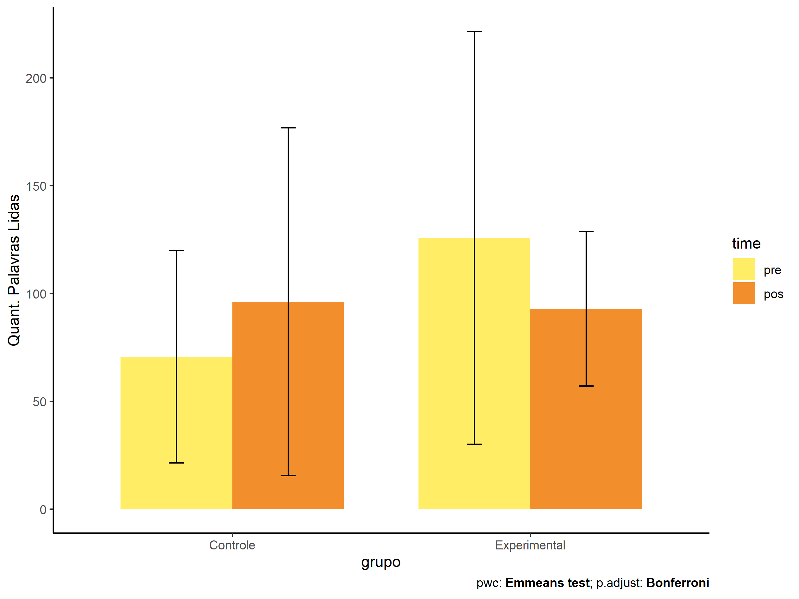<!-- -->

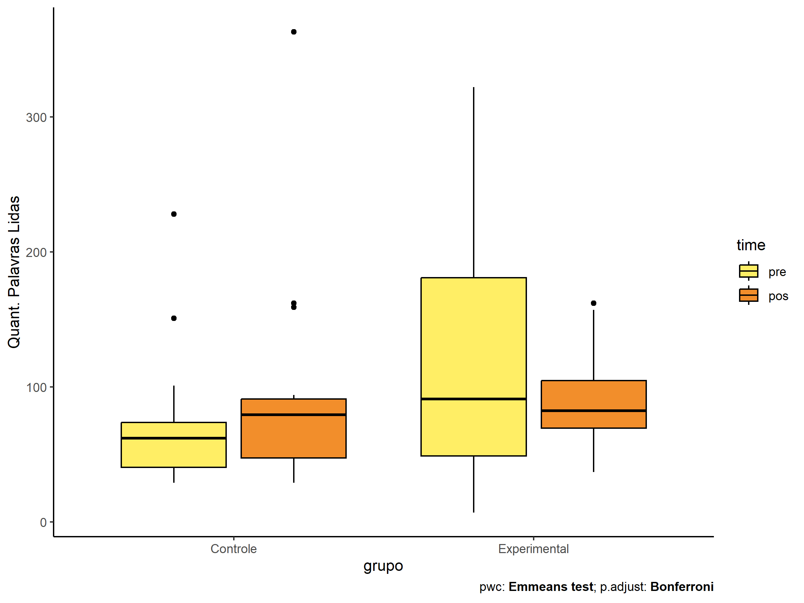<!-- -->

### Compreensao Leitora (Acertos)

| var                   | grupo        |   n | M (pre) | SE (pre) | M (unadj) | SE (unadj) | M (adj) | SE (adj) |
|:----------------------|:-------------|----:|--------:|---------:|----------:|-----------:|--------:|---------:|
| score.compreensao.pos | Controle     |  18 |   3.222 |    0.298 |     3.167 |      0.513 |   3.411 |    0.441 |
| score.compreensao.pos | Experimental |  16 |   4.125 |    0.598 |     4.188 |      0.510 |   3.912 |    0.469 |

| .y.                   | group1   | group2       | estimate | conf.low | conf.high |    se | statistic |     p | p.adj | p.adj.signif |
|:----------------------|:---------|:-------------|---------:|---------:|----------:|------:|----------:|------:|------:|:-------------|
| score.compreensao.pos | Controle | Experimental |   -0.501 |   -1.833 |     0.831 | 0.653 |    -0.767 | 0.449 | 0.449 | ns           |
| score.compreensao.pre | Controle | Experimental |   -0.903 |   -2.217 |     0.412 | 0.645 |    -1.399 | 0.171 | 0.171 | ns           |

| grupo        | group1 | group2 | estimate | conf.low | conf.high |    se | statistic |     p | p.adj | p.adj.signif |
|:-------------|:-------|:-------|---------:|---------:|----------:|------:|----------:|------:|------:|:-------------|
| Controle     | pre    | pos    |    0.056 |   -1.275 |     1.386 | 0.667 |     0.083 | 0.934 | 0.934 | ns           |
| Experimental | pre    | pos    |   -0.473 |   -1.798 |     0.852 | 0.664 |    -0.713 | 0.479 | 0.479 | ns           |

    ## Scale for colour is already present.
    ## Adding another scale for colour, which will replace the existing scale.

<!-- -->

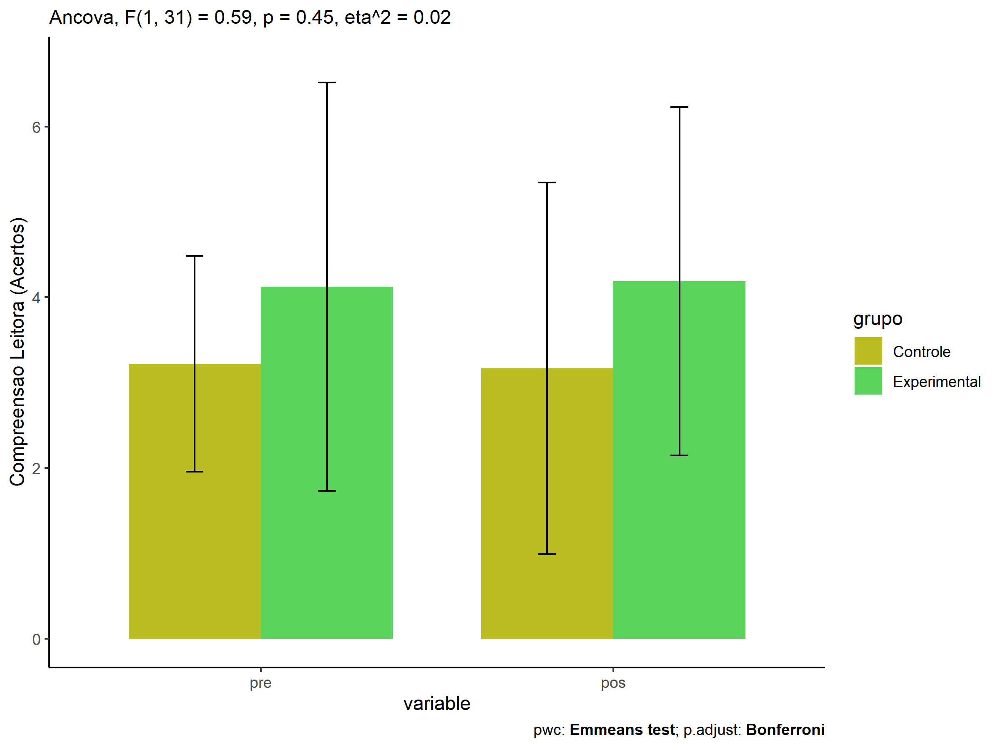<!-- -->

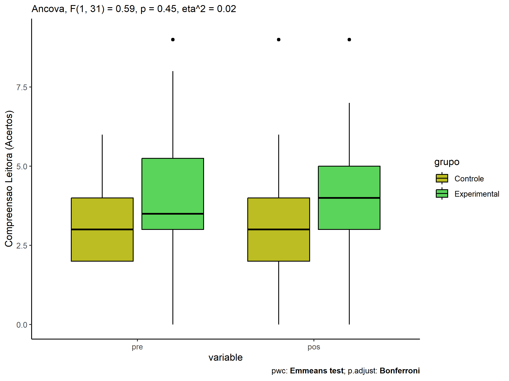<!-- -->

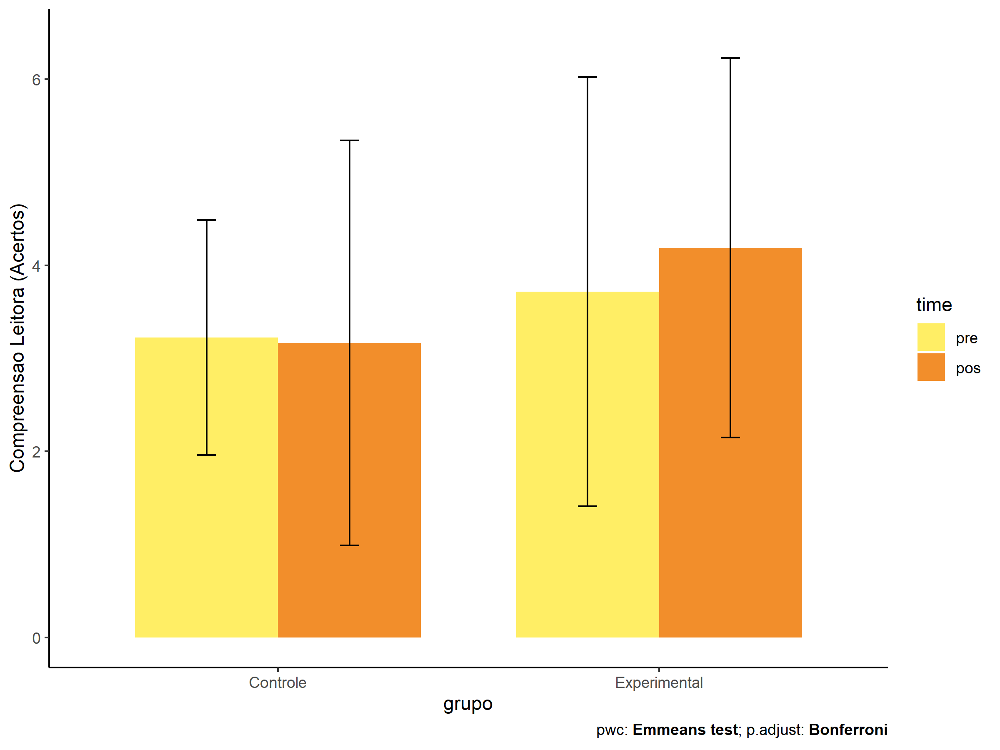<!-- -->

<!-- -->

### Compreensao Leitora (TRI)

| var                 | grupo        |   n | M (pre) | SE (pre) | M (unadj) | SE (unadj) | M (adj) | SE (adj) |
|:--------------------|:-------------|----:|--------:|---------:|----------:|-----------:|--------:|---------:|
| tri.compreensao.pos | Controle     |  18 |  -0.427 |    0.086 |    -0.496 |      0.149 |  -0.419 |    0.125 |
| tri.compreensao.pos | Experimental |  16 |  -0.165 |    0.170 |    -0.266 |      0.148 |  -0.353 |    0.132 |

| .y.                 | group1   | group2       | estimate | conf.low | conf.high |    se | statistic |     p | p.adj | p.adj.signif |
|:--------------------|:---------|:-------------|---------:|---------:|----------:|------:|----------:|------:|------:|:-------------|
| tri.compreensao.pos | Controle | Experimental |   -0.065 |   -0.442 |     0.311 | 0.184 |    -0.354 | 0.726 | 0.726 | ns           |
| tri.compreensao.pre | Controle | Experimental |   -0.262 |   -0.638 |     0.113 | 0.184 |    -1.422 | 0.165 | 0.165 | ns           |

| grupo        | group1 | group2 | estimate | conf.low | conf.high |    se | statistic |     p | p.adj | p.adj.signif |
|:-------------|:-------|:-------|---------:|---------:|----------:|------:|----------:|------:|------:|:-------------|
| Controle     | pre    | pos    |    0.069 |   -0.308 |     0.446 | 0.189 |     0.363 | 0.718 | 0.718 | ns           |
| Experimental | pre    | pos    |    0.024 |   -0.351 |     0.400 | 0.188 |     0.130 | 0.897 | 0.897 | ns           |

    ## Scale for colour is already present.
    ## Adding another scale for colour, which will replace the existing scale.

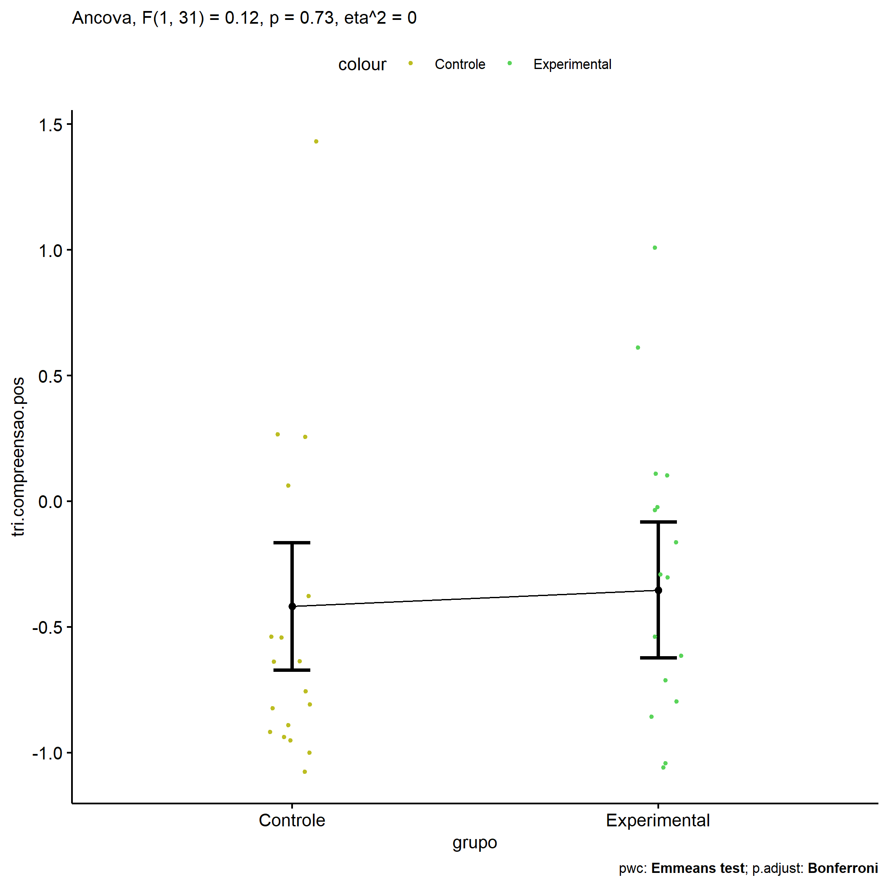<!-- -->

<!-- -->

<!-- -->

## factor: **genero**

### Quant. Palavras Lidas

| var                | genero |   n | M (pre) | SE (pre) | M (unadj) | SE (unadj) | M (adj) | SE (adj) |
|:-------------------|:-------|----:|--------:|---------:|----------:|-----------:|--------:|---------:|
| palavras.lidas.pos | F      |   9 |  60.222 |   11.842 |    87.889 |     11.417 |  89.265 |   21.953 |
| palavras.lidas.pos | M      |  23 | 116.304 |   17.980 |    97.130 |     14.530 |  96.592 |   13.404 |

| .y.                | group1 | group2 | estimate | conf.low | conf.high |     se | statistic |     p | p.adj | p.adj.signif |
|:-------------------|:-------|:-------|---------:|---------:|----------:|-------:|----------:|------:|------:|:-------------|
| palavras.lidas.pos | F      | M      |   -7.327 |  -61.085 |    46.431 | 26.285 |    -0.279 | 0.782 | 0.782 | ns           |
| palavras.lidas.pre | F      | M      |  -56.082 | -117.177 |     5.013 | 29.915 |    -1.875 | 0.071 | 0.071 | ns           |

| genero | group1 | group2 | estimate | conf.low | conf.high |     se | statistic |     p | p.adj | p.adj.signif |
|:-------|:-------|:-------|---------:|---------:|----------:|-------:|----------:|------:|------:|:-------------|
| F      | pre    | pos    |  -26.525 |  -91.042 |    37.991 | 32.323 |    -0.821 | 0.415 | 0.415 | ns           |
| M      | pre    | pos    |   18.477 |  -21.917 |    58.871 | 20.237 |     0.913 | 0.365 | 0.365 | ns           |

    ## Scale for colour is already present.
    ## Adding another scale for colour, which will replace the existing scale.

<!-- -->

<!-- -->

<!-- -->

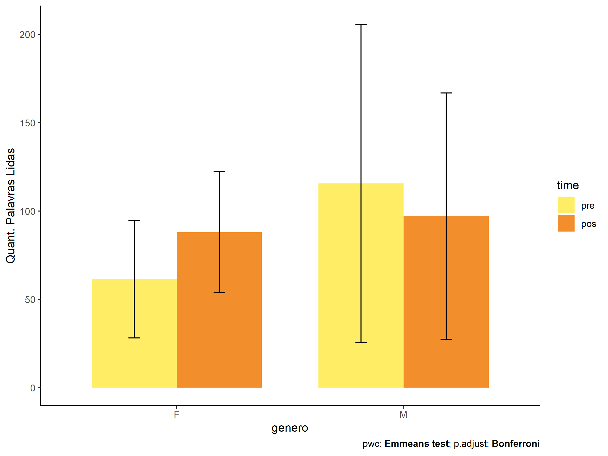<!-- -->

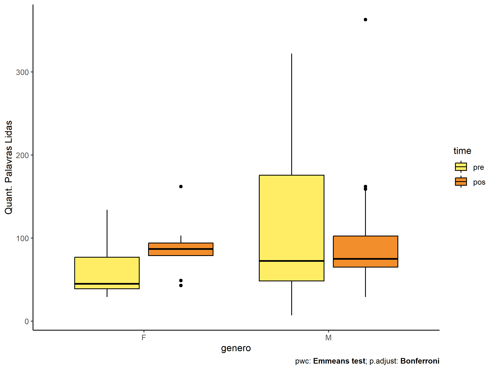<!-- -->

### Compreensao Leitora (Acertos)

| var                   | genero |   n | M (pre) | SE (pre) | M (unadj) | SE (unadj) | M (adj) | SE (adj) |
|:----------------------|:-------|----:|--------:|---------:|----------:|-----------:|--------:|---------:|
| score.compreensao.pos | F      |   9 |   3.667 |    0.408 |     4.222 |      0.722 |   4.210 |    0.610 |
| score.compreensao.pos | M      |  25 |   3.640 |    0.424 |     3.440 |      0.428 |   3.444 |    0.366 |

| .y.                   | group1 | group2 | estimate | conf.low | conf.high |    se | statistic |     p | p.adj | p.adj.signif |
|:----------------------|:-------|:-------|---------:|---------:|----------:|------:|----------:|------:|------:|:-------------|
| score.compreensao.pos | F      | M      |    0.766 |   -0.684 |     2.216 | 0.711 |     1.078 | 0.290 | 0.290 | ns           |
| score.compreensao.pre | F      | M      |    0.027 |   -1.505 |     1.558 | 0.752 |     0.035 | 0.972 | 0.972 | ns           |

| genero | group1 | group2 | estimate | conf.low | conf.high |    se | statistic |     p | p.adj | p.adj.signif |
|:-------|:-------|:-------|---------:|---------:|----------:|------:|----------:|------:|------:|:-------------|
| F      | pre    | pos    |   -0.677 |   -2.494 |     1.140 | 0.911 |    -0.743 | 0.460 | 0.460 | ns           |
| M      | pre    | pos    |    0.024 |   -1.088 |     1.137 | 0.558 |     0.044 | 0.965 | 0.965 | ns           |

    ## Scale for colour is already present.
    ## Adding another scale for colour, which will replace the existing scale.

<!-- -->

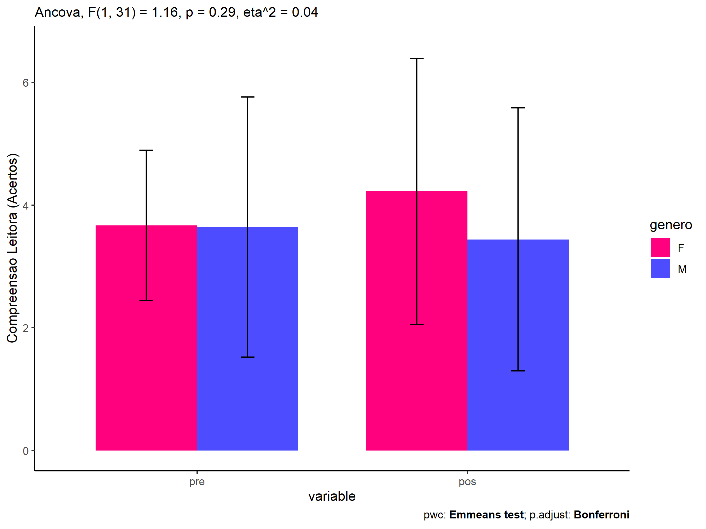<!-- -->

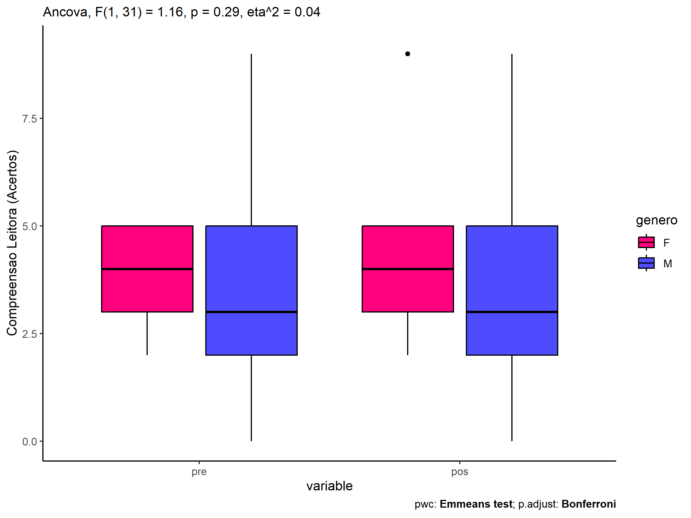<!-- -->

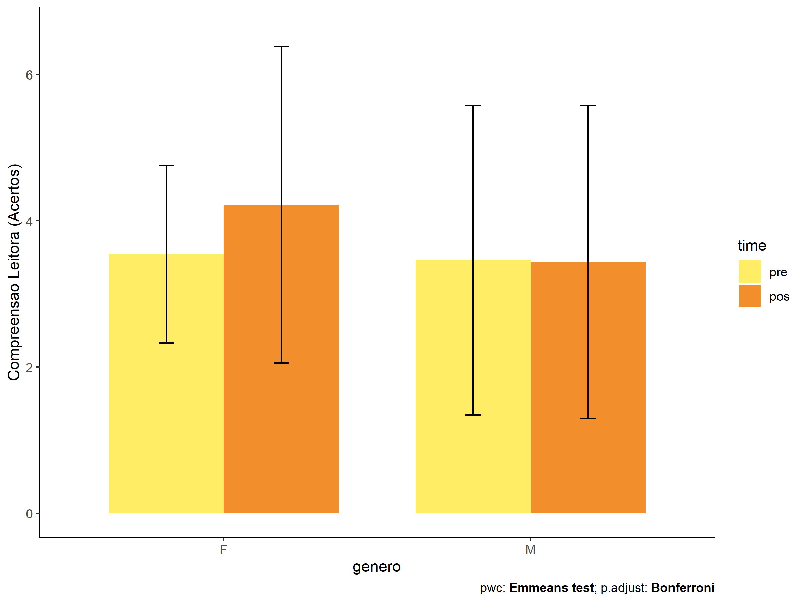<!-- -->

<!-- -->

### Compreensao Leitora (TRI)

| var                 | genero |   n | M (pre) | SE (pre) | M (unadj) | SE (unadj) | M (adj) | SE (adj) |
|:--------------------|:-------|----:|--------:|---------:|----------:|-----------:|--------:|---------:|
| tri.compreensao.pos | F      |   9 |  -0.338 |    0.097 |    -0.195 |      0.241 |  -0.172 |    0.168 |
| tri.compreensao.pos | M      |  25 |  -0.292 |    0.123 |    -0.457 |      0.114 |  -0.465 |    0.101 |

| .y.                 | group1 | group2 | estimate | conf.low | conf.high |    se | statistic |     p | p.adj | p.adj.signif |
|:--------------------|:-------|:-------|---------:|---------:|----------:|------:|----------:|------:|------:|:-------------|
| tri.compreensao.pos | F      | M      |    0.293 |   -0.107 |     0.693 | 0.196 |     1.494 | 0.145 | 0.145 | ns           |
| tri.compreensao.pre | F      | M      |   -0.047 |   -0.485 |     0.391 | 0.215 |    -0.217 | 0.829 | 0.829 | ns           |

| genero | group1 | group2 | estimate | conf.low | conf.high |    se | statistic |     p | p.adj | p.adj.signif |
|:-------|:-------|:-------|---------:|---------:|----------:|------:|----------:|------:|------:|:-------------|
| F      | pre    | pos    |   -0.159 |   -0.671 |     0.352 | 0.257 |    -0.622 | 0.536 | 0.536 | ns           |
| M      | pre    | pos    |    0.140 |   -0.173 |     0.454 | 0.157 |     0.894 | 0.374 | 0.374 | ns           |

    ## Scale for colour is already present.
    ## Adding another scale for colour, which will replace the existing scale.

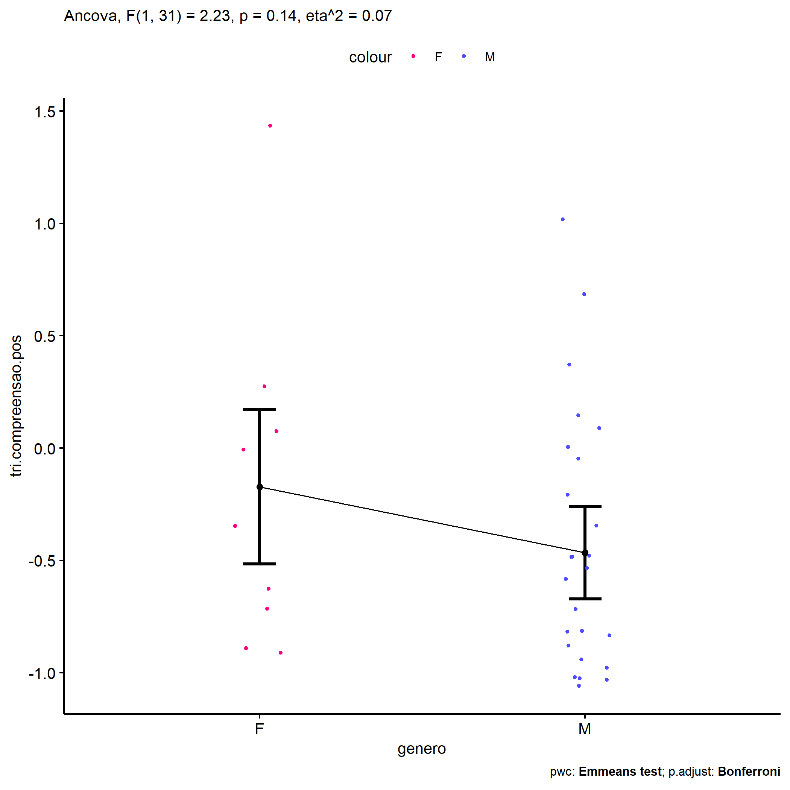<!-- -->

<!-- -->

<!-- -->

## factor: **idade**

### Quant. Palavras Lidas

| var                | idade |   n | M (pre) | SE (pre) | M (unadj) | SE (unadj) | M (adj) | SE (adj) |
|:-------------------|:------|----:|--------:|---------:|----------:|-----------:|--------:|---------:|
| palavras.lidas.pos | 10y   |   8 | 103.500 |   33.527 |    94.250 |     13.922 |  93.934 |   24.437 |
| palavras.lidas.pos | 11y   |  18 |  98.167 |   16.999 |   101.222 |     18.083 | 101.363 |   16.288 |

| .y.                | group1 | group2 | estimate | conf.low | conf.high |     se | statistic |     p | p.adj | p.adj.signif |
|:-------------------|:-------|:-------|---------:|---------:|----------:|-------:|----------:|------:|------:|:-------------|
| palavras.lidas.pos | 10y    | 11y    |   -7.429 |  -68.195 |    53.337 | 29.375 |    -0.253 | 0.803 | 0.803 | ns           |
| palavras.lidas.pre | 10y    | 11y    |    5.333 |  -64.314 |    74.980 | 33.745 |     0.158 | 0.876 | 0.876 | ns           |

| idade | group1 | group2 | estimate | conf.low | conf.high |     se | statistic |     p | p.adj | p.adj.signif |
|:------|:-------|:-------|---------:|---------:|----------:|-------:|----------:|------:|------:|:-------------|
| 10y   | pre    | pos    |    9.250 |  -69.572 |    88.072 | 39.315 |     0.235 | 0.815 | 0.815 | ns           |
| 11y   | pre    | pos    |   -8.322 |  -59.540 |    42.895 | 25.546 |    -0.326 | 0.746 | 0.746 | ns           |

    ## Scale for colour is already present.
    ## Adding another scale for colour, which will replace the existing scale.

<!-- -->

<!-- -->

<!-- -->

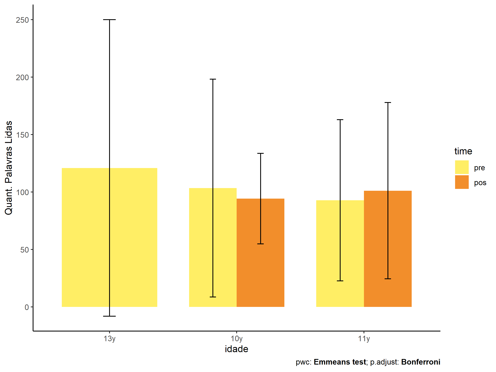<!-- -->

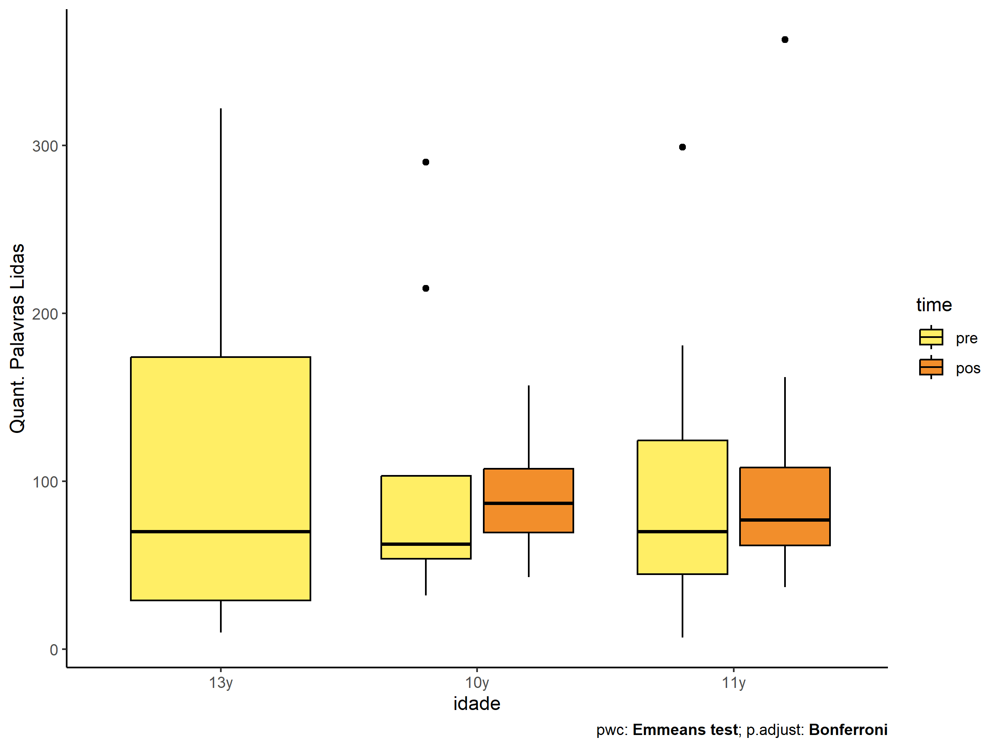<!-- -->

### Compreensao Leitora (Acertos)

| var                   | idade |   n | M (pre) | SE (pre) | M (unadj) | SE (unadj) | M (adj) | SE (adj) |
|:----------------------|:------|----:|--------:|---------:|----------:|-----------:|--------:|---------:|
| score.compreensao.pos | 10y   |   8 |   4.750 |    0.726 |     5.375 |      0.844 |   4.838 |    0.653 |
| score.compreensao.pos | 11y   |  18 |   3.278 |    0.456 |     3.333 |      0.435 |   3.572 |    0.425 |

| .y.                   | group1 | group2 | estimate | conf.low | conf.high |    se | statistic |     p | p.adj | p.adj.signif |
|:----------------------|:-------|:-------|---------:|---------:|----------:|------:|----------:|------:|------:|:-------------|
| score.compreensao.pos | 10y    | 11y    |    1.266 |   -0.387 |     2.918 | 0.799 |     1.584 | 0.127 | 0.127 | ns           |
| score.compreensao.pre | 10y    | 11y    |    1.472 |   -0.255 |     3.200 | 0.837 |     1.759 | 0.091 | 0.091 | ns           |

| idade | group1 | group2 | estimate | conf.low | conf.high |    se | statistic |     p | p.adj | p.adj.signif |
|:------|:-------|:-------|---------:|---------:|----------:|------:|----------:|------:|------:|:-------------|
| 10y   | pre    | pos    |   -0.625 |   -2.594 |     1.344 | 0.982 |    -0.637 | 0.527 | 0.527 | ns           |
| 11y   | pre    | pos    |   -0.018 |   -1.313 |     1.278 | 0.646 |    -0.027 | 0.978 | 0.978 | ns           |

    ## Scale for colour is already present.
    ## Adding another scale for colour, which will replace the existing scale.

<!-- -->

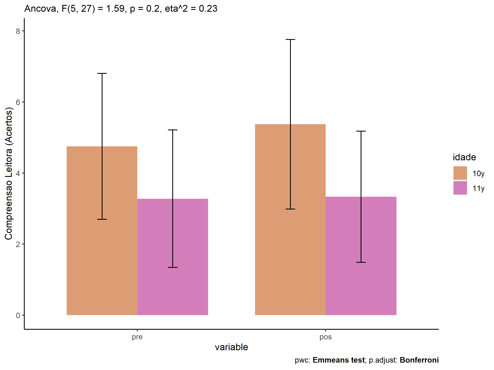<!-- -->

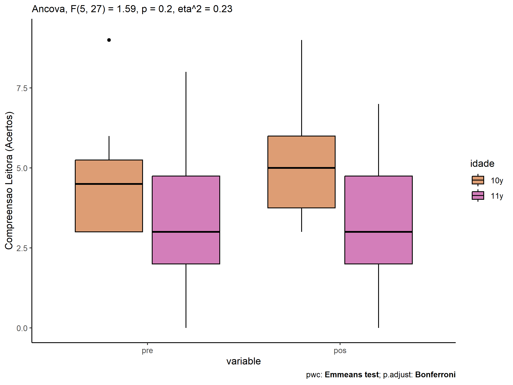<!-- -->

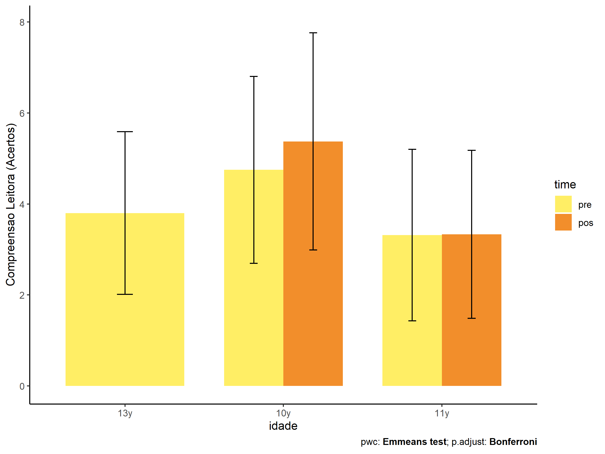<!-- -->

<!-- -->

### Compreensao Leitora (TRI)

| var                 | idade |   n | M (pre) | SE (pre) | M (unadj) | SE (unadj) | M (adj) | SE (adj) |
|:--------------------|:------|----:|--------:|---------:|----------:|-----------:|--------:|---------:|
| tri.compreensao.pos | 10y   |   8 |  -0.104 |    0.213 |     0.055 |      0.294 |  -0.039 |    0.188 |
| tri.compreensao.pos | 11y   |  18 |  -0.333 |    0.137 |    -0.492 |      0.120 |  -0.450 |    0.125 |

| .y.                 | group1 | group2 | estimate | conf.low | conf.high |    se | statistic |     p | p.adj | p.adj.signif |
|:--------------------|:-------|:-------|---------:|---------:|----------:|------:|----------:|------:|------:|:-------------|
| tri.compreensao.pos | 10y    | 11y    |    0.411 |   -0.059 |     0.881 | 0.227 |     1.809 | 0.084 | 0.084 | ns           |
| tri.compreensao.pre | 10y    | 11y    |    0.229 |   -0.287 |     0.745 | 0.250 |     0.916 | 0.369 | 0.369 | ns           |

| idade | group1 | group2 | estimate | conf.low | conf.high |    se | statistic |     p | p.adj | p.adj.signif |
|:------|:-------|:-------|---------:|---------:|----------:|------:|----------:|------:|------:|:-------------|
| 10y   | pre    | pos    |   -0.160 |   -0.754 |     0.435 | 0.297 |    -0.538 | 0.593 | 0.593 | ns           |
| 11y   | pre    | pos    |    0.167 |   -0.224 |     0.559 | 0.195 |     0.859 | 0.394 | 0.394 | ns           |

    ## Scale for colour is already present.
    ## Adding another scale for colour, which will replace the existing scale.

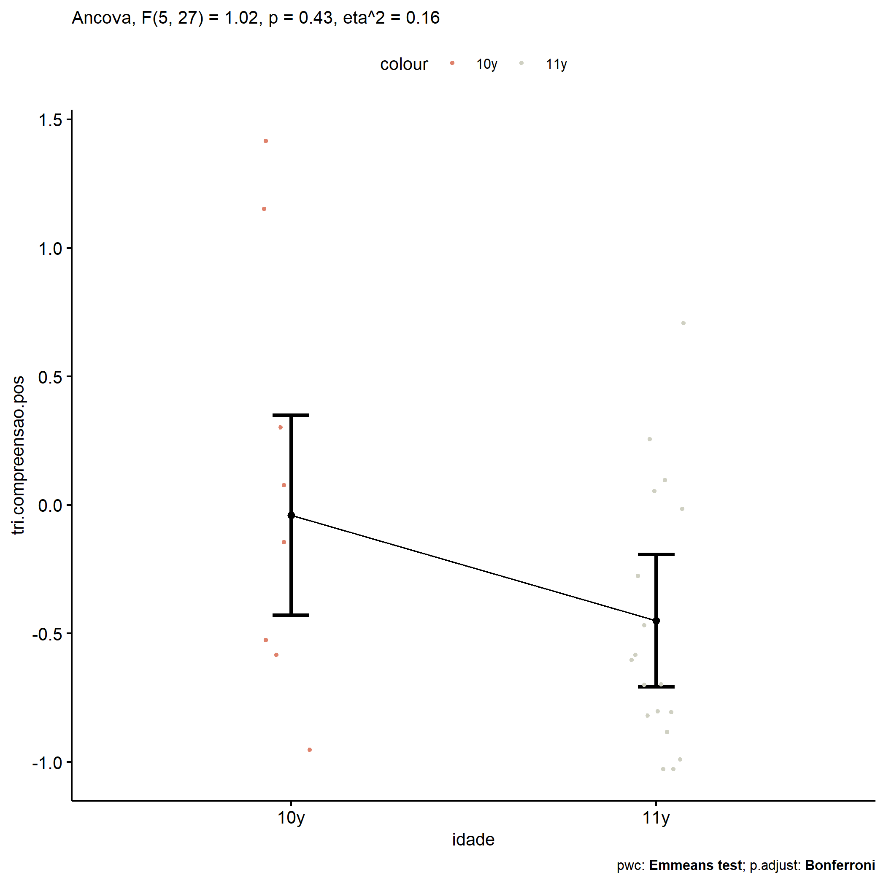<!-- -->

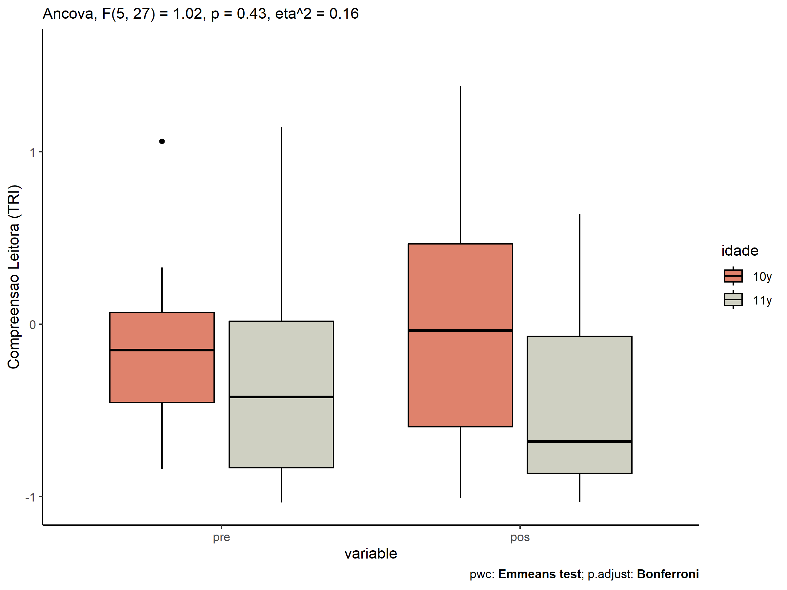<!-- -->

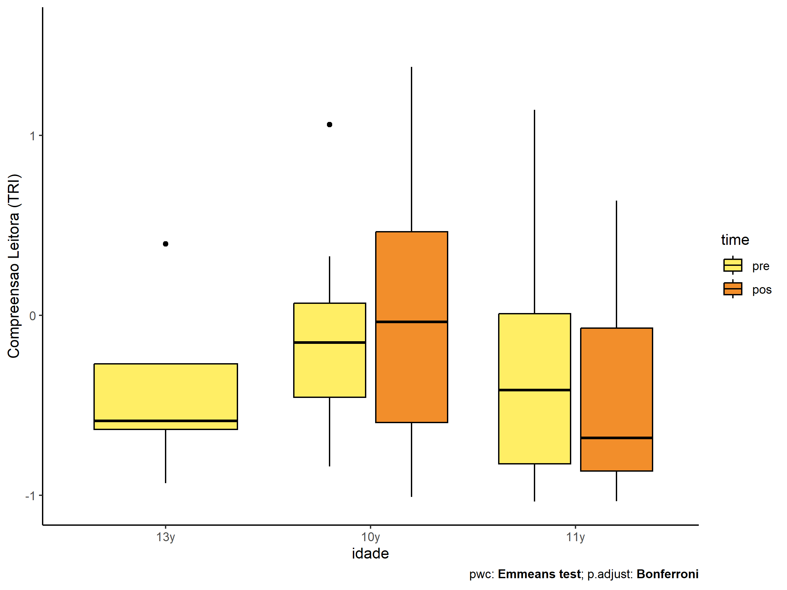<!-- -->

## factor: **zona.participante**

### Quant. Palavras Lidas

| var                | zona.participante |   n | M (pre) | SE (pre) | M (unadj) | SE (unadj) | M (adj) | SE (adj) |
|:-------------------|:------------------|----:|--------:|---------:|----------:|-----------:|--------:|---------:|
| palavras.lidas.pos | Rural             |   8 | 136.000 |   42.904 |    95.750 |     14.922 |  95.552 |   25.423 |
| palavras.lidas.pos | Urbana            |  17 | 102.529 |   14.427 |   101.706 |     19.022 | 101.799 |   17.323 |

| .y.                | group1 | group2 | estimate | conf.low | conf.high |     se | statistic |     p | p.adj | p.adj.signif |
|:-------------------|:-------|:-------|---------:|---------:|----------:|-------:|----------:|------:|------:|:-------------|
| palavras.lidas.pos | Urbana | Rural  |    6.247 |  -58.069 |    70.563 | 31.012 |     0.201 | 0.842 | 0.842 | ns           |
| palavras.lidas.pre | Urbana | Rural  |  -33.471 | -107.374 |    40.433 | 35.726 |    -0.937 | 0.359 | 0.359 | ns           |

| zona.participante | group1 | group2 | estimate | conf.low | conf.high |     se | statistic |     p | p.adj | p.adj.signif |
|:------------------|:-------|:-------|---------:|---------:|----------:|-------:|----------:|------:|------:|:-------------|
| Urbana            | pre    | pos    |   -2.969 |  -53.475 |    47.537 | 25.133 |    -0.118 | 0.906 | 0.906 | ns           |
| Rural             | pre    | pos    |   32.917 |  -40.594 |   106.427 | 36.580 |     0.900 | 0.373 | 0.373 | ns           |

    ## Scale for colour is already present.
    ## Adding another scale for colour, which will replace the existing scale.

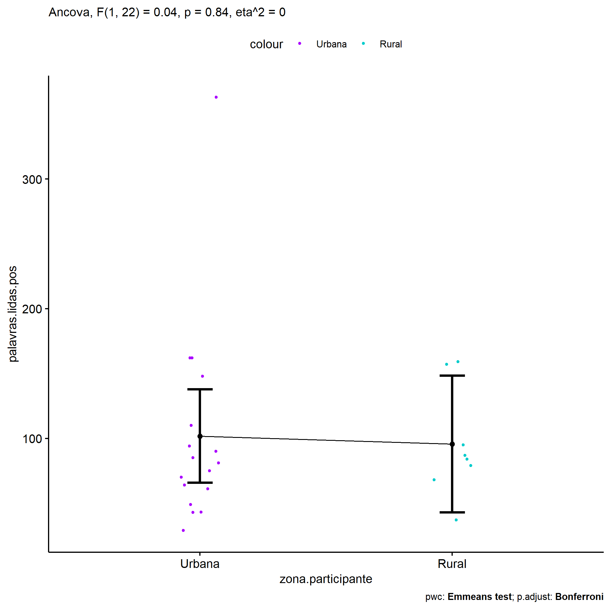<!-- -->

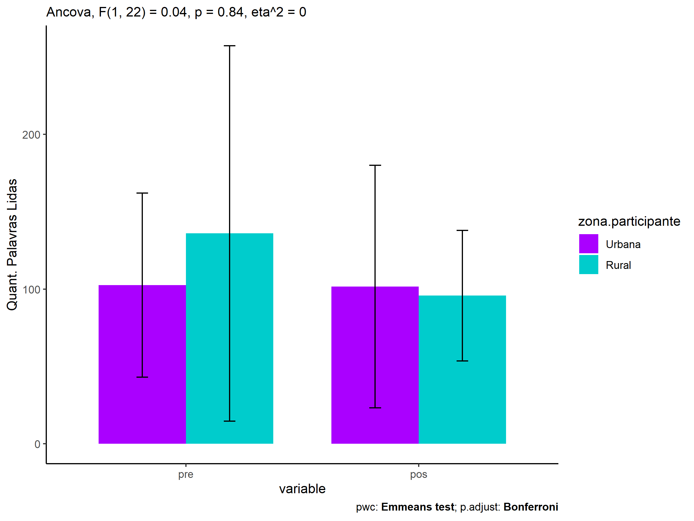<!-- -->

<!-- -->

<!-- -->

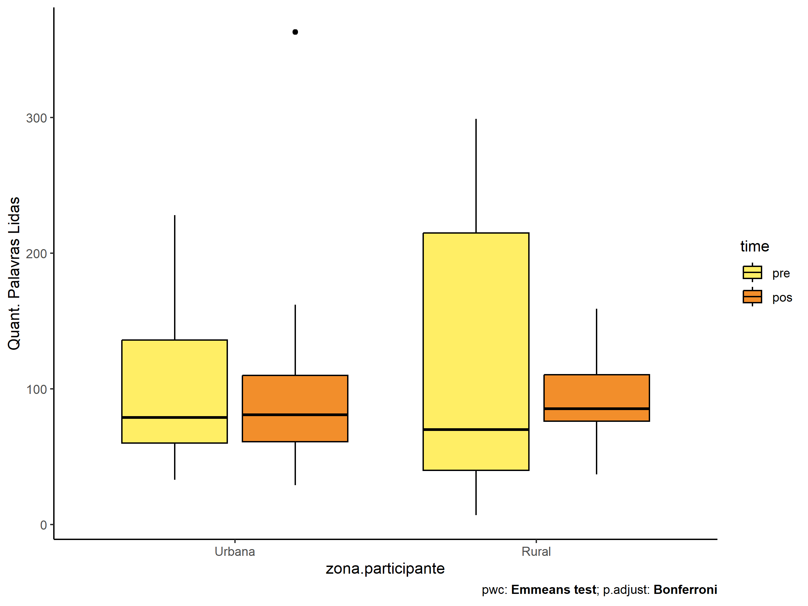<!-- -->

### Compreensao Leitora (Acertos)

| var                   | zona.participante |   n | M (pre) | SE (pre) | M (unadj) | SE (unadj) | M (adj) | SE (adj) |
|:----------------------|:------------------|----:|--------:|---------:|----------:|-----------:|--------:|---------:|
| score.compreensao.pos | Rural             |   8 |   5.250 |    0.840 |     4.625 |      0.680 |   3.740 |    0.645 |
| score.compreensao.pos | Urbana            |  17 |   3.235 |    0.425 |     3.882 |      0.521 |   4.299 |    0.425 |

| .y.                   | group1 | group2 | estimate | conf.low | conf.high |    se | statistic |     p | p.adj | p.adj.signif |
|:----------------------|:-------|:-------|---------:|---------:|----------:|------:|----------:|------:|------:|:-------------|
| score.compreensao.pos | Urbana | Rural  |    0.559 |   -1.118 |     2.237 | 0.809 |     0.691 | 0.497 | 0.497 | ns           |
| score.compreensao.pre | Urbana | Rural  |   -2.015 |   -3.755 |    -0.274 | 0.841 |    -2.395 | 0.025 | 0.025 | \*           |

| zona.participante | group1 | group2 | estimate | conf.low | conf.high |    se | statistic |     p | p.adj | p.adj.signif |
|:------------------|:-------|:-------|---------:|---------:|----------:|------:|----------:|------:|------:|:-------------|
| Urbana            | pre    | pos    |   -0.672 |   -1.999 |     0.655 | 0.660 |    -1.017 | 0.314 | 0.314 | ns           |
| Rural             | pre    | pos    |    0.486 |   -1.445 |     2.417 | 0.961 |     0.506 | 0.615 | 0.615 | ns           |

    ## Scale for colour is already present.
    ## Adding another scale for colour, which will replace the existing scale.

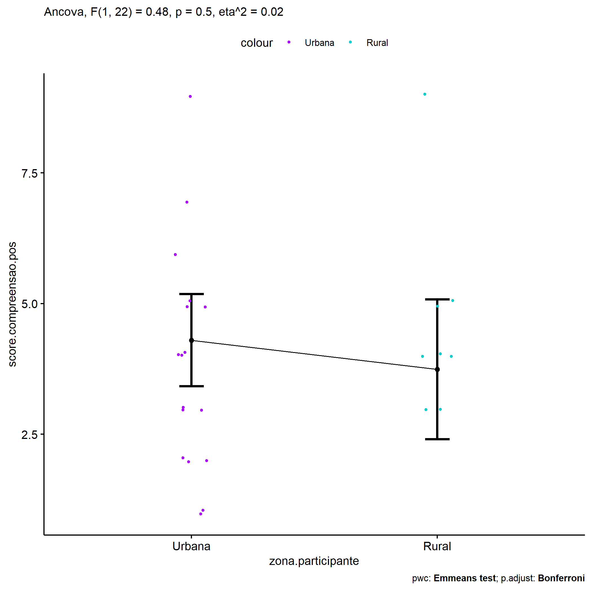<!-- -->

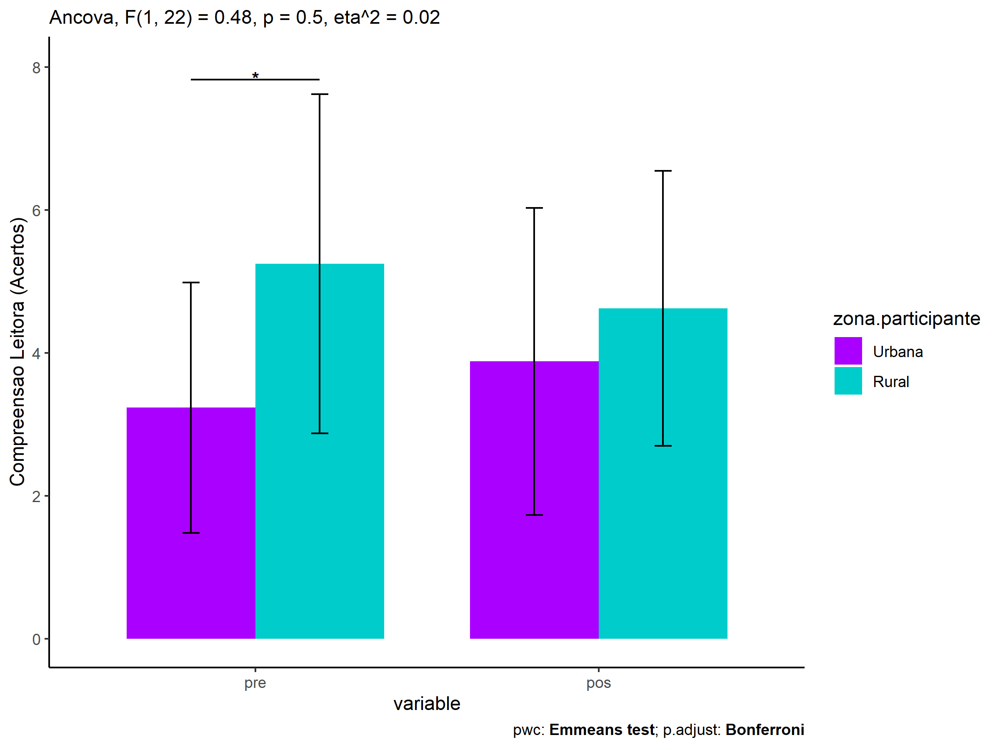<!-- -->

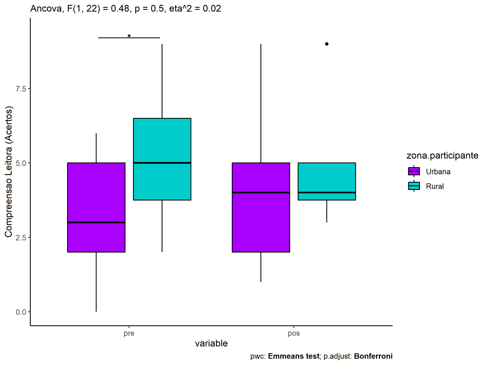<!-- -->

<!-- -->

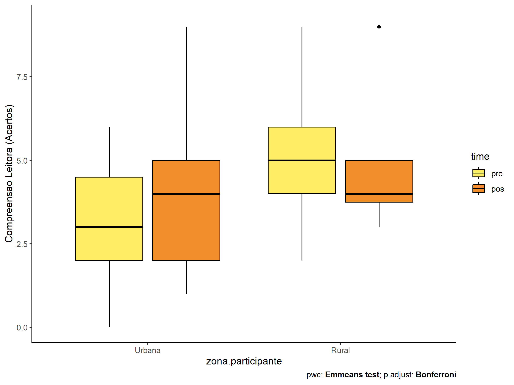<!-- -->

### Compreensao Leitora (TRI)

| var                 | zona.participante |   n | M (pre) | SE (pre) | M (unadj) | SE (unadj) | M (adj) | SE (adj) |
|:--------------------|:------------------|----:|--------:|---------:|----------:|-----------:|--------:|---------:|
| tri.compreensao.pos | Rural             |   8 |   0.102 |    0.277 |    -0.196 |      0.236 |  -0.475 |    0.192 |
| tri.compreensao.pos | Urbana            |  17 |  -0.428 |    0.108 |    -0.329 |      0.161 |  -0.198 |    0.127 |

| .y.                 | group1 | group2 | estimate | conf.low | conf.high |    se | statistic |     p | p.adj | p.adj.signif |
|:--------------------|:-------|:-------|---------:|---------:|----------:|------:|----------:|------:|------:|:-------------|
| tri.compreensao.pos | Urbana | Rural  |    0.277 |   -0.219 |     0.773 | 0.239 |     1.158 | 0.259 | 0.259 | ns           |
| tri.compreensao.pre | Urbana | Rural  |   -0.530 |   -1.035 |    -0.024 | 0.244 |    -2.168 | 0.041 | 0.041 | \*           |

| zona.participante | group1 | group2 | estimate | conf.low | conf.high |    se | statistic |     p | p.adj | p.adj.signif |
|:------------------|:-------|:-------|---------:|---------:|----------:|------:|----------:|------:|------:|:-------------|
| Urbana            | pre    | pos    |   -0.099 |   -0.508 |     0.310 | 0.203 |    -0.487 | 0.628 | 0.628 | ns           |
| Rural             | pre    | pos    |    0.221 |   -0.374 |     0.816 | 0.296 |     0.747 | 0.459 | 0.459 | ns           |

    ## Scale for colour is already present.
    ## Adding another scale for colour, which will replace the existing scale.

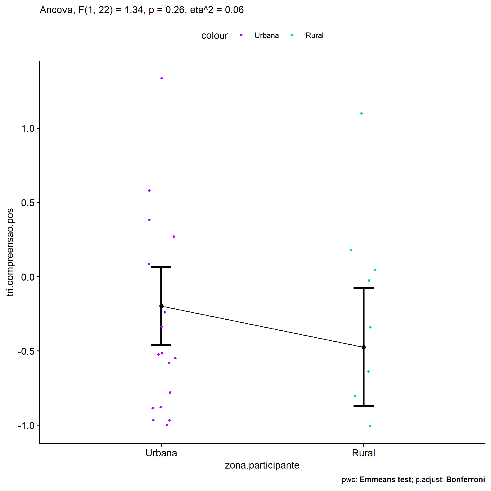<!-- -->

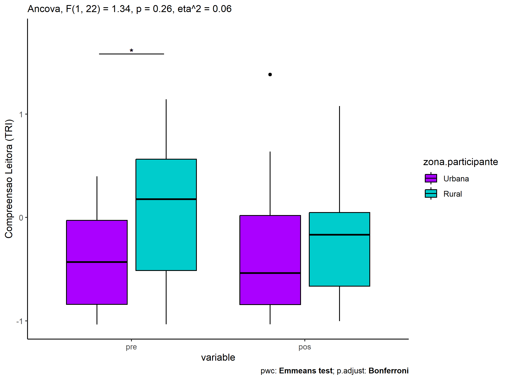<!-- -->

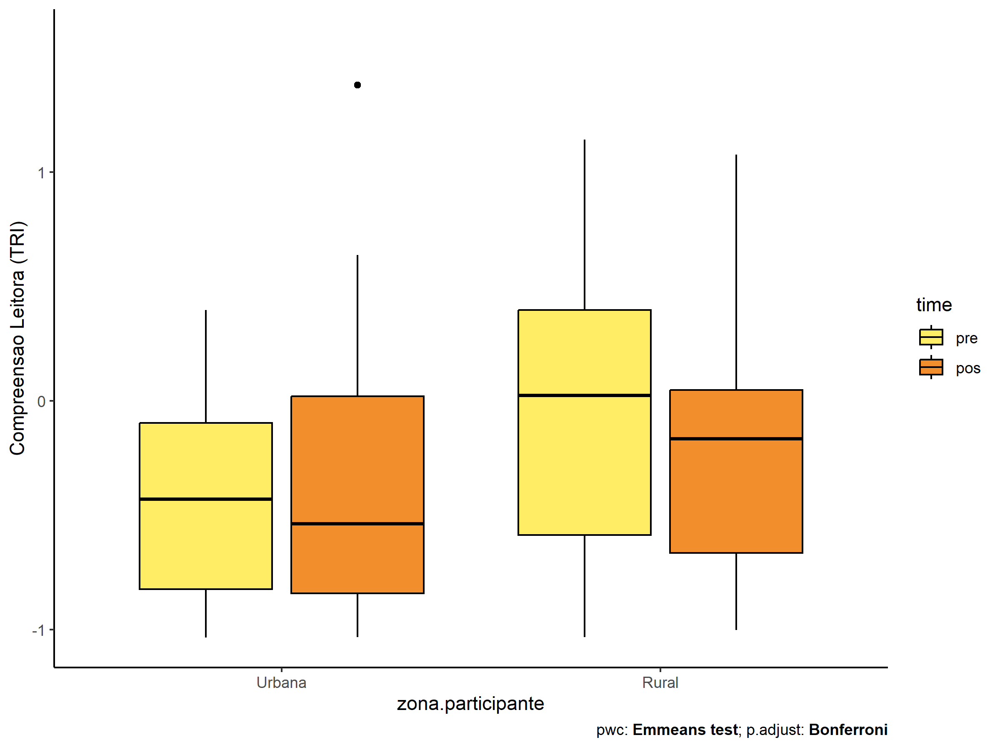<!-- -->

## factor: **escola**

### Quant. Palavras Lidas

| var                | escola |   n | M (pre) | SE (pre) | M (unadj) | SE (unadj) | M (adj) | SE (adj) |
|:-------------------|:-------|----:|--------:|---------:|----------:|-----------:|--------:|---------:|
| palavras.lidas.pos | E1     |   7 |  75.714 |   15.187 |    76.571 |     17.114 |  78.461 |   26.577 |
| palavras.lidas.pos | E4     |   7 | 215.429 |   24.163 |    92.714 |     12.090 |  87.431 |   36.064 |
| palavras.lidas.pos | E5     |  13 |  76.923 |   14.577 |   118.077 |     22.846 | 119.904 |   20.370 |

| .y.                | group1 | group2 | estimate | conf.low | conf.high |     se | statistic | p       | p.adj   | p.adj.signif |
|:-------------------|:-------|:-------|---------:|---------:|----------:|-------:|----------:|:--------|:--------|:-------------|
| palavras.lidas.pos | E1     | E4     |   -8.970 | -112.285 |    94.345 | 49.943 |    -0.180 | 0.859   | 1       | ns           |
| palavras.lidas.pos | E1     | E5     |  -41.443 | -105.292 |    22.406 | 30.865 |    -1.343 | 0.192   | 0.577   | ns           |
| palavras.lidas.pos | E4     | E5     |  -32.473 | -129.213 |    64.266 | 46.765 |    -0.694 | 0.494   | 1       | ns           |
| palavras.lidas.pre | E1     | E4     | -139.714 | -198.159 |   -81.270 | 28.318 |    -4.934 | \<0.001 | \<0.001 | \*\*\*       |
| palavras.lidas.pre | E1     | E5     |   -1.209 |  -52.468 |    50.050 | 24.836 |    -0.049 | 0.962   | 1       | ns           |
| palavras.lidas.pre | E4     | E5     |  138.505 |   87.246 |   189.765 | 24.836 |     5.577 | \<0.001 | \<0.001 | \*\*\*\*     |

| escola | group1 | group2 | estimate | conf.low | conf.high |     se | statistic | p       | p.adj   | p.adj.signif |
|:-------|:-------|:-------|---------:|---------:|----------:|-------:|----------:|:--------|:--------|:-------------|
| E1     | pre    | pos    |   -0.857 |  -70.495 |    68.781 | 34.749 |    -0.025 | 0.98    | 0.98    | ns           |
| E4     | pre    | pos    |  122.714 |   53.077 |   192.352 | 34.749 |     3.531 | \<0.001 | \<0.001 | \*\*\*       |
| E5     | pre    | pos    |  -42.889 |  -91.535 |     5.756 | 24.274 |    -1.767 | 0.083   | 0.083   | ns           |

    ## Scale for colour is already present.
    ## Adding another scale for colour, which will replace the existing scale.

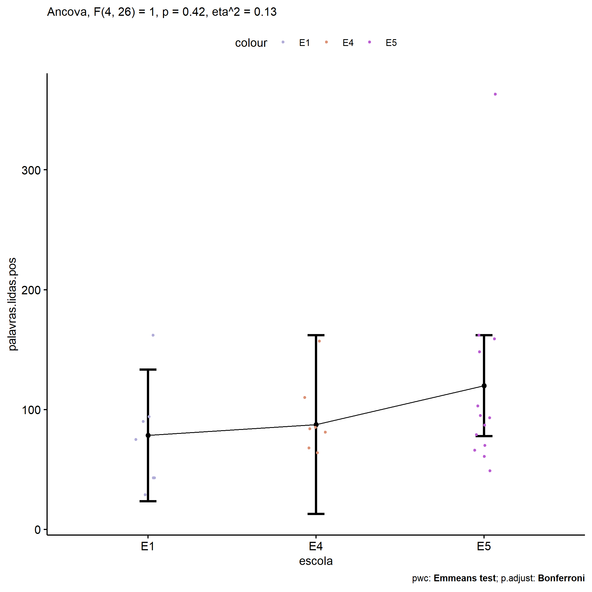<!-- -->

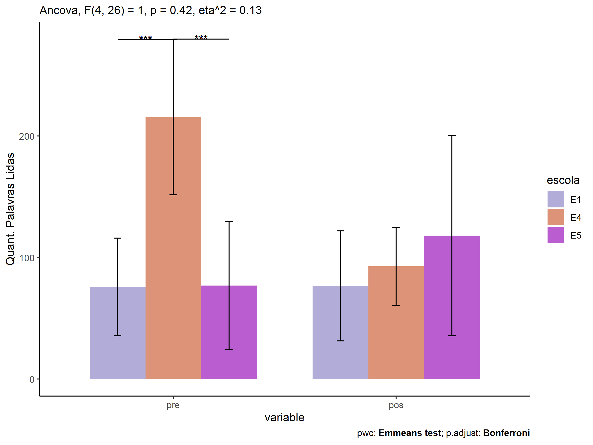<!-- -->

<!-- -->

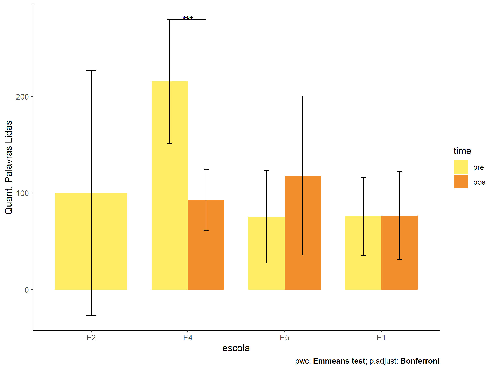<!-- -->

<!-- -->

### Compreensao Leitora (Acertos)

| var                   | escola |   n | M (pre) | SE (pre) | M (unadj) | SE (unadj) | M (adj) | SE (adj) |
|:----------------------|:-------|----:|--------:|---------:|----------:|-----------:|--------:|---------:|
| score.compreensao.pos | E1     |   7 |   3.857 |    0.595 |     4.429 |      1.020 |   4.425 |    0.741 |
| score.compreensao.pos | E4     |   7 |   5.429 |    1.110 |     4.714 |      0.918 |   3.795 |    0.814 |
| score.compreensao.pos | E5     |  13 |   3.000 |    0.340 |     3.000 |      0.494 |   3.496 |    0.573 |

| .y.                   | group1 | group2 | estimate | conf.low | conf.high |    se | statistic |     p | p.adj | p.adj.signif |
|:----------------------|:-------|:-------|---------:|---------:|----------:|------:|----------:|------:|------:|:-------------|
| score.compreensao.pos | E1     | E4     |    0.630 |   -1.646 |     2.906 | 1.100 |     0.573 | 0.572 | 1.000 | ns           |
| score.compreensao.pos | E1     | E5     |    0.929 |   -1.010 |     2.868 | 0.937 |     0.991 | 0.332 | 0.996 | ns           |
| score.compreensao.pos | E4     | E5     |    0.299 |   -1.883 |     2.481 | 1.055 |     0.283 | 0.779 | 1.000 | ns           |
| score.compreensao.pre | E1     | E4     |   -1.571 |   -3.642 |     0.499 | 1.003 |    -1.566 | 0.130 | 0.391 | ns           |
| score.compreensao.pre | E1     | E5     |    0.857 |   -0.959 |     2.673 | 0.880 |     0.974 | 0.340 | 1.000 | ns           |
| score.compreensao.pre | E4     | E5     |    2.429 |    0.612 |     4.245 | 0.880 |     2.760 | 0.011 | 0.033 | \*           |

| escola | group1 | group2 | estimate | conf.low | conf.high |    se | statistic |     p | p.adj | p.adj.signif |
|:-------|:-------|:-------|---------:|---------:|----------:|------:|----------:|------:|------:|:-------------|
| E1     | pre    | pos    |   -0.571 |   -2.652 |     1.509 | 1.038 |    -0.550 | 0.584 | 0.584 | ns           |
| E4     | pre    | pos    |    0.714 |   -1.366 |     2.795 | 1.038 |     0.688 | 0.494 | 0.494 | ns           |
| E5     | pre    | pos    |    0.062 |   -1.391 |     1.516 | 0.725 |     0.086 | 0.932 | 0.932 | ns           |

    ## Scale for colour is already present.
    ## Adding another scale for colour, which will replace the existing scale.

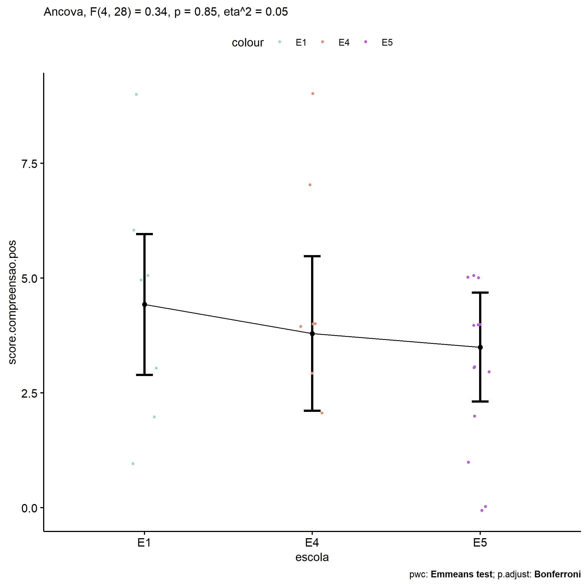<!-- -->

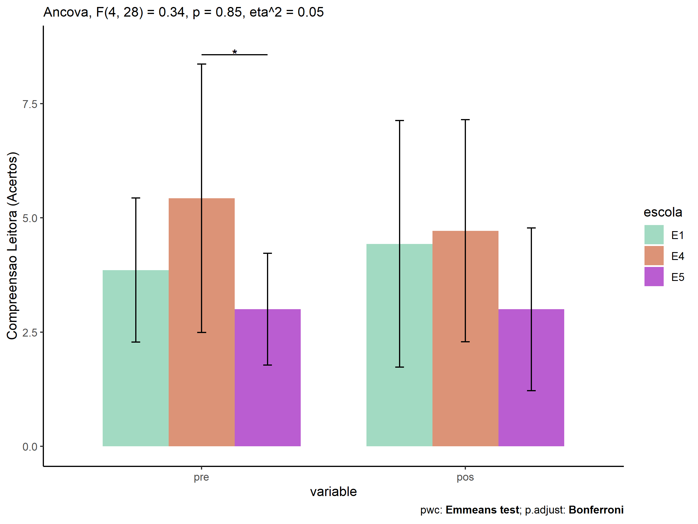<!-- -->

<!-- -->

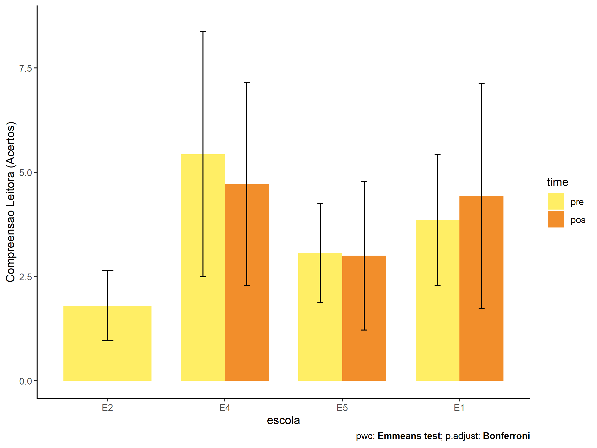<!-- -->

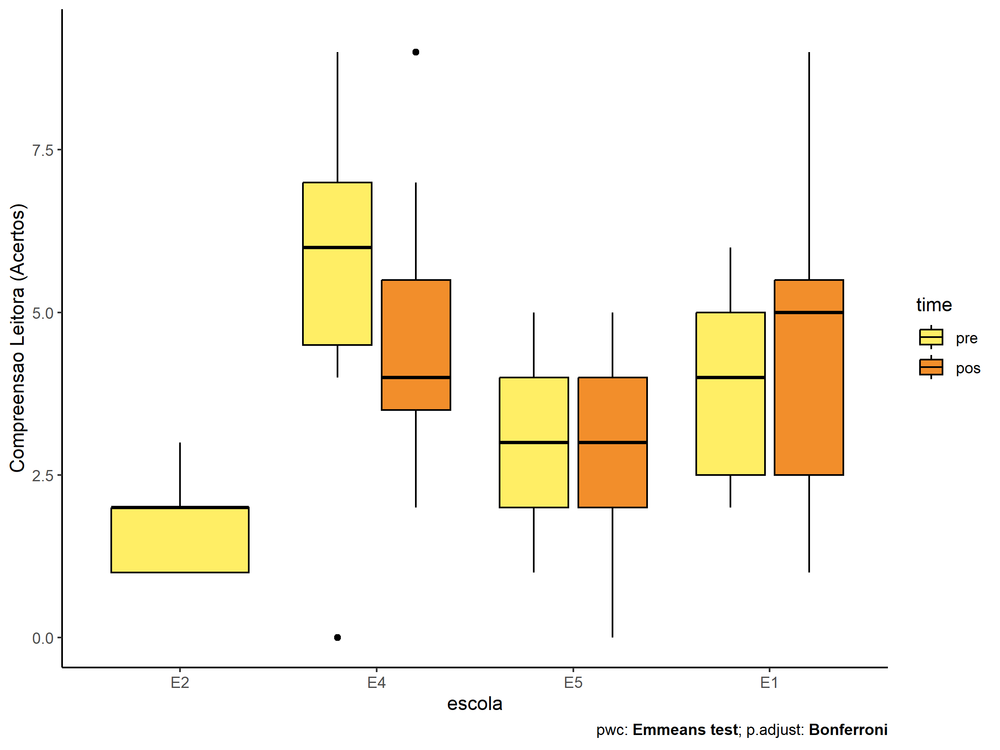<!-- -->

### Compreensao Leitora (TRI)

| var                 | escola |   n | M (pre) | SE (pre) | M (unadj) | SE (unadj) | M (adj) | SE (adj) |
|:--------------------|:-------|----:|--------:|---------:|----------:|-----------:|--------:|---------:|
| tri.compreensao.pos | E1     |   7 |  -0.211 |    0.121 |    -0.054 |      0.309 |  -0.085 |    0.196 |
| tri.compreensao.pos | E4     |   7 |   0.216 |    0.292 |    -0.061 |      0.260 |  -0.365 |    0.219 |
| tri.compreensao.pos | E5     |  13 |  -0.539 |    0.118 |    -0.625 |      0.111 |  -0.445 |    0.155 |

| .y.                 | group1 | group2 | estimate | conf.low | conf.high |    se | statistic |     p | p.adj | p.adj.signif |
|:--------------------|:-------|:-------|---------:|---------:|----------:|------:|----------:|------:|------:|:-------------|
| tri.compreensao.pos | E1     | E4     |    0.280 |   -0.321 |     0.881 | 0.290 |     0.964 | 0.345 | 1.000 | ns           |
| tri.compreensao.pos | E1     | E5     |    0.360 |   -0.161 |     0.881 | 0.252 |     1.429 | 0.167 | 0.500 | ns           |
| tri.compreensao.pos | E4     | E5     |    0.080 |   -0.516 |     0.676 | 0.288 |     0.278 | 0.784 | 1.000 | ns           |
| tri.compreensao.pre | E1     | E4     |   -0.427 |   -0.995 |     0.142 | 0.275 |    -1.549 | 0.134 | 0.403 | ns           |
| tri.compreensao.pre | E1     | E5     |    0.328 |   -0.171 |     0.826 | 0.242 |     1.357 | 0.187 | 0.562 | ns           |
| tri.compreensao.pre | E4     | E5     |    0.754 |    0.256 |     1.253 | 0.242 |     3.123 | 0.005 | 0.014 | \*           |

| escola | group1 | group2 | estimate | conf.low | conf.high |    se | statistic |     p | p.adj | p.adj.signif |
|:-------|:-------|:-------|---------:|---------:|----------:|------:|----------:|------:|------:|:-------------|
| E1     | pre    | pos    |   -0.156 |   -0.731 |     0.418 | 0.287 |    -0.546 | 0.587 | 0.587 | ns           |
| E4     | pre    | pos    |    0.277 |   -0.298 |     0.851 | 0.287 |     0.966 | 0.339 | 0.339 | ns           |
| E5     | pre    | pos    |    0.097 |   -0.304 |     0.498 | 0.200 |     0.484 | 0.630 | 0.630 | ns           |

    ## Scale for colour is already present.
    ## Adding another scale for colour, which will replace the existing scale.

<!-- -->

<!-- -->

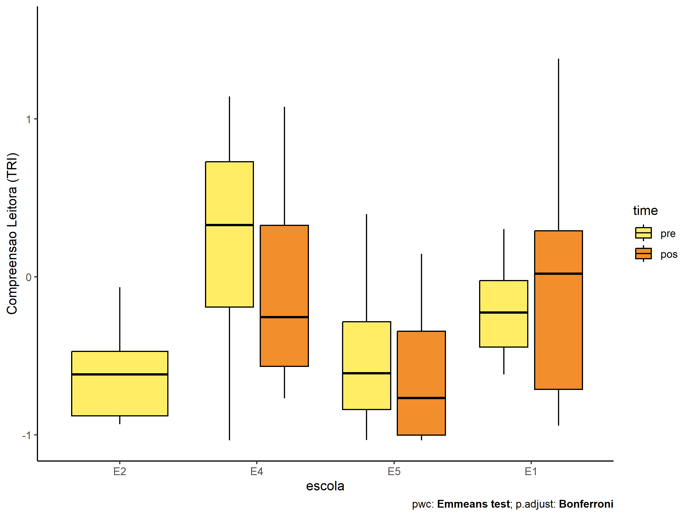<!-- -->

## factor: **zona.escola**

### Quant. Palavras Lidas

| var                | zona.escola |   n | M (pre) | SE (pre) | M (unadj) | SE (unadj) | M (adj) | SE (adj) |
|:-------------------|:------------|----:|--------:|---------:|----------:|-----------:|--------:|---------:|
| palavras.lidas.pos | Rural       |  11 | 152.727 |   30.288 |    83.364 |      8.994 |  76.661 |   20.564 |
| palavras.lidas.pos | Urbana      |  21 |  73.190 |   10.628 |   100.381 |     15.870 | 103.892 |   14.275 |

| .y.                | group1 | group2 | estimate | conf.low | conf.high |     se | statistic |     p | p.adj | p.adj.signif |
|:-------------------|:-------|:-------|---------:|---------:|----------:|-------:|----------:|------:|------:|:-------------|
| palavras.lidas.pos | Urbana | Rural  |   27.232 |  -26.924 |    81.387 | 26.479 |     1.028 | 0.312 | 0.312 | ns           |
| palavras.lidas.pre | Urbana | Rural  |  -79.537 | -132.989 |   -26.084 | 26.173 |    -3.039 | 0.005 | 0.005 | \*\*         |

| zona.escola | group1 | group2 | estimate | conf.low | conf.high |     se | statistic |     p | p.adj | p.adj.signif |
|:------------|:-------|:-------|---------:|---------:|----------:|-------:|----------:|------:|------:|:-------------|
| Urbana      | pre    | pos    |  -20.667 |  -60.865 |    19.532 | 20.139 |    -1.026 | 0.308 | 0.308 | ns           |
| Rural       | pre    | pos    |   69.364 |    9.987 |   128.740 | 29.748 |     2.332 | 0.023 | 0.023 | \*           |

    ## Scale for colour is already present.
    ## Adding another scale for colour, which will replace the existing scale.

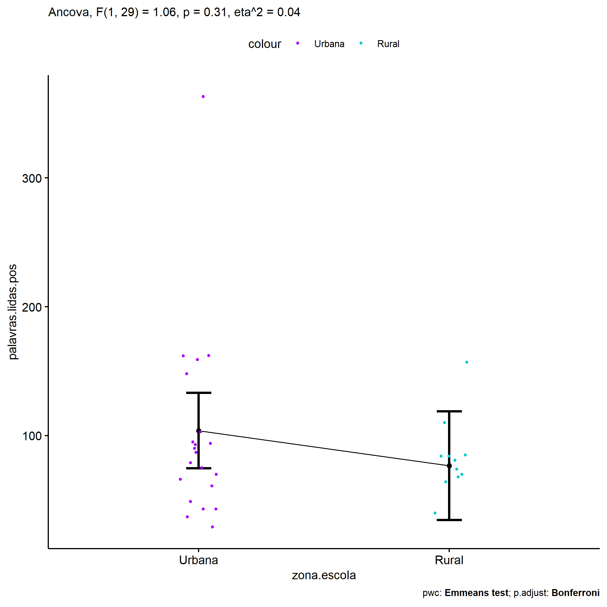<!-- -->

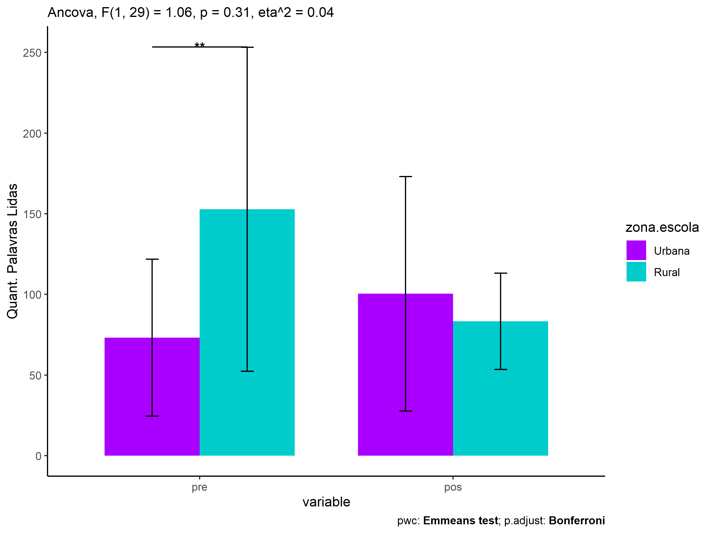<!-- -->

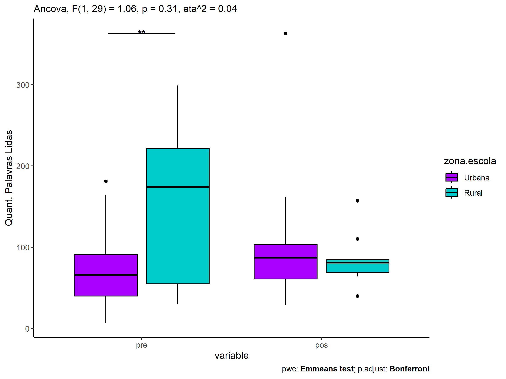<!-- -->

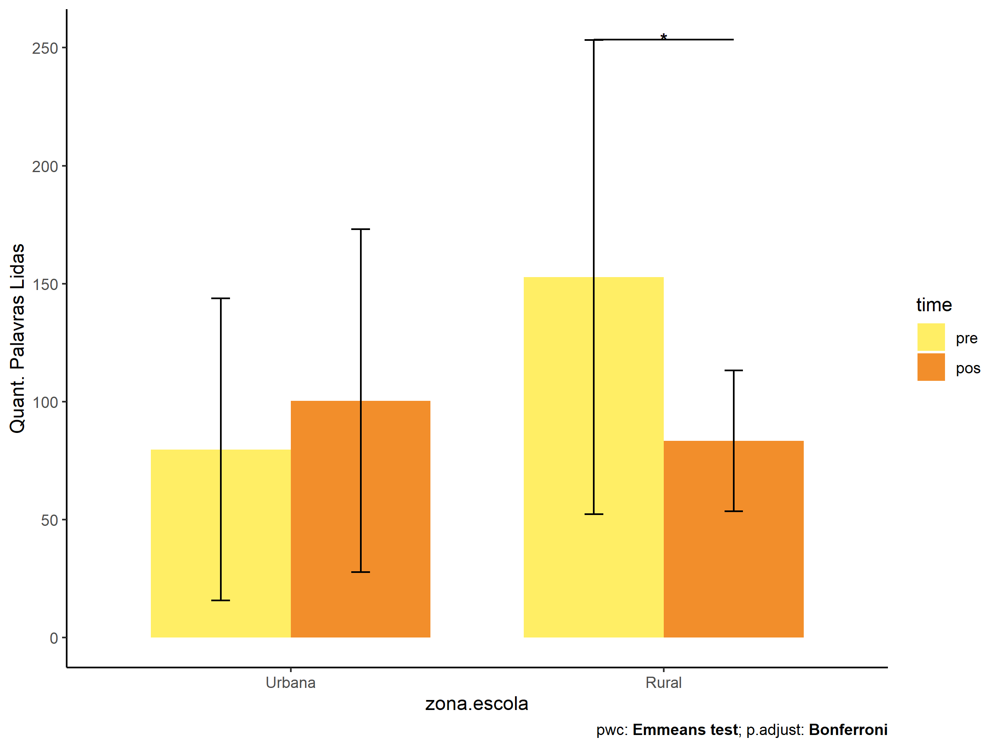<!-- -->

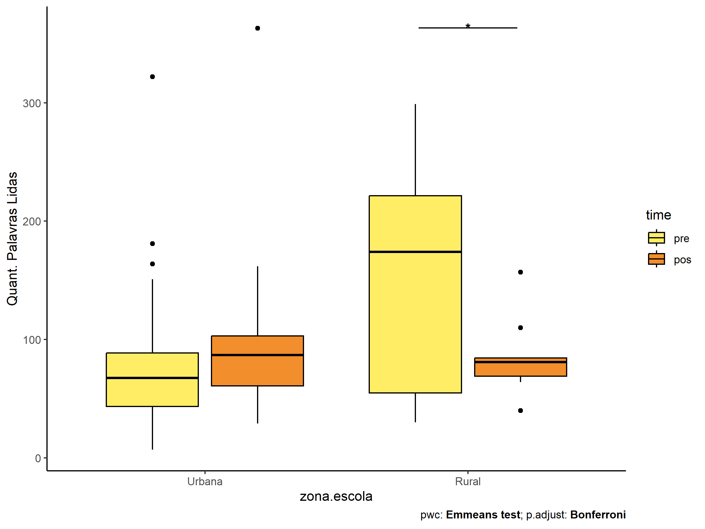<!-- -->

### Compreensao Leitora (Acertos)

| var                   | zona.escola |   n | M (pre) | SE (pre) | M (unadj) | SE (unadj) | M (adj) | SE (adj) |
|:----------------------|:------------|----:|--------:|---------:|----------:|-----------:|--------:|---------:|
| score.compreensao.pos | Rural       |  11 |   4.636 |    0.766 |     4.273 |      0.675 |   3.675 |    0.590 |
| score.compreensao.pos | Urbana      |  23 |   3.174 |    0.279 |     3.348 |      0.434 |   3.633 |    0.398 |

| .y.                   | group1 | group2 | estimate | conf.low | conf.high |    se | statistic |     p | p.adj | p.adj.signif |
|:----------------------|:-------|:-------|---------:|---------:|----------:|------:|----------:|------:|------:|:-------------|
| score.compreensao.pos | Urbana | Rural  |   -0.042 |   -1.537 |     1.454 | 0.733 |    -0.057 | 0.955 | 0.955 | ns           |
| score.compreensao.pre | Urbana | Rural  |   -1.462 |   -2.808 |    -0.117 | 0.660 |    -2.214 | 0.034 | 0.034 | \*           |

| zona.escola | group1 | group2 | estimate | conf.low | conf.high |    se | statistic |     p | p.adj | p.adj.signif |
|:------------|:-------|:-------|---------:|---------:|----------:|------:|----------:|------:|------:|:-------------|
| Urbana      | pre    | pos    |   -0.312 |   -1.404 |     0.780 | 0.547 |    -0.570 | 0.570 | 0.570 | ns           |
| Rural       | pre    | pos    |    0.364 |   -1.290 |     2.018 | 0.829 |     0.439 | 0.662 | 0.662 | ns           |

    ## Scale for colour is already present.
    ## Adding another scale for colour, which will replace the existing scale.

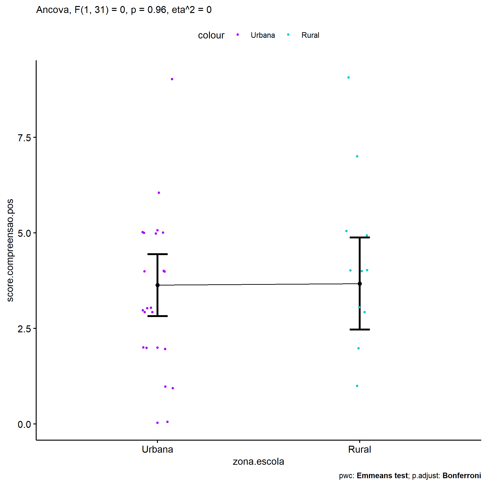<!-- -->

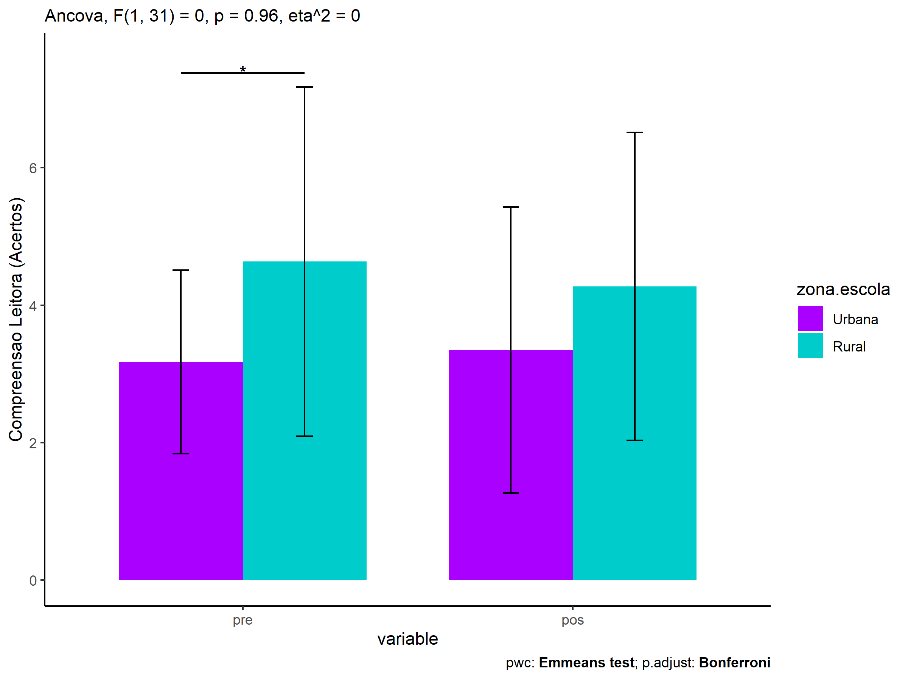<!-- -->

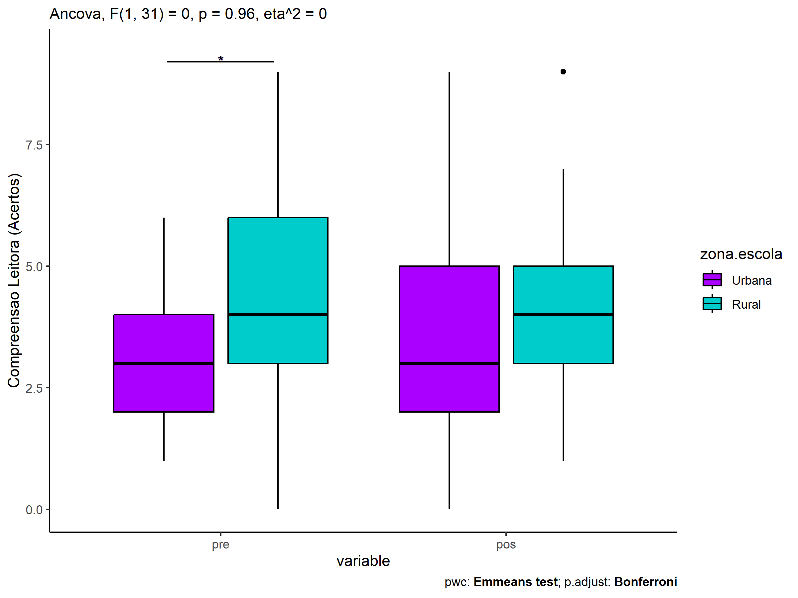<!-- -->

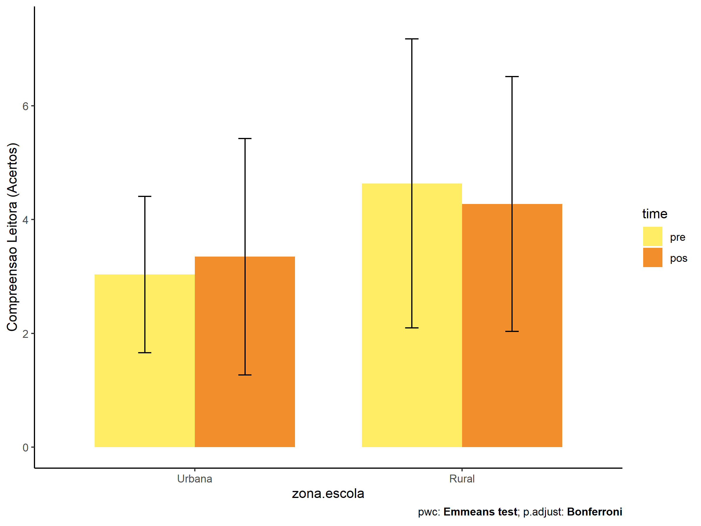<!-- -->

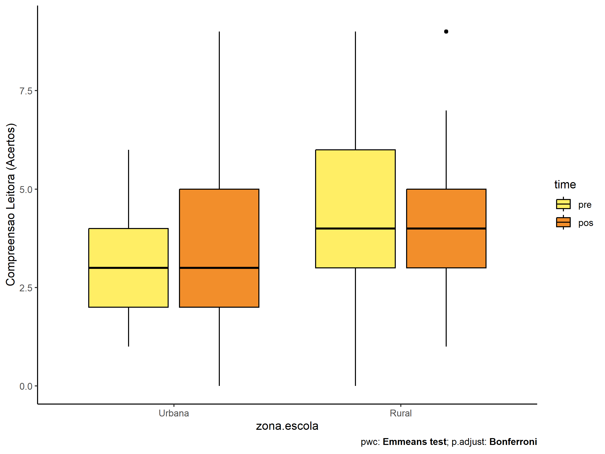<!-- -->

### Compreensao Leitora (TRI)

| var                 | zona.escola |   n | M (pre) | SE (pre) | M (unadj) | SE (unadj) | M (adj) | SE (adj) |
|:--------------------|:------------|----:|--------:|---------:|----------:|-----------:|--------:|---------:|
| tri.compreensao.pos | Rural       |  11 |   0.010 |    0.207 |    -0.190 |      0.188 |  -0.393 |    0.167 |
| tri.compreensao.pos | Urbana      |  23 |  -0.454 |    0.083 |    -0.482 |      0.125 |  -0.386 |    0.112 |

| .y.                 | group1 | group2 | estimate | conf.low | conf.high |    se | statistic |     p | p.adj | p.adj.signif |
|:--------------------|:-------|:-------|---------:|---------:|----------:|------:|----------:|------:|------:|:-------------|
| tri.compreensao.pos | Urbana | Rural  |    0.007 |   -0.419 |     0.434 | 0.209 |     0.034 | 0.973 | 0.973 | ns           |
| tri.compreensao.pre | Urbana | Rural  |   -0.465 |   -0.843 |    -0.087 | 0.186 |    -2.504 | 0.018 | 0.018 | \*           |

| zona.escola | group1 | group2 | estimate | conf.low | conf.high |    se | statistic |     p | p.adj | p.adj.signif |
|:------------|:-------|:-------|---------:|---------:|----------:|------:|----------:|------:|------:|:-------------|
| Urbana      | pre    | pos    |    0.022 |   -0.284 |     0.329 | 0.154 |     0.144 | 0.886 | 0.886 | ns           |
| Rural       | pre    | pos    |    0.201 |   -0.264 |     0.665 | 0.233 |     0.862 | 0.392 | 0.392 | ns           |

    ## Scale for colour is already present.
    ## Adding another scale for colour, which will replace the existing scale.

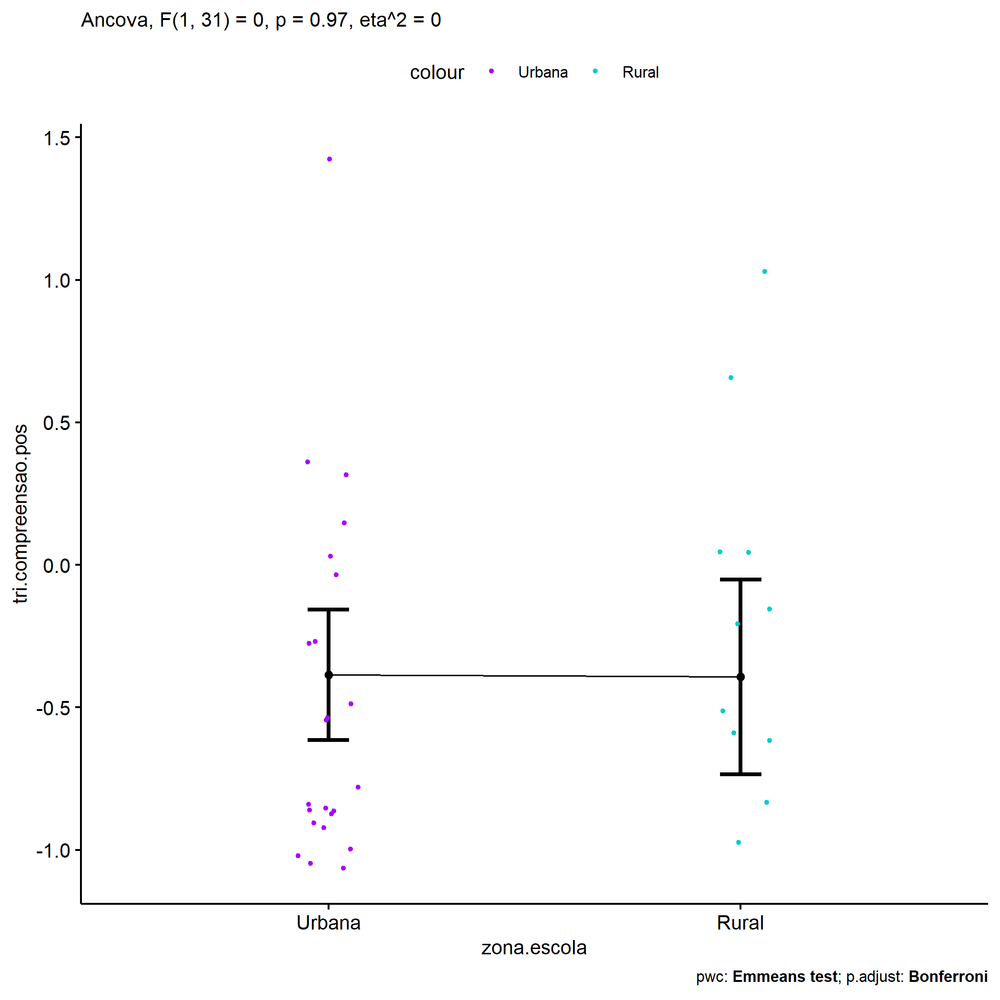<!-- -->

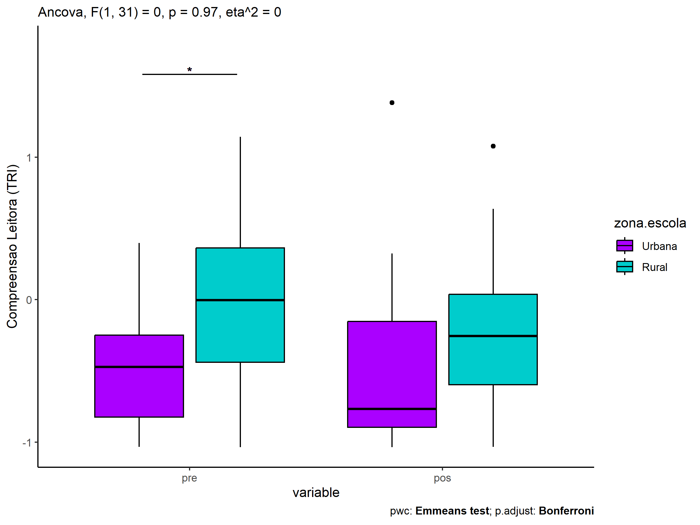<!-- -->

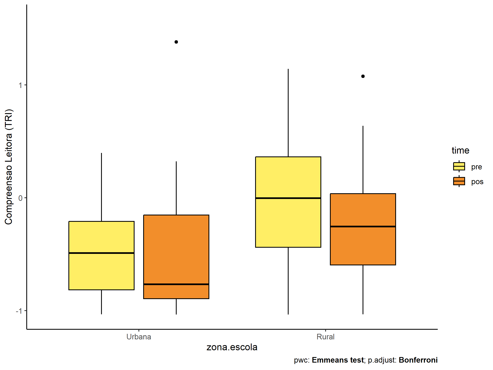<!-- -->

# Pairwise comparisons for two factors

## factores: **genero:grupo**

### Quant. Palavras Lidas

| var                | genero | grupo        |   n | M (pre) | SE (pre) | M (unadj) | SE (unadj) | M (adj) | SE (adj) |
|:-------------------|:-------|:-------------|----:|--------:|---------:|----------:|-----------:|--------:|---------:|
| palavras.lidas.pos | F      | Controle     |   7 |  52.000 |    9.658 |    87.000 |     14.697 |  89.308 |   26.478 |
| palavras.lidas.pos | M      | Controle     |   9 |  87.444 |   20.972 |   103.333 |     34.830 | 103.982 |   22.291 |
| palavras.lidas.pos | M      | Experimental |  14 | 134.857 |   25.634 |    93.143 |     10.195 |  91.572 |   18.655 |

|     | grupo    | genero | group1   | group2       | estimate | conf.low | conf.high |     se | statistic |     p | p.adj | p.adj.signif |
|:----|:---------|:-------|:---------|:-------------|---------:|---------:|----------:|-------:|----------:|------:|------:|:-------------|
| 1   | Controle |        | F        | M            |  -14.674 |  -84.655 |    55.307 | 34.045 |    -0.431 | 0.670 | 0.670 | ns           |
| 3   | Controle |        | F        | M            |  -35.444 | -113.835 |    42.946 | 38.205 |    -0.928 | 0.362 | 0.362 | ns           |
| 6   |          | M      | Controle | Experimental |   12.410 |  -48.268 |    73.089 | 29.520 |     0.420 | 0.678 | 0.678 | ns           |
| 8   |          | M      | Controle | Experimental |  -47.413 | -113.872 |    19.046 | 32.390 |    -1.464 | 0.155 | 0.155 | ns           |

| grupo        | genero | group1 | group2 | estimate | conf.low | conf.high |     se | statistic |     p | p.adj | p.adj.signif |
|:-------------|:-------|:-------|:-------|---------:|---------:|----------:|-------:|----------:|------:|------:|:-------------|
| Controle     | F      | pre    | pos    |  -35.000 | -113.603 |    43.603 | 39.282 |    -0.891 | 0.377 | 0.377 | ns           |
| Controle     | M      | pre    | pos    |  -20.788 |  -86.883 |    45.307 | 33.031 |    -0.629 | 0.532 | 0.532 | ns           |
| Experimental | M      | pre    | pos    |   43.857 |   -9.215 |    96.929 | 26.523 |     1.654 | 0.104 | 0.104 | ns           |

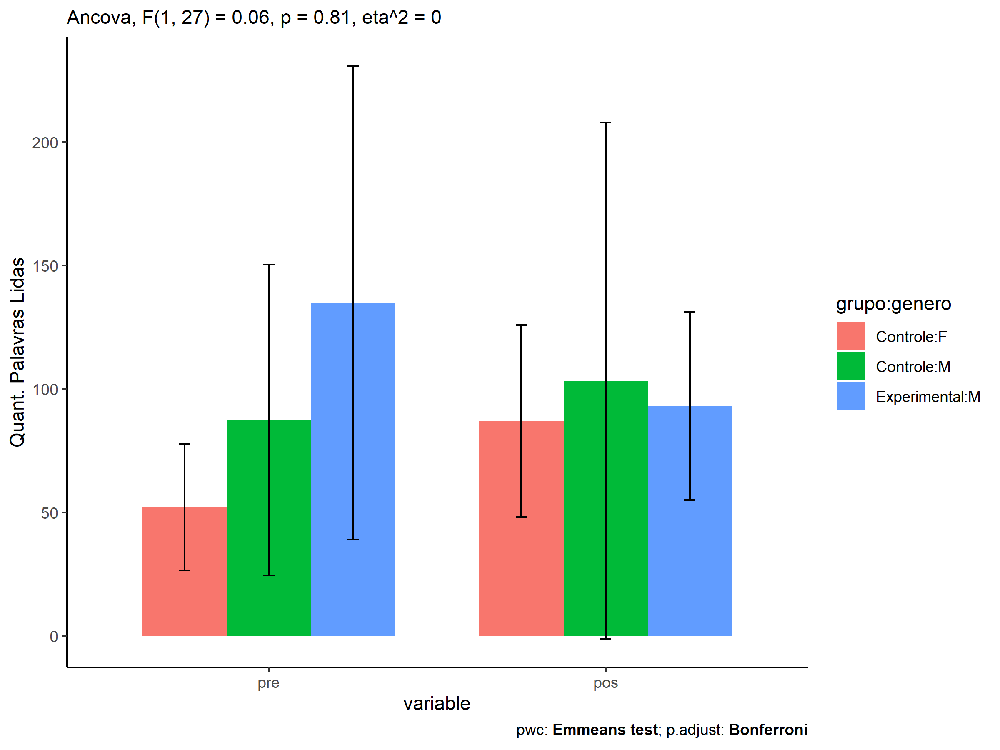<!-- -->

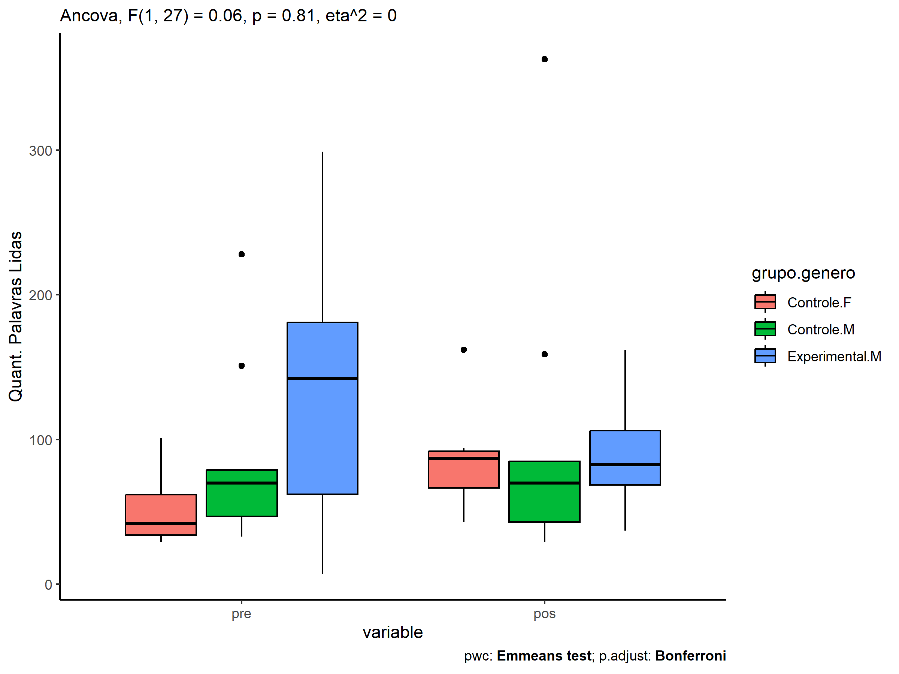<!-- -->

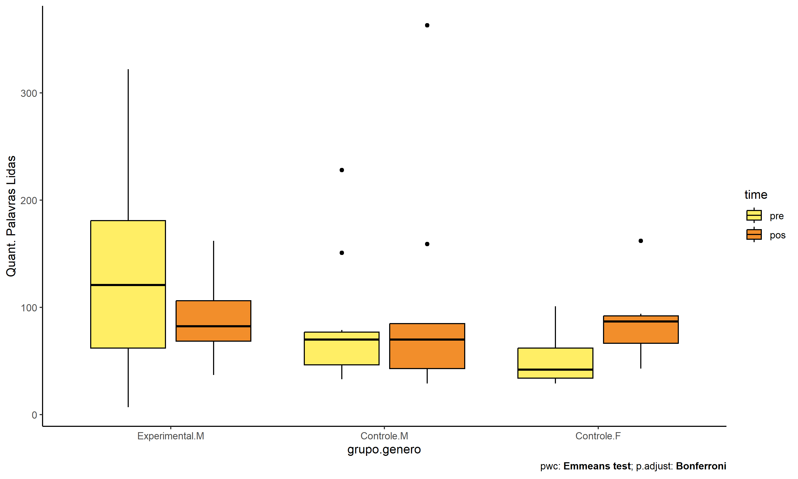<!-- -->

### Compreensao Leitora (Acertos)

| var                   | genero | grupo        |   n | M (pre) | SE (pre) | M (unadj) | SE (unadj) | M (adj) | SE (adj) |
|:----------------------|:-------|:-------------|----:|--------:|---------:|----------:|-----------:|--------:|---------:|
| score.compreensao.pos | F      | Controle     |   7 |   3.571 |    0.481 |     4.286 |      0.918 |   4.314 |    0.697 |
| score.compreensao.pos | M      | Controle     |  11 |   3.000 |    0.381 |     2.455 |      0.529 |   2.788 |    0.567 |
| score.compreensao.pos | M      | Experimental |  14 |   4.143 |    0.678 |     4.214 |      0.576 |   3.938 |    0.501 |

|     | grupo    | genero | group1   | group2       | estimate | conf.low | conf.high |    se | statistic |     p | p.adj | p.adj.signif |
|:----|:---------|:-------|:---------|:-------------|---------:|---------:|----------:|------:|----------:|------:|------:|:-------------|
| 1   | Controle |        | F        | M            |    1.526 |   -0.313 |     3.365 | 0.898 |     1.700 | 0.100 | 0.100 | ns           |
| 3   | Controle |        | F        | M            |    0.571 |   -1.349 |     2.492 | 0.939 |     0.608 | 0.548 | 0.548 | ns           |
| 6   |          | M      | Controle | Experimental |   -1.150 |   -2.727 |     0.428 | 0.770 |    -1.492 | 0.147 | 0.147 | ns           |
| 8   |          | M      | Controle | Experimental |   -1.143 |   -2.744 |     0.458 | 0.783 |    -1.460 | 0.155 | 0.155 | ns           |

| grupo        | genero | group1 | group2 | estimate | conf.low | conf.high |    se | statistic |     p | p.adj | p.adj.signif |
|:-------------|:-------|:-------|:-------|---------:|---------:|----------:|------:|----------:|------:|------:|:-------------|
| Controle     | F      | pre    | pos    |   -0.714 |   -2.892 |     1.464 | 1.089 |    -0.656 | 0.514 | 0.514 | ns           |
| Controle     | M      | pre    | pos    |    0.545 |   -1.192 |     2.283 | 0.869 |     0.628 | 0.532 | 0.532 | ns           |
| Experimental | M      | pre    | pos    |   -0.450 |   -1.920 |     1.021 | 0.735 |    -0.611 | 0.543 | 0.543 | ns           |

<!-- -->

<!-- -->

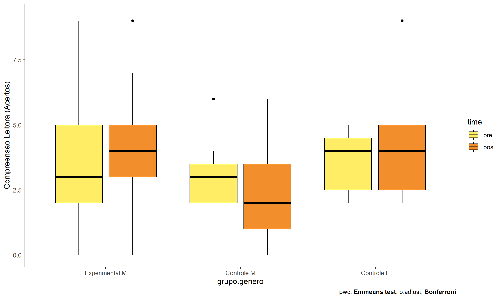<!-- -->

### Compreensao Leitora (TRI)

| var                 | genero | grupo        |   n | M (pre) | SE (pre) | M (unadj) | SE (unadj) | M (adj) | SE (adj) |
|:--------------------|:-------|:-------------|----:|--------:|---------:|----------:|-----------:|--------:|---------:|
| tri.compreensao.pos | F      | Controle     |   7 |  -0.379 |    0.112 |    -0.142 |      0.300 |  -0.102 |    0.190 |
| tri.compreensao.pos | M      | Controle     |  11 |  -0.458 |    0.125 |    -0.721 |      0.119 |  -0.633 |    0.153 |
| tri.compreensao.pos | M      | Experimental |  14 |  -0.161 |    0.194 |    -0.250 |      0.165 |  -0.339 |    0.136 |

|     | grupo    | genero | group1   | group2       | estimate | conf.low | conf.high |    se | statistic |     p | p.adj | p.adj.signif |
|:----|:---------|:-------|:---------|:-------------|---------:|---------:|----------:|------:|----------:|------:|------:|:-------------|
| 1   | Controle |        | F        | M            |    0.532 |    0.034 |     1.029 | 0.243 |     2.188 | 0.037 | 0.037 | \*           |
| 3   | Controle |        | F        | M            |    0.079 |   -0.475 |     0.633 | 0.271 |     0.292 | 0.772 | 0.772 | ns           |
| 6   |          | M      | Controle | Experimental |   -0.294 |   -0.720 |     0.132 | 0.208 |    -1.412 | 0.169 | 0.169 | ns           |
| 8   |          | M      | Controle | Experimental |   -0.297 |   -0.759 |     0.164 | 0.226 |    -1.318 | 0.198 | 0.198 | ns           |

| grupo        | genero | group1 | group2 | estimate | conf.low | conf.high |    se | statistic |     p | p.adj | p.adj.signif |
|:-------------|:-------|:-------|:-------|---------:|---------:|----------:|------:|----------:|------:|------:|:-------------|
| Controle     | F      | pre    | pos    |   -0.237 |   -0.850 |     0.376 | 0.307 |    -0.772 | 0.443 | 0.443 | ns           |
| Controle     | M      | pre    | pos    |    0.263 |   -0.226 |     0.752 | 0.245 |     1.075 | 0.287 | 0.287 | ns           |
| Experimental | M      | pre    | pos    |    0.025 |   -0.389 |     0.439 | 0.207 |     0.120 | 0.905 | 0.905 | ns           |

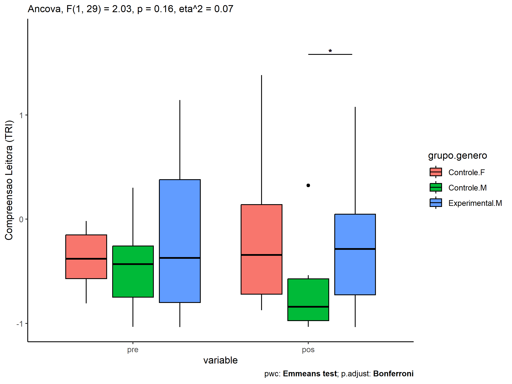<!-- -->

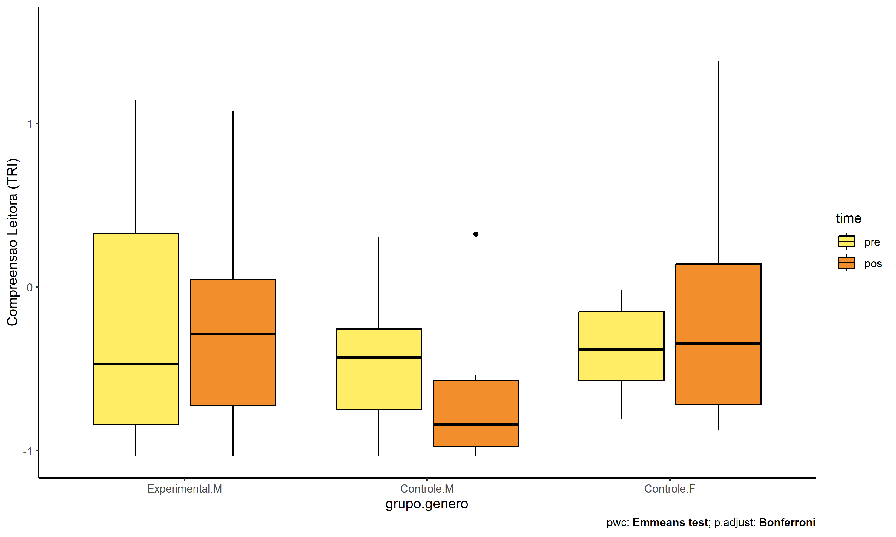<!-- -->

## factores: **idade:grupo**

### Quant. Palavras Lidas

### Compreensao Leitora (Acertos)

### Compreensao Leitora (TRI)

## factores: **zona.participante:grupo**

### Quant. Palavras Lidas

| var                | zona.participante | grupo        |   n | M (pre) | SE (pre) | M (unadj) | SE (unadj) | M (adj) | SE (adj) |
|:-------------------|:------------------|:-------------|----:|--------:|---------:|----------:|-----------:|--------:|---------:|
| palavras.lidas.pos | Rural             | Experimental |   6 | 169.833 |   50.182 |    86.667 |     16.225 |  83.587 |   32.256 |
| palavras.lidas.pos | Urbana            | Controle     |  11 |  84.818 |   17.483 |   100.273 |     28.451 | 102.456 |   23.721 |
| palavras.lidas.pos | Urbana            | Experimental |   6 | 135.000 |   20.987 |   104.333 |     17.619 | 103.410 |   30.627 |

|     | grupo        | zona.participante | group1   | group2       | estimate | conf.low | conf.high |     se | statistic |     p | p.adj | p.adj.signif |
|:----|:-------------|:------------------|:---------|:-------------|---------:|---------:|----------:|-------:|----------:|------:|------:|:-------------|
| 2   | Experimental |                   | Urbana   | Rural        |   19.823 |  -71.673 |   111.319 | 43.715 |     0.453 | 0.655 | 0.655 | ns           |
| 4   | Experimental |                   | Urbana   | Rural        |  -34.833 | -129.042 |    59.375 | 45.163 |    -0.771 | 0.450 | 0.450 | ns           |
| 5   |              | Urbana            | Controle | Experimental |   -0.954 |  -83.318 |    81.411 | 39.352 |    -0.024 | 0.981 | 0.981 | ns           |
| 7   |              | Urbana            | Controle | Experimental |  -50.182 | -132.996 |    32.632 | 39.701 |    -1.264 | 0.221 | 0.221 | ns           |

| grupo        | zona.participante | group1 | group2 | estimate | conf.low | conf.high |     se | statistic |     p | p.adj | p.adj.signif |
|:-------------|:------------------|:-------|:-------|---------:|---------:|----------:|-------:|----------:|------:|------:|:-------------|
| Controle     | Urbana            | pre    | pos    |  -15.455 |  -80.382 |    49.473 | 32.195 |    -0.480 | 0.634 | 0.634 | ns           |
| Experimental | Urbana            | pre    | pos    |   13.542 |  -68.693 |    95.776 | 40.777 |     0.332 | 0.741 | 0.741 | ns           |
| Experimental | Rural             | pre    | pos    |   68.905 |  -15.810 |   153.619 | 42.007 |     1.640 | 0.108 | 0.108 | ns           |

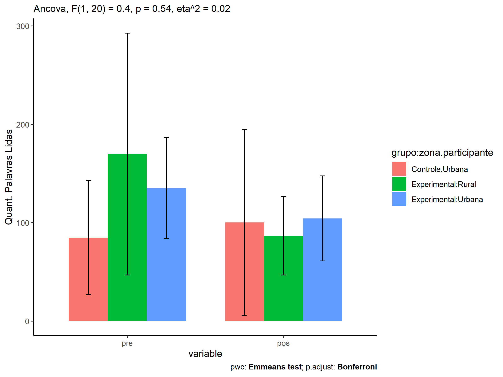<!-- -->

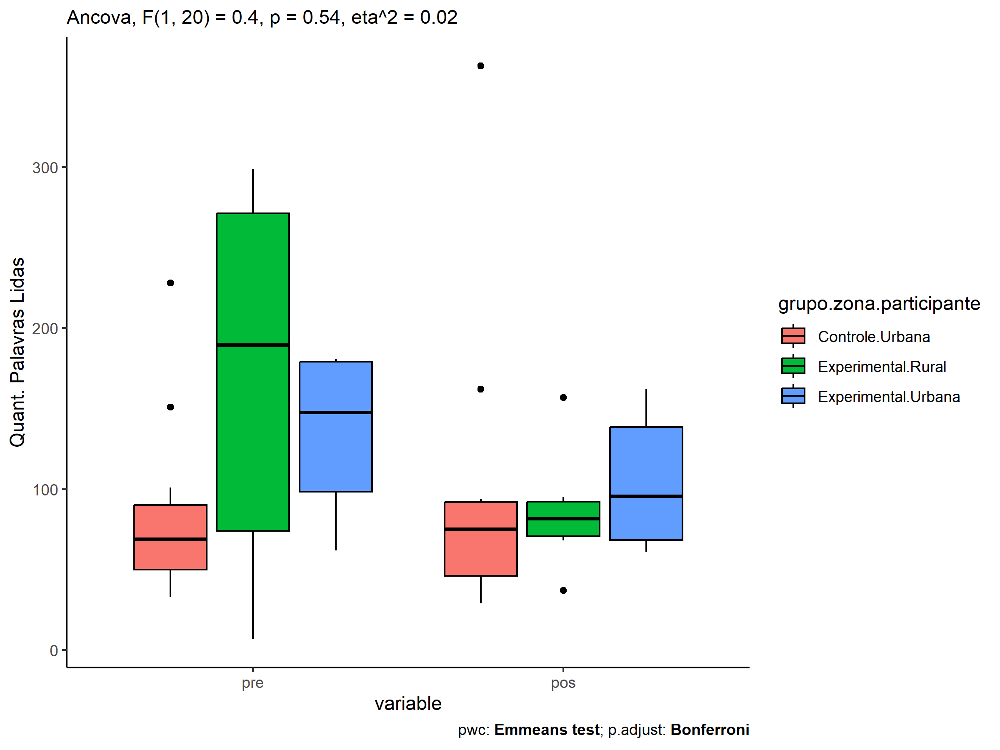<!-- -->

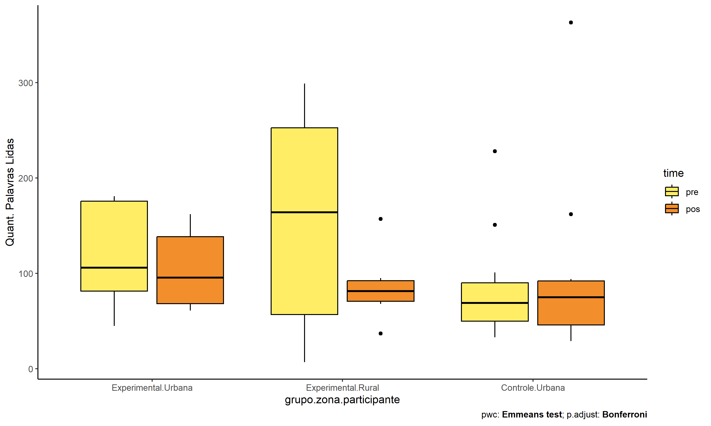<!-- -->

### Compreensao Leitora (Acertos)

| var                   | zona.participante | grupo        |   n | M (pre) | SE (pre) | M (unadj) | SE (unadj) | M (adj) | SE (adj) |
|:----------------------|:------------------|:-------------|----:|--------:|---------:|----------:|-----------:|--------:|---------:|
| score.compreensao.pos | Rural             | Experimental |   6 |   6.000 |    0.894 |     5.000 |      0.856 |   3.575 |    0.849 |
| score.compreensao.pos | Urbana            | Controle     |  11 |   3.455 |    0.434 |     3.818 |      0.724 |   4.168 |    0.550 |
| score.compreensao.pos | Urbana            | Experimental |   6 |   2.833 |    0.946 |     4.000 |      0.730 |   4.783 |    0.768 |

|     | grupo        | zona.participante | group1   | group2       | estimate | conf.low | conf.high |    se | statistic |     p | p.adj | p.adj.signif |
|:----|:-------------|:------------------|:---------|:-------------|---------:|---------:|----------:|------:|----------:|------:|------:|:-------------|
| 2   | Experimental |                   | Urbana   | Rural        |    1.209 |   -1.368 |     3.785 | 1.231 |     0.982 | 0.339 | 0.339 | ns           |
| 4   | Experimental |                   | Urbana   | Rural        |   -3.167 |   -5.445 |    -0.889 | 1.092 |    -2.900 | 0.009 | 0.009 | \*\*         |
| 5   |              | Urbana            | Controle | Experimental |   -0.615 |   -2.536 |     1.305 | 0.918 |    -0.670 | 0.511 | 0.511 | ns           |
| 7   |              | Urbana            | Controle | Experimental |    0.621 |   -1.381 |     2.624 | 0.960 |     0.647 | 0.525 | 0.525 | ns           |

| grupo        | zona.participante | group1 | group2 | estimate | conf.low | conf.high |    se | statistic |     p | p.adj | p.adj.signif |
|:-------------|:------------------|:-------|:-------|---------:|---------:|----------:|------:|----------:|------:|------:|:-------------|
| Controle     | Urbana            | pre    | pos    |   -0.364 |   -2.087 |     1.360 | 0.854 |    -0.426 | 0.673 | 0.673 | ns           |
| Experimental | Urbana            | pre    | pos    |   -1.125 |   -3.307 |     1.057 | 1.082 |    -1.040 | 0.304 | 0.304 | ns           |
| Experimental | Rural             | pre    | pos    |    0.714 |   -1.534 |     2.963 | 1.115 |     0.641 | 0.525 | 0.525 | ns           |

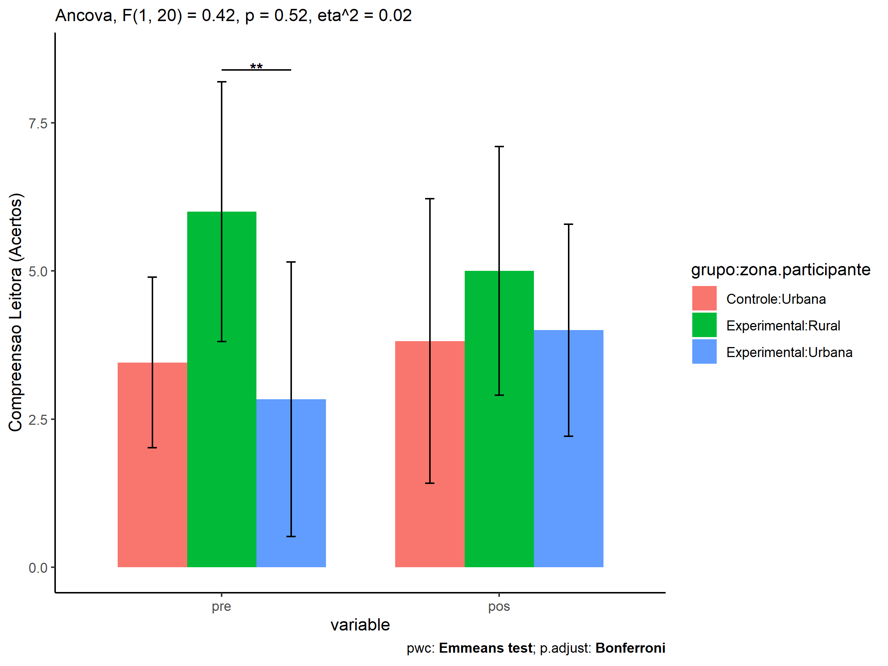<!-- -->

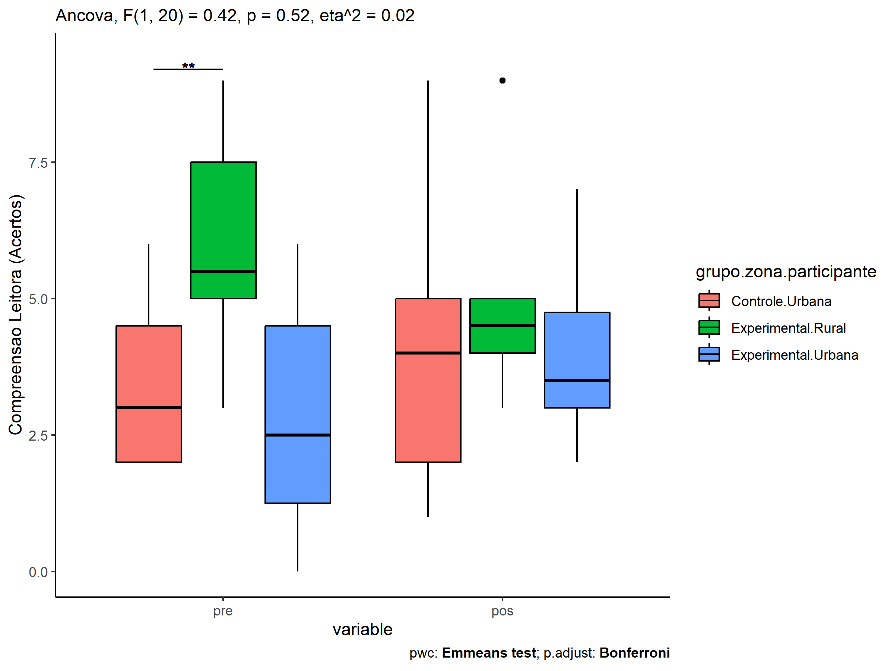<!-- -->

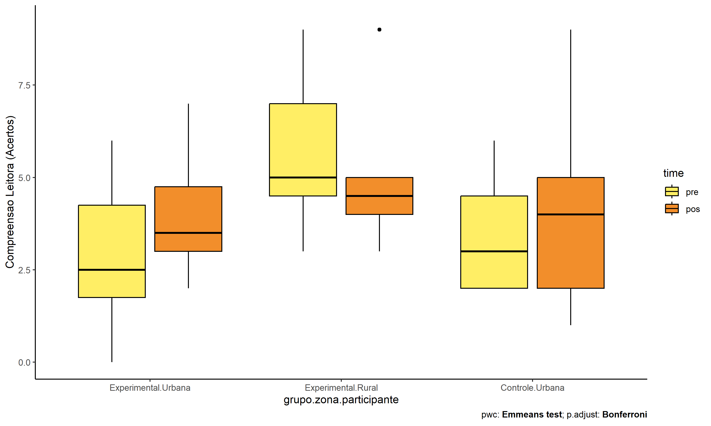<!-- -->

### Compreensao Leitora (TRI)

| var                 | zona.participante | grupo        |   n | M (pre) | SE (pre) | M (unadj) | SE (unadj) | M (adj) | SE (adj) |
|:--------------------|:------------------|:-------------|----:|--------:|---------:|----------:|-----------:|--------:|---------:|
| tri.compreensao.pos | Rural             | Experimental |   6 |   0.413 |    0.251 |    -0.037 |      0.276 |  -0.593 |    0.263 |
| tri.compreensao.pos | Urbana            | Controle     |  11 |  -0.366 |    0.109 |    -0.308 |      0.222 |  -0.168 |    0.165 |
| tri.compreensao.pos | Urbana            | Experimental |   6 |  -0.543 |    0.241 |    -0.367 |      0.232 |  -0.068 |    0.231 |

|     | grupo        | zona.participante | group1   | group2       | estimate | conf.low | conf.high |    se | statistic |     p | p.adj | p.adj.signif |
|:----|:-------------|:------------------|:---------|:-------------|---------:|---------:|----------:|------:|----------:|------:|------:|:-------------|
| 2   | Experimental |                   | Urbana   | Rural        |    0.524 |   -0.276 |     1.325 | 0.383 |     1.371 | 0.186 | 0.186 | ns           |
| 4   | Experimental |                   | Urbana   | Rural        |   -0.956 |   -1.554 |    -0.357 | 0.287 |    -3.331 | 0.003 | 0.003 | \*\*         |
| 5   |              | Urbana            | Controle | Experimental |   -0.099 |   -0.671 |     0.472 | 0.273 |    -0.364 | 0.720 | 0.720 | ns           |
| 7   |              | Urbana            | Controle | Experimental |    0.177 |   -0.349 |     0.703 | 0.252 |     0.701 | 0.491 | 0.491 | ns           |

| grupo        | zona.participante | group1 | group2 | estimate | conf.low | conf.high |    se | statistic |     p | p.adj | p.adj.signif |
|:-------------|:------------------|:-------|:-------|---------:|---------:|----------:|------:|----------:|------:|------:|:-------------|
| Controle     | Urbana            | pre    | pos    |   -0.058 |   -0.570 |     0.455 | 0.254 |    -0.227 | 0.822 | 0.822 | ns           |
| Experimental | Urbana            | pre    | pos    |   -0.147 |   -0.796 |     0.502 | 0.322 |    -0.455 | 0.651 | 0.651 | ns           |
| Experimental | Rural             | pre    | pos    |    0.307 |   -0.361 |     0.976 | 0.332 |     0.927 | 0.359 | 0.359 | ns           |

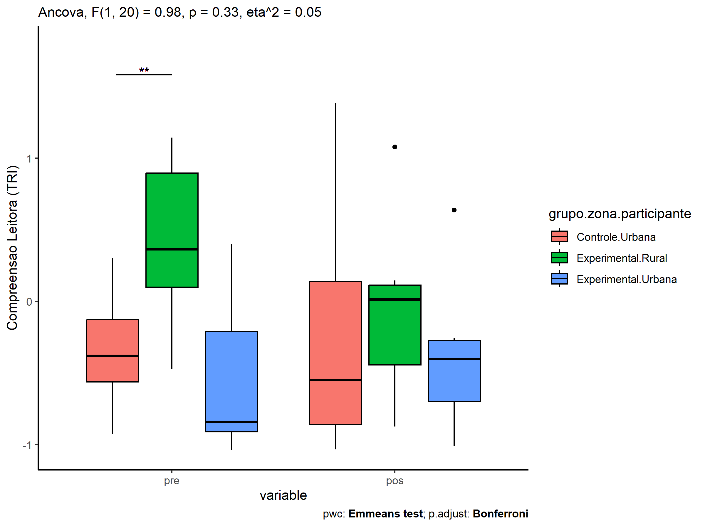<!-- -->

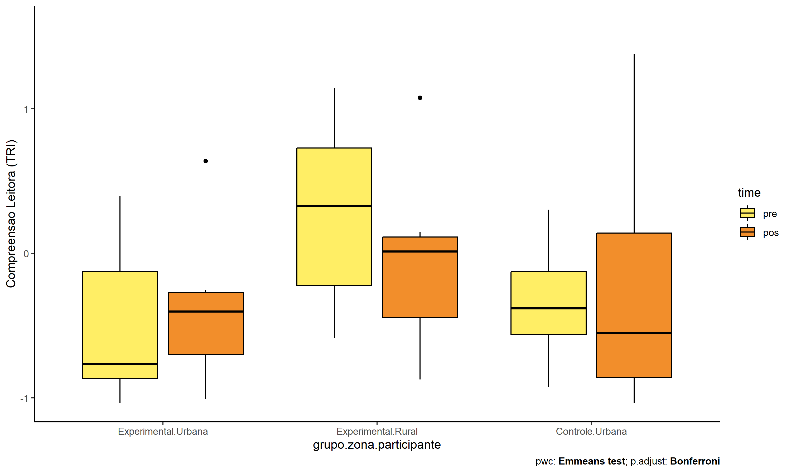<!-- -->

## factores: **escola:grupo**

### Quant. Palavras Lidas

| var                | escola | grupo        |   n | M (pre) | SE (pre) | M (unadj) | SE (unadj) | M (adj) | SE (adj) |
|:-------------------|:-------|:-------------|----:|--------:|---------:|----------:|-----------:|--------:|---------:|
| palavras.lidas.pos | E1     | Controle     |   7 |  75.714 |   15.187 |    76.571 |     17.114 |  80.576 |   27.146 |
| palavras.lidas.pos | E4     | Experimental |   6 | 213.333 |   28.482 |    94.000 |     14.224 |  80.977 |   40.124 |
| palavras.lidas.pos | E5     | Controle     |   6 |  52.333 |    7.885 |   132.333 |     48.718 | 139.230 |   31.673 |
| palavras.lidas.pos | E5     | Experimental |   7 |  98.000 |   24.175 |   105.857 |     13.761 | 107.104 |   25.785 |

|     | grupo        | escola | group1   | group2       | estimate | conf.low | conf.high |     se | statistic | p       | p.adj   | p.adj.signif |
|:----|:-------------|:-------|:---------|:-------------|---------:|---------:|----------:|-------:|----------:|:--------|:--------|:-------------|
| 2   | Controle     |        | E1       | E5           |  -58.655 | -138.265 |    20.956 | 38.281 |    -1.532 | 0.14    | 0.14    | ns           |
| 6   | Experimental |        | E4       | E5           |  -26.127 | -128.775 |    76.521 | 49.359 |    -0.529 | 0.602   | 0.602   | ns           |
| 8   | Controle     |        | E1       | E5           |   23.381 |  -37.093 |    83.855 | 29.160 |     0.802 | 0.431   | 0.431   | ns           |
| 12  | Experimental |        | E4       | E5           |  115.333 |   54.860 |   175.807 | 29.160 |     3.955 | \<0.001 | \<0.001 | \*\*\*       |
| 15  |              | E5     | Controle | Experimental |   32.126 |  -50.604 |   114.857 | 39.782 |     0.808 | 0.428   | 0.428   | ns           |
| 18  |              | E5     | Controle | Experimental |  -45.667 | -106.140 |    14.807 | 29.160 |    -1.566 | 0.132   | 0.132   | ns           |

| grupo        | escola | group1 | group2 | estimate | conf.low | conf.high |     se | statistic | p       | p.adj   | p.adj.signif |
|:-------------|:-------|:-------|:-------|---------:|---------:|----------:|-------:|----------:|:--------|:--------|:-------------|
| Controle     | E1     | pre    | pos    |   -0.857 |  -63.760 |    62.046 | 31.268 |    -0.027 | 0.978   | 0.978   | ns           |
| Controle     | E5     | pre    | pos    |  -80.000 | -147.943 |   -12.057 | 33.773 |    -2.369 | 0.022   | 0.022   | \*           |
| Experimental | E4     | pre    | pos    |  119.333 |   51.390 |   187.276 | 33.773 |     3.533 | \<0.001 | \<0.001 | \*\*\*       |
| Experimental | E5     | pre    | pos    |  -16.957 |  -74.951 |    41.037 | 28.828 |    -0.588 | 0.559   | 0.559   | ns           |

    ## Scale for colour is already present.
    ## Adding another scale for colour, which will replace the existing scale.

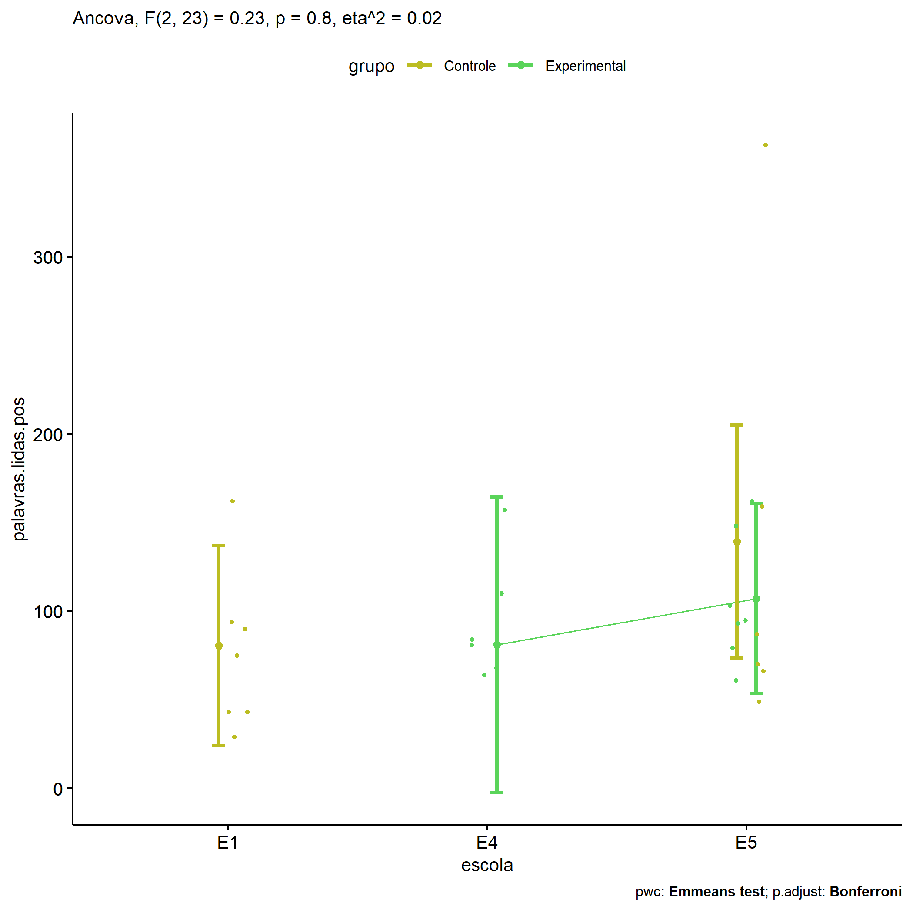<!-- -->

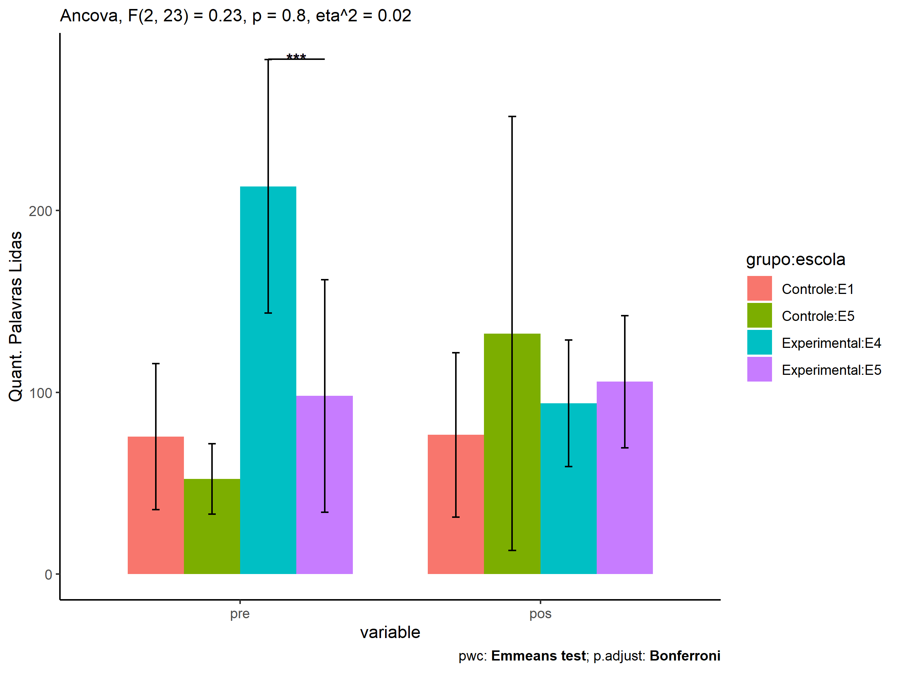<!-- -->

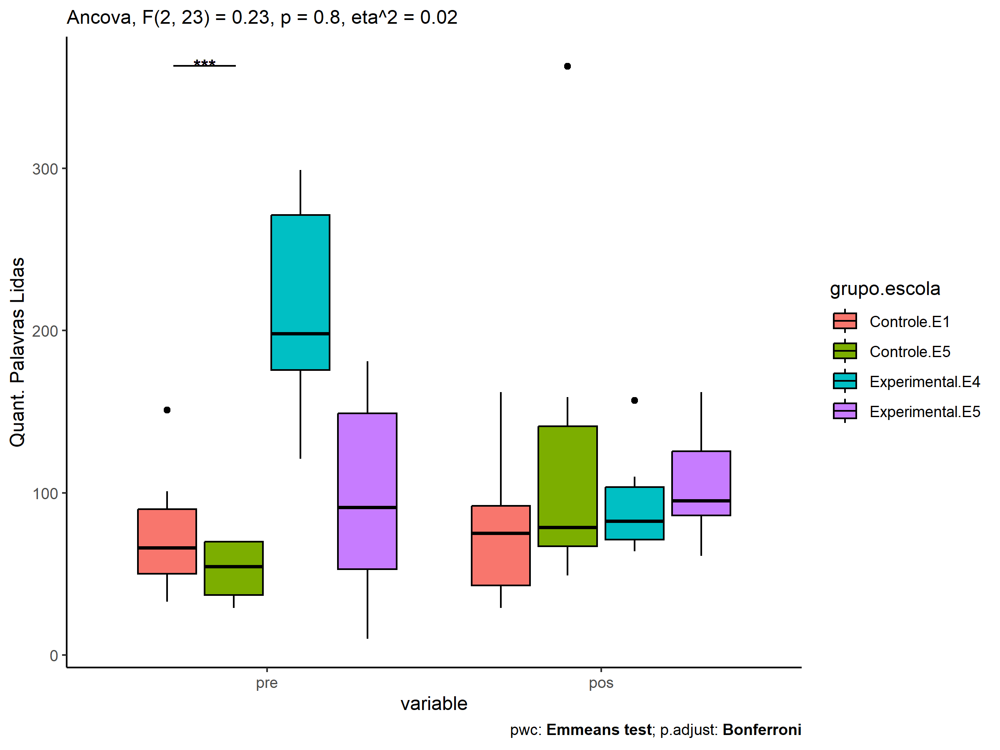<!-- -->

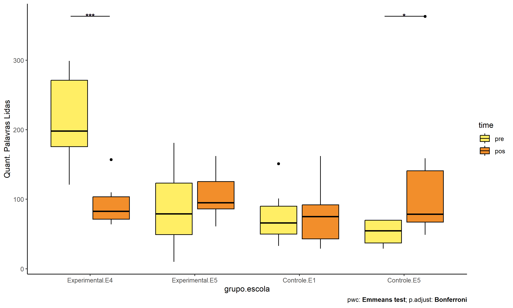<!-- -->

### Compreensao Leitora (Acertos)

| var                   | escola | grupo        |   n | M (pre) | SE (pre) | M (unadj) | SE (unadj) | M (adj) | SE (adj) |
|:----------------------|:-------|:-------------|----:|--------:|---------:|----------:|-----------:|--------:|---------:|
| score.compreensao.pos | E1     | Controle     |   7 |   3.857 |    0.595 |     4.429 |      1.020 |   4.422 |    0.764 |
| score.compreensao.pos | E4     | Experimental |   6 |   5.667 |    1.282 |     4.833 |      1.078 |   3.807 |    0.921 |
| score.compreensao.pos | E5     | Controle     |   6 |   2.667 |    0.333 |     2.333 |      0.667 |   2.998 |    0.867 |
| score.compreensao.pos | E5     | Experimental |   7 |   3.286 |    0.565 |     3.571 |      0.685 |   3.887 |    0.775 |

|     | grupo        | escola | group1   | group2       | estimate | conf.low | conf.high |    se | statistic |     p | p.adj | p.adj.signif |
|:----|:-------------|:-------|:---------|:-------------|---------:|---------:|----------:|------:|----------:|------:|------:|:-------------|
| 2   | Controle     |        | E1       | E5           |    1.424 |   -0.981 |     3.829 | 1.157 |     1.232 | 0.232 | 0.232 | ns           |
| 6   | Experimental |        | E4       | E5           |   -0.080 |   -2.671 |     2.511 | 1.246 |    -0.064 | 0.950 | 0.950 | ns           |
| 8   | Controle     |        | E1       | E5           |    1.190 |   -1.023 |     3.404 | 1.067 |     1.116 | 0.277 | 0.277 | ns           |
| 12  | Experimental |        | E4       | E5           |    2.381 |    0.168 |     4.594 | 1.067 |     2.231 | 0.036 | 0.036 | \*           |
| 15  |              | E5     | Controle | Experimental |   -0.889 |   -3.247 |     1.468 | 1.134 |    -0.784 | 0.442 | 0.442 | ns           |
| 18  |              | E5     | Controle | Experimental |   -0.619 |   -2.832 |     1.594 | 1.067 |    -0.580 | 0.568 | 0.568 | ns           |

| grupo        | escola | group1 | group2 | estimate | conf.low | conf.high |    se | statistic |     p | p.adj | p.adj.signif |
|:-------------|:-------|:-------|:-------|---------:|---------:|----------:|------:|----------:|------:|------:|:-------------|
| Controle     | E1     | pre    | pos    |   -0.571 |   -2.763 |     1.620 | 1.089 |    -0.525 | 0.602 | 0.602 | ns           |
| Controle     | E5     | pre    | pos    |    0.333 |   -2.034 |     2.700 | 1.177 |     0.283 | 0.778 | 0.778 | ns           |
| Experimental | E4     | pre    | pos    |    0.833 |   -1.534 |     3.200 | 1.177 |     0.708 | 0.482 | 0.482 | ns           |
| Experimental | E5     | pre    | pos    |   -0.271 |   -2.292 |     1.749 | 1.004 |    -0.270 | 0.788 | 0.788 | ns           |

    ## Scale for colour is already present.
    ## Adding another scale for colour, which will replace the existing scale.

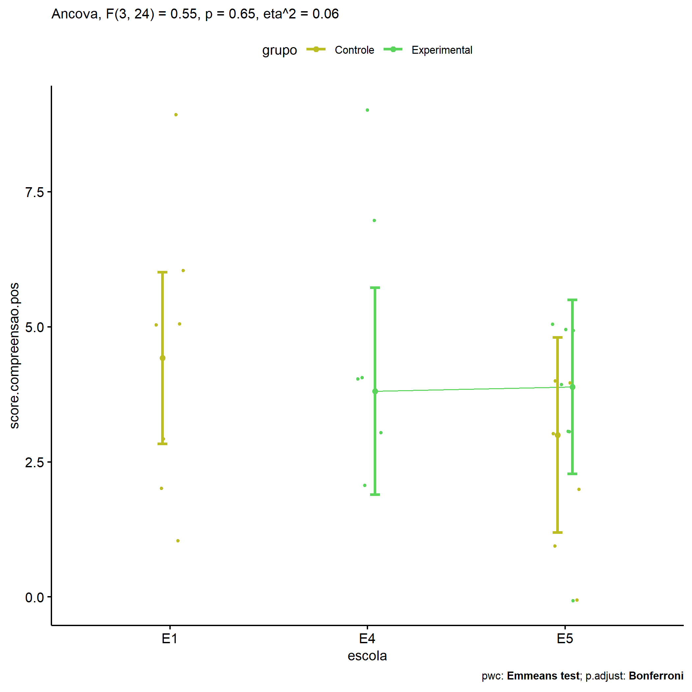<!-- -->

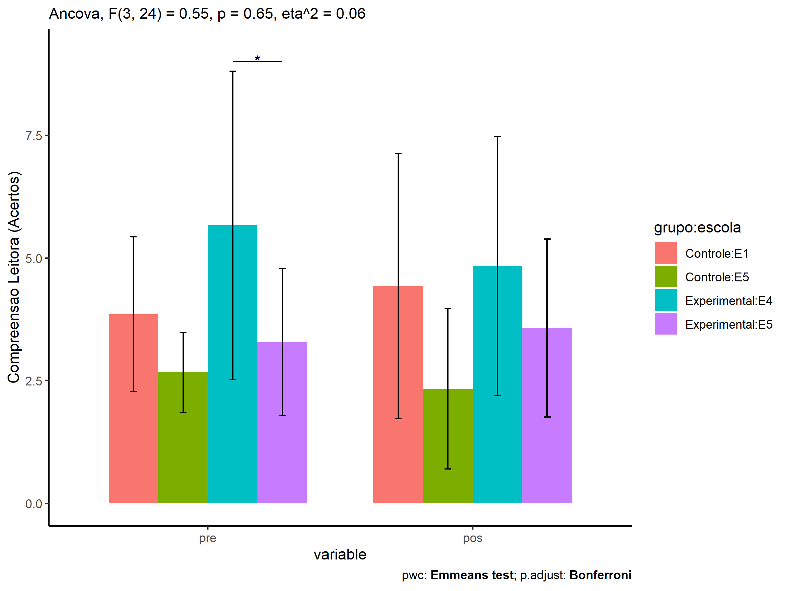<!-- -->

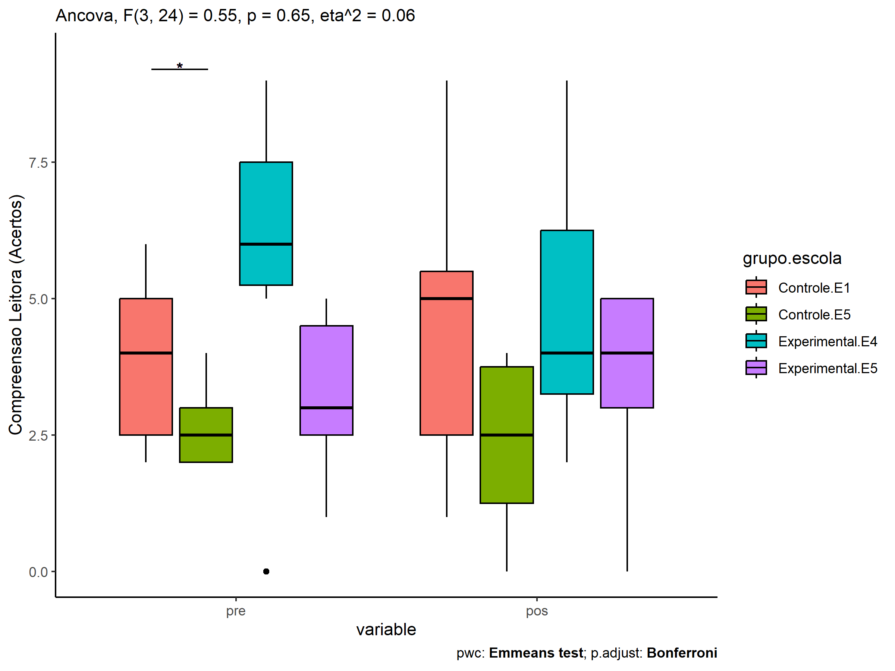<!-- -->

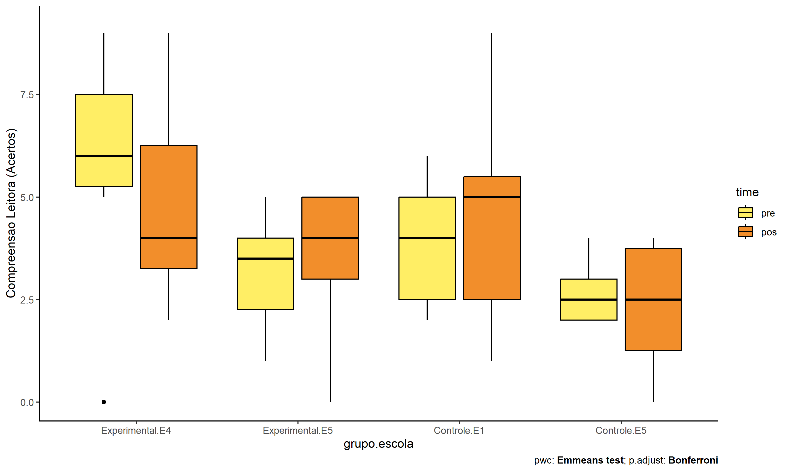<!-- -->

### Compreensao Leitora (TRI)

| var                 | escola | grupo        |   n | M (pre) | SE (pre) | M (unadj) | SE (unadj) | M (adj) | SE (adj) |
|:--------------------|:-------|:-------------|----:|--------:|---------:|----------:|-----------:|--------:|---------:|
| tri.compreensao.pos | E1     | Controle     |   7 |  -0.211 |    0.121 |    -0.054 |      0.309 |  -0.081 |    0.204 |
| tri.compreensao.pos | E4     | Experimental |   6 |   0.315 |    0.325 |     0.018 |      0.293 |  -0.330 |    0.255 |
| tri.compreensao.pos | E5     | Controle     |   6 |  -0.687 |    0.118 |    -0.776 |      0.107 |  -0.510 |    0.241 |
| tri.compreensao.pos | E5     | Experimental |   7 |  -0.411 |    0.189 |    -0.495 |      0.178 |  -0.398 |    0.207 |

|     | grupo        | escola | group1   | group2       | estimate | conf.low | conf.high |    se | statistic |     p | p.adj | p.adj.signif |
|:----|:-------------|:-------|:---------|:-------------|---------:|---------:|----------:|------:|----------:|------:|------:|:-------------|
| 2   | Controle     |        | E1       | E5           |    0.430 |   -0.234 |     1.093 | 0.319 |     1.347 | 0.192 | 0.192 | ns           |
| 6   | Experimental |        | E4       | E5           |    0.068 |   -0.644 |     0.779 | 0.342 |     0.198 | 0.845 | 0.845 | ns           |
| 8   | Controle     |        | E1       | E5           |    0.476 |   -0.112 |     1.064 | 0.283 |     1.680 | 0.107 | 0.107 | ns           |
| 12  | Experimental |        | E4       | E5           |    0.726 |    0.139 |     1.314 | 0.283 |     2.563 | 0.018 | 0.018 | \*           |
| 15  |              | E5     | Controle | Experimental |   -0.112 |   -0.750 |     0.525 | 0.307 |    -0.367 | 0.718 | 0.718 | ns           |
| 18  |              | E5     | Controle | Experimental |   -0.276 |   -0.863 |     0.312 | 0.283 |    -0.972 | 0.341 | 0.341 | ns           |

| grupo        | escola | group1 | group2 | estimate | conf.low | conf.high |    se | statistic |     p | p.adj | p.adj.signif |
|:-------------|:-------|:-------|:-------|---------:|---------:|----------:|------:|----------:|------:|------:|:-------------|
| Controle     | E1     | pre    | pos    |   -0.156 |   -0.746 |     0.433 | 0.293 |    -0.534 | 0.596 | 0.596 | ns           |
| Controle     | E5     | pre    | pos    |    0.089 |   -0.548 |     0.726 | 0.317 |     0.281 | 0.780 | 0.780 | ns           |
| Experimental | E4     | pre    | pos    |    0.297 |   -0.340 |     0.934 | 0.317 |     0.937 | 0.354 | 0.354 | ns           |
| Experimental | E5     | pre    | pos    |    0.063 |   -0.481 |     0.606 | 0.270 |     0.232 | 0.818 | 0.818 | ns           |

    ## Scale for colour is already present.
    ## Adding another scale for colour, which will replace the existing scale.

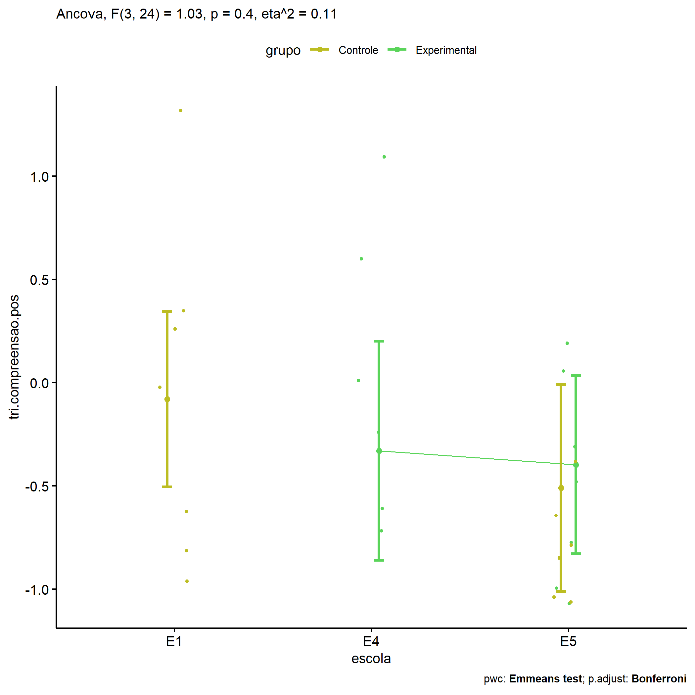<!-- -->

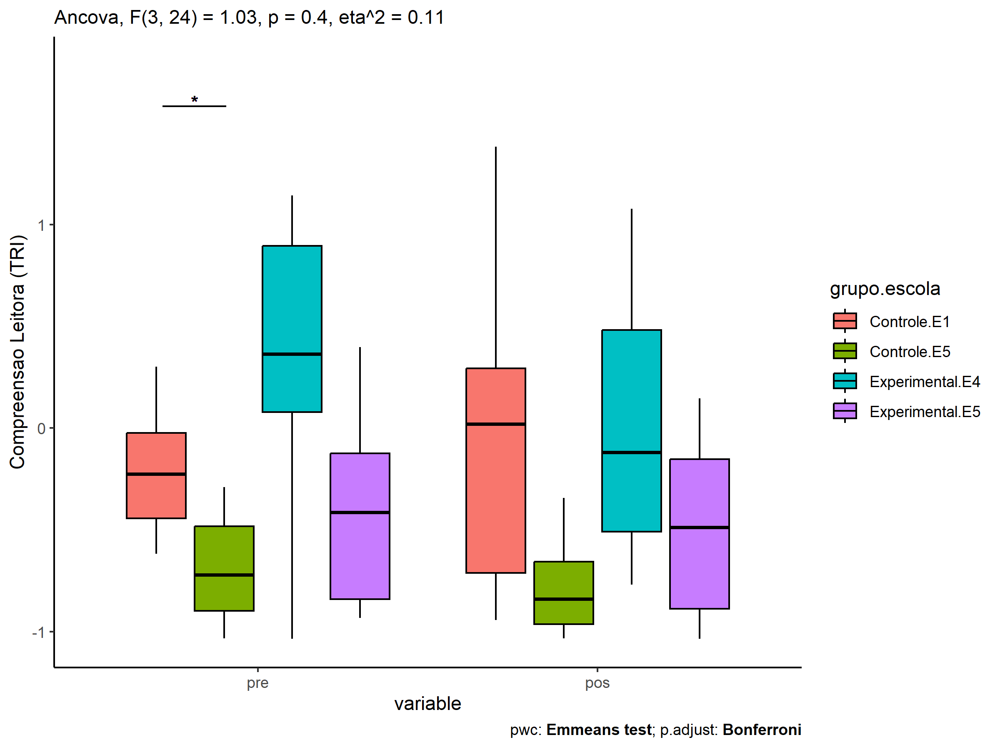<!-- -->

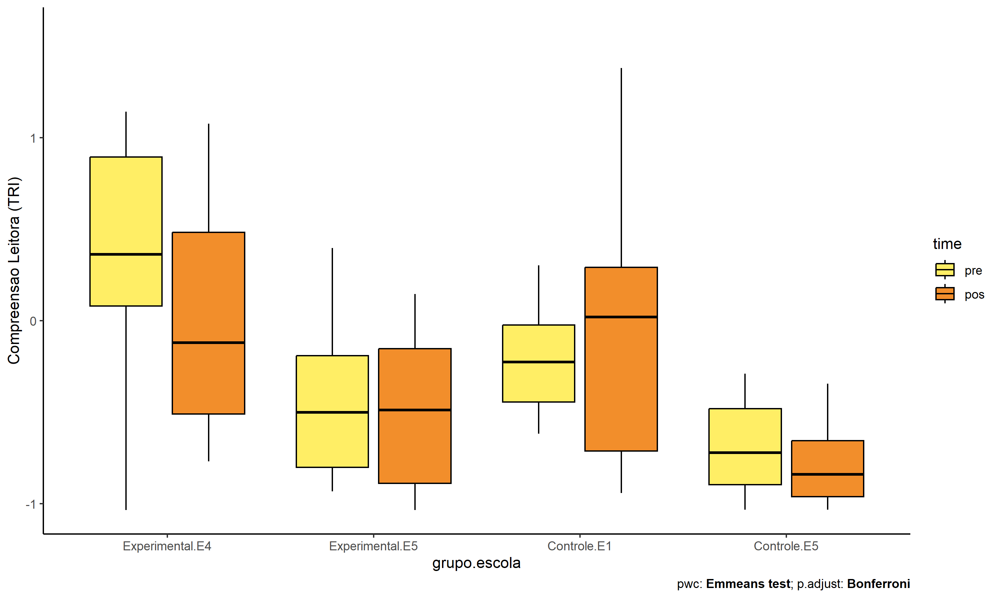<!-- -->

## factores: **zona.escola:grupo**

### Quant. Palavras Lidas

| var                | zona.escola | grupo        |   n | M (pre) | SE (pre) | M (unadj) | SE (unadj) | M (adj) | SE (adj) |
|:-------------------|:------------|:-------------|----:|--------:|---------:|----------:|-----------:|--------:|---------:|
| palavras.lidas.pos | Rural       | Experimental |   8 | 171.625 |   34.494 |    88.500 |     11.023 |  79.450 |   27.469 |
| palavras.lidas.pos | Urbana      | Controle     |  13 |  64.923 |    9.240 |   102.308 |     24.488 | 106.805 |   19.753 |
| palavras.lidas.pos | Urbana      | Experimental |   8 |  86.625 |   23.827 |    97.250 |     14.700 |  98.992 |   23.680 |

|     | grupo        | zona.escola | group1   | group2       | estimate | conf.low | conf.high |     se | statistic |     p | p.adj | p.adj.signif |
|:----|:-------------|:------------|:---------|:-------------|---------:|---------:|----------:|-------:|----------:|------:|------:|:-------------|
| 2   | Experimental |             | Urbana   | Rural        |   19.542 |  -57.319 |    96.403 | 37.319 |     0.524 | 0.605 | 0.605 | ns           |
| 4   | Experimental |             | Urbana   | Rural        |  -85.000 | -152.378 |   -17.622 | 32.779 |    -2.593 | 0.015 | 0.015 | \*           |
| 5   |              | Urbana      | Controle | Experimental |    7.813 |  -54.397 |    70.024 | 30.206 |     0.259 | 0.798 | 0.798 | ns           |
| 7   |              | Urbana      | Controle | Experimental |  -21.702 |  -82.255 |    38.852 | 29.459 |    -0.737 | 0.468 | 0.468 | ns           |

| grupo        | zona.escola | group1 | group2 | estimate | conf.low | conf.high |     se | statistic |     p | p.adj | p.adj.signif |
|:-------------|:------------|:-------|:-------|---------:|---------:|----------:|-------:|----------:|------:|------:|:-------------|
| Controle     | Urbana      | pre    | pos    |  -37.974 |  -90.391 |    14.443 | 26.195 |    -1.450 | 0.152 | 0.152 | ns           |
| Experimental | Urbana      | pre    | pos    |    0.212 |  -61.947 |    62.370 | 31.064 |     0.007 | 0.995 | 0.995 | ns           |
| Experimental | Rural       | pre    | pos    |   83.125 |   13.961 |   152.289 | 34.565 |     2.405 | 0.019 | 0.019 | \*           |

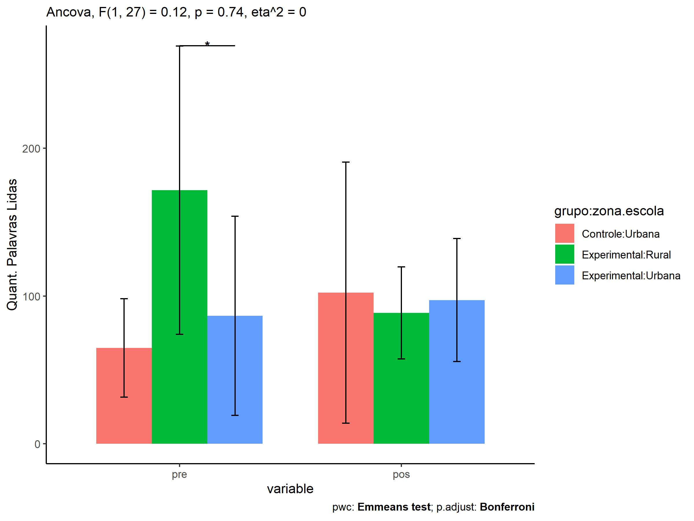<!-- -->

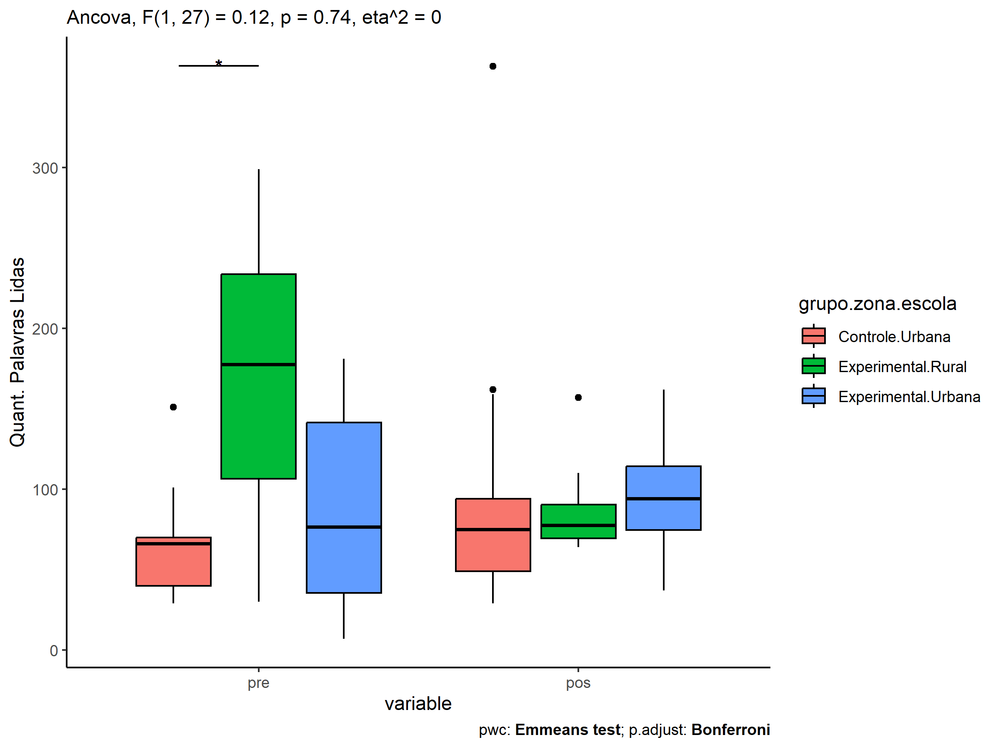<!-- -->

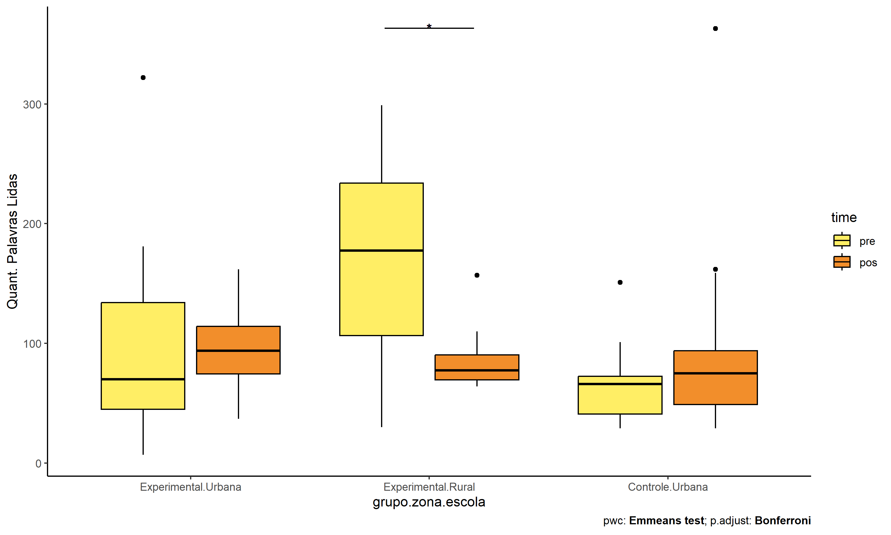<!-- -->

### Compreensao Leitora (Acertos)

| var                   | zona.escola | grupo        |   n | M (pre) | SE (pre) | M (unadj) | SE (unadj) | M (adj) | SE (adj) |
|:----------------------|:------------|:-------------|----:|--------:|---------:|----------:|-----------:|--------:|---------:|
| score.compreensao.pos | Rural       | Experimental |   8 |   5.000 |    1.035 |     4.875 |      0.789 |   4.104 |    0.721 |
| score.compreensao.pos | Urbana      | Controle     |  15 |   3.133 |    0.350 |     3.267 |      0.597 |   3.558 |    0.501 |
| score.compreensao.pos | Urbana      | Experimental |   8 |   3.250 |    0.491 |     3.500 |      0.598 |   3.725 |    0.677 |

|     | grupo        | zona.escola | group1   | group2       | estimate | conf.low | conf.high |    se | statistic |     p | p.adj | p.adj.signif |
|:----|:-------------|:------------|:---------|:-------------|---------:|---------:|----------:|------:|----------:|------:|------:|:-------------|
| 2   | Experimental |             | Urbana   | Rural        |   -0.379 |   -2.447 |     1.689 | 1.008 |    -0.376 | 0.710 | 0.710 | ns           |
| 4   | Experimental |             | Urbana   | Rural        |   -1.750 |   -3.678 |     0.178 | 0.941 |    -1.859 | 0.074 | 0.074 | ns           |
| 5   |              | Urbana      | Controle | Experimental |   -0.167 |   -1.876 |     1.542 | 0.833 |    -0.200 | 0.843 | 0.843 | ns           |
| 7   |              | Urbana      | Controle | Experimental |   -0.117 |   -1.805 |     1.572 | 0.824 |    -0.142 | 0.888 | 0.888 | ns           |

| grupo        | zona.escola | group1 | group2 | estimate | conf.low | conf.high |    se | statistic |     p | p.adj | p.adj.signif |
|:-------------|:------------|:-------|:-------|---------:|---------:|----------:|------:|----------:|------:|------:|:-------------|
| Controle     | Urbana      | pre    | pos    |   -0.133 |   -1.583 |     1.316 | 0.725 |    -0.184 | 0.855 | 0.855 | ns           |
| Experimental | Urbana      | pre    | pos    |   -0.577 |   -2.361 |     1.207 | 0.892 |    -0.647 | 0.520 | 0.520 | ns           |
| Experimental | Rural       | pre    | pos    |    0.125 |   -1.860 |     2.110 | 0.993 |     0.126 | 0.900 | 0.900 | ns           |

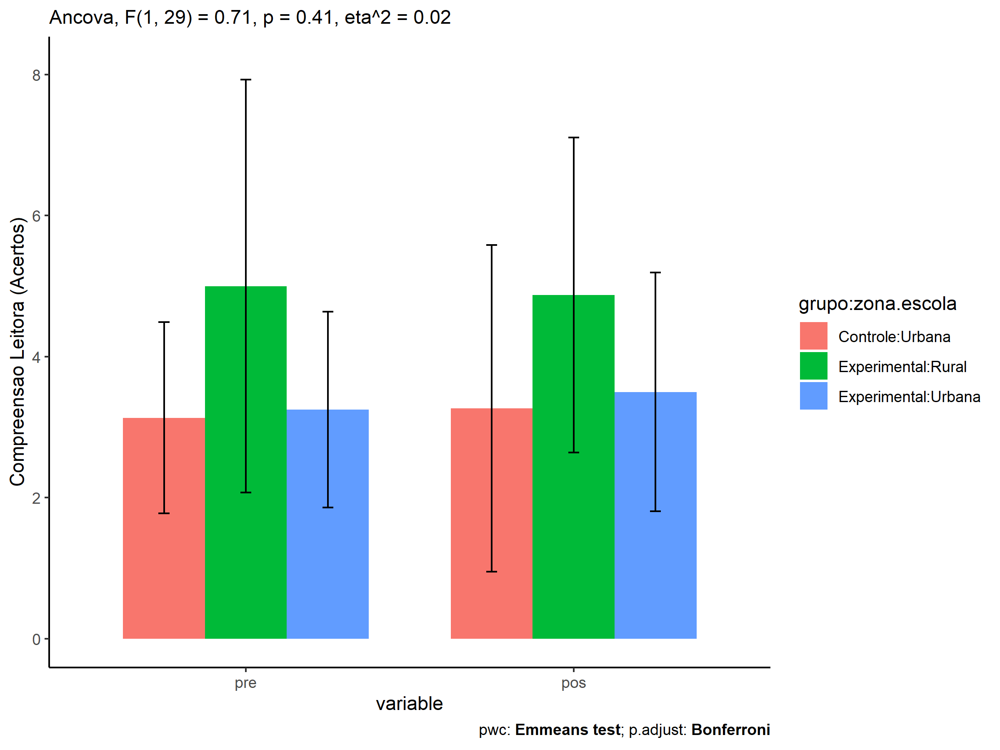<!-- -->

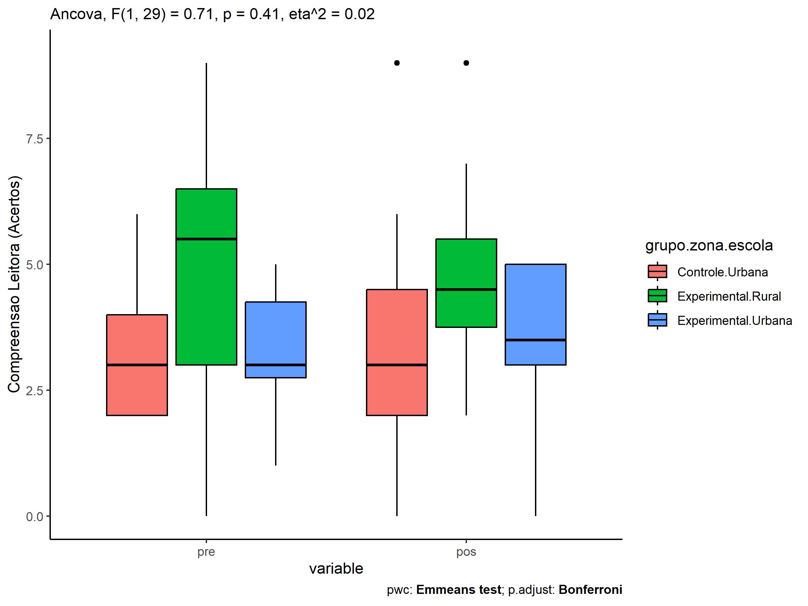<!-- -->

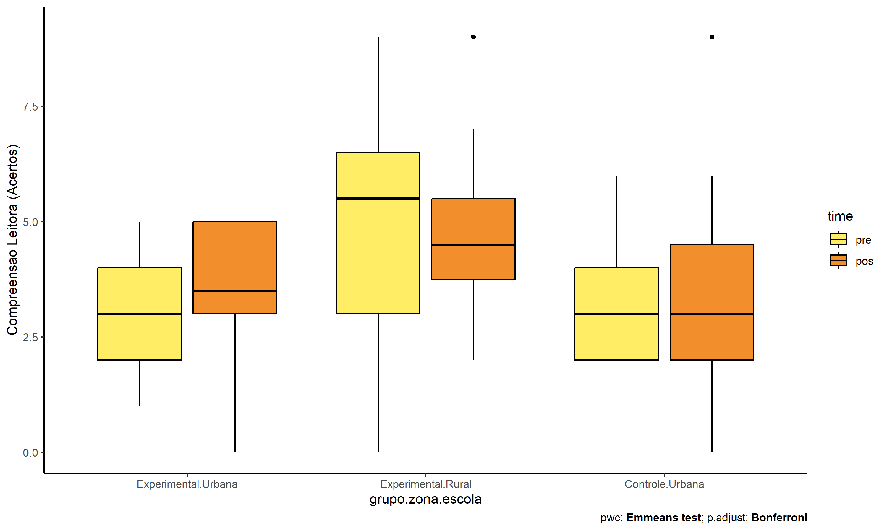<!-- -->

### Compreensao Leitora (TRI)

| var                 | zona.escola | grupo        |   n | M (pre) | SE (pre) | M (unadj) | SE (unadj) | M (adj) | SE (adj) |
|:--------------------|:------------|:-------------|----:|--------:|---------:|----------:|-----------:|--------:|---------:|
| tri.compreensao.pos | Rural       | Experimental |   8 |   0.089 |    0.281 |     0.009 |      0.215 |  -0.244 |    0.199 |
| tri.compreensao.pos | Urbana      | Controle     |  15 |  -0.473 |    0.097 |    -0.451 |      0.175 |  -0.351 |    0.138 |
| tri.compreensao.pos | Urbana      | Experimental |   8 |  -0.419 |    0.164 |    -0.542 |      0.161 |  -0.476 |    0.186 |

|     | grupo        | zona.escola | group1   | group2       | estimate | conf.low | conf.high |    se | statistic |     p | p.adj | p.adj.signif |
|:----|:-------------|:------------|:---------|:-------------|---------:|---------:|----------:|------:|----------:|------:|------:|:-------------|
| 2   | Experimental |             | Urbana   | Rural        |   -0.232 |   -0.801 |     0.337 | 0.277 |    -0.836 | 0.411 | 0.411 | ns           |
| 4   | Experimental |             | Urbana   | Rural        |   -0.508 |   -1.052 |     0.036 | 0.266 |    -1.913 | 0.066 | 0.066 | ns           |
| 5   |              | Urbana      | Controle | Experimental |    0.125 |   -0.344 |     0.595 | 0.229 |     0.548 | 0.588 | 0.588 | ns           |
| 7   |              | Urbana      | Controle | Experimental |   -0.054 |   -0.530 |     0.422 | 0.233 |    -0.232 | 0.818 | 0.818 | ns           |

| grupo        | zona.escola | group1 | group2 | estimate | conf.low | conf.high |    se | statistic |     p | p.adj | p.adj.signif |
|:-------------|:------------|:-------|:-------|---------:|---------:|----------:|------:|----------:|------:|------:|:-------------|
| Controle     | Urbana      | pre    | pos    |   -0.023 |   -0.429 |     0.384 | 0.203 |    -0.111 | 0.912 | 0.912 | ns           |
| Experimental | Urbana      | pre    | pos    |    0.097 |   -0.404 |     0.597 | 0.250 |     0.386 | 0.701 | 0.701 | ns           |
| Experimental | Rural       | pre    | pos    |    0.080 |   -0.477 |     0.636 | 0.278 |     0.286 | 0.776 | 0.776 | ns           |

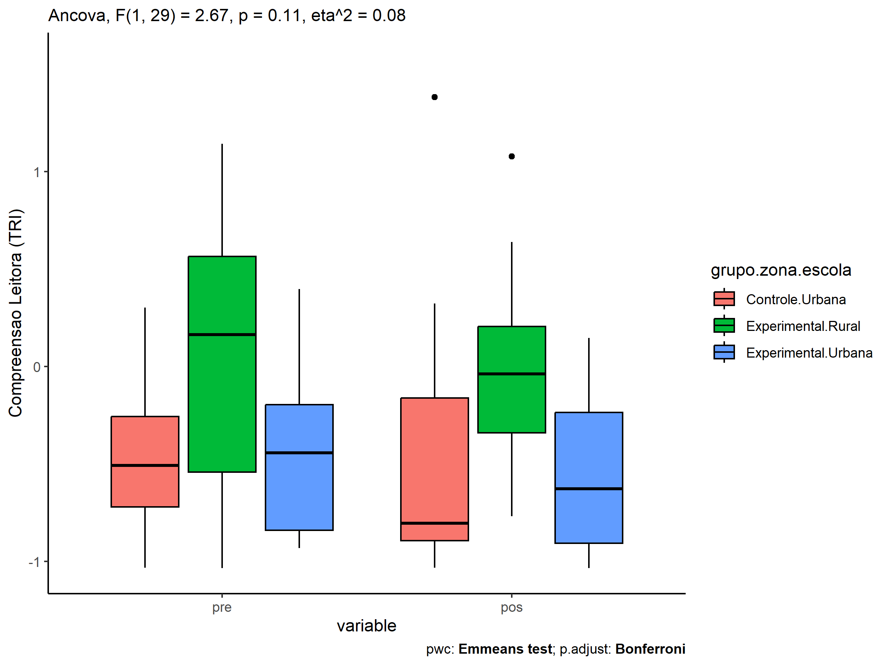<!-- -->

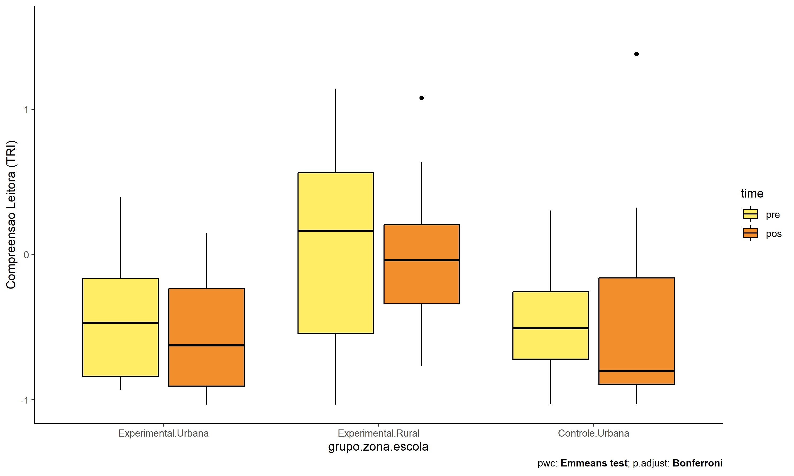<!-- -->

# Pairwise comparisons for grupo=“Experimental”

## factores: **grupo=“Experimental”:monitor**

### Quant. Palavras Lidas

### Compreensao Leitora (Acertos)

### Compreensao Leitora (TRI)

## factores: **grupo=“Experimental”:monitor.genero**

### Quant. Palavras Lidas

### Compreensao Leitora (Acertos)

### Compreensao Leitora (TRI)

## factores: **grupo=“Experimental”:monitor.area**

### Quant. Palavras Lidas

### Compreensao Leitora (Acertos)

### Compreensao Leitora (TRI)

## factores: **grupo=“Experimental”:monitor.formacao**

### Quant. Palavras Lidas

### Compreensao Leitora (Acertos)

### Compreensao Leitora (TRI)

## factores: **grupo=“Experimental”:monitor.experiencia**

### Quant. Palavras Lidas

### Compreensao Leitora (Acertos)

### Compreensao Leitora (TRI)
