ANCOVA in Triagem Test - Reading of Words per Minutes and Reading
Comprehension (Teste Triagem - Leitura de Palavras por Minuto e
Compreensao Leitora)
================
Geiser C. Challco <geiser@alumni.usp.br>

- [Descriptive Statistics of Initial
  Data](#descriptive-statistics-of-initial-data)
  - [Quant. Palavras Lidas](#quant-palavras-lidas)
  - [Compreensao Leitora (Acertos)](#compreensao-leitora-acertos)
- [Checking of Assumptions](#checking-of-assumptions)
  - [Assumption: Normality
    distribution](#assumption-normality-distribution)
    - [Quant. Palavras Lidas](#quant-palavras-lidas-1)
    - [Compreensao Leitora (Acertos)](#compreensao-leitora-acertos-1)
  - [Assumption: Homogeneity](#assumption-homogeneity)
    - [Quant. Palavras Lidas](#quant-palavras-lidas-2)
    - [Compreensao Leitora (Acertos)](#compreensao-leitora-acertos-2)
- [Computation of ANCOVA test and Pairwise
  Comparison](#computation-of-ancova-test-and-pairwise-comparison)
  - [ANCOVA tests for one factor](#ancova-tests-for-one-factor)
    - [Quant. Palavras Lidas](#quant-palavras-lidas-3)
    - [Compreensao Leitora (Acertos)](#compreensao-leitora-acertos-3)
  - [ANCOVA tests for two factors](#ancova-tests-for-two-factors)
    - [Quant. Palavras Lidas](#quant-palavras-lidas-4)
    - [Compreensao Leitora (Acertos)](#compreensao-leitora-acertos-4)
  - [ANCOVA tests for
    grupo=“Experimental”](#ancova-tests-for-grupoexperimental)
    - [Quant. Palavras Lidas](#quant-palavras-lidas-5)
    - [Compreensao Leitora (Acertos)](#compreensao-leitora-acertos-5)
- [Pairwise comparisons for one
  factor](#pairwise-comparisons-for-one-factor)
  - [factor: **grupo**](#factor-grupo)
    - [Quant. Palavras Lidas](#quant-palavras-lidas-6)
    - [Compreensao Leitora (Acertos)](#compreensao-leitora-acertos-6)
  - [factor: **genero**](#factor-genero)
    - [Quant. Palavras Lidas](#quant-palavras-lidas-7)
    - [Compreensao Leitora (Acertos)](#compreensao-leitora-acertos-7)
  - [factor: **idade**](#factor-idade)
    - [Quant. Palavras Lidas](#quant-palavras-lidas-8)
    - [Compreensao Leitora (Acertos)](#compreensao-leitora-acertos-8)
  - [factor: **zona.participante**](#factor-zonaparticipante)
    - [Quant. Palavras Lidas](#quant-palavras-lidas-9)
    - [Compreensao Leitora (Acertos)](#compreensao-leitora-acertos-9)
  - [factor: **escola**](#factor-escola)
    - [Quant. Palavras Lidas](#quant-palavras-lidas-10)
    - [Compreensao Leitora (Acertos)](#compreensao-leitora-acertos-10)
  - [factor: **zona.escola**](#factor-zonaescola)
    - [Quant. Palavras Lidas](#quant-palavras-lidas-11)
    - [Compreensao Leitora (Acertos)](#compreensao-leitora-acertos-11)
- [Pairwise comparisons for two
  factors](#pairwise-comparisons-for-two-factors)
  - [factores: **genero:grupo**](#factores-generogrupo)
    - [Quant. Palavras Lidas](#quant-palavras-lidas-12)
    - [Compreensao Leitora (Acertos)](#compreensao-leitora-acertos-12)
  - [factores: **idade:grupo**](#factores-idadegrupo)
    - [Quant. Palavras Lidas](#quant-palavras-lidas-13)
    - [Compreensao Leitora (Acertos)](#compreensao-leitora-acertos-13)
  - [factores:
    **zona.participante:grupo**](#factores-zonaparticipantegrupo)
    - [Quant. Palavras Lidas](#quant-palavras-lidas-14)
    - [Compreensao Leitora (Acertos)](#compreensao-leitora-acertos-14)
  - [factores: **escola:grupo**](#factores-escolagrupo)
    - [Quant. Palavras Lidas](#quant-palavras-lidas-15)
    - [Compreensao Leitora (Acertos)](#compreensao-leitora-acertos-15)
  - [factores: **zona.escola:grupo**](#factores-zonaescolagrupo)
    - [Quant. Palavras Lidas](#quant-palavras-lidas-16)
    - [Compreensao Leitora (Acertos)](#compreensao-leitora-acertos-16)
- [Pairwise comparisons for
  grupo=“Experimental”](#pairwise-comparisons-for-grupoexperimental)
  - [factores:
    **grupo=“Experimental”:monitor**](#factores-grupoexperimentalmonitor)
    - [Quant. Palavras Lidas](#quant-palavras-lidas-17)
    - [Compreensao Leitora (Acertos)](#compreensao-leitora-acertos-17)
  - [factores:
    **grupo=“Experimental”:monitor.genero**](#factores-grupoexperimentalmonitorgenero)
    - [Quant. Palavras Lidas](#quant-palavras-lidas-18)
    - [Compreensao Leitora (Acertos)](#compreensao-leitora-acertos-18)
  - [factores:
    **grupo=“Experimental”:monitor.area**](#factores-grupoexperimentalmonitorarea)
    - [Quant. Palavras Lidas](#quant-palavras-lidas-19)
    - [Compreensao Leitora (Acertos)](#compreensao-leitora-acertos-19)
  - [factores:
    **grupo=“Experimental”:monitor.formacao**](#factores-grupoexperimentalmonitorformacao)
    - [Quant. Palavras Lidas](#quant-palavras-lidas-20)
    - [Compreensao Leitora (Acertos)](#compreensao-leitora-acertos-20)
  - [factores:
    **grupo=“Experimental”:monitor.experiencia**](#factores-grupoexperimentalmonitorexperiencia)
    - [Quant. Palavras Lidas](#quant-palavras-lidas-21)
    - [Compreensao Leitora (Acertos)](#compreensao-leitora-acertos-21)

**NOTE**

- Teste ANCOVA para determinar se houve diferenças significativas no
  Teste Triagem - Leitura de Palavras por Minuto e Compreensao Leitora
  (medido usando pre- e pos-testes).
- ANCOVA test to determine whether there were significant differences in
  Triagem Test - Reading of Words per Minutes and Reading Comprehension
  (measured using pre- and post-tests).

# Descriptive Statistics of Initial Data

## Quant. Palavras Lidas

| grupo        | genero | idade | zona.participante | escola | zona.escola | variable           |   n |    mean | median | min | max |      sd |     se |      ci |    iqr |
|:-------------|:-------|:------|:------------------|:-------|:------------|:-------------------|----:|--------:|-------:|----:|----:|--------:|-------:|--------:|-------:|
| Controle     | F      |       |                   |        |             | palavras.lidas.pos |  73 | 115.973 |  100.0 |  13 | 262 |  47.235 |  5.528 |  11.021 |  55.00 |
| Controle     | M      |       |                   |        |             | palavras.lidas.pos |  64 | 113.875 |  104.5 |   8 | 430 |  72.372 |  9.047 |  18.078 |  71.00 |
| Experimental | F      |       |                   |        |             | palavras.lidas.pos |  52 | 159.808 |  144.5 |  57 | 430 |  75.367 | 10.451 |  20.982 |  90.25 |
| Experimental | M      |       |                   |        |             | palavras.lidas.pos |  68 | 116.971 |  101.5 |  33 | 419 |  57.316 |  6.951 |  13.873 |  64.50 |
| Controle     | F      |       |                   |        |             | palavras.lidas.pre |  73 | 123.466 |   94.0 |  20 | 319 |  82.731 |  9.683 |  19.303 | 119.00 |
| Controle     | M      |       |                   |        |             | palavras.lidas.pre |  64 | 121.531 |  100.0 |   1 | 398 |  79.468 |  9.934 |  19.851 | 100.00 |
| Experimental | F      |       |                   |        |             | palavras.lidas.pre |  52 | 137.827 |  117.5 |  13 | 373 |  87.264 | 12.101 |  24.294 |  98.00 |
| Experimental | M      |       |                   |        |             | palavras.lidas.pre |  68 | 119.338 |   86.0 |   7 | 338 |  85.244 | 10.337 |  20.633 |  98.75 |
| Controle     |        | 10y   |                   |        |             | palavras.lidas.pos |  26 | 108.808 |   94.5 |  43 | 252 |  45.768 |  8.976 |  18.486 |  34.50 |
| Controle     |        | 11y   |                   |        |             | palavras.lidas.pos |  79 | 120.418 |  108.0 |  13 | 430 |  65.306 |  7.347 |  14.628 |  70.50 |
| Controle     |        | 12y   |                   |        |             | palavras.lidas.pos |  17 | 106.529 |   95.0 |   8 | 228 |  52.566 | 12.749 |  27.027 |  57.00 |
| Controle     |        | 13y   |                   |        |             | palavras.lidas.pos |   9 |  98.889 |   87.0 |  18 | 223 |  74.104 | 24.701 |  56.961 |  79.00 |
| Controle     |        | 14y   |                   |        |             | palavras.lidas.pos |   1 | 141.000 |  141.0 | 141 | 141 |         |        |         |   0.00 |
| Controle     |        | 15y   |                   |        |             | palavras.lidas.pos |   1 |  29.000 |   29.0 |  29 |  29 |         |        |         |   0.00 |
| Controle     |        |       |                   |        |             | palavras.lidas.pos |   4 | 135.250 |  128.0 | 123 | 162 |  18.446 |  9.223 |  29.351 |  17.25 |
| Experimental |        | 10y   |                   |        |             | palavras.lidas.pos |  23 | 138.522 |  132.0 |  39 | 335 |  74.223 | 15.477 |  32.097 |  81.00 |
| Experimental |        | 11y   |                   |        |             | palavras.lidas.pos |  73 | 137.233 |  129.0 |  33 | 430 |  70.856 |  8.293 |  16.532 |  68.00 |
| Experimental |        | 12y   |                   |        |             | palavras.lidas.pos |  15 | 132.400 |  100.0 |  57 | 293 |  70.022 | 18.080 |  38.777 |  62.50 |
| Experimental |        | 13y   |                   |        |             | palavras.lidas.pos |   6 | 113.500 |   94.5 |  81 | 176 |  37.195 | 15.185 |  39.034 |  37.00 |
| Experimental |        |       |                   |        |             | palavras.lidas.pos |   3 | 131.000 |  146.0 |  94 | 153 |  32.234 | 18.610 |  80.073 |  29.50 |
| Controle     |        | 10y   |                   |        |             | palavras.lidas.pre |  26 | 123.808 |  100.5 |   2 | 317 |  87.709 | 17.201 |  35.426 | 117.25 |
| Controle     |        | 11y   |                   |        |             | palavras.lidas.pre |  79 | 124.203 |  101.0 |   1 | 398 |  82.074 |  9.234 |  18.384 | 107.00 |
| Controle     |        | 12y   |                   |        |             | palavras.lidas.pre |  17 | 132.529 |   94.0 |  33 | 300 |  75.491 | 18.309 |  38.814 | 101.00 |
| Controle     |        | 13y   |                   |        |             | palavras.lidas.pre |   9 |  96.333 |   98.0 |   5 | 231 |  77.970 | 25.990 |  59.933 |  91.00 |
| Controle     |        | 14y   |                   |        |             | palavras.lidas.pre |   1 | 208.000 |  208.0 | 208 | 208 |         |        |         |   0.00 |
| Controle     |        | 15y   |                   |        |             | palavras.lidas.pre |   1 | 151.000 |  151.0 | 151 | 151 |         |        |         |   0.00 |
| Controle     |        |       |                   |        |             | palavras.lidas.pre |   4 |  70.250 |   58.5 |  33 | 131 |  44.866 | 22.433 |  71.391 |  52.25 |
| Experimental |        | 10y   |                   |        |             | palavras.lidas.pre |  23 |  97.652 |   80.0 |  13 | 290 |  67.653 | 14.107 |  29.255 |  63.00 |
| Experimental |        | 11y   |                   |        |             | palavras.lidas.pre |  73 | 147.233 |  126.0 |   7 | 373 |  91.176 | 10.671 |  21.273 |  98.00 |
| Experimental |        | 12y   |                   |        |             | palavras.lidas.pre |  15 | 101.800 |   70.0 |  30 | 297 |  79.605 | 20.554 |  44.084 |  90.50 |
| Experimental |        | 13y   |                   |        |             | palavras.lidas.pre |   6 |  87.167 |   88.5 |  10 | 174 |  59.105 | 24.129 |  62.027 |  69.75 |
| Experimental |        |       |                   |        |             | palavras.lidas.pre |   3 |  79.333 |   55.0 |  50 | 133 |  46.544 | 26.872 | 115.621 |  41.50 |
| Controle     |        |       | Urbana            |        |             | palavras.lidas.pos |  61 | 112.098 |   94.0 |   8 | 430 |  72.869 |  9.330 |  18.662 |  63.00 |
| Controle     |        |       | Rural             |        |             | palavras.lidas.pos |  47 | 116.553 |  112.0 |  18 | 228 |  48.159 |  7.025 |  14.140 |  53.00 |
| Controle     |        |       |                   |        |             | palavras.lidas.pos |  29 | 118.552 |  119.0 |  33 | 223 |  47.996 |  8.913 |  18.257 |  64.00 |
| Experimental |        |       | Urbana            |        |             | palavras.lidas.pos |  42 | 153.262 |  141.0 |  39 | 430 |  79.022 | 12.193 |  24.625 |  95.00 |
| Experimental |        |       | Rural             |        |             | palavras.lidas.pos |  49 | 114.898 |  105.0 |  33 | 270 |  47.905 |  6.844 |  13.760 |  64.00 |
| Experimental |        |       |                   |        |             | palavras.lidas.pos |  29 | 144.724 |  123.0 |  57 | 419 |  75.869 | 14.088 |  28.859 |  84.00 |
| Controle     |        |       | Urbana            |        |             | palavras.lidas.pre |  61 | 132.492 |  107.0 |   2 | 398 |  88.066 | 11.276 |  22.555 | 123.00 |
| Controle     |        |       | Rural             |        |             | palavras.lidas.pre |  47 | 124.404 |  102.0 |  29 | 319 |  79.055 | 11.531 |  23.211 | 105.50 |
| Controle     |        |       |                   |        |             | palavras.lidas.pre |  29 |  98.690 |   85.0 |   1 | 256 |  64.159 | 11.914 |  24.405 |  99.00 |
| Experimental |        |       | Urbana            |        |             | palavras.lidas.pre |  42 | 144.500 |  129.0 |  29 | 373 |  87.496 | 13.501 |  27.266 | 106.50 |
| Experimental |        |       | Rural             |        |             | palavras.lidas.pre |  49 | 130.327 |   94.0 |   7 | 341 |  95.583 | 13.655 |  27.455 | 116.00 |
| Experimental |        |       |                   |        |             | palavras.lidas.pre |  29 |  97.483 |   91.0 |  10 | 262 |  58.011 | 10.772 |  22.066 |  70.00 |
| Controle     |        |       |                   | E1     |             | palavras.lidas.pos |  13 |  86.154 |   84.0 |  29 | 162 |  39.391 | 10.925 |  23.804 |  21.00 |
| Controle     |        |       |                   | E2     |             | palavras.lidas.pos |  13 | 153.154 |  138.0 |  13 | 430 | 105.773 | 29.336 |  63.918 | 112.00 |
| Controle     |        |       |                   | E3     |             | palavras.lidas.pos |  18 |  94.722 |   89.0 |   8 | 211 |  54.892 | 12.938 |  27.297 |  71.75 |
| Controle     |        |       |                   | E4     |             | palavras.lidas.pos |  20 |  98.450 |   97.5 |  49 | 141 |  26.975 |  6.032 |  12.625 |  43.00 |
| Controle     |        |       |                   | E5     |             | palavras.lidas.pos |  59 | 122.780 |  105.0 |  33 | 363 |  57.800 |  7.525 |  15.063 |  56.00 |
| Controle     |        |       |                   | E6     |             | palavras.lidas.pos |  14 | 123.214 |  128.5 |  33 | 204 |  49.569 | 13.248 |  28.620 |  66.25 |
| Experimental |        |       |                   | E1     |             | palavras.lidas.pos |   8 | 192.500 |  181.0 |  33 | 430 | 125.007 | 44.197 | 104.509 | 130.75 |
| Experimental |        |       |                   | E2     |             | palavras.lidas.pos |  11 | 167.909 |  146.0 |  37 | 335 |  81.163 | 24.472 |  54.526 |  56.50 |
| Experimental |        |       |                   | E3     |             | palavras.lidas.pos |  15 | 101.867 |   95.0 |  33 | 162 |  39.388 | 10.170 |  21.812 |  43.00 |
| Experimental |        |       |                   | E4     |             | palavras.lidas.pos |  16 |  98.125 |   88.5 |  64 | 157 |  27.185 |  6.796 |  14.486 |  30.00 |
| Experimental |        |       |                   | E5     |             | palavras.lidas.pos |  57 | 147.807 |  142.0 |  39 | 419 |  65.569 |  8.685 |  17.398 |  88.00 |
| Experimental |        |       |                   | E6     |             | palavras.lidas.pos |  13 | 104.154 |   94.0 |  57 | 178 |  37.378 | 10.367 |  22.588 |  49.00 |
| Controle     |        |       |                   | E1     |             | palavras.lidas.pre |  13 |  85.385 |   79.0 |  33 | 151 |  34.384 |  9.536 |  20.778 |  46.00 |
| Controle     |        |       |                   | E2     |             | palavras.lidas.pre |  13 |  87.692 |   79.0 |  20 | 189 |  52.385 | 14.529 |  31.656 |  81.00 |
| Controle     |        |       |                   | E3     |             | palavras.lidas.pre |  18 | 113.500 |   89.0 |  32 | 319 |  74.730 | 17.614 |  37.163 |  61.00 |
| Controle     |        |       |                   | E4     |             | palavras.lidas.pre |  20 | 247.650 |  229.5 | 175 | 398 |  61.262 | 13.699 |  28.672 | 101.75 |
| Controle     |        |       |                   | E5     |             | palavras.lidas.pre |  59 | 103.525 |   85.0 |   1 | 293 |  65.482 |  8.525 |  17.065 |  83.50 |
| Controle     |        |       |                   | E6     |             | palavras.lidas.pre |  14 | 102.643 |  114.5 |   5 | 205 |  64.207 | 17.160 |  37.072 | 103.50 |
| Experimental |        |       |                   | E1     |             | palavras.lidas.pre |   8 | 123.625 |  114.5 |  27 | 262 |  72.281 | 25.555 |  60.428 |  75.75 |
| Experimental |        |       |                   | E2     |             | palavras.lidas.pre |  11 |  80.909 |   85.0 |   7 | 132 |  30.566 |  9.216 |  20.535 |  24.50 |
| Experimental |        |       |                   | E3     |             | palavras.lidas.pre |  15 |  84.800 |   70.0 |  33 | 201 |  47.116 | 12.165 |  26.092 |  56.00 |
| Experimental |        |       |                   | E4     |             | palavras.lidas.pre |  16 | 257.312 |  287.5 | 121 | 341 |  68.033 | 17.008 |  36.252 | 113.00 |
| Experimental |        |       |                   | E5     |             | palavras.lidas.pre |  57 | 120.263 |   91.0 |  10 | 373 |  78.821 | 10.440 |  20.914 |  75.00 |
| Experimental |        |       |                   | E6     |             | palavras.lidas.pre |  13 |  89.154 |   67.0 |  13 | 206 |  63.175 | 17.522 |  38.177 |  82.00 |
| Controle     |        |       |                   |        | Urbana      | palavras.lidas.pos |  85 | 121.824 |  102.0 |  13 | 430 |  66.904 |  7.257 |  14.431 |  61.00 |
| Controle     |        |       |                   |        | Rural       | palavras.lidas.pos |  52 | 103.827 |  102.5 |   8 | 211 |  45.228 |  6.272 |  12.592 |  63.75 |
| Experimental |        |       |                   |        | Urbana      | palavras.lidas.pos |  76 | 155.421 |  144.0 |  33 | 430 |  75.898 |  8.706 |  17.343 |  93.25 |
| Experimental |        |       |                   |        | Rural       | palavras.lidas.pos |  44 | 101.182 |   94.0 |  33 | 178 |  34.046 |  5.133 |  10.351 |  43.75 |
| Controle     |        |       |                   |        | Urbana      | palavras.lidas.pre |  85 |  98.329 |   81.0 |   1 | 293 |  59.867 |  6.493 |  12.913 |  74.00 |
| Controle     |        |       |                   |        | Rural       | palavras.lidas.pre |  52 | 162.173 |  168.5 |   5 | 398 |  94.788 | 13.145 |  26.389 | 135.25 |
| Experimental |        |       |                   |        | Urbana      | palavras.lidas.pre |  76 | 114.921 |   91.0 |   7 | 373 |  73.827 |  8.469 |  16.870 |  71.00 |
| Experimental |        |       |                   |        | Rural       | palavras.lidas.pre |  44 | 148.818 |  122.0 |  13 | 341 | 101.671 | 15.327 |  30.911 | 142.00 |

## Compreensao Leitora (Acertos)

| grupo        | genero | idade | zona.participante | escola | zona.escola | variable              |   n |  mean | median | min | max |    sd |    se |     ci |  iqr |
|:-------------|:-------|:------|:------------------|:-------|:------------|:----------------------|----:|------:|-------:|----:|----:|------:|------:|-------:|-----:|
| Controle     | F      |       |                   |        |             | score.compreensao.pos |  79 | 5.253 |    5.0 |   1 |  10 | 2.574 | 0.290 |  0.577 | 4.00 |
| Controle     | M      |       |                   |        |             | score.compreensao.pos |  74 | 4.392 |    4.0 |   0 |  10 | 2.832 | 0.329 |  0.656 | 5.00 |
| Experimental | F      |       |                   |        |             | score.compreensao.pos |  57 | 5.895 |    6.0 |   1 |  10 | 2.723 | 0.361 |  0.723 | 4.00 |
| Experimental | M      |       |                   |        |             | score.compreensao.pos |  74 | 4.419 |    4.0 |   0 |  10 | 2.270 | 0.264 |  0.526 | 2.75 |
| Controle     | F      |       |                   |        |             | score.compreensao.pre |  79 | 5.291 |    5.0 |   0 |  10 | 2.646 | 0.298 |  0.593 | 4.00 |
| Controle     | M      |       |                   |        |             | score.compreensao.pre |  74 | 4.892 |    4.0 |   1 |  10 | 2.408 | 0.280 |  0.558 | 3.00 |
| Experimental | F      |       |                   |        |             | score.compreensao.pre |  57 | 6.263 |    6.0 |   1 |  10 | 2.649 | 0.351 |  0.703 | 3.00 |
| Experimental | M      |       |                   |        |             | score.compreensao.pre |  74 | 4.649 |    4.0 |   0 |  10 | 2.651 | 0.308 |  0.614 | 4.75 |
| Controle     |        | 10y   |                   |        |             | score.compreensao.pos |  28 | 5.071 |    4.5 |   1 |  10 | 2.595 | 0.490 |  1.006 | 4.00 |
| Controle     |        | 11y   |                   |        |             | score.compreensao.pos |  86 | 5.081 |    4.0 |   0 |  10 | 2.919 | 0.315 |  0.626 | 4.00 |
| Controle     |        | 12y   |                   |        |             | score.compreensao.pos |  21 | 4.571 |    4.0 |   1 |   9 | 2.420 | 0.528 |  1.102 | 3.00 |
| Controle     |        | 13y   |                   |        |             | score.compreensao.pos |  10 | 3.800 |    3.5 |   2 |   7 | 1.619 | 0.512 |  1.158 | 1.00 |
| Controle     |        | 14y   |                   |        |             | score.compreensao.pos |   2 | 4.500 |    4.5 |   2 |   7 | 3.536 | 2.500 | 31.766 | 2.50 |
| Controle     |        | 15y   |                   |        |             | score.compreensao.pos |   1 | 1.000 |    1.0 |   1 |   1 |       |       |        | 0.00 |
| Controle     |        |       |                   |        |             | score.compreensao.pos |   5 | 3.400 |    3.0 |   1 |   7 | 2.608 | 1.166 |  3.238 | 4.00 |
| Experimental |        | 10y   |                   |        |             | score.compreensao.pos |  26 | 5.077 |    5.0 |   1 |   9 | 2.448 | 0.480 |  0.989 | 4.00 |
| Experimental |        | 11y   |                   |        |             | score.compreensao.pos |  77 | 5.416 |    5.0 |   0 |  10 | 2.657 | 0.303 |  0.603 | 4.00 |
| Experimental |        | 12y   |                   |        |             | score.compreensao.pos |  17 | 4.706 |    5.0 |   2 |   9 | 2.443 | 0.593 |  1.256 | 4.00 |
| Experimental |        | 13y   |                   |        |             | score.compreensao.pos |   8 | 2.875 |    3.0 |   0 |   5 | 1.458 | 0.515 |  1.219 | 0.50 |
| Experimental |        |       |                   |        |             | score.compreensao.pos |   3 | 3.667 |    3.0 |   2 |   6 | 2.082 | 1.202 |  5.171 | 2.00 |
| Controle     |        | 10y   |                   |        |             | score.compreensao.pre |  28 | 5.321 |    5.0 |   1 |  10 | 2.525 | 0.477 |  0.979 | 4.25 |
| Controle     |        | 11y   |                   |        |             | score.compreensao.pre |  86 | 5.279 |    5.0 |   1 |  10 | 2.597 | 0.280 |  0.557 | 4.00 |
| Controle     |        | 12y   |                   |        |             | score.compreensao.pre |  21 | 5.048 |    5.0 |   2 |  10 | 2.179 | 0.475 |  0.992 | 3.00 |
| Controle     |        | 13y   |                   |        |             | score.compreensao.pre |  10 | 3.900 |    4.0 |   0 |   8 | 2.470 | 0.781 |  1.767 | 3.50 |
| Controle     |        | 14y   |                   |        |             | score.compreensao.pre |   2 | 4.000 |    4.0 |   2 |   6 | 2.828 | 2.000 | 25.412 | 2.00 |
| Controle     |        | 15y   |                   |        |             | score.compreensao.pre |   1 | 2.000 |    2.0 |   2 |   2 |       |       |        | 0.00 |
| Controle     |        |       |                   |        |             | score.compreensao.pre |   5 | 4.400 |    3.0 |   1 |   9 | 3.130 | 1.400 |  3.887 | 3.00 |
| Experimental |        | 10y   |                   |        |             | score.compreensao.pre |  26 | 4.962 |    5.0 |   1 |  10 | 2.919 | 0.572 |  1.179 | 5.00 |
| Experimental |        | 11y   |                   |        |             | score.compreensao.pre |  77 | 5.818 |    6.0 |   0 |  10 | 2.887 | 0.329 |  0.655 | 4.00 |
| Experimental |        | 12y   |                   |        |             | score.compreensao.pre |  17 | 4.706 |    5.0 |   1 |   8 | 2.024 | 0.491 |  1.041 | 3.00 |
| Experimental |        | 13y   |                   |        |             | score.compreensao.pre |   8 | 4.375 |    4.0 |   2 |   8 | 1.847 | 0.653 |  1.544 | 0.75 |
| Experimental |        |       |                   |        |             | score.compreensao.pre |   3 | 3.000 |    3.0 |   2 |   4 | 1.000 | 0.577 |  2.484 | 1.00 |
| Controle     |        |       | Urbana            |        |             | score.compreensao.pos |  67 | 5.194 |    5.0 |   1 |  10 | 2.693 | 0.329 |  0.657 | 4.00 |
| Controle     |        |       | Rural             |        |             | score.compreensao.pos |  51 | 4.353 |    4.0 |   1 |  10 | 2.644 | 0.370 |  0.744 | 3.00 |
| Controle     |        |       |                   |        |             | score.compreensao.pos |  35 | 4.857 |    4.0 |   0 |  10 | 2.881 | 0.487 |  0.990 | 5.50 |
| Experimental |        |       | Urbana            |        |             | score.compreensao.pos |  49 | 5.163 |    5.0 |   1 |  10 | 2.536 | 0.362 |  0.728 | 4.00 |
| Experimental |        |       | Rural             |        |             | score.compreensao.pos |  52 | 5.192 |    5.0 |   0 |  10 | 2.642 | 0.366 |  0.736 | 4.25 |
| Experimental |        |       |                   |        |             | score.compreensao.pos |  30 | 4.667 |    5.0 |   0 |  10 | 2.564 | 0.468 |  0.957 | 3.00 |
| Controle     |        |       | Urbana            |        |             | score.compreensao.pre |  67 | 5.194 |    5.0 |   1 |  10 | 2.439 | 0.298 |  0.595 | 4.00 |
| Controle     |        |       | Rural             |        |             | score.compreensao.pre |  51 | 4.608 |    4.0 |   1 |  10 | 2.359 | 0.330 |  0.663 | 3.00 |
| Controle     |        |       |                   |        |             | score.compreensao.pre |  35 | 5.629 |    6.0 |   0 |  10 | 2.881 | 0.487 |  0.990 | 4.50 |
| Experimental |        |       | Urbana            |        |             | score.compreensao.pre |  49 | 4.959 |    5.0 |   0 |  10 | 2.857 | 0.408 |  0.821 | 5.00 |
| Experimental |        |       | Rural             |        |             | score.compreensao.pre |  52 | 5.519 |    5.5 |   1 |  10 | 2.660 | 0.369 |  0.741 | 4.25 |
| Experimental |        |       |                   |        |             | score.compreensao.pre |  30 | 5.700 |    5.0 |   2 |  10 | 2.781 | 0.508 |  1.038 | 5.50 |
| Controle     |        |       |                   | E1     |             | score.compreensao.pos |  13 | 5.615 |    6.0 |   1 |  10 | 2.663 | 0.738 |  1.609 | 3.00 |
| Controle     |        |       |                   | E2     |             | score.compreensao.pos |  29 | 4.724 |    4.0 |   1 |  10 | 2.951 | 0.548 |  1.122 | 5.00 |
| Controle     |        |       |                   | E3     |             | score.compreensao.pos |  19 | 4.684 |    4.0 |   1 |  10 | 2.689 | 0.617 |  1.296 | 3.50 |
| Controle     |        |       |                   | E4     |             | score.compreensao.pos |  19 | 5.474 |    5.0 |   2 |  10 | 2.695 | 0.618 |  1.299 | 4.00 |
| Controle     |        |       |                   | E5     |             | score.compreensao.pos |  59 | 4.424 |    4.0 |   0 |  10 | 2.621 | 0.341 |  0.683 | 4.00 |
| Controle     |        |       |                   | E6     |             | score.compreensao.pos |  14 | 5.429 |    4.5 |   1 |  10 | 2.928 | 0.782 |  1.690 | 5.00 |
| Experimental |        |       |                   | E1     |             | score.compreensao.pos |   8 | 5.875 |    5.5 |   2 |  10 | 3.441 | 1.217 |  2.877 | 5.50 |
| Experimental |        |       |                   | E2     |             | score.compreensao.pos |  23 | 3.783 |    4.0 |   0 |   8 | 1.930 | 0.402 |  0.834 | 2.50 |
| Experimental |        |       |                   | E3     |             | score.compreensao.pos |  14 | 5.429 |    5.5 |   1 |  10 | 2.954 | 0.789 |  1.706 | 5.25 |
| Experimental |        |       |                   | E4     |             | score.compreensao.pos |  16 | 5.500 |    4.0 |   2 |  10 | 2.733 | 0.683 |  1.456 | 3.75 |
| Experimental |        |       |                   | E5     |             | score.compreensao.pos |  57 | 5.228 |    5.0 |   0 |  10 | 2.442 | 0.323 |  0.648 | 4.00 |
| Experimental |        |       |                   | E6     |             | score.compreensao.pos |  13 | 5.154 |    5.0 |   1 |  10 | 2.703 | 0.750 |  1.634 | 3.00 |
| Controle     |        |       |                   | E1     |             | score.compreensao.pre |  13 | 5.462 |    5.0 |   2 |  10 | 2.367 | 0.656 |  1.430 | 3.00 |
| Controle     |        |       |                   | E2     |             | score.compreensao.pre |  29 | 4.379 |    3.0 |   1 |  10 | 2.821 | 0.524 |  1.073 | 4.00 |
| Controle     |        |       |                   | E3     |             | score.compreensao.pre |  19 | 5.000 |    4.0 |   3 |  10 | 2.186 | 0.501 |  1.054 | 3.50 |
| Controle     |        |       |                   | E4     |             | score.compreensao.pre |  19 | 5.789 |    5.0 |   3 |  10 | 2.070 | 0.475 |  0.998 | 2.00 |
| Controle     |        |       |                   | E5     |             | score.compreensao.pre |  59 | 4.881 |    4.0 |   0 |  10 | 2.519 | 0.328 |  0.657 | 3.00 |
| Controle     |        |       |                   | E6     |             | score.compreensao.pre |  14 | 6.357 |    7.5 |   1 |  10 | 2.818 | 0.753 |  1.627 | 4.00 |
| Experimental |        |       |                   | E1     |             | score.compreensao.pre |   8 | 5.500 |    6.0 |   1 |  10 | 3.295 | 1.165 |  2.755 | 4.75 |
| Experimental |        |       |                   | E2     |             | score.compreensao.pre |  23 | 4.043 |    3.0 |   1 |   9 | 2.585 | 0.539 |  1.118 | 3.50 |
| Experimental |        |       |                   | E3     |             | score.compreensao.pre |  14 | 5.786 |    6.0 |   1 |  10 | 2.778 | 0.743 |  1.604 | 3.75 |
| Experimental |        |       |                   | E4     |             | score.compreensao.pre |  16 | 6.312 |    6.5 |   0 |  10 | 2.798 | 0.700 |  1.491 | 3.00 |
| Experimental |        |       |                   | E5     |             | score.compreensao.pre |  57 | 5.368 |    5.0 |   1 |  10 | 2.623 | 0.347 |  0.696 | 4.00 |
| Experimental |        |       |                   | E6     |             | score.compreensao.pre |  13 | 5.846 |    5.0 |   2 |  10 | 2.940 | 0.815 |  1.776 | 5.00 |
| Controle     |        |       |                   |        | Urbana      | score.compreensao.pos | 101 | 4.663 |    4.0 |   0 |  10 | 2.725 | 0.271 |  0.538 | 5.00 |
| Controle     |        |       |                   |        | Rural       | score.compreensao.pos |  52 | 5.173 |    4.5 |   1 |  10 | 2.728 | 0.378 |  0.759 | 4.25 |
| Experimental |        |       |                   |        | Urbana      | score.compreensao.pos |  88 | 4.909 |    5.0 |   0 |  10 | 2.494 | 0.266 |  0.528 | 4.00 |
| Experimental |        |       |                   |        | Rural       | score.compreensao.pos |  43 | 5.372 |    5.0 |   1 |  10 | 2.734 | 0.417 |  0.842 | 4.00 |
| Controle     |        |       |                   |        | Urbana      | score.compreensao.pre | 101 | 4.812 |    4.0 |   0 |  10 | 2.587 | 0.257 |  0.511 | 4.00 |
| Controle     |        |       |                   |        | Rural       | score.compreensao.pre |  52 | 5.654 |    5.0 |   1 |  10 | 2.351 | 0.326 |  0.654 | 4.00 |
| Experimental |        |       |                   |        | Urbana      | score.compreensao.pre |  88 | 5.034 |    5.0 |   1 |  10 | 2.710 | 0.289 |  0.574 | 4.25 |
| Experimental |        |       |                   |        | Rural       | score.compreensao.pre |  43 | 6.000 |    6.0 |   0 |  10 | 2.777 | 0.424 |  0.855 | 4.00 |

# Checking of Assumptions

## Assumption: Normality distribution

### Quant. Palavras Lidas

| var                |   n | skewness | kurtosis | symmetry | statistic | method     |   p | p.signif | normality |
|:-------------------|----:|---------:|---------:|:---------|----------:|:-----------|----:|:---------|:----------|
| palavras.lidas.pos | 257 | 1.656964 | 4.948736 | NO       | 102.65307 | D’Agostino |   0 | \*\*\*\* | \-        |
| palavras.lidas.pos | 250 | 1.657595 | 4.506759 | NO       |  97.76887 | D’Agostino |   0 | \*\*\*\* | \-        |
| palavras.lidas.pos | 199 | 1.680517 | 4.996668 | NO       |  83.82213 | D’Agostino |   0 | \*\*\*\* | QQ        |
| palavras.lidas.pos | 257 | 1.191479 | 3.746223 | NO       |  71.57799 | D’Agostino |   0 | \*\*\*\* | \-        |
| palavras.lidas.pos | 257 | 1.502355 | 4.338680 | NO       |  91.26465 | D’Agostino |   0 | \*\*\*\* | \-        |

### Compreensao Leitora (Acertos)

| var                   |   n |   skewness |   kurtosis | symmetry | statistic | method     |         p | p.signif | normality |
|:----------------------|----:|-----------:|-----------:|:---------|----------:|:-----------|----------:|:---------|:----------|
| score.compreensao.pos | 284 |  0.0204529 | -0.2598763 | YES      | 0.5955909 | D’Agostino | 0.7424532 | ns       | \-        |
| score.compreensao.pos | 276 | -0.0471772 | -0.2548316 | YES      | 0.6229335 | D’Agostino | 0.7323720 | ns       | \-        |
| score.compreensao.pos | 219 |  0.0535668 | -0.1965773 | YES      | 0.2369250 | D’Agostino | 0.8882851 | ns       | \-        |
| score.compreensao.pos | 284 | -0.0191969 | -0.2742225 | YES      | 0.6974838 | D’Agostino | 0.7055752 | ns       | \-        |
| score.compreensao.pos | 284 | -0.0026382 | -0.2159346 | YES      | 0.3165200 | D’Agostino | 0.8536278 | ns       | \-        |

## Assumption: Homogeneity

### Quant. Palavras Lidas

| var                | method         | formula                             |   n | DFn.df1 | DFd.df2 | statistic |         p | p.signif |
|:-------------------|:---------------|:------------------------------------|----:|--------:|--------:|----------:|----------:|:---------|
| palavras.lidas.pos | Levene’s test  | `.res`~`grupo`\*`genero`            | 257 |       3 |     253 | 2.6687465 | 0.0481743 | ns       |
| palavras.lidas.pos | Anova’s slopes | `.res`~`grupo`\*`genero`            | 257 |       3 |     249 | 0.1060000 | 0.9560000 | ns       |
| palavras.lidas.pos | Levene’s test  | `.res`~`grupo`\*`idade`             | 250 |       9 |     240 | 0.8461201 | 0.5743483 | ns       |
| palavras.lidas.pos | Anova’s slopes | `.res`~`grupo`\*`idade`             | 250 |       7 |     232 | 0.5250000 | 0.8150000 | ns       |
| palavras.lidas.pos | Levene’s test  | `.res`~`grupo`\*`zona.participante` | 199 |       3 |     195 | 1.4899389 | 0.2185608 | ns       |
| palavras.lidas.pos | Anova’s slopes | `.res`~`grupo`\*`zona.participante` | 199 |       3 |     191 | 0.4800000 | 0.6960000 | ns       |
| palavras.lidas.pos | Levene’s test  | `.res`~`grupo`\*`escola`            | 257 |      11 |     245 | 2.2293729 | 0.0136212 | ns       |
| palavras.lidas.pos | Anova’s slopes | `.res`~`grupo`\*`escola`            | 257 |      11 |     233 | 2.6450000 | 0.0030000 | \*       |
| palavras.lidas.pos | Levene’s test  | `.res`~`grupo`\*`zona.escola`       | 257 |       3 |     253 | 2.3050165 | 0.0773243 | ns       |
| palavras.lidas.pos | Anova’s slopes | `.res`~`grupo`\*`zona.escola`       | 257 |       3 |     249 | 4.7450000 | 0.0030000 | \*       |

### Compreensao Leitora (Acertos)

| var                   | method         | formula                             |   n | DFn.df1 | DFd.df2 | statistic |         p | p.signif |
|:----------------------|:---------------|:------------------------------------|----:|--------:|--------:|----------:|----------:|:---------|
| score.compreensao.pos | Levene’s test  | `.res`~`grupo`\*`genero`            | 284 |       3 |     280 | 0.3165676 | 0.8133997 | ns       |
| score.compreensao.pos | Anova’s slopes | `.res`~`grupo`\*`genero`            | 284 |       3 |     276 | 2.6600000 | 0.0490000 | ns       |
| score.compreensao.pos | Levene’s test  | `.res`~`grupo`\*`idade`             | 276 |       9 |     266 | 0.8417719 | 0.5782183 | ns       |
| score.compreensao.pos | Anova’s slopes | `.res`~`grupo`\*`idade`             | 276 |       8 |     257 | 0.7840000 | 0.6170000 | ns       |
| score.compreensao.pos | Levene’s test  | `.res`~`grupo`\*`zona.participante` | 219 |       3 |     215 | 0.2224781 | 0.8807160 | ns       |
| score.compreensao.pos | Anova’s slopes | `.res`~`grupo`\*`zona.participante` | 219 |       3 |     211 | 0.7640000 | 0.5150000 | ns       |
| score.compreensao.pos | Levene’s test  | `.res`~`grupo`\*`escola`            | 284 |      11 |     272 | 0.4507477 | 0.9314363 | ns       |
| score.compreensao.pos | Anova’s slopes | `.res`~`grupo`\*`escola`            | 284 |      11 |     260 | 1.0530000 | 0.4000000 | ns       |
| score.compreensao.pos | Levene’s test  | `.res`~`grupo`\*`zona.escola`       | 284 |       3 |     280 | 0.0929463 | 0.9638922 | ns       |
| score.compreensao.pos | Anova’s slopes | `.res`~`grupo`\*`zona.escola`       | 284 |       3 |     276 | 1.4020000 | 0.2420000 | ns       |

# Computation of ANCOVA test and Pairwise Comparison

## ANCOVA tests for one factor

### Quant. Palavras Lidas

|     | Effect             | DFn | DFd |        SSn |       SSd |      F | p       |   ges | p\<.05 |
|:----|:-------------------|----:|----:|-----------:|----------:|-------:|:--------|------:|:-------|
| 1   | palavras.lidas.pre |   1 | 254 |  37935.333 | 1016697.5 |  9.477 | 0.002   | 0.036 | \*     |
| 2   | grupo              |   1 | 254 |  25161.259 | 1016697.5 |  6.286 | 0.013   | 0.024 | \*     |
| 4   | genero             |   1 | 254 |  19465.079 | 1022393.7 |  4.836 | 0.029   | 0.019 | \*     |
| 6   | idade              |   5 | 243 |  14878.139 | 1022579.3 |  0.707 | 0.619   | 0.014 |        |
| 8   | zona.participante  |   1 | 196 |   7174.274 |  813910.7 |  1.728 | 0.19    | 0.009 |        |
| 10  | escola             |   5 | 250 | 207859.457 |  833999.3 | 12.462 | \<0.001 | 0.200 | \*     |
| 12  | zona.escola        |   1 | 254 | 118787.927 |  923070.9 | 32.687 | \<0.001 | 0.114 | \*     |

### Compreensao Leitora (Acertos)

|     | Effect                | DFn | DFd |      SSn |     SSd |       F | p       |   ges | p\<.05 |
|:----|:----------------------|----:|----:|---------:|--------:|--------:|:--------|------:|:-------|
| 1   | score.compreensao.pre |   1 | 281 | 1016.794 | 975.633 | 292.855 | \<0.001 | 0.510 | \*     |
| 2   | grupo                 |   1 | 281 |    0.127 | 975.633 |   0.036 | 0.849   | 0.000 |        |
| 4   | genero                |   1 | 281 |   14.721 | 961.039 |   4.304 | 0.039   | 0.015 | \*     |
| 6   | idade                 |   5 | 269 |   16.538 | 946.310 |   0.940 | 0.455   | 0.017 |        |
| 8   | zona.participante     |   1 | 216 |    8.079 | 748.038 |   2.333 | 0.128   | 0.011 |        |
| 10  | escola                |   5 | 277 |   10.209 | 965.550 |   0.586 | 0.711   | 0.010 |        |
| 12  | zona.escola           |   1 | 281 |    1.637 | 974.122 |   0.472 | 0.492   | 0.002 |        |

## ANCOVA tests for two factors

### Quant. Palavras Lidas

|     | Effect                  | DFn | DFd |       SSn |      SSd |     F |     p |   ges | p\<.05 |
|:----|:------------------------|----:|----:|----------:|---------:|------:|------:|------:|:-------|
| 1   | palavras.lidas.pre      |   1 | 252 | 31565.001 | 968846.0 | 8.210 | 0.005 | 0.032 | \*     |
| 4   | grupo:genero            |   1 | 252 | 23405.522 | 968846.0 | 6.088 | 0.014 | 0.024 | \*     |
| 8   | grupo:idade             |   3 | 239 |  4793.488 | 993695.8 | 0.384 | 0.764 | 0.005 |        |
| 12  | grupo:zona.participante |   1 | 194 | 21709.174 | 774310.5 | 5.439 | 0.021 | 0.027 | \*     |
| 16  | grupo:escola            |   5 | 244 | 38699.176 | 775613.2 | 2.435 | 0.035 | 0.048 | \*     |
| 20  | grupo:zona.escola       |   1 | 252 | 13152.881 | 887157.3 | 3.736 | 0.054 | 0.015 |        |

### Compreensao Leitora (Acertos)

|     | Effect                  | DFn | DFd |     SSn |     SSd |       F | p       |   ges | p\<.05 |
|:----|:------------------------|----:|----:|--------:|--------:|--------:|:--------|------:|:-------|
| 1   | score.compreensao.pre   |   1 | 279 | 934.437 | 959.517 | 271.707 | \<0.001 | 0.493 | \*     |
| 4   | grupo:genero            |   1 | 279 |   1.020 | 959.517 |   0.297 | 0.586   | 0.001 |        |
| 8   | grupo:idade             |   3 | 265 |   9.373 | 936.935 |   0.884 | 0.45    | 0.010 |        |
| 12  | grupo:zona.participante |   1 | 214 |   0.022 | 746.667 |   0.006 | 0.937   | 0.000 |        |
| 16  | grupo:escola            |   5 | 271 |  13.602 | 951.686 |   0.775 | 0.569   | 0.014 |        |
| 20  | grupo:zona.escola       |   1 | 279 |   0.292 | 973.721 |   0.084 | 0.773   | 0.000 |        |

## ANCOVA tests for grupo=“Experimental”

### Quant. Palavras Lidas

|     | Effect              | DFn | DFd |        SSn |      SSd |      F | p       |   ges | p\<.05 |
|:----|:--------------------|----:|----:|-----------:|---------:|-------:|:--------|------:|:-------|
| 1   | palavras.lidas.pre  |   1 | 100 | 100508.892 | 335933.8 | 29.919 | \<0.001 | 0.230 | \*     |
| 2   | monitor             |   8 | 100 | 178034.027 | 335933.8 |  6.625 | \<0.001 | 0.346 | \*     |
| 4   | monitor.genero      |   1 | 107 |   6203.989 | 507763.8 |  1.307 | 0.255   | 0.012 |        |
| 6   | monitor.area        |   7 | 101 | 176548.855 | 337419.0 |  7.550 | \<0.001 | 0.344 | \*     |
| 8   | monitor.formacao    |   2 | 106 | 111325.760 | 402642.1 | 14.654 | \<0.001 | 0.217 | \*     |
| 10  | monitor.experiencia |   1 | 107 |      4.887 | 513962.9 |  0.001 | 0.975   | 0.000 |        |

### Compreensao Leitora (Acertos)

|     | Effect                | DFn | DFd |     SSn |     SSd |       F | p       |   ges | p\<.05 |
|:----|:----------------------|----:|----:|--------:|--------:|--------:|:--------|------:|:-------|
| 1   | score.compreensao.pre |   1 | 109 | 394.440 | 312.831 | 137.435 | \<0.001 | 0.558 | \*     |
| 2   | monitor               |   9 | 109 |  62.576 | 312.831 |   2.423 | 0.015   | 0.167 | \*     |
| 4   | monitor.genero        |   1 | 117 |  21.716 | 353.691 |   7.184 | 0.008   | 0.058 | \*     |
| 6   | monitor.area          |   8 | 110 |  60.561 | 314.846 |   2.645 | 0.011   | 0.161 | \*     |
| 8   | monitor.formacao      |   2 | 116 |   4.749 | 370.658 |   0.743 | 0.478   | 0.013 |        |
| 10  | monitor.experiencia   |   1 | 117 |  10.176 | 365.231 |   3.260 | 0.074   | 0.027 |        |

# Pairwise comparisons for one factor

## factor: **grupo**

### Quant. Palavras Lidas

| var                | grupo        |   n | M (pre) | SE (pre) | M (unadj) | SE (unadj) | M (adj) | SE (adj) |
|:-------------------|:-------------|----:|--------:|---------:|----------:|-----------:|--------:|---------:|
| palavras.lidas.pos | Controle     | 137 | 122.562 |    6.914 |   114.993 |      5.132 | 115.319 |    5.406 |
| palavras.lidas.pos | Experimental | 120 | 127.350 |    7.874 |   135.533 |      6.284 | 135.160 |    5.777 |

| .y.                | group1   | group2       | estimate | conf.low | conf.high |     se | statistic |     p | p.adj | p.adj.signif |
|:-------------------|:---------|:-------------|---------:|---------:|----------:|-------:|----------:|------:|------:|:-------------|
| palavras.lidas.pos | Controle | Experimental |  -19.841 |  -35.426 |    -4.256 |  7.914 |    -2.507 | 0.013 | 0.013 | \*           |
| palavras.lidas.pre | Controle | Experimental |   -4.788 |  -25.337 |    15.761 | 10.435 |    -0.459 | 0.647 | 0.647 | ns           |

| .y.            | grupo        | group1 | group2 | estimate | conf.low | conf.high |    se | statistic |     p | p.adj | p.adj.signif |
|:---------------|:-------------|:-------|:-------|---------:|---------:|----------:|------:|----------:|------:|------:|:-------------|
| palavras.lidas | Controle     | pre    | pos    |    9.276 |   -7.467 |    26.020 | 8.525 |     1.088 | 0.277 | 0.277 | ns           |
| palavras.lidas | Experimental | pre    | pos    |  -15.759 |  -33.690 |     2.173 | 9.130 |    -1.726 | 0.085 | 0.085 | ns           |

    ## Scale for colour is already present.
    ## Adding another scale for colour, which will replace the existing scale.

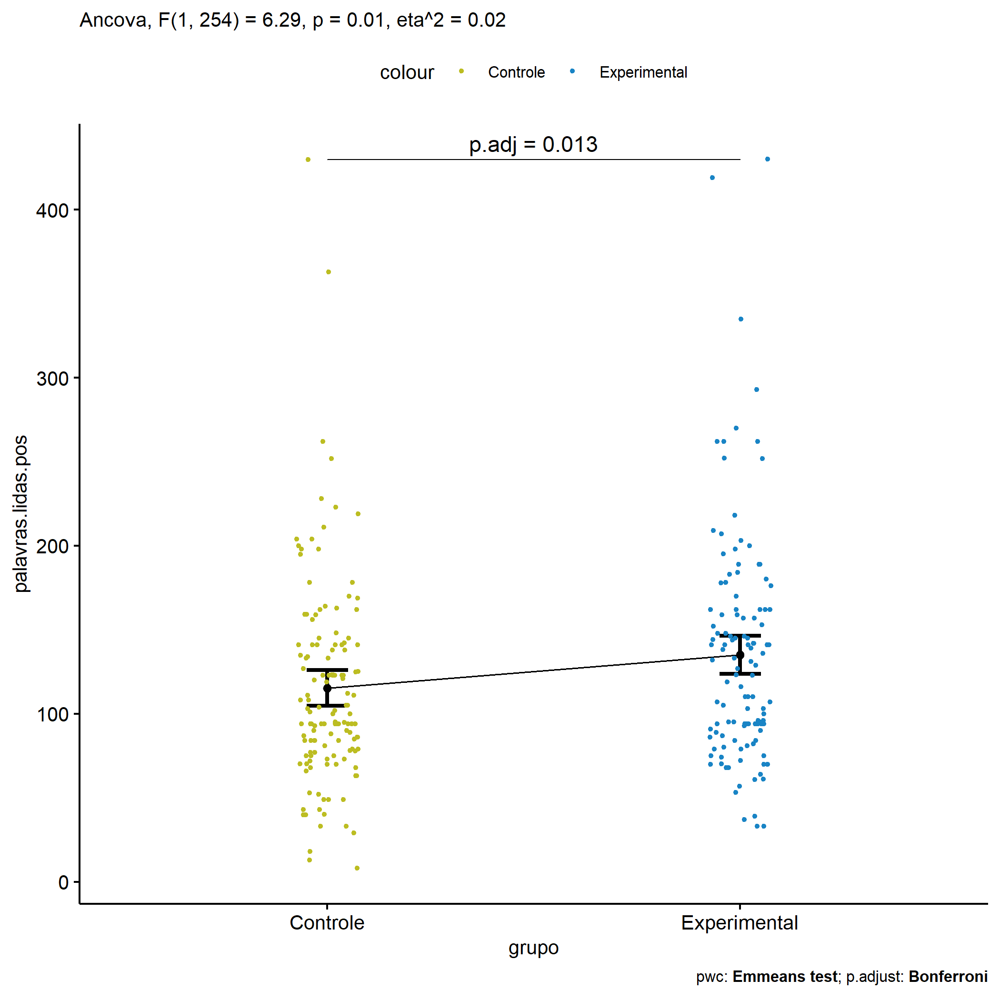<!-- -->

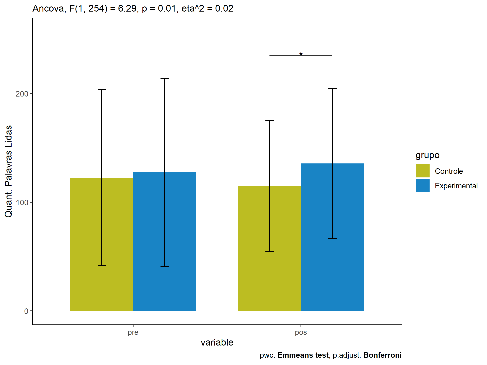<!-- -->

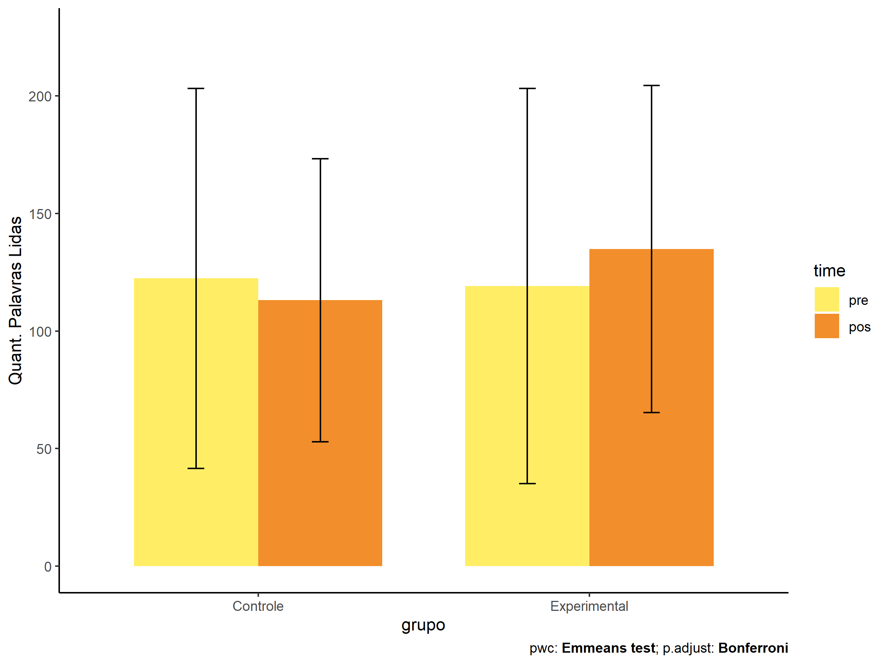<!-- -->

### Compreensao Leitora (Acertos)

| var                   | grupo        |   n | M (pre) | SE (pre) | M (unadj) | SE (unadj) | M (adj) | SE (adj) |
|:----------------------|:-------------|----:|--------:|---------:|----------:|-----------:|--------:|---------:|
| score.compreensao.pos | Controle     | 153 |   5.098 |    0.205 |     4.837 |      0.221 |   4.921 |    0.151 |
| score.compreensao.pos | Experimental | 131 |   5.351 |    0.241 |     5.061 |      0.225 |   4.963 |    0.163 |

| .y.                   | group1   | group2       | estimate | conf.low | conf.high |    se | statistic |     p | p.adj | p.adj.signif |
|:----------------------|:---------|:-------------|---------:|---------:|----------:|------:|----------:|------:|------:|:-------------|
| score.compreensao.pos | Controle | Experimental |   -0.042 |   -0.480 |     0.395 | 0.222 |    -0.191 | 0.849 | 0.849 | ns           |
| score.compreensao.pre | Controle | Experimental |   -0.253 |   -0.872 |     0.365 | 0.314 |    -0.805 | 0.421 | 0.421 | ns           |

| .y.               | grupo        | group1 | group2 | estimate | conf.low | conf.high |    se | statistic |     p | p.adj | p.adj.signif |
|:------------------|:-------------|:-------|:-------|---------:|---------:|----------:|------:|----------:|------:|------:|:-------------|
| score.compreensao | Controle     | pre    | pos    |    0.393 |   -0.182 |     0.968 | 0.293 |     1.343 | 0.180 | 0.180 | ns           |
| score.compreensao | Experimental | pre    | pos    |    0.046 |   -0.571 |     0.663 | 0.314 |     0.147 | 0.883 | 0.883 | ns           |

    ## Scale for colour is already present.
    ## Adding another scale for colour, which will replace the existing scale.

<!-- -->

<!-- -->

<!-- -->

## factor: **genero**

### Quant. Palavras Lidas

| var                | genero |   n | M (pre) | SE (pre) | M (unadj) | SE (unadj) | M (adj) | SE (adj) |
|:-------------------|:-------|----:|--------:|---------:|----------:|-----------:|--------:|---------:|
| palavras.lidas.pos | F      | 125 | 129.440 |    7.567 |   134.208 |      5.729 | 133.540 |    5.679 |
| palavras.lidas.pos | M      | 132 | 120.402 |    7.153 |   115.470 |      5.642 | 116.102 |    5.526 |

| .y.                | group1 | group2 | estimate | conf.low | conf.high |     se | statistic |     p | p.adj | p.adj.signif |
|:-------------------|:-------|:-------|---------:|---------:|----------:|-------:|----------:|------:|------:|:-------------|
| palavras.lidas.pos | F      | M      |   17.438 |    1.822 |    33.054 |  7.930 |     2.199 | 0.029 | 0.029 | \*           |
| palavras.lidas.pre | F      | M      |    9.038 |  -11.451 |    29.528 | 10.405 |     0.869 | 0.386 | 0.386 | ns           |

| .y.            | genero | group1 | group2 | estimate | conf.low | conf.high |    se | statistic |     p | p.adj | p.adj.signif |
|:---------------|:-------|:-------|:-------|---------:|---------:|----------:|------:|----------:|------:|------:|:-------------|
| palavras.lidas | F      | pre    | pos    |   -4.394 |  -22.202 |    13.413 | 9.067 |    -0.485 | 0.628 | 0.628 | ns           |
| palavras.lidas | M      | pre    | pos    |    0.352 |  -16.502 |    17.206 | 8.581 |     0.041 | 0.967 | 0.967 | ns           |

    ## Scale for colour is already present.
    ## Adding another scale for colour, which will replace the existing scale.

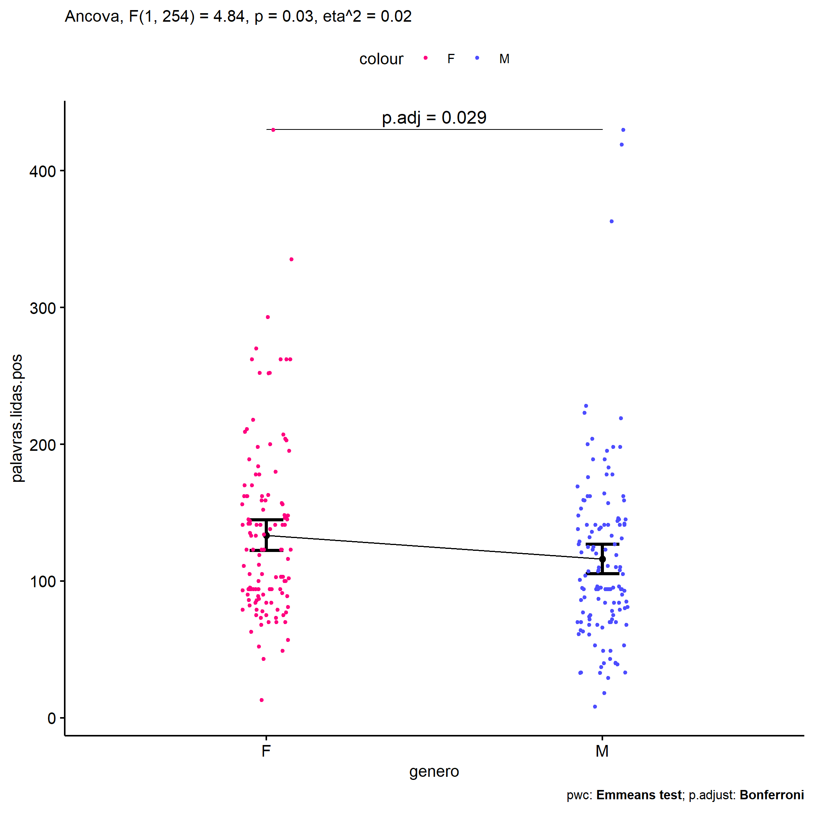<!-- -->

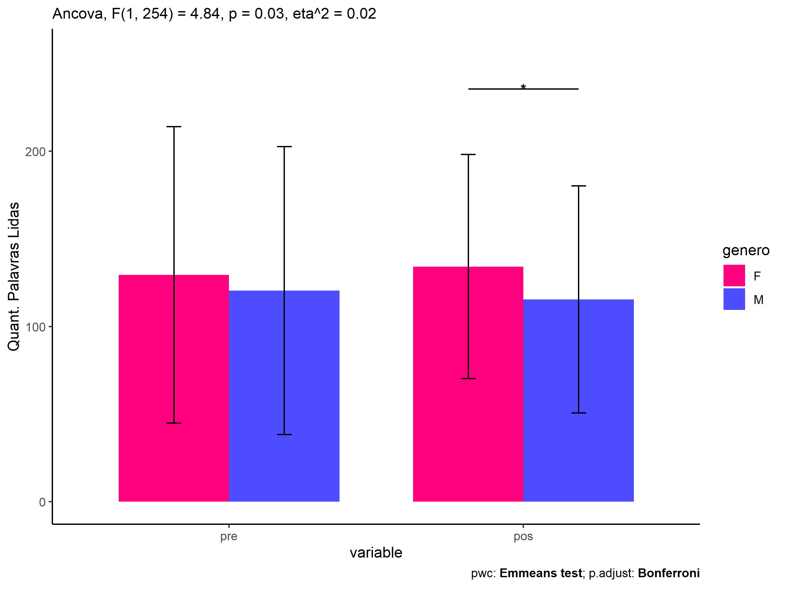<!-- -->

<!-- -->

### Compreensao Leitora (Acertos)

| var                   | genero |   n | M (pre) | SE (pre) | M (unadj) | SE (unadj) | M (adj) | SE (adj) |
|:----------------------|:-------|----:|--------:|---------:|----------:|-----------:|--------:|---------:|
| score.compreensao.pos | F      | 136 |   5.699 |    0.230 |     5.522 |      0.227 |   5.181 |    0.160 |
| score.compreensao.pos | M      | 148 |   4.770 |    0.208 |     4.405 |      0.210 |   4.718 |    0.153 |

| .y.                   | group1 | group2 | estimate | conf.low | conf.high |    se | statistic |     p | p.adj | p.adj.signif |
|:----------------------|:-------|:-------|---------:|---------:|----------:|------:|----------:|------:|------:|:-------------|
| score.compreensao.pos | F      | M      |    0.463 |    0.024 |     0.902 | 0.223 |     2.075 | 0.039 | 0.039 | \*           |
| score.compreensao.pre | F      | M      |    0.928 |    0.320 |     1.537 | 0.309 |     3.004 | 0.003 | 0.003 | \*\*         |

| .y.               | genero | group1 | group2 | estimate | conf.low | conf.high |    se | statistic |     p | p.adj | p.adj.signif |
|:------------------|:-------|:-------|:-------|---------:|---------:|----------:|------:|----------:|------:|------:|:-------------|
| score.compreensao | F      | pre    | pos    |    0.154 |   -0.449 |     0.757 | 0.307 |     0.502 | 0.616 | 0.616 | ns           |
| score.compreensao | M      | pre    | pos    |    0.313 |   -0.251 |     0.877 | 0.287 |     1.090 | 0.276 | 0.276 | ns           |

    ## Scale for colour is already present.
    ## Adding another scale for colour, which will replace the existing scale.

<!-- -->

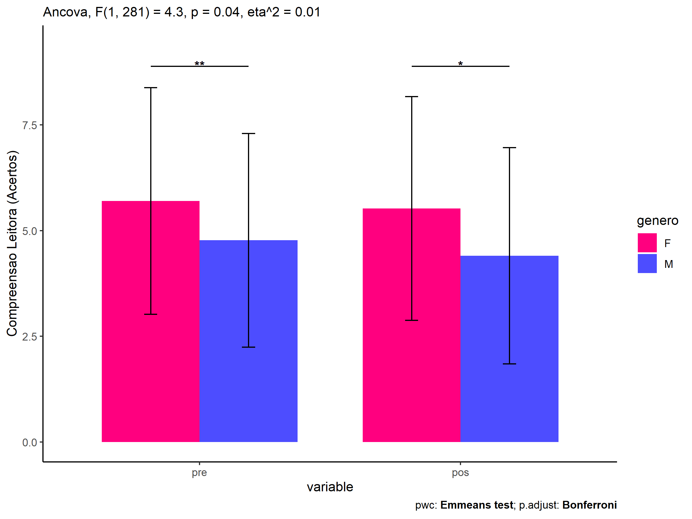<!-- -->

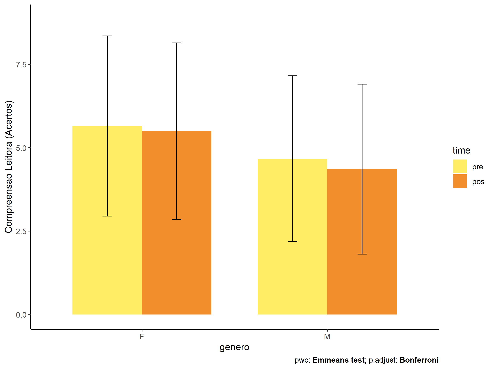<!-- -->

## factor: **idade**

### Quant. Palavras Lidas

| var                | idade |   n | M (pre) | SE (pre) | M (unadj) | SE (unadj) | M (adj) | SE (adj) |
|:-------------------|:------|----:|--------:|---------:|----------:|-----------:|--------:|---------:|
| palavras.lidas.pos | 10y   |  49 | 111.531 |   11.319 |   122.755 |      8.853 | 124.843 |    9.294 |
| palavras.lidas.pos | 11y   | 152 | 135.263 |    7.060 |   128.493 |      5.542 | 127.106 |    5.283 |
| palavras.lidas.pos | 12y   |  32 | 118.125 |   13.745 |   118.656 |     10.915 | 119.778 |   11.474 |
| palavras.lidas.pos | 13y   |  15 |  92.667 |   17.782 |   104.733 |     15.678 | 109.583 |   16.830 |

| .y.                | group1 | group2 | estimate | conf.low | conf.high |     se | statistic |     p | p.adj | p.adj.signif |
|:-------------------|:-------|:-------|---------:|---------:|----------:|-------:|----------:|------:|------:|:-------------|
| palavras.lidas.pos | 10y    | 11y    |   -2.263 |  -23.383 |    18.857 | 10.722 |    -0.211 | 0.833 | 1.000 | ns           |
| palavras.lidas.pos | 10y    | 12y    |    5.065 |  -23.985 |    34.114 | 14.748 |     0.343 | 0.732 | 1.000 | ns           |
| palavras.lidas.pos | 10y    | 13y    |   15.259 |  -22.492 |    53.011 | 19.165 |     0.796 | 0.427 | 1.000 | ns           |
| palavras.lidas.pos | 11y    | 12y    |    7.328 |  -17.582 |    32.237 | 12.646 |     0.579 | 0.563 | 1.000 | ns           |
| palavras.lidas.pos | 11y    | 13y    |   17.522 |  -17.311 |    52.356 | 17.684 |     0.991 | 0.323 | 1.000 | ns           |
| palavras.lidas.pos | 12y    | 13y    |   10.195 |  -29.867 |    50.257 | 20.338 |     0.501 | 0.617 | 1.000 | ns           |
| palavras.lidas.pre | 10y    | 11y    |  -23.733 |  -50.736 |     3.271 | 13.709 |    -1.731 | 0.085 | 0.508 | ns           |
| palavras.lidas.pre | 10y    | 12y    |   -6.594 |  -43.955 |    30.766 | 18.967 |    -0.348 | 0.728 | 1.000 | ns           |
| palavras.lidas.pre | 10y    | 13y    |   18.864 |  -29.642 |    67.369 | 24.625 |     0.766 | 0.444 | 1.000 | ns           |
| palavras.lidas.pre | 11y    | 12y    |   17.138 |  -14.833 |    49.109 | 16.231 |     1.056 | 0.292 | 1.000 | ns           |
| palavras.lidas.pre | 11y    | 13y    |   42.596 |   -1.891 |    87.084 | 22.585 |     1.886 | 0.060 | 0.363 | ns           |
| palavras.lidas.pre | 12y    | 13y    |   25.458 |  -25.978 |    76.895 | 26.114 |     0.975 | 0.331 | 1.000 | ns           |

| .y.            | idade | group1 | group2 | estimate | conf.low | conf.high |     se | statistic |     p | p.adj | p.adj.signif |
|:---------------|:------|:-------|:-------|---------:|---------:|----------:|-------:|----------:|------:|------:|:-------------|
| palavras.lidas | 10y   | pre    | pos    |  -14.361 |  -42.934 |    14.211 | 14.546 |    -0.987 | 0.324 | 0.324 | ns           |
| palavras.lidas | 11y   | pre    | pos    |    2.134 |  -14.168 |    18.435 |  8.299 |     0.257 | 0.797 | 0.797 | ns           |
| palavras.lidas | 12y   | pre    | pos    |    6.831 |  -27.243 |    40.905 | 17.347 |     0.394 | 0.694 | 0.694 | ns           |
| palavras.lidas | 13y   | pre    | pos    |   -7.688 |  -57.349 |    41.974 | 25.282 |    -0.304 | 0.761 | 0.761 | ns           |

    ## Scale for colour is already present.
    ## Adding another scale for colour, which will replace the existing scale.

<!-- -->

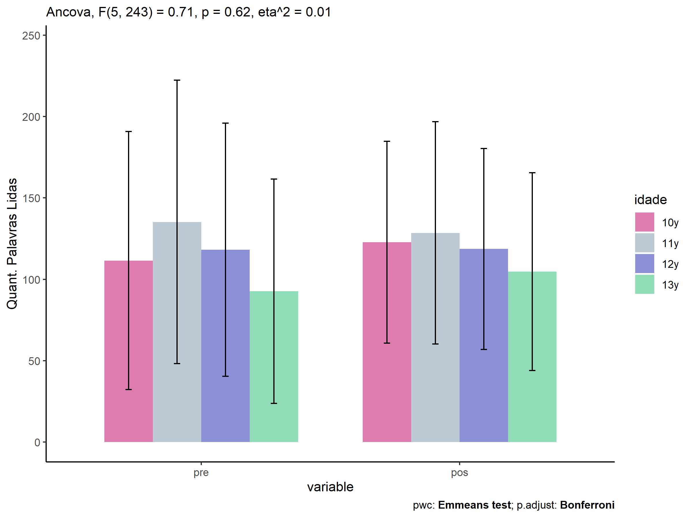<!-- -->

<!-- -->

### Compreensao Leitora (Acertos)

| var                   | idade |   n | M (pre) | SE (pre) | M (unadj) | SE (unadj) | M (adj) | SE (adj) |
|:----------------------|:------|----:|--------:|---------:|----------:|-----------:|--------:|---------:|
| score.compreensao.pos | 10y   |  54 |   5.148 |    0.368 |     5.074 |      0.340 |   5.163 |    0.255 |
| score.compreensao.pos | 11y   | 163 |   5.534 |    0.215 |     5.239 |      0.219 |   5.058 |    0.147 |
| score.compreensao.pos | 12y   |  38 |   4.895 |    0.339 |     4.632 |      0.389 |   4.898 |    0.305 |
| score.compreensao.pos | 13y   |  18 |   4.111 |    0.511 |     3.389 |      0.372 |   4.205 |    0.445 |

| .y.                   | group1 | group2 | estimate | conf.low | conf.high |    se | statistic |     p | p.adj | p.adj.signif |
|:----------------------|:-------|:-------|---------:|---------:|----------:|------:|----------:|------:|------:|:-------------|
| score.compreensao.pos | 10y    | 11y    |    0.105 |   -0.476 |     0.686 | 0.295 |     0.357 | 0.722 | 1.000 | ns           |
| score.compreensao.pos | 10y    | 12y    |    0.265 |   -0.518 |     1.047 | 0.398 |     0.666 | 0.506 | 1.000 | ns           |
| score.compreensao.pos | 10y    | 13y    |    0.958 |   -0.052 |     1.967 | 0.513 |     1.868 | 0.063 | 0.377 | ns           |
| score.compreensao.pos | 11y    | 12y    |    0.159 |   -0.508 |     0.827 | 0.339 |     0.470 | 0.639 | 1.000 | ns           |
| score.compreensao.pos | 11y    | 13y    |    0.853 |   -0.073 |     1.778 | 0.470 |     1.813 | 0.071 | 0.426 | ns           |
| score.compreensao.pos | 12y    | 13y    |    0.693 |   -0.366 |     1.752 | 0.538 |     1.288 | 0.199 | 1.000 | ns           |
| score.compreensao.pre | 10y    | 11y    |   -0.386 |   -1.196 |     0.424 | 0.411 |    -0.937 | 0.349 | 1.000 | ns           |
| score.compreensao.pre | 10y    | 12y    |    0.253 |   -0.839 |     1.346 | 0.555 |     0.457 | 0.648 | 1.000 | ns           |
| score.compreensao.pre | 10y    | 13y    |    1.037 |   -0.367 |     2.441 | 0.713 |     1.454 | 0.147 | 0.882 | ns           |
| score.compreensao.pre | 11y    | 12y    |    0.639 |   -0.290 |     1.568 | 0.472 |     1.354 | 0.177 | 1.000 | ns           |
| score.compreensao.pre | 11y    | 13y    |    1.423 |    0.141 |     2.704 | 0.651 |     2.186 | 0.030 | 0.178 | ns           |
| score.compreensao.pre | 12y    | 13y    |    0.784 |   -0.692 |     2.260 | 0.750 |     1.045 | 0.297 | 1.000 | ns           |

| .y.               | idade | group1 | group2 | estimate | conf.low | conf.high |    se | statistic |     p | p.adj | p.adj.signif |
|:------------------|:------|:-------|:-------|---------:|---------:|----------:|------:|----------:|------:|------:|:-------------|
| score.compreensao | 10y   | pre    | pos    |    0.046 |   -0.915 |     1.008 | 0.490 |     0.094 | 0.925 | 0.925 | ns           |
| score.compreensao | 11y   | pre    | pos    |    0.319 |   -0.233 |     0.871 | 0.281 |     1.135 | 0.257 | 0.257 | ns           |
| score.compreensao | 12y   | pre    | pos    |    0.347 |   -0.774 |     1.469 | 0.571 |     0.608 | 0.543 | 0.543 | ns           |
| score.compreensao | 13y   | pre    | pos    |    0.468 |   -1.173 |     2.109 | 0.835 |     0.560 | 0.575 | 0.575 | ns           |

    ## Scale for colour is already present.
    ## Adding another scale for colour, which will replace the existing scale.

<!-- -->

<!-- -->

<!-- -->

## factor: **zona.participante**

### Quant. Palavras Lidas

| var                | zona.participante |   n | M (pre) | SE (pre) | M (unadj) | SE (unadj) | M (adj) | SE (adj) |
|:-------------------|:------------------|----:|--------:|---------:|----------:|-----------:|--------:|---------:|
| palavras.lidas.pos | Rural             |  96 | 127.427 |    8.927 |   115.708 |      4.877 | 116.298 |    6.583 |
| palavras.lidas.pos | Urbana            | 103 | 137.388 |    8.632 |   128.883 |      7.662 | 128.334 |    6.355 |

| .y.                | group1 | group2 | estimate | conf.low | conf.high |     se | statistic |     p | p.adj | p.adj.signif |
|:-------------------|:-------|:-------|---------:|---------:|----------:|-------:|----------:|------:|------:|:-------------|
| palavras.lidas.pos | Urbana | Rural  |   12.036 |   -6.023 |    30.094 |  9.157 |     1.314 | 0.190 | 0.190 | ns           |
| palavras.lidas.pre | Urbana | Rural  |    9.961 |  -14.530 |    34.452 | 12.419 |     0.802 | 0.423 | 0.423 | ns           |

| .y.            | zona.participante | group1 | group2 | estimate | conf.low | conf.high |     se | statistic |     p | p.adj | p.adj.signif |
|:---------------|:------------------|:-------|:-------|---------:|---------:|----------:|-------:|----------:|------:|------:|:-------------|
| palavras.lidas | Urbana            | pre    | pos    |    4.520 |  -15.528 |    24.569 | 10.201 |     0.443 | 0.658 | 0.658 | ns           |
| palavras.lidas | Rural             | pre    | pos    |   10.087 |  -11.006 |    31.180 | 10.732 |     0.940 | 0.348 | 0.348 | ns           |

    ## Scale for colour is already present.
    ## Adding another scale for colour, which will replace the existing scale.

<!-- -->

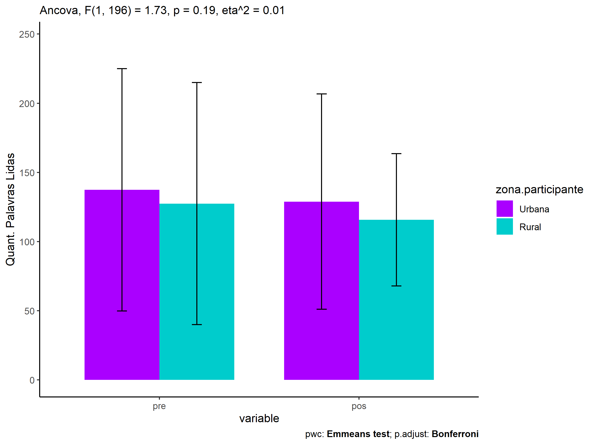<!-- -->

<!-- -->

### Compreensao Leitora (Acertos)

| var                   | zona.participante |   n | M (pre) | SE (pre) | M (unadj) | SE (unadj) | M (adj) | SE (adj) |
|:----------------------|:------------------|----:|--------:|---------:|----------:|-----------:|--------:|---------:|
| score.compreensao.pos | Rural             | 103 |   5.068 |    0.251 |     4.777 |      0.262 |   4.787 |    0.183 |
| score.compreensao.pos | Urbana            | 116 |   5.095 |    0.243 |     5.181 |      0.243 |   5.172 |    0.173 |

| .y.                   | group1 | group2 | estimate | conf.low | conf.high |    se | statistic |     p | p.adj | p.adj.signif |
|:----------------------|:-------|:-------|---------:|---------:|----------:|------:|----------:|------:|------:|:-------------|
| score.compreensao.pos | Urbana | Rural  |    0.385 |   -0.112 |     0.881 | 0.252 |     1.527 | 0.128 | 0.128 | ns           |
| score.compreensao.pre | Urbana | Rural  |    0.027 |   -0.662 |     0.716 | 0.350 |     0.077 | 0.939 | 0.939 | ns           |

| .y.               | zona.participante | group1 | group2 | estimate | conf.low | conf.high |    se | statistic |     p | p.adj | p.adj.signif |
|:------------------|:------------------|:-------|:-------|---------:|---------:|----------:|------:|----------:|------:|------:|:-------------|
| score.compreensao | Urbana            | pre    | pos    |   -0.072 |   -0.722 |     0.577 | 0.331 |    -0.219 | 0.827 | 0.827 | ns           |
| score.compreensao | Rural             | pre    | pos    |    0.249 |   -0.443 |     0.942 | 0.352 |     0.708 | 0.479 | 0.479 | ns           |

    ## Scale for colour is already present.
    ## Adding another scale for colour, which will replace the existing scale.

<!-- -->

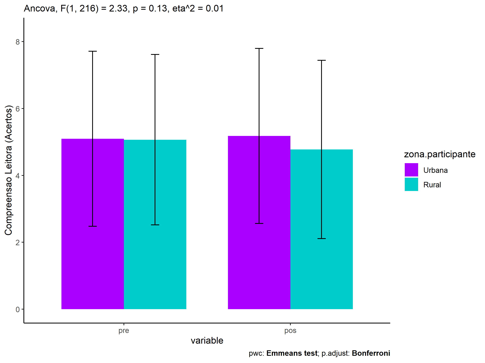<!-- -->

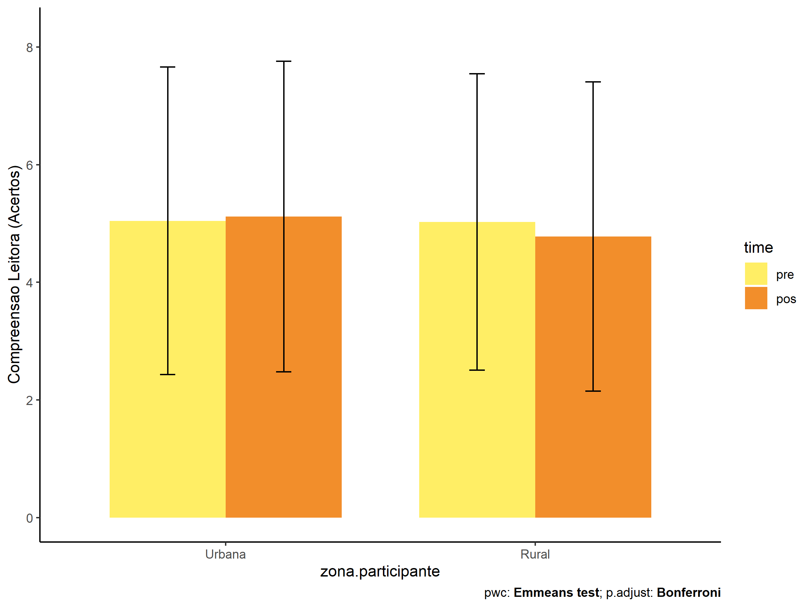<!-- -->

## factor: **escola**

### Quant. Palavras Lidas

| var                | escola |   n | M (pre) | SE (pre) | M (unadj) | SE (unadj) | M (adj) | SE (adj) |
|:-------------------|:-------|----:|--------:|---------:|----------:|-----------:|--------:|---------:|
| palavras.lidas.pos | E1     |  21 |  99.952 |   11.751 |   126.667 |     20.932 | 136.025 |   12.679 |
| palavras.lidas.pos | E2     |  24 |  84.583 |    8.779 |   159.917 |     19.102 | 175.064 |   11.999 |
| palavras.lidas.pos | E3     |  33 | 100.455 |   11.212 |    97.970 |      8.335 | 107.139 |   10.145 |
| palavras.lidas.pos | E4     |  36 | 251.944 |   10.600 |    98.306 |      4.446 |  50.413 |   11.937 |
| palavras.lidas.pos | E5     | 116 | 111.750 |    6.733 |   135.078 |      5.825 | 139.992 |    5.411 |
| palavras.lidas.pos | E6     |  27 |  96.148 |   12.096 |   114.037 |      8.537 | 124.828 |   11.229 |

| .y.                | group1 | group2 | estimate | conf.low | conf.high |     se | statistic | p       | p.adj   | p.adj.signif |
|:-------------------|:-------|:-------|---------:|---------:|----------:|-------:|----------:|:--------|:--------|:-------------|
| palavras.lidas.pos | E1     | E2     |  -39.039 |  -73.071 |    -5.007 | 17.280 |    -2.259 | 0.025   | 0.371   | ns           |
| palavras.lidas.pos | E1     | E3     |   28.886 |   -2.868 |    60.640 | 16.123 |     1.792 | 0.074   | 1       | ns           |
| palavras.lidas.pos | E1     | E4     |   85.612 |   50.230 |   120.993 | 17.965 |     4.766 | \<0.001 | \<0.001 | \*\*\*\*     |
| palavras.lidas.pos | E1     | E5     |   -3.967 |  -30.975 |    23.040 | 13.713 |    -0.289 | 0.773   | 1       | ns           |
| palavras.lidas.pos | E1     | E6     |   11.197 |  -21.904 |    44.297 | 16.806 |     0.666 | 0.506   | 1       | ns           |
| palavras.lidas.pos | E2     | E3     |   67.925 |   37.359 |    98.492 | 15.520 |     4.377 | \<0.001 | \<0.001 | \*\*\*       |
| palavras.lidas.pos | E2     | E4     |  124.651 |   89.530 |   159.772 | 17.833 |     6.990 | \<0.001 | \<0.001 | \*\*\*\*     |
| palavras.lidas.pos | E2     | E5     |   35.072 |    9.390 |    60.754 | 13.040 |     2.690 | 0.008   | 0.115   | ns           |
| palavras.lidas.pos | E2     | E6     |   50.236 |   18.298 |    82.174 | 16.216 |     3.098 | 0.002   | 0.033   | \*           |
| palavras.lidas.pos | E3     | E4     |   56.726 |   24.695 |    88.756 | 16.263 |     3.488 | \<0.001 | 0.009   | \*\*         |
| palavras.lidas.pos | E3     | E5     |  -32.853 |  -55.330 |   -10.377 | 11.412 |    -2.879 | 0.004   | 0.065   | ns           |
| palavras.lidas.pos | E3     | E6     |  -17.689 |  -47.212 |    11.834 | 14.990 |    -1.180 | 0.239   | 1       | ns           |
| palavras.lidas.pos | E4     | E5     |  -89.579 | -116.149 |   -63.009 | 13.491 |    -6.640 | \<0.001 | \<0.001 | \*\*\*\*     |
| palavras.lidas.pos | E4     | E6     |  -74.415 | -108.014 |   -40.816 | 17.060 |    -4.362 | \<0.001 | \<0.001 | \*\*\*       |
| palavras.lidas.pos | E5     | E6     |   15.164 |   -9.203 |    39.530 | 12.372 |     1.226 | 0.221   | 1       | ns           |
| palavras.lidas.pre | E1     | E2     |   15.369 |  -23.275 |    54.013 | 19.621 |     0.783 | 0.434   | 1       | ns           |
| palavras.lidas.pre | E1     | E3     |   -0.502 |  -36.603 |    35.599 | 18.330 |    -0.027 | 0.978   | 1       | ns           |
| palavras.lidas.pre | E1     | E4     | -151.992 | -187.503 |  -116.481 | 18.031 |    -8.430 | \<0.001 | \<0.001 | \*\*\*\*     |
| palavras.lidas.pre | E1     | E5     |  -11.798 |  -42.467 |    18.872 | 15.573 |    -0.758 | 0.449   | 1       | ns           |
| palavras.lidas.pre | E1     | E6     |    3.804 |  -33.824 |    41.433 | 19.106 |     0.199 | 0.842   | 1       | ns           |
| palavras.lidas.pre | E2     | E3     |  -15.871 |  -50.566 |    18.823 | 17.616 |    -0.901 | 0.368   | 1       | ns           |
| palavras.lidas.pre | E2     | E4     | -167.361 | -201.442 |  -133.281 | 17.305 |    -9.672 | \<0.001 | \<0.001 | \*\*\*\*     |
| palavras.lidas.pre | E2     | E5     |  -27.167 |  -56.168 |     1.835 | 14.725 |    -1.845 | 0.066   | 0.994   | ns           |
| palavras.lidas.pre | E2     | E6     |  -11.565 |  -47.846 |    24.717 | 18.422 |    -0.628 | 0.531   | 1       | ns           |
| palavras.lidas.pre | E3     | E4     | -151.490 | -182.658 |  -120.322 | 15.825 |    -9.573 | \<0.001 | \<0.001 | \*\*\*\*     |
| palavras.lidas.pre | E3     | E5     |  -11.295 |  -36.810 |    14.220 | 12.955 |    -0.872 | 0.384   | 1       | ns           |
| palavras.lidas.pre | E3     | E6     |    4.306 |  -29.254 |    37.867 | 17.040 |     0.253 | 0.801   | 1       | ns           |
| palavras.lidas.pre | E4     | E5     |  140.194 |  115.521 |   164.868 | 12.528 |    11.190 | \<0.001 | \<0.001 | \*\*\*\*     |
| palavras.lidas.pre | E4     | E6     |  155.796 |  122.871 |   188.721 | 16.718 |     9.319 | \<0.001 | \<0.001 | \*\*\*\*     |
| palavras.lidas.pre | E5     | E6     |   15.602 |  -12.032 |    43.236 | 14.031 |     1.112 | 0.267   | 1       | ns           |

| .y.            | escola | group1 | group2 | estimate | conf.low | conf.high |     se | statistic | p       | p.adj   | p.adj.signif |
|:---------------|:-------|:-------|:-------|---------:|---------:|----------:|-------:|----------:|:--------|:--------|:-------------|
| palavras.lidas | E1     | pre    | pos    |  -39.702 |  -76.782 |    -2.623 | 18.878 |    -2.103 | 0.036   | 0.036   | \*           |
| palavras.lidas | E2     | pre    | pos    |  -64.081 |  -94.734 |   -33.429 | 15.606 |    -4.106 | \<0.001 | \<0.001 | \*\*\*\*     |
| palavras.lidas | E3     | pre    | pos    |   10.358 |  -20.133 |    40.849 | 15.524 |     0.667 | 0.505   | 0.505   | ns           |
| palavras.lidas | E4     | pre    | pos    |  153.639 |  123.364 |   183.914 | 15.414 |     9.967 | \<0.001 | \<0.001 | \*\*\*\*     |
| palavras.lidas | E5     | pre    | pos    |  -18.475 |  -34.807 |    -2.143 |  8.315 |    -2.222 | 0.027   | 0.027   | \*           |
| palavras.lidas | E6     | pre    | pos    |  -25.174 |  -58.662 |     8.314 | 17.050 |    -1.476 | 0.14    | 0.14    | ns           |

    ## Scale for colour is already present.
    ## Adding another scale for colour, which will replace the existing scale.

<!-- -->

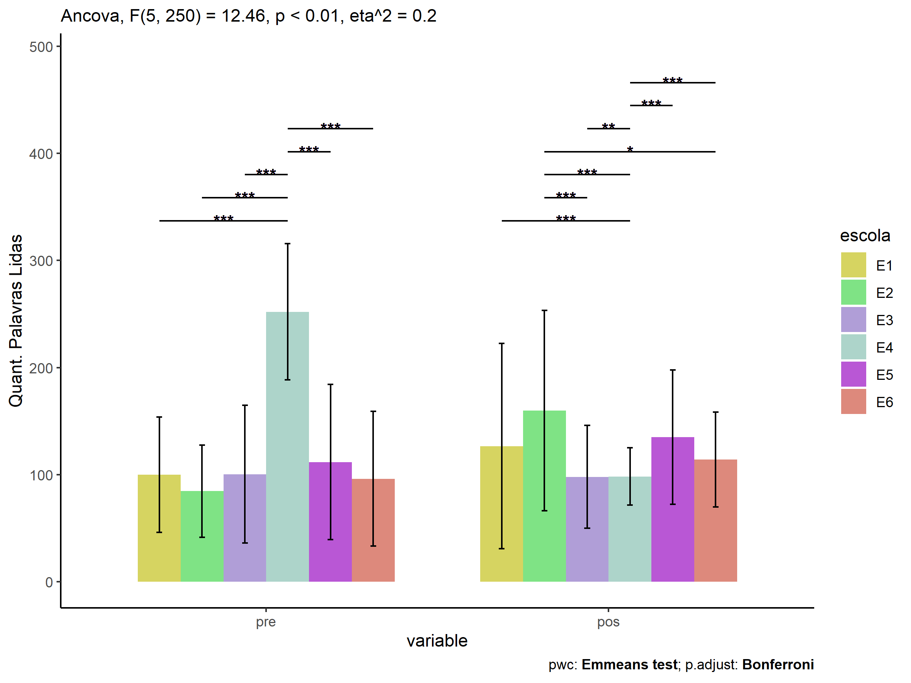<!-- -->

<!-- -->

### Compreensao Leitora (Acertos)

| var                   | escola |   n | M (pre) | SE (pre) | M (unadj) | SE (unadj) | M (adj) | SE (adj) |
|:----------------------|:-------|----:|--------:|---------:|----------:|-----------:|--------:|---------:|
| score.compreensao.pos | E1     |  21 |   5.476 |    0.584 |     5.714 |      0.633 |   5.525 |    0.408 |
| score.compreensao.pos | E2     |  52 |   4.231 |    0.374 |     4.308 |      0.357 |   5.020 |    0.262 |
| score.compreensao.pos | E3     |  33 |   5.333 |    0.426 |     5.000 |      0.485 |   4.914 |    0.325 |
| score.compreensao.pos | E4     |  35 |   6.029 |    0.407 |     5.486 |      0.452 |   4.896 |    0.318 |
| score.compreensao.pos | E5     | 116 |   5.121 |    0.239 |     4.819 |      0.237 |   4.887 |    0.173 |
| score.compreensao.pos | E6     |  27 |   6.111 |    0.545 |     5.296 |      0.533 |   4.647 |    0.361 |

| .y.                   | group1 | group2 | estimate | conf.low | conf.high |    se | statistic |     p | p.adj | p.adj.signif |
|:----------------------|:-------|:-------|---------:|---------:|----------:|------:|----------:|------:|------:|:-------------|
| score.compreensao.pos | E1     | E2     |    0.505 |   -0.451 |     1.461 | 0.486 |     1.039 | 0.300 | 1.000 | ns           |
| score.compreensao.pos | E1     | E3     |    0.611 |   -0.415 |     1.637 | 0.521 |     1.172 | 0.242 | 1.000 | ns           |
| score.compreensao.pos | E1     | E4     |    0.629 |   -0.387 |     1.644 | 0.516 |     1.218 | 0.224 | 1.000 | ns           |
| score.compreensao.pos | E1     | E5     |    0.638 |   -0.234 |     1.510 | 0.443 |     1.440 | 0.151 | 1.000 | ns           |
| score.compreensao.pos | E1     | E6     |    0.878 |   -0.193 |     1.948 | 0.544 |     1.614 | 0.108 | 1.000 | ns           |
| score.compreensao.pos | E2     | E3     |    0.106 |   -0.717 |     0.929 | 0.418 |     0.254 | 0.800 | 1.000 | ns           |
| score.compreensao.pos | E2     | E4     |    0.124 |   -0.694 |     0.942 | 0.416 |     0.298 | 0.766 | 1.000 | ns           |
| score.compreensao.pos | E2     | E5     |    0.133 |   -0.485 |     0.751 | 0.314 |     0.424 | 0.672 | 1.000 | ns           |
| score.compreensao.pos | E2     | E6     |    0.373 |   -0.513 |     1.259 | 0.450 |     0.828 | 0.408 | 1.000 | ns           |
| score.compreensao.pos | E3     | E4     |    0.018 |   -0.876 |     0.911 | 0.454 |     0.039 | 0.969 | 1.000 | ns           |
| score.compreensao.pos | E3     | E5     |    0.027 |   -0.698 |     0.752 | 0.368 |     0.073 | 0.942 | 1.000 | ns           |
| score.compreensao.pos | E3     | E6     |    0.267 |   -0.689 |     1.223 | 0.486 |     0.550 | 0.583 | 1.000 | ns           |
| score.compreensao.pos | E4     | E5     |    0.009 |   -0.704 |     0.722 | 0.362 |     0.026 | 0.979 | 1.000 | ns           |
| score.compreensao.pos | E4     | E6     |    0.249 |   -0.692 |     1.191 | 0.478 |     0.521 | 0.603 | 1.000 | ns           |
| score.compreensao.pos | E5     | E6     |    0.240 |   -0.550 |     1.030 | 0.401 |     0.598 | 0.550 | 1.000 | ns           |
| score.compreensao.pre | E1     | E2     |    1.245 |   -0.075 |     2.566 | 0.671 |     1.856 | 0.064 | 0.967 | ns           |
| score.compreensao.pre | E1     | E3     |    0.143 |   -1.283 |     1.569 | 0.724 |     0.197 | 0.844 | 1.000 | ns           |
| score.compreensao.pre | E1     | E4     |   -0.552 |   -1.962 |     0.858 | 0.716 |    -0.771 | 0.441 | 1.000 | ns           |
| score.compreensao.pre | E1     | E5     |    0.356 |   -0.856 |     1.567 | 0.615 |     0.578 | 0.564 | 1.000 | ns           |
| score.compreensao.pre | E1     | E6     |   -0.635 |   -2.121 |     0.851 | 0.755 |    -0.841 | 0.401 | 1.000 | ns           |
| score.compreensao.pre | E2     | E3     |   -1.103 |   -2.239 |     0.034 | 0.578 |    -1.909 | 0.057 | 0.859 | ns           |
| score.compreensao.pre | E2     | E4     |   -1.798 |   -2.915 |    -0.681 | 0.567 |    -3.169 | 0.002 | 0.026 | \*           |
| score.compreensao.pre | E2     | E5     |   -0.890 |   -1.742 |    -0.037 | 0.433 |    -2.055 | 0.041 | 0.612 | ns           |
| score.compreensao.pre | E2     | E6     |   -1.880 |   -3.092 |    -0.669 | 0.616 |    -3.055 | 0.002 | 0.037 | \*           |
| score.compreensao.pre | E3     | E4     |   -0.695 |   -1.935 |     0.544 | 0.630 |    -1.104 | 0.270 | 1.000 | ns           |
| score.compreensao.pre | E3     | E5     |    0.213 |   -0.795 |     1.220 | 0.512 |     0.415 | 0.678 | 1.000 | ns           |
| score.compreensao.pre | E3     | E6     |   -0.778 |   -2.103 |     0.548 | 0.673 |    -1.155 | 0.249 | 1.000 | ns           |
| score.compreensao.pre | E4     | E5     |    0.908 |   -0.077 |     1.893 | 0.500 |     1.814 | 0.071 | 1.000 | ns           |
| score.compreensao.pre | E4     | E6     |   -0.083 |   -1.391 |     1.226 | 0.665 |    -0.124 | 0.901 | 1.000 | ns           |
| score.compreensao.pre | E5     | E6     |   -0.990 |   -2.082 |     0.101 | 0.554 |    -1.786 | 0.075 | 1.000 | ns           |

| .y.               | escola | group1 | group2 | estimate | conf.low | conf.high |    se | statistic |     p | p.adj | p.adj.signif |
|:------------------|:-------|:-------|:-------|---------:|---------:|----------:|------:|----------:|------:|------:|:-------------|
| score.compreensao | E1     | pre    | pos    |   -0.643 |   -2.128 |     0.843 | 0.756 |    -0.850 | 0.396 | 0.396 | ns           |
| score.compreensao | E2     | pre    | pos    |   -0.050 |   -1.011 |     0.911 | 0.489 |    -0.102 | 0.919 | 0.919 | ns           |
| score.compreensao | E3     | pre    | pos    |    0.456 |   -0.766 |     1.677 | 0.622 |     0.732 | 0.464 | 0.464 | ns           |
| score.compreensao | E4     | pre    | pos    |    0.459 |   -0.763 |     1.680 | 0.622 |     0.738 | 0.461 | 0.461 | ns           |
| score.compreensao | E5     | pre    | pos    |    0.331 |   -0.323 |     0.986 | 0.333 |     0.994 | 0.321 | 0.321 | ns           |
| score.compreensao | E6     | pre    | pos    |    0.563 |   -0.778 |     1.905 | 0.683 |     0.825 | 0.410 | 0.410 | ns           |

    ## Scale for colour is already present.
    ## Adding another scale for colour, which will replace the existing scale.

<!-- -->

<!-- -->

<!-- -->

## factor: **zona.escola**

### Quant. Palavras Lidas

| var                | zona.escola |   n | M (pre) | SE (pre) | M (unadj) | SE (unadj) | M (adj) | SE (adj) |
|:-------------------|:------------|----:|--------:|---------:|----------:|-----------:|--------:|---------:|
| palavras.lidas.pos | Rural       |  96 | 156.052 |    9.972 |   102.615 |      4.114 |  95.490 |    6.327 |
| palavras.lidas.pos | Urbana      | 161 | 106.161 |    5.290 |   137.683 |      5.756 | 141.931 |    4.832 |

| .y.                | group1 | group2 | estimate | conf.low | conf.high |     se | statistic | p       | p.adj   | p.adj.signif |
|:-------------------|:-------|:-------|---------:|---------:|----------:|-------:|----------:|:--------|:--------|:-------------|
| palavras.lidas.pos | Urbana | Rural  |   46.442 |   30.444 |    62.439 |  8.123 |     5.717 | \<0.001 | \<0.001 | \*\*\*\*     |
| palavras.lidas.pre | Urbana | Rural  |  -49.891 |  -70.180 |   -29.601 | 10.303 |    -4.842 | \<0.001 | \<0.001 | \*\*\*\*     |

| .y.            | zona.escola | group1 | group2 | estimate | conf.low | conf.high |     se | statistic | p       | p.adj   | p.adj.signif |
|:---------------|:------------|:-------|:-------|---------:|---------:|----------:|-------:|----------:|:--------|:--------|:-------------|
| palavras.lidas | Urbana      | pre    | pos    |  -30.300 |  -45.070 |   -15.530 |  7.520 |    -4.029 | \<0.001 | \<0.001 | \*\*\*\*     |
| palavras.lidas | Rural       | pre    | pos    |   50.572 |   30.483 |    70.661 | 10.228 |     4.944 | \<0.001 | \<0.001 | \*\*\*\*     |

    ## Scale for colour is already present.
    ## Adding another scale for colour, which will replace the existing scale.

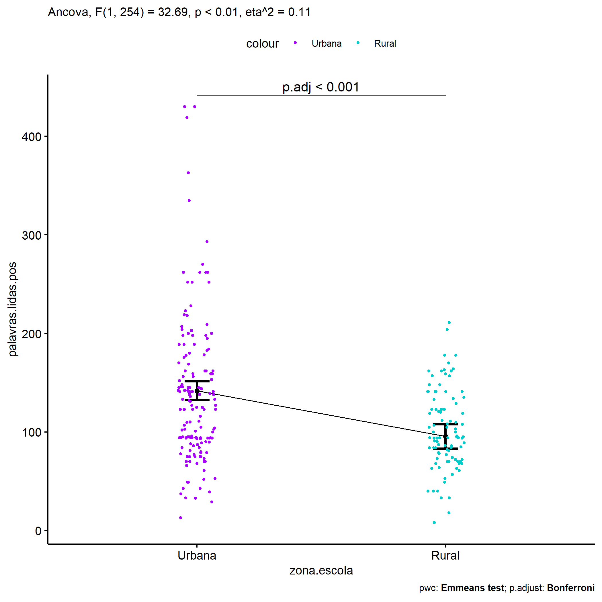<!-- -->

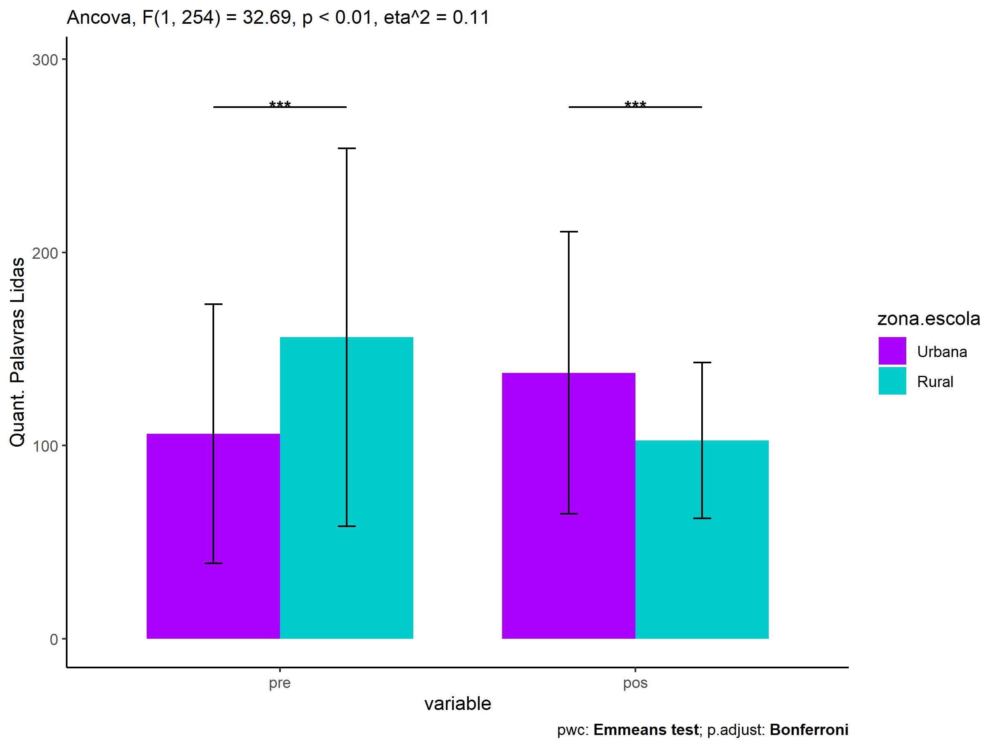<!-- -->

<!-- -->

### Compreensao Leitora (Acertos)

| var                   | zona.escola |   n | M (pre) | SE (pre) | M (unadj) | SE (unadj) | M (adj) | SE (adj) |
|:----------------------|:------------|----:|--------:|---------:|----------:|-----------:|--------:|---------:|
| score.compreensao.pos | Rural       |  95 |   5.811 |    0.261 |     5.263 |      0.279 |   4.832 |    0.193 |
| score.compreensao.pos | Urbana      | 189 |   4.915 |    0.192 |     4.778 |      0.190 |   4.995 |    0.136 |

| .y.                   | group1 | group2 | estimate | conf.low | conf.high |    se | statistic |     p | p.adj | p.adj.signif |
|:----------------------|:-------|:-------|---------:|---------:|----------:|------:|----------:|------:|------:|:-------------|
| score.compreensao.pos | Urbana | Rural  |    0.163 |   -0.304 |     0.630 | 0.237 |     0.687 | 0.492 | 0.492 | ns           |
| score.compreensao.pre | Urbana | Rural  |   -0.895 |   -1.541 |    -0.249 | 0.328 |    -2.728 | 0.007 | 0.007 | \*\*         |

| .y.               | zona.escola | group1 | group2 | estimate | conf.low | conf.high |    se | statistic |     p | p.adj | p.adj.signif |
|:------------------|:------------|:-------|:-------|---------:|---------:|----------:|------:|----------:|------:|------:|:-------------|
| score.compreensao | Urbana      | pre    | pos    |    0.126 |   -0.384 |     0.636 | 0.260 |     0.485 | 0.628 | 0.628 | ns           |
| score.compreensao | Rural       | pre    | pos    |    0.494 |   -0.235 |     1.223 | 0.371 |     1.331 | 0.184 | 0.184 | ns           |

    ## Scale for colour is already present.
    ## Adding another scale for colour, which will replace the existing scale.

<!-- -->

<!-- -->

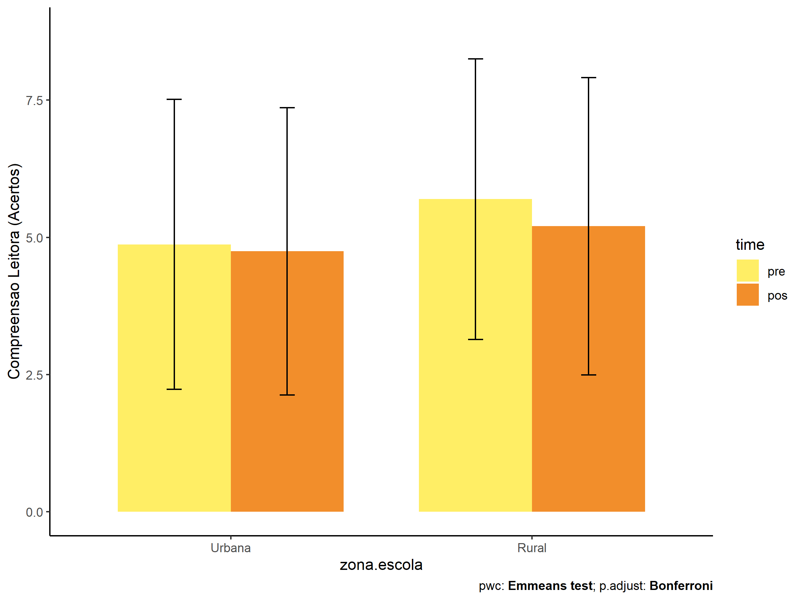<!-- -->

# Pairwise comparisons for two factors

## factores: **genero:grupo**

### Quant. Palavras Lidas

| var                | genero | grupo        |   n | M (pre) | SE (pre) | M (unadj) | SE (unadj) | M (adj) | SE (adj) |
|:-------------------|:-------|:-------------|----:|--------:|---------:|----------:|-----------:|--------:|---------:|
| palavras.lidas.pos | F      | Controle     |  73 | 123.466 |    9.683 |   115.973 |      5.528 | 116.151 |    7.257 |
| palavras.lidas.pos | F      | Experimental |  52 | 137.827 |   12.101 |   159.808 |     10.451 | 158.066 |    8.620 |
| palavras.lidas.pos | M      | Controle     |  64 | 121.531 |    9.934 |   113.875 |      9.047 | 114.312 |    7.752 |
| palavras.lidas.pos | M      | Experimental |  68 | 119.338 |   10.337 |   116.971 |      6.951 | 117.700 |    7.524 |

| .y.                | grupo        | genero | group1   | group2       | estimate | conf.low | conf.high |     se | statistic | p       | p.adj   | p.adj.signif |
|:-------------------|:-------------|:-------|:---------|:-------------|---------:|---------:|----------:|-------:|----------:|:--------|:--------|:-------------|
| palavras.lidas.pos | Controle     |        | F        | M            |    1.839 |  -19.073 |    22.751 | 10.618 |     0.173 | 0.863   | 0.863   | ns           |
| palavras.lidas.pos | Experimental |        | F        | M            |   40.365 |   17.805 |    62.925 | 11.455 |     3.524 | \<0.001 | \<0.001 | \*\*\*       |
| palavras.lidas.pre | Controle     |        | F        | M            |    1.935 |  -26.240 |    30.109 | 14.306 |     0.135 | 0.893   | 0.893   | ns           |
| palavras.lidas.pre | Experimental |        | F        | M            |   18.489 |  -11.821 |    48.799 | 15.391 |     1.201 | 0.231   | 0.231   | ns           |
| palavras.lidas.pos |              | F      | Controle | Experimental |  -41.915 |  -64.114 |   -19.716 | 11.272 |    -3.719 | \<0.001 | \<0.001 | \*\*\*       |
| palavras.lidas.pos |              | M      | Controle | Experimental |   -3.389 |  -24.657 |    17.879 | 10.799 |    -0.314 | 0.754   | 0.754   | ns           |
| palavras.lidas.pre |              | F      | Controle | Experimental |  -14.361 |  -44.218 |    15.496 | 15.160 |    -0.947 | 0.344   | 0.344   | ns           |
| palavras.lidas.pre |              | M      | Controle | Experimental |    2.193 |  -26.462 |    30.848 | 14.550 |     0.151 | 0.88    | 0.88    | ns           |

| grupo        | genero | group1 | group2 | estimate | conf.low | conf.high |     se | statistic |     p | p.adj | p.adj.signif |
|:-------------|:-------|:-------|:-------|---------:|---------:|----------:|-------:|----------:|------:|------:|:-------------|
| Controle     | F      | pre    | pos    |   12.848 |  -10.282 |    35.978 | 11.776 |     1.091 | 0.276 | 0.276 | ns           |
| Controle     | M      | pre    | pos    |    5.814 |  -18.101 |    29.728 | 12.176 |     0.478 | 0.633 | 0.633 | ns           |
| Experimental | F      | pre    | pos    |  -29.356 |  -56.810 |    -1.902 | 13.978 |    -2.100 | 0.036 | 0.036 | \*           |
| Experimental | M      | pre    | pos    |   -4.900 |  -28.342 |    18.542 | 11.935 |    -0.411 | 0.682 | 0.682 | ns           |

    ## Scale for colour is already present.
    ## Adding another scale for colour, which will replace the existing scale.

<!-- -->

    ## Scale for colour is already present.
    ## Adding another scale for colour, which will replace the existing scale.

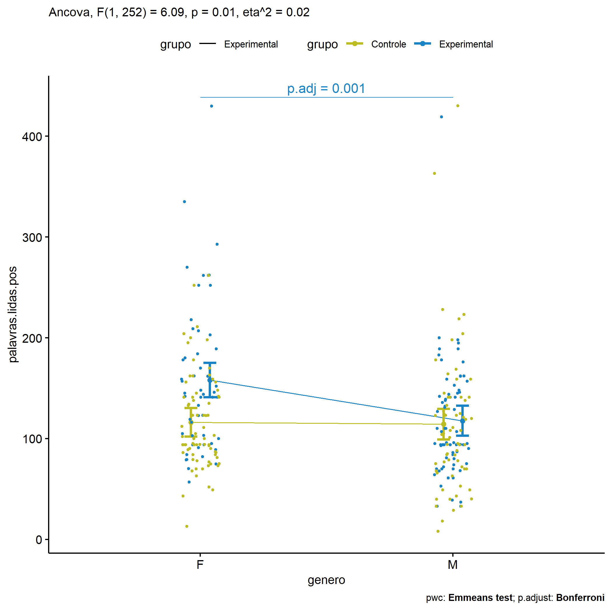<!-- -->

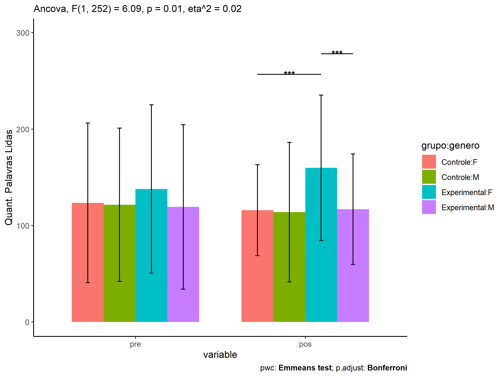<!-- -->

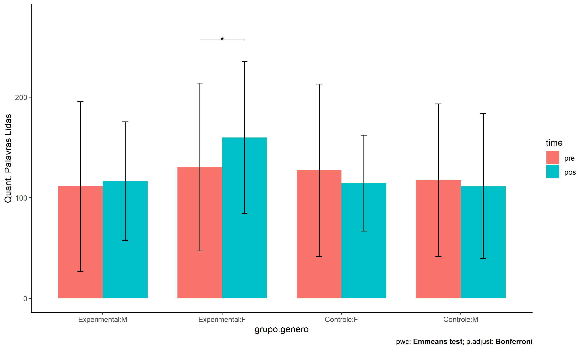<!-- -->

### Compreensao Leitora (Acertos)

| var                   | genero | grupo        |   n | M (pre) | SE (pre) | M (unadj) | SE (unadj) | M (adj) | SE (adj) |
|:----------------------|:-------|:-------------|----:|--------:|---------:|----------:|-----------:|--------:|---------:|
| score.compreensao.pos | F      | Controle     |  79 |   5.291 |    0.298 |     5.253 |      0.290 |   5.199 |    0.209 |
| score.compreensao.pos | F      | Experimental |  57 |   6.263 |    0.351 |     5.895 |      0.361 |   5.155 |    0.250 |
| score.compreensao.pos | M      | Controle     |  74 |   4.892 |    0.280 |     4.392 |      0.329 |   4.620 |    0.216 |
| score.compreensao.pos | M      | Experimental |  74 |   4.649 |    0.308 |     4.419 |      0.264 |   4.819 |    0.217 |

| .y.                   | grupo        | genero | group1   | group2       | estimate | conf.low | conf.high |    se | statistic | p       | p.adj   | p.adj.signif |
|:----------------------|:-------------|:-------|:---------|:-------------|---------:|---------:|----------:|------:|----------:|:--------|:--------|:-------------|
| score.compreensao.pos | Controle     |        | F        | M            |    0.579 |   -0.012 |     1.171 | 0.301 |     1.928 | 0.055   | 0.055   | ns           |
| score.compreensao.pos | Experimental |        | F        | M            |    0.336 |   -0.321 |     0.994 | 0.334 |     1.006 | 0.315   | 0.315   | ns           |
| score.compreensao.pre | Controle     |        | F        | M            |    0.399 |   -0.425 |     1.223 | 0.419 |     0.954 | 0.341   | 0.341   | ns           |
| score.compreensao.pre | Experimental |        | F        | M            |    1.615 |    0.717 |     2.512 | 0.456 |     3.540 | \<0.001 | \<0.001 | \*\*\*       |
| score.compreensao.pos |              | F      | Controle | Experimental |    0.045 |   -0.595 |     0.684 | 0.325 |     0.137 | 0.891   | 0.891   | ns           |
| score.compreensao.pos |              | M      | Controle | Experimental |   -0.199 |   -0.799 |     0.402 | 0.305 |    -0.651 | 0.515   | 0.515   | ns           |
| score.compreensao.pre |              | F      | Controle | Experimental |   -0.972 |   -1.857 |    -0.087 | 0.450 |    -2.161 | 0.032   | 0.032   | \*           |
| score.compreensao.pre |              | M      | Controle | Experimental |    0.243 |   -0.594 |     1.081 | 0.425 |     0.572 | 0.568   | 0.568   | ns           |

| grupo        | genero | group1 | group2 | estimate | conf.low | conf.high |    se | statistic |     p | p.adj | p.adj.signif |
|:-------------|:-------|:-------|:-------|---------:|---------:|----------:|------:|----------:|------:|------:|:-------------|
| Controle     | F      | pre    | pos    |    0.166 |   -0.623 |     0.955 | 0.402 |     0.413 | 0.680 | 0.680 | ns           |
| Controle     | M      | pre    | pos    |    0.644 |   -0.156 |     1.443 | 0.407 |     1.581 | 0.114 | 0.114 | ns           |
| Experimental | F      | pre    | pos    |    0.137 |   -0.795 |     1.069 | 0.474 |     0.289 | 0.773 | 0.773 | ns           |
| Experimental | M      | pre    | pos    |   -0.007 |   -0.801 |     0.786 | 0.404 |    -0.018 | 0.986 | 0.986 | ns           |

    ## Scale for colour is already present.
    ## Adding another scale for colour, which will replace the existing scale.

<!-- -->

    ## Scale for colour is already present.
    ## Adding another scale for colour, which will replace the existing scale.

<!-- -->

<!-- -->

<!-- -->

## factores: **idade:grupo**

### Quant. Palavras Lidas

| var                | idade | grupo        |   n | M (pre) | SE (pre) | M (unadj) | SE (unadj) | M (adj) | SE (adj) |
|:-------------------|:------|:-------------|----:|--------:|---------:|----------:|-----------:|--------:|---------:|
| palavras.lidas.pos | 10y   | Controle     |  26 | 123.808 |   17.201 |   108.808 |      8.976 | 109.106 |   12.646 |
| palavras.lidas.pos | 10y   | Experimental |  23 |  97.652 |   14.107 |   138.522 |     15.477 | 142.759 |   13.518 |
| palavras.lidas.pos | 11y   | Controle     |  79 | 124.203 |    9.234 |   120.418 |      7.347 | 120.656 |    7.255 |
| palavras.lidas.pos | 11y   | Experimental |  73 | 147.233 |   10.671 |   137.233 |      8.293 | 134.003 |    7.623 |
| palavras.lidas.pos | 12y   | Controle     |  17 | 132.529 |   18.309 |   106.529 |     12.749 | 105.514 |   15.642 |
| palavras.lidas.pos | 12y   | Experimental |  15 | 101.800 |   20.554 |   132.400 |     18.080 | 136.012 |   16.692 |
| palavras.lidas.pos | 13y   | Controle     |   9 |  96.333 |   25.990 |    98.889 |     24.701 | 103.324 |   21.544 |
| palavras.lidas.pos | 13y   | Experimental |   6 |  87.167 |   24.129 |   113.500 |     15.185 | 119.316 |   26.395 |

| .y.                | grupo        | idade | group1   | group2       | estimate | conf.low | conf.high |     se | statistic |     p | p.adj | p.adj.signif |
|:-------------------|:-------------|:------|:---------|:-------------|---------:|---------:|----------:|-------:|----------:|------:|------:|:-------------|
| palavras.lidas.pos | Controle     |       | 10y      | 11y          |  -11.551 |  -40.270 |    17.169 | 14.579 |    -0.792 | 0.429 | 1.000 | ns           |
| palavras.lidas.pos | Controle     |       | 10y      | 12y          |    3.592 |  -36.037 |    43.220 | 20.117 |     0.179 | 0.858 | 1.000 | ns           |
| palavras.lidas.pos | Controle     |       | 10y      | 13y          |    5.781 |  -43.419 |    54.981 | 24.975 |     0.231 | 0.817 | 1.000 | ns           |
| palavras.lidas.pos | Controle     |       | 11y      | 12y          |   15.142 |  -18.828 |    49.113 | 17.245 |     0.878 | 0.381 | 1.000 | ns           |
| palavras.lidas.pos | Controle     |       | 11y      | 13y          |   17.332 |  -27.440 |    62.104 | 22.728 |     0.763 | 0.446 | 1.000 | ns           |
| palavras.lidas.pos | Controle     |       | 12y      | 13y          |    2.189 |  -50.294 |    54.673 | 26.642 |     0.082 | 0.935 | 1.000 | ns           |
| palavras.lidas.pos | Experimental |       | 10y      | 11y          |    8.756 |  -22.008 |    39.519 | 15.616 |     0.561 | 0.576 | 1.000 | ns           |
| palavras.lidas.pos | Experimental |       | 10y      | 12y          |    6.746 |  -35.412 |    48.905 | 21.401 |     0.315 | 0.753 | 1.000 | ns           |
| palavras.lidas.pos | Experimental |       | 10y      | 13y          |   23.443 |  -34.796 |    81.681 | 29.563 |     0.793 | 0.429 | 1.000 | ns           |
| palavras.lidas.pos | Experimental |       | 11y      | 12y          |   -2.009 |  -38.296 |    34.277 | 18.420 |    -0.109 | 0.913 | 1.000 | ns           |
| palavras.lidas.pos | Experimental |       | 11y      | 13y          |   14.687 |  -39.582 |    68.956 | 27.549 |     0.533 | 0.594 | 1.000 | ns           |
| palavras.lidas.pos | Experimental |       | 12y      | 13y          |   16.696 |  -44.678 |    78.071 | 31.156 |     0.536 | 0.593 | 1.000 | ns           |
| palavras.lidas.pre | Controle     |       | 10y      | 11y          |   -0.395 |  -37.469 |    36.680 | 18.821 |    -0.021 | 0.983 | 1.000 | ns           |
| palavras.lidas.pre | Controle     |       | 10y      | 12y          |   -8.722 |  -59.867 |    42.423 | 25.963 |    -0.336 | 0.737 | 1.000 | ns           |
| palavras.lidas.pre | Controle     |       | 10y      | 13y          |   27.474 |  -35.943 |    90.892 | 32.193 |     0.853 | 0.394 | 1.000 | ns           |
| palavras.lidas.pre | Controle     |       | 11y      | 12y          |   -8.327 |  -52.168 |    35.514 | 22.255 |    -0.374 | 0.709 | 1.000 | ns           |
| palavras.lidas.pre | Controle     |       | 11y      | 13y          |   27.869 |  -29.819 |    85.558 | 29.285 |     0.952 | 0.342 | 1.000 | ns           |
| palavras.lidas.pre | Controle     |       | 12y      | 13y          |   36.196 |  -31.400 |   103.792 | 34.315 |     1.055 | 0.293 | 1.000 | ns           |
| palavras.lidas.pre | Experimental |       | 10y      | 11y          |  -49.581 |  -88.790 |   -10.371 | 19.904 |    -2.491 | 0.013 | 0.081 | ns           |
| palavras.lidas.pre | Experimental |       | 10y      | 12y          |   -4.148 |  -58.568 |    50.273 | 27.626 |    -0.150 | 0.881 | 1.000 | ns           |
| palavras.lidas.pre | Experimental |       | 10y      | 13y          |   10.486 |  -64.684 |    85.655 | 38.159 |     0.275 | 0.784 | 1.000 | ns           |
| palavras.lidas.pre | Experimental |       | 11y      | 12y          |   45.433 |   -1.052 |    91.918 | 23.598 |     1.925 | 0.055 | 0.332 | ns           |
| palavras.lidas.pre | Experimental |       | 11y      | 13y          |   60.066 |   -9.574 |   129.706 | 35.352 |     1.699 | 0.091 | 0.544 | ns           |
| palavras.lidas.pre | Experimental |       | 12y      | 13y          |   14.633 |  -64.575 |    93.841 | 40.209 |     0.364 | 0.716 | 1.000 | ns           |
| palavras.lidas.pos |              | 10y   | Controle | Experimental |  -33.653 |  -70.105 |     2.798 | 18.504 |    -1.819 | 0.070 | 0.070 | ns           |
| palavras.lidas.pos |              | 11y   | Controle | Experimental |  -13.347 |  -34.093 |     7.399 | 10.531 |    -1.267 | 0.206 | 0.206 | ns           |
| palavras.lidas.pos |              | 12y   | Controle | Experimental |  -30.498 |  -75.597 |    14.600 | 22.894 |    -1.332 | 0.184 | 0.184 | ns           |
| palavras.lidas.pos |              | 13y   | Controle | Experimental |  -15.992 |  -82.944 |    50.961 | 33.987 |    -0.471 | 0.638 | 0.638 | ns           |
| palavras.lidas.pre |              | 10y   | Controle | Experimental |   26.156 |  -20.783 |    73.094 | 23.828 |     1.098 | 0.273 | 0.273 | ns           |
| palavras.lidas.pre |              | 11y   | Controle | Experimental |  -23.030 |  -49.652 |     3.591 | 13.514 |    -1.704 | 0.090 | 0.090 | ns           |
| palavras.lidas.pre |              | 12y   | Controle | Experimental |   30.729 |  -27.359 |    88.817 | 29.488 |     1.042 | 0.298 | 0.298 | ns           |
| palavras.lidas.pre |              | 13y   | Controle | Experimental |    9.167 |  -77.256 |    95.590 | 43.872 |     0.209 | 0.835 | 0.835 | ns           |

| grupo        | idade | group1 | group2 | estimate | conf.low | conf.high |     se | statistic |     p | p.adj | p.adj.signif |
|:-------------|:------|:-------|:-------|---------:|---------:|----------:|-------:|----------:|------:|------:|:-------------|
| Controle     | 10y   | pre    | pos    |    8.626 |  -30.251 |    47.503 | 19.791 |     0.436 | 0.663 | 0.663 | ns           |
| Controle     | 11y   | pre    | pos    |    4.669 |  -17.908 |    27.246 | 11.493 |     0.406 | 0.685 | 0.685 | ns           |
| Controle     | 12y   | pre    | pos    |   27.668 |  -18.117 |    73.454 | 23.308 |     1.187 | 0.236 | 0.236 | ns           |
| Controle     | 13y   | pre    | pos    |    1.711 |  -66.146 |    69.569 | 34.544 |     0.050 | 0.961 | 0.961 | ns           |
| Experimental | 10y   | pre    | pos    |  -41.114 |  -83.021 |     0.792 | 21.333 |    -1.927 | 0.054 | 0.054 | ns           |
| Experimental | 11y   | pre    | pos    |   -0.877 |  -24.318 |    22.565 | 11.933 |    -0.073 | 0.941 | 0.941 | ns           |
| Experimental | 12y   | pre    | pos    |  -18.847 |  -69.591 |    31.897 | 25.832 |    -0.730 | 0.466 | 0.466 | ns           |
| Experimental | 13y   | pre    | pos    |  -20.314 |  -93.095 |    52.467 | 37.051 |    -0.548 | 0.584 | 0.584 | ns           |

    ## Scale for colour is already present.
    ## Adding another scale for colour, which will replace the existing scale.

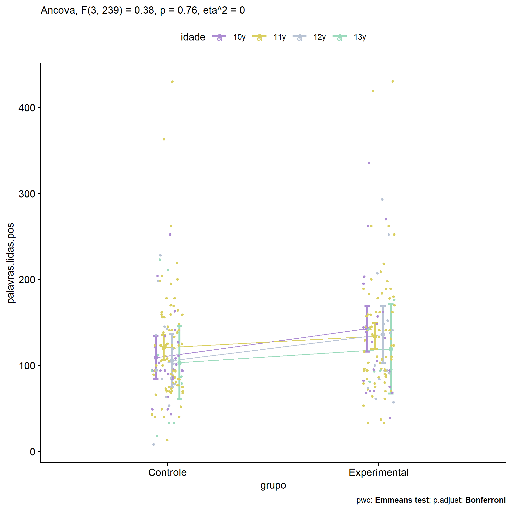<!-- -->

    ## Scale for colour is already present.
    ## Adding another scale for colour, which will replace the existing scale.

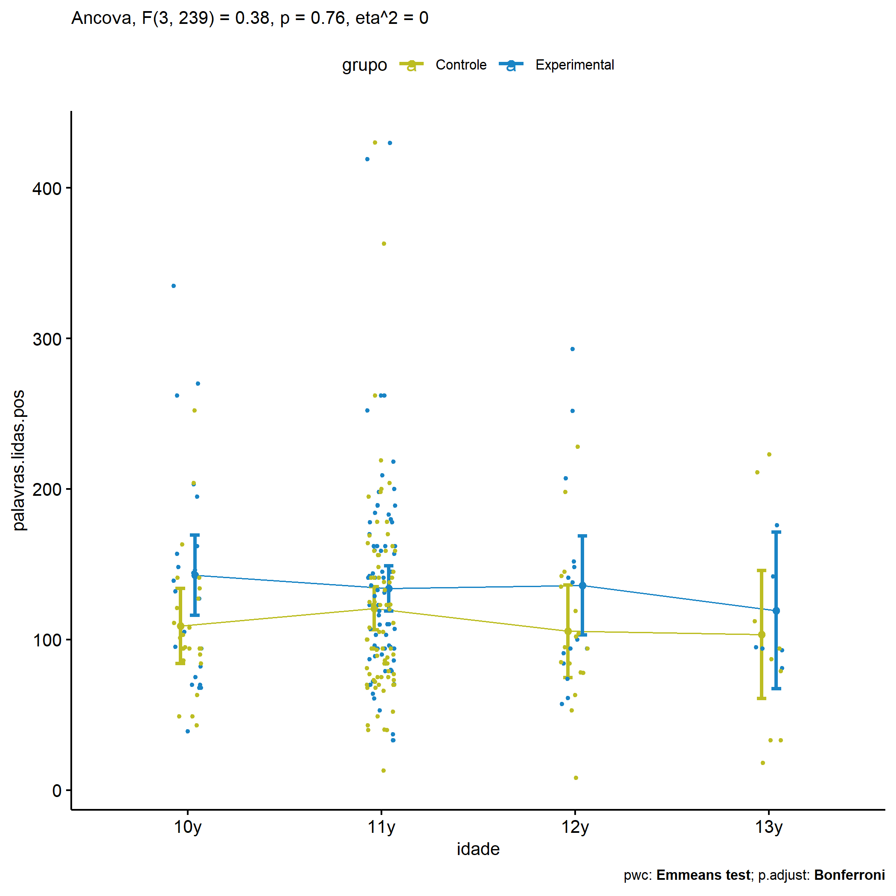<!-- -->

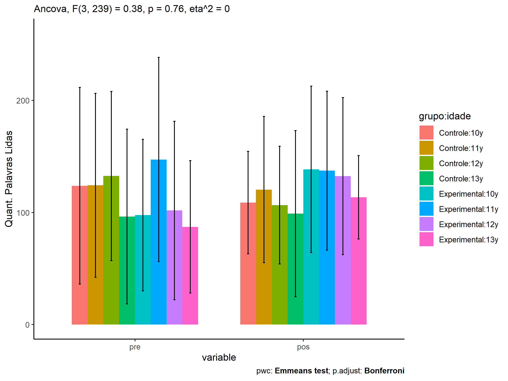<!-- -->

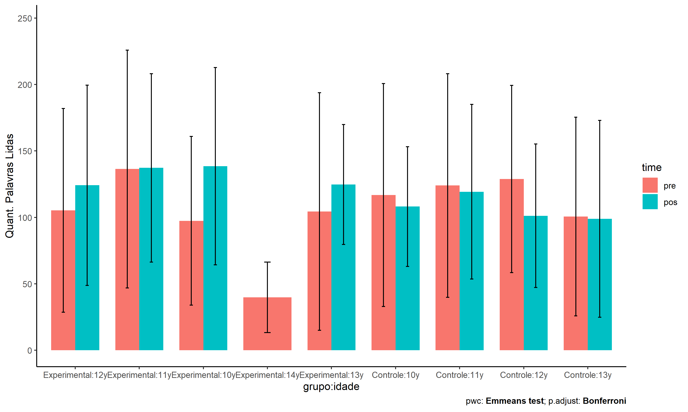<!-- -->

### Compreensao Leitora (Acertos)

| var                   | idade | grupo        |   n | M (pre) | SE (pre) | M (unadj) | SE (unadj) | M (adj) | SE (adj) |
|:----------------------|:------|:-------------|----:|--------:|---------:|----------:|-----------:|--------:|---------:|
| score.compreensao.pos | 10y   | Controle     |  28 |   5.321 |    0.477 |     5.071 |      0.490 |   5.039 |    0.356 |
| score.compreensao.pos | 10y   | Experimental |  26 |   4.962 |    0.572 |     5.077 |      0.480 |   5.298 |    0.369 |
| score.compreensao.pos | 11y   | Controle     |  86 |   5.279 |    0.280 |     5.081 |      0.315 |   5.078 |    0.203 |
| score.compreensao.pos | 11y   | Experimental |  77 |   5.818 |    0.329 |     5.416 |      0.303 |   5.033 |    0.216 |
| score.compreensao.pos | 12y   | Controle     |  21 |   5.048 |    0.475 |     4.571 |      0.528 |   4.731 |    0.411 |
| score.compreensao.pos | 12y   | Experimental |  17 |   4.706 |    0.491 |     4.706 |      0.593 |   5.107 |    0.457 |
| score.compreensao.pos | 13y   | Controle     |  10 |   3.900 |    0.781 |     3.800 |      0.512 |   4.769 |    0.598 |
| score.compreensao.pos | 13y   | Experimental |   8 |   4.375 |    0.653 |     2.875 |      0.515 |   3.509 |    0.666 |

| .y.                   | grupo        | idade | group1   | group2       | estimate | conf.low | conf.high |    se | statistic |     p | p.adj | p.adj.signif |
|:----------------------|:-------------|:------|:---------|:-------------|---------:|---------:|----------:|------:|----------:|------:|------:|:-------------|
| score.compreensao.pos | Controle     |       | 10y      | 11y          |   -0.040 |   -0.846 |     0.766 | 0.409 |    -0.097 | 0.923 | 1.000 | ns           |
| score.compreensao.pos | Controle     |       | 10y      | 12y          |    0.307 |   -0.763 |     1.377 | 0.543 |     0.565 | 0.572 | 1.000 | ns           |
| score.compreensao.pos | Controle     |       | 10y      | 13y          |    0.270 |   -1.101 |     1.640 | 0.696 |     0.388 | 0.699 | 1.000 | ns           |
| score.compreensao.pos | Controle     |       | 11y      | 12y          |    0.347 |   -0.555 |     1.249 | 0.458 |     0.757 | 0.450 | 1.000 | ns           |
| score.compreensao.pos | Controle     |       | 11y      | 13y          |    0.310 |   -0.934 |     1.553 | 0.632 |     0.490 | 0.624 | 1.000 | ns           |
| score.compreensao.pos | Controle     |       | 12y      | 13y          |   -0.037 |   -1.464 |     1.389 | 0.725 |    -0.052 | 0.959 | 1.000 | ns           |
| score.compreensao.pos | Experimental |       | 10y      | 11y          |    0.265 |   -0.579 |     1.109 | 0.428 |     0.619 | 0.537 | 1.000 | ns           |
| score.compreensao.pos | Experimental |       | 10y      | 12y          |    0.191 |   -0.965 |     1.347 | 0.587 |     0.325 | 0.745 | 1.000 | ns           |
| score.compreensao.pos | Experimental |       | 10y      | 13y          |    1.789 |    0.290 |     3.287 | 0.761 |     2.350 | 0.020 | 0.117 | ns           |
| score.compreensao.pos | Experimental |       | 11y      | 12y          |   -0.074 |   -1.072 |     0.923 | 0.507 |    -0.146 | 0.884 | 1.000 | ns           |
| score.compreensao.pos | Experimental |       | 11y      | 13y          |    1.524 |    0.142 |     2.905 | 0.702 |     2.171 | 0.031 | 0.185 | ns           |
| score.compreensao.pos | Experimental |       | 12y      | 13y          |    1.598 |    0.009 |     3.186 | 0.807 |     1.980 | 0.049 | 0.292 | ns           |
| score.compreensao.pre | Controle     |       | 10y      | 11y          |    0.042 |   -1.084 |     1.168 | 0.572 |     0.074 | 0.941 | 1.000 | ns           |
| score.compreensao.pre | Controle     |       | 10y      | 12y          |    0.274 |   -1.220 |     1.768 | 0.759 |     0.361 | 0.719 | 1.000 | ns           |
| score.compreensao.pre | Controle     |       | 10y      | 13y          |    1.421 |   -0.485 |     3.328 | 0.968 |     1.468 | 0.143 | 0.860 | ns           |
| score.compreensao.pre | Controle     |       | 11y      | 12y          |    0.231 |   -1.028 |     1.491 | 0.640 |     0.362 | 0.718 | 1.000 | ns           |
| score.compreensao.pre | Controle     |       | 11y      | 13y          |    1.379 |   -0.350 |     3.108 | 0.878 |     1.570 | 0.118 | 0.705 | ns           |
| score.compreensao.pre | Controle     |       | 12y      | 13y          |    1.148 |   -0.841 |     3.136 | 1.010 |     1.136 | 0.257 | 1.000 | ns           |
| score.compreensao.pre | Experimental |       | 10y      | 11y          |   -0.857 |   -2.031 |     0.317 | 0.596 |    -1.437 | 0.152 | 0.912 | ns           |
| score.compreensao.pre | Experimental |       | 10y      | 12y          |    0.256 |   -1.359 |     1.870 | 0.820 |     0.312 | 0.755 | 1.000 | ns           |
| score.compreensao.pre | Experimental |       | 10y      | 13y          |    0.587 |   -1.506 |     2.679 | 1.063 |     0.552 | 0.581 | 1.000 | ns           |
| score.compreensao.pre | Experimental |       | 11y      | 12y          |    1.112 |   -0.275 |     2.499 | 0.704 |     1.579 | 0.116 | 0.693 | ns           |
| score.compreensao.pre | Experimental |       | 11y      | 13y          |    1.443 |   -0.479 |     3.366 | 0.976 |     1.478 | 0.141 | 0.844 | ns           |
| score.compreensao.pre | Experimental |       | 12y      | 13y          |    0.331 |   -1.888 |     2.550 | 1.127 |     0.294 | 0.769 | 1.000 | ns           |
| score.compreensao.pos |              | 10y   | Controle | Experimental |   -0.259 |   -1.269 |     0.750 | 0.513 |    -0.505 | 0.614 | 0.614 | ns           |
| score.compreensao.pos |              | 11y   | Controle | Experimental |    0.046 |   -0.537 |     0.629 | 0.296 |     0.154 | 0.877 | 0.877 | ns           |
| score.compreensao.pos |              | 12y   | Controle | Experimental |   -0.375 |   -1.584 |     0.834 | 0.614 |    -0.611 | 0.542 | 0.542 | ns           |
| score.compreensao.pos |              | 13y   | Controle | Experimental |    1.260 |   -0.498 |     3.017 | 0.893 |     1.411 | 0.159 | 0.159 | ns           |
| score.compreensao.pre |              | 10y   | Controle | Experimental |    0.360 |   -1.050 |     1.769 | 0.716 |     0.503 | 0.616 | 0.616 | ns           |
| score.compreensao.pre |              | 11y   | Controle | Experimental |   -0.539 |   -1.351 |     0.273 | 0.412 |    -1.307 | 0.192 | 0.192 | ns           |
| score.compreensao.pre |              | 12y   | Controle | Experimental |    0.342 |   -1.347 |     2.030 | 0.858 |     0.398 | 0.691 | 0.691 | ns           |
| score.compreensao.pre |              | 13y   | Controle | Experimental |   -0.475 |   -2.930 |     1.980 | 1.247 |    -0.381 | 0.704 | 0.704 | ns           |

| grupo        | idade | group1 | group2 | estimate | conf.low | conf.high |    se | statistic |     p | p.adj | p.adj.signif |
|:-------------|:------|:-------|:-------|---------:|---------:|----------:|------:|----------:|------:|------:|:-------------|
| Controle     | 10y   | pre    | pos    |    0.217 |   -1.110 |     1.543 | 0.675 |     0.321 | 0.748 | 0.748 | ns           |
| Controle     | 11y   | pre    | pos    |    0.361 |   -0.409 |     1.131 | 0.392 |     0.921 | 0.357 | 0.357 | ns           |
| Controle     | 12y   | pre    | pos    |    0.661 |   -0.837 |     2.160 | 0.763 |     0.867 | 0.386 | 0.386 | ns           |
| Controle     | 13y   | pre    | pos    |    0.100 |   -2.196 |     2.396 | 1.169 |     0.086 | 0.932 | 0.932 | ns           |
| Experimental | 10y   | pre    | pos    |   -0.151 |   -1.562 |     1.260 | 0.718 |    -0.210 | 0.834 | 0.834 | ns           |
| Experimental | 11y   | pre    | pos    |    0.271 |   -0.529 |     1.070 | 0.407 |     0.664 | 0.507 | 0.507 | ns           |
| Experimental | 12y   | pre    | pos    |   -0.074 |   -1.789 |     1.640 | 0.873 |    -0.085 | 0.932 | 0.932 | ns           |
| Experimental | 13y   | pre    | pos    |    0.943 |   -1.443 |     3.329 | 1.215 |     0.776 | 0.438 | 0.438 | ns           |

    ## Scale for colour is already present.
    ## Adding another scale for colour, which will replace the existing scale.

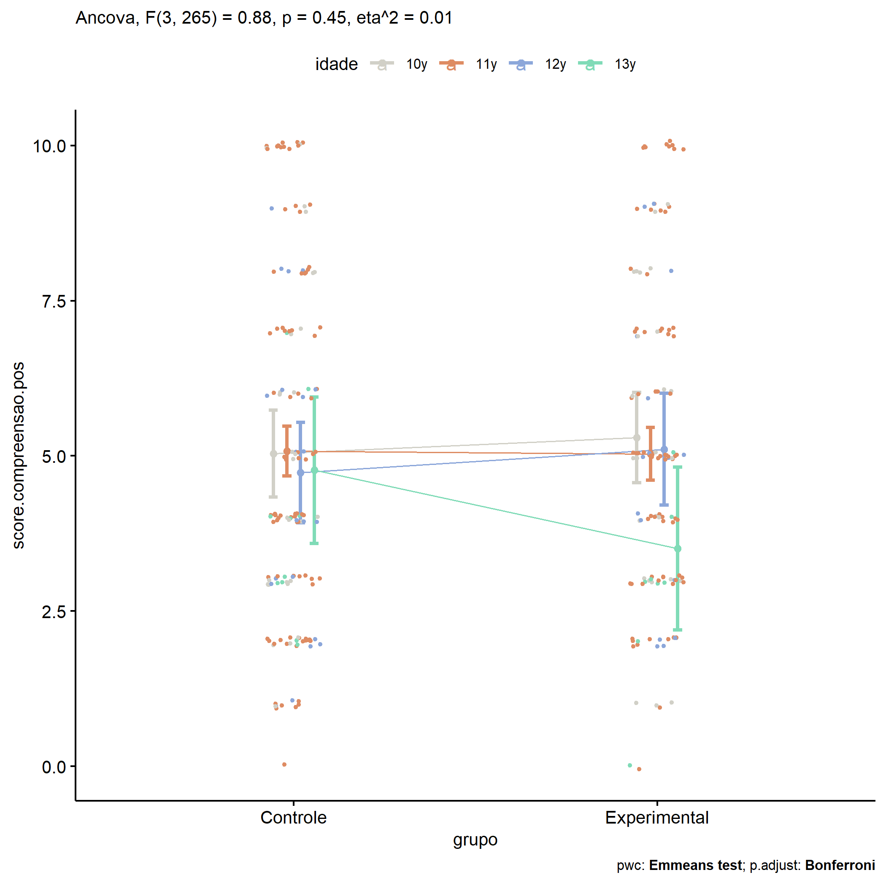<!-- -->

    ## Scale for colour is already present.
    ## Adding another scale for colour, which will replace the existing scale.

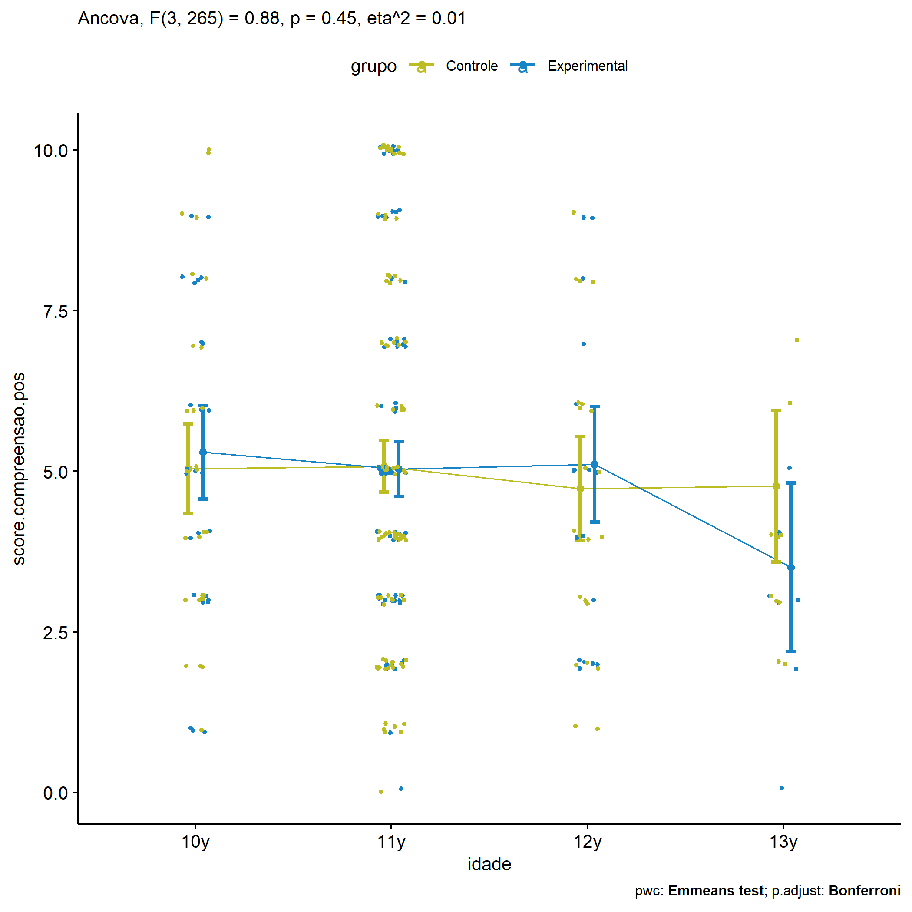<!-- -->

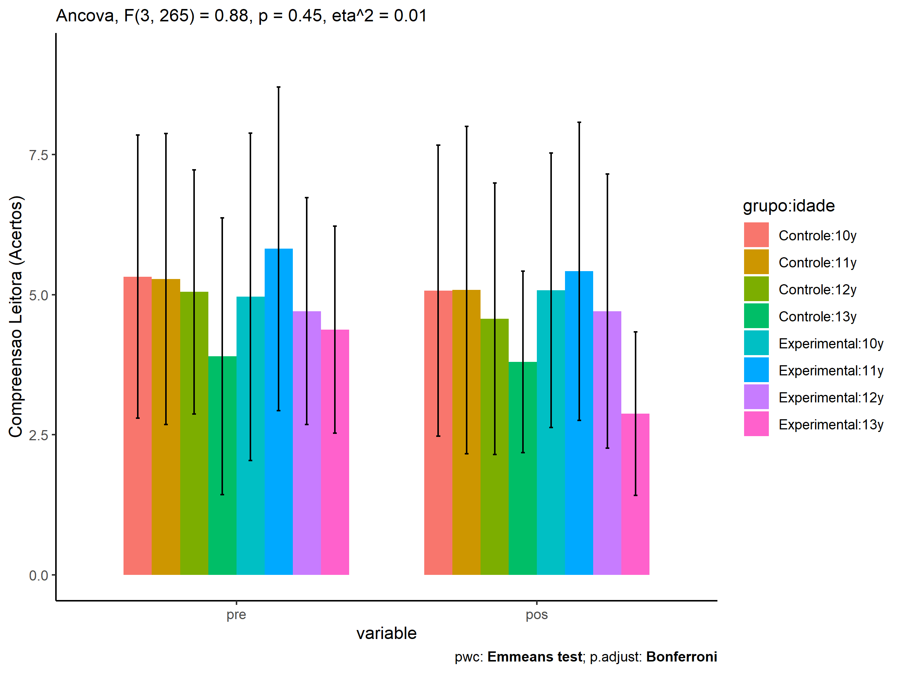<!-- -->

<!-- -->

## factores: **zona.participante:grupo**

### Quant. Palavras Lidas

| var                | zona.participante | grupo        |   n | M (pre) | SE (pre) | M (unadj) | SE (unadj) | M (adj) | SE (adj) |
|:-------------------|:------------------|:-------------|----:|--------:|---------:|----------:|-----------:|--------:|---------:|
| palavras.lidas.pos | Rural             | Controle     |  47 | 124.404 |   11.531 |   116.553 |      7.025 | 117.426 |    9.225 |
| palavras.lidas.pos | Rural             | Experimental |  49 | 130.327 |   13.655 |   114.898 |      6.844 | 115.139 |    9.026 |
| palavras.lidas.pos | Urbana            | Controle     |  61 | 132.492 |   11.276 |   112.098 |      9.330 | 112.108 |    8.089 |
| palavras.lidas.pos | Urbana            | Experimental |  42 | 144.500 |   13.501 |   153.262 |     12.193 | 151.990 |    9.768 |

| .y.                | grupo        | zona.participante | group1   | group2       | estimate | conf.low | conf.high |     se | statistic |     p | p.adj | p.adj.signif |
|:-------------------|:-------------|:------------------|:---------|:-------------|---------:|---------:|----------:|-------:|----------:|------:|------:|:-------------|
| palavras.lidas.pos | Controle     |                   | Urbana   | Rural        |   -5.318 |  -29.515 |    18.880 | 12.269 |    -0.433 | 0.665 | 0.665 | ns           |
| palavras.lidas.pos | Experimental |                   | Urbana   | Rural        |   36.851 |   10.611 |    63.092 | 13.305 |     2.770 | 0.006 | 0.006 | \*\*         |
| palavras.lidas.pre | Controle     |                   | Urbana   | Rural        |    8.088 |  -25.543 |    41.718 | 17.052 |     0.474 | 0.636 | 0.636 | ns           |
| palavras.lidas.pre | Experimental |                   | Urbana   | Rural        |   14.173 |  -22.263 |    50.610 | 18.475 |     0.767 | 0.444 | 0.444 | ns           |
| palavras.lidas.pos |              | Urbana            | Controle | Experimental |  -39.882 |  -64.895 |   -14.869 | 12.682 |    -3.145 | 0.002 | 0.002 | \*\*         |
| palavras.lidas.pos |              | Rural             | Controle | Experimental |    2.287 |  -23.160 |    27.734 | 12.902 |     0.177 | 0.859 | 0.859 | ns           |
| palavras.lidas.pre |              | Urbana            | Controle | Experimental |  -12.008 |  -46.751 |    22.735 | 17.616 |    -0.682 | 0.496 | 0.496 | ns           |
| palavras.lidas.pre |              | Rural             | Controle | Experimental |   -5.922 |  -41.300 |    29.455 | 17.938 |    -0.330 | 0.742 | 0.742 | ns           |

| grupo        | zona.participante | group1 | group2 | estimate | conf.low | conf.high |     se | statistic |     p | p.adj | p.adj.signif |
|:-------------|:------------------|:-------|:-------|---------:|---------:|----------:|-------:|----------:|------:|------:|:-------------|
| Controle     | Urbana            | pre    | pos    |   22.396 |   -3.731 |    48.523 | 13.293 |     1.685 | 0.093 | 0.093 | ns           |
| Controle     | Rural             | pre    | pos    |   11.164 |  -18.833 |    41.162 | 15.263 |     0.731 | 0.465 | 0.465 | ns           |
| Experimental | Urbana            | pre    | pos    |  -20.678 |  -51.722 |    10.366 | 15.795 |    -1.309 | 0.191 | 0.191 | ns           |
| Experimental | Rural             | pre    | pos    |    8.878 |  -20.657 |    38.413 | 15.027 |     0.591 | 0.555 | 0.555 | ns           |

    ## Scale for colour is already present.
    ## Adding another scale for colour, which will replace the existing scale.

<!-- -->

    ## Scale for colour is already present.
    ## Adding another scale for colour, which will replace the existing scale.

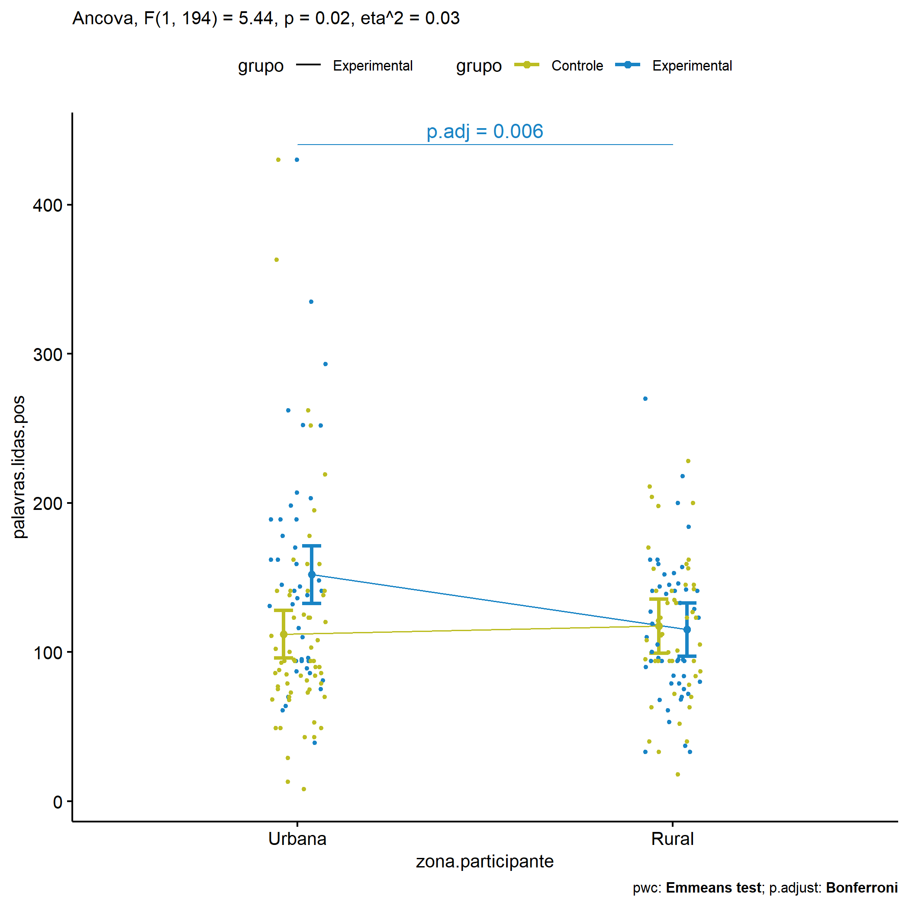<!-- -->

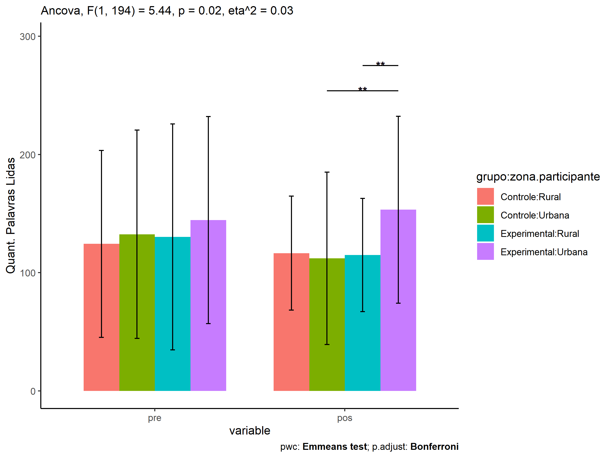<!-- -->

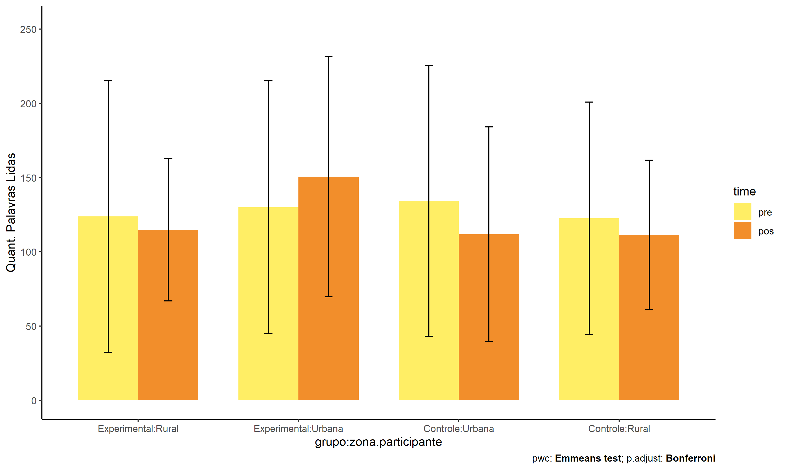<!-- -->

### Compreensao Leitora (Acertos)

| var                   | zona.participante | grupo        |   n | M (pre) | SE (pre) | M (unadj) | SE (unadj) | M (adj) | SE (adj) |
|:----------------------|:------------------|:-------------|----:|--------:|---------:|----------:|-----------:|--------:|---------:|
| score.compreensao.pos | Rural             | Controle     |  51 |   4.608 |    0.330 |     4.353 |      0.370 |   4.696 |    0.263 |
| score.compreensao.pos | Rural             | Experimental |  52 |   5.519 |    0.369 |     5.192 |      0.366 |   4.876 |    0.260 |
| score.compreensao.pos | Urbana            | Controle     |  67 |   5.194 |    0.298 |     5.194 |      0.329 |   5.113 |    0.228 |
| score.compreensao.pos | Urbana            | Experimental |  49 |   4.959 |    0.408 |     5.163 |      0.362 |   5.252 |    0.267 |

| .y.                   | grupo        | zona.participante | group1   | group2       | estimate | conf.low | conf.high |    se | statistic |     p | p.adj | p.adj.signif |
|:----------------------|:-------------|:------------------|:---------|:-------------|---------:|---------:|----------:|------:|----------:|------:|------:|:-------------|
| score.compreensao.pos | Controle     |                   | Urbana   | Rural        |    0.417 |   -0.270 |     1.103 | 0.348 |     1.196 | 0.233 | 0.233 | ns           |
| score.compreensao.pos | Experimental |                   | Urbana   | Rural        |    0.376 |   -0.359 |     1.112 | 0.373 |     1.009 | 0.314 | 0.314 | ns           |
| score.compreensao.pre | Controle     |                   | Urbana   | Rural        |    0.586 |   -0.356 |     1.529 | 0.478 |     1.226 | 0.222 | 0.222 | ns           |
| score.compreensao.pre | Experimental |                   | Urbana   | Rural        |   -0.560 |   -1.570 |     0.450 | 0.512 |    -1.093 | 0.276 | 0.276 | ns           |
| score.compreensao.pos |              | Urbana            | Controle | Experimental |   -0.139 |   -0.832 |     0.553 | 0.351 |    -0.396 | 0.692 | 0.692 | ns           |
| score.compreensao.pos |              | Rural             | Controle | Experimental |   -0.180 |   -0.911 |     0.552 | 0.371 |    -0.484 | 0.629 | 0.629 | ns           |
| score.compreensao.pre |              | Urbana            | Controle | Experimental |    0.235 |   -0.719 |     1.188 | 0.484 |     0.486 | 0.628 | 0.628 | ns           |
| score.compreensao.pre |              | Rural             | Controle | Experimental |   -0.911 |   -1.911 |     0.088 | 0.507 |    -1.797 | 0.074 | 0.074 | ns           |

| grupo        | zona.participante | group1 | group2 | estimate | conf.low | conf.high |    se | statistic |     p | p.adj | p.adj.signif |
|:-------------|:------------------|:-------|:-------|---------:|---------:|----------:|------:|----------:|------:|------:|:-------------|
| Controle     | Urbana            | pre    | pos    |    0.206 |   -0.644 |     1.056 | 0.433 |     0.477 | 0.634 | 0.634 | ns           |
| Controle     | Rural             | pre    | pos    |    0.271 |   -0.714 |     1.256 | 0.501 |     0.541 | 0.589 | 0.589 | ns           |
| Experimental | Urbana            | pre    | pos    |   -0.454 |   -1.455 |     0.547 | 0.509 |    -0.892 | 0.373 | 0.373 | ns           |
| Experimental | Rural             | pre    | pos    |    0.229 |   -0.738 |     1.196 | 0.492 |     0.465 | 0.642 | 0.642 | ns           |

    ## Scale for colour is already present.
    ## Adding another scale for colour, which will replace the existing scale.

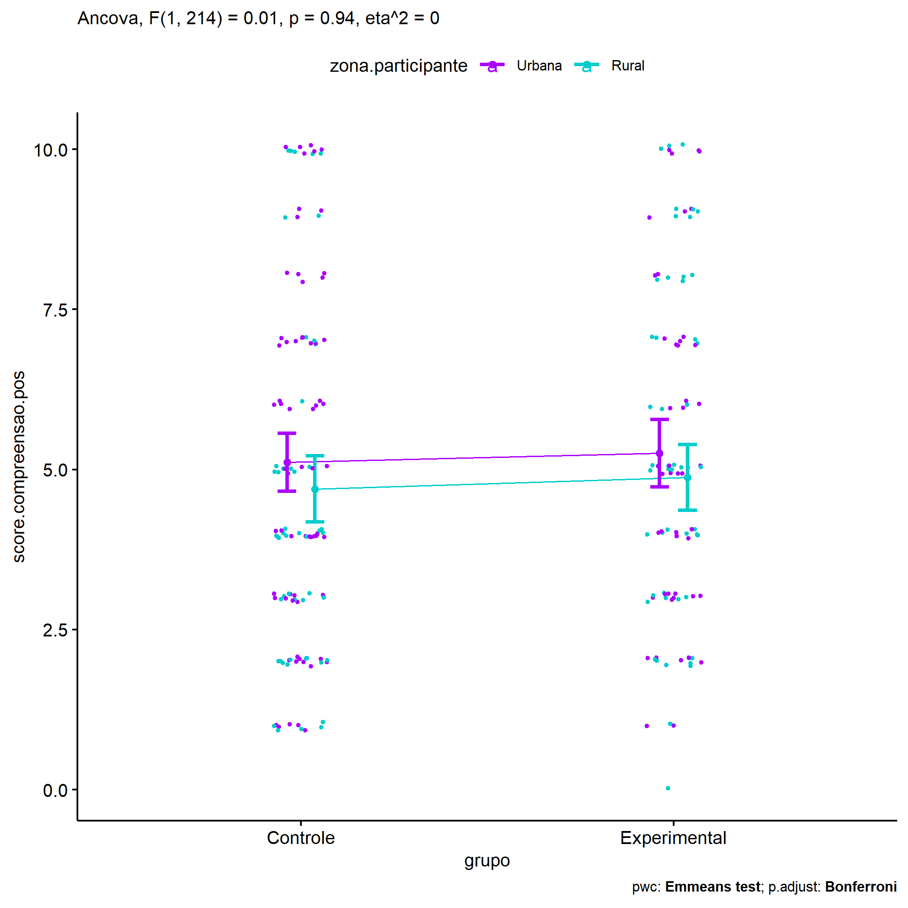<!-- -->

    ## Scale for colour is already present.
    ## Adding another scale for colour, which will replace the existing scale.

<!-- -->

<!-- -->

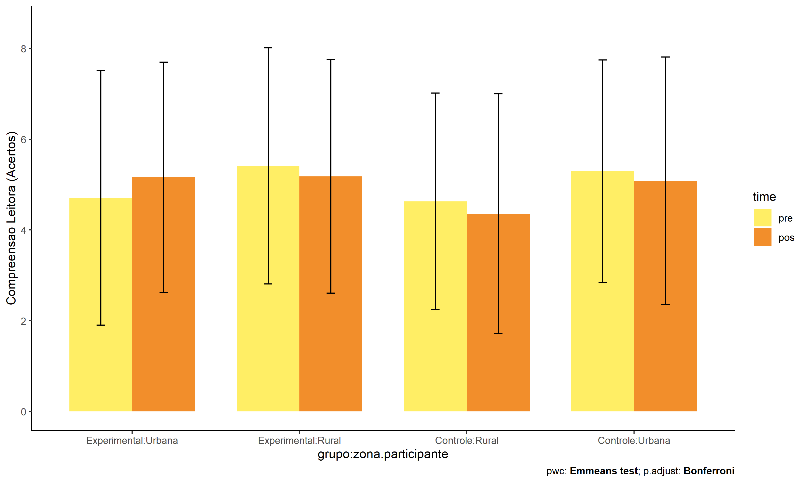<!-- -->

## factores: **escola:grupo**

### Quant. Palavras Lidas

| var                | escola | grupo        |   n | M (pre) | SE (pre) | M (unadj) | SE (unadj) | M (adj) | SE (adj) |
|:-------------------|:-------|:-------------|----:|--------:|---------:|----------:|-----------:|--------:|---------:|
| palavras.lidas.pos | E1     | Controle     |  13 |  85.385 |    9.536 |    86.154 |     10.925 | 100.161 |   15.786 |
| palavras.lidas.pos | E1     | Experimental |   8 | 123.625 |   25.555 |   192.500 |     44.197 | 192.917 |   19.934 |
| palavras.lidas.pos | E2     | Controle     |  13 |  87.692 |   14.529 |   153.154 |     29.336 | 166.341 |   15.769 |
| palavras.lidas.pos | E2     | Experimental |  11 |  80.909 |    9.216 |   167.909 |     24.472 | 183.507 |   17.169 |
| palavras.lidas.pos | E3     | Controle     |  18 | 113.500 |   17.614 |    94.722 |     12.938 |  98.737 |   13.303 |
| palavras.lidas.pos | E3     | Experimental |  15 |  84.800 |   12.165 |   101.867 |     10.170 | 116.081 |   14.722 |
| palavras.lidas.pos | E4     | Controle     |  20 | 247.650 |   13.699 |    98.450 |      6.032 |  54.790 |   14.293 |
| palavras.lidas.pos | E4     | Experimental |  16 | 257.312 |   17.008 |    98.125 |      6.796 |  51.031 |   15.857 |
| palavras.lidas.pos | E5     | Controle     |  59 | 103.525 |    8.525 |   122.780 |      7.525 | 130.340 |    7.432 |
| palavras.lidas.pos | E5     | Experimental |  57 | 120.263 |   10.440 |   147.807 |      8.685 | 149.419 |    7.472 |
| palavras.lidas.pos | E6     | Controle     |  14 | 102.643 |   17.160 |   123.214 |     13.248 | 131.088 |   15.117 |
| palavras.lidas.pos | E6     | Experimental |  13 |  89.154 |   17.522 |   104.154 |     10.367 | 116.821 |   15.759 |

| .y.                | grupo        | escola | group1   | group2       | estimate | conf.low | conf.high |     se | statistic | p       | p.adj   | p.adj.signif |
|:-------------------|:-------------|:-------|:---------|:-------------|---------:|---------:|----------:|-------:|----------:|:--------|:--------|:-------------|
| palavras.lidas.pos | Controle     |        | E1       | E2           |  -66.180 | -109.740 |   -22.620 | 22.115 |    -2.993 | 0.003   | 0.046   | \*           |
| palavras.lidas.pos | Controle     |        | E1       | E3           |    1.424 |  -39.111 |    41.958 | 20.579 |     0.069 | 0.945   | 1       | ns           |
| palavras.lidas.pos | Controle     |        | E1       | E4           |   45.371 |    2.101 |    88.641 | 21.968 |     2.065 | 0.04    | 0.599   | ns           |
| palavras.lidas.pos | Controle     |        | E1       | E5           |  -30.179 |  -64.261 |     3.903 | 17.303 |    -1.744 | 0.082   | 1       | ns           |
| palavras.lidas.pos | Controle     |        | E1       | E6           |  -30.927 |  -73.742 |    11.888 | 21.736 |    -1.423 | 0.156   | 1       | ns           |
| palavras.lidas.pos | Controle     |        | E2       | E3           |   67.603 |   27.086 |   108.120 | 20.570 |     3.287 | 0.001   | 0.017   | \*           |
| palavras.lidas.pos | Controle     |        | E2       | E4           |  111.551 |   68.381 |   154.721 | 21.917 |     5.090 | \<0.001 | \<0.001 | \*\*\*\*     |
| palavras.lidas.pos | Controle     |        | E2       | E5           |   36.001 |    1.933 |    70.069 | 17.296 |     2.081 | 0.038   | 0.576   | ns           |
| palavras.lidas.pos | Controle     |        | E2       | E6           |   35.253 |   -7.552 |    78.057 | 21.731 |     1.622 | 0.106   | 1       | ns           |
| palavras.lidas.pos | Controle     |        | E3       | E4           |   43.948 |    5.068 |    82.827 | 19.739 |     2.226 | 0.027   | 0.403   | ns           |
| palavras.lidas.pos | Controle     |        | E3       | E5           |  -31.602 |  -61.525 |    -1.680 | 15.191 |    -2.080 | 0.039   | 0.578   | ns           |
| palavras.lidas.pos | Controle     |        | E3       | E6           |  -32.351 |  -71.942 |     7.241 | 20.100 |    -1.609 | 0.109   | 1       | ns           |
| palavras.lidas.pos | Controle     |        | E4       | E5           |  -75.550 | -108.228 |   -42.872 | 16.590 |    -4.554 | \<0.001 | \<0.001 | \*\*\*       |
| palavras.lidas.pos | Controle     |        | E4       | E6           |  -76.298 | -118.044 |   -34.552 | 21.194 |    -3.600 | \<0.001 | 0.006   | \*\*         |
| palavras.lidas.pos | Controle     |        | E5       | E6           |   -0.748 |  -33.763 |    32.267 | 16.761 |    -0.045 | 0.964   | 1       | ns           |
| palavras.lidas.pos | Experimental |        | E1       | E2           |    9.410 |  -42.398 |    61.218 | 26.302 |     0.358 | 0.721   | 1       | ns           |
| palavras.lidas.pos | Experimental |        | E1       | E3           |   76.835 |   28.036 |   125.635 | 24.775 |     3.101 | 0.002   | 0.032   | \*           |
| palavras.lidas.pos | Experimental |        | E1       | E4           |  141.886 |   91.678 |   192.094 | 25.490 |     5.566 | \<0.001 | \<0.001 | \*\*\*\*     |
| palavras.lidas.pos | Experimental |        | E1       | E5           |   43.498 |    1.568 |    85.428 | 21.287 |     2.043 | 0.042   | 0.631   | ns           |
| palavras.lidas.pos | Experimental |        | E1       | E6           |   76.095 |   26.054 |   126.137 | 25.405 |     2.995 | 0.003   | 0.045   | \*           |
| palavras.lidas.pos | Experimental |        | E2       | E3           |   67.425 |   23.339 |   111.511 | 22.382 |     3.013 | 0.003   | 0.043   | \*           |
| palavras.lidas.pos | Experimental |        | E2       | E4           |  132.476 |   84.991 |   179.960 | 24.107 |     5.495 | \<0.001 | \<0.001 | \*\*\*\*     |
| palavras.lidas.pos | Experimental |        | E2       | E5           |   34.088 |   -2.731 |    70.907 | 18.692 |     1.824 | 0.069   | 1       | ns           |
| palavras.lidas.pos | Experimental |        | E2       | E6           |   66.685 |   21.181 |   112.190 | 23.102 |     2.887 | 0.004   | 0.064   | ns           |
| palavras.lidas.pos | Experimental |        | E3       | E4           |   65.051 |   21.006 |   109.096 | 22.361 |     2.909 | 0.004   | 0.059   | ns           |
| palavras.lidas.pos | Experimental |        | E3       | E5           |  -33.337 |  -65.791 |    -0.884 | 16.476 |    -2.023 | 0.044   | 0.662   | ns           |
| palavras.lidas.pos | Experimental |        | E3       | E6           |   -0.740 |  -42.825 |    41.345 | 21.366 |    -0.035 | 0.972   | 1       | ns           |
| palavras.lidas.pos | Experimental |        | E4       | E5           |  -98.388 | -133.118 |   -63.658 | 17.632 |    -5.580 | \<0.001 | \<0.001 | \*\*\*\*     |
| palavras.lidas.pos | Experimental |        | E4       | E6           |  -65.791 | -111.058 |   -20.523 | 22.982 |    -2.863 | 0.005   | 0.068   | ns           |
| palavras.lidas.pos | Experimental |        | E5       | E6           |   32.597 |   -1.701 |    66.895 | 17.412 |     1.872 | 0.062   | 0.936   | ns           |
| palavras.lidas.pre | Controle     |        | E1       | E2           |   -2.308 |  -53.074 |    48.459 | 25.774 |    -0.090 | 0.929   | 1       | ns           |
| palavras.lidas.pre | Controle     |        | E1       | E3           |  -28.115 |  -75.225 |    18.994 | 23.917 |    -1.176 | 0.241   | 1       | ns           |
| palavras.lidas.pre | Controle     |        | E1       | E4           | -162.265 | -208.376 |  -116.154 | 23.410 |    -6.931 | \<0.001 | \<0.001 | \*\*\*\*     |
| palavras.lidas.pre | Controle     |        | E1       | E5           |  -18.141 |  -57.796 |    21.515 | 20.133 |    -0.901 | 0.368   | 1       | ns           |
| palavras.lidas.pre | Controle     |        | E1       | E6           |  -17.258 |  -67.110 |    32.594 | 25.309 |    -0.682 | 0.496   | 1       | ns           |
| palavras.lidas.pre | Controle     |        | E2       | E3           |  -25.808 |  -72.917 |    21.302 | 23.917 |    -1.079 | 0.282   | 1       | ns           |
| palavras.lidas.pre | Controle     |        | E2       | E4           | -159.958 | -206.069 |  -113.847 | 23.410 |    -6.833 | \<0.001 | \<0.001 | \*\*\*\*     |
| palavras.lidas.pre | Controle     |        | E2       | E5           |  -15.833 |  -55.489 |    23.822 | 20.133 |    -0.786 | 0.432   | 1       | ns           |
| palavras.lidas.pre | Controle     |        | E2       | E6           |  -14.951 |  -64.802 |    34.901 | 25.309 |    -0.591 | 0.555   | 1       | ns           |
| palavras.lidas.pre | Controle     |        | E3       | E4           | -134.150 | -176.201 |   -92.099 | 21.349 |    -6.284 | \<0.001 | \<0.001 | \*\*\*\*     |
| palavras.lidas.pre | Controle     |        | E3       | E5           |    9.975 |  -24.877 |    44.826 | 17.694 |     0.564 | 0.573   | 1       | ns           |
| palavras.lidas.pre | Controle     |        | E3       | E6           |   10.857 |  -35.265 |    56.979 | 23.416 |     0.464 | 0.643   | 1       | ns           |
| palavras.lidas.pre | Controle     |        | E4       | E5           |  144.125 |  110.635 |   177.614 | 17.002 |     8.477 | \<0.001 | \<0.001 | \*\*\*\*     |
| palavras.lidas.pre | Controle     |        | E4       | E6           |  145.007 |   99.905 |   190.109 | 22.898 |     6.333 | \<0.001 | \<0.001 | \*\*\*\*     |
| palavras.lidas.pre | Controle     |        | E5       | E6           |    0.883 |  -37.595 |    39.360 | 19.535 |     0.045 | 0.964   | 1       | ns           |
| palavras.lidas.pre | Experimental |        | E1       | E2           |   42.716 |  -17.425 |   102.857 | 30.533 |     1.399 | 0.163   | 1       | ns           |
| palavras.lidas.pre | Experimental |        | E1       | E3           |   38.825 |  -17.839 |    95.489 | 28.768 |     1.350 | 0.178   | 1       | ns           |
| palavras.lidas.pre | Experimental |        | E1       | E4           | -133.687 | -189.732 |   -77.643 | 28.454 |    -4.698 | \<0.001 | \<0.001 | \*\*\*\*     |
| palavras.lidas.pre | Experimental |        | E1       | E5           |    3.362 |  -45.504 |    52.228 | 24.809 |     0.136 | 0.892   | 1       | ns           |
| palavras.lidas.pre | Experimental |        | E1       | E6           |   34.471 |  -23.689 |    92.632 | 29.528 |     1.167 | 0.244   | 1       | ns           |
| palavras.lidas.pre | Experimental |        | E2       | E3           |   -3.891 |  -55.269 |    47.487 | 26.084 |    -0.149 | 0.882   | 1       | ns           |
| palavras.lidas.pre | Experimental |        | E2       | E4           | -176.403 | -227.098 |  -125.709 | 25.737 |    -6.854 | \<0.001 | \<0.001 | \*\*\*\*     |
| palavras.lidas.pre | Experimental |        | E2       | E5           |  -39.354 |  -81.978 |     3.270 | 21.640 |    -1.819 | 0.07    | 1       | ns           |
| palavras.lidas.pre | Experimental |        | E2       | E6           |   -8.245 |  -61.269 |    44.779 | 26.920 |    -0.306 | 0.76    | 1       | ns           |
| palavras.lidas.pre | Experimental |        | E3       | E4           | -172.513 | -219.029 |  -125.996 | 23.616 |    -7.305 | \<0.001 | \<0.001 | \*\*\*\*     |
| palavras.lidas.pre | Experimental |        | E3       | E5           |  -35.463 |  -73.022 |     2.096 | 19.069 |    -1.860 | 0.064   | 0.962   | ns           |
| palavras.lidas.pre | Experimental |        | E3       | E6           |   -4.354 |  -53.399 |    44.691 | 24.900 |    -0.175 | 0.861   | 1       | ns           |
| palavras.lidas.pre | Experimental |        | E4       | E5           |  137.049 |  100.431 |   173.668 | 18.591 |     7.372 | \<0.001 | \<0.001 | \*\*\*\*     |
| palavras.lidas.pre | Experimental |        | E4       | E6           |  168.159 |  119.830 |   216.487 | 24.536 |     6.854 | \<0.001 | \<0.001 | \*\*\*\*     |
| palavras.lidas.pre | Experimental |        | E5       | E6           |   31.109 |   -8.672 |    70.890 | 20.196 |     1.540 | 0.125   | 1       | ns           |
| palavras.lidas.pos |              | E1     | Controle | Experimental |  -92.756 | -142.830 |   -42.682 | 25.422 |    -3.649 | \<0.001 | \<0.001 | \*\*\*       |
| palavras.lidas.pos |              | E2     | Controle | Experimental |  -17.166 |  -62.668 |    28.336 | 23.101 |    -0.743 | 0.458   | 0.458   | ns           |
| palavras.lidas.pos |              | E3     | Controle | Experimental |  -17.344 |  -56.292 |    21.604 | 19.773 |    -0.877 | 0.381   | 0.381   | ns           |
| palavras.lidas.pos |              | E4     | Controle | Experimental |    3.759 |  -33.504 |    41.022 | 18.918 |     0.199 | 0.843   | 0.843   | ns           |
| palavras.lidas.pos |              | E5     | Controle | Experimental |  -19.079 |  -39.783 |     1.625 | 10.511 |    -1.815 | 0.071   | 0.071   | ns           |
| palavras.lidas.pos |              | E6     | Controle | Experimental |   14.267 |  -28.532 |    57.066 | 21.728 |     0.657 | 0.512   | 0.512   | ns           |
| palavras.lidas.pre |              | E1     | Controle | Experimental |  -38.240 |  -96.401 |    19.920 | 29.528 |    -1.295 | 0.197   | 0.197   | ns           |
| palavras.lidas.pre |              | E2     | Controle | Experimental |    6.783 |  -46.241 |    59.807 | 26.920 |     0.252 | 0.801   | 0.801   | ns           |
| palavras.lidas.pre |              | E3     | Controle | Experimental |   28.700 |  -16.549 |    73.949 | 22.973 |     1.249 | 0.213   | 0.213   | ns           |
| palavras.lidas.pre |              | E4     | Controle | Experimental |   -9.662 |  -53.075 |    33.750 | 22.040 |    -0.438 | 0.661   | 0.661   | ns           |
| palavras.lidas.pre |              | E5     | Controle | Experimental |  -16.738 |  -40.776 |     7.300 | 12.204 |    -1.371 | 0.171   | 0.171   | ns           |
| palavras.lidas.pre |              | E6     | Controle | Experimental |   13.489 |  -36.363 |    63.341 | 25.309 |     0.533 | 0.595   | 0.595   | ns           |

| grupo        | escola | group1 | group2 | estimate | conf.low | conf.high |     se | statistic | p       | p.adj   | p.adj.signif |
|:-------------|:-------|:-------|:-------|---------:|---------:|----------:|-------:|----------:|:--------|:--------|:-------------|
| Controle     | E1     | pre    | pos    |   -2.421 |  -50.698 |    45.857 | 24.578 |    -0.098 | 0.922   | 0.922   | ns           |
| Controle     | E2     | pre    | pos    |  -56.790 |  -98.509 |   -15.071 | 21.239 |    -2.674 | 0.008   | 0.008   | \*\*         |
| Controle     | E3     | pre    | pos    |   28.955 |  -11.384 |    69.294 | 20.537 |     1.410 | 0.159   | 0.159   | ns           |
| Controle     | E4     | pre    | pos    |  149.200 |  108.911 |   189.489 | 20.511 |     7.274 | \<0.001 | \<0.001 | \*\*\*\*     |
| Controle     | E5     | pre    | pos    |   -8.918 |  -31.563 |    13.727 | 11.529 |    -0.774 | 0.44    | 0.44    | ns           |
| Controle     | E6     | pre    | pos    |  -21.267 |  -67.788 |    25.255 | 23.684 |    -0.898 | 0.37    | 0.37    | ns           |
| Experimental | E1     | pre    | pos    | -101.808 | -159.058 |   -44.558 | 29.146 |    -3.493 | \<0.001 | \<0.001 | \*\*\*       |
| Experimental | E2     | pre    | pos    |  -71.840 | -116.303 |   -27.377 | 22.636 |    -3.174 | 0.002   | 0.002   | \*\*         |
| Experimental | E3     | pre    | pos    |  -12.992 |  -58.780 |    32.797 | 23.311 |    -0.557 | 0.578   | 0.578   | ns           |
| Experimental | E4     | pre    | pos    |  159.187 |  114.143 |   204.232 | 22.932 |     6.942 | \<0.001 | \<0.001 | \*\*\*\*     |
| Experimental | E5     | pre    | pos    |  -28.306 |  -51.490 |    -5.122 | 11.803 |    -2.398 | 0.017   | 0.017   | \*           |
| Experimental | E6     | pre    | pos    |  -27.091 |  -74.663 |    20.480 | 24.219 |    -1.119 | 0.264   | 0.264   | ns           |

    ## Scale for colour is already present.
    ## Adding another scale for colour, which will replace the existing scale.

<!-- -->

    ## Scale for colour is already present.
    ## Adding another scale for colour, which will replace the existing scale.

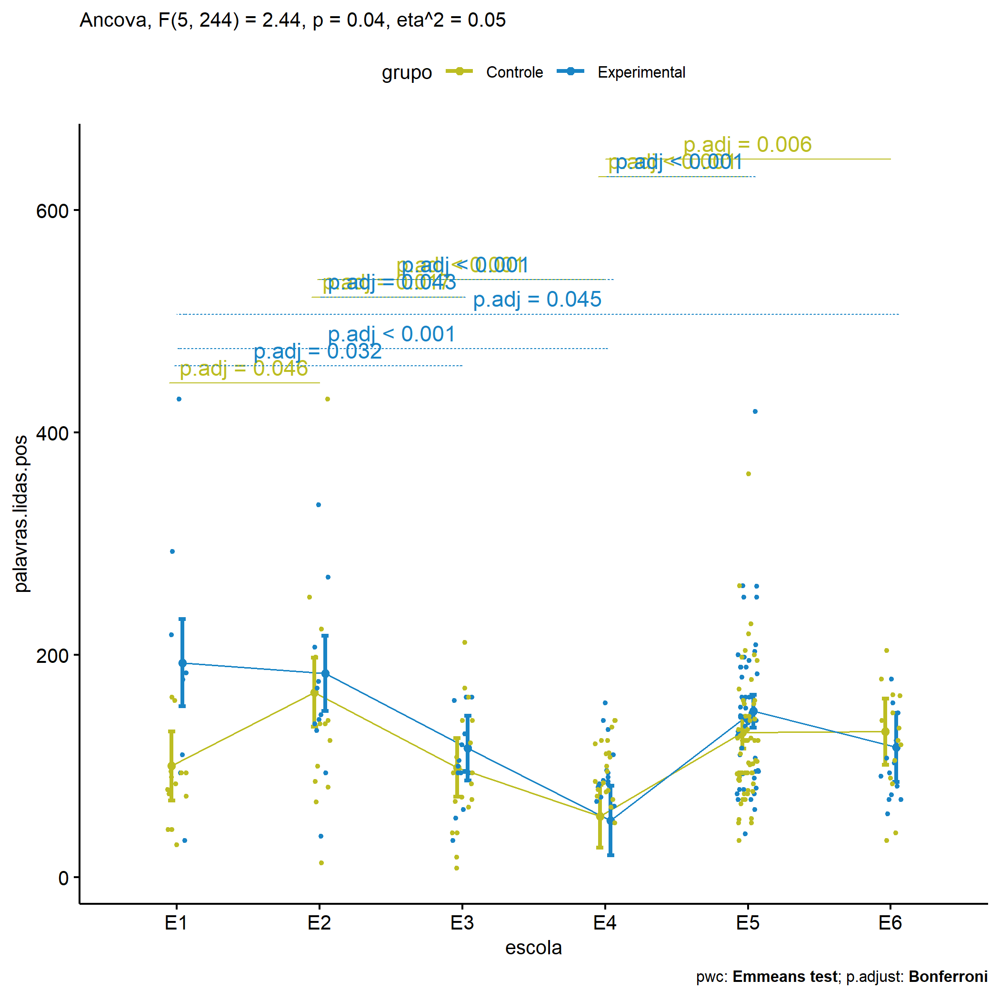<!-- -->

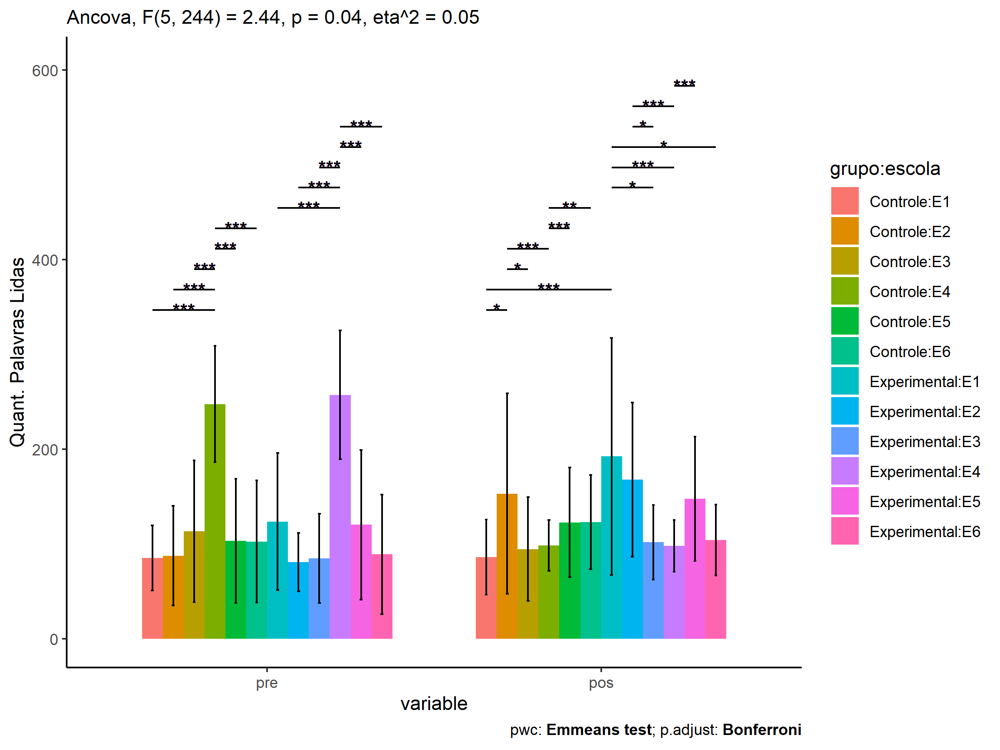<!-- -->

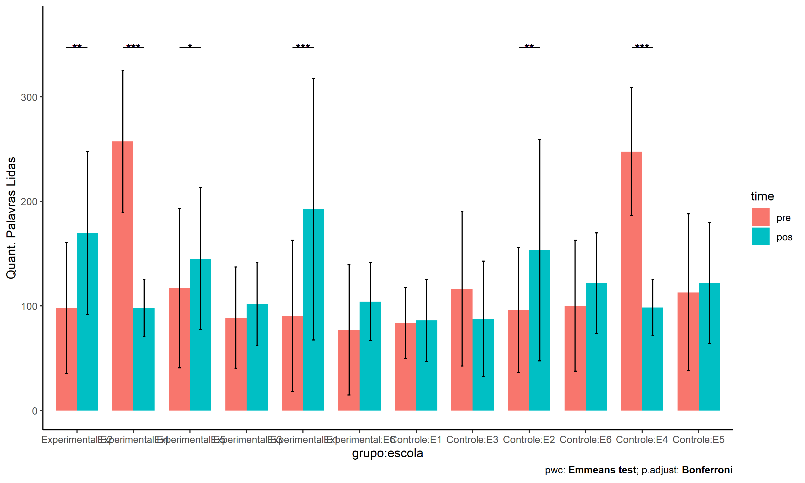<!-- -->

### Compreensao Leitora (Acertos)

| var                   | escola | grupo        |   n | M (pre) | SE (pre) | M (unadj) | SE (unadj) | M (adj) | SE (adj) |
|:----------------------|:-------|:-------------|----:|--------:|---------:|----------:|-----------:|--------:|---------:|
| score.compreensao.pos | E1     | Controle     |  13 |   5.462 |    0.656 |     5.615 |      0.738 |   5.438 |    0.520 |
| score.compreensao.pos | E1     | Experimental |   8 |   5.500 |    1.165 |     5.875 |      1.217 |   5.670 |    0.663 |
| score.compreensao.pos | E2     | Controle     |  29 |   4.379 |    0.524 |     4.724 |      0.548 |   5.325 |    0.350 |
| score.compreensao.pos | E2     | Experimental |  23 |   4.043 |    0.539 |     3.783 |      0.402 |   4.625 |    0.394 |
| score.compreensao.pos | E3     | Controle     |  19 |   5.000 |    0.501 |     4.684 |      0.617 |   4.839 |    0.430 |
| score.compreensao.pos | E3     | Experimental |  14 |   5.786 |    0.743 |     5.429 |      0.789 |   5.018 |    0.501 |
| score.compreensao.pos | E4     | Controle     |  19 |   5.789 |    0.475 |     5.474 |      0.618 |   5.060 |    0.431 |
| score.compreensao.pos | E4     | Experimental |  16 |   6.312 |    0.700 |     5.500 |      0.683 |   4.710 |    0.471 |
| score.compreensao.pos | E5     | Controle     |  59 |   4.881 |    0.328 |     4.424 |      0.341 |   4.664 |    0.244 |
| score.compreensao.pos | E5     | Experimental |  57 |   5.368 |    0.347 |     5.228 |      0.323 |   5.118 |    0.248 |
| score.compreensao.pos | E6     | Controle     |  14 |   6.357 |    0.753 |     5.429 |      0.782 |   4.607 |    0.503 |
| score.compreensao.pos | E6     | Experimental |  13 |   5.846 |    0.815 |     5.154 |      0.750 |   4.700 |    0.520 |

| .y.                   | grupo        | escola | group1   | group2       | estimate | conf.low | conf.high |    se | statistic |     p | p.adj | p.adj.signif |
|:----------------------|:-------------|:-------|:---------|:-------------|---------:|---------:|----------:|------:|----------:|------:|------:|:-------------|
| score.compreensao.pos | Controle     |        | E1       | E2           |    0.113 |   -1.122 |     1.348 | 0.627 |     0.180 | 0.858 | 1.000 | ns           |
| score.compreensao.pos | Controle     |        | E1       | E3           |    0.599 |   -0.729 |     1.928 | 0.675 |     0.888 | 0.375 | 1.000 | ns           |
| score.compreensao.pos | Controle     |        | E1       | E4           |    0.378 |   -0.951 |     1.706 | 0.675 |     0.560 | 0.576 | 1.000 | ns           |
| score.compreensao.pos | Controle     |        | E1       | E5           |    0.774 |   -0.357 |     1.906 | 0.575 |     1.347 | 0.179 | 1.000 | ns           |
| score.compreensao.pos | Controle     |        | E1       | E6           |    0.831 |   -0.592 |     2.254 | 0.723 |     1.150 | 0.251 | 1.000 | ns           |
| score.compreensao.pos | Controle     |        | E2       | E3           |    0.486 |   -0.604 |     1.577 | 0.554 |     0.879 | 0.380 | 1.000 | ns           |
| score.compreensao.pos | Controle     |        | E2       | E4           |    0.265 |   -0.831 |     1.361 | 0.556 |     0.476 | 0.634 | 1.000 | ns           |
| score.compreensao.pos | Controle     |        | E2       | E5           |    0.662 |   -0.176 |     1.499 | 0.426 |     1.555 | 0.121 | 1.000 | ns           |
| score.compreensao.pos | Controle     |        | E2       | E6           |    0.719 |   -0.494 |     1.931 | 0.616 |     1.167 | 0.244 | 1.000 | ns           |
| score.compreensao.pos | Controle     |        | E3       | E4           |   -0.221 |   -1.420 |     0.977 | 0.609 |    -0.364 | 0.716 | 1.000 | ns           |
| score.compreensao.pos | Controle     |        | E3       | E5           |    0.175 |   -0.798 |     1.148 | 0.494 |     0.354 | 0.723 | 1.000 | ns           |
| score.compreensao.pos | Controle     |        | E3       | E6           |    0.232 |   -1.073 |     1.537 | 0.663 |     0.350 | 0.727 | 1.000 | ns           |
| score.compreensao.pos | Controle     |        | E4       | E5           |    0.397 |   -0.580 |     1.373 | 0.496 |     0.800 | 0.425 | 1.000 | ns           |
| score.compreensao.pos | Controle     |        | E4       | E6           |    0.454 |   -0.847 |     1.754 | 0.661 |     0.687 | 0.493 | 1.000 | ns           |
| score.compreensao.pos | Controle     |        | E5       | E6           |    0.057 |   -1.047 |     1.161 | 0.561 |     0.101 | 0.919 | 1.000 | ns           |
| score.compreensao.pos | Experimental |        | E1       | E2           |    1.044 |   -0.475 |     2.564 | 0.772 |     1.353 | 0.177 | 1.000 | ns           |
| score.compreensao.pos | Experimental |        | E1       | E3           |    0.652 |   -0.983 |     2.287 | 0.831 |     0.785 | 0.433 | 1.000 | ns           |
| score.compreensao.pos | Experimental |        | E1       | E4           |    0.960 |   -0.640 |     2.559 | 0.812 |     1.181 | 0.238 | 1.000 | ns           |
| score.compreensao.pos | Experimental |        | E1       | E5           |    0.552 |   -0.841 |     1.945 | 0.708 |     0.781 | 0.436 | 1.000 | ns           |
| score.compreensao.pos | Experimental |        | E1       | E6           |    0.970 |   -0.688 |     2.628 | 0.842 |     1.152 | 0.250 | 1.000 | ns           |
| score.compreensao.pos | Experimental |        | E2       | E3           |   -0.393 |   -1.652 |     0.867 | 0.640 |    -0.614 | 0.540 | 1.000 | ns           |
| score.compreensao.pos | Experimental |        | E2       | E4           |   -0.085 |   -1.302 |     1.132 | 0.618 |    -0.137 | 0.891 | 1.000 | ns           |
| score.compreensao.pos | Experimental |        | E2       | E5           |   -0.492 |   -1.411 |     0.426 | 0.466 |    -1.055 | 0.292 | 1.000 | ns           |
| score.compreensao.pos | Experimental |        | E2       | E6           |   -0.074 |   -1.364 |     1.215 | 0.655 |    -0.113 | 0.910 | 1.000 | ns           |
| score.compreensao.pos | Experimental |        | E3       | E4           |    0.308 |   -1.043 |     1.658 | 0.686 |     0.448 | 0.654 | 1.000 | ns           |
| score.compreensao.pos | Experimental |        | E3       | E5           |   -0.100 |   -1.201 |     1.001 | 0.559 |    -0.178 | 0.859 | 1.000 | ns           |
| score.compreensao.pos | Experimental |        | E3       | E6           |    0.318 |   -1.103 |     1.739 | 0.722 |     0.441 | 0.660 | 1.000 | ns           |
| score.compreensao.pos | Experimental |        | E4       | E5           |   -0.407 |   -1.454 |     0.640 | 0.532 |    -0.766 | 0.444 | 1.000 | ns           |
| score.compreensao.pos | Experimental |        | E4       | E6           |    0.011 |   -1.368 |     1.389 | 0.700 |     0.015 | 0.988 | 1.000 | ns           |
| score.compreensao.pos | Experimental |        | E5       | E6           |    0.418 |   -0.717 |     1.553 | 0.576 |     0.725 | 0.469 | 1.000 | ns           |
| score.compreensao.pre | Controle     |        | E1       | E2           |    1.082 |   -0.633 |     2.798 | 0.871 |     1.242 | 0.215 | 1.000 | ns           |
| score.compreensao.pre | Controle     |        | E1       | E3           |    0.462 |   -1.389 |     2.312 | 0.940 |     0.491 | 0.624 | 1.000 | ns           |
| score.compreensao.pre | Controle     |        | E1       | E4           |   -0.328 |   -2.178 |     1.522 | 0.940 |    -0.349 | 0.727 | 1.000 | ns           |
| score.compreensao.pre | Controle     |        | E1       | E5           |    0.580 |   -0.995 |     2.155 | 0.800 |     0.725 | 0.469 | 1.000 | ns           |
| score.compreensao.pre | Controle     |        | E1       | E6           |   -0.896 |   -2.875 |     1.084 | 1.006 |    -0.891 | 0.374 | 1.000 | ns           |
| score.compreensao.pre | Controle     |        | E2       | E3           |   -0.621 |   -2.138 |     0.896 | 0.771 |    -0.805 | 0.421 | 1.000 | ns           |
| score.compreensao.pre | Controle     |        | E2       | E4           |   -1.410 |   -2.927 |     0.107 | 0.771 |    -1.830 | 0.068 | 1.000 | ns           |
| score.compreensao.pre | Controle     |        | E2       | E5           |   -0.502 |   -1.668 |     0.664 | 0.592 |    -0.848 | 0.397 | 1.000 | ns           |
| score.compreensao.pre | Controle     |        | E2       | E6           |   -1.978 |   -3.651 |    -0.305 | 0.850 |    -2.328 | 0.021 | 0.310 | ns           |
| score.compreensao.pre | Controle     |        | E3       | E4           |   -0.789 |   -2.457 |     0.878 | 0.847 |    -0.932 | 0.352 | 1.000 | ns           |
| score.compreensao.pre | Controle     |        | E3       | E5           |    0.119 |   -1.237 |     1.475 | 0.689 |     0.172 | 0.863 | 1.000 | ns           |
| score.compreensao.pre | Controle     |        | E3       | E6           |   -1.357 |   -3.168 |     0.453 | 0.920 |    -1.476 | 0.141 | 1.000 | ns           |
| score.compreensao.pre | Controle     |        | E4       | E5           |    0.908 |   -0.448 |     2.264 | 0.689 |     1.319 | 0.188 | 1.000 | ns           |
| score.compreensao.pre | Controle     |        | E4       | E6           |   -0.568 |   -2.378 |     1.243 | 0.920 |    -0.617 | 0.538 | 1.000 | ns           |
| score.compreensao.pre | Controle     |        | E5       | E6           |   -1.476 |   -3.004 |     0.052 | 0.776 |    -1.901 | 0.058 | 0.875 | ns           |
| score.compreensao.pre | Experimental |        | E1       | E2           |    1.457 |   -0.653 |     3.566 | 1.072 |     1.359 | 0.175 | 1.000 | ns           |
| score.compreensao.pre | Experimental |        | E1       | E3           |   -0.286 |   -2.564 |     1.992 | 1.157 |    -0.247 | 0.805 | 1.000 | ns           |
| score.compreensao.pre | Experimental |        | E1       | E4           |   -0.813 |   -3.038 |     1.413 | 1.131 |    -0.719 | 0.473 | 1.000 | ns           |
| score.compreensao.pre | Experimental |        | E1       | E5           |    0.132 |   -1.809 |     2.072 | 0.986 |     0.133 | 0.894 | 1.000 | ns           |
| score.compreensao.pre | Experimental |        | E1       | E6           |   -0.346 |   -2.656 |     1.964 | 1.173 |    -0.295 | 0.768 | 1.000 | ns           |
| score.compreensao.pre | Experimental |        | E2       | E3           |   -1.742 |   -3.485 |     0.000 | 0.885 |    -1.968 | 0.050 | 0.750 | ns           |
| score.compreensao.pre | Experimental |        | E2       | E4           |   -2.269 |   -3.942 |    -0.596 | 0.850 |    -2.669 | 0.008 | 0.121 | ns           |
| score.compreensao.pre | Experimental |        | E2       | E5           |   -1.325 |   -2.595 |    -0.055 | 0.645 |    -2.054 | 0.041 | 0.614 | ns           |
| score.compreensao.pre | Experimental |        | E2       | E6           |   -1.803 |   -3.586 |    -0.019 | 0.906 |    -1.990 | 0.048 | 0.714 | ns           |
| score.compreensao.pre | Experimental |        | E3       | E4           |   -0.527 |   -2.408 |     1.354 | 0.956 |    -0.551 | 0.582 | 1.000 | ns           |
| score.compreensao.pre | Experimental |        | E3       | E5           |    0.417 |   -1.116 |     1.951 | 0.779 |     0.536 | 0.593 | 1.000 | ns           |
| score.compreensao.pre | Experimental |        | E3       | E6           |   -0.060 |   -2.040 |     1.919 | 1.006 |    -0.060 | 0.952 | 1.000 | ns           |
| score.compreensao.pre | Experimental |        | E4       | E5           |    0.944 |   -0.510 |     2.398 | 0.739 |     1.278 | 0.202 | 1.000 | ns           |
| score.compreensao.pre | Experimental |        | E4       | E6           |    0.466 |   -1.453 |     2.386 | 0.975 |     0.478 | 0.633 | 1.000 | ns           |
| score.compreensao.pre | Experimental |        | E5       | E6           |   -0.478 |   -2.058 |     1.102 | 0.803 |    -0.595 | 0.552 | 1.000 | ns           |
| score.compreensao.pos |              | E1     | Controle | Experimental |   -0.232 |   -1.890 |     1.426 | 0.842 |    -0.275 | 0.783 | 0.783 | ns           |
| score.compreensao.pos |              | E2     | Controle | Experimental |    0.700 |   -0.331 |     1.730 | 0.523 |     1.337 | 0.182 | 0.182 | ns           |
| score.compreensao.pos |              | E3     | Controle | Experimental |   -0.179 |   -1.480 |     1.122 | 0.661 |    -0.271 | 0.787 | 0.787 | ns           |
| score.compreensao.pos |              | E4     | Controle | Experimental |    0.350 |   -0.903 |     1.603 | 0.636 |     0.550 | 0.583 | 0.583 | ns           |
| score.compreensao.pos |              | E5     | Controle | Experimental |   -0.454 |   -1.140 |     0.233 | 0.349 |    -1.302 | 0.194 | 0.194 | ns           |
| score.compreensao.pos |              | E6     | Controle | Experimental |   -0.093 |   -1.515 |     1.329 | 0.722 |    -0.129 | 0.898 | 0.898 | ns           |
| score.compreensao.pre |              | E1     | Controle | Experimental |   -0.038 |   -2.348 |     2.271 | 1.173 |    -0.033 | 0.974 | 0.974 | ns           |
| score.compreensao.pre |              | E2     | Controle | Experimental |    0.336 |   -1.099 |     1.771 | 0.729 |     0.461 | 0.645 | 0.645 | ns           |
| score.compreensao.pre |              | E3     | Controle | Experimental |   -0.786 |   -2.596 |     1.025 | 0.920 |    -0.854 | 0.394 | 0.394 | ns           |
| score.compreensao.pre |              | E4     | Controle | Experimental |   -0.523 |   -2.267 |     1.221 | 0.886 |    -0.590 | 0.555 | 0.555 | ns           |
| score.compreensao.pre |              | E5     | Controle | Experimental |   -0.487 |   -1.442 |     0.468 | 0.485 |    -1.004 | 0.316 | 0.316 | ns           |
| score.compreensao.pre |              | E6     | Controle | Experimental |    0.511 |   -1.469 |     2.491 | 1.006 |     0.508 | 0.612 | 0.612 | ns           |

| grupo        | escola | group1 | group2 | estimate | conf.low | conf.high |    se | statistic |     p | p.adj | p.adj.signif |
|:-------------|:-------|:-------|:-------|---------:|---------:|----------:|------:|----------:|------:|------:|:-------------|
| Controle     | E1     | pre    | pos    |   -0.015 |   -1.972 |     1.941 | 0.996 |    -0.015 | 0.988 | 0.988 | ns           |
| Controle     | E2     | pre    | pos    |   -0.171 |   -1.472 |     1.130 | 0.662 |    -0.259 | 0.796 | 0.796 | ns           |
| Controle     | E3     | pre    | pos    |    0.533 |   -1.080 |     2.146 | 0.821 |     0.649 | 0.516 | 0.516 | ns           |
| Controle     | E4     | pre    | pos    |    0.176 |   -1.478 |     1.830 | 0.842 |     0.209 | 0.834 | 0.834 | ns           |
| Controle     | E5     | pre    | pos    |    0.635 |   -0.283 |     1.554 | 0.468 |     1.358 | 0.175 | 0.175 | ns           |
| Controle     | E6     | pre    | pos    |    1.067 |   -0.819 |     2.952 | 0.960 |     1.111 | 0.267 | 0.267 | ns           |
| Experimental | E1     | pre    | pos    |   -1.413 |   -3.733 |     0.907 | 1.181 |    -1.197 | 0.232 | 0.232 | ns           |
| Experimental | E2     | pre    | pos    |    0.131 |   -1.305 |     1.567 | 0.731 |     0.179 | 0.858 | 0.858 | ns           |
| Experimental | E3     | pre    | pos    |    0.333 |   -1.552 |     2.219 | 0.960 |     0.347 | 0.729 | 0.729 | ns           |
| Experimental | E4     | pre    | pos    |    0.813 |   -1.013 |     2.638 | 0.929 |     0.874 | 0.382 | 0.382 | ns           |
| Experimental | E5     | pre    | pos    |    0.028 |   -0.911 |     0.968 | 0.478 |     0.059 | 0.953 | 0.953 | ns           |
| Experimental | E6     | pre    | pos    |    0.096 |   -1.832 |     2.024 | 0.982 |     0.098 | 0.922 | 0.922 | ns           |

    ## Scale for colour is already present.
    ## Adding another scale for colour, which will replace the existing scale.

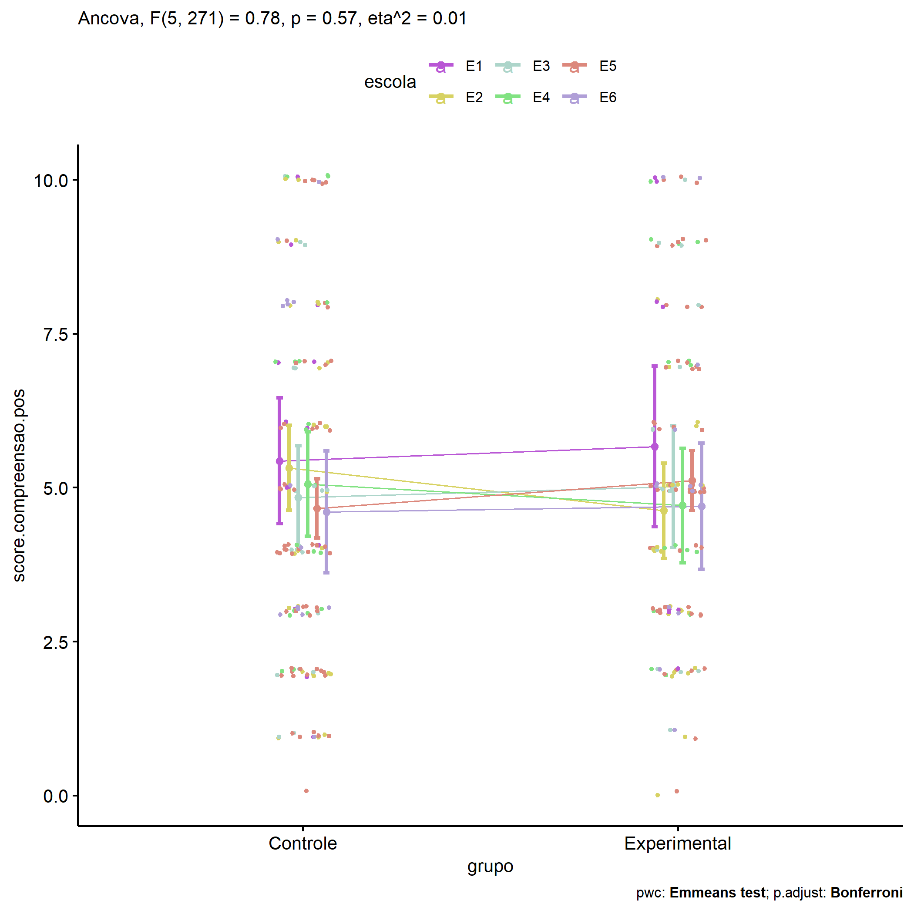<!-- -->

    ## Scale for colour is already present.
    ## Adding another scale for colour, which will replace the existing scale.

<!-- -->

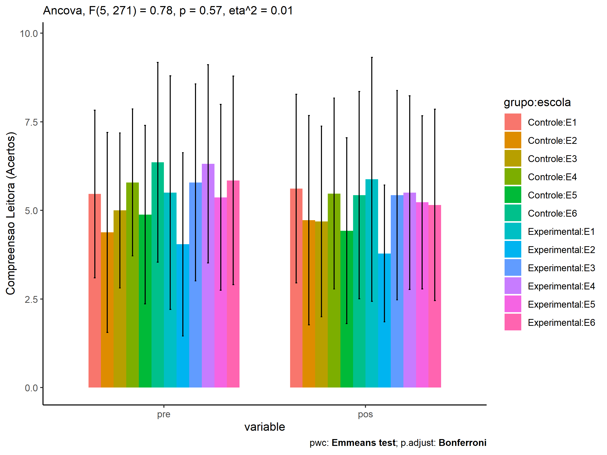<!-- -->

<!-- -->

## factores: **zona.escola:grupo**

### Quant. Palavras Lidas

| var                | zona.escola | grupo        |   n | M (pre) | SE (pre) | M (unadj) | SE (unadj) | M (adj) | SE (adj) |
|:-------------------|:------------|:-------------|----:|--------:|---------:|----------:|-----------:|--------:|---------:|
| palavras.lidas.pos | Rural       | Controle     |  52 | 162.173 |   13.145 |   103.827 |      6.272 |  95.764 |    8.411 |
| palavras.lidas.pos | Rural       | Experimental |  44 | 148.818 |   15.327 |   101.182 |      5.133 |  96.000 |    9.015 |
| palavras.lidas.pos | Urbana      | Controle     |  85 |  98.329 |    6.493 |   121.824 |      7.257 | 127.533 |    6.553 |
| palavras.lidas.pos | Urbana      | Experimental |  76 | 114.921 |    8.469 |   155.421 |      8.706 | 157.552 |    6.822 |

| .y.                | grupo        | zona.escola | group1   | group2       | estimate | conf.low | conf.high |     se | statistic | p       | p.adj   | p.adj.signif |
|:-------------------|:-------------|:------------|:---------|:-------------|---------:|---------:|----------:|-------:|----------:|:--------|:--------|:-------------|
| palavras.lidas.pos | Controle     |             | Urbana   | Rural        |   31.769 |   10.374 |    53.164 | 10.864 |     2.924 | 0.004   | 0.004   | \*\*         |
| palavras.lidas.pos | Experimental |             | Urbana   | Rural        |   61.552 |   39.197 |    83.906 | 11.351 |     5.423 | \<0.001 | \<0.001 | \*\*\*\*     |
| palavras.lidas.pre | Controle     |             | Urbana   | Rural        |  -63.844 |  -91.524 |   -36.163 | 14.056 |    -4.542 | \<0.001 | \<0.001 | \*\*\*\*     |
| palavras.lidas.pre | Experimental |             | Urbana   | Rural        |  -33.897 |  -63.681 |    -4.113 | 15.124 |    -2.241 | 0.026   | 0.026   | \*           |
| palavras.lidas.pos |              | Urbana      | Controle | Experimental |  -30.018 |  -48.529 |   -11.508 |  9.399 |    -3.194 | 0.002   | 0.002   | \*\*         |
| palavras.lidas.pos |              | Rural       | Controle | Experimental |   -0.236 |  -24.203 |    23.731 | 12.170 |    -0.019 | 0.985   | 0.985   | ns           |
| palavras.lidas.pre |              | Urbana      | Controle | Experimental |  -16.592 |  -41.413 |     8.230 | 12.604 |    -1.316 | 0.189   | 0.189   | ns           |
| palavras.lidas.pre |              | Rural       | Controle | Experimental |   13.355 |  -18.851 |    45.561 | 16.353 |     0.817 | 0.415   | 0.415   | ns           |

| grupo        | zona.escola | group1 | group2 | estimate | conf.low | conf.high |     se | statistic | p       | p.adj   | p.adj.signif |
|:-------------|:------------|:-------|:-------|---------:|---------:|----------:|-------:|----------:|:--------|:--------|:-------------|
| Controle     | Urbana      | pre    | pos    |  -16.827 |  -37.066 |     3.413 | 10.305 |    -1.633 | 0.103   | 0.103   | ns           |
| Controle     | Rural       | pre    | pos    |   60.021 |   32.943 |    87.098 | 13.786 |     4.354 | \<0.001 | \<0.001 | \*\*\*\*     |
| Experimental | Urbana      | pre    | pos    |  -45.103 |  -66.458 |   -23.749 | 10.872 |    -4.148 | \<0.001 | \<0.001 | \*\*\*\*     |
| Experimental | Rural       | pre    | pos    |   39.902 |   10.271 |    69.532 | 15.086 |     2.645 | 0.008   | 0.008   | \*\*         |

    ## Scale for colour is already present.
    ## Adding another scale for colour, which will replace the existing scale.

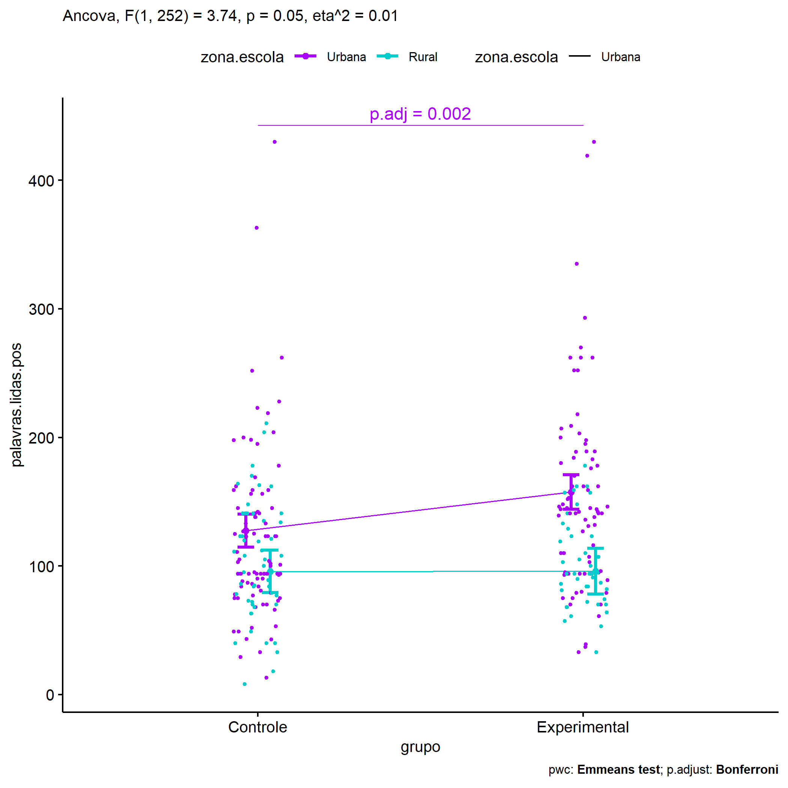<!-- -->

    ## Scale for colour is already present.
    ## Adding another scale for colour, which will replace the existing scale.

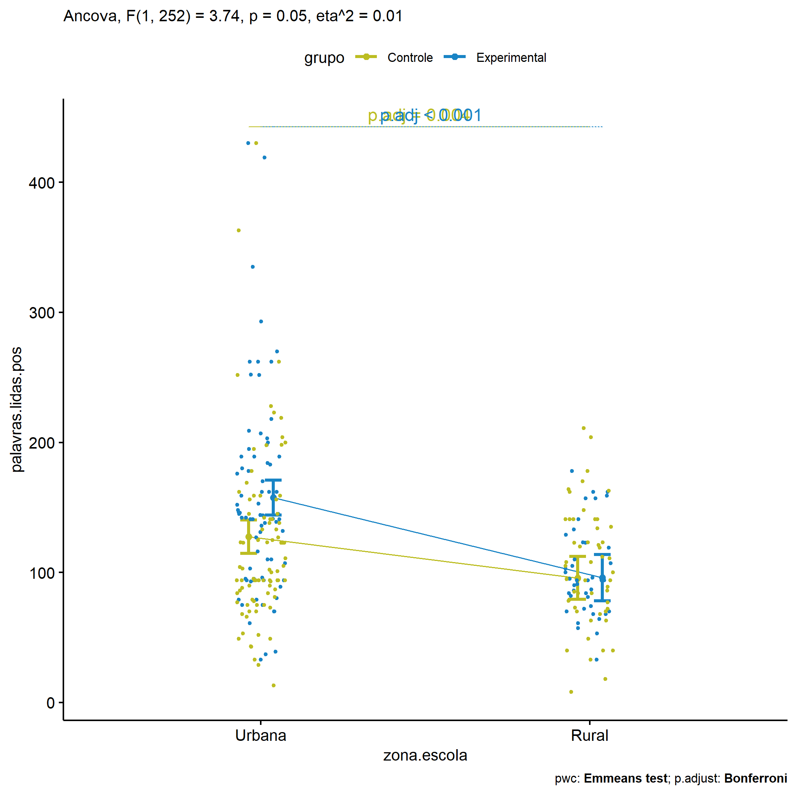<!-- -->

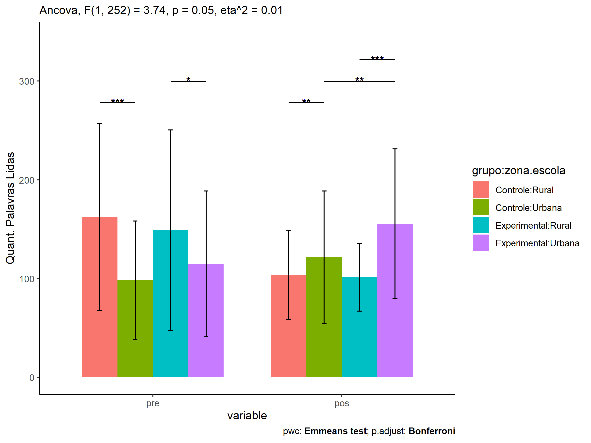<!-- -->

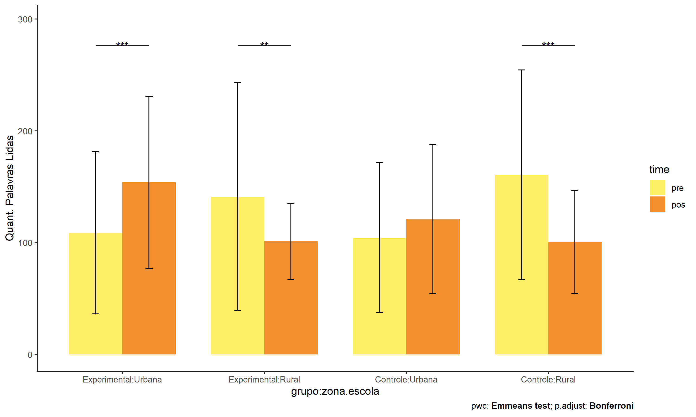<!-- -->

### Compreensao Leitora (Acertos)

| var                   | zona.escola | grupo        |   n | M (pre) | SE (pre) | M (unadj) | SE (unadj) | M (adj) | SE (adj) |
|:----------------------|:------------|:-------------|----:|--------:|---------:|----------:|-----------:|--------:|---------:|
| score.compreensao.pos | Rural       | Controle     |  52 |   5.654 |    0.326 |     5.173 |      0.378 |   4.855 |    0.260 |
| score.compreensao.pos | Rural       | Experimental |  43 |   6.000 |    0.424 |     5.372 |      0.417 |   4.804 |    0.287 |
| score.compreensao.pos | Urbana      | Controle     | 101 |   4.812 |    0.257 |     4.663 |      0.271 |   4.955 |    0.187 |
| score.compreensao.pos | Urbana      | Experimental |  88 |   5.034 |    0.289 |     4.909 |      0.266 |   5.040 |    0.199 |

| .y.                   | grupo        | zona.escola | group1   | group2       | estimate | conf.low | conf.high |    se | statistic |     p | p.adj | p.adj.signif |
|:----------------------|:-------------|:------------|:---------|:-------------|---------:|---------:|----------:|------:|----------:|------:|------:|:-------------|
| score.compreensao.pos | Controle     |             | Urbana   | Rural        |    0.100 |   -0.532 |     0.732 | 0.321 |     0.312 | 0.756 | 0.756 | ns           |
| score.compreensao.pos | Experimental |             | Urbana   | Rural        |    0.236 |   -0.453 |     0.925 | 0.350 |     0.675 | 0.500 | 0.500 | ns           |
| score.compreensao.pre | Controle     |             | Urbana   | Rural        |   -0.842 |   -1.720 |     0.036 | 0.446 |    -1.887 | 0.060 | 0.060 | ns           |
| score.compreensao.pre | Experimental |             | Urbana   | Rural        |   -0.966 |   -1.924 |    -0.008 | 0.486 |    -1.986 | 0.048 | 0.048 | \*           |
| score.compreensao.pos |              | Urbana      | Controle | Experimental |   -0.085 |   -0.621 |     0.452 | 0.273 |    -0.311 | 0.756 | 0.756 | ns           |
| score.compreensao.pos |              | Rural       | Controle | Experimental |    0.052 |   -0.707 |     0.810 | 0.385 |     0.134 | 0.894 | 0.894 | ns           |
| score.compreensao.pre |              | Urbana      | Controle | Experimental |   -0.222 |   -0.973 |     0.528 | 0.381 |    -0.583 | 0.560 | 0.560 | ns           |
| score.compreensao.pre |              | Rural       | Controle | Experimental |   -0.346 |   -1.407 |     0.715 | 0.539 |    -0.642 | 0.521 | 0.521 | ns           |

| grupo        | zona.escola | group1 | group2 | estimate | conf.low | conf.high |    se | statistic |     p | p.adj | p.adj.signif |
|:-------------|:------------|:-------|:-------|---------:|---------:|----------:|------:|----------:|------:|------:|:-------------|
| Controle     | Urbana      | pre    | pos    |    0.330 |   -0.373 |     1.032 | 0.358 |     0.921 | 0.357 | 0.357 | ns           |
| Controle     | Rural       | pre    | pos    |    0.564 |   -0.424 |     1.551 | 0.503 |     1.121 | 0.263 | 0.263 | ns           |
| Experimental | Urbana      | pre    | pos    |   -0.105 |   -0.851 |     0.641 | 0.380 |    -0.276 | 0.782 | 0.782 | ns           |
| Experimental | Rural       | pre    | pos    |    0.404 |   -0.683 |     1.490 | 0.553 |     0.730 | 0.466 | 0.466 | ns           |

    ## Scale for colour is already present.
    ## Adding another scale for colour, which will replace the existing scale.

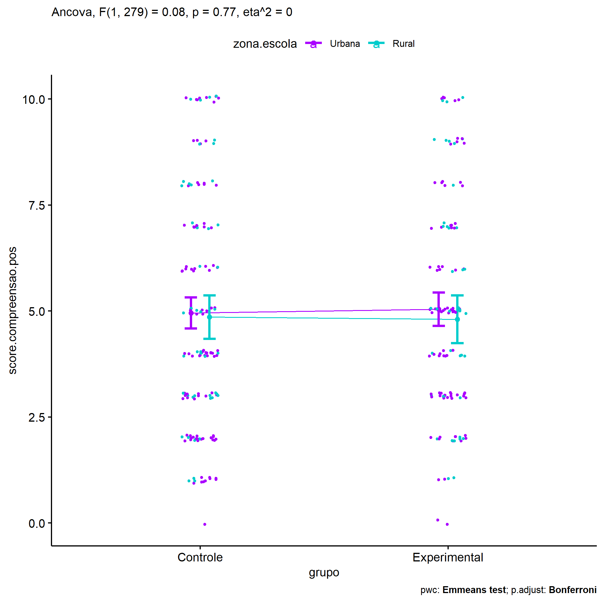<!-- -->

    ## Scale for colour is already present.
    ## Adding another scale for colour, which will replace the existing scale.

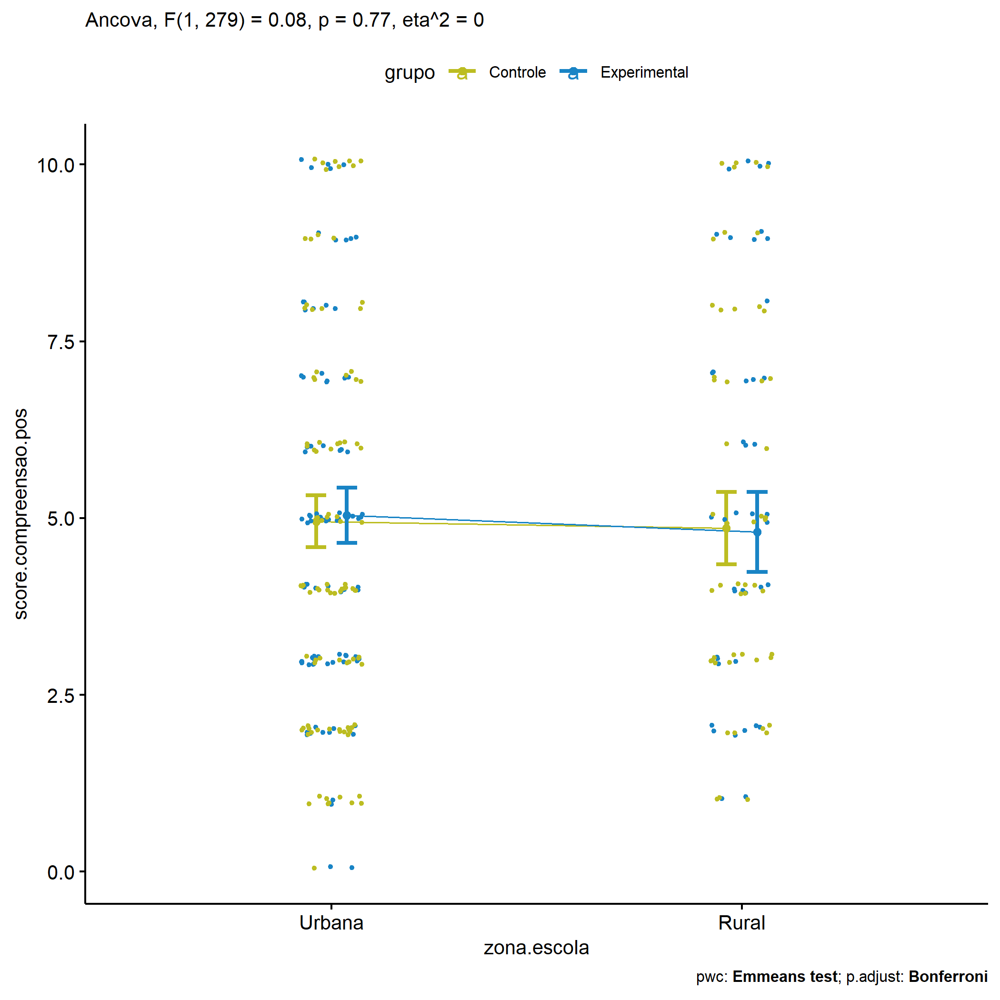<!-- -->

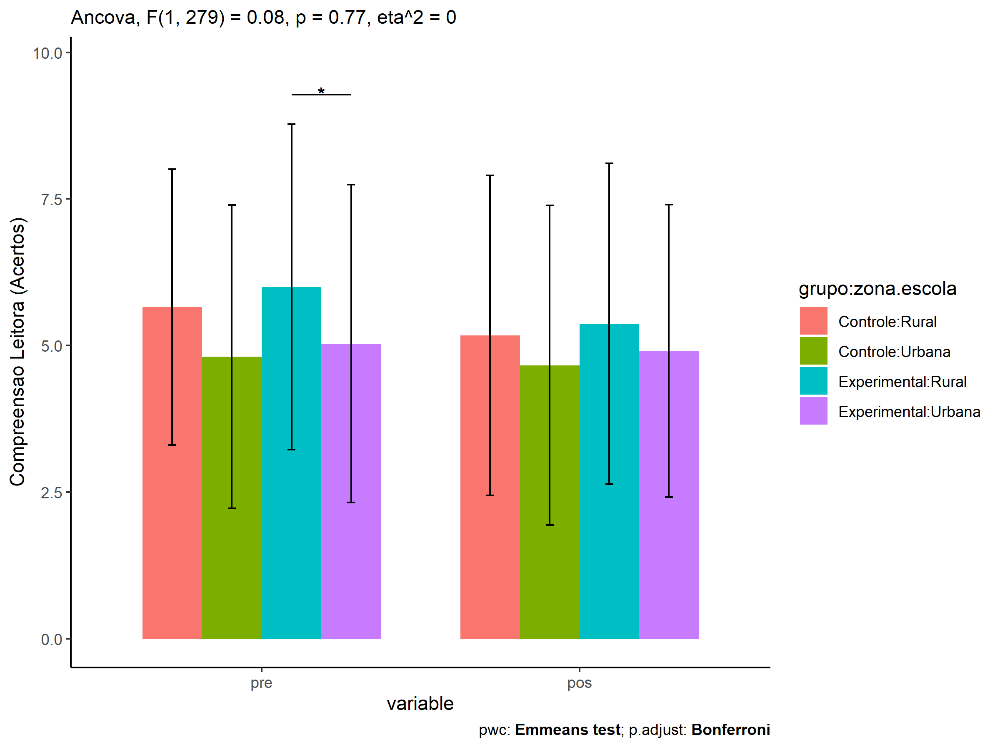<!-- -->

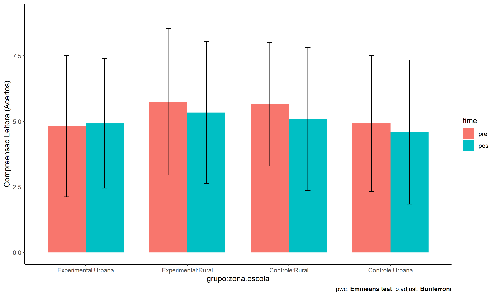<!-- -->

# Pairwise comparisons for grupo=“Experimental”

## factores: **grupo=“Experimental”:monitor**

### Quant. Palavras Lidas

| var                | monitor |   n | M (pre) | SE (pre) | M (unadj) | SE (unadj) | M (adj) | SE (adj) |
|:-------------------|:--------|----:|--------:|---------:|----------:|-----------:|--------:|---------:|
| palavras.lidas.pos | CE      |  16 | 257.312 |   17.008 |    98.125 |      6.796 |  39.641 |   18.008 |
| palavras.lidas.pos | EA      |  11 |  88.909 |   12.865 |   147.273 |     19.530 | 166.526 |   17.827 |
| palavras.lidas.pos | GR      |  15 | 147.933 |   26.003 |   158.867 |     23.518 | 150.874 |   15.036 |
| palavras.lidas.pos | JC      |  10 | 154.900 |   34.420 |   133.200 |     17.598 | 121.991 |   18.443 |
| palavras.lidas.pos | MF      |  12 | 106.750 |    8.946 |   165.000 |     14.385 | 176.018 |   16.852 |
| palavras.lidas.pos | ML      |  15 |  84.800 |   12.165 |   101.867 |     10.170 | 123.017 |   15.457 |
| palavras.lidas.pos | MM      |  10 |  80.400 |   10.173 |   164.000 |     26.707 | 187.181 |   18.812 |
| palavras.lidas.pos | PR      |   8 | 123.625 |   25.555 |   192.500 |     44.197 | 195.728 |   20.500 |
| palavras.lidas.pos | VL      |  13 |  89.154 |   17.522 |   104.154 |     10.367 | 123.294 |   16.452 |

| .y.                | group1 | group2 | estimate | conf.low | conf.high |     se | statistic | p       | p.adj   | p.adj.signif |
|:-------------------|:-------|:-------|---------:|---------:|----------:|-------:|----------:|:--------|:--------|:-------------|
| palavras.lidas.pos | CE     | EA     | -126.885 | -180.022 |   -73.748 | 26.783 |    -4.738 | \<0.001 | \<0.001 | \*\*\*       |
| palavras.lidas.pos | CE     | GR     | -111.232 | -156.436 |   -66.029 | 22.784 |    -4.882 | \<0.001 | \<0.001 | \*\*\*       |
| palavras.lidas.pos | CE     | JC     |  -82.350 | -131.774 |   -32.926 | 24.912 |    -3.306 | 0.001   | 0.047   | \*           |
| palavras.lidas.pos | CE     | MF     | -136.376 | -187.011 |   -85.742 | 25.522 |    -5.344 | \<0.001 | \<0.001 | \*\*\*\*     |
| palavras.lidas.pos | CE     | ML     |  -83.376 | -133.796 |   -32.955 | 25.414 |    -3.281 | 0.001   | 0.051   | ns           |
| palavras.lidas.pos | CE     | MM     | -147.540 | -202.550 |   -92.530 | 27.727 |    -5.321 | \<0.001 | \<0.001 | \*\*\*\*     |
| palavras.lidas.pos | CE     | PR     | -156.087 | -210.679 |  -101.495 | 27.517 |    -5.672 | \<0.001 | \<0.001 | \*\*\*\*     |
| palavras.lidas.pos | CE     | VL     |  -83.653 | -134.998 |   -32.308 | 25.880 |    -3.232 | 0.002   | 0.06    | ns           |
| palavras.lidas.pos | EA     | GR     |   15.652 |  -31.052 |    62.356 | 23.541 |     0.665 | 0.508   | 1       | ns           |
| palavras.lidas.pos | EA     | JC     |   44.535 |   -6.909 |    95.978 | 25.930 |     1.718 | 0.089   | 1       | ns           |
| palavras.lidas.pos | EA     | MF     |   -9.492 |  -57.584 |    38.601 | 24.241 |    -0.392 | 0.696   | 1       | ns           |
| palavras.lidas.pos | EA     | ML     |   43.509 |   -2.142 |    89.161 | 23.010 |     1.891 | 0.062   | 1       | ns           |
| palavras.lidas.pos | EA     | MM     |  -20.655 |  -70.918 |    29.608 | 25.335 |    -0.815 | 0.417   | 1       | ns           |
| palavras.lidas.pos | EA     | PR     |  -29.202 |  -82.949 |    24.545 | 27.090 |    -1.078 | 0.284   | 1       | ns           |
| palavras.lidas.pos | EA     | VL     |   43.232 |   -3.877 |    90.340 | 23.745 |     1.821 | 0.072   | 1       | ns           |
| palavras.lidas.pos | GR     | JC     |   28.883 |  -18.077 |    75.842 | 23.669 |     1.220 | 0.225   | 1       | ns           |
| palavras.lidas.pos | GR     | MF     |  -25.144 |  -70.210 |    19.922 | 22.715 |    -1.107 | 0.271   | 1       | ns           |
| palavras.lidas.pos | GR     | ML     |   27.857 |  -15.442 |    71.156 | 21.824 |     1.276 | 0.205   | 1       | ns           |
| palavras.lidas.pos | GR     | MM     |  -36.308 |  -84.595 |    11.980 | 24.339 |    -1.492 | 0.139   | 1       | ns           |
| palavras.lidas.pos | GR     | PR     |  -44.854 |  -95.361 |     5.652 | 25.457 |    -1.762 | 0.081   | 1       | ns           |
| palavras.lidas.pos | GR     | VL     |   27.579 |  -17.092 |    72.251 | 22.516 |     1.225 | 0.223   | 1       | ns           |
| palavras.lidas.pos | JC     | MF     |  -54.027 | -103.918 |    -4.135 | 25.147 |    -2.148 | 0.034   | 1       | ns           |
| palavras.lidas.pos | JC     | ML     |   -1.026 |  -49.415 |    47.364 | 24.390 |    -0.042 | 0.967   | 1       | ns           |
| palavras.lidas.pos | JC     | MM     |  -65.190 | -118.107 |   -12.274 | 26.672 |    -2.444 | 0.016   | 0.586   | ns           |
| palavras.lidas.pos | JC     | PR     |  -73.737 | -128.533 |   -18.941 | 27.619 |    -2.670 | 0.009   | 0.319   | ns           |
| palavras.lidas.pos | JC     | VL     |   -1.303 |  -50.908 |    48.301 | 25.003 |    -0.052 | 0.959   | 1       | ns           |
| palavras.lidas.pos | MF     | ML     |   53.001 |    8.314 |    97.688 | 22.524 |     2.353 | 0.021   | 0.741   | ns           |
| palavras.lidas.pos | MF     | MM     |  -11.163 |  -60.597 |    38.270 | 24.916 |    -0.448 | 0.655   | 1       | ns           |
| palavras.lidas.pos | MF     | PR     |  -19.710 |  -72.272 |    32.851 | 26.493 |    -0.744 | 0.459   | 1       | ns           |
| palavras.lidas.pos | MF     | VL     |   52.724 |    6.596 |    98.851 | 23.250 |     2.268 | 0.025   | 0.918   | ns           |
| palavras.lidas.pos | ML     | MM     |  -64.164 | -111.115 |   -17.214 | 23.665 |    -2.711 | 0.008   | 0.284   | ns           |
| palavras.lidas.pos | ML     | PR     |  -72.711 | -123.472 |   -21.951 | 25.585 |    -2.842 | 0.005   | 0.196   | ns           |
| palavras.lidas.pos | ML     | VL     |   -0.277 |  -43.857 |    43.302 | 21.966 |    -0.013 | 0.99    | 1       | ns           |
| palavras.lidas.pos | MM     | PR     |   -8.547 |  -63.570 |    46.476 | 27.734 |    -0.308 | 0.759   | 1       | ns           |
| palavras.lidas.pos | MM     | VL     |   63.887 |   15.497 |   112.277 | 24.390 |     2.619 | 0.01    | 0.367   | ns           |
| palavras.lidas.pos | PR     | VL     |   72.434 |   20.441 |   124.427 | 26.207 |     2.764 | 0.007   | 0.245   | ns           |
| palavras.lidas.pre | CE     | EA     |  168.403 |  115.306 |   221.501 | 26.766 |     6.292 | \<0.001 | \<0.001 | \*\*\*\*     |
| palavras.lidas.pre | CE     | GR     |  109.379 |   60.657 |   158.101 | 24.561 |     4.453 | \<0.001 | \<0.001 | \*\*\*       |
| palavras.lidas.pre | CE     | JC     |  102.413 |   47.765 |   157.060 | 27.548 |     3.718 | \<0.001 | 0.012   | \*           |
| palavras.lidas.pre | CE     | MF     |  150.563 |   98.793 |   202.332 | 26.097 |     5.769 | \<0.001 | \<0.001 | \*\*\*\*     |
| palavras.lidas.pre | CE     | ML     |  172.513 |  123.791 |   221.234 | 24.561 |     7.024 | \<0.001 | \<0.001 | \*\*\*\*     |
| palavras.lidas.pre | CE     | MM     |  176.912 |  122.265 |   231.560 | 27.548 |     6.422 | \<0.001 | \<0.001 | \*\*\*\*     |
| palavras.lidas.pre | CE     | PR     |  133.688 |   74.986 |   192.389 | 29.591 |     4.518 | \<0.001 | \<0.001 | \*\*\*       |
| palavras.lidas.pre | CE     | VL     |  168.159 |  117.540 |   218.778 | 25.517 |     6.590 | \<0.001 | \<0.001 | \*\*\*\*     |
| palavras.lidas.pre | EA     | GR     |  -59.024 | -112.838 |    -5.211 | 27.127 |    -2.176 | 0.032   | 1       | ns           |
| palavras.lidas.pre | EA     | JC     |  -65.991 | -125.223 |    -6.758 | 29.859 |    -2.210 | 0.029   | 1       | ns           |
| palavras.lidas.pre | EA     | MF     |  -17.841 |  -74.429 |    38.747 | 28.526 |    -0.625 | 0.533   | 1       | ns           |
| palavras.lidas.pre | EA     | ML     |    4.109 |  -49.704 |    57.923 | 27.127 |     0.151 | 0.88    | 1       | ns           |
| palavras.lidas.pre | EA     | MM     |    8.509 |  -50.723 |    67.742 | 29.859 |     0.285 | 0.776   | 1       | ns           |
| palavras.lidas.pre | EA     | PR     |  -34.716 |  -97.707 |    28.276 | 31.754 |    -1.093 | 0.277   | 1       | ns           |
| palavras.lidas.pre | EA     | VL     |   -0.245 |  -55.782 |    55.293 | 27.996 |    -0.009 | 0.993   | 1       | ns           |
| palavras.lidas.pre | GR     | JC     |   -6.967 |  -62.311 |    48.377 | 27.899 |    -0.250 | 0.803   | 1       | ns           |
| palavras.lidas.pre | GR     | MF     |   41.183 |  -11.321 |    93.687 | 26.467 |     1.556 | 0.123   | 1       | ns           |
| palavras.lidas.pre | GR     | ML     |   63.133 |   13.632 |   112.635 | 24.954 |     2.530 | 0.013   | 0.466   | ns           |
| palavras.lidas.pre | GR     | MM     |   67.533 |   12.189 |   122.877 | 27.899 |     2.421 | 0.017   | 0.622   | ns           |
| palavras.lidas.pre | GR     | PR     |   24.308 |  -35.042 |    83.658 | 29.918 |     0.812 | 0.418   | 1       | ns           |
| palavras.lidas.pre | GR     | VL     |   58.779 |    7.410 |   110.149 | 25.896 |     2.270 | 0.025   | 0.912   | ns           |
| palavras.lidas.pre | JC     | MF     |   48.150 |   -9.895 |   106.195 | 29.261 |     1.646 | 0.103   | 1       | ns           |
| palavras.lidas.pre | JC     | ML     |   70.100 |   14.756 |   125.444 | 27.899 |     2.513 | 0.014   | 0.488   | ns           |
| palavras.lidas.pre | JC     | MM     |   74.500 |   13.874 |   135.126 | 30.562 |     2.438 | 0.017   | 0.595   | ns           |
| palavras.lidas.pre | JC     | PR     |   31.275 |  -33.029 |    95.579 | 32.416 |     0.965 | 0.337   | 1       | ns           |
| palavras.lidas.pre | JC     | VL     |   65.746 |    8.725 |   122.768 | 28.745 |     2.287 | 0.024   | 0.874   | ns           |
| palavras.lidas.pre | MF     | ML     |   21.950 |  -30.554 |    74.454 | 26.467 |     0.829 | 0.409   | 1       | ns           |
| palavras.lidas.pre | MF     | MM     |   26.350 |  -31.695 |    84.395 | 29.261 |     0.901 | 0.37    | 1       | ns           |
| palavras.lidas.pre | MF     | PR     |  -16.875 |  -78.752 |    45.002 | 31.192 |    -0.541 | 0.59    | 1       | ns           |
| palavras.lidas.pre | MF     | VL     |   17.596 |  -36.673 |    71.866 | 27.357 |     0.643 | 0.522   | 1       | ns           |
| palavras.lidas.pre | ML     | MM     |    4.400 |  -50.944 |    59.744 | 27.899 |     0.158 | 0.875   | 1       | ns           |
| palavras.lidas.pre | ML     | PR     |  -38.825 |  -98.175 |    20.525 | 29.918 |    -1.298 | 0.197   | 1       | ns           |
| palavras.lidas.pre | ML     | VL     |   -4.354 |  -55.724 |    47.016 | 25.896 |    -0.168 | 0.867   | 1       | ns           |
| palavras.lidas.pre | MM     | PR     |  -43.225 | -107.529 |    21.079 | 32.416 |    -1.333 | 0.185   | 1       | ns           |
| palavras.lidas.pre | MM     | VL     |   -8.754 |  -65.775 |    48.268 | 28.745 |    -0.305 | 0.761   | 1       | ns           |
| palavras.lidas.pre | PR     | VL     |   34.471 |  -26.446 |    95.388 | 30.708 |     1.123 | 0.264   | 1       | ns           |

| .y.            | monitor | group1 | group2 | estimate | conf.low | conf.high |     se | statistic | p       | p.adj   | p.adj.signif |
|:---------------|:--------|:-------|:-------|---------:|---------:|----------:|-------:|----------:|:--------|:--------|:-------------|
| palavras.lidas | CE      | pre    | pos    |  159.188 |  112.672 |   205.703 | 23.607 |     6.743 | \<0.001 | \<0.001 | \*\*\*\*     |
| palavras.lidas | EA      | pre    | pos    |  -58.364 | -114.463 |    -2.264 | 28.471 |    -2.050 | 0.042   | 0.042   | \*           |
| palavras.lidas | GR      | pre    | pos    |   -1.004 |  -48.288 |    46.280 | 23.997 |    -0.042 | 0.967   | 0.967   | ns           |
| palavras.lidas | JC      | pre    | pos    |   11.383 |  -44.950 |    67.716 | 28.589 |     0.398 | 0.691   | 0.691   | ns           |
| palavras.lidas | MF      | pre    | pos    |  -61.429 | -113.186 |    -9.671 | 26.267 |    -2.339 | 0.02    | 0.02    | \*           |
| palavras.lidas | ML      | pre    | pos    |  -12.992 |  -60.276 |    34.293 | 23.997 |    -0.541 | 0.589   | 0.589   | ns           |
| palavras.lidas | MM      | pre    | pos    |  -74.909 | -131.009 |   -18.809 | 28.471 |    -2.631 | 0.009   | 0.009   | \*\*         |
| palavras.lidas | PR      | pre    | pos    | -101.808 | -160.928 |   -42.688 | 30.004 |    -3.393 | \<0.001 | \<0.001 | \*\*\*       |
| palavras.lidas | VL      | pre    | pos    |  -27.091 |  -76.217 |    22.034 | 24.932 |    -1.087 | 0.278   | 0.278   | ns           |

    ## Scale for colour is already present.
    ## Adding another scale for colour, which will replace the existing scale.

<!-- -->

<!-- -->

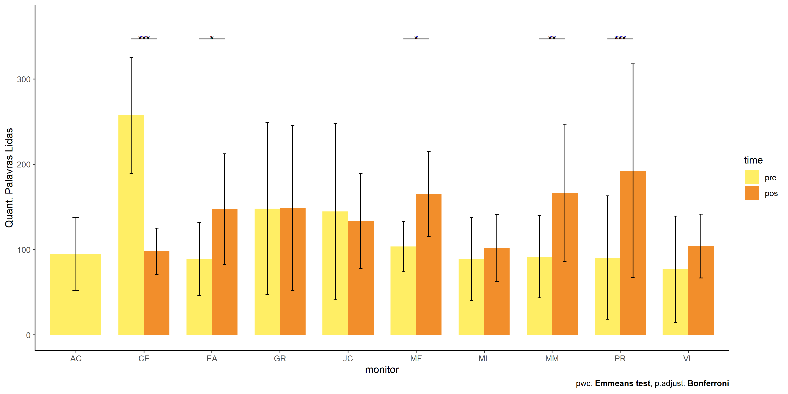<!-- -->

### Compreensao Leitora (Acertos)

| var                   | monitor |   n | M (pre) | SE (pre) | M (unadj) | SE (unadj) | M (adj) | SE (adj) |
|:----------------------|:--------|----:|--------:|---------:|----------:|-----------:|--------:|---------:|
| score.compreensao.pos | AC      |  10 |   5.000 |    0.966 |     3.700 |      0.667 |   4.088 |    0.537 |
| score.compreensao.pos | CE      |  16 |   6.312 |    0.700 |     5.500 |      0.683 |   4.976 |    0.426 |
| score.compreensao.pos | EA      |  11 |   6.273 |    0.799 |     6.000 |      0.688 |   5.504 |    0.513 |
| score.compreensao.pos | GR      |  16 |   5.188 |    0.458 |     4.688 |      0.530 |   4.945 |    0.424 |
| score.compreensao.pos | JC      |   9 |   5.556 |    1.119 |     7.222 |      0.703 |   7.224 |    0.565 |
| score.compreensao.pos | MF      |  12 |   6.250 |    0.799 |     5.000 |      0.778 |   4.519 |    0.491 |
| score.compreensao.pos | ML      |  14 |   5.786 |    0.743 |     5.429 |      0.789 |   5.271 |    0.453 |
| score.compreensao.pos | MM      |  11 |   3.455 |    0.608 |     3.727 |      0.574 |   5.189 |    0.526 |
| score.compreensao.pos | PR      |   8 |   5.500 |    1.165 |     5.875 |      1.217 |   5.916 |    0.599 |
| score.compreensao.pos | VL      |  13 |   5.846 |    0.815 |     5.154 |      0.750 |   4.954 |    0.470 |

| .y.                   | group1 | group2 | estimate | conf.low | conf.high |    se | statistic | p       | p.adj | p.adj.signif |
|:----------------------|:-------|:-------|---------:|---------:|----------:|------:|----------:|:--------|------:|:-------------|
| score.compreensao.pos | AC     | CE     |   -0.888 |   -2.250 |     0.474 | 0.687 |    -1.292 | 0.199   | 1.000 | ns           |
| score.compreensao.pos | AC     | EA     |   -1.416 |   -2.891 |     0.059 | 0.744 |    -1.903 | 0.06    | 1.000 | ns           |
| score.compreensao.pos | AC     | GR     |   -0.857 |   -2.211 |     0.496 | 0.683 |    -1.255 | 0.212   | 1.000 | ns           |
| score.compreensao.pos | AC     | JC     |   -3.136 |   -4.680 |    -1.592 | 0.779 |    -4.026 | \<0.001 | 0.005 | \*\*         |
| score.compreensao.pos | AC     | MF     |   -0.432 |   -1.877 |     1.014 | 0.729 |    -0.592 | 0.555   | 1.000 | ns           |
| score.compreensao.pos | AC     | ML     |   -1.183 |   -2.576 |     0.211 | 0.703 |    -1.682 | 0.095   | 1.000 | ns           |
| score.compreensao.pos | AC     | MM     |   -1.101 |   -2.579 |     0.377 | 0.746 |    -1.476 | 0.143   | 1.000 | ns           |
| score.compreensao.pos | AC     | PR     |   -1.828 |   -3.421 |    -0.234 | 0.804 |    -2.273 | 0.025   | 1.000 | ns           |
| score.compreensao.pos | AC     | VL     |   -0.866 |   -2.282 |     0.550 | 0.714 |    -1.212 | 0.228   | 1.000 | ns           |
| score.compreensao.pos | CE     | EA     |   -0.528 |   -1.843 |     0.787 | 0.664 |    -0.795 | 0.428   | 1.000 | ns           |
| score.compreensao.pos | CE     | GR     |    0.031 |   -1.163 |     1.225 | 0.603 |     0.051 | 0.959   | 1.000 | ns           |
| score.compreensao.pos | CE     | JC     |   -2.248 |   -3.650 |    -0.846 | 0.707 |    -3.178 | 0.002   | 0.087 | ns           |
| score.compreensao.pos | CE     | MF     |    0.457 |   -0.826 |     1.739 | 0.647 |     0.706 | 0.482   | 1.000 | ns           |
| score.compreensao.pos | CE     | ML     |   -0.295 |   -1.525 |     0.936 | 0.621 |    -0.474 | 0.636   | 1.000 | ns           |
| score.compreensao.pos | CE     | MM     |   -0.213 |   -1.570 |     1.145 | 0.685 |    -0.311 | 0.757   | 1.000 | ns           |
| score.compreensao.pos | CE     | PR     |   -0.939 |   -2.396 |     0.518 | 0.735 |    -1.278 | 0.204   | 1.000 | ns           |
| score.compreensao.pos | CE     | VL     |    0.022 |   -1.233 |     1.277 | 0.633 |     0.035 | 0.972   | 1.000 | ns           |
| score.compreensao.pos | EA     | GR     |    0.559 |   -0.763 |     1.880 | 0.667 |     0.838 | 0.404   | 1.000 | ns           |
| score.compreensao.pos | EA     | JC     |   -1.720 |   -3.232 |    -0.209 | 0.763 |    -2.256 | 0.026   | 1.000 | ns           |
| score.compreensao.pos | EA     | MF     |    0.984 |   -0.417 |     2.386 | 0.707 |     1.392 | 0.167   | 1.000 | ns           |
| score.compreensao.pos | EA     | ML     |    0.233 |   -1.121 |     1.587 | 0.683 |     0.341 | 0.734   | 1.000 | ns           |
| score.compreensao.pos | EA     | MM     |    0.315 |   -1.155 |     1.784 | 0.741 |     0.425 | 0.672   | 1.000 | ns           |
| score.compreensao.pos | EA     | PR     |   -0.412 |   -1.975 |     1.151 | 0.789 |    -0.522 | 0.603   | 1.000 | ns           |
| score.compreensao.pos | EA     | VL     |    0.550 |   -0.827 |     1.926 | 0.694 |     0.792 | 0.43    | 1.000 | ns           |
| score.compreensao.pos | GR     | JC     |   -2.279 |   -3.679 |    -0.879 | 0.706 |    -3.227 | 0.002   | 0.074 | ns           |
| score.compreensao.pos | GR     | MF     |    0.426 |   -0.863 |     1.714 | 0.650 |     0.655 | 0.514   | 1.000 | ns           |
| score.compreensao.pos | GR     | ML     |   -0.325 |   -1.556 |     0.905 | 0.621 |    -0.524 | 0.601   | 1.000 | ns           |
| score.compreensao.pos | GR     | MM     |   -0.244 |   -1.574 |     1.087 | 0.671 |    -0.363 | 0.717   | 1.000 | ns           |
| score.compreensao.pos | GR     | PR     |   -0.970 |   -2.425 |     0.484 | 0.734 |    -1.322 | 0.189   | 1.000 | ns           |
| score.compreensao.pos | GR     | VL     |   -0.009 |   -1.265 |     1.247 | 0.634 |    -0.014 | 0.989   | 1.000 | ns           |
| score.compreensao.pos | JC     | MF     |    2.705 |    1.222 |     4.187 | 0.748 |     3.615 | \<0.001 | 0.021 | \*           |
| score.compreensao.pos | JC     | ML     |    1.954 |    0.519 |     3.388 | 0.724 |     2.699 | 0.008   | 0.363 | ns           |
| score.compreensao.pos | JC     | MM     |    2.035 |    0.506 |     3.565 | 0.772 |     2.638 | 0.01    | 0.430 | ns           |
| score.compreensao.pos | JC     | PR     |    1.309 |   -0.323 |     2.940 | 0.823 |     1.590 | 0.115   | 1.000 | ns           |
| score.compreensao.pos | JC     | VL     |    2.270 |    0.814 |     3.727 | 0.735 |     3.090 | 0.003   | 0.114 | ns           |
| score.compreensao.pos | MF     | ML     |   -0.751 |   -2.073 |     0.571 | 0.667 |    -1.126 | 0.263   | 1.000 | ns           |
| score.compreensao.pos | MF     | MM     |   -0.669 |   -2.109 |     0.770 | 0.726 |    -0.921 | 0.359   | 1.000 | ns           |
| score.compreensao.pos | MF     | PR     |   -1.396 |   -2.931 |     0.139 | 0.775 |    -1.802 | 0.074   | 1.000 | ns           |
| score.compreensao.pos | MF     | VL     |   -0.434 |   -1.779 |     0.911 | 0.679 |    -0.640 | 0.523   | 1.000 | ns           |
| score.compreensao.pos | ML     | MM     |    0.082 |   -1.298 |     1.462 | 0.696 |     0.118 | 0.907   | 1.000 | ns           |
| score.compreensao.pos | ML     | PR     |   -0.645 |   -2.133 |     0.844 | 0.751 |    -0.859 | 0.392   | 1.000 | ns           |
| score.compreensao.pos | ML     | VL     |    0.317 |   -0.977 |     1.610 | 0.653 |     0.485 | 0.628   | 1.000 | ns           |
| score.compreensao.pos | MM     | PR     |   -0.727 |   -2.305 |     0.852 | 0.796 |    -0.912 | 0.364   | 1.000 | ns           |
| score.compreensao.pos | MM     | VL     |    0.235 |   -1.169 |     1.639 | 0.708 |     0.332 | 0.741   | 1.000 | ns           |
| score.compreensao.pos | PR     | VL     |    0.962 |   -0.548 |     2.471 | 0.762 |     1.263 | 0.209   | 1.000 | ns           |
| score.compreensao.pre | AC     | CE     |   -1.312 |   -3.490 |     0.865 | 1.099 |    -1.194 | 0.235   | 1.000 | ns           |
| score.compreensao.pre | AC     | EA     |   -1.273 |   -3.633 |     1.088 | 1.191 |    -1.069 | 0.288   | 1.000 | ns           |
| score.compreensao.pre | AC     | GR     |   -0.187 |   -2.365 |     1.990 | 1.099 |    -0.171 | 0.865   | 1.000 | ns           |
| score.compreensao.pre | AC     | JC     |   -0.556 |   -3.038 |     1.926 | 1.252 |    -0.444 | 0.658   | 1.000 | ns           |
| score.compreensao.pre | AC     | MF     |   -1.250 |   -3.563 |     1.063 | 1.167 |    -1.071 | 0.287   | 1.000 | ns           |
| score.compreensao.pre | AC     | ML     |   -0.786 |   -3.022 |     1.451 | 1.129 |    -0.696 | 0.488   | 1.000 | ns           |
| score.compreensao.pre | AC     | MM     |    1.545 |   -0.815 |     3.906 | 1.191 |     1.298 | 0.197   | 1.000 | ns           |
| score.compreensao.pre | AC     | PR     |   -0.500 |   -3.062 |     2.062 | 1.293 |    -0.387 | 0.7     | 1.000 | ns           |
| score.compreensao.pre | AC     | VL     |   -0.846 |   -3.118 |     1.426 | 1.147 |    -0.738 | 0.462   | 1.000 | ns           |
| score.compreensao.pre | CE     | EA     |    0.040 |   -2.076 |     2.156 | 1.068 |     0.037 | 0.97    | 1.000 | ns           |
| score.compreensao.pre | CE     | GR     |    1.125 |   -0.785 |     3.035 | 0.964 |     1.167 | 0.246   | 1.000 | ns           |
| score.compreensao.pre | CE     | JC     |    0.757 |   -1.494 |     3.008 | 1.136 |     0.666 | 0.507   | 1.000 | ns           |
| score.compreensao.pre | CE     | MF     |    0.062 |   -2.000 |     2.125 | 1.041 |     0.060 | 0.952   | 1.000 | ns           |
| score.compreensao.pre | CE     | ML     |    0.527 |   -1.450 |     2.504 | 0.998 |     0.528 | 0.599   | 1.000 | ns           |
| score.compreensao.pre | CE     | MM     |    2.858 |    0.742 |     4.974 | 1.068 |     2.677 | 0.009   | 0.386 | ns           |
| score.compreensao.pre | CE     | PR     |    0.812 |   -1.527 |     3.152 | 1.180 |     0.688 | 0.493   | 1.000 | ns           |
| score.compreensao.pre | CE     | VL     |    0.466 |   -1.551 |     2.483 | 1.018 |     0.458 | 0.648   | 1.000 | ns           |
| score.compreensao.pre | EA     | GR     |    1.085 |   -1.031 |     3.201 | 1.068 |     1.016 | 0.312   | 1.000 | ns           |
| score.compreensao.pre | EA     | JC     |    0.717 |   -1.711 |     3.145 | 1.225 |     0.585 | 0.559   | 1.000 | ns           |
| score.compreensao.pre | EA     | MF     |    0.023 |   -2.232 |     2.278 | 1.138 |     0.020 | 0.984   | 1.000 | ns           |
| score.compreensao.pre | EA     | ML     |    0.487 |   -1.689 |     2.664 | 1.098 |     0.443 | 0.658   | 1.000 | ns           |
| score.compreensao.pre | EA     | MM     |    2.818 |    0.515 |     5.122 | 1.162 |     2.425 | 0.017   | 0.763 | ns           |
| score.compreensao.pre | EA     | PR     |    0.773 |   -1.737 |     3.283 | 1.267 |     0.610 | 0.543   | 1.000 | ns           |
| score.compreensao.pre | EA     | VL     |    0.427 |   -1.786 |     2.640 | 1.117 |     0.382 | 0.703   | 1.000 | ns           |
| score.compreensao.pre | GR     | JC     |   -0.368 |   -2.619 |     1.883 | 1.136 |    -0.324 | 0.747   | 1.000 | ns           |
| score.compreensao.pre | GR     | MF     |   -1.063 |   -3.125 |     1.000 | 1.041 |    -1.021 | 0.31    | 1.000 | ns           |
| score.compreensao.pre | GR     | ML     |   -0.598 |   -2.575 |     1.379 | 0.998 |    -0.600 | 0.55    | 1.000 | ns           |
| score.compreensao.pre | GR     | MM     |    1.733 |   -0.383 |     3.849 | 1.068 |     1.623 | 0.107   | 1.000 | ns           |
| score.compreensao.pre | GR     | PR     |   -0.312 |   -2.652 |     2.027 | 1.180 |    -0.265 | 0.792   | 1.000 | ns           |
| score.compreensao.pre | GR     | VL     |   -0.659 |   -2.676 |     1.358 | 1.018 |    -0.647 | 0.519   | 1.000 | ns           |
| score.compreensao.pre | JC     | MF     |   -0.694 |   -3.076 |     1.688 | 1.202 |    -0.578 | 0.565   | 1.000 | ns           |
| score.compreensao.pre | JC     | ML     |   -0.230 |   -2.538 |     2.078 | 1.165 |    -0.198 | 0.844   | 1.000 | ns           |
| score.compreensao.pre | JC     | MM     |    2.101 |   -0.327 |     4.529 | 1.225 |     1.715 | 0.089   | 1.000 | ns           |
| score.compreensao.pre | JC     | PR     |    0.056 |   -2.569 |     2.680 | 1.325 |     0.042 | 0.967   | 1.000 | ns           |
| score.compreensao.pre | JC     | VL     |   -0.291 |   -2.633 |     2.052 | 1.182 |    -0.246 | 0.806   | 1.000 | ns           |
| score.compreensao.pre | MF     | ML     |    0.464 |   -1.661 |     2.589 | 1.072 |     0.433 | 0.666   | 1.000 | ns           |
| score.compreensao.pre | MF     | MM     |    2.795 |    0.541 |     5.050 | 1.138 |     2.457 | 0.016   | 0.701 | ns           |
| score.compreensao.pre | MF     | PR     |    0.750 |   -1.716 |     3.216 | 1.244 |     0.603 | 0.548   | 1.000 | ns           |
| score.compreensao.pre | MF     | VL     |    0.404 |   -1.759 |     2.566 | 1.091 |     0.370 | 0.712   | 1.000 | ns           |
| score.compreensao.pre | ML     | MM     |    2.331 |    0.155 |     4.508 | 1.098 |     2.123 | 0.036   | 1.000 | ns           |
| score.compreensao.pre | ML     | PR     |    0.286 |   -2.108 |     2.680 | 1.208 |     0.237 | 0.813   | 1.000 | ns           |
| score.compreensao.pre | ML     | VL     |   -0.060 |   -2.141 |     2.020 | 1.050 |    -0.058 | 0.954   | 1.000 | ns           |
| score.compreensao.pre | MM     | PR     |   -2.045 |   -4.556 |     0.465 | 1.267 |    -1.615 | 0.109   | 1.000 | ns           |
| score.compreensao.pre | MM     | VL     |   -2.392 |   -4.605 |    -0.179 | 1.117 |    -2.142 | 0.034   | 1.000 | ns           |
| score.compreensao.pre | PR     | VL     |   -0.346 |   -2.774 |     2.081 | 1.225 |    -0.283 | 0.778   | 1.000 | ns           |

| .y.               | monitor | group1 | group2 | estimate | conf.low | conf.high |    se | statistic |     p | p.adj | p.adj.signif |
|:------------------|:--------|:-------|:-------|---------:|---------:|----------:|------:|----------:|------:|------:|:-------------|
| score.compreensao | AC      | pre    | pos    |    1.182 |   -0.966 |     3.330 | 1.090 |     1.084 | 0.280 | 0.280 | ns           |
| score.compreensao | CE      | pre    | pos    |    0.812 |   -1.007 |     2.632 | 0.924 |     0.880 | 0.380 | 0.380 | ns           |
| score.compreensao | EA      | pre    | pos    |    0.273 |   -1.922 |     2.467 | 1.114 |     0.245 | 0.807 | 0.807 | ns           |
| score.compreensao | GR      | pre    | pos    |    0.500 |   -1.319 |     2.319 | 0.924 |     0.541 | 0.589 | 0.589 | ns           |
| score.compreensao | JC      | pre    | pos    |   -1.827 |   -4.076 |     0.421 | 1.141 |    -1.601 | 0.111 | 0.111 | ns           |
| score.compreensao | MF      | pre    | pos    |    1.214 |   -0.810 |     3.239 | 1.028 |     1.182 | 0.239 | 0.239 | ns           |
| score.compreensao | ML      | pre    | pos    |    0.333 |   -1.546 |     2.212 | 0.954 |     0.349 | 0.727 | 0.727 | ns           |
| score.compreensao | MM      | pre    | pos    |   -0.061 |   -2.209 |     2.087 | 1.090 |    -0.056 | 0.956 | 0.956 | ns           |
| score.compreensao | PR      | pre    | pos    |   -1.413 |   -3.726 |     0.899 | 1.174 |    -1.204 | 0.230 | 0.230 | ns           |
| score.compreensao | VL      | pre    | pos    |    0.096 |   -1.825 |     2.018 | 0.975 |     0.099 | 0.922 | 0.922 | ns           |

    ## Scale for colour is already present.
    ## Adding another scale for colour, which will replace the existing scale.

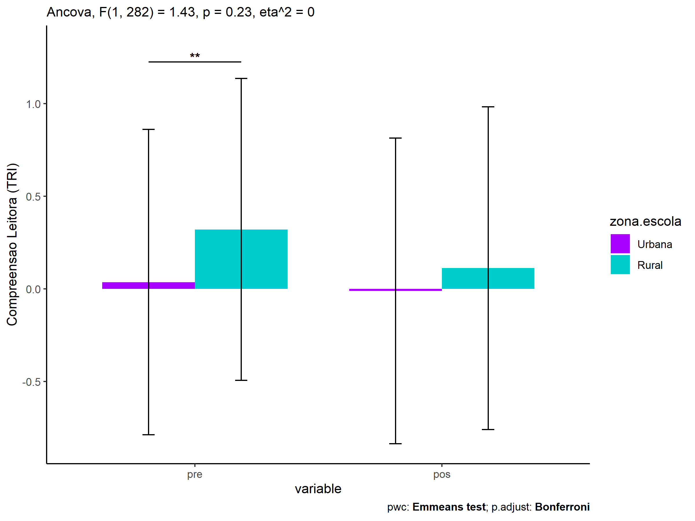<!-- -->

<!-- -->

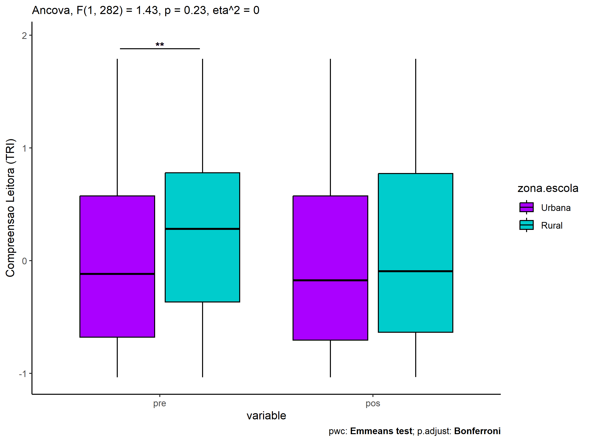<!-- -->

## factores: **grupo=“Experimental”:monitor.genero**

### Quant. Palavras Lidas

| var                | monitor.genero |   n | M (pre) | SE (pre) | M (unadj) | SE (unadj) | M (adj) | SE (adj) |
|:-------------------|:---------------|----:|--------:|---------:|----------:|-----------:|--------:|---------:|
| palavras.lidas.pos | F              |  65 | 103.615 |    8.260 |   136.692 |      8.528 | 142.609 |    8.818 |
| palavras.lidas.pos | M              |  45 | 169.622 |   14.985 |   134.711 |     11.014 | 126.165 |   10.741 |

| .y.                | group1 | group2 | estimate | conf.low | conf.high |     se | statistic | p       | p.adj   | p.adj.signif |
|:-------------------|:-------|:-------|---------:|---------:|----------:|-------:|----------:|:--------|:--------|:-------------|
| palavras.lidas.pos | F      | M      |   16.444 |  -12.066 |    44.955 | 14.382 |     1.143 | 0.255   | 0.255   | ns           |
| palavras.lidas.pre | F      | M      |  -66.007 |  -97.576 |   -34.437 | 15.927 |    -4.144 | \<0.001 | \<0.001 | \*\*\*\*     |

| .y.            | monitor.genero | group1 | group2 | estimate | conf.low | conf.high |     se | statistic |     p | p.adj | p.adj.signif |
|:---------------|:---------------|:-------|:-------|---------:|---------:|----------:|-------:|----------:|------:|------:|:-------------|
| palavras.lidas | F              | pre    | pos    |  -34.586 |  -59.461 |    -9.711 | 12.628 |    -2.739 | 0.007 | 0.007 | \*\*         |
| palavras.lidas | M              | pre    | pos    |   19.308 |  -11.528 |    50.145 | 15.655 |     1.233 | 0.219 | 0.219 | ns           |

    ## Scale for colour is already present.
    ## Adding another scale for colour, which will replace the existing scale.

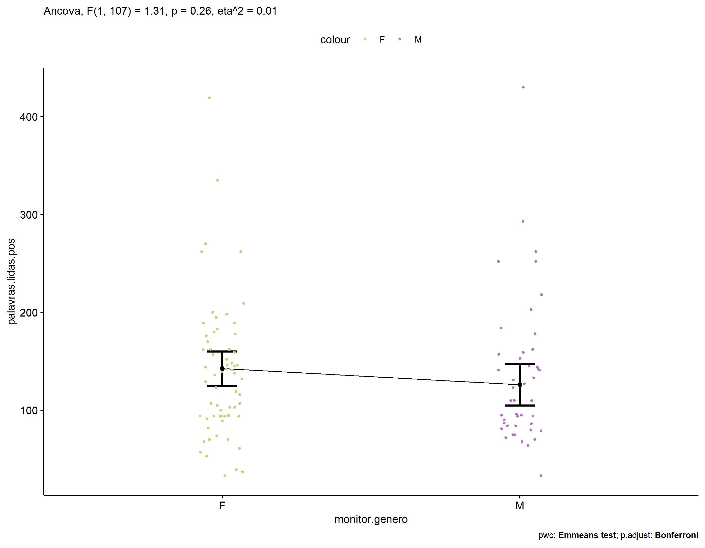<!-- -->

<!-- -->

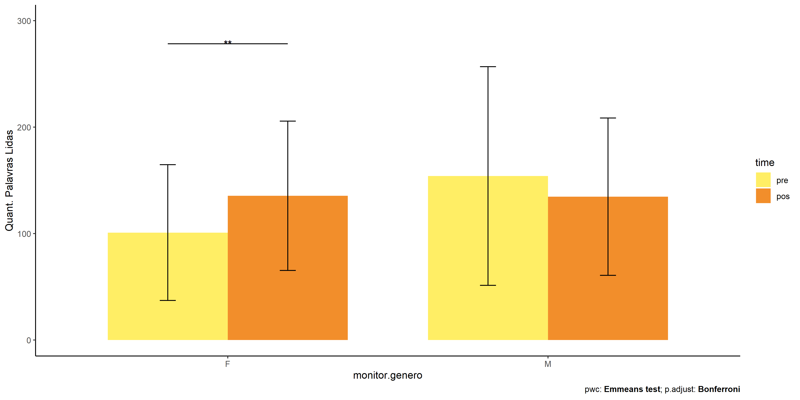<!-- -->

### Compreensao Leitora (Acertos)

| var                   | monitor.genero |   n | M (pre) | SE (pre) | M (unadj) | SE (unadj) | M (adj) | SE (adj) |
|:----------------------|:---------------|----:|--------:|---------:|----------:|-----------:|--------:|---------:|
| score.compreensao.pos | F              |  76 |   5.303 |    0.302 |     4.684 |      0.283 |   4.857 |    0.200 |
| score.compreensao.pos | M              |  44 |   6.000 |    0.436 |     6.045 |      0.398 |   5.747 |    0.263 |

| .y.                   | group1 | group2 | estimate | conf.low | conf.high |    se | statistic |     p | p.adj | p.adj.signif |
|:----------------------|:-------|:-------|---------:|---------:|----------:|------:|----------:|------:|------:|:-------------|
| score.compreensao.pos | F      | M      |   -0.890 |   -1.547 |    -0.232 | 0.332 |    -2.680 | 0.008 | 0.008 | \*\*         |
| score.compreensao.pre | F      | M      |   -0.697 |   -1.722 |     0.327 | 0.517 |    -1.348 | 0.180 | 0.180 | ns           |

| .y.               | monitor.genero | group1 | group2 | estimate | conf.low | conf.high |    se | statistic |     p | p.adj | p.adj.signif |
|:------------------|:---------------|:-------|:-------|---------:|---------:|----------:|------:|----------:|------:|------:|:-------------|
| score.compreensao | F              | pre    | pos    |    0.532 |   -0.277 |     1.342 | 0.411 |     1.295 | 0.197 | 0.197 | ns           |
| score.compreensao | M              | pre    | pos    |   -0.437 |   -1.493 |     0.620 | 0.536 |    -0.814 | 0.416 | 0.416 | ns           |

    ## Scale for colour is already present.
    ## Adding another scale for colour, which will replace the existing scale.

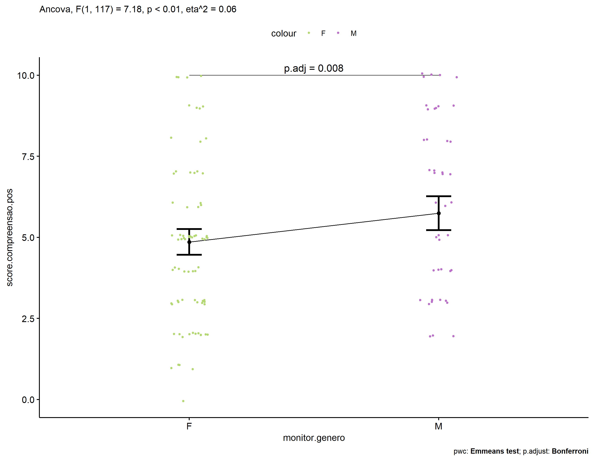<!-- -->

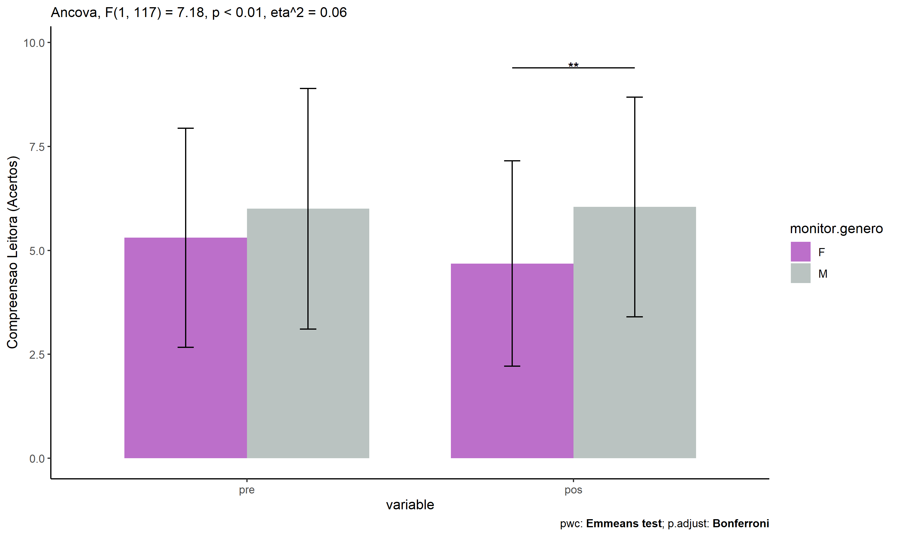<!-- -->

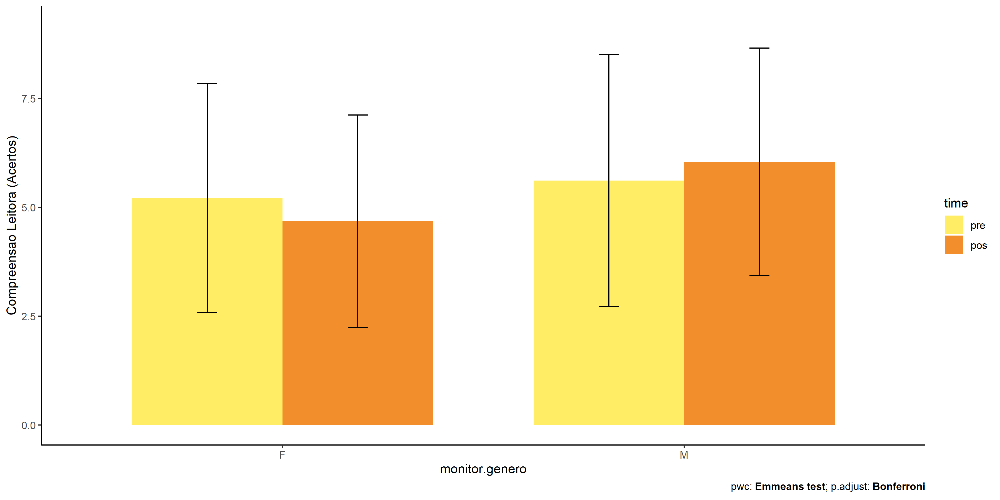<!-- -->

## factores: **grupo=“Experimental”:monitor.area**

### Quant. Palavras Lidas

| var                | monitor.area               |   n | M (pre) | SE (pre) | M (unadj) | SE (unadj) | M (adj) | SE (adj) |
|:-------------------|:---------------------------|----:|--------:|---------:|----------:|-----------:|--------:|---------:|
| palavras.lidas.pos | Arquitetura e Urbanismo    |  10 | 154.900 |   34.420 |   133.200 |     17.598 | 122.280 |   18.387 |
| palavras.lidas.pos | Ciencias Biologicas        |  15 |  84.800 |   12.165 |   101.867 |     10.170 | 122.473 |   15.392 |
| palavras.lidas.pos | Comunicacao Social         |  16 | 257.312 |   17.008 |    98.125 |      6.796 |  41.146 |   17.816 |
| palavras.lidas.pos | Historia                   |   8 | 123.625 |   25.555 |   192.500 |     44.197 | 195.645 |   20.443 |
| palavras.lidas.pos | Letras - Lingua Portuguesa |  12 | 106.750 |    8.946 |   165.000 |     14.385 | 175.734 |   16.800 |
| palavras.lidas.pos | Matematica                 |  26 | 122.962 |   16.748 |   153.962 |     15.638 | 157.405 |   11.353 |
| palavras.lidas.pos | Nutricao                   |  10 |  80.400 |   10.173 |   164.000 |     26.707 | 186.585 |   18.739 |
| palavras.lidas.pos | Servico Social             |  13 |  89.154 |   17.522 |   104.154 |     10.367 | 122.802 |   16.389 |

| .y.                | group1                  | group2              | estimate | conf.low | conf.high |     se | statistic | p       | p.adj   | p.adj.signif |
|:-------------------|:------------------------|:--------------------|---------:|---------:|----------:|-------:|----------:|:--------|:--------|:-------------|
| palavras.lidas.pos | Arquitetura e Urbanismo | Ciencias Biologicas |   -0.193 |  -48.380 |    47.993 | 24.291 |    -0.008 | 0.994   | 1       | ns           |
| palavras.lidas.pos | Arquitetura e Urbanismo | Comunicacao Social  |   81.134 |   31.985 |   130.282 | 24.776 |     3.275 | 0.001   | 0.041   | \*           |
| palavras.lidas.pos | Arquitetura e Urbanismo | Historia            |  -73.366 | -127.992 |   -18.739 | 27.537 |    -2.664 | 0.009   | 0.252   | ns           |
| palavras.lidas.pos | Arquitetura e Urbanismo | Letras              |  -53.455 | -103.173 |    -3.736 | 25.063 |    -2.133 | 0.035   | 0.99    | ns           |
| palavras.lidas.pos | Arquitetura e Urbanismo | Matematica          |  -35.126 |  -78.108 |     7.857 | 21.667 |    -1.621 | 0.108   | 1       | ns           |
| palavras.lidas.pos | Arquitetura e Urbanismo | Nutricao            |  -64.306 | -117.004 |   -11.607 | 26.565 |    -2.421 | 0.017   | 0.484   | ns           |
| palavras.lidas.pos | Arquitetura e Urbanismo | Servico Social      |   -0.522 |  -49.929 |    48.884 | 24.906 |    -0.021 | 0.983   | 1       | ns           |
| palavras.lidas.pos | Ciencias Biologicas     | Comunicacao Social  |   81.327 |   31.423 |   131.232 | 25.157 |     3.233 | 0.002   | 0.046   | \*           |
| palavras.lidas.pos | Ciencias Biologicas     | Historia            |  -73.172 | -123.768 |   -22.577 | 25.505 |    -2.869 | 0.005   | 0.14    | ns           |
| palavras.lidas.pos | Ciencias Biologicas     | Letras              |  -53.262 |  -97.813 |    -8.710 | 22.458 |    -2.372 | 0.02    | 0.549   | ns           |
| palavras.lidas.pos | Ciencias Biologicas     | Matematica          |  -34.932 |  -72.626 |     2.762 | 19.002 |    -1.838 | 0.069   | 1       | ns           |
| palavras.lidas.pos | Ciencias Biologicas     | Nutricao            |  -64.112 | -110.927 |   -17.297 | 23.599 |    -2.717 | 0.008   | 0.217   | ns           |
| palavras.lidas.pos | Ciencias Biologicas     | Servico Social      |   -0.329 |  -43.783 |    43.125 | 21.905 |    -0.015 | 0.988   | 1       | ns           |
| palavras.lidas.pos | Comunicacao Social      | Historia            | -154.499 | -208.729 |  -100.270 | 27.337 |    -5.652 | \<0.001 | \<0.001 | \*\*\*\*     |
| palavras.lidas.pos | Comunicacao Social      | Letras              | -134.589 | -184.796 |   -84.382 | 25.309 |    -5.318 | \<0.001 | \<0.001 | \*\*\*\*     |
| palavras.lidas.pos | Comunicacao Social      | Matematica          | -116.259 | -158.778 |   -73.740 | 21.434 |    -5.424 | \<0.001 | \<0.001 | \*\*\*\*     |
| palavras.lidas.pos | Comunicacao Social      | Nutricao            | -145.439 | -199.933 |   -90.945 | 27.470 |    -5.294 | \<0.001 | \<0.001 | \*\*\*\*     |
| palavras.lidas.pos | Comunicacao Social      | Servico Social      |  -81.656 | -132.507 |   -30.806 | 25.634 |    -3.185 | 0.002   | 0.054   | ns           |
| palavras.lidas.pos | Historia                | Letras              |   19.911 |  -32.496 |    72.317 | 26.418 |     0.754 | 0.453   | 1       | ns           |
| palavras.lidas.pos | Historia                | Matematica          |   38.240 |   -8.117 |    84.597 | 23.369 |     1.636 | 0.105   | 1       | ns           |
| palavras.lidas.pos | Historia                | Nutricao            |    9.060 |  -45.783 |    63.903 | 27.646 |     0.328 | 0.744   | 1       | ns           |
| palavras.lidas.pos | Historia                | Servico Social      |   72.843 |   21.014 |   124.672 | 26.127 |     2.788 | 0.006   | 0.177   | ns           |
| palavras.lidas.pos | Letras                  | Lingua Portuguesa   |   18.329 |  -21.773 |    58.432 | 20.216 |     0.907 | 0.367   | 1       | ns           |
| palavras.lidas.pos | Letras                  | Lingua Portuguesa   |  -10.851 |  -60.132 |    38.431 | 24.843 |    -0.437 | 0.663   | 1       | ns           |
| palavras.lidas.pos | Letras                  | Lingua Portuguesa   |   52.932 |    6.943 |    98.922 | 23.184 |     2.283 | 0.025   | 0.686   | ns           |
| palavras.lidas.pos | Matematica              | Nutricao            |  -29.180 |  -72.407 |    14.046 | 21.790 |    -1.339 | 0.184   | 1       | ns           |
| palavras.lidas.pos | Matematica              | Servico Social      |   34.603 |   -4.733 |    73.939 | 19.829 |     1.745 | 0.084   | 1       | ns           |
| palavras.lidas.pos | Nutricao                | Servico Social      |   63.783 |   15.534 |   112.032 | 24.322 |     2.622 | 0.01    | 0.282   | ns           |
| palavras.lidas.pre | Arquitetura e Urbanismo | Ciencias Biologicas |   70.100 |   13.759 |   126.441 | 28.405 |     2.468 | 0.015   | 0.427   | ns           |
| palavras.lidas.pre | Arquitetura e Urbanismo | Comunicacao Social  | -102.412 | -158.045 |   -46.780 | 28.048 |    -3.651 | \<0.001 | 0.012   | \*           |
| palavras.lidas.pre | Arquitetura e Urbanismo | Historia            |   31.275 |  -34.188 |    96.738 | 33.004 |     0.948 | 0.346   | 1       | ns           |
| palavras.lidas.pre | Arquitetura e Urbanismo | Letras              |   48.150 |  -10.941 |   107.241 | 29.792 |     1.616 | 0.109   | 1       | ns           |
| palavras.lidas.pre | Arquitetura e Urbanismo | Matematica          |   31.938 |  -19.415 |    83.292 | 25.890 |     1.234 | 0.22    | 1       | ns           |
| palavras.lidas.pre | Arquitetura e Urbanismo | Nutricao            |   74.500 |   12.781 |   136.219 | 31.116 |     2.394 | 0.018   | 0.517   | ns           |
| palavras.lidas.pre | Arquitetura e Urbanismo | Servico Social      |   65.746 |    7.697 |   123.795 | 29.266 |     2.246 | 0.027   | 0.751   | ns           |
| palavras.lidas.pre | Ciencias Biologicas     | Comunicacao Social  | -172.512 | -222.112 |  -122.913 | 25.006 |    -6.899 | \<0.001 | \<0.001 | \*\*\*\*     |
| palavras.lidas.pre | Ciencias Biologicas     | Historia            |  -38.825 |  -99.244 |    21.594 | 30.461 |    -1.275 | 0.205   | 1       | ns           |
| palavras.lidas.pre | Ciencias Biologicas     | Letras              |  -21.950 |  -75.400 |    31.500 | 26.947 |    -0.815 | 0.417   | 1       | ns           |
| palavras.lidas.pre | Ciencias Biologicas     | Matematica          |  -38.162 |  -82.908 |     6.585 | 22.560 |    -1.692 | 0.094   | 1       | ns           |
| palavras.lidas.pre | Ciencias Biologicas     | Nutricao            |    4.400 |  -51.941 |    60.741 | 28.405 |     0.155 | 0.877   | 1       | ns           |
| palavras.lidas.pre | Ciencias Biologicas     | Servico Social      |   -4.354 |  -56.649 |    47.942 | 26.365 |    -0.165 | 0.869   | 1       | ns           |
| palavras.lidas.pre | Comunicacao Social      | Historia            |  133.687 |   73.928 |   193.447 | 30.128 |     4.437 | \<0.001 | \<0.001 | \*\*\*       |
| palavras.lidas.pre | Comunicacao Social      | Letras              |  150.562 |   97.860 |   203.265 | 26.571 |     5.667 | \<0.001 | \<0.001 | \*\*\*\*     |
| palavras.lidas.pre | Comunicacao Social      | Matematica          |  134.351 |   90.500 |   178.202 | 22.108 |     6.077 | \<0.001 | \<0.001 | \*\*\*\*     |
| palavras.lidas.pre | Comunicacao Social      | Nutricao            |  176.912 |  121.280 |   232.545 | 28.048 |     6.308 | \<0.001 | \<0.001 | \*\*\*\*     |
| palavras.lidas.pre | Comunicacao Social      | Servico Social      |  168.159 |  116.627 |   219.690 | 25.980 |     6.473 | \<0.001 | \<0.001 | \*\*\*\*     |
| palavras.lidas.pre | Historia                | Letras              |   16.875 |  -46.117 |    79.867 | 31.758 |     0.531 | 0.596   | 1       | ns           |
| palavras.lidas.pre | Historia                | Matematica          |    0.663 |  -55.134 |    56.460 | 28.131 |     0.024 | 0.981   | 1       | ns           |
| palavras.lidas.pre | Historia                | Nutricao            |   43.225 |  -22.238 |   108.688 | 33.004 |     1.310 | 0.193   | 1       | ns           |
| palavras.lidas.pre | Historia                | Servico Social      |   34.471 |  -27.544 |    96.486 | 31.265 |     1.103 | 0.273   | 1       | ns           |
| palavras.lidas.pre | Letras                  | Lingua Portuguesa   |  -16.212 |  -64.375 |    31.952 | 24.282 |    -0.668 | 0.506   | 1       | ns           |
| palavras.lidas.pre | Letras                  | Lingua Portuguesa   |   26.350 |  -32.741 |    85.441 | 29.792 |     0.884 | 0.379   | 1       | ns           |
| palavras.lidas.pre | Letras                  | Lingua Portuguesa   |   17.596 |  -37.651 |    72.843 | 27.853 |     0.632 | 0.529   | 1       | ns           |
| palavras.lidas.pre | Matematica              | Nutricao            |   42.562 |   -8.792 |    93.915 | 25.890 |     1.644 | 0.103   | 1       | ns           |
| palavras.lidas.pre | Matematica              | Servico Social      |   33.808 |  -13.071 |    80.687 | 23.634 |     1.430 | 0.156   | 1       | ns           |
| palavras.lidas.pre | Nutricao                | Servico Social      |   -8.754 |  -66.803 |    49.295 | 29.266 |    -0.299 | 0.765   | 1       | ns           |

| .y.            | monitor.area               | group1 | group2 | estimate | conf.low | conf.high |     se | statistic | p       | p.adj   | p.adj.signif |
|:---------------|:---------------------------|:-------|:-------|---------:|---------:|----------:|-------:|----------:|:--------|:--------|:-------------|
| palavras.lidas | Arquitetura e Urbanismo    | pre    | pos    |   11.383 |  -45.309 |    68.075 | 28.773 |     0.396 | 0.693   | 0.693   | ns           |
| palavras.lidas | Ciencias Biologicas        | pre    | pos    |  -12.992 |  -60.577 |    34.594 | 24.151 |    -0.538 | 0.591   | 0.591   | ns           |
| palavras.lidas | Comunicacao Social         | pre    | pos    |  159.188 |  112.376 |   205.999 | 23.758 |     6.700 | \<0.001 | \<0.001 | \*\*\*\*     |
| palavras.lidas | Historia                   | pre    | pos    | -101.808 | -161.305 |   -42.311 | 30.196 |    -3.372 | \<0.001 | \<0.001 | \*\*\*       |
| palavras.lidas | Letras - Lingua Portuguesa | pre    | pos    |  -61.429 | -113.516 |    -9.341 | 26.436 |    -2.324 | 0.021   | 0.021   | \*           |
| palavras.lidas | Matematica                 | pre    | pos    |  -25.298 |  -61.678 |    11.083 | 18.464 |    -1.370 | 0.172   | 0.172   | ns           |
| palavras.lidas | Nutricao                   | pre    | pos    |  -74.909 | -131.366 |   -18.452 | 28.654 |    -2.614 | 0.01    | 0.01    | \*\*         |
| palavras.lidas | Servico Social             | pre    | pos    |  -27.091 |  -76.530 |    22.347 | 25.092 |    -1.080 | 0.281   | 0.281   | ns           |

    ## Scale for colour is already present.
    ## Adding another scale for colour, which will replace the existing scale.

<!-- -->

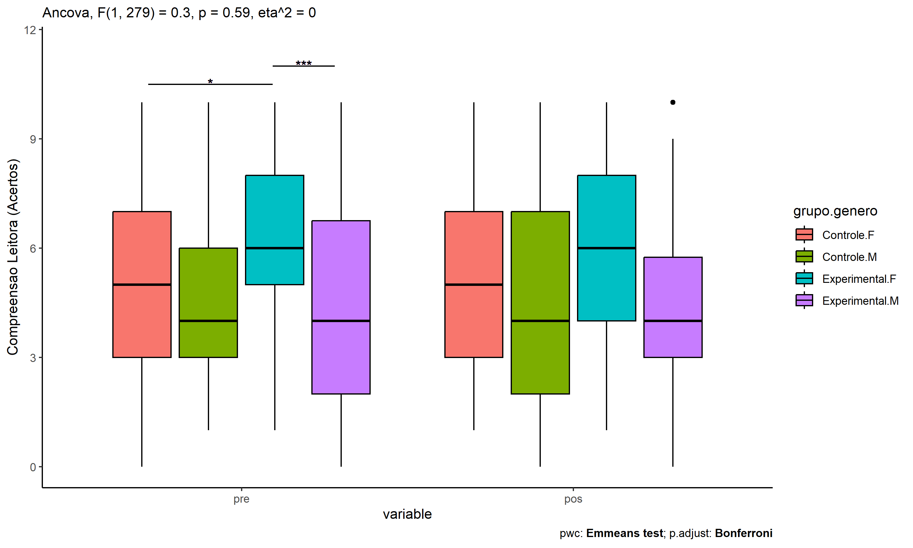<!-- -->

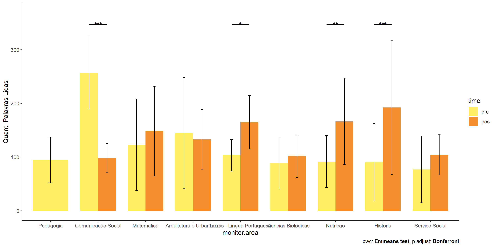<!-- -->

### Compreensao Leitora (Acertos)

| var                   | monitor.area               |   n | M (pre) | SE (pre) | M (unadj) | SE (unadj) | M (adj) | SE (adj) |
|:----------------------|:---------------------------|----:|--------:|---------:|----------:|-----------:|--------:|---------:|
| score.compreensao.pos | Arquitetura e Urbanismo    |   9 |   5.556 |    1.119 |     7.222 |      0.703 |   7.224 |    0.564 |
| score.compreensao.pos | Ciencias Biologicas        |  14 |   5.786 |    0.743 |     5.429 |      0.789 |   5.270 |    0.452 |
| score.compreensao.pos | Comunicacao Social         |  16 |   6.312 |    0.700 |     5.500 |      0.683 |   4.972 |    0.425 |
| score.compreensao.pos | Historia                   |   8 |   5.500 |    1.165 |     5.875 |      1.217 |   5.916 |    0.598 |
| score.compreensao.pos | Letras - Lingua Portuguesa |  12 |   6.250 |    0.799 |     5.000 |      0.778 |   4.516 |    0.490 |
| score.compreensao.pos | Matematica                 |  27 |   5.630 |    0.428 |     5.222 |      0.431 |   5.172 |    0.326 |
| score.compreensao.pos | Nutricao                   |  11 |   3.455 |    0.608 |     3.727 |      0.574 |   5.199 |    0.525 |
| score.compreensao.pos | Pedagogia                  |  10 |   5.000 |    0.966 |     3.700 |      0.667 |   4.091 |    0.536 |
| score.compreensao.pos | Servico Social             |  13 |   5.846 |    0.815 |     5.154 |      0.750 |   4.953 |    0.470 |

| .y.                   | group1                  | group2              | estimate | conf.low | conf.high |    se | statistic | p       | p.adj | p.adj.signif |
|:----------------------|:------------------------|:--------------------|---------:|---------:|----------:|------:|----------:|:--------|------:|:-------------|
| score.compreensao.pos | Arquitetura e Urbanismo | Ciencias Biologicas |    1.955 |    0.522 |     3.387 | 0.723 |     2.704 | 0.008   | 0.286 | ns           |
| score.compreensao.pos | Arquitetura e Urbanismo | Comunicacao Social  |    2.252 |    0.852 |     3.651 | 0.706 |     3.188 | 0.002   | 0.067 | ns           |
| score.compreensao.pos | Arquitetura e Urbanismo | Historia            |    1.308 |   -0.321 |     2.938 | 0.822 |     1.592 | 0.114   | 1.000 | ns           |
| score.compreensao.pos | Arquitetura e Urbanismo | Letras              |    2.708 |    1.227 |     4.189 | 0.747 |     3.624 | \<0.001 | 0.016 | \*           |
| score.compreensao.pos | Arquitetura e Urbanismo | Matematica          |    2.052 |    0.761 |     3.342 | 0.651 |     3.151 | 0.002   | 0.076 | ns           |
| score.compreensao.pos | Arquitetura e Urbanismo | Nutricao            |    2.025 |    0.499 |     3.552 | 0.770 |     2.629 | 0.01    | 0.353 | ns           |
| score.compreensao.pos | Arquitetura e Urbanismo | Pedagogia           |    3.134 |    1.592 |     4.675 | 0.778 |     4.028 | \<0.001 | 0.004 | \*\*         |
| score.compreensao.pos | Arquitetura e Urbanismo | Servico Social      |    2.272 |    0.817 |     3.726 | 0.734 |     3.096 | 0.002   | 0.090 | ns           |
| score.compreensao.pos | Ciencias Biologicas     | Comunicacao Social  |    0.297 |   -0.931 |     1.526 | 0.620 |     0.479 | 0.633   | 1.000 | ns           |
| score.compreensao.pos | Ciencias Biologicas     | Historia            |   -0.646 |   -2.133 |     0.840 | 0.750 |    -0.862 | 0.391   | 1.000 | ns           |
| score.compreensao.pos | Ciencias Biologicas     | Letras              |    0.753 |   -0.567 |     2.073 | 0.666 |     1.131 | 0.261   | 1.000 | ns           |
| score.compreensao.pos | Ciencias Biologicas     | Matematica          |    0.097 |   -1.007 |     1.202 | 0.557 |     0.174 | 0.862   | 1.000 | ns           |
| score.compreensao.pos | Ciencias Biologicas     | Nutricao            |    0.071 |   -1.307 |     1.449 | 0.695 |     0.102 | 0.919   | 1.000 | ns           |
| score.compreensao.pos | Ciencias Biologicas     | Pedagogia           |    1.179 |   -0.212 |     2.570 | 0.702 |     1.679 | 0.096   | 1.000 | ns           |
| score.compreensao.pos | Ciencias Biologicas     | Servico Social      |    0.317 |   -0.974 |     1.608 | 0.652 |     0.486 | 0.628   | 1.000 | ns           |
| score.compreensao.pos | Comunicacao Social      | Historia            |   -0.943 |   -2.398 |     0.512 | 0.734 |    -1.285 | 0.202   | 1.000 | ns           |
| score.compreensao.pos | Comunicacao Social      | Letras              |    0.456 |   -0.824 |     1.737 | 0.646 |     0.706 | 0.482   | 1.000 | ns           |
| score.compreensao.pos | Comunicacao Social      | Matematica          |   -0.200 |   -1.261 |     0.861 | 0.535 |    -0.373 | 0.71    | 1.000 | ns           |
| score.compreensao.pos | Comunicacao Social      | Nutricao            |   -0.226 |   -1.581 |     1.129 | 0.684 |    -0.331 | 0.741   | 1.000 | ns           |
| score.compreensao.pos | Comunicacao Social      | Pedagogia           |    0.882 |   -0.478 |     2.242 | 0.686 |     1.285 | 0.202   | 1.000 | ns           |
| score.compreensao.pos | Comunicacao Social      | Servico Social      |    0.020 |   -1.233 |     1.273 | 0.632 |     0.032 | 0.975   | 1.000 | ns           |
| score.compreensao.pos | Historia                | Letras              |    1.400 |   -0.133 |     2.932 | 0.773 |     1.810 | 0.073   | 1.000 | ns           |
| score.compreensao.pos | Historia                | Matematica          |    0.743 |   -0.606 |     2.093 | 0.681 |     1.092 | 0.277   | 1.000 | ns           |
| score.compreensao.pos | Historia                | Nutricao            |    0.717 |   -0.859 |     2.293 | 0.795 |     0.901 | 0.369   | 1.000 | ns           |
| score.compreensao.pos | Historia                | Pedagogia           |    1.825 |    0.234 |     3.417 | 0.803 |     2.273 | 0.025   | 0.899 | ns           |
| score.compreensao.pos | Historia                | Servico Social      |    0.963 |   -0.544 |     2.470 | 0.761 |     1.267 | 0.208   | 1.000 | ns           |
| score.compreensao.pos | Letras                  | Lingua Portuguesa   |   -0.656 |   -1.822 |     0.509 | 0.588 |    -1.116 | 0.267   | 1.000 | ns           |
| score.compreensao.pos | Letras                  | Lingua Portuguesa   |   -0.683 |   -2.120 |     0.754 | 0.725 |    -0.941 | 0.349   | 1.000 | ns           |
| score.compreensao.pos | Letras                  | Lingua Portuguesa   |    0.426 |   -1.017 |     1.869 | 0.728 |     0.585 | 0.56    | 1.000 | ns           |
| score.compreensao.pos | Letras                  | Lingua Portuguesa   |   -0.436 |   -1.779 |     0.907 | 0.678 |    -0.644 | 0.521   | 1.000 | ns           |
| score.compreensao.pos | Matematica              | Nutricao            |   -0.027 |   -1.252 |     1.199 | 0.619 |    -0.043 | 0.966   | 1.000 | ns           |
| score.compreensao.pos | Matematica              | Pedagogia           |    1.082 |   -0.162 |     2.325 | 0.627 |     1.724 | 0.087   | 1.000 | ns           |
| score.compreensao.pos | Matematica              | Servico Social      |    0.220 |   -0.912 |     1.352 | 0.571 |     0.385 | 0.701   | 1.000 | ns           |
| score.compreensao.pos | Nutricao                | Pedagogia           |    1.108 |   -0.368 |     2.584 | 0.745 |     1.488 | 0.14    | 1.000 | ns           |
| score.compreensao.pos | Nutricao                | Servico Social      |    0.246 |   -1.155 |     1.648 | 0.707 |     0.348 | 0.728   | 1.000 | ns           |
| score.compreensao.pos | Pedagogia               | Servico Social      |   -0.862 |   -2.276 |     0.552 | 0.713 |    -1.208 | 0.23    | 1.000 | ns           |
| score.compreensao.pre | Arquitetura e Urbanismo | Ciencias Biologicas |   -0.230 |   -2.538 |     2.078 | 1.165 |    -0.198 | 0.844   | 1.000 | ns           |
| score.compreensao.pre | Arquitetura e Urbanismo | Comunicacao Social  |   -0.757 |   -3.008 |     1.494 | 1.136 |    -0.666 | 0.507   | 1.000 | ns           |
| score.compreensao.pre | Arquitetura e Urbanismo | Historia            |    0.056 |   -2.569 |     2.681 | 1.325 |     0.042 | 0.967   | 1.000 | ns           |
| score.compreensao.pre | Arquitetura e Urbanismo | Letras              |   -0.694 |   -3.077 |     1.688 | 1.202 |    -0.578 | 0.565   | 1.000 | ns           |
| score.compreensao.pre | Arquitetura e Urbanismo | Matematica          |   -0.074 |   -2.153 |     2.005 | 1.049 |    -0.071 | 0.944   | 1.000 | ns           |
| score.compreensao.pre | Arquitetura e Urbanismo | Nutricao            |    2.101 |   -0.327 |     4.529 | 1.225 |     1.715 | 0.089   | 1.000 | ns           |
| score.compreensao.pre | Arquitetura e Urbanismo | Pedagogia           |    0.556 |   -1.927 |     3.038 | 1.253 |     0.444 | 0.658   | 1.000 | ns           |
| score.compreensao.pre | Arquitetura e Urbanismo | Servico Social      |   -0.291 |   -2.633 |     2.052 | 1.182 |    -0.246 | 0.806   | 1.000 | ns           |
| score.compreensao.pre | Ciencias Biologicas     | Comunicacao Social  |   -0.527 |   -2.504 |     1.450 | 0.998 |    -0.528 | 0.599   | 1.000 | ns           |
| score.compreensao.pre | Ciencias Biologicas     | Historia            |    0.286 |   -2.109 |     2.680 | 1.208 |     0.236 | 0.814   | 1.000 | ns           |
| score.compreensao.pre | Ciencias Biologicas     | Letras              |   -0.464 |   -2.589 |     1.661 | 1.072 |    -0.433 | 0.666   | 1.000 | ns           |
| score.compreensao.pre | Ciencias Biologicas     | Matematica          |    0.156 |   -1.623 |     1.935 | 0.898 |     0.174 | 0.862   | 1.000 | ns           |
| score.compreensao.pre | Ciencias Biologicas     | Nutricao            |    2.331 |    0.155 |     4.508 | 1.098 |     2.122 | 0.036   | 1.000 | ns           |
| score.compreensao.pre | Ciencias Biologicas     | Pedagogia           |    0.786 |   -1.451 |     3.022 | 1.129 |     0.696 | 0.488   | 1.000 | ns           |
| score.compreensao.pre | Ciencias Biologicas     | Servico Social      |   -0.060 |   -2.141 |     2.020 | 1.050 |    -0.058 | 0.954   | 1.000 | ns           |
| score.compreensao.pre | Comunicacao Social      | Historia            |    0.813 |   -1.527 |     3.152 | 1.180 |     0.688 | 0.493   | 1.000 | ns           |
| score.compreensao.pre | Comunicacao Social      | Letras              |    0.062 |   -2.000 |     2.125 | 1.041 |     0.060 | 0.952   | 1.000 | ns           |
| score.compreensao.pre | Comunicacao Social      | Matematica          |    0.683 |   -1.021 |     2.387 | 0.860 |     0.794 | 0.429   | 1.000 | ns           |
| score.compreensao.pre | Comunicacao Social      | Nutricao            |    2.858 |    0.742 |     4.974 | 1.068 |     2.677 | 0.009   | 0.308 | ns           |
| score.compreensao.pre | Comunicacao Social      | Pedagogia           |    1.313 |   -0.865 |     3.490 | 1.099 |     1.194 | 0.235   | 1.000 | ns           |
| score.compreensao.pre | Comunicacao Social      | Servico Social      |    0.466 |   -1.551 |     2.483 | 1.018 |     0.458 | 0.648   | 1.000 | ns           |
| score.compreensao.pre | Historia                | Letras              |   -0.750 |   -3.216 |     1.716 | 1.244 |    -0.603 | 0.548   | 1.000 | ns           |
| score.compreensao.pre | Historia                | Matematica          |   -0.130 |   -2.304 |     2.045 | 1.097 |    -0.118 | 0.906   | 1.000 | ns           |
| score.compreensao.pre | Historia                | Nutricao            |    2.045 |   -0.465 |     4.556 | 1.267 |     1.615 | 0.109   | 1.000 | ns           |
| score.compreensao.pre | Historia                | Pedagogia           |    0.500 |   -2.062 |     3.062 | 1.293 |     0.387 | 0.7     | 1.000 | ns           |
| score.compreensao.pre | Historia                | Servico Social      |   -0.346 |   -2.774 |     2.081 | 1.225 |    -0.283 | 0.778   | 1.000 | ns           |
| score.compreensao.pre | Letras                  | Lingua Portuguesa   |    0.620 |   -1.254 |     2.495 | 0.946 |     0.656 | 0.513   | 1.000 | ns           |
| score.compreensao.pre | Letras                  | Lingua Portuguesa   |    2.795 |    0.540 |     5.050 | 1.138 |     2.456 | 0.016   | 0.561 | ns           |
| score.compreensao.pre | Letras                  | Lingua Portuguesa   |    1.250 |   -1.063 |     3.563 | 1.167 |     1.071 | 0.287   | 1.000 | ns           |
| score.compreensao.pre | Letras                  | Lingua Portuguesa   |    0.404 |   -1.759 |     2.566 | 1.091 |     0.370 | 0.712   | 1.000 | ns           |
| score.compreensao.pre | Matematica              | Nutricao            |    2.175 |    0.243 |     4.107 | 0.975 |     2.230 | 0.028   | 0.998 | ns           |
| score.compreensao.pre | Matematica              | Pedagogia           |    0.630 |   -1.370 |     2.629 | 1.009 |     0.624 | 0.534   | 1.000 | ns           |
| score.compreensao.pre | Matematica              | Servico Social      |   -0.217 |   -2.040 |     1.607 | 0.920 |    -0.235 | 0.814   | 1.000 | ns           |
| score.compreensao.pre | Nutricao                | Pedagogia           |   -1.545 |   -3.906 |     0.815 | 1.191 |    -1.297 | 0.197   | 1.000 | ns           |
| score.compreensao.pre | Nutricao                | Servico Social      |   -2.392 |   -4.605 |    -0.178 | 1.117 |    -2.141 | 0.034   | 1.000 | ns           |
| score.compreensao.pre | Pedagogia               | Servico Social      |   -0.846 |   -3.118 |     1.426 | 1.147 |    -0.738 | 0.462   | 1.000 | ns           |

| .y.               | monitor.area               | group1 | group2 | estimate | conf.low | conf.high |    se | statistic |     p | p.adj | p.adj.signif |
|:------------------|:---------------------------|:-------|:-------|---------:|---------:|----------:|------:|----------:|------:|------:|:-------------|
| score.compreensao | Arquitetura e Urbanismo    | pre    | pos    |   -1.827 |   -4.079 |     0.425 | 1.143 |    -1.598 | 0.111 | 0.111 | ns           |
| score.compreensao | Ciencias Biologicas        | pre    | pos    |    0.333 |   -1.549 |     2.215 | 0.955 |     0.349 | 0.727 | 0.727 | ns           |
| score.compreensao | Comunicacao Social         | pre    | pos    |    0.812 |   -1.010 |     2.635 | 0.925 |     0.878 | 0.381 | 0.381 | ns           |
| score.compreensao | Historia                   | pre    | pos    |   -1.413 |   -3.729 |     0.903 | 1.176 |    -1.202 | 0.230 | 0.230 | ns           |
| score.compreensao | Letras - Lingua Portuguesa | pre    | pos    |    1.214 |   -0.813 |     3.242 | 1.029 |     1.180 | 0.239 | 0.239 | ns           |
| score.compreensao | Matematica                 | pre    | pos    |    0.407 |   -0.995 |     1.810 | 0.712 |     0.572 | 0.568 | 0.568 | ns           |
| score.compreensao | Nutricao                   | pre    | pos    |   -0.061 |   -2.212 |     2.091 | 1.092 |    -0.055 | 0.956 | 0.956 | ns           |
| score.compreensao | Pedagogia                  | pre    | pos    |    1.182 |   -0.970 |     3.333 | 1.092 |     1.082 | 0.280 | 0.280 | ns           |
| score.compreensao | Servico Social             | pre    | pos    |    0.096 |   -1.828 |     2.021 | 0.977 |     0.098 | 0.922 | 0.922 | ns           |

    ## Scale for colour is already present.
    ## Adding another scale for colour, which will replace the existing scale.

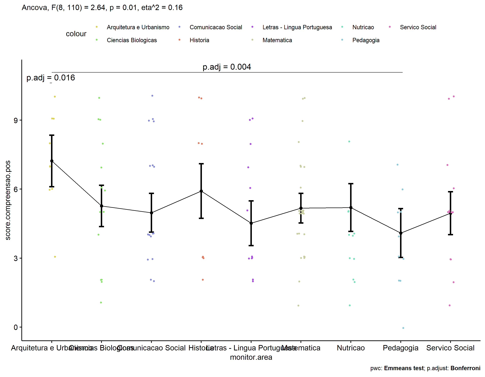<!-- -->

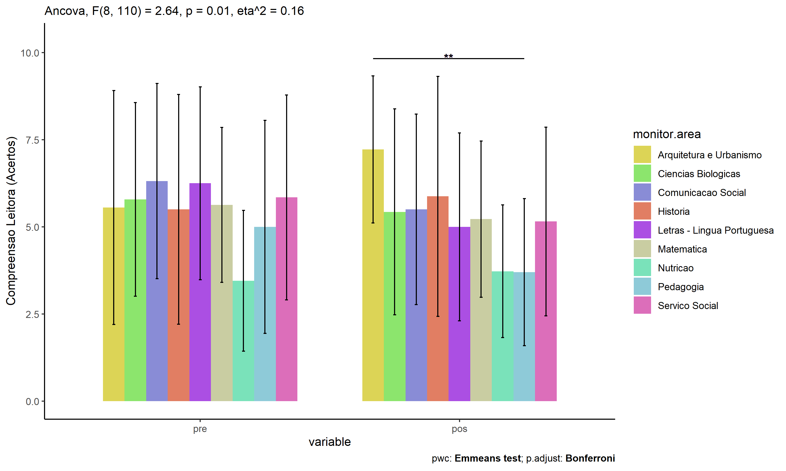<!-- -->

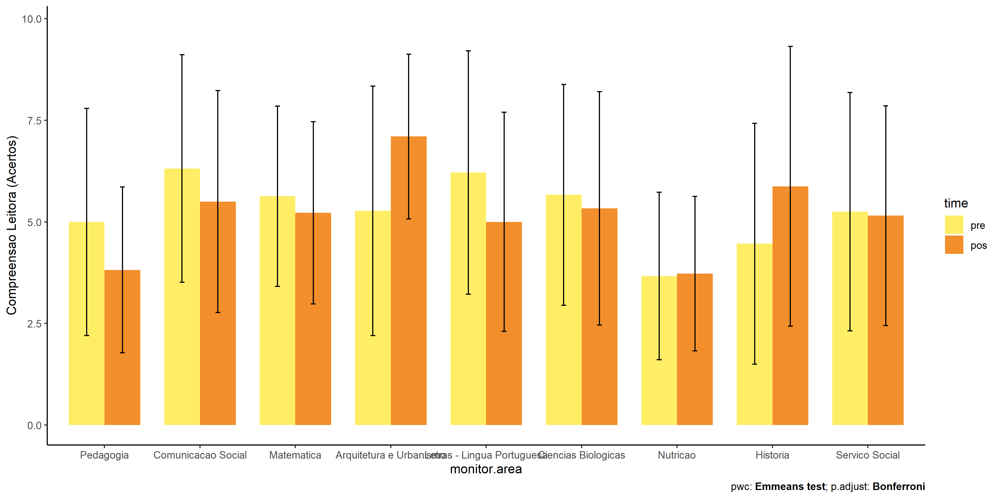<!-- -->

## factores: **grupo=“Experimental”:monitor.formacao**

### Quant. Palavras Lidas

| var                | monitor.formacao |   n | M (pre) | SE (pre) | M (unadj) | SE (unadj) | M (adj) | SE (adj) |
|:-------------------|:-----------------|----:|--------:|---------:|----------:|-----------:|--------:|---------:|
| palavras.lidas.pos | ensino medio     |  83 | 111.723 |    8.141 |   141.651 |      8.246 | 150.312 |    6.949 |
| palavras.lidas.pos | especializacao   |  16 | 257.312 |   17.008 |    98.125 |      6.796 |  40.049 |   18.724 |
| palavras.lidas.pos | graduacao        |  11 |  88.909 |   12.865 |   147.273 |     19.530 | 166.392 |   18.910 |

| .y.                | group1         | group2         | estimate | conf.low | conf.high |     se | statistic | p       | p.adj   | p.adj.signif |
|:-------------------|:---------------|:---------------|---------:|---------:|----------:|-------:|----------:|:--------|:--------|:-------------|
| palavras.lidas.pos | ensino medio   | especializacao |  110.264 |   69.026 |   151.501 | 20.800 |     5.301 | \<0.001 | \<0.001 | \*\*\*\*     |
| palavras.lidas.pos | ensino medio   | graduacao      |  -16.080 |  -55.471 |    23.311 | 19.868 |    -0.809 | 0.42    | 1       | ns           |
| palavras.lidas.pos | especializacao | graduacao      | -126.344 | -181.810 |   -70.877 | 27.977 |    -4.516 | \<0.001 | \<0.001 | \*\*\*\*     |
| palavras.lidas.pre | ensino medio   | especializacao | -145.590 | -183.996 |  -107.184 | 19.374 |    -7.515 | \<0.001 | \<0.001 | \*\*\*\*     |
| palavras.lidas.pre | ensino medio   | graduacao      |   22.814 |  -22.321 |    67.948 | 22.768 |     1.002 | 0.319   | 0.956   | ns           |
| palavras.lidas.pre | especializacao | graduacao      |  168.403 |  113.309 |   223.498 | 27.792 |     6.059 | \<0.001 | \<0.001 | \*\*\*\*     |

| .y.            | monitor.formacao | group1 | group2 | estimate | conf.low | conf.high |     se | statistic | p       | p.adj   | p.adj.signif |
|:---------------|:-----------------|:-------|:-------|---------:|---------:|----------:|-------:|----------:|:--------|:--------|:-------------|
| palavras.lidas | ensino medio     | pre    | pos    |  -34.948 |  -55.269 |   -14.626 | 10.316 |    -3.388 | \<0.001 | \<0.001 | \*\*\*       |
| palavras.lidas | especializacao   | pre    | pos    |  159.188 |  110.830 |   207.545 | 24.549 |     6.484 | \<0.001 | \<0.001 | \*\*\*\*     |
| palavras.lidas | graduacao        | pre    | pos    |  -55.455 | -105.963 |    -4.946 | 25.641 |    -2.163 | 0.032   | 0.032   | \*           |

    ## Scale for colour is already present.
    ## Adding another scale for colour, which will replace the existing scale.

<!-- -->

<!-- -->

<!-- -->

### Compreensao Leitora (Acertos)

| var                   | monitor.formacao |   n | M (pre) | SE (pre) | M (unadj) | SE (unadj) | M (adj) | SE (adj) |
|:----------------------|:-----------------|----:|--------:|---------:|----------:|-----------:|--------:|---------:|
| score.compreensao.pos | ensino medio     |  83 |   5.386 |    0.297 |     5.193 |      0.290 |   5.314 |    0.196 |
| score.compreensao.pos | especializacao   |  16 |   6.312 |    0.700 |     5.500 |      0.683 |   4.971 |    0.449 |
| score.compreensao.pos | graduacao        |  21 |   5.667 |    0.622 |     4.905 |      0.534 |   4.829 |    0.390 |

| .y.                   | group1         | group2         | estimate | conf.low | conf.high |    se | statistic |     p | p.adj | p.adj.signif |
|:----------------------|:---------------|:---------------|---------:|---------:|----------:|------:|----------:|------:|------:|:-------------|
| score.compreensao.pos | ensino medio   | especializacao |    0.343 |   -0.630 |     1.316 | 0.491 |     0.699 | 0.486 | 1.000 | ns           |
| score.compreensao.pos | ensino medio   | graduacao      |    0.485 |   -0.380 |     1.351 | 0.437 |     1.110 | 0.269 | 0.807 | ns           |
| score.compreensao.pos | especializacao | graduacao      |    0.142 |   -1.035 |     1.320 | 0.594 |     0.239 | 0.811 | 1.000 | ns           |
| score.compreensao.pre | ensino medio   | especializacao |   -0.927 |   -2.411 |     0.557 | 0.750 |    -1.237 | 0.219 | 0.656 | ns           |
| score.compreensao.pre | ensino medio   | graduacao      |   -0.281 |   -1.609 |     1.047 | 0.671 |    -0.419 | 0.676 | 1.000 | ns           |
| score.compreensao.pre | especializacao | graduacao      |    0.646 |   -1.158 |     2.450 | 0.911 |     0.709 | 0.480 | 1.000 | ns           |

| .y.               | monitor.formacao | group1 | group2 | estimate | conf.low | conf.high |    se | statistic |     p | p.adj | p.adj.signif |
|:------------------|:-----------------|:-------|:-------|---------:|---------:|----------:|------:|----------:|------:|------:|:-------------|
| score.compreensao | ensino medio     | pre    | pos    |   -0.044 |   -0.822 |     0.734 | 0.395 |    -0.111 | 0.912 | 0.912 | ns           |
| score.compreensao | especializacao   | pre    | pos    |    0.813 |   -1.038 |     2.663 | 0.940 |     0.865 | 0.388 | 0.388 | ns           |
| score.compreensao | graduacao        | pre    | pos    |    0.700 |   -0.862 |     2.261 | 0.793 |     0.883 | 0.378 | 0.378 | ns           |

    ## Scale for colour is already present.
    ## Adding another scale for colour, which will replace the existing scale.

<!-- -->

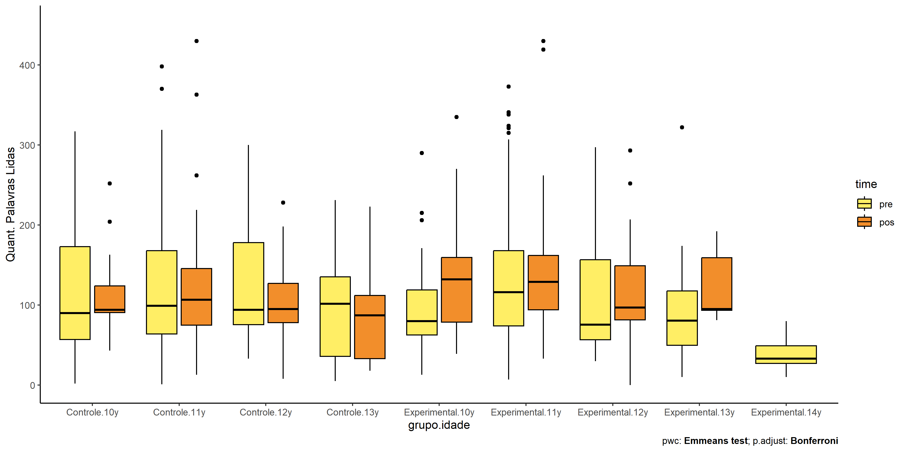<!-- -->

<!-- -->

## factores: **grupo=“Experimental”:monitor.experiencia**

### Quant. Palavras Lidas

| var                | monitor.experiencia |   n | M (pre) | SE (pre) | M (unadj) | SE (unadj) | M (adj) | SE (adj) |
|:-------------------|:--------------------|----:|--------:|---------:|----------:|-----------:|--------:|---------:|
| palavras.lidas.pos | maior 01 ano        |  77 | 140.987 |   10.283 |   137.935 |      8.397 | 136.022 |    7.938 |
| palavras.lidas.pos | menor 01 ano        |  33 | 106.424 |   13.693 |   131.091 |     11.059 | 135.554 |   12.207 |

| .y.                | group1       | group2       | estimate | conf.low | conf.high |     se | statistic |     p | p.adj | p.adj.signif |
|:-------------------|:-------------|:-------------|---------:|---------:|----------:|-------:|----------:|------:|------:|:-------------|
| palavras.lidas.pos | maior 01 ano | menor 01 ano |    0.468 |  -28.597 |    29.533 | 14.662 |     0.032 | 0.975 | 0.975 | ns           |
| palavras.lidas.pre | maior 01 ano | menor 01 ano |   34.563 |   -1.302 |    70.427 | 18.093 |     1.910 | 0.059 | 0.059 | ns           |

| .y.            | monitor.experiencia | group1 | group2 | estimate | conf.low | conf.high |     se | statistic |     p | p.adj | p.adj.signif |
|:---------------|:--------------------|:-------|:-------|---------:|---------:|----------:|-------:|----------:|------:|------:|:-------------|
| palavras.lidas | maior 01 ano        | pre    | pos    |   -6.927 |  -30.565 |    16.711 | 12.000 |    -0.577 | 0.564 | 0.564 | ns           |
| palavras.lidas | menor 01 ano        | pre    | pos    |  -30.934 |  -67.318 |     5.451 | 18.471 |    -1.675 | 0.095 | 0.095 | ns           |

    ## Scale for colour is already present.
    ## Adding another scale for colour, which will replace the existing scale.

<!-- -->

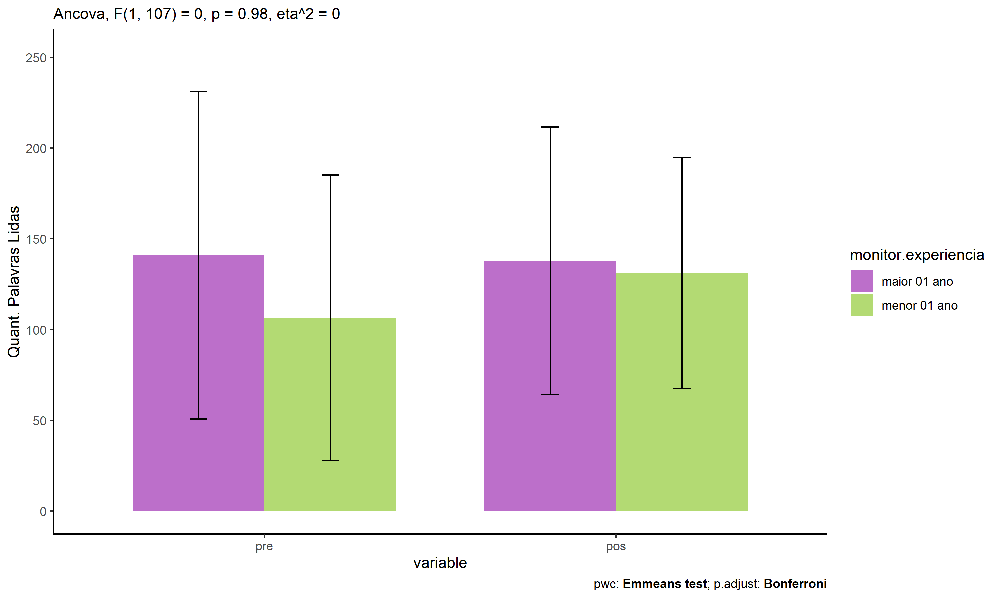<!-- -->

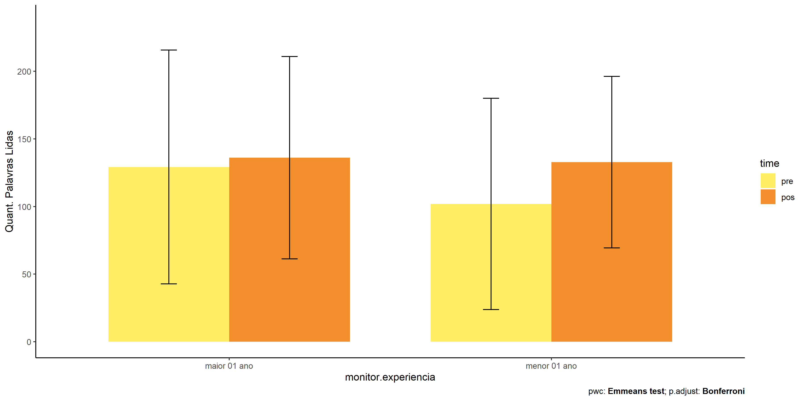<!-- -->

### Compreensao Leitora (Acertos)

| var                   | monitor.experiencia |   n | M (pre) | SE (pre) | M (unadj) | SE (unadj) | M (adj) | SE (adj) |
|:----------------------|:--------------------|----:|--------:|---------:|----------:|-----------:|--------:|---------:|
| score.compreensao.pos | maior 01 ano        |  87 |   5.782 |    0.284 |     5.161 |      0.280 |   5.002 |     0.19 |
| score.compreensao.pos | menor 01 ano        |  33 |   4.970 |    0.508 |     5.242 |      0.456 |   5.660 |     0.31 |

| .y.                   | group1       | group2       | estimate | conf.low | conf.high |    se | statistic |     p | p.adj | p.adj.signif |
|:----------------------|:-------------|:-------------|---------:|---------:|----------:|------:|----------:|------:|------:|:-------------|
| score.compreensao.pos | maior 01 ano | menor 01 ano |   -0.658 |   -1.380 |     0.064 | 0.364 |    -1.806 | 0.074 | 0.074 | ns           |
| score.compreensao.pre | maior 01 ano | menor 01 ano |    0.812 |   -0.292 |     1.916 | 0.558 |     1.456 | 0.148 | 0.148 | ns           |

| .y.               | monitor.experiencia | group1 | group2 | estimate | conf.low | conf.high |    se | statistic |     p | p.adj | p.adj.signif |
|:------------------|:--------------------|:-------|:-------|---------:|---------:|----------:|------:|----------:|------:|------:|:-------------|
| score.compreensao | maior 01 ano        | pre    | pos    |    0.452 |   -0.314 |     1.218 | 0.389 |     1.161 | 0.247 | 0.247 | ns           |
| score.compreensao | menor 01 ano        | pre    | pos    |   -0.495 |   -1.720 |     0.729 | 0.622 |    -0.797 | 0.426 | 0.426 | ns           |

    ## Scale for colour is already present.
    ## Adding another scale for colour, which will replace the existing scale.

<!-- -->

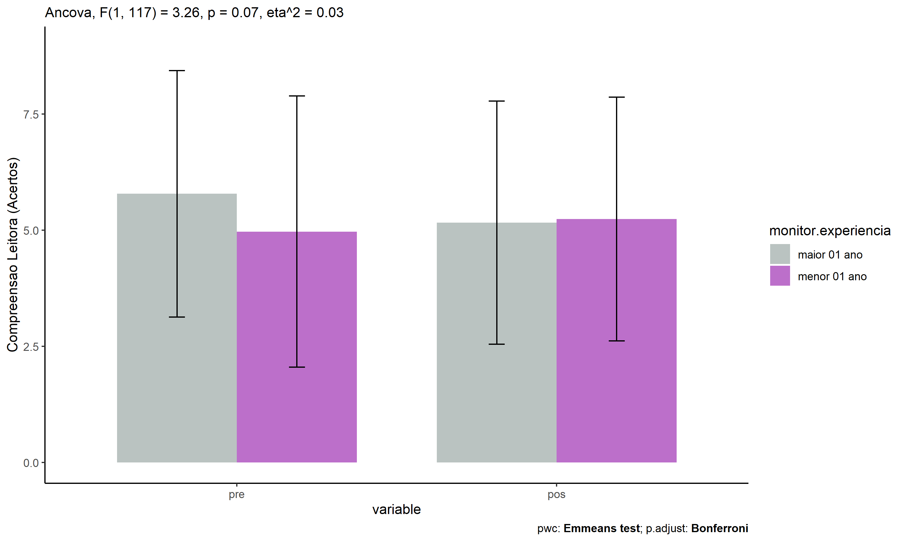<!-- -->

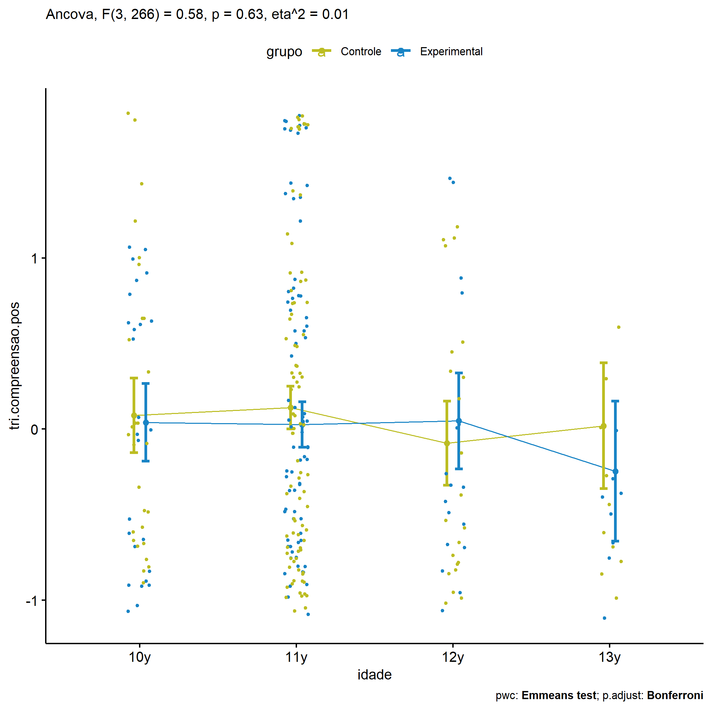<!-- -->
