ANCOVA in Vocabulary Test (Teste de Vocabulario)
================
Geiser C. Challco <geiser@alumni.usp.br>

- [Descriptive Statistics of Initial
  Data](#descriptive-statistics-of-initial-data)
  - [Vocabulario (Acertos)](#vocabulario-acertos)
  - [Vocabulario Ensinado (Acertos)](#vocabulario-ensinado-acertos)
  - [Vocabulario Nao Ensinado
    (Acertos)](#vocabulario-nao-ensinado-acertos)
- [Checking of Assumptions](#checking-of-assumptions)
  - [Assumption: Normality
    distribution](#assumption-normality-distribution)
    - [Vocabulario (Acertos)](#vocabulario-acertos-1)
    - [Vocabulario Ensinado (Acertos)](#vocabulario-ensinado-acertos-1)
    - [Vocabulario Nao Ensinado
      (Acertos)](#vocabulario-nao-ensinado-acertos-1)
  - [Assumption: Homogeneity](#assumption-homogeneity)
    - [Vocabulario (Acertos)](#vocabulario-acertos-2)
    - [Vocabulario Ensinado (Acertos)](#vocabulario-ensinado-acertos-2)
    - [Vocabulario Nao Ensinado
      (Acertos)](#vocabulario-nao-ensinado-acertos-2)
- [Computation of ANCOVA test and Pairwise
  Comparison](#computation-of-ancova-test-and-pairwise-comparison)
  - [ANCOVA tests for one factor](#ancova-tests-for-one-factor)
    - [Vocabulario (Acertos)](#vocabulario-acertos-3)
    - [Vocabulario Ensinado (Acertos)](#vocabulario-ensinado-acertos-3)
    - [Vocabulario Nao Ensinado
      (Acertos)](#vocabulario-nao-ensinado-acertos-3)
  - [ANCOVA tests for two factors](#ancova-tests-for-two-factors)
    - [Vocabulario (Acertos)](#vocabulario-acertos-4)
    - [Vocabulario Ensinado (Acertos)](#vocabulario-ensinado-acertos-4)
    - [Vocabulario Nao Ensinado
      (Acertos)](#vocabulario-nao-ensinado-acertos-4)
  - [ANCOVA tests for
    grupo=“Experimental”](#ancova-tests-for-grupoexperimental)
    - [Vocabulario (Acertos)](#vocabulario-acertos-5)
    - [Vocabulario Ensinado (Acertos)](#vocabulario-ensinado-acertos-5)
    - [Vocabulario Nao Ensinado
      (Acertos)](#vocabulario-nao-ensinado-acertos-5)
- [Pairwise comparisons for one
  factor](#pairwise-comparisons-for-one-factor)
  - [factor: **grupo**](#factor-grupo)
    - [Vocabulario (Acertos)](#vocabulario-acertos-6)
    - [Vocabulario Ensinado (Acertos)](#vocabulario-ensinado-acertos-6)
    - [Vocabulario Nao Ensinado
      (Acertos)](#vocabulario-nao-ensinado-acertos-6)
  - [factor: **genero**](#factor-genero)
    - [Vocabulario (Acertos)](#vocabulario-acertos-7)
    - [Vocabulario Ensinado (Acertos)](#vocabulario-ensinado-acertos-7)
    - [Vocabulario Nao Ensinado
      (Acertos)](#vocabulario-nao-ensinado-acertos-7)
  - [factor: **idade**](#factor-idade)
    - [Vocabulario (Acertos)](#vocabulario-acertos-8)
    - [Vocabulario Ensinado (Acertos)](#vocabulario-ensinado-acertos-8)
    - [Vocabulario Nao Ensinado
      (Acertos)](#vocabulario-nao-ensinado-acertos-8)
  - [factor: **zona.participante**](#factor-zonaparticipante)
    - [Vocabulario (Acertos)](#vocabulario-acertos-9)
    - [Vocabulario Ensinado (Acertos)](#vocabulario-ensinado-acertos-9)
    - [Vocabulario Nao Ensinado
      (Acertos)](#vocabulario-nao-ensinado-acertos-9)
  - [factor: **escola**](#factor-escola)
    - [Vocabulario (Acertos)](#vocabulario-acertos-10)
    - [Vocabulario Ensinado (Acertos)](#vocabulario-ensinado-acertos-10)
    - [Vocabulario Nao Ensinado
      (Acertos)](#vocabulario-nao-ensinado-acertos-10)
  - [factor: **zona.escola**](#factor-zonaescola)
    - [Vocabulario (Acertos)](#vocabulario-acertos-11)
    - [Vocabulario Ensinado (Acertos)](#vocabulario-ensinado-acertos-11)
    - [Vocabulario Nao Ensinado
      (Acertos)](#vocabulario-nao-ensinado-acertos-11)
- [Pairwise comparisons for two
  factors](#pairwise-comparisons-for-two-factors)
  - [factores: **genero:grupo**](#factores-generogrupo)
    - [Vocabulario (Acertos)](#vocabulario-acertos-12)
    - [Vocabulario Ensinado (Acertos)](#vocabulario-ensinado-acertos-12)
    - [Vocabulario Nao Ensinado
      (Acertos)](#vocabulario-nao-ensinado-acertos-12)
  - [factores: **idade:grupo**](#factores-idadegrupo)
    - [Vocabulario (Acertos)](#vocabulario-acertos-13)
    - [Vocabulario Ensinado (Acertos)](#vocabulario-ensinado-acertos-13)
    - [Vocabulario Nao Ensinado
      (Acertos)](#vocabulario-nao-ensinado-acertos-13)
  - [factores:
    **zona.participante:grupo**](#factores-zonaparticipantegrupo)
    - [Vocabulario (Acertos)](#vocabulario-acertos-14)
    - [Vocabulario Ensinado (Acertos)](#vocabulario-ensinado-acertos-14)
    - [Vocabulario Nao Ensinado
      (Acertos)](#vocabulario-nao-ensinado-acertos-14)
  - [factores: **escola:grupo**](#factores-escolagrupo)
    - [Vocabulario (Acertos)](#vocabulario-acertos-15)
    - [Vocabulario Ensinado (Acertos)](#vocabulario-ensinado-acertos-15)
    - [Vocabulario Nao Ensinado
      (Acertos)](#vocabulario-nao-ensinado-acertos-15)
  - [factores: **zona.escola:grupo**](#factores-zonaescolagrupo)
    - [Vocabulario (Acertos)](#vocabulario-acertos-16)
    - [Vocabulario Ensinado (Acertos)](#vocabulario-ensinado-acertos-16)
    - [Vocabulario Nao Ensinado
      (Acertos)](#vocabulario-nao-ensinado-acertos-16)
- [Pairwise comparisons for
  grupo=“Experimental”](#pairwise-comparisons-for-grupoexperimental)
  - [factores:
    **grupo=“Experimental”:monitor**](#factores-grupoexperimentalmonitor)
    - [Vocabulario (Acertos)](#vocabulario-acertos-17)
    - [Vocabulario Ensinado (Acertos)](#vocabulario-ensinado-acertos-17)
    - [Vocabulario Nao Ensinado
      (Acertos)](#vocabulario-nao-ensinado-acertos-17)
  - [factores:
    **grupo=“Experimental”:monitor.genero**](#factores-grupoexperimentalmonitorgenero)
    - [Vocabulario (Acertos)](#vocabulario-acertos-18)
    - [Vocabulario Ensinado (Acertos)](#vocabulario-ensinado-acertos-18)
    - [Vocabulario Nao Ensinado
      (Acertos)](#vocabulario-nao-ensinado-acertos-18)
  - [factores:
    **grupo=“Experimental”:monitor.area**](#factores-grupoexperimentalmonitorarea)
    - [Vocabulario (Acertos)](#vocabulario-acertos-19)
    - [Vocabulario Ensinado (Acertos)](#vocabulario-ensinado-acertos-19)
    - [Vocabulario Nao Ensinado
      (Acertos)](#vocabulario-nao-ensinado-acertos-19)
  - [factores:
    **grupo=“Experimental”:monitor.formacao**](#factores-grupoexperimentalmonitorformacao)
    - [Vocabulario (Acertos)](#vocabulario-acertos-20)
    - [Vocabulario Ensinado (Acertos)](#vocabulario-ensinado-acertos-20)
    - [Vocabulario Nao Ensinado
      (Acertos)](#vocabulario-nao-ensinado-acertos-20)
  - [factores:
    **grupo=“Experimental”:monitor.experiencia**](#factores-grupoexperimentalmonitorexperiencia)
    - [Vocabulario (Acertos)](#vocabulario-acertos-21)
    - [Vocabulario Ensinado (Acertos)](#vocabulario-ensinado-acertos-21)
    - [Vocabulario Nao Ensinado
      (Acertos)](#vocabulario-nao-ensinado-acertos-21)

**NOTE**

- Teste ANCOVA para determinar se houve diferenças significativas no
  Teste de Vocabulario (medido usando pre- e pos-testes).
- ANCOVA test to determine whether there were significant differences in
  Vocabulary Test (measured using pre- and post-tests).

# Descriptive Statistics of Initial Data

## Vocabulario (Acertos)

| grupo    | genero | idade | zona.participante | escola | zona.escola | variable        |   n |   mean | median | min | max |    sd |    se |     ci |   iqr |
|:---------|:-------|:------|:------------------|:-------|:------------|:----------------|----:|-------:|-------:|----:|----:|------:|------:|-------:|------:|
| Controle | F      |       |                   |        |             | score.vocab.pos |  23 | 16.696 |   16.0 |   8 |  26 | 4.922 | 1.026 |  2.128 |  8.00 |
| Controle | M      |       |                   |        |             | score.vocab.pos |  21 | 13.762 |   13.0 |   4 |  24 | 4.449 | 0.971 |  2.025 |  4.00 |
| Stari    | F      |       |                   |        |             | score.vocab.pos |  17 | 14.118 |   14.0 |   6 |  24 | 4.241 | 1.029 |  2.180 |  6.00 |
| Stari    | M      |       |                   |        |             | score.vocab.pos |  22 | 14.500 |   14.0 |   7 |  25 | 4.857 | 1.036 |  2.154 |  3.75 |
| Controle | F      |       |                   |        |             | score.vocab.pre |  23 | 14.348 |   14.0 |   7 |  23 | 4.519 | 0.942 |  1.954 |  7.00 |
| Controle | M      |       |                   |        |             | score.vocab.pre |  21 | 12.286 |   12.0 |   5 |  23 | 4.818 | 1.051 |  2.193 |  5.00 |
| Stari    | F      |       |                   |        |             | score.vocab.pre |  17 | 12.353 |   12.0 |   6 |  22 | 3.517 | 0.853 |  1.808 |  3.00 |
| Stari    | M      |       |                   |        |             | score.vocab.pre |  22 | 13.864 |   14.0 |   9 |  20 | 3.285 | 0.700 |  1.456 |  5.00 |
| Controle |        | 10y   |                   |        |             | score.vocab.pos |   8 | 18.875 |   18.0 |  14 |  24 | 4.357 | 1.540 |  3.642 |  8.25 |
| Controle |        | 11y   |                   |        |             | score.vocab.pos |  26 | 14.577 |   14.5 |   4 |  24 | 4.768 | 0.935 |  1.926 |  5.75 |
| Controle |        | 12y   |                   |        |             | score.vocab.pos |   5 | 16.400 |   15.0 |  12 |  26 | 5.595 | 2.502 |  6.947 |  3.00 |
| Controle |        | 13y   |                   |        |             | score.vocab.pos |   3 | 12.000 |   13.0 |   8 |  15 | 3.606 | 2.082 |  8.957 |  3.50 |
| Controle |        | 14y   |                   |        |             | score.vocab.pos |   1 | 13.000 |   13.0 |  13 |  13 |       |       |        |  0.00 |
| Controle |        |       |                   |        |             | score.vocab.pos |   1 | 12.000 |   12.0 |  12 |  12 |       |       |        |  0.00 |
| Stari    |        | 10y   |                   |        |             | score.vocab.pos |   7 | 13.857 |   13.0 |   9 |  22 | 4.059 | 1.534 |  3.754 |  2.50 |
| Stari    |        | 11y   |                   |        |             | score.vocab.pos |  21 | 14.429 |   15.0 |   6 |  25 | 4.925 | 1.075 |  2.242 |  6.00 |
| Stari    |        | 12y   |                   |        |             | score.vocab.pos |   9 | 15.667 |   14.0 |  11 |  25 | 3.969 | 1.323 |  3.051 |  2.00 |
| Stari    |        | 13y   |                   |        |             | score.vocab.pos |   2 |  9.000 |    9.0 |   9 |   9 | 0.000 | 0.000 |  0.000 |  0.00 |
| Controle |        | 10y   |                   |        |             | score.vocab.pre |   8 | 17.500 |   16.5 |  14 |  23 | 3.207 | 1.134 |  2.681 |  4.50 |
| Controle |        | 11y   |                   |        |             | score.vocab.pre |  26 | 12.692 |   12.0 |   5 |  23 | 5.221 | 1.024 |  2.109 |  7.25 |
| Controle |        | 12y   |                   |        |             | score.vocab.pre |   5 | 11.800 |   11.0 |   9 |  16 | 2.588 | 1.158 |  3.214 |  1.00 |
| Controle |        | 13y   |                   |        |             | score.vocab.pre |   3 | 12.000 |   13.0 |  10 |  13 | 1.732 | 1.000 |  4.303 |  1.50 |
| Controle |        | 14y   |                   |        |             | score.vocab.pre |   1 | 11.000 |   11.0 |  11 |  11 |       |       |        |  0.00 |
| Controle |        |       |                   |        |             | score.vocab.pre |   1 | 12.000 |   12.0 |  12 |  12 |       |       |        |  0.00 |
| Stari    |        | 10y   |                   |        |             | score.vocab.pre |   7 | 12.286 |   12.0 |   9 |  17 | 3.147 | 1.190 |  2.911 |  5.00 |
| Stari    |        | 11y   |                   |        |             | score.vocab.pre |  21 | 13.333 |   12.0 |   6 |  22 | 3.773 | 0.823 |  1.717 |  5.00 |
| Stari    |        | 12y   |                   |        |             | score.vocab.pre |   9 | 13.556 |   14.0 |   9 |  20 | 3.432 | 1.144 |  2.638 |  4.00 |
| Stari    |        | 13y   |                   |        |             | score.vocab.pre |   2 | 13.500 |   13.5 |  13 |  14 | 0.707 | 0.500 |  6.353 |  0.50 |
| Controle |        |       | Urbana            |        |             | score.vocab.pos |  22 | 16.273 |   16.0 |   4 |  24 | 5.539 | 1.181 |  2.456 |  8.00 |
| Controle |        |       | Rural             |        |             | score.vocab.pos |  11 | 15.364 |   13.0 |  10 |  26 | 4.864 | 1.466 |  3.267 |  5.00 |
| Controle |        |       |                   |        |             | score.vocab.pos |  11 | 13.273 |   15.0 |   8 |  16 | 2.760 | 0.832 |  1.854 |  3.00 |
| Stari    |        |       | Urbana            |        |             | score.vocab.pos |  14 | 14.929 |   14.5 |   7 |  25 | 5.385 | 1.439 |  3.109 |  6.00 |
| Stari    |        |       | Rural             |        |             | score.vocab.pos |  15 | 14.933 |   15.0 |   6 |  24 | 4.399 | 1.136 |  2.436 |  4.50 |
| Stari    |        |       |                   |        |             | score.vocab.pos |  10 | 12.600 |   13.5 |   8 |  18 | 3.273 | 1.035 |  2.341 |  4.50 |
| Controle |        |       | Urbana            |        |             | score.vocab.pre |  22 | 15.545 |   15.5 |   7 |  23 | 4.667 | 0.995 |  2.069 |  6.75 |
| Controle |        |       | Rural             |        |             | score.vocab.pre |  11 | 10.727 |   10.0 |   5 |  16 | 3.467 | 1.045 |  2.329 |  4.00 |
| Controle |        |       |                   |        |             | score.vocab.pre |  11 | 11.636 |   11.0 |   6 |  21 | 4.105 | 1.238 |  2.758 |  2.00 |
| Stari    |        |       | Urbana            |        |             | score.vocab.pre |  14 | 12.429 |   11.5 |   9 |  18 | 2.954 | 0.789 |  1.706 |  4.75 |
| Stari    |        |       | Rural             |        |             | score.vocab.pre |  15 | 13.733 |   13.0 |   6 |  22 | 4.026 | 1.040 |  2.230 |  5.50 |
| Stari    |        |       |                   |        |             | score.vocab.pre |  10 | 13.500 |   14.0 |   9 |  20 | 3.206 | 1.014 |  2.293 |  3.50 |
| Controle |        |       |                   | E1     |             | score.vocab.pos |   6 | 18.667 |   20.0 |  12 |  24 | 6.022 | 2.459 |  6.320 | 11.00 |
| Controle |        |       |                   | E2     |             | score.vocab.pos |  10 | 15.300 |   15.0 |  11 |  20 | 2.669 | 0.844 |  1.909 |  2.00 |
| Controle |        |       |                   | E3     |             | score.vocab.pos |   6 | 15.833 |   15.0 |  10 |  26 | 5.707 | 2.330 |  5.989 |  4.75 |
| Controle |        |       |                   | E4     |             | score.vocab.pos |   3 | 17.667 |   18.0 |  12 |  23 | 5.508 | 3.180 | 13.682 |  5.50 |
| Controle |        |       |                   | E5     |             | score.vocab.pos |  15 | 14.000 |   13.0 |   4 |  22 | 5.196 | 1.342 |  2.878 |  6.00 |
| Controle |        |       |                   | E6     |             | score.vocab.pos |   4 | 12.500 |   13.5 |   8 |  15 | 3.317 | 1.658 |  5.277 |  4.00 |
| Stari    |        |       |                   | E1     |             | score.vocab.pos |   5 | 19.600 |   18.0 |  15 |  25 | 5.079 | 2.272 |  6.307 | 10.00 |
| Stari    |        |       |                   | E2     |             | score.vocab.pos |   9 | 13.000 |   14.0 |   7 |  18 | 3.808 | 1.269 |  2.927 |  4.00 |
| Stari    |        |       |                   | E3     |             | score.vocab.pos |   6 | 14.333 |   14.0 |   6 |  24 | 5.854 | 2.390 |  6.143 |  3.00 |
| Stari    |        |       |                   | E4     |             | score.vocab.pos |   1 |  9.000 |    9.0 |   9 |   9 |       |       |        |  0.00 |
| Stari    |        |       |                   | E5     |             | score.vocab.pos |  13 | 14.077 |   14.0 |   8 |  22 | 3.378 | 0.937 |  2.041 |  4.00 |
| Stari    |        |       |                   | E6     |             | score.vocab.pos |   5 | 13.200 |   14.0 |   9 |  18 | 4.087 | 1.828 |  5.074 |  7.00 |
| Controle |        |       |                   | E1     |             | score.vocab.pre |   6 | 18.500 |   19.0 |  13 |  23 | 4.970 | 2.029 |  5.216 |  8.75 |
| Controle |        |       |                   | E2     |             | score.vocab.pre |  10 | 13.100 |   11.5 |  10 |  19 | 3.479 | 1.100 |  2.488 |  4.75 |
| Controle |        |       |                   | E3     |             | score.vocab.pre |   6 | 11.000 |   11.5 |   5 |  16 | 3.847 | 1.571 |  4.037 |  3.75 |
| Controle |        |       |                   | E4     |             | score.vocab.pre |   3 | 14.000 |   16.0 |   9 |  17 | 4.359 | 2.517 | 10.828 |  4.00 |
| Controle |        |       |                   | E5     |             | score.vocab.pre |  15 | 13.000 |   13.0 |   6 |  19 | 4.158 | 1.073 |  2.302 |  5.00 |
| Controle |        |       |                   | E6     |             | score.vocab.pre |   4 | 10.750 |    8.0 |   6 |  21 | 7.089 | 3.544 | 11.280 |  6.75 |
| Stari    |        |       |                   | E1     |             | score.vocab.pre |   5 | 12.800 |   10.0 |   9 |  18 | 4.324 | 1.934 |  5.369 |  7.00 |
| Stari    |        |       |                   | E2     |             | score.vocab.pre |   9 | 12.778 |   12.0 |   6 |  20 | 4.116 | 1.372 |  3.164 |  4.00 |
| Stari    |        |       |                   | E3     |             | score.vocab.pre |   6 | 13.000 |   12.5 |  11 |  16 | 2.098 | 0.856 |  2.201 |  3.25 |
| Stari    |        |       |                   | E4     |             | score.vocab.pre |   1 | 11.000 |   11.0 |  11 |  11 |       |       |        |  0.00 |
| Stari    |        |       |                   | E5     |             | score.vocab.pre |  13 | 13.846 |   14.0 |   9 |  22 | 3.805 | 1.055 |  2.299 |  4.00 |
| Stari    |        |       |                   | E6     |             | score.vocab.pre |   5 | 13.400 |   14.0 |   9 |  16 | 2.608 | 1.166 |  3.238 |  0.00 |
| Controle |        |       |                   |        | Urbana      | score.vocab.pos |  31 | 15.323 |   15.0 |   4 |  24 | 4.888 | 0.878 |  1.793 |  7.00 |
| Controle |        |       |                   |        | Rural       | score.vocab.pos |  13 | 15.231 |   15.0 |   8 |  26 | 5.052 | 1.401 |  3.053 |  5.00 |
| Stari    |        |       |                   |        | Urbana      | score.vocab.pos |  27 | 14.741 |   14.0 |   7 |  25 | 4.417 | 0.850 |  1.747 |  4.50 |
| Stari    |        |       |                   |        | Rural       | score.vocab.pos |  12 | 13.417 |   14.0 |   6 |  24 | 4.889 | 1.411 |  3.106 |  7.00 |
| Controle |        |       |                   |        | Urbana      | score.vocab.pre |  31 | 14.097 |   13.0 |   6 |  23 | 4.541 | 0.816 |  1.666 |  6.50 |
| Controle |        |       |                   |        | Rural       | score.vocab.pre |  13 | 11.615 |   10.0 |   5 |  21 | 4.874 | 1.352 |  2.945 |  7.00 |
| Stari    |        |       |                   |        | Urbana      | score.vocab.pre |  27 | 13.296 |   12.0 |   6 |  22 | 3.881 | 0.747 |  1.535 |  6.00 |
| Stari    |        |       |                   |        | Rural       | score.vocab.pre |  12 | 13.000 |   13.5 |   9 |  16 | 2.216 | 0.640 |  1.408 |  3.25 |

## Vocabulario Ensinado (Acertos)

| grupo    | genero | idade | zona.participante | escola | zona.escola | variable                 |   n |  mean | median | min | max |    sd |    se |    ci |  iqr |
|:---------|:-------|:------|:------------------|:-------|:------------|:-------------------------|----:|------:|-------:|----:|----:|------:|------:|------:|-----:|
| Controle | F      |       |                   |        |             | score.vocab.ensinado.pos |  25 | 2.400 |    2.0 |   0 |   8 | 1.871 | 0.374 | 0.772 | 2.00 |
| Controle | M      |       |                   |        |             | score.vocab.ensinado.pos |  25 | 2.320 |    2.0 |   0 |   6 | 1.574 | 0.315 | 0.650 | 2.00 |
| Stari    | F      |       |                   |        |             | score.vocab.ensinado.pos |  19 | 2.579 |    2.0 |   0 |   6 | 1.835 | 0.421 | 0.885 | 3.00 |
| Stari    | M      |       |                   |        |             | score.vocab.ensinado.pos |  23 | 2.696 |    2.0 |   0 |   6 | 1.608 | 0.335 | 0.695 | 2.00 |
| Controle | F      |       |                   |        |             | score.vocab.ensinado.pre |  25 | 2.640 |    3.0 |   0 |   6 | 1.497 | 0.299 | 0.618 | 2.00 |
| Controle | M      |       |                   |        |             | score.vocab.ensinado.pre |  25 | 2.200 |    2.0 |   0 |   6 | 1.555 | 0.311 | 0.642 | 2.00 |
| Stari    | F      |       |                   |        |             | score.vocab.ensinado.pre |  19 | 2.579 |    3.0 |   0 |   5 | 1.427 | 0.327 | 0.688 | 2.00 |
| Stari    | M      |       |                   |        |             | score.vocab.ensinado.pre |  23 | 3.043 |    3.0 |   1 |   7 | 1.461 | 0.305 | 0.632 | 2.00 |
| Controle |        | 10y   |                   |        |             | score.vocab.ensinado.pos |   9 | 2.667 |    2.0 |   0 |   6 | 2.121 | 0.707 | 1.631 | 2.00 |
| Controle |        | 11y   |                   |        |             | score.vocab.ensinado.pos |  27 | 2.074 |    2.0 |   0 |   6 | 1.385 | 0.266 | 0.548 | 1.50 |
| Controle |        | 12y   |                   |        |             | score.vocab.ensinado.pos |   6 | 3.833 |    3.5 |   2 |   8 | 2.229 | 0.910 | 2.339 | 1.75 |
| Controle |        | 13y   |                   |        |             | score.vocab.ensinado.pos |   4 | 2.500 |    2.5 |   2 |   3 | 0.577 | 0.289 | 0.919 | 1.00 |
| Controle |        | 14y   |                   |        |             | score.vocab.ensinado.pos |   1 | 4.000 |    4.0 |   4 |   4 |       |       |       | 0.00 |
| Controle |        | 15y   |                   |        |             | score.vocab.ensinado.pos |   1 | 0.000 |    0.0 |   0 |   0 |       |       |       | 0.00 |
| Controle |        |       |                   |        |             | score.vocab.ensinado.pos |   2 | 0.500 |    0.5 |   0 |   1 | 0.707 | 0.500 | 6.353 | 0.50 |
| Stari    |        | 10y   |                   |        |             | score.vocab.ensinado.pos |   7 | 2.857 |    3.0 |   2 |   4 | 0.900 | 0.340 | 0.832 | 1.50 |
| Stari    |        | 11y   |                   |        |             | score.vocab.ensinado.pos |  23 | 2.522 |    2.0 |   0 |   6 | 1.755 | 0.366 | 0.759 | 3.00 |
| Stari    |        | 12y   |                   |        |             | score.vocab.ensinado.pos |  10 | 3.200 |    3.0 |   0 |   6 | 1.874 | 0.593 | 1.340 | 2.75 |
| Stari    |        | 13y   |                   |        |             | score.vocab.ensinado.pos |   2 | 0.500 |    0.5 |   0 |   1 | 0.707 | 0.500 | 6.353 | 0.50 |
| Controle |        | 10y   |                   |        |             | score.vocab.ensinado.pre |   9 | 3.000 |    3.0 |   1 |   6 | 1.803 | 0.601 | 1.386 | 3.00 |
| Controle |        | 11y   |                   |        |             | score.vocab.ensinado.pre |  27 | 2.333 |    2.0 |   0 |   6 | 1.441 | 0.277 | 0.570 | 1.50 |
| Controle |        | 12y   |                   |        |             | score.vocab.ensinado.pre |   6 | 2.333 |    2.5 |   0 |   4 | 1.633 | 0.667 | 1.714 | 2.50 |
| Controle |        | 13y   |                   |        |             | score.vocab.ensinado.pre |   4 | 2.000 |    2.0 |   0 |   4 | 1.826 | 0.913 | 2.905 | 2.50 |
| Controle |        | 14y   |                   |        |             | score.vocab.ensinado.pre |   1 | 1.000 |    1.0 |   1 |   1 |       |       |       | 0.00 |
| Controle |        | 15y   |                   |        |             | score.vocab.ensinado.pre |   1 | 1.000 |    1.0 |   1 |   1 |       |       |       | 0.00 |
| Controle |        |       |                   |        |             | score.vocab.ensinado.pre |   2 | 3.500 |    3.5 |   3 |   4 | 0.707 | 0.500 | 6.353 | 0.50 |
| Stari    |        | 10y   |                   |        |             | score.vocab.ensinado.pre |   7 | 2.429 |    2.0 |   1 |   4 | 0.976 | 0.369 | 0.903 | 1.00 |
| Stari    |        | 11y   |                   |        |             | score.vocab.ensinado.pre |  23 | 3.043 |    3.0 |   0 |   7 | 1.609 | 0.336 | 0.696 | 2.00 |
| Stari    |        | 12y   |                   |        |             | score.vocab.ensinado.pre |  10 | 2.300 |    2.0 |   1 |   4 | 1.160 | 0.367 | 0.829 | 1.75 |
| Stari    |        | 13y   |                   |        |             | score.vocab.ensinado.pre |   2 | 4.500 |    4.5 |   4 |   5 | 0.707 | 0.500 | 6.353 | 0.50 |
| Controle |        |       | Urbana            |        |             | score.vocab.ensinado.pos |  26 | 2.192 |    2.0 |   0 |   6 | 1.877 | 0.368 | 0.758 | 2.00 |
| Controle |        |       | Rural             |        |             | score.vocab.ensinado.pos |  12 | 2.833 |    2.0 |   1 |   8 | 1.801 | 0.520 | 1.144 | 1.00 |
| Controle |        |       |                   |        |             | score.vocab.ensinado.pos |  12 | 2.250 |    2.0 |   0 |   4 | 1.215 | 0.351 | 0.772 | 1.25 |
| Stari    |        |       | Urbana            |        |             | score.vocab.ensinado.pos |  16 | 3.000 |    3.5 |   0 |   6 | 1.826 | 0.456 | 0.973 | 2.25 |
| Stari    |        |       | Rural             |        |             | score.vocab.ensinado.pos |  15 | 2.333 |    2.0 |   0 |   5 | 1.496 | 0.386 | 0.828 | 2.00 |
| Stari    |        |       |                   |        |             | score.vocab.ensinado.pos |  11 | 2.545 |    2.0 |   0 |   6 | 1.809 | 0.545 | 1.215 | 2.00 |
| Controle |        |       | Urbana            |        |             | score.vocab.ensinado.pre |  26 | 2.500 |    2.0 |   0 |   6 | 1.631 | 0.320 | 0.659 | 3.00 |
| Controle |        |       | Rural             |        |             | score.vocab.ensinado.pre |  12 | 2.000 |    2.5 |   0 |   4 | 1.537 | 0.444 | 0.977 | 2.25 |
| Controle |        |       |                   |        |             | score.vocab.ensinado.pre |  12 | 2.667 |    3.0 |   1 |   5 | 1.303 | 0.376 | 0.828 | 1.50 |
| Stari    |        |       | Urbana            |        |             | score.vocab.ensinado.pre |  16 | 2.938 |    3.0 |   0 |   7 | 1.611 | 0.403 | 0.859 | 2.00 |
| Stari    |        |       | Rural             |        |             | score.vocab.ensinado.pre |  15 | 2.800 |    3.0 |   1 |   5 | 1.265 | 0.327 | 0.700 | 1.50 |
| Stari    |        |       |                   |        |             | score.vocab.ensinado.pre |  11 | 2.727 |    3.0 |   1 |   5 | 1.555 | 0.469 | 1.045 | 3.00 |
| Controle |        |       |                   | E1     |             | score.vocab.ensinado.pos |   8 | 2.250 |    1.0 |   0 |   6 | 2.493 | 0.881 | 2.084 | 3.00 |
| Controle |        |       |                   | E2     |             | score.vocab.ensinado.pos |  10 | 2.700 |    3.0 |   0 |   5 | 1.636 | 0.517 | 1.171 | 2.75 |
| Controle |        |       |                   | E3     |             | score.vocab.ensinado.pos |   6 | 3.167 |    2.5 |   1 |   8 | 2.483 | 1.014 | 2.606 | 1.00 |
| Controle |        |       |                   | E4     |             | score.vocab.ensinado.pos |   3 | 3.333 |    2.0 |   2 |   6 | 2.309 | 1.333 | 5.737 | 2.00 |
| Controle |        |       |                   | E5     |             | score.vocab.ensinado.pos |  18 | 1.778 |    2.0 |   0 |   4 | 1.003 | 0.236 | 0.499 | 0.00 |
| Controle |        |       |                   | E6     |             | score.vocab.ensinado.pos |   5 | 2.400 |    3.0 |   1 |   3 | 0.894 | 0.400 | 1.111 | 1.00 |
| Stari    |        |       |                   | E1     |             | score.vocab.ensinado.pos |   6 | 3.167 |    3.5 |   0 |   6 | 2.483 | 1.014 | 2.606 | 3.75 |
| Stari    |        |       |                   | E2     |             | score.vocab.ensinado.pos |   9 | 2.333 |    2.0 |   0 |   4 | 1.414 | 0.471 | 1.087 | 2.00 |
| Stari    |        |       |                   | E3     |             | score.vocab.ensinado.pos |   6 | 2.667 |    2.5 |   0 |   5 | 1.751 | 0.715 | 1.838 | 1.75 |
| Stari    |        |       |                   | E4     |             | score.vocab.ensinado.pos |   1 | 1.000 |    1.0 |   1 |   1 |       |       |       | 0.00 |
| Stari    |        |       |                   | E5     |             | score.vocab.ensinado.pos |  14 | 2.714 |    3.0 |   0 |   4 | 1.326 | 0.354 | 0.766 | 2.00 |
| Stari    |        |       |                   | E6     |             | score.vocab.ensinado.pos |   6 | 2.667 |    2.0 |   0 |   6 | 2.338 | 0.955 | 2.454 | 3.00 |
| Controle |        |       |                   | E1     |             | score.vocab.ensinado.pre |   8 | 3.125 |    3.0 |   0 |   6 | 2.167 | 0.766 | 1.812 | 2.75 |
| Controle |        |       |                   | E2     |             | score.vocab.ensinado.pre |  10 | 2.500 |    2.0 |   1 |   4 | 1.080 | 0.342 | 0.773 | 1.50 |
| Controle |        |       |                   | E3     |             | score.vocab.ensinado.pre |   6 | 2.500 |    3.0 |   1 |   4 | 1.225 | 0.500 | 1.285 | 1.50 |
| Controle |        |       |                   | E4     |             | score.vocab.ensinado.pre |   3 | 2.000 |    1.0 |   1 |   4 | 1.732 | 1.000 | 4.303 | 1.50 |
| Controle |        |       |                   | E5     |             | score.vocab.ensinado.pre |  18 | 2.222 |    2.5 |   0 |   4 | 1.437 | 0.339 | 0.715 | 2.00 |
| Controle |        |       |                   | E6     |             | score.vocab.ensinado.pre |   5 | 2.000 |    1.0 |   0 |   5 | 2.000 | 0.894 | 2.483 | 2.00 |
| Stari    |        |       |                   | E1     |             | score.vocab.ensinado.pre |   6 | 3.000 |    3.0 |   2 |   4 | 0.894 | 0.365 | 0.939 | 1.50 |
| Stari    |        |       |                   | E2     |             | score.vocab.ensinado.pre |   9 | 2.556 |    3.0 |   1 |   4 | 1.333 | 0.444 | 1.025 | 3.00 |
| Stari    |        |       |                   | E3     |             | score.vocab.ensinado.pre |   6 | 2.667 |    2.5 |   2 |   4 | 0.816 | 0.333 | 0.857 | 1.00 |
| Stari    |        |       |                   | E4     |             | score.vocab.ensinado.pre |   1 | 2.000 |    2.0 |   2 |   2 |       |       |       | 0.00 |
| Stari    |        |       |                   | E5     |             | score.vocab.ensinado.pre |  14 | 2.929 |    2.5 |   0 |   7 | 1.979 | 0.529 | 1.143 | 2.75 |
| Stari    |        |       |                   | E6     |             | score.vocab.ensinado.pre |   6 | 3.167 |    3.5 |   1 |   5 | 1.472 | 0.601 | 1.545 | 1.75 |
| Controle |        |       |                   |        | Urbana      | score.vocab.ensinado.pos |  36 | 2.139 |    2.0 |   0 |   6 | 1.606 | 0.268 | 0.543 | 2.00 |
| Controle |        |       |                   |        | Rural       | score.vocab.ensinado.pos |  14 | 2.929 |    2.5 |   1 |   8 | 1.900 | 0.508 | 1.097 | 1.00 |
| Stari    |        |       |                   |        | Urbana      | score.vocab.ensinado.pos |  29 | 2.690 |    3.0 |   0 |   6 | 1.606 | 0.298 | 0.611 | 2.00 |
| Stari    |        |       |                   |        | Rural       | score.vocab.ensinado.pos |  13 | 2.538 |    2.0 |   0 |   6 | 1.941 | 0.538 | 1.173 | 3.00 |
| Controle |        |       |                   |        | Urbana      | score.vocab.ensinado.pre |  36 | 2.500 |    2.0 |   0 |   6 | 1.540 | 0.257 | 0.521 | 2.25 |
| Controle |        |       |                   |        | Rural       | score.vocab.ensinado.pre |  14 | 2.214 |    2.0 |   0 |   5 | 1.528 | 0.408 | 0.882 | 2.00 |
| Stari    |        |       |                   |        | Urbana      | score.vocab.ensinado.pre |  29 | 2.828 |    3.0 |   0 |   7 | 1.583 | 0.294 | 0.602 | 2.00 |
| Stari    |        |       |                   |        | Rural       | score.vocab.ensinado.pre |  13 | 2.846 |    3.0 |   1 |   5 | 1.144 | 0.317 | 0.691 | 2.00 |

## Vocabulario Nao Ensinado (Acertos)

| grupo    | genero | idade | zona.participante | escola | zona.escola | variable                     |   n |   mean | median | min | max |    sd |    se |     ci |  iqr |
|:---------|:-------|:------|:------------------|:-------|:------------|:-----------------------------|----:|-------:|-------:|----:|----:|------:|------:|-------:|-----:|
| Controle | F      |       |                   |        |             | score.vocab.nao.ensinado.pos |  25 | 13.360 |   14.0 |   0 |  21 | 4.786 | 0.957 |  1.976 | 6.00 |
| Controle | M      |       |                   |        |             | score.vocab.nao.ensinado.pos |  25 |  9.680 |   10.0 |   0 |  18 | 5.047 | 1.009 |  2.083 | 5.00 |
| Stari    | F      |       |                   |        |             | score.vocab.nao.ensinado.pos |  19 | 11.211 |   10.0 |   0 |  20 | 4.565 | 1.047 |  2.200 | 4.50 |
| Stari    | M      |       |                   |        |             | score.vocab.nao.ensinado.pos |  23 | 11.174 |   12.0 |   0 |  20 | 4.417 | 0.921 |  1.910 | 3.00 |
| Controle | F      |       |                   |        |             | score.vocab.nao.ensinado.pre |  25 | 11.200 |   11.0 |   0 |  19 | 4.243 | 0.849 |  1.751 | 7.00 |
| Controle | M      |       |                   |        |             | score.vocab.nao.ensinado.pre |  25 |  9.360 |    9.0 |   0 |  20 | 5.211 | 1.042 |  2.151 | 6.00 |
| Stari    | F      |       |                   |        |             | score.vocab.nao.ensinado.pre |  19 |  9.316 |    9.0 |   0 |  17 | 3.575 | 0.820 |  1.723 | 3.00 |
| Stari    | M      |       |                   |        |             | score.vocab.nao.ensinado.pre |  23 | 10.609 |    9.0 |   5 |  16 | 3.513 | 0.732 |  1.519 | 6.50 |
| Controle |        | 10y   |                   |        |             | score.vocab.nao.ensinado.pos |   9 | 14.111 |   15.0 |   0 |  21 | 6.051 | 2.017 |  4.651 | 5.00 |
| Controle |        | 11y   |                   |        |             | score.vocab.nao.ensinado.pos |  27 | 11.963 |   11.0 |   0 |  20 | 4.703 | 0.905 |  1.860 | 5.00 |
| Controle |        | 12y   |                   |        |             | score.vocab.nao.ensinado.pos |   6 | 11.667 |   11.0 |   8 |  18 | 3.615 | 1.476 |  3.793 | 3.50 |
| Controle |        | 13y   |                   |        |             | score.vocab.nao.ensinado.pos |   4 |  9.000 |    9.0 |   5 |  13 | 3.367 | 1.683 |  5.357 | 3.50 |
| Controle |        | 14y   |                   |        |             | score.vocab.nao.ensinado.pos |   1 |  9.000 |    9.0 |   9 |   9 |       |       |        | 0.00 |
| Controle |        | 15y   |                   |        |             | score.vocab.nao.ensinado.pos |   1 |  0.000 |    0.0 |   0 |   0 |       |       |        | 0.00 |
| Controle |        |       |                   |        |             | score.vocab.nao.ensinado.pos |   2 |  5.500 |    5.5 |   0 |  11 | 7.778 | 5.500 | 69.884 | 5.50 |
| Stari    |        | 10y   |                   |        |             | score.vocab.nao.ensinado.pos |   7 | 11.000 |   10.0 |   7 |  18 | 3.464 | 1.309 |  3.204 | 2.00 |
| Stari    |        | 11y   |                   |        |             | score.vocab.nao.ensinado.pos |  23 | 11.609 |   12.0 |   0 |  20 | 4.755 | 0.992 |  2.056 | 4.50 |
| Stari    |        | 12y   |                   |        |             | score.vocab.nao.ensinado.pos |  10 | 10.900 |   11.5 |   0 |  20 | 4.886 | 1.545 |  3.496 | 2.00 |
| Stari    |        | 13y   |                   |        |             | score.vocab.nao.ensinado.pos |   2 |  8.500 |    8.5 |   8 |   9 | 0.707 | 0.500 |  6.353 | 0.50 |
| Controle |        | 10y   |                   |        |             | score.vocab.nao.ensinado.pre |   9 | 14.333 |   15.0 |  11 |  18 | 2.449 | 0.816 |  1.883 | 4.00 |
| Controle |        | 11y   |                   |        |             | score.vocab.nao.ensinado.pre |  27 |  9.889 |   10.0 |   0 |  19 | 4.668 | 0.898 |  1.847 | 5.50 |
| Controle |        | 12y   |                   |        |             | score.vocab.nao.ensinado.pre |   6 |  7.500 |    8.0 |   0 |  13 | 4.231 | 1.727 |  4.440 | 1.50 |
| Controle |        | 13y   |                   |        |             | score.vocab.nao.ensinado.pre |   4 |  7.000 |    9.0 |   0 |  10 | 4.690 | 2.345 |  7.463 | 2.50 |
| Controle |        | 14y   |                   |        |             | score.vocab.nao.ensinado.pre |   1 | 10.000 |   10.0 |  10 |  10 |       |       |        | 0.00 |
| Controle |        | 15y   |                   |        |             | score.vocab.nao.ensinado.pre |   1 |  6.000 |    6.0 |   6 |   6 |       |       |        | 0.00 |
| Controle |        |       |                   |        |             | score.vocab.nao.ensinado.pre |   2 | 14.500 |   14.5 |   9 |  20 | 7.778 | 5.500 | 69.884 | 5.50 |
| Stari    |        | 10y   |                   |        |             | score.vocab.nao.ensinado.pre |   7 |  9.857 |   10.0 |   7 |  15 | 3.078 | 1.164 |  2.847 | 4.50 |
| Stari    |        | 11y   |                   |        |             | score.vocab.nao.ensinado.pre |  23 |  9.522 |    9.0 |   0 |  17 | 3.987 | 0.831 |  1.724 | 4.50 |
| Stari    |        | 12y   |                   |        |             | score.vocab.nao.ensinado.pre |  10 | 11.500 |   11.5 |   7 |  16 | 3.028 | 0.957 |  2.166 | 4.50 |
| Stari    |        | 13y   |                   |        |             | score.vocab.nao.ensinado.pre |   2 |  9.000 |    9.0 |   9 |   9 | 0.000 | 0.000 |  0.000 | 0.00 |
| Controle |        |       | Urbana            |        |             | score.vocab.nao.ensinado.pos |  26 | 12.000 |   13.5 |   0 |  21 | 6.112 | 1.199 |  2.469 | 7.75 |
| Controle |        |       | Rural             |        |             | score.vocab.nao.ensinado.pos |  12 | 12.083 |   10.0 |   8 |  20 | 3.848 | 1.111 |  2.445 | 4.50 |
| Controle |        |       |                   |        |             | score.vocab.nao.ensinado.pos |  12 |  9.917 |   11.5 |   0 |  14 | 4.188 | 1.209 |  2.661 | 4.50 |
| Stari    |        |       | Urbana            |        |             | score.vocab.nao.ensinado.pos |  16 | 11.438 |   11.0 |   0 |  20 | 4.993 | 1.248 |  2.661 | 4.25 |
| Stari    |        |       | Rural             |        |             | score.vocab.nao.ensinado.pos |  15 | 12.600 |   12.0 |   6 |  20 | 3.776 | 0.975 |  2.091 | 5.00 |
| Stari    |        |       |                   |        |             | score.vocab.nao.ensinado.pos |  11 |  8.909 |   10.0 |   0 |  12 | 3.780 | 1.140 |  2.540 | 4.50 |
| Controle |        |       | Urbana            |        |             | score.vocab.nao.ensinado.pre |  26 | 11.538 |   11.5 |   0 |  19 | 5.101 | 1.000 |  2.060 | 7.75 |
| Controle |        |       | Rural             |        |             | score.vocab.nao.ensinado.pre |  12 |  7.833 |    8.0 |   0 |  13 | 3.512 | 1.014 |  2.231 | 3.25 |
| Controle |        |       |                   |        |             | score.vocab.nao.ensinado.pre |  12 | 10.000 |    9.5 |   3 |  20 | 4.533 | 1.308 |  2.880 | 2.00 |
| Stari    |        |       | Urbana            |        |             | score.vocab.nao.ensinado.pre |  16 |  8.938 |    9.0 |   0 |  15 | 3.714 | 0.929 |  1.979 | 4.25 |
| Stari    |        |       | Rural             |        |             | score.vocab.nao.ensinado.pre |  15 | 10.933 |   10.0 |   5 |  17 | 3.411 | 0.881 |  1.889 | 4.50 |
| Stari    |        |       |                   |        |             | score.vocab.nao.ensinado.pre |  11 | 10.364 |   10.0 |   5 |  16 | 3.414 | 1.029 |  2.293 | 4.00 |
| Controle |        |       |                   | E1     |             | score.vocab.nao.ensinado.pos |   8 | 11.750 |   13.0 |   0 |  21 | 8.031 | 2.839 |  6.714 | 9.75 |
| Controle |        |       |                   | E2     |             | score.vocab.nao.ensinado.pos |  10 | 12.600 |   13.0 |   9 |  17 | 2.271 | 0.718 |  1.624 | 2.50 |
| Controle |        |       |                   | E3     |             | score.vocab.nao.ensinado.pos |   6 | 12.667 |   12.0 |   9 |  18 | 3.559 | 1.453 |  3.735 | 4.75 |
| Controle |        |       |                   | E4     |             | score.vocab.nao.ensinado.pos |   3 | 14.333 |   16.0 |  10 |  17 | 3.786 | 2.186 |  9.405 | 3.50 |
| Controle |        |       |                   | E5     |             | score.vocab.nao.ensinado.pos |  18 | 10.444 |   10.0 |   0 |  20 | 5.973 | 1.408 |  2.970 | 6.50 |
| Controle |        |       |                   | E6     |             | score.vocab.nao.ensinado.pos |   5 |  9.800 |    9.0 |   5 |  14 | 3.701 | 1.655 |  4.596 | 5.00 |
| Stari    |        |       |                   | E1     |             | score.vocab.nao.ensinado.pos |   6 | 13.167 |   13.5 |   0 |  20 | 7.139 | 2.915 |  7.492 | 4.75 |
| Stari    |        |       |                   | E2     |             | score.vocab.nao.ensinado.pos |   9 | 10.667 |   10.0 |   6 |  16 | 3.000 | 1.000 |  2.306 | 3.00 |
| Stari    |        |       |                   | E3     |             | score.vocab.nao.ensinado.pos |   6 | 11.667 |   11.0 |   6 |  20 | 4.590 | 1.874 |  4.817 | 1.50 |
| Stari    |        |       |                   | E4     |             | score.vocab.nao.ensinado.pos |   1 |  8.000 |    8.0 |   8 |   8 |       |       |        | 0.00 |
| Stari    |        |       |                   | E5     |             | score.vocab.nao.ensinado.pos |  14 | 11.929 |   11.5 |   5 |  18 | 3.647 | 0.975 |  2.106 | 2.75 |
| Stari    |        |       |                   | E6     |             | score.vocab.nao.ensinado.pos |   6 |  8.333 |    9.5 |   0 |  12 | 4.590 | 1.874 |  4.817 | 4.50 |
| Controle |        |       |                   | E1     |             | score.vocab.nao.ensinado.pre |   8 | 11.625 |   11.5 |   0 |  19 | 6.323 | 2.236 |  5.286 | 7.25 |
| Controle |        |       |                   | E2     |             | score.vocab.nao.ensinado.pre |  10 | 10.600 |   10.0 |   7 |  16 | 3.062 | 0.968 |  2.191 | 4.00 |
| Controle |        |       |                   | E3     |             | score.vocab.nao.ensinado.pre |   6 |  8.500 |    8.5 |   4 |  13 | 3.017 | 1.232 |  3.166 | 2.50 |
| Controle |        |       |                   | E4     |             | score.vocab.nao.ensinado.pre |   3 | 12.000 |   13.0 |   8 |  15 | 3.606 | 2.082 |  8.957 | 3.50 |
| Controle |        |       |                   | E5     |             | score.vocab.nao.ensinado.pre |  18 | 10.833 |   10.0 |   0 |  20 | 4.973 | 1.172 |  2.473 | 6.25 |
| Controle |        |       |                   | E6     |             | score.vocab.nao.ensinado.pre |   5 |  6.600 |    5.0 |   0 |  16 | 6.189 | 2.768 |  7.684 | 6.00 |
| Stari    |        |       |                   | E1     |             | score.vocab.nao.ensinado.pre |   6 | 10.333 |   10.0 |   6 |  15 | 3.830 | 1.563 |  4.019 | 6.25 |
| Stari    |        |       |                   | E2     |             | score.vocab.nao.ensinado.pre |   9 | 10.222 |   10.0 |   5 |  16 | 3.667 | 1.222 |  2.818 | 3.00 |
| Stari    |        |       |                   | E3     |             | score.vocab.nao.ensinado.pre |   6 | 10.333 |    9.5 |   8 |  13 | 2.160 | 0.882 |  2.267 | 3.25 |
| Stari    |        |       |                   | E4     |             | score.vocab.nao.ensinado.pre |   1 |  9.000 |    9.0 |   9 |   9 |       |       |        | 0.00 |
| Stari    |        |       |                   | E5     |             | score.vocab.nao.ensinado.pre |  14 |  9.929 |    9.0 |   0 |  17 | 4.393 | 1.174 |  2.537 | 6.00 |
| Stari    |        |       |                   | E6     |             | score.vocab.nao.ensinado.pre |   6 |  9.500 |    9.5 |   5 |  15 | 3.450 | 1.408 |  3.620 | 3.25 |
| Controle |        |       |                   |        | Urbana      | score.vocab.nao.ensinado.pos |  36 | 11.333 |   11.5 |   0 |  21 | 5.697 | 0.950 |  1.928 | 5.25 |
| Controle |        |       |                   |        | Rural       | score.vocab.nao.ensinado.pos |  14 | 12.000 |   11.5 |   5 |  18 | 3.823 | 1.022 |  2.207 | 5.50 |
| Stari    |        |       |                   |        | Urbana      | score.vocab.nao.ensinado.pos |  29 | 11.793 |   12.0 |   0 |  20 | 4.321 | 0.802 |  1.644 | 4.00 |
| Stari    |        |       |                   |        | Rural       | score.vocab.nao.ensinado.pos |  13 |  9.846 |   11.0 |   0 |  20 | 4.543 | 1.260 |  2.745 | 4.00 |
| Controle |        |       |                   |        | Urbana      | score.vocab.nao.ensinado.pre |  36 | 10.944 |   10.0 |   0 |  20 | 4.751 | 0.792 |  1.607 | 7.00 |
| Controle |        |       |                   |        | Rural       | score.vocab.nao.ensinado.pre |  14 |  8.571 |    8.5 |   0 |  16 | 4.636 | 1.239 |  2.677 | 6.75 |
| Stari    |        |       |                   |        | Urbana      | score.vocab.nao.ensinado.pre |  29 | 10.103 |    9.0 |   0 |  17 | 3.931 | 0.730 |  1.495 | 7.00 |
| Stari    |        |       |                   |        | Rural       | score.vocab.nao.ensinado.pre |  13 |  9.846 |    9.0 |   5 |  15 | 2.672 | 0.741 |  1.615 | 2.00 |

# Checking of Assumptions

## Assumption: Normality distribution

### Vocabulario (Acertos)

| var             |   n |  skewness |   kurtosis | symmetry | statistic | method     |         p | p.signif | normality |
|:----------------|----:|----------:|-----------:|:---------|----------:|:-----------|----------:|:---------|:----------|
| score.vocab.pos |  83 | 0.3987325 |  0.3052716 | YES      |  3.544433 | D’Agostino | 0.1699559 | ns       | YES       |
| score.vocab.pos |  82 | 0.4027323 |  0.1814112 | YES      |  3.189241 | D’Agostino | 0.2029856 | ns       | YES       |
| score.vocab.pos |  62 | 0.4031686 | -0.0161385 | YES      |  2.284686 | D’Agostino | 0.3190706 | ns       | YES       |
| score.vocab.pos |  83 | 0.2293518 |  0.0808339 | YES      |  1.272341 | D’Agostino | 0.5293156 | ns       | YES       |
| score.vocab.pos |  83 | 0.4922211 |  0.3661971 | YES      |  4.942305 | D’Agostino | 0.0844874 | ns       | YES       |

### Vocabulario Ensinado (Acertos)

| var                      |   n |  skewness |   kurtosis | symmetry | statistic | method     |         p | p.signif | normality |
|:-------------------------|----:|----------:|-----------:|:---------|----------:|:-----------|----------:|:---------|:----------|
| score.vocab.ensinado.pos |  92 | 0.6177578 |  0.2722896 | NO       |  6.991724 | D’Agostino | 0.0303226 | \*       | NO        |
| score.vocab.ensinado.pos |  90 | 0.4836600 |  0.0261817 | YES      |  4.089186 | D’Agostino | 0.1294328 | ns       | YES       |
| score.vocab.ensinado.pos |  69 | 0.5901921 |  0.1551535 | NO       |  5.041774 | D’Agostino | 0.0803883 | ns       | YES       |
| score.vocab.ensinado.pos |  92 | 0.3904577 | -0.1064939 | YES      |  2.661355 | D’Agostino | 0.2642981 | ns       | YES       |
| score.vocab.ensinado.pos |  92 | 0.5832216 | -0.0364913 | NO       |  5.605925 | D’Agostino | 0.0606302 | ns       | YES       |

### Vocabulario Nao Ensinado (Acertos)

| var                          |   n |   skewness | kurtosis | symmetry | statistic | method     |         p | p.signif | normality |
|:-----------------------------|----:|-----------:|---------:|:---------|----------:|:-----------|----------:|:---------|:----------|
| score.vocab.nao.ensinado.pos |  92 | -0.6432695 | 1.410550 | NO       | 12.130581 | D’Agostino | 0.0023221 | \*\*     | NO        |
| score.vocab.nao.ensinado.pos |  90 | -0.3655453 | 1.745697 | YES      |  9.263786 | D’Agostino | 0.0097363 | \*\*     | NO        |
| score.vocab.nao.ensinado.pos |  69 | -0.3856252 | 1.311057 | YES      |  6.643472 | D’Agostino | 0.0360901 | \*       | NO        |
| score.vocab.nao.ensinado.pos |  92 | -0.5702589 | 1.542795 | NO       | 11.455632 | D’Agostino | 0.0032542 | \*\*     | NO        |
| score.vocab.nao.ensinado.pos |  92 | -0.5655374 | 1.469912 | NO       | 11.064311 | D’Agostino | 0.0039574 | \*\*     | NO        |

## Assumption: Homogeneity

### Vocabulario (Acertos)

| var             | method         | formula                             |   n | DFn.df1 | DFd.df2 | statistic |         p | p.signif |
|:----------------|:---------------|:------------------------------------|----:|--------:|--------:|----------:|----------:|:---------|
| score.vocab.pos | Levene’s test  | `.res`~`grupo`\*`genero`            |  83 |       3 |      79 | 0.6046552 | 0.6139076 | ns       |
| score.vocab.pos | Anova’s slopes | `.res`~`grupo`\*`genero`            |  83 |       3 |      75 | 0.5530000 | 0.6470000 | ns       |
| score.vocab.pos | Levene’s test  | `.res`~`grupo`\*`idade`             |  82 |       8 |      73 | 0.7585971 | 0.6399472 | ns       |
| score.vocab.pos | Anova’s slopes | `.res`~`grupo`\*`idade`             |  82 |       7 |      65 | 1.4250000 | 0.2110000 | ns       |
| score.vocab.pos | Levene’s test  | `.res`~`grupo`\*`zona.participante` |  62 |       3 |      58 | 0.0845646 | 0.9682026 | ns       |
| score.vocab.pos | Anova’s slopes | `.res`~`grupo`\*`zona.participante` |  62 |       3 |      54 | 0.8990000 | 0.4480000 | ns       |
| score.vocab.pos | Levene’s test  | `.res`~`grupo`\*`escola`            |  83 |      11 |      71 | 1.0446013 | 0.4178960 | ns       |
| score.vocab.pos | Anova’s slopes | `.res`~`grupo`\*`escola`            |  83 |      10 |      60 | 0.4750000 | 0.9000000 | ns       |
| score.vocab.pos | Levene’s test  | `.res`~`grupo`\*`zona.escola`       |  83 |       3 |      79 | 0.1160930 | 0.9504254 | ns       |
| score.vocab.pos | Anova’s slopes | `.res`~`grupo`\*`zona.escola`       |  83 |       3 |      75 | 0.5160000 | 0.6730000 | ns       |

### Vocabulario Ensinado (Acertos)

| var                      | method         | formula                             |   n | DFn.df1 | DFd.df2 | statistic |         p | p.signif |
|:-------------------------|:---------------|:------------------------------------|----:|--------:|--------:|----------:|----------:|:---------|
| score.vocab.ensinado.pos | Levene’s test  | `.res`~`grupo`\*`genero`            |  92 |       3 |      88 | 0.4259738 | 0.7348643 | ns       |
| score.vocab.ensinado.pos | Anova’s slopes | `.res`~`grupo`\*`genero`            |  92 |       3 |      84 | 2.4510000 | 0.0690000 | ns       |
| score.vocab.ensinado.pos | Levene’s test  | `.res`~`grupo`\*`idade`             |  90 |       9 |      80 | 1.6891688 | 0.1052488 | ns       |
| score.vocab.ensinado.pos | Anova’s slopes | `.res`~`grupo`\*`idade`             |  90 |       7 |      72 | 1.0070000 | 0.4330000 | ns       |
| score.vocab.ensinado.pos | Levene’s test  | `.res`~`grupo`\*`zona.participante` |  69 |       3 |      65 | 0.7644806 | 0.5180827 | ns       |
| score.vocab.ensinado.pos | Anova’s slopes | `.res`~`grupo`\*`zona.participante` |  69 |       3 |      61 | 1.4760000 | 0.2300000 | ns       |
| score.vocab.ensinado.pos | Levene’s test  | `.res`~`grupo`\*`escola`            |  92 |      11 |      80 | 1.1912967 | 0.3065508 | ns       |
| score.vocab.ensinado.pos | Anova’s slopes | `.res`~`grupo`\*`escola`            |  92 |      10 |      69 | 1.6530000 | 0.1100000 | ns       |
| score.vocab.ensinado.pos | Levene’s test  | `.res`~`grupo`\*`zona.escola`       |  92 |       3 |      88 | 0.3759129 | 0.7705837 | ns       |
| score.vocab.ensinado.pos | Anova’s slopes | `.res`~`grupo`\*`zona.escola`       |  92 |       3 |      84 | 1.7870000 | 0.1560000 | ns       |

### Vocabulario Nao Ensinado (Acertos)

| var                          | method         | formula                             |   n | DFn.df1 | DFd.df2 | statistic |         p | p.signif |
|:-----------------------------|:---------------|:------------------------------------|----:|--------:|--------:|----------:|----------:|:---------|
| score.vocab.nao.ensinado.pos | Levene’s test  | `.res`~`grupo`\*`genero`            |  92 |       3 |      88 | 0.0876033 | 0.9666682 | ns       |
| score.vocab.nao.ensinado.pos | Anova’s slopes | `.res`~`grupo`\*`genero`            |  92 |       3 |      84 | 1.5310000 | 0.2120000 | ns       |
| score.vocab.nao.ensinado.pos | Levene’s test  | `.res`~`grupo`\*`idade`             |  90 |       9 |      80 | 0.7167020 | 0.6920985 | ns       |
| score.vocab.nao.ensinado.pos | Anova’s slopes | `.res`~`grupo`\*`idade`             |  90 |       6 |      73 | 1.1150000 | 0.3620000 | ns       |
| score.vocab.nao.ensinado.pos | Levene’s test  | `.res`~`grupo`\*`zona.participante` |  69 |       3 |      65 | 0.7237860 | 0.5414330 | ns       |
| score.vocab.nao.ensinado.pos | Anova’s slopes | `.res`~`grupo`\*`zona.participante` |  69 |       3 |      61 | 2.7000000 | 0.0530000 | ns       |
| score.vocab.nao.ensinado.pos | Levene’s test  | `.res`~`grupo`\*`escola`            |  92 |      11 |      80 | 1.2203126 | 0.2875293 | ns       |
| score.vocab.nao.ensinado.pos | Anova’s slopes | `.res`~`grupo`\*`escola`            |  92 |      10 |      69 | 1.0370000 | 0.4230000 | ns       |
| score.vocab.nao.ensinado.pos | Levene’s test  | `.res`~`grupo`\*`zona.escola`       |  92 |       3 |      88 | 0.4941734 | 0.6872476 | ns       |
| score.vocab.nao.ensinado.pos | Anova’s slopes | `.res`~`grupo`\*`zona.escola`       |  92 |       3 |      84 | 1.1000000 | 0.3540000 | ns       |

# Computation of ANCOVA test and Pairwise Comparison

## ANCOVA tests for one factor

### Vocabulario (Acertos)

|     | Effect            | DFn | DFd |     SSn |      SSd |      F | p       |   ges | p\<.05 |
|:----|:------------------|----:|----:|--------:|---------:|-------:|:--------|------:|:-------|
| 1   | score.vocab.pre   |   1 |  80 | 303.724 | 1504.101 | 16.154 | \<0.001 | 0.168 | \*     |
| 2   | grupo             |   1 |  80 |  16.314 | 1504.101 |  0.868 | 0.354   | 0.011 |        |
| 4   | genero            |   1 |  80 |  33.532 | 1486.883 |  1.804 | 0.183   | 0.022 |        |
| 6   | idade             |   4 |  76 | 105.556 | 1409.767 |  1.423 | 0.235   | 0.070 |        |
| 8   | zona.participante |   1 |  59 |   1.636 | 1260.011 |  0.077 | 0.783   | 0.001 |        |
| 10  | escola            |   5 |  76 | 160.871 | 1359.544 |  1.799 | 0.123   | 0.106 |        |
| 12  | zona.escola       |   1 |  80 |   0.006 | 1520.410 |  0.000 | 0.986   | 0.000 |        |

### Vocabulario Ensinado (Acertos)

|     | Effect                   | DFn | DFd |    SSn |     SSd |     F |     p |   ges | p\<.05 |
|:----|:-------------------------|----:|----:|-------:|--------:|------:|------:|------:|:-------|
| 1   | score.vocab.ensinado.pre |   1 |  89 |  1.116 | 260.047 | 0.382 | 0.538 | 0.004 |        |
| 2   | grupo                    |   1 |  89 |  1.422 | 260.047 | 0.487 | 0.487 | 0.005 |        |
| 4   | genero                   |   1 |  89 |  0.013 | 261.456 | 0.004 | 0.948 | 0.000 |        |
| 6   | idade                    |   5 |  83 | 29.527 | 222.532 | 2.203 | 0.062 | 0.117 |        |
| 8   | zona.participante        |   1 |  66 |  0.161 | 207.031 | 0.051 | 0.822 | 0.001 |        |
| 10  | escola                   |   5 |  85 |  5.645 | 255.824 | 0.375 | 0.864 | 0.022 |        |
| 12  | zona.escola              |   1 |  89 |  2.575 | 258.893 | 0.885 | 0.349 | 0.010 |        |

### Vocabulario Nao Ensinado (Acertos)

|     | Effect                       | DFn | DFd |     SSn |      SSd |      F |     p |   ges | p\<.05 |
|:----|:-----------------------------|----:|----:|--------:|---------:|-------:|------:|------:|:-------|
| 1   | score.vocab.nao.ensinado.pre |   1 |  89 | 226.586 | 1908.370 | 10.567 | 0.002 | 0.106 | \*     |
| 2   | grupo                        |   1 |  89 |   1.253 | 1908.370 |  0.058 | 0.810 | 0.001 |        |
| 4   | genero                       |   1 |  89 |  81.066 | 1828.558 |  3.946 | 0.050 | 0.042 |        |
| 6   | idade                        |   5 |  83 | 127.395 | 1539.466 |  1.374 | 0.243 | 0.076 |        |
| 8   | zona.participante            |   1 |  66 |  18.816 | 1358.742 |  0.914 | 0.343 | 0.014 |        |
| 10  | escola                       |   5 |  85 |  59.211 | 1850.412 |  0.544 | 0.742 | 0.031 |        |
| 12  | zona.escola                  |   1 |  89 |   0.072 | 1909.552 |  0.003 | 0.954 | 0.000 |        |

## ANCOVA tests for two factors

### Vocabulario (Acertos)

|     | Effect                  | DFn | DFd |     SSn |      SSd |      F | p       |   ges | p\<.05 |
|:----|:------------------------|----:|----:|--------:|---------:|-------:|:--------|------:|:-------|
| 1   | score.vocab.pre         |   1 |  78 | 252.864 | 1459.080 | 13.518 | \<0.001 | 0.148 | \*     |
| 4   | grupo:genero            |   1 |  78 |  15.166 | 1459.080 |  0.811 | 0.371   | 0.010 |        |
| 8   | grupo:idade             |   3 |  72 |  24.088 | 1355.525 |  0.426 | 0.735   | 0.017 |        |
| 12  | grupo:zona.participante |   1 |  57 |  20.911 | 1231.970 |  0.967 | 0.329   | 0.017 |        |
| 16  | grupo:escola            |   5 |  70 |  97.113 | 1248.850 |  1.089 | 0.374   | 0.072 |        |
| 20  | grupo:zona.escola       |   1 |  78 |  22.341 | 1481.759 |  1.176 | 0.282   | 0.015 |        |

### Vocabulario Ensinado (Acertos)

|     | Effect                   | DFn | DFd |    SSn |     SSd |     F |     p |   ges | p\<.05 |
|:----|:-------------------------|----:|----:|-------:|--------:|------:|------:|------:|:-------|
| 1   | score.vocab.ensinado.pre |   1 |  87 |  0.994 | 259.947 | 0.333 | 0.566 | 0.004 |        |
| 4   | grupo:genero             |   1 |  87 |  0.097 | 259.947 | 0.032 | 0.858 | 0.000 |        |
| 8   | grupo:idade              |   3 |  79 | 10.690 | 211.842 | 1.329 | 0.271 | 0.048 |        |
| 12  | grupo:zona.participante  |   1 |  64 |  7.558 | 198.991 | 2.431 | 0.124 | 0.037 |        |
| 16  | grupo:escola             |   5 |  79 | 13.362 | 241.094 | 0.876 | 0.501 | 0.053 |        |
| 20  | grupo:zona.escola        |   1 |  87 |  4.432 | 253.180 | 1.523 | 0.220 | 0.017 |        |

### Vocabulario Nao Ensinado (Acertos)

|     | Effect                       | DFn | DFd |     SSn |      SSd |     F |     p |   ges | p\<.05 |
|:----|:-----------------------------|----:|----:|--------:|---------:|------:|------:|------:|:-------|
| 1   | score.vocab.nao.ensinado.pre |   1 |  87 | 174.775 | 1790.887 | 8.490 | 0.005 | 0.089 | \*     |
| 4   | grupo:genero                 |   1 |  87 |  37.172 | 1790.887 | 1.806 | 0.183 | 0.020 |        |
| 8   | grupo:idade                  |   3 |  79 |  16.216 | 1507.675 | 0.283 | 0.837 | 0.011 |        |
| 12  | grupo:zona.participante      |   1 |  64 |  13.555 | 1345.178 | 0.645 | 0.425 | 0.010 |        |
| 16  | grupo:escola                 |   5 |  79 |  98.834 | 1751.003 | 0.892 | 0.491 | 0.053 |        |
| 20  | grupo:zona.escola            |   1 |  87 |  55.523 | 1852.791 | 2.607 | 0.110 | 0.029 |        |

## ANCOVA tests for grupo=“Experimental”

### Vocabulario (Acertos)

|     | Effect              | DFn | DFd |     SSn |     SSd |     F |     p |   ges | p\<.05 |
|:----|:--------------------|----:|----:|--------:|--------:|------:|------:|------:|:-------|
| 1   | score.vocab.pre     |   1 |  22 |   1.814 | 398.270 | 0.100 | 0.755 | 0.005 |        |
| 2   | monitor             |   9 |  22 | 219.330 | 398.270 | 1.346 | 0.271 | 0.355 |        |
| 4   | monitor.genero      |   1 |  30 |  30.962 | 586.638 | 1.583 | 0.218 | 0.050 |        |
| 6   | monitor.area        |   8 |  23 | 208.646 | 408.954 | 1.467 | 0.223 | 0.338 |        |
| 8   | monitor.formacao    |   2 |  29 |  47.524 | 570.075 | 1.209 | 0.313 | 0.077 |        |
| 10  | monitor.experiencia |   1 |  30 |   4.497 | 613.103 | 0.220 | 0.642 | 0.007 |        |

### Vocabulario Ensinado (Acertos)

|     | Effect                   | DFn | DFd |    SSn |    SSd |     F |     p |   ges | p\<.05 |
|:----|:-------------------------|----:|----:|-------:|-------:|------:|------:|------:|:-------|
| 1   | score.vocab.ensinado.pre |   1 |  25 |  7.749 | 79.918 | 2.424 | 0.132 | 0.088 |        |
| 2   | monitor                  |   9 |  25 | 18.803 | 79.918 | 0.654 | 0.741 | 0.190 |        |
| 4   | monitor.genero           |   1 |  33 |  0.584 | 98.137 | 0.196 | 0.661 | 0.006 |        |
| 6   | monitor.area             |   8 |  26 | 18.765 | 79.956 | 0.763 | 0.638 | 0.190 |        |
| 8   | monitor.formacao         |   2 |  32 |  3.733 | 94.988 | 0.629 | 0.540 | 0.038 |        |
| 10  | monitor.experiencia      |   1 |  33 |  0.009 | 98.712 | 0.003 | 0.956 | 0.000 |        |

### Vocabulario Nao Ensinado (Acertos)

|     | Effect                       | DFn | DFd |     SSn |     SSd |     F |     p |   ges | p\<.05 |
|:----|:-----------------------------|----:|----:|--------:|--------:|------:|------:|------:|:-------|
| 1   | score.vocab.nao.ensinado.pre |   1 |  25 |   5.583 | 511.000 | 0.273 | 0.606 | 0.011 |        |
| 2   | monitor                      |   9 |  25 | 199.584 | 511.000 | 1.085 | 0.408 | 0.281 |        |
| 4   | monitor.genero               |   1 |  33 |   5.209 | 705.375 | 0.244 | 0.625 | 0.007 |        |
| 6   | monitor.area                 |   8 |  26 | 124.864 | 585.720 | 0.693 | 0.694 | 0.176 |        |
| 8   | monitor.formacao             |   2 |  32 |  14.885 | 695.699 | 0.342 | 0.713 | 0.021 |        |
| 10  | monitor.experiencia          |   1 |  33 |  23.561 | 687.023 | 1.132 | 0.295 | 0.033 |        |

# Pairwise comparisons for one factor

## factor: **grupo**

### Vocabulario (Acertos)

| var             | grupo    |   n | M (pre) | SE (pre) | M (unadj) | SE (unadj) | M (adj) | SE (adj) |
|:----------------|:---------|----:|--------:|---------:|----------:|-----------:|--------:|---------:|
| score.vocab.pos | Controle |  44 |  13.364 |    0.712 |    15.295 |      0.735 |  15.261 |    0.654 |
| score.vocab.pos | Stari    |  39 |  13.205 |    0.549 |    14.333 |      0.728 |  14.372 |    0.694 |

| .y.             | group1   | group2 | estimate | conf.low | conf.high |    se | statistic |     p | p.adj | p.adj.signif |
|:----------------|:---------|:-------|---------:|---------:|----------:|------:|----------:|------:|------:|:-------------|
| score.vocab.pos | Controle | Stari  |    0.888 |   -1.010 |     2.787 | 0.954 |     0.932 | 0.354 | 0.354 | ns           |
| score.vocab.pre | Controle | Stari  |    0.159 |   -1.665 |     1.982 | 0.916 |     0.173 | 0.863 | 0.863 | ns           |

| .y.         | grupo    | group1 | group2 | estimate | conf.low | conf.high |    se | statistic |     p | p.adj | p.adj.signif |
|:------------|:---------|:-------|:-------|---------:|---------:|----------:|------:|----------:|------:|------:|:-------------|
| score.vocab | Controle | pre    | pos    |   -1.576 |   -3.434 |     0.282 | 0.941 |    -1.675 | 0.096 | 0.096 | ns           |
| score.vocab | Stari    | pre    | pos    |   -1.354 |   -3.345 |     0.637 | 1.009 |    -1.343 | 0.181 | 0.181 | ns           |

    ## Scale for colour is already present.
    ## Adding another scale for colour, which will replace the existing scale.

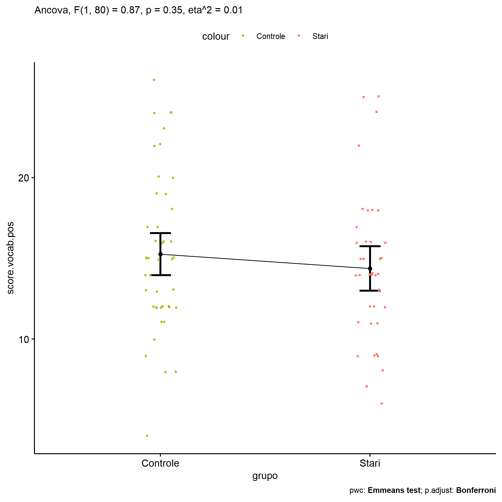<!-- -->

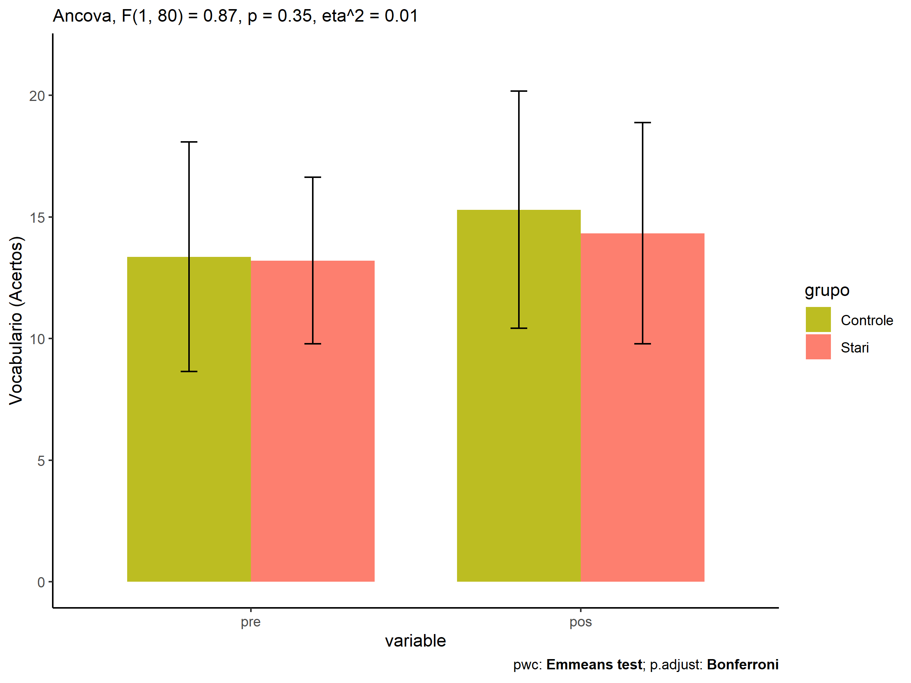<!-- -->

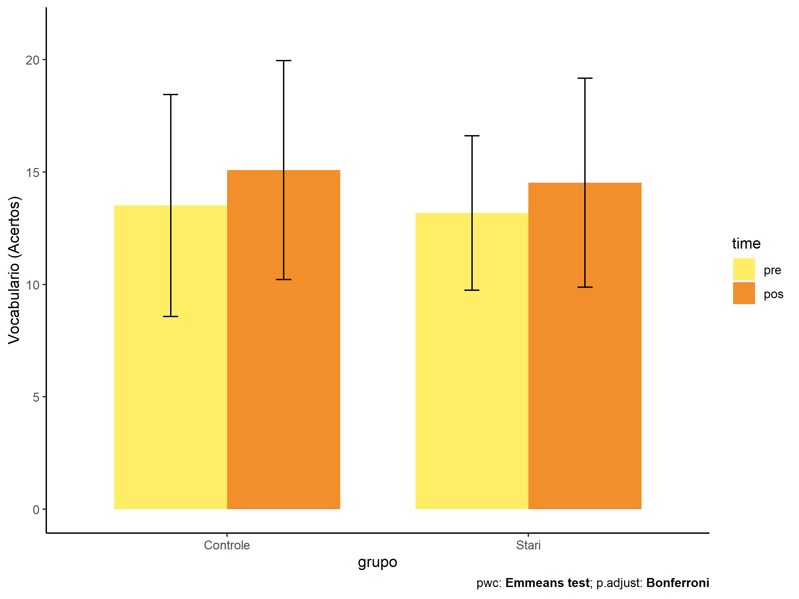<!-- -->

### Vocabulario Ensinado (Acertos)

| var                      | grupo    |   n | M (pre) | SE (pre) | M (unadj) | SE (unadj) | M (adj) | SE (adj) |
|:-------------------------|:---------|----:|--------:|---------:|----------:|-----------:|--------:|---------:|
| score.vocab.ensinado.pos | Controle |  50 |   2.420 |    0.216 |     2.360 |      0.242 |   2.374 |    0.243 |
| score.vocab.ensinado.pos | Stari    |  42 |   2.833 |    0.223 |     2.643 |      0.261 |   2.626 |    0.265 |

| .y.                      | group1   | group2 | estimate | conf.low | conf.high |    se | statistic |     p | p.adj | p.adj.signif |
|:-------------------------|:---------|:-------|---------:|---------:|----------:|------:|----------:|------:|------:|:-------------|
| score.vocab.ensinado.pos | Controle | Stari  |   -0.252 |   -0.970 |     0.466 | 0.361 |    -0.698 | 0.487 | 0.487 | ns           |
| score.vocab.ensinado.pre | Controle | Stari  |   -0.413 |   -1.033 |     0.207 | 0.312 |    -1.325 | 0.189 | 0.189 | ns           |

| .y.                  | grupo    | group1 | group2 | estimate | conf.low | conf.high |    se | statistic |     p | p.adj | p.adj.signif |
|:---------------------|:---------|:-------|:-------|---------:|---------:|----------:|------:|----------:|------:|------:|:-------------|
| score.vocab.ensinado | Controle | pre    | pos    |     0.06 |   -0.572 |     0.692 | 0.320 |     0.187 | 0.852 | 0.852 | ns           |
| score.vocab.ensinado | Stari    | pre    | pos    |     0.19 |   -0.499 |     0.880 | 0.349 |     0.545 | 0.586 | 0.586 | ns           |

    ## Scale for colour is already present.
    ## Adding another scale for colour, which will replace the existing scale.

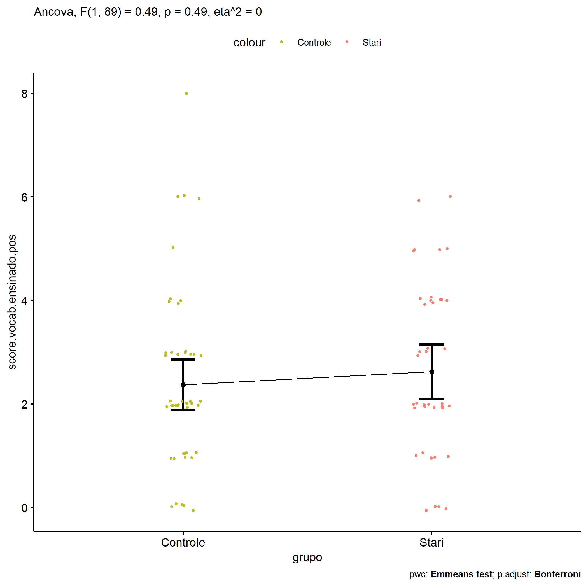<!-- -->

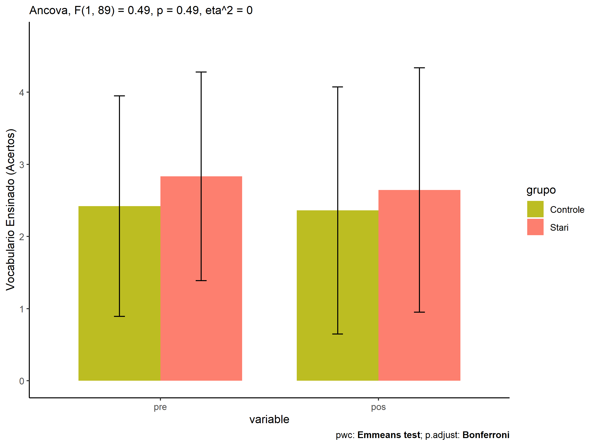<!-- -->

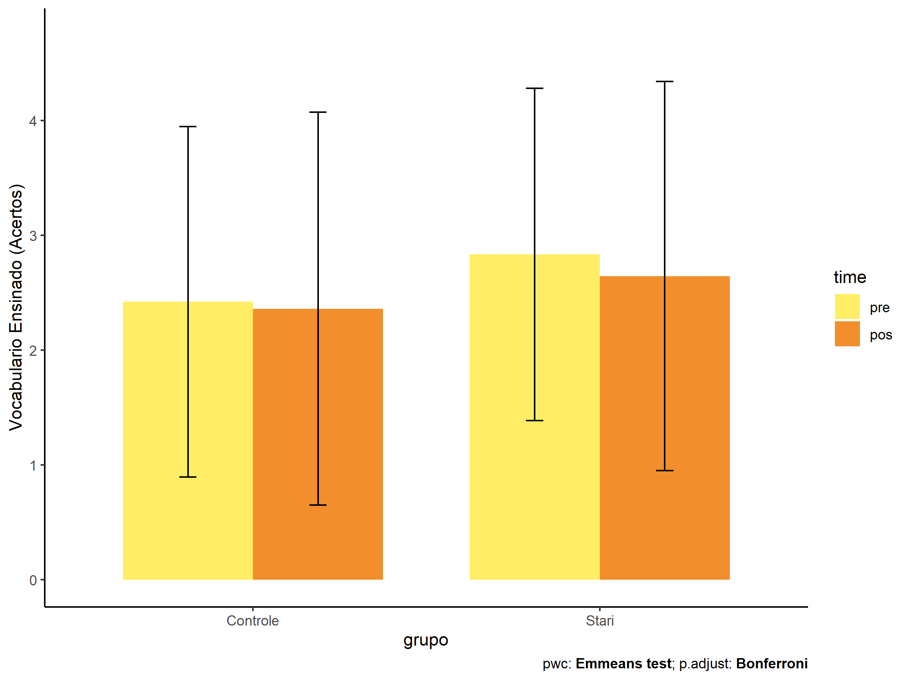<!-- -->

### Vocabulario Nao Ensinado (Acertos)

| var                          | grupo    |   n | M (pre) | SE (pre) | M (unadj) | SE (unadj) | M (adj) | SE (adj) |
|:-----------------------------|:---------|----:|--------:|---------:|----------:|-----------:|--------:|---------:|
| score.vocab.nao.ensinado.pos | Controle |  50 |  10.280 |    0.678 |     11.52 |      0.737 |  11.477 |    0.655 |
| score.vocab.nao.ensinado.pos | Stari    |  42 |  10.024 |    0.549 |     11.19 |      0.684 |  11.242 |    0.715 |

| .y.                          | group1   | group2 | estimate | conf.low | conf.high |    se | statistic |     p | p.adj | p.adj.signif |
|:-----------------------------|:---------|:-------|---------:|---------:|----------:|------:|----------:|------:|------:|:-------------|
| score.vocab.nao.ensinado.pos | Controle | Stari  |    0.234 |   -1.692 |     2.161 | 0.970 |     0.242 | 0.810 | 0.810 | ns           |
| score.vocab.nao.ensinado.pre | Controle | Stari  |    0.256 |   -1.522 |     2.034 | 0.895 |     0.286 | 0.775 | 0.775 | ns           |

| .y.                      | grupo    | group1 | group2 | estimate | conf.low | conf.high |    se | statistic |     p | p.adj | p.adj.signif |
|:-------------------------|:---------|:-------|:-------|---------:|---------:|----------:|------:|----------:|------:|------:|:-------------|
| score.vocab.nao.ensinado | Controle | pre    | pos    |   -1.240 |   -3.048 |     0.568 | 0.917 |    -1.353 | 0.178 | 0.178 | ns           |
| score.vocab.nao.ensinado | Stari    | pre    | pos    |   -1.167 |   -3.140 |     0.807 | 1.000 |    -1.167 | 0.245 | 0.245 | ns           |

    ## Scale for colour is already present.
    ## Adding another scale for colour, which will replace the existing scale.

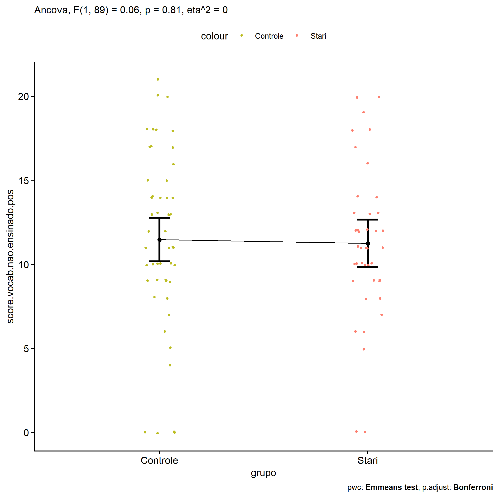<!-- -->

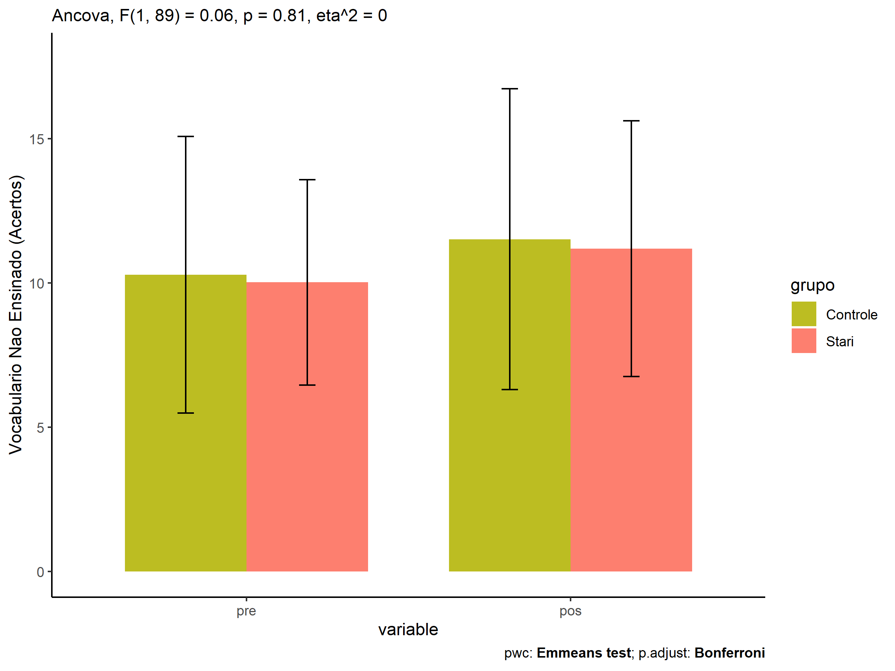<!-- -->

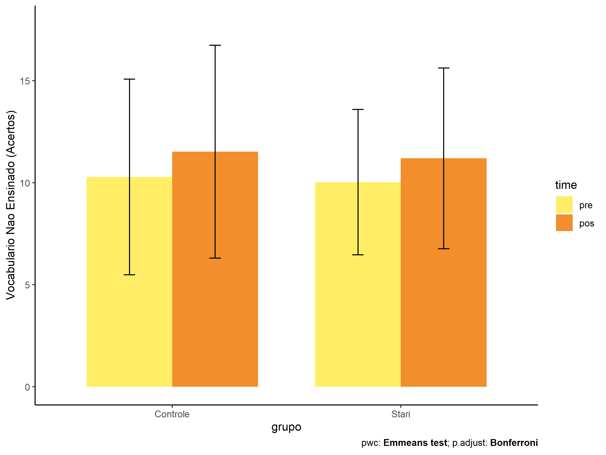<!-- -->

## factor: **genero**

### Vocabulario (Acertos)

| var             | genero |   n | M (pre) | SE (pre) | M (unadj) | SE (unadj) | M (adj) | SE (adj) |
|:----------------|:-------|----:|--------:|---------:|----------:|-----------:|--------:|---------:|
| score.vocab.pos | F      |  40 |  13.500 |    0.663 |     15.60 |      0.753 |  15.503 |    0.682 |
| score.vocab.pos | M      |  43 |  13.093 |    0.630 |     14.14 |      0.705 |  14.230 |    0.658 |

| .y.             | group1 | group2 | estimate | conf.low | conf.high |    se | statistic |     p | p.adj | p.adj.signif |
|:----------------|:-------|:-------|---------:|---------:|----------:|------:|----------:|------:|------:|:-------------|
| score.vocab.pos | F      | M      |    1.274 |   -0.613 |     3.161 | 0.948 |     1.343 | 0.183 | 0.183 | ns           |
| score.vocab.pre | F      | M      |    0.407 |   -1.412 |     2.226 | 0.914 |     0.445 | 0.657 | 0.657 | ns           |

| .y.         | genero | group1 | group2 | estimate | conf.low | conf.high |    se | statistic |     p | p.adj | p.adj.signif |
|:------------|:-------|:-------|:-------|---------:|---------:|----------:|------:|----------:|------:|------:|:-------------|
| score.vocab | F      | pre    | pos    |   -2.000 |   -3.941 |    -0.059 | 0.983 |    -2.034 | 0.044 | 0.044 | \*           |
| score.vocab | M      | pre    | pos    |   -0.959 |   -2.836 |     0.917 | 0.950 |    -1.010 | 0.314 | 0.314 | ns           |

    ## Scale for colour is already present.
    ## Adding another scale for colour, which will replace the existing scale.

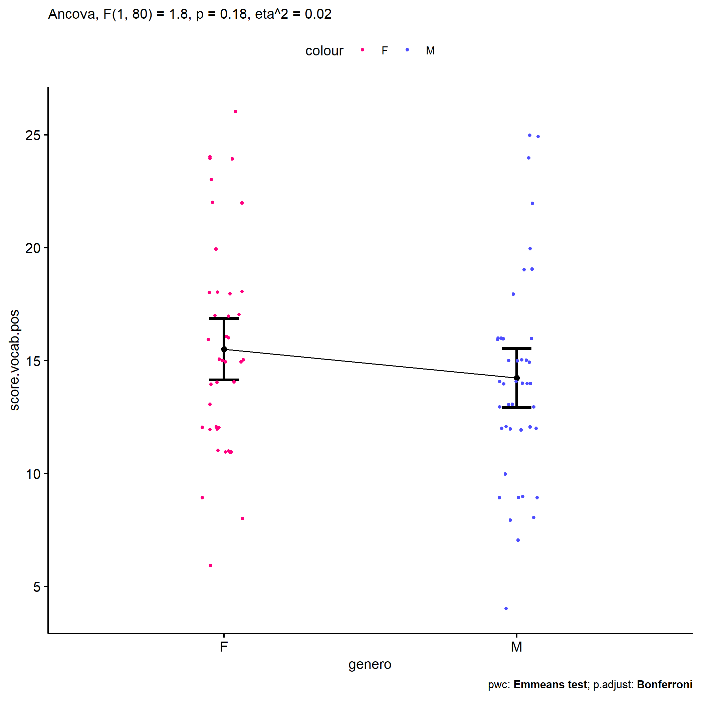<!-- -->

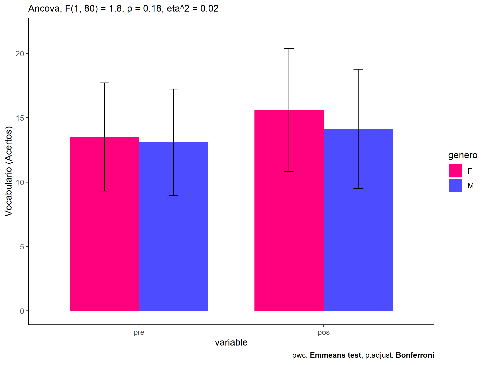<!-- -->

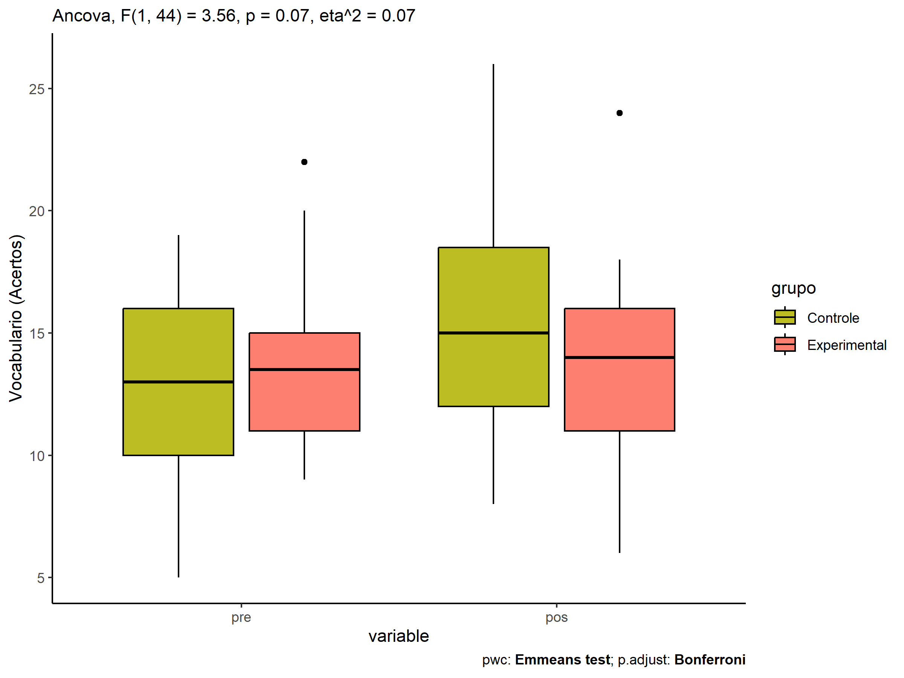<!-- -->

### Vocabulario Ensinado (Acertos)

| var                      | genero |   n | M (pre) | SE (pre) | M (unadj) | SE (unadj) | M (adj) | SE (adj) |
|:-------------------------|:-------|----:|--------:|---------:|----------:|-----------:|--------:|---------:|
| score.vocab.ensinado.pos | F      |  44 |   2.614 |    0.219 |     2.477 |      0.277 |   2.477 |    0.258 |
| score.vocab.ensinado.pos | M      |  48 |   2.604 |    0.224 |     2.500 |      0.229 |   2.500 |    0.247 |

| .y.                      | group1 | group2 | estimate | conf.low | conf.high |    se | statistic |     p | p.adj | p.adj.signif |
|:-------------------------|:-------|:-------|---------:|---------:|----------:|------:|----------:|------:|------:|:-------------|
| score.vocab.ensinado.pos | F      | M      |   -0.024 |   -0.734 |     0.687 | 0.358 |    -0.066 | 0.948 | 0.948 | ns           |
| score.vocab.ensinado.pre | F      | M      |    0.009 |   -0.615 |     0.634 | 0.314 |     0.030 | 0.976 | 0.976 | ns           |

| .y.                  | genero | group1 | group2 | estimate | conf.low | conf.high |    se | statistic |     p | p.adj | p.adj.signif |
|:---------------------|:-------|:-------|:-------|---------:|---------:|----------:|------:|----------:|------:|------:|:-------------|
| score.vocab.ensinado | F      | pre    | pos    |    0.136 |   -0.541 |     0.814 | 0.343 |     0.397 | 0.692 | 0.692 | ns           |
| score.vocab.ensinado | M      | pre    | pos    |    0.104 |   -0.545 |     0.753 | 0.329 |     0.317 | 0.752 | 0.752 | ns           |

    ## Scale for colour is already present.
    ## Adding another scale for colour, which will replace the existing scale.

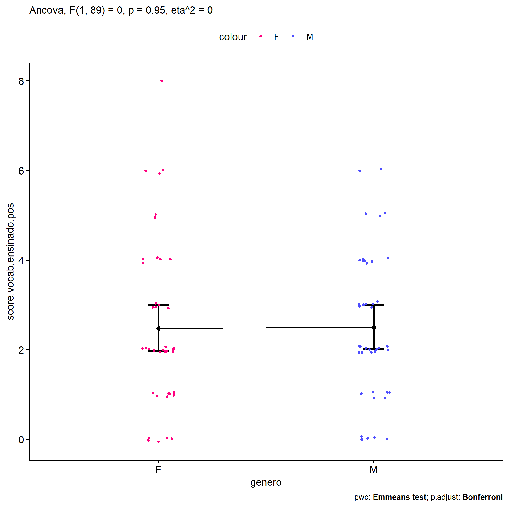<!-- -->

<!-- -->

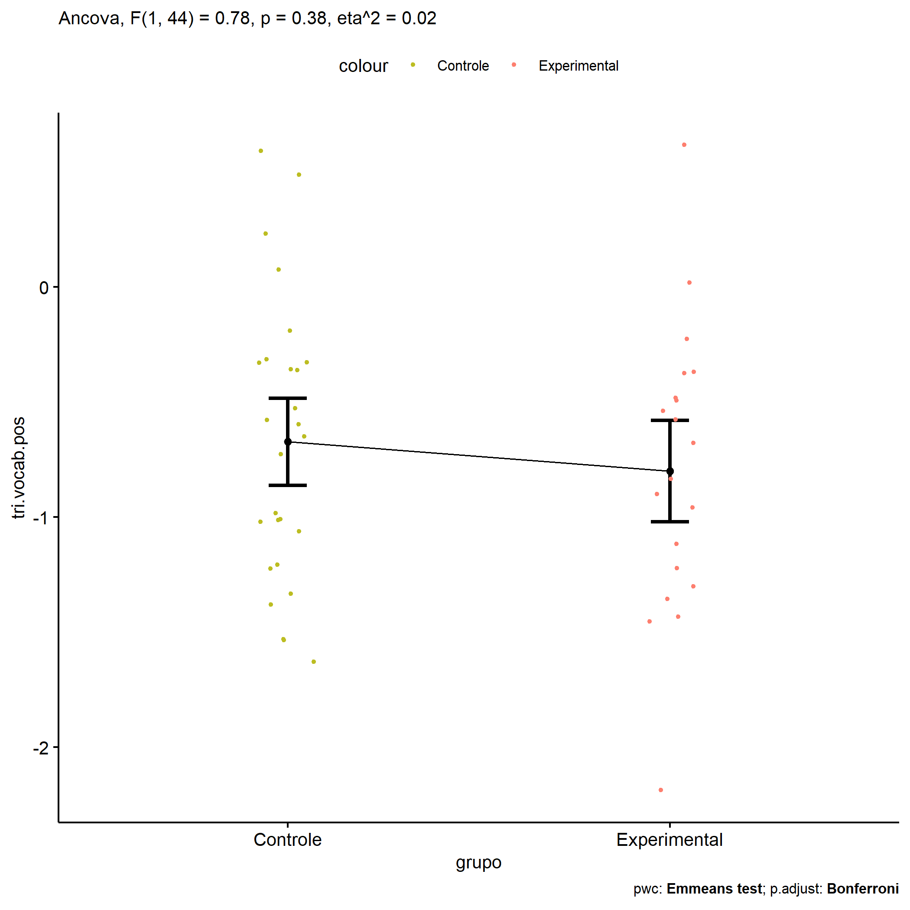<!-- -->

### Vocabulario Nao Ensinado (Acertos)

| var                          | genero |   n | M (pre) | SE (pre) | M (unadj) | SE (unadj) | M (adj) | SE (adj) |
|:-----------------------------|:-------|----:|--------:|---------:|----------:|-----------:|--------:|---------:|
| score.vocab.nao.ensinado.pos | F      |  44 |  10.386 |    0.608 |    12.432 |      0.718 |  12.351 |    0.684 |
| score.vocab.nao.ensinado.pos | M      |  48 |   9.958 |    0.646 |    10.396 |      0.688 |  10.470 |    0.655 |

| .y.                          | group1 | group2 | estimate | conf.low | conf.high |    se | statistic |     p | p.adj | p.adj.signif |
|:-----------------------------|:-------|:-------|---------:|---------:|----------:|------:|----------:|------:|------:|:-------------|
| score.vocab.nao.ensinado.pos | F      | M      |    1.882 |   -0.001 |     3.764 | 0.947 |     1.986 | 0.050 | 0.050 | ns           |
| score.vocab.nao.ensinado.pre | F      | M      |    0.428 |   -1.343 |     2.199 | 0.892 |     0.480 | 0.632 | 0.632 | ns           |

| .y.                      | genero | group1 | group2 | estimate | conf.low | conf.high |    se | statistic |     p | p.adj | p.adj.signif |
|:-------------------------|:-------|:-------|:-------|---------:|---------:|----------:|------:|----------:|------:|------:|:-------------|
| score.vocab.nao.ensinado | F      | pre    | pos    |   -2.045 |   -3.949 |    -0.142 | 0.965 |    -2.121 | 0.035 | 0.035 | \*           |
| score.vocab.nao.ensinado | M      | pre    | pos    |   -0.438 |   -2.260 |     1.385 | 0.924 |    -0.474 | 0.636 | 0.636 | ns           |

    ## Scale for colour is already present.
    ## Adding another scale for colour, which will replace the existing scale.

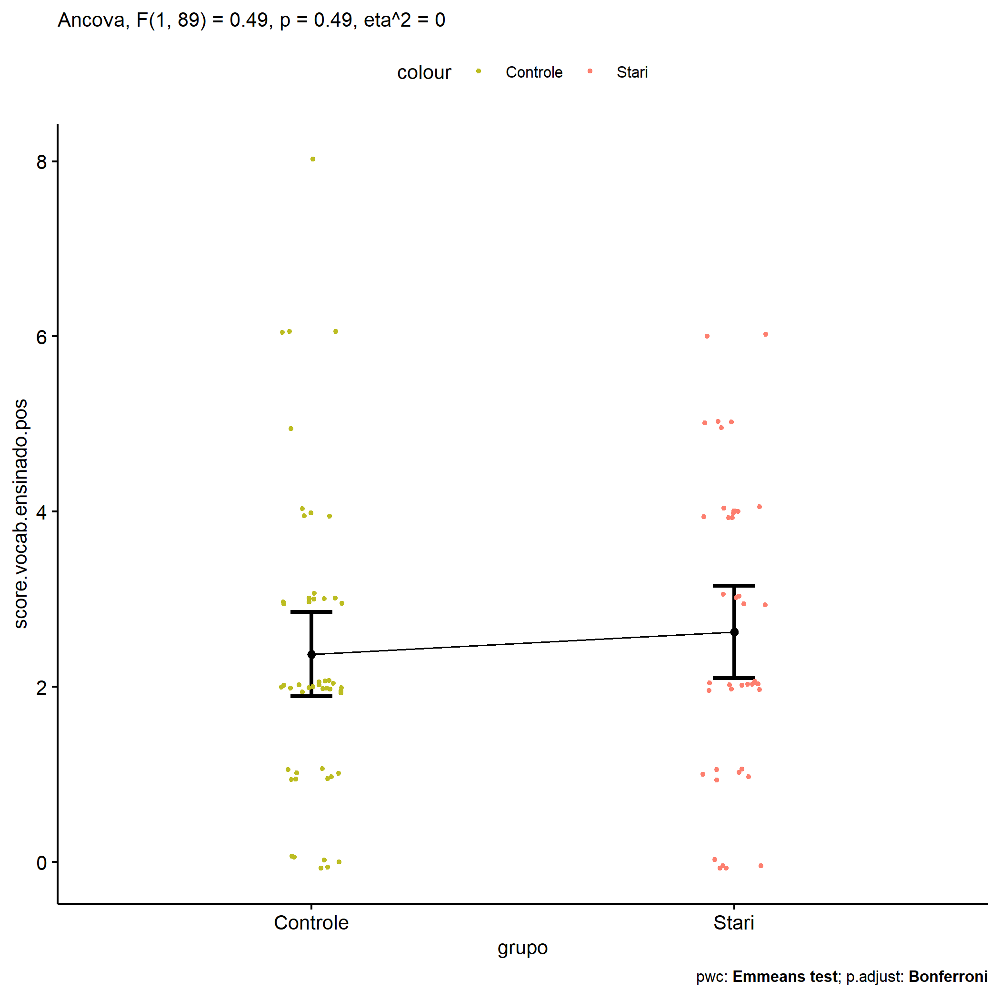<!-- -->

<!-- -->

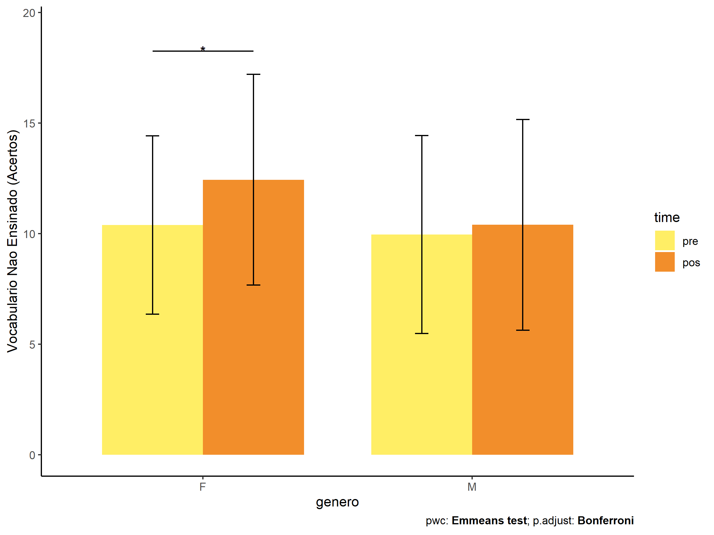<!-- -->

## factor: **idade**

### Vocabulario (Acertos)

| var             | idade |   n | M (pre) | SE (pre) | M (unadj) | SE (unadj) | M (adj) | SE (adj) |
|:----------------|:------|----:|--------:|---------:|----------:|-----------:|--------:|---------:|
| score.vocab.pos | 10y   |  15 |  15.067 |    1.053 |    16.533 |      1.245 |  15.772 |    1.131 |
| score.vocab.pos | 11y   |  47 |  12.979 |    0.670 |    14.511 |      0.698 |  14.666 |    0.630 |
| score.vocab.pos | 12y   |  14 |  12.929 |    0.848 |    15.929 |      1.179 |  16.106 |    1.152 |
| score.vocab.pos | 13y   |   5 |  12.600 |    0.678 |    10.800 |      1.356 |  11.122 |    1.928 |

| .y.             | group1 | group2 | estimate | conf.low | conf.high |    se | statistic |     p | p.adj | p.adj.signif |
|:----------------|:-------|:-------|---------:|---------:|----------:|------:|----------:|------:|------:|:-------------|
| score.vocab.pos | 10y    | 11y    |    1.105 |   -1.485 |     3.696 | 1.301 |     0.850 | 0.398 | 1.000 | ns           |
| score.vocab.pos | 10y    | 12y    |   -0.335 |   -3.561 |     2.892 | 1.620 |    -0.207 | 0.837 | 1.000 | ns           |
| score.vocab.pos | 10y    | 13y    |    4.650 |    0.183 |     9.117 | 2.243 |     2.073 | 0.042 | 0.249 | ns           |
| score.vocab.pos | 11y    | 12y    |   -1.440 |   -4.052 |     1.172 | 1.311 |    -1.098 | 0.276 | 1.000 | ns           |
| score.vocab.pos | 11y    | 13y    |    3.544 |   -0.492 |     7.580 | 2.026 |     1.749 | 0.084 | 0.506 | ns           |
| score.vocab.pos | 12y    | 13y    |    4.984 |    0.515 |     9.454 | 2.244 |     2.221 | 0.029 | 0.176 | ns           |
| score.vocab.pre | 10y    | 11y    |    2.088 |   -0.379 |     4.555 | 1.239 |     1.685 | 0.096 | 0.576 | ns           |
| score.vocab.pre | 10y    | 12y    |    2.138 |   -0.953 |     5.230 | 1.553 |     1.377 | 0.172 | 1.000 | ns           |
| score.vocab.pre | 10y    | 13y    |    2.467 |   -1.829 |     6.763 | 2.157 |     1.143 | 0.256 | 1.000 | ns           |
| score.vocab.pre | 11y    | 12y    |    0.050 |   -2.483 |     2.583 | 1.272 |     0.039 | 0.969 | 1.000 | ns           |
| score.vocab.pre | 11y    | 13y    |    0.379 |   -3.535 |     4.292 | 1.965 |     0.193 | 0.848 | 1.000 | ns           |
| score.vocab.pre | 12y    | 13y    |    0.329 |   -4.006 |     4.663 | 2.177 |     0.151 | 0.880 | 1.000 | ns           |

| .y.         | idade | group1 | group2 | estimate | conf.low | conf.high |    se | statistic |     p | p.adj | p.adj.signif |
|:------------|:------|:-------|:-------|---------:|---------:|----------:|------:|----------:|------:|------:|:-------------|
| score.vocab | 10y   | pre    | pos    |   -1.408 |   -4.541 |     1.724 | 1.586 |    -0.888 | 0.376 | 0.376 | ns           |
| score.vocab | 11y   | pre    | pos    |   -1.771 |   -3.550 |     0.008 | 0.901 |    -1.966 | 0.051 | 0.051 | ns           |
| score.vocab | 12y   | pre    | pos    |   -2.467 |   -5.649 |     0.716 | 1.612 |    -1.531 | 0.128 | 0.128 | ns           |
| score.vocab | 13y   | pre    | pos    |    1.933 |   -3.344 |     7.211 | 2.672 |     0.723 | 0.470 | 0.470 | ns           |

    ## Scale for colour is already present.
    ## Adding another scale for colour, which will replace the existing scale.

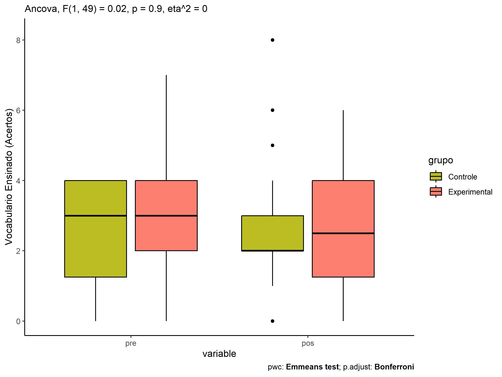<!-- -->

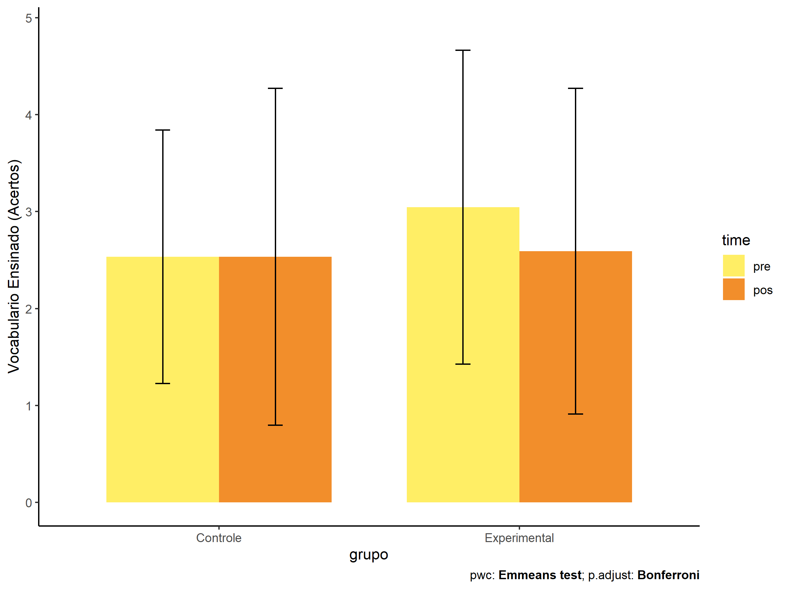<!-- -->

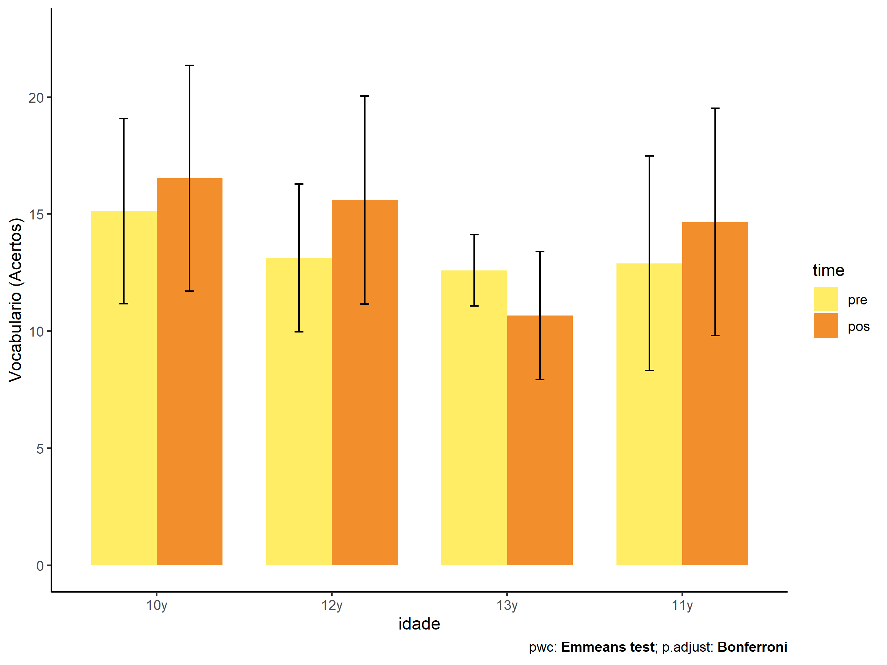<!-- -->

### Vocabulario Ensinado (Acertos)

| var                      | idade |   n | M (pre) | SE (pre) | M (unadj) | SE (unadj) | M (adj) | SE (adj) |
|:-------------------------|:------|----:|--------:|---------:|----------:|-----------:|--------:|---------:|
| score.vocab.ensinado.pos | 10y   |  16 |   2.750 |    0.371 |     2.750 |      0.413 |   2.734 |    0.410 |
| score.vocab.ensinado.pos | 11y   |  50 |   2.660 |    0.219 |     2.280 |      0.221 |   2.275 |    0.232 |
| score.vocab.ensinado.pos | 12y   |  16 |   2.312 |    0.326 |     3.438 |      0.491 |   3.478 |    0.411 |
| score.vocab.ensinado.pos | 13y   |   6 |   2.833 |    0.792 |     1.833 |      0.477 |   1.806 |    0.669 |

| .y.                      | group1 | group2 | estimate | conf.low | conf.high |    se | statistic |     p | p.adj | p.adj.signif |
|:-------------------------|:-------|:-------|---------:|---------:|----------:|------:|----------:|------:|------:|:-------------|
| score.vocab.ensinado.pos | 10y    | 11y    |    0.458 |   -0.477 |     1.394 | 0.470 |     0.974 | 0.333 | 1.000 | ns           |
| score.vocab.ensinado.pos | 10y    | 12y    |   -0.745 |   -1.901 |     0.411 | 0.581 |    -1.281 | 0.204 | 1.000 | ns           |
| score.vocab.ensinado.pos | 10y    | 13y    |    0.928 |   -0.632 |     2.487 | 0.784 |     1.183 | 0.240 | 1.000 | ns           |
| score.vocab.ensinado.pos | 11y    | 12y    |   -1.203 |   -2.142 |    -0.264 | 0.472 |    -2.548 | 0.013 | 0.076 | ns           |
| score.vocab.ensinado.pos | 11y    | 13y    |    0.469 |   -0.938 |     1.877 | 0.708 |     0.663 | 0.509 | 1.000 | ns           |
| score.vocab.ensinado.pos | 12y    | 13y    |    1.672 |    0.108 |     3.236 | 0.786 |     2.127 | 0.036 | 0.218 | ns           |
| score.vocab.ensinado.pre | 10y    | 11y    |    0.090 |   -0.779 |     0.959 | 0.437 |     0.206 | 0.837 | 1.000 | ns           |
| score.vocab.ensinado.pre | 10y    | 12y    |    0.438 |   -0.632 |     1.507 | 0.538 |     0.813 | 0.418 | 1.000 | ns           |
| score.vocab.ensinado.pre | 10y    | 13y    |   -0.083 |   -1.532 |     1.365 | 0.728 |    -0.114 | 0.909 | 1.000 | ns           |
| score.vocab.ensinado.pre | 11y    | 12y    |    0.348 |   -0.522 |     1.217 | 0.437 |     0.795 | 0.429 | 1.000 | ns           |
| score.vocab.ensinado.pre | 11y    | 13y    |   -0.173 |   -1.481 |     1.134 | 0.657 |    -0.264 | 0.793 | 1.000 | ns           |
| score.vocab.ensinado.pre | 12y    | 13y    |   -0.521 |   -1.969 |     0.928 | 0.728 |    -0.715 | 0.477 | 1.000 | ns           |

| .y.                  | idade | group1 | group2 | estimate | conf.low | conf.high |    se | statistic |     p | p.adj | p.adj.signif |
|:---------------------|:------|:-------|:-------|---------:|---------:|----------:|------:|----------:|------:|------:|:-------------|
| score.vocab.ensinado | 10y   | pre    | pos    |    0.000 |   -1.104 |     1.104 | 0.559 |     0.000 | 1.000 | 1.000 | ns           |
| score.vocab.ensinado | 11y   | pre    | pos    |    0.380 |   -0.245 |     1.005 | 0.316 |     1.201 | 0.231 | 0.231 | ns           |
| score.vocab.ensinado | 12y   | pre    | pos    |   -1.125 |   -2.229 |    -0.021 | 0.559 |    -2.012 | 0.046 | 0.046 | \*           |
| score.vocab.ensinado | 13y   | pre    | pos    |    1.000 |   -0.803 |     2.803 | 0.913 |     1.095 | 0.275 | 0.275 | ns           |

    ## Scale for colour is already present.
    ## Adding another scale for colour, which will replace the existing scale.

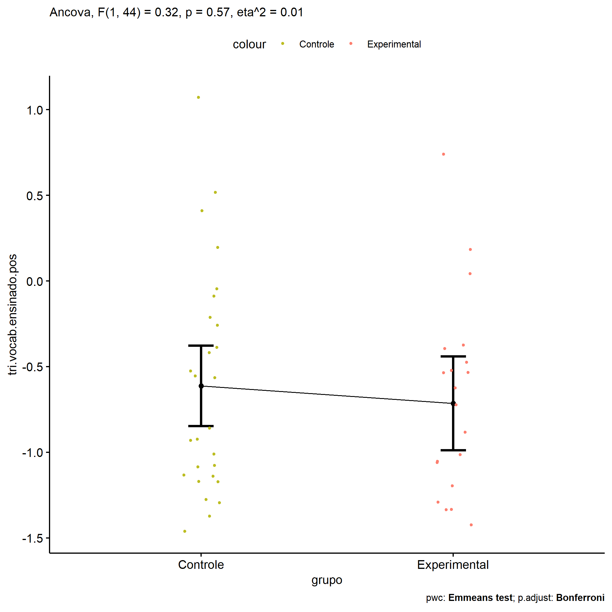<!-- -->

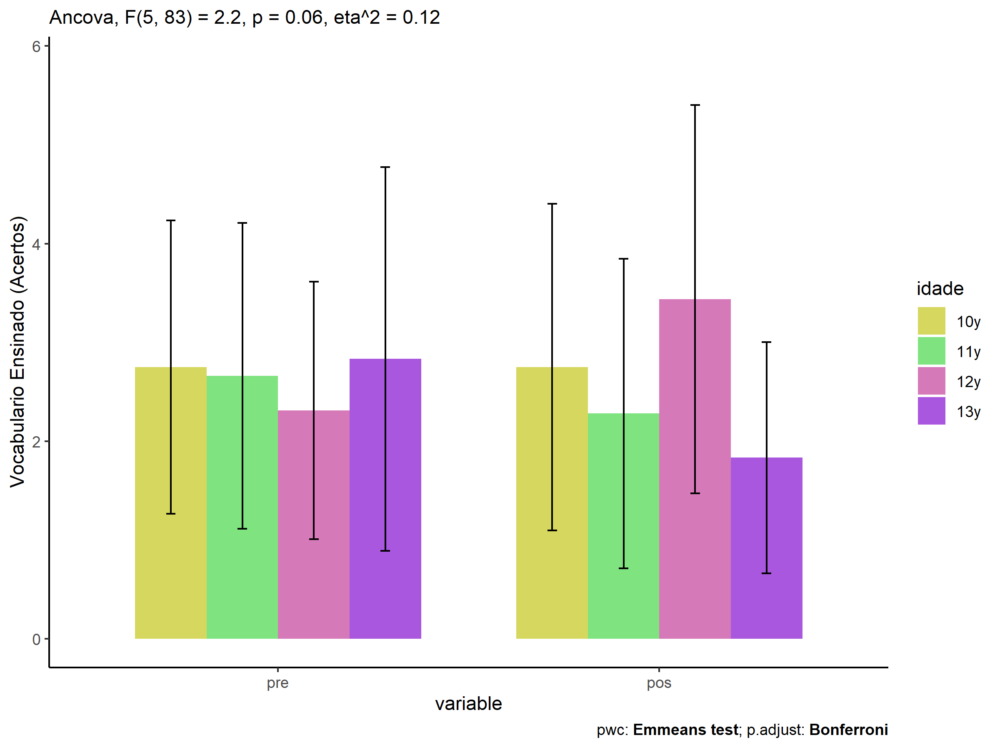<!-- -->

<!-- -->

### Vocabulario Nao Ensinado (Acertos)

| var                          | idade |   n | M (pre) | SE (pre) | M (unadj) | SE (unadj) | M (adj) | SE (adj) |
|:-----------------------------|:------|----:|--------:|---------:|----------:|-----------:|--------:|---------:|
| score.vocab.nao.ensinado.pos | 10y   |  16 |  12.375 |    0.875 |    12.750 |      1.296 |  11.787 |    1.108 |
| score.vocab.nao.ensinado.pos | 11y   |  50 |   9.720 |    0.612 |    11.800 |      0.662 |  11.968 |    0.611 |
| score.vocab.nao.ensinado.pos | 12y   |  16 |  10.000 |    0.983 |    11.188 |      1.085 |  11.236 |    1.077 |
| score.vocab.nao.ensinado.pos | 13y   |   6 |   7.667 |    1.542 |     8.833 |      1.078 |   9.875 |    1.781 |

| .y.                          | group1 | group2 | estimate | conf.low | conf.high |    se | statistic |     p | p.adj | p.adj.signif |
|:-----------------------------|:-------|:-------|---------:|---------:|----------:|------:|----------:|------:|------:|:-------------|
| score.vocab.nao.ensinado.pos | 10y    | 11y    |   -0.181 |   -2.715 |     2.353 | 1.274 |    -0.142 | 0.888 | 1.000 | ns           |
| score.vocab.nao.ensinado.pos | 10y    | 12y    |    0.551 |   -2.526 |     3.628 | 1.547 |     0.356 | 0.723 | 1.000 | ns           |
| score.vocab.nao.ensinado.pos | 10y    | 13y    |    1.912 |   -2.328 |     6.151 | 2.131 |     0.897 | 0.372 | 1.000 | ns           |
| score.vocab.nao.ensinado.pos | 11y    | 12y    |    0.732 |   -1.729 |     3.193 | 1.237 |     0.591 | 0.556 | 1.000 | ns           |
| score.vocab.nao.ensinado.pos | 11y    | 13y    |    2.092 |   -1.638 |     5.823 | 1.876 |     1.116 | 0.268 | 1.000 | ns           |
| score.vocab.nao.ensinado.pos | 12y    | 13y    |    1.361 |   -2.775 |     5.496 | 2.079 |     0.654 | 0.515 | 1.000 | ns           |
| score.vocab.nao.ensinado.pre | 10y    | 11y    |    2.655 |    0.319 |     4.991 | 1.175 |     2.260 | 0.026 | 0.158 | ns           |
| score.vocab.nao.ensinado.pre | 10y    | 12y    |    2.375 |   -0.501 |     5.251 | 1.446 |     1.642 | 0.104 | 0.625 | ns           |
| score.vocab.nao.ensinado.pre | 10y    | 13y    |    4.708 |    0.815 |     8.602 | 1.958 |     2.405 | 0.018 | 0.110 | ns           |
| score.vocab.nao.ensinado.pre | 11y    | 12y    |   -0.280 |   -2.616 |     2.056 | 1.175 |    -0.238 | 0.812 | 1.000 | ns           |
| score.vocab.nao.ensinado.pre | 11y    | 13y    |    2.053 |   -1.461 |     5.567 | 1.767 |     1.162 | 0.249 | 1.000 | ns           |
| score.vocab.nao.ensinado.pre | 12y    | 13y    |    2.333 |   -1.560 |     6.227 | 1.958 |     1.192 | 0.237 | 1.000 | ns           |

| .y.                      | idade | group1 | group2 | estimate | conf.low | conf.high |    se | statistic |     p | p.adj | p.adj.signif |
|:-------------------------|:------|:-------|:-------|---------:|---------:|----------:|------:|----------:|------:|------:|:-------------|
| score.vocab.nao.ensinado | 10y   | pre    | pos    |   -0.375 |   -3.421 |     2.671 | 1.543 |    -0.243 | 0.808 | 0.808 | ns           |
| score.vocab.nao.ensinado | 11y   | pre    | pos    |   -2.080 |   -3.803 |    -0.357 | 0.873 |    -2.383 | 0.018 | 0.018 | \*           |
| score.vocab.nao.ensinado | 12y   | pre    | pos    |   -1.188 |   -4.233 |     1.858 | 1.543 |    -0.770 | 0.443 | 0.443 | ns           |
| score.vocab.nao.ensinado | 13y   | pre    | pos    |   -1.167 |   -6.141 |     3.807 | 2.520 |    -0.463 | 0.644 | 0.644 | ns           |

    ## Scale for colour is already present.
    ## Adding another scale for colour, which will replace the existing scale.

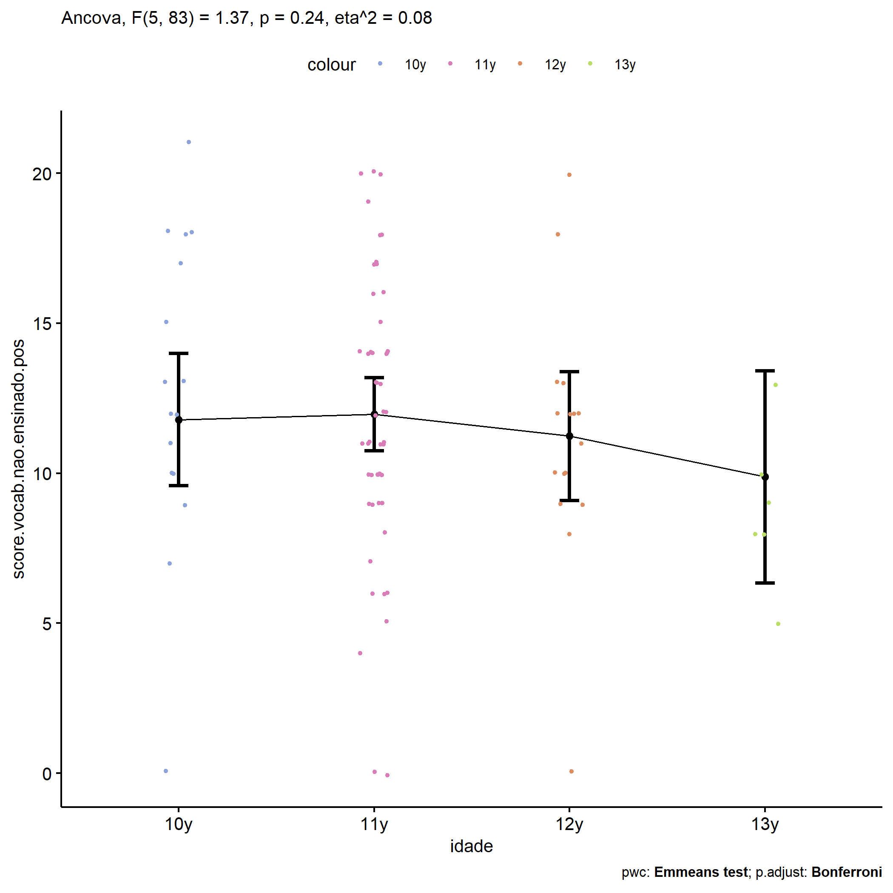<!-- -->

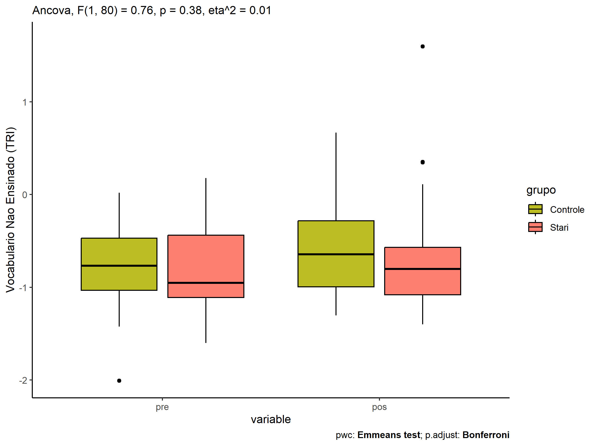<!-- -->

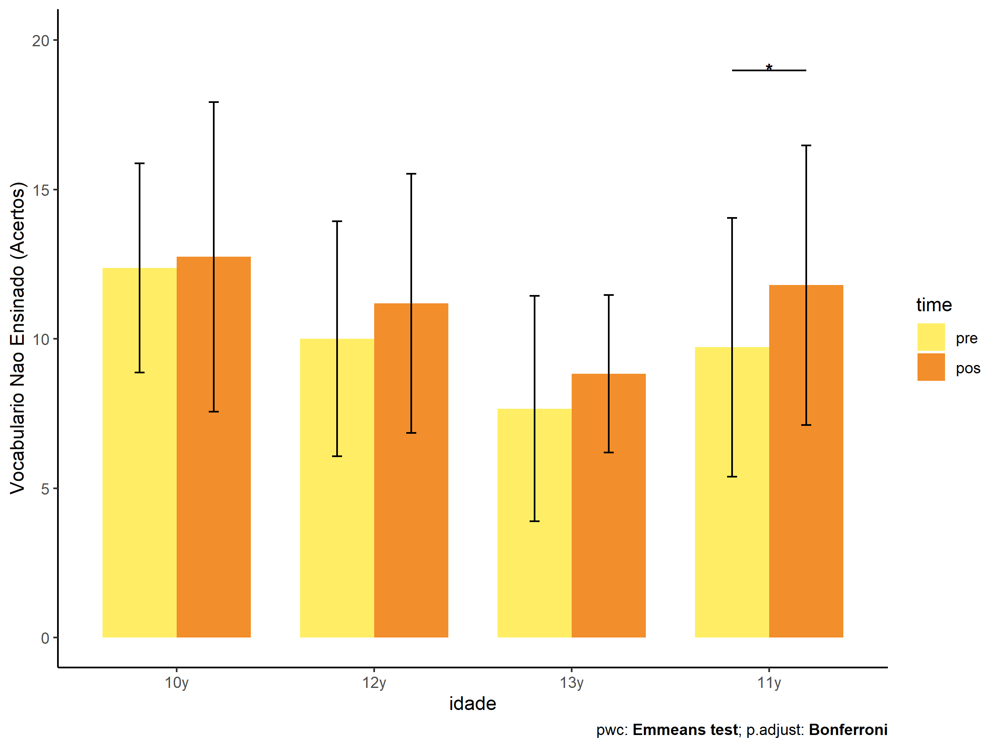<!-- -->

## factor: **zona.participante**

### Vocabulario (Acertos)

| var             | zona.participante |   n | M (pre) | SE (pre) | M (unadj) | SE (unadj) | M (adj) | SE (adj) |
|:----------------|:------------------|----:|--------:|---------:|----------:|-----------:|--------:|---------:|
| score.vocab.pos | Rural             |  26 |  12.462 |    0.789 |    15.115 |      0.885 |  15.680 |    0.919 |
| score.vocab.pos | Urbana            |  36 |  14.333 |    0.720 |    15.750 |      0.907 |  15.342 |    0.778 |

| .y.             | group1 | group2 | estimate | conf.low | conf.high |    se | statistic |     p | p.adj | p.adj.signif |
|:----------------|:-------|:-------|---------:|---------:|----------:|------:|----------:|------:|------:|:-------------|
| score.vocab.pos | Urbana | Rural  |   -0.337 |   -2.776 |     2.101 | 1.219 |    -0.277 | 0.783 | 0.783 | ns           |
| score.vocab.pre | Urbana | Rural  |    1.872 |   -0.290 |     4.034 | 1.081 |     1.732 | 0.088 | 0.088 | ns           |

| .y.         | zona.participante | group1 | group2 | estimate | conf.low | conf.high |    se | statistic |     p | p.adj | p.adj.signif |
|:------------|:------------------|:-------|:-------|---------:|---------:|----------:|------:|----------:|------:|------:|:-------------|
| score.vocab | Urbana            | pre    | pos    |   -1.559 |   -3.666 |     0.548 | 1.065 |    -1.464 | 0.146 | 0.146 | ns           |
| score.vocab | Rural             | pre    | pos    |   -2.464 |   -5.005 |     0.076 | 1.284 |    -1.920 | 0.057 | 0.057 | ns           |

    ## Scale for colour is already present.
    ## Adding another scale for colour, which will replace the existing scale.

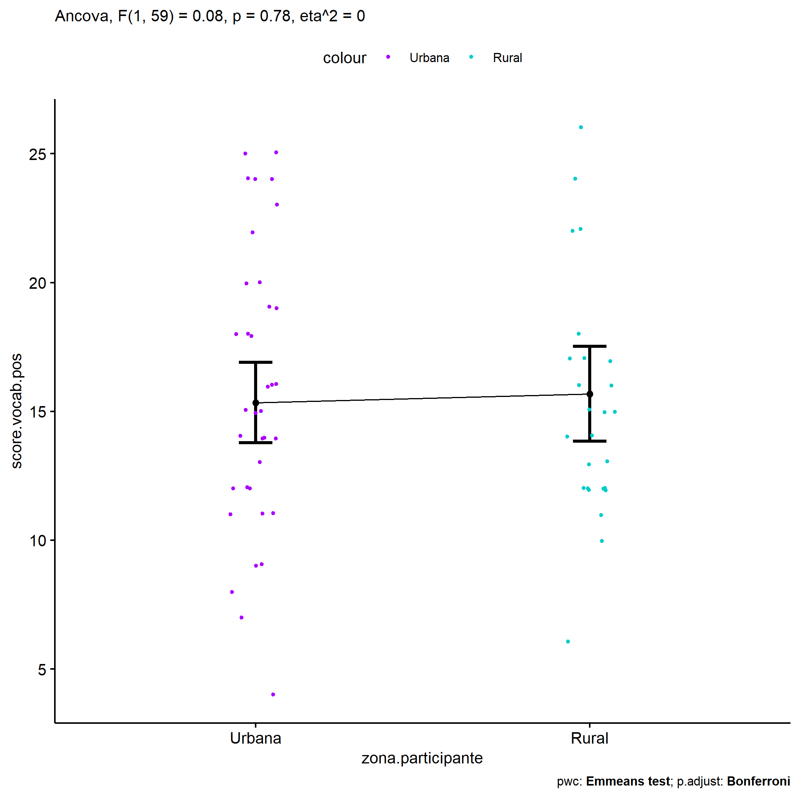<!-- -->

<!-- -->

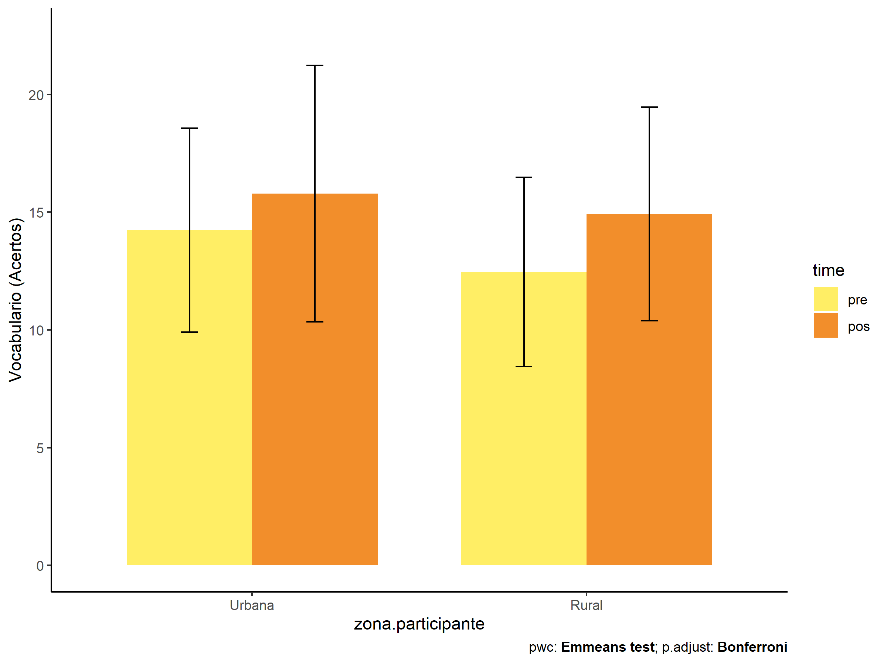<!-- -->

### Vocabulario Ensinado (Acertos)

| var                      | zona.participante |   n | M (pre) | SE (pre) | M (unadj) | SE (unadj) | M (adj) | SE (adj) |
|:-------------------------|:------------------|----:|--------:|---------:|----------:|-----------:|--------:|---------:|
| score.vocab.ensinado.pos | Rural             |  27 |   2.444 |    0.274 |     2.556 |      0.313 |   2.582 |    0.341 |
| score.vocab.ensinado.pos | Urbana            |  42 |   2.667 |    0.250 |     2.500 |      0.290 |   2.483 |    0.274 |

| .y.                      | group1 | group2 | estimate | conf.low | conf.high |    se | statistic |     p | p.adj | p.adj.signif |
|:-------------------------|:-------|:-------|---------:|---------:|----------:|------:|----------:|------:|------:|:-------------|
| score.vocab.ensinado.pos | Urbana | Rural  |   -0.099 |   -0.974 |     0.775 | 0.438 |    -0.226 | 0.822 | 0.822 | ns           |
| score.vocab.ensinado.pre | Urbana | Rural  |    0.222 |   -0.539 |     0.983 | 0.381 |     0.583 | 0.562 | 0.562 | ns           |

| .y.                  | zona.participante | group1 | group2 | estimate | conf.low | conf.high |    se | statistic |     p | p.adj | p.adj.signif |
|:---------------------|:------------------|:-------|:-------|---------:|---------:|----------:|------:|----------:|------:|------:|:-------------|
| score.vocab.ensinado | Urbana            | pre    | pos    |    0.167 |   -0.554 |     0.887 | 0.364 |     0.458 | 0.648 | 0.648 | ns           |
| score.vocab.ensinado | Rural             | pre    | pos    |   -0.111 |   -1.009 |     0.787 | 0.454 |    -0.245 | 0.807 | 0.807 | ns           |

    ## Scale for colour is already present.
    ## Adding another scale for colour, which will replace the existing scale.

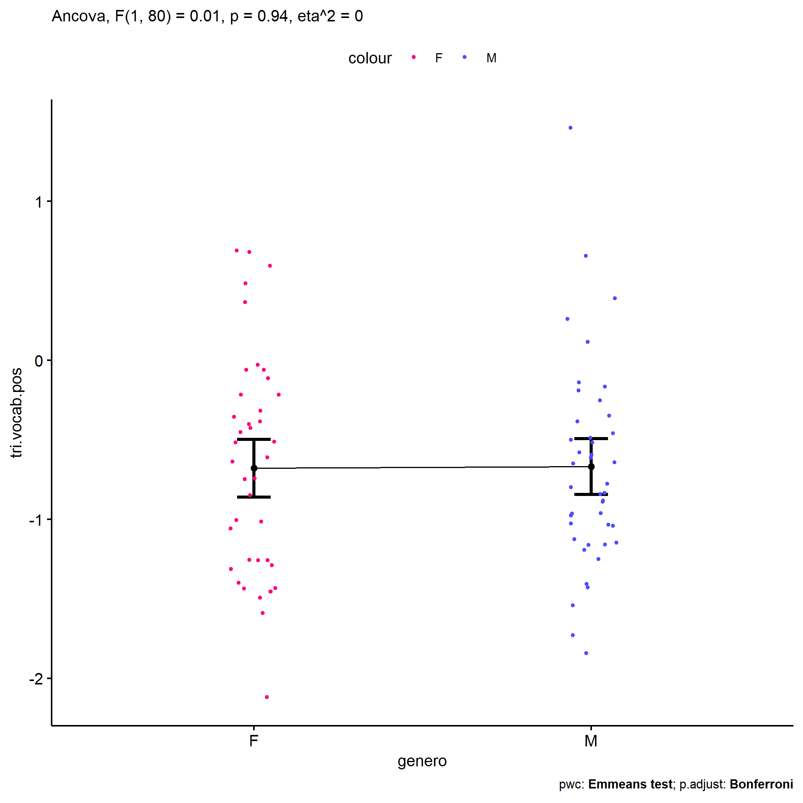<!-- -->

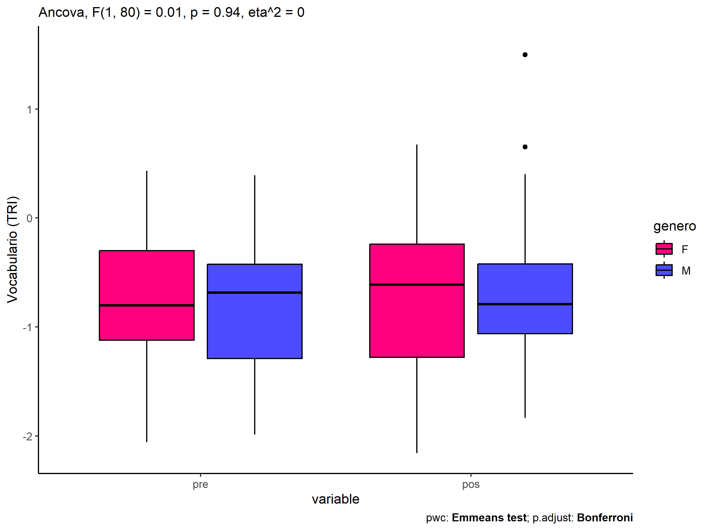<!-- -->

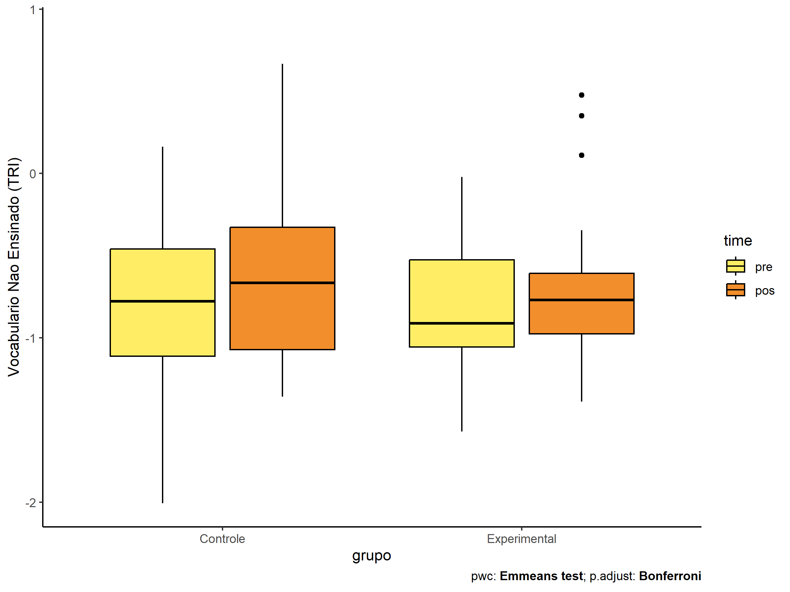<!-- -->

### Vocabulario Nao Ensinado (Acertos)

| var                          | zona.participante |   n | M (pre) | SE (pre) | M (unadj) | SE (unadj) | M (adj) | SE (adj) |
|:-----------------------------|:------------------|----:|--------:|---------:|----------:|-----------:|--------:|---------:|
| score.vocab.nao.ensinado.pos | Rural             |  27 |   9.556 |    0.719 |    12.370 |      0.720 |  12.670 |    0.877 |
| score.vocab.nao.ensinado.pos | Urbana            |  42 |  10.548 |    0.733 |    11.786 |      0.873 |  11.593 |    0.702 |

| .y.                          | group1 | group2 | estimate | conf.low | conf.high |    se | statistic |     p | p.adj | p.adj.signif |
|:-----------------------------|:-------|:-------|---------:|---------:|----------:|------:|----------:|------:|------:|:-------------|
| score.vocab.nao.ensinado.pos | Urbana | Rural  |   -1.077 |   -3.325 |     1.172 | 1.126 |    -0.956 | 0.343 | 0.343 | ns           |
| score.vocab.nao.ensinado.pre | Urbana | Rural  |    0.992 |   -1.166 |     3.150 | 1.081 |     0.918 | 0.362 | 0.362 | ns           |

| .y.                      | zona.participante | group1 | group2 | estimate | conf.low | conf.high |    se | statistic |    p | p.adj | p.adj.signif |
|:-------------------------|:------------------|:-------|:-------|---------:|---------:|----------:|------:|----------:|-----:|------:|:-------------|
| score.vocab.nao.ensinado | Urbana            | pre    | pos    |   -1.238 |   -3.267 |     0.791 | 1.026 |    -1.207 | 0.23 |  0.23 | ns           |
| score.vocab.nao.ensinado | Rural             | pre    | pos    |   -2.815 |   -5.346 |    -0.284 | 1.280 |    -2.200 | 0.03 |  0.03 | \*           |

    ## Scale for colour is already present.
    ## Adding another scale for colour, which will replace the existing scale.

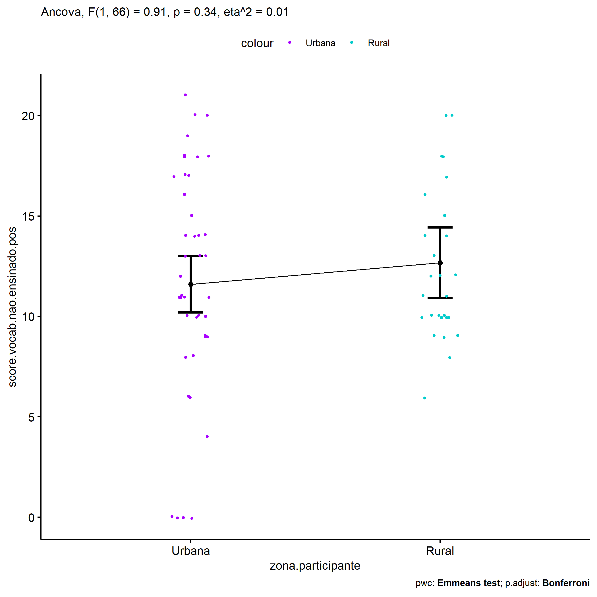<!-- -->

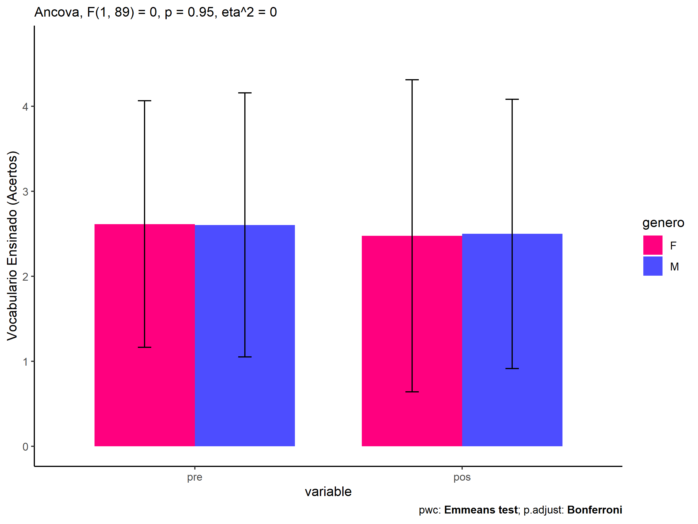<!-- -->

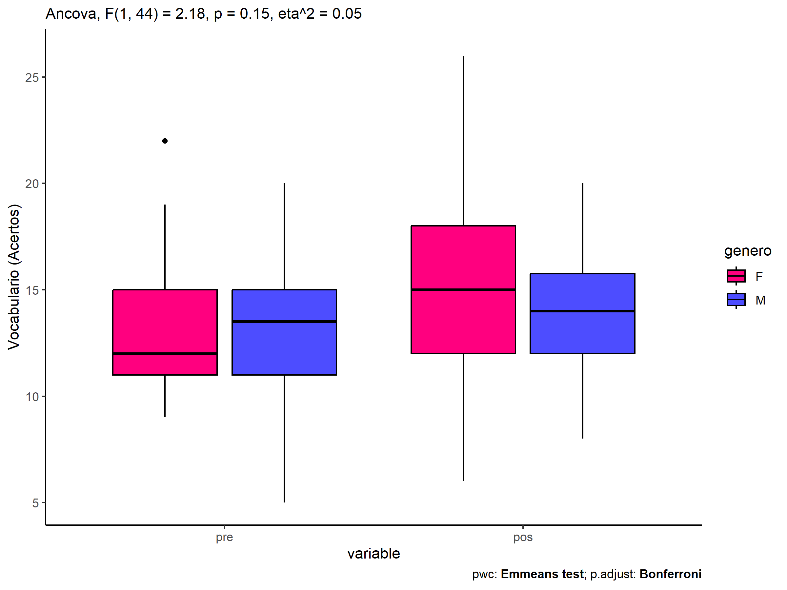<!-- -->

## factor: **escola**

### Vocabulario (Acertos)

| var             | escola |   n | M (pre) | SE (pre) | M (unadj) | SE (unadj) | M (adj) | SE (adj) |
|:----------------|:-------|----:|--------:|---------:|----------:|-----------:|--------:|---------:|
| score.vocab.pos | E1     |  11 |  15.909 |    1.615 |    19.091 |      1.615 |  18.135 |    1.301 |
| score.vocab.pos | E2     |  19 |  12.947 |    0.846 |    14.211 |      0.775 |  14.336 |    0.962 |
| score.vocab.pos | E3     |  12 |  12.000 |    0.905 |    15.083 |      1.607 |  15.555 |    1.219 |
| score.vocab.pos | E5     |  28 |  13.393 |    0.746 |    14.036 |      0.825 |  13.999 |    0.792 |
| score.vocab.pos | E6     |   9 |  12.222 |    1.640 |    12.889 |      1.184 |  13.279 |    1.402 |

| .y.             | group1 | group2 | estimate | conf.low | conf.high |    se | statistic |     p | p.adj | p.adj.signif |
|:----------------|:-------|:-------|---------:|---------:|----------:|------:|----------:|------:|------:|:-------------|
| score.vocab.pos | E1     | E2     |    3.798 |    0.559 |     7.038 | 1.626 |     2.337 | 0.022 | 0.222 | ns           |
| score.vocab.pos | E1     | E3     |    2.580 |   -1.026 |     6.185 | 1.809 |     1.426 | 0.158 | 1.000 | ns           |
| score.vocab.pos | E1     | E5     |    4.136 |    1.106 |     7.166 | 1.520 |     2.720 | 0.008 | 0.081 | ns           |
| score.vocab.pos | E1     | E6     |    4.855 |    1.003 |     8.708 | 1.933 |     2.512 | 0.014 | 0.142 | ns           |
| score.vocab.pos | E2     | E3     |   -1.219 |   -4.306 |     1.868 | 1.549 |    -0.787 | 0.434 | 1.000 | ns           |
| score.vocab.pos | E2     | E5     |    0.338 |   -2.147 |     2.822 | 1.246 |     0.271 | 0.787 | 1.000 | ns           |
| score.vocab.pos | E2     | E6     |    1.057 |   -2.327 |     4.440 | 1.698 |     0.622 | 0.536 | 1.000 | ns           |
| score.vocab.pos | E3     | E5     |    1.556 |   -1.343 |     4.456 | 1.455 |     1.070 | 0.288 | 1.000 | ns           |
| score.vocab.pos | E3     | E6     |    2.276 |   -1.407 |     5.958 | 1.848 |     1.232 | 0.222 | 1.000 | ns           |
| score.vocab.pos | E5     | E6     |    0.719 |   -2.492 |     3.931 | 1.611 |     0.446 | 0.657 | 1.000 | ns           |
| score.vocab.pre | E1     | E2     |    2.962 |   -0.146 |     6.069 | 1.560 |     1.899 | 0.061 | 0.615 | ns           |
| score.vocab.pre | E1     | E3     |    3.909 |    0.485 |     7.333 | 1.718 |     2.275 | 0.026 | 0.258 | ns           |
| score.vocab.pre | E1     | E5     |    2.516 |   -0.403 |     5.435 | 1.465 |     1.718 | 0.090 | 0.900 | ns           |
| score.vocab.pre | E1     | E6     |    3.687 |    0.000 |     7.374 | 1.850 |     1.993 | 0.050 | 0.500 | ns           |
| score.vocab.pre | E2     | E3     |    0.947 |   -2.077 |     3.972 | 1.518 |     0.624 | 0.534 | 1.000 | ns           |
| score.vocab.pre | E2     | E5     |   -0.445 |   -2.884 |     1.993 | 1.224 |    -0.364 | 0.717 | 1.000 | ns           |
| score.vocab.pre | E2     | E6     |    0.725 |   -2.594 |     4.044 | 1.666 |     0.435 | 0.665 | 1.000 | ns           |
| score.vocab.pre | E3     | E5     |   -1.393 |   -4.223 |     1.437 | 1.420 |    -0.981 | 0.330 | 1.000 | ns           |
| score.vocab.pre | E3     | E6     |   -0.222 |   -3.839 |     3.395 | 1.815 |    -0.122 | 0.903 | 1.000 | ns           |
| score.vocab.pre | E5     | E6     |    1.171 |   -1.972 |     4.314 | 1.577 |     0.742 | 0.460 | 1.000 | ns           |

| .y.         | escola | group1 | group2 | estimate | conf.low | conf.high |    se | statistic |     p | p.adj | p.adj.signif |
|:------------|:-------|:-------|:-------|---------:|---------:|----------:|------:|----------:|------:|------:|:-------------|
| score.vocab | E1     | pre    | pos    |   -3.860 |   -7.398 |    -0.322 | 1.791 |    -2.155 | 0.033 | 0.033 | \*           |
| score.vocab | E2     | pre    | pos    |   -1.263 |   -4.065 |     1.539 | 1.418 |    -0.891 | 0.375 | 0.375 | ns           |
| score.vocab | E3     | pre    | pos    |   -3.083 |   -6.609 |     0.442 | 1.785 |    -1.728 | 0.086 | 0.086 | ns           |
| score.vocab | E5     | pre    | pos    |   -0.333 |   -2.563 |     1.896 | 1.129 |    -0.295 | 0.768 | 0.768 | ns           |
| score.vocab | E6     | pre    | pos    |   -0.800 |   -4.662 |     3.062 | 1.955 |    -0.409 | 0.683 | 0.683 | ns           |

    ## Scale for colour is already present.
    ## Adding another scale for colour, which will replace the existing scale.

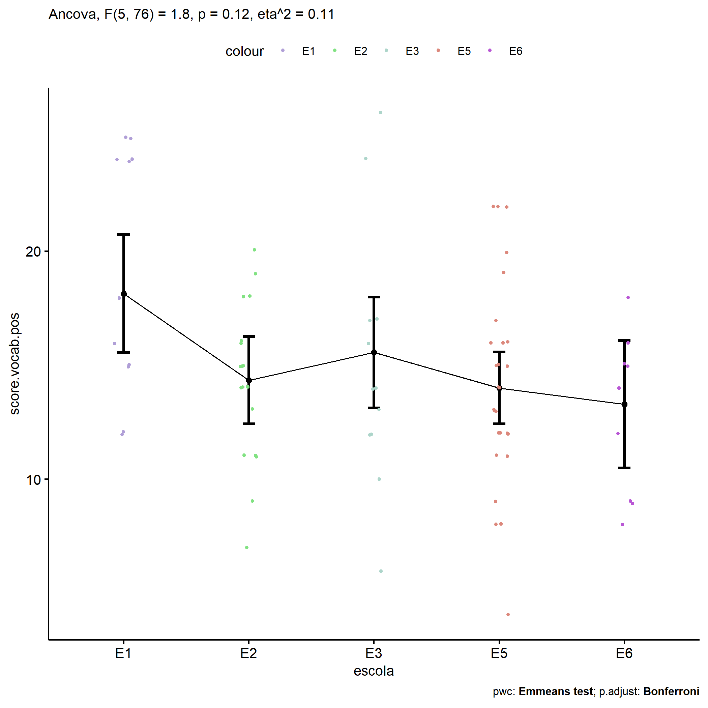<!-- -->

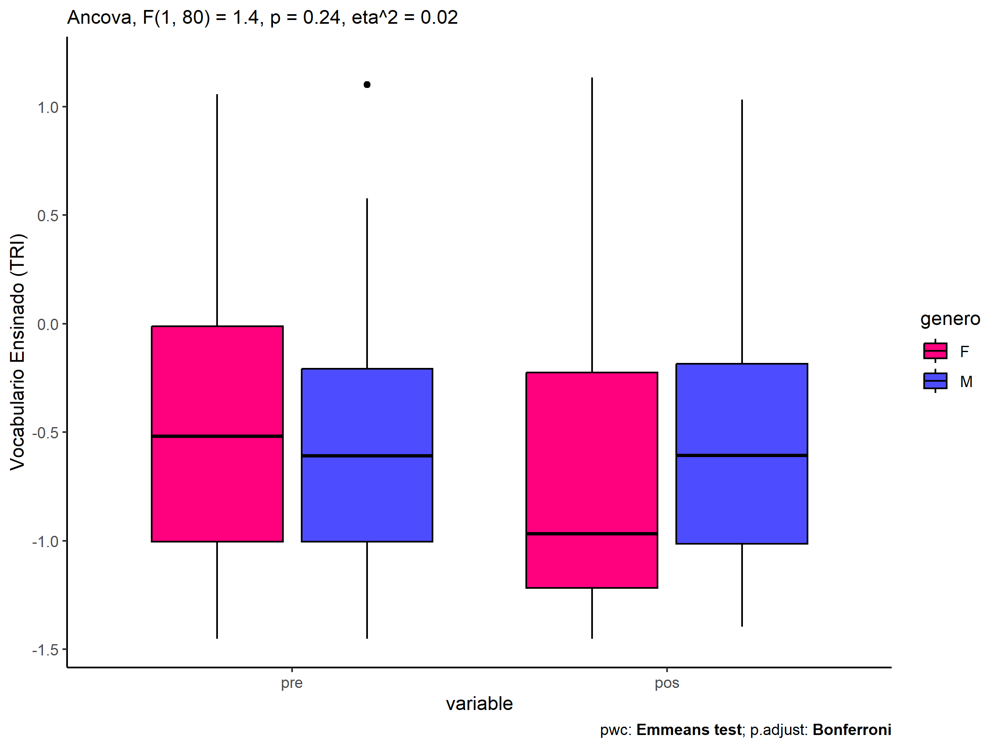<!-- -->

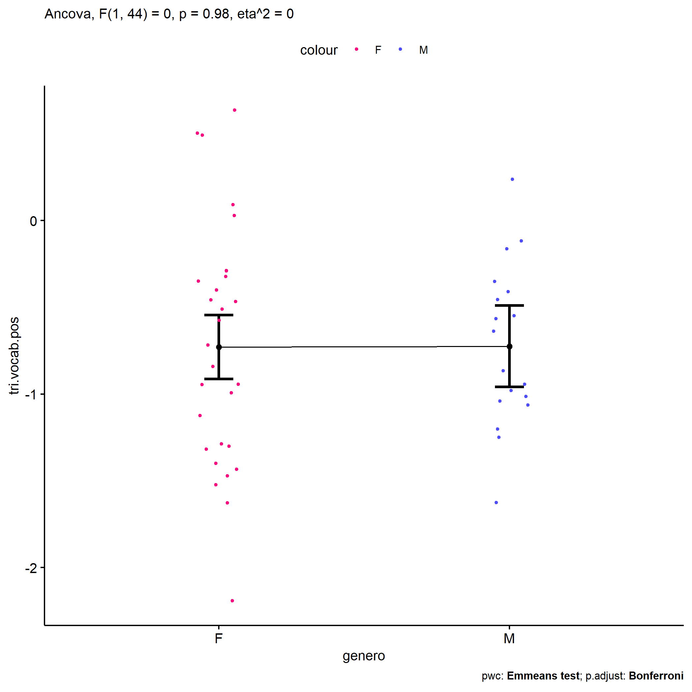<!-- -->

### Vocabulario Ensinado (Acertos)

| var                      | escola |   n | M (pre) | SE (pre) | M (unadj) | SE (unadj) | M (adj) | SE (adj) |
|:-------------------------|:-------|----:|--------:|---------:|----------:|-----------:|--------:|---------:|
| score.vocab.ensinado.pos | E1     |  14 |   3.071 |    0.450 |     2.643 |      0.651 |   2.596 |    0.461 |
| score.vocab.ensinado.pos | E2     |  19 |   2.526 |    0.269 |     2.526 |      0.345 |   2.538 |    0.393 |
| score.vocab.ensinado.pos | E3     |  12 |   2.583 |    0.288 |     2.917 |      0.596 |   2.922 |    0.494 |
| score.vocab.ensinado.pos | E5     |  32 |   2.531 |    0.301 |     2.188 |      0.217 |   2.199 |    0.303 |
| score.vocab.ensinado.pos | E6     |  11 |   2.636 |    0.527 |     2.545 |      0.529 |   2.545 |    0.516 |

| .y.                      | group1 | group2 | estimate | conf.low | conf.high |    se | statistic |     p | p.adj | p.adj.signif |
|:-------------------------|:-------|:-------|---------:|---------:|----------:|------:|----------:|------:|------:|:-------------|
| score.vocab.ensinado.pos | E1     | E2     |    0.058 |   -1.149 |     1.265 | 0.607 |     0.096 | 0.924 |     1 | ns           |
| score.vocab.ensinado.pos | E1     | E3     |   -0.326 |   -1.671 |     1.019 | 0.676 |    -0.482 | 0.631 |     1 | ns           |
| score.vocab.ensinado.pos | E1     | E5     |    0.398 |   -0.702 |     1.497 | 0.553 |     0.719 | 0.474 |     1 | ns           |
| score.vocab.ensinado.pos | E1     | E6     |    0.051 |   -1.325 |     1.427 | 0.692 |     0.073 | 0.942 |     1 | ns           |
| score.vocab.ensinado.pos | E2     | E3     |   -0.384 |   -1.640 |     0.871 | 0.631 |    -0.609 | 0.544 |     1 | ns           |
| score.vocab.ensinado.pos | E2     | E5     |    0.339 |   -0.647 |     1.326 | 0.496 |     0.685 | 0.496 |     1 | ns           |
| score.vocab.ensinado.pos | E2     | E6     |   -0.007 |   -1.298 |     1.283 | 0.649 |    -0.011 | 0.991 |     1 | ns           |
| score.vocab.ensinado.pos | E3     | E5     |    0.724 |   -0.429 |     1.876 | 0.579 |     1.249 | 0.215 |     1 | ns           |
| score.vocab.ensinado.pos | E3     | E6     |    0.377 |   -1.045 |     1.798 | 0.715 |     0.527 | 0.599 |     1 | ns           |
| score.vocab.ensinado.pos | E5     | E6     |   -0.347 |   -1.537 |     0.844 | 0.598 |    -0.579 | 0.564 |     1 | ns           |
| score.vocab.ensinado.pre | E1     | E2     |    0.545 |   -0.523 |     1.614 | 0.537 |     1.015 | 0.313 |     1 | ns           |
| score.vocab.ensinado.pre | E1     | E3     |    0.488 |   -0.705 |     1.682 | 0.600 |     0.813 | 0.418 |     1 | ns           |
| score.vocab.ensinado.pre | E1     | E5     |    0.540 |   -0.432 |     1.512 | 0.489 |     1.105 | 0.272 |     1 | ns           |
| score.vocab.ensinado.pre | E1     | E6     |    0.435 |   -0.787 |     1.657 | 0.615 |     0.708 | 0.481 |     1 | ns           |
| score.vocab.ensinado.pre | E2     | E3     |   -0.057 |   -1.176 |     1.062 | 0.562 |    -0.101 | 0.919 |     1 | ns           |
| score.vocab.ensinado.pre | E2     | E5     |   -0.005 |   -0.884 |     0.874 | 0.442 |    -0.011 | 0.991 |     1 | ns           |
| score.vocab.ensinado.pre | E2     | E6     |   -0.110 |   -1.259 |     1.039 | 0.578 |    -0.190 | 0.849 |     1 | ns           |
| score.vocab.ensinado.pre | E3     | E5     |    0.052 |   -0.975 |     1.079 | 0.516 |     0.101 | 0.920 |     1 | ns           |
| score.vocab.ensinado.pre | E3     | E6     |   -0.053 |   -1.319 |     1.213 | 0.637 |    -0.083 | 0.934 |     1 | ns           |
| score.vocab.ensinado.pre | E5     | E6     |   -0.105 |   -1.165 |     0.955 | 0.533 |    -0.197 | 0.844 |     1 | ns           |

| .y.                  | escola | group1 | group2 | estimate | conf.low | conf.high |    se | statistic |     p | p.adj | p.adj.signif |
|:---------------------|:-------|:-------|:-------|---------:|---------:|----------:|------:|----------:|------:|------:|:-------------|
| score.vocab.ensinado | E1     | pre    | pos    |    0.429 |   -0.780 |     1.637 | 0.612 |     0.700 | 0.485 | 0.485 | ns           |
| score.vocab.ensinado | E2     | pre    | pos    |    0.000 |   -1.038 |     1.038 | 0.526 |     0.000 | 1.000 | 1.000 | ns           |
| score.vocab.ensinado | E3     | pre    | pos    |   -0.333 |   -1.639 |     0.972 | 0.661 |    -0.504 | 0.615 | 0.615 | ns           |
| score.vocab.ensinado | E5     | pre    | pos    |    0.344 |   -0.456 |     1.143 | 0.405 |     0.849 | 0.397 | 0.397 | ns           |
| score.vocab.ensinado | E6     | pre    | pos    |    0.091 |   -1.273 |     1.455 | 0.691 |     0.132 | 0.895 | 0.895 | ns           |

    ## Scale for colour is already present.
    ## Adding another scale for colour, which will replace the existing scale.

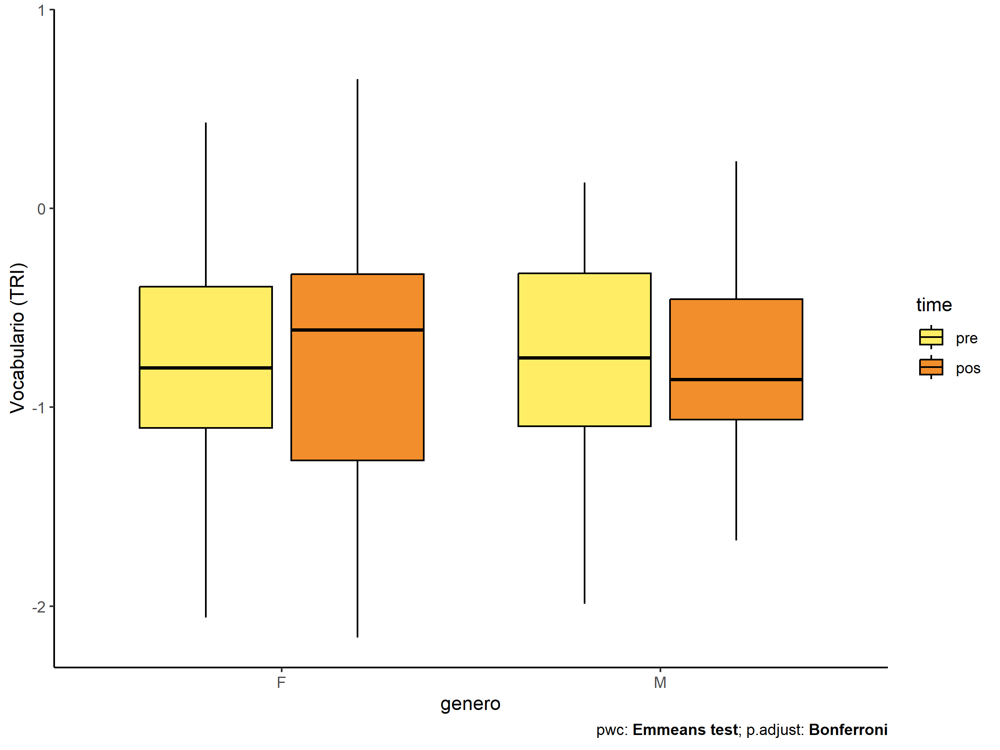<!-- -->

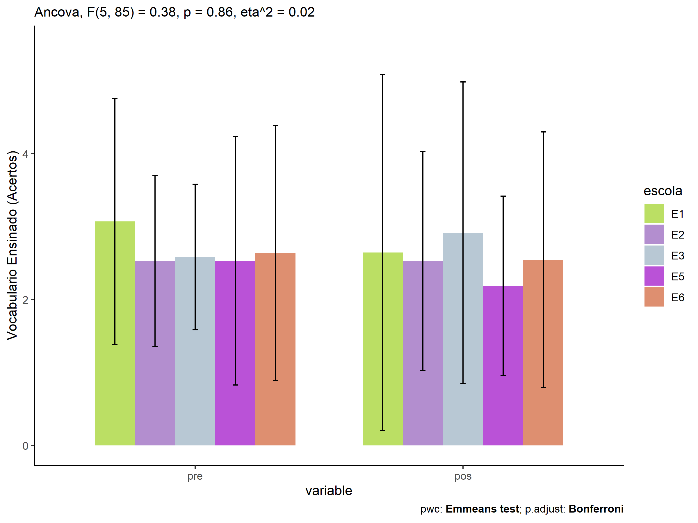<!-- -->

<!-- -->

### Vocabulario Nao Ensinado (Acertos)

| var                          | escola |   n | M (pre) | SE (pre) | M (unadj) | SE (unadj) | M (adj) | SE (adj) |
|:-----------------------------|:-------|----:|--------:|---------:|----------:|-----------:|--------:|---------:|
| score.vocab.nao.ensinado.pos | E1     |  14 |  11.071 |    1.404 |    12.357 |      1.980 |  12.041 |    1.263 |
| score.vocab.nao.ensinado.pos | E2     |  19 |  10.421 |    0.750 |    11.684 |      0.631 |  11.583 |    1.080 |
| score.vocab.nao.ensinado.pos | E3     |  12 |   9.417 |    0.773 |    12.167 |      1.140 |  12.396 |    1.361 |
| score.vocab.nao.ensinado.pos | E5     |  32 |  10.438 |    0.827 |    11.094 |      0.896 |  10.987 |    0.833 |
| score.vocab.nao.ensinado.pos | E6     |  11 |   8.182 |    1.464 |     9.000 |      1.228 |   9.637 |    1.438 |

| .y.                          | group1 | group2 | estimate | conf.low | conf.high |    se | statistic |     p | p.adj | p.adj.signif |
|:-----------------------------|:-------|:-------|---------:|---------:|----------:|------:|----------:|------:|------:|:-------------|
| score.vocab.nao.ensinado.pos | E1     | E2     |    0.459 |   -2.842 |     3.759 | 1.659 |     0.276 | 0.783 |     1 | ns           |
| score.vocab.nao.ensinado.pos | E1     | E3     |   -0.355 |   -4.059 |     3.349 | 1.862 |    -0.191 | 0.849 |     1 | ns           |
| score.vocab.nao.ensinado.pos | E1     | E5     |    1.054 |   -1.949 |     4.058 | 1.510 |     0.698 | 0.487 |     1 | ns           |
| score.vocab.nao.ensinado.pos | E1     | E6     |    2.404 |   -1.430 |     6.239 | 1.927 |     1.248 | 0.216 |     1 | ns           |
| score.vocab.nao.ensinado.pos | E2     | E3     |   -0.814 |   -4.274 |     2.647 | 1.739 |    -0.468 | 0.641 |     1 | ns           |
| score.vocab.nao.ensinado.pos | E2     | E5     |    0.596 |   -2.115 |     3.307 | 1.363 |     0.437 | 0.663 |     1 | ns           |
| score.vocab.nao.ensinado.pos | E2     | E6     |    1.946 |   -1.641 |     5.533 | 1.803 |     1.079 | 0.284 |     1 | ns           |
| score.vocab.nao.ensinado.pos | E3     | E5     |    1.409 |   -1.769 |     4.588 | 1.598 |     0.882 | 0.380 |     1 | ns           |
| score.vocab.nao.ensinado.pos | E3     | E6     |    2.760 |   -1.159 |     6.678 | 1.970 |     1.401 | 0.165 |     1 | ns           |
| score.vocab.nao.ensinado.pos | E5     | E6     |    1.350 |   -1.966 |     4.666 | 1.667 |     0.810 | 0.420 |     1 | ns           |
| score.vocab.nao.ensinado.pre | E1     | E2     |    0.650 |   -2.371 |     3.672 | 1.519 |     0.428 | 0.670 |     1 | ns           |
| score.vocab.nao.ensinado.pre | E1     | E3     |    1.655 |   -1.720 |     5.030 | 1.697 |     0.975 | 0.332 |     1 | ns           |
| score.vocab.nao.ensinado.pre | E1     | E5     |    0.634 |   -2.115 |     3.383 | 1.382 |     0.459 | 0.648 |     1 | ns           |
| score.vocab.nao.ensinado.pre | E1     | E6     |    2.890 |   -0.567 |     6.346 | 1.738 |     1.663 | 0.100 |     1 | ns           |
| score.vocab.nao.ensinado.pre | E2     | E3     |    1.004 |   -2.159 |     4.168 | 1.590 |     0.632 | 0.529 |     1 | ns           |
| score.vocab.nao.ensinado.pre | E2     | E5     |   -0.016 |   -2.501 |     2.468 | 1.249 |    -0.013 | 0.990 |     1 | ns           |
| score.vocab.nao.ensinado.pre | E2     | E6     |    2.239 |   -1.011 |     5.489 | 1.634 |     1.370 | 0.174 |     1 | ns           |
| score.vocab.nao.ensinado.pre | E3     | E5     |   -1.021 |   -3.925 |     1.883 | 1.460 |    -0.699 | 0.486 |     1 | ns           |
| score.vocab.nao.ensinado.pre | E3     | E6     |    1.235 |   -2.346 |     4.816 | 1.800 |     0.686 | 0.495 |     1 | ns           |
| score.vocab.nao.ensinado.pre | E5     | E6     |    2.256 |   -0.743 |     5.254 | 1.507 |     1.496 | 0.138 |     1 | ns           |

| .y.                      | escola | group1 | group2 | estimate | conf.low | conf.high |    se | statistic |     p | p.adj | p.adj.signif |
|:-------------------------|:-------|:-------|:-------|---------:|---------:|----------:|------:|----------:|------:|------:|:-------------|
| score.vocab.nao.ensinado | E1     | pre    | pos    |   -1.286 |   -4.726 |     2.154 | 1.742 |    -0.738 | 0.462 | 0.462 | ns           |
| score.vocab.nao.ensinado | E2     | pre    | pos    |   -1.263 |   -4.216 |     1.690 | 1.496 |    -0.845 | 0.400 | 0.400 | ns           |
| score.vocab.nao.ensinado | E3     | pre    | pos    |   -2.750 |   -6.466 |     0.966 | 1.882 |    -1.461 | 0.146 | 0.146 | ns           |
| score.vocab.nao.ensinado | E5     | pre    | pos    |   -0.656 |   -2.932 |     1.619 | 1.152 |    -0.569 | 0.570 | 0.570 | ns           |
| score.vocab.nao.ensinado | E6     | pre    | pos    |   -0.818 |   -4.699 |     3.063 | 1.966 |    -0.416 | 0.678 | 0.678 | ns           |

    ## Scale for colour is already present.
    ## Adding another scale for colour, which will replace the existing scale.

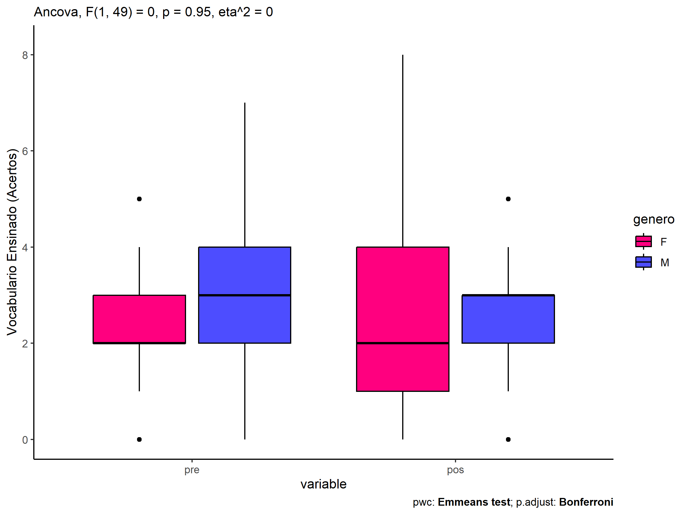<!-- -->

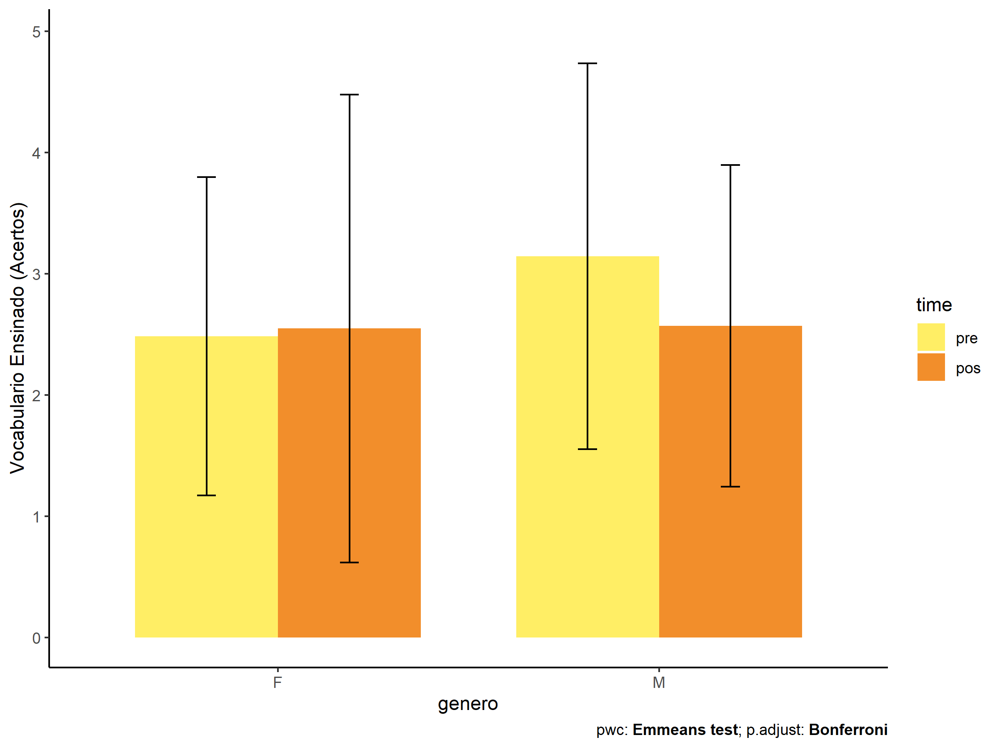<!-- -->

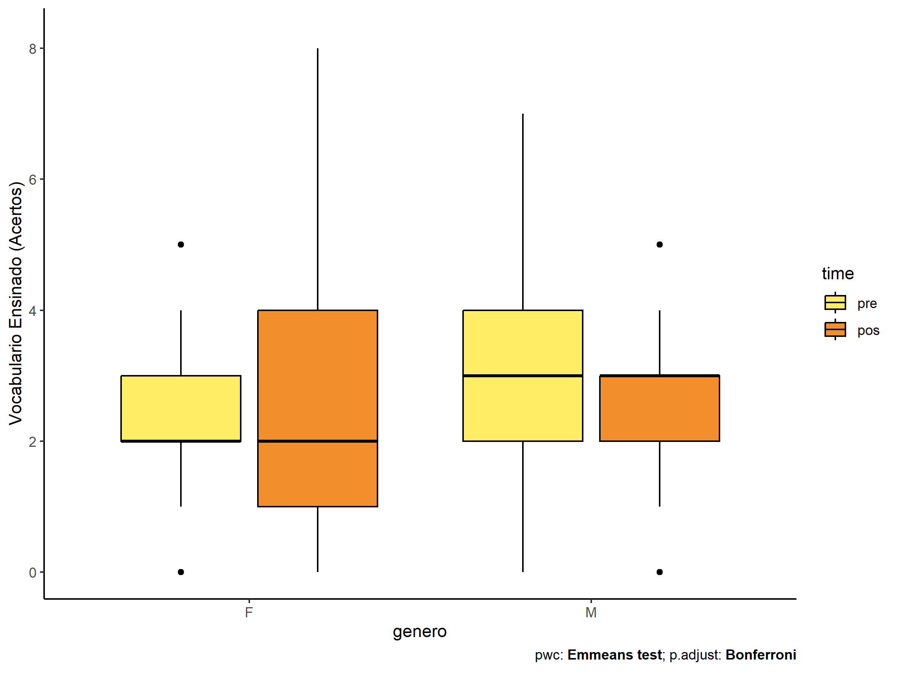<!-- -->

## factor: **zona.escola**

### Vocabulario (Acertos)

| var             | zona.escola |   n | M (pre) | SE (pre) | M (unadj) | SE (unadj) | M (adj) | SE (adj) |
|:----------------|:------------|----:|--------:|---------:|----------:|-----------:|--------:|---------:|
| score.vocab.pos | Rural       |  25 |  12.280 |    0.765 |    14.360 |      0.991 |  14.831 |    0.880 |
| score.vocab.pos | Urbana      |  58 |  13.724 |    0.555 |    15.052 |      0.610 |  14.849 |    0.575 |

| .y.             | group1 | group2 | estimate | conf.low | conf.high |    se | statistic |     p | p.adj | p.adj.signif |
|:----------------|:-------|:-------|---------:|---------:|----------:|------:|----------:|------:|------:|:-------------|
| score.vocab.pos | Urbana | Rural  |    0.018 |   -2.085 |     2.121 | 1.057 |     0.017 | 0.986 | 0.986 | ns           |
| score.vocab.pre | Urbana | Rural  |    1.444 |   -0.514 |     3.402 | 0.984 |     1.467 | 0.146 | 0.146 | ns           |

| .y.         | zona.escola | group1 | group2 | estimate | conf.low | conf.high |    se | statistic |     p | p.adj | p.adj.signif |
|:------------|:------------|:-------|:-------|---------:|---------:|----------:|------:|----------:|------:|------:|:-------------|
| score.vocab | Urbana      | pre    | pos    |   -1.228 |   -2.838 |     0.381 | 0.815 |    -1.507 | 0.134 | 0.134 | ns           |
| score.vocab | Rural       | pre    | pos    |   -2.077 |   -4.541 |     0.387 | 1.248 |    -1.664 | 0.098 | 0.098 | ns           |

    ## Scale for colour is already present.
    ## Adding another scale for colour, which will replace the existing scale.

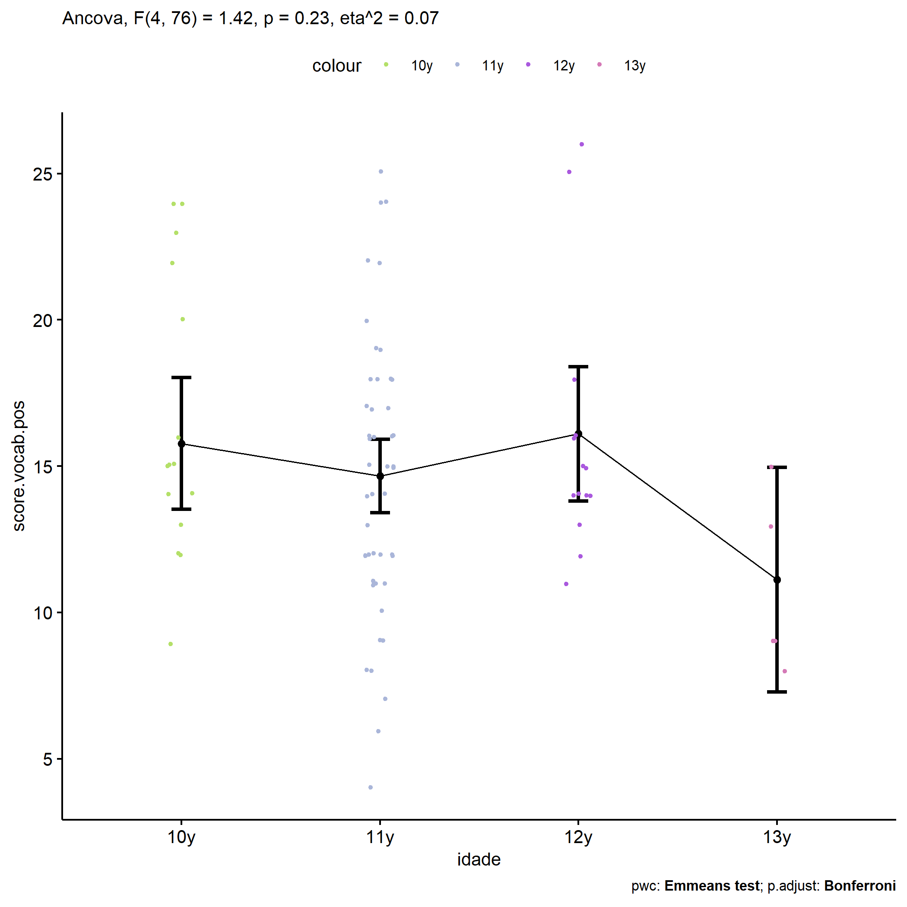<!-- -->

<!-- -->

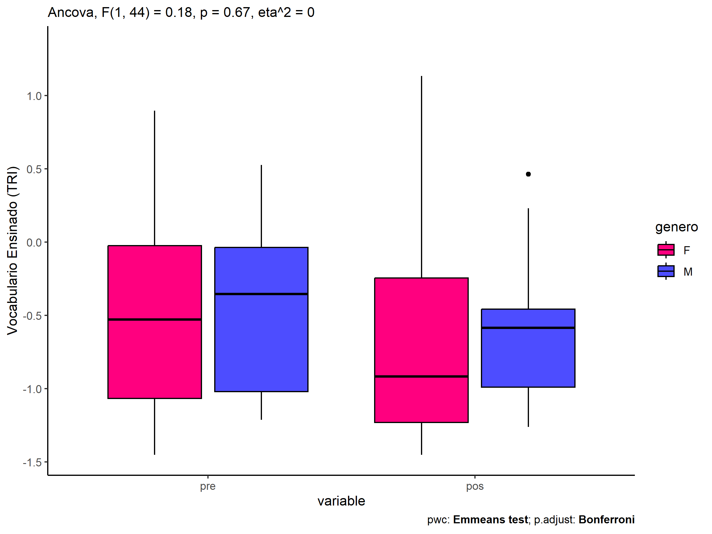<!-- -->

### Vocabulario Ensinado (Acertos)

| var                      | zona.escola |   n | M (pre) | SE (pre) | M (unadj) | SE (unadj) | M (adj) | SE (adj) |
|:-------------------------|:------------|----:|--------:|---------:|----------:|-----------:|--------:|---------:|
| score.vocab.ensinado.pos | Rural       |  27 |   2.519 |    0.263 |     2.741 |      0.364 |   2.749 |    0.328 |
| score.vocab.ensinado.pos | Urbana      |  65 |   2.646 |    0.193 |     2.385 |      0.201 |   2.381 |    0.212 |

| .y.                      | group1 | group2 | estimate | conf.low | conf.high |    se | statistic |     p | p.adj | p.adj.signif |
|:-------------------------|:-------|:-------|---------:|---------:|----------:|------:|----------:|------:|------:|:-------------|
| score.vocab.ensinado.pos | Urbana | Rural  |   -0.368 |   -1.144 |     0.409 | 0.391 |    -0.941 | 0.349 | 0.349 | ns           |
| score.vocab.ensinado.pre | Urbana | Rural  |    0.128 |   -0.557 |     0.812 | 0.344 |     0.371 | 0.712 | 0.712 | ns           |

| .y.                  | zona.escola | group1 | group2 | estimate | conf.low | conf.high |    se | statistic |     p | p.adj | p.adj.signif |
|:---------------------|:------------|:-------|:-------|---------:|---------:|----------:|------:|----------:|------:|------:|:-------------|
| score.vocab.ensinado | Urbana      | pre    | pos    |    0.262 |   -0.294 |     0.817 | 0.282 |     0.928 | 0.354 | 0.354 | ns           |
| score.vocab.ensinado | Rural       | pre    | pos    |   -0.222 |   -1.085 |     0.640 | 0.437 |    -0.508 | 0.612 | 0.612 | ns           |

    ## Scale for colour is already present.
    ## Adding another scale for colour, which will replace the existing scale.

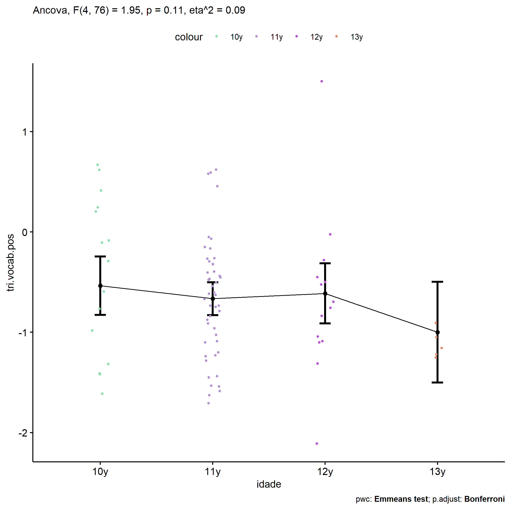<!-- -->

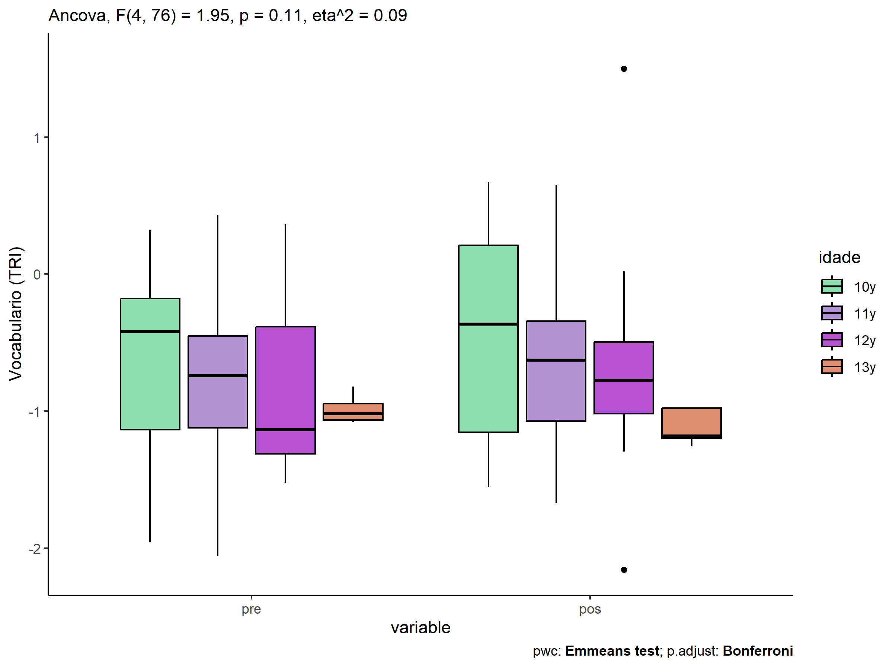<!-- -->

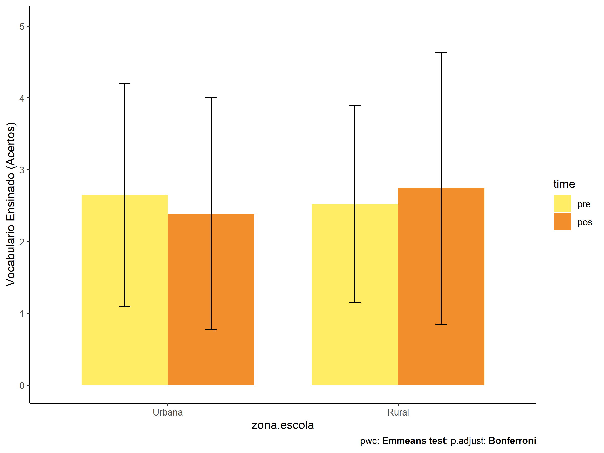<!-- -->

### Vocabulario Nao Ensinado (Acertos)

| var                          | zona.escola |   n | M (pre) | SE (pre) | M (unadj) | SE (unadj) | M (adj) | SE (adj) |
|:-----------------------------|:------------|----:|--------:|---------:|----------:|-----------:|--------:|---------:|
| score.vocab.nao.ensinado.pos | Rural       |  27 |   9.185 |    0.732 |    10.963 |      0.817 |  11.326 |    0.899 |
| score.vocab.nao.ensinado.pos | Urbana      |  65 |  10.569 |    0.545 |    11.538 |      0.632 |  11.388 |    0.576 |

| .y.                          | group1 | group2 | estimate | conf.low | conf.high |    se | statistic |     p | p.adj | p.adj.signif |
|:-----------------------------|:-------|:-------|---------:|---------:|----------:|------:|----------:|------:|------:|:-------------|
| score.vocab.nao.ensinado.pos | Urbana | Rural  |    0.062 |   -2.069 |     2.193 | 1.073 |     0.058 | 0.954 | 0.954 | ns           |
| score.vocab.nao.ensinado.pre | Urbana | Rural  |    1.384 |   -0.540 |     3.308 | 0.968 |     1.429 | 0.156 | 0.156 | ns           |

| .y.                      | zona.escola | group1 | group2 | estimate | conf.low | conf.high |    se | statistic |     p | p.adj | p.adj.signif |
|:-------------------------|:------------|:-------|:-------|---------:|---------:|----------:|------:|----------:|------:|------:|:-------------|
| score.vocab.nao.ensinado | Urbana      | pre    | pos    |   -0.969 |   -2.547 |     0.609 | 0.800 |    -1.212 | 0.227 | 0.227 | ns           |
| score.vocab.nao.ensinado | Rural       | pre    | pos    |   -1.778 |   -4.226 |     0.671 | 1.241 |    -1.433 | 0.154 | 0.154 | ns           |

    ## Scale for colour is already present.
    ## Adding another scale for colour, which will replace the existing scale.

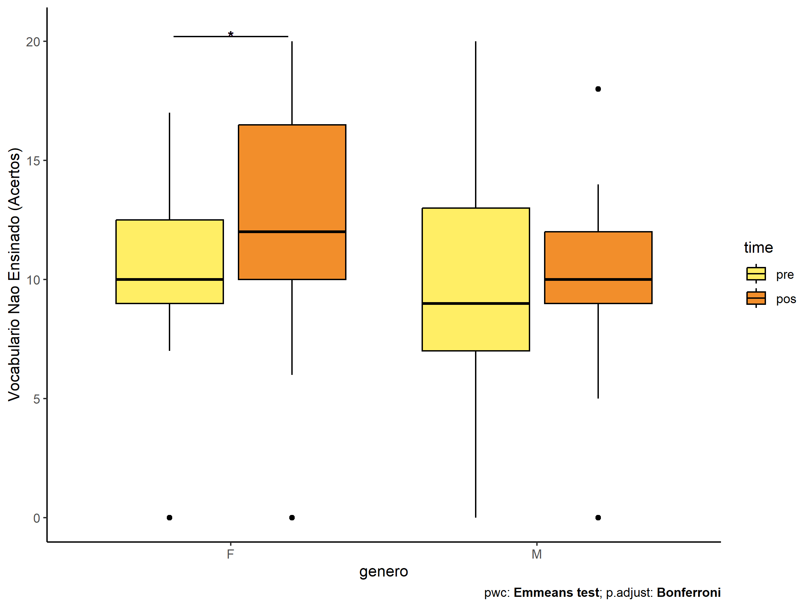<!-- -->

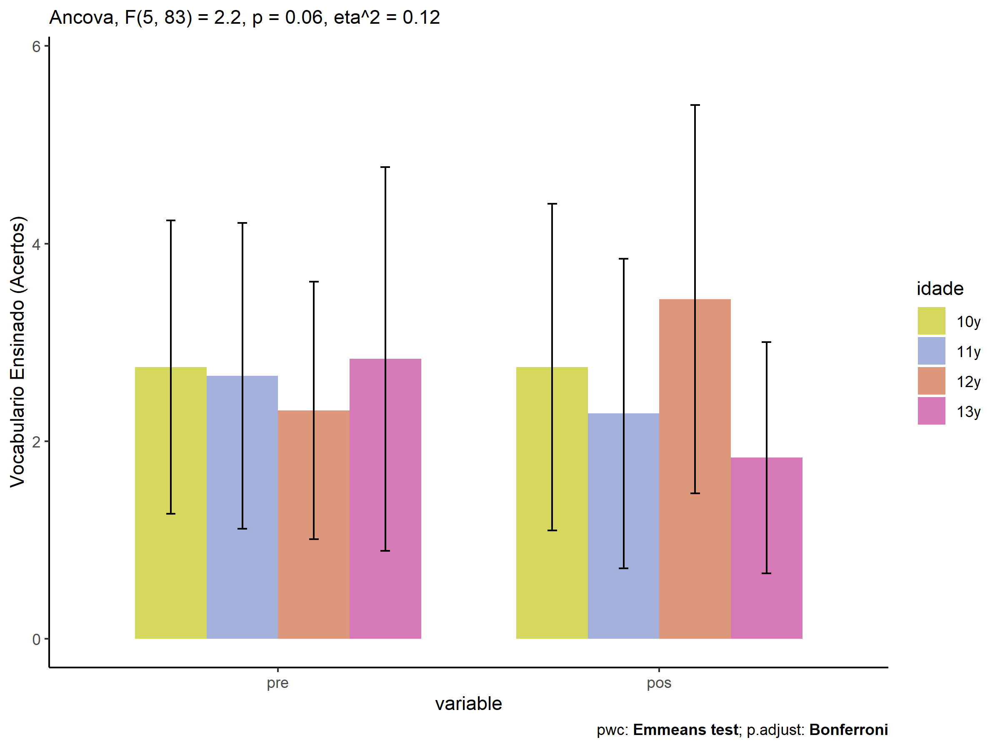<!-- -->

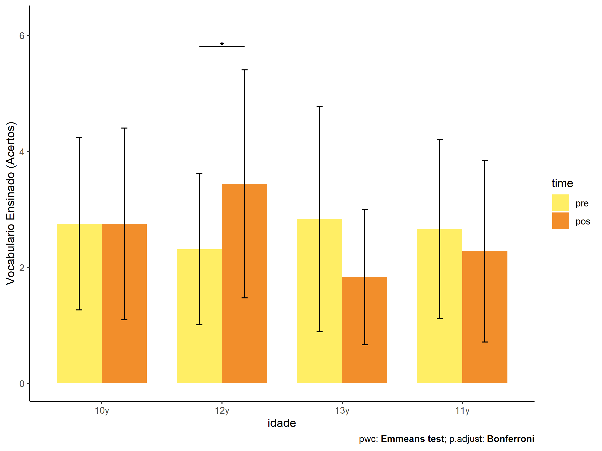<!-- -->

# Pairwise comparisons for two factors

## factores: **genero:grupo**

### Vocabulario (Acertos)

| var             | genero | grupo    |   n | M (pre) | SE (pre) | M (unadj) | SE (unadj) | M (adj) | SE (adj) |
|:----------------|:-------|:---------|----:|--------:|---------:|----------:|-----------:|--------:|---------:|
| score.vocab.pos | F      | Controle |  23 |  14.348 |    0.942 |    16.696 |      1.026 |  16.235 |    0.910 |
| score.vocab.pos | F      | Stari    |  17 |  12.353 |    0.853 |    14.118 |      1.029 |  14.525 |    1.055 |
| score.vocab.pos | M      | Controle |  21 |  12.286 |    1.051 |    13.762 |      0.971 |  14.198 |    0.951 |
| score.vocab.pos | M      | Stari    |  22 |  13.864 |    0.700 |    14.500 |      1.036 |  14.250 |    0.925 |

| .y.             | grupo    | genero | group1   | group2 | estimate | conf.low | conf.high |    se | statistic |     p | p.adj | p.adj.signif |
|:----------------|:---------|:-------|:---------|:-------|---------:|---------:|----------:|------:|----------:|------:|------:|:-------------|
| score.vocab.pos | Controle |        | F        | M      |    2.037 |   -0.607 |     4.681 | 1.328 |     1.534 | 0.129 | 0.129 | ns           |
| score.vocab.pos | Stari    |        | F        | M      |    0.274 |   -2.529 |     3.078 | 1.408 |     0.195 | 0.846 | 0.846 | ns           |
| score.vocab.pre | Controle |        | F        | M      |    2.062 |   -0.410 |     4.534 | 1.242 |     1.660 | 0.101 | 0.101 | ns           |
| score.vocab.pre | Stari    |        | F        | M      |   -1.511 |   -4.156 |     1.135 | 1.329 |    -1.137 | 0.259 | 0.259 | ns           |
| score.vocab.pos |          | F      | Controle | Stari  |    1.711 |   -1.083 |     4.505 | 1.403 |     1.219 | 0.226 | 0.226 | ns           |
| score.vocab.pos |          | M      | Controle | Stari  |   -0.052 |   -2.705 |     2.601 | 1.333 |    -0.039 | 0.969 | 0.969 | ns           |
| score.vocab.pre |          | F      | Controle | Stari  |    1.995 |   -0.625 |     4.615 | 1.316 |     1.516 | 0.134 | 0.134 | ns           |
| score.vocab.pre |          | M      | Controle | Stari  |   -1.578 |   -4.077 |     0.921 | 1.256 |    -1.257 | 0.213 | 0.213 | ns           |

| grupo    | genero | group1 | group2 | estimate | conf.low | conf.high |    se | statistic |     p | p.adj | p.adj.signif |
|:---------|:-------|:-------|:-------|---------:|---------:|----------:|------:|----------:|------:|------:|:-------------|
| Controle | F      | pre    | pos    |   -2.000 |   -4.564 |     0.564 | 1.299 |    -1.540 | 0.125 | 0.125 | ns           |
| Controle | M      | pre    | pos    |   -1.071 |   -3.720 |     1.578 | 1.342 |    -0.798 | 0.426 | 0.426 | ns           |
| Stari    | F      | pre    | pos    |   -2.000 |   -4.961 |     0.961 | 1.500 |    -1.334 | 0.184 | 0.184 | ns           |
| Stari    | M      | pre    | pos    |   -0.848 |   -3.497 |     1.801 | 1.342 |    -0.632 | 0.528 | 0.528 | ns           |

    ## Scale for colour is already present.
    ## Adding another scale for colour, which will replace the existing scale.

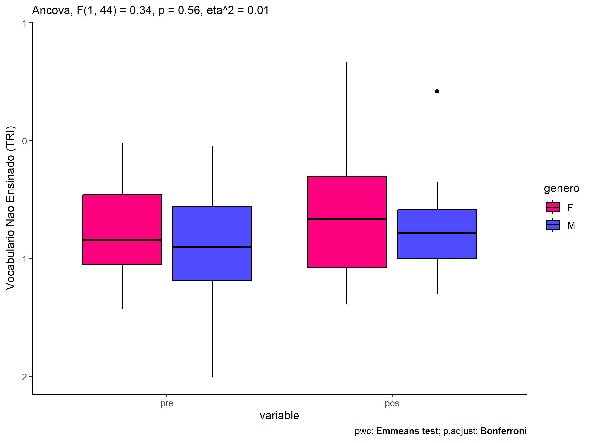<!-- -->

    ## Scale for colour is already present.
    ## Adding another scale for colour, which will replace the existing scale.

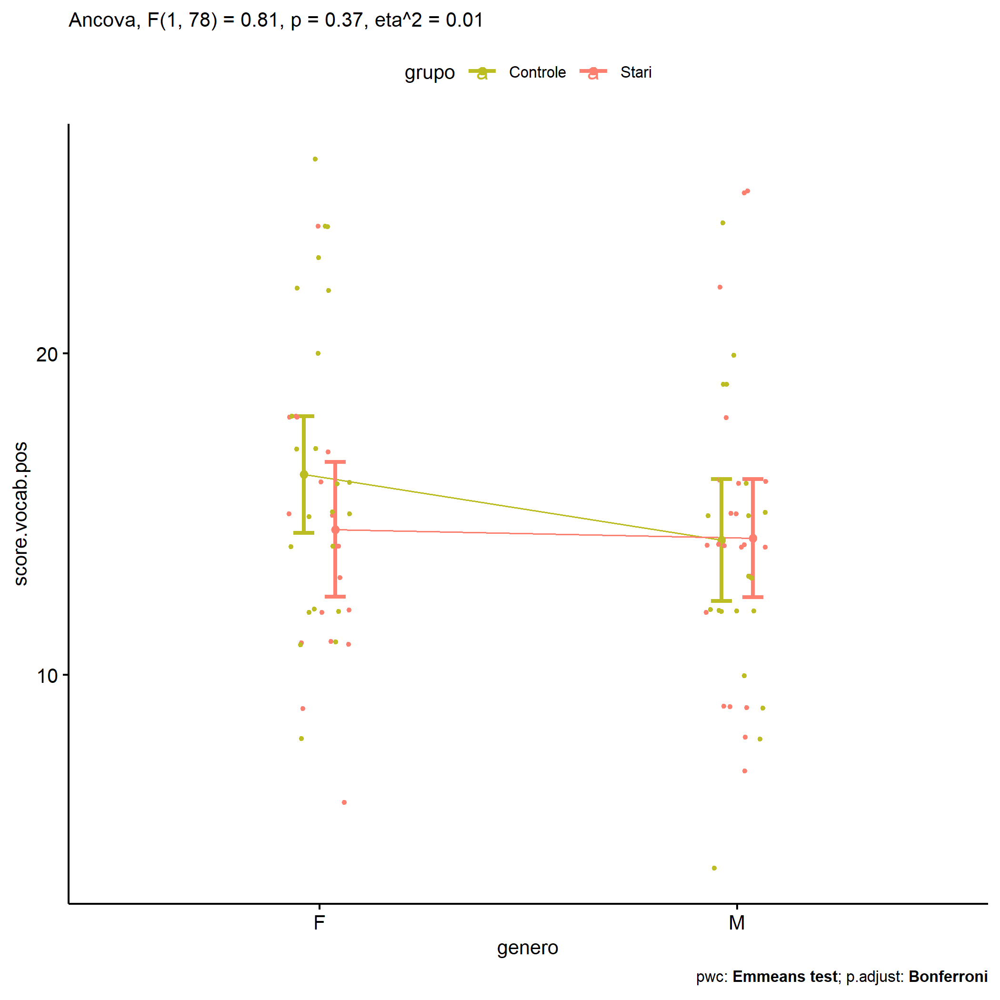<!-- -->

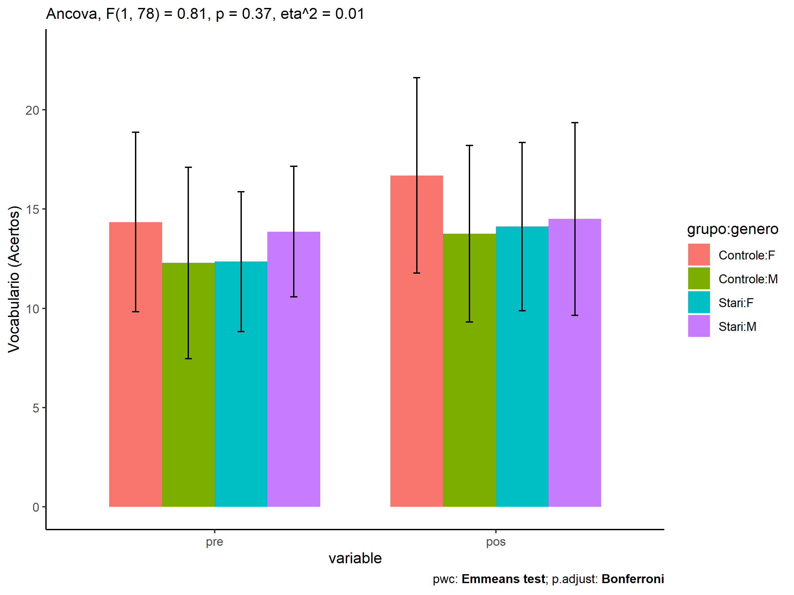<!-- -->

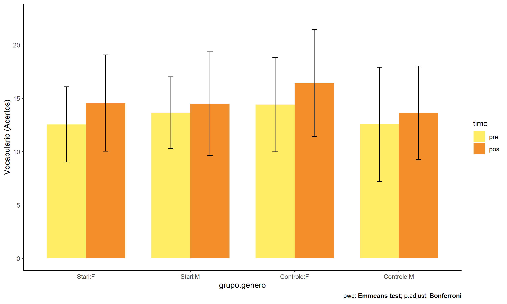<!-- -->

### Vocabulario Ensinado (Acertos)

| var                      | genero | grupo    |   n | M (pre) | SE (pre) | M (unadj) | SE (unadj) | M (adj) | SE (adj) |
|:-------------------------|:-------|:---------|----:|--------:|---------:|----------:|-----------:|--------:|---------:|
| score.vocab.ensinado.pos | F      | Controle |  25 |   2.640 |    0.299 |     2.400 |      0.374 |   2.398 |    0.346 |
| score.vocab.ensinado.pos | F      | Stari    |  19 |   2.579 |    0.327 |     2.579 |      0.421 |   2.581 |    0.397 |
| score.vocab.ensinado.pos | M      | Controle |  25 |   2.200 |    0.311 |     2.320 |      0.315 |   2.349 |    0.349 |
| score.vocab.ensinado.pos | M      | Stari    |  23 |   3.043 |    0.305 |     2.696 |      0.335 |   2.665 |    0.364 |

| .y.                      | grupo    | genero | group1   | group2 | estimate | conf.low | conf.high |    se | statistic |     p | p.adj | p.adj.signif |
|:-------------------------|:---------|:-------|:---------|:-------|---------:|---------:|----------:|------:|----------:|------:|------:|:-------------|
| score.vocab.ensinado.pos | Controle |        | F        | M      |    0.049 |   -0.929 |     1.026 | 0.492 |     0.099 | 0.922 | 0.922 | ns           |
| score.vocab.ensinado.pos | Stari    |        | F        | M      |   -0.084 |   -1.155 |     0.988 | 0.539 |    -0.155 | 0.877 | 0.877 | ns           |
| score.vocab.ensinado.pre | Controle |        | F        | M      |    0.440 |   -0.397 |     1.277 | 0.421 |     1.044 | 0.299 | 0.299 | ns           |
| score.vocab.ensinado.pre | Stari    |        | F        | M      |   -0.465 |   -1.382 |     0.453 | 0.462 |    -1.006 | 0.317 | 0.317 | ns           |
| score.vocab.ensinado.pos |          | F      | Controle | Stari  |   -0.183 |   -1.229 |     0.862 | 0.526 |    -0.348 | 0.728 | 0.728 | ns           |
| score.vocab.ensinado.pos |          | M      | Controle | Stari  |   -0.315 |   -1.330 |     0.699 | 0.510 |    -0.618 | 0.538 | 0.538 | ns           |
| score.vocab.ensinado.pre |          | F      | Controle | Stari  |    0.061 |   -0.840 |     0.962 | 0.453 |     0.135 | 0.893 | 0.893 | ns           |
| score.vocab.ensinado.pre |          | M      | Controle | Stari  |   -0.843 |   -1.699 |     0.012 | 0.430 |    -1.959 | 0.053 | 0.053 | ns           |

| grupo    | genero | group1 | group2 | estimate | conf.low | conf.high |    se | statistic |     p | p.adj | p.adj.signif |
|:---------|:-------|:-------|:-------|---------:|---------:|----------:|------:|----------:|------:|------:|:-------------|
| Controle | F      | pre    | pos    |    0.240 |   -0.659 |     1.139 | 0.455 |     0.527 | 0.599 | 0.599 | ns           |
| Controle | M      | pre    | pos    |   -0.120 |   -1.019 |     0.779 | 0.455 |    -0.263 | 0.792 | 0.792 | ns           |
| Stari    | F      | pre    | pos    |    0.000 |   -1.031 |     1.031 | 0.522 |     0.000 | 1.000 | 1.000 | ns           |
| Stari    | M      | pre    | pos    |    0.348 |   -0.589 |     1.285 | 0.475 |     0.733 | 0.465 | 0.465 | ns           |

    ## Scale for colour is already present.
    ## Adding another scale for colour, which will replace the existing scale.

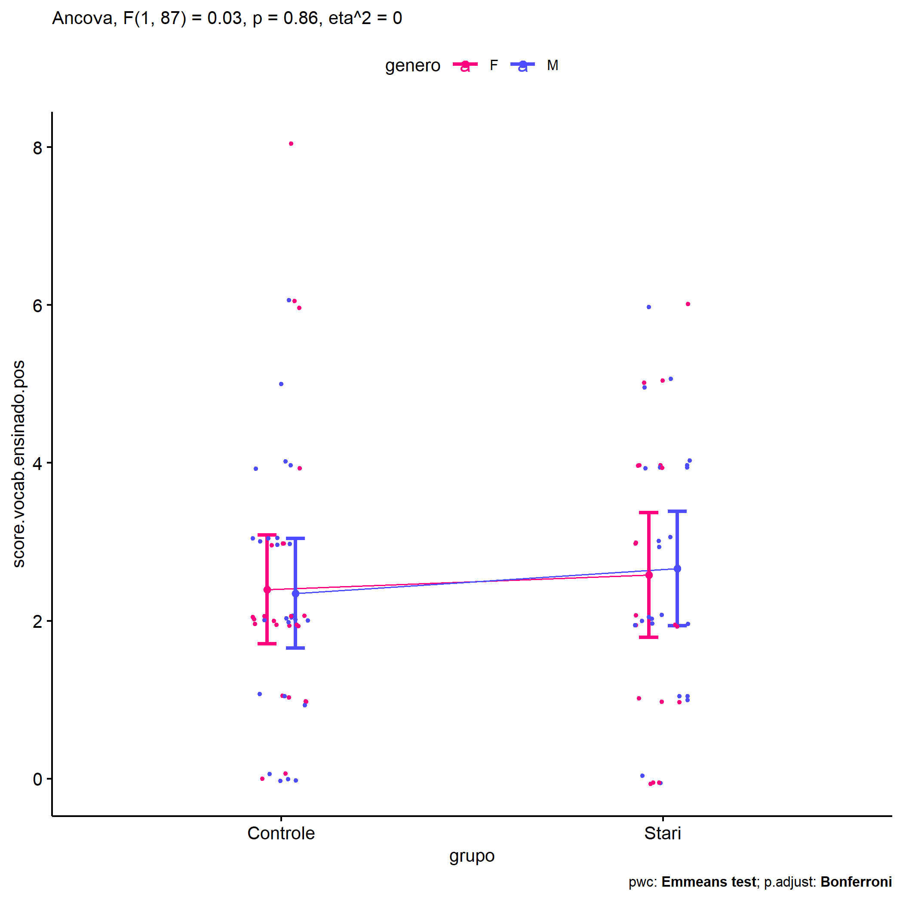<!-- -->

    ## Scale for colour is already present.
    ## Adding another scale for colour, which will replace the existing scale.

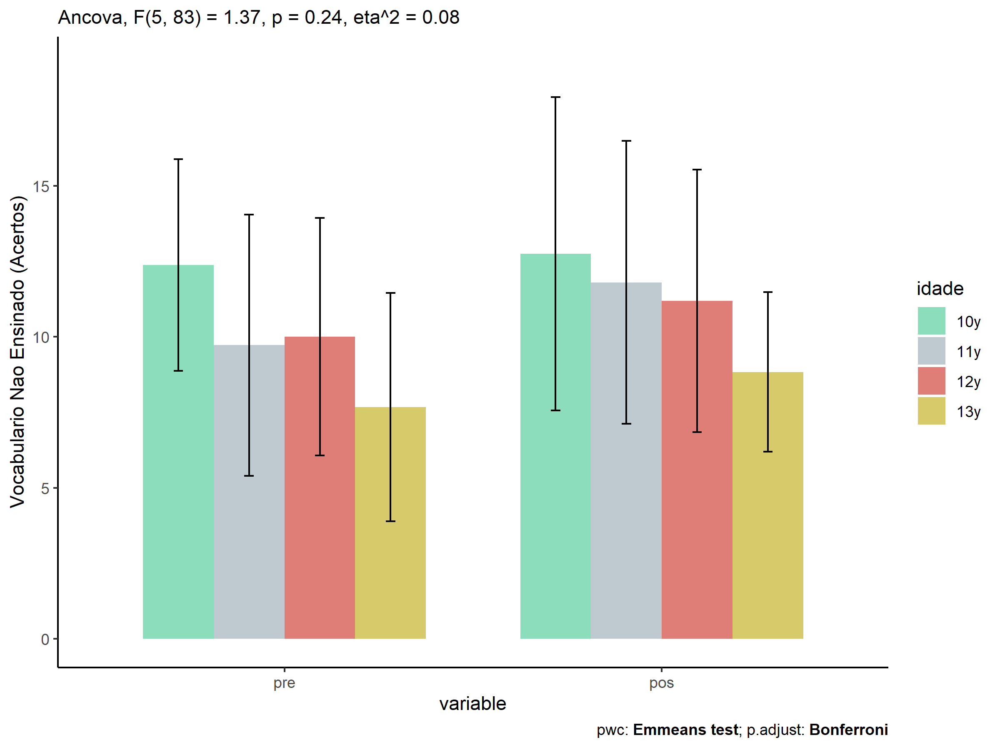<!-- -->

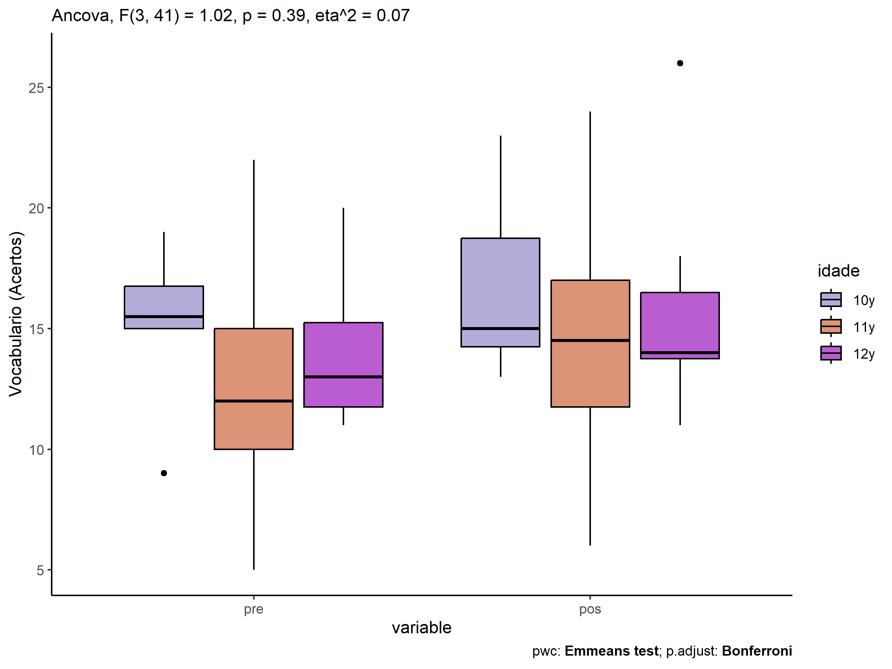<!-- -->

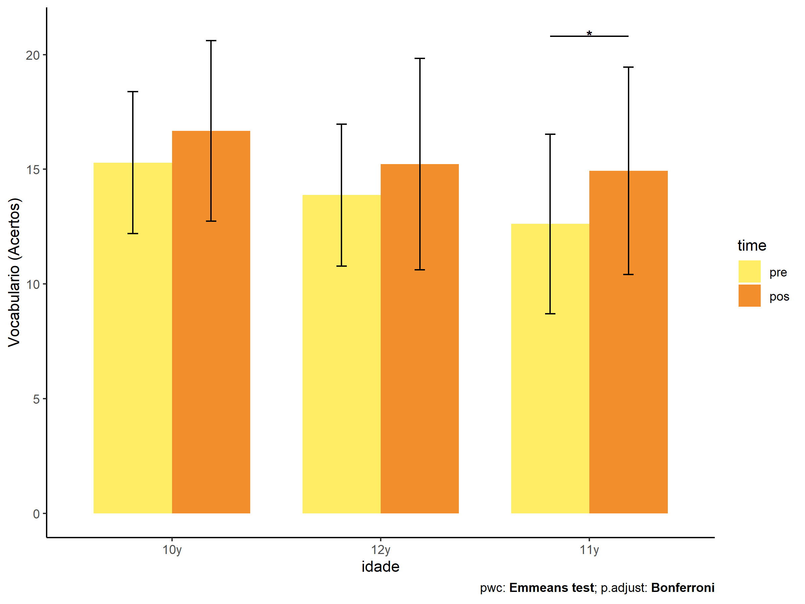<!-- -->

### Vocabulario Nao Ensinado (Acertos)

| var                          | genero | grupo    |   n | M (pre) | SE (pre) | M (unadj) | SE (unadj) | M (adj) | SE (adj) |
|:-----------------------------|:-------|:---------|----:|--------:|---------:|----------:|-----------:|--------:|---------:|
| score.vocab.nao.ensinado.pos | F      | Controle |  25 |  11.200 |    0.849 |    13.360 |      0.957 |  13.016 |    0.915 |
| score.vocab.nao.ensinado.pos | F      | Stari    |  19 |   9.316 |    0.820 |    11.211 |      1.047 |  11.492 |    1.045 |
| score.vocab.nao.ensinado.pos | M      | Controle |  25 |   9.360 |    1.042 |     9.680 |      1.009 |   9.947 |    0.912 |
| score.vocab.nao.ensinado.pos | M      | Stari    |  23 |  10.609 |    0.732 |    11.174 |      0.921 |  11.026 |    0.947 |

| .y.                          | grupo    | genero | group1   | group2 | estimate | conf.low | conf.high |    se | statistic |     p | p.adj | p.adj.signif |
|:-----------------------------|:---------|:-------|:---------|:-------|---------:|---------:|----------:|------:|----------:|------:|------:|:-------------|
| score.vocab.nao.ensinado.pos | Controle |        | F        | M      |    3.069 |    0.485 |     5.654 | 1.300 |     2.360 | 0.020 | 0.020 | \*           |
| score.vocab.nao.ensinado.pos | Stari    |        | F        | M      |    0.466 |   -2.345 |     3.277 | 1.414 |     0.329 | 0.743 | 0.743 | ns           |
| score.vocab.nao.ensinado.pre | Controle |        | F        | M      |    1.840 |   -0.546 |     4.226 | 1.201 |     1.533 | 0.129 | 0.129 | ns           |
| score.vocab.nao.ensinado.pre | Stari    |        | F        | M      |   -1.293 |   -3.908 |     1.322 | 1.316 |    -0.983 | 0.329 | 0.329 | ns           |
| score.vocab.nao.ensinado.pos |          | F      | Controle | Stari  |    1.524 |   -1.254 |     4.301 | 1.397 |     1.090 | 0.279 | 0.279 | ns           |
| score.vocab.nao.ensinado.pos |          | M      | Controle | Stari  |   -1.079 |   -3.700 |     1.542 | 1.319 |    -0.819 | 0.415 | 0.415 | ns           |
| score.vocab.nao.ensinado.pre |          | F      | Controle | Stari  |    1.884 |   -0.683 |     4.451 | 1.292 |     1.459 | 0.148 | 0.148 | ns           |
| score.vocab.nao.ensinado.pre |          | M      | Controle | Stari  |   -1.249 |   -3.686 |     1.188 | 1.226 |    -1.018 | 0.311 | 0.311 | ns           |

| grupo    | genero | group1 | group2 | estimate | conf.low | conf.high |    se | statistic |     p | p.adj | p.adj.signif |
|:---------|:-------|:-------|:-------|---------:|---------:|----------:|------:|----------:|------:|------:|:-------------|
| Controle | F      | pre    | pos    |   -2.160 |   -4.667 |     0.347 | 1.270 |    -1.700 | 0.091 | 0.091 | ns           |
| Controle | M      | pre    | pos    |   -0.320 |   -2.827 |     2.187 | 1.270 |    -0.252 | 0.801 | 0.801 | ns           |
| Stari    | F      | pre    | pos    |   -1.895 |   -4.771 |     0.981 | 1.457 |    -1.300 | 0.195 | 0.195 | ns           |
| Stari    | M      | pre    | pos    |   -0.565 |   -3.179 |     2.049 | 1.325 |    -0.427 | 0.670 | 0.670 | ns           |

    ## Scale for colour is already present.
    ## Adding another scale for colour, which will replace the existing scale.

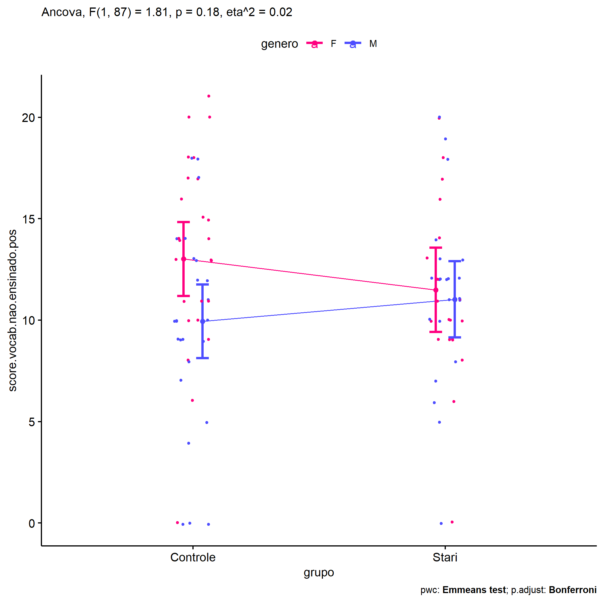<!-- -->

    ## Scale for colour is already present.
    ## Adding another scale for colour, which will replace the existing scale.

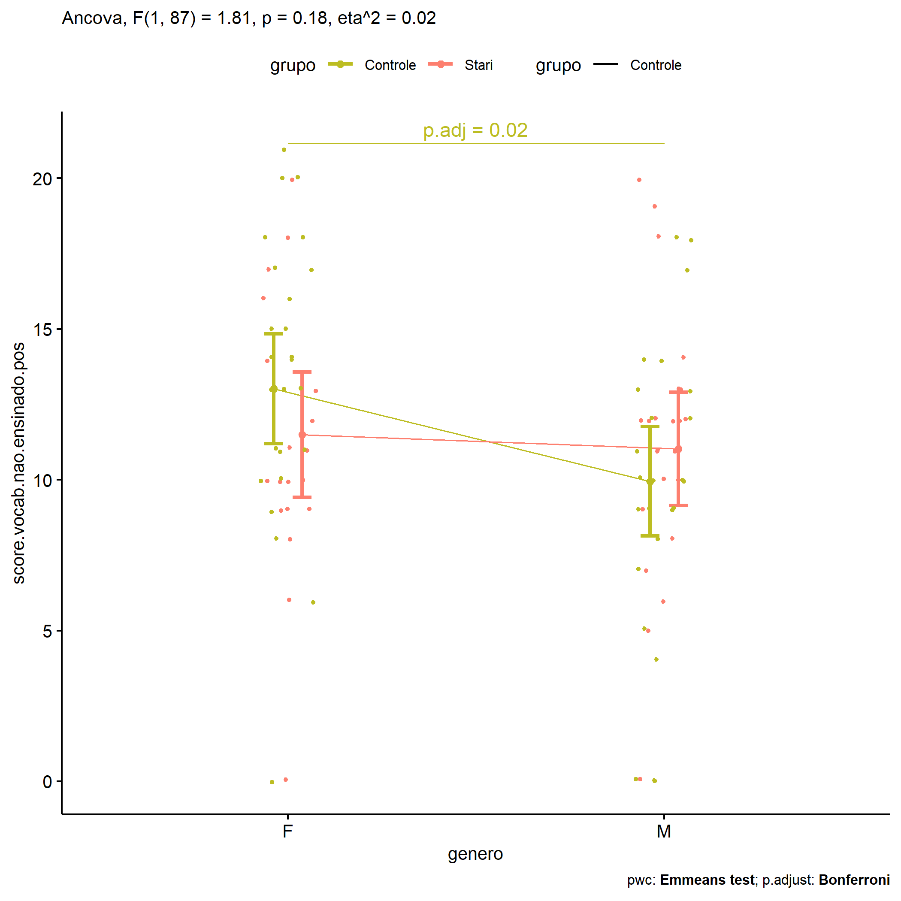<!-- -->

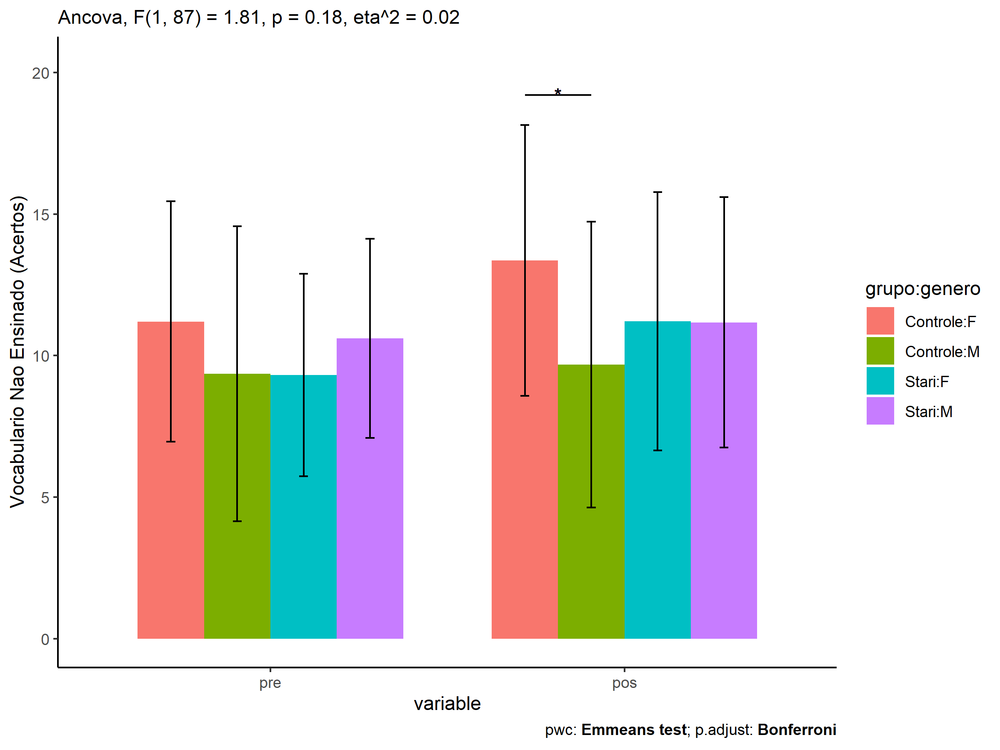<!-- -->

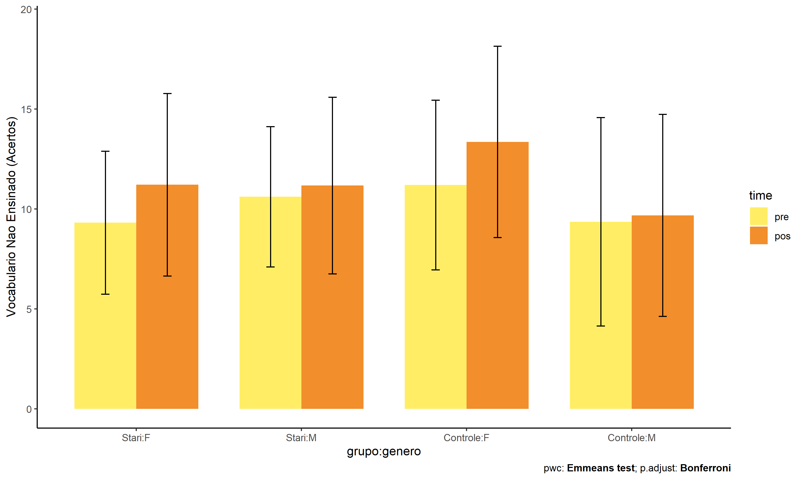<!-- -->

## factores: **idade:grupo**

### Vocabulario (Acertos)

| var             | idade | grupo    |   n | M (pre) | SE (pre) | M (unadj) | SE (unadj) | M (adj) | SE (adj) |
|:----------------|:------|:---------|----:|--------:|---------:|----------:|-----------:|--------:|---------:|
| score.vocab.pos | 10y   | Controle |   8 |  17.500 |    1.134 |    18.875 |      1.540 |  17.214 |    1.641 |
| score.vocab.pos | 10y   | Stari    |   7 |  12.286 |    1.190 |    13.857 |      1.534 |  14.299 |    1.670 |
| score.vocab.pos | 11y   | Controle |  26 |  12.692 |    1.024 |    14.577 |      0.935 |  14.855 |    0.868 |
| score.vocab.pos | 11y   | Stari    |  21 |  13.333 |    0.823 |    14.429 |      1.075 |  14.448 |    0.961 |
| score.vocab.pos | 12y   | Controle |   5 |  11.800 |    1.158 |    16.400 |      2.502 |  17.038 |    1.980 |
| score.vocab.pos | 12y   | Stari    |   9 |  13.556 |    1.144 |    15.667 |      1.323 |  15.597 |    1.468 |

| .y.             | grupo    | idade | group1   | group2 | estimate | conf.low | conf.high |    se | statistic |     p | p.adj | p.adj.signif |
|:----------------|:---------|:------|:---------|:-------|---------:|---------:|----------:|------:|----------:|------:|------:|:-------------|
| score.vocab.pos | Controle |       | 10y      | 11y    |    2.359 |   -1.393 |     6.112 | 1.881 |     1.254 | 0.214 | 0.642 | ns           |
| score.vocab.pos | Controle |       | 10y      | 12y    |    0.176 |   -5.034 |     5.386 | 2.612 |     0.067 | 0.946 | 1.000 | ns           |
| score.vocab.pos | Controle |       | 11y      | 12y    |   -2.183 |   -6.479 |     2.113 | 2.153 |    -1.014 | 0.314 | 0.943 | ns           |
| score.vocab.pos | Stari    |       | 10y      | 11y    |   -0.149 |   -3.992 |     3.694 | 1.927 |    -0.077 | 0.939 | 1.000 | ns           |
| score.vocab.pos | Stari    |       | 10y      | 12y    |   -1.297 |   -5.736 |     3.142 | 2.225 |    -0.583 | 0.562 | 1.000 | ns           |
| score.vocab.pos | Stari    |       | 11y      | 12y    |   -1.148 |   -4.649 |     2.352 | 1.755 |    -0.654 | 0.515 | 1.000 | ns           |
| score.vocab.pre | Controle |       | 10y      | 11y    |    4.808 |    1.443 |     8.172 | 1.687 |     2.850 | 0.006 | 0.017 | \*           |
| score.vocab.pre | Controle |       | 10y      | 12y    |    5.700 |    0.956 |    10.444 | 2.379 |     2.396 | 0.019 | 0.058 | ns           |
| score.vocab.pre | Controle |       | 11y      | 12y    |    0.892 |   -3.171 |     4.956 | 2.038 |     0.438 | 0.663 | 1.000 | ns           |
| score.vocab.pre | Stari    |       | 10y      | 11y    |   -1.048 |   -4.680 |     2.584 | 1.821 |    -0.575 | 0.567 | 1.000 | ns           |
| score.vocab.pre | Stari    |       | 10y      | 12y    |   -1.270 |   -5.464 |     2.924 | 2.103 |    -0.604 | 0.548 | 1.000 | ns           |
| score.vocab.pre | Stari    |       | 11y      | 12y    |   -0.222 |   -3.538 |     3.093 | 1.662 |    -0.134 | 0.894 | 1.000 | ns           |
| score.vocab.pos |          | 10y   | Controle | Stari  |    2.915 |   -1.818 |     7.648 | 2.372 |     1.229 | 0.223 | 0.223 | ns           |
| score.vocab.pos |          | 11y   | Controle | Stari  |    0.407 |   -2.176 |     2.990 | 1.295 |     0.314 | 0.754 | 0.754 | ns           |
| score.vocab.pos |          | 12y   | Controle | Stari  |    1.441 |   -3.479 |     6.362 | 2.466 |     0.584 | 0.561 | 0.561 | ns           |
| score.vocab.pre |          | 10y   | Controle | Stari  |    5.214 |    0.907 |     9.521 | 2.159 |     2.415 | 0.018 | 0.018 | \*           |
| score.vocab.pre |          | 11y   | Controle | Stari  |   -0.641 |   -3.083 |     1.801 | 1.224 |    -0.524 | 0.602 | 0.602 | ns           |
| score.vocab.pre |          | 12y   | Controle | Stari  |   -1.756 |   -6.397 |     2.886 | 2.327 |    -0.754 | 0.453 | 0.453 | ns           |

| grupo    | idade | group1 | group2 | estimate | conf.low | conf.high |    se | statistic |     p | p.adj | p.adj.signif |
|:---------|:------|:-------|:-------|---------:|---------:|----------:|------:|----------:|------:|------:|:-------------|
| Controle | 10y   | pre    | pos    |   -1.542 |   -5.806 |     2.723 | 2.158 |    -0.714 | 0.476 | 0.476 | ns           |
| Controle | 11y   | pre    | pos    |   -1.885 |   -4.319 |     0.550 | 1.232 |    -1.530 | 0.128 | 0.128 | ns           |
| Controle | 12y   | pre    | pos    |   -3.700 |   -9.015 |     1.615 | 2.689 |    -1.376 | 0.171 | 0.171 | ns           |
| Stari    | 10y   | pre    | pos    |   -1.571 |   -6.263 |     3.120 | 2.374 |    -0.662 | 0.509 | 0.509 | ns           |
| Stari    | 11y   | pre    | pos    |   -1.636 |   -4.283 |     1.010 | 1.339 |    -1.222 | 0.224 | 0.224 | ns           |
| Stari    | 12y   | pre    | pos    |   -1.867 |   -5.899 |     2.166 | 2.040 |    -0.915 | 0.362 | 0.362 | ns           |

    ## Scale for colour is already present.
    ## Adding another scale for colour, which will replace the existing scale.

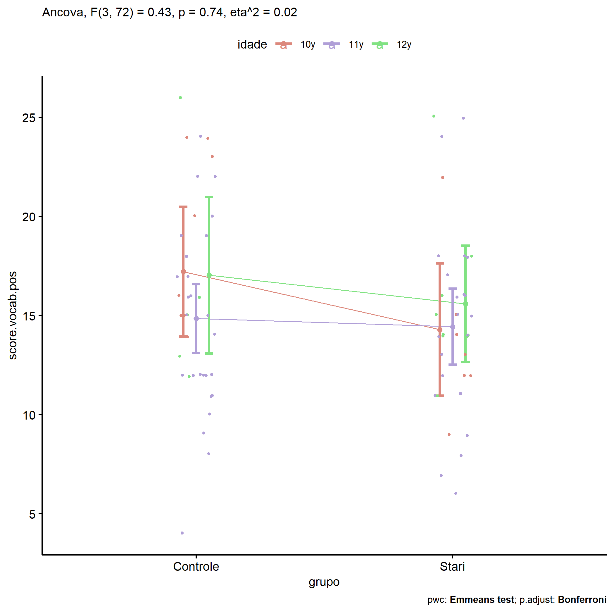<!-- -->

    ## Scale for colour is already present.
    ## Adding another scale for colour, which will replace the existing scale.

<!-- -->

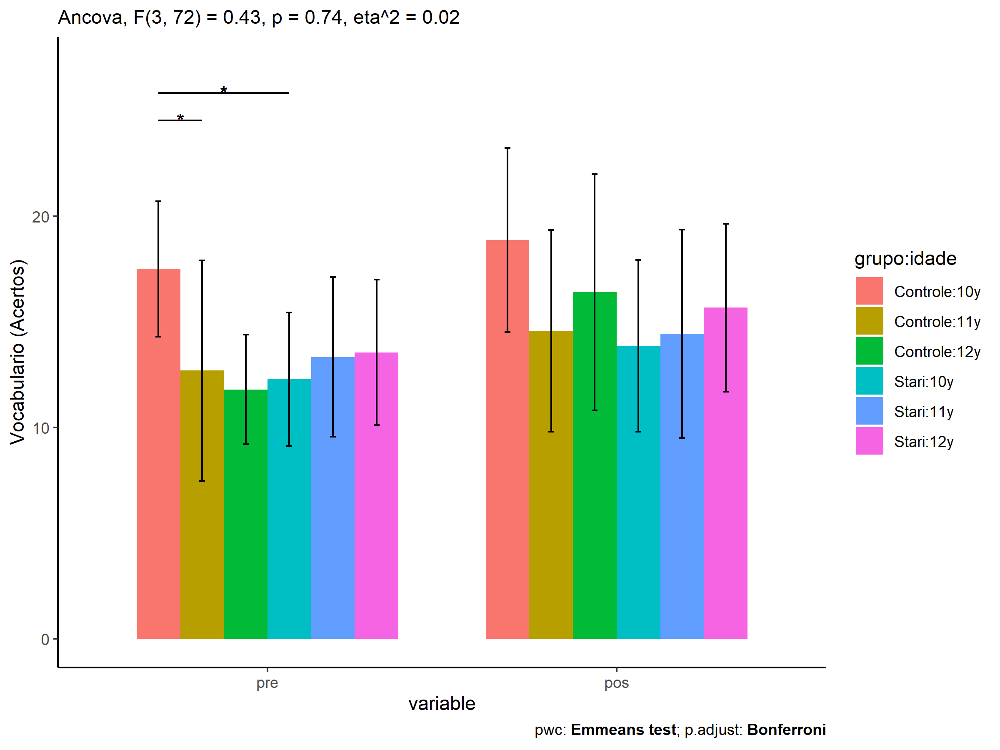<!-- -->

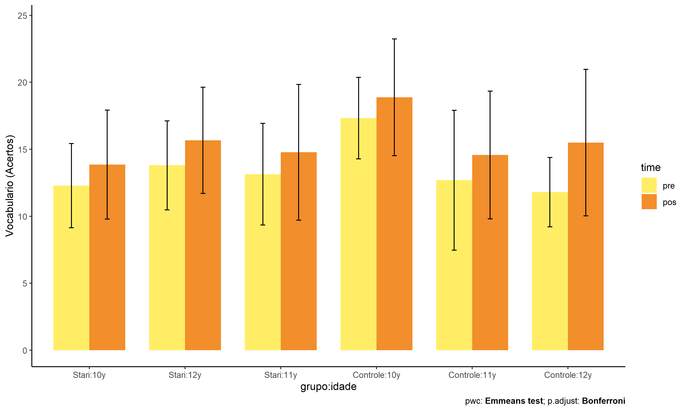<!-- -->

### Vocabulario Ensinado (Acertos)

| var                      | idade | grupo    |   n | M (pre) | SE (pre) | M (unadj) | SE (unadj) | M (adj) | SE (adj) |
|:-------------------------|:------|:---------|----:|--------:|---------:|----------:|-----------:|--------:|---------:|
| score.vocab.ensinado.pos | 10y   | Controle |   9 |   3.000 |    0.601 |     2.667 |      0.707 |   2.604 |    0.561 |
| score.vocab.ensinado.pos | 10y   | Stari    |   7 |   2.429 |    0.369 |     2.857 |      0.340 |   2.886 |    0.634 |
| score.vocab.ensinado.pos | 11y   | Controle |  27 |   2.333 |    0.277 |     2.074 |      0.266 |   2.118 |    0.324 |
| score.vocab.ensinado.pos | 11y   | Stari    |  23 |   3.043 |    0.336 |     2.522 |      0.366 |   2.452 |    0.354 |
| score.vocab.ensinado.pos | 12y   | Controle |   6 |   2.333 |    0.667 |     3.833 |      0.910 |   3.878 |    0.685 |
| score.vocab.ensinado.pos | 12y   | Stari    |  10 |   2.300 |    0.367 |     3.200 |      0.593 |   3.250 |    0.531 |

| .y.                      | grupo    | idade | group1   | group2 | estimate | conf.low | conf.high |    se | statistic |     p | p.adj | p.adj.signif |
|:-------------------------|:---------|:------|:---------|:-------|---------:|---------:|----------:|------:|----------:|------:|------:|:-------------|
| score.vocab.ensinado.pos | Controle |       | 10y      | 11y    |    0.486 |   -0.811 |     1.782 | 0.651 |     0.746 | 0.458 | 1.000 | ns           |
| score.vocab.ensinado.pos | Controle |       | 10y      | 12y    |   -1.274 |   -3.041 |     0.494 | 0.887 |    -1.435 | 0.155 | 0.466 | ns           |
| score.vocab.ensinado.pos | Controle |       | 11y      | 12y    |   -1.759 |   -3.266 |    -0.253 | 0.756 |    -2.326 | 0.023 | 0.068 | ns           |
| score.vocab.ensinado.pos | Stari    |       | 10y      | 11y    |    0.434 |   -1.015 |     1.884 | 0.728 |     0.597 | 0.553 | 1.000 | ns           |
| score.vocab.ensinado.pos | Stari    |       | 10y      | 12y    |   -0.363 |   -2.009 |     1.282 | 0.826 |    -0.440 | 0.661 | 1.000 | ns           |
| score.vocab.ensinado.pos | Stari    |       | 11y      | 12y    |   -0.798 |   -2.076 |     0.481 | 0.642 |    -1.243 | 0.218 | 0.654 | ns           |
| score.vocab.ensinado.pre | Controle |       | 10y      | 11y    |    0.667 |   -0.473 |     1.807 | 0.572 |     1.165 | 0.248 | 0.743 | ns           |
| score.vocab.ensinado.pre | Controle |       | 10y      | 12y    |    0.667 |   -0.894 |     2.228 | 0.784 |     0.851 | 0.398 | 1.000 | ns           |
| score.vocab.ensinado.pre | Controle |       | 11y      | 12y    |    0.000 |   -1.337 |     1.337 | 0.671 |     0.000 | 1.000 | 1.000 | ns           |
| score.vocab.ensinado.pre | Stari    |       | 10y      | 11y    |   -0.615 |   -1.894 |     0.664 | 0.642 |    -0.958 | 0.341 | 1.000 | ns           |
| score.vocab.ensinado.pre | Stari    |       | 10y      | 12y    |    0.129 |   -1.331 |     1.588 | 0.733 |     0.175 | 0.861 | 1.000 | ns           |
| score.vocab.ensinado.pre | Stari    |       | 11y      | 12y    |    0.743 |   -0.379 |     1.865 | 0.563 |     1.320 | 0.191 | 0.573 | ns           |
| score.vocab.ensinado.pos |          | 10y   | Controle | Stari  |   -0.282 |   -1.971 |     1.406 | 0.848 |    -0.333 | 0.740 | 0.740 | ns           |
| score.vocab.ensinado.pos |          | 11y   | Controle | Stari  |   -0.334 |   -1.298 |     0.631 | 0.484 |    -0.689 | 0.493 | 0.493 | ns           |
| score.vocab.ensinado.pos |          | 12y   | Controle | Stari  |    0.628 |   -1.096 |     2.352 | 0.865 |     0.726 | 0.470 | 0.470 | ns           |
| score.vocab.ensinado.pre |          | 10y   | Controle | Stari  |    0.571 |   -0.921 |     2.064 | 0.750 |     0.762 | 0.448 | 0.448 | ns           |
| score.vocab.ensinado.pre |          | 11y   | Controle | Stari  |   -0.710 |   -1.551 |     0.130 | 0.422 |    -1.683 | 0.097 | 0.097 | ns           |
| score.vocab.ensinado.pre |          | 12y   | Controle | Stari  |    0.033 |   -1.496 |     1.563 | 0.768 |     0.043 | 0.965 | 0.965 | ns           |

| grupo    | idade | group1 | group2 | estimate | conf.low | conf.high |    se | statistic |     p | p.adj | p.adj.signif |
|:---------|:------|:-------|:-------|---------:|---------:|----------:|------:|----------:|------:|------:|:-------------|
| Controle | 10y   | pre    | pos    |    0.333 |   -1.145 |     1.812 | 0.748 |     0.445 | 0.657 | 0.657 | ns           |
| Controle | 11y   | pre    | pos    |    0.259 |   -0.594 |     1.113 | 0.432 |     0.600 | 0.549 | 0.549 | ns           |
| Controle | 12y   | pre    | pos    |   -1.500 |   -3.311 |     0.311 | 0.916 |    -1.637 | 0.104 | 0.104 | ns           |
| Stari    | 10y   | pre    | pos    |   -0.429 |   -2.105 |     1.248 | 0.848 |    -0.505 | 0.614 | 0.614 | ns           |
| Stari    | 11y   | pre    | pos    |    0.522 |   -0.403 |     1.447 | 0.468 |     1.115 | 0.267 | 0.267 | ns           |
| Stari    | 12y   | pre    | pos    |   -0.900 |   -2.303 |     0.503 | 0.710 |    -1.268 | 0.207 | 0.207 | ns           |

    ## Scale for colour is already present.
    ## Adding another scale for colour, which will replace the existing scale.

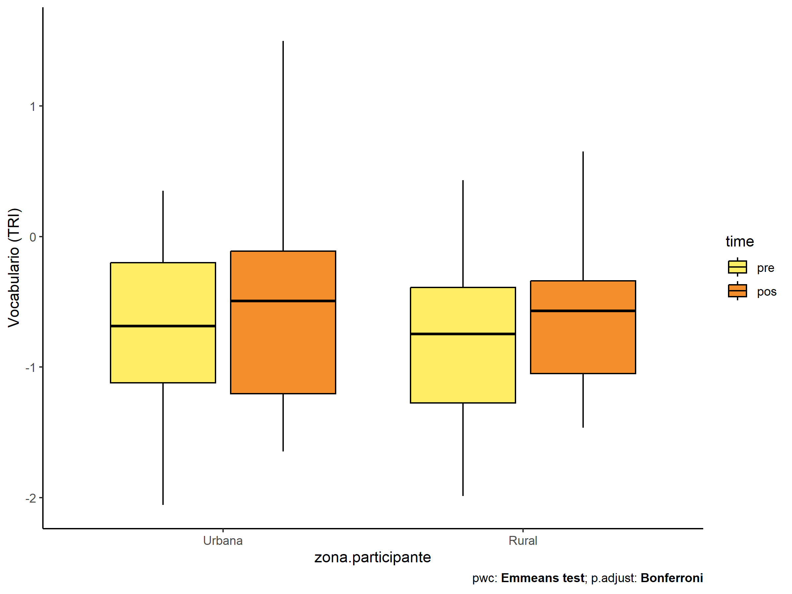<!-- -->

    ## Scale for colour is already present.
    ## Adding another scale for colour, which will replace the existing scale.

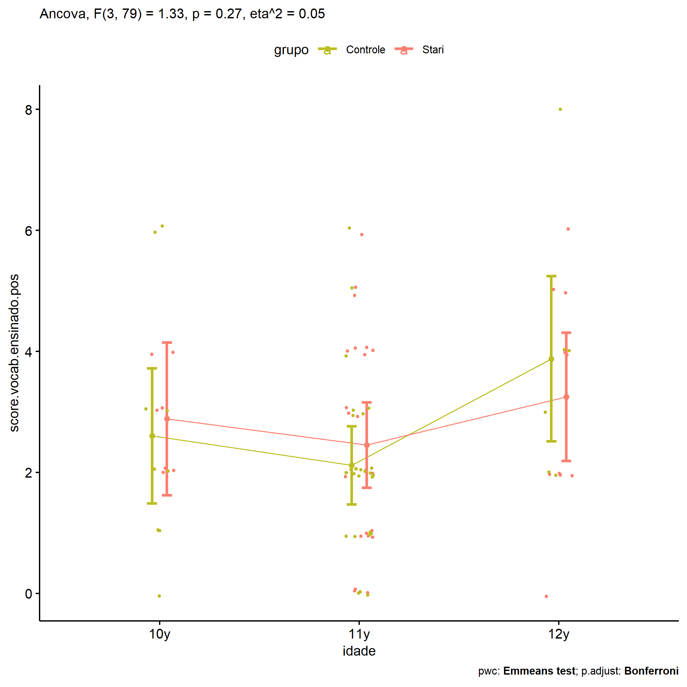<!-- -->

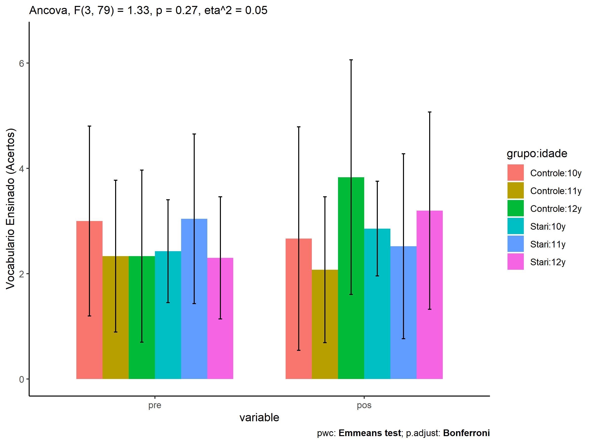<!-- -->

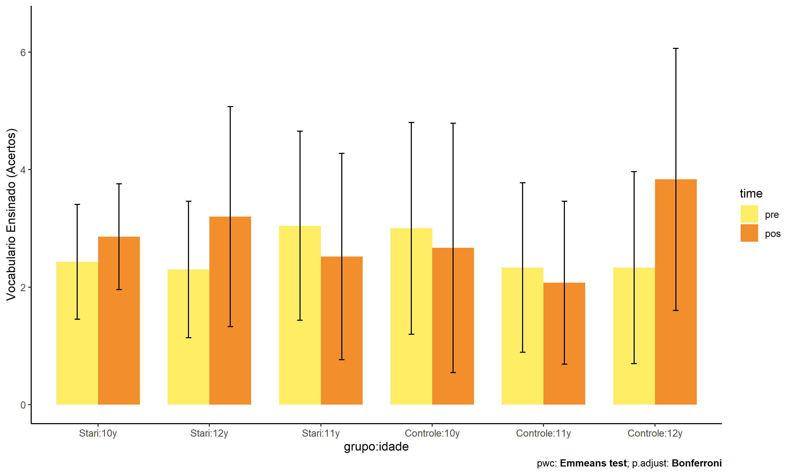<!-- -->

### Vocabulario Nao Ensinado (Acertos)

| var                          | idade | grupo    |   n | M (pre) | SE (pre) | M (unadj) | SE (unadj) | M (adj) | SE (adj) |
|:-----------------------------|:------|:---------|----:|--------:|---------:|----------:|-----------:|--------:|---------:|
| score.vocab.nao.ensinado.pos | 10y   | Controle |   9 |  14.333 |    0.816 |    14.111 |      2.017 |  12.277 |    1.565 |
| score.vocab.nao.ensinado.pos | 10y   | Stari    |   7 |   9.857 |    1.164 |    11.000 |      1.309 |  11.198 |    1.675 |
| score.vocab.nao.ensinado.pos | 11y   | Controle |  27 |   9.889 |    0.898 |    11.963 |      0.905 |  12.146 |    0.854 |
| score.vocab.nao.ensinado.pos | 11y   | Stari    |  23 |   9.522 |    0.831 |    11.609 |      0.992 |  11.959 |    0.929 |
| score.vocab.nao.ensinado.pos | 12y   | Controle |   6 |   7.500 |    1.727 |    11.667 |      1.476 |  12.935 |    1.843 |
| score.vocab.nao.ensinado.pos | 12y   | Stari    |  10 |  11.500 |    0.957 |    10.900 |      1.545 |  10.352 |    1.409 |

| .y.                          | grupo    | idade | group1   | group2 | estimate | conf.low | conf.high |    se | statistic |     p | p.adj | p.adj.signif |
|:-----------------------------|:---------|:------|:---------|:-------|---------:|---------:|----------:|------:|----------:|------:|------:|:-------------|
| score.vocab.nao.ensinado.pos | Controle |       | 10y      | 11y    |    0.130 |   -3.451 |     3.712 | 1.798 |     0.073 | 0.942 | 1.000 | ns           |
| score.vocab.nao.ensinado.pos | Controle |       | 10y      | 12y    |   -0.658 |   -5.626 |     4.310 | 2.494 |    -0.264 | 0.793 | 1.000 | ns           |
| score.vocab.nao.ensinado.pos | Controle |       | 11y      | 12y    |   -0.788 |   -4.817 |     3.241 | 2.023 |    -0.390 | 0.698 | 1.000 | ns           |
| score.vocab.nao.ensinado.pos | Stari    |       | 10y      | 11y    |   -0.761 |   -4.571 |     3.049 | 1.913 |    -0.398 | 0.692 | 1.000 | ns           |
| score.vocab.nao.ensinado.pos | Stari    |       | 10y      | 12y    |    0.846 |   -3.523 |     5.215 | 2.193 |     0.386 | 0.701 | 1.000 | ns           |
| score.vocab.nao.ensinado.pos | Stari    |       | 11y      | 12y    |    1.607 |   -1.774 |     4.987 | 1.697 |     0.947 | 0.347 | 1.000 | ns           |
| score.vocab.nao.ensinado.pre | Controle |       | 10y      | 11y    |    4.444 |    1.407 |     7.482 | 1.525 |     2.914 | 0.005 | 0.014 | \*           |
| score.vocab.nao.ensinado.pre | Controle |       | 10y      | 12y    |    6.833 |    2.674 |    10.993 | 2.088 |     3.272 | 0.002 | 0.005 | \*\*         |
| score.vocab.nao.ensinado.pre | Controle |       | 11y      | 12y    |    2.389 |   -1.173 |     5.951 | 1.788 |     1.336 | 0.186 | 0.557 | ns           |
| score.vocab.nao.ensinado.pre | Stari    |       | 10y      | 11y    |    0.335 |   -3.071 |     3.742 | 1.710 |     0.196 | 0.845 | 1.000 | ns           |
| score.vocab.nao.ensinado.pre | Stari    |       | 10y      | 12y    |   -1.643 |   -5.532 |     2.246 | 1.953 |    -0.841 | 0.403 | 1.000 | ns           |
| score.vocab.nao.ensinado.pre | Stari    |       | 11y      | 12y    |   -1.978 |   -4.968 |     1.011 | 1.501 |    -1.318 | 0.191 | 0.574 | ns           |
| score.vocab.nao.ensinado.pos |          | 10y   | Controle | Stari  |    1.079 |   -3.513 |     5.671 | 2.305 |     0.468 | 0.641 | 0.641 | ns           |
| score.vocab.nao.ensinado.pos |          | 11y   | Controle | Stari  |    0.188 |   -2.318 |     2.693 | 1.258 |     0.149 | 0.882 | 0.882 | ns           |
| score.vocab.nao.ensinado.pos |          | 12y   | Controle | Stari  |    2.583 |   -2.087 |     7.253 | 2.344 |     1.102 | 0.274 | 0.274 | ns           |
| score.vocab.nao.ensinado.pre |          | 10y   | Controle | Stari  |    4.476 |    0.499 |     8.453 | 1.997 |     2.242 | 0.028 | 0.028 | \*           |
| score.vocab.nao.ensinado.pre |          | 11y   | Controle | Stari  |    0.367 |   -1.872 |     2.606 | 1.124 |     0.327 | 0.745 | 0.745 | ns           |
| score.vocab.nao.ensinado.pre |          | 12y   | Controle | Stari  |   -4.000 |   -8.075 |     0.075 | 2.046 |    -1.955 | 0.054 | 0.054 | ns           |

| grupo    | idade | group1 | group2 | estimate | conf.low | conf.high |    se | statistic |     p | p.adj | p.adj.signif |
|:---------|:------|:-------|:-------|---------:|---------:|----------:|------:|----------:|------:|------:|:-------------|
| Controle | 10y   | pre    | pos    |    0.222 |   -3.853 |     4.298 | 2.063 |     0.108 | 0.914 | 0.914 | ns           |
| Controle | 11y   | pre    | pos    |   -2.074 |   -4.427 |     0.279 | 1.191 |    -1.741 | 0.084 | 0.084 | ns           |
| Controle | 12y   | pre    | pos    |   -4.167 |   -9.158 |     0.825 | 2.527 |    -1.649 | 0.101 | 0.101 | ns           |
| Stari    | 10y   | pre    | pos    |   -1.143 |   -5.764 |     3.479 | 2.339 |    -0.489 | 0.626 | 0.626 | ns           |
| Stari    | 11y   | pre    | pos    |   -2.087 |   -4.636 |     0.463 | 1.290 |    -1.617 | 0.108 | 0.108 | ns           |
| Stari    | 12y   | pre    | pos    |    0.600 |   -3.267 |     4.467 | 1.957 |     0.307 | 0.760 | 0.760 | ns           |

    ## Scale for colour is already present.
    ## Adding another scale for colour, which will replace the existing scale.

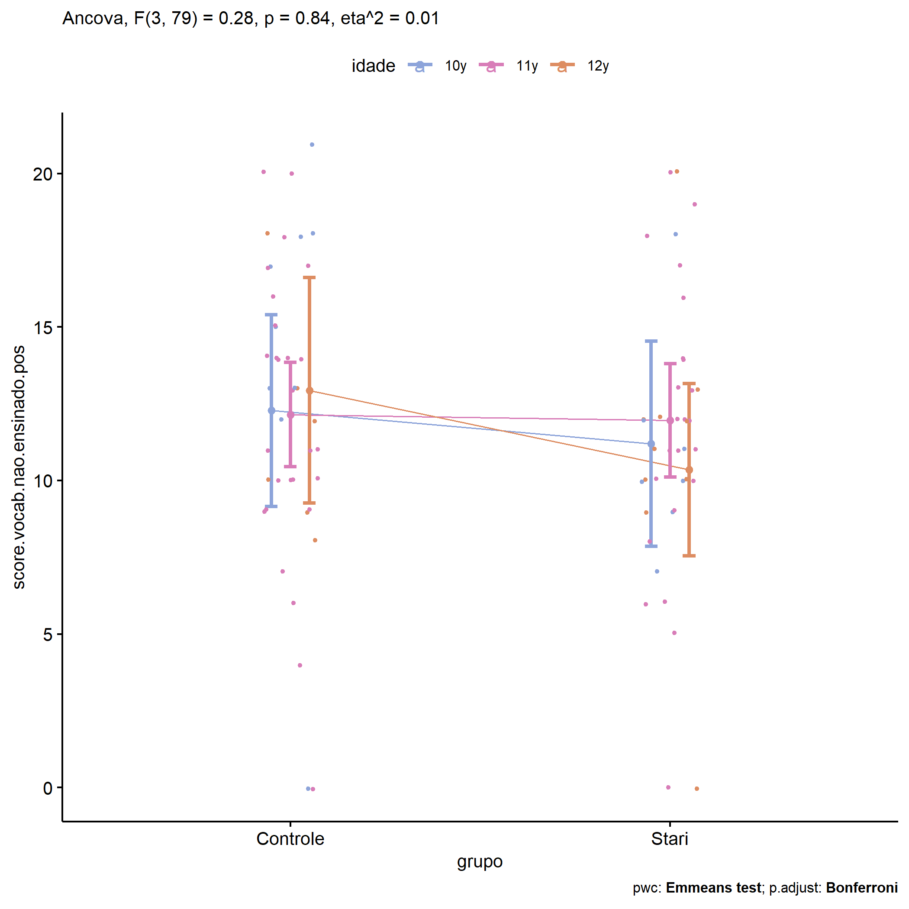<!-- -->

    ## Scale for colour is already present.
    ## Adding another scale for colour, which will replace the existing scale.

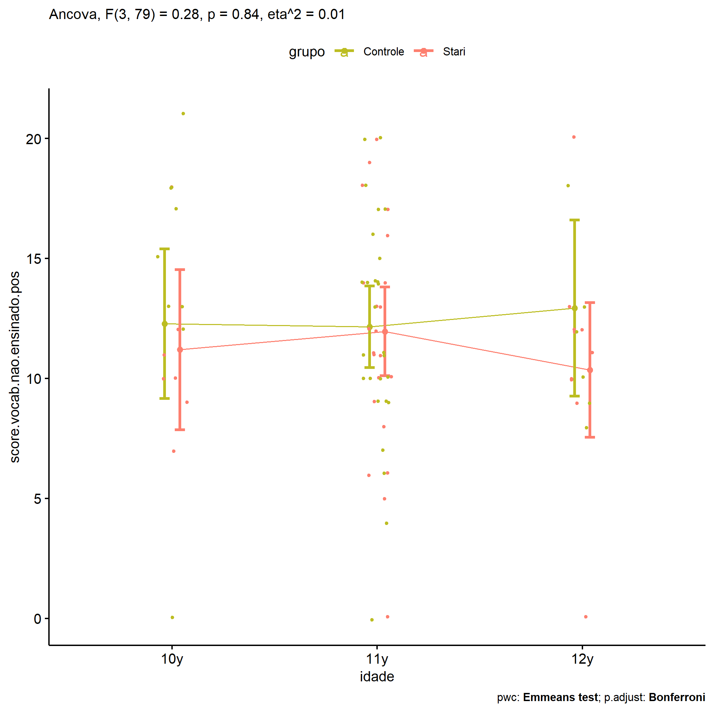<!-- -->

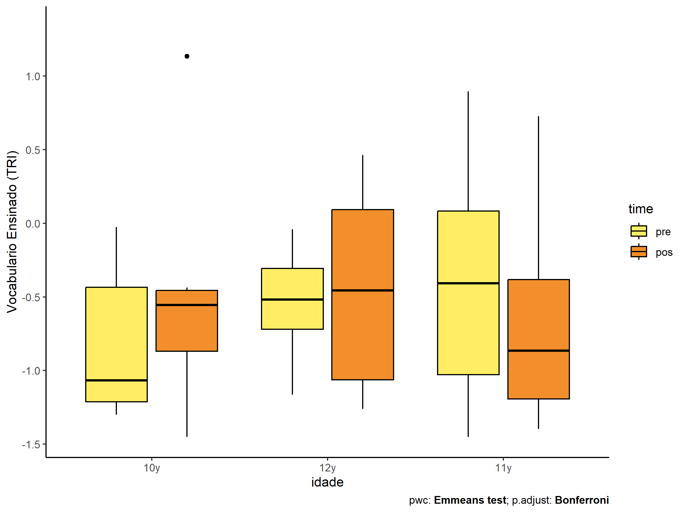<!-- -->

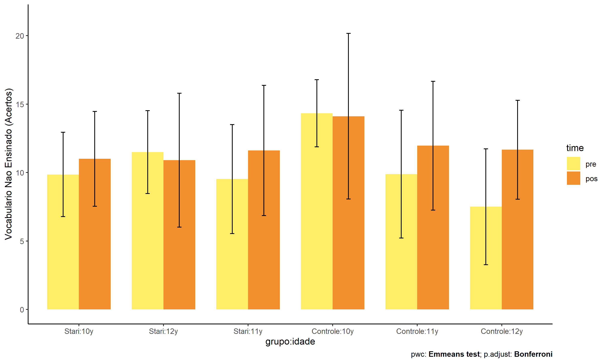<!-- -->

## factores: **zona.participante:grupo**

### Vocabulario (Acertos)

| var             | zona.participante | grupo    |   n | M (pre) | SE (pre) | M (unadj) | SE (unadj) | M (adj) | SE (adj) |
|:----------------|:------------------|:---------|----:|--------:|---------:|----------:|-----------:|--------:|---------:|
| score.vocab.pos | Rural             | Controle |  11 |  10.727 |    1.045 |    15.364 |      1.466 |  16.968 |    1.467 |
| score.vocab.pos | Rural             | Stari    |  15 |  13.733 |    1.040 |    14.933 |      1.136 |  14.828 |    1.201 |
| score.vocab.pos | Urbana            | Controle |  22 |  15.545 |    0.995 |    16.273 |      1.181 |  15.137 |    1.037 |
| score.vocab.pos | Urbana            | Stari    |  14 |  12.429 |    0.789 |    14.929 |      1.439 |  15.565 |    1.254 |

| .y.             | grupo    | zona.participante | group1   | group2 | estimate | conf.low | conf.high |    se | statistic |     p | p.adj | p.adj.signif |
|:----------------|:---------|:------------------|:---------|:-------|---------:|---------:|----------:|------:|----------:|------:|------:|:-------------|
| score.vocab.pos | Controle |                   | Urbana   | Rural  |   -1.831 |   -5.574 |     1.912 | 1.869 |    -0.979 | 0.332 | 0.332 | ns           |
| score.vocab.pos | Stari    |                   | Urbana   | Rural  |    0.737 |   -2.746 |     4.220 | 1.739 |     0.424 | 0.673 | 0.673 | ns           |
| score.vocab.pre | Controle |                   | Urbana   | Rural  |    4.818 |    1.877 |     7.759 | 1.469 |     3.280 | 0.002 | 0.002 | \*\*         |
| score.vocab.pre | Stari    |                   | Urbana   | Rural  |   -1.305 |   -4.264 |     1.655 | 1.478 |    -0.883 | 0.381 | 0.381 | ns           |
| score.vocab.pos |          | Urbana            | Controle | Stari  |   -0.428 |   -3.752 |     2.896 | 1.660 |    -0.258 | 0.797 | 0.797 | ns           |
| score.vocab.pos |          | Rural             | Controle | Stari  |    2.140 |   -1.670 |     5.949 | 1.902 |     1.125 | 0.265 | 0.265 | ns           |
| score.vocab.pre |          | Urbana            | Controle | Stari  |    3.117 |    0.394 |     5.839 | 1.360 |     2.292 | 0.026 | 0.026 | \*           |
| score.vocab.pre |          | Rural             | Controle | Stari  |   -3.006 |   -6.167 |     0.155 | 1.579 |    -1.903 | 0.062 | 0.062 | ns           |

| grupo    | zona.participante | group1 | group2 | estimate | conf.low | conf.high |    se | statistic |     p | p.adj | p.adj.signif |
|:---------|:------------------|:-------|:-------|---------:|---------:|----------:|------:|----------:|------:|------:|:-------------|
| Controle | Urbana            | pre    | pos    |   -0.835 |   -3.517 |     1.846 | 1.355 |    -0.617 | 0.539 | 0.539 | ns           |
| Controle | Rural             | pre    | pos    |   -4.189 |   -8.025 |    -0.354 | 1.938 |    -2.162 | 0.033 | 0.033 | \*           |
| Stari    | Urbana            | pre    | pos    |   -2.733 |   -6.089 |     0.622 | 1.695 |    -1.613 | 0.109 | 0.109 | ns           |
| Stari    | Rural             | pre    | pos    |   -1.200 |   -4.555 |     2.155 | 1.695 |    -0.708 | 0.480 | 0.480 | ns           |

    ## Scale for colour is already present.
    ## Adding another scale for colour, which will replace the existing scale.

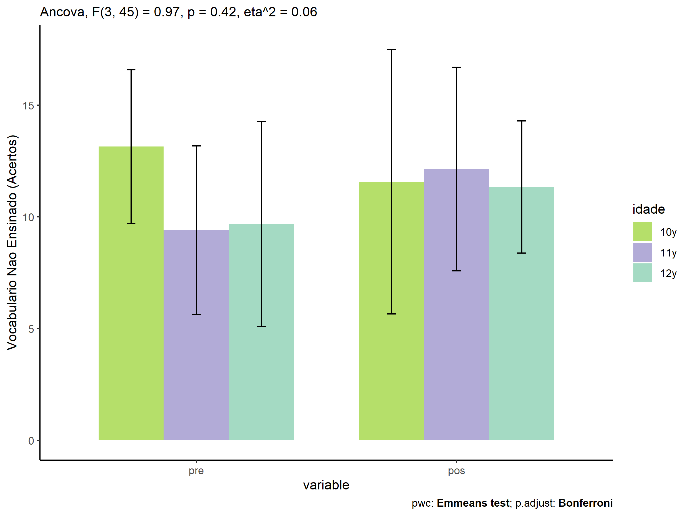<!-- -->

    ## Scale for colour is already present.
    ## Adding another scale for colour, which will replace the existing scale.

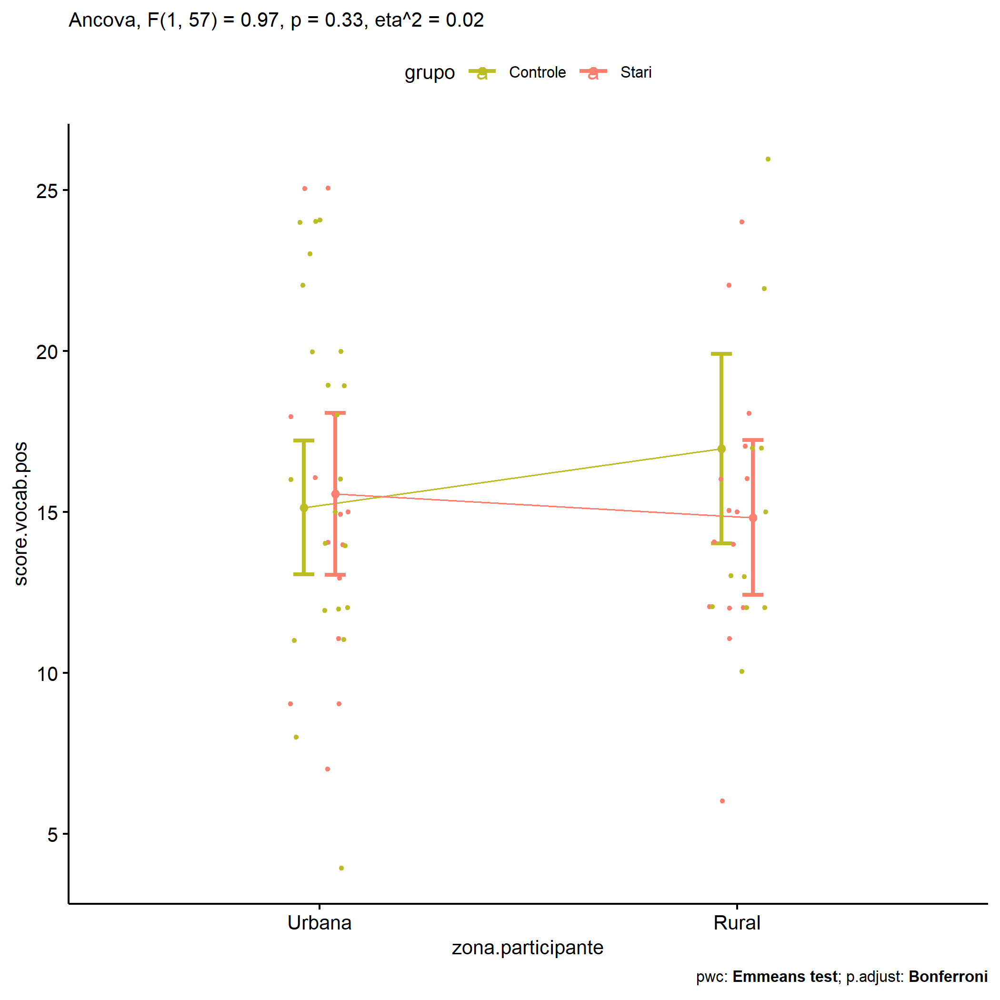<!-- -->

<!-- -->

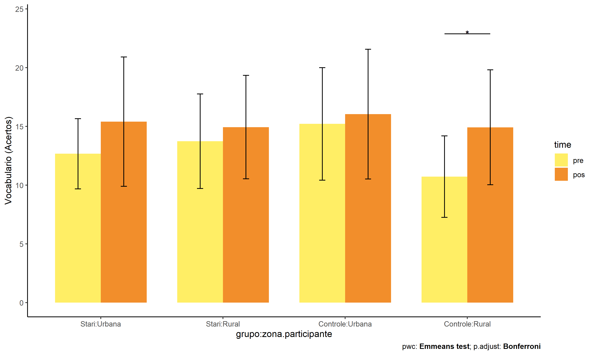<!-- -->

### Vocabulario Ensinado (Acertos)

| var                      | zona.participante | grupo    |   n | M (pre) | SE (pre) | M (unadj) | SE (unadj) | M (adj) | SE (adj) |
|:-------------------------|:------------------|:---------|----:|--------:|---------:|----------:|-----------:|--------:|---------:|
| score.vocab.ensinado.pos | Rural             | Controle |  12 |   2.000 |    0.444 |     2.833 |      0.520 |   2.948 |    0.516 |
| score.vocab.ensinado.pos | Rural             | Stari    |  15 |   2.800 |    0.327 |     2.333 |      0.386 |   2.290 |    0.456 |
| score.vocab.ensinado.pos | Urbana            | Controle |  26 |   2.500 |    0.320 |     2.192 |      0.368 |   2.208 |    0.346 |
| score.vocab.ensinado.pos | Urbana            | Stari    |  16 |   2.938 |    0.403 |     3.000 |      0.456 |   2.929 |    0.444 |

| .y.                      | grupo    | zona.participante | group1   | group2 | estimate | conf.low | conf.high |    se | statistic |     p | p.adj | p.adj.signif |
|:-------------------------|:---------|:------------------|:---------|:-------|---------:|---------:|----------:|------:|----------:|------:|------:|:-------------|
| score.vocab.ensinado.pos | Controle |                   | Urbana   | Rural  |   -0.740 |   -1.978 |     0.497 | 0.619 |    -1.195 | 0.237 | 0.237 | ns           |
| score.vocab.ensinado.pos | Stari    |                   | Urbana   | Rural  |    0.639 |   -0.627 |     1.906 | 0.634 |     1.008 | 0.317 | 0.317 | ns           |
| score.vocab.ensinado.pre | Controle |                   | Urbana   | Rural  |    0.500 |   -0.572 |     1.572 | 0.537 |     0.931 | 0.355 | 0.355 | ns           |
| score.vocab.ensinado.pre | Stari    |                   | Urbana   | Rural  |    0.137 |   -0.967 |     1.242 | 0.553 |     0.249 | 0.804 | 0.804 | ns           |
| score.vocab.ensinado.pos |          | Urbana            | Controle | Stari  |   -0.721 |   -1.847 |     0.405 | 0.564 |    -1.279 | 0.206 | 0.206 | ns           |
| score.vocab.ensinado.pos |          | Rural             | Controle | Stari  |    0.659 |   -0.724 |     2.042 | 0.692 |     0.951 | 0.345 | 0.345 | ns           |
| score.vocab.ensinado.pre |          | Urbana            | Controle | Stari  |   -0.437 |   -1.414 |     0.539 | 0.489 |    -0.895 | 0.374 | 0.374 | ns           |
| score.vocab.ensinado.pre |          | Rural             | Controle | Stari  |   -0.800 |   -1.990 |     0.390 | 0.596 |    -1.343 | 0.184 | 0.184 | ns           |

| grupo    | zona.participante | group1 | group2 | estimate | conf.low | conf.high |    se | statistic |     p | p.adj | p.adj.signif |
|:---------|:------------------|:-------|:-------|---------:|---------:|----------:|------:|----------:|------:|------:|:-------------|
| Controle | Urbana            | pre    | pos    |    0.308 |   -0.604 |     1.219 | 0.461 |     0.668 | 0.506 | 0.506 | ns           |
| Controle | Rural             | pre    | pos    |   -0.833 |   -2.175 |     0.509 | 0.678 |    -1.229 | 0.221 | 0.221 | ns           |
| Stari    | Urbana            | pre    | pos    |   -0.063 |   -1.225 |     1.100 | 0.587 |    -0.106 | 0.915 | 0.915 | ns           |
| Stari    | Rural             | pre    | pos    |    0.467 |   -0.734 |     1.667 | 0.607 |     0.769 | 0.443 | 0.443 | ns           |

    ## Scale for colour is already present.
    ## Adding another scale for colour, which will replace the existing scale.

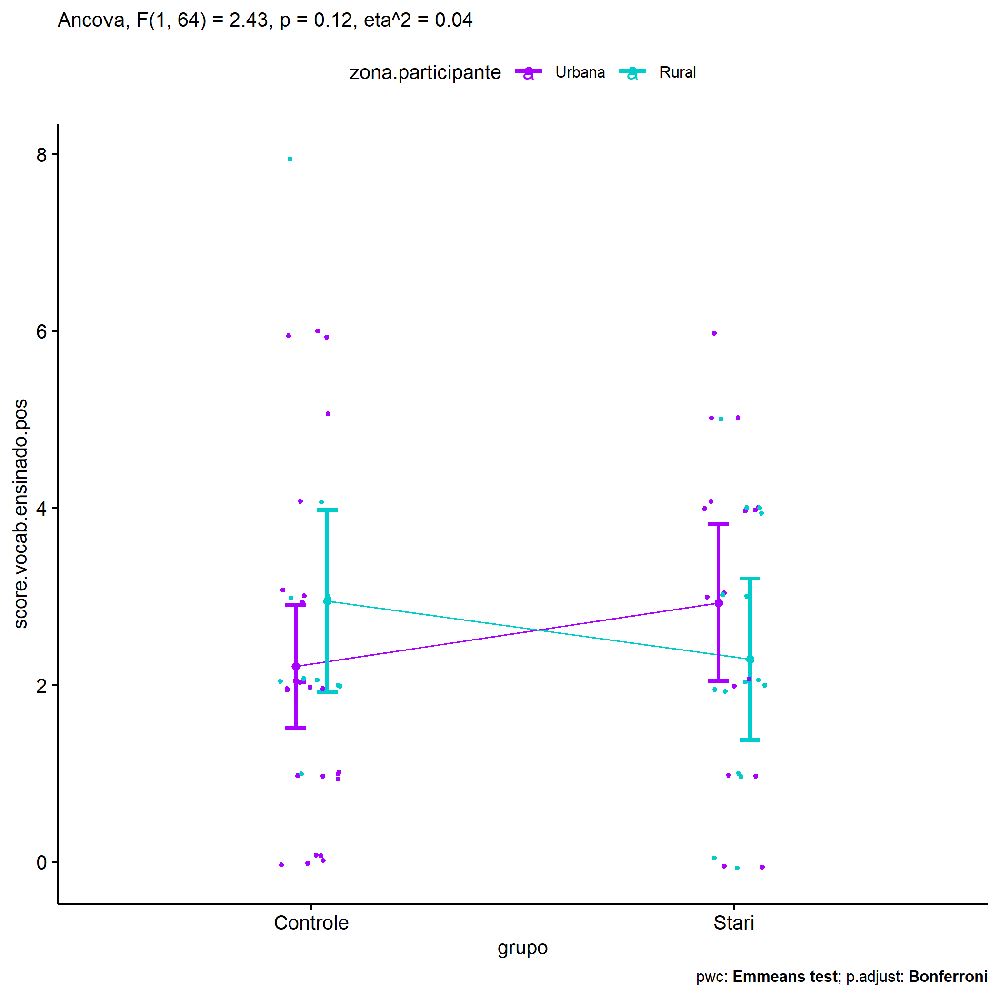<!-- -->

    ## Scale for colour is already present.
    ## Adding another scale for colour, which will replace the existing scale.

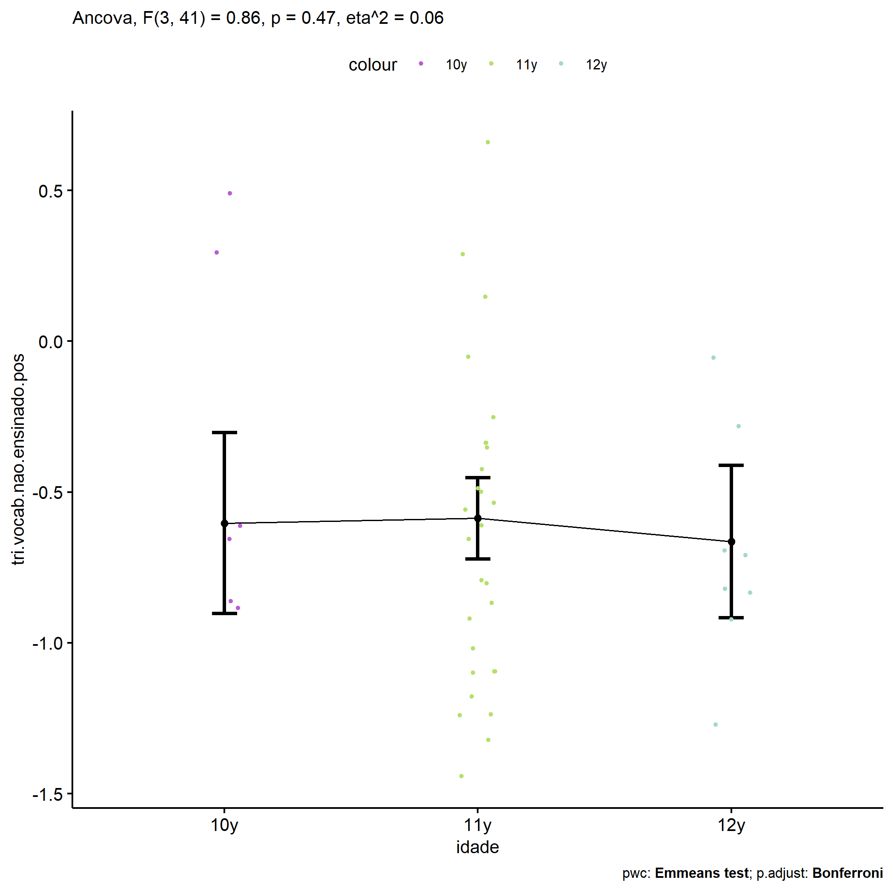<!-- -->

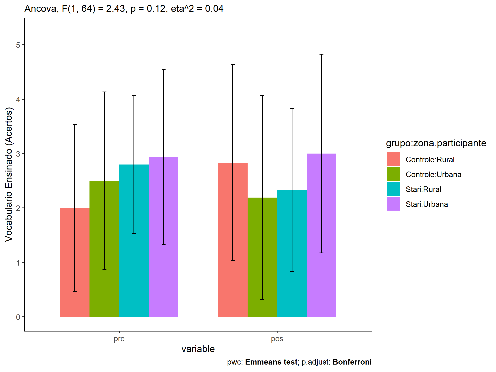<!-- -->

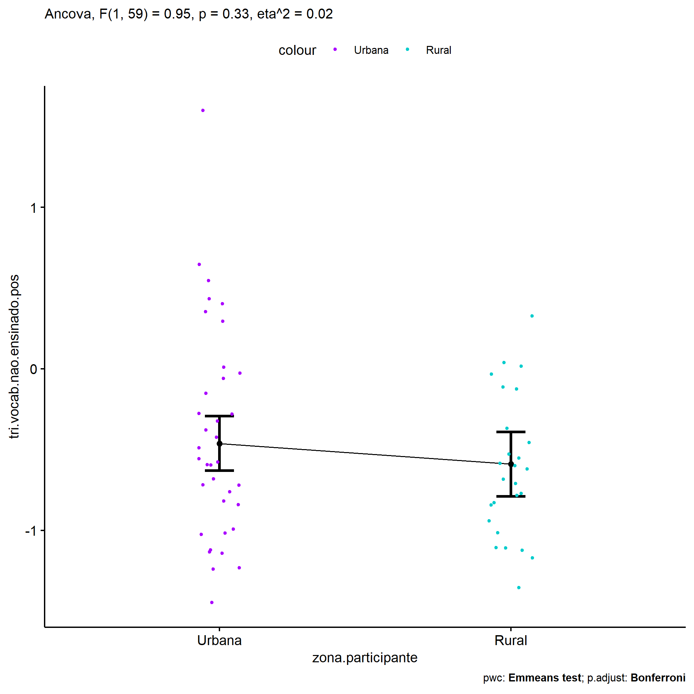<!-- -->

### Vocabulario Nao Ensinado (Acertos)

| var                          | zona.participante | grupo    |   n | M (pre) | SE (pre) | M (unadj) | SE (unadj) | M (adj) | SE (adj) |
|:-----------------------------|:------------------|:---------|----:|--------:|---------:|----------:|-----------:|--------:|---------:|
| score.vocab.nao.ensinado.pos | Rural             | Controle |  12 |   7.833 |    1.014 |    12.083 |      1.111 |  13.317 |    1.360 |
| score.vocab.nao.ensinado.pos | Rural             | Stari    |  15 |  10.933 |    0.881 |    12.600 |      0.975 |  12.189 |    1.188 |
| score.vocab.nao.ensinado.pos | Urbana            | Controle |  26 |  11.538 |    1.000 |    12.000 |      1.199 |  11.268 |    0.918 |
| score.vocab.nao.ensinado.pos | Urbana            | Stari    |  16 |   8.938 |    0.929 |    11.438 |      1.248 |  12.086 |    1.158 |

| .y.                          | grupo    | zona.participante | group1   | group2 | estimate | conf.low | conf.high |    se | statistic |     p | p.adj | p.adj.signif |
|:-----------------------------|:---------|:------------------|:---------|:-------|---------:|---------:|----------:|------:|----------:|------:|------:|:-------------|
| score.vocab.nao.ensinado.pos | Controle |                   | Urbana   | Rural  |   -2.049 |   -5.397 |     1.300 | 1.676 |    -1.222 | 0.226 | 0.226 | ns           |
| score.vocab.nao.ensinado.pos | Stari    |                   | Urbana   | Rural  |   -0.104 |   -3.439 |     3.231 | 1.670 |    -0.062 | 0.951 | 0.951 | ns           |
| score.vocab.nao.ensinado.pre | Controle |                   | Urbana   | Rural  |    3.705 |    0.766 |     6.644 | 1.472 |     2.517 | 0.014 | 0.014 | \*           |
| score.vocab.nao.ensinado.pre | Stari    |                   | Urbana   | Rural  |   -1.996 |   -5.023 |     1.031 | 1.516 |    -1.317 | 0.193 | 0.193 | ns           |
| score.vocab.nao.ensinado.pos |          | Urbana            | Controle | Stari  |   -0.817 |   -3.810 |     2.176 | 1.498 |    -0.545 | 0.587 | 0.587 | ns           |
| score.vocab.nao.ensinado.pos |          | Rural             | Controle | Stari  |    1.128 |   -2.516 |     4.772 | 1.824 |     0.618 | 0.539 | 0.539 | ns           |
| score.vocab.nao.ensinado.pre |          | Urbana            | Controle | Stari  |    2.601 |   -0.075 |     5.277 | 1.340 |     1.941 | 0.057 | 0.057 | ns           |
| score.vocab.nao.ensinado.pre |          | Rural             | Controle | Stari  |   -3.100 |   -6.362 |     0.162 | 1.633 |    -1.898 | 0.062 | 0.062 | ns           |

| grupo    | zona.participante | group1 | group2 | estimate | conf.low | conf.high |    se | statistic |     p | p.adj | p.adj.signif |
|:---------|:------------------|:-------|:-------|---------:|---------:|----------:|------:|----------:|------:|------:|:-------------|
| Controle | Urbana            | pre    | pos    |   -0.462 |   -3.020 |     2.097 | 1.293 |    -0.357 | 0.722 | 0.722 | ns           |
| Controle | Rural             | pre    | pos    |   -4.250 |   -8.016 |    -0.484 | 1.904 |    -2.233 | 0.027 | 0.027 | \*           |
| Stari    | Urbana            | pre    | pos    |   -2.500 |   -5.761 |     0.761 | 1.649 |    -1.516 | 0.132 | 0.132 | ns           |
| Stari    | Rural             | pre    | pos    |   -1.667 |   -5.035 |     1.702 | 1.703 |    -0.979 | 0.329 | 0.329 | ns           |

    ## Scale for colour is already present.
    ## Adding another scale for colour, which will replace the existing scale.

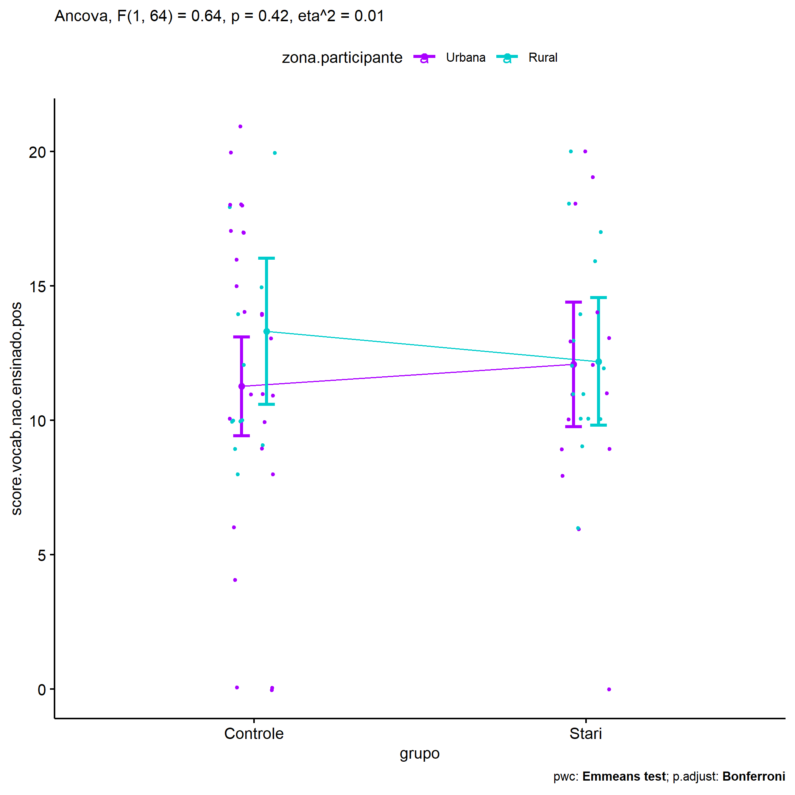<!-- -->

    ## Scale for colour is already present.
    ## Adding another scale for colour, which will replace the existing scale.

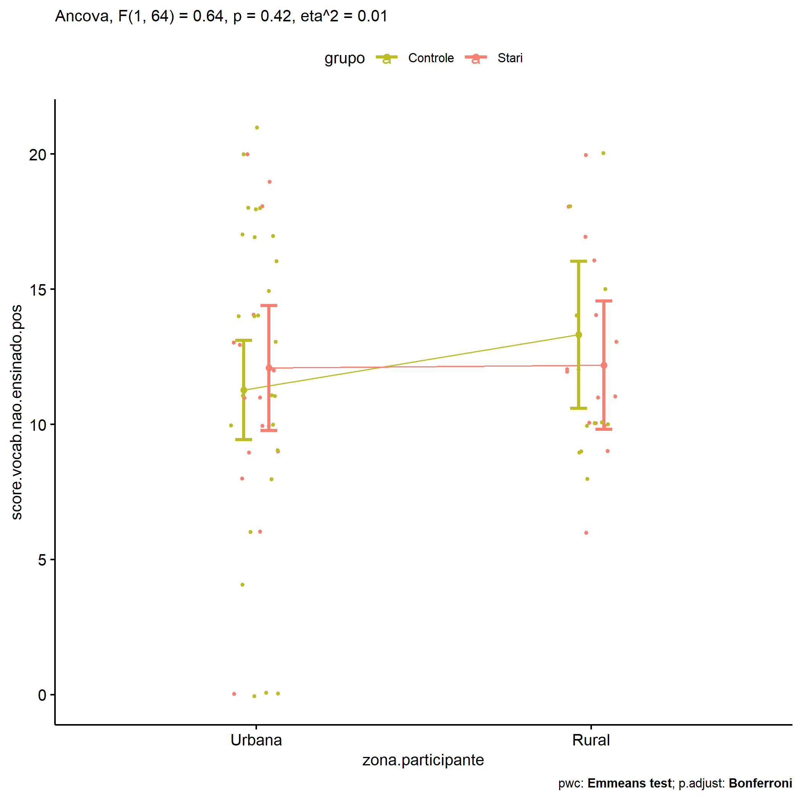<!-- -->

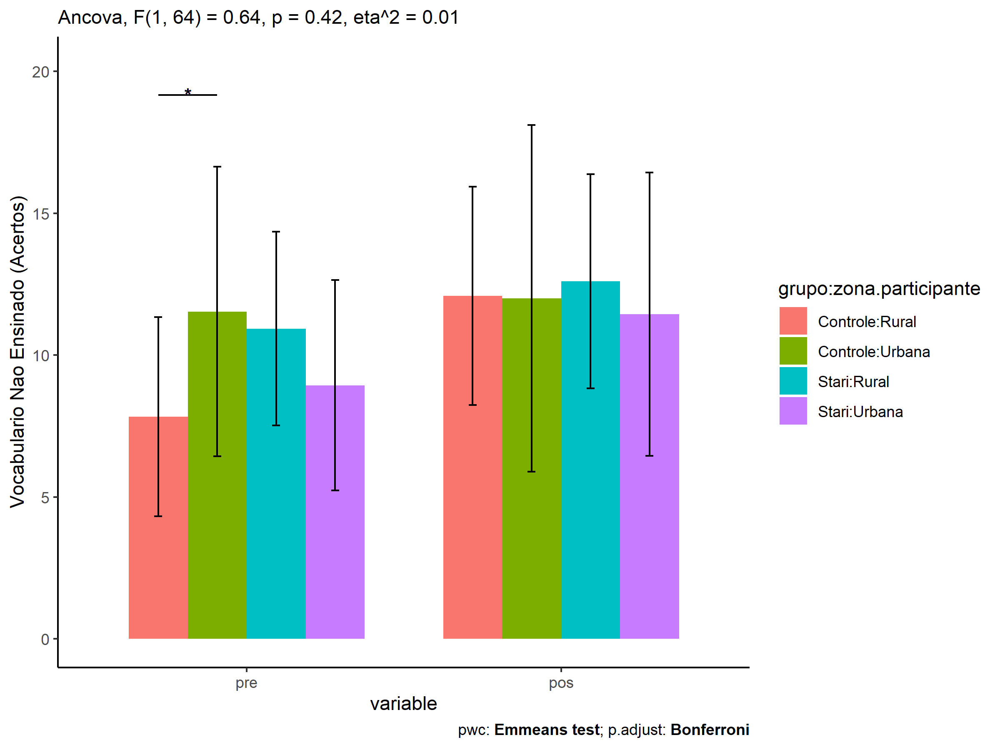<!-- -->

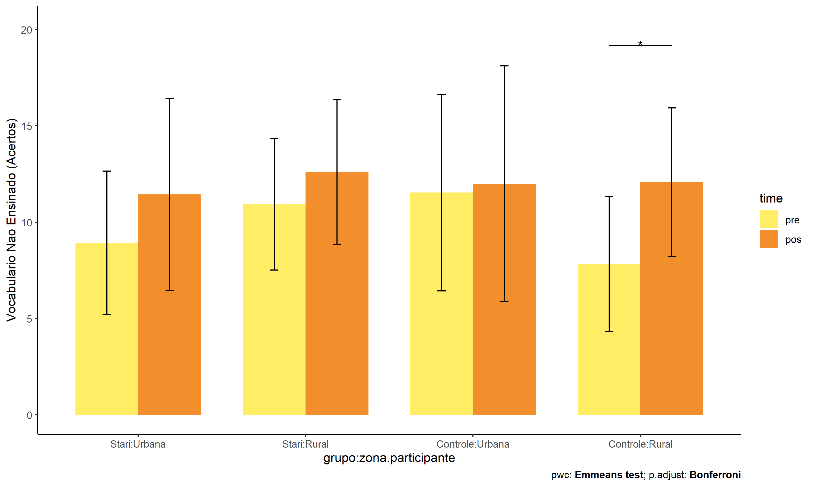<!-- -->

## factores: **escola:grupo**

### Vocabulario (Acertos)

| var             | escola | grupo    |   n | M (pre) | SE (pre) | M (unadj) | SE (unadj) | M (adj) | SE (adj) |
|:----------------|:-------|:---------|----:|--------:|---------:|----------:|-----------:|--------:|---------:|
| score.vocab.pos | E1     | Controle |   6 |  18.500 |    2.029 |    18.667 |      2.459 |  16.320 |    1.864 |
| score.vocab.pos | E1     | Stari    |   5 |  12.800 |    1.934 |    19.600 |      2.272 |  19.890 |    1.900 |
| score.vocab.pos | E2     | Controle |  10 |  13.100 |    1.100 |    15.300 |      0.844 |  15.451 |    1.343 |
| score.vocab.pos | E2     | Stari    |   9 |  12.778 |    1.372 |    13.000 |      1.269 |  13.300 |    1.417 |
| score.vocab.pos | E3     | Controle |   6 |  11.000 |    1.571 |    15.833 |      2.330 |  16.956 |    1.763 |
| score.vocab.pos | E3     | Stari    |   6 |  13.000 |    0.856 |    14.333 |      2.390 |  14.531 |    1.733 |
| score.vocab.pos | E5     | Controle |  15 |  13.000 |    1.073 |    14.000 |      1.342 |  14.197 |    1.097 |
| score.vocab.pos | E5     | Stari    |  13 |  13.846 |    1.055 |    14.077 |      0.937 |  13.883 |    1.178 |
| score.vocab.pos | E6     | Stari    |   5 |  13.400 |    1.166 |    13.200 |      1.828 |  13.212 |    1.898 |

|     | .y.             | grupo    | escola | group1   | group2 | estimate | conf.low | conf.high |    se | statistic |     p | p.adj | p.adj.signif |
|:----|:----------------|:---------|:-------|:---------|:-------|---------:|---------:|----------:|------:|----------:|------:|------:|:-------------|
| 1   | score.vocab.pos | Controle |        | E1       | E2     |    0.869 |   -3.745 |     5.483 | 2.310 |     0.376 | 0.708 | 1.000 | ns           |
| 2   | score.vocab.pos | Controle |        | E1       | E3     |   -0.636 |   -5.933 |     4.661 | 2.652 |    -0.240 | 0.811 | 1.000 | ns           |
| 3   | score.vocab.pos | Controle |        | E1       | E5     |    2.123 |   -2.233 |     6.478 | 2.181 |     0.973 | 0.334 | 1.000 | ns           |
| 5   | score.vocab.pos | Controle |        | E2       | E3     |   -1.505 |   -5.918 |     2.908 | 2.210 |    -0.681 | 0.498 | 1.000 | ns           |
| 6   | score.vocab.pos | Controle |        | E2       | E5     |    1.254 |   -2.206 |     4.714 | 1.732 |     0.724 | 0.472 | 1.000 | ns           |
| 8   | score.vocab.pos | Controle |        | E3       | E5     |    2.758 |   -1.371 |     6.888 | 2.068 |     1.334 | 0.187 | 1.000 | ns           |
| 11  | score.vocab.pos | Stari    |        | E1       | E2     |    6.590 |    1.863 |    11.317 | 2.367 |     2.784 | 0.007 | 0.070 | ns           |
| 12  | score.vocab.pos | Stari    |        | E1       | E3     |    5.359 |    0.227 |    10.491 | 2.570 |     2.085 | 0.041 | 0.410 | ns           |
| 13  | score.vocab.pos | Stari    |        | E1       | E5     |    6.007 |    1.538 |    10.476 | 2.238 |     2.685 | 0.009 | 0.092 | ns           |
| 14  | score.vocab.pos | Stari    |        | E1       | E6     |    6.678 |    1.315 |    12.040 | 2.685 |     2.487 | 0.015 | 0.155 | ns           |
| 15  | score.vocab.pos | Stari    |        | E2       | E3     |   -1.231 |   -5.698 |     3.237 | 2.237 |    -0.550 | 0.584 | 1.000 | ns           |
| 16  | score.vocab.pos | Stari    |        | E2       | E5     |   -0.583 |   -4.269 |     3.104 | 1.846 |    -0.316 | 0.753 | 1.000 | ns           |
| 17  | score.vocab.pos | Stari    |        | E2       | E6     |    0.088 |   -4.642 |     4.818 | 2.368 |     0.037 | 0.971 | 1.000 | ns           |
| 18  | score.vocab.pos | Stari    |        | E3       | E5     |    0.648 |   -3.541 |     4.837 | 2.098 |     0.309 | 0.758 | 1.000 | ns           |
| 19  | score.vocab.pos | Stari    |        | E3       | E6     |    1.318 |   -3.815 |     6.451 | 2.570 |     0.513 | 0.610 | 1.000 | ns           |
| 20  | score.vocab.pos | Stari    |        | E5       | E6     |    0.671 |   -3.791 |     5.132 | 2.234 |     0.300 | 0.765 | 1.000 | ns           |
| 21  | score.vocab.pre | Controle |        | E1       | E2     |    5.400 |    1.424 |     9.376 | 1.992 |     2.711 | 0.009 | 0.051 | ns           |
| 22  | score.vocab.pre | Controle |        | E1       | E3     |    7.500 |    3.054 |    11.946 | 2.227 |     3.368 | 0.001 | 0.008 | \*\*         |
| 23  | score.vocab.pre | Controle |        | E1       | E5     |    5.500 |    1.781 |     9.219 | 1.863 |     2.952 | 0.004 | 0.026 | \*           |
| 25  | score.vocab.pre | Controle |        | E2       | E3     |    2.100 |   -1.876 |     6.076 | 1.992 |     1.054 | 0.296 | 1.000 | ns           |
| 26  | score.vocab.pre | Controle |        | E2       | E5     |    0.100 |   -3.044 |     3.244 | 1.574 |     0.064 | 0.950 | 1.000 | ns           |
| 28  | score.vocab.pre | Controle |        | E3       | E5     |   -2.000 |   -5.719 |     1.719 | 1.863 |    -1.074 | 0.287 | 1.000 | ns           |
| 31  | score.vocab.pre | Stari    |        | E1       | E2     |    0.022 |   -4.273 |     4.317 | 2.151 |     0.010 | 0.992 | 1.000 | ns           |
| 32  | score.vocab.pre | Stari    |        | E1       | E3     |   -0.200 |   -4.863 |     4.463 | 2.335 |    -0.086 | 0.932 | 1.000 | ns           |
| 33  | score.vocab.pre | Stari    |        | E1       | E5     |   -1.046 |   -5.098 |     3.006 | 2.029 |    -0.515 | 0.608 | 1.000 | ns           |
| 34  | score.vocab.pre | Stari    |        | E1       | E6     |   -0.600 |   -5.470 |     4.270 | 2.439 |    -0.246 | 0.806 | 1.000 | ns           |
| 35  | score.vocab.pre | Stari    |        | E2       | E3     |   -0.222 |   -4.280 |     3.836 | 2.033 |    -0.109 | 0.913 | 1.000 | ns           |
| 36  | score.vocab.pre | Stari    |        | E2       | E5     |   -1.068 |   -4.407 |     2.271 | 1.672 |    -0.639 | 0.525 | 1.000 | ns           |
| 37  | score.vocab.pre | Stari    |        | E2       | E6     |   -0.622 |   -4.917 |     3.673 | 2.151 |    -0.289 | 0.773 | 1.000 | ns           |
| 38  | score.vocab.pre | Stari    |        | E3       | E5     |   -0.846 |   -4.646 |     2.954 | 1.903 |    -0.445 | 0.658 | 1.000 | ns           |
| 39  | score.vocab.pre | Stari    |        | E3       | E6     |   -0.400 |   -5.063 |     4.263 | 2.335 |    -0.171 | 0.865 | 1.000 | ns           |
| 40  | score.vocab.pre | Stari    |        | E5       | E6     |    0.446 |   -3.606 |     4.498 | 2.029 |     0.220 | 0.827 | 1.000 | ns           |
| 41  | score.vocab.pos |          | E1     | Controle | Stari  |   -3.570 |   -8.928 |     1.789 | 2.683 |    -1.331 | 0.188 | 0.188 | ns           |
| 42  | score.vocab.pos |          | E2     | Controle | Stari  |    2.151 |   -1.744 |     6.046 | 1.950 |     1.103 | 0.274 | 0.274 | ns           |
| 43  | score.vocab.pos |          | E3     | Controle | Stari  |    2.425 |   -2.498 |     7.348 | 2.465 |     0.984 | 0.329 | 0.329 | ns           |
| 44  | score.vocab.pos |          | E5     | Controle | Stari  |    0.314 |   -2.905 |     3.534 | 1.612 |     0.195 | 0.846 | 0.846 | ns           |
| 46  | score.vocab.pre |          | E1     | Controle | Stari  |    5.700 |    1.037 |    10.363 | 2.335 |     2.441 | 0.017 | 0.017 | \*           |
| 47  | score.vocab.pre |          | E2     | Controle | Stari  |    0.322 |   -3.216 |     3.860 | 1.772 |     0.182 | 0.856 | 0.856 | ns           |
| 48  | score.vocab.pre |          | E3     | Controle | Stari  |   -2.000 |   -6.446 |     2.446 | 2.227 |    -0.898 | 0.372 | 0.372 | ns           |
| 49  | score.vocab.pre |          | E5     | Controle | Stari  |   -0.846 |   -3.764 |     2.072 | 1.461 |    -0.579 | 0.565 | 0.565 | ns           |

| grupo    | escola | group1 | group2 | estimate | conf.low | conf.high |    se | statistic |     p | p.adj | p.adj.signif |
|:---------|:-------|:-------|:-------|---------:|---------:|----------:|------:|----------:|------:|------:|:-------------|
| Controle | E1     | pre    | pos    |   -1.810 |   -6.612 |     2.993 | 2.429 |    -0.745 | 0.458 | 0.458 | ns           |
| Controle | E2     | pre    | pos    |   -2.200 |   -6.060 |     1.660 | 1.953 |    -1.127 | 0.262 | 0.262 | ns           |
| Controle | E3     | pre    | pos    |   -4.833 |   -9.817 |     0.150 | 2.521 |    -1.917 | 0.057 | 0.057 | ns           |
| Controle | E5     | pre    | pos    |    0.074 |   -2.933 |     3.080 | 1.521 |     0.048 | 0.962 | 0.962 | ns           |
| Stari    | E1     | pre    | pos    |   -6.267 |  -11.493 |    -1.040 | 2.644 |    -2.370 | 0.019 | 0.019 | \*           |
| Stari    | E2     | pre    | pos    |   -0.222 |   -4.291 |     3.847 | 2.058 |    -0.108 | 0.914 | 0.914 | ns           |
| Stari    | E3     | pre    | pos    |   -1.333 |   -6.317 |     3.650 | 2.521 |    -0.529 | 0.598 | 0.598 | ns           |
| Stari    | E5     | pre    | pos    |   -0.797 |   -4.121 |     2.528 | 1.682 |    -0.474 | 0.636 | 0.636 | ns           |
| Stari    | E6     | pre    | pos    |   -0.533 |   -5.760 |     4.693 | 2.644 |    -0.202 | 0.840 | 0.840 | ns           |

    ## Scale for colour is already present.
    ## Adding another scale for colour, which will replace the existing scale.

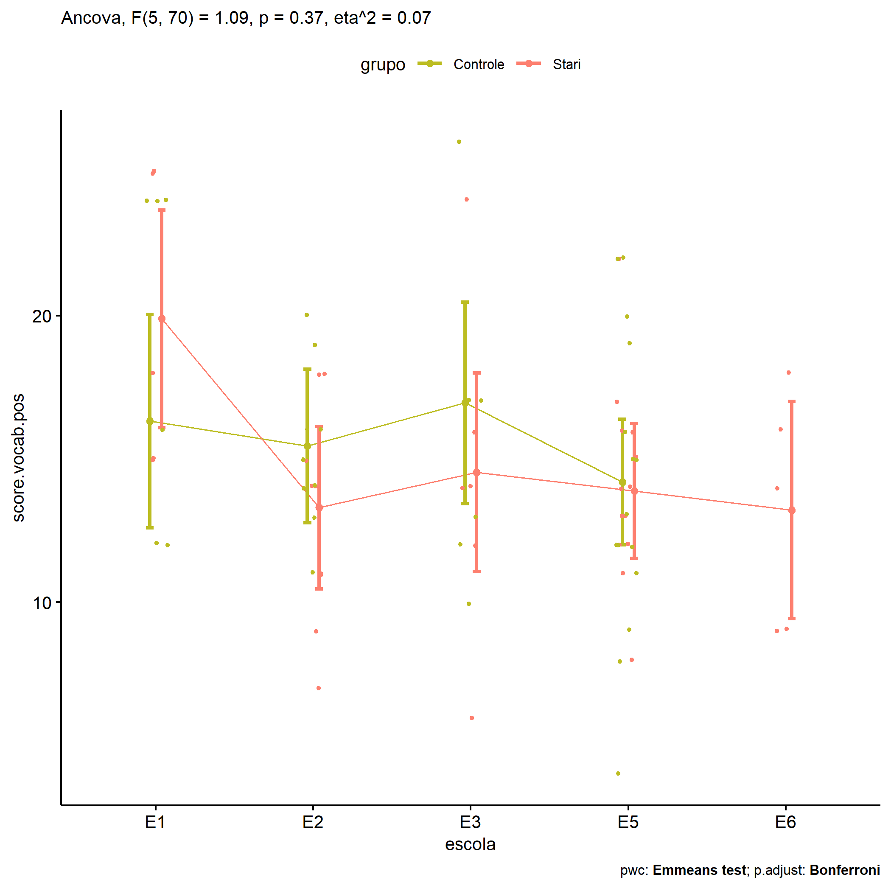<!-- -->

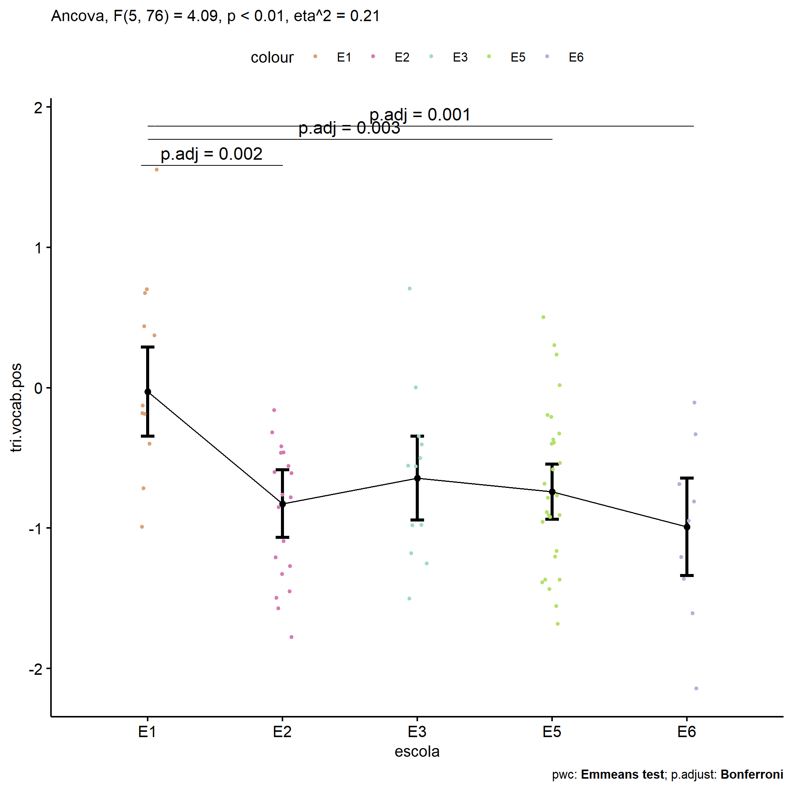<!-- -->

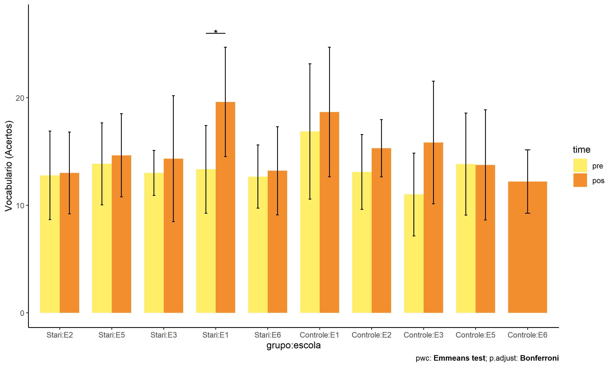<!-- -->

### Vocabulario Ensinado (Acertos)

| var                      | escola | grupo    |   n | M (pre) | SE (pre) | M (unadj) | SE (unadj) | M (adj) | SE (adj) |
|:-------------------------|:-------|:---------|----:|--------:|---------:|----------:|-----------:|--------:|---------:|
| score.vocab.ensinado.pos | E1     | Controle |   8 |   3.125 |    0.766 |     2.250 |      0.881 |   2.210 |    0.614 |
| score.vocab.ensinado.pos | E1     | Stari    |   6 |   3.000 |    0.365 |     3.167 |      1.014 |   3.137 |    0.707 |
| score.vocab.ensinado.pos | E2     | Controle |  10 |   2.500 |    0.342 |     2.700 |      0.517 |   2.711 |    0.547 |
| score.vocab.ensinado.pos | E2     | Stari    |   9 |   2.556 |    0.444 |     2.333 |      0.471 |   2.340 |    0.576 |
| score.vocab.ensinado.pos | E3     | Controle |   6 |   2.500 |    0.500 |     3.167 |      1.014 |   3.178 |    0.706 |
| score.vocab.ensinado.pos | E3     | Stari    |   6 |   2.667 |    0.333 |     2.667 |      0.715 |   2.664 |    0.705 |
| score.vocab.ensinado.pos | E5     | Controle |  18 |   2.222 |    0.339 |     1.778 |      0.236 |   1.812 |    0.411 |
| score.vocab.ensinado.pos | E5     | Stari    |  14 |   2.929 |    0.529 |     2.714 |      0.354 |   2.690 |    0.463 |
| score.vocab.ensinado.pos | E6     | Controle |   5 |   2.000 |    0.894 |     2.400 |      0.400 |   2.453 |    0.777 |
| score.vocab.ensinado.pos | E6     | Stari    |   6 |   3.167 |    0.601 |     2.667 |      0.955 |   2.623 |    0.709 |

| .y.                      | grupo    | escola | group1   | group2 | estimate | conf.low | conf.high |    se | statistic |     p | p.adj | p.adj.signif |
|:-------------------------|:---------|:-------|:---------|:-------|---------:|---------:|----------:|------:|----------:|------:|------:|:-------------|
| score.vocab.ensinado.pos | Controle |        | E1       | E2     |   -0.502 |   -2.141 |     1.138 | 0.823 |    -0.609 | 0.544 | 1.000 | ns           |
| score.vocab.ensinado.pos | Controle |        | E1       | E3     |   -0.968 |   -2.833 |     0.896 | 0.936 |    -1.034 | 0.304 | 1.000 | ns           |
| score.vocab.ensinado.pos | Controle |        | E1       | E5     |    0.397 |   -1.082 |     1.877 | 0.743 |     0.535 | 0.594 | 1.000 | ns           |
| score.vocab.ensinado.pos | Controle |        | E1       | E6     |   -0.243 |   -2.225 |     1.739 | 0.995 |    -0.244 | 0.808 | 1.000 | ns           |
| score.vocab.ensinado.pos | Controle |        | E2       | E3     |   -0.467 |   -2.243 |     1.310 | 0.892 |    -0.523 | 0.602 | 1.000 | ns           |
| score.vocab.ensinado.pos | Controle |        | E2       | E5     |    0.899 |   -0.459 |     2.258 | 0.682 |     1.318 | 0.191 | 1.000 | ns           |
| score.vocab.ensinado.pos | Controle |        | E2       | E6     |    0.259 |   -1.630 |     2.147 | 0.948 |     0.273 | 0.786 | 1.000 | ns           |
| score.vocab.ensinado.pos | Controle |        | E3       | E5     |    1.366 |   -0.257 |     2.989 | 0.815 |     1.676 | 0.098 | 0.979 | ns           |
| score.vocab.ensinado.pos | Controle |        | E3       | E6     |    0.725 |   -1.362 |     2.812 | 1.048 |     0.692 | 0.491 | 1.000 | ns           |
| score.vocab.ensinado.pos | Controle |        | E5       | E6     |   -0.641 |   -2.381 |     1.099 | 0.874 |    -0.733 | 0.466 | 1.000 | ns           |
| score.vocab.ensinado.pos | Stari    |        | E1       | E2     |    0.797 |   -1.020 |     2.613 | 0.912 |     0.873 | 0.385 | 1.000 | ns           |
| score.vocab.ensinado.pos | Stari    |        | E1       | E3     |    0.472 |   -1.516 |     2.460 | 0.998 |     0.473 | 0.637 | 1.000 | ns           |
| score.vocab.ensinado.pos | Stari    |        | E1       | E5     |    0.446 |   -1.232 |     2.125 | 0.843 |     0.530 | 0.598 | 1.000 | ns           |
| score.vocab.ensinado.pos | Stari    |        | E1       | E6     |    0.514 |   -1.473 |     2.500 | 0.998 |     0.515 | 0.608 | 1.000 | ns           |
| score.vocab.ensinado.pos | Stari    |        | E2       | E3     |   -0.324 |   -2.137 |     1.489 | 0.911 |    -0.356 | 0.723 | 1.000 | ns           |
| score.vocab.ensinado.pos | Stari    |        | E2       | E5     |   -0.350 |   -1.823 |     1.123 | 0.740 |    -0.473 | 0.637 | 1.000 | ns           |
| score.vocab.ensinado.pos | Stari    |        | E2       | E6     |   -0.283 |   -2.102 |     1.537 | 0.914 |    -0.309 | 0.758 | 1.000 | ns           |
| score.vocab.ensinado.pos | Stari    |        | E3       | E5     |   -0.026 |   -1.706 |     1.654 | 0.844 |    -0.031 | 0.976 | 1.000 | ns           |
| score.vocab.ensinado.pos | Stari    |        | E3       | E6     |    0.041 |   -1.949 |     2.032 | 0.999 |     0.041 | 0.967 | 1.000 | ns           |
| score.vocab.ensinado.pos | Stari    |        | E5       | E6     |    0.067 |   -1.612 |     1.747 | 0.844 |     0.080 | 0.937 | 1.000 | ns           |
| score.vocab.ensinado.pre | Controle |        | E1       | E2     |    0.625 |   -0.831 |     2.081 | 0.731 |     0.855 | 0.395 | 1.000 | ns           |
| score.vocab.ensinado.pre | Controle |        | E1       | E3     |    0.625 |   -1.032 |     2.282 | 0.832 |     0.751 | 0.455 | 1.000 | ns           |
| score.vocab.ensinado.pre | Controle |        | E1       | E5     |    0.903 |   -0.401 |     2.207 | 0.655 |     1.378 | 0.172 | 1.000 | ns           |
| score.vocab.ensinado.pre | Controle |        | E1       | E6     |    1.125 |   -0.624 |     2.874 | 0.879 |     1.280 | 0.204 | 1.000 | ns           |
| score.vocab.ensinado.pre | Controle |        | E2       | E3     |    0.000 |   -1.585 |     1.585 | 0.796 |     0.000 | 1.000 | 1.000 | ns           |
| score.vocab.ensinado.pre | Controle |        | E2       | E5     |    0.278 |   -0.932 |     1.488 | 0.608 |     0.457 | 0.649 | 1.000 | ns           |
| score.vocab.ensinado.pre | Controle |        | E2       | E6     |    0.500 |   -1.181 |     2.181 | 0.844 |     0.592 | 0.555 | 1.000 | ns           |
| score.vocab.ensinado.pre | Controle |        | E3       | E5     |    0.278 |   -1.169 |     1.724 | 0.727 |     0.382 | 0.703 | 1.000 | ns           |
| score.vocab.ensinado.pre | Controle |        | E3       | E6     |    0.500 |   -1.358 |     2.358 | 0.933 |     0.536 | 0.594 | 1.000 | ns           |
| score.vocab.ensinado.pre | Controle |        | E5       | E6     |    0.222 |   -1.329 |     1.773 | 0.779 |     0.285 | 0.776 | 1.000 | ns           |
| score.vocab.ensinado.pre | Stari    |        | E1       | E2     |    0.444 |   -1.173 |     2.062 | 0.812 |     0.547 | 0.586 | 1.000 | ns           |
| score.vocab.ensinado.pre | Stari    |        | E1       | E3     |    0.333 |   -1.438 |     2.105 | 0.890 |     0.375 | 0.709 | 1.000 | ns           |
| score.vocab.ensinado.pre | Stari    |        | E1       | E5     |    0.071 |   -1.426 |     1.569 | 0.752 |     0.095 | 0.925 | 1.000 | ns           |
| score.vocab.ensinado.pre | Stari    |        | E1       | E6     |   -0.167 |   -1.938 |     1.605 | 0.890 |    -0.187 | 0.852 | 1.000 | ns           |
| score.vocab.ensinado.pre | Stari    |        | E2       | E3     |   -0.111 |   -1.728 |     1.506 | 0.812 |    -0.137 | 0.892 | 1.000 | ns           |
| score.vocab.ensinado.pre | Stari    |        | E2       | E5     |   -0.373 |   -1.684 |     0.938 | 0.659 |    -0.566 | 0.573 | 1.000 | ns           |
| score.vocab.ensinado.pre | Stari    |        | E2       | E6     |   -0.611 |   -2.228 |     1.006 | 0.812 |    -0.752 | 0.454 | 1.000 | ns           |
| score.vocab.ensinado.pre | Stari    |        | E3       | E5     |   -0.262 |   -1.759 |     1.235 | 0.752 |    -0.348 | 0.729 | 1.000 | ns           |
| score.vocab.ensinado.pre | Stari    |        | E3       | E6     |   -0.500 |   -2.272 |     1.272 | 0.890 |    -0.562 | 0.576 | 1.000 | ns           |
| score.vocab.ensinado.pre | Stari    |        | E5       | E6     |   -0.238 |   -1.735 |     1.259 | 0.752 |    -0.317 | 0.752 | 1.000 | ns           |
| score.vocab.ensinado.pos |          | E1     | Controle | Stari  |   -0.927 |   -2.785 |     0.931 | 0.933 |    -0.993 | 0.324 | 0.324 | ns           |
| score.vocab.ensinado.pos |          | E2     | Controle | Stari  |    0.371 |   -1.209 |     1.952 | 0.794 |     0.468 | 0.641 | 0.641 | ns           |
| score.vocab.ensinado.pos |          | E3     | Controle | Stari  |    0.514 |   -1.473 |     2.500 | 0.998 |     0.515 | 0.608 | 0.608 | ns           |
| score.vocab.ensinado.pos |          | E5     | Controle | Stari  |   -0.878 |   -2.117 |     0.361 | 0.622 |    -1.411 | 0.162 | 0.162 | ns           |
| score.vocab.ensinado.pos |          | E6     | Controle | Stari  |   -0.170 |   -2.274 |     1.934 | 1.057 |    -0.161 | 0.873 | 0.873 | ns           |
| score.vocab.ensinado.pre |          | E1     | Controle | Stari  |    0.125 |   -1.532 |     1.782 | 0.832 |     0.150 | 0.881 | 0.881 | ns           |
| score.vocab.ensinado.pre |          | E2     | Controle | Stari  |   -0.056 |   -1.465 |     1.354 | 0.708 |    -0.078 | 0.938 | 0.938 | ns           |
| score.vocab.ensinado.pre |          | E3     | Controle | Stari  |   -0.167 |   -1.938 |     1.605 | 0.890 |    -0.187 | 0.852 | 0.852 | ns           |
| score.vocab.ensinado.pre |          | E5     | Controle | Stari  |   -0.706 |   -1.800 |     0.387 | 0.549 |    -1.286 | 0.202 | 0.202 | ns           |
| score.vocab.ensinado.pre |          | E6     | Controle | Stari  |   -1.167 |   -3.025 |     0.691 | 0.933 |    -1.250 | 0.215 | 0.215 | ns           |

| grupo    | escola | group1 | group2 | estimate | conf.low | conf.high |    se | statistic |     p | p.adj | p.adj.signif |
|:---------|:-------|:-------|:-------|---------:|---------:|----------:|------:|----------:|------:|------:|:-------------|
| Controle | E1     | pre    | pos    |    0.875 |   -0.739 |     2.489 | 0.817 |     1.071 | 0.286 | 0.286 | ns           |
| Controle | E2     | pre    | pos    |   -0.200 |   -1.643 |     1.243 | 0.731 |    -0.274 | 0.785 | 0.785 | ns           |
| Controle | E3     | pre    | pos    |   -0.667 |   -2.530 |     1.197 | 0.943 |    -0.707 | 0.481 | 0.481 | ns           |
| Controle | E5     | pre    | pos    |    0.444 |   -0.631 |     1.520 | 0.545 |     0.816 | 0.416 | 0.416 | ns           |
| Controle | E6     | pre    | pos    |   -0.400 |   -2.441 |     1.641 | 1.033 |    -0.387 | 0.699 | 0.699 | ns           |
| Stari    | E1     | pre    | pos    |   -0.167 |   -2.030 |     1.697 | 0.943 |    -0.177 | 0.860 | 0.860 | ns           |
| Stari    | E2     | pre    | pos    |    0.222 |   -1.299 |     1.744 | 0.770 |     0.289 | 0.773 | 0.773 | ns           |
| Stari    | E3     | pre    | pos    |    0.000 |   -1.863 |     1.863 | 0.943 |     0.000 | 1.000 | 1.000 | ns           |
| Stari    | E5     | pre    | pos    |    0.214 |   -1.005 |     1.434 | 0.618 |     0.347 | 0.729 | 0.729 | ns           |
| Stari    | E6     | pre    | pos    |    0.500 |   -1.363 |     2.363 | 0.943 |     0.530 | 0.597 | 0.597 | ns           |

    ## Scale for colour is already present.
    ## Adding another scale for colour, which will replace the existing scale.

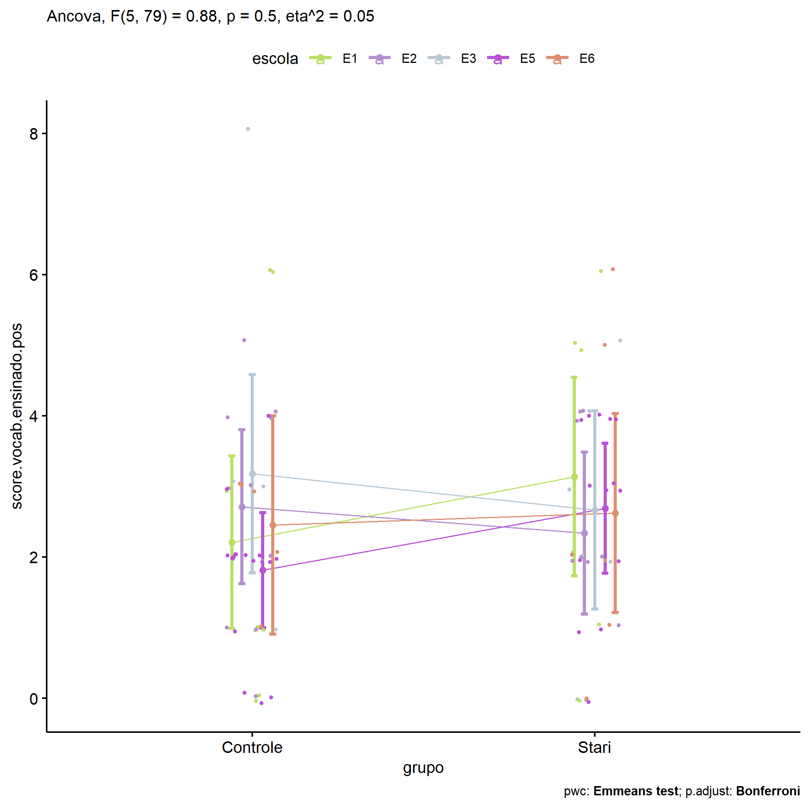<!-- -->

    ## Scale for colour is already present.
    ## Adding another scale for colour, which will replace the existing scale.

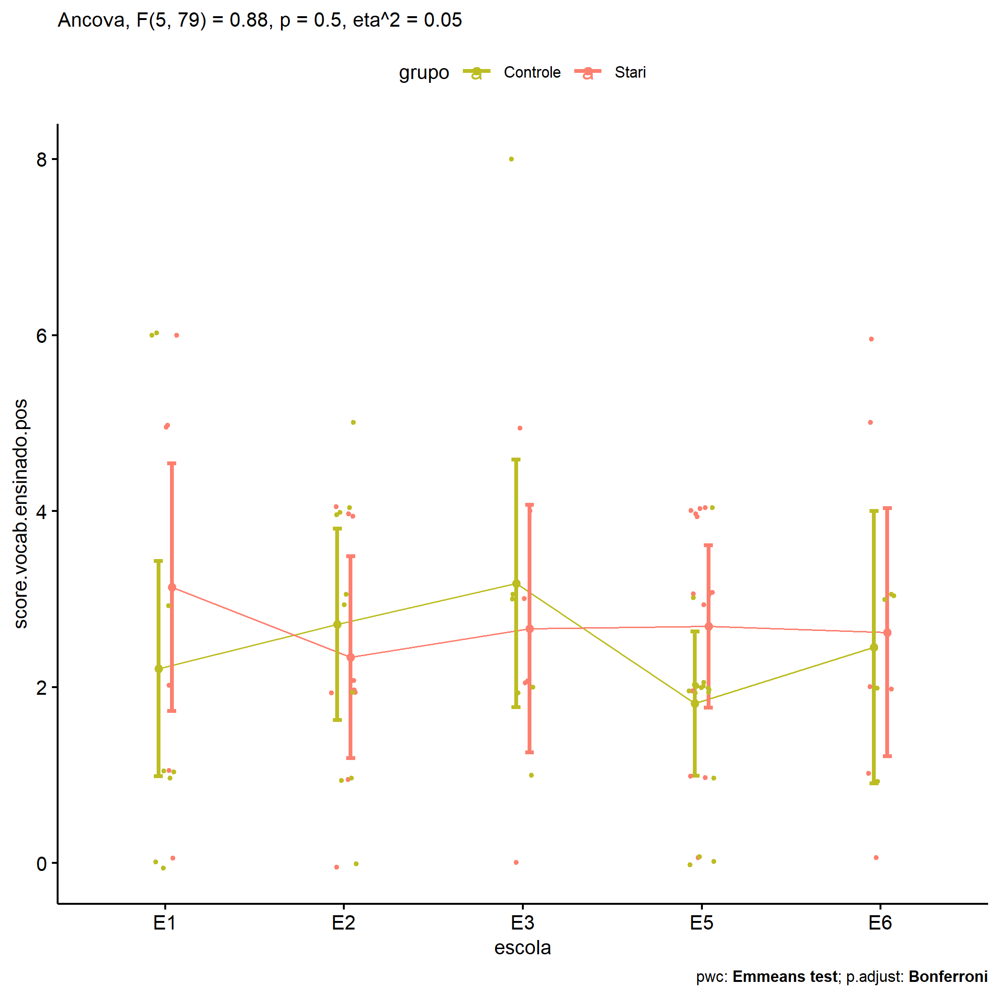<!-- -->

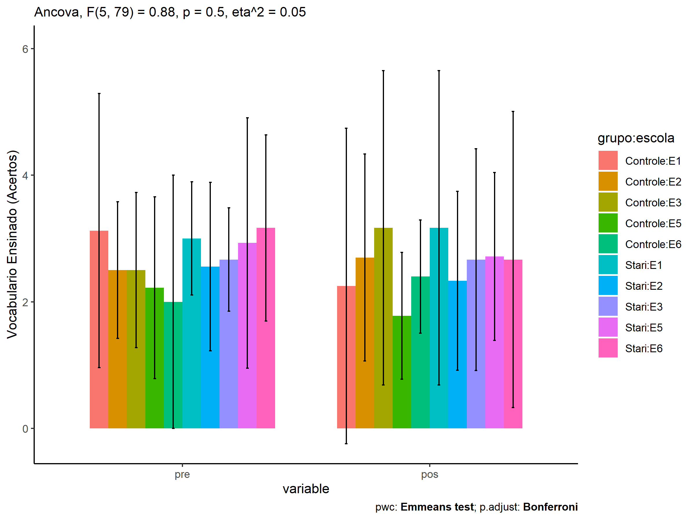<!-- -->

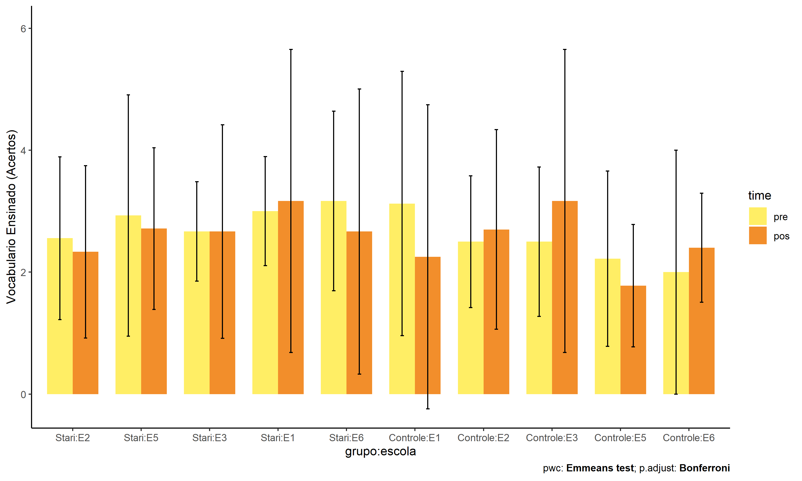<!-- -->

### Vocabulario Nao Ensinado (Acertos)

| var                          | escola | grupo    |   n | M (pre) | SE (pre) | M (unadj) | SE (unadj) | M (adj) | SE (adj) |
|:-----------------------------|:-------|:---------|----:|--------:|---------:|----------:|-----------:|--------:|---------:|
| score.vocab.nao.ensinado.pos | E1     | Controle |   8 |  11.625 |    2.236 |    11.750 |      2.839 |  11.206 |    1.690 |
| score.vocab.nao.ensinado.pos | E1     | Stari    |   6 |  10.333 |    1.563 |    13.167 |      2.915 |  13.088 |    1.940 |
| score.vocab.nao.ensinado.pos | E2     | Controle |  10 |  10.600 |    0.968 |    12.600 |      0.718 |  12.425 |    1.504 |
| score.vocab.nao.ensinado.pos | E2     | Stari    |   9 |  10.222 |    1.222 |    10.667 |      1.000 |  10.628 |    1.584 |
| score.vocab.nao.ensinado.pos | E3     | Controle |   6 |   8.500 |    1.232 |    12.667 |      1.453 |  13.248 |    1.950 |
| score.vocab.nao.ensinado.pos | E3     | Stari    |   6 |  10.333 |    0.882 |    11.667 |      1.874 |  11.588 |    1.940 |
| score.vocab.nao.ensinado.pos | E5     | Controle |  18 |  10.833 |    1.172 |    10.444 |      1.408 |  10.185 |    1.123 |
| score.vocab.nao.ensinado.pos | E5     | Stari    |  14 |   9.929 |    1.174 |    11.929 |      0.975 |  11.995 |    1.270 |
| score.vocab.nao.ensinado.pos | E6     | Controle |   5 |   6.600 |    2.768 |     9.800 |      1.655 |  11.065 |    2.168 |
| score.vocab.nao.ensinado.pos | E6     | Stari    |   6 |   9.500 |    1.408 |     8.333 |      1.874 |   8.554 |    1.941 |

| .y.                          | grupo    | escola | group1   | group2 | estimate | conf.low | conf.high |    se | statistic |     p | p.adj | p.adj.signif |
|:-----------------------------|:---------|:-------|:---------|:-------|---------:|---------:|----------:|------:|----------:|------:|------:|:-------------|
| score.vocab.nao.ensinado.pos | Controle |        | E1       | E2     |   -1.219 |   -5.714 |     3.276 | 2.257 |    -0.540 | 0.591 | 1.000 | ns           |
| score.vocab.nao.ensinado.pos | Controle |        | E1       | E3     |   -2.042 |   -7.209 |     3.125 | 2.595 |    -0.787 | 0.434 | 1.000 | ns           |
| score.vocab.nao.ensinado.pos | Controle |        | E1       | E5     |    1.020 |   -3.005 |     5.046 | 2.021 |     0.505 | 0.615 | 1.000 | ns           |
| score.vocab.nao.ensinado.pos | Controle |        | E1       | E6     |    0.140 |   -5.392 |     5.673 | 2.778 |     0.051 | 0.960 | 1.000 | ns           |
| score.vocab.nao.ensinado.pos | Controle |        | E2       | E3     |   -0.823 |   -5.736 |     4.090 | 2.467 |    -0.334 | 0.740 | 1.000 | ns           |
| score.vocab.nao.ensinado.pos | Controle |        | E2       | E5     |    2.240 |   -1.493 |     5.972 | 1.874 |     1.195 | 0.236 | 1.000 | ns           |
| score.vocab.nao.ensinado.pos | Controle |        | E2       | E6     |    1.360 |   -3.914 |     6.633 | 2.649 |     0.513 | 0.609 | 1.000 | ns           |
| score.vocab.nao.ensinado.pos | Controle |        | E3       | E5     |    3.063 |   -1.434 |     7.559 | 2.258 |     1.356 | 0.179 | 1.000 | ns           |
| score.vocab.nao.ensinado.pos | Controle |        | E3       | E6     |    2.182 |   -3.566 |     7.931 | 2.887 |     0.756 | 0.452 | 1.000 | ns           |
| score.vocab.nao.ensinado.pos | Controle |        | E5       | E6     |   -0.880 |   -5.774 |     4.014 | 2.458 |    -0.358 | 0.721 | 1.000 | ns           |
| score.vocab.nao.ensinado.pos | Stari    |        | E1       | E2     |    2.460 |   -2.527 |     7.447 | 2.504 |     0.982 | 0.329 | 1.000 | ns           |
| score.vocab.nao.ensinado.pos | Stari    |        | E1       | E3     |    1.500 |   -3.963 |     6.963 | 2.743 |     0.547 | 0.586 | 1.000 | ns           |
| score.vocab.nao.ensinado.pos | Stari    |        | E1       | E5     |    1.092 |   -3.526 |     5.710 | 2.319 |     0.471 | 0.639 | 1.000 | ns           |
| score.vocab.nao.ensinado.pos | Stari    |        | E1       | E6     |    4.533 |   -0.933 |    10.000 | 2.745 |     1.651 | 0.103 | 1.000 | ns           |
| score.vocab.nao.ensinado.pos | Stari    |        | E2       | E3     |   -0.960 |   -5.947 |     4.027 | 2.504 |    -0.383 | 0.703 | 1.000 | ns           |
| score.vocab.nao.ensinado.pos | Stari    |        | E2       | E5     |   -1.368 |   -5.411 |     2.676 | 2.031 |    -0.674 | 0.503 | 1.000 | ns           |
| score.vocab.nao.ensinado.pos | Stari    |        | E2       | E6     |    2.073 |   -2.917 |     7.063 | 2.506 |     0.827 | 0.411 | 1.000 | ns           |
| score.vocab.nao.ensinado.pos | Stari    |        | E3       | E5     |   -0.408 |   -5.026 |     4.210 | 2.319 |    -0.176 | 0.861 | 1.000 | ns           |
| score.vocab.nao.ensinado.pos | Stari    |        | E3       | E6     |    3.033 |   -2.433 |     8.500 | 2.745 |     1.105 | 0.273 | 1.000 | ns           |
| score.vocab.nao.ensinado.pos | Stari    |        | E5       | E6     |    3.441 |   -1.177 |     8.059 | 2.319 |     1.484 | 0.142 | 1.000 | ns           |
| score.vocab.nao.ensinado.pre | Controle |        | E1       | E2     |    1.025 |   -3.114 |     5.164 | 2.079 |     0.493 | 0.623 | 1.000 | ns           |
| score.vocab.nao.ensinado.pre | Controle |        | E1       | E3     |    3.125 |   -1.587 |     7.837 | 2.367 |     1.320 | 0.191 | 1.000 | ns           |
| score.vocab.nao.ensinado.pre | Controle |        | E1       | E5     |    0.792 |   -2.916 |     4.499 | 1.862 |     0.425 | 0.672 | 1.000 | ns           |
| score.vocab.nao.ensinado.pre | Controle |        | E1       | E6     |    5.025 |    0.051 |     9.999 | 2.498 |     2.011 | 0.048 | 0.478 | ns           |
| score.vocab.nao.ensinado.pre | Controle |        | E2       | E3     |    2.100 |   -2.406 |     6.606 | 2.263 |     0.928 | 0.356 | 1.000 | ns           |
| score.vocab.nao.ensinado.pre | Controle |        | E2       | E5     |   -0.233 |   -3.675 |     3.208 | 1.729 |    -0.135 | 0.893 | 1.000 | ns           |
| score.vocab.nao.ensinado.pre | Controle |        | E2       | E6     |    4.000 |   -0.779 |     8.779 | 2.400 |     1.666 | 0.100 | 0.997 | ns           |
| score.vocab.nao.ensinado.pre | Controle |        | E3       | E5     |   -2.333 |   -6.446 |     1.780 | 2.066 |    -1.129 | 0.262 | 1.000 | ns           |
| score.vocab.nao.ensinado.pre | Controle |        | E3       | E6     |    1.900 |   -3.383 |     7.183 | 2.654 |     0.716 | 0.476 | 1.000 | ns           |
| score.vocab.nao.ensinado.pre | Controle |        | E5       | E6     |    4.233 |   -0.177 |     8.644 | 2.215 |     1.911 | 0.060 | 0.597 | ns           |
| score.vocab.nao.ensinado.pre | Stari    |        | E1       | E2     |    0.111 |   -4.487 |     4.710 | 2.310 |     0.048 | 0.962 | 1.000 | ns           |
| score.vocab.nao.ensinado.pre | Stari    |        | E1       | E3     |    0.000 |   -5.037 |     5.037 | 2.530 |     0.000 | 1.000 | 1.000 | ns           |
| score.vocab.nao.ensinado.pre | Stari    |        | E1       | E5     |    0.405 |   -3.853 |     4.662 | 2.138 |     0.189 | 0.850 | 1.000 | ns           |
| score.vocab.nao.ensinado.pre | Stari    |        | E1       | E6     |    0.833 |   -4.204 |     5.871 | 2.530 |     0.329 | 0.743 | 1.000 | ns           |
| score.vocab.nao.ensinado.pre | Stari    |        | E2       | E3     |   -0.111 |   -4.710 |     4.487 | 2.310 |    -0.048 | 0.962 | 1.000 | ns           |
| score.vocab.nao.ensinado.pre | Stari    |        | E2       | E5     |    0.294 |   -3.434 |     4.021 | 1.872 |     0.157 | 0.876 | 1.000 | ns           |
| score.vocab.nao.ensinado.pre | Stari    |        | E2       | E6     |    0.722 |   -3.876 |     5.321 | 2.310 |     0.313 | 0.755 | 1.000 | ns           |
| score.vocab.nao.ensinado.pre | Stari    |        | E3       | E5     |    0.405 |   -3.853 |     4.662 | 2.138 |     0.189 | 0.850 | 1.000 | ns           |
| score.vocab.nao.ensinado.pre | Stari    |        | E3       | E6     |    0.833 |   -4.204 |     5.871 | 2.530 |     0.329 | 0.743 | 1.000 | ns           |
| score.vocab.nao.ensinado.pre | Stari    |        | E5       | E6     |    0.429 |   -3.829 |     4.686 | 2.138 |     0.200 | 0.842 | 1.000 | ns           |
| score.vocab.nao.ensinado.pos |          | E1     | Controle | Stari  |   -1.882 |   -7.002 |     3.238 | 2.571 |    -0.732 | 0.466 | 0.466 | ns           |
| score.vocab.nao.ensinado.pos |          | E2     | Controle | Stari  |    1.797 |   -2.551 |     6.146 | 2.184 |     0.823 | 0.413 | 0.413 | ns           |
| score.vocab.nao.ensinado.pos |          | E3     | Controle | Stari  |    1.660 |   -3.821 |     7.141 | 2.753 |     0.603 | 0.548 | 0.548 | ns           |
| score.vocab.nao.ensinado.pos |          | E5     | Controle | Stari  |   -1.810 |   -5.189 |     1.569 | 1.697 |    -1.067 | 0.289 | 0.289 | ns           |
| score.vocab.nao.ensinado.pos |          | E6     | Controle | Stari  |    2.511 |   -3.262 |     8.284 | 2.899 |     0.866 | 0.389 | 0.389 | ns           |
| score.vocab.nao.ensinado.pre |          | E1     | Controle | Stari  |    1.292 |   -3.420 |     6.004 | 2.367 |     0.546 | 0.587 | 0.587 | ns           |
| score.vocab.nao.ensinado.pre |          | E2     | Controle | Stari  |    0.378 |   -3.631 |     4.387 | 2.014 |     0.188 | 0.852 | 0.852 | ns           |
| score.vocab.nao.ensinado.pre |          | E3     | Controle | Stari  |   -1.833 |   -6.871 |     3.204 | 2.530 |    -0.725 | 0.471 | 0.471 | ns           |
| score.vocab.nao.ensinado.pre |          | E5     | Controle | Stari  |    0.905 |   -2.204 |     4.014 | 1.562 |     0.579 | 0.564 | 0.564 | ns           |
| score.vocab.nao.ensinado.pre |          | E6     | Controle | Stari  |   -2.900 |   -8.183 |     2.383 | 2.654 |    -1.093 | 0.278 | 0.278 | ns           |

| grupo    | escola | group1 | group2 | estimate | conf.low | conf.high |    se | statistic |     p | p.adj | p.adj.signif |
|:---------|:-------|:-------|:-------|---------:|---------:|----------:|------:|----------:|------:|------:|:-------------|
| Controle | E1     | pre    | pos    |   -0.125 |   -4.757 |     4.507 | 2.345 |    -0.053 | 0.958 | 0.958 | ns           |
| Controle | E2     | pre    | pos    |   -2.000 |   -6.143 |     2.143 | 2.097 |    -0.954 | 0.342 | 0.342 | ns           |
| Controle | E3     | pre    | pos    |   -4.167 |   -9.515 |     1.182 | 2.708 |    -1.539 | 0.126 | 0.126 | ns           |
| Controle | E5     | pre    | pos    |    0.389 |   -2.699 |     3.477 | 1.563 |     0.249 | 0.804 | 0.804 | ns           |
| Controle | E6     | pre    | pos    |   -3.200 |   -9.059 |     2.659 | 2.966 |    -1.079 | 0.282 | 0.282 | ns           |
| Stari    | E1     | pre    | pos    |   -2.833 |   -8.182 |     2.515 | 2.708 |    -1.046 | 0.297 | 0.297 | ns           |
| Stari    | E2     | pre    | pos    |   -0.444 |   -4.811 |     3.922 | 2.211 |    -0.201 | 0.841 | 0.841 | ns           |
| Stari    | E3     | pre    | pos    |   -1.333 |   -6.682 |     4.015 | 2.708 |    -0.492 | 0.623 | 0.623 | ns           |
| Stari    | E5     | pre    | pos    |   -2.000 |   -5.501 |     1.501 | 1.773 |    -1.128 | 0.261 | 0.261 | ns           |
| Stari    | E6     | pre    | pos    |    1.167 |   -4.182 |     6.515 | 2.708 |     0.431 | 0.667 | 0.667 | ns           |

    ## Scale for colour is already present.
    ## Adding another scale for colour, which will replace the existing scale.

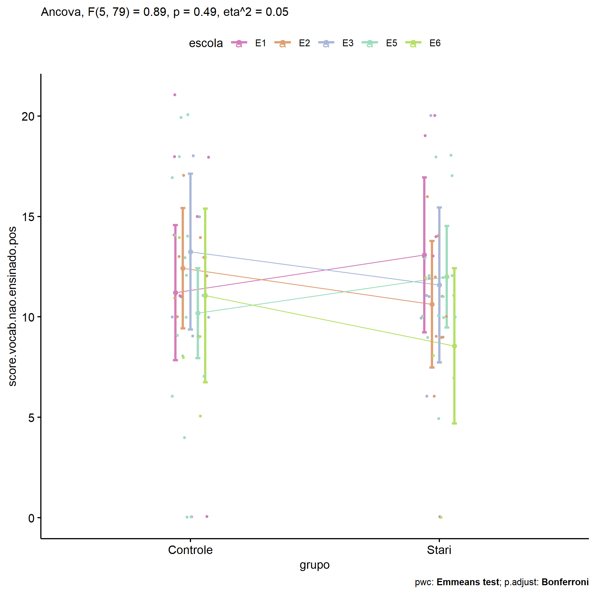<!-- -->

    ## Scale for colour is already present.
    ## Adding another scale for colour, which will replace the existing scale.

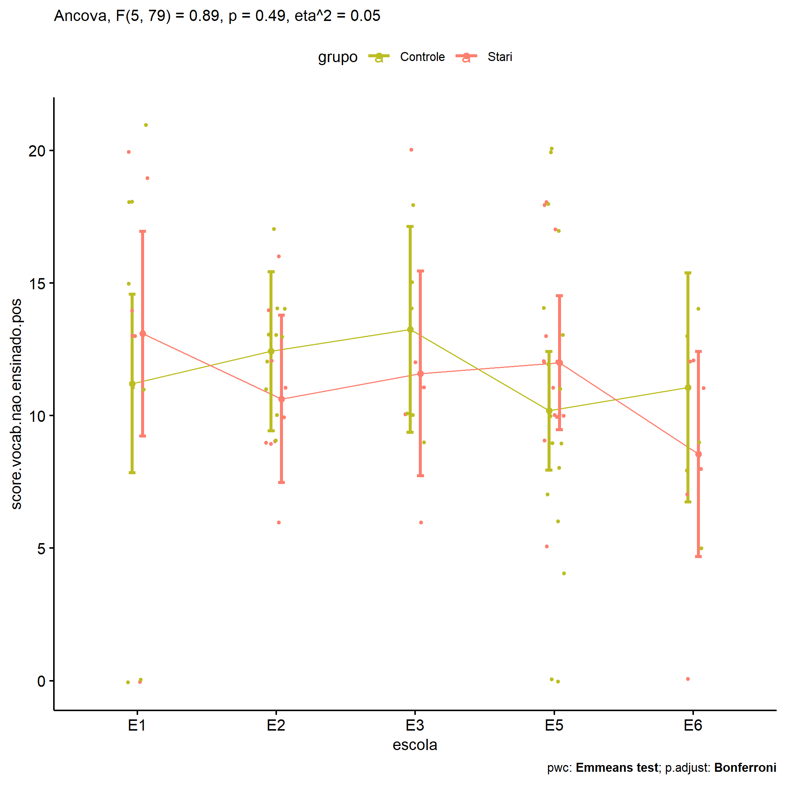<!-- -->

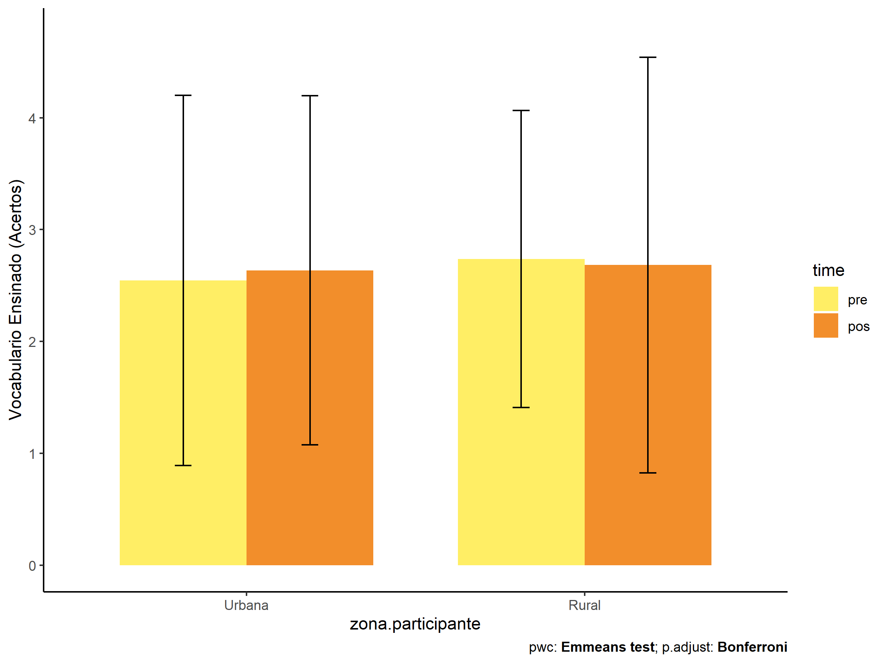<!-- -->

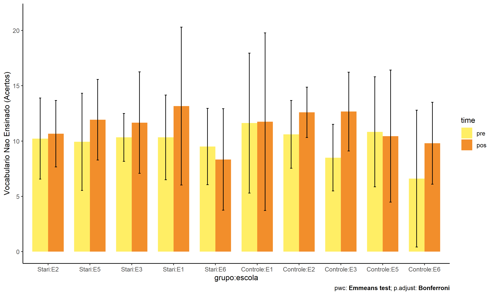<!-- -->

## factores: **zona.escola:grupo**

### Vocabulario (Acertos)

| var             | zona.escola | grupo    |   n | M (pre) | SE (pre) | M (unadj) | SE (unadj) | M (adj) | SE (adj) |
|:----------------|:------------|:---------|----:|--------:|---------:|----------:|-----------:|--------:|---------:|
| score.vocab.pos | Rural       | Controle |  13 |  11.615 |    1.352 |    15.231 |      1.401 |  16.035 |    1.225 |
| score.vocab.pos | Rural       | Stari    |  12 |  13.000 |    0.640 |    13.417 |      1.411 |  13.556 |    1.259 |
| score.vocab.pos | Urbana      | Controle |  31 |  14.097 |    0.816 |    15.323 |      0.878 |  14.935 |    0.789 |
| score.vocab.pos | Urbana      | Stari    |  27 |  13.296 |    0.747 |    14.741 |      0.850 |  14.737 |    0.839 |

| .y.             | grupo    | zona.escola | group1   | group2 | estimate | conf.low | conf.high |    se | statistic |     p | p.adj | p.adj.signif |
|:----------------|:---------|:------------|:---------|:-------|---------:|---------:|----------:|------:|----------:|------:|------:|:-------------|
| score.vocab.pos | Controle |             | Urbana   | Rural  |   -1.100 |   -4.027 |     1.826 | 1.470 |    -0.748 | 0.456 | 0.456 | ns           |
| score.vocab.pos | Stari    |             | Urbana   | Rural  |    1.182 |   -1.830 |     4.193 | 1.513 |     0.781 | 0.437 | 0.437 | ns           |
| score.vocab.pre | Controle |             | Urbana   | Rural  |    2.481 |   -0.237 |     5.200 | 1.366 |     1.817 | 0.073 | 0.073 | ns           |
| score.vocab.pre | Stari    |             | Urbana   | Rural  |    0.296 |   -2.558 |     3.150 | 1.434 |     0.207 | 0.837 | 0.837 | ns           |
| score.vocab.pos |          | Urbana      | Controle | Stari  |    0.197 |   -2.095 |     2.489 | 1.151 |     0.171 | 0.864 | 0.864 | ns           |
| score.vocab.pos |          | Rural       | Controle | Stari  |    2.479 |   -1.010 |     5.968 | 1.753 |     1.415 | 0.161 | 0.161 | ns           |
| score.vocab.pre |          | Urbana      | Controle | Stari  |    0.800 |   -1.365 |     2.966 | 1.088 |     0.736 | 0.464 | 0.464 | ns           |
| score.vocab.pre |          | Rural       | Controle | Stari  |   -1.385 |   -4.678 |     1.909 | 1.655 |    -0.837 | 0.405 | 0.405 | ns           |

| grupo    | zona.escola | group1 | group2 | estimate | conf.low | conf.high |    se | statistic |     p | p.adj | p.adj.signif |
|:---------|:------------|:-------|:-------|---------:|---------:|----------:|------:|----------:|------:|------:|:-------------|
| Controle | Urbana      | pre    | pos    |   -0.921 |   -3.125 |     1.283 | 1.116 |    -0.825 | 0.411 | 0.411 | ns           |
| Controle | Rural       | pre    | pos    |   -3.313 |   -6.760 |     0.134 | 1.746 |    -1.898 | 0.059 | 0.059 | ns           |
| Stari    | Urbana      | pre    | pos    |   -1.607 |   -3.999 |     0.785 | 1.211 |    -1.327 | 0.186 | 0.186 | ns           |
| Stari    | Rural       | pre    | pos    |   -0.724 |   -4.307 |     2.858 | 1.815 |    -0.399 | 0.690 | 0.690 | ns           |

    ## Scale for colour is already present.
    ## Adding another scale for colour, which will replace the existing scale.

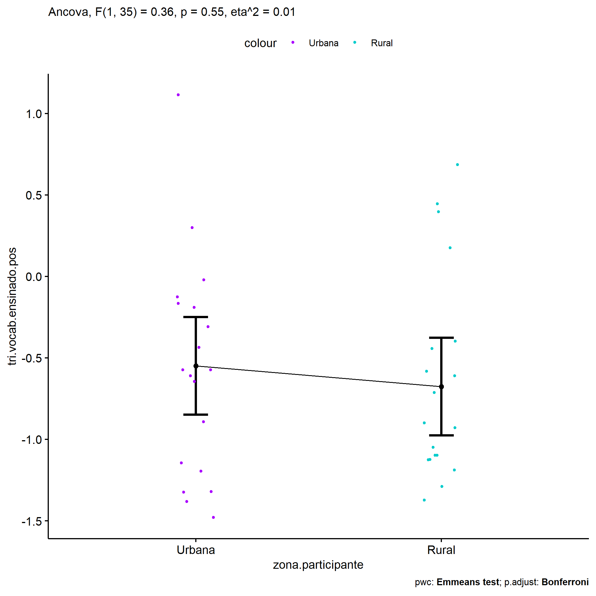<!-- -->

    ## Scale for colour is already present.
    ## Adding another scale for colour, which will replace the existing scale.

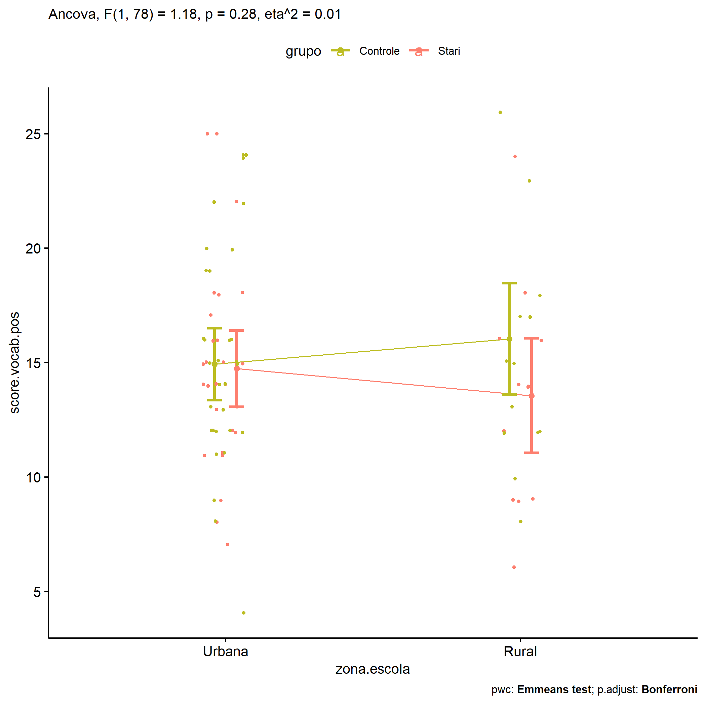<!-- -->

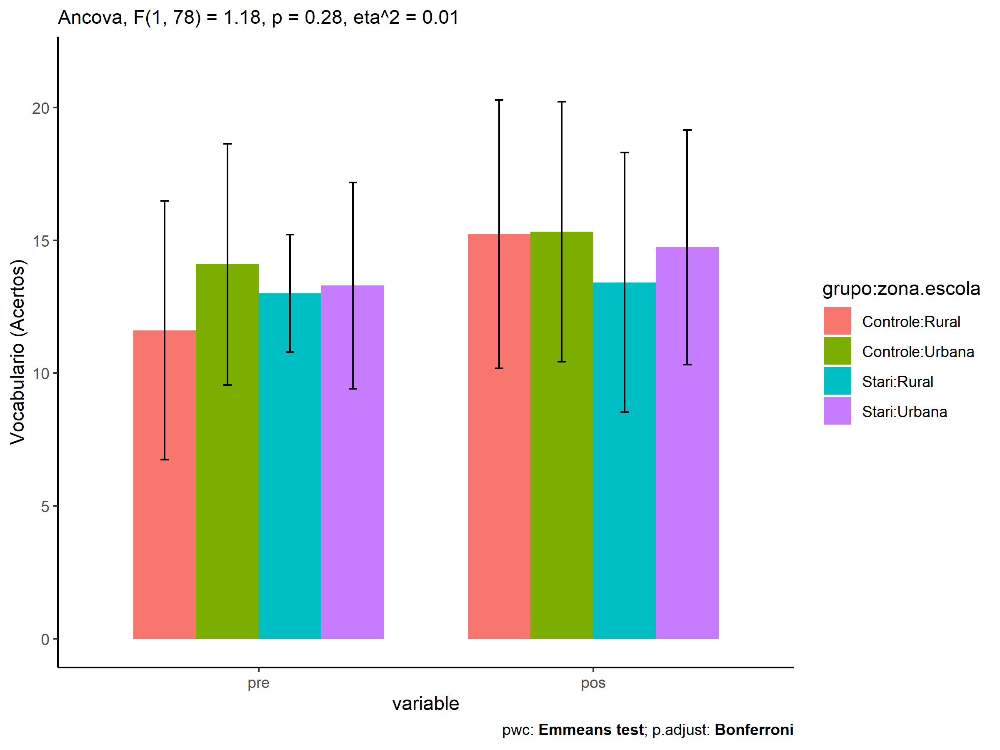<!-- -->

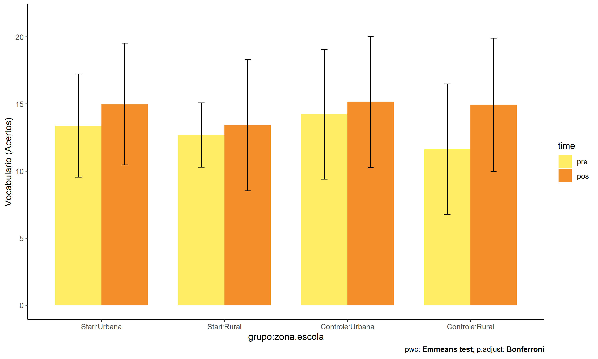<!-- -->

### Vocabulario Ensinado (Acertos)

| var                      | zona.escola | grupo    |   n | M (pre) | SE (pre) | M (unadj) | SE (unadj) | M (adj) | SE (adj) |
|:-------------------------|:------------|:---------|----:|--------:|---------:|----------:|-----------:|--------:|---------:|
| score.vocab.ensinado.pos | Rural       | Controle |  14 |   2.214 |    0.408 |     2.929 |      0.508 |   2.963 |    0.458 |
| score.vocab.ensinado.pos | Rural       | Stari    |  13 |   2.846 |    0.317 |     2.538 |      0.538 |   2.518 |    0.474 |
| score.vocab.ensinado.pos | Urbana      | Controle |  36 |   2.500 |    0.257 |     2.139 |      0.268 |   2.148 |    0.285 |
| score.vocab.ensinado.pos | Urbana      | Stari    |  29 |   2.828 |    0.294 |     2.690 |      0.298 |   2.671 |    0.318 |

| .y.                      | grupo    | zona.escola | group1   | group2 | estimate | conf.low | conf.high |    se | statistic |     p | p.adj | p.adj.signif |
|:-------------------------|:---------|:------------|:---------|:-------|---------:|---------:|----------:|------:|----------:|------:|------:|:-------------|
| score.vocab.ensinado.pos | Controle |             | Urbana   | Rural  |   -0.814 |   -1.885 |     0.256 | 0.538 |    -1.513 | 0.134 | 0.134 | ns           |
| score.vocab.ensinado.pos | Stari    |             | Urbana   | Rural  |    0.153 |   -0.979 |     1.285 | 0.569 |     0.268 | 0.789 | 0.789 | ns           |
| score.vocab.ensinado.pre | Controle |             | Urbana   | Rural  |    0.286 |   -0.656 |     1.227 | 0.474 |     0.603 | 0.548 | 0.548 | ns           |
| score.vocab.ensinado.pre | Stari    |             | Urbana   | Rural  |   -0.019 |   -1.017 |     0.979 | 0.502 |    -0.037 | 0.971 | 0.971 | ns           |
| score.vocab.ensinado.pos |          | Urbana      | Controle | Stari  |   -0.522 |   -1.372 |     0.327 | 0.427 |    -1.222 | 0.225 | 0.225 | ns           |
| score.vocab.ensinado.pos |          | Rural       | Controle | Stari  |    0.445 |   -0.870 |     1.760 | 0.661 |     0.672 | 0.503 | 0.503 | ns           |
| score.vocab.ensinado.pre |          | Urbana      | Controle | Stari  |   -0.328 |   -1.074 |     0.418 | 0.375 |    -0.873 | 0.385 | 0.385 | ns           |
| score.vocab.ensinado.pre |          | Rural       | Controle | Stari  |   -0.632 |   -1.783 |     0.520 | 0.579 |    -1.090 | 0.279 | 0.279 | ns           |

| grupo    | zona.escola | group1 | group2 | estimate | conf.low | conf.high |    se | statistic |     p | p.adj | p.adj.signif |
|:---------|:------------|:-------|:-------|---------:|---------:|----------:|------:|----------:|------:|------:|:-------------|
| Controle | Urbana      | pre    | pos    |    0.361 |   -0.386 |     1.108 | 0.379 |     0.954 | 0.341 | 0.341 | ns           |
| Controle | Rural       | pre    | pos    |   -0.714 |   -1.912 |     0.484 | 0.607 |    -1.177 | 0.241 | 0.241 | ns           |
| Stari    | Urbana      | pre    | pos    |    0.138 |   -0.694 |     0.970 | 0.422 |     0.327 | 0.744 | 0.744 | ns           |
| Stari    | Rural       | pre    | pos    |    0.308 |   -0.935 |     1.551 | 0.630 |     0.489 | 0.626 | 0.626 | ns           |

    ## Scale for colour is already present.
    ## Adding another scale for colour, which will replace the existing scale.

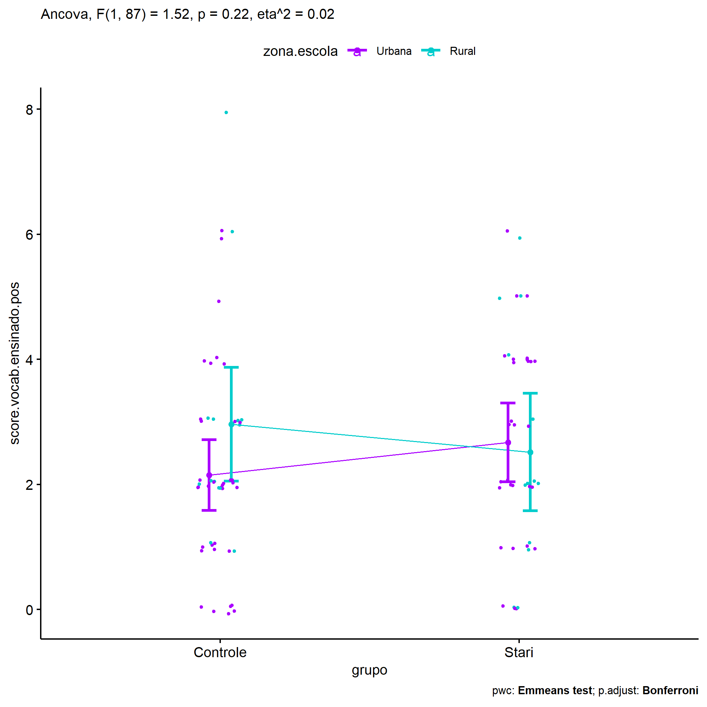<!-- -->

    ## Scale for colour is already present.
    ## Adding another scale for colour, which will replace the existing scale.

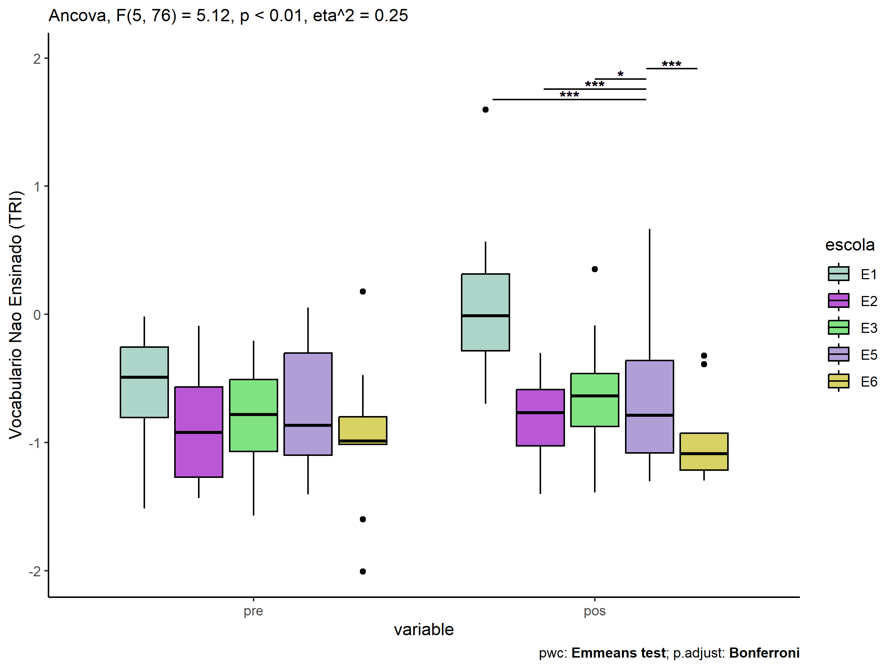<!-- -->

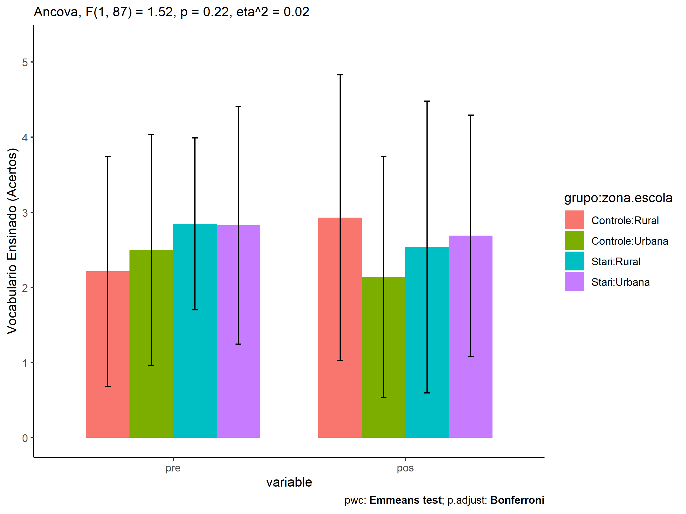<!-- -->

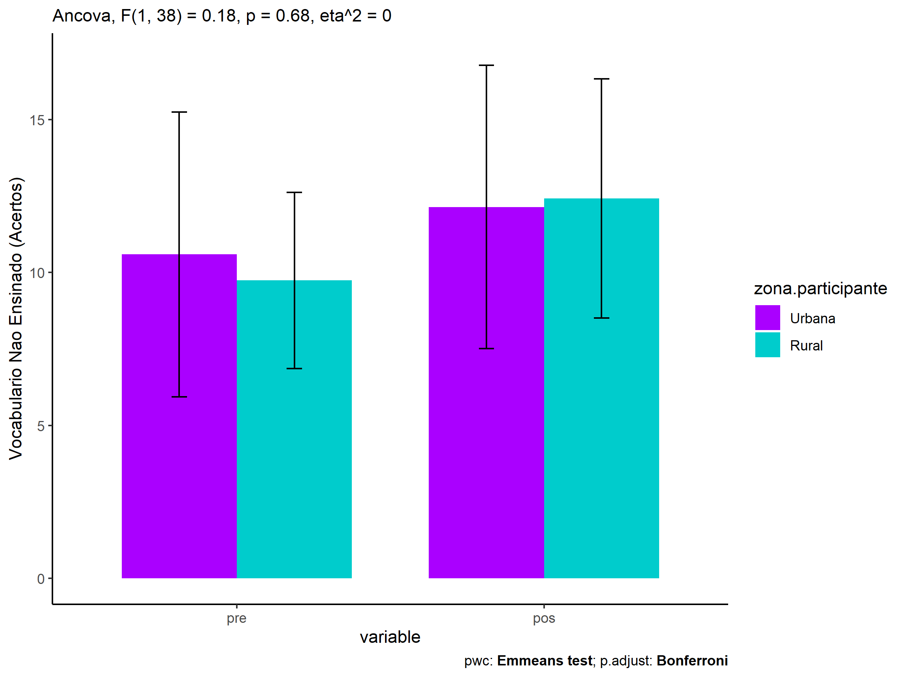<!-- -->

### Vocabulario Nao Ensinado (Acertos)

| var                          | zona.escola | grupo    |   n | M (pre) | SE (pre) | M (unadj) | SE (unadj) | M (adj) | SE (adj) |
|:-----------------------------|:------------|:---------|----:|--------:|---------:|----------:|-----------:|--------:|---------:|
| score.vocab.nao.ensinado.pos | Rural       | Controle |  14 |   8.571 |    1.239 |    12.000 |      1.022 |  12.624 |    1.247 |
| score.vocab.nao.ensinado.pos | Rural       | Stari    |  13 |   9.846 |    0.741 |     9.846 |      1.260 |   9.970 |    1.280 |
| score.vocab.nao.ensinado.pos | Urbana      | Controle |  36 |  10.944 |    0.792 |    11.333 |      0.950 |  11.027 |    0.774 |
| score.vocab.nao.ensinado.pos | Urbana      | Stari    |  29 |  10.103 |    0.730 |    11.793 |      0.802 |  11.816 |    0.857 |

| .y.                          | grupo    | zona.escola | group1   | group2 | estimate | conf.low | conf.high |    se | statistic |     p | p.adj | p.adj.signif |
|:-----------------------------|:---------|:------------|:---------|:-------|---------:|---------:|----------:|------:|----------:|------:|------:|:-------------|
| score.vocab.nao.ensinado.pos | Controle |             | Urbana   | Rural  |   -1.596 |   -4.537 |     1.344 | 1.479 |    -1.079 | 0.284 | 0.284 | ns           |
| score.vocab.nao.ensinado.pos | Stari    |             | Urbana   | Rural  |    1.846 |   -1.216 |     4.908 | 1.541 |     1.198 | 0.234 | 0.234 | ns           |
| score.vocab.nao.ensinado.pre | Controle |             | Urbana   | Rural  |    2.373 |   -0.286 |     5.032 | 1.338 |     1.774 | 0.080 | 0.080 | ns           |
| score.vocab.nao.ensinado.pre | Stari    |             | Urbana   | Rural  |    0.257 |   -2.560 |     3.075 | 1.418 |     0.181 | 0.856 | 0.856 | ns           |
| score.vocab.nao.ensinado.pos |          | Urbana      | Controle | Stari  |   -0.789 |   -3.086 |     1.508 | 1.156 |    -0.683 | 0.496 | 0.496 | ns           |
| score.vocab.nao.ensinado.pos |          | Rural       | Controle | Stari  |    2.653 |   -0.892 |     6.198 | 1.784 |     1.488 | 0.140 | 0.140 | ns           |
| score.vocab.nao.ensinado.pre |          | Urbana      | Controle | Stari  |    0.841 |   -1.265 |     2.947 | 1.060 |     0.793 | 0.430 | 0.430 | ns           |
| score.vocab.nao.ensinado.pre |          | Rural       | Controle | Stari  |   -1.275 |   -4.526 |     1.977 | 1.636 |    -0.779 | 0.438 | 0.438 | ns           |

| grupo    | zona.escola | group1 | group2 | estimate | conf.low | conf.high |    se | statistic |     p | p.adj | p.adj.signif |
|:---------|:------------|:-------|:-------|---------:|---------:|----------:|------:|----------:|------:|------:|:-------------|
| Controle | Urbana      | pre    | pos    |   -0.389 |   -2.517 |     1.739 | 1.078 |    -0.361 | 0.719 | 0.719 | ns           |
| Controle | Rural       | pre    | pos    |   -3.429 |   -6.841 |    -0.016 | 1.729 |    -1.983 | 0.049 | 0.049 | \*           |
| Stari    | Urbana      | pre    | pos    |   -1.690 |   -4.061 |     0.682 | 1.202 |    -1.406 | 0.161 | 0.161 | ns           |
| Stari    | Rural       | pre    | pos    |    0.000 |   -3.542 |     3.542 | 1.795 |     0.000 | 1.000 | 1.000 | ns           |

    ## Scale for colour is already present.
    ## Adding another scale for colour, which will replace the existing scale.

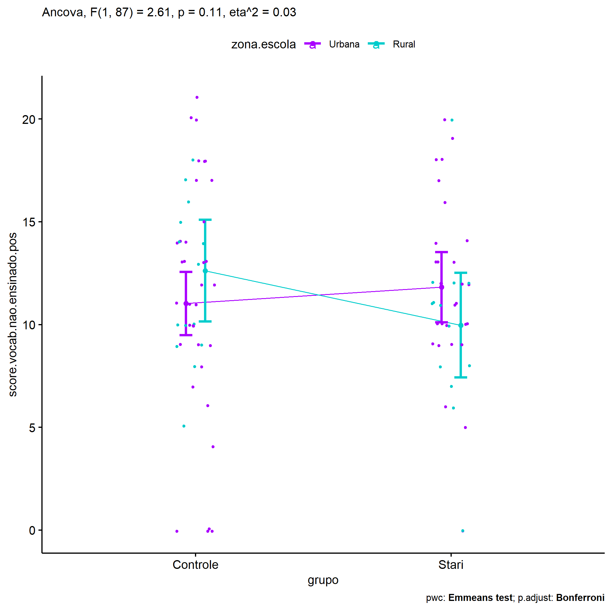<!-- -->

    ## Scale for colour is already present.
    ## Adding another scale for colour, which will replace the existing scale.

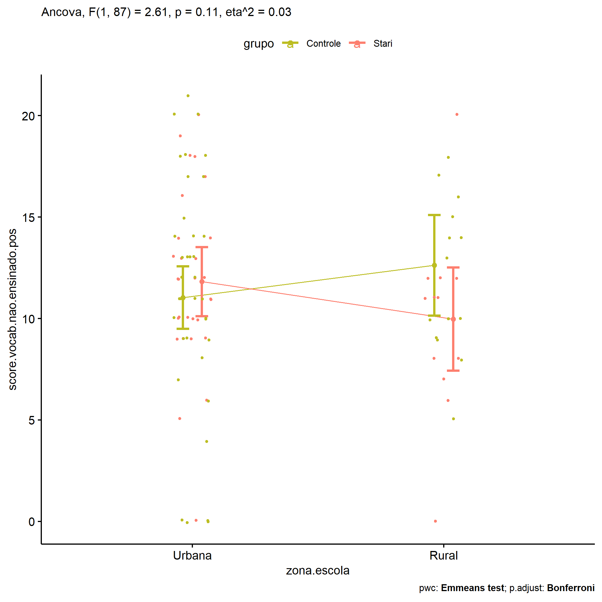<!-- -->

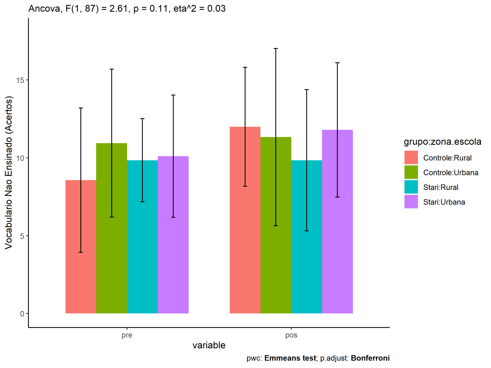<!-- -->

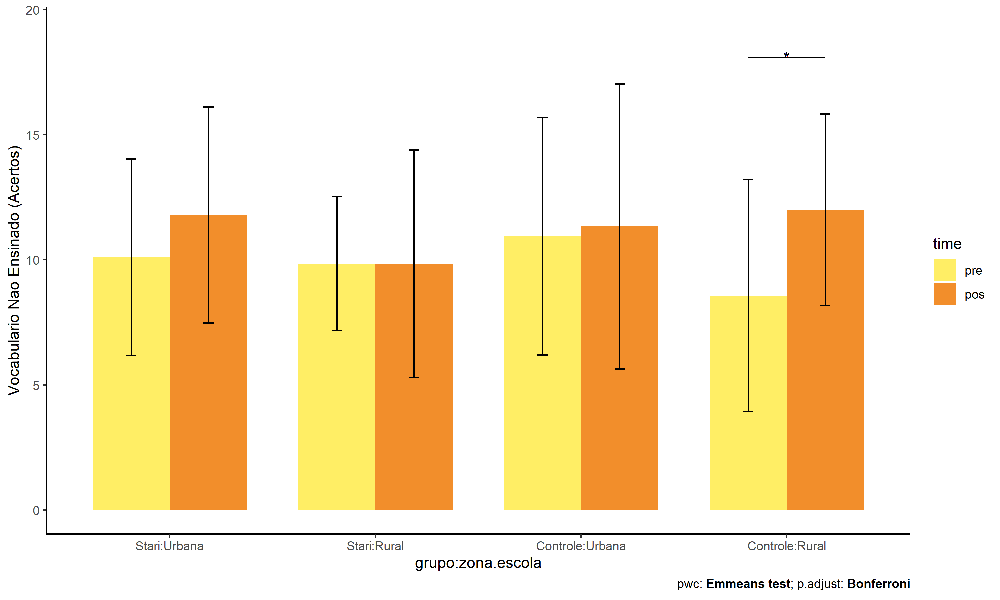<!-- -->

# Pairwise comparisons for grupo=“Experimental”

## factores: **grupo=“Experimental”:monitor**

### Vocabulario (Acertos)

| var             | monitor |   n | M (pre) | SE (pre) | M (unadj) | SE (unadj) | M (adj) | SE (adj) |
|:----------------|:--------|----:|--------:|---------:|----------:|-----------:|--------:|---------:|
| score.vocab.pos | ML      |   6 |    13.0 |    0.856 |    14.333 |      2.390 |  14.350 |    2.151 |
| score.vocab.pos | PR      |   5 |    12.8 |    1.934 |    19.600 |      2.272 |  19.668 |    2.359 |
| score.vocab.pos | VL      |   5 |    13.4 |    1.166 |    13.200 |      1.828 |  13.112 |    2.361 |

| .y.             | group1 | group2 | estimate | conf.low | conf.high |    se | statistic |     p | p.adj | p.adj.signif |
|:----------------|:-------|:-------|---------:|---------:|----------:|------:|----------:|------:|------:|:-------------|
| score.vocab.pos | ML     | PR     |   -5.319 |  -12.271 |     1.634 | 3.191 |    -1.667 | 0.121 | 0.364 | ns           |
| score.vocab.pos | ML     | VL     |    1.237 |   -5.725 |     8.199 | 3.195 |     0.387 | 0.705 | 1.000 | ns           |
| score.vocab.pos | PR     | VL     |    6.556 |   -0.729 |    13.841 | 3.344 |     1.961 | 0.074 | 0.221 | ns           |
| score.vocab.pre | ML     | PR     |    0.200 |   -3.840 |     4.240 | 1.870 |     0.107 | 0.916 | 1.000 | ns           |
| score.vocab.pre | ML     | VL     |   -0.400 |   -4.440 |     3.640 | 1.870 |    -0.214 | 0.834 | 1.000 | ns           |
| score.vocab.pre | PR     | VL     |   -0.600 |   -4.820 |     3.620 | 1.953 |    -0.307 | 0.764 | 1.000 | ns           |

| .y.         | monitor | group1 | group2 | estimate | conf.low | conf.high |    se | statistic |     p | p.adj | p.adj.signif |
|:------------|:--------|:-------|:-------|---------:|---------:|----------:|------:|----------:|------:|------:|:-------------|
| score.vocab | ML      | pre    | pos    |   -1.333 |   -6.281 |     3.614 | 2.415 |    -0.552 | 0.585 | 0.585 | ns           |
| score.vocab | PR      | pre    | pos    |   -6.267 |  -11.456 |    -1.078 | 2.533 |    -2.474 | 0.020 | 0.020 | \*           |
| score.vocab | VL      | pre    | pos    |   -0.533 |   -5.722 |     4.656 | 2.533 |    -0.211 | 0.835 | 0.835 | ns           |

    ## Scale for colour is already present.
    ## Adding another scale for colour, which will replace the existing scale.

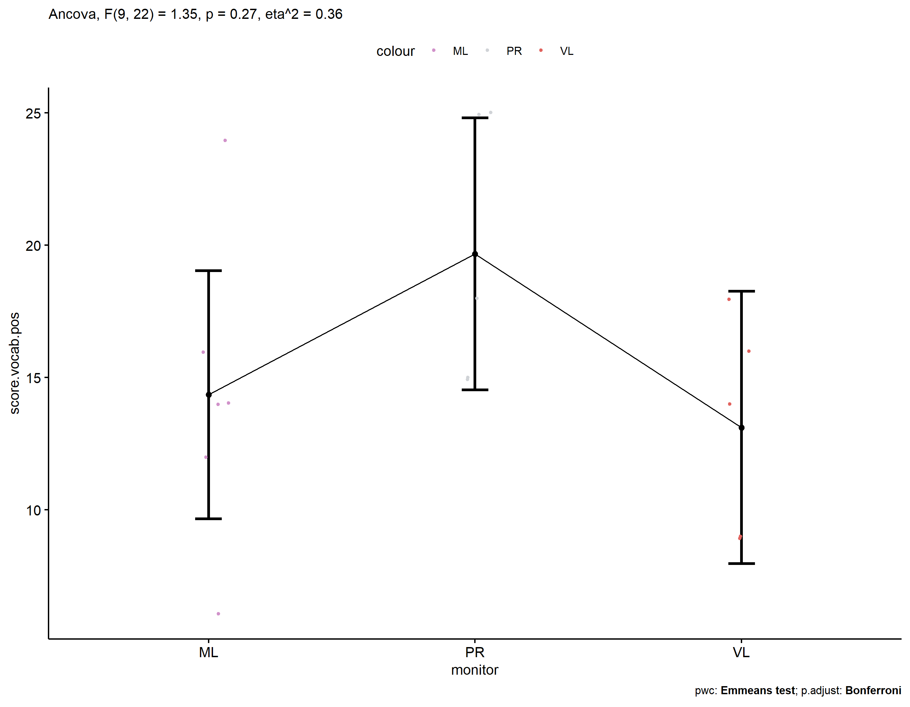<!-- -->

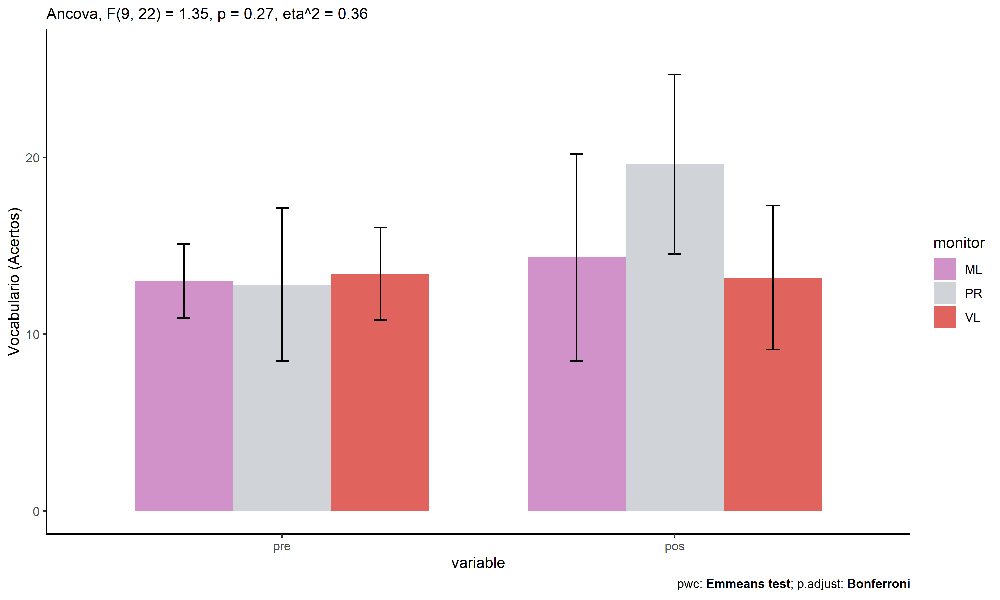<!-- -->

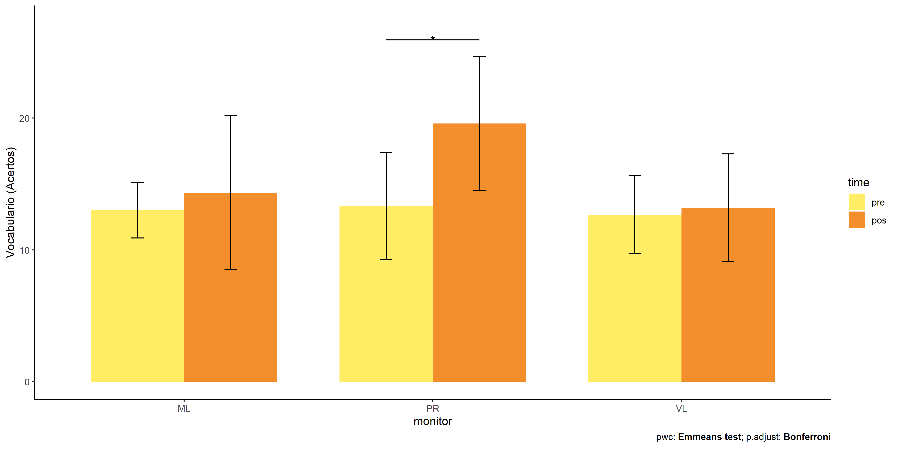<!-- -->

### Vocabulario Ensinado (Acertos)

| var                      | monitor |   n | M (pre) | SE (pre) | M (unadj) | SE (unadj) | M (adj) | SE (adj) |
|:-------------------------|:--------|----:|--------:|---------:|----------:|-----------:|--------:|---------:|
| score.vocab.ensinado.pos | ML      |   6 |   2.667 |    0.333 |     2.667 |      0.715 |   2.539 |    0.922 |
| score.vocab.ensinado.pos | PR      |   6 |   3.000 |    0.365 |     3.167 |      1.014 |   3.192 |    0.911 |
| score.vocab.ensinado.pos | VL      |   6 |   3.167 |    0.601 |     2.667 |      0.955 |   2.769 |    0.918 |

| .y.                      | group1 | group2 | estimate | conf.low | conf.high |    se | statistic |     p | p.adj | p.adj.signif |
|:-------------------------|:-------|:-------|---------:|---------:|----------:|------:|----------:|------:|------:|:-------------|
| score.vocab.ensinado.pos | ML     | PR     |   -0.653 |   -3.441 |     2.135 | 1.300 |    -0.502 | 0.623 |     1 | ns           |
| score.vocab.ensinado.pos | ML     | VL     |   -0.229 |   -3.048 |     2.590 | 1.314 |    -0.175 | 0.864 |     1 | ns           |
| score.vocab.ensinado.pos | PR     | VL     |    0.424 |   -2.345 |     3.192 | 1.291 |     0.328 | 0.748 |     1 | ns           |
| score.vocab.ensinado.pre | ML     | PR     |   -0.333 |   -1.688 |     1.021 | 0.635 |    -0.525 | 0.608 |     1 | ns           |
| score.vocab.ensinado.pre | ML     | VL     |   -0.500 |   -1.854 |     0.854 | 0.635 |    -0.787 | 0.444 |     1 | ns           |
| score.vocab.ensinado.pre | PR     | VL     |   -0.167 |   -1.521 |     1.188 | 0.635 |    -0.262 | 0.797 |     1 | ns           |

| .y.                  | monitor | group1 | group2 | estimate | conf.low | conf.high |    se | statistic |     p | p.adj | p.adj.signif |
|:---------------------|:--------|:-------|:-------|---------:|---------:|----------:|------:|----------:|------:|------:|:-------------|
| score.vocab.ensinado | ML      | pre    | pos    |    0.000 |   -2.061 |     2.061 | 1.009 |     0.000 | 1.000 | 1.000 | ns           |
| score.vocab.ensinado | PR      | pre    | pos    |   -0.167 |   -2.228 |     1.894 | 1.009 |    -0.165 | 0.870 | 0.870 | ns           |
| score.vocab.ensinado | VL      | pre    | pos    |    0.500 |   -1.561 |     2.561 | 1.009 |     0.495 | 0.624 | 0.624 | ns           |

    ## Scale for colour is already present.
    ## Adding another scale for colour, which will replace the existing scale.

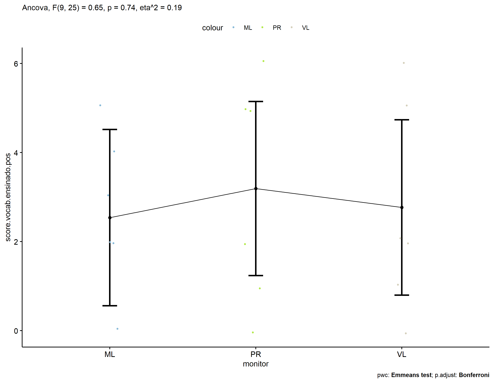<!-- -->

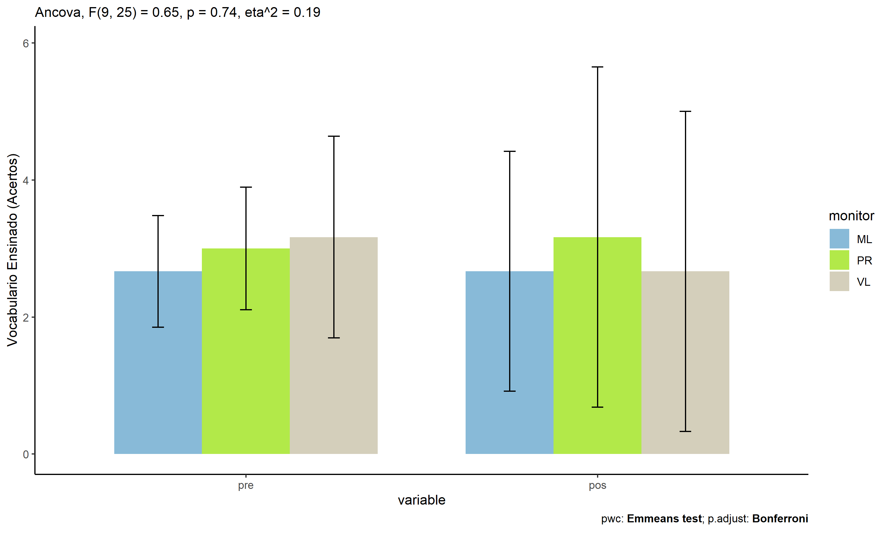<!-- -->

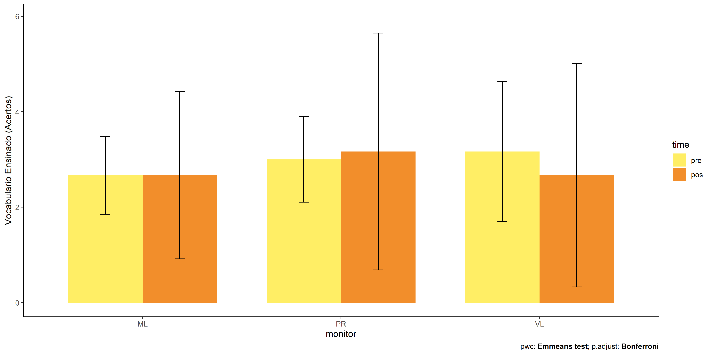<!-- -->

### Vocabulario Nao Ensinado (Acertos)

| var                          | monitor |   n | M (pre) | SE (pre) | M (unadj) | SE (unadj) | M (adj) | SE (adj) |
|:-----------------------------|:--------|----:|--------:|---------:|----------:|-----------:|--------:|---------:|
| score.vocab.nao.ensinado.pos | ML      |   6 |  10.333 |    0.882 |    11.667 |      1.874 |  11.572 |    2.311 |
| score.vocab.nao.ensinado.pos | PR      |   6 |  10.333 |    1.563 |    13.167 |      2.915 |  13.072 |    2.311 |
| score.vocab.nao.ensinado.pos | VL      |   6 |   9.500 |    1.408 |     8.333 |      1.874 |   8.523 |    2.321 |

| .y.                          | group1 | group2 | estimate | conf.low | conf.high |    se | statistic |     p | p.adj | p.adj.signif |
|:-----------------------------|:-------|:-------|---------:|---------:|----------:|------:|----------:|------:|------:|:-------------|
| score.vocab.nao.ensinado.pos | ML     | PR     |   -1.500 |   -8.499 |     5.499 | 3.263 |    -0.460 | 0.653 | 1.000 | ns           |
| score.vocab.nao.ensinado.pos | ML     | VL     |    3.049 |   -3.997 |    10.095 | 3.285 |     0.928 | 0.369 | 1.000 | ns           |
| score.vocab.nao.ensinado.pos | PR     | VL     |    4.549 |   -2.497 |    11.595 | 3.285 |     1.385 | 0.188 | 0.563 | ns           |
| score.vocab.nao.ensinado.pre | ML     | PR     |    0.000 |   -3.971 |     3.971 | 1.863 |     0.000 | 1.000 | 1.000 | ns           |
| score.vocab.nao.ensinado.pre | ML     | VL     |    0.833 |   -3.137 |     4.804 | 1.863 |     0.447 | 0.661 | 1.000 | ns           |
| score.vocab.nao.ensinado.pre | PR     | VL     |    0.833 |   -3.137 |     4.804 | 1.863 |     0.447 | 0.661 | 1.000 | ns           |

| .y.                      | monitor | group1 | group2 | estimate | conf.low | conf.high |    se | statistic |     p | p.adj | p.adj.signif |
|:-------------------------|:--------|:-------|:-------|---------:|---------:|----------:|------:|----------:|------:|------:|:-------------|
| score.vocab.nao.ensinado | ML      | pre    | pos    |   -1.333 |   -6.701 |     4.034 | 2.628 |    -0.507 | 0.616 | 0.616 | ns           |
| score.vocab.nao.ensinado | PR      | pre    | pos    |   -2.833 |   -8.201 |     2.534 | 2.628 |    -1.078 | 0.290 | 0.290 | ns           |
| score.vocab.nao.ensinado | VL      | pre    | pos    |    1.167 |   -4.201 |     6.534 | 2.628 |     0.444 | 0.660 | 0.660 | ns           |

    ## Scale for colour is already present.
    ## Adding another scale for colour, which will replace the existing scale.

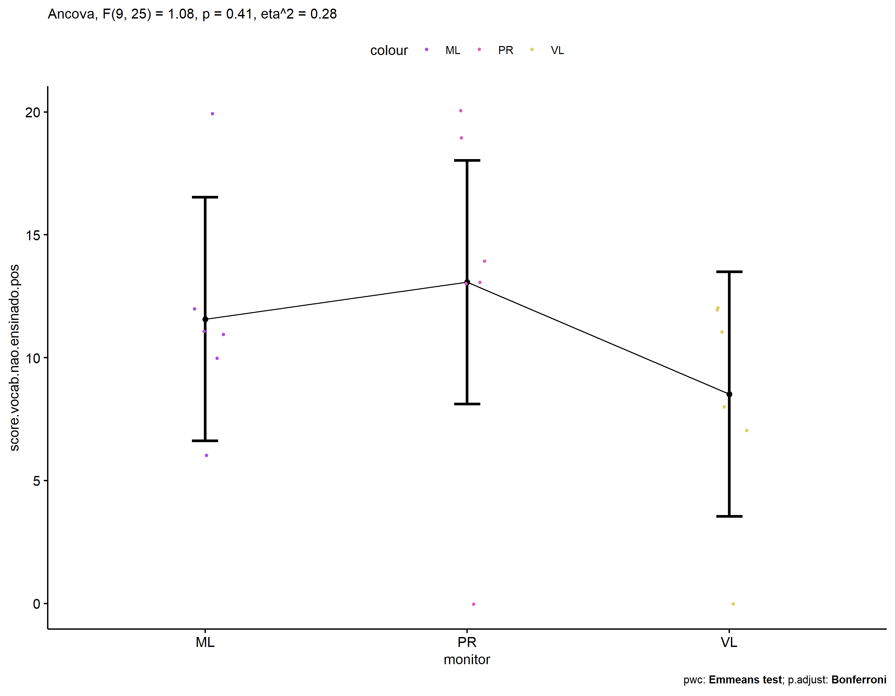<!-- -->

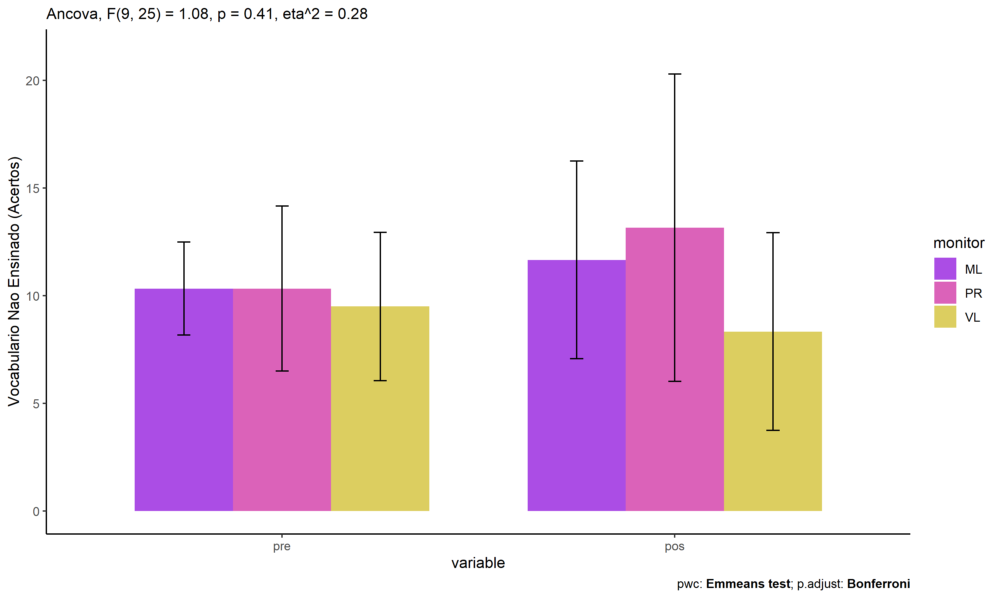<!-- -->

<!-- -->

## factores: **grupo=“Experimental”:monitor.genero**

### Vocabulario (Acertos)

| var             | monitor.genero |   n | M (pre) | SE (pre) | M (unadj) | SE (unadj) | M (adj) | SE (adj) |
|:----------------|:---------------|----:|--------:|---------:|----------:|-----------:|--------:|---------:|
| score.vocab.pos | F              |  20 |  13.450 |    0.800 |    13.700 |      0.918 |  13.602 |    0.994 |
| score.vocab.pos | M              |  13 |  12.308 |    0.835 |    15.462 |      1.347 |  15.613 |    1.237 |

| .y.             | group1 | group2 | estimate | conf.low | conf.high |    se | statistic |     p | p.adj | p.adj.signif |
|:----------------|:-------|:-------|---------:|---------:|----------:|------:|----------:|------:|------:|:-------------|
| score.vocab.pos | F      | M      |   -2.011 |   -5.275 |     1.253 | 1.598 |    -1.258 | 0.218 | 0.218 | ns           |
| score.vocab.pre | F      | M      |    1.142 |   -1.305 |     3.590 | 1.200 |     0.952 | 0.349 | 0.349 | ns           |

| .y.         | monitor.genero | group1 | group2 | estimate | conf.low | conf.high |    se | statistic |     p | p.adj | p.adj.signif |
|:------------|:---------------|:-------|:-------|---------:|---------:|----------:|------:|----------:|------:|------:|:-------------|
| score.vocab | F              | pre    | pos    |   -0.857 |   -3.337 |     1.623 | 1.242 |    -0.690 | 0.492 | 0.492 | ns           |
| score.vocab | M              | pre    | pos    |   -2.890 |   -5.985 |     0.205 | 1.550 |    -1.865 | 0.067 | 0.067 | ns           |

    ## Scale for colour is already present.
    ## Adding another scale for colour, which will replace the existing scale.

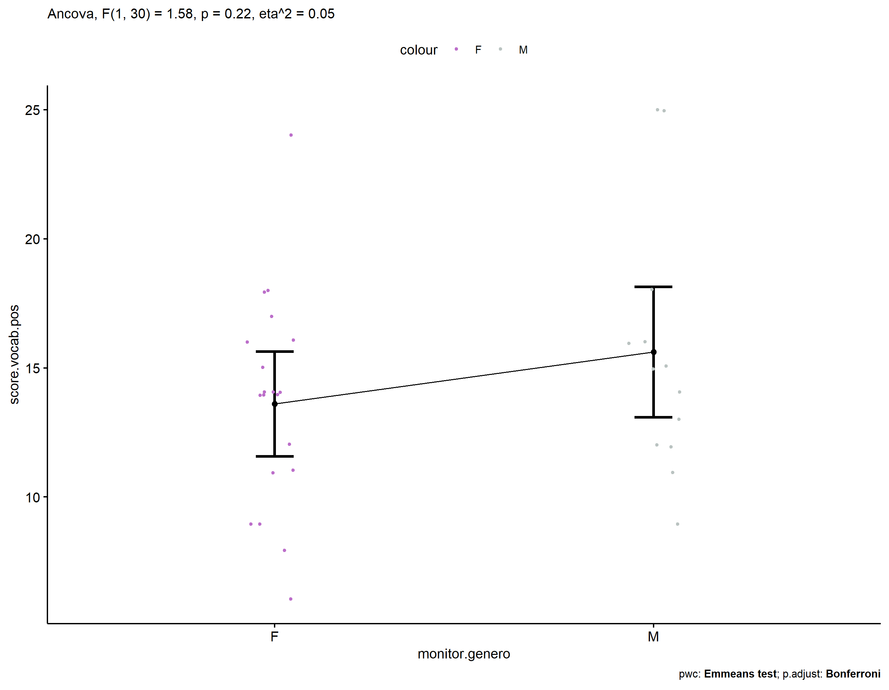<!-- -->

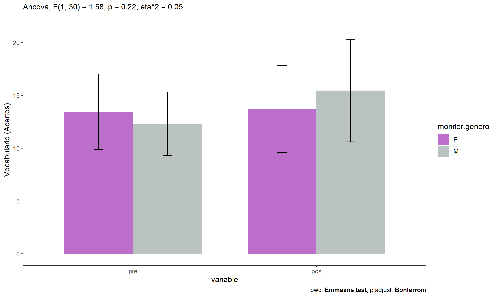<!-- -->

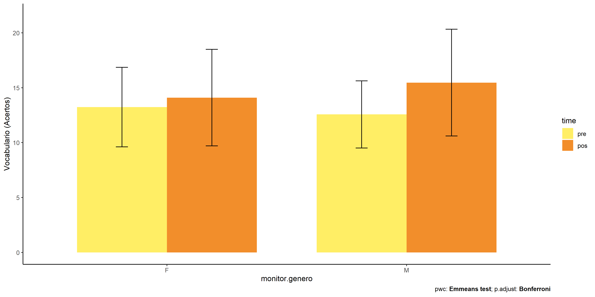<!-- -->

### Vocabulario Ensinado (Acertos)

| var                      | monitor.genero |   n | M (pre) | SE (pre) | M (unadj) | SE (unadj) | M (adj) | SE (adj) |
|:-------------------------|:---------------|----:|--------:|---------:|----------:|-----------:|--------:|---------:|
| score.vocab.ensinado.pos | F              |  22 |   2.636 |    0.305 |     2.682 |      0.357 |   2.647 |    0.370 |
| score.vocab.ensinado.pos | M              |  14 |   3.143 |    0.417 |     2.857 |      0.479 |   2.912 |    0.465 |

| .y.                      | group1 | group2 | estimate | conf.low | conf.high |    se | statistic |     p | p.adj | p.adj.signif |
|:-------------------------|:-------|:-------|---------:|---------:|----------:|------:|----------:|------:|------:|:-------------|
| score.vocab.ensinado.pos | F      | M      |   -0.265 |   -1.482 |     0.952 | 0.598 |    -0.443 | 0.661 | 0.661 | ns           |
| score.vocab.ensinado.pre | F      | M      |   -0.506 |   -1.537 |     0.524 | 0.507 |    -0.999 | 0.325 | 0.325 | ns           |

| .y.                  | monitor.genero | group1 | group2 | estimate | conf.low | conf.high |    se | statistic |     p | p.adj | p.adj.signif |
|:---------------------|:---------------|:-------|:-------|---------:|---------:|----------:|------:|----------:|------:|------:|:-------------|
| score.vocab.ensinado | F              | pre    | pos    |   -0.045 |   -1.011 |     0.921 | 0.484 |    -0.094 | 0.925 | 0.925 | ns           |
| score.vocab.ensinado | M              | pre    | pos    |    0.286 |   -0.925 |     1.497 | 0.607 |     0.471 | 0.639 | 0.639 | ns           |

    ## Scale for colour is already present.
    ## Adding another scale for colour, which will replace the existing scale.

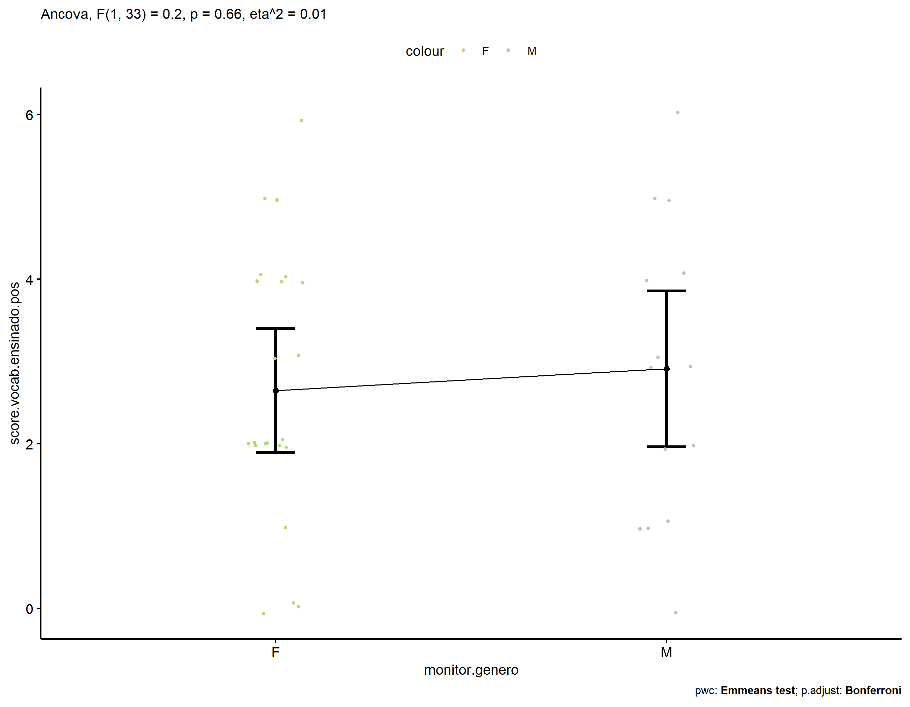<!-- -->

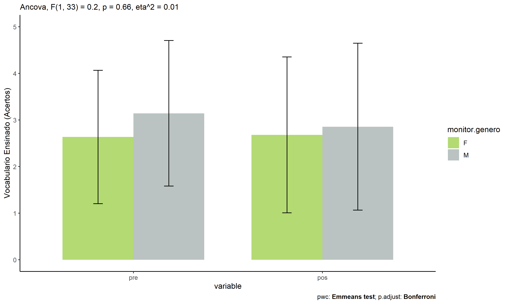<!-- -->

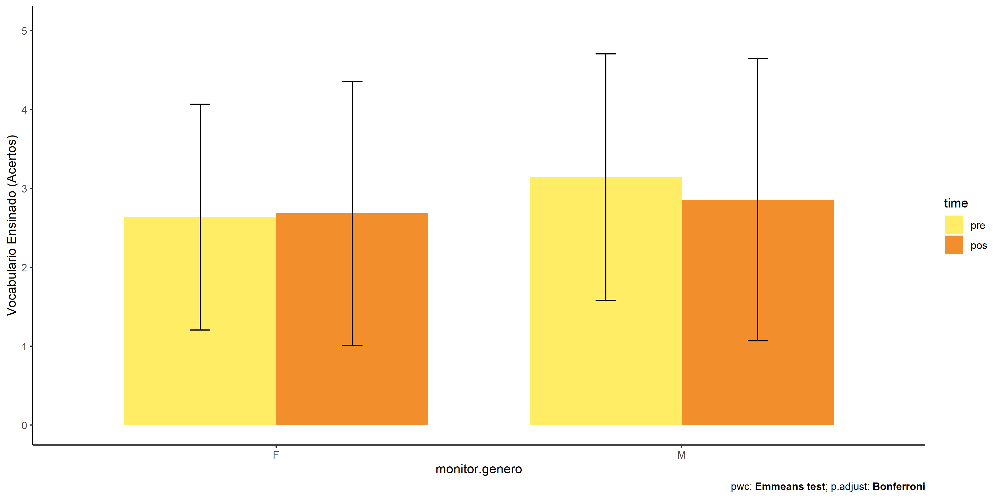<!-- -->

### Vocabulario Nao Ensinado (Acertos)

| var                          | monitor.genero |   n | M (pre) | SE (pre) | M (unadj) | SE (unadj) | M (adj) | SE (adj) |
|:-----------------------------|:---------------|----:|--------:|---------:|----------:|-----------:|--------:|---------:|
| score.vocab.nao.ensinado.pos | F              |  22 |  10.000 |    0.832 |    10.773 |      0.944 |  10.751 |    0.987 |
| score.vocab.nao.ensinado.pos | M              |  14 |   9.429 |    0.747 |    11.500 |      1.279 |  11.534 |    1.238 |

| .y.                          | group1 | group2 | estimate | conf.low | conf.high |    se | statistic |     p | p.adj | p.adj.signif |
|:-----------------------------|:-------|:-------|---------:|---------:|----------:|------:|----------:|------:|------:|:-------------|
| score.vocab.nao.ensinado.pos | F      | M      |   -0.783 |   -4.009 |     2.444 | 1.586 |    -0.494 | 0.625 | 0.625 | ns           |
| score.vocab.nao.ensinado.pre | F      | M      |    0.571 |   -1.875 |     3.018 | 1.204 |     0.475 | 0.638 | 0.638 | ns           |

| .y.                      | monitor.genero | group1 | group2 | estimate | conf.low | conf.high |    se | statistic |     p | p.adj | p.adj.signif |
|:-------------------------|:---------------|:-------|:-------|---------:|---------:|----------:|------:|----------:|------:|------:|:-------------|
| score.vocab.nao.ensinado | F              | pre    | pos    |   -0.773 |   -3.226 |     1.681 | 1.230 |    -0.628 | 0.532 | 0.532 | ns           |
| score.vocab.nao.ensinado | M              | pre    | pos    |   -2.071 |   -5.147 |     1.004 | 1.541 |    -1.344 | 0.183 | 0.183 | ns           |

    ## Scale for colour is already present.
    ## Adding another scale for colour, which will replace the existing scale.

<!-- -->

<!-- -->

<!-- -->

## factores: **grupo=“Experimental”:monitor.area**

### Vocabulario (Acertos)

| var             | monitor.area        |   n | M (pre) | SE (pre) | M (unadj) | SE (unadj) | M (adj) | SE (adj) |
|:----------------|:--------------------|----:|--------:|---------:|----------:|-----------:|--------:|---------:|
| score.vocab.pos | Ciencias Biologicas |   6 |    13.0 |    0.856 |    14.333 |      2.390 |  14.350 |    2.151 |
| score.vocab.pos | Historia            |   5 |    12.8 |    1.934 |    19.600 |      2.272 |  19.668 |    2.359 |
| score.vocab.pos | Servico Social      |   5 |    13.4 |    1.166 |    13.200 |      1.828 |  13.112 |    2.361 |

| .y.             | group1              | group2         | estimate | conf.low | conf.high |    se | statistic |     p | p.adj | p.adj.signif |
|:----------------|:--------------------|:---------------|---------:|---------:|----------:|------:|----------:|------:|------:|:-------------|
| score.vocab.pos | Ciencias Biologicas | Historia       |   -5.319 |  -12.271 |     1.634 | 3.191 |    -1.667 | 0.121 | 0.364 | ns           |
| score.vocab.pos | Ciencias Biologicas | Servico Social |    1.237 |   -5.725 |     8.199 | 3.195 |     0.387 | 0.705 | 1.000 | ns           |
| score.vocab.pos | Historia            | Servico Social |    6.556 |   -0.729 |    13.841 | 3.344 |     1.961 | 0.074 | 0.221 | ns           |
| score.vocab.pre | Ciencias Biologicas | Historia       |    0.200 |   -3.840 |     4.240 | 1.870 |     0.107 | 0.916 | 1.000 | ns           |
| score.vocab.pre | Ciencias Biologicas | Servico Social |   -0.400 |   -4.440 |     3.640 | 1.870 |    -0.214 | 0.834 | 1.000 | ns           |
| score.vocab.pre | Historia            | Servico Social |   -0.600 |   -4.820 |     3.620 | 1.953 |    -0.307 | 0.764 | 1.000 | ns           |

| .y.         | monitor.area        | group1 | group2 | estimate | conf.low | conf.high |    se | statistic |     p | p.adj | p.adj.signif |
|:------------|:--------------------|:-------|:-------|---------:|---------:|----------:|------:|----------:|------:|------:|:-------------|
| score.vocab | Ciencias Biologicas | pre    | pos    |   -1.333 |   -6.326 |     3.660 | 2.451 |    -0.544 | 0.590 | 0.590 | ns           |
| score.vocab | Historia            | pre    | pos    |   -6.267 |  -11.503 |    -1.030 | 2.571 |    -2.438 | 0.021 | 0.021 | \*           |
| score.vocab | Servico Social      | pre    | pos    |   -0.533 |   -5.770 |     4.703 | 2.571 |    -0.207 | 0.837 | 0.837 | ns           |

    ## Scale for colour is already present.
    ## Adding another scale for colour, which will replace the existing scale.

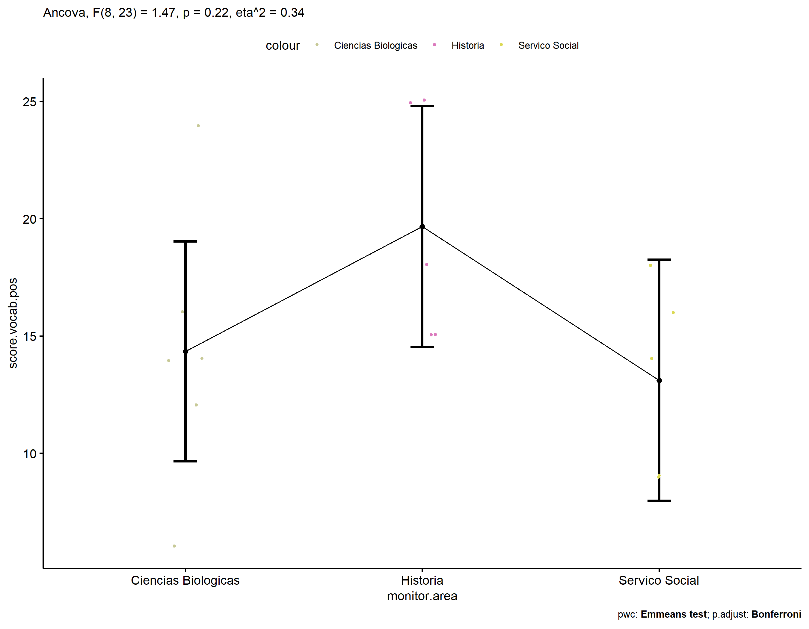<!-- -->

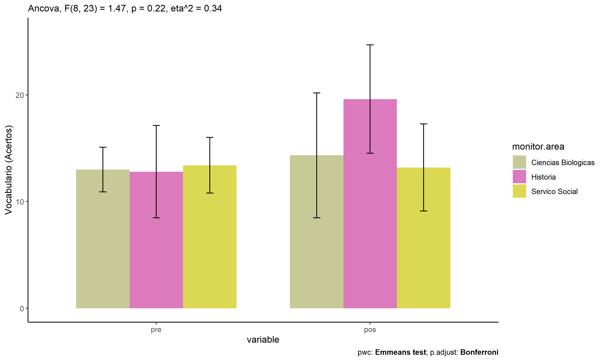<!-- -->

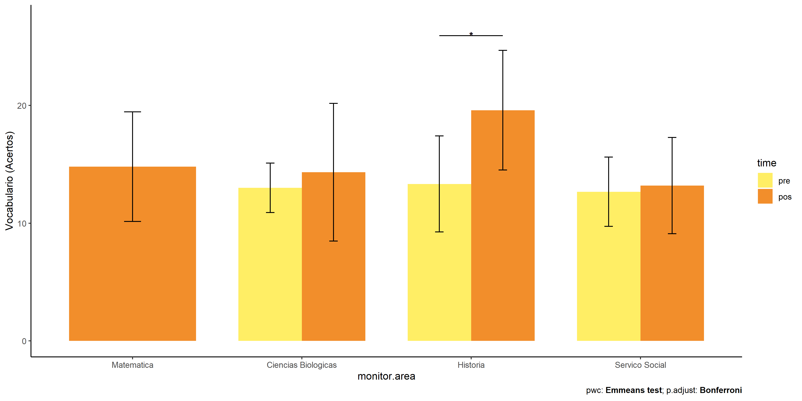<!-- -->

### Vocabulario Ensinado (Acertos)

| var                      | monitor.area        |   n | M (pre) | SE (pre) | M (unadj) | SE (unadj) | M (adj) | SE (adj) |
|:-------------------------|:--------------------|----:|--------:|---------:|----------:|-----------:|--------:|---------:|
| score.vocab.ensinado.pos | Ciencias Biologicas |   6 |   2.667 |    0.333 |     2.667 |      0.715 |   2.538 |    0.825 |
| score.vocab.ensinado.pos | Historia            |   6 |   3.000 |    0.365 |     3.167 |      1.014 |   3.212 |    0.822 |
| score.vocab.ensinado.pos | Matematica          |   5 |   2.800 |    1.020 |     2.000 |      0.707 |   1.941 |    0.901 |
| score.vocab.ensinado.pos | Servico Social      |   6 |   3.167 |    0.601 |     2.667 |      0.955 |   2.799 |    0.826 |

| .y.                      | group1              | group2         | estimate | conf.low | conf.high |    se | statistic |     p | p.adj | p.adj.signif |
|:-------------------------|:--------------------|:---------------|---------:|---------:|----------:|------:|----------:|------:|------:|:-------------|
| score.vocab.ensinado.pos | Ciencias Biologicas | Historia       |   -0.674 |   -3.125 |     1.777 | 1.167 |    -0.578 | 0.571 |     1 | ns           |
| score.vocab.ensinado.pos | Ciencias Biologicas | Matematica     |    0.597 |   -1.965 |     3.159 | 1.219 |     0.490 | 0.630 |     1 | ns           |
| score.vocab.ensinado.pos | Ciencias Biologicas | Servico Social |   -0.261 |   -2.725 |     2.203 | 1.173 |    -0.222 | 0.826 |     1 | ns           |
| score.vocab.ensinado.pos | Historia            | Matematica     |    1.271 |   -1.293 |     3.835 | 1.220 |     1.042 | 0.311 |     1 | ns           |
| score.vocab.ensinado.pos | Historia            | Servico Social |    0.413 |   -2.030 |     2.857 | 1.163 |     0.355 | 0.727 |     1 | ns           |
| score.vocab.ensinado.pos | Matematica          | Servico Social |   -0.858 |   -3.430 |     1.714 | 1.224 |    -0.701 | 0.492 |     1 | ns           |
| score.vocab.ensinado.pre | Ciencias Biologicas | Historia       |   -0.333 |   -2.064 |     1.397 | 0.827 |    -0.403 | 0.691 |     1 | ns           |
| score.vocab.ensinado.pre | Ciencias Biologicas | Matematica     |   -0.133 |   -1.948 |     1.682 | 0.867 |    -0.154 | 0.879 |     1 | ns           |
| score.vocab.ensinado.pre | Ciencias Biologicas | Servico Social |   -0.500 |   -2.231 |     1.231 | 0.827 |    -0.605 | 0.553 |     1 | ns           |
| score.vocab.ensinado.pre | Historia            | Matematica     |    0.200 |   -1.615 |     2.015 | 0.867 |     0.231 | 0.820 |     1 | ns           |
| score.vocab.ensinado.pre | Historia            | Servico Social |   -0.167 |   -1.897 |     1.564 | 0.827 |    -0.202 | 0.842 |     1 | ns           |
| score.vocab.ensinado.pre | Matematica          | Servico Social |   -0.367 |   -2.182 |     1.448 | 0.867 |    -0.423 | 0.677 |     1 | ns           |

| .y.                  | monitor.area        | group1 | group2 | estimate | conf.low | conf.high |    se | statistic |     p | p.adj | p.adj.signif |
|:---------------------|:--------------------|:-------|:-------|---------:|---------:|----------:|------:|----------:|------:|------:|:-------------|
| score.vocab.ensinado | Ciencias Biologicas | pre    | pos    |    0.000 |   -2.098 |     2.098 | 1.036 |     0.000 | 1.000 | 1.000 | ns           |
| score.vocab.ensinado | Historia            | pre    | pos    |   -0.167 |   -2.265 |     1.932 | 1.036 |    -0.161 | 0.873 | 0.873 | ns           |
| score.vocab.ensinado | Matematica          | pre    | pos    |    0.800 |   -1.498 |     3.098 | 1.135 |     0.705 | 0.485 | 0.485 | ns           |
| score.vocab.ensinado | Servico Social      | pre    | pos    |    0.500 |   -1.598 |     2.598 | 1.036 |     0.482 | 0.632 | 0.632 | ns           |

    ## Scale for colour is already present.
    ## Adding another scale for colour, which will replace the existing scale.

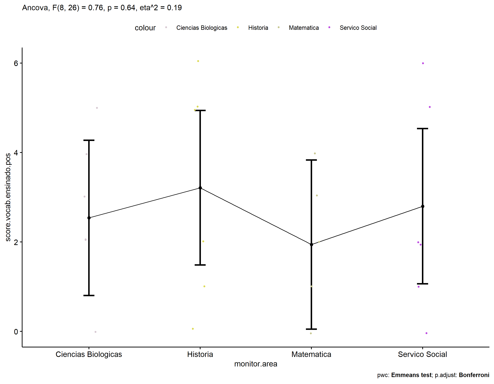<!-- -->

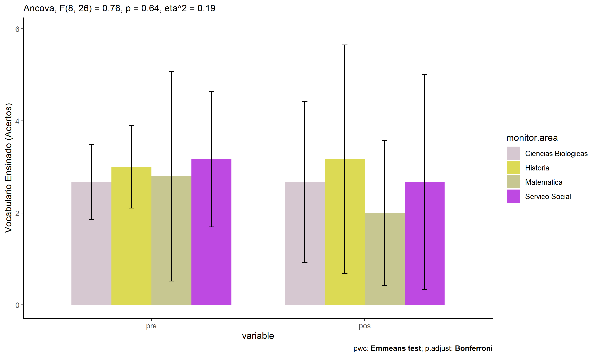<!-- -->

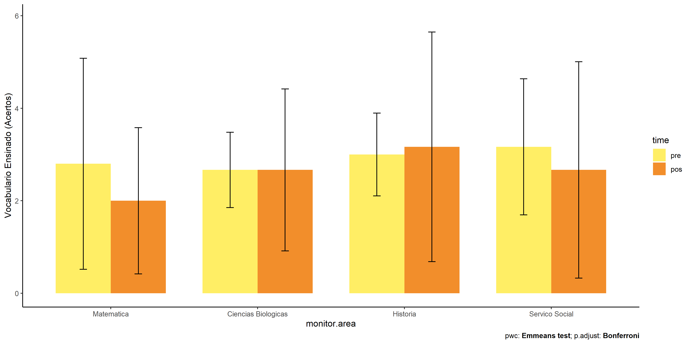<!-- -->

### Vocabulario Nao Ensinado (Acertos)

| var                          | monitor.area        |   n | M (pre) | SE (pre) | M (unadj) | SE (unadj) | M (adj) | SE (adj) |
|:-----------------------------|:--------------------|----:|--------:|---------:|----------:|-----------:|--------:|---------:|
| score.vocab.nao.ensinado.pos | Ciencias Biologicas |   6 |  10.333 |    0.882 |    11.667 |      1.874 |  11.592 |    2.231 |
| score.vocab.nao.ensinado.pos | Historia            |   6 |  10.333 |    1.563 |    13.167 |      2.915 |  13.092 |    2.231 |
| score.vocab.nao.ensinado.pos | Matematica          |   5 |   8.800 |    2.764 |    12.800 |      1.934 |  12.934 |    2.456 |
| score.vocab.nao.ensinado.pos | Servico Social      |   6 |   9.500 |    1.408 |     8.333 |      1.874 |   8.372 |    2.226 |

| .y.                          | group1              | group2         | estimate | conf.low | conf.high |    se | statistic |     p | p.adj | p.adj.signif |
|:-----------------------------|:--------------------|:---------------|---------:|---------:|----------:|------:|----------:|------:|------:|:-------------|
| score.vocab.nao.ensinado.pos | Ciencias Biologicas | Historia       |   -1.500 |   -8.110 |     5.110 | 3.146 |    -0.477 | 0.639 | 1.000 | ns           |
| score.vocab.nao.ensinado.pos | Ciencias Biologicas | Matematica     |   -1.342 |   -8.347 |     5.662 | 3.334 |    -0.403 | 0.692 | 1.000 | ns           |
| score.vocab.nao.ensinado.pos | Ciencias Biologicas | Servico Social |    3.220 |   -3.413 |     9.852 | 3.157 |     1.020 | 0.321 | 1.000 | ns           |
| score.vocab.nao.ensinado.pos | Historia            | Matematica     |    0.158 |   -6.847 |     7.162 | 3.334 |     0.047 | 0.963 | 1.000 | ns           |
| score.vocab.nao.ensinado.pos | Historia            | Servico Social |    4.720 |   -1.913 |    11.352 | 3.157 |     1.495 | 0.152 | 0.913 | ns           |
| score.vocab.nao.ensinado.pos | Matematica          | Servico Social |    4.562 |   -2.386 |    11.510 | 3.307 |     1.380 | 0.185 | 1.000 | ns           |
| score.vocab.nao.ensinado.pre | Ciencias Biologicas | Historia       |    0.000 |   -4.873 |     4.873 | 2.328 |     0.000 | 1.000 | 1.000 | ns           |
| score.vocab.nao.ensinado.pre | Ciencias Biologicas | Matematica     |    1.533 |   -3.577 |     6.644 | 2.442 |     0.628 | 0.538 | 1.000 | ns           |
| score.vocab.nao.ensinado.pre | Ciencias Biologicas | Servico Social |    0.833 |   -4.040 |     5.706 | 2.328 |     0.358 | 0.724 | 1.000 | ns           |
| score.vocab.nao.ensinado.pre | Historia            | Matematica     |    1.533 |   -3.577 |     6.644 | 2.442 |     0.628 | 0.538 | 1.000 | ns           |
| score.vocab.nao.ensinado.pre | Historia            | Servico Social |    0.833 |   -4.040 |     5.706 | 2.328 |     0.358 | 0.724 | 1.000 | ns           |
| score.vocab.nao.ensinado.pre | Matematica          | Servico Social |   -0.700 |   -5.811 |     4.411 | 2.442 |    -0.287 | 0.777 | 1.000 | ns           |

| .y.                      | monitor.area        | group1 | group2 | estimate | conf.low | conf.high |    se | statistic |     p | p.adj | p.adj.signif |
|:-------------------------|:--------------------|:-------|:-------|---------:|---------:|----------:|------:|----------:|------:|------:|:-------------|
| score.vocab.nao.ensinado | Ciencias Biologicas | pre    | pos    |   -1.333 |   -6.859 |     4.192 | 2.729 |    -0.489 | 0.628 | 0.628 | ns           |
| score.vocab.nao.ensinado | Historia            | pre    | pos    |   -2.833 |   -8.359 |     2.692 | 2.729 |    -1.038 | 0.306 | 0.306 | ns           |
| score.vocab.nao.ensinado | Matematica          | pre    | pos    |   -4.000 |  -10.053 |     2.053 | 2.990 |    -1.338 | 0.189 | 0.189 | ns           |
| score.vocab.nao.ensinado | Servico Social      | pre    | pos    |    1.167 |   -4.359 |     6.692 | 2.729 |     0.427 | 0.671 | 0.671 | ns           |

    ## Scale for colour is already present.
    ## Adding another scale for colour, which will replace the existing scale.

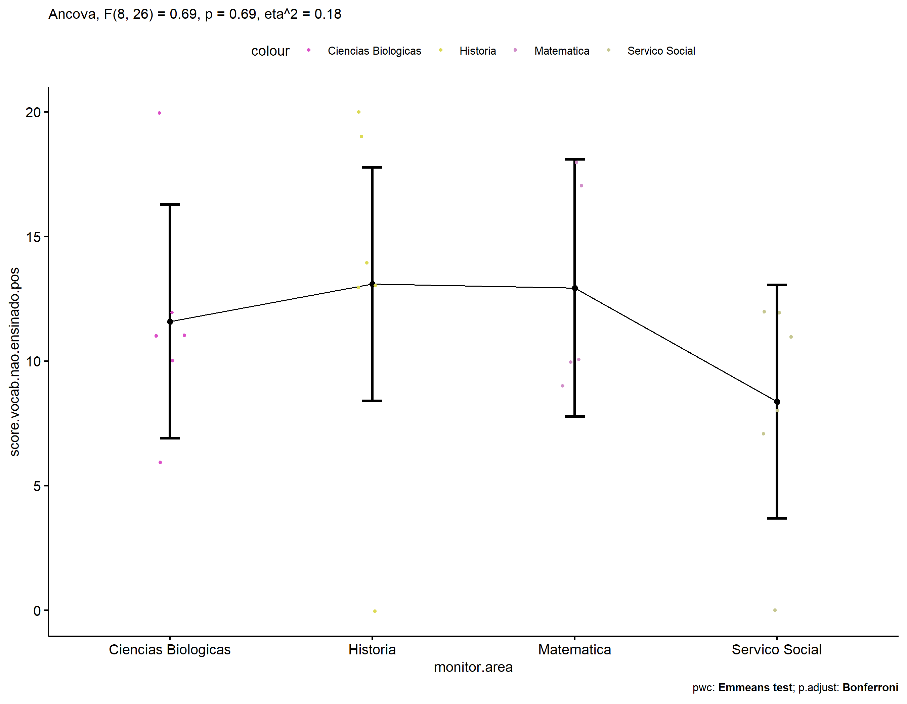<!-- -->

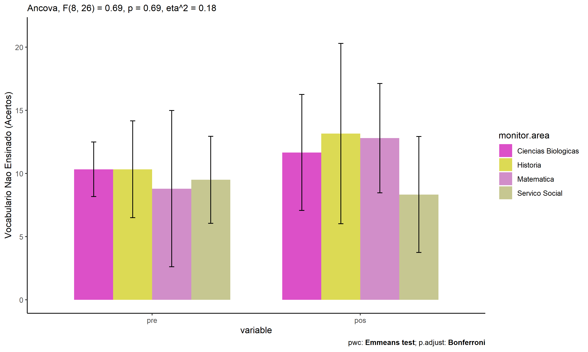<!-- -->

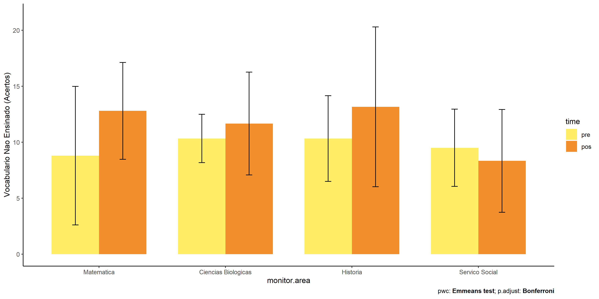<!-- -->

## factores: **grupo=“Experimental”:monitor.formacao**

### Vocabulario (Acertos)

| var             | monitor.formacao |   n | M (pre) | SE (pre) | M (unadj) | SE (unadj) | M (adj) | SE (adj) |
|:----------------|:-----------------|----:|--------:|---------:|----------:|-----------:|--------:|---------:|
| score.vocab.pos | ensino medio     |  26 |  12.885 |    0.671 |    14.923 |      0.935 |  14.953 |    0.871 |
| score.vocab.pos | graduacao        |   6 |  13.833 |    1.424 |    13.000 |      0.632 |  12.872 |    1.819 |

| .y.             | group1       | group2    | estimate | conf.low | conf.high |    se | statistic |     p | p.adj | p.adj.signif |
|:----------------|:-------------|:----------|---------:|---------:|----------:|------:|----------:|------:|------:|:-------------|
| score.vocab.pos | ensino medio | graduacao |    2.081 |   -2.052 |     6.213 | 2.020 |      1.03 | 0.312 | 0.312 | ns           |
| score.vocab.pre | ensino medio | graduacao |   -0.949 |   -4.124 |     2.226 | 1.555 |     -0.61 | 0.546 | 0.546 | ns           |

| .y.         | monitor.formacao | group1 | group2 | estimate | conf.low | conf.high |    se | statistic |     p | p.adj | p.adj.signif |
|:------------|:-----------------|:-------|:-------|---------:|---------:|----------:|------:|----------:|------:|------:|:-------------|
| score.vocab | ensino medio     | pre    | pos    |   -2.328 |   -4.482 |    -0.174 | 1.078 |    -2.160 | 0.035 | 0.035 | \*           |
| score.vocab | graduacao        | pre    | pos    |    0.833 |   -3.778 |     5.444 | 2.307 |     0.361 | 0.719 | 0.719 | ns           |

    ## Scale for colour is already present.
    ## Adding another scale for colour, which will replace the existing scale.

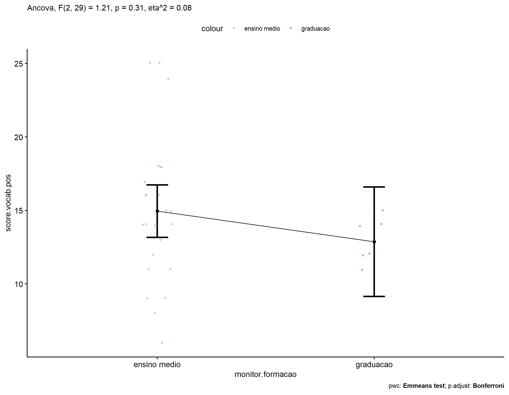<!-- -->

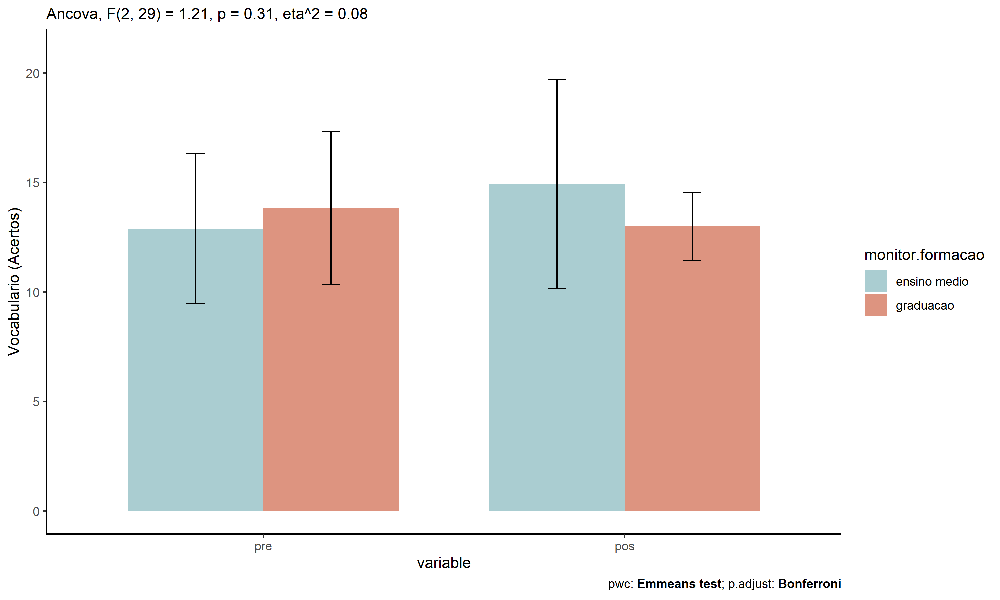<!-- -->

<!-- -->

### Vocabulario Ensinado (Acertos)

| var                      | monitor.formacao |   n | M (pre) | SE (pre) | M (unadj) | SE (unadj) | M (adj) | SE (adj) |
|:-------------------------|:-----------------|----:|--------:|---------:|----------:|-----------:|--------:|---------:|
| score.vocab.ensinado.pos | ensino medio     |  29 |   2.793 |    0.287 |     2.828 |      0.333 |   2.816 |    0.320 |
| score.vocab.ensinado.pos | graduacao        |   6 |   3.167 |    0.543 |     2.667 |      0.494 |   2.723 |    0.706 |

| .y.                      | group1       | group2    | estimate | conf.low | conf.high |    se | statistic |     p | p.adj | p.adj.signif |
|:-------------------------|:-------------|:----------|---------:|---------:|----------:|------:|----------:|------:|------:|:-------------|
| score.vocab.ensinado.pos | ensino medio | graduacao |    0.093 |   -1.488 |     1.674 | 0.776 |      0.12 | 0.905 | 0.905 | ns           |
| score.vocab.ensinado.pre | ensino medio | graduacao |   -0.374 |   -1.755 |     1.007 | 0.679 |     -0.55 | 0.586 | 0.586 | ns           |

| .y.                  | monitor.formacao | group1 | group2 | estimate | conf.low | conf.high |    se | statistic |     p | p.adj | p.adj.signif |
|:---------------------|:-----------------|:-------|:-------|---------:|---------:|----------:|------:|----------:|------:|------:|:-------------|
| score.vocab.ensinado | ensino medio     | pre    | pos    |   -0.034 |   -0.884 |     0.815 | 0.425 |    -0.081 | 0.936 | 0.936 | ns           |
| score.vocab.ensinado | graduacao        | pre    | pos    |    0.500 |   -1.367 |     2.367 | 0.935 |     0.535 | 0.595 | 0.595 | ns           |

    ## Scale for colour is already present.
    ## Adding another scale for colour, which will replace the existing scale.

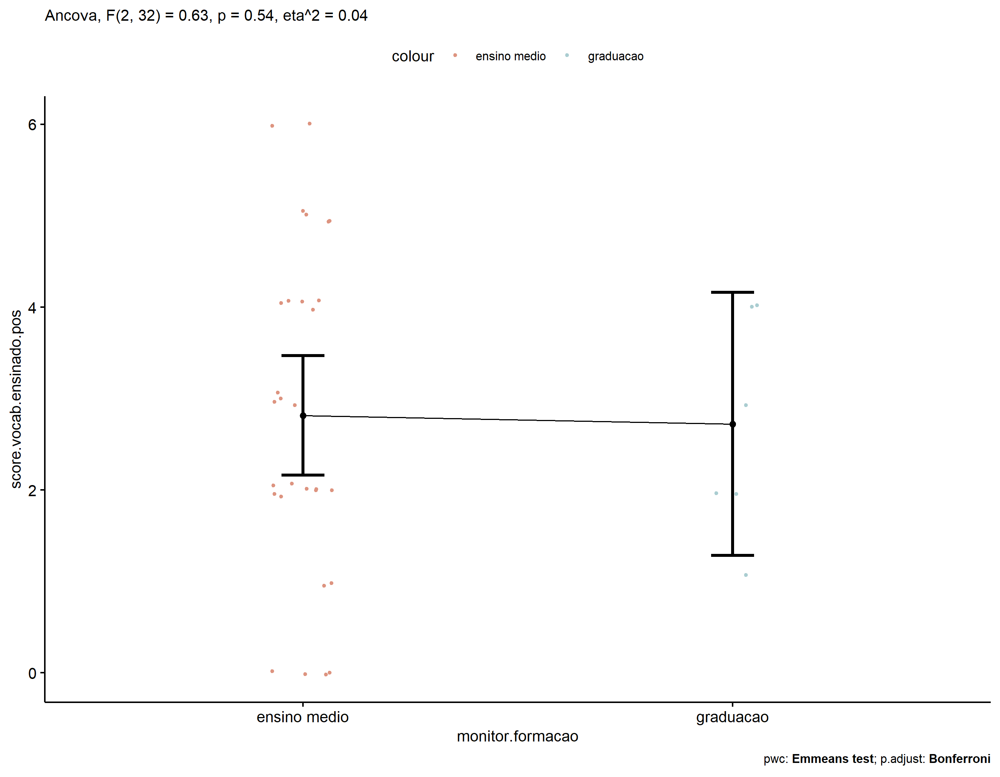<!-- -->

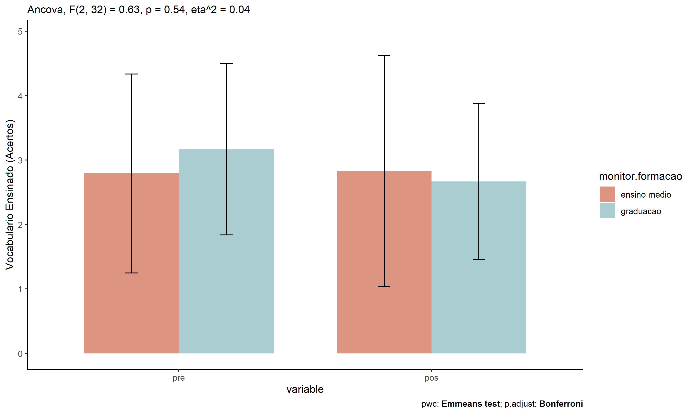<!-- -->

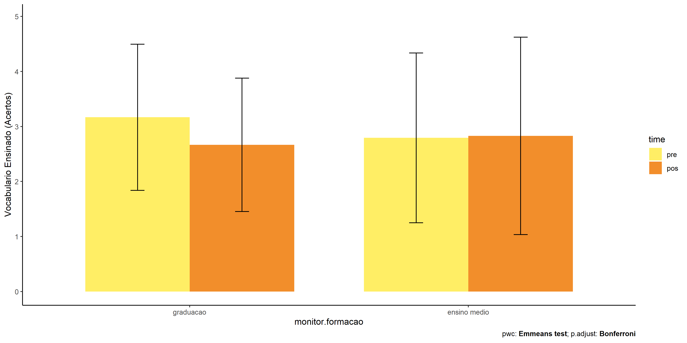<!-- -->

### Vocabulario Nao Ensinado (Acertos)

| var                          | monitor.formacao |   n | M (pre) | SE (pre) | M (unadj) | SE (unadj) | M (adj) | SE (adj) |
|:-----------------------------|:-----------------|----:|--------:|---------:|----------:|-----------:|--------:|---------:|
| score.vocab.nao.ensinado.pos | ensino medio     |  29 |   9.621 |    0.674 |    11.310 |      0.925 |  11.328 |    0.867 |
| score.vocab.nao.ensinado.pos | graduacao        |   6 |  10.667 |    1.282 |    10.333 |      0.422 |  10.250 |    1.914 |

| .y.                          | group1       | group2    | estimate | conf.low | conf.high |    se | statistic |     p | p.adj | p.adj.signif |
|:-----------------------------|:-------------|:----------|---------:|---------:|----------:|------:|----------:|------:|------:|:-------------|
| score.vocab.nao.ensinado.pos | ensino medio | graduacao |    1.077 |   -3.210 |     5.365 | 2.105 |     0.512 | 0.612 | 0.612 | ns           |
| score.vocab.nao.ensinado.pre | ensino medio | graduacao |   -1.046 |   -4.294 |     2.202 | 1.597 |    -0.655 | 0.517 | 0.517 | ns           |

| .y.                      | monitor.formacao | group1 | group2 | estimate | conf.low | conf.high |    se | statistic |     p | p.adj | p.adj.signif |
|:-------------------------|:-----------------|:-------|:-------|---------:|---------:|----------:|------:|----------:|------:|------:|:-------------|
| score.vocab.nao.ensinado | ensino medio     | pre    | pos    |   -1.690 |   -3.847 |     0.468 | 1.081 |    -1.563 | 0.123 | 0.123 | ns           |
| score.vocab.nao.ensinado | graduacao        | pre    | pos    |    0.333 |   -4.410 |     5.077 | 2.376 |     0.140 | 0.889 | 0.889 | ns           |

    ## Scale for colour is already present.
    ## Adding another scale for colour, which will replace the existing scale.

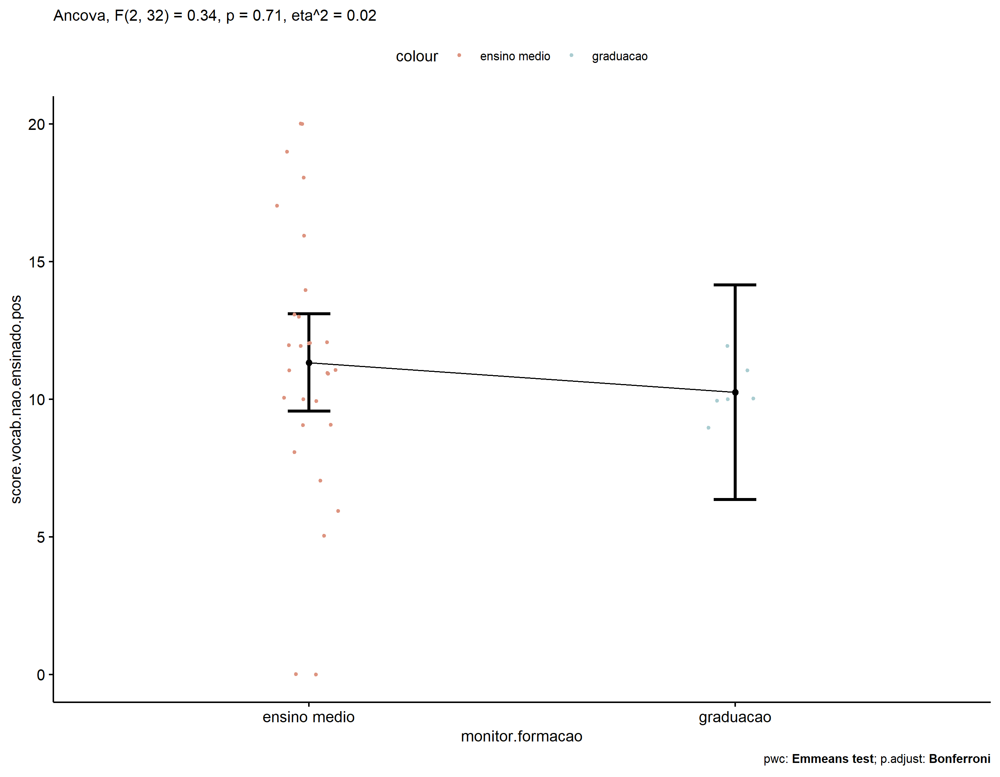<!-- -->

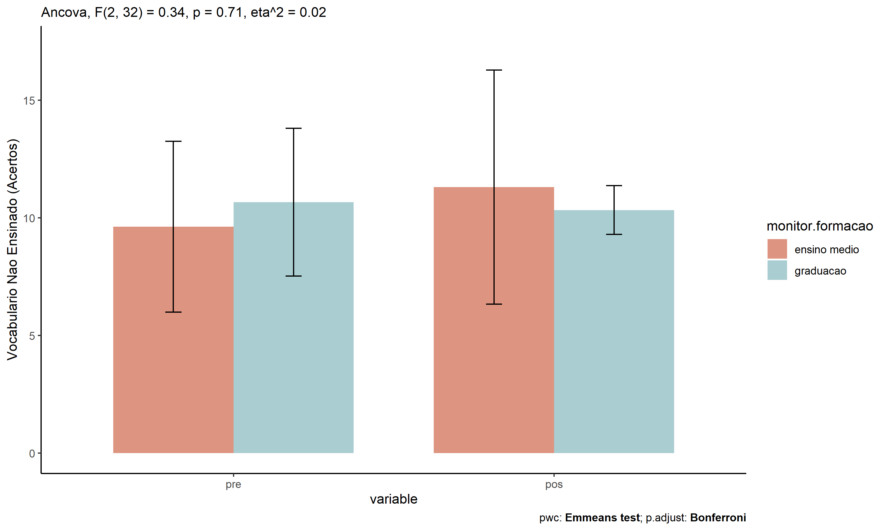<!-- -->

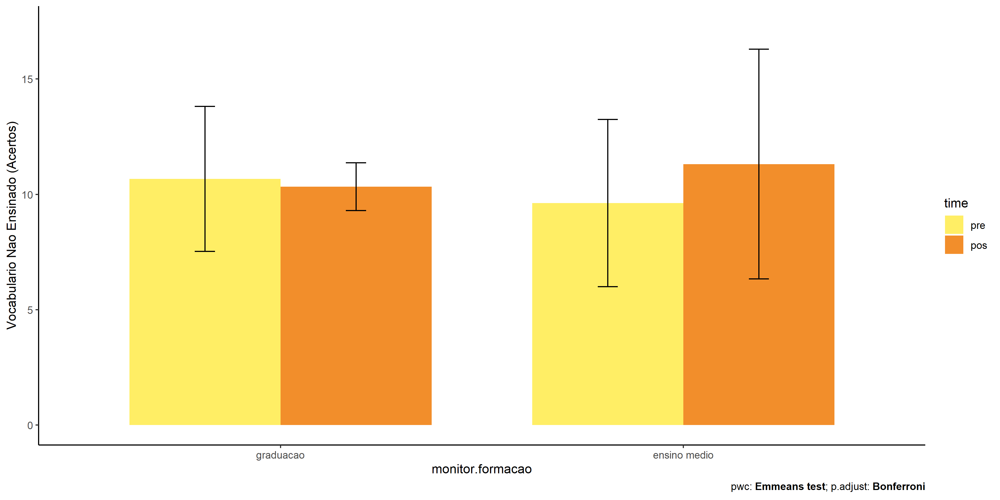<!-- -->

## factores: **grupo=“Experimental”:monitor.experiencia**

### Vocabulario (Acertos)

| var             | monitor.experiencia |   n | M (pre) | SE (pre) | M (unadj) | SE (unadj) | M (adj) | SE (adj) |
|:----------------|:--------------------|----:|--------:|---------:|----------:|-----------:|--------:|---------:|
| score.vocab.pos | maior 01 ano        |  21 |  13.571 |    0.764 |    14.762 |      1.100 |  14.681 |    0.996 |
| score.vocab.pos | menor 01 ano        |  12 |  12.000 |    0.862 |    13.750 |      0.922 |  13.892 |    1.328 |

| .y.             | group1       | group2       | estimate | conf.low | conf.high |    se | statistic |     p | p.adj | p.adj.signif |
|:----------------|:-------------|:-------------|---------:|---------:|----------:|------:|----------:|------:|------:|:-------------|
| score.vocab.pos | maior 01 ano | menor 01 ano |    0.788 |   -2.643 |     4.220 | 1.680 |     0.469 | 0.642 | 0.642 | ns           |
| score.vocab.pre | maior 01 ano | menor 01 ano |    1.571 |   -0.884 |     4.027 | 1.204 |     1.305 | 0.201 | 0.201 | ns           |

| .y.         | monitor.experiencia | group1 | group2 | estimate | conf.low | conf.high |    se | statistic |     p | p.adj | p.adj.signif |
|:------------|:--------------------|:-------|:-------|---------:|---------:|----------:|------:|----------:|------:|------:|:-------------|
| score.vocab | maior 01 ano        | pre    | pos    |   -1.409 |   -3.803 |     0.985 | 1.199 |    -1.176 | 0.244 | 0.244 | ns           |
| score.vocab | menor 01 ano        | pre    | pos    |   -1.981 |   -5.159 |     1.197 | 1.591 |    -1.245 | 0.218 | 0.218 | ns           |

    ## Scale for colour is already present.
    ## Adding another scale for colour, which will replace the existing scale.

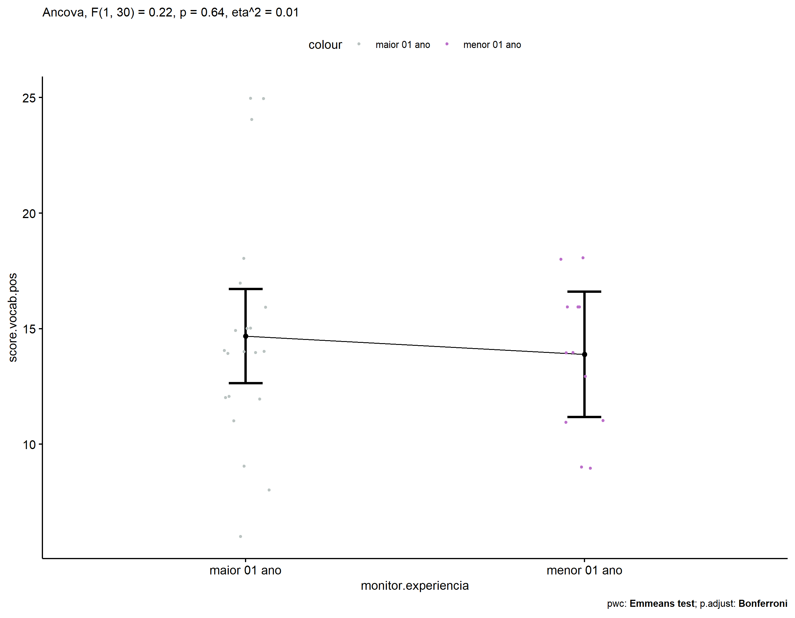<!-- -->

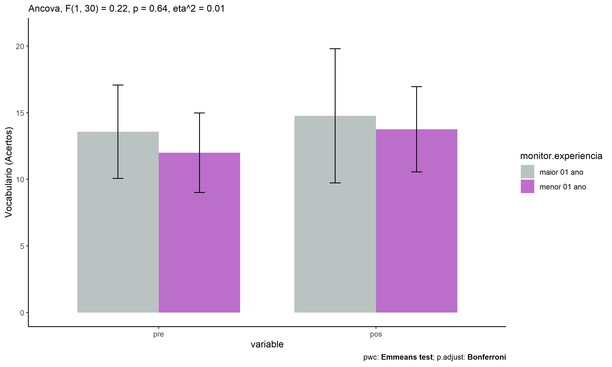<!-- -->

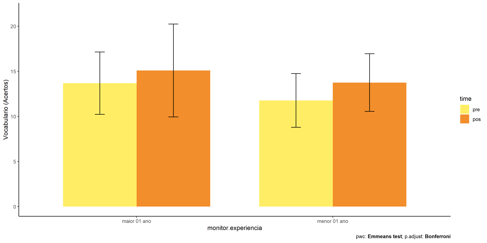<!-- -->

### Vocabulario Ensinado (Acertos)

| var                      | monitor.experiencia |   n | M (pre) | SE (pre) | M (unadj) | SE (unadj) | M (adj) | SE (adj) |
|:-------------------------|:--------------------|----:|--------:|---------:|----------:|-----------:|--------:|---------:|
| score.vocab.ensinado.pos | maior 01 ano        |  23 |   2.826 |    0.264 |     2.739 |      0.368 |   2.738 |    0.361 |
| score.vocab.ensinado.pos | menor 01 ano        |  13 |   2.846 |    0.517 |     2.769 |      0.455 |   2.771 |    0.480 |

| .y.                      | group1       | group2       | estimate | conf.low | conf.high |    se | statistic |     p | p.adj | p.adj.signif |
|:-------------------------|:-------------|:-------------|---------:|---------:|----------:|------:|----------:|------:|------:|:-------------|
| score.vocab.ensinado.pos | maior 01 ano | menor 01 ano |   -0.033 |   -1.254 |     1.188 | 0.600 |    -0.056 | 0.956 | 0.956 | ns           |
| score.vocab.ensinado.pre | maior 01 ano | menor 01 ano |   -0.020 |   -1.081 |     1.041 | 0.522 |    -0.038 | 0.970 | 0.970 | ns           |

| .y.                  | monitor.experiencia | group1 | group2 | estimate | conf.low | conf.high |    se | statistic |     p | p.adj | p.adj.signif |
|:---------------------|:--------------------|:-------|:-------|---------:|---------:|----------:|------:|----------:|------:|------:|:-------------|
| score.vocab.ensinado | maior 01 ano        | pre    | pos    |    0.087 |   -0.864 |     1.038 | 0.477 |     0.182 | 0.856 | 0.856 | ns           |
| score.vocab.ensinado | menor 01 ano        | pre    | pos    |    0.077 |   -1.188 |     1.342 | 0.634 |     0.121 | 0.904 | 0.904 | ns           |

    ## Scale for colour is already present.
    ## Adding another scale for colour, which will replace the existing scale.

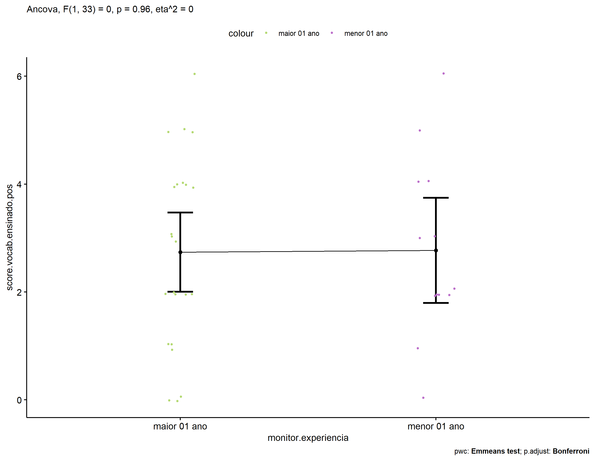<!-- -->

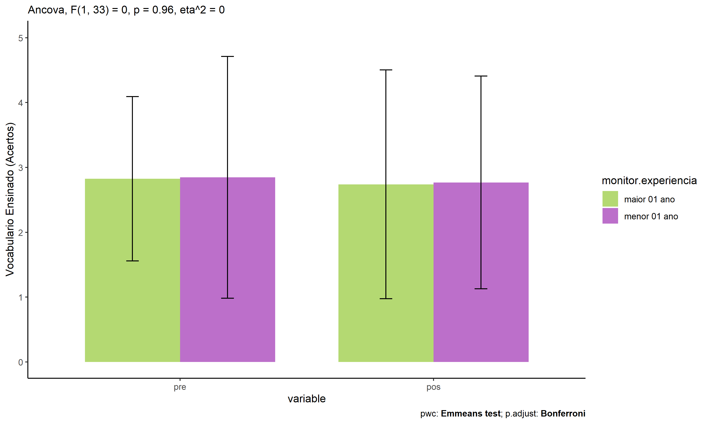<!-- -->

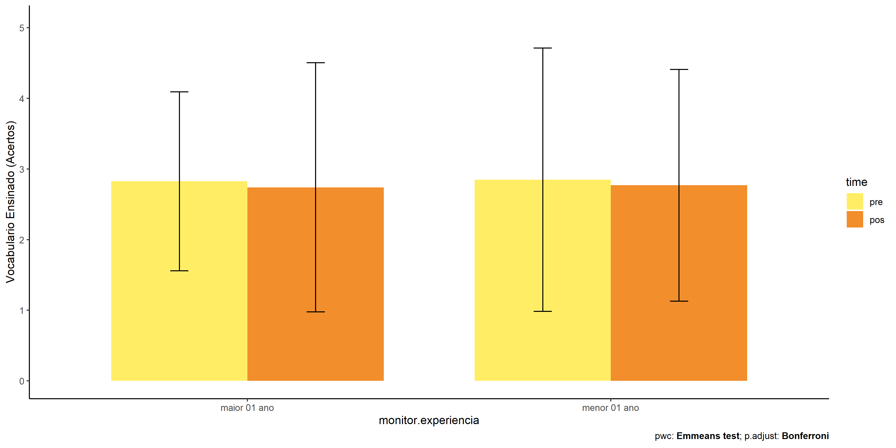<!-- -->

### Vocabulario Nao Ensinado (Acertos)

| var                          | monitor.experiencia |   n | M (pre) | SE (pre) | M (unadj) | SE (unadj) | M (adj) | SE (adj) |
|:-----------------------------|:--------------------|----:|--------:|---------:|----------:|-----------:|--------:|---------:|
| score.vocab.nao.ensinado.pos | maior 01 ano        |  23 |  10.261 |    0.793 |    11.696 |      1.013 |  11.675 |    0.958 |
| score.vocab.nao.ensinado.pos | menor 01 ano        |  13 |   8.923 |    0.763 |     9.923 |      1.041 |   9.960 |    1.280 |

| .y.                          | group1       | group2       | estimate | conf.low | conf.high |    se | statistic |     p | p.adj | p.adj.signif |
|:-----------------------------|:-------------|:-------------|---------:|---------:|----------:|------:|----------:|------:|------:|:-------------|
| score.vocab.nao.ensinado.pos | maior 01 ano | menor 01 ano |    1.715 |   -1.564 |     4.994 | 1.612 |     1.064 | 0.295 | 0.295 | ns           |
| score.vocab.nao.ensinado.pre | maior 01 ano | menor 01 ano |    1.338 |   -1.109 |     3.785 | 1.204 |     1.111 | 0.274 | 0.274 | ns           |

| .y.                      | monitor.experiencia | group1 | group2 | estimate | conf.low | conf.high |    se | statistic |     p | p.adj | p.adj.signif |
|:-------------------------|:--------------------|:-------|:-------|---------:|---------:|----------:|------:|----------:|------:|------:|:-------------|
| score.vocab.nao.ensinado | maior 01 ano        | pre    | pos    |   -1.435 |   -3.798 |     0.929 | 1.184 |    -1.211 | 0.230 | 0.230 | ns           |
| score.vocab.nao.ensinado | menor 01 ano        | pre    | pos    |   -1.000 |   -4.144 |     2.144 | 1.576 |    -0.635 | 0.528 | 0.528 | ns           |

    ## Scale for colour is already present.
    ## Adding another scale for colour, which will replace the existing scale.

<!-- -->

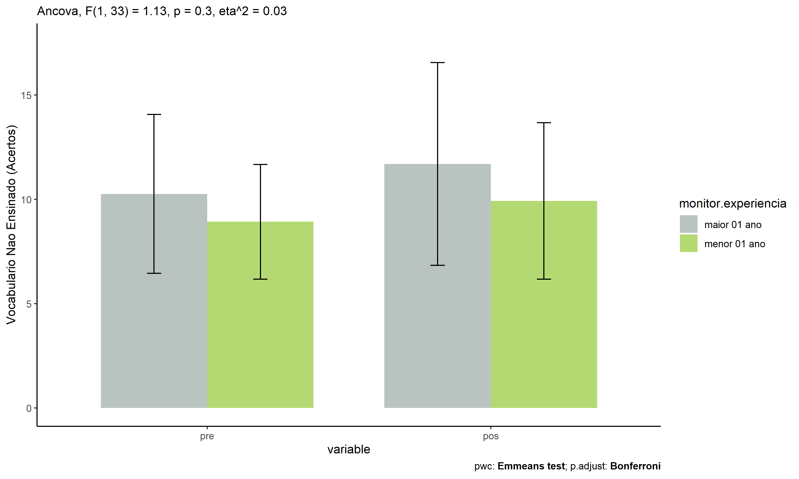<!-- -->

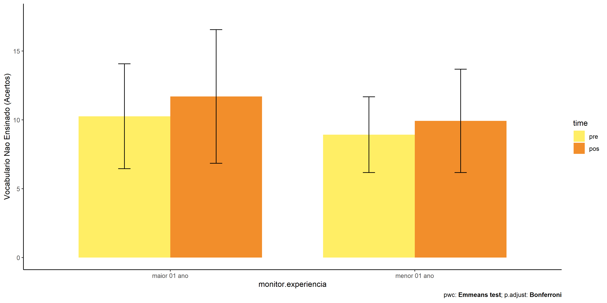<!-- -->
