ANCOVA in Vocabulary Test (Teste de Vocabulario)
================
Geiser C. Challco <geiser@alumni.usp.br>

- [Descriptive Statistics of Initial
  Data](#descriptive-statistics-of-initial-data)
  - [Vocabulario (Acertos)](#vocabulario-acertos)
  - [Vocabulario (TRI)](#vocabulario-tri)
  - [Vocabulario Ensinado (Acertos)](#vocabulario-ensinado-acertos)
  - [Vocabulario Ensinado (TRI)](#vocabulario-ensinado-tri)
  - [Vocabulario Nao Ensinado
    (Acertos)](#vocabulario-nao-ensinado-acertos)
  - [Vocabulario Nao Ensinado (TRI)](#vocabulario-nao-ensinado-tri)
- [Checking of Assumptions](#checking-of-assumptions)
  - [Assumption: Normality
    distribution](#assumption-normality-distribution)
    - [Vocabulario (Acertos)](#vocabulario-acertos-1)
    - [Vocabulario (TRI)](#vocabulario-tri-1)
    - [Vocabulario Ensinado (Acertos)](#vocabulario-ensinado-acertos-1)
    - [Vocabulario Ensinado (TRI)](#vocabulario-ensinado-tri-1)
    - [Vocabulario Nao Ensinado
      (Acertos)](#vocabulario-nao-ensinado-acertos-1)
    - [Vocabulario Nao Ensinado (TRI)](#vocabulario-nao-ensinado-tri-1)
  - [Assumption: Homogeneity](#assumption-homogeneity)
    - [Vocabulario (Acertos)](#vocabulario-acertos-2)
    - [Vocabulario (TRI)](#vocabulario-tri-2)
    - [Vocabulario Ensinado (Acertos)](#vocabulario-ensinado-acertos-2)
    - [Vocabulario Ensinado (TRI)](#vocabulario-ensinado-tri-2)
    - [Vocabulario Nao Ensinado
      (Acertos)](#vocabulario-nao-ensinado-acertos-2)
    - [Vocabulario Nao Ensinado (TRI)](#vocabulario-nao-ensinado-tri-2)
- [Computation of ANCOVA test and Pairwise
  Comparison](#computation-of-ancova-test-and-pairwise-comparison)
  - [ANCOVA tests for one factor](#ancova-tests-for-one-factor)
    - [Vocabulario (Acertos)](#vocabulario-acertos-3)
    - [Vocabulario (TRI)](#vocabulario-tri-3)
    - [Vocabulario Ensinado (Acertos)](#vocabulario-ensinado-acertos-3)
    - [Vocabulario Ensinado (TRI)](#vocabulario-ensinado-tri-3)
    - [Vocabulario Nao Ensinado
      (Acertos)](#vocabulario-nao-ensinado-acertos-3)
    - [Vocabulario Nao Ensinado (TRI)](#vocabulario-nao-ensinado-tri-3)
  - [ANCOVA tests for two factors](#ancova-tests-for-two-factors)
    - [Vocabulario (Acertos)](#vocabulario-acertos-4)
    - [Vocabulario (TRI)](#vocabulario-tri-4)
    - [Vocabulario Ensinado (Acertos)](#vocabulario-ensinado-acertos-4)
    - [Vocabulario Ensinado (TRI)](#vocabulario-ensinado-tri-4)
    - [Vocabulario Nao Ensinado
      (Acertos)](#vocabulario-nao-ensinado-acertos-4)
    - [Vocabulario Nao Ensinado (TRI)](#vocabulario-nao-ensinado-tri-4)
  - [ANCOVA tests for
    grupo=“Experimental”](#ancova-tests-for-grupoexperimental)
    - [Vocabulario (Acertos)](#vocabulario-acertos-5)
    - [Vocabulario (TRI)](#vocabulario-tri-5)
    - [Vocabulario Ensinado (Acertos)](#vocabulario-ensinado-acertos-5)
    - [Vocabulario Ensinado (TRI)](#vocabulario-ensinado-tri-5)
    - [Vocabulario Nao Ensinado
      (Acertos)](#vocabulario-nao-ensinado-acertos-5)
    - [Vocabulario Nao Ensinado (TRI)](#vocabulario-nao-ensinado-tri-5)
- [Pairwise comparisons for one
  factor](#pairwise-comparisons-for-one-factor)
  - [factor: **grupo**](#factor-grupo)
    - [Vocabulario (Acertos)](#vocabulario-acertos-6)
    - [Vocabulario (TRI)](#vocabulario-tri-6)
    - [Vocabulario Ensinado (Acertos)](#vocabulario-ensinado-acertos-6)
    - [Vocabulario Ensinado (TRI)](#vocabulario-ensinado-tri-6)
    - [Vocabulario Nao Ensinado
      (Acertos)](#vocabulario-nao-ensinado-acertos-6)
    - [Vocabulario Nao Ensinado (TRI)](#vocabulario-nao-ensinado-tri-6)
  - [factor: **genero**](#factor-genero)
    - [Vocabulario (Acertos)](#vocabulario-acertos-7)
    - [Vocabulario (TRI)](#vocabulario-tri-7)
    - [Vocabulario Ensinado (Acertos)](#vocabulario-ensinado-acertos-7)
    - [Vocabulario Ensinado (TRI)](#vocabulario-ensinado-tri-7)
    - [Vocabulario Nao Ensinado
      (Acertos)](#vocabulario-nao-ensinado-acertos-7)
    - [Vocabulario Nao Ensinado (TRI)](#vocabulario-nao-ensinado-tri-7)
  - [factor: **idade**](#factor-idade)
    - [Vocabulario (Acertos)](#vocabulario-acertos-8)
    - [Vocabulario (TRI)](#vocabulario-tri-8)
    - [Vocabulario Ensinado (Acertos)](#vocabulario-ensinado-acertos-8)
    - [Vocabulario Ensinado (TRI)](#vocabulario-ensinado-tri-8)
    - [Vocabulario Nao Ensinado
      (Acertos)](#vocabulario-nao-ensinado-acertos-8)
    - [Vocabulario Nao Ensinado (TRI)](#vocabulario-nao-ensinado-tri-8)
  - [factor: **zona.participante**](#factor-zonaparticipante)
    - [Vocabulario (Acertos)](#vocabulario-acertos-9)
    - [Vocabulario (TRI)](#vocabulario-tri-9)
    - [Vocabulario Ensinado (Acertos)](#vocabulario-ensinado-acertos-9)
    - [Vocabulario Ensinado (TRI)](#vocabulario-ensinado-tri-9)
    - [Vocabulario Nao Ensinado
      (Acertos)](#vocabulario-nao-ensinado-acertos-9)
    - [Vocabulario Nao Ensinado (TRI)](#vocabulario-nao-ensinado-tri-9)
  - [factor: **escola**](#factor-escola)
    - [Vocabulario (Acertos)](#vocabulario-acertos-10)
    - [Vocabulario (TRI)](#vocabulario-tri-10)
    - [Vocabulario Ensinado (Acertos)](#vocabulario-ensinado-acertos-10)
    - [Vocabulario Ensinado (TRI)](#vocabulario-ensinado-tri-10)
    - [Vocabulario Nao Ensinado
      (Acertos)](#vocabulario-nao-ensinado-acertos-10)
    - [Vocabulario Nao Ensinado (TRI)](#vocabulario-nao-ensinado-tri-10)
  - [factor: **zona.escola**](#factor-zonaescola)
    - [Vocabulario (Acertos)](#vocabulario-acertos-11)
    - [Vocabulario (TRI)](#vocabulario-tri-11)
    - [Vocabulario Ensinado (Acertos)](#vocabulario-ensinado-acertos-11)
    - [Vocabulario Ensinado (TRI)](#vocabulario-ensinado-tri-11)
    - [Vocabulario Nao Ensinado
      (Acertos)](#vocabulario-nao-ensinado-acertos-11)
    - [Vocabulario Nao Ensinado (TRI)](#vocabulario-nao-ensinado-tri-11)
- [Pairwise comparisons for two
  factors](#pairwise-comparisons-for-two-factors)
  - [factores: **genero:grupo**](#factores-generogrupo)
    - [Vocabulario (Acertos)](#vocabulario-acertos-12)
    - [Vocabulario (TRI)](#vocabulario-tri-12)
    - [Vocabulario Ensinado (Acertos)](#vocabulario-ensinado-acertos-12)
    - [Vocabulario Ensinado (TRI)](#vocabulario-ensinado-tri-12)
    - [Vocabulario Nao Ensinado
      (Acertos)](#vocabulario-nao-ensinado-acertos-12)
    - [Vocabulario Nao Ensinado (TRI)](#vocabulario-nao-ensinado-tri-12)
  - [factores: **idade:grupo**](#factores-idadegrupo)
    - [Vocabulario (Acertos)](#vocabulario-acertos-13)
    - [Vocabulario (TRI)](#vocabulario-tri-13)
    - [Vocabulario Ensinado (Acertos)](#vocabulario-ensinado-acertos-13)
    - [Vocabulario Ensinado (TRI)](#vocabulario-ensinado-tri-13)
    - [Vocabulario Nao Ensinado
      (Acertos)](#vocabulario-nao-ensinado-acertos-13)
    - [Vocabulario Nao Ensinado (TRI)](#vocabulario-nao-ensinado-tri-13)
  - [factores:
    **zona.participante:grupo**](#factores-zonaparticipantegrupo)
    - [Vocabulario (Acertos)](#vocabulario-acertos-14)
    - [Vocabulario (TRI)](#vocabulario-tri-14)
    - [Vocabulario Ensinado (Acertos)](#vocabulario-ensinado-acertos-14)
    - [Vocabulario Ensinado (TRI)](#vocabulario-ensinado-tri-14)
    - [Vocabulario Nao Ensinado
      (Acertos)](#vocabulario-nao-ensinado-acertos-14)
    - [Vocabulario Nao Ensinado (TRI)](#vocabulario-nao-ensinado-tri-14)
  - [factores: **escola:grupo**](#factores-escolagrupo)
    - [Vocabulario (Acertos)](#vocabulario-acertos-15)
    - [Vocabulario (TRI)](#vocabulario-tri-15)
    - [Vocabulario Ensinado (Acertos)](#vocabulario-ensinado-acertos-15)
    - [Vocabulario Ensinado (TRI)](#vocabulario-ensinado-tri-15)
    - [Vocabulario Nao Ensinado
      (Acertos)](#vocabulario-nao-ensinado-acertos-15)
    - [Vocabulario Nao Ensinado (TRI)](#vocabulario-nao-ensinado-tri-15)
  - [factores: **zona.escola:grupo**](#factores-zonaescolagrupo)
    - [Vocabulario (Acertos)](#vocabulario-acertos-16)
    - [Vocabulario (TRI)](#vocabulario-tri-16)
    - [Vocabulario Ensinado (Acertos)](#vocabulario-ensinado-acertos-16)
    - [Vocabulario Ensinado (TRI)](#vocabulario-ensinado-tri-16)
    - [Vocabulario Nao Ensinado
      (Acertos)](#vocabulario-nao-ensinado-acertos-16)
    - [Vocabulario Nao Ensinado (TRI)](#vocabulario-nao-ensinado-tri-16)
- [Pairwise comparisons for
  grupo=“Experimental”](#pairwise-comparisons-for-grupoexperimental)
  - [factores:
    **grupo=“Experimental”:monitor**](#factores-grupoexperimentalmonitor)
    - [Vocabulario (Acertos)](#vocabulario-acertos-17)
    - [Vocabulario (TRI)](#vocabulario-tri-17)
    - [Vocabulario Ensinado (Acertos)](#vocabulario-ensinado-acertos-17)
    - [Vocabulario Ensinado (TRI)](#vocabulario-ensinado-tri-17)
    - [Vocabulario Nao Ensinado
      (Acertos)](#vocabulario-nao-ensinado-acertos-17)
    - [Vocabulario Nao Ensinado (TRI)](#vocabulario-nao-ensinado-tri-17)
  - [factores:
    **grupo=“Experimental”:monitor.genero**](#factores-grupoexperimentalmonitorgenero)
    - [Vocabulario (Acertos)](#vocabulario-acertos-18)
    - [Vocabulario (TRI)](#vocabulario-tri-18)
    - [Vocabulario Ensinado (Acertos)](#vocabulario-ensinado-acertos-18)
    - [Vocabulario Ensinado (TRI)](#vocabulario-ensinado-tri-18)
    - [Vocabulario Nao Ensinado
      (Acertos)](#vocabulario-nao-ensinado-acertos-18)
    - [Vocabulario Nao Ensinado (TRI)](#vocabulario-nao-ensinado-tri-18)
  - [factores:
    **grupo=“Experimental”:monitor.area**](#factores-grupoexperimentalmonitorarea)
    - [Vocabulario (Acertos)](#vocabulario-acertos-19)
    - [Vocabulario (TRI)](#vocabulario-tri-19)
    - [Vocabulario Ensinado (Acertos)](#vocabulario-ensinado-acertos-19)
    - [Vocabulario Ensinado (TRI)](#vocabulario-ensinado-tri-19)
    - [Vocabulario Nao Ensinado
      (Acertos)](#vocabulario-nao-ensinado-acertos-19)
    - [Vocabulario Nao Ensinado (TRI)](#vocabulario-nao-ensinado-tri-19)
  - [factores:
    **grupo=“Experimental”:monitor.formacao**](#factores-grupoexperimentalmonitorformacao)
    - [Vocabulario (Acertos)](#vocabulario-acertos-20)
    - [Vocabulario (TRI)](#vocabulario-tri-20)
    - [Vocabulario Ensinado (Acertos)](#vocabulario-ensinado-acertos-20)
    - [Vocabulario Ensinado (TRI)](#vocabulario-ensinado-tri-20)
    - [Vocabulario Nao Ensinado
      (Acertos)](#vocabulario-nao-ensinado-acertos-20)
    - [Vocabulario Nao Ensinado (TRI)](#vocabulario-nao-ensinado-tri-20)
  - [factores:
    **grupo=“Experimental”:monitor.experiencia**](#factores-grupoexperimentalmonitorexperiencia)
    - [Vocabulario (Acertos)](#vocabulario-acertos-21)
    - [Vocabulario (TRI)](#vocabulario-tri-21)
    - [Vocabulario Ensinado (Acertos)](#vocabulario-ensinado-acertos-21)
    - [Vocabulario Ensinado (TRI)](#vocabulario-ensinado-tri-21)
    - [Vocabulario Nao Ensinado
      (Acertos)](#vocabulario-nao-ensinado-acertos-21)
    - [Vocabulario Nao Ensinado (TRI)](#vocabulario-nao-ensinado-tri-21)

**NOTE**

- Teste ANCOVA para determinar se houve diferenças significativas no
  Teste de Vocabulario (medido usando pre- e pos-testes).
- ANCOVA test to determine whether there were significant differences in
  Vocabulary Test (measured using pre- and post-tests).

# Descriptive Statistics of Initial Data

## Vocabulario (Acertos)

| grupo        | genero | idade | zona.participante | escola | zona.escola | variable        |   n |   mean | median | min | max |    sd |    se |     ci |  iqr |
|:-------------|:-------|:------|:------------------|:-------|:------------|:----------------|----:|-------:|-------:|----:|----:|------:|------:|-------:|-----:|
| Controle     | F      |       |                   |        |             | score.vocab.pos |  17 | 16.588 |   16.0 |   8 |  26 | 4.797 | 1.163 |  2.466 | 6.00 |
| Controle     | M      |       |                   |        |             | score.vocab.pos |  10 | 13.800 |   13.0 |   8 |  20 | 3.765 | 1.191 |  2.694 | 3.75 |
| Experimental | F      |       |                   |        |             | score.vocab.pos |  12 | 13.750 |   13.5 |   6 |  24 | 4.731 | 1.366 |  3.006 | 5.25 |
| Experimental | M      |       |                   |        |             | score.vocab.pos |   8 | 13.625 |   14.0 |   9 |  16 | 2.264 | 0.800 |  1.893 | 1.00 |
| Controle     | F      |       |                   |        |             | score.vocab.pre |  17 | 13.353 |   13.0 |   9 |  19 | 3.390 | 0.822 |  1.743 | 6.00 |
| Controle     | M      |       |                   |        |             | score.vocab.pre |  10 | 12.300 |   12.5 |   5 |  19 | 4.692 | 1.484 |  3.356 | 4.25 |
| Experimental | F      |       |                   |        |             | score.vocab.pre |  12 | 12.917 |   12.0 |   9 |  22 | 3.315 | 0.957 |  2.107 | 3.00 |
| Experimental | M      |       |                   |        |             | score.vocab.pre |   8 | 14.500 |   14.5 |  11 |  20 | 2.878 | 1.018 |  2.406 | 2.00 |
| Controle     |        | 10y   |                   |        |             | score.vocab.pos |   4 | 18.000 |   17.5 |  14 |  23 | 4.243 | 2.121 |  6.751 | 6.00 |
| Controle     |        | 11y   |                   |        |             | score.vocab.pos |  16 | 15.312 |   15.5 |   8 |  22 | 4.270 | 1.067 |  2.275 | 6.25 |
| Controle     |        | 12y   |                   |        |             | score.vocab.pos |   3 | 18.333 |   16.0 |  13 |  26 | 6.807 | 3.930 | 16.909 | 6.50 |
| Controle     |        | 13y   |                   |        |             | score.vocab.pos |   3 | 12.000 |   13.0 |   8 |  15 | 3.606 | 2.082 |  8.957 | 3.50 |
| Controle     |        |       |                   |        |             | score.vocab.pos |   1 | 12.000 |   12.0 |  12 |  12 |       |       |        | 0.00 |
| Experimental |        | 10y   |                   |        |             | score.vocab.pos |   2 | 14.000 |   14.0 |  13 |  15 | 1.414 | 1.000 | 12.706 | 1.00 |
| Experimental |        | 11y   |                   |        |             | score.vocab.pos |  12 | 13.833 |   14.0 |   6 |  24 | 4.589 | 1.325 |  2.916 | 5.00 |
| Experimental |        | 12y   |                   |        |             | score.vocab.pos |   5 | 14.200 |   14.0 |  11 |  18 | 2.490 | 1.114 |  3.092 | 0.00 |
| Experimental |        | 13y   |                   |        |             | score.vocab.pos |   1 |  9.000 |    9.0 |   9 |   9 |       |       |        | 0.00 |
| Controle     |        | 10y   |                   |        |             | score.vocab.pre |   4 | 16.750 |   16.5 |  15 |  19 | 1.708 | 0.854 |  2.718 | 1.75 |
| Controle     |        | 11y   |                   |        |             | score.vocab.pre |  16 | 12.250 |   11.0 |   5 |  19 | 4.405 | 1.101 |  2.347 | 5.75 |
| Controle     |        | 12y   |                   |        |             | score.vocab.pre |   3 | 13.000 |   12.0 |  11 |  16 | 2.646 | 1.528 |  6.572 | 2.50 |
| Controle     |        | 13y   |                   |        |             | score.vocab.pre |   3 | 12.000 |   13.0 |  10 |  13 | 1.732 | 1.000 |  4.303 | 1.50 |
| Controle     |        |       |                   |        |             | score.vocab.pre |   1 | 12.000 |   12.0 |  12 |  12 |       |       |        | 0.00 |
| Experimental |        | 10y   |                   |        |             | score.vocab.pre |   2 | 12.000 |   12.0 |   9 |  15 | 4.243 | 3.000 | 38.119 | 3.00 |
| Experimental |        | 11y   |                   |        |             | score.vocab.pre |  12 | 13.417 |   12.5 |  11 |  22 | 3.232 | 0.933 |  2.054 | 3.25 |
| Experimental |        | 12y   |                   |        |             | score.vocab.pre |   5 | 14.400 |   14.0 |  11 |  20 | 3.507 | 1.568 |  4.355 | 3.00 |
| Experimental |        | 13y   |                   |        |             | score.vocab.pre |   1 | 14.000 |   14.0 |  14 |  14 |       |       |        | 0.00 |
| Controle     |        |       | Urbana            |        |             | score.vocab.pos |  12 | 16.667 |   17.0 |   8 |  23 | 4.499 | 1.299 |  2.859 | 6.00 |
| Controle     |        |       | Rural             |        |             | score.vocab.pos |  10 | 15.700 |   14.0 |  10 |  26 | 4.990 | 1.578 |  3.570 | 4.75 |
| Controle     |        |       |                   |        |             | score.vocab.pos |   5 | 12.600 |   12.0 |   8 |  16 | 3.130 | 1.400 |  3.887 | 3.00 |
| Experimental |        |       | Urbana            |        |             | score.vocab.pos |   7 | 13.143 |   14.0 |   9 |  16 | 2.410 | 0.911 |  2.229 | 2.50 |
| Experimental |        |       | Rural             |        |             | score.vocab.pos |   9 | 14.444 |   14.0 |   6 |  24 | 4.902 | 1.634 |  3.768 | 4.00 |
| Experimental |        |       |                   |        |             | score.vocab.pos |   4 | 13.000 |   12.5 |   9 |  18 | 3.916 | 1.958 |  6.231 | 4.50 |
| Controle     |        |       | Urbana            |        |             | score.vocab.pre |  12 | 15.500 |   16.5 |  10 |  19 | 3.344 | 0.965 |  2.125 | 4.75 |
| Controle     |        |       | Rural             |        |             | score.vocab.pre |  10 | 11.200 |   11.0 |   5 |  16 | 3.259 | 1.031 |  2.331 | 3.75 |
| Controle     |        |       |                   |        |             | score.vocab.pre |   5 | 10.400 |   11.0 |   6 |  13 | 2.702 | 1.208 |  3.355 | 2.00 |
| Experimental |        |       | Urbana            |        |             | score.vocab.pre |   7 | 12.429 |   12.0 |   9 |  15 | 2.299 | 0.869 |  2.126 | 3.50 |
| Experimental |        |       | Rural             |        |             | score.vocab.pre |   9 | 13.889 |   13.0 |  11 |  22 | 3.551 | 1.184 |  2.730 | 4.00 |
| Experimental |        |       |                   |        |             | score.vocab.pre |   4 | 14.750 |   14.0 |  11 |  20 | 3.775 | 1.887 |  6.007 | 2.25 |
| Controle     |        |       |                   | E2     |             | score.vocab.pos |   7 | 15.571 |   15.0 |  11 |  20 | 3.101 | 1.172 |  2.868 | 3.50 |
| Controle     |        |       |                   | E3     |             | score.vocab.pos |   6 | 15.833 |   15.0 |  10 |  26 | 5.707 | 2.330 |  5.989 | 4.75 |
| Controle     |        |       |                   | E4     |             | score.vocab.pos |   2 | 20.500 |   20.5 |  18 |  23 | 3.536 | 2.500 | 31.766 | 2.50 |
| Controle     |        |       |                   | E5     |             | score.vocab.pos |  10 | 15.500 |   15.0 |   8 |  22 | 4.625 | 1.462 |  3.308 | 6.75 |
| Controle     |        |       |                   | E6     |             | score.vocab.pos |   2 | 10.000 |   10.0 |   8 |  12 | 2.828 | 2.000 | 25.412 | 2.00 |
| Experimental |        |       |                   | E2     |             | score.vocab.pos |   5 | 13.000 |   14.0 |  11 |  15 | 1.871 | 0.837 |  2.323 | 3.00 |
| Experimental |        |       |                   | E3     |             | score.vocab.pos |   6 | 14.333 |   14.0 |   6 |  24 | 5.854 | 2.390 |  6.143 | 3.00 |
| Experimental |        |       |                   | E4     |             | score.vocab.pos |   1 |  9.000 |    9.0 |   9 |   9 |       |       |        | 0.00 |
| Experimental |        |       |                   | E5     |             | score.vocab.pos |   6 | 14.500 |   15.0 |  11 |  17 | 2.258 | 0.922 |  2.370 | 2.75 |
| Experimental |        |       |                   | E6     |             | score.vocab.pos |   2 | 13.500 |   13.5 |   9 |  18 | 6.364 | 4.500 | 57.178 | 4.50 |
| Controle     |        |       |                   | E2     |             | score.vocab.pre |   7 | 13.857 |   12.0 |  10 |  19 | 3.976 | 1.503 |  3.677 | 7.00 |
| Controle     |        |       |                   | E3     |             | score.vocab.pre |   6 | 11.000 |   11.5 |   5 |  16 | 3.847 | 1.571 |  4.037 | 3.75 |
| Controle     |        |       |                   | E4     |             | score.vocab.pre |   2 | 16.500 |   16.5 |  16 |  17 | 0.707 | 0.500 |  6.353 | 0.50 |
| Controle     |        |       |                   | E5     |             | score.vocab.pre |  10 | 13.800 |   13.5 |   9 |  19 | 3.360 | 1.062 |  2.404 | 3.00 |
| Controle     |        |       |                   | E6     |             | score.vocab.pre |   2 |  8.000 |    8.0 |   6 |  10 | 2.828 | 2.000 | 25.412 | 2.00 |
| Experimental |        |       |                   | E2     |             | score.vocab.pre |   5 | 13.800 |   12.0 |  11 |  20 | 3.834 | 1.715 |  4.761 | 4.00 |
| Experimental |        |       |                   | E3     |             | score.vocab.pre |   6 | 13.000 |   12.5 |  11 |  16 | 2.098 | 0.856 |  2.201 | 3.25 |
| Experimental |        |       |                   | E4     |             | score.vocab.pre |   1 | 11.000 |   11.0 |  11 |  11 |       |       |        | 0.00 |
| Experimental |        |       |                   | E5     |             | score.vocab.pre |   6 | 14.167 |   14.0 |   9 |  22 | 4.446 | 1.815 |  4.666 | 3.00 |
| Experimental |        |       |                   | E6     |             | score.vocab.pre |   2 | 14.000 |   14.0 |  14 |  14 | 0.000 | 0.000 |  0.000 | 0.00 |
| Controle     |        |       |                   |        | Urbana      | score.vocab.pos |  17 | 15.529 |   15.0 |   8 |  22 | 3.955 | 0.959 |  2.033 | 6.00 |
| Controle     |        |       |                   |        | Rural       | score.vocab.pos |  10 | 15.600 |   15.0 |   8 |  26 | 5.719 | 1.809 |  4.091 | 5.75 |
| Experimental |        |       |                   |        | Urbana      | score.vocab.pos |  11 | 13.818 |   14.0 |  11 |  17 | 2.136 | 0.644 |  1.435 | 3.50 |
| Experimental |        |       |                   |        | Rural       | score.vocab.pos |   9 | 13.556 |   14.0 |   6 |  24 | 5.434 | 1.811 |  4.177 | 7.00 |
| Controle     |        |       |                   |        | Urbana      | score.vocab.pre |  17 | 13.824 |   13.0 |   9 |  19 | 3.504 | 0.850 |  1.802 | 6.00 |
| Controle     |        |       |                   |        | Rural       | score.vocab.pre |  10 | 11.500 |   11.5 |   5 |  17 | 4.197 | 1.327 |  3.002 | 6.00 |
| Experimental |        |       |                   |        | Urbana      | score.vocab.pre |  11 | 14.000 |   14.0 |   9 |  22 | 3.975 | 1.198 |  2.670 | 4.00 |
| Experimental |        |       |                   |        | Rural       | score.vocab.pre |   9 | 13.000 |   13.0 |  11 |  16 | 1.871 | 0.624 |  1.438 | 3.00 |

## Vocabulario (TRI)

| grupo        | genero | idade | zona.participante | escola | zona.escola | variable      |   n |   mean | median |    min |    max |    sd |    se |    ci |   iqr |
|:-------------|:-------|:------|:------------------|:-------|:------------|:--------------|----:|-------:|-------:|-------:|-------:|------:|------:|------:|------:|
| Controle     | F      |       |                   |        |             | tri.vocab.pos |  17 | -0.655 | -0.657 | -1.555 |  0.551 | 0.652 | 0.158 | 0.335 | 0.870 |
| Controle     | M      |       |                   |        |             | tri.vocab.pos |  10 | -0.722 | -0.774 | -1.671 |  0.237 | 0.561 | 0.178 | 0.402 | 0.626 |
| Experimental | F      |       |                   |        |             | tri.vocab.pos |  12 | -0.819 | -0.756 | -2.158 |  0.650 | 0.757 | 0.219 | 0.481 | 0.911 |
| Experimental | M      |       |                   |        |             | tri.vocab.pos |   8 | -0.749 | -0.776 | -1.181 | -0.219 | 0.350 | 0.124 | 0.292 | 0.571 |
| Controle     | F      |       |                   |        |             | tri.vocab.pre |  17 | -0.736 | -0.799 | -1.939 |  0.115 | 0.516 | 0.125 | 0.265 | 0.695 |
| Controle     | M      |       |                   |        |             | tri.vocab.pre |  10 | -0.861 | -0.998 | -1.612 |  0.107 | 0.590 | 0.186 | 0.422 | 0.909 |
| Experimental | F      |       |                   |        |             | tri.vocab.pre |  12 | -0.801 | -0.883 | -2.057 |  0.432 | 0.674 | 0.195 | 0.428 | 0.701 |
| Experimental | M      |       |                   |        |             | tri.vocab.pre |   8 | -0.695 | -0.612 | -1.987 |  0.025 | 0.649 | 0.229 | 0.543 | 0.606 |
| Controle     |        | 10y   |                   |        |             | tri.vocab.pos |   4 | -0.441 | -0.380 | -1.555 |  0.551 | 0.999 | 0.499 | 1.589 | 1.452 |
| Controle     |        | 11y   |                   |        |             | tri.vocab.pos |  16 | -0.710 | -0.613 | -1.671 |  0.543 | 0.583 | 0.146 | 0.311 | 0.752 |
| Controle     |        | 12y   |                   |        |             | tri.vocab.pos |   3 | -0.292 | -0.326 | -0.569 |  0.019 | 0.295 | 0.171 | 0.734 | 0.294 |
| Controle     |        | 13y   |                   |        |             | tri.vocab.pos |   3 | -1.051 | -0.979 | -1.198 | -0.975 | 0.128 | 0.074 | 0.317 | 0.112 |
| Controle     |        |       |                   |        |             | tri.vocab.pos |   1 | -1.194 | -1.194 | -1.194 | -1.194 |       |       |       | 0.000 |
| Experimental |        | 10y   |                   |        |             | tri.vocab.pos |   2 | -0.465 | -0.465 | -0.564 | -0.365 | 0.141 | 0.100 | 1.266 | 0.100 |
| Experimental |        | 11y   |                   |        |             | tri.vocab.pos |  12 | -0.686 | -0.776 | -1.464 |  0.650 | 0.627 | 0.181 | 0.398 | 0.766 |
| Experimental |        | 12y   |                   |        |             | tri.vocab.pos |   5 | -1.097 | -1.020 | -2.158 | -0.484 | 0.685 | 0.306 | 0.850 | 0.772 |
| Experimental |        | 13y   |                   |        |             | tri.vocab.pos |   1 | -1.181 | -1.181 | -1.181 | -1.181 |       |       |       | 0.000 |
| Controle     |        | 10y   |                   |        |             | tri.vocab.pre |   4 | -0.219 | -0.160 | -0.475 | -0.082 | 0.175 | 0.087 | 0.278 | 0.126 |
| Controle     |        | 11y   |                   |        |             | tri.vocab.pre |  16 | -0.815 | -0.865 | -1.939 |  0.115 | 0.565 | 0.141 | 0.301 | 0.630 |
| Controle     |        | 12y   |                   |        |             | tri.vocab.pre |   3 | -1.102 | -1.445 | -1.493 | -0.369 | 0.636 | 0.367 | 1.579 | 0.562 |
| Controle     |        | 13y   |                   |        |             | tri.vocab.pre |   3 | -1.031 | -1.064 | -1.082 | -0.946 | 0.074 | 0.043 | 0.183 | 0.068 |
| Controle     |        |       |                   |        |             | tri.vocab.pre |   1 | -0.805 | -0.805 | -0.805 | -0.805 |       |       |       | 0.000 |
| Experimental |        | 10y   |                   |        |             | tri.vocab.pre |   2 | -0.856 | -0.856 | -1.133 | -0.578 | 0.392 | 0.277 | 3.522 | 0.277 |
| Experimental |        | 11y   |                   |        |             | tri.vocab.pre |  12 | -0.750 | -0.713 | -2.057 |  0.432 | 0.779 | 0.225 | 0.495 | 1.093 |
| Experimental |        | 12y   |                   |        |             | tri.vocab.pre |   5 | -0.727 | -0.923 | -1.243 |  0.025 | 0.536 | 0.240 | 0.665 | 0.744 |
| Experimental |        | 13y   |                   |        |             | tri.vocab.pre |   1 | -0.821 | -0.821 | -0.821 | -0.821 |       |       |       | 0.000 |
| Controle     |        |       | Urbana            |        |             | tri.vocab.pos |  12 | -0.535 | -0.517 | -1.555 |  0.551 | 0.752 | 0.217 | 0.478 | 1.093 |
| Controle     |        |       | Rural             |        |             | tri.vocab.pos |  10 | -0.653 | -0.561 | -1.273 |  0.019 | 0.441 | 0.139 | 0.315 | 0.680 |
| Controle     |        |       |                   |        |             | tri.vocab.pos |   5 | -1.078 | -0.979 | -1.671 | -0.569 | 0.401 | 0.180 | 0.499 | 0.219 |
| Experimental |        |       | Urbana            |        |             | tri.vocab.pos |   7 | -0.722 | -0.564 | -1.438 | -0.219 | 0.455 | 0.172 | 0.421 | 0.527 |
| Experimental |        |       | Rural             |        |             | tri.vocab.pos |   9 | -0.628 | -0.861 | -1.464 |  0.650 | 0.642 | 0.214 | 0.494 | 0.591 |
| Experimental |        |       |                   |        |             | tri.vocab.pos |   4 | -1.280 | -1.238 | -2.158 | -0.484 | 0.687 | 0.343 | 1.093 | 0.505 |
| Controle     |        |       | Urbana            |        |             | tri.vocab.pre |  12 | -0.570 | -0.397 | -1.939 |  0.115 | 0.617 | 0.178 | 0.392 | 0.844 |
| Controle     |        |       | Rural             |        |             | tri.vocab.pre |  10 | -0.828 | -0.798 | -1.493 | -0.369 | 0.400 | 0.126 | 0.286 | 0.558 |
| Controle     |        |       |                   |        |             | tri.vocab.pre |   5 | -1.202 | -1.082 | -1.612 | -0.805 | 0.323 | 0.145 | 0.401 | 0.381 |
| Experimental |        |       | Urbana            |        |             | tri.vocab.pre |   7 | -0.940 | -0.844 | -2.057 | -0.043 | 0.631 | 0.238 | 0.583 | 0.556 |
| Experimental |        |       | Rural             |        |             | tri.vocab.pre |   9 | -0.639 | -0.539 | -1.987 |  0.432 | 0.748 | 0.249 | 0.575 | 1.031 |
| Experimental |        |       |                   |        |             | tri.vocab.pre |   4 | -0.709 | -0.872 | -1.119 |  0.025 | 0.505 | 0.253 | 0.804 | 0.363 |
| Controle     |        |       |                   | E2     |             | tri.vocab.pos |   7 | -0.850 | -0.776 | -1.555 | -0.126 | 0.548 | 0.207 | 0.506 | 0.802 |
| Controle     |        |       |                   | E3     |             | tri.vocab.pos |   6 | -0.613 | -0.561 | -1.198 |  0.019 | 0.442 | 0.181 | 0.464 | 0.502 |
| Controle     |        |       |                   | E4     |             | tri.vocab.pos |   2 | -0.053 | -0.053 | -0.657 |  0.551 | 0.854 | 0.604 | 7.673 | 0.604 |
| Controle     |        |       |                   | E5     |             | tri.vocab.pos |  10 | -0.596 | -0.651 | -1.389 |  0.543 | 0.667 | 0.211 | 0.477 | 0.867 |
| Controle     |        |       |                   | E6     |             | tri.vocab.pos |   2 | -1.325 | -1.325 | -1.671 | -0.979 | 0.489 | 0.346 | 4.394 | 0.346 |
| Experimental |        |       |                   | E2     |             | tri.vocab.pos |   5 | -0.861 | -0.564 | -1.438 | -0.484 | 0.465 | 0.208 | 0.578 | 0.772 |
| Experimental |        |       |                   | E3     |             | tri.vocab.pos |   6 | -0.635 | -0.730 | -1.464 |  0.650 | 0.747 | 0.305 | 0.784 | 0.652 |
| Experimental |        |       |                   | E4     |             | tri.vocab.pos |   1 | -1.254 | -1.254 | -1.254 | -1.254 |       |       |       | 0.000 |
| Experimental |        |       |                   | E5     |             | tri.vocab.pos |   6 | -0.519 | -0.528 | -0.947 | -0.034 | 0.368 | 0.150 | 0.387 | 0.563 |
| Experimental |        |       |                   | E6     |             | tri.vocab.pos |   2 | -1.669 | -1.669 | -2.158 | -1.181 | 0.691 | 0.489 | 6.210 | 0.489 |
| Controle     |        |       |                   | E2     |             | tri.vocab.pre |   7 | -0.816 | -0.799 | -1.939 |  0.107 | 0.735 | 0.278 | 0.679 | 0.989 |
| Controle     |        |       |                   | E3     |             | tri.vocab.pre |   6 | -0.719 | -0.724 | -1.049 | -0.369 | 0.315 | 0.129 | 0.331 | 0.544 |
| Controle     |        |       |                   | E4     |             | tri.vocab.pre |   2 | -0.626 | -0.626 | -1.110 | -0.141 | 0.686 | 0.485 | 6.161 | 0.485 |
| Controle     |        |       |                   | E5     |             | tri.vocab.pre |  10 | -0.716 | -0.728 | -1.493 |  0.115 | 0.514 | 0.162 | 0.367 | 0.668 |
| Controle     |        |       |                   | E6     |             | tri.vocab.pre |   2 | -1.347 | -1.347 | -1.612 | -1.082 | 0.375 | 0.265 | 3.365 | 0.265 |
| Experimental |        |       |                   | E2     |             | tri.vocab.pre |   5 | -0.994 | -1.119 | -2.057 |  0.025 | 0.778 | 0.348 | 0.965 | 0.664 |
| Experimental |        |       |                   | E3     |             | tri.vocab.pre |   6 | -0.719 | -0.457 | -1.987 |  0.014 | 0.780 | 0.318 | 0.818 | 0.956 |
| Experimental |        |       |                   | E4     |             | tri.vocab.pre |   1 | -0.844 | -0.844 | -0.844 | -0.844 |       |       |       | 0.000 |
| Experimental |        |       |                   | E5     |             | tri.vocab.pre |   6 | -0.550 | -0.713 | -1.133 |  0.432 | 0.626 | 0.255 | 0.656 | 0.832 |
| Experimental |        |       |                   | E6     |             | tri.vocab.pre |   2 | -0.872 | -0.872 | -0.923 | -0.821 | 0.072 | 0.051 | 0.649 | 0.051 |
| Controle     |        |       |                   |        | Urbana      | tri.vocab.pos |  17 | -0.701 | -0.776 | -1.555 |  0.543 | 0.616 | 0.149 | 0.317 | 0.870 |
| Controle     |        |       |                   |        | Rural       | tri.vocab.pos |  10 | -0.643 | -0.613 | -1.671 |  0.551 | 0.631 | 0.199 | 0.451 | 0.604 |
| Experimental |        |       |                   |        | Urbana      | tri.vocab.pos |  11 | -0.675 | -0.564 | -1.438 | -0.034 | 0.432 | 0.130 | 0.290 | 0.480 |
| Experimental |        |       |                   |        | Rural       | tri.vocab.pos |   9 | -0.933 | -1.106 | -2.158 |  0.650 | 0.790 | 0.263 | 0.607 | 0.814 |
| Controle     |        |       |                   |        | Urbana      | tri.vocab.pre |  17 | -0.757 | -0.799 | -1.939 |  0.115 | 0.594 | 0.144 | 0.306 | 0.760 |
| Controle     |        |       |                   |        | Rural       | tri.vocab.pre |  10 | -0.826 | -0.979 | -1.612 | -0.141 | 0.447 | 0.141 | 0.320 | 0.622 |
| Experimental |        |       |                   |        | Urbana      | tri.vocab.pre |  11 | -0.752 | -0.741 | -2.057 |  0.432 | 0.701 | 0.211 | 0.471 | 0.822 |
| Experimental |        |       |                   |        | Rural       | tri.vocab.pre |   9 | -0.766 | -0.821 | -1.987 |  0.014 | 0.621 | 0.207 | 0.478 | 0.547 |

## Vocabulario Ensinado (Acertos)

| grupo        | genero | idade | zona.participante | escola | zona.escola | variable                 |   n |  mean | median | min | max |    sd |    se |     ci |  iqr |
|:-------------|:-------|:------|:------------------|:-------|:------------|:-------------------------|----:|------:|-------:|----:|----:|------:|------:|-------:|-----:|
| Controle     | F      |       |                   |        |             | score.vocab.ensinado.pos |  18 | 2.389 |    2.0 |   0 |   8 | 1.975 | 0.465 |  0.982 | 1.50 |
| Controle     | M      |       |                   |        |             | score.vocab.ensinado.pos |  12 | 2.750 |    3.0 |   0 |   5 | 1.357 | 0.392 |  0.862 | 1.25 |
| Experimental | F      |       |                   |        |             | score.vocab.ensinado.pos |  13 | 2.769 |    3.0 |   0 |   6 | 1.922 | 0.533 |  1.161 | 3.00 |
| Experimental | M      |       |                   |        |             | score.vocab.ensinado.pos |   9 | 2.333 |    2.0 |   0 |   4 | 1.323 | 0.441 |  1.017 | 1.00 |
| Controle     | F      |       |                   |        |             | score.vocab.ensinado.pre |  18 | 2.444 |    2.5 |   0 |   4 | 1.199 | 0.283 |  0.596 | 1.00 |
| Controle     | M      |       |                   |        |             | score.vocab.ensinado.pre |  12 | 2.667 |    3.0 |   0 |   4 | 1.497 | 0.432 |  0.951 | 3.00 |
| Experimental | F      |       |                   |        |             | score.vocab.ensinado.pre |  13 | 2.538 |    2.0 |   0 |   5 | 1.506 | 0.418 |  0.910 | 1.00 |
| Experimental | M      |       |                   |        |             | score.vocab.ensinado.pre |   9 | 3.778 |    4.0 |   2 |   7 | 1.563 | 0.521 |  1.202 | 1.00 |
| Controle     |        | 10y   |                   |        |             | score.vocab.ensinado.pos |   5 | 2.400 |    2.0 |   0 |   6 | 2.302 | 1.030 |  2.859 | 2.00 |
| Controle     |        | 11y   |                   |        |             | score.vocab.ensinado.pos |  16 | 2.250 |    2.0 |   0 |   5 | 1.183 | 0.296 |  0.630 | 1.00 |
| Controle     |        | 12y   |                   |        |             | score.vocab.ensinado.pos |   4 | 4.750 |    4.0 |   3 |   8 | 2.217 | 1.109 |  3.528 | 1.25 |
| Controle     |        | 13y   |                   |        |             | score.vocab.ensinado.pos |   3 | 2.667 |    3.0 |   2 |   3 | 0.577 | 0.333 |  1.434 | 0.50 |
| Controle     |        |       |                   |        |             | score.vocab.ensinado.pos |   2 | 0.500 |    0.5 |   0 |   1 | 0.707 | 0.500 |  6.353 | 0.50 |
| Experimental |        | 10y   |                   |        |             | score.vocab.ensinado.pos |   2 | 3.500 |    3.5 |   3 |   4 | 0.707 | 0.500 |  6.353 | 0.50 |
| Experimental |        | 11y   |                   |        |             | score.vocab.ensinado.pos |  14 | 2.357 |    2.5 |   0 |   5 | 1.737 | 0.464 |  1.003 | 3.00 |
| Experimental |        | 12y   |                   |        |             | score.vocab.ensinado.pos |   5 | 3.200 |    2.0 |   2 |   6 | 1.789 | 0.800 |  2.221 | 2.00 |
| Experimental |        | 13y   |                   |        |             | score.vocab.ensinado.pos |   1 | 1.000 |    1.0 |   1 |   1 |       |       |        | 0.00 |
| Controle     |        | 10y   |                   |        |             | score.vocab.ensinado.pre |   5 | 2.000 |    1.0 |   1 |   4 | 1.414 | 0.632 |  1.756 | 2.00 |
| Controle     |        | 11y   |                   |        |             | score.vocab.ensinado.pre |  16 | 2.500 |    2.5 |   0 |   4 | 1.211 | 0.303 |  0.645 | 1.25 |
| Controle     |        | 12y   |                   |        |             | score.vocab.ensinado.pre |   4 | 2.750 |    3.5 |   0 |   4 | 1.893 | 0.946 |  3.012 | 1.75 |
| Controle     |        | 13y   |                   |        |             | score.vocab.ensinado.pre |   3 | 2.667 |    3.0 |   1 |   4 | 1.528 | 0.882 |  3.795 | 1.50 |
| Controle     |        |       |                   |        |             | score.vocab.ensinado.pre |   2 | 3.500 |    3.5 |   3 |   4 | 0.707 | 0.500 |  6.353 | 0.50 |
| Experimental |        | 10y   |                   |        |             | score.vocab.ensinado.pre |   2 | 2.500 |    2.5 |   2 |   3 | 0.707 | 0.500 |  6.353 | 0.50 |
| Experimental |        | 11y   |                   |        |             | score.vocab.ensinado.pre |  14 | 3.143 |    3.0 |   0 |   7 | 1.834 | 0.490 |  1.059 | 2.00 |
| Experimental |        | 12y   |                   |        |             | score.vocab.ensinado.pre |   5 | 2.600 |    3.0 |   1 |   4 | 1.140 | 0.510 |  1.416 | 1.00 |
| Experimental |        | 13y   |                   |        |             | score.vocab.ensinado.pre |   1 | 5.000 |    5.0 |   5 |   5 |       |       |        | 0.00 |
| Controle     |        |       | Urbana            |        |             | score.vocab.ensinado.pos |  14 | 2.357 |    2.0 |   0 |   6 | 1.737 | 0.464 |  1.003 | 1.75 |
| Controle     |        |       | Rural             |        |             | score.vocab.ensinado.pos |  10 | 3.000 |    2.5 |   1 |   8 | 1.944 | 0.615 |  1.390 | 1.00 |
| Controle     |        |       |                   |        |             | score.vocab.ensinado.pos |   6 | 2.167 |    2.5 |   0 |   4 | 1.472 | 0.601 |  1.545 | 1.75 |
| Experimental |        |       | Urbana            |        |             | score.vocab.ensinado.pos |   8 | 3.125 |    3.5 |   1 |   4 | 1.126 | 0.398 |  0.941 | 1.25 |
| Experimental |        |       | Rural             |        |             | score.vocab.ensinado.pos |   9 | 2.333 |    2.0 |   0 |   5 | 1.803 | 0.601 |  1.386 | 3.00 |
| Experimental |        |       |                   |        |             | score.vocab.ensinado.pos |   5 | 2.200 |    2.0 |   0 |   6 | 2.280 | 1.020 |  2.831 | 1.00 |
| Controle     |        |       | Urbana            |        |             | score.vocab.ensinado.pre |  14 | 2.429 |    2.0 |   0 |   4 | 1.399 | 0.374 |  0.808 | 2.75 |
| Controle     |        |       | Rural             |        |             | score.vocab.ensinado.pre |  10 | 2.400 |    3.0 |   0 |   4 | 1.350 | 0.427 |  0.966 | 1.75 |
| Controle     |        |       |                   |        |             | score.vocab.ensinado.pre |   6 | 3.000 |    3.0 |   1 |   4 | 1.095 | 0.447 |  1.150 | 0.75 |
| Experimental |        |       | Urbana            |        |             | score.vocab.ensinado.pre |   8 | 2.750 |    2.5 |   0 |   7 | 2.121 | 0.750 |  1.773 | 1.50 |
| Experimental |        |       | Rural             |        |             | score.vocab.ensinado.pre |   9 | 3.111 |    3.0 |   2 |   5 | 1.269 | 0.423 |  0.976 | 2.00 |
| Experimental |        |       |                   |        |             | score.vocab.ensinado.pre |   5 | 3.400 |    4.0 |   1 |   5 | 1.517 | 0.678 |  1.883 | 1.00 |
| Controle     |        |       |                   | E2     |             | score.vocab.ensinado.pos |   7 | 2.571 |    3.0 |   0 |   5 | 1.902 | 0.719 |  1.759 | 3.00 |
| Controle     |        |       |                   | E3     |             | score.vocab.ensinado.pos |   6 | 3.167 |    2.5 |   1 |   8 | 2.483 | 1.014 |  2.606 | 1.00 |
| Controle     |        |       |                   | E4     |             | score.vocab.ensinado.pos |   2 | 4.000 |    4.0 |   2 |   6 | 2.828 | 2.000 | 25.412 | 2.00 |
| Controle     |        |       |                   | E5     |             | score.vocab.ensinado.pos |  12 | 1.833 |    2.0 |   0 |   4 | 1.115 | 0.322 |  0.708 | 0.25 |
| Controle     |        |       |                   | E6     |             | score.vocab.ensinado.pos |   3 | 3.000 |    3.0 |   3 |   3 | 0.000 | 0.000 |  0.000 | 0.00 |
| Experimental |        |       |                   | E2     |             | score.vocab.ensinado.pos |   5 | 2.800 |    2.0 |   2 |   4 | 1.095 | 0.490 |  1.360 | 2.00 |
| Experimental |        |       |                   | E3     |             | score.vocab.ensinado.pos |   6 | 2.667 |    2.5 |   0 |   5 | 1.751 | 0.715 |  1.838 | 1.75 |
| Experimental |        |       |                   | E4     |             | score.vocab.ensinado.pos |   1 | 1.000 |    1.0 |   1 |   1 |       |       |        | 0.00 |
| Experimental |        |       |                   | E5     |             | score.vocab.ensinado.pos |   7 | 2.714 |    3.0 |   0 |   4 | 1.604 | 0.606 |  1.483 | 2.00 |
| Experimental |        |       |                   | E6     |             | score.vocab.ensinado.pos |   3 | 2.333 |    1.0 |   0 |   6 | 3.215 | 1.856 |  7.985 | 3.00 |
| Controle     |        |       |                   | E2     |             | score.vocab.ensinado.pre |   7 | 2.857 |    2.0 |   2 |   4 | 1.069 | 0.404 |  0.989 | 2.00 |
| Controle     |        |       |                   | E3     |             | score.vocab.ensinado.pre |   6 | 2.500 |    3.0 |   1 |   4 | 1.225 | 0.500 |  1.285 | 1.50 |
| Controle     |        |       |                   | E4     |             | score.vocab.ensinado.pre |   2 | 2.500 |    2.5 |   1 |   4 | 2.121 | 1.500 | 19.059 | 1.50 |
| Controle     |        |       |                   | E5     |             | score.vocab.ensinado.pre |  12 | 2.667 |    3.0 |   0 |   4 | 1.371 | 0.396 |  0.871 | 2.25 |
| Controle     |        |       |                   | E6     |             | score.vocab.ensinado.pre |   3 | 1.333 |    1.0 |   0 |   3 | 1.528 | 0.882 |  3.795 | 1.50 |
| Experimental |        |       |                   | E2     |             | score.vocab.ensinado.pre |   5 | 2.400 |    3.0 |   1 |   4 | 1.342 | 0.600 |  1.666 | 2.00 |
| Experimental |        |       |                   | E3     |             | score.vocab.ensinado.pre |   6 | 2.667 |    2.5 |   2 |   4 | 0.816 | 0.333 |  0.857 | 1.00 |
| Experimental |        |       |                   | E4     |             | score.vocab.ensinado.pre |   1 | 2.000 |    2.0 |   2 |   2 |       |       |        | 0.00 |
| Experimental |        |       |                   | E5     |             | score.vocab.ensinado.pre |   7 | 3.571 |    4.0 |   0 |   7 | 2.370 | 0.896 |  2.192 | 3.00 |
| Experimental |        |       |                   | E6     |             | score.vocab.ensinado.pre |   3 | 4.000 |    4.0 |   3 |   5 | 1.000 | 0.577 |  2.484 | 1.00 |
| Controle     |        |       |                   |        | Urbana      | score.vocab.ensinado.pos |  19 | 2.105 |    2.0 |   0 |   5 | 1.449 | 0.332 |  0.698 | 2.00 |
| Controle     |        |       |                   |        | Rural       | score.vocab.ensinado.pos |  11 | 3.273 |    3.0 |   1 |   8 | 2.005 | 0.604 |  1.347 | 1.00 |
| Experimental |        |       |                   |        | Urbana      | score.vocab.ensinado.pos |  12 | 2.750 |    3.0 |   0 |   4 | 1.357 | 0.392 |  0.862 | 2.00 |
| Experimental |        |       |                   |        | Rural       | score.vocab.ensinado.pos |  10 | 2.400 |    2.0 |   0 |   6 | 2.066 | 0.653 |  1.478 | 2.75 |
| Controle     |        |       |                   |        | Urbana      | score.vocab.ensinado.pre |  19 | 2.737 |    3.0 |   0 |   4 | 1.240 | 0.285 |  0.598 | 2.00 |
| Controle     |        |       |                   |        | Rural       | score.vocab.ensinado.pre |  11 | 2.182 |    3.0 |   0 |   4 | 1.401 | 0.423 |  0.941 | 2.00 |
| Experimental |        |       |                   |        | Urbana      | score.vocab.ensinado.pre |  12 | 3.083 |    3.0 |   0 |   7 | 2.021 | 0.583 |  1.284 | 2.50 |
| Experimental |        |       |                   |        | Rural       | score.vocab.ensinado.pre |  10 | 3.000 |    3.0 |   2 |   5 | 1.054 | 0.333 |  0.754 | 1.75 |

## Vocabulario Ensinado (TRI)

| grupo        | genero | idade | zona.participante | escola | zona.escola | variable               |   n |   mean | median |    min |    max |    sd |    se |     ci |   iqr |
|:-------------|:-------|:------|:------------------|:-------|:------------|:-----------------------|----:|-------:|-------:|-------:|-------:|------:|------:|-------:|------:|
| Controle     | F      |       |                   |        |             | tri.vocab.ensinado.pos |  17 | -0.722 | -1.063 | -1.451 |  1.133 | 0.717 | 0.174 |  0.368 | 0.986 |
| Controle     | M      |       |                   |        |             | tri.vocab.ensinado.pos |  10 | -0.471 | -0.529 | -1.051 |  0.462 | 0.544 | 0.172 |  0.390 | 0.850 |
| Experimental | F      |       |                   |        |             | tri.vocab.ensinado.pos |  12 | -0.649 | -0.729 | -1.396 |  0.727 | 0.670 | 0.193 |  0.426 | 0.805 |
| Experimental | M      |       |                   |        |             | tri.vocab.ensinado.pos |   8 | -0.756 | -0.610 | -1.262 | -0.382 | 0.337 | 0.119 |  0.281 | 0.544 |
| Controle     | F      |       |                   |        |             | tri.vocab.ensinado.pre |  17 | -0.607 | -0.598 | -1.359 |  0.440 | 0.567 | 0.137 |  0.291 | 1.150 |
| Controle     | M      |       |                   |        |             | tri.vocab.ensinado.pre |  10 | -0.443 | -0.340 | -1.212 |  0.311 | 0.584 | 0.185 |  0.418 | 1.084 |
| Experimental | F      |       |                   |        |             | tri.vocab.ensinado.pre |  12 | -0.361 | -0.518 | -1.451 |  0.895 | 0.761 | 0.220 |  0.483 | 0.987 |
| Experimental | M      |       |                   |        |             | tri.vocab.ensinado.pre |   8 | -0.430 | -0.354 | -1.089 |  0.526 | 0.515 | 0.182 |  0.430 | 0.445 |
| Controle     |        | 10y   |                   |        |             | tri.vocab.ensinado.pos |   4 | -0.469 | -0.778 | -1.451 |  1.133 | 1.124 | 0.562 |  1.788 | 0.916 |
| Controle     |        | 11y   |                   |        |             | tri.vocab.ensinado.pos |  16 | -0.799 | -0.953 | -1.396 |  0.230 | 0.493 | 0.123 |  0.263 | 0.713 |
| Controle     |        | 12y   |                   |        |             | tri.vocab.ensinado.pos |   3 |  0.134 |  0.397 | -0.457 |  0.462 | 0.513 | 0.296 |  1.274 | 0.460 |
| Controle     |        | 13y   |                   |        |             | tri.vocab.ensinado.pos |   3 | -0.499 | -0.459 | -1.063 |  0.025 | 0.545 | 0.315 |  1.354 | 0.544 |
| Controle     |        |       |                   |        |             | tri.vocab.ensinado.pos |   1 | -1.232 | -1.232 | -1.232 | -1.232 |       |       |        | 0.000 |
| Experimental |        | 10y   |                   |        |             | tri.vocab.ensinado.pos |   2 | -0.475 | -0.475 | -0.514 | -0.437 | 0.055 | 0.039 |  0.490 | 0.039 |
| Experimental |        | 11y   |                   |        |             | tri.vocab.ensinado.pos |  12 | -0.653 | -0.610 | -1.396 |  0.727 | 0.633 | 0.183 |  0.402 | 0.680 |
| Experimental |        | 12y   |                   |        |             | tri.vocab.ensinado.pos |   5 | -0.800 | -1.063 | -1.262 | -0.009 | 0.520 | 0.232 |  0.645 | 0.585 |
| Experimental |        | 13y   |                   |        |             | tri.vocab.ensinado.pos |   1 | -1.051 | -1.051 | -1.051 | -1.051 |       |       |        | 0.000 |
| Controle     |        | 10y   |                   |        |             | tri.vocab.ensinado.pre |   4 | -0.721 | -0.824 | -1.212 | -0.025 | 0.591 | 0.295 |  0.940 | 0.878 |
| Controle     |        | 11y   |                   |        |             | tri.vocab.ensinado.pre |  16 | -0.520 | -0.503 | -1.359 |  0.440 | 0.603 | 0.151 |  0.321 | 1.109 |
| Controle     |        | 12y   |                   |        |             | tri.vocab.ensinado.pre |   3 | -0.425 | -0.243 | -0.991 | -0.042 | 0.500 | 0.289 |  1.243 | 0.475 |
| Controle     |        | 13y   |                   |        |             | tri.vocab.ensinado.pre |   3 | -0.581 | -0.983 | -1.072 |  0.311 | 0.774 | 0.447 |  1.922 | 0.691 |
| Controle     |        |       |                   |        |             | tri.vocab.ensinado.pre |   1 | -0.528 | -0.528 | -0.528 | -0.528 |       |       |        | 0.000 |
| Experimental |        | 10y   |                   |        |             | tri.vocab.ensinado.pre |   2 | -0.750 | -0.750 | -1.066 | -0.434 | 0.447 | 0.316 |  4.016 | 0.316 |
| Experimental |        | 11y   |                   |        |             | tri.vocab.ensinado.pre |  12 | -0.229 | -0.258 | -1.451 |  0.895 | 0.785 | 0.227 |  0.499 | 1.313 |
| Experimental |        | 12y   |                   |        |             | tri.vocab.ensinado.pre |   5 | -0.631 | -0.518 | -1.164 | -0.327 | 0.317 | 0.142 |  0.393 | 0.111 |
| Experimental |        | 13y   |                   |        |             | tri.vocab.ensinado.pre |   1 | -0.362 | -0.362 | -0.362 | -0.362 |       |       |        | 0.000 |
| Controle     |        |       | Urbana            |        |             | tri.vocab.ensinado.pos |  12 | -0.584 | -0.579 | -1.451 |  1.133 | 0.792 | 0.229 |  0.503 | 1.109 |
| Controle     |        |       | Rural             |        |             | tri.vocab.ensinado.pos |  10 | -0.635 | -0.912 | -1.194 |  0.462 | 0.603 | 0.191 |  0.432 | 0.544 |
| Controle     |        |       |                   |        |             | tri.vocab.ensinado.pos |   5 | -0.726 | -0.906 | -1.232 |  0.025 | 0.509 | 0.228 |  0.632 | 0.606 |
| Experimental |        |       | Urbana            |        |             | tri.vocab.ensinado.pos |   7 | -0.598 | -0.514 | -1.353 | -0.009 | 0.428 | 0.162 |  0.396 | 0.335 |
| Experimental |        |       | Rural             |        |             | tri.vocab.ensinado.pos |   9 | -0.638 | -0.649 | -1.396 |  0.727 | 0.706 | 0.235 |  0.543 | 0.658 |
| Experimental |        |       |                   |        |             | tri.vocab.ensinado.pos |   4 | -0.979 | -1.057 | -1.262 | -0.540 | 0.308 | 0.154 |  0.490 | 0.189 |
| Controle     |        |       | Urbana            |        |             | tri.vocab.ensinado.pre |  12 | -0.564 | -0.559 | -1.262 |  0.440 | 0.617 | 0.178 |  0.392 | 1.214 |
| Controle     |        |       | Rural             |        |             | tri.vocab.ensinado.pre |  10 | -0.338 | -0.143 | -1.359 |  0.311 | 0.563 | 0.178 |  0.403 | 0.579 |
| Controle     |        |       |                   |        |             | tri.vocab.ensinado.pre |   5 | -0.921 | -0.991 | -1.072 | -0.528 | 0.222 | 0.099 |  0.276 | 0.046 |
| Experimental |        |       | Urbana            |        |             | tri.vocab.ensinado.pre |   7 | -0.530 | -0.518 | -1.451 |  0.526 | 0.632 | 0.239 |  0.584 | 0.530 |
| Experimental |        |       | Rural             |        |             | tri.vocab.ensinado.pre |   9 | -0.187 | -0.346 | -1.089 |  0.895 | 0.768 | 0.256 |  0.591 | 1.227 |
| Experimental |        |       |                   |        |             | tri.vocab.ensinado.pre |   4 | -0.593 | -0.440 | -1.164 | -0.327 | 0.389 | 0.195 |  0.620 | 0.326 |
| Controle     |        |       |                   | E2     |             | tri.vocab.ensinado.pos |   7 | -0.846 | -1.243 | -1.451 |  0.230 | 0.678 | 0.256 |  0.627 | 1.024 |
| Controle     |        |       |                   | E3     |             | tri.vocab.ensinado.pos |   6 | -0.677 | -0.933 | -1.079 |  0.397 | 0.573 | 0.234 |  0.601 | 0.477 |
| Controle     |        |       |                   | E4     |             | tri.vocab.ensinado.pos |   2 | -0.030 | -0.030 | -1.194 |  1.133 | 1.646 | 1.164 | 14.786 | 1.164 |
| Controle     |        |       |                   | E5     |             | tri.vocab.ensinado.pos |  10 | -0.607 | -0.598 | -1.232 |  0.462 | 0.538 | 0.170 |  0.385 | 0.775 |
| Controle     |        |       |                   | E6     |             | tri.vocab.ensinado.pos |   2 | -0.441 | -0.441 | -0.906 |  0.025 | 0.658 | 0.466 |  5.916 | 0.466 |
| Experimental |        |       |                   | E2     |             | tri.vocab.ensinado.pos |   5 | -0.840 | -1.063 | -1.353 | -0.009 | 0.567 | 0.254 |  0.704 | 0.748 |
| Experimental |        |       |                   | E3     |             | tri.vocab.ensinado.pos |   6 | -0.447 | -0.506 | -1.396 |  0.727 | 0.784 | 0.320 |  0.823 | 0.957 |
| Experimental |        |       |                   | E4     |             | tri.vocab.ensinado.pos |   1 | -0.918 | -0.918 | -0.918 | -0.918 |       |       |        | 0.000 |
| Experimental |        |       |                   | E5     |             | tri.vocab.ensinado.pos |   6 | -0.741 | -0.610 | -1.359 | -0.382 | 0.384 | 0.157 |  0.403 | 0.480 |
| Experimental |        |       |                   | E6     |             | tri.vocab.ensinado.pos |   2 | -0.796 | -0.796 | -1.051 | -0.540 | 0.361 | 0.255 |  3.241 | 0.255 |
| Controle     |        |       |                   | E2     |             | tri.vocab.ensinado.pre |   7 | -0.683 | -0.914 | -1.262 |  0.084 | 0.565 | 0.213 |  0.522 | 0.910 |
| Controle     |        |       |                   | E3     |             | tri.vocab.ensinado.pre |   6 | -0.124 |  0.017 | -1.192 |  0.311 | 0.538 | 0.220 |  0.565 | 0.146 |
| Controle     |        |       |                   | E4     |             | tri.vocab.ensinado.pre |   2 | -0.961 | -0.961 | -1.212 | -0.711 | 0.354 | 0.251 |  3.185 | 0.251 |
| Controle     |        |       |                   | E5     |             | tri.vocab.ensinado.pre |  10 | -0.521 | -0.482 | -1.359 |  0.440 | 0.561 | 0.177 |  0.401 | 0.602 |
| Controle     |        |       |                   | E6     |             | tri.vocab.ensinado.pre |   2 | -1.050 | -1.050 | -1.072 | -1.029 | 0.030 | 0.021 |  0.272 | 0.021 |
| Experimental |        |       |                   | E2     |             | tri.vocab.ensinado.pre |   5 | -0.779 | -0.518 | -1.451 | -0.327 | 0.498 | 0.223 |  0.618 | 0.729 |
| Experimental |        |       |                   | E3     |             | tri.vocab.ensinado.pre |   6 | -0.263 | -0.488 | -1.089 |  0.801 | 0.739 | 0.302 |  0.776 | 0.991 |
| Experimental |        |       |                   | E4     |             | tri.vocab.ensinado.pre |   1 | -0.598 | -0.598 | -0.598 | -0.598 |       |       |        | 0.000 |
| Experimental |        |       |                   | E5     |             | tri.vocab.ensinado.pre |   6 | -0.137 | -0.066 | -1.066 |  0.895 | 0.803 | 0.328 |  0.843 | 1.230 |
| Experimental |        |       |                   | E6     |             | tri.vocab.ensinado.pre |   2 | -0.440 | -0.440 | -0.518 | -0.362 | 0.110 | 0.078 |  0.992 | 0.078 |
| Controle     |        |       |                   |        | Urbana      | tri.vocab.ensinado.pos |  17 | -0.705 | -0.598 | -1.451 |  0.462 | 0.591 | 0.143 |  0.304 | 0.986 |
| Controle     |        |       |                   |        | Rural       | tri.vocab.ensinado.pos |  10 | -0.500 | -0.886 | -1.194 |  1.133 | 0.776 | 0.245 |  0.555 | 0.942 |
| Experimental |        |       |                   |        | Urbana      | tri.vocab.ensinado.pos |  11 | -0.786 | -0.649 | -1.359 | -0.009 | 0.453 | 0.137 |  0.304 | 0.687 |
| Experimental |        |       |                   |        | Rural       | tri.vocab.ensinado.pos |   9 | -0.577 | -0.545 | -1.396 |  0.727 | 0.663 | 0.221 |  0.510 | 0.584 |
| Controle     |        |       |                   |        | Urbana      | tri.vocab.ensinado.pre |  17 | -0.588 | -0.528 | -1.359 |  0.440 | 0.551 | 0.134 |  0.283 | 0.748 |
| Controle     |        |       |                   |        | Rural       | tri.vocab.ensinado.pre |  10 | -0.476 | -0.376 | -1.212 |  0.311 | 0.619 | 0.196 |  0.443 | 1.082 |
| Experimental |        |       |                   |        | Urbana      | tri.vocab.ensinado.pre |  11 | -0.429 | -0.434 | -1.451 |  0.895 | 0.731 | 0.220 |  0.491 | 0.989 |
| Experimental |        |       |                   |        | Rural       | tri.vocab.ensinado.pre |   9 | -0.339 | -0.518 | -1.089 |  0.801 | 0.599 | 0.200 |  0.460 | 0.283 |

## Vocabulario Nao Ensinado (Acertos)

| grupo        | genero | idade | zona.participante | escola | zona.escola | variable                     |   n |   mean | median | min | max |    sd |    se |     ci |  iqr |
|:-------------|:-------|:------|:------------------|:-------|:------------|:-----------------------------|----:|-------:|-------:|----:|----:|------:|------:|-------:|-----:|
| Controle     | F      |       |                   |        |             | score.vocab.nao.ensinado.pos |  18 | 13.278 |   14.0 |   0 |  20 | 4.933 | 1.163 |  2.453 | 5.75 |
| Controle     | M      |       |                   |        |             | score.vocab.nao.ensinado.pos |  12 |  9.667 |    9.5 |   0 |  18 | 4.459 | 1.287 |  2.833 | 3.25 |
| Experimental | F      |       |                   |        |             | score.vocab.nao.ensinado.pos |  13 | 11.615 |   10.0 |   6 |  20 | 4.154 | 1.152 |  2.510 | 3.00 |
| Experimental | M      |       |                   |        |             | score.vocab.nao.ensinado.pos |   9 |  9.778 |   11.0 |   0 |  12 | 3.898 | 1.299 |  2.996 | 2.00 |
| Controle     | F      |       |                   |        |             | score.vocab.nao.ensinado.pre |  18 | 11.056 |   10.0 |   7 |  16 | 3.077 | 0.725 |  1.530 | 4.75 |
| Controle     | M      |       |                   |        |             | score.vocab.nao.ensinado.pre |  12 |  9.583 |    9.0 |   0 |  20 | 5.961 | 1.721 |  3.788 | 6.50 |
| Experimental | F      |       |                   |        |             | score.vocab.nao.ensinado.pre |  13 |  9.385 |    9.0 |   0 |  17 | 3.686 | 1.022 |  2.228 | 1.00 |
| Experimental | M      |       |                   |        |             | score.vocab.nao.ensinado.pre |   9 | 10.111 |    9.0 |   5 |  16 | 3.444 | 1.148 |  2.647 | 5.00 |
| Controle     |        | 10y   |                   |        |             | score.vocab.nao.ensinado.pos |   5 | 12.000 |   13.0 |   0 |  18 | 7.176 | 3.209 |  8.911 | 5.00 |
| Controle     |        | 11y   |                   |        |             | score.vocab.nao.ensinado.pos |  16 | 13.062 |   14.0 |   6 |  20 | 4.024 | 1.006 |  2.144 | 5.25 |
| Controle     |        | 12y   |                   |        |             | score.vocab.nao.ensinado.pos |   4 | 11.750 |   10.5 |   8 |  18 | 4.500 | 2.250 |  7.161 | 4.75 |
| Controle     |        | 13y   |                   |        |             | score.vocab.nao.ensinado.pos |   3 |  9.333 |   10.0 |   5 |  13 | 4.041 | 2.333 | 10.040 | 4.00 |
| Controle     |        |       |                   |        |             | score.vocab.nao.ensinado.pos |   2 |  5.500 |    5.5 |   0 |  11 | 7.778 | 5.500 | 69.884 | 5.50 |
| Experimental |        | 10y   |                   |        |             | score.vocab.nao.ensinado.pos |   2 | 10.500 |   10.5 |  10 |  11 | 0.707 | 0.500 |  6.353 | 0.50 |
| Experimental |        | 11y   |                   |        |             | score.vocab.nao.ensinado.pos |  14 | 11.071 |   11.0 |   0 |  20 | 5.030 | 1.344 |  2.904 | 2.75 |
| Experimental |        | 12y   |                   |        |             | score.vocab.nao.ensinado.pos |   5 | 11.000 |   12.0 |   9 |  12 | 1.414 | 0.632 |  1.756 | 2.00 |
| Experimental |        | 13y   |                   |        |             | score.vocab.nao.ensinado.pos |   1 |  8.000 |    8.0 |   8 |   8 |       |       |        | 0.00 |
| Controle     |        | 10y   |                   |        |             | score.vocab.nao.ensinado.pre |   5 | 14.600 |   15.0 |  12 |  18 | 2.302 | 1.030 |  2.859 | 2.00 |
| Controle     |        | 11y   |                   |        |             | score.vocab.nao.ensinado.pre |  16 |  9.750 |   10.0 |   3 |  16 | 3.838 | 0.960 |  2.045 | 3.75 |
| Controle     |        | 12y   |                   |        |             | score.vocab.nao.ensinado.pre |   4 |  7.000 |    7.5 |   0 |  13 | 5.354 | 2.677 |  8.520 | 4.00 |
| Controle     |        | 13y   |                   |        |             | score.vocab.nao.ensinado.pre |   3 |  9.333 |    9.0 |   9 |  10 | 0.577 | 0.333 |  1.434 | 0.50 |
| Controle     |        |       |                   |        |             | score.vocab.nao.ensinado.pre |   2 | 14.500 |   14.5 |   9 |  20 | 7.778 | 5.500 | 69.884 | 5.50 |
| Experimental |        | 10y   |                   |        |             | score.vocab.nao.ensinado.pre |   2 |  9.500 |    9.5 |   7 |  12 | 3.536 | 2.500 | 31.766 | 2.50 |
| Experimental |        | 11y   |                   |        |             | score.vocab.nao.ensinado.pre |  14 |  9.000 |    9.0 |   0 |  17 | 3.803 | 1.016 |  2.196 | 1.75 |
| Experimental |        | 12y   |                   |        |             | score.vocab.nao.ensinado.pre |   5 | 11.800 |   11.0 |   9 |  16 | 2.775 | 1.241 |  3.445 | 3.00 |
| Experimental |        | 13y   |                   |        |             | score.vocab.nao.ensinado.pre |   1 |  9.000 |    9.0 |   9 |   9 |       |       |        | 0.00 |
| Controle     |        |       | Urbana            |        |             | score.vocab.nao.ensinado.pos |  14 | 12.714 |   14.0 |   0 |  20 | 5.355 | 1.431 |  3.092 | 6.50 |
| Controle     |        |       | Rural             |        |             | score.vocab.nao.ensinado.pos |  10 | 12.700 |   11.0 |   9 |  20 | 3.917 | 1.239 |  2.802 | 4.75 |
| Controle     |        |       |                   |        |             | score.vocab.nao.ensinado.pos |   6 |  8.333 |   10.0 |   0 |  13 | 4.967 | 2.028 |  5.212 | 5.75 |
| Experimental |        |       | Urbana            |        |             | score.vocab.nao.ensinado.pos |   8 | 11.125 |   10.5 |   8 |  18 | 3.044 | 1.076 |  2.545 | 1.50 |
| Experimental |        |       | Rural             |        |             | score.vocab.nao.ensinado.pos |   9 | 12.111 |   11.0 |   6 |  20 | 4.106 | 1.369 |  3.156 | 2.00 |
| Experimental |        |       |                   |        |             | score.vocab.nao.ensinado.pos |   5 |  8.200 |    9.0 |   0 |  12 | 4.919 | 2.200 |  6.108 | 4.00 |
| Controle     |        |       | Urbana            |        |             | score.vocab.nao.ensinado.pre |  14 | 12.000 |   13.0 |   0 |  18 | 4.658 | 1.245 |  2.689 | 5.00 |
| Controle     |        |       | Rural             |        |             | score.vocab.nao.ensinado.pre |  10 |  8.800 |    8.5 |   4 |  13 | 2.616 | 0.827 |  1.872 | 2.75 |
| Controle     |        |       |                   |        |             | score.vocab.nao.ensinado.pre |   6 |  9.667 |    9.0 |   3 |  20 | 5.645 | 2.305 |  5.924 | 2.25 |
| Experimental |        |       | Urbana            |        |             | score.vocab.nao.ensinado.pre |   8 |  8.125 |    9.0 |   0 |  12 | 3.720 | 1.315 |  3.110 | 3.25 |
| Experimental |        |       | Rural             |        |             | score.vocab.nao.ensinado.pre |   9 | 10.778 |    9.0 |   8 |  17 | 2.949 | 0.983 |  2.267 | 4.00 |
| Experimental |        |       |                   |        |             | score.vocab.nao.ensinado.pre |   5 | 10.200 |   10.0 |   5 |  16 | 3.962 | 1.772 |  4.920 | 2.00 |
| Controle     |        |       |                   | E2     |             | score.vocab.nao.ensinado.pos |   7 | 13.000 |   13.0 |  10 |  17 | 2.309 | 0.873 |  2.136 | 2.50 |
| Controle     |        |       |                   | E3     |             | score.vocab.nao.ensinado.pos |   6 | 12.667 |   12.0 |   9 |  18 | 3.559 | 1.453 |  3.735 | 4.75 |
| Controle     |        |       |                   | E4     |             | score.vocab.nao.ensinado.pos |   2 | 16.500 |   16.5 |  16 |  17 | 0.707 | 0.500 |  6.353 | 0.50 |
| Controle     |        |       |                   | E5     |             | score.vocab.nao.ensinado.pos |  12 | 11.083 |   11.5 |   0 |  20 | 6.721 | 1.940 |  4.270 | 6.75 |
| Controle     |        |       |                   | E6     |             | score.vocab.nao.ensinado.pos |   3 |  7.333 |    8.0 |   5 |   9 | 2.082 | 1.202 |  5.171 | 2.00 |
| Experimental |        |       |                   | E2     |             | score.vocab.nao.ensinado.pos |   5 | 10.200 |   10.0 |   9 |  12 | 1.304 | 0.583 |  1.619 | 2.00 |
| Experimental |        |       |                   | E3     |             | score.vocab.nao.ensinado.pos |   6 | 11.667 |   11.0 |   6 |  20 | 4.590 | 1.874 |  4.817 | 1.50 |
| Experimental |        |       |                   | E4     |             | score.vocab.nao.ensinado.pos |   1 |  8.000 |    8.0 |   8 |   8 |       |       |        | 0.00 |
| Experimental |        |       |                   | E5     |             | score.vocab.nao.ensinado.pos |   7 | 12.857 |   12.0 |  10 |  18 | 3.288 | 1.243 |  3.041 | 4.00 |
| Experimental |        |       |                   | E6     |             | score.vocab.nao.ensinado.pos |   3 |  6.667 |    8.0 |   0 |  12 | 6.110 | 3.528 | 15.178 | 6.00 |
| Controle     |        |       |                   | E2     |             | score.vocab.nao.ensinado.pre |   7 | 11.000 |   10.0 |   7 |  16 | 3.651 | 1.380 |  3.377 | 6.00 |
| Controle     |        |       |                   | E3     |             | score.vocab.nao.ensinado.pre |   6 |  8.500 |    8.5 |   4 |  13 | 3.017 | 1.232 |  3.166 | 2.50 |
| Controle     |        |       |                   | E4     |             | score.vocab.nao.ensinado.pre |   2 | 14.000 |   14.0 |  13 |  15 | 1.414 | 1.000 | 12.706 | 1.00 |
| Controle     |        |       |                   | E5     |             | score.vocab.nao.ensinado.pre |  12 | 12.167 |   10.5 |   7 |  20 | 4.130 | 1.192 |  2.624 | 5.50 |
| Controle     |        |       |                   | E6     |             | score.vocab.nao.ensinado.pre |   3 |  4.000 |    3.0 |   0 |   9 | 4.583 | 2.646 | 11.384 | 4.50 |
| Experimental |        |       |                   | E2     |             | score.vocab.nao.ensinado.pre |   5 | 11.400 |   10.0 |   9 |  16 | 2.793 | 1.249 |  3.468 | 2.00 |
| Experimental |        |       |                   | E3     |             | score.vocab.nao.ensinado.pre |   6 | 10.333 |    9.5 |   8 |  13 | 2.160 | 0.882 |  2.267 | 3.25 |
| Experimental |        |       |                   | E4     |             | score.vocab.nao.ensinado.pre |   1 |  9.000 |    9.0 |   9 |   9 |       |       |        | 0.00 |
| Experimental |        |       |                   | E5     |             | score.vocab.nao.ensinado.pre |   7 |  8.571 |    9.0 |   0 |  17 | 5.094 | 1.925 |  4.711 | 3.00 |
| Experimental |        |       |                   | E6     |             | score.vocab.nao.ensinado.pre |   3 |  8.333 |    9.0 |   5 |  11 | 3.055 | 1.764 |  7.589 | 3.00 |
| Controle     |        |       |                   |        | Urbana      | score.vocab.nao.ensinado.pos |  19 | 11.789 |   12.0 |   0 |  20 | 5.503 | 1.263 |  2.653 | 4.00 |
| Controle     |        |       |                   |        | Rural       | score.vocab.nao.ensinado.pos |  11 | 11.909 |   10.0 |   5 |  18 | 4.253 | 1.282 |  2.857 | 6.50 |
| Experimental |        |       |                   |        | Urbana      | score.vocab.nao.ensinado.pos |  12 | 11.750 |   11.0 |   9 |  18 | 2.896 | 0.836 |  1.840 | 2.00 |
| Experimental |        |       |                   |        | Rural       | score.vocab.nao.ensinado.pos |  10 |  9.800 |   10.5 |   0 |  20 | 5.095 | 1.611 |  3.644 | 3.75 |
| Controle     |        |       |                   |        | Urbana      | score.vocab.nao.ensinado.pre |  19 | 11.737 |   10.0 |   7 |  20 | 3.899 | 0.895 |  1.879 | 6.50 |
| Controle     |        |       |                   |        | Rural       | score.vocab.nao.ensinado.pre |  11 |  8.273 |    9.0 |   0 |  15 | 4.585 | 1.382 |  3.080 | 6.00 |
| Experimental |        |       |                   |        | Urbana      | score.vocab.nao.ensinado.pre |  12 |  9.750 |    9.5 |   0 |  17 | 4.372 | 1.262 |  2.778 | 2.75 |
| Experimental |        |       |                   |        | Rural       | score.vocab.nao.ensinado.pre |  10 |  9.600 |    9.0 |   5 |  13 | 2.366 | 0.748 |  1.693 | 1.75 |

## Vocabulario Nao Ensinado (TRI)

| grupo        | genero | idade | zona.participante | escola | zona.escola | variable                   |   n |   mean | median |    min |    max |    sd |    se |    ci |   iqr |
|:-------------|:-------|:------|:------------------|:-------|:------------|:---------------------------|----:|-------:|-------:|-------:|-------:|------:|------:|------:|------:|
| Controle     | F      |       |                   |        |             | tri.vocab.nao.ensinado.pos |  17 | -0.508 | -0.490 | -1.289 |  0.667 | 0.541 | 0.131 | 0.278 | 0.753 |
| Controle     | M      |       |                   |        |             | tri.vocab.nao.ensinado.pos |  10 | -0.735 | -0.750 | -1.298 |  0.420 | 0.497 | 0.157 | 0.355 | 0.467 |
| Experimental | F      |       |                   |        |             | tri.vocab.nao.ensinado.pos |  12 | -0.739 | -0.826 | -1.389 |  0.351 | 0.516 | 0.149 | 0.328 | 0.463 |
| Experimental | M      |       |                   |        |             | tri.vocab.nao.ensinado.pos |   8 | -0.729 | -0.782 | -1.239 | -0.346 | 0.288 | 0.102 | 0.241 | 0.284 |
| Controle     | F      |       |                   |        |             | tri.vocab.nao.ensinado.pre |  17 | -0.751 | -0.758 | -1.424 | -0.118 | 0.375 | 0.091 | 0.193 | 0.485 |
| Controle     | M      |       |                   |        |             | tri.vocab.nao.ensinado.pre |  10 | -0.950 | -1.053 | -2.007 | -0.046 | 0.575 | 0.182 | 0.411 | 0.535 |
| Experimental | F      |       |                   |        |             | tri.vocab.nao.ensinado.pre |  12 | -0.798 | -0.975 | -1.160 | -0.021 | 0.384 | 0.111 | 0.244 | 0.472 |
| Experimental | M      |       |                   |        |             | tri.vocab.nao.ensinado.pre |   8 | -0.735 | -0.765 | -1.571 | -0.089 | 0.465 | 0.164 | 0.388 | 0.472 |
| Controle     |        | 10y   |                   |        |             | tri.vocab.nao.ensinado.pos |   4 | -0.259 | -0.283 | -0.891 |  0.420 | 0.690 | 0.345 | 1.097 | 1.125 |
| Controle     |        | 11y   |                   |        |             | tri.vocab.nao.ensinado.pos |  16 | -0.591 | -0.494 | -1.298 |  0.667 | 0.532 | 0.133 | 0.283 | 0.745 |
| Controle     |        | 12y   |                   |        |             | tri.vocab.nao.ensinado.pos |   3 | -0.473 | -0.648 | -0.685 | -0.087 | 0.335 | 0.194 | 0.833 | 0.299 |
| Controle     |        | 13y   |                   |        |             | tri.vocab.nao.ensinado.pos |   3 | -0.995 | -1.042 | -1.207 | -0.734 | 0.240 | 0.139 | 0.596 | 0.236 |
| Controle     |        |       |                   |        |             | tri.vocab.nao.ensinado.pos |   1 | -1.099 | -1.099 | -1.099 | -1.099 |       |       |       | 0.000 |
| Experimental |        | 10y   |                   |        |             | tri.vocab.nao.ensinado.pos |   2 | -0.622 | -0.622 | -0.631 | -0.613 | 0.013 | 0.009 | 0.116 | 0.009 |
| Experimental |        | 11y   |                   |        |             | tri.vocab.nao.ensinado.pos |  12 | -0.676 | -0.790 | -1.389 |  0.351 | 0.499 | 0.144 | 0.317 | 0.383 |
| Experimental |        | 12y   |                   |        |             | tri.vocab.nao.ensinado.pos |   5 | -0.822 | -0.803 | -1.215 | -0.346 | 0.319 | 0.143 | 0.396 | 0.207 |
| Experimental |        | 13y   |                   |        |             | tri.vocab.nao.ensinado.pos |   1 | -1.239 | -1.239 | -1.239 | -1.239 |       |       |       | 0.000 |
| Controle     |        | 10y   |                   |        |             | tri.vocab.nao.ensinado.pre |   4 | -0.304 | -0.256 | -0.659 | -0.046 | 0.269 | 0.135 | 0.428 | 0.305 |
| Controle     |        | 11y   |                   |        |             | tri.vocab.nao.ensinado.pre |  16 | -0.890 | -0.817 | -2.007 | -0.118 | 0.479 | 0.120 | 0.255 | 0.506 |
| Controle     |        | 12y   |                   |        |             | tri.vocab.nao.ensinado.pre |   3 | -0.998 | -1.230 | -1.304 | -0.459 | 0.468 | 0.270 | 1.162 | 0.422 |
| Controle     |        | 13y   |                   |        |             | tri.vocab.nao.ensinado.pre |   3 | -1.017 | -0.995 | -1.112 | -0.944 | 0.086 | 0.050 | 0.214 | 0.084 |
| Controle     |        |       |                   |        |             | tri.vocab.nao.ensinado.pre |   1 | -0.758 | -0.758 | -0.758 | -0.758 |       |       |       | 0.000 |
| Experimental |        | 10y   |                   |        |             | tri.vocab.nao.ensinado.pre |   2 | -0.883 | -0.883 | -1.128 | -0.638 | 0.347 | 0.245 | 3.117 | 0.245 |
| Experimental |        | 11y   |                   |        |             | tri.vocab.nao.ensinado.pre |  12 | -0.762 | -0.901 | -1.571 | -0.021 | 0.455 | 0.131 | 0.289 | 0.652 |
| Experimental |        | 12y   |                   |        |             | tri.vocab.nao.ensinado.pre |   5 | -0.711 | -0.852 | -1.071 | -0.089 | 0.407 | 0.182 | 0.506 | 0.490 |
| Experimental |        | 13y   |                   |        |             | tri.vocab.nao.ensinado.pre |   1 | -0.990 | -0.990 | -0.990 | -0.990 |       |       |       | 0.000 |
| Controle     |        |       | Urbana            |        |             | tri.vocab.nao.ensinado.pos |  12 | -0.390 | -0.380 | -1.289 |  0.667 | 0.611 | 0.176 | 0.388 | 0.806 |
| Controle     |        |       | Rural             |        |             | tri.vocab.nao.ensinado.pos |  10 | -0.633 | -0.632 | -1.177 | -0.023 | 0.403 | 0.127 | 0.288 | 0.596 |
| Controle     |        |       |                   |        |             | tri.vocab.nao.ensinado.pos |   5 | -0.997 | -1.099 | -1.298 | -0.648 | 0.290 | 0.130 | 0.360 | 0.473 |
| Experimental |        |       | Urbana            |        |             | tri.vocab.nao.ensinado.pos |   7 | -0.763 | -0.761 | -1.106 | -0.379 | 0.261 | 0.099 | 0.241 | 0.305 |
| Experimental |        |       | Rural             |        |             | tri.vocab.nao.ensinado.pos |   9 | -0.621 | -0.803 | -1.389 |  0.351 | 0.534 | 0.178 | 0.410 | 0.271 |
| Experimental |        |       |                   |        |             | tri.vocab.nao.ensinado.pos |   4 | -0.944 | -1.095 | -1.239 | -0.346 | 0.416 | 0.208 | 0.662 | 0.403 |
| Controle     |        |       | Urbana            |        |             | tri.vocab.nao.ensinado.pre |  12 | -0.594 | -0.518 | -1.424 | -0.046 | 0.470 | 0.136 | 0.298 | 0.706 |
| Controle     |        |       | Rural             |        |             | tri.vocab.nao.ensinado.pre |  10 | -0.912 | -0.871 | -1.230 | -0.459 | 0.270 | 0.085 | 0.193 | 0.445 |
| Controle     |        |       |                   |        |             | tri.vocab.nao.ensinado.pre |   5 | -1.202 | -0.995 | -2.007 | -0.758 | 0.491 | 0.220 | 0.610 | 0.359 |
| Experimental |        |       | Urbana            |        |             | tri.vocab.nao.ensinado.pre |   7 | -0.870 | -0.935 | -1.160 | -0.264 | 0.321 | 0.121 | 0.297 | 0.336 |
| Experimental |        |       | Rural             |        |             | tri.vocab.nao.ensinado.pre |   9 | -0.713 | -0.640 | -1.571 | -0.021 | 0.482 | 0.161 | 0.370 | 0.606 |
| Experimental |        |       |                   |        |             | tri.vocab.nao.ensinado.pre |   4 | -0.737 | -0.921 | -1.016 | -0.089 | 0.438 | 0.219 | 0.696 | 0.335 |
| Controle     |        |       |                   | E2     |             | tri.vocab.nao.ensinado.pos |   7 | -0.665 | -0.648 | -1.075 | -0.302 | 0.320 | 0.121 | 0.296 | 0.555 |
| Controle     |        |       |                   | E3     |             | tri.vocab.nao.ensinado.pos |   6 | -0.605 | -0.538 | -1.071 | -0.087 | 0.388 | 0.158 | 0.407 | 0.537 |
| Controle     |        |       |                   | E4     |             | tri.vocab.nao.ensinado.pos |   2 | -0.121 | -0.121 | -0.490 |  0.248 | 0.522 | 0.369 | 4.690 | 0.369 |
| Controle     |        |       |                   | E5     |             | tri.vocab.nao.ensinado.pos |  10 | -0.496 | -0.710 | -1.289 |  0.667 | 0.678 | 0.214 | 0.485 | 0.954 |
| Controle     |        |       |                   | E6     |             | tri.vocab.nao.ensinado.pos |   2 | -1.253 | -1.253 | -1.298 | -1.207 | 0.064 | 0.045 | 0.578 | 0.045 |
| Experimental |        |       |                   | E2     |             | tri.vocab.nao.ensinado.pos |   5 | -0.761 | -0.769 | -1.084 | -0.346 | 0.291 | 0.130 | 0.362 | 0.345 |
| Experimental |        |       |                   | E3     |             | tri.vocab.nao.ensinado.pos |   6 | -0.656 | -0.735 | -1.389 |  0.351 | 0.566 | 0.231 | 0.594 | 0.193 |
| Experimental |        |       |                   | E4     |             | tri.vocab.nao.ensinado.pos |   1 | -1.106 | -1.106 | -1.106 | -1.106 |       |       |       | 0.000 |
| Experimental |        |       |                   | E5     |             | tri.vocab.nao.ensinado.pos |   6 | -0.567 | -0.687 | -0.883 |  0.111 | 0.383 | 0.156 | 0.402 | 0.413 |
| Experimental |        |       |                   | E6     |             | tri.vocab.nao.ensinado.pos |   2 | -1.227 | -1.227 | -1.239 | -1.215 | 0.017 | 0.012 | 0.154 | 0.012 |
| Controle     |        |       |                   | E2     |             | tri.vocab.nao.ensinado.pre |   7 | -0.844 | -0.921 | -1.424 | -0.159 | 0.531 | 0.201 | 0.491 | 0.936 |
| Controle     |        |       |                   | E3     |             | tri.vocab.nao.ensinado.pre |   6 | -0.883 | -0.871 | -1.206 | -0.459 | 0.269 | 0.110 | 0.282 | 0.292 |
| Controle     |        |       |                   | E4     |             | tri.vocab.nao.ensinado.pre |   2 | -0.446 | -0.446 | -0.737 | -0.155 | 0.411 | 0.291 | 3.697 | 0.291 |
| Controle     |        |       |                   | E5     |             | tri.vocab.nao.ensinado.pre |  10 | -0.716 | -0.741 | -1.230 | -0.046 | 0.393 | 0.124 | 0.281 | 0.284 |
| Controle     |        |       |                   | E6     |             | tri.vocab.nao.ensinado.pre |   2 | -1.501 | -1.501 | -2.007 | -0.995 | 0.716 | 0.506 | 6.430 | 0.506 |
| Experimental |        |       |                   | E2     |             | tri.vocab.nao.ensinado.pre |   5 | -0.762 | -0.852 | -1.160 | -0.089 | 0.427 | 0.191 | 0.531 | 0.434 |
| Experimental |        |       |                   | E3     |             | tri.vocab.nao.ensinado.pre |   6 | -0.740 | -0.583 | -1.571 | -0.206 | 0.494 | 0.202 | 0.519 | 0.490 |
| Experimental |        |       |                   | E4     |             | tri.vocab.nao.ensinado.pre |   1 | -0.935 | -0.935 | -0.935 | -0.935 |       |       |       | 0.000 |
| Experimental |        |       |                   | E5     |             | tri.vocab.nao.ensinado.pre |   6 | -0.710 | -0.901 | -1.128 | -0.021 | 0.455 | 0.186 | 0.477 | 0.592 |
| Experimental |        |       |                   | E6     |             | tri.vocab.nao.ensinado.pre |   2 | -1.003 | -1.003 | -1.016 | -0.990 | 0.018 | 0.013 | 0.164 | 0.013 |
| Controle     |        |       |                   |        | Urbana      | tri.vocab.nao.ensinado.pos |  17 | -0.566 | -0.685 | -1.289 |  0.667 | 0.552 | 0.134 | 0.284 | 0.677 |
| Controle     |        |       |                   |        | Rural       | tri.vocab.nao.ensinado.pos |  10 | -0.638 | -0.538 | -1.298 |  0.248 | 0.508 | 0.161 | 0.364 | 0.677 |
| Experimental |        |       |                   |        | Urbana      | tri.vocab.nao.ensinado.pos |  11 | -0.655 | -0.761 | -1.084 |  0.111 | 0.343 | 0.103 | 0.230 | 0.386 |
| Experimental |        |       |                   |        | Rural       | tri.vocab.nao.ensinado.pos |   9 | -0.833 | -0.819 | -1.389 |  0.351 | 0.522 | 0.174 | 0.401 | 0.548 |
| Controle     |        |       |                   |        | Urbana      | tri.vocab.nao.ensinado.pre |  17 | -0.769 | -0.758 | -1.424 | -0.046 | 0.444 | 0.108 | 0.228 | 0.800 |
| Controle     |        |       |                   |        | Rural       | tri.vocab.nao.ensinado.pre |  10 | -0.919 | -0.871 | -2.007 | -0.155 | 0.492 | 0.155 | 0.352 | 0.336 |
| Experimental |        |       |                   |        | Urbana      | tri.vocab.nao.ensinado.pre |  11 | -0.734 | -0.890 | -1.160 | -0.021 | 0.421 | 0.127 | 0.283 | 0.608 |
| Experimental |        |       |                   |        | Rural       | tri.vocab.nao.ensinado.pre |   9 | -0.820 | -0.935 | -1.571 | -0.206 | 0.409 | 0.136 | 0.315 | 0.490 |

# Checking of Assumptions

## Assumption: Normality distribution

### Vocabulario (Acertos)

| var             |   n |  skewness |  kurtosis | symmetry | statistic | method       |         p | p.signif | normality |
|:----------------|----:|----------:|----------:|:---------|----------:|:-------------|----------:|:---------|:----------|
| score.vocab.pos |  47 | 0.3958996 | 0.6800016 | YES      | 0.9774402 | Shapiro-Wilk | 0.4910059 | ns       | YES       |
| score.vocab.pos |  46 | 0.5267205 | 0.8788398 | NO       | 0.9736297 | Shapiro-Wilk | 0.3752306 | ns       | YES       |
| score.vocab.pos |  38 | 0.5181143 | 0.3337478 | NO       | 0.9677383 | Shapiro-Wilk | 0.3345270 | ns       | YES       |
| score.vocab.pos |  47 | 0.4810028 | 0.6739412 | YES      | 0.9643070 | Shapiro-Wilk | 0.1592871 | ns       | YES       |
| score.vocab.pos |  47 | 0.5376331 | 0.6699308 | NO       | 0.9676559 | Shapiro-Wilk | 0.2153349 | ns       | YES       |

### Vocabulario (TRI)

| var           |   n |   skewness |   kurtosis | symmetry | statistic | method       |         p | p.signif | normality |
|:--------------|----:|-----------:|-----------:|:---------|----------:|:-------------|----------:|:---------|:----------|
| tri.vocab.pos |  47 | -0.3889724 |  0.4492508 | YES      | 0.9695731 | Shapiro-Wilk | 0.2552019 | ns       | YES       |
| tri.vocab.pos |  46 | -0.0900655 |  0.8772299 | YES      | 0.9644100 | Shapiro-Wilk | 0.1699643 | ns       | YES       |
| tri.vocab.pos |  38 | -0.2939191 |  0.3758930 | YES      | 0.9764280 | Shapiro-Wilk | 0.5913124 | ns       | YES       |
| tri.vocab.pos |  47 | -0.1256829 | -0.2075200 | YES      | 0.9884369 | Shapiro-Wilk | 0.9188816 | ns       | YES       |
| tri.vocab.pos |  47 | -0.1505935 |  0.3876927 | YES      | 0.9735674 | Shapiro-Wilk | 0.3597287 | ns       | YES       |

### Vocabulario Ensinado (Acertos)

| var                      |   n |  skewness |   kurtosis | symmetry | statistic | method       |         p | p.signif | normality |
|:-------------------------|----:|----------:|-----------:|:---------|----------:|:-------------|----------:|:---------|:----------|
| score.vocab.ensinado.pos |  52 | 0.6913740 |  0.9846279 | NO       | 7.8772911 | D’Agostino   | 0.0194746 | \*       | NO        |
| score.vocab.ensinado.pos |  50 | 0.4770734 | -0.3197945 | YES      | 0.9638156 | Shapiro-Wilk | 0.1284390 | ns       | YES       |
| score.vocab.ensinado.pos |  41 | 0.8282234 |  0.6691519 | NO       | 0.9463791 | Shapiro-Wilk | 0.0522632 | ns       | YES       |
| score.vocab.ensinado.pos |  52 | 0.5004789 |  0.2979428 | NO       | 3.6947807 | D’Agostino   | 0.1576480 | ns       | YES       |
| score.vocab.ensinado.pos |  52 | 0.5954714 |  0.0253542 | NO       | 4.0115660 | D’Agostino   | 0.1345549 | ns       | YES       |

### Vocabulario Ensinado (TRI)

| var                    |   n |  skewness |   kurtosis | symmetry | statistic | method       |         p | p.signif | normality |
|:-----------------------|----:|----------:|-----------:|:---------|----------:|:-------------|----------:|:---------|:----------|
| tri.vocab.ensinado.pos |  47 | 0.9385797 |  1.1756301 | NO       | 0.9420210 | Shapiro-Wilk | 0.0212696 | \*       | NO        |
| tri.vocab.ensinado.pos |  46 | 0.7220538 |  1.1350398 | NO       | 0.9580719 | Shapiro-Wilk | 0.0964409 | ns       | YES       |
| tri.vocab.ensinado.pos |  38 | 0.8427506 |  0.7354791 | NO       | 0.9434218 | Shapiro-Wilk | 0.0541439 | ns       | YES       |
| tri.vocab.ensinado.pos |  47 | 0.2086504 | -0.4512583 | YES      | 0.9848248 | Shapiro-Wilk | 0.7938836 | ns       | YES       |
| tri.vocab.ensinado.pos |  47 | 0.7610681 |  0.2678146 | NO       | 0.9452235 | Shapiro-Wilk | 0.0282297 | \*       | NO        |

### Vocabulario Nao Ensinado (Acertos)

| var                          |   n |   skewness | kurtosis | symmetry |  statistic | method       |         p | p.signif | normality |
|:-----------------------------|----:|-----------:|---------:|:---------|-----------:|:-------------|----------:|:---------|:----------|
| score.vocab.nao.ensinado.pos |  52 | -0.8092614 | 1.529735 | NO       | 11.1009817 | D’Agostino   | 0.0038855 | \*\*     | NO        |
| score.vocab.nao.ensinado.pos |  50 | -0.1931004 | 1.952238 | YES      |  0.9461487 | Shapiro-Wilk | 0.0237545 | \*       | NO        |
| score.vocab.nao.ensinado.pos |  41 | -0.3583471 | 1.966659 | YES      |  0.9422237 | Shapiro-Wilk | 0.0374888 | \*       | NO        |
| score.vocab.nao.ensinado.pos |  52 | -0.2934192 | 1.306439 | YES      |  5.1905582 | D’Agostino   | 0.0746250 | ns       | YES       |
| score.vocab.nao.ensinado.pos |  52 | -0.5647169 | 1.531419 | NO       |  8.2352829 | D’Agostino   | 0.0162829 | \*       | NO        |

### Vocabulario Nao Ensinado (TRI)

| var                        |   n |   skewness |   kurtosis | symmetry | statistic | method       |         p | p.signif | normality |
|:---------------------------|----:|-----------:|-----------:|:---------|----------:|:-------------|----------:|:---------|:----------|
| tri.vocab.nao.ensinado.pos |  47 | -0.0508993 | -0.5255070 | YES      | 0.9870608 | Shapiro-Wilk | 0.8767040 | ns       | YES       |
| tri.vocab.nao.ensinado.pos |  46 | -0.0095339 | -0.1509161 | YES      | 0.9803257 | Shapiro-Wilk | 0.6192797 | ns       | YES       |
| tri.vocab.nao.ensinado.pos |  38 | -0.1218238 | -0.5586645 | YES      | 0.9873653 | Shapiro-Wilk | 0.9381236 | ns       | YES       |
| tri.vocab.nao.ensinado.pos |  47 |  0.0341226 | -0.3527590 | YES      | 0.9904024 | Shapiro-Wilk | 0.9635497 | ns       | YES       |
| tri.vocab.nao.ensinado.pos |  47 |  0.1506238 | -0.4262918 | YES      | 0.9830410 | Shapiro-Wilk | 0.7203309 | ns       | YES       |

## Assumption: Homogeneity

### Vocabulario (Acertos)

| var             | method         | formula                             |   n | DFn.df1 | DFd.df2 | statistic |         p | p.signif |
|:----------------|:---------------|:------------------------------------|----:|--------:|--------:|----------:|----------:|:---------|
| score.vocab.pos | Levene’s test  | `.res`~`grupo`\*`genero`            |  47 |       3 |      43 | 1.0900674 | 0.3635534 | ns       |
| score.vocab.pos | Anova’s slopes | `.res`~`grupo`\*`genero`            |  47 |       3 |      39 | 0.6540000 | 0.5850000 | ns       |
| score.vocab.pos | Levene’s test  | `.res`~`grupo`\*`idade`             |  46 |       7 |      38 | 0.6005509 | 0.7514817 | ns       |
| score.vocab.pos | Anova’s slopes | `.res`~`grupo`\*`idade`             |  46 |       6 |      31 | 0.7260000 | 0.6320000 | ns       |
| score.vocab.pos | Levene’s test  | `.res`~`grupo`\*`zona.participante` |  38 |       3 |      34 | 1.0814565 | 0.3700335 | ns       |
| score.vocab.pos | Anova’s slopes | `.res`~`grupo`\*`zona.participante` |  38 |       3 |      30 | 0.6060000 | 0.6160000 | ns       |
| score.vocab.pos | Levene’s test  | `.res`~`grupo`\*`escola`            |  47 |       9 |      37 | 1.1114990 | 0.3790344 | ns       |
| score.vocab.pos | Anova’s slopes | `.res`~`grupo`\*`escola`            |  47 |       7 |      29 | 0.4900000 | 0.8340000 | ns       |
| score.vocab.pos | Levene’s test  | `.res`~`grupo`\*`zona.escola`       |  47 |       3 |      43 | 1.9306945 | 0.1388939 | ns       |
| score.vocab.pos | Anova’s slopes | `.res`~`grupo`\*`zona.escola`       |  47 |       3 |      39 | 0.7590000 | 0.5240000 | ns       |

### Vocabulario (TRI)

| var           | method         | formula                             |   n | DFn.df1 | DFd.df2 | statistic |         p | p.signif |
|:--------------|:---------------|:------------------------------------|----:|--------:|--------:|----------:|----------:|:---------|
| tri.vocab.pos | Levene’s test  | `.res`~`grupo`\*`genero`            |  47 |       3 |      43 | 0.4967880 | 0.6864442 | ns       |
| tri.vocab.pos | Anova’s slopes | `.res`~`grupo`\*`genero`            |  47 |       3 |      39 | 0.5110000 | 0.6770000 | ns       |
| tri.vocab.pos | Levene’s test  | `.res`~`grupo`\*`idade`             |  46 |       7 |      38 | 2.9053419 | 0.0155460 | \*       |
| tri.vocab.pos | Anova’s slopes | `.res`~`grupo`\*`idade`             |  46 |       6 |      31 | 0.4160000 | 0.8630000 | ns       |
| tri.vocab.pos | Levene’s test  | `.res`~`grupo`\*`zona.participante` |  38 |       3 |      34 | 0.6620874 | 0.5811024 | ns       |
| tri.vocab.pos | Anova’s slopes | `.res`~`grupo`\*`zona.participante` |  38 |       3 |      30 | 0.2740000 | 0.8430000 | ns       |
| tri.vocab.pos | Levene’s test  | `.res`~`grupo`\*`escola`            |  47 |       9 |      37 | 1.0496858 | 0.4211457 | ns       |
| tri.vocab.pos | Anova’s slopes | `.res`~`grupo`\*`escola`            |  47 |       8 |      28 | 0.8040000 | 0.6050000 | ns       |
| tri.vocab.pos | Levene’s test  | `.res`~`grupo`\*`zona.escola`       |  47 |       3 |      43 | 1.2820444 | 0.2926287 | ns       |
| tri.vocab.pos | Anova’s slopes | `.res`~`grupo`\*`zona.escola`       |  47 |       3 |      39 | 1.3780000 | 0.2640000 | ns       |

### Vocabulario Ensinado (Acertos)

| var                      | method         | formula                             |   n | DFn.df1 | DFd.df2 | statistic |         p | p.signif |
|:-------------------------|:---------------|:------------------------------------|----:|--------:|--------:|----------:|----------:|:---------|
| score.vocab.ensinado.pos | Levene’s test  | `.res`~`grupo`\*`genero`            |  52 |       3 |      48 | 0.7957665 | 0.5022940 | ns       |
| score.vocab.ensinado.pos | Anova’s slopes | `.res`~`grupo`\*`genero`            |  52 |       3 |      44 | 0.2290000 | 0.8760000 | ns       |
| score.vocab.ensinado.pos | Levene’s test  | `.res`~`grupo`\*`idade`             |  50 |       7 |      42 | 1.0133130 | 0.4359306 | ns       |
| score.vocab.ensinado.pos | Anova’s slopes | `.res`~`grupo`\*`idade`             |  50 |       6 |      35 | 0.3460000 | 0.9070000 | ns       |
| score.vocab.ensinado.pos | Levene’s test  | `.res`~`grupo`\*`zona.participante` |  41 |       3 |      37 | 0.4793811 | 0.6985899 | ns       |
| score.vocab.ensinado.pos | Anova’s slopes | `.res`~`grupo`\*`zona.participante` |  41 |       3 |      33 | 1.1000000 | 0.3630000 | ns       |
| score.vocab.ensinado.pos | Levene’s test  | `.res`~`grupo`\*`escola`            |  52 |       9 |      42 | 1.0283159 | 0.4340253 | ns       |
| score.vocab.ensinado.pos | Anova’s slopes | `.res`~`grupo`\*`escola`            |  52 |       8 |      33 | 1.7250000 | 0.1290000 | ns       |
| score.vocab.ensinado.pos | Levene’s test  | `.res`~`grupo`\*`zona.escola`       |  52 |       3 |      48 | 0.5506818 | 0.6501345 | ns       |
| score.vocab.ensinado.pos | Anova’s slopes | `.res`~`grupo`\*`zona.escola`       |  52 |       3 |      44 | 0.4020000 | 0.7520000 | ns       |

### Vocabulario Ensinado (TRI)

| var                    | method         | formula                             |   n | DFn.df1 | DFd.df2 | statistic |         p | p.signif |
|:-----------------------|:---------------|:------------------------------------|----:|--------:|--------:|----------:|----------:|:---------|
| tri.vocab.ensinado.pos | Levene’s test  | `.res`~`grupo`\*`genero`            |  47 |       3 |      43 | 0.4522191 | 0.7170507 | ns       |
| tri.vocab.ensinado.pos | Anova’s slopes | `.res`~`grupo`\*`genero`            |  47 |       3 |      39 | 0.2990000 | 0.8260000 | ns       |
| tri.vocab.ensinado.pos | Levene’s test  | `.res`~`grupo`\*`idade`             |  46 |       7 |      38 | 1.3717601 | 0.2453136 | ns       |
| tri.vocab.ensinado.pos | Anova’s slopes | `.res`~`grupo`\*`idade`             |  46 |       6 |      31 | 2.2410000 | 0.0650000 | ns       |
| tri.vocab.ensinado.pos | Levene’s test  | `.res`~`grupo`\*`zona.participante` |  38 |       3 |      34 | 0.8788454 | 0.4617187 | ns       |
| tri.vocab.ensinado.pos | Anova’s slopes | `.res`~`grupo`\*`zona.participante` |  38 |       3 |      30 | 0.0320000 | 0.9920000 | ns       |
| tri.vocab.ensinado.pos | Levene’s test  | `.res`~`grupo`\*`escola`            |  47 |       9 |      37 | 1.5154489 | 0.1788239 | ns       |
| tri.vocab.ensinado.pos | Anova’s slopes | `.res`~`grupo`\*`escola`            |  47 |       8 |      28 | 2.5660000 | 0.0310000 | \*       |
| tri.vocab.ensinado.pos | Levene’s test  | `.res`~`grupo`\*`zona.escola`       |  47 |       3 |      43 | 0.3614775 | 0.7811089 | ns       |
| tri.vocab.ensinado.pos | Anova’s slopes | `.res`~`grupo`\*`zona.escola`       |  47 |       3 |      39 | 3.0660000 | 0.0390000 | \*       |

### Vocabulario Nao Ensinado (Acertos)

| var                          | method         | formula                             |   n | DFn.df1 | DFd.df2 | statistic |         p | p.signif |
|:-----------------------------|:---------------|:------------------------------------|----:|--------:|--------:|----------:|----------:|:---------|
| score.vocab.nao.ensinado.pos | Levene’s test  | `.res`~`grupo`\*`genero`            |  52 |       3 |      48 | 0.3179719 | 0.8123082 | ns       |
| score.vocab.nao.ensinado.pos | Anova’s slopes | `.res`~`grupo`\*`genero`            |  52 |       3 |      44 | 0.6460000 | 0.5900000 | ns       |
| score.vocab.nao.ensinado.pos | Levene’s test  | `.res`~`grupo`\*`idade`             |  50 |       7 |      42 | 0.8775920 | 0.5321784 | ns       |
| score.vocab.nao.ensinado.pos | Anova’s slopes | `.res`~`grupo`\*`idade`             |  50 |       6 |      35 | 0.4220000 | 0.8590000 | ns       |
| score.vocab.nao.ensinado.pos | Levene’s test  | `.res`~`grupo`\*`zona.participante` |  41 |       3 |      37 | 0.1579947 | 0.9238579 | ns       |
| score.vocab.nao.ensinado.pos | Anova’s slopes | `.res`~`grupo`\*`zona.participante` |  41 |       3 |      33 | 2.4420000 | 0.0820000 | ns       |
| score.vocab.nao.ensinado.pos | Levene’s test  | `.res`~`grupo`\*`escola`            |  52 |       9 |      42 | 1.5201953 | 0.1724768 | ns       |
| score.vocab.nao.ensinado.pos | Anova’s slopes | `.res`~`grupo`\*`escola`            |  52 |       8 |      33 | 0.7970000 | 0.6090000 | ns       |
| score.vocab.nao.ensinado.pos | Levene’s test  | `.res`~`grupo`\*`zona.escola`       |  52 |       3 |      48 | 0.6712261 | 0.5738845 | ns       |
| score.vocab.nao.ensinado.pos | Anova’s slopes | `.res`~`grupo`\*`zona.escola`       |  52 |       3 |      44 | 2.0410000 | 0.1220000 | ns       |

### Vocabulario Nao Ensinado (TRI)

| var                        | method         | formula                             |   n | DFn.df1 | DFd.df2 | statistic |         p | p.signif |
|:---------------------------|:---------------|:------------------------------------|----:|--------:|--------:|----------:|----------:|:---------|
| tri.vocab.nao.ensinado.pos | Levene’s test  | `.res`~`grupo`\*`genero`            |  47 |       3 |      43 | 0.6572483 | 0.5828505 | ns       |
| tri.vocab.nao.ensinado.pos | Anova’s slopes | `.res`~`grupo`\*`genero`            |  47 |       3 |      39 | 1.5280000 | 0.2220000 | ns       |
| tri.vocab.nao.ensinado.pos | Levene’s test  | `.res`~`grupo`\*`idade`             |  46 |       7 |      38 | 1.5037301 | 0.1955280 | ns       |
| tri.vocab.nao.ensinado.pos | Anova’s slopes | `.res`~`grupo`\*`idade`             |  46 |       6 |      31 | 0.8290000 | 0.5570000 | ns       |
| tri.vocab.nao.ensinado.pos | Levene’s test  | `.res`~`grupo`\*`zona.participante` |  38 |       3 |      34 | 0.9894659 | 0.4093852 | ns       |
| tri.vocab.nao.ensinado.pos | Anova’s slopes | `.res`~`grupo`\*`zona.participante` |  38 |       3 |      30 | 0.2970000 | 0.8270000 | ns       |
| tri.vocab.nao.ensinado.pos | Levene’s test  | `.res`~`grupo`\*`escola`            |  47 |       9 |      37 | 2.3070164 | 0.0357939 | \*       |
| tri.vocab.nao.ensinado.pos | Anova’s slopes | `.res`~`grupo`\*`escola`            |  47 |       8 |      28 | 1.3440000 | 0.2640000 | ns       |
| tri.vocab.nao.ensinado.pos | Levene’s test  | `.res`~`grupo`\*`zona.escola`       |  47 |       3 |      43 | 2.2964293 | 0.0911437 | ns       |
| tri.vocab.nao.ensinado.pos | Anova’s slopes | `.res`~`grupo`\*`zona.escola`       |  47 |       3 |      39 | 0.0950000 | 0.9620000 | ns       |

# Computation of ANCOVA test and Pairwise Comparison

## ANCOVA tests for one factor

### Vocabulario (Acertos)

|     | Effect            | DFn | DFd |     SSn |     SSd |      F |     p |   ges | p\<.05 |
|:----|:------------------|----:|----:|--------:|--------:|-------:|------:|------:|:-------|
| 1   | score.vocab.pre   |   1 |  44 | 164.493 | 662.373 | 10.927 | 0.002 | 0.199 | \*     |
| 2   | grupo             |   1 |  44 |  53.647 | 662.373 |  3.564 | 0.066 | 0.075 |        |
| 4   | genero            |   1 |  44 |  33.828 | 682.192 |  2.182 | 0.147 | 0.047 |        |
| 6   | idade             |   3 |  41 |  49.641 | 661.642 |  1.025 | 0.391 | 0.070 |        |
| 8   | zona.participante |   1 |  35 |   5.934 | 596.292 |  0.348 | 0.559 | 0.010 |        |
| 10  | escola            |   4 |  41 |  32.911 | 683.109 |  0.494 | 0.740 | 0.046 |        |
| 12  | zona.escola       |   1 |  44 |   4.728 | 711.292 |  0.292 | 0.591 | 0.007 |        |

### Vocabulario (TRI)

|     | Effect            | DFn | DFd |   SSn |    SSd |      F | p       |   ges | p\<.05 |
|:----|:------------------|----:|----:|------:|-------:|-------:|:--------|------:|:-------|
| 1   | tri.vocab.pre     |   1 |  44 | 6.330 | 10.519 | 26.477 | \<0.001 | 0.376 | \*     |
| 2   | grupo             |   1 |  44 | 0.186 | 10.519 |  0.776 | 0.383   | 0.017 |        |
| 4   | genero            |   1 |  44 | 0.000 | 10.704 |  0.001 | 0.977   | 0.000 |        |
| 6   | idade             |   3 |  41 | 0.266 | 10.235 |  0.355 | 0.786   | 0.025 |        |
| 8   | zona.participante |   1 |  35 | 0.003 |  7.626 |  0.013 | 0.91    | 0.000 |        |
| 10  | escola            |   4 |  41 | 1.671 |  9.033 |  1.897 | 0.129   | 0.156 |        |
| 12  | zona.escola       |   1 |  44 | 0.045 | 10.660 |  0.185 | 0.669   | 0.004 |        |

### Vocabulario Ensinado (Acertos)

|     | Effect                   | DFn | DFd |    SSn |     SSd |     F |     p |   ges | p\<.05 |
|:----|:-------------------------|----:|----:|-------:|--------:|------:|------:|------:|:-------|
| 1   | score.vocab.ensinado.pre |   1 |  49 |  0.012 | 146.773 | 0.004 | 0.950 | 0.000 |        |
| 2   | grupo                    |   1 |  49 |  0.049 | 146.773 | 0.016 | 0.899 | 0.000 |        |
| 4   | genero                   |   1 |  49 |  0.010 | 146.812 | 0.003 | 0.954 | 0.000 |        |
| 6   | idade                    |   3 |  45 | 18.366 | 119.072 | 2.314 | 0.089 | 0.134 |        |
| 8   | zona.participante        |   1 |  38 |  0.010 | 112.516 | 0.003 | 0.954 | 0.000 |        |
| 10  | escola                   |   4 |  46 |  5.442 | 141.380 | 0.443 | 0.777 | 0.037 |        |
| 12  | zona.escola              |   1 |  49 |  3.166 | 143.656 | 1.080 | 0.304 | 0.022 |        |

### Vocabulario Ensinado (TRI)

|     | Effect                 | DFn | DFd |   SSn |    SSd |     F |     p |   ges | p\<.05 |
|:----|:-----------------------|----:|----:|------:|-------:|------:|------:|------:|:-------|
| 1   | tri.vocab.ensinado.pre |   1 |  44 | 1.026 | 16.042 | 2.815 | 0.100 | 0.060 |        |
| 2   | grupo                  |   1 |  44 | 0.118 | 16.042 | 0.323 | 0.573 | 0.007 |        |
| 4   | genero                 |   1 |  44 | 0.067 | 16.092 | 0.183 | 0.671 | 0.004 |        |
| 6   | idade                  |   3 |  41 | 1.072 | 14.762 | 0.993 | 0.406 | 0.068 |        |
| 8   | zona.participante      |   1 |  35 | 0.147 | 14.119 | 0.365 | 0.549 | 0.010 |        |
| 10  | escola                 |   4 |  41 | 0.780 | 15.380 | 0.520 | 0.722 | 0.048 |        |
| 12  | zona.escola            |   1 |  44 | 0.344 | 15.816 | 0.956 | 0.334 | 0.021 |        |

### Vocabulario Nao Ensinado (Acertos)

|     | Effect                       | DFn | DFd |     SSn |      SSd |     F |     p |   ges | p\<.05 |
|:----|:-----------------------------|----:|----:|--------:|---------:|------:|------:|------:|:-------|
| 1   | score.vocab.nao.ensinado.pre |   1 |  49 |  30.286 | 1042.472 | 1.424 | 0.239 | 0.028 |        |
| 2   | grupo                        |   1 |  49 |   8.447 | 1042.472 | 0.397 | 0.532 | 0.008 |        |
| 4   | genero                       |   1 |  49 |  95.568 |  955.350 | 4.902 | 0.032 | 0.091 | \*     |
| 6   | idade                        |   3 |  45 |  51.136 |  791.777 | 0.969 | 0.416 | 0.061 |        |
| 8   | zona.participante            |   1 |  38 |   3.100 |  664.713 | 0.177 | 0.676 | 0.005 |        |
| 10  | escola                       |   4 |  46 | 112.138 |  938.780 | 1.374 | 0.258 | 0.107 |        |
| 12  | zona.escola                  |   1 |  49 |   2.766 | 1048.153 | 0.129 | 0.721 | 0.003 |        |

### Vocabulario Nao Ensinado (TRI)

|     | Effect                     | DFn | DFd |   SSn |   SSd |      F | p       |   ges | p\<.05 |
|:----|:---------------------------|----:|----:|------:|------:|-------:|:--------|------:|:-------|
| 1   | tri.vocab.nao.ensinado.pre |   1 |  44 | 5.723 | 5.015 | 50.217 | \<0.001 | 0.533 | \*     |
| 2   | grupo                      |   1 |  44 | 0.392 | 5.015 |  3.444 | 0.07    | 0.073 |        |
| 4   | genero                     |   1 |  44 | 0.042 | 5.366 |  0.342 | 0.562   | 0.008 |        |
| 6   | idade                      |   3 |  41 | 0.307 | 4.863 |  0.864 | 0.467   | 0.059 |        |
| 8   | zona.participante          |   1 |  35 | 0.001 | 4.156 |  0.005 | 0.947   | 0.000 |        |
| 10  | escola                     |   4 |  41 | 0.340 | 5.067 |  0.688 | 0.604   | 0.063 |        |
| 12  | zona.escola                |   1 |  44 | 0.014 | 5.393 |  0.117 | 0.734   | 0.003 |        |

## ANCOVA tests for two factors

### Vocabulario (Acertos)

|     | Effect                  | DFn | DFd |     SSn |     SSd |      F |     p |   ges | p\<.05 |
|:----|:------------------------|----:|----:|--------:|--------:|-------:|------:|------:|:-------|
| 1   | score.vocab.pre         |   1 |  42 | 151.307 | 626.536 | 10.143 | 0.003 | 0.195 | \*     |
| 4   | grupo:genero            |   1 |  42 |   4.412 | 626.536 |  0.296 | 0.589 | 0.007 |        |
| 8   | grupo:idade             |   3 |  37 |  14.083 | 573.799 |  0.303 | 0.823 | 0.024 |        |
| 12  | grupo:zona.participante |   1 |  33 |   2.794 | 545.130 |  0.169 | 0.684 | 0.005 |        |
| 16  | grupo:escola            |   4 |  36 |  40.295 | 588.193 |  0.617 | 0.654 | 0.064 |        |
| 20  | grupo:zona.escola       |   1 |  42 |   3.253 | 650.465 |  0.210 | 0.649 | 0.005 |        |

### Vocabulario (TRI)

|     | Effect                  | DFn | DFd |   SSn |    SSd |      F | p       |   ges | p\<.05 |
|:----|:------------------------|----:|----:|------:|-------:|-------:|:--------|------:|:-------|
| 1   | tri.vocab.pre           |   1 |  42 | 6.279 | 10.518 | 25.071 | \<0.001 | 0.374 | \*     |
| 4   | grupo:genero            |   1 |  42 | 0.000 | 10.518 |  0.001 | 0.973   | 0.000 |        |
| 8   | grupo:idade             |   3 |  37 | 2.045 |  7.905 |  3.190 | 0.035   | 0.205 | \*     |
| 12  | grupo:zona.participante |   1 |  33 | 0.042 |  7.577 |  0.183 | 0.672   | 0.006 |        |
| 16  | grupo:escola            |   4 |  36 | 1.050 |  7.856 |  1.203 | 0.326   | 0.118 |        |
| 20  | grupo:zona.escola       |   1 |  42 | 0.341 | 10.146 |  1.413 | 0.241   | 0.033 |        |

### Vocabulario Ensinado (Acertos)

|     | Effect                   | DFn | DFd |    SSn |     SSd |     F |     p |   ges | p\<.05 |
|:----|:-------------------------|----:|----:|-------:|--------:|------:|------:|------:|:-------|
| 1   | score.vocab.ensinado.pre |   1 |  47 |  0.014 | 144.821 | 0.005 | 0.946 | 0.000 |        |
| 4   | grupo:genero             |   1 |  47 |  1.940 | 144.821 | 0.630 | 0.431 | 0.013 |        |
| 8   | grupo:idade              |   3 |  41 |  8.763 | 109.671 | 1.092 | 0.363 | 0.074 |        |
| 12  | grupo:zona.participante  |   1 |  36 |  5.310 | 107.196 | 1.783 | 0.190 | 0.047 |        |
| 16  | grupo:escola             |   4 |  41 | 10.954 | 130.425 | 0.861 | 0.495 | 0.077 |        |
| 20  | grupo:zona.escola        |   1 |  47 |  7.136 | 136.519 | 2.457 | 0.124 | 0.050 |        |

### Vocabulario Ensinado (TRI)

|     | Effect                  | DFn | DFd |   SSn |    SSd |     F |     p |   ges | p\<.05 |
|:----|:------------------------|----:|----:|------:|-------:|------:|------:|------:|:-------|
| 1   | tri.vocab.ensinado.pre  |   1 |  42 | 0.896 | 15.722 | 2.393 | 0.129 | 0.054 |        |
| 4   | grupo:genero            |   1 |  42 | 0.249 | 15.722 | 0.664 | 0.420 | 0.016 |        |
| 8   | grupo:idade             |   3 |  37 | 1.497 | 13.005 | 1.420 | 0.252 | 0.103 |        |
| 12  | grupo:zona.participante |   1 |  33 | 0.001 | 14.107 | 0.003 | 0.959 | 0.000 |        |
| 16  | grupo:escola            |   4 |  36 | 1.258 | 14.005 | 0.809 | 0.528 | 0.082 |        |
| 20  | grupo:zona.escola       |   1 |  42 | 0.000 | 15.668 | 0.001 | 0.979 | 0.000 |        |

### Vocabulario Nao Ensinado (Acertos)

|     | Effect                       | DFn | DFd |    SSn |      SSd |     F |     p |   ges | p\<.05 |
|:----|:-----------------------------|----:|----:|-------:|---------:|------:|------:|------:|:-------|
| 1   | score.vocab.nao.ensinado.pre |   1 |  47 | 19.980 |  940.931 | 0.998 | 0.323 | 0.021 |        |
| 4   | grupo:genero                 |   1 |  47 |  6.127 |  940.931 | 0.306 | 0.583 | 0.006 |        |
| 8   | grupo:idade                  |   3 |  41 | 12.389 |  750.205 | 0.226 | 0.878 | 0.016 |        |
| 12  | grupo:zona.participante      |   1 |  36 |  1.702 |  657.020 | 0.093 | 0.762 | 0.003 |        |
| 16  | grupo:escola                 |   4 |  41 | 84.045 |  847.333 | 1.017 | 0.410 | 0.090 |        |
| 20  | grupo:zona.escola            |   1 |  47 | 22.628 | 1017.674 | 1.045 | 0.312 | 0.022 |        |

### Vocabulario Nao Ensinado (TRI)

|     | Effect                     | DFn | DFd |   SSn |   SSd |      F | p       |   ges | p\<.05 |
|:----|:---------------------------|----:|----:|------:|------:|-------:|:--------|------:|:-------|
| 1   | tri.vocab.nao.ensinado.pre |   1 |  42 | 5.434 | 4.980 | 45.831 | \<0.001 | 0.522 | \*     |
| 4   | grupo:genero               |   1 |  42 | 0.002 | 4.980 |  0.015 | 0.904   | 0.000 |        |
| 8   | grupo:idade                |   3 |  37 | 0.407 | 3.910 |  1.285 | 0.294   | 0.094 |        |
| 12  | grupo:zona.participante    |   1 |  33 | 0.002 | 3.955 |  0.017 | 0.897   | 0.001 |        |
| 16  | grupo:escola               |   4 |  36 | 0.200 | 4.524 |  0.399 | 0.808   | 0.042 |        |
| 20  | grupo:zona.escola          |   1 |  42 | 0.069 | 4.942 |  0.587 | 0.448   | 0.014 |        |

## ANCOVA tests for grupo=“Experimental”

### Vocabulario (Acertos)

|     | Effect              | DFn | DFd |    SSn |     SSd |     F |     p |   ges | p\<.05 |
|:----|:--------------------|----:|----:|-------:|--------:|------:|------:|------:|:-------|
| 1   | score.vocab.pre     |   1 |  11 |  0.166 | 219.084 | 0.008 | 0.929 | 0.001 |        |
| 2   | monitor             |   7 |  11 | 48.791 | 219.084 | 0.350 | 0.913 | 0.182 |        |
| 4   | monitor.genero      |   1 |  17 |  0.368 | 267.508 | 0.023 | 0.880 | 0.001 |        |
| 6   | monitor.area        |   6 |  12 | 37.579 | 230.296 | 0.326 | 0.910 | 0.140 |        |
| 8   | monitor.formacao    |   2 |  16 | 20.829 | 247.046 | 0.674 | 0.523 | 0.078 |        |
| 10  | monitor.experiencia |   1 |  17 |  0.219 | 267.656 | 0.014 | 0.907 | 0.001 |        |

### Vocabulario (TRI)

|     | Effect              | DFn | DFd |   SSn |   SSd |     F |     p |   ges | p\<.05 |
|:----|:--------------------|----:|----:|------:|------:|------:|------:|------:|:-------|
| 1   | tri.vocab.pre       |   1 |  11 | 1.207 | 2.333 | 5.690 | 0.036 | 0.341 | \*     |
| 2   | monitor             |   7 |  11 | 2.034 | 2.333 | 1.370 | 0.308 | 0.466 |        |
| 4   | monitor.genero      |   1 |  17 | 0.043 | 4.324 | 0.170 | 0.685 | 0.010 |        |
| 6   | monitor.area        |   6 |  12 | 1.982 | 2.385 | 1.662 | 0.213 | 0.454 |        |
| 8   | monitor.formacao    |   2 |  16 | 0.201 | 4.166 | 0.387 | 0.686 | 0.046 |        |
| 10  | monitor.experiencia |   1 |  17 | 0.141 | 4.226 | 0.567 | 0.462 | 0.032 |        |

### Vocabulario Ensinado (Acertos)

|     | Effect                   | DFn | DFd |    SSn |    SSd |     F |     p |   ges | p\<.05 |
|:----|:-------------------------|----:|----:|-------:|-------:|------:|------:|------:|:-------|
| 1   | score.vocab.ensinado.pre |   1 |  13 |  3.128 | 44.539 | 0.913 | 0.357 | 0.066 |        |
| 2   | monitor                  |   7 |  13 | 13.989 | 44.539 | 0.583 | 0.758 | 0.239 |        |
| 4   | monitor.genero           |   1 |  19 |  0.198 | 58.330 | 0.064 | 0.802 | 0.003 |        |
| 6   | monitor.area             |   6 |  14 | 13.950 | 44.578 | 0.730 | 0.633 | 0.238 |        |
| 8   | monitor.formacao         |   2 |  18 |  3.327 | 55.201 | 0.542 | 0.591 | 0.057 |        |
| 10  | monitor.experiencia      |   1 |  19 |  0.665 | 57.863 | 0.218 | 0.646 | 0.011 |        |

### Vocabulario Ensinado (TRI)

|     | Effect                 | DFn | DFd |   SSn |   SSd |     F |     p |   ges | p\<.05 |
|:----|:-----------------------|----:|----:|------:|------:|------:|------:|------:|:-------|
| 1   | tri.vocab.ensinado.pre |   1 |  11 | 0.969 | 3.119 | 3.416 | 0.092 | 0.237 |        |
| 2   | monitor                |   7 |  11 | 2.062 | 3.119 | 1.039 | 0.458 | 0.398 |        |
| 4   | monitor.genero         |   1 |  17 | 0.005 | 5.176 | 0.016 | 0.902 | 0.001 |        |
| 6   | monitor.area           |   6 |  12 | 1.833 | 3.348 | 1.095 | 0.419 | 0.354 |        |
| 8   | monitor.formacao       |   2 |  16 | 0.041 | 5.139 | 0.064 | 0.938 | 0.008 |        |
| 10  | monitor.experiencia    |   1 |  17 | 0.001 | 5.179 | 0.004 | 0.950 | 0.000 |        |

### Vocabulario Nao Ensinado (Acertos)

|     | Effect                       | DFn | DFd |     SSn |     SSd |     F |     p |   ges | p\<.05 |
|:----|:-----------------------------|----:|----:|--------:|--------:|------:|------:|------:|:-------|
| 1   | score.vocab.nao.ensinado.pre |   1 |  13 |   7.202 | 178.048 | 0.526 | 0.481 | 0.039 |        |
| 2   | monitor                      |   7 |  13 | 160.762 | 178.048 | 1.677 | 0.200 | 0.474 |        |
| 4   | monitor.genero               |   1 |  19 |   0.302 | 338.508 | 0.017 | 0.898 | 0.001 |        |
| 6   | monitor.area                 |   6 |  14 | 122.385 | 216.425 | 1.319 | 0.312 | 0.361 |        |
| 8   | monitor.formacao             |   2 |  18 |   9.476 | 329.334 | 0.259 | 0.775 | 0.028 |        |
| 10  | monitor.experiencia          |   1 |  19 |  35.283 | 303.527 | 2.209 | 0.154 | 0.104 |        |

### Vocabulario Nao Ensinado (TRI)

|     | Effect                     | DFn | DFd |   SSn |   SSd |     F |     p |   ges | p\<.05 |
|:----|:---------------------------|----:|----:|------:|------:|------:|------:|------:|:-------|
| 1   | tri.vocab.nao.ensinado.pre |   1 |  11 | 0.745 | 1.096 | 7.473 | 0.019 | 0.405 | \*     |
| 2   | monitor                    |   7 |  11 | 0.491 | 1.096 | 0.703 | 0.671 | 0.309 |        |
| 4   | monitor.genero             |   1 |  17 | 0.011 | 1.576 | 0.118 | 0.735 | 0.007 |        |
| 6   | monitor.area               |   6 |  12 | 0.428 | 1.159 | 0.739 | 0.629 | 0.270 |        |
| 8   | monitor.formacao           |   2 |  16 | 0.065 | 1.522 | 0.342 | 0.715 | 0.041 |        |
| 10  | monitor.experiencia        |   1 |  17 | 0.047 | 1.540 | 0.518 | 0.481 | 0.030 |        |

# Pairwise comparisons for one factor

## factor: **grupo**

### Vocabulario (Acertos)

| var             | grupo        |   n | M (pre) | SE (pre) | M (unadj) | SE (unadj) | M (adj) | SE (adj) |
|:----------------|:-------------|----:|--------:|---------:|----------:|-----------:|--------:|---------:|
| score.vocab.pos | Controle     |  27 |  12.963 |    0.744 |    15.556 |      0.881 |  15.689 |    0.748 |
| score.vocab.pos | Experimental |  20 |  13.550 |    0.709 |    13.700 |      0.862 |  13.520 |    0.869 |

| .y.             | group1   | group2       | estimate | conf.low | conf.high |    se | statistic |     p | p.adj | p.adj.signif |
|:----------------|:---------|:-------------|---------:|---------:|----------:|------:|----------:|------:|------:|:-------------|
| score.vocab.pos | Controle | Experimental |    2.168 |   -0.147 |     4.483 | 1.149 |     1.888 | 0.066 | 0.066 | ns           |
| score.vocab.pre | Controle | Experimental |   -0.587 |   -2.720 |     1.546 | 1.059 |    -0.554 | 0.582 | 0.582 | ns           |

| grupo        | group1 | group2 | estimate | conf.low | conf.high |    se | statistic |     p | p.adj | p.adj.signif |
|:-------------|:-------|:-------|---------:|---------:|----------:|------:|----------:|------:|------:|:-------------|
| Controle     | pre    | pos    |   -1.945 |   -4.128 |     0.238 | 1.100 |    -1.768 | 0.080 | 0.080 | ns           |
| Experimental | pre    | pos    |   -0.762 |   -3.305 |     1.781 | 1.281 |    -0.595 | 0.553 | 0.553 | ns           |

    ## Scale for colour is already present.
    ## Adding another scale for colour, which will replace the existing scale.

<!-- -->

<!-- -->

<!-- -->

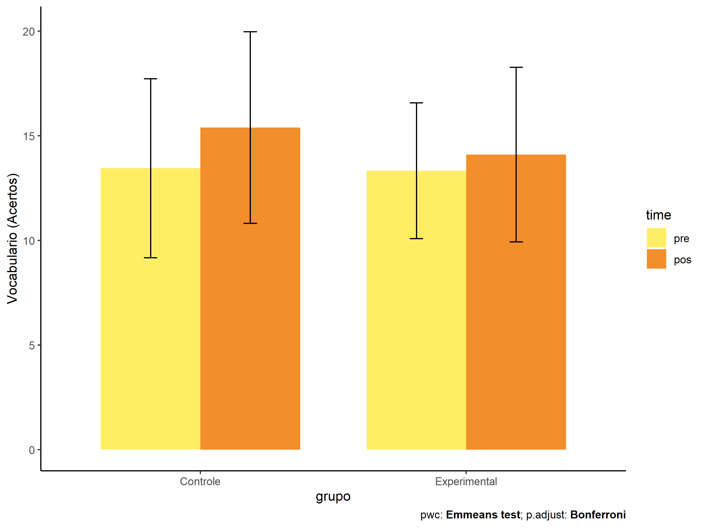<!-- -->

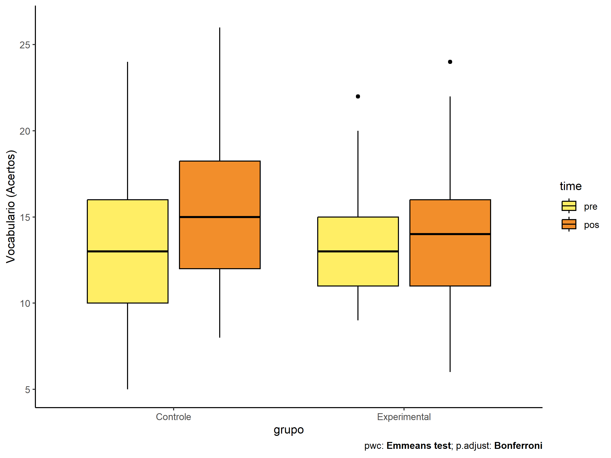<!-- -->

### Vocabulario (TRI)

| var           | grupo        |   n | M (pre) | SE (pre) | M (unadj) | SE (unadj) | M (adj) | SE (adj) |
|:--------------|:-------------|----:|--------:|---------:|----------:|-----------:|--------:|---------:|
| tri.vocab.pos | Controle     |  27 |  -0.782 |    0.103 |    -0.679 |      0.117 |  -0.673 |    0.094 |
| tri.vocab.pos | Experimental |  20 |  -0.759 |    0.145 |    -0.791 |      0.137 |  -0.800 |    0.109 |

| .y.           | group1   | group2       | estimate | conf.low | conf.high |    se | statistic |     p | p.adj | p.adj.signif |
|:--------------|:---------|:-------------|---------:|---------:|----------:|------:|----------:|------:|------:|:-------------|
| tri.vocab.pos | Controle | Experimental |    0.127 |   -0.164 |     0.418 | 0.144 |     0.881 | 0.383 | 0.383 | ns           |
| tri.vocab.pre | Controle | Experimental |   -0.024 |   -0.372 |     0.325 | 0.173 |    -0.138 | 0.891 | 0.891 | ns           |

| grupo        | group1 | group2 | estimate | conf.low | conf.high |    se | statistic |     p | p.adj | p.adj.signif |
|:-------------|:-------|:-------|---------:|---------:|----------:|------:|----------:|------:|------:|:-------------|
| Controle     | pre    | pos    |   -0.048 |   -0.366 |     0.271 | 0.160 |    -0.296 | 0.768 | 0.768 | ns           |
| Experimental | pre    | pos    |   -0.034 |   -0.405 |     0.337 | 0.187 |    -0.183 | 0.855 | 0.855 | ns           |

    ## Scale for colour is already present.
    ## Adding another scale for colour, which will replace the existing scale.

<!-- -->

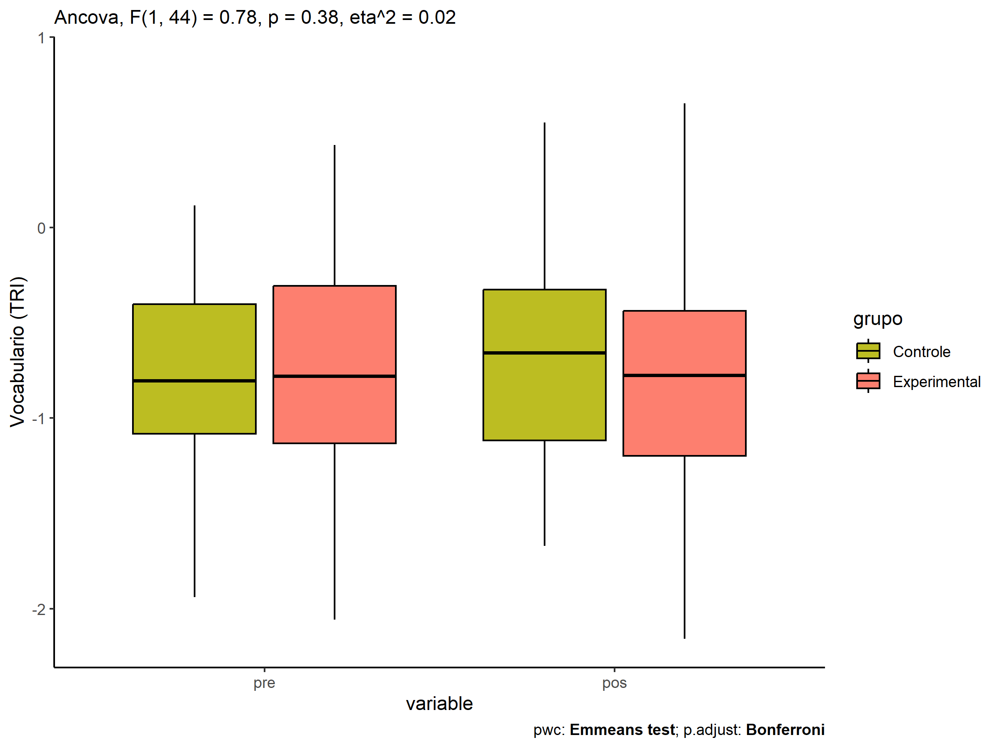<!-- -->

<!-- -->

### Vocabulario Ensinado (Acertos)

| var                      | grupo        |   n | M (pre) | SE (pre) | M (unadj) | SE (unadj) | M (adj) | SE (adj) |
|:-------------------------|:-------------|----:|--------:|---------:|----------:|-----------:|--------:|---------:|
| score.vocab.ensinado.pos | Controle     |  30 |   2.533 |    0.238 |     2.533 |      0.317 |   2.531 |    0.318 |
| score.vocab.ensinado.pos | Experimental |  22 |   3.045 |    0.345 |     2.591 |      0.358 |   2.594 |    0.372 |

| .y.                      | group1   | group2       | estimate | conf.low | conf.high |    se | statistic |     p | p.adj | p.adj.signif |
|:-------------------------|:---------|:-------------|---------:|---------:|----------:|------:|----------:|------:|------:|:-------------|
| score.vocab.ensinado.pos | Controle | Experimental |   -0.063 |   -1.055 |     0.929 | 0.493 |    -0.128 | 0.899 | 0.899 | ns           |
| score.vocab.ensinado.pre | Controle | Experimental |   -0.512 |   -1.327 |     0.303 | 0.406 |    -1.263 | 0.213 | 0.213 | ns           |

| grupo        | group1 | group2 | estimate | conf.low | conf.high |    se | statistic |     p | p.adj | p.adj.signif |
|:-------------|:-------|:-------|---------:|---------:|----------:|------:|----------:|------:|------:|:-------------|
| Controle     | pre    | pos    |    0.000 |   -0.812 |     0.812 | 0.409 |     0.000 | 1.000 | 1.000 | ns           |
| Experimental | pre    | pos    |    0.455 |   -0.494 |     1.403 | 0.478 |     0.951 | 0.344 | 0.344 | ns           |

    ## Scale for colour is already present.
    ## Adding another scale for colour, which will replace the existing scale.

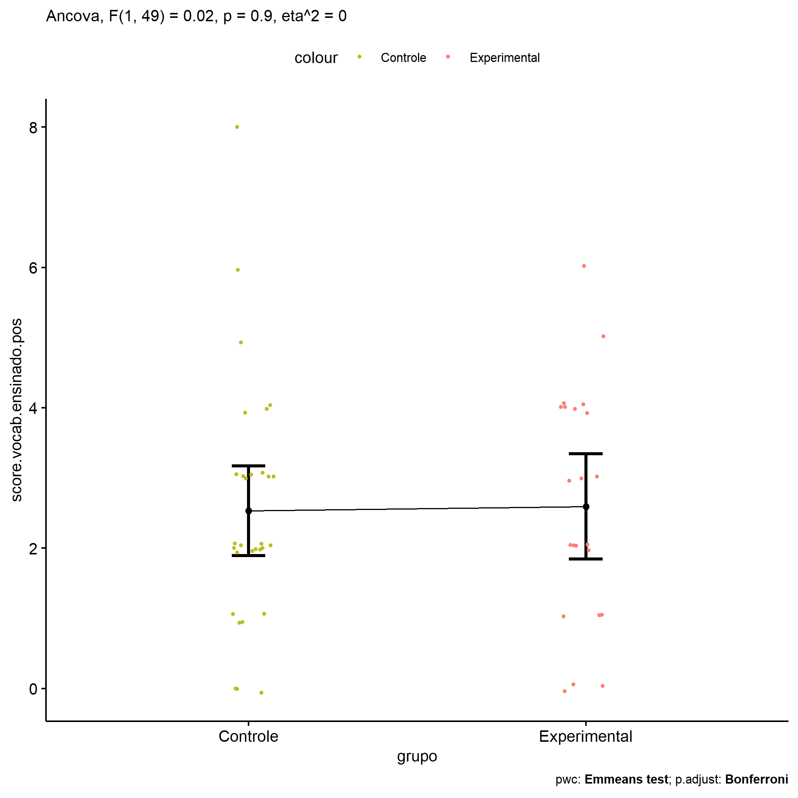<!-- -->

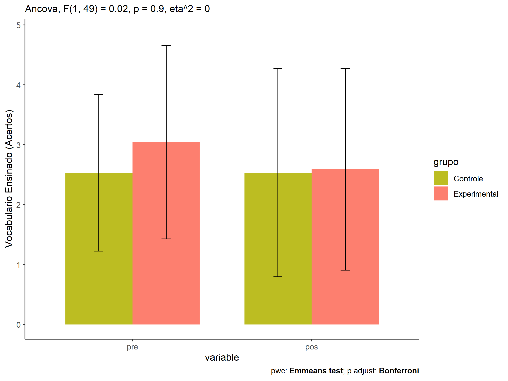<!-- -->

<!-- -->

<!-- -->

<!-- -->

### Vocabulario Ensinado (TRI)

| var                    | grupo        |   n | M (pre) | SE (pre) | M (unadj) | SE (unadj) | M (adj) | SE (adj) |
|:-----------------------|:-------------|----:|--------:|---------:|----------:|-----------:|--------:|---------:|
| tri.vocab.ensinado.pos | Controle     |  27 |  -0.546 |    0.109 |    -0.629 |      0.127 |  -0.612 |    0.117 |
| tri.vocab.ensinado.pos | Experimental |  20 |  -0.389 |    0.147 |    -0.692 |      0.123 |  -0.715 |    0.136 |

| .y.                    | group1   | group2       | estimate | conf.low | conf.high |    se | statistic |     p | p.adj | p.adj.signif |
|:-----------------------|:---------|:-------------|---------:|---------:|----------:|------:|----------:|------:|------:|:-------------|
| tri.vocab.ensinado.pos | Controle | Experimental |    0.102 |   -0.260 |     0.464 | 0.180 |     0.568 | 0.573 | 0.573 | ns           |
| tri.vocab.ensinado.pre | Controle | Experimental |   -0.158 |   -0.519 |     0.203 | 0.179 |    -0.880 | 0.383 | 0.383 | ns           |

| grupo        | group1 | group2 | estimate | conf.low | conf.high |    se | statistic |     p | p.adj | p.adj.signif |
|:-------------|:-------|:-------|---------:|---------:|----------:|------:|----------:|------:|------:|:-------------|
| Controle     | pre    | pos    |    0.042 |   -0.281 |     0.365 | 0.163 |     0.256 | 0.798 | 0.798 | ns           |
| Experimental | pre    | pos    |    0.281 |   -0.095 |     0.657 | 0.190 |     1.482 | 0.142 | 0.142 | ns           |

    ## Scale for colour is already present.
    ## Adding another scale for colour, which will replace the existing scale.

<!-- -->

<!-- -->

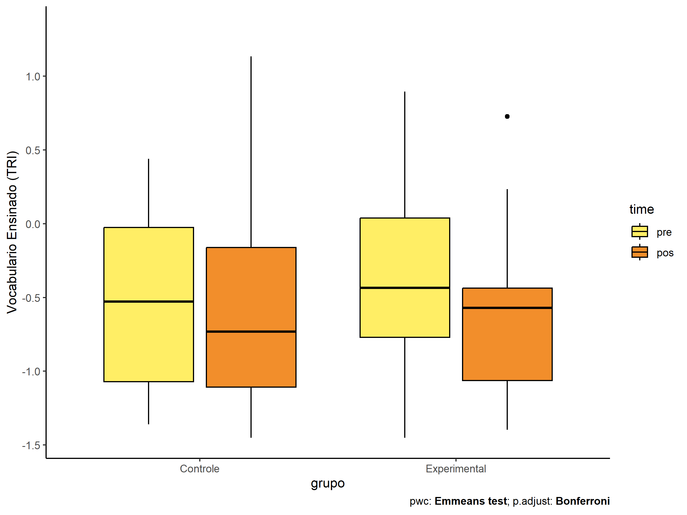<!-- -->

### Vocabulario Nao Ensinado (Acertos)

| var                          | grupo        |   n | M (pre) | SE (pre) | M (unadj) | SE (unadj) | M (adj) | SE (adj) |
|:-----------------------------|:-------------|----:|--------:|---------:|----------:|-----------:|--------:|---------:|
| score.vocab.nao.ensinado.pos | Controle     |  30 |  10.467 |    0.808 |    11.833 |      0.914 |   11.77 |    0.844 |
| score.vocab.nao.ensinado.pos | Experimental |  22 |   9.682 |    0.751 |    10.864 |      0.866 |   10.95 |    0.986 |

| .y.                          | group1   | group2       | estimate | conf.low | conf.high |    se | statistic |     p | p.adj | p.adj.signif |
|:-----------------------------|:---------|:-------------|---------:|---------:|----------:|------:|----------:|------:|------:|:-------------|
| score.vocab.nao.ensinado.pos | Controle | Experimental |    0.820 |   -1.794 |     3.434 | 1.301 |     0.630 | 0.532 | 0.532 | ns           |
| score.vocab.nao.ensinado.pre | Controle | Experimental |    0.785 |   -1.510 |     3.079 | 1.142 |     0.687 | 0.495 | 0.495 | ns           |

| grupo        | group1 | group2 | estimate | conf.low | conf.high |    se | statistic |     p | p.adj | p.adj.signif |
|:-------------|:-------|:-------|---------:|---------:|----------:|------:|----------:|------:|------:|:-------------|
| Controle     | pre    | pos    |   -1.367 |    -3.60 |     0.867 | 1.126 |    -1.214 | 0.228 | 0.228 | ns           |
| Experimental | pre    | pos    |   -1.182 |    -3.79 |     1.426 | 1.315 |    -0.899 | 0.371 | 0.371 | ns           |

    ## Scale for colour is already present.
    ## Adding another scale for colour, which will replace the existing scale.

<!-- -->

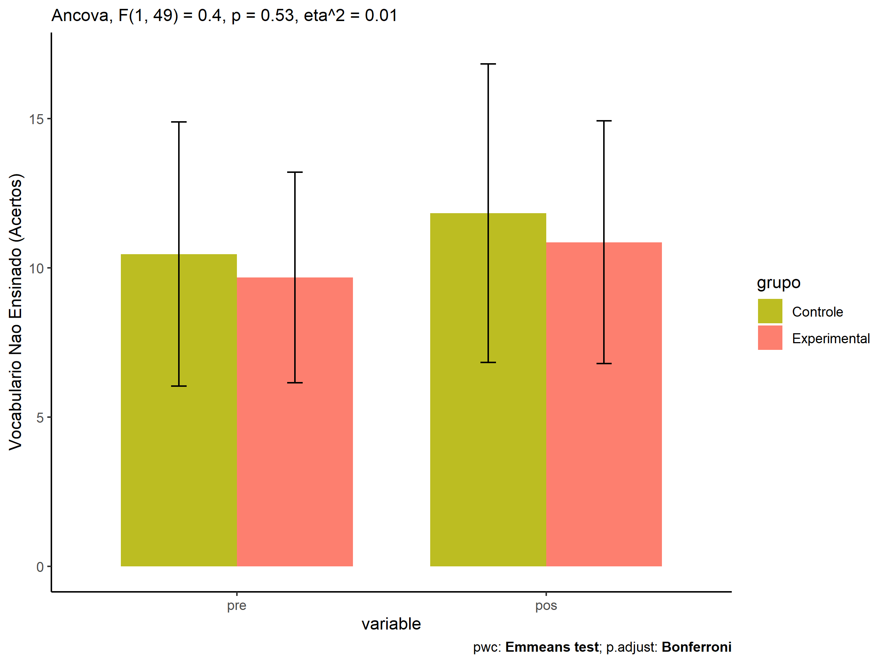<!-- -->

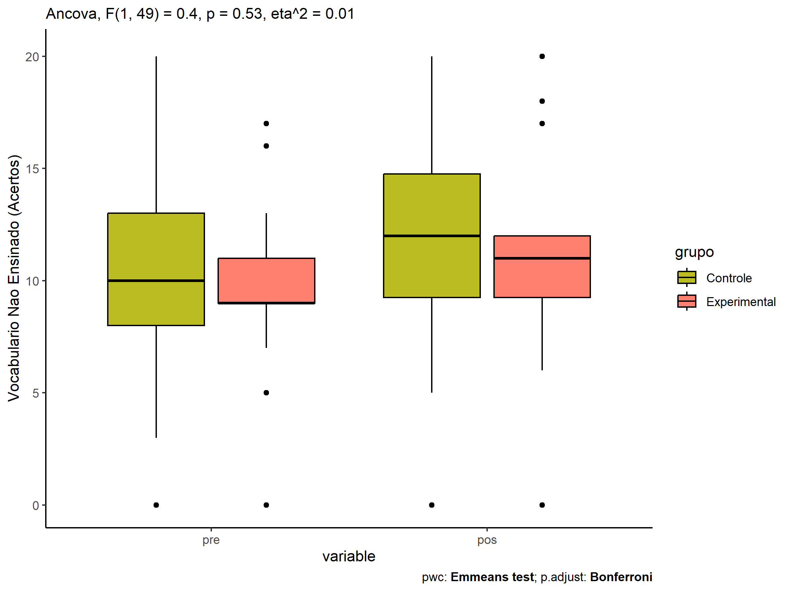<!-- -->

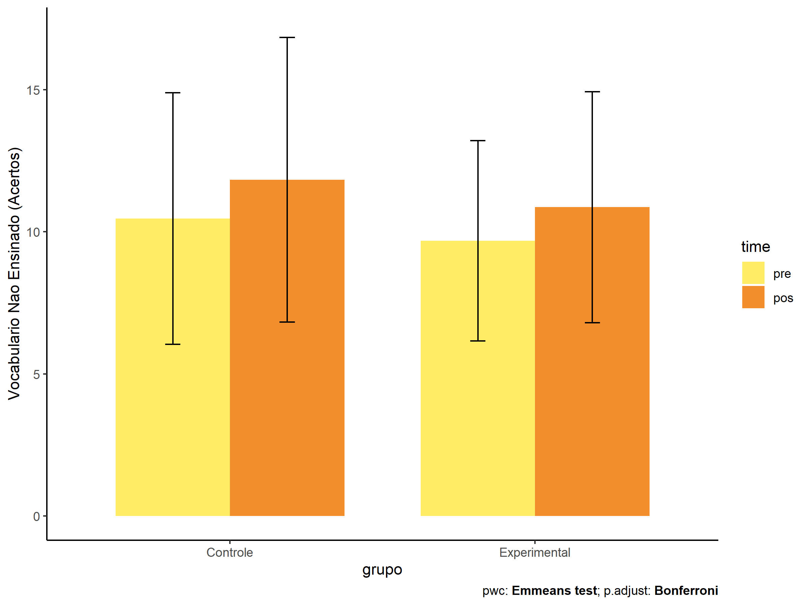<!-- -->

<!-- -->

### Vocabulario Nao Ensinado (TRI)

| var                        | grupo        |   n | M (pre) | SE (pre) | M (unadj) | SE (unadj) | M (adj) | SE (adj) |
|:---------------------------|:-------------|----:|--------:|---------:|----------:|-----------:|--------:|---------:|
| tri.vocab.nao.ensinado.pos | Controle     |  27 |  -0.824 |    0.088 |    -0.592 |      0.102 |  -0.574 |    0.065 |
| tri.vocab.nao.ensinado.pos | Experimental |  20 |  -0.773 |    0.091 |    -0.735 |      0.096 |  -0.759 |    0.076 |

| .y.                        | group1   | group2       | estimate | conf.low | conf.high |    se | statistic |    p | p.adj | p.adj.signif |
|:---------------------------|:---------|:-------------|---------:|---------:|----------:|------:|----------:|-----:|------:|:-------------|
| tri.vocab.nao.ensinado.pos | Controle | Experimental |    0.185 |   -0.016 |     0.386 | 0.100 |     1.856 | 0.07 |  0.07 | ns           |
| tri.vocab.nao.ensinado.pre | Controle | Experimental |   -0.052 |   -0.312 |     0.208 | 0.129 |    -0.401 | 0.69 |  0.69 | ns           |

| grupo        | group1 | group2 | estimate | conf.low | conf.high |    se | statistic |     p | p.adj | p.adj.signif |
|:-------------|:-------|:-------|---------:|---------:|----------:|------:|----------:|------:|------:|:-------------|
| Controle     | pre    | pos    |   -0.162 |   -0.418 |     0.094 | 0.129 |    -1.255 | 0.213 | 0.213 | ns           |
| Experimental | pre    | pos    |   -0.118 |   -0.416 |     0.180 | 0.150 |    -0.784 | 0.435 | 0.435 | ns           |

    ## Scale for colour is already present.
    ## Adding another scale for colour, which will replace the existing scale.

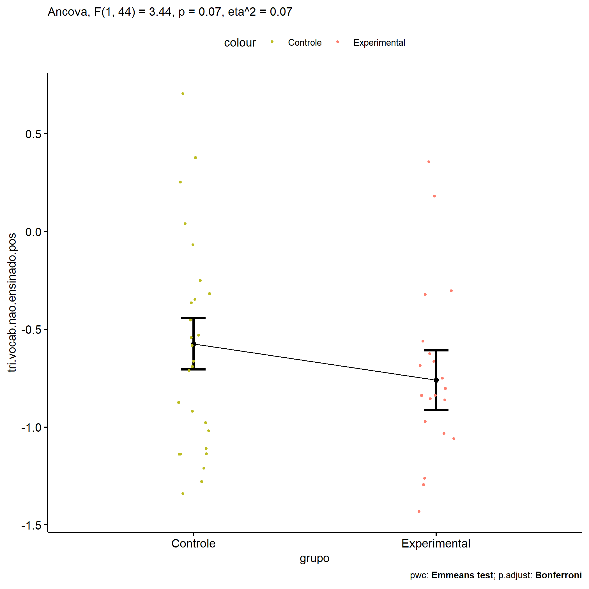<!-- -->

<!-- -->

<!-- -->

## factor: **genero**

### Vocabulario (Acertos)

| var             | genero |   n | M (pre) | SE (pre) | M (unadj) | SE (unadj) | M (adj) | SE (adj) |
|:----------------|:-------|----:|--------:|---------:|----------:|-----------:|--------:|---------:|
| score.vocab.pos | F      |  29 |  13.172 |    0.614 |    15.414 |      0.909 |  15.434 |    0.731 |
| score.vocab.pos | M      |  18 |  13.278 |    0.952 |    13.722 |      0.731 |  13.689 |    0.928 |

| .y.             | group1 | group2 | estimate | conf.low | conf.high |    se | statistic |     p | p.adj | p.adj.signif |
|:----------------|:-------|:-------|---------:|---------:|----------:|------:|----------:|------:|------:|:-------------|
| score.vocab.pos | F      | M      |    1.745 |   -0.636 |     4.127 | 1.182 |     1.477 | 0.147 | 0.147 | ns           |
| score.vocab.pre | F      | M      |   -0.105 |   -2.282 |     2.071 | 1.081 |    -0.097 | 0.923 | 0.923 | ns           |

| genero | group1 | group2 | estimate | conf.low | conf.high |    se | statistic |     p | p.adj | p.adj.signif |
|:-------|:-------|:-------|---------:|---------:|----------:|------:|----------:|------:|------:|:-------------|
| F      | pre    | pos    |   -2.367 |   -4.474 |    -0.259 | 1.062 |    -2.229 | 0.028 | 0.028 | \*           |
| M      | pre    | pos    |    0.021 |   -2.594 |     2.636 | 1.317 |     0.016 | 0.987 | 0.987 | ns           |

    ## Scale for colour is already present.
    ## Adding another scale for colour, which will replace the existing scale.

<!-- -->

<!-- -->

<!-- -->

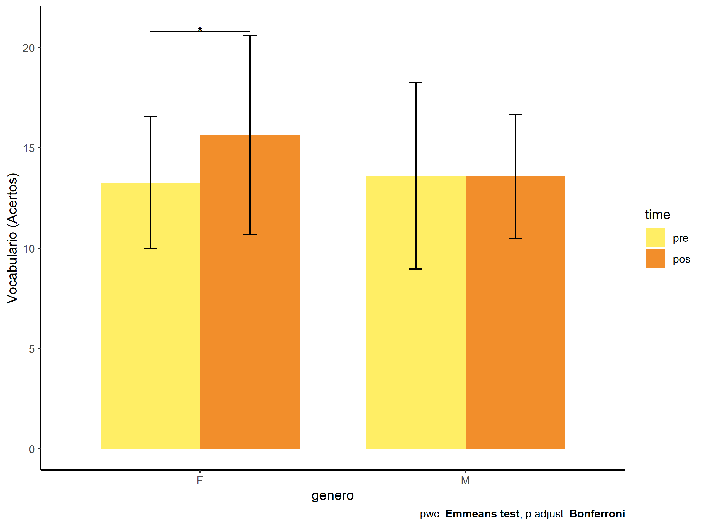<!-- -->

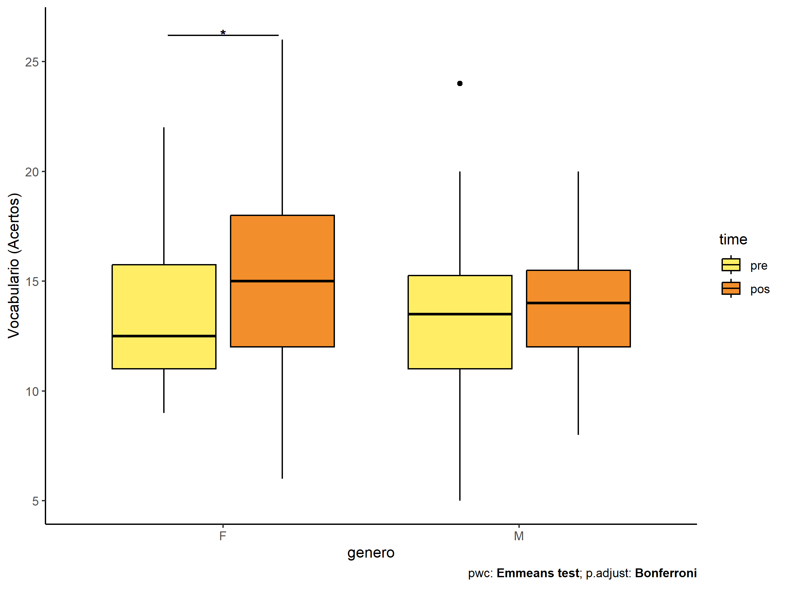<!-- -->

### Vocabulario (TRI)

| var           | genero |   n | M (pre) | SE (pre) | M (unadj) | SE (unadj) | M (adj) | SE (adj) |
|:--------------|:-------|----:|--------:|---------:|----------:|-----------:|--------:|---------:|
| tri.vocab.pos | F      |  29 |  -0.763 |    0.107 |    -0.723 |      0.128 |  -0.729 |    0.092 |
| tri.vocab.pos | M      |  18 |  -0.787 |    0.142 |    -0.734 |      0.110 |  -0.724 |    0.116 |

| .y.           | group1 | group2 | estimate | conf.low | conf.high |    se | statistic |     p | p.adj | p.adj.signif |
|:--------------|:-------|:-------|---------:|---------:|----------:|------:|----------:|------:|------:|:-------------|
| tri.vocab.pos | F      | M      |   -0.004 |   -0.303 |     0.294 | 0.148 |    -0.028 | 0.977 | 0.977 | ns           |
| tri.vocab.pre | F      | M      |    0.024 |   -0.331 |     0.378 | 0.176 |     0.135 | 0.893 | 0.893 | ns           |

| genero | group1 | group2 | estimate | conf.low | conf.high |    se | statistic |     p | p.adj | p.adj.signif |
|:-------|:-------|:-------|---------:|---------:|----------:|------:|----------:|------:|------:|:-------------|
| F      | pre    | pos    |   -0.075 |   -0.385 |     0.236 | 0.156 |    -0.477 | 0.635 | 0.635 | ns           |
| M      | pre    | pos    |    0.010 |   -0.375 |     0.395 | 0.194 |     0.051 | 0.959 | 0.959 | ns           |

    ## Scale for colour is already present.
    ## Adding another scale for colour, which will replace the existing scale.

<!-- -->

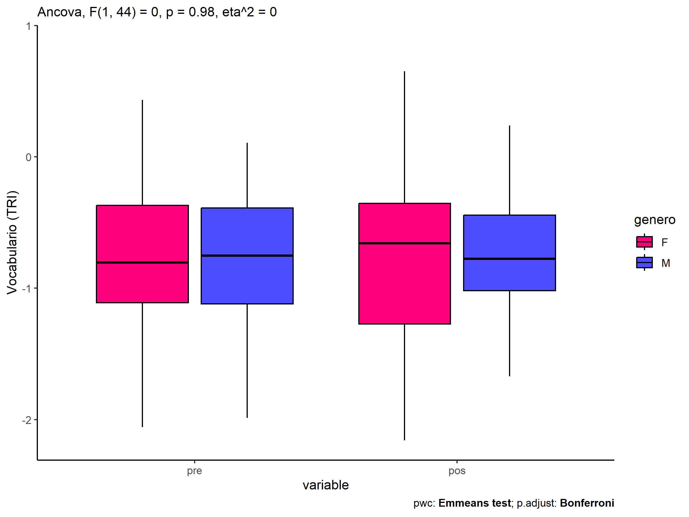<!-- -->

<!-- -->

### Vocabulario Ensinado (Acertos)

| var                      | genero |   n | M (pre) | SE (pre) | M (unadj) | SE (unadj) | M (adj) | SE (adj) |
|:-------------------------|:-------|----:|--------:|---------:|----------:|-----------:|--------:|---------:|
| score.vocab.ensinado.pos | F      |  31 |   2.484 |    0.236 |     2.548 |      0.347 |   2.546 |    0.314 |
| score.vocab.ensinado.pos | M      |  21 |   3.143 |    0.347 |     2.571 |      0.289 |   2.575 |    0.384 |

| .y.                      | group1 | group2 | estimate | conf.low | conf.high |    se | statistic |     p | p.adj | p.adj.signif |
|:-------------------------|:-------|:-------|---------:|---------:|----------:|------:|----------:|------:|------:|:-------------|
| score.vocab.ensinado.pos | F      | M      |   -0.029 |   -1.038 |     0.980 | 0.502 |    -0.058 | 0.954 | 0.954 | ns           |
| score.vocab.ensinado.pre | F      | M      |   -0.659 |   -1.471 |     0.153 | 0.404 |    -1.630 | 0.109 | 0.109 | ns           |

| genero | group1 | group2 | estimate | conf.low | conf.high |    se | statistic |     p | p.adj | p.adj.signif |
|:-------|:-------|:-------|---------:|---------:|----------:|------:|----------:|------:|------:|:-------------|
| F      | pre    | pos    |   -0.065 |   -0.860 |     0.731 | 0.401 |    -0.161 | 0.872 | 0.872 | ns           |
| M      | pre    | pos    |    0.571 |   -0.395 |     1.538 | 0.487 |     1.173 | 0.244 | 0.244 | ns           |

    ## Scale for colour is already present.
    ## Adding another scale for colour, which will replace the existing scale.

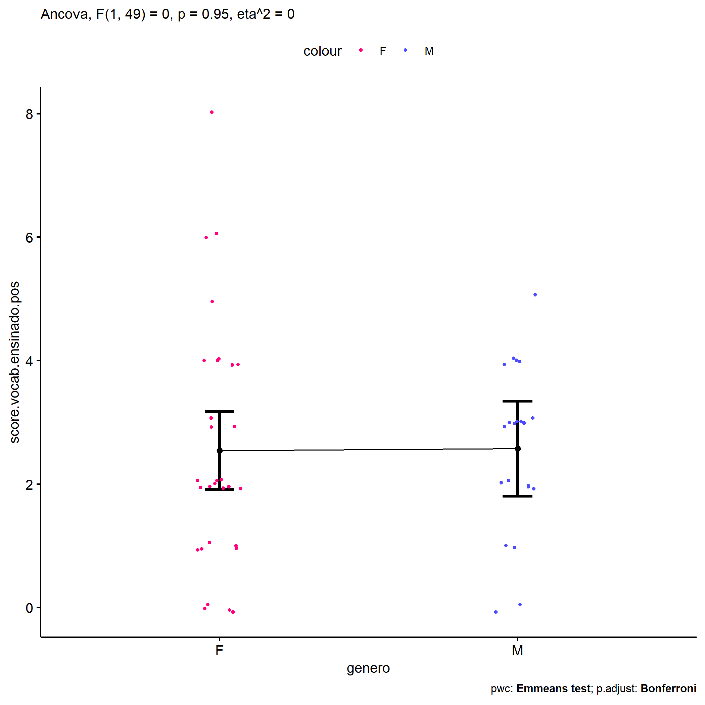<!-- -->

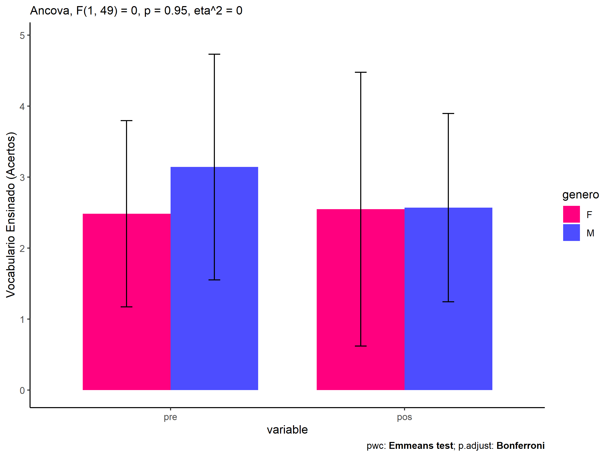<!-- -->

<!-- -->

<!-- -->

<!-- -->

### Vocabulario Ensinado (TRI)

| var                    | genero |   n | M (pre) | SE (pre) | M (unadj) | SE (unadj) | M (adj) | SE (adj) |
|:-----------------------|:-------|----:|--------:|---------:|----------:|-----------:|--------:|---------:|
| tri.vocab.ensinado.pos | F      |  29 |  -0.505 |    0.121 |    -0.692 |      0.127 |  -0.686 |    0.112 |
| tri.vocab.ensinado.pos | M      |  18 |  -0.438 |    0.127 |    -0.598 |      0.112 |  -0.608 |    0.143 |

| .y.                    | group1 | group2 | estimate | conf.low | conf.high |    se | statistic |     p | p.adj | p.adj.signif |
|:-----------------------|:-------|:-------|---------:|---------:|----------:|------:|----------:|------:|------:|:-------------|
| tri.vocab.ensinado.pos | F      | M      |   -0.078 |   -0.444 |     0.288 | 0.182 |    -0.428 | 0.671 | 0.671 | ns           |
| tri.vocab.ensinado.pre | F      | M      |   -0.068 |   -0.438 |     0.302 | 0.184 |    -0.368 | 0.715 | 0.715 | ns           |

| genero | group1 | group2 | estimate | conf.low | conf.high |    se | statistic |     p | p.adj | p.adj.signif |
|:-------|:-------|:-------|---------:|---------:|----------:|------:|----------:|------:|------:|:-------------|
| F      | pre    | pos    |    0.129 |   -0.187 |     0.445 | 0.159 |     0.812 | 0.419 | 0.419 | ns           |
| M      | pre    | pos    |    0.160 |   -0.232 |     0.551 | 0.197 |     0.809 | 0.420 | 0.420 | ns           |

    ## Scale for colour is already present.
    ## Adding another scale for colour, which will replace the existing scale.

<!-- -->

<!-- -->

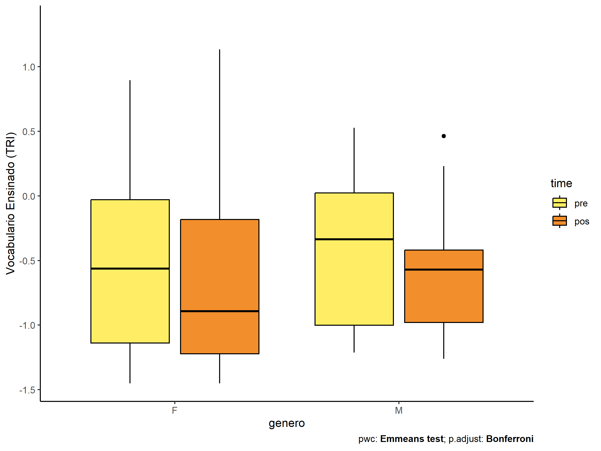<!-- -->

### Vocabulario Nao Ensinado (Acertos)

| var                          | genero |   n | M (pre) | SE (pre) | M (unadj) | SE (unadj) | M (adj) | SE (adj) |
|:-----------------------------|:-------|----:|--------:|---------:|----------:|-----------:|--------:|---------:|
| score.vocab.nao.ensinado.pos | F      |  31 |  10.355 |    0.609 |    12.581 |      0.831 |  12.541 |    0.794 |
| score.vocab.nao.ensinado.pos | M      |  21 |   9.810 |    1.077 |     9.714 |      0.900 |   9.772 |    0.965 |

| .y.                          | group1 | group2 | estimate | conf.low | conf.high |    se | statistic |     p | p.adj | p.adj.signif |
|:-----------------------------|:-------|:-------|---------:|---------:|----------:|------:|----------:|------:|------:|:-------------|
| score.vocab.nao.ensinado.pos | F      | M      |    2.769 |    0.256 |     5.283 | 1.251 |     2.214 | 0.032 | 0.032 | \*           |
| score.vocab.nao.ensinado.pre | F      | M      |    0.545 |   -1.771 |     2.861 | 1.153 |     0.473 | 0.638 | 0.638 | ns           |

| genero | group1 | group2 | estimate | conf.low | conf.high |    se | statistic |     p | p.adj | p.adj.signif |
|:-------|:-------|:-------|---------:|---------:|----------:|------:|----------:|------:|------:|:-------------|
| F      | pre    | pos    |   -2.226 |   -4.372 |    -0.079 | 1.082 |    -2.057 | 0.042 | 0.042 | \*           |
| M      | pre    | pos    |    0.095 |   -2.513 |     2.703 | 1.314 |     0.072 | 0.942 | 0.942 | ns           |

    ## Scale for colour is already present.
    ## Adding another scale for colour, which will replace the existing scale.

<!-- -->

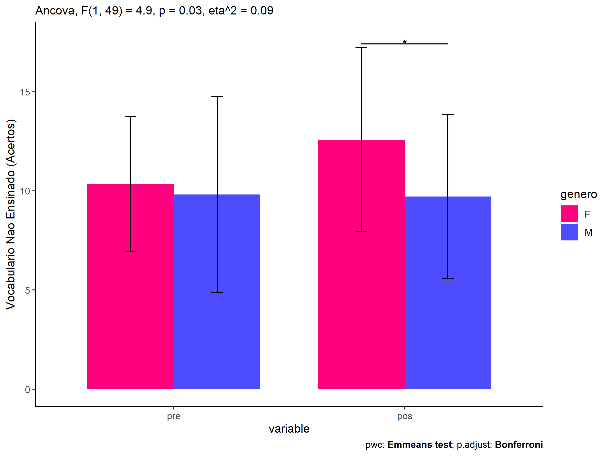<!-- -->

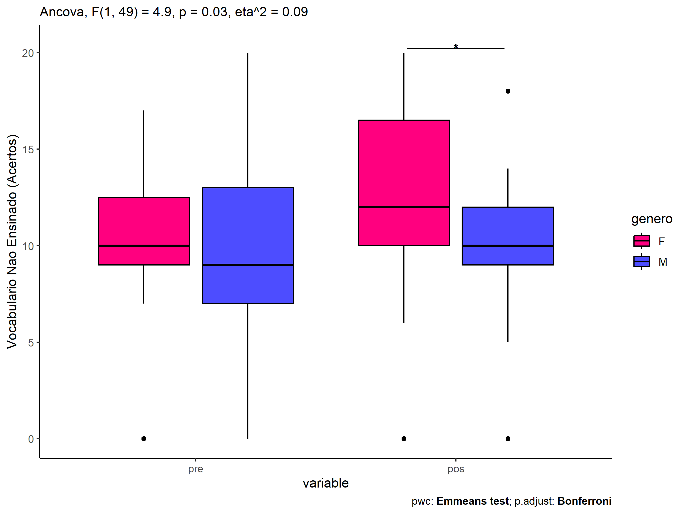<!-- -->

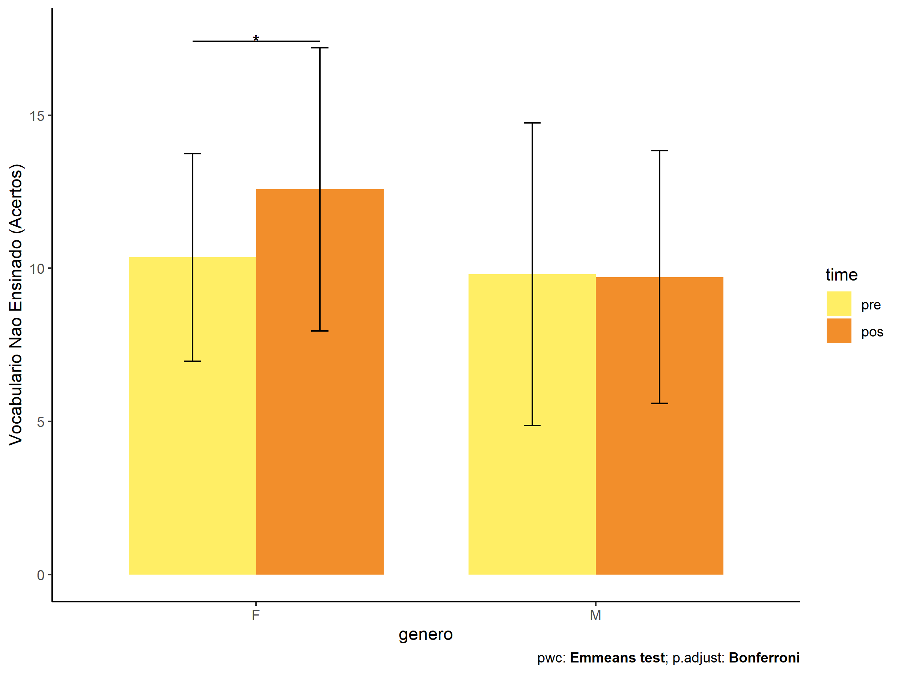<!-- -->

<!-- -->

### Vocabulario Nao Ensinado (TRI)

| var                        | genero |   n | M (pre) | SE (pre) | M (unadj) | SE (unadj) | M (adj) | SE (adj) |
|:---------------------------|:-------|----:|--------:|---------:|----------:|-----------:|--------:|---------:|
| tri.vocab.nao.ensinado.pos | F      |  29 |  -0.770 |    0.069 |    -0.604 |      0.099 |  -0.630 |    0.065 |
| tri.vocab.nao.ensinado.pos | M      |  18 |  -0.854 |    0.124 |    -0.732 |      0.096 |  -0.691 |    0.083 |

| .y.                        | group1 | group2 | estimate | conf.low | conf.high |    se | statistic |     p | p.adj | p.adj.signif |
|:---------------------------|:-------|:-------|---------:|---------:|----------:|------:|----------:|------:|------:|:-------------|
| tri.vocab.nao.ensinado.pos | F      | M      |    0.062 |   -0.151 |     0.274 | 0.105 |     0.585 | 0.562 | 0.562 | ns           |
| tri.vocab.nao.ensinado.pre | F      | M      |    0.084 |   -0.179 |     0.348 | 0.131 |     0.644 | 0.523 | 0.523 | ns           |

| genero | group1 | group2 | estimate | conf.low | conf.high |    se | statistic |     p | p.adj | p.adj.signif |
|:-------|:-------|:-------|---------:|---------:|----------:|------:|----------:|------:|------:|:-------------|
| F      | pre    | pos    |   -0.195 |   -0.443 |     0.052 | 0.124 |    -1.571 | 0.120 | 0.120 | ns           |
| M      | pre    | pos    |   -0.058 |   -0.365 |     0.249 | 0.154 |    -0.376 | 0.708 | 0.708 | ns           |

    ## Scale for colour is already present.
    ## Adding another scale for colour, which will replace the existing scale.

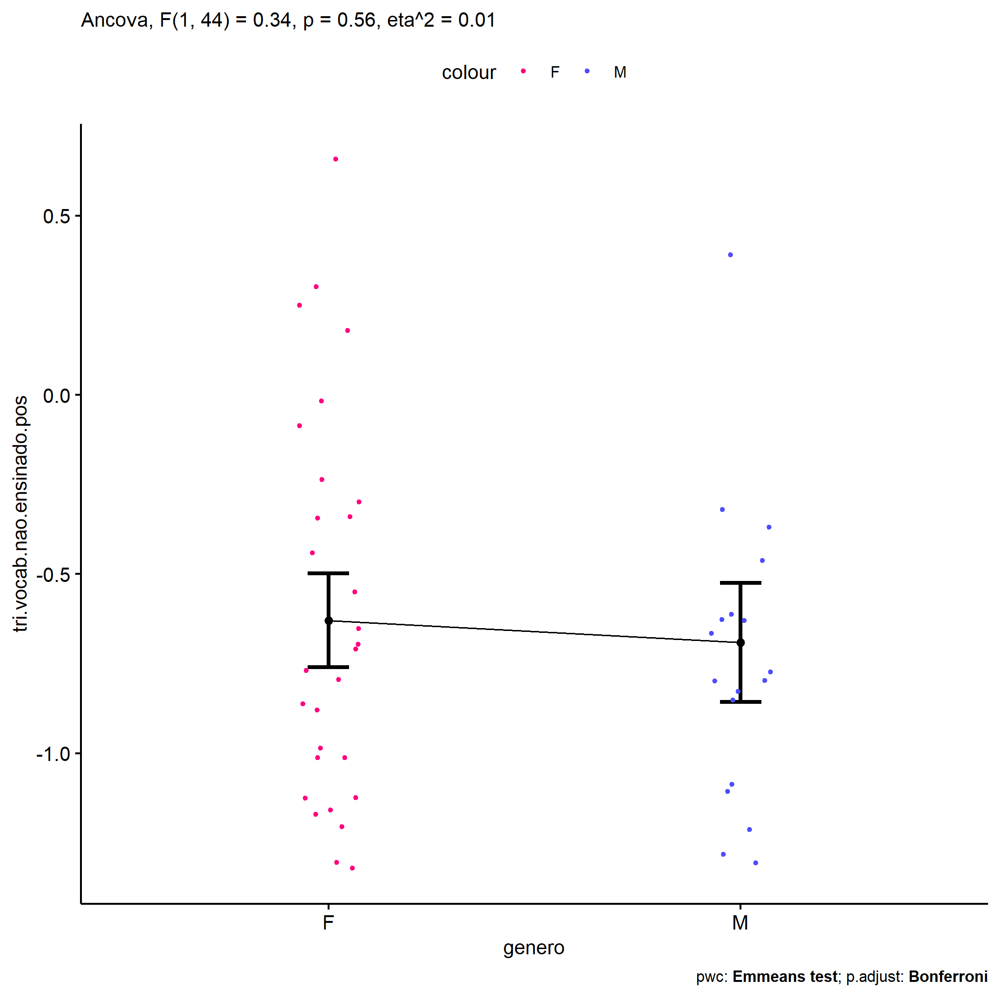<!-- -->

<!-- -->

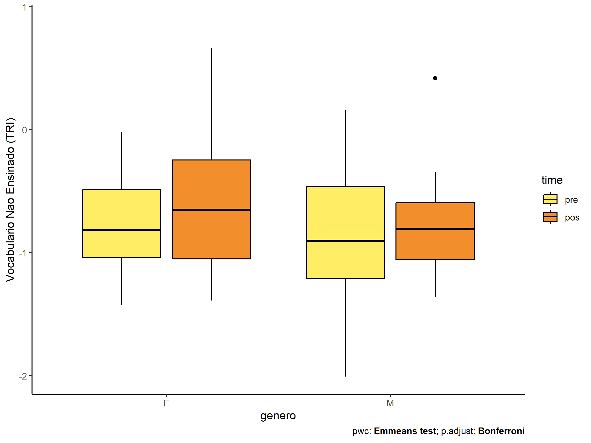<!-- -->

## factor: **idade**

### Vocabulario (Acertos)

| var             | idade |   n | M (pre) | SE (pre) | M (unadj) | SE (unadj) | M (adj) | SE (adj) |
|:----------------|:------|----:|--------:|---------:|----------:|-----------:|--------:|---------:|
| score.vocab.pos | 10y   |   6 |  15.167 |    1.376 |    16.667 |      1.606 |  15.816 |    1.699 |
| score.vocab.pos | 11y   |  28 |  12.750 |    0.741 |    14.679 |      0.829 |  14.935 |    0.778 |
| score.vocab.pos | 12y   |   8 |  13.875 |    1.093 |    15.750 |      1.634 |  15.491 |    1.447 |

| .y.             | group1 | group2 | estimate | conf.low | conf.high |    se | statistic |     p | p.adj | p.adj.signif |
|:----------------|:-------|:-------|---------:|---------:|----------:|------:|----------:|------:|------:|:-------------|
| score.vocab.pos | 10y    | 11y    |    0.881 |   -2.937 |     4.699 | 1.886 |     0.467 | 0.643 | 1.000 | ns           |
| score.vocab.pos | 10y    | 12y    |    0.325 |   -4.164 |     4.814 | 2.217 |     0.147 | 0.884 | 1.000 | ns           |
| score.vocab.pos | 11y    | 12y    |   -0.556 |   -3.895 |     2.783 | 1.649 |    -0.337 | 0.738 | 1.000 | ns           |
| score.vocab.pre | 10y    | 11y    |    2.417 |   -0.966 |     5.799 | 1.672 |     1.445 | 0.156 | 0.469 | ns           |
| score.vocab.pre | 10y    | 12y    |    1.292 |   -2.769 |     5.353 | 2.008 |     0.643 | 0.524 | 1.000 | ns           |
| score.vocab.pre | 11y    | 12y    |   -1.125 |   -4.139 |     1.889 | 1.490 |    -0.755 | 0.455 | 1.000 | ns           |

| idade | group1 | group2 | estimate | conf.low | conf.high |    se | statistic |     p | p.adj | p.adj.signif |
|:------|:-------|:-------|---------:|---------:|----------:|------:|----------:|------:|------:|:-------------|
| 10y   | pre    | pos    |   -1.381 |   -5.908 |     3.146 | 2.276 |    -0.607 | 0.546 | 0.546 | ns           |
| 11y   | pre    | pos    |   -2.310 |   -4.447 |    -0.174 | 1.074 |    -2.151 | 0.034 | 0.034 | \*           |
| 12y   | pre    | pos    |   -1.347 |   -5.301 |     2.607 | 1.988 |    -0.678 | 0.500 | 0.500 | ns           |

    ## Scale for colour is already present.
    ## Adding another scale for colour, which will replace the existing scale.

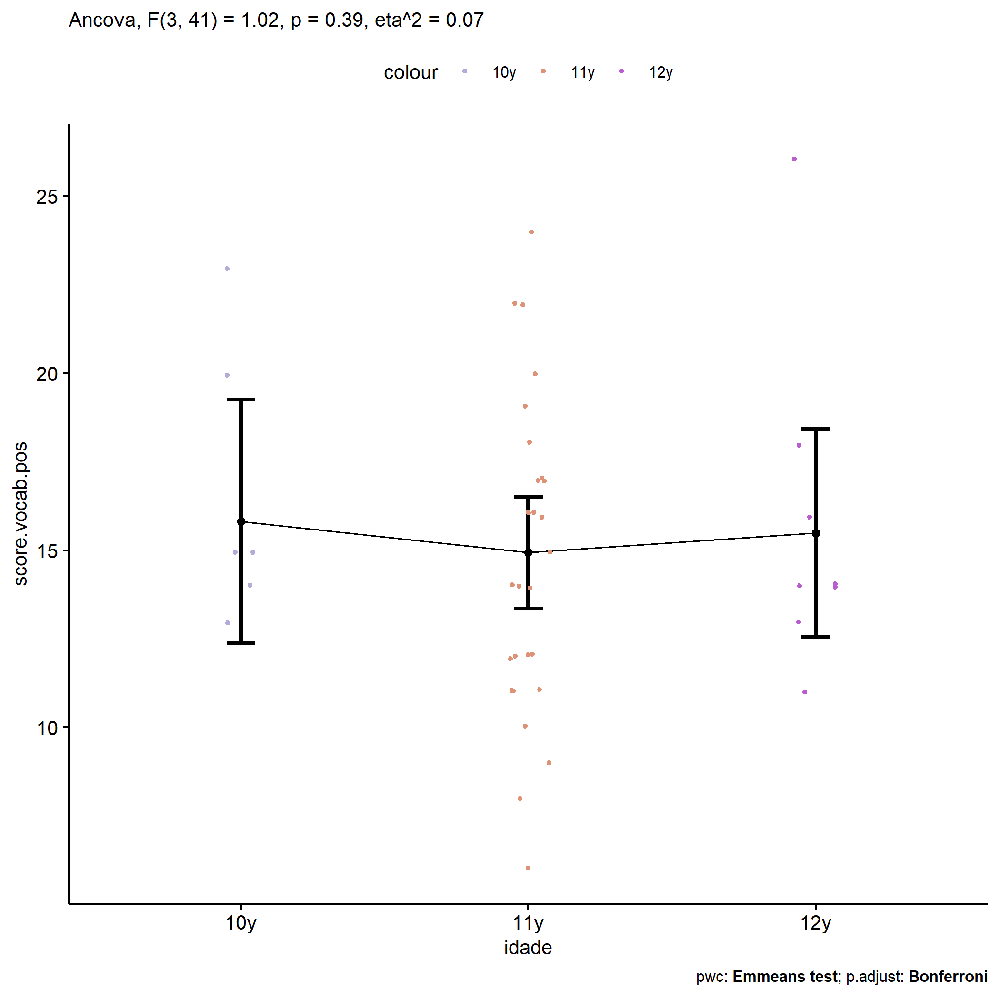<!-- -->

<!-- -->

<!-- -->

<!-- -->

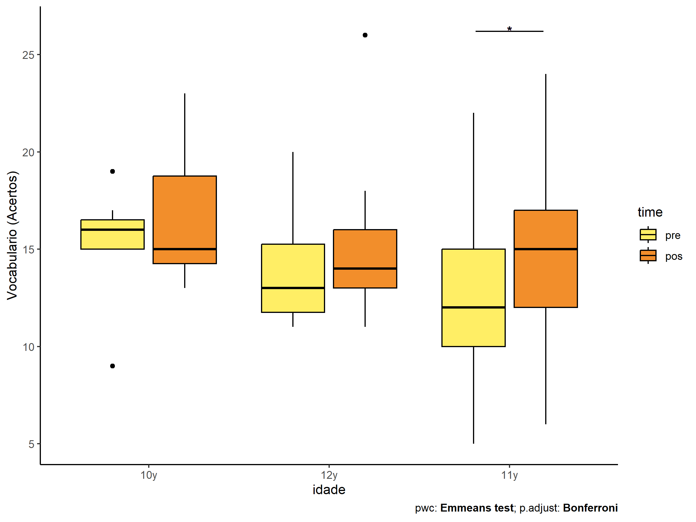<!-- -->

### Vocabulario (TRI)

| var           | idade |   n | M (pre) | SE (pre) | M (unadj) | SE (unadj) | M (adj) | SE (adj) |
|:--------------|:------|----:|--------:|---------:|----------:|-----------:|--------:|---------:|
| tri.vocab.pos | 10y   |   6 |  -0.431 |    0.162 |    -0.449 |      0.317 |  -0.648 |    0.215 |
| tri.vocab.pos | 11y   |  28 |  -0.788 |    0.123 |    -0.700 |      0.112 |  -0.678 |    0.098 |
| tri.vocab.pos | 12y   |   8 |  -0.868 |    0.199 |    -0.795 |      0.241 |  -0.723 |    0.183 |

| .y.           | group1 | group2 | estimate | conf.low | conf.high |    se | statistic |     p | p.adj | p.adj.signif |
|:--------------|:-------|:-------|---------:|---------:|----------:|------:|----------:|------:|------:|:-------------|
| tri.vocab.pos | 10y    | 11y    |    0.030 |   -0.450 |     0.510 | 0.237 |     0.126 | 0.901 | 1.000 | ns           |
| tri.vocab.pos | 10y    | 12y    |    0.075 |   -0.502 |     0.652 | 0.285 |     0.264 | 0.793 | 1.000 | ns           |
| tri.vocab.pos | 11y    | 12y    |    0.046 |   -0.374 |     0.465 | 0.207 |     0.220 | 0.827 | 1.000 | ns           |
| tri.vocab.pre | 10y    | 11y    |    0.356 |   -0.199 |     0.911 | 0.274 |     1.299 | 0.202 | 0.605 | ns           |
| tri.vocab.pre | 10y    | 12y    |    0.436 |   -0.230 |     1.102 | 0.329 |     1.325 | 0.193 | 0.578 | ns           |
| tri.vocab.pre | 11y    | 12y    |    0.080 |   -0.414 |     0.575 | 0.244 |     0.328 | 0.745 | 1.000 | ns           |

| idade | group1 | group2 | estimate | conf.low | conf.high |    se | statistic |     p | p.adj | p.adj.signif |
|:------|:-------|:-------|---------:|---------:|----------:|------:|----------:|------:|------:|:-------------|
| 10y   | pre    | pos    |   -0.015 |   -0.702 |     0.672 | 0.345 |    -0.044 | 0.965 | 0.965 | ns           |
| 11y   | pre    | pos    |   -0.132 |   -0.457 |     0.192 | 0.163 |    -0.811 | 0.420 | 0.420 | ns           |
| 12y   | pre    | pos    |   -0.024 |   -0.624 |     0.576 | 0.302 |    -0.079 | 0.937 | 0.937 | ns           |

    ## Scale for colour is already present.
    ## Adding another scale for colour, which will replace the existing scale.

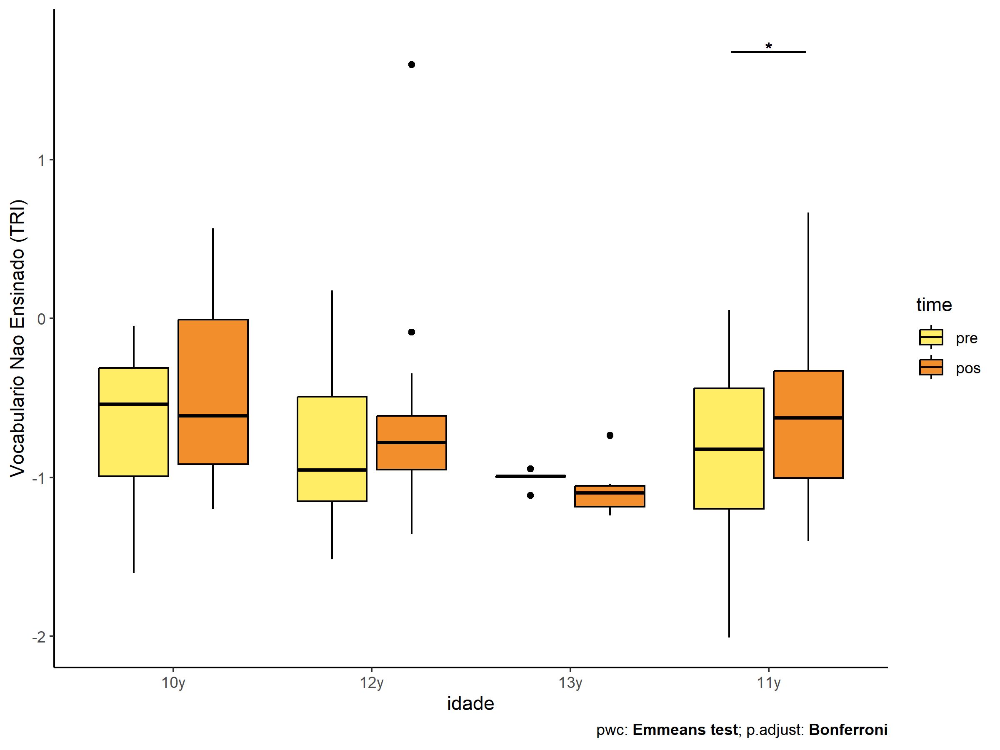<!-- -->

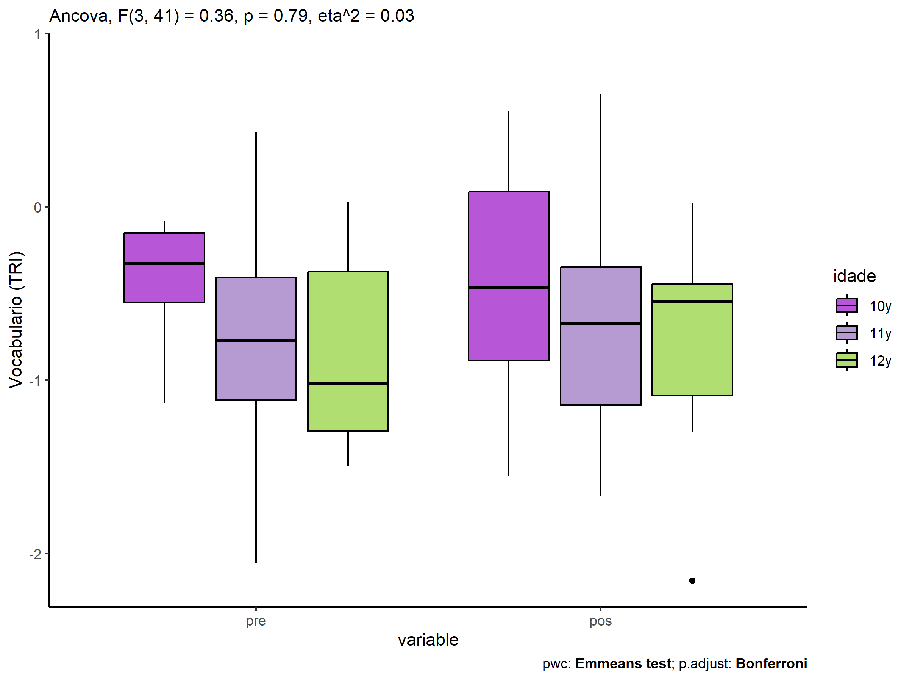<!-- -->

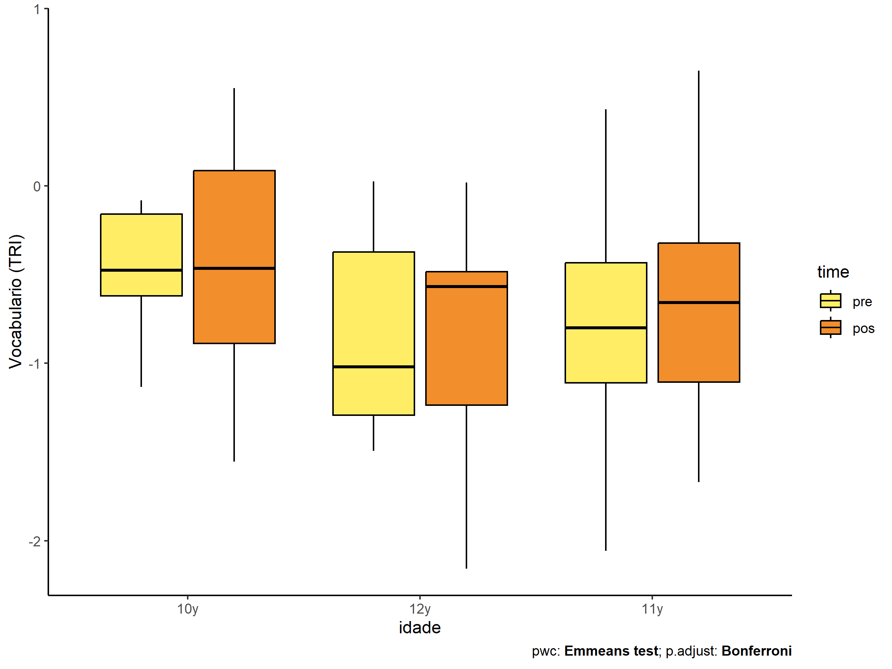<!-- -->

### Vocabulario Ensinado (Acertos)

| var                      | idade |   n | M (pre) | SE (pre) | M (unadj) | SE (unadj) | M (adj) | SE (adj) |
|:-------------------------|:------|----:|--------:|---------:|----------:|-----------:|--------:|---------:|
| score.vocab.ensinado.pos | 10y   |   7 |   2.143 |    0.459 |     2.714 |      0.747 |   2.764 |    0.634 |
| score.vocab.ensinado.pos | 11y   |  30 |   2.800 |    0.281 |     2.300 |      0.263 |   2.288 |    0.304 |
| score.vocab.ensinado.pos | 12y   |   9 |   2.667 |    0.471 |     3.889 |      0.676 |   3.890 |    0.553 |

| .y.                      | group1 | group2 | estimate | conf.low | conf.high |    se | statistic |     p | p.adj | p.adj.signif |
|:-------------------------|:-------|:-------|---------:|---------:|----------:|------:|----------:|------:|------:|:-------------|
| score.vocab.ensinado.pos | 10y    | 11y    |    0.476 |   -0.949 |     1.901 | 0.706 |     0.674 | 0.504 | 1.000 | ns           |
| score.vocab.ensinado.pos | 10y    | 12y    |   -1.126 |   -2.824 |     0.573 | 0.842 |    -1.338 | 0.188 | 0.565 | ns           |
| score.vocab.ensinado.pos | 11y    | 12y    |   -1.601 |   -2.876 |    -0.327 | 0.631 |    -2.536 | 0.015 | 0.045 | \*           |
| score.vocab.ensinado.pre | 10y    | 11y    |   -0.657 |   -1.906 |     0.592 | 0.619 |    -1.061 | 0.295 | 0.884 | ns           |
| score.vocab.ensinado.pre | 10y    | 12y    |   -0.524 |   -2.024 |     0.976 | 0.744 |    -0.704 | 0.485 | 1.000 | ns           |
| score.vocab.ensinado.pre | 11y    | 12y    |    0.133 |   -0.998 |     1.264 | 0.561 |     0.238 | 0.813 | 1.000 | ns           |

| idade | group1 | group2 | estimate | conf.low | conf.high |    se | statistic |     p | p.adj | p.adj.signif |
|:------|:-------|:-------|---------:|---------:|----------:|------:|----------:|------:|------:|:-------------|
| 10y   | pre    | pos    |   -0.571 |   -2.233 |     1.090 | 0.836 |    -0.684 | 0.496 | 0.496 | ns           |
| 11y   | pre    | pos    |    0.500 |   -0.303 |     1.303 | 0.404 |     1.238 | 0.219 | 0.219 | ns           |
| 12y   | pre    | pos    |   -1.222 |   -2.688 |     0.243 | 0.737 |    -1.658 | 0.101 | 0.101 | ns           |

    ## Scale for colour is already present.
    ## Adding another scale for colour, which will replace the existing scale.

<!-- -->

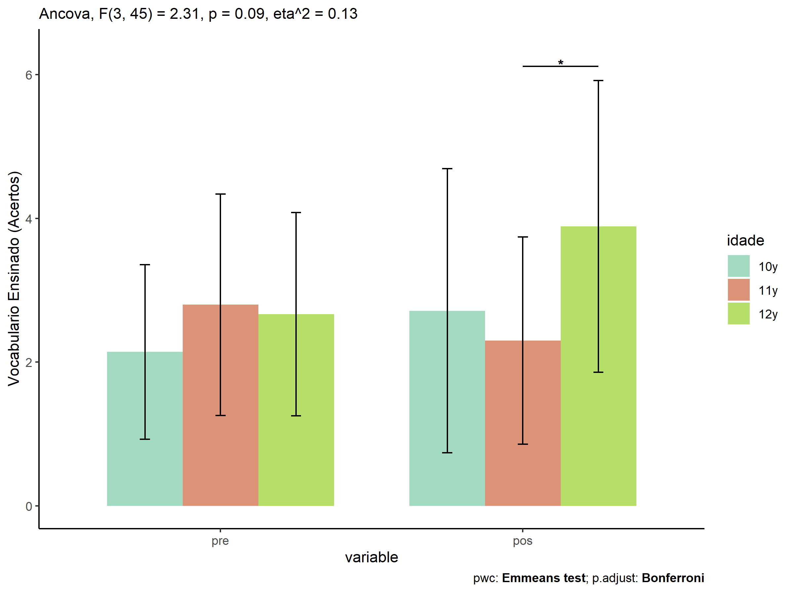<!-- -->

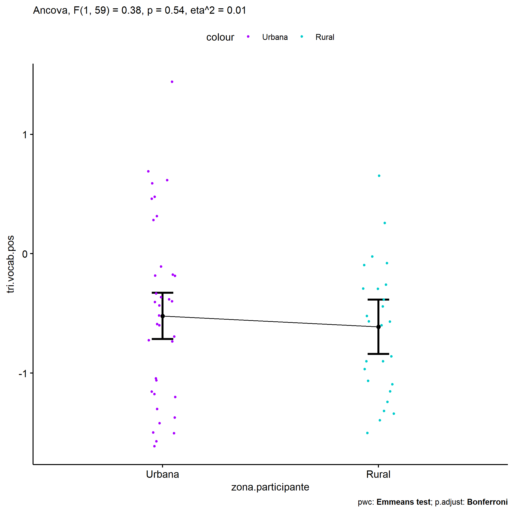<!-- -->

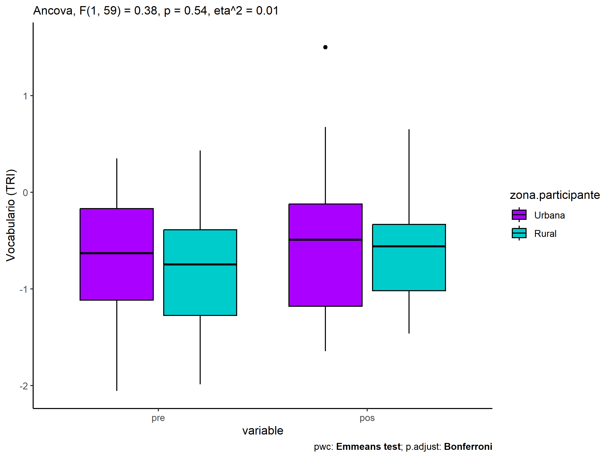<!-- -->

<!-- -->

### Vocabulario Ensinado (TRI)

| var                    | idade |   n | M (pre) | SE (pre) | M (unadj) | SE (unadj) | M (adj) | SE (adj) |
|:-----------------------|:------|----:|--------:|---------:|----------:|-----------:|--------:|---------:|
| tri.vocab.ensinado.pos | 10y   |   6 |  -0.731 |    0.204 |    -0.471 |      0.355 |  -0.391 |    0.249 |
| tri.vocab.ensinado.pos | 11y   |  28 |  -0.395 |    0.130 |    -0.737 |      0.104 |  -0.761 |    0.114 |
| tri.vocab.ensinado.pos | 12y   |   8 |  -0.554 |    0.132 |    -0.450 |      0.241 |  -0.425 |    0.213 |

| .y.                    | group1 | group2 | estimate | conf.low | conf.high |    se | statistic |     p | p.adj | p.adj.signif |
|:-----------------------|:-------|:-------|---------:|---------:|----------:|------:|----------:|------:|------:|:-------------|
| tri.vocab.ensinado.pos | 10y    | 11y    |    0.370 |   -0.189 |     0.928 | 0.276 |     1.341 | 0.188 | 0.564 | ns           |
| tri.vocab.ensinado.pos | 10y    | 12y    |    0.034 |   -0.627 |     0.695 | 0.326 |     0.104 | 0.918 | 1.000 | ns           |
| tri.vocab.ensinado.pos | 11y    | 12y    |   -0.336 |   -0.827 |     0.155 | 0.243 |    -1.385 | 0.174 | 0.523 | ns           |
| tri.vocab.ensinado.pre | 10y    | 11y    |   -0.336 |   -0.901 |     0.229 | 0.279 |    -1.202 | 0.237 | 0.710 | ns           |
| tri.vocab.ensinado.pre | 10y    | 12y    |   -0.177 |   -0.855 |     0.502 | 0.335 |    -0.527 | 0.601 | 1.000 | ns           |
| tri.vocab.ensinado.pre | 11y    | 12y    |    0.159 |   -0.345 |     0.662 | 0.249 |     0.638 | 0.527 | 1.000 | ns           |

| idade | group1 | group2 | estimate | conf.low | conf.high |    se | statistic |     p | p.adj | p.adj.signif |
|:------|:-------|:-------|---------:|---------:|----------:|------:|----------:|------:|------:|:-------------|
| 10y   | pre    | pos    |   -0.342 |   -1.032 |     0.349 | 0.347 |    -0.984 | 0.328 | 0.328 | ns           |
| 11y   | pre    | pos    |    0.324 |   -0.002 |     0.650 | 0.164 |     1.975 | 0.052 | 0.052 | ns           |
| 12y   | pre    | pos    |   -0.165 |   -0.768 |     0.439 | 0.303 |    -0.543 | 0.589 | 0.589 | ns           |

    ## Scale for colour is already present.
    ## Adding another scale for colour, which will replace the existing scale.

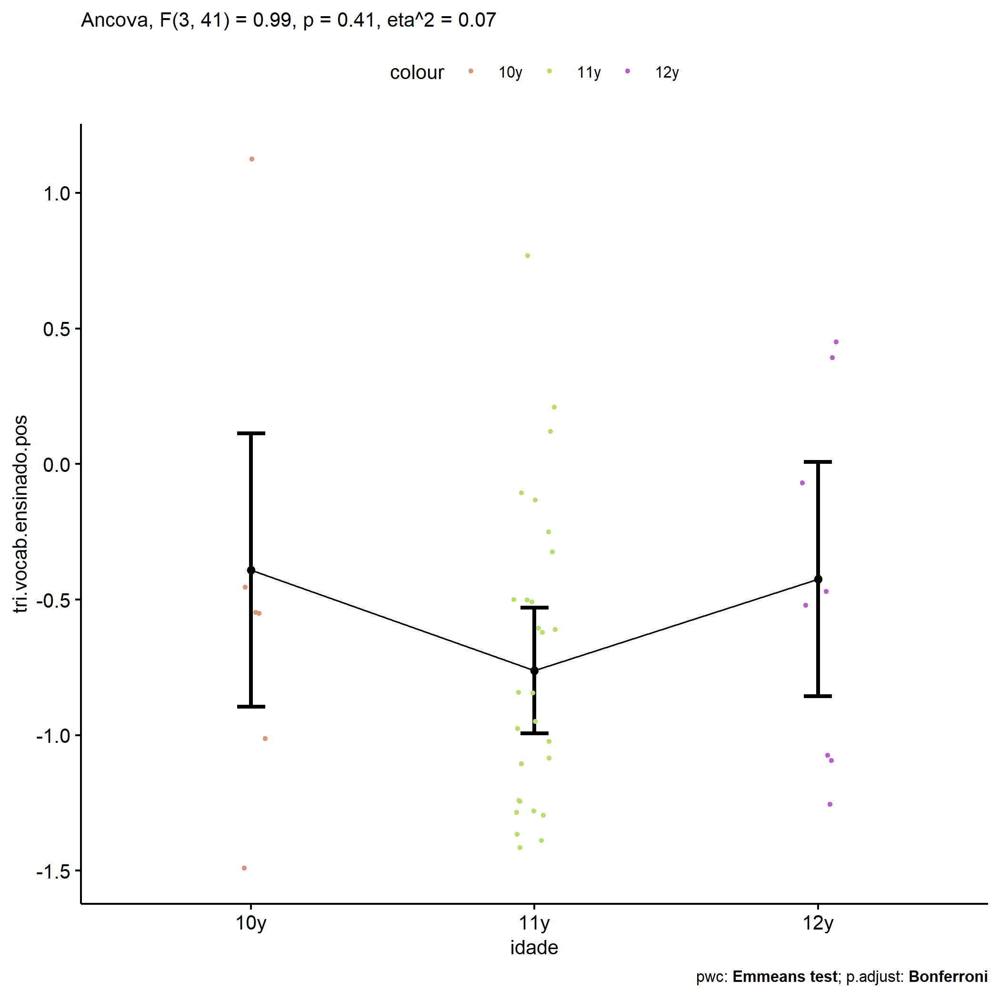<!-- -->

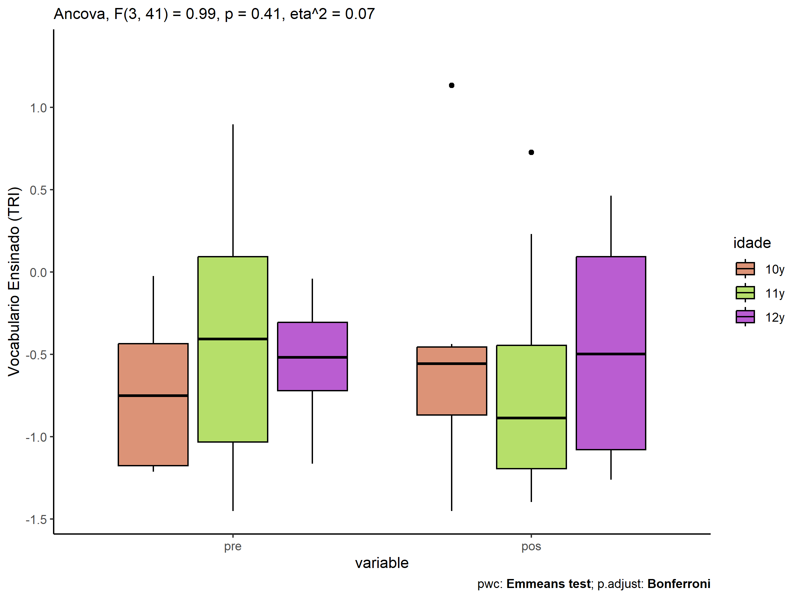<!-- -->

<!-- -->

### Vocabulario Nao Ensinado (Acertos)

| var                          | idade |   n | M (pre) | SE (pre) | M (unadj) | SE (unadj) | M (adj) | SE (adj) |
|:-----------------------------|:------|----:|--------:|---------:|----------:|-----------:|--------:|---------:|
| score.vocab.nao.ensinado.pos | 10y   |   7 |  13.143 |    1.299 |    11.571 |      2.235 |  10.232 |    1.691 |
| score.vocab.nao.ensinado.pos | 11y   |  30 |   9.400 |    0.689 |    12.133 |      0.831 |  12.400 |    0.784 |
| score.vocab.nao.ensinado.pos | 12y   |   9 |   9.667 |    1.528 |    11.333 |      0.986 |  11.486 |    1.420 |

| .y.                          | group1 | group2 | estimate | conf.low | conf.high |    se | statistic |     p | p.adj | p.adj.signif |
|:-----------------------------|:-------|:-------|---------:|---------:|----------:|------:|----------:|------:|------:|:-------------|
| score.vocab.nao.ensinado.pos | 10y    | 11y    |   -2.168 |   -5.988 |     1.651 | 1.893 |    -1.146 | 0.258 | 0.775 | ns           |
| score.vocab.nao.ensinado.pos | 10y    | 12y    |   -1.254 |   -5.738 |     3.231 | 2.222 |    -0.564 | 0.576 | 1.000 | ns           |
| score.vocab.nao.ensinado.pos | 11y    | 12y    |    0.914 |   -2.352 |     4.181 | 1.618 |     0.565 | 0.575 | 1.000 | ns           |
| score.vocab.nao.ensinado.pre | 10y    | 11y    |    3.743 |    0.446 |     7.039 | 1.635 |     2.290 | 0.027 | 0.081 | ns           |
| score.vocab.nao.ensinado.pre | 10y    | 12y    |    3.476 |   -0.481 |     7.434 | 1.962 |     1.771 | 0.084 | 0.251 | ns           |
| score.vocab.nao.ensinado.pre | 11y    | 12y    |   -0.267 |   -3.251 |     2.718 | 1.480 |    -0.180 | 0.858 | 1.000 | ns           |

| idade | group1 | group2 | estimate | conf.low | conf.high |    se | statistic |     p | p.adj | p.adj.signif |
|:------|:-------|:-------|---------:|---------:|----------:|------:|----------:|------:|------:|:-------------|
| 10y   | pre    | pos    |    1.571 |   -2.915 |     6.058 | 2.257 |     0.696 | 0.488 | 0.488 | ns           |
| 11y   | pre    | pos    |   -2.733 |   -4.901 |    -0.566 | 1.090 |    -2.507 | 0.014 | 0.014 | \*           |
| 12y   | pre    | pos    |   -1.667 |   -5.624 |     2.290 | 1.990 |    -0.837 | 0.405 | 0.405 | ns           |

    ## Scale for colour is already present.
    ## Adding another scale for colour, which will replace the existing scale.

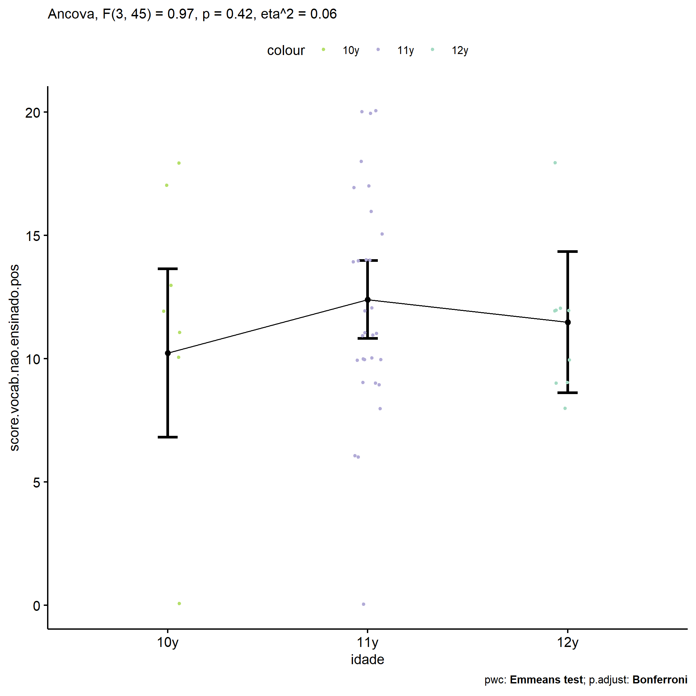<!-- -->

<!-- -->

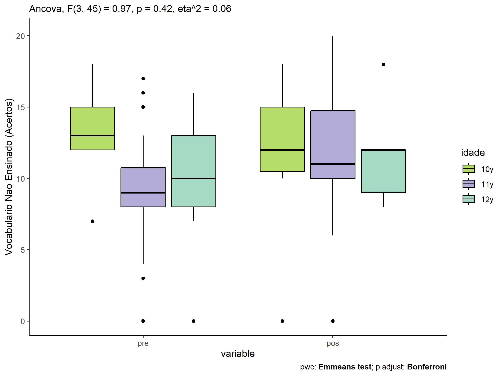<!-- -->

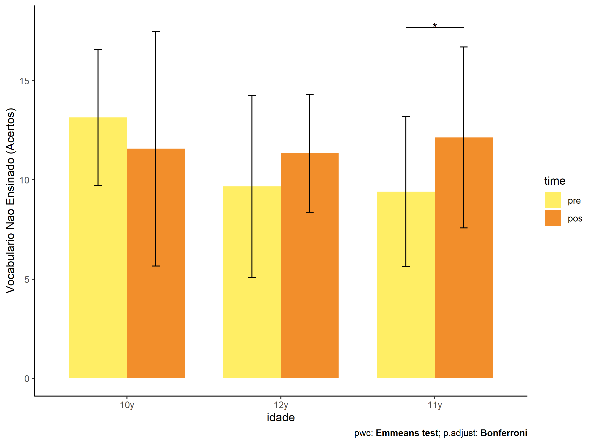<!-- -->

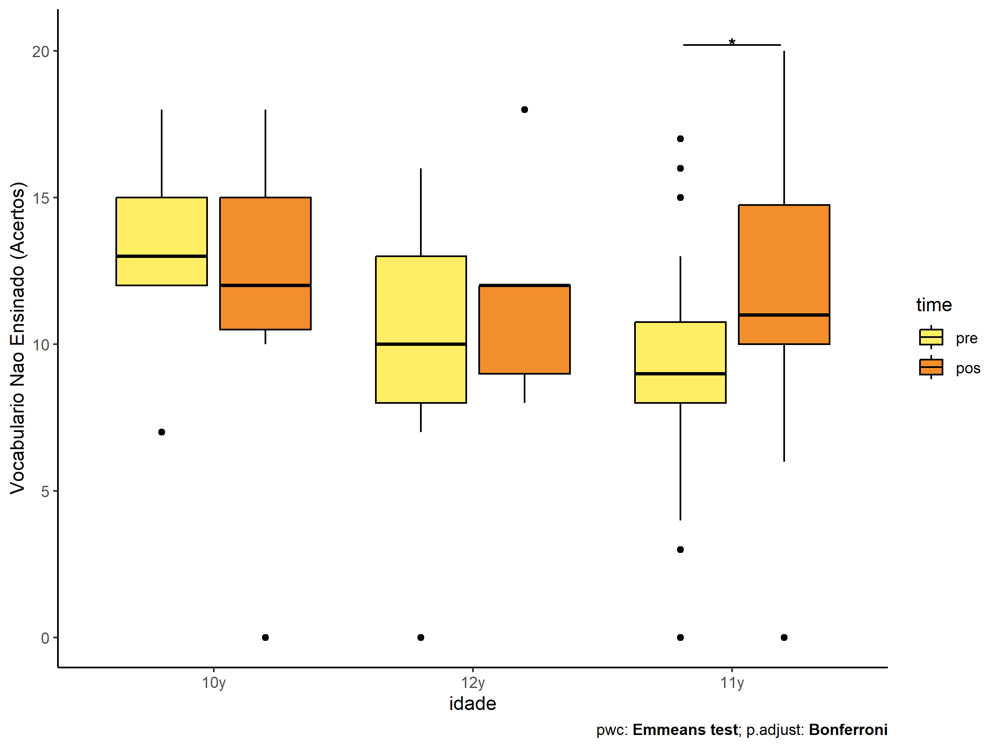<!-- -->

### Vocabulario Nao Ensinado (TRI)

| var                        | idade |   n | M (pre) | SE (pre) | M (unadj) | SE (unadj) | M (adj) | SE (adj) |
|:---------------------------|:------|----:|--------:|---------:|----------:|-----------:|--------:|---------:|
| tri.vocab.nao.ensinado.pos | 10y   |   6 |  -0.497 |    0.162 |    -0.380 |      0.231 |  -0.603 |    0.148 |
| tri.vocab.nao.ensinado.pos | 11y   |  28 |  -0.835 |    0.088 |    -0.627 |      0.096 |  -0.587 |    0.067 |
| tri.vocab.nao.ensinado.pos | 12y   |   8 |  -0.818 |    0.150 |    -0.691 |      0.124 |  -0.664 |    0.125 |

| .y.                        | group1 | group2 | estimate | conf.low | conf.high |    se | statistic |     p | p.adj | p.adj.signif |
|:---------------------------|:-------|:-------|---------:|---------:|----------:|------:|----------:|------:|------:|:-------------|
| tri.vocab.nao.ensinado.pos | 10y    | 11y    |   -0.016 |   -0.348 |     0.316 | 0.164 |    -0.097 | 0.923 | 1.000 | ns           |
| tri.vocab.nao.ensinado.pos | 10y    | 12y    |    0.061 |   -0.333 |     0.455 | 0.194 |     0.313 | 0.756 | 1.000 | ns           |
| tri.vocab.nao.ensinado.pos | 11y    | 12y    |    0.077 |   -0.209 |     0.363 | 0.141 |     0.544 | 0.590 | 1.000 | ns           |
| tri.vocab.nao.ensinado.pre | 10y    | 11y    |    0.338 |   -0.071 |     0.747 | 0.202 |     1.673 | 0.102 | 0.307 | ns           |
| tri.vocab.nao.ensinado.pre | 10y    | 12y    |    0.321 |   -0.169 |     0.812 | 0.243 |     1.324 | 0.193 | 0.579 | ns           |
| tri.vocab.nao.ensinado.pre | 11y    | 12y    |   -0.017 |   -0.381 |     0.347 | 0.180 |    -0.093 | 0.926 | 1.000 | ns           |

| idade | group1 | group2 | estimate | conf.low | conf.high |    se | statistic |     p | p.adj | p.adj.signif |
|:------|:-------|:-------|---------:|---------:|----------:|------:|----------:|------:|------:|:-------------|
| 10y   | pre    | pos    |   -0.127 |   -0.661 |     0.407 | 0.269 |    -0.472 | 0.638 | 0.638 | ns           |
| 11y   | pre    | pos    |   -0.260 |   -0.512 |    -0.008 | 0.127 |    -2.053 | 0.043 | 0.043 | \*           |
| 12y   | pre    | pos    |   -0.053 |   -0.520 |     0.413 | 0.235 |    -0.227 | 0.821 | 0.821 | ns           |

    ## Scale for colour is already present.
    ## Adding another scale for colour, which will replace the existing scale.

<!-- -->

<!-- -->

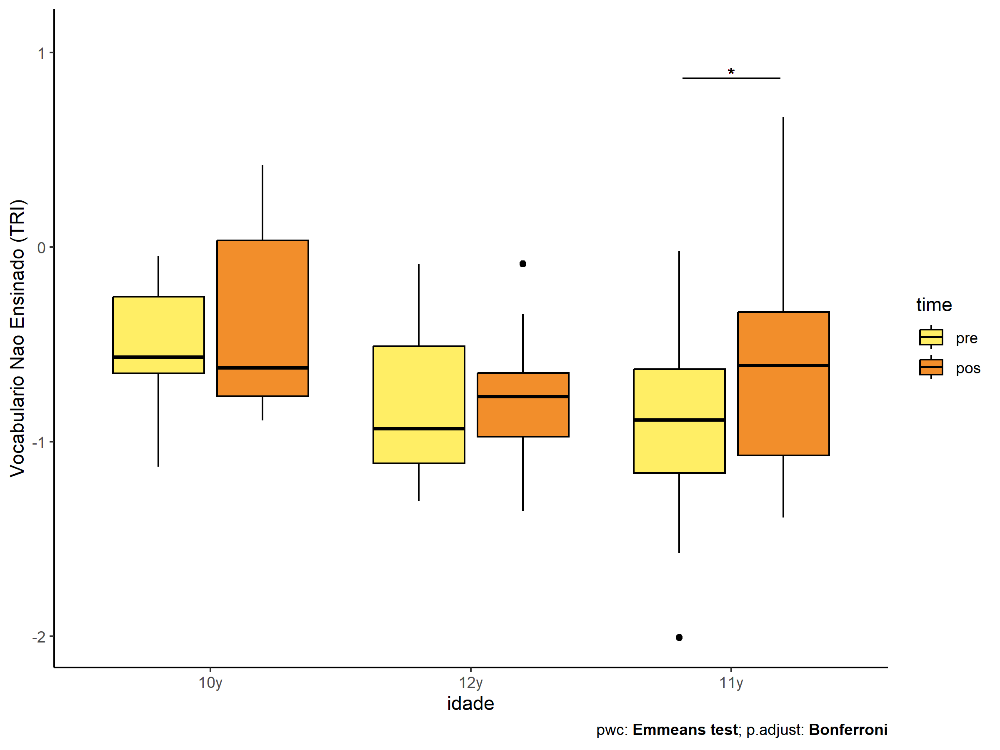<!-- -->

## factor: **zona.participante**

### Vocabulario (Acertos)

| var             | zona.participante |   n | M (pre) | SE (pre) | M (unadj) | SE (unadj) | M (adj) | SE (adj) |
|:----------------|:------------------|----:|--------:|---------:|----------:|-----------:|--------:|---------:|
| score.vocab.pos | Rural             |  19 |  12.474 |    0.821 |    15.105 |      1.113 |  15.647 |    0.966 |
| score.vocab.pos | Urbana            |  19 |  14.368 |    0.758 |    15.368 |      0.956 |  14.826 |    0.966 |

| .y.             | group1 | group2 | estimate | conf.low | conf.high |    se | statistic |     p | p.adj | p.adj.signif |
|:----------------|:-------|:-------|---------:|---------:|----------:|------:|----------:|------:|------:|:-------------|
| score.vocab.pos | Urbana | Rural  |   -0.821 |   -3.646 |     2.004 | 1.392 |    -0.590 | 0.559 | 0.559 | ns           |
| score.vocab.pre | Urbana | Rural  |    1.895 |   -0.372 |     4.161 | 1.118 |     1.695 | 0.099 | 0.099 | ns           |

| zona.participante | group1 | group2 | estimate | conf.low | conf.high |    se | statistic |     p | p.adj | p.adj.signif |
|:------------------|:-------|:-------|---------:|---------:|----------:|------:|----------:|------:|------:|:-------------|
| Urbana            | pre    | pos    |   -1.026 |   -3.545 |     1.493 | 1.265 |    -0.811 | 0.420 | 0.420 | ns           |
| Rural             | pre    | pos    |   -2.632 |   -5.248 |    -0.016 | 1.313 |    -2.004 | 0.049 | 0.049 | \*           |

    ## Scale for colour is already present.
    ## Adding another scale for colour, which will replace the existing scale.

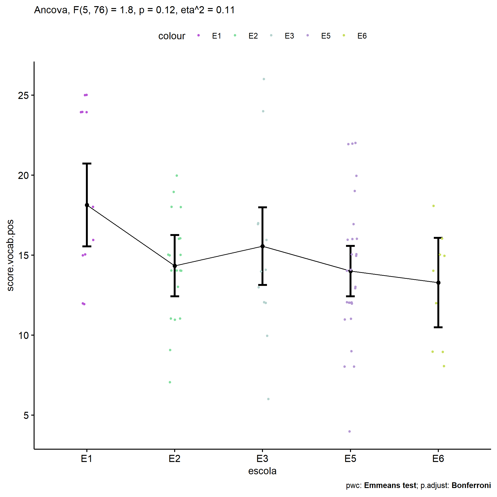<!-- -->

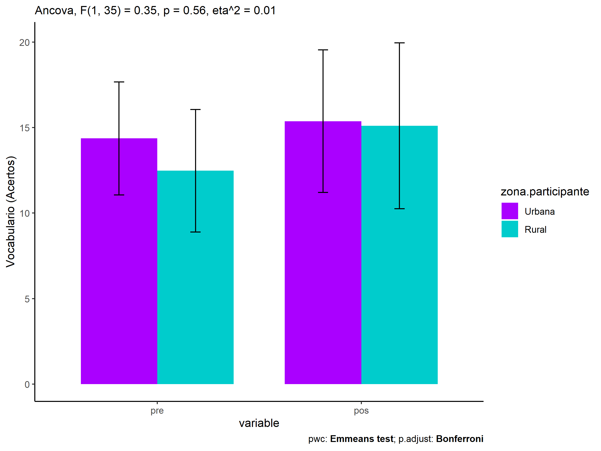<!-- -->

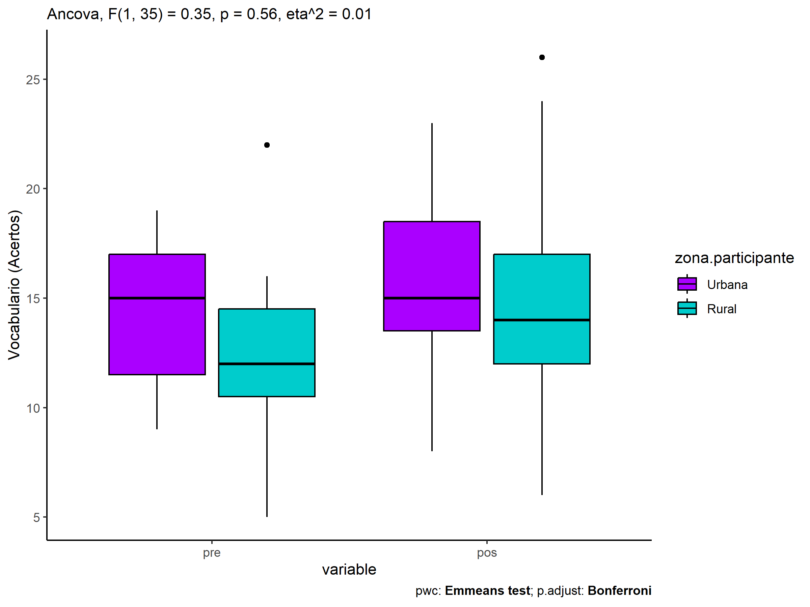<!-- -->

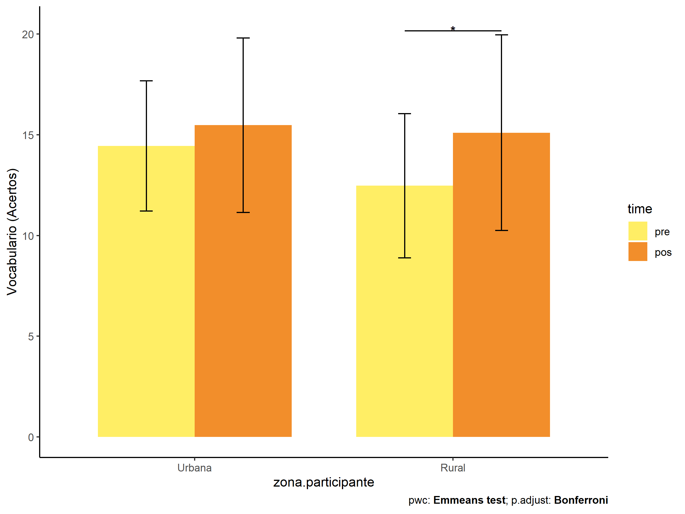<!-- -->

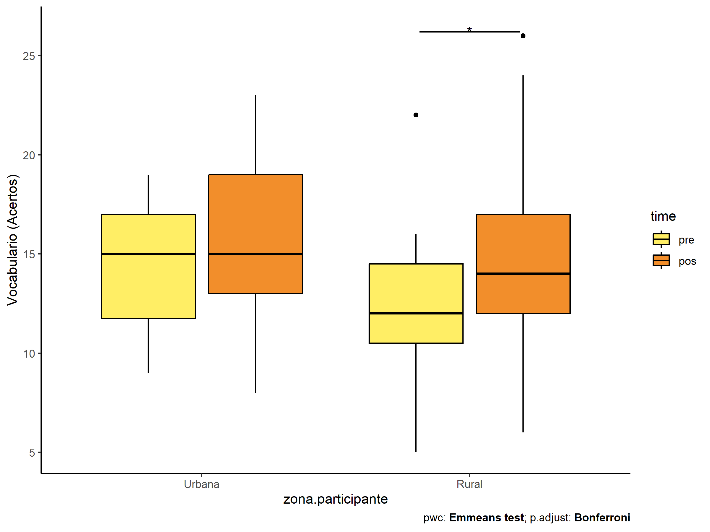<!-- -->

### Vocabulario (TRI)

| var           | zona.participante |   n | M (pre) | SE (pre) | M (unadj) | SE (unadj) | M (adj) | SE (adj) |
|:--------------|:------------------|----:|--------:|---------:|----------:|-----------:|--------:|---------:|
| tri.vocab.pos | Rural             |  19 |  -0.739 |    0.133 |    -0.641 |      0.122 |  -0.631 |    0.107 |
| tri.vocab.pos | Urbana            |  19 |  -0.706 |    0.145 |    -0.604 |      0.149 |  -0.614 |    0.107 |

| .y.           | group1 | group2 | estimate | conf.low | conf.high |    se | statistic |     p | p.adj | p.adj.signif |
|:--------------|:-------|:-------|---------:|---------:|----------:|------:|----------:|------:|------:|:-------------|
| tri.vocab.pos | Urbana | Rural  |    0.017 |   -0.290 |     0.325 | 0.151 |     0.114 | 0.910 | 0.910 | ns           |
| tri.vocab.pre | Urbana | Rural  |    0.032 |   -0.367 |     0.432 | 0.197 |     0.164 | 0.871 | 0.871 | ns           |

| zona.participante | group1 | group2 | estimate | conf.low | conf.high |    se | statistic |     p | p.adj | p.adj.signif |
|:------------------|:-------|:-------|---------:|---------:|----------:|------:|----------:|------:|------:|:-------------|
| Urbana            | pre    | pos    |   -0.118 |   -0.494 |     0.258 | 0.189 |    -0.625 | 0.534 | 0.534 | ns           |
| Rural             | pre    | pos    |   -0.097 |   -0.488 |     0.293 | 0.196 |    -0.497 | 0.621 | 0.621 | ns           |

    ## Scale for colour is already present.
    ## Adding another scale for colour, which will replace the existing scale.

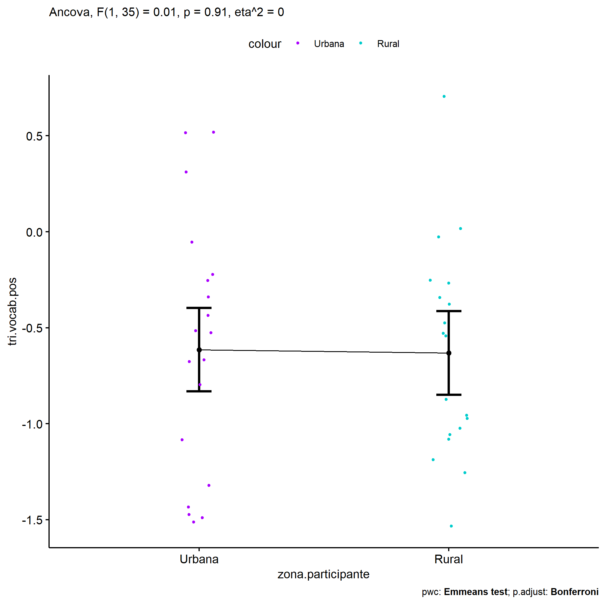<!-- -->

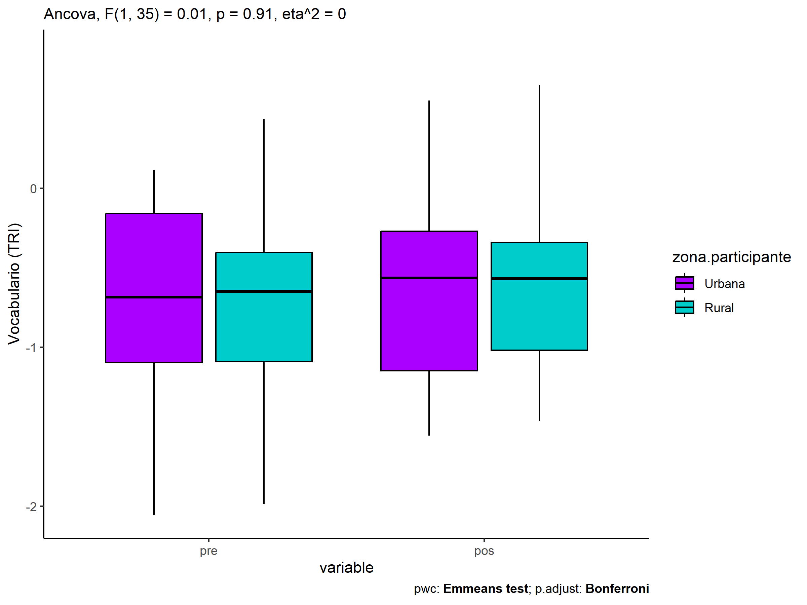<!-- -->

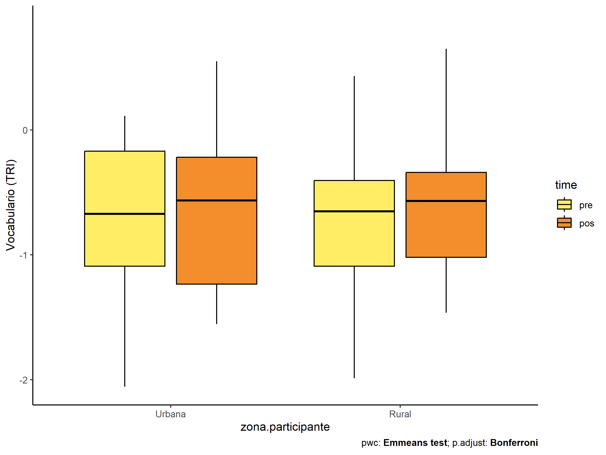<!-- -->

### Vocabulario Ensinado (Acertos)

| var                      | zona.participante |   n | M (pre) | SE (pre) | M (unadj) | SE (unadj) | M (adj) | SE (adj) |
|:-------------------------|:------------------|----:|--------:|---------:|----------:|-----------:|--------:|---------:|
| score.vocab.ensinado.pos | Rural             |  19 |   2.737 |    0.304 |     2.684 |      0.426 |   2.675 |    0.395 |
| score.vocab.ensinado.pos | Urbana            |  22 |   2.545 |    0.353 |     2.636 |      0.333 |   2.644 |    0.367 |

| .y.                      | group1 | group2 | estimate | conf.low | conf.high |    se | statistic |     p | p.adj | p.adj.signif |
|:-------------------------|:-------|:-------|---------:|---------:|----------:|------:|----------:|------:|------:|:-------------|
| score.vocab.ensinado.pos | Urbana | Rural  |   -0.031 |   -1.124 |     1.062 | 0.540 |    -0.058 | 0.954 | 0.954 | ns           |
| score.vocab.ensinado.pre | Urbana | Rural  |   -0.191 |   -1.149 |     0.766 | 0.473 |    -0.404 | 0.688 | 0.688 | ns           |

| zona.participante | group1 | group2 | estimate | conf.low | conf.high |    se | statistic |     p | p.adj | p.adj.signif |
|:------------------|:-------|:-------|---------:|---------:|----------:|------:|----------:|------:|------:|:-------------|
| Urbana            | pre    | pos    |   -0.091 |   -1.058 |     0.876 | 0.486 |    -0.187 | 0.852 | 0.852 | ns           |
| Rural             | pre    | pos    |    0.053 |   -0.988 |     1.093 | 0.523 |     0.101 | 0.920 | 0.920 | ns           |

    ## Scale for colour is already present.
    ## Adding another scale for colour, which will replace the existing scale.

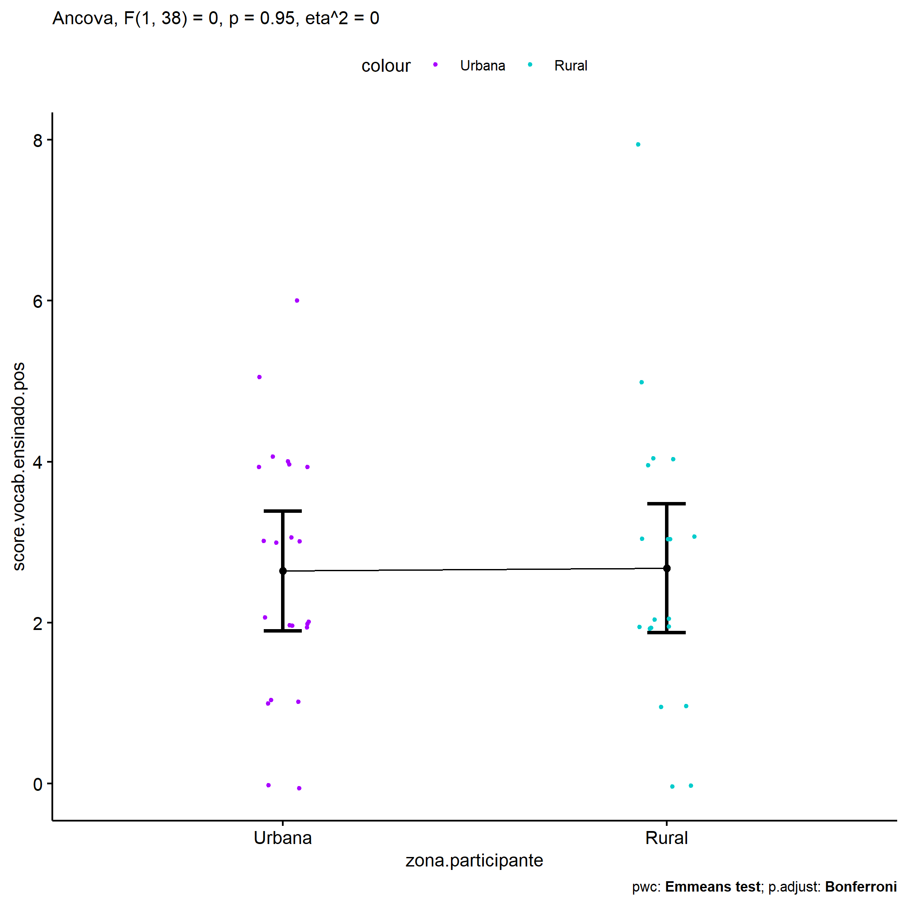<!-- -->

<!-- -->

<!-- -->

<!-- -->

<!-- -->

### Vocabulario Ensinado (TRI)

| var                    | zona.participante |   n | M (pre) | SE (pre) | M (unadj) | SE (unadj) | M (adj) | SE (adj) |
|:-----------------------|:------------------|----:|--------:|---------:|----------:|-----------:|--------:|---------:|
| tri.vocab.ensinado.pos | Rural             |  19 |  -0.267 |    0.150 |    -0.636 |      0.146 |  -0.676 |    0.148 |
| tri.vocab.ensinado.pos | Urbana            |  19 |  -0.552 |    0.139 |    -0.589 |      0.153 |  -0.549 |    0.148 |

| .y.                    | group1 | group2 | estimate | conf.low | conf.high |    se | statistic |     p | p.adj | p.adj.signif |
|:-----------------------|:-------|:-------|---------:|---------:|----------:|------:|----------:|------:|------:|:-------------|
| tri.vocab.ensinado.pos | Urbana | Rural  |    0.128 |   -0.302 |     0.557 | 0.212 |     0.604 | 0.549 | 0.549 | ns           |
| tri.vocab.ensinado.pre | Urbana | Rural  |   -0.285 |   -0.699 |     0.129 | 0.204 |    -1.395 | 0.171 | 0.171 | ns           |

| zona.participante | group1 | group2 | estimate | conf.low | conf.high |    se | statistic |     p | p.adj | p.adj.signif |
|:------------------|:-------|:-------|---------:|---------:|----------:|------:|----------:|------:|------:|:-------------|
| Urbana            | pre    | pos    |   -0.072 |   -0.473 |     0.329 | 0.201 |    -0.358 | 0.721 | 0.721 | ns           |
| Rural             | pre    | pos    |    0.370 |   -0.047 |     0.786 | 0.209 |     1.769 | 0.081 | 0.081 | ns           |

    ## Scale for colour is already present.
    ## Adding another scale for colour, which will replace the existing scale.

<!-- -->

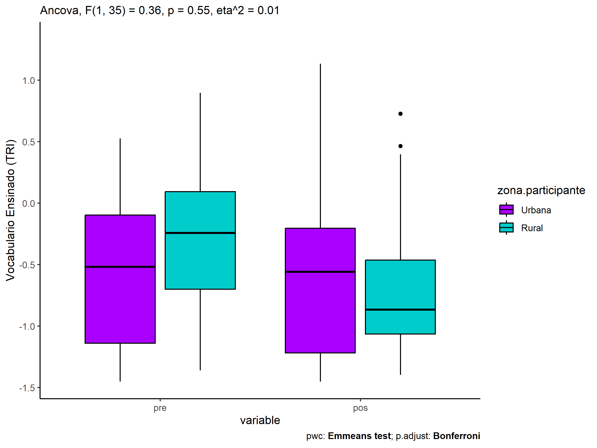<!-- -->

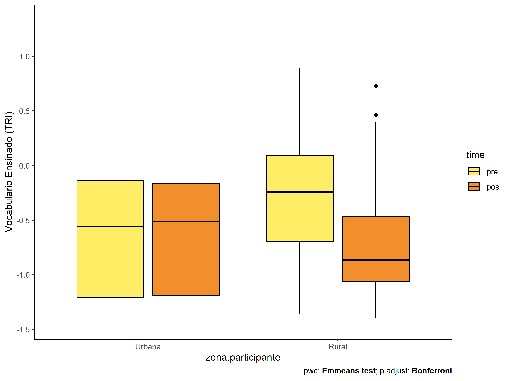<!-- -->

### Vocabulario Nao Ensinado (Acertos)

| var                          | zona.participante |   n | M (pre) | SE (pre) | M (unadj) | SE (unadj) | M (adj) | SE (adj) |
|:-----------------------------|:------------------|----:|--------:|---------:|----------:|-----------:|--------:|---------:|
| score.vocab.nao.ensinado.pos | Rural             |  19 |   9.737 |    0.662 |    12.421 |      0.896 |  12.566 |    0.963 |
| score.vocab.nao.ensinado.pos | Urbana            |  22 |  10.591 |    0.993 |    12.136 |      0.988 |  12.011 |    0.894 |

| .y.                          | group1 | group2 | estimate | conf.low | conf.high |    se | statistic |     p | p.adj | p.adj.signif |
|:-----------------------------|:-------|:-------|---------:|---------:|----------:|------:|----------:|------:|------:|:-------------|
| score.vocab.nao.ensinado.pos | Urbana | Rural  |   -0.555 |   -3.223 |     2.113 | 1.318 |    -0.421 | 0.676 | 0.676 | ns           |
| score.vocab.nao.ensinado.pre | Urbana | Rural  |    0.854 |   -1.641 |     3.349 | 1.234 |     0.692 | 0.493 | 0.493 | ns           |

| zona.participante | group1 | group2 | estimate | conf.low | conf.high |    se | statistic |     p | p.adj | p.adj.signif |
|:------------------|:-------|:-------|---------:|---------:|----------:|------:|----------:|------:|------:|:-------------|
| Urbana            | pre    | pos    |   -1.545 |   -4.024 |     0.933 | 1.245 |    -1.241 | 0.218 | 0.218 | ns           |
| Rural             | pre    | pos    |   -2.684 |   -5.352 |    -0.017 | 1.340 |    -2.003 | 0.049 | 0.049 | \*           |

    ## Scale for colour is already present.
    ## Adding another scale for colour, which will replace the existing scale.

<!-- -->

<!-- -->

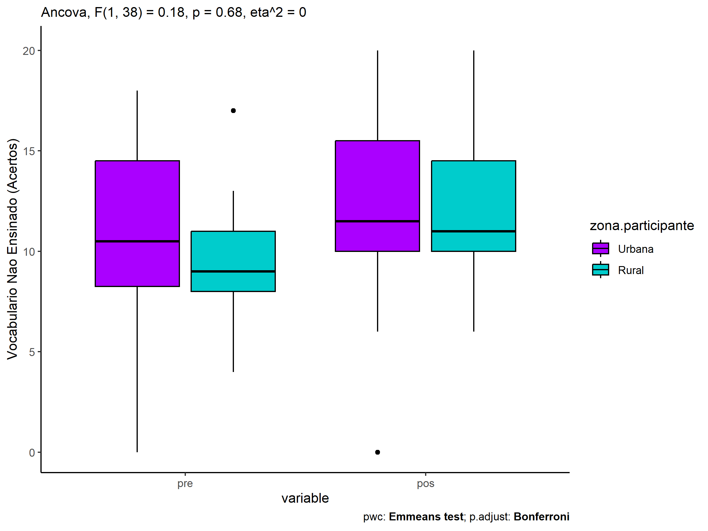<!-- -->

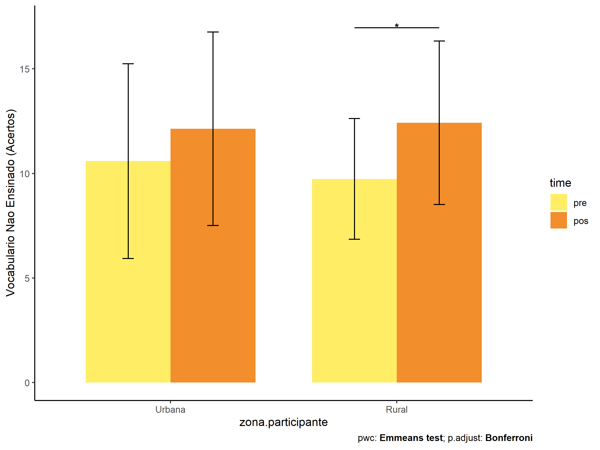<!-- -->

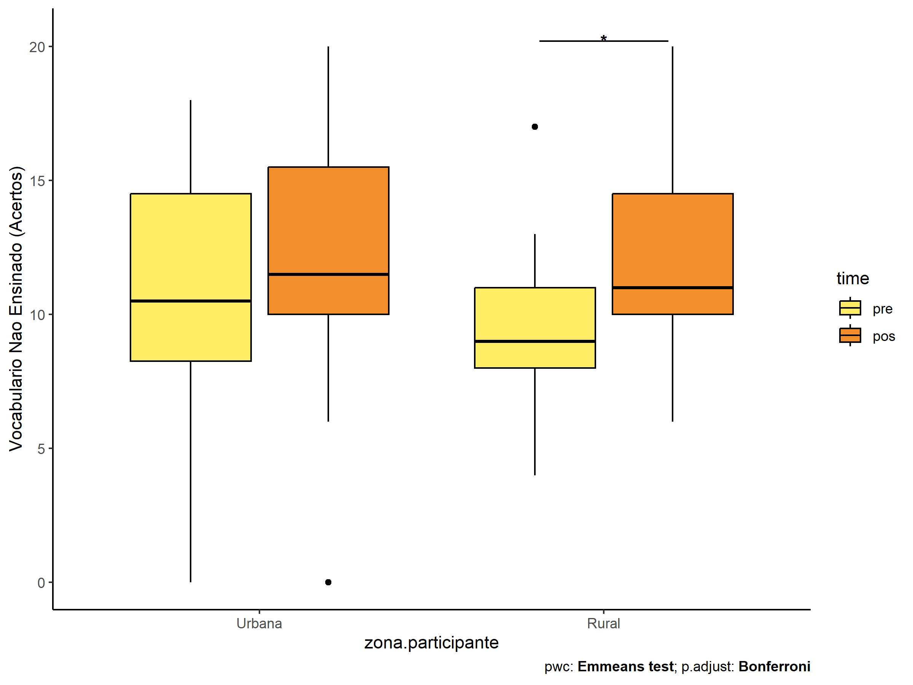<!-- -->

### Vocabulario Nao Ensinado (TRI)

| var                        | zona.participante |   n | M (pre) | SE (pre) | M (unadj) | SE (unadj) | M (adj) | SE (adj) |
|:---------------------------|:------------------|----:|--------:|---------:|----------:|-----------:|--------:|---------:|
| tri.vocab.nao.ensinado.pos | Rural             |  19 |  -0.818 |    0.089 |    -0.627 |      0.105 |  -0.573 |     0.08 |
| tri.vocab.nao.ensinado.pos | Urbana            |  19 |  -0.696 |    0.099 |    -0.527 |      0.122 |  -0.581 |     0.08 |

| .y.                        | group1 | group2 | estimate | conf.low | conf.high |    se | statistic |     p | p.adj | p.adj.signif |
|:---------------------------|:-------|:-------|---------:|---------:|----------:|------:|----------:|------:|------:|:-------------|
| tri.vocab.nao.ensinado.pos | Urbana | Rural  |   -0.008 |   -0.237 |     0.222 | 0.113 |    -0.067 | 0.947 | 0.947 | ns           |
| tri.vocab.nao.ensinado.pre | Urbana | Rural  |    0.122 |   -0.148 |     0.393 | 0.133 |     0.917 | 0.365 | 0.365 | ns           |

| zona.participante | group1 | group2 | estimate | conf.low | conf.high |    se | statistic |     p | p.adj | p.adj.signif |
|:------------------|:-------|:-------|---------:|---------:|----------:|------:|----------:|------:|------:|:-------------|
| Urbana            | pre    | pos    |   -0.170 |   -0.464 |     0.123 | 0.147 |    -1.156 | 0.251 | 0.251 | ns           |
| Rural             | pre    | pos    |   -0.191 |   -0.495 |     0.114 | 0.153 |    -1.247 | 0.216 | 0.216 | ns           |

    ## Scale for colour is already present.
    ## Adding another scale for colour, which will replace the existing scale.

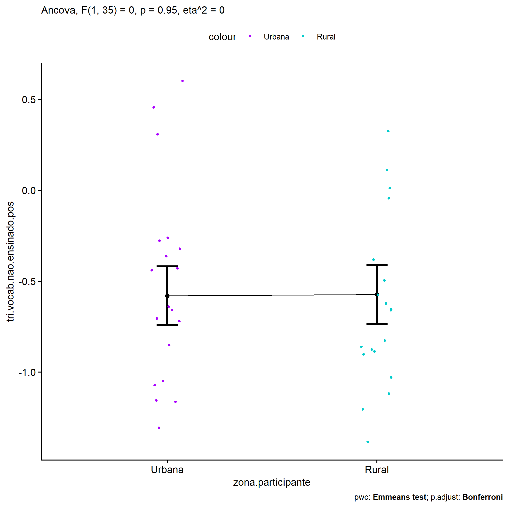<!-- -->

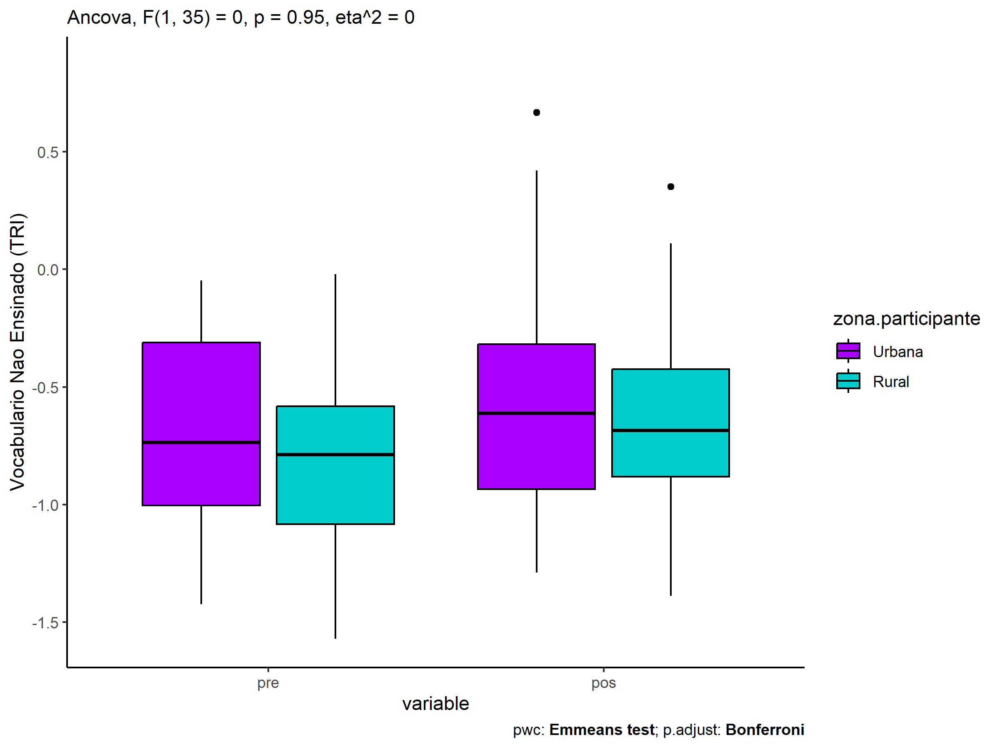<!-- -->

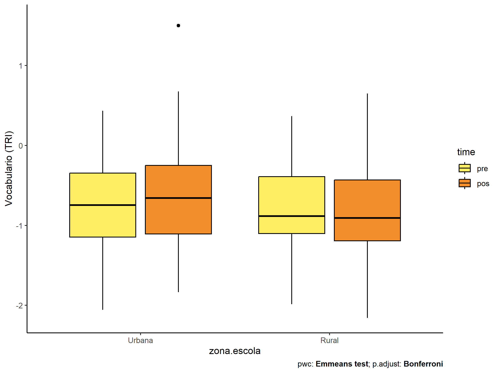<!-- -->

## factor: **escola**

### Vocabulario (Acertos)

| var             | escola |   n | M (pre) | SE (pre) | M (unadj) | SE (unadj) | M (adj) | SE (adj) |
|:----------------|:-------|----:|--------:|---------:|----------:|-----------:|--------:|---------:|
| score.vocab.pos | E2     |  12 |  13.833 |    1.079 |    14.500 |      0.830 |  14.268 |    1.140 |
| score.vocab.pos | E3     |  12 |  12.000 |    0.905 |    15.083 |      1.607 |  15.688 |    1.161 |
| score.vocab.pos | E5     |  16 |  13.938 |    0.915 |    15.125 |      0.961 |  14.845 |    0.990 |

| .y.             | group1 | group2 | estimate | conf.low | conf.high |    se | statistic |     p | p.adj | p.adj.signif |
|:----------------|:-------|:-------|---------:|---------:|----------:|------:|----------:|------:|------:|:-------------|
| score.vocab.pos | E2     | E3     |   -1.420 |   -4.748 |     1.908 | 1.641 |    -0.865 | 0.393 | 1.000 | ns           |
| score.vocab.pos | E2     | E5     |   -0.577 |   -3.625 |     2.470 | 1.503 |    -0.384 | 0.703 | 1.000 | ns           |
| score.vocab.pos | E3     | E5     |    0.843 |   -2.288 |     3.974 | 1.544 |     0.546 | 0.589 | 1.000 | ns           |
| score.vocab.pre | E2     | E3     |    1.833 |   -1.092 |     4.758 | 1.444 |     1.270 | 0.212 | 0.636 | ns           |
| score.vocab.pre | E2     | E5     |   -0.104 |   -2.840 |     2.632 | 1.350 |    -0.077 | 0.939 | 1.000 | ns           |
| score.vocab.pre | E3     | E5     |   -1.937 |   -4.673 |     0.798 | 1.350 |    -1.435 | 0.160 | 0.479 | ns           |

| escola | group1 | group2 | estimate | conf.low | conf.high |    se | statistic |     p | p.adj | p.adj.signif |
|:-------|:-------|:-------|---------:|---------:|----------:|------:|----------:|------:|------:|:-------------|
| E2     | pre    | pos    |   -0.667 |   -3.921 |     2.588 | 1.637 |    -0.407 | 0.685 | 0.685 | ns           |
| E3     | pre    | pos    |   -3.083 |   -6.338 |     0.171 | 1.637 |    -1.884 | 0.063 | 0.063 | ns           |
| E5     | pre    | pos    |   -0.918 |   -3.614 |     1.778 | 1.356 |    -0.677 | 0.500 | 0.500 | ns           |
| E6     | pre    | pos    |   -1.000 |   -6.042 |     4.042 | 2.536 |    -0.394 | 0.694 | 0.694 | ns           |

    ## Scale for colour is already present.
    ## Adding another scale for colour, which will replace the existing scale.

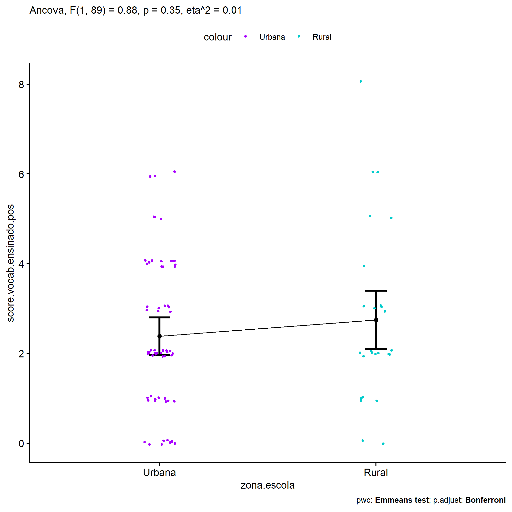<!-- -->

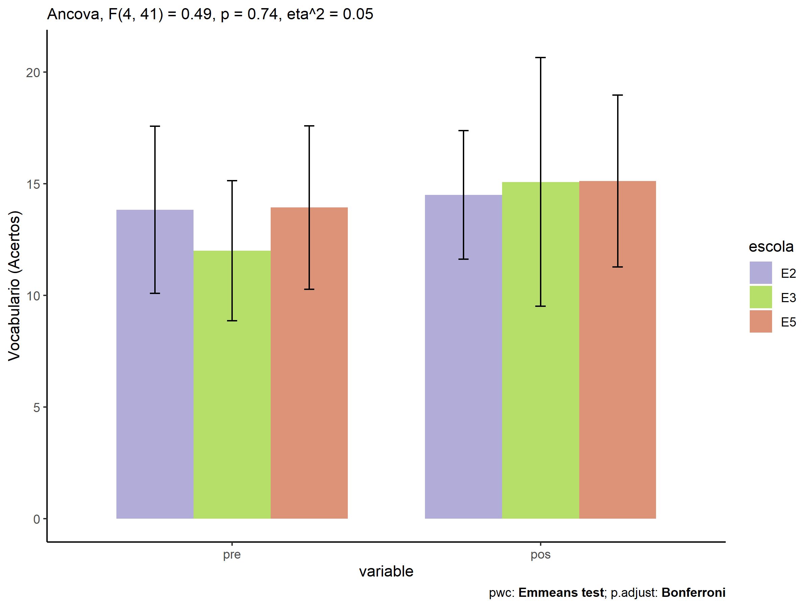<!-- -->

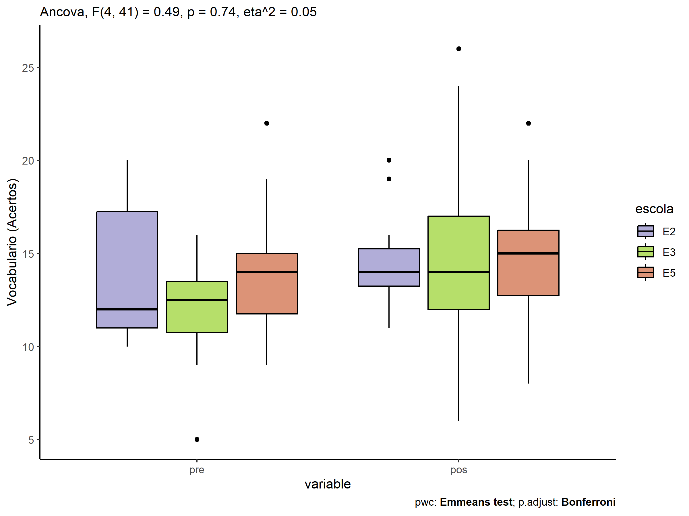<!-- -->

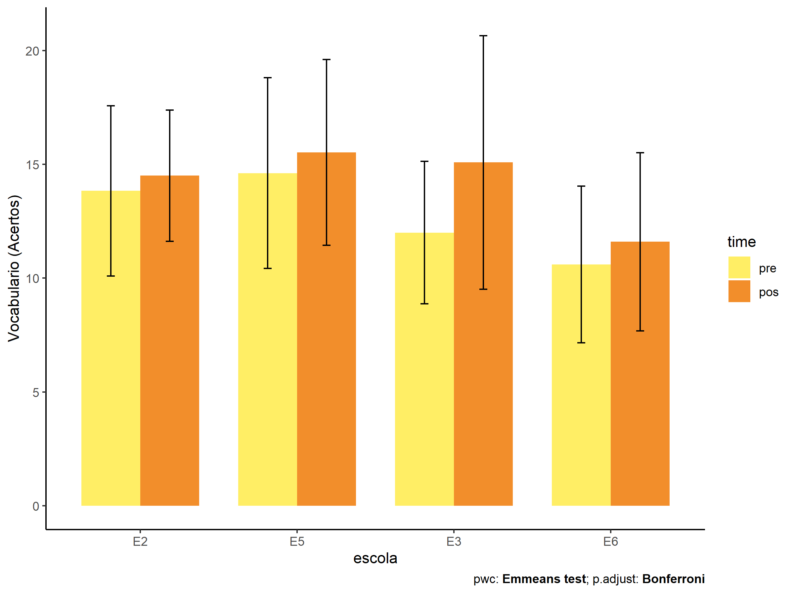<!-- -->

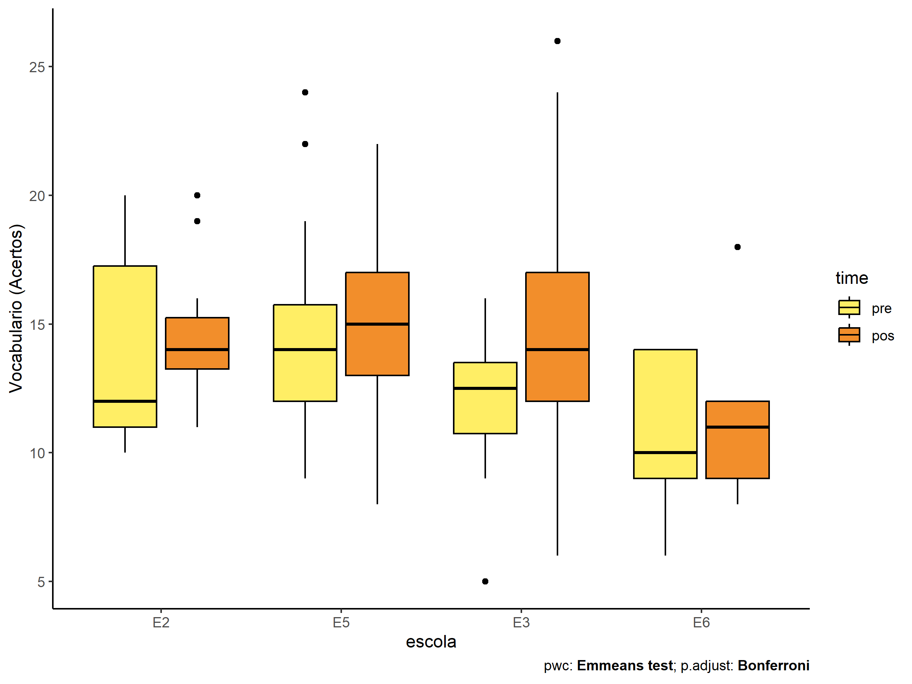<!-- -->

### Vocabulario (TRI)

| var           | escola |   n | M (pre) | SE (pre) | M (unadj) | SE (unadj) | M (adj) | SE (adj) |
|:--------------|:-------|----:|--------:|---------:|----------:|-----------:|--------:|---------:|
| tri.vocab.pos | E2     |  12 |  -0.890 |    0.209 |    -0.855 |      0.142 |  -0.776 |    0.130 |
| tri.vocab.pos | E3     |  12 |  -0.719 |    0.164 |    -0.624 |      0.169 |  -0.637 |    0.129 |
| tri.vocab.pos | E5     |  16 |  -0.654 |    0.136 |    -0.567 |      0.140 |  -0.616 |    0.112 |

| .y.           | group1 | group2 | estimate | conf.low | conf.high |    se | statistic |     p | p.adj | p.adj.signif |
|:--------------|:-------|:-------|---------:|---------:|----------:|------:|----------:|------:|------:|:-------------|
| tri.vocab.pos | E2     | E3     |   -0.139 |   -0.510 |     0.233 | 0.183 |    -0.758 | 0.453 | 1.000 | ns           |
| tri.vocab.pos | E2     | E5     |   -0.160 |   -0.510 |     0.190 | 0.173 |    -0.928 | 0.360 | 1.000 | ns           |
| tri.vocab.pos | E3     | E5     |   -0.021 |   -0.367 |     0.324 | 0.170 |    -0.125 | 0.901 | 1.000 | ns           |
| tri.vocab.pre | E2     | E3     |   -0.172 |   -0.675 |     0.332 | 0.249 |    -0.690 | 0.494 | 1.000 | ns           |
| tri.vocab.pre | E2     | E5     |   -0.237 |   -0.708 |     0.234 | 0.233 |    -1.018 | 0.315 | 0.946 | ns           |
| tri.vocab.pre | E3     | E5     |   -0.065 |   -0.536 |     0.406 | 0.233 |    -0.280 | 0.781 | 1.000 | ns           |

| escola | group1 | group2 | estimate | conf.low | conf.high |    se | statistic |     p | p.adj | p.adj.signif |
|:-------|:-------|:-------|---------:|---------:|----------:|------:|----------:|------:|------:|:-------------|
| E2     | pre    | pos    |   -0.035 |   -0.498 |     0.427 | 0.233 |    -0.152 | 0.879 | 0.879 | ns           |
| E3     | pre    | pos    |   -0.095 |   -0.558 |     0.367 | 0.233 |    -0.409 | 0.684 | 0.684 | ns           |
| E5     | pre    | pos    |   -0.100 |   -0.483 |     0.283 | 0.193 |    -0.520 | 0.604 | 0.604 | ns           |
| E6     | pre    | pos    |    0.363 |   -0.353 |     1.080 | 0.360 |     1.008 | 0.316 | 0.316 | ns           |

    ## Scale for colour is already present.
    ## Adding another scale for colour, which will replace the existing scale.

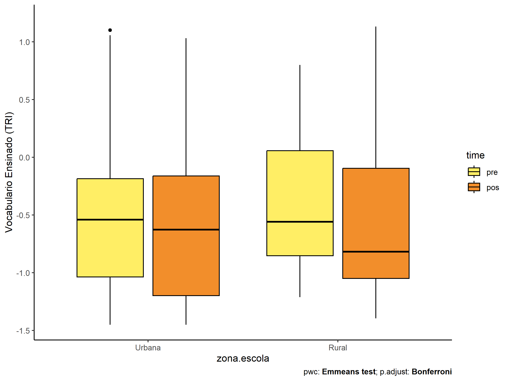<!-- -->

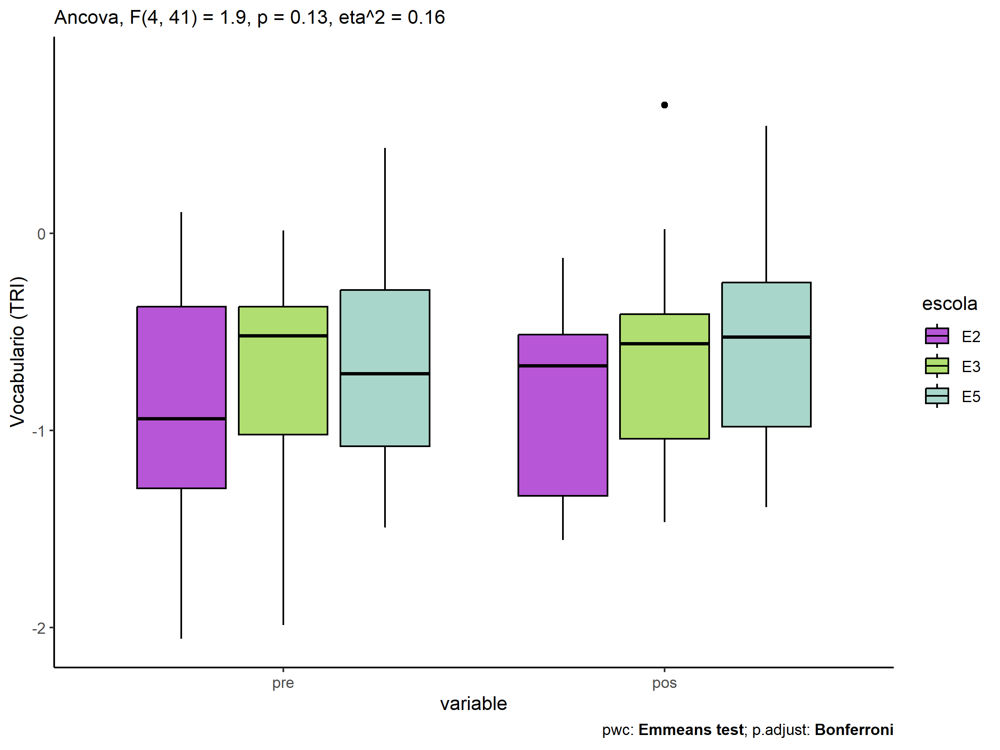<!-- -->

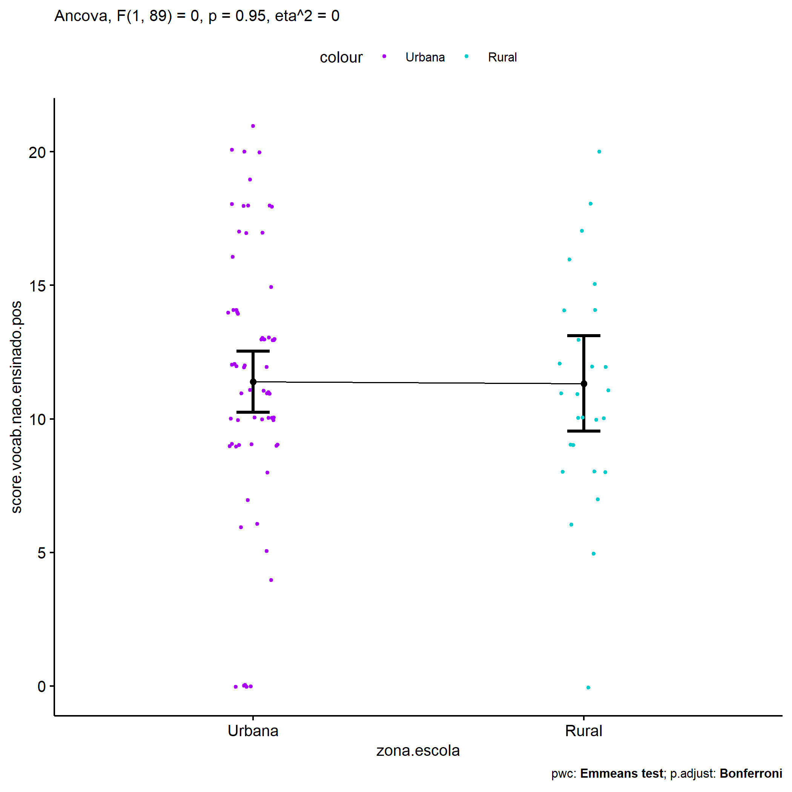<!-- -->

### Vocabulario Ensinado (Acertos)

| var                      | escola |   n | M (pre) | SE (pre) | M (unadj) | SE (unadj) | M (adj) | SE (adj) |
|:-------------------------|:-------|----:|--------:|---------:|----------:|-----------:|--------:|---------:|
| score.vocab.ensinado.pos | E2     |  12 |   2.667 |    0.333 |     2.667 |      0.449 |   2.675 |    0.491 |
| score.vocab.ensinado.pos | E3     |  12 |   2.583 |    0.288 |     2.917 |      0.596 |   2.931 |    0.491 |
| score.vocab.ensinado.pos | E5     |  19 |   3.000 |    0.412 |     2.158 |      0.308 |   2.141 |    0.391 |
| score.vocab.ensinado.pos | E6     |   6 |   2.667 |    0.760 |     2.667 |      0.843 |   2.675 |    0.693 |

| .y.                      | group1 | group2 | estimate | conf.low | conf.high |    se | statistic |     p | p.adj | p.adj.signif |
|:-------------------------|:-------|:-------|---------:|---------:|----------:|------:|----------:|------:|------:|:-------------|
| score.vocab.ensinado.pos | E2     | E3     |   -0.256 |   -1.654 |     1.141 | 0.693 |    -0.370 | 0.713 |     1 | ns           |
| score.vocab.ensinado.pos | E2     | E5     |    0.534 |   -0.733 |     1.801 | 0.629 |     0.849 | 0.400 |     1 | ns           |
| score.vocab.ensinado.pos | E2     | E6     |    0.000 |   -1.711 |     1.711 | 0.849 |     0.000 | 1.000 |     1 | ns           |
| score.vocab.ensinado.pos | E3     | E5     |    0.790 |   -0.480 |     2.060 | 0.630 |     1.254 | 0.216 |     1 | ns           |
| score.vocab.ensinado.pos | E3     | E6     |    0.256 |   -1.455 |     1.968 | 0.849 |     0.302 | 0.764 |     1 | ns           |
| score.vocab.ensinado.pos | E5     | E6     |   -0.534 |   -2.140 |     1.073 | 0.797 |    -0.670 | 0.507 |     1 | ns           |
| score.vocab.ensinado.pre | E2     | E3     |    0.083 |   -1.148 |     1.315 | 0.611 |     0.136 | 0.892 |     1 | ns           |
| score.vocab.ensinado.pre | E2     | E5     |   -0.333 |   -1.446 |     0.779 | 0.552 |    -0.604 | 0.549 |     1 | ns           |
| score.vocab.ensinado.pre | E2     | E6     |    0.000 |   -1.508 |     1.508 | 0.749 |     0.000 | 1.000 |     1 | ns           |
| score.vocab.ensinado.pre | E3     | E5     |   -0.417 |   -1.529 |     0.696 | 0.552 |    -0.755 | 0.454 |     1 | ns           |
| score.vocab.ensinado.pre | E3     | E6     |   -0.083 |   -1.591 |     1.425 | 0.749 |    -0.111 | 0.912 |     1 | ns           |
| score.vocab.ensinado.pre | E5     | E6     |    0.333 |   -1.079 |     1.746 | 0.701 |     0.475 | 0.637 |     1 | ns           |

| escola | group1 | group2 | estimate | conf.low | conf.high |    se | statistic |     p | p.adj | p.adj.signif |
|:-------|:-------|:-------|---------:|---------:|----------:|------:|----------:|------:|------:|:-------------|
| E2     | pre    | pos    |    0.000 |   -1.292 |     1.292 | 0.650 |     0.000 | 1.000 | 1.000 | ns           |
| E3     | pre    | pos    |   -0.333 |   -1.625 |     0.959 | 0.650 |    -0.513 | 0.609 | 0.609 | ns           |
| E5     | pre    | pos    |    0.842 |   -0.185 |     1.869 | 0.517 |     1.629 | 0.107 | 0.107 | ns           |
| E6     | pre    | pos    |    0.000 |   -1.827 |     1.827 | 0.920 |     0.000 | 1.000 | 1.000 | ns           |

    ## Scale for colour is already present.
    ## Adding another scale for colour, which will replace the existing scale.

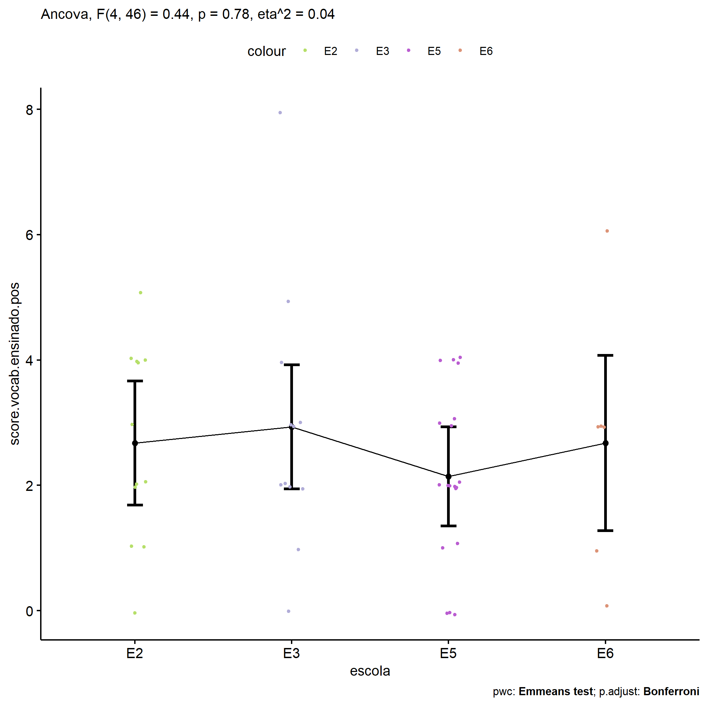<!-- -->

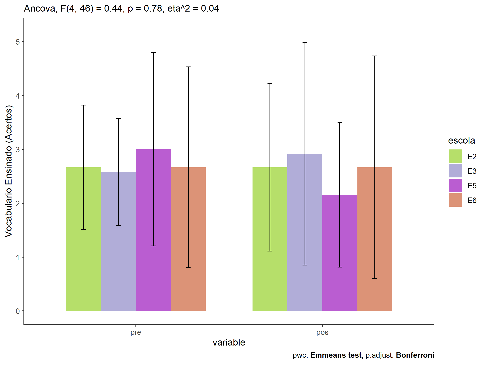<!-- -->

<!-- -->

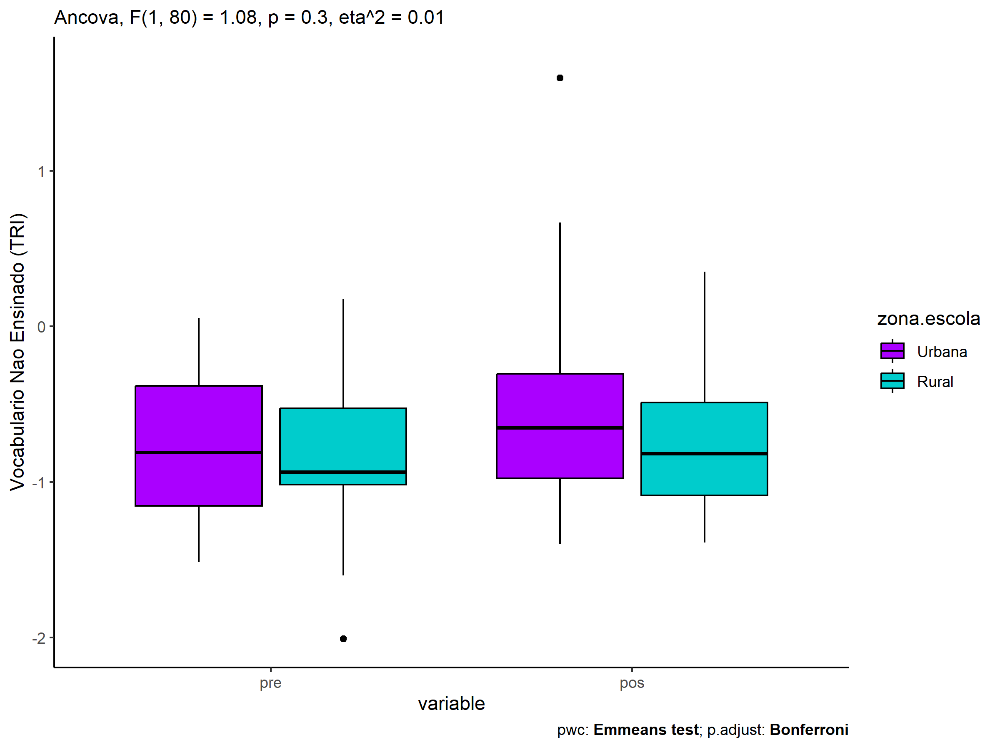<!-- -->

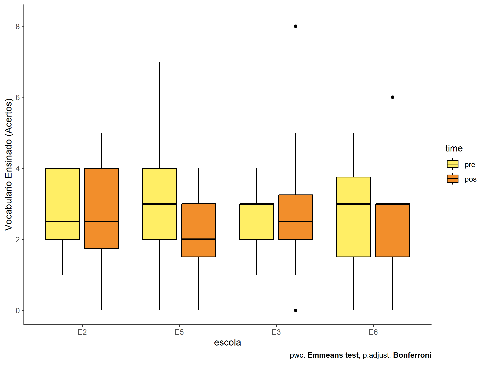<!-- -->

### Vocabulario Ensinado (TRI)

| var                    | escola |   n | M (pre) | SE (pre) | M (unadj) | SE (unadj) | M (adj) | SE (adj) |
|:-----------------------|:-------|----:|--------:|---------:|----------:|-----------:|--------:|---------:|
| tri.vocab.ensinado.pos | E2     |  12 |  -0.723 |    0.149 |    -0.843 |      0.175 |  -0.744 |    0.164 |
| tri.vocab.ensinado.pos | E3     |  12 |  -0.193 |    0.179 |    -0.562 |      0.192 |  -0.640 |    0.162 |
| tri.vocab.ensinado.pos | E5     |  16 |  -0.377 |    0.166 |    -0.657 |      0.119 |  -0.673 |    0.137 |

| .y.                    | group1 | group2 | estimate | conf.low | conf.high |    se | statistic |     p | p.adj | p.adj.signif |
|:-----------------------|:-------|:-------|---------:|---------:|----------:|------:|----------:|------:|------:|:-------------|
| tri.vocab.ensinado.pos | E2     | E3     |   -0.104 |   -0.584 |     0.376 | 0.237 |    -0.439 | 0.663 | 1.000 | ns           |
| tri.vocab.ensinado.pos | E2     | E5     |   -0.070 |   -0.507 |     0.366 | 0.215 |    -0.327 | 0.746 | 1.000 | ns           |
| tri.vocab.ensinado.pos | E3     | E5     |    0.034 |   -0.394 |     0.461 | 0.211 |     0.160 | 0.874 | 1.000 | ns           |
| tri.vocab.ensinado.pre | E2     | E3     |   -0.530 |   -1.034 |    -0.025 | 0.249 |    -2.126 | 0.040 | 0.121 | ns           |
| tri.vocab.ensinado.pre | E2     | E5     |   -0.346 |   -0.818 |     0.126 | 0.233 |    -1.484 | 0.146 | 0.439 | ns           |
| tri.vocab.ensinado.pre | E3     | E5     |    0.184 |   -0.288 |     0.656 | 0.233 |     0.789 | 0.435 | 1.000 | ns           |

| escola | group1 | group2 | estimate | conf.low | conf.high |    se | statistic |     p | p.adj | p.adj.signif |
|:-------|:-------|:-------|---------:|---------:|----------:|------:|----------:|------:|------:|:-------------|
| E2     | pre    | pos    |    0.121 |   -0.359 |     0.600 | 0.241 |     0.500 | 0.619 | 0.619 | ns           |
| E3     | pre    | pos    |    0.369 |   -0.111 |     0.848 | 0.241 |     1.527 | 0.130 | 0.130 | ns           |
| E5     | pre    | pos    |    0.184 |   -0.213 |     0.582 | 0.200 |     0.923 | 0.359 | 0.359 | ns           |
| E6     | pre    | pos    |   -0.107 |   -0.850 |     0.636 | 0.374 |    -0.286 | 0.776 | 0.776 | ns           |

    ## Scale for colour is already present.
    ## Adding another scale for colour, which will replace the existing scale.

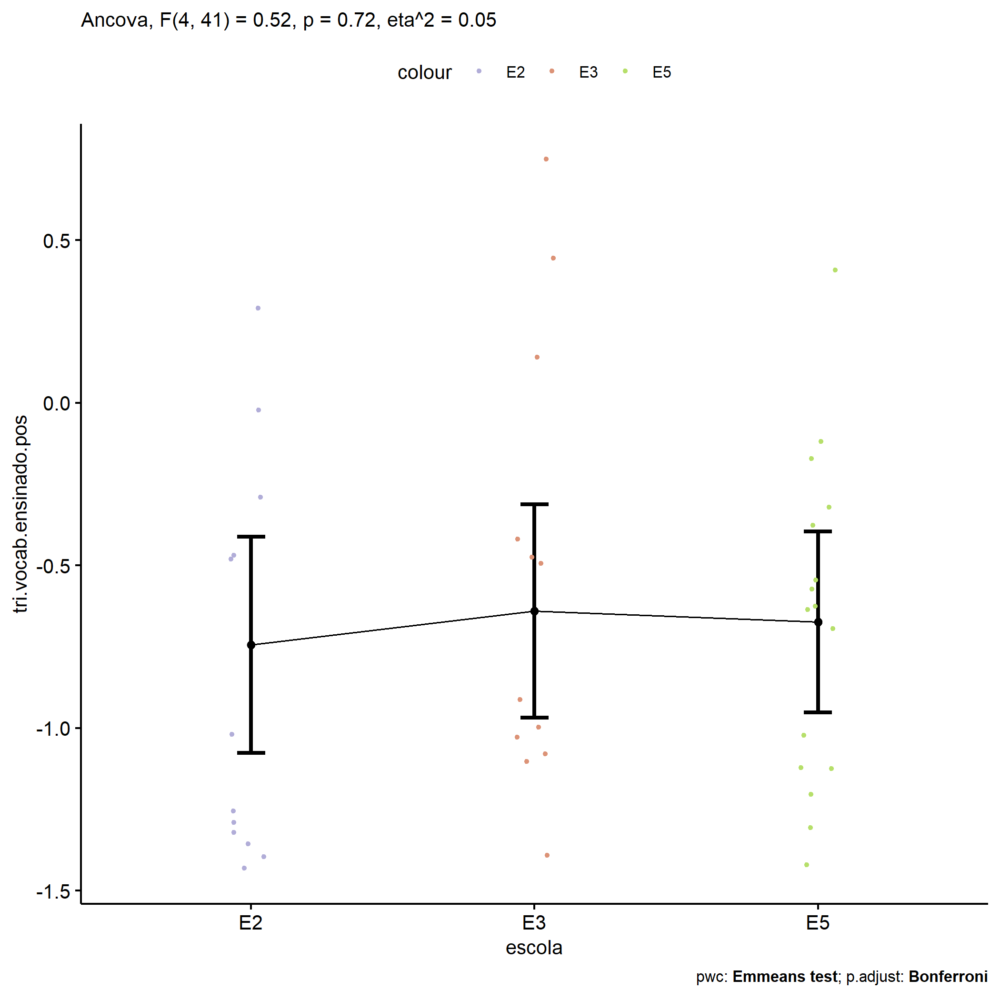<!-- -->

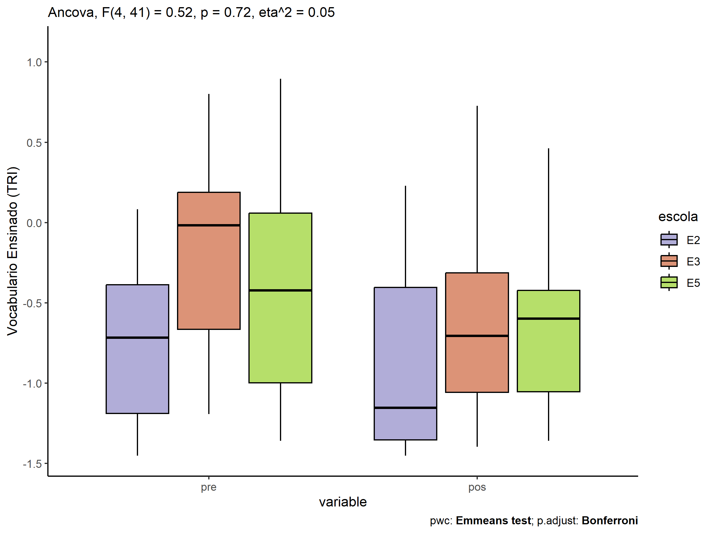<!-- -->

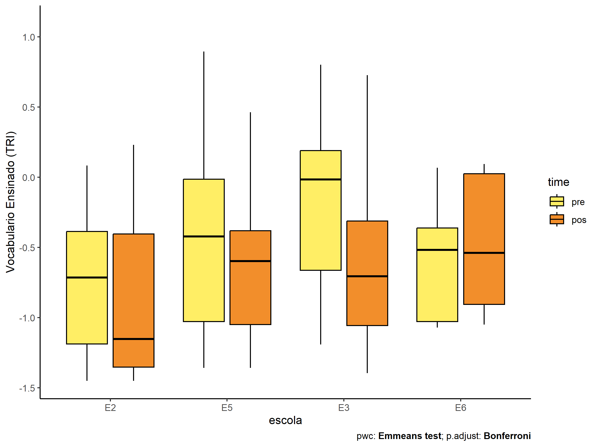<!-- -->

### Vocabulario Nao Ensinado (Acertos)

| var                          | escola |   n | M (pre) | SE (pre) | M (unadj) | SE (unadj) | M (adj) | SE (adj) |
|:-----------------------------|:-------|----:|--------:|---------:|----------:|-----------:|--------:|---------:|
| score.vocab.nao.ensinado.pos | E2     |  12 |  11.167 |    0.920 |    11.833 |      0.683 |  11.806 |    1.316 |
| score.vocab.nao.ensinado.pos | E3     |  12 |   9.417 |    0.773 |    12.167 |      1.140 |  12.180 |    1.304 |
| score.vocab.nao.ensinado.pos | E5     |  19 |  10.842 |    1.082 |    11.737 |      1.297 |  11.717 |    1.044 |
| score.vocab.nao.ensinado.pos | E6     |   6 |   6.167 |    1.721 |     7.000 |      1.673 |   7.089 |    1.954 |

| .y.                          | group1 | group2 | estimate | conf.low | conf.high |    se | statistic |     p | p.adj | p.adj.signif |
|:-----------------------------|:-------|:-------|---------:|---------:|----------:|------:|----------:|------:|------:|:-------------|
| score.vocab.nao.ensinado.pos | E2     | E3     |   -0.374 |   -4.129 |     3.382 | 1.864 |    -0.201 | 0.842 | 1.000 | ns           |
| score.vocab.nao.ensinado.pos | E2     | E5     |    0.089 |   -3.260 |     3.438 | 1.662 |     0.054 | 0.958 | 1.000 | ns           |
| score.vocab.nao.ensinado.pos | E2     | E6     |    4.718 |   -0.143 |     9.579 | 2.412 |     1.956 | 0.057 | 0.341 | ns           |
| score.vocab.nao.ensinado.pos | E3     | E5     |    0.463 |   -2.921 |     3.847 | 1.679 |     0.276 | 0.784 | 1.000 | ns           |
| score.vocab.nao.ensinado.pos | E3     | E6     |    5.092 |    0.414 |     9.769 | 2.321 |     2.194 | 0.034 | 0.202 | ns           |
| score.vocab.nao.ensinado.pos | E5     | E6     |    4.629 |    0.077 |     9.181 | 2.259 |     2.049 | 0.046 | 0.278 | ns           |
| score.vocab.nao.ensinado.pre | E2     | E3     |    1.750 |   -1.446 |     4.946 | 1.587 |     1.103 | 0.276 | 1.000 | ns           |
| score.vocab.nao.ensinado.pre | E2     | E5     |    0.325 |   -2.562 |     3.211 | 1.433 |     0.226 | 0.822 | 1.000 | ns           |
| score.vocab.nao.ensinado.pre | E2     | E6     |    5.000 |    1.085 |     8.915 | 1.944 |     2.573 | 0.013 | 0.081 | ns           |
| score.vocab.nao.ensinado.pre | E3     | E5     |   -1.425 |   -4.312 |     1.461 | 1.433 |    -0.995 | 0.325 | 1.000 | ns           |
| score.vocab.nao.ensinado.pre | E3     | E6     |    3.250 |   -0.665 |     7.165 | 1.944 |     1.672 | 0.101 | 0.609 | ns           |
| score.vocab.nao.ensinado.pre | E5     | E6     |    4.675 |    1.009 |     8.342 | 1.820 |     2.568 | 0.014 | 0.082 | ns           |

| escola | group1 | group2 | estimate | conf.low | conf.high |    se | statistic |     p | p.adj | p.adj.signif |
|:-------|:-------|:-------|---------:|---------:|----------:|------:|----------:|------:|------:|:-------------|
| E2     | pre    | pos    |   -0.667 |   -4.057 |     2.724 | 1.707 |    -0.391 | 0.697 | 0.697 | ns           |
| E3     | pre    | pos    |   -2.750 |   -6.141 |     0.641 | 1.707 |    -1.611 | 0.111 | 0.111 | ns           |
| E5     | pre    | pos    |   -0.895 |   -3.589 |     1.800 | 1.356 |    -0.660 | 0.511 | 0.511 | ns           |
| E6     | pre    | pos    |   -0.833 |   -5.629 |     3.962 | 2.414 |    -0.345 | 0.731 | 0.731 | ns           |

    ## Scale for colour is already present.
    ## Adding another scale for colour, which will replace the existing scale.

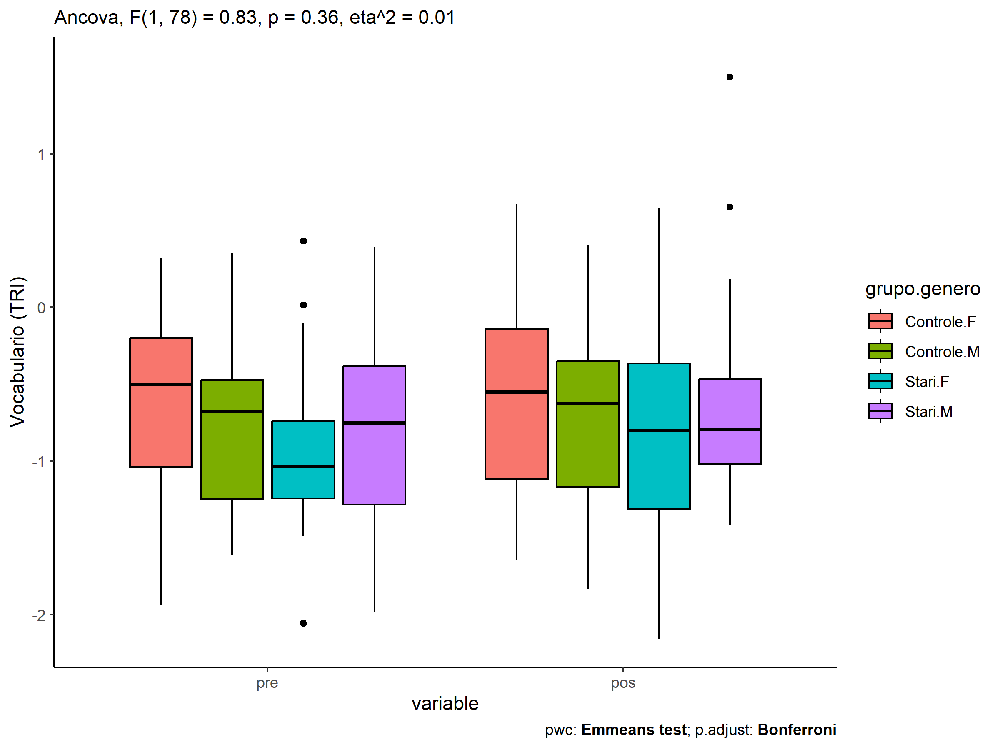<!-- -->

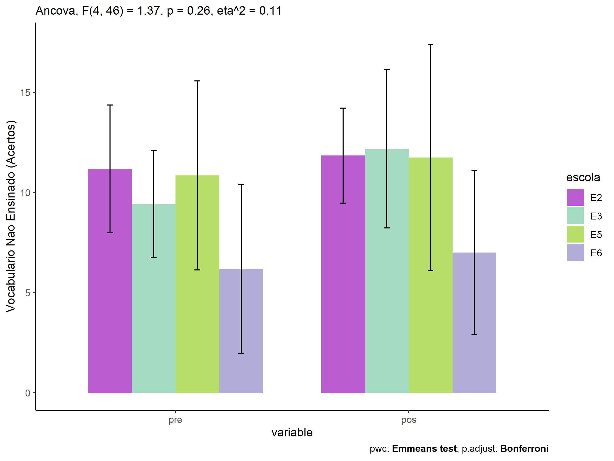<!-- -->

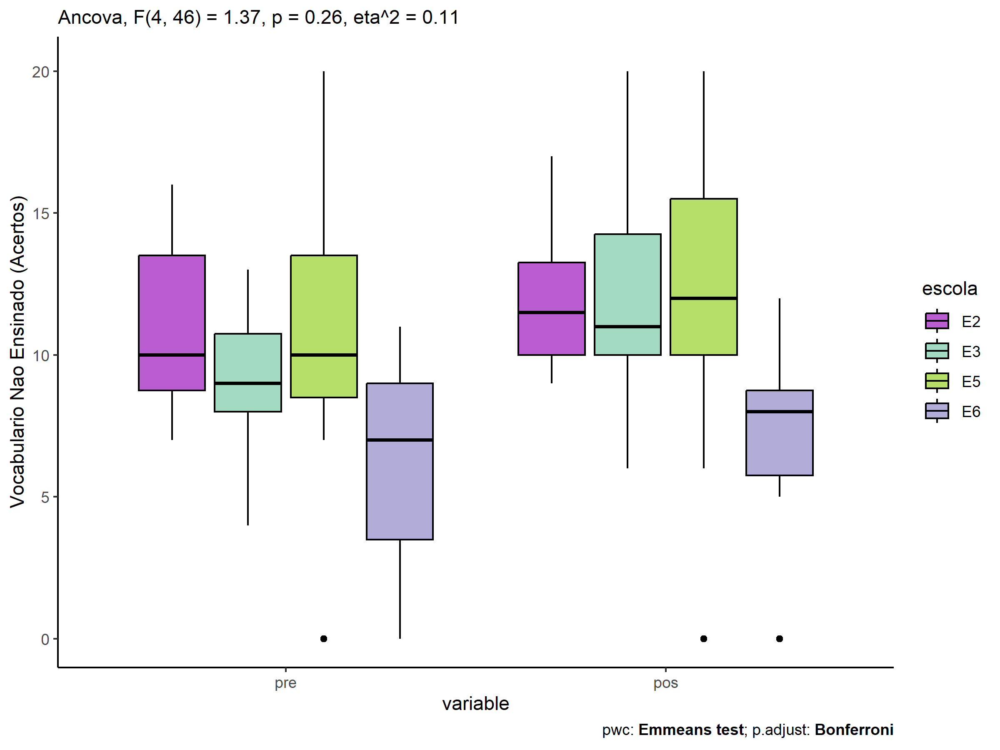<!-- -->

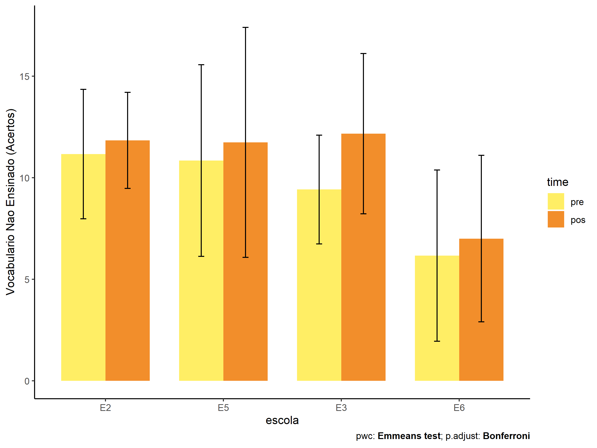<!-- -->

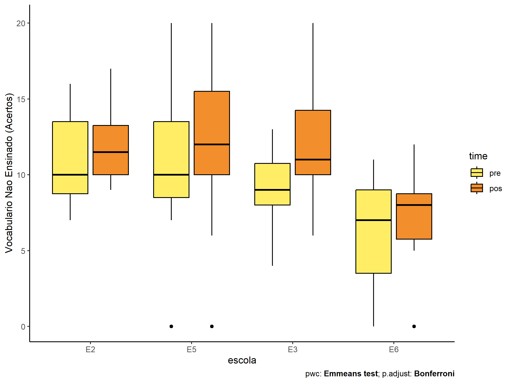<!-- -->

### Vocabulario Nao Ensinado (TRI)

| var                        | escola |   n | M (pre) | SE (pre) | M (unadj) | SE (unadj) | M (adj) | SE (adj) |
|:---------------------------|:-------|----:|--------:|---------:|----------:|-----------:|--------:|---------:|
| tri.vocab.nao.ensinado.pos | E2     |  12 |  -0.810 |    0.136 |    -0.705 |      0.086 |  -0.676 |    0.101 |
| tri.vocab.nao.ensinado.pos | E3     |  12 |  -0.812 |    0.112 |    -0.630 |      0.134 |  -0.600 |    0.101 |
| tri.vocab.nao.ensinado.pos | E5     |  16 |  -0.714 |    0.101 |    -0.523 |      0.143 |  -0.567 |    0.088 |

| .y.                        | group1 | group2 | estimate | conf.low | conf.high |    se | statistic |     p | p.adj | p.adj.signif |
|:---------------------------|:-------|:-------|---------:|---------:|----------:|------:|----------:|------:|------:|:-------------|
| tri.vocab.nao.ensinado.pos | E2     | E3     |   -0.076 |   -0.366 |     0.214 | 0.143 |    -0.531 | 0.599 |     1 | ns           |
| tri.vocab.nao.ensinado.pos | E2     | E5     |   -0.109 |   -0.382 |     0.164 | 0.134 |    -0.810 | 0.423 |     1 | ns           |
| tri.vocab.nao.ensinado.pos | E3     | E5     |   -0.033 |   -0.306 |     0.240 | 0.135 |    -0.245 | 0.808 |     1 | ns           |
| tri.vocab.nao.ensinado.pre | E2     | E3     |    0.002 |   -0.345 |     0.349 | 0.171 |     0.012 | 0.991 |     1 | ns           |
| tri.vocab.nao.ensinado.pre | E2     | E5     |   -0.096 |   -0.420 |     0.229 | 0.160 |    -0.597 | 0.554 |     1 | ns           |
| tri.vocab.nao.ensinado.pre | E3     | E5     |   -0.098 |   -0.422 |     0.227 | 0.160 |    -0.609 | 0.546 |     1 | ns           |

| escola | group1 | group2 | estimate | conf.low | conf.high |    se | statistic |     p | p.adj | p.adj.signif |
|:-------|:-------|:-------|---------:|---------:|----------:|------:|----------:|------:|------:|:-------------|
| E2     | pre    | pos    |   -0.105 |   -0.470 |     0.260 | 0.184 |    -0.570 | 0.570 | 0.570 | ns           |
| E3     | pre    | pos    |   -0.181 |   -0.546 |     0.184 | 0.184 |    -0.986 | 0.327 | 0.327 | ns           |
| E5     | pre    | pos    |   -0.193 |   -0.496 |     0.109 | 0.152 |    -1.269 | 0.208 | 0.208 | ns           |
| E6     | pre    | pos    |    0.012 |   -0.554 |     0.578 | 0.284 |     0.042 | 0.966 | 0.966 | ns           |

    ## Scale for colour is already present.
    ## Adding another scale for colour, which will replace the existing scale.

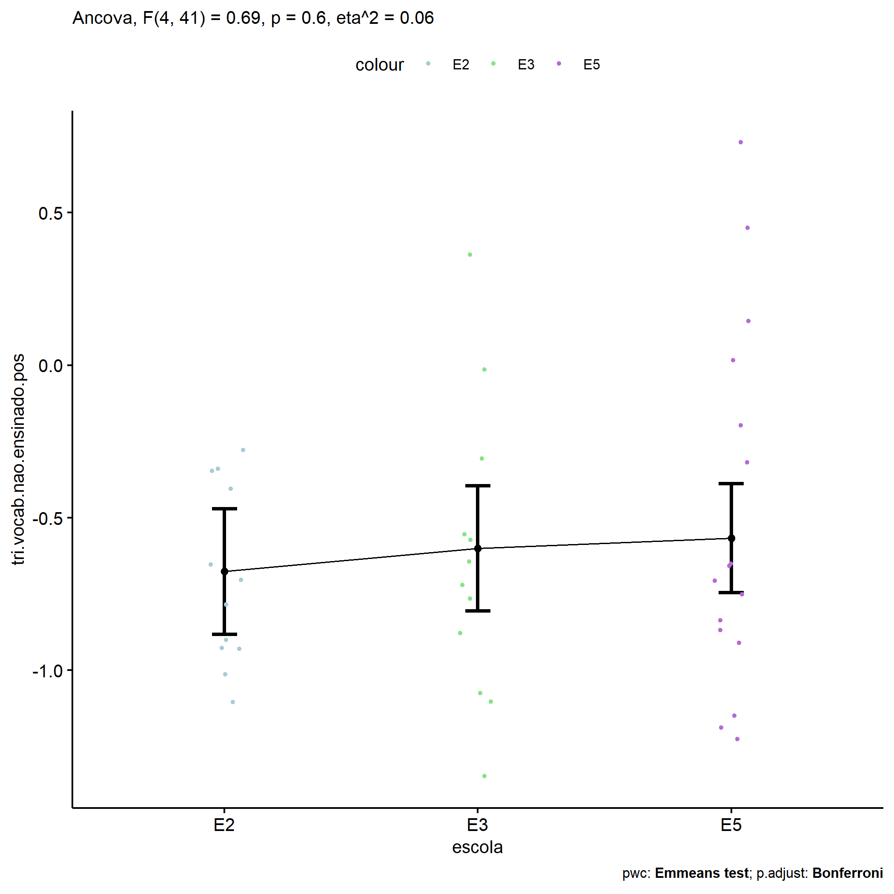<!-- -->

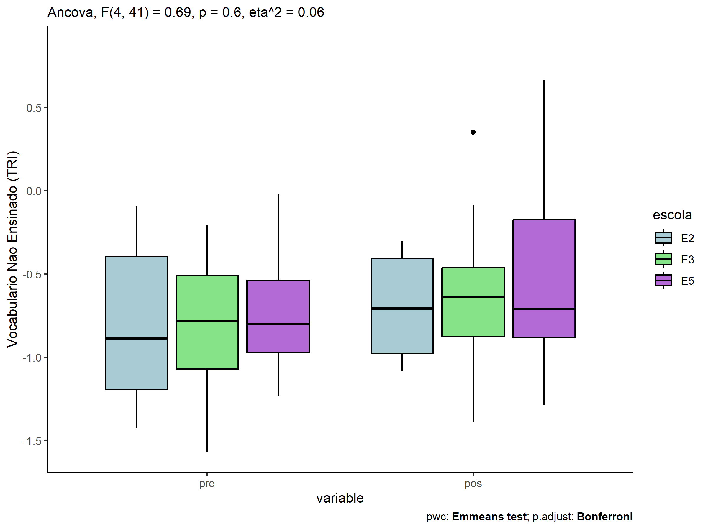<!-- -->

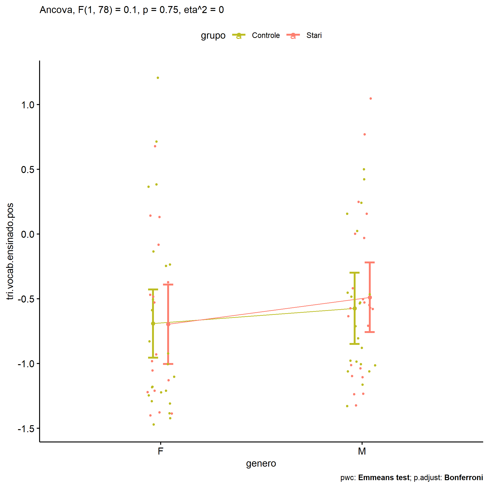<!-- -->

## factor: **zona.escola**

### Vocabulario (Acertos)

| var             | zona.escola |   n | M (pre) | SE (pre) | M (unadj) | SE (unadj) | M (adj) | SE (adj) |
|:----------------|:------------|----:|--------:|---------:|----------:|-----------:|--------:|---------:|
| score.vocab.pos | Rural       |  19 |  12.211 |    0.759 |    14.632 |      1.269 |  15.162 |    0.938 |
| score.vocab.pos | Urbana      |  28 |  13.893 |    0.685 |    14.857 |      0.646 |  14.497 |    0.769 |

| .y.             | group1 | group2 | estimate | conf.low | conf.high |    se | statistic |     p | p.adj | p.adj.signif |
|:----------------|:-------|:-------|---------:|---------:|----------:|------:|----------:|------:|------:|:-------------|
| score.vocab.pos | Urbana | Rural  |   -0.665 |   -3.142 |     1.813 | 1.229 |    -0.541 | 0.591 | 0.591 | ns           |
| score.vocab.pre | Urbana | Rural  |    1.682 |   -0.414 |     3.779 | 1.041 |     1.616 | 0.113 | 0.113 | ns           |

| zona.escola | group1 | group2 | estimate | conf.low | conf.high |    se | statistic |     p | p.adj | p.adj.signif |
|:------------|:-------|:-------|---------:|---------:|----------:|------:|----------:|------:|------:|:-------------|
| Urbana      | pre    | pos    |   -0.803 |   -2.919 |     1.312 | 1.066 |    -0.754 | 0.453 | 0.453 | ns           |
| Rural       | pre    | pos    |   -2.400 |   -4.969 |     0.169 | 1.294 |    -1.855 | 0.067 | 0.067 | ns           |

    ## Scale for colour is already present.
    ## Adding another scale for colour, which will replace the existing scale.

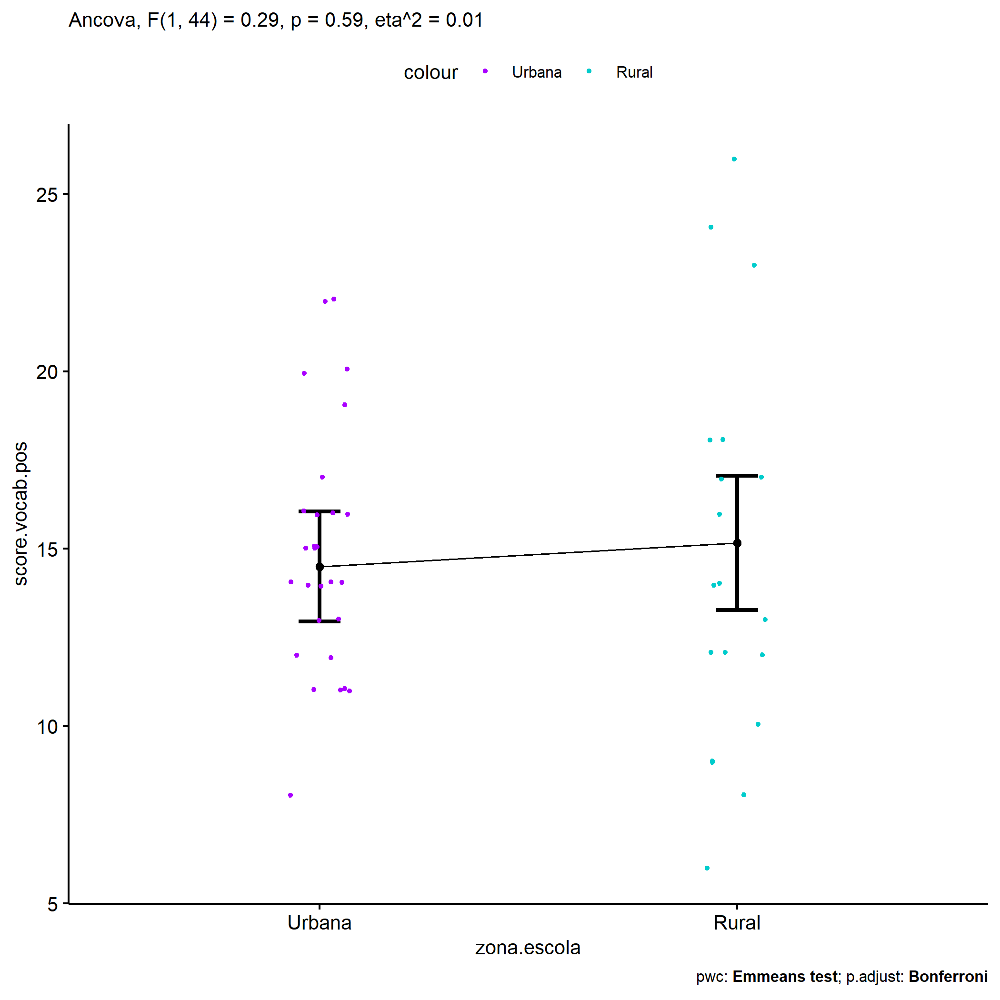<!-- -->

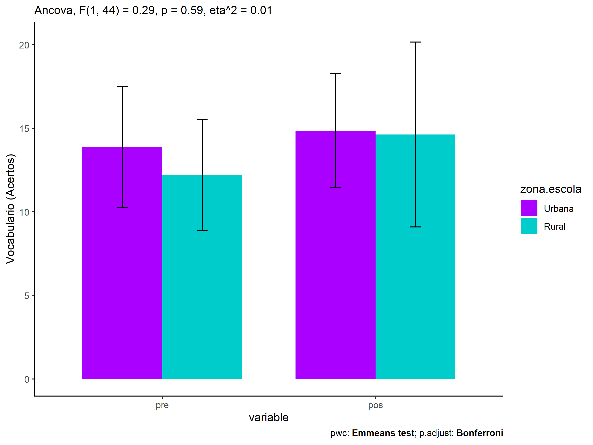<!-- -->

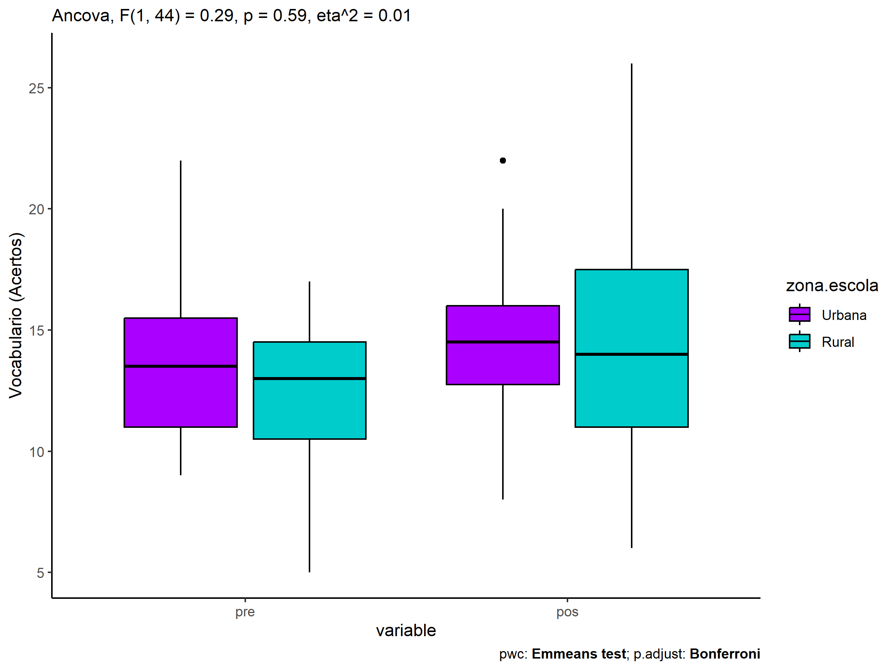<!-- -->

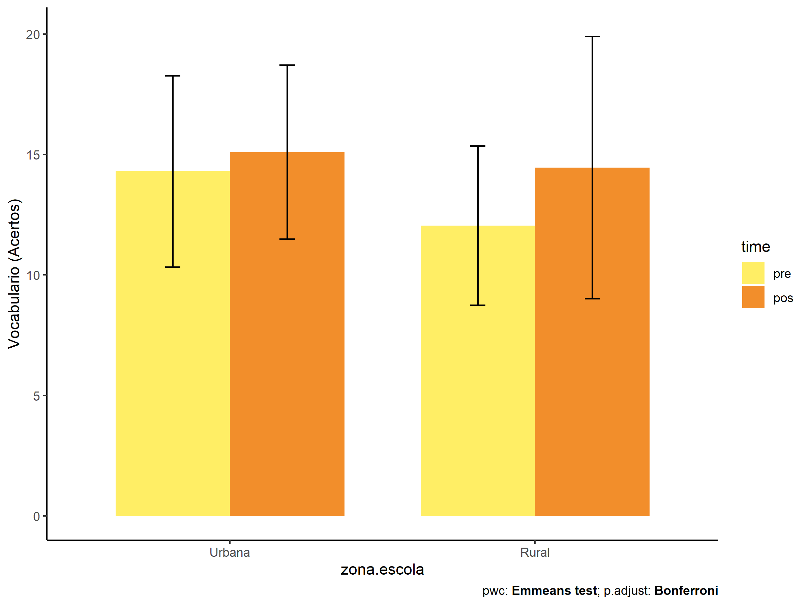<!-- -->

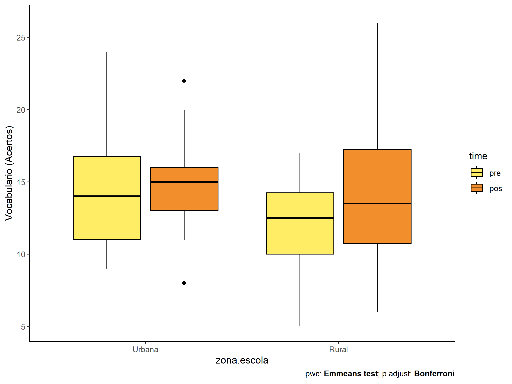<!-- -->

### Vocabulario (TRI)

| var           | zona.escola |   n | M (pre) | SE (pre) | M (unadj) | SE (unadj) | M (adj) | SE (adj) |
|:--------------|:------------|----:|--------:|---------:|----------:|-----------:|--------:|---------:|
| tri.vocab.pos | Rural       |  19 |  -0.798 |    0.120 |    -0.781 |      0.162 |  -0.765 |    0.113 |
| tri.vocab.pos | Urbana      |  28 |  -0.755 |    0.118 |    -0.691 |      0.102 |  -0.701 |    0.093 |

| .y.           | group1 | group2 | estimate | conf.low | conf.high |    se | statistic |     p | p.adj | p.adj.signif |
|:--------------|:-------|:-------|---------:|---------:|----------:|------:|----------:|------:|------:|:-------------|
| tri.vocab.pos | Urbana | Rural  |    0.063 |   -0.232 |     0.358 | 0.146 |     0.431 | 0.669 | 0.669 | ns           |
| tri.vocab.pre | Urbana | Rural  |    0.043 |   -0.308 |     0.394 | 0.174 |     0.245 | 0.807 | 0.807 | ns           |

| zona.escola | group1 | group2 | estimate | conf.low | conf.high |    se | statistic |     p | p.adj | p.adj.signif |
|:------------|:-------|:-------|---------:|---------:|----------:|------:|----------:|------:|------:|:-------------|
| Urbana      | pre    | pos    |   -0.070 |   -0.381 |     0.242 | 0.157 |    -0.443 | 0.659 | 0.659 | ns           |
| Rural       | pre    | pos    |   -0.003 |   -0.381 |     0.375 | 0.191 |    -0.015 | 0.988 | 0.988 | ns           |

    ## Scale for colour is already present.
    ## Adding another scale for colour, which will replace the existing scale.

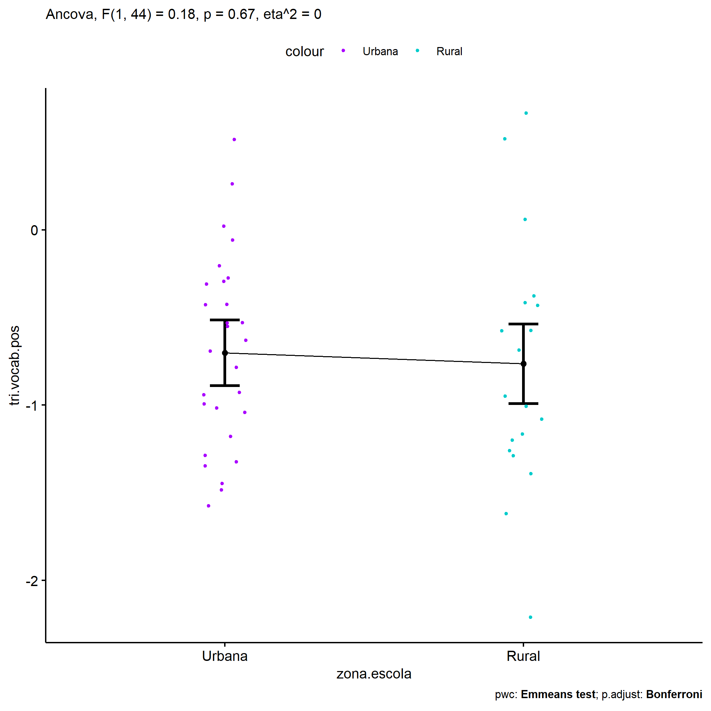<!-- -->

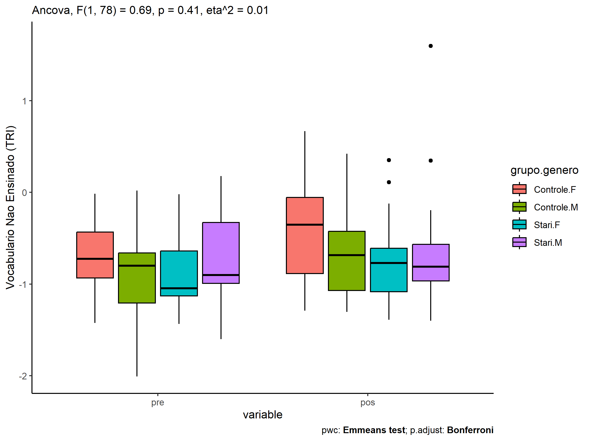<!-- -->

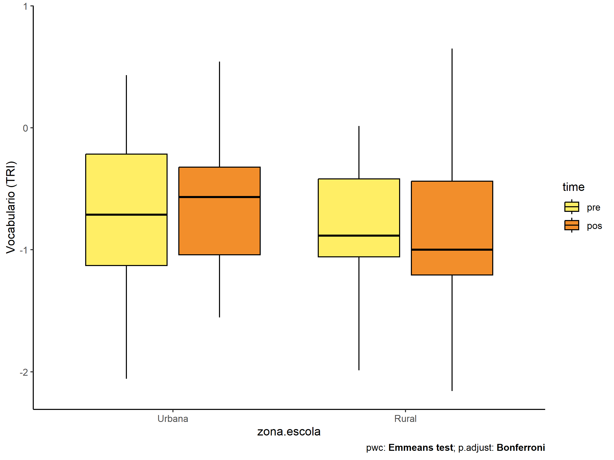<!-- -->

### Vocabulario Ensinado (Acertos)

| var                      | zona.escola |   n | M (pre) | SE (pre) | M (unadj) | SE (unadj) | M (adj) | SE (adj) |
|:-------------------------|:------------|----:|--------:|---------:|----------:|-----------:|--------:|---------:|
| score.vocab.ensinado.pos | Rural       |  21 |   2.571 |    0.281 |     2.857 |      0.443 |   2.859 |    0.375 |
| score.vocab.ensinado.pos | Urbana      |  31 |   2.871 |    0.281 |     2.355 |      0.256 |   2.354 |    0.308 |

| .y.                      | group1 | group2 | estimate | conf.low | conf.high |    se | statistic |     p | p.adj | p.adj.signif |
|:-------------------------|:-------|:-------|---------:|---------:|----------:|------:|----------:|------:|------:|:-------------|
| score.vocab.ensinado.pos | Urbana | Rural  |   -0.505 |   -1.483 |     0.472 | 0.486 |    -1.039 | 0.304 | 0.304 | ns           |
| score.vocab.ensinado.pre | Urbana | Rural  |    0.300 |   -0.529 |     1.129 | 0.413 |     0.726 | 0.471 | 0.471 | ns           |

| zona.escola | group1 | group2 | estimate | conf.low | conf.high |    se | statistic |     p | p.adj | p.adj.signif |
|:------------|:-------|:-------|---------:|---------:|----------:|------:|----------:|------:|------:|:-------------|
| Urbana      | pre    | pos    |    0.516 |   -0.281 |     1.313 | 0.402 |     1.284 | 0.202 | 0.202 | ns           |
| Rural       | pre    | pos    |   -0.286 |   -1.254 |     0.683 | 0.488 |    -0.585 | 0.560 | 0.560 | ns           |

    ## Scale for colour is already present.
    ## Adding another scale for colour, which will replace the existing scale.

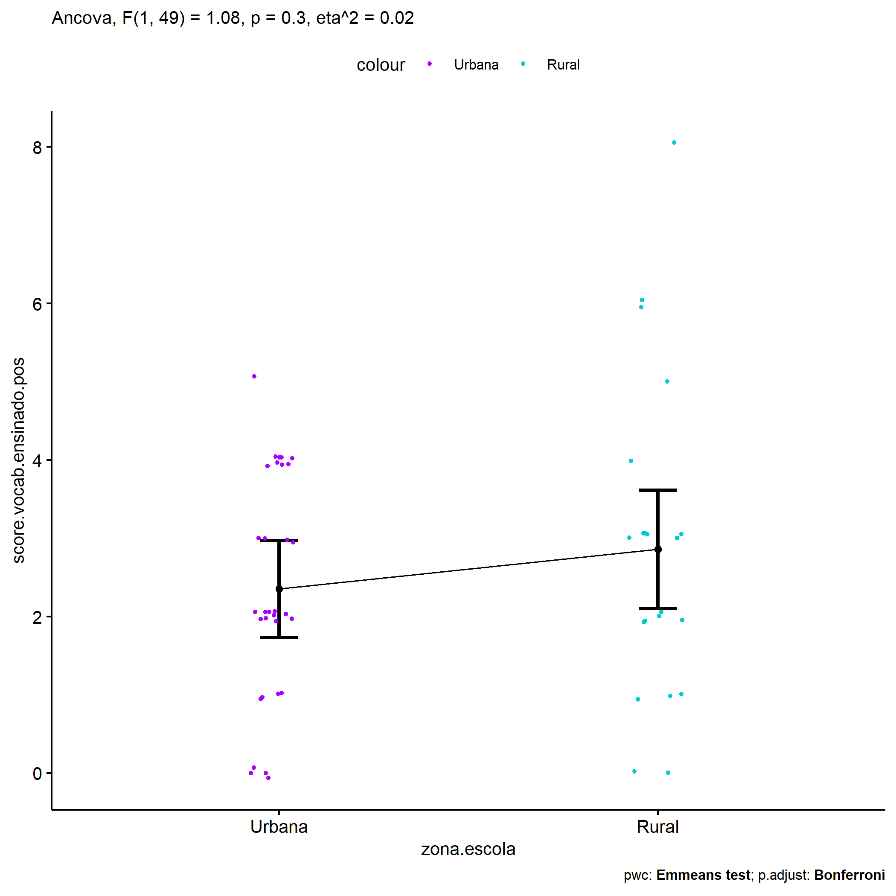<!-- -->

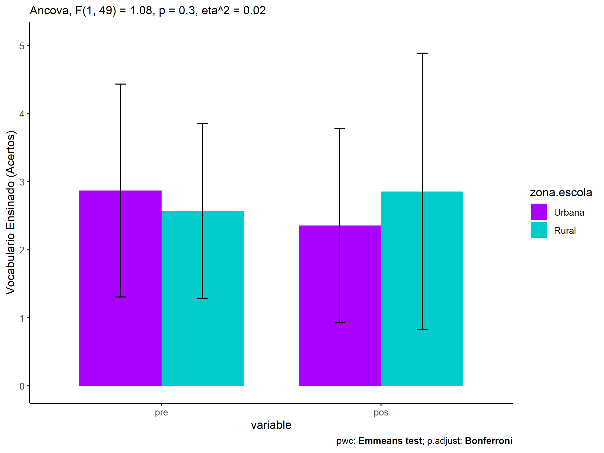<!-- -->

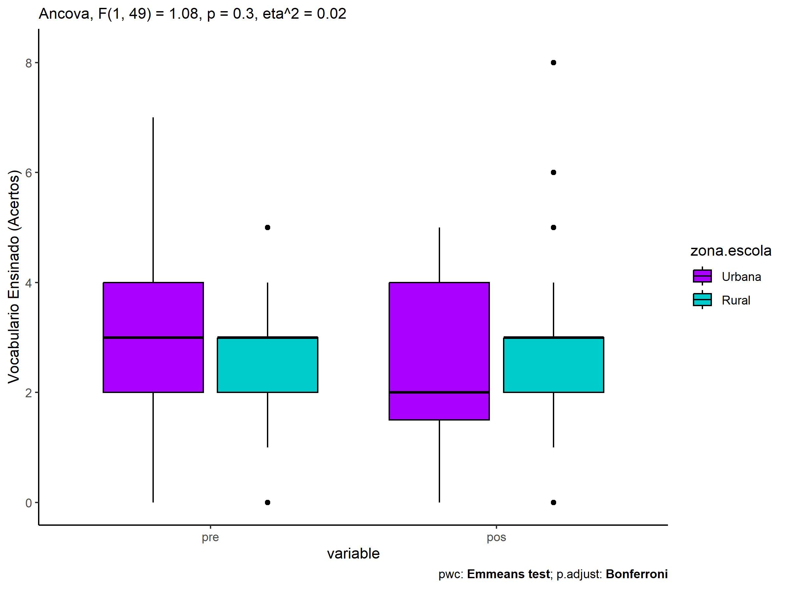<!-- -->

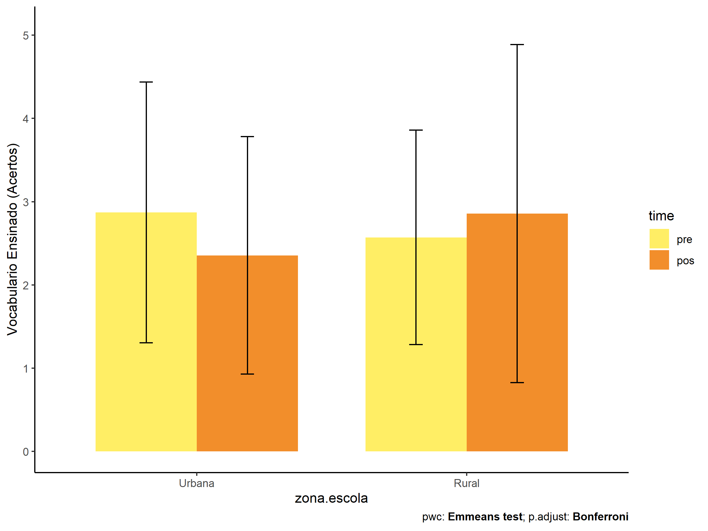<!-- -->

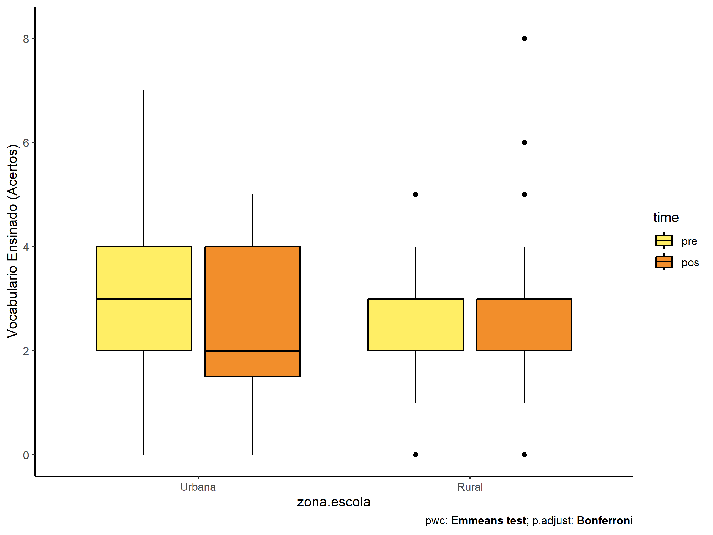<!-- -->

### Vocabulario Ensinado (TRI)

| var                    | zona.escola |   n | M (pre) | SE (pre) | M (unadj) | SE (unadj) | M (adj) | SE (adj) |
|:-----------------------|:------------|----:|--------:|---------:|----------:|-----------:|--------:|---------:|
| tri.vocab.ensinado.pos | Rural       |  19 |  -0.412 |    0.137 |    -0.536 |      0.162 |  -0.552 |    0.138 |
| tri.vocab.ensinado.pos | Urbana      |  28 |  -0.525 |    0.117 |    -0.737 |      0.101 |  -0.727 |    0.114 |

| .y.                    | group1 | group2 | estimate | conf.low | conf.high |    se | statistic |     p | p.adj | p.adj.signif |
|:-----------------------|:-------|:-------|---------:|---------:|----------:|------:|----------:|------:|------:|:-------------|
| tri.vocab.ensinado.pos | Urbana | Rural  |   -0.175 |   -0.536 |     0.186 | 0.179 |    -0.978 | 0.334 | 0.334 | ns           |
| tri.vocab.ensinado.pre | Urbana | Rural  |   -0.114 |   -0.479 |     0.252 | 0.181 |    -0.626 | 0.535 | 0.535 | ns           |

| zona.escola | group1 | group2 | estimate | conf.low | conf.high |    se | statistic |     p | p.adj | p.adj.signif |
|:------------|:-------|:-------|---------:|---------:|----------:|------:|----------:|------:|------:|:-------------|
| Urbana      | pre    | pos    |    0.162 |   -0.154 |     0.479 | 0.159 |     1.017 | 0.312 | 0.312 | ns           |
| Rural       | pre    | pos    |    0.117 |   -0.267 |     0.502 | 0.194 |     0.606 | 0.546 | 0.546 | ns           |

    ## Scale for colour is already present.
    ## Adding another scale for colour, which will replace the existing scale.

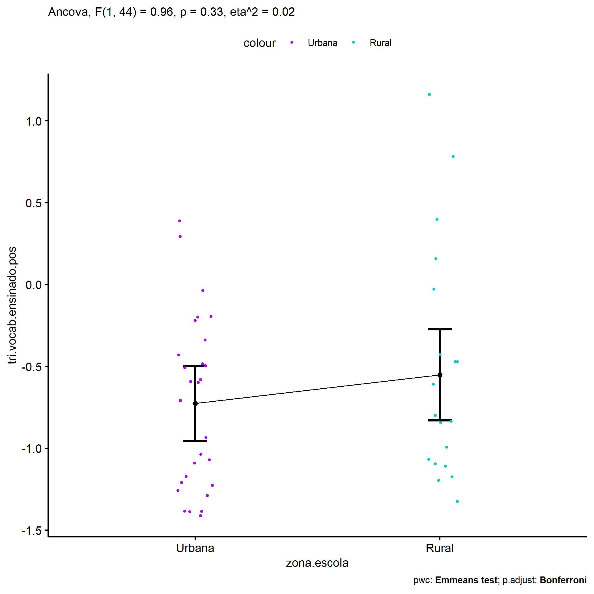<!-- -->

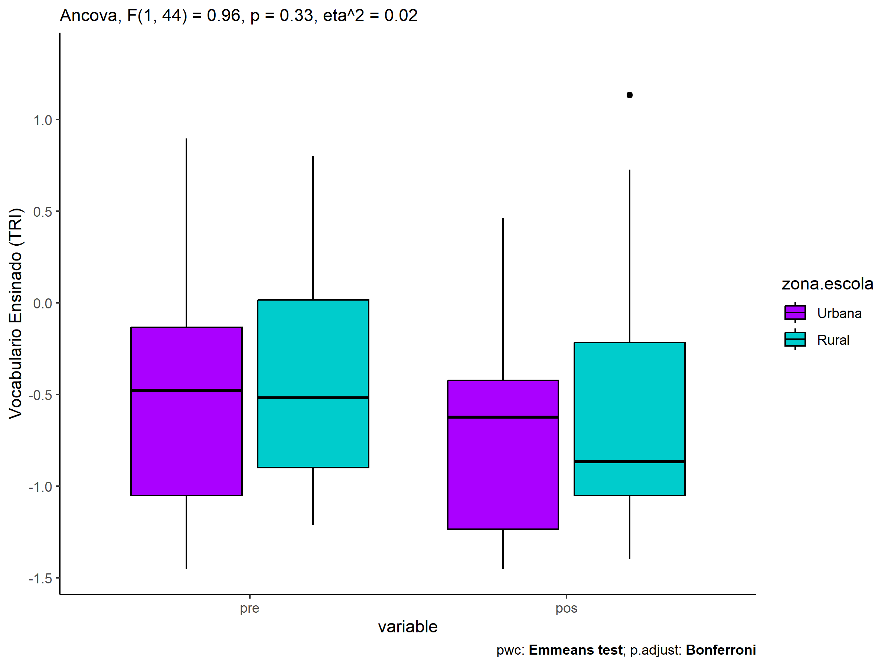<!-- -->

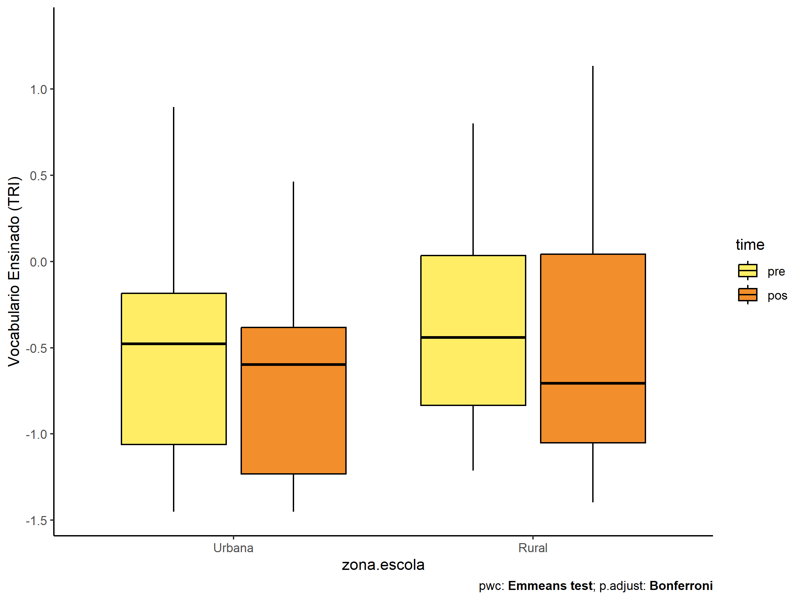<!-- -->

### Vocabulario Nao Ensinado (Acertos)

| var                          | zona.escola |   n | M (pre) | SE (pre) | M (unadj) | SE (unadj) | M (adj) | SE (adj) |
|:-----------------------------|:------------|----:|--------:|---------:|----------:|-----------:|--------:|---------:|
| score.vocab.nao.ensinado.pos | Rural       |  21 |   8.905 |    0.802 |    10.905 |      1.021 |  11.133 |    1.030 |
| score.vocab.nao.ensinado.pos | Urbana      |  31 |  10.968 |    0.743 |    11.774 |      0.828 |  11.619 |    0.842 |

| .y.                          | group1 | group2 | estimate | conf.low | conf.high |    se | statistic |     p | p.adj | p.adj.signif |
|:-----------------------------|:-------|:-------|---------:|---------:|----------:|------:|----------:|------:|------:|:-------------|
| score.vocab.nao.ensinado.pos | Urbana | Rural  |    0.486 |   -2.229 |     3.200 | 1.351 |     0.360 | 0.721 | 0.721 | ns           |
| score.vocab.nao.ensinado.pre | Urbana | Rural  |    2.063 |   -0.183 |     4.309 | 1.118 |     1.845 | 0.071 | 0.071 | ns           |

| zona.escola | group1 | group2 | estimate | conf.low | conf.high |    se | statistic |     p | p.adj | p.adj.signif |
|:------------|:-------|:-------|---------:|---------:|----------:|------:|----------:|------:|------:|:-------------|
| Urbana      | pre    | pos    |   -0.806 |   -2.979 |     1.366 | 1.095 |    -0.737 | 0.463 | 0.463 | ns           |
| Rural       | pre    | pos    |   -2.000 |   -4.639 |     0.639 | 1.330 |    -1.503 | 0.136 | 0.136 | ns           |

    ## Scale for colour is already present.
    ## Adding another scale for colour, which will replace the existing scale.

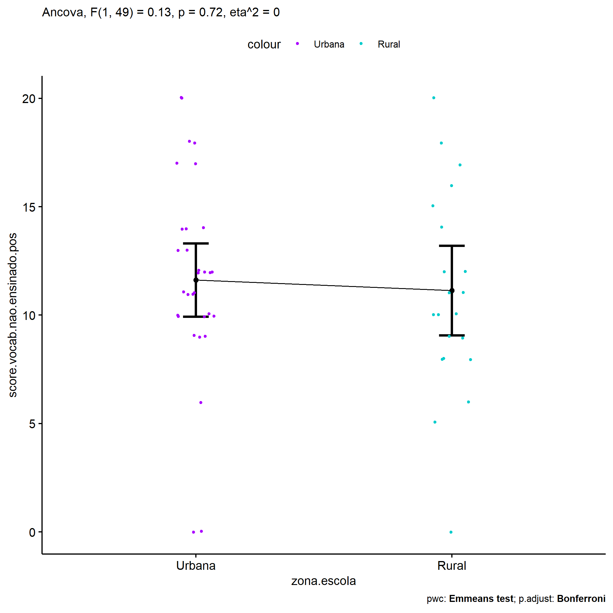<!-- -->

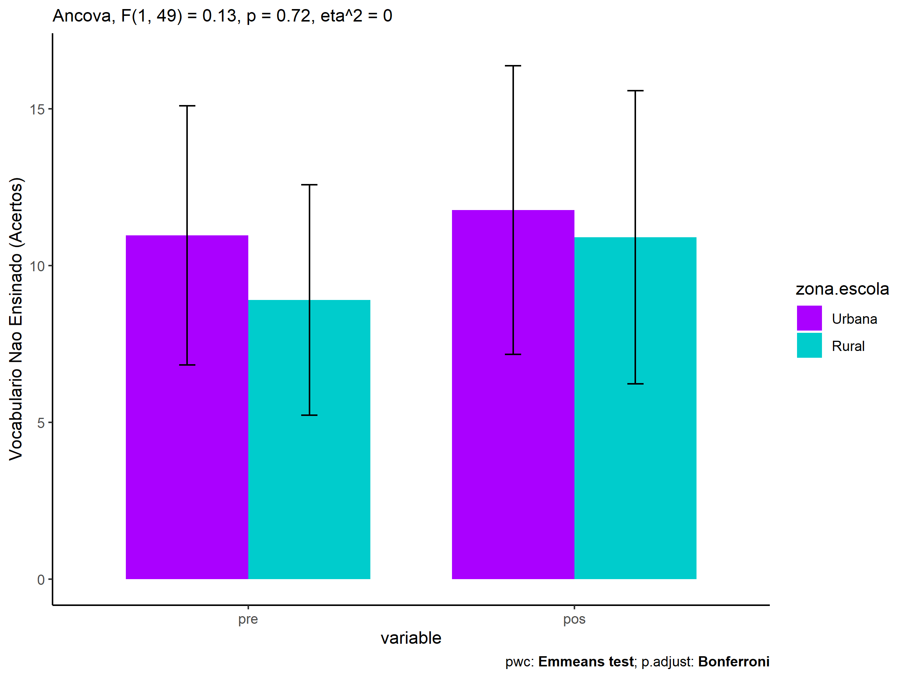<!-- -->

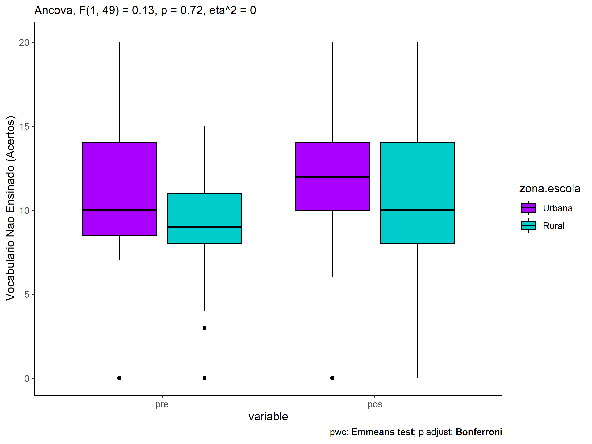<!-- -->

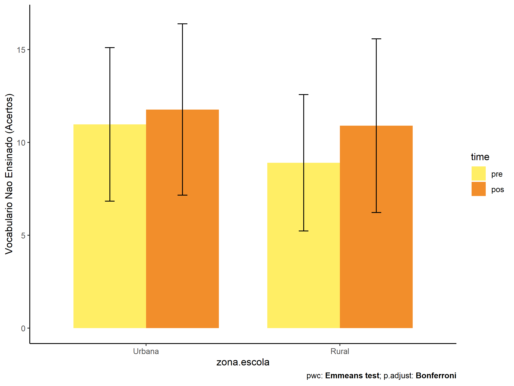<!-- -->

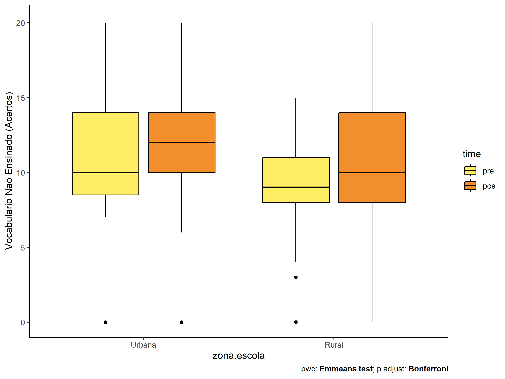<!-- -->

### Vocabulario Nao Ensinado (TRI)

| var                        | zona.escola |   n | M (pre) | SE (pre) | M (unadj) | SE (unadj) | M (adj) | SE (adj) |
|:---------------------------|:------------|----:|--------:|---------:|----------:|-----------:|--------:|---------:|
| tri.vocab.nao.ensinado.pos | Rural       |  19 |  -0.872 |    0.102 |    -0.730 |      0.117 |  -0.675 |    0.081 |
| tri.vocab.nao.ensinado.pos | Urbana      |  28 |  -0.755 |    0.081 |    -0.601 |      0.090 |  -0.639 |    0.066 |

| .y.                        | group1 | group2 | estimate | conf.low | conf.high |    se | statistic |     p | p.adj | p.adj.signif |
|:---------------------------|:-------|:-------|---------:|---------:|----------:|------:|----------:|------:|------:|:-------------|
| tri.vocab.nao.ensinado.pos | Urbana | Rural  |    0.036 |   -0.176 |     0.248 | 0.105 |     0.342 | 0.734 | 0.734 | ns           |
| tri.vocab.nao.ensinado.pre | Urbana | Rural  |    0.117 |   -0.143 |     0.377 | 0.129 |     0.908 | 0.369 | 0.369 | ns           |

| zona.escola | group1 | group2 | estimate | conf.low | conf.high |    se | statistic |     p | p.adj | p.adj.signif |
|:------------|:-------|:-------|---------:|---------:|----------:|------:|----------:|------:|------:|:-------------|
| Urbana      | pre    | pos    |   -0.154 |   -0.402 |     0.093 | 0.125 |    -1.240 | 0.218 | 0.218 | ns           |
| Rural       | pre    | pos    |   -0.130 |   -0.430 |     0.171 | 0.151 |    -0.857 | 0.394 | 0.394 | ns           |

    ## Scale for colour is already present.
    ## Adding another scale for colour, which will replace the existing scale.

<!-- -->

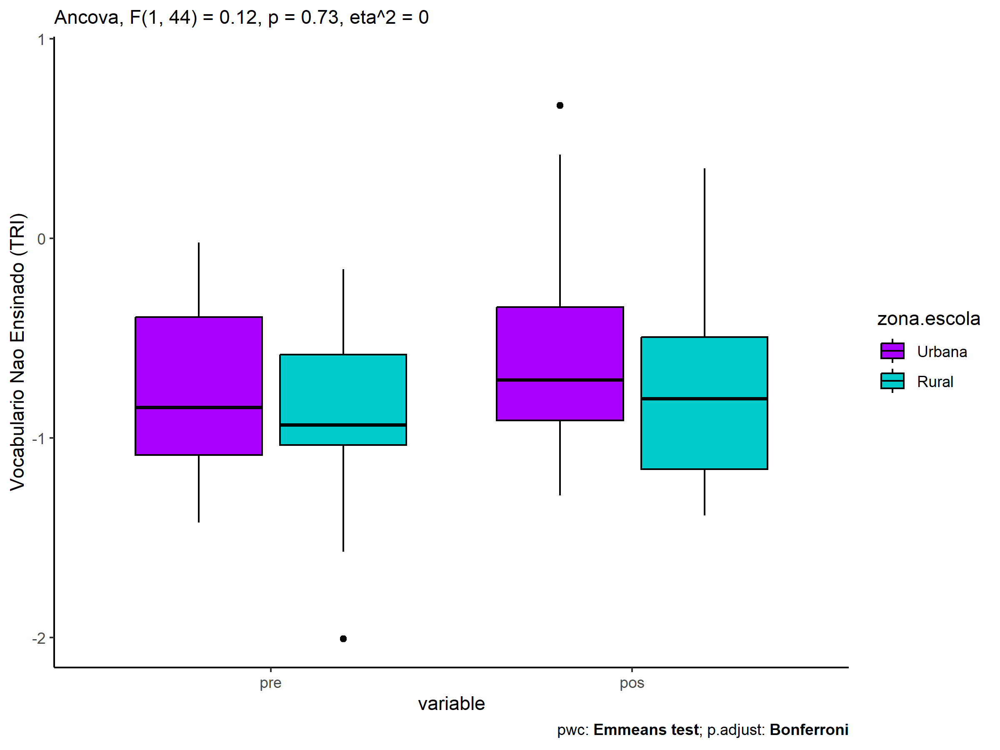<!-- -->

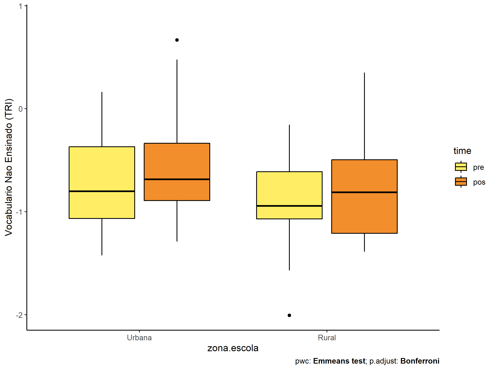<!-- -->

# Pairwise comparisons for two factors

## factores: **genero:grupo**

### Vocabulario (Acertos)

| var             | genero | grupo        |   n | M (pre) | SE (pre) | M (unadj) | SE (unadj) | M (adj) | SE (adj) |
|:----------------|:-------|:-------------|----:|--------:|---------:|----------:|-----------:|--------:|---------:|
| score.vocab.pos | F      | Controle     |  17 |  13.353 |    0.822 |    16.588 |      1.163 |  16.515 |    0.937 |
| score.vocab.pos | F      | Experimental |  12 |  12.917 |    0.957 |    13.750 |      1.366 |  13.904 |    1.116 |
| score.vocab.pos | M      | Controle     |  10 |  12.300 |    1.484 |    13.800 |      1.191 |  14.274 |    1.230 |
| score.vocab.pos | M      | Experimental |   8 |  14.500 |    1.018 |    13.625 |      0.800 |  12.956 |    1.382 |

| grupo        | genero | group1   | group2       | estimate | conf.low | conf.high |    se | statistic |     p | p.adj | p.adj.signif |
|:-------------|:-------|:---------|:-------------|---------:|---------:|----------:|------:|----------:|------:|------:|:-------------|
| Controle     |        | F        | M            |    2.241 |   -0.884 |     5.367 | 1.549 |     1.447 | 0.155 | 0.155 | ns           |
| Experimental |        | F        | M            |    0.947 |   -2.648 |     4.543 | 1.782 |     0.532 | 0.598 | 0.598 | ns           |
| Controle     |        | F        | M            |    1.053 |   -1.850 |     3.956 | 1.439 |     0.732 | 0.468 | 0.468 | ns           |
| Experimental |        | F        | M            |   -1.583 |   -4.908 |     1.741 | 1.648 |    -0.960 | 0.342 | 0.342 | ns           |
|              | F      | Controle | Experimental |    2.612 |   -0.331 |     5.554 | 1.458 |     1.791 | 0.080 | 0.080 | ns           |
|              | M      | Controle | Experimental |    1.318 |   -2.450 |     5.085 | 1.867 |     0.706 | 0.484 | 0.484 | ns           |
|              | F      | Controle | Experimental |    0.436 |   -2.310 |     3.182 | 1.362 |     0.320 | 0.750 | 0.750 | ns           |
|              | M      | Controle | Experimental |   -2.200 |   -5.655 |     1.255 | 1.713 |    -1.284 | 0.206 | 0.206 | ns           |

| grupo        | genero | group1 | group2 | estimate | conf.low | conf.high |    se | statistic |     p | p.adj | p.adj.signif |
|:-------------|:-------|:-------|:-------|---------:|---------:|----------:|------:|----------:|------:|------:|:-------------|
| Controle     | F      | pre    | pos    |   -3.088 |   -5.876 |    -0.301 | 1.403 |    -2.201 | 0.030 | 0.030 | \*           |
| Controle     | M      | pre    | pos    |   -0.182 |   -3.696 |     3.333 | 1.769 |    -0.103 | 0.918 | 0.918 | ns           |
| Experimental | F      | pre    | pos    |   -1.468 |   -4.767 |     1.831 | 1.661 |    -0.884 | 0.379 | 0.379 | ns           |
| Experimental | M      | pre    | pos    |    0.264 |   -3.741 |     4.269 | 2.016 |     0.131 | 0.896 | 0.896 | ns           |

    ## Scale for colour is already present.
    ## Adding another scale for colour, which will replace the existing scale.

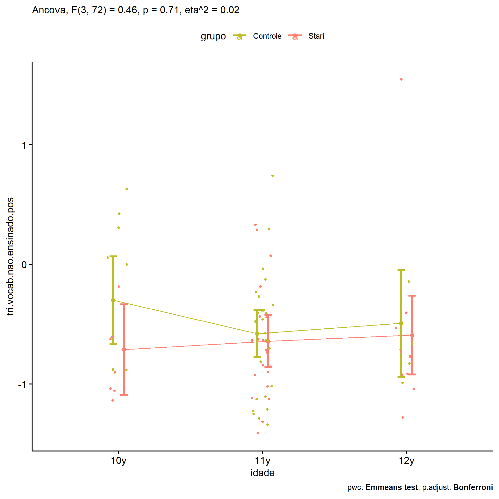<!-- -->

    ## Scale for colour is already present.
    ## Adding another scale for colour, which will replace the existing scale.

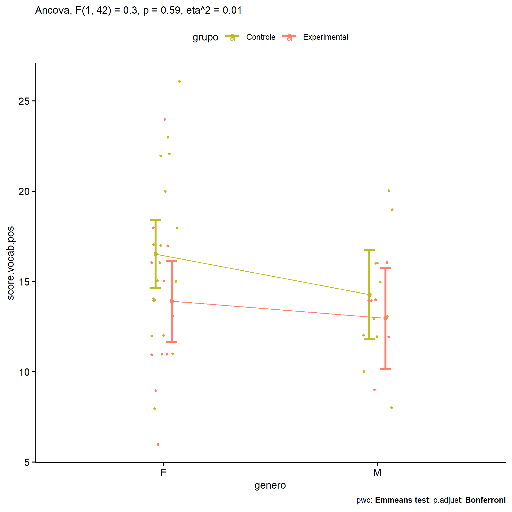<!-- -->

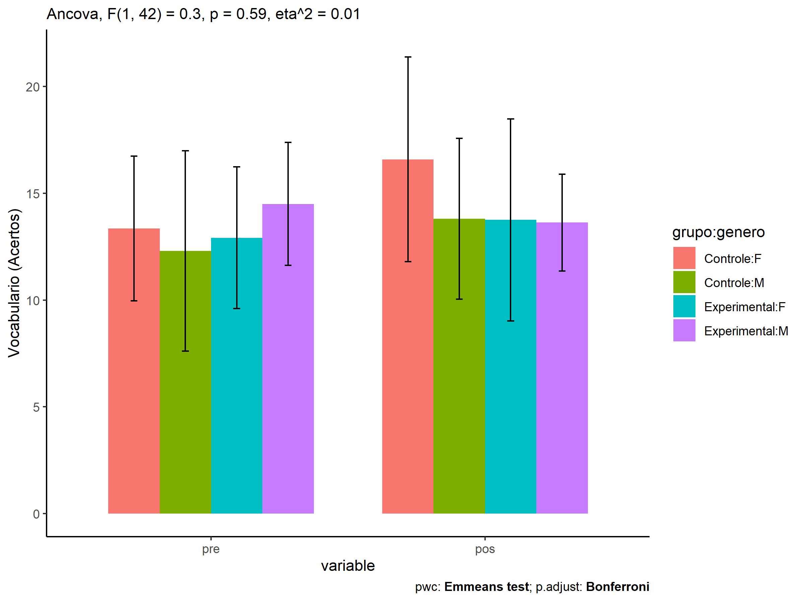<!-- -->

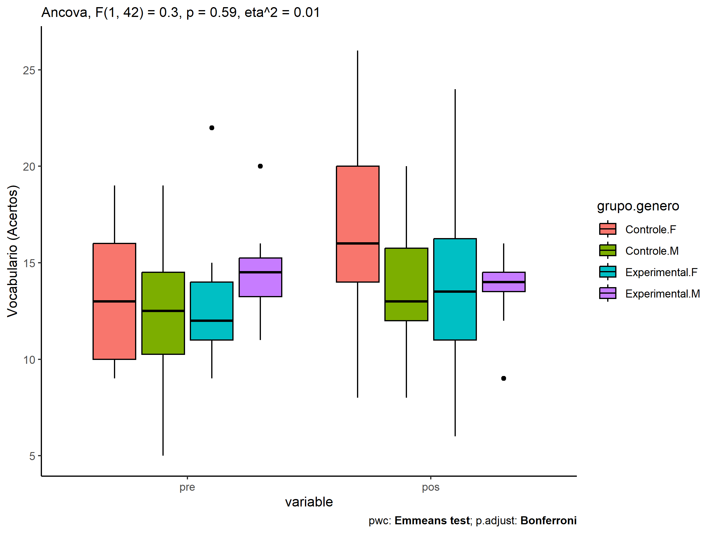<!-- -->

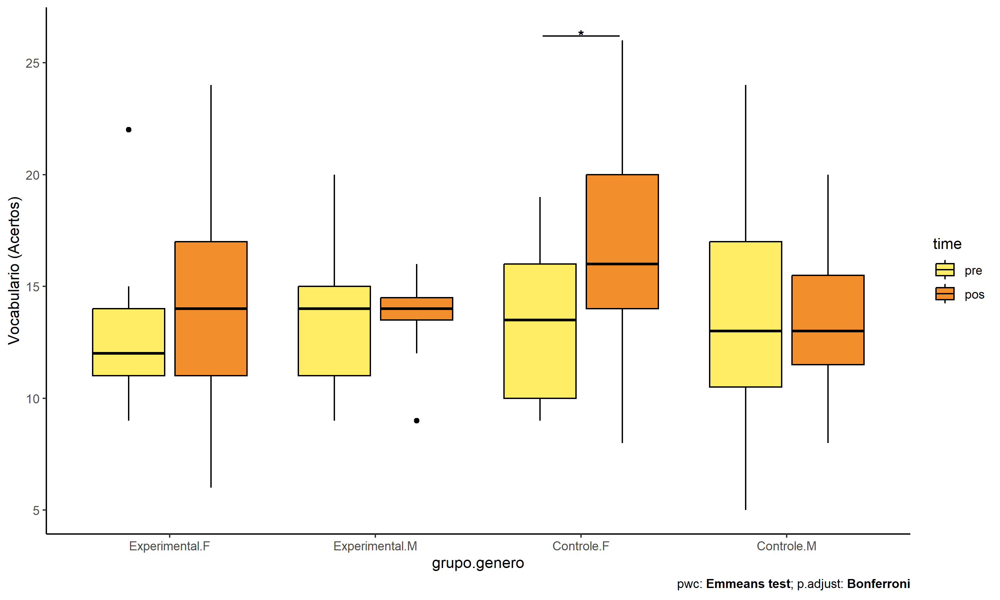<!-- -->

### Vocabulario (TRI)

| var           | genero | grupo        |   n | M (pre) | SE (pre) | M (unadj) | SE (unadj) | M (adj) | SE (adj) |
|:--------------|:-------|:-------------|----:|--------:|---------:|----------:|-----------:|--------:|---------:|
| tri.vocab.pos | F      | Controle     |  17 |  -0.736 |    0.125 |    -0.655 |      0.158 |  -0.678 |    0.121 |
| tri.vocab.pos | F      | Experimental |  12 |  -0.801 |    0.195 |    -0.819 |      0.219 |  -0.801 |    0.145 |
| tri.vocab.pos | M      | Controle     |  10 |  -0.861 |    0.186 |    -0.722 |      0.178 |  -0.665 |    0.159 |
| tri.vocab.pos | M      | Experimental |   8 |  -0.695 |    0.229 |    -0.749 |      0.124 |  -0.799 |    0.177 |

| grupo        | genero | group1   | group2       | estimate | conf.low | conf.high |    se | statistic |     p | p.adj | p.adj.signif |
|:-------------|:-------|:---------|:-------------|---------:|---------:|----------:|------:|----------:|------:|------:|:-------------|
| Controle     |        | F        | M            |   -0.013 |   -0.416 |     0.391 | 0.200 |    -0.063 | 0.950 | 0.950 | ns           |
| Experimental |        | F        | M            |   -0.002 |   -0.464 |     0.459 | 0.229 |    -0.010 | 0.992 | 0.992 | ns           |
| Controle     |        | F        | M            |    0.125 |   -0.355 |     0.605 | 0.238 |     0.524 | 0.603 | 0.603 | ns           |
| Experimental |        | F        | M            |   -0.107 |   -0.656 |     0.443 | 0.273 |    -0.391 | 0.698 | 0.698 | ns           |
|              | F      | Controle | Experimental |    0.123 |   -0.258 |     0.505 | 0.189 |     0.654 | 0.517 | 0.517 | ns           |
|              | M      | Controle | Experimental |    0.134 |   -0.347 |     0.615 | 0.238 |     0.561 | 0.578 | 0.578 | ns           |
|              | F      | Controle | Experimental |    0.065 |   -0.389 |     0.519 | 0.225 |     0.288 | 0.775 | 0.775 | ns           |
|              | M      | Controle | Experimental |   -0.166 |   -0.737 |     0.405 | 0.283 |    -0.587 | 0.560 | 0.560 | ns           |

| grupo        | genero | group1 | group2 | estimate | conf.low | conf.high |    se | statistic |     p | p.adj | p.adj.signif |
|:-------------|:-------|:-------|:-------|---------:|---------:|----------:|------:|----------:|------:|------:|:-------------|
| Controle     | F      | pre    | pos    |   -0.078 |   -0.493 |     0.337 | 0.209 |    -0.371 | 0.711 | 0.711 | ns           |
| Controle     | M      | pre    | pos    |   -0.002 |   -0.526 |     0.521 | 0.263 |    -0.009 | 0.993 | 0.993 | ns           |
| Experimental | F      | pre    | pos    |   -0.076 |   -0.567 |     0.415 | 0.247 |    -0.307 | 0.760 | 0.760 | ns           |
| Experimental | M      | pre    | pos    |    0.024 |   -0.572 |     0.620 | 0.300 |     0.079 | 0.937 | 0.937 | ns           |

    ## Scale for colour is already present.
    ## Adding another scale for colour, which will replace the existing scale.

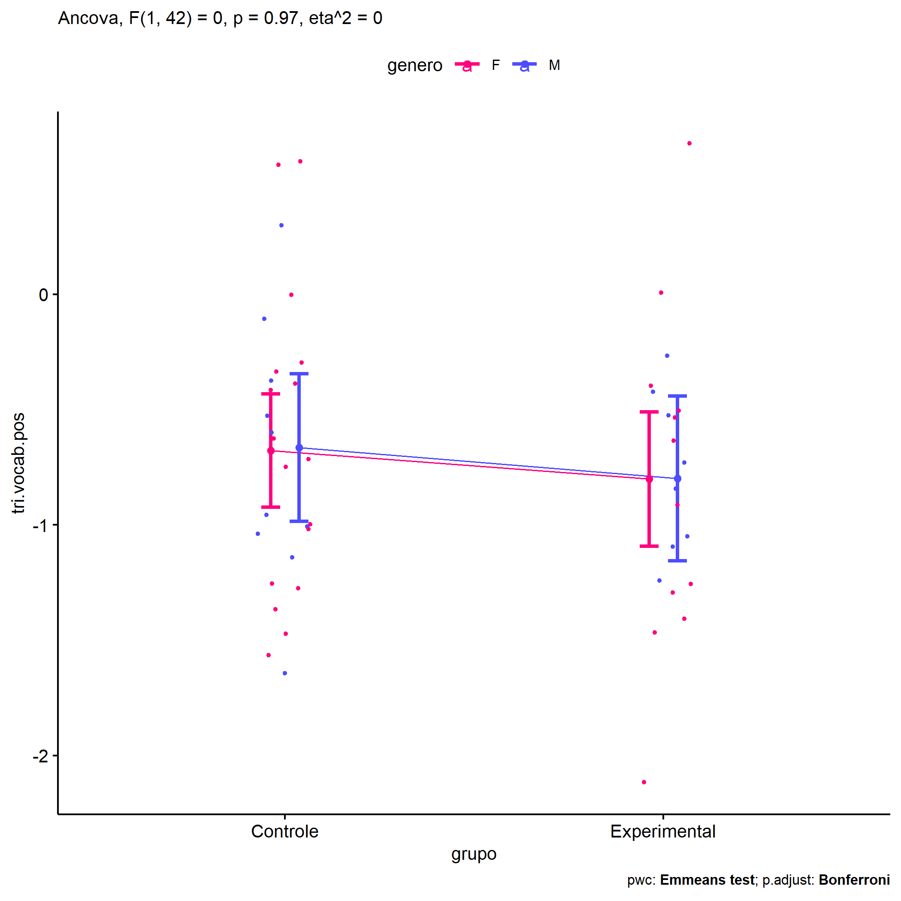<!-- -->

    ## Scale for colour is already present.
    ## Adding another scale for colour, which will replace the existing scale.

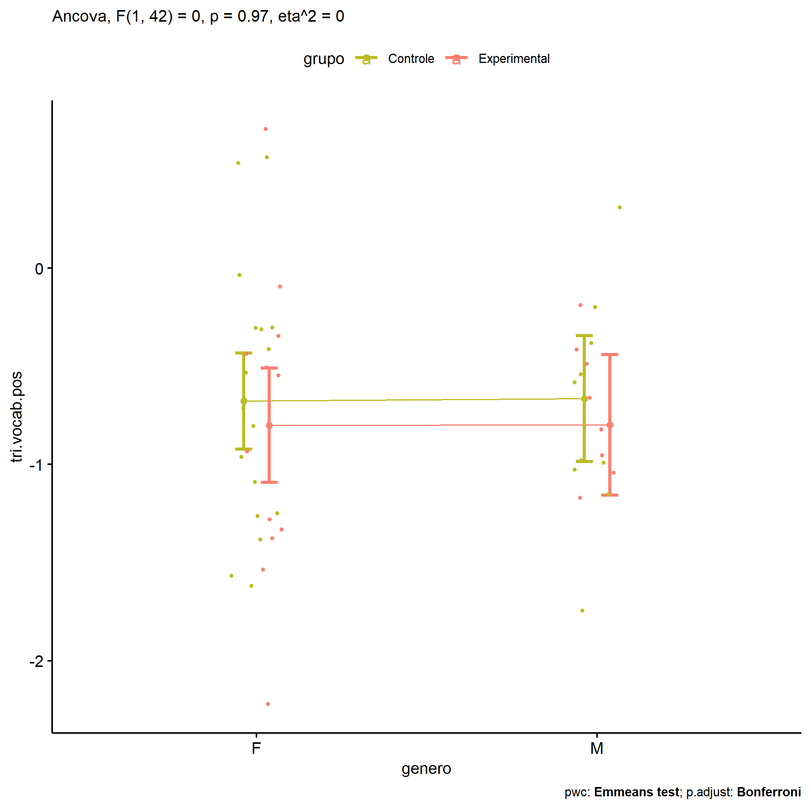<!-- -->

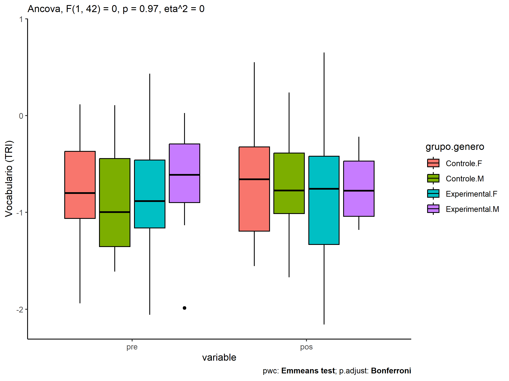<!-- -->

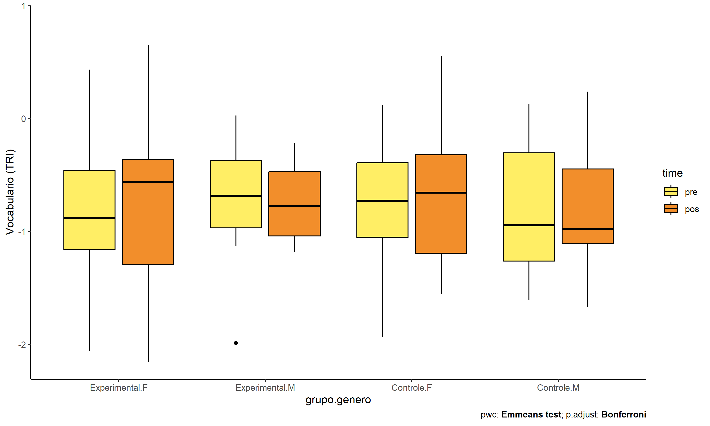<!-- -->

### Vocabulario Ensinado (Acertos)

| var                      | genero | grupo        |   n | M (pre) | SE (pre) | M (unadj) | SE (unadj) | M (adj) | SE (adj) |
|:-------------------------|:-------|:-------------|----:|--------:|---------:|----------:|-----------:|--------:|---------:|
| score.vocab.ensinado.pos | F      | Controle     |  18 |   2.444 |    0.283 |     2.389 |      0.465 |   2.393 |    0.417 |
| score.vocab.ensinado.pos | F      | Experimental |  13 |   2.538 |    0.418 |     2.769 |      0.533 |   2.772 |    0.488 |
| score.vocab.ensinado.pos | M      | Controle     |  12 |   2.667 |    0.432 |     2.750 |      0.392 |   2.751 |    0.507 |
| score.vocab.ensinado.pos | M      | Experimental |   9 |   3.778 |    0.521 |     2.333 |      0.441 |   2.321 |    0.613 |

| grupo        | genero | group1   | group2       | estimate | conf.low | conf.high |    se | statistic |     p | p.adj | p.adj.signif |
|:-------------|:-------|:---------|:-------------|---------:|---------:|----------:|------:|----------:|------:|------:|:-------------|
| Controle     |        | F        | M            |   -0.358 |   -1.677 |     0.960 | 0.655 |    -0.547 | 0.587 | 0.587 | ns           |
| Experimental |        | F        | M            |    0.451 |   -1.144 |     2.046 | 0.793 |     0.569 | 0.572 | 0.572 | ns           |
| Controle     |        | F        | M            |   -0.222 |   -1.281 |     0.837 | 0.527 |    -0.422 | 0.675 | 0.675 | ns           |
| Experimental |        | F        | M            |   -1.239 |   -2.472 |    -0.007 | 0.613 |    -2.022 | 0.049 | 0.049 | \*           |
|              | F      | Controle | Experimental |   -0.379 |   -1.665 |     0.907 | 0.639 |    -0.593 | 0.556 | 0.556 | ns           |
|              | M      | Controle | Experimental |    0.430 |   -1.178 |     2.038 | 0.799 |     0.538 | 0.593 | 0.593 | ns           |
|              | F      | Controle | Experimental |   -0.094 |   -1.128 |     0.940 | 0.514 |    -0.183 | 0.856 | 0.856 | ns           |
|              | M      | Controle | Experimental |   -1.111 |   -2.364 |     0.142 | 0.623 |    -1.783 | 0.081 | 0.081 | ns           |

| grupo        | genero | group1 | group2 | estimate | conf.low | conf.high |    se | statistic |     p | p.adj | p.adj.signif |
|:-------------|:-------|:-------|:-------|---------:|---------:|----------:|------:|----------:|------:|------:|:-------------|
| Controle     | F      | pre    | pos    |    0.056 |   -0.992 |     1.103 | 0.528 |     0.105 | 0.916 | 0.916 | ns           |
| Controle     | M      | pre    | pos    |   -0.083 |   -1.367 |     1.200 | 0.646 |    -0.129 | 0.898 | 0.898 | ns           |
| Experimental | F      | pre    | pos    |   -0.231 |   -1.464 |     1.002 | 0.621 |    -0.372 | 0.711 | 0.711 | ns           |
| Experimental | M      | pre    | pos    |    1.444 |   -0.037 |     2.926 | 0.746 |     1.935 | 0.056 | 0.056 | ns           |

    ## Scale for colour is already present.
    ## Adding another scale for colour, which will replace the existing scale.

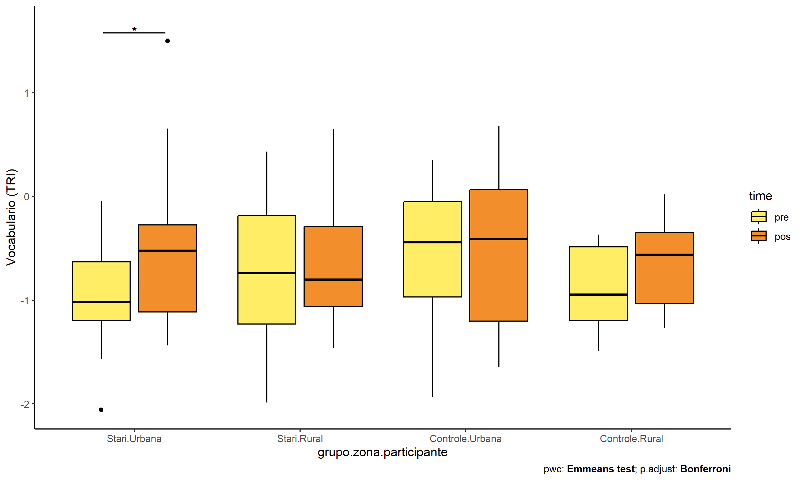<!-- -->

    ## Scale for colour is already present.
    ## Adding another scale for colour, which will replace the existing scale.

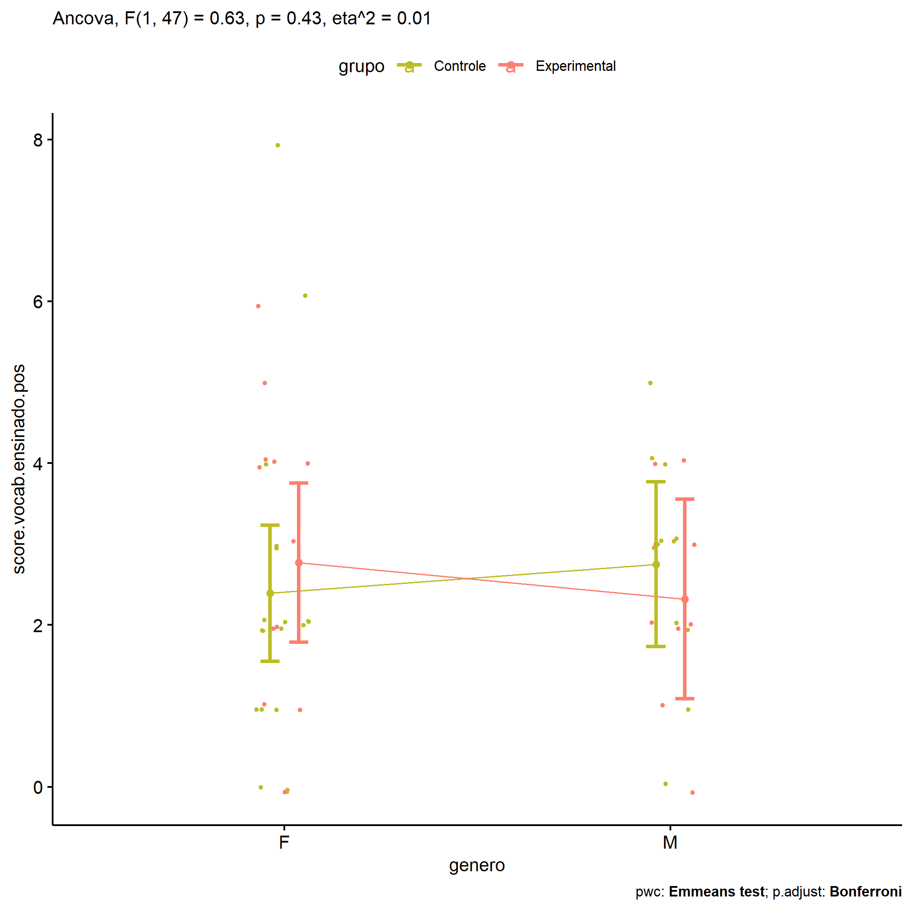<!-- -->

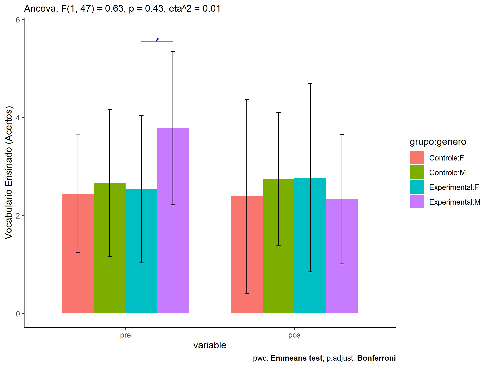<!-- -->

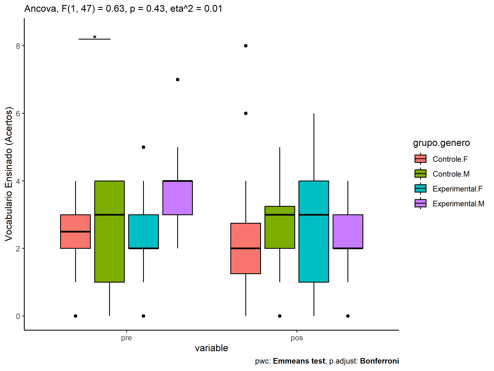<!-- -->

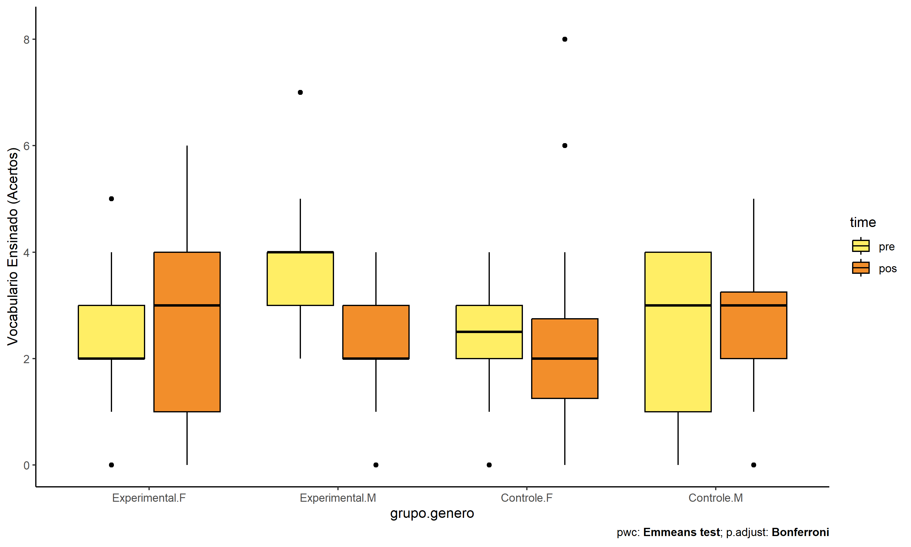<!-- -->

### Vocabulario Ensinado (TRI)

| var                    | genero | grupo        |   n | M (pre) | SE (pre) | M (unadj) | SE (unadj) | M (adj) | SE (adj) |
|:-----------------------|:-------|:-------------|----:|--------:|---------:|----------:|-----------:|--------:|---------:|
| tri.vocab.ensinado.pos | F      | Controle     |  17 |  -0.607 |    0.137 |    -0.722 |      0.174 |  -0.692 |    0.150 |
| tri.vocab.ensinado.pos | F      | Experimental |  12 |  -0.361 |    0.220 |    -0.649 |      0.193 |  -0.677 |    0.178 |
| tri.vocab.ensinado.pos | M      | Controle     |  10 |  -0.443 |    0.185 |    -0.471 |      0.172 |  -0.480 |    0.194 |
| tri.vocab.ensinado.pos | M      | Experimental |   8 |  -0.430 |    0.182 |    -0.756 |      0.119 |  -0.768 |    0.216 |

| grupo        | genero | group1   | group2       | estimate | conf.low | conf.high |    se | statistic |     p | p.adj | p.adj.signif |
|:-------------|:-------|:---------|:-------------|---------:|---------:|----------:|------:|----------:|------:|------:|:-------------|
| Controle     |        | F        | M            |   -0.212 |   -0.707 |     0.282 | 0.245 |    -0.866 | 0.391 | 0.391 | ns           |
| Experimental |        | F        | M            |    0.091 |   -0.473 |     0.655 | 0.279 |     0.326 | 0.746 | 0.746 | ns           |
| Controle     |        | F        | M            |   -0.164 |   -0.661 |     0.333 | 0.246 |    -0.665 | 0.510 | 0.510 | ns           |
| Experimental |        | F        | M            |    0.070 |   -0.499 |     0.639 | 0.282 |     0.247 | 0.806 | 0.806 | ns           |
|              | F      | Controle | Experimental |   -0.015 |   -0.487 |     0.456 | 0.234 |    -0.066 | 0.948 | 0.948 | ns           |
|              | M      | Controle | Experimental |    0.288 |   -0.298 |     0.874 | 0.290 |     0.993 | 0.326 | 0.326 | ns           |
|              | F      | Controle | Experimental |   -0.246 |   -0.716 |     0.224 | 0.233 |    -1.057 | 0.296 | 0.296 | ns           |
|              | M      | Controle | Experimental |   -0.013 |   -0.604 |     0.578 | 0.293 |    -0.044 | 0.965 | 0.965 | ns           |

| grupo        | genero | group1 | group2 | estimate | conf.low | conf.high |    se | statistic |     p | p.adj | p.adj.signif |
|:-------------|:-------|:-------|:-------|---------:|---------:|----------:|------:|----------:|------:|------:|:-------------|
| Controle     | F      | pre    | pos    |    0.076 |   -0.339 |     0.492 | 0.209 |     0.365 | 0.716 | 0.716 | ns           |
| Controle     | M      | pre    | pos    |   -0.004 |   -0.528 |     0.520 | 0.264 |    -0.015 | 0.988 | 0.988 | ns           |
| Experimental | F      | pre    | pos    |    0.220 |   -0.271 |     0.712 | 0.247 |     0.890 | 0.376 | 0.376 | ns           |
| Experimental | M      | pre    | pos    |    0.381 |   -0.215 |     0.978 | 0.300 |     1.270 | 0.207 | 0.207 | ns           |

    ## Scale for colour is already present.
    ## Adding another scale for colour, which will replace the existing scale.

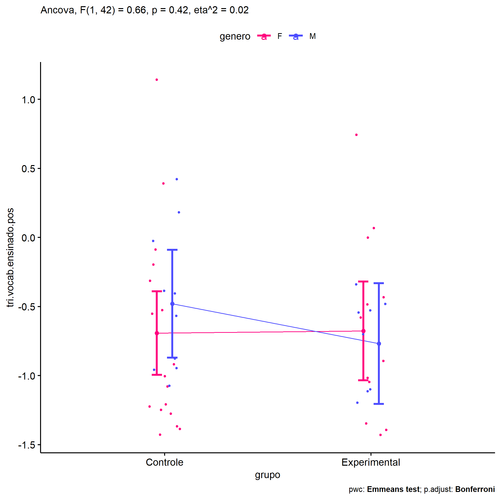<!-- -->

    ## Scale for colour is already present.
    ## Adding another scale for colour, which will replace the existing scale.

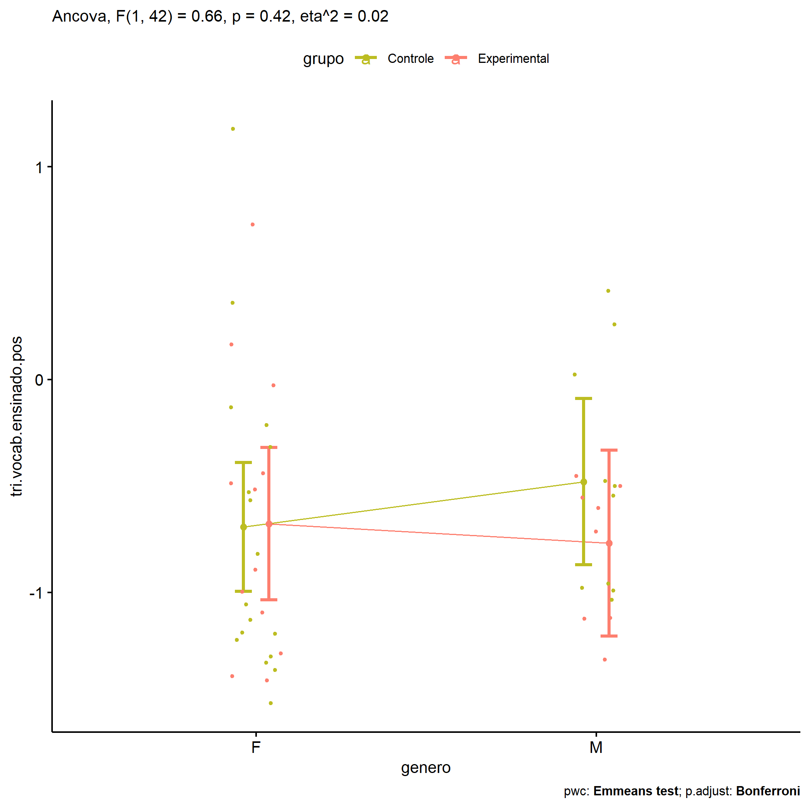<!-- -->

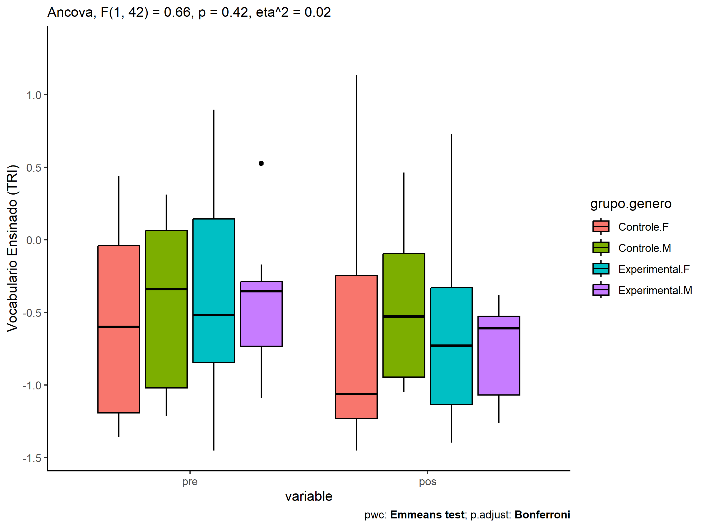<!-- -->

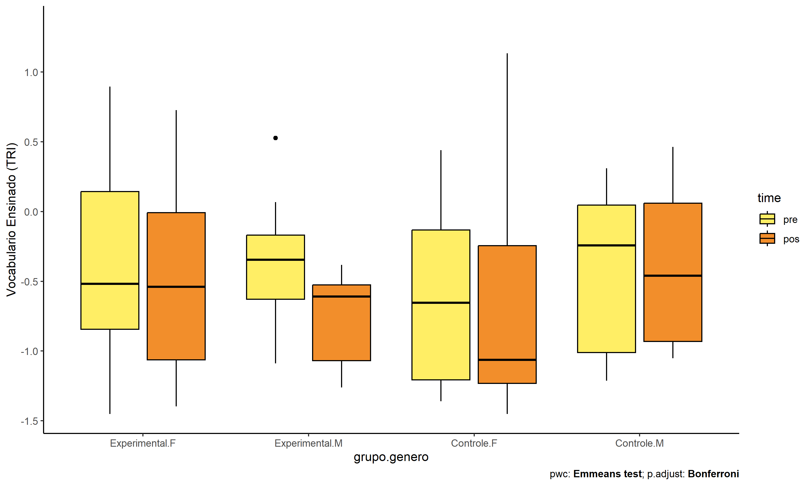<!-- -->

### Vocabulario Nao Ensinado (Acertos)

| var                          | genero | grupo        |   n | M (pre) | SE (pre) | M (unadj) | SE (unadj) | M (adj) | SE (adj) |
|:-----------------------------|:-------|:-------------|----:|--------:|---------:|----------:|-----------:|--------:|---------:|
| score.vocab.nao.ensinado.pos | F      | Controle     |  18 |  11.056 |    0.725 |    13.278 |      1.163 |  13.133 |    1.065 |
| score.vocab.nao.ensinado.pos | F      | Experimental |  13 |   9.385 |    1.022 |    11.615 |      1.152 |  11.733 |    1.247 |
| score.vocab.nao.ensinado.pos | M      | Controle     |  12 |   9.583 |    1.721 |     9.667 |      1.287 |   9.753 |    1.295 |
| score.vocab.nao.ensinado.pos | M      | Experimental |   9 |  10.111 |    1.148 |     9.778 |      1.299 |   9.781 |    1.491 |

| grupo        | genero | group1   | group2       | estimate | conf.low | conf.high |    se | statistic |     p | p.adj | p.adj.signif |
|:-------------|:-------|:---------|:-------------|---------:|---------:|----------:|------:|----------:|------:|------:|:-------------|
| Controle     |        | F        | M            |    3.380 |   -0.007 |     6.767 | 1.683 |     2.008 | 0.050 | 0.050 | ns           |
| Experimental |        | F        | M            |    1.952 |   -1.958 |     5.862 | 1.944 |     1.004 | 0.320 | 0.320 | ns           |
| Controle     |        | F        | M            |    1.472 |   -1.606 |     4.550 | 1.531 |     0.962 | 0.341 | 0.341 | ns           |
| Experimental |        | F        | M            |   -0.726 |   -4.308 |     2.855 | 1.781 |    -0.408 | 0.685 | 0.685 | ns           |
|              | F      | Controle | Experimental |    1.400 |   -1.919 |     4.719 | 1.650 |     0.849 | 0.400 | 0.400 | ns           |
|              | M      | Controle | Experimental |   -0.028 |   -4.001 |     3.944 | 1.975 |    -0.014 | 0.989 | 0.989 | ns           |
|              | F      | Controle | Experimental |    1.671 |   -1.335 |     4.677 | 1.495 |     1.118 | 0.269 | 0.269 | ns           |
|              | M      | Controle | Experimental |   -0.528 |   -4.169 |     3.114 | 1.811 |    -0.291 | 0.772 | 0.772 | ns           |

| grupo        | genero | group1 | group2 | estimate | conf.low | conf.high |    se | statistic |     p | p.adj | p.adj.signif |
|:-------------|:-------|:-------|:-------|---------:|---------:|----------:|------:|----------:|------:|------:|:-------------|
| Controle     | F      | pre    | pos    |   -2.222 |   -5.064 |     0.619 | 1.432 |    -1.552 | 0.124 | 0.124 | ns           |
| Controle     | M      | pre    | pos    |   -0.083 |   -3.564 |     3.397 | 1.753 |    -0.048 | 0.962 | 0.962 | ns           |
| Experimental | F      | pre    | pos    |   -2.231 |   -5.575 |     1.113 | 1.685 |    -1.324 | 0.189 | 0.189 | ns           |
| Experimental | M      | pre    | pos    |    0.333 |   -3.685 |     4.352 | 2.025 |     0.165 | 0.870 | 0.870 | ns           |

    ## Scale for colour is already present.
    ## Adding another scale for colour, which will replace the existing scale.

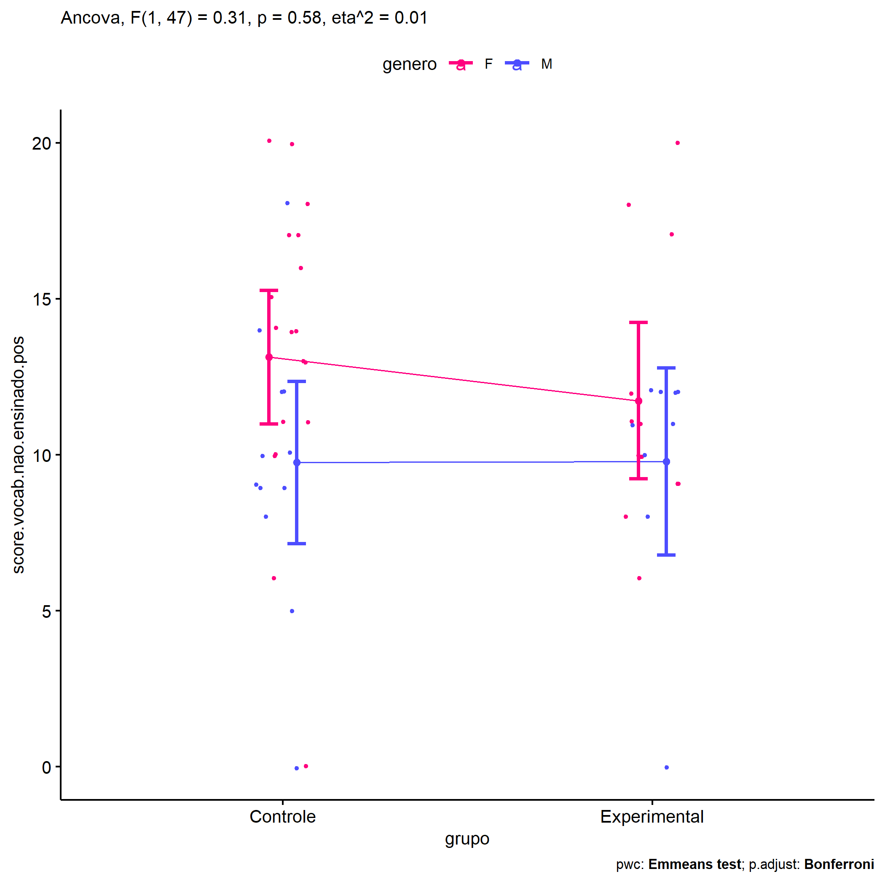<!-- -->

    ## Scale for colour is already present.
    ## Adding another scale for colour, which will replace the existing scale.

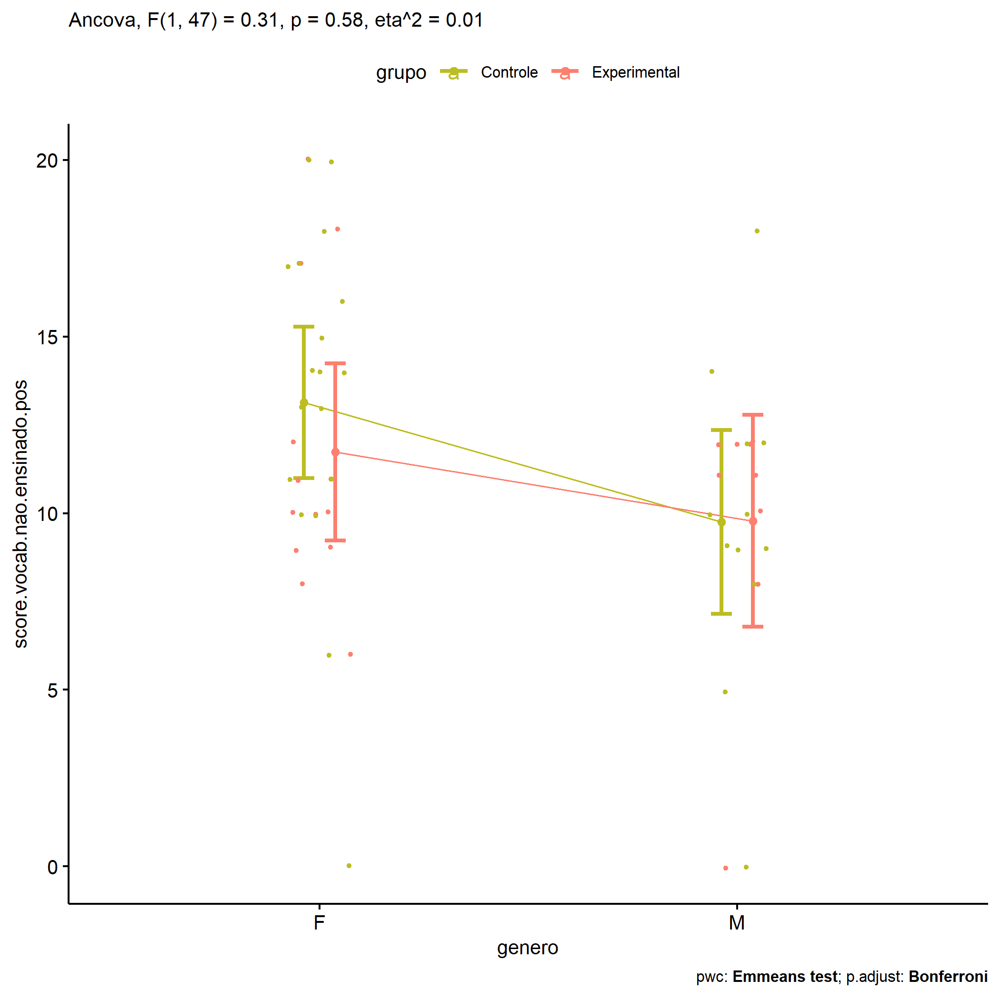<!-- -->

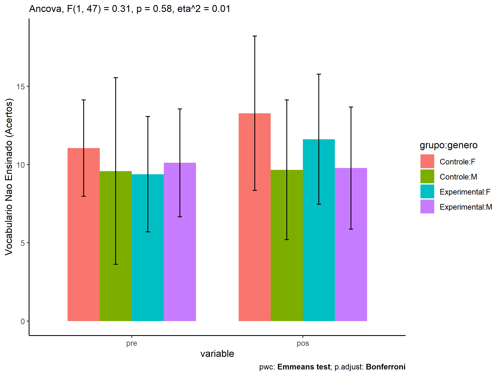<!-- -->

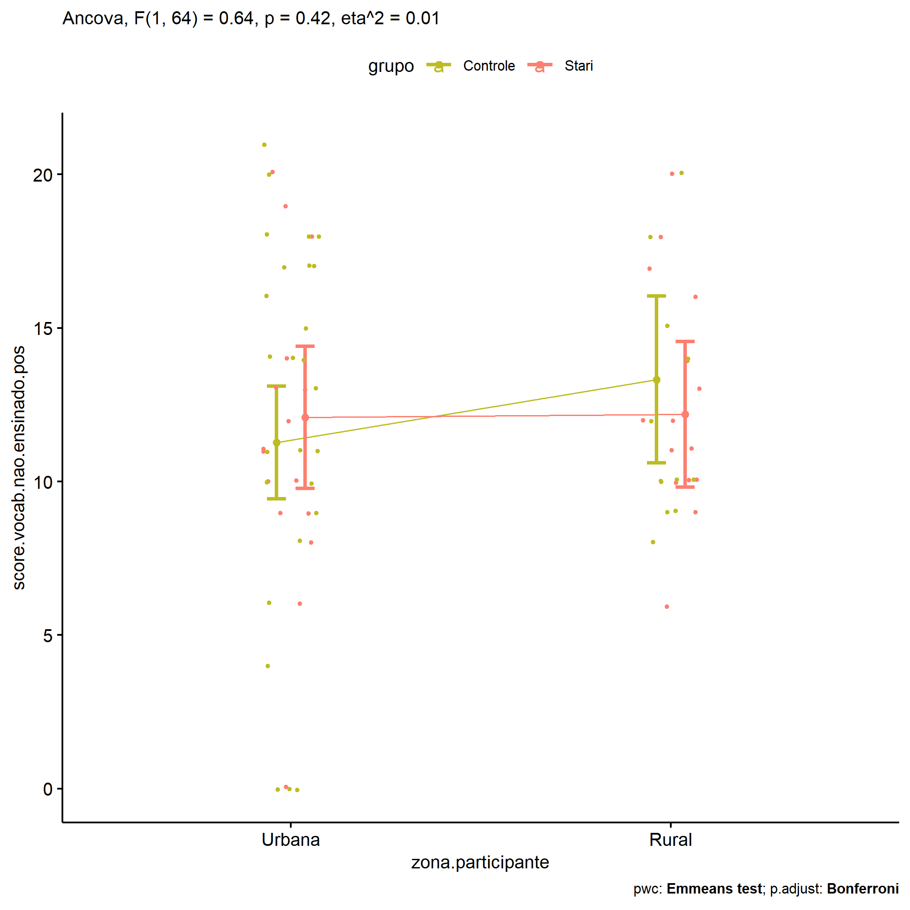<!-- -->

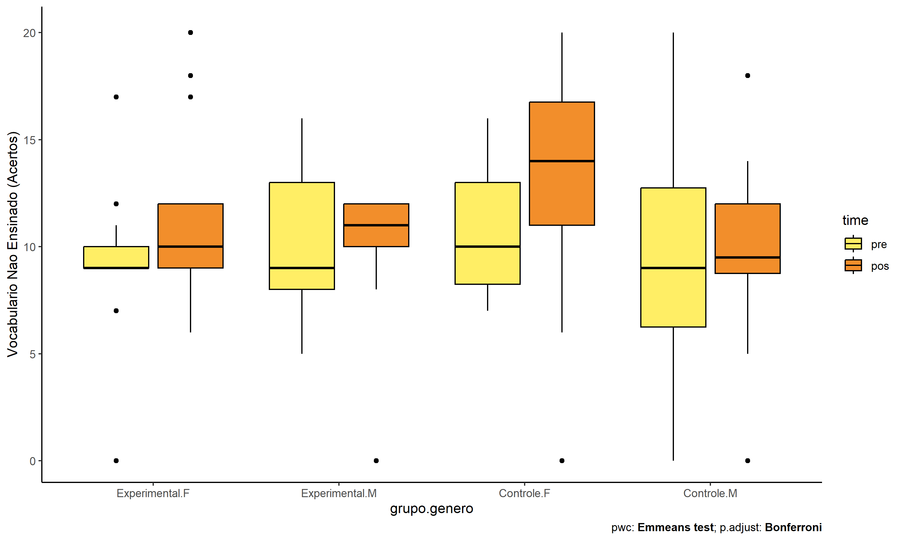<!-- -->

### Vocabulario Nao Ensinado (TRI)

| var                        | genero | grupo        |   n | M (pre) | SE (pre) | M (unadj) | SE (unadj) | M (adj) | SE (adj) |
|:---------------------------|:-------|:-------------|----:|--------:|---------:|----------:|-----------:|--------:|---------:|
| tri.vocab.nao.ensinado.pos | F      | Controle     |  17 |  -0.751 |    0.091 |    -0.508 |      0.131 |  -0.550 |    0.084 |
| tri.vocab.nao.ensinado.pos | F      | Experimental |  12 |  -0.798 |    0.111 |    -0.739 |      0.149 |  -0.743 |    0.099 |
| tri.vocab.nao.ensinado.pos | M      | Controle     |  10 |  -0.950 |    0.182 |    -0.735 |      0.157 |  -0.616 |    0.110 |
| tri.vocab.nao.ensinado.pos | M      | Experimental |   8 |  -0.735 |    0.164 |    -0.729 |      0.102 |  -0.783 |    0.122 |

| grupo        | genero | group1   | group2       | estimate | conf.low | conf.high |    se | statistic |     p | p.adj | p.adj.signif |
|:-------------|:-------|:---------|:-------------|---------:|---------:|----------:|------:|----------:|------:|------:|:-------------|
| Controle     |        | F        | M            |    0.066 |   -0.215 |     0.347 | 0.139 |     0.475 | 0.638 | 0.638 | ns           |
| Experimental |        | F        | M            |    0.040 |   -0.277 |     0.358 | 0.157 |     0.257 | 0.799 | 0.799 | ns           |
| Controle     |        | F        | M            |    0.199 |   -0.155 |     0.553 | 0.176 |     1.133 | 0.263 | 0.263 | ns           |
| Experimental |        | F        | M            |   -0.062 |   -0.468 |     0.343 | 0.201 |    -0.309 | 0.758 | 0.758 | ns           |
|              | F      | Controle | Experimental |    0.193 |   -0.069 |     0.455 | 0.130 |     1.486 | 0.145 | 0.145 | ns           |
|              | M      | Controle | Experimental |    0.167 |   -0.166 |     0.501 | 0.165 |     1.012 | 0.317 | 0.317 | ns           |
|              | F      | Controle | Experimental |    0.047 |   -0.288 |     0.382 | 0.166 |     0.282 | 0.779 | 0.779 | ns           |
|              | M      | Controle | Experimental |   -0.214 |   -0.636 |     0.207 | 0.209 |    -1.026 | 0.311 | 0.311 | ns           |

| grupo        | genero | group1 | group2 | estimate | conf.low | conf.high |    se | statistic |     p | p.adj | p.adj.signif |
|:-------------|:-------|:-------|:-------|---------:|---------:|----------:|------:|----------:|------:|------:|:-------------|
| Controle     | F      | pre    | pos    |   -0.232 |   -0.561 |     0.097 | 0.166 |    -1.400 | 0.165 | 0.165 | ns           |
| Controle     | M      | pre    | pos    |   -0.057 |   -0.472 |     0.358 | 0.209 |    -0.273 | 0.785 | 0.785 | ns           |
| Experimental | F      | pre    | pos    |   -0.152 |   -0.542 |     0.238 | 0.196 |    -0.774 | 0.441 | 0.441 | ns           |
| Experimental | M      | pre    | pos    |   -0.063 |   -0.536 |     0.410 | 0.238 |    -0.265 | 0.792 | 0.792 | ns           |

    ## Scale for colour is already present.
    ## Adding another scale for colour, which will replace the existing scale.

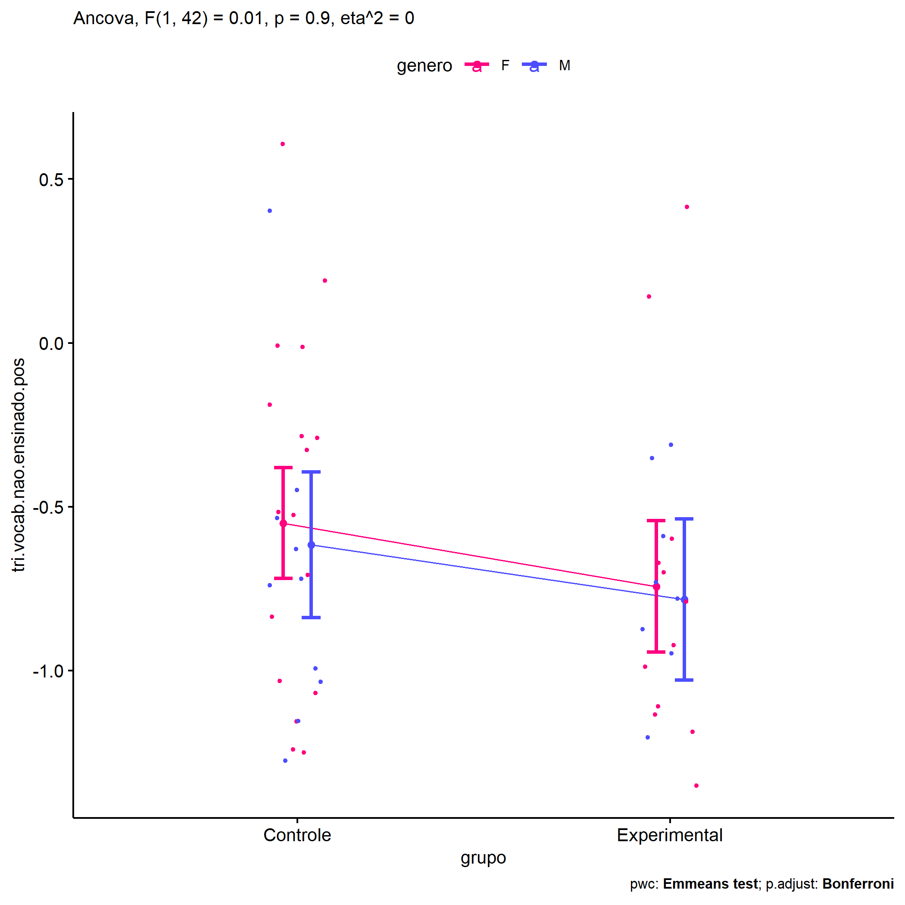<!-- -->

    ## Scale for colour is already present.
    ## Adding another scale for colour, which will replace the existing scale.

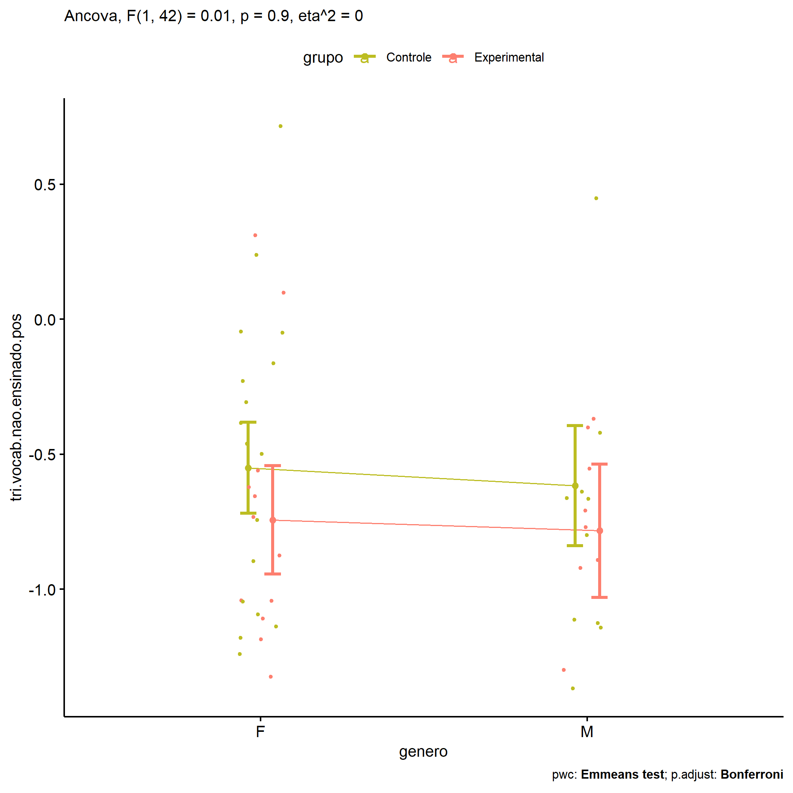<!-- -->

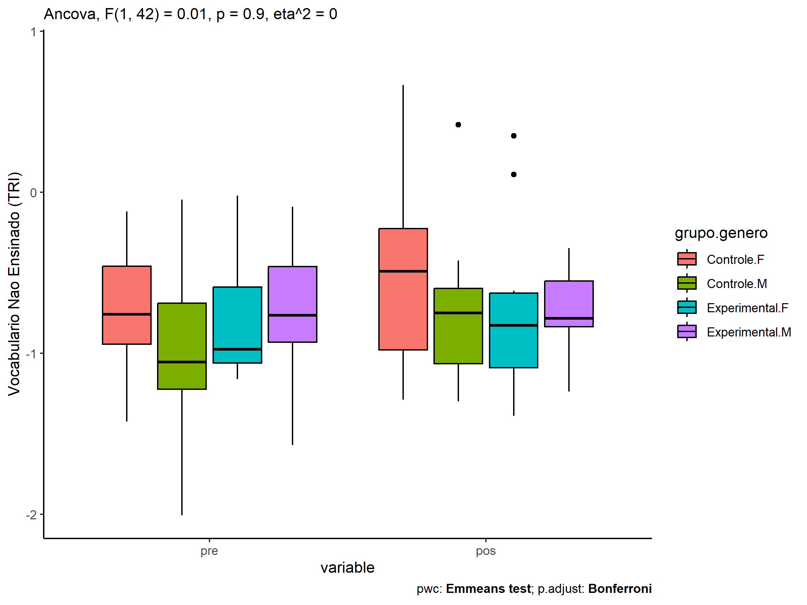<!-- -->

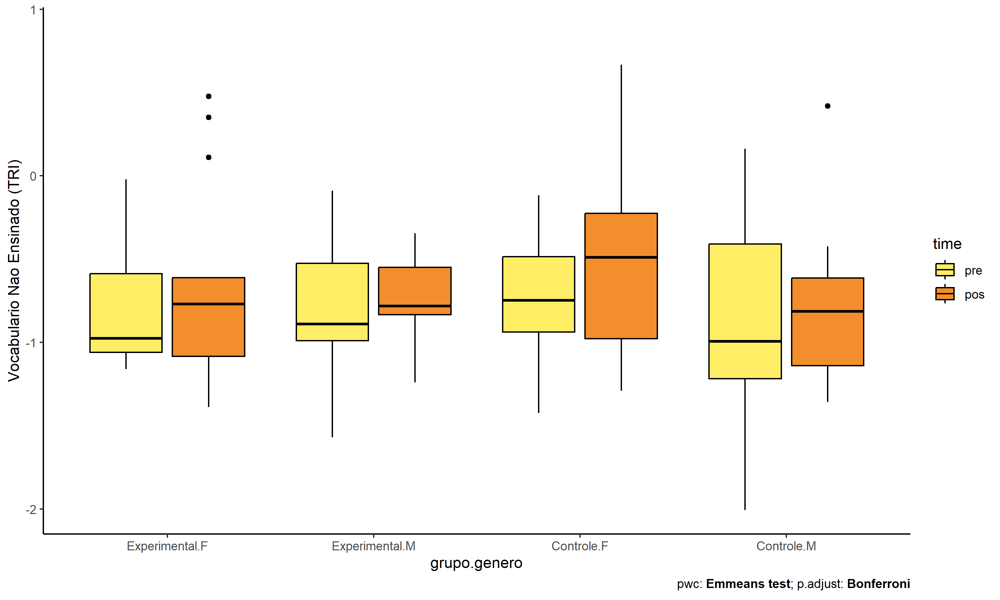<!-- -->

## factores: **idade:grupo**

### Vocabulario (Acertos)

| var             | idade | grupo        |   n | M (pre) | SE (pre) | M (unadj) | SE (unadj) | M (adj) | SE (adj) |
|:----------------|:------|:-------------|----:|--------:|---------:|----------:|-----------:|--------:|---------:|
| score.vocab.pos | 11y   | Controle     |  16 |  12.250 |    1.101 |    15.312 |      1.067 |  15.642 |    0.985 |
| score.vocab.pos | 11y   | Experimental |  12 |  13.417 |    0.933 |    13.833 |      1.325 |  13.650 |    1.129 |
| score.vocab.pos | 12y   | Experimental |   5 |  14.400 |    1.568 |    14.200 |      1.114 |  13.584 |    1.764 |

|     | grupo        | idade | group1   | group2       | estimate | conf.low | conf.high |    se | statistic |     p | p.adj | p.adj.signif |
|:----|:-------------|:------|:---------|:-------------|---------:|---------:|----------:|------:|----------:|------:|------:|:-------------|
| 2   | Experimental |       | 11y      | 12y          |    0.066 |   -4.199 |     4.331 | 2.086 |     0.032 | 0.975 | 0.975 | ns           |
| 4   | Experimental |       | 11y      | 12y          |   -0.983 |   -5.217 |     3.251 | 2.073 |    -0.474 | 0.639 | 0.639 | ns           |
| 5   |              | 11y   | Controle | Experimental |    1.992 |   -1.087 |     5.072 | 1.506 |     1.323 | 0.196 | 0.196 | ns           |
| 7   |              | 11y   | Controle | Experimental |   -1.167 |   -4.204 |     1.871 | 1.487 |    -0.784 | 0.439 | 0.439 | ns           |

| grupo        | idade | group1 | group2 | estimate | conf.low | conf.high |    se | statistic |     p | p.adj | p.adj.signif |
|:-------------|:------|:-------|:-------|---------:|---------:|----------:|------:|----------:|------:|------:|:-------------|
| Controle     | 11y   | pre    | pos    |   -3.063 |   -5.910 |    -0.215 | 1.426 |    -2.147 | 0.035 | 0.035 | \*           |
| Experimental | 11y   | pre    | pos    |   -1.385 |   -4.543 |     1.774 | 1.582 |    -0.875 | 0.385 | 0.385 | ns           |
| Experimental | 12y   | pre    | pos    |    0.200 |   -4.893 |     5.293 | 2.551 |     0.078 | 0.938 | 0.938 | ns           |

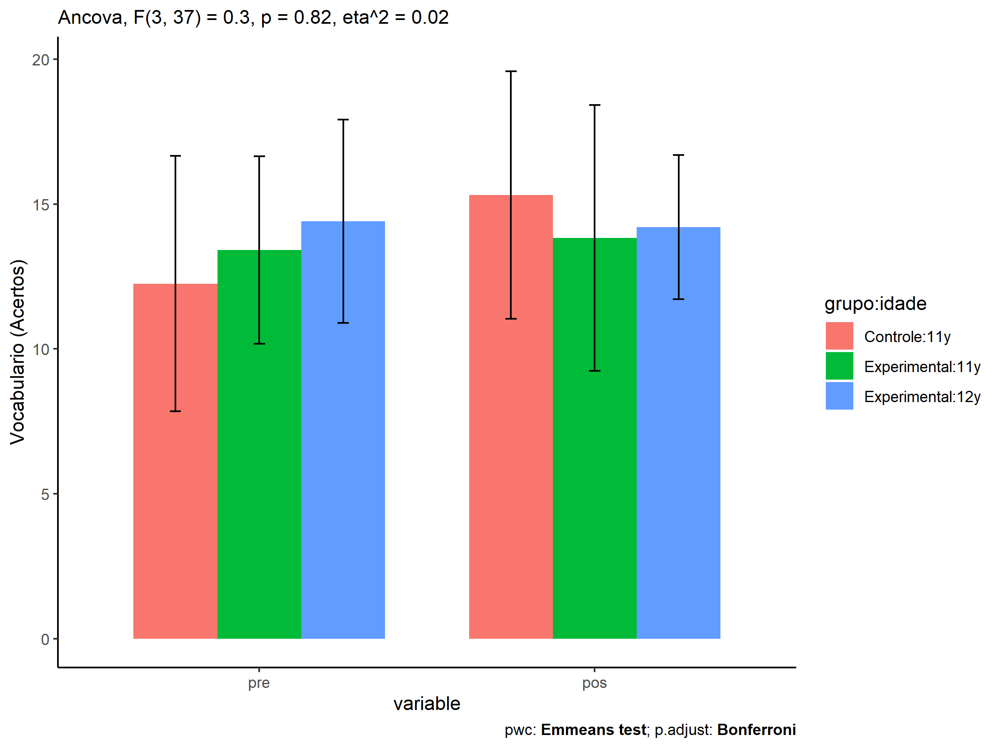<!-- -->

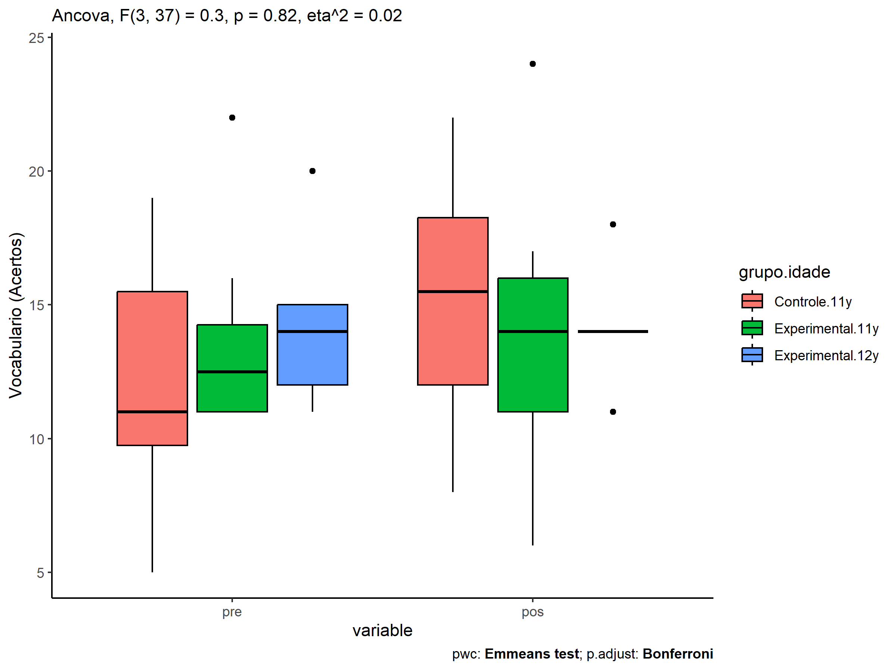<!-- -->

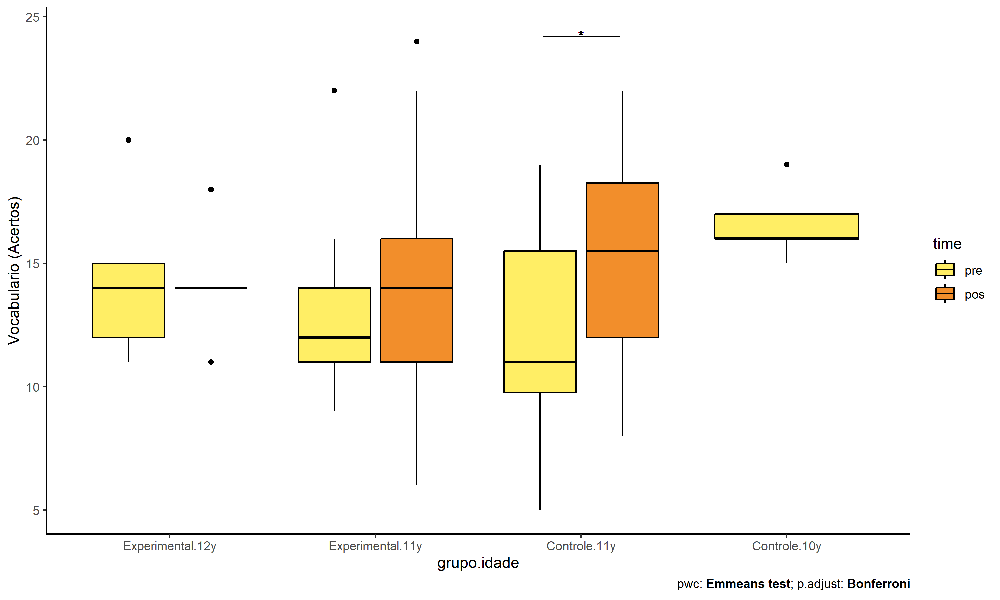<!-- -->

### Vocabulario (TRI)

| var           | idade | grupo        |   n | M (pre) | SE (pre) | M (unadj) | SE (unadj) | M (adj) | SE (adj) |
|:--------------|:------|:-------------|----:|--------:|---------:|----------:|-----------:|--------:|---------:|
| tri.vocab.pos | 11y   | Controle     |  16 |  -0.815 |    0.141 |    -0.710 |      0.146 |  -0.683 |    0.100 |
| tri.vocab.pos | 11y   | Experimental |  12 |  -0.750 |    0.225 |    -0.686 |      0.181 |  -0.706 |    0.116 |
| tri.vocab.pos | 12y   | Experimental |   5 |  -0.727 |    0.240 |    -1.097 |      0.306 |  -1.134 |    0.179 |

|     | grupo        | idade | group1   | group2       | estimate | conf.low | conf.high |    se | statistic |     p | p.adj | p.adj.signif |
|:----|:-------------|:------|:---------|:-------------|---------:|---------:|----------:|------:|----------:|------:|------:|:-------------|
| 2   | Experimental |       | 11y      | 12y          |    0.428 |   -0.009 |     0.864 | 0.213 |     2.005 | 0.054 | 0.054 | ns           |
| 4   | Experimental |       | 11y      | 12y          |   -0.023 |   -0.728 |     0.681 | 0.345 |    -0.068 | 0.946 | 0.946 | ns           |
| 5   |              | 11y   | Controle | Experimental |    0.023 |   -0.290 |     0.337 | 0.153 |     0.152 | 0.880 | 0.880 | ns           |
| 7   |              | 11y   | Controle | Experimental |   -0.065 |   -0.571 |     0.441 | 0.248 |    -0.262 | 0.795 | 0.795 | ns           |

| grupo        | idade | group1 | group2 | estimate | conf.low | conf.high |    se | statistic |     p | p.adj | p.adj.signif |
|:-------------|:------|:-------|:-------|---------:|---------:|----------:|------:|----------:|------:|------:|:-------------|
| Controle     | 11y   | pre    | pos    |   -0.106 |   -0.543 |     0.331 | 0.219 |    -0.482 | 0.631 | 0.631 | ns           |
| Experimental | 11y   | pre    | pos    |   -0.165 |   -0.650 |     0.320 | 0.243 |    -0.680 | 0.499 | 0.499 | ns           |
| Experimental | 12y   | pre    | pos    |    0.370 |   -0.412 |     1.151 | 0.392 |     0.944 | 0.349 | 0.349 | ns           |

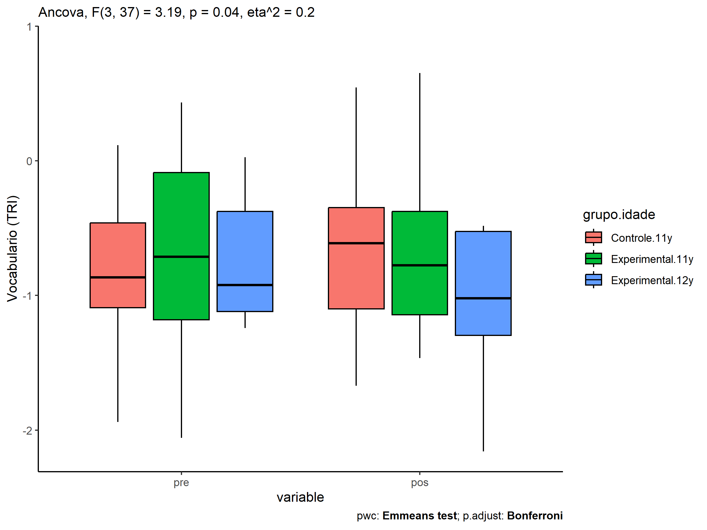<!-- -->

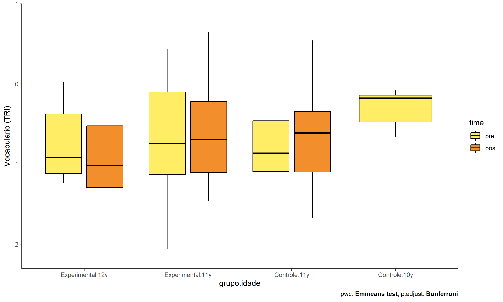<!-- -->

### Vocabulario Ensinado (Acertos)

| var                      | idade | grupo        |   n | M (pre) | SE (pre) | M (unadj) | SE (unadj) | M (adj) | SE (adj) |
|:-------------------------|:------|:-------------|----:|--------:|---------:|----------:|-----------:|--------:|---------:|
| score.vocab.ensinado.pos | 10y   | Controle     |   5 |   2.000 |    0.632 |     2.400 |      1.030 |   2.423 |    0.744 |
| score.vocab.ensinado.pos | 11y   | Controle     |  16 |   2.500 |    0.303 |     2.250 |      0.296 |   2.256 |    0.411 |
| score.vocab.ensinado.pos | 11y   | Experimental |  14 |   3.143 |    0.490 |     2.357 |      0.464 |   2.341 |    0.447 |
| score.vocab.ensinado.pos | 12y   | Experimental |   5 |   2.600 |    0.510 |     3.200 |      0.800 |   3.203 |    0.734 |

|     | grupo        | idade | group1   | group2       | estimate | conf.low | conf.high |    se | statistic |     p | p.adj | p.adj.signif |
|:----|:-------------|:------|:---------|:-------------|---------:|---------:|----------:|------:|----------:|------:|------:|:-------------|
| 1   | Controle     |       | 10y      | 11y          |    0.167 |   -1.549 |     1.883 | 0.845 |     0.198 | 0.845 | 0.845 | ns           |
| 6   | Experimental |       | 11y      | 12y          |   -0.861 |   -2.608 |     0.885 | 0.860 |    -1.001 | 0.324 | 0.324 | ns           |
| 7   | Controle     |       | 10y      | 11y          |   -0.500 |   -2.038 |     1.038 | 0.759 |    -0.659 | 0.514 | 0.514 | ns           |
| 12  | Experimental |       | 11y      | 12y          |    0.543 |   -1.022 |     2.107 | 0.771 |     0.704 | 0.486 | 0.486 | ns           |
| 14  |              | 11y   | Controle | Experimental |   -0.085 |   -1.327 |     1.157 | 0.612 |    -0.139 | 0.890 | 0.890 | ns           |
| 17  |              | 11y   | Controle | Experimental |   -0.643 |   -1.742 |     0.456 | 0.542 |    -1.186 | 0.243 | 0.243 | ns           |

| grupo        | idade | group1 | group2 | estimate | conf.low | conf.high |    se | statistic |     p | p.adj | p.adj.signif |
|:-------------|:------|:-------|:-------|---------:|---------:|----------:|------:|----------:|------:|------:|:-------------|
| Controle     | 10y   | pre    | pos    |   -0.400 |   -2.355 |     1.555 | 0.981 |    -0.408 | 0.685 | 0.685 | ns           |
| Controle     | 11y   | pre    | pos    |    0.250 |   -0.843 |     1.343 | 0.548 |     0.456 | 0.650 | 0.650 | ns           |
| Experimental | 11y   | pre    | pos    |    0.786 |   -0.383 |     1.954 | 0.586 |     1.341 | 0.184 | 0.184 | ns           |
| Experimental | 12y   | pre    | pos    |   -0.600 |   -2.555 |     1.355 | 0.981 |    -0.612 | 0.543 | 0.543 | ns           |

    ## Scale for colour is already present.
    ## Adding another scale for colour, which will replace the existing scale.

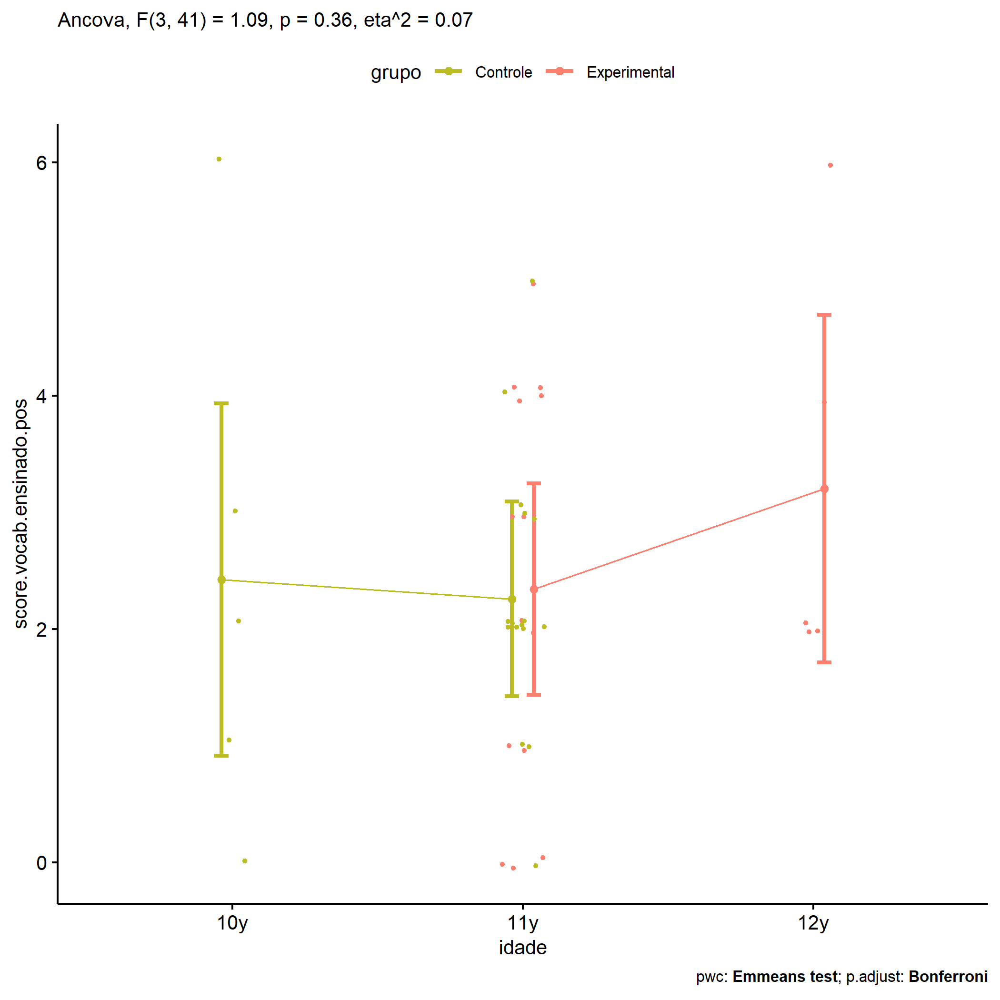<!-- -->

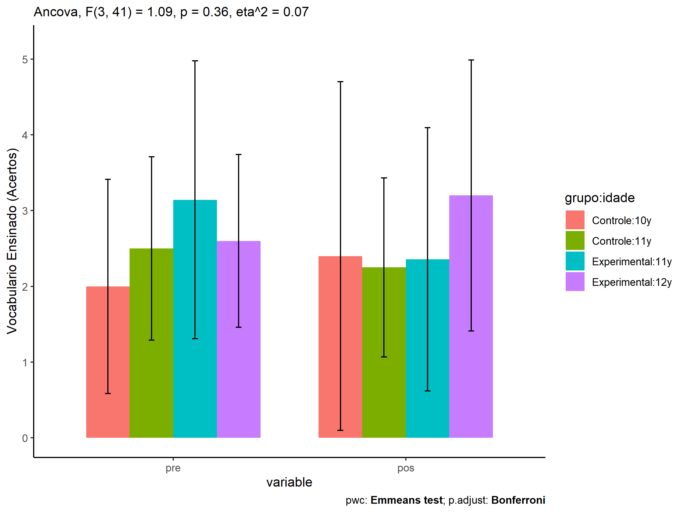<!-- -->

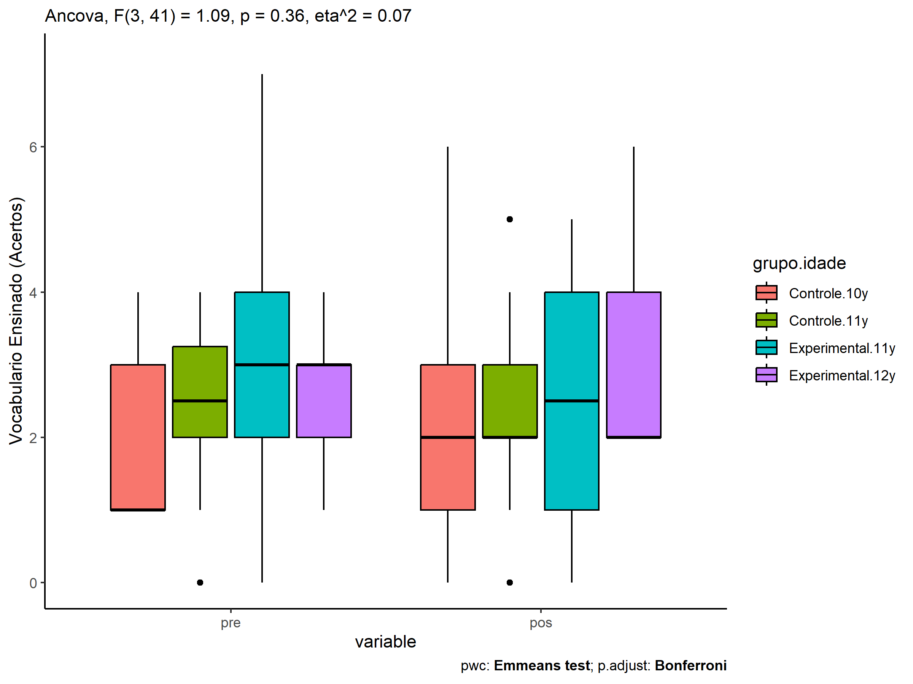<!-- -->

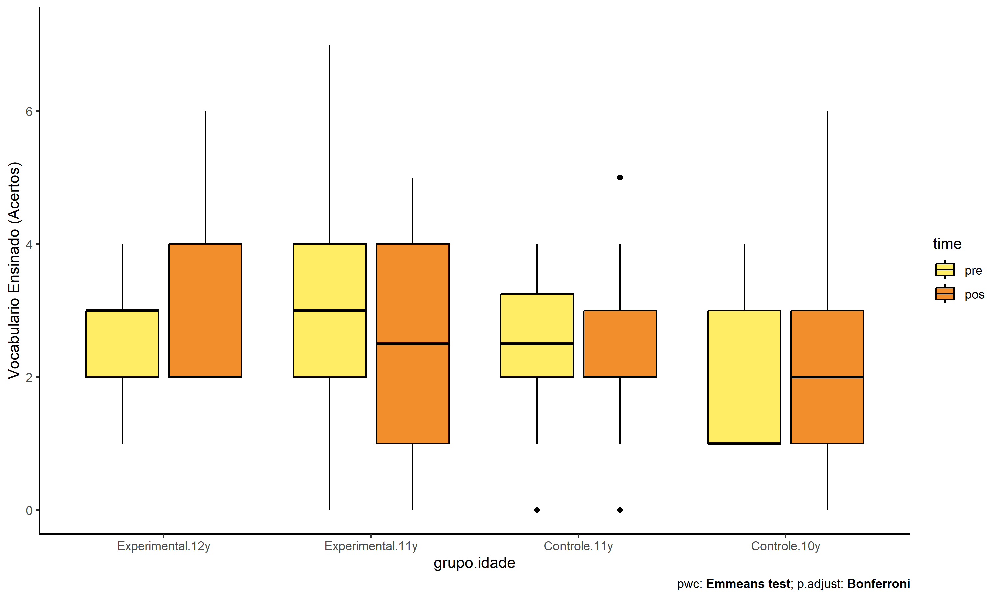<!-- -->

### Vocabulario Ensinado (TRI)

| var                    | idade | grupo        |   n | M (pre) | SE (pre) | M (unadj) | SE (unadj) | M (adj) | SE (adj) |
|:-----------------------|:------|:-------------|----:|--------:|---------:|----------:|-----------:|--------:|---------:|
| tri.vocab.ensinado.pos | 11y   | Controle     |  16 |  -0.520 |    0.151 |    -0.799 |      0.123 |  -0.763 |    0.124 |
| tri.vocab.ensinado.pos | 11y   | Experimental |  12 |  -0.229 |    0.227 |    -0.653 |      0.183 |  -0.735 |    0.145 |
| tri.vocab.ensinado.pos | 12y   | Experimental |   5 |  -0.631 |    0.142 |    -0.800 |      0.232 |  -0.719 |    0.223 |

|     | grupo        | idade | group1   | group2       | estimate | conf.low | conf.high |    se | statistic |     p | p.adj | p.adj.signif |
|:----|:-------------|:------|:---------|:-------------|---------:|---------:|----------:|------:|----------:|------:|------:|:-------------|
| 2   | Experimental |       | 11y      | 12y          |   -0.015 |   -0.565 |     0.535 | 0.269 |    -0.057 | 0.955 | 0.955 | ns           |
| 4   | Experimental |       | 11y      | 12y          |    0.402 |   -0.303 |     1.108 | 0.345 |     1.164 | 0.254 | 0.254 | ns           |
| 5   |              | 11y   | Controle | Experimental |   -0.029 |   -0.423 |     0.366 | 0.193 |    -0.148 | 0.883 | 0.883 | ns           |
| 7   |              | 11y   | Controle | Experimental |   -0.291 |   -0.797 |     0.216 | 0.248 |    -1.172 | 0.250 | 0.250 | ns           |

| grupo        | idade | group1 | group2 | estimate | conf.low | conf.high |    se | statistic |     p | p.adj | p.adj.signif |
|:-------------|:------|:-------|:-------|---------:|---------:|----------:|------:|----------:|------:|------:|:-------------|
| Controle     | 11y   | pre    | pos    |    0.279 |   -0.146 |     0.704 | 0.213 |     1.312 | 0.194 | 0.194 | ns           |
| Experimental | 11y   | pre    | pos    |    0.378 |   -0.093 |     0.850 | 0.236 |     1.604 | 0.114 | 0.114 | ns           |
| Experimental | 12y   | pre    | pos    |    0.169 |   -0.591 |     0.928 | 0.381 |     0.443 | 0.659 | 0.659 | ns           |

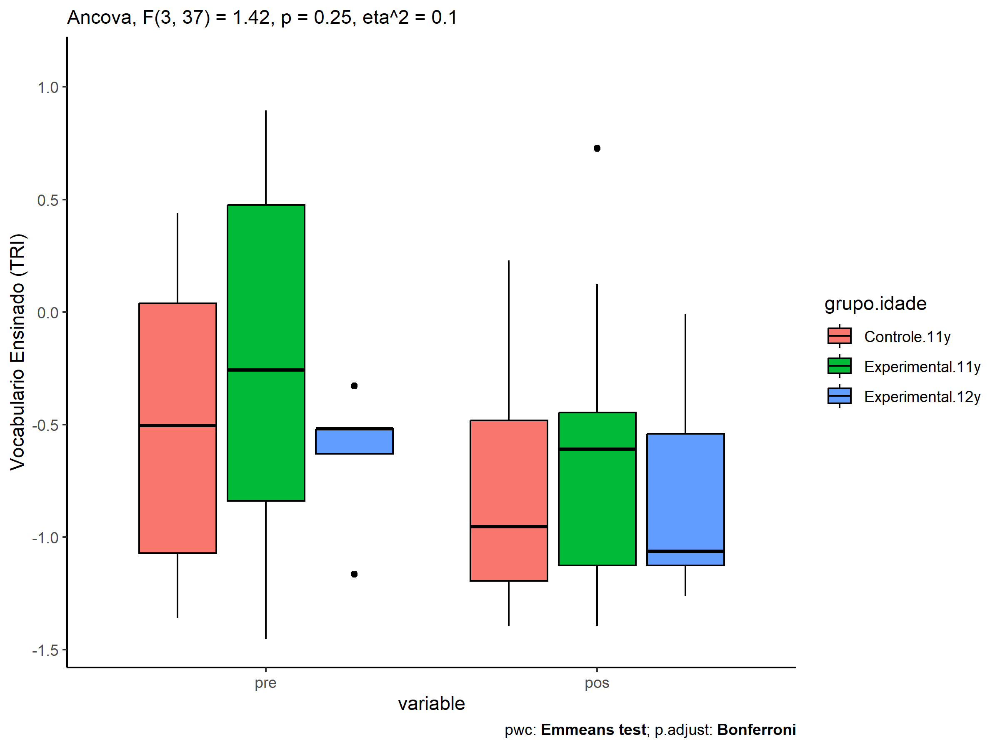<!-- -->

<!-- -->

### Vocabulario Nao Ensinado (Acertos)

| var                          | idade | grupo        |   n | M (pre) | SE (pre) | M (unadj) | SE (unadj) | M (adj) | SE (adj) |
|:-----------------------------|:------|:-------------|----:|--------:|---------:|----------:|-----------:|--------:|---------:|
| score.vocab.nao.ensinado.pos | 10y   | Controle     |   5 |   14.60 |    1.030 |    12.000 |      3.209 |  10.135 |    2.183 |
| score.vocab.nao.ensinado.pos | 11y   | Controle     |  16 |    9.75 |    0.960 |    13.062 |      1.006 |  13.326 |    1.123 |
| score.vocab.nao.ensinado.pos | 11y   | Experimental |  14 |    9.00 |    1.016 |    11.071 |      1.344 |  11.664 |    1.225 |
| score.vocab.nao.ensinado.pos | 12y   | Experimental |   5 |   11.80 |    1.241 |    11.000 |      0.632 |  10.364 |    2.019 |

|     | grupo        | idade | group1   | group2       | estimate | conf.low | conf.high |    se | statistic |     p | p.adj | p.adj.signif |
|:----|:-------------|:------|:---------|:-------------|---------:|---------:|----------:|------:|----------:|------:|------:|:-------------|
| 1   | Controle     |       | 10y      | 11y          |   -3.190 |   -8.263 |     1.883 | 2.499 |    -1.277 | 0.210 | 0.210 | ns           |
| 6   | Experimental |       | 11y      | 12y          |    1.300 |   -3.566 |     6.166 | 2.397 |     0.542 | 0.591 | 0.591 | ns           |
| 7   | Controle     |       | 10y      | 11y          |    4.850 |    1.132 |     8.568 | 1.833 |     2.645 | 0.012 | 0.012 | \*           |
| 12  | Experimental |       | 11y      | 12y          |   -2.800 |   -6.581 |     0.981 | 1.864 |    -1.502 | 0.142 | 0.142 | ns           |
| 14  |              | 11y   | Controle | Experimental |    1.662 |   -1.669 |     4.993 | 1.641 |     1.013 | 0.318 | 0.318 | ns           |
| 17  |              | 11y   | Controle | Experimental |    0.750 |   -1.906 |     3.406 | 1.310 |     0.573 | 0.570 | 0.570 | ns           |

| grupo        | idade | group1 | group2 | estimate | conf.low | conf.high |    se | statistic |     p | p.adj | p.adj.signif |
|:-------------|:------|:-------|:-------|---------:|---------:|----------:|------:|----------:|------:|------:|:-------------|
| Controle     | 10y   | pre    | pos    |    2.600 |   -2.647 |     7.847 | 2.632 |     0.988 | 0.327 | 0.327 | ns           |
| Controle     | 11y   | pre    | pos    |   -3.312 |   -6.245 |    -0.380 | 1.471 |    -2.251 | 0.027 | 0.027 | \*           |
| Experimental | 11y   | pre    | pos    |   -2.071 |   -5.207 |     1.064 | 1.573 |    -1.317 | 0.192 | 0.192 | ns           |
| Experimental | 12y   | pre    | pos    |    0.800 |   -4.447 |     6.047 | 2.632 |     0.304 | 0.762 | 0.762 | ns           |

    ## Scale for colour is already present.
    ## Adding another scale for colour, which will replace the existing scale.

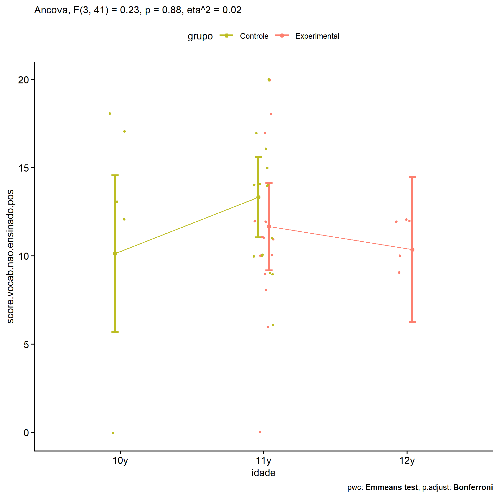<!-- -->

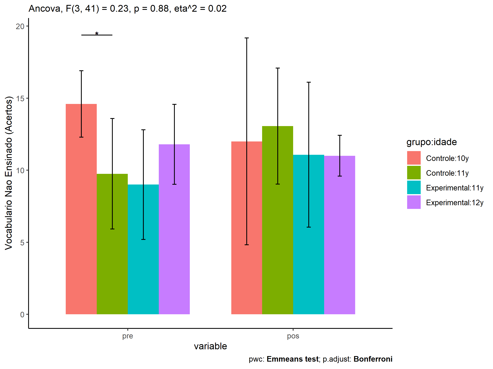<!-- -->

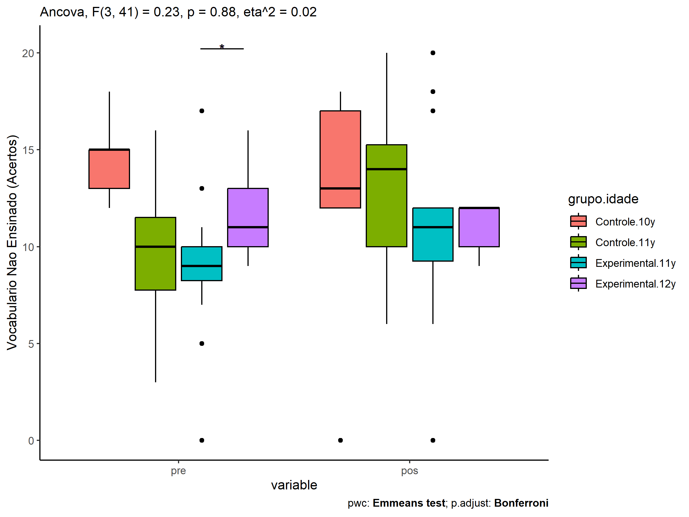<!-- -->

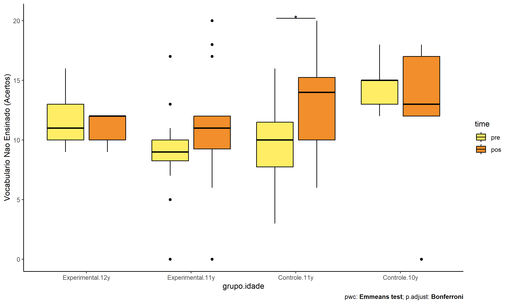<!-- -->

### Vocabulario Nao Ensinado (TRI)

| var                        | idade | grupo        |   n | M (pre) | SE (pre) | M (unadj) | SE (unadj) | M (adj) | SE (adj) |
|:---------------------------|:------|:-------------|----:|--------:|---------:|----------:|-----------:|--------:|---------:|
| tri.vocab.nao.ensinado.pos | 11y   | Controle     |  16 |  -0.890 |    0.120 |    -0.591 |      0.133 |  -0.529 |    0.080 |
| tri.vocab.nao.ensinado.pos | 11y   | Experimental |  12 |  -0.762 |    0.131 |    -0.676 |      0.144 |  -0.721 |    0.092 |
| tri.vocab.nao.ensinado.pos | 12y   | Experimental |   5 |  -0.711 |    0.182 |    -0.822 |      0.143 |  -0.910 |    0.143 |

|     | grupo        | idade | group1   | group2       | estimate | conf.low | conf.high |    se | statistic |     p | p.adj | p.adj.signif |
|:----|:-------------|:------|:---------|:-------------|---------:|---------:|----------:|------:|----------:|------:|------:|:-------------|
| 2   | Experimental |       | 11y      | 12y          |    0.188 |   -0.159 |     0.535 | 0.170 |     1.111 | 0.276 | 0.276 | ns           |
| 4   | Experimental |       | 11y      | 12y          |   -0.051 |   -0.553 |     0.450 | 0.245 |    -0.209 | 0.836 | 0.836 | ns           |
| 5   |              | 11y   | Controle | Experimental |    0.192 |   -0.059 |     0.443 | 0.123 |     1.566 | 0.128 | 0.128 | ns           |
| 7   |              | 11y   | Controle | Experimental |   -0.128 |   -0.488 |     0.232 | 0.176 |    -0.727 | 0.473 | 0.473 | ns           |

| grupo        | idade | group1 | group2 | estimate | conf.low | conf.high |    se | statistic |     p | p.adj | p.adj.signif |
|:-------------|:------|:-------|:-------|---------:|---------:|----------:|------:|----------:|------:|------:|:-------------|
| Controle     | 11y   | pre    | pos    |   -0.299 |   -0.641 |     0.043 | 0.171 |    -1.747 | 0.085 | 0.085 | ns           |
| Experimental | 11y   | pre    | pos    |   -0.212 |   -0.591 |     0.167 | 0.190 |    -1.116 | 0.268 | 0.268 | ns           |
| Experimental | 12y   | pre    | pos    |    0.111 |   -0.501 |     0.723 | 0.306 |     0.362 | 0.718 | 0.718 | ns           |

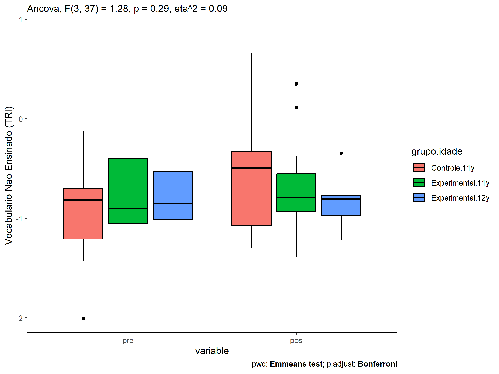<!-- -->

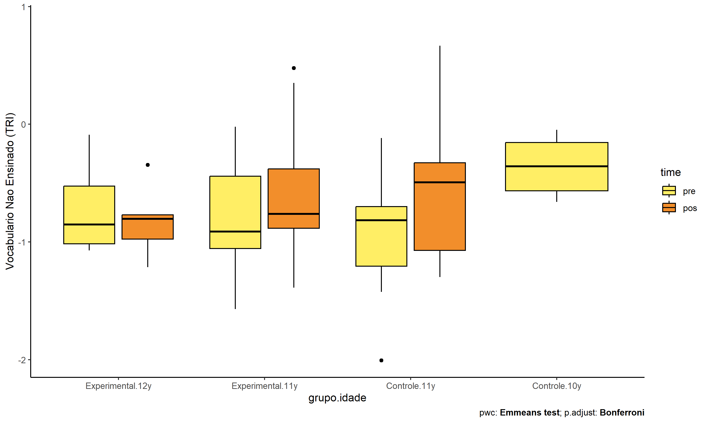<!-- -->

## factores: **zona.participante:grupo**

### Vocabulario (Acertos)

| var             | zona.participante | grupo        |   n | M (pre) | SE (pre) | M (unadj) | SE (unadj) | M (adj) | SE (adj) |
|:----------------|:------------------|:-------------|----:|--------:|---------:|----------:|-----------:|--------:|---------:|
| score.vocab.pos | Rural             | Controle     |  10 |  11.200 |    1.031 |    15.700 |      1.578 |  17.045 |    1.373 |
| score.vocab.pos | Rural             | Experimental |   9 |  13.889 |    1.184 |    14.444 |      1.634 |  14.161 |    1.359 |
| score.vocab.pos | Urbana            | Controle     |  12 |  15.500 |    0.965 |    16.667 |      1.299 |  15.408 |    1.257 |
| score.vocab.pos | Urbana            | Experimental |   7 |  12.429 |    0.869 |    13.143 |      0.911 |  13.744 |    1.551 |

| grupo        | zona.participante | group1   | group2       | estimate | conf.low | conf.high |    se | statistic |     p | p.adj | p.adj.signif |
|:-------------|:------------------|:---------|:-------------|---------:|---------:|----------:|------:|----------:|------:|------:|:-------------|
| Controle     |                   | Urbana   | Rural        |   -1.637 |   -5.653 |     2.380 | 1.974 |    -0.829 | 0.413 | 0.413 | ns           |
| Experimental |                   | Urbana   | Rural        |   -0.418 |   -4.634 |     3.799 | 2.073 |    -0.201 | 0.842 | 0.842 | ns           |
| Controle     |                   | Urbana   | Rural        |    4.300 |    1.503 |     7.097 | 1.376 |     3.125 | 0.004 | 0.004 | \*\*         |
| Experimental |                   | Urbana   | Rural        |   -1.460 |   -4.752 |     1.831 | 1.620 |    -0.902 | 0.374 | 0.374 | ns           |
|              | Urbana            | Controle | Experimental |    1.664 |   -2.495 |     5.824 | 2.045 |     0.814 | 0.421 | 0.421 | ns           |
|              | Rural             | Controle | Experimental |    2.883 |   -1.097 |     6.864 | 1.956 |     1.474 | 0.150 | 0.150 | ns           |
|              | Urbana            | Controle | Experimental |    3.071 |   -0.035 |     6.178 | 1.529 |     2.009 | 0.052 | 0.052 | ns           |
|              | Rural             | Controle | Experimental |   -2.689 |   -5.690 |     0.312 | 1.477 |    -1.821 | 0.077 | 0.077 | ns           |

| grupo        | zona.participante | group1 | group2 | estimate | conf.low | conf.high |    se | statistic |     p | p.adj | p.adj.signif |
|:-------------|:------------------|:-------|:-------|---------:|---------:|----------:|------:|----------:|------:|------:|:-------------|
| Controle     | Urbana            | pre    | pos    |   -0.692 |   -3.803 |     2.419 | 1.560 |    -0.444 | 0.659 | 0.659 | ns           |
| Controle     | Rural             | pre    | pos    |   -4.500 |   -8.047 |    -0.953 | 1.779 |    -2.529 | 0.014 | 0.014 | \*           |
| Experimental | Urbana            | pre    | pos    |   -1.821 |   -5.927 |     2.284 | 2.059 |    -0.885 | 0.379 | 0.379 | ns           |
| Experimental | Rural             | pre    | pos    |   -0.556 |   -4.295 |     3.184 | 1.875 |    -0.296 | 0.768 | 0.768 | ns           |

    ## Scale for colour is already present.
    ## Adding another scale for colour, which will replace the existing scale.

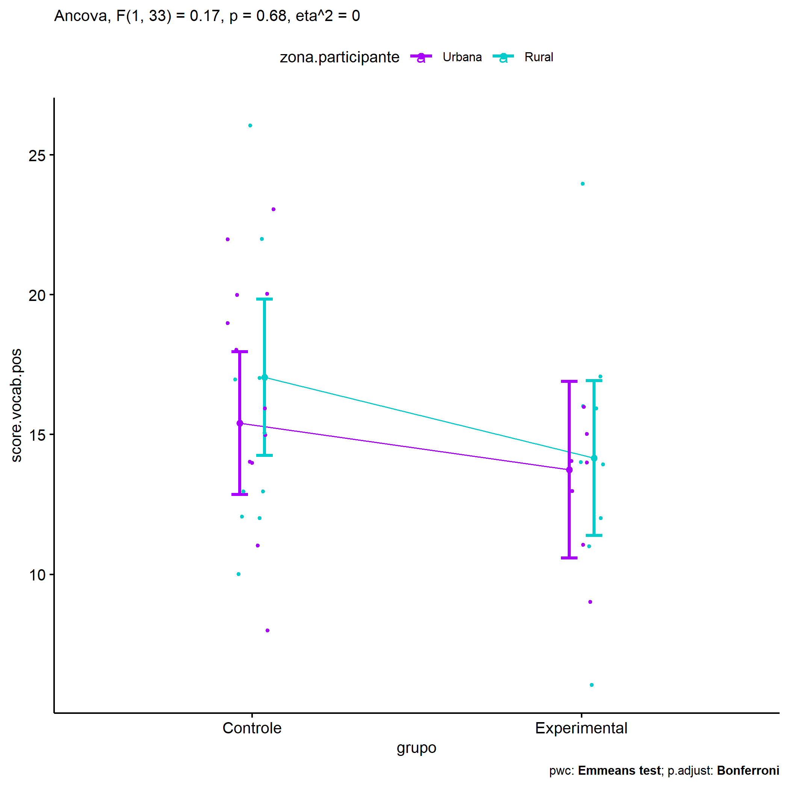<!-- -->

    ## Scale for colour is already present.
    ## Adding another scale for colour, which will replace the existing scale.

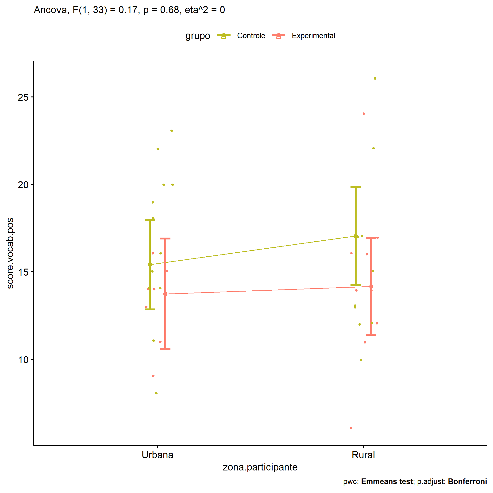<!-- -->

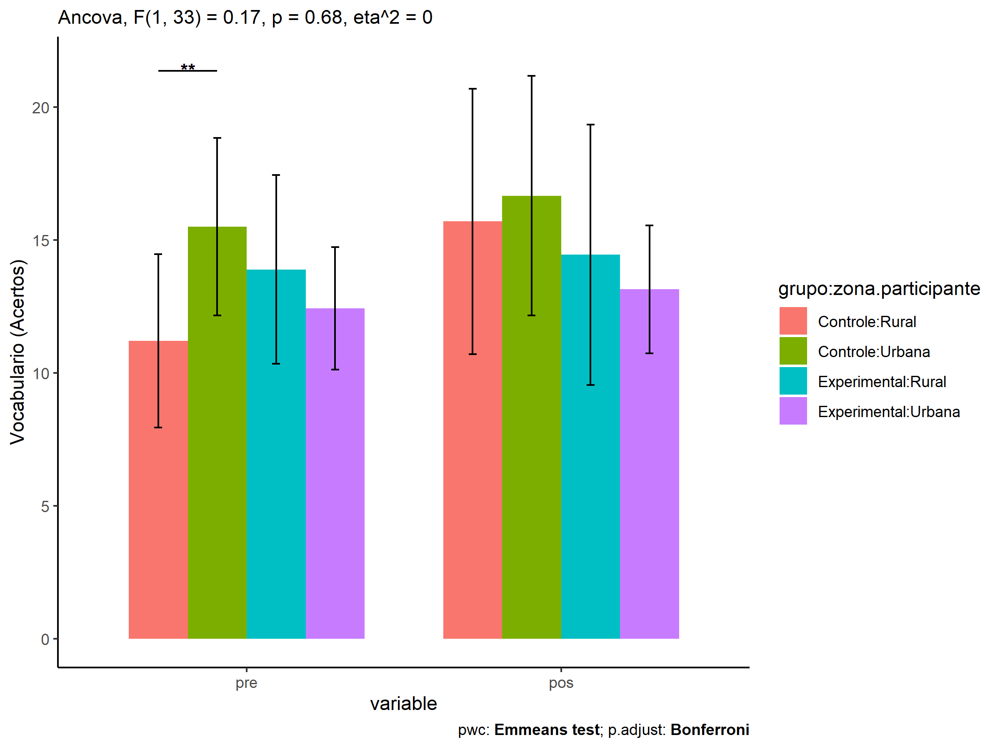<!-- -->

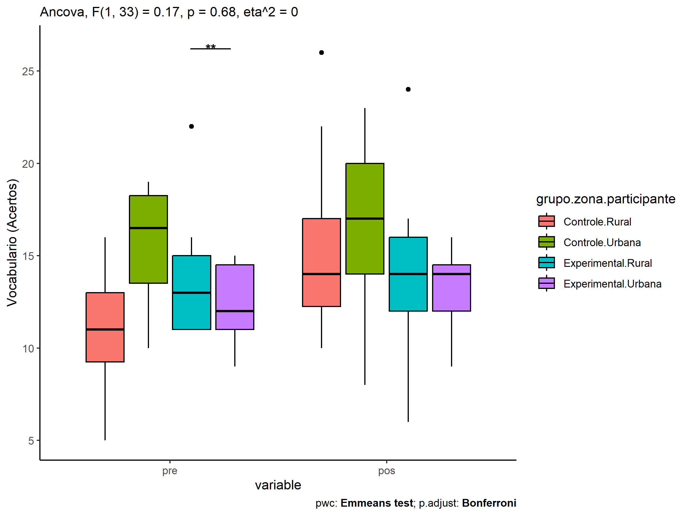<!-- -->

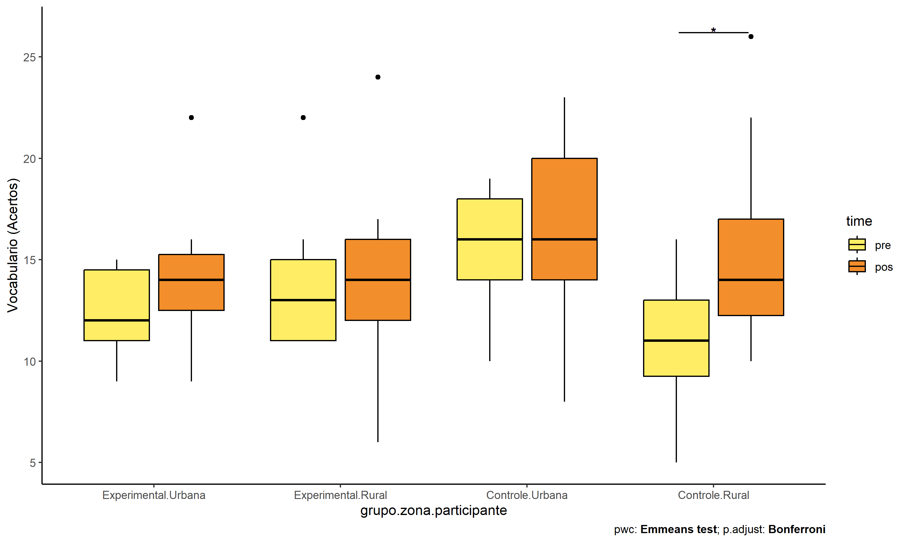<!-- -->

### Vocabulario (TRI)

| var           | zona.participante | grupo        |   n | M (pre) | SE (pre) | M (unadj) | SE (unadj) | M (adj) | SE (adj) |
|:--------------|:------------------|:-------------|----:|--------:|---------:|----------:|-----------:|--------:|---------:|
| tri.vocab.pos | Rural             | Controle     |  10 |  -0.828 |    0.126 |    -0.653 |      0.139 |  -0.587 |    0.152 |
| tri.vocab.pos | Rural             | Experimental |   9 |  -0.639 |    0.249 |    -0.628 |      0.214 |  -0.680 |    0.160 |
| tri.vocab.pos | Urbana            | Controle     |  12 |  -0.570 |    0.178 |    -0.535 |      0.217 |  -0.631 |    0.140 |
| tri.vocab.pos | Urbana            | Experimental |   7 |  -0.940 |    0.238 |    -0.722 |      0.172 |  -0.585 |    0.184 |

| grupo        | zona.participante | group1   | group2       | estimate | conf.low | conf.high |    se | statistic |     p | p.adj | p.adj.signif |
|:-------------|:------------------|:---------|:-------------|---------:|---------:|----------:|------:|----------:|------:|------:|:-------------|
| Controle     |                   | Urbana   | Rural        |   -0.044 |   -0.468 |     0.379 | 0.208 |    -0.212 | 0.833 | 0.833 | ns           |
| Experimental |                   | Urbana   | Rural        |    0.095 |   -0.403 |     0.593 | 0.245 |     0.388 | 0.700 | 0.700 | ns           |
| Controle     |                   | Urbana   | Rural        |    0.258 |   -0.269 |     0.786 | 0.260 |     0.995 | 0.327 | 0.327 | ns           |
| Experimental |                   | Urbana   | Rural        |   -0.301 |   -0.922 |     0.320 | 0.305 |    -0.986 | 0.331 | 0.331 | ns           |
|              | Urbana            | Controle | Experimental |   -0.046 |   -0.521 |     0.429 | 0.233 |    -0.197 | 0.845 | 0.845 | ns           |
|              | Rural             | Controle | Experimental |    0.093 |   -0.358 |     0.544 | 0.222 |     0.421 | 0.676 | 0.676 | ns           |
|              | Urbana            | Controle | Experimental |    0.370 |   -0.215 |     0.956 | 0.288 |     1.285 | 0.208 | 0.208 | ns           |
|              | Rural             | Controle | Experimental |   -0.189 |   -0.755 |     0.377 | 0.278 |    -0.678 | 0.502 | 0.502 | ns           |

| grupo        | zona.participante | group1 | group2 | estimate | conf.low | conf.high |    se | statistic |     p | p.adj | p.adj.signif |
|:-------------|:------------------|:-------|:-------|---------:|---------:|----------:|------:|----------:|------:|------:|:-------------|
| Controle     | Urbana            | pre    | pos    |    0.012 |   -0.466 |     0.491 | 0.240 |     0.051 | 0.960 | 0.960 | ns           |
| Controle     | Rural             | pre    | pos    |   -0.175 |   -0.720 |     0.371 | 0.274 |    -0.639 | 0.525 | 0.525 | ns           |
| Experimental | Urbana            | pre    | pos    |   -0.359 |   -0.990 |     0.272 | 0.317 |    -1.133 | 0.261 | 0.261 | ns           |
| Experimental | Rural             | pre    | pos    |   -0.011 |   -0.586 |     0.564 | 0.288 |    -0.039 | 0.969 | 0.969 | ns           |

    ## Scale for colour is already present.
    ## Adding another scale for colour, which will replace the existing scale.

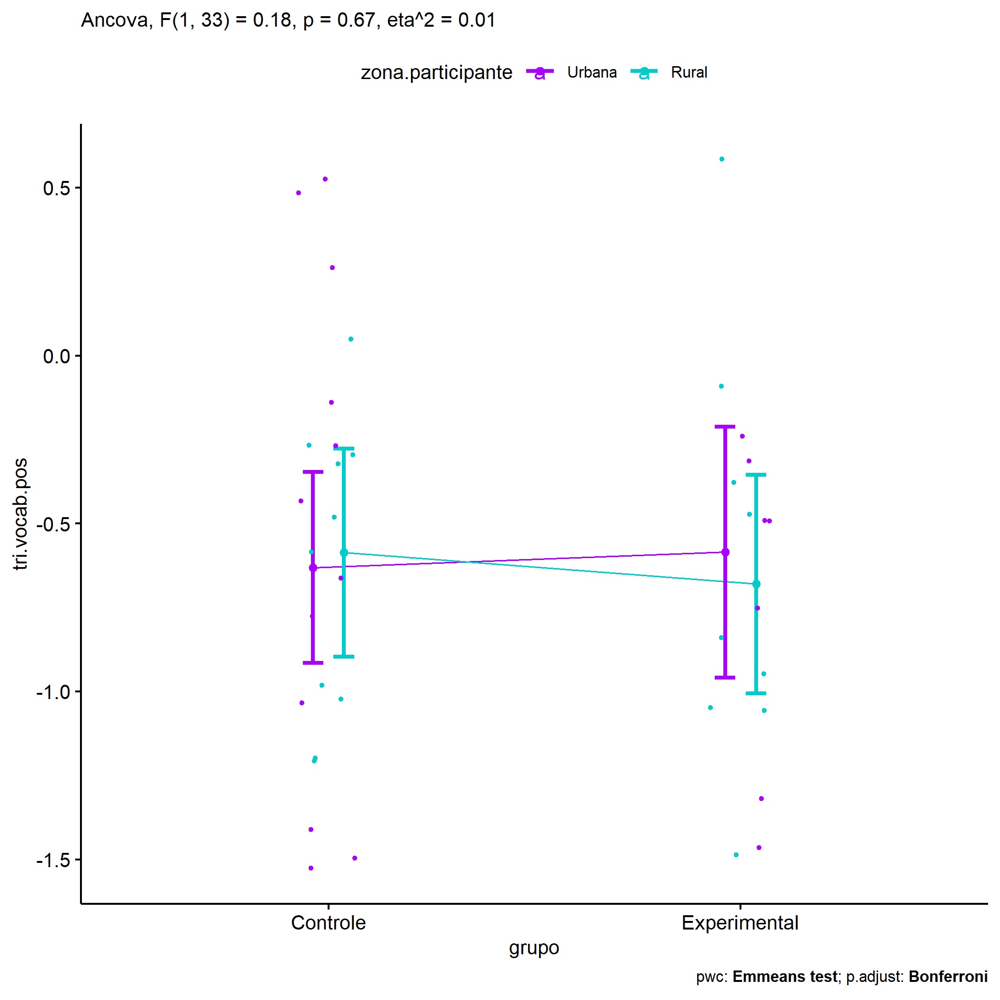<!-- -->

    ## Scale for colour is already present.
    ## Adding another scale for colour, which will replace the existing scale.

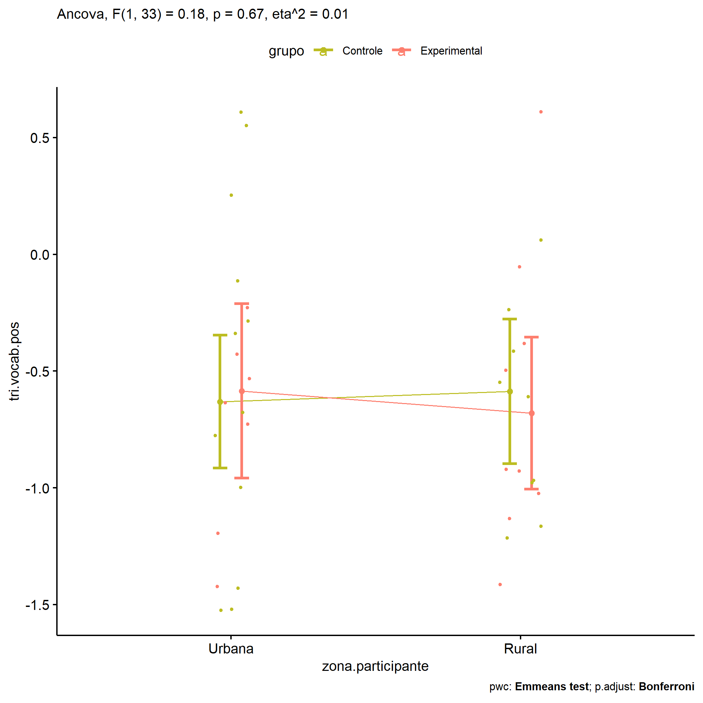<!-- -->

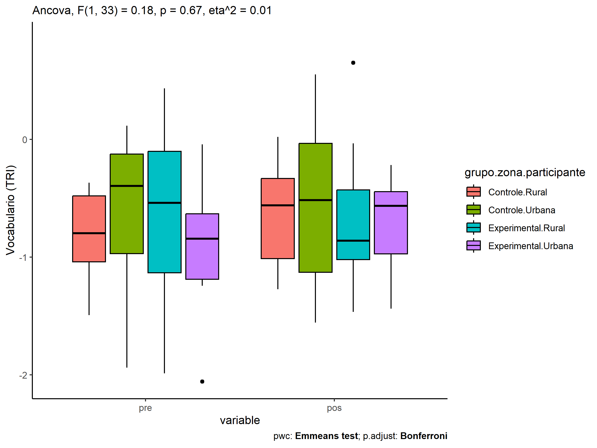<!-- -->

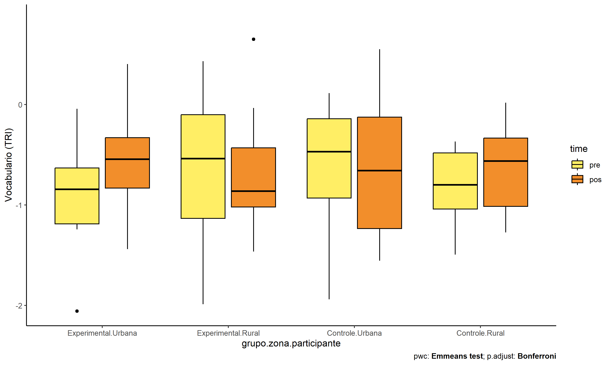<!-- -->

### Vocabulario Ensinado (Acertos)

| var                      | zona.participante | grupo        |   n | M (pre) | SE (pre) | M (unadj) | SE (unadj) | M (adj) | SE (adj) |
|:-------------------------|:------------------|:-------------|----:|--------:|---------:|----------:|-----------:|--------:|---------:|
| score.vocab.ensinado.pos | Rural             | Controle     |  10 |   2.400 |    0.427 |     3.000 |      0.615 |   3.024 |    0.547 |
| score.vocab.ensinado.pos | Rural             | Experimental |   9 |   3.111 |    0.423 |     2.333 |      0.601 |   2.285 |    0.582 |
| score.vocab.ensinado.pos | Urbana            | Controle     |  14 |   2.429 |    0.374 |     2.357 |      0.464 |   2.378 |    0.463 |
| score.vocab.ensinado.pos | Urbana            | Experimental |   8 |   2.750 |    0.750 |     3.125 |      0.398 |   3.113 |    0.610 |

| grupo        | zona.participante | group1   | group2       | estimate | conf.low | conf.high |    se | statistic |     p | p.adj | p.adj.signif |
|:-------------|:------------------|:---------|:-------------|---------:|---------:|----------:|------:|----------:|------:|------:|:-------------|
| Controle     |                   | Urbana   | Rural        |   -0.646 |   -2.095 |     0.803 | 0.714 |    -0.904 | 0.372 | 0.372 | ns           |
| Experimental |                   | Urbana   | Rural        |    0.828 |   -0.878 |     2.534 | 0.841 |     0.985 | 0.331 | 0.331 | ns           |
| Controle     |                   | Urbana   | Rural        |    0.029 |   -1.252 |     1.309 | 0.632 |     0.045 | 0.964 | 0.964 | ns           |
| Experimental |                   | Urbana   | Rural        |   -0.361 |   -1.864 |     1.142 | 0.742 |    -0.487 | 0.629 | 0.629 | ns           |
|              | Urbana            | Controle | Experimental |   -0.735 |   -2.291 |     0.821 | 0.767 |    -0.958 | 0.344 | 0.344 | ns           |
|              | Rural             | Controle | Experimental |    0.739 |   -0.891 |     2.369 | 0.804 |     0.919 | 0.364 | 0.364 | ns           |
|              | Urbana            | Controle | Experimental |   -0.321 |   -1.692 |     1.049 | 0.677 |    -0.475 | 0.638 | 0.638 | ns           |
|              | Rural             | Controle | Experimental |   -0.711 |   -2.132 |     0.710 | 0.701 |    -1.014 | 0.317 | 0.317 | ns           |

| grupo        | zona.participante | group1 | group2 | estimate | conf.low | conf.high |    se | statistic |     p | p.adj | p.adj.signif |
|:-------------|:------------------|:-------|:-------|---------:|---------:|----------:|------:|----------:|------:|------:|:-------------|
| Controle     | Urbana            | pre    | pos    |    0.071 |   -1.149 |     1.292 | 0.612 |     0.117 | 0.907 | 0.907 | ns           |
| Controle     | Rural             | pre    | pos    |   -0.600 |   -2.044 |     0.844 | 0.725 |    -0.828 | 0.410 | 0.410 | ns           |
| Experimental | Urbana            | pre    | pos    |   -0.375 |   -1.989 |     1.239 | 0.810 |    -0.463 | 0.645 | 0.645 | ns           |
| Experimental | Rural             | pre    | pos    |    0.778 |   -0.744 |     2.300 | 0.764 |     1.018 | 0.312 | 0.312 | ns           |

    ## Scale for colour is already present.
    ## Adding another scale for colour, which will replace the existing scale.

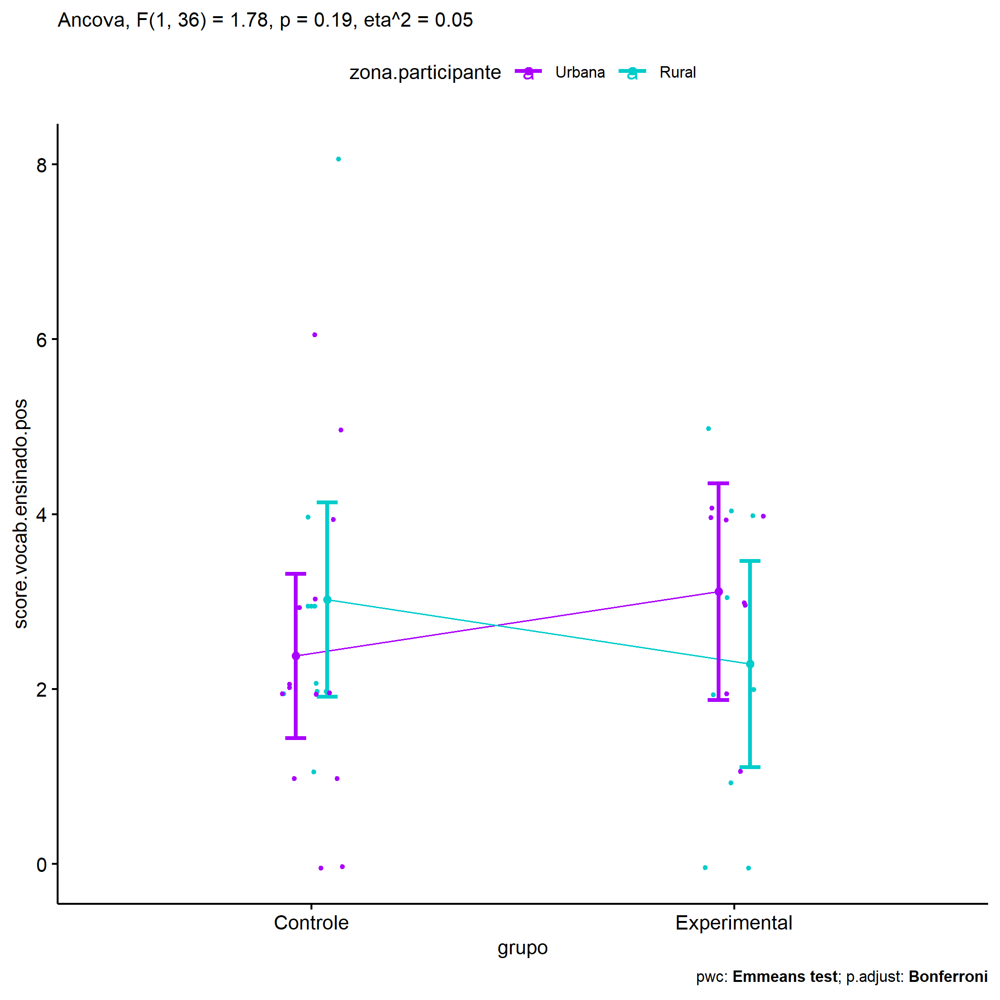<!-- -->

    ## Scale for colour is already present.
    ## Adding another scale for colour, which will replace the existing scale.

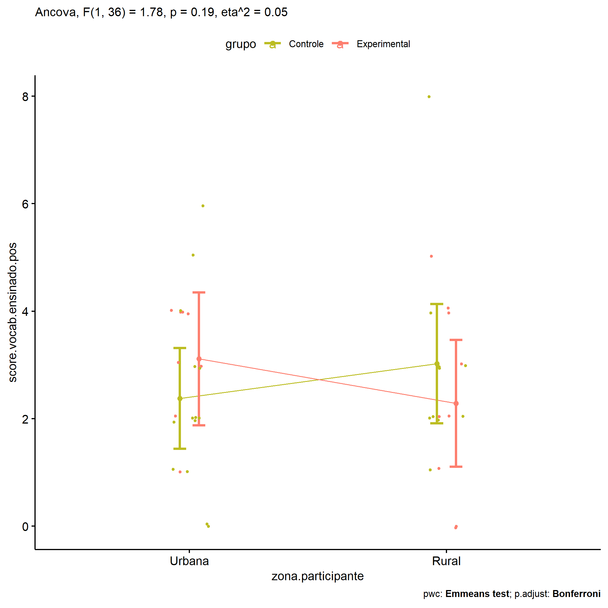<!-- -->

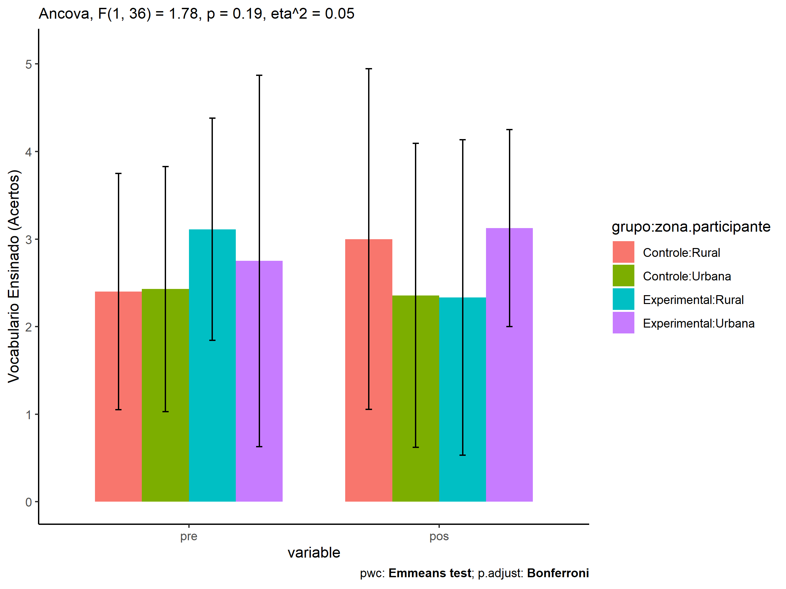<!-- -->

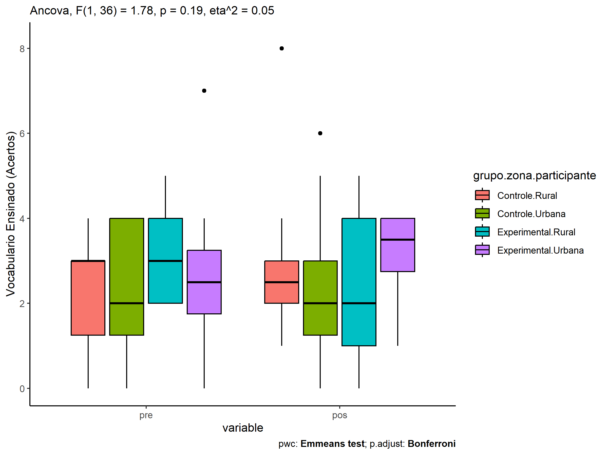<!-- -->

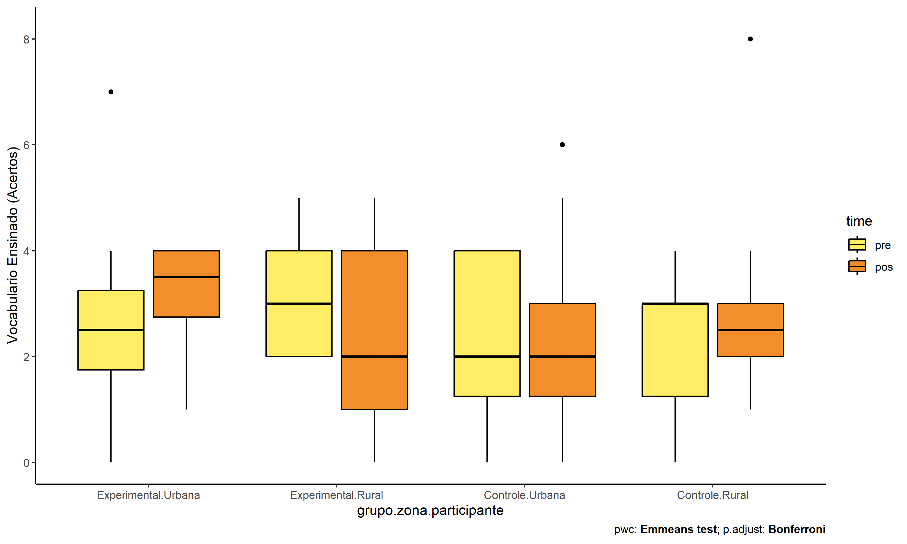<!-- -->

### Vocabulario Ensinado (TRI)

| var                    | zona.participante | grupo        |   n | M (pre) | SE (pre) | M (unadj) | SE (unadj) | M (adj) | SE (adj) |
|:-----------------------|:------------------|:-------------|----:|--------:|---------:|----------:|-----------:|--------:|---------:|
| tri.vocab.ensinado.pos | Rural             | Controle     |  10 |  -0.338 |    0.178 |    -0.635 |      0.191 |  -0.655 |    0.207 |
| tri.vocab.ensinado.pos | Rural             | Experimental |   9 |  -0.187 |    0.256 |    -0.638 |      0.235 |  -0.701 |    0.221 |
| tri.vocab.ensinado.pos | Urbana            | Controle     |  12 |  -0.564 |    0.178 |    -0.584 |      0.229 |  -0.540 |    0.191 |
| tri.vocab.ensinado.pos | Urbana            | Experimental |   7 |  -0.530 |    0.239 |    -0.598 |      0.162 |  -0.563 |    0.248 |

| grupo        | zona.participante | group1   | group2       | estimate | conf.low | conf.high |    se | statistic |     p | p.adj | p.adj.signif |
|:-------------|:------------------|:---------|:-------------|---------:|---------:|----------:|------:|----------:|------:|------:|:-------------|
| Controle     |                   | Urbana   | Rural        |    0.116 |   -0.460 |     0.691 | 0.283 |     0.409 | 0.685 | 0.685 | ns           |
| Experimental |                   | Urbana   | Rural        |    0.138 |   -0.543 |     0.819 | 0.335 |     0.412 | 0.683 | 0.683 | ns           |
| Controle     |                   | Urbana   | Rural        |   -0.226 |   -0.788 |     0.335 | 0.276 |    -0.819 | 0.419 | 0.419 | ns           |
| Experimental |                   | Urbana   | Rural        |   -0.343 |   -1.004 |     0.318 | 0.325 |    -1.054 | 0.299 | 0.299 | ns           |
|              | Urbana            | Controle | Experimental |    0.024 |   -0.609 |     0.656 | 0.311 |     0.076 | 0.940 | 0.940 | ns           |
|              | Rural             | Controle | Experimental |    0.046 |   -0.568 |     0.659 | 0.302 |     0.152 | 0.880 | 0.880 | ns           |
|              | Urbana            | Controle | Experimental |   -0.034 |   -0.658 |     0.590 | 0.307 |    -0.110 | 0.913 | 0.913 | ns           |
|              | Rural             | Controle | Experimental |   -0.150 |   -0.753 |     0.452 | 0.297 |    -0.507 | 0.615 | 0.615 | ns           |

| grupo        | zona.participante | group1 | group2 | estimate | conf.low | conf.high |    se | statistic |     p | p.adj | p.adj.signif |
|:-------------|:------------------|:-------|:-------|---------:|---------:|----------:|------:|----------:|------:|------:|:-------------|
| Controle     | Urbana            | pre    | pos    |   -0.089 |   -0.606 |     0.427 | 0.259 |    -0.344 | 0.732 | 0.732 | ns           |
| Controle     | Rural             | pre    | pos    |    0.297 |   -0.292 |     0.886 | 0.295 |     1.006 | 0.318 | 0.318 | ns           |
| Experimental | Urbana            | pre    | pos    |   -0.037 |   -0.718 |     0.645 | 0.342 |    -0.108 | 0.915 | 0.915 | ns           |
| Experimental | Rural             | pre    | pos    |    0.450 |   -0.170 |     1.071 | 0.311 |     1.447 | 0.152 | 0.152 | ns           |

    ## Scale for colour is already present.
    ## Adding another scale for colour, which will replace the existing scale.

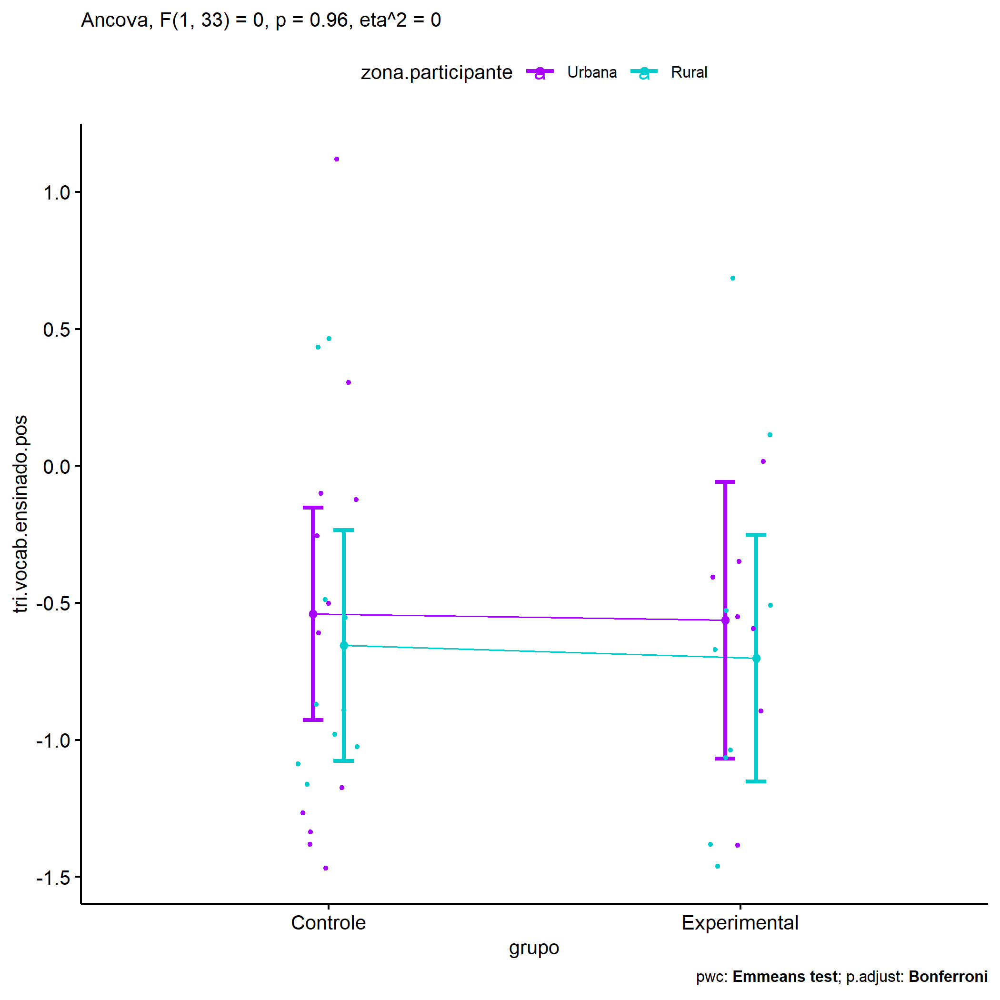<!-- -->

    ## Scale for colour is already present.
    ## Adding another scale for colour, which will replace the existing scale.

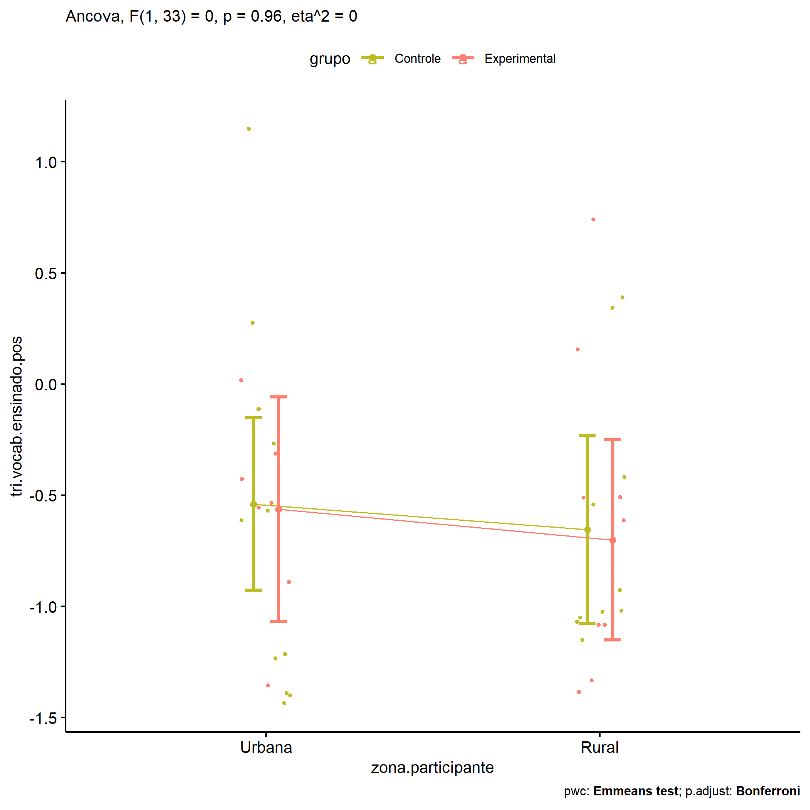<!-- -->

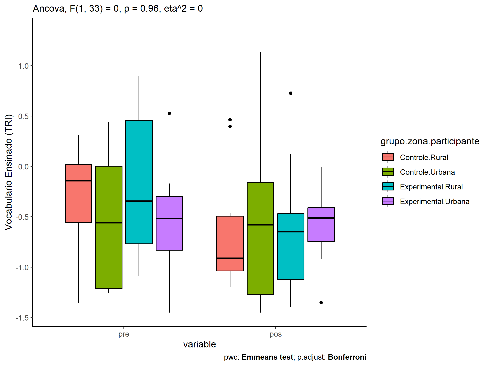<!-- -->

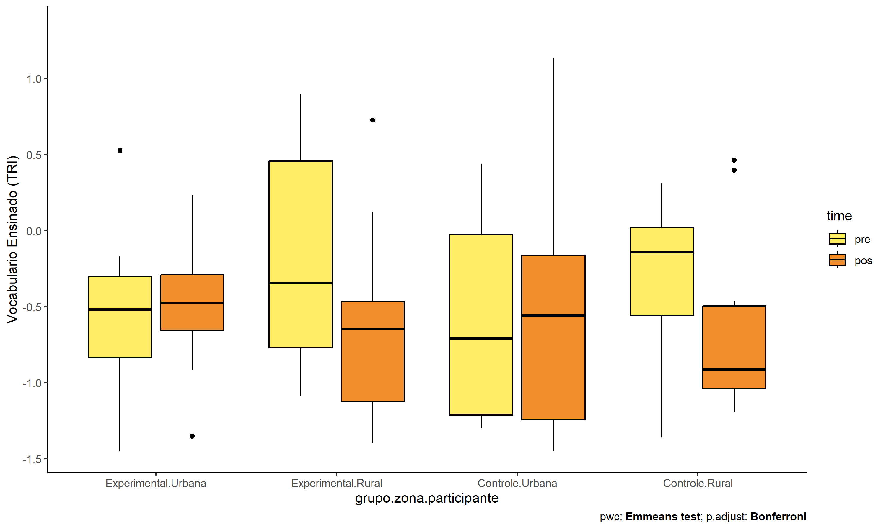<!-- -->

### Vocabulario Nao Ensinado (Acertos)

| var                          | zona.participante | grupo        |   n | M (pre) | SE (pre) | M (unadj) | SE (unadj) | M (adj) | SE (adj) |
|:-----------------------------|:------------------|:-------------|----:|--------:|---------:|----------:|-----------:|--------:|---------:|
| score.vocab.nao.ensinado.pos | Rural             | Controle     |  10 |   8.800 |    0.827 |    12.700 |      1.239 |  13.153 |    1.376 |
| score.vocab.nao.ensinado.pos | Rural             | Experimental |   9 |  10.778 |    0.983 |    12.111 |      1.369 |  11.922 |    1.428 |
| score.vocab.nao.ensinado.pos | Urbana            | Controle     |  14 |  12.000 |    1.245 |    12.714 |      1.431 |  12.129 |    1.192 |
| score.vocab.nao.ensinado.pos | Urbana            | Experimental |   8 |   8.125 |    1.315 |    11.125 |      1.076 |  11.797 |    1.560 |

| grupo        | zona.participante | group1   | group2       | estimate | conf.low | conf.high |    se | statistic |     p | p.adj | p.adj.signif |
|:-------------|:------------------|:---------|:-------------|---------:|---------:|----------:|------:|----------:|------:|------:|:-------------|
| Controle     |                   | Urbana   | Rural        |   -1.024 |   -4.816 |     2.767 | 1.870 |    -0.548 | 0.587 | 0.587 | ns           |
| Experimental |                   | Urbana   | Rural        |   -0.125 |   -4.457 |     4.206 | 2.136 |    -0.059 | 0.954 | 0.954 | ns           |
| Controle     |                   | Urbana   | Rural        |    3.200 |    0.085 |     6.315 | 1.537 |     2.082 | 0.044 | 0.044 | \*           |
| Experimental |                   | Urbana   | Rural        |   -2.653 |   -6.308 |     1.003 | 1.804 |    -1.470 | 0.150 | 0.150 | ns           |
|              | Urbana            | Controle | Experimental |    0.332 |   -3.786 |     4.450 | 2.030 |     0.163 | 0.871 | 0.871 | ns           |
|              | Rural             | Controle | Experimental |    1.231 |   -2.822 |     5.283 | 1.998 |     0.616 | 0.542 | 0.542 | ns           |
|              | Urbana            | Controle | Experimental |    3.875 |    0.541 |     7.209 | 1.646 |     2.355 | 0.024 | 0.024 | \*           |
|              | Rural             | Controle | Experimental |   -1.978 |   -5.434 |     1.479 | 1.706 |    -1.159 | 0.254 | 0.254 | ns           |

| grupo        | zona.participante | group1 | group2 | estimate | conf.low | conf.high |    se | statistic |     p | p.adj | p.adj.signif |
|:-------------|:------------------|:-------|:-------|---------:|---------:|----------:|------:|----------:|------:|------:|:-------------|
| Controle     | Urbana            | pre    | pos    |   -0.714 |   -3.773 |     2.345 | 1.535 |    -0.465 | 0.643 | 0.643 | ns           |
| Controle     | Rural             | pre    | pos    |   -3.900 |   -7.519 |    -0.281 | 1.816 |    -2.147 | 0.035 | 0.035 | \*           |
| Experimental | Urbana            | pre    | pos    |   -3.000 |   -7.046 |     1.046 | 2.031 |    -1.477 | 0.144 | 0.144 | ns           |
| Experimental | Rural             | pre    | pos    |   -1.333 |   -5.148 |     2.482 | 1.915 |    -0.696 | 0.488 | 0.488 | ns           |

    ## Scale for colour is already present.
    ## Adding another scale for colour, which will replace the existing scale.

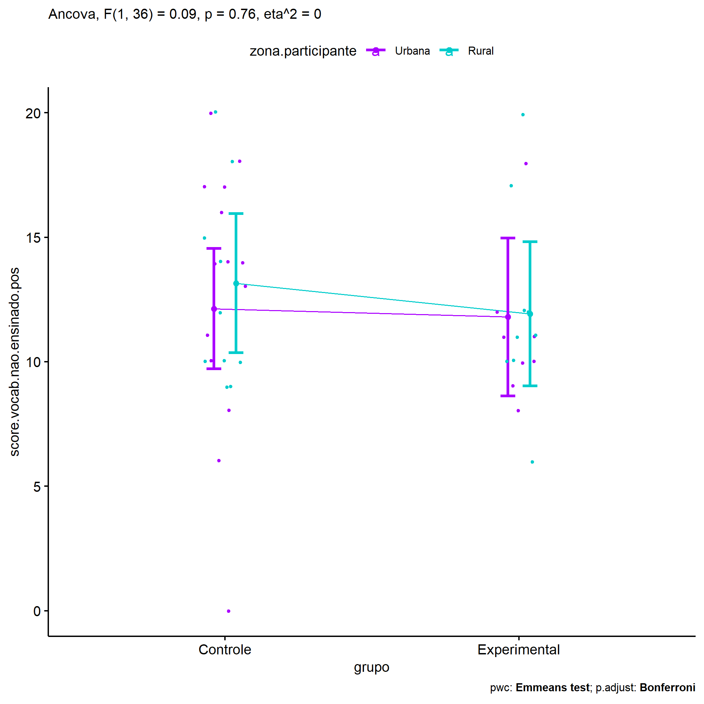<!-- -->

    ## Scale for colour is already present.
    ## Adding another scale for colour, which will replace the existing scale.

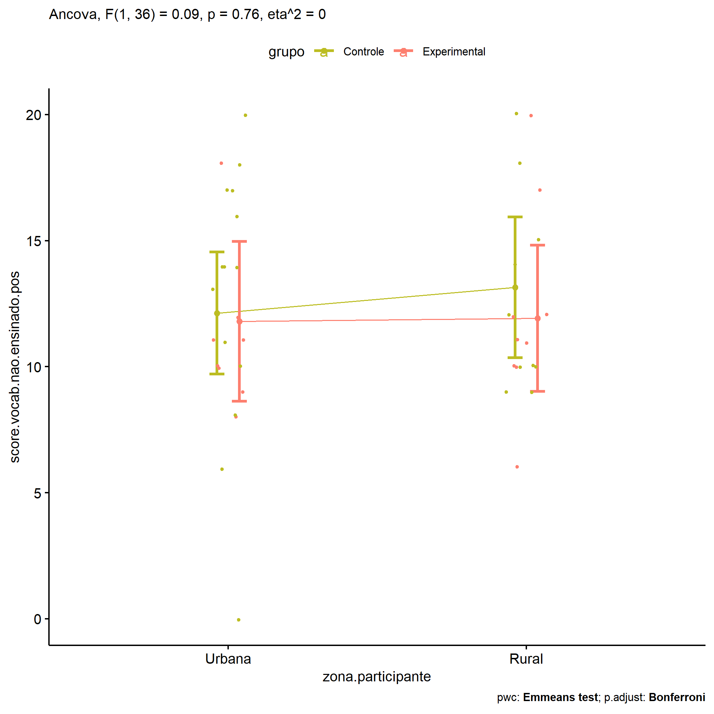<!-- -->

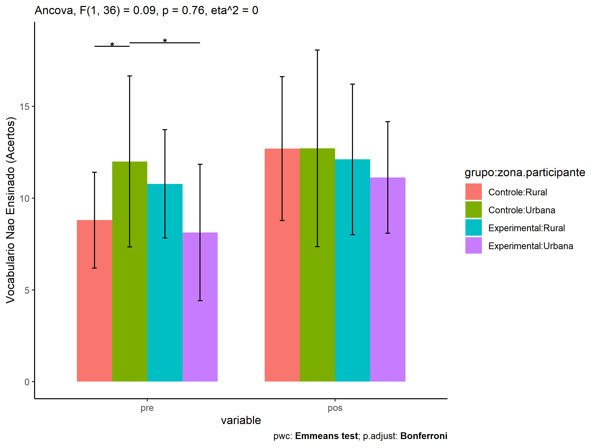<!-- -->

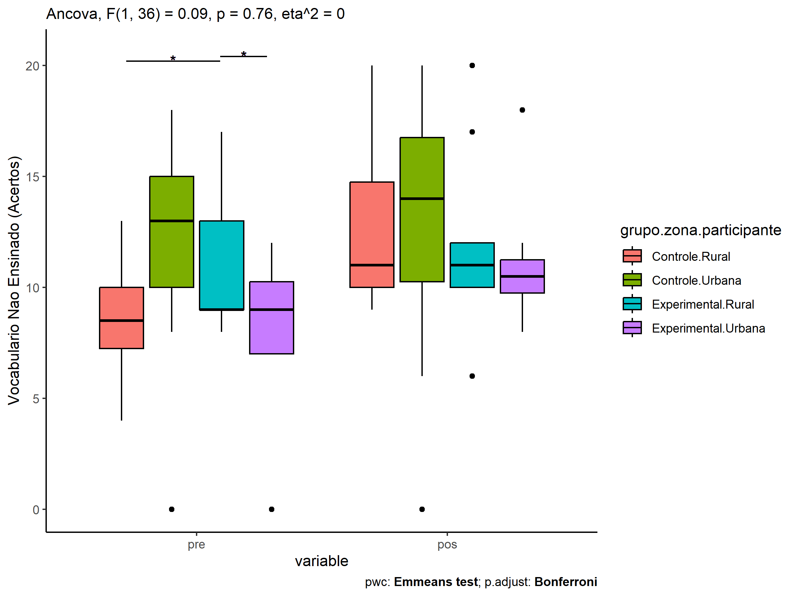<!-- -->

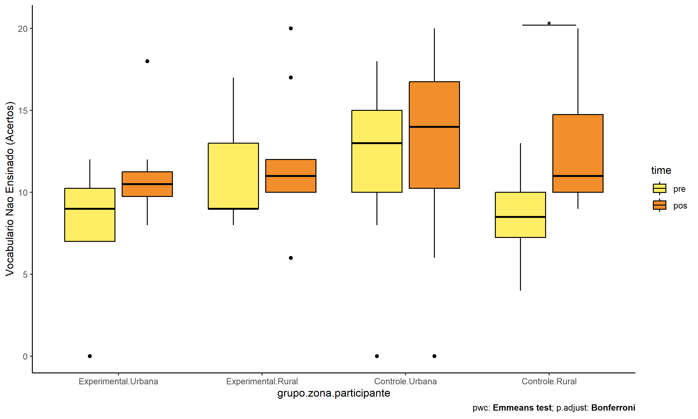<!-- -->

### Vocabulario Nao Ensinado (TRI)

| var                        | zona.participante | grupo        |   n | M (pre) | SE (pre) | M (unadj) | SE (unadj) | M (adj) | SE (adj) |
|:---------------------------|:------------------|:-------------|----:|--------:|---------:|----------:|-----------:|--------:|---------:|
| tri.vocab.nao.ensinado.pos | Rural             | Controle     |  10 |  -0.912 |    0.085 |    -0.633 |      0.127 |  -0.496 |    0.112 |
| tri.vocab.nao.ensinado.pos | Rural             | Experimental |   9 |  -0.713 |    0.161 |    -0.621 |      0.178 |  -0.659 |    0.116 |
| tri.vocab.nao.ensinado.pos | Urbana            | Controle     |  12 |  -0.594 |    0.136 |    -0.390 |      0.176 |  -0.533 |    0.103 |
| tri.vocab.nao.ensinado.pos | Urbana            | Experimental |   7 |  -0.870 |    0.121 |    -0.763 |      0.099 |  -0.664 |    0.132 |

| grupo        | zona.participante | group1   | group2       | estimate | conf.low | conf.high |    se | statistic |     p | p.adj | p.adj.signif |
|:-------------|:------------------|:---------|:-------------|---------:|---------:|----------:|------:|----------:|------:|------:|:-------------|
| Controle     |                   | Urbana   | Rural        |   -0.036 |   -0.352 |     0.280 | 0.155 |    -0.233 | 0.818 | 0.818 | ns           |
| Experimental |                   | Urbana   | Rural        |   -0.005 |   -0.363 |     0.353 | 0.176 |    -0.027 | 0.978 | 0.978 | ns           |
| Controle     |                   | Urbana   | Rural        |    0.318 |   -0.034 |     0.669 | 0.173 |     1.836 | 0.075 | 0.075 | ns           |
| Experimental |                   | Urbana   | Rural        |   -0.156 |   -0.570 |     0.258 | 0.204 |    -0.767 | 0.449 | 0.449 | ns           |
|              | Urbana            | Controle | Experimental |    0.131 |   -0.214 |     0.476 | 0.170 |     0.774 | 0.444 | 0.444 | ns           |
|              | Rural             | Controle | Experimental |    0.163 |   -0.166 |     0.492 | 0.162 |     1.005 | 0.322 | 0.322 | ns           |
|              | Urbana            | Controle | Experimental |    0.275 |   -0.115 |     0.666 | 0.192 |     1.432 | 0.161 | 0.161 | ns           |
|              | Rural             | Controle | Experimental |   -0.199 |   -0.576 |     0.179 | 0.186 |    -1.070 | 0.292 | 0.292 | ns           |

| grupo        | zona.participante | group1 | group2 | estimate | conf.low | conf.high |    se | statistic |     p | p.adj | p.adj.signif |
|:-------------|:------------------|:-------|:-------|---------:|---------:|----------:|------:|----------:|------:|------:|:-------------|
| Controle     | Urbana            | pre    | pos    |   -0.128 |   -0.500 |     0.244 | 0.186 |    -0.687 | 0.494 | 0.494 | ns           |
| Controle     | Rural             | pre    | pos    |   -0.279 |   -0.703 |     0.145 | 0.212 |    -1.313 | 0.193 | 0.193 | ns           |
| Experimental | Urbana            | pre    | pos    |   -0.261 |   -0.752 |     0.229 | 0.246 |    -1.064 | 0.291 | 0.291 | ns           |
| Experimental | Rural             | pre    | pos    |   -0.093 |   -0.539 |     0.354 | 0.224 |    -0.413 | 0.681 | 0.681 | ns           |

    ## Scale for colour is already present.
    ## Adding another scale for colour, which will replace the existing scale.

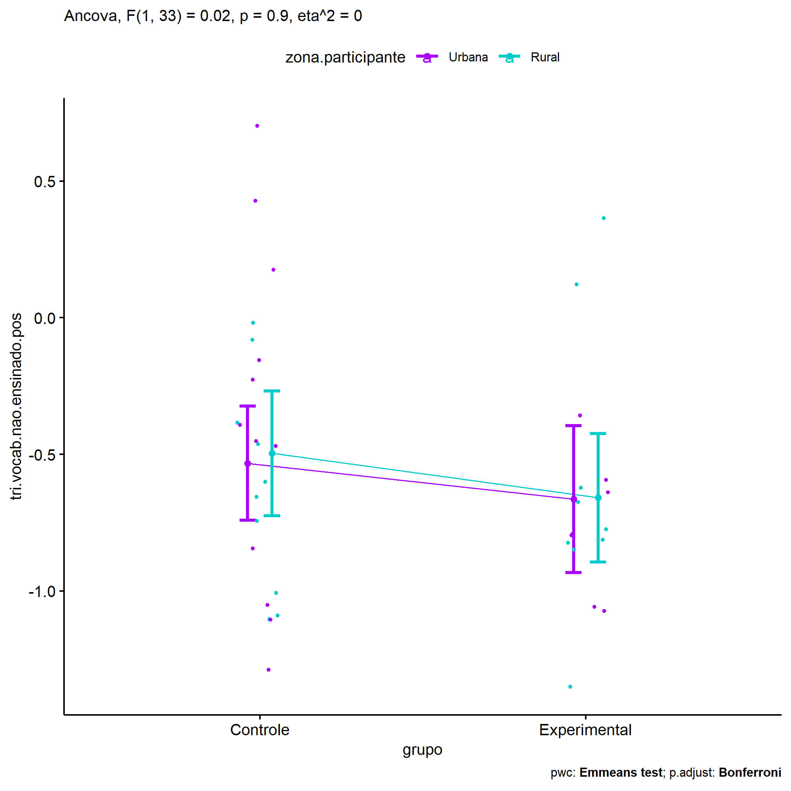<!-- -->

    ## Scale for colour is already present.
    ## Adding another scale for colour, which will replace the existing scale.

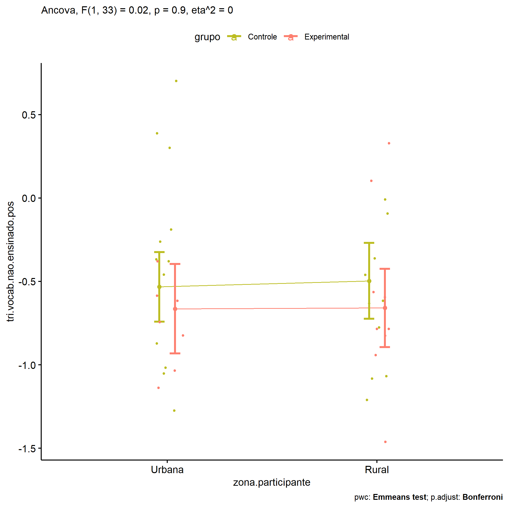<!-- -->

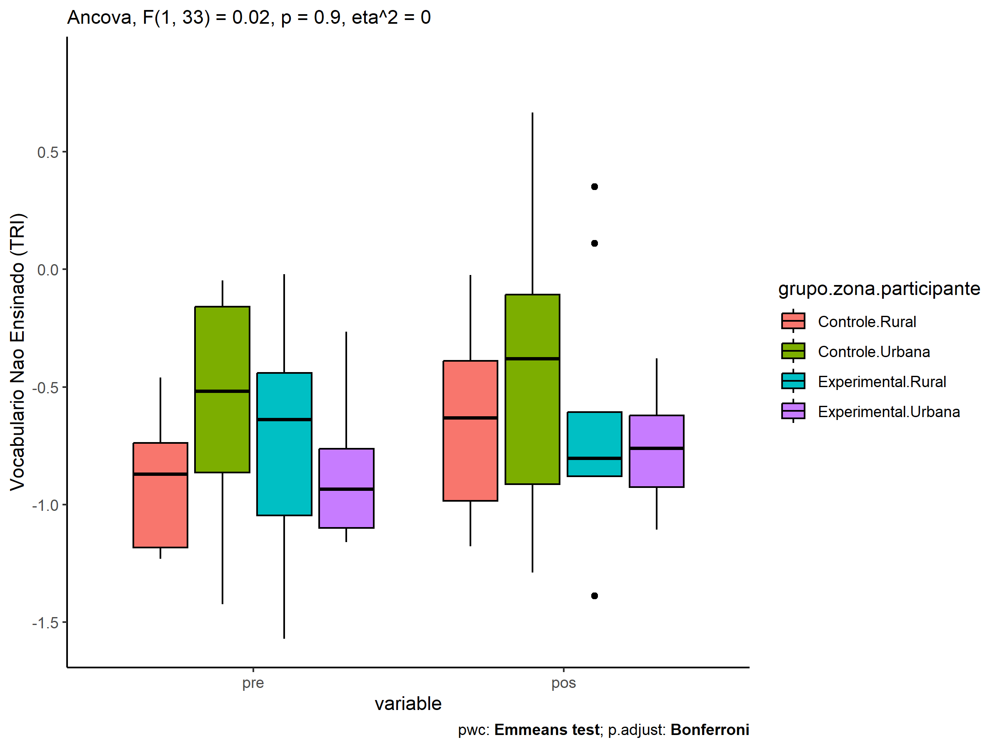<!-- -->

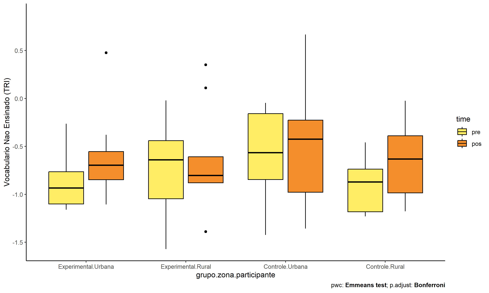<!-- -->

## factores: **escola:grupo**

### Vocabulario (Acertos)

| var             | escola | grupo        |   n | M (pre) | SE (pre) | M (unadj) | SE (unadj) | M (adj) | SE (adj) |
|:----------------|:-------|:-------------|----:|--------:|---------:|----------:|-----------:|--------:|---------:|
| score.vocab.pos | E2     | Controle     |   7 |  13.857 |    1.503 |    15.571 |      1.172 |  15.310 |    1.497 |
| score.vocab.pos | E2     | Experimental |   5 |  13.800 |    1.715 |    13.000 |      0.837 |  12.767 |    1.769 |
| score.vocab.pos | E3     | Controle     |   6 |  11.000 |    1.571 |    15.833 |      2.330 |  16.975 |    1.670 |
| score.vocab.pos | E3     | Experimental |   6 |  13.000 |    0.856 |    14.333 |      2.390 |  14.493 |    1.614 |
| score.vocab.pos | E5     | Controle     |  10 |  13.800 |    1.062 |    15.500 |      1.462 |  15.267 |    1.253 |
| score.vocab.pos | E5     | Experimental |   6 |  14.167 |    1.815 |    14.500 |      0.922 |  14.087 |    1.621 |

| grupo        | escola | group1   | group2       | estimate | conf.low | conf.high |    se | statistic |     p | p.adj | p.adj.signif |
|:-------------|:-------|:---------|:-------------|---------:|---------:|----------:|------:|----------:|------:|------:|:-------------|
| Controle     |        | E2       | E3           |   -1.665 |   -6.267 |     2.937 | 2.262 |    -0.736 | 0.467 | 1.000 | ns           |
| Controle     |        | E2       | E5           |    0.043 |   -3.919 |     4.005 | 1.947 |     0.022 | 0.982 | 1.000 | ns           |
| Controle     |        | E3       | E5           |    1.709 |   -2.576 |     5.994 | 2.106 |     0.811 | 0.423 | 1.000 | ns           |
| Experimental |        | E2       | E3           |   -1.726 |   -6.604 |     3.151 | 2.397 |    -0.720 | 0.477 | 1.000 | ns           |
| Experimental |        | E2       | E5           |   -1.320 |   -6.190 |     3.550 | 2.394 |    -0.551 | 0.585 | 1.000 | ns           |
| Experimental |        | E3       | E5           |    0.406 |   -4.256 |     5.069 | 2.292 |     0.177 | 0.860 | 1.000 | ns           |
| Controle     |        | E2       | E3           |    2.857 |   -1.257 |     6.971 | 2.024 |     1.411 | 0.167 | 0.502 | ns           |
| Controle     |        | E2       | E5           |    0.057 |   -3.587 |     3.701 | 1.793 |     0.032 | 0.975 | 1.000 | ns           |
| Controle     |        | E3       | E5           |   -2.800 |   -6.618 |     1.018 | 1.879 |    -1.490 | 0.145 | 0.436 | ns           |
| Experimental |        | E2       | E3           |    0.800 |   -3.677 |     5.277 | 2.203 |     0.363 | 0.719 | 1.000 | ns           |
| Experimental |        | E2       | E5           |   -0.367 |   -4.844 |     4.111 | 2.203 |    -0.166 | 0.869 | 1.000 | ns           |
| Experimental |        | E3       | E5           |   -1.167 |   -5.436 |     3.102 | 2.101 |    -0.555 | 0.582 | 1.000 | ns           |
|              | E2     | Controle | Experimental |    2.543 |   -2.164 |     7.251 | 2.314 |     1.099 | 0.280 | 0.280 | ns           |
|              | E3     | Controle | Experimental |    2.482 |   -2.221 |     7.185 | 2.312 |     1.074 | 0.291 | 0.291 | ns           |
|              | E5     | Controle | Experimental |    1.180 |   -2.974 |     5.334 | 2.042 |     0.578 | 0.567 | 0.567 | ns           |
|              | E2     | Controle | Experimental |    0.057 |   -4.272 |     4.387 | 2.130 |     0.027 | 0.979 | 0.979 | ns           |
|              | E3     | Controle | Experimental |   -2.000 |   -6.269 |     2.269 | 2.101 |    -0.952 | 0.348 | 0.348 | ns           |
|              | E5     | Controle | Experimental |   -0.367 |   -4.185 |     3.452 | 1.879 |    -0.195 | 0.846 | 0.846 | ns           |

| grupo        | escola | group1 | group2 | estimate | conf.low | conf.high |    se | statistic |     p | p.adj | p.adj.signif |
|:-------------|:-------|:-------|:-------|---------:|---------:|----------:|------:|----------:|------:|------:|:-------------|
| Controle     | E2     | pre    | pos    |   -1.714 |   -6.129 |     2.701 | 2.214 |    -0.774 | 0.441 | 0.441 | ns           |
| Controle     | E3     | pre    | pos    |   -4.833 |   -9.602 |    -0.065 | 2.392 |    -2.021 | 0.047 | 0.047 | \*           |
| Controle     | E5     | pre    | pos    |   -0.667 |   -4.203 |     2.870 | 1.774 |    -0.376 | 0.708 | 0.708 | ns           |
| Experimental | E2     | pre    | pos    |    0.800 |   -4.424 |     6.024 | 2.620 |     0.305 | 0.761 | 0.761 | ns           |
| Experimental | E3     | pre    | pos    |   -1.333 |   -6.102 |     3.435 | 2.392 |    -0.558 | 0.579 | 0.579 | ns           |
| Experimental | E5     | pre    | pos    |   -1.405 |   -6.000 |     3.190 | 2.305 |    -0.610 | 0.544 | 0.544 | ns           |

    ## Scale for colour is already present.
    ## Adding another scale for colour, which will replace the existing scale.

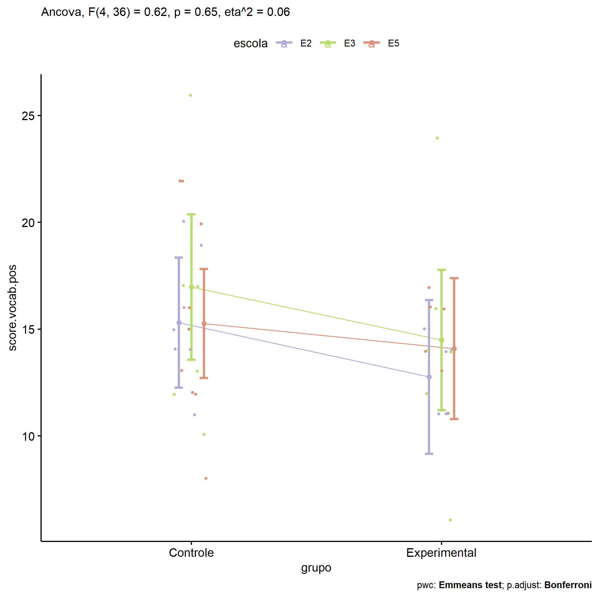<!-- -->

    ## Scale for colour is already present.
    ## Adding another scale for colour, which will replace the existing scale.

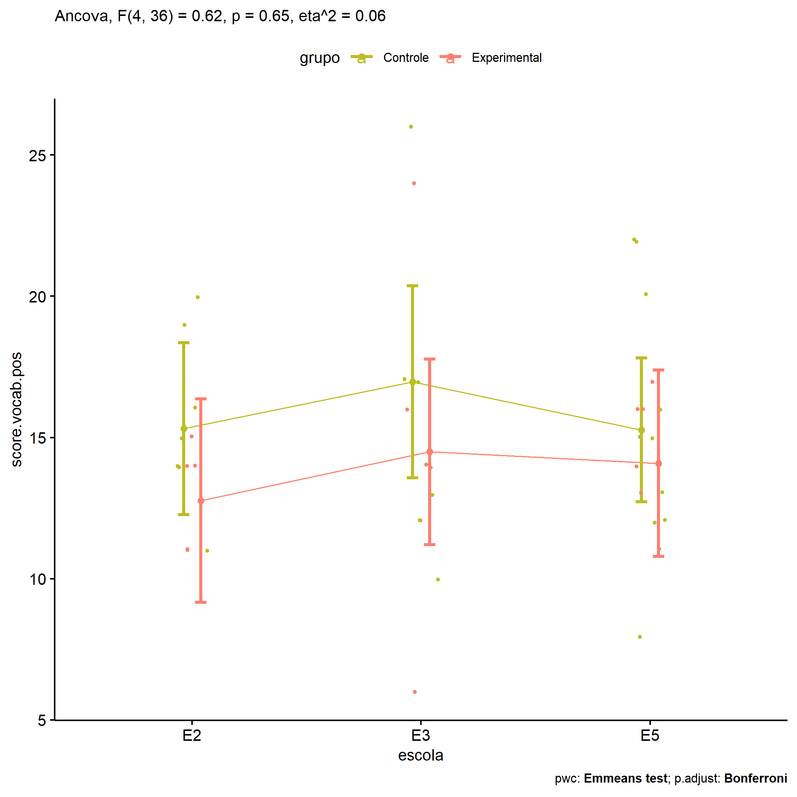<!-- -->

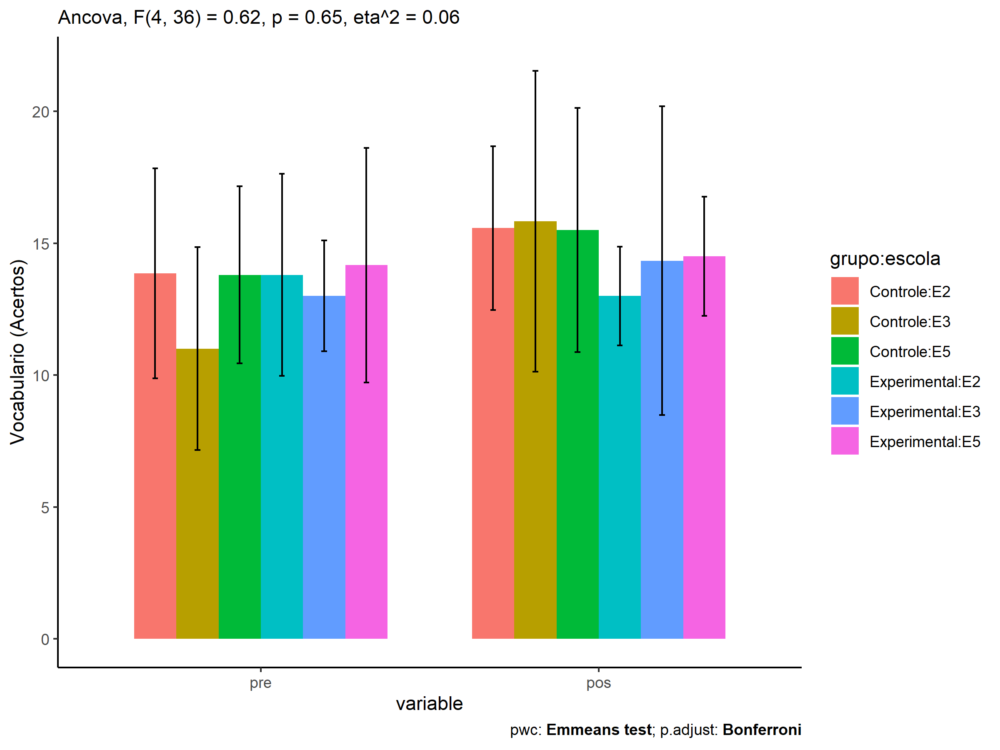<!-- -->

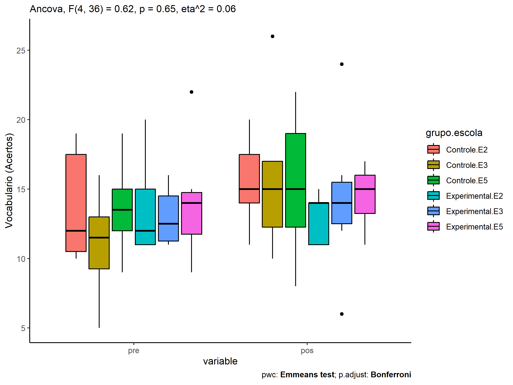<!-- -->

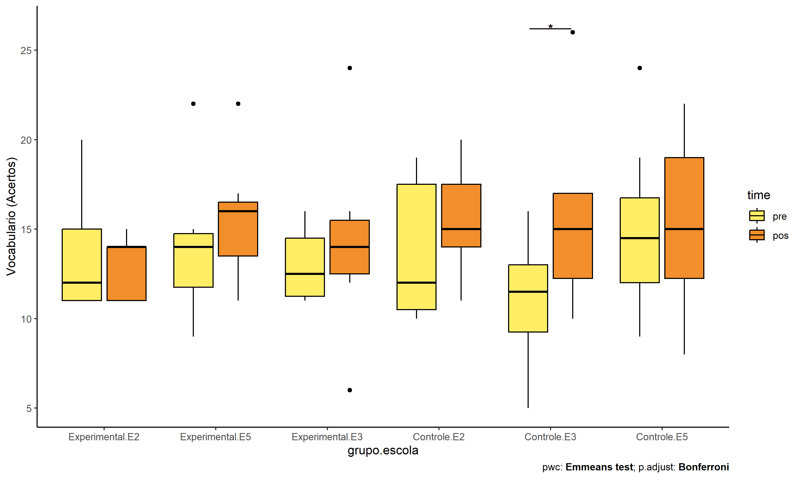<!-- -->

### Vocabulario (TRI)

| var           | escola | grupo        |   n | M (pre) | SE (pre) | M (unadj) | SE (unadj) | M (adj) | SE (adj) |
|:--------------|:-------|:-------------|----:|--------:|---------:|----------:|-----------:|--------:|---------:|
| tri.vocab.pos | E2     | Controle     |   7 |  -0.816 |    0.278 |    -0.850 |      0.207 |  -0.811 |    0.176 |
| tri.vocab.pos | E2     | Experimental |   5 |  -0.994 |    0.348 |    -0.861 |      0.208 |  -0.726 |    0.210 |
| tri.vocab.pos | E3     | Controle     |   6 |  -0.719 |    0.129 |    -0.613 |      0.181 |  -0.626 |    0.190 |
| tri.vocab.pos | E3     | Experimental |   6 |  -0.719 |    0.318 |    -0.635 |      0.305 |  -0.649 |    0.190 |
| tri.vocab.pos | E5     | Controle     |  10 |  -0.716 |    0.162 |    -0.596 |      0.211 |  -0.611 |    0.147 |
| tri.vocab.pos | E5     | Experimental |   6 |  -0.550 |    0.255 |    -0.519 |      0.150 |  -0.625 |    0.191 |

| grupo        | escola | group1   | group2       | estimate | conf.low | conf.high |    se | statistic |     p | p.adj | p.adj.signif |
|:-------------|:-------|:---------|:-------------|---------:|---------:|----------:|------:|----------:|------:|------:|:-------------|
| Controle     |        | E2       | E3           |   -0.185 |   -0.712 |     0.342 | 0.259 |    -0.715 | 0.480 | 1.000 | ns           |
| Controle     |        | E2       | E5           |   -0.200 |   -0.667 |     0.267 | 0.229 |    -0.871 | 0.390 | 1.000 | ns           |
| Controle     |        | E3       | E5           |   -0.015 |   -0.503 |     0.474 | 0.240 |    -0.062 | 0.951 | 1.000 | ns           |
| Experimental |        | E2       | E3           |   -0.077 |   -0.654 |     0.500 | 0.284 |    -0.271 | 0.788 | 1.000 | ns           |
| Experimental |        | E2       | E5           |   -0.101 |   -0.685 |     0.483 | 0.287 |    -0.352 | 0.727 | 1.000 | ns           |
| Experimental |        | E3       | E5           |   -0.024 |   -0.572 |     0.524 | 0.269 |    -0.089 | 0.929 | 1.000 | ns           |
| Controle     |        | E2       | E3           |   -0.097 |   -0.810 |     0.616 | 0.351 |    -0.277 | 0.784 | 1.000 | ns           |
| Controle     |        | E2       | E5           |   -0.100 |   -0.732 |     0.531 | 0.311 |    -0.323 | 0.749 | 1.000 | ns           |
| Controle     |        | E3       | E5           |   -0.003 |   -0.665 |     0.659 | 0.326 |    -0.010 | 0.992 | 1.000 | ns           |
| Experimental |        | E2       | E3           |   -0.276 |   -1.052 |     0.500 | 0.382 |    -0.722 | 0.475 | 1.000 | ns           |
| Experimental |        | E2       | E5           |   -0.444 |   -1.220 |     0.332 | 0.382 |    -1.163 | 0.253 | 0.759 | ns           |
| Experimental |        | E3       | E5           |   -0.168 |   -0.908 |     0.572 | 0.364 |    -0.462 | 0.647 | 1.000 | ns           |
|              | E2     | Controle | Experimental |   -0.086 |   -0.642 |     0.470 | 0.273 |    -0.314 | 0.756 | 0.756 | ns           |
|              | E3     | Controle | Experimental |    0.022 |   -0.524 |     0.569 | 0.268 |     0.084 | 0.934 | 0.934 | ns           |
|              | E5     | Controle | Experimental |    0.013 |   -0.477 |     0.504 | 0.241 |     0.055 | 0.956 | 0.956 | ns           |
|              | E2     | Controle | Experimental |    0.178 |   -0.572 |     0.929 | 0.369 |     0.483 | 0.632 | 0.632 | ns           |
|              | E3     | Controle | Experimental |    0.000 |   -0.740 |     0.740 | 0.364 |    -0.001 | 0.999 | 0.999 | ns           |
|              | E5     | Controle | Experimental |   -0.165 |   -0.827 |     0.497 | 0.326 |    -0.508 | 0.615 | 0.615 | ns           |

| grupo        | escola | group1 | group2 | estimate | conf.low | conf.high |    se | statistic |     p | p.adj | p.adj.signif |
|:-------------|:-------|:-------|:-------|---------:|---------:|----------:|------:|----------:|------:|------:|:-------------|
| Controle     | E2     | pre    | pos    |    0.034 |   -0.611 |     0.680 | 0.324 |     0.106 | 0.916 | 0.916 | ns           |
| Controle     | E3     | pre    | pos    |   -0.106 |   -0.803 |     0.591 | 0.350 |    -0.304 | 0.762 | 0.762 | ns           |
| Controle     | E5     | pre    | pos    |   -0.044 |   -0.561 |     0.472 | 0.259 |    -0.172 | 0.864 | 0.864 | ns           |
| Experimental | E2     | pre    | pos    |   -0.133 |   -0.896 |     0.630 | 0.383 |    -0.347 | 0.729 | 0.729 | ns           |
| Experimental | E3     | pre    | pos    |   -0.084 |   -0.781 |     0.613 | 0.350 |    -0.240 | 0.811 | 0.811 | ns           |
| Experimental | E5     | pre    | pos    |   -0.163 |   -0.834 |     0.509 | 0.337 |    -0.483 | 0.631 | 0.631 | ns           |

    ## Scale for colour is already present.
    ## Adding another scale for colour, which will replace the existing scale.

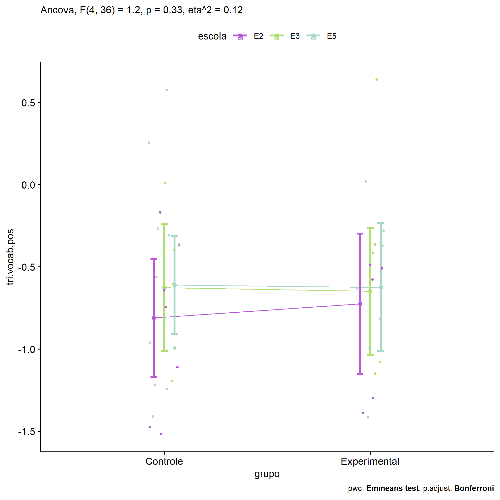<!-- -->

    ## Scale for colour is already present.
    ## Adding another scale for colour, which will replace the existing scale.

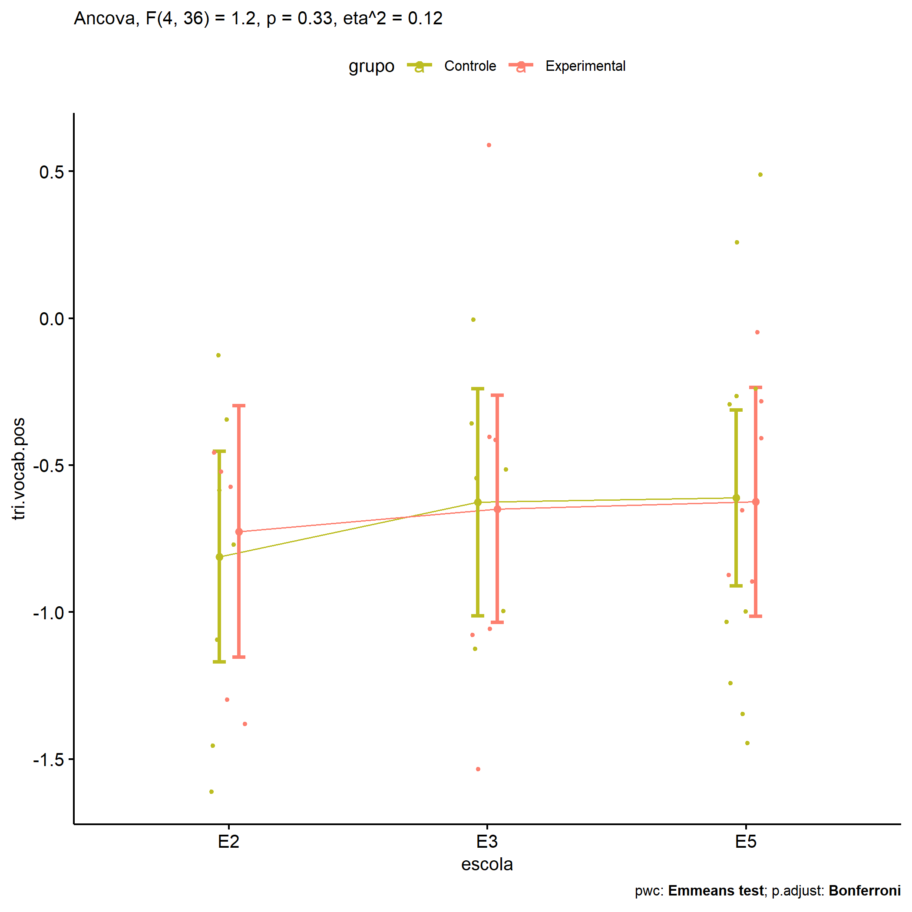<!-- -->

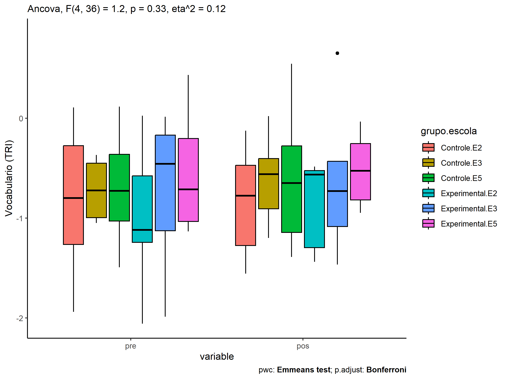<!-- -->

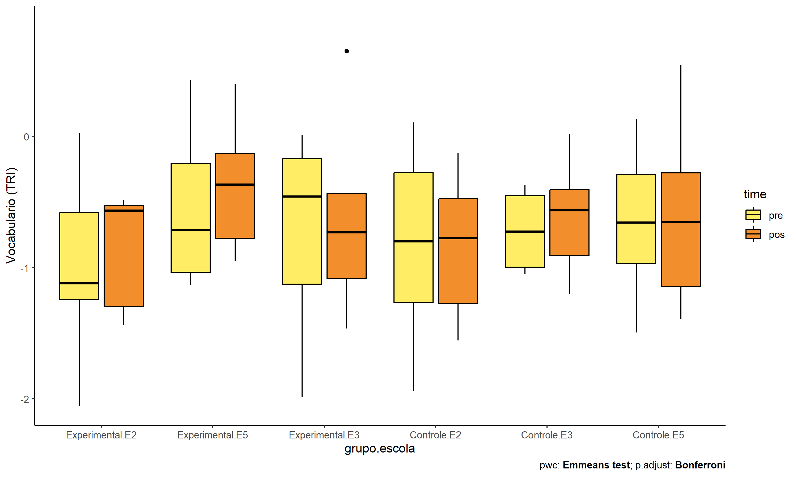<!-- -->

### Vocabulario Ensinado (Acertos)

| var                      | escola | grupo        |   n | M (pre) | SE (pre) | M (unadj) | SE (unadj) | M (adj) | SE (adj) |
|:-------------------------|:-------|:-------------|----:|--------:|---------:|----------:|-----------:|--------:|---------:|
| score.vocab.ensinado.pos | E2     | Controle     |   7 |   2.857 |    0.404 |     2.571 |      0.719 |   2.561 |    0.630 |
| score.vocab.ensinado.pos | E2     | Experimental |   5 |   2.400 |    0.600 |     2.800 |      0.490 |   2.861 |    0.748 |
| score.vocab.ensinado.pos | E3     | Controle     |   6 |   2.500 |    0.500 |     3.167 |      1.014 |   3.212 |    0.682 |
| score.vocab.ensinado.pos | E3     | Experimental |   6 |   2.667 |    0.333 |     2.667 |      0.715 |   2.686 |    0.680 |
| score.vocab.ensinado.pos | E5     | Controle     |  12 |   2.667 |    0.396 |     1.833 |      0.322 |   1.853 |    0.481 |
| score.vocab.ensinado.pos | E5     | Experimental |   7 |   3.571 |    0.896 |     2.714 |      0.606 |   2.593 |    0.646 |

| grupo        | escola | group1   | group2       | estimate | conf.low | conf.high |    se | statistic |     p | p.adj | p.adj.signif |
|:-------------|:-------|:---------|:-------------|---------:|---------:|----------:|------:|----------:|------:|------:|:-------------|
| Controle     |        | E2       | E3           |   -0.651 |   -2.535 |     1.234 | 0.929 |    -0.700 | 0.488 | 1.000 | ns           |
| Controle     |        | E2       | E5           |    0.709 |   -0.900 |     2.317 | 0.793 |     0.894 | 0.377 | 1.000 | ns           |
| Controle     |        | E3       | E5           |    1.359 |   -0.331 |     3.049 | 0.833 |     1.631 | 0.112 | 0.335 | ns           |
| Experimental |        | E2       | E3           |    0.175 |   -1.873 |     2.223 | 1.010 |     0.173 | 0.864 | 1.000 | ns           |
| Experimental |        | E2       | E5           |    0.267 |   -1.760 |     2.294 | 1.000 |     0.267 | 0.791 | 1.000 | ns           |
| Experimental |        | E3       | E5           |    0.093 |   -1.818 |     2.003 | 0.942 |     0.098 | 0.922 | 1.000 | ns           |
| Controle     |        | E2       | E3           |    0.357 |   -1.293 |     2.007 | 0.814 |     0.439 | 0.664 | 1.000 | ns           |
| Controle     |        | E2       | E5           |    0.190 |   -1.220 |     1.601 | 0.696 |     0.274 | 0.786 | 1.000 | ns           |
| Controle     |        | E3       | E5           |   -0.167 |   -1.650 |     1.316 | 0.732 |    -0.228 | 0.821 | 1.000 | ns           |
| Experimental |        | E2       | E3           |   -0.267 |   -2.063 |     1.529 | 0.886 |    -0.301 | 0.765 | 1.000 | ns           |
| Experimental |        | E2       | E5           |   -1.171 |   -2.908 |     0.565 | 0.857 |    -1.367 | 0.180 | 0.540 | ns           |
| Experimental |        | E3       | E5           |   -0.905 |   -2.555 |     0.745 | 0.814 |    -1.111 | 0.274 | 0.821 | ns           |
|              | E2     | Controle | Experimental |   -0.299 |   -2.285 |     1.686 | 0.979 |    -0.306 | 0.762 | 0.762 | ns           |
|              | E3     | Controle | Experimental |    0.526 |   -1.426 |     2.477 | 0.962 |     0.547 | 0.588 | 0.588 | ns           |
|              | E5     | Controle | Experimental |   -0.741 |   -2.384 |     0.902 | 0.810 |    -0.915 | 0.367 | 0.367 | ns           |
|              | E2     | Controle | Experimental |    0.457 |   -1.279 |     2.194 | 0.857 |     0.533 | 0.597 | 0.597 | ns           |
|              | E3     | Controle | Experimental |   -0.167 |   -1.879 |     1.546 | 0.845 |    -0.197 | 0.845 | 0.845 | ns           |
|              | E5     | Controle | Experimental |   -0.905 |   -2.315 |     0.506 | 0.696 |    -1.300 | 0.202 | 0.202 | ns           |

| grupo        | escola | group1 | group2 | estimate | conf.low | conf.high |    se | statistic |     p | p.adj | p.adj.signif |
|:-------------|:-------|:-------|:-------|---------:|---------:|----------:|------:|----------:|------:|------:|:-------------|
| Controle     | E2     | pre    | pos    |    0.286 |   -1.380 |     1.952 | 0.836 |     0.342 | 0.734 | 0.734 | ns           |
| Controle     | E3     | pre    | pos    |   -0.667 |   -2.466 |     1.133 | 0.903 |    -0.738 | 0.463 | 0.463 | ns           |
| Controle     | E5     | pre    | pos    |    0.833 |   -0.439 |     2.106 | 0.639 |     1.305 | 0.196 | 0.196 | ns           |
| Experimental | E2     | pre    | pos    |   -0.400 |   -2.371 |     1.571 | 0.989 |    -0.404 | 0.687 | 0.687 | ns           |
| Experimental | E3     | pre    | pos    |    0.000 |   -1.799 |     1.799 | 0.903 |     0.000 | 1.000 | 1.000 | ns           |
| Experimental | E5     | pre    | pos    |    0.857 |   -0.809 |     2.523 | 0.836 |     1.025 | 0.309 | 0.309 | ns           |

    ## Scale for colour is already present.
    ## Adding another scale for colour, which will replace the existing scale.

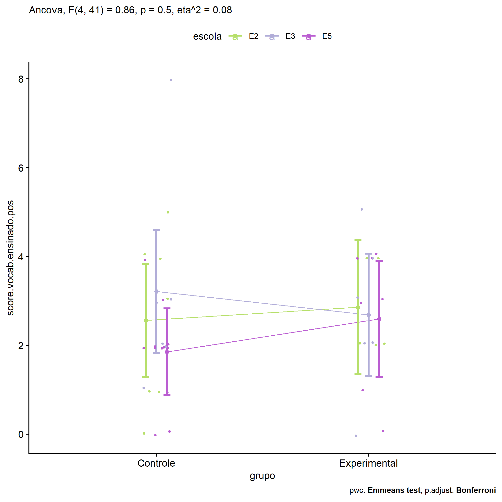<!-- -->

    ## Scale for colour is already present.
    ## Adding another scale for colour, which will replace the existing scale.

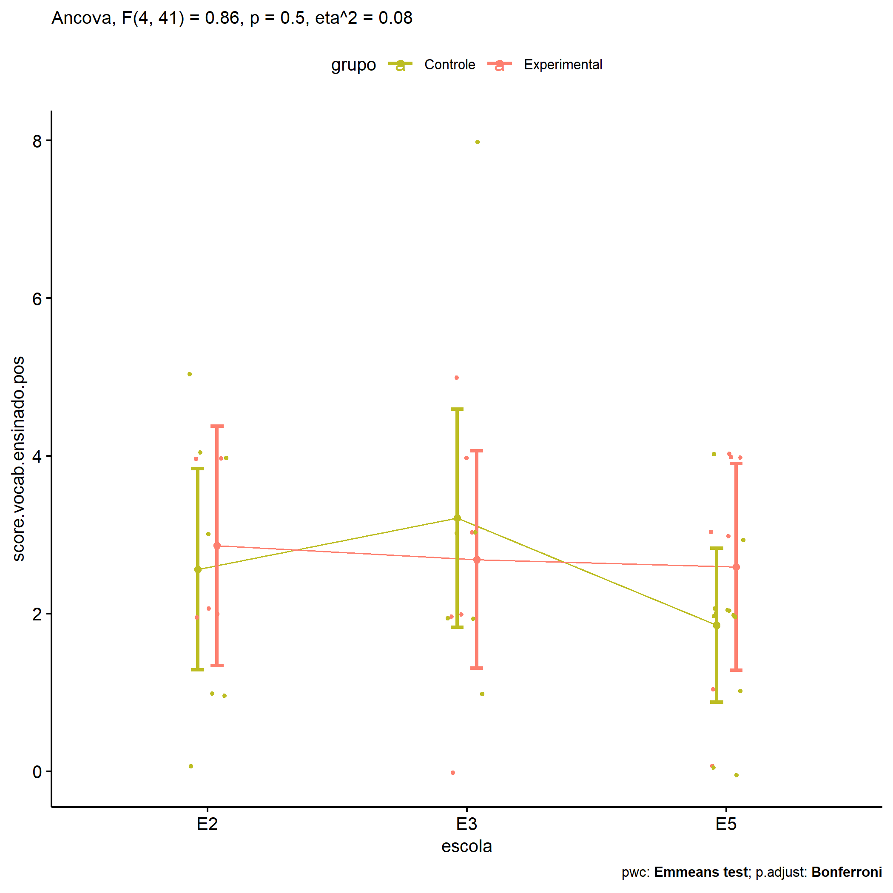<!-- -->

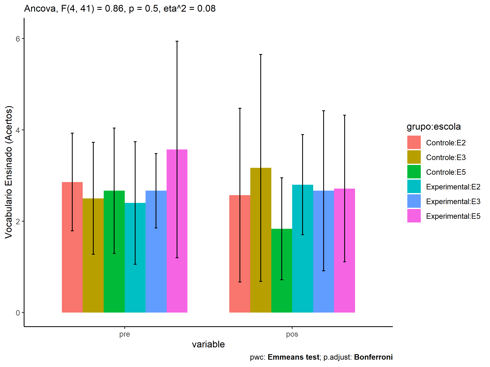<!-- -->

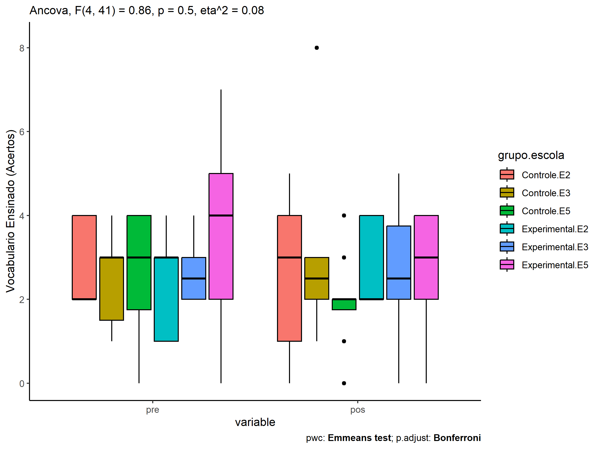<!-- -->

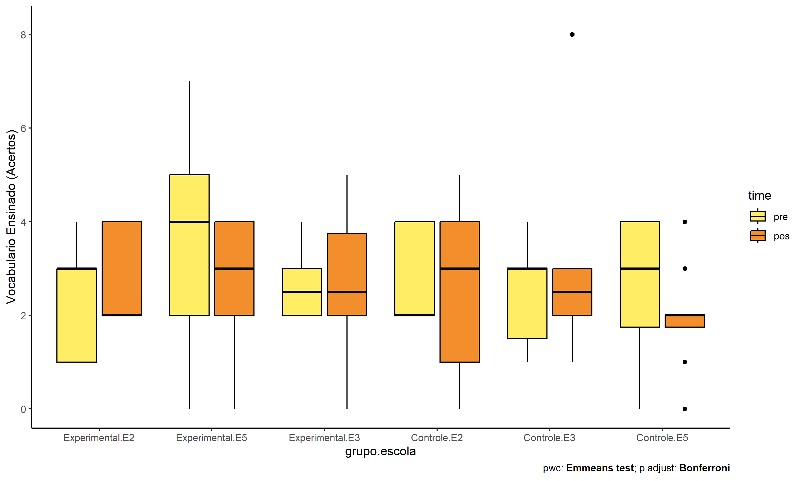<!-- -->

### Vocabulario Ensinado (TRI)

| var                    | escola | grupo        |   n | M (pre) | SE (pre) | M (unadj) | SE (unadj) | M (adj) | SE (adj) |
|:-----------------------|:-------|:-------------|----:|--------:|---------:|----------:|-----------:|--------:|---------:|
| tri.vocab.ensinado.pos | E2     | Controle     |   7 |  -0.683 |    0.213 |    -0.846 |      0.256 |  -0.749 |    0.215 |
| tri.vocab.ensinado.pos | E2     | Experimental |   5 |  -0.779 |    0.223 |    -0.840 |      0.254 |  -0.708 |    0.255 |
| tri.vocab.ensinado.pos | E3     | Controle     |   6 |  -0.124 |    0.220 |    -0.677 |      0.234 |  -0.789 |    0.232 |
| tri.vocab.ensinado.pos | E3     | Experimental |   6 |  -0.263 |    0.302 |    -0.447 |      0.320 |  -0.508 |    0.229 |
| tri.vocab.ensinado.pos | E5     | Controle     |  10 |  -0.521 |    0.177 |    -0.607 |      0.170 |  -0.571 |    0.177 |
| tri.vocab.ensinado.pos | E5     | Experimental |   6 |  -0.137 |    0.328 |    -0.741 |      0.157 |  -0.849 |    0.232 |

| grupo        | escola | group1   | group2       | estimate | conf.low | conf.high |    se | statistic |     p | p.adj | p.adj.signif |
|:-------------|:-------|:---------|:-------------|---------:|---------:|----------:|------:|----------:|------:|------:|:-------------|
| Controle     |        | E2       | E3           |    0.040 |   -0.615 |     0.695 | 0.322 |     0.124 | 0.902 | 1.000 | ns           |
| Controle     |        | E2       | E5           |   -0.179 |   -0.740 |     0.383 | 0.276 |    -0.647 | 0.522 | 1.000 | ns           |
| Controle     |        | E3       | E5           |   -0.219 |   -0.818 |     0.380 | 0.294 |    -0.742 | 0.463 | 1.000 | ns           |
| Experimental |        | E2       | E3           |   -0.200 |   -0.906 |     0.506 | 0.347 |    -0.577 | 0.568 | 1.000 | ns           |
| Experimental |        | E2       | E5           |    0.141 |   -0.575 |     0.857 | 0.352 |     0.401 | 0.691 | 1.000 | ns           |
| Experimental |        | E3       | E5           |    0.341 |   -0.315 |     0.998 | 0.323 |     1.058 | 0.298 | 0.893 | ns           |
| Controle     |        | E2       | E3           |   -0.559 |   -1.262 |     0.144 | 0.346 |    -1.616 | 0.115 | 0.346 | ns           |
| Controle     |        | E2       | E5           |   -0.162 |   -0.784 |     0.461 | 0.306 |    -0.527 | 0.601 | 1.000 | ns           |
| Controle     |        | E3       | E5           |    0.397 |   -0.255 |     1.050 | 0.321 |     1.238 | 0.224 | 0.672 | ns           |
| Experimental |        | E2       | E3           |   -0.516 |   -1.281 |     0.249 | 0.376 |    -1.371 | 0.179 | 0.538 | ns           |
| Experimental |        | E2       | E5           |   -0.642 |   -1.407 |     0.123 | 0.376 |    -1.706 | 0.097 | 0.292 | ns           |
| Experimental |        | E3       | E5           |   -0.126 |   -0.855 |     0.603 | 0.359 |    -0.351 | 0.728 | 1.000 | ns           |
|              | E2     | Controle | Experimental |   -0.041 |   -0.707 |     0.624 | 0.327 |    -0.127 | 0.900 | 0.900 | ns           |
|              | E3     | Controle | Experimental |   -0.282 |   -0.938 |     0.375 | 0.323 |    -0.872 | 0.389 | 0.389 | ns           |
|              | E5     | Controle | Experimental |    0.278 |   -0.320 |     0.877 | 0.294 |     0.947 | 0.351 | 0.351 | ns           |
|              | E2     | Controle | Experimental |    0.096 |   -0.643 |     0.836 | 0.364 |     0.264 | 0.793 | 0.793 | ns           |
|              | E3     | Controle | Experimental |    0.139 |   -0.590 |     0.869 | 0.359 |     0.388 | 0.701 | 0.701 | ns           |
|              | E5     | Controle | Experimental |   -0.384 |   -1.037 |     0.268 | 0.321 |    -1.197 | 0.240 | 0.240 | ns           |

| grupo        | escola | group1 | group2 | estimate | conf.low | conf.high |    se | statistic |     p | p.adj | p.adj.signif |
|:-------------|:-------|:-------|:-------|---------:|---------:|----------:|------:|----------:|------:|------:|:-------------|
| Controle     | E2     | pre    | pos    |    0.163 |   -0.491 |     0.817 | 0.328 |     0.497 | 0.621 | 0.621 | ns           |
| Controle     | E3     | pre    | pos    |    0.553 |   -0.153 |     1.259 | 0.354 |     1.561 | 0.123 | 0.123 | ns           |
| Controle     | E5     | pre    | pos    |    0.045 |   -0.479 |     0.568 | 0.263 |     0.170 | 0.866 | 0.866 | ns           |
| Experimental | E2     | pre    | pos    |    0.061 |   -0.713 |     0.835 | 0.388 |     0.158 | 0.875 | 0.875 | ns           |
| Experimental | E3     | pre    | pos    |    0.184 |   -0.522 |     0.891 | 0.354 |     0.520 | 0.605 | 0.605 | ns           |
| Experimental | E5     | pre    | pos    |    0.465 |   -0.216 |     1.146 | 0.341 |     1.362 | 0.177 | 0.177 | ns           |

    ## Scale for colour is already present.
    ## Adding another scale for colour, which will replace the existing scale.

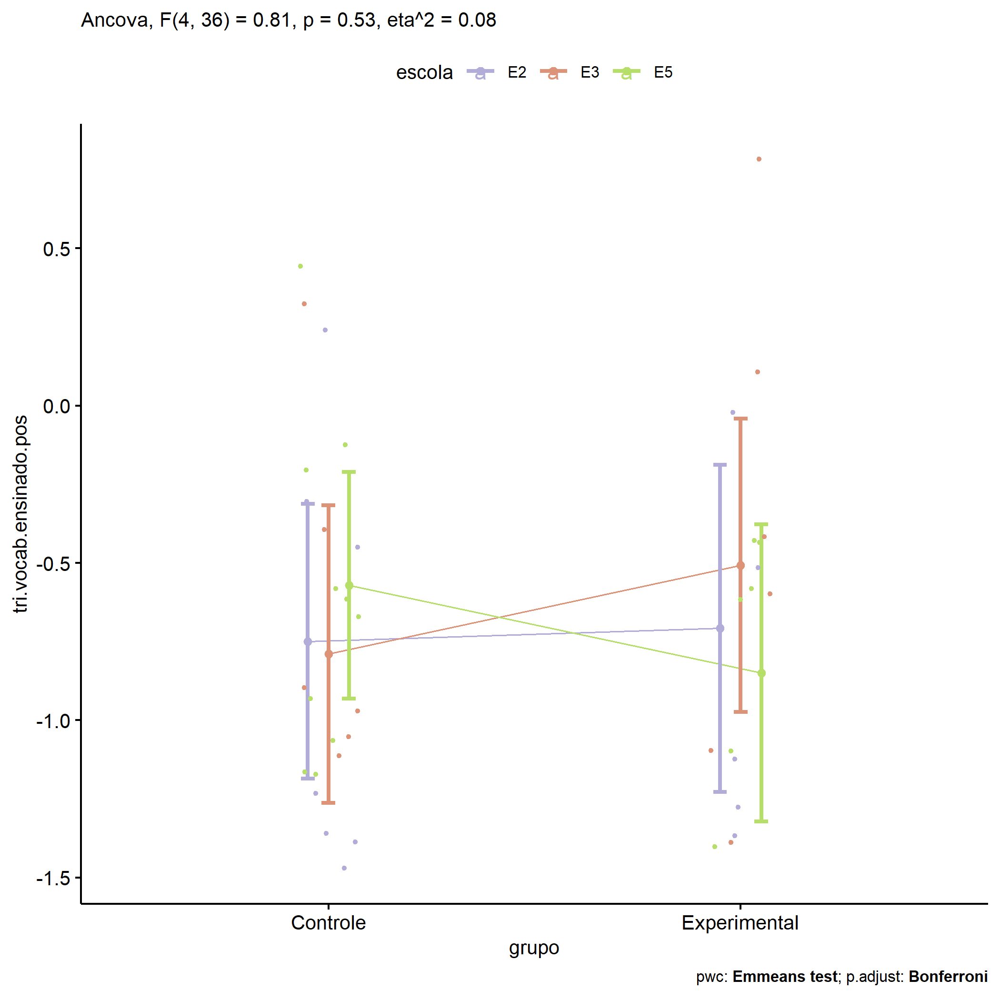<!-- -->

    ## Scale for colour is already present.
    ## Adding another scale for colour, which will replace the existing scale.

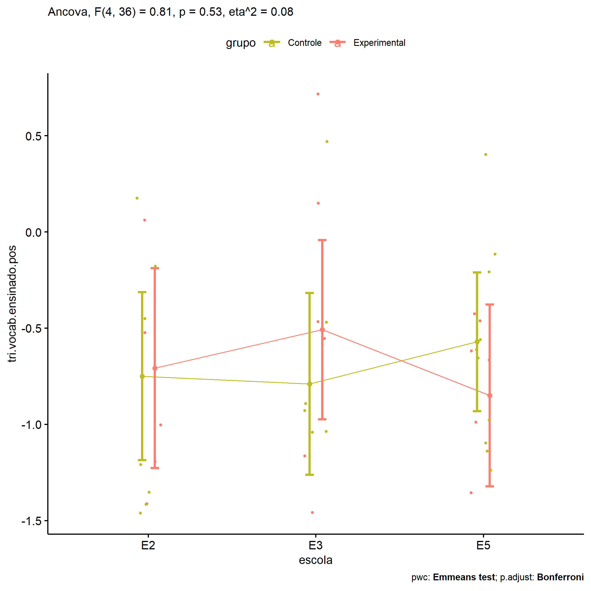<!-- -->

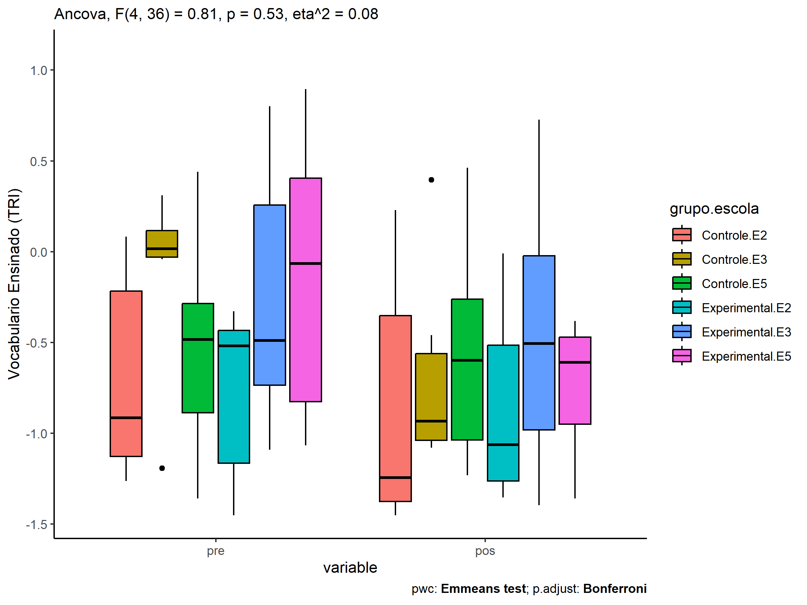<!-- -->

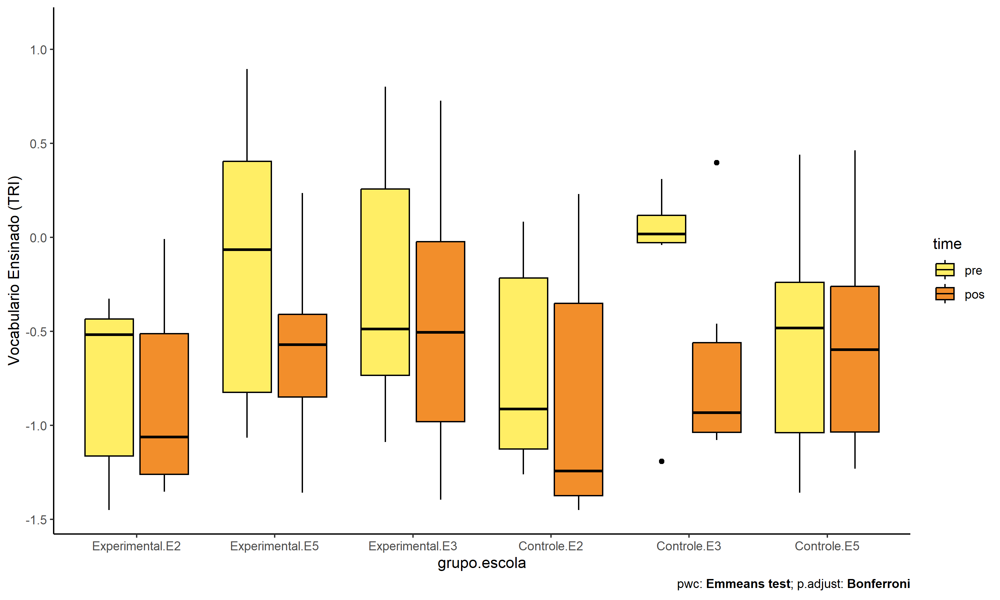<!-- -->

### Vocabulario Nao Ensinado (Acertos)

| var                          | escola | grupo        |   n | M (pre) | SE (pre) | M (unadj) | SE (unadj) | M (adj) | SE (adj) |
|:-----------------------------|:-------|:-------------|----:|--------:|---------:|----------:|-----------:|--------:|---------:|
| score.vocab.nao.ensinado.pos | E2     | Controle     |   7 |  11.000 |    1.380 |    13.000 |      0.873 |  12.968 |    1.747 |
| score.vocab.nao.ensinado.pos | E2     | Experimental |   5 |  11.400 |    1.249 |    10.200 |      0.583 |  10.141 |    2.071 |
| score.vocab.nao.ensinado.pos | E3     | Controle     |   6 |   8.500 |    1.232 |    12.667 |      1.453 |  12.805 |    1.928 |
| score.vocab.nao.ensinado.pos | E3     | Experimental |   6 |  10.333 |    0.882 |    11.667 |      1.874 |  11.680 |    1.885 |
| score.vocab.nao.ensinado.pos | E5     | Controle     |  12 |  12.167 |    1.192 |    11.083 |      1.940 |  10.972 |    1.372 |
| score.vocab.nao.ensinado.pos | E5     | Experimental |   7 |   8.571 |    1.925 |    12.857 |      1.243 |  12.991 |    1.789 |

| grupo        | escola | group1   | group2       | estimate | conf.low | conf.high |    se | statistic |     p | p.adj | p.adj.signif |
|:-------------|:-------|:---------|:-------------|---------:|---------:|----------:|------:|----------:|------:|------:|:-------------|
| Controle     |        | E2       | E3           |    0.163 |   -5.144 |     5.470 | 2.617 |     0.062 | 0.951 | 1.000 | ns           |
| Controle     |        | E2       | E5           |    1.996 |   -2.481 |     6.473 | 2.208 |     0.904 | 0.372 | 1.000 | ns           |
| Controle     |        | E3       | E5           |    1.833 |   -3.081 |     6.748 | 2.423 |     0.757 | 0.454 | 1.000 | ns           |
| Experimental |        | E2       | E3           |   -1.539 |   -7.224 |     4.145 | 2.803 |    -0.549 | 0.586 | 1.000 | ns           |
| Experimental |        | E2       | E5           |   -2.850 |   -8.451 |     2.752 | 2.762 |    -1.032 | 0.309 | 0.927 | ns           |
| Experimental |        | E3       | E5           |   -1.311 |   -6.568 |     3.947 | 2.592 |    -0.506 | 0.616 | 1.000 | ns           |
| Controle     |        | E2       | E3           |    2.500 |   -1.740 |     6.740 | 2.093 |     1.195 | 0.240 | 0.719 | ns           |
| Controle     |        | E2       | E5           |   -1.167 |   -4.791 |     2.458 | 1.789 |    -0.652 | 0.518 | 1.000 | ns           |
| Controle     |        | E3       | E5           |   -3.667 |   -7.477 |     0.144 | 1.881 |    -1.950 | 0.059 | 0.176 | ns           |
| Experimental |        | E2       | E3           |    1.067 |   -3.548 |     5.681 | 2.277 |     0.468 | 0.642 | 1.000 | ns           |
| Experimental |        | E2       | E5           |    2.829 |   -1.634 |     7.291 | 2.202 |     1.284 | 0.207 | 0.621 | ns           |
| Experimental |        | E3       | E5           |    1.762 |   -2.478 |     6.002 | 2.093 |     0.842 | 0.405 | 1.000 | ns           |
|              | E2     | Controle | Experimental |    2.827 |   -2.656 |     8.310 | 2.704 |     1.046 | 0.303 | 0.303 | ns           |
|              | E3     | Controle | Experimental |    1.125 |   -4.331 |     6.581 | 2.690 |     0.418 | 0.678 | 0.678 | ns           |
|              | E5     | Controle | Experimental |   -2.019 |   -6.707 |     2.670 | 2.312 |    -0.873 | 0.388 | 0.388 | ns           |
|              | E2     | Controle | Experimental |   -0.400 |   -4.862 |     4.062 | 2.202 |    -0.182 | 0.857 | 0.857 | ns           |
|              | E3     | Controle | Experimental |   -1.833 |   -6.233 |     2.567 | 2.172 |    -0.844 | 0.404 | 0.404 | ns           |
|              | E5     | Controle | Experimental |    3.595 |   -0.029 |     7.220 | 1.789 |     2.010 | 0.052 | 0.052 | ns           |

| grupo        | escola | group1 | group2 | estimate | conf.low | conf.high |    se | statistic |     p | p.adj | p.adj.signif |
|:-------------|:-------|:-------|:-------|---------:|---------:|----------:|------:|----------:|------:|------:|:-------------|
| Controle     | E2     | pre    | pos    |   -2.000 |   -6.451 |     2.451 | 2.234 |    -0.895 | 0.374 | 0.374 | ns           |
| Controle     | E3     | pre    | pos    |   -4.167 |   -8.975 |     0.641 | 2.413 |    -1.727 | 0.088 | 0.088 | ns           |
| Controle     | E5     | pre    | pos    |    1.083 |   -2.316 |     4.483 | 1.706 |     0.635 | 0.527 | 0.527 | ns           |
| Experimental | E2     | pre    | pos    |    1.200 |   -4.067 |     6.467 | 2.643 |     0.454 | 0.651 | 0.651 | ns           |
| Experimental | E3     | pre    | pos    |   -1.333 |   -6.141 |     3.475 | 2.413 |    -0.553 | 0.582 | 0.582 | ns           |
| Experimental | E5     | pre    | pos    |   -4.286 |   -8.737 |     0.166 | 2.234 |    -1.918 | 0.059 | 0.059 | ns           |

    ## Scale for colour is already present.
    ## Adding another scale for colour, which will replace the existing scale.

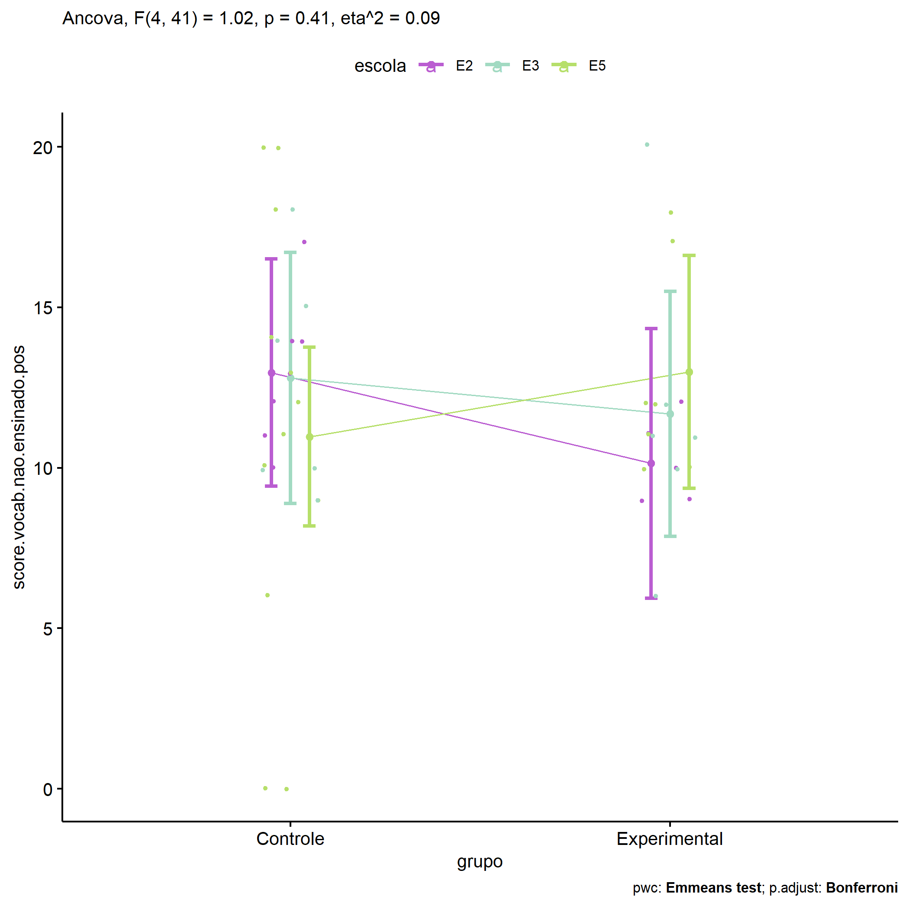<!-- -->

    ## Scale for colour is already present.
    ## Adding another scale for colour, which will replace the existing scale.

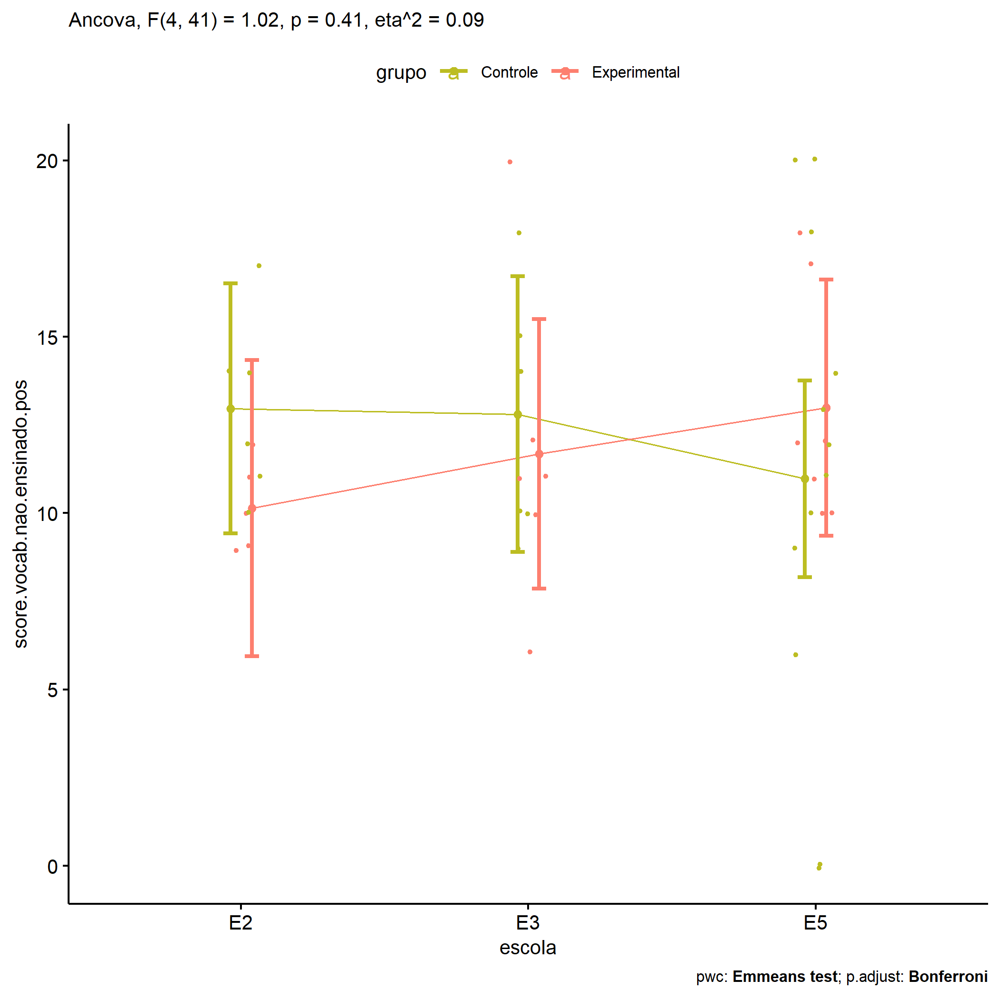<!-- -->

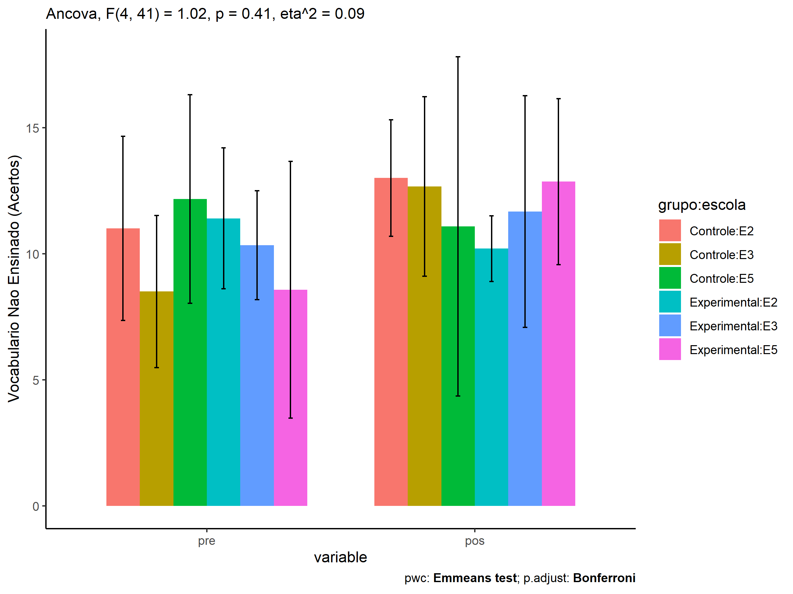<!-- -->

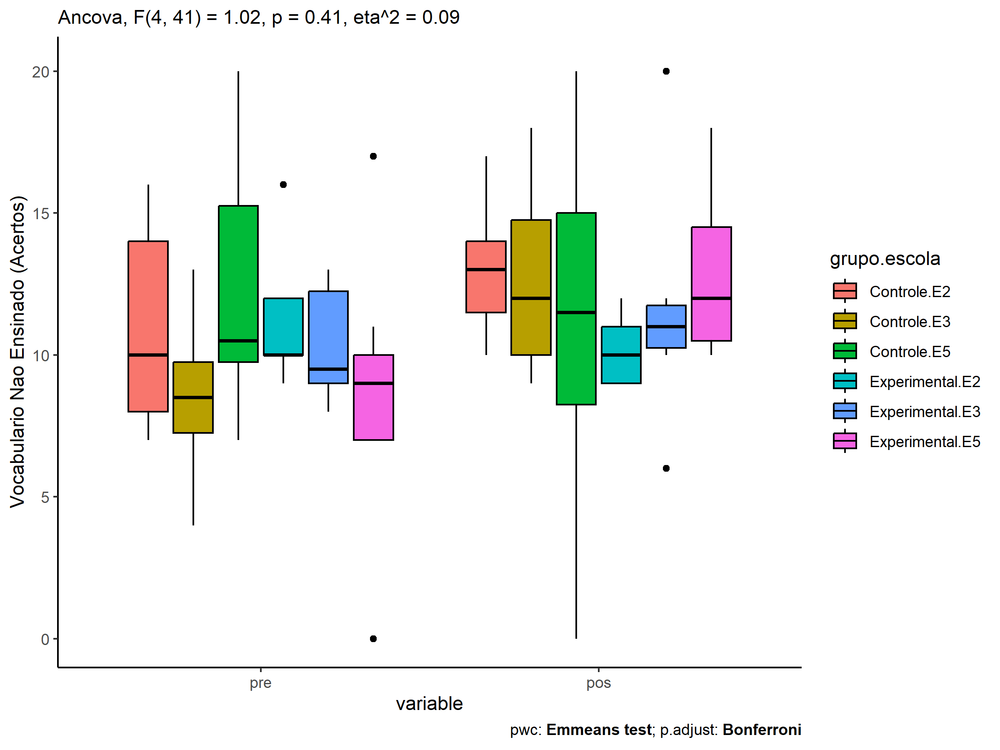<!-- -->

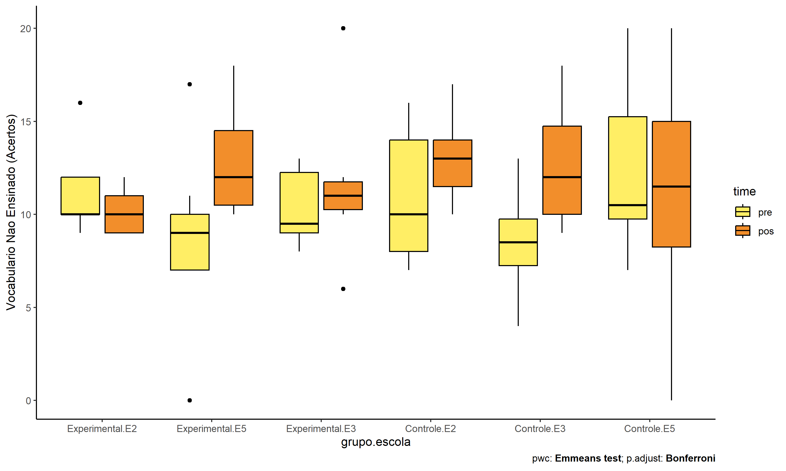<!-- -->

### Vocabulario Nao Ensinado (TRI)

| var                        | escola | grupo        |   n | M (pre) | SE (pre) | M (unadj) | SE (unadj) | M (adj) | SE (adj) |
|:---------------------------|:-------|:-------------|----:|--------:|---------:|----------:|-----------:|--------:|---------:|
| tri.vocab.nao.ensinado.pos | E2     | Controle     |   7 |  -0.844 |    0.201 |    -0.665 |      0.121 |  -0.609 |    0.136 |
| tri.vocab.nao.ensinado.pos | E2     | Experimental |   5 |  -0.762 |    0.191 |    -0.761 |      0.130 |  -0.769 |    0.160 |
| tri.vocab.nao.ensinado.pos | E3     | Controle     |   6 |  -0.883 |    0.110 |    -0.605 |      0.158 |  -0.518 |    0.147 |
| tri.vocab.nao.ensinado.pos | E3     | Experimental |   6 |  -0.740 |    0.202 |    -0.656 |      0.231 |  -0.681 |    0.147 |
| tri.vocab.nao.ensinado.pos | E5     | Controle     |  10 |  -0.716 |    0.124 |    -0.496 |      0.214 |  -0.540 |    0.114 |
| tri.vocab.nao.ensinado.pos | E5     | Experimental |   6 |  -0.710 |    0.186 |    -0.567 |      0.156 |  -0.615 |    0.147 |

| grupo        | escola | group1   | group2       | estimate | conf.low | conf.high |    se | statistic |     p | p.adj | p.adj.signif |
|:-------------|:-------|:---------|:-------------|---------:|---------:|----------:|------:|----------:|------:|------:|:-------------|
| Controle     |        | E2       | E3           |   -0.091 |   -0.497 |     0.316 | 0.200 |    -0.454 | 0.653 | 1.000 | ns           |
| Controle     |        | E2       | E5           |   -0.069 |   -0.431 |     0.293 | 0.178 |    -0.388 | 0.700 | 1.000 | ns           |
| Controle     |        | E3       | E5           |    0.022 |   -0.358 |     0.402 | 0.187 |     0.116 | 0.908 | 1.000 | ns           |
| Experimental |        | E2       | E3           |   -0.088 |   -0.530 |     0.354 | 0.217 |    -0.404 | 0.689 | 1.000 | ns           |
| Experimental |        | E2       | E5           |   -0.153 |   -0.596 |     0.289 | 0.217 |    -0.705 | 0.485 | 1.000 | ns           |
| Experimental |        | E3       | E5           |   -0.065 |   -0.487 |     0.356 | 0.207 |    -0.316 | 0.754 | 1.000 | ns           |
| Controle     |        | E2       | E3           |    0.040 |   -0.452 |     0.531 | 0.242 |     0.163 | 0.871 | 1.000 | ns           |
| Controle     |        | E2       | E5           |   -0.128 |   -0.563 |     0.308 | 0.214 |    -0.595 | 0.556 | 1.000 | ns           |
| Controle     |        | E3       | E5           |   -0.167 |   -0.624 |     0.289 | 0.225 |    -0.744 | 0.462 | 1.000 | ns           |
| Experimental |        | E2       | E3           |   -0.022 |   -0.557 |     0.513 | 0.263 |    -0.083 | 0.934 | 1.000 | ns           |
| Experimental |        | E2       | E5           |   -0.052 |   -0.587 |     0.484 | 0.263 |    -0.196 | 0.846 | 1.000 | ns           |
| Experimental |        | E3       | E5           |   -0.030 |   -0.540 |     0.481 | 0.251 |    -0.118 | 0.907 | 1.000 | ns           |
|              | E2     | Controle | Experimental |    0.160 |   -0.268 |     0.588 | 0.210 |     0.761 | 0.452 | 0.452 | ns           |
|              | E3     | Controle | Experimental |    0.163 |   -0.261 |     0.586 | 0.208 |     0.783 | 0.439 | 0.439 | ns           |
|              | E5     | Controle | Experimental |    0.076 |   -0.301 |     0.453 | 0.185 |     0.409 | 0.686 | 0.686 | ns           |
|              | E2     | Controle | Experimental |   -0.082 |   -0.599 |     0.436 | 0.255 |    -0.321 | 0.751 | 0.751 | ns           |
|              | E3     | Controle | Experimental |   -0.143 |   -0.654 |     0.367 | 0.251 |    -0.570 | 0.572 | 0.572 | ns           |
|              | E5     | Controle | Experimental |   -0.006 |   -0.462 |     0.451 | 0.225 |    -0.025 | 0.980 | 0.980 | ns           |

| grupo        | escola | group1 | group2 | estimate | conf.low | conf.high |    se | statistic |     p | p.adj | p.adj.signif |
|:-------------|:-------|:-------|:-------|---------:|---------:|----------:|------:|----------:|------:|------:|:-------------|
| Controle     | E2     | pre    | pos    |   -0.179 |   -0.689 |     0.331 | 0.256 |    -0.699 | 0.487 | 0.487 | ns           |
| Controle     | E3     | pre    | pos    |   -0.278 |   -0.829 |     0.273 | 0.276 |    -1.007 | 0.317 | 0.317 | ns           |
| Controle     | E5     | pre    | pos    |   -0.134 |   -0.543 |     0.274 | 0.205 |    -0.656 | 0.514 | 0.514 | ns           |
| Experimental | E2     | pre    | pos    |   -0.001 |   -0.604 |     0.602 | 0.303 |    -0.003 | 0.997 | 0.997 | ns           |
| Experimental | E3     | pre    | pos    |   -0.084 |   -0.635 |     0.467 | 0.276 |    -0.304 | 0.762 | 0.762 | ns           |
| Experimental | E5     | pre    | pos    |   -0.292 |   -0.823 |     0.238 | 0.266 |    -1.098 | 0.276 | 0.276 | ns           |

    ## Scale for colour is already present.
    ## Adding another scale for colour, which will replace the existing scale.

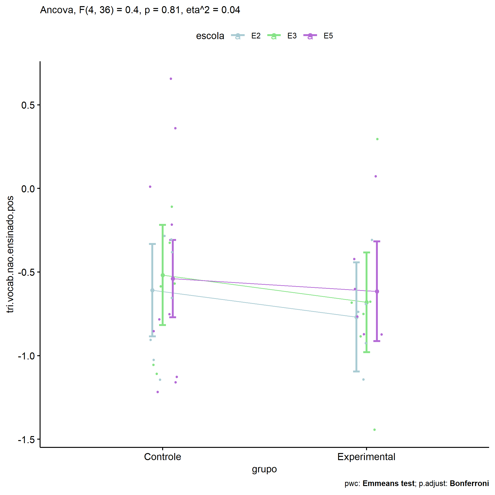<!-- -->

    ## Scale for colour is already present.
    ## Adding another scale for colour, which will replace the existing scale.

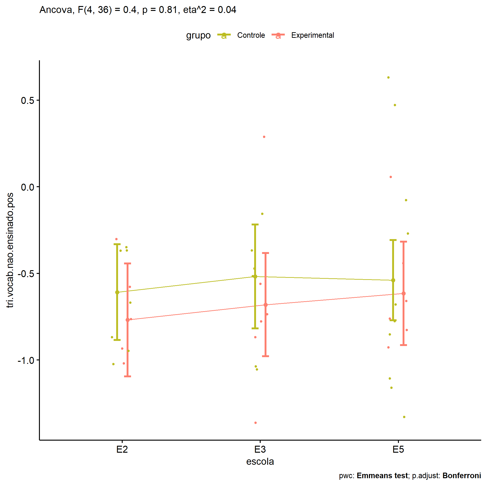<!-- -->

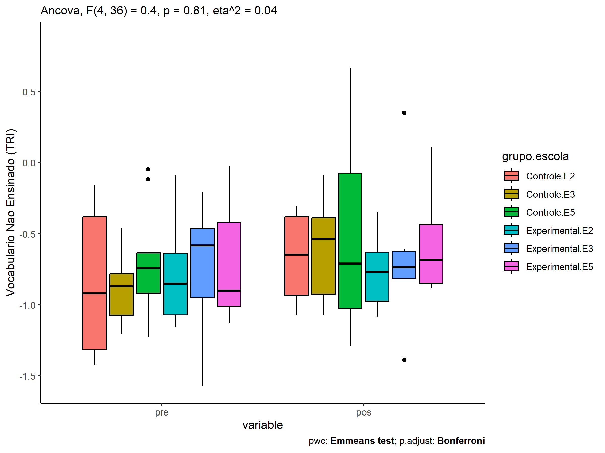<!-- -->

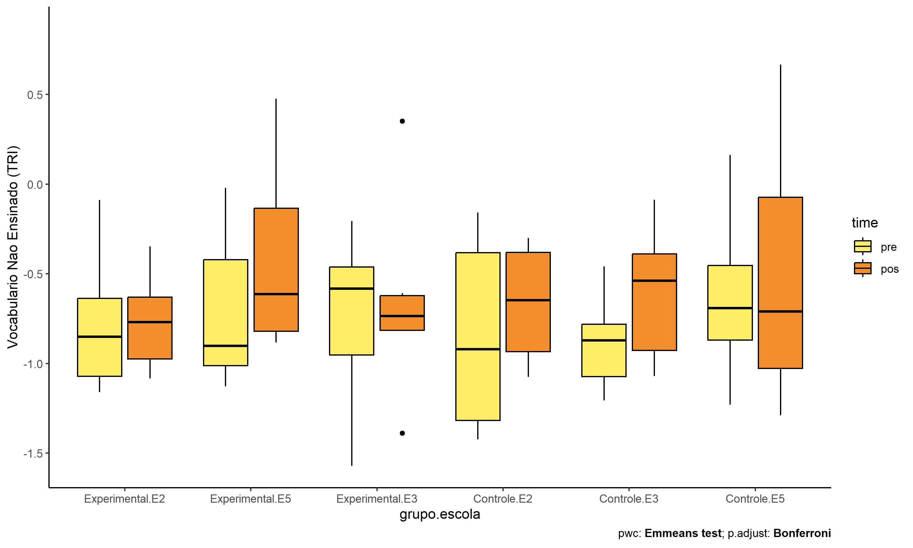<!-- -->

## factores: **zona.escola:grupo**

### Vocabulario (Acertos)

| var             | zona.escola | grupo        |   n | M (pre) | SE (pre) | M (unadj) | SE (unadj) | M (adj) | SE (adj) |
|:----------------|:------------|:-------------|----:|--------:|---------:|----------:|-----------:|--------:|---------:|
| score.vocab.pos | Rural       | Controle     |  10 |  11.500 |    1.327 |    15.600 |      1.809 |  16.577 |    1.278 |
| score.vocab.pos | Rural       | Experimental |   9 |  13.000 |    0.624 |    13.556 |      1.811 |  13.677 |    1.312 |
| score.vocab.pos | Urbana      | Controle     |  17 |  13.824 |    0.850 |    15.529 |      0.959 |  15.181 |    0.960 |
| score.vocab.pos | Urbana      | Experimental |  11 |  14.000 |    1.198 |    13.818 |      0.644 |  13.369 |    1.194 |

| grupo        | zona.escola | group1   | group2       | estimate | conf.low | conf.high |    se | statistic |     p | p.adj | p.adj.signif |
|:-------------|:------------|:---------|:-------------|---------:|---------:|----------:|------:|----------:|------:|------:|:-------------|
| Controle     |             | Urbana   | Rural        |   -1.396 |   -4.659 |     1.867 | 1.617 |    -0.863 | 0.393 | 0.393 | ns           |
| Experimental |             | Urbana   | Rural        |   -0.308 |   -3.894 |     3.278 | 1.777 |    -0.173 | 0.863 | 0.863 | ns           |
| Controle     |             | Urbana   | Rural        |    2.324 |   -0.527 |     5.174 | 1.414 |     1.644 | 0.108 | 0.108 | ns           |
| Experimental |             | Urbana   | Rural        |    1.000 |   -2.215 |     4.215 | 1.594 |     0.627 | 0.534 | 0.534 | ns           |
|              | Urbana      | Controle | Experimental |    1.812 |   -1.262 |     4.886 | 1.523 |     1.190 | 0.241 | 0.241 | ns           |
|              | Rural       | Controle | Experimental |    2.900 |   -0.785 |     6.585 | 1.826 |     1.588 | 0.120 | 0.120 | ns           |
|              | Urbana      | Controle | Experimental |   -0.176 |   -2.944 |     2.591 | 1.372 |    -0.129 | 0.898 | 0.898 | ns           |
|              | Rural       | Controle | Experimental |   -1.500 |   -4.787 |     1.787 | 1.630 |    -0.920 | 0.362 | 0.362 | ns           |

| grupo        | zona.escola | group1 | group2 | estimate | conf.low | conf.high |    se | statistic |     p | p.adj | p.adj.signif |
|:-------------|:------------|:-------|:-------|---------:|---------:|----------:|------:|----------:|------:|------:|:-------------|
| Controle     | Urbana      | pre    | pos    |   -1.056 |   -3.804 |     1.692 | 1.383 |    -0.763 | 0.447 | 0.447 | ns           |
| Controle     | Rural       | pre    | pos    |   -3.682 |   -7.278 |    -0.085 | 1.811 |    -2.033 | 0.045 | 0.045 | \*           |
| Experimental | Urbana      | pre    | pos    |   -0.500 |   -3.936 |     2.936 | 1.730 |    -0.289 | 0.773 | 0.773 | ns           |
| Experimental | Rural       | pre    | pos    |   -0.956 |   -4.738 |     2.827 | 1.904 |    -0.502 | 0.617 | 0.617 | ns           |

    ## Scale for colour is already present.
    ## Adding another scale for colour, which will replace the existing scale.

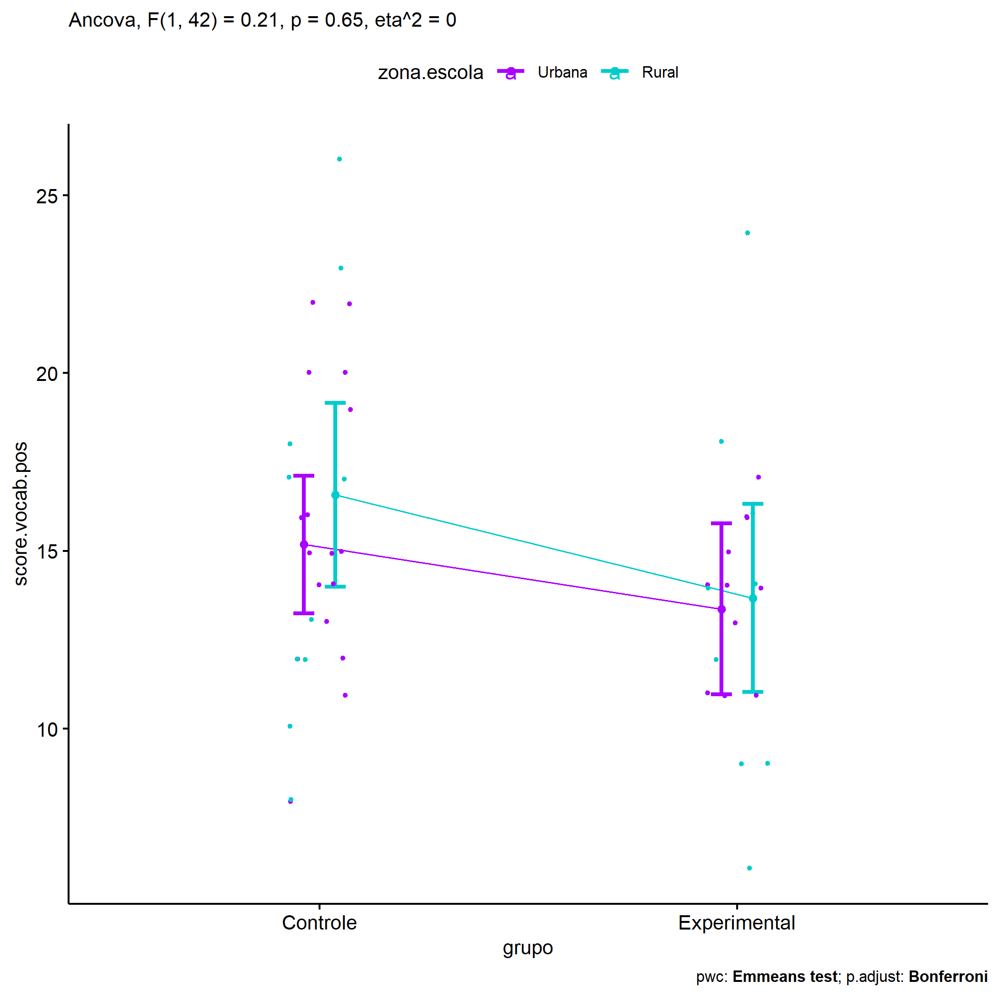<!-- -->

    ## Scale for colour is already present.
    ## Adding another scale for colour, which will replace the existing scale.

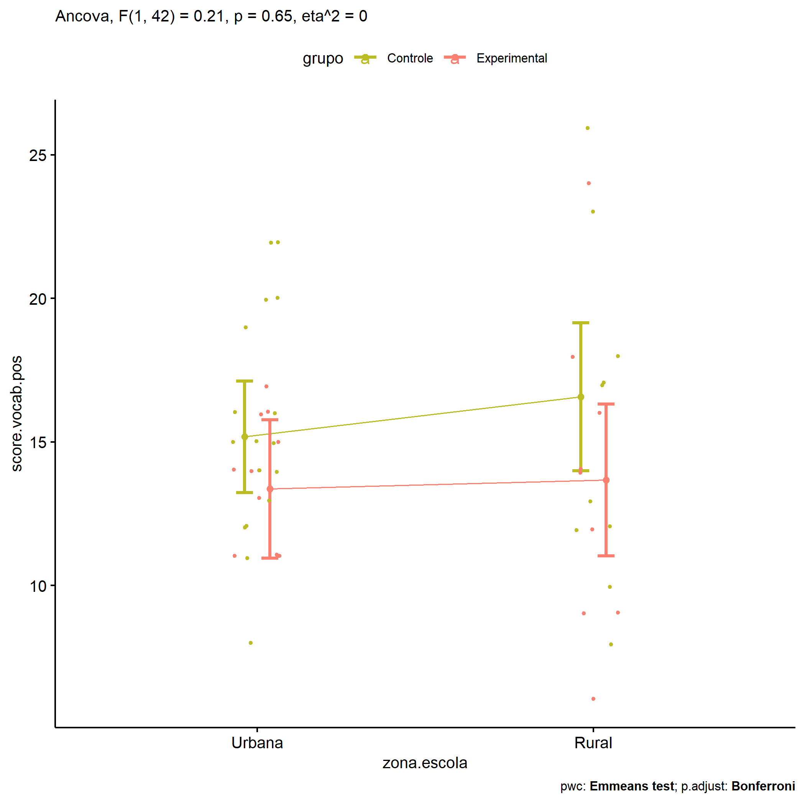<!-- -->

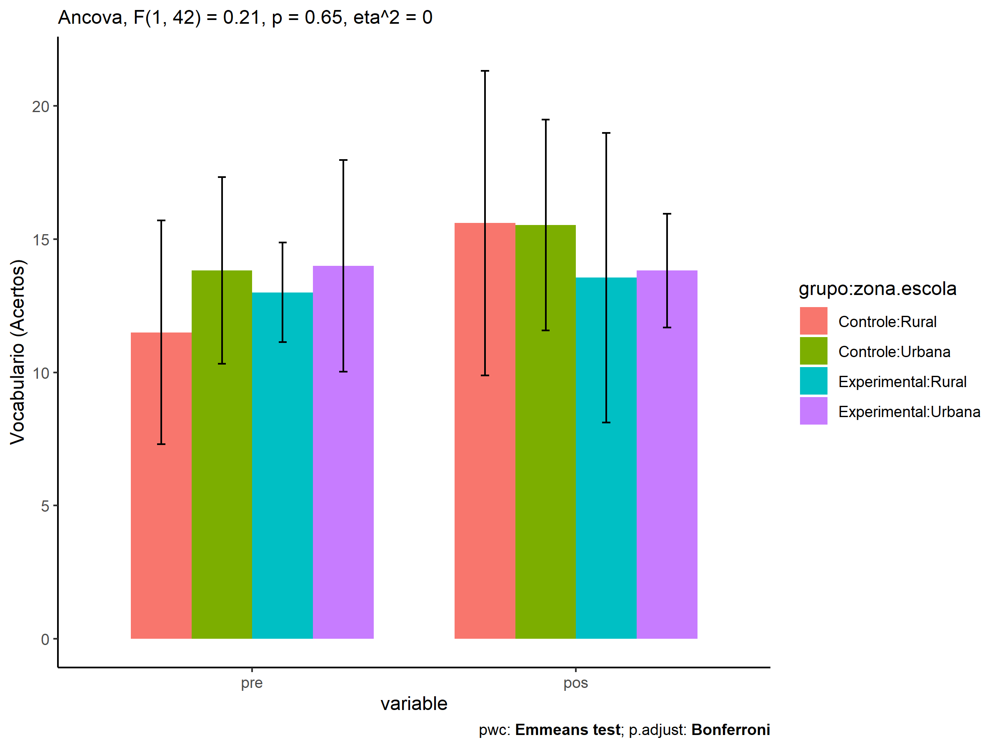<!-- -->

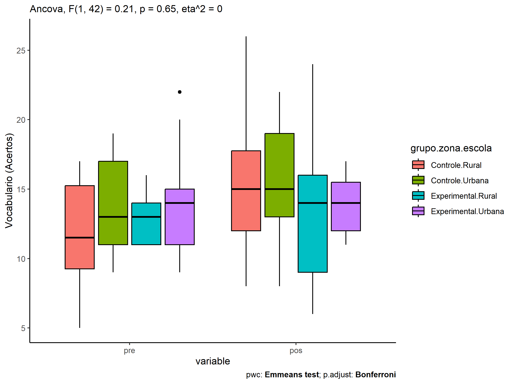<!-- -->

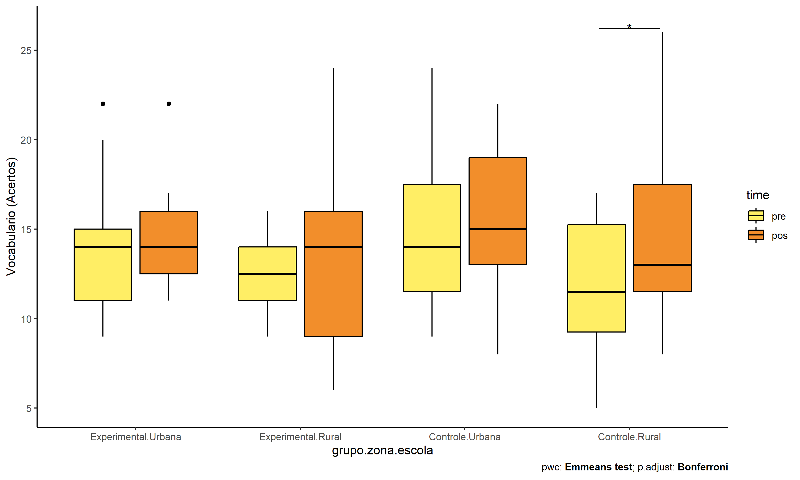<!-- -->

### Vocabulario (TRI)

| var           | zona.escola | grupo        |   n | M (pre) | SE (pre) | M (unadj) | SE (unadj) | M (adj) | SE (adj) |
|:--------------|:------------|:-------------|----:|--------:|---------:|----------:|-----------:|--------:|---------:|
| tri.vocab.pos | Rural       | Controle     |  10 |  -0.826 |    0.141 |    -0.643 |      0.199 |  -0.609 |    0.156 |
| tri.vocab.pos | Rural       | Experimental |   9 |  -0.766 |    0.207 |    -0.933 |      0.263 |  -0.937 |    0.164 |
| tri.vocab.pos | Urbana      | Controle     |  17 |  -0.757 |    0.144 |    -0.701 |      0.149 |  -0.711 |    0.119 |
| tri.vocab.pos | Urbana      | Experimental |  11 |  -0.752 |    0.211 |    -0.675 |      0.130 |  -0.688 |    0.148 |

| grupo        | zona.escola | group1   | group2       | estimate | conf.low | conf.high |    se | statistic |     p | p.adj | p.adj.signif |
|:-------------|:------------|:---------|:-------------|---------:|---------:|----------:|------:|----------:|------:|------:|:-------------|
| Controle     |             | Urbana   | Rural        |   -0.102 |   -0.497 |     0.294 | 0.196 |    -0.519 | 0.607 | 0.607 | ns           |
| Experimental |             | Urbana   | Rural        |    0.249 |   -0.196 |     0.695 | 0.221 |     1.129 | 0.265 | 0.265 | ns           |
| Controle     |             | Urbana   | Rural        |    0.069 |   -0.413 |     0.551 | 0.239 |     0.289 | 0.774 | 0.774 | ns           |
| Experimental |             | Urbana   | Rural        |    0.014 |   -0.529 |     0.558 | 0.269 |     0.053 | 0.958 | 0.958 | ns           |
|              | Urbana      | Controle | Experimental |   -0.023 |   -0.407 |     0.361 | 0.190 |    -0.119 | 0.906 | 0.906 | ns           |
|              | Rural       | Controle | Experimental |    0.328 |   -0.128 |     0.784 | 0.226 |     1.453 | 0.154 | 0.154 | ns           |
|              | Urbana      | Controle | Experimental |   -0.005 |   -0.473 |     0.463 | 0.232 |    -0.021 | 0.984 | 0.984 | ns           |
|              | Rural       | Controle | Experimental |   -0.059 |   -0.615 |     0.496 | 0.275 |    -0.216 | 0.830 | 0.830 | ns           |

| grupo        | zona.escola | group1 | group2 | estimate | conf.low | conf.high |    se | statistic |     p | p.adj | p.adj.signif |
|:-------------|:------------|:-------|:-------|---------:|---------:|----------:|------:|----------:|------:|------:|:-------------|
| Controle     | Urbana      | pre    | pos    |   -0.004 |   -0.410 |     0.402 | 0.204 |    -0.022 | 0.983 | 0.983 | ns           |
| Controle     | Rural       | pre    | pos    |   -0.129 |   -0.660 |     0.403 | 0.268 |    -0.482 | 0.631 | 0.631 | ns           |
| Experimental | Urbana      | pre    | pos    |   -0.167 |   -0.675 |     0.341 | 0.256 |    -0.654 | 0.515 | 0.515 | ns           |
| Experimental | Rural       | pre    | pos    |    0.147 |   -0.412 |     0.706 | 0.281 |     0.521 | 0.603 | 0.603 | ns           |

    ## Scale for colour is already present.
    ## Adding another scale for colour, which will replace the existing scale.

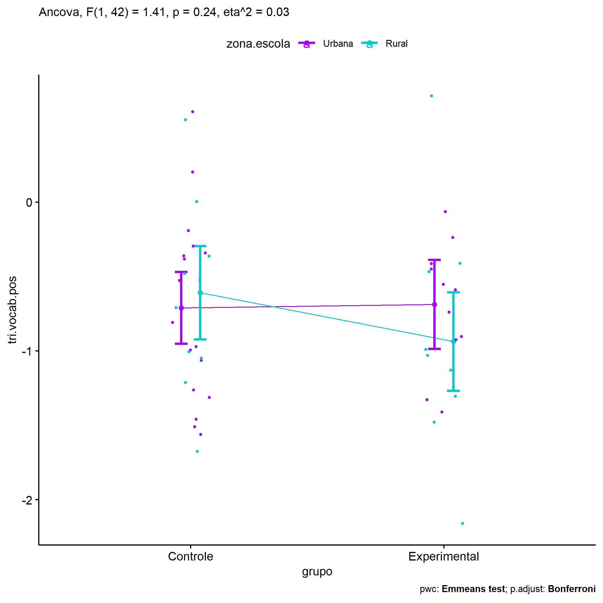<!-- -->

    ## Scale for colour is already present.
    ## Adding another scale for colour, which will replace the existing scale.

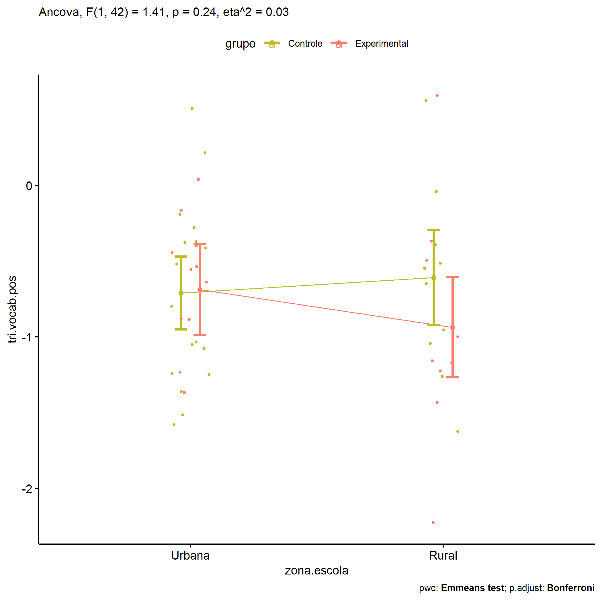<!-- -->

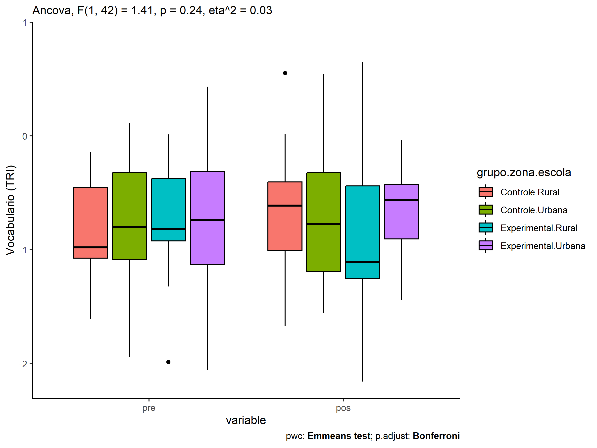<!-- -->

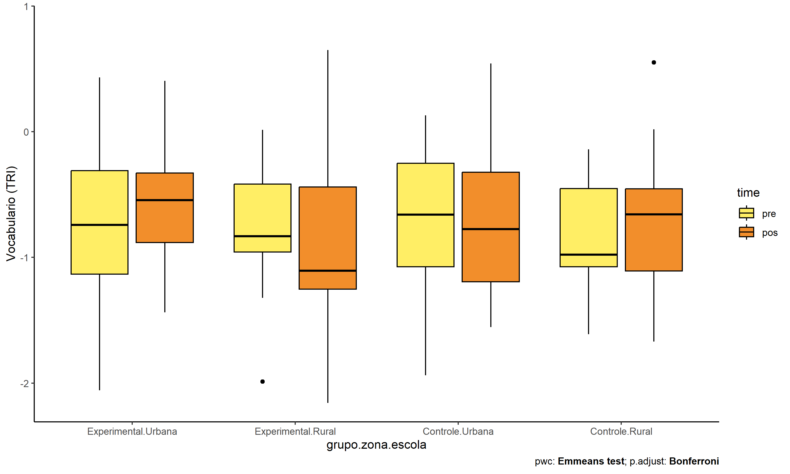<!-- -->

### Vocabulario Ensinado (Acertos)

| var                      | zona.escola | grupo        |   n | M (pre) | SE (pre) | M (unadj) | SE (unadj) | M (adj) | SE (adj) |
|:-------------------------|:------------|:-------------|----:|--------:|---------:|----------:|-----------:|--------:|---------:|
| score.vocab.ensinado.pos | Rural       | Controle     |  11 |   2.182 |    0.423 |     3.273 |      0.604 |   3.291 |    0.523 |
| score.vocab.ensinado.pos | Rural       | Experimental |  10 |   3.000 |    0.333 |     2.400 |      0.653 |   2.392 |    0.541 |
| score.vocab.ensinado.pos | Urbana      | Controle     |  19 |   2.737 |    0.285 |     2.105 |      0.332 |   2.106 |    0.391 |
| score.vocab.ensinado.pos | Urbana      | Experimental |  12 |   3.083 |    0.583 |     2.750 |      0.392 |   2.739 |    0.495 |

| grupo        | zona.escola | group1   | group2       | estimate | conf.low | conf.high |    se | statistic |     p | p.adj | p.adj.signif |
|:-------------|:------------|:---------|:-------------|---------:|---------:|----------:|------:|----------:|------:|------:|:-------------|
| Controle     |             | Urbana   | Rural        |   -1.185 |   -2.498 |     0.128 | 0.652 |    -1.816 | 0.076 | 0.076 | ns           |
| Experimental |             | Urbana   | Rural        |    0.347 |   -1.121 |     1.816 | 0.730 |     0.476 | 0.636 | 0.636 | ns           |
| Controle     |             | Urbana   | Rural        |    0.555 |   -0.557 |     1.667 | 0.553 |     1.004 | 0.321 | 0.321 | ns           |
| Experimental |             | Urbana   | Rural        |    0.083 |   -1.173 |     1.340 | 0.625 |     0.133 | 0.894 | 0.894 | ns           |
|              | Urbana      | Controle | Experimental |   -0.634 |   -1.903 |     0.636 | 0.631 |    -1.004 | 0.320 | 0.320 | ns           |
|              | Rural       | Controle | Experimental |    0.899 |   -0.625 |     2.422 | 0.757 |     1.187 | 0.241 | 0.241 | ns           |
|              | Urbana      | Controle | Experimental |   -0.346 |   -1.428 |     0.736 | 0.538 |    -0.644 | 0.523 | 0.523 | ns           |
|              | Rural       | Controle | Experimental |   -0.818 |   -2.100 |     0.464 | 0.638 |    -1.283 | 0.206 | 0.206 | ns           |

| grupo        | zona.escola | group1 | group2 | estimate | conf.low | conf.high |    se | statistic |     p | p.adj | p.adj.signif |
|:-------------|:------------|:-------|:-------|---------:|---------:|----------:|------:|----------:|------:|------:|:-------------|
| Controle     | Urbana      | pre    | pos    |    0.632 |   -0.384 |     1.647 | 0.512 |     1.234 | 0.220 | 0.220 | ns           |
| Controle     | Rural       | pre    | pos    |   -1.091 |   -2.426 |     0.244 | 0.673 |    -1.622 | 0.108 | 0.108 | ns           |
| Experimental | Urbana      | pre    | pos    |    0.333 |   -0.945 |     1.612 | 0.644 |     0.518 | 0.606 | 0.606 | ns           |
| Experimental | Rural       | pre    | pos    |    0.600 |   -0.800 |     2.000 | 0.705 |     0.851 | 0.397 | 0.397 | ns           |

    ## Scale for colour is already present.
    ## Adding another scale for colour, which will replace the existing scale.

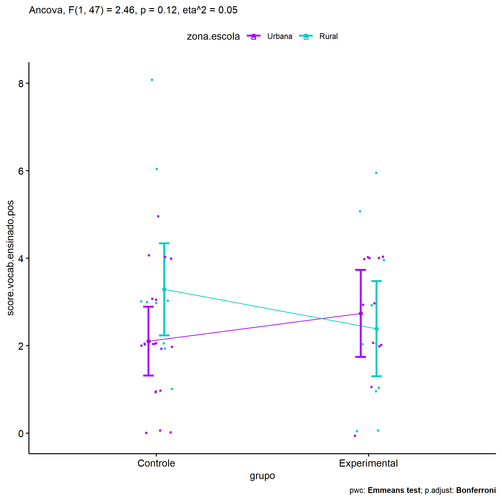<!-- -->

    ## Scale for colour is already present.
    ## Adding another scale for colour, which will replace the existing scale.

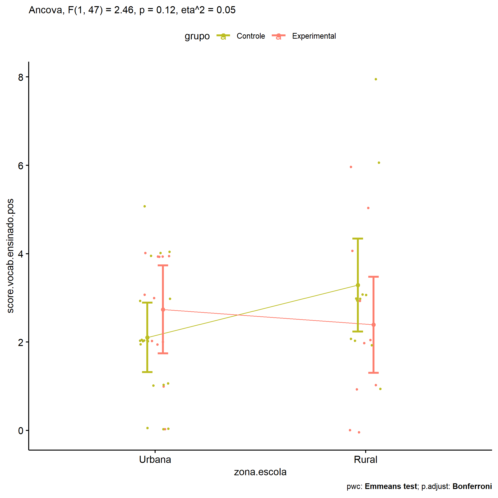<!-- -->

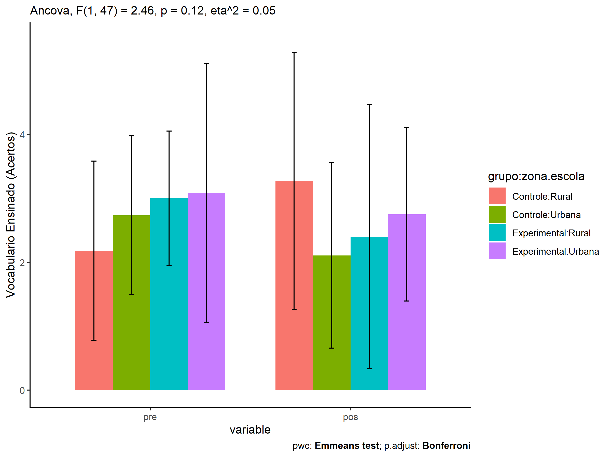<!-- -->

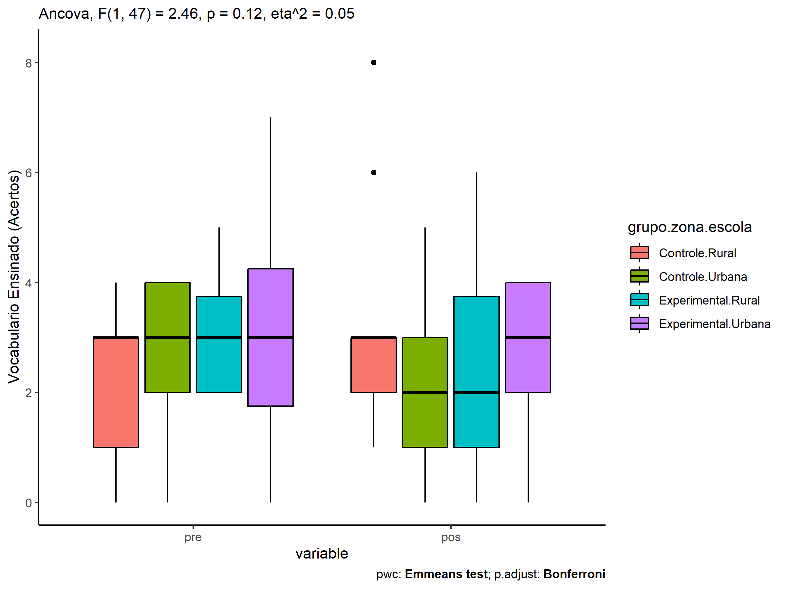<!-- -->

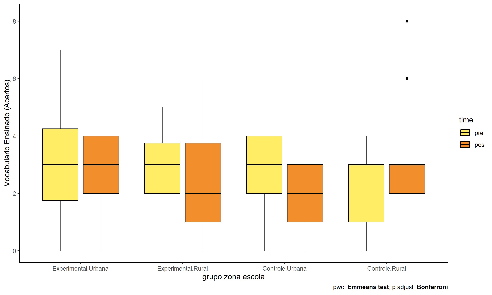<!-- -->

### Vocabulario Ensinado (TRI)

| var                    | zona.escola | grupo        |   n | M (pre) | SE (pre) | M (unadj) | SE (unadj) | M (adj) | SE (adj) |
|:-----------------------|:------------|:-------------|----:|--------:|---------:|----------:|-----------:|--------:|---------:|
| tri.vocab.ensinado.pos | Rural       | Controle     |  10 |  -0.476 |    0.196 |    -0.500 |      0.245 |  -0.501 |    0.193 |
| tri.vocab.ensinado.pos | Rural       | Experimental |   9 |  -0.339 |    0.200 |    -0.577 |      0.221 |  -0.610 |    0.205 |
| tri.vocab.ensinado.pos | Urbana      | Controle     |  17 |  -0.588 |    0.134 |    -0.705 |      0.143 |  -0.679 |    0.149 |
| tri.vocab.ensinado.pos | Urbana      | Experimental |  11 |  -0.429 |    0.220 |    -0.786 |      0.137 |  -0.798 |    0.184 |

| grupo        | zona.escola | group1   | group2       | estimate | conf.low | conf.high |    se | statistic |     p | p.adj | p.adj.signif |
|:-------------|:------------|:---------|:-------------|---------:|---------:|----------:|------:|----------:|------:|------:|:-------------|
| Controle     |             | Urbana   | Rural        |   -0.179 |   -0.671 |     0.314 | 0.244 |    -0.732 | 0.468 | 0.468 | ns           |
| Experimental |             | Urbana   | Rural        |   -0.188 |   -0.743 |     0.366 | 0.275 |    -0.686 | 0.497 | 0.497 | ns           |
| Controle     |             | Urbana   | Rural        |   -0.111 |   -0.609 |     0.387 | 0.247 |    -0.450 | 0.655 | 0.655 | ns           |
| Experimental |             | Urbana   | Rural        |   -0.089 |   -0.651 |     0.472 | 0.278 |    -0.320 | 0.750 | 0.750 | ns           |
|              | Urbana      | Controle | Experimental |    0.119 |   -0.361 |     0.598 | 0.238 |     0.500 | 0.620 | 0.620 | ns           |
|              | Rural       | Controle | Experimental |    0.109 |   -0.459 |     0.677 | 0.281 |     0.387 | 0.701 | 0.701 | ns           |
|              | Urbana      | Controle | Experimental |   -0.159 |   -0.642 |     0.325 | 0.240 |    -0.663 | 0.511 | 0.511 | ns           |
|              | Rural       | Controle | Experimental |   -0.137 |   -0.711 |     0.437 | 0.285 |    -0.481 | 0.633 | 0.633 | ns           |

| grupo        | zona.escola | group1 | group2 | estimate | conf.low | conf.high |    se | statistic |     p | p.adj | p.adj.signif |
|:-------------|:------------|:-------|:-------|---------:|---------:|----------:|------:|----------:|------:|------:|:-------------|
| Controle     | Urbana      | pre    | pos    |    0.099 |   -0.314 |     0.511 | 0.207 |     0.475 | 0.636 | 0.636 | ns           |
| Controle     | Rural       | pre    | pos    |   -0.030 |   -0.570 |     0.509 | 0.272 |    -0.111 | 0.912 | 0.912 | ns           |
| Experimental | Urbana      | pre    | pos    |    0.273 |   -0.243 |     0.788 | 0.259 |     1.051 | 0.296 | 0.296 | ns           |
| Experimental | Rural       | pre    | pos    |    0.278 |   -0.289 |     0.845 | 0.286 |     0.973 | 0.333 | 0.333 | ns           |

    ## Scale for colour is already present.
    ## Adding another scale for colour, which will replace the existing scale.

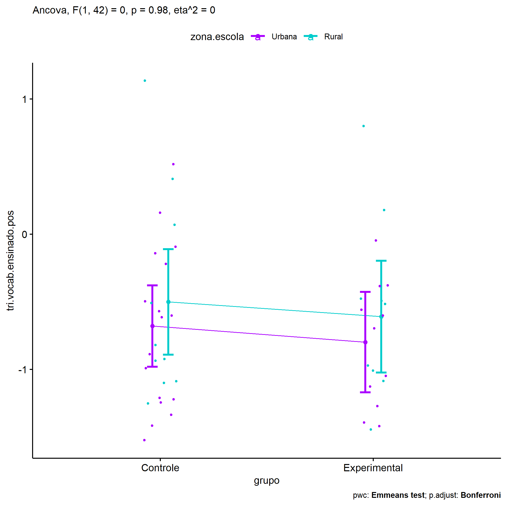<!-- -->

    ## Scale for colour is already present.
    ## Adding another scale for colour, which will replace the existing scale.

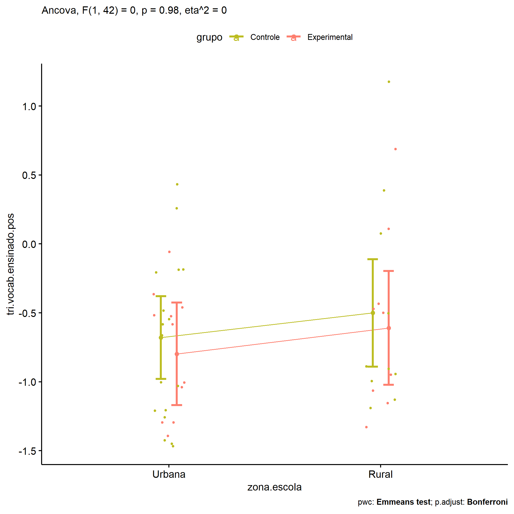<!-- -->

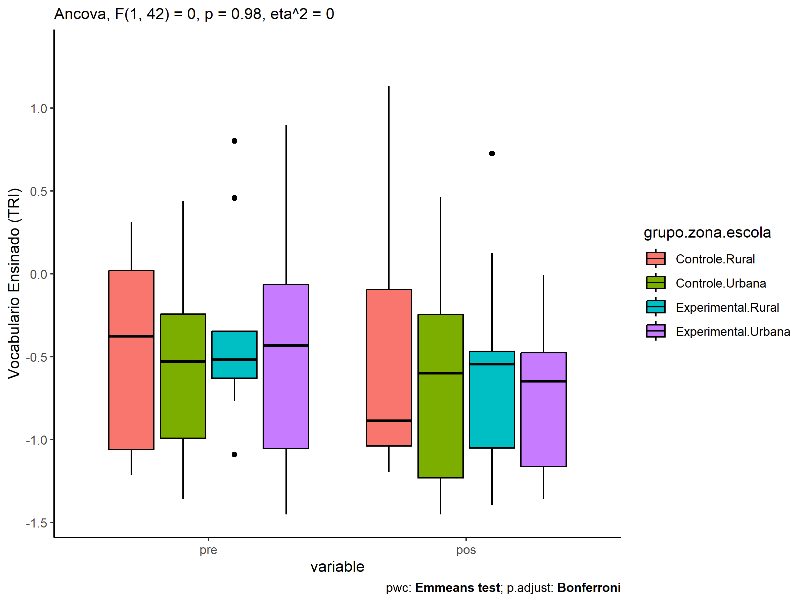<!-- -->

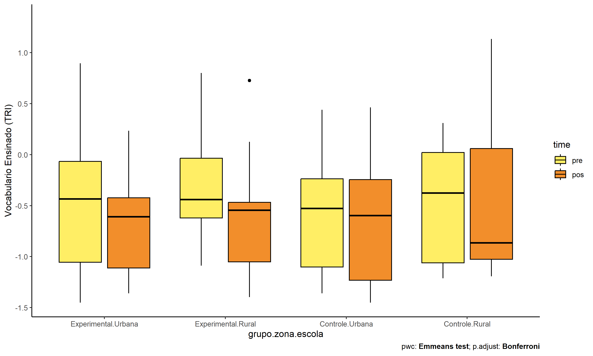<!-- -->

### Vocabulario Nao Ensinado (Acertos)

| var                          | zona.escola | grupo        |   n | M (pre) | SE (pre) | M (unadj) | SE (unadj) | M (adj) | SE (adj) |
|:-----------------------------|:------------|:-------------|----:|--------:|---------:|----------:|-----------:|--------:|---------:|
| score.vocab.nao.ensinado.pos | Rural       | Controle     |  11 |   8.273 |    1.382 |    11.909 |      1.282 |  12.308 |    1.438 |
| score.vocab.nao.ensinado.pos | Rural       | Experimental |  10 |   9.600 |    0.748 |     9.800 |      1.611 |   9.915 |    1.474 |
| score.vocab.nao.ensinado.pos | Urbana      | Controle     |  19 |  11.737 |    0.895 |    11.789 |      1.263 |  11.446 |    1.102 |
| score.vocab.nao.ensinado.pos | Urbana      | Experimental |  12 |   9.750 |    1.262 |    11.750 |      0.836 |  11.832 |    1.345 |

| grupo        | zona.escola | group1   | group2       | estimate | conf.low | conf.high |    se | statistic |     p | p.adj | p.adj.signif |
|:-------------|:------------|:---------|:-------------|---------:|---------:|----------:|------:|----------:|------:|------:|:-------------|
| Controle     |             | Urbana   | Rural        |   -0.863 |   -4.603 |     2.878 | 1.859 |    -0.464 | 0.645 | 0.645 | ns           |
| Experimental |             | Urbana   | Rural        |    1.918 |   -2.091 |     5.926 | 1.993 |     0.962 | 0.341 | 0.341 | ns           |
| Controle     |             | Urbana   | Rural        |    3.464 |    0.464 |     6.464 | 1.492 |     2.322 | 0.025 | 0.025 | \*           |
| Experimental |             | Urbana   | Rural        |    0.150 |   -3.241 |     3.541 | 1.686 |     0.089 | 0.929 | 0.929 | ns           |
|              | Urbana      | Controle | Experimental |   -0.387 |   -3.905 |     3.132 | 1.749 |    -0.221 | 0.826 | 0.826 | ns           |
|              | Rural       | Controle | Experimental |    2.394 |   -1.722 |     6.509 | 2.046 |     1.170 | 0.248 | 0.248 | ns           |
|              | Urbana      | Controle | Experimental |    1.987 |   -0.933 |     4.907 | 1.452 |     1.368 | 0.178 | 0.178 | ns           |
|              | Rural       | Controle | Experimental |   -1.327 |   -4.787 |     2.133 | 1.721 |    -0.771 | 0.444 | 0.444 | ns           |

| grupo        | zona.escola | group1 | group2 | estimate | conf.low | conf.high |    se | statistic |     p | p.adj | p.adj.signif |
|:-------------|:------------|:-------|:-------|---------:|---------:|----------:|------:|----------:|------:|------:|:-------------|
| Controle     | Urbana      | pre    | pos    |   -0.053 |   -2.839 |     2.733 | 1.403 |    -0.038 | 0.970 | 0.970 | ns           |
| Controle     | Rural       | pre    | pos    |   -3.636 |   -7.298 |     0.025 | 1.845 |    -1.971 | 0.052 | 0.052 | ns           |
| Experimental | Urbana      | pre    | pos    |   -2.000 |   -5.506 |     1.506 | 1.766 |    -1.132 | 0.260 | 0.260 | ns           |
| Experimental | Rural       | pre    | pos    |   -0.200 |   -4.040 |     3.640 | 1.935 |    -0.103 | 0.918 | 0.918 | ns           |

    ## Scale for colour is already present.
    ## Adding another scale for colour, which will replace the existing scale.

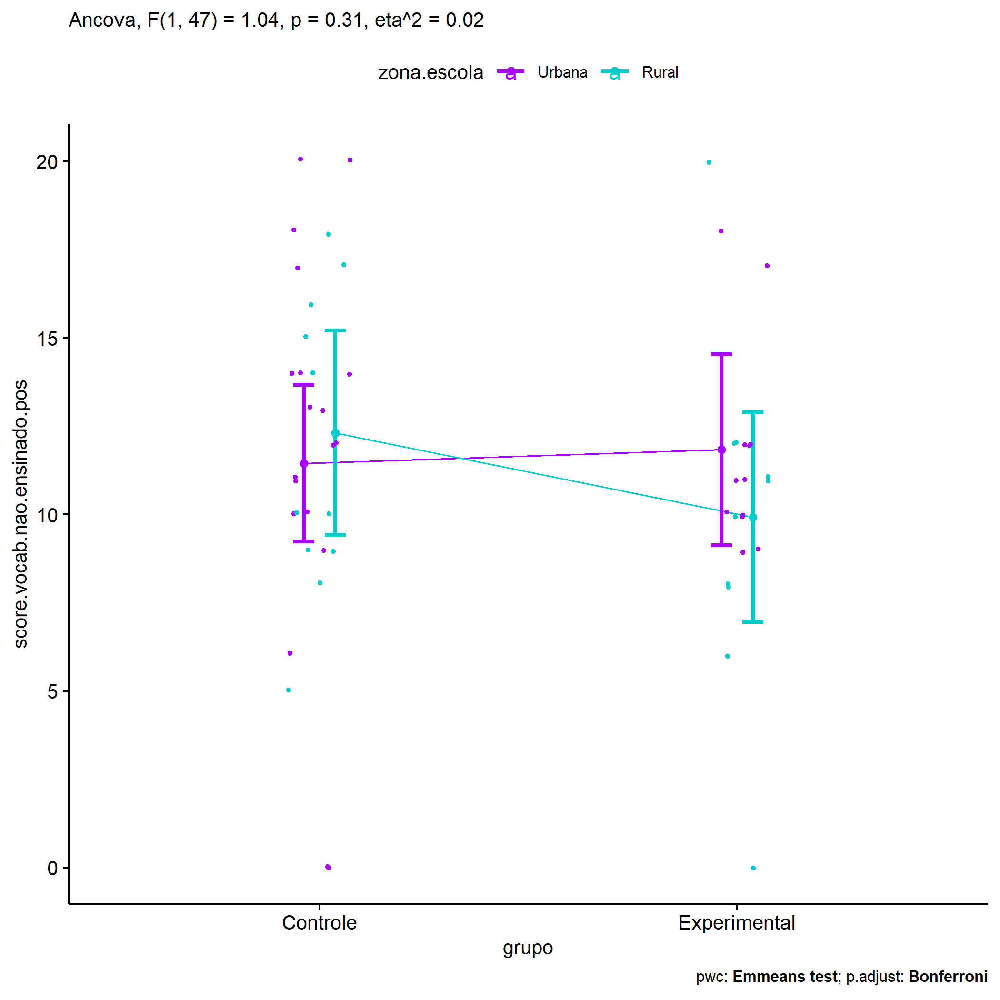<!-- -->

    ## Scale for colour is already present.
    ## Adding another scale for colour, which will replace the existing scale.

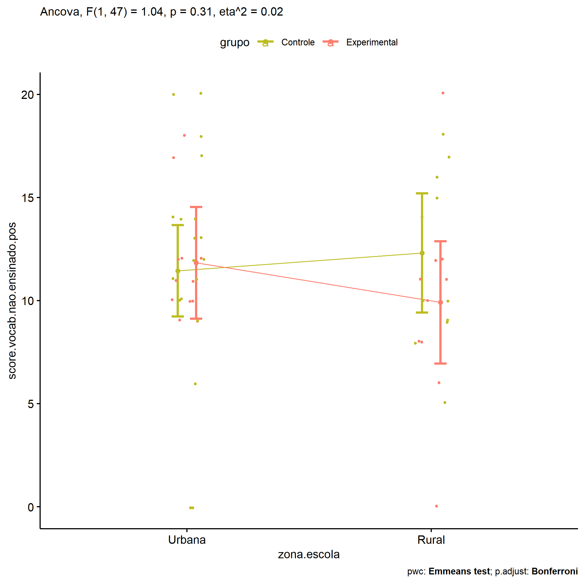<!-- -->

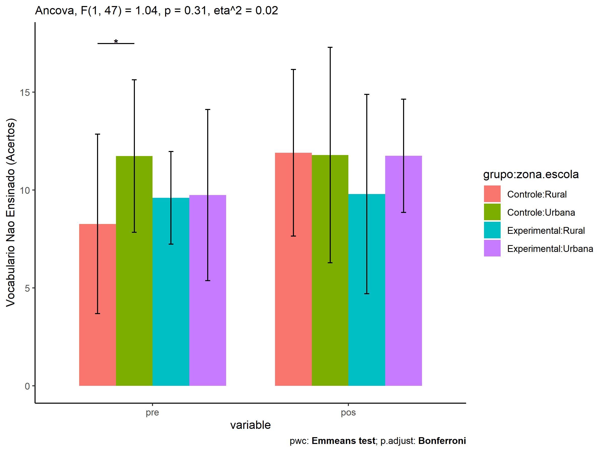<!-- -->

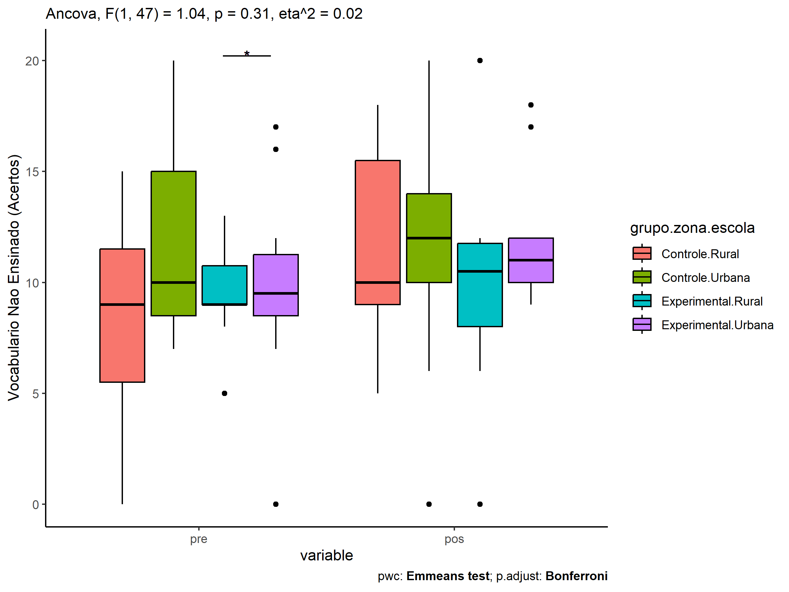<!-- -->

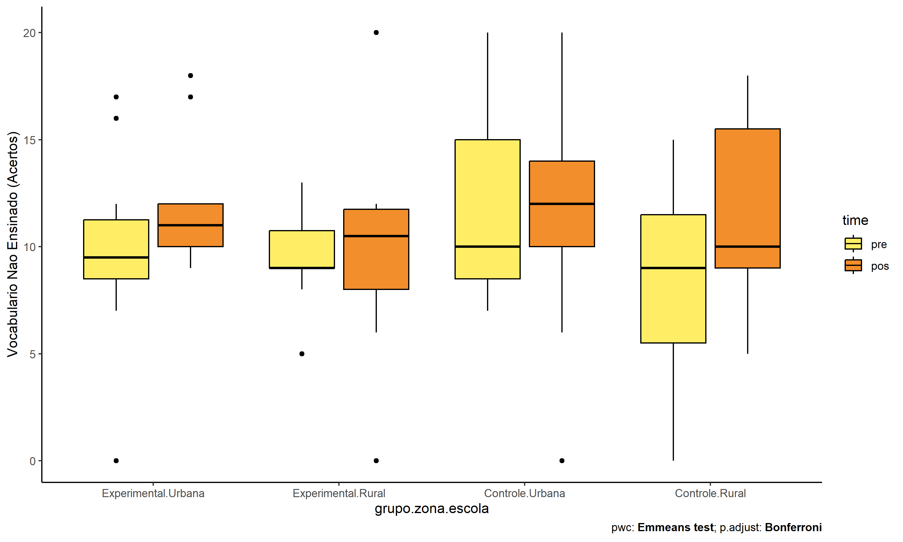<!-- -->

### Vocabulario Nao Ensinado (TRI)

| var                        | zona.escola | grupo        |   n | M (pre) | SE (pre) | M (unadj) | SE (unadj) | M (adj) | SE (adj) |
|:---------------------------|:------------|:-------------|----:|--------:|---------:|----------:|-----------:|--------:|---------:|
| tri.vocab.nao.ensinado.pos | Rural       | Controle     |  10 |  -0.919 |    0.155 |    -0.638 |      0.161 |  -0.542 |    0.109 |
| tri.vocab.nao.ensinado.pos | Rural       | Experimental |   9 |  -0.820 |    0.136 |    -0.833 |      0.174 |  -0.819 |    0.114 |
| tri.vocab.nao.ensinado.pos | Urbana      | Controle     |  17 |  -0.769 |    0.108 |    -0.566 |      0.134 |  -0.593 |    0.083 |
| tri.vocab.nao.ensinado.pos | Urbana      | Experimental |  11 |  -0.734 |    0.127 |    -0.655 |      0.103 |  -0.711 |    0.104 |

| grupo        | zona.escola | group1   | group2       | estimate | conf.low | conf.high |    se | statistic |     p | p.adj | p.adj.signif |
|:-------------|:------------|:---------|:-------------|---------:|---------:|----------:|------:|----------:|------:|------:|:-------------|
| Controle     |             | Urbana   | Rural        |   -0.051 |   -0.329 |     0.228 | 0.138 |    -0.367 | 0.715 | 0.715 | ns           |
| Experimental |             | Urbana   | Rural        |    0.107 |   -0.204 |     0.419 | 0.155 |     0.695 | 0.491 | 0.491 | ns           |
| Controle     |             | Urbana   | Rural        |    0.151 |   -0.205 |     0.507 | 0.177 |     0.853 | 0.398 | 0.398 | ns           |
| Experimental |             | Urbana   | Rural        |    0.086 |   -0.315 |     0.488 | 0.199 |     0.433 | 0.667 | 0.667 | ns           |
|              | Urbana      | Controle | Experimental |    0.118 |   -0.150 |     0.386 | 0.133 |     0.890 | 0.379 | 0.379 | ns           |
|              | Rural       | Controle | Experimental |    0.276 |   -0.043 |     0.595 | 0.158 |     1.747 | 0.088 | 0.088 | ns           |
|              | Urbana      | Controle | Experimental |   -0.035 |   -0.380 |     0.311 | 0.171 |    -0.203 | 0.840 | 0.840 | ns           |
|              | Rural       | Controle | Experimental |   -0.099 |   -0.510 |     0.311 | 0.204 |    -0.487 | 0.628 | 0.628 | ns           |

| grupo        | zona.escola | group1 | group2 | estimate | conf.low | conf.high |    se | statistic |     p | p.adj | p.adj.signif |
|:-------------|:------------|:-------|:-------|---------:|---------:|----------:|------:|----------:|------:|------:|:-------------|
| Controle     | Urbana      | pre    | pos    |   -0.143 |   -0.467 |     0.180 | 0.163 |    -0.881 | 0.381 | 0.381 | ns           |
| Controle     | Rural       | pre    | pos    |   -0.216 |   -0.639 |     0.207 | 0.213 |    -1.014 | 0.313 | 0.313 | ns           |
| Experimental | Urbana      | pre    | pos    |   -0.173 |   -0.577 |     0.231 | 0.204 |    -0.850 | 0.398 | 0.398 | ns           |
| Experimental | Rural       | pre    | pos    |   -0.030 |   -0.475 |     0.415 | 0.224 |    -0.134 | 0.893 | 0.893 | ns           |

    ## Scale for colour is already present.
    ## Adding another scale for colour, which will replace the existing scale.

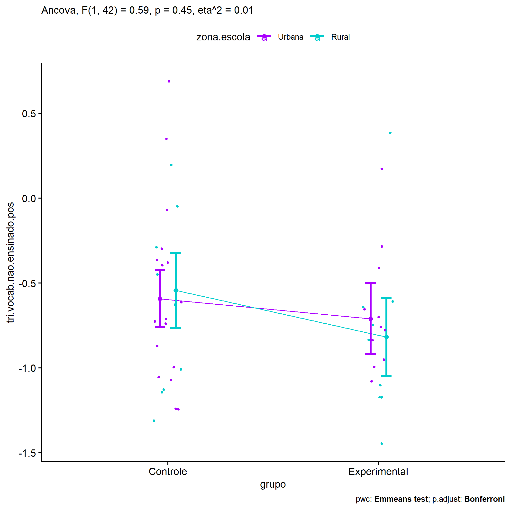<!-- -->

    ## Scale for colour is already present.
    ## Adding another scale for colour, which will replace the existing scale.

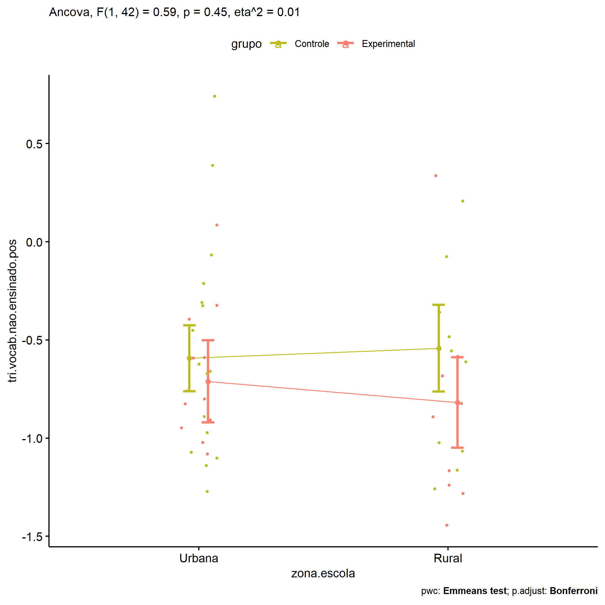<!-- -->

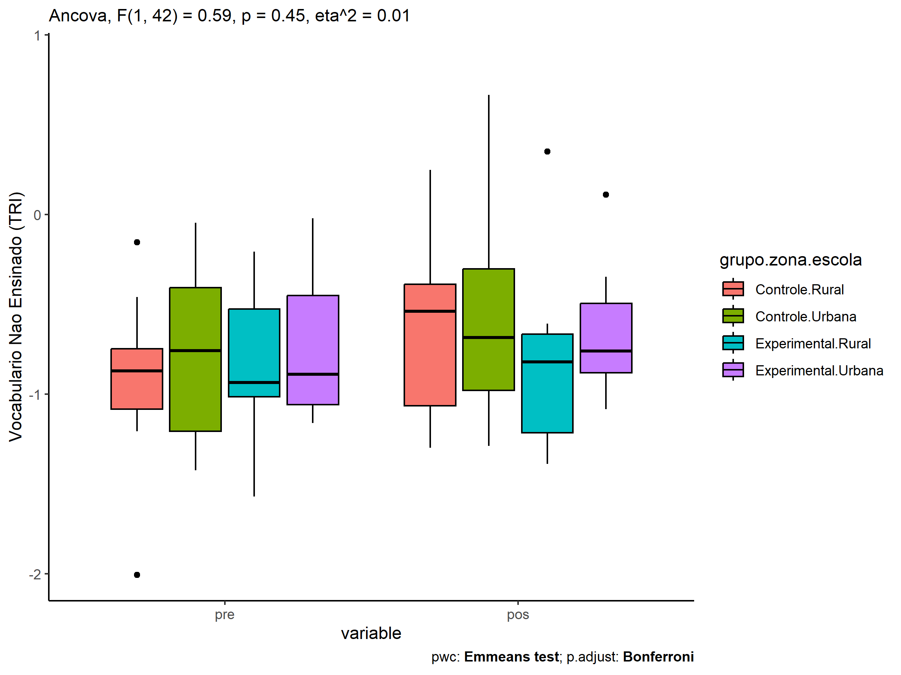<!-- -->

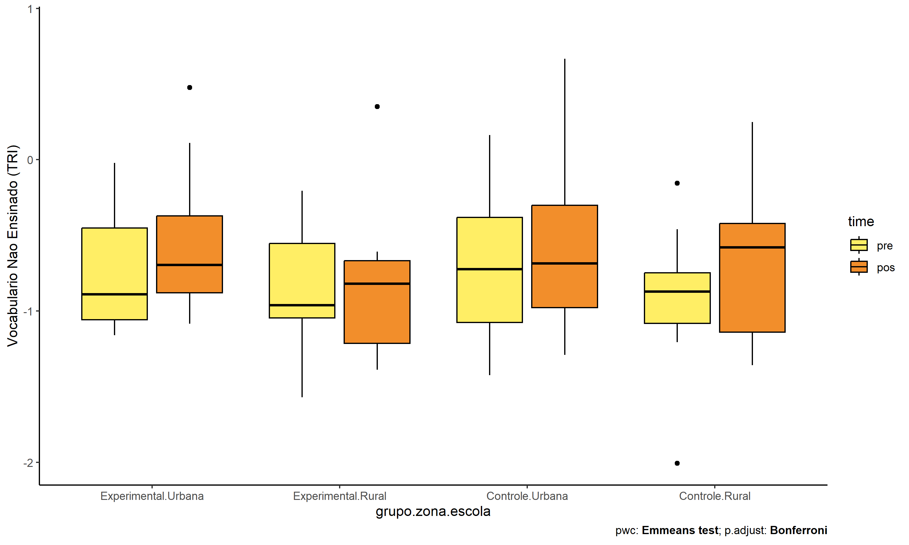<!-- -->

# Pairwise comparisons for grupo=“Experimental”

## factores: **grupo=“Experimental”:monitor**

### Vocabulario (Acertos)

### Vocabulario (TRI)

### Vocabulario Ensinado (Acertos)

### Vocabulario Ensinado (TRI)

### Vocabulario Nao Ensinado (Acertos)

### Vocabulario Nao Ensinado (TRI)

## factores: **grupo=“Experimental”:monitor.genero**

### Vocabulario (Acertos)

| var             | monitor.genero |   n | M (pre) | SE (pre) | M (unadj) | SE (unadj) | M (adj) | SE (adj) |
|:----------------|:---------------|----:|--------:|---------:|----------:|-----------:|--------:|---------:|
| score.vocab.pos | F              |  14 |  14.071 |    0.911 |    13.929 |      1.151 |  13.792 |    1.071 |
| score.vocab.pos | M              |   6 |  12.333 |    0.955 |    13.167 |      1.138 |  13.486 |    1.659 |

| .y.             | group1 | group2 | estimate | conf.low | conf.high |    se | statistic |     p | p.adj | p.adj.signif |
|:----------------|:-------|:-------|---------:|---------:|----------:|------:|----------:|------:|------:|:-------------|
| score.vocab.pos | F      | M      |    0.306 |   -3.920 |     4.533 | 2.003 |     0.153 | 0.880 | 0.880 | ns           |
| score.vocab.pre | F      | M      |    1.738 |   -1.488 |     4.964 | 1.536 |     1.132 | 0.273 | 0.273 | ns           |

| monitor.genero | group1 | group2 | estimate | conf.low | conf.high |    se | statistic |     p | p.adj | p.adj.signif |
|:---------------|:-------|:-------|---------:|---------:|----------:|------:|----------:|------:|------:|:-------------|
| F              | pre    | pos    |   -0.733 |   -3.527 |     2.061 | 1.380 |    -0.531 | 0.598 | 0.598 | ns           |
| M              | pre    | pos    |   -0.833 |   -5.251 |     3.584 | 2.182 |    -0.382 | 0.705 | 0.705 | ns           |

    ## Scale for colour is already present.
    ## Adding another scale for colour, which will replace the existing scale.

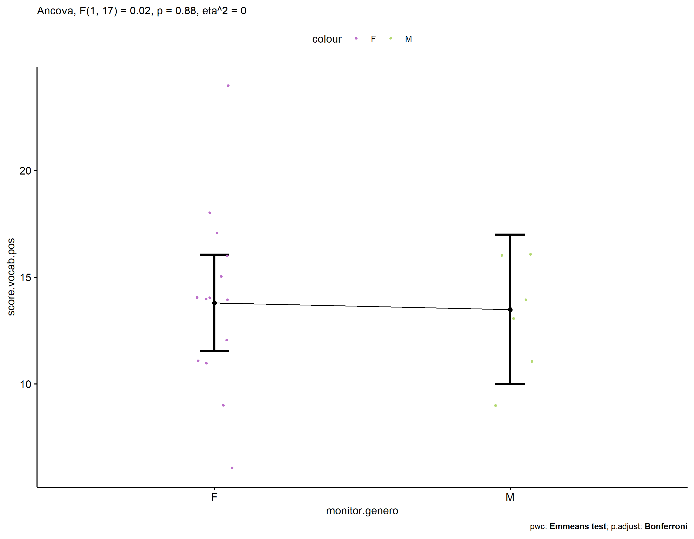<!-- -->

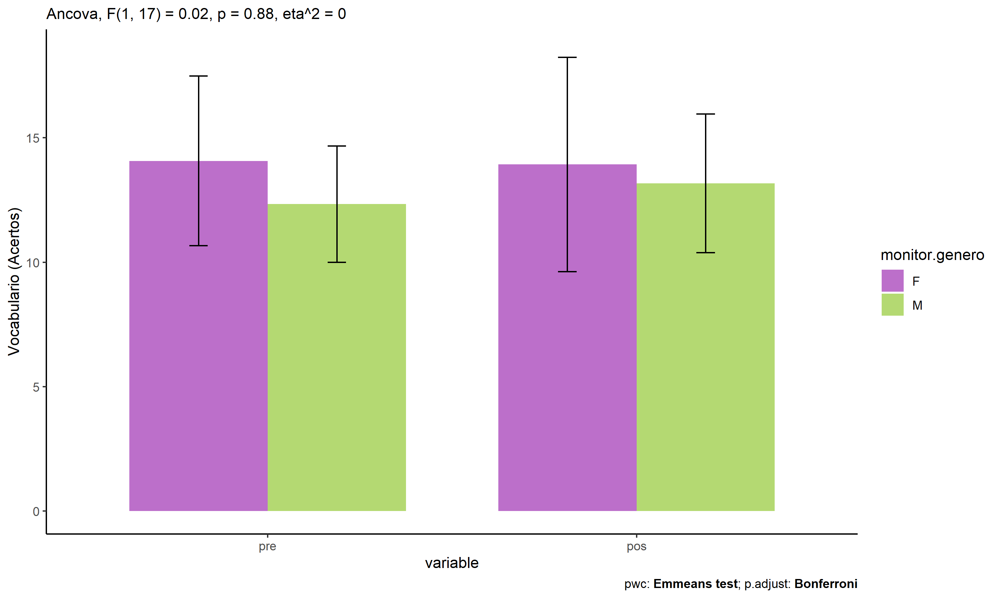<!-- -->

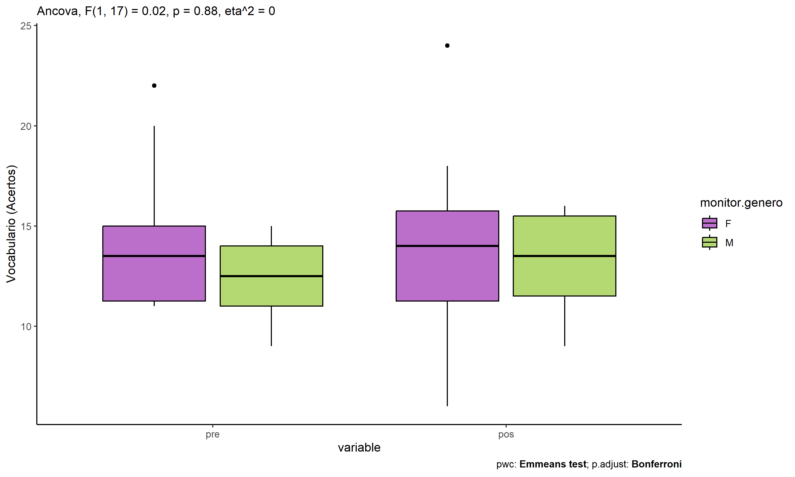<!-- -->

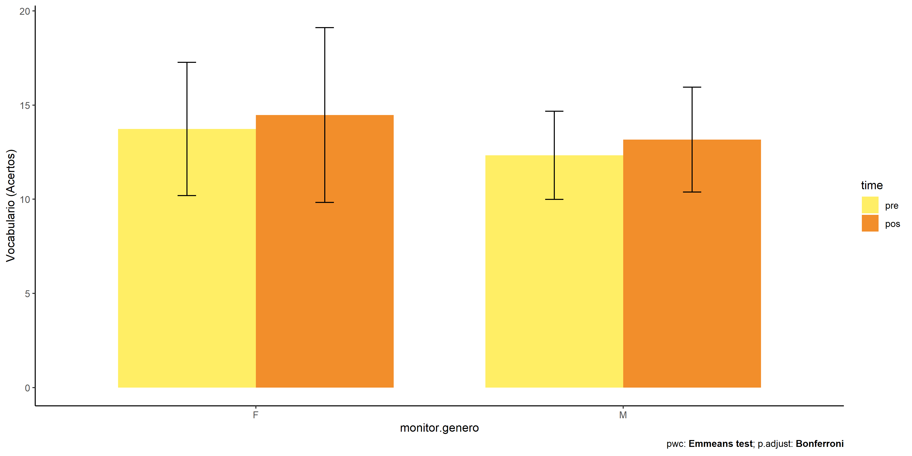<!-- -->

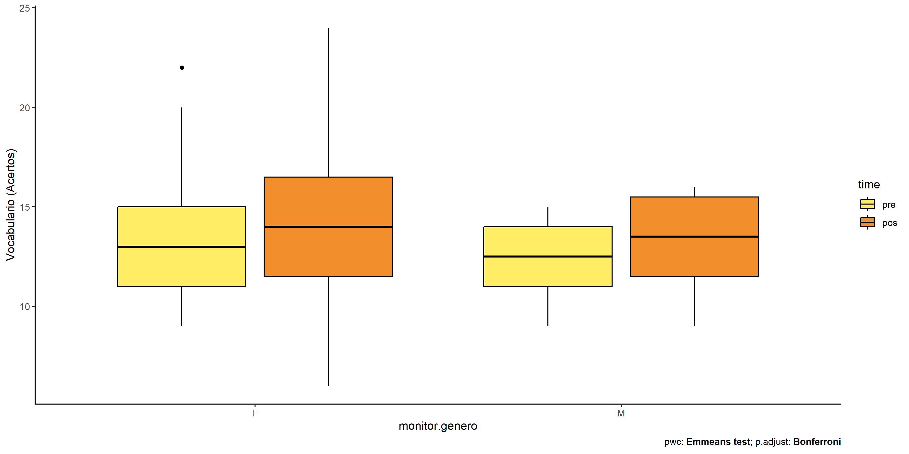<!-- -->

### Vocabulario (TRI)

| var           | monitor.genero |   n | M (pre) | SE (pre) | M (unadj) | SE (unadj) | M (adj) | SE (adj) |
|:--------------|:---------------|----:|--------:|---------:|----------:|-----------:|--------:|---------:|
| tri.vocab.pos | F              |  14 |  -0.757 |    0.199 |    -0.821 |      0.188 |  -0.822 |    0.135 |
| tri.vocab.pos | M              |   6 |  -0.763 |    0.164 |    -0.723 |      0.156 |  -0.720 |    0.206 |

| .y.           | group1 | group2 | estimate | conf.low | conf.high |    se | statistic |     p | p.adj | p.adj.signif |
|:--------------|:-------|:-------|---------:|---------:|----------:|------:|----------:|------:|------:|:-------------|
| tri.vocab.pos | F      | M      |   -0.102 |   -0.621 |     0.418 | 0.246 |    -0.413 | 0.685 | 0.685 | ns           |
| tri.vocab.pre | F      | M      |    0.006 |   -0.677 |     0.690 | 0.325 |     0.019 | 0.985 | 0.985 | ns           |

| monitor.genero | group1 | group2 | estimate | conf.low | conf.high |    se | statistic |     p | p.adj | p.adj.signif |
|:---------------|:-------|:-------|---------:|---------:|----------:|------:|----------:|------:|------:|:-------------|
| F              | pre    | pos    |   -0.032 |   -0.520 |     0.456 | 0.241 |    -0.132 | 0.895 | 0.895 | ns           |
| M              | pre    | pos    |   -0.040 |   -0.812 |     0.732 | 0.381 |    -0.105 | 0.917 | 0.917 | ns           |

    ## Scale for colour is already present.
    ## Adding another scale for colour, which will replace the existing scale.

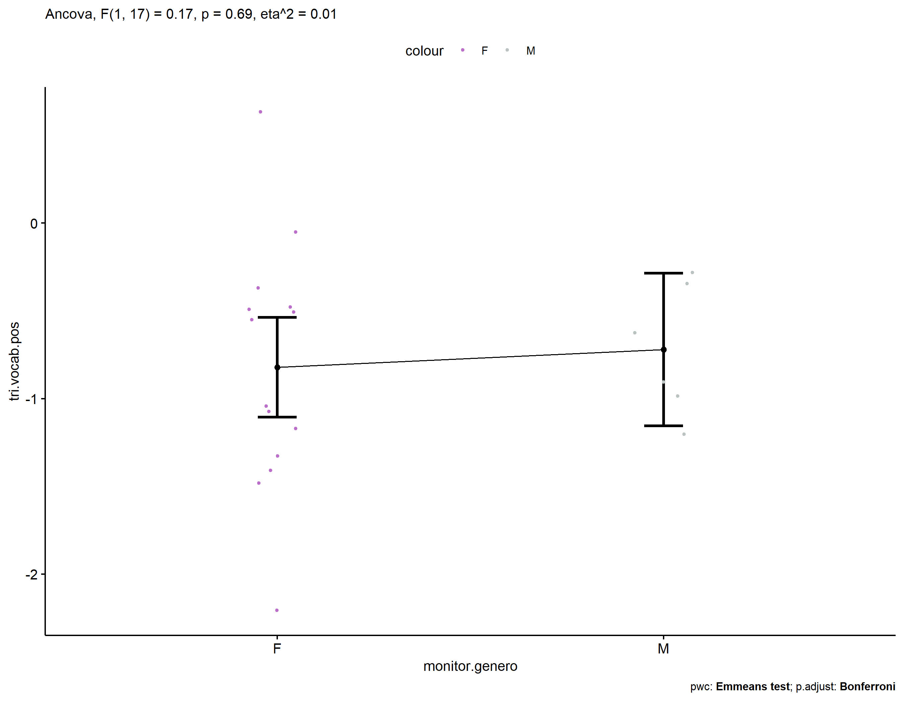<!-- -->

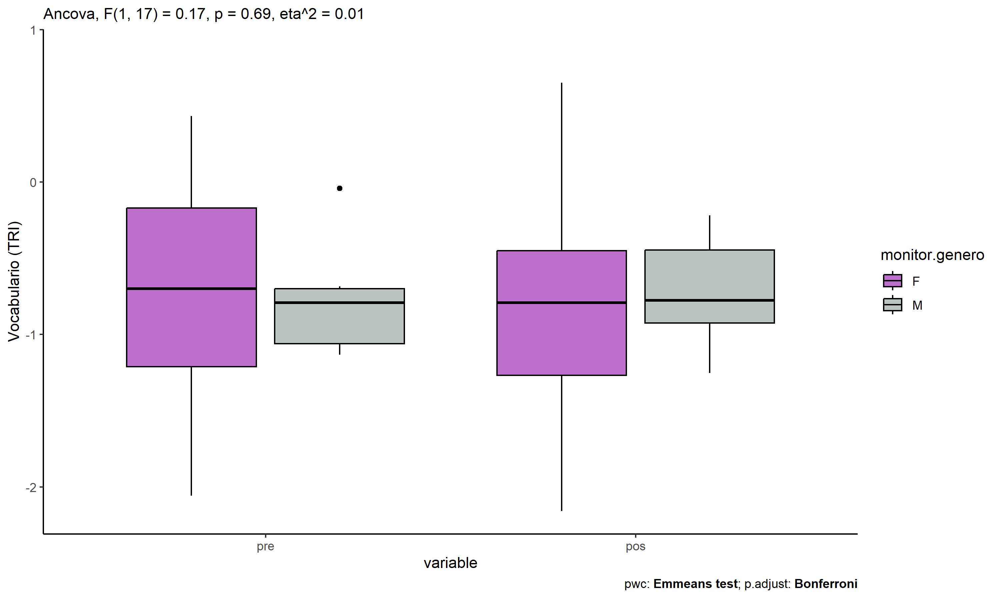<!-- -->

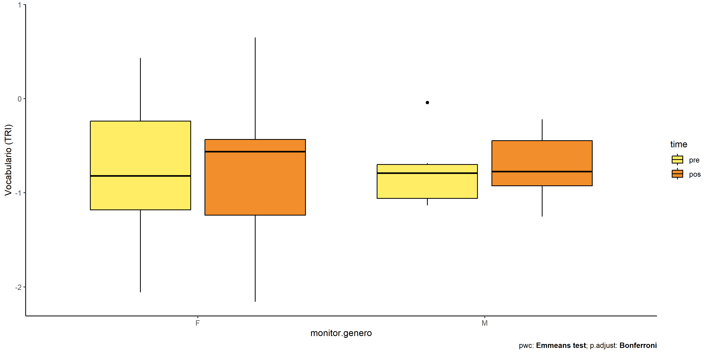<!-- -->

### Vocabulario Ensinado (Acertos)

| var                      | monitor.genero |   n | M (pre) | SE (pre) | M (unadj) | SE (unadj) | M (adj) | SE (adj) |
|:-------------------------|:---------------|----:|--------:|---------:|----------:|-----------:|--------:|---------:|
| score.vocab.ensinado.pos | F              |  16 |   2.812 |    0.356 |     2.562 |      0.456 |   2.531 |    0.442 |
| score.vocab.ensinado.pos | M              |   6 |   3.667 |    0.843 |     2.667 |      0.558 |   2.750 |    0.731 |

| .y.                      | group1 | group2 | estimate | conf.low | conf.high |    se | statistic |     p | p.adj | p.adj.signif |
|:-------------------------|:-------|:-------|---------:|---------:|----------:|------:|----------:|------:|------:|:-------------|
| score.vocab.ensinado.pos | F      | M      |   -0.219 |   -2.028 |     1.589 | 0.864 |    -0.254 | 0.802 | 0.802 | ns           |
| score.vocab.ensinado.pre | F      | M      |   -0.854 |   -2.461 |     0.752 | 0.770 |    -1.109 | 0.281 | 0.281 | ns           |

| monitor.genero | group1 | group2 | estimate | conf.low | conf.high |    se | statistic |     p | p.adj | p.adj.signif |
|:---------------|:-------|:-------|---------:|---------:|----------:|------:|----------:|------:|------:|:-------------|
| F              | pre    | pos    |     0.25 |   -0.941 |     1.441 | 0.589 |     0.424 | 0.674 | 0.674 | ns           |
| M              | pre    | pos    |     1.00 |   -0.944 |     2.944 | 0.962 |     1.040 | 0.305 | 0.305 | ns           |

    ## Scale for colour is already present.
    ## Adding another scale for colour, which will replace the existing scale.

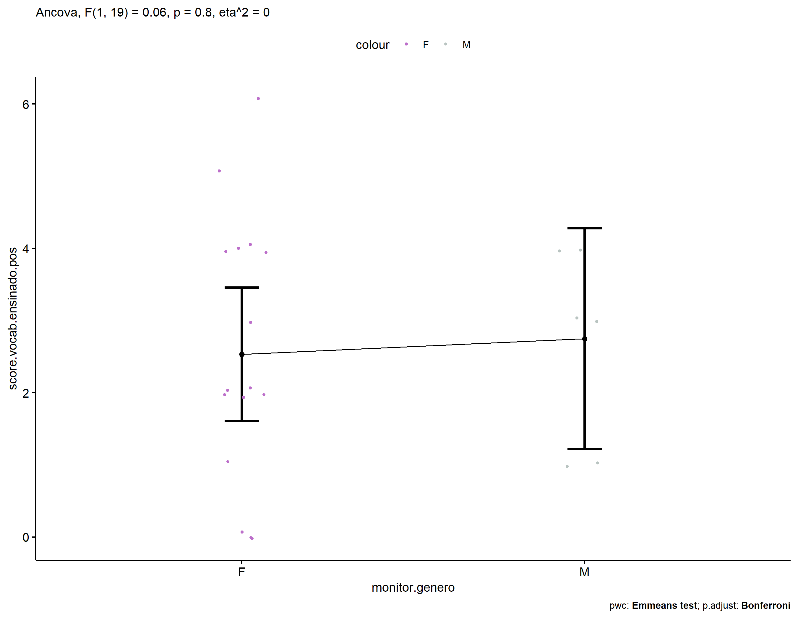<!-- -->

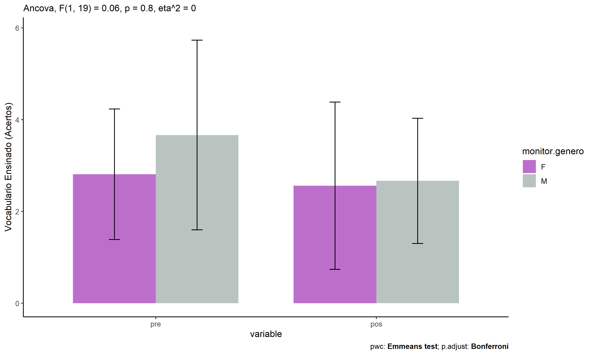<!-- -->

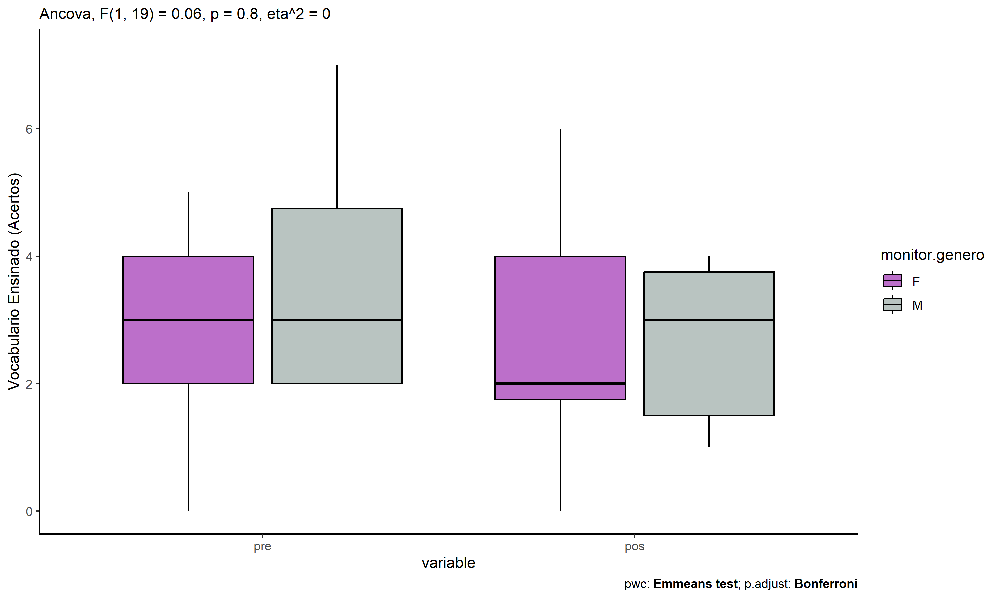<!-- -->

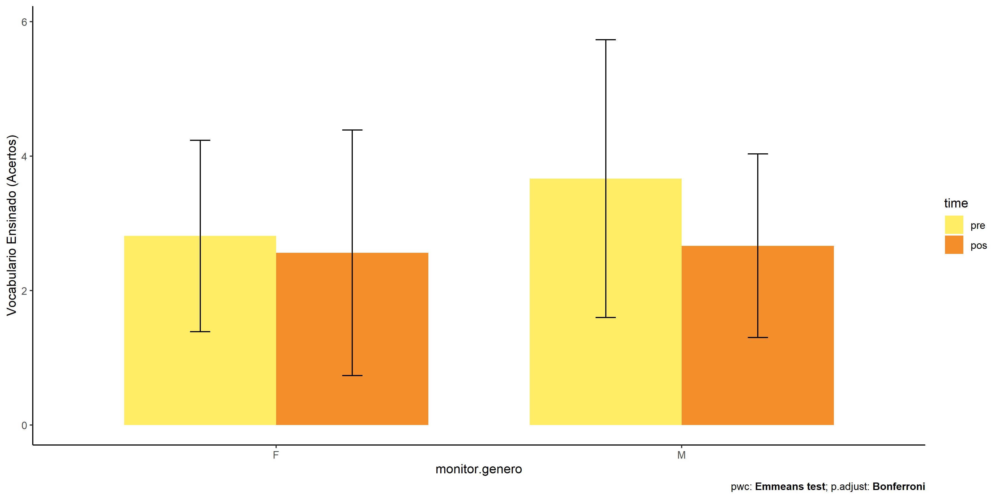<!-- -->

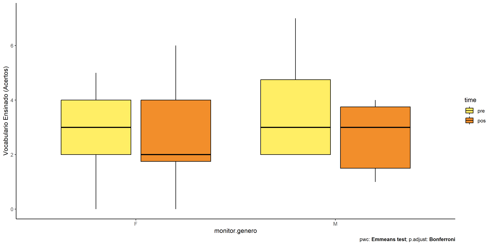<!-- -->

### Vocabulario Ensinado (TRI)

| var                    | monitor.genero |   n | M (pre) | SE (pre) | M (unadj) | SE (unadj) | M (adj) | SE (adj) |
|:-----------------------|:---------------|----:|--------:|---------:|----------:|-----------:|--------:|---------:|
| tri.vocab.ensinado.pos | F              |  14 |  -0.390 |    0.185 |    -0.702 |      0.173 |  -0.702 |    0.147 |
| tri.vocab.ensinado.pos | M              |   6 |  -0.386 |    0.258 |    -0.668 |      0.109 |  -0.668 |    0.225 |

| .y.                    | group1 | group2 | estimate | conf.low | conf.high |    se | statistic |     p | p.adj | p.adj.signif |
|:-----------------------|:-------|:-------|---------:|---------:|----------:|------:|----------:|------:|------:|:-------------|
| tri.vocab.ensinado.pos | F      | M      |   -0.034 |   -0.602 |     0.535 | 0.269 |    -0.125 | 0.902 | 0.902 | ns           |
| tri.vocab.ensinado.pre | F      | M      |   -0.004 |   -0.698 |     0.690 | 0.330 |    -0.012 | 0.991 | 0.991 | ns           |

| monitor.genero | group1 | group2 | estimate | conf.low | conf.high |    se | statistic |     p | p.adj | p.adj.signif |
|:---------------|:-------|:-------|---------:|---------:|----------:|------:|----------:|------:|------:|:-------------|
| F              | pre    | pos    |    0.281 |   -0.184 |     0.746 | 0.230 |     1.222 | 0.229 | 0.229 | ns           |
| M              | pre    | pos    |    0.282 |   -0.453 |     1.017 | 0.363 |     0.776 | 0.442 | 0.442 | ns           |

    ## Scale for colour is already present.
    ## Adding another scale for colour, which will replace the existing scale.

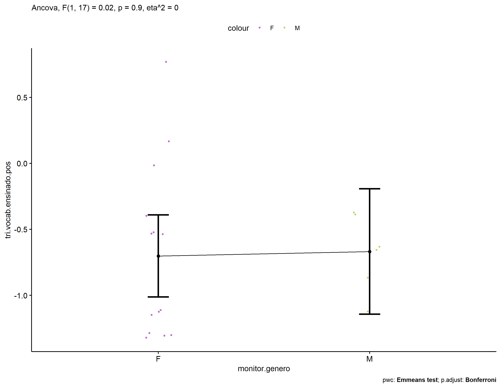<!-- -->

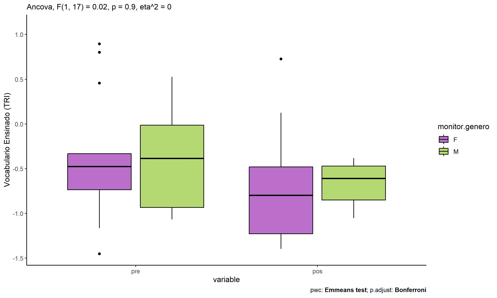<!-- -->

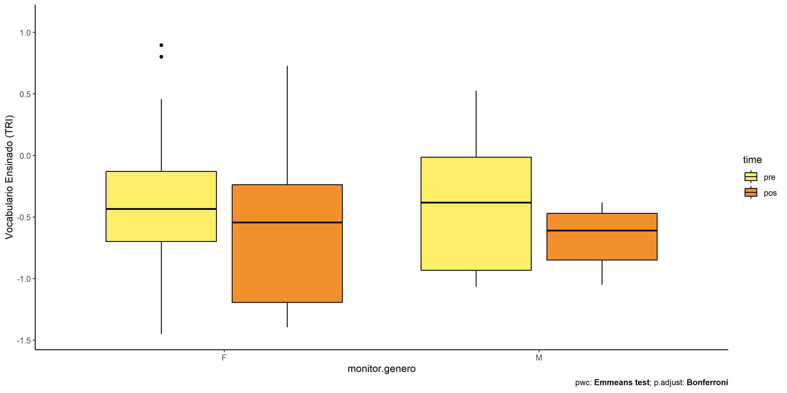<!-- -->

### Vocabulario Nao Ensinado (Acertos)

| var                          | monitor.genero |   n | M (pre) | SE (pre) | M (unadj) | SE (unadj) | M (adj) | SE (adj) |
|:-----------------------------|:---------------|----:|--------:|---------:|----------:|-----------:|--------:|---------:|
| score.vocab.nao.ensinado.pos | F              |  16 |  10.062 |    1.002 |      11.0 |      1.180 |  10.937 |    1.060 |
| score.vocab.nao.ensinado.pos | M              |   6 |   8.667 |    0.615 |      10.5 |      0.619 |  10.669 |    1.744 |

| .y.                          | group1 | group2 | estimate | conf.low | conf.high |    se | statistic |     p | p.adj | p.adj.signif |
|:-----------------------------|:-------|:-------|---------:|---------:|----------:|------:|----------:|------:|------:|:-------------|
| score.vocab.nao.ensinado.pos | F      | M      |    0.268 |   -4.032 |     4.567 | 2.054 |     0.130 | 0.898 | 0.898 | ns           |
| score.vocab.nao.ensinado.pre | F      | M      |    1.396 |   -2.151 |     4.942 | 1.700 |     0.821 | 0.421 | 0.421 | ns           |

| monitor.genero | group1 | group2 | estimate | conf.low | conf.high |    se | statistic |     p | p.adj | p.adj.signif |
|:---------------|:-------|:-------|---------:|---------:|----------:|------:|----------:|------:|------:|:-------------|
| F              | pre    | pos    |   -0.937 |   -3.700 |     1.825 | 1.367 |    -0.686 | 0.497 | 0.497 | ns           |
| M              | pre    | pos    |   -1.833 |   -6.344 |     2.678 | 2.232 |    -0.821 | 0.416 | 0.416 | ns           |

    ## Scale for colour is already present.
    ## Adding another scale for colour, which will replace the existing scale.

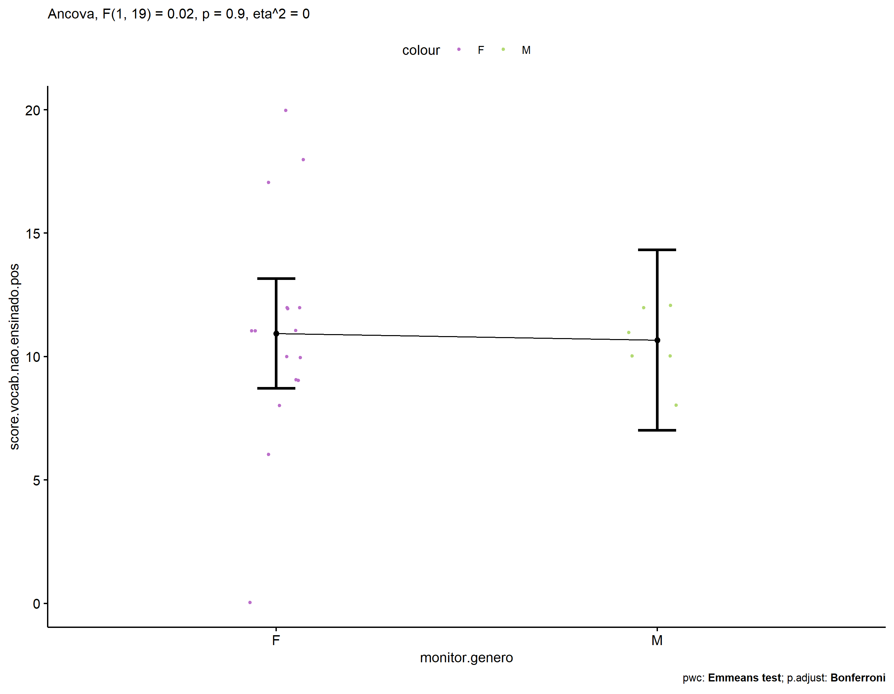<!-- -->

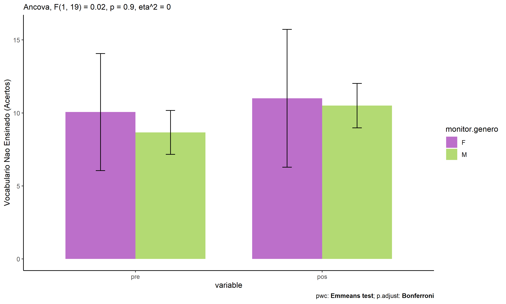<!-- -->

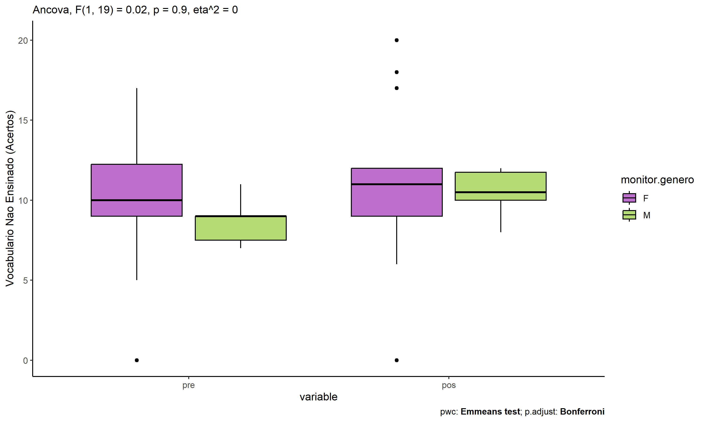<!-- -->

<!-- -->

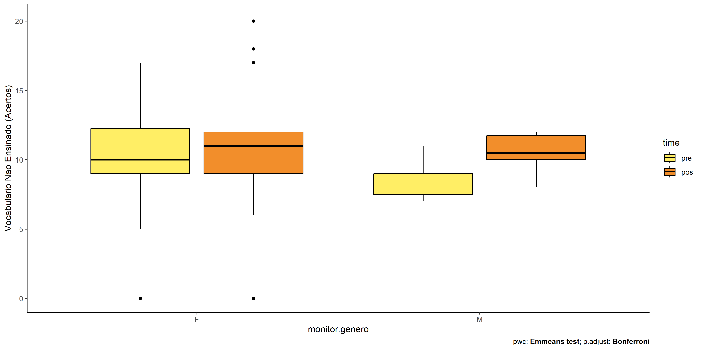<!-- -->

### Vocabulario Nao Ensinado (TRI)

| var                        | monitor.genero |   n | M (pre) | SE (pre) | M (unadj) | SE (unadj) | M (adj) | SE (adj) |
|:---------------------------|:---------------|----:|--------:|---------:|----------:|-----------:|--------:|---------:|
| tri.vocab.nao.ensinado.pos | F              |  14 |  -0.734 |    0.120 |     -0.72 |      0.132 |  -0.751 |    0.082 |
| tri.vocab.nao.ensinado.pos | M              |   6 |  -0.863 |    0.125 |     -0.77 |      0.103 |  -0.699 |    0.125 |

| .y.                        | group1 | group2 | estimate | conf.low | conf.high |    se | statistic |     p | p.adj | p.adj.signif |
|:---------------------------|:-------|:-------|---------:|---------:|----------:|------:|----------:|------:|------:|:-------------|
| tri.vocab.nao.ensinado.pos | F      | M      |   -0.052 |   -0.369 |     0.265 | 0.150 |    -0.344 | 0.735 | 0.735 | ns           |
| tri.vocab.nao.ensinado.pre | F      | M      |    0.129 |   -0.295 |     0.553 | 0.202 |     0.638 | 0.532 | 0.532 | ns           |

| monitor.genero | group1 | group2 | estimate | conf.low | conf.high |    se | statistic |     p | p.adj | p.adj.signif |
|:---------------|:-------|:-------|---------:|---------:|----------:|------:|----------:|------:|------:|:-------------|
| F              | pre    | pos    |   -0.128 |   -0.471 |     0.215 | 0.169 |    -0.756 | 0.454 | 0.454 | ns           |
| M              | pre    | pos    |   -0.093 |   -0.634 |     0.449 | 0.268 |    -0.346 | 0.731 | 0.731 | ns           |

    ## Scale for colour is already present.
    ## Adding another scale for colour, which will replace the existing scale.

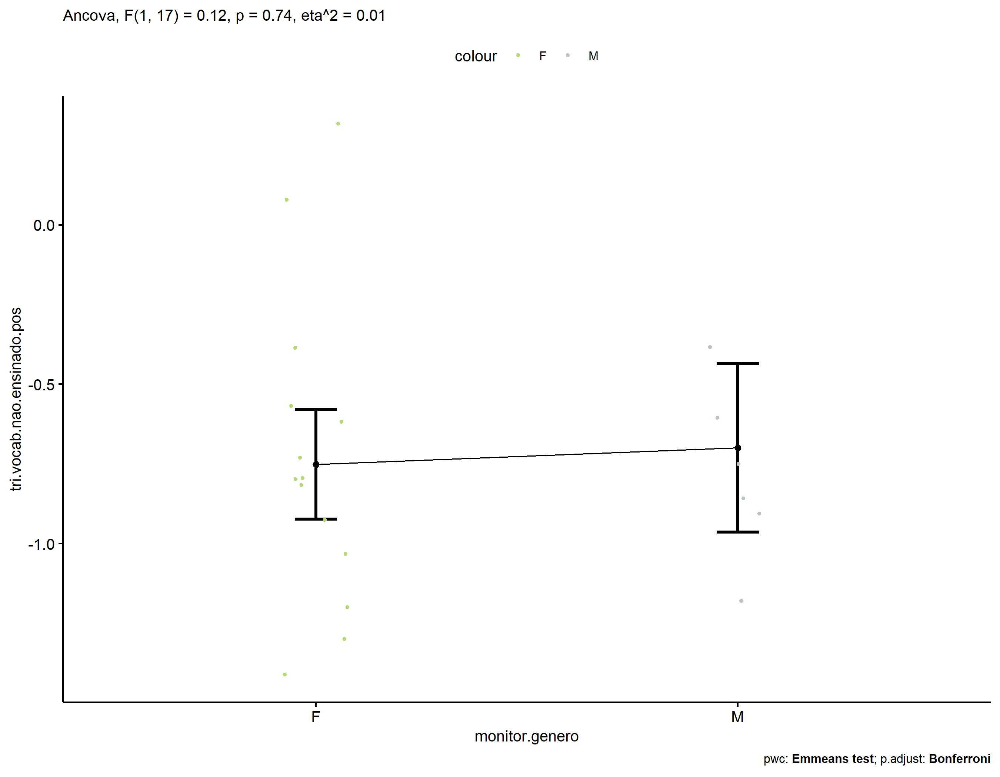<!-- -->

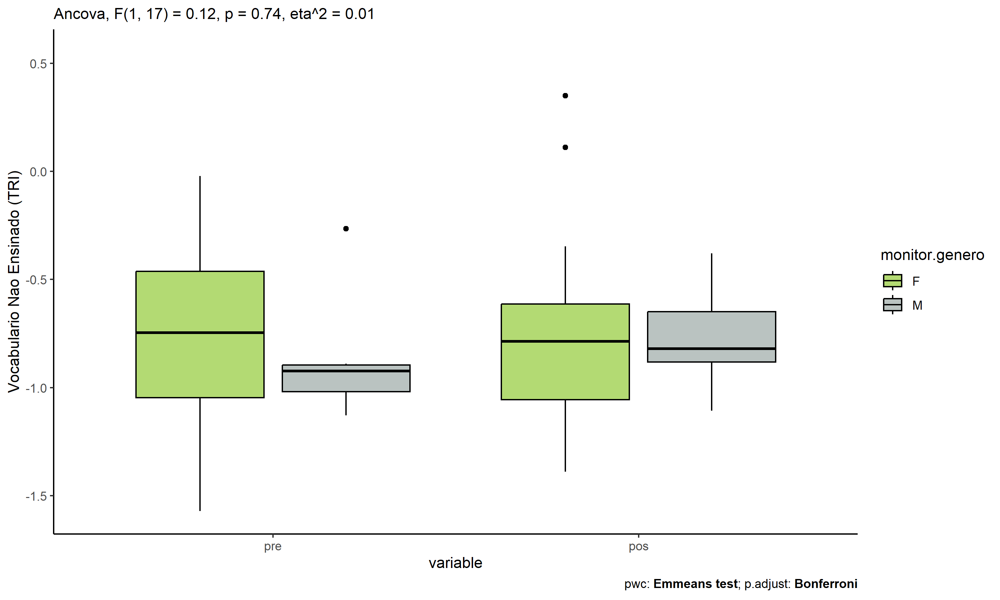<!-- -->

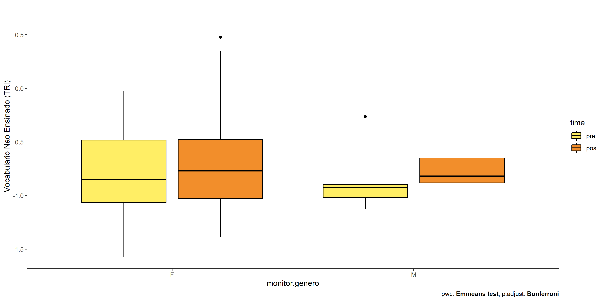<!-- -->

## factores: **grupo=“Experimental”:monitor.area**

### Vocabulario (Acertos)

### Vocabulario (TRI)

### Vocabulario Ensinado (Acertos)

### Vocabulario Ensinado (TRI)

### Vocabulario Nao Ensinado (Acertos)

### Vocabulario Nao Ensinado (TRI)

## factores: **grupo=“Experimental”:monitor.formacao**

### Vocabulario (Acertos)

### Vocabulario (TRI)

### Vocabulario Ensinado (Acertos)

### Vocabulario Ensinado (TRI)

### Vocabulario Nao Ensinado (Acertos)

### Vocabulario Nao Ensinado (TRI)

## factores: **grupo=“Experimental”:monitor.experiencia**

### Vocabulario (Acertos)

| var             | monitor.experiencia |   n | M (pre) | SE (pre) | M (unadj) | SE (unadj) | M (adj) | SE (adj) |
|:----------------|:--------------------|----:|--------:|---------:|----------:|-----------:|--------:|---------:|
| score.vocab.pos | maior 01 ano        |  12 |  14.333 |    1.032 |    13.833 |      1.278 |  13.610 |    1.170 |
| score.vocab.pos | menor 01 ano        |   8 |  12.375 |    0.754 |    13.500 |      1.086 |  13.835 |    1.447 |

| .y.             | group1       | group2       | estimate | conf.low | conf.high |    se | statistic |     p | p.adj | p.adj.signif |
|:----------------|:-------------|:-------------|---------:|---------:|----------:|------:|----------:|------:|------:|:-------------|
| score.vocab.pos | maior 01 ano | menor 01 ano |   -0.225 |   -4.244 |     3.795 | 1.905 |    -0.118 | 0.907 | 0.907 | ns           |
| score.vocab.pre | maior 01 ano | menor 01 ano |    1.958 |   -1.011 |     4.927 | 1.413 |     1.386 | 0.183 | 0.183 | ns           |

| monitor.experiencia | group1 | group2 | estimate | conf.low | conf.high |    se | statistic |     p | p.adj | p.adj.signif |
|:--------------------|:-------|:-------|---------:|---------:|----------:|------:|----------:|------:|------:|:-------------|
| maior 01 ano        | pre    | pos    |   -0.128 |   -3.143 |     2.887 | 1.489 |    -0.086 | 0.932 | 0.932 | ns           |
| menor 01 ano        | pre    | pos    |   -1.500 |   -5.159 |     2.159 | 1.808 |    -0.830 | 0.412 | 0.412 | ns           |

    ## Scale for colour is already present.
    ## Adding another scale for colour, which will replace the existing scale.

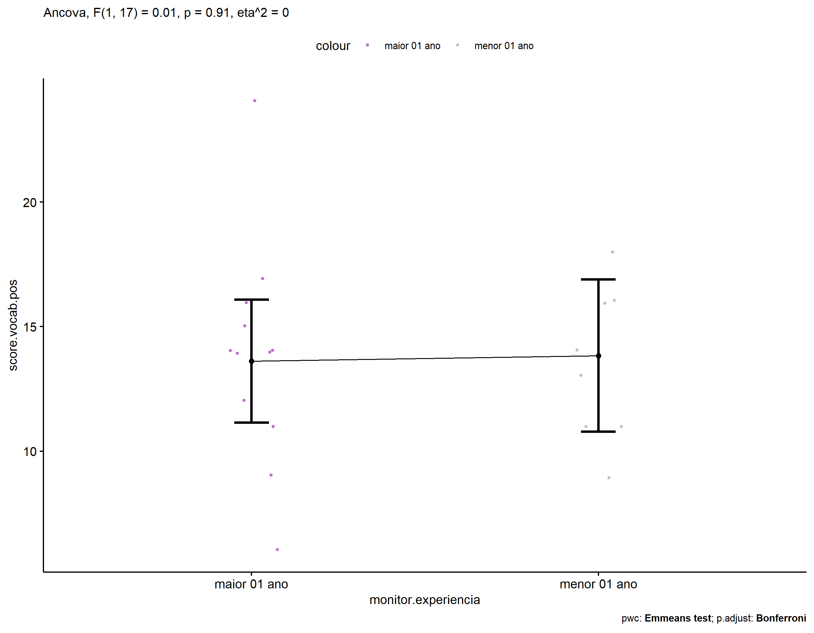<!-- -->

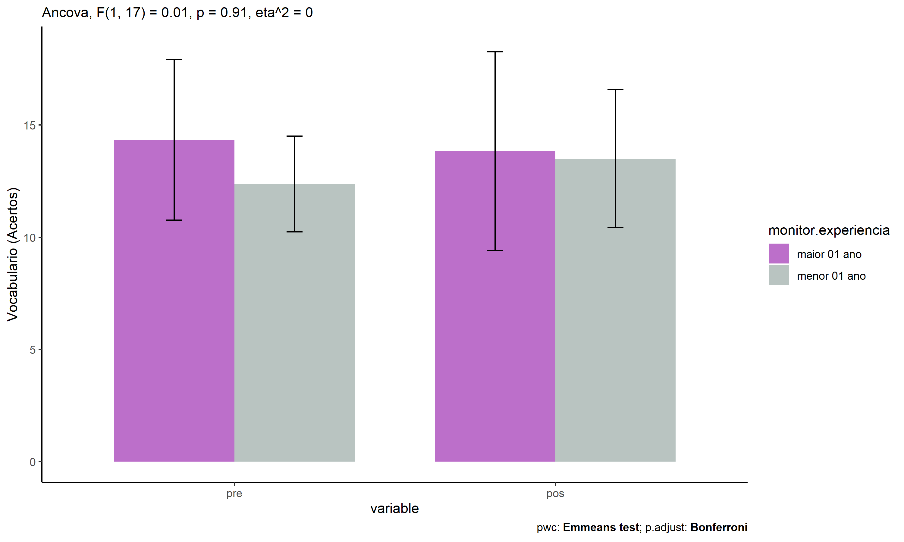<!-- -->

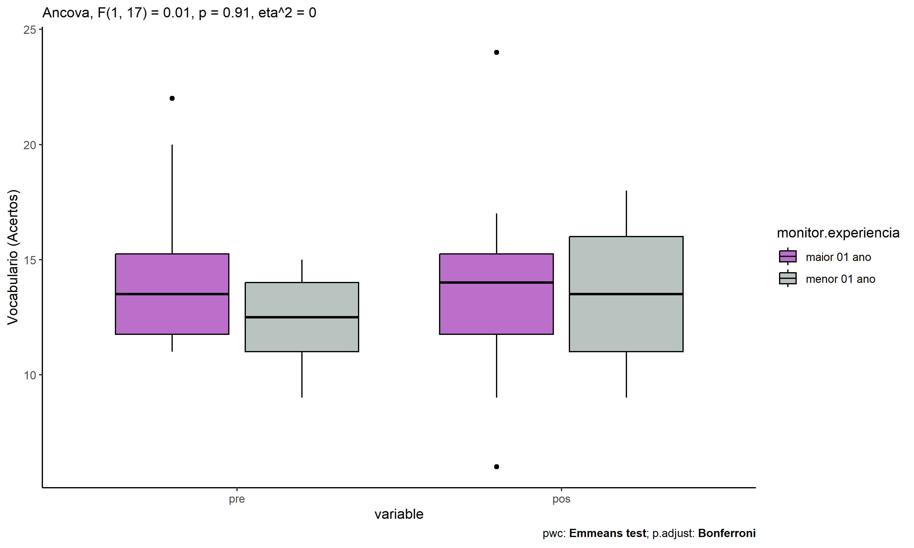<!-- -->

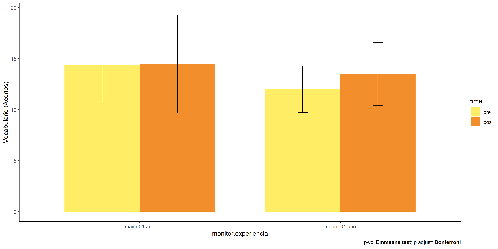<!-- -->

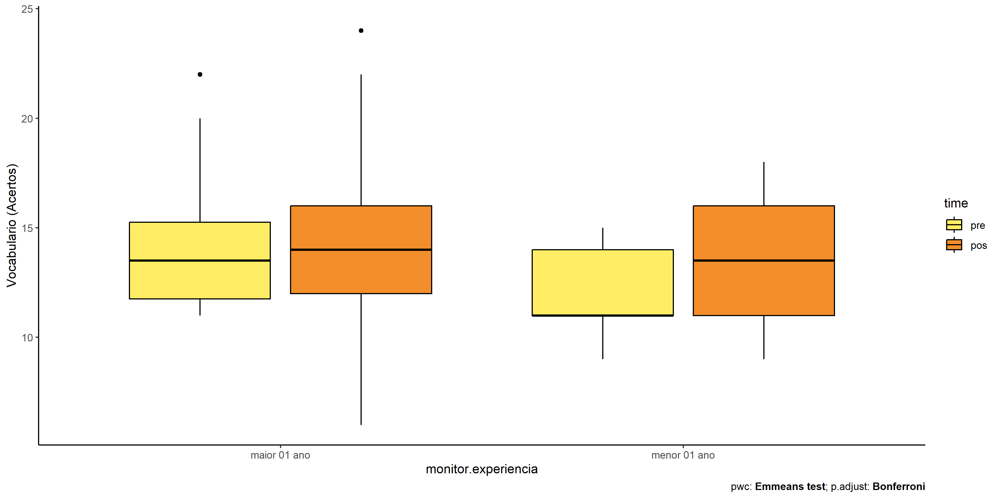<!-- -->

### Vocabulario (TRI)

| var           | monitor.experiencia |   n | M (pre) | SE (pre) | M (unadj) | SE (unadj) | M (adj) | SE (adj) |
|:--------------|:--------------------|----:|--------:|---------:|----------:|-----------:|--------:|---------:|
| tri.vocab.pos | maior 01 ano        |  12 |  -0.605 |    0.196 |    -0.635 |      0.167 |  -0.719 |    0.147 |
| tri.vocab.pos | menor 01 ano        |   8 |  -0.989 |    0.199 |    -1.026 |      0.223 |  -0.899 |    0.181 |

| .y.           | group1       | group2       | estimate | conf.low | conf.high |    se | statistic |     p | p.adj | p.adj.signif |
|:--------------|:-------------|:-------------|---------:|---------:|----------:|------:|----------:|------:|------:|:-------------|
| tri.vocab.pos | maior 01 ano | menor 01 ano |    0.179 |   -0.323 |     0.682 | 0.238 |     0.753 | 0.462 | 0.462 | ns           |
| tri.vocab.pre | maior 01 ano | menor 01 ano |    0.384 |   -0.226 |     0.994 | 0.291 |     1.322 | 0.203 | 0.203 | ns           |

| monitor.experiencia | group1 | group2 | estimate | conf.low | conf.high |    se | statistic |     p | p.adj | p.adj.signif |
|:--------------------|:-------|:-------|---------:|---------:|----------:|------:|----------:|------:|------:|:-------------|
| maior 01 ano        | pre    | pos    |   -0.050 |   -0.555 |     0.455 | 0.249 |    -0.201 | 0.842 | 0.842 | ns           |
| menor 01 ano        | pre    | pos    |    0.039 |   -0.573 |     0.652 | 0.303 |     0.130 | 0.898 | 0.898 | ns           |

    ## Scale for colour is already present.
    ## Adding another scale for colour, which will replace the existing scale.

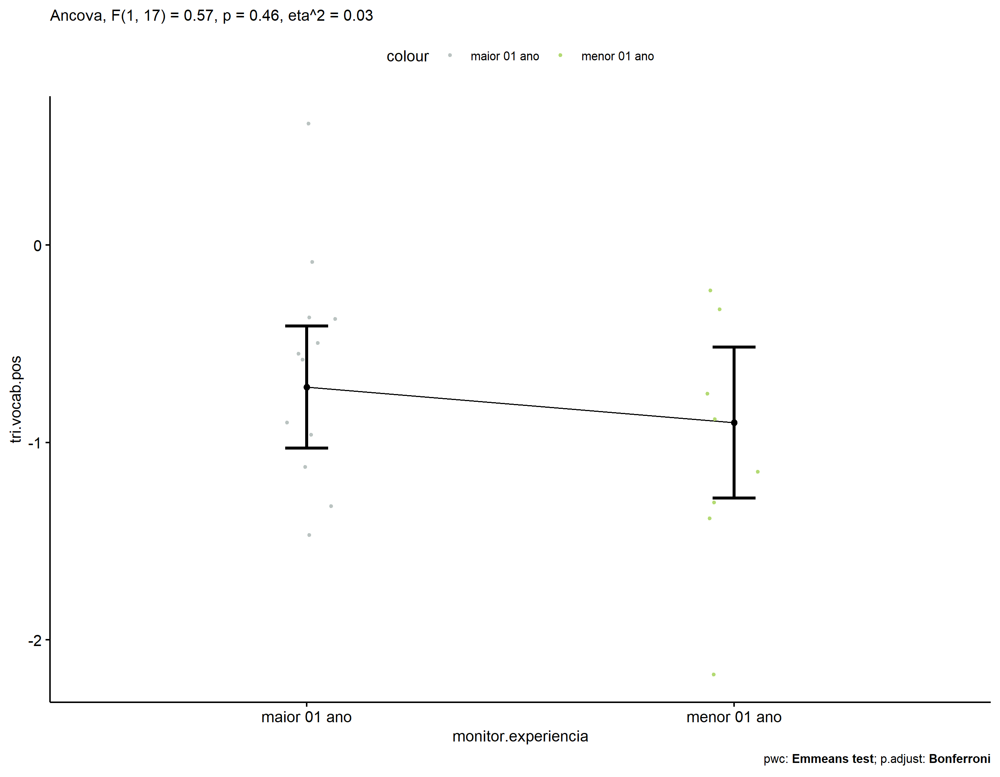<!-- -->

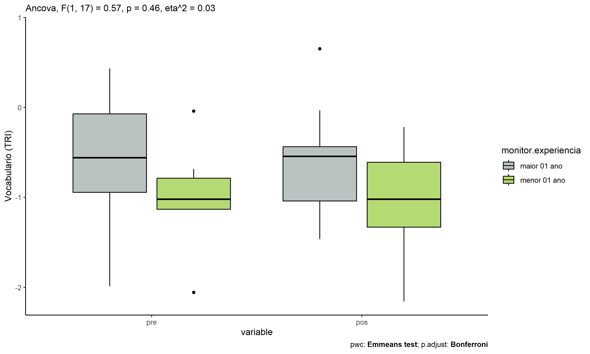<!-- -->

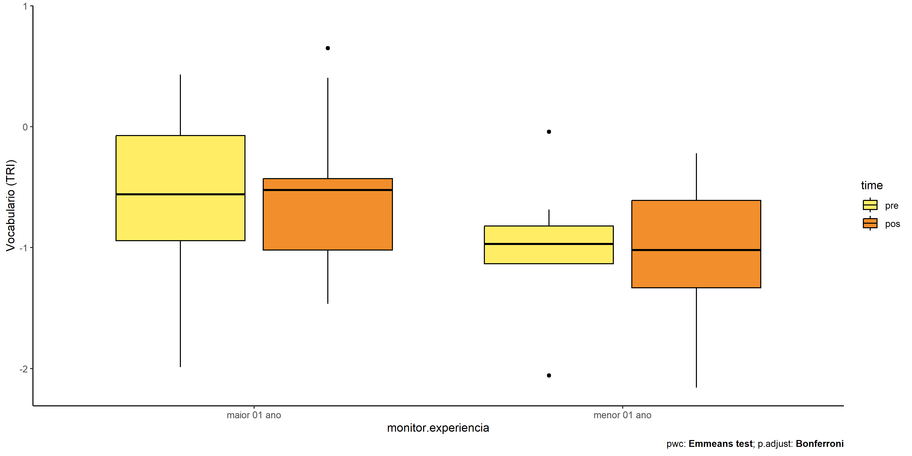<!-- -->

### Vocabulario Ensinado (Acertos)

| var                      | monitor.experiencia |   n | M (pre) | SE (pre) | M (unadj) | SE (unadj) | M (adj) | SE (adj) |
|:-------------------------|:--------------------|----:|--------:|---------:|----------:|-----------:|--------:|---------:|
| score.vocab.ensinado.pos | maior 01 ano        |  13 |   2.923 |    0.383 |     2.462 |      0.462 |   2.446 |    0.485 |
| score.vocab.ensinado.pos | menor 01 ano        |   9 |   3.222 |    0.662 |     2.778 |      0.596 |   2.801 |    0.583 |

| .y.                      | group1       | group2       | estimate | conf.low | conf.high |    se | statistic |     p | p.adj | p.adj.signif |
|:-------------------------|:-------------|:-------------|---------:|---------:|----------:|------:|----------:|------:|------:|:-------------|
| score.vocab.ensinado.pos | maior 01 ano | menor 01 ano |   -0.355 |   -1.946 |     1.236 | 0.760 |    -0.467 | 0.646 | 0.646 | ns           |
| score.vocab.ensinado.pre | maior 01 ano | menor 01 ano |   -0.299 |   -1.792 |     1.194 | 0.716 |    -0.418 | 0.680 | 0.680 | ns           |

| monitor.experiencia | group1 | group2 | estimate | conf.low | conf.high |    se | statistic |     p | p.adj | p.adj.signif |
|:--------------------|:-------|:-------|---------:|---------:|----------:|------:|----------:|------:|------:|:-------------|
| maior 01 ano        | pre    | pos    |    0.462 |   -0.872 |     1.796 | 0.660 |     0.699 | 0.488 | 0.488 | ns           |
| menor 01 ano        | pre    | pos    |    0.444 |   -1.159 |     2.048 | 0.793 |     0.560 | 0.578 | 0.578 | ns           |

    ## Scale for colour is already present.
    ## Adding another scale for colour, which will replace the existing scale.

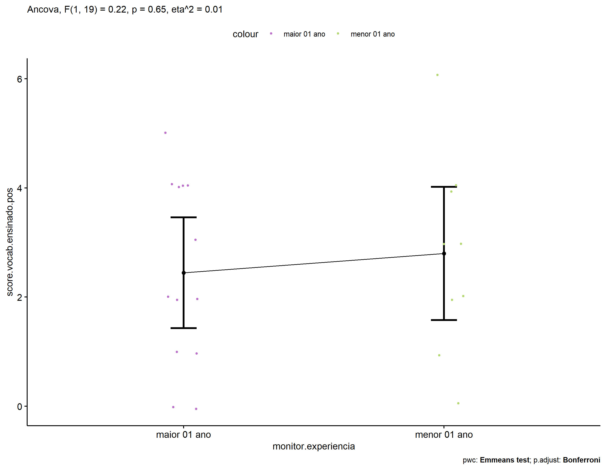<!-- -->

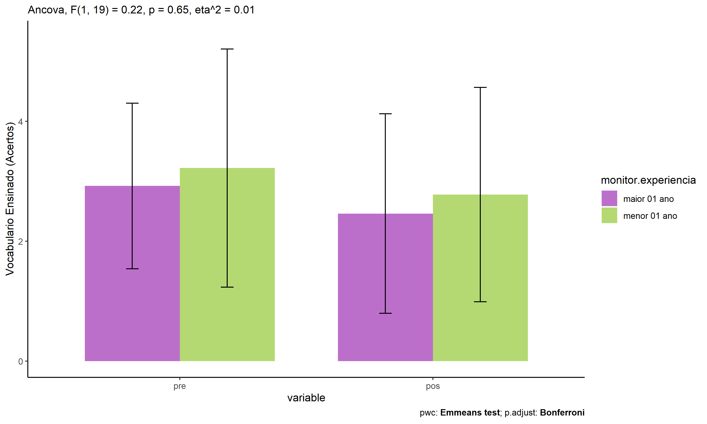<!-- -->

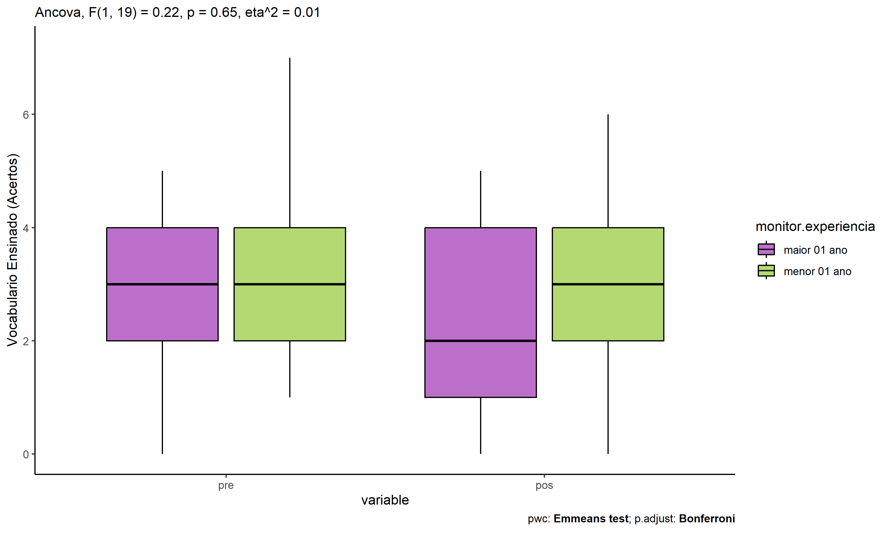<!-- -->

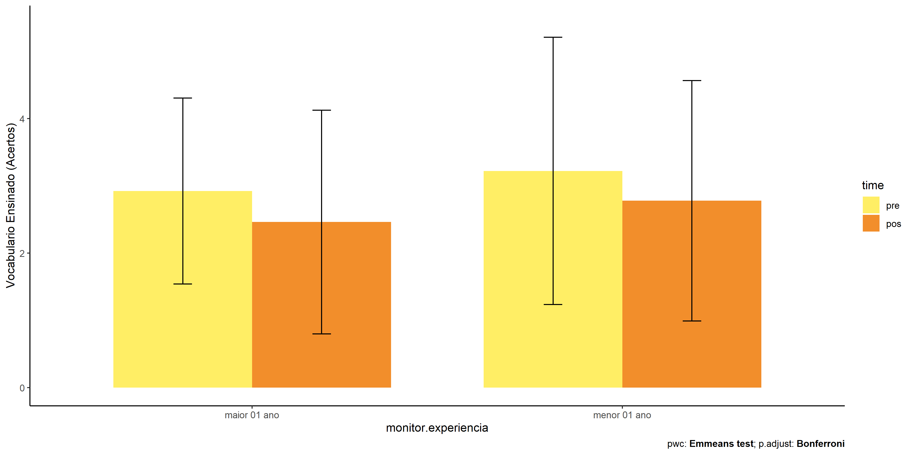<!-- -->

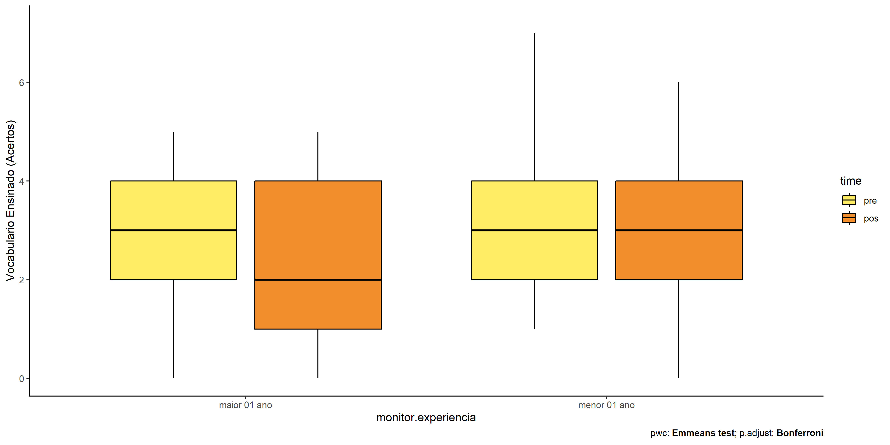<!-- -->

### Vocabulario Ensinado (TRI)

| var                    | monitor.experiencia |   n | M (pre) | SE (pre) | M (unadj) | SE (unadj) | M (adj) | SE (adj) |
|:-----------------------|:--------------------|----:|--------:|---------:|----------:|-----------:|--------:|---------:|
| tri.vocab.ensinado.pos | maior 01 ano        |  12 |  -0.210 |    0.181 |    -0.650 |      0.192 |  -0.699 |    0.163 |
| tri.vocab.ensinado.pos | menor 01 ano        |   8 |  -0.656 |    0.229 |    -0.756 |      0.125 |  -0.682 |    0.203 |

| .y.                    | group1       | group2       | estimate | conf.low | conf.high |    se | statistic |     p | p.adj | p.adj.signif |
|:-----------------------|:-------------|:-------------|---------:|---------:|----------:|------:|----------:|------:|------:|:-------------|
| tri.vocab.ensinado.pos | maior 01 ano | menor 01 ano |   -0.017 |   -0.582 |     0.548 | 0.268 |    -0.063 | 0.950 | 0.950 | ns           |
| tri.vocab.ensinado.pre | maior 01 ano | menor 01 ano |    0.446 |   -0.164 |     1.056 | 0.290 |     1.536 | 0.142 | 0.142 | ns           |

| monitor.experiencia | group1 | group2 | estimate | conf.low | conf.high |    se | statistic |     p | p.adj | p.adj.signif |
|:--------------------|:-------|:-------|---------:|---------:|----------:|------:|----------:|------:|------:|:-------------|
| maior 01 ano        | pre    | pos    |    0.371 |   -0.124 |     0.867 | 0.245 |     1.517 | 0.137 | 0.137 | ns           |
| menor 01 ano        | pre    | pos    |    0.180 |   -0.422 |     0.781 | 0.297 |     0.605 | 0.549 | 0.549 | ns           |

    ## Scale for colour is already present.
    ## Adding another scale for colour, which will replace the existing scale.

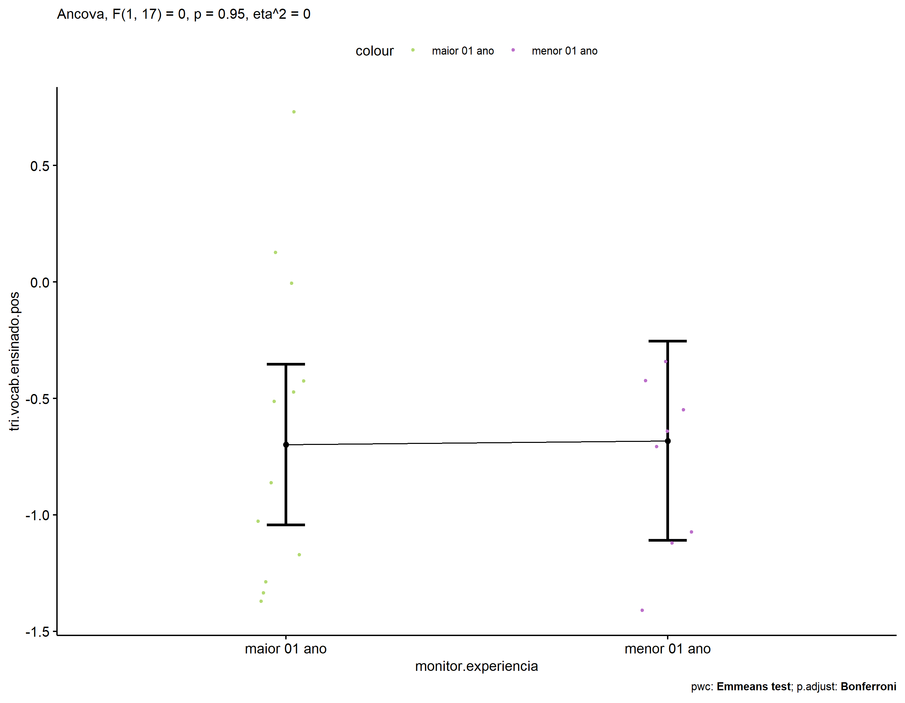<!-- -->

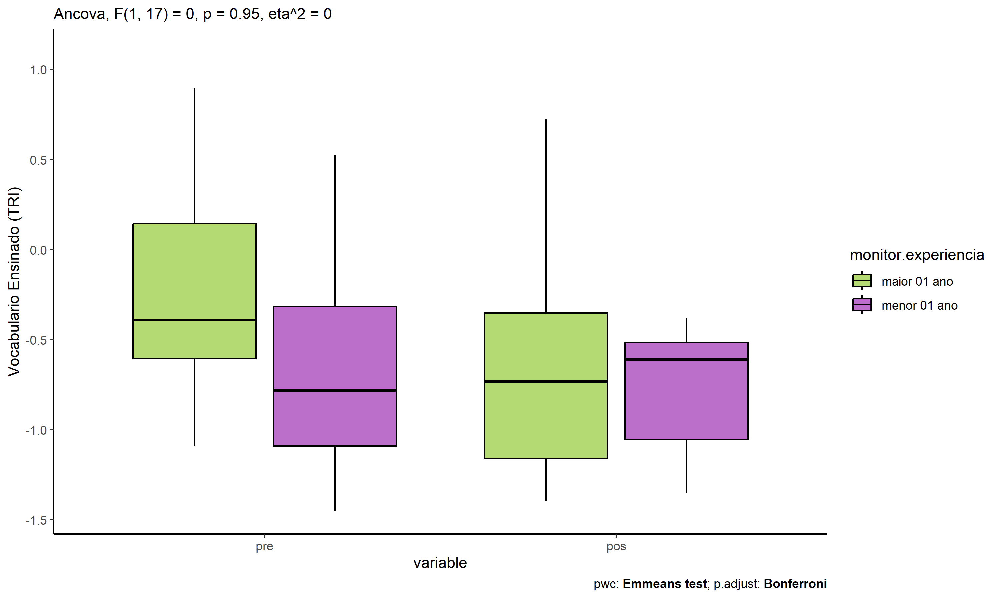<!-- -->

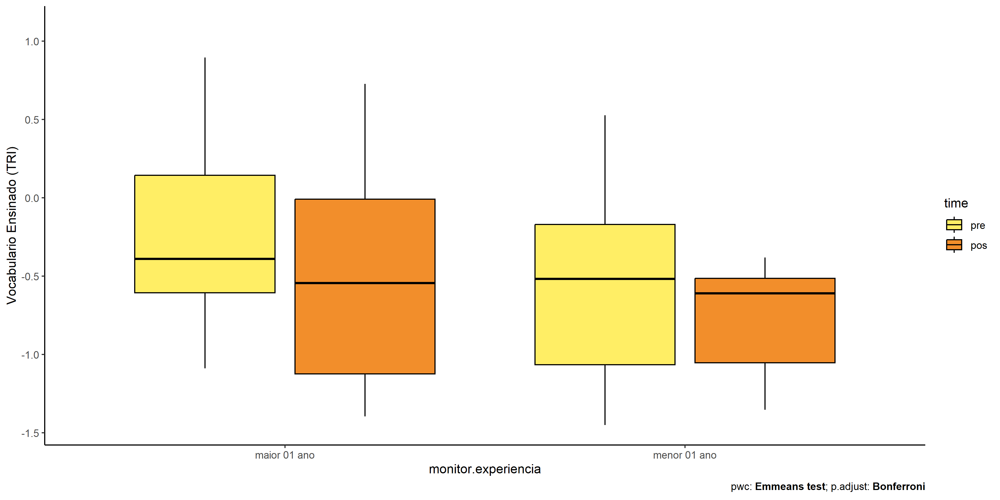<!-- -->

### Vocabulario Nao Ensinado (Acertos)

| var                          | monitor.experiencia |   n | M (pre) | SE (pre) | M (unadj) | SE (unadj) | M (adj) | SE (adj) |
|:-----------------------------|:--------------------|----:|--------:|---------:|----------:|-----------:|--------:|---------:|
| score.vocab.nao.ensinado.pos | maior 01 ano        |  13 |  10.308 |    1.173 |    12.000 |      1.109 |  11.943 |    1.120 |
| score.vocab.nao.ensinado.pos | menor 01 ano        |   9 |   8.778 |    0.683 |     9.222 |      1.256 |   9.304 |    1.352 |

| .y.                          | group1       | group2       | estimate | conf.low | conf.high |    se | statistic |     p | p.adj | p.adj.signif |
|:-----------------------------|:-------------|:-------------|---------:|---------:|----------:|------:|----------:|------:|------:|:-------------|
| score.vocab.nao.ensinado.pos | maior 01 ano | menor 01 ano |    2.639 |   -1.078 |     6.357 | 1.776 |     1.486 | 0.154 | 0.154 | ns           |
| score.vocab.nao.ensinado.pre | maior 01 ano | menor 01 ano |    1.530 |   -1.657 |     4.717 | 1.528 |     1.001 | 0.329 | 0.329 | ns           |

| monitor.experiencia | group1 | group2 | estimate | conf.low | conf.high |    se | statistic |     p | p.adj | p.adj.signif |
|:--------------------|:-------|:-------|---------:|---------:|----------:|------:|----------:|------:|------:|:-------------|
| maior 01 ano        | pre    | pos    |   -1.692 |   -4.642 |     1.258 | 1.460 |    -1.159 | 0.253 | 0.253 | ns           |
| menor 01 ano        | pre    | pos    |   -0.444 |   -3.990 |     3.101 | 1.754 |    -0.253 | 0.801 | 0.801 | ns           |

    ## Scale for colour is already present.
    ## Adding another scale for colour, which will replace the existing scale.

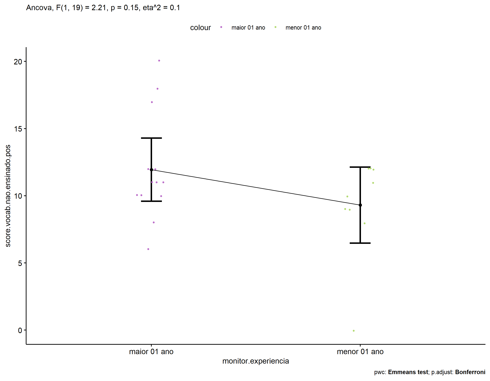<!-- -->

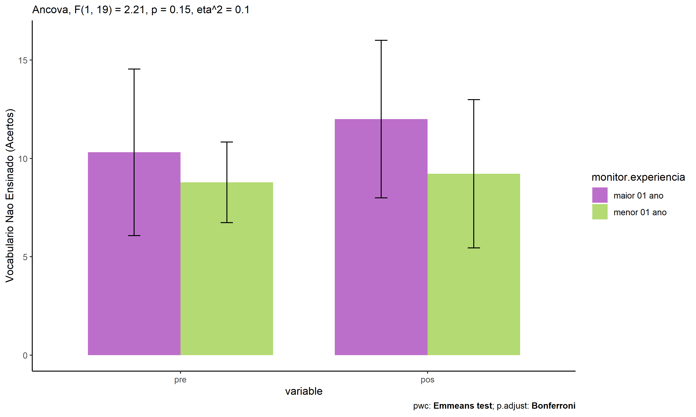<!-- -->

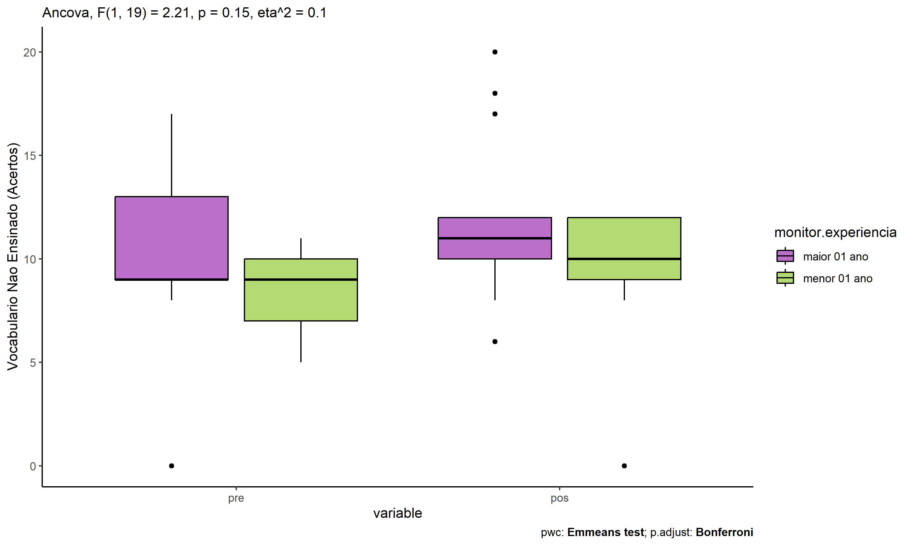<!-- -->

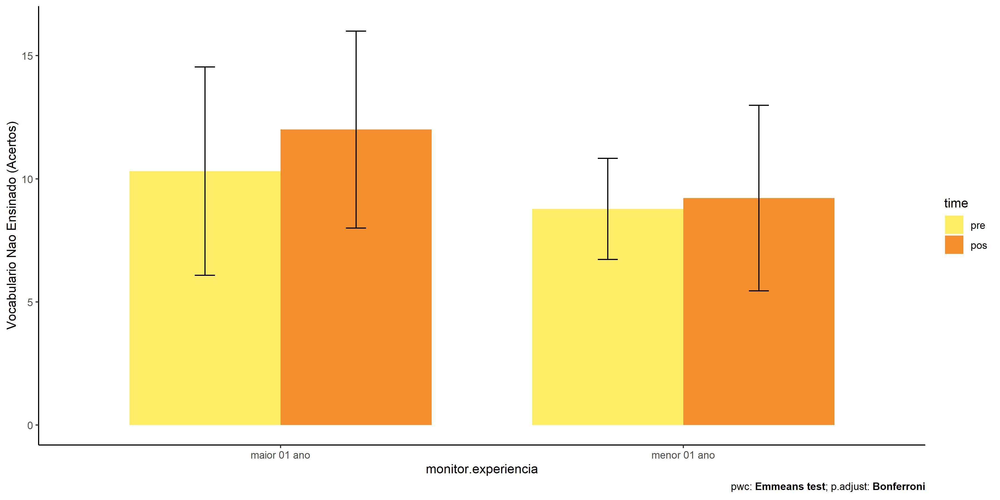<!-- -->

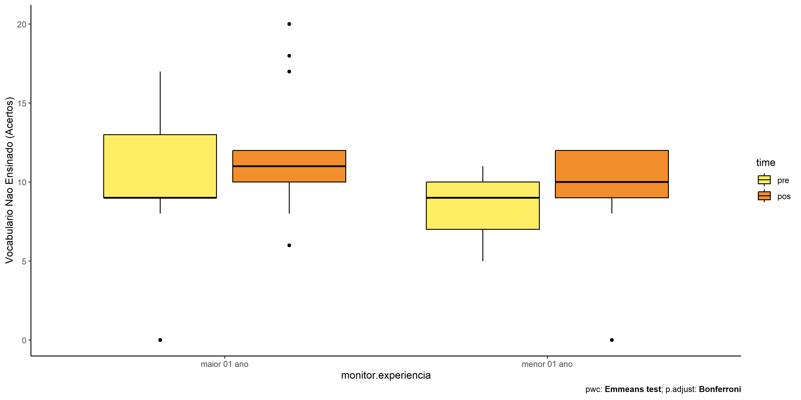<!-- -->

### Vocabulario Nao Ensinado (TRI)

| var                        | monitor.experiencia |   n | M (pre) | SE (pre) | M (unadj) | SE (unadj) | M (adj) | SE (adj) |
|:---------------------------|:--------------------|----:|--------:|---------:|----------:|-----------:|--------:|---------:|
| tri.vocab.nao.ensinado.pos | maior 01 ano        |  12 |  -0.687 |    0.134 |    -0.630 |      0.139 |  -0.694 |    0.088 |
| tri.vocab.nao.ensinado.pos | menor 01 ano        |   8 |  -0.902 |    0.099 |    -0.893 |      0.106 |  -0.797 |    0.109 |

| .y.                        | group1       | group2       | estimate | conf.low | conf.high |    se | statistic |     p | p.adj | p.adj.signif |
|:---------------------------|:-------------|:-------------|---------:|---------:|----------:|------:|----------:|------:|------:|:-------------|
| tri.vocab.nao.ensinado.pos | maior 01 ano | menor 01 ano |    0.103 |   -0.198 |     0.403 | 0.142 |     0.720 | 0.481 | 0.481 | ns           |
| tri.vocab.nao.ensinado.pre | maior 01 ano | menor 01 ano |    0.215 |   -0.172 |     0.602 | 0.184 |     1.167 | 0.258 | 0.258 | ns           |

| monitor.experiencia | group1 | group2 | estimate | conf.low | conf.high |    se | statistic |     p | p.adj | p.adj.signif |
|:--------------------|:-------|:-------|---------:|---------:|----------:|------:|----------:|------:|------:|:-------------|
| maior 01 ano        | pre    | pos    |   -0.142 |   -0.498 |     0.214 | 0.176 |    -0.806 | 0.425 | 0.425 | ns           |
| menor 01 ano        | pre    | pos    |   -0.047 |   -0.480 |     0.385 | 0.214 |    -0.221 | 0.826 | 0.826 | ns           |

    ## Scale for colour is already present.
    ## Adding another scale for colour, which will replace the existing scale.

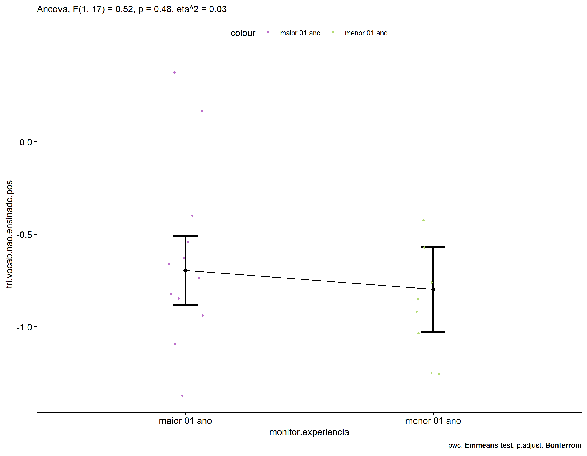<!-- -->

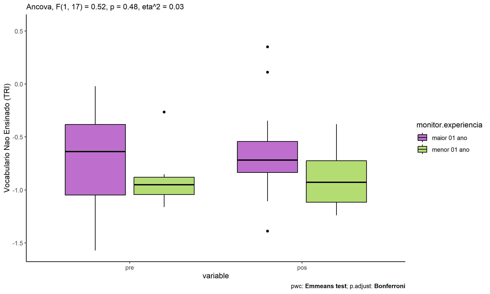<!-- -->

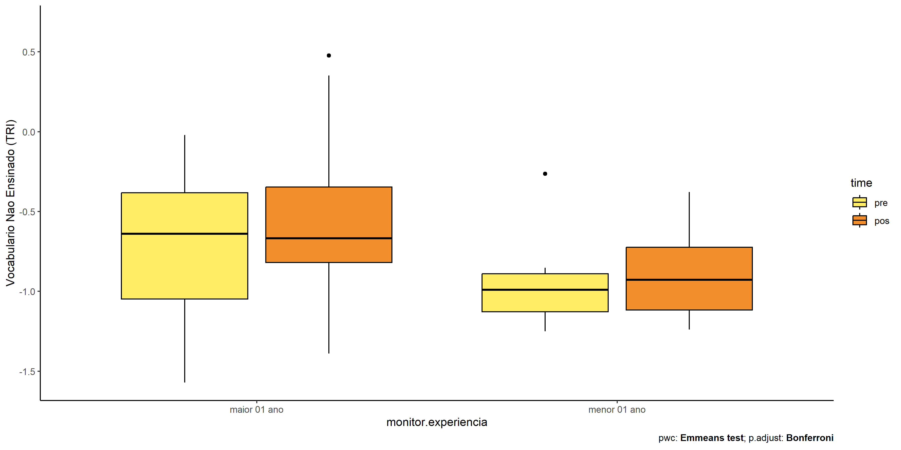<!-- -->
