ANCOVA in Vocabulary Test (Teste de Vocabulario)
================
Geiser C. Challco <geiser@alumni.usp.br>

- [Descriptive Statistics of Initial
  Data](#descriptive-statistics-of-initial-data)
  - [Vocabulario (Acertos)](#vocabulario-acertos)
  - [Vocabulario (TRI)](#vocabulario-tri)
  - [Vocabulario Ensinado (Acertos)](#vocabulario-ensinado-acertos)
  - [Vocabulario Ensinado (TRI)](#vocabulario-ensinado-tri)
  - [Vocabulario Nao Ensinado
    (Acertos)](#vocabulario-nao-ensinado-acertos)
  - [Vocabulario Nao Ensinado (TRI)](#vocabulario-nao-ensinado-tri)
- [Checking of Assumptions](#checking-of-assumptions)
  - [Assumption: Normality
    distribution](#assumption-normality-distribution)
    - [Vocabulario (Acertos)](#vocabulario-acertos-1)
    - [Vocabulario (TRI)](#vocabulario-tri-1)
    - [Vocabulario Ensinado (Acertos)](#vocabulario-ensinado-acertos-1)
    - [Vocabulario Ensinado (TRI)](#vocabulario-ensinado-tri-1)
    - [Vocabulario Nao Ensinado
      (Acertos)](#vocabulario-nao-ensinado-acertos-1)
    - [Vocabulario Nao Ensinado (TRI)](#vocabulario-nao-ensinado-tri-1)
  - [Assumption: Homogeneity](#assumption-homogeneity)
    - [Vocabulario (Acertos)](#vocabulario-acertos-2)
    - [Vocabulario (TRI)](#vocabulario-tri-2)
    - [Vocabulario Ensinado (Acertos)](#vocabulario-ensinado-acertos-2)
    - [Vocabulario Ensinado (TRI)](#vocabulario-ensinado-tri-2)
    - [Vocabulario Nao Ensinado
      (Acertos)](#vocabulario-nao-ensinado-acertos-2)
    - [Vocabulario Nao Ensinado (TRI)](#vocabulario-nao-ensinado-tri-2)
- [Computation of ANCOVA test and Pairwise
  Comparison](#computation-of-ancova-test-and-pairwise-comparison)
  - [ANCOVA tests for one factor](#ancova-tests-for-one-factor)
    - [Vocabulario (Acertos)](#vocabulario-acertos-3)
    - [Vocabulario (TRI)](#vocabulario-tri-3)
    - [Vocabulario Ensinado (Acertos)](#vocabulario-ensinado-acertos-3)
    - [Vocabulario Ensinado (TRI)](#vocabulario-ensinado-tri-3)
    - [Vocabulario Nao Ensinado
      (Acertos)](#vocabulario-nao-ensinado-acertos-3)
    - [Vocabulario Nao Ensinado (TRI)](#vocabulario-nao-ensinado-tri-3)
  - [ANCOVA tests for two factors](#ancova-tests-for-two-factors)
    - [Vocabulario (Acertos)](#vocabulario-acertos-4)
    - [Vocabulario (TRI)](#vocabulario-tri-4)
    - [Vocabulario Ensinado (Acertos)](#vocabulario-ensinado-acertos-4)
    - [Vocabulario Ensinado (TRI)](#vocabulario-ensinado-tri-4)
    - [Vocabulario Nao Ensinado
      (Acertos)](#vocabulario-nao-ensinado-acertos-4)
    - [Vocabulario Nao Ensinado (TRI)](#vocabulario-nao-ensinado-tri-4)
  - [ANCOVA tests for
    grupo=“Experimental”](#ancova-tests-for-grupoexperimental)
    - [Vocabulario (Acertos)](#vocabulario-acertos-5)
    - [Vocabulario (TRI)](#vocabulario-tri-5)
    - [Vocabulario Ensinado (Acertos)](#vocabulario-ensinado-acertos-5)
    - [Vocabulario Ensinado (TRI)](#vocabulario-ensinado-tri-5)
    - [Vocabulario Nao Ensinado
      (Acertos)](#vocabulario-nao-ensinado-acertos-5)
    - [Vocabulario Nao Ensinado (TRI)](#vocabulario-nao-ensinado-tri-5)
- [Pairwise comparisons for one
  factor](#pairwise-comparisons-for-one-factor)
  - [factor: **grupo**](#factor-grupo)
    - [Vocabulario (Acertos)](#vocabulario-acertos-6)
    - [Vocabulario (TRI)](#vocabulario-tri-6)
    - [Vocabulario Ensinado (Acertos)](#vocabulario-ensinado-acertos-6)
    - [Vocabulario Ensinado (TRI)](#vocabulario-ensinado-tri-6)
    - [Vocabulario Nao Ensinado
      (Acertos)](#vocabulario-nao-ensinado-acertos-6)
    - [Vocabulario Nao Ensinado (TRI)](#vocabulario-nao-ensinado-tri-6)
  - [factor: **genero**](#factor-genero)
    - [Vocabulario (Acertos)](#vocabulario-acertos-7)
    - [Vocabulario (TRI)](#vocabulario-tri-7)
    - [Vocabulario Ensinado (Acertos)](#vocabulario-ensinado-acertos-7)
    - [Vocabulario Ensinado (TRI)](#vocabulario-ensinado-tri-7)
    - [Vocabulario Nao Ensinado
      (Acertos)](#vocabulario-nao-ensinado-acertos-7)
    - [Vocabulario Nao Ensinado (TRI)](#vocabulario-nao-ensinado-tri-7)
  - [factor: **idade**](#factor-idade)
    - [Vocabulario (Acertos)](#vocabulario-acertos-8)
    - [Vocabulario (TRI)](#vocabulario-tri-8)
    - [Vocabulario Ensinado (Acertos)](#vocabulario-ensinado-acertos-8)
    - [Vocabulario Ensinado (TRI)](#vocabulario-ensinado-tri-8)
    - [Vocabulario Nao Ensinado
      (Acertos)](#vocabulario-nao-ensinado-acertos-8)
    - [Vocabulario Nao Ensinado (TRI)](#vocabulario-nao-ensinado-tri-8)
  - [factor: **zona.participante**](#factor-zonaparticipante)
    - [Vocabulario (Acertos)](#vocabulario-acertos-9)
    - [Vocabulario (TRI)](#vocabulario-tri-9)
    - [Vocabulario Ensinado (Acertos)](#vocabulario-ensinado-acertos-9)
    - [Vocabulario Ensinado (TRI)](#vocabulario-ensinado-tri-9)
    - [Vocabulario Nao Ensinado
      (Acertos)](#vocabulario-nao-ensinado-acertos-9)
    - [Vocabulario Nao Ensinado (TRI)](#vocabulario-nao-ensinado-tri-9)
  - [factor: **escola**](#factor-escola)
    - [Vocabulario (Acertos)](#vocabulario-acertos-10)
    - [Vocabulario (TRI)](#vocabulario-tri-10)
    - [Vocabulario Ensinado (Acertos)](#vocabulario-ensinado-acertos-10)
    - [Vocabulario Ensinado (TRI)](#vocabulario-ensinado-tri-10)
    - [Vocabulario Nao Ensinado
      (Acertos)](#vocabulario-nao-ensinado-acertos-10)
    - [Vocabulario Nao Ensinado (TRI)](#vocabulario-nao-ensinado-tri-10)
  - [factor: **zona.escola**](#factor-zonaescola)
    - [Vocabulario (Acertos)](#vocabulario-acertos-11)
    - [Vocabulario (TRI)](#vocabulario-tri-11)
    - [Vocabulario Ensinado (Acertos)](#vocabulario-ensinado-acertos-11)
    - [Vocabulario Ensinado (TRI)](#vocabulario-ensinado-tri-11)
    - [Vocabulario Nao Ensinado
      (Acertos)](#vocabulario-nao-ensinado-acertos-11)
    - [Vocabulario Nao Ensinado (TRI)](#vocabulario-nao-ensinado-tri-11)
- [Pairwise comparisons for two
  factors](#pairwise-comparisons-for-two-factors)
  - [factores: **genero:grupo**](#factores-generogrupo)
    - [Vocabulario (Acertos)](#vocabulario-acertos-12)
    - [Vocabulario (TRI)](#vocabulario-tri-12)
    - [Vocabulario Ensinado (Acertos)](#vocabulario-ensinado-acertos-12)
    - [Vocabulario Ensinado (TRI)](#vocabulario-ensinado-tri-12)
    - [Vocabulario Nao Ensinado
      (Acertos)](#vocabulario-nao-ensinado-acertos-12)
    - [Vocabulario Nao Ensinado (TRI)](#vocabulario-nao-ensinado-tri-12)
  - [factores: **idade:grupo**](#factores-idadegrupo)
    - [Vocabulario (Acertos)](#vocabulario-acertos-13)
    - [Vocabulario (TRI)](#vocabulario-tri-13)
    - [Vocabulario Ensinado (Acertos)](#vocabulario-ensinado-acertos-13)
    - [Vocabulario Ensinado (TRI)](#vocabulario-ensinado-tri-13)
    - [Vocabulario Nao Ensinado
      (Acertos)](#vocabulario-nao-ensinado-acertos-13)
    - [Vocabulario Nao Ensinado (TRI)](#vocabulario-nao-ensinado-tri-13)
  - [factores:
    **zona.participante:grupo**](#factores-zonaparticipantegrupo)
    - [Vocabulario (Acertos)](#vocabulario-acertos-14)
    - [Vocabulario (TRI)](#vocabulario-tri-14)
    - [Vocabulario Ensinado (Acertos)](#vocabulario-ensinado-acertos-14)
    - [Vocabulario Ensinado (TRI)](#vocabulario-ensinado-tri-14)
    - [Vocabulario Nao Ensinado
      (Acertos)](#vocabulario-nao-ensinado-acertos-14)
    - [Vocabulario Nao Ensinado (TRI)](#vocabulario-nao-ensinado-tri-14)
  - [factores: **escola:grupo**](#factores-escolagrupo)
    - [Vocabulario (Acertos)](#vocabulario-acertos-15)
    - [Vocabulario (TRI)](#vocabulario-tri-15)
    - [Vocabulario Ensinado (Acertos)](#vocabulario-ensinado-acertos-15)
    - [Vocabulario Ensinado (TRI)](#vocabulario-ensinado-tri-15)
    - [Vocabulario Nao Ensinado
      (Acertos)](#vocabulario-nao-ensinado-acertos-15)
    - [Vocabulario Nao Ensinado (TRI)](#vocabulario-nao-ensinado-tri-15)
  - [factores: **zona.escola:grupo**](#factores-zonaescolagrupo)
    - [Vocabulario (Acertos)](#vocabulario-acertos-16)
    - [Vocabulario (TRI)](#vocabulario-tri-16)
    - [Vocabulario Ensinado (Acertos)](#vocabulario-ensinado-acertos-16)
    - [Vocabulario Ensinado (TRI)](#vocabulario-ensinado-tri-16)
    - [Vocabulario Nao Ensinado
      (Acertos)](#vocabulario-nao-ensinado-acertos-16)
    - [Vocabulario Nao Ensinado (TRI)](#vocabulario-nao-ensinado-tri-16)
- [Pairwise comparisons for
  grupo=“Experimental”](#pairwise-comparisons-for-grupoexperimental)
  - [factores:
    **grupo=“Experimental”:monitor**](#factores-grupoexperimentalmonitor)
    - [Vocabulario (Acertos)](#vocabulario-acertos-17)
    - [Vocabulario (TRI)](#vocabulario-tri-17)
    - [Vocabulario Ensinado (Acertos)](#vocabulario-ensinado-acertos-17)
    - [Vocabulario Ensinado (TRI)](#vocabulario-ensinado-tri-17)
    - [Vocabulario Nao Ensinado
      (Acertos)](#vocabulario-nao-ensinado-acertos-17)
    - [Vocabulario Nao Ensinado (TRI)](#vocabulario-nao-ensinado-tri-17)
  - [factores:
    **grupo=“Experimental”:monitor.genero**](#factores-grupoexperimentalmonitorgenero)
    - [Vocabulario (Acertos)](#vocabulario-acertos-18)
    - [Vocabulario (TRI)](#vocabulario-tri-18)
    - [Vocabulario Ensinado (Acertos)](#vocabulario-ensinado-acertos-18)
    - [Vocabulario Ensinado (TRI)](#vocabulario-ensinado-tri-18)
    - [Vocabulario Nao Ensinado
      (Acertos)](#vocabulario-nao-ensinado-acertos-18)
    - [Vocabulario Nao Ensinado (TRI)](#vocabulario-nao-ensinado-tri-18)
  - [factores:
    **grupo=“Experimental”:monitor.area**](#factores-grupoexperimentalmonitorarea)
    - [Vocabulario (Acertos)](#vocabulario-acertos-19)
    - [Vocabulario (TRI)](#vocabulario-tri-19)
    - [Vocabulario Ensinado (Acertos)](#vocabulario-ensinado-acertos-19)
    - [Vocabulario Ensinado (TRI)](#vocabulario-ensinado-tri-19)
    - [Vocabulario Nao Ensinado
      (Acertos)](#vocabulario-nao-ensinado-acertos-19)
    - [Vocabulario Nao Ensinado (TRI)](#vocabulario-nao-ensinado-tri-19)
  - [factores:
    **grupo=“Experimental”:monitor.formacao**](#factores-grupoexperimentalmonitorformacao)
    - [Vocabulario (Acertos)](#vocabulario-acertos-20)
    - [Vocabulario (TRI)](#vocabulario-tri-20)
    - [Vocabulario Ensinado (Acertos)](#vocabulario-ensinado-acertos-20)
    - [Vocabulario Ensinado (TRI)](#vocabulario-ensinado-tri-20)
    - [Vocabulario Nao Ensinado
      (Acertos)](#vocabulario-nao-ensinado-acertos-20)
    - [Vocabulario Nao Ensinado (TRI)](#vocabulario-nao-ensinado-tri-20)
  - [factores:
    **grupo=“Experimental”:monitor.experiencia**](#factores-grupoexperimentalmonitorexperiencia)
    - [Vocabulario (Acertos)](#vocabulario-acertos-21)
    - [Vocabulario (TRI)](#vocabulario-tri-21)
    - [Vocabulario Ensinado (Acertos)](#vocabulario-ensinado-acertos-21)
    - [Vocabulario Ensinado (TRI)](#vocabulario-ensinado-tri-21)
    - [Vocabulario Nao Ensinado
      (Acertos)](#vocabulario-nao-ensinado-acertos-21)
    - [Vocabulario Nao Ensinado (TRI)](#vocabulario-nao-ensinado-tri-21)

**NOTE**

- Teste ANCOVA para determinar se houve diferenças significativas no
  Teste de Vocabulario (medido usando pre- e pos-testes).
- ANCOVA test to determine whether there were significant differences in
  Vocabulary Test (measured using pre- and post-tests).

# Descriptive Statistics of Initial Data

## Vocabulario (Acertos)

| grupo        | genero | idade | zona.participante | escola | zona.escola | variable        |   n |   mean | median | min | max |     sd |    se |     ci |   iqr |
|:-------------|:-------|:------|:------------------|:-------|:------------|:----------------|----:|-------:|-------:|----:|----:|-------:|------:|-------:|------:|
| Controle     | F      |       |                   |        |             | score.vocab.pos |   6 | 17.000 |   15.5 |  11 |  24 |  5.727 | 2.338 |  6.010 |  9.25 |
| Controle     | M      |       |                   |        |             | score.vocab.pos |  11 | 13.727 |   13.0 |   4 |  24 |  5.179 | 1.561 |  3.479 |  3.50 |
| Experimental | F      |       |                   |        |             | score.vocab.pos |   4 | 14.000 |   13.5 |  11 |  18 |  3.162 | 1.581 |  5.032 |  4.00 |
| Experimental | M      |       |                   |        |             | score.vocab.pos |  15 | 14.667 |   13.0 |   7 |  31 |  7.027 | 1.814 |  3.892 |  6.00 |
| Controle     | F      |       |                   |        |             | score.vocab.pre |   6 | 17.167 |   18.0 |   7 |  23 |  6.338 | 2.587 |  6.651 |  8.25 |
| Controle     | M      |       |                   |        |             | score.vocab.pre |  11 | 12.273 |   11.0 |   6 |  23 |  5.159 | 1.556 |  3.466 |  4.50 |
| Experimental | F      |       |                   |        |             | score.vocab.pre |   4 | 11.750 |   11.5 |   8 |  16 |  3.500 | 1.750 |  5.569 |  4.25 |
| Experimental | M      |       |                   |        |             | score.vocab.pre |  15 | 15.400 |   14.0 |   6 |  31 |  6.812 | 1.759 |  3.772 |  8.50 |
| Controle     |        | 10y   |                   |        |             | score.vocab.pos |   4 | 19.750 |   20.0 |  15 |  24 |  4.924 | 2.462 |  7.836 |  8.25 |
| Controle     |        | 11y   |                   |        |             | score.vocab.pos |  10 | 13.400 |   12.0 |   4 |  24 |  5.502 | 1.740 |  3.936 |  4.50 |
| Controle     |        | 12y   |                   |        |             | score.vocab.pos |   2 | 13.500 |   13.5 |  12 |  15 |  2.121 | 1.500 | 19.059 |  1.50 |
| Controle     |        | 14y   |                   |        |             | score.vocab.pos |   1 | 13.000 |   13.0 |  13 |  13 |        |       |        |  0.00 |
| Experimental |        | 10y   |                   |        |             | score.vocab.pos |   3 | 17.333 |   14.0 |   7 |  31 | 12.342 | 7.126 | 30.660 | 12.00 |
| Experimental |        | 11y   |                   |        |             | score.vocab.pos |  10 | 15.200 |   13.5 |  10 |  30 |  6.015 | 1.902 |  4.303 |  5.75 |
| Experimental |        | 12y   |                   |        |             | score.vocab.pos |   2 | 12.500 |   12.5 |  10 |  15 |  3.536 | 2.500 | 31.766 |  2.50 |
| Experimental |        | 13y   |                   |        |             | score.vocab.pos |   4 | 11.750 |   11.5 |  10 |  14 |  2.062 | 1.031 |  3.280 |  3.25 |
| Controle     |        | 10y   |                   |        |             | score.vocab.pre |   4 | 18.250 |   18.0 |  14 |  23 |  4.425 | 2.213 |  7.042 |  6.75 |
| Controle     |        | 11y   |                   |        |             | score.vocab.pre |  10 | 13.400 |   12.5 |   6 |  23 |  6.518 | 2.061 |  4.663 | 10.25 |
| Controle     |        | 12y   |                   |        |             | score.vocab.pre |   2 | 10.000 |   10.0 |   9 |  11 |  1.414 | 1.000 | 12.706 |  1.00 |
| Controle     |        | 14y   |                   |        |             | score.vocab.pre |   1 | 11.000 |   11.0 |  11 |  11 |        |       |        |  0.00 |
| Experimental |        | 10y   |                   |        |             | score.vocab.pre |   3 | 17.667 |   16.0 |   6 |  31 | 12.583 | 7.265 | 31.258 | 12.50 |
| Experimental |        | 11y   |                   |        |             | score.vocab.pre |  10 | 14.600 |   13.5 |   7 |  24 |  6.114 | 1.933 |  4.374 |  9.50 |
| Experimental |        | 12y   |                   |        |             | score.vocab.pre |   2 | 12.500 |   12.5 |  12 |  13 |  0.707 | 0.500 |  6.353 |  0.50 |
| Experimental |        | 13y   |                   |        |             | score.vocab.pre |   4 | 13.500 |   12.5 |  11 |  18 |  3.317 | 1.658 |  5.277 |  4.00 |
| Controle     |        |       | Urbana            |        |             | score.vocab.pos |  10 | 15.800 |   14.0 |   4 |  24 |  6.812 | 2.154 |  4.873 | 10.75 |
| Controle     |        |       | Rural             |        |             | score.vocab.pos |   1 | 12.000 |   12.0 |  12 |  12 |        |       |        |  0.00 |
| Controle     |        |       |                   |        |             | score.vocab.pos |   6 | 13.833 |   15.0 |   9 |  16 |  2.563 | 1.046 |  2.689 |  1.50 |
| Experimental |        |       | Urbana            |        |             | score.vocab.pos |   8 | 16.125 |   15.0 |  10 |  30 |  6.151 | 2.175 |  5.143 |  3.75 |
| Experimental |        |       | Rural             |        |             | score.vocab.pos |   7 | 14.000 |   10.0 |   7 |  31 |  8.226 | 3.109 |  7.608 |  5.00 |
| Experimental |        |       |                   |        |             | score.vocab.pos |   4 | 12.250 |   12.5 |  10 |  14 |  1.708 | 0.854 |  2.718 |  1.75 |
| Controle     |        |       | Urbana            |        |             | score.vocab.pre |  10 | 15.600 |   14.5 |   7 |  23 |  6.096 | 1.928 |  4.360 | 11.25 |
| Controle     |        |       | Rural             |        |             | score.vocab.pre |   1 |  6.000 |    6.0 |   6 |   6 |        |       |        |  0.00 |
| Controle     |        |       |                   |        |             | score.vocab.pre |   6 | 12.667 |   11.5 |   6 |  21 |  5.007 | 2.044 |  5.254 |  3.25 |
| Experimental |        |       | Urbana            |        |             | score.vocab.pre |   8 | 12.500 |   12.0 |   6 |  21 |  4.690 | 1.658 |  3.921 |  4.25 |
| Experimental |        |       | Rural             |        |             | score.vocab.pre |   7 | 18.143 |   16.0 |   7 |  31 |  8.153 | 3.082 |  7.541 |  9.50 |
| Experimental |        |       |                   |        |             | score.vocab.pre |   4 | 12.750 |   11.5 |  10 |  18 |  3.594 | 1.797 |  5.719 |  2.75 |
| Controle     |        |       |                   | E1     |             | score.vocab.pos |   6 | 18.667 |   20.0 |  12 |  24 |  6.022 | 2.459 |  6.320 | 11.00 |
| Controle     |        |       |                   | E2     |             | score.vocab.pos |   3 | 14.667 |   15.0 |  13 |  16 |  1.528 | 0.882 |  3.795 |  1.50 |
| Controle     |        |       |                   | E4     |             | score.vocab.pos |   1 | 12.000 |   12.0 |  12 |  12 |        |       |        |  0.00 |
| Controle     |        |       |                   | E5     |             | score.vocab.pos |   5 | 11.000 |   11.0 |   4 |  19 |  5.431 | 2.429 |  6.744 |  3.00 |
| Controle     |        |       |                   | E6     |             | score.vocab.pos |   2 | 15.000 |   15.0 |  15 |  15 |  0.000 | 0.000 |  0.000 |  0.00 |
| Experimental |        |       |                   | E2     |             | score.vocab.pos |   2 | 11.500 |   11.5 |  10 |  13 |  2.121 | 1.500 | 19.059 |  1.50 |
| Experimental |        |       |                   | E4     |             | score.vocab.pos |   6 | 15.000 |   12.5 |   7 |  31 |  8.649 | 3.531 |  9.076 |  6.50 |
| Experimental |        |       |                   | E5     |             | score.vocab.pos |  10 | 15.300 |   14.0 |  10 |  30 |  5.755 | 1.820 |  4.117 |  4.50 |
| Experimental |        |       |                   | E6     |             | score.vocab.pos |   1 | 10.000 |   10.0 |  10 |  10 |        |       |        |  0.00 |
| Controle     |        |       |                   | E1     |             | score.vocab.pre |   6 | 18.500 |   19.0 |  13 |  23 |  4.970 | 2.029 |  5.216 |  8.75 |
| Controle     |        |       |                   | E2     |             | score.vocab.pre |   3 | 11.333 |   11.0 |  11 |  12 |  0.577 | 0.333 |  1.434 |  0.50 |
| Controle     |        |       |                   | E4     |             | score.vocab.pre |   1 |  9.000 |    9.0 |   9 |   9 |        |       |        |  0.00 |
| Controle     |        |       |                   | E5     |             | score.vocab.pre |   5 | 11.400 |   10.0 |   6 |  19 |  5.505 | 2.462 |  6.835 |  8.00 |
| Controle     |        |       |                   | E6     |             | score.vocab.pre |   2 | 13.500 |   13.5 |   6 |  21 | 10.607 | 7.500 | 95.297 |  7.50 |
| Experimental |        |       |                   | E2     |             | score.vocab.pre |   2 | 20.000 |   20.0 |  18 |  22 |  2.828 | 2.000 | 25.412 |  2.00 |
| Experimental |        |       |                   | E4     |             | score.vocab.pre |   6 | 17.833 |   15.0 |  11 |  31 |  8.035 | 3.280 |  8.433 | 10.25 |
| Experimental |        |       |                   | E5     |             | score.vocab.pre |  10 | 11.900 |   11.0 |   6 |  21 |  4.677 | 1.479 |  3.346 |  6.75 |
| Experimental |        |       |                   | E6     |             | score.vocab.pre |   1 | 12.000 |   12.0 |  12 |  12 |        |       |        |  0.00 |
| Controle     |        |       |                   |        | Urbana      | score.vocab.pos |  14 | 15.071 |   14.0 |   4 |  24 |  5.980 | 1.598 |  3.453 |  6.25 |
| Controle     |        |       |                   |        | Rural       | score.vocab.pos |   3 | 14.000 |   15.0 |  12 |  15 |  1.732 | 1.000 |  4.303 |  1.50 |
| Experimental |        |       |                   |        | Urbana      | score.vocab.pos |  12 | 14.667 |   13.5 |  10 |  30 |  5.449 | 1.573 |  3.462 |  3.75 |
| Experimental |        |       |                   |        | Rural       | score.vocab.pos |   7 | 14.286 |   10.0 |   7 |  31 |  8.118 | 3.068 |  7.508 |  6.00 |
| Controle     |        |       |                   |        | Urbana      | score.vocab.pre |  14 | 14.429 |   13.5 |   6 |  23 |  5.680 | 1.518 |  3.280 |  7.00 |
| Controle     |        |       |                   |        | Rural       | score.vocab.pre |   3 | 12.000 |    9.0 |   6 |  21 |  7.937 | 4.583 | 19.717 |  7.50 |
| Experimental |        |       |                   |        | Urbana      | score.vocab.pre |  12 | 13.250 |   12.0 |   6 |  22 |  5.345 | 1.543 |  3.396 |  7.00 |
| Experimental |        |       |                   |        | Rural       | score.vocab.pre |   7 | 17.000 |   14.0 |  11 |  31 |  7.659 | 2.895 |  7.084 |  8.50 |

## Vocabulario (TRI)

| grupo        | genero | idade | zona.participante | escola | zona.escola | variable      |   n |   mean | median |    min |    max |    sd |    se |    ci |   iqr |
|:-------------|:-------|:------|:------------------|:-------|:------------|:--------------|----:|-------:|-------:|-------:|-------:|------:|------:|------:|------:|
| Controle     | F      |       |                   |        |             | tri.vocab.pos |   6 | -0.273 | -0.142 | -1.646 |  0.675 | 0.829 | 0.339 | 0.870 | 0.844 |
| Controle     | M      |       |                   |        |             | tri.vocab.pos |  11 | -0.760 | -0.627 | -1.835 |  0.402 | 0.664 | 0.200 | 0.446 | 0.875 |
| Experimental | F      |       |                   |        |             | tri.vocab.pos |   4 | -0.661 | -0.537 | -1.731 |  0.162 | 0.818 | 0.409 | 1.302 | 0.891 |
| Experimental | M      |       |                   |        |             | tri.vocab.pos |  15 | -0.652 | -0.933 | -1.515 |  1.304 | 0.834 | 0.215 | 0.462 | 0.602 |
| Controle     | F      |       |                   |        |             | tri.vocab.pre |   6 | -0.317 | -0.199 | -1.461 |  0.323 | 0.616 | 0.251 | 0.646 | 0.368 |
| Controle     | M      |       |                   |        |             | tri.vocab.pre |  11 | -0.705 | -0.664 | -1.524 |  0.351 | 0.569 | 0.171 | 0.382 | 0.497 |
| Experimental | F      |       |                   |        |             | tri.vocab.pre |   4 | -0.909 | -0.832 | -1.259 | -0.712 | 0.246 | 0.123 | 0.391 | 0.232 |
| Experimental | M      |       |                   |        |             | tri.vocab.pre |  15 | -0.539 | -0.626 | -1.797 |  1.093 | 0.801 | 0.207 | 0.443 | 1.042 |
| Controle     |        | 10y   |                   |        |             | tri.vocab.pos |   4 |  0.187 |  0.126 | -0.177 |  0.675 | 0.403 | 0.201 | 0.641 | 0.563 |
| Controle     |        | 11y   |                   |        |             | tri.vocab.pos |  10 | -0.696 | -0.569 | -1.646 |  0.402 | 0.652 | 0.206 | 0.466 | 0.830 |
| Controle     |        | 12y   |                   |        |             | tri.vocab.pos |   2 | -0.979 | -0.979 | -1.167 | -0.792 | 0.266 | 0.188 | 2.385 | 0.188 |
| Controle     |        | 14y   |                   |        |             | tri.vocab.pos |   1 | -1.835 | -1.835 | -1.835 | -1.835 |       |       |       | 0.000 |
| Experimental |        | 10y   |                   |        |             | tri.vocab.pos |   3 | -0.575 | -1.362 | -1.515 |  1.153 | 1.498 | 0.865 | 3.721 | 1.334 |
| Experimental |        | 11y   |                   |        |             | tri.vocab.pos |  10 | -0.537 | -0.715 | -1.731 |  1.304 | 0.826 | 0.261 | 0.591 | 0.712 |
| Experimental |        | 12y   |                   |        |             | tri.vocab.pos |   2 | -0.607 | -0.607 | -0.956 | -0.258 | 0.493 | 0.349 | 4.433 | 0.349 |
| Experimental |        | 13y   |                   |        |             | tri.vocab.pos |   4 | -1.029 | -1.039 | -1.227 | -0.810 | 0.221 | 0.110 | 0.352 | 0.362 |
| Controle     |        | 10y   |                   |        |             | tri.vocab.pre |   4 | -0.124 | -0.199 | -0.419 |  0.323 | 0.316 | 0.158 | 0.502 | 0.221 |
| Controle     |        | 11y   |                   |        |             | tri.vocab.pre |  10 | -0.580 | -0.622 | -1.461 |  0.351 | 0.600 | 0.190 | 0.429 | 0.732 |
| Controle     |        | 12y   |                   |        |             | tri.vocab.pre |   2 | -1.387 | -1.387 | -1.524 | -1.250 | 0.194 | 0.137 | 1.740 | 0.137 |
| Controle     |        | 14y   |                   |        |             | tri.vocab.pre |   1 | -0.582 | -0.582 | -0.582 | -0.582 |       |       |       | 0.000 |
| Experimental |        | 10y   |                   |        |             | tri.vocab.pre |   3 | -0.115 |  0.012 | -1.451 |  1.093 | 1.277 | 0.737 | 3.172 | 1.272 |
| Experimental |        | 11y   |                   |        |             | tri.vocab.pre |  10 | -0.618 | -0.669 | -1.797 |  0.455 | 0.668 | 0.211 | 0.478 | 0.362 |
| Experimental |        | 12y   |                   |        |             | tri.vocab.pre |   2 | -0.820 | -0.820 | -0.896 | -0.745 | 0.106 | 0.075 | 0.956 | 0.075 |
| Experimental |        | 13y   |                   |        |             | tri.vocab.pre |   4 | -0.887 | -1.041 | -1.426 | -0.041 | 0.624 | 0.312 | 0.992 | 0.702 |
| Controle     |        |       | Urbana            |        |             | tri.vocab.pos |  10 | -0.436 | -0.284 | -1.646 |  0.675 | 0.825 | 0.261 | 0.590 | 1.304 |
| Controle     |        |       | Rural             |        |             | tri.vocab.pos |   1 | -0.511 | -0.511 | -0.511 | -0.511 |       |       |       | 0.000 |
| Controle     |        |       |                   |        |             | tri.vocab.pos |   6 | -0.855 | -0.709 | -1.835 | -0.177 | 0.628 | 0.256 | 0.659 | 0.789 |
| Experimental |        |       | Urbana            |        |             | tri.vocab.pos |   8 | -0.411 | -0.529 | -1.362 |  1.304 | 0.785 | 0.278 | 0.657 | 0.578 |
| Experimental |        |       | Rural             |        |             | tri.vocab.pos |   7 | -0.630 | -1.014 | -1.515 |  1.153 | 0.944 | 0.357 | 0.873 | 0.745 |
| Experimental |        |       |                   |        |             | tri.vocab.pos |   4 | -1.181 | -1.092 | -1.731 | -0.810 | 0.405 | 0.203 | 0.645 | 0.434 |
| Controle     |        |       | Urbana            |        |             | tri.vocab.pre |  10 | -0.405 | -0.321 | -1.461 |  0.351 | 0.637 | 0.201 | 0.456 | 0.870 |
| Controle     |        |       | Rural             |        |             | tri.vocab.pre |   1 | -1.410 | -1.410 | -1.410 | -1.410 |       |       |       | 0.000 |
| Controle     |        |       |                   |        |             | tri.vocab.pre |   6 | -0.699 | -0.623 | -1.524 | -0.175 | 0.444 | 0.181 | 0.466 | 0.099 |
| Experimental |        |       | Urbana            |        |             | tri.vocab.pre |   8 | -0.674 | -0.758 | -1.451 |  0.356 | 0.510 | 0.180 | 0.427 | 0.276 |
| Experimental |        |       | Rural             |        |             | tri.vocab.pre |   7 | -0.429 | -0.570 | -1.797 |  1.093 | 1.024 | 0.387 | 0.947 | 1.331 |
| Experimental |        |       |                   |        |             | tri.vocab.pre |   4 | -0.831 | -1.002 | -1.278 | -0.041 | 0.582 | 0.291 | 0.925 | 0.695 |
| Controle     |        |       |                   | E1     |             | tri.vocab.pos |   6 |  0.072 |  0.126 | -0.744 |  0.675 | 0.511 | 0.208 | 0.536 | 0.534 |
| Controle     |        |       |                   | E2     |             | tri.vocab.pos |   3 | -1.085 | -0.792 | -1.835 | -0.627 | 0.655 | 0.378 | 1.628 | 0.604 |
| Controle     |        |       |                   | E4     |             | tri.vocab.pos |   1 | -1.167 | -1.167 | -1.167 | -1.167 |       |       |       | 0.000 |
| Controle     |        |       |                   | E5     |             | tri.vocab.pos |   5 | -1.097 | -1.347 | -1.646 | -0.413 | 0.591 | 0.264 | 0.733 | 1.056 |
| Controle     |        |       |                   | E6     |             | tri.vocab.pos |   2 | -0.264 | -0.264 | -0.350 | -0.177 | 0.123 | 0.087 | 1.102 | 0.087 |
| Experimental |        |       |                   | E2     |             | tri.vocab.pos |   2 | -1.139 | -1.139 | -1.227 | -1.051 | 0.125 | 0.088 | 1.120 | 0.088 |
| Experimental |        |       |                   | E4     |             | tri.vocab.pos |   6 | -0.550 | -0.741 | -1.515 |  1.153 | 0.912 | 0.372 | 0.958 | 0.491 |
| Experimental |        |       |                   | E5     |             | tri.vocab.pos |  10 | -0.588 | -0.813 | -1.731 |  1.304 | 0.875 | 0.277 | 0.626 | 0.906 |
| Experimental |        |       |                   | E6     |             | tri.vocab.pos |   1 | -0.956 | -0.956 | -0.956 | -0.956 |       |       |       | 0.000 |
| Controle     |        |       |                   | E1     |             | tri.vocab.pre |   6 | -0.082 | -0.083 | -0.581 |  0.351 | 0.388 | 0.158 | 0.407 | 0.626 |
| Controle     |        |       |                   | E2     |             | tri.vocab.pre |   3 | -0.928 | -0.676 | -1.524 | -0.582 | 0.519 | 0.299 | 1.288 | 0.471 |
| Controle     |        |       |                   | E4     |             | tri.vocab.pre |   1 | -1.250 | -1.250 | -1.250 | -1.250 |       |       |       | 0.000 |
| Controle     |        |       |                   | E5     |             | tri.vocab.pre |   5 | -0.858 | -0.895 | -1.461 |  0.047 | 0.627 | 0.280 | 0.778 | 0.839 |
| Controle     |        |       |                   | E6     |             | tri.vocab.pre |   2 | -0.420 | -0.420 | -0.664 | -0.175 | 0.345 | 0.244 | 3.103 | 0.244 |
| Experimental |        |       |                   | E2     |             | tri.vocab.pre |   2 | -0.305 | -0.305 | -0.570 | -0.041 | 0.374 | 0.264 | 3.359 | 0.264 |
| Experimental |        |       |                   | E4     |             | tri.vocab.pre |   6 | -0.118 | -0.307 | -0.836 |  1.093 | 0.782 | 0.319 | 0.821 | 1.104 |
| Experimental |        |       |                   | E5     |             | tri.vocab.pre |  10 | -0.965 | -1.077 | -1.797 |  0.356 | 0.621 | 0.196 | 0.444 | 0.663 |
| Experimental |        |       |                   | E6     |             | tri.vocab.pre |   1 | -0.745 | -0.745 | -0.745 | -0.745 |       |       |       | 0.000 |
| Controle     |        |       |                   |        | Urbana      | tri.vocab.pos |  14 | -0.593 | -0.569 | -1.835 |  0.675 | 0.794 | 0.212 | 0.459 | 1.089 |
| Controle     |        |       |                   |        | Rural       | tri.vocab.pos |   3 | -0.565 | -0.350 | -1.167 | -0.177 | 0.529 | 0.305 | 1.313 | 0.495 |
| Experimental |        |       |                   |        | Urbana      | tri.vocab.pos |  12 | -0.680 | -0.874 | -1.731 |  1.304 | 0.821 | 0.237 | 0.522 | 0.964 |
| Experimental |        |       |                   |        | Rural       | tri.vocab.pos |   7 | -0.608 | -0.868 | -1.515 |  1.153 | 0.847 | 0.320 | 0.783 | 0.455 |
| Controle     |        |       |                   |        | Urbana      | tri.vocab.pre |  14 | -0.540 | -0.576 | -1.524 |  0.351 | 0.625 | 0.167 | 0.361 | 0.820 |
| Controle     |        |       |                   |        | Rural       | tri.vocab.pre |   3 | -0.696 | -0.664 | -1.250 | -0.175 | 0.538 | 0.311 | 1.337 | 0.537 |
| Experimental |        |       |                   |        | Urbana      | tri.vocab.pre |  12 | -0.855 | -0.832 | -1.797 |  0.356 | 0.628 | 0.181 | 0.399 | 0.783 |
| Experimental |        |       |                   |        | Rural       | tri.vocab.pre |   7 | -0.207 | -0.626 | -0.836 |  1.093 | 0.752 | 0.284 | 0.696 | 1.008 |

## Vocabulario Ensinado (Acertos)

| grupo        | genero | idade | zona.participante | escola | zona.escola | variable                 |   n |  mean | median | min | max |    sd |    se |     ci |  iqr |
|:-------------|:-------|:------|:------------------|:-------|:------------|:-------------------------|----:|------:|-------:|----:|----:|------:|------:|-------:|-----:|
| Controle     | F      |       |                   |        |             | score.vocab.ensinado.pos |   7 | 2.429 |    2.0 |   1 |   6 | 1.718 | 0.649 |  1.589 | 1.00 |
| Controle     | M      |       |                   |        |             | score.vocab.ensinado.pos |  12 | 2.083 |    2.0 |   0 |   6 | 1.676 | 0.484 |  1.065 | 1.25 |
| Experimental | F      |       |                   |        |             | score.vocab.ensinado.pos |   4 | 2.250 |    2.0 |   1 |   4 | 1.258 | 0.629 |  2.002 | 0.75 |
| Experimental | M      |       |                   |        |             | score.vocab.ensinado.pos |  17 | 3.000 |    3.0 |   0 |   6 | 1.969 | 0.477 |  1.012 | 3.00 |
| Controle     | F      |       |                   |        |             | score.vocab.ensinado.pre |   7 | 3.143 |    3.0 |   0 |   6 | 2.116 | 0.800 |  1.957 | 2.50 |
| Controle     | M      |       |                   |        |             | score.vocab.ensinado.pre |  12 | 1.917 |    2.0 |   0 |   6 | 1.505 | 0.434 |  0.956 | 1.00 |
| Experimental | F      |       |                   |        |             | score.vocab.ensinado.pre |   4 | 2.500 |    2.0 |   2 |   4 | 1.000 | 0.500 |  1.591 | 0.50 |
| Experimental | M      |       |                   |        |             | score.vocab.ensinado.pre |  17 | 3.412 |    3.0 |   1 |   7 | 1.460 | 0.354 |  0.751 | 1.00 |
| Controle     |        | 10y   |                   |        |             | score.vocab.ensinado.pos |   4 | 3.000 |    2.5 |   1 |   6 | 2.160 | 1.080 |  3.437 | 2.00 |
| Controle     |        | 11y   |                   |        |             | score.vocab.ensinado.pos |  10 | 2.000 |    2.0 |   0 |   6 | 1.633 | 0.516 |  1.168 | 1.00 |
| Controle     |        | 12y   |                   |        |             | score.vocab.ensinado.pos |   2 | 2.000 |    2.0 |   2 |   2 | 0.000 | 0.000 |  0.000 | 0.00 |
| Controle     |        | 13y   |                   |        |             | score.vocab.ensinado.pos |   1 | 2.000 |    2.0 |   2 |   2 |       |       |        | 0.00 |
| Controle     |        | 14y   |                   |        |             | score.vocab.ensinado.pos |   1 | 4.000 |    4.0 |   4 |   4 |       |       |        | 0.00 |
| Controle     |        | 15y   |                   |        |             | score.vocab.ensinado.pos |   1 | 0.000 |    0.0 |   0 |   0 |       |       |        | 0.00 |
| Experimental |        | 10y   |                   |        |             | score.vocab.ensinado.pos |   4 | 2.750 |    2.5 |   0 |   6 | 2.754 | 1.377 |  4.382 | 3.75 |
| Experimental |        | 11y   |                   |        |             | score.vocab.ensinado.pos |  10 | 3.400 |    3.5 |   1 |   6 | 1.506 | 0.476 |  1.077 | 1.75 |
| Experimental |        | 12y   |                   |        |             | score.vocab.ensinado.pos |   2 | 3.000 |    3.0 |   2 |   4 | 1.414 | 1.000 | 12.706 | 1.00 |
| Experimental |        | 13y   |                   |        |             | score.vocab.ensinado.pos |   4 | 2.250 |    1.5 |   1 |   5 | 1.893 | 0.946 |  3.012 | 1.75 |
| Experimental |        | 14y   |                   |        |             | score.vocab.ensinado.pos |   1 | 0.000 |    0.0 |   0 |   0 |       |       |        | 0.00 |
| Controle     |        | 10y   |                   |        |             | score.vocab.ensinado.pre |   4 | 4.250 |    4.0 |   3 |   6 | 1.500 | 0.750 |  2.387 | 2.25 |
| Controle     |        | 11y   |                   |        |             | score.vocab.ensinado.pre |  10 | 2.300 |    2.0 |   0 |   6 | 1.703 | 0.539 |  1.218 | 1.50 |
| Controle     |        | 12y   |                   |        |             | score.vocab.ensinado.pre |   2 | 1.500 |    1.5 |   1 |   2 | 0.707 | 0.500 |  6.353 | 0.50 |
| Controle     |        | 13y   |                   |        |             | score.vocab.ensinado.pre |   1 | 0.000 |    0.0 |   0 |   0 |       |       |        | 0.00 |
| Controle     |        | 14y   |                   |        |             | score.vocab.ensinado.pre |   1 | 1.000 |    1.0 |   1 |   1 |       |       |        | 0.00 |
| Controle     |        | 15y   |                   |        |             | score.vocab.ensinado.pre |   1 | 1.000 |    1.0 |   1 |   1 |       |       |        | 0.00 |
| Experimental |        | 10y   |                   |        |             | score.vocab.ensinado.pre |   4 | 4.250 |    4.0 |   2 |   7 | 2.217 | 1.109 |  3.528 | 2.75 |
| Experimental |        | 11y   |                   |        |             | score.vocab.ensinado.pre |  10 | 3.200 |    3.0 |   2 |   5 | 1.033 | 0.327 |  0.739 | 1.75 |
| Experimental |        | 12y   |                   |        |             | score.vocab.ensinado.pre |   2 | 2.500 |    2.5 |   2 |   3 | 0.707 | 0.500 |  6.353 | 0.50 |
| Experimental |        | 13y   |                   |        |             | score.vocab.ensinado.pre |   4 | 2.750 |    2.5 |   1 |   5 | 1.708 | 0.854 |  2.718 | 1.75 |
| Experimental |        | 14y   |                   |        |             | score.vocab.ensinado.pre |   1 | 3.000 |    3.0 |   3 |   3 |       |       |        | 0.00 |
| Controle     |        |       | Urbana            |        |             | score.vocab.ensinado.pos |  11 | 2.182 |    2.0 |   0 |   6 | 2.089 | 0.630 |  1.403 | 1.50 |
| Controle     |        |       | Rural             |        |             | score.vocab.ensinado.pos |   2 | 2.000 |    2.0 |   2 |   2 | 0.000 | 0.000 |  0.000 | 0.00 |
| Controle     |        |       |                   |        |             | score.vocab.ensinado.pos |   6 | 2.333 |    2.0 |   1 |   4 | 1.033 | 0.422 |  1.084 | 0.75 |
| Experimental |        |       | Urbana            |        |             | score.vocab.ensinado.pos |   8 | 4.125 |    4.0 |   2 |   6 | 1.246 | 0.441 |  1.042 | 1.25 |
| Experimental |        |       | Rural             |        |             | score.vocab.ensinado.pos |   7 | 3.000 |    3.0 |   1 |   6 | 1.826 | 0.690 |  1.689 | 2.50 |
| Experimental |        |       |                   |        |             | score.vocab.ensinado.pos |   6 | 1.000 |    1.0 |   0 |   2 | 0.894 | 0.365 |  0.939 | 1.50 |
| Controle     |        |       | Urbana            |        |             | score.vocab.ensinado.pre |  11 | 2.818 |    2.0 |   1 |   6 | 1.834 | 0.553 |  1.232 | 2.00 |
| Controle     |        |       | Rural             |        |             | score.vocab.ensinado.pre |   2 | 0.000 |    0.0 |   0 |   0 | 0.000 | 0.000 |  0.000 | 0.00 |
| Controle     |        |       |                   |        |             | score.vocab.ensinado.pre |   6 | 2.333 |    2.0 |   1 |   5 | 1.506 | 0.615 |  1.580 | 1.50 |
| Experimental |        |       | Urbana            |        |             | score.vocab.ensinado.pre |   8 | 3.000 |    2.5 |   2 |   5 | 1.195 | 0.423 |  0.999 | 2.00 |
| Experimental |        |       | Rural             |        |             | score.vocab.ensinado.pre |   7 | 4.000 |    3.0 |   2 |   7 | 1.732 | 0.655 |  1.602 | 2.00 |
| Experimental |        |       |                   |        |             | score.vocab.ensinado.pre |   6 | 2.667 |    3.0 |   1 |   4 | 1.033 | 0.422 |  1.084 | 0.75 |
| Controle     |        |       |                   | E1     |             | score.vocab.ensinado.pos |   7 | 2.571 |    1.0 |   0 |   6 | 2.507 | 0.948 |  2.319 | 3.50 |
| Controle     |        |       |                   | E2     |             | score.vocab.ensinado.pos |   3 | 3.000 |    3.0 |   2 |   4 | 1.000 | 0.577 |  2.484 | 1.00 |
| Controle     |        |       |                   | E4     |             | score.vocab.ensinado.pos |   1 | 2.000 |    2.0 |   2 |   2 |       |       |        | 0.00 |
| Controle     |        |       |                   | E5     |             | score.vocab.ensinado.pos |   6 | 1.667 |    2.0 |   0 |   2 | 0.816 | 0.333 |  0.857 | 0.00 |
| Controle     |        |       |                   | E6     |             | score.vocab.ensinado.pos |   2 | 1.500 |    1.5 |   1 |   2 | 0.707 | 0.500 |  6.353 | 0.50 |
| Experimental |        |       |                   | E2     |             | score.vocab.ensinado.pos |   3 | 1.667 |    2.0 |   0 |   3 | 1.528 | 0.882 |  3.795 | 1.50 |
| Experimental |        |       |                   | E4     |             | score.vocab.ensinado.pos |   6 | 4.167 |    4.5 |   1 |   6 | 1.941 | 0.792 |  2.037 | 2.50 |
| Experimental |        |       |                   | E5     |             | score.vocab.ensinado.pos |  10 | 2.800 |    3.0 |   1 |   5 | 1.549 | 0.490 |  1.108 | 2.75 |
| Experimental |        |       |                   | E6     |             | score.vocab.ensinado.pos |   2 | 1.000 |    1.0 |   0 |   2 | 1.414 | 1.000 | 12.706 | 1.00 |
| Controle     |        |       |                   | E1     |             | score.vocab.ensinado.pre |   7 | 3.571 |    3.0 |   1 |   6 | 1.902 | 0.719 |  1.759 | 2.50 |
| Controle     |        |       |                   | E2     |             | score.vocab.ensinado.pre |   3 | 1.667 |    2.0 |   1 |   2 | 0.577 | 0.333 |  1.434 | 0.50 |
| Controle     |        |       |                   | E4     |             | score.vocab.ensinado.pre |   1 | 1.000 |    1.0 |   1 |   1 |       |       |        | 0.00 |
| Controle     |        |       |                   | E5     |             | score.vocab.ensinado.pre |   6 | 1.333 |    1.5 |   0 |   3 | 1.211 | 0.494 |  1.271 | 1.75 |
| Controle     |        |       |                   | E6     |             | score.vocab.ensinado.pre |   2 | 3.000 |    3.0 |   1 |   5 | 2.828 | 2.000 | 25.412 | 2.00 |
| Experimental |        |       |                   | E2     |             | score.vocab.ensinado.pre |   3 | 2.667 |    3.0 |   2 |   3 | 0.577 | 0.333 |  1.434 | 0.50 |
| Experimental |        |       |                   | E4     |             | score.vocab.ensinado.pre |   6 | 4.500 |    5.0 |   2 |   7 | 1.761 | 0.719 |  1.848 | 1.50 |
| Experimental |        |       |                   | E5     |             | score.vocab.ensinado.pre |  10 | 2.700 |    2.5 |   1 |   4 | 1.059 | 0.335 |  0.758 | 1.75 |
| Experimental |        |       |                   | E6     |             | score.vocab.ensinado.pre |   2 | 3.000 |    3.0 |   3 |   3 | 0.000 | 0.000 |  0.000 | 0.00 |
| Controle     |        |       |                   |        | Urbana      | score.vocab.ensinado.pos |  16 | 2.312 |    2.0 |   0 |   6 | 1.778 | 0.445 |  0.948 | 2.00 |
| Controle     |        |       |                   |        | Rural       | score.vocab.ensinado.pos |   3 | 1.667 |    2.0 |   1 |   2 | 0.577 | 0.333 |  1.434 | 0.50 |
| Experimental |        |       |                   |        | Urbana      | score.vocab.ensinado.pos |  13 | 2.538 |    2.0 |   0 |   5 | 1.561 | 0.433 |  0.943 | 3.00 |
| Experimental |        |       |                   |        | Rural       | score.vocab.ensinado.pos |   8 | 3.375 |    3.5 |   0 |   6 | 2.264 | 0.800 |  1.893 | 3.50 |
| Controle     |        |       |                   |        | Urbana      | score.vocab.ensinado.pre |  16 | 2.375 |    2.0 |   0 |   6 | 1.784 | 0.446 |  0.951 | 2.00 |
| Controle     |        |       |                   |        | Rural       | score.vocab.ensinado.pre |   3 | 2.333 |    1.0 |   1 |   5 | 2.309 | 1.333 |  5.737 | 2.00 |
| Experimental |        |       |                   |        | Urbana      | score.vocab.ensinado.pre |  13 | 2.692 |    3.0 |   1 |   4 | 0.947 | 0.263 |  0.572 | 1.00 |
| Experimental |        |       |                   |        | Rural       | score.vocab.ensinado.pre |   8 | 4.125 |    4.0 |   2 |   7 | 1.642 | 0.581 |  1.373 | 2.00 |

## Vocabulario Ensinado (TRI)

| grupo        | genero | idade | zona.participante | escola | zona.escola | variable               |   n |   mean | median |    min |    max |    sd |    se |    ci |   iqr |
|:-------------|:-------|:------|:------------------|:-------|:------------|:-----------------------|----:|-------:|-------:|-------:|-------:|------:|------:|------:|------:|
| Controle     | F      |       |                   |        |             | tri.vocab.ensinado.pos |   6 | -0.583 | -0.981 | -1.409 |  0.670 | 0.907 | 0.370 | 0.951 | 1.353 |
| Controle     | M      |       |                   |        |             | tri.vocab.ensinado.pos |  11 | -0.689 | -0.740 | -1.396 |  0.377 | 0.563 | 0.170 | 0.378 | 0.540 |
| Experimental | F      |       |                   |        |             | tri.vocab.ensinado.pos |   4 | -0.732 | -0.533 | -1.451 | -0.410 | 0.484 | 0.242 | 0.770 | 0.304 |
| Experimental | M      |       |                   |        |             | tri.vocab.ensinado.pos |  15 | -0.200 | -0.434 | -1.018 |  0.932 | 0.570 | 0.147 | 0.316 | 0.788 |
| Controle     | F      |       |                   |        |             | tri.vocab.ensinado.pre |   6 | -0.061 |  0.015 | -1.232 |  1.058 | 0.742 | 0.303 | 0.779 | 0.378 |
| Controle     | M      |       |                   |        |             | tri.vocab.ensinado.pre |  11 | -0.602 | -0.629 | -1.396 |  1.101 | 0.660 | 0.199 | 0.443 | 0.579 |
| Experimental | F      |       |                   |        |             | tri.vocab.ensinado.pre |   4 |  0.014 | -0.003 | -0.531 |  0.593 | 0.596 | 0.298 | 0.948 | 0.979 |
| Experimental | M      |       |                   |        |             | tri.vocab.ensinado.pre |  15 | -0.269 | -0.434 | -1.262 |  1.141 | 0.595 | 0.154 | 0.330 | 0.675 |
| Controle     |        | 10y   |                   |        |             | tri.vocab.ensinado.pos |   4 | -0.215 | -0.169 | -1.192 |  0.670 | 0.906 | 0.453 | 1.442 | 1.367 |
| Controle     |        | 11y   |                   |        |             | tri.vocab.ensinado.pos |  10 | -0.769 | -0.922 | -1.409 |  0.377 | 0.640 | 0.202 | 0.458 | 0.658 |
| Controle     |        | 12y   |                   |        |             | tri.vocab.ensinado.pos |   2 | -0.770 | -0.770 | -1.026 | -0.514 | 0.363 | 0.256 | 3.259 | 0.256 |
| Controle     |        | 14y   |                   |        |             | tri.vocab.ensinado.pos |   1 | -0.983 | -0.983 | -0.983 | -0.983 |       |       |       | 0.000 |
| Experimental |        | 10y   |                   |        |             | tri.vocab.ensinado.pos |   3 |  0.135 | -0.093 | -0.434 |  0.932 | 0.711 | 0.410 | 1.765 | 0.683 |
| Experimental |        | 11y   |                   |        |             | tri.vocab.ensinado.pos |  10 | -0.284 | -0.494 | -1.451 |  0.621 | 0.634 | 0.201 | 0.454 | 0.769 |
| Experimental |        | 12y   |                   |        |             | tri.vocab.ensinado.pos |   2 | -0.478 | -0.478 | -0.545 | -0.410 | 0.095 | 0.067 | 0.857 | 0.067 |
| Experimental |        | 13y   |                   |        |             | tri.vocab.ensinado.pos |   4 | -0.634 | -0.703 | -1.018 | -0.113 | 0.379 | 0.189 | 0.603 | 0.268 |
| Controle     |        | 10y   |                   |        |             | tri.vocab.ensinado.pre |   4 |  0.187 |  0.015 | -0.339 |  1.058 | 0.606 | 0.303 | 0.965 | 0.454 |
| Controle     |        | 11y   |                   |        |             | tri.vocab.ensinado.pre |  10 | -0.452 | -0.541 | -1.396 |  1.101 | 0.697 | 0.221 | 0.499 | 0.369 |
| Controle     |        | 12y   |                   |        |             | tri.vocab.ensinado.pre |   2 | -1.083 | -1.083 | -1.123 | -1.044 | 0.056 | 0.039 | 0.500 | 0.039 |
| Controle     |        | 14y   |                   |        |             | tri.vocab.ensinado.pre |   1 | -1.051 | -1.051 | -1.051 | -1.051 |       |       |       | 0.000 |
| Experimental |        | 10y   |                   |        |             | tri.vocab.ensinado.pre |   3 |  0.383 |  0.535 | -0.528 |  1.141 | 0.845 | 0.488 | 2.100 | 0.835 |
| Experimental |        | 11y   |                   |        |             | tri.vocab.ensinado.pre |  10 | -0.268 | -0.376 | -1.262 |  0.593 | 0.592 | 0.187 | 0.423 | 0.668 |
| Experimental |        | 12y   |                   |        |             | tri.vocab.ensinado.pre |   2 | -0.222 | -0.222 | -0.468 |  0.025 | 0.349 | 0.247 | 3.133 | 0.247 |
| Experimental |        | 13y   |                   |        |             | tri.vocab.ensinado.pre |   4 | -0.500 | -0.549 | -0.690 | -0.213 | 0.223 | 0.111 | 0.355 | 0.291 |
| Controle     |        |       | Urbana            |        |             | tri.vocab.ensinado.pos |  10 | -0.654 | -1.065 | -1.409 |  0.670 | 0.822 | 0.260 | 0.588 | 1.339 |
| Controle     |        |       | Rural             |        |             | tri.vocab.ensinado.pos |   1 | -0.536 | -0.536 | -0.536 | -0.536 |       |       |       | 0.000 |
| Controle     |        |       |                   |        |             | tri.vocab.ensinado.pos |   6 | -0.667 | -0.755 | -1.212 |  0.220 | 0.494 | 0.202 | 0.519 | 0.359 |
| Experimental |        |       | Urbana            |        |             | tri.vocab.ensinado.pos |   8 | -0.129 | -0.262 | -0.562 |  0.621 | 0.423 | 0.149 | 0.353 | 0.585 |
| Experimental |        |       | Rural             |        |             | tri.vocab.ensinado.pos |   7 | -0.165 | -0.503 | -0.754 |  0.932 | 0.639 | 0.241 | 0.591 | 0.783 |
| Experimental |        |       |                   |        |             | tri.vocab.ensinado.pos |   4 | -0.936 | -0.875 | -1.451 | -0.545 | 0.394 | 0.197 | 0.628 | 0.442 |
| Controle     |        |       | Urbana            |        |             | tri.vocab.ensinado.pre |  10 | -0.196 | -0.373 | -1.232 |  1.101 | 0.789 | 0.250 | 0.565 | 0.623 |
| Controle     |        |       | Rural             |        |             | tri.vocab.ensinado.pre |   1 | -1.396 | -1.396 | -1.396 | -1.396 |       |       |       | 0.000 |
| Controle     |        |       |                   |        |             | tri.vocab.ensinado.pre |   6 | -0.605 | -0.667 | -1.051 |  0.085 | 0.442 | 0.181 | 0.464 | 0.587 |
| Experimental |        |       | Urbana            |        |             | tri.vocab.ensinado.pre |   8 | -0.363 | -0.360 | -1.262 |  0.593 | 0.573 | 0.203 | 0.479 | 0.487 |
| Experimental |        |       | Rural             |        |             | tri.vocab.ensinado.pre |   7 | -0.029 | -0.434 | -0.545 |  1.141 | 0.660 | 0.250 | 0.611 | 0.847 |
| Experimental |        |       |                   |        |             | tri.vocab.ensinado.pre |   4 | -0.216 | -0.319 | -0.690 |  0.462 | 0.560 | 0.280 | 0.892 | 0.804 |
| Controle     |        |       |                   | E1     |             | tri.vocab.ensinado.pos |   6 | -0.341 | -0.363 | -1.232 |  0.670 | 0.920 | 0.376 | 0.966 | 1.588 |
| Controle     |        |       |                   | E2     |             | tri.vocab.ensinado.pos |   3 | -0.746 | -0.740 | -0.983 | -0.514 | 0.235 | 0.136 | 0.583 | 0.235 |
| Controle     |        |       |                   | E4     |             | tri.vocab.ensinado.pos |   1 | -1.026 | -1.026 | -1.026 | -1.026 |       |       |       | 0.000 |
| Controle     |        |       |                   | E5     |             | tri.vocab.ensinado.pos |   5 | -0.757 | -0.663 | -1.409 |  0.220 | 0.679 | 0.304 | 0.843 | 0.860 |
| Controle     |        |       |                   | E6     |             | tri.vocab.ensinado.pos |   2 | -0.991 | -0.991 | -1.212 | -0.770 | 0.313 | 0.221 | 2.809 | 0.221 |
| Experimental |        |       |                   | E2     |             | tri.vocab.ensinado.pos |   2 | -0.886 | -0.886 | -1.018 | -0.754 | 0.187 | 0.132 | 1.679 | 0.132 |
| Experimental |        |       |                   | E4     |             | tri.vocab.ensinado.pos |   6 | -0.004 | -0.103 | -0.521 |  0.932 | 0.541 | 0.221 | 0.567 | 0.561 |
| Experimental |        |       |                   | E5     |             | tri.vocab.ensinado.pos |  10 | -0.359 | -0.469 | -1.451 |  0.621 | 0.610 | 0.193 | 0.436 | 0.618 |
| Experimental |        |       |                   | E6     |             | tri.vocab.ensinado.pos |   1 | -0.545 | -0.545 | -0.545 | -0.545 |       |       |       | 0.000 |
| Controle     |        |       |                   | E1     |             | tri.vocab.ensinado.pre |   6 |  0.246 |  0.032 | -0.408 |  1.101 | 0.673 | 0.275 | 0.707 | 1.091 |
| Controle     |        |       |                   | E2     |             | tri.vocab.ensinado.pre |   3 | -0.908 | -1.044 | -1.051 | -0.629 | 0.241 | 0.139 | 0.599 | 0.211 |
| Controle     |        |       |                   | E4     |             | tri.vocab.ensinado.pre |   1 | -1.123 | -1.123 | -1.123 | -1.123 |       |       |       | 0.000 |
| Controle     |        |       |                   | E5     |             | tri.vocab.ensinado.pre |   5 | -0.799 | -0.555 | -1.396 | -0.287 | 0.485 | 0.217 | 0.602 | 0.703 |
| Controle     |        |       |                   | E6     |             | tri.vocab.ensinado.pre |   2 | -0.310 | -0.310 | -0.704 |  0.085 | 0.558 | 0.395 | 5.013 | 0.395 |
| Experimental |        |       |                   | E2     |             | tri.vocab.ensinado.pre |   2 | -0.581 | -0.581 | -0.663 | -0.498 | 0.117 | 0.082 | 1.048 | 0.082 |
| Experimental |        |       |                   | E4     |             | tri.vocab.ensinado.pre |   6 |  0.013 | -0.042 | -1.262 |  1.141 | 0.813 | 0.332 | 0.853 | 0.677 |
| Experimental |        |       |                   | E5     |             | tri.vocab.ensinado.pre |  10 | -0.291 | -0.498 | -0.890 |  0.593 | 0.501 | 0.159 | 0.359 | 0.520 |
| Experimental |        |       |                   | E6     |             | tri.vocab.ensinado.pre |   1 |  0.025 |  0.025 |  0.025 |  0.025 |       |       |       | 0.000 |
| Controle     |        |       |                   |        | Urbana      | tri.vocab.ensinado.pos |  14 | -0.576 | -0.702 | -1.409 |  0.670 | 0.722 | 0.193 | 0.417 | 1.206 |
| Controle     |        |       |                   |        | Rural       | tri.vocab.ensinado.pos |   3 | -1.003 | -1.026 | -1.212 | -0.770 | 0.222 | 0.128 | 0.552 | 0.221 |
| Experimental |        |       |                   |        | Urbana      | tri.vocab.ensinado.pos |  12 | -0.447 | -0.533 | -1.451 |  0.621 | 0.591 | 0.171 | 0.376 | 0.454 |
| Experimental |        |       |                   |        | Rural       | tri.vocab.ensinado.pos |   7 | -0.081 | -0.113 | -0.545 |  0.932 | 0.534 | 0.202 | 0.494 | 0.585 |
| Controle     |        |       |                   |        | Urbana      | tri.vocab.ensinado.pre |  14 | -0.375 | -0.468 | -1.396 |  1.101 | 0.754 | 0.201 | 0.435 | 0.827 |
| Controle     |        |       |                   |        | Rural       | tri.vocab.ensinado.pre |   3 | -0.581 | -0.704 | -1.123 |  0.085 | 0.613 | 0.354 | 1.523 | 0.604 |
| Experimental |        |       |                   |        | Urbana      | tri.vocab.ensinado.pre |  12 | -0.340 | -0.513 | -0.890 |  0.593 | 0.469 | 0.135 | 0.298 | 0.278 |
| Experimental |        |       |                   |        | Rural       | tri.vocab.ensinado.pre |   7 |  0.015 |  0.025 | -1.262 |  1.141 | 0.742 | 0.281 | 0.687 | 0.566 |

## Vocabulario Nao Ensinado (Acertos)

| grupo        | genero | idade | zona.participante | escola | zona.escola | variable                     |   n |   mean | median | min | max |     sd |    se |     ci |  iqr |
|:-------------|:-------|:------|:------------------|:-------|:------------|:-----------------------------|----:|-------:|-------:|----:|----:|-------:|------:|-------:|-----:|
| Controle     | F      |       |                   |        |             | score.vocab.nao.ensinado.pos |   7 | 13.571 |   13.0 |   8 |  21 |  4.756 | 1.798 |  4.399 | 6.50 |
| Controle     | M      |       |                   |        |             | score.vocab.nao.ensinado.pos |  12 | 10.500 |   10.5 |   0 |  18 |  5.143 | 1.485 |  3.268 | 4.75 |
| Experimental | F      |       |                   |        |             | score.vocab.nao.ensinado.pos |   4 | 11.750 |   11.0 |   9 |  16 |  2.986 | 1.493 |  4.752 | 1.75 |
| Experimental | M      |       |                   |        |             | score.vocab.nao.ensinado.pos |  17 |  9.941 |    9.0 |   0 |  25 |  6.896 | 1.673 |  3.546 | 7.00 |
| Controle     | F      |       |                   |        |             | score.vocab.nao.ensinado.pre |   7 | 11.571 |   12.0 |   0 |  19 |  6.705 | 2.534 |  6.201 | 8.00 |
| Controle     | M      |       |                   |        |             | score.vocab.nao.ensinado.pre |  12 |  9.917 |    9.5 |   5 |  17 |  3.919 | 1.131 |  2.490 | 3.75 |
| Experimental | F      |       |                   |        |             | score.vocab.nao.ensinado.pre |   4 |  9.250 |    8.5 |   6 |  14 |  3.948 | 1.974 |  6.281 | 5.75 |
| Experimental | M      |       |                   |        |             | score.vocab.nao.ensinado.pre |  17 | 11.941 |   11.0 |   4 |  24 |  5.448 | 1.321 |  2.801 | 7.00 |
| Controle     |        | 10y   |                   |        |             | score.vocab.nao.ensinado.pos |   4 | 16.750 |   16.5 |  13 |  21 |  3.500 | 1.750 |  5.569 | 4.25 |
| Controle     |        | 11y   |                   |        |             | score.vocab.nao.ensinado.pos |  10 | 11.400 |   11.0 |   4 |  18 |  4.300 | 1.360 |  3.076 | 4.50 |
| Controle     |        | 12y   |                   |        |             | score.vocab.nao.ensinado.pos |   2 | 11.500 |   11.5 |  10 |  13 |  2.121 | 1.500 | 19.059 | 1.50 |
| Controle     |        | 13y   |                   |        |             | score.vocab.nao.ensinado.pos |   1 |  8.000 |    8.0 |   8 |   8 |        |       |        | 0.00 |
| Controle     |        | 14y   |                   |        |             | score.vocab.nao.ensinado.pos |   1 |  9.000 |    9.0 |   9 |   9 |        |       |        | 0.00 |
| Controle     |        | 15y   |                   |        |             | score.vocab.nao.ensinado.pos |   1 |  0.000 |    0.0 |   0 |   0 |        |       |        | 0.00 |
| Experimental |        | 10y   |                   |        |             | score.vocab.nao.ensinado.pos |   4 | 10.250 |    8.0 |   0 |  25 | 10.658 | 5.329 | 16.959 | 9.25 |
| Experimental |        | 11y   |                   |        |             | score.vocab.nao.ensinado.pos |  10 | 11.800 |   10.0 |   6 |  25 |  5.633 | 1.781 |  4.030 | 5.50 |
| Experimental |        | 12y   |                   |        |             | score.vocab.nao.ensinado.pos |   2 |  9.500 |    9.5 |   8 |  11 |  2.121 | 1.500 | 19.059 | 1.50 |
| Experimental |        | 13y   |                   |        |             | score.vocab.nao.ensinado.pos |   4 |  9.500 |   10.0 |   5 |  13 |  3.416 | 1.708 |  5.435 | 3.50 |
| Experimental |        | 14y   |                   |        |             | score.vocab.nao.ensinado.pos |   1 |  0.000 |    0.0 |   0 |   0 |        |       |        | 0.00 |
| Controle     |        | 10y   |                   |        |             | score.vocab.nao.ensinado.pre |   4 | 14.000 |   14.0 |  11 |  17 |  2.944 | 1.472 |  4.684 | 4.50 |
| Controle     |        | 11y   |                   |        |             | score.vocab.nao.ensinado.pre |  10 | 11.100 |   10.5 |   5 |  19 |  5.087 | 1.609 |  3.639 | 9.25 |
| Controle     |        | 12y   |                   |        |             | score.vocab.nao.ensinado.pre |   2 |  8.500 |    8.5 |   8 |   9 |  0.707 | 0.500 |  6.353 | 0.50 |
| Controle     |        | 13y   |                   |        |             | score.vocab.nao.ensinado.pre |   1 |  0.000 |    0.0 |   0 |   0 |        |       |        | 0.00 |
| Controle     |        | 14y   |                   |        |             | score.vocab.nao.ensinado.pre |   1 | 10.000 |   10.0 |  10 |  10 |        |       |        | 0.00 |
| Controle     |        | 15y   |                   |        |             | score.vocab.nao.ensinado.pre |   1 |  6.000 |    6.0 |   6 |   6 |        |       |        | 0.00 |
| Experimental |        | 10y   |                   |        |             | score.vocab.nao.ensinado.pre |   4 | 12.750 |   11.5 |   4 |  24 |  8.302 | 4.151 | 13.210 | 5.75 |
| Experimental |        | 11y   |                   |        |             | score.vocab.nao.ensinado.pre |  10 | 11.400 |   10.5 |   4 |  19 |  5.621 | 1.778 |  4.021 | 9.75 |
| Experimental |        | 12y   |                   |        |             | score.vocab.nao.ensinado.pre |   2 | 10.000 |   10.0 |   9 |  11 |  1.414 | 1.000 | 12.706 | 1.00 |
| Experimental |        | 13y   |                   |        |             | score.vocab.nao.ensinado.pre |   4 | 10.750 |    9.5 |   8 |  16 |  3.594 | 1.797 |  5.719 | 2.75 |
| Experimental |        | 14y   |                   |        |             | score.vocab.nao.ensinado.pre |   1 | 12.000 |   12.0 |  12 |  12 |        |       |        | 0.00 |
| Controle     |        |       | Urbana            |        |             | score.vocab.nao.ensinado.pos |  11 | 12.182 |   11.0 |   0 |  21 |  6.400 | 1.930 |  4.300 | 8.00 |
| Controle     |        |       | Rural             |        |             | score.vocab.nao.ensinado.pos |   2 |  9.000 |    9.0 |   8 |  10 |  1.414 | 1.000 | 12.706 | 1.00 |
| Controle     |        |       |                   |        |             | score.vocab.nao.ensinado.pos |   6 | 11.500 |   13.0 |   7 |  14 |  2.811 | 1.147 |  2.950 | 3.00 |
| Experimental |        |       | Urbana            |        |             | score.vocab.nao.ensinado.pos |   8 | 12.000 |   10.5 |   5 |  25 |  5.928 | 2.096 |  4.956 | 4.25 |
| Experimental |        |       | Rural             |        |             | score.vocab.nao.ensinado.pos |   7 | 11.000 |    8.0 |   6 |  25 |  7.071 | 2.673 |  6.540 | 6.00 |
| Experimental |        |       |                   |        |             | score.vocab.nao.ensinado.pos |   6 |  7.167 |    9.5 |   0 |  13 |  5.776 | 2.358 |  6.062 | 9.00 |
| Controle     |        |       | Urbana            |        |             | score.vocab.nao.ensinado.pre |  11 | 12.000 |   11.0 |   6 |  19 |  4.796 | 1.446 |  3.222 | 9.00 |
| Controle     |        |       | Rural             |        |             | score.vocab.nao.ensinado.pre |   2 |  3.000 |    3.0 |   0 |   6 |  4.243 | 3.000 | 38.119 | 3.00 |
| Controle     |        |       |                   |        |             | score.vocab.nao.ensinado.pre |   6 | 10.333 |   10.0 |   5 |  16 |  3.615 | 1.476 |  3.793 | 2.25 |
| Experimental |        |       | Urbana            |        |             | score.vocab.nao.ensinado.pre |   8 |  9.500 |    9.0 |   4 |  17 |  3.964 | 1.402 |  3.314 | 3.75 |
| Experimental |        |       | Rural             |        |             | score.vocab.nao.ensinado.pre |   7 | 14.143 |   14.0 |   4 |  24 |  7.010 | 2.650 |  6.483 | 9.50 |
| Experimental |        |       |                   |        |             | score.vocab.nao.ensinado.pre |   6 | 10.833 |   11.0 |   6 |  16 |  3.371 | 1.376 |  3.538 | 2.75 |
| Controle     |        |       |                   | E1     |             | score.vocab.nao.ensinado.pos |   7 | 13.429 |   15.0 |   0 |  21 |  6.997 | 2.644 |  6.471 | 7.00 |
| Controle     |        |       |                   | E2     |             | score.vocab.nao.ensinado.pos |   3 | 11.667 |   13.0 |   9 |  13 |  2.309 | 1.333 |  5.737 | 2.00 |
| Controle     |        |       |                   | E4     |             | score.vocab.nao.ensinado.pos |   1 | 10.000 |   10.0 |  10 |  10 |        |       |        | 0.00 |
| Controle     |        |       |                   | E5     |             | score.vocab.nao.ensinado.pos |   6 |  9.167 |    8.5 |   4 |  17 |  4.355 | 1.778 |  4.570 | 2.50 |
| Controle     |        |       |                   | E6     |             | score.vocab.nao.ensinado.pos |   2 | 13.500 |   13.5 |  13 |  14 |  0.707 | 0.500 |  6.353 | 0.50 |
| Experimental |        |       |                   | E2     |             | score.vocab.nao.ensinado.pos |   3 |  6.000 |    7.0 |   0 |  11 |  5.568 | 3.215 | 13.831 | 5.50 |
| Experimental |        |       |                   | E4     |             | score.vocab.nao.ensinado.pos |   6 | 10.833 |    7.5 |   5 |  25 |  7.679 | 3.135 |  8.059 | 6.75 |
| Experimental |        |       |                   | E5     |             | score.vocab.nao.ensinado.pos |  10 | 12.500 |   11.0 |   8 |  25 |  4.994 | 1.579 |  3.573 | 3.75 |
| Experimental |        |       |                   | E6     |             | score.vocab.nao.ensinado.pos |   2 |  4.000 |    4.0 |   0 |   8 |  5.657 | 4.000 | 50.825 | 4.00 |
| Controle     |        |       |                   | E1     |             | score.vocab.nao.ensinado.pre |   7 | 13.286 |   12.0 |   6 |  19 |  4.572 | 1.728 |  4.229 | 6.00 |
| Controle     |        |       |                   | E2     |             | score.vocab.nao.ensinado.pre |   3 |  9.667 |   10.0 |   9 |  10 |  0.577 | 0.333 |  1.434 | 0.50 |
| Controle     |        |       |                   | E4     |             | score.vocab.nao.ensinado.pre |   1 |  8.000 |    8.0 |   8 |   8 |        |       |        | 0.00 |
| Controle     |        |       |                   | E5     |             | score.vocab.nao.ensinado.pre |   6 |  8.167 |    7.0 |   0 |  17 |  5.811 | 2.372 |  6.098 | 5.00 |
| Controle     |        |       |                   | E6     |             | score.vocab.nao.ensinado.pre |   2 | 10.500 |   10.5 |   5 |  16 |  7.778 | 5.500 | 69.884 | 5.50 |
| Experimental |        |       |                   | E2     |             | score.vocab.nao.ensinado.pre |   3 | 15.667 |   16.0 |  12 |  19 |  3.512 | 2.028 |  8.724 | 3.50 |
| Experimental |        |       |                   | E4     |             | score.vocab.nao.ensinado.pre |   6 | 13.333 |   10.0 |   8 |  24 |  6.593 | 2.692 |  6.919 | 8.00 |
| Experimental |        |       |                   | E5     |             | score.vocab.nao.ensinado.pre |  10 |  9.200 |    9.0 |   4 |  17 |  4.367 | 1.381 |  3.124 | 5.75 |
| Experimental |        |       |                   | E6     |             | score.vocab.nao.ensinado.pre |   2 | 10.500 |   10.5 |   9 |  12 |  2.121 | 1.500 | 19.059 | 1.50 |
| Controle     |        |       |                   |        | Urbana      | score.vocab.nao.ensinado.pos |  16 | 11.500 |   11.0 |   0 |  21 |  5.526 | 1.381 |  2.944 | 6.75 |
| Controle     |        |       |                   |        | Rural       | score.vocab.nao.ensinado.pos |   3 | 12.333 |   13.0 |  10 |  14 |  2.082 | 1.202 |  5.171 | 2.00 |
| Experimental |        |       |                   |        | Urbana      | score.vocab.nao.ensinado.pos |  13 | 11.000 |   11.0 |   0 |  25 |  5.657 | 1.569 |  3.418 | 4.00 |
| Experimental |        |       |                   |        | Rural       | score.vocab.nao.ensinado.pos |   8 |  9.125 |    7.0 |   0 |  25 |  7.530 | 2.662 |  6.295 | 4.50 |
| Controle     |        |       |                   |        | Urbana      | score.vocab.nao.ensinado.pre |  16 | 10.688 |   10.5 |   0 |  19 |  5.056 | 1.264 |  2.694 | 5.75 |
| Controle     |        |       |                   |        | Rural       | score.vocab.nao.ensinado.pre |   3 |  9.667 |    8.0 |   5 |  16 |  5.686 | 3.283 | 14.125 | 5.50 |
| Experimental |        |       |                   |        | Urbana      | score.vocab.nao.ensinado.pre |  13 | 10.692 |   11.0 |   4 |  19 |  4.939 | 1.370 |  2.985 | 8.00 |
| Experimental |        |       |                   |        | Rural       | score.vocab.nao.ensinado.pre |   8 | 12.625 |   10.0 |   8 |  24 |  5.780 | 2.044 |  4.832 | 4.75 |

## Vocabulario Nao Ensinado (TRI)

| grupo        | genero | idade | zona.participante | escola | zona.escola | variable                   |   n |   mean | median |    min |    max |    sd |    se |    ci |   iqr |
|:-------------|:-------|:------|:------------------|:-------|:------------|:---------------------------|----:|-------:|-------:|-------:|-------:|------:|------:|------:|------:|
| Controle     | F      |       |                   |        |             | tri.vocab.nao.ensinado.pos |   6 | -0.224 | -0.167 | -0.878 |  0.568 | 0.526 | 0.215 | 0.552 | 0.598 |
| Controle     | M      |       |                   |        |             | tri.vocab.nao.ensinado.pos |  11 | -0.675 | -0.655 | -1.304 |  0.281 | 0.521 | 0.157 | 0.350 | 0.775 |
| Experimental | F      |       |                   |        |             | tri.vocab.nao.ensinado.pos |   4 | -0.598 | -0.736 | -1.070 |  0.149 | 0.573 | 0.286 | 0.912 | 0.736 |
| Experimental | M      |       |                   |        |             | tri.vocab.nao.ensinado.pos |  15 | -0.668 | -0.948 | -1.296 |  1.507 | 0.837 | 0.216 | 0.464 | 0.441 |
| Controle     | F      |       |                   |        |             | tri.vocab.nao.ensinado.pre |   6 | -0.500 | -0.483 | -1.372 | -0.016 | 0.475 | 0.194 | 0.498 | 0.287 |
| Controle     | M      |       |                   |        |             | tri.vocab.nao.ensinado.pre |  11 | -0.747 | -0.775 | -1.346 |  0.021 | 0.423 | 0.128 | 0.284 | 0.271 |
| Experimental | F      |       |                   |        |             | tri.vocab.nao.ensinado.pre |   4 | -0.916 | -0.934 | -1.261 | -0.533 | 0.308 | 0.154 | 0.490 | 0.324 |
| Experimental | M      |       |                   |        |             | tri.vocab.nao.ensinado.pre |  15 | -0.626 | -0.671 | -1.948 |  1.141 | 0.816 | 0.211 | 0.452 | 0.911 |
| Controle     |        | 10y   |                   |        |             | tri.vocab.nao.ensinado.pos |   4 |  0.058 | -0.007 | -0.321 |  0.568 | 0.371 | 0.185 | 0.590 | 0.230 |
| Controle     |        | 11y   |                   |        |             | tri.vocab.nao.ensinado.pos |  10 | -0.596 | -0.647 | -1.304 |  0.281 | 0.496 | 0.157 | 0.355 | 0.503 |
| Controle     |        | 12y   |                   |        |             | tri.vocab.nao.ensinado.pos |   2 | -0.874 | -0.874 | -0.969 | -0.780 | 0.133 | 0.094 | 1.198 | 0.094 |
| Controle     |        | 14y   |                   |        |             | tri.vocab.nao.ensinado.pos |   1 | -1.293 | -1.293 | -1.293 | -1.293 |       |       |       | 0.000 |
| Experimental |        | 10y   |                   |        |             | tri.vocab.nao.ensinado.pos |   3 | -0.423 | -1.070 | -1.296 |  1.097 | 1.321 | 0.763 | 3.282 | 1.196 |
| Experimental |        | 11y   |                   |        |             | tri.vocab.nao.ensinado.pos |  10 | -0.576 | -0.895 | -1.286 |  1.507 | 0.849 | 0.268 | 0.607 | 0.562 |
| Experimental |        | 12y   |                   |        |             | tri.vocab.nao.ensinado.pos |   2 | -0.717 | -0.717 | -0.984 | -0.449 | 0.379 | 0.268 | 3.402 | 0.268 |
| Experimental |        | 13y   |                   |        |             | tri.vocab.nao.ensinado.pos |   4 | -0.986 | -0.946 | -1.137 | -0.916 | 0.102 | 0.051 | 0.162 | 0.058 |
| Controle     |        | 10y   |                   |        |             | tri.vocab.nao.ensinado.pre |   4 | -0.403 | -0.483 | -0.512 | -0.135 | 0.179 | 0.090 | 0.285 | 0.107 |
| Controle     |        | 11y   |                   |        |             | tri.vocab.nao.ensinado.pre |  10 | -0.653 | -0.754 | -1.372 |  0.021 | 0.494 | 0.156 | 0.354 | 0.695 |
| Controle     |        | 12y   |                   |        |             | tri.vocab.nao.ensinado.pre |   2 | -1.176 | -1.176 | -1.346 | -1.005 | 0.241 | 0.171 | 2.167 | 0.171 |
| Controle     |        | 14y   |                   |        |             | tri.vocab.nao.ensinado.pre |   1 | -0.722 | -0.722 | -0.722 | -0.722 |       |       |       | 0.000 |
| Experimental |        | 10y   |                   |        |             | tri.vocab.nao.ensinado.pre |   3 | -0.336 | -0.419 | -1.728 |  1.141 | 1.436 | 0.829 | 3.568 | 1.435 |
| Experimental |        | 11y   |                   |        |             | tri.vocab.nao.ensinado.pre |  10 | -0.668 | -0.602 | -1.948 |  0.323 | 0.664 | 0.210 | 0.475 | 0.571 |
| Experimental |        | 12y   |                   |        |             | tri.vocab.nao.ensinado.pre |   2 | -0.975 | -0.975 | -1.028 | -0.922 | 0.075 | 0.053 | 0.677 | 0.053 |
| Experimental |        | 13y   |                   |        |             | tri.vocab.nao.ensinado.pre |   4 | -0.852 | -1.062 | -1.320 |  0.036 | 0.609 | 0.305 | 0.969 | 0.475 |
| Controle     |        |       | Urbana            |        |             | tri.vocab.nao.ensinado.pos |  10 | -0.339 | -0.198 | -1.281 |  0.568 | 0.596 | 0.188 | 0.426 | 0.827 |
| Controle     |        |       | Rural             |        |             | tri.vocab.nao.ensinado.pos |   1 | -0.638 | -0.638 | -0.638 | -0.638 |       |       |       | 0.000 |
| Controle     |        |       |                   |        |             | tri.vocab.nao.ensinado.pos |   6 | -0.790 | -0.718 | -1.304 | -0.321 | 0.428 | 0.175 | 0.449 | 0.709 |
| Experimental |        |       | Urbana            |        |             | tri.vocab.nao.ensinado.pos |   8 | -0.498 | -0.662 | -1.137 |  1.507 | 0.856 | 0.303 | 0.716 | 0.556 |
| Experimental |        |       | Rural             |        |             | tri.vocab.nao.ensinado.pos |   7 | -0.643 | -0.982 | -1.296 |  1.097 | 0.918 | 0.347 | 0.849 | 0.864 |
| Experimental |        |       |                   |        |             | tri.vocab.nao.ensinado.pos |   4 | -0.979 | -0.966 | -1.070 | -0.916 | 0.066 | 0.033 | 0.105 | 0.066 |
| Controle     |        |       | Urbana            |        |             | tri.vocab.nao.ensinado.pre |  10 | -0.513 | -0.502 | -1.372 |  0.021 | 0.479 | 0.151 | 0.343 | 0.792 |
| Controle     |        |       | Rural             |        |             | tri.vocab.nao.ensinado.pre |   1 | -1.232 | -1.232 | -1.232 | -1.232 |       |       |       | 0.000 |
| Controle     |        |       |                   |        |             | tri.vocab.nao.ensinado.pre |   6 | -0.808 | -0.754 | -1.346 | -0.474 | 0.288 | 0.118 | 0.302 | 0.067 |
| Experimental |        |       | Urbana            |        |             | tri.vocab.nao.ensinado.pre |   8 | -0.817 | -0.905 | -1.728 |  0.167 | 0.548 | 0.194 | 0.458 | 0.427 |
| Experimental |        |       | Rural             |        |             | tri.vocab.nao.ensinado.pre |   7 | -0.435 | -0.458 | -1.948 |  1.141 | 0.989 | 0.374 | 0.915 | 0.795 |
| Experimental |        |       |                   |        |             | tri.vocab.nao.ensinado.pre |   4 | -0.867 | -1.092 | -1.320 |  0.036 | 0.627 | 0.314 | 0.998 | 0.594 |
| Controle     |        |       |                   | E1     |             | tri.vocab.nao.ensinado.pos |   6 |  0.008 | -0.007 | -0.697 |  0.568 | 0.423 | 0.173 | 0.444 | 0.278 |
| Controle     |        |       |                   | E2     |             | tri.vocab.nao.ensinado.pos |   3 | -0.909 | -0.780 | -1.293 | -0.655 | 0.338 | 0.195 | 0.840 | 0.319 |
| Controle     |        |       |                   | E4     |             | tri.vocab.nao.ensinado.pos |   1 | -0.969 | -0.969 | -0.969 | -0.969 |       |       |       | 0.000 |
| Controle     |        |       |                   | E5     |             | tri.vocab.nao.ensinado.pos |   5 | -0.882 | -0.878 | -1.304 | -0.309 | 0.426 | 0.190 | 0.528 | 0.643 |
| Controle     |        |       |                   | E6     |             | tri.vocab.nao.ensinado.pos |   2 | -0.355 | -0.355 | -0.390 | -0.321 | 0.048 | 0.034 | 0.434 | 0.034 |
| Experimental |        |       |                   | E2     |             | tri.vocab.nao.ensinado.pos |   2 | -0.965 | -0.965 | -0.982 | -0.948 | 0.025 | 0.017 | 0.221 | 0.017 |
| Experimental |        |       |                   | E4     |             | tri.vocab.nao.ensinado.pos |   6 | -0.658 | -0.973 | -1.296 |  1.097 | 0.911 | 0.372 | 0.956 | 0.659 |
| Experimental |        |       |                   | E5     |             | tri.vocab.nao.ensinado.pos |  10 | -0.554 | -0.930 | -1.238 |  1.507 | 0.834 | 0.264 | 0.597 | 0.599 |
| Experimental |        |       |                   | E6     |             | tri.vocab.nao.ensinado.pos |   1 | -0.984 | -0.984 | -0.984 | -0.984 |       |       |       | 0.000 |
| Controle     |        |       |                   | E1     |             | tri.vocab.nao.ensinado.pre |   6 | -0.309 | -0.313 | -0.660 | -0.016 | 0.278 | 0.113 | 0.292 | 0.443 |
| Controle     |        |       |                   | E2     |             | tri.vocab.nao.ensinado.pre |   3 | -0.948 | -0.775 | -1.346 | -0.722 | 0.346 | 0.200 | 0.859 | 0.312 |
| Controle     |        |       |                   | E4     |             | tri.vocab.nao.ensinado.pre |   1 | -1.005 | -1.005 | -1.005 | -1.005 |       |       |       | 0.000 |
| Controle     |        |       |                   | E5     |             | tri.vocab.nao.ensinado.pre |   5 | -0.847 | -0.921 | -1.372 |  0.021 | 0.546 | 0.244 | 0.678 | 0.498 |
| Controle     |        |       |                   | E6     |             | tri.vocab.nao.ensinado.pre |   2 | -0.636 | -0.636 | -0.798 | -0.474 | 0.229 | 0.162 | 2.058 | 0.162 |
| Experimental |        |       |                   | E2     |             | tri.vocab.nao.ensinado.pre |   2 | -0.211 | -0.211 | -0.458 |  0.036 | 0.350 | 0.247 | 3.142 | 0.247 |
| Experimental |        |       |                   | E4     |             | tri.vocab.nao.ensinado.pre |   6 | -0.274 | -0.545 | -1.048 |  1.141 | 0.851 | 0.347 | 0.893 | 1.033 |
| Experimental |        |       |                   | E5     |             | tri.vocab.nao.ensinado.pre |  10 | -1.006 | -1.090 | -1.948 |  0.167 | 0.630 | 0.199 | 0.451 | 0.696 |
| Experimental |        |       |                   | E6     |             | tri.vocab.nao.ensinado.pre |   1 | -0.922 | -0.922 | -0.922 | -0.922 |       |       |       | 0.000 |
| Controle     |        |       |                   |        | Urbana      | tri.vocab.nao.ensinado.pos |  14 | -0.506 | -0.647 | -1.304 |  0.568 | 0.597 | 0.159 | 0.345 | 0.822 |
| Controle     |        |       |                   |        | Rural       | tri.vocab.nao.ensinado.pos |   3 | -0.560 | -0.390 | -0.969 | -0.321 | 0.356 | 0.205 | 0.884 | 0.324 |
| Experimental |        |       |                   |        | Urbana      | tri.vocab.nao.ensinado.pos |  12 | -0.623 | -0.946 | -1.238 |  1.507 | 0.771 | 0.223 | 0.490 | 0.556 |
| Experimental |        |       |                   |        | Rural       | tri.vocab.nao.ensinado.pos |   7 | -0.705 | -0.984 | -1.296 |  1.097 | 0.841 | 0.318 | 0.778 | 0.549 |
| Controle     |        |       |                   |        | Urbana      | tri.vocab.nao.ensinado.pre |  14 | -0.638 | -0.691 | -1.372 |  0.021 | 0.478 | 0.128 | 0.276 | 0.660 |
| Controle     |        |       |                   |        | Rural       | tri.vocab.nao.ensinado.pre |   3 | -0.759 | -0.798 | -1.005 | -0.474 | 0.268 | 0.154 | 0.665 | 0.265 |
| Experimental |        |       |                   |        | Urbana      | tri.vocab.nao.ensinado.pre |  12 | -0.873 | -0.934 | -1.948 |  0.167 | 0.657 | 0.190 | 0.417 | 0.829 |
| Experimental |        |       |                   |        | Rural       | tri.vocab.nao.ensinado.pre |   7 | -0.367 | -0.671 | -1.048 |  1.141 | 0.815 | 0.308 | 0.753 | 0.898 |

# Checking of Assumptions

## Assumption: Normality distribution

### Vocabulario (Acertos)

| var             |   n |   skewness |   kurtosis | symmetry | statistic | method       |         p | p.signif | normality |
|:----------------|----:|-----------:|-----------:|:---------|----------:|:-------------|----------:|:---------|:----------|
| score.vocab.pos |  36 |  0.1191929 | -0.1840024 | YES      | 0.9679116 | Shapiro-Wilk | 0.3712766 | ns       | YES       |
| score.vocab.pos |  36 | -0.0550713 |  0.0192461 | YES      | 0.9701536 | Shapiro-Wilk | 0.4297469 | ns       | YES       |
| score.vocab.pos |  26 | -0.0939926 | -0.8762721 | YES      | 0.9553279 | Shapiro-Wilk | 0.3079359 | ns       | YES       |
| score.vocab.pos |  36 |  0.0659469 | -0.3900224 | YES      | 0.9867903 | Shapiro-Wilk | 0.9366698 | ns       | YES       |
| score.vocab.pos |  36 |  0.0979734 | -0.3194911 | YES      | 0.9731749 | Shapiro-Wilk | 0.5184037 | ns       | YES       |

### Vocabulario (TRI)

| var           |   n |   skewness |   kurtosis | symmetry | statistic | method       |         p | p.signif | normality |
|:--------------|----:|-----------:|-----------:|:---------|----------:|:-------------|----------:|:---------|:----------|
| tri.vocab.pos |  36 | -0.2445283 | -0.7135532 | YES      | 0.9640919 | Shapiro-Wilk | 0.2864964 | ns       | YES       |
| tri.vocab.pos |  36 | -0.0412008 | -0.5385347 | YES      | 0.9905092 | Shapiro-Wilk | 0.9867489 | ns       | YES       |
| tri.vocab.pos |  26 | -0.1204474 | -0.7110444 | YES      | 0.9793235 | Shapiro-Wilk | 0.8592548 | ns       | YES       |
| tri.vocab.pos |  36 | -0.2123887 | -0.5699329 | YES      | 0.9665106 | Shapiro-Wilk | 0.3380346 | ns       | YES       |
| tri.vocab.pos |  36 | -0.3233348 | -0.9345840 | YES      | 0.9645863 | Shapiro-Wilk | 0.2964441 | ns       | YES       |

### Vocabulario Ensinado (Acertos)

| var                      |   n |  skewness |   kurtosis | symmetry | statistic | method       |         p | p.signif | normality |
|:-------------------------|----:|----------:|-----------:|:---------|----------:|:-------------|----------:|:---------|:----------|
| score.vocab.ensinado.pos |  40 | 0.1499625 | -0.6381441 | YES      | 0.9856080 | Shapiro-Wilk | 0.8823999 | ns       | YES       |
| score.vocab.ensinado.pos |  40 | 0.3814832 | -0.2121529 | YES      | 0.9792619 | Shapiro-Wilk | 0.6621439 | ns       | YES       |
| score.vocab.ensinado.pos |  28 | 0.4190789 |  0.1126829 | YES      | 0.9771222 | Shapiro-Wilk | 0.7767922 | ns       | YES       |
| score.vocab.ensinado.pos |  40 | 0.0937698 | -0.1968601 | YES      | 0.9915831 | Shapiro-Wilk | 0.9897193 | ns       | YES       |
| score.vocab.ensinado.pos |  40 | 0.0729320 | -0.7364540 | YES      | 0.9847295 | Shapiro-Wilk | 0.8559672 | ns       | YES       |

### Vocabulario Ensinado (TRI)

| var                    |   n |   skewness |   kurtosis | symmetry | statistic | method       |         p | p.signif | normality |
|:-----------------------|----:|-----------:|-----------:|:---------|----------:|:-------------|----------:|:---------|:----------|
| tri.vocab.ensinado.pos |  36 |  0.3737346 | -0.6519140 | YES      | 0.9607969 | Shapiro-Wilk | 0.2274635 | ns       | YES       |
| tri.vocab.ensinado.pos |  36 | -0.0452187 | -0.4756074 | YES      | 0.9752492 | Shapiro-Wilk | 0.5848978 | ns       | YES       |
| tri.vocab.ensinado.pos |  26 |  0.5694138 |  0.1909565 | NO       | 0.9695210 | Shapiro-Wilk | 0.6109370 | ns       | YES       |
| tri.vocab.ensinado.pos |  36 | -0.0016112 | -0.1613363 | YES      | 0.9826627 | Shapiro-Wilk | 0.8311814 | ns       | YES       |
| tri.vocab.ensinado.pos |  36 |  0.1404164 | -0.3922990 | YES      | 0.9867253 | Shapiro-Wilk | 0.9353844 | ns       | YES       |

### Vocabulario Nao Ensinado (Acertos)

| var                          |   n |   skewness |   kurtosis | symmetry | statistic | method       |         p | p.signif | normality |
|:-----------------------------|----:|-----------:|-----------:|:---------|----------:|:-------------|----------:|:---------|:----------|
| score.vocab.nao.ensinado.pos |  40 | -0.1071504 | -0.1369541 | YES      | 0.9774878 | Shapiro-Wilk | 0.5969955 | ns       | YES       |
| score.vocab.nao.ensinado.pos |  40 | -0.0893599 |  0.5746532 | YES      | 0.9557303 | Shapiro-Wilk | 0.1194917 | ns       | YES       |
| score.vocab.nao.ensinado.pos |  28 | -0.3430950 | -0.9528421 | YES      | 0.9504590 | Shapiro-Wilk | 0.2034576 | ns       | YES       |
| score.vocab.nao.ensinado.pos |  40 | -0.1409233 | -0.7407367 | YES      | 0.9780777 | Shapiro-Wilk | 0.6184659 | ns       | YES       |
| score.vocab.nao.ensinado.pos |  40 | -0.2790377 | -0.1501021 | YES      | 0.9702215 | Shapiro-Wilk | 0.3657636 | ns       | YES       |

### Vocabulario Nao Ensinado (TRI)

| var                        |   n |   skewness |   kurtosis | symmetry | statistic | method       |         p | p.signif | normality |
|:---------------------------|----:|-----------:|-----------:|:---------|----------:|:-------------|----------:|:---------|:----------|
| tri.vocab.nao.ensinado.pos |  36 |  0.3268309 |  1.2161878 | YES      | 0.9527376 | Shapiro-Wilk | 0.1275258 | ns       | YES       |
| tri.vocab.nao.ensinado.pos |  36 |  0.3043549 |  1.7357999 | YES      | 0.9568462 | Shapiro-Wilk | 0.1715661 | ns       | YES       |
| tri.vocab.nao.ensinado.pos |  26 |  0.0603741 | -0.3568260 | YES      | 0.9907013 | Shapiro-Wilk | 0.9966824 | ns       | YES       |
| tri.vocab.nao.ensinado.pos |  36 | -0.0962897 |  0.3776054 | YES      | 0.9754346 | Shapiro-Wilk | 0.5910148 | ns       | YES       |
| tri.vocab.nao.ensinado.pos |  36 |  0.0029861 | -0.0792511 | YES      | 0.9722062 | Shapiro-Wilk | 0.4888198 | ns       | YES       |

## Assumption: Homogeneity

### Vocabulario (Acertos)

| var             | method         | formula                             |   n | DFn.df1 | DFd.df2 | statistic |         p | p.signif |
|:----------------|:---------------|:------------------------------------|----:|--------:|--------:|----------:|----------:|:---------|
| score.vocab.pos | Levene’s test  | `.res`~`grupo`\*`genero`            |  36 |       3 |      32 | 1.5631296 | 0.2174518 | ns       |
| score.vocab.pos | Anova’s slopes | `.res`~`grupo`\*`genero`            |  36 |       3 |      28 | 0.2610000 | 0.8530000 | ns       |
| score.vocab.pos | Levene’s test  | `.res`~`grupo`\*`idade`             |  36 |       7 |      28 | 0.8585239 | 0.5502286 | ns       |
| score.vocab.pos | Anova’s slopes | `.res`~`grupo`\*`idade`             |  36 |       6 |      21 | 0.3540000 | 0.9000000 | ns       |
| score.vocab.pos | Levene’s test  | `.res`~`grupo`\*`zona.participante` |  26 |       3 |      22 | 1.2622027 | 0.3116989 | ns       |
| score.vocab.pos | Anova’s slopes | `.res`~`grupo`\*`zona.participante` |  26 |       2 |      19 | 0.2250000 | 0.8000000 | ns       |
| score.vocab.pos | Levene’s test  | `.res`~`grupo`\*`escola`            |  36 |       8 |      27 | 1.5779257 | 0.1780574 | ns       |
| score.vocab.pos | Anova’s slopes | `.res`~`grupo`\*`escola`            |  36 |       6 |      20 | 0.5820000 | 0.7410000 | ns       |
| score.vocab.pos | Levene’s test  | `.res`~`grupo`\*`zona.escola`       |  36 |       3 |      32 | 0.6640770 | 0.5802611 | ns       |
| score.vocab.pos | Anova’s slopes | `.res`~`grupo`\*`zona.escola`       |  36 |       3 |      28 | 0.3840000 | 0.7650000 | ns       |

### Vocabulario (TRI)

| var           | method         | formula                             |   n | DFn.df1 | DFd.df2 | statistic |         p | p.signif |
|:--------------|:---------------|:------------------------------------|----:|--------:|--------:|----------:|----------:|:---------|
| tri.vocab.pos | Levene’s test  | `.res`~`grupo`\*`genero`            |  36 |       3 |      32 | 0.0881169 | 0.9660523 | ns       |
| tri.vocab.pos | Anova’s slopes | `.res`~`grupo`\*`genero`            |  36 |       3 |      28 | 0.7930000 | 0.5080000 | ns       |
| tri.vocab.pos | Levene’s test  | `.res`~`grupo`\*`idade`             |  36 |       7 |      28 | 0.7626876 | 0.6227116 | ns       |
| tri.vocab.pos | Anova’s slopes | `.res`~`grupo`\*`idade`             |  36 |       6 |      21 | 0.5350000 | 0.7760000 | ns       |
| tri.vocab.pos | Levene’s test  | `.res`~`grupo`\*`zona.participante` |  26 |       3 |      22 | 2.4013719 | 0.0950348 | ns       |
| tri.vocab.pos | Anova’s slopes | `.res`~`grupo`\*`zona.participante` |  26 |       2 |      19 | 2.3930000 | 0.1180000 | ns       |
| tri.vocab.pos | Levene’s test  | `.res`~`grupo`\*`escola`            |  36 |       8 |      27 | 0.6318667 | 0.7439501 | ns       |
| tri.vocab.pos | Anova’s slopes | `.res`~`grupo`\*`escola`            |  36 |       6 |      20 | 0.9170000 | 0.5030000 | ns       |
| tri.vocab.pos | Levene’s test  | `.res`~`grupo`\*`zona.escola`       |  36 |       3 |      32 | 1.0602574 | 0.3796284 | ns       |
| tri.vocab.pos | Anova’s slopes | `.res`~`grupo`\*`zona.escola`       |  36 |       3 |      28 | 0.0670000 | 0.9770000 | ns       |

### Vocabulario Ensinado (Acertos)

| var                      | method         | formula                             |   n | DFn.df1 | DFd.df2 | statistic |         p | p.signif |
|:-------------------------|:---------------|:------------------------------------|----:|--------:|--------:|----------:|----------:|:---------|
| score.vocab.ensinado.pos | Levene’s test  | `.res`~`grupo`\*`genero`            |  40 |       3 |      36 | 0.3914526 | 0.7598634 | ns       |
| score.vocab.ensinado.pos | Anova’s slopes | `.res`~`grupo`\*`genero`            |  40 |       3 |      32 | 1.3590000 | 0.2730000 | ns       |
| score.vocab.ensinado.pos | Levene’s test  | `.res`~`grupo`\*`idade`             |  40 |      10 |      29 | 1.0588255 | 0.4230679 | ns       |
| score.vocab.ensinado.pos | Anova’s slopes | `.res`~`grupo`\*`idade`             |  40 |       6 |      22 | 0.5070000 | 0.7960000 | ns       |
| score.vocab.ensinado.pos | Levene’s test  | `.res`~`grupo`\*`zona.participante` |  28 |       3 |      24 | 1.2280130 | 0.3212045 | ns       |
| score.vocab.ensinado.pos | Anova’s slopes | `.res`~`grupo`\*`zona.participante` |  28 |       2 |      21 | 0.0030000 | 0.9970000 | ns       |
| score.vocab.ensinado.pos | Levene’s test  | `.res`~`grupo`\*`escola`            |  40 |       8 |      31 | 0.5669358 | 0.7965159 | ns       |
| score.vocab.ensinado.pos | Anova’s slopes | `.res`~`grupo`\*`escola`            |  40 |       6 |      24 | 0.4960000 | 0.8050000 | ns       |
| score.vocab.ensinado.pos | Levene’s test  | `.res`~`grupo`\*`zona.escola`       |  40 |       3 |      36 | 0.7963964 | 0.5039852 | ns       |
| score.vocab.ensinado.pos | Anova’s slopes | `.res`~`grupo`\*`zona.escola`       |  40 |       3 |      32 | 0.1430000 | 0.9330000 | ns       |

### Vocabulario Ensinado (TRI)

| var                    | method         | formula                             |   n | DFn.df1 | DFd.df2 | statistic |         p | p.signif |
|:-----------------------|:---------------|:------------------------------------|----:|--------:|--------:|----------:|----------:|:---------|
| tri.vocab.ensinado.pos | Levene’s test  | `.res`~`grupo`\*`genero`            |  36 |       3 |      32 | 0.4529761 | 0.7169838 | ns       |
| tri.vocab.ensinado.pos | Anova’s slopes | `.res`~`grupo`\*`genero`            |  36 |       3 |      28 | 1.0090000 | 0.4030000 | ns       |
| tri.vocab.ensinado.pos | Levene’s test  | `.res`~`grupo`\*`idade`             |  36 |       7 |      28 | 1.6108391 | 0.1734268 | ns       |
| tri.vocab.ensinado.pos | Anova’s slopes | `.res`~`grupo`\*`idade`             |  36 |       6 |      21 | 0.7770000 | 0.5970000 | ns       |
| tri.vocab.ensinado.pos | Levene’s test  | `.res`~`grupo`\*`zona.participante` |  26 |       3 |      22 | 0.7088670 | 0.5570025 | ns       |
| tri.vocab.ensinado.pos | Anova’s slopes | `.res`~`grupo`\*`zona.participante` |  26 |       2 |      19 | 0.7680000 | 0.4780000 | ns       |
| tri.vocab.ensinado.pos | Levene’s test  | `.res`~`grupo`\*`escola`            |  36 |       8 |      27 | 1.8427627 | 0.1123162 | ns       |
| tri.vocab.ensinado.pos | Anova’s slopes | `.res`~`grupo`\*`escola`            |  36 |       6 |      20 | 0.5750000 | 0.7460000 | ns       |
| tri.vocab.ensinado.pos | Levene’s test  | `.res`~`grupo`\*`zona.escola`       |  36 |       3 |      32 | 1.4307031 | 0.2519994 | ns       |
| tri.vocab.ensinado.pos | Anova’s slopes | `.res`~`grupo`\*`zona.escola`       |  36 |       3 |      28 | 0.9310000 | 0.4390000 | ns       |

### Vocabulario Nao Ensinado (Acertos)

| var                          | method         | formula                             |   n | DFn.df1 | DFd.df2 | statistic |         p | p.signif |
|:-----------------------------|:---------------|:------------------------------------|----:|--------:|--------:|----------:|----------:|:---------|
| score.vocab.nao.ensinado.pos | Levene’s test  | `.res`~`grupo`\*`genero`            |  40 |       3 |      36 | 1.7409645 | 0.1759968 | ns       |
| score.vocab.nao.ensinado.pos | Anova’s slopes | `.res`~`grupo`\*`genero`            |  40 |       3 |      32 | 0.1740000 | 0.9130000 | ns       |
| score.vocab.nao.ensinado.pos | Levene’s test  | `.res`~`grupo`\*`idade`             |  40 |      10 |      29 | 1.3884424 | 0.2344037 | ns       |
| score.vocab.nao.ensinado.pos | Anova’s slopes | `.res`~`grupo`\*`idade`             |  40 |       6 |      22 | 0.3700000 | 0.8900000 | ns       |
| score.vocab.nao.ensinado.pos | Levene’s test  | `.res`~`grupo`\*`zona.participante` |  28 |       3 |      24 | 0.9014643 | 0.4549380 | ns       |
| score.vocab.nao.ensinado.pos | Anova’s slopes | `.res`~`grupo`\*`zona.participante` |  28 |       3 |      20 | 0.5860000 | 0.6310000 | ns       |
| score.vocab.nao.ensinado.pos | Levene’s test  | `.res`~`grupo`\*`escola`            |  40 |       8 |      31 | 1.1461169 | 0.3617390 | ns       |
| score.vocab.nao.ensinado.pos | Anova’s slopes | `.res`~`grupo`\*`escola`            |  40 |       7 |      23 | 0.8540000 | 0.5560000 | ns       |
| score.vocab.nao.ensinado.pos | Levene’s test  | `.res`~`grupo`\*`zona.escola`       |  40 |       3 |      36 | 0.5344137 | 0.6616537 | ns       |
| score.vocab.nao.ensinado.pos | Anova’s slopes | `.res`~`grupo`\*`zona.escola`       |  40 |       3 |      32 | 0.5510000 | 0.6510000 | ns       |

### Vocabulario Nao Ensinado (TRI)

| var                        | method         | formula                             |   n | DFn.df1 | DFd.df2 | statistic |         p | p.signif |
|:---------------------------|:---------------|:------------------------------------|----:|--------:|--------:|----------:|----------:|:---------|
| tri.vocab.nao.ensinado.pos | Levene’s test  | `.res`~`grupo`\*`genero`            |  36 |       3 |      32 | 0.2378858 | 0.8692732 | ns       |
| tri.vocab.nao.ensinado.pos | Anova’s slopes | `.res`~`grupo`\*`genero`            |  36 |       3 |      28 | 0.1750000 | 0.9120000 | ns       |
| tri.vocab.nao.ensinado.pos | Levene’s test  | `.res`~`grupo`\*`idade`             |  36 |       7 |      28 | 0.5333765 | 0.8017430 | ns       |
| tri.vocab.nao.ensinado.pos | Anova’s slopes | `.res`~`grupo`\*`idade`             |  36 |       6 |      21 | 0.4240000 | 0.8540000 | ns       |
| tri.vocab.nao.ensinado.pos | Levene’s test  | `.res`~`grupo`\*`zona.participante` |  26 |       3 |      22 | 0.8799566 | 0.4666444 | ns       |
| tri.vocab.nao.ensinado.pos | Anova’s slopes | `.res`~`grupo`\*`zona.participante` |  26 |       2 |      19 | 1.0640000 | 0.3650000 | ns       |
| tri.vocab.nao.ensinado.pos | Levene’s test  | `.res`~`grupo`\*`escola`            |  36 |       8 |      27 | 0.6363621 | 0.7403278 | ns       |
| tri.vocab.nao.ensinado.pos | Anova’s slopes | `.res`~`grupo`\*`escola`            |  36 |       6 |      20 | 0.7780000 | 0.5970000 | ns       |
| tri.vocab.nao.ensinado.pos | Levene’s test  | `.res`~`grupo`\*`zona.escola`       |  36 |       3 |      32 | 0.5491079 | 0.6523823 | ns       |
| tri.vocab.nao.ensinado.pos | Anova’s slopes | `.res`~`grupo`\*`zona.escola`       |  36 |       3 |      28 | 0.0280000 | 0.9930000 | ns       |

# Computation of ANCOVA test and Pairwise Comparison

## ANCOVA tests for one factor

### Vocabulario (Acertos)

|     | Effect            | DFn | DFd |     SSn |     SSd |      F |     p |   ges | p\<.05 |
|:----|:------------------|----:|----:|--------:|--------:|-------:|------:|------:|:-------|
| 1   | score.vocab.pre   |   1 |  33 | 311.665 | 884.837 | 11.624 | 0.002 | 0.260 | \*     |
| 2   | grupo             |   1 |  33 |   3.977 | 884.837 |  0.148 | 0.703 | 0.004 |        |
| 4   | genero            |   1 |  33 |   8.456 | 880.357 |  0.317 | 0.577 | 0.010 |        |
| 6   | idade             |   4 |  30 |  65.930 | 822.883 |  0.601 | 0.665 | 0.074 |        |
| 8   | zona.participante |   1 |  23 |  71.087 | 711.113 |  2.299 | 0.143 | 0.091 |        |
| 10  | escola            |   4 |  30 |  49.011 | 839.802 |  0.438 | 0.780 | 0.055 |        |
| 12  | zona.escola       |   1 |  33 |  15.932 | 872.881 |  0.602 | 0.443 | 0.018 |        |

### Vocabulario (TRI)

|     | Effect            | DFn | DFd |   SSn |    SSd |      F | p       |   ges | p\<.05 |
|:----|:------------------|----:|----:|------:|-------:|-------:|:--------|------:|:-------|
| 1   | tri.vocab.pre     |   1 |  33 | 6.684 | 13.820 | 15.961 | \<0.001 | 0.326 | \*     |
| 2   | grupo             |   1 |  33 | 0.010 | 13.820 |  0.024 | 0.878   | 0.001 |        |
| 4   | genero            |   1 |  33 | 0.392 | 13.439 |  0.962 | 0.334   | 0.028 |        |
| 6   | idade             |   4 |  30 | 2.000 | 11.830 |  1.268 | 0.304   | 0.145 |        |
| 8   | zona.participante |   1 |  23 | 0.163 |  9.515 |  0.393 | 0.537   | 0.017 |        |
| 10  | escola            |   4 |  30 | 2.171 | 11.659 |  1.397 | 0.259   | 0.157 |        |
| 12  | zona.escola       |   1 |  33 | 0.251 | 13.580 |  0.609 | 0.441   | 0.018 |        |

### Vocabulario Ensinado (Acertos)

|     | Effect                   | DFn | DFd |    SSn |     SSd |     F |     p |   ges | p\<.05 |
|:----|:-------------------------|----:|----:|-------:|--------:|------:|------:|------:|:-------|
| 1   | score.vocab.ensinado.pre |   1 |  37 | 17.314 | 100.415 | 6.380 | 0.016 | 0.147 | \*     |
| 2   | grupo                    |   1 |  37 |  0.734 | 100.415 | 0.270 | 0.606 | 0.007 |        |
| 4   | genero                   |   1 |  37 |  0.759 | 100.390 | 0.280 | 0.600 | 0.008 |        |
| 6   | idade                    |   5 |  33 |  4.962 |  96.187 | 0.341 | 0.885 | 0.049 |        |
| 8   | zona.participante        |   1 |  25 |  0.694 |  68.907 | 0.252 | 0.620 | 0.010 |        |
| 10  | escola                   |   4 |  34 | 12.885 |  88.264 | 1.241 | 0.312 | 0.127 |        |
| 12  | zona.escola              |   1 |  37 |  0.000 | 101.149 | 0.000 | 0.999 | 0.000 |        |

### Vocabulario Ensinado (TRI)

|     | Effect                 | DFn | DFd |   SSn |    SSd |     F |     p |   ges | p\<.05 |
|:----|:-----------------------|----:|----:|------:|-------:|------:|------:|------:|:-------|
| 1   | tri.vocab.ensinado.pre |   1 |  33 | 2.078 | 11.387 | 6.022 | 0.020 | 0.154 | \*     |
| 2   | grupo                  |   1 |  33 | 0.606 | 11.387 | 1.757 | 0.194 | 0.051 |        |
| 4   | genero                 |   1 |  33 | 1.189 | 10.804 | 3.632 | 0.065 | 0.099 |        |
| 6   | idade                  |   4 |  30 | 0.375 | 11.618 | 0.242 | 0.912 | 0.031 |        |
| 8   | zona.participante      |   1 |  23 | 0.173 |  8.533 | 0.467 | 0.501 | 0.020 |        |
| 10  | escola                 |   4 |  30 | 1.158 | 10.836 | 0.801 | 0.534 | 0.097 |        |
| 12  | zona.escola            |   1 |  33 | 0.046 | 11.947 | 0.126 | 0.724 | 0.004 |        |

### Vocabulario Nao Ensinado (Acertos)

|     | Effect                       | DFn | DFd |     SSn |      SSd |     F |     p |   ges | p\<.05 |
|:----|:-----------------------------|----:|----:|--------:|---------:|------:|------:|------:|:-------|
| 1   | score.vocab.nao.ensinado.pre |   1 |  37 | 265.406 | 1001.301 | 9.807 | 0.003 | 0.210 | \*     |
| 2   | grupo                        |   1 |  37 |  32.474 | 1001.301 | 1.200 | 0.280 | 0.031 |        |
| 4   | genero                       |   1 |  37 |  68.297 |  965.478 | 2.617 | 0.114 | 0.066 |        |
| 6   | idade                        |   5 |  33 | 183.388 |  850.387 | 1.423 | 0.242 | 0.177 |        |
| 8   | zona.participante            |   1 |  25 |  24.182 |  631.016 | 0.958 | 0.337 | 0.037 |        |
| 10  | escola                       |   4 |  34 | 123.095 |  910.680 | 1.149 | 0.350 | 0.119 |        |
| 12  | zona.escola                  |   1 |  37 |  27.280 | 1006.495 | 1.003 | 0.323 | 0.026 |        |

### Vocabulario Nao Ensinado (TRI)

|     | Effect                     | DFn | DFd |   SSn |    SSd |      F | p       |   ges | p\<.05 |
|:----|:---------------------------|----:|----:|------:|-------:|-------:|:--------|------:|:-------|
| 1   | tri.vocab.nao.ensinado.pre |   1 |  33 | 5.341 | 10.368 | 17.000 | \<0.001 | 0.340 | \*     |
| 2   | grupo                      |   1 |  33 | 0.129 | 10.368 |  0.410 | 0.526   | 0.012 |        |
| 4   | genero                     |   1 |  33 | 0.609 |  9.888 |  2.033 | 0.163   | 0.058 |        |
| 6   | idade                      |   4 |  30 | 1.254 |  9.243 |  1.018 | 0.414   | 0.119 |        |
| 8   | zona.participante          |   1 |  23 | 0.538 |  8.008 |  1.545 | 0.226   | 0.063 |        |
| 10  | escola                     |   4 |  30 | 2.253 |  8.244 |  2.050 | 0.113   | 0.215 |        |
| 12  | zona.escola                |   1 |  33 | 0.546 |  9.951 |  1.811 | 0.188   | 0.052 |        |

## ANCOVA tests for two factors

### Vocabulario (Acertos)

|     | Effect                  | DFn | DFd |     SSn |     SSd |     F |     p |   ges | p\<.05 |
|:----|:------------------------|----:|----:|--------:|--------:|------:|------:|------:|:-------|
| 1   | score.vocab.pre         |   1 |  31 | 275.620 | 877.895 | 9.733 | 0.004 | 0.239 | \*     |
| 4   | grupo:genero            |   1 |  31 |   0.088 | 877.895 | 0.003 | 0.956 | 0.000 |        |
| 8   | grupo:idade             |   2 |  27 |  20.574 | 802.254 | 0.346 | 0.710 | 0.025 |        |
| 12  | grupo:zona.participante |   1 |  21 |  49.196 | 657.045 | 1.572 | 0.224 | 0.070 |        |
| 16  | grupo:escola            |   3 |  26 | 138.701 | 700.972 | 1.715 | 0.189 | 0.165 |        |
| 20  | grupo:zona.escola       |   1 |  31 |   9.741 | 861.737 | 0.350 | 0.558 | 0.011 |        |

### Vocabulario (TRI)

|     | Effect                  | DFn | DFd |   SSn |    SSd |      F | p       |   ges | p\<.05 |
|:----|:------------------------|----:|----:|------:|-------:|-------:|:--------|------:|:-------|
| 1   | tri.vocab.pre           |   1 |  31 | 6.146 | 13.439 | 14.177 | \<0.001 | 0.314 | \*     |
| 4   | grupo:genero            |   1 |  31 | 0.000 | 13.439 |  0.000 | 0.997   | 0.000 |        |
| 8   | grupo:idade             |   2 |  27 | 1.157 | 10.653 |  1.467 | 0.249   | 0.098 |        |
| 12  | grupo:zona.participante |   1 |  21 | 0.831 |  8.673 |  2.012 | 0.171   | 0.087 |        |
| 16  | grupo:escola            |   3 |  26 | 1.380 | 10.119 |  1.182 | 0.336   | 0.120 |        |
| 20  | grupo:zona.escola       |   1 |  31 | 0.449 | 13.130 |  1.061 | 0.311   | 0.033 |        |

### Vocabulario Ensinado (Acertos)

|     | Effect                   | DFn | DFd |    SSn |    SSd |     F |     p |   ges | p\<.05 |
|:----|:-------------------------|----:|----:|-------:|-------:|------:|------:|------:|:-------|
| 1   | score.vocab.ensinado.pre |   1 |  35 | 15.530 | 99.851 | 5.444 | 0.026 | 0.135 | \*     |
| 4   | grupo:genero             |   1 |  35 |  0.069 | 99.851 | 0.024 | 0.877 | 0.001 |        |
| 8   | grupo:idade              |   4 |  28 | 17.901 | 77.929 | 1.608 | 0.200 | 0.187 |        |
| 12  | grupo:zona.participante  |   1 |  23 | 10.062 | 50.633 | 4.570 | 0.043 | 0.166 | \*     |
| 16  | grupo:escola             |   3 |  30 |  6.557 | 81.684 | 0.803 | 0.502 | 0.074 |        |
| 20  | grupo:zona.escola        |   1 |  35 |  1.279 | 99.110 | 0.452 | 0.506 | 0.013 |        |

### Vocabulario Ensinado (TRI)

|     | Effect                  | DFn | DFd |   SSn |    SSd |     F |     p |   ges | p\<.05 |
|:----|:------------------------|----:|----:|------:|-------:|------:|------:|------:|:-------|
| 1   | tri.vocab.ensinado.pre  |   1 |  31 | 2.514 | 10.014 | 7.784 | 0.009 | 0.201 | \*     |
| 4   | grupo:genero            |   1 |  31 | 0.474 | 10.014 | 1.469 | 0.235 | 0.045 |        |
| 8   | grupo:idade             |   2 |  27 | 0.125 | 10.549 | 0.160 | 0.853 | 0.012 |        |
| 12  | grupo:zona.participante |   1 |  21 | 0.590 |  6.810 | 1.818 | 0.192 | 0.080 |        |
| 16  | grupo:escola            |   3 |  26 | 0.427 | 10.213 | 0.362 | 0.781 | 0.040 |        |
| 20  | grupo:zona.escola       |   1 |  31 | 0.553 | 10.830 | 1.584 | 0.218 | 0.049 |        |

### Vocabulario Nao Ensinado (Acertos)

|     | Effect                       | DFn | DFd |     SSn |     SSd |     F |     p |   ges | p\<.05 |
|:----|:-----------------------------|----:|----:|--------:|--------:|------:|------:|------:|:-------|
| 1   | score.vocab.nao.ensinado.pre |   1 |  35 | 268.098 | 946.308 | 9.916 | 0.003 | 0.221 | \*     |
| 4   | grupo:genero                 |   1 |  35 |   1.926 | 946.308 | 0.071 | 0.791 | 0.002 |        |
| 8   | grupo:idade                  |   4 |  28 |  89.158 | 715.446 | 0.872 | 0.493 | 0.111 |        |
| 12  | grupo:zona.participante      |   1 |  23 |  60.654 | 570.095 | 2.447 | 0.131 | 0.096 |        |
| 16  | grupo:escola                 |   3 |  30 | 223.437 | 654.719 | 3.413 | 0.030 | 0.254 | \*     |
| 20  | grupo:zona.escola            |   1 |  35 |  30.860 | 954.770 | 1.131 | 0.295 | 0.031 |        |

### Vocabulario Nao Ensinado (TRI)

|     | Effect                     | DFn | DFd |   SSn |   SSd |      F | p       |   ges | p\<.05 |
|:----|:---------------------------|----:|----:|------:|------:|-------:|:--------|------:|:-------|
| 1   | tri.vocab.nao.ensinado.pre |   1 |  31 | 5.075 | 9.828 | 16.008 | \<0.001 | 0.341 | \*     |
| 4   | grupo:genero               |   1 |  31 | 0.003 | 9.828 |  0.009 | 0.927   | 0.000 |        |
| 8   | grupo:idade                |   2 |  27 | 0.406 | 8.772 |  0.625 | 0.543   | 0.044 |        |
| 12  | grupo:zona.participante    |   1 |  21 | 0.304 | 7.692 |  0.831 | 0.372   | 0.038 |        |
| 16  | grupo:escola               |   3 |  26 | 1.191 | 7.033 |  1.468 | 0.246   | 0.145 |        |
| 20  | grupo:zona.escola          |   1 |  31 | 0.345 | 9.566 |  1.118 | 0.298   | 0.035 |        |

## ANCOVA tests for grupo=“Experimental”

### Vocabulario (Acertos)

|     | Effect              | DFn | DFd |     SSn |     SSd |     F |     p |   ges | p\<.05 |
|:----|:--------------------|----:|----:|--------:|--------:|------:|------:|------:|:-------|
| 1   | score.vocab.pre     |   1 |   4 | 123.903 | 250.097 | 1.982 | 0.232 | 0.331 |        |
| 2   | monitor             |   5 |   4 |  62.332 | 250.097 | 0.199 | 0.947 | 0.200 |        |
| 4   | monitor.genero      |   1 |   8 |  22.403 | 290.026 | 0.618 | 0.454 | 0.072 |        |
| 6   | monitor.area        |   5 |   4 |  62.332 | 250.097 | 0.199 | 0.947 | 0.200 |        |
| 8   | monitor.formacao    |   2 |   7 |  17.079 | 295.350 | 0.202 | 0.821 | 0.055 |        |
| 10  | monitor.experiencia |   1 |   8 |  23.366 | 289.063 | 0.647 | 0.445 | 0.075 |        |

### Vocabulario (TRI)

|     | Effect              | DFn | DFd |   SSn |   SSd |     F |     p |   ges | p\<.05 |
|:----|:--------------------|----:|----:|------:|------:|------:|------:|------:|:-------|
| 1   | tri.vocab.pre       |   1 |   4 | 1.159 | 3.003 | 1.544 | 0.282 | 0.278 |        |
| 2   | monitor             |   5 |   4 | 0.675 | 3.003 | 0.180 | 0.956 | 0.183 |        |
| 4   | monitor.genero      |   1 |   8 | 0.319 | 3.359 | 0.761 | 0.408 | 0.087 |        |
| 6   | monitor.area        |   5 |   4 | 0.675 | 3.003 | 0.180 | 0.956 | 0.183 |        |
| 8   | monitor.formacao    |   2 |   7 | 0.490 | 3.188 | 0.538 | 0.606 | 0.133 |        |
| 10  | monitor.experiencia |   1 |   8 | 0.016 | 3.662 | 0.034 | 0.858 | 0.004 |        |

### Vocabulario Ensinado (Acertos)

|     | Effect                   | DFn | DFd |    SSn |    SSd |     F |     p |   ges | p\<.05 |
|:----|:-------------------------|----:|----:|-------:|-------:|------:|------:|------:|:-------|
| 1   | score.vocab.ensinado.pre |   1 |   5 |  0.790 | 20.043 | 0.197 | 0.676 | 0.038 |        |
| 2   | monitor                  |   5 |   5 | 16.686 | 20.043 | 0.832 | 0.577 | 0.454 |        |
| 4   | monitor.genero           |   1 |   9 | 11.326 | 25.402 | 4.013 | 0.076 | 0.308 |        |
| 6   | monitor.area             |   5 |   5 | 16.686 | 20.043 | 0.832 | 0.577 | 0.454 |        |
| 8   | monitor.formacao         |   2 |   8 | 13.052 | 23.676 | 2.205 | 0.173 | 0.355 |        |
| 10  | monitor.experiencia      |   1 |   9 |  5.468 | 31.260 | 1.574 | 0.241 | 0.149 |        |

### Vocabulario Ensinado (TRI)

|     | Effect                 | DFn | DFd |   SSn |   SSd |     F |     p |   ges | p\<.05 |
|:----|:-----------------------|----:|----:|------:|------:|------:|------:|------:|:-------|
| 1   | tri.vocab.ensinado.pre |   1 |   4 | 0.697 | 0.765 | 3.645 | 0.129 | 0.477 |        |
| 2   | monitor                |   5 |   4 | 3.351 | 0.765 | 3.506 | 0.124 | 0.814 |        |
| 4   | monitor.genero         |   1 |   8 | 1.762 | 2.354 | 5.987 | 0.040 | 0.428 | \*     |
| 6   | monitor.area           |   5 |   4 | 3.351 | 0.765 | 3.506 | 0.124 | 0.814 |        |
| 8   | monitor.formacao       |   2 |   7 | 2.566 | 1.549 | 5.798 | 0.033 | 0.624 | \*     |
| 10  | monitor.experiencia    |   1 |   8 | 0.546 | 3.570 | 1.223 | 0.301 | 0.133 |        |

### Vocabulario Nao Ensinado (Acertos)

|     | Effect                       | DFn | DFd |     SSn |     SSd |     F |     p |   ges | p\<.05 |
|:----|:-----------------------------|----:|----:|--------:|--------:|------:|------:|------:|:-------|
| 1   | score.vocab.nao.ensinado.pre |   1 |   5 |  93.909 | 232.924 | 2.016 | 0.215 | 0.287 |        |
| 2   | monitor                      |   5 |   5 | 114.669 | 232.924 | 0.492 | 0.772 | 0.330 |        |
| 4   | monitor.genero               |   1 |   9 |  39.411 | 308.182 | 1.151 | 0.311 | 0.113 |        |
| 6   | monitor.area                 |   5 |   5 | 114.669 | 232.924 | 0.492 | 0.772 | 0.330 |        |
| 8   | monitor.formacao             |   2 |   8 |  23.913 | 323.680 | 0.296 | 0.752 | 0.069 |        |
| 10  | monitor.experiencia          |   1 |   9 |  56.292 | 291.301 | 1.739 | 0.220 | 0.162 |        |

### Vocabulario Nao Ensinado (TRI)

|     | Effect                     | DFn | DFd |   SSn |   SSd |     F |     p |   ges | p\<.05 |
|:----|:---------------------------|----:|----:|------:|------:|------:|------:|------:|:-------|
| 1   | tri.vocab.nao.ensinado.pre |   1 |   4 | 1.859 | 2.293 | 3.243 | 0.146 | 0.448 |        |
| 2   | monitor                    |   5 |   4 | 0.282 | 2.293 | 0.098 | 0.987 | 0.110 |        |
| 4   | monitor.genero             |   1 |   8 | 0.007 | 2.569 | 0.021 | 0.888 | 0.003 |        |
| 6   | monitor.area               |   5 |   4 | 0.282 | 2.293 | 0.098 | 0.987 | 0.110 |        |
| 8   | monitor.formacao           |   2 |   7 | 0.167 | 2.409 | 0.243 | 0.791 | 0.065 |        |
| 10  | monitor.experiencia        |   1 |   8 | 0.044 | 2.532 | 0.138 | 0.720 | 0.017 |        |

# Pairwise comparisons for one factor

## factor: **grupo**

### Vocabulario (Acertos)

| var             | grupo        |   n | M (pre) | SE (pre) | M (unadj) | SE (unadj) | M (adj) | SE (adj) |
|:----------------|:-------------|----:|--------:|---------:|----------:|-----------:|--------:|---------:|
| score.vocab.pos | Controle     |  17 |  14.000 |    1.435 |    14.882 |      1.320 |  15.046 |    1.257 |
| score.vocab.pos | Experimental |  19 |  14.632 |    1.459 |    14.526 |      1.454 |  14.380 |    1.189 |

| .y.             | group1   | group2       | estimate | conf.low | conf.high |    se | statistic |     p | p.adj | p.adj.signif |
|:----------------|:---------|:-------------|---------:|---------:|----------:|------:|----------:|------:|------:|:-------------|
| score.vocab.pos | Controle | Experimental |    0.667 |   -2.855 |     4.189 | 1.731 |     0.385 | 0.703 | 0.703 | ns           |
| score.vocab.pre | Controle | Experimental |   -0.632 |   -4.808 |     3.545 | 2.055 |    -0.307 | 0.760 | 0.760 | ns           |

| grupo        | group1 | group2 | estimate | conf.low | conf.high |    se | statistic |     p | p.adj | p.adj.signif |
|:-------------|:-------|:-------|---------:|---------:|----------:|------:|----------:|------:|------:|:-------------|
| Controle     | pre    | pos    |    -1.00 |   -4.958 |     2.958 | 1.985 |    -0.504 | 0.616 | 0.616 | ns           |
| Experimental | pre    | pos    |     0.14 |   -3.619 |     3.900 | 1.886 |     0.074 | 0.941 | 0.941 | ns           |

    ## Scale for colour is already present.
    ## Adding another scale for colour, which will replace the existing scale.

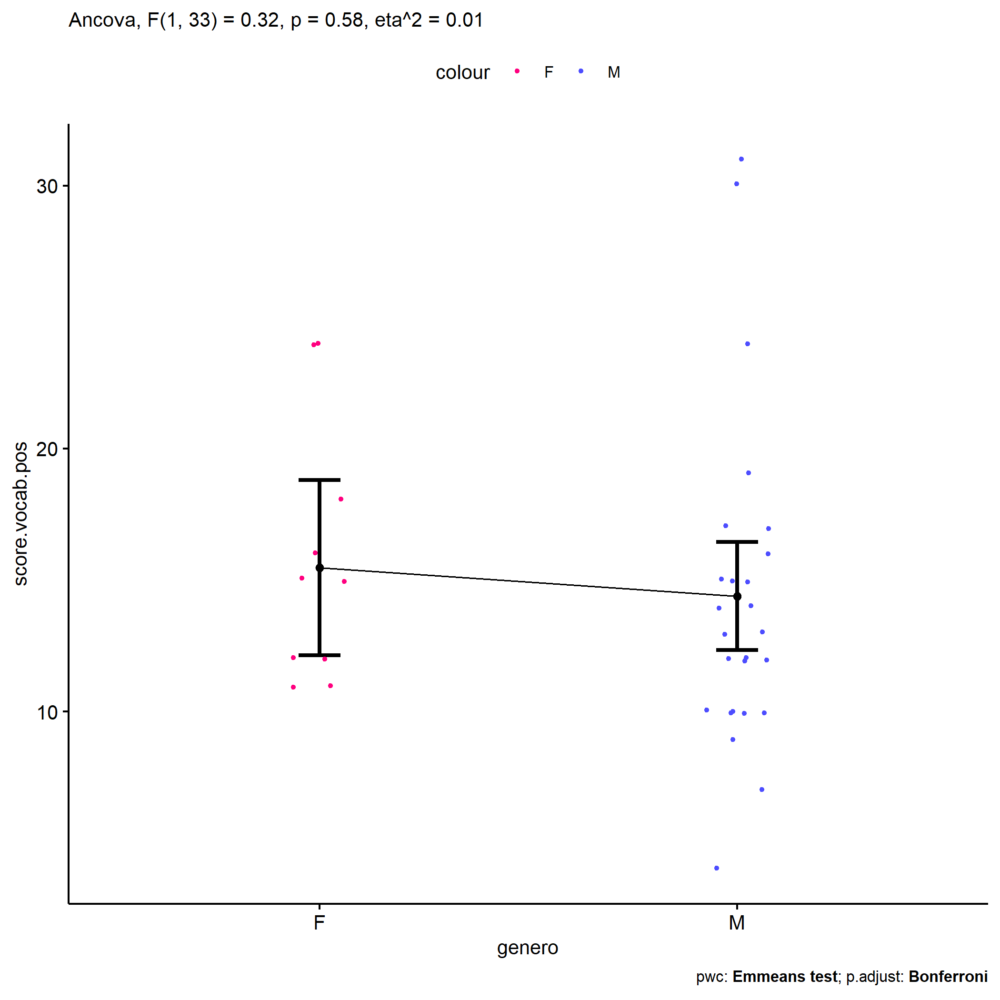<!-- -->

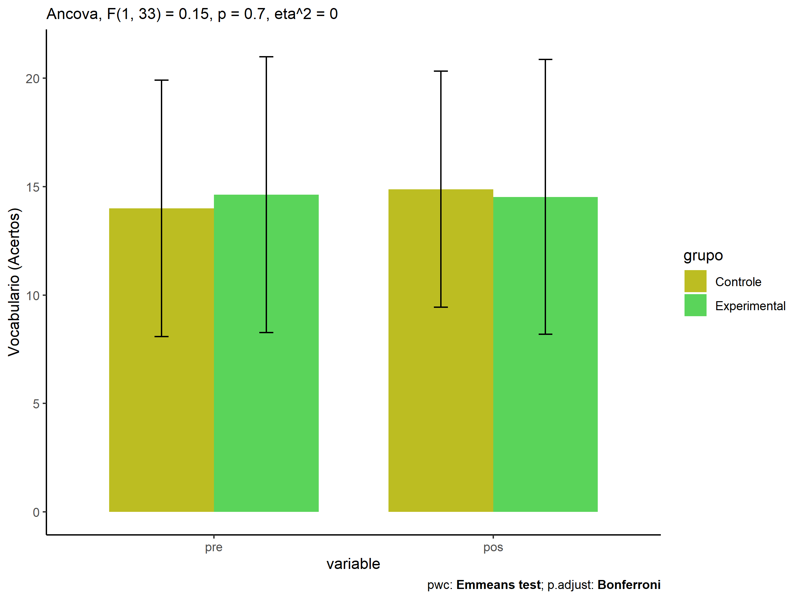<!-- -->

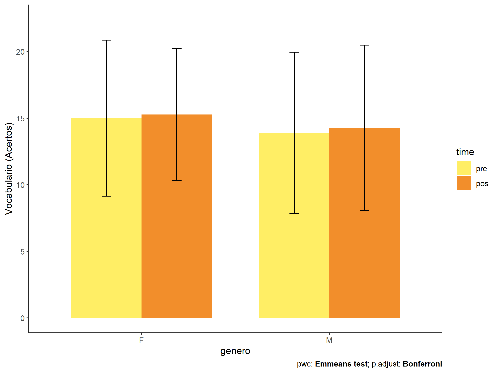<!-- -->

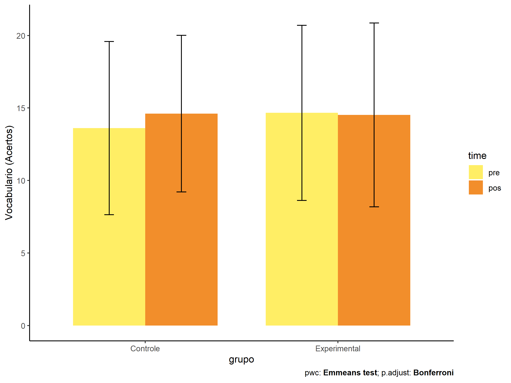<!-- -->

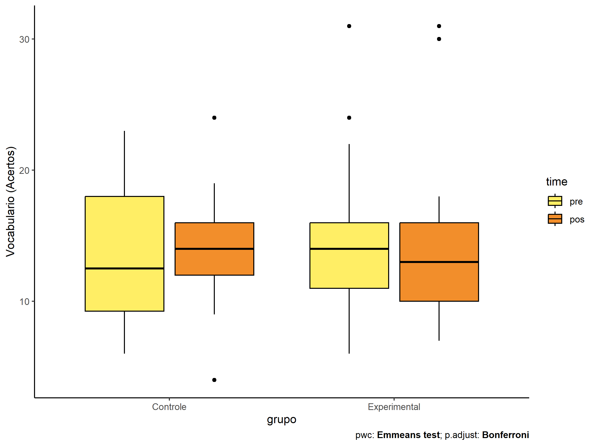<!-- -->

### Vocabulario (TRI)

| var           | grupo        |   n | M (pre) | SE (pre) | M (unadj) | SE (unadj) | M (adj) | SE (adj) |
|:--------------|:-------------|----:|--------:|---------:|----------:|-----------:|--------:|---------:|
| tri.vocab.pos | Controle     |  17 |  -0.568 |    0.145 |    -0.588 |      0.179 |  -0.605 |    0.157 |
| tri.vocab.pos | Experimental |  19 |  -0.616 |    0.167 |    -0.654 |      0.185 |  -0.639 |    0.149 |

| .y.           | group1   | group2       | estimate | conf.low | conf.high |    se | statistic |     p | p.adj | p.adj.signif |
|:--------------|:---------|:-------------|---------:|---------:|----------:|------:|----------:|------:|------:|:-------------|
| tri.vocab.pos | Controle | Experimental |    0.033 |   -0.407 |     0.473 | 0.216 |     0.154 | 0.878 | 0.878 | ns           |
| tri.vocab.pre | Controle | Experimental |    0.049 |   -0.407 |     0.504 | 0.224 |     0.217 | 0.830 | 0.830 | ns           |

| grupo        | group1 | group2 | estimate | conf.low | conf.high |    se | statistic |     p | p.adj | p.adj.signif |
|:-------------|:-------|:-------|---------:|---------:|----------:|------:|----------:|------:|------:|:-------------|
| Controle     | pre    | pos    |   -0.028 |   -0.512 |     0.457 | 0.243 |    -0.114 | 0.910 | 0.910 | ns           |
| Experimental | pre    | pos    |    0.024 |   -0.436 |     0.485 | 0.231 |     0.106 | 0.916 | 0.916 | ns           |

    ## Scale for colour is already present.
    ## Adding another scale for colour, which will replace the existing scale.

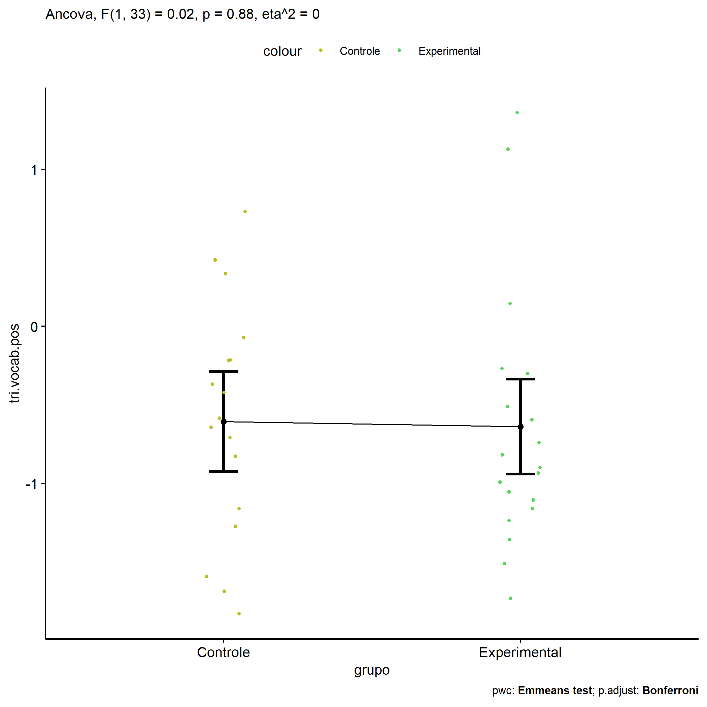<!-- -->

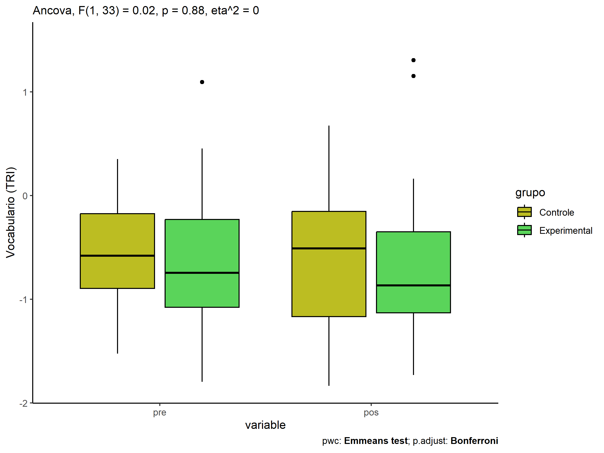<!-- -->

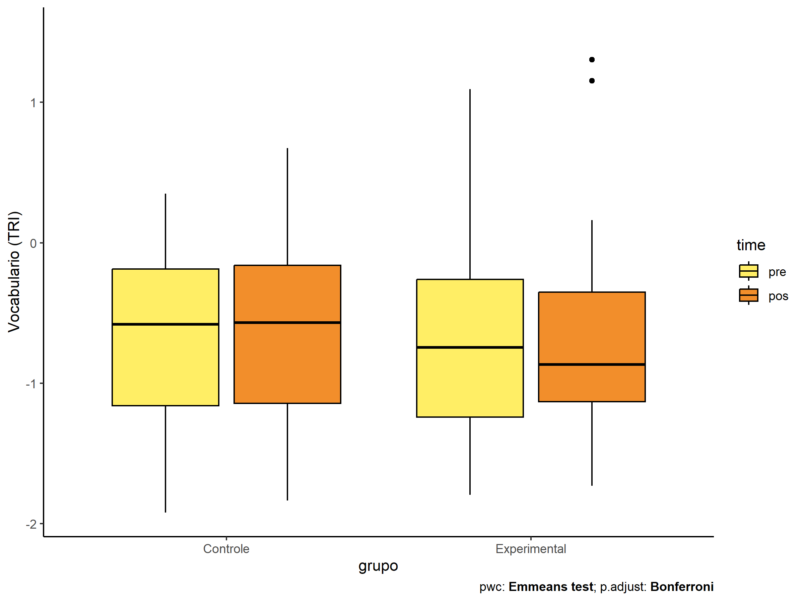<!-- -->

### Vocabulario Ensinado (Acertos)

| var                      | grupo        |   n | M (pre) | SE (pre) | M (unadj) | SE (unadj) | M (adj) | SE (adj) |
|:-------------------------|:-------------|----:|--------:|---------:|----------:|-----------:|--------:|---------:|
| score.vocab.ensinado.pos | Controle     |  19 |   2.368 |    0.413 |     2.211 |      0.379 |   2.402 |    0.385 |
| score.vocab.ensinado.pos | Experimental |  21 |   3.238 |    0.308 |     2.857 |      0.404 |   2.684 |    0.366 |

| .y.                      | group1   | group2       | estimate | conf.low | conf.high |    se | statistic |     p | p.adj | p.adj.signif |
|:-------------------------|:---------|:-------------|---------:|---------:|----------:|------:|----------:|------:|------:|:-------------|
| score.vocab.ensinado.pos | Controle | Experimental |   -0.281 |   -1.378 |     0.815 | 0.541 |    -0.520 | 0.606 | 0.606 | ns           |
| score.vocab.ensinado.pre | Controle | Experimental |   -0.870 |   -1.900 |     0.161 | 0.509 |    -1.708 | 0.096 | 0.096 | ns           |

| grupo        | group1 | group2 | estimate | conf.low | conf.high |    se | statistic |     p | p.adj | p.adj.signif |
|:-------------|:-------|:-------|---------:|---------:|----------:|------:|----------:|------:|------:|:-------------|
| Controle     | pre    | pos    |    0.158 |   -0.931 |     1.247 | 0.547 |     0.289 | 0.774 | 0.774 | ns           |
| Experimental | pre    | pos    |    0.381 |   -0.655 |     1.417 | 0.520 |     0.732 | 0.466 | 0.466 | ns           |

    ## Scale for colour is already present.
    ## Adding another scale for colour, which will replace the existing scale.

<!-- -->

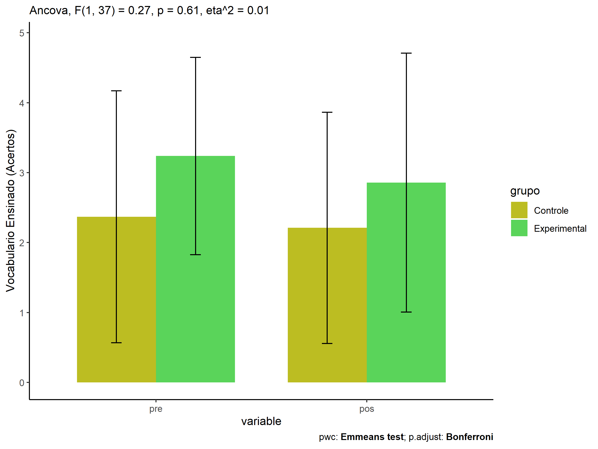<!-- -->

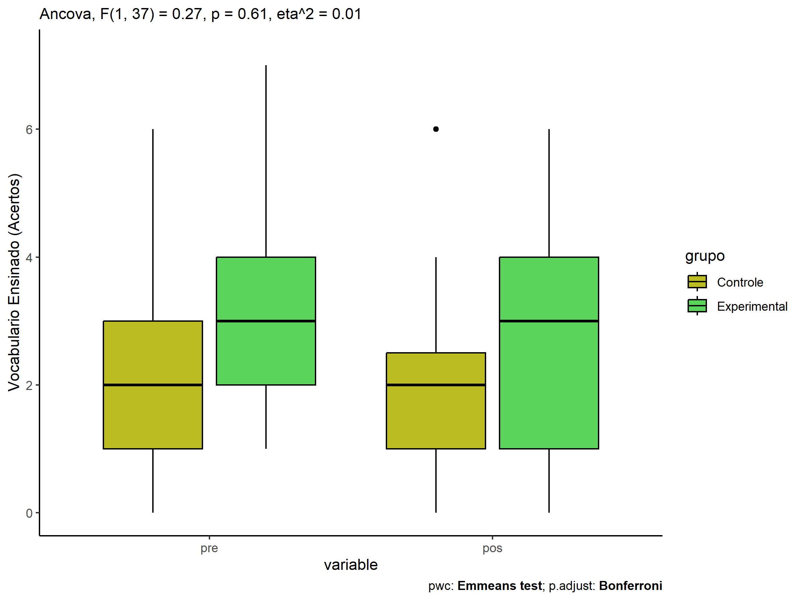<!-- -->

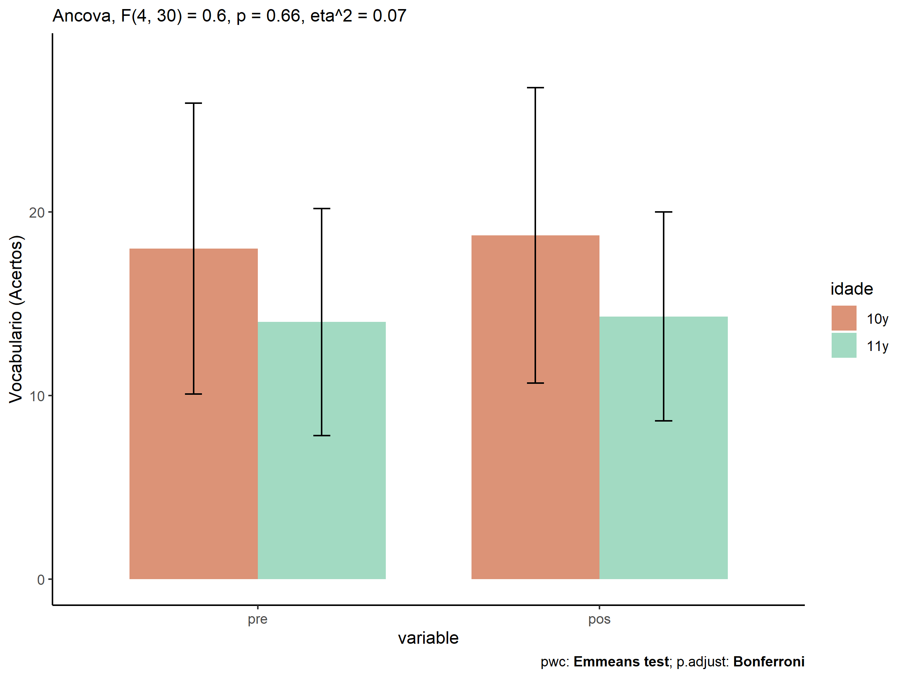<!-- -->

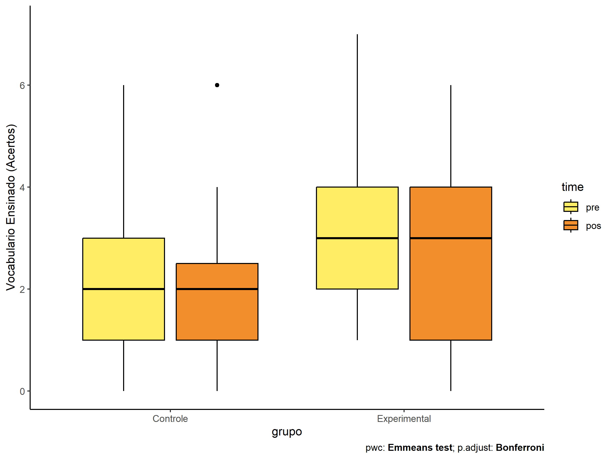<!-- -->

### Vocabulario Ensinado (TRI)

| var                    | grupo        |   n | M (pre) | SE (pre) | M (unadj) | SE (unadj) | M (adj) | SE (adj) |
|:-----------------------|:-------------|----:|--------:|---------:|----------:|-----------:|--------:|---------:|
| tri.vocab.ensinado.pos | Controle     |  17 |  -0.411 |    0.174 |    -0.652 |      0.164 |  -0.611 |    0.143 |
| tri.vocab.ensinado.pos | Experimental |  19 |  -0.209 |    0.135 |    -0.312 |      0.134 |  -0.348 |    0.136 |

| .y.                    | group1   | group2       | estimate | conf.low | conf.high |    se | statistic |     p | p.adj | p.adj.signif |
|:-----------------------|:---------|:-------------|---------:|---------:|----------:|------:|----------:|------:|------:|:-------------|
| tri.vocab.ensinado.pos | Controle | Experimental |   -0.263 |   -0.667 |     0.141 | 0.199 |    -1.326 | 0.194 | 0.194 | ns           |
| tri.vocab.ensinado.pre | Controle | Experimental |   -0.202 |   -0.645 |     0.241 | 0.218 |    -0.926 | 0.361 | 0.361 | ns           |

| grupo        | group1 | group2 | estimate | conf.low | conf.high |    se | statistic |     p | p.adj | p.adj.signif |
|:-------------|:-------|:-------|---------:|---------:|----------:|------:|----------:|------:|------:|:-------------|
| Controle     | pre    | pos    |    0.217 |   -0.208 |     0.642 | 0.213 |     1.016 | 0.313 | 0.313 | ns           |
| Experimental | pre    | pos    |    0.082 |   -0.321 |     0.486 | 0.202 |     0.407 | 0.685 | 0.685 | ns           |

    ## Scale for colour is already present.
    ## Adding another scale for colour, which will replace the existing scale.

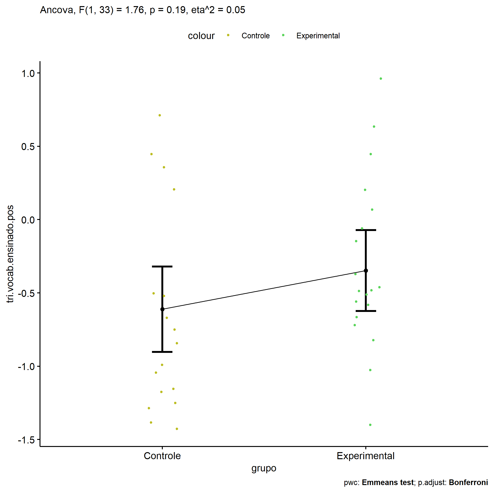<!-- -->

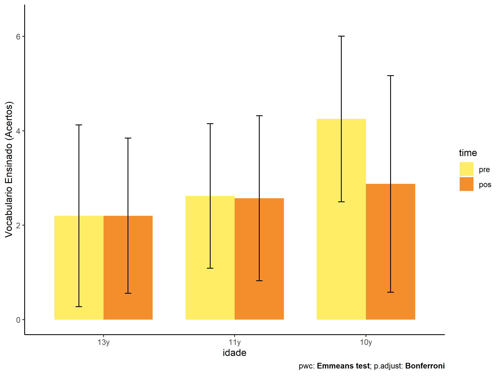<!-- -->

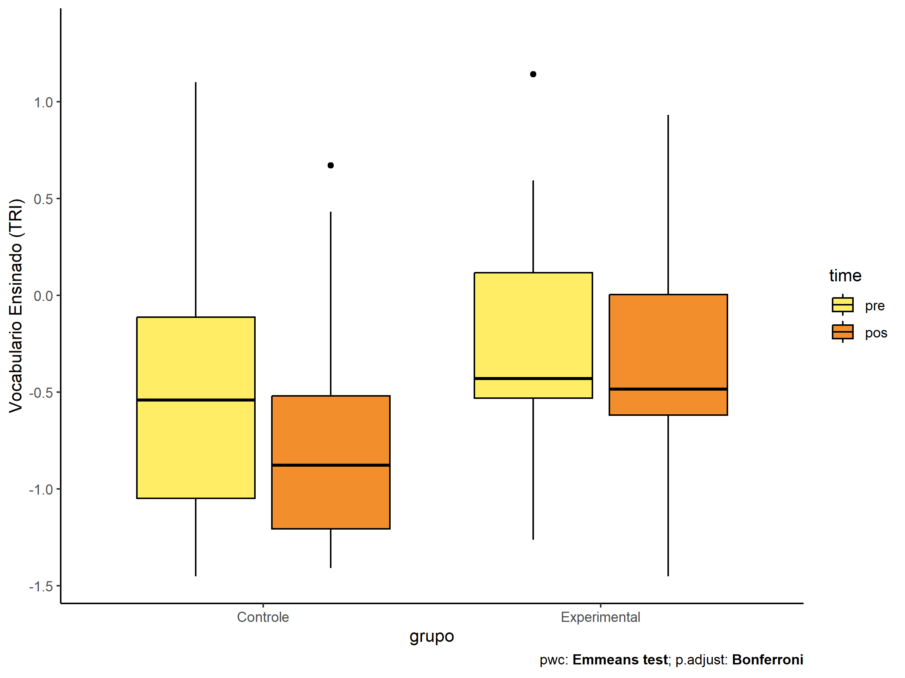<!-- -->

### Vocabulario Nao Ensinado (Acertos)

| var                          | grupo        |   n | M (pre) | SE (pre) | M (unadj) | SE (unadj) | M (adj) | SE (adj) |
|:-----------------------------|:-------------|----:|--------:|---------:|----------:|-----------:|--------:|---------:|
| score.vocab.nao.ensinado.pos | Controle     |  19 |  10.526 |    1.148 |    11.632 |      1.170 |  11.876 |    1.196 |
| score.vocab.nao.ensinado.pos | Experimental |  21 |  11.429 |    1.139 |    10.286 |      1.379 |  10.064 |    1.137 |

| .y.                          | group1   | group2       | estimate | conf.low | conf.high |    se | statistic |     p | p.adj | p.adj.signif |
|:-----------------------------|:---------|:-------------|---------:|---------:|----------:|------:|----------:|------:|------:|:-------------|
| score.vocab.nao.ensinado.pos | Controle | Experimental |    1.812 |   -1.539 |     5.163 | 1.654 |     1.095 | 0.280 | 0.280 | ns           |
| score.vocab.nao.ensinado.pre | Controle | Experimental |   -0.902 |   -4.184 |     2.379 | 1.621 |    -0.557 | 0.581 | 0.581 | ns           |

| grupo        | group1 | group2 | estimate | conf.low | conf.high |    se | statistic |     p | p.adj | p.adj.signif |
|:-------------|:-------|:-------|---------:|---------:|----------:|------:|----------:|------:|------:|:-------------|
| Controle     | pre    | pos    |   -1.105 |   -4.631 |     2.420 | 1.770 |    -0.624 | 0.534 | 0.534 | ns           |
| Experimental | pre    | pos    |    1.143 |   -2.211 |     4.497 | 1.684 |     0.679 | 0.499 | 0.499 | ns           |

    ## Scale for colour is already present.
    ## Adding another scale for colour, which will replace the existing scale.

<!-- -->

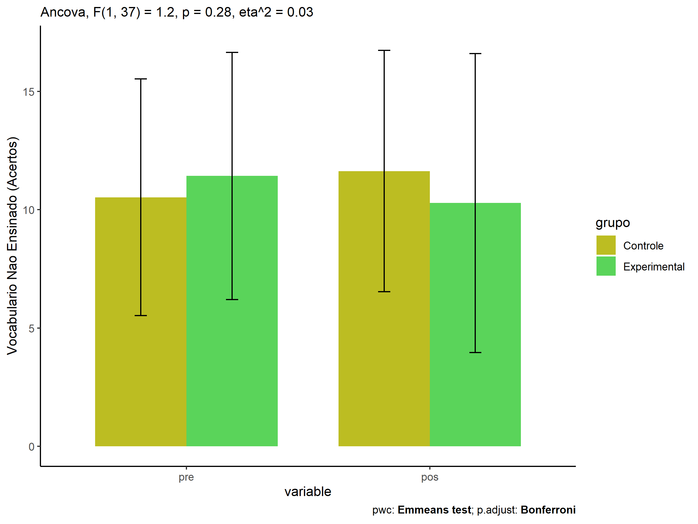<!-- -->

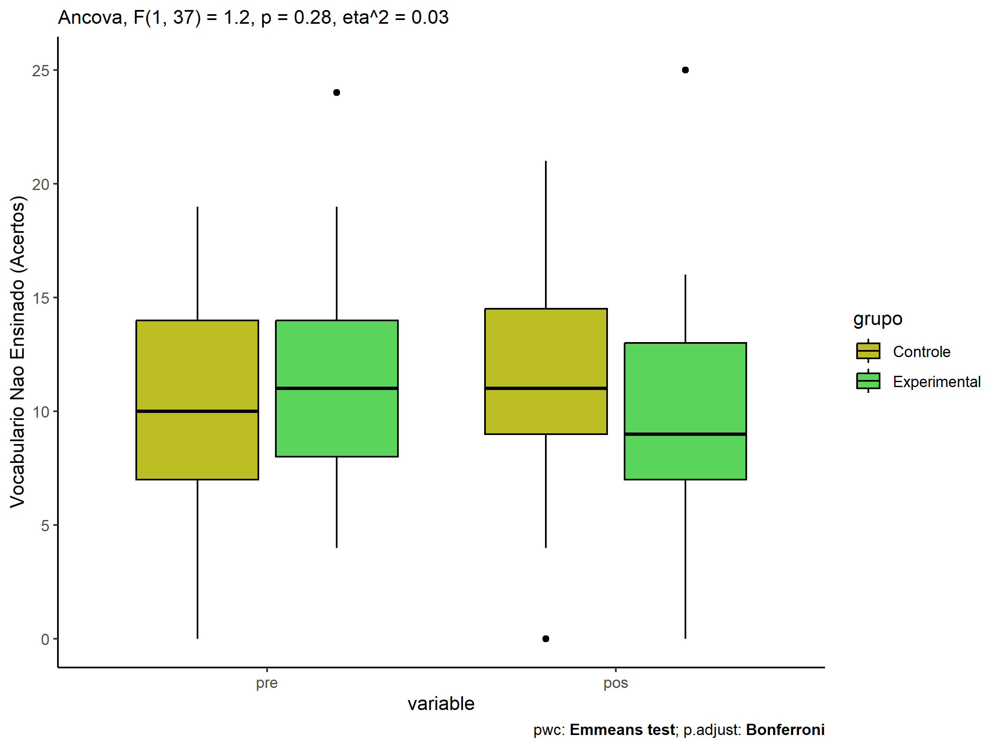<!-- -->

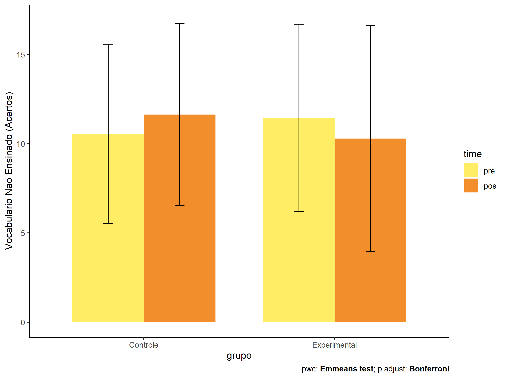<!-- -->

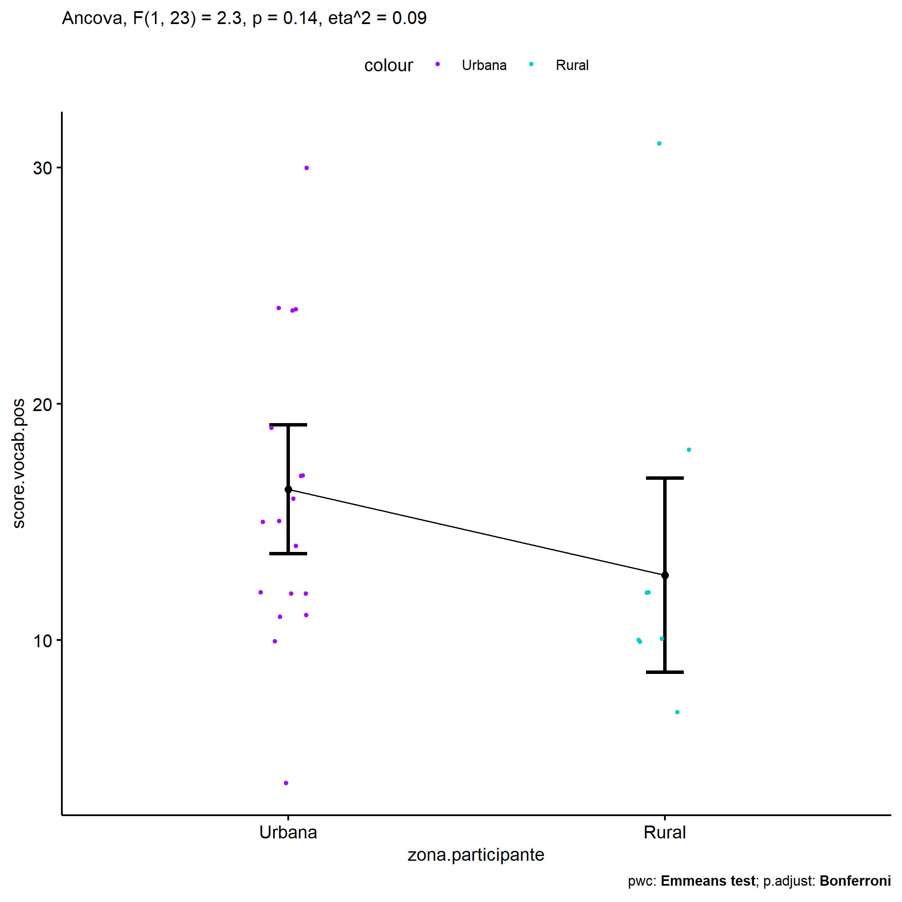<!-- -->

### Vocabulario Nao Ensinado (TRI)

| var                        | grupo        |   n | M (pre) | SE (pre) | M (unadj) | SE (unadj) | M (adj) | SE (adj) |
|:---------------------------|:-------------|----:|--------:|---------:|----------:|-----------:|--------:|---------:|
| tri.vocab.nao.ensinado.pos | Controle     |  17 |  -0.660 |    0.108 |    -0.516 |      0.134 |  -0.525 |    0.136 |
| tri.vocab.nao.ensinado.pos | Experimental |  19 |  -0.687 |    0.170 |    -0.653 |      0.178 |  -0.645 |    0.129 |

| .y.                        | group1   | group2       | estimate | conf.low | conf.high |    se | statistic |     p | p.adj | p.adj.signif |
|:---------------------------|:---------|:-------------|---------:|---------:|----------:|------:|----------:|------:|------:|:-------------|
| tri.vocab.nao.ensinado.pos | Controle | Experimental |    0.120 |   -0.261 |     0.501 | 0.187 |     0.640 | 0.526 | 0.526 | ns           |
| tri.vocab.nao.ensinado.pre | Controle | Experimental |    0.027 |   -0.393 |     0.447 | 0.207 |     0.131 | 0.896 | 0.896 | ns           |

| grupo        | group1 | group2 | estimate | conf.low | conf.high |    se | statistic |     p | p.adj | p.adj.signif |
|:-------------|:-------|:-------|---------:|---------:|----------:|------:|----------:|------:|------:|:-------------|
| Controle     | pre    | pos    |   -0.157 |   -0.585 |     0.270 | 0.214 |    -0.734 | 0.466 | 0.466 | ns           |
| Experimental | pre    | pos    |   -0.030 |   -0.436 |     0.376 | 0.204 |    -0.148 | 0.883 | 0.883 | ns           |

    ## Scale for colour is already present.
    ## Adding another scale for colour, which will replace the existing scale.

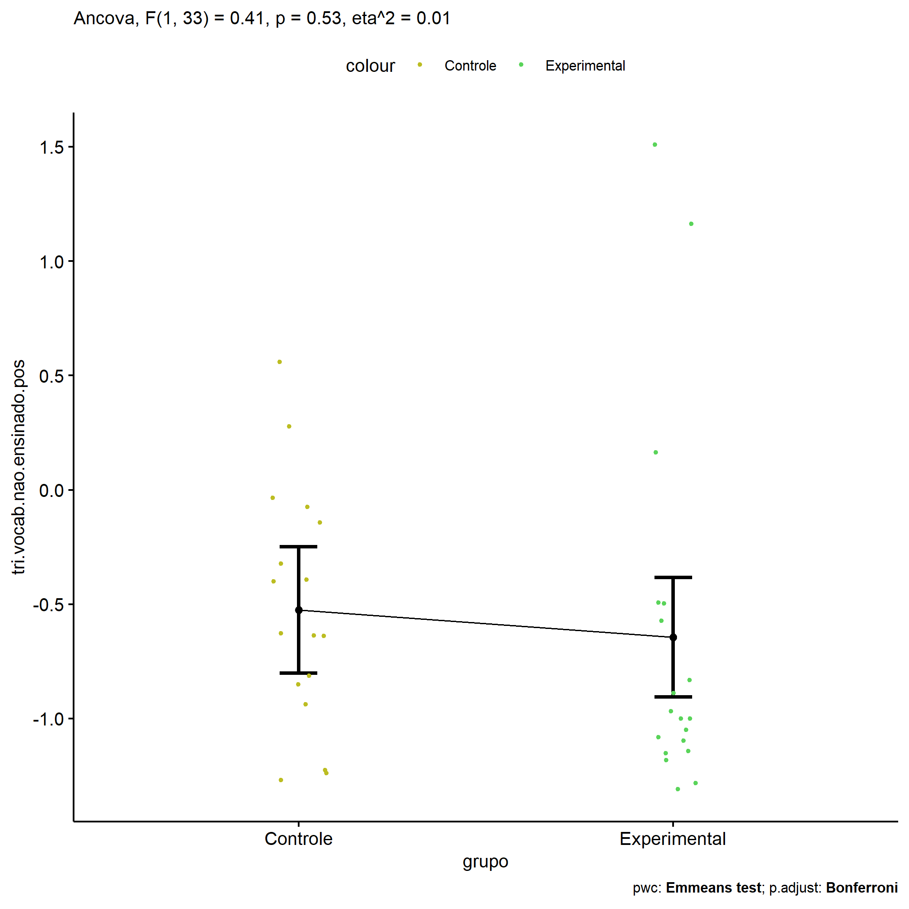<!-- -->

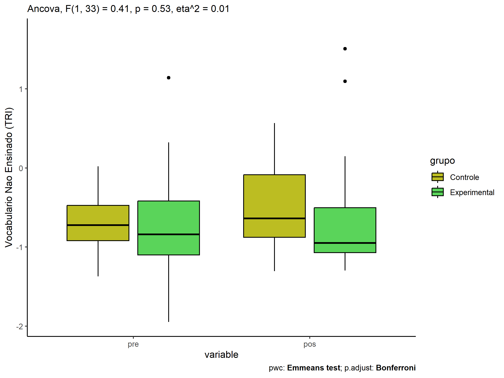<!-- -->

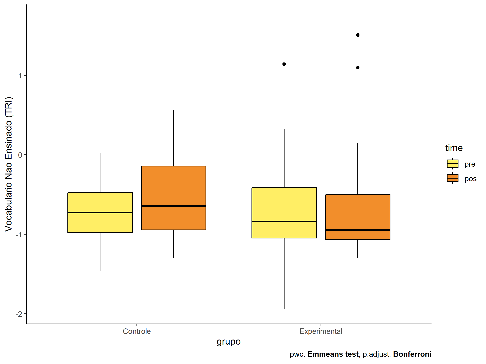<!-- -->

## factor: **genero**

### Vocabulario (Acertos)

| var             | genero |   n | M (pre) | SE (pre) | M (unadj) | SE (unadj) | M (adj) | SE (adj) |
|:----------------|:-------|----:|--------:|---------:|----------:|-----------:|--------:|---------:|
| score.vocab.pos | F      |  10 |  15.000 |    1.850 |    15.800 |      1.548 |  15.478 |    1.636 |
| score.vocab.pos | M      |  26 |  14.077 |    1.227 |    14.269 |      1.219 |  14.393 |    1.014 |

| .y.             | group1 | group2 | estimate | conf.low | conf.high |    se | statistic |     p | p.adj | p.adj.signif |
|:----------------|:-------|:-------|---------:|---------:|----------:|------:|----------:|------:|------:|:-------------|
| score.vocab.pos | F      | M      |    1.085 |   -2.835 |     5.004 | 1.927 |     0.563 | 0.577 | 0.577 | ns           |
| score.vocab.pre | F      | M      |    0.923 |   -3.727 |     5.574 | 2.288 |     0.403 | 0.689 | 0.689 | ns           |

| genero | group1 | group2 | estimate | conf.low | conf.high |    se | statistic |     p | p.adj | p.adj.signif |
|:-------|:-------|:-------|---------:|---------:|----------:|------:|----------:|------:|------:|:-------------|
| F      | pre    | pos    |   -0.273 |   -5.454 |     4.909 | 2.599 |    -0.105 | 0.917 | 0.917 | ns           |
| M      | pre    | pos    |   -0.373 |   -3.576 |     2.830 | 1.607 |    -0.232 | 0.817 | 0.817 | ns           |

    ## Scale for colour is already present.
    ## Adding another scale for colour, which will replace the existing scale.

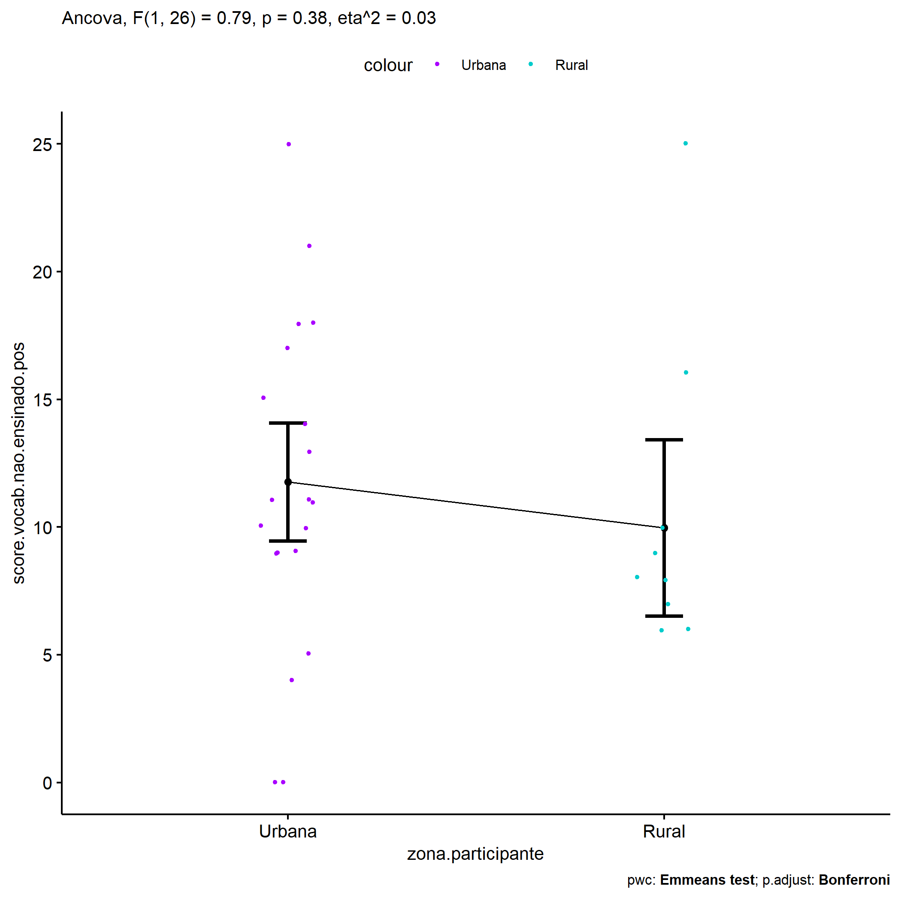<!-- -->

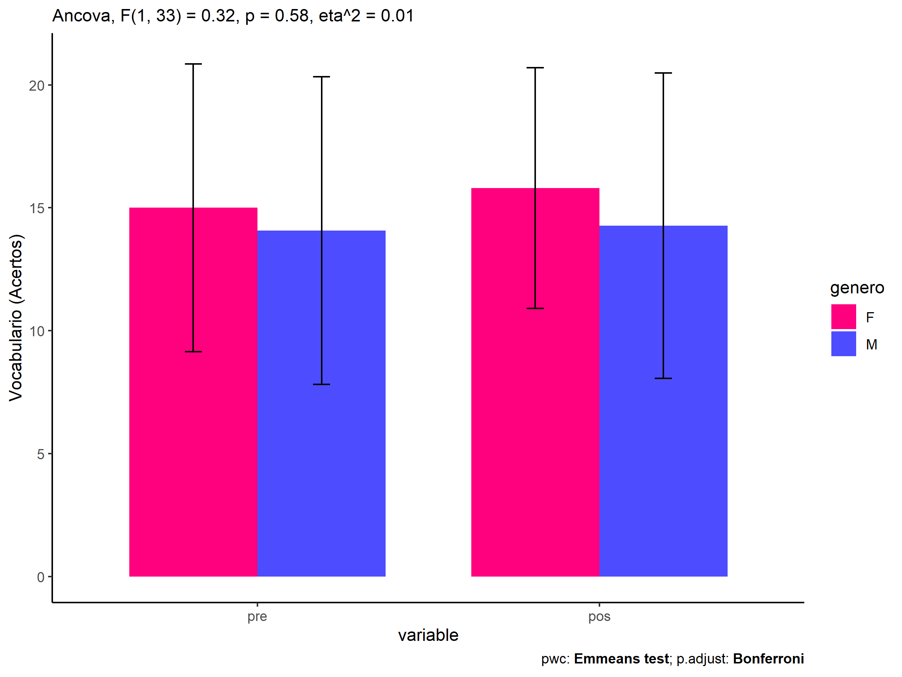<!-- -->

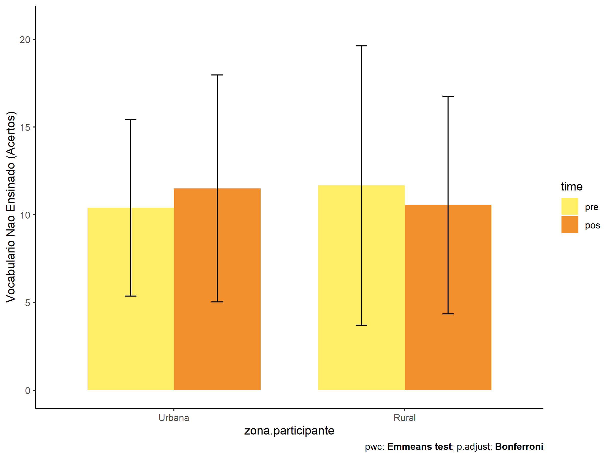<!-- -->

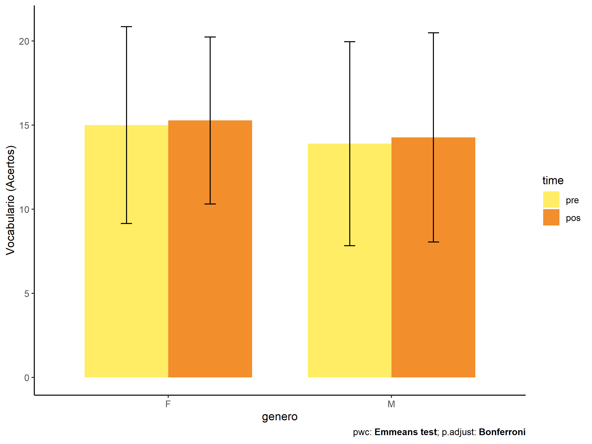<!-- -->

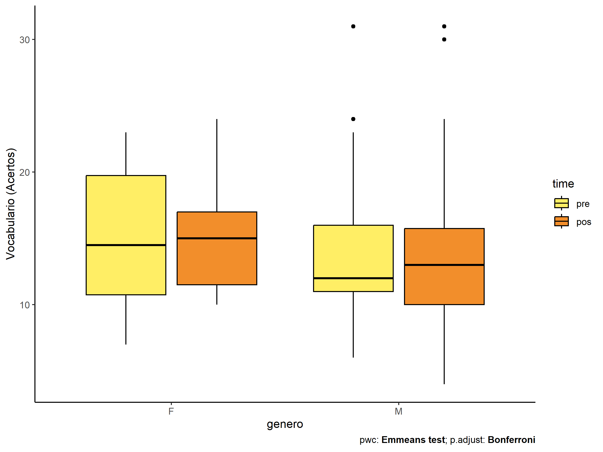<!-- -->

### Vocabulario (TRI)

| var           | genero |   n | M (pre) | SE (pre) | M (unadj) | SE (unadj) | M (adj) | SE (adj) |
|:--------------|:-------|----:|--------:|---------:|----------:|-----------:|--------:|---------:|
| tri.vocab.pos | F      |  10 |  -0.554 |    0.180 |    -0.428 |      0.254 |  -0.455 |    0.202 |
| tri.vocab.pos | M      |  26 |  -0.609 |    0.138 |    -0.698 |      0.148 |  -0.688 |    0.125 |

| .y.           | group1 | group2 | estimate | conf.low | conf.high |    se | statistic |     p | p.adj | p.adj.signif |
|:--------------|:-------|:-------|---------:|---------:|----------:|------:|----------:|------:|------:|:-------------|
| tri.vocab.pos | F      | M      |    0.233 |   -0.250 |     0.717 | 0.238 |     0.981 | 0.334 | 0.334 | ns           |
| tri.vocab.pre | F      | M      |    0.055 |   -0.452 |     0.563 | 0.250 |     0.222 | 0.825 | 0.825 | ns           |

| genero | group1 | group2 | estimate | conf.low | conf.high |    se | statistic |     p | p.adj | p.adj.signif |
|:-------|:-------|:-------|---------:|---------:|----------:|------:|----------:|------:|------:|:-------------|
| F      | pre    | pos    |   -0.066 |   -0.698 |     0.565 | 0.317 |    -0.209 | 0.835 | 0.835 | ns           |
| M      | pre    | pos    |    0.034 |   -0.357 |     0.424 | 0.196 |     0.172 | 0.864 | 0.864 | ns           |

    ## Scale for colour is already present.
    ## Adding another scale for colour, which will replace the existing scale.

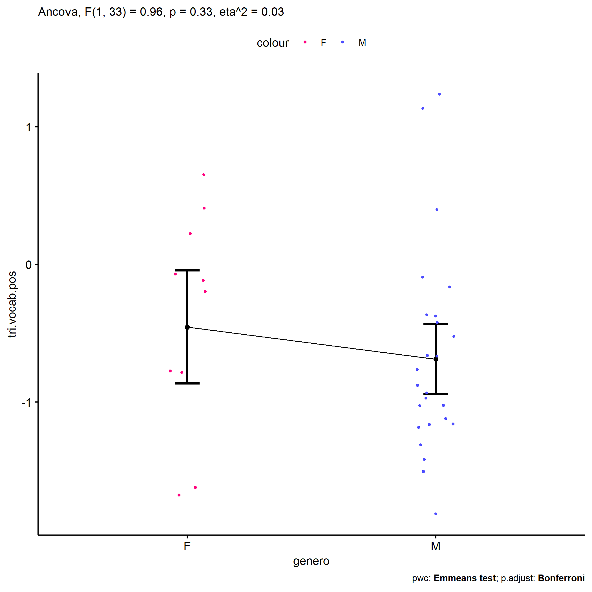<!-- -->

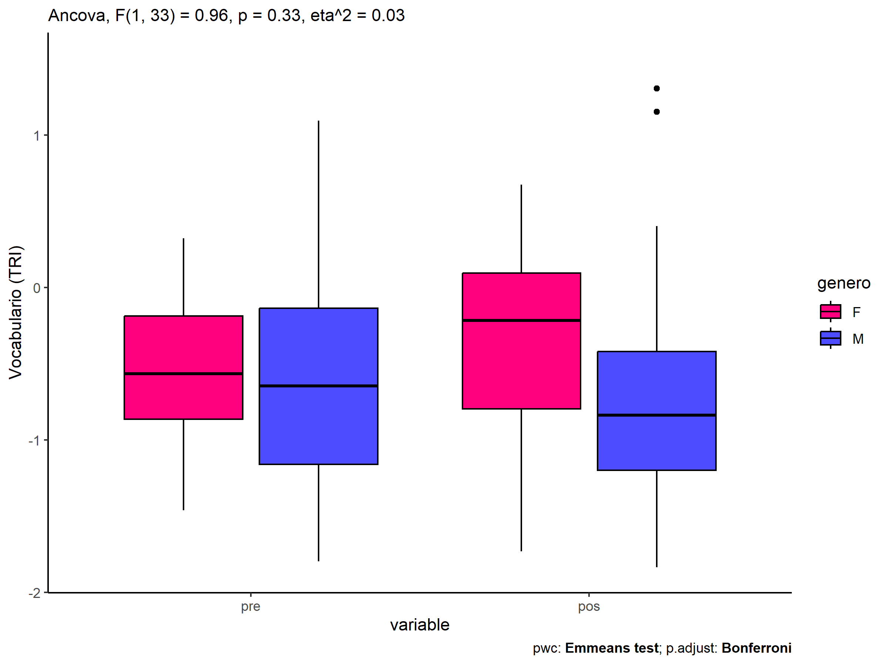<!-- -->

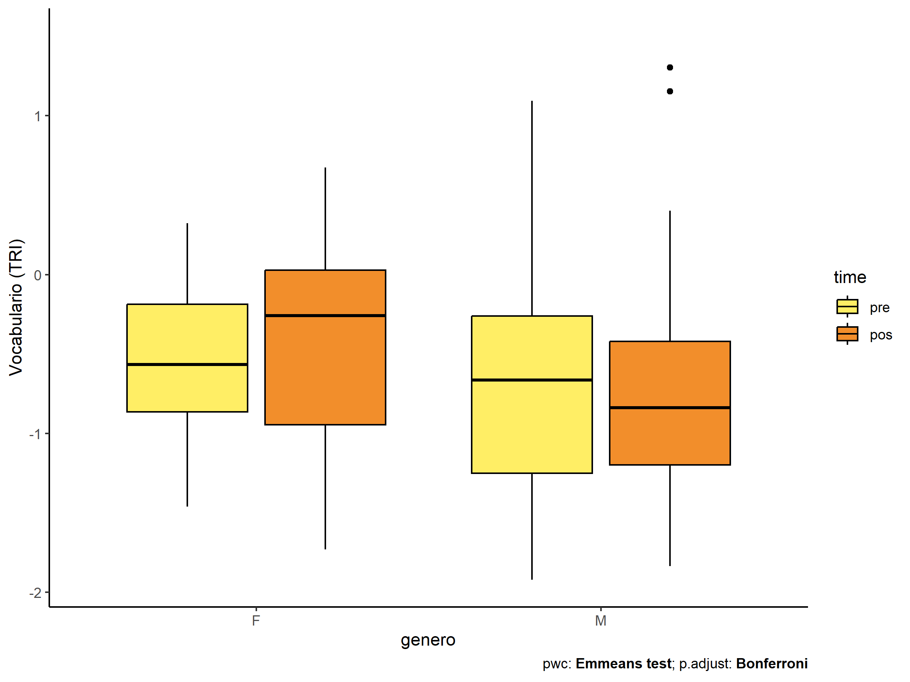<!-- -->

### Vocabulario Ensinado (Acertos)

| var                      | genero |   n | M (pre) | SE (pre) | M (unadj) | SE (unadj) | M (adj) | SE (adj) |
|:-------------------------|:-------|----:|--------:|---------:|----------:|-----------:|--------:|---------:|
| score.vocab.ensinado.pos | F      |  11 |   2.909 |    0.530 |     2.364 |      0.453 |   2.326 |    0.497 |
| score.vocab.ensinado.pos | M      |  29 |   2.793 |    0.303 |     2.621 |      0.349 |   2.635 |    0.306 |

| .y.                      | group1 | group2 | estimate | conf.low | conf.high |    se | statistic |     p | p.adj | p.adj.signif |
|:-------------------------|:-------|:-------|---------:|---------:|----------:|------:|----------:|------:|------:|:-------------|
| score.vocab.ensinado.pos | F      | M      |   -0.309 |   -1.491 |     0.874 | 0.584 |    -0.529 | 0.600 | 0.600 | ns           |
| score.vocab.ensinado.pre | F      | M      |    0.116 |   -1.079 |     1.311 | 0.590 |     0.196 | 0.845 | 0.845 | ns           |

| genero | group1 | group2 | estimate | conf.low | conf.high |    se | statistic |     p | p.adj | p.adj.signif |
|:-------|:-------|:-------|---------:|---------:|----------:|------:|----------:|------:|------:|:-------------|
| F      | pre    | pos    |    0.545 |   -0.922 |     2.013 | 0.737 |      0.74 | 0.462 | 0.462 | ns           |
| M      | pre    | pos    |    0.172 |   -0.732 |     1.076 | 0.454 |      0.38 | 0.705 | 0.705 | ns           |

    ## Scale for colour is already present.
    ## Adding another scale for colour, which will replace the existing scale.

<!-- -->

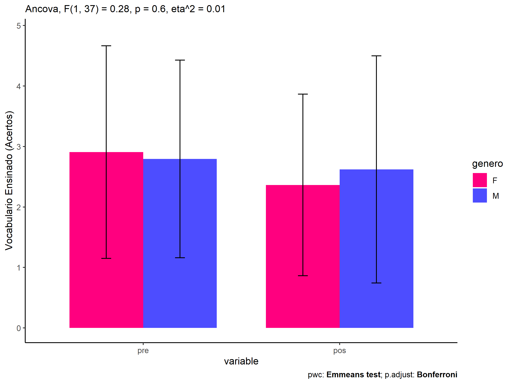<!-- -->

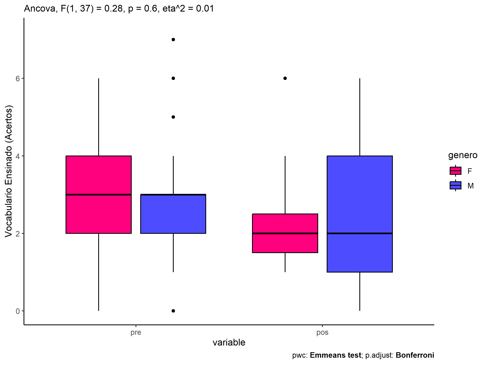<!-- -->

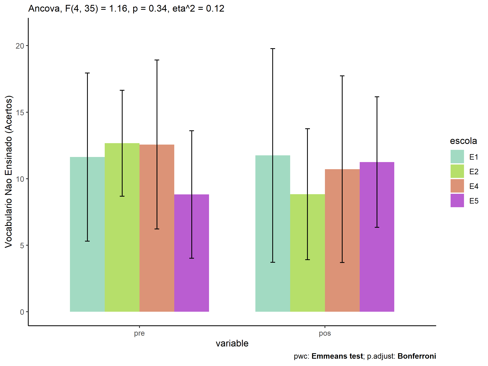<!-- -->

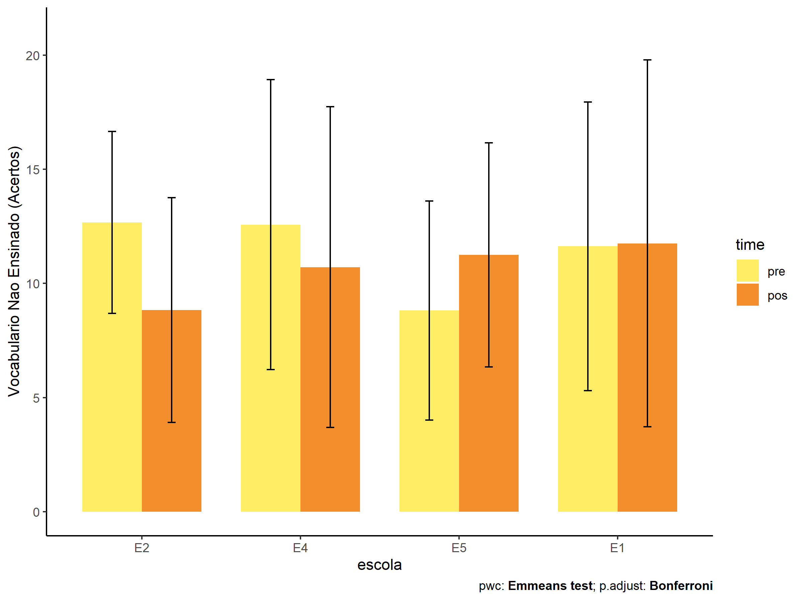<!-- -->

### Vocabulario Ensinado (TRI)

| var                    | genero |   n | M (pre) | SE (pre) | M (unadj) | SE (unadj) | M (adj) | SE (adj) |
|:-----------------------|:-------|----:|--------:|---------:|----------:|-----------:|--------:|---------:|
| tri.vocab.ensinado.pos | F      |  10 |  -0.031 |    0.206 |    -0.643 |      0.232 |  -0.776 |    0.186 |
| tri.vocab.ensinado.pos | M      |  26 |  -0.410 |    0.124 |    -0.407 |      0.119 |  -0.355 |    0.113 |

| .y.                    | group1 | group2 | estimate | conf.low | conf.high |    se | statistic |     p | p.adj | p.adj.signif |
|:-----------------------|:-------|:-------|---------:|---------:|----------:|------:|----------:|------:|------:|:-------------|
| tri.vocab.ensinado.pos | F      | M      |   -0.421 |   -0.870 |     0.028 | 0.221 |    -1.906 | 0.065 | 0.065 | ns           |
| tri.vocab.ensinado.pre | F      | M      |    0.379 |   -0.104 |     0.862 | 0.238 |     1.595 | 0.120 | 0.120 | ns           |

| genero | group1 | group2 | estimate | conf.low | conf.high |    se | statistic |     p | p.adj | p.adj.signif |
|:-------|:-------|:-------|---------:|---------:|----------:|------:|----------:|------:|------:|:-------------|
| F      | pre    | pos    |    0.668 |    0.112 |     1.224 | 0.279 |     2.395 | 0.019 | 0.019 | \*           |
| M      | pre    | pos    |   -0.040 |   -0.384 |     0.304 | 0.172 |    -0.231 | 0.818 | 0.818 | ns           |

    ## Scale for colour is already present.
    ## Adding another scale for colour, which will replace the existing scale.

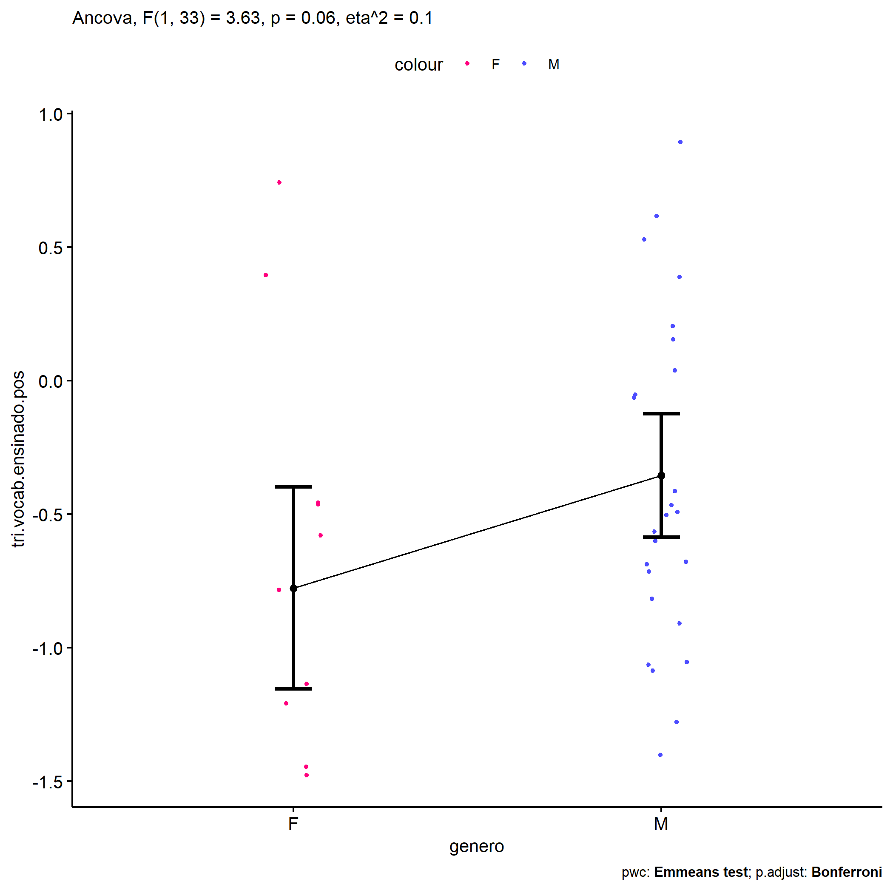<!-- -->

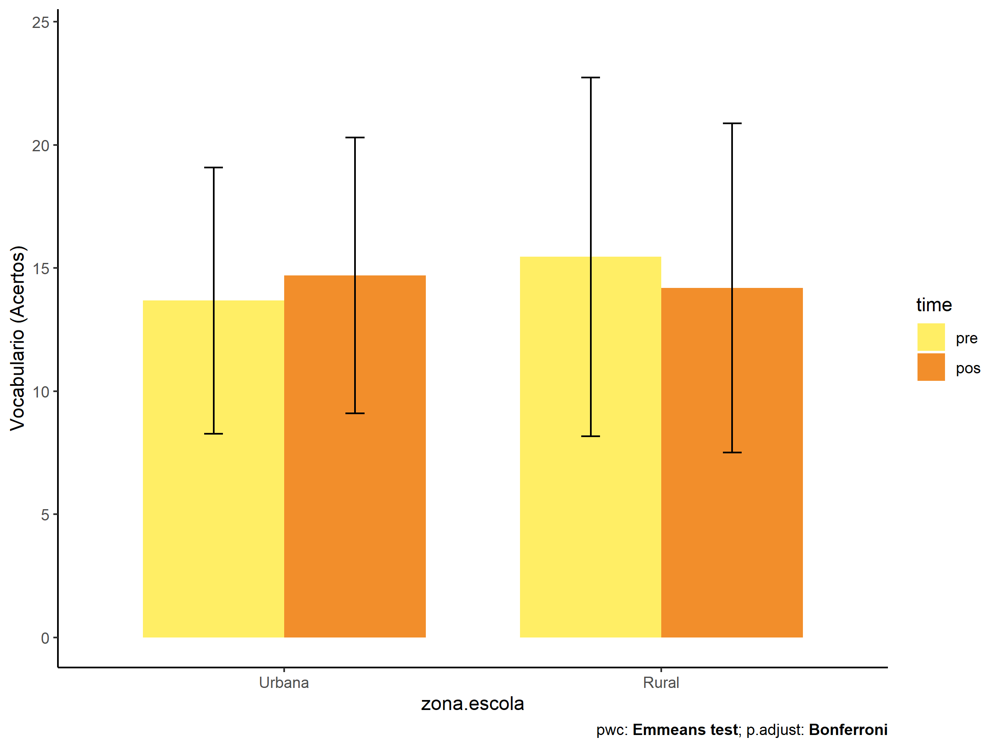<!-- -->

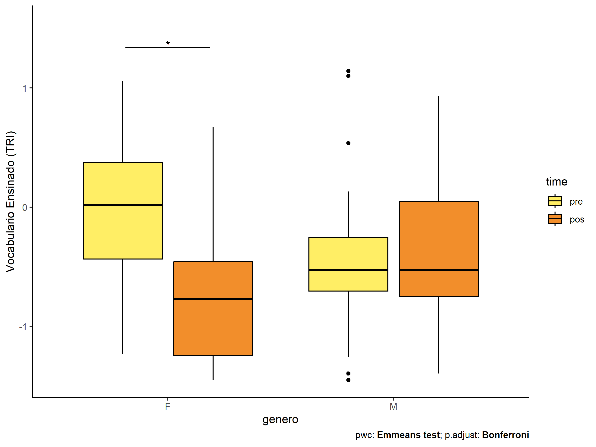<!-- -->

### Vocabulario Nao Ensinado (Acertos)

| var                          | genero |   n | M (pre) | SE (pre) | M (unadj) | SE (unadj) | M (adj) | SE (adj) |
|:-----------------------------|:-------|----:|--------:|---------:|----------:|-----------:|--------:|---------:|
| score.vocab.nao.ensinado.pos | F      |  11 |  10.727 |    1.733 |    12.909 |      1.246 |  13.048 |    1.541 |
| score.vocab.nao.ensinado.pos | M      |  29 |  11.103 |    0.910 |    10.172 |      1.139 |  10.120 |    0.949 |

| .y.                          | group1 | group2 | estimate | conf.low | conf.high |    se | statistic |     p | p.adj | p.adj.signif |
|:-----------------------------|:-------|:-------|---------:|---------:|----------:|------:|----------:|------:|------:|:-------------|
| score.vocab.nao.ensinado.pos | F      | M      |    2.928 |   -0.739 |     6.595 | 1.810 |     1.618 | 0.114 | 0.114 | ns           |
| score.vocab.nao.ensinado.pre | F      | M      |   -0.376 |   -4.059 |     3.306 | 1.819 |    -0.207 | 0.837 | 0.837 | ns           |

| genero | group1 | group2 | estimate | conf.low | conf.high |    se | statistic |     p | p.adj | p.adj.signif |
|:-------|:-------|:-------|---------:|---------:|----------:|------:|----------:|------:|------:|:-------------|
| F      | pre    | pos    |   -2.182 |   -6.780 |     2.416 | 2.309 |    -0.945 | 0.348 | 0.348 | ns           |
| M      | pre    | pos    |    0.931 |   -1.901 |     3.763 | 1.422 |     0.655 | 0.515 | 0.515 | ns           |

    ## Scale for colour is already present.
    ## Adding another scale for colour, which will replace the existing scale.

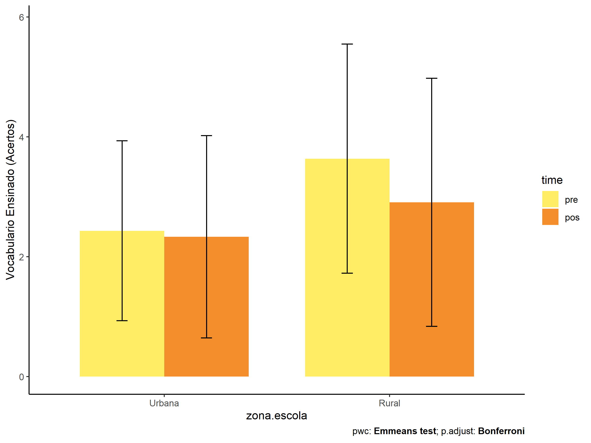<!-- -->

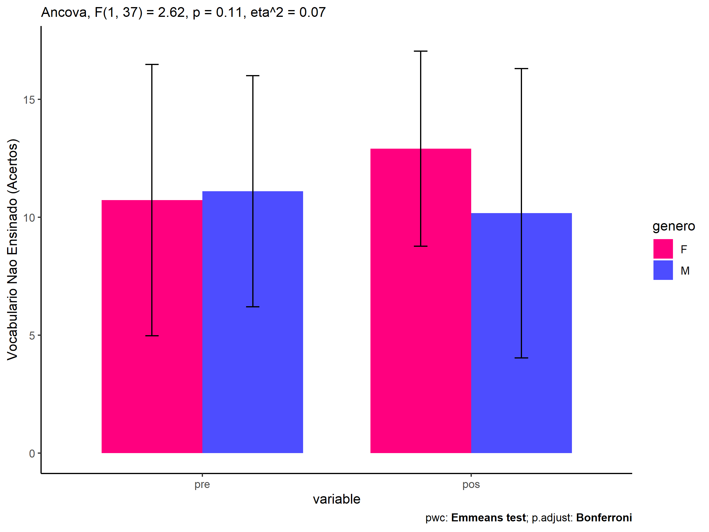<!-- -->

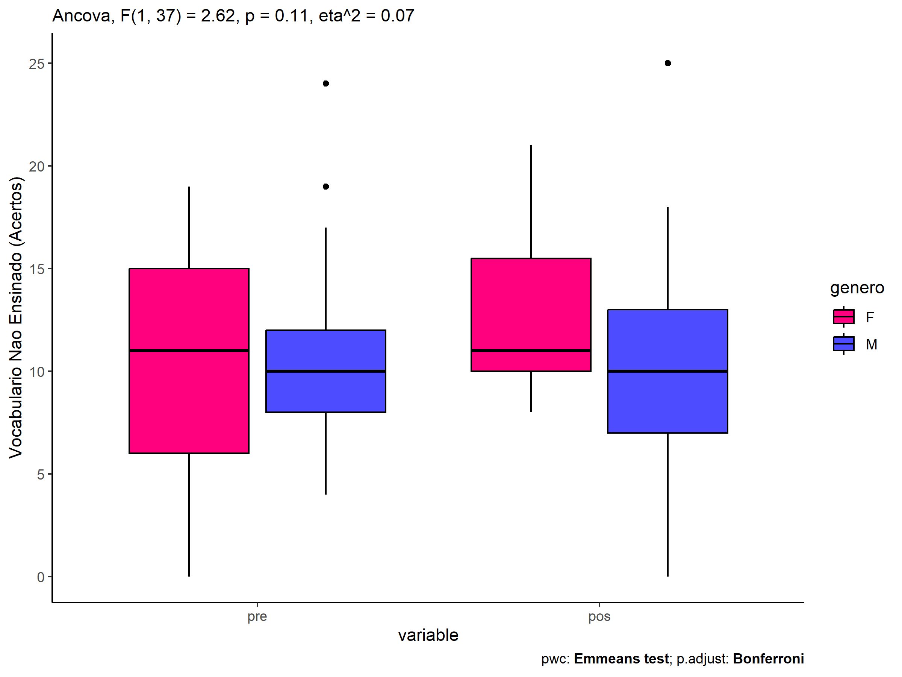<!-- -->

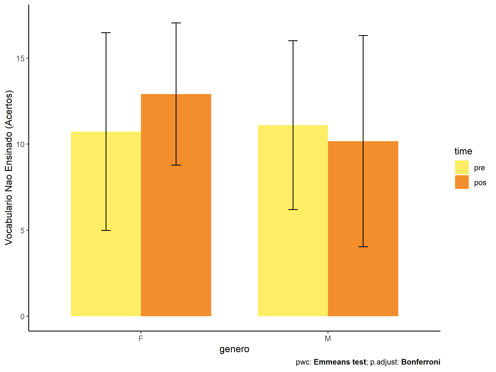<!-- -->

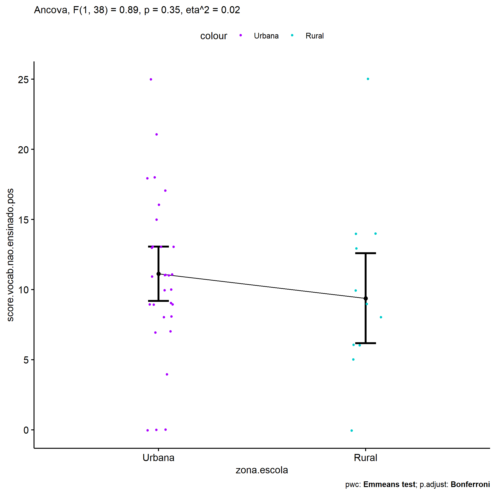<!-- -->

### Vocabulario Nao Ensinado (TRI)

| var                        | genero |   n | M (pre) | SE (pre) | M (unadj) | SE (unadj) | M (adj) | SE (adj) |
|:---------------------------|:-------|----:|--------:|---------:|----------:|-----------:|--------:|---------:|
| tri.vocab.nao.ensinado.pos | F      |  10 |  -0.666 |    0.142 |    -0.374 |      0.173 |  -0.378 |    0.173 |
| tri.vocab.nao.ensinado.pos | M      |  26 |  -0.677 |    0.131 |    -0.671 |      0.139 |  -0.669 |    0.107 |

| .y.                        | group1 | group2 | estimate | conf.low | conf.high |    se | statistic |     p | p.adj | p.adj.signif |
|:---------------------------|:-------|:-------|---------:|---------:|----------:|------:|----------:|------:|------:|:-------------|
| tri.vocab.nao.ensinado.pos | F      | M      |     0.29 |   -0.124 |     0.705 | 0.204 |     1.426 | 0.163 | 0.163 | ns           |
| tri.vocab.nao.ensinado.pre | F      | M      |     0.01 |   -0.458 |     0.478 | 0.230 |     0.045 | 0.964 | 0.964 | ns           |

| genero | group1 | group2 | estimate | conf.low | conf.high |    se | statistic |     p | p.adj | p.adj.signif |
|:-------|:-------|:-------|---------:|---------:|----------:|------:|----------:|------:|------:|:-------------|
| F      | pre    | pos    |   -0.229 |   -0.786 |     0.329 | 0.279 |    -0.818 | 0.416 | 0.416 | ns           |
| M      | pre    | pos    |   -0.031 |   -0.376 |     0.313 | 0.173 |    -0.181 | 0.857 | 0.857 | ns           |

    ## Scale for colour is already present.
    ## Adding another scale for colour, which will replace the existing scale.

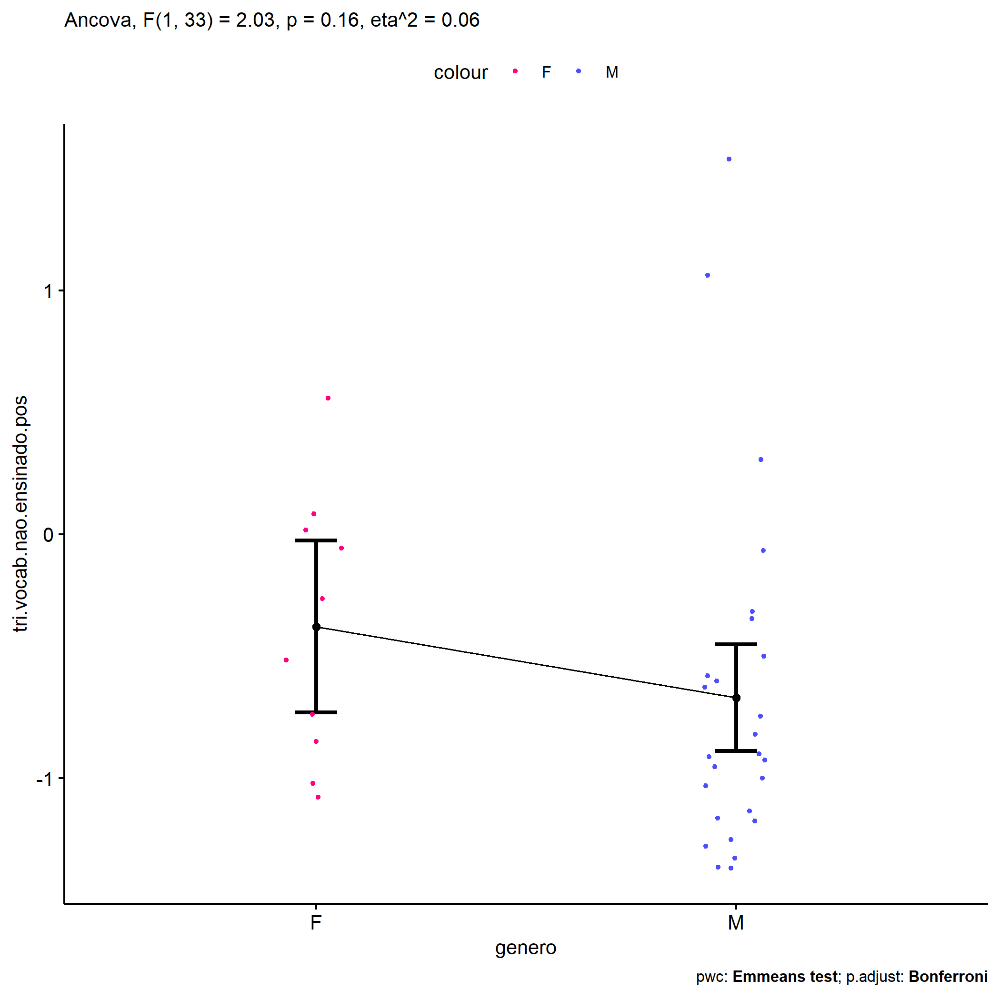<!-- -->

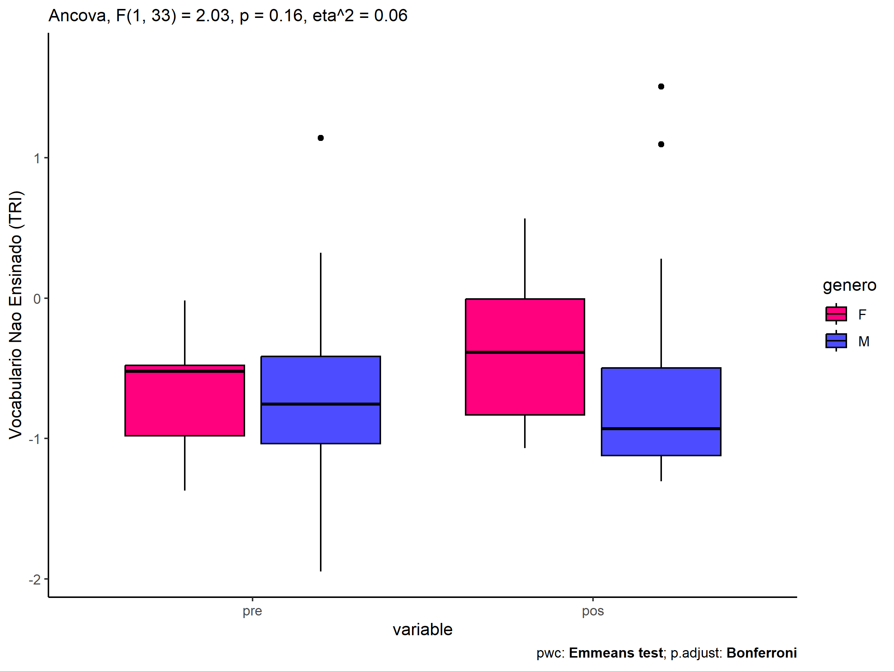<!-- -->

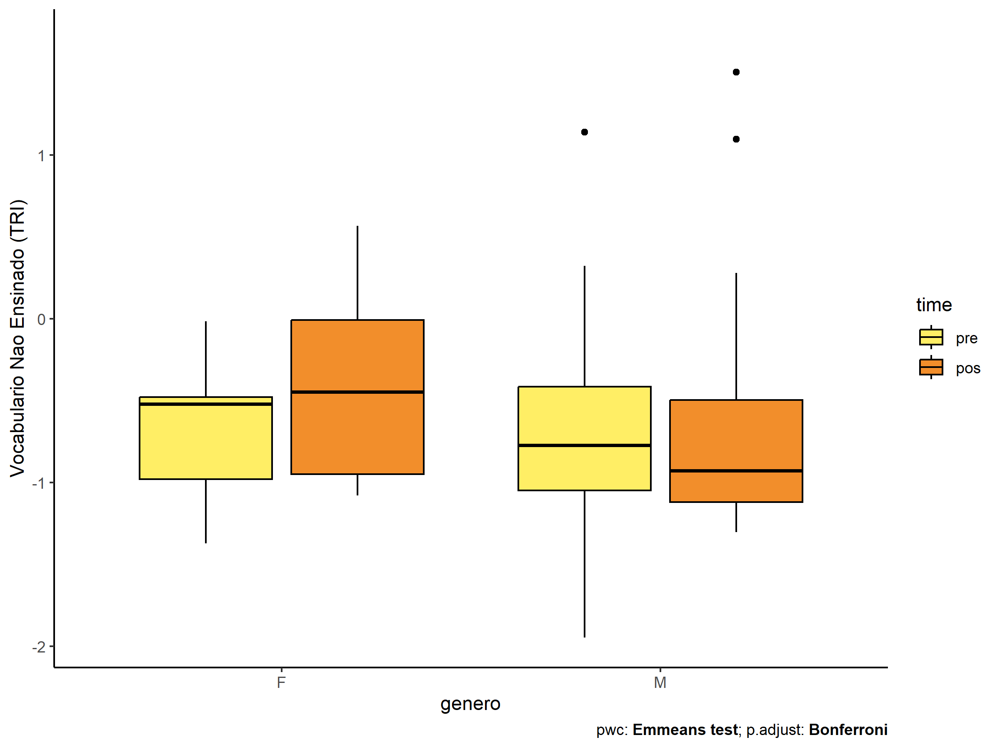<!-- -->

## factor: **idade**

### Vocabulario (Acertos)

| var             | idade |   n | M (pre) | SE (pre) | M (unadj) | SE (unadj) | M (adj) | SE (adj) |
|:----------------|:------|----:|--------:|---------:|----------:|-----------:|--------:|---------:|
| score.vocab.pos | 10y   |   7 |      18 |    2.992 |    18.714 |      3.037 |  17.416 |    2.228 |
| score.vocab.pos | 11y   |  20 |      14 |    1.382 |    14.300 |      1.271 |  14.755 |    1.295 |

| .y.             | group1 | group2 | estimate | conf.low | conf.high |    se | statistic |     p | p.adj | p.adj.signif |
|:----------------|:-------|:-------|---------:|---------:|----------:|------:|----------:|------:|------:|:-------------|
| score.vocab.pos | 10y    | 11y    |    2.661 |   -2.731 |     8.053 | 2.613 |     1.019 | 0.319 | 0.319 | ns           |
| score.vocab.pre | 10y    | 11y    |    4.000 |   -2.005 |    10.005 | 2.916 |     1.372 | 0.182 | 0.182 | ns           |

| idade | group1 | group2 | estimate | conf.low | conf.high |    se | statistic |     p | p.adj | p.adj.signif |
|:------|:-------|:-------|---------:|---------:|----------:|------:|----------:|------:|------:|:-------------|
| 10y   | pre    | pos    |   -1.089 |   -7.539 |     5.360 | 3.218 |    -0.338 | 0.736 | 0.736 | ns           |
| 11y   | pre    | pos    |   -0.300 |   -4.241 |     3.641 | 1.966 |    -0.153 | 0.879 | 0.879 | ns           |

    ## Scale for colour is already present.
    ## Adding another scale for colour, which will replace the existing scale.

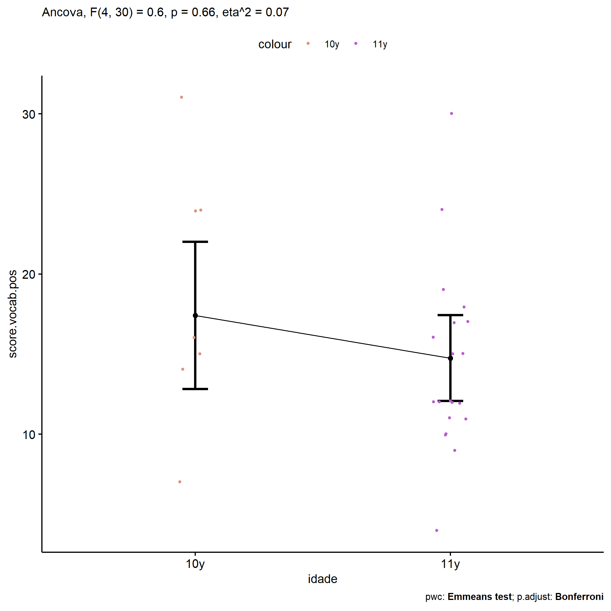<!-- -->

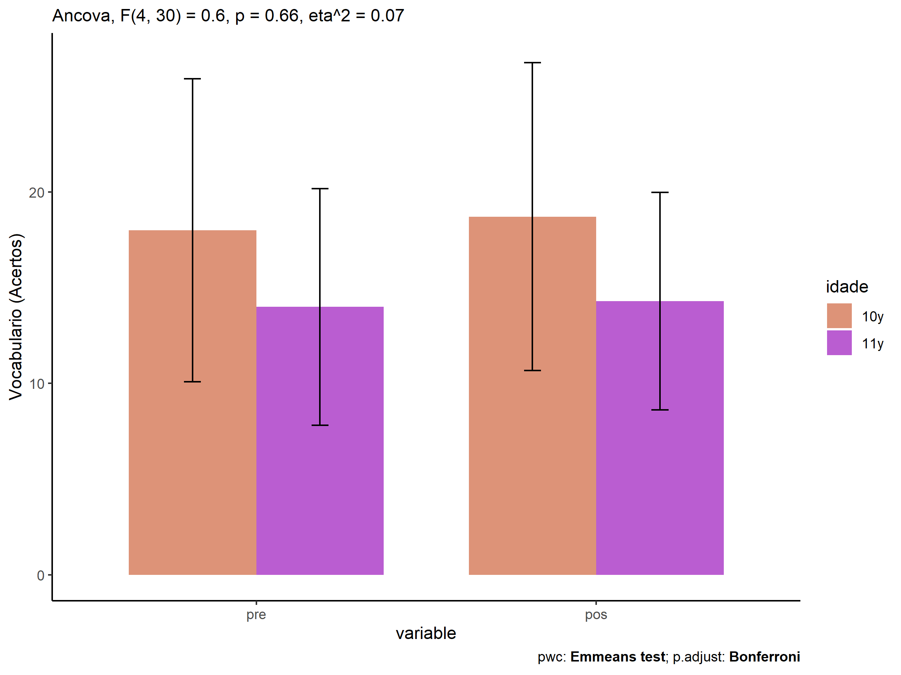<!-- -->

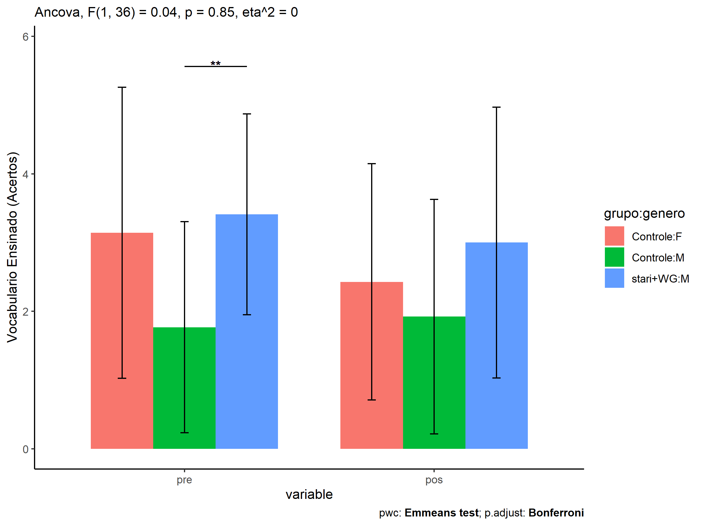<!-- -->

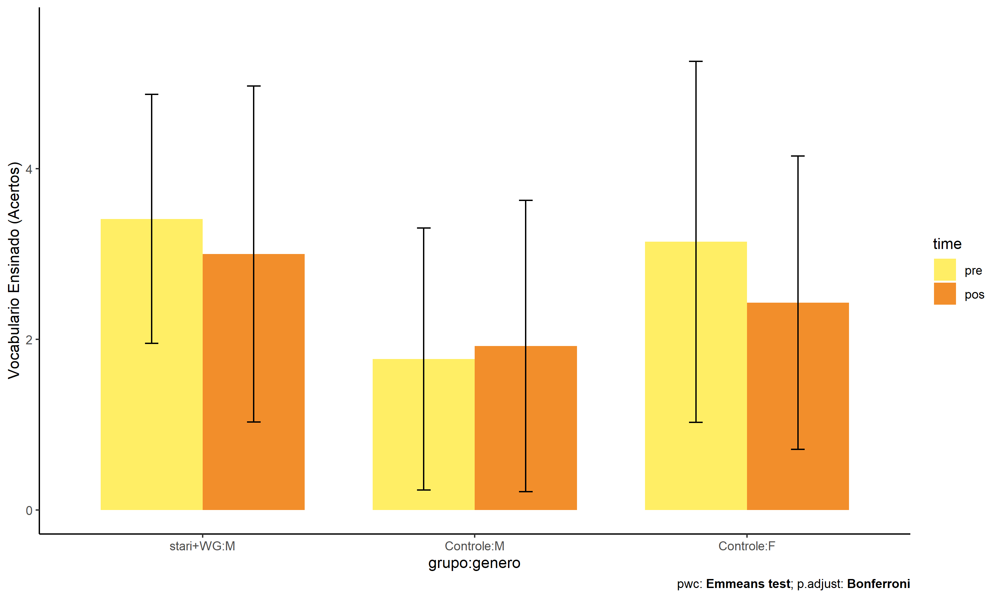<!-- -->

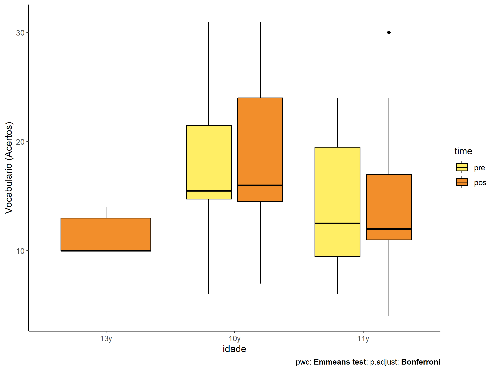<!-- -->

### Vocabulario (TRI)

| var           | idade |   n | M (pre) | SE (pre) | M (unadj) | SE (unadj) | M (adj) | SE (adj) |
|:--------------|:------|----:|--------:|---------:|----------:|-----------:|--------:|---------:|
| tri.vocab.pos | 10y   |   7 |  -0.120 |    0.291 |    -0.139 |      0.377 |  -0.394 |     0.26 |
| tri.vocab.pos | 11y   |  20 |  -0.599 |    0.138 |    -0.616 |      0.163 |  -0.527 |     0.15 |

| .y.           | group1 | group2 | estimate | conf.low | conf.high |    se | statistic |     p | p.adj | p.adj.signif |
|:--------------|:-------|:-------|---------:|---------:|----------:|------:|----------:|------:|------:|:-------------|
| tri.vocab.pos | 10y    | 11y    |    0.133 |   -0.498 |     0.765 | 0.306 |     0.436 | 0.667 | 0.667 | ns           |
| tri.vocab.pre | 10y    | 11y    |    0.479 |   -0.116 |     1.074 | 0.289 |     1.657 | 0.110 | 0.110 | ns           |

| idade | group1 | group2 | estimate | conf.low | conf.high |    se | statistic |     p | p.adj | p.adj.signif |
|:------|:-------|:-------|---------:|---------:|----------:|------:|----------:|------:|------:|:-------------|
| 10y   | pre    | pos    |    0.002 |   -0.726 |     0.729 | 0.363 |     0.004 | 0.997 | 0.997 | ns           |
| 11y   | pre    | pos    |    0.017 |   -0.427 |     0.462 | 0.222 |     0.077 | 0.939 | 0.939 | ns           |

    ## Scale for colour is already present.
    ## Adding another scale for colour, which will replace the existing scale.

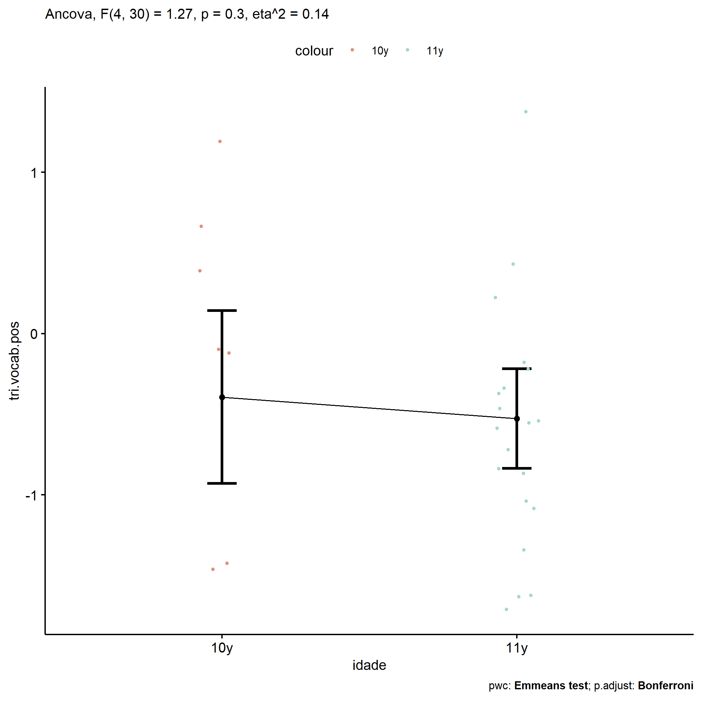<!-- -->

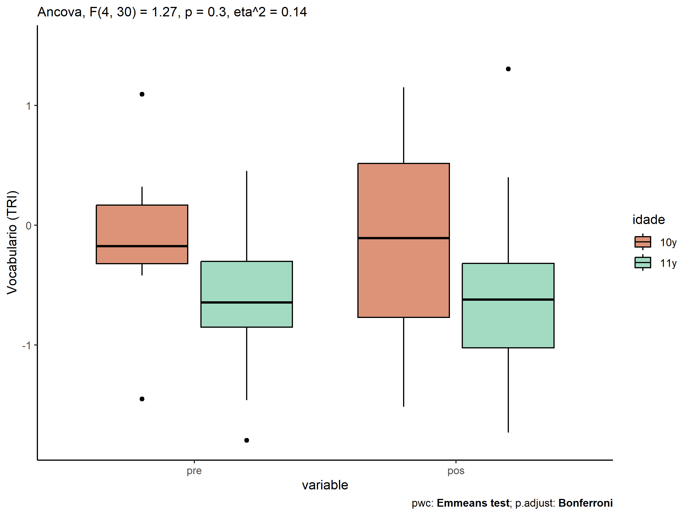<!-- -->

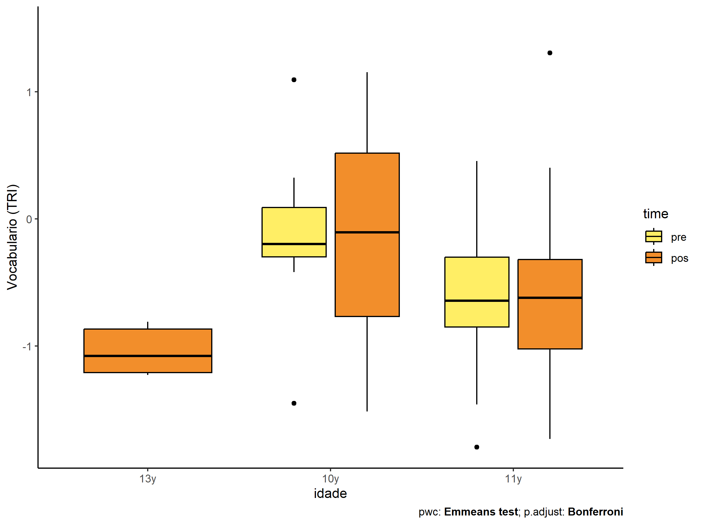<!-- -->

### Vocabulario Ensinado (Acertos)

| var                      | idade |   n | M (pre) | SE (pre) | M (unadj) | SE (unadj) | M (adj) | SE (adj) |
|:-------------------------|:------|----:|--------:|---------:|----------:|-----------:|--------:|---------:|
| score.vocab.ensinado.pos | 10y   |   8 |    4.25 |    0.620 |     2.875 |      0.811 |   2.225 |    0.632 |
| score.vocab.ensinado.pos | 11y   |  20 |    2.75 |    0.323 |     2.700 |      0.378 |   2.849 |    0.376 |
| score.vocab.ensinado.pos | 13y   |   5 |    2.20 |    0.860 |     2.200 |      0.735 |   2.643 |    0.761 |

| .y.                      | group1 | group2 | estimate | conf.low | conf.high |    se | statistic |     p | p.adj | p.adj.signif |
|:-------------------------|:-------|:-------|---------:|---------:|----------:|------:|----------:|------:|------:|:-------------|
| score.vocab.ensinado.pos | 10y    | 11y    |   -0.625 |   -2.164 |     0.914 | 0.752 |    -0.830 | 0.413 | 1.000 | ns           |
| score.vocab.ensinado.pos | 10y    | 13y    |   -0.418 |   -2.516 |     1.680 | 1.026 |    -0.408 | 0.687 | 1.000 | ns           |
| score.vocab.ensinado.pos | 11y    | 13y    |    0.207 |   -1.508 |     1.921 | 0.838 |     0.247 | 0.807 | 1.000 | ns           |
| score.vocab.ensinado.pre | 10y    | 11y    |    1.500 |    0.140 |     2.860 | 0.666 |     2.252 | 0.032 | 0.095 | ns           |
| score.vocab.ensinado.pre | 10y    | 13y    |    2.050 |    0.196 |     3.904 | 0.908 |     2.259 | 0.031 | 0.094 | ns           |
| score.vocab.ensinado.pre | 11y    | 13y    |    0.550 |   -1.076 |     2.176 | 0.796 |     0.691 | 0.495 | 1.000 | ns           |

| idade | group1 | group2 | estimate | conf.low | conf.high |    se | statistic |     p | p.adj | p.adj.signif |
|:------|:-------|:-------|---------:|---------:|----------:|------:|----------:|------:|------:|:-------------|
| 10y   | pre    | pos    |    1.375 |   -0.347 |     3.097 | 0.861 |     1.597 | 0.116 | 0.116 | ns           |
| 11y   | pre    | pos    |    0.050 |   -1.039 |     1.139 | 0.545 |     0.092 | 0.927 | 0.927 | ns           |
| 13y   | pre    | pos    |    0.000 |   -2.179 |     2.179 | 1.089 |     0.000 | 1.000 | 1.000 | ns           |

    ## Scale for colour is already present.
    ## Adding another scale for colour, which will replace the existing scale.

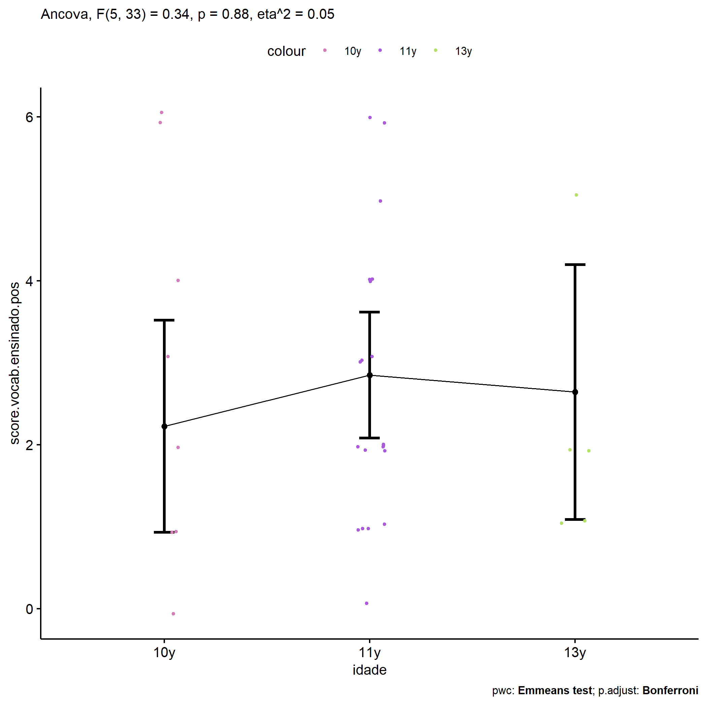<!-- -->

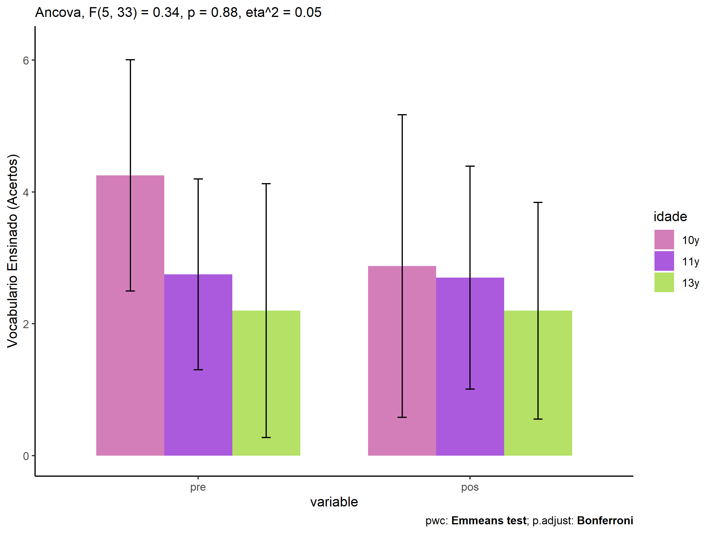<!-- -->

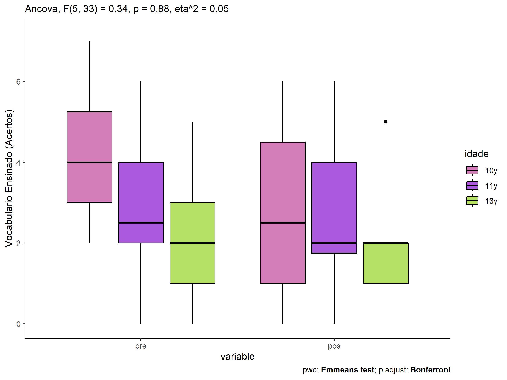<!-- -->

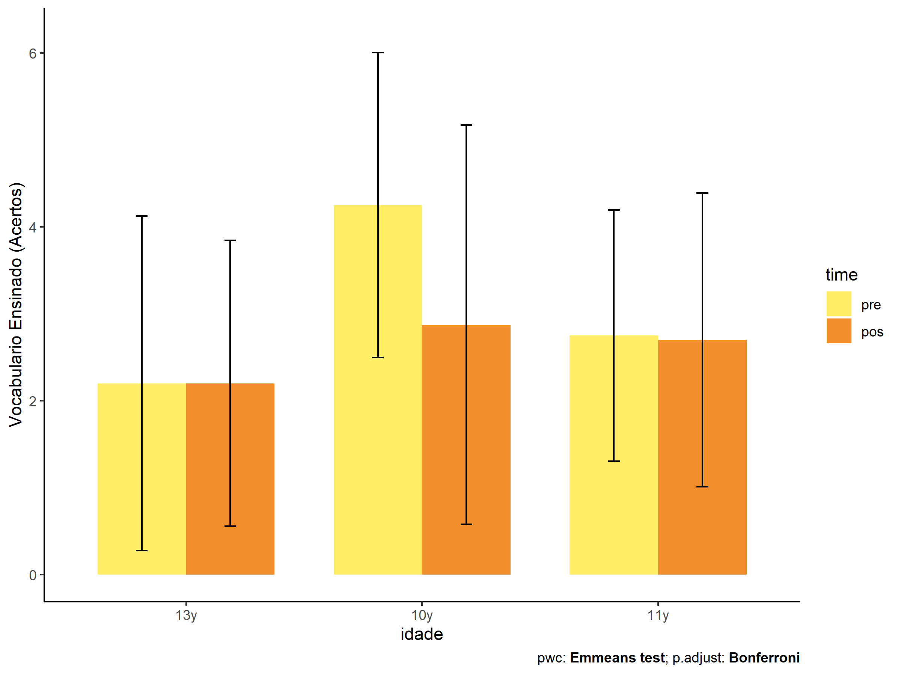<!-- -->

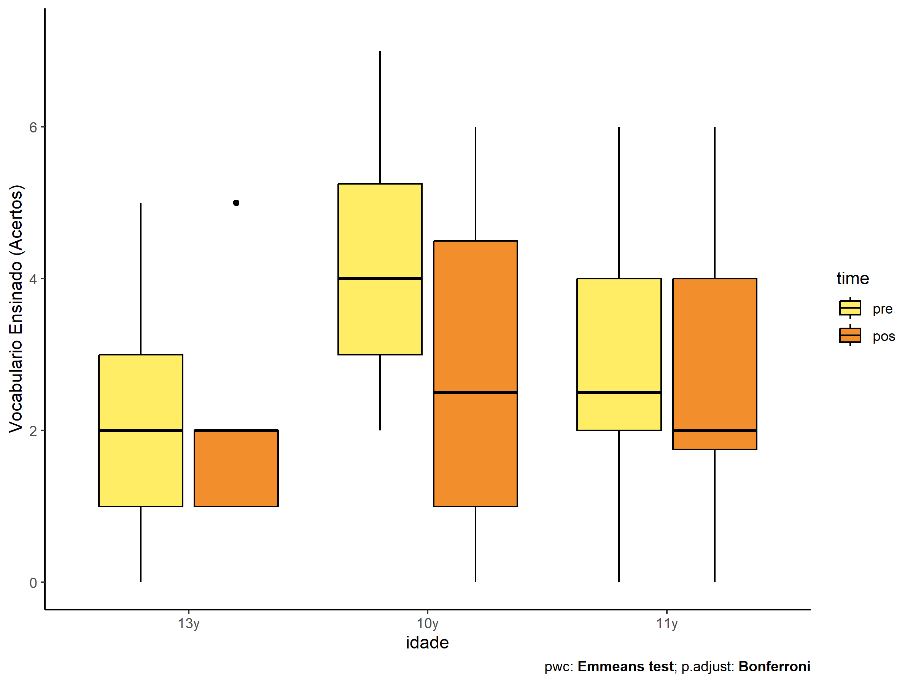<!-- -->

### Vocabulario Ensinado (TRI)

| var                    | idade |   n | M (pre) | SE (pre) | M (unadj) | SE (unadj) | M (adj) | SE (adj) |
|:-----------------------|:------|----:|--------:|---------:|----------:|-----------:|--------:|---------:|
| tri.vocab.ensinado.pos | 10y   |   7 |   0.271 |    0.249 |    -0.065 |      0.296 |  -0.211 |    0.276 |
| tri.vocab.ensinado.pos | 11y   |  20 |  -0.360 |    0.142 |    -0.527 |      0.149 |  -0.476 |    0.156 |

| .y.                    | group1 | group2 | estimate | conf.low | conf.high |    se | statistic |     p | p.adj | p.adj.signif |
|:-----------------------|:-------|:-------|---------:|---------:|----------:|------:|----------:|------:|------:|:-------------|
| tri.vocab.ensinado.pos | 10y    | 11y    |    0.264 |   -0.413 |     0.941 | 0.328 |     0.806 | 0.428 | 0.428 | ns           |
| tri.vocab.ensinado.pre | 10y    | 11y    |    0.631 |    0.050 |     1.211 | 0.282 |     2.238 | 0.034 | 0.034 | \*           |

| idade | group1 | group2 | estimate | conf.low | conf.high |    se | statistic |     p | p.adj | p.adj.signif |
|:------|:-------|:-------|---------:|---------:|----------:|------:|----------:|------:|------:|:-------------|
| 10y   | pre    | pos    |    0.248 |   -0.432 |     0.928 | 0.339 |     0.732 | 0.468 | 0.468 | ns           |
| 11y   | pre    | pos    |    0.167 |   -0.249 |     0.582 | 0.207 |     0.805 | 0.424 | 0.424 | ns           |

    ## Scale for colour is already present.
    ## Adding another scale for colour, which will replace the existing scale.

<!-- -->

<!-- -->

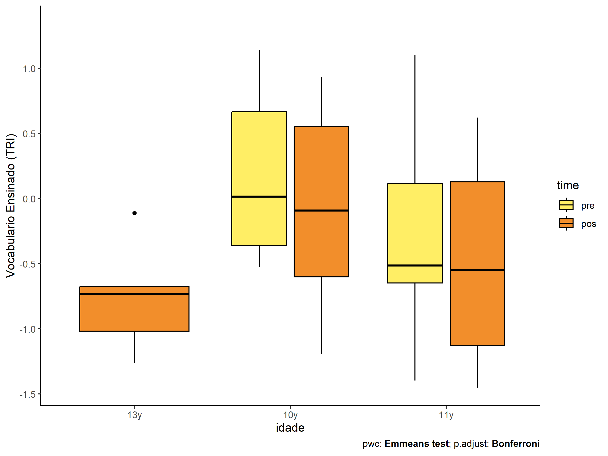<!-- -->

### Vocabulario Nao Ensinado (Acertos)

| var                          | idade |   n | M (pre) | SE (pre) | M (unadj) | SE (unadj) | M (adj) | SE (adj) |
|:-----------------------------|:------|----:|--------:|---------:|----------:|-----------:|--------:|---------:|
| score.vocab.nao.ensinado.pos | 10y   |   8 |  13.375 |    2.052 |      13.5 |      2.872 |  12.639 |    1.878 |
| score.vocab.nao.ensinado.pos | 11y   |  20 |  11.250 |    1.167 |      11.6 |      1.092 |  11.649 |    1.167 |
| score.vocab.nao.ensinado.pos | 13y   |   5 |   8.600 |    2.561 |       9.2 |      1.356 |  10.383 |    2.383 |

| .y.                          | group1 | group2 | estimate | conf.low | conf.high |    se | statistic |     p | p.adj | p.adj.signif |
|:-----------------------------|:-------|:-------|---------:|---------:|----------:|------:|----------:|------:|------:|:-------------|
| score.vocab.nao.ensinado.pos | 10y    | 11y    |    0.990 |   -3.538 |     5.518 | 2.214 |     0.447 | 0.658 |   1.0 | ns           |
| score.vocab.nao.ensinado.pos | 10y    | 13y    |    2.255 |   -4.064 |     8.575 | 3.090 |     0.730 | 0.471 |   1.0 | ns           |
| score.vocab.nao.ensinado.pos | 11y    | 13y    |    1.265 |   -4.154 |     6.684 | 2.650 |     0.477 | 0.637 |   1.0 | ns           |
| score.vocab.nao.ensinado.pre | 10y    | 11y    |    2.125 |   -2.515 |     6.765 | 2.272 |     0.935 | 0.357 |   1.0 | ns           |
| score.vocab.nao.ensinado.pre | 10y    | 13y    |    4.775 |   -1.548 |    11.098 | 3.096 |     1.542 | 0.133 |   0.4 | ns           |
| score.vocab.nao.ensinado.pre | 11y    | 13y    |    2.650 |   -2.896 |     8.196 | 2.715 |     0.976 | 0.337 |   1.0 | ns           |

| idade | group1 | group2 | estimate | conf.low | conf.high |    se | statistic |     p | p.adj | p.adj.signif |
|:------|:-------|:-------|---------:|---------:|----------:|------:|----------:|------:|------:|:-------------|
| 10y   | pre    | pos    |   -0.125 |   -5.658 |     5.408 | 2.766 |    -0.045 | 0.964 | 0.964 | ns           |
| 11y   | pre    | pos    |   -0.350 |   -3.849 |     3.149 | 1.749 |    -0.200 | 0.842 | 0.842 | ns           |
| 13y   | pre    | pos    |   -0.600 |   -7.599 |     6.399 | 3.499 |    -0.171 | 0.864 | 0.864 | ns           |

    ## Scale for colour is already present.
    ## Adding another scale for colour, which will replace the existing scale.

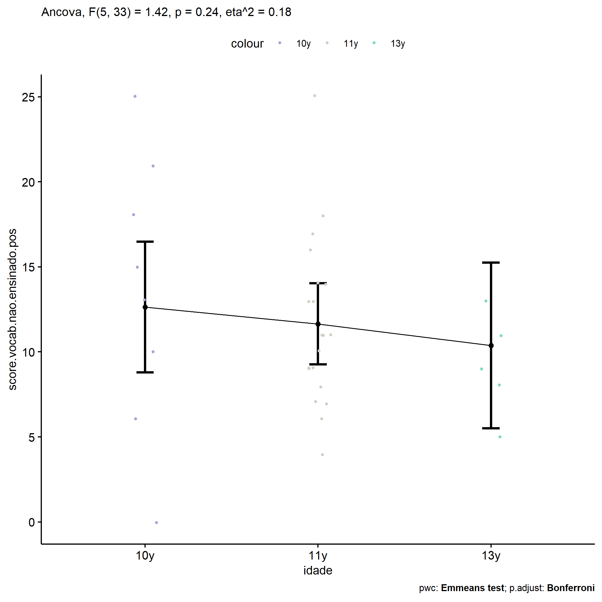<!-- -->

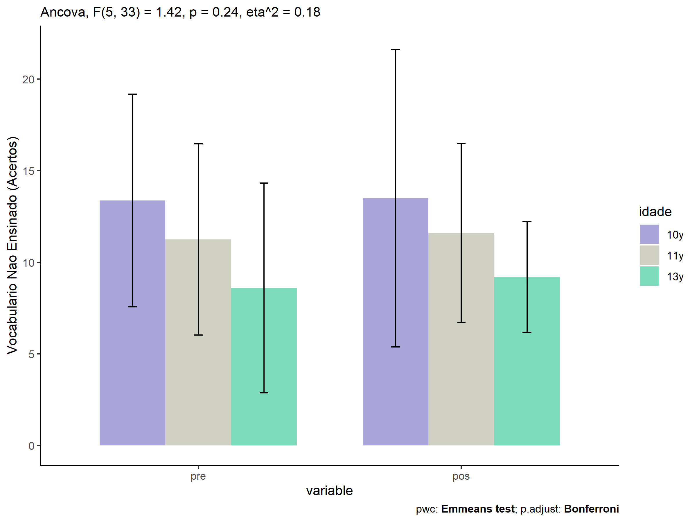<!-- -->

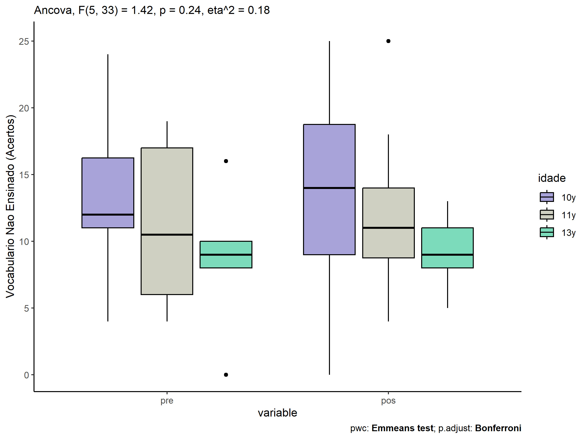<!-- -->

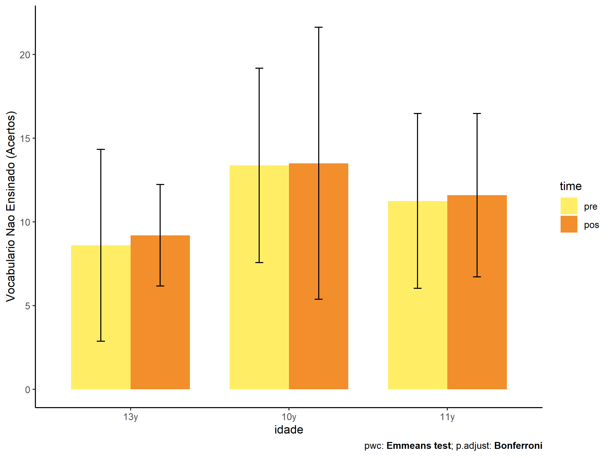<!-- -->

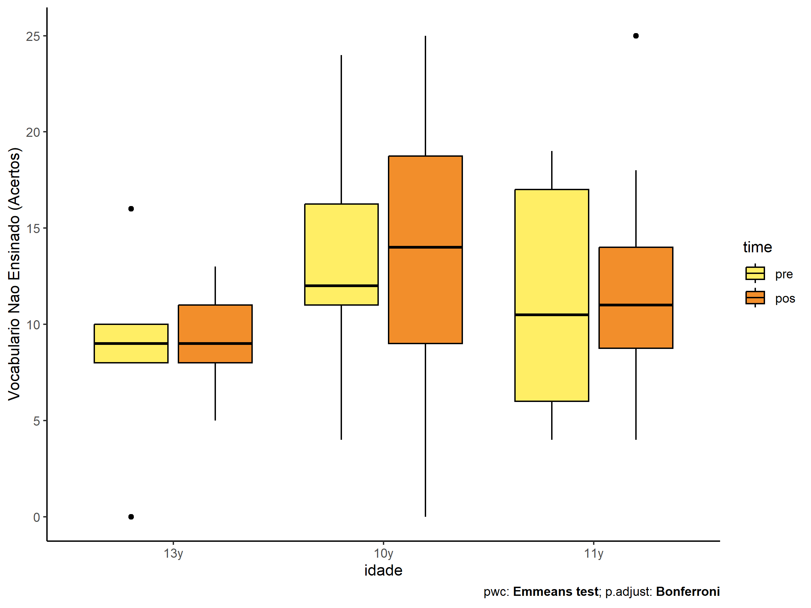<!-- -->

### Vocabulario Nao Ensinado (TRI)

| var                        | idade |   n | M (pre) | SE (pre) | M (unadj) | SE (unadj) | M (adj) | SE (adj) |
|:---------------------------|:------|----:|--------:|---------:|----------:|-----------:|--------:|---------:|
| tri.vocab.nao.ensinado.pos | 10y   |   7 |  -0.374 |    0.317 |    -0.148 |      0.320 |  -0.287 |    0.229 |
| tri.vocab.nao.ensinado.pos | 11y   |  20 |  -0.661 |    0.127 |    -0.586 |      0.151 |  -0.537 |    0.134 |

| .y.                        | group1 | group2 | estimate | conf.low | conf.high |    se | statistic |     p | p.adj | p.adj.signif |
|:---------------------------|:-------|:-------|---------:|---------:|----------:|------:|----------:|------:|------:|:-------------|
| tri.vocab.nao.ensinado.pos | 10y    | 11y    |    0.250 |   -0.302 |     0.801 | 0.267 |     0.935 | 0.359 | 0.359 | ns           |
| tri.vocab.nao.ensinado.pre | 10y    | 11y    |    0.286 |   -0.297 |     0.870 | 0.283 |     1.011 | 0.322 | 0.322 | ns           |

| idade | group1 | group2 | estimate | conf.low | conf.high |    se | statistic |     p | p.adj | p.adj.signif |
|:------|:-------|:-------|---------:|---------:|----------:|------:|----------:|------:|------:|:-------------|
| 10y   | pre    | pos    |   -0.228 |   -0.906 |     0.449 | 0.338 |    -0.676 | 0.502 | 0.502 | ns           |
| 11y   | pre    | pos    |   -0.075 |   -0.489 |     0.339 | 0.206 |    -0.362 | 0.718 | 0.718 | ns           |

    ## Scale for colour is already present.
    ## Adding another scale for colour, which will replace the existing scale.

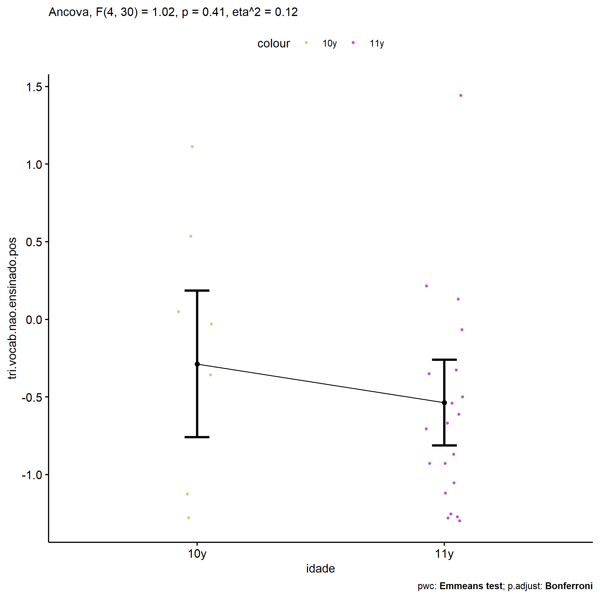<!-- -->

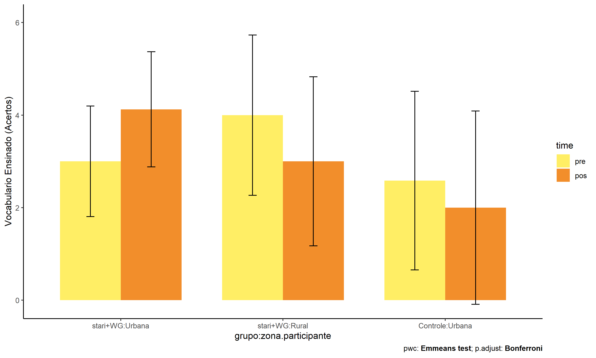<!-- -->

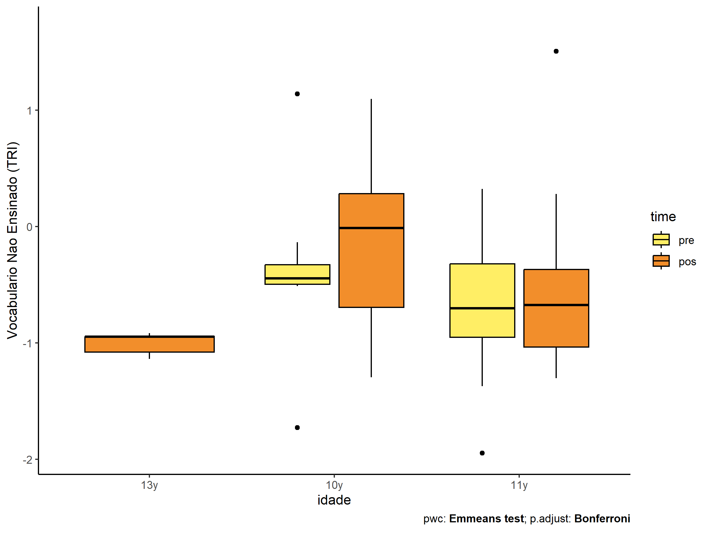<!-- -->

## factor: **zona.participante**

### Vocabulario (Acertos)

| var             | zona.participante |   n | M (pre) | SE (pre) | M (unadj) | SE (unadj) | M (adj) | SE (adj) |
|:----------------|:------------------|----:|--------:|---------:|----------:|-----------:|--------:|---------:|
| score.vocab.pos | Rural             |   8 |  16.625 |    3.070 |    13.750 |      2.704 |  12.752 |    1.986 |
| score.vocab.pos | Urbana            |  18 |  14.222 |    1.317 |    15.944 |      1.494 |  16.388 |    1.317 |

| .y.             | group1 | group2 | estimate | conf.low | conf.high |    se | statistic |     p | p.adj | p.adj.signif |
|:----------------|:-------|:-------|---------:|---------:|----------:|------:|----------:|------:|------:|:-------------|
| score.vocab.pos | Urbana | Rural  |    3.636 |   -1.325 |     8.597 | 2.398 |     1.516 | 0.143 | 0.143 | ns           |
| score.vocab.pre | Urbana | Rural  |   -2.403 |   -8.228 |     3.423 | 2.823 |    -0.851 | 0.403 | 0.403 | ns           |

| zona.participante | group1 | group2 | estimate | conf.low | conf.high |    se | statistic |     p | p.adj | p.adj.signif |
|:------------------|:-------|:-------|---------:|---------:|----------:|------:|----------:|------:|------:|:-------------|
| Urbana            | pre    | pos    |   -2.102 |   -6.498 |     2.293 | 2.188 |    -0.961 | 0.341 | 0.341 | ns           |
| Rural             | pre    | pos    |    3.292 |   -3.202 |     9.785 | 3.233 |     1.018 | 0.314 | 0.314 | ns           |

    ## Scale for colour is already present.
    ## Adding another scale for colour, which will replace the existing scale.

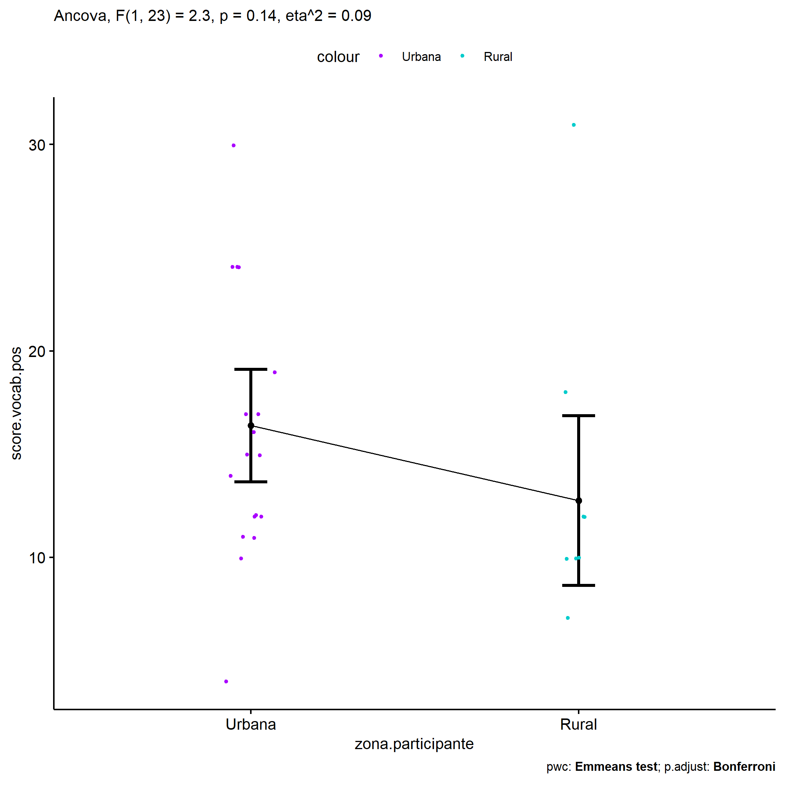<!-- -->

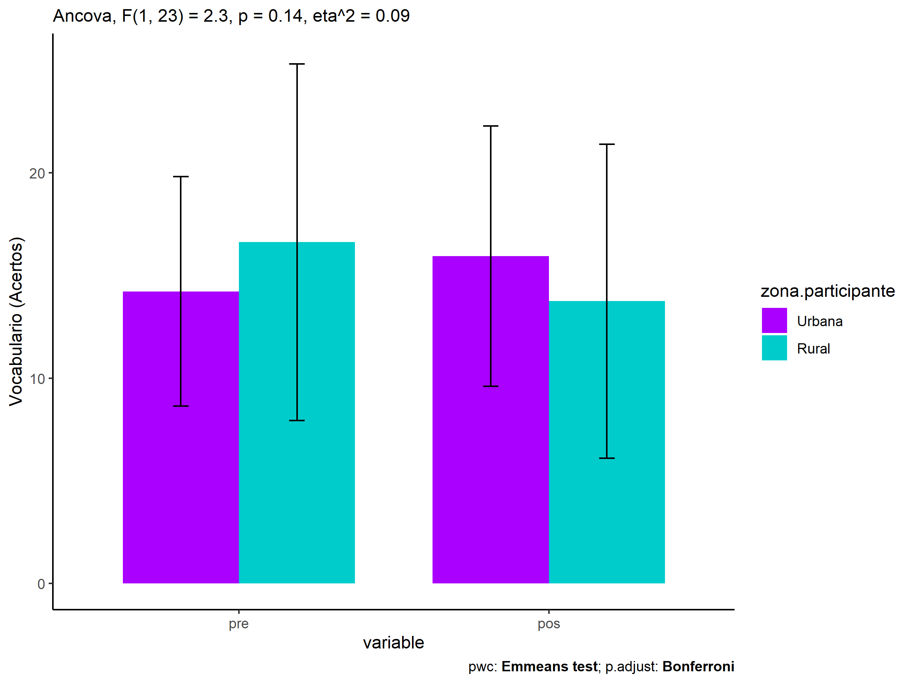<!-- -->

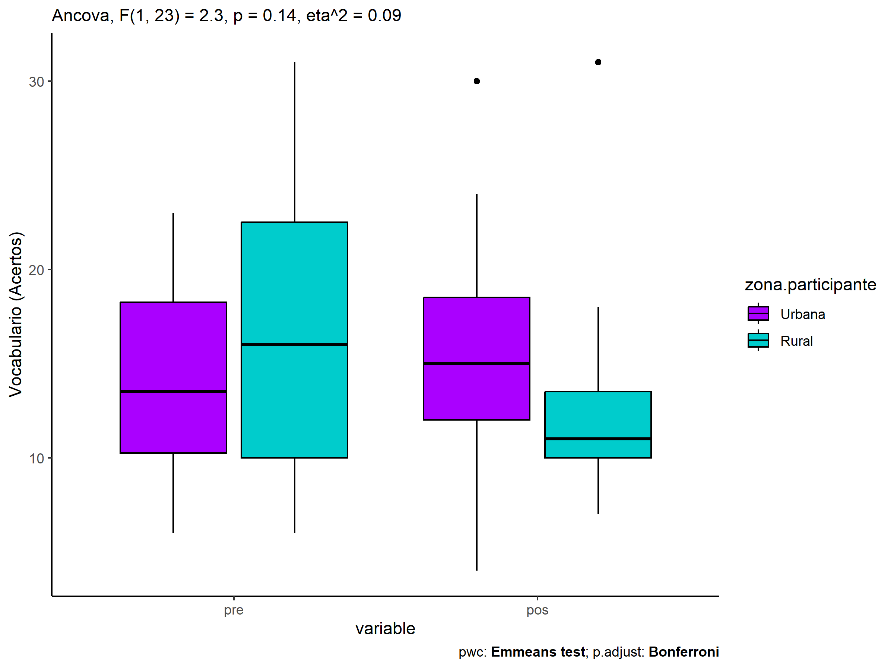<!-- -->

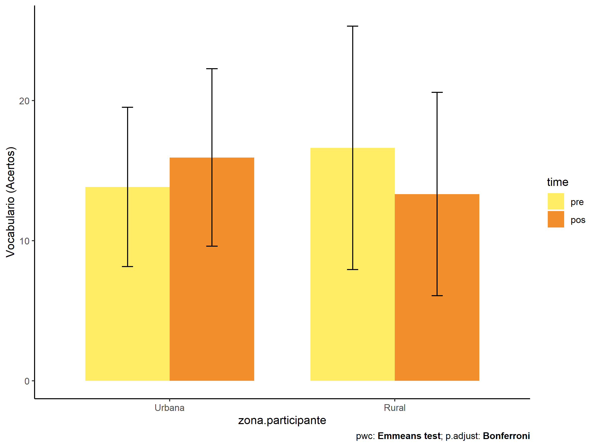<!-- -->

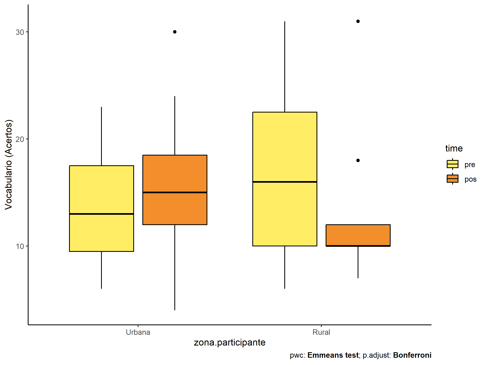<!-- -->

### Vocabulario (TRI)

| var           | zona.participante |   n | M (pre) | SE (pre) | M (unadj) | SE (unadj) | M (adj) | SE (adj) |
|:--------------|:------------------|----:|--------:|---------:|----------:|-----------:|--------:|---------:|
| tri.vocab.pos | Rural             |   8 |  -0.551 |    0.357 |    -0.615 |      0.309 |  -0.602 |    0.227 |
| tri.vocab.pos | Urbana            |  18 |  -0.524 |    0.138 |    -0.425 |      0.185 |  -0.431 |    0.152 |

| .y.           | group1 | group2 | estimate | conf.low | conf.high |    se | statistic |     p | p.adj | p.adj.signif |
|:--------------|:-------|:-------|---------:|---------:|----------:|------:|----------:|------:|------:|:-------------|
| tri.vocab.pos | Urbana | Rural  |    0.171 |   -0.394 |     0.737 | 0.273 |     0.627 | 0.537 | 0.537 | ns           |
| tri.vocab.pre | Urbana | Rural  |    0.027 |   -0.617 |     0.671 | 0.312 |     0.087 | 0.932 | 0.932 | ns           |

| zona.participante | group1 | group2 | estimate | conf.low | conf.high |    se | statistic |     p | p.adj | p.adj.signif |
|:------------------|:-------|:-------|---------:|---------:|----------:|------:|----------:|------:|------:|:-------------|
| Urbana            | pre    | pos    |   -0.173 |   -0.691 |     0.345 | 0.258 |    -0.671 | 0.505 | 0.505 | ns           |
| Rural             | pre    | pos    |    0.115 |   -0.651 |     0.881 | 0.381 |     0.302 | 0.764 | 0.764 | ns           |

    ## Scale for colour is already present.
    ## Adding another scale for colour, which will replace the existing scale.

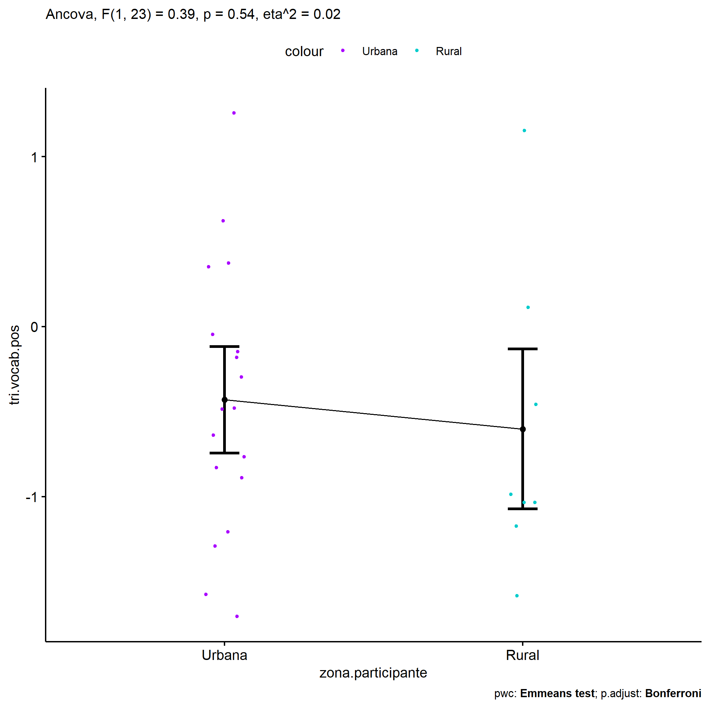<!-- -->

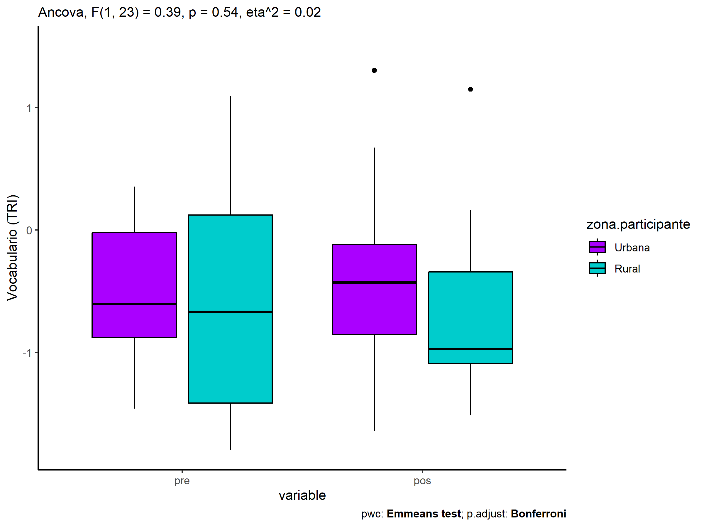<!-- -->

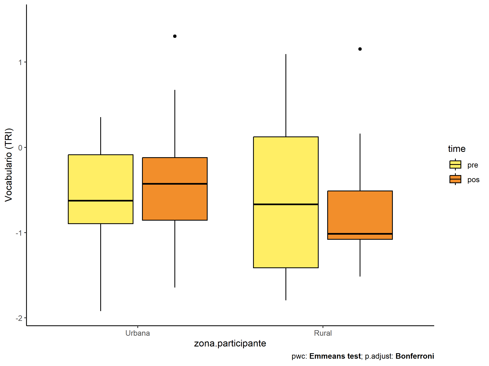<!-- -->

### Vocabulario Ensinado (Acertos)

| var                      | zona.participante |   n | M (pre) | SE (pre) | M (unadj) | SE (unadj) | M (adj) | SE (adj) |
|:-------------------------|:------------------|----:|--------:|---------:|----------:|-----------:|--------:|---------:|
| score.vocab.ensinado.pos | Rural             |   9 |   3.111 |    0.772 |     2.778 |      0.547 |   2.699 |    0.554 |
| score.vocab.ensinado.pos | Urbana            |  19 |   2.895 |    0.358 |     3.000 |      0.459 |   3.037 |    0.381 |

| .y.                      | group1 | group2 | estimate | conf.low | conf.high |    se | statistic |     p | p.adj | p.adj.signif |
|:-------------------------|:-------|:-------|---------:|---------:|----------:|------:|----------:|------:|------:|:-------------|
| score.vocab.ensinado.pos | Urbana | Rural  |    0.338 |   -1.048 |     1.723 | 0.673 |     0.502 | 0.620 | 0.620 | ns           |
| score.vocab.ensinado.pre | Urbana | Rural  |   -0.216 |   -1.735 |     1.302 | 0.739 |    -0.293 | 0.772 | 0.772 | ns           |

| zona.participante | group1 | group2 | estimate | conf.low | conf.high |    se | statistic |     p | p.adj | p.adj.signif |
|:------------------|:-------|:-------|---------:|---------:|----------:|------:|----------:|------:|------:|:-------------|
| Urbana            | pre    | pos    |   -0.105 |   -1.317 |     1.107 | 0.604 |    -0.174 | 0.862 | 0.862 | ns           |
| Rural             | pre    | pos    |    0.333 |   -1.428 |     2.094 | 0.878 |     0.380 | 0.706 | 0.706 | ns           |

    ## Scale for colour is already present.
    ## Adding another scale for colour, which will replace the existing scale.

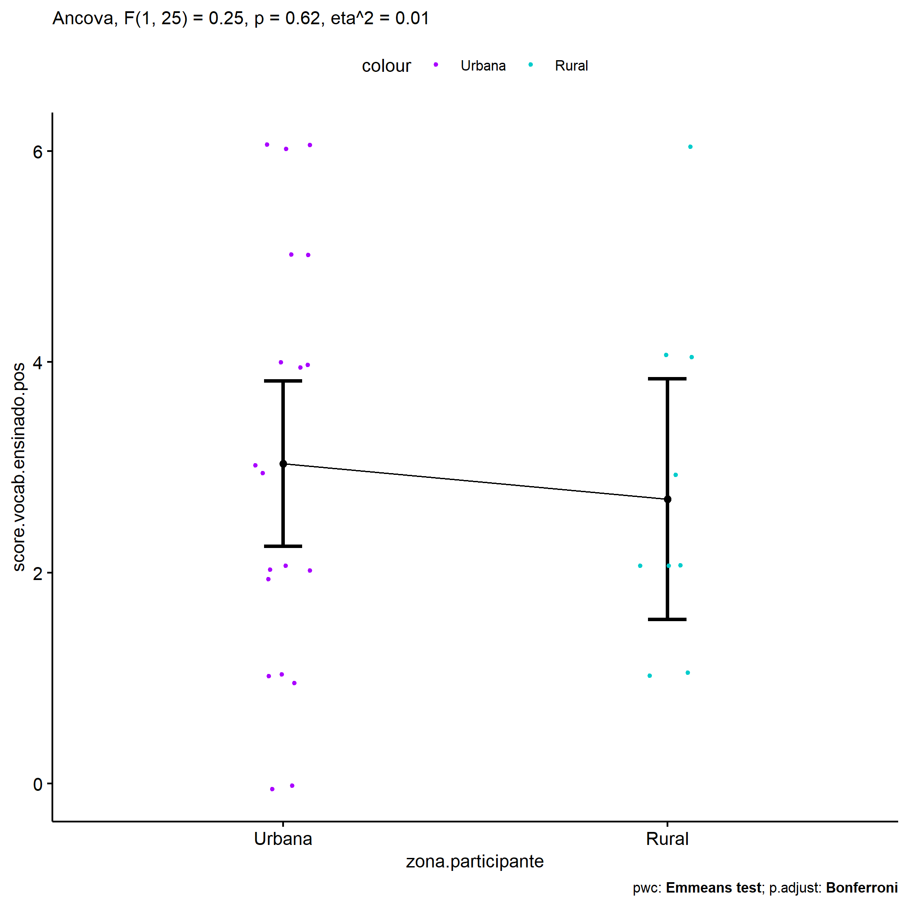<!-- -->

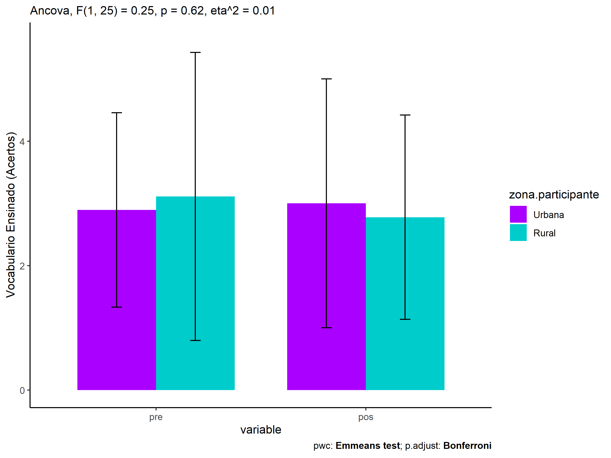<!-- -->

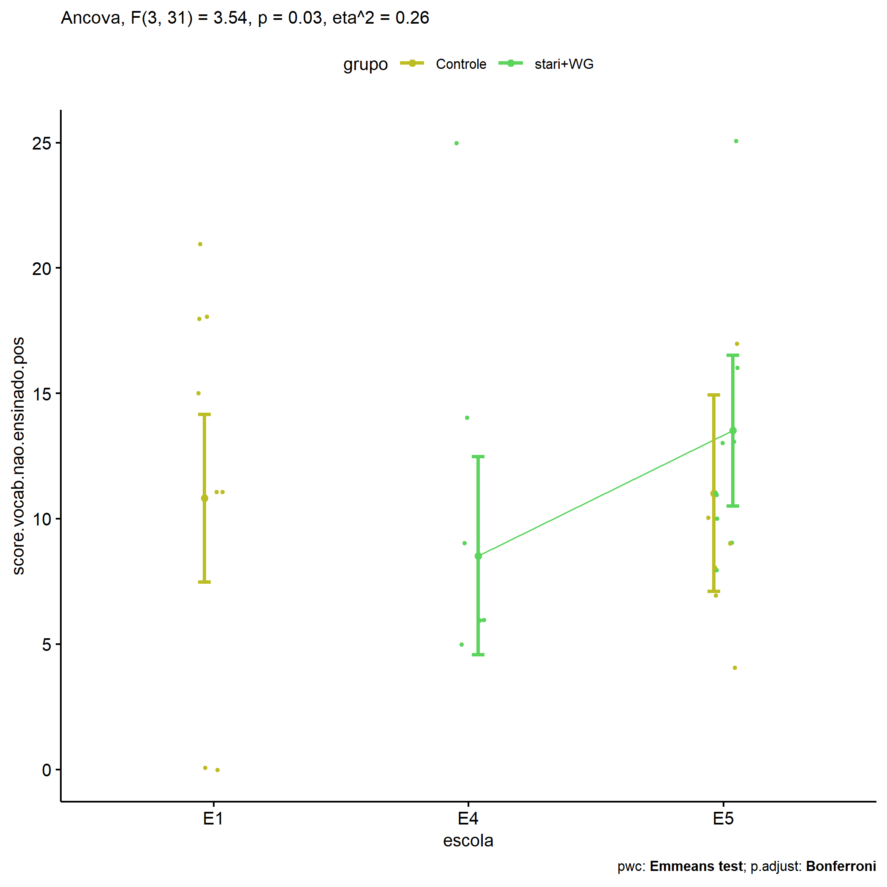<!-- -->

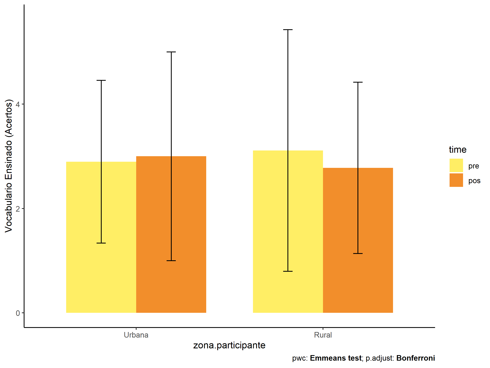<!-- -->

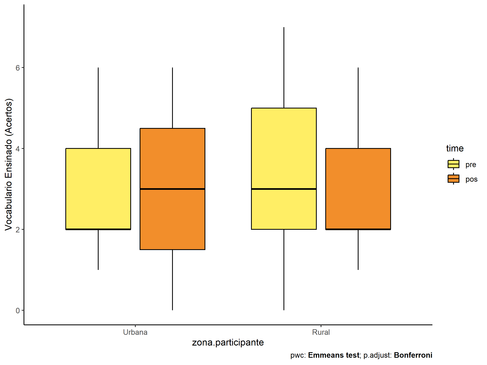<!-- -->

### Vocabulario Ensinado (TRI)

| var                    | zona.participante |   n | M (pre) | SE (pre) | M (unadj) | SE (unadj) | M (adj) | SE (adj) |
|:-----------------------|:------------------|----:|--------:|---------:|----------:|-----------:|--------:|---------:|
| tri.vocab.ensinado.pos | Rural             |   8 |   -0.20 |    0.276 |    -0.211 |      0.214 |  -0.234 |    0.216 |
| tri.vocab.ensinado.pos | Urbana            |  18 |   -0.27 |    0.162 |    -0.421 |      0.167 |  -0.411 |    0.144 |

| .y.                    | group1 | group2 | estimate | conf.low | conf.high |    se | statistic |     p | p.adj | p.adj.signif |
|:-----------------------|:-------|:-------|---------:|---------:|----------:|------:|----------:|------:|------:|:-------------|
| tri.vocab.ensinado.pos | Urbana | Rural  |   -0.177 |   -0.713 |     0.359 | 0.259 |    -0.683 | 0.501 | 0.501 | ns           |
| tri.vocab.ensinado.pre | Urbana | Rural  |   -0.071 |   -0.698 |     0.557 | 0.304 |    -0.233 | 0.818 | 0.818 | ns           |

| zona.participante | group1 | group2 | estimate | conf.low | conf.high |    se | statistic |     p | p.adj | p.adj.signif |
|:------------------|:-------|:-------|---------:|---------:|----------:|------:|----------:|------:|------:|:-------------|
| Urbana            | pre    | pos    |    0.088 |   -0.386 |     0.562 | 0.236 |     0.373 | 0.711 | 0.711 | ns           |
| Rural             | pre    | pos    |    0.128 |   -0.572 |     0.828 | 0.348 |     0.368 | 0.715 | 0.715 | ns           |

    ## Scale for colour is already present.
    ## Adding another scale for colour, which will replace the existing scale.

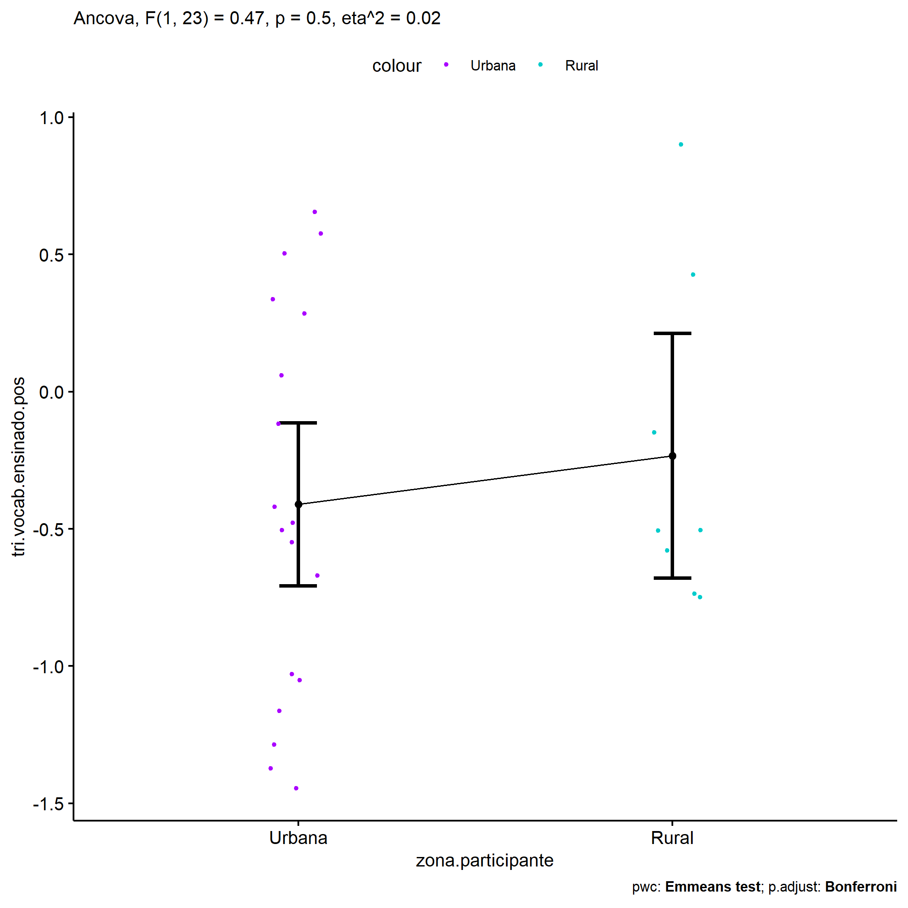<!-- -->

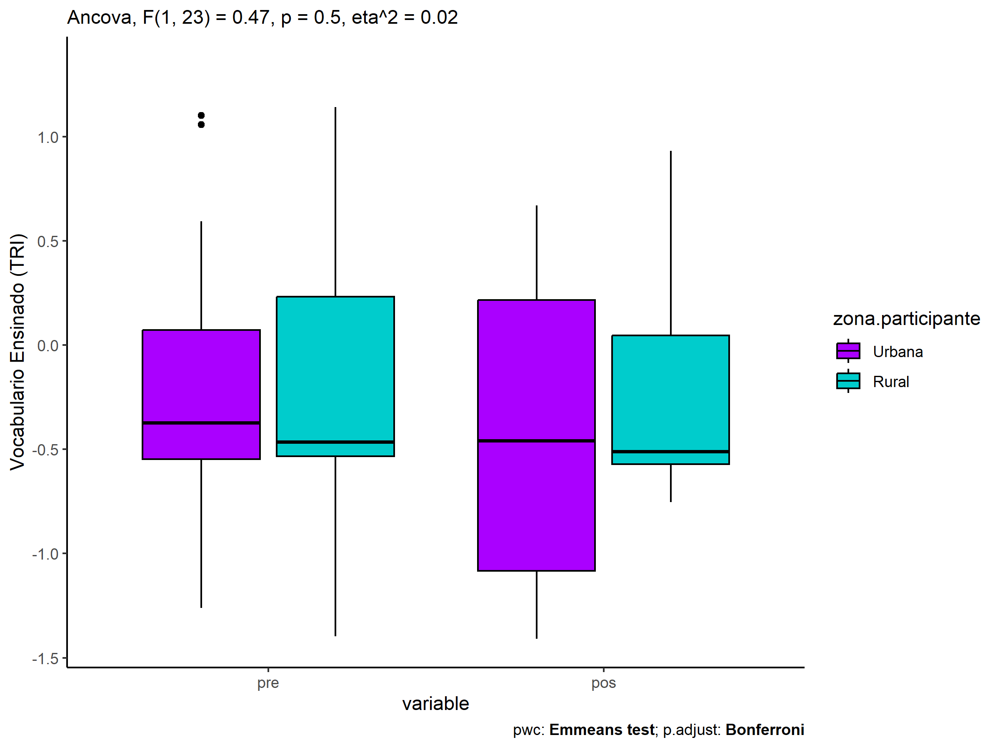<!-- -->

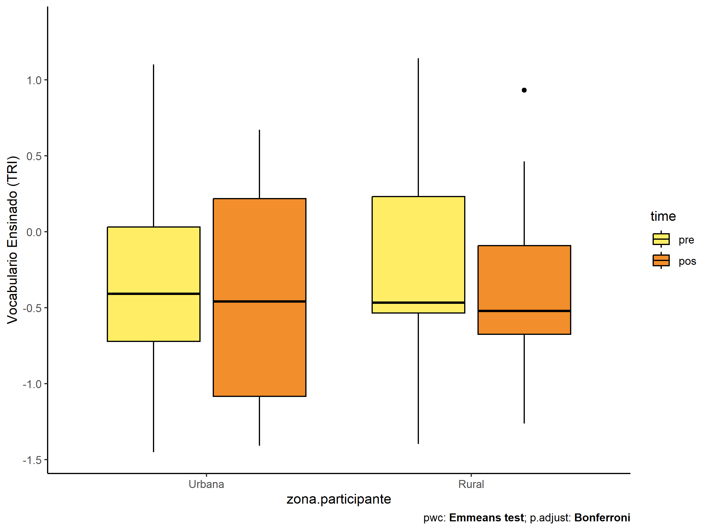<!-- -->

### Vocabulario Nao Ensinado (Acertos)

| var                          | zona.participante |   n | M (pre) | SE (pre) | M (unadj) | SE (unadj) | M (adj) | SE (adj) |
|:-----------------------------|:------------------|----:|--------:|---------:|----------:|-----------:|--------:|---------:|
| score.vocab.nao.ensinado.pos | Rural             |   9 |  11.667 |    2.651 |    10.556 |      2.069 |  10.254 |    1.677 |
| score.vocab.nao.ensinado.pos | Urbana            |  19 |  10.947 |    1.039 |    12.105 |      1.385 |  12.248 |    1.153 |

| .y.                          | group1 | group2 | estimate | conf.low | conf.high |    se | statistic |     p | p.adj | p.adj.signif |
|:-----------------------------|:-------|:-------|---------:|---------:|----------:|------:|----------:|------:|------:|:-------------|
| score.vocab.nao.ensinado.pos | Urbana | Rural  |    1.993 |   -2.201 |     6.188 | 2.037 |     0.979 | 0.337 | 0.337 | ns           |
| score.vocab.nao.ensinado.pre | Urbana | Rural  |   -0.719 |   -5.544 |     4.106 | 2.347 |    -0.306 | 0.762 | 0.762 | ns           |

| zona.participante | group1 | group2 | estimate | conf.low | conf.high |    se | statistic |     p | p.adj | p.adj.signif |
|:------------------|:-------|:-------|---------:|---------:|----------:|------:|----------:|------:|------:|:-------------|
| Urbana            | pre    | pos    |   -1.158 |   -5.030 |     2.714 | 1.929 |    -0.600 | 0.551 | 0.551 | ns           |
| Rural             | pre    | pos    |    1.111 |   -4.514 |     6.736 | 2.803 |     0.396 | 0.693 | 0.693 | ns           |

    ## Scale for colour is already present.
    ## Adding another scale for colour, which will replace the existing scale.

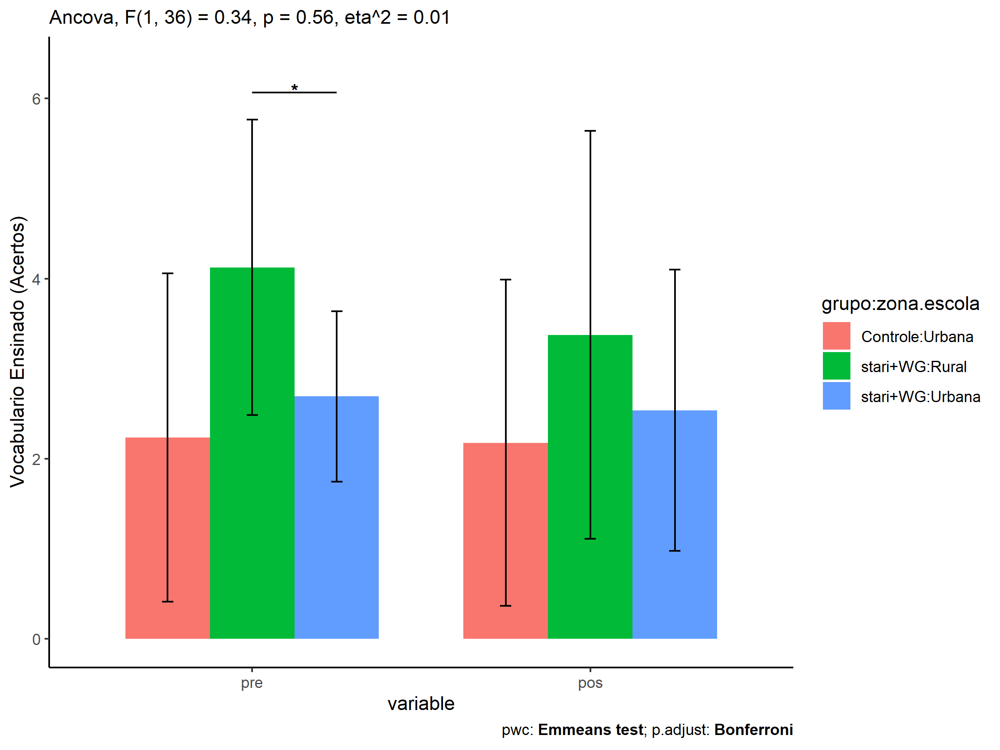<!-- -->

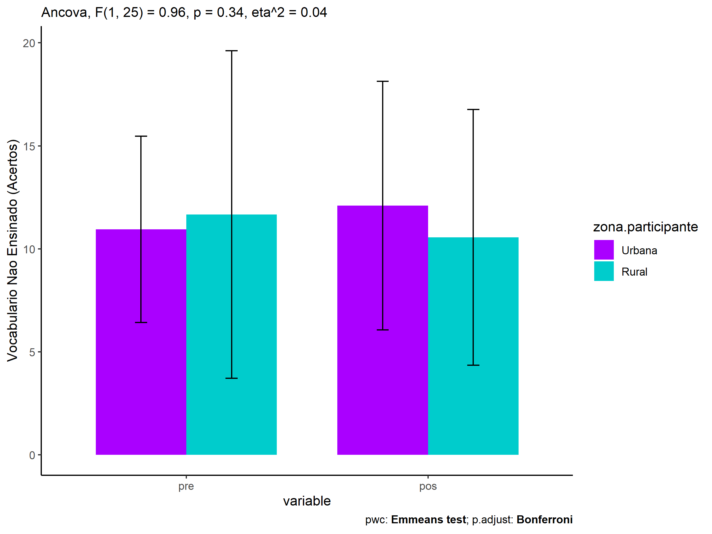<!-- -->

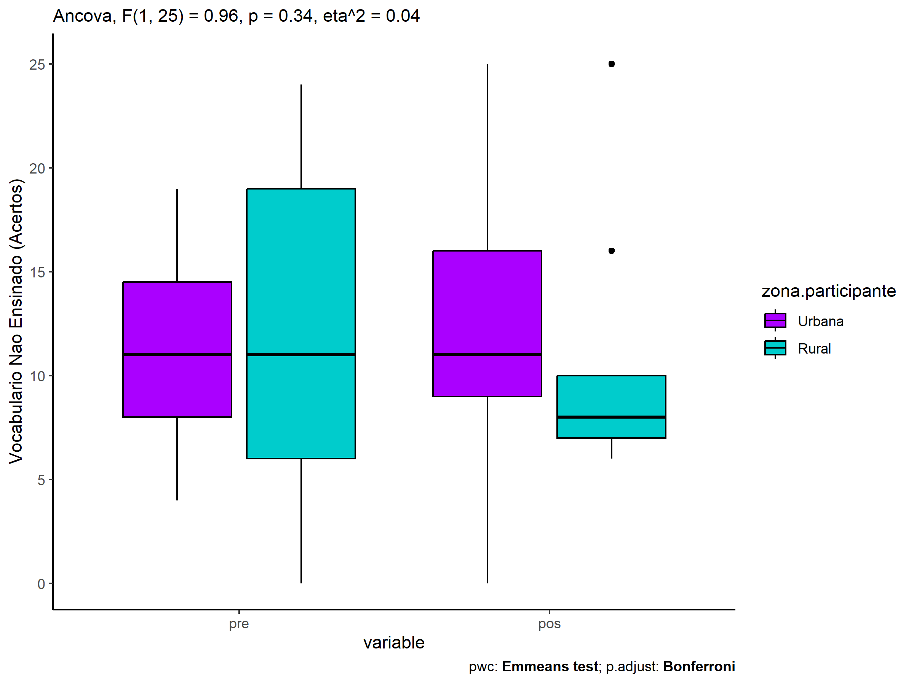<!-- -->

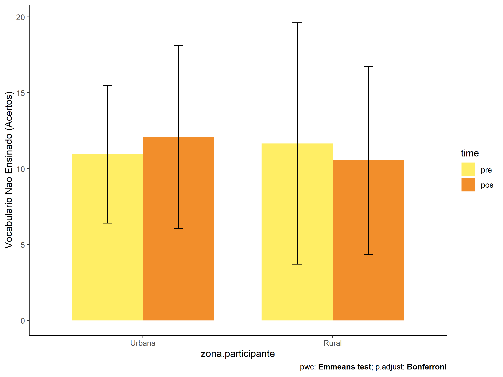<!-- -->

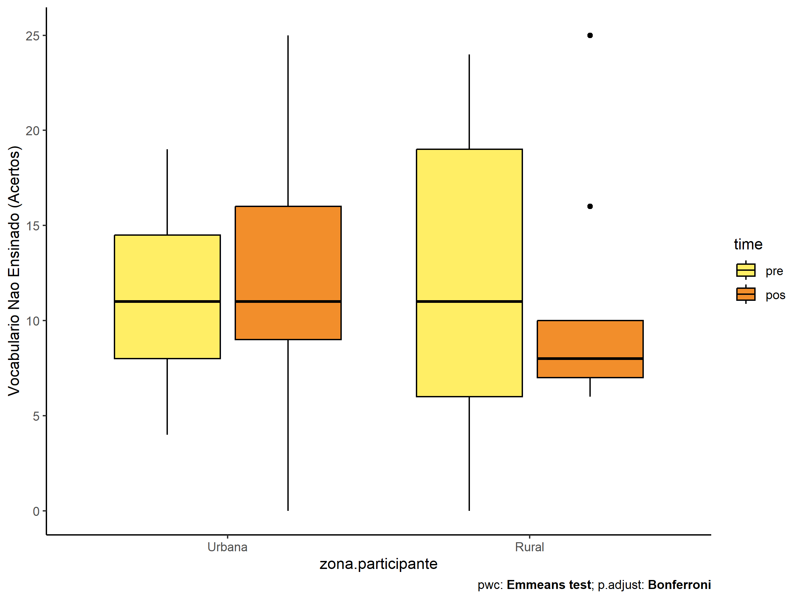<!-- -->

### Vocabulario Nao Ensinado (TRI)

| var                        | zona.participante |   n | M (pre) | SE (pre) | M (unadj) | SE (unadj) | M (adj) | SE (adj) |
|:---------------------------|:------------------|----:|--------:|---------:|----------:|-----------:|--------:|---------:|
| tri.vocab.nao.ensinado.pos | Rural             |   8 |  -0.535 |    0.339 |    -0.642 |      0.300 |  -0.698 |    0.209 |
| tri.vocab.nao.ensinado.pos | Urbana            |  18 |  -0.648 |    0.122 |    -0.410 |      0.166 |  -0.385 |    0.139 |

| .y.                        | group1 | group2 | estimate | conf.low | conf.high |    se | statistic |     p | p.adj | p.adj.signif |
|:---------------------------|:-------|:-------|---------:|---------:|----------:|------:|----------:|------:|------:|:-------------|
| tri.vocab.nao.ensinado.pos | Urbana | Rural  |    0.313 |   -0.208 |     0.833 | 0.252 |     1.243 | 0.226 | 0.226 | ns           |
| tri.vocab.nao.ensinado.pre | Urbana | Rural  |   -0.113 |   -0.707 |     0.481 | 0.288 |    -0.394 | 0.697 | 0.697 | ns           |

| zona.participante | group1 | group2 | estimate | conf.low | conf.high |    se | statistic |     p | p.adj | p.adj.signif |
|:------------------|:-------|:-------|---------:|---------:|----------:|------:|----------:|------:|------:|:-------------|
| Urbana            | pre    | pos    |   -0.281 |   -0.751 |     0.189 | 0.234 |    -1.203 | 0.235 | 0.235 | ns           |
| Rural             | pre    | pos    |    0.156 |   -0.538 |     0.851 | 0.346 |     0.452 | 0.653 | 0.653 | ns           |

    ## Scale for colour is already present.
    ## Adding another scale for colour, which will replace the existing scale.

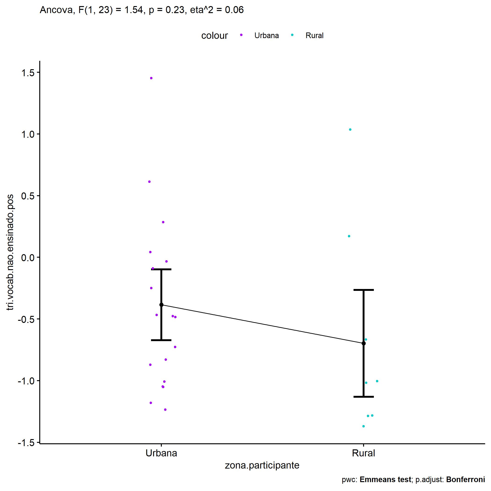<!-- -->

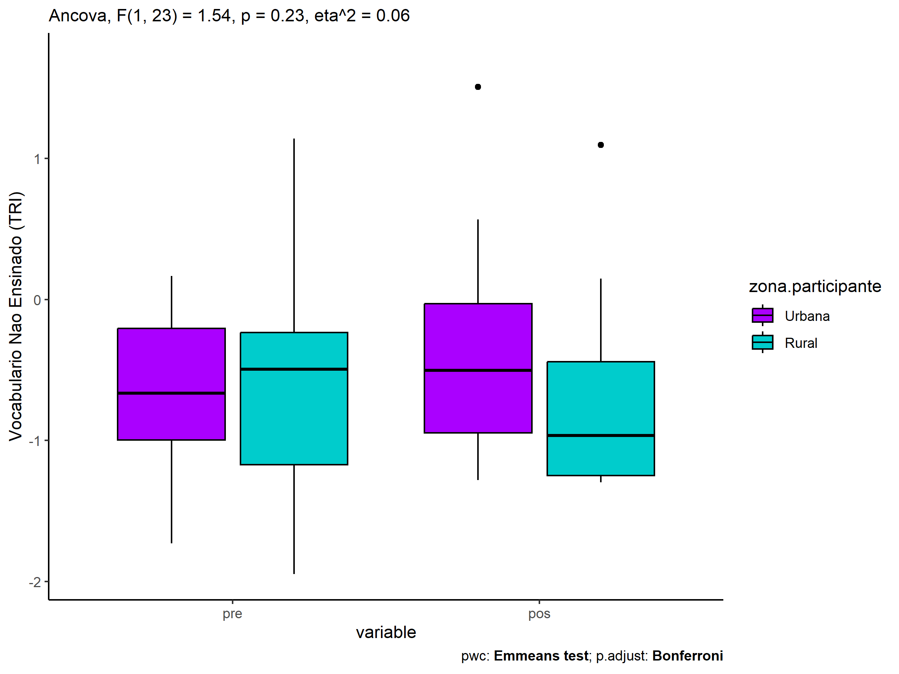<!-- -->

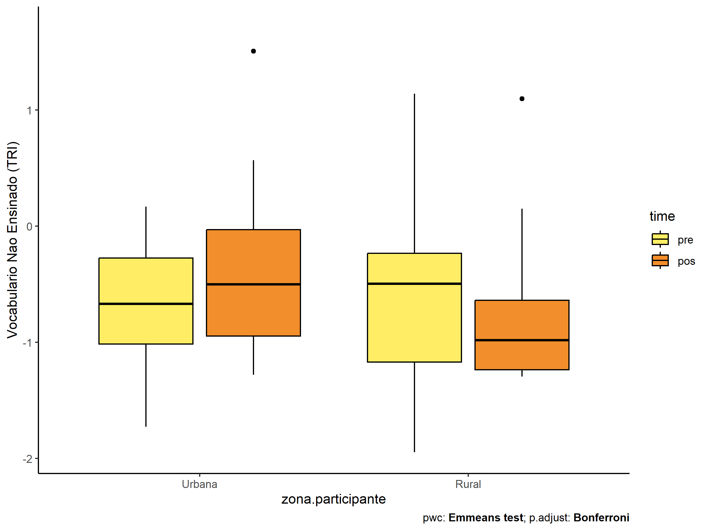<!-- -->

## factor: **escola**

### Vocabulario (Acertos)

| var             | escola |   n | M (pre) | SE (pre) | M (unadj) | SE (unadj) | M (adj) | SE (adj) |
|:----------------|:-------|----:|--------:|---------:|----------:|-----------:|--------:|---------:|
| score.vocab.pos | E1     |   6 |  18.500 |    2.029 |    18.667 |      2.459 |  16.517 |    2.293 |
| score.vocab.pos | E2     |   5 |  14.800 |    2.223 |    13.400 |      1.030 |  13.216 |    2.390 |
| score.vocab.pos | E4     |   7 |  16.571 |    3.046 |    14.571 |      3.015 |  13.447 |    2.053 |
| score.vocab.pos | E5     |  15 |  11.733 |    1.232 |    13.867 |      1.508 |  15.312 |    1.459 |

| .y.             | group1 | group2 | estimate | conf.low | conf.high |    se | statistic |     p | p.adj | p.adj.signif |
|:----------------|:-------|:-------|---------:|---------:|----------:|------:|----------:|------:|------:|:-------------|
| score.vocab.pos | E1     | E2     |    3.301 |   -3.457 |    10.059 | 3.299 |     1.000 | 0.326 | 1.000 | ns           |
| score.vocab.pos | E1     | E4     |    3.071 |   -3.057 |     9.198 | 2.991 |     1.026 | 0.313 | 1.000 | ns           |
| score.vocab.pos | E1     | E5     |    1.205 |   -4.612 |     7.022 | 2.840 |     0.424 | 0.675 | 1.000 | ns           |
| score.vocab.pos | E2     | E4     |   -0.230 |   -6.670 |     6.209 | 3.144 |    -0.073 | 0.942 | 1.000 | ns           |
| score.vocab.pos | E2     | E5     |   -2.096 |   -7.853 |     3.662 | 2.811 |    -0.746 | 0.462 | 1.000 | ns           |
| score.vocab.pos | E4     | E5     |   -1.866 |   -7.167 |     3.436 | 2.588 |    -0.721 | 0.477 | 1.000 | ns           |
| score.vocab.pre | E1     | E2     |    3.700 |   -3.317 |    10.717 | 3.431 |     1.078 | 0.290 | 1.000 | ns           |
| score.vocab.pre | E1     | E4     |    1.929 |   -4.518 |     8.375 | 3.152 |     0.612 | 0.545 | 1.000 | ns           |
| score.vocab.pre | E1     | E5     |    6.767 |    1.169 |    12.364 | 2.737 |     2.472 | 0.020 | 0.117 | ns           |
| score.vocab.pre | E2     | E4     |   -1.771 |   -8.557 |     5.014 | 3.318 |    -0.534 | 0.597 | 1.000 | ns           |
| score.vocab.pre | E2     | E5     |    3.067 |   -2.917 |     9.051 | 2.926 |     1.048 | 0.303 | 1.000 | ns           |
| score.vocab.pre | E4     | E5     |    4.838 |   -0.466 |    10.142 | 2.593 |     1.865 | 0.072 | 0.434 | ns           |

| escola | group1 | group2 | estimate | conf.low | conf.high |    se | statistic |     p | p.adj | p.adj.signif |
|:-------|:-------|:-------|---------:|---------:|----------:|------:|----------:|------:|------:|:-------------|
| E1     | pre    | pos    |   -1.810 |   -8.368 |     4.749 | 3.280 |    -0.552 | 0.583 | 0.583 | ns           |
| E2     | pre    | pos    |    1.433 |   -5.705 |     8.572 | 3.570 |     0.401 | 0.689 | 0.689 | ns           |
| E4     | pre    | pos    |    2.000 |   -4.302 |     8.302 | 3.151 |     0.635 | 0.528 | 0.528 | ns           |
| E5     | pre    | pos    |   -1.892 |   -6.129 |     2.345 | 2.119 |    -0.893 | 0.375 | 0.375 | ns           |

    ## Scale for colour is already present.
    ## Adding another scale for colour, which will replace the existing scale.

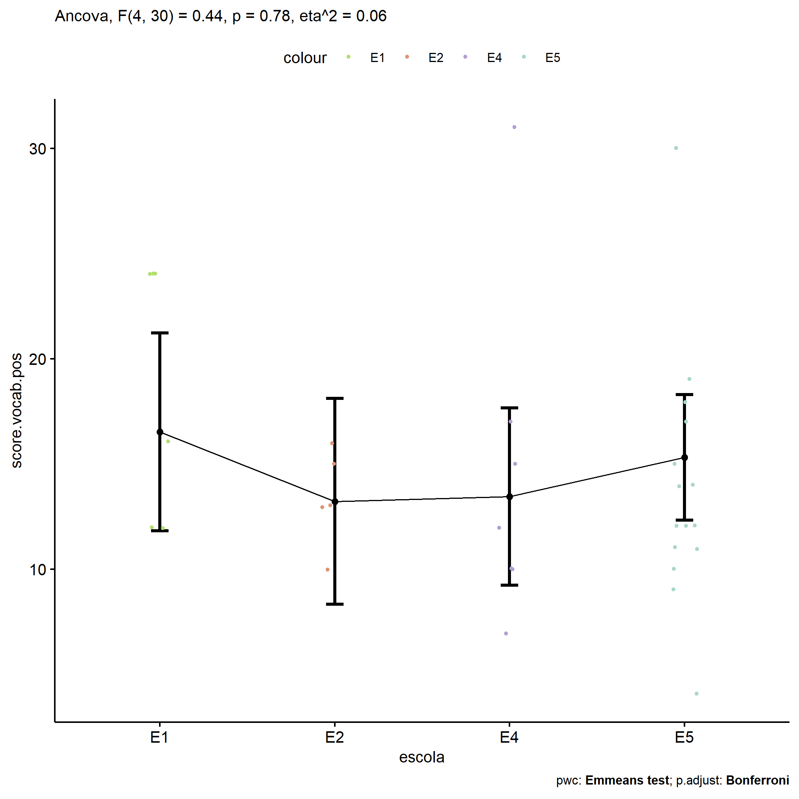<!-- -->

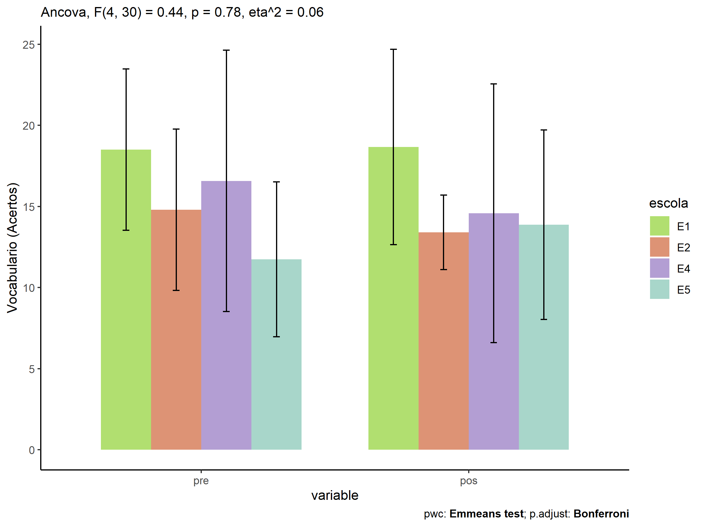<!-- -->

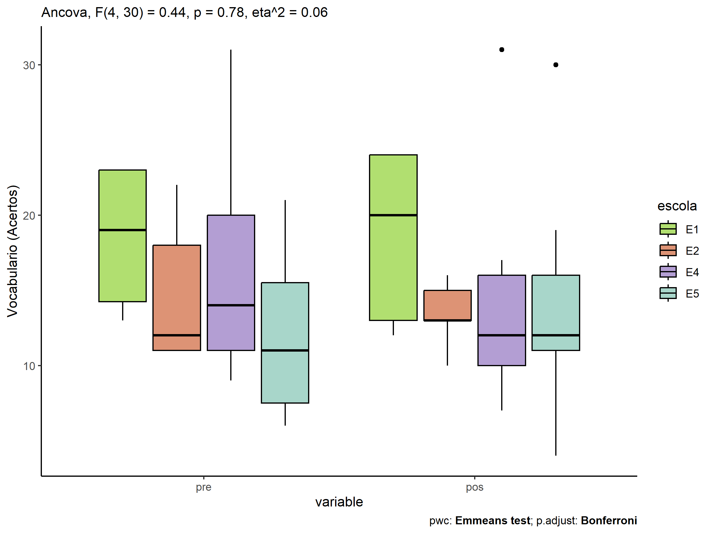<!-- -->

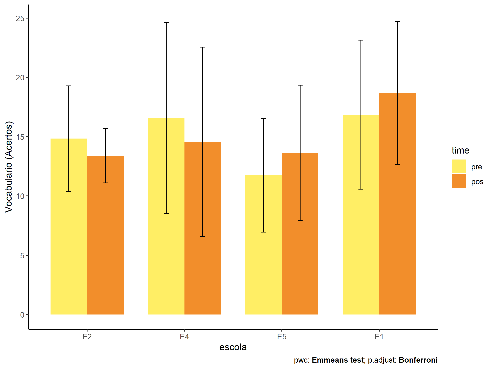<!-- -->

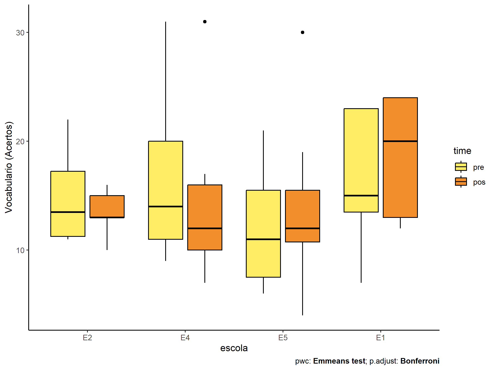<!-- -->

### Vocabulario (TRI)

| var           | escola |   n | M (pre) | SE (pre) | M (unadj) | SE (unadj) | M (adj) | SE (adj) |
|:--------------|:-------|----:|--------:|---------:|----------:|-----------:|--------:|---------:|
| tri.vocab.pos | E1     |   6 |  -0.082 |    0.158 |     0.072 |      0.208 |  -0.251 |    0.280 |
| tri.vocab.pos | E2     |   5 |  -0.679 |    0.239 |    -1.106 |      0.209 |  -1.057 |    0.287 |
| tri.vocab.pos | E4     |   7 |  -0.280 |    0.315 |    -0.639 |      0.327 |  -0.838 |    0.250 |
| tri.vocab.pos | E5     |  15 |  -0.929 |    0.156 |    -0.758 |      0.209 |  -0.552 |    0.177 |

| .y.           | group1 | group2 | estimate | conf.low | conf.high |    se | statistic |     p | p.adj | p.adj.signif |
|:--------------|:-------|:-------|---------:|---------:|----------:|------:|----------:|------:|------:|:-------------|
| tri.vocab.pos | E1     | E2     |    0.806 |   -0.022 |     1.635 | 0.404 |     1.993 | 0.056 | 0.336 | ns           |
| tri.vocab.pos | E1     | E4     |    0.587 |   -0.147 |     1.321 | 0.358 |     1.638 | 0.113 | 0.675 | ns           |
| tri.vocab.pos | E1     | E5     |    0.301 |   -0.415 |     1.017 | 0.350 |     0.861 | 0.396 | 1.000 | ns           |
| tri.vocab.pos | E2     | E4     |   -0.219 |   -1.003 |     0.565 | 0.383 |    -0.572 | 0.572 | 1.000 | ns           |
| tri.vocab.pos | E2     | E5     |   -0.505 |   -1.190 |     0.180 | 0.334 |    -1.511 | 0.142 | 0.852 | ns           |
| tri.vocab.pos | E4     | E5     |   -0.286 |   -0.939 |     0.367 | 0.319 |    -0.898 | 0.377 | 1.000 | ns           |
| tri.vocab.pre | E1     | E2     |    0.596 |   -0.171 |     1.364 | 0.375 |     1.590 | 0.123 | 0.737 | ns           |
| tri.vocab.pre | E1     | E4     |    0.197 |   -0.508 |     0.902 | 0.345 |     0.572 | 0.572 | 1.000 | ns           |
| tri.vocab.pre | E1     | E5     |    0.847 |    0.235 |     1.459 | 0.299 |     2.830 | 0.008 | 0.050 | ns           |
| tri.vocab.pre | E2     | E4     |   -0.399 |   -1.141 |     0.343 | 0.363 |    -1.100 | 0.280 | 1.000 | ns           |
| tri.vocab.pre | E2     | E5     |    0.251 |   -0.404 |     0.905 | 0.320 |     0.784 | 0.440 | 1.000 | ns           |
| tri.vocab.pre | E4     | E5     |    0.650 |    0.070 |     1.230 | 0.284 |     2.291 | 0.029 | 0.176 | ns           |

| escola | group1 | group2 | estimate | conf.low | conf.high |    se | statistic |     p | p.adj | p.adj.signif |
|:-------|:-------|:-------|---------:|---------:|----------:|------:|----------:|------:|------:|:-------------|
| E1     | pre    | pos    |   -0.417 |   -1.200 |     0.366 | 0.392 |    -1.064 | 0.291 | 0.291 | ns           |
| E2     | pre    | pos    |    0.334 |   -0.518 |     1.186 | 0.426 |     0.784 | 0.436 | 0.436 | ns           |
| E4     | pre    | pos    |    0.359 |   -0.393 |     1.111 | 0.376 |     0.954 | 0.344 | 0.344 | ns           |
| E5     | pre    | pos    |   -0.152 |   -0.657 |     0.354 | 0.253 |    -0.599 | 0.551 | 0.551 | ns           |

    ## Scale for colour is already present.
    ## Adding another scale for colour, which will replace the existing scale.

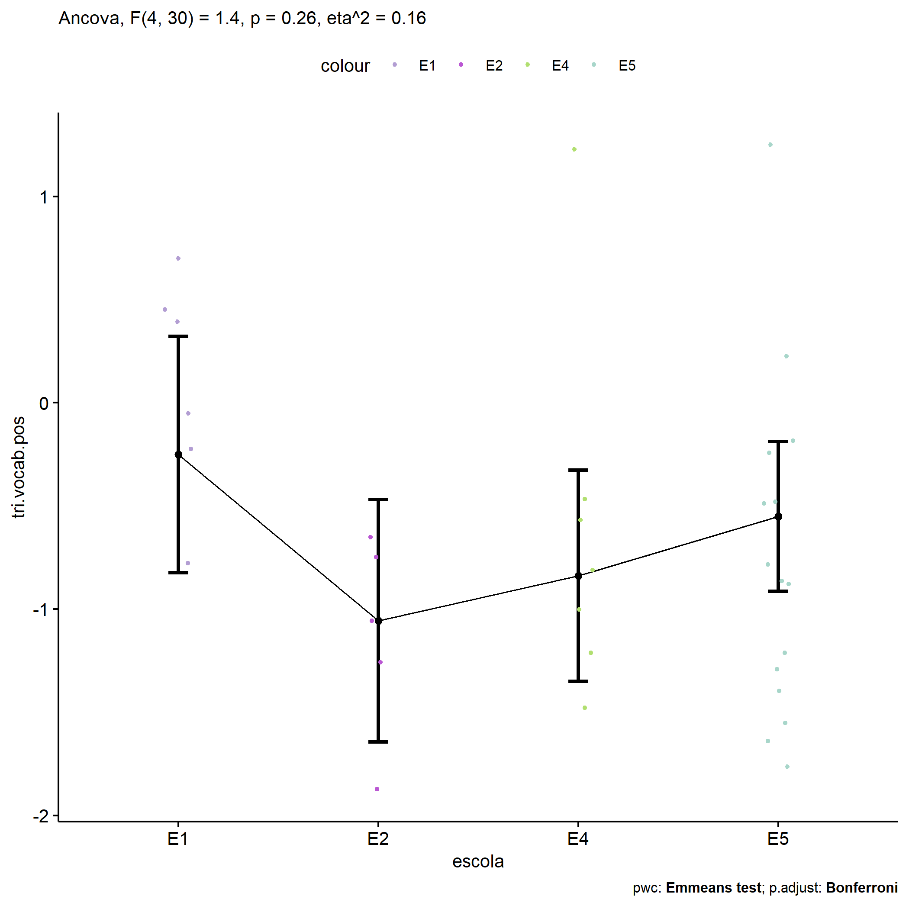<!-- -->

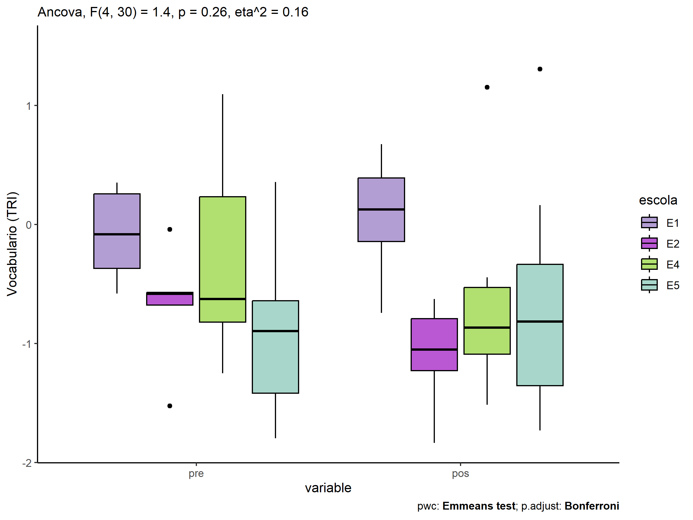<!-- -->

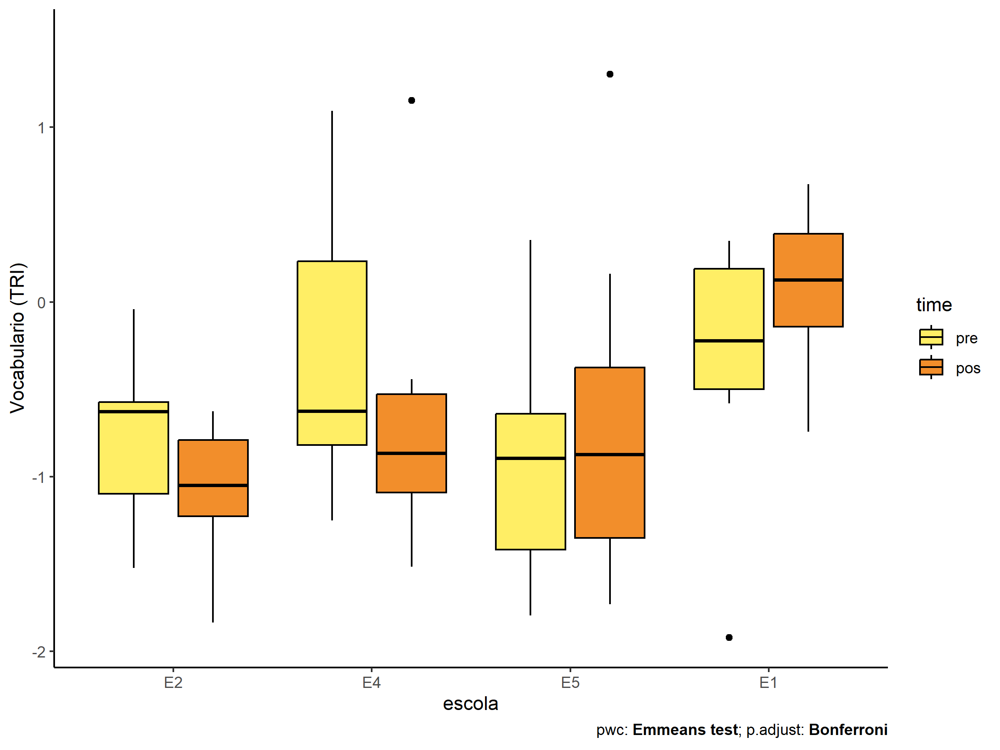<!-- -->

### Vocabulario Ensinado (Acertos)

| var                      | escola |   n | M (pre) | SE (pre) | M (unadj) | SE (unadj) | M (adj) | SE (adj) |
|:-------------------------|:-------|----:|--------:|---------:|----------:|-----------:|--------:|---------:|
| score.vocab.ensinado.pos | E1     |   7 |   3.571 |    0.719 |     2.571 |      0.948 |   2.242 |    0.646 |
| score.vocab.ensinado.pos | E2     |   6 |   2.167 |    0.307 |     2.333 |      0.558 |   2.608 |    0.690 |
| score.vocab.ensinado.pos | E4     |   7 |   4.000 |    0.787 |     3.857 |      0.738 |   3.343 |    0.669 |
| score.vocab.ensinado.pos | E5     |  16 |   2.188 |    0.319 |     2.375 |      0.352 |   2.641 |    0.432 |

| .y.                      | group1 | group2 | estimate | conf.low | conf.high |    se | statistic |     p | p.adj | p.adj.signif |
|:-------------------------|:-------|:-------|---------:|---------:|----------:|------:|----------:|------:|------:|:-------------|
| score.vocab.ensinado.pos | E1     | E2     |   -0.366 |   -2.332 |     1.600 | 0.964 |    -0.380 | 0.707 | 1.000 | ns           |
| score.vocab.ensinado.pos | E1     | E4     |   -1.101 |   -2.923 |     0.720 | 0.893 |    -1.233 | 0.227 | 1.000 | ns           |
| score.vocab.ensinado.pos | E1     | E5     |   -0.399 |   -2.029 |     1.231 | 0.799 |    -0.499 | 0.621 | 1.000 | ns           |
| score.vocab.ensinado.pos | E2     | E4     |   -0.735 |   -2.755 |     1.284 | 0.990 |    -0.742 | 0.463 | 1.000 | ns           |
| score.vocab.ensinado.pos | E2     | E5     |   -0.033 |   -1.657 |     1.591 | 0.796 |    -0.041 | 0.968 | 1.000 | ns           |
| score.vocab.ensinado.pos | E4     | E5     |    0.702 |   -0.991 |     2.396 | 0.830 |     0.846 | 0.404 | 1.000 | ns           |
| score.vocab.ensinado.pre | E1     | E2     |    1.405 |   -0.330 |     3.140 | 0.852 |     1.649 | 0.109 | 0.653 | ns           |
| score.vocab.ensinado.pre | E1     | E4     |   -0.429 |   -2.095 |     1.238 | 0.818 |    -0.524 | 0.604 | 1.000 | ns           |
| score.vocab.ensinado.pre | E1     | E5     |    1.384 |   -0.029 |     2.797 | 0.694 |     1.995 | 0.055 | 0.328 | ns           |
| score.vocab.ensinado.pre | E2     | E4     |   -1.833 |   -3.568 |    -0.099 | 0.852 |    -2.153 | 0.039 | 0.234 | ns           |
| score.vocab.ensinado.pre | E2     | E5     |   -0.021 |   -1.514 |     1.472 | 0.733 |    -0.028 | 0.977 | 1.000 | ns           |
| score.vocab.ensinado.pre | E4     | E5     |    1.812 |    0.399 |     3.226 | 0.694 |     2.613 | 0.014 | 0.081 | ns           |

| escola | group1 | group2 | estimate | conf.low | conf.high |    se | statistic |     p | p.adj | p.adj.signif |
|:-------|:-------|:-------|---------:|---------:|----------:|------:|----------:|------:|------:|:-------------|
| E1     | pre    | pos    |    1.000 |   -0.764 |     2.764 | 0.883 |     1.133 | 0.262 | 0.262 | ns           |
| E2     | pre    | pos    |   -0.167 |   -2.072 |     1.739 | 0.954 |    -0.175 | 0.862 | 0.862 | ns           |
| E4     | pre    | pos    |    0.143 |   -1.621 |     1.907 | 0.883 |     0.162 | 0.872 | 0.872 | ns           |
| E5     | pre    | pos    |   -0.188 |   -1.354 |     0.979 | 0.584 |    -0.321 | 0.749 | 0.749 | ns           |

    ## Scale for colour is already present.
    ## Adding another scale for colour, which will replace the existing scale.

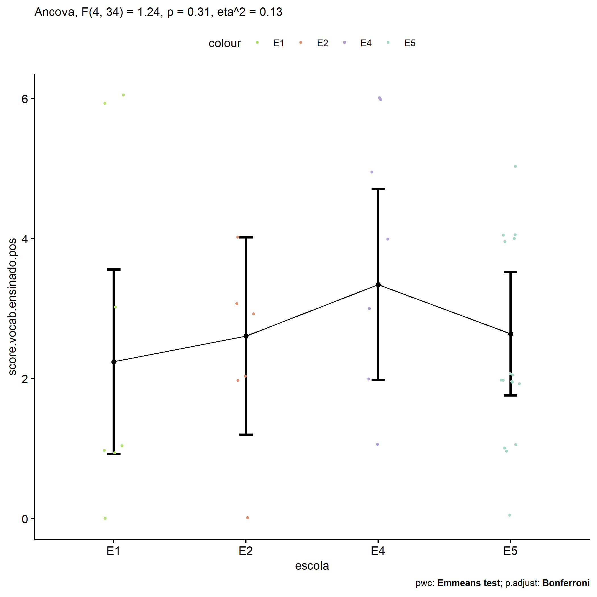<!-- -->

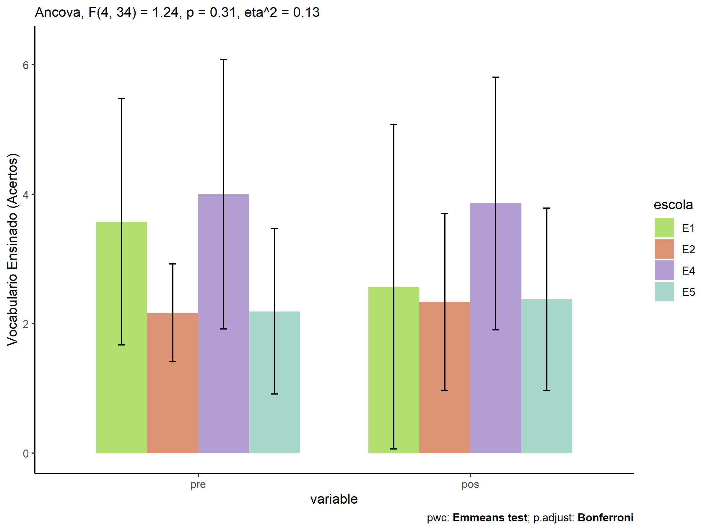<!-- -->

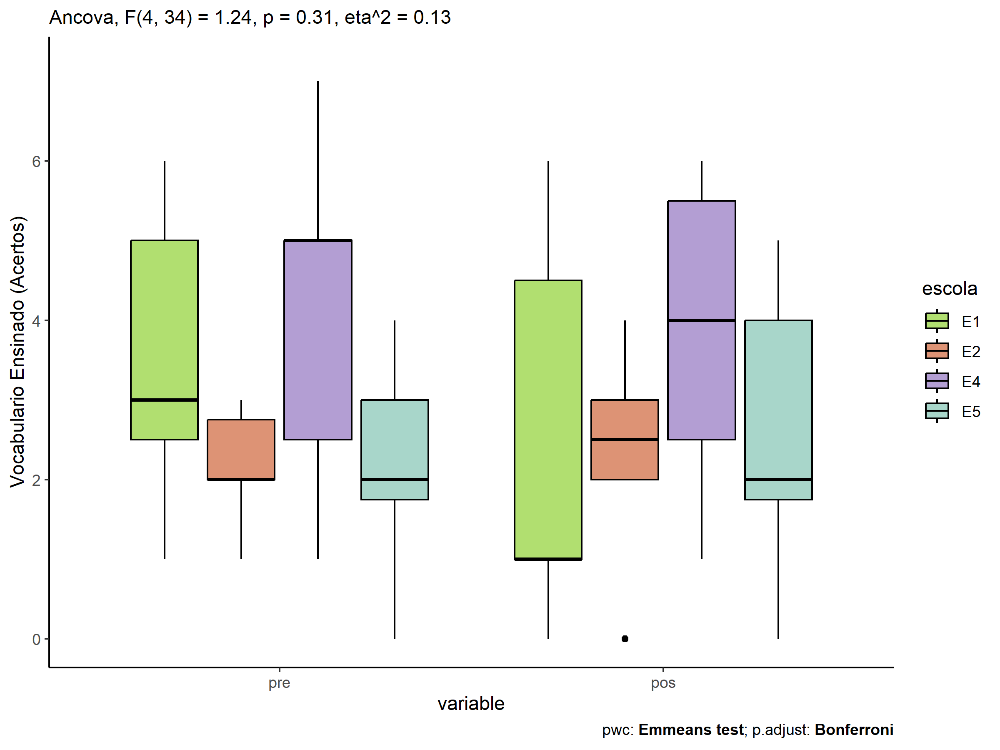<!-- -->

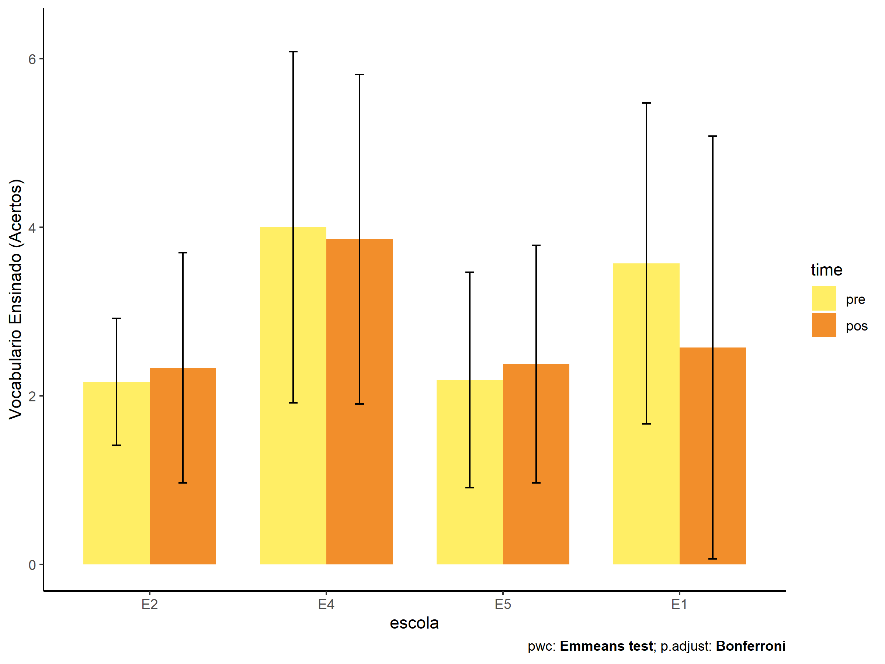<!-- -->

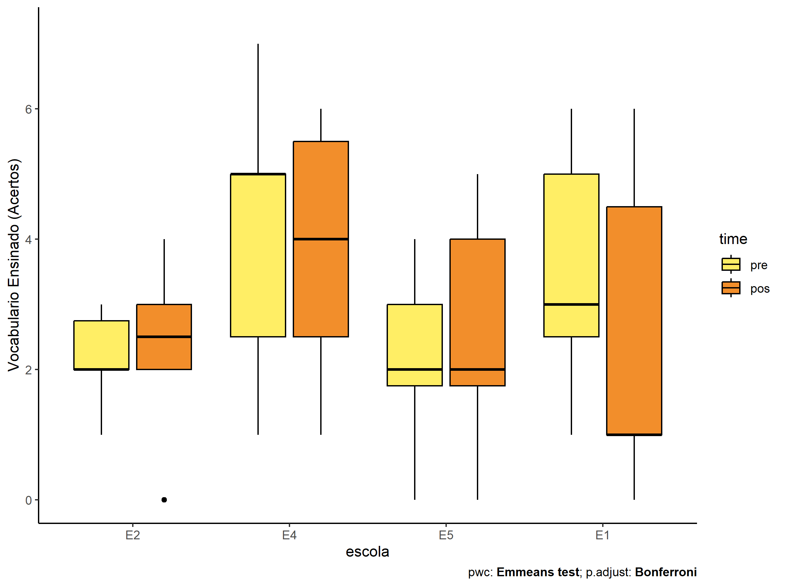<!-- -->

### Vocabulario Ensinado (TRI)

| var                    | escola |   n | M (pre) | SE (pre) | M (unadj) | SE (unadj) | M (adj) | SE (adj) |
|:-----------------------|:-------|----:|--------:|---------:|----------:|-----------:|--------:|---------:|
| tri.vocab.ensinado.pos | E1     |   6 |   0.246 |    0.275 |    -0.341 |      0.376 |  -0.562 |    0.274 |
| tri.vocab.ensinado.pos | E2     |   5 |  -0.777 |    0.114 |    -0.802 |      0.092 |  -0.619 |    0.290 |
| tri.vocab.ensinado.pos | E4     |   7 |  -0.149 |    0.324 |    -0.150 |      0.237 |  -0.215 |    0.236 |
| tri.vocab.ensinado.pos | E5     |  15 |  -0.461 |    0.139 |    -0.491 |      0.165 |  -0.433 |    0.162 |

| .y.                    | group1 | group2 | estimate | conf.low | conf.high |    se | statistic |     p | p.adj | p.adj.signif |
|:-----------------------|:-------|:-------|---------:|---------:|----------:|------:|----------:|------:|------:|:-------------|
| tri.vocab.ensinado.pos | E1     | E2     |    0.056 |   -0.807 |     0.919 | 0.421 |     0.134 | 0.894 | 1.000 | ns           |
| tri.vocab.ensinado.pos | E1     | E4     |   -0.347 |   -1.070 |     0.375 | 0.353 |    -0.984 | 0.333 | 1.000 | ns           |
| tri.vocab.ensinado.pos | E1     | E5     |   -0.129 |   -0.799 |     0.542 | 0.327 |    -0.394 | 0.697 | 1.000 | ns           |
| tri.vocab.ensinado.pos | E2     | E4     |   -0.404 |   -1.185 |     0.378 | 0.382 |    -1.058 | 0.299 | 1.000 | ns           |
| tri.vocab.ensinado.pos | E2     | E5     |   -0.185 |   -0.852 |     0.482 | 0.326 |    -0.569 | 0.574 | 1.000 | ns           |
| tri.vocab.ensinado.pos | E4     | E5     |    0.218 |   -0.375 |     0.812 | 0.290 |     0.754 | 0.457 | 1.000 | ns           |
| tri.vocab.ensinado.pre | E1     | E2     |    1.023 |    0.260 |     1.786 | 0.373 |     2.743 | 0.010 | 0.062 | ns           |
| tri.vocab.ensinado.pre | E1     | E4     |    0.395 |   -0.306 |     1.096 | 0.343 |     1.153 | 0.258 | 1.000 | ns           |
| tri.vocab.ensinado.pre | E1     | E5     |    0.707 |    0.098 |     1.315 | 0.297 |     2.376 | 0.024 | 0.146 | ns           |
| tri.vocab.ensinado.pre | E2     | E4     |   -0.628 |   -1.365 |     0.110 | 0.361 |    -1.741 | 0.092 | 0.553 | ns           |
| tri.vocab.ensinado.pre | E2     | E5     |   -0.316 |   -0.967 |     0.334 | 0.318 |    -0.995 | 0.328 | 1.000 | ns           |
| tri.vocab.ensinado.pre | E4     | E5     |    0.312 |   -0.265 |     0.888 | 0.282 |     1.105 | 0.278 | 1.000 | ns           |

| escola | group1 | group2 | estimate | conf.low | conf.high |    se | statistic |     p | p.adj | p.adj.signif |
|:-------|:-------|:-------|---------:|---------:|----------:|------:|----------:|------:|------:|:-------------|
| E1     | pre    | pos    |    0.345 |   -0.390 |     1.079 | 0.367 |     0.938 | 0.352 | 0.352 | ns           |
| E2     | pre    | pos    |    0.085 |   -0.715 |     0.884 | 0.400 |     0.212 | 0.833 | 0.833 | ns           |
| E4     | pre    | pos    |    0.001 |   -0.705 |     0.707 | 0.353 |     0.002 | 0.998 | 0.998 | ns           |
| E5     | pre    | pos    |    0.079 |   -0.396 |     0.553 | 0.237 |     0.332 | 0.741 | 0.741 | ns           |

    ## Scale for colour is already present.
    ## Adding another scale for colour, which will replace the existing scale.

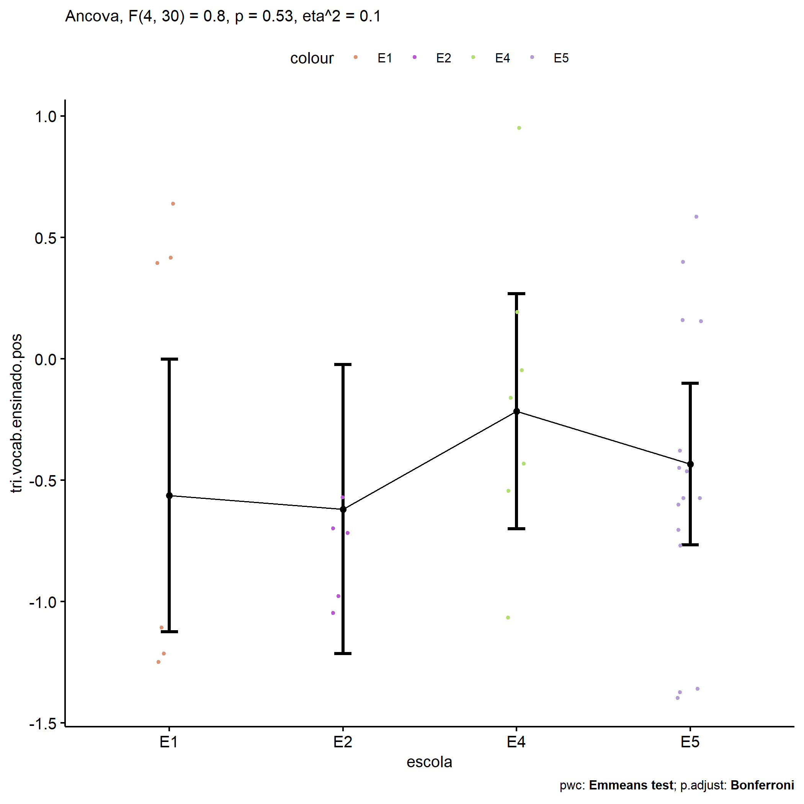<!-- -->

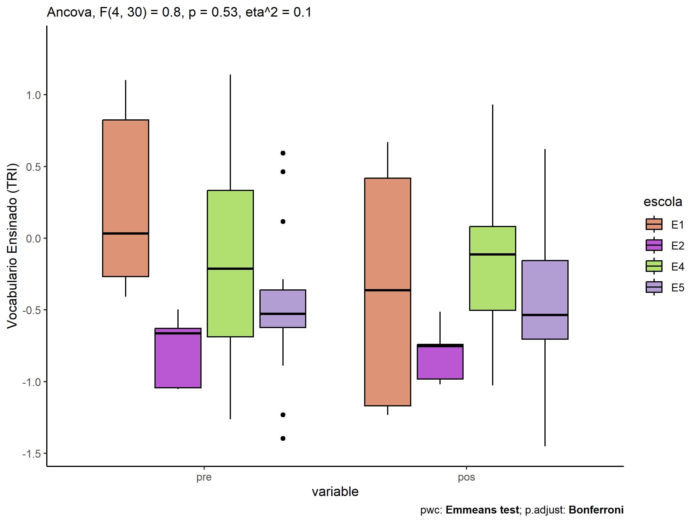<!-- -->

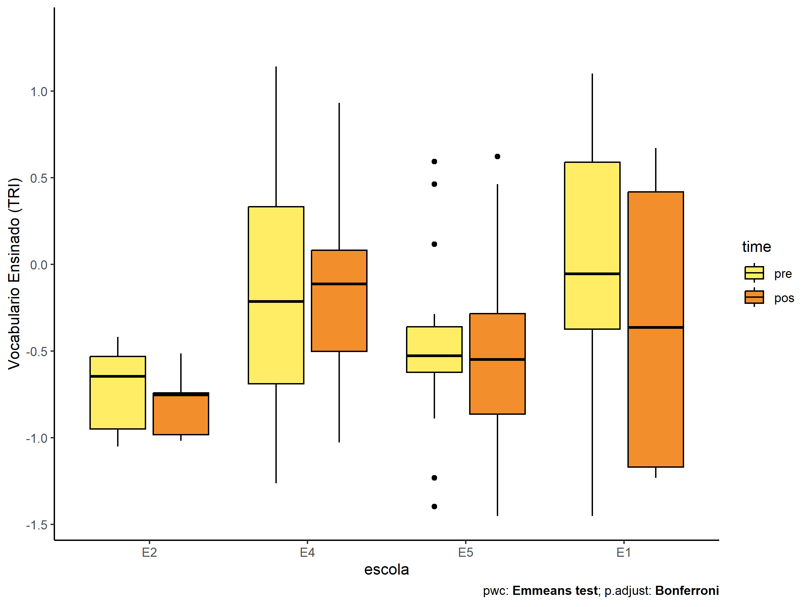<!-- -->

### Vocabulario Nao Ensinado (Acertos)

| var                          | escola |   n | M (pre) | SE (pre) | M (unadj) | SE (unadj) | M (adj) | SE (adj) |
|:-----------------------------|:-------|----:|--------:|---------:|----------:|-----------:|--------:|---------:|
| score.vocab.nao.ensinado.pos | E1     |   7 |  13.286 |    1.728 |    13.429 |      2.644 |  11.991 |    1.890 |
| score.vocab.nao.ensinado.pos | E2     |   6 |  12.667 |    1.626 |     8.833 |      2.007 |   7.795 |    2.018 |
| score.vocab.nao.ensinado.pos | E4     |   7 |  12.571 |    2.399 |    10.714 |      2.652 |   9.737 |    1.868 |
| score.vocab.nao.ensinado.pos | E5     |  16 |   8.812 |    1.198 |    11.250 |      1.226 |  12.696 |    1.284 |

| .y.                          | group1 | group2 | estimate | conf.low | conf.high |    se | statistic |     p | p.adj | p.adj.signif |
|:-----------------------------|:-------|:-------|---------:|---------:|----------:|------:|----------:|------:|------:|:-------------|
| score.vocab.nao.ensinado.pos | E1     | E2     |    4.196 |   -1.361 |     9.754 | 2.725 |     1.540 | 0.134 | 0.802 | ns           |
| score.vocab.nao.ensinado.pos | E1     | E4     |    2.254 |   -3.087 |     7.595 | 2.619 |     0.861 | 0.396 | 1.000 | ns           |
| score.vocab.nao.ensinado.pos | E1     | E5     |   -0.704 |   -5.498 |     4.090 | 2.350 |    -0.300 | 0.766 | 1.000 | ns           |
| score.vocab.nao.ensinado.pos | E2     | E4     |   -1.942 |   -7.496 |     3.611 | 2.723 |    -0.713 | 0.481 | 1.000 | ns           |
| score.vocab.nao.ensinado.pos | E2     | E5     |   -4.900 |   -9.871 |     0.070 | 2.437 |    -2.011 | 0.053 | 0.319 | ns           |
| score.vocab.nao.ensinado.pos | E4     | E5     |   -2.958 |   -7.674 |     1.758 | 2.312 |    -1.279 | 0.210 | 1.000 | ns           |
| score.vocab.nao.ensinado.pre | E1     | E2     |    0.619 |   -5.015 |     6.253 | 2.766 |     0.224 | 0.824 | 1.000 | ns           |
| score.vocab.nao.ensinado.pre | E1     | E4     |    0.714 |   -4.699 |     6.127 | 2.657 |     0.269 | 0.790 | 1.000 | ns           |
| score.vocab.nao.ensinado.pre | E1     | E5     |    4.473 |   -0.116 |     9.062 | 2.253 |     1.986 | 0.056 | 0.334 | ns           |
| score.vocab.nao.ensinado.pre | E2     | E4     |    0.095 |   -5.539 |     5.729 | 2.766 |     0.034 | 0.973 | 1.000 | ns           |
| score.vocab.nao.ensinado.pre | E2     | E5     |    3.854 |   -0.994 |     8.702 | 2.380 |     1.619 | 0.115 | 0.691 | ns           |
| score.vocab.nao.ensinado.pre | E4     | E5     |    3.759 |   -0.830 |     8.348 | 2.253 |     1.668 | 0.105 | 0.630 | ns           |

| escola | group1 | group2 | estimate | conf.low | conf.high |    se | statistic |     p | p.adj | p.adj.signif |
|:-------|:-------|:-------|---------:|---------:|----------:|------:|----------:|------:|------:|:-------------|
| E1     | pre    | pos    |   -0.143 |   -5.902 |     5.617 | 2.883 |    -0.050 | 0.961 | 0.961 | ns           |
| E2     | pre    | pos    |    3.833 |   -2.388 |    10.054 | 3.114 |     1.231 | 0.223 | 0.223 | ns           |
| E4     | pre    | pos    |    1.857 |   -3.902 |     7.617 | 2.883 |     0.644 | 0.522 | 0.522 | ns           |
| E5     | pre    | pos    |   -2.437 |   -6.247 |     1.372 | 1.907 |    -1.278 | 0.206 | 0.206 | ns           |

    ## Scale for colour is already present.
    ## Adding another scale for colour, which will replace the existing scale.

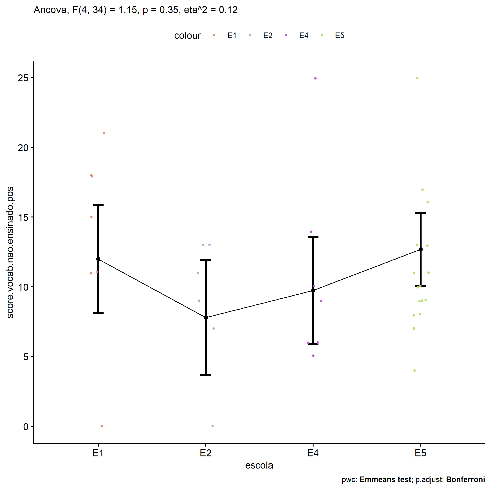<!-- -->

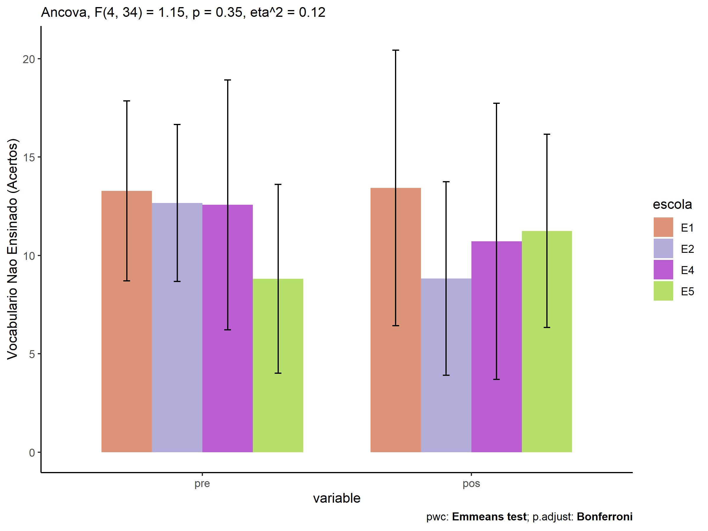<!-- -->

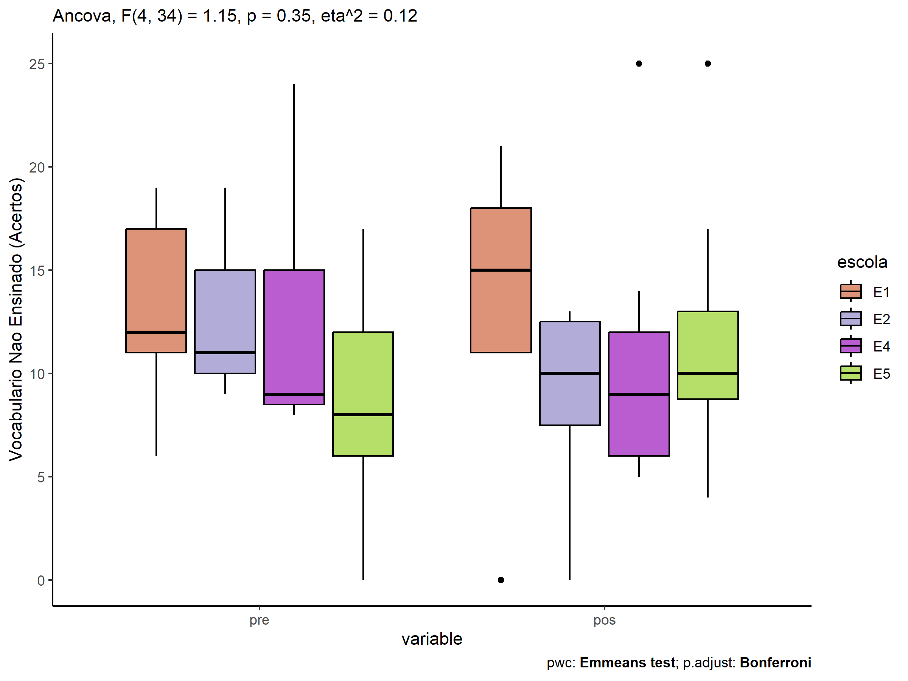<!-- -->

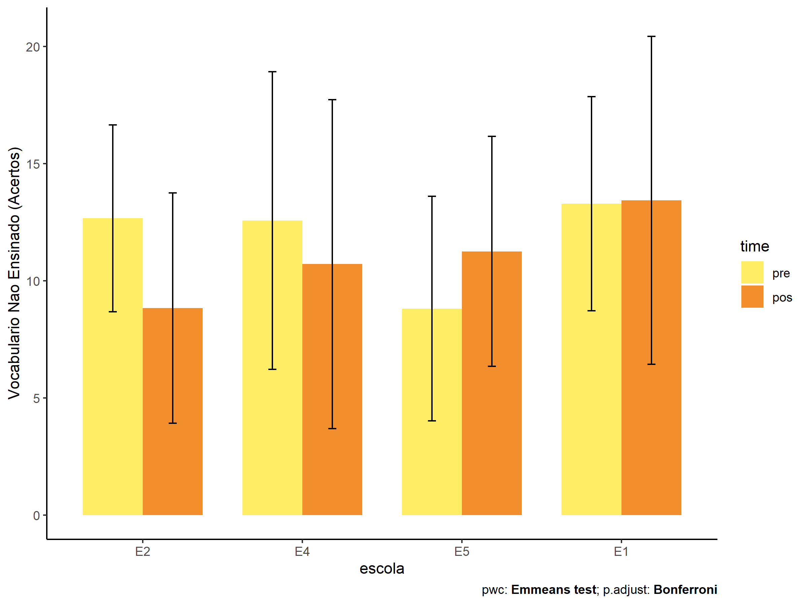<!-- -->

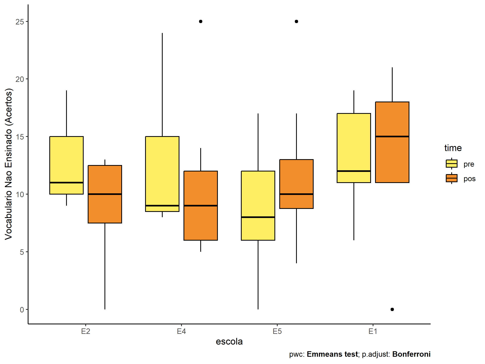<!-- -->

### Vocabulario Nao Ensinado (TRI)

| var                        | escola |   n | M (pre) | SE (pre) | M (unadj) | SE (unadj) | M (adj) | SE (adj) |
|:---------------------------|:-------|----:|--------:|---------:|----------:|-----------:|--------:|---------:|
| tri.vocab.nao.ensinado.pos | E1     |   6 |  -0.309 |    0.113 |     0.008 |      0.173 |  -0.232 |    0.228 |
| tri.vocab.nao.ensinado.pos | E2     |   5 |  -0.653 |    0.225 |    -0.932 |      0.108 |  -0.942 |    0.241 |
| tri.vocab.nao.ensinado.pos | E4     |   7 |  -0.379 |    0.312 |    -0.702 |      0.318 |  -0.896 |    0.209 |
| tri.vocab.nao.ensinado.pos | E5     |  15 |  -0.953 |    0.152 |    -0.664 |      0.187 |  -0.474 |    0.147 |

| .y.                        | group1 | group2 | estimate | conf.low | conf.high |    se | statistic |     p | p.adj | p.adj.signif |
|:---------------------------|:-------|:-------|---------:|---------:|----------:|------:|----------:|------:|------:|:-------------|
| tri.vocab.nao.ensinado.pos | E1     | E2     |    0.710 |    0.033 |     1.388 | 0.331 |     2.147 | 0.041 | 0.243 | ns           |
| tri.vocab.nao.ensinado.pos | E1     | E4     |    0.664 |    0.051 |     1.278 | 0.300 |     2.218 | 0.035 | 0.209 | ns           |
| tri.vocab.nao.ensinado.pos | E1     | E5     |    0.242 |   -0.334 |     0.818 | 0.281 |     0.861 | 0.397 | 1.000 | ns           |
| tri.vocab.nao.ensinado.pos | E2     | E4     |   -0.046 |   -0.698 |     0.606 | 0.318 |    -0.145 | 0.886 | 1.000 | ns           |
| tri.vocab.nao.ensinado.pos | E2     | E5     |   -0.468 |   -1.047 |     0.110 | 0.282 |    -1.659 | 0.108 | 0.650 | ns           |
| tri.vocab.nao.ensinado.pos | E4     | E5     |   -0.422 |   -0.964 |     0.119 | 0.264 |    -1.597 | 0.122 | 0.729 | ns           |
| tri.vocab.nao.ensinado.pre | E1     | E2     |    0.344 |   -0.395 |     1.083 | 0.361 |     0.952 | 0.349 | 1.000 | ns           |
| tri.vocab.nao.ensinado.pre | E1     | E4     |    0.069 |   -0.610 |     0.748 | 0.332 |     0.209 | 0.836 | 1.000 | ns           |
| tri.vocab.nao.ensinado.pre | E1     | E5     |    0.644 |    0.054 |     1.233 | 0.288 |     2.233 | 0.033 | 0.200 | ns           |
| tri.vocab.nao.ensinado.pre | E2     | E4     |   -0.275 |   -0.989 |     0.440 | 0.349 |    -0.786 | 0.438 | 1.000 | ns           |
| tri.vocab.nao.ensinado.pre | E2     | E5     |    0.300 |   -0.330 |     0.930 | 0.308 |     0.973 | 0.339 | 1.000 | ns           |
| tri.vocab.nao.ensinado.pre | E4     | E5     |    0.574 |    0.016 |     1.133 | 0.273 |     2.103 | 0.044 | 0.266 | ns           |

| escola | group1 | group2 | estimate | conf.low | conf.high |    se | statistic |     p | p.adj | p.adj.signif |
|:-------|:-------|:-------|---------:|---------:|----------:|------:|----------:|------:|------:|:-------------|
| E1     | pre    | pos    |   -0.483 |   -1.186 |     0.221 | 0.352 |    -1.372 | 0.175 | 0.175 | ns           |
| E2     | pre    | pos    |    0.237 |   -0.528 |     1.003 | 0.383 |     0.620 | 0.538 | 0.538 | ns           |
| E4     | pre    | pos    |    0.324 |   -0.352 |     1.000 | 0.338 |     0.958 | 0.342 | 0.342 | ns           |
| E5     | pre    | pos    |   -0.263 |   -0.718 |     0.191 | 0.227 |    -1.159 | 0.251 | 0.251 | ns           |

    ## Scale for colour is already present.
    ## Adding another scale for colour, which will replace the existing scale.

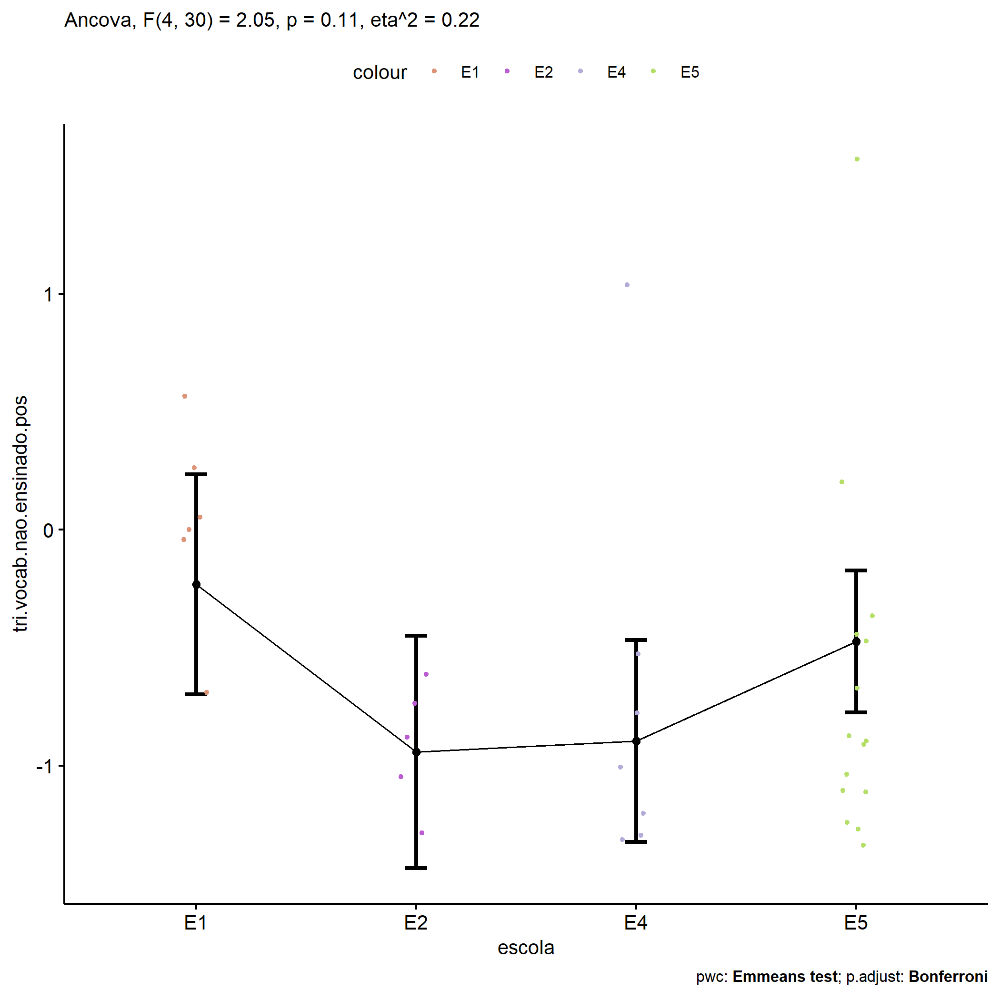<!-- -->

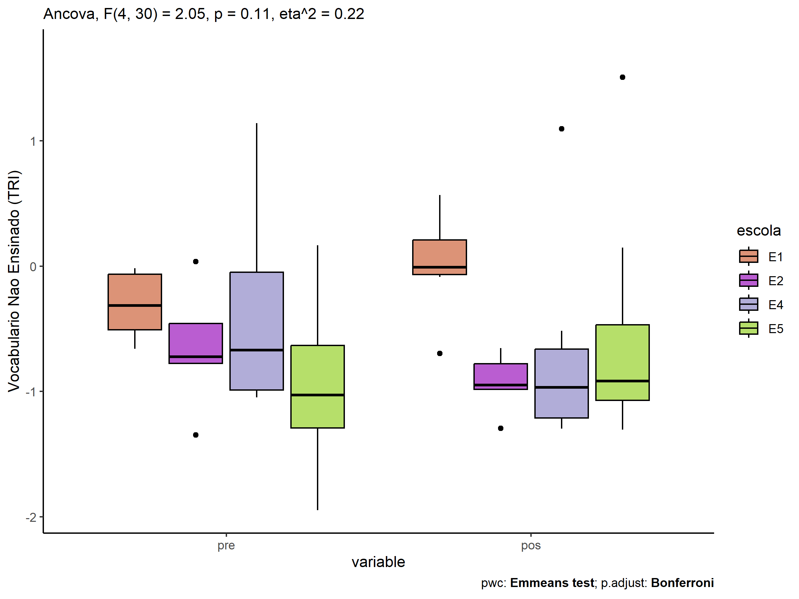<!-- -->

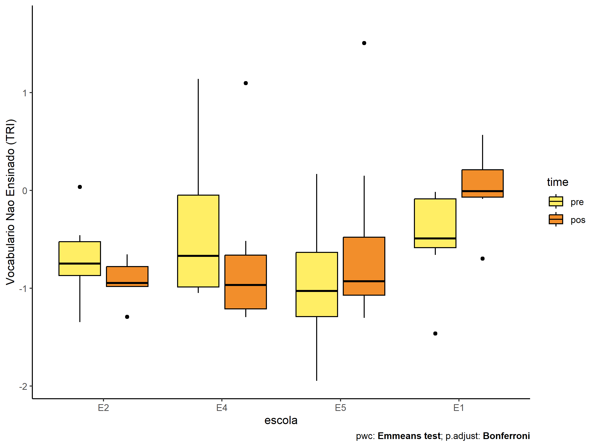<!-- -->

## factor: **zona.escola**

### Vocabulario (Acertos)

| var             | zona.escola |   n | M (pre) | SE (pre) | M (unadj) | SE (unadj) | M (adj) | SE (adj) |
|:----------------|:------------|----:|--------:|---------:|----------:|-----------:|--------:|---------:|
| score.vocab.pos | Rural       |  10 |  15.500 |    2.428 |    14.200 |      2.112 |  13.614 |    1.635 |
| score.vocab.pos | Urbana      |  26 |  13.885 |    1.069 |    14.885 |      1.104 |  15.110 |    1.011 |

| .y.             | group1 | group2 | estimate | conf.low | conf.high |    se | statistic |     p | p.adj | p.adj.signif |
|:----------------|:-------|:-------|---------:|---------:|----------:|------:|----------:|------:|------:|:-------------|
| score.vocab.pos | Urbana | Rural  |    1.496 |   -2.426 |     5.418 | 1.928 |     0.776 | 0.443 | 0.443 | ns           |
| score.vocab.pre | Urbana | Rural  |   -1.615 |   -6.243 |     3.012 | 2.277 |    -0.709 | 0.483 | 0.483 | ns           |

| zona.escola | group1 | group2 | estimate | conf.low | conf.high |    se | statistic |     p | p.adj | p.adj.signif |
|:------------|:-------|:-------|---------:|---------:|----------:|------:|----------:|------:|------:|:-------------|
| Urbana      | pre    | pos    |   -1.025 |   -4.218 |     2.167 | 1.601 |    -0.640 | 0.524 | 0.524 | ns           |
| Rural       | pre    | pos    |    1.255 |   -3.917 |     6.426 | 2.594 |     0.484 | 0.630 | 0.630 | ns           |

    ## Scale for colour is already present.
    ## Adding another scale for colour, which will replace the existing scale.

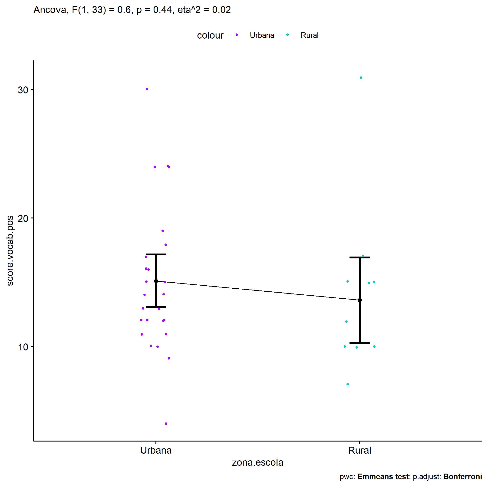<!-- -->

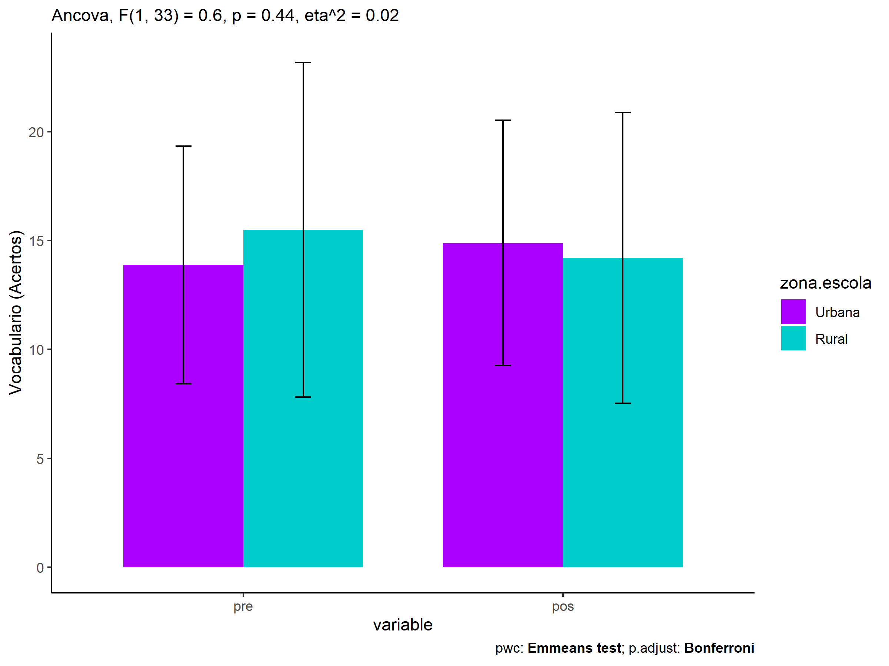<!-- -->

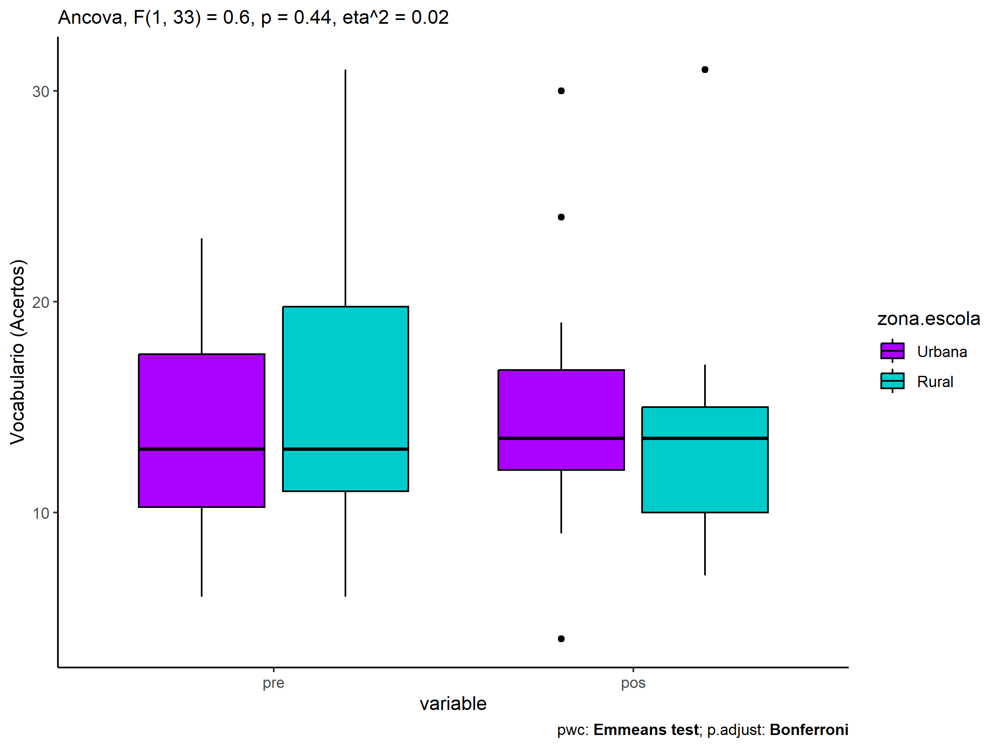<!-- -->

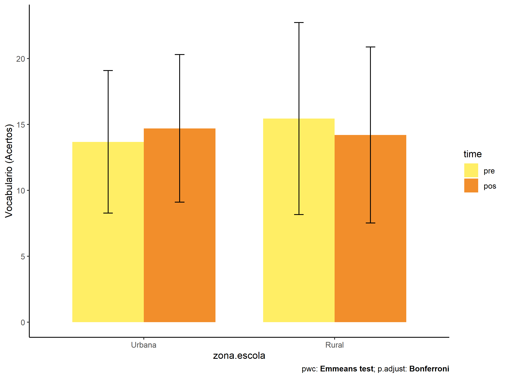<!-- -->

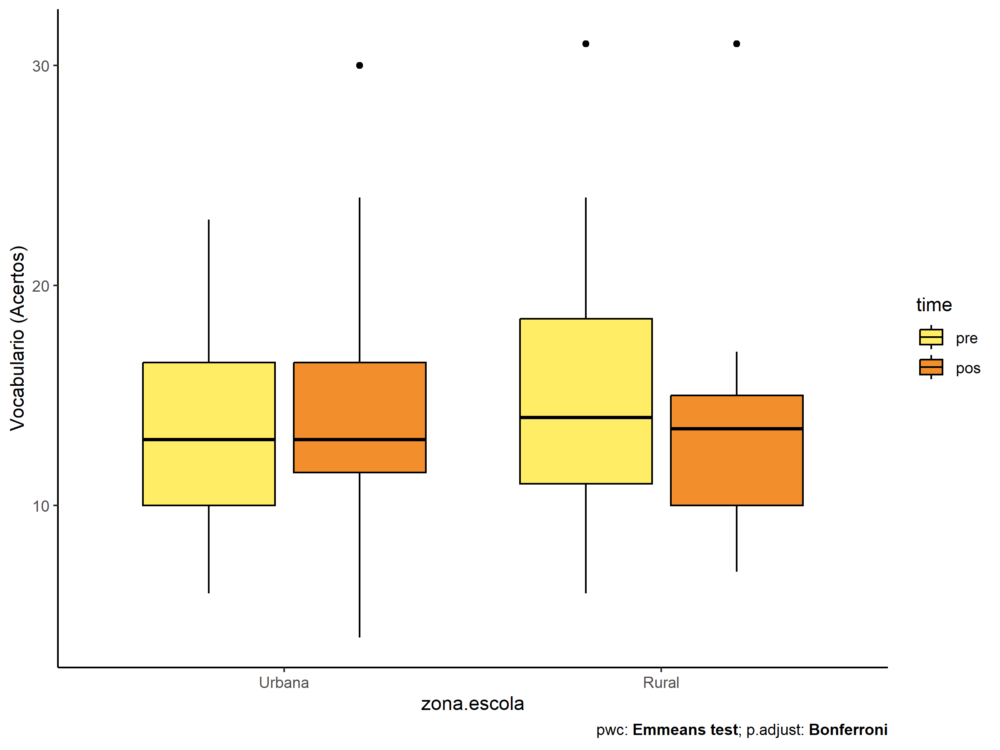<!-- -->

### Vocabulario (TRI)

| var           | zona.escola |   n | M (pre) | SE (pre) | M (unadj) | SE (unadj) | M (adj) | SE (adj) |
|:--------------|:------------|----:|--------:|---------:|----------:|-----------:|--------:|---------:|
| tri.vocab.pos | Rural       |  10 |  -0.354 |    0.223 |    -0.595 |      0.233 |  -0.761 |    0.207 |
| tri.vocab.pos | Urbana      |  26 |  -0.686 |    0.124 |    -0.633 |      0.155 |  -0.570 |    0.127 |

| .y.           | group1 | group2 | estimate | conf.low | conf.high |    se | statistic |     p | p.adj | p.adj.signif |
|:--------------|:-------|:-------|---------:|---------:|----------:|------:|----------:|------:|------:|:-------------|
| tri.vocab.pos | Urbana | Rural  |    0.191 |   -0.307 |     0.690 | 0.245 |     0.780 | 0.441 | 0.441 | ns           |
| tri.vocab.pre | Urbana | Rural  |   -0.332 |   -0.826 |     0.163 | 0.243 |    -1.363 | 0.182 | 0.182 | ns           |

| zona.escola | group1 | group2 | estimate | conf.low | conf.high |    se | statistic |     p | p.adj | p.adj.signif |
|:------------|:-------|:-------|---------:|---------:|----------:|------:|----------:|------:|------:|:-------------|
| Urbana      | pre    | pos    |    -0.10 |   -0.485 |     0.286 | 0.193 |    -0.516 | 0.607 | 0.607 | ns           |
| Rural       | pre    | pos    |     0.25 |   -0.375 |     0.874 | 0.313 |     0.797 | 0.428 | 0.428 | ns           |

    ## Scale for colour is already present.
    ## Adding another scale for colour, which will replace the existing scale.

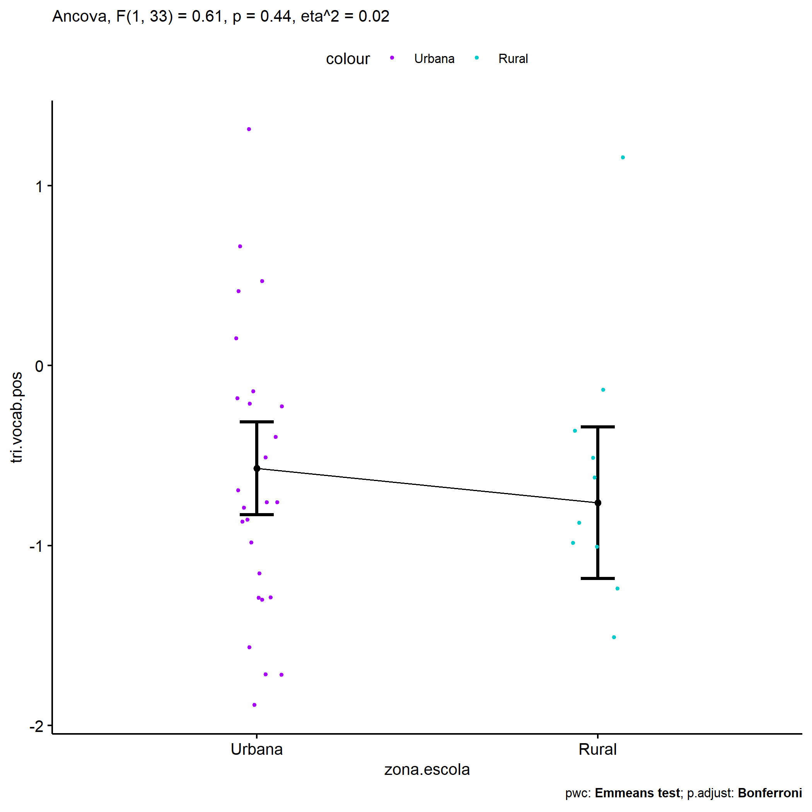<!-- -->

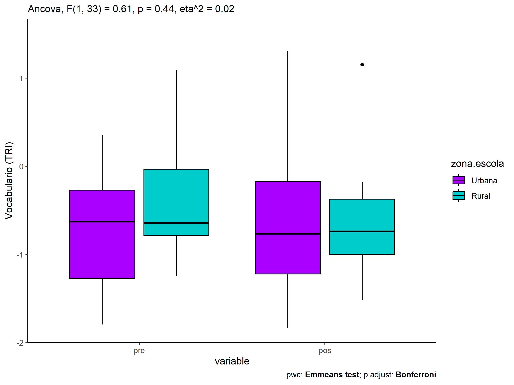<!-- -->

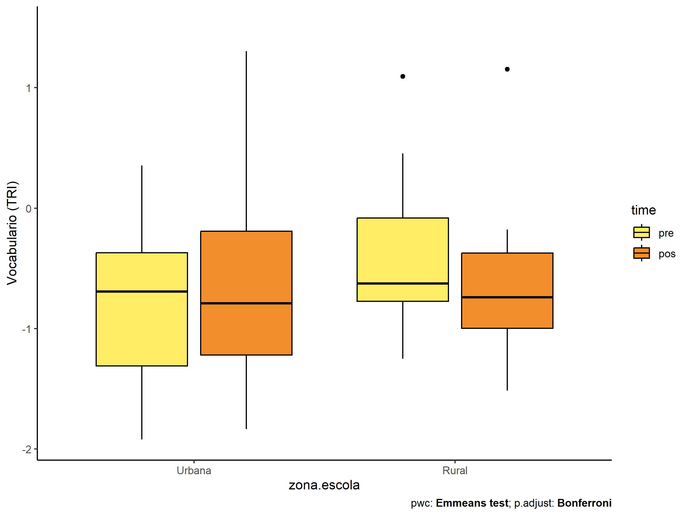<!-- -->

### Vocabulario Ensinado (Acertos)

| var                      | zona.escola |   n | M (pre) | SE (pre) | M (unadj) | SE (unadj) | M (adj) | SE (adj) |
|:-------------------------|:------------|----:|--------:|---------:|----------:|-----------:|--------:|---------:|
| score.vocab.ensinado.pos | Rural       |  11 |   3.636 |    0.576 |     2.909 |      0.625 |    2.55 |    0.517 |
| score.vocab.ensinado.pos | Urbana      |  29 |   2.517 |    0.270 |     2.414 |      0.308 |    2.55 |    0.311 |

| .y.                      | group1 | group2 | estimate | conf.low | conf.high |    se | statistic |     p | p.adj | p.adj.signif |
|:-------------------------|:-------|:-------|---------:|---------:|----------:|------:|----------:|------:|------:|:-------------|
| score.vocab.ensinado.pos | Urbana | Rural  |    0.000 |   -1.246 |     1.247 | 0.615 |     0.001 | 0.999 | 0.999 | ns           |
| score.vocab.ensinado.pre | Urbana | Rural  |   -1.119 |   -2.257 |     0.019 | 0.562 |    -1.991 | 0.054 | 0.054 | ns           |

| zona.escola | group1 | group2 | estimate | conf.low | conf.high |    se | statistic |     p | p.adj | p.adj.signif |
|:------------|:-------|:-------|---------:|---------:|----------:|------:|----------:|------:|------:|:-------------|
| Urbana      | pre    | pos    |    0.103 |   -0.778 |     0.985 | 0.442 |     0.234 | 0.816 | 0.816 | ns           |
| Rural       | pre    | pos    |    0.727 |   -0.704 |     2.158 | 0.718 |     1.012 | 0.315 | 0.315 | ns           |

    ## Scale for colour is already present.
    ## Adding another scale for colour, which will replace the existing scale.

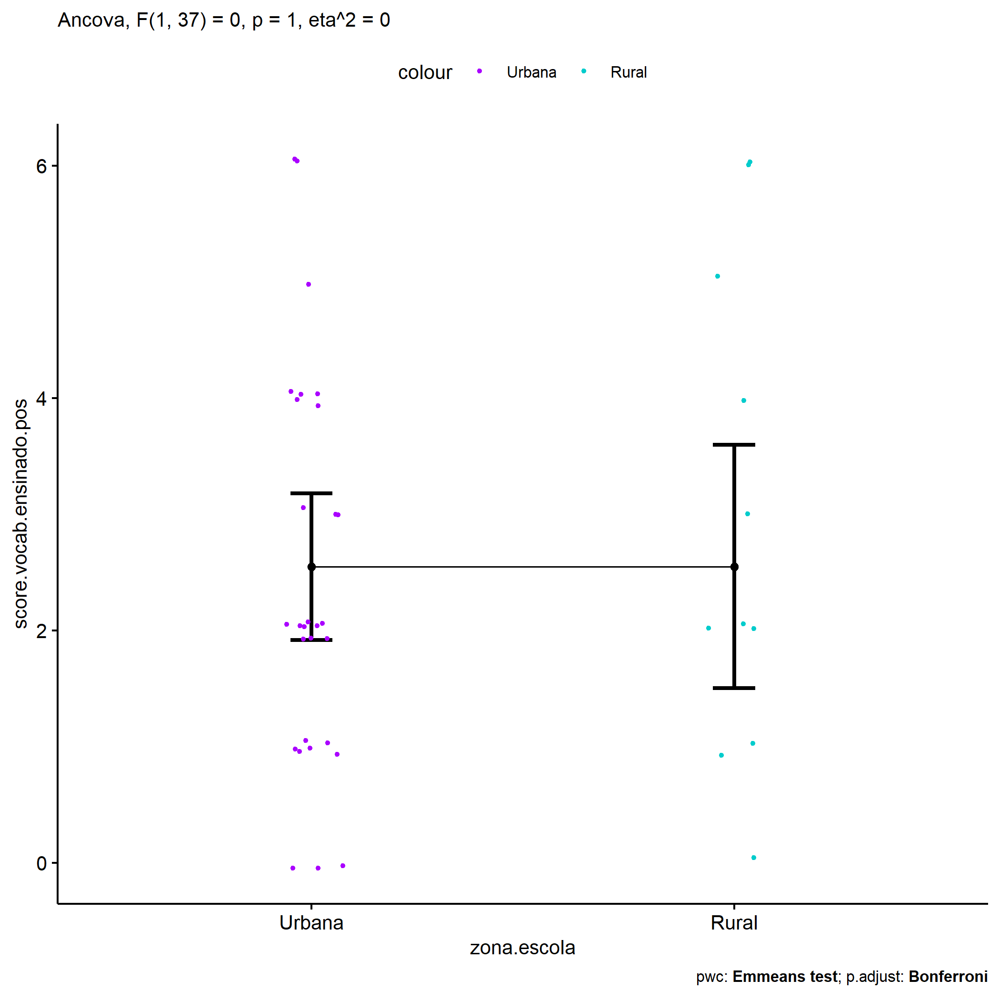<!-- -->

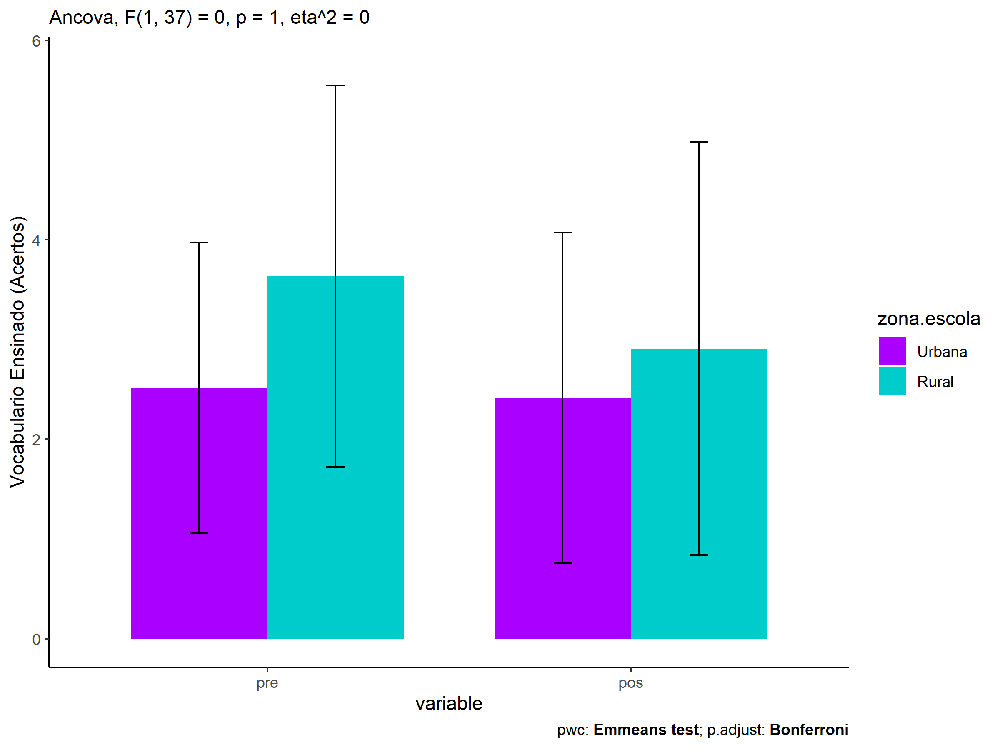<!-- -->

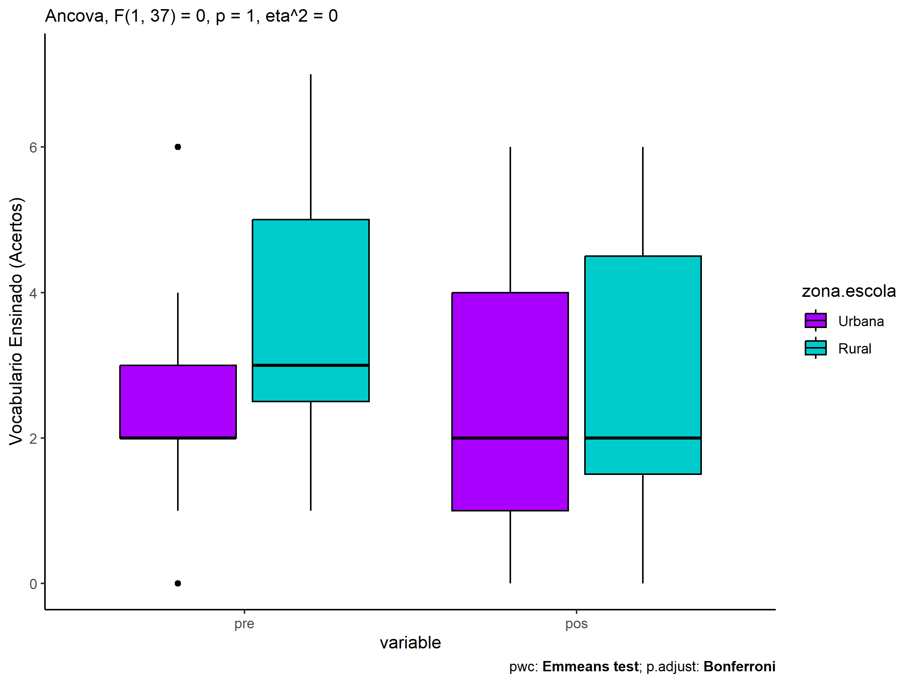<!-- -->

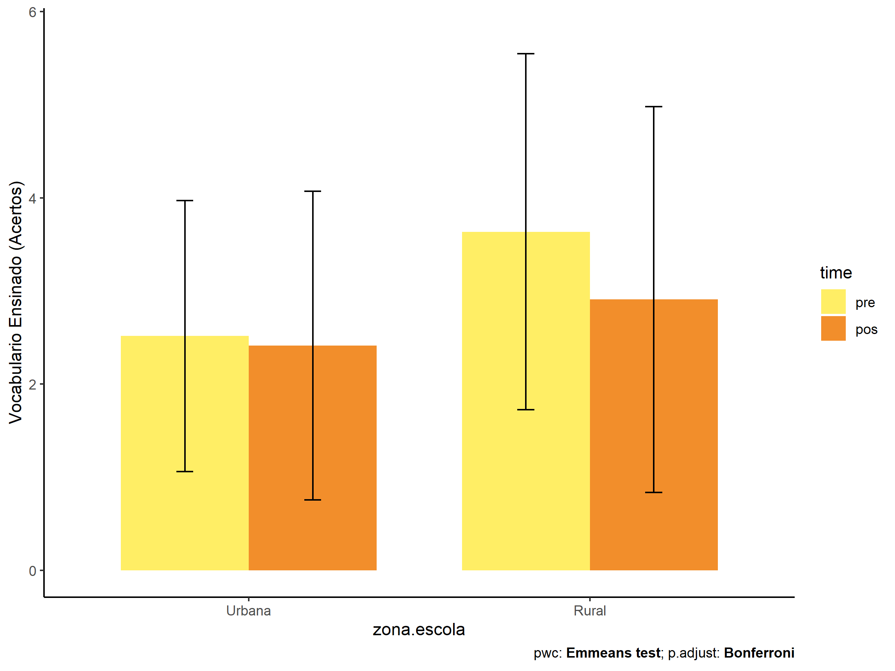<!-- -->

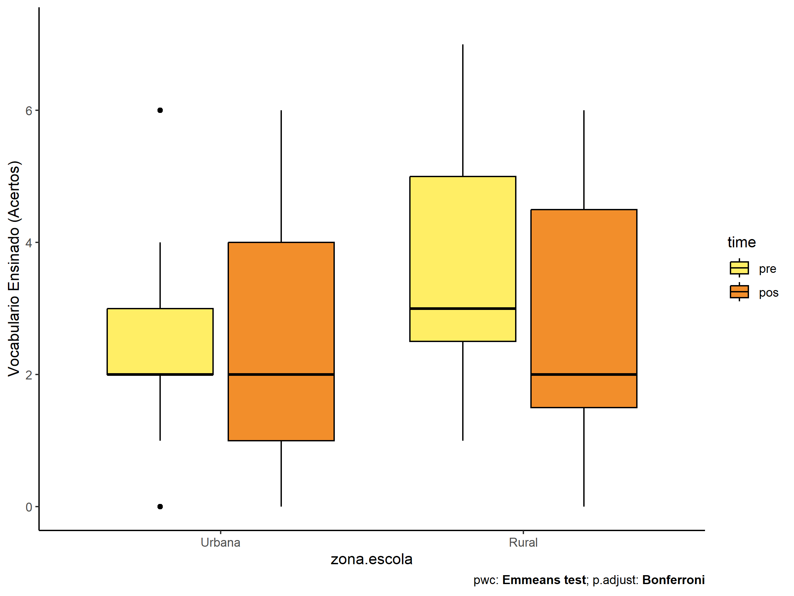<!-- -->

### Vocabulario Ensinado (TRI)

| var                    | zona.escola |   n | M (pre) | SE (pre) | M (unadj) | SE (unadj) | M (adj) | SE (adj) |
|:-----------------------|:------------|----:|--------:|---------:|----------:|-----------:|--------:|---------:|
| tri.vocab.ensinado.pos | Rural       |  10 |  -0.164 |    0.231 |    -0.358 |      0.200 |  -0.414 |    0.192 |
| tri.vocab.ensinado.pos | Urbana      |  26 |  -0.359 |    0.123 |    -0.516 |      0.128 |  -0.495 |    0.118 |

| .y.                    | group1 | group2 | estimate | conf.low | conf.high |    se | statistic |     p | p.adj | p.adj.signif |
|:-----------------------|:-------|:-------|---------:|---------:|----------:|------:|----------:|------:|------:|:-------------|
| tri.vocab.ensinado.pos | Urbana | Rural  |   -0.080 |    -0.54 |     0.379 | 0.226 |    -0.356 | 0.724 | 0.724 | ns           |
| tri.vocab.ensinado.pre | Urbana | Rural  |   -0.195 |    -0.69 |     0.301 | 0.244 |    -0.798 | 0.430 | 0.430 | ns           |

| zona.escola | group1 | group2 | estimate | conf.low | conf.high |    se | statistic |     p | p.adj | p.adj.signif |
|:------------|:-------|:-------|---------:|---------:|----------:|------:|----------:|------:|------:|:-------------|
| Urbana      | pre    | pos    |    0.144 |   -0.207 |     0.495 | 0.176 |     0.820 | 0.415 | 0.415 | ns           |
| Rural       | pre    | pos    |    0.170 |   -0.399 |     0.738 | 0.285 |     0.595 | 0.554 | 0.554 | ns           |

    ## Scale for colour is already present.
    ## Adding another scale for colour, which will replace the existing scale.

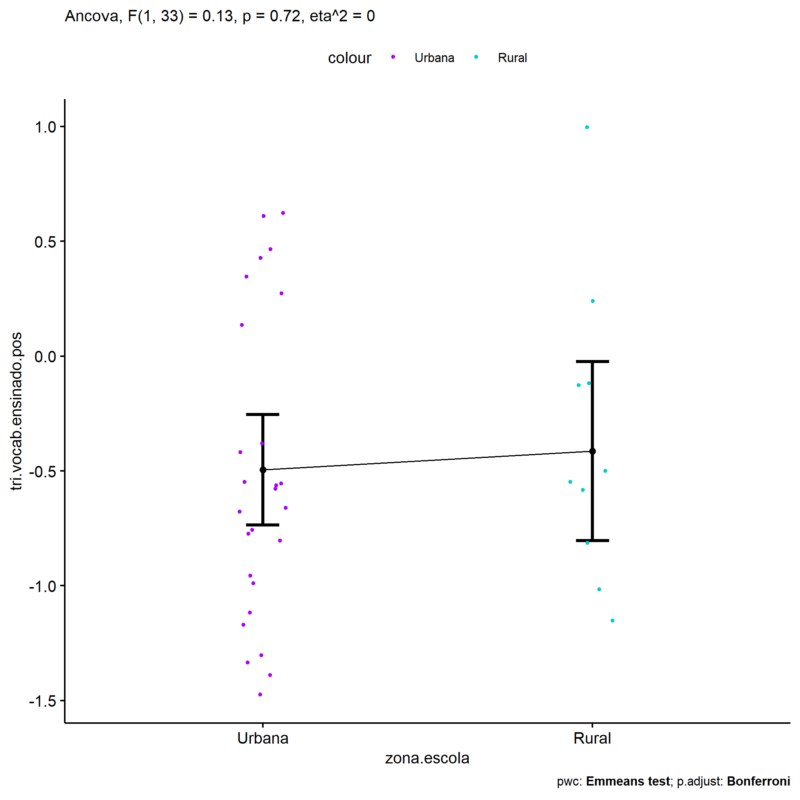<!-- -->

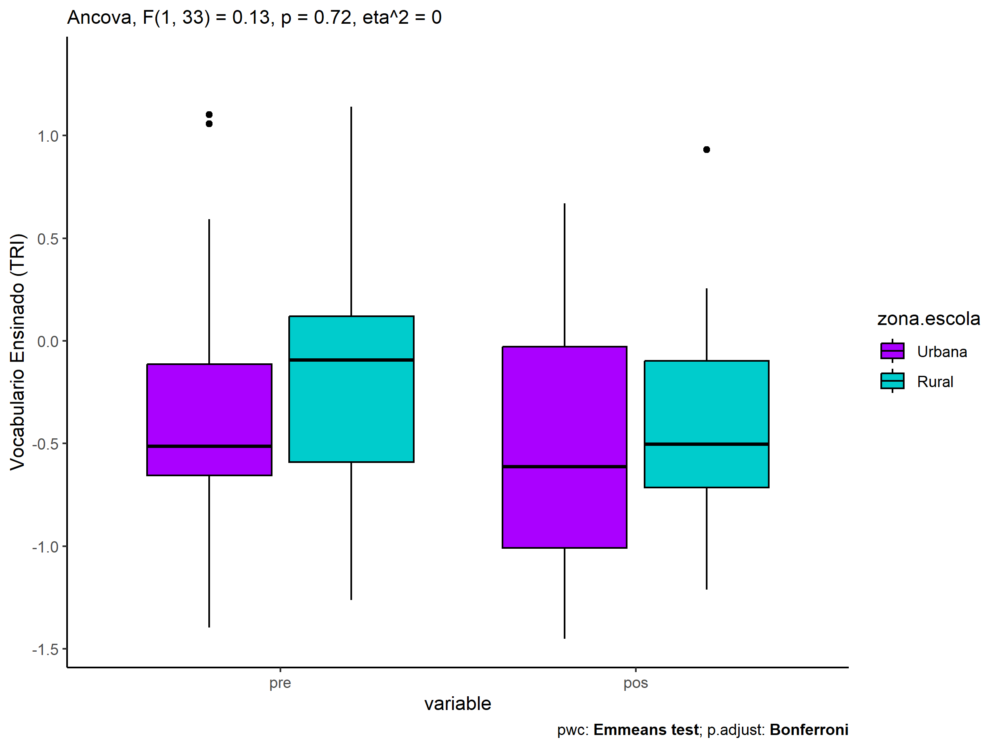<!-- -->

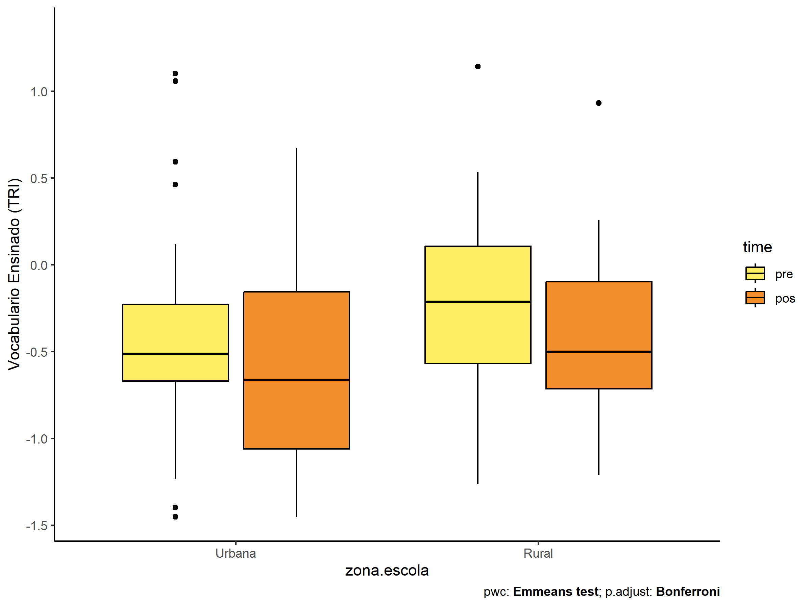<!-- -->

### Vocabulario Nao Ensinado (Acertos)

| var                          | zona.escola |   n | M (pre) | SE (pre) | M (unadj) | SE (unadj) | M (adj) | SE (adj) |
|:-----------------------------|:------------|----:|--------:|---------:|----------:|-----------:|--------:|---------:|
| score.vocab.nao.ensinado.pos | Rural       |  11 |  11.818 |    1.699 |    10.000 |      1.973 |   9.577 |    1.578 |
| score.vocab.nao.ensinado.pos | Urbana      |  29 |  10.690 |    0.913 |    11.276 |      1.019 |  11.436 |    0.970 |

| .y.                          | group1 | group2 | estimate | conf.low | conf.high |    se | statistic |     p | p.adj | p.adj.signif |
|:-----------------------------|:-------|:-------|---------:|---------:|----------:|------:|----------:|------:|------:|:-------------|
| score.vocab.nao.ensinado.pos | Urbana | Rural  |    1.859 |   -1.902 |     5.620 | 1.856 |     1.001 | 0.323 | 0.323 | ns           |
| score.vocab.nao.ensinado.pre | Urbana | Rural  |   -1.129 |   -4.795 |     2.538 | 1.811 |    -0.623 | 0.537 | 0.537 | ns           |

| zona.escola | group1 | group2 | estimate | conf.low | conf.high |    se | statistic |     p | p.adj | p.adj.signif |
|:------------|:-------|:-------|---------:|---------:|----------:|------:|----------:|------:|------:|:-------------|
| Urbana      | pre    | pos    |   -0.586 |   -3.442 |     2.270 | 1.434 |    -0.409 | 0.684 | 0.684 | ns           |
| Rural       | pre    | pos    |    1.818 |   -2.819 |     6.455 | 2.328 |     0.781 | 0.437 | 0.437 | ns           |

    ## Scale for colour is already present.
    ## Adding another scale for colour, which will replace the existing scale.

<!-- -->

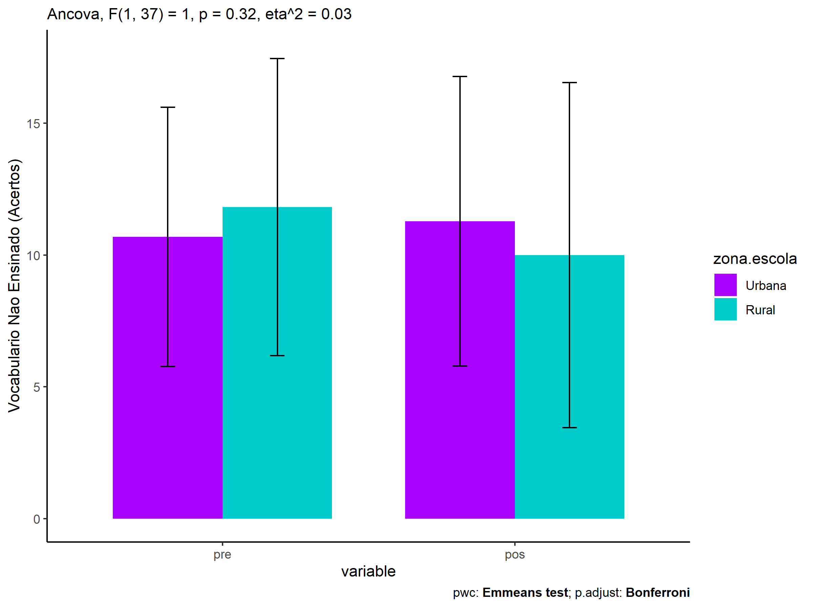<!-- -->

<!-- -->

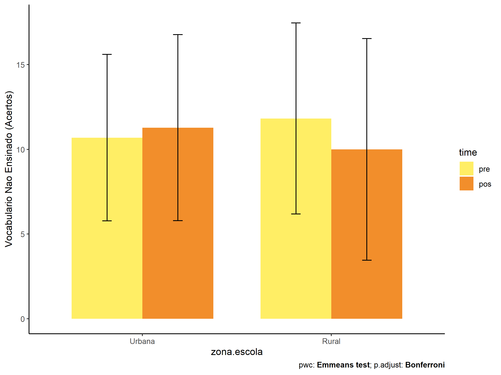<!-- -->

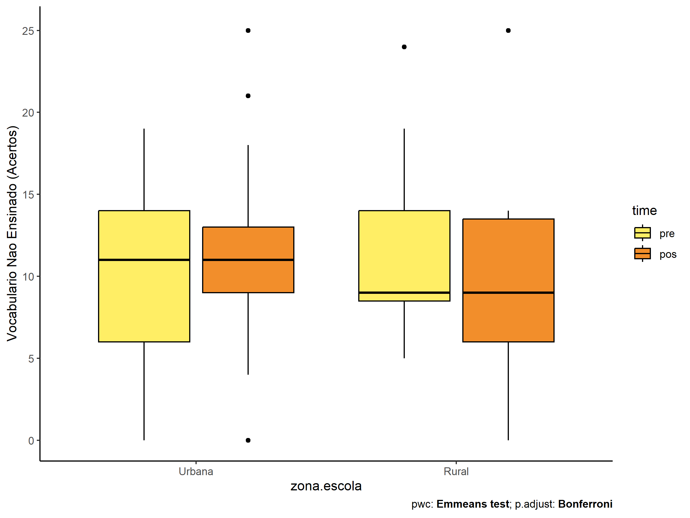<!-- -->

### Vocabulario Nao Ensinado (TRI)

| var                        | zona.escola |   n | M (pre) | SE (pre) | M (unadj) | SE (unadj) | M (adj) | SE (adj) |
|:---------------------------|:------------|----:|--------:|---------:|----------:|-----------:|--------:|---------:|
| tri.vocab.nao.ensinado.pos | Rural       |  10 |  -0.484 |    0.222 |    -0.661 |      0.225 |  -0.791 |    0.176 |
| tri.vocab.nao.ensinado.pos | Urbana      |  26 |  -0.747 |    0.111 |    -0.560 |      0.132 |  -0.510 |    0.108 |

| .y.                        | group1 | group2 | estimate | conf.low | conf.high |    se | statistic |     p | p.adj | p.adj.signif |
|:---------------------------|:-------|:-------|---------:|---------:|----------:|------:|----------:|------:|------:|:-------------|
| tri.vocab.nao.ensinado.pos | Urbana | Rural  |    0.280 |   -0.144 |     0.704 | 0.208 |     1.346 | 0.188 | 0.188 | ns           |
| tri.vocab.nao.ensinado.pre | Urbana | Rural  |   -0.262 |   -0.721 |     0.197 | 0.226 |    -1.162 | 0.254 | 0.254 | ns           |

| zona.escola | group1 | group2 | estimate | conf.low | conf.high |    se | statistic |     p | p.adj | p.adj.signif |
|:------------|:-------|:-------|---------:|---------:|----------:|------:|----------:|------:|------:|:-------------|
| Urbana      | pre    | pos    |   -0.199 |   -0.540 |     0.143 | 0.172 |    -1.158 | 0.251 | 0.251 | ns           |
| Rural       | pre    | pos    |    0.185 |   -0.369 |     0.739 | 0.278 |     0.666 | 0.508 | 0.508 | ns           |

    ## Scale for colour is already present.
    ## Adding another scale for colour, which will replace the existing scale.

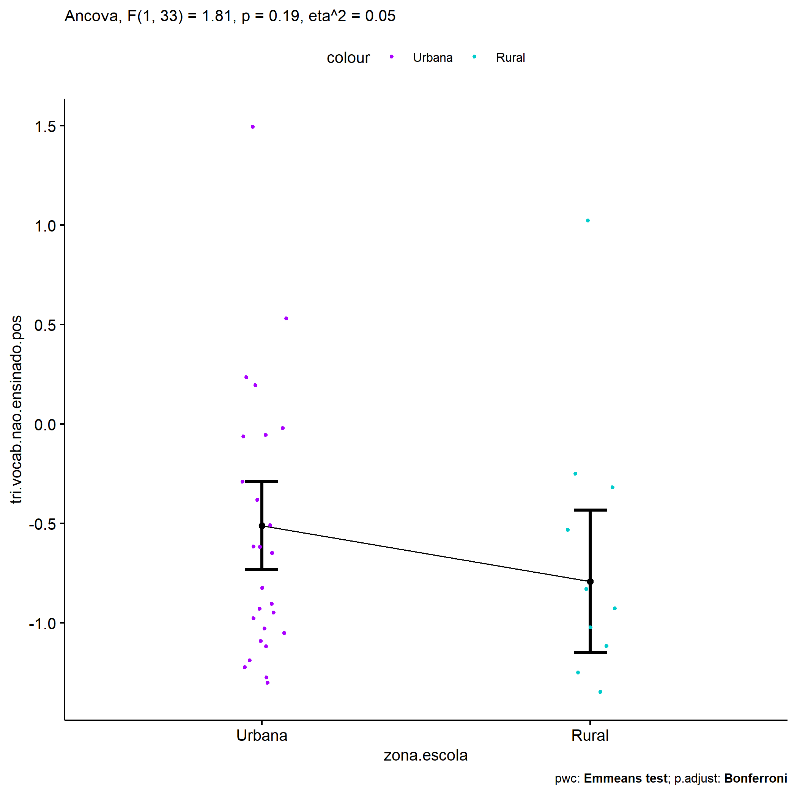<!-- -->

<!-- -->

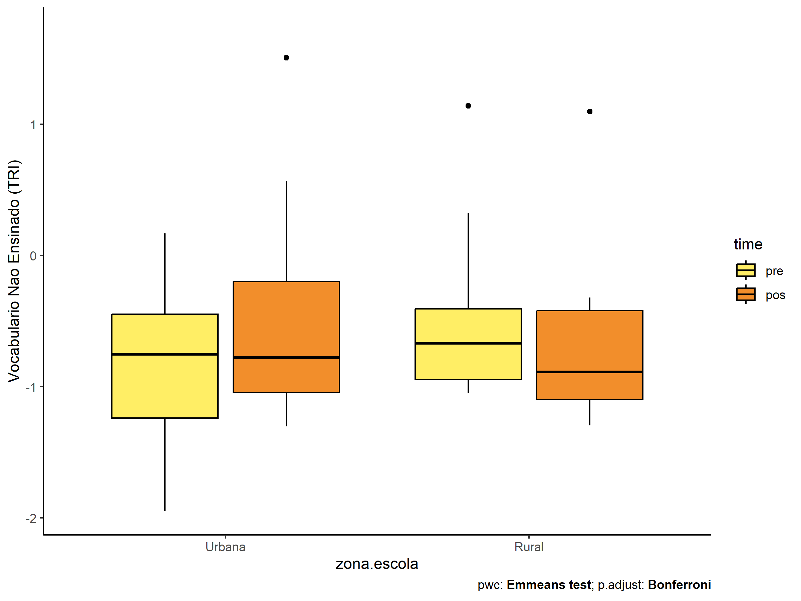<!-- -->

# Pairwise comparisons for two factors

## factores: **genero:grupo**

### Vocabulario (Acertos)

| var             | genero | grupo        |   n | M (pre) | SE (pre) | M (unadj) | SE (unadj) | M (adj) | SE (adj) |
|:----------------|:-------|:-------------|----:|--------:|---------:|----------:|-----------:|--------:|---------:|
| score.vocab.pos | F      | Controle     |   6 |  17.167 |    2.587 |    17.000 |      2.338 |  15.807 |    2.315 |
| score.vocab.pos | M      | Controle     |  11 |  12.273 |    1.556 |    13.727 |      1.561 |  14.860 |    1.728 |
| score.vocab.pos | M      | Experimental |  15 |  15.400 |    1.759 |    14.667 |      1.814 |  14.313 |    1.446 |

|     | grupo    | genero | group1   | group2       | estimate | conf.low | conf.high |    se | statistic |     p | p.adj | p.adj.signif |
|:----|:---------|:-------|:---------|:-------------|---------:|---------:|----------:|------:|----------:|------:|------:|:-------------|
| 1   | Controle |        | F        | M            |    0.946 |   -5.089 |     6.982 | 2.946 |     0.321 | 0.750 | 0.750 | ns           |
| 3   | Controle |        | F        | M            |    4.894 |   -1.547 |    11.335 | 3.149 |     1.554 | 0.131 | 0.131 | ns           |
| 6   |          | M      | Controle | Experimental |    0.547 |   -4.113 |     5.207 | 2.275 |     0.241 | 0.812 | 0.812 | ns           |
| 8   |          | M      | Controle | Experimental |   -3.127 |   -8.165 |     1.911 | 2.463 |    -1.270 | 0.214 | 0.214 | ns           |

| grupo        | genero | group1 | group2 | estimate | conf.low | conf.high |    se | statistic |     p | p.adj | p.adj.signif |
|:-------------|:-------|:-------|:-------|---------:|---------:|----------:|------:|----------:|------:|------:|:-------------|
| Controle     | F      | pre    | pos    |    1.167 |   -5.619 |     7.952 | 3.394 |     0.344 | 0.732 | 0.732 | ns           |
| Controle     | M      | pre    | pos    |   -1.894 |   -6.985 |     3.197 | 2.547 |    -0.744 | 0.460 | 0.460 | ns           |
| Experimental | M      | pre    | pos    |    0.686 |   -3.634 |     5.007 | 2.161 |     0.318 | 0.752 | 0.752 | ns           |

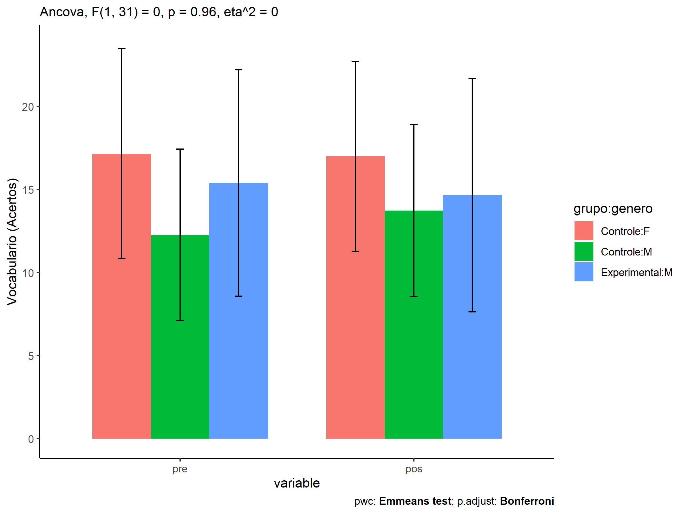<!-- -->

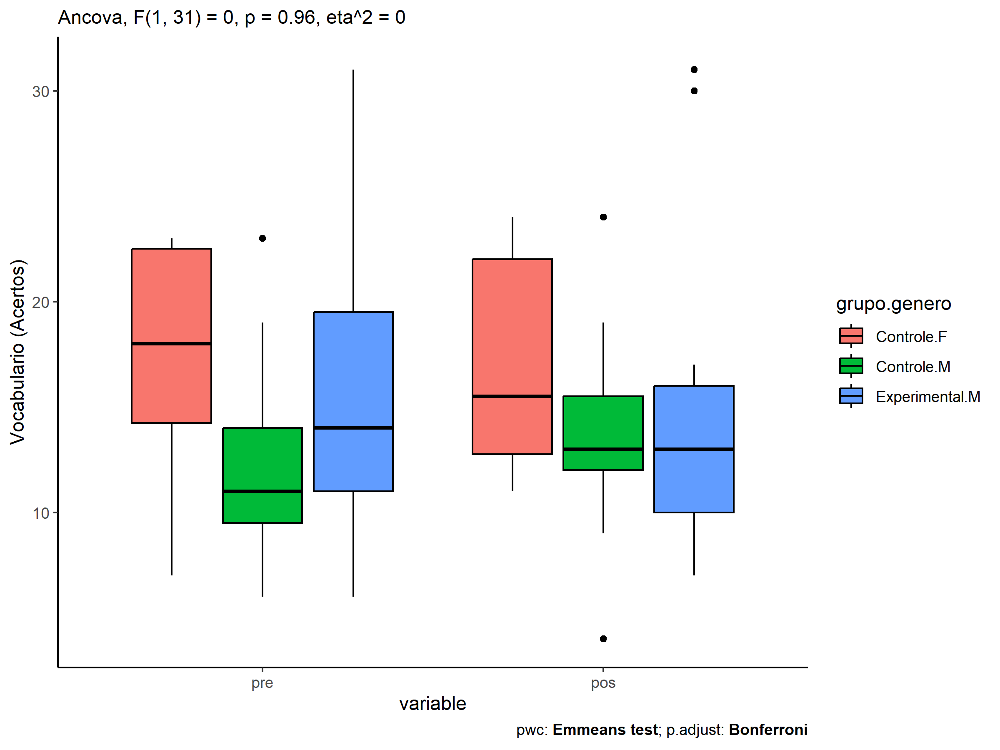<!-- -->

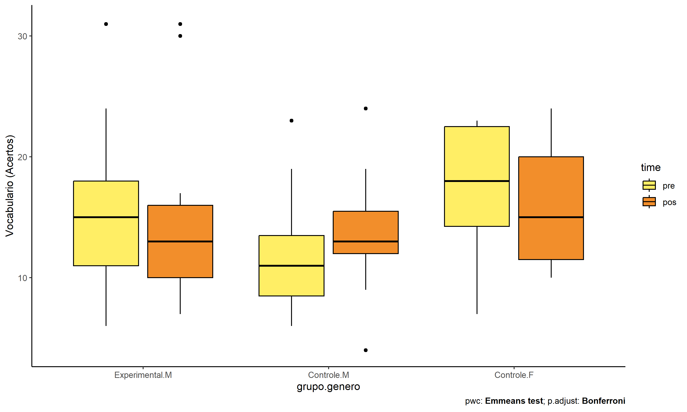<!-- -->

### Vocabulario (TRI)

| var           | genero | grupo        |   n | M (pre) | SE (pre) | M (unadj) | SE (unadj) | M (adj) | SE (adj) |
|:--------------|:-------|:-------------|----:|--------:|---------:|----------:|-----------:|--------:|---------:|
| tri.vocab.pos | F      | Controle     |   6 |  -0.317 |    0.251 |    -0.273 |      0.339 |  -0.423 |    0.270 |
| tri.vocab.pos | M      | Controle     |  11 |  -0.705 |    0.171 |    -0.760 |      0.200 |  -0.665 |    0.199 |
| tri.vocab.pos | M      | Experimental |  15 |  -0.539 |    0.207 |    -0.652 |      0.215 |  -0.662 |    0.169 |

|     | grupo    | genero | group1   | group2       | estimate | conf.low | conf.high |    se | statistic |     p | p.adj | p.adj.signif |
|:----|:---------|:-------|:---------|:-------------|---------:|---------:|----------:|------:|----------:|------:|------:|:-------------|
| 1   | Controle |        | F        | M            |    0.242 |   -0.452 |     0.935 | 0.338 |     0.714 | 0.481 | 0.481 | ns           |
| 3   | Controle |        | F        | M            |    0.388 |   -0.335 |     1.112 | 0.354 |     1.098 | 0.281 | 0.281 | ns           |
| 6   |          | M      | Controle | Experimental |   -0.003 |   -0.538 |     0.531 | 0.261 |    -0.012 | 0.991 | 0.991 | ns           |
| 8   |          | M      | Controle | Experimental |   -0.167 |   -0.733 |     0.400 | 0.277 |    -0.602 | 0.552 | 0.552 | ns           |

| grupo        | genero | group1 | group2 | estimate | conf.low | conf.high |    se | statistic |     p | p.adj | p.adj.signif |
|:-------------|:-------|:-------|:-------|---------:|---------:|----------:|------:|----------:|------:|------:|:-------------|
| Controle     | F      | pre    | pos    |    0.072 |   -0.754 |     0.897 | 0.413 |     0.174 | 0.863 | 0.863 | ns           |
| Controle     | M      | pre    | pos    |   -0.046 |   -0.666 |     0.573 | 0.310 |    -0.150 | 0.882 | 0.882 | ns           |
| Experimental | M      | pre    | pos    |    0.088 |   -0.437 |     0.614 | 0.263 |     0.336 | 0.738 | 0.738 | ns           |

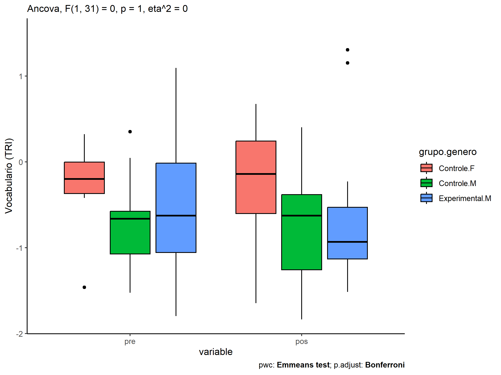<!-- -->

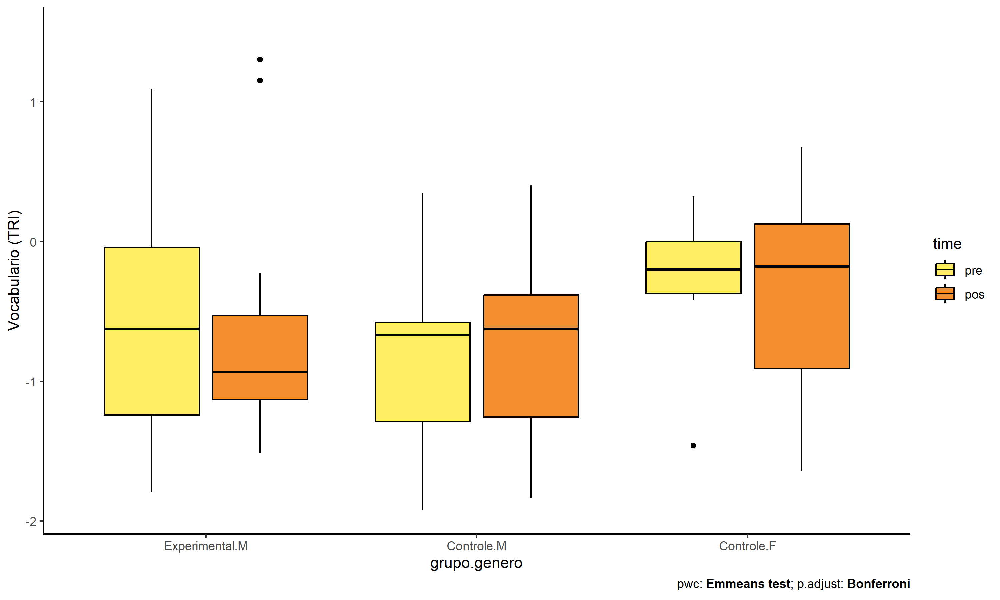<!-- -->

### Vocabulario Ensinado (Acertos)

| var                      | genero | grupo        |   n | M (pre) | SE (pre) | M (unadj) | SE (unadj) | M (adj) | SE (adj) |
|:-------------------------|:-------|:-------------|----:|--------:|---------:|----------:|-----------:|--------:|---------:|
| score.vocab.ensinado.pos | F      | Controle     |   7 |   3.143 |    0.800 |     2.429 |      0.649 |   2.298 |    0.644 |
| score.vocab.ensinado.pos | M      | Controle     |  12 |   1.917 |    0.434 |     2.083 |      0.484 |   2.519 |    0.520 |
| score.vocab.ensinado.pos | M      | Experimental |  17 |   3.412 |    0.354 |     3.000 |      0.477 |   2.746 |    0.424 |

|     | grupo    | genero | group1   | group2       | estimate | conf.low | conf.high |    se | statistic |     p | p.adj | p.adj.signif |
|:----|:---------|:-------|:---------|:-------------|---------:|---------:|----------:|------:|----------:|------:|------:|:-------------|
| 1   | Controle |        | F        | M            |   -0.221 |   -1.929 |     1.487 | 0.839 |    -0.263 | 0.794 | 0.794 | ns           |
| 3   | Controle |        | F        | M            |    1.226 |   -0.335 |     2.787 | 0.767 |     1.598 | 0.120 | 0.120 | ns           |
| 6   |          | M      | Controle | Experimental |   -0.226 |   -1.645 |     1.192 | 0.697 |    -0.325 | 0.747 | 0.747 | ns           |
| 8   |          | M      | Controle | Experimental |   -1.495 |   -2.733 |    -0.258 | 0.608 |    -2.458 | 0.019 | 0.019 | \*           |

| grupo        | genero | group1 | group2 | estimate | conf.low | conf.high |    se | statistic |     p | p.adj | p.adj.signif |
|:-------------|:-------|:-------|:-------|---------:|---------:|----------:|------:|----------:|------:|------:|:-------------|
| Controle     | F      | pre    | pos    |    0.714 |   -1.127 |     2.556 | 0.922 |     0.774 | 0.441 | 0.441 | ns           |
| Controle     | M      | pre    | pos    |   -0.167 |   -1.573 |     1.240 | 0.704 |    -0.237 | 0.814 | 0.814 | ns           |
| Experimental | M      | pre    | pos    |    0.412 |   -0.770 |     1.593 | 0.592 |     0.696 | 0.489 | 0.489 | ns           |

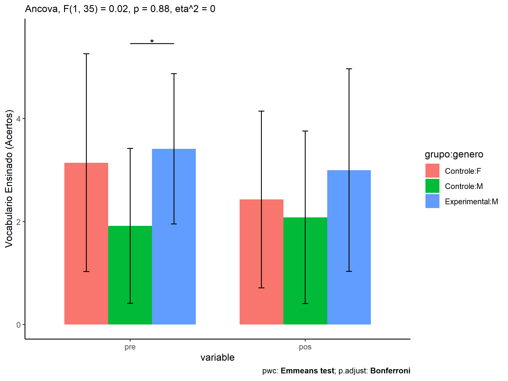<!-- -->

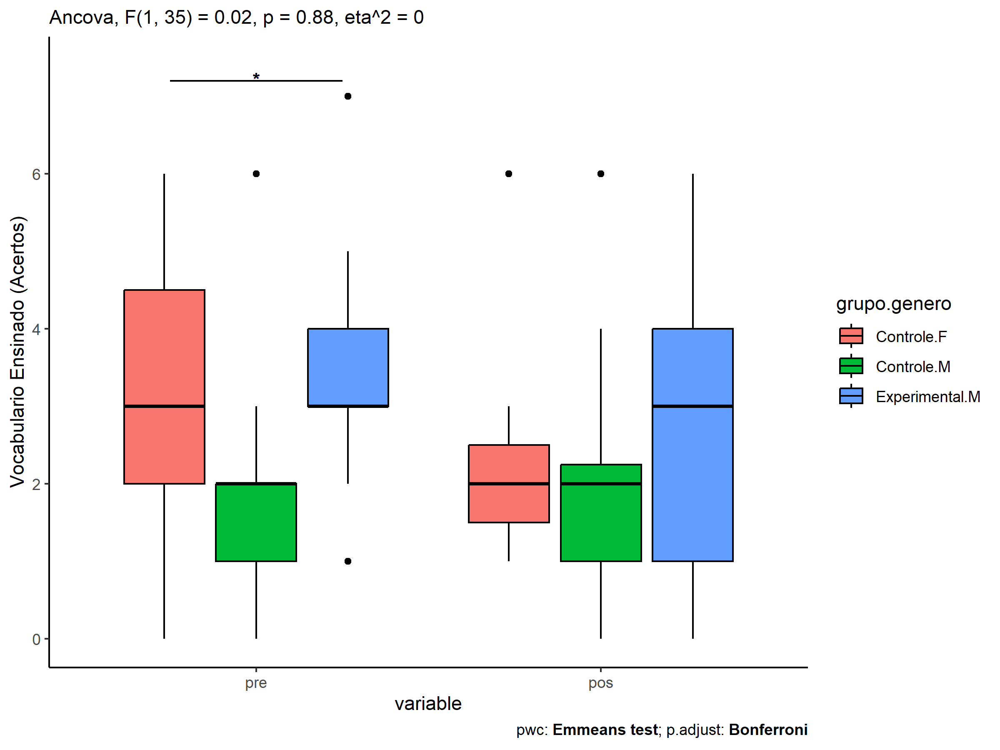<!-- -->

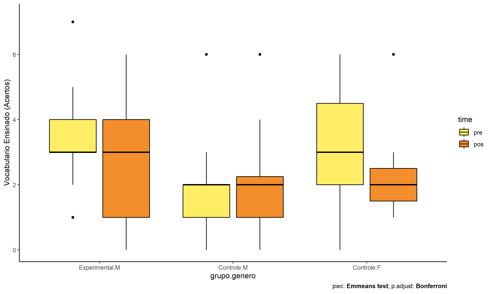<!-- -->

### Vocabulario Ensinado (TRI)

| var                    | genero | grupo        |   n | M (pre) | SE (pre) | M (unadj) | SE (unadj) | M (adj) | SE (adj) |
|:-----------------------|:-------|:-------------|----:|--------:|---------:|----------:|-----------:|--------:|---------:|
| tri.vocab.ensinado.pos | F      | Controle     |   6 |  -0.061 |    0.303 |    -0.583 |      0.370 |  -0.730 |    0.231 |
| tri.vocab.ensinado.pos | M      | Controle     |  11 |  -0.602 |    0.199 |    -0.689 |      0.170 |  -0.555 |    0.172 |
| tri.vocab.ensinado.pos | M      | Experimental |  15 |  -0.269 |    0.154 |    -0.200 |      0.147 |  -0.239 |    0.144 |

|     | grupo    | genero | group1   | group2       | estimate | conf.low | conf.high |    se | statistic |     p | p.adj | p.adj.signif |
|:----|:---------|:-------|:---------|:-------------|---------:|---------:|----------:|------:|----------:|------:|------:|:-------------|
| 1   | Controle |        | F        | M            |   -0.175 |   -0.777 |     0.428 | 0.294 |    -0.595 | 0.557 | 0.557 | ns           |
| 3   | Controle |        | F        | M            |    0.541 |   -0.128 |     1.211 | 0.327 |     1.654 | 0.109 | 0.109 | ns           |
| 6   |          | M      | Controle | Experimental |   -0.316 |   -0.779 |     0.147 | 0.226 |    -1.397 | 0.173 | 0.173 | ns           |
| 8   |          | M      | Controle | Experimental |   -0.334 |   -0.857 |     0.190 | 0.256 |    -1.303 | 0.203 | 0.203 | ns           |

| grupo        | genero | group1 | group2 | estimate | conf.low | conf.high |    se | statistic |     p | p.adj | p.adj.signif |
|:-------------|:-------|:-------|:-------|---------:|---------:|----------:|------:|----------:|------:|------:|:-------------|
| Controle     | F      | pre    | pos    |    0.619 |   -0.087 |     1.326 | 0.353 |     1.754 | 0.084 | 0.084 | ns           |
| Controle     | M      | pre    | pos    |    0.016 |   -0.514 |     0.546 | 0.265 |     0.060 | 0.952 | 0.952 | ns           |
| Experimental | M      | pre    | pos    |   -0.087 |   -0.536 |     0.363 | 0.225 |    -0.386 | 0.701 | 0.701 | ns           |

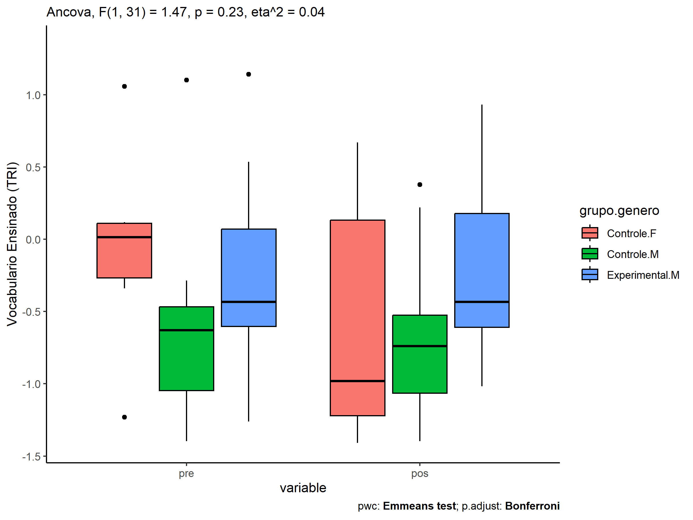<!-- -->

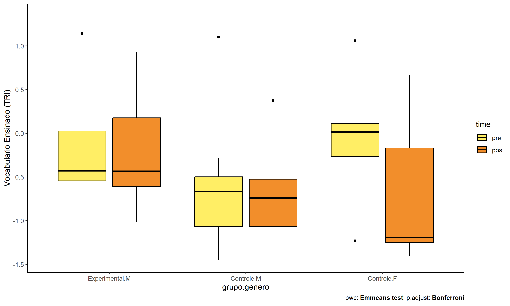<!-- -->

### Vocabulario Nao Ensinado (Acertos)

| var                          | genero | grupo        |   n | M (pre) | SE (pre) | M (unadj) | SE (unadj) | M (adj) | SE (adj) |
|:-----------------------------|:-------|:-------------|----:|--------:|---------:|----------:|-----------:|--------:|---------:|
| score.vocab.nao.ensinado.pos | F      | Controle     |   7 |  11.571 |    2.534 |    13.571 |      1.798 |  13.375 |    2.048 |
| score.vocab.nao.ensinado.pos | M      | Controle     |  12 |   9.917 |    1.131 |    10.500 |      1.485 |  11.167 |    1.580 |
| score.vocab.nao.ensinado.pos | M      | Experimental |  17 |  11.941 |    1.321 |     9.941 |      1.673 |   9.551 |    1.320 |

|     | grupo    | genero | group1   | group2       | estimate | conf.low | conf.high |    se | statistic |     p | p.adj | p.adj.signif |
|:----|:---------|:-------|:---------|:-------------|---------:|---------:|----------:|------:|----------:|------:|------:|:-------------|
| 1   | Controle |        | F        | M            |    2.207 |   -3.074 |     7.488 | 2.593 |     0.851 | 0.401 | 0.401 | ns           |
| 3   | Controle |        | F        | M            |    1.655 |   -3.436 |     6.746 | 2.502 |     0.661 | 0.513 | 0.513 | ns           |
| 6   |          | M      | Controle | Experimental |    1.616 |   -2.608 |     5.840 | 2.074 |     0.779 | 0.441 | 0.441 | ns           |
| 8   |          | M      | Controle | Experimental |   -2.025 |   -6.061 |     2.012 | 1.984 |    -1.021 | 0.315 | 0.315 | ns           |

| grupo        | genero | group1 | group2 | estimate | conf.low | conf.high |    se | statistic |     p | p.adj | p.adj.signif |
|:-------------|:-------|:-------|:-------|---------:|---------:|----------:|------:|----------:|------:|------:|:-------------|
| Controle     | F      | pre    | pos    |   -2.000 |   -8.022 |     4.022 | 3.016 |    -0.663 | 0.510 | 0.510 | ns           |
| Controle     | M      | pre    | pos    |   -0.583 |   -5.182 |     4.016 | 2.304 |    -0.253 | 0.801 | 0.801 | ns           |
| Experimental | M      | pre    | pos    |    2.000 |   -1.864 |     5.864 | 1.935 |     1.033 | 0.305 | 0.305 | ns           |

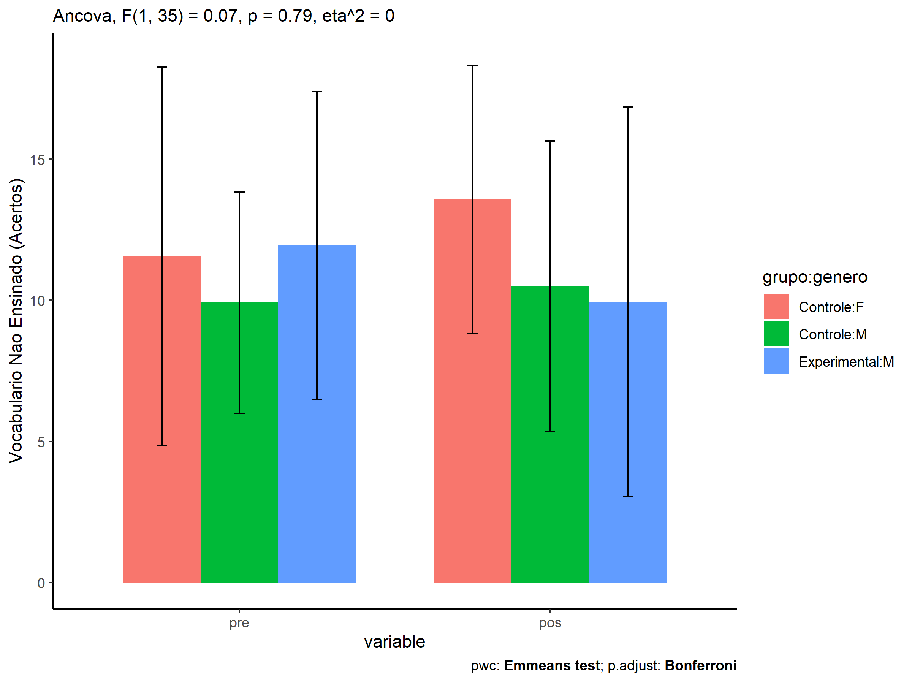<!-- -->

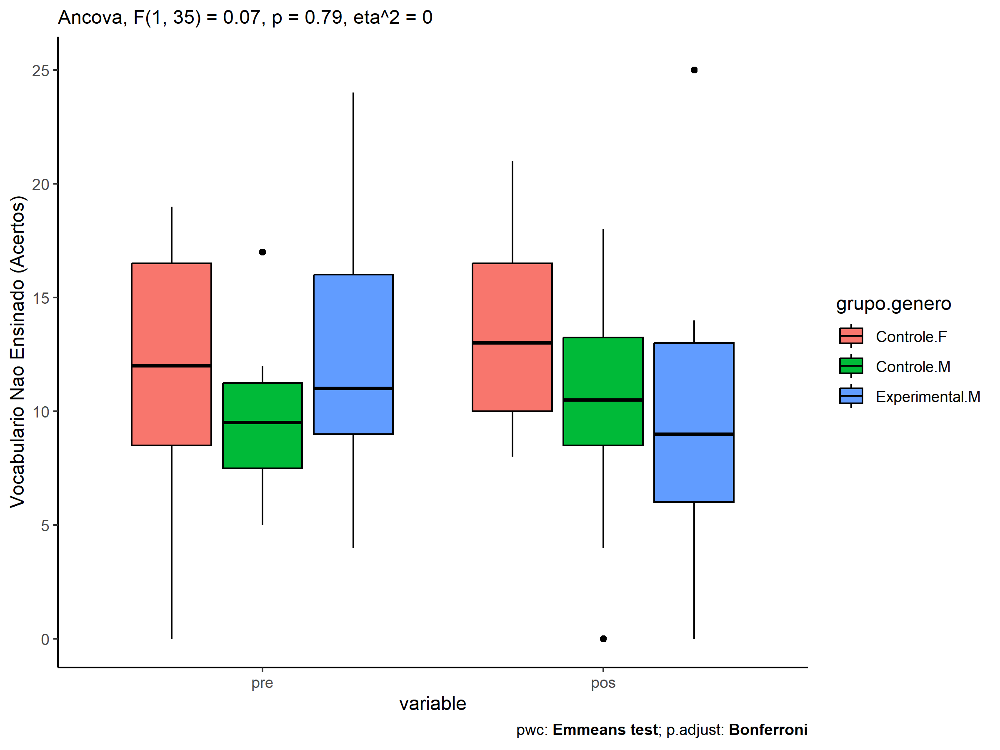<!-- -->

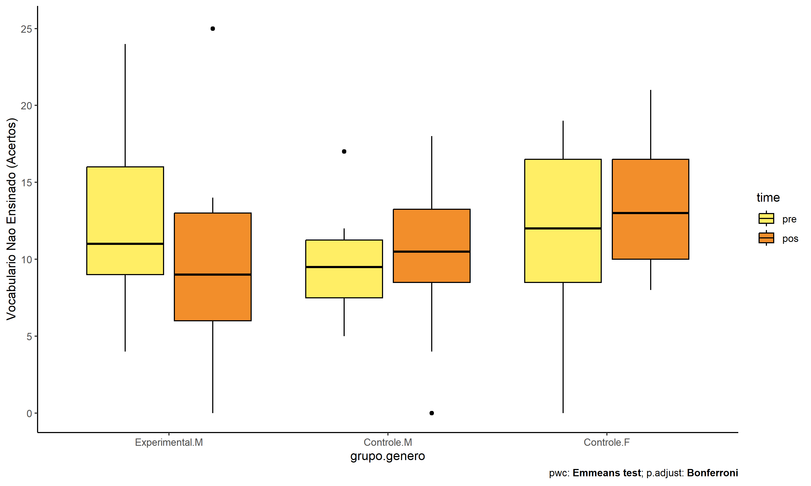<!-- -->

### Vocabulario Nao Ensinado (TRI)

| var                        | genero | grupo        |   n | M (pre) | SE (pre) | M (unadj) | SE (unadj) | M (adj) | SE (adj) |
|:---------------------------|:-------|:-------------|----:|--------:|---------:|----------:|-----------:|--------:|---------:|
| tri.vocab.nao.ensinado.pos | F      | Controle     |   6 |  -0.500 |    0.194 |    -0.224 |      0.215 |  -0.313 |    0.236 |
| tri.vocab.nao.ensinado.pos | M      | Controle     |  11 |  -0.747 |    0.128 |    -0.675 |      0.157 |  -0.611 |    0.174 |
| tri.vocab.nao.ensinado.pos | M      | Experimental |  15 |  -0.626 |    0.211 |    -0.668 |      0.216 |  -0.679 |    0.148 |

|     | grupo    | genero | group1   | group2       | estimate | conf.low | conf.high |    se | statistic |     p | p.adj | p.adj.signif |
|:----|:---------|:-------|:---------|:-------------|---------:|---------:|----------:|------:|----------:|------:|------:|:-------------|
| 1   | Controle |        | F        | M            |    0.299 |   -0.304 |     0.901 | 0.294 |     1.015 | 0.319 | 0.319 | ns           |
| 3   | Controle |        | F        | M            |    0.246 |   -0.428 |     0.921 | 0.330 |     0.748 | 0.461 | 0.461 | ns           |
| 6   |          | M      | Controle | Experimental |    0.067 |   -0.401 |     0.536 | 0.229 |     0.295 | 0.771 | 0.771 | ns           |
| 8   |          | M      | Controle | Experimental |   -0.121 |   -0.648 |     0.406 | 0.258 |    -0.469 | 0.643 | 0.643 | ns           |

| grupo        | genero | group1 | group2 | estimate | conf.low | conf.high |    se | statistic |     p | p.adj | p.adj.signif |
|:-------------|:-------|:-------|:-------|---------:|---------:|----------:|------:|----------:|------:|------:|:-------------|
| Controle     | F      | pre    | pos    |   -0.154 |   -0.893 |     0.585 | 0.370 |    -0.417 | 0.678 | 0.678 | ns           |
| Controle     | M      | pre    | pos    |   -0.131 |   -0.686 |     0.423 | 0.277 |    -0.474 | 0.637 | 0.637 | ns           |
| Experimental | M      | pre    | pos    |    0.039 |   -0.431 |     0.510 | 0.235 |     0.167 | 0.868 | 0.868 | ns           |

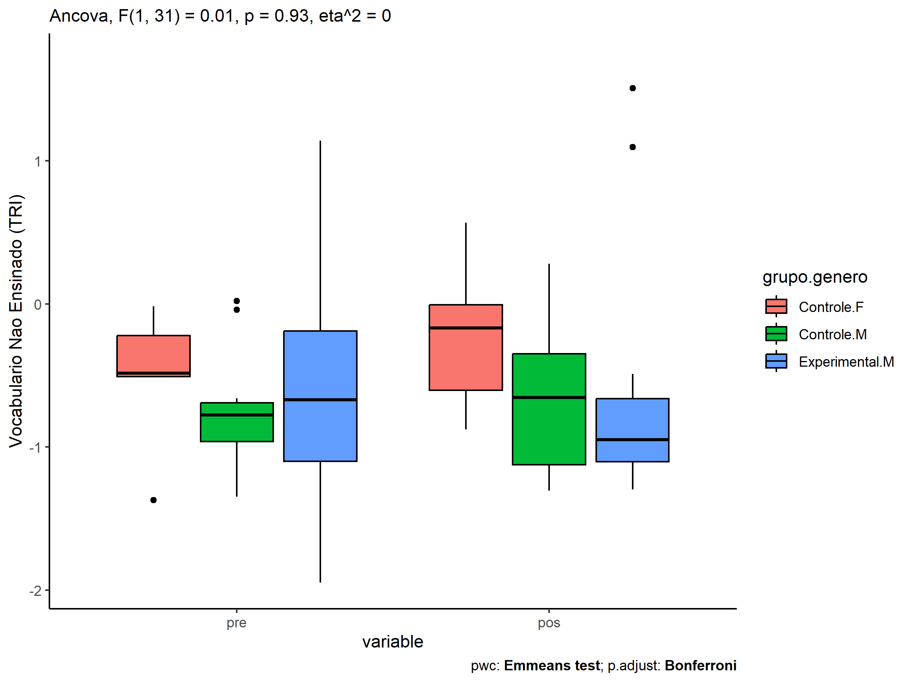<!-- -->

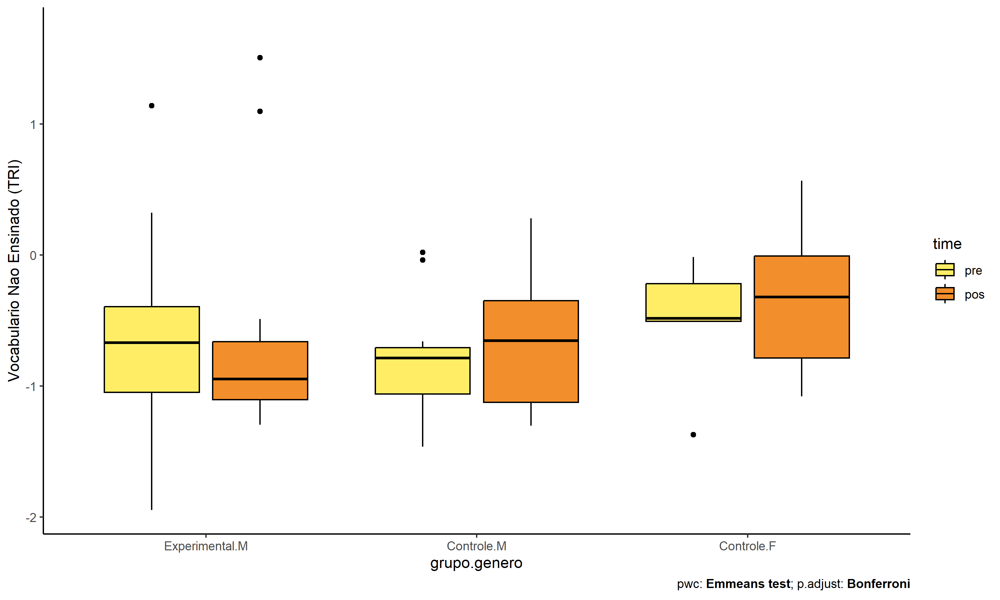<!-- -->

## factores: **idade:grupo**

### Vocabulario (Acertos)

### Vocabulario (TRI)

### Vocabulario Ensinado (Acertos)

### Vocabulario Ensinado (TRI)

### Vocabulario Nao Ensinado (Acertos)

### Vocabulario Nao Ensinado (TRI)

## factores: **zona.participante:grupo**

### Vocabulario (Acertos)

| var             | zona.participante | grupo        |   n | M (pre) | SE (pre) | M (unadj) | SE (unadj) | M (adj) | SE (adj) |
|:----------------|:------------------|:-------------|----:|--------:|---------:|----------:|-----------:|--------:|---------:|
| score.vocab.pos | Rural             | Experimental |   7 |  18.143 |    3.082 |    14.000 |      3.109 |  12.032 |    2.180 |
| score.vocab.pos | Urbana            | Controle     |  10 |  15.600 |    1.928 |    15.800 |      2.154 |  15.605 |    1.770 |
| score.vocab.pos | Urbana            | Experimental |   8 |  12.500 |    1.658 |    16.125 |      2.175 |  18.091 |    2.047 |

|     | grupo        | zona.participante | group1   | group2       | estimate | conf.low | conf.high |    se | statistic |     p | p.adj | p.adj.signif |
|:----|:-------------|:------------------|:---------|:-------------|---------:|---------:|----------:|------:|----------:|------:|------:|:-------------|
| 2   | Experimental |                   | Urbana   | Rural        |    6.060 |   -0.351 |    12.471 | 3.083 |     1.966 | 0.063 | 0.063 | ns           |
| 4   | Experimental |                   | Urbana   | Rural        |   -5.643 |  -12.459 |     1.173 | 3.287 |    -1.717 | 0.100 | 0.100 | ns           |
| 5   |              | Urbana            | Controle | Experimental |   -2.487 |   -8.136 |     3.162 | 2.716 |    -0.915 | 0.370 | 0.370 | ns           |
| 7   |              | Urbana            | Controle | Experimental |    3.100 |   -3.147 |     9.347 | 3.012 |     1.029 | 0.315 | 0.315 | ns           |

| grupo        | zona.participante | group1 | group2 | estimate | conf.low | conf.high |    se | statistic |     p | p.adj | p.adj.signif |
|:-------------|:------------------|:-------|:-------|---------:|---------:|----------:|------:|----------:|------:|------:|:-------------|
| Controle     | Urbana            | pre    | pos    |   -0.982 |   -6.911 |     4.948 | 2.944 |    -0.333 | 0.740 | 0.740 | ns           |
| Experimental | Urbana            | pre    | pos    |   -3.625 |  -10.410 |     3.160 | 3.369 |    -1.076 | 0.288 | 0.288 | ns           |
| Experimental | Rural             | pre    | pos    |    4.143 |   -3.111 |    11.397 | 3.602 |     1.150 | 0.256 | 0.256 | ns           |

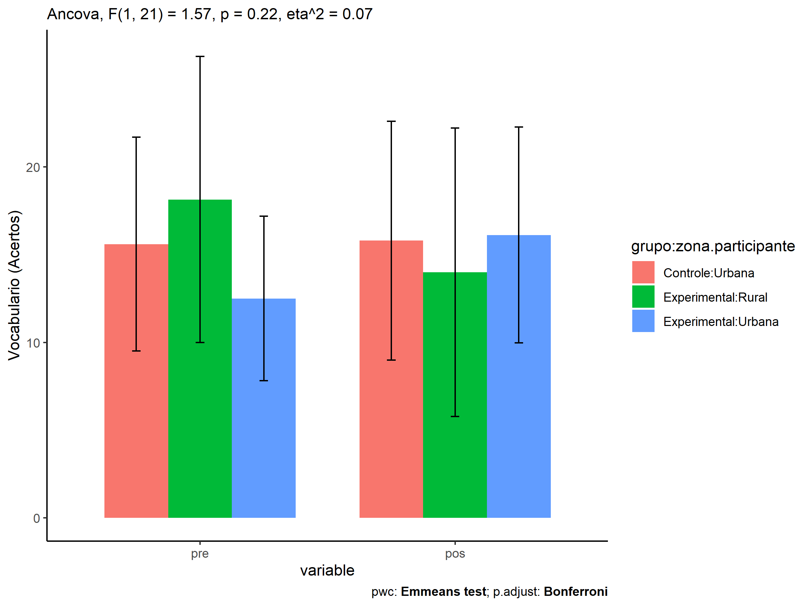<!-- -->

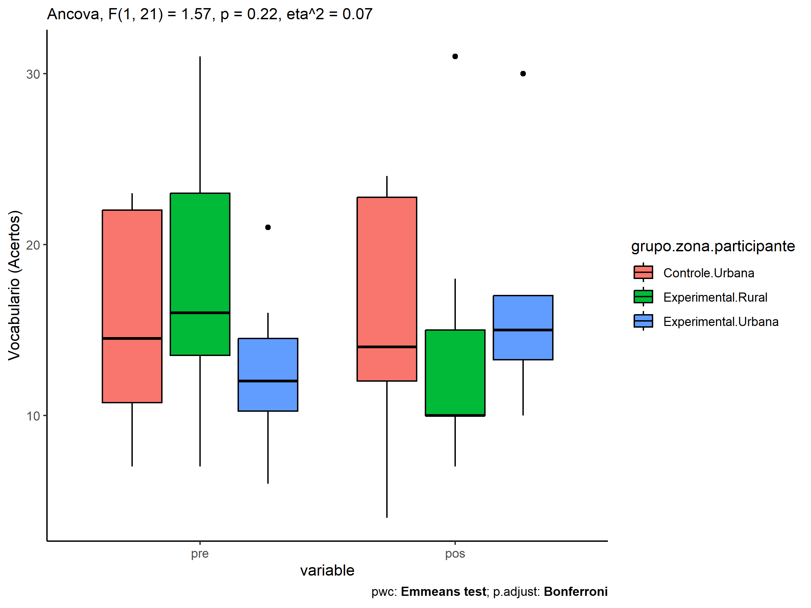<!-- -->

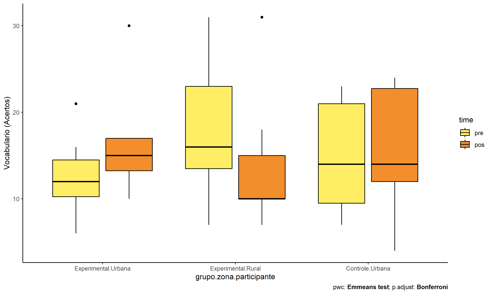<!-- -->

### Vocabulario (TRI)

| var           | zona.participante | grupo        |   n | M (pre) | SE (pre) | M (unadj) | SE (unadj) | M (adj) | SE (adj) |
|:--------------|:------------------|:-------------|----:|--------:|---------:|----------:|-----------:|--------:|---------:|
| tri.vocab.pos | Rural             | Experimental |   7 |  -0.429 |    0.387 |    -0.630 |      0.357 |  -0.684 |    0.243 |
| tri.vocab.pos | Urbana            | Controle     |  10 |  -0.405 |    0.201 |    -0.436 |      0.261 |  -0.508 |    0.204 |
| tri.vocab.pos | Urbana            | Experimental |   8 |  -0.674 |    0.180 |    -0.411 |      0.278 |  -0.274 |    0.230 |

|     | grupo        | zona.participante | group1   | group2       | estimate | conf.low | conf.high |    se | statistic |     p | p.adj | p.adj.signif |
|:----|:-------------|:------------------|:---------|:-------------|---------:|---------:|----------:|------:|----------:|------:|------:|:-------------|
| 2   | Experimental |                   | Urbana   | Rural        |    0.410 |   -0.289 |     1.108 | 0.336 |     1.220 | 0.236 | 0.236 | ns           |
| 4   | Experimental |                   | Urbana   | Rural        |   -0.245 |   -1.030 |     0.540 | 0.379 |    -0.647 | 0.525 | 0.525 | ns           |
| 5   |              | Urbana            | Controle | Experimental |   -0.234 |   -0.877 |     0.408 | 0.309 |    -0.758 | 0.457 | 0.457 | ns           |
| 7   |              | Urbana            | Controle | Experimental |    0.268 |   -0.451 |     0.988 | 0.347 |     0.774 | 0.447 | 0.447 | ns           |

| grupo        | zona.participante | group1 | group2 | estimate | conf.low | conf.high |    se | statistic |     p | p.adj | p.adj.signif |
|:-------------|:------------------|:-------|:-------|---------:|---------:|----------:|------:|----------:|------:|------:|:-------------|
| Controle     | Urbana            | pre    | pos    |   -0.107 |   -0.821 |     0.607 | 0.355 |    -0.301 | 0.765 | 0.765 | ns           |
| Experimental | Urbana            | pre    | pos    |   -0.263 |   -1.080 |     0.555 | 0.406 |    -0.648 | 0.520 | 0.520 | ns           |
| Experimental | Rural             | pre    | pos    |    0.201 |   -0.673 |     1.075 | 0.434 |     0.464 | 0.645 | 0.645 | ns           |

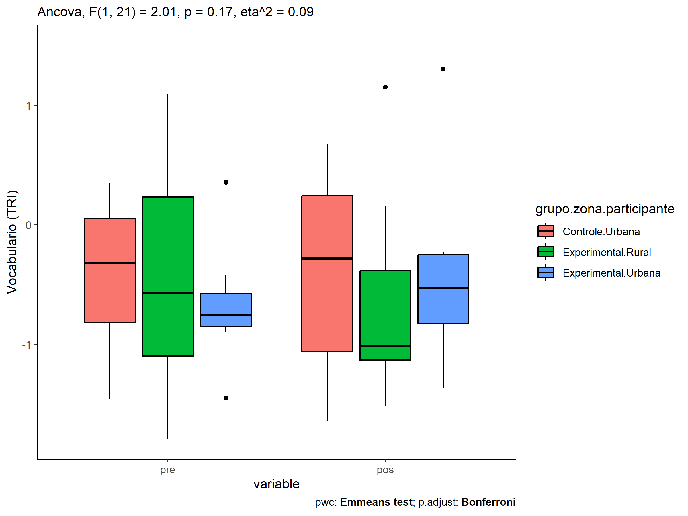<!-- -->

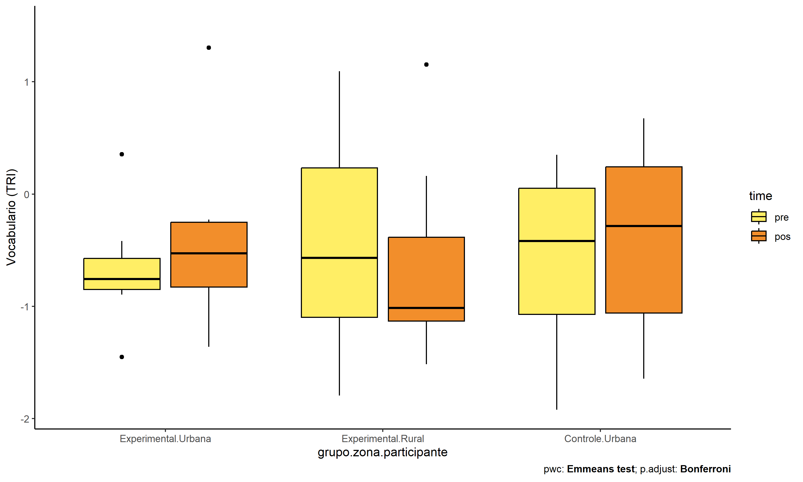<!-- -->

### Vocabulario Ensinado (Acertos)

| var                      | zona.participante | grupo        |   n | M (pre) | SE (pre) | M (unadj) | SE (unadj) | M (adj) | SE (adj) |
|:-------------------------|:------------------|:-------------|----:|--------:|---------:|----------:|-----------:|--------:|---------:|
| score.vocab.ensinado.pos | Rural             | Experimental |   7 |   4.000 |    0.655 |     3.000 |      0.690 |   2.497 |    0.594 |
| score.vocab.ensinado.pos | Urbana            | Controle     |  11 |   2.818 |    0.553 |     2.182 |      0.630 |   2.415 |    0.463 |
| score.vocab.ensinado.pos | Urbana            | Experimental |   8 |   3.000 |    0.423 |     4.125 |      0.441 |   4.245 |    0.538 |

|     | grupo        | zona.participante | group1   | group2       | estimate | conf.low | conf.high |    se | statistic |     p | p.adj | p.adj.signif |
|:----|:-------------|:------------------|:---------|:-------------|---------:|---------:|----------:|------:|----------:|------:|------:|:-------------|
| 2   | Experimental |                   | Urbana   | Rural        |    1.747 |    0.071 |     3.424 | 0.809 |     2.161 | 0.042 | 0.042 | \*           |
| 4   | Experimental |                   | Urbana   | Rural        |   -1.000 |   -2.753 |     0.753 | 0.847 |    -1.180 | 0.250 | 0.250 | ns           |
| 5   |              | Urbana            | Controle | Experimental |   -1.830 |   -3.294 |    -0.366 | 0.706 |    -2.593 | 0.017 | 0.017 | \*           |
| 7   |              | Urbana            | Controle | Experimental |   -0.182 |   -1.755 |     1.392 | 0.761 |    -0.239 | 0.813 | 0.813 | ns           |

| grupo        | zona.participante | group1 | group2 | estimate | conf.low | conf.high |    se | statistic |     p | p.adj | p.adj.signif |
|:-------------|:------------------|:-------|:-------|---------:|---------:|----------:|------:|----------:|------:|------:|:-------------|
| Controle     | Urbana            | pre    | pos    |    0.636 |   -0.840 |     2.113 | 0.734 |     0.867 | 0.390 | 0.390 | ns           |
| Experimental | Urbana            | pre    | pos    |   -1.125 |   -2.856 |     0.606 | 0.860 |    -1.308 | 0.197 | 0.197 | ns           |
| Experimental | Rural             | pre    | pos    |    1.000 |   -0.851 |     2.851 | 0.920 |     1.087 | 0.283 | 0.283 | ns           |

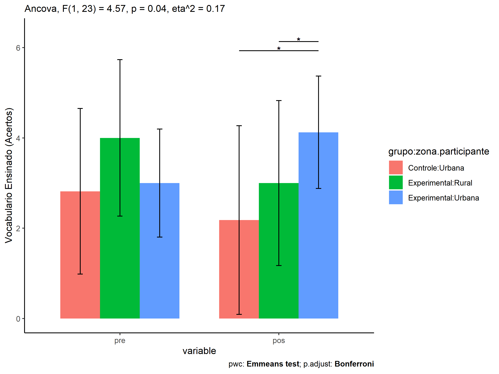<!-- -->

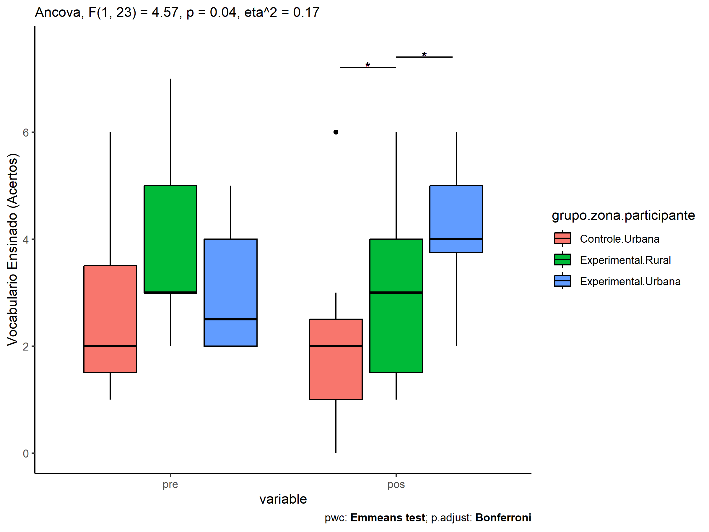<!-- -->

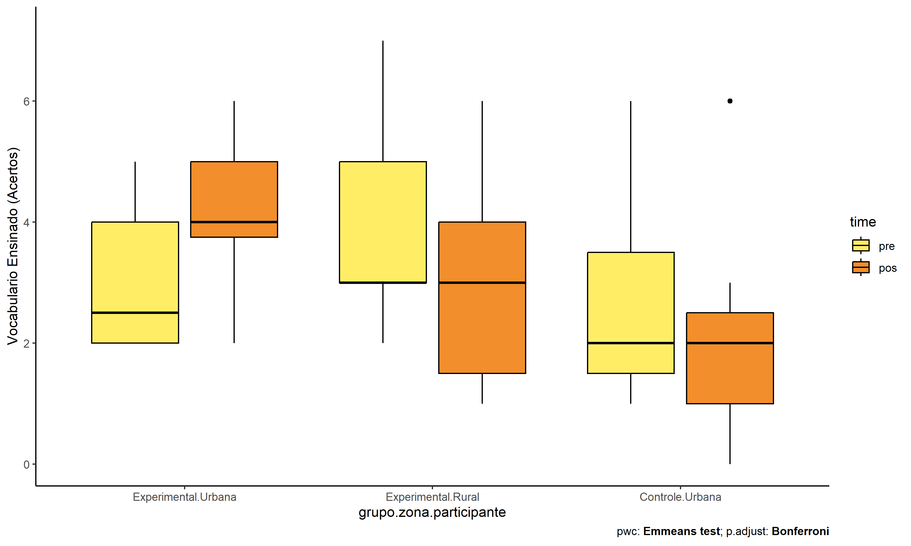<!-- -->

### Vocabulario Ensinado (TRI)

| var                    | zona.participante | grupo        |   n | M (pre) | SE (pre) | M (unadj) | SE (unadj) | M (adj) | SE (adj) |
|:-----------------------|:------------------|:-------------|----:|--------:|---------:|----------:|-----------:|--------:|---------:|
| tri.vocab.ensinado.pos | Rural             | Experimental |   7 |  -0.029 |    0.250 |    -0.165 |      0.241 |  -0.257 |    0.217 |
| tri.vocab.ensinado.pos | Urbana            | Controle     |  10 |  -0.196 |    0.250 |    -0.654 |      0.260 |  -0.658 |    0.180 |
| tri.vocab.ensinado.pos | Urbana            | Experimental |   8 |  -0.363 |    0.203 |    -0.129 |      0.149 |  -0.043 |    0.203 |

|     | grupo        | zona.participante | group1   | group2       | estimate | conf.low | conf.high |    se | statistic |     p | p.adj | p.adj.signif |
|:----|:-------------|:------------------|:---------|:-------------|---------:|---------:|----------:|------:|----------:|------:|------:|:-------------|
| 2   | Experimental |                   | Urbana   | Rural        |    0.214 |   -0.411 |     0.839 | 0.301 |     0.711 | 0.485 | 0.485 | ns           |
| 4   | Experimental |                   | Urbana   | Rural        |   -0.334 |   -1.077 |     0.408 | 0.358 |    -0.934 | 0.360 | 0.360 | ns           |
| 5   |              | Urbana            | Controle | Experimental |   -0.614 |   -1.179 |    -0.049 | 0.272 |    -2.261 | 0.035 | 0.035 | \*           |
| 7   |              | Urbana            | Controle | Experimental |    0.167 |   -0.513 |     0.847 | 0.328 |     0.509 | 0.616 | 0.616 | ns           |

| grupo        | zona.participante | group1 | group2 | estimate | conf.low | conf.high |    se | statistic |     p | p.adj | p.adj.signif |
|:-------------|:------------------|:-------|:-------|---------:|---------:|----------:|------:|----------:|------:|------:|:-------------|
| Controle     | Urbana            | pre    | pos    |    0.344 |   -0.268 |     0.956 | 0.304 |     1.132 | 0.263 | 0.263 | ns           |
| Experimental | Urbana            | pre    | pos    |   -0.235 |   -0.934 |     0.465 | 0.348 |    -0.675 | 0.503 | 0.503 | ns           |
| Experimental | Rural             | pre    | pos    |    0.136 |   -0.612 |     0.884 | 0.372 |     0.366 | 0.716 | 0.716 | ns           |

<!-- -->

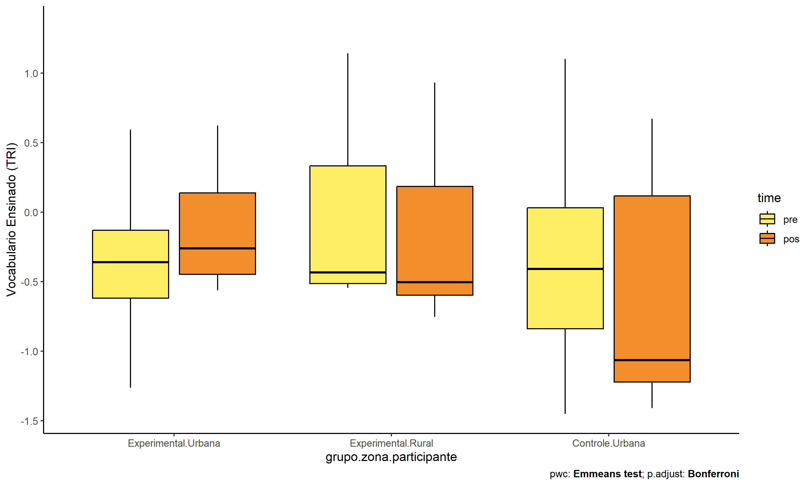<!-- -->

### Vocabulario Nao Ensinado (Acertos)

| var                          | zona.participante | grupo        |   n | M (pre) | SE (pre) | M (unadj) | SE (unadj) | M (adj) | SE (adj) |
|:-----------------------------|:------------------|:-------------|----:|--------:|---------:|----------:|-----------:|--------:|---------:|
| score.vocab.nao.ensinado.pos | Rural             | Experimental |   7 |  14.143 |    2.650 |    11.000 |      2.673 |   9.172 |    1.975 |
| score.vocab.nao.ensinado.pos | Urbana            | Controle     |  11 |  12.000 |    1.446 |    12.182 |      1.930 |  12.031 |    1.531 |
| score.vocab.nao.ensinado.pos | Urbana            | Experimental |   8 |   9.500 |    1.402 |    12.000 |      2.096 |  13.807 |    1.853 |

|     | grupo        | zona.participante | group1   | group2       | estimate | conf.low | conf.high |    se | statistic |     p | p.adj | p.adj.signif |
|:----|:-------------|:------------------|:---------|:-------------|---------:|---------:|----------:|------:|----------:|------:|------:|:-------------|
| 2   | Experimental |                   | Urbana   | Rural        |    4.635 |   -1.147 |    10.416 | 2.788 |     1.662 | 0.111 | 0.111 | ns           |
| 4   | Experimental |                   | Urbana   | Rural        |   -4.643 |  -10.268 |     0.982 | 2.719 |    -1.707 | 0.101 | 0.101 | ns           |
| 5   |              | Urbana            | Controle | Experimental |   -1.775 |   -6.776 |     3.225 | 2.411 |    -0.736 | 0.469 | 0.469 | ns           |
| 7   |              | Urbana            | Controle | Experimental |    2.500 |   -2.550 |     7.550 | 2.441 |     1.024 | 0.316 | 0.316 | ns           |

| grupo        | zona.participante | group1 | group2 | estimate | conf.low | conf.high |    se | statistic |     p | p.adj | p.adj.signif |
|:-------------|:------------------|:-------|:-------|---------:|---------:|----------:|------:|----------:|------:|------:|:-------------|
| Controle     | Urbana            | pre    | pos    |   -0.182 |   -5.229 |     4.865 | 2.507 |    -0.073 | 0.943 | 0.943 | ns           |
| Experimental | Urbana            | pre    | pos    |   -2.500 |   -8.418 |     3.418 | 2.940 |    -0.850 | 0.400 | 0.400 | ns           |
| Experimental | Rural             | pre    | pos    |    3.143 |   -3.184 |     9.470 | 3.143 |     1.000 | 0.323 | 0.323 | ns           |

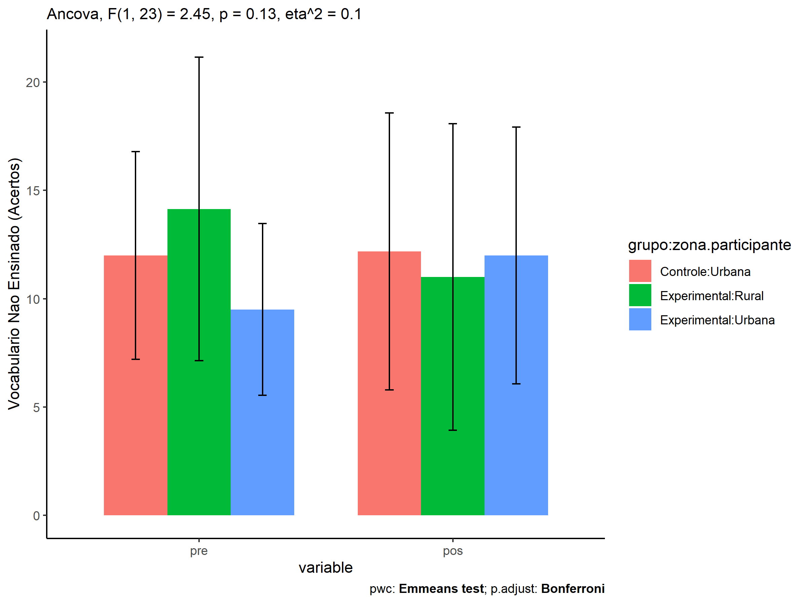<!-- -->

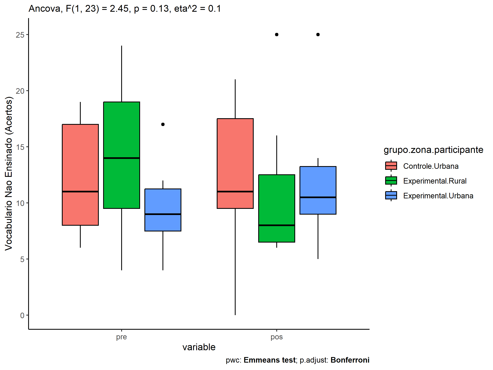<!-- -->

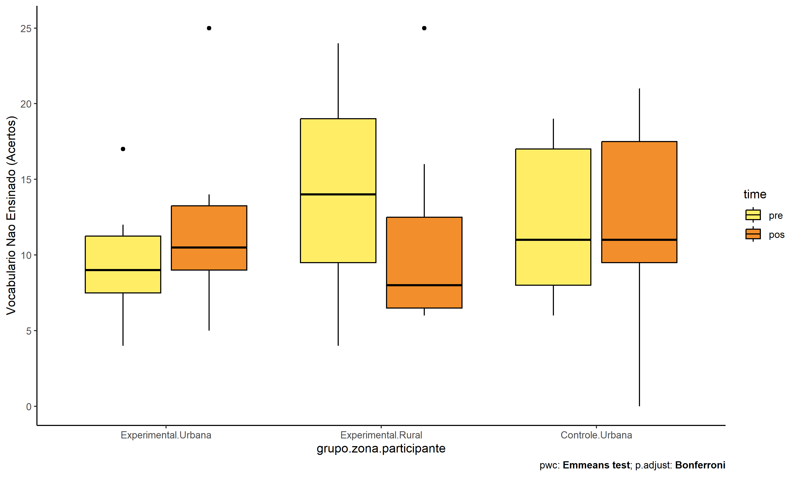<!-- -->

### Vocabulario Nao Ensinado (TRI)

| var                        | zona.participante | grupo        |   n | M (pre) | SE (pre) | M (unadj) | SE (unadj) | M (adj) | SE (adj) |
|:---------------------------|:------------------|:-------------|----:|--------:|---------:|----------:|-----------:|--------:|---------:|
| tri.vocab.nao.ensinado.pos | Rural             | Experimental |   7 |  -0.435 |    0.374 |    -0.643 |      0.347 |  -0.758 |    0.231 |
| tri.vocab.nao.ensinado.pos | Urbana            | Controle     |  10 |  -0.513 |    0.151 |    -0.339 |      0.188 |  -0.395 |    0.192 |
| tri.vocab.nao.ensinado.pos | Urbana            | Experimental |   8 |  -0.817 |    0.194 |    -0.498 |      0.303 |  -0.327 |    0.218 |

|     | grupo        | zona.participante | group1   | group2       | estimate | conf.low | conf.high |    se | statistic |     p | p.adj | p.adj.signif |
|:----|:-------------|:------------------|:---------|:-------------|---------:|---------:|----------:|------:|----------:|------:|------:|:-------------|
| 2   | Experimental |                   | Urbana   | Rural        |    0.432 |   -0.237 |     1.100 | 0.322 |     1.342 | 0.194 | 0.194 | ns           |
| 4   | Experimental |                   | Urbana   | Rural        |   -0.381 |   -1.107 |     0.344 | 0.350 |    -1.091 | 0.287 | 0.287 | ns           |
| 5   |              | Urbana            | Controle | Experimental |   -0.069 |   -0.678 |     0.540 | 0.293 |    -0.235 | 0.817 | 0.817 | ns           |
| 7   |              | Urbana            | Controle | Experimental |    0.304 |   -0.361 |     0.968 | 0.320 |     0.947 | 0.354 | 0.354 | ns           |

| grupo        | zona.participante | group1 | group2 | estimate | conf.low | conf.high |    se | statistic |     p | p.adj | p.adj.signif |
|:-------------|:------------------|:-------|:-------|---------:|---------:|----------:|------:|----------:|------:|------:|:-------------|
| Controle     | Urbana            | pre    | pos    |   -0.261 |   -0.907 |     0.385 | 0.321 |    -0.814 | 0.420 | 0.420 | ns           |
| Experimental | Urbana            | pre    | pos    |   -0.318 |   -1.057 |     0.421 | 0.367 |    -0.867 | 0.390 | 0.390 | ns           |
| Experimental | Rural             | pre    | pos    |    0.208 |   -0.583 |     0.998 | 0.392 |     0.529 | 0.599 | 0.599 | ns           |

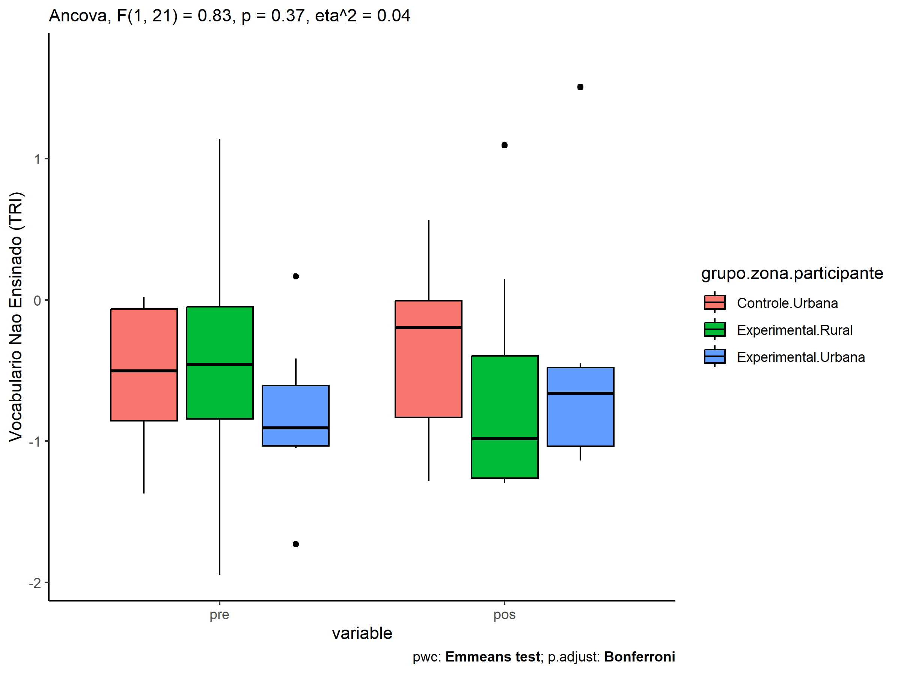<!-- -->

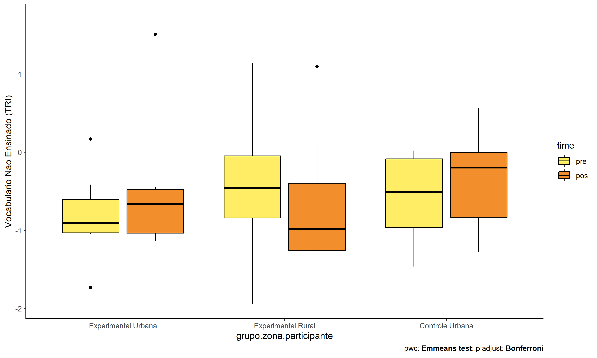<!-- -->

## factores: **escola:grupo**

### Vocabulario (Acertos)

| var             | escola | grupo        |   n | M (pre) | SE (pre) | M (unadj) | SE (unadj) | M (adj) | SE (adj) |
|:----------------|:-------|:-------------|----:|--------:|---------:|----------:|-----------:|--------:|---------:|
| score.vocab.pos | E1     | Controle     |   6 |  18.500 |    2.029 |    18.667 |      2.459 |  16.099 |    2.333 |
| score.vocab.pos | E4     | Experimental |   6 |  17.833 |    3.280 |    15.000 |      3.531 |  12.871 |    2.293 |
| score.vocab.pos | E5     | Controle     |   5 |  11.400 |    2.462 |    11.000 |      2.429 |  13.098 |    2.494 |
| score.vocab.pos | E5     | Experimental |  10 |  11.900 |    1.479 |    15.300 |      1.820 |  17.069 |    1.787 |

|     | grupo        | escola | group1   | group2       | estimate | conf.low | conf.high |    se | statistic |     p | p.adj | p.adj.signif |
|:----|:-------------|:-------|:---------|:-------------|---------:|---------:|----------:|------:|----------:|------:|------:|:-------------|
| 2   | Controle     |        | E1       | E5           |    3.001 |   -4.364 |    10.366 | 3.551 |     0.845 | 0.407 | 0.407 | ns           |
| 6   | Experimental |        | E4       | E5           |   -4.199 |  -10.461 |     2.063 | 3.019 |    -1.391 | 0.178 | 0.178 | ns           |
| 8   | Controle     |        | E1       | E5           |    7.100 |   -0.122 |    14.322 | 3.491 |     2.034 | 0.054 | 0.054 | ns           |
| 12  | Experimental |        | E4       | E5           |    5.933 |   -0.225 |    12.092 | 2.977 |     1.993 | 0.058 | 0.058 | ns           |
| 15  |              | E5     | Controle | Experimental |   -3.971 |  -10.108 |     2.165 | 2.959 |    -1.342 | 0.193 | 0.193 | ns           |
| 18  |              | E5     | Controle | Experimental |   -0.500 |   -7.032 |     6.032 | 3.158 |    -0.158 | 0.876 | 0.876 | ns           |

| grupo        | escola | group1 | group2 | estimate | conf.low | conf.high |    se | statistic |     p | p.adj | p.adj.signif |
|:-------------|:-------|:-------|:-------|---------:|---------:|----------:|------:|----------:|------:|------:|:-------------|
| Controle     | E1     | pre    | pos    |   -1.810 |   -8.754 |     5.135 | 3.454 |    -0.524 | 0.603 | 0.603 | ns           |
| Controle     | E5     | pre    | pos    |    0.567 |   -6.992 |     8.125 | 3.759 |     0.151 | 0.881 | 0.881 | ns           |
| Experimental | E4     | pre    | pos    |    2.833 |   -4.374 |    10.040 | 3.584 |     0.790 | 0.433 | 0.433 | ns           |
| Experimental | E5     | pre    | pos    |   -3.400 |   -8.982 |     2.182 | 2.776 |    -1.225 | 0.227 | 0.227 | ns           |

    ## Scale for colour is already present.
    ## Adding another scale for colour, which will replace the existing scale.

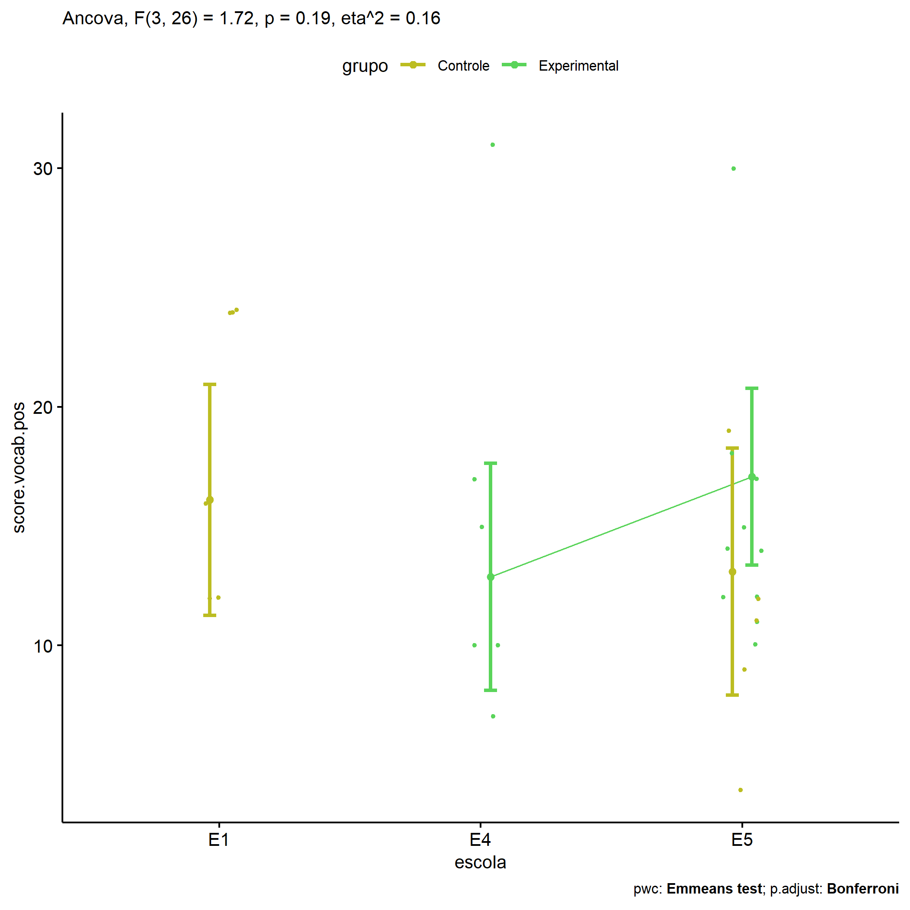<!-- -->

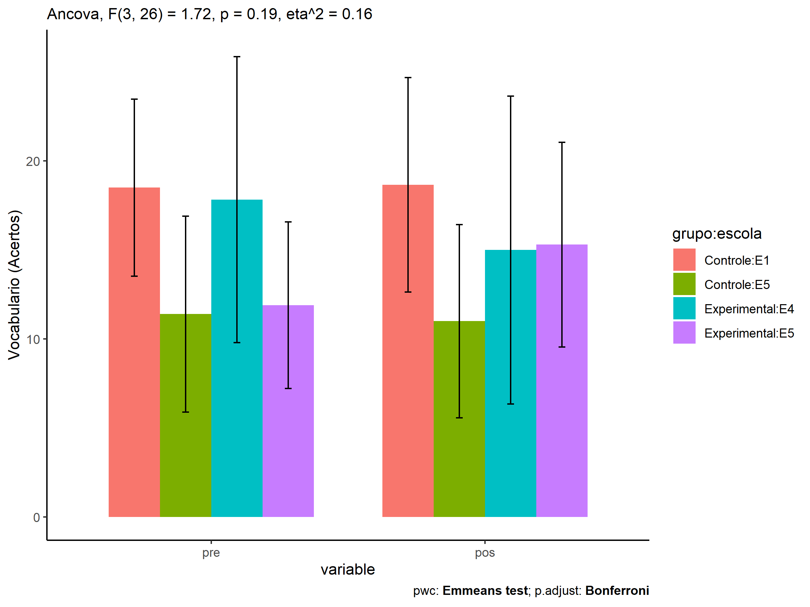<!-- -->

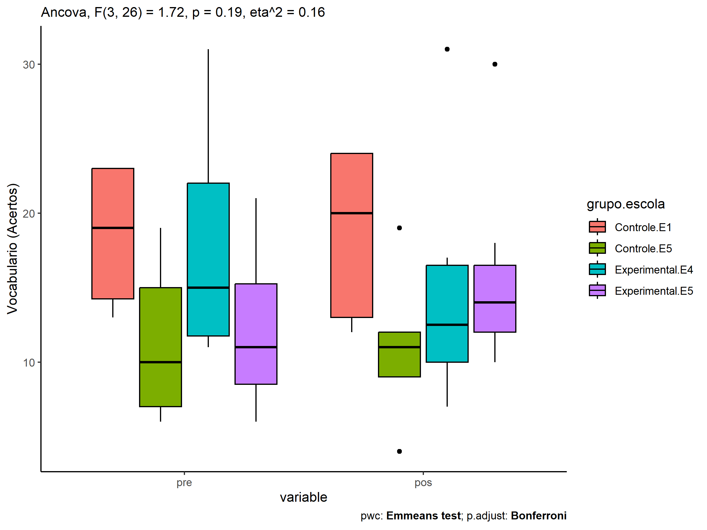<!-- -->

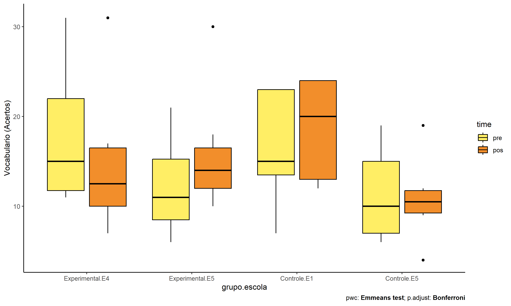<!-- -->

### Vocabulario (TRI)

| var           | escola | grupo        |   n | M (pre) | SE (pre) | M (unadj) | SE (unadj) | M (adj) | SE (adj) |
|:--------------|:-------|:-------------|----:|--------:|---------:|----------:|-----------:|--------:|---------:|
| tri.vocab.pos | E1     | Controle     |   6 |  -0.082 |    0.158 |     0.072 |      0.208 |  -0.303 |    0.270 |
| tri.vocab.pos | E4     | Experimental |   6 |  -0.118 |    0.319 |    -0.550 |      0.372 |  -0.897 |    0.267 |
| tri.vocab.pos | E5     | Controle     |   5 |  -0.858 |    0.280 |    -1.097 |      0.264 |  -0.864 |    0.282 |
| tri.vocab.pos | E5     | Experimental |  10 |  -0.965 |    0.196 |    -0.588 |      0.277 |  -0.272 |    0.212 |

|     | grupo        | escola | group1   | group2       | estimate | conf.low | conf.high |    se | statistic |     p | p.adj | p.adj.signif |
|:----|:-------------|:-------|:---------|:-------------|---------:|---------:|----------:|------:|----------:|------:|------:|:-------------|
| 2   | Controle     |        | E1       | E5           |    0.561 |   -0.280 |     1.402 | 0.406 |     1.383 | 0.181 | 0.181 | ns           |
| 6   | Experimental |        | E4       | E5           |   -0.626 |   -1.378 |     0.127 | 0.363 |    -1.724 | 0.099 | 0.099 | ns           |
| 8   | Controle     |        | E1       | E5           |    0.776 |   -0.001 |     1.553 | 0.376 |     2.065 | 0.050 | 0.050 | ns           |
| 12  | Experimental |        | E4       | E5           |    0.847 |    0.185 |     1.510 | 0.320 |     2.645 | 0.014 | 0.014 | \*           |
| 15  |              | E5     | Controle | Experimental |   -0.592 |   -1.293 |     0.108 | 0.338 |    -1.754 | 0.093 | 0.093 | ns           |
| 18  |              | E5     | Controle | Experimental |    0.107 |   -0.596 |     0.810 | 0.340 |     0.315 | 0.755 | 0.755 | ns           |

| grupo        | escola | group1 | group2 | estimate | conf.low | conf.high |    se | statistic |     p | p.adj | p.adj.signif |
|:-------------|:-------|:-------|:-------|---------:|---------:|----------:|------:|----------:|------:|------:|:-------------|
| Controle     | E1     | pre    | pos    |   -0.417 |   -1.232 |     0.399 | 0.406 |    -1.028 | 0.309 | 0.309 | ns           |
| Controle     | E5     | pre    | pos    |    0.236 |   -0.652 |     1.123 | 0.441 |     0.534 | 0.596 | 0.596 | ns           |
| Experimental | E4     | pre    | pos    |    0.433 |   -0.414 |     1.279 | 0.421 |     1.028 | 0.309 | 0.309 | ns           |
| Experimental | E5     | pre    | pos    |   -0.377 |   -1.032 |     0.279 | 0.326 |    -1.156 | 0.253 | 0.253 | ns           |

    ## Scale for colour is already present.
    ## Adding another scale for colour, which will replace the existing scale.

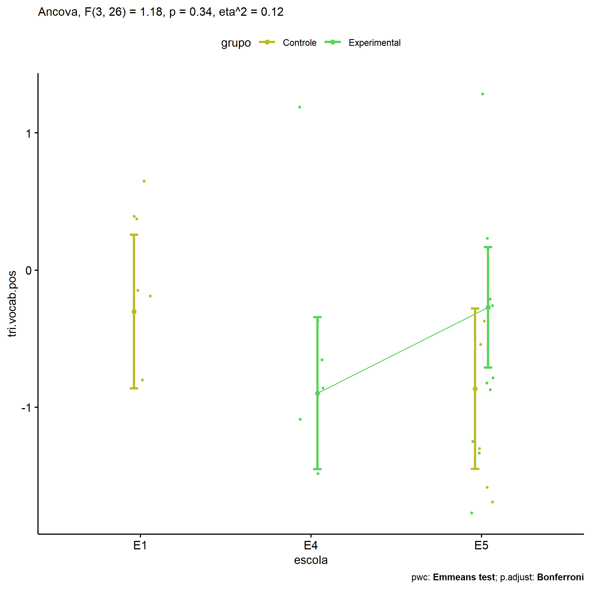<!-- -->

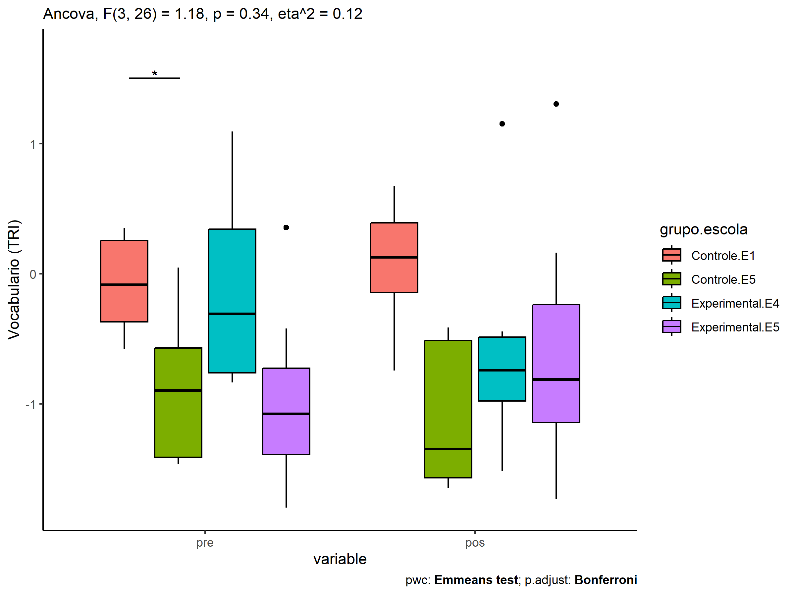<!-- -->

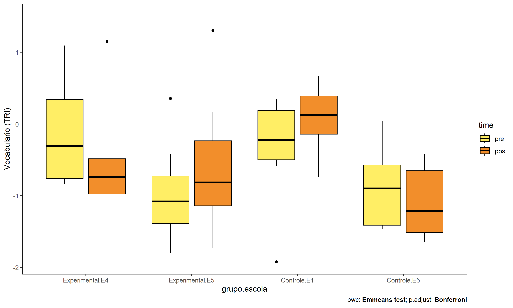<!-- -->

### Vocabulario Ensinado (Acertos)

| var                      | escola | grupo        |   n | M (pre) | SE (pre) | M (unadj) | SE (unadj) | M (adj) | SE (adj) |
|:-------------------------|:-------|:-------------|----:|--------:|---------:|----------:|-----------:|--------:|---------:|
| score.vocab.ensinado.pos | E1     | Controle     |   7 |   3.571 |    0.719 |     2.571 |      0.948 |   2.328 |    0.666 |
| score.vocab.ensinado.pos | E4     | Experimental |   6 |   4.500 |    0.719 |     4.167 |      0.792 |   3.528 |    0.787 |
| score.vocab.ensinado.pos | E5     | Controle     |   6 |   1.333 |    0.494 |     1.667 |      0.333 |   2.377 |    0.805 |
| score.vocab.ensinado.pos | E5     | Experimental |  10 |   2.700 |    0.335 |     2.800 |      0.490 |   2.928 |    0.551 |

|     | grupo        | escola | group1   | group2       | estimate | conf.low | conf.high |    se | statistic |     p | p.adj | p.adj.signif |
|:----|:-------------|:-------|:---------|:-------------|---------:|---------:|----------:|------:|----------:|------:|------:|:-------------|
| 2   | Controle     |        | E1       | E5           |   -0.049 |   -2.306 |     2.209 | 1.094 |    -0.045 | 0.965 | 0.965 | ns           |
| 6   | Experimental |        | E4       | E5           |    0.600 |   -1.435 |     2.635 | 0.986 |     0.608 | 0.549 | 0.549 | ns           |
| 8   | Controle     |        | E1       | E5           |    2.238 |    0.544 |     3.932 | 0.823 |     2.721 | 0.012 | 0.012 | \*           |
| 12  | Experimental |        | E4       | E5           |    1.800 |    0.228 |     3.372 | 0.763 |     2.358 | 0.027 | 0.027 | \*           |
| 15  |              | E5     | Controle | Experimental |   -0.551 |   -2.506 |     1.404 | 0.947 |    -0.582 | 0.566 | 0.566 | ns           |
| 18  |              | E5     | Controle | Experimental |   -1.367 |   -2.939 |     0.206 | 0.763 |    -1.790 | 0.086 | 0.086 | ns           |

| grupo        | escola | group1 | group2 | estimate | conf.low | conf.high |    se | statistic |     p | p.adj | p.adj.signif |
|:-------------|:-------|:-------|:-------|---------:|---------:|----------:|------:|----------:|------:|------:|:-------------|
| Controle     | E1     | pre    | pos    |    1.000 |   -0.771 |     2.771 | 0.882 |     1.134 | 0.262 | 0.262 | ns           |
| Controle     | E5     | pre    | pos    |   -0.333 |   -2.247 |     1.580 | 0.953 |    -0.350 | 0.728 | 0.728 | ns           |
| Experimental | E4     | pre    | pos    |    0.333 |   -1.580 |     2.247 | 0.953 |     0.350 | 0.728 | 0.728 | ns           |
| Experimental | E5     | pre    | pos    |   -0.100 |   -1.582 |     1.382 | 0.738 |    -0.136 | 0.893 | 0.893 | ns           |

    ## Scale for colour is already present.
    ## Adding another scale for colour, which will replace the existing scale.

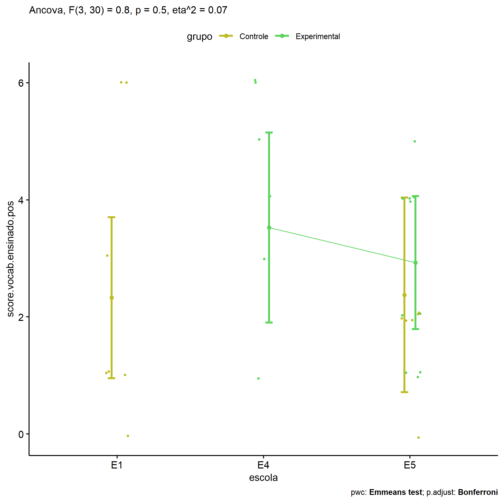<!-- -->

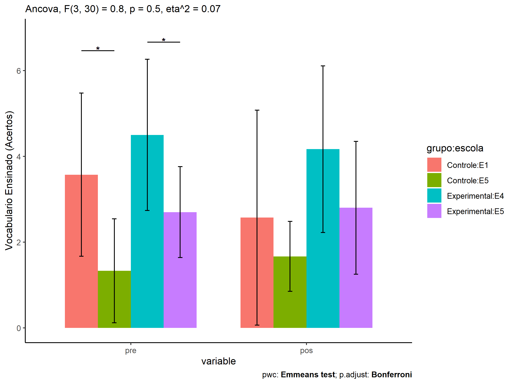<!-- -->

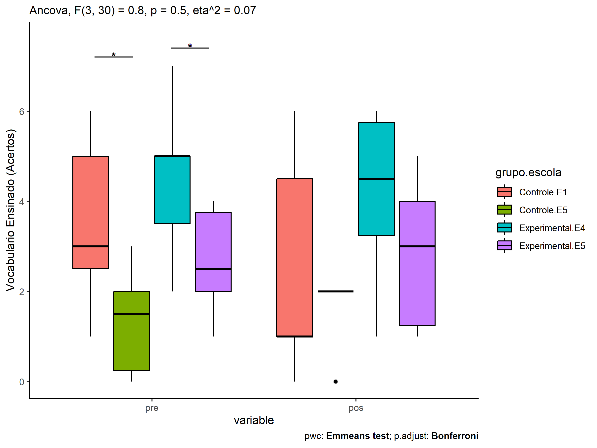<!-- -->

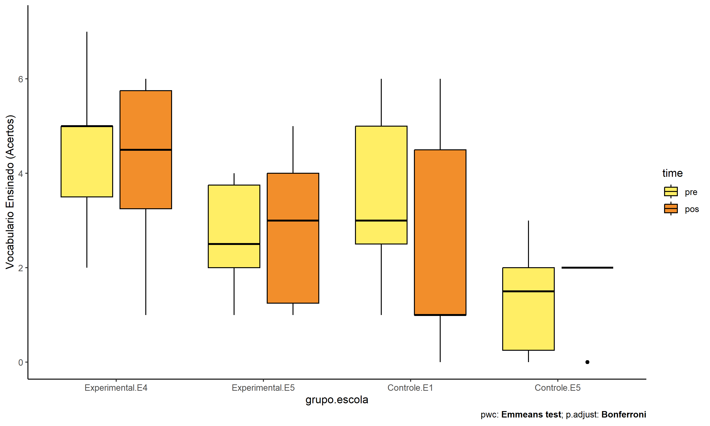<!-- -->

### Vocabulario Ensinado (TRI)

| var                    | escola | grupo        |   n | M (pre) | SE (pre) | M (unadj) | SE (unadj) | M (adj) | SE (adj) |
|:-----------------------|:-------|:-------------|----:|--------:|---------:|----------:|-----------:|--------:|---------:|
| tri.vocab.ensinado.pos | E1     | Controle     |   6 |   0.246 |    0.275 |    -0.341 |      0.376 |  -0.478 |    0.294 |
| tri.vocab.ensinado.pos | E4     | Experimental |   6 |   0.013 |    0.332 |    -0.004 |      0.221 |  -0.069 |    0.280 |
| tri.vocab.ensinado.pos | E5     | Controle     |   5 |  -0.799 |    0.217 |    -0.757 |      0.304 |  -0.572 |    0.332 |
| tri.vocab.ensinado.pos | E5     | Experimental |  10 |  -0.291 |    0.159 |    -0.359 |      0.193 |  -0.330 |    0.215 |

|     | grupo        | escola | group1   | group2       | estimate | conf.low | conf.high |    se | statistic |     p | p.adj | p.adj.signif |
|:----|:-------------|:-------|:---------|:-------------|---------:|---------:|----------:|------:|----------:|------:|------:|:-------------|
| 2   | Controle     |        | E1       | E5           |    0.094 |   -0.889 |     1.076 | 0.474 |     0.197 | 0.845 | 0.845 | ns           |
| 6   | Experimental |        | E4       | E5           |    0.261 |   -0.477 |     0.999 | 0.356 |     0.733 | 0.471 | 0.471 | ns           |
| 8   | Controle     |        | E1       | E5           |    1.045 |    0.272 |     1.819 | 0.374 |     2.795 | 0.010 | 0.010 | \*           |
| 12  | Experimental |        | E4       | E5           |    0.305 |   -0.355 |     0.964 | 0.319 |     0.955 | 0.350 | 0.350 | ns           |
| 15  |              | E5     | Controle | Experimental |   -0.242 |   -1.046 |     0.563 | 0.388 |    -0.623 | 0.540 | 0.540 | ns           |
| 18  |              | E5     | Controle | Experimental |   -0.508 |   -1.208 |     0.192 | 0.338 |    -1.501 | 0.147 | 0.147 | ns           |

| grupo        | escola | group1 | group2 | estimate | conf.low | conf.high |    se | statistic |     p | p.adj | p.adj.signif |
|:-------------|:-------|:-------|:-------|---------:|---------:|----------:|------:|----------:|------:|------:|:-------------|
| Controle     | E1     | pre    | pos    |    0.345 |   -0.419 |     1.108 | 0.380 |     0.908 | 0.368 | 0.368 | ns           |
| Controle     | E5     | pre    | pos    |    0.042 |   -0.789 |     0.872 | 0.413 |     0.101 | 0.920 | 0.920 | ns           |
| Experimental | E4     | pre    | pos    |    0.017 |   -0.775 |     0.809 | 0.394 |     0.043 | 0.966 | 0.966 | ns           |
| Experimental | E5     | pre    | pos    |    0.067 |   -0.546 |     0.681 | 0.305 |     0.220 | 0.827 | 0.827 | ns           |

    ## Scale for colour is already present.
    ## Adding another scale for colour, which will replace the existing scale.

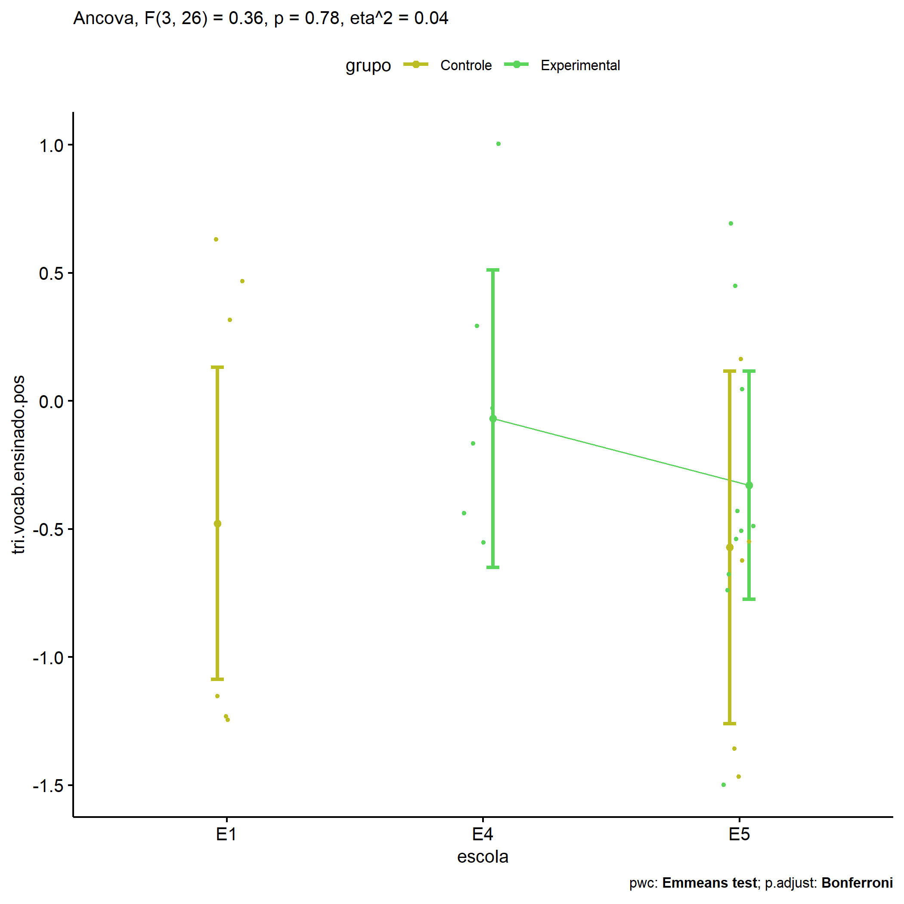<!-- -->

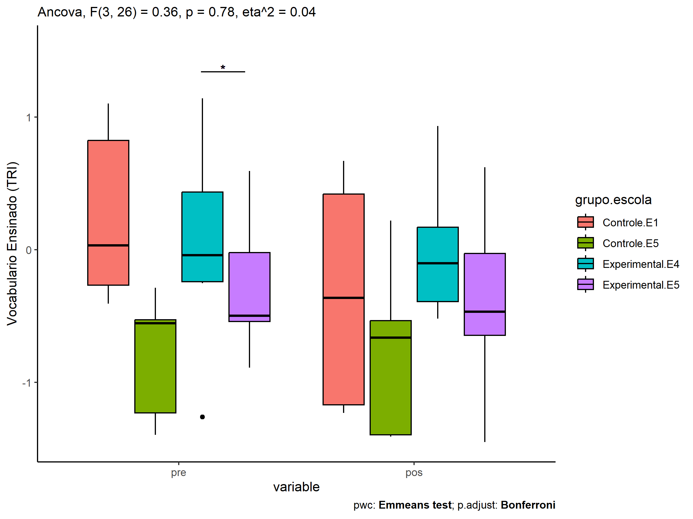<!-- -->

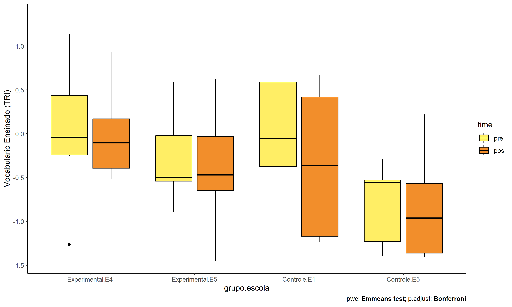<!-- -->

### Vocabulario Nao Ensinado (Acertos)

| var                          | escola | grupo        |   n | M (pre) | SE (pre) | M (unadj) | SE (unadj) | M (adj) | SE (adj) |
|:-----------------------------|:-------|:-------------|----:|--------:|---------:|----------:|-----------:|--------:|---------:|
| score.vocab.nao.ensinado.pos | E1     | Controle     |   7 |  13.286 |    1.728 |    13.429 |      2.644 |  11.564 |    1.804 |
| score.vocab.nao.ensinado.pos | E4     | Experimental |   6 |  13.333 |    2.692 |    10.833 |      3.135 |   8.932 |    1.942 |
| score.vocab.nao.ensinado.pos | E5     | Controle     |   6 |   8.167 |    2.372 |     9.167 |      1.778 |  11.185 |    1.948 |
| score.vocab.nao.ensinado.pos | E5     | Experimental |  10 |   9.200 |    1.381 |    12.500 |      1.579 |  13.735 |    1.493 |

|     | grupo        | escola | group1   | group2       | estimate | conf.low | conf.high |    se | statistic |     p | p.adj | p.adj.signif |
|:----|:-------------|:-------|:---------|:-------------|---------:|---------:|----------:|------:|----------:|------:|------:|:-------------|
| 2   | Controle     |        | E1       | E5           |    0.378 |   -5.259 |     6.015 | 2.731 |     0.139 | 0.891 | 0.891 | ns           |
| 6   | Experimental |        | E4       | E5           |   -4.802 |   -9.964 |     0.359 | 2.501 |    -1.920 | 0.067 | 0.067 | ns           |
| 8   | Controle     |        | E1       | E5           |    5.119 |   -0.871 |    11.109 | 2.908 |     1.760 | 0.091 | 0.091 | ns           |
| 12  | Experimental |        | E4       | E5           |    4.133 |   -1.426 |     9.693 | 2.700 |     1.531 | 0.138 | 0.138 | ns           |
| 15  |              | E5     | Controle | Experimental |   -2.549 |   -7.499 |     2.401 | 2.398 |    -1.063 | 0.298 | 0.298 | ns           |
| 18  |              | E5     | Controle | Experimental |   -1.033 |   -6.593 |     4.526 | 2.700 |    -0.383 | 0.705 | 0.705 | ns           |

| grupo        | escola | group1 | group2 | estimate | conf.low | conf.high |    se | statistic |     p | p.adj | p.adj.signif |
|:-------------|:-------|:-------|:-------|---------:|---------:|----------:|------:|----------:|------:|------:|:-------------|
| Controle     | E1     | pre    | pos    |   -0.143 |   -6.199 |     5.913 | 3.015 |    -0.047 | 0.962 | 0.962 | ns           |
| Controle     | E5     | pre    | pos    |   -1.000 |   -7.542 |     5.542 | 3.257 |    -0.307 | 0.760 | 0.760 | ns           |
| Experimental | E4     | pre    | pos    |    2.500 |   -4.042 |     9.042 | 3.257 |     0.768 | 0.446 | 0.446 | ns           |
| Experimental | E5     | pre    | pos    |   -3.300 |   -8.367 |     1.767 | 2.523 |    -1.308 | 0.197 | 0.197 | ns           |

    ## Scale for colour is already present.
    ## Adding another scale for colour, which will replace the existing scale.

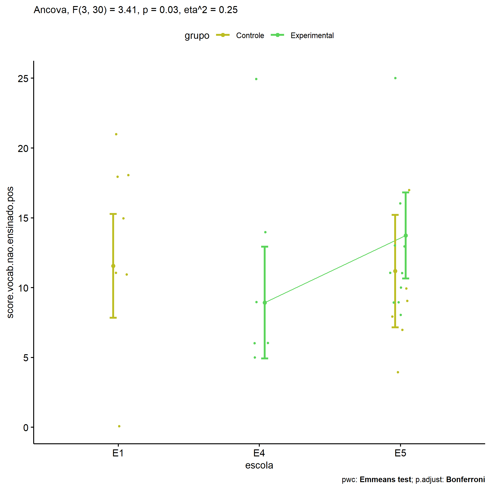<!-- -->

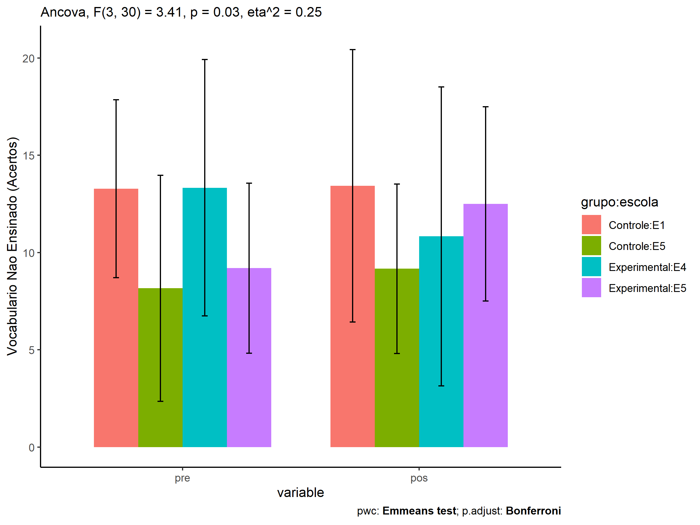<!-- -->

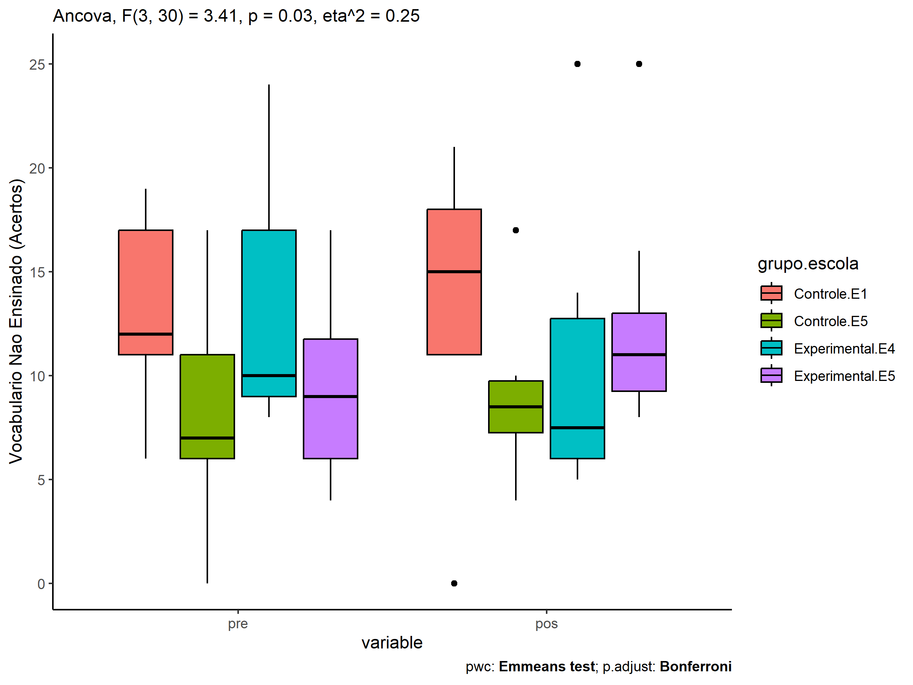<!-- -->

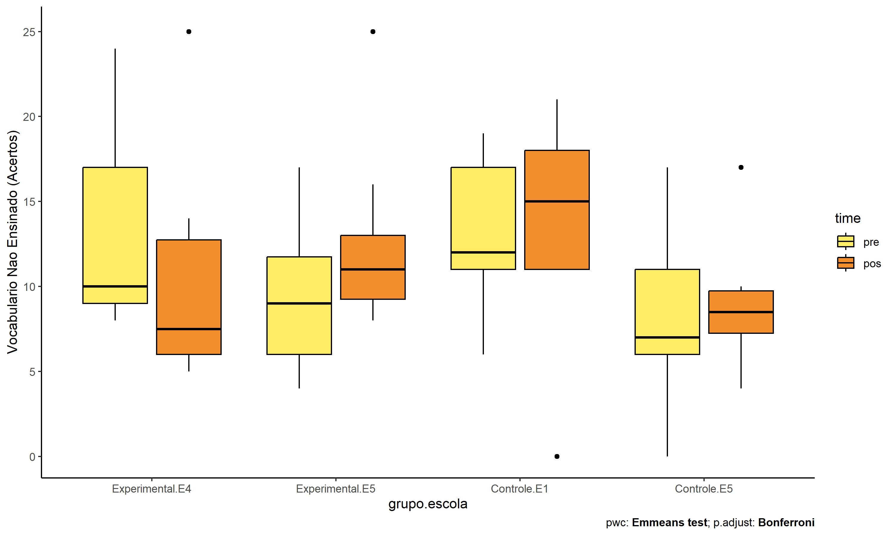<!-- -->

### Vocabulario Nao Ensinado (TRI)

| var                        | escola | grupo        |   n | M (pre) | SE (pre) | M (unadj) | SE (unadj) | M (adj) | SE (adj) |
|:---------------------------|:-------|:-------------|----:|--------:|---------:|----------:|-----------:|--------:|---------:|
| tri.vocab.nao.ensinado.pos | E1     | Controle     |   6 |  -0.309 |    0.113 |     0.008 |      0.173 |  -0.271 |    0.230 |
| tri.vocab.nao.ensinado.pos | E4     | Experimental |   6 |  -0.274 |    0.347 |    -0.658 |      0.372 |  -0.965 |    0.232 |
| tri.vocab.nao.ensinado.pos | E5     | Controle     |   5 |  -0.847 |    0.244 |    -0.882 |      0.190 |  -0.732 |    0.244 |
| tri.vocab.nao.ensinado.pos | E5     | Experimental |  10 |  -1.006 |    0.199 |    -0.554 |      0.264 |  -0.277 |    0.182 |

|     | grupo        | escola | group1   | group2       | estimate | conf.low | conf.high |    se | statistic |     p | p.adj | p.adj.signif |
|:----|:-------------|:-------|:---------|:-------------|---------:|---------:|----------:|------:|----------:|------:|------:|:-------------|
| 2   | Controle     |        | E1       | E5           |    0.460 |   -0.249 |     1.170 | 0.342 |     1.347 | 0.192 | 0.192 | ns           |
| 6   | Experimental |        | E4       | E5           |   -0.688 |   -1.330 |    -0.046 | 0.310 |    -2.222 | 0.037 | 0.037 | \*           |
| 8   | Controle     |        | E1       | E5           |    0.538 |   -0.235 |     1.312 | 0.374 |     1.439 | 0.164 | 0.164 | ns           |
| 12  | Experimental |        | E4       | E5           |    0.732 |    0.072 |     1.391 | 0.319 |     2.294 | 0.031 | 0.031 | \*           |
| 15  |              | E5     | Controle | Experimental |   -0.454 |   -1.072 |     0.163 | 0.298 |    -1.526 | 0.141 | 0.141 | ns           |
| 18  |              | E5     | Controle | Experimental |    0.158 |   -0.541 |     0.858 | 0.338 |     0.469 | 0.644 | 0.644 | ns           |

| grupo        | escola | group1 | group2 | estimate | conf.low | conf.high |    se | statistic |     p | p.adj | p.adj.signif |
|:-------------|:-------|:-------|:-------|---------:|---------:|----------:|------:|----------:|------:|------:|:-------------|
| Controle     | E1     | pre    | pos    |   -0.483 |   -1.240 |     0.274 | 0.377 |    -1.282 | 0.206 | 0.206 | ns           |
| Controle     | E5     | pre    | pos    |    0.068 |   -0.756 |     0.892 | 0.410 |     0.165 | 0.869 | 0.869 | ns           |
| Experimental | E4     | pre    | pos    |    0.384 |   -0.402 |     1.169 | 0.391 |     0.982 | 0.331 | 0.331 | ns           |
| Experimental | E5     | pre    | pos    |   -0.451 |   -1.060 |     0.157 | 0.303 |    -1.492 | 0.142 | 0.142 | ns           |

    ## Scale for colour is already present.
    ## Adding another scale for colour, which will replace the existing scale.

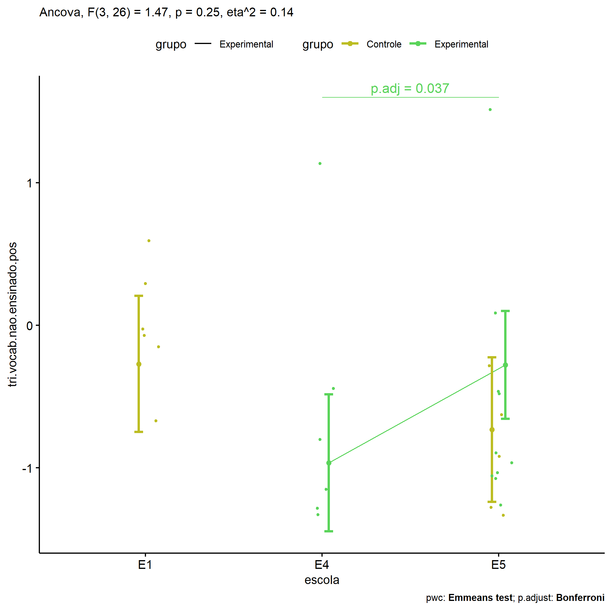<!-- -->

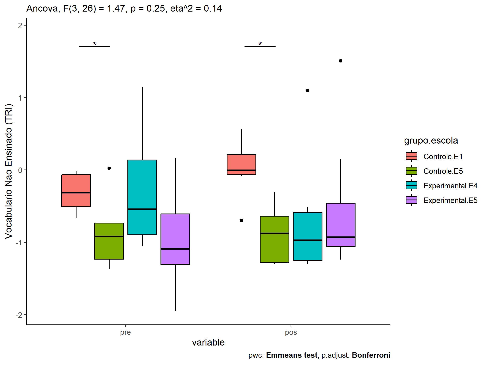<!-- -->

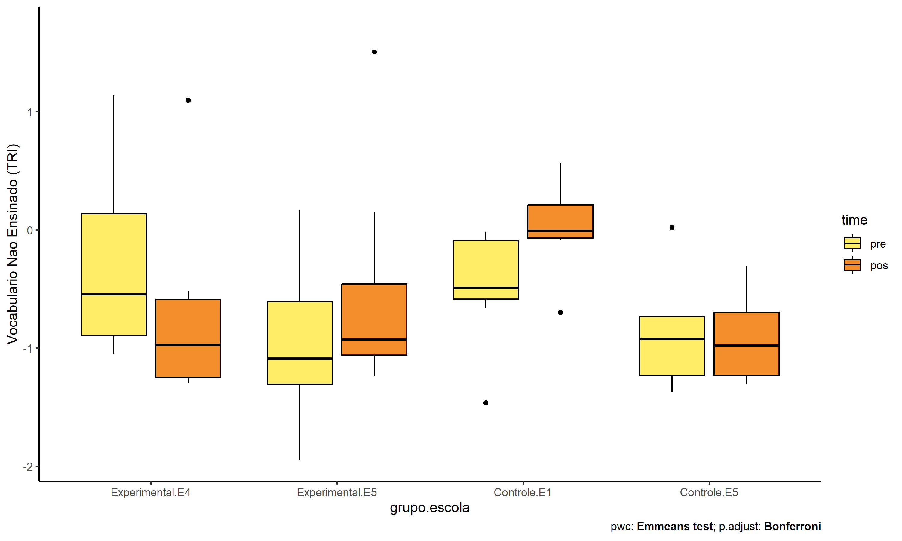<!-- -->

## factores: **zona.escola:grupo**

### Vocabulario (Acertos)

| var             | zona.escola | grupo        |   n | M (pre) | SE (pre) | M (unadj) | SE (unadj) | M (adj) | SE (adj) |
|:----------------|:------------|:-------------|----:|--------:|---------:|----------:|-----------:|--------:|---------:|
| score.vocab.pos | Rural       | Experimental |   7 |  17.000 |    2.895 |    14.286 |      3.068 |  12.874 |    2.058 |
| score.vocab.pos | Urbana      | Controle     |  14 |  14.429 |    1.518 |    15.071 |      1.598 |  15.139 |    1.428 |
| score.vocab.pos | Urbana      | Experimental |  12 |  13.250 |    1.543 |    14.667 |      1.573 |  15.412 |    1.556 |

|     | grupo        | zona.escola | group1   | group2       | estimate | conf.low | conf.high |    se | statistic |     p | p.adj | p.adj.signif |
|:----|:-------------|:------------|:---------|:-------------|---------:|---------:|----------:|------:|----------:|------:|------:|:-------------|
| 2   | Experimental |             | Urbana   | Rural        |    2.538 |   -2.805 |     7.882 | 2.613 |     0.972 | 0.339 | 0.339 | ns           |
| 4   | Experimental |             | Urbana   | Rural        |   -3.750 |   -9.593 |     2.093 | 2.861 |    -1.311 | 0.200 | 0.200 | ns           |
| 5   |              | Urbana      | Controle | Experimental |   -0.273 |   -4.589 |     4.043 | 2.110 |    -0.129 | 0.898 | 0.898 | ns           |
| 7   |              | Urbana      | Controle | Experimental |    1.179 |   -3.655 |     6.012 | 2.367 |     0.498 | 0.622 | 0.622 | ns           |

| grupo        | zona.escola | group1 | group2 | estimate | conf.low | conf.high |    se | statistic |     p | p.adj | p.adj.signif |
|:-------------|:------------|:-------|:-------|---------:|---------:|----------:|------:|----------:|------:|------:|:-------------|
| Controle     | Urbana      | pre    | pos    |   -0.800 |   -5.225 |     3.625 | 2.215 |    -0.361 | 0.719 | 0.719 | ns           |
| Experimental | Urbana      | pre    | pos    |   -1.282 |   -6.133 |     3.569 | 2.428 |    -0.528 | 0.599 | 0.599 | ns           |
| Experimental | Rural       | pre    | pos    |    2.464 |   -3.807 |     8.735 | 3.139 |     0.785 | 0.435 | 0.435 | ns           |

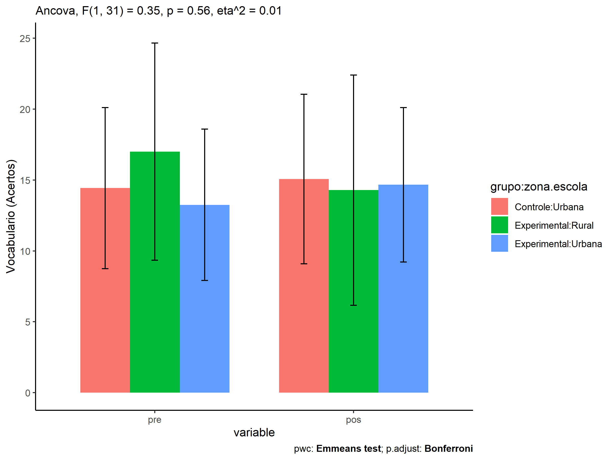<!-- -->

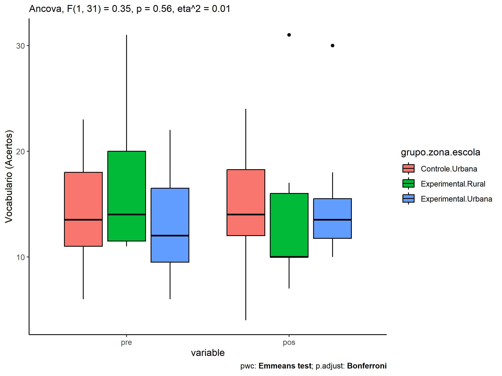<!-- -->

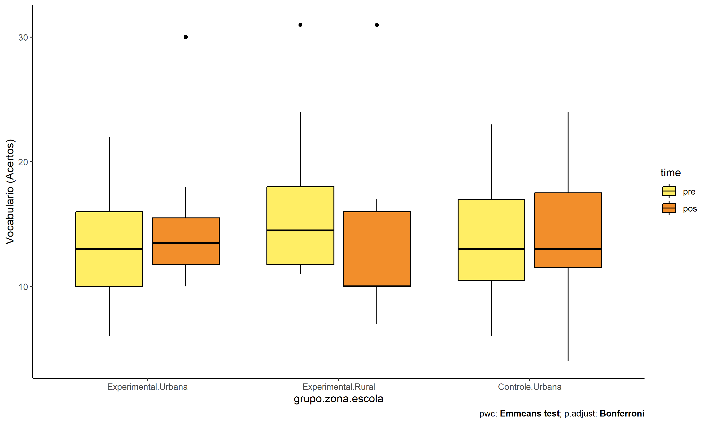<!-- -->

### Vocabulario (TRI)

| var           | zona.escola | grupo        |   n | M (pre) | SE (pre) | M (unadj) | SE (unadj) | M (adj) | SE (adj) |
|:--------------|:------------|:-------------|----:|--------:|---------:|----------:|-----------:|--------:|---------:|
| tri.vocab.pos | Rural       | Experimental |   7 |  -0.207 |    0.284 |    -0.608 |      0.320 |  -0.884 |    0.263 |
| tri.vocab.pos | Urbana      | Controle     |  14 |  -0.540 |    0.167 |    -0.593 |      0.212 |  -0.625 |    0.180 |
| tri.vocab.pos | Urbana      | Experimental |  12 |  -0.855 |    0.181 |    -0.680 |      0.237 |  -0.482 |    0.200 |

|     | grupo        | zona.escola | group1   | group2       | estimate | conf.low | conf.high |    se | statistic |     p | p.adj | p.adj.signif |
|:----|:-------------|:------------|:---------|:-------------|---------:|---------:|----------:|------:|----------:|------:|------:|:-------------|
| 2   | Experimental |             | Urbana   | Rural        |    0.403 |   -0.296 |     1.101 | 0.341 |     1.179 | 0.248 | 0.248 | ns           |
| 4   | Experimental |             | Urbana   | Rural        |   -0.648 |   -1.282 |    -0.013 | 0.311 |    -2.085 | 0.046 | 0.046 | \*           |
| 5   |              | Urbana      | Controle | Experimental |   -0.144 |   -0.697 |     0.410 | 0.270 |    -0.531 | 0.599 | 0.599 | ns           |
| 7   |              | Urbana      | Controle | Experimental |    0.315 |   -0.210 |     0.840 | 0.257 |     1.224 | 0.230 | 0.230 | ns           |

| grupo        | zona.escola | group1 | group2 | estimate | conf.low | conf.high |    se | statistic |     p | p.adj | p.adj.signif |
|:-------------|:------------|:-------|:-------|---------:|---------:|----------:|------:|----------:|------:|------:|:-------------|
| Controle     | Urbana      | pre    | pos    |   -0.007 |   -0.545 |     0.532 | 0.270 |    -0.025 | 0.980 | 0.980 | ns           |
| Experimental | Urbana      | pre    | pos    |   -0.205 |   -0.795 |     0.386 | 0.295 |    -0.693 | 0.491 | 0.491 | ns           |
| Experimental | Rural       | pre    | pos    |    0.394 |   -0.369 |     1.157 | 0.382 |     1.032 | 0.306 | 0.306 | ns           |

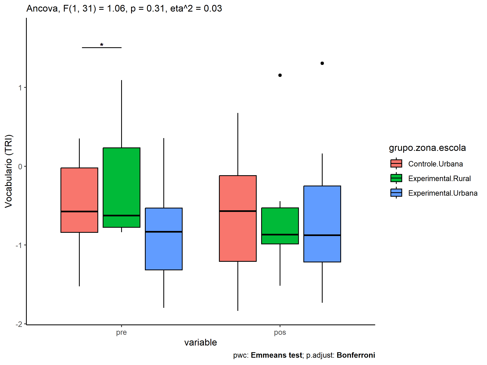<!-- -->

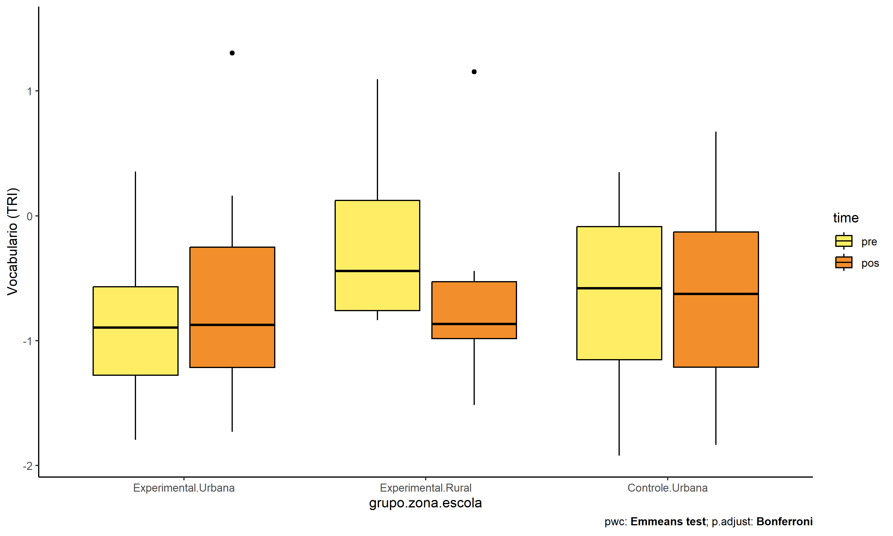<!-- -->

### Vocabulario Ensinado (Acertos)

| var                      | zona.escola | grupo        |   n | M (pre) | SE (pre) | M (unadj) | SE (unadj) | M (adj) | SE (adj) |
|:-------------------------|:------------|:-------------|----:|--------:|---------:|----------:|-----------:|--------:|---------:|
| score.vocab.ensinado.pos | Rural       | Experimental |   8 |   4.125 |    0.581 |     3.375 |      0.800 |   2.823 |    0.656 |
| score.vocab.ensinado.pos | Urbana      | Controle     |  16 |   2.375 |    0.446 |     2.312 |      0.445 |   2.527 |    0.441 |
| score.vocab.ensinado.pos | Urbana      | Experimental |  13 |   2.692 |    0.263 |     2.538 |      0.433 |   2.614 |    0.478 |

|     | grupo        | zona.escola | group1   | group2       | estimate | conf.low | conf.high |    se | statistic |     p | p.adj | p.adj.signif |
|:----|:-------------|:------------|:---------|:-------------|---------:|---------:|----------:|------:|----------:|------:|------:|:-------------|
| 2   | Experimental |             | Urbana   | Rural        |   -0.209 |   -1.882 |     1.464 | 0.822 |    -0.254 | 0.801 | 0.801 | ns           |
| 4   | Experimental |             | Urbana   | Rural        |   -1.433 |   -2.810 |    -0.055 | 0.678 |    -2.113 | 0.042 | 0.042 | \*           |
| 5   |              | Urbana      | Controle | Experimental |   -0.087 |   -1.400 |     1.226 | 0.645 |    -0.135 | 0.894 | 0.894 | ns           |
| 7   |              | Urbana      | Controle | Experimental |   -0.317 |   -1.462 |     0.828 | 0.563 |    -0.563 | 0.577 | 0.577 | ns           |

| grupo        | zona.escola | group1 | group2 | estimate | conf.low | conf.high |    se | statistic |     p | p.adj | p.adj.signif |
|:-------------|:------------|:-------|:-------|---------:|---------:|----------:|------:|----------:|------:|------:|:-------------|
| Controle     | Urbana      | pre    | pos    |    0.063 |   -1.117 |     1.242 | 0.591 |     0.106 | 0.916 | 0.916 | ns           |
| Experimental | Urbana      | pre    | pos    |    0.154 |   -1.154 |     1.462 | 0.656 |     0.235 | 0.815 | 0.815 | ns           |
| Experimental | Rural       | pre    | pos    |    0.750 |   -0.918 |     2.418 | 0.836 |     0.898 | 0.373 | 0.373 | ns           |

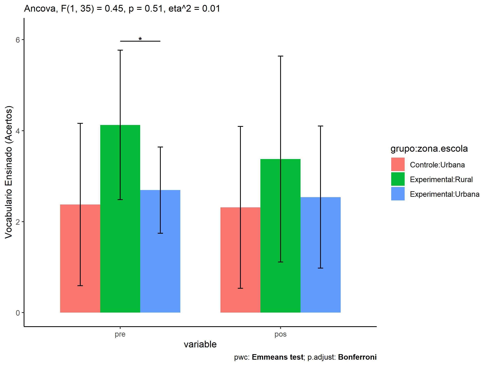<!-- -->

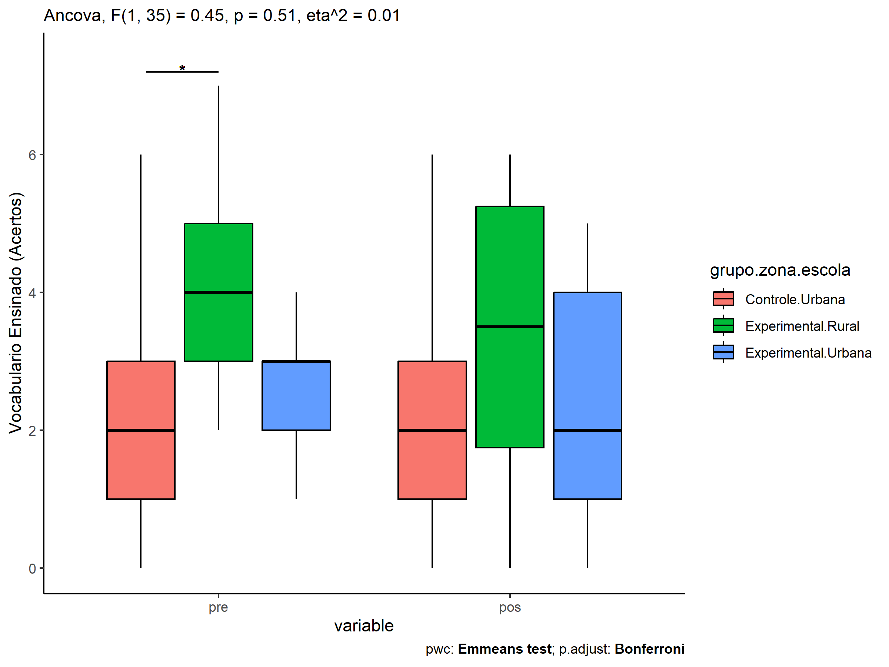<!-- -->

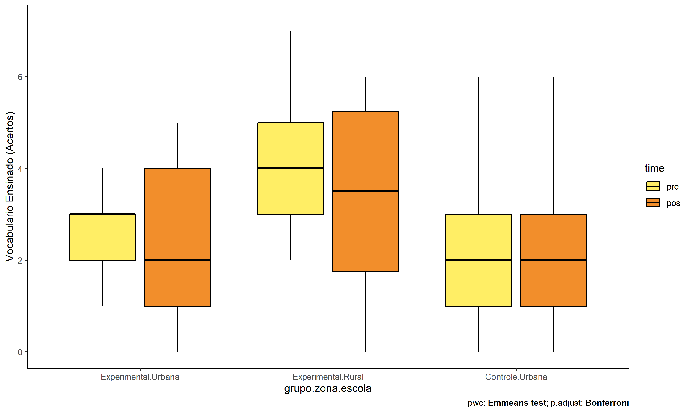<!-- -->

### Vocabulario Ensinado (TRI)

| var                    | zona.escola | grupo        |   n | M (pre) | SE (pre) | M (unadj) | SE (unadj) | M (adj) | SE (adj) |
|:-----------------------|:------------|:-------------|----:|--------:|---------:|----------:|-----------:|--------:|---------:|
| tri.vocab.ensinado.pos | Rural       | Experimental |   7 |   0.015 |    0.281 |    -0.081 |      0.202 |  -0.182 |    0.236 |
| tri.vocab.ensinado.pos | Urbana      | Controle     |  14 |  -0.375 |    0.201 |    -0.576 |      0.193 |  -0.544 |    0.164 |
| tri.vocab.ensinado.pos | Urbana      | Experimental |  12 |  -0.340 |    0.135 |    -0.447 |      0.171 |  -0.426 |    0.176 |

|     | grupo        | zona.escola | group1   | group2       | estimate | conf.low | conf.high |    se | statistic |     p | p.adj | p.adj.signif |
|:----|:-------------|:------------|:---------|:-------------|---------:|---------:|----------:|------:|----------:|------:|------:|:-------------|
| 2   | Experimental |             | Urbana   | Rural        |   -0.243 |   -0.849 |     0.362 | 0.296 |    -0.822 | 0.418 | 0.418 | ns           |
| 4   | Experimental |             | Urbana   | Rural        |   -0.354 |   -0.997 |     0.288 | 0.314 |    -1.128 | 0.268 | 0.268 | ns           |
| 5   |              | Urbana      | Controle | Experimental |   -0.118 |   -0.608 |     0.373 | 0.240 |    -0.491 | 0.627 | 0.627 | ns           |
| 7   |              | Urbana      | Controle | Experimental |   -0.035 |   -0.566 |     0.496 | 0.260 |    -0.135 | 0.894 | 0.894 | ns           |

| grupo        | zona.escola | group1 | group2 | estimate | conf.low | conf.high |    se | statistic |     p | p.adj | p.adj.signif |
|:-------------|:------------|:-------|:-------|---------:|---------:|----------:|------:|----------:|------:|------:|:-------------|
| Controle     | Urbana      | pre    | pos    |    0.176 |   -0.299 |     0.651 | 0.238 |     0.738 | 0.463 | 0.463 | ns           |
| Experimental | Urbana      | pre    | pos    |    0.101 |   -0.420 |     0.622 | 0.261 |     0.387 | 0.700 | 0.700 | ns           |
| Experimental | Rural       | pre    | pos    |    0.040 |   -0.633 |     0.714 | 0.337 |     0.120 | 0.905 | 0.905 | ns           |

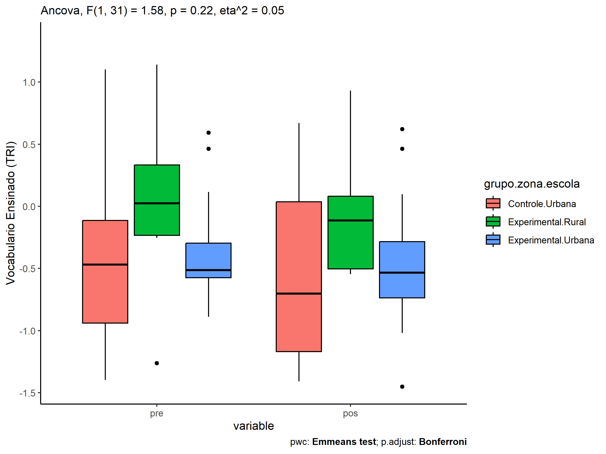<!-- -->

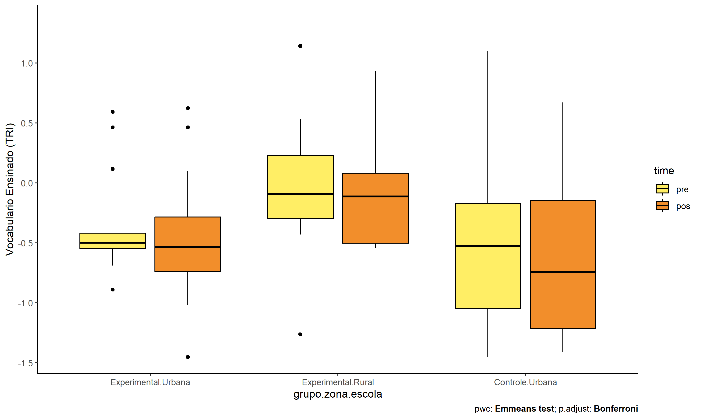<!-- -->

### Vocabulario Nao Ensinado (Acertos)

| var                          | zona.escola | grupo        |   n | M (pre) | SE (pre) | M (unadj) | SE (unadj) | M (adj) | SE (adj) |
|:-----------------------------|:------------|:-------------|----:|--------:|---------:|----------:|-----------:|--------:|---------:|
| score.vocab.nao.ensinado.pos | Rural       | Experimental |   8 |  12.625 |    2.044 |     9.125 |      2.662 |   8.235 |    1.891 |
| score.vocab.nao.ensinado.pos | Urbana      | Controle     |  16 |  10.688 |    1.264 |    11.500 |      1.381 |  11.747 |    1.326 |
| score.vocab.nao.ensinado.pos | Urbana      | Experimental |  13 |  10.692 |    1.370 |    11.000 |      1.569 |  11.244 |    1.471 |

|     | grupo        | zona.escola | group1   | group2       | estimate | conf.low | conf.high |    se | statistic |     p | p.adj | p.adj.signif |
|:----|:-------------|:------------|:---------|:-------------|---------:|---------:|----------:|------:|----------:|------:|------:|:-------------|
| 2   | Experimental |             | Urbana   | Rural        |    3.009 |   -1.882 |     7.900 | 2.404 |     1.252 | 0.220 | 0.220 | ns           |
| 4   | Experimental |             | Urbana   | Rural        |   -1.933 |   -6.657 |     2.792 | 2.325 |    -0.831 | 0.412 | 0.412 | ns           |
| 5   |              | Urbana      | Controle | Experimental |    0.503 |   -3.521 |     4.526 | 1.978 |     0.254 | 0.801 | 0.801 | ns           |
| 7   |              | Urbana      | Controle | Experimental |   -0.005 |   -3.931 |     3.921 | 1.932 |    -0.002 | 0.998 | 0.998 | ns           |

| grupo        | zona.escola | group1 | group2 | estimate | conf.low | conf.high |    se | statistic |     p | p.adj | p.adj.signif |
|:-------------|:------------|:-------|:-------|---------:|---------:|----------:|------:|----------:|------:|------:|:-------------|
| Controle     | Urbana      | pre    | pos    |   -0.812 |   -4.779 |     3.154 | 1.988 |    -0.409 | 0.684 | 0.684 | ns           |
| Experimental | Urbana      | pre    | pos    |   -0.308 |   -4.708 |     4.092 | 2.205 |    -0.140 | 0.889 | 0.889 | ns           |
| Experimental | Rural       | pre    | pos    |    3.500 |   -2.109 |     9.109 | 2.811 |     1.245 | 0.217 | 0.217 | ns           |

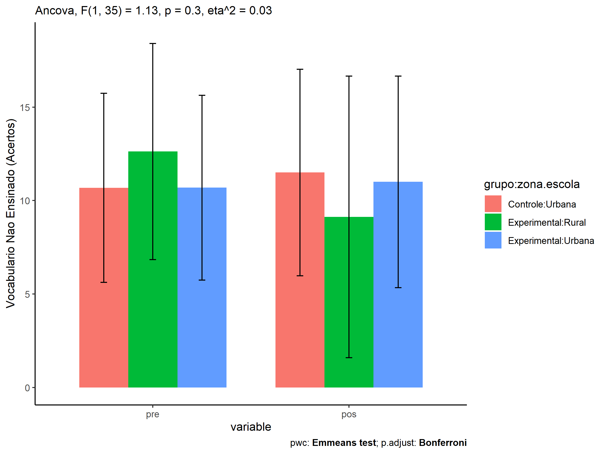<!-- -->

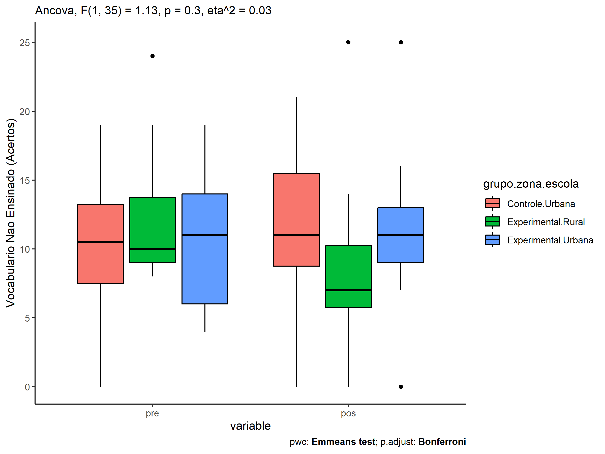<!-- -->

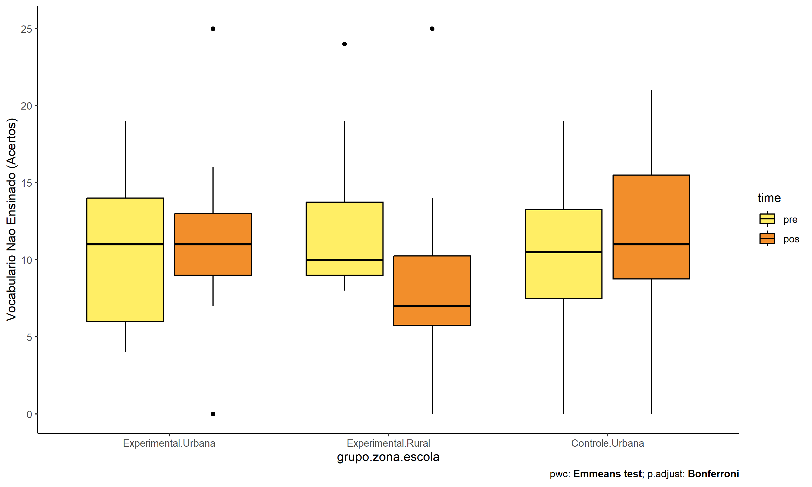<!-- -->

### Vocabulario Nao Ensinado (TRI)

| var                        | zona.escola | grupo        |   n | M (pre) | SE (pre) | M (unadj) | SE (unadj) | M (adj) | SE (adj) |
|:---------------------------|:------------|:-------------|----:|--------:|---------:|----------:|-----------:|--------:|---------:|
| tri.vocab.nao.ensinado.pos | Rural       | Experimental |   7 |  -0.367 |    0.308 |    -0.705 |      0.318 |  -0.918 |    0.222 |
| tri.vocab.nao.ensinado.pos | Urbana      | Controle     |  14 |  -0.638 |    0.128 |    -0.506 |      0.159 |  -0.526 |    0.153 |
| tri.vocab.nao.ensinado.pos | Urbana      | Experimental |  12 |  -0.873 |    0.190 |    -0.623 |      0.223 |  -0.475 |    0.169 |

|     | grupo        | zona.escola | group1   | group2       | estimate | conf.low | conf.high |    se | statistic |     p | p.adj | p.adj.signif |
|:----|:-------------|:------------|:---------|:-------------|---------:|---------:|----------:|------:|----------:|------:|------:|:-------------|
| 2   | Experimental |             | Urbana   | Rural        |    0.443 |   -0.139 |     1.025 | 0.285 |     1.556 | 0.131 | 0.131 | ns           |
| 4   | Experimental |             | Urbana   | Rural        |   -0.507 |   -1.113 |     0.100 | 0.297 |    -1.706 | 0.098 | 0.098 | ns           |
| 5   |              | Urbana      | Controle | Experimental |   -0.051 |   -0.518 |     0.416 | 0.228 |    -0.224 | 0.825 | 0.825 | ns           |
| 7   |              | Urbana      | Controle | Experimental |    0.235 |   -0.267 |     0.737 | 0.246 |     0.957 | 0.346 | 0.346 | ns           |

| grupo        | zona.escola | group1 | group2 | estimate | conf.low | conf.high |    se | statistic |     p | p.adj | p.adj.signif |
|:-------------|:------------|:-------|:-------|---------:|---------:|----------:|------:|----------:|------:|------:|:-------------|
| Controle     | Urbana      | pre    | pos    |   -0.149 |   -0.632 |     0.334 | 0.242 |    -0.615 | 0.541 | 0.541 | ns           |
| Experimental | Urbana      | pre    | pos    |   -0.253 |   -0.782 |     0.277 | 0.265 |    -0.953 | 0.344 | 0.344 | ns           |
| Experimental | Rural       | pre    | pos    |    0.334 |   -0.350 |     1.019 | 0.343 |     0.976 | 0.333 | 0.333 | ns           |

<!-- -->

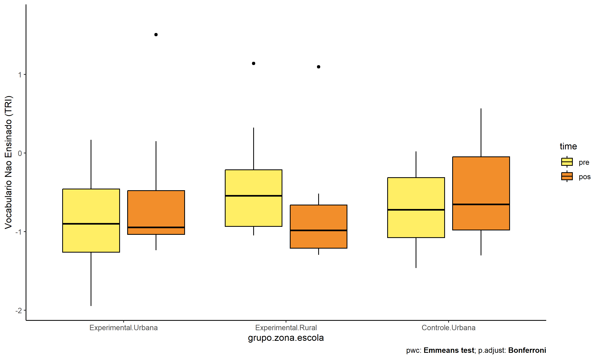<!-- -->

# Pairwise comparisons for grupo=“Experimental”

## factores: **grupo=“Experimental”:monitor**

### Vocabulario (Acertos)

### Vocabulario (TRI)

### Vocabulario Ensinado (Acertos)

### Vocabulario Ensinado (TRI)

### Vocabulario Nao Ensinado (Acertos)

### Vocabulario Nao Ensinado (TRI)

## factores: **grupo=“Experimental”:monitor.genero**

### Vocabulario (Acertos)

### Vocabulario (TRI)

### Vocabulario Ensinado (Acertos)

### Vocabulario Ensinado (TRI)

### Vocabulario Nao Ensinado (Acertos)

### Vocabulario Nao Ensinado (TRI)

## factores: **grupo=“Experimental”:monitor.area**

### Vocabulario (Acertos)

### Vocabulario (TRI)

### Vocabulario Ensinado (Acertos)

### Vocabulario Ensinado (TRI)

### Vocabulario Nao Ensinado (Acertos)

### Vocabulario Nao Ensinado (TRI)

## factores: **grupo=“Experimental”:monitor.formacao**

### Vocabulario (Acertos)

### Vocabulario (TRI)

### Vocabulario Ensinado (Acertos)

| var                      | monitor.formacao |   n | M (pre) | SE (pre) | M (unadj) | SE (unadj) | M (adj) | SE (adj) |
|:-------------------------|:-----------------|----:|--------:|---------:|----------:|-----------:|--------:|---------:|
| score.vocab.ensinado.pos | ensino medio     |   5 |     3.0 |    0.316 |     1.600 |      0.510 |   1.717 |    0.840 |
| score.vocab.ensinado.pos | especializacao   |   6 |     4.5 |    0.719 |     4.167 |      0.792 |   4.069 |    0.756 |

| .y.                      | group1       | group2         | estimate | conf.low | conf.high |    se | statistic |     p | p.adj | p.adj.signif |
|:-------------------------|:-------------|:---------------|---------:|---------:|----------:|------:|----------:|------:|------:|:-------------|
| score.vocab.ensinado.pos | ensino medio | especializacao |   -2.352 |   -5.144 |     0.439 | 1.211 |    -1.943 | 0.088 | 0.088 | ns           |
| score.vocab.ensinado.pre | ensino medio | especializacao |   -1.500 |   -3.410 |     0.410 | 0.844 |    -1.776 | 0.109 | 0.109 | ns           |

| monitor.formacao | group1 | group2 | estimate | conf.low | conf.high |    se | statistic |     p | p.adj | p.adj.signif |
|:-----------------|:-------|:-------|---------:|---------:|----------:|------:|----------:|------:|------:|:-------------|
| ensino medio     | pre    | pos    |    1.400 |   -0.618 |     3.418 | 0.961 |     1.457 | 0.162 | 0.162 | ns           |
| especializacao   | pre    | pos    |    0.333 |   -1.509 |     2.176 | 0.877 |     0.380 | 0.708 | 0.708 | ns           |

    ## Scale for colour is already present.
    ## Adding another scale for colour, which will replace the existing scale.

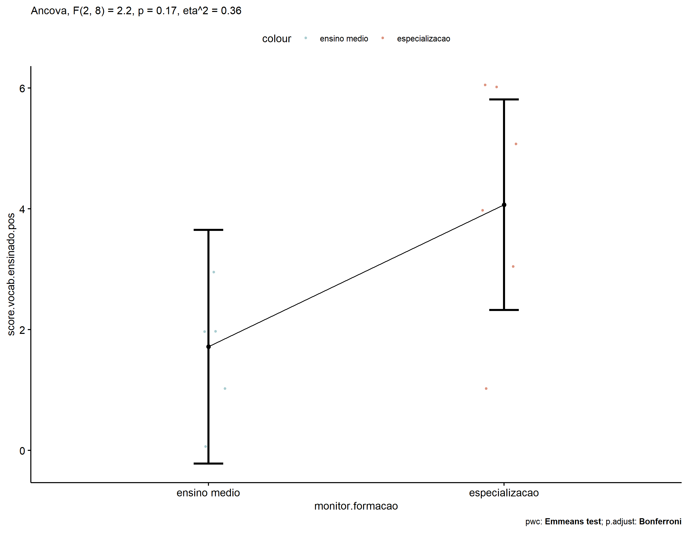<!-- -->

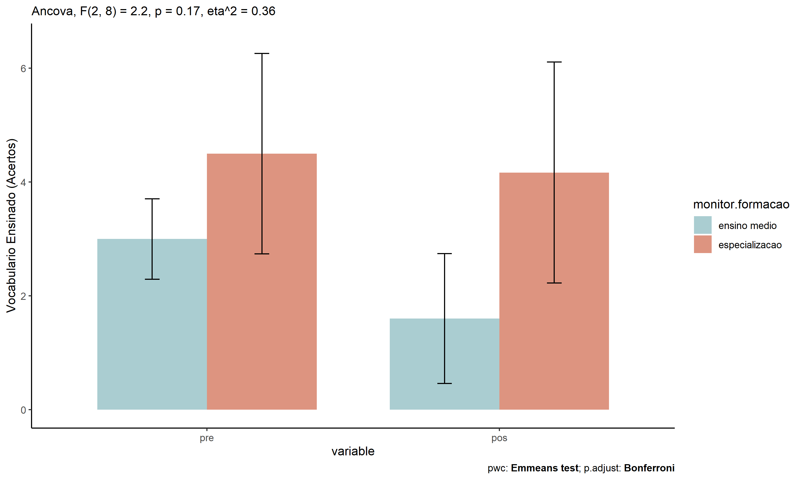<!-- -->

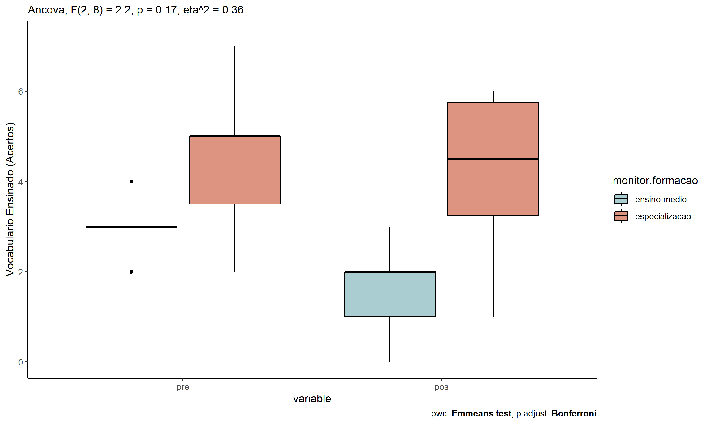<!-- -->

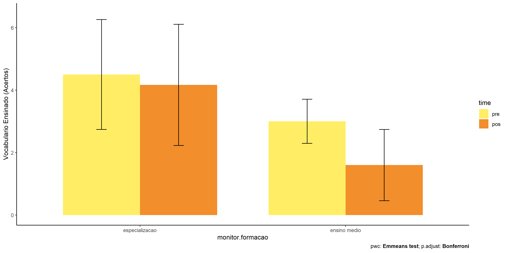<!-- -->

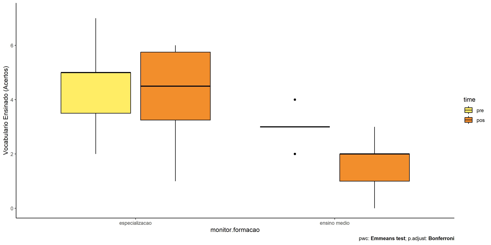<!-- -->

### Vocabulario Ensinado (TRI)

### Vocabulario Nao Ensinado (Acertos)

| var                          | monitor.formacao |   n | M (pre) | SE (pre) | M (unadj) | SE (unadj) | M (adj) | SE (adj) |
|:-----------------------------|:-----------------|----:|--------:|---------:|----------:|-----------:|--------:|---------:|
| score.vocab.nao.ensinado.pos | ensino medio     |   5 |  10.400 |    2.421 |     7.000 |      1.871 |   7.561 |    2.899 |
| score.vocab.nao.ensinado.pos | especializacao   |   6 |  13.333 |    2.692 |    10.833 |      3.135 |  10.366 |    2.638 |

| .y.                          | group1       | group2         | estimate | conf.low | conf.high |    se | statistic |     p | p.adj | p.adj.signif |
|:-----------------------------|:-------------|:---------------|---------:|---------:|----------:|------:|----------:|------:|------:|:-------------|
| score.vocab.nao.ensinado.pos | ensino medio | especializacao |   -2.805 |  -11.993 |     6.384 | 3.984 |    -0.704 | 0.501 | 0.501 | ns           |
| score.vocab.nao.ensinado.pre | ensino medio | especializacao |   -2.933 |  -11.285 |     5.418 | 3.692 |    -0.795 | 0.447 | 0.447 | ns           |

| monitor.formacao | group1 | group2 | estimate | conf.low | conf.high |    se | statistic |     p | p.adj | p.adj.signif |
|:-----------------|:-------|:-------|---------:|---------:|----------:|------:|----------:|------:|------:|:-------------|
| ensino medio     | pre    | pos    |      3.4 |   -4.882 |    11.682 | 3.942 |     0.862 | 0.400 | 0.400 | ns           |
| especializacao   | pre    | pos    |      2.5 |   -5.061 |    10.061 | 3.599 |     0.695 | 0.496 | 0.496 | ns           |

    ## Scale for colour is already present.
    ## Adding another scale for colour, which will replace the existing scale.

<!-- -->

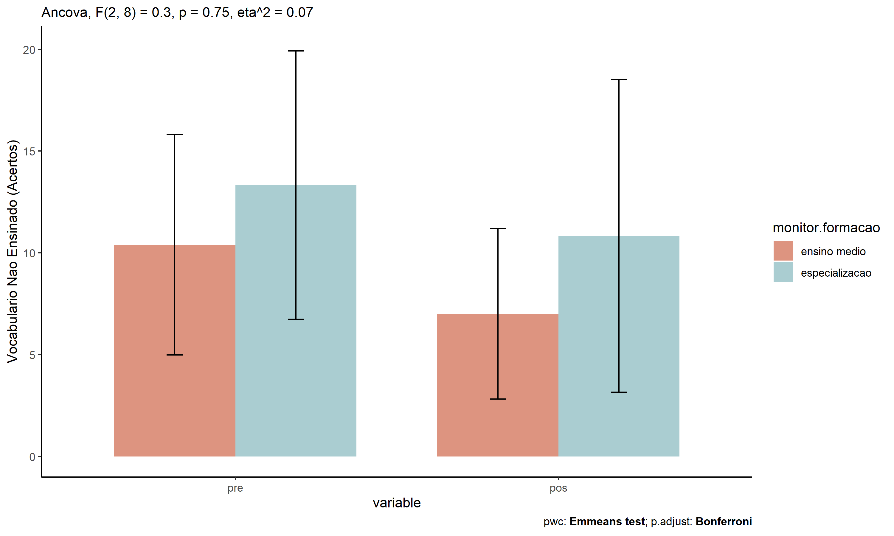<!-- -->

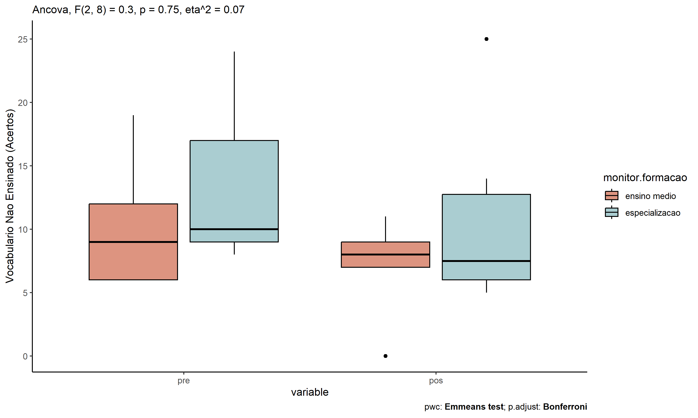<!-- -->

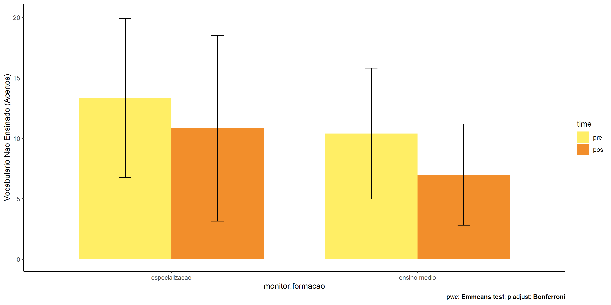<!-- -->

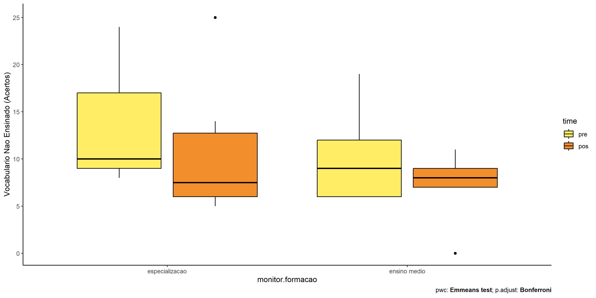<!-- -->

### Vocabulario Nao Ensinado (TRI)

## factores: **grupo=“Experimental”:monitor.experiencia**

### Vocabulario (Acertos)

### Vocabulario (TRI)

### Vocabulario Ensinado (Acertos)

### Vocabulario Ensinado (TRI)

### Vocabulario Nao Ensinado (Acertos)

### Vocabulario Nao Ensinado (TRI)
