ANCOVA in Vocabulary Test (Teste de Vocabulario)
================
Geiser C. Challco <geiser@alumni.usp.br>

- [Descriptive Statistics of Initial
  Data](#descriptive-statistics-of-initial-data)
  - [Vocabulario (Acertos)](#vocabulario-acertos)
  - [Vocabulario Ensinado (Acertos)](#vocabulario-ensinado-acertos)
  - [Vocabulario Nao Ensinado
    (Acertos)](#vocabulario-nao-ensinado-acertos)
- [Checking of Assumptions](#checking-of-assumptions)
  - [Assumption: Normality
    distribution](#assumption-normality-distribution)
    - [Vocabulario (Acertos)](#vocabulario-acertos-1)
    - [Vocabulario Ensinado (Acertos)](#vocabulario-ensinado-acertos-1)
    - [Vocabulario Nao Ensinado
      (Acertos)](#vocabulario-nao-ensinado-acertos-1)
  - [Assumption: Homogeneity](#assumption-homogeneity)
    - [Vocabulario (Acertos)](#vocabulario-acertos-2)
    - [Vocabulario Ensinado (Acertos)](#vocabulario-ensinado-acertos-2)
    - [Vocabulario Nao Ensinado
      (Acertos)](#vocabulario-nao-ensinado-acertos-2)
- [Computation of ANCOVA test and Pairwise
  Comparison](#computation-of-ancova-test-and-pairwise-comparison)
  - [ANCOVA tests for one factor](#ancova-tests-for-one-factor)
    - [Vocabulario (Acertos)](#vocabulario-acertos-3)
    - [Vocabulario Ensinado (Acertos)](#vocabulario-ensinado-acertos-3)
    - [Vocabulario Nao Ensinado
      (Acertos)](#vocabulario-nao-ensinado-acertos-3)
  - [ANCOVA tests for two factors](#ancova-tests-for-two-factors)
    - [Vocabulario (Acertos)](#vocabulario-acertos-4)
    - [Vocabulario Ensinado (Acertos)](#vocabulario-ensinado-acertos-4)
    - [Vocabulario Nao Ensinado
      (Acertos)](#vocabulario-nao-ensinado-acertos-4)
  - [ANCOVA tests for
    grupo=“Experimental”](#ancova-tests-for-grupoexperimental)
    - [Vocabulario (Acertos)](#vocabulario-acertos-5)
    - [Vocabulario Ensinado (Acertos)](#vocabulario-ensinado-acertos-5)
    - [Vocabulario Nao Ensinado
      (Acertos)](#vocabulario-nao-ensinado-acertos-5)
- [Pairwise comparisons for one
  factor](#pairwise-comparisons-for-one-factor)
  - [factor: **grupo**](#factor-grupo)
    - [Vocabulario (Acertos)](#vocabulario-acertos-6)
    - [Vocabulario Ensinado (Acertos)](#vocabulario-ensinado-acertos-6)
    - [Vocabulario Nao Ensinado
      (Acertos)](#vocabulario-nao-ensinado-acertos-6)
  - [factor: **genero**](#factor-genero)
    - [Vocabulario (Acertos)](#vocabulario-acertos-7)
    - [Vocabulario Ensinado (Acertos)](#vocabulario-ensinado-acertos-7)
    - [Vocabulario Nao Ensinado
      (Acertos)](#vocabulario-nao-ensinado-acertos-7)
  - [factor: **idade**](#factor-idade)
    - [Vocabulario (Acertos)](#vocabulario-acertos-8)
    - [Vocabulario Ensinado (Acertos)](#vocabulario-ensinado-acertos-8)
    - [Vocabulario Nao Ensinado
      (Acertos)](#vocabulario-nao-ensinado-acertos-8)
  - [factor: **zona.participante**](#factor-zonaparticipante)
    - [Vocabulario (Acertos)](#vocabulario-acertos-9)
    - [Vocabulario Ensinado (Acertos)](#vocabulario-ensinado-acertos-9)
    - [Vocabulario Nao Ensinado
      (Acertos)](#vocabulario-nao-ensinado-acertos-9)
  - [factor: **escola**](#factor-escola)
    - [Vocabulario (Acertos)](#vocabulario-acertos-10)
    - [Vocabulario Ensinado (Acertos)](#vocabulario-ensinado-acertos-10)
    - [Vocabulario Nao Ensinado
      (Acertos)](#vocabulario-nao-ensinado-acertos-10)
  - [factor: **zona.escola**](#factor-zonaescola)
    - [Vocabulario (Acertos)](#vocabulario-acertos-11)
    - [Vocabulario Ensinado (Acertos)](#vocabulario-ensinado-acertos-11)
    - [Vocabulario Nao Ensinado
      (Acertos)](#vocabulario-nao-ensinado-acertos-11)
- [Pairwise comparisons for two
  factors](#pairwise-comparisons-for-two-factors)
  - [factores: **genero:grupo**](#factores-generogrupo)
    - [Vocabulario (Acertos)](#vocabulario-acertos-12)
    - [Vocabulario Ensinado (Acertos)](#vocabulario-ensinado-acertos-12)
    - [Vocabulario Nao Ensinado
      (Acertos)](#vocabulario-nao-ensinado-acertos-12)
  - [factores: **idade:grupo**](#factores-idadegrupo)
    - [Vocabulario (Acertos)](#vocabulario-acertos-13)
    - [Vocabulario Ensinado (Acertos)](#vocabulario-ensinado-acertos-13)
    - [Vocabulario Nao Ensinado
      (Acertos)](#vocabulario-nao-ensinado-acertos-13)
  - [factores:
    **zona.participante:grupo**](#factores-zonaparticipantegrupo)
    - [Vocabulario (Acertos)](#vocabulario-acertos-14)
    - [Vocabulario Ensinado (Acertos)](#vocabulario-ensinado-acertos-14)
    - [Vocabulario Nao Ensinado
      (Acertos)](#vocabulario-nao-ensinado-acertos-14)
  - [factores: **escola:grupo**](#factores-escolagrupo)
    - [Vocabulario (Acertos)](#vocabulario-acertos-15)
    - [Vocabulario Ensinado (Acertos)](#vocabulario-ensinado-acertos-15)
    - [Vocabulario Nao Ensinado
      (Acertos)](#vocabulario-nao-ensinado-acertos-15)
  - [factores: **zona.escola:grupo**](#factores-zonaescolagrupo)
    - [Vocabulario (Acertos)](#vocabulario-acertos-16)
    - [Vocabulario Ensinado (Acertos)](#vocabulario-ensinado-acertos-16)
    - [Vocabulario Nao Ensinado
      (Acertos)](#vocabulario-nao-ensinado-acertos-16)
- [Pairwise comparisons for
  grupo=“Experimental”](#pairwise-comparisons-for-grupoexperimental)
  - [factores:
    **grupo=“Experimental”:monitor**](#factores-grupoexperimentalmonitor)
    - [Vocabulario (Acertos)](#vocabulario-acertos-17)
    - [Vocabulario Ensinado (Acertos)](#vocabulario-ensinado-acertos-17)
    - [Vocabulario Nao Ensinado
      (Acertos)](#vocabulario-nao-ensinado-acertos-17)
  - [factores:
    **grupo=“Experimental”:monitor.genero**](#factores-grupoexperimentalmonitorgenero)
    - [Vocabulario (Acertos)](#vocabulario-acertos-18)
    - [Vocabulario Ensinado (Acertos)](#vocabulario-ensinado-acertos-18)
    - [Vocabulario Nao Ensinado
      (Acertos)](#vocabulario-nao-ensinado-acertos-18)
  - [factores:
    **grupo=“Experimental”:monitor.area**](#factores-grupoexperimentalmonitorarea)
    - [Vocabulario (Acertos)](#vocabulario-acertos-19)
    - [Vocabulario Ensinado (Acertos)](#vocabulario-ensinado-acertos-19)
    - [Vocabulario Nao Ensinado
      (Acertos)](#vocabulario-nao-ensinado-acertos-19)
  - [factores:
    **grupo=“Experimental”:monitor.formacao**](#factores-grupoexperimentalmonitorformacao)
    - [Vocabulario (Acertos)](#vocabulario-acertos-20)
    - [Vocabulario Ensinado (Acertos)](#vocabulario-ensinado-acertos-20)
    - [Vocabulario Nao Ensinado
      (Acertos)](#vocabulario-nao-ensinado-acertos-20)
  - [factores:
    **grupo=“Experimental”:monitor.experiencia**](#factores-grupoexperimentalmonitorexperiencia)
    - [Vocabulario (Acertos)](#vocabulario-acertos-21)
    - [Vocabulario Ensinado (Acertos)](#vocabulario-ensinado-acertos-21)
    - [Vocabulario Nao Ensinado
      (Acertos)](#vocabulario-nao-ensinado-acertos-21)

**NOTE**

- Teste ANCOVA para determinar se houve diferenças significativas no
  Teste de Vocabulario (medido usando pre- e pos-testes).
- ANCOVA test to determine whether there were significant differences in
  Vocabulary Test (measured using pre- and post-tests).

# Descriptive Statistics of Initial Data

## Vocabulario (Acertos)

| grupo    | genero | idade | zona.participante | escola | zona.escola | variable        |   n |   mean | median | min | max |     sd |    se |     ci |   iqr |
|:---------|:-------|:------|:------------------|:-------|:------------|:----------------|----:|-------:|-------:|----:|----:|-------:|------:|-------:|------:|
| Controle | F      |       |                   |        |             | score.vocab.pos |   6 | 17.000 |   15.5 |  11 |  24 |  5.727 | 2.338 |  6.010 |  9.25 |
| Controle | M      |       |                   |        |             | score.vocab.pos |  11 | 13.727 |   13.0 |   4 |  24 |  5.179 | 1.561 |  3.479 |  3.50 |
| stari+WG | F      |       |                   |        |             | score.vocab.pos |   4 | 14.000 |   13.5 |  11 |  18 |  3.162 | 1.581 |  5.032 |  4.00 |
| stari+WG | M      |       |                   |        |             | score.vocab.pos |  15 | 14.667 |   13.0 |   7 |  31 |  7.027 | 1.814 |  3.892 |  6.00 |
| Controle | F      |       |                   |        |             | score.vocab.pre |   6 | 17.167 |   18.0 |   7 |  23 |  6.338 | 2.587 |  6.651 |  8.25 |
| Controle | M      |       |                   |        |             | score.vocab.pre |  11 | 12.273 |   11.0 |   6 |  23 |  5.159 | 1.556 |  3.466 |  4.50 |
| stari+WG | F      |       |                   |        |             | score.vocab.pre |   4 | 11.750 |   11.5 |   8 |  16 |  3.500 | 1.750 |  5.569 |  4.25 |
| stari+WG | M      |       |                   |        |             | score.vocab.pre |  15 | 15.400 |   14.0 |   6 |  31 |  6.812 | 1.759 |  3.772 |  8.50 |
| Controle |        | 10y   |                   |        |             | score.vocab.pos |   4 | 19.750 |   20.0 |  15 |  24 |  4.924 | 2.462 |  7.836 |  8.25 |
| Controle |        | 11y   |                   |        |             | score.vocab.pos |  10 | 13.400 |   12.0 |   4 |  24 |  5.502 | 1.740 |  3.936 |  4.50 |
| Controle |        | 12y   |                   |        |             | score.vocab.pos |   2 | 13.500 |   13.5 |  12 |  15 |  2.121 | 1.500 | 19.059 |  1.50 |
| Controle |        | 14y   |                   |        |             | score.vocab.pos |   1 | 13.000 |   13.0 |  13 |  13 |        |       |        |  0.00 |
| stari+WG |        | 10y   |                   |        |             | score.vocab.pos |   3 | 17.333 |   14.0 |   7 |  31 | 12.342 | 7.126 | 30.660 | 12.00 |
| stari+WG |        | 11y   |                   |        |             | score.vocab.pos |  10 | 15.200 |   13.5 |  10 |  30 |  6.015 | 1.902 |  4.303 |  5.75 |
| stari+WG |        | 12y   |                   |        |             | score.vocab.pos |   2 | 12.500 |   12.5 |  10 |  15 |  3.536 | 2.500 | 31.766 |  2.50 |
| stari+WG |        | 13y   |                   |        |             | score.vocab.pos |   4 | 11.750 |   11.5 |  10 |  14 |  2.062 | 1.031 |  3.280 |  3.25 |
| Controle |        | 10y   |                   |        |             | score.vocab.pre |   4 | 18.250 |   18.0 |  14 |  23 |  4.425 | 2.213 |  7.042 |  6.75 |
| Controle |        | 11y   |                   |        |             | score.vocab.pre |  10 | 13.400 |   12.5 |   6 |  23 |  6.518 | 2.061 |  4.663 | 10.25 |
| Controle |        | 12y   |                   |        |             | score.vocab.pre |   2 | 10.000 |   10.0 |   9 |  11 |  1.414 | 1.000 | 12.706 |  1.00 |
| Controle |        | 14y   |                   |        |             | score.vocab.pre |   1 | 11.000 |   11.0 |  11 |  11 |        |       |        |  0.00 |
| stari+WG |        | 10y   |                   |        |             | score.vocab.pre |   3 | 17.667 |   16.0 |   6 |  31 | 12.583 | 7.265 | 31.258 | 12.50 |
| stari+WG |        | 11y   |                   |        |             | score.vocab.pre |  10 | 14.600 |   13.5 |   7 |  24 |  6.114 | 1.933 |  4.374 |  9.50 |
| stari+WG |        | 12y   |                   |        |             | score.vocab.pre |   2 | 12.500 |   12.5 |  12 |  13 |  0.707 | 0.500 |  6.353 |  0.50 |
| stari+WG |        | 13y   |                   |        |             | score.vocab.pre |   4 | 13.500 |   12.5 |  11 |  18 |  3.317 | 1.658 |  5.277 |  4.00 |
| Controle |        |       | Urbana            |        |             | score.vocab.pos |  10 | 15.800 |   14.0 |   4 |  24 |  6.812 | 2.154 |  4.873 | 10.75 |
| Controle |        |       | Rural             |        |             | score.vocab.pos |   1 | 12.000 |   12.0 |  12 |  12 |        |       |        |  0.00 |
| Controle |        |       |                   |        |             | score.vocab.pos |   6 | 13.833 |   15.0 |   9 |  16 |  2.563 | 1.046 |  2.689 |  1.50 |
| stari+WG |        |       | Urbana            |        |             | score.vocab.pos |   8 | 16.125 |   15.0 |  10 |  30 |  6.151 | 2.175 |  5.143 |  3.75 |
| stari+WG |        |       | Rural             |        |             | score.vocab.pos |   7 | 14.000 |   10.0 |   7 |  31 |  8.226 | 3.109 |  7.608 |  5.00 |
| stari+WG |        |       |                   |        |             | score.vocab.pos |   4 | 12.250 |   12.5 |  10 |  14 |  1.708 | 0.854 |  2.718 |  1.75 |
| Controle |        |       | Urbana            |        |             | score.vocab.pre |  10 | 15.600 |   14.5 |   7 |  23 |  6.096 | 1.928 |  4.360 | 11.25 |
| Controle |        |       | Rural             |        |             | score.vocab.pre |   1 |  6.000 |    6.0 |   6 |   6 |        |       |        |  0.00 |
| Controle |        |       |                   |        |             | score.vocab.pre |   6 | 12.667 |   11.5 |   6 |  21 |  5.007 | 2.044 |  5.254 |  3.25 |
| stari+WG |        |       | Urbana            |        |             | score.vocab.pre |   8 | 12.500 |   12.0 |   6 |  21 |  4.690 | 1.658 |  3.921 |  4.25 |
| stari+WG |        |       | Rural             |        |             | score.vocab.pre |   7 | 18.143 |   16.0 |   7 |  31 |  8.153 | 3.082 |  7.541 |  9.50 |
| stari+WG |        |       |                   |        |             | score.vocab.pre |   4 | 12.750 |   11.5 |  10 |  18 |  3.594 | 1.797 |  5.719 |  2.75 |
| Controle |        |       |                   | E1     |             | score.vocab.pos |   6 | 18.667 |   20.0 |  12 |  24 |  6.022 | 2.459 |  6.320 | 11.00 |
| Controle |        |       |                   | E2     |             | score.vocab.pos |   3 | 14.667 |   15.0 |  13 |  16 |  1.528 | 0.882 |  3.795 |  1.50 |
| Controle |        |       |                   | E4     |             | score.vocab.pos |   1 | 12.000 |   12.0 |  12 |  12 |        |       |        |  0.00 |
| Controle |        |       |                   | E5     |             | score.vocab.pos |   5 | 11.000 |   11.0 |   4 |  19 |  5.431 | 2.429 |  6.744 |  3.00 |
| Controle |        |       |                   | E6     |             | score.vocab.pos |   2 | 15.000 |   15.0 |  15 |  15 |  0.000 | 0.000 |  0.000 |  0.00 |
| stari+WG |        |       |                   | E2     |             | score.vocab.pos |   2 | 11.500 |   11.5 |  10 |  13 |  2.121 | 1.500 | 19.059 |  1.50 |
| stari+WG |        |       |                   | E4     |             | score.vocab.pos |   6 | 15.000 |   12.5 |   7 |  31 |  8.649 | 3.531 |  9.076 |  6.50 |
| stari+WG |        |       |                   | E5     |             | score.vocab.pos |  10 | 15.300 |   14.0 |  10 |  30 |  5.755 | 1.820 |  4.117 |  4.50 |
| stari+WG |        |       |                   | E6     |             | score.vocab.pos |   1 | 10.000 |   10.0 |  10 |  10 |        |       |        |  0.00 |
| Controle |        |       |                   | E1     |             | score.vocab.pre |   6 | 18.500 |   19.0 |  13 |  23 |  4.970 | 2.029 |  5.216 |  8.75 |
| Controle |        |       |                   | E2     |             | score.vocab.pre |   3 | 11.333 |   11.0 |  11 |  12 |  0.577 | 0.333 |  1.434 |  0.50 |
| Controle |        |       |                   | E4     |             | score.vocab.pre |   1 |  9.000 |    9.0 |   9 |   9 |        |       |        |  0.00 |
| Controle |        |       |                   | E5     |             | score.vocab.pre |   5 | 11.400 |   10.0 |   6 |  19 |  5.505 | 2.462 |  6.835 |  8.00 |
| Controle |        |       |                   | E6     |             | score.vocab.pre |   2 | 13.500 |   13.5 |   6 |  21 | 10.607 | 7.500 | 95.297 |  7.50 |
| stari+WG |        |       |                   | E2     |             | score.vocab.pre |   2 | 20.000 |   20.0 |  18 |  22 |  2.828 | 2.000 | 25.412 |  2.00 |
| stari+WG |        |       |                   | E4     |             | score.vocab.pre |   6 | 17.833 |   15.0 |  11 |  31 |  8.035 | 3.280 |  8.433 | 10.25 |
| stari+WG |        |       |                   | E5     |             | score.vocab.pre |  10 | 11.900 |   11.0 |   6 |  21 |  4.677 | 1.479 |  3.346 |  6.75 |
| stari+WG |        |       |                   | E6     |             | score.vocab.pre |   1 | 12.000 |   12.0 |  12 |  12 |        |       |        |  0.00 |
| Controle |        |       |                   |        | Urbana      | score.vocab.pos |  14 | 15.071 |   14.0 |   4 |  24 |  5.980 | 1.598 |  3.453 |  6.25 |
| Controle |        |       |                   |        | Rural       | score.vocab.pos |   3 | 14.000 |   15.0 |  12 |  15 |  1.732 | 1.000 |  4.303 |  1.50 |
| stari+WG |        |       |                   |        | Urbana      | score.vocab.pos |  12 | 14.667 |   13.5 |  10 |  30 |  5.449 | 1.573 |  3.462 |  3.75 |
| stari+WG |        |       |                   |        | Rural       | score.vocab.pos |   7 | 14.286 |   10.0 |   7 |  31 |  8.118 | 3.068 |  7.508 |  6.00 |
| Controle |        |       |                   |        | Urbana      | score.vocab.pre |  14 | 14.429 |   13.5 |   6 |  23 |  5.680 | 1.518 |  3.280 |  7.00 |
| Controle |        |       |                   |        | Rural       | score.vocab.pre |   3 | 12.000 |    9.0 |   6 |  21 |  7.937 | 4.583 | 19.717 |  7.50 |
| stari+WG |        |       |                   |        | Urbana      | score.vocab.pre |  12 | 13.250 |   12.0 |   6 |  22 |  5.345 | 1.543 |  3.396 |  7.00 |
| stari+WG |        |       |                   |        | Rural       | score.vocab.pre |   7 | 17.000 |   14.0 |  11 |  31 |  7.659 | 2.895 |  7.084 |  8.50 |

## Vocabulario Ensinado (Acertos)

| grupo    | genero | idade | zona.participante | escola | zona.escola | variable                 |   n |  mean | median | min | max |    sd |    se |     ci |  iqr |
|:---------|:-------|:------|:------------------|:-------|:------------|:-------------------------|----:|------:|-------:|----:|----:|------:|------:|-------:|-----:|
| Controle | F      |       |                   |        |             | score.vocab.ensinado.pos |   7 | 2.429 |    2.0 |   1 |   6 | 1.718 | 0.649 |  1.589 | 1.00 |
| Controle | M      |       |                   |        |             | score.vocab.ensinado.pos |  13 | 1.923 |    2.0 |   0 |   6 | 1.706 | 0.473 |  1.031 | 1.00 |
| stari+WG | F      |       |                   |        |             | score.vocab.ensinado.pos |   4 | 2.250 |    2.0 |   1 |   4 | 1.258 | 0.629 |  2.002 | 0.75 |
| stari+WG | M      |       |                   |        |             | score.vocab.ensinado.pos |  17 | 3.000 |    3.0 |   0 |   6 | 1.969 | 0.477 |  1.012 | 3.00 |
| Controle | F      |       |                   |        |             | score.vocab.ensinado.pre |   7 | 3.143 |    3.0 |   0 |   6 | 2.116 | 0.800 |  1.957 | 2.50 |
| Controle | M      |       |                   |        |             | score.vocab.ensinado.pre |  13 | 1.769 |    2.0 |   0 |   6 | 1.536 | 0.426 |  0.928 | 1.00 |
| stari+WG | F      |       |                   |        |             | score.vocab.ensinado.pre |   4 | 2.500 |    2.0 |   2 |   4 | 1.000 | 0.500 |  1.591 | 0.50 |
| stari+WG | M      |       |                   |        |             | score.vocab.ensinado.pre |  17 | 3.412 |    3.0 |   1 |   7 | 1.460 | 0.354 |  0.751 | 1.00 |
| Controle |        | 10y   |                   |        |             | score.vocab.ensinado.pos |   4 | 3.000 |    2.5 |   1 |   6 | 2.160 | 1.080 |  3.437 | 2.00 |
| Controle |        | 11y   |                   |        |             | score.vocab.ensinado.pos |  11 | 1.818 |    2.0 |   0 |   6 | 1.662 | 0.501 |  1.117 | 1.00 |
| Controle |        | 12y   |                   |        |             | score.vocab.ensinado.pos |   2 | 2.000 |    2.0 |   2 |   2 | 0.000 | 0.000 |  0.000 | 0.00 |
| Controle |        | 13y   |                   |        |             | score.vocab.ensinado.pos |   1 | 2.000 |    2.0 |   2 |   2 |       |       |        | 0.00 |
| Controle |        | 14y   |                   |        |             | score.vocab.ensinado.pos |   1 | 4.000 |    4.0 |   4 |   4 |       |       |        | 0.00 |
| Controle |        | 15y   |                   |        |             | score.vocab.ensinado.pos |   1 | 0.000 |    0.0 |   0 |   0 |       |       |        | 0.00 |
| stari+WG |        | 10y   |                   |        |             | score.vocab.ensinado.pos |   4 | 2.750 |    2.5 |   0 |   6 | 2.754 | 1.377 |  4.382 | 3.75 |
| stari+WG |        | 11y   |                   |        |             | score.vocab.ensinado.pos |  10 | 3.400 |    3.5 |   1 |   6 | 1.506 | 0.476 |  1.077 | 1.75 |
| stari+WG |        | 12y   |                   |        |             | score.vocab.ensinado.pos |   2 | 3.000 |    3.0 |   2 |   4 | 1.414 | 1.000 | 12.706 | 1.00 |
| stari+WG |        | 13y   |                   |        |             | score.vocab.ensinado.pos |   4 | 2.250 |    1.5 |   1 |   5 | 1.893 | 0.946 |  3.012 | 1.75 |
| stari+WG |        | 14y   |                   |        |             | score.vocab.ensinado.pos |   1 | 0.000 |    0.0 |   0 |   0 |       |       |        | 0.00 |
| Controle |        | 10y   |                   |        |             | score.vocab.ensinado.pre |   4 | 4.250 |    4.0 |   3 |   6 | 1.500 | 0.750 |  2.387 | 2.25 |
| Controle |        | 11y   |                   |        |             | score.vocab.ensinado.pre |  11 | 2.091 |    2.0 |   0 |   6 | 1.758 | 0.530 |  1.181 | 1.50 |
| Controle |        | 12y   |                   |        |             | score.vocab.ensinado.pre |   2 | 1.500 |    1.5 |   1 |   2 | 0.707 | 0.500 |  6.353 | 0.50 |
| Controle |        | 13y   |                   |        |             | score.vocab.ensinado.pre |   1 | 0.000 |    0.0 |   0 |   0 |       |       |        | 0.00 |
| Controle |        | 14y   |                   |        |             | score.vocab.ensinado.pre |   1 | 1.000 |    1.0 |   1 |   1 |       |       |        | 0.00 |
| Controle |        | 15y   |                   |        |             | score.vocab.ensinado.pre |   1 | 1.000 |    1.0 |   1 |   1 |       |       |        | 0.00 |
| stari+WG |        | 10y   |                   |        |             | score.vocab.ensinado.pre |   4 | 4.250 |    4.0 |   2 |   7 | 2.217 | 1.109 |  3.528 | 2.75 |
| stari+WG |        | 11y   |                   |        |             | score.vocab.ensinado.pre |  10 | 3.200 |    3.0 |   2 |   5 | 1.033 | 0.327 |  0.739 | 1.75 |
| stari+WG |        | 12y   |                   |        |             | score.vocab.ensinado.pre |   2 | 2.500 |    2.5 |   2 |   3 | 0.707 | 0.500 |  6.353 | 0.50 |
| stari+WG |        | 13y   |                   |        |             | score.vocab.ensinado.pre |   4 | 2.750 |    2.5 |   1 |   5 | 1.708 | 0.854 |  2.718 | 1.75 |
| stari+WG |        | 14y   |                   |        |             | score.vocab.ensinado.pre |   1 | 3.000 |    3.0 |   3 |   3 |       |       |        | 0.00 |
| Controle |        |       | Urbana            |        |             | score.vocab.ensinado.pos |  12 | 2.000 |    1.5 |   0 |   6 | 2.089 | 0.603 |  1.327 | 1.50 |
| Controle |        |       | Rural             |        |             | score.vocab.ensinado.pos |   2 | 2.000 |    2.0 |   2 |   2 | 0.000 | 0.000 |  0.000 | 0.00 |
| Controle |        |       |                   |        |             | score.vocab.ensinado.pos |   6 | 2.333 |    2.0 |   1 |   4 | 1.033 | 0.422 |  1.084 | 0.75 |
| stari+WG |        |       | Urbana            |        |             | score.vocab.ensinado.pos |   8 | 4.125 |    4.0 |   2 |   6 | 1.246 | 0.441 |  1.042 | 1.25 |
| stari+WG |        |       | Rural             |        |             | score.vocab.ensinado.pos |   7 | 3.000 |    3.0 |   1 |   6 | 1.826 | 0.690 |  1.689 | 2.50 |
| stari+WG |        |       |                   |        |             | score.vocab.ensinado.pos |   6 | 1.000 |    1.0 |   0 |   2 | 0.894 | 0.365 |  0.939 | 1.50 |
| Controle |        |       | Urbana            |        |             | score.vocab.ensinado.pre |  12 | 2.583 |    2.0 |   0 |   6 | 1.929 | 0.557 |  1.225 | 2.25 |
| Controle |        |       | Rural             |        |             | score.vocab.ensinado.pre |   2 | 0.000 |    0.0 |   0 |   0 | 0.000 | 0.000 |  0.000 | 0.00 |
| Controle |        |       |                   |        |             | score.vocab.ensinado.pre |   6 | 2.333 |    2.0 |   1 |   5 | 1.506 | 0.615 |  1.580 | 1.50 |
| stari+WG |        |       | Urbana            |        |             | score.vocab.ensinado.pre |   8 | 3.000 |    2.5 |   2 |   5 | 1.195 | 0.423 |  0.999 | 2.00 |
| stari+WG |        |       | Rural             |        |             | score.vocab.ensinado.pre |   7 | 4.000 |    3.0 |   2 |   7 | 1.732 | 0.655 |  1.602 | 2.00 |
| stari+WG |        |       |                   |        |             | score.vocab.ensinado.pre |   6 | 2.667 |    3.0 |   1 |   4 | 1.033 | 0.422 |  1.084 | 0.75 |
| Controle |        |       |                   | E1     |             | score.vocab.ensinado.pos |   8 | 2.250 |    1.0 |   0 |   6 | 2.493 | 0.881 |  2.084 | 3.00 |
| Controle |        |       |                   | E2     |             | score.vocab.ensinado.pos |   3 | 3.000 |    3.0 |   2 |   4 | 1.000 | 0.577 |  2.484 | 1.00 |
| Controle |        |       |                   | E4     |             | score.vocab.ensinado.pos |   1 | 2.000 |    2.0 |   2 |   2 |       |       |        | 0.00 |
| Controle |        |       |                   | E5     |             | score.vocab.ensinado.pos |   6 | 1.667 |    2.0 |   0 |   2 | 0.816 | 0.333 |  0.857 | 0.00 |
| Controle |        |       |                   | E6     |             | score.vocab.ensinado.pos |   2 | 1.500 |    1.5 |   1 |   2 | 0.707 | 0.500 |  6.353 | 0.50 |
| stari+WG |        |       |                   | E2     |             | score.vocab.ensinado.pos |   3 | 1.667 |    2.0 |   0 |   3 | 1.528 | 0.882 |  3.795 | 1.50 |
| stari+WG |        |       |                   | E4     |             | score.vocab.ensinado.pos |   6 | 4.167 |    4.5 |   1 |   6 | 1.941 | 0.792 |  2.037 | 2.50 |
| stari+WG |        |       |                   | E5     |             | score.vocab.ensinado.pos |  10 | 2.800 |    3.0 |   1 |   5 | 1.549 | 0.490 |  1.108 | 2.75 |
| stari+WG |        |       |                   | E6     |             | score.vocab.ensinado.pos |   2 | 1.000 |    1.0 |   0 |   2 | 1.414 | 1.000 | 12.706 | 1.00 |
| Controle |        |       |                   | E1     |             | score.vocab.ensinado.pre |   8 | 3.125 |    3.0 |   0 |   6 | 2.167 | 0.766 |  1.812 | 2.75 |
| Controle |        |       |                   | E2     |             | score.vocab.ensinado.pre |   3 | 1.667 |    2.0 |   1 |   2 | 0.577 | 0.333 |  1.434 | 0.50 |
| Controle |        |       |                   | E4     |             | score.vocab.ensinado.pre |   1 | 1.000 |    1.0 |   1 |   1 |       |       |        | 0.00 |
| Controle |        |       |                   | E5     |             | score.vocab.ensinado.pre |   6 | 1.333 |    1.5 |   0 |   3 | 1.211 | 0.494 |  1.271 | 1.75 |
| Controle |        |       |                   | E6     |             | score.vocab.ensinado.pre |   2 | 3.000 |    3.0 |   1 |   5 | 2.828 | 2.000 | 25.412 | 2.00 |
| stari+WG |        |       |                   | E2     |             | score.vocab.ensinado.pre |   3 | 2.667 |    3.0 |   2 |   3 | 0.577 | 0.333 |  1.434 | 0.50 |
| stari+WG |        |       |                   | E4     |             | score.vocab.ensinado.pre |   6 | 4.500 |    5.0 |   2 |   7 | 1.761 | 0.719 |  1.848 | 1.50 |
| stari+WG |        |       |                   | E5     |             | score.vocab.ensinado.pre |  10 | 2.700 |    2.5 |   1 |   4 | 1.059 | 0.335 |  0.758 | 1.75 |
| stari+WG |        |       |                   | E6     |             | score.vocab.ensinado.pre |   2 | 3.000 |    3.0 |   3 |   3 | 0.000 | 0.000 |  0.000 | 0.00 |
| Controle |        |       |                   |        | Urbana      | score.vocab.ensinado.pos |  17 | 2.176 |    2.0 |   0 |   6 | 1.811 | 0.439 |  0.931 | 2.00 |
| Controle |        |       |                   |        | Rural       | score.vocab.ensinado.pos |   3 | 1.667 |    2.0 |   1 |   2 | 0.577 | 0.333 |  1.434 | 0.50 |
| stari+WG |        |       |                   |        | Urbana      | score.vocab.ensinado.pos |  13 | 2.538 |    2.0 |   0 |   5 | 1.561 | 0.433 |  0.943 | 3.00 |
| stari+WG |        |       |                   |        | Rural       | score.vocab.ensinado.pos |   8 | 3.375 |    3.5 |   0 |   6 | 2.264 | 0.800 |  1.893 | 3.50 |
| Controle |        |       |                   |        | Urbana      | score.vocab.ensinado.pre |  17 | 2.235 |    2.0 |   0 |   6 | 1.821 | 0.442 |  0.936 | 2.00 |
| Controle |        |       |                   |        | Rural       | score.vocab.ensinado.pre |   3 | 2.333 |    1.0 |   1 |   5 | 2.309 | 1.333 |  5.737 | 2.00 |
| stari+WG |        |       |                   |        | Urbana      | score.vocab.ensinado.pre |  13 | 2.692 |    3.0 |   1 |   4 | 0.947 | 0.263 |  0.572 | 1.00 |
| stari+WG |        |       |                   |        | Rural       | score.vocab.ensinado.pre |   8 | 4.125 |    4.0 |   2 |   7 | 1.642 | 0.581 |  1.373 | 2.00 |

## Vocabulario Nao Ensinado (Acertos)

| grupo    | genero | idade | zona.participante | escola | zona.escola | variable                     |   n |   mean | median | min | max |     sd |    se |     ci |  iqr |
|:---------|:-------|:------|:------------------|:-------|:------------|:-----------------------------|----:|-------:|-------:|----:|----:|-------:|------:|-------:|-----:|
| Controle | F      |       |                   |        |             | score.vocab.nao.ensinado.pos |   7 | 13.571 |   13.0 |   8 |  21 |  4.756 | 1.798 |  4.399 | 6.50 |
| Controle | M      |       |                   |        |             | score.vocab.nao.ensinado.pos |  13 |  9.692 |   10.0 |   0 |  18 |  5.721 | 1.587 |  3.457 | 6.00 |
| stari+WG | F      |       |                   |        |             | score.vocab.nao.ensinado.pos |   4 | 11.750 |   11.0 |   9 |  16 |  2.986 | 1.493 |  4.752 | 1.75 |
| stari+WG | M      |       |                   |        |             | score.vocab.nao.ensinado.pos |  17 |  9.941 |    9.0 |   0 |  25 |  6.896 | 1.673 |  3.546 | 7.00 |
| Controle | F      |       |                   |        |             | score.vocab.nao.ensinado.pre |   7 | 11.571 |   12.0 |   0 |  19 |  6.705 | 2.534 |  6.201 | 8.00 |
| Controle | M      |       |                   |        |             | score.vocab.nao.ensinado.pre |  13 |  9.154 |    9.0 |   0 |  17 |  4.652 | 1.290 |  2.811 | 5.00 |
| stari+WG | F      |       |                   |        |             | score.vocab.nao.ensinado.pre |   4 |  9.250 |    8.5 |   6 |  14 |  3.948 | 1.974 |  6.281 | 5.75 |
| stari+WG | M      |       |                   |        |             | score.vocab.nao.ensinado.pre |  17 | 11.941 |   11.0 |   4 |  24 |  5.448 | 1.321 |  2.801 | 7.00 |
| Controle |        | 10y   |                   |        |             | score.vocab.nao.ensinado.pos |   4 | 16.750 |   16.5 |  13 |  21 |  3.500 | 1.750 |  5.569 | 4.25 |
| Controle |        | 11y   |                   |        |             | score.vocab.nao.ensinado.pos |  11 | 10.364 |   11.0 |   0 |  18 |  5.334 | 1.608 |  3.584 | 5.50 |
| Controle |        | 12y   |                   |        |             | score.vocab.nao.ensinado.pos |   2 | 11.500 |   11.5 |  10 |  13 |  2.121 | 1.500 | 19.059 | 1.50 |
| Controle |        | 13y   |                   |        |             | score.vocab.nao.ensinado.pos |   1 |  8.000 |    8.0 |   8 |   8 |        |       |        | 0.00 |
| Controle |        | 14y   |                   |        |             | score.vocab.nao.ensinado.pos |   1 |  9.000 |    9.0 |   9 |   9 |        |       |        | 0.00 |
| Controle |        | 15y   |                   |        |             | score.vocab.nao.ensinado.pos |   1 |  0.000 |    0.0 |   0 |   0 |        |       |        | 0.00 |
| stari+WG |        | 10y   |                   |        |             | score.vocab.nao.ensinado.pos |   4 | 10.250 |    8.0 |   0 |  25 | 10.658 | 5.329 | 16.959 | 9.25 |
| stari+WG |        | 11y   |                   |        |             | score.vocab.nao.ensinado.pos |  10 | 11.800 |   10.0 |   6 |  25 |  5.633 | 1.781 |  4.030 | 5.50 |
| stari+WG |        | 12y   |                   |        |             | score.vocab.nao.ensinado.pos |   2 |  9.500 |    9.5 |   8 |  11 |  2.121 | 1.500 | 19.059 | 1.50 |
| stari+WG |        | 13y   |                   |        |             | score.vocab.nao.ensinado.pos |   4 |  9.500 |   10.0 |   5 |  13 |  3.416 | 1.708 |  5.435 | 3.50 |
| stari+WG |        | 14y   |                   |        |             | score.vocab.nao.ensinado.pos |   1 |  0.000 |    0.0 |   0 |   0 |        |       |        | 0.00 |
| Controle |        | 10y   |                   |        |             | score.vocab.nao.ensinado.pre |   4 | 14.000 |   14.0 |  11 |  17 |  2.944 | 1.472 |  4.684 | 4.50 |
| Controle |        | 11y   |                   |        |             | score.vocab.nao.ensinado.pre |  11 | 10.091 |   10.0 |   0 |  19 |  5.873 | 1.771 |  3.945 | 8.50 |
| Controle |        | 12y   |                   |        |             | score.vocab.nao.ensinado.pre |   2 |  8.500 |    8.5 |   8 |   9 |  0.707 | 0.500 |  6.353 | 0.50 |
| Controle |        | 13y   |                   |        |             | score.vocab.nao.ensinado.pre |   1 |  0.000 |    0.0 |   0 |   0 |        |       |        | 0.00 |
| Controle |        | 14y   |                   |        |             | score.vocab.nao.ensinado.pre |   1 | 10.000 |   10.0 |  10 |  10 |        |       |        | 0.00 |
| Controle |        | 15y   |                   |        |             | score.vocab.nao.ensinado.pre |   1 |  6.000 |    6.0 |   6 |   6 |        |       |        | 0.00 |
| stari+WG |        | 10y   |                   |        |             | score.vocab.nao.ensinado.pre |   4 | 12.750 |   11.5 |   4 |  24 |  8.302 | 4.151 | 13.210 | 5.75 |
| stari+WG |        | 11y   |                   |        |             | score.vocab.nao.ensinado.pre |  10 | 11.400 |   10.5 |   4 |  19 |  5.621 | 1.778 |  4.021 | 9.75 |
| stari+WG |        | 12y   |                   |        |             | score.vocab.nao.ensinado.pre |   2 | 10.000 |   10.0 |   9 |  11 |  1.414 | 1.000 | 12.706 | 1.00 |
| stari+WG |        | 13y   |                   |        |             | score.vocab.nao.ensinado.pre |   4 | 10.750 |    9.5 |   8 |  16 |  3.594 | 1.797 |  5.719 | 2.75 |
| stari+WG |        | 14y   |                   |        |             | score.vocab.nao.ensinado.pre |   1 | 12.000 |   12.0 |  12 |  12 |        |       |        | 0.00 |
| Controle |        |       | Urbana            |        |             | score.vocab.nao.ensinado.pos |  12 | 11.167 |   11.0 |   0 |  21 |  7.043 | 2.033 |  4.475 | 9.50 |
| Controle |        |       | Rural             |        |             | score.vocab.nao.ensinado.pos |   2 |  9.000 |    9.0 |   8 |  10 |  1.414 | 1.000 | 12.706 | 1.00 |
| Controle |        |       |                   |        |             | score.vocab.nao.ensinado.pos |   6 | 11.500 |   13.0 |   7 |  14 |  2.811 | 1.147 |  2.950 | 3.00 |
| stari+WG |        |       | Urbana            |        |             | score.vocab.nao.ensinado.pos |   8 | 12.000 |   10.5 |   5 |  25 |  5.928 | 2.096 |  4.956 | 4.25 |
| stari+WG |        |       | Rural             |        |             | score.vocab.nao.ensinado.pos |   7 | 11.000 |    8.0 |   6 |  25 |  7.071 | 2.673 |  6.540 | 6.00 |
| stari+WG |        |       |                   |        |             | score.vocab.nao.ensinado.pos |   6 |  7.167 |    9.5 |   0 |  13 |  5.776 | 2.358 |  6.062 | 9.00 |
| Controle |        |       | Urbana            |        |             | score.vocab.nao.ensinado.pre |  12 | 11.000 |   11.0 |   0 |  19 |  5.737 | 1.656 |  3.645 | 9.50 |
| Controle |        |       | Rural             |        |             | score.vocab.nao.ensinado.pre |   2 |  3.000 |    3.0 |   0 |   6 |  4.243 | 3.000 | 38.119 | 3.00 |
| Controle |        |       |                   |        |             | score.vocab.nao.ensinado.pre |   6 | 10.333 |   10.0 |   5 |  16 |  3.615 | 1.476 |  3.793 | 2.25 |
| stari+WG |        |       | Urbana            |        |             | score.vocab.nao.ensinado.pre |   8 |  9.500 |    9.0 |   4 |  17 |  3.964 | 1.402 |  3.314 | 3.75 |
| stari+WG |        |       | Rural             |        |             | score.vocab.nao.ensinado.pre |   7 | 14.143 |   14.0 |   4 |  24 |  7.010 | 2.650 |  6.483 | 9.50 |
| stari+WG |        |       |                   |        |             | score.vocab.nao.ensinado.pre |   6 | 10.833 |   11.0 |   6 |  16 |  3.371 | 1.376 |  3.538 | 2.75 |
| Controle |        |       |                   | E1     |             | score.vocab.nao.ensinado.pos |   8 | 11.750 |   13.0 |   0 |  21 |  8.031 | 2.839 |  6.714 | 9.75 |
| Controle |        |       |                   | E2     |             | score.vocab.nao.ensinado.pos |   3 | 11.667 |   13.0 |   9 |  13 |  2.309 | 1.333 |  5.737 | 2.00 |
| Controle |        |       |                   | E4     |             | score.vocab.nao.ensinado.pos |   1 | 10.000 |   10.0 |  10 |  10 |        |       |        | 0.00 |
| Controle |        |       |                   | E5     |             | score.vocab.nao.ensinado.pos |   6 |  9.167 |    8.5 |   4 |  17 |  4.355 | 1.778 |  4.570 | 2.50 |
| Controle |        |       |                   | E6     |             | score.vocab.nao.ensinado.pos |   2 | 13.500 |   13.5 |  13 |  14 |  0.707 | 0.500 |  6.353 | 0.50 |
| stari+WG |        |       |                   | E2     |             | score.vocab.nao.ensinado.pos |   3 |  6.000 |    7.0 |   0 |  11 |  5.568 | 3.215 | 13.831 | 5.50 |
| stari+WG |        |       |                   | E4     |             | score.vocab.nao.ensinado.pos |   6 | 10.833 |    7.5 |   5 |  25 |  7.679 | 3.135 |  8.059 | 6.75 |
| stari+WG |        |       |                   | E5     |             | score.vocab.nao.ensinado.pos |  10 | 12.500 |   11.0 |   8 |  25 |  4.994 | 1.579 |  3.573 | 3.75 |
| stari+WG |        |       |                   | E6     |             | score.vocab.nao.ensinado.pos |   2 |  4.000 |    4.0 |   0 |   8 |  5.657 | 4.000 | 50.825 | 4.00 |
| Controle |        |       |                   | E1     |             | score.vocab.nao.ensinado.pre |   8 | 11.625 |   11.5 |   0 |  19 |  6.323 | 2.236 |  5.286 | 7.25 |
| Controle |        |       |                   | E2     |             | score.vocab.nao.ensinado.pre |   3 |  9.667 |   10.0 |   9 |  10 |  0.577 | 0.333 |  1.434 | 0.50 |
| Controle |        |       |                   | E4     |             | score.vocab.nao.ensinado.pre |   1 |  8.000 |    8.0 |   8 |   8 |        |       |        | 0.00 |
| Controle |        |       |                   | E5     |             | score.vocab.nao.ensinado.pre |   6 |  8.167 |    7.0 |   0 |  17 |  5.811 | 2.372 |  6.098 | 5.00 |
| Controle |        |       |                   | E6     |             | score.vocab.nao.ensinado.pre |   2 | 10.500 |   10.5 |   5 |  16 |  7.778 | 5.500 | 69.884 | 5.50 |
| stari+WG |        |       |                   | E2     |             | score.vocab.nao.ensinado.pre |   3 | 15.667 |   16.0 |  12 |  19 |  3.512 | 2.028 |  8.724 | 3.50 |
| stari+WG |        |       |                   | E4     |             | score.vocab.nao.ensinado.pre |   6 | 13.333 |   10.0 |   8 |  24 |  6.593 | 2.692 |  6.919 | 8.00 |
| stari+WG |        |       |                   | E5     |             | score.vocab.nao.ensinado.pre |  10 |  9.200 |    9.0 |   4 |  17 |  4.367 | 1.381 |  3.124 | 5.75 |
| stari+WG |        |       |                   | E6     |             | score.vocab.nao.ensinado.pre |   2 | 10.500 |   10.5 |   9 |  12 |  2.121 | 1.500 | 19.059 | 1.50 |
| Controle |        |       |                   |        | Urbana      | score.vocab.nao.ensinado.pos |  17 | 10.824 |   11.0 |   0 |  21 |  6.034 | 1.463 |  3.102 | 7.00 |
| Controle |        |       |                   |        | Rural       | score.vocab.nao.ensinado.pos |   3 | 12.333 |   13.0 |  10 |  14 |  2.082 | 1.202 |  5.171 | 2.00 |
| stari+WG |        |       |                   |        | Urbana      | score.vocab.nao.ensinado.pos |  13 | 11.000 |   11.0 |   0 |  25 |  5.657 | 1.569 |  3.418 | 4.00 |
| stari+WG |        |       |                   |        | Rural       | score.vocab.nao.ensinado.pos |   8 |  9.125 |    7.0 |   0 |  25 |  7.530 | 2.662 |  6.295 | 4.50 |
| Controle |        |       |                   |        | Urbana      | score.vocab.nao.ensinado.pre |  17 | 10.059 |   10.0 |   0 |  19 |  5.539 | 1.343 |  2.848 | 6.00 |
| Controle |        |       |                   |        | Rural       | score.vocab.nao.ensinado.pre |   3 |  9.667 |    8.0 |   5 |  16 |  5.686 | 3.283 | 14.125 | 5.50 |
| stari+WG |        |       |                   |        | Urbana      | score.vocab.nao.ensinado.pre |  13 | 10.692 |   11.0 |   4 |  19 |  4.939 | 1.370 |  2.985 | 8.00 |
| stari+WG |        |       |                   |        | Rural       | score.vocab.nao.ensinado.pre |   8 | 12.625 |   10.0 |   8 |  24 |  5.780 | 2.044 |  4.832 | 4.75 |

# Checking of Assumptions

## Assumption: Normality distribution

### Vocabulario (Acertos)

| var             |   n |   skewness |   kurtosis | symmetry | statistic | method       |         p | p.signif | normality |
|:----------------|----:|-----------:|-----------:|:---------|----------:|:-------------|----------:|:---------|:----------|
| score.vocab.pos |  36 |  0.1191929 | -0.1840024 | YES      | 0.9679116 | Shapiro-Wilk | 0.3712766 | ns       | YES       |
| score.vocab.pos |  36 | -0.0550713 |  0.0192461 | YES      | 0.9701536 | Shapiro-Wilk | 0.4297469 | ns       | YES       |
| score.vocab.pos |  26 | -0.0939926 | -0.8762721 | YES      | 0.9553279 | Shapiro-Wilk | 0.3079359 | ns       | YES       |
| score.vocab.pos |  36 |  0.0659469 | -0.3900224 | YES      | 0.9867903 | Shapiro-Wilk | 0.9366698 | ns       | YES       |
| score.vocab.pos |  36 |  0.0979734 | -0.3194911 | YES      | 0.9731749 | Shapiro-Wilk | 0.5184037 | ns       | YES       |

### Vocabulario Ensinado (Acertos)

| var                      |   n |  skewness |   kurtosis | symmetry | statistic | method       |         p | p.signif | normality |
|:-------------------------|----:|----------:|-----------:|:---------|----------:|:-------------|----------:|:---------|:----------|
| score.vocab.ensinado.pos |  41 | 0.1664072 | -0.6215098 | YES      | 0.9857815 | Shapiro-Wilk | 0.8798578 | ns       | YES       |
| score.vocab.ensinado.pos |  41 | 0.4041525 | -0.1467563 | YES      | 0.9791057 | Shapiro-Wilk | 0.6417002 | ns       | YES       |
| score.vocab.ensinado.pos |  29 | 0.4534056 |  0.2679674 | YES      | 0.9774213 | Shapiro-Wilk | 0.7693098 | ns       | YES       |
| score.vocab.ensinado.pos |  41 | 0.1656874 |  0.0247552 | YES      | 0.9913636 | Shapiro-Wilk | 0.9869607 | ns       | YES       |
| score.vocab.ensinado.pos |  41 | 0.1036030 | -0.7051671 | YES      | 0.9854668 | Shapiro-Wilk | 0.8703692 | ns       | YES       |

### Vocabulario Nao Ensinado (Acertos)

| var                          |   n |   skewness |   kurtosis | symmetry | statistic | method       |         p | p.signif | normality |
|:-----------------------------|----:|-----------:|-----------:|:---------|----------:|:-------------|----------:|:---------|:----------|
| score.vocab.nao.ensinado.pos |  41 | -0.1368166 | -0.2769198 | YES      | 0.9780629 | Shapiro-Wilk | 0.6027112 | ns       | YES       |
| score.vocab.nao.ensinado.pos |  41 | -0.2281632 |  0.3184375 | YES      | 0.9619241 | Shapiro-Wilk | 0.1835949 | ns       | YES       |
| score.vocab.nao.ensinado.pos |  29 | -0.3473992 | -0.9305730 | YES      | 0.9536836 | Shapiro-Wilk | 0.2278570 | ns       | YES       |
| score.vocab.nao.ensinado.pos |  41 | -0.1007373 | -0.8368726 | YES      | 0.9745509 | Shapiro-Wilk | 0.4790218 | ns       | YES       |
| score.vocab.nao.ensinado.pos |  41 | -0.3203566 | -0.3112545 | YES      | 0.9726821 | Shapiro-Wilk | 0.4199753 | ns       | YES       |

## Assumption: Homogeneity

### Vocabulario (Acertos)

| var             | method         | formula                             |   n | DFn.df1 | DFd.df2 | statistic |         p | p.signif |
|:----------------|:---------------|:------------------------------------|----:|--------:|--------:|----------:|----------:|:---------|
| score.vocab.pos | Levene’s test  | `.res`~`grupo`\*`genero`            |  36 |       3 |      32 | 1.5631296 | 0.2174518 | ns       |
| score.vocab.pos | Anova’s slopes | `.res`~`grupo`\*`genero`            |  36 |       3 |      28 | 0.2610000 | 0.8530000 | ns       |
| score.vocab.pos | Levene’s test  | `.res`~`grupo`\*`idade`             |  36 |       7 |      28 | 0.8585239 | 0.5502286 | ns       |
| score.vocab.pos | Anova’s slopes | `.res`~`grupo`\*`idade`             |  36 |       6 |      21 | 0.3540000 | 0.9000000 | ns       |
| score.vocab.pos | Levene’s test  | `.res`~`grupo`\*`zona.participante` |  26 |       3 |      22 | 1.2622027 | 0.3116989 | ns       |
| score.vocab.pos | Anova’s slopes | `.res`~`grupo`\*`zona.participante` |  26 |       2 |      19 | 0.2250000 | 0.8000000 | ns       |
| score.vocab.pos | Levene’s test  | `.res`~`grupo`\*`escola`            |  36 |       8 |      27 | 1.5779257 | 0.1780574 | ns       |
| score.vocab.pos | Anova’s slopes | `.res`~`grupo`\*`escola`            |  36 |       6 |      20 | 0.5820000 | 0.7410000 | ns       |
| score.vocab.pos | Levene’s test  | `.res`~`grupo`\*`zona.escola`       |  36 |       3 |      32 | 0.6640770 | 0.5802611 | ns       |
| score.vocab.pos | Anova’s slopes | `.res`~`grupo`\*`zona.escola`       |  36 |       3 |      28 | 0.3840000 | 0.7650000 | ns       |

### Vocabulario Ensinado (Acertos)

| var                      | method         | formula                             |   n | DFn.df1 | DFd.df2 | statistic |         p | p.signif |
|:-------------------------|:---------------|:------------------------------------|----:|--------:|--------:|----------:|----------:|:---------|
| score.vocab.ensinado.pos | Levene’s test  | `.res`~`grupo`\*`genero`            |  41 |       3 |      37 | 0.3939921 | 0.7580460 | ns       |
| score.vocab.ensinado.pos | Anova’s slopes | `.res`~`grupo`\*`genero`            |  41 |       3 |      33 | 1.5150000 | 0.2290000 | ns       |
| score.vocab.ensinado.pos | Levene’s test  | `.res`~`grupo`\*`idade`             |  41 |      10 |      30 | 1.0289679 | 0.4437685 | ns       |
| score.vocab.ensinado.pos | Anova’s slopes | `.res`~`grupo`\*`idade`             |  41 |       6 |      23 | 0.5440000 | 0.7690000 | ns       |
| score.vocab.ensinado.pos | Levene’s test  | `.res`~`grupo`\*`zona.participante` |  29 |       3 |      25 | 1.1499428 | 0.3484034 | ns       |
| score.vocab.ensinado.pos | Anova’s slopes | `.res`~`grupo`\*`zona.participante` |  29 |       2 |      22 | 0.0100000 | 0.9900000 | ns       |
| score.vocab.ensinado.pos | Levene’s test  | `.res`~`grupo`\*`escola`            |  41 |       8 |      32 | 0.3909026 | 0.9173814 | ns       |
| score.vocab.ensinado.pos | Anova’s slopes | `.res`~`grupo`\*`escola`            |  41 |       6 |      25 | 0.5810000 | 0.7420000 | ns       |
| score.vocab.ensinado.pos | Levene’s test  | `.res`~`grupo`\*`zona.escola`       |  41 |       3 |      37 | 0.7628637 | 0.5221426 | ns       |
| score.vocab.ensinado.pos | Anova’s slopes | `.res`~`grupo`\*`zona.escola`       |  41 |       3 |      33 | 0.1540000 | 0.9270000 | ns       |

### Vocabulario Nao Ensinado (Acertos)

| var                          | method         | formula                             |   n | DFn.df1 | DFd.df2 | statistic |         p | p.signif |
|:-----------------------------|:---------------|:------------------------------------|----:|--------:|--------:|----------:|----------:|:---------|
| score.vocab.nao.ensinado.pos | Levene’s test  | `.res`~`grupo`\*`genero`            |  41 |       3 |      37 | 1.8099898 | 0.1622719 | ns       |
| score.vocab.nao.ensinado.pos | Anova’s slopes | `.res`~`grupo`\*`genero`            |  41 |       3 |      33 | 0.3940000 | 0.7580000 | ns       |
| score.vocab.nao.ensinado.pos | Levene’s test  | `.res`~`grupo`\*`idade`             |  41 |      10 |      30 | 1.3153849 | 0.2670995 | ns       |
| score.vocab.nao.ensinado.pos | Anova’s slopes | `.res`~`grupo`\*`idade`             |  41 |       6 |      23 | 0.3790000 | 0.8850000 | ns       |
| score.vocab.nao.ensinado.pos | Levene’s test  | `.res`~`grupo`\*`zona.participante` |  29 |       3 |      25 | 0.9107090 | 0.4499220 | ns       |
| score.vocab.nao.ensinado.pos | Anova’s slopes | `.res`~`grupo`\*`zona.participante` |  29 |       3 |      21 | 0.6980000 | 0.5640000 | ns       |
| score.vocab.nao.ensinado.pos | Levene’s test  | `.res`~`grupo`\*`escola`            |  41 |       8 |      32 | 1.5637423 | 0.1750268 | ns       |
| score.vocab.nao.ensinado.pos | Anova’s slopes | `.res`~`grupo`\*`escola`            |  41 |       7 |      24 | 0.9830000 | 0.4660000 | ns       |
| score.vocab.nao.ensinado.pos | Levene’s test  | `.res`~`grupo`\*`zona.escola`       |  41 |       3 |      37 | 0.4705944 | 0.7046039 | ns       |
| score.vocab.nao.ensinado.pos | Anova’s slopes | `.res`~`grupo`\*`zona.escola`       |  41 |       3 |      33 | 0.7250000 | 0.5450000 | ns       |

# Computation of ANCOVA test and Pairwise Comparison

## ANCOVA tests for one factor

### Vocabulario (Acertos)

|     | Effect            | DFn | DFd |     SSn |     SSd |      F |     p |   ges | p\<.05 |
|:----|:------------------|----:|----:|--------:|--------:|-------:|------:|------:|:-------|
| 1   | score.vocab.pre   |   1 |  33 | 311.665 | 884.837 | 11.624 | 0.002 | 0.260 | \*     |
| 2   | grupo             |   1 |  33 |   3.977 | 884.837 |  0.148 | 0.703 | 0.004 |        |
| 4   | genero            |   1 |  33 |   8.456 | 880.357 |  0.317 | 0.577 | 0.010 |        |
| 6   | idade             |   4 |  30 |  65.930 | 822.883 |  0.601 | 0.665 | 0.074 |        |
| 8   | zona.participante |   1 |  23 |  71.087 | 711.113 |  2.299 | 0.143 | 0.091 |        |
| 10  | escola            |   4 |  30 |  49.011 | 839.802 |  0.438 | 0.780 | 0.055 |        |
| 12  | zona.escola       |   1 |  33 |  15.932 | 872.881 |  0.602 | 0.443 | 0.018 |        |

### Vocabulario Ensinado (Acertos)

|     | Effect                   | DFn | DFd |    SSn |     SSd |     F |     p |   ges | p\<.05 |
|:----|:-------------------------|----:|----:|-------:|--------:|------:|------:|------:|:-------|
| 1   | score.vocab.ensinado.pre |   1 |  38 | 20.624 | 101.748 | 7.702 | 0.009 | 0.169 | \*     |
| 2   | grupo                    |   1 |  38 |  0.934 | 101.748 | 0.349 | 0.558 | 0.009 |        |
| 4   | genero                   |   1 |  38 |  0.584 | 102.098 | 0.217 | 0.644 | 0.006 |        |
| 6   | idade                    |   5 |  34 |  4.672 |  98.010 | 0.324 | 0.895 | 0.046 |        |
| 8   | zona.participante        |   1 |  26 |  0.483 |  70.752 | 0.177 | 0.677 | 0.007 |        |
| 10  | escola                   |   4 |  35 | 13.489 |  89.192 | 1.323 | 0.281 | 0.131 |        |
| 12  | zona.escola              |   1 |  38 |  0.000 | 102.682 | 0.000 | 0.993 | 0.000 |        |

### Vocabulario Nao Ensinado (Acertos)

|     | Effect                       | DFn | DFd |     SSn |      SSd |      F | p       |   ges | p\<.05 |
|:----|:-----------------------------|----:|----:|--------:|---------:|-------:|:--------|------:|:-------|
| 1   | score.vocab.nao.ensinado.pre |   1 |  38 | 360.934 | 1034.301 | 13.261 | \<0.001 | 0.259 | \*     |
| 2   | grupo                        |   1 |  38 |  25.166 | 1034.301 |  0.925 | 0.342   | 0.024 |        |
| 4   | genero                       |   1 |  38 |  76.309 |  983.158 |  2.949 | 0.094   | 0.072 |        |
| 6   | idade                        |   5 |  34 | 168.979 |  890.488 |  1.290 | 0.291   | 0.159 |        |
| 8   | zona.participante            |   1 |  26 |  19.847 |  655.091 |  0.788 | 0.383   | 0.029 |        |
| 10  | escola                       |   4 |  35 | 123.951 |  935.516 |  1.159 | 0.345   | 0.117 |        |
| 12  | zona.escola                  |   1 |  38 |  24.179 | 1035.288 |  0.887 | 0.352   | 0.023 |        |

## ANCOVA tests for two factors

### Vocabulario (Acertos)

|     | Effect                  | DFn | DFd |     SSn |     SSd |     F |     p |   ges | p\<.05 |
|:----|:------------------------|----:|----:|--------:|--------:|------:|------:|------:|:-------|
| 1   | score.vocab.pre         |   1 |  31 | 275.620 | 877.895 | 9.733 | 0.004 | 0.239 | \*     |
| 4   | grupo:genero            |   1 |  31 |   0.088 | 877.895 | 0.003 | 0.956 | 0.000 |        |
| 8   | grupo:idade             |   2 |  27 |  20.574 | 802.254 | 0.346 | 0.710 | 0.025 |        |
| 12  | grupo:zona.participante |   1 |  21 |  49.196 | 657.045 | 1.572 | 0.224 | 0.070 |        |
| 16  | grupo:escola            |   3 |  26 | 138.701 | 700.972 | 1.715 | 0.189 | 0.165 |        |
| 20  | grupo:zona.escola       |   1 |  31 |   9.741 | 861.737 | 0.350 | 0.558 | 0.011 |        |

### Vocabulario Ensinado (Acertos)

|     | Effect                   | DFn | DFd |    SSn |     SSd |     F |     p |   ges | p\<.05 |
|:----|:-------------------------|----:|----:|-------:|--------:|------:|------:|------:|:-------|
| 1   | score.vocab.ensinado.pre |   1 |  36 | 18.074 | 101.313 | 6.423 | 0.016 | 0.151 | \*     |
| 4   | grupo:genero             |   1 |  36 |  0.102 | 101.313 | 0.036 | 0.850 | 0.001 |        |
| 8   | grupo:idade              |   4 |  29 | 18.961 |  78.580 | 1.749 | 0.166 | 0.194 |        |
| 12  | grupo:zona.participante  |   1 |  24 | 11.226 |  50.783 | 5.305 | 0.030 | 0.181 | \*     |
| 16  | grupo:escola             |   3 |  31 |  6.289 |  82.820 | 0.785 | 0.512 | 0.071 |        |
| 20  | grupo:zona.escola        |   1 |  36 |  0.964 | 100.757 | 0.344 | 0.561 | 0.009 |        |

### Vocabulario Nao Ensinado (Acertos)

|     | Effect                       | DFn | DFd |     SSn |     SSd |      F | p       |   ges | p\<.05 |
|:----|:-----------------------------|----:|----:|--------:|--------:|-------:|:--------|------:|:-------|
| 1   | score.vocab.nao.ensinado.pre |   1 |  36 | 346.530 | 969.644 | 12.866 | \<0.001 | 0.263 | \*     |
| 4   | grupo:genero                 |   1 |  36 |   1.346 | 969.644 |  0.050 | 0.824   | 0.001 |        |
| 8   | grupo:idade                  |   4 |  29 | 105.838 | 748.465 |  1.025 | 0.411   | 0.124 |        |
| 12  | grupo:zona.participante      |   1 |  24 |  78.408 | 576.669 |  3.263 | 0.083   | 0.120 |        |
| 16  | grupo:escola                 |   3 |  31 | 229.243 | 668.751 |  3.542 | 0.026   | 0.255 | \*     |
| 20  | grupo:zona.escola            |   1 |  36 |  38.153 | 981.761 |  1.399 | 0.245   | 0.037 |        |

## ANCOVA tests for grupo=“Experimental”

### Vocabulario (Acertos)

|     | Effect              | DFn | DFd |     SSn |     SSd |     F |     p |   ges | p\<.05 |
|:----|:--------------------|----:|----:|--------:|--------:|------:|------:|------:|:-------|
| 1   | score.vocab.pre     |   1 |   4 | 123.903 | 250.097 | 1.982 | 0.232 | 0.331 |        |
| 2   | monitor             |   5 |   4 |  62.332 | 250.097 | 0.199 | 0.947 | 0.200 |        |
| 4   | monitor.genero      |   1 |   8 |  22.403 | 290.026 | 0.618 | 0.454 | 0.072 |        |
| 6   | monitor.area        |   5 |   4 |  62.332 | 250.097 | 0.199 | 0.947 | 0.200 |        |
| 8   | monitor.formacao    |   2 |   7 |  17.079 | 295.350 | 0.202 | 0.821 | 0.055 |        |
| 10  | monitor.experiencia |   1 |   8 |  23.366 | 289.063 | 0.647 | 0.445 | 0.075 |        |

### Vocabulario Ensinado (Acertos)

|     | Effect                   | DFn | DFd |    SSn |    SSd |     F |     p |   ges | p\<.05 |
|:----|:-------------------------|----:|----:|-------:|-------:|------:|------:|------:|:-------|
| 1   | score.vocab.ensinado.pre |   1 |   5 |  0.790 | 20.043 | 0.197 | 0.676 | 0.038 |        |
| 2   | monitor                  |   5 |   5 | 16.686 | 20.043 | 0.832 | 0.577 | 0.454 |        |
| 4   | monitor.genero           |   1 |   9 | 11.326 | 25.402 | 4.013 | 0.076 | 0.308 |        |
| 6   | monitor.area             |   5 |   5 | 16.686 | 20.043 | 0.832 | 0.577 | 0.454 |        |
| 8   | monitor.formacao         |   2 |   8 | 13.052 | 23.676 | 2.205 | 0.173 | 0.355 |        |
| 10  | monitor.experiencia      |   1 |   9 |  5.468 | 31.260 | 1.574 | 0.241 | 0.149 |        |

### Vocabulario Nao Ensinado (Acertos)

|     | Effect                       | DFn | DFd |     SSn |     SSd |     F |     p |   ges | p\<.05 |
|:----|:-----------------------------|----:|----:|--------:|--------:|------:|------:|------:|:-------|
| 1   | score.vocab.nao.ensinado.pre |   1 |   5 |  93.909 | 232.924 | 2.016 | 0.215 | 0.287 |        |
| 2   | monitor                      |   5 |   5 | 114.669 | 232.924 | 0.492 | 0.772 | 0.330 |        |
| 4   | monitor.genero               |   1 |   9 |  39.411 | 308.182 | 1.151 | 0.311 | 0.113 |        |
| 6   | monitor.area                 |   5 |   5 | 114.669 | 232.924 | 0.492 | 0.772 | 0.330 |        |
| 8   | monitor.formacao             |   2 |   8 |  23.913 | 323.680 | 0.296 | 0.752 | 0.069 |        |
| 10  | monitor.experiencia          |   1 |   9 |  56.292 | 291.301 | 1.739 | 0.220 | 0.162 |        |

# Pairwise comparisons for one factor

## factor: **grupo**

### Vocabulario (Acertos)

| var             | grupo    |   n | M (pre) | SE (pre) | M (unadj) | SE (unadj) | M (adj) | SE (adj) |
|:----------------|:---------|----:|--------:|---------:|----------:|-----------:|--------:|---------:|
| score.vocab.pos | Controle |  17 |  14.000 |    1.435 |    14.882 |      1.320 |  15.046 |    1.257 |
| score.vocab.pos | stari+WG |  19 |  14.632 |    1.459 |    14.526 |      1.454 |  14.380 |    1.189 |

| .y.             | group1   | group2   | estimate | conf.low | conf.high |    se | statistic |     p | p.adj | p.adj.signif |
|:----------------|:---------|:---------|---------:|---------:|----------:|------:|----------:|------:|------:|:-------------|
| score.vocab.pos | Controle | stari+WG |    0.667 |   -2.855 |     4.189 | 1.731 |     0.385 | 0.703 | 0.703 | ns           |
| score.vocab.pre | Controle | stari+WG |   -0.632 |   -4.808 |     3.545 | 2.055 |    -0.307 | 0.760 | 0.760 | ns           |

| .y.         | grupo    | group1 | group2 | estimate | conf.low | conf.high |    se | statistic |     p | p.adj | p.adj.signif |
|:------------|:---------|:-------|:-------|---------:|---------:|----------:|------:|----------:|------:|------:|:-------------|
| score.vocab | Controle | pre    | pos    |    -1.00 |   -4.958 |     2.958 | 1.985 |    -0.504 | 0.616 | 0.616 | ns           |
| score.vocab | stari+WG | pre    | pos    |     0.14 |   -3.619 |     3.900 | 1.886 |     0.074 | 0.941 | 0.941 | ns           |

    ## Scale for colour is already present.
    ## Adding another scale for colour, which will replace the existing scale.

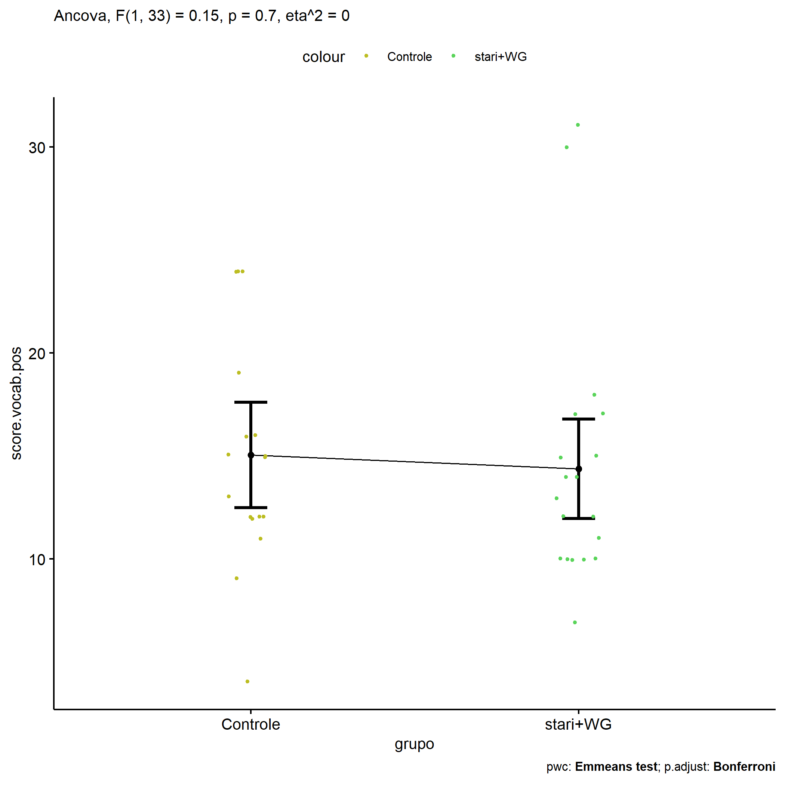<!-- -->

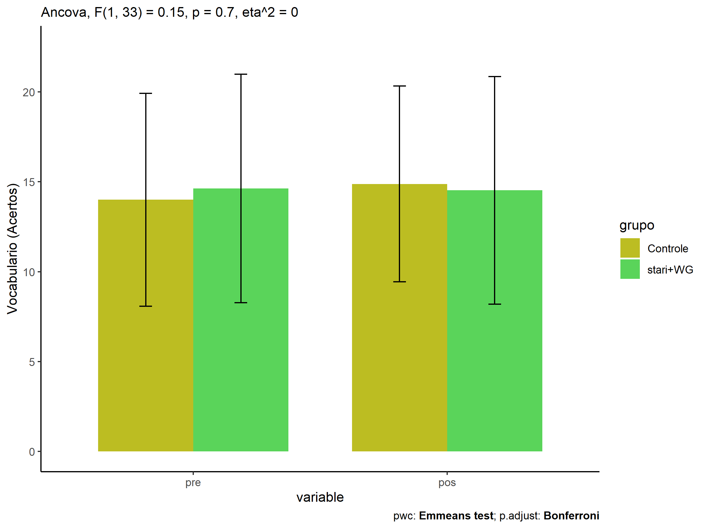<!-- -->

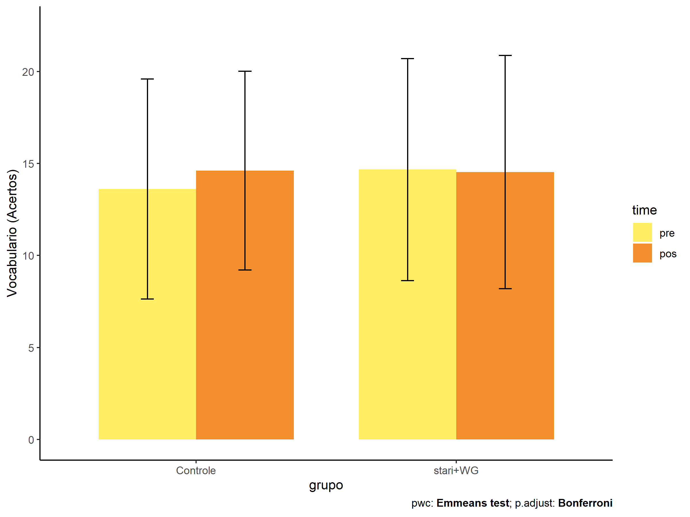<!-- -->

### Vocabulario Ensinado (Acertos)

| var                      | grupo    |   n | M (pre) | SE (pre) | M (unadj) | SE (unadj) | M (adj) | SE (adj) |
|:-------------------------|:---------|----:|--------:|---------:|----------:|-----------:|--------:|---------:|
| score.vocab.ensinado.pos | Controle |  20 |   2.250 |    0.410 |     2.100 |      0.376 |   2.326 |    0.375 |
| score.vocab.ensinado.pos | stari+WG |  21 |   3.238 |    0.308 |     2.857 |      0.404 |   2.642 |    0.365 |

| .y.                      | group1   | group2   | estimate | conf.low | conf.high |    se | statistic |     p | p.adj | p.adj.signif |
|:-------------------------|:---------|:---------|---------:|---------:|----------:|------:|----------:|------:|------:|:-------------|
| score.vocab.ensinado.pos | Controle | stari+WG |   -0.316 |   -1.400 |     0.768 | 0.535 |    -0.591 | 0.558 | 0.558 | ns           |
| score.vocab.ensinado.pre | Controle | stari+WG |   -0.988 |   -2.018 |     0.042 | 0.509 |    -1.941 | 0.060 | 0.060 | ns           |

| .y.                  | grupo    | group1 | group2 | estimate | conf.low | conf.high |    se | statistic |     p | p.adj | p.adj.signif |
|:---------------------|:---------|:-------|:-------|---------:|---------:|----------:|------:|----------:|------:|------:|:-------------|
| score.vocab.ensinado | Controle | pre    | pos    |    0.150 |   -0.921 |     1.221 | 0.538 |     0.279 | 0.781 | 0.781 | ns           |
| score.vocab.ensinado | stari+WG | pre    | pos    |    0.381 |   -0.665 |     1.427 | 0.525 |     0.725 | 0.470 | 0.470 | ns           |

    ## Scale for colour is already present.
    ## Adding another scale for colour, which will replace the existing scale.

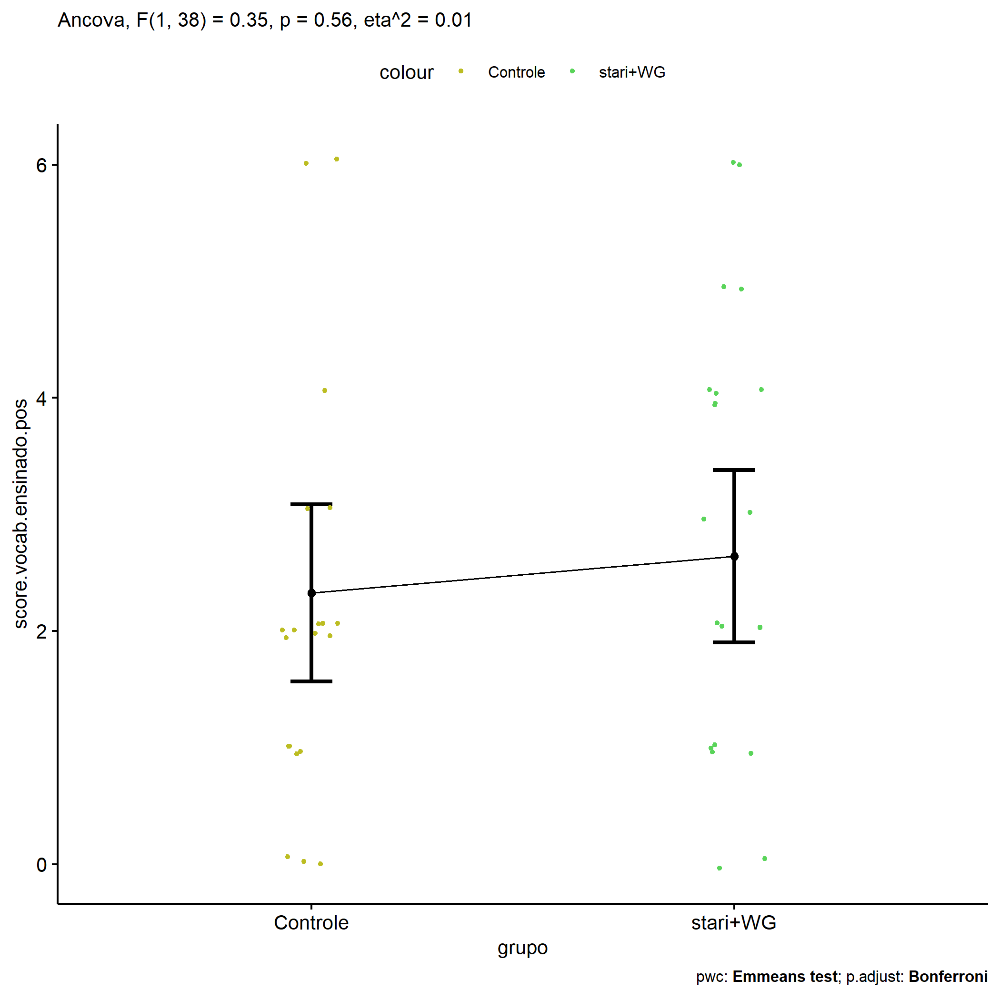<!-- -->

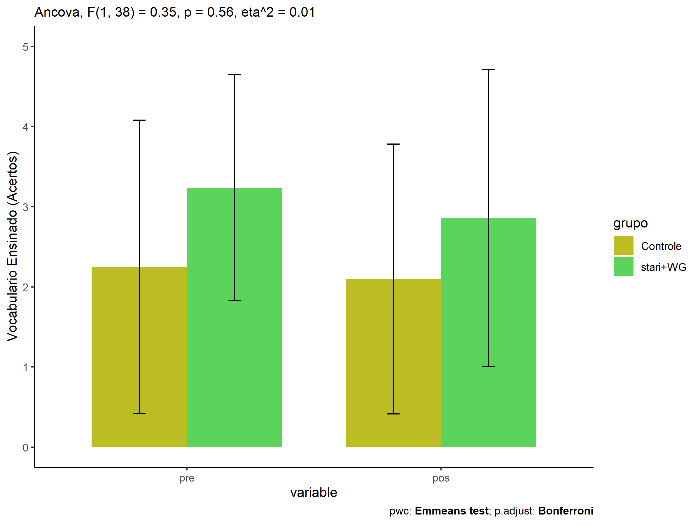<!-- -->

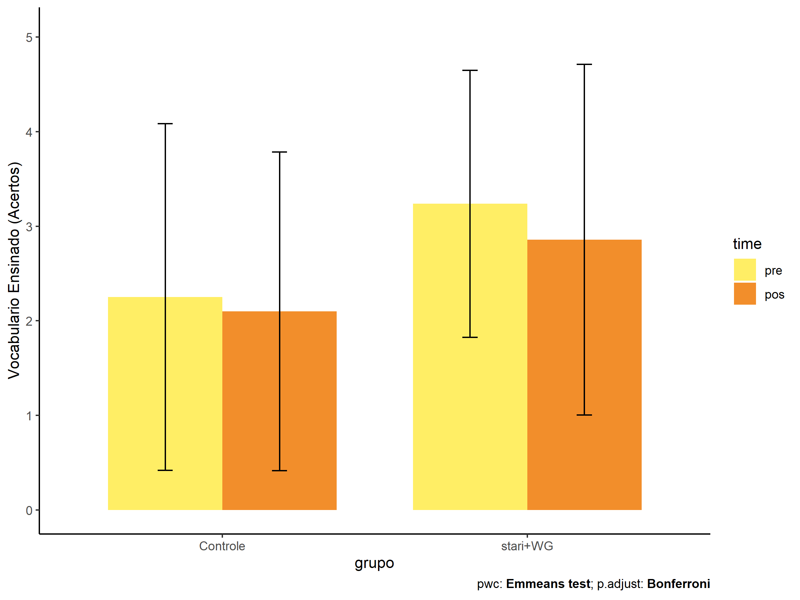<!-- -->

### Vocabulario Nao Ensinado (Acertos)

| var                          | grupo    |   n | M (pre) | SE (pre) | M (unadj) | SE (unadj) | M (adj) | SE (adj) |
|:-----------------------------|:---------|----:|--------:|---------:|----------:|-----------:|--------:|---------:|
| score.vocab.nao.ensinado.pos | Controle |  20 |  10.000 |    1.210 |    11.050 |      1.253 |  11.469 |    1.172 |
| score.vocab.nao.ensinado.pos | stari+WG |  21 |  11.429 |    1.139 |    10.286 |      1.379 |   9.887 |    1.144 |

| .y.                          | group1   | group2   | estimate | conf.low | conf.high |    se | statistic |     p | p.adj | p.adj.signif |
|:-----------------------------|:---------|:---------|---------:|---------:|----------:|------:|----------:|------:|------:|:-------------|
| score.vocab.nao.ensinado.pos | Controle | stari+WG |    1.582 |   -1.749 |     4.913 | 1.645 |     0.962 | 0.342 | 0.342 | ns           |
| score.vocab.nao.ensinado.pre | Controle | stari+WG |   -1.429 |   -4.787 |     1.929 | 1.660 |    -0.860 | 0.395 | 0.395 | ns           |

| .y.                      | grupo    | group1 | group2 | estimate | conf.low | conf.high |    se | statistic |     p | p.adj | p.adj.signif |
|:-------------------------|:---------|:-------|:-------|---------:|---------:|----------:|------:|----------:|------:|------:|:-------------|
| score.vocab.nao.ensinado | Controle | pre    | pos    |   -1.050 |   -4.612 |     2.512 | 1.789 |    -0.587 | 0.559 | 0.559 | ns           |
| score.vocab.nao.ensinado | stari+WG | pre    | pos    |    1.143 |   -2.333 |     4.619 | 1.746 |     0.655 | 0.515 | 0.515 | ns           |

    ## Scale for colour is already present.
    ## Adding another scale for colour, which will replace the existing scale.

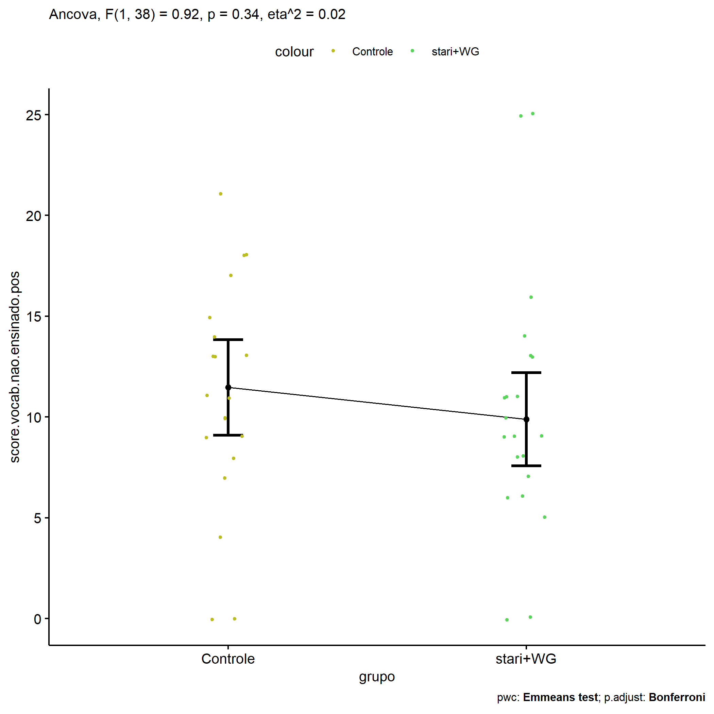<!-- -->

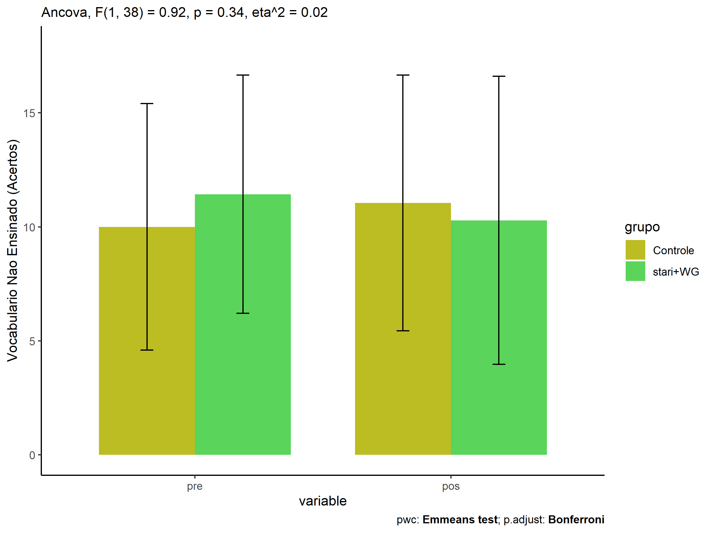<!-- -->

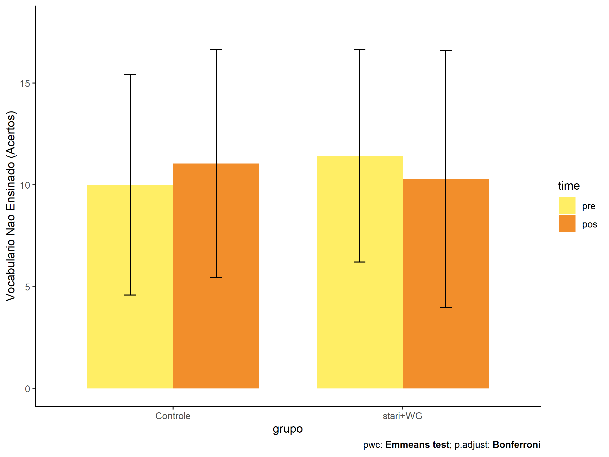<!-- -->

## factor: **genero**

### Vocabulario (Acertos)

| var             | genero |   n | M (pre) | SE (pre) | M (unadj) | SE (unadj) | M (adj) | SE (adj) |
|:----------------|:-------|----:|--------:|---------:|----------:|-----------:|--------:|---------:|
| score.vocab.pos | F      |  10 |  15.000 |    1.850 |    15.800 |      1.548 |  15.478 |    1.636 |
| score.vocab.pos | M      |  26 |  14.077 |    1.227 |    14.269 |      1.219 |  14.393 |    1.014 |

| .y.             | group1 | group2 | estimate | conf.low | conf.high |    se | statistic |     p | p.adj | p.adj.signif |
|:----------------|:-------|:-------|---------:|---------:|----------:|------:|----------:|------:|------:|:-------------|
| score.vocab.pos | F      | M      |    1.085 |   -2.835 |     5.004 | 1.927 |     0.563 | 0.577 | 0.577 | ns           |
| score.vocab.pre | F      | M      |    0.923 |   -3.727 |     5.574 | 2.288 |     0.403 | 0.689 | 0.689 | ns           |

| .y.         | genero | group1 | group2 | estimate | conf.low | conf.high |    se | statistic |     p | p.adj | p.adj.signif |
|:------------|:-------|:-------|:-------|---------:|---------:|----------:|------:|----------:|------:|------:|:-------------|
| score.vocab | F      | pre    | pos    |   -0.273 |   -5.454 |     4.909 | 2.599 |    -0.105 | 0.917 | 0.917 | ns           |
| score.vocab | M      | pre    | pos    |   -0.373 |   -3.576 |     2.830 | 1.607 |    -0.232 | 0.817 | 0.817 | ns           |

    ## Scale for colour is already present.
    ## Adding another scale for colour, which will replace the existing scale.

<!-- -->

<!-- -->

<!-- -->

### Vocabulario Ensinado (Acertos)

| var                      | genero |   n | M (pre) | SE (pre) | M (unadj) | SE (unadj) | M (adj) | SE (adj) |
|:-------------------------|:-------|----:|--------:|---------:|----------:|-----------:|--------:|---------:|
| score.vocab.ensinado.pos | F      |  11 |   2.909 |    0.530 |     2.364 |      0.453 |    2.29 |    0.495 |
| score.vocab.ensinado.pos | M      |  30 |   2.700 |    0.308 |     2.533 |      0.348 |    2.56 |    0.299 |

| .y.                      | group1 | group2 | estimate | conf.low | conf.high |    se | statistic |     p | p.adj | p.adj.signif |
|:-------------------------|:-------|:-------|---------:|---------:|----------:|------:|----------:|------:|------:|:-------------|
| score.vocab.ensinado.pos | F      | M      |   -0.270 |   -1.441 |     0.902 | 0.579 |    -0.466 | 0.644 | 0.644 | ns           |
| score.vocab.ensinado.pre | F      | M      |    0.209 |   -1.006 |     1.424 | 0.601 |     0.348 | 0.730 | 0.730 | ns           |

| .y.                  | genero | group1 | group2 | estimate | conf.low | conf.high |    se | statistic |     p | p.adj | p.adj.signif |
|:---------------------|:-------|:-------|:-------|---------:|---------:|----------:|------:|----------:|------:|------:|:-------------|
| score.vocab.ensinado | F      | pre    | pos    |    0.545 |   -0.947 |     2.038 | 0.750 |     0.727 | 0.469 | 0.469 | ns           |
| score.vocab.ensinado | M      | pre    | pos    |    0.167 |   -0.737 |     1.071 | 0.454 |     0.367 | 0.715 | 0.715 | ns           |

    ## Scale for colour is already present.
    ## Adding another scale for colour, which will replace the existing scale.

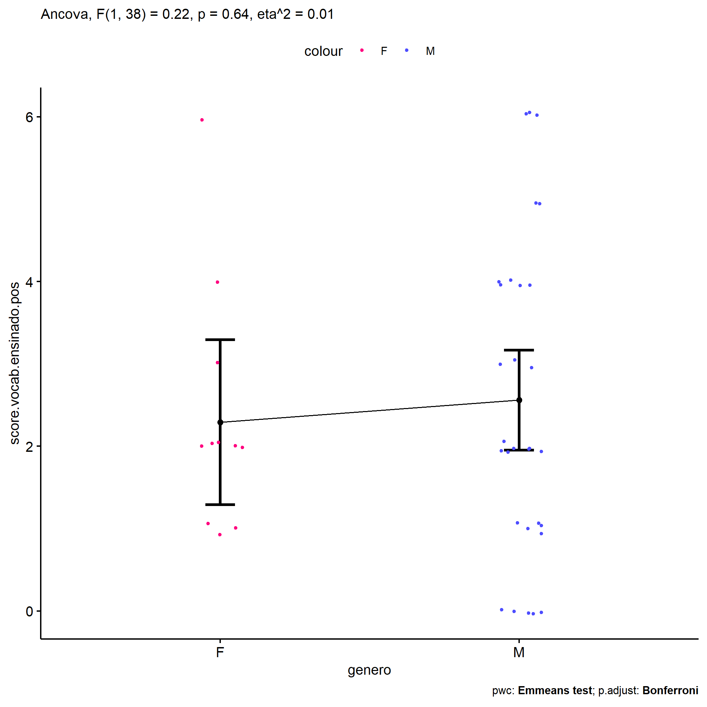<!-- -->

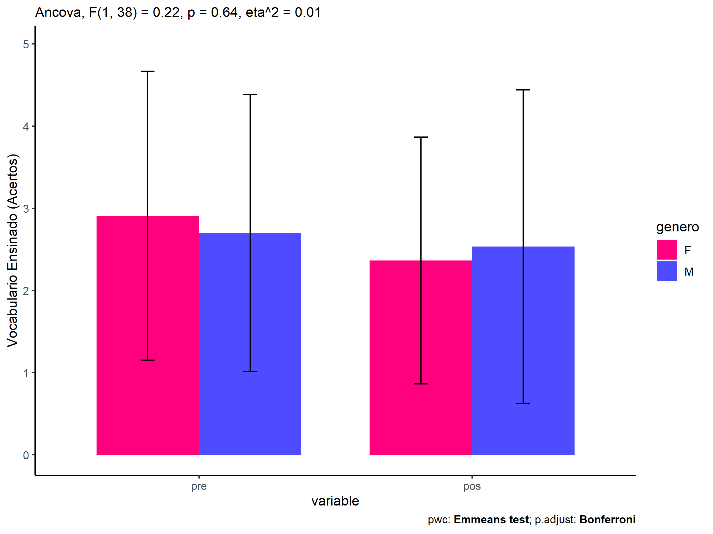<!-- -->

<!-- -->

### Vocabulario Nao Ensinado (Acertos)

| var                          | genero |   n | M (pre) | SE (pre) | M (unadj) | SE (unadj) | M (adj) | SE (adj) |
|:-----------------------------|:-------|----:|--------:|---------:|----------:|-----------:|--------:|---------:|
| score.vocab.nao.ensinado.pos | F      |  11 |  10.727 |    1.733 |    12.909 |      1.246 |  12.912 |    1.534 |
| score.vocab.nao.ensinado.pos | M      |  30 |  10.733 |    0.954 |     9.833 |      1.152 |   9.832 |    0.929 |

| .y.                          | group1 | group2 | estimate | conf.low | conf.high |    se | statistic |     p | p.adj | p.adj.signif |
|:-----------------------------|:-------|:-------|---------:|---------:|----------:|------:|----------:|------:|------:|:-------------|
| score.vocab.nao.ensinado.pos | F      | M      |    3.079 |    -0.55 |     6.709 | 1.793 |     1.717 | 0.094 | 0.094 | ns           |
| score.vocab.nao.ensinado.pre | F      | M      |   -0.006 |    -3.83 |     3.818 | 1.891 |    -0.003 | 0.997 | 0.997 | ns           |

| .y.                      | genero | group1 | group2 | estimate | conf.low | conf.high |    se | statistic |     p | p.adj | p.adj.signif |
|:-------------------------|:-------|:-------|:-------|---------:|---------:|----------:|------:|----------:|------:|------:|:-------------|
| score.vocab.nao.ensinado | F      | pre    | pos    |   -2.182 |   -6.937 |     2.573 | 2.388 |    -0.914 | 0.364 | 0.364 | ns           |
| score.vocab.nao.ensinado | M      | pre    | pos    |    0.900 |   -1.979 |     3.779 | 1.446 |     0.622 | 0.536 | 0.536 | ns           |

    ## Scale for colour is already present.
    ## Adding another scale for colour, which will replace the existing scale.

<!-- -->

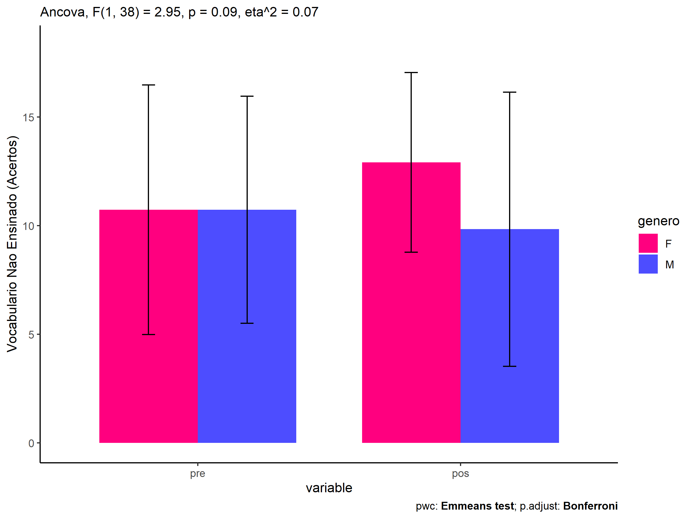<!-- -->

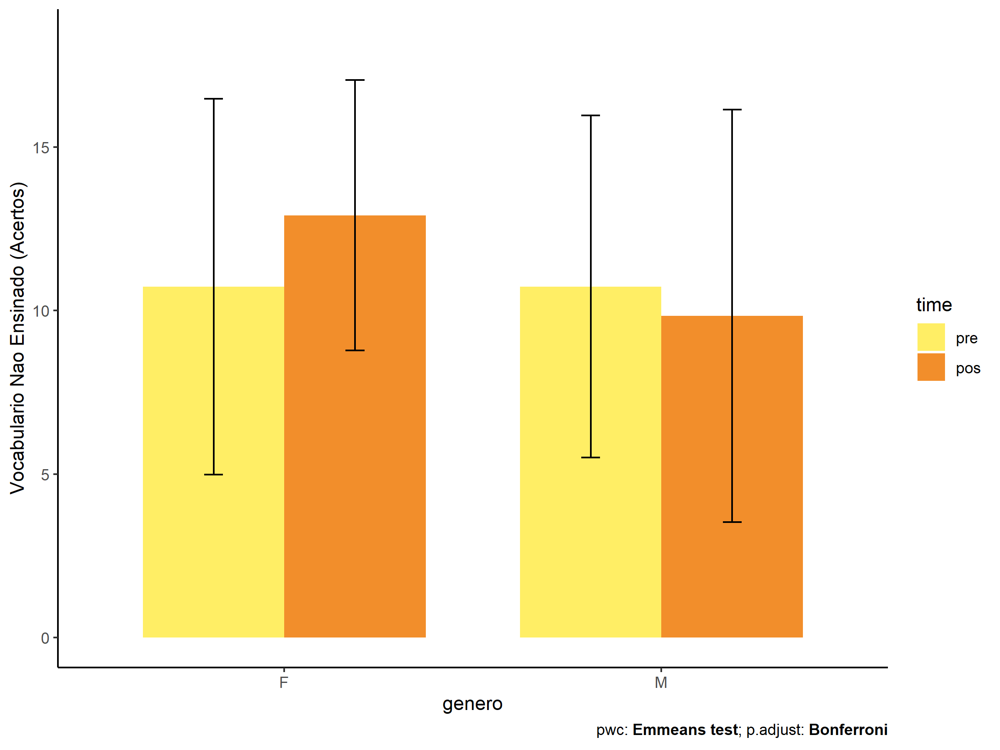<!-- -->

## factor: **idade**

### Vocabulario (Acertos)

| var             | idade |   n | M (pre) | SE (pre) | M (unadj) | SE (unadj) | M (adj) | SE (adj) |
|:----------------|:------|----:|--------:|---------:|----------:|-----------:|--------:|---------:|
| score.vocab.pos | 10y   |   7 |      18 |    2.992 |    18.714 |      3.037 |  17.416 |    2.228 |
| score.vocab.pos | 11y   |  20 |      14 |    1.382 |    14.300 |      1.271 |  14.755 |    1.295 |

| .y.             | group1 | group2 | estimate | conf.low | conf.high |    se | statistic |     p | p.adj | p.adj.signif |
|:----------------|:-------|:-------|---------:|---------:|----------:|------:|----------:|------:|------:|:-------------|
| score.vocab.pos | 10y    | 11y    |    2.661 |   -2.731 |     8.053 | 2.613 |     1.019 | 0.319 | 0.319 | ns           |
| score.vocab.pre | 10y    | 11y    |    4.000 |   -2.005 |    10.005 | 2.916 |     1.372 | 0.182 | 0.182 | ns           |

| .y.         | idade | group1 | group2 | estimate | conf.low | conf.high |    se | statistic |     p | p.adj | p.adj.signif |
|:------------|:------|:-------|:-------|---------:|---------:|----------:|------:|----------:|------:|------:|:-------------|
| score.vocab | 10y   | pre    | pos    |   -1.089 |   -7.539 |     5.360 | 3.218 |    -0.338 | 0.736 | 0.736 | ns           |
| score.vocab | 11y   | pre    | pos    |   -0.300 |   -4.241 |     3.641 | 1.966 |    -0.153 | 0.879 | 0.879 | ns           |

    ## Scale for colour is already present.
    ## Adding another scale for colour, which will replace the existing scale.

<!-- -->

<!-- -->

<!-- -->

### Vocabulario Ensinado (Acertos)

| var                      | idade |   n | M (pre) | SE (pre) | M (unadj) | SE (unadj) | M (adj) | SE (adj) |
|:-------------------------|:------|----:|--------:|---------:|----------:|-----------:|--------:|---------:|
| score.vocab.ensinado.pos | 10y   |   8 |   4.250 |    0.620 |     2.875 |      0.811 |   2.126 |    0.629 |
| score.vocab.ensinado.pos | 11y   |  21 |   2.619 |    0.334 |     2.571 |      0.382 |   2.756 |    0.365 |
| score.vocab.ensinado.pos | 13y   |   5 |   2.200 |    0.860 |     2.200 |      0.735 |   2.624 |    0.750 |

| .y.                      | group1 | group2 | estimate | conf.low | conf.high |    se | statistic |     p | p.adj | p.adj.signif |
|:-------------------------|:-------|:-------|---------:|---------:|----------:|------:|----------:|------:|------:|:-------------|
| score.vocab.ensinado.pos | 10y    | 11y    |   -0.629 |   -2.153 |     0.894 | 0.746 |    -0.844 | 0.405 | 1.000 | ns           |
| score.vocab.ensinado.pos | 10y    | 13y    |   -0.498 |   -2.561 |     1.566 | 1.010 |    -0.492 | 0.626 | 1.000 | ns           |
| score.vocab.ensinado.pos | 11y    | 13y    |    0.132 |   -1.551 |     1.815 | 0.824 |     0.160 | 0.874 | 1.000 | ns           |
| score.vocab.ensinado.pre | 10y    | 11y    |    1.631 |    0.242 |     3.020 | 0.681 |     2.395 | 0.023 | 0.068 | ns           |
| score.vocab.ensinado.pre | 10y    | 13y    |    2.050 |    0.145 |     3.955 | 0.934 |     2.194 | 0.036 | 0.108 | ns           |
| score.vocab.ensinado.pre | 11y    | 13y    |    0.419 |   -1.244 |     2.082 | 0.815 |     0.514 | 0.611 | 1.000 | ns           |

| .y.                  | idade | group1 | group2 | estimate | conf.low | conf.high |    se | statistic |     p | p.adj | p.adj.signif |
|:---------------------|:------|:-------|:-------|---------:|---------:|----------:|------:|----------:|------:|------:|:-------------|
| score.vocab.ensinado | 10y   | pre    | pos    |    1.375 |   -0.384 |     3.134 | 0.880 |     1.562 | 0.123 | 0.123 | ns           |
| score.vocab.ensinado | 11y   | pre    | pos    |    0.048 |   -1.038 |     1.133 | 0.543 |     0.088 | 0.930 | 0.930 | ns           |
| score.vocab.ensinado | 13y   | pre    | pos    |    0.000 |   -2.225 |     2.225 | 1.113 |     0.000 | 1.000 | 1.000 | ns           |

    ## Scale for colour is already present.
    ## Adding another scale for colour, which will replace the existing scale.

<!-- -->

<!-- -->

<!-- -->

### Vocabulario Nao Ensinado (Acertos)

| var                          | idade |   n | M (pre) | SE (pre) | M (unadj) | SE (unadj) | M (adj) | SE (adj) |
|:-----------------------------|:------|----:|--------:|---------:|----------:|-----------:|--------:|---------:|
| score.vocab.nao.ensinado.pos | 10y   |   8 |  13.375 |    2.052 |    13.500 |      2.872 |  12.326 |    1.898 |
| score.vocab.nao.ensinado.pos | 11y   |  21 |  10.714 |    1.233 |    11.048 |      1.176 |  11.205 |    1.148 |
| score.vocab.nao.ensinado.pos | 13y   |   5 |   8.600 |    2.561 |     9.200 |      1.356 |  10.416 |    2.384 |

| .y.                          | group1 | group2 | estimate | conf.low | conf.high |    se | statistic |     p | p.adj | p.adj.signif |
|:-----------------------------|:-------|:-------|---------:|---------:|----------:|------:|----------:|------:|------:|:-------------|
| score.vocab.nao.ensinado.pos | 10y    | 11y    |    1.121 |   -3.427 |     5.668 | 2.227 |     0.503 | 0.618 | 1.000 | ns           |
| score.vocab.nao.ensinado.pos | 10y    | 13y    |    1.910 |   -4.416 |     8.236 | 3.098 |     0.617 | 0.542 | 1.000 | ns           |
| score.vocab.nao.ensinado.pos | 11y    | 13y    |    0.789 |   -4.597 |     6.176 | 2.637 |     0.299 | 0.767 | 1.000 | ns           |
| score.vocab.nao.ensinado.pre | 10y    | 11y    |    2.661 |   -2.165 |     7.486 | 2.366 |     1.125 | 0.269 | 0.808 | ns           |
| score.vocab.nao.ensinado.pre | 10y    | 13y    |    4.775 |   -1.846 |    11.396 | 3.247 |     1.471 | 0.151 | 0.454 | ns           |
| score.vocab.nao.ensinado.pre | 11y    | 13y    |    2.114 |   -3.665 |     7.894 | 2.834 |     0.746 | 0.461 | 1.000 | ns           |

| .y.                      | idade | group1 | group2 | estimate | conf.low | conf.high |    se | statistic |     p | p.adj | p.adj.signif |
|:-------------------------|:------|:-------|:-------|---------:|---------:|----------:|------:|----------:|------:|------:|:-------------|
| score.vocab.nao.ensinado | 10y   | pre    | pos    |   -0.125 |   -5.921 |     5.671 | 2.900 |    -0.043 | 0.966 | 0.966 | ns           |
| score.vocab.nao.ensinado | 11y   | pre    | pos    |   -0.333 |   -3.911 |     3.244 | 1.790 |    -0.186 | 0.853 | 0.853 | ns           |
| score.vocab.nao.ensinado | 13y   | pre    | pos    |   -0.600 |   -7.932 |     6.732 | 3.668 |    -0.164 | 0.871 | 0.871 | ns           |

    ## Scale for colour is already present.
    ## Adding another scale for colour, which will replace the existing scale.

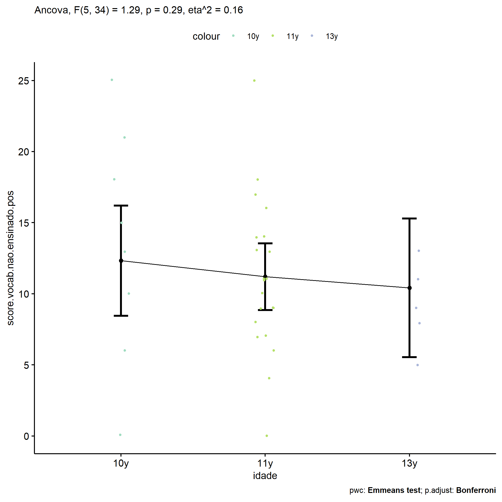<!-- -->

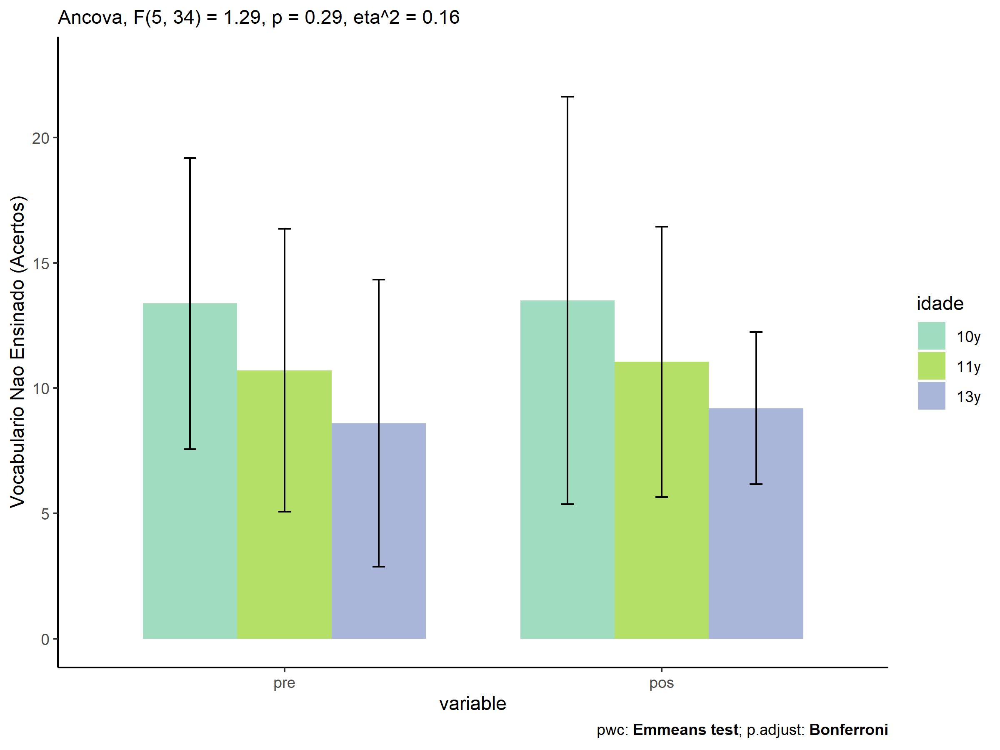<!-- -->

<!-- -->

## factor: **zona.participante**

### Vocabulario (Acertos)

| var             | zona.participante |   n | M (pre) | SE (pre) | M (unadj) | SE (unadj) | M (adj) | SE (adj) |
|:----------------|:------------------|----:|--------:|---------:|----------:|-----------:|--------:|---------:|
| score.vocab.pos | Rural             |   8 |  16.625 |    3.070 |    13.750 |      2.704 |  12.752 |    1.986 |
| score.vocab.pos | Urbana            |  18 |  14.222 |    1.317 |    15.944 |      1.494 |  16.388 |    1.317 |

| .y.             | group1 | group2 | estimate | conf.low | conf.high |    se | statistic |     p | p.adj | p.adj.signif |
|:----------------|:-------|:-------|---------:|---------:|----------:|------:|----------:|------:|------:|:-------------|
| score.vocab.pos | Urbana | Rural  |    3.636 |   -1.325 |     8.597 | 2.398 |     1.516 | 0.143 | 0.143 | ns           |
| score.vocab.pre | Urbana | Rural  |   -2.403 |   -8.228 |     3.423 | 2.823 |    -0.851 | 0.403 | 0.403 | ns           |

| .y.         | zona.participante | group1 | group2 | estimate | conf.low | conf.high |    se | statistic |     p | p.adj | p.adj.signif |
|:------------|:------------------|:-------|:-------|---------:|---------:|----------:|------:|----------:|------:|------:|:-------------|
| score.vocab | Urbana            | pre    | pos    |   -2.102 |   -6.498 |     2.293 | 2.188 |    -0.961 | 0.341 | 0.341 | ns           |
| score.vocab | Rural             | pre    | pos    |    3.292 |   -3.202 |     9.785 | 3.233 |     1.018 | 0.314 | 0.314 | ns           |

    ## Scale for colour is already present.
    ## Adding another scale for colour, which will replace the existing scale.

<!-- -->

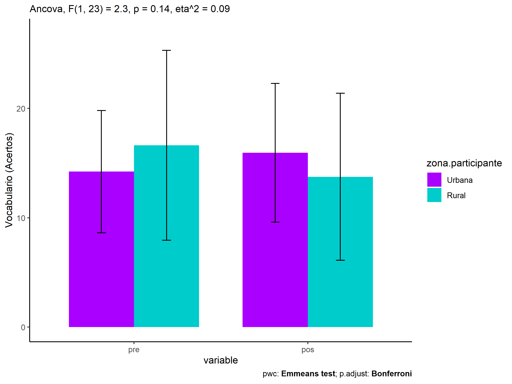<!-- -->

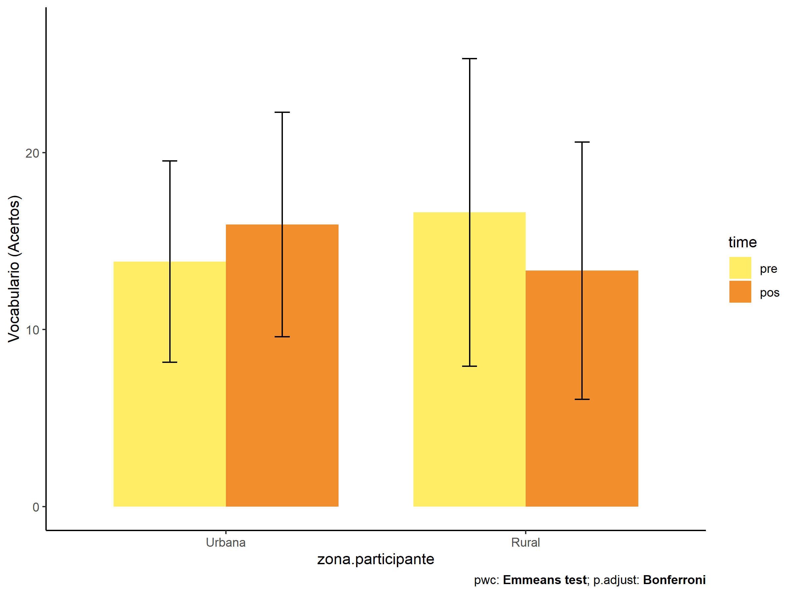<!-- -->

### Vocabulario Ensinado (Acertos)

| var                      | zona.participante |   n | M (pre) | SE (pre) | M (unadj) | SE (unadj) | M (adj) | SE (adj) |
|:-------------------------|:------------------|----:|--------:|---------:|----------:|-----------:|--------:|---------:|
| score.vocab.ensinado.pos | Rural             |   9 |   3.111 |    0.772 |     2.778 |      0.547 |   2.634 |    0.551 |
| score.vocab.ensinado.pos | Urbana            |  20 |   2.750 |    0.369 |     2.850 |      0.460 |   2.915 |    0.369 |

| .y.                      | group1 | group2 | estimate | conf.low | conf.high |    se | statistic |     p | p.adj | p.adj.signif |
|:-------------------------|:-------|:-------|---------:|---------:|----------:|------:|----------:|------:|------:|:-------------|
| score.vocab.ensinado.pos | Urbana | Rural  |    0.280 |   -1.087 |     1.647 | 0.665 |     0.421 | 0.677 | 0.677 | ns           |
| score.vocab.ensinado.pre | Urbana | Rural  |   -0.361 |   -1.903 |     1.181 | 0.751 |    -0.481 | 0.635 | 0.635 | ns           |

| .y.                  | zona.participante | group1 | group2 | estimate | conf.low | conf.high |    se | statistic |     p | p.adj | p.adj.signif |
|:---------------------|:------------------|:-------|:-------|---------:|---------:|----------:|------:|----------:|------:|------:|:-------------|
| score.vocab.ensinado | Urbana            | pre    | pos    |   -0.100 |   -1.310 |     1.110 | 0.604 |    -0.166 | 0.869 | 0.869 | ns           |
| score.vocab.ensinado | Rural             | pre    | pos    |    0.333 |   -1.471 |     2.137 | 0.900 |     0.370 | 0.712 | 0.712 | ns           |

    ## Scale for colour is already present.
    ## Adding another scale for colour, which will replace the existing scale.

<!-- -->

<!-- -->

<!-- -->

### Vocabulario Nao Ensinado (Acertos)

| var                          | zona.participante |   n | M (pre) | SE (pre) | M (unadj) | SE (unadj) | M (adj) | SE (adj) |
|:-----------------------------|:------------------|----:|--------:|---------:|----------:|-----------:|--------:|---------:|
| score.vocab.nao.ensinado.pos | Rural             |   9 |  11.667 |    2.651 |    10.556 |      2.069 |   9.967 |    1.679 |
| score.vocab.nao.ensinado.pos | Urbana            |  20 |  10.400 |    1.127 |    11.500 |      1.446 |  11.765 |    1.124 |

| .y.                          | group1 | group2 | estimate | conf.low | conf.high |    se | statistic |     p | p.adj | p.adj.signif |
|:-----------------------------|:-------|:-------|---------:|---------:|----------:|------:|----------:|------:|------:|:-------------|
| score.vocab.nao.ensinado.pos | Urbana | Rural  |    1.797 |   -2.365 |     5.959 | 2.025 |     0.888 | 0.383 | 0.383 | ns           |
| score.vocab.nao.ensinado.pre | Urbana | Rural  |   -1.267 |   -6.251 |     3.717 | 2.429 |    -0.521 | 0.606 | 0.606 | ns           |

| .y.                      | zona.participante | group1 | group2 | estimate | conf.low | conf.high |    se | statistic |     p | p.adj | p.adj.signif |
|:-------------------------|:------------------|:-------|:-------|---------:|---------:|----------:|------:|----------:|------:|------:|:-------------|
| score.vocab.nao.ensinado | Urbana            | pre    | pos    |   -1.100 |   -5.046 |     2.846 | 1.968 |    -0.559 | 0.579 | 0.579 | ns           |
| score.vocab.nao.ensinado | Rural             | pre    | pos    |    1.111 |   -4.771 |     6.994 | 2.934 |     0.379 | 0.706 | 0.706 | ns           |

    ## Scale for colour is already present.
    ## Adding another scale for colour, which will replace the existing scale.

<!-- -->

<!-- -->

<!-- -->

## factor: **escola**

### Vocabulario (Acertos)

| var             | escola |   n | M (pre) | SE (pre) | M (unadj) | SE (unadj) | M (adj) | SE (adj) |
|:----------------|:-------|----:|--------:|---------:|----------:|-----------:|--------:|---------:|
| score.vocab.pos | E1     |   6 |  18.500 |    2.029 |    18.667 |      2.459 |  16.517 |    2.293 |
| score.vocab.pos | E2     |   5 |  14.800 |    2.223 |    13.400 |      1.030 |  13.216 |    2.390 |
| score.vocab.pos | E4     |   7 |  16.571 |    3.046 |    14.571 |      3.015 |  13.447 |    2.053 |
| score.vocab.pos | E5     |  15 |  11.733 |    1.232 |    13.867 |      1.508 |  15.312 |    1.459 |

| .y.             | group1 | group2 | estimate | conf.low | conf.high |    se | statistic |     p | p.adj | p.adj.signif |
|:----------------|:-------|:-------|---------:|---------:|----------:|------:|----------:|------:|------:|:-------------|
| score.vocab.pos | E1     | E2     |    3.301 |   -3.457 |    10.059 | 3.299 |     1.000 | 0.326 | 1.000 | ns           |
| score.vocab.pos | E1     | E4     |    3.071 |   -3.057 |     9.198 | 2.991 |     1.026 | 0.313 | 1.000 | ns           |
| score.vocab.pos | E1     | E5     |    1.205 |   -4.612 |     7.022 | 2.840 |     0.424 | 0.675 | 1.000 | ns           |
| score.vocab.pos | E2     | E4     |   -0.230 |   -6.670 |     6.209 | 3.144 |    -0.073 | 0.942 | 1.000 | ns           |
| score.vocab.pos | E2     | E5     |   -2.096 |   -7.853 |     3.662 | 2.811 |    -0.746 | 0.462 | 1.000 | ns           |
| score.vocab.pos | E4     | E5     |   -1.866 |   -7.167 |     3.436 | 2.588 |    -0.721 | 0.477 | 1.000 | ns           |
| score.vocab.pre | E1     | E2     |    3.700 |   -3.317 |    10.717 | 3.431 |     1.078 | 0.290 | 1.000 | ns           |
| score.vocab.pre | E1     | E4     |    1.929 |   -4.518 |     8.375 | 3.152 |     0.612 | 0.545 | 1.000 | ns           |
| score.vocab.pre | E1     | E5     |    6.767 |    1.169 |    12.364 | 2.737 |     2.472 | 0.020 | 0.117 | ns           |
| score.vocab.pre | E2     | E4     |   -1.771 |   -8.557 |     5.014 | 3.318 |    -0.534 | 0.597 | 1.000 | ns           |
| score.vocab.pre | E2     | E5     |    3.067 |   -2.917 |     9.051 | 2.926 |     1.048 | 0.303 | 1.000 | ns           |
| score.vocab.pre | E4     | E5     |    4.838 |   -0.466 |    10.142 | 2.593 |     1.865 | 0.072 | 0.434 | ns           |

| .y.         | escola | group1 | group2 | estimate | conf.low | conf.high |    se | statistic |     p | p.adj | p.adj.signif |
|:------------|:-------|:-------|:-------|---------:|---------:|----------:|------:|----------:|------:|------:|:-------------|
| score.vocab | E1     | pre    | pos    |   -1.810 |   -8.368 |     4.749 | 3.280 |    -0.552 | 0.583 | 0.583 | ns           |
| score.vocab | E2     | pre    | pos    |    1.433 |   -5.705 |     8.572 | 3.570 |     0.401 | 0.689 | 0.689 | ns           |
| score.vocab | E4     | pre    | pos    |    2.000 |   -4.302 |     8.302 | 3.151 |     0.635 | 0.528 | 0.528 | ns           |
| score.vocab | E5     | pre    | pos    |   -1.892 |   -6.129 |     2.345 | 2.119 |    -0.893 | 0.375 | 0.375 | ns           |

    ## Scale for colour is already present.
    ## Adding another scale for colour, which will replace the existing scale.

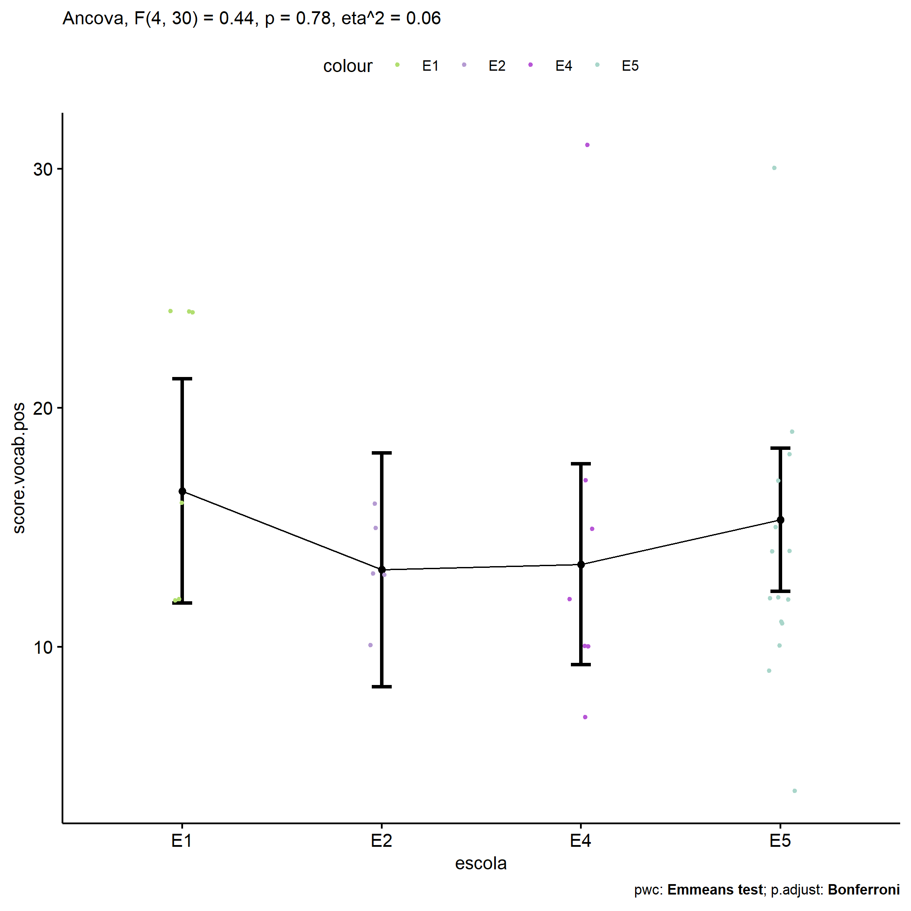<!-- -->

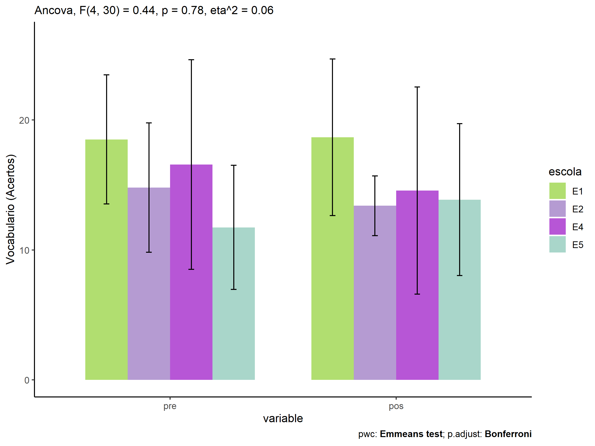<!-- -->

<!-- -->

### Vocabulario Ensinado (Acertos)

| var                      | escola |   n | M (pre) | SE (pre) | M (unadj) | SE (unadj) | M (adj) | SE (adj) |
|:-------------------------|:-------|----:|--------:|---------:|----------:|-----------:|--------:|---------:|
| score.vocab.ensinado.pos | E1     |   8 |   3.125 |    0.766 |     2.250 |      0.881 |   2.065 |    0.586 |
| score.vocab.ensinado.pos | E2     |   6 |   2.167 |    0.307 |     2.333 |      0.558 |   2.597 |    0.679 |
| score.vocab.ensinado.pos | E4     |   7 |   4.000 |    0.787 |     3.857 |      0.738 |   3.263 |    0.661 |
| score.vocab.ensinado.pos | E5     |  16 |   2.188 |    0.319 |     2.375 |      0.352 |   2.629 |    0.422 |

| .y.                      | group1 | group2 | estimate | conf.low | conf.high |    se | statistic |     p | p.adj | p.adj.signif |
|:-------------------------|:-------|:-------|---------:|---------:|----------:|------:|----------:|------:|------:|:-------------|
| score.vocab.ensinado.pos | E1     | E2     |   -0.532 |   -2.374 |     1.311 | 0.905 |    -0.588 | 0.561 | 1.000 | ns           |
| score.vocab.ensinado.pos | E1     | E4     |   -1.198 |   -2.961 |     0.565 | 0.865 |    -1.384 | 0.176 | 1.000 | ns           |
| score.vocab.ensinado.pos | E1     | E5     |   -0.563 |   -2.053 |     0.926 | 0.731 |    -0.770 | 0.447 | 1.000 | ns           |
| score.vocab.ensinado.pos | E2     | E4     |   -0.666 |   -2.645 |     1.312 | 0.971 |    -0.686 | 0.498 | 1.000 | ns           |
| score.vocab.ensinado.pos | E2     | E5     |   -0.032 |   -1.636 |     1.572 | 0.788 |    -0.041 | 0.968 | 1.000 | ns           |
| score.vocab.ensinado.pos | E4     | E5     |    0.634 |   -1.019 |     2.288 | 0.812 |     0.782 | 0.440 | 1.000 | ns           |
| score.vocab.ensinado.pre | E1     | E2     |    0.958 |   -0.817 |     2.734 | 0.873 |     1.098 | 0.280 | 1.000 | ns           |
| score.vocab.ensinado.pre | E1     | E4     |   -0.875 |   -2.576 |     0.826 | 0.836 |    -1.046 | 0.303 | 1.000 | ns           |
| score.vocab.ensinado.pre | E1     | E5     |    0.937 |   -0.486 |     2.361 | 0.700 |     1.340 | 0.189 | 1.000 | ns           |
| score.vocab.ensinado.pre | E2     | E4     |   -1.833 |   -3.662 |    -0.005 | 0.899 |    -2.040 | 0.049 | 0.297 | ns           |
| score.vocab.ensinado.pre | E2     | E5     |   -0.021 |   -1.594 |     1.553 | 0.773 |    -0.027 | 0.979 | 1.000 | ns           |
| score.vocab.ensinado.pre | E4     | E5     |    1.812 |    0.323 |     3.302 | 0.732 |     2.476 | 0.019 | 0.112 | ns           |

| .y.                  | escola | group1 | group2 | estimate | conf.low | conf.high |    se | statistic |     p | p.adj | p.adj.signif |
|:---------------------|:-------|:-------|:-------|---------:|---------:|----------:|------:|----------:|------:|------:|:-------------|
| score.vocab.ensinado | E1     | pre    | pos    |    0.875 |   -0.826 |     2.576 | 0.852 |     1.027 | 0.308 | 0.308 | ns           |
| score.vocab.ensinado | E2     | pre    | pos    |   -0.167 |   -2.131 |     1.797 | 0.984 |    -0.169 | 0.866 | 0.866 | ns           |
| score.vocab.ensinado | E4     | pre    | pos    |    0.143 |   -1.675 |     1.961 | 0.911 |     0.157 | 0.876 | 0.876 | ns           |
| score.vocab.ensinado | E5     | pre    | pos    |   -0.187 |   -1.390 |     1.015 | 0.602 |    -0.311 | 0.757 | 0.757 | ns           |

    ## Scale for colour is already present.
    ## Adding another scale for colour, which will replace the existing scale.

<!-- -->

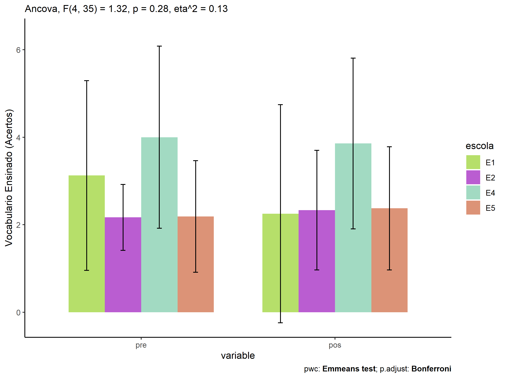<!-- -->

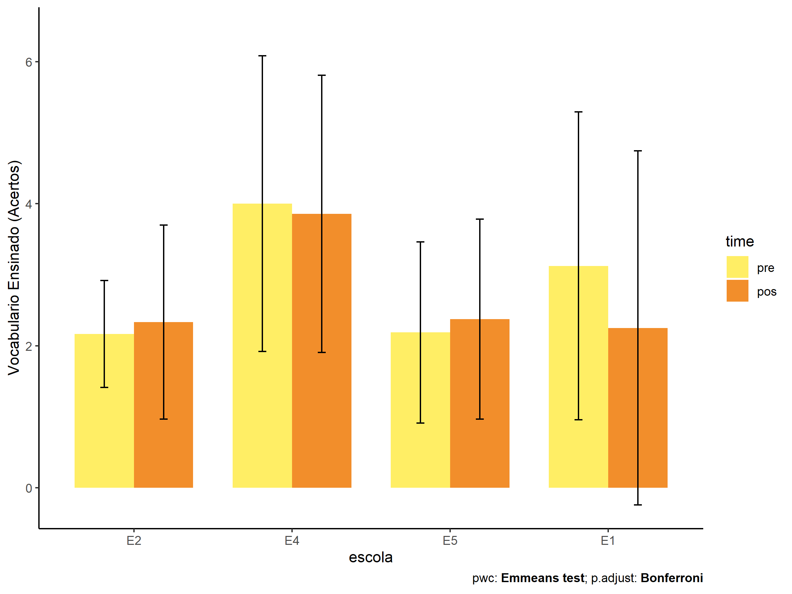<!-- -->

### Vocabulario Nao Ensinado (Acertos)

| var                          | escola |   n | M (pre) | SE (pre) | M (unadj) | SE (unadj) | M (adj) | SE (adj) |
|:-----------------------------|:-------|----:|--------:|---------:|----------:|-----------:|--------:|---------:|
| score.vocab.nao.ensinado.pos | E1     |   8 |  11.625 |    2.236 |    11.750 |      2.839 |  11.139 |    1.728 |
| score.vocab.nao.ensinado.pos | E2     |   6 |  12.667 |    1.626 |     8.833 |      2.007 |   7.488 |    2.012 |
| score.vocab.nao.ensinado.pos | E4     |   7 |  12.571 |    2.399 |    10.714 |      2.652 |   9.436 |    1.864 |
| score.vocab.nao.ensinado.pos | E5     |  16 |   8.812 |    1.198 |    11.250 |      1.226 |  12.619 |    1.257 |

| .y.                          | group1 | group2 | estimate | conf.low | conf.high |    se | statistic |     p | p.adj | p.adj.signif |
|:-----------------------------|:-------|:-------|---------:|---------:|----------:|------:|----------:|------:|------:|:-------------|
| score.vocab.nao.ensinado.pos | E1     | E2     |    3.650 |   -1.721 |     9.021 | 2.637 |     1.384 | 0.176 | 1.000 | ns           |
| score.vocab.nao.ensinado.pos | E1     | E4     |    1.702 |   -3.444 |     6.848 | 2.526 |     0.674 | 0.505 | 1.000 | ns           |
| score.vocab.nao.ensinado.pos | E1     | E5     |   -1.481 |   -5.874 |     2.912 | 2.157 |    -0.687 | 0.497 | 1.000 | ns           |
| score.vocab.nao.ensinado.pos | E2     | E4     |   -1.948 |   -7.470 |     3.574 | 2.711 |    -0.719 | 0.478 | 1.000 | ns           |
| score.vocab.nao.ensinado.pos | E2     | E5     |   -5.131 |  -10.043 |    -0.219 | 2.411 |    -2.128 | 0.041 | 0.247 | ns           |
| score.vocab.nao.ensinado.pos | E4     | E5     |   -3.183 |   -7.842 |     1.476 | 2.287 |    -1.392 | 0.174 | 1.000 | ns           |
| score.vocab.nao.ensinado.pre | E1     | E2     |   -1.042 |   -6.923 |     4.839 | 2.891 |    -0.360 | 0.721 | 1.000 | ns           |
| score.vocab.nao.ensinado.pre | E1     | E4     |   -0.946 |   -6.582 |     4.689 | 2.770 |    -0.342 | 0.735 | 1.000 | ns           |
| score.vocab.nao.ensinado.pre | E1     | E5     |    2.812 |   -1.903 |     7.528 | 2.318 |     1.214 | 0.234 | 1.000 | ns           |
| score.vocab.nao.ensinado.pre | E2     | E4     |    0.095 |   -5.963 |     6.154 | 2.978 |     0.032 | 0.975 | 1.000 | ns           |
| score.vocab.nao.ensinado.pre | E2     | E5     |    3.854 |   -1.359 |     9.067 | 2.562 |     1.504 | 0.142 | 0.852 | ns           |
| score.vocab.nao.ensinado.pre | E4     | E5     |    3.759 |   -1.176 |     8.694 | 2.425 |     1.550 | 0.131 | 0.784 | ns           |

| .y.                      | escola | group1 | group2 | estimate | conf.low | conf.high |    se | statistic |     p | p.adj | p.adj.signif |
|:-------------------------|:-------|:-------|:-------|---------:|---------:|----------:|------:|----------:|------:|------:|:-------------|
| score.vocab.nao.ensinado | E1     | pre    | pos    |   -0.125 |   -5.855 |     5.605 | 2.870 |    -0.044 | 0.965 | 0.965 | ns           |
| score.vocab.nao.ensinado | E2     | pre    | pos    |    3.833 |   -2.783 |    10.449 | 3.314 |     1.157 | 0.252 | 0.252 | ns           |
| score.vocab.nao.ensinado | E4     | pre    | pos    |    1.857 |   -4.268 |     7.982 | 3.068 |     0.605 | 0.547 | 0.547 | ns           |
| score.vocab.nao.ensinado | E5     | pre    | pos    |   -2.437 |   -6.489 |     1.614 | 2.029 |    -1.201 | 0.234 | 0.234 | ns           |

    ## Scale for colour is already present.
    ## Adding another scale for colour, which will replace the existing scale.

<!-- -->

<!-- -->

<!-- -->

## factor: **zona.escola**

### Vocabulario (Acertos)

| var             | zona.escola |   n | M (pre) | SE (pre) | M (unadj) | SE (unadj) | M (adj) | SE (adj) |
|:----------------|:------------|----:|--------:|---------:|----------:|-----------:|--------:|---------:|
| score.vocab.pos | Rural       |  10 |  15.500 |    2.428 |    14.200 |      2.112 |  13.614 |    1.635 |
| score.vocab.pos | Urbana      |  26 |  13.885 |    1.069 |    14.885 |      1.104 |  15.110 |    1.011 |

| .y.             | group1 | group2 | estimate | conf.low | conf.high |    se | statistic |     p | p.adj | p.adj.signif |
|:----------------|:-------|:-------|---------:|---------:|----------:|------:|----------:|------:|------:|:-------------|
| score.vocab.pos | Urbana | Rural  |    1.496 |   -2.426 |     5.418 | 1.928 |     0.776 | 0.443 | 0.443 | ns           |
| score.vocab.pre | Urbana | Rural  |   -1.615 |   -6.243 |     3.012 | 2.277 |    -0.709 | 0.483 | 0.483 | ns           |

| .y.         | zona.escola | group1 | group2 | estimate | conf.low | conf.high |    se | statistic |     p | p.adj | p.adj.signif |
|:------------|:------------|:-------|:-------|---------:|---------:|----------:|------:|----------:|------:|------:|:-------------|
| score.vocab | Urbana      | pre    | pos    |   -1.025 |   -4.218 |     2.167 | 1.601 |    -0.640 | 0.524 | 0.524 | ns           |
| score.vocab | Rural       | pre    | pos    |    1.255 |   -3.917 |     6.426 | 2.594 |     0.484 | 0.630 | 0.630 | ns           |

    ## Scale for colour is already present.
    ## Adding another scale for colour, which will replace the existing scale.

<!-- -->

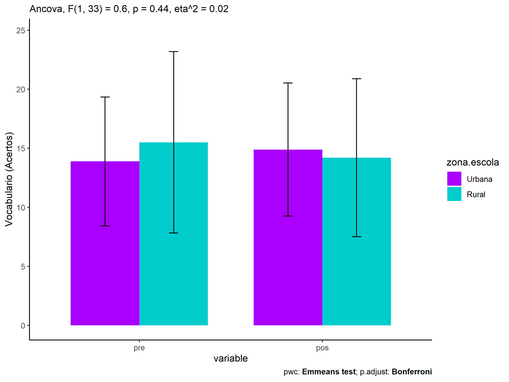<!-- -->

<!-- -->

### Vocabulario Ensinado (Acertos)

| var                      | zona.escola |   n | M (pre) | SE (pre) | M (unadj) | SE (unadj) | M (adj) | SE (adj) |
|:-------------------------|:------------|----:|--------:|---------:|----------:|-----------:|--------:|---------:|
| score.vocab.ensinado.pos | Rural       |  11 |   3.636 |    0.576 |     2.909 |      0.625 |   2.492 |    0.516 |
| score.vocab.ensinado.pos | Urbana      |  30 |   2.433 |    0.274 |     2.333 |      0.308 |   2.486 |    0.305 |

| .y.                      | group1 | group2 | estimate | conf.low | conf.high |    se | statistic |     p | p.adj | p.adj.signif |
|:-------------------------|:-------|:-------|---------:|---------:|----------:|------:|----------:|------:|------:|:-------------|
| score.vocab.ensinado.pos | Urbana | Rural  |   -0.006 |   -1.244 |     1.233 | 0.612 |    -0.009 | 0.993 | 0.993 | ns           |
| score.vocab.ensinado.pre | Urbana | Rural  |   -1.203 |   -2.356 |    -0.051 | 0.570 |    -2.111 | 0.041 | 0.041 | \*           |

| .y.                  | zona.escola | group1 | group2 | estimate | conf.low | conf.high |    se | statistic |     p | p.adj | p.adj.signif |
|:---------------------|:------------|:-------|:-------|---------:|---------:|----------:|------:|----------:|------:|------:|:-------------|
| score.vocab.ensinado | Urbana      | pre    | pos    |    0.100 |   -0.778 |     0.978 | 0.441 |     0.227 | 0.821 | 0.821 | ns           |
| score.vocab.ensinado | Rural       | pre    | pos    |    0.727 |   -0.722 |     2.177 | 0.728 |     0.999 | 0.321 | 0.321 | ns           |

    ## Scale for colour is already present.
    ## Adding another scale for colour, which will replace the existing scale.

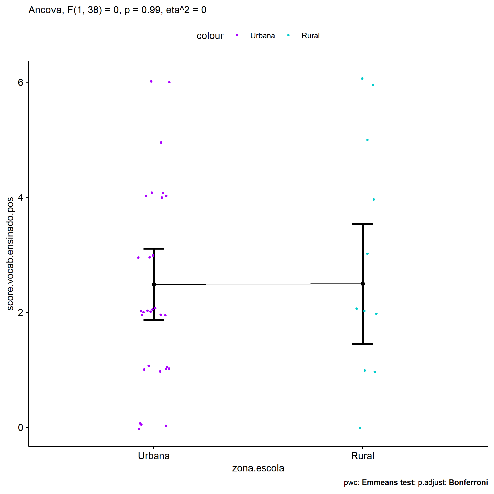<!-- -->

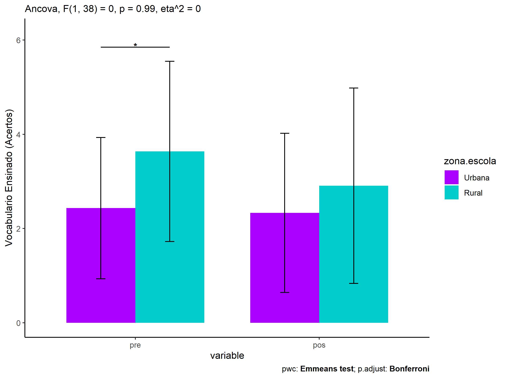<!-- -->

<!-- -->

### Vocabulario Nao Ensinado (Acertos)

| var                          | zona.escola |   n | M (pre) | SE (pre) | M (unadj) | SE (unadj) | M (adj) | SE (adj) |
|:-----------------------------|:------------|----:|--------:|---------:|----------:|-----------:|--------:|---------:|
| score.vocab.nao.ensinado.pos | Rural       |  11 |  11.818 |    1.699 |      10.0 |      1.973 |   9.380 |    1.583 |
| score.vocab.nao.ensinado.pos | Urbana      |  30 |  10.333 |    0.951 |      10.9 |      1.054 |  11.127 |    0.955 |

| .y.                          | group1 | group2 | estimate | conf.low | conf.high |    se | statistic |     p | p.adj | p.adj.signif |
|:-----------------------------|:-------|:-------|---------:|---------:|----------:|------:|----------:|------:|------:|:-------------|
| score.vocab.nao.ensinado.pos | Urbana | Rural  |    1.747 |   -2.007 |     5.501 | 1.855 |     0.942 | 0.352 | 0.352 | ns           |
| score.vocab.nao.ensinado.pre | Urbana | Rural  |   -1.485 |   -5.279 |     2.309 | 1.876 |    -0.792 | 0.433 | 0.433 | ns           |

| .y.                      | zona.escola | group1 | group2 | estimate | conf.low | conf.high |    se | statistic |     p | p.adj | p.adj.signif |
|:-------------------------|:------------|:-------|:-------|---------:|---------:|----------:|------:|----------:|------:|------:|:-------------|
| score.vocab.nao.ensinado | Urbana      | pre    | pos    |   -0.567 |   -3.476 |     2.343 | 1.461 |    -0.388 | 0.699 | 0.699 | ns           |
| score.vocab.nao.ensinado | Rural       | pre    | pos    |    1.818 |   -2.987 |     6.623 | 2.414 |     0.753 | 0.454 | 0.454 | ns           |

    ## Scale for colour is already present.
    ## Adding another scale for colour, which will replace the existing scale.

<!-- -->

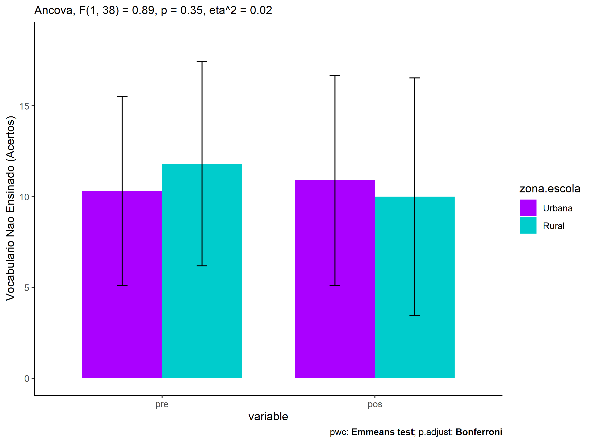<!-- -->

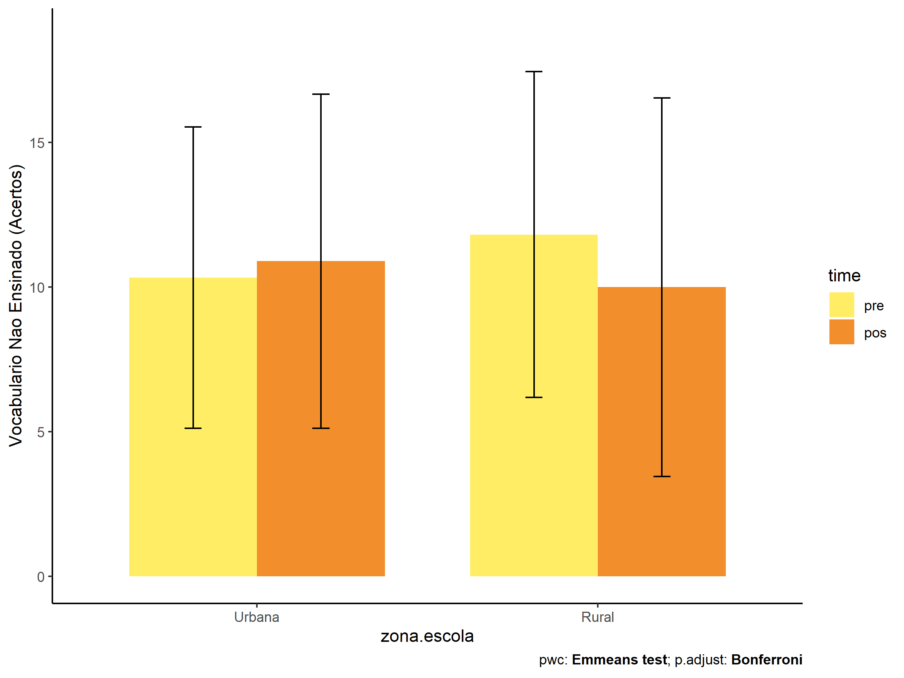<!-- -->

# Pairwise comparisons for two factors

## factores: **genero:grupo**

### Vocabulario (Acertos)

| var             | genero | grupo    |   n | M (pre) | SE (pre) | M (unadj) | SE (unadj) | M (adj) | SE (adj) |
|:----------------|:-------|:---------|----:|--------:|---------:|----------:|-----------:|--------:|---------:|
| score.vocab.pos | F      | Controle |   6 |  17.167 |    2.587 |    17.000 |      2.338 |  15.807 |    2.315 |
| score.vocab.pos | M      | Controle |  11 |  12.273 |    1.556 |    13.727 |      1.561 |  14.860 |    1.728 |
| score.vocab.pos | M      | stari+WG |  15 |  15.400 |    1.759 |    14.667 |      1.814 |  14.313 |    1.446 |

|     | .y.             | grupo    | genero | group1   | group2   | estimate | conf.low | conf.high |    se | statistic |     p | p.adj | p.adj.signif |
|:----|:----------------|:---------|:-------|:---------|:---------|---------:|---------:|----------:|------:|----------:|------:|------:|:-------------|
| 1   | score.vocab.pos | Controle |        | F        | M        |    0.946 |   -5.089 |     6.982 | 2.946 |     0.321 | 0.750 | 0.750 | ns           |
| 3   | score.vocab.pre | Controle |        | F        | M        |    4.894 |   -1.547 |    11.335 | 3.149 |     1.554 | 0.131 | 0.131 | ns           |
| 6   | score.vocab.pos |          | M      | Controle | stari+WG |    0.547 |   -4.113 |     5.207 | 2.275 |     0.241 | 0.812 | 0.812 | ns           |
| 8   | score.vocab.pre |          | M      | Controle | stari+WG |   -3.127 |   -8.165 |     1.911 | 2.463 |    -1.270 | 0.214 | 0.214 | ns           |

| grupo    | genero | group1 | group2 | estimate | conf.low | conf.high |    se | statistic |     p | p.adj | p.adj.signif |
|:---------|:-------|:-------|:-------|---------:|---------:|----------:|------:|----------:|------:|------:|:-------------|
| Controle | F      | pre    | pos    |    1.167 |   -5.619 |     7.952 | 3.394 |     0.344 | 0.732 | 0.732 | ns           |
| Controle | M      | pre    | pos    |   -1.894 |   -6.985 |     3.197 | 2.547 |    -0.744 | 0.460 | 0.460 | ns           |
| stari+WG | M      | pre    | pos    |    0.686 |   -3.634 |     5.007 | 2.161 |     0.318 | 0.752 | 0.752 | ns           |

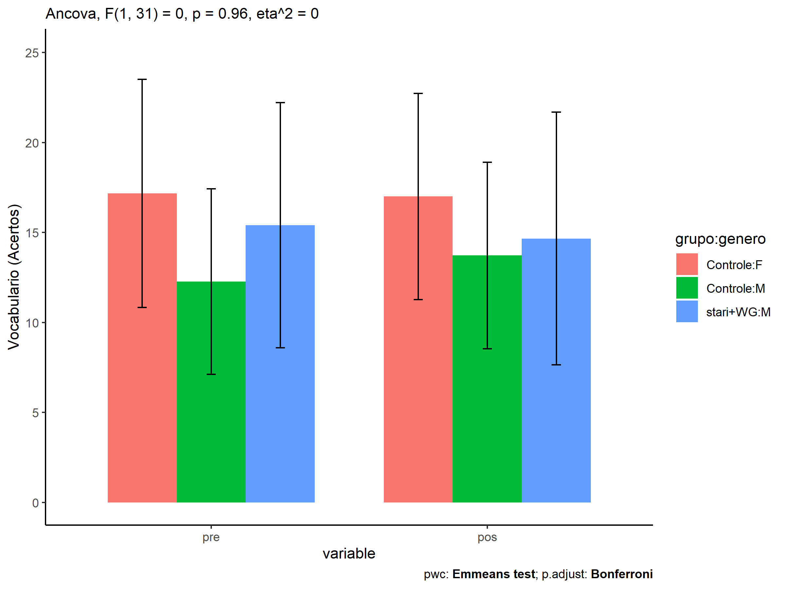<!-- -->

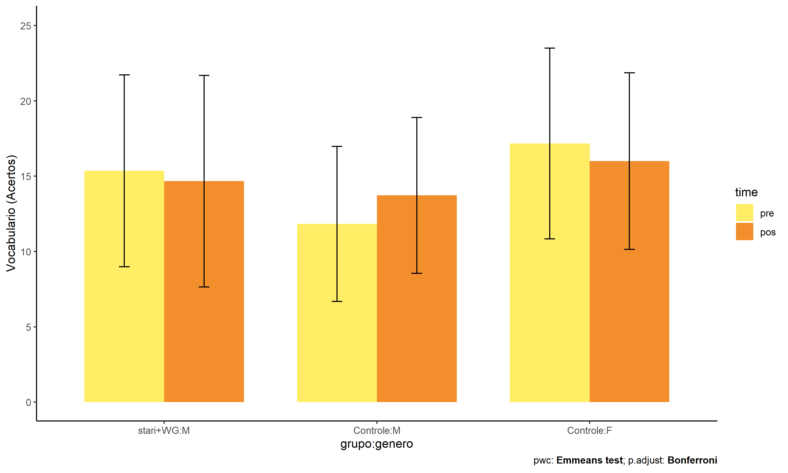<!-- -->

### Vocabulario Ensinado (Acertos)

| var                      | genero | grupo    |   n | M (pre) | SE (pre) | M (unadj) | SE (unadj) | M (adj) | SE (adj) |
|:-------------------------|:-------|:---------|----:|--------:|---------:|----------:|-----------:|--------:|---------:|
| score.vocab.ensinado.pos | F      | Controle |   7 |   3.143 |    0.800 |     2.429 |      0.649 |   2.254 |    0.640 |
| score.vocab.ensinado.pos | M      | Controle |  13 |   1.769 |    0.426 |     1.923 |      0.473 |   2.416 |    0.501 |
| score.vocab.ensinado.pos | M      | stari+WG |  17 |   3.412 |    0.354 |     3.000 |      0.477 |   2.695 |    0.424 |

|     | .y.                      | grupo    | genero | group1   | group2   | estimate | conf.low | conf.high |    se | statistic |     p | p.adj | p.adj.signif |
|:----|:-------------------------|:---------|:-------|:---------|:---------|---------:|---------:|----------:|------:|----------:|------:|------:|:-------------|
| 1   | score.vocab.ensinado.pos | Controle |        | F        | M        |   -0.161 |   -1.843 |     1.520 | 0.827 |    -0.195 | 0.846 | 0.846 | ns           |
| 3   | score.vocab.ensinado.pre | Controle |        | F        | M        |    1.374 |   -0.170 |     2.918 | 0.760 |     1.808 | 0.079 | 0.079 | ns           |
| 6   | score.vocab.ensinado.pos |          | M      | Controle | stari+WG |   -0.280 |   -1.675 |     1.116 | 0.686 |    -0.407 | 0.686 | 0.686 | ns           |
| 8   | score.vocab.ensinado.pre |          | M      | Controle | stari+WG |   -1.643 |   -2.856 |    -0.429 | 0.597 |    -2.751 | 0.009 | 0.009 | \*\*         |

| grupo    | genero | group1 | group2 | estimate | conf.low | conf.high |    se | statistic |     p | p.adj | p.adj.signif |
|:---------|:-------|:-------|:-------|---------:|---------:|----------:|------:|----------:|------:|------:|:-------------|
| Controle | F      | pre    | pos    |    0.714 |   -1.133 |     2.561 | 0.926 |     0.772 | 0.443 | 0.443 | ns           |
| Controle | M      | pre    | pos    |   -0.154 |   -1.509 |     1.202 | 0.679 |    -0.226 | 0.821 | 0.821 | ns           |
| stari+WG | M      | pre    | pos    |    0.412 |   -0.773 |     1.597 | 0.594 |     0.693 | 0.491 | 0.491 | ns           |

<!-- -->

<!-- -->

### Vocabulario Nao Ensinado (Acertos)

| var                          | genero | grupo    |   n | M (pre) | SE (pre) | M (unadj) | SE (unadj) | M (adj) | SE (adj) |
|:-----------------------------|:-------|:---------|----:|--------:|---------:|----------:|-----------:|--------:|---------:|
| score.vocab.nao.ensinado.pos | F      | Controle |   7 |  11.571 |    2.534 |    13.571 |      1.798 |  13.184 |    2.044 |
| score.vocab.nao.ensinado.pos | M      | Controle |  13 |   9.154 |    1.290 |     9.692 |      1.587 |  10.684 |    1.527 |
| score.vocab.nao.ensinado.pos | M      | stari+WG |  17 |  11.941 |    1.321 |     9.941 |      1.673 |   9.342 |    1.322 |

|     | .y.                          | grupo    | genero | group1   | group2   | estimate | conf.low | conf.high |    se | statistic |     p | p.adj | p.adj.signif |
|:----|:-----------------------------|:---------|:-------|:---------|:---------|---------:|---------:|----------:|------:|----------:|------:|------:|:-------------|
| 1   | score.vocab.nao.ensinado.pos | Controle |        | F        | M        |    2.499 |   -2.719 |     7.717 | 2.565 |     0.974 | 0.337 | 0.337 | ns           |
| 3   | score.vocab.nao.ensinado.pre | Controle |        | F        | M        |    2.418 |   -2.761 |     7.596 | 2.548 |     0.949 | 0.349 | 0.349 | ns           |
| 6   | score.vocab.nao.ensinado.pos |          | M      | Controle | stari+WG |    1.342 |   -2.819 |     5.503 | 2.045 |     0.656 | 0.516 | 0.516 | ns           |
| 8   | score.vocab.nao.ensinado.pre |          | M      | Controle | stari+WG |   -2.787 |   -6.857 |     1.282 | 2.002 |    -1.392 | 0.173 | 0.173 | ns           |

| grupo    | genero | group1 | group2 | estimate | conf.low | conf.high |    se | statistic |     p | p.adj | p.adj.signif |
|:---------|:-------|:-------|:-------|---------:|---------:|----------:|------:|----------:|------:|------:|:-------------|
| Controle | F      | pre    | pos    |   -2.000 |   -8.195 |     4.195 | 3.104 |    -0.644 | 0.522 | 0.522 | ns           |
| Controle | M      | pre    | pos    |   -0.538 |   -5.084 |     4.007 | 2.278 |    -0.236 | 0.814 | 0.814 | ns           |
| stari+WG | M      | pre    | pos    |    2.000 |   -1.975 |     5.975 | 1.992 |     1.004 | 0.319 | 0.319 | ns           |

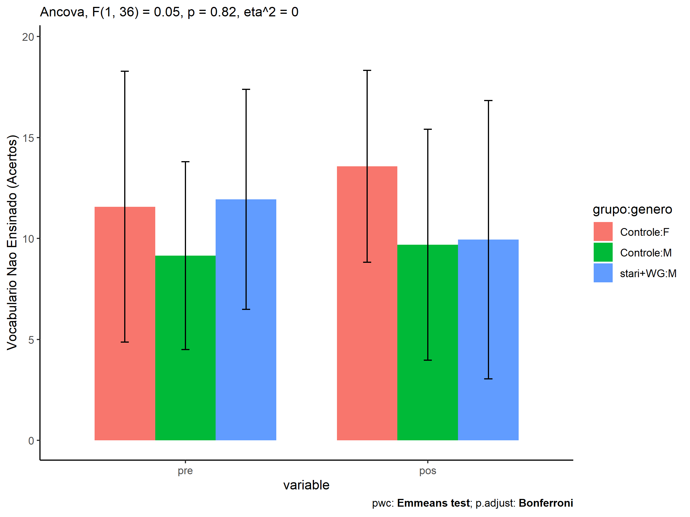<!-- -->

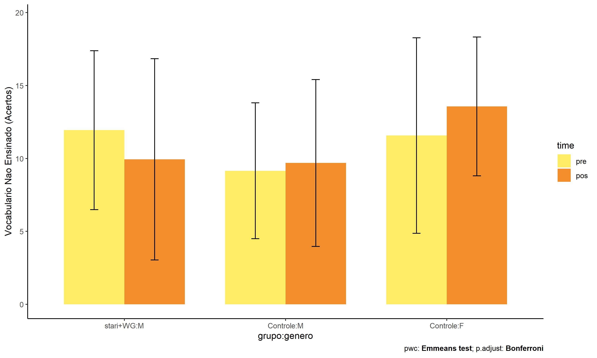<!-- -->

## factores: **idade:grupo**

### Vocabulario (Acertos)

### Vocabulario Ensinado (Acertos)

### Vocabulario Nao Ensinado (Acertos)

## factores: **zona.participante:grupo**

### Vocabulario (Acertos)

| var             | zona.participante | grupo    |   n | M (pre) | SE (pre) | M (unadj) | SE (unadj) | M (adj) | SE (adj) |
|:----------------|:------------------|:---------|----:|--------:|---------:|----------:|-----------:|--------:|---------:|
| score.vocab.pos | Rural             | stari+WG |   7 |  18.143 |    3.082 |    14.000 |      3.109 |  12.032 |    2.180 |
| score.vocab.pos | Urbana            | Controle |  10 |  15.600 |    1.928 |    15.800 |      2.154 |  15.605 |    1.770 |
| score.vocab.pos | Urbana            | stari+WG |   8 |  12.500 |    1.658 |    16.125 |      2.175 |  18.091 |    2.047 |

|     | .y.             | grupo    | zona.participante | group1   | group2   | estimate | conf.low | conf.high |    se | statistic |     p | p.adj | p.adj.signif |
|:----|:----------------|:---------|:------------------|:---------|:---------|---------:|---------:|----------:|------:|----------:|------:|------:|:-------------|
| 2   | score.vocab.pos | stari+WG |                   | Urbana   | Rural    |    6.060 |   -0.351 |    12.471 | 3.083 |     1.966 | 0.063 | 0.063 | ns           |
| 4   | score.vocab.pre | stari+WG |                   | Urbana   | Rural    |   -5.643 |  -12.459 |     1.173 | 3.287 |    -1.717 | 0.100 | 0.100 | ns           |
| 5   | score.vocab.pos |          | Urbana            | Controle | stari+WG |   -2.487 |   -8.136 |     3.162 | 2.716 |    -0.915 | 0.370 | 0.370 | ns           |
| 7   | score.vocab.pre |          | Urbana            | Controle | stari+WG |    3.100 |   -3.147 |     9.347 | 3.012 |     1.029 | 0.315 | 0.315 | ns           |

| grupo    | zona.participante | group1 | group2 | estimate | conf.low | conf.high |    se | statistic |     p | p.adj | p.adj.signif |
|:---------|:------------------|:-------|:-------|---------:|---------:|----------:|------:|----------:|------:|------:|:-------------|
| Controle | Urbana            | pre    | pos    |   -0.982 |   -6.911 |     4.948 | 2.944 |    -0.333 | 0.740 | 0.740 | ns           |
| stari+WG | Urbana            | pre    | pos    |   -3.625 |  -10.410 |     3.160 | 3.369 |    -1.076 | 0.288 | 0.288 | ns           |
| stari+WG | Rural             | pre    | pos    |    4.143 |   -3.111 |    11.397 | 3.602 |     1.150 | 0.256 | 0.256 | ns           |

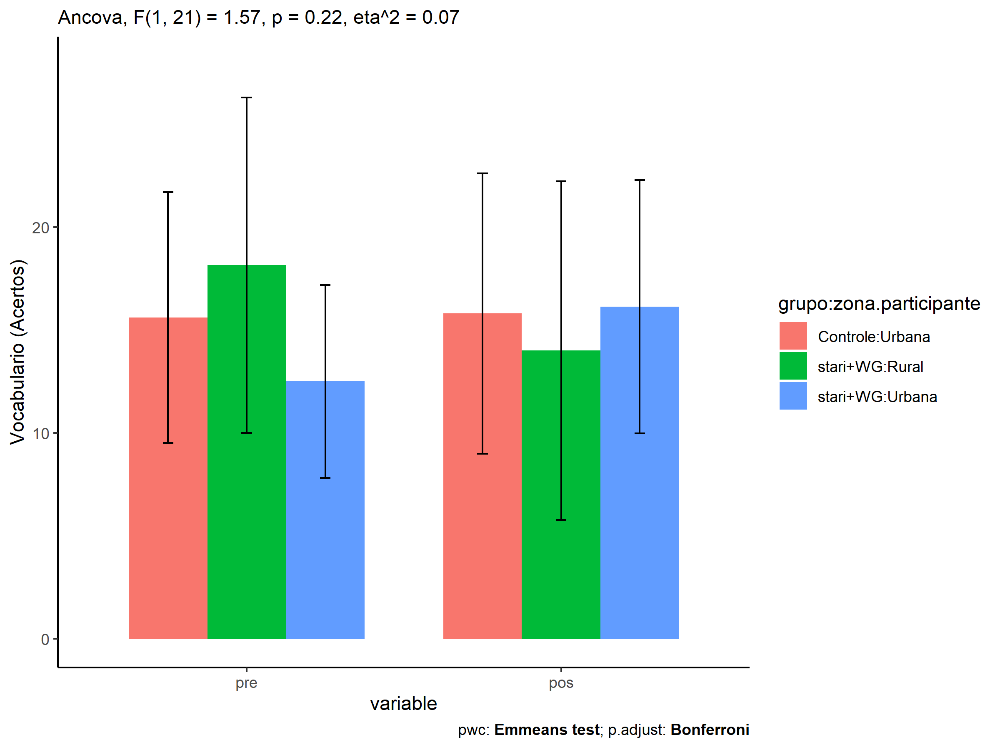<!-- -->

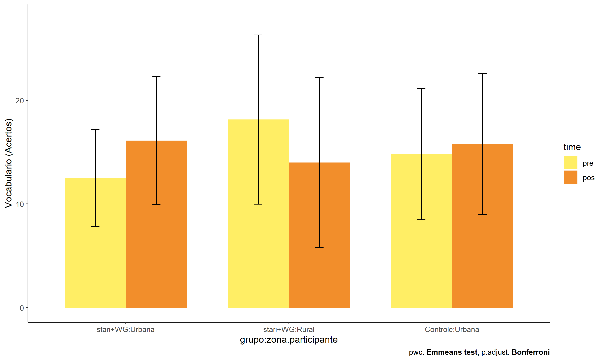<!-- -->

### Vocabulario Ensinado (Acertos)

| var                      | zona.participante | grupo    |   n | M (pre) | SE (pre) | M (unadj) | SE (unadj) | M (adj) | SE (adj) |
|:-------------------------|:------------------|:---------|----:|--------:|---------:|----------:|-----------:|--------:|---------:|
| score.vocab.ensinado.pos | Rural             | stari+WG |   7 |   4.000 |    0.655 |     3.000 |      0.690 |   2.409 |    0.586 |
| score.vocab.ensinado.pos | Urbana            | Controle |  12 |   2.583 |    0.557 |     2.000 |      0.603 |   2.313 |    0.438 |
| score.vocab.ensinado.pos | Urbana            | stari+WG |   8 |   3.000 |    0.423 |     4.125 |      0.441 |   4.172 |    0.526 |

|     | .y.                      | grupo    | zona.participante | group1   | group2   | estimate | conf.low | conf.high |    se | statistic |     p | p.adj | p.adj.signif |
|:----|:-------------------------|:---------|:------------------|:---------|:---------|---------:|---------:|----------:|------:|----------:|------:|------:|:-------------|
| 2   | score.vocab.ensinado.pos | stari+WG |                   | Urbana   | Rural    |    1.763 |    0.130 |     3.397 | 0.790 |     2.233 | 0.036 | 0.036 | \*           |
| 4   | score.vocab.ensinado.pre | stari+WG |                   | Urbana   | Rural    |   -1.000 |   -2.810 |     0.810 | 0.877 |    -1.140 | 0.265 | 0.265 | ns           |
| 5   | score.vocab.ensinado.pos |          | Urbana            | Controle | stari+WG |   -1.859 |   -3.270 |    -0.448 | 0.682 |    -2.725 | 0.012 | 0.012 | \*           |
| 7   | score.vocab.ensinado.pre |          | Urbana            | Controle | stari+WG |   -0.417 |   -2.013 |     1.180 | 0.773 |    -0.539 | 0.595 | 0.595 | ns           |

| grupo    | zona.participante | group1 | group2 | estimate | conf.low | conf.high |    se | statistic |     p | p.adj | p.adj.signif |
|:---------|:------------------|:-------|:-------|---------:|---------:|----------:|------:|----------:|------:|------:|:-------------|
| Controle | Urbana            | pre    | pos    |    0.583 |   -0.857 |     2.024 | 0.716 |     0.814 | 0.419 | 0.419 | ns           |
| stari+WG | Urbana            | pre    | pos    |   -1.125 |   -2.889 |     0.639 | 0.877 |    -1.282 | 0.206 | 0.206 | ns           |
| stari+WG | Rural             | pre    | pos    |    1.000 |   -0.886 |     2.886 | 0.938 |     1.066 | 0.292 | 0.292 | ns           |

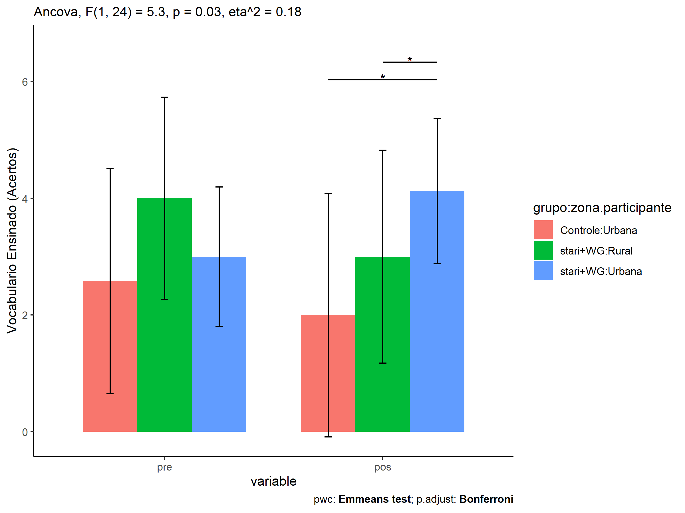<!-- -->

<!-- -->

### Vocabulario Nao Ensinado (Acertos)

| var                          | zona.participante | grupo    |   n | M (pre) | SE (pre) | M (unadj) | SE (unadj) | M (adj) | SE (adj) |
|:-----------------------------|:------------------|:---------|----:|--------:|---------:|----------:|-----------:|--------:|---------:|
| score.vocab.nao.ensinado.pos | Rural             | stari+WG |   7 |  14.143 |    2.650 |    11.000 |      2.673 |   8.719 |    1.951 |
| score.vocab.nao.ensinado.pos | Urbana            | Controle |  12 |  11.000 |    1.656 |    11.167 |      2.033 |  11.471 |    1.442 |
| score.vocab.nao.ensinado.pos | Urbana            | stari+WG |   8 |   9.500 |    1.402 |    12.000 |      2.096 |  13.539 |    1.796 |

|     | .y.                          | grupo    | zona.participante | group1   | group2   | estimate | conf.low | conf.high |    se | statistic |     p | p.adj | p.adj.signif |
|:----|:-----------------------------|:---------|:------------------|:---------|:---------|---------:|---------:|----------:|------:|----------:|------:|------:|:-------------|
| 2   | score.vocab.nao.ensinado.pos | stari+WG |                   | Urbana   | Rural    |    4.820 |   -0.794 |    10.435 | 2.714 |     1.776 | 0.089 | 0.089 | ns           |
| 4   | score.vocab.nao.ensinado.pre | stari+WG |                   | Urbana   | Rural    |   -4.643 |  -10.681 |     1.395 | 2.926 |    -1.587 | 0.126 | 0.126 | ns           |
| 5   | score.vocab.nao.ensinado.pos |          | Urbana            | Controle | stari+WG |   -2.068 |   -6.811 |     2.676 | 2.293 |    -0.902 | 0.377 | 0.377 | ns           |
| 7   | score.vocab.nao.ensinado.pre |          | Urbana            | Controle | stari+WG |    1.500 |   -3.825 |     6.825 | 2.580 |     0.581 | 0.566 | 0.566 | ns           |

| grupo    | zona.participante | group1 | group2 | estimate | conf.low | conf.high |    se | statistic |     p | p.adj | p.adj.signif |
|:---------|:------------------|:-------|:-------|---------:|---------:|----------:|------:|----------:|------:|------:|:-------------|
| Controle | Urbana            | pre    | pos    |   -0.167 |   -5.274 |     4.941 | 2.540 |    -0.066 | 0.948 | 0.948 | ns           |
| stari+WG | Urbana            | pre    | pos    |   -2.500 |   -8.756 |     3.756 | 3.111 |    -0.804 | 0.426 | 0.426 | ns           |
| stari+WG | Rural             | pre    | pos    |    3.143 |   -3.545 |     9.830 | 3.326 |     0.945 | 0.349 | 0.349 | ns           |

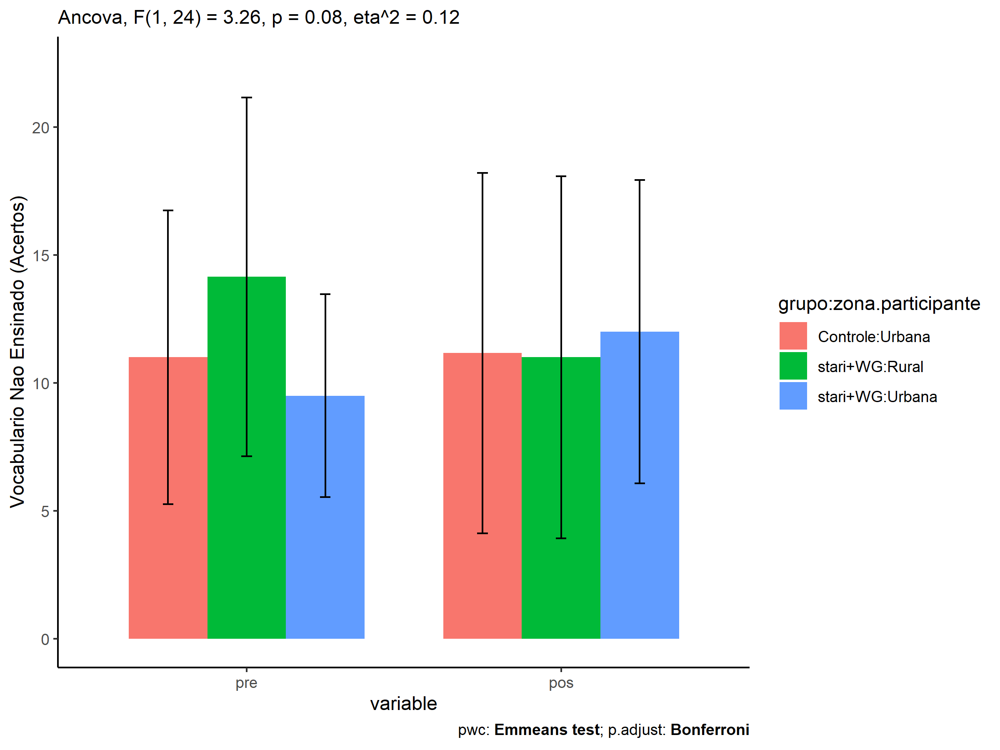<!-- -->

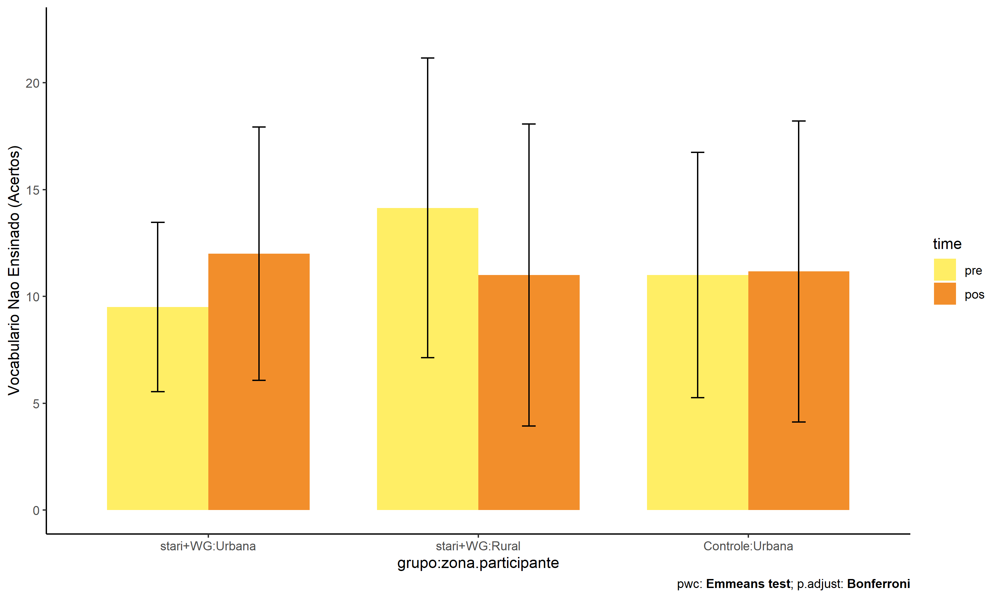<!-- -->

## factores: **escola:grupo**

### Vocabulario (Acertos)

| var             | escola | grupo    |   n | M (pre) | SE (pre) | M (unadj) | SE (unadj) | M (adj) | SE (adj) |
|:----------------|:-------|:---------|----:|--------:|---------:|----------:|-----------:|--------:|---------:|
| score.vocab.pos | E1     | Controle |   6 |  18.500 |    2.029 |    18.667 |      2.459 |  16.099 |    2.333 |
| score.vocab.pos | E4     | stari+WG |   6 |  17.833 |    3.280 |    15.000 |      3.531 |  12.871 |    2.293 |
| score.vocab.pos | E5     | Controle |   5 |  11.400 |    2.462 |    11.000 |      2.429 |  13.098 |    2.494 |
| score.vocab.pos | E5     | stari+WG |  10 |  11.900 |    1.479 |    15.300 |      1.820 |  17.069 |    1.787 |

|     | .y.             | grupo    | escola | group1   | group2   | estimate | conf.low | conf.high |    se | statistic |     p | p.adj | p.adj.signif |
|:----|:----------------|:---------|:-------|:---------|:---------|---------:|---------:|----------:|------:|----------:|------:|------:|:-------------|
| 2   | score.vocab.pos | Controle |        | E1       | E5       |    3.001 |   -4.364 |    10.366 | 3.551 |     0.845 | 0.407 | 0.407 | ns           |
| 6   | score.vocab.pos | stari+WG |        | E4       | E5       |   -4.199 |  -10.461 |     2.063 | 3.019 |    -1.391 | 0.178 | 0.178 | ns           |
| 8   | score.vocab.pre | Controle |        | E1       | E5       |    7.100 |   -0.122 |    14.322 | 3.491 |     2.034 | 0.054 | 0.054 | ns           |
| 12  | score.vocab.pre | stari+WG |        | E4       | E5       |    5.933 |   -0.225 |    12.092 | 2.977 |     1.993 | 0.058 | 0.058 | ns           |
| 15  | score.vocab.pos |          | E5     | Controle | stari+WG |   -3.971 |  -10.108 |     2.165 | 2.959 |    -1.342 | 0.193 | 0.193 | ns           |
| 18  | score.vocab.pre |          | E5     | Controle | stari+WG |   -0.500 |   -7.032 |     6.032 | 3.158 |    -0.158 | 0.876 | 0.876 | ns           |

| grupo    | escola | group1 | group2 | estimate | conf.low | conf.high |    se | statistic |     p | p.adj | p.adj.signif |
|:---------|:-------|:-------|:-------|---------:|---------:|----------:|------:|----------:|------:|------:|:-------------|
| Controle | E1     | pre    | pos    |   -1.810 |   -8.754 |     5.135 | 3.454 |    -0.524 | 0.603 | 0.603 | ns           |
| Controle | E5     | pre    | pos    |    0.567 |   -6.992 |     8.125 | 3.759 |     0.151 | 0.881 | 0.881 | ns           |
| stari+WG | E4     | pre    | pos    |    2.833 |   -4.374 |    10.040 | 3.584 |     0.790 | 0.433 | 0.433 | ns           |
| stari+WG | E5     | pre    | pos    |   -3.400 |   -8.982 |     2.182 | 2.776 |    -1.225 | 0.227 | 0.227 | ns           |

    ## Scale for colour is already present.
    ## Adding another scale for colour, which will replace the existing scale.

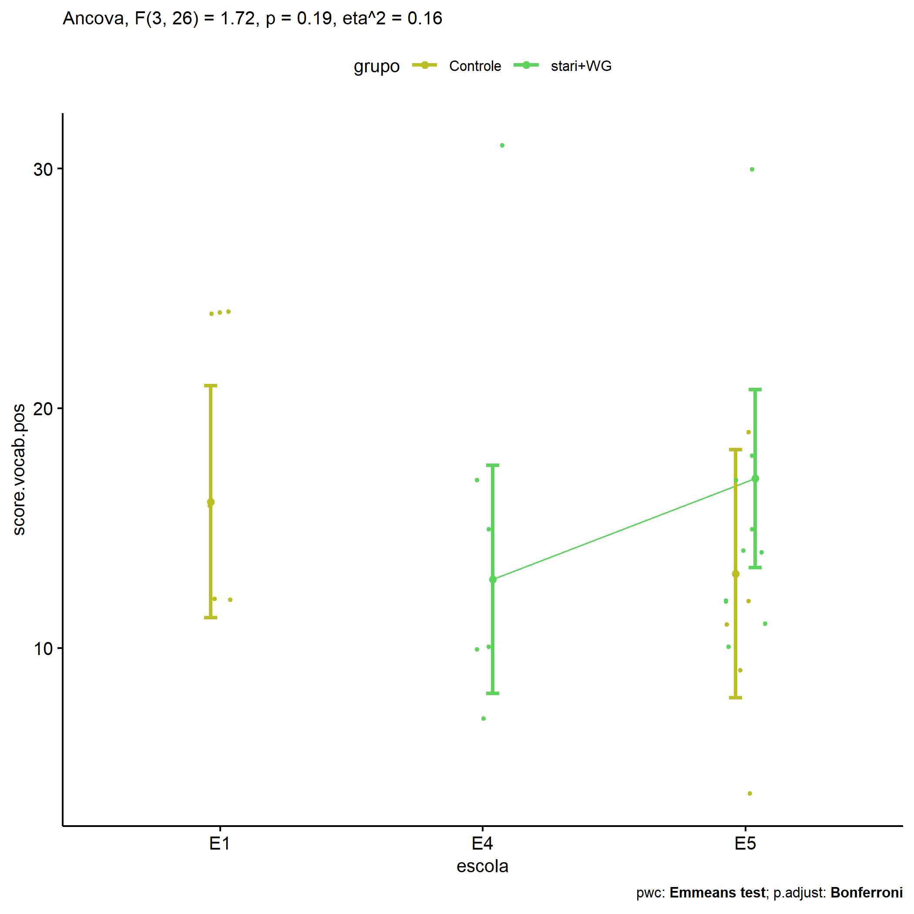<!-- -->

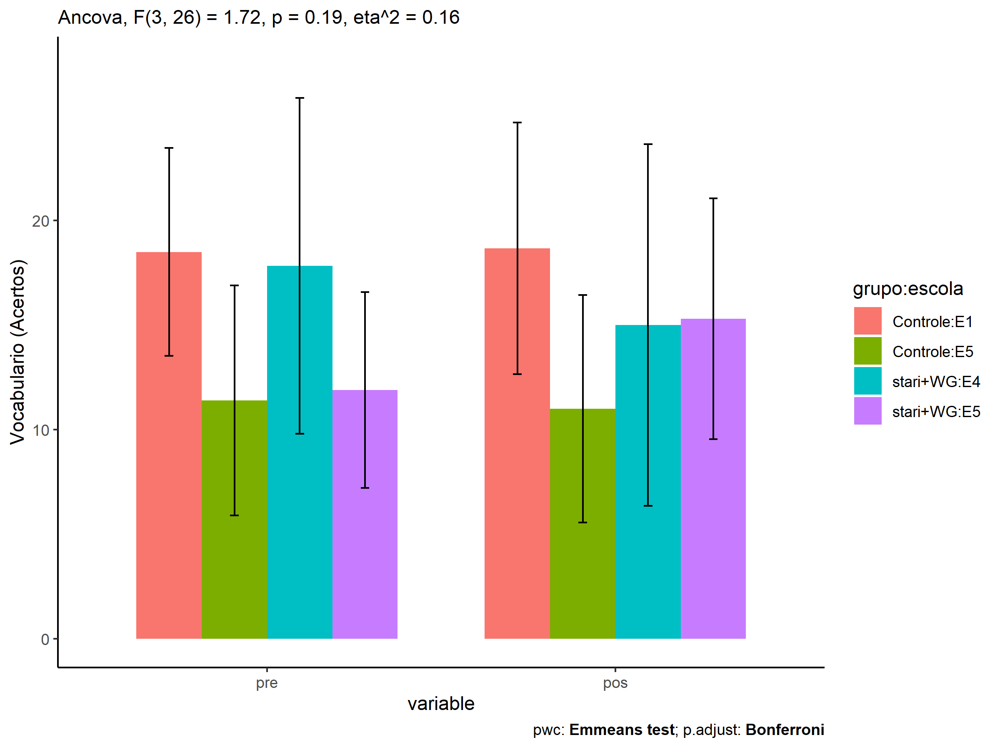<!-- -->

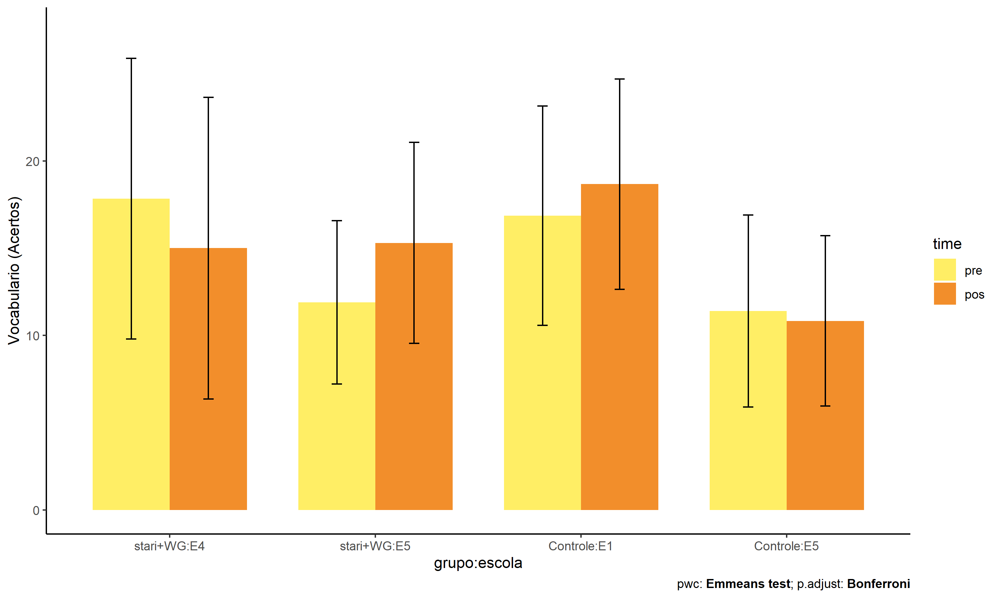<!-- -->

### Vocabulario Ensinado (Acertos)

| var                      | escola | grupo    |   n | M (pre) | SE (pre) | M (unadj) | SE (unadj) | M (adj) | SE (adj) |
|:-------------------------|:-------|:---------|----:|--------:|---------:|----------:|-----------:|--------:|---------:|
| score.vocab.ensinado.pos | E1     | Controle |   8 |   3.125 |    0.766 |     2.250 |      0.881 |   2.143 |    0.603 |
| score.vocab.ensinado.pos | E4     | stari+WG |   6 |   4.500 |    0.719 |     4.167 |      0.792 |   3.405 |    0.771 |
| score.vocab.ensinado.pos | E5     | Controle |   6 |   1.333 |    0.494 |     1.667 |      0.333 |   2.412 |    0.768 |
| score.vocab.ensinado.pos | E5     | stari+WG |  10 |   2.700 |    0.335 |     2.800 |      0.490 |   2.895 |    0.540 |

|     | .y.                      | grupo    | escola | group1   | group2   | estimate | conf.low | conf.high |    se | statistic |     p | p.adj | p.adj.signif |
|:----|:-------------------------|:---------|:-------|:---------|:---------|---------:|---------:|----------:|------:|----------:|------:|------:|:-------------|
| 2   | score.vocab.ensinado.pos | Controle |        | E1       | E5       |   -0.269 |   -2.314 |     1.775 | 0.993 |    -0.271 | 0.788 | 0.788 | ns           |
| 6   | score.vocab.ensinado.pos | stari+WG |        | E4       | E5       |    0.510 |   -1.459 |     2.479 | 0.956 |     0.533 | 0.598 | 0.598 | ns           |
| 8   | score.vocab.ensinado.pre | Controle |        | E1       | E5       |    1.792 |    0.026 |     3.558 | 0.859 |     2.085 | 0.047 | 0.047 | \*           |
| 12  | score.vocab.ensinado.pre | stari+WG |        | E4       | E5       |    1.800 |    0.111 |     3.489 | 0.822 |     2.191 | 0.038 | 0.038 | \*           |
| 15  | score.vocab.ensinado.pos |          | E5     | Controle | stari+WG |   -0.483 |   -2.386 |     1.420 | 0.924 |    -0.523 | 0.606 | 0.606 | ns           |
| 18  | score.vocab.ensinado.pre |          | E5     | Controle | stari+WG |   -1.367 |   -3.055 |     0.322 | 0.822 |    -1.664 | 0.108 | 0.108 | ns           |

| grupo    | escola | group1 | group2 | estimate | conf.low | conf.high |    se | statistic |     p | p.adj | p.adj.signif |
|:---------|:-------|:-------|:-------|---------:|---------:|----------:|------:|----------:|------:|------:|:-------------|
| Controle | E1     | pre    | pos    |    0.875 |   -0.846 |     2.596 | 0.858 |     1.020 | 0.312 | 0.312 | ns           |
| Controle | E5     | pre    | pos    |   -0.333 |   -2.321 |     1.654 | 0.991 |    -0.337 | 0.738 | 0.738 | ns           |
| stari+WG | E4     | pre    | pos    |    0.333 |   -1.654 |     2.321 | 0.991 |     0.337 | 0.738 | 0.738 | ns           |
| stari+WG | E5     | pre    | pos    |   -0.100 |   -1.640 |     1.440 | 0.767 |    -0.130 | 0.897 | 0.897 | ns           |

    ## Scale for colour is already present.
    ## Adding another scale for colour, which will replace the existing scale.

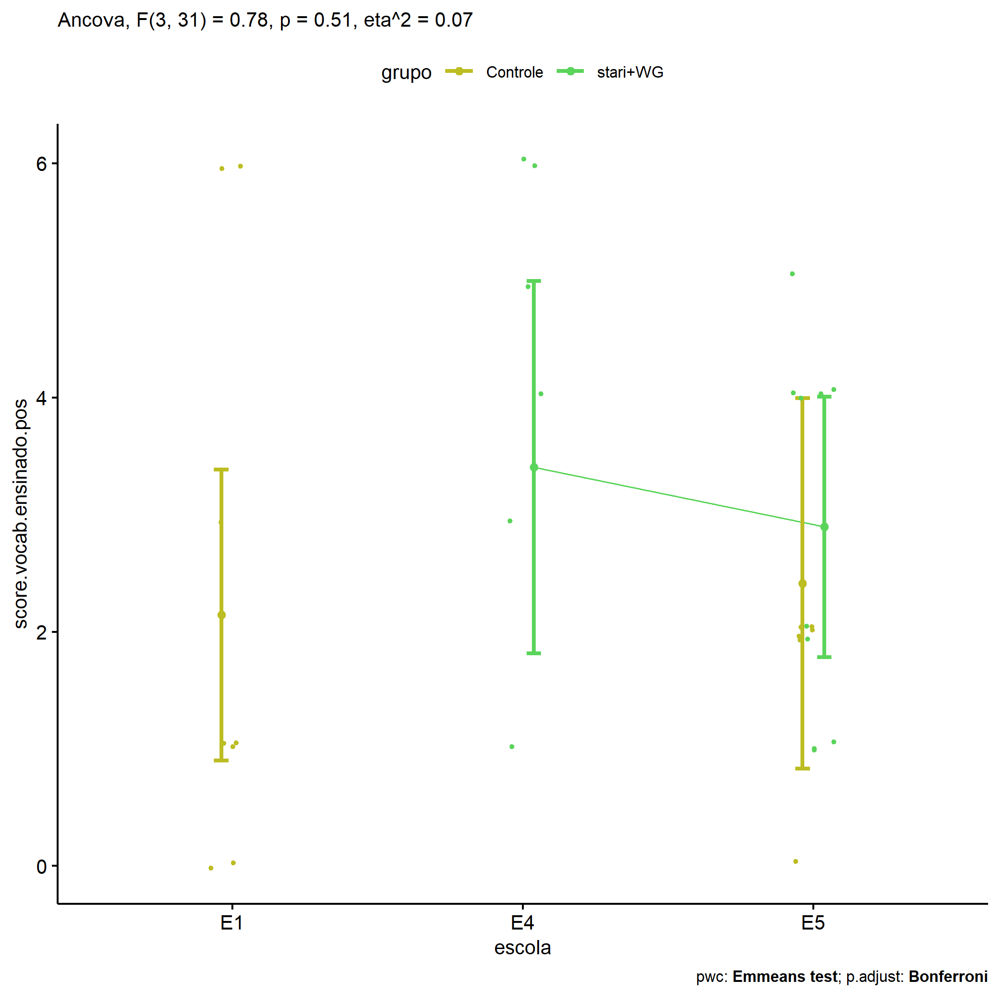<!-- -->

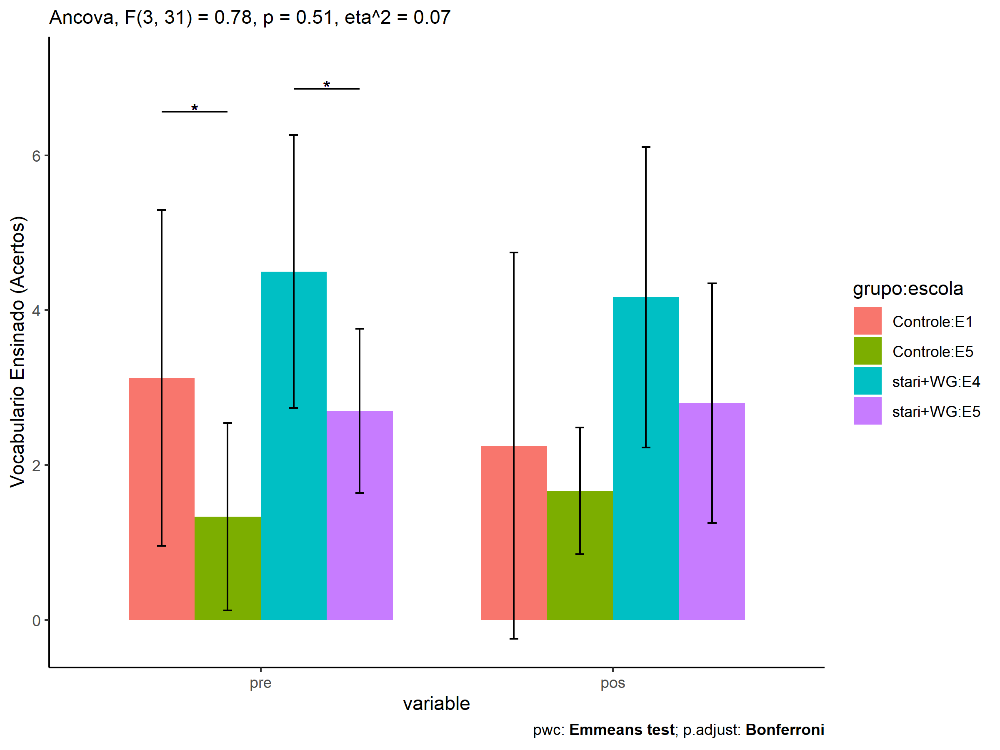<!-- -->

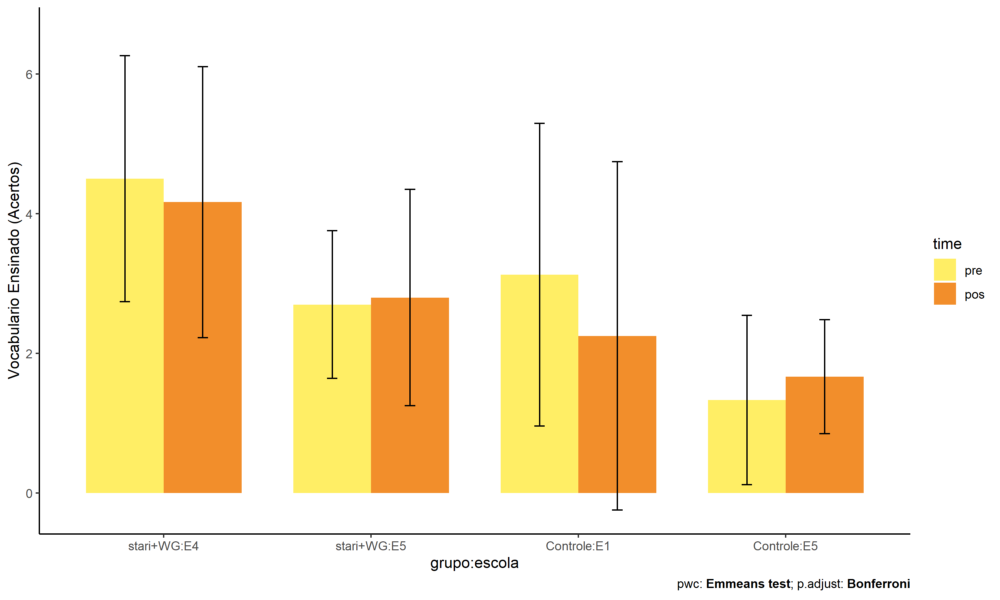<!-- -->

### Vocabulario Nao Ensinado (Acertos)

| var                          | escola | grupo    |   n | M (pre) | SE (pre) | M (unadj) | SE (unadj) | M (adj) | SE (adj) |
|:-----------------------------|:-------|:---------|----:|--------:|---------:|----------:|-----------:|--------:|---------:|
| score.vocab.nao.ensinado.pos | E1     | Controle |   8 |  11.625 |    2.236 |    11.750 |      2.839 |  10.817 |    1.627 |
| score.vocab.nao.ensinado.pos | E4     | stari+WG |   6 |  13.333 |    2.692 |    10.833 |      3.135 |   8.525 |    1.921 |
| score.vocab.nao.ensinado.pos | E5     | Controle |   6 |   8.167 |    2.372 |     9.167 |      1.778 |  11.018 |    1.902 |
| score.vocab.nao.ensinado.pos | E5     | stari+WG |  10 |   9.200 |    1.381 |    12.500 |      1.579 |  13.520 |    1.460 |

|     | .y.                          | grupo    | escola | group1   | group2   | estimate | conf.low | conf.high |    se | statistic |     p | p.adj | p.adj.signif |
|:----|:-----------------------------|:---------|:-------|:---------|:---------|---------:|---------:|----------:|------:|----------:|------:|------:|:-------------|
| 2   | score.vocab.nao.ensinado.pos | Controle |        | E1       | E5       |   -0.201 |   -5.410 |     5.008 | 2.529 |    -0.080 | 0.937 | 0.937 | ns           |
| 6   | score.vocab.nao.ensinado.pos | stari+WG |        | E4       | E5       |   -4.995 |  -10.040 |     0.051 | 2.450 |    -2.039 | 0.052 | 0.052 | ns           |
| 8   | score.vocab.nao.ensinado.pre | Controle |        | E1       | E5       |    3.458 |   -2.843 |     9.759 | 3.065 |     1.128 | 0.270 | 0.270 | ns           |
| 12  | score.vocab.nao.ensinado.pre | stari+WG |        | E4       | E5       |    4.133 |   -1.892 |    10.158 | 2.931 |     1.410 | 0.170 | 0.170 | ns           |
| 15  | score.vocab.nao.ensinado.pos |          | E5     | Controle | stari+WG |   -2.501 |   -7.376 |     2.373 | 2.367 |    -1.057 | 0.301 | 0.301 | ns           |
| 18  | score.vocab.nao.ensinado.pre |          | E5     | Controle | stari+WG |   -1.033 |   -7.058 |     4.992 | 2.931 |    -0.353 | 0.727 | 0.727 | ns           |

| grupo    | escola | group1 | group2 | estimate | conf.low | conf.high |    se | statistic |     p | p.adj | p.adj.signif |
|:---------|:-------|:-------|:-------|---------:|---------:|----------:|------:|----------:|------:|------:|:-------------|
| Controle | E1     | pre    | pos    |   -0.125 |   -6.195 |     5.945 | 3.025 |    -0.041 | 0.967 | 0.967 | ns           |
| Controle | E5     | pre    | pos    |   -1.000 |   -8.009 |     6.009 | 3.493 |    -0.286 | 0.776 | 0.776 | ns           |
| stari+WG | E4     | pre    | pos    |    2.500 |   -4.509 |     9.509 | 3.493 |     0.716 | 0.477 | 0.477 | ns           |
| stari+WG | E5     | pre    | pos    |   -3.300 |   -8.729 |     2.129 | 2.706 |    -1.220 | 0.228 | 0.228 | ns           |

    ## Scale for colour is already present.
    ## Adding another scale for colour, which will replace the existing scale.

<!-- -->

<!-- -->

<!-- -->

## factores: **zona.escola:grupo**

### Vocabulario (Acertos)

| var             | zona.escola | grupo    |   n | M (pre) | SE (pre) | M (unadj) | SE (unadj) | M (adj) | SE (adj) |
|:----------------|:------------|:---------|----:|--------:|---------:|----------:|-----------:|--------:|---------:|
| score.vocab.pos | Rural       | stari+WG |   7 |  17.000 |    2.895 |    14.286 |      3.068 |  12.874 |    2.058 |
| score.vocab.pos | Urbana      | Controle |  14 |  14.429 |    1.518 |    15.071 |      1.598 |  15.139 |    1.428 |
| score.vocab.pos | Urbana      | stari+WG |  12 |  13.250 |    1.543 |    14.667 |      1.573 |  15.412 |    1.556 |

|     | .y.             | grupo    | zona.escola | group1   | group2   | estimate | conf.low | conf.high |    se | statistic |     p | p.adj | p.adj.signif |
|:----|:----------------|:---------|:------------|:---------|:---------|---------:|---------:|----------:|------:|----------:|------:|------:|:-------------|
| 2   | score.vocab.pos | stari+WG |             | Urbana   | Rural    |    2.538 |   -2.805 |     7.882 | 2.613 |     0.972 | 0.339 | 0.339 | ns           |
| 4   | score.vocab.pre | stari+WG |             | Urbana   | Rural    |   -3.750 |   -9.593 |     2.093 | 2.861 |    -1.311 | 0.200 | 0.200 | ns           |
| 5   | score.vocab.pos |          | Urbana      | Controle | stari+WG |   -0.273 |   -4.589 |     4.043 | 2.110 |    -0.129 | 0.898 | 0.898 | ns           |
| 7   | score.vocab.pre |          | Urbana      | Controle | stari+WG |    1.179 |   -3.655 |     6.012 | 2.367 |     0.498 | 0.622 | 0.622 | ns           |

| grupo    | zona.escola | group1 | group2 | estimate | conf.low | conf.high |    se | statistic |     p | p.adj | p.adj.signif |
|:---------|:------------|:-------|:-------|---------:|---------:|----------:|------:|----------:|------:|------:|:-------------|
| Controle | Urbana      | pre    | pos    |   -0.800 |   -5.225 |     3.625 | 2.215 |    -0.361 | 0.719 | 0.719 | ns           |
| stari+WG | Urbana      | pre    | pos    |   -1.282 |   -6.133 |     3.569 | 2.428 |    -0.528 | 0.599 | 0.599 | ns           |
| stari+WG | Rural       | pre    | pos    |    2.464 |   -3.807 |     8.735 | 3.139 |     0.785 | 0.435 | 0.435 | ns           |

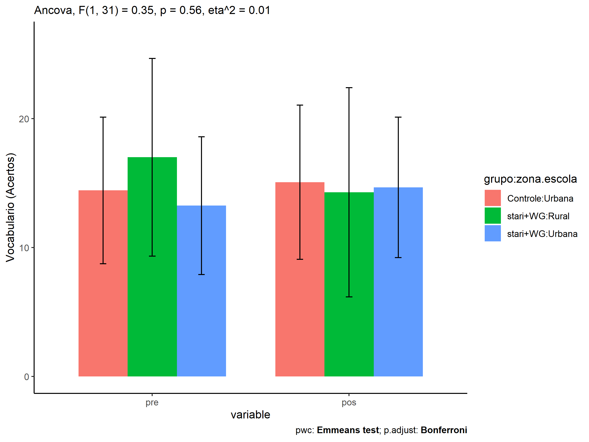<!-- -->

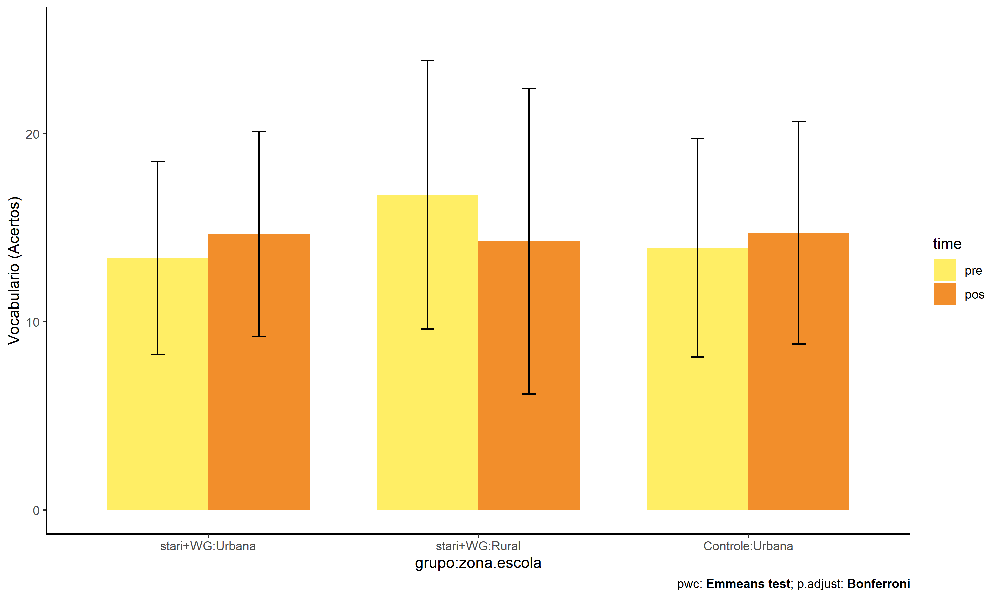<!-- -->

### Vocabulario Ensinado (Acertos)

| var                      | zona.escola | grupo    |   n | M (pre) | SE (pre) | M (unadj) | SE (unadj) | M (adj) | SE (adj) |
|:-------------------------|:------------|:---------|----:|--------:|---------:|----------:|-----------:|--------:|---------:|
| score.vocab.ensinado.pos | Rural       | stari+WG |   8 |   4.125 |    0.581 |     3.375 |      0.800 |   2.744 |    0.654 |
| score.vocab.ensinado.pos | Urbana      | Controle |  17 |   2.235 |    0.442 |     2.176 |      0.439 |   2.438 |    0.427 |
| score.vocab.ensinado.pos | Urbana      | stari+WG |  13 |   2.692 |    0.263 |     2.538 |      0.433 |   2.584 |    0.474 |

|     | .y.                      | grupo    | zona.escola | group1   | group2   | estimate | conf.low | conf.high |    se | statistic |     p | p.adj | p.adj.signif |
|:----|:-------------------------|:---------|:------------|:---------|:---------|---------:|---------:|----------:|------:|----------:|------:|------:|:-------------|
| 2   | score.vocab.ensinado.pos | stari+WG |             | Urbana   | Rural    |   -0.160 |   -1.812 |     1.493 | 0.813 |    -0.196 | 0.845 | 0.845 | ns           |
| 4   | score.vocab.ensinado.pre | stari+WG |             | Urbana   | Rural    |   -1.433 |   -2.835 |    -0.030 | 0.691 |    -2.074 | 0.045 | 0.045 | \*           |
| 5   | score.vocab.ensinado.pos |          | Urbana      | Controle | stari+WG |   -0.146 |   -1.436 |     1.144 | 0.635 |    -0.230 | 0.819 | 0.819 | ns           |
| 7   | score.vocab.ensinado.pre |          | Urbana      | Controle | stari+WG |   -0.457 |   -1.607 |     0.693 | 0.566 |    -0.807 | 0.425 | 0.425 | ns           |

| grupo    | zona.escola | group1 | group2 | estimate | conf.low | conf.high |    se | statistic |     p | p.adj | p.adj.signif |
|:---------|:------------|:-------|:-------|---------:|---------:|----------:|------:|----------:|------:|------:|:-------------|
| Controle | Urbana      | pre    | pos    |    0.059 |   -1.098 |     1.216 | 0.580 |     0.101 | 0.920 | 0.920 | ns           |
| stari+WG | Urbana      | pre    | pos    |    0.154 |   -1.169 |     1.477 | 0.663 |     0.232 | 0.817 | 0.817 | ns           |
| stari+WG | Rural       | pre    | pos    |    0.750 |   -0.937 |     2.437 | 0.846 |     0.887 | 0.378 | 0.378 | ns           |

<!-- -->

<!-- -->

### Vocabulario Nao Ensinado (Acertos)

| var                          | zona.escola | grupo    |   n | M (pre) | SE (pre) | M (unadj) | SE (unadj) | M (adj) | SE (adj) |
|:-----------------------------|:------------|:---------|----:|--------:|---------:|----------:|-----------:|--------:|---------:|
| score.vocab.nao.ensinado.pos | Rural       | stari+WG |   8 |  12.625 |    2.044 |     9.125 |      2.662 |   7.970 |    1.891 |
| score.vocab.nao.ensinado.pos | Urbana      | Controle |  17 |  10.059 |    1.343 |    10.824 |      1.463 |  11.307 |    1.287 |
| score.vocab.nao.ensinado.pos | Urbana      | stari+WG |  13 |  10.692 |    1.370 |    11.000 |      1.569 |  11.079 |    1.465 |

|     | .y.                          | grupo    | zona.escola | group1   | group2   | estimate | conf.low | conf.high |    se | statistic |     p | p.adj | p.adj.signif |
|:----|:-----------------------------|:---------|:------------|:---------|:---------|---------:|---------:|----------:|------:|----------:|------:|------:|:-------------|
| 2   | score.vocab.nao.ensinado.pos | stari+WG |             | Urbana   | Rural    |    3.109 |   -1.759 |     7.976 | 2.395 |     1.298 | 0.203 | 0.203 | ns           |
| 4   | score.vocab.nao.ensinado.pre | stari+WG |             | Urbana   | Rural    |   -1.933 |   -6.852 |     2.986 | 2.423 |    -0.798 | 0.430 | 0.430 | ns           |
| 5   | score.vocab.nao.ensinado.pos |          | Urbana      | Controle | stari+WG |    0.228 |   -3.733 |     4.189 | 1.949 |     0.117 | 0.908 | 0.908 | ns           |
| 7   | score.vocab.nao.ensinado.pre |          | Urbana      | Controle | stari+WG |   -0.633 |   -4.667 |     3.400 | 1.987 |    -0.319 | 0.752 | 0.752 | ns           |

| grupo    | zona.escola | group1 | group2 | estimate | conf.low | conf.high |    se | statistic |     p | p.adj | p.adj.signif |
|:---------|:------------|:-------|:-------|---------:|---------:|----------:|------:|----------:|------:|------:|:-------------|
| Controle | Urbana      | pre    | pos    |   -0.765 |   -4.754 |     3.225 | 2.000 |    -0.382 | 0.703 | 0.703 | ns           |
| stari+WG | Urbana      | pre    | pos    |   -0.308 |   -4.870 |     4.255 | 2.288 |    -0.135 | 0.893 | 0.893 | ns           |
| stari+WG | Rural       | pre    | pos    |    3.500 |   -2.316 |     9.316 | 2.916 |     1.200 | 0.234 | 0.234 | ns           |

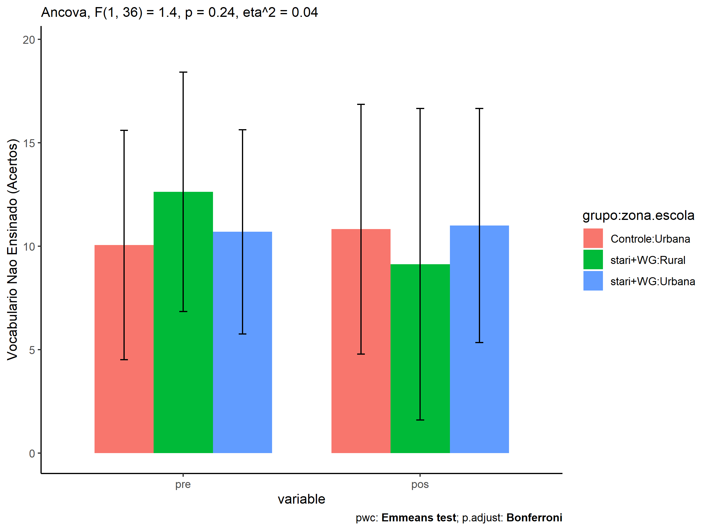<!-- -->

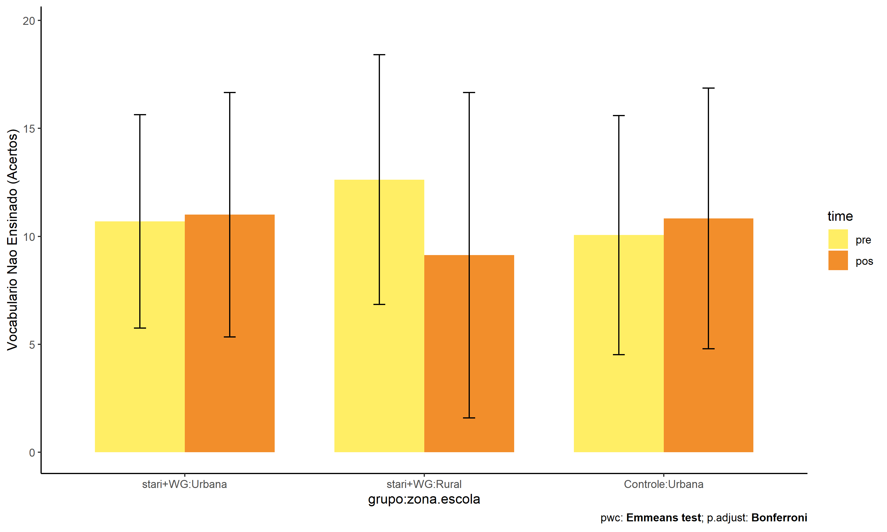<!-- -->

# Pairwise comparisons for grupo=“Experimental”

## factores: **grupo=“Experimental”:monitor**

### Vocabulario (Acertos)

### Vocabulario Ensinado (Acertos)

### Vocabulario Nao Ensinado (Acertos)

## factores: **grupo=“Experimental”:monitor.genero**

### Vocabulario (Acertos)

### Vocabulario Ensinado (Acertos)

### Vocabulario Nao Ensinado (Acertos)

## factores: **grupo=“Experimental”:monitor.area**

### Vocabulario (Acertos)

### Vocabulario Ensinado (Acertos)

### Vocabulario Nao Ensinado (Acertos)

## factores: **grupo=“Experimental”:monitor.formacao**

### Vocabulario (Acertos)

### Vocabulario Ensinado (Acertos)

| var                      | monitor.formacao |   n | M (pre) | SE (pre) | M (unadj) | SE (unadj) | M (adj) | SE (adj) |
|:-------------------------|:-----------------|----:|--------:|---------:|----------:|-----------:|--------:|---------:|
| score.vocab.ensinado.pos | ensino medio     |   5 |     3.0 |    0.316 |     1.600 |      0.510 |   1.717 |    0.840 |
| score.vocab.ensinado.pos | especializacao   |   6 |     4.5 |    0.719 |     4.167 |      0.792 |   4.069 |    0.756 |

| .y.                      | group1       | group2         | estimate | conf.low | conf.high |    se | statistic |     p | p.adj | p.adj.signif |
|:-------------------------|:-------------|:---------------|---------:|---------:|----------:|------:|----------:|------:|------:|:-------------|
| score.vocab.ensinado.pos | ensino medio | especializacao |   -2.352 |   -5.144 |     0.439 | 1.211 |    -1.943 | 0.088 | 0.088 | ns           |
| score.vocab.ensinado.pre | ensino medio | especializacao |   -1.500 |   -3.410 |     0.410 | 0.844 |    -1.776 | 0.109 | 0.109 | ns           |

| .y.                  | monitor.formacao | group1 | group2 | estimate | conf.low | conf.high |    se | statistic |     p | p.adj | p.adj.signif |
|:---------------------|:-----------------|:-------|:-------|---------:|---------:|----------:|------:|----------:|------:|------:|:-------------|
| score.vocab.ensinado | ensino medio     | pre    | pos    |    1.400 |   -0.618 |     3.418 | 0.961 |     1.457 | 0.162 | 0.162 | ns           |
| score.vocab.ensinado | especializacao   | pre    | pos    |    0.333 |   -1.509 |     2.176 | 0.877 |     0.380 | 0.708 | 0.708 | ns           |

    ## Scale for colour is already present.
    ## Adding another scale for colour, which will replace the existing scale.

<!-- -->

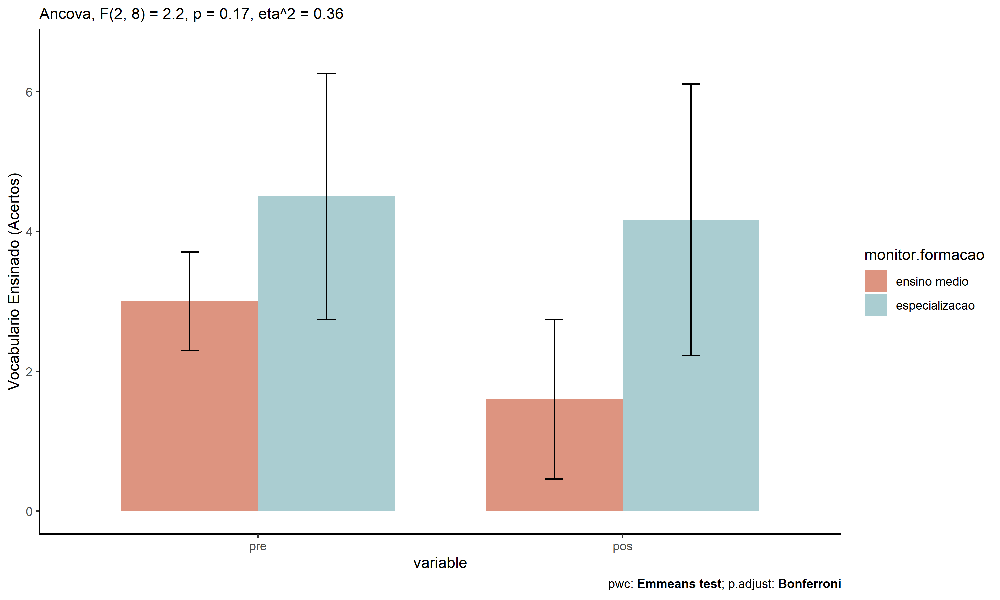<!-- -->

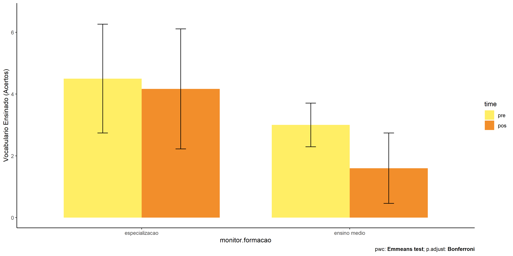<!-- -->

### Vocabulario Nao Ensinado (Acertos)

| var                          | monitor.formacao |   n | M (pre) | SE (pre) | M (unadj) | SE (unadj) | M (adj) | SE (adj) |
|:-----------------------------|:-----------------|----:|--------:|---------:|----------:|-----------:|--------:|---------:|
| score.vocab.nao.ensinado.pos | ensino medio     |   5 |  10.400 |    2.421 |     7.000 |      1.871 |   7.561 |    2.899 |
| score.vocab.nao.ensinado.pos | especializacao   |   6 |  13.333 |    2.692 |    10.833 |      3.135 |  10.366 |    2.638 |

| .y.                          | group1       | group2         | estimate | conf.low | conf.high |    se | statistic |     p | p.adj | p.adj.signif |
|:-----------------------------|:-------------|:---------------|---------:|---------:|----------:|------:|----------:|------:|------:|:-------------|
| score.vocab.nao.ensinado.pos | ensino medio | especializacao |   -2.805 |  -11.993 |     6.384 | 3.984 |    -0.704 | 0.501 | 0.501 | ns           |
| score.vocab.nao.ensinado.pre | ensino medio | especializacao |   -2.933 |  -11.285 |     5.418 | 3.692 |    -0.795 | 0.447 | 0.447 | ns           |

| .y.                      | monitor.formacao | group1 | group2 | estimate | conf.low | conf.high |    se | statistic |     p | p.adj | p.adj.signif |
|:-------------------------|:-----------------|:-------|:-------|---------:|---------:|----------:|------:|----------:|------:|------:|:-------------|
| score.vocab.nao.ensinado | ensino medio     | pre    | pos    |      3.4 |   -4.882 |    11.682 | 3.942 |     0.862 | 0.400 | 0.400 | ns           |
| score.vocab.nao.ensinado | especializacao   | pre    | pos    |      2.5 |   -5.061 |    10.061 | 3.599 |     0.695 | 0.496 | 0.496 | ns           |

    ## Scale for colour is already present.
    ## Adding another scale for colour, which will replace the existing scale.

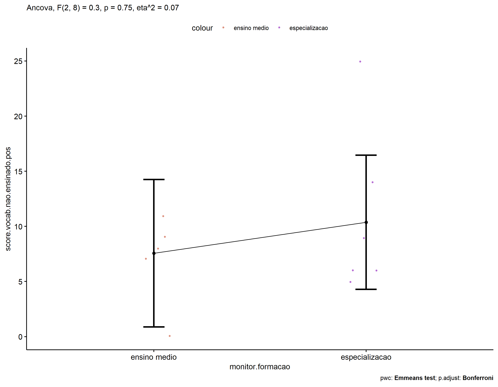<!-- -->

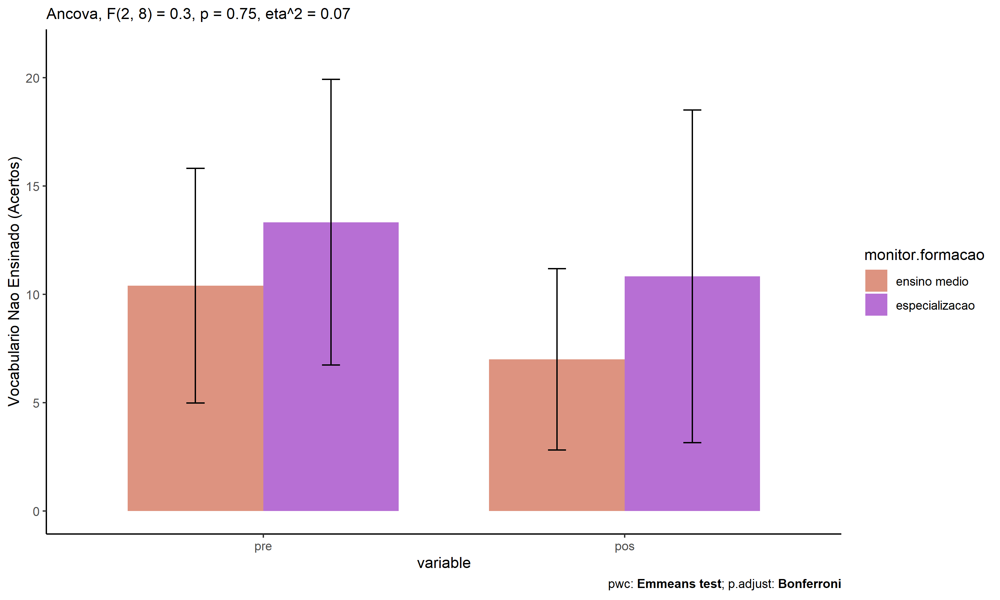<!-- -->

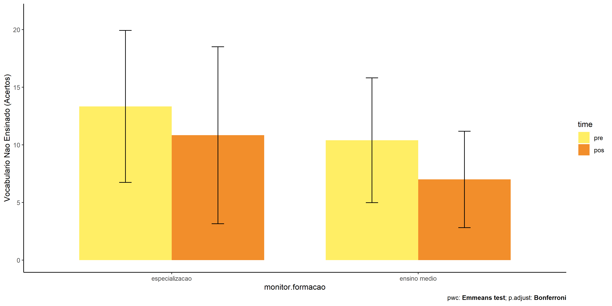<!-- -->

## factores: **grupo=“Experimental”:monitor.experiencia**

### Vocabulario (Acertos)

### Vocabulario Ensinado (Acertos)

### Vocabulario Nao Ensinado (Acertos)
