ANCOVA in Vocabulary Test (Teste de Vocabulario)
================
Geiser C. Challco <geiser@alumni.usp.br>

- [Descriptive Statistics of Initial
  Data](#descriptive-statistics-of-initial-data)
  - [Vocabulario (Acertos)](#vocabulario-acertos)
  - [Vocabulario (TRI)](#vocabulario-tri)
  - [Vocabulario Ensinado (Acertos)](#vocabulario-ensinado-acertos)
  - [Vocabulario Ensinado (TRI)](#vocabulario-ensinado-tri)
  - [Vocabulario Nao Ensinado
    (Acertos)](#vocabulario-nao-ensinado-acertos)
  - [Vocabulario Nao Ensinado (TRI)](#vocabulario-nao-ensinado-tri)
- [Checking of Assumptions](#checking-of-assumptions)
  - [Assumption: Normality
    distribution](#assumption-normality-distribution)
    - [Vocabulario (Acertos)](#vocabulario-acertos-1)
    - [Vocabulario (TRI)](#vocabulario-tri-1)
    - [Vocabulario Ensinado (Acertos)](#vocabulario-ensinado-acertos-1)
    - [Vocabulario Ensinado (TRI)](#vocabulario-ensinado-tri-1)
    - [Vocabulario Nao Ensinado
      (Acertos)](#vocabulario-nao-ensinado-acertos-1)
    - [Vocabulario Nao Ensinado (TRI)](#vocabulario-nao-ensinado-tri-1)
  - [Assumption: Homogeneity](#assumption-homogeneity)
    - [Vocabulario (Acertos)](#vocabulario-acertos-2)
    - [Vocabulario (TRI)](#vocabulario-tri-2)
    - [Vocabulario Ensinado (Acertos)](#vocabulario-ensinado-acertos-2)
    - [Vocabulario Ensinado (TRI)](#vocabulario-ensinado-tri-2)
    - [Vocabulario Nao Ensinado
      (Acertos)](#vocabulario-nao-ensinado-acertos-2)
    - [Vocabulario Nao Ensinado (TRI)](#vocabulario-nao-ensinado-tri-2)
- [Computation of ANCOVA test and Pairwise
  Comparison](#computation-of-ancova-test-and-pairwise-comparison)
  - [ANCOVA tests for one factor](#ancova-tests-for-one-factor)
    - [Vocabulario (Acertos)](#vocabulario-acertos-3)
    - [Vocabulario (TRI)](#vocabulario-tri-3)
    - [Vocabulario Ensinado (Acertos)](#vocabulario-ensinado-acertos-3)
    - [Vocabulario Ensinado (TRI)](#vocabulario-ensinado-tri-3)
    - [Vocabulario Nao Ensinado
      (Acertos)](#vocabulario-nao-ensinado-acertos-3)
    - [Vocabulario Nao Ensinado (TRI)](#vocabulario-nao-ensinado-tri-3)
  - [ANCOVA tests for two factors](#ancova-tests-for-two-factors)
    - [Vocabulario (Acertos)](#vocabulario-acertos-4)
    - [Vocabulario (TRI)](#vocabulario-tri-4)
    - [Vocabulario Ensinado (Acertos)](#vocabulario-ensinado-acertos-4)
    - [Vocabulario Ensinado (TRI)](#vocabulario-ensinado-tri-4)
    - [Vocabulario Nao Ensinado
      (Acertos)](#vocabulario-nao-ensinado-acertos-4)
    - [Vocabulario Nao Ensinado (TRI)](#vocabulario-nao-ensinado-tri-4)
  - [ANCOVA tests for
    grupo=“Experimental”](#ancova-tests-for-grupoexperimental)
    - [Vocabulario (Acertos)](#vocabulario-acertos-5)
    - [Vocabulario (TRI)](#vocabulario-tri-5)
    - [Vocabulario Ensinado (Acertos)](#vocabulario-ensinado-acertos-5)
    - [Vocabulario Ensinado (TRI)](#vocabulario-ensinado-tri-5)
    - [Vocabulario Nao Ensinado
      (Acertos)](#vocabulario-nao-ensinado-acertos-5)
    - [Vocabulario Nao Ensinado (TRI)](#vocabulario-nao-ensinado-tri-5)
- [Pairwise comparisons for one
  factor](#pairwise-comparisons-for-one-factor)
  - [factor: **grupo**](#factor-grupo)
    - [Vocabulario (Acertos)](#vocabulario-acertos-6)
    - [Vocabulario (TRI)](#vocabulario-tri-6)
    - [Vocabulario Ensinado (Acertos)](#vocabulario-ensinado-acertos-6)
    - [Vocabulario Ensinado (TRI)](#vocabulario-ensinado-tri-6)
    - [Vocabulario Nao Ensinado
      (Acertos)](#vocabulario-nao-ensinado-acertos-6)
    - [Vocabulario Nao Ensinado (TRI)](#vocabulario-nao-ensinado-tri-6)
  - [factor: **genero**](#factor-genero)
    - [Vocabulario (Acertos)](#vocabulario-acertos-7)
    - [Vocabulario (TRI)](#vocabulario-tri-7)
    - [Vocabulario Ensinado (Acertos)](#vocabulario-ensinado-acertos-7)
    - [Vocabulario Ensinado (TRI)](#vocabulario-ensinado-tri-7)
    - [Vocabulario Nao Ensinado
      (Acertos)](#vocabulario-nao-ensinado-acertos-7)
    - [Vocabulario Nao Ensinado (TRI)](#vocabulario-nao-ensinado-tri-7)
  - [factor: **idade**](#factor-idade)
    - [Vocabulario (Acertos)](#vocabulario-acertos-8)
    - [Vocabulario (TRI)](#vocabulario-tri-8)
    - [Vocabulario Ensinado (Acertos)](#vocabulario-ensinado-acertos-8)
    - [Vocabulario Ensinado (TRI)](#vocabulario-ensinado-tri-8)
    - [Vocabulario Nao Ensinado
      (Acertos)](#vocabulario-nao-ensinado-acertos-8)
    - [Vocabulario Nao Ensinado (TRI)](#vocabulario-nao-ensinado-tri-8)
  - [factor: **zona.participante**](#factor-zonaparticipante)
    - [Vocabulario (Acertos)](#vocabulario-acertos-9)
    - [Vocabulario (TRI)](#vocabulario-tri-9)
    - [Vocabulario Ensinado (Acertos)](#vocabulario-ensinado-acertos-9)
    - [Vocabulario Ensinado (TRI)](#vocabulario-ensinado-tri-9)
    - [Vocabulario Nao Ensinado
      (Acertos)](#vocabulario-nao-ensinado-acertos-9)
    - [Vocabulario Nao Ensinado (TRI)](#vocabulario-nao-ensinado-tri-9)
  - [factor: **escola**](#factor-escola)
    - [Vocabulario (Acertos)](#vocabulario-acertos-10)
    - [Vocabulario (TRI)](#vocabulario-tri-10)
    - [Vocabulario Ensinado (Acertos)](#vocabulario-ensinado-acertos-10)
    - [Vocabulario Ensinado (TRI)](#vocabulario-ensinado-tri-10)
    - [Vocabulario Nao Ensinado
      (Acertos)](#vocabulario-nao-ensinado-acertos-10)
    - [Vocabulario Nao Ensinado (TRI)](#vocabulario-nao-ensinado-tri-10)
  - [factor: **zona.escola**](#factor-zonaescola)
    - [Vocabulario (Acertos)](#vocabulario-acertos-11)
    - [Vocabulario (TRI)](#vocabulario-tri-11)
    - [Vocabulario Ensinado (Acertos)](#vocabulario-ensinado-acertos-11)
    - [Vocabulario Ensinado (TRI)](#vocabulario-ensinado-tri-11)
    - [Vocabulario Nao Ensinado
      (Acertos)](#vocabulario-nao-ensinado-acertos-11)
    - [Vocabulario Nao Ensinado (TRI)](#vocabulario-nao-ensinado-tri-11)
- [Pairwise comparisons for two
  factors](#pairwise-comparisons-for-two-factors)
  - [factores: **genero:grupo**](#factores-generogrupo)
    - [Vocabulario (Acertos)](#vocabulario-acertos-12)
    - [Vocabulario (TRI)](#vocabulario-tri-12)
    - [Vocabulario Ensinado (Acertos)](#vocabulario-ensinado-acertos-12)
    - [Vocabulario Ensinado (TRI)](#vocabulario-ensinado-tri-12)
    - [Vocabulario Nao Ensinado
      (Acertos)](#vocabulario-nao-ensinado-acertos-12)
    - [Vocabulario Nao Ensinado (TRI)](#vocabulario-nao-ensinado-tri-12)
  - [factores: **idade:grupo**](#factores-idadegrupo)
    - [Vocabulario (Acertos)](#vocabulario-acertos-13)
    - [Vocabulario (TRI)](#vocabulario-tri-13)
    - [Vocabulario Ensinado (Acertos)](#vocabulario-ensinado-acertos-13)
    - [Vocabulario Ensinado (TRI)](#vocabulario-ensinado-tri-13)
    - [Vocabulario Nao Ensinado
      (Acertos)](#vocabulario-nao-ensinado-acertos-13)
    - [Vocabulario Nao Ensinado (TRI)](#vocabulario-nao-ensinado-tri-13)
  - [factores:
    **zona.participante:grupo**](#factores-zonaparticipantegrupo)
    - [Vocabulario (Acertos)](#vocabulario-acertos-14)
    - [Vocabulario (TRI)](#vocabulario-tri-14)
    - [Vocabulario Ensinado (Acertos)](#vocabulario-ensinado-acertos-14)
    - [Vocabulario Ensinado (TRI)](#vocabulario-ensinado-tri-14)
    - [Vocabulario Nao Ensinado
      (Acertos)](#vocabulario-nao-ensinado-acertos-14)
    - [Vocabulario Nao Ensinado (TRI)](#vocabulario-nao-ensinado-tri-14)
  - [factores: **escola:grupo**](#factores-escolagrupo)
    - [Vocabulario (Acertos)](#vocabulario-acertos-15)
    - [Vocabulario (TRI)](#vocabulario-tri-15)
    - [Vocabulario Ensinado (Acertos)](#vocabulario-ensinado-acertos-15)
    - [Vocabulario Ensinado (TRI)](#vocabulario-ensinado-tri-15)
    - [Vocabulario Nao Ensinado
      (Acertos)](#vocabulario-nao-ensinado-acertos-15)
    - [Vocabulario Nao Ensinado (TRI)](#vocabulario-nao-ensinado-tri-15)
  - [factores: **zona.escola:grupo**](#factores-zonaescolagrupo)
    - [Vocabulario (Acertos)](#vocabulario-acertos-16)
    - [Vocabulario (TRI)](#vocabulario-tri-16)
    - [Vocabulario Ensinado (Acertos)](#vocabulario-ensinado-acertos-16)
    - [Vocabulario Ensinado (TRI)](#vocabulario-ensinado-tri-16)
    - [Vocabulario Nao Ensinado
      (Acertos)](#vocabulario-nao-ensinado-acertos-16)
    - [Vocabulario Nao Ensinado (TRI)](#vocabulario-nao-ensinado-tri-16)
- [Pairwise comparisons for
  grupo=“Experimental”](#pairwise-comparisons-for-grupoexperimental)
  - [factores:
    **grupo=“Experimental”:monitor**](#factores-grupoexperimentalmonitor)
    - [Vocabulario (Acertos)](#vocabulario-acertos-17)
    - [Vocabulario (TRI)](#vocabulario-tri-17)
    - [Vocabulario Ensinado (Acertos)](#vocabulario-ensinado-acertos-17)
    - [Vocabulario Ensinado (TRI)](#vocabulario-ensinado-tri-17)
    - [Vocabulario Nao Ensinado
      (Acertos)](#vocabulario-nao-ensinado-acertos-17)
    - [Vocabulario Nao Ensinado (TRI)](#vocabulario-nao-ensinado-tri-17)
  - [factores:
    **grupo=“Experimental”:monitor.genero**](#factores-grupoexperimentalmonitorgenero)
    - [Vocabulario (Acertos)](#vocabulario-acertos-18)
    - [Vocabulario (TRI)](#vocabulario-tri-18)
    - [Vocabulario Ensinado (Acertos)](#vocabulario-ensinado-acertos-18)
    - [Vocabulario Ensinado (TRI)](#vocabulario-ensinado-tri-18)
    - [Vocabulario Nao Ensinado
      (Acertos)](#vocabulario-nao-ensinado-acertos-18)
    - [Vocabulario Nao Ensinado (TRI)](#vocabulario-nao-ensinado-tri-18)
  - [factores:
    **grupo=“Experimental”:monitor.area**](#factores-grupoexperimentalmonitorarea)
    - [Vocabulario (Acertos)](#vocabulario-acertos-19)
    - [Vocabulario (TRI)](#vocabulario-tri-19)
    - [Vocabulario Ensinado (Acertos)](#vocabulario-ensinado-acertos-19)
    - [Vocabulario Ensinado (TRI)](#vocabulario-ensinado-tri-19)
    - [Vocabulario Nao Ensinado
      (Acertos)](#vocabulario-nao-ensinado-acertos-19)
    - [Vocabulario Nao Ensinado (TRI)](#vocabulario-nao-ensinado-tri-19)
  - [factores:
    **grupo=“Experimental”:monitor.formacao**](#factores-grupoexperimentalmonitorformacao)
    - [Vocabulario (Acertos)](#vocabulario-acertos-20)
    - [Vocabulario (TRI)](#vocabulario-tri-20)
    - [Vocabulario Ensinado (Acertos)](#vocabulario-ensinado-acertos-20)
    - [Vocabulario Ensinado (TRI)](#vocabulario-ensinado-tri-20)
    - [Vocabulario Nao Ensinado
      (Acertos)](#vocabulario-nao-ensinado-acertos-20)
    - [Vocabulario Nao Ensinado (TRI)](#vocabulario-nao-ensinado-tri-20)
  - [factores:
    **grupo=“Experimental”:monitor.experiencia**](#factores-grupoexperimentalmonitorexperiencia)
    - [Vocabulario (Acertos)](#vocabulario-acertos-21)
    - [Vocabulario (TRI)](#vocabulario-tri-21)
    - [Vocabulario Ensinado (Acertos)](#vocabulario-ensinado-acertos-21)
    - [Vocabulario Ensinado (TRI)](#vocabulario-ensinado-tri-21)
    - [Vocabulario Nao Ensinado
      (Acertos)](#vocabulario-nao-ensinado-acertos-21)
    - [Vocabulario Nao Ensinado (TRI)](#vocabulario-nao-ensinado-tri-21)

**NOTE**

- Teste ANCOVA para determinar se houve diferenças significativas no
  Teste de Vocabulario (medido usando pre- e pos-testes).
- ANCOVA test to determine whether there were significant differences in
  Vocabulary Test (measured using pre- and post-tests).

# Descriptive Statistics of Initial Data

## Vocabulario (Acertos)

| grupo    | genero | idade | zona.participante | escola | zona.escola | variable        |   n |   mean | median | min | max |     sd |    se |      ci |   iqr |
|:---------|:-------|:------|:------------------|:-------|:------------|:----------------|----:|-------:|-------:|----:|----:|-------:|------:|--------:|------:|
| Controle | F      |       |                   |        |             | score.vocab.pos |  80 | 22.938 |   23.0 |   8 |  42 |  7.492 | 0.838 |   1.667 | 12.00 |
| Controle | M      |       |                   |        |             | score.vocab.pos |  79 | 20.747 |   20.0 |   4 |  39 |  8.743 | 0.984 |   1.958 | 14.00 |
| WordGen  | F      |       |                   |        |             | score.vocab.pos |  53 | 25.868 |   27.0 |   8 |  41 |  8.658 | 1.189 |   2.386 | 16.00 |
| WordGen  | M      |       |                   |        |             | score.vocab.pos |  69 | 21.130 |   22.0 |   8 |  41 |  7.859 | 0.946 |   1.888 | 12.00 |
| Controle | F      |       |                   |        |             | score.vocab.pre |  80 | 21.812 |   21.0 |   7 |  41 |  8.105 | 0.906 |   1.804 | 13.00 |
| Controle | M      |       |                   |        |             | score.vocab.pre |  79 | 20.266 |   19.0 |   5 |  39 |  8.847 | 0.995 |   1.982 | 14.00 |
| WordGen  | F      |       |                   |        |             | score.vocab.pre |  53 | 24.057 |   24.0 |   6 |  40 |  8.690 | 1.194 |   2.395 | 11.00 |
| WordGen  | M      |       |                   |        |             | score.vocab.pre |  69 | 19.942 |   19.0 |   5 |  37 |  7.675 | 0.924 |   1.844 | 11.00 |
| Controle |        | 10y   |                   |        |             | score.vocab.pos |  28 | 22.179 |   23.0 |   9 |  42 |  7.621 | 1.440 |   2.955 | 10.25 |
| Controle |        | 11y   |                   |        |             | score.vocab.pos |  90 | 22.978 |   24.0 |   4 |  39 |  8.539 | 0.900 |   1.789 | 15.00 |
| Controle |        | 12y   |                   |        |             | score.vocab.pos |  23 | 19.391 |   18.0 |   9 |  37 |  7.803 | 1.627 |   3.374 | 11.00 |
| Controle |        | 13y   |                   |        |             | score.vocab.pos |   8 | 19.250 |   20.0 |   8 |  29 |  6.944 | 2.455 |   5.805 |  9.75 |
| Controle |        | 14y   |                   |        |             | score.vocab.pos |   2 | 18.000 |   18.0 |  13 |  23 |  7.071 | 5.000 |  63.531 |  5.00 |
| Controle |        | 16y   |                   |        |             | score.vocab.pos |   1 | 14.000 |   14.0 |  14 |  14 |        |       |         |  0.00 |
| Controle |        |       |                   |        |             | score.vocab.pos |   7 | 19.286 |   17.0 |  12 |  30 |  7.697 | 2.909 |   7.118 | 11.00 |
| WordGen  |        | 10y   |                   |        |             | score.vocab.pos |  23 | 22.174 |   22.0 |  12 |  32 |  5.630 | 1.174 |   2.435 |  9.00 |
| WordGen  |        | 11y   |                   |        |             | score.vocab.pos |  76 | 24.618 |   25.0 |   9 |  41 |  8.538 | 0.979 |   1.951 | 15.25 |
| WordGen  |        | 12y   |                   |        |             | score.vocab.pos |  14 | 22.929 |   22.0 |   8 |  41 |  9.903 | 2.647 |   5.718 | 10.25 |
| WordGen  |        | 13y   |                   |        |             | score.vocab.pos |   5 | 11.400 |   11.0 |   8 |  15 |  3.050 | 1.364 |   3.787 |  5.00 |
| WordGen  |        | 14y   |                   |        |             | score.vocab.pos |   2 | 11.500 |   11.5 |  11 |  12 |  0.707 | 0.500 |   6.353 |  0.50 |
| WordGen  |        |       |                   |        |             | score.vocab.pos |   2 | 23.500 |   23.5 |  15 |  32 | 12.021 | 8.500 | 108.003 |  8.50 |
| Controle |        | 10y   |                   |        |             | score.vocab.pre |  28 | 23.393 |   22.5 |  14 |  41 |  7.651 | 1.446 |   2.967 | 11.75 |
| Controle |        | 11y   |                   |        |             | score.vocab.pre |  90 | 21.278 |   21.0 |   5 |  39 |  8.966 | 0.945 |   1.878 | 16.50 |
| Controle |        | 12y   |                   |        |             | score.vocab.pre |  23 | 19.348 |   16.0 |   9 |  37 |  8.343 | 1.740 |   3.608 | 12.50 |
| Controle |        | 13y   |                   |        |             | score.vocab.pre |   8 | 19.500 |   20.5 |  10 |  27 |  6.990 | 2.471 |   5.844 | 13.00 |
| Controle |        | 14y   |                   |        |             | score.vocab.pre |   2 | 16.500 |   16.5 |  11 |  22 |  7.778 | 5.500 |  69.884 |  5.50 |
| Controle |        | 16y   |                   |        |             | score.vocab.pre |   1 | 16.000 |   16.0 |  16 |  16 |        |       |         |  0.00 |
| Controle |        |       |                   |        |             | score.vocab.pre |   7 | 18.000 |   18.0 |   8 |  28 |  7.594 | 2.870 |   7.023 | 12.00 |
| WordGen  |        | 10y   |                   |        |             | score.vocab.pre |  23 | 20.913 |   22.0 |   8 |  36 |  7.292 | 1.520 |   3.153 | 11.00 |
| WordGen  |        | 11y   |                   |        |             | score.vocab.pre |  76 | 22.855 |   22.0 |   5 |  40 |  8.438 | 0.968 |   1.928 | 12.50 |
| WordGen  |        | 12y   |                   |        |             | score.vocab.pre |  14 | 21.143 |   19.0 |   6 |  39 |  9.264 | 2.476 |   5.349 |  4.75 |
| WordGen  |        | 13y   |                   |        |             | score.vocab.pre |   5 | 15.200 |   16.0 |   7 |  25 |  6.611 | 2.956 |   8.208 |  4.00 |
| WordGen  |        | 14y   |                   |        |             | score.vocab.pre |   2 | 14.500 |   14.5 |  12 |  17 |  3.536 | 2.500 |  31.766 |  2.50 |
| WordGen  |        |       |                   |        |             | score.vocab.pre |   2 | 16.000 |   16.0 |   8 |  24 | 11.314 | 8.000 | 101.650 |  8.00 |
| Controle |        |       | Urbana            |        |             | score.vocab.pos |  69 | 22.739 |   24.0 |   4 |  42 |  8.562 | 1.031 |   2.057 | 15.00 |
| Controle |        |       | Rural             |        |             | score.vocab.pos |  53 | 21.340 |   21.0 |   9 |  38 |  7.550 | 1.037 |   2.081 | 12.00 |
| Controle |        |       |                   |        |             | score.vocab.pos |  37 | 20.919 |   19.0 |   8 |  37 |  8.398 | 1.381 |   2.800 | 13.00 |
| WordGen  |        |       | Urbana            |        |             | score.vocab.pos |  45 | 23.600 |   24.0 |   8 |  41 |  8.869 | 1.322 |   2.664 | 14.00 |
| WordGen  |        |       | Rural             |        |             | score.vocab.pos |  51 | 23.549 |   23.0 |   8 |  41 |  8.249 | 1.155 |   2.320 | 14.00 |
| WordGen  |        |       |                   |        |             | score.vocab.pos |  26 | 21.769 |   21.0 |   9 |  37 |  8.580 | 1.683 |   3.466 | 12.50 |
| Controle |        |       | Urbana            |        |             | score.vocab.pre |  69 | 22.087 |   22.0 |   7 |  39 |  7.963 | 0.959 |   1.913 | 13.00 |
| Controle |        |       | Rural             |        |             | score.vocab.pre |  53 | 20.075 |   18.0 |   5 |  41 |  8.799 | 1.209 |   2.425 | 13.00 |
| Controle |        |       |                   |        |             | score.vocab.pre |  37 | 20.486 |   19.0 |   6 |  37 |  9.002 | 1.480 |   3.001 | 14.00 |
| WordGen  |        |       | Urbana            |        |             | score.vocab.pre |  45 | 22.978 |   23.0 |   6 |  38 |  8.178 | 1.219 |   2.457 | 12.00 |
| WordGen  |        |       | Rural             |        |             | score.vocab.pre |  51 | 20.373 |   20.0 |   5 |  39 |  8.488 | 1.188 |   2.387 | 11.00 |
| WordGen  |        |       |                   |        |             | score.vocab.pre |  26 | 22.231 |   21.5 |   8 |  40 |  8.306 | 1.629 |   3.355 | 10.50 |
| Controle |        |       |                   | E1     |             | score.vocab.pos |  11 | 22.636 |   24.0 |  12 |  31 |  6.500 | 1.960 |   4.367 |  5.50 |
| Controle |        |       |                   | E2     |             | score.vocab.pos |  34 | 21.206 |   18.5 |  10 |  42 |  9.286 | 1.593 |   3.240 | 15.00 |
| Controle |        |       |                   | E3     |             | score.vocab.pos |  21 | 20.905 |   21.0 |   9 |  37 |  7.449 | 1.626 |   3.391 | 10.00 |
| Controle |        |       |                   | E4     |             | score.vocab.pos |  20 | 22.150 |   24.0 |   9 |  39 |  7.422 | 1.660 |   3.473 |  7.25 |
| Controle |        |       |                   | E5     |             | score.vocab.pos |  59 | 22.441 |   22.0 |   4 |  38 |  8.532 | 1.111 |   2.224 | 15.50 |
| Controle |        |       |                   | E6     |             | score.vocab.pos |  14 | 21.286 |   21.0 |   8 |  35 |  8.203 | 2.192 |   4.737 | 12.00 |
| WordGen  |        |       |                   | E1     |             | score.vocab.pos |  12 | 19.667 |   15.0 |   9 |  37 | 10.491 | 3.028 |   6.666 | 17.50 |
| WordGen  |        |       |                   | E2     |             | score.vocab.pos |  22 | 22.818 |   22.5 |   9 |  41 |  8.444 | 1.800 |   3.744 | 13.25 |
| WordGen  |        |       |                   | E3     |             | score.vocab.pos |  16 | 25.000 |   24.0 |   8 |  41 |  9.374 | 2.343 |   4.995 |  9.50 |
| WordGen  |        |       |                   | E4     |             | score.vocab.pos |   9 | 20.778 |   20.0 |  13 |  33 |  7.311 | 2.437 |   5.619 |  7.00 |
| WordGen  |        |       |                   | E5     |             | score.vocab.pos |  50 | 25.100 |   25.0 |   8 |  39 |  7.568 | 1.070 |   2.151 | 10.75 |
| WordGen  |        |       |                   | E6     |             | score.vocab.pos |  13 | 19.154 |   17.0 |   9 |  37 |  8.464 | 2.348 |   5.115 |  8.00 |
| Controle |        |       |                   | E1     |             | score.vocab.pre |  11 | 22.000 |   23.0 |  13 |  31 |  6.132 | 1.849 |   4.119 |  9.00 |
| Controle |        |       |                   | E2     |             | score.vocab.pre |  34 | 21.118 |   17.5 |   8 |  41 |  9.776 | 1.676 |   3.411 | 18.00 |
| Controle |        |       |                   | E3     |             | score.vocab.pre |  21 | 19.095 |   16.0 |   5 |  39 |  8.461 | 1.846 |   3.851 | 12.00 |
| Controle |        |       |                   | E4     |             | score.vocab.pre |  20 | 23.400 |   23.5 |   9 |  39 |  7.632 | 1.707 |   3.572 | 10.00 |
| Controle |        |       |                   | E5     |             | score.vocab.pre |  59 | 20.644 |   19.0 |   6 |  36 |  8.281 | 1.078 |   2.158 | 13.00 |
| Controle |        |       |                   | E6     |             | score.vocab.pre |  14 | 21.357 |   24.0 |   6 |  33 |  9.337 | 2.495 |   5.391 | 13.50 |
| WordGen  |        |       |                   | E1     |             | score.vocab.pre |  12 | 18.167 |   15.5 |   6 |  34 |  8.726 | 2.519 |   5.545 |  8.25 |
| WordGen  |        |       |                   | E2     |             | score.vocab.pre |  22 | 19.682 |   18.5 |   5 |  37 |  8.032 | 1.712 |   3.561 |  9.25 |
| WordGen  |        |       |                   | E3     |             | score.vocab.pre |  16 | 22.188 |   21.0 |   9 |  39 |  9.020 | 2.255 |   4.806 |  8.25 |
| WordGen  |        |       |                   | E4     |             | score.vocab.pre |   9 | 22.444 |   19.0 |  14 |  37 |  7.923 | 2.641 |   6.090 |  9.00 |
| WordGen  |        |       |                   | E5     |             | score.vocab.pre |  50 | 23.420 |   24.0 |   6 |  38 |  8.071 | 1.141 |   2.294 |  9.75 |
| WordGen  |        |       |                   | E6     |             | score.vocab.pre |  13 | 20.923 |   19.0 |   8 |  40 |  8.798 | 2.440 |   5.317 | 10.00 |
| Controle |        |       |                   |        | Urbana      | score.vocab.pos | 104 | 22.058 |   21.5 |   4 |  42 |  8.549 | 0.838 |   1.663 | 15.25 |
| Controle |        |       |                   |        | Rural       | score.vocab.pos |  55 | 21.455 |   22.0 |   8 |  39 |  7.513 | 1.013 |   2.031 | 10.50 |
| WordGen  |        |       |                   |        | Urbana      | score.vocab.pos |  84 | 23.726 |   24.0 |   8 |  41 |  8.377 | 0.914 |   1.818 | 14.00 |
| WordGen  |        |       |                   |        | Rural       | score.vocab.pos |  38 | 22.000 |   21.5 |   8 |  41 |  8.804 | 1.428 |   2.894 | 13.75 |
| Controle |        |       |                   |        | Urbana      | score.vocab.pre | 104 | 20.942 |   19.0 |   6 |  41 |  8.548 | 0.838 |   1.662 | 15.00 |
| Controle |        |       |                   |        | Rural       | score.vocab.pre |  55 | 21.236 |   21.0 |   5 |  39 |  8.457 | 1.140 |   2.286 | 12.00 |
| WordGen  |        |       |                   |        | Urbana      | score.vocab.pre |  84 | 21.690 |   21.5 |   5 |  38 |  8.339 | 0.910 |   1.810 | 13.25 |
| WordGen  |        |       |                   |        | Rural       | score.vocab.pre |  38 | 21.816 |   20.0 |   8 |  40 |  8.491 | 1.377 |   2.791 |  9.75 |

## Vocabulario (TRI)

| grupo    | genero | idade | zona.participante | escola | zona.escola | variable      |   n |   mean | median |    min |    max |    sd |    se |     ci |   iqr |
|:---------|:-------|:------|:------------------|:-------|:------------|:--------------|----:|-------:|-------:|-------:|-------:|------:|------:|-------:|------:|
| Controle | F      |       |                   |        |             | tri.vocab.pos |  80 |  0.225 |  0.414 | -2.207 |  2.106 | 0.921 | 0.103 |  0.205 | 1.285 |
| Controle | M      |       |                   |        |             | tri.vocab.pos |  79 |  0.019 |  0.114 | -1.851 |  1.984 | 1.020 | 0.115 |  0.228 | 1.586 |
| WordGen  | F      |       |                   |        |             | tri.vocab.pos |  53 |  0.580 |  0.743 | -1.885 |  2.090 | 0.901 | 0.124 |  0.248 | 1.260 |
| WordGen  | M      |       |                   |        |             | tri.vocab.pos |  69 |  0.034 |  0.089 | -1.415 |  1.800 | 0.873 | 0.105 |  0.210 | 1.519 |
| Controle | F      |       |                   |        |             | tri.vocab.pre |  80 |  0.171 |  0.301 | -1.939 |  1.829 | 0.809 | 0.090 |  0.180 | 1.173 |
| Controle | M      |       |                   |        |             | tri.vocab.pre |  79 |  0.018 |  0.000 | -1.612 |  1.918 | 0.927 | 0.104 |  0.208 | 1.505 |
| WordGen  | F      |       |                   |        |             | tri.vocab.pre |  53 |  0.412 |  0.547 | -1.988 |  1.903 | 0.874 | 0.120 |  0.241 | 0.939 |
| WordGen  | M      |       |                   |        |             | tri.vocab.pre |  69 | -0.092 | -0.057 | -2.194 |  1.915 | 0.907 | 0.109 |  0.218 | 1.459 |
| Controle |        | 10y   |                   |        |             | tri.vocab.pos |  28 |  0.201 |  0.383 | -1.614 |  2.029 | 0.943 | 0.178 |  0.366 | 1.031 |
| Controle |        | 11y   |                   |        |             | tri.vocab.pos |  90 |  0.260 |  0.455 | -1.851 |  2.106 | 0.977 | 0.103 |  0.205 | 1.471 |
| Controle |        | 12y   |                   |        |             | tri.vocab.pos |  23 | -0.178 | -0.161 | -1.584 |  1.832 | 0.863 | 0.180 |  0.373 | 0.959 |
| Controle |        | 13y   |                   |        |             | tri.vocab.pos |   8 | -0.108 |  0.049 | -1.198 |  0.886 | 0.839 | 0.297 |  0.702 | 1.588 |
| Controle |        | 14y   |                   |        |             | tri.vocab.pos |   2 | -0.680 | -0.680 | -1.835 |  0.475 | 1.633 | 1.155 | 14.674 | 1.155 |
| Controle |        | 16y   |                   |        |             | tri.vocab.pos |   1 | -0.989 | -0.989 | -0.989 | -0.989 |       |       |        | 0.000 |
| Controle |        |       |                   |        |             | tri.vocab.pos |   7 | -0.312 | -0.183 | -2.207 |  1.153 | 1.196 | 0.452 |  1.106 | 1.518 |
| WordGen  |        | 10y   |                   |        |             | tri.vocab.pos |  23 |  0.210 |  0.381 | -1.158 |  1.176 | 0.658 | 0.137 |  0.284 | 0.917 |
| WordGen  |        | 11y   |                   |        |             | tri.vocab.pos |  76 |  0.420 |  0.545 | -1.415 |  1.801 | 0.897 | 0.103 |  0.205 | 1.462 |
| WordGen  |        | 12y   |                   |        |             | tri.vocab.pos |  14 |  0.246 |  0.219 | -1.885 |  2.090 | 1.130 | 0.302 |  0.653 | 1.358 |
| WordGen  |        | 13y   |                   |        |             | tri.vocab.pos |   5 | -1.153 | -1.129 | -1.345 | -0.921 | 0.164 | 0.073 |  0.203 | 0.168 |
| WordGen  |        | 14y   |                   |        |             | tri.vocab.pos |   2 | -1.029 | -1.029 | -1.258 | -0.800 | 0.324 | 0.229 |  2.909 | 0.229 |
| WordGen  |        |       |                   |        |             | tri.vocab.pos |   2 |  0.344 |  0.344 | -0.374 |  1.061 | 1.015 | 0.717 |  9.115 | 0.717 |
| Controle |        | 10y   |                   |        |             | tri.vocab.pre |  28 |  0.310 |  0.405 | -1.051 |  1.829 | 0.733 | 0.138 |  0.284 | 1.016 |
| Controle |        | 11y   |                   |        |             | tri.vocab.pre |  90 |  0.152 |  0.217 | -1.939 |  1.918 | 0.899 | 0.095 |  0.188 | 1.469 |
| Controle |        | 12y   |                   |        |             | tri.vocab.pre |  23 | -0.195 | -0.304 | -1.524 |  1.488 | 0.952 | 0.198 |  0.411 | 1.450 |
| Controle |        | 13y   |                   |        |             | tri.vocab.pre |   8 | -0.186 | -0.144 | -1.082 |  0.725 | 0.809 | 0.286 |  0.677 | 1.540 |
| Controle |        | 14y   |                   |        |             | tri.vocab.pre |   2 | -0.148 | -0.148 | -0.582 |  0.286 | 0.614 | 0.434 |  5.519 | 0.434 |
| Controle |        | 16y   |                   |        |             | tri.vocab.pre |   1 | -0.357 | -0.357 | -0.357 | -0.357 |       |       |        | 0.000 |
| Controle |        |       |                   |        |             | tri.vocab.pre |   7 | -0.105 | -0.072 | -1.348 |  0.765 | 0.761 | 0.288 |  0.704 | 0.971 |
| WordGen  |        | 10y   |                   |        |             | tri.vocab.pre |  23 |  0.136 |  0.324 | -1.640 |  1.809 | 0.838 | 0.175 |  0.362 | 1.129 |
| WordGen  |        | 11y   |                   |        |             | tri.vocab.pre |  76 |  0.238 |  0.337 | -2.194 |  1.915 | 0.886 | 0.102 |  0.202 | 1.322 |
| WordGen  |        | 12y   |                   |        |             | tri.vocab.pre |  14 |  0.085 | -0.048 | -2.038 |  1.903 | 1.084 | 0.290 |  0.626 | 0.596 |
| WordGen  |        | 13y   |                   |        |             | tri.vocab.pre |   5 | -0.642 | -0.761 | -1.468 |  0.484 | 0.710 | 0.317 |  0.881 | 0.261 |
| WordGen  |        | 14y   |                   |        |             | tri.vocab.pre |   2 | -1.229 | -1.229 | -1.241 | -1.218 | 0.016 | 0.012 |  0.148 | 0.012 |
| WordGen  |        |       |                   |        |             | tri.vocab.pre |   2 | -0.608 | -0.608 | -1.833 |  0.616 | 1.731 | 1.224 | 15.557 | 1.224 |
| Controle |        |       | Urbana            |        |             | tri.vocab.pos |  69 |  0.257 |  0.465 | -1.646 |  2.029 | 0.999 | 0.120 |  0.240 | 1.463 |
| Controle |        |       | Rural             |        |             | tri.vocab.pos |  53 |  0.024 |  0.070 | -2.207 |  2.106 | 0.937 | 0.129 |  0.258 | 1.139 |
| Controle |        |       |                   |        |             | tri.vocab.pos |  37 |  0.015 |  0.053 | -1.835 |  1.832 | 0.973 | 0.160 |  0.324 | 1.555 |
| WordGen  |        |       | Urbana            |        |             | tri.vocab.pos |  45 |  0.270 |  0.381 | -1.885 |  1.800 | 1.008 | 0.150 |  0.303 | 1.759 |
| WordGen  |        |       | Rural             |        |             | tri.vocab.pos |  51 |  0.317 |  0.390 | -1.412 |  2.090 | 0.874 | 0.122 |  0.246 | 1.197 |
| WordGen  |        |       |                   |        |             | tri.vocab.pos |  26 |  0.182 |  0.146 | -1.345 |  1.784 | 0.888 | 0.174 |  0.359 | 1.260 |
| Controle |        |       | Urbana            |        |             | tri.vocab.pre |  69 |  0.177 |  0.303 | -1.939 |  1.918 | 0.850 | 0.102 |  0.204 | 1.213 |
| Controle |        |       | Rural             |        |             | tri.vocab.pre |  53 |  0.037 |  0.062 | -1.493 |  1.829 | 0.857 | 0.118 |  0.236 | 1.283 |
| Controle |        |       |                   |        |             | tri.vocab.pre |  37 |  0.023 | -0.072 | -1.612 |  1.721 | 0.934 | 0.154 |  0.311 | 1.450 |
| WordGen  |        |       | Urbana            |        |             | tri.vocab.pre |  45 |  0.198 |  0.404 | -2.038 |  1.915 | 0.962 | 0.143 |  0.289 | 1.540 |
| WordGen  |        |       | Rural             |        |             | tri.vocab.pre |  51 |  0.049 |  0.063 | -2.194 |  1.903 | 0.938 | 0.131 |  0.264 | 1.249 |
| WordGen  |        |       |                   |        |             | tri.vocab.pre |  26 |  0.158 |  0.068 | -1.833 |  1.834 | 0.849 | 0.167 |  0.343 | 0.919 |
| Controle |        |       |                   | E1     |             | tri.vocab.pos |  11 |  0.483 |  0.518 | -0.744 |  1.423 | 0.636 | 0.192 |  0.427 | 0.749 |
| Controle |        |       |                   | E2     |             | tri.vocab.pos |  34 | -0.053 | -0.105 | -1.851 |  2.029 | 1.130 | 0.194 |  0.394 | 1.783 |
| Controle |        |       |                   | E3     |             | tri.vocab.pos |  21 |  0.006 |  0.070 | -1.584 |  2.016 | 0.861 | 0.188 |  0.392 | 1.120 |
| Controle |        |       |                   | E4     |             | tri.vocab.pos |  20 |  0.111 |  0.460 | -1.614 |  1.984 | 0.927 | 0.207 |  0.434 | 1.242 |
| Controle |        |       |                   | E5     |             | tri.vocab.pos |  59 |  0.196 |  0.351 | -2.207 |  2.106 | 1.015 | 0.132 |  0.264 | 1.525 |
| Controle |        |       |                   | E6     |             | tri.vocab.pos |  14 |  0.150 |  0.227 | -1.671 |  1.397 | 0.861 | 0.230 |  0.497 | 1.057 |
| WordGen  |        |       |                   | E1     |             | tri.vocab.pos |  12 | -0.099 | -0.551 | -1.415 |  1.727 | 1.161 | 0.335 |  0.738 | 1.795 |
| WordGen  |        |       |                   | E2     |             | tri.vocab.pos |  22 |  0.146 |  0.188 | -1.345 |  1.703 | 0.909 | 0.194 |  0.403 | 1.436 |
| WordGen  |        |       |                   | E3     |             | tri.vocab.pos |  16 |  0.494 |  0.428 | -0.921 |  2.090 | 0.896 | 0.224 |  0.478 | 1.095 |
| WordGen  |        |       |                   | E4     |             | tri.vocab.pos |   9 |  0.104 | -0.163 | -1.123 |  1.419 | 0.850 | 0.283 |  0.653 | 0.634 |
| WordGen  |        |       |                   | E5     |             | tri.vocab.pos |  50 |  0.479 |  0.654 | -1.885 |  1.843 | 0.867 | 0.123 |  0.246 | 1.005 |
| WordGen  |        |       |                   | E6     |             | tri.vocab.pos |  13 | -0.137 | -0.254 | -1.102 |  1.656 | 0.855 | 0.237 |  0.516 | 0.916 |
| Controle |        |       |                   | E1     |             | tri.vocab.pre |  11 |  0.341 |  0.351 | -0.581 |  1.336 | 0.610 | 0.184 |  0.410 | 0.816 |
| Controle |        |       |                   | E2     |             | tri.vocab.pre |  34 |  0.039 | -0.193 | -1.939 |  1.829 | 1.016 | 0.174 |  0.354 | 1.608 |
| Controle |        |       |                   | E3     |             | tri.vocab.pre |  21 | -0.076 | -0.003 | -1.492 |  1.720 | 0.795 | 0.173 |  0.362 | 1.121 |
| Controle |        |       |                   | E4     |             | tri.vocab.pre |  20 |  0.217 |  0.293 | -1.250 |  1.918 | 0.808 | 0.181 |  0.378 | 0.662 |
| Controle |        |       |                   | E5     |             | tri.vocab.pre |  59 |  0.074 |  0.033 | -1.493 |  1.721 | 0.883 | 0.115 |  0.230 | 1.447 |
| Controle |        |       |                   | E6     |             | tri.vocab.pre |  14 |  0.204 |  0.448 | -1.612 |  1.274 | 0.864 | 0.231 |  0.499 | 0.980 |
| WordGen  |        |       |                   | E1     |             | tri.vocab.pre |  12 | -0.445 | -0.821 | -2.194 |  1.404 | 1.147 | 0.331 |  0.729 | 1.610 |
| WordGen  |        |       |                   | E2     |             | tri.vocab.pre |  22 | -0.035 |  0.022 | -1.988 |  1.915 | 0.921 | 0.196 |  0.408 | 1.190 |
| WordGen  |        |       |                   | E3     |             | tri.vocab.pre |  16 |  0.224 |  0.223 | -1.640 |  1.903 | 1.047 | 0.262 |  0.558 | 1.632 |
| WordGen  |        |       |                   | E4     |             | tri.vocab.pre |   9 |  0.165 |  0.001 | -1.055 |  0.918 | 0.644 | 0.215 |  0.495 | 0.840 |
| WordGen  |        |       |                   | E5     |             | tri.vocab.pre |  50 |  0.332 |  0.553 | -2.038 |  1.834 | 0.864 | 0.122 |  0.246 | 1.029 |
| WordGen  |        |       |                   | E6     |             | tri.vocab.pre |  13 | -0.003 | -0.047 | -1.230 |  1.626 | 0.798 | 0.221 |  0.482 | 0.943 |
| Controle |        |       |                   |        | Urbana      | tri.vocab.pos | 104 |  0.145 |  0.290 | -2.207 |  2.106 | 1.027 | 0.101 |  0.200 | 1.665 |
| Controle |        |       |                   |        | Rural       | tri.vocab.pos |  55 |  0.081 |  0.144 | -1.671 |  2.016 | 0.872 | 0.118 |  0.236 | 1.217 |
| WordGen  |        |       |                   |        | Urbana      | tri.vocab.pos |  84 |  0.310 |  0.545 | -1.885 |  1.843 | 0.938 | 0.102 |  0.204 | 1.309 |
| WordGen  |        |       |                   |        | Rural       | tri.vocab.pos |  38 |  0.186 |  0.146 | -1.123 |  2.090 | 0.893 | 0.145 |  0.294 | 1.280 |
| Controle |        |       |                   |        | Urbana      | tri.vocab.pre | 104 |  0.091 |  0.051 | -1.939 |  1.829 | 0.902 | 0.088 |  0.175 | 1.436 |
| Controle |        |       |                   |        | Rural       | tri.vocab.pre |  55 |  0.102 |  0.223 | -1.612 |  1.918 | 0.814 | 0.110 |  0.220 | 1.148 |
| WordGen  |        |       |                   |        | Urbana      | tri.vocab.pre |  84 |  0.125 |  0.279 | -2.194 |  1.915 | 0.954 | 0.104 |  0.207 | 1.413 |
| WordGen  |        |       |                   |        | Rural       | tri.vocab.pre |  38 |  0.133 | -0.002 | -1.640 |  1.903 | 0.867 | 0.141 |  0.285 | 1.166 |

## Vocabulario Ensinado (Acertos)

| grupo    | genero | idade | zona.participante | escola | zona.escola | variable                 |   n |  mean | median | min | max |    sd |    se |     ci |  iqr |
|:---------|:-------|:------|:------------------|:-------|:------------|:-------------------------|----:|------:|-------:|----:|----:|------:|------:|-------:|-----:|
| Controle | F      |       |                   |        |             | score.vocab.ensinado.pos |  87 | 4.057 |    4.0 |   0 |  10 | 2.364 | 0.253 |  0.504 | 4.00 |
| Controle | M      |       |                   |        |             | score.vocab.ensinado.pos |  89 | 3.539 |    3.0 |   0 |   9 | 2.169 | 0.230 |  0.457 | 3.00 |
| WordGen  | F      |       |                   |        |             | score.vocab.ensinado.pos |  59 | 4.542 |    5.0 |   0 |  10 | 2.514 | 0.327 |  0.655 | 3.00 |
| WordGen  | M      |       |                   |        |             | score.vocab.ensinado.pos |  75 | 4.013 |    4.0 |   0 |  10 | 2.239 | 0.259 |  0.515 | 2.00 |
| WordGen  |        |       |                   |        |             | score.vocab.ensinado.pos |   1 | 0.000 |    0.0 |   0 |   0 |       |       |        | 0.00 |
| Controle | F      |       |                   |        |             | score.vocab.ensinado.pre |  87 | 3.954 |    4.0 |   0 |  10 | 2.401 | 0.257 |  0.512 | 3.00 |
| Controle | M      |       |                   |        |             | score.vocab.ensinado.pre |  89 | 3.663 |    4.0 |   0 |   9 | 2.256 | 0.239 |  0.475 | 3.00 |
| WordGen  | F      |       |                   |        |             | score.vocab.ensinado.pre |  59 | 4.576 |    4.0 |   0 |  10 | 2.313 | 0.301 |  0.603 | 3.00 |
| WordGen  | M      |       |                   |        |             | score.vocab.ensinado.pre |  75 | 3.680 |    4.0 |   0 |   8 | 1.960 | 0.226 |  0.451 | 3.00 |
| WordGen  |        |       |                   |        |             | score.vocab.ensinado.pre |   1 | 8.000 |    8.0 |   8 |   8 |       |       |        | 0.00 |
| Controle |        | 10y   |                   |        |             | score.vocab.ensinado.pos |  32 | 4.219 |    4.5 |   0 |  10 | 2.661 | 0.470 |  0.959 | 4.00 |
| Controle |        | 11y   |                   |        |             | score.vocab.ensinado.pos |  93 | 3.914 |    4.0 |   0 |   9 | 2.273 | 0.236 |  0.468 | 3.00 |
| Controle |        | 12y   |                   |        |             | score.vocab.ensinado.pos |  26 | 3.500 |    3.0 |   0 |   8 | 1.924 | 0.377 |  0.777 | 2.50 |
| Controle |        | 13y   |                   |        |             | score.vocab.ensinado.pos |  10 | 3.500 |    3.5 |   2 |   6 | 1.354 | 0.428 |  0.969 | 1.75 |
| Controle |        | 14y   |                   |        |             | score.vocab.ensinado.pos |   2 | 5.500 |    5.5 |   4 |   7 | 2.121 | 1.500 | 19.059 | 1.50 |
| Controle |        | 15y   |                   |        |             | score.vocab.ensinado.pos |   3 | 1.000 |    0.0 |   0 |   3 | 1.732 | 1.000 |  4.303 | 1.50 |
| Controle |        | 16y   |                   |        |             | score.vocab.ensinado.pos |   1 | 1.000 |    1.0 |   1 |   1 |       |       |        | 0.00 |
| Controle |        |       |                   |        |             | score.vocab.ensinado.pos |   9 | 3.111 |    3.0 |   0 |   7 | 2.261 | 0.754 |  1.738 | 2.00 |
| WordGen  |        | 10y   |                   |        |             | score.vocab.ensinado.pos |  23 | 4.304 |    4.0 |   2 |   8 | 1.579 | 0.329 |  0.683 | 2.00 |
| WordGen  |        | 11y   |                   |        |             | score.vocab.ensinado.pos |  79 | 4.797 |    5.0 |   0 |  10 | 2.221 | 0.250 |  0.497 | 2.50 |
| WordGen  |        | 12y   |                   |        |             | score.vocab.ensinado.pos |  17 | 3.706 |    4.0 |   0 |   9 | 2.801 | 0.679 |  1.440 | 3.00 |
| WordGen  |        | 13y   |                   |        |             | score.vocab.ensinado.pos |   8 | 1.375 |    1.0 |   0 |   4 | 1.598 | 0.565 |  1.336 | 2.25 |
| WordGen  |        | 14y   |                   |        |             | score.vocab.ensinado.pos |   5 | 1.600 |    0.0 |   0 |   5 | 2.302 | 1.030 |  2.859 | 3.00 |
| WordGen  |        |       |                   |        |             | score.vocab.ensinado.pos |   3 | 3.000 |    2.0 |   0 |   7 | 3.606 | 2.082 |  8.957 | 3.50 |
| Controle |        | 10y   |                   |        |             | score.vocab.ensinado.pre |  32 | 4.344 |    4.0 |   0 |  10 | 2.364 | 0.418 |  0.852 | 3.00 |
| Controle |        | 11y   |                   |        |             | score.vocab.ensinado.pre |  93 | 3.925 |    4.0 |   0 |   9 | 2.388 | 0.248 |  0.492 | 3.00 |
| Controle |        | 12y   |                   |        |             | score.vocab.ensinado.pre |  26 | 3.615 |    4.0 |   0 |   8 | 1.791 | 0.351 |  0.723 | 2.75 |
| Controle |        | 13y   |                   |        |             | score.vocab.ensinado.pre |  10 | 3.400 |    4.0 |   0 |   7 | 2.366 | 0.748 |  1.693 | 3.50 |
| Controle |        | 14y   |                   |        |             | score.vocab.ensinado.pre |   2 | 4.000 |    4.0 |   1 |   7 | 4.243 | 3.000 | 38.119 | 3.00 |
| Controle |        | 15y   |                   |        |             | score.vocab.ensinado.pre |   3 | 0.333 |    0.0 |   0 |   1 | 0.577 | 0.333 |  1.434 | 0.50 |
| Controle |        | 16y   |                   |        |             | score.vocab.ensinado.pre |   1 | 5.000 |    5.0 |   5 |   5 |       |       |        | 0.00 |
| Controle |        |       |                   |        |             | score.vocab.ensinado.pre |   9 | 2.667 |    3.0 |   0 |   7 | 2.179 | 0.726 |  1.675 | 3.00 |
| WordGen  |        | 10y   |                   |        |             | score.vocab.ensinado.pre |  23 | 3.783 |    4.0 |   1 |   8 | 1.833 | 0.382 |  0.793 | 3.00 |
| WordGen  |        | 11y   |                   |        |             | score.vocab.ensinado.pre |  79 | 4.392 |    4.0 |   0 |  10 | 2.233 | 0.251 |  0.500 | 3.00 |
| WordGen  |        | 12y   |                   |        |             | score.vocab.ensinado.pre |  17 | 4.235 |    5.0 |   0 |  10 | 2.437 | 0.591 |  1.253 | 3.00 |
| WordGen  |        | 13y   |                   |        |             | score.vocab.ensinado.pre |   8 | 3.375 |    3.5 |   2 |   5 | 1.061 | 0.375 |  0.887 | 1.25 |
| WordGen  |        | 14y   |                   |        |             | score.vocab.ensinado.pre |   5 | 2.200 |    2.0 |   0 |   6 | 2.490 | 1.114 |  3.092 | 3.00 |
| WordGen  |        |       |                   |        |             | score.vocab.ensinado.pre |   3 | 3.333 |    3.0 |   1 |   6 | 2.517 | 1.453 |  6.252 | 2.50 |
| Controle |        |       | Urbana            |        |             | score.vocab.ensinado.pos |  77 | 3.935 |    4.0 |   0 |  10 | 2.478 | 0.282 |  0.562 | 4.00 |
| Controle |        |       | Rural             |        |             | score.vocab.ensinado.pos |  56 | 4.161 |    4.0 |   1 |   8 | 1.980 | 0.265 |  0.530 | 3.00 |
| Controle |        |       |                   |        |             | score.vocab.ensinado.pos |  43 | 3.070 |    3.0 |   0 |   7 | 2.142 | 0.327 |  0.659 | 3.50 |
| WordGen  |        |       | Urbana            |        |             | score.vocab.ensinado.pos |  49 | 4.286 |    4.0 |   0 |  10 | 2.458 | 0.351 |  0.706 | 3.00 |
| WordGen  |        |       | Rural             |        |             | score.vocab.ensinado.pos |  52 | 4.712 |    4.0 |   1 |   9 | 1.934 | 0.268 |  0.538 | 3.00 |
| WordGen  |        |       |                   |        |             | score.vocab.ensinado.pos |  34 | 3.353 |    3.0 |   0 |  10 | 2.729 | 0.468 |  0.952 | 3.75 |
| Controle |        |       | Urbana            |        |             | score.vocab.ensinado.pre |  77 | 3.896 |    4.0 |   0 |   9 | 2.303 | 0.262 |  0.523 | 3.00 |
| Controle |        |       | Rural             |        |             | score.vocab.ensinado.pre |  56 | 3.696 |    3.0 |   0 |  10 | 2.536 | 0.339 |  0.679 | 3.00 |
| Controle |        |       |                   |        |             | score.vocab.ensinado.pre |  43 | 3.791 |    4.0 |   0 |   9 | 2.122 | 0.324 |  0.653 | 3.00 |
| WordGen  |        |       | Urbana            |        |             | score.vocab.ensinado.pre |  49 | 4.163 |    4.0 |   0 |  10 | 2.115 | 0.302 |  0.607 | 3.00 |
| WordGen  |        |       | Rural             |        |             | score.vocab.ensinado.pre |  52 | 3.808 |    4.0 |   0 |  10 | 2.232 | 0.310 |  0.621 | 3.00 |
| WordGen  |        |       |                   |        |             | score.vocab.ensinado.pre |  34 | 4.471 |    4.5 |   0 |  10 | 2.191 | 0.376 |  0.765 | 1.75 |
| Controle |        |       |                   | E1     |             | score.vocab.ensinado.pos |  15 | 3.333 |    3.0 |   0 |   8 | 2.743 | 0.708 |  1.519 | 4.50 |
| Controle |        |       |                   | E2     |             | score.vocab.ensinado.pos |  35 | 3.943 |    4.0 |   0 |  10 | 2.496 | 0.422 |  0.858 | 4.00 |
| Controle |        |       |                   | E3     |             | score.vocab.ensinado.pos |  22 | 4.000 |    3.5 |   1 |   8 | 2.047 | 0.436 |  0.908 | 3.50 |
| Controle |        |       |                   | E4     |             | score.vocab.ensinado.pos |  20 | 4.650 |    4.5 |   1 |   8 | 2.231 | 0.499 |  1.044 | 4.00 |
| Controle |        |       |                   | E5     |             | score.vocab.ensinado.pos |  68 | 3.603 |    4.0 |   0 |   8 | 2.159 | 0.262 |  0.523 | 3.00 |
| Controle |        |       |                   | E6     |             | score.vocab.ensinado.pos |  16 | 3.375 |    3.0 |   0 |   7 | 2.156 | 0.539 |  1.149 | 2.50 |
| WordGen  |        |       |                   | E1     |             | score.vocab.ensinado.pos |  13 | 3.462 |    3.0 |   0 |   9 | 2.817 | 0.781 |  1.702 | 4.00 |
| WordGen  |        |       |                   | E2     |             | score.vocab.ensinado.pos |  28 | 3.714 |    4.0 |   0 |  10 | 2.551 | 0.482 |  0.989 | 4.25 |
| WordGen  |        |       |                   | E3     |             | score.vocab.ensinado.pos |  16 | 4.875 |    5.0 |   1 |   9 | 2.187 | 0.547 |  1.165 | 1.25 |
| WordGen  |        |       |                   | E4     |             | score.vocab.ensinado.pos |  10 | 4.600 |    4.0 |   3 |   7 | 1.578 | 0.499 |  1.129 | 2.50 |
| WordGen  |        |       |                   | E5     |             | score.vocab.ensinado.pos |  54 | 4.593 |    5.0 |   0 |   9 | 2.261 | 0.308 |  0.617 | 3.00 |
| WordGen  |        |       |                   | E6     |             | score.vocab.ensinado.pos |  14 | 3.429 |    3.0 |   0 |  10 | 2.623 | 0.701 |  1.514 | 2.75 |
| Controle |        |       |                   | E1     |             | score.vocab.ensinado.pre |  15 | 3.600 |    4.0 |   0 |   6 | 2.131 | 0.550 |  1.180 | 3.00 |
| Controle |        |       |                   | E2     |             | score.vocab.ensinado.pre |  35 | 4.057 |    4.0 |   1 |  10 | 2.376 | 0.402 |  0.816 | 3.00 |
| Controle |        |       |                   | E3     |             | score.vocab.ensinado.pre |  22 | 3.318 |    3.0 |   0 |   8 | 2.079 | 0.443 |  0.922 | 1.75 |
| Controle |        |       |                   | E4     |             | score.vocab.ensinado.pre |  20 | 4.850 |    5.0 |   1 |   9 | 2.277 | 0.509 |  1.066 | 3.25 |
| Controle |        |       |                   | E5     |             | score.vocab.ensinado.pre |  68 | 3.647 |    4.0 |   0 |   9 | 2.374 | 0.288 |  0.575 | 3.00 |
| Controle |        |       |                   | E6     |             | score.vocab.ensinado.pre |  16 | 3.500 |    3.5 |   0 |   9 | 2.477 | 0.619 |  1.320 | 3.25 |
| WordGen  |        |       |                   | E1     |             | score.vocab.ensinado.pre |  13 | 3.462 |    3.0 |   0 |   7 | 1.984 | 0.550 |  1.199 | 3.00 |
| WordGen  |        |       |                   | E2     |             | score.vocab.ensinado.pre |  28 | 3.464 |    3.0 |   0 |  10 | 2.151 | 0.407 |  0.834 | 2.25 |
| WordGen  |        |       |                   | E3     |             | score.vocab.ensinado.pre |  16 | 4.312 |    5.0 |   1 |  10 | 2.549 | 0.637 |  1.358 | 3.00 |
| WordGen  |        |       |                   | E4     |             | score.vocab.ensinado.pre |  10 | 3.800 |    3.5 |   0 |   9 | 2.741 | 0.867 |  1.961 | 3.75 |
| WordGen  |        |       |                   | E5     |             | score.vocab.ensinado.pre |  54 | 4.407 |    4.0 |   0 |   8 | 1.928 | 0.262 |  0.526 | 2.00 |
| WordGen  |        |       |                   | E6     |             | score.vocab.ensinado.pre |  14 | 4.786 |    4.5 |   2 |  10 | 2.359 | 0.631 |  1.362 | 2.50 |
| Controle |        |       |                   |        | Urbana      | score.vocab.ensinado.pos | 118 | 3.669 |    4.0 |   0 |  10 | 2.328 | 0.214 |  0.424 | 3.00 |
| Controle |        |       |                   |        | Rural       | score.vocab.ensinado.pos |  58 | 4.052 |    3.5 |   0 |   8 | 2.164 | 0.284 |  0.569 | 4.00 |
| WordGen  |        |       |                   |        | Urbana      | score.vocab.ensinado.pos |  95 | 4.179 |    4.0 |   0 |  10 | 2.449 | 0.251 |  0.499 | 3.00 |
| WordGen  |        |       |                   |        | Rural       | score.vocab.ensinado.pos |  40 | 4.300 |    4.0 |   0 |  10 | 2.267 | 0.358 |  0.725 | 2.00 |
| Controle |        |       |                   |        | Urbana      | score.vocab.ensinado.pre | 118 | 3.763 |    4.0 |   0 |  10 | 2.334 | 0.215 |  0.426 | 3.00 |
| Controle |        |       |                   |        | Rural       | score.vocab.ensinado.pre |  58 | 3.897 |    4.0 |   0 |   9 | 2.330 | 0.306 |  0.613 | 2.75 |
| WordGen  |        |       |                   |        | Urbana      | score.vocab.ensinado.pre |  95 | 4.000 |    4.0 |   0 |  10 | 2.037 | 0.209 |  0.415 | 2.00 |
| WordGen  |        |       |                   |        | Rural       | score.vocab.ensinado.pre |  40 | 4.350 |    4.5 |   0 |  10 | 2.497 | 0.395 |  0.798 | 3.25 |

## Vocabulario Ensinado (TRI)

| grupo    | genero | idade | zona.participante | escola | zona.escola | variable               |   n |   mean | median |    min |    max |    sd |    se |     ci |   iqr |
|:---------|:-------|:------|:------------------|:-------|:------------|:-----------------------|----:|-------:|-------:|-------:|-------:|------:|------:|-------:|------:|
| Controle | F      |       |                   |        |             | tri.vocab.ensinado.pos |  80 |  0.103 |  0.173 | -1.451 |  1.741 | 0.875 | 0.098 |  0.195 | 1.499 |
| Controle | M      |       |                   |        |             | tri.vocab.ensinado.pos |  79 | -0.017 |  0.025 | -1.409 |  1.474 | 0.811 | 0.091 |  0.182 | 1.289 |
| WordGen  | F      |       |                   |        |             | tri.vocab.ensinado.pos |  53 |  0.446 |  0.682 | -1.232 |  1.688 | 0.743 | 0.102 |  0.205 | 0.958 |
| WordGen  | M      |       |                   |        |             | tri.vocab.ensinado.pos |  69 | -0.038 | -0.035 | -1.396 |  1.474 | 0.791 | 0.095 |  0.190 | 1.080 |
| Controle | F      |       |                   |        |             | tri.vocab.ensinado.pre |  80 |  0.133 |  0.119 | -1.359 |  1.617 | 0.855 | 0.096 |  0.190 | 1.266 |
| Controle | M      |       |                   |        |             | tri.vocab.ensinado.pre |  79 | -0.004 |  0.009 | -1.451 |  1.527 | 0.760 | 0.086 |  0.170 | 1.193 |
| WordGen  | F      |       |                   |        |             | tri.vocab.ensinado.pre |  53 |  0.331 |  0.393 | -1.451 |  1.741 | 0.767 | 0.105 |  0.211 | 1.220 |
| WordGen  | M      |       |                   |        |             | tri.vocab.ensinado.pre |  69 | -0.126 | -0.120 | -1.451 |  1.280 | 0.725 | 0.087 |  0.174 | 0.970 |
| Controle |        | 10y   |                   |        |             | tri.vocab.ensinado.pos |  28 |  0.271 |  0.620 | -1.451 |  1.741 | 0.903 | 0.171 |  0.350 | 1.481 |
| Controle |        | 11y   |                   |        |             | tri.vocab.ensinado.pos |  90 |  0.061 |  0.155 | -1.409 |  1.474 | 0.869 | 0.092 |  0.182 | 1.542 |
| Controle |        | 12y   |                   |        |             | tri.vocab.ensinado.pos |  23 | -0.043 |  0.093 | -1.262 |  1.313 | 0.713 | 0.149 |  0.309 | 0.915 |
| Controle |        | 13y   |                   |        |             | tri.vocab.ensinado.pos |   8 | -0.173 | -0.036 | -1.063 |  0.462 | 0.481 | 0.170 |  0.402 | 0.568 |
| Controle |        | 14y   |                   |        |             | tri.vocab.ensinado.pos |   2 |  0.086 |  0.086 | -0.983 |  1.156 | 1.512 | 1.069 | 13.589 | 1.069 |
| Controle |        | 16y   |                   |        |             | tri.vocab.ensinado.pos |   1 | -0.675 | -0.675 | -0.675 | -0.675 |       |       |        | 0.000 |
| Controle |        |       |                   |        |             | tri.vocab.ensinado.pos |   7 | -0.474 | -0.635 | -1.232 |  0.940 | 0.773 | 0.292 |  0.715 | 0.785 |
| WordGen  |        | 10y   |                   |        |             | tri.vocab.ensinado.pos |  23 |  0.195 |  0.214 | -0.958 |  1.058 | 0.575 | 0.120 |  0.248 | 0.926 |
| WordGen  |        | 11y   |                   |        |             | tri.vocab.ensinado.pos |  76 |  0.284 |  0.427 | -1.224 |  1.688 | 0.790 | 0.091 |  0.180 | 1.230 |
| WordGen  |        | 12y   |                   |        |             | tri.vocab.ensinado.pos |  14 |  0.112 |  0.031 | -1.232 |  1.566 | 0.878 | 0.235 |  0.507 | 1.217 |
| WordGen  |        | 13y   |                   |        |             | tri.vocab.ensinado.pos |   5 | -0.938 | -1.194 | -1.348 |  0.156 | 0.619 | 0.277 |  0.769 | 0.144 |
| WordGen  |        | 14y   |                   |        |             | tri.vocab.ensinado.pos |   2 | -0.916 | -0.916 | -1.396 | -0.437 | 0.678 | 0.480 |  6.095 | 0.480 |
| WordGen  |        |       |                   |        |             | tri.vocab.ensinado.pos |   2 | -0.084 | -0.084 | -1.194 |  1.027 | 1.570 | 1.110 | 14.109 | 1.110 |
| Controle |        | 10y   |                   |        |             | tri.vocab.ensinado.pre |  28 |  0.188 |  0.286 | -1.451 |  1.550 | 0.842 | 0.159 |  0.327 | 1.315 |
| Controle |        | 11y   |                   |        |             | tri.vocab.ensinado.pre |  90 |  0.115 |  0.119 | -1.396 |  1.617 | 0.822 | 0.087 |  0.172 | 1.277 |
| Controle |        | 12y   |                   |        |             | tri.vocab.ensinado.pre |  23 | -0.075 | -0.042 | -1.192 |  1.477 | 0.810 | 0.169 |  0.350 | 1.528 |
| Controle |        | 13y   |                   |        |             | tri.vocab.ensinado.pre |   8 | -0.071 |  0.189 | -1.072 |  0.662 | 0.682 | 0.241 |  0.570 | 0.971 |
| Controle |        | 14y   |                   |        |             | tri.vocab.ensinado.pre |   2 | -0.318 | -0.318 | -1.051 |  0.414 | 1.036 | 0.732 |  9.305 | 0.732 |
| Controle |        | 16y   |                   |        |             | tri.vocab.ensinado.pre |   1 | -0.107 | -0.107 | -0.107 | -0.107 |       |       |        | 0.000 |
| Controle |        |       |                   |        |             | tri.vocab.ensinado.pre |   7 | -0.323 | -0.456 | -1.355 |  0.864 | 0.691 | 0.261 |  0.639 | 0.548 |
| WordGen  |        | 10y   |                   |        |             | tri.vocab.ensinado.pre |  23 |  0.033 |  0.058 | -1.409 |  1.176 | 0.779 | 0.162 |  0.337 | 1.268 |
| WordGen  |        | 11y   |                   |        |             | tri.vocab.ensinado.pre |  76 |  0.142 |  0.117 | -1.451 |  1.375 | 0.707 | 0.081 |  0.162 | 1.191 |
| WordGen  |        | 12y   |                   |        |             | tri.vocab.ensinado.pre |  14 |  0.095 |  0.127 | -1.396 |  1.741 | 1.010 | 0.270 |  0.583 | 1.605 |
| WordGen  |        | 13y   |                   |        |             | tri.vocab.ensinado.pre |   5 | -0.381 |  0.025 | -1.282 |  0.145 | 0.656 | 0.293 |  0.814 | 0.967 |
| WordGen  |        | 14y   |                   |        |             | tri.vocab.ensinado.pre |   2 | -0.888 | -0.888 | -1.063 | -0.713 | 0.247 | 0.175 |  2.221 | 0.175 |
| WordGen  |        |       |                   |        |             | tri.vocab.ensinado.pre |   2 | -0.170 | -0.170 | -1.451 |  1.112 | 1.812 | 1.281 | 16.281 | 1.281 |
| Controle |        |       | Urbana            |        |             | tri.vocab.ensinado.pos |  69 |  0.135 |  0.377 | -1.451 |  1.741 | 0.893 | 0.108 |  0.215 | 1.539 |
| Controle |        |       | Rural             |        |             | tri.vocab.ensinado.pos |  53 | -0.001 |  0.015 | -1.409 |  1.566 | 0.815 | 0.112 |  0.225 | 1.331 |
| Controle |        |       |                   |        |             | tri.vocab.ensinado.pos |  37 | -0.064 | -0.047 | -1.355 |  1.316 | 0.790 | 0.130 |  0.263 | 1.455 |
| WordGen  |        |       | Urbana            |        |             | tri.vocab.ensinado.pos |  45 |  0.290 |  0.368 | -1.396 |  1.411 | 0.748 | 0.112 |  0.225 | 1.115 |
| WordGen  |        |       | Rural             |        |             | tri.vocab.ensinado.pos |  51 |  0.134 |  0.130 | -1.224 |  1.688 | 0.815 | 0.114 |  0.229 | 1.215 |
| WordGen  |        |       |                   |        |             | tri.vocab.ensinado.pos |  26 |  0.041 |  0.086 | -1.348 |  1.620 | 0.877 | 0.172 |  0.354 | 1.229 |
| Controle |        |       | Urbana            |        |             | tri.vocab.ensinado.pre |  69 |  0.082 |  0.119 | -1.451 |  1.414 | 0.804 | 0.097 |  0.193 | 1.212 |
| Controle |        |       | Rural             |        |             | tri.vocab.ensinado.pre |  53 |  0.067 | -0.028 | -1.396 |  1.617 | 0.805 | 0.111 |  0.222 | 1.244 |
| Controle |        |       |                   |        |             | tri.vocab.ensinado.pre |  37 |  0.029 | -0.085 | -1.192 |  1.527 | 0.847 | 0.139 |  0.282 | 1.356 |
| WordGen  |        |       | Urbana            |        |             | tri.vocab.ensinado.pre |  45 |  0.140 |  0.084 | -1.396 |  1.230 | 0.749 | 0.112 |  0.225 | 1.289 |
| WordGen  |        |       | Rural             |        |             | tri.vocab.ensinado.pre |  51 |  0.015 | -0.013 | -1.451 |  1.741 | 0.771 | 0.108 |  0.217 | 1.262 |
| WordGen  |        |       |                   |        |             | tri.vocab.ensinado.pre |  26 |  0.068 |  0.109 | -1.451 |  1.375 | 0.844 | 0.166 |  0.341 | 1.215 |
| Controle |        |       |                   | E1     |             | tri.vocab.ensinado.pos |  11 |  0.208 |  0.432 | -1.232 |  1.033 | 0.923 | 0.278 |  0.620 | 1.303 |
| Controle |        |       |                   | E2     |             | tri.vocab.ensinado.pos |  34 | -0.081 | -0.121 | -1.451 |  1.741 | 0.899 | 0.154 |  0.314 | 1.254 |
| Controle |        |       |                   | E3     |             | tri.vocab.ensinado.pos |  21 | -0.151 | -0.353 | -1.262 |  1.235 | 0.766 | 0.167 |  0.349 | 1.298 |
| Controle |        |       |                   | E4     |             | tri.vocab.ensinado.pos |  20 |  0.183 |  0.293 | -1.194 |  1.412 | 0.886 | 0.198 |  0.415 | 1.572 |
| Controle |        |       |                   | E5     |             | tri.vocab.ensinado.pos |  59 |  0.115 |  0.220 | -1.409 |  1.566 | 0.823 | 0.107 |  0.215 | 1.474 |
| Controle |        |       |                   | E6     |             | tri.vocab.ensinado.pos |  14 |  0.007 | -0.011 | -1.212 |  1.316 | 0.828 | 0.221 |  0.478 | 1.338 |
| WordGen  |        |       |                   | E1     |             | tri.vocab.ensinado.pos |  12 | -0.196 | -0.447 | -1.396 |  1.688 | 0.942 | 0.272 |  0.599 | 1.223 |
| WordGen  |        |       |                   | E2     |             | tri.vocab.ensinado.pos |  22 |  0.169 |  0.447 | -1.232 |  1.411 | 0.805 | 0.172 |  0.357 | 1.127 |
| WordGen  |        |       |                   | E3     |             | tri.vocab.ensinado.pos |  16 |  0.184 |  0.130 | -1.194 |  1.501 | 0.824 | 0.206 |  0.439 | 0.837 |
| WordGen  |        |       |                   | E4     |             | tri.vocab.ensinado.pos |   9 | -0.090 | -0.035 | -1.224 |  1.316 | 0.805 | 0.268 |  0.619 | 0.757 |
| WordGen  |        |       |                   | E5     |             | tri.vocab.ensinado.pos |  50 |  0.391 |  0.468 | -1.194 |  1.566 | 0.693 | 0.098 |  0.197 | 1.101 |
| WordGen  |        |       |                   | E6     |             | tri.vocab.ensinado.pos |  13 | -0.159 | -0.517 | -1.348 |  1.620 | 0.906 | 0.251 |  0.547 | 1.401 |
| Controle |        |       |                   | E1     |             | tri.vocab.ensinado.pre |  11 |  0.467 |  0.637 | -0.408 |  1.101 | 0.561 | 0.169 |  0.377 | 0.877 |
| Controle |        |       |                   | E2     |             | tri.vocab.ensinado.pre |  34 | -0.036 | -0.034 | -1.262 |  1.550 | 0.852 | 0.146 |  0.297 | 1.304 |
| Controle |        |       |                   | E3     |             | tri.vocab.ensinado.pre |  21 | -0.021 | -0.028 | -1.192 |  1.477 | 0.676 | 0.148 |  0.308 | 1.092 |
| Controle |        |       |                   | E4     |             | tri.vocab.ensinado.pre |  20 |  0.092 |  0.262 | -1.212 |  1.617 | 0.827 | 0.185 |  0.387 | 1.234 |
| Controle |        |       |                   | E5     |             | tri.vocab.ensinado.pre |  59 |  0.056 |  0.084 | -1.451 |  1.617 | 0.857 | 0.112 |  0.223 | 1.271 |
| Controle |        |       |                   | E6     |             | tri.vocab.ensinado.pre |  14 |  0.120 |  0.052 | -1.072 |  1.527 | 0.850 | 0.227 |  0.491 | 1.379 |
| WordGen  |        |       |                   | E1     |             | tri.vocab.ensinado.pre |  12 | -0.142 | -0.145 | -1.451 |  0.994 | 0.757 | 0.218 |  0.481 | 0.910 |
| WordGen  |        |       |                   | E2     |             | tri.vocab.ensinado.pre |  22 | -0.190 | -0.280 | -1.409 |  1.230 | 0.798 | 0.170 |  0.354 | 0.944 |
| WordGen  |        |       |                   | E3     |             | tri.vocab.ensinado.pre |  16 |  0.065 |  0.013 | -1.355 |  1.741 | 0.937 | 0.234 |  0.499 | 1.430 |
| WordGen  |        |       |                   | E4     |             | tri.vocab.ensinado.pre |   9 | -0.073 |  0.150 | -1.212 |  1.058 | 0.716 | 0.239 |  0.550 | 0.984 |
| WordGen  |        |       |                   | E5     |             | tri.vocab.ensinado.pre |  50 |  0.267 |  0.219 | -1.451 |  1.280 | 0.662 | 0.094 |  0.188 | 0.954 |
| WordGen  |        |       |                   | E6     |             | tri.vocab.ensinado.pre |  13 |  0.080 |  0.311 | -1.282 |  1.375 | 0.916 | 0.254 |  0.553 | 1.543 |
| Controle |        |       |                   |        | Urbana      | tri.vocab.ensinado.pos | 104 |  0.061 |  0.180 | -1.451 |  1.741 | 0.857 | 0.084 |  0.167 | 1.483 |
| Controle |        |       |                   |        | Rural       | tri.vocab.ensinado.pos |  55 |  0.011 | -0.025 | -1.262 |  1.412 | 0.825 | 0.111 |  0.223 | 1.478 |
| WordGen  |        |       |                   |        | Urbana      | tri.vocab.ensinado.pos |  84 |  0.249 |  0.395 | -1.396 |  1.688 | 0.780 | 0.085 |  0.169 | 1.210 |
| WordGen  |        |       |                   |        | Rural       | tri.vocab.ensinado.pos |  38 |  0.002 |  0.054 | -1.348 |  1.620 | 0.841 | 0.136 |  0.276 | 1.298 |
| Controle |        |       |                   |        | Urbana      | tri.vocab.ensinado.pre | 104 |  0.070 |  0.080 | -1.451 |  1.617 | 0.835 | 0.082 |  0.162 | 1.257 |
| Controle |        |       |                   |        | Rural       | tri.vocab.ensinado.pre |  55 |  0.056 |  0.025 | -1.212 |  1.617 | 0.767 | 0.103 |  0.207 | 1.174 |
| WordGen  |        |       |                   |        | Urbana      | tri.vocab.ensinado.pre |  84 |  0.089 |  0.059 | -1.451 |  1.280 | 0.737 | 0.080 |  0.160 | 1.191 |
| WordGen  |        |       |                   |        | Rural       | tri.vocab.ensinado.pre |  38 |  0.037 |  0.147 | -1.355 |  1.741 | 0.862 | 0.140 |  0.283 | 1.374 |

## Vocabulario Nao Ensinado (Acertos)

| grupo    | genero | idade | zona.participante | escola | zona.escola | variable                     |   n |   mean | median | min | max |     sd |    se |     ci |   iqr |
|:---------|:-------|:------|:------------------|:-------|:------------|:-----------------------------|----:|-------:|-------:|----:|----:|-------:|------:|-------:|------:|
| Controle | F      |       |                   |        |             | score.vocab.nao.ensinado.pos |  87 | 17.828 |   18.0 |   0 |  32 |  7.043 | 0.755 |  1.501 |  9.00 |
| Controle | M      |       |                   |        |             | score.vocab.nao.ensinado.pos |  89 | 15.292 |   16.0 |   0 |  31 |  8.342 | 0.884 |  1.757 | 12.00 |
| WordGen  | F      |       |                   |        |             | score.vocab.nao.ensinado.pos |  59 | 18.712 |   20.0 |   0 |  32 |  9.212 | 1.199 |  2.401 | 12.50 |
| WordGen  | M      |       |                   |        |             | score.vocab.nao.ensinado.pos |  75 | 16.240 |   17.0 |   0 |  31 |  7.278 | 0.840 |  1.675 | 10.00 |
| WordGen  |        |       |                   |        |             | score.vocab.nao.ensinado.pos |   1 |  0.000 |    0.0 |   0 |   0 |        |       |        |  0.00 |
| Controle | F      |       |                   |        |             | score.vocab.nao.ensinado.pre |  87 | 16.989 |   17.0 |   0 |  31 |  7.183 | 0.770 |  1.531 | 11.00 |
| Controle | M      |       |                   |        |             | score.vocab.nao.ensinado.pre |  89 | 15.382 |   14.0 |   0 |  32 |  7.896 | 0.837 |  1.663 | 11.00 |
| WordGen  | F      |       |                   |        |             | score.vocab.nao.ensinado.pre |  59 | 18.763 |   20.0 |   0 |  31 |  7.347 | 0.956 |  1.915 | 11.00 |
| WordGen  | M      |       |                   |        |             | score.vocab.nao.ensinado.pre |  75 | 16.067 |   16.0 |   0 |  30 |  6.935 | 0.801 |  1.596 | 10.50 |
| WordGen  |        |       |                   |        |             | score.vocab.nao.ensinado.pre |   1 | 28.000 |   28.0 |  28 |  28 |        |       |        |  0.00 |
| Controle |        | 10y   |                   |        |             | score.vocab.nao.ensinado.pos |  32 | 16.094 |   17.5 |   0 |  32 |  7.689 | 1.359 |  2.772 |  8.25 |
| Controle |        | 11y   |                   |        |             | score.vocab.nao.ensinado.pos |  93 | 18.323 |   19.0 |   0 |  31 |  7.541 | 0.782 |  1.553 | 11.00 |
| Controle |        | 12y   |                   |        |             | score.vocab.nao.ensinado.pos |  26 | 14.077 |   13.5 |   0 |  31 |  7.766 | 1.523 |  3.137 |  8.75 |
| Controle |        | 13y   |                   |        |             | score.vocab.nao.ensinado.pos |  10 | 14.000 |   15.0 |   5 |  23 |  6.515 | 2.060 |  4.661 | 10.75 |
| Controle |        | 14y   |                   |        |             | score.vocab.nao.ensinado.pos |   2 | 12.500 |   12.5 |   9 |  16 |  4.950 | 3.500 | 44.472 |  3.50 |
| Controle |        | 15y   |                   |        |             | score.vocab.nao.ensinado.pos |   3 |  4.000 |    0.0 |   0 |  12 |  6.928 | 4.000 | 17.211 |  6.00 |
| Controle |        | 16y   |                   |        |             | score.vocab.nao.ensinado.pos |   1 | 13.000 |   13.0 |  13 |  13 |        |       |        |  0.00 |
| Controle |        |       |                   |        |             | score.vocab.nao.ensinado.pos |   9 | 15.222 |   15.0 |   0 |  26 |  8.228 | 2.743 |  6.324 | 12.00 |
| WordGen  |        | 10y   |                   |        |             | score.vocab.nao.ensinado.pos |  23 | 17.870 |   19.0 |   7 |  26 |  5.155 | 1.075 |  2.229 |  7.50 |
| WordGen  |        | 11y   |                   |        |             | score.vocab.nao.ensinado.pos |  79 | 19.304 |   20.0 |   0 |  32 |  7.480 | 0.842 |  1.676 | 12.50 |
| WordGen  |        | 12y   |                   |        |             | score.vocab.nao.ensinado.pos |  17 | 15.176 |   15.0 |   0 |  32 | 10.014 | 2.429 |  5.149 |  9.00 |
| WordGen  |        | 13y   |                   |        |             | score.vocab.nao.ensinado.pos |   8 |  5.750 |    6.5 |   0 |  12 |  5.148 | 1.820 |  4.304 | 10.25 |
| WordGen  |        | 14y   |                   |        |             | score.vocab.nao.ensinado.pos |   5 |  8.800 |    8.0 |   0 |  24 |  9.960 | 4.454 | 12.367 | 12.00 |
| WordGen  |        |       |                   |        |             | score.vocab.nao.ensinado.pos |   3 | 12.667 |   13.0 |   0 |  25 | 12.503 | 7.219 | 31.060 | 12.50 |
| Controle |        | 10y   |                   |        |             | score.vocab.nao.ensinado.pre |  32 | 17.781 |   17.0 |   0 |  31 |  6.752 | 1.194 |  2.435 | 10.25 |
| Controle |        | 11y   |                   |        |             | score.vocab.nao.ensinado.pre |  93 | 17.237 |   17.0 |   0 |  32 |  7.436 | 0.771 |  1.531 | 12.00 |
| Controle |        | 12y   |                   |        |             | score.vocab.nao.ensinado.pre |  26 | 14.808 |   13.0 |   0 |  30 |  7.272 | 1.426 |  2.937 |  8.50 |
| Controle |        | 13y   |                   |        |             | score.vocab.nao.ensinado.pre |  10 | 12.200 |   11.5 |   0 |  21 |  8.066 | 2.551 |  5.770 | 10.75 |
| Controle |        | 14y   |                   |        |             | score.vocab.nao.ensinado.pre |   2 | 12.500 |   12.5 |  10 |  15 |  3.536 | 2.500 | 31.766 |  2.50 |
| Controle |        | 15y   |                   |        |             | score.vocab.nao.ensinado.pre |   3 |  2.000 |    0.0 |   0 |   6 |  3.464 | 2.000 |  8.605 |  3.00 |
| Controle |        | 16y   |                   |        |             | score.vocab.nao.ensinado.pre |   1 | 11.000 |   11.0 |  11 |  11 |        |       |        |  0.00 |
| Controle |        |       |                   |        |             | score.vocab.nao.ensinado.pre |   9 | 14.000 |   14.0 |   0 |  24 |  7.906 | 2.635 |  6.077 | 11.00 |
| WordGen  |        | 10y   |                   |        |             | score.vocab.nao.ensinado.pre |  23 | 17.130 |   18.0 |   6 |  28 |  6.063 | 1.264 |  2.622 |  8.50 |
| WordGen  |        | 11y   |                   |        |             | score.vocab.nao.ensinado.pre |  79 | 18.342 |   19.0 |   0 |  31 |  7.121 | 0.801 |  1.595 | 11.00 |
| WordGen  |        | 12y   |                   |        |             | score.vocab.nao.ensinado.pre |  17 | 17.647 |   16.0 |   5 |  31 |  7.508 | 1.821 |  3.860 |  7.00 |
| WordGen  |        | 13y   |                   |        |             | score.vocab.nao.ensinado.pre |   8 | 13.500 |   13.0 |   4 |  22 |  6.459 | 2.283 |  5.400 | 10.00 |
| WordGen  |        | 14y   |                   |        |             | score.vocab.nao.ensinado.pre |   5 | 10.200 |   10.0 |   0 |  27 | 11.234 | 5.024 | 13.949 | 14.00 |
| WordGen  |        |       |                   |        |             | score.vocab.nao.ensinado.pre |   3 | 12.667 |   13.0 |   7 |  18 |  5.508 | 3.180 | 13.682 |  5.50 |
| Controle |        |       | Urbana            |        |             | score.vocab.nao.ensinado.pos |  77 | 17.169 |   18.0 |   0 |  32 |  7.999 | 0.912 |  1.816 | 12.00 |
| Controle |        |       | Rural             |        |             | score.vocab.nao.ensinado.pos |  56 | 16.929 |   17.0 |   6 |  31 |  6.361 | 0.850 |  1.704 | 10.25 |
| Controle |        |       |                   |        |             | score.vocab.nao.ensinado.pos |  43 | 14.930 |   15.0 |   0 |  31 |  9.043 | 1.379 |  2.783 | 13.50 |
| WordGen  |        |       | Urbana            |        |             | score.vocab.nao.ensinado.pos |  49 | 17.388 |   19.0 |   0 |  32 |  8.705 | 1.244 |  2.500 | 12.00 |
| WordGen  |        |       | Rural             |        |             | score.vocab.nao.ensinado.pos |  52 | 19.019 |   19.0 |   6 |  32 |  6.732 | 0.933 |  1.874 | 11.50 |
| WordGen  |        |       |                   |        |             | score.vocab.nao.ensinado.pos |  34 | 14.147 |   13.5 |   0 |  29 |  9.378 | 1.608 |  3.272 | 12.00 |
| Controle |        |       | Urbana            |        |             | score.vocab.nao.ensinado.pre |  77 | 17.026 |   17.0 |   0 |  32 |  7.511 | 0.856 |  1.705 | 11.00 |
| Controle |        |       | Rural             |        |             | score.vocab.nao.ensinado.pre |  56 | 15.304 |   14.0 |   0 |  31 |  7.608 | 1.017 |  2.038 | 11.00 |
| Controle |        |       |                   |        |             | score.vocab.nao.ensinado.pre |  43 | 15.791 |   14.0 |   0 |  30 |  7.655 | 1.167 |  2.356 | 12.50 |
| WordGen  |        |       | Urbana            |        |             | score.vocab.nao.ensinado.pre |  49 | 18.612 |   20.0 |   0 |  31 |  7.202 | 1.029 |  2.069 | 10.00 |
| WordGen  |        |       | Rural             |        |             | score.vocab.nao.ensinado.pre |  52 | 16.173 |   16.0 |   0 |  31 |  7.172 | 0.995 |  1.997 |  9.75 |
| WordGen  |        |       |                   |        |             | score.vocab.nao.ensinado.pre |  34 | 17.265 |   16.5 |   0 |  30 |  7.346 | 1.260 |  2.563 | 10.25 |
| Controle |        |       |                   | E1     |             | score.vocab.nao.ensinado.pos |  15 | 14.267 |   18.0 |   0 |  23 |  8.396 | 2.168 |  4.650 | 10.00 |
| Controle |        |       |                   | E2     |             | score.vocab.nao.ensinado.pos |  35 | 16.657 |   14.0 |   0 |  32 |  8.084 | 1.366 |  2.777 | 12.00 |
| Controle |        |       |                   | E3     |             | score.vocab.nao.ensinado.pos |  22 | 17.273 |   18.0 |   6 |  30 |  6.001 | 1.280 |  2.661 |  6.00 |
| Controle |        |       |                   | E4     |             | score.vocab.nao.ensinado.pos |  20 | 17.500 |   17.5 |   8 |  31 |  5.717 | 1.278 |  2.676 |  5.50 |
| Controle |        |       |                   | E5     |             | score.vocab.nao.ensinado.pos |  68 | 16.618 |   17.5 |   0 |  31 |  8.685 | 1.053 |  2.102 | 14.50 |
| Controle |        |       |                   | E6     |             | score.vocab.nao.ensinado.pos |  16 | 15.938 |   17.5 |   0 |  28 |  7.827 | 1.957 |  4.171 | 10.00 |
| WordGen  |        |       |                   | E1     |             | score.vocab.nao.ensinado.pos |  13 | 14.769 |   12.0 |   0 |  29 |  9.139 | 2.535 |  5.523 | 15.00 |
| WordGen  |        |       |                   | E2     |             | score.vocab.nao.ensinado.pos |  28 | 15.250 |   16.0 |   0 |  31 |  9.532 | 1.801 |  3.696 | 13.25 |
| WordGen  |        |       |                   | E3     |             | score.vocab.nao.ensinado.pos |  16 | 20.125 |   19.5 |   6 |  32 |  7.684 | 1.921 |  4.095 |  8.50 |
| WordGen  |        |       |                   | E4     |             | score.vocab.nao.ensinado.pos |  10 | 17.300 |   16.0 |  10 |  27 |  6.413 | 2.028 |  4.587 | 11.50 |
| WordGen  |        |       |                   | E5     |             | score.vocab.nao.ensinado.pos |  54 | 18.648 |   20.0 |   0 |  32 |  7.967 | 1.084 |  2.175 | 11.00 |
| WordGen  |        |       |                   | E6     |             | score.vocab.nao.ensinado.pos |  14 | 14.357 |   12.5 |   0 |  29 |  7.438 | 1.988 |  4.295 |  6.00 |
| Controle |        |       |                   | E1     |             | score.vocab.nao.ensinado.pre |  15 | 14.933 |   17.0 |   0 |  26 |  8.207 | 2.119 |  4.545 | 10.00 |
| Controle |        |       |                   | E2     |             | score.vocab.nao.ensinado.pre |  35 | 16.914 |   14.0 |   5 |  31 |  7.785 | 1.316 |  2.674 | 14.50 |
| Controle |        |       |                   | E3     |             | score.vocab.nao.ensinado.pre |  22 | 14.909 |   14.0 |   0 |  31 |  7.653 | 1.632 |  3.393 | 11.00 |
| Controle |        |       |                   | E4     |             | score.vocab.nao.ensinado.pre |  20 | 18.550 |   19.5 |   8 |  32 |  5.889 | 1.317 |  2.756 |  7.00 |
| Controle |        |       |                   | E5     |             | score.vocab.nao.ensinado.pre |  68 | 15.897 |   15.0 |   0 |  30 |  7.505 | 0.910 |  1.817 | 11.25 |
| Controle |        |       |                   | E6     |             | score.vocab.nao.ensinado.pre |  16 | 15.688 |   16.5 |   0 |  27 |  8.837 | 2.209 |  4.709 | 15.00 |
| WordGen  |        |       |                   | E1     |             | score.vocab.nao.ensinado.pre |  13 | 13.308 |   12.0 |   0 |  27 |  8.097 | 2.246 |  4.893 |  4.00 |
| WordGen  |        |       |                   | E2     |             | score.vocab.nao.ensinado.pre |  28 | 16.607 |   17.5 |   0 |  30 |  7.089 | 1.340 |  2.749 |  8.50 |
| WordGen  |        |       |                   | E3     |             | score.vocab.nao.ensinado.pre |  16 | 17.875 |   16.5 |   7 |  29 |  7.126 | 1.782 |  3.797 |  9.00 |
| WordGen  |        |       |                   | E4     |             | score.vocab.nao.ensinado.pre |  10 | 16.400 |   16.5 |   0 |  28 |  7.905 | 2.500 |  5.655 |  7.25 |
| WordGen  |        |       |                   | E5     |             | score.vocab.nao.ensinado.pre |  54 | 19.093 |   20.0 |   5 |  31 |  6.962 | 0.947 |  1.900 |  8.75 |
| WordGen  |        |       |                   | E6     |             | score.vocab.nao.ensinado.pre |  14 | 15.786 |   15.0 |   6 |  30 |  6.612 | 1.767 |  3.818 |  7.75 |
| Controle |        |       |                   |        | Urbana      | score.vocab.nao.ensinado.pos | 118 | 16.331 |   17.0 |   0 |  32 |  8.441 | 0.777 |  1.539 | 12.75 |
| Controle |        |       |                   |        | Rural       | score.vocab.nao.ensinado.pos |  58 | 16.983 |   18.0 |   0 |  31 |  6.381 | 0.838 |  1.678 |  7.50 |
| WordGen  |        |       |                   |        | Urbana      | score.vocab.nao.ensinado.pos |  95 | 17.116 |   19.0 |   0 |  32 |  8.701 | 0.893 |  1.772 | 11.50 |
| WordGen  |        |       |                   |        | Rural       | score.vocab.nao.ensinado.pos |  40 | 17.400 |   17.0 |   0 |  32 |  7.551 | 1.194 |  2.415 | 13.25 |
| Controle |        |       |                   |        | Urbana      | score.vocab.nao.ensinado.pre | 118 | 16.076 |   15.0 |   0 |  31 |  7.637 | 0.703 |  1.392 | 12.00 |
| Controle |        |       |                   |        | Rural       | score.vocab.nao.ensinado.pre |  58 | 16.379 |   16.0 |   0 |  32 |  7.504 | 0.985 |  1.973 |  9.75 |
| WordGen  |        |       |                   |        | Urbana      | score.vocab.nao.ensinado.pre |  95 | 17.568 |   18.0 |   0 |  31 |  7.365 | 0.756 |  1.500 | 11.00 |
| WordGen  |        |       |                   |        | Rural       | score.vocab.nao.ensinado.pre |  40 | 16.775 |   16.0 |   0 |  30 |  7.029 | 1.111 |  2.248 |  8.00 |

## Vocabulario Nao Ensinado (TRI)

| grupo    | genero | idade | zona.participante | escola | zona.escola | variable                   |   n |   mean | median |    min |    max |    sd |    se |     ci |   iqr |
|:---------|:-------|:------|:------------------|:-------|:------------|:---------------------------|----:|-------:|-------:|-------:|-------:|------:|------:|-------:|------:|
| Controle | F      |       |                   |        |             | tri.vocab.nao.ensinado.pos |  80 |  0.271 |  0.205 | -1.289 |  2.382 | 0.865 | 0.097 |  0.193 | 1.151 |
| Controle | M      |       |                   |        |             | tri.vocab.nao.ensinado.pos |  79 |  0.056 |  0.051 | -1.423 |  2.203 | 0.996 | 0.112 |  0.223 | 1.536 |
| WordGen  | F      |       |                   |        |             | tri.vocab.nao.ensinado.pos |  53 |  0.611 |  0.661 | -1.393 |  2.337 | 1.005 | 0.138 |  0.277 | 1.632 |
| WordGen  | M      |       |                   |        |             | tri.vocab.nao.ensinado.pos |  69 |  0.008 |  0.039 | -1.424 |  2.023 | 0.873 | 0.105 |  0.210 | 1.391 |
| Controle | F      |       |                   |        |             | tri.vocab.nao.ensinado.pre |  80 |  0.142 |  0.120 | -1.424 |  1.806 | 0.828 | 0.093 |  0.184 | 1.267 |
| Controle | M      |       |                   |        |             | tri.vocab.nao.ensinado.pre |  79 | -0.014 | -0.144 | -2.007 |  2.190 | 0.968 | 0.109 |  0.217 | 1.516 |
| WordGen  | F      |       |                   |        |             | tri.vocab.nao.ensinado.pre |  53 |  0.393 |  0.473 | -1.478 |  2.222 | 0.884 | 0.121 |  0.244 | 1.189 |
| WordGen  | M      |       |                   |        |             | tri.vocab.nao.ensinado.pre |  69 | -0.085 | -0.153 | -1.671 |  1.946 | 0.849 | 0.102 |  0.204 | 1.373 |
| Controle |        | 10y   |                   |        |             | tri.vocab.nao.ensinado.pos |  28 |  0.182 |  0.235 | -1.423 |  2.382 | 0.903 | 0.171 |  0.350 | 1.018 |
| Controle |        | 11y   |                   |        |             | tri.vocab.nao.ensinado.pos |  90 |  0.325 |  0.406 | -1.304 |  2.363 | 0.954 | 0.101 |  0.200 | 1.498 |
| Controle |        | 12y   |                   |        |             | tri.vocab.nao.ensinado.pos |  23 | -0.190 | -0.355 | -1.378 |  2.203 | 0.853 | 0.178 |  0.369 | 0.841 |
| Controle |        | 13y   |                   |        |             | tri.vocab.nao.ensinado.pos |   8 | -0.125 | -0.036 | -1.207 |  0.989 | 0.805 | 0.284 |  0.673 | 1.300 |
| Controle |        | 14y   |                   |        |             | tri.vocab.nao.ensinado.pos |   2 | -0.574 | -0.574 | -1.293 |  0.144 | 1.017 | 0.719 |  9.135 | 0.719 |
| Controle |        | 16y   |                   |        |             | tri.vocab.nao.ensinado.pos |   1 | -0.822 | -0.822 | -0.822 | -0.822 |       |       |        | 0.000 |
| Controle |        |       |                   |        |             | tri.vocab.nao.ensinado.pos |   7 | -0.139 | -0.153 | -1.099 |  1.220 | 0.927 | 0.350 |  0.857 | 1.467 |
| WordGen  |        | 10y   |                   |        |             | tri.vocab.nao.ensinado.pos |  23 |  0.142 |  0.204 | -1.014 |  1.456 | 0.654 | 0.136 |  0.283 | 0.832 |
| WordGen  |        | 11y   |                   |        |             | tri.vocab.nao.ensinado.pos |  76 |  0.426 |  0.425 | -1.393 |  2.337 | 0.986 | 0.113 |  0.225 | 1.718 |
| WordGen  |        | 12y   |                   |        |             | tri.vocab.nao.ensinado.pos |  14 |  0.297 |  0.107 | -1.308 |  2.275 | 1.135 | 0.303 |  0.655 | 1.441 |
| WordGen  |        | 13y   |                   |        |             | tri.vocab.nao.ensinado.pos |   5 | -1.084 | -1.111 | -1.254 | -0.847 | 0.155 | 0.069 |  0.192 | 0.135 |
| WordGen  |        | 14y   |                   |        |             | tri.vocab.nao.ensinado.pos |   2 | -1.073 | -1.073 | -1.424 | -0.723 | 0.495 | 0.350 |  4.450 | 0.350 |
| WordGen  |        |       |                   |        |             | tri.vocab.nao.ensinado.pos |   2 |  0.349 |  0.349 | -0.280 |  0.977 | 0.889 | 0.628 |  7.985 | 0.628 |
| Controle |        | 10y   |                   |        |             | tri.vocab.nao.ensinado.pre |  28 |  0.237 |  0.180 | -0.825 |  1.684 | 0.732 | 0.138 |  0.284 | 1.230 |
| Controle |        | 11y   |                   |        |             | tri.vocab.nao.ensinado.pre |  90 |  0.117 |  0.046 | -2.007 |  2.190 | 0.952 | 0.100 |  0.199 | 1.590 |
| Controle |        | 12y   |                   |        |             | tri.vocab.nao.ensinado.pre |  23 | -0.147 | -0.445 | -1.346 |  1.806 | 0.987 | 0.206 |  0.427 | 1.445 |
| Controle |        | 13y   |                   |        |             | tri.vocab.nao.ensinado.pre |   8 | -0.248 | -0.132 | -1.112 |  0.498 | 0.736 | 0.260 |  0.615 | 1.373 |
| Controle |        | 14y   |                   |        |             | tri.vocab.nao.ensinado.pre |   2 | -0.305 | -0.305 | -0.722 |  0.112 | 0.590 | 0.417 |  5.298 | 0.417 |
| Controle |        | 16y   |                   |        |             | tri.vocab.nao.ensinado.pre |   1 | -0.558 | -0.558 | -0.558 | -0.558 |       |       |        | 0.000 |
| Controle |        |       |                   |        |             | tri.vocab.nao.ensinado.pre |   7 | -0.054 | -0.249 | -1.226 |  0.906 | 0.798 | 0.301 |  0.738 | 1.150 |
| WordGen  |        | 10y   |                   |        |             | tri.vocab.nao.ensinado.pre |  23 |  0.106 |  0.055 | -1.256 |  1.913 | 0.807 | 0.168 |  0.349 | 1.025 |
| WordGen  |        | 11y   |                   |        |             | tri.vocab.nao.ensinado.pre |  76 |  0.245 |  0.254 | -1.417 |  2.143 | 0.872 | 0.100 |  0.199 | 1.458 |
| WordGen  |        | 12y   |                   |        |             | tri.vocab.nao.ensinado.pre |  14 |  0.013 | -0.086 | -1.526 |  2.222 | 1.041 | 0.278 |  0.601 | 0.590 |
| WordGen  |        | 13y   |                   |        |             | tri.vocab.nao.ensinado.pre |   5 | -0.663 | -0.740 | -1.671 |  0.435 | 0.753 | 0.337 |  0.935 | 0.281 |
| WordGen  |        | 14y   |                   |        |             | tri.vocab.nao.ensinado.pre |   2 | -0.856 | -0.856 | -0.890 | -0.823 | 0.047 | 0.033 |  0.424 | 0.033 |
| WordGen  |        |       |                   |        |             | tri.vocab.nao.ensinado.pre |   2 | -0.651 | -0.651 | -1.478 |  0.176 | 1.170 | 0.827 | 10.508 | 0.827 |
| Controle |        |       | Urbana            |        |             | tri.vocab.nao.ensinado.pos |  69 |  0.325 |  0.281 | -1.423 |  2.382 | 0.972 | 0.117 |  0.233 | 1.458 |
| Controle |        |       | Rural             |        |             | tri.vocab.nao.ensinado.pos |  53 |  0.047 |  0.051 | -1.378 |  2.363 | 0.855 | 0.118 |  0.236 | 1.328 |
| Controle |        |       |                   |        |             | tri.vocab.nao.ensinado.pos |  37 |  0.030 | -0.058 | -1.304 |  2.203 | 0.958 | 0.157 |  0.319 | 1.596 |
| WordGen  |        |       | Urbana            |        |             | tri.vocab.nao.ensinado.pos |  45 |  0.278 |  0.314 | -1.424 |  2.042 | 1.039 | 0.155 |  0.312 | 1.559 |
| WordGen  |        |       | Rural             |        |             | tri.vocab.nao.ensinado.pos |  51 |  0.330 |  0.188 | -1.154 |  2.337 | 0.948 | 0.133 |  0.267 | 1.397 |
| WordGen  |        |       |                   |        |             | tri.vocab.nao.ensinado.pos |  26 |  0.136 | -0.131 | -1.254 |  1.883 | 0.942 | 0.185 |  0.381 | 1.367 |
| Controle |        |       | Urbana            |        |             | tri.vocab.nao.ensinado.pre |  69 |  0.171 |  0.032 | -1.424 |  2.190 | 0.877 | 0.106 |  0.211 | 1.323 |
| Controle |        |       | Rural             |        |             | tri.vocab.nao.ensinado.pre |  53 | -0.028 | -0.082 | -1.554 |  1.684 | 0.843 | 0.116 |  0.232 | 1.479 |
| Controle |        |       |                   |        |             | tri.vocab.nao.ensinado.pre |  37 | -0.002 | -0.265 | -2.007 |  1.806 | 1.022 | 0.168 |  0.341 | 1.688 |
| WordGen  |        |       | Urbana            |        |             | tri.vocab.nao.ensinado.pre |  45 |  0.260 |  0.574 | -1.526 |  2.143 | 0.918 | 0.137 |  0.276 | 1.505 |
| WordGen  |        |       | Rural             |        |             | tri.vocab.nao.ensinado.pre |  51 |  0.013 | -0.029 | -1.671 |  2.222 | 0.890 | 0.125 |  0.250 | 1.175 |
| WordGen  |        |       |                   |        |             | tri.vocab.nao.ensinado.pre |  26 |  0.099 | -0.053 | -1.478 |  2.059 | 0.858 | 0.168 |  0.346 | 0.980 |
| Controle |        |       |                   | E1     |             | tri.vocab.nao.ensinado.pos |  11 |  0.439 |  0.462 | -0.697 |  1.768 | 0.671 | 0.202 |  0.451 | 0.763 |
| Controle |        |       |                   | E2     |             | tri.vocab.nao.ensinado.pos |  34 |  0.076 | -0.288 | -1.298 |  2.382 | 1.116 | 0.191 |  0.389 | 1.749 |
| Controle |        |       |                   | E3     |             | tri.vocab.nao.ensinado.pos |  21 |  0.011 |  0.016 | -1.378 |  2.041 | 0.830 | 0.181 |  0.378 | 0.951 |
| Controle |        |       |                   | E4     |             | tri.vocab.nao.ensinado.pos |  20 |  0.068 |  0.154 | -1.423 |  2.171 | 0.844 | 0.189 |  0.395 | 1.048 |
| Controle |        |       |                   | E5     |             | tri.vocab.nao.ensinado.pos |  59 |  0.259 |  0.244 | -1.304 |  2.363 | 0.962 | 0.125 |  0.251 | 1.733 |
| Controle |        |       |                   | E6     |             | tri.vocab.nao.ensinado.pos |  14 |  0.124 |  0.105 | -1.298 |  1.419 | 0.857 | 0.229 |  0.495 | 1.097 |
| WordGen  |        |       |                   | E1     |             | tri.vocab.nao.ensinado.pos |  12 | -0.065 | -0.620 | -1.424 |  1.742 | 1.223 | 0.353 |  0.777 | 2.041 |
| WordGen  |        |       |                   | E2     |             | tri.vocab.nao.ensinado.pos |  22 |  0.171 | -0.075 | -1.254 |  2.023 | 0.943 | 0.201 |  0.418 | 1.405 |
| WordGen  |        |       |                   | E3     |             | tri.vocab.nao.ensinado.pos |  16 |  0.507 |  0.341 | -1.111 |  2.337 | 1.059 | 0.265 |  0.564 | 1.205 |
| WordGen  |        |       |                   | E4     |             | tri.vocab.nao.ensinado.pos |   9 |  0.050 | -0.161 | -0.961 |  1.638 | 0.877 | 0.292 |  0.674 | 0.710 |
| WordGen  |        |       |                   | E5     |             | tri.vocab.nao.ensinado.pos |  50 |  0.473 |  0.594 | -1.393 |  2.226 | 0.885 | 0.125 |  0.252 | 1.051 |
| WordGen  |        |       |                   | E6     |             | tri.vocab.nao.ensinado.pos |  13 | -0.174 | -0.451 | -1.104 |  1.883 | 0.970 | 0.269 |  0.586 | 0.751 |
| Controle |        |       |                   | E1     |             | tri.vocab.nao.ensinado.pre |  11 |  0.197 | -0.016 | -0.660 |  1.631 | 0.718 | 0.217 |  0.483 | 0.935 |
| Controle |        |       |                   | E2     |             | tri.vocab.nao.ensinado.pre |  34 |  0.033 | -0.311 | -1.554 |  2.102 | 1.066 | 0.183 |  0.372 | 1.772 |
| Controle |        |       |                   | E3     |             | tri.vocab.nao.ensinado.pre |  21 | -0.143 | -0.252 | -1.206 |  1.662 | 0.795 | 0.173 |  0.362 | 1.204 |
| Controle |        |       |                   | E4     |             | tri.vocab.nao.ensinado.pre |  20 |  0.224 |  0.399 | -1.005 |  2.190 | 0.789 | 0.176 |  0.369 | 0.805 |
| Controle |        |       |                   | E5     |             | tri.vocab.nao.ensinado.pre |  59 |  0.049 | -0.050 | -1.372 |  1.806 | 0.894 | 0.116 |  0.233 | 1.546 |
| Controle |        |       |                   | E6     |             | tri.vocab.nao.ensinado.pre |  14 |  0.184 |  0.409 | -2.007 |  1.554 | 0.993 | 0.265 |  0.573 | 1.334 |
| WordGen  |        |       |                   | E1     |             | tri.vocab.nao.ensinado.pre |  12 | -0.352 | -0.856 | -1.417 |  1.343 | 0.935 | 0.270 |  0.594 | 1.158 |
| WordGen  |        |       |                   | E2     |             | tri.vocab.nao.ensinado.pre |  22 | -0.002 |  0.032 | -1.671 |  1.946 | 0.864 | 0.184 |  0.383 | 1.236 |
| WordGen  |        |       |                   | E3     |             | tri.vocab.nao.ensinado.pre |  16 |  0.179 | -0.013 | -1.249 |  1.913 | 0.983 | 0.246 |  0.524 | 1.713 |
| WordGen  |        |       |                   | E4     |             | tri.vocab.nao.ensinado.pre |   9 |  0.103 | -0.062 | -0.790 |  1.132 | 0.662 | 0.221 |  0.509 | 0.817 |
| WordGen  |        |       |                   | E5     |             | tri.vocab.nao.ensinado.pre |  50 |  0.328 |  0.566 | -1.526 |  2.222 | 0.877 | 0.124 |  0.249 | 1.192 |
| WordGen  |        |       |                   | E6     |             | tri.vocab.nao.ensinado.pre |  13 | -0.076 | -0.162 | -1.256 |  2.059 | 0.904 | 0.251 |  0.547 | 0.701 |
| Controle |        |       |                   |        | Urbana      | tri.vocab.nao.ensinado.pos | 104 |  0.218 |  0.159 | -1.304 |  2.382 | 0.988 | 0.097 |  0.192 | 1.691 |
| Controle |        |       |                   |        | Rural       | tri.vocab.nao.ensinado.pos |  55 |  0.061 |  0.120 | -1.423 |  2.171 | 0.827 | 0.112 |  0.224 | 1.090 |
| WordGen  |        |       |                   |        | Urbana      | tri.vocab.nao.ensinado.pos |  84 |  0.317 |  0.378 | -1.424 |  2.226 | 0.963 | 0.105 |  0.209 | 1.428 |
| WordGen  |        |       |                   |        | Rural       | tri.vocab.nao.ensinado.pos |  38 |  0.166 | -0.016 | -1.111 |  2.337 | 1.010 | 0.164 |  0.332 | 1.172 |
| Controle |        |       |                   |        | Urbana      | tri.vocab.nao.ensinado.pre | 104 |  0.059 | -0.084 | -1.554 |  2.102 | 0.931 | 0.091 |  0.181 | 1.602 |
| Controle |        |       |                   |        | Rural       | tri.vocab.nao.ensinado.pre |  55 |  0.074 |  0.138 | -2.007 |  2.190 | 0.848 | 0.114 |  0.229 | 1.385 |
| WordGen  |        |       |                   |        | Urbana      | tri.vocab.nao.ensinado.pre |  84 |  0.144 |  0.174 | -1.671 |  2.222 | 0.906 | 0.099 |  0.197 | 1.439 |
| WordGen  |        |       |                   |        | Rural       | tri.vocab.nao.ensinado.pre |  38 |  0.074 | -0.066 | -1.256 |  2.059 | 0.874 | 0.142 |  0.287 | 1.001 |

# Checking of Assumptions

## Assumption: Normality distribution

### Vocabulario (Acertos)

| var             |   n |  skewness | kurtosis | symmetry | statistic | method     |        p | p.signif | normality |
|:----------------|----:|----------:|---------:|:---------|----------:|:-----------|---------:|:---------|:----------|
| score.vocab.pos | 281 | 0.3506055 | 1.706593 | YES      |  19.90121 | D’Agostino | 4.77e-05 | \*\*\*   | \-        |
| score.vocab.pos | 272 | 0.4169665 | 1.801055 | YES      |  22.40088 | D’Agostino | 1.37e-05 | \*\*\*   | \-        |
| score.vocab.pos | 218 | 0.3031784 | 1.689165 | YES      |  15.02224 | D’Agostino | 5.47e-04 | \*\*     | \-        |
| score.vocab.pos | 281 | 0.2396232 | 1.803559 | YES      |  17.79109 | D’Agostino | 1.37e-04 | \*\*     | \-        |
| score.vocab.pos | 281 | 0.4333917 | 2.292222 | YES      |  28.01984 | D’Agostino | 8.00e-07 | \*\*\*\* | \-        |

### Vocabulario (TRI)

| var           |   n |  skewness | kurtosis | symmetry | statistic | method     |         p | p.signif | normality |
|:--------------|----:|----------:|---------:|:---------|----------:|:-----------|----------:|:---------|:----------|
| tri.vocab.pos | 281 | 0.2714153 | 1.727077 | YES      |  17.84419 | D’Agostino | 0.0001334 | \*\*     | \-        |
| tri.vocab.pos | 272 | 0.3560207 | 1.866648 | YES      |  20.98931 | D’Agostino | 0.0000277 | \*\*\*   | \-        |
| tri.vocab.pos | 218 | 0.2495529 | 1.662276 | YES      |  13.72961 | D’Agostino | 0.0010439 | \*       | \-        |
| tri.vocab.pos | 281 | 0.2345223 | 1.630997 | YES      |  16.06994 | D’Agostino | 0.0003239 | \*\*     | \-        |
| tri.vocab.pos | 281 | 0.3057817 | 2.155415 | YES      |  22.65617 | D’Agostino | 0.0000120 | \*\*\*   | \-        |

### Vocabulario Ensinado (Acertos)

| var                      |   n |   skewness |   kurtosis | symmetry | statistic | method     |         p | p.signif | normality |
|:-------------------------|----:|-----------:|-----------:|:---------|----------:|:-----------|----------:|:---------|:----------|
| score.vocab.ensinado.pos | 310 | -0.0237847 | -0.0967465 | YES      | 0.0412294 | D’Agostino | 0.9795963 | ns       | \-        |
| score.vocab.ensinado.pos | 299 |  0.0268386 |  0.0403342 | YES      | 0.2112053 | D’Agostino | 0.8997821 | ns       | \-        |
| score.vocab.ensinado.pos | 234 |  0.1127284 | -0.0446107 | YES      | 0.5553770 | D’Agostino | 0.7575328 | ns       | \-        |
| score.vocab.ensinado.pos | 311 |  0.0040738 | -0.0767241 | YES      | 0.0014387 | D’Agostino | 0.9992809 | ns       | \-        |
| score.vocab.ensinado.pos | 311 | -0.0312613 | -0.0767263 | YES      | 0.0540149 | D’Agostino | 0.9733540 | ns       | \-        |

### Vocabulario Ensinado (TRI)

| var                    |   n |   skewness |   kurtosis | symmetry | statistic | method     |         p | p.signif | normality |
|:-----------------------|----:|-----------:|-----------:|:---------|----------:|:-----------|----------:|:---------|:----------|
| tri.vocab.ensinado.pos | 281 | -0.0293596 | -0.0235038 | YES      | 0.0824123 | D’Agostino | 0.9596313 | ns       | \-        |
| tri.vocab.ensinado.pos | 272 | -0.0405523 | -0.1161849 | YES      | 0.0977135 | D’Agostino | 0.9523175 | ns       | \-        |
| tri.vocab.ensinado.pos | 218 | -0.0618718 |  0.0282043 | YES      | 0.3125756 | D’Agostino | 0.8553130 | ns       | \-        |
| tri.vocab.ensinado.pos | 281 | -0.0743785 |  0.0231588 | YES      | 0.4054226 | D’Agostino | 0.8165140 | ns       | \-        |
| tri.vocab.ensinado.pos | 281 | -0.0140650 |  0.0304577 | YES      | 0.1593857 | D’Agostino | 0.9233999 | ns       | \-        |

### Vocabulario Nao Ensinado (Acertos)

| var                          |   n |   skewness | kurtosis | symmetry | statistic | method     |   p | p.signif | normality |
|:-----------------------------|----:|-----------:|---------:|:---------|----------:|:-----------|----:|:---------|:----------|
| score.vocab.nao.ensinado.pos | 310 | -0.8606232 | 2.710763 | NO       |  55.92293 | D’Agostino |   0 | \*\*\*\* | \-        |
| score.vocab.nao.ensinado.pos | 299 | -0.7252326 | 2.889294 | NO       |  48.36705 | D’Agostino |   0 | \*\*\*\* | \-        |
| score.vocab.nao.ensinado.pos | 234 | -0.7361458 | 3.025671 | NO       |  40.72105 | D’Agostino |   0 | \*\*\*\* | \-        |
| score.vocab.nao.ensinado.pos | 311 | -0.8802151 | 2.514109 | NO       |  55.43535 | D’Agostino |   0 | \*\*\*\* | \-        |
| score.vocab.nao.ensinado.pos | 311 | -0.8870552 | 2.524885 | NO       |  55.93266 | D’Agostino |   0 | \*\*\*\* | \-        |

### Vocabulario Nao Ensinado (TRI)

| var                        |   n |  skewness | kurtosis | symmetry | statistic | method     |     p | p.signif | normality |
|:---------------------------|----:|----------:|---------:|:---------|----------:|:-----------|------:|:---------|:----------|
| tri.vocab.nao.ensinado.pos | 281 | 0.5475498 | 2.325935 | NO       |  32.88580 | D’Agostino | 1e-07 | \*\*\*\* | \-        |
| tri.vocab.nao.ensinado.pos | 272 | 0.7258540 | 2.943415 | NO       |  45.06233 | D’Agostino | 0e+00 | \*\*\*\* | \-        |
| tri.vocab.nao.ensinado.pos | 218 | 0.5282714 | 2.693818 | NO       |  28.59140 | D’Agostino | 6e-07 | \*\*\*\* | \-        |
| tri.vocab.nao.ensinado.pos | 281 | 0.4493490 | 2.547680 | YES      |  30.80411 | D’Agostino | 2e-07 | \*\*\*\* | \-        |
| tri.vocab.nao.ensinado.pos | 281 | 0.5995626 | 3.118388 | NO       |  41.69496 | D’Agostino | 0e+00 | \*\*\*\* | \-        |

## Assumption: Homogeneity

### Vocabulario (Acertos)

| var             | method         | formula                             |   n | DFn.df1 | DFd.df2 | statistic |         p | p.signif |
|:----------------|:---------------|:------------------------------------|----:|--------:|--------:|----------:|----------:|:---------|
| score.vocab.pos | Levene’s test  | `.res`~`grupo`\*`genero`            | 281 |       3 |     277 |  1.309255 | 0.2716607 | ns       |
| score.vocab.pos | Anova’s slopes | `.res`~`grupo`\*`genero`            | 281 |       3 |     273 |  1.371000 | 0.2520000 | ns       |
| score.vocab.pos | Levene’s test  | `.res`~`grupo`\*`idade`             | 272 |      10 |     261 |  1.096682 | 0.3648784 | ns       |
| score.vocab.pos | Anova’s slopes | `.res`~`grupo`\*`idade`             | 272 |       9 |     251 |  1.718000 | 0.0850000 | ns       |
| score.vocab.pos | Levene’s test  | `.res`~`grupo`\*`zona.participante` | 218 |       3 |     214 |  1.338869 | 0.2626930 | ns       |
| score.vocab.pos | Anova’s slopes | `.res`~`grupo`\*`zona.participante` | 218 |       3 |     210 |  4.187000 | 0.0070000 | \*       |
| score.vocab.pos | Levene’s test  | `.res`~`grupo`\*`escola`            | 281 |      11 |     269 |  1.788837 | 0.0558277 | ns       |
| score.vocab.pos | Anova’s slopes | `.res`~`grupo`\*`escola`            | 281 |      11 |     257 |  1.119000 | 0.3460000 | ns       |
| score.vocab.pos | Levene’s test  | `.res`~`grupo`\*`zona.escola`       | 281 |       3 |     277 |  1.583612 | 0.1935655 | ns       |
| score.vocab.pos | Anova’s slopes | `.res`~`grupo`\*`zona.escola`       | 281 |       3 |     273 |  1.490000 | 0.2180000 | ns       |

### Vocabulario (TRI)

| var           | method         | formula                             |   n | DFn.df1 | DFd.df2 | statistic |         p | p.signif |
|:--------------|:---------------|:------------------------------------|----:|--------:|--------:|----------:|----------:|:---------|
| tri.vocab.pos | Levene’s test  | `.res`~`grupo`\*`genero`            | 281 |       3 |     277 |  1.695653 | 0.1681806 | ns       |
| tri.vocab.pos | Anova’s slopes | `.res`~`grupo`\*`genero`            | 281 |       3 |     273 |  3.398000 | 0.0180000 | ns       |
| tri.vocab.pos | Levene’s test  | `.res`~`grupo`\*`idade`             | 272 |      10 |     261 |  1.387204 | 0.1860817 | ns       |
| tri.vocab.pos | Anova’s slopes | `.res`~`grupo`\*`idade`             | 272 |       9 |     251 |  2.436000 | 0.0110000 | ns       |
| tri.vocab.pos | Levene’s test  | `.res`~`grupo`\*`zona.participante` | 218 |       3 |     214 |  1.119437 | 0.3421151 | ns       |
| tri.vocab.pos | Anova’s slopes | `.res`~`grupo`\*`zona.participante` | 218 |       3 |     210 |  4.510000 | 0.0040000 | \*       |
| tri.vocab.pos | Levene’s test  | `.res`~`grupo`\*`escola`            | 281 |      11 |     269 |  1.594044 | 0.1001881 | ns       |
| tri.vocab.pos | Anova’s slopes | `.res`~`grupo`\*`escola`            | 281 |      11 |     257 |  1.587000 | 0.1020000 | ns       |
| tri.vocab.pos | Levene’s test  | `.res`~`grupo`\*`zona.escola`       | 281 |       3 |     277 |  2.808645 | 0.0399266 | ns       |
| tri.vocab.pos | Anova’s slopes | `.res`~`grupo`\*`zona.escola`       | 281 |       3 |     273 |  3.341000 | 0.0200000 | ns       |

### Vocabulario Ensinado (Acertos)

| var                      | method         | formula                             |   n | DFn.df1 | DFd.df2 | statistic |         p | p.signif |
|:-------------------------|:---------------|:------------------------------------|----:|--------:|--------:|----------:|----------:|:---------|
| score.vocab.ensinado.pos | Levene’s test  | `.res`~`grupo`\*`genero`            | 310 |       3 |     306 | 1.4258566 | 0.2352254 | ns       |
| score.vocab.ensinado.pos | Anova’s slopes | `.res`~`grupo`\*`genero`            | 310 |       3 |     302 | 1.6450000 | 0.1790000 | ns       |
| score.vocab.ensinado.pos | Levene’s test  | `.res`~`grupo`\*`idade`             | 299 |      11 |     287 | 2.0299729 | 0.0256634 | ns       |
| score.vocab.ensinado.pos | Anova’s slopes | `.res`~`grupo`\*`idade`             | 299 |      10 |     276 | 1.0410000 | 0.4090000 | ns       |
| score.vocab.ensinado.pos | Levene’s test  | `.res`~`grupo`\*`zona.participante` | 234 |       3 |     230 | 2.4131837 | 0.0674656 | ns       |
| score.vocab.ensinado.pos | Anova’s slopes | `.res`~`grupo`\*`zona.participante` | 234 |       3 |     226 | 0.1890000 | 0.9040000 | ns       |
| score.vocab.ensinado.pos | Levene’s test  | `.res`~`grupo`\*`escola`            | 311 |      11 |     299 | 0.9779965 | 0.4664118 | ns       |
| score.vocab.ensinado.pos | Anova’s slopes | `.res`~`grupo`\*`escola`            | 311 |      11 |     287 | 1.9250000 | 0.0360000 | ns       |
| score.vocab.ensinado.pos | Levene’s test  | `.res`~`grupo`\*`zona.escola`       | 311 |       3 |     307 | 1.5984477 | 0.1897554 | ns       |
| score.vocab.ensinado.pos | Anova’s slopes | `.res`~`grupo`\*`zona.escola`       | 311 |       3 |     303 | 0.5560000 | 0.6450000 | ns       |

### Vocabulario Ensinado (TRI)

| var                    | method         | formula                             |   n | DFn.df1 | DFd.df2 | statistic |         p | p.signif |
|:-----------------------|:---------------|:------------------------------------|----:|--------:|--------:|----------:|----------:|:---------|
| tri.vocab.ensinado.pos | Levene’s test  | `.res`~`grupo`\*`genero`            | 281 |       3 |     277 | 0.2967247 | 0.8277564 | ns       |
| tri.vocab.ensinado.pos | Anova’s slopes | `.res`~`grupo`\*`genero`            | 281 |       3 |     273 | 0.8230000 | 0.4820000 | ns       |
| tri.vocab.ensinado.pos | Levene’s test  | `.res`~`grupo`\*`idade`             | 272 |      10 |     261 | 1.3821722 | 0.1884405 | ns       |
| tri.vocab.ensinado.pos | Anova’s slopes | `.res`~`grupo`\*`idade`             | 272 |       9 |     251 | 1.4070000 | 0.1850000 | ns       |
| tri.vocab.ensinado.pos | Levene’s test  | `.res`~`grupo`\*`zona.participante` | 218 |       3 |     214 | 0.5596429 | 0.6422214 | ns       |
| tri.vocab.ensinado.pos | Anova’s slopes | `.res`~`grupo`\*`zona.participante` | 218 |       3 |     210 | 0.4240000 | 0.7360000 | ns       |
| tri.vocab.ensinado.pos | Levene’s test  | `.res`~`grupo`\*`escola`            | 281 |      11 |     269 | 0.5578548 | 0.8618974 | ns       |
| tri.vocab.ensinado.pos | Anova’s slopes | `.res`~`grupo`\*`escola`            | 281 |      11 |     257 | 1.1610000 | 0.3140000 | ns       |
| tri.vocab.ensinado.pos | Levene’s test  | `.res`~`grupo`\*`zona.escola`       | 281 |       3 |     277 | 0.1130621 | 0.9524186 | ns       |
| tri.vocab.ensinado.pos | Anova’s slopes | `.res`~`grupo`\*`zona.escola`       | 281 |       3 |     273 | 0.5050000 | 0.6790000 | ns       |

### Vocabulario Nao Ensinado (Acertos)

| var                          | method         | formula                             |   n | DFn.df1 | DFd.df2 | statistic |         p | p.signif |
|:-----------------------------|:---------------|:------------------------------------|----:|--------:|--------:|----------:|----------:|:---------|
| score.vocab.nao.ensinado.pos | Levene’s test  | `.res`~`grupo`\*`genero`            | 310 |       3 |     306 | 0.7889515 | 0.5008242 | ns       |
| score.vocab.nao.ensinado.pos | Anova’s slopes | `.res`~`grupo`\*`genero`            | 310 |       3 |     302 | 5.1570000 | 0.0020000 | \*       |
| score.vocab.nao.ensinado.pos | Levene’s test  | `.res`~`grupo`\*`idade`             | 299 |      11 |     287 | 1.9154847 | 0.0372009 | ns       |
| score.vocab.nao.ensinado.pos | Anova’s slopes | `.res`~`grupo`\*`idade`             | 299 |      10 |     276 | 3.0780000 | 0.0009970 | \*\*     |
| score.vocab.nao.ensinado.pos | Levene’s test  | `.res`~`grupo`\*`zona.participante` | 234 |       3 |     230 | 0.5381621 | 0.6565961 | ns       |
| score.vocab.nao.ensinado.pos | Anova’s slopes | `.res`~`grupo`\*`zona.participante` | 234 |       3 |     226 | 1.7090000 | 0.1660000 | ns       |
| score.vocab.nao.ensinado.pos | Levene’s test  | `.res`~`grupo`\*`escola`            | 311 |      11 |     299 | 1.8872854 | 0.0405117 | ns       |
| score.vocab.nao.ensinado.pos | Anova’s slopes | `.res`~`grupo`\*`escola`            | 311 |      11 |     287 | 1.9430000 | 0.0340000 | ns       |
| score.vocab.nao.ensinado.pos | Levene’s test  | `.res`~`grupo`\*`zona.escola`       | 311 |       3 |     307 | 2.0174835 | 0.1114501 | ns       |
| score.vocab.nao.ensinado.pos | Anova’s slopes | `.res`~`grupo`\*`zona.escola`       | 311 |       3 |     303 | 1.2410000 | 0.2950000 | ns       |

### Vocabulario Nao Ensinado (TRI)

| var                        | method         | formula                             |   n | DFn.df1 | DFd.df2 | statistic |         p | p.signif |
|:---------------------------|:---------------|:------------------------------------|----:|--------:|--------:|----------:|----------:|:---------|
| tri.vocab.nao.ensinado.pos | Levene’s test  | `.res`~`grupo`\*`genero`            | 281 |       3 |     277 | 1.7744649 | 0.1522500 | ns       |
| tri.vocab.nao.ensinado.pos | Anova’s slopes | `.res`~`grupo`\*`genero`            | 281 |       3 |     273 | 0.5970000 | 0.6180000 | ns       |
| tri.vocab.nao.ensinado.pos | Levene’s test  | `.res`~`grupo`\*`idade`             | 272 |      10 |     261 | 0.9348042 | 0.5016236 | ns       |
| tri.vocab.nao.ensinado.pos | Anova’s slopes | `.res`~`grupo`\*`idade`             | 272 |       9 |     251 | 1.9380000 | 0.0470000 | ns       |
| tri.vocab.nao.ensinado.pos | Levene’s test  | `.res`~`grupo`\*`zona.participante` | 218 |       3 |     214 | 1.6590643 | 0.1768713 | ns       |
| tri.vocab.nao.ensinado.pos | Anova’s slopes | `.res`~`grupo`\*`zona.participante` | 218 |       3 |     210 | 2.4420000 | 0.0650000 | ns       |
| tri.vocab.nao.ensinado.pos | Levene’s test  | `.res`~`grupo`\*`escola`            | 281 |      11 |     269 | 2.3294438 | 0.0094908 | \*       |
| tri.vocab.nao.ensinado.pos | Anova’s slopes | `.res`~`grupo`\*`escola`            | 281 |      11 |     257 | 1.3640000 | 0.1900000 | ns       |
| tri.vocab.nao.ensinado.pos | Levene’s test  | `.res`~`grupo`\*`zona.escola`       | 281 |       3 |     277 | 4.1314772 | 0.0068965 | \*       |
| tri.vocab.nao.ensinado.pos | Anova’s slopes | `.res`~`grupo`\*`zona.escola`       | 281 |       3 |     273 | 0.8920000 | 0.4460000 | ns       |

# Computation of ANCOVA test and Pairwise Comparison

## ANCOVA tests for one factor

### Vocabulario (Acertos)

|     | Effect            | DFn | DFd |       SSn |      SSd |       F | p       |   ges | p\<.05 |
|:----|:------------------|----:|----:|----------:|---------:|--------:|:--------|------:|:-------|
| 1   | score.vocab.pre   |   1 | 278 | 11537.844 | 7821.197 | 410.106 | \<0.001 | 0.596 | \*     |
| 2   | grupo             |   1 | 278 |    45.958 | 7821.197 |   1.634 | 0.202   | 0.006 |        |
| 4   | genero            |   1 | 278 |   102.894 | 7764.262 |   3.684 | 0.056   | 0.013 |        |
| 6   | idade             |   5 | 265 |   399.875 | 7324.117 |   2.894 | 0.015   | 0.052 | \*     |
| 8   | zona.participante |   1 | 215 |    55.146 | 6486.575 |   1.828 | 0.178   | 0.008 |        |
| 10  | escola            |   5 | 274 |   336.097 | 7531.058 |   2.446 | 0.034   | 0.043 | \*     |
| 12  | zona.escola       |   1 | 278 |   101.327 | 7765.828 |   3.627 | 0.058   | 0.013 |        |

### Vocabulario (TRI)

|     | Effect            | DFn | DFd |     SSn |    SSd |       F | p       |   ges | p\<.05 |
|:----|:------------------|----:|----:|--------:|-------:|--------:|:--------|------:|:-------|
| 1   | tri.vocab.pre     |   1 | 278 | 162.985 | 89.799 | 504.570 | \<0.001 | 0.645 | \*     |
| 2   | grupo             |   1 | 278 |   0.996 | 89.799 |   3.084 | 0.08    | 0.011 |        |
| 4   | genero            |   1 | 278 |   0.500 | 90.295 |   1.541 | 0.216   | 0.006 |        |
| 6   | idade             |   5 | 265 |   3.748 | 82.962 |   2.394 | 0.038   | 0.043 | \*     |
| 8   | zona.participante |   1 | 215 |   0.036 | 76.734 |   0.100 | 0.752   | 0.000 |        |
| 10  | escola            |   5 | 274 |   3.036 | 87.759 |   1.896 | 0.095   | 0.033 |        |
| 12  | zona.escola       |   1 | 278 |   0.651 | 90.144 |   2.009 | 0.158   | 0.007 |        |

### Vocabulario Ensinado (Acertos)

|     | Effect                   | DFn | DFd |     SSn |      SSd |      F | p       |   ges | p\<.05 |
|:----|:-------------------------|----:|----:|--------:|---------:|-------:|:--------|------:|:-------|
| 1   | score.vocab.ensinado.pre |   1 | 308 | 291.956 | 1379.451 | 65.187 | \<0.001 | 0.175 | \*     |
| 2   | grupo                    |   1 | 308 |   6.482 | 1379.451 |  1.447 | 0.23    | 0.005 |        |
| 4   | genero                   |   1 | 307 |   5.197 | 1347.342 |  1.184 | 0.277   | 0.004 |        |
| 6   | idade                    |   6 | 291 |  67.010 | 1255.018 |  2.590 | 0.018   | 0.051 | \*     |
| 8   | zona.participante        |   1 | 231 |  12.511 |  936.914 |  3.085 | 0.08    | 0.013 |        |
| 10  | escola                   |   5 | 304 |  31.679 | 1354.255 |  1.422 | 0.216   | 0.023 |        |
| 12  | zona.escola              |   1 | 308 |   1.808 | 1384.125 |  0.402 | 0.526   | 0.001 |        |

### Vocabulario Ensinado (TRI)

|     | Effect                 | DFn | DFd |    SSn |     SSd |       F | p       |   ges | p\<.05 |
|:----|:-----------------------|----:|----:|-------:|--------:|--------:|:--------|------:|:-------|
| 1   | tri.vocab.ensinado.pre |   1 | 278 | 69.678 | 120.912 | 160.202 | \<0.001 | 0.366 | \*     |
| 2   | grupo                  |   1 | 278 |  1.051 | 120.912 |   2.417 | 0.121   | 0.009 |        |
| 4   | genero                 |   1 | 278 |  0.647 | 121.316 |   1.483 | 0.224   | 0.005 |        |
| 6   | idade                  |   5 | 265 |  3.410 | 115.850 |   1.560 | 0.172   | 0.029 |        |
| 8   | zona.participante      |   1 | 215 |  0.455 |  97.427 |   1.004 | 0.317   | 0.005 |        |
| 10  | escola                 |   5 | 274 |  2.637 | 119.326 |   1.211 | 0.304   | 0.022 |        |
| 12  | zona.escola            |   1 | 278 |  0.881 | 121.082 |   2.024 | 0.156   | 0.007 |        |

### Vocabulario Nao Ensinado (Acertos)

|     | Effect                       | DFn | DFd |      SSn |       SSd |       F | p       |   ges | p\<.05 |
|:----|:-----------------------------|----:|----:|---------:|----------:|--------:|:--------|------:|:-------|
| 1   | score.vocab.nao.ensinado.pre |   1 | 308 | 6706.430 | 13308.806 | 155.204 | \<0.001 | 0.335 | \*     |
| 2   | grupo                        |   1 | 308 |    0.378 | 13308.806 |   0.009 | 0.926   | 0.000 |        |
| 4   | genero                       |   1 | 307 |  107.402 | 12623.470 |   2.612 | 0.107   | 0.008 |        |
| 6   | idade                        |   6 | 291 |  873.734 | 11438.718 |   3.705 | 0.001   | 0.071 | \*     |
| 8   | zona.participante            |   1 | 231 |  205.415 |  8089.781 |   5.866 | 0.016   | 0.025 | \*     |
| 10  | escola                       |   5 | 304 |  253.648 | 13055.536 |   1.181 | 0.318   | 0.019 |        |
| 12  | zona.escola                  |   1 | 308 |   24.019 | 13285.165 |   0.557 | 0.456   | 0.002 |        |

### Vocabulario Nao Ensinado (TRI)

|     | Effect                     | DFn | DFd |     SSn |    SSd |       F | p       |   ges | p\<.05 |
|:----|:---------------------------|----:|----:|--------:|-------:|--------:|:--------|------:|:-------|
| 1   | tri.vocab.nao.ensinado.pre |   1 | 278 | 160.739 | 92.965 | 480.672 | \<0.001 | 0.634 | \*     |
| 2   | grupo                      |   1 | 278 |   0.222 | 92.965 |   0.665 | 0.416   | 0.002 |        |
| 4   | genero                     |   1 | 278 |   1.172 | 92.015 |   3.540 | 0.061   | 0.013 |        |
| 6   | idade                      |   5 | 265 |   4.441 | 86.129 |   2.733 | 0.02    | 0.049 | \*     |
| 8   | zona.participante          |   1 | 215 |   0.193 | 79.001 |   0.526 | 0.469   | 0.002 |        |
| 10  | escola                     |   5 | 274 |   3.949 | 89.238 |   2.425 | 0.036   | 0.042 | \*     |
| 12  | zona.escola                |   1 | 278 |   1.195 | 91.992 |   3.612 | 0.058   | 0.013 |        |

## ANCOVA tests for two factors

### Vocabulario (Acertos)

|     | Effect                  | DFn | DFd |       SSn |      SSd |       F | p       |   ges | p\<.05 |
|:----|:------------------------|----:|----:|----------:|---------:|--------:|:--------|------:|:-------|
| 1   | score.vocab.pre         |   1 | 276 | 10795.091 | 7700.435 | 386.919 | \<0.001 | 0.584 | \*     |
| 4   | grupo:genero            |   1 | 276 |     6.589 | 7700.435 |   0.236 | 0.627   | 0.001 |        |
| 8   | grupo:idade             |   4 | 260 |   158.989 | 7138.235 |   1.448 | 0.219   | 0.022 |        |
| 12  | grupo:zona.participante |   1 | 213 |    42.856 | 6383.122 |   1.430 | 0.233   | 0.007 |        |
| 16  | grupo:escola            |   5 | 268 |   120.672 | 7373.761 |   0.877 | 0.497   | 0.016 |        |
| 20  | grupo:zona.escola       |   1 | 276 |    14.972 | 7709.721 |   0.536 | 0.465   | 0.002 |        |

### Vocabulario (TRI)

|     | Effect                  | DFn | DFd |     SSn |    SSd |       F | p       |   ges | p\<.05 |
|:----|:------------------------|----:|----:|--------:|-------:|--------:|:--------|------:|:-------|
| 1   | tri.vocab.pre           |   1 | 276 | 152.997 | 89.157 | 473.628 | \<0.001 | 0.632 | \*     |
| 4   | grupo:genero            |   1 | 276 |   0.031 | 89.157 |   0.096 | 0.757   | 0.000 |        |
| 8   | grupo:idade             |   4 | 260 |   2.117 | 80.347 |   1.712 | 0.148   | 0.026 |        |
| 12  | grupo:zona.participante |   1 | 213 |   1.098 | 74.654 |   3.133 | 0.078   | 0.014 |        |
| 16  | grupo:escola            |   5 | 268 |   0.863 | 86.114 |   0.537 | 0.748   | 0.010 |        |
| 20  | grupo:zona.escola       |   1 | 276 |   0.049 | 89.155 |   0.151 | 0.698   | 0.001 |        |

### Vocabulario Ensinado (Acertos)

|     | Effect                   | DFn | DFd |     SSn |      SSd |      F | p       |   ges | p\<.05 |
|:----|:-------------------------|----:|----:|--------:|---------:|-------:|:--------|------:|:-------|
| 1   | score.vocab.ensinado.pre |   1 | 305 | 295.539 | 1336.917 | 67.423 | \<0.001 | 0.181 | \*     |
| 4   | grupo:genero             |   1 | 305 |   1.215 | 1336.917 |  0.277 | 0.599   | 0.001 |        |
| 8   | grupo:idade              |   4 | 286 |  51.182 | 1198.590 |  3.053 | 0.017   | 0.041 | \*     |
| 12  | grupo:zona.participante  |   1 | 229 |   1.021 |  928.487 |  0.252 | 0.616   | 0.001 |        |
| 16  | grupo:escola             |   5 | 298 |  10.246 | 1335.903 |  0.457 | 0.808   | 0.008 |        |
| 20  | grupo:zona.escola        |   1 | 306 |   2.043 | 1375.324 |  0.455 | 0.501   | 0.001 |        |

### Vocabulario Ensinado (TRI)

|     | Effect                  | DFn | DFd |    SSn |     SSd |       F | p       |   ges | p\<.05 |
|:----|:------------------------|----:|----:|-------:|--------:|--------:|:--------|------:|:-------|
| 1   | tri.vocab.ensinado.pre  |   1 | 276 | 63.336 | 119.659 | 146.088 | \<0.001 | 0.346 | \*     |
| 4   | grupo:genero            |   1 | 276 |  0.481 | 119.659 |   1.110 | 0.293   | 0.004 |        |
| 8   | grupo:idade             |   4 | 260 |  2.579 | 112.589 |   1.489 | 0.206   | 0.022 |        |
| 12  | grupo:zona.participante |   1 | 213 |  0.030 |  96.317 |   0.067 | 0.795   | 0.000 |        |
| 16  | grupo:escola            |   5 | 268 |  2.023 | 116.131 |   0.934 | 0.459   | 0.017 |        |
| 20  | grupo:zona.escola       |   1 | 276 |  0.455 | 119.642 |   1.050 | 0.306   | 0.004 |        |

### Vocabulario Nao Ensinado (Acertos)

|     | Effect                       | DFn | DFd |      SSn |       SSd |       F | p       |   ges | p\<.05 |
|:----|:-----------------------------|----:|----:|---------:|----------:|--------:|:--------|------:|:-------|
| 1   | score.vocab.nao.ensinado.pre |   1 | 305 | 6621.906 | 12610.694 | 160.156 | \<0.001 | 0.344 | \*     |
| 4   | grupo:genero                 |   1 | 305 |   10.638 | 12610.694 |   0.257 | 0.612   | 0.001 |        |
| 8   | grupo:idade                  |   4 | 286 |  439.022 | 10999.167 |   2.854 | 0.024   | 0.038 | \*     |
| 12  | grupo:zona.participante      |   1 | 229 |   76.641 |  8007.355 |   2.192 | 0.14    | 0.009 |        |
| 16  | grupo:escola                 |   5 | 298 |   77.073 | 12978.380 |   0.354 | 0.88    | 0.006 |        |
| 20  | grupo:zona.escola            |   1 | 306 |    1.668 | 13283.299 |   0.038 | 0.845   | 0.000 |        |

### Vocabulario Nao Ensinado (TRI)

|     | Effect                     | DFn | DFd |     SSn |    SSd |       F | p       |   ges | p\<.05 |
|:----|:---------------------------|----:|----:|--------:|-------:|--------:|:--------|------:|:-------|
| 1   | tri.vocab.nao.ensinado.pre |   1 | 276 | 149.515 | 91.462 | 451.183 | \<0.001 | 0.620 | \*     |
| 4   | grupo:genero               |   1 | 276 |   0.247 | 91.462 |   0.745 | 0.389   | 0.003 |        |
| 8   | grupo:idade                |   4 | 260 |   2.287 | 83.795 |   1.774 | 0.134   | 0.027 |        |
| 12  | grupo:zona.participante    |   1 | 213 |   1.817 | 76.998 |   5.027 | 0.026   | 0.023 | \*     |
| 16  | grupo:escola               |   5 | 268 |   0.652 | 88.468 |   0.395 | 0.852   | 0.007 |        |
| 20  | grupo:zona.escola          |   1 | 276 |   0.094 | 91.710 |   0.284 | 0.595   | 0.001 |        |

## ANCOVA tests for grupo=“Experimental”

### Vocabulario (Acertos)

|     | Effect              | DFn | DFd |      SSn |      SSd |       F | p       |   ges | p\<.05 |
|:----|:--------------------|----:|----:|---------:|---------:|--------:|:--------|------:|:-------|
| 1   | score.vocab.pre     |   1 | 105 | 3534.057 | 3685.178 | 100.694 | \<0.001 | 0.490 | \*     |
| 2   | monitor             |   9 | 105 |  464.871 | 3685.178 |   1.472 | 0.168   | 0.112 |        |
| 4   | monitor.genero      |   1 | 113 |    3.416 | 4146.632 |   0.093 | 0.761   | 0.001 |        |
| 6   | monitor.area        |   8 | 106 |  464.866 | 3685.182 |   1.671 | 0.114   | 0.112 |        |
| 8   | monitor.formacao    |   2 | 112 |  145.379 | 4004.670 |   2.033 | 0.136   | 0.035 |        |
| 10  | monitor.experiencia |   1 | 113 |   20.093 | 4129.956 |   0.550 | 0.46    | 0.005 |        |

### Vocabulario (TRI)

|     | Effect              | DFn | DFd |    SSn |    SSd |       F | p       |   ges | p\<.05 |
|:----|:--------------------|----:|----:|-------:|-------:|--------:|:--------|------:|:-------|
| 1   | tri.vocab.pre       |   1 | 105 | 40.280 | 39.549 | 106.939 | \<0.001 | 0.505 | \*     |
| 2   | monitor             |   9 | 105 |  3.990 | 39.549 |   1.177 | 0.317   | 0.092 |        |
| 4   | monitor.genero      |   1 | 113 |  0.026 | 43.513 |   0.068 | 0.795   | 0.001 |        |
| 6   | monitor.area        |   8 | 106 |  3.951 | 39.588 |   1.322 | 0.24    | 0.091 |        |
| 8   | monitor.formacao    |   2 | 112 |  0.509 | 43.030 |   0.662 | 0.518   | 0.012 |        |
| 10  | monitor.experiencia |   1 | 113 |  0.236 | 43.303 |   0.615 | 0.435   | 0.005 |        |

### Vocabulario Ensinado (Acertos)

|     | Effect                   | DFn | DFd |    SSn |     SSd |      F | p       |   ges | p\<.05 |
|:----|:-------------------------|----:|----:|-------:|--------:|-------:|:--------|------:|:-------|
| 1   | score.vocab.ensinado.pre |   1 | 118 | 73.374 | 588.980 | 14.700 | \<0.001 | 0.111 | \*     |
| 2   | monitor                  |   9 | 118 | 76.298 | 588.980 |  1.698 | 0.097   | 0.115 |        |
| 4   | monitor.genero           |   1 | 126 |  8.842 | 656.436 |  1.697 | 0.195   | 0.013 |        |
| 6   | monitor.area             |   8 | 119 | 76.192 | 589.086 |  1.924 | 0.062   | 0.115 |        |
| 8   | monitor.formacao         |   2 | 125 | 12.966 | 652.312 |  1.242 | 0.292   | 0.019 |        |
| 10  | monitor.experiencia      |   1 | 126 |  6.213 | 659.065 |  1.188 | 0.278   | 0.009 |        |

### Vocabulario Ensinado (TRI)

|     | Effect                 | DFn | DFd |    SSn |    SSd |      F | p       |   ges | p\<.05 |
|:----|:-----------------------|----:|----:|-------:|-------:|-------:|:--------|------:|:-------|
| 1   | tri.vocab.ensinado.pre |   1 | 105 | 19.413 | 41.311 | 49.341 | \<0.001 | 0.320 | \*     |
| 2   | monitor                |   9 | 105 |  6.539 | 41.311 |  1.847 | 0.068   | 0.137 |        |
| 4   | monitor.genero         |   1 | 113 |  0.122 | 47.728 |  0.290 | 0.592   | 0.003 |        |
| 6   | monitor.area           |   8 | 106 |  6.535 | 41.315 |  2.096 | 0.042   | 0.137 | \*     |
| 8   | monitor.formacao       |   2 | 112 |  1.827 | 46.023 |  2.223 | 0.113   | 0.038 |        |
| 10  | monitor.experiencia    |   1 | 113 |  0.010 | 47.840 |  0.023 | 0.881   | 0.000 |        |

### Vocabulario Nao Ensinado (Acertos)

|     | Effect                       | DFn | DFd |      SSn |      SSd |      F | p       |   ges | p\<.05 |
|:----|:-----------------------------|----:|----:|---------:|---------:|-------:|:--------|------:|:-------|
| 1   | score.vocab.nao.ensinado.pre |   1 | 118 | 1406.629 | 6291.301 | 26.383 | \<0.001 | 0.183 | \*     |
| 2   | monitor                      |   9 | 118 | 1014.443 | 6291.301 |  2.114 | 0.033   | 0.139 | \*     |
| 4   | monitor.genero               |   1 | 126 |   31.872 | 7273.872 |  0.552 | 0.459   | 0.004 |        |
| 6   | monitor.area                 |   8 | 119 |  969.773 | 6335.972 |  2.277 | 0.027   | 0.133 | \*     |
| 8   | monitor.formacao             |   2 | 125 |   41.643 | 7264.102 |  0.358 | 0.7     | 0.006 |        |
| 10  | monitor.experiencia          |   1 | 126 |  177.652 | 7128.093 |  3.140 | 0.079   | 0.024 |        |

### Vocabulario Nao Ensinado (TRI)

|     | Effect                     | DFn | DFd |    SSn |    SSd |       F | p       |   ges | p\<.05 |
|:----|:---------------------------|----:|----:|-------:|-------:|--------:|:--------|------:|:-------|
| 1   | tri.vocab.nao.ensinado.pre |   1 | 105 | 47.713 | 46.068 | 108.750 | \<0.001 | 0.509 | \*     |
| 2   | monitor                    |   9 | 105 |  3.463 | 46.068 |   0.877 | 0.548   | 0.070 |        |
| 4   | monitor.genero             |   1 | 113 |  0.008 | 49.524 |   0.018 | 0.893   | 0.000 |        |
| 6   | monitor.area               |   8 | 106 |  3.437 | 46.095 |   0.988 | 0.45    | 0.069 |        |
| 8   | monitor.formacao           |   2 | 112 |  0.532 | 48.999 |   0.608 | 0.546   | 0.011 |        |
| 10  | monitor.experiencia        |   1 | 113 |  0.400 | 49.132 |   0.920 | 0.34    | 0.008 |        |

# Pairwise comparisons for one factor

## factor: **grupo**

### Vocabulario (Acertos)

| var             | grupo    |   n | M (pre) | SE (pre) | M (unadj) | SE (unadj) | M (adj) | SE (adj) |
|:----------------|:---------|----:|--------:|---------:|----------:|-----------:|--------:|---------:|
| score.vocab.pos | Controle | 159 |  21.044 |    0.673 |    21.849 |      0.649 |  22.076 |    0.421 |
| score.vocab.pos | WordGen  | 122 |  21.730 |    0.756 |    23.189 |      0.771 |  22.893 |    0.480 |

| .y.             | group1   | group2  | estimate | conf.low | conf.high |    se | statistic |     p | p.adj | p.adj.signif |
|:----------------|:---------|:--------|---------:|---------:|----------:|------:|----------:|------:|------:|:-------------|
| score.vocab.pos | Controle | WordGen |   -0.817 |   -2.074 |     0.441 | 0.639 |    -1.278 | 0.202 | 0.202 | ns           |
| score.vocab.pre | Controle | WordGen |   -0.685 |   -2.683 |     1.312 | 1.015 |    -0.676 | 0.500 | 0.500 | ns           |

| .y.         | grupo    | group1 | group2 | estimate | conf.low | conf.high |   se | statistic |     p | p.adj | p.adj.signif |
|:------------|:---------|:-------|:-------|---------:|---------:|----------:|-----:|----------:|------:|------:|:-------------|
| score.vocab | Controle | pre    | pos    |   -0.762 |   -2.570 |     1.045 | 0.92 |    -0.828 | 0.408 | 0.408 | ns           |
| score.vocab | WordGen  | pre    | pos    |   -1.382 |   -3.445 |     0.680 | 1.05 |    -1.316 | 0.189 | 0.189 | ns           |

    ## Scale for colour is already present.
    ## Adding another scale for colour, which will replace the existing scale.

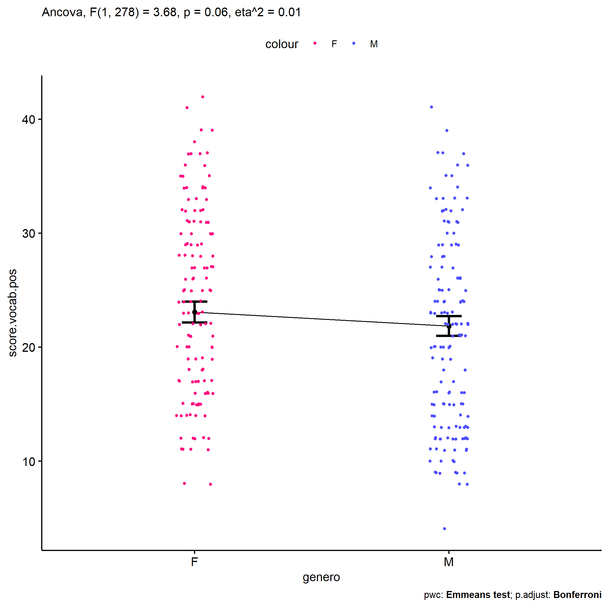<!-- -->

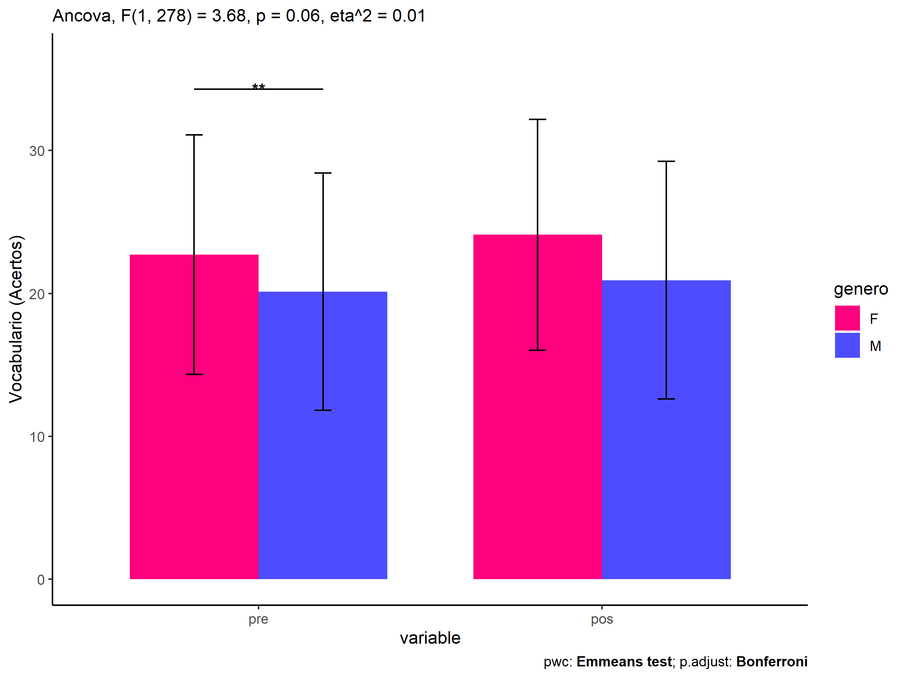<!-- -->

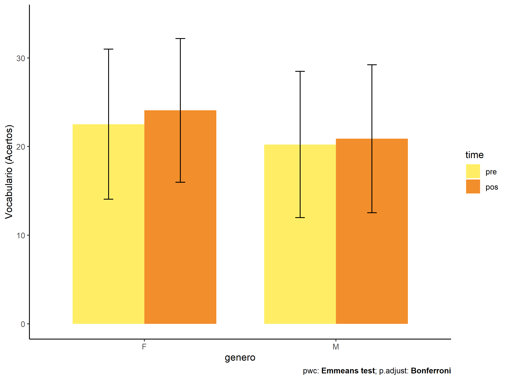<!-- -->

<!-- -->

<!-- -->

### Vocabulario (TRI)

| var           | grupo    |   n | M (pre) | SE (pre) | M (unadj) | SE (unadj) | M (adj) | SE (adj) |
|:--------------|:---------|----:|--------:|---------:|----------:|-----------:|--------:|---------:|
| tri.vocab.pos | Controle | 159 |   0.095 |    0.069 |     0.123 |      0.077 |   0.135 |    0.045 |
| tri.vocab.pos | WordGen  | 122 |   0.127 |    0.084 |     0.271 |      0.084 |   0.255 |    0.051 |

| .y.           | group1   | group2  | estimate | conf.low | conf.high |    se | statistic |     p | p.adj | p.adj.signif |
|:--------------|:---------|:--------|---------:|---------:|----------:|------:|----------:|------:|------:|:-------------|
| tri.vocab.pos | Controle | WordGen |   -0.120 |   -0.255 |     0.015 | 0.068 |    -1.756 | 0.080 | 0.080 | ns           |
| tri.vocab.pre | Controle | WordGen |   -0.033 |   -0.244 |     0.179 | 0.108 |    -0.303 | 0.762 | 0.762 | ns           |

| .y.       | grupo    | group1 | group2 | estimate | conf.low | conf.high |    se | statistic |     p | p.adj | p.adj.signif |
|:----------|:---------|:-------|:-------|---------:|---------:|----------:|------:|----------:|------:|------:|:-------------|
| tri.vocab | Controle | pre    | pos    |   -0.017 |   -0.216 |     0.183 | 0.102 |    -0.164 | 0.870 | 0.870 | ns           |
| tri.vocab | WordGen  | pre    | pos    |   -0.126 |   -0.354 |     0.102 | 0.116 |    -1.088 | 0.277 | 0.277 | ns           |

    ## Scale for colour is already present.
    ## Adding another scale for colour, which will replace the existing scale.

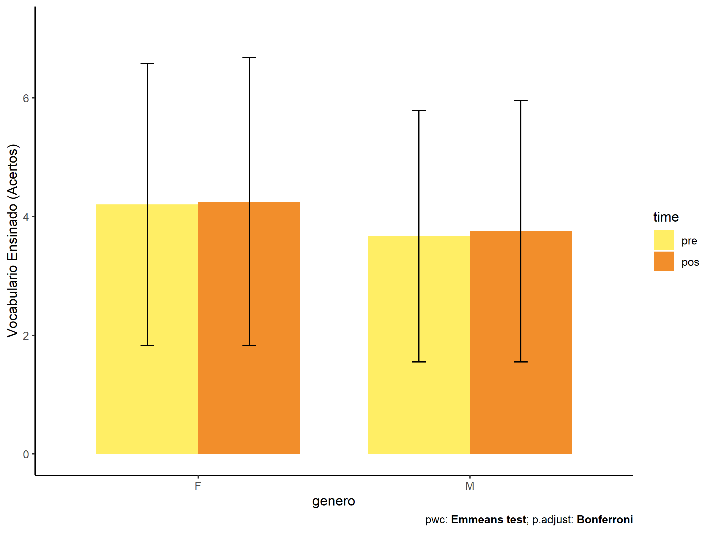<!-- -->

<!-- -->

<!-- -->

<!-- -->

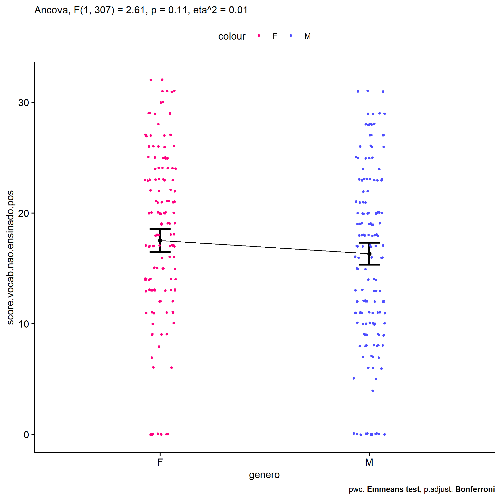<!-- -->

### Vocabulario Ensinado (Acertos)

| var                      | grupo    |   n | M (pre) | SE (pre) | M (unadj) | SE (unadj) | M (adj) | SE (adj) |
|:-------------------------|:---------|----:|--------:|---------:|----------:|-----------:|--------:|---------:|
| score.vocab.ensinado.pos | Controle | 176 |   3.807 |    0.175 |     3.795 |      0.172 |   3.851 |    0.160 |
| score.vocab.ensinado.pos | WordGen  | 135 |   4.104 |    0.188 |     4.215 |      0.206 |   4.143 |    0.182 |

| .y.                      | group1   | group2  | estimate | conf.low | conf.high |    se | statistic |     p | p.adj | p.adj.signif |
|:-------------------------|:---------|:--------|---------:|---------:|----------:|------:|----------:|------:|------:|:-------------|
| score.vocab.ensinado.pos | Controle | WordGen |   -0.292 |   -0.769 |     0.186 | 0.243 |    -1.203 | 0.230 | 0.230 | ns           |
| score.vocab.ensinado.pre | Controle | WordGen |   -0.297 |   -0.807 |     0.213 | 0.259 |    -1.146 | 0.253 | 0.253 | ns           |

| .y.                  | grupo    | group1 | group2 | estimate | conf.low | conf.high |    se | statistic |     p | p.adj | p.adj.signif |
|:---------------------|:---------|:-------|:-------|---------:|---------:|----------:|------:|----------:|------:|------:|:-------------|
| score.vocab.ensinado | Controle | pre    | pos    |    0.011 |   -0.469 |     0.492 | 0.245 |     0.046 | 0.963 | 0.963 | ns           |
| score.vocab.ensinado | WordGen  | pre    | pos    |   -0.111 |   -0.660 |     0.437 | 0.279 |    -0.398 | 0.691 | 0.691 | ns           |

    ## Scale for colour is already present.
    ## Adding another scale for colour, which will replace the existing scale.

<!-- -->

<!-- -->

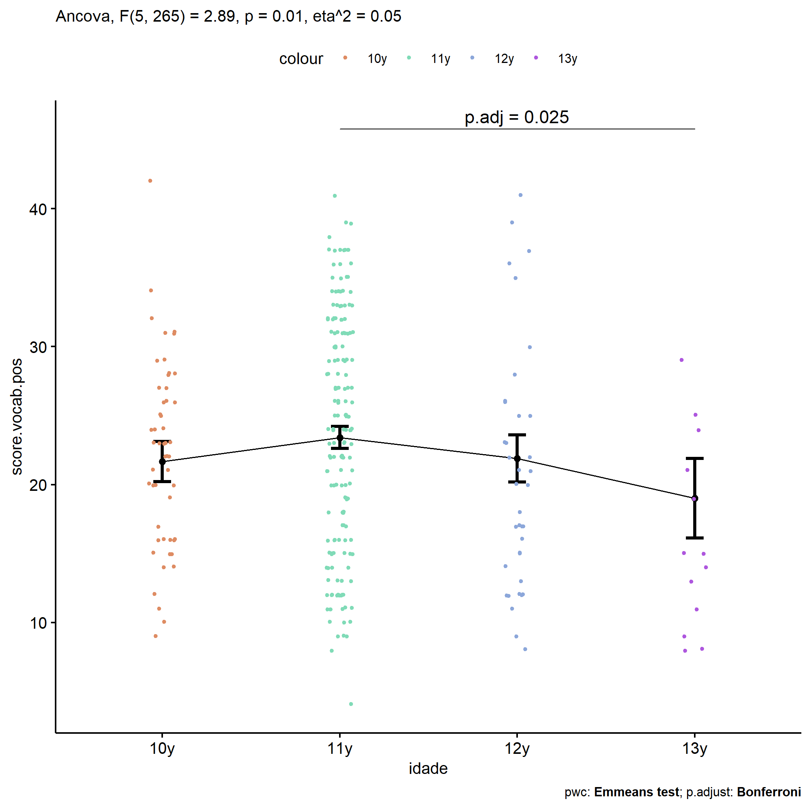<!-- -->

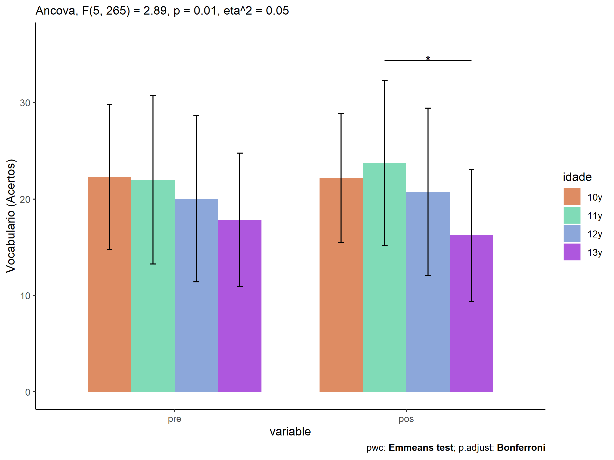<!-- -->

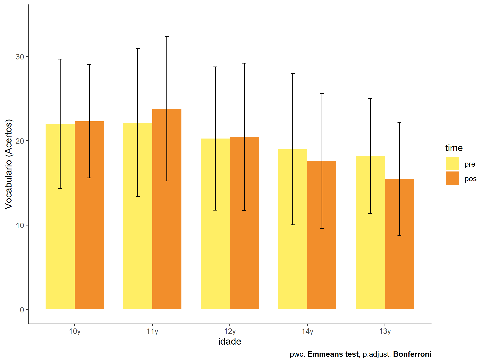<!-- -->

### Vocabulario Ensinado (TRI)

| var                    | grupo    |   n | M (pre) | SE (pre) | M (unadj) | SE (unadj) | M (adj) | SE (adj) |
|:-----------------------|:---------|----:|--------:|---------:|----------:|-----------:|--------:|---------:|
| tri.vocab.ensinado.pos | Controle | 159 |   0.065 |    0.064 |     0.043 |      0.067 |   0.046 |    0.052 |
| tri.vocab.ensinado.pos | WordGen  | 122 |   0.073 |    0.070 |     0.172 |      0.073 |   0.169 |    0.060 |

| .y.                    | group1   | group2  | estimate | conf.low | conf.high |    se | statistic |     p | p.adj | p.adj.signif |
|:-----------------------|:---------|:--------|---------:|---------:|----------:|------:|----------:|------:|------:|:-------------|
| tri.vocab.ensinado.pos | Controle | WordGen |   -0.123 |   -0.280 |     0.033 | 0.079 |    -1.555 | 0.121 | 0.121 | ns           |
| tri.vocab.ensinado.pre | Controle | WordGen |   -0.008 |   -0.196 |     0.180 | 0.096 |    -0.083 | 0.934 | 0.934 | ns           |

| .y.                | grupo    | group1 | group2 | estimate | conf.low | conf.high |    se | statistic |     p | p.adj | p.adj.signif |
|:-------------------|:---------|:-------|:-------|---------:|---------:|----------:|------:|----------:|------:|------:|:-------------|
| tri.vocab.ensinado | Controle | pre    | pos    |    0.008 |   -0.167 |     0.182 | 0.089 |     0.084 | 0.933 | 0.933 | ns           |
| tri.vocab.ensinado | WordGen  | pre    | pos    |   -0.079 |   -0.278 |     0.121 | 0.102 |    -0.776 | 0.438 | 0.438 | ns           |

    ## Scale for colour is already present.
    ## Adding another scale for colour, which will replace the existing scale.

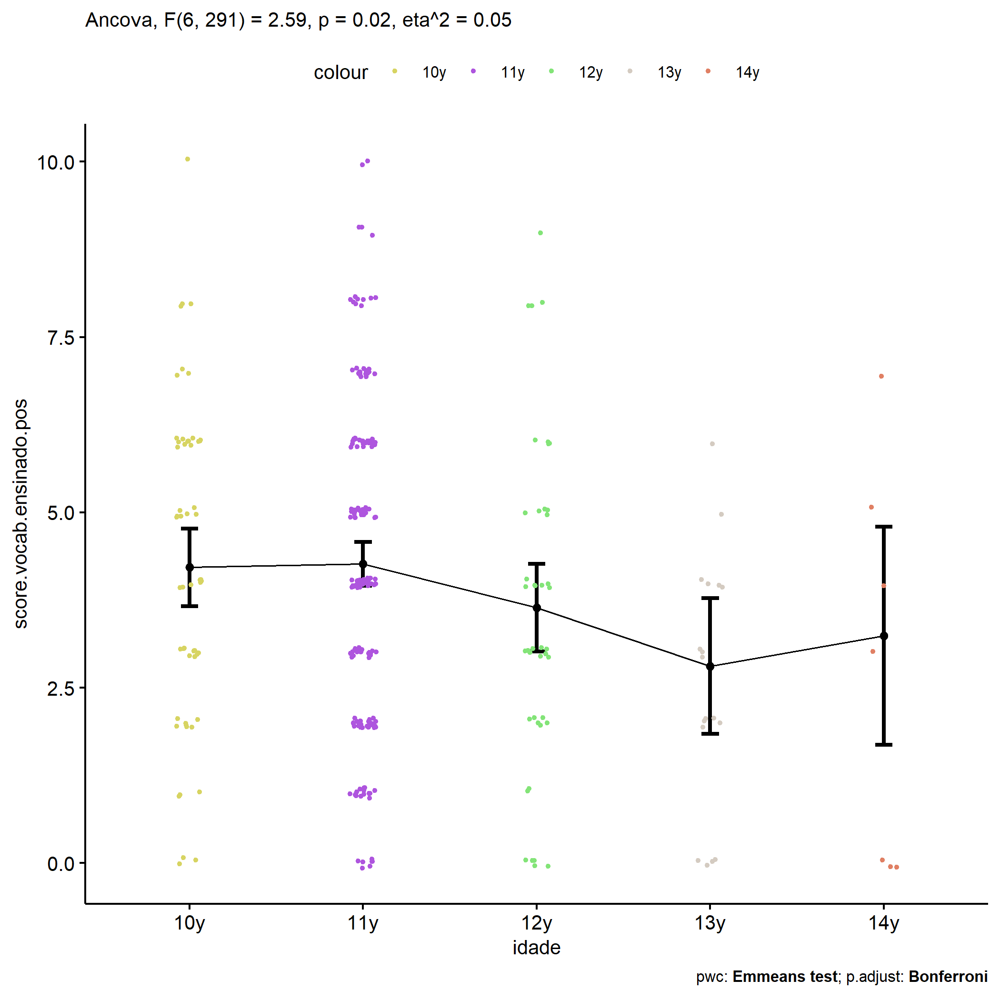<!-- -->

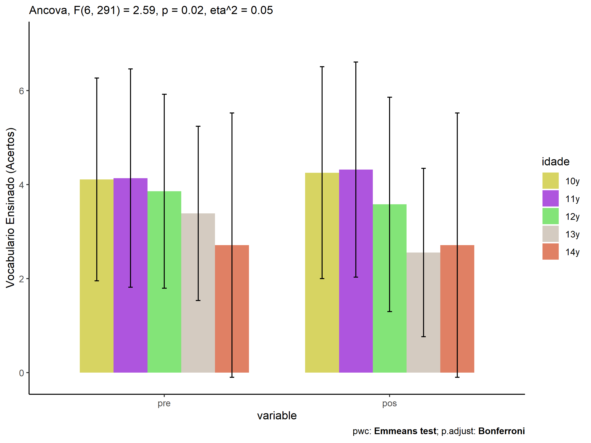<!-- -->

<!-- -->

<!-- -->

<!-- -->

### Vocabulario Nao Ensinado (Acertos)

| var                          | grupo    |   n | M (pre) | SE (pre) | M (unadj) | SE (unadj) | M (adj) | SE (adj) |
|:-----------------------------|:---------|----:|--------:|---------:|----------:|-----------:|--------:|---------:|
| score.vocab.nao.ensinado.pos | Controle | 176 |  16.176 |    0.571 |    16.545 |      0.589 |   16.86 |    0.496 |
| score.vocab.nao.ensinado.pos | WordGen  | 135 |  17.333 |    0.624 |    17.200 |      0.719 |   16.79 |    0.567 |

| .y.                          | group1   | group2  | estimate | conf.low | conf.high |    se | statistic |     p | p.adj | p.adj.signif |
|:-----------------------------|:---------|:--------|---------:|---------:|----------:|------:|----------:|------:|------:|:-------------|
| score.vocab.nao.ensinado.pos | Controle | WordGen |    0.071 |   -1.414 |     1.555 | 0.754 |     0.094 | 0.926 | 0.926 | ns           |
| score.vocab.nao.ensinado.pre | Controle | WordGen |   -1.157 |   -2.831 |     0.517 | 0.851 |    -1.360 | 0.175 | 0.175 | ns           |

| .y.                      | grupo    | group1 | group2 | estimate | conf.low | conf.high |    se | statistic |     p | p.adj | p.adj.signif |
|:-------------------------|:---------|:-------|:-------|---------:|---------:|----------:|------:|----------:|------:|------:|:-------------|
| score.vocab.nao.ensinado | Controle | pre    | pos    |   -0.369 |   -1.991 |     1.253 | 0.826 |    -0.447 | 0.655 | 0.655 | ns           |
| score.vocab.nao.ensinado | WordGen  | pre    | pos    |    0.133 |   -1.719 |     1.985 | 0.943 |     0.141 | 0.888 | 0.888 | ns           |

    ## Scale for colour is already present.
    ## Adding another scale for colour, which will replace the existing scale.

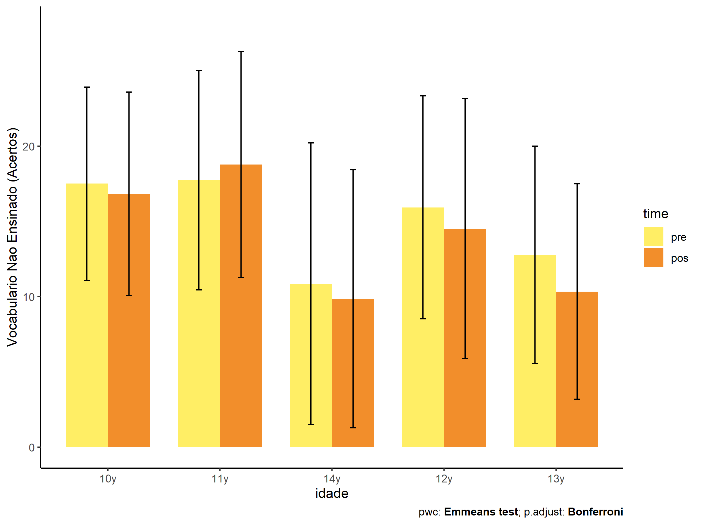<!-- -->

<!-- -->

<!-- -->

<!-- -->

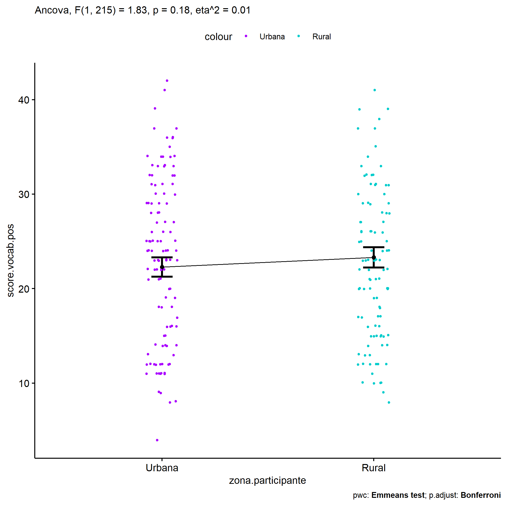<!-- -->

### Vocabulario Nao Ensinado (TRI)

| var                        | grupo    |   n | M (pre) | SE (pre) | M (unadj) | SE (unadj) | M (adj) | SE (adj) |
|:---------------------------|:---------|----:|--------:|---------:|----------:|-----------:|--------:|---------:|
| tri.vocab.nao.ensinado.pos | Controle | 159 |   0.064 |    0.071 |     0.164 |      0.074 |   0.185 |    0.046 |
| tri.vocab.nao.ensinado.pos | WordGen  | 122 |   0.122 |    0.081 |     0.270 |      0.088 |   0.242 |    0.052 |

| .y.                        | group1   | group2  | estimate | conf.low | conf.high |    se | statistic |     p | p.adj | p.adj.signif |
|:---------------------------|:---------|:--------|---------:|---------:|----------:|------:|----------:|------:|------:|:-------------|
| tri.vocab.nao.ensinado.pos | Controle | WordGen |   -0.057 |   -0.194 |     0.080 | 0.070 |    -0.815 | 0.416 | 0.416 | ns           |
| tri.vocab.nao.ensinado.pre | Controle | WordGen |   -0.058 |   -0.271 |     0.155 | 0.108 |    -0.537 | 0.592 | 0.592 | ns           |

| .y.                    | grupo    | group1 | group2 | estimate | conf.low | conf.high |    se | statistic |     p | p.adj | p.adj.signif |
|:-----------------------|:---------|:-------|:-------|---------:|---------:|----------:|------:|----------:|------:|------:|:-------------|
| tri.vocab.nao.ensinado | Controle | pre    | pos    |   -0.085 |   -0.284 |     0.115 | 0.101 |    -0.835 | 0.404 | 0.404 | ns           |
| tri.vocab.nao.ensinado | WordGen  | pre    | pos    |   -0.133 |   -0.361 |     0.094 | 0.116 |    -1.151 | 0.250 | 0.250 | ns           |

    ## Scale for colour is already present.
    ## Adding another scale for colour, which will replace the existing scale.

<!-- -->

<!-- -->

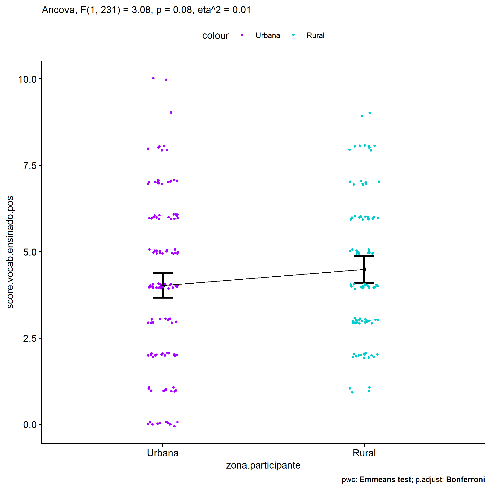<!-- -->

<!-- -->

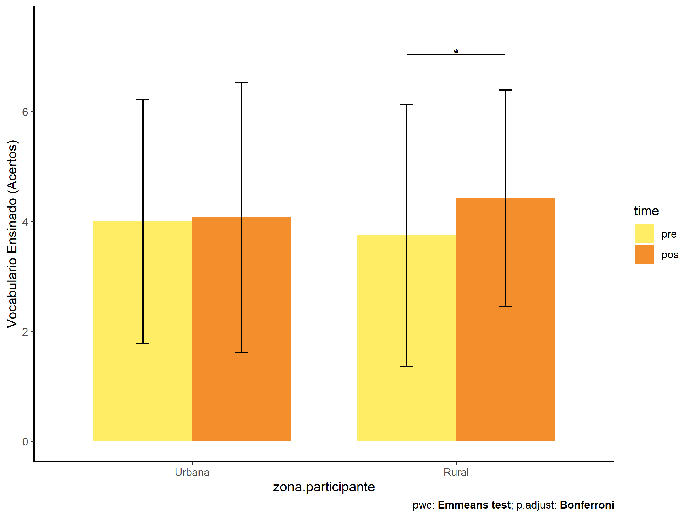<!-- -->

## factor: **genero**

### Vocabulario (Acertos)

| var             | genero |   n | M (pre) | SE (pre) | M (unadj) | SE (unadj) | M (adj) | SE (adj) |
|:----------------|:-------|----:|--------:|---------:|----------:|-----------:|--------:|---------:|
| score.vocab.pos | F      | 133 |  22.707 |    0.727 |    24.105 |      0.700 |  23.077 |    0.461 |
| score.vocab.pos | M      | 148 |  20.115 |    0.682 |    20.926 |      0.684 |  21.850 |    0.437 |

| .y.             | group1 | group2 | estimate | conf.low | conf.high |    se | statistic |     p | p.adj | p.adj.signif |
|:----------------|:-------|:-------|---------:|---------:|----------:|------:|----------:|------:|------:|:-------------|
| score.vocab.pos | F      | M      |    1.227 |   -0.031 |     2.485 | 0.639 |     1.919 | 0.056 | 0.056 | ns           |
| score.vocab.pre | F      | M      |    2.592 |    0.631 |     4.553 | 0.996 |     2.602 | 0.010 | 0.010 | \*\*         |

| .y.         | genero | group1 | group2 | estimate | conf.low | conf.high |    se | statistic |     p | p.adj | p.adj.signif |
|:------------|:-------|:-------|:-------|---------:|---------:|----------:|------:|----------:|------:|------:|:-------------|
| score.vocab | F      | pre    | pos    |   -1.553 |   -3.507 |     0.401 | 0.995 |    -1.561 | 0.119 | 0.119 | ns           |
| score.vocab | M      | pre    | pos    |   -0.653 |   -2.503 |     1.197 | 0.942 |    -0.693 | 0.488 | 0.488 | ns           |

    ## Scale for colour is already present.
    ## Adding another scale for colour, which will replace the existing scale.

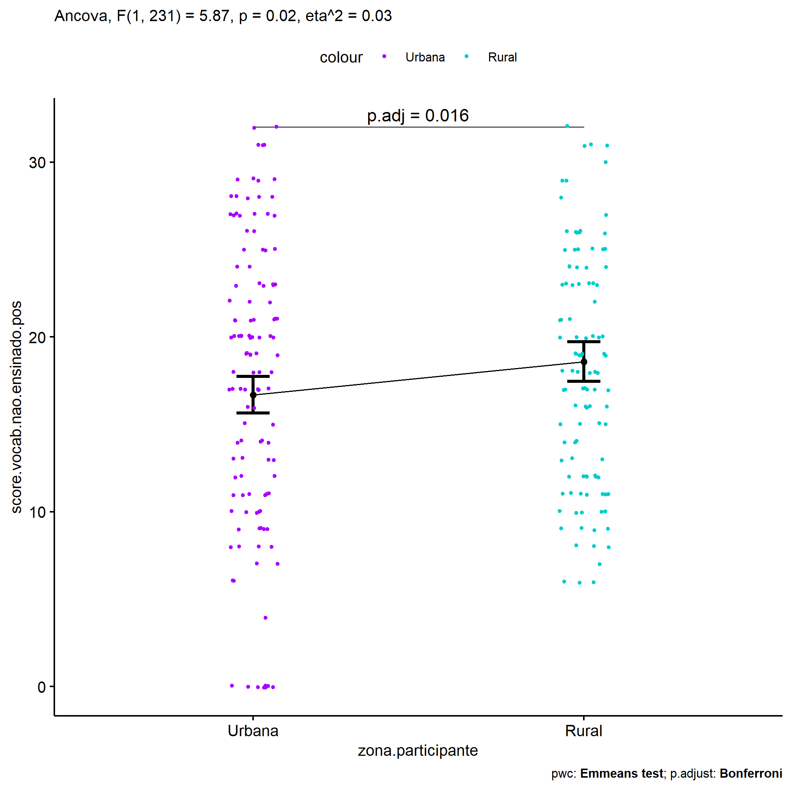<!-- -->

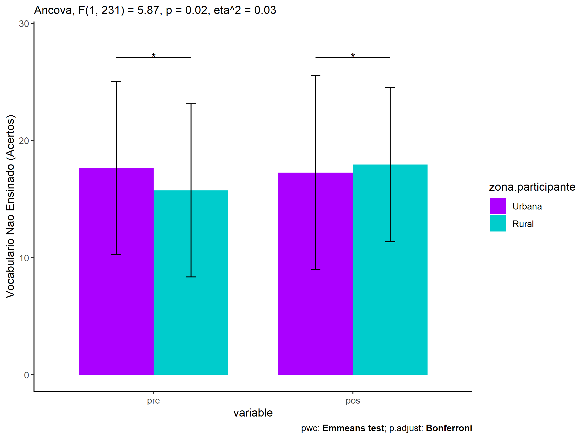<!-- -->

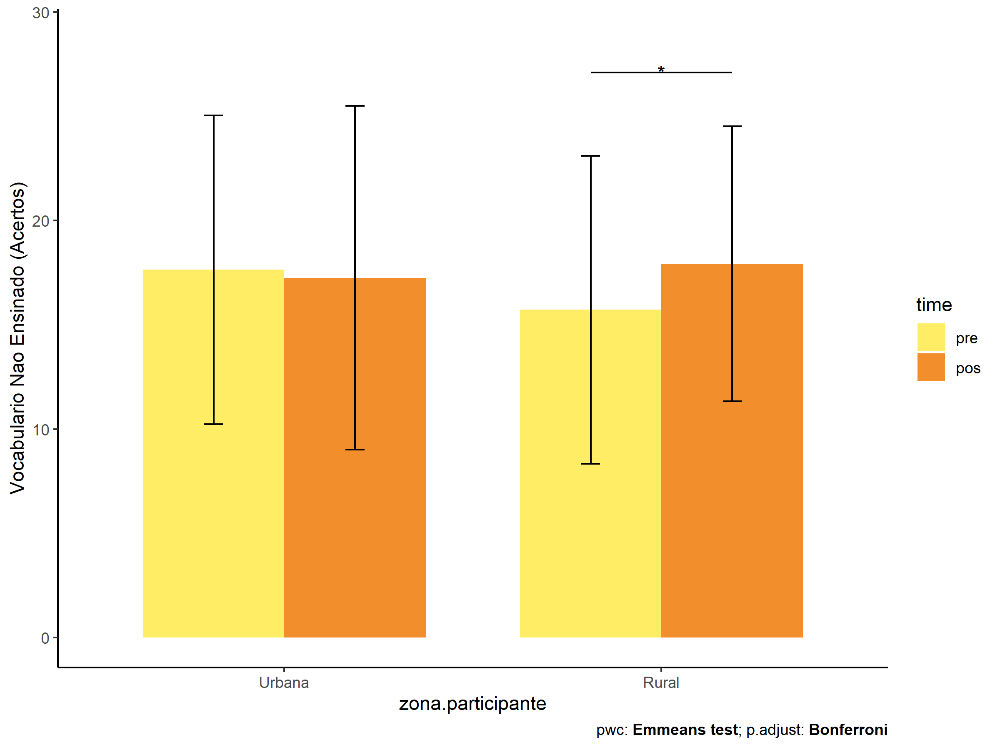<!-- -->

<!-- -->

<!-- -->

### Vocabulario (TRI)

| var           | genero |   n | M (pre) | SE (pre) | M (unadj) | SE (unadj) | M (adj) | SE (adj) |
|:--------------|:-------|----:|--------:|---------:|----------:|-----------:|--------:|---------:|
| tri.vocab.pos | F      | 133 |   0.267 |    0.073 |     0.367 |      0.080 |   0.232 |    0.050 |
| tri.vocab.pos | M      | 148 |  -0.034 |    0.075 |     0.026 |      0.078 |   0.147 |    0.047 |

| .y.           | group1 | group2 | estimate | conf.low | conf.high |    se | statistic |     p | p.adj | p.adj.signif |
|:--------------|:-------|:-------|---------:|---------:|----------:|------:|----------:|------:|------:|:-------------|
| tri.vocab.pos | F      | M      |    0.086 |   -0.050 |     0.222 | 0.069 |     1.241 | 0.216 | 0.216 | ns           |
| tri.vocab.pre | F      | M      |    0.300 |    0.093 |     0.508 | 0.105 |     2.855 | 0.005 | 0.005 | \*\*         |

| .y.       | genero | group1 | group2 | estimate | conf.low | conf.high |    se | statistic |     p | p.adj | p.adj.signif |
|:----------|:-------|:-------|:-------|---------:|---------:|----------:|------:|----------:|------:|------:|:-------------|
| tri.vocab | F      | pre    | pos    |   -0.101 |   -0.316 |     0.114 | 0.110 |    -0.925 | 0.356 | 0.356 | ns           |
| tri.vocab | M      | pre    | pos    |   -0.042 |   -0.246 |     0.161 | 0.104 |    -0.408 | 0.684 | 0.684 | ns           |

    ## Scale for colour is already present.
    ## Adding another scale for colour, which will replace the existing scale.

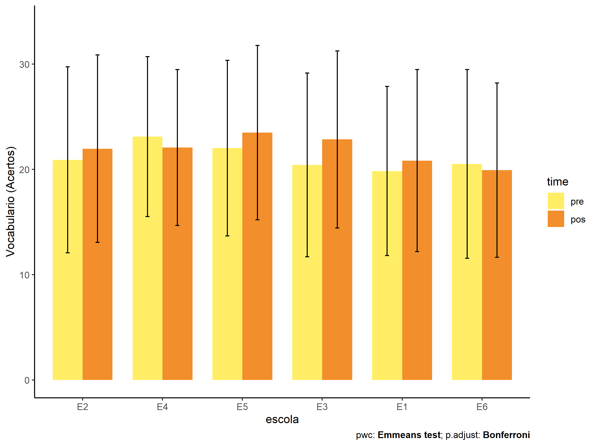<!-- -->

<!-- -->

<!-- -->

<!-- -->

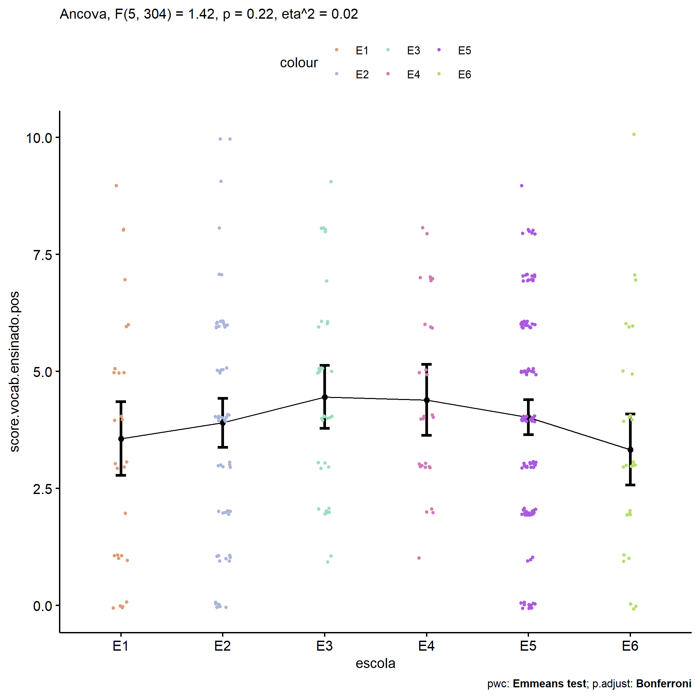<!-- -->

### Vocabulario Ensinado (Acertos)

| var                      | genero |   n | M (pre) | SE (pre) | M (unadj) | SE (unadj) | M (adj) | SE (adj) |
|:-------------------------|:-------|----:|--------:|---------:|----------:|-----------:|--------:|---------:|
| score.vocab.ensinado.pos | F      | 146 |   4.205 |    0.197 |     4.253 |      0.201 |   4.129 |    0.174 |
| score.vocab.ensinado.pos | M      | 164 |   3.671 |    0.166 |     3.756 |      0.172 |   3.867 |    0.164 |

| .y.                      | group1 | group2 | estimate | conf.low | conf.high |    se | statistic |     p | p.adj | p.adj.signif |
|:-------------------------|:-------|:-------|---------:|---------:|----------:|------:|----------:|------:|------:|:-------------|
| score.vocab.ensinado.pos | F      | M      |    0.261 |   -0.211 |     0.734 | 0.240 |     1.088 | 0.277 | 0.277 | ns           |
| score.vocab.ensinado.pre | F      | M      |    0.535 |    0.032 |     1.037 | 0.255 |     2.094 | 0.037 | 0.037 | \*           |

| .y.                  | genero | group1 | group2 | estimate | conf.low | conf.high |    se | statistic |     p | p.adj | p.adj.signif |
|:---------------------|:-------|:-------|:-------|---------:|---------:|----------:|------:|----------:|------:|------:|:-------------|
| score.vocab.ensinado | F      | pre    | pos    |   -0.048 |   -0.572 |     0.476 | 0.267 |    -0.180 | 0.857 | 0.857 | ns           |
| score.vocab.ensinado | M      | pre    | pos    |   -0.085 |   -0.580 |     0.409 | 0.252 |    -0.339 | 0.735 | 0.735 | ns           |

    ## Scale for colour is already present.
    ## Adding another scale for colour, which will replace the existing scale.

<!-- -->

<!-- -->

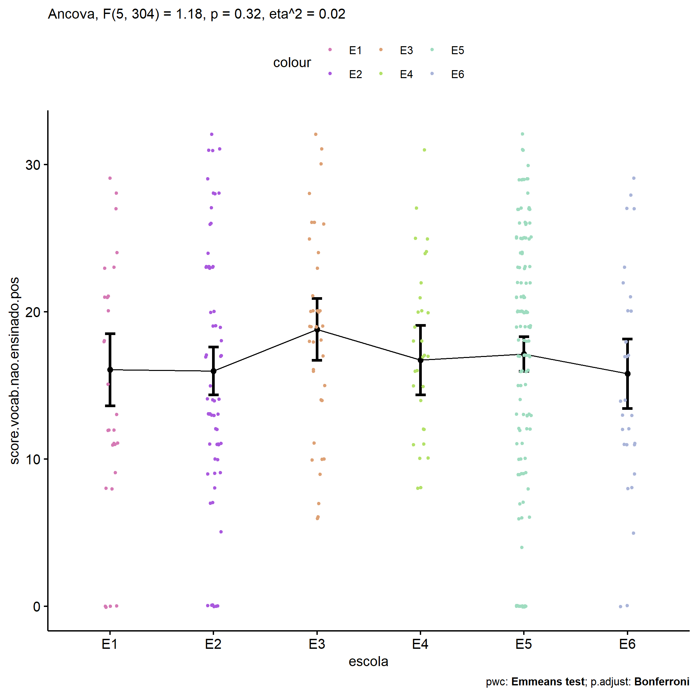<!-- -->

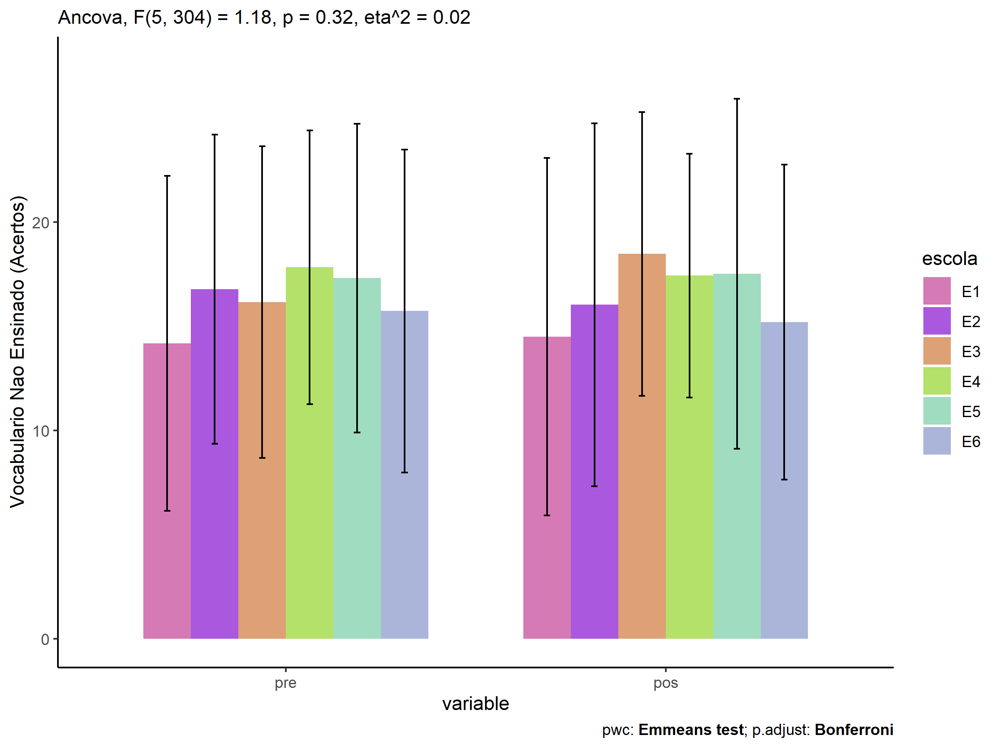<!-- -->

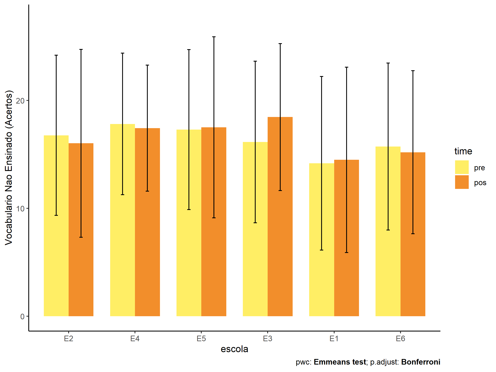<!-- -->

### Vocabulario Ensinado (TRI)

| var                    | genero |   n | M (pre) | SE (pre) | M (unadj) | SE (unadj) | M (adj) | SE (adj) |
|:-----------------------|:-------|----:|--------:|---------:|----------:|-----------:|--------:|---------:|
| tri.vocab.ensinado.pos | F      | 133 |   0.212 |    0.071 |     0.239 |      0.073 |   0.151 |    0.058 |
| tri.vocab.ensinado.pos | M      | 148 |  -0.061 |    0.061 |    -0.027 |      0.066 |   0.053 |    0.055 |

| .y.                    | group1 | group2 | estimate | conf.low | conf.high |    se | statistic |     p | p.adj | p.adj.signif |
|:-----------------------|:-------|:-------|---------:|---------:|----------:|------:|----------:|------:|------:|:-------------|
| tri.vocab.ensinado.pos | F      | M      |    0.098 |   -0.060 |     0.255 | 0.080 |     1.218 | 0.224 | 0.224 | ns           |
| tri.vocab.ensinado.pre | F      | M      |    0.273 |    0.088 |     0.457 | 0.094 |     2.914 | 0.004 | 0.004 | \*\*         |

| .y.                | genero | group1 | group2 | estimate | conf.low | conf.high |    se | statistic |     p | p.adj | p.adj.signif |
|:-------------------|:-------|:-------|:-------|---------:|---------:|----------:|------:|----------:|------:|------:|:-------------|
| tri.vocab.ensinado | F      | pre    | pos    |   -0.037 |   -0.226 |     0.152 | 0.096 |    -0.384 | 0.701 | 0.701 | ns           |
| tri.vocab.ensinado | M      | pre    | pos    |   -0.033 |   -0.211 |     0.146 | 0.091 |    -0.357 | 0.721 | 0.721 | ns           |

    ## Scale for colour is already present.
    ## Adding another scale for colour, which will replace the existing scale.

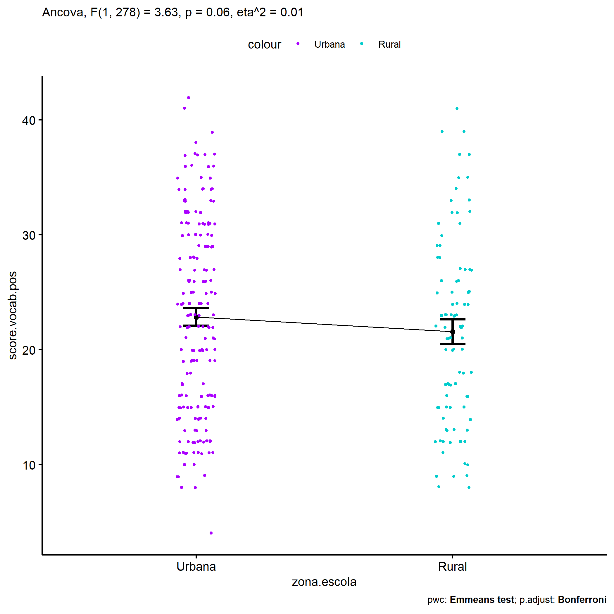<!-- -->

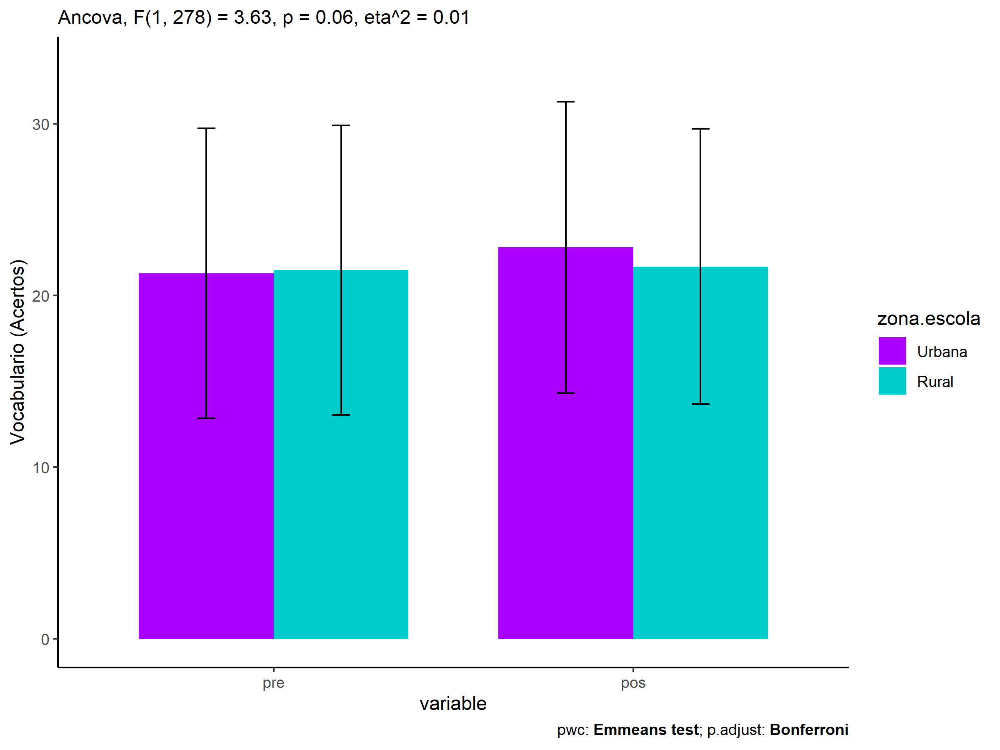<!-- -->

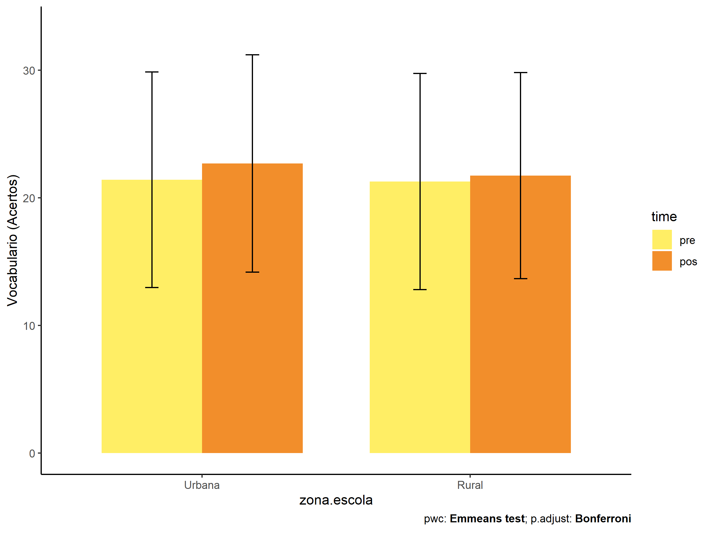<!-- -->

<!-- -->

<!-- -->

### Vocabulario Nao Ensinado (Acertos)

| var                          | genero |   n | M (pre) | SE (pre) | M (unadj) | SE (unadj) | M (adj) | SE (adj) |
|:-----------------------------|:-------|----:|--------:|---------:|----------:|-----------:|--------:|---------:|
| score.vocab.nao.ensinado.pos | F      | 146 |  17.705 |    0.602 |    18.185 |      0.660 |  17.513 |    0.533 |
| score.vocab.nao.ensinado.pos | M      | 164 |  15.695 |    0.582 |    15.726 |      0.614 |  16.323 |    0.503 |

| .y.                          | group1 | group2 | estimate | conf.low | conf.high |    se | statistic |     p | p.adj | p.adj.signif |
|:-----------------------------|:-------|:-------|---------:|---------:|----------:|------:|----------:|------:|------:|:-------------|
| score.vocab.nao.ensinado.pos | F      | M      |     1.19 |   -0.259 |     2.639 | 0.736 |     1.616 | 0.107 | 0.107 | ns           |
| score.vocab.nao.ensinado.pre | F      | M      |     2.01 |    0.360 |     3.661 | 0.839 |     2.396 | 0.017 | 0.017 | \*           |

| .y.                      | genero | group1 | group2 | estimate | conf.low | conf.high |    se | statistic |     p | p.adj | p.adj.signif |
|:-------------------------|:-------|:-------|:-------|---------:|---------:|----------:|------:|----------:|------:|------:|:-------------|
| score.vocab.nao.ensinado | F      | pre    | pos    |   -0.479 |   -2.238 |     1.279 | 0.895 |    -0.536 | 0.592 | 0.592 | ns           |
| score.vocab.nao.ensinado | M      | pre    | pos    |   -0.030 |   -1.689 |     1.628 | 0.845 |    -0.036 | 0.971 | 0.971 | ns           |

    ## Scale for colour is already present.
    ## Adding another scale for colour, which will replace the existing scale.

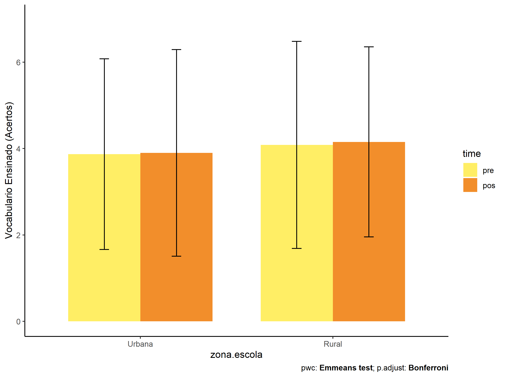<!-- -->

<!-- -->

<!-- -->

<!-- -->

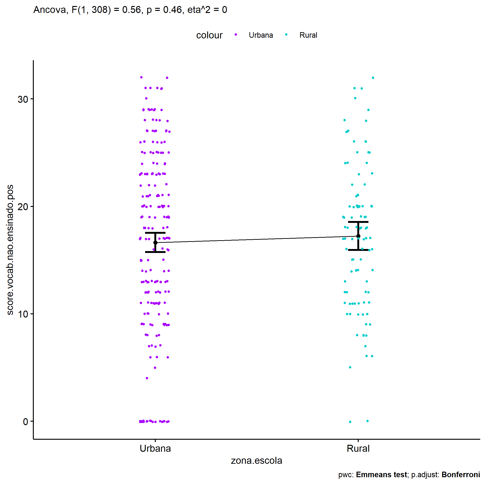<!-- -->

### Vocabulario Nao Ensinado (TRI)

| var                        | genero |   n | M (pre) | SE (pre) | M (unadj) | SE (unadj) | M (adj) | SE (adj) |
|:---------------------------|:-------|----:|--------:|---------:|----------:|-----------:|--------:|---------:|
| tri.vocab.nao.ensinado.pos | F      | 133 |   0.242 |    0.074 |     0.406 |      0.081 |   0.279 |    0.050 |
| tri.vocab.nao.ensinado.pos | M      | 148 |  -0.047 |    0.075 |     0.033 |      0.077 |   0.148 |    0.048 |

| .y.                        | group1 | group2 | estimate | conf.low | conf.high |    se | statistic |     p | p.adj | p.adj.signif |
|:---------------------------|:-------|:-------|---------:|---------:|----------:|------:|----------:|------:|------:|:-------------|
| tri.vocab.nao.ensinado.pos | F      | M      |    0.131 |   -0.006 |     0.268 | 0.070 |     1.881 | 0.061 | 0.061 | ns           |
| tri.vocab.nao.ensinado.pre | F      | M      |    0.289 |    0.081 |     0.498 | 0.106 |     2.734 | 0.007 | 0.007 | \*\*         |

| .y.                    | genero | group1 | group2 | estimate | conf.low | conf.high |    se | statistic |     p | p.adj | p.adj.signif |
|:-----------------------|:-------|:-------|:-------|---------:|---------:|----------:|------:|----------:|------:|------:|:-------------|
| tri.vocab.nao.ensinado | F      | pre    | pos    |   -0.166 |   -0.381 |     0.049 | 0.109 |    -1.520 | 0.129 | 0.129 | ns           |
| tri.vocab.nao.ensinado | M      | pre    | pos    |   -0.060 |   -0.264 |     0.143 | 0.104 |    -0.582 | 0.561 | 0.561 | ns           |

    ## Scale for colour is already present.
    ## Adding another scale for colour, which will replace the existing scale.

<!-- -->

<!-- -->

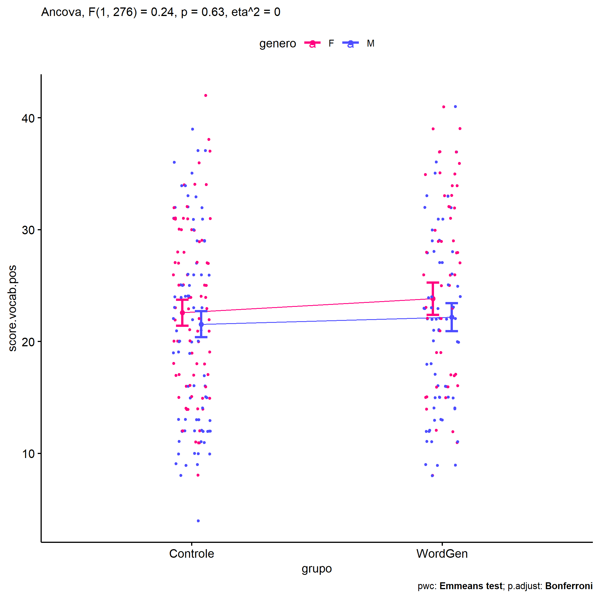<!-- -->

<!-- -->

<!-- -->

## factor: **idade**

### Vocabulario (Acertos)

| var             | idade |   n | M (pre) | SE (pre) | M (unadj) | SE (unadj) | M (adj) | SE (adj) |
|:----------------|:------|----:|--------:|---------:|----------:|-----------:|--------:|---------:|
| score.vocab.pos | 10y   |  51 |  22.275 |    1.053 |    22.176 |      0.943 |  21.657 |    0.739 |
| score.vocab.pos | 11y   | 166 |  22.000 |    0.678 |    23.729 |      0.664 |  23.414 |    0.410 |
| score.vocab.pos | 12y   |  37 |  20.027 |    1.417 |    20.730 |      1.430 |  21.883 |    0.869 |
| score.vocab.pos | 13y   |  13 |  17.846 |    1.918 |    16.231 |      1.902 |  19.006 |    1.470 |

| .y.             | group1 | group2 | estimate | conf.low | conf.high |    se | statistic |     p | p.adj | p.adj.signif |
|:----------------|:-------|:-------|---------:|---------:|----------:|------:|----------:|------:|------:|:-------------|
| score.vocab.pos | 10y    | 11y    |   -1.757 |   -3.419 |    -0.094 | 0.844 |    -2.080 | 0.038 | 0.231 | ns           |
| score.vocab.pos | 10y    | 12y    |   -0.225 |   -2.474 |     2.024 | 1.142 |    -0.197 | 0.844 | 1.000 | ns           |
| score.vocab.pos | 10y    | 13y    |    2.651 |   -0.593 |     5.895 | 1.647 |     1.609 | 0.109 | 0.653 | ns           |
| score.vocab.pos | 11y    | 12y    |    1.531 |   -0.362 |     3.425 | 0.962 |     1.592 | 0.113 | 0.675 | ns           |
| score.vocab.pos | 11y    | 13y    |    4.408 |    1.401 |     7.415 | 1.527 |     2.886 | 0.004 | 0.025 | \*           |
| score.vocab.pos | 12y    | 13y    |    2.876 |   -0.476 |     6.228 | 1.702 |     1.690 | 0.092 | 0.554 | ns           |
| score.vocab.pre | 10y    | 11y    |    0.275 |   -2.382 |     2.931 | 1.349 |     0.203 | 0.839 | 1.000 | ns           |
| score.vocab.pre | 10y    | 12y    |    2.247 |   -1.335 |     5.830 | 1.820 |     1.235 | 0.218 | 1.000 | ns           |
| score.vocab.pre | 10y    | 13y    |    4.428 |   -0.726 |     9.583 | 2.618 |     1.692 | 0.092 | 0.552 | ns           |
| score.vocab.pre | 11y    | 12y    |    1.973 |   -1.043 |     4.989 | 1.532 |     1.288 | 0.199 | 1.000 | ns           |
| score.vocab.pre | 11y    | 13y    |    4.154 |   -0.625 |     8.932 | 2.427 |     1.712 | 0.088 | 0.529 | ns           |
| score.vocab.pre | 12y    | 13y    |    2.181 |   -3.168 |     7.530 | 2.717 |     0.803 | 0.423 | 1.000 | ns           |

| .y.         | idade | group1 | group2 | estimate | conf.low | conf.high |    se | statistic |     p | p.adj | p.adj.signif |
|:------------|:------|:-------|:-------|---------:|---------:|----------:|------:|----------:|------:|------:|:-------------|
| score.vocab | 10y   | pre    | pos    |   -0.289 |   -3.458 |     2.880 | 1.613 |    -0.179 | 0.858 | 0.858 | ns           |
| score.vocab | 11y   | pre    | pos    |   -1.637 |   -3.414 |     0.140 | 0.905 |    -1.810 | 0.071 | 0.071 | ns           |
| score.vocab | 12y   | pre    | pos    |   -0.212 |   -3.864 |     3.440 | 1.859 |    -0.114 | 0.909 | 0.909 | ns           |
| score.vocab | 13y   | pre    | pos    |    2.721 |   -3.141 |     8.583 | 2.984 |     0.912 | 0.362 | 0.362 | ns           |
| score.vocab | 14y   | pre    | pos    |    1.400 |   -8.916 |    11.716 | 5.252 |     0.267 | 0.790 | 0.790 | ns           |

    ## Scale for colour is already present.
    ## Adding another scale for colour, which will replace the existing scale.

<!-- -->

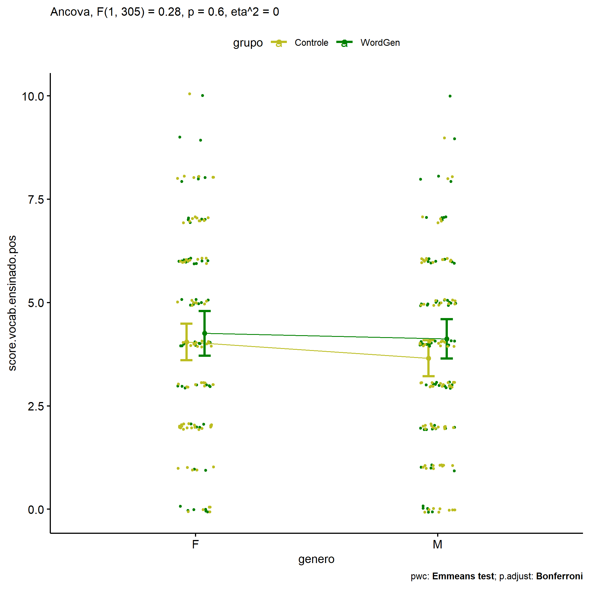<!-- -->

<!-- -->

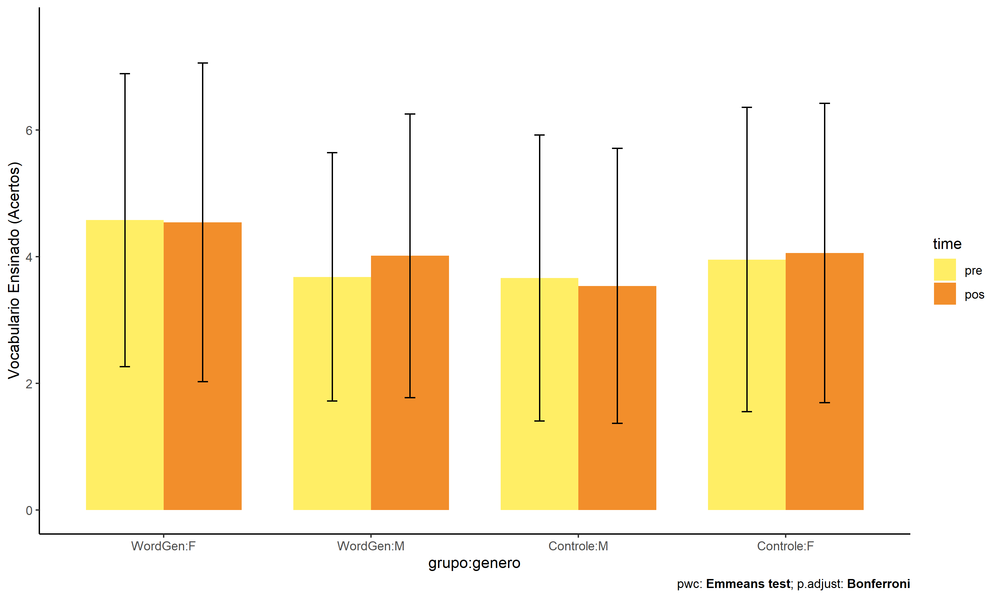<!-- -->

<!-- -->

### Vocabulario (TRI)

| var           | idade |   n | M (pre) | SE (pre) | M (unadj) | SE (unadj) | M (adj) | SE (adj) |
|:--------------|:------|----:|--------:|---------:|----------:|-----------:|--------:|---------:|
| tri.vocab.pos | 10y   |  51 |   0.232 |    0.109 |     0.205 |      0.115 |   0.123 |    0.078 |
| tri.vocab.pos | 11y   | 166 |   0.191 |    0.069 |     0.333 |      0.073 |   0.285 |    0.043 |
| tri.vocab.pos | 12y   |  37 |  -0.089 |    0.164 |    -0.018 |      0.161 |   0.167 |    0.092 |
| tri.vocab.pos | 13y   |  13 |  -0.361 |    0.215 |    -0.510 |      0.232 |  -0.098 |    0.156 |

| .y.           | group1 | group2 | estimate | conf.low | conf.high |    se | statistic |     p | p.adj | p.adj.signif |
|:--------------|:-------|:-------|---------:|---------:|----------:|------:|----------:|------:|------:|:-------------|
| tri.vocab.pos | 10y    | 11y    |   -0.162 |   -0.338 |     0.013 | 0.089 |    -1.821 | 0.070 | 0.419 | ns           |
| tri.vocab.pos | 10y    | 12y    |   -0.045 |   -0.283 |     0.194 | 0.121 |    -0.368 | 0.713 | 1.000 | ns           |
| tri.vocab.pos | 10y    | 13y    |    0.221 |   -0.123 |     0.565 | 0.175 |     1.266 | 0.206 | 1.000 | ns           |
| tri.vocab.pos | 11y    | 12y    |    0.118 |   -0.083 |     0.318 | 0.102 |     1.157 | 0.248 | 1.000 | ns           |
| tri.vocab.pos | 11y    | 13y    |    0.384 |    0.065 |     0.702 | 0.162 |     2.369 | 0.019 | 0.111 | ns           |
| tri.vocab.pos | 12y    | 13y    |    0.266 |   -0.089 |     0.620 | 0.180 |     1.477 | 0.141 | 0.846 | ns           |
| tri.vocab.pre | 10y    | 11y    |    0.041 |   -0.237 |     0.319 | 0.141 |     0.287 | 0.774 | 1.000 | ns           |
| tri.vocab.pre | 10y    | 12y    |    0.321 |   -0.054 |     0.696 | 0.190 |     1.685 | 0.093 | 0.559 | ns           |
| tri.vocab.pre | 10y    | 13y    |    0.593 |    0.054 |     1.133 | 0.274 |     2.165 | 0.031 | 0.188 | ns           |
| tri.vocab.pre | 11y    | 12y    |    0.280 |   -0.035 |     0.596 | 0.160 |     1.749 | 0.081 | 0.489 | ns           |
| tri.vocab.pre | 11y    | 13y    |    0.553 |    0.052 |     1.053 | 0.254 |     2.176 | 0.030 | 0.183 | ns           |
| tri.vocab.pre | 12y    | 13y    |    0.272 |   -0.288 |     0.832 | 0.284 |     0.957 | 0.339 | 1.000 | ns           |

| .y.       | idade | group1 | group2 | estimate | conf.low | conf.high |    se | statistic |     p | p.adj | p.adj.signif |
|:----------|:------|:-------|:-------|---------:|---------:|----------:|------:|----------:|------:|------:|:-------------|
| tri.vocab | 10y   | pre    | pos    |    0.002 |   -0.344 |     0.347 | 0.176 |     0.011 | 0.991 | 0.991 | ns           |
| tri.vocab | 11y   | pre    | pos    |   -0.125 |   -0.319 |     0.068 | 0.099 |    -1.271 | 0.204 | 0.204 | ns           |
| tri.vocab | 12y   | pre    | pos    |    0.006 |   -0.392 |     0.404 | 0.203 |     0.030 | 0.976 | 0.976 | ns           |
| tri.vocab | 13y   | pre    | pos    |    0.264 |   -0.375 |     0.903 | 0.325 |     0.812 | 0.417 | 0.417 | ns           |
| tri.vocab | 14y   | pre    | pos    |    0.222 |   -0.902 |     1.347 | 0.573 |     0.388 | 0.698 | 0.698 | ns           |

    ## Scale for colour is already present.
    ## Adding another scale for colour, which will replace the existing scale.

<!-- -->

<!-- -->

<!-- -->

<!-- -->

<!-- -->

### Vocabulario Ensinado (Acertos)

| var                      | idade |   n | M (pre) | SE (pre) | M (unadj) | SE (unadj) | M (adj) | SE (adj) |
|:-------------------------|:------|----:|--------:|---------:|----------:|-----------:|--------:|---------:|
| score.vocab.ensinado.pos | 10y   |  55 |   4.109 |    0.291 |     4.255 |      0.304 |   4.216 |    0.280 |
| score.vocab.ensinado.pos | 11y   | 172 |   4.140 |    0.177 |     4.320 |      0.174 |   4.269 |    0.159 |
| score.vocab.ensinado.pos | 12y   |  43 |   3.860 |    0.315 |     3.581 |      0.348 |   3.644 |    0.317 |
| score.vocab.ensinado.pos | 13y   |  18 |   3.389 |    0.436 |     2.556 |      0.422 |   2.809 |    0.491 |
| score.vocab.ensinado.pos | 14y   |   7 |   2.714 |    1.063 |     2.714 |      1.063 |   3.241 |    0.789 |

| .y.                      | group1 | group2 | estimate | conf.low | conf.high |    se | statistic |     p | p.adj | p.adj.signif |
|:-------------------------|:-------|:-------|---------:|---------:|----------:|------:|----------:|------:|------:|:-------------|
| score.vocab.ensinado.pos | 10y    | 11y    |   -0.053 |   -0.686 |     0.581 | 0.322 |    -0.164 | 0.870 | 1.000 | ns           |
| score.vocab.ensinado.pos | 10y    | 12y    |    0.572 |   -0.261 |     1.405 | 0.423 |     1.352 | 0.177 | 1.000 | ns           |
| score.vocab.ensinado.pos | 10y    | 13y    |    1.407 |    0.293 |     2.520 | 0.566 |     2.487 | 0.013 | 0.134 | ns           |
| score.vocab.ensinado.pos | 10y    | 14y    |    0.974 |   -0.674 |     2.623 | 0.837 |     1.164 | 0.246 | 1.000 | ns           |
| score.vocab.ensinado.pos | 11y    | 12y    |    0.625 |   -0.073 |     1.323 | 0.355 |     1.763 | 0.079 | 0.790 | ns           |
| score.vocab.ensinado.pos | 11y    | 13y    |    1.460 |    0.443 |     2.476 | 0.516 |     2.826 | 0.005 | 0.050 | ns           |
| score.vocab.ensinado.pos | 11y    | 14y    |    1.027 |   -0.557 |     2.612 | 0.805 |     1.276 | 0.203 | 1.000 | ns           |
| score.vocab.ensinado.pos | 12y    | 13y    |    0.835 |   -0.315 |     1.984 | 0.584 |     1.429 | 0.154 | 1.000 | ns           |
| score.vocab.ensinado.pos | 12y    | 14y    |    0.402 |   -1.269 |     2.074 | 0.849 |     0.473 | 0.636 | 1.000 | ns           |
| score.vocab.ensinado.pos | 13y    | 14y    |   -0.432 |   -2.256 |     1.391 | 0.926 |    -0.467 | 0.641 | 1.000 | ns           |
| score.vocab.ensinado.pre | 10y    | 11y    |   -0.030 |   -0.714 |     0.653 | 0.347 |    -0.088 | 0.930 | 1.000 | ns           |
| score.vocab.ensinado.pre | 10y    | 12y    |    0.249 |   -0.650 |     1.147 | 0.457 |     0.545 | 0.586 | 1.000 | ns           |
| score.vocab.ensinado.pre | 10y    | 13y    |    0.720 |   -0.479 |     1.919 | 0.609 |     1.183 | 0.238 | 1.000 | ns           |
| score.vocab.ensinado.pre | 10y    | 14y    |    1.395 |   -0.377 |     3.166 | 0.900 |     1.550 | 0.122 | 1.000 | ns           |
| score.vocab.ensinado.pre | 11y    | 12y    |    0.279 |   -0.474 |     1.032 | 0.382 |     0.730 | 0.466 | 1.000 | ns           |
| score.vocab.ensinado.pre | 11y    | 13y    |    0.751 |   -0.343 |     1.844 | 0.556 |     1.351 | 0.178 | 1.000 | ns           |
| score.vocab.ensinado.pre | 11y    | 14y    |    1.425 |   -0.277 |     3.127 | 0.865 |     1.648 | 0.100 | 1.000 | ns           |
| score.vocab.ensinado.pre | 12y    | 13y    |    0.472 |   -0.768 |     1.711 | 0.630 |     0.749 | 0.454 | 1.000 | ns           |
| score.vocab.ensinado.pre | 12y    | 14y    |    1.146 |   -0.653 |     2.945 | 0.914 |     1.254 | 0.211 | 1.000 | ns           |
| score.vocab.ensinado.pre | 13y    | 14y    |    0.675 |   -1.292 |     2.641 | 0.999 |     0.675 | 0.500 | 1.000 | ns           |

| .y.                  | idade | group1 | group2 | estimate | conf.low | conf.high |    se | statistic |     p | p.adj | p.adj.signif |
|:---------------------|:------|:-------|:-------|---------:|---------:|----------:|------:|----------:|------:|------:|:-------------|
| score.vocab.ensinado | 10y   | pre    | pos    |   -0.145 |   -0.990 |     0.699 | 0.430 |    -0.338 | 0.735 | 0.735 | ns           |
| score.vocab.ensinado | 11y   | pre    | pos    |   -0.180 |   -0.658 |     0.297 | 0.243 |    -0.741 | 0.459 | 0.459 | ns           |
| score.vocab.ensinado | 12y   | pre    | pos    |    0.279 |   -0.676 |     1.234 | 0.486 |     0.574 | 0.566 | 0.566 | ns           |
| score.vocab.ensinado | 13y   | pre    | pos    |    0.833 |   -0.642 |     2.309 | 0.751 |     1.109 | 0.268 | 0.268 | ns           |
| score.vocab.ensinado | 14y   | pre    | pos    |    0.000 |   -2.366 |     2.366 | 1.205 |     0.000 | 1.000 | 1.000 | ns           |

    ## Scale for colour is already present.
    ## Adding another scale for colour, which will replace the existing scale.

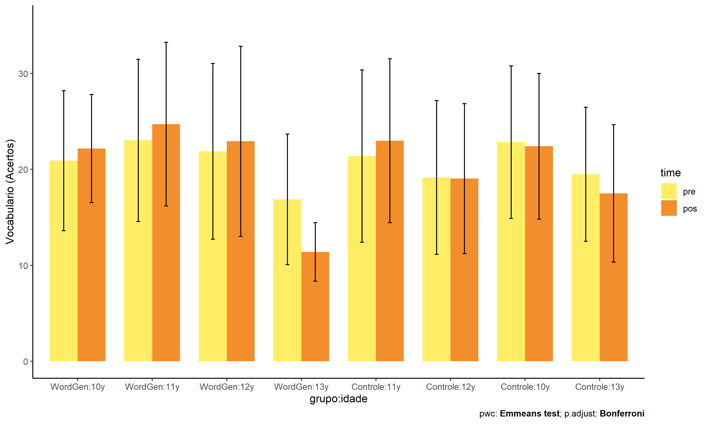<!-- -->

<!-- -->

<!-- -->

<!-- -->

<!-- -->

### Vocabulario Ensinado (TRI)

| var                    | idade |   n | M (pre) | SE (pre) | M (unadj) | SE (unadj) | M (adj) | SE (adj) |
|:-----------------------|:------|----:|--------:|---------:|----------:|-----------:|--------:|---------:|
| tri.vocab.ensinado.pos | 10y   |  51 |   0.118 |    0.113 |     0.237 |      0.107 |   0.221 |    0.092 |
| tri.vocab.ensinado.pos | 11y   | 166 |   0.127 |    0.060 |     0.163 |      0.065 |   0.142 |    0.051 |
| tri.vocab.ensinado.pos | 12y   |  37 |  -0.011 |    0.145 |     0.016 |      0.127 |   0.076 |    0.109 |
| tri.vocab.ensinado.pos | 13y   |  13 |  -0.190 |    0.184 |    -0.467 |      0.178 |  -0.300 |    0.183 |

| .y.                    | group1 | group2 | estimate | conf.low | conf.high |    se | statistic |     p | p.adj | p.adj.signif |
|:-----------------------|:-------|:-------|---------:|---------:|----------:|------:|----------:|------:|------:|:-------------|
| tri.vocab.ensinado.pos | 10y    | 11y    |    0.079 |   -0.129 |     0.287 | 0.106 |     0.748 | 0.455 | 1.000 | ns           |
| tri.vocab.ensinado.pos | 10y    | 12y    |    0.145 |   -0.136 |     0.425 | 0.143 |     1.014 | 0.312 | 1.000 | ns           |
| tri.vocab.ensinado.pos | 10y    | 13y    |    0.521 |    0.116 |     0.925 | 0.205 |     2.534 | 0.012 | 0.071 | ns           |
| tri.vocab.ensinado.pos | 11y    | 12y    |    0.066 |   -0.171 |     0.302 | 0.120 |     0.546 | 0.586 | 1.000 | ns           |
| tri.vocab.ensinado.pos | 11y    | 13y    |    0.442 |    0.066 |     0.817 | 0.191 |     2.317 | 0.021 | 0.128 | ns           |
| tri.vocab.ensinado.pos | 12y    | 13y    |    0.376 |   -0.043 |     0.795 | 0.213 |     1.767 | 0.078 | 0.470 | ns           |
| tri.vocab.ensinado.pre | 10y    | 11y    |   -0.010 |   -0.258 |     0.239 | 0.126 |    -0.076 | 0.940 | 1.000 | ns           |
| tri.vocab.ensinado.pre | 10y    | 12y    |    0.129 |   -0.207 |     0.464 | 0.170 |     0.756 | 0.450 | 1.000 | ns           |
| tri.vocab.ensinado.pre | 10y    | 13y    |    0.308 |   -0.175 |     0.791 | 0.245 |     1.257 | 0.210 | 1.000 | ns           |
| tri.vocab.ensinado.pre | 11y    | 12y    |    0.138 |   -0.144 |     0.421 | 0.143 |     0.965 | 0.335 | 1.000 | ns           |
| tri.vocab.ensinado.pre | 11y    | 13y    |    0.318 |   -0.130 |     0.765 | 0.227 |     1.398 | 0.163 | 0.979 | ns           |
| tri.vocab.ensinado.pre | 12y    | 13y    |    0.179 |   -0.322 |     0.680 | 0.254 |     0.705 | 0.481 | 1.000 | ns           |

| .y.                | idade | group1 | group2 | estimate | conf.low | conf.high |    se | statistic |     p | p.adj | p.adj.signif |
|:-------------------|:------|:-------|:-------|---------:|---------:|----------:|------:|----------:|------:|------:|:-------------|
| tri.vocab.ensinado | 10y   | pre    | pos    |   -0.176 |   -0.481 |     0.130 | 0.156 |    -1.129 | 0.259 | 0.259 | ns           |
| tri.vocab.ensinado | 11y   | pre    | pos    |   -0.025 |   -0.197 |     0.146 | 0.087 |    -0.289 | 0.773 | 0.773 | ns           |
| tri.vocab.ensinado | 12y   | pre    | pos    |    0.002 |   -0.351 |     0.354 | 0.179 |     0.009 | 0.993 | 0.993 | ns           |
| tri.vocab.ensinado | 13y   | pre    | pos    |    0.406 |   -0.159 |     0.971 | 0.288 |     1.410 | 0.159 | 0.159 | ns           |
| tri.vocab.ensinado | 14y   | pre    | pos    |   -0.119 |   -1.114 |     0.876 | 0.507 |    -0.236 | 0.814 | 0.814 | ns           |

    ## Scale for colour is already present.
    ## Adding another scale for colour, which will replace the existing scale.

<!-- -->

<!-- -->

<!-- -->

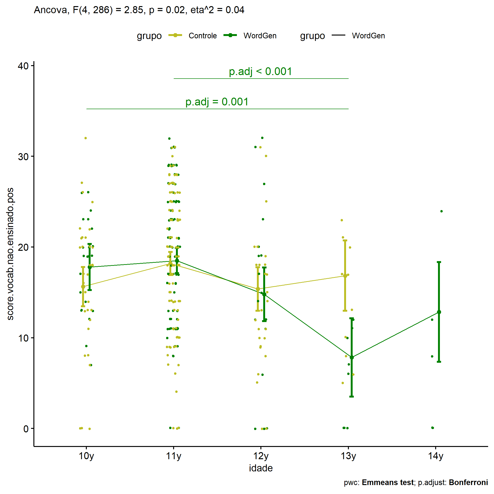<!-- -->

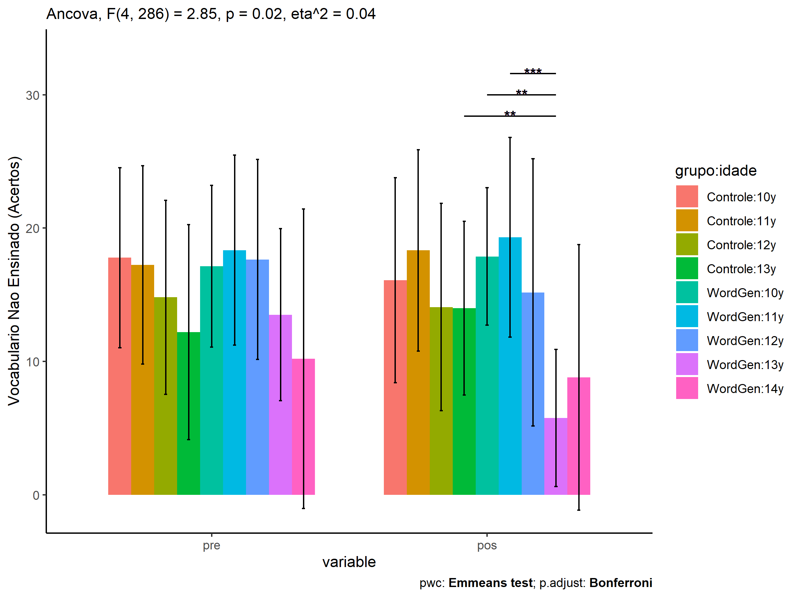<!-- -->

### Vocabulario Nao Ensinado (Acertos)

| var                          | idade |   n | M (pre) | SE (pre) | M (unadj) | SE (unadj) | M (adj) | SE (adj) |
|:-----------------------------|:------|----:|--------:|---------:|----------:|-----------:|--------:|---------:|
| score.vocab.nao.ensinado.pos | 10y   |  55 |  17.509 |    0.866 |    16.836 |      0.910 |  16.518 |    0.844 |
| score.vocab.nao.ensinado.pos | 11y   | 172 |  17.744 |    0.556 |    18.773 |      0.572 |  18.317 |    0.479 |
| score.vocab.nao.ensinado.pos | 12y   |  43 |  15.930 |    1.130 |    14.512 |      1.315 |  15.124 |    0.955 |
| score.vocab.nao.ensinado.pos | 13y   |  18 |  12.778 |    1.701 |    10.333 |      1.686 |  12.805 |    1.490 |
| score.vocab.nao.ensinado.pos | 14y   |   7 |  10.857 |    3.535 |     9.857 |      3.240 |  13.461 |    2.385 |

| .y.                          | group1 | group2 | estimate | conf.low | conf.high |    se | statistic | p       | p.adj | p.adj.signif |
|:-----------------------------|:-------|:-------|---------:|---------:|----------:|------:|----------:|:--------|------:|:-------------|
| score.vocab.nao.ensinado.pos | 10y    | 11y    |   -1.798 |   -3.705 |     0.109 | 0.969 |    -1.856 | 0.064   | 0.645 | ns           |
| score.vocab.nao.ensinado.pos | 10y    | 12y    |    1.394 |   -1.117 |     3.905 | 1.276 |     1.093 | 0.275   | 1.000 | ns           |
| score.vocab.nao.ensinado.pos | 10y    | 13y    |    3.714 |    0.337 |     7.090 | 1.716 |     2.165 | 0.031   | 0.312 | ns           |
| score.vocab.nao.ensinado.pos | 10y    | 14y    |    3.058 |   -1.928 |     8.043 | 2.533 |     1.207 | 0.228   | 1.000 | ns           |
| score.vocab.nao.ensinado.pos | 11y    | 12y    |    3.192 |    1.085 |     5.299 | 1.070 |     2.982 | 0.003   | 0.031 | \*           |
| score.vocab.nao.ensinado.pos | 11y    | 13y    |    5.512 |    2.422 |     8.602 | 1.570 |     3.511 | \<0.001 | 0.005 | \*\*         |
| score.vocab.nao.ensinado.pos | 11y    | 14y    |    4.856 |    0.059 |     9.653 | 2.437 |     1.992 | 0.047   | 0.473 | ns           |
| score.vocab.nao.ensinado.pos | 12y    | 13y    |    2.320 |   -1.151 |     5.790 | 1.763 |     1.316 | 0.189   | 1.000 | ns           |
| score.vocab.nao.ensinado.pos | 12y    | 14y    |    1.664 |   -3.380 |     6.707 | 2.562 |     0.649 | 0.517   | 1.000 | ns           |
| score.vocab.nao.ensinado.pos | 13y    | 14y    |   -0.656 |   -6.143 |     4.831 | 2.788 |    -0.235 | 0.814   | 1.000 | ns           |
| score.vocab.nao.ensinado.pre | 10y    | 11y    |   -0.235 |   -2.431 |     1.960 | 1.116 |    -0.211 | 0.833   | 1.000 | ns           |
| score.vocab.nao.ensinado.pre | 10y    | 12y    |    1.579 |   -1.306 |     4.464 | 1.466 |     1.077 | 0.282   | 1.000 | ns           |
| score.vocab.nao.ensinado.pre | 10y    | 13y    |    4.731 |    0.883 |     8.580 | 1.956 |     2.419 | 0.016   | 0.162 | ns           |
| score.vocab.nao.ensinado.pre | 10y    | 14y    |    6.652 |    0.964 |    12.340 | 2.890 |     2.302 | 0.022   | 0.221 | ns           |
| score.vocab.nao.ensinado.pre | 11y    | 12y    |    1.814 |   -0.603 |     4.231 | 1.228 |     1.477 | 0.141   | 1.000 | ns           |
| score.vocab.nao.ensinado.pre | 11y    | 13y    |    4.966 |    1.455 |     8.478 | 1.784 |     2.784 | 0.006   | 0.057 | ns           |
| score.vocab.nao.ensinado.pre | 11y    | 14y    |    6.887 |    1.422 |    12.352 | 2.777 |     2.480 | 0.014   | 0.137 | ns           |
| score.vocab.nao.ensinado.pre | 12y    | 13y    |    3.152 |   -0.827 |     7.131 | 2.022 |     1.559 | 0.12    | 1.000 | ns           |
| score.vocab.nao.ensinado.pre | 12y    | 14y    |    5.073 |   -0.704 |    10.850 | 2.935 |     1.728 | 0.085   | 0.850 | ns           |
| score.vocab.nao.ensinado.pre | 13y    | 14y    |    1.921 |   -4.393 |     8.234 | 3.208 |     0.599 | 0.55    | 1.000 | ns           |

| .y.                      | idade | group1 | group2 | estimate | conf.low | conf.high |    se | statistic |     p | p.adj | p.adj.signif |
|:-------------------------|:------|:-------|:-------|---------:|---------:|----------:|------:|----------:|------:|------:|:-------------|
| score.vocab.nao.ensinado | 10y   | pre    | pos    |    0.673 |   -2.091 |     3.436 | 1.407 |     0.478 | 0.633 | 0.633 | ns           |
| score.vocab.nao.ensinado | 11y   | pre    | pos    |   -1.029 |   -2.592 |     0.534 | 0.796 |    -1.293 | 0.196 | 0.196 | ns           |
| score.vocab.nao.ensinado | 12y   | pre    | pos    |    1.419 |   -1.707 |     4.544 | 1.591 |     0.892 | 0.373 | 0.373 | ns           |
| score.vocab.nao.ensinado | 13y   | pre    | pos    |    2.444 |   -2.386 |     7.275 | 2.459 |     0.994 | 0.321 | 0.321 | ns           |
| score.vocab.nao.ensinado | 14y   | pre    | pos    |    1.000 |   -6.746 |     8.746 | 3.944 |     0.254 | 0.800 | 0.800 | ns           |

    ## Scale for colour is already present.
    ## Adding another scale for colour, which will replace the existing scale.

<!-- -->

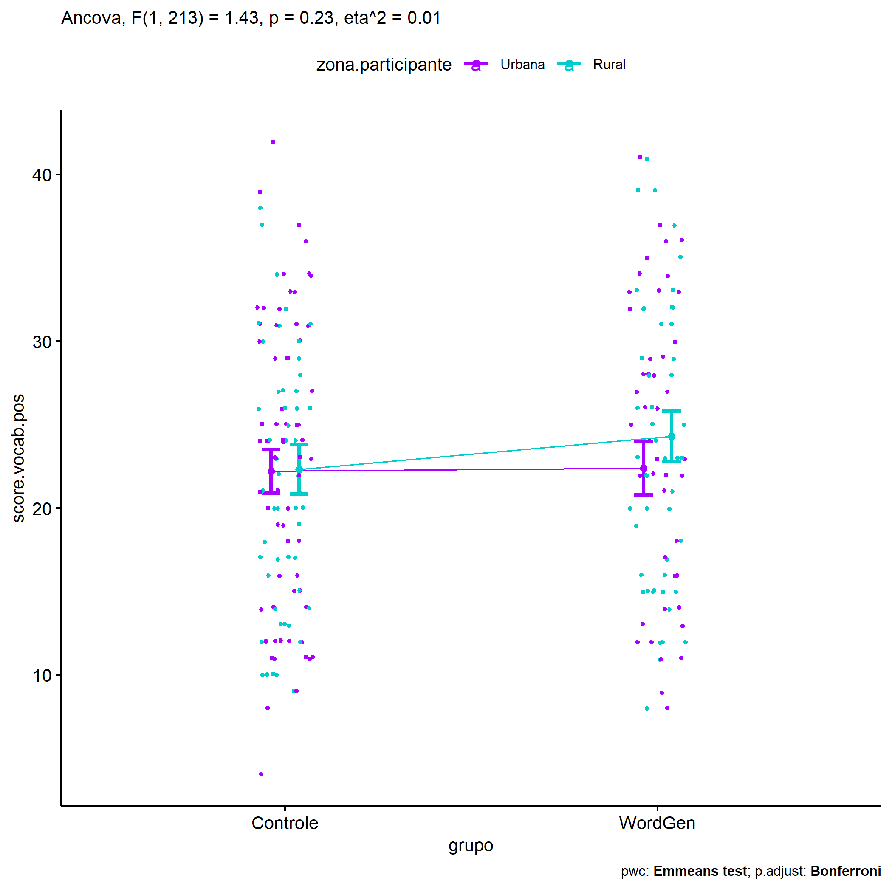<!-- -->

<!-- -->

<!-- -->

<!-- -->

### Vocabulario Nao Ensinado (TRI)

| var                        | idade |   n | M (pre) | SE (pre) | M (unadj) | SE (unadj) | M (adj) | SE (adj) |
|:---------------------------|:------|----:|--------:|---------:|----------:|-----------:|--------:|---------:|
| tri.vocab.nao.ensinado.pos | 10y   |  51 |   0.178 |    0.107 |     0.164 |      0.111 |   0.109 |    0.080 |
| tri.vocab.nao.ensinado.pos | 11y   | 166 |   0.176 |    0.071 |     0.371 |      0.075 |   0.318 |    0.044 |
| tri.vocab.nao.ensinado.pos | 12y   |  37 |  -0.086 |    0.164 |    -0.006 |      0.162 |   0.157 |    0.094 |
| tri.vocab.nao.ensinado.pos | 13y   |  13 |  -0.407 |    0.205 |    -0.494 |      0.219 |  -0.066 |    0.160 |

| .y.                        | group1 | group2 | estimate | conf.low | conf.high |    se | statistic |     p | p.adj | p.adj.signif |
|:---------------------------|:-------|:-------|---------:|---------:|----------:|------:|----------:|------:|------:|:-------------|
| tri.vocab.nao.ensinado.pos | 10y    | 11y    |   -0.209 |   -0.389 |    -0.029 | 0.091 |    -2.287 | 0.023 | 0.138 | ns           |
| tri.vocab.nao.ensinado.pos | 10y    | 12y    |   -0.048 |   -0.292 |     0.195 | 0.124 |    -0.391 | 0.696 | 1.000 | ns           |
| tri.vocab.nao.ensinado.pos | 10y    | 13y    |    0.175 |   -0.177 |     0.528 | 0.179 |     0.979 | 0.328 | 1.000 | ns           |
| tri.vocab.nao.ensinado.pos | 11y    | 12y    |    0.161 |   -0.045 |     0.366 | 0.104 |     1.540 | 0.125 | 0.748 | ns           |
| tri.vocab.nao.ensinado.pos | 11y    | 13y    |    0.385 |    0.057 |     0.712 | 0.166 |     2.314 | 0.021 | 0.129 | ns           |
| tri.vocab.nao.ensinado.pos | 12y    | 13y    |    0.224 |   -0.140 |     0.587 | 0.185 |     1.211 | 0.227 | 1.000 | ns           |
| tri.vocab.nao.ensinado.pre | 10y    | 11y    |    0.002 |   -0.279 |     0.284 | 0.143 |     0.017 | 0.987 | 1.000 | ns           |
| tri.vocab.nao.ensinado.pre | 10y    | 12y    |    0.264 |   -0.115 |     0.644 | 0.193 |     1.371 | 0.171 | 1.000 | ns           |
| tri.vocab.nao.ensinado.pre | 10y    | 13y    |    0.585 |    0.039 |     1.131 | 0.277 |     2.110 | 0.036 | 0.215 | ns           |
| tri.vocab.nao.ensinado.pre | 11y    | 12y    |    0.262 |   -0.058 |     0.582 | 0.162 |     1.614 | 0.108 | 0.646 | ns           |
| tri.vocab.nao.ensinado.pre | 11y    | 13y    |    0.583 |    0.077 |     1.089 | 0.257 |     2.267 | 0.024 | 0.145 | ns           |
| tri.vocab.nao.ensinado.pre | 12y    | 13y    |    0.321 |   -0.246 |     0.888 | 0.288 |     1.115 | 0.266 | 1.000 | ns           |

| .y.                    | idade | group1 | group2 | estimate | conf.low | conf.high |    se | statistic |     p | p.adj | p.adj.signif |
|:-----------------------|:------|:-------|:-------|---------:|---------:|----------:|------:|----------:|------:|------:|:-------------|
| tri.vocab.nao.ensinado | 10y   | pre    | pos    |   -0.007 |   -0.354 |     0.341 | 0.177 |    -0.039 | 0.969 | 0.969 | ns           |
| tri.vocab.nao.ensinado | 11y   | pre    | pos    |   -0.183 |   -0.378 |     0.012 | 0.099 |    -1.847 | 0.065 | 0.065 | ns           |
| tri.vocab.nao.ensinado | 12y   | pre    | pos    |   -0.018 |   -0.419 |     0.382 | 0.204 |    -0.089 | 0.929 | 0.929 | ns           |
| tri.vocab.nao.ensinado | 13y   | pre    | pos    |    0.228 |   -0.415 |     0.871 | 0.327 |     0.696 | 0.487 | 0.487 | ns           |
| tri.vocab.nao.ensinado | 14y   | pre    | pos    |    0.333 |   -0.798 |     1.465 | 0.576 |     0.579 | 0.563 | 0.563 | ns           |

    ## Scale for colour is already present.
    ## Adding another scale for colour, which will replace the existing scale.

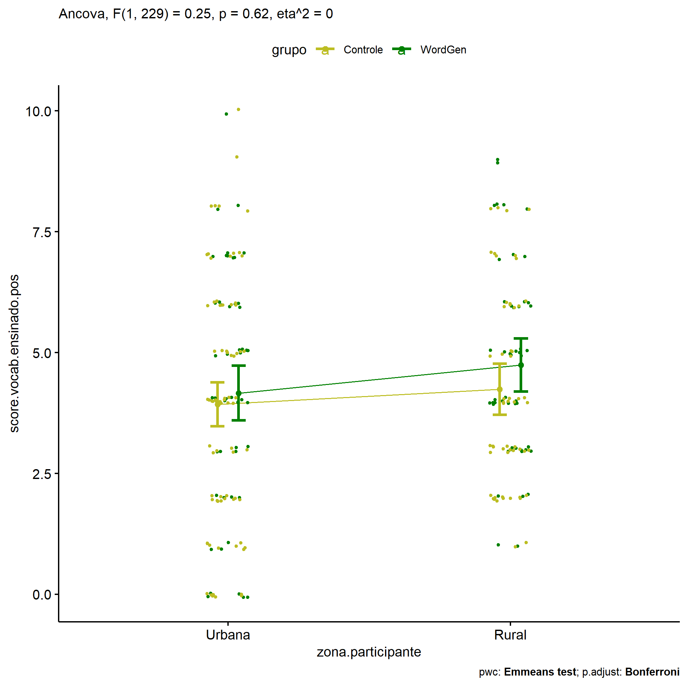<!-- -->

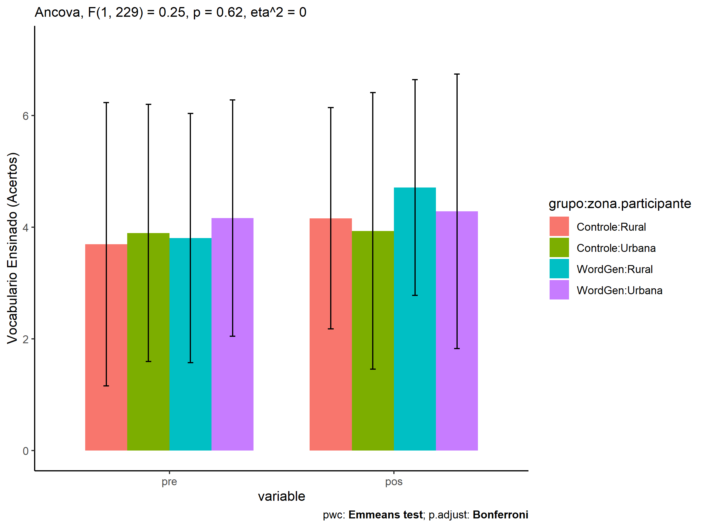<!-- -->

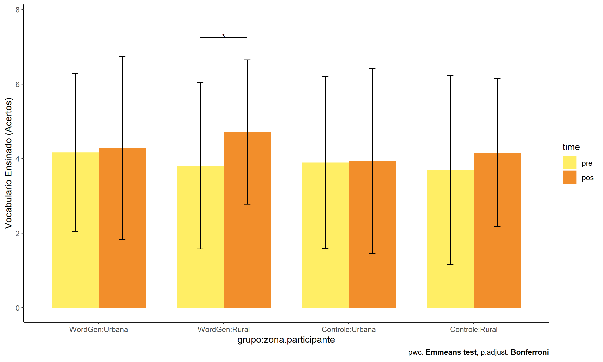<!-- -->

<!-- -->

<!-- -->

## factor: **zona.participante**

### Vocabulario (Acertos)

| var             | zona.participante |   n | M (pre) | SE (pre) | M (unadj) | SE (unadj) | M (adj) | SE (adj) |
|:----------------|:------------------|----:|--------:|---------:|----------:|-----------:|--------:|---------:|
| score.vocab.pos | Rural             | 104 |  20.221 |    0.844 |    22.423 |      0.779 |  23.297 |    0.541 |
| score.vocab.pos | Urbana            | 114 |  22.439 |    0.752 |    23.079 |      0.811 |  22.281 |    0.517 |

| .y.             | group1 | group2 | estimate | conf.low | conf.high |    se | statistic |     p | p.adj | p.adj.signif |
|:----------------|:-------|:-------|---------:|---------:|----------:|------:|----------:|------:|------:|:-------------|
| score.vocab.pos | Urbana | Rural  |   -1.016 |   -2.497 |     0.465 | 0.751 |    -1.352 | 0.178 | 0.178 | ns           |
| score.vocab.pre | Urbana | Rural  |    2.217 |   -0.003 |     4.438 | 1.126 |     1.969 | 0.050 | 0.050 | ns           |

| .y.         | zona.participante | group1 | group2 | estimate | conf.low | conf.high |    se | statistic |     p | p.adj | p.adj.signif |
|:------------|:------------------|:-------|:-------|---------:|---------:|----------:|------:|----------:|------:|------:|:-------------|
| score.vocab | Urbana            | pre    | pos    |   -0.429 |   -2.559 |     1.702 | 1.084 |    -0.395 | 0.693 | 0.693 | ns           |
| score.vocab | Rural             | pre    | pos    |   -2.131 |   -4.388 |     0.127 | 1.149 |    -1.855 | 0.064 | 0.064 | ns           |

    ## Scale for colour is already present.
    ## Adding another scale for colour, which will replace the existing scale.

<!-- -->

<!-- -->

<!-- -->

<!-- -->

<!-- -->

### Vocabulario (TRI)

| var           | zona.participante |   n | M (pre) | SE (pre) | M (unadj) | SE (unadj) | M (adj) | SE (adj) |
|:--------------|:------------------|----:|--------:|---------:|----------:|-----------:|--------:|---------:|
| tri.vocab.pos | Rural             | 104 |   0.043 |    0.088 |     0.168 |      0.090 |   0.231 |    0.059 |
| tri.vocab.pos | Urbana            | 114 |   0.185 |    0.084 |     0.262 |      0.094 |   0.205 |    0.056 |

| .y.           | group1 | group2 | estimate | conf.low | conf.high |    se | statistic |     p | p.adj | p.adj.signif |
|:--------------|:-------|:-------|---------:|---------:|----------:|------:|----------:|------:|------:|:-------------|
| tri.vocab.pos | Urbana | Rural  |   -0.026 |   -0.186 |     0.134 | 0.081 |    -0.317 | 0.752 | 0.752 | ns           |
| tri.vocab.pre | Urbana | Rural  |    0.143 |   -0.096 |     0.381 | 0.121 |     1.178 | 0.240 | 0.240 | ns           |

| .y.       | zona.participante | group1 | group2 | estimate | conf.low | conf.high |    se | statistic |     p | p.adj | p.adj.signif |
|:----------|:------------------|:-------|:-------|---------:|---------:|----------:|------:|----------:|------:|------:|:-------------|
| tri.vocab | Urbana            | pre    | pos    |   -0.048 |   -0.286 |     0.191 | 0.121 |    -0.392 | 0.695 | 0.695 | ns           |
| tri.vocab | Rural             | pre    | pos    |   -0.116 |   -0.368 |     0.137 | 0.128 |    -0.900 | 0.369 | 0.369 | ns           |

    ## Scale for colour is already present.
    ## Adding another scale for colour, which will replace the existing scale.

<!-- -->

<!-- -->

<!-- -->

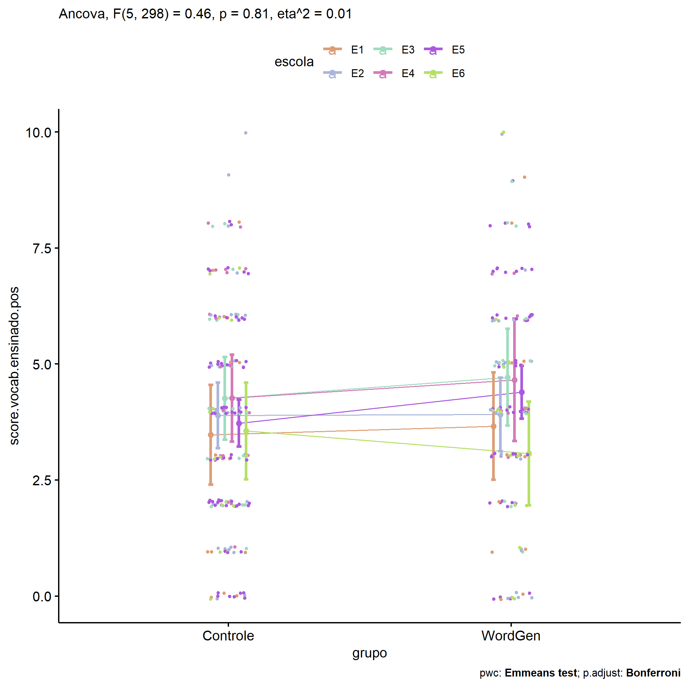<!-- -->

<!-- -->

### Vocabulario Ensinado (Acertos)

| var                      | zona.participante |   n | M (pre) | SE (pre) | M (unadj) | SE (unadj) | M (adj) | SE (adj) |
|:-------------------------|:------------------|----:|--------:|---------:|----------:|-----------:|--------:|---------:|
| score.vocab.ensinado.pos | Rural             | 108 |    3.75 |    0.229 |     4.426 |      0.189 |   4.485 |    0.194 |
| score.vocab.ensinado.pos | Urbana            | 126 |    4.00 |    0.198 |     4.071 |      0.220 |   4.021 |    0.180 |

| .y.                      | group1 | group2 | estimate | conf.low | conf.high |    se | statistic |     p | p.adj | p.adj.signif |
|:-------------------------|:-------|:-------|---------:|---------:|----------:|------:|----------:|------:|------:|:-------------|
| score.vocab.ensinado.pos | Urbana | Rural  |   -0.465 |   -0.986 |     0.057 | 0.264 |    -1.756 | 0.080 | 0.080 | ns           |
| score.vocab.ensinado.pre | Urbana | Rural  |    0.250 |   -0.344 |     0.844 | 0.302 |     0.829 | 0.408 | 0.408 | ns           |

| .y.                  | zona.participante | group1 | group2 | estimate | conf.low | conf.high |    se | statistic |     p | p.adj | p.adj.signif |
|:---------------------|:------------------|:-------|:-------|---------:|---------:|----------:|------:|----------:|------:|------:|:-------------|
| score.vocab.ensinado | Urbana            | pre    | pos    |   -0.071 |   -0.635 |     0.492 | 0.287 |    -0.249 | 0.803 | 0.803 | ns           |
| score.vocab.ensinado | Rural             | pre    | pos    |   -0.676 |   -1.284 |    -0.067 | 0.310 |    -2.183 | 0.030 | 0.030 | \*           |

    ## Scale for colour is already present.
    ## Adding another scale for colour, which will replace the existing scale.

<!-- -->

<!-- -->

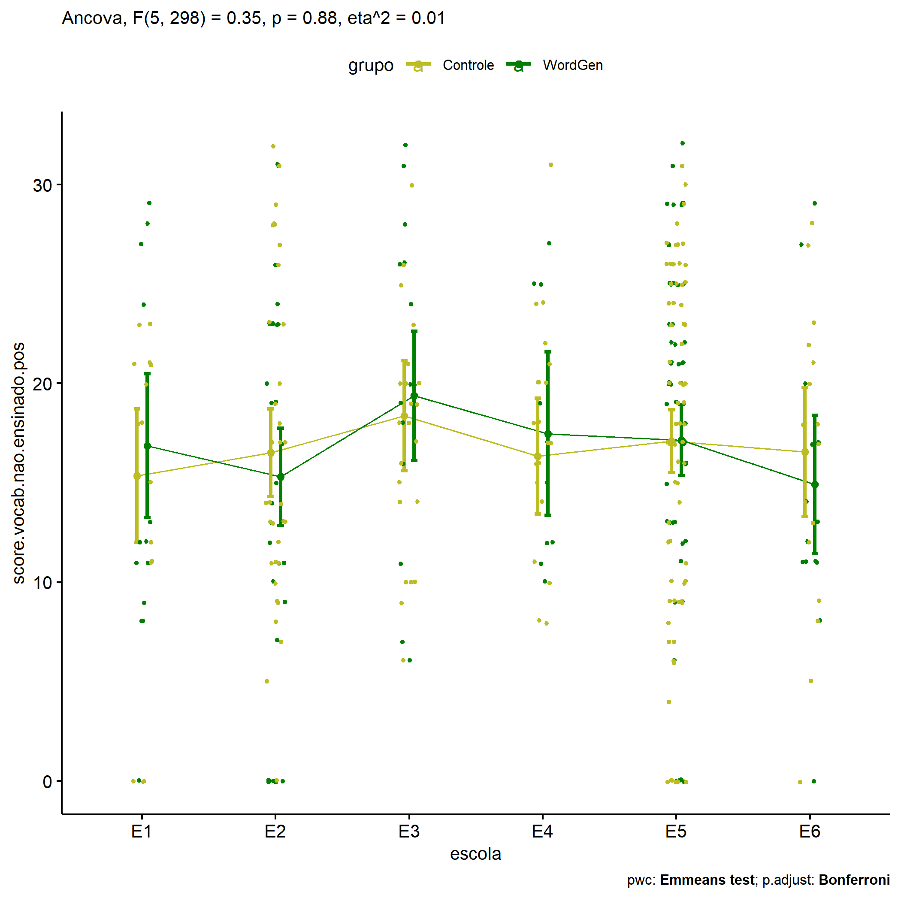<!-- -->

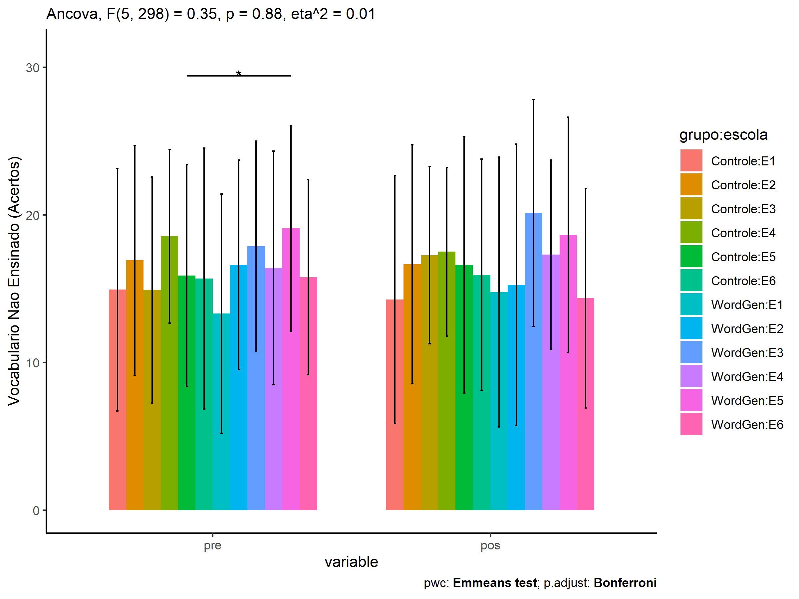<!-- -->

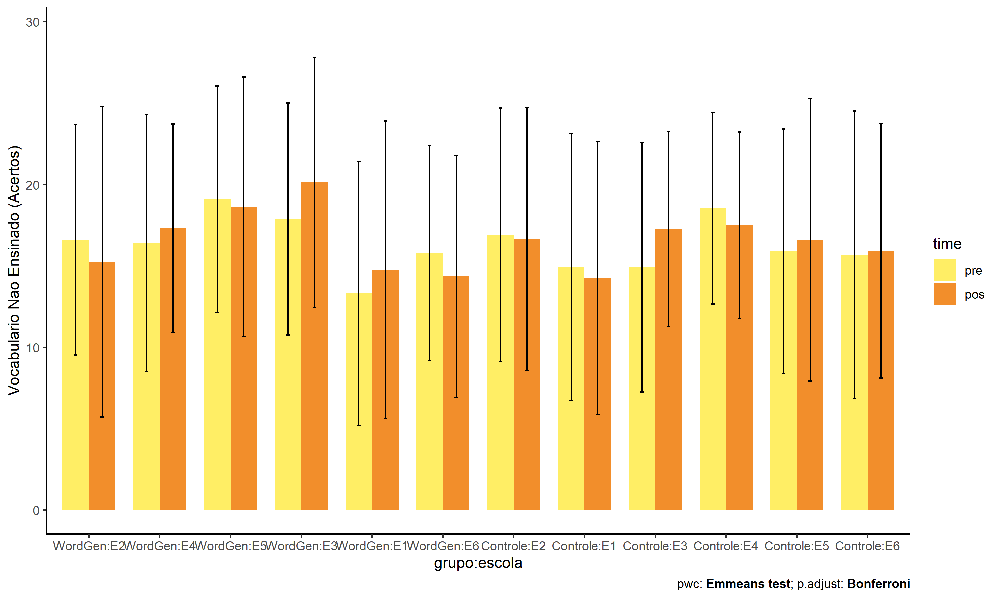<!-- -->

### Vocabulario Ensinado (TRI)

| var                    | zona.participante |   n | M (pre) | SE (pre) | M (unadj) | SE (unadj) | M (adj) | SE (adj) |
|:-----------------------|:------------------|----:|--------:|---------:|----------:|-----------:|--------:|---------:|
| tri.vocab.ensinado.pos | Rural             | 104 |   0.042 |    0.077 |     0.066 |      0.080 |   0.086 |    0.066 |
| tri.vocab.ensinado.pos | Urbana            | 114 |   0.105 |    0.073 |     0.196 |      0.079 |   0.178 |    0.063 |

| .y.                    | group1 | group2 | estimate | conf.low | conf.high |    se | statistic |     p | p.adj | p.adj.signif |
|:-----------------------|:-------|:-------|---------:|---------:|----------:|------:|----------:|------:|------:|:-------------|
| tri.vocab.ensinado.pos | Urbana | Rural  |    0.092 |   -0.089 |     0.272 | 0.091 |     1.002 | 0.317 | 0.317 | ns           |
| tri.vocab.ensinado.pre | Urbana | Rural  |    0.064 |   -0.145 |     0.273 | 0.106 |     0.600 | 0.549 | 0.549 | ns           |

| .y.                | zona.participante | group1 | group2 | estimate | conf.low | conf.high |    se | statistic |     p | p.adj | p.adj.signif |
|:-------------------|:------------------|:-------|:-------|---------:|---------:|----------:|------:|----------:|------:|------:|:-------------|
| tri.vocab.ensinado | Urbana            | pre    | pos    |   -0.083 |   -0.290 |     0.124 | 0.105 |    -0.787 | 0.431 | 0.431 | ns           |
| tri.vocab.ensinado | Rural             | pre    | pos    |   -0.030 |   -0.249 |     0.190 | 0.112 |    -0.266 | 0.790 | 0.790 | ns           |

    ## Scale for colour is already present.
    ## Adding another scale for colour, which will replace the existing scale.

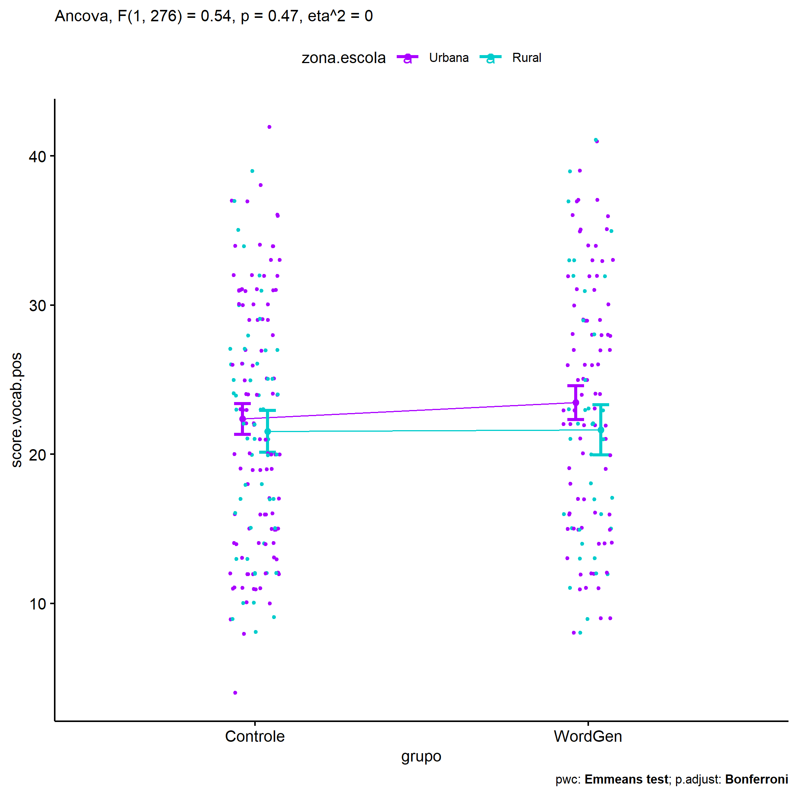<!-- -->

<!-- -->

<!-- -->

<!-- -->

<!-- -->

### Vocabulario Nao Ensinado (Acertos)

| var                          | zona.participante |   n | M (pre) | SE (pre) | M (unadj) | SE (unadj) | M (adj) | SE (adj) |
|:-----------------------------|:------------------|----:|--------:|---------:|----------:|-----------:|--------:|---------:|
| score.vocab.nao.ensinado.pos | Rural             | 108 |  15.722 |     0.71 |    17.935 |      0.635 |  18.589 |    0.572 |
| score.vocab.nao.ensinado.pos | Urbana            | 126 |  17.643 |     0.66 |    17.254 |      0.735 |  16.694 |    0.529 |

| .y.                          | group1 | group2 | estimate | conf.low | conf.high |    se | statistic |     p | p.adj | p.adj.signif |
|:-----------------------------|:-------|:-------|---------:|---------:|----------:|------:|----------:|------:|------:|:-------------|
| score.vocab.nao.ensinado.pos | Urbana | Rural  |   -1.895 |   -3.437 |    -0.353 | 0.783 |    -2.422 | 0.016 | 0.016 | \*           |
| score.vocab.nao.ensinado.pre | Urbana | Rural  |    1.921 |    0.011 |     3.831 | 0.969 |     1.981 | 0.049 | 0.049 | \*           |

| .y.                      | zona.participante | group1 | group2 | estimate | conf.low | conf.high |    se | statistic |     p | p.adj | p.adj.signif |
|:-------------------------|:------------------|:-------|:-------|---------:|---------:|----------:|------:|----------:|------:|------:|:-------------|
| score.vocab.nao.ensinado | Urbana            | pre    | pos    |    0.389 |   -1.459 |     2.236 | 0.940 |     0.414 | 0.679 | 0.679 | ns           |
| score.vocab.nao.ensinado | Rural             | pre    | pos    |   -2.213 |   -4.208 |    -0.217 | 1.015 |    -2.179 | 0.030 | 0.030 | \*           |

    ## Scale for colour is already present.
    ## Adding another scale for colour, which will replace the existing scale.

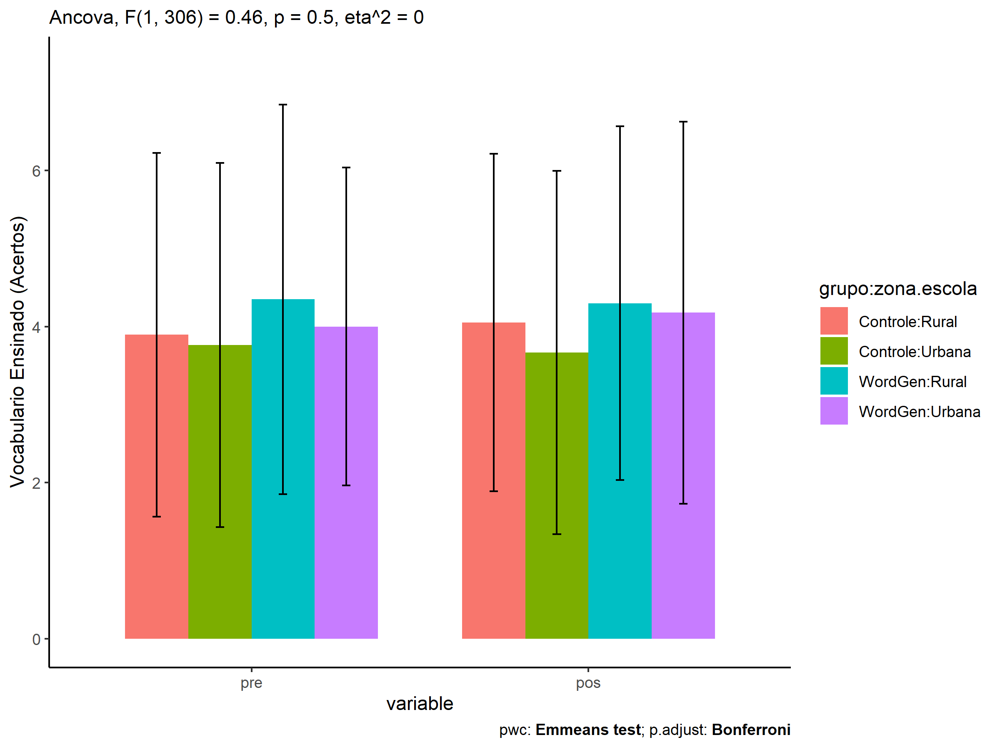<!-- -->

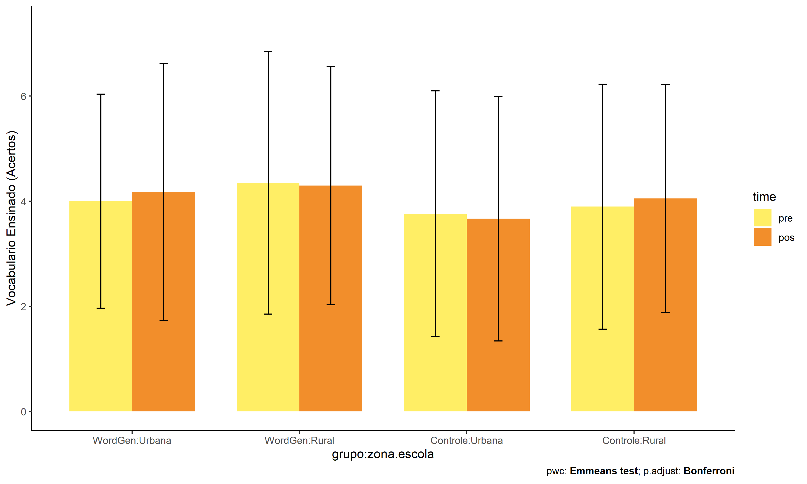<!-- -->

<!-- -->

<!-- -->

<!-- -->

### Vocabulario Nao Ensinado (TRI)

| var                        | zona.participante |   n | M (pre) | SE (pre) | M (unadj) | SE (unadj) | M (adj) | SE (adj) |
|:---------------------------|:------------------|----:|--------:|---------:|----------:|-----------:|--------:|---------:|
| tri.vocab.nao.ensinado.pos | Rural             | 104 |  -0.008 |    0.085 |     0.186 |      0.089 |   0.281 |    0.060 |
| tri.vocab.nao.ensinado.pos | Urbana            | 114 |   0.206 |    0.083 |     0.307 |      0.093 |   0.220 |    0.057 |

| .y.                        | group1 | group2 | estimate | conf.low | conf.high |    se | statistic |     p | p.adj | p.adj.signif |
|:---------------------------|:-------|:-------|---------:|---------:|----------:|------:|----------:|------:|------:|:-------------|
| tri.vocab.nao.ensinado.pos | Urbana | Rural  |   -0.060 |   -0.223 |     0.103 | 0.083 |    -0.725 | 0.469 | 0.469 | ns           |
| tri.vocab.nao.ensinado.pre | Urbana | Rural  |    0.214 |   -0.020 |     0.449 | 0.119 |     1.802 | 0.073 | 0.073 | ns           |

| .y.                    | zona.participante | group1 | group2 | estimate | conf.low | conf.high |    se | statistic |     p | p.adj | p.adj.signif |
|:-----------------------|:------------------|:-------|:-------|---------:|---------:|----------:|------:|----------:|------:|------:|:-------------|
| tri.vocab.nao.ensinado | Urbana            | pre    | pos    |   -0.068 |   -0.303 |     0.167 | 0.120 |    -0.566 | 0.572 | 0.572 | ns           |
| tri.vocab.nao.ensinado | Rural             | pre    | pos    |   -0.180 |   -0.430 |     0.069 | 0.127 |    -1.422 | 0.156 | 0.156 | ns           |

    ## Scale for colour is already present.
    ## Adding another scale for colour, which will replace the existing scale.

<!-- -->

<!-- -->

<!-- -->

<!-- -->

<!-- -->

## factor: **escola**

### Vocabulario (Acertos)

| var             | escola |   n | M (pre) | SE (pre) | M (unadj) | SE (unadj) | M (adj) | SE (adj) |
|:----------------|:-------|----:|--------:|---------:|----------:|-----------:|--------:|---------:|
| score.vocab.pos | E1     |  23 |  20.000 |    1.602 |    21.087 |      1.824 |  22.118 |    1.094 |
| score.vocab.pos | E2     |  56 |  20.554 |    1.214 |    21.839 |      1.192 |  22.445 |    0.701 |
| score.vocab.pos | E3     |  37 |  20.432 |    1.434 |    22.676 |      1.392 |  23.374 |    0.863 |
| score.vocab.pos | E4     |  29 |  23.103 |    1.410 |    21.724 |      1.353 |  20.371 |    0.976 |
| score.vocab.pos | E5     | 109 |  21.917 |    0.792 |    23.661 |      0.783 |  23.218 |    0.503 |
| score.vocab.pos | E6     |  27 |  21.148 |    1.714 |    20.259 |      1.586 |  20.408 |    1.009 |

| .y.             | group1 | group2 | estimate | conf.low | conf.high |    se | statistic |     p | p.adj | p.adj.signif |
|:----------------|:-------|:-------|---------:|---------:|----------:|------:|----------:|------:|------:|:-------------|
| score.vocab.pos | E1     | E2     |   -0.327 |   -2.884 |     2.229 | 1.299 |    -0.252 | 0.801 | 1.000 | ns           |
| score.vocab.pos | E1     | E3     |   -1.257 |   -3.997 |     1.484 | 1.392 |    -0.903 | 0.368 | 1.000 | ns           |
| score.vocab.pos | E1     | E4     |    1.747 |   -1.144 |     4.638 | 1.468 |     1.189 | 0.235 | 1.000 | ns           |
| score.vocab.pos | E1     | E5     |   -1.101 |   -3.473 |     1.272 | 1.205 |    -0.913 | 0.362 | 1.000 | ns           |
| score.vocab.pos | E1     | E6     |    1.710 |   -1.220 |     4.639 | 1.488 |     1.149 | 0.252 | 1.000 | ns           |
| score.vocab.pos | E2     | E3     |   -0.929 |   -3.116 |     1.257 | 1.111 |    -0.837 | 0.403 | 1.000 | ns           |
| score.vocab.pos | E2     | E4     |    2.074 |   -0.295 |     4.442 | 1.203 |     1.724 | 0.086 | 1.000 | ns           |
| score.vocab.pos | E2     | E5     |   -0.774 |   -2.474 |     0.926 | 0.863 |    -0.896 | 0.371 | 1.000 | ns           |
| score.vocab.pos | E2     | E6     |    2.037 |   -0.382 |     4.455 | 1.229 |     1.658 | 0.098 | 1.000 | ns           |
| score.vocab.pos | E3     | E4     |    3.003 |    0.436 |     5.571 | 1.304 |     2.303 | 0.022 | 0.330 | ns           |
| score.vocab.pos | E3     | E5     |    0.156 |   -1.811 |     2.123 | 0.999 |     0.156 | 0.876 | 1.000 | ns           |
| score.vocab.pos | E3     | E6     |    2.966 |    0.353 |     5.579 | 1.327 |     2.235 | 0.026 | 0.393 | ns           |
| score.vocab.pos | E4     | E5     |   -2.847 |   -5.006 |    -0.689 | 1.096 |    -2.597 | 0.010 | 0.149 | ns           |
| score.vocab.pos | E4     | E6     |   -0.037 |   -2.801 |     2.727 | 1.404 |    -0.026 | 0.979 | 1.000 | ns           |
| score.vocab.pos | E5     | E6     |    2.810 |    0.591 |     5.030 | 1.127 |     2.493 | 0.013 | 0.199 | ns           |
| score.vocab.pre | E1     | E2     |   -0.554 |   -4.673 |     3.566 | 2.092 |    -0.265 | 0.792 | 1.000 | ns           |
| score.vocab.pre | E1     | E3     |   -0.432 |   -4.849 |     3.984 | 2.243 |    -0.193 | 0.847 | 1.000 | ns           |
| score.vocab.pre | E1     | E4     |   -3.103 |   -7.747 |     1.541 | 2.359 |    -1.316 | 0.189 | 1.000 | ns           |
| score.vocab.pre | E1     | E5     |   -1.917 |   -5.734 |     1.899 | 1.939 |    -0.989 | 0.324 | 1.000 | ns           |
| score.vocab.pre | E1     | E6     |   -1.148 |   -5.868 |     3.571 | 2.397 |    -0.479 | 0.632 | 1.000 | ns           |
| score.vocab.pre | E2     | E3     |    0.121 |   -3.403 |     3.645 | 1.790 |     0.068 | 0.946 | 1.000 | ns           |
| score.vocab.pre | E2     | E4     |   -2.550 |   -6.355 |     1.255 | 1.933 |    -1.319 | 0.188 | 1.000 | ns           |
| score.vocab.pre | E2     | E5     |   -1.364 |   -4.098 |     1.371 | 1.389 |    -0.982 | 0.327 | 1.000 | ns           |
| score.vocab.pre | E2     | E6     |   -0.595 |   -4.491 |     3.302 | 1.979 |    -0.300 | 0.764 | 1.000 | ns           |
| score.vocab.pre | E3     | E4     |   -2.671 |   -6.796 |     1.454 | 2.095 |    -1.275 | 0.203 | 1.000 | ns           |
| score.vocab.pre | E3     | E5     |   -1.485 |   -4.650 |     1.680 | 1.607 |    -0.924 | 0.356 | 1.000 | ns           |
| score.vocab.pre | E3     | E6     |   -0.716 |   -4.925 |     3.494 | 2.138 |    -0.335 | 0.738 | 1.000 | ns           |
| score.vocab.pre | E4     | E5     |    1.186 |   -2.289 |     4.661 | 1.765 |     0.672 | 0.502 | 1.000 | ns           |
| score.vocab.pre | E4     | E6     |    1.955 |   -2.493 |     6.403 | 2.259 |     0.865 | 0.388 | 1.000 | ns           |
| score.vocab.pre | E5     | E6     |    0.769 |   -2.806 |     4.345 | 1.816 |     0.424 | 0.672 | 1.000 | ns           |

| .y.         | escola | group1 | group2 | estimate | conf.low | conf.high |    se | statistic |     p | p.adj | p.adj.signif |
|:------------|:-------|:-------|:-------|---------:|---------:|----------:|------:|----------:|------:|------:|:-------------|
| score.vocab | E1     | pre    | pos    |   -0.993 |   -5.716 |     3.730 | 2.405 |    -0.413 | 0.680 | 0.680 | ns           |
| score.vocab | E2     | pre    | pos    |   -1.062 |   -4.094 |     1.971 | 1.544 |    -0.688 | 0.492 | 0.492 | ns           |
| score.vocab | E3     | pre    | pos    |   -2.410 |   -6.227 |     1.407 | 1.943 |    -1.240 | 0.216 | 0.216 | ns           |
| score.vocab | E4     | pre    | pos    |    1.037 |   -3.267 |     5.341 | 2.191 |     0.473 | 0.636 | 0.636 | ns           |
| score.vocab | E5     | pre    | pos    |   -1.465 |   -3.645 |     0.715 | 1.110 |    -1.320 | 0.187 | 0.187 | ns           |
| score.vocab | E6     | pre    | pos    |    0.589 |   -3.790 |     4.967 | 2.229 |     0.264 | 0.792 | 0.792 | ns           |

    ## Scale for colour is already present.
    ## Adding another scale for colour, which will replace the existing scale.

<!-- -->

<!-- -->

<!-- -->

<!-- -->

<!-- -->

### Vocabulario (TRI)

| var           | escola |   n | M (pre) | SE (pre) | M (unadj) | SE (unadj) | M (adj) | SE (adj) |
|:--------------|:-------|----:|--------:|---------:|----------:|-----------:|--------:|---------:|
| tri.vocab.pos | E1     |  23 |  -0.069 |    0.207 |     0.179 |      0.203 |   0.332 |    0.118 |
| tri.vocab.pos | E2     |  56 |   0.010 |    0.130 |     0.026 |      0.140 |   0.110 |    0.076 |
| tri.vocab.pos | E3     |  37 |   0.054 |    0.150 |     0.217 |      0.148 |   0.264 |    0.093 |
| tri.vocab.pos | E4     |  29 |   0.201 |    0.139 |     0.109 |      0.165 |   0.029 |    0.105 |
| tri.vocab.pos | E5     | 109 |   0.192 |    0.084 |     0.326 |      0.092 |   0.255 |    0.054 |
| tri.vocab.pos | E6     |  27 |   0.104 |    0.158 |     0.012 |      0.164 |   0.016 |    0.109 |

| .y.           | group1 | group2 | estimate | conf.low | conf.high |    se | statistic |     p | p.adj | p.adj.signif |
|:--------------|:-------|:-------|---------:|---------:|----------:|------:|----------:|------:|------:|:-------------|
| tri.vocab.pos | E1     | E2     |    0.221 |   -0.055 |     0.497 | 0.140 |     1.578 | 0.116 | 1.000 | ns           |
| tri.vocab.pos | E1     | E3     |    0.068 |   -0.228 |     0.364 | 0.150 |     0.451 | 0.652 | 1.000 | ns           |
| tri.vocab.pos | E1     | E4     |    0.302 |   -0.009 |     0.614 | 0.158 |     1.909 | 0.057 | 0.859 | ns           |
| tri.vocab.pos | E1     | E5     |    0.077 |   -0.179 |     0.333 | 0.130 |     0.592 | 0.554 | 1.000 | ns           |
| tri.vocab.pos | E1     | E6     |    0.316 |   -0.001 |     0.632 | 0.161 |     1.964 | 0.051 | 0.758 | ns           |
| tri.vocab.pos | E2     | E3     |   -0.153 |   -0.389 |     0.083 | 0.120 |    -1.279 | 0.202 | 1.000 | ns           |
| tri.vocab.pos | E2     | E4     |    0.081 |   -0.174 |     0.336 | 0.130 |     0.625 | 0.532 | 1.000 | ns           |
| tri.vocab.pos | E2     | E5     |   -0.144 |   -0.328 |     0.040 | 0.093 |    -1.545 | 0.123 | 1.000 | ns           |
| tri.vocab.pos | E2     | E6     |    0.094 |   -0.167 |     0.356 | 0.133 |     0.712 | 0.477 | 1.000 | ns           |
| tri.vocab.pos | E3     | E4     |    0.235 |   -0.042 |     0.511 | 0.140 |     1.669 | 0.096 | 1.000 | ns           |
| tri.vocab.pos | E3     | E5     |    0.009 |   -0.203 |     0.221 | 0.108 |     0.086 | 0.932 | 1.000 | ns           |
| tri.vocab.pos | E3     | E6     |    0.248 |   -0.034 |     0.530 | 0.143 |     1.730 | 0.085 | 1.000 | ns           |
| tri.vocab.pos | E4     | E5     |   -0.225 |   -0.458 |     0.008 | 0.118 |    -1.905 | 0.058 | 0.867 | ns           |
| tri.vocab.pos | E4     | E6     |    0.013 |   -0.285 |     0.311 | 0.151 |     0.088 | 0.930 | 1.000 | ns           |
| tri.vocab.pos | E5     | E6     |    0.239 |   -0.001 |     0.478 | 0.122 |     1.960 | 0.051 | 0.765 | ns           |
| tri.vocab.pre | E1     | E2     |   -0.079 |   -0.515 |     0.358 | 0.222 |    -0.354 | 0.723 | 1.000 | ns           |
| tri.vocab.pre | E1     | E3     |   -0.123 |   -0.591 |     0.345 | 0.238 |    -0.516 | 0.606 | 1.000 | ns           |
| tri.vocab.pre | E1     | E4     |   -0.270 |   -0.762 |     0.222 | 0.250 |    -1.081 | 0.281 | 1.000 | ns           |
| tri.vocab.pre | E1     | E5     |   -0.261 |   -0.666 |     0.143 | 0.205 |    -1.272 | 0.205 | 1.000 | ns           |
| tri.vocab.pre | E1     | E6     |   -0.173 |   -0.673 |     0.327 | 0.254 |    -0.681 | 0.496 | 1.000 | ns           |
| tri.vocab.pre | E2     | E3     |   -0.044 |   -0.418 |     0.329 | 0.190 |    -0.233 | 0.816 | 1.000 | ns           |
| tri.vocab.pre | E2     | E4     |   -0.192 |   -0.595 |     0.212 | 0.205 |    -0.935 | 0.350 | 1.000 | ns           |
| tri.vocab.pre | E2     | E5     |   -0.183 |   -0.473 |     0.107 | 0.147 |    -1.241 | 0.216 | 1.000 | ns           |
| tri.vocab.pre | E2     | E6     |   -0.094 |   -0.507 |     0.319 | 0.210 |    -0.450 | 0.653 | 1.000 | ns           |
| tri.vocab.pre | E3     | E4     |   -0.147 |   -0.585 |     0.290 | 0.222 |    -0.664 | 0.507 | 1.000 | ns           |
| tri.vocab.pre | E3     | E5     |   -0.139 |   -0.474 |     0.197 | 0.170 |    -0.813 | 0.417 | 1.000 | ns           |
| tri.vocab.pre | E3     | E6     |   -0.050 |   -0.497 |     0.396 | 0.227 |    -0.222 | 0.824 | 1.000 | ns           |
| tri.vocab.pre | E4     | E5     |    0.009 |   -0.359 |     0.377 | 0.187 |     0.048 | 0.962 | 1.000 | ns           |
| tri.vocab.pre | E4     | E6     |    0.097 |   -0.374 |     0.569 | 0.239 |     0.406 | 0.685 | 1.000 | ns           |
| tri.vocab.pre | E5     | E6     |    0.088 |   -0.291 |     0.467 | 0.192 |     0.458 | 0.647 | 1.000 | ns           |

| .y.       | escola | group1 | group2 | estimate | conf.low | conf.high |    se | statistic |     p | p.adj | p.adj.signif |
|:----------|:-------|:-------|:-------|---------:|---------:|----------:|------:|----------:|------:|------:|:-------------|
| tri.vocab | E1     | pre    | pos    |   -0.250 |   -0.771 |     0.271 | 0.265 |    -0.941 | 0.347 | 0.347 | ns           |
| tri.vocab | E2     | pre    | pos    |    0.011 |   -0.323 |     0.346 | 0.170 |     0.067 | 0.946 | 0.946 | ns           |
| tri.vocab | E3     | pre    | pos    |   -0.174 |   -0.596 |     0.247 | 0.214 |    -0.813 | 0.416 | 0.416 | ns           |
| tri.vocab | E4     | pre    | pos    |    0.058 |   -0.417 |     0.533 | 0.242 |     0.241 | 0.810 | 0.810 | ns           |
| tri.vocab | E5     | pre    | pos    |   -0.097 |   -0.338 |     0.143 | 0.122 |    -0.795 | 0.427 | 0.427 | ns           |
| tri.vocab | E6     | pre    | pos    |    0.108 |   -0.375 |     0.591 | 0.246 |     0.440 | 0.660 | 0.660 | ns           |

    ## Scale for colour is already present.
    ## Adding another scale for colour, which will replace the existing scale.

<!-- -->

<!-- -->

<!-- -->

<!-- -->

<!-- -->

### Vocabulario Ensinado (Acertos)

| var                      | escola |   n | M (pre) | SE (pre) | M (unadj) | SE (unadj) | M (adj) | SE (adj) |
|:-------------------------|:-------|----:|--------:|---------:|----------:|-----------:|--------:|---------:|
| score.vocab.ensinado.pos | E1     |  28 |   3.536 |    0.383 |     3.393 |      0.515 |   3.565 |    0.399 |
| score.vocab.ensinado.pos | E2     |  63 |   3.794 |    0.287 |     3.841 |      0.315 |   3.902 |    0.266 |
| score.vocab.ensinado.pos | E3     |  38 |   3.737 |    0.375 |     4.368 |      0.344 |   4.454 |    0.343 |
| score.vocab.ensinado.pos | E4     |  30 |   4.500 |    0.447 |     4.633 |      0.367 |   4.391 |    0.387 |
| score.vocab.ensinado.pos | E5     | 122 |   3.984 |    0.200 |     4.041 |      0.204 |   4.020 |    0.191 |
| score.vocab.ensinado.pos | E6     |  30 |   4.100 |    0.451 |     3.400 |      0.428 |   3.329 |    0.385 |

| .y.                      | group1 | group2 | estimate | conf.low | conf.high |    se | statistic |     p | p.adj | p.adj.signif |
|:-------------------------|:-------|:-------|---------:|---------:|----------:|------:|----------:|------:|------:|:-------------|
| score.vocab.ensinado.pos | E1     | E2     |   -0.338 |   -1.281 |     0.606 | 0.480 |    -0.704 | 0.482 | 1.000 | ns           |
| score.vocab.ensinado.pos | E1     | E3     |   -0.889 |   -1.924 |     0.146 | 0.526 |    -1.691 | 0.092 | 1.000 | ns           |
| score.vocab.ensinado.pos | E1     | E4     |   -0.826 |   -1.922 |     0.270 | 0.557 |    -1.483 | 0.139 | 1.000 | ns           |
| score.vocab.ensinado.pos | E1     | E5     |   -0.456 |   -1.327 |     0.416 | 0.443 |    -1.029 | 0.304 | 1.000 | ns           |
| score.vocab.ensinado.pos | E1     | E6     |    0.235 |   -0.858 |     1.328 | 0.555 |     0.424 | 0.672 | 1.000 | ns           |
| score.vocab.ensinado.pos | E2     | E3     |   -0.552 |   -1.405 |     0.302 | 0.434 |    -1.272 | 0.204 | 1.000 | ns           |
| score.vocab.ensinado.pos | E2     | E4     |   -0.488 |   -1.413 |     0.436 | 0.470 |    -1.040 | 0.299 | 1.000 | ns           |
| score.vocab.ensinado.pos | E2     | E5     |   -0.118 |   -0.763 |     0.527 | 0.328 |    -0.360 | 0.719 | 1.000 | ns           |
| score.vocab.ensinado.pos | E2     | E6     |    0.573 |   -0.349 |     1.495 | 0.468 |     1.223 | 0.222 | 1.000 | ns           |
| score.vocab.ensinado.pos | E3     | E4     |    0.063 |   -0.954 |     1.081 | 0.517 |     0.122 | 0.903 | 1.000 | ns           |
| score.vocab.ensinado.pos | E3     | E5     |    0.434 |   -0.339 |     1.206 | 0.392 |     1.105 | 0.270 | 1.000 | ns           |
| score.vocab.ensinado.pos | E3     | E6     |    1.125 |    0.109 |     2.140 | 0.516 |     2.180 | 0.030 | 0.450 | ns           |
| score.vocab.ensinado.pos | E4     | E5     |    0.370 |   -0.478 |     1.218 | 0.431 |     0.859 | 0.391 | 1.000 | ns           |
| score.vocab.ensinado.pos | E4     | E6     |    1.061 |   -0.012 |     2.135 | 0.545 |     1.946 | 0.053 | 0.788 | ns           |
| score.vocab.ensinado.pos | E5     | E6     |    0.691 |   -0.155 |     1.538 | 0.430 |     1.606 | 0.109 | 1.000 | ns           |
| score.vocab.ensinado.pre | E1     | E2     |   -0.258 |   -1.273 |     0.757 | 0.516 |    -0.500 | 0.617 | 1.000 | ns           |
| score.vocab.ensinado.pre | E1     | E3     |   -0.201 |   -1.314 |     0.912 | 0.566 |    -0.356 | 0.722 | 1.000 | ns           |
| score.vocab.ensinado.pre | E1     | E4     |   -0.964 |   -2.138 |     0.210 | 0.597 |    -1.616 | 0.107 | 1.000 | ns           |
| score.vocab.ensinado.pre | E1     | E5     |   -0.448 |   -1.384 |     0.488 | 0.476 |    -0.941 | 0.347 | 1.000 | ns           |
| score.vocab.ensinado.pre | E1     | E6     |   -0.564 |   -1.738 |     0.610 | 0.597 |    -0.946 | 0.345 | 1.000 | ns           |
| score.vocab.ensinado.pre | E2     | E3     |    0.057 |   -0.861 |     0.975 | 0.466 |     0.122 | 0.903 | 1.000 | ns           |
| score.vocab.ensinado.pre | E2     | E4     |   -0.706 |   -1.698 |     0.285 | 0.504 |    -1.402 | 0.162 | 1.000 | ns           |
| score.vocab.ensinado.pre | E2     | E5     |   -0.190 |   -0.883 |     0.503 | 0.352 |    -0.539 | 0.590 | 1.000 | ns           |
| score.vocab.ensinado.pre | E2     | E6     |   -0.306 |   -1.298 |     0.685 | 0.504 |    -0.608 | 0.544 | 1.000 | ns           |
| score.vocab.ensinado.pre | E3     | E4     |   -0.763 |   -1.855 |     0.328 | 0.555 |    -1.376 | 0.170 | 1.000 | ns           |
| score.vocab.ensinado.pre | E3     | E5     |   -0.247 |   -1.077 |     0.583 | 0.422 |    -0.585 | 0.559 | 1.000 | ns           |
| score.vocab.ensinado.pre | E3     | E6     |   -0.363 |   -1.455 |     0.728 | 0.555 |    -0.655 | 0.513 | 1.000 | ns           |
| score.vocab.ensinado.pre | E4     | E5     |    0.516 |   -0.394 |     1.427 | 0.463 |     1.116 | 0.265 | 1.000 | ns           |
| score.vocab.ensinado.pre | E4     | E6     |    0.400 |   -0.754 |     1.554 | 0.586 |     0.682 | 0.496 | 1.000 | ns           |
| score.vocab.ensinado.pre | E5     | E6     |   -0.116 |   -1.027 |     0.794 | 0.463 |    -0.252 | 0.802 | 1.000 | ns           |

| .y.                  | escola | group1 | group2 | estimate | conf.low | conf.high |    se | statistic |     p | p.adj | p.adj.signif |
|:---------------------|:-------|:-------|:-------|---------:|---------:|----------:|------:|----------:|------:|------:|:-------------|
| score.vocab.ensinado | E1     | pre    | pos    |    0.143 |   -1.063 |     1.348 | 0.614 |     0.233 | 0.816 | 0.816 | ns           |
| score.vocab.ensinado | E2     | pre    | pos    |   -0.048 |   -0.851 |     0.756 | 0.409 |    -0.116 | 0.907 | 0.907 | ns           |
| score.vocab.ensinado | E3     | pre    | pos    |   -0.632 |   -1.666 |     0.403 | 0.527 |    -1.199 | 0.231 | 0.231 | ns           |
| score.vocab.ensinado | E4     | pre    | pos    |   -0.133 |   -1.298 |     1.031 | 0.593 |    -0.225 | 0.822 | 0.822 | ns           |
| score.vocab.ensinado | E5     | pre    | pos    |   -0.057 |   -0.635 |     0.520 | 0.294 |    -0.195 | 0.845 | 0.845 | ns           |
| score.vocab.ensinado | E6     | pre    | pos    |    0.700 |   -0.465 |     1.865 | 0.593 |     1.180 | 0.238 | 0.238 | ns           |

    ## Scale for colour is already present.
    ## Adding another scale for colour, which will replace the existing scale.

<!-- -->

<!-- -->

<!-- -->

<!-- -->

<!-- -->

### Vocabulario Ensinado (TRI)

| var                    | escola |   n | M (pre) | SE (pre) | M (unadj) | SE (unadj) | M (adj) | SE (adj) |
|:-----------------------|:-------|----:|--------:|---------:|----------:|-----------:|--------:|---------:|
| tri.vocab.ensinado.pos | E1     |  23 |   0.149 |    0.151 |    -0.003 |      0.195 |  -0.053 |    0.138 |
| tri.vocab.ensinado.pos | E2     |  56 |  -0.096 |    0.111 |     0.017 |      0.116 |   0.120 |    0.089 |
| tri.vocab.ensinado.pos | E3     |  37 |   0.016 |    0.130 |    -0.007 |      0.131 |   0.026 |    0.109 |
| tri.vocab.ensinado.pos | E4     |  29 |   0.040 |    0.146 |     0.098 |      0.159 |   0.116 |    0.123 |
| tri.vocab.ensinado.pos | E5     | 109 |   0.153 |    0.074 |     0.242 |      0.074 |   0.189 |    0.063 |
| tri.vocab.ensinado.pos | E6     |  27 |   0.101 |    0.167 |    -0.073 |      0.164 |  -0.093 |    0.127 |

| .y.                    | group1 | group2 | estimate | conf.low | conf.high |    se | statistic |     p | p.adj | p.adj.signif |
|:-----------------------|:-------|:-------|---------:|---------:|----------:|------:|----------:|------:|------:|:-------------|
| tri.vocab.ensinado.pos | E1     | E2     |   -0.174 |   -0.496 |     0.149 | 0.164 |    -1.060 | 0.290 | 1.000 | ns           |
| tri.vocab.ensinado.pos | E1     | E3     |   -0.080 |   -0.425 |     0.265 | 0.175 |    -0.456 | 0.649 | 1.000 | ns           |
| tri.vocab.ensinado.pos | E1     | E4     |   -0.169 |   -0.532 |     0.193 | 0.184 |    -0.919 | 0.359 | 1.000 | ns           |
| tri.vocab.ensinado.pos | E1     | E5     |   -0.242 |   -0.540 |     0.056 | 0.151 |    -1.599 | 0.111 | 1.000 | ns           |
| tri.vocab.ensinado.pos | E1     | E6     |    0.040 |   -0.329 |     0.409 | 0.187 |     0.213 | 0.832 | 1.000 | ns           |
| tri.vocab.ensinado.pos | E2     | E3     |    0.094 |   -0.182 |     0.369 | 0.140 |     0.671 | 0.503 | 1.000 | ns           |
| tri.vocab.ensinado.pos | E2     | E4     |    0.004 |   -0.293 |     0.302 | 0.151 |     0.028 | 0.977 | 1.000 | ns           |
| tri.vocab.ensinado.pos | E2     | E5     |   -0.068 |   -0.283 |     0.147 | 0.109 |    -0.626 | 0.532 | 1.000 | ns           |
| tri.vocab.ensinado.pos | E2     | E6     |    0.214 |   -0.091 |     0.519 | 0.155 |     1.379 | 0.169 | 1.000 | ns           |
| tri.vocab.ensinado.pos | E3     | E4     |   -0.090 |   -0.412 |     0.233 | 0.164 |    -0.547 | 0.585 | 1.000 | ns           |
| tri.vocab.ensinado.pos | E3     | E5     |   -0.162 |   -0.410 |     0.085 | 0.126 |    -1.290 | 0.198 | 1.000 | ns           |
| tri.vocab.ensinado.pos | E3     | E6     |    0.120 |   -0.209 |     0.449 | 0.167 |     0.717 | 0.474 | 1.000 | ns           |
| tri.vocab.ensinado.pos | E4     | E5     |   -0.073 |   -0.344 |     0.199 | 0.138 |    -0.526 | 0.599 | 1.000 | ns           |
| tri.vocab.ensinado.pos | E4     | E6     |    0.209 |   -0.138 |     0.557 | 0.177 |     1.186 | 0.237 | 1.000 | ns           |
| tri.vocab.ensinado.pos | E5     | E6     |    0.282 |    0.003 |     0.561 | 0.142 |     1.987 | 0.048 | 0.718 | ns           |
| tri.vocab.ensinado.pre | E1     | E2     |    0.246 |   -0.142 |     0.633 | 0.197 |     1.248 | 0.213 | 1.000 | ns           |
| tri.vocab.ensinado.pre | E1     | E3     |    0.133 |   -0.282 |     0.549 | 0.211 |     0.633 | 0.527 | 1.000 | ns           |
| tri.vocab.ensinado.pre | E1     | E4     |    0.109 |   -0.328 |     0.546 | 0.222 |     0.491 | 0.624 | 1.000 | ns           |
| tri.vocab.ensinado.pre | E1     | E5     |   -0.004 |   -0.362 |     0.355 | 0.182 |    -0.020 | 0.984 | 1.000 | ns           |
| tri.vocab.ensinado.pre | E1     | E6     |    0.048 |   -0.396 |     0.492 | 0.225 |     0.214 | 0.831 | 1.000 | ns           |
| tri.vocab.ensinado.pre | E2     | E3     |   -0.112 |   -0.443 |     0.219 | 0.168 |    -0.666 | 0.506 | 1.000 | ns           |
| tri.vocab.ensinado.pre | E2     | E4     |   -0.137 |   -0.495 |     0.221 | 0.182 |    -0.752 | 0.453 | 1.000 | ns           |
| tri.vocab.ensinado.pre | E2     | E5     |   -0.249 |   -0.506 |     0.008 | 0.131 |    -1.907 | 0.058 | 0.863 | ns           |
| tri.vocab.ensinado.pre | E2     | E6     |   -0.197 |   -0.564 |     0.169 | 0.186 |    -1.060 | 0.290 | 1.000 | ns           |
| tri.vocab.ensinado.pre | E3     | E4     |   -0.025 |   -0.413 |     0.363 | 0.197 |    -0.125 | 0.901 | 1.000 | ns           |
| tri.vocab.ensinado.pre | E3     | E5     |   -0.137 |   -0.435 |     0.161 | 0.151 |    -0.907 | 0.365 | 1.000 | ns           |
| tri.vocab.ensinado.pre | E3     | E6     |   -0.085 |   -0.481 |     0.311 | 0.201 |    -0.424 | 0.672 | 1.000 | ns           |
| tri.vocab.ensinado.pre | E4     | E5     |   -0.112 |   -0.439 |     0.214 | 0.166 |    -0.677 | 0.499 | 1.000 | ns           |
| tri.vocab.ensinado.pre | E4     | E6     |   -0.061 |   -0.479 |     0.358 | 0.212 |    -0.286 | 0.775 | 1.000 | ns           |
| tri.vocab.ensinado.pre | E5     | E6     |    0.052 |   -0.284 |     0.388 | 0.171 |     0.303 | 0.762 | 1.000 | ns           |

| .y.                | escola | group1 | group2 | estimate | conf.low | conf.high |    se | statistic |     p | p.adj | p.adj.signif |
|:-------------------|:-------|:-------|:-------|---------:|---------:|----------:|------:|----------:|------:|------:|:-------------|
| tri.vocab.ensinado | E1     | pre    | pos    |    0.141 |   -0.316 |     0.597 | 0.232 |     0.606 | 0.545 | 0.545 | ns           |
| tri.vocab.ensinado | E2     | pre    | pos    |   -0.080 |   -0.373 |     0.213 | 0.149 |    -0.537 | 0.591 | 0.591 | ns           |
| tri.vocab.ensinado | E3     | pre    | pos    |   -0.017 |   -0.386 |     0.352 | 0.188 |    -0.089 | 0.929 | 0.929 | ns           |
| tri.vocab.ensinado | E4     | pre    | pos    |   -0.089 |   -0.505 |     0.327 | 0.212 |    -0.420 | 0.674 | 0.674 | ns           |
| tri.vocab.ensinado | E5     | pre    | pos    |   -0.070 |   -0.281 |     0.140 | 0.107 |    -0.655 | 0.513 | 0.513 | ns           |
| tri.vocab.ensinado | E6     | pre    | pos    |    0.142 |   -0.281 |     0.565 | 0.215 |     0.661 | 0.509 | 0.509 | ns           |

    ## Scale for colour is already present.
    ## Adding another scale for colour, which will replace the existing scale.

<!-- -->

<!-- -->

<!-- -->

<!-- -->

<!-- -->

### Vocabulario Nao Ensinado (Acertos)

| var                          | escola |   n | M (pre) | SE (pre) | M (unadj) | SE (unadj) | M (adj) | SE (adj) |
|:-----------------------------|:-------|----:|--------:|---------:|----------:|-----------:|--------:|---------:|
| score.vocab.nao.ensinado.pos | E1     |  28 |  14.179 |    1.521 |    14.500 |      1.623 |  16.057 |    1.245 |
| score.vocab.nao.ensinado.pos | E2     |  63 |  16.778 |    0.936 |    16.032 |      1.098 |  15.970 |    0.826 |
| score.vocab.nao.ensinado.pos | E3     |  38 |  16.158 |    1.214 |    18.474 |      1.105 |  18.798 |    1.063 |
| score.vocab.nao.ensinado.pos | E4     |  30 |  17.833 |    1.200 |    17.433 |      1.067 |  16.714 |    1.198 |
| score.vocab.nao.ensinado.pos | E5     | 122 |  17.311 |    0.671 |    17.516 |      0.761 |  17.122 |    0.594 |
| score.vocab.nao.ensinado.pos | E6     |  30 |  15.733 |    1.414 |    15.200 |      1.380 |  15.789 |    1.197 |

| .y.                          | group1 | group2 | estimate | conf.low | conf.high |    se | statistic |     p | p.adj | p.adj.signif |
|:-----------------------------|:-------|:-------|---------:|---------:|----------:|------:|----------:|------:|------:|:-------------|
| score.vocab.nao.ensinado.pos | E1     | E2     |    0.087 |   -2.853 |     3.027 | 1.494 |     0.058 | 0.954 | 1.000 | ns           |
| score.vocab.nao.ensinado.pos | E1     | E3     |   -2.741 |   -5.959 |     0.477 | 1.635 |    -1.676 | 0.095 | 1.000 | ns           |
| score.vocab.nao.ensinado.pos | E1     | E4     |   -0.657 |   -4.065 |     2.751 | 1.732 |    -0.379 | 0.705 | 1.000 | ns           |
| score.vocab.nao.ensinado.pos | E1     | E5     |   -1.065 |   -3.785 |     1.655 | 1.382 |    -0.770 | 0.442 | 1.000 | ns           |
| score.vocab.nao.ensinado.pos | E1     | E6     |    0.268 |   -3.124 |     3.660 | 1.724 |     0.156 | 0.876 | 1.000 | ns           |
| score.vocab.nao.ensinado.pos | E2     | E3     |   -2.828 |   -5.477 |    -0.179 | 1.346 |    -2.100 | 0.037 | 0.548 | ns           |
| score.vocab.nao.ensinado.pos | E2     | E4     |   -0.744 |   -3.607 |     2.118 | 1.455 |    -0.512 | 0.609 | 1.000 | ns           |
| score.vocab.nao.ensinado.pos | E2     | E5     |   -1.152 |   -3.154 |     0.849 | 1.017 |    -1.133 | 0.258 | 1.000 | ns           |
| score.vocab.nao.ensinado.pos | E2     | E6     |    0.181 |   -2.681 |     3.044 | 1.455 |     0.125 | 0.901 | 1.000 | ns           |
| score.vocab.nao.ensinado.pos | E3     | E4     |    2.084 |   -1.070 |     5.238 | 1.603 |     1.300 | 0.195 | 1.000 | ns           |
| score.vocab.nao.ensinado.pos | E3     | E5     |    1.676 |   -0.723 |     4.074 | 1.219 |     1.375 | 0.170 | 1.000 | ns           |
| score.vocab.nao.ensinado.pos | E3     | E6     |    3.009 |   -0.141 |     6.159 | 1.601 |     1.880 | 0.061 | 0.916 | ns           |
| score.vocab.nao.ensinado.pos | E4     | E5     |   -0.408 |   -3.037 |     2.220 | 1.336 |    -0.306 | 0.760 | 1.000 | ns           |
| score.vocab.nao.ensinado.pos | E4     | E6     |    0.925 |   -2.411 |     4.261 | 1.695 |     0.546 | 0.586 | 1.000 | ns           |
| score.vocab.nao.ensinado.pos | E5     | E6     |    1.333 |   -1.299 |     3.966 | 1.338 |     0.997 | 0.320 | 1.000 | ns           |
| score.vocab.nao.ensinado.pre | E1     | E2     |   -2.599 |   -5.924 |     0.726 | 1.690 |    -1.538 | 0.125 | 1.000 | ns           |
| score.vocab.nao.ensinado.pre | E1     | E3     |   -1.979 |   -5.626 |     1.667 | 1.853 |    -1.068 | 0.286 | 1.000 | ns           |
| score.vocab.nao.ensinado.pre | E1     | E4     |   -3.655 |   -7.502 |     0.192 | 1.955 |    -1.869 | 0.063 | 0.938 | ns           |
| score.vocab.nao.ensinado.pre | E1     | E5     |   -3.133 |   -6.201 |    -0.065 | 1.559 |    -2.010 | 0.045 | 0.680 | ns           |
| score.vocab.nao.ensinado.pre | E1     | E6     |   -1.555 |   -5.402 |     2.292 | 1.955 |    -0.795 | 0.427 | 1.000 | ns           |
| score.vocab.nao.ensinado.pre | E2     | E3     |    0.620 |   -2.387 |     3.627 | 1.528 |     0.406 | 0.685 | 1.000 | ns           |
| score.vocab.nao.ensinado.pre | E2     | E4     |   -1.056 |   -4.303 |     2.192 | 1.650 |    -0.640 | 0.523 | 1.000 | ns           |
| score.vocab.nao.ensinado.pre | E2     | E5     |   -0.534 |   -2.805 |     1.738 | 1.154 |    -0.462 | 0.644 | 1.000 | ns           |
| score.vocab.nao.ensinado.pre | E2     | E6     |    1.044 |   -2.203 |     4.292 | 1.650 |     0.633 | 0.527 | 1.000 | ns           |
| score.vocab.nao.ensinado.pre | E3     | E4     |   -1.675 |   -5.251 |     1.900 | 1.817 |    -0.922 | 0.357 | 1.000 | ns           |
| score.vocab.nao.ensinado.pre | E3     | E5     |   -1.154 |   -3.873 |     1.566 | 1.382 |    -0.835 | 0.405 | 1.000 | ns           |
| score.vocab.nao.ensinado.pre | E3     | E6     |    0.425 |   -3.151 |     4.000 | 1.817 |     0.234 | 0.815 | 1.000 | ns           |
| score.vocab.nao.ensinado.pre | E4     | E5     |    0.522 |   -2.462 |     3.505 | 1.516 |     0.344 | 0.731 | 1.000 | ns           |
| score.vocab.nao.ensinado.pre | E4     | E6     |    2.100 |   -1.680 |     5.880 | 1.921 |     1.093 | 0.275 | 1.000 | ns           |
| score.vocab.nao.ensinado.pre | E5     | E6     |    1.578 |   -1.405 |     4.562 | 1.516 |     1.041 | 0.299 | 1.000 | ns           |

| .y.                      | escola | group1 | group2 | estimate | conf.low | conf.high |    se | statistic |     p | p.adj | p.adj.signif |
|:-------------------------|:-------|:-------|:-------|---------:|---------:|----------:|------:|----------:|------:|------:|:-------------|
| score.vocab.nao.ensinado | E1     | pre    | pos    |   -0.321 |   -4.381 |     3.738 | 2.067 |    -0.156 | 0.876 | 0.876 | ns           |
| score.vocab.nao.ensinado | E2     | pre    | pos    |    0.746 |   -1.960 |     3.452 | 1.378 |     0.541 | 0.588 | 0.588 | ns           |
| score.vocab.nao.ensinado | E3     | pre    | pos    |   -2.316 |   -5.800 |     1.169 | 1.774 |    -1.305 | 0.192 | 0.192 | ns           |
| score.vocab.nao.ensinado | E4     | pre    | pos    |    0.400 |   -3.522 |     4.322 | 1.997 |     0.200 | 0.841 | 0.841 | ns           |
| score.vocab.nao.ensinado | E5     | pre    | pos    |   -0.205 |   -2.150 |     1.740 | 0.990 |    -0.207 | 0.836 | 0.836 | ns           |
| score.vocab.nao.ensinado | E6     | pre    | pos    |    0.533 |   -3.388 |     4.455 | 1.997 |     0.267 | 0.789 | 0.789 | ns           |

    ## Scale for colour is already present.
    ## Adding another scale for colour, which will replace the existing scale.

<!-- -->

<!-- -->

<!-- -->

<!-- -->

<!-- -->

### Vocabulario Nao Ensinado (TRI)

| var                        | escola |   n | M (pre) | SE (pre) | M (unadj) | SE (unadj) | M (adj) | SE (adj) |
|:---------------------------|:-------|----:|--------:|---------:|----------:|-----------:|--------:|---------:|
| tri.vocab.nao.ensinado.pos | E1     |  23 |  -0.089 |    0.181 |     0.176 |      0.210 |   0.328 |    0.119 |
| tri.vocab.nao.ensinado.pos | E2     |  56 |   0.019 |    0.131 |     0.113 |      0.139 |   0.173 |    0.076 |
| tri.vocab.nao.ensinado.pos | E3     |  37 |  -0.004 |    0.145 |     0.226 |      0.157 |   0.305 |    0.094 |
| tri.vocab.nao.ensinado.pos | E4     |  29 |   0.187 |    0.138 |     0.063 |      0.156 |  -0.020 |    0.106 |
| tri.vocab.nao.ensinado.pos | E5     | 109 |   0.177 |    0.086 |     0.357 |      0.089 |   0.283 |    0.055 |
| tri.vocab.nao.ensinado.pos | E6     |  27 |   0.059 |    0.181 |    -0.019 |      0.175 |   0.007 |    0.110 |

| .y.                        | group1 | group2 | estimate | conf.low | conf.high |    se | statistic |     p | p.adj | p.adj.signif |
|:---------------------------|:-------|:-------|---------:|---------:|----------:|------:|----------:|------:|------:|:-------------|
| tri.vocab.nao.ensinado.pos | E1     | E2     |    0.155 |   -0.123 |     0.433 | 0.141 |     1.096 | 0.274 | 1.000 | ns           |
| tri.vocab.nao.ensinado.pos | E1     | E3     |    0.023 |   -0.275 |     0.322 | 0.152 |     0.154 | 0.878 | 1.000 | ns           |
| tri.vocab.nao.ensinado.pos | E1     | E4     |    0.348 |    0.033 |     0.662 | 0.160 |     2.177 | 0.030 | 0.455 | ns           |
| tri.vocab.nao.ensinado.pos | E1     | E5     |    0.045 |   -0.213 |     0.304 | 0.131 |     0.345 | 0.731 | 1.000 | ns           |
| tri.vocab.nao.ensinado.pos | E1     | E6     |    0.321 |    0.002 |     0.640 | 0.162 |     1.982 | 0.048 | 0.727 | ns           |
| tri.vocab.nao.ensinado.pos | E2     | E3     |   -0.132 |   -0.370 |     0.106 | 0.121 |    -1.089 | 0.277 | 1.000 | ns           |
| tri.vocab.nao.ensinado.pos | E2     | E4     |    0.193 |   -0.065 |     0.450 | 0.131 |     1.475 | 0.141 | 1.000 | ns           |
| tri.vocab.nao.ensinado.pos | E2     | E5     |   -0.110 |   -0.295 |     0.075 | 0.094 |    -1.166 | 0.245 | 1.000 | ns           |
| tri.vocab.nao.ensinado.pos | E2     | E6     |    0.166 |   -0.097 |     0.430 | 0.134 |     1.244 | 0.215 | 1.000 | ns           |
| tri.vocab.nao.ensinado.pos | E3     | E4     |    0.324 |    0.045 |     0.603 | 0.142 |     2.289 | 0.023 | 0.343 | ns           |
| tri.vocab.nao.ensinado.pos | E3     | E5     |    0.022 |   -0.192 |     0.236 | 0.109 |     0.202 | 0.840 | 1.000 | ns           |
| tri.vocab.nao.ensinado.pos | E3     | E6     |    0.298 |    0.014 |     0.582 | 0.144 |     2.062 | 0.040 | 0.602 | ns           |
| tri.vocab.nao.ensinado.pos | E4     | E5     |   -0.302 |   -0.537 |    -0.068 | 0.119 |    -2.536 | 0.012 | 0.176 | ns           |
| tri.vocab.nao.ensinado.pos | E4     | E6     |   -0.026 |   -0.327 |     0.274 | 0.153 |    -0.173 | 0.862 | 1.000 | ns           |
| tri.vocab.nao.ensinado.pos | E5     | E6     |    0.276 |    0.034 |     0.518 | 0.123 |     2.248 | 0.025 | 0.381 | ns           |
| tri.vocab.nao.ensinado.pre | E1     | E2     |   -0.108 |   -0.547 |     0.330 | 0.223 |    -0.486 | 0.627 | 1.000 | ns           |
| tri.vocab.nao.ensinado.pre | E1     | E3     |   -0.086 |   -0.556 |     0.384 | 0.239 |    -0.359 | 0.720 | 1.000 | ns           |
| tri.vocab.nao.ensinado.pre | E1     | E4     |   -0.276 |   -0.770 |     0.218 | 0.251 |    -1.099 | 0.273 | 1.000 | ns           |
| tri.vocab.nao.ensinado.pre | E1     | E5     |   -0.267 |   -0.673 |     0.140 | 0.206 |    -1.292 | 0.197 | 1.000 | ns           |
| tri.vocab.nao.ensinado.pre | E1     | E6     |   -0.148 |   -0.651 |     0.354 | 0.255 |    -0.580 | 0.562 | 1.000 | ns           |
| tri.vocab.nao.ensinado.pre | E2     | E3     |    0.023 |   -0.353 |     0.398 | 0.191 |     0.118 | 0.906 | 1.000 | ns           |
| tri.vocab.nao.ensinado.pre | E2     | E4     |   -0.168 |   -0.573 |     0.237 | 0.206 |    -0.815 | 0.416 | 1.000 | ns           |
| tri.vocab.nao.ensinado.pre | E2     | E5     |   -0.158 |   -0.449 |     0.133 | 0.148 |    -1.071 | 0.285 | 1.000 | ns           |
| tri.vocab.nao.ensinado.pre | E2     | E6     |   -0.040 |   -0.455 |     0.375 | 0.211 |    -0.189 | 0.850 | 1.000 | ns           |
| tri.vocab.nao.ensinado.pre | E3     | E4     |   -0.190 |   -0.629 |     0.249 | 0.223 |    -0.853 | 0.394 | 1.000 | ns           |
| tri.vocab.nao.ensinado.pre | E3     | E5     |   -0.181 |   -0.518 |     0.156 | 0.171 |    -1.057 | 0.291 | 1.000 | ns           |
| tri.vocab.nao.ensinado.pre | E3     | E6     |   -0.062 |   -0.511 |     0.386 | 0.228 |    -0.274 | 0.784 | 1.000 | ns           |
| tri.vocab.nao.ensinado.pre | E4     | E5     |    0.009 |   -0.361 |     0.379 | 0.188 |     0.050 | 0.960 | 1.000 | ns           |
| tri.vocab.nao.ensinado.pre | E4     | E6     |    0.128 |   -0.346 |     0.601 | 0.241 |     0.532 | 0.595 | 1.000 | ns           |
| tri.vocab.nao.ensinado.pre | E5     | E6     |    0.119 |   -0.262 |     0.499 | 0.193 |     0.613 | 0.540 | 1.000 | ns           |

| .y.                    | escola | group1 | group2 | estimate | conf.low | conf.high |    se | statistic |     p | p.adj | p.adj.signif |
|:-----------------------|:-------|:-------|:-------|---------:|---------:|----------:|------:|----------:|------:|------:|:-------------|
| tri.vocab.nao.ensinado | E1     | pre    | pos    |   -0.249 |   -0.769 |     0.271 | 0.265 |    -0.941 | 0.347 | 0.347 | ns           |
| tri.vocab.nao.ensinado | E2     | pre    | pos    |   -0.072 |   -0.406 |     0.262 | 0.170 |    -0.423 | 0.673 | 0.673 | ns           |
| tri.vocab.nao.ensinado | E3     | pre    | pos    |   -0.235 |   -0.655 |     0.186 | 0.214 |    -1.097 | 0.273 | 0.273 | ns           |
| tri.vocab.nao.ensinado | E4     | pre    | pos    |    0.091 |   -0.383 |     0.565 | 0.241 |     0.376 | 0.707 | 0.707 | ns           |
| tri.vocab.nao.ensinado | E5     | pre    | pos    |   -0.146 |   -0.386 |     0.094 | 0.122 |    -1.192 | 0.234 | 0.234 | ns           |
| tri.vocab.nao.ensinado | E6     | pre    | pos    |    0.082 |   -0.400 |     0.564 | 0.246 |     0.334 | 0.738 | 0.738 | ns           |

    ## Scale for colour is already present.
    ## Adding another scale for colour, which will replace the existing scale.

<!-- -->

<!-- -->

<!-- -->

<!-- -->

<!-- -->

## factor: **zona.escola**

### Vocabulario (Acertos)

| var             | zona.escola |   n | M (pre) | SE (pre) | M (unadj) | SE (unadj) | M (adj) | SE (adj) |
|:----------------|:------------|----:|--------:|---------:|----------:|-----------:|--------:|---------:|
| score.vocab.pos | Rural       |  93 |  21.473 |    0.874 |    21.677 |      0.832 |  21.577 |    0.548 |
| score.vocab.pos | Urbana      | 188 |  21.277 |    0.616 |    22.803 |      0.619 |  22.853 |    0.385 |

| .y.             | group1 | group2 | estimate | conf.low | conf.high |   se | statistic |     p | p.adj | p.adj.signif |
|:----------------|:-------|:-------|---------:|---------:|----------:|-----:|----------:|------:|------:|:-------------|
| score.vocab.pos | Urbana | Rural  |    1.276 |   -0.043 |     2.595 | 0.67 |     1.905 | 0.058 | 0.058 | ns           |
| score.vocab.pre | Urbana | Rural  |   -0.197 |   -2.302 |     1.909 | 1.07 |    -0.184 | 0.854 | 0.854 | ns           |

| .y.         | zona.escola | group1 | group2 | estimate | conf.low | conf.high |    se | statistic |     p | p.adj | p.adj.signif |
|:------------|:------------|:-------|:-------|---------:|---------:|----------:|------:|----------:|------:|------:|:-------------|
| score.vocab | Urbana      | pre    | pos    |   -1.290 |   -2.948 |     0.368 | 0.844 |    -1.528 | 0.127 | 0.127 | ns           |
| score.vocab | Rural       | pre    | pos    |   -0.476 |   -2.868 |     1.916 | 1.218 |    -0.391 | 0.696 | 0.696 | ns           |

    ## Scale for colour is already present.
    ## Adding another scale for colour, which will replace the existing scale.

<!-- -->

<!-- -->

<!-- -->

<!-- -->

<!-- -->

### Vocabulario (TRI)

| var           | zona.escola |   n | M (pre) | SE (pre) | M (unadj) | SE (unadj) | M (adj) | SE (adj) |
|:--------------|:------------|----:|--------:|---------:|----------:|-----------:|--------:|---------:|
| tri.vocab.pos | Rural       |  93 |   0.114 |    0.086 |     0.124 |      0.091 |   0.119 |    0.059 |
| tri.vocab.pos | Urbana      | 188 |   0.106 |    0.067 |     0.219 |      0.072 |   0.221 |    0.042 |

| .y.           | group1 | group2 | estimate | conf.low | conf.high |    se | statistic |     p | p.adj | p.adj.signif |
|:--------------|:-------|:-------|---------:|---------:|----------:|------:|----------:|------:|------:|:-------------|
| tri.vocab.pos | Urbana | Rural  |    0.102 |   -0.040 |     0.244 | 0.072 |     1.417 | 0.158 | 0.158 | ns           |
| tri.vocab.pre | Urbana | Rural  |   -0.008 |   -0.231 |     0.215 | 0.113 |    -0.074 | 0.941 | 0.941 | ns           |

| .y.       | zona.escola | group1 | group2 | estimate | conf.low | conf.high |    se | statistic |     p | p.adj | p.adj.signif |
|:----------|:------------|:-------|:-------|---------:|---------:|----------:|------:|----------:|------:|------:|:-------------|
| tri.vocab | Urbana      | pre    | pos    |   -0.085 |   -0.267 |     0.098 | 0.093 |    -0.908 | 0.364 | 0.364 | ns           |
| tri.vocab | Rural       | pre    | pos    |   -0.020 |   -0.284 |     0.244 | 0.134 |    -0.149 | 0.882 | 0.882 | ns           |

    ## Scale for colour is already present.
    ## Adding another scale for colour, which will replace the existing scale.

<!-- -->

<!-- -->

<!-- -->

<!-- -->

<!-- -->

### Vocabulario Ensinado (Acertos)

| var                      | zona.escola |   n | M (pre) | SE (pre) | M (unadj) | SE (unadj) | M (adj) | SE (adj) |
|:-------------------------|:------------|----:|--------:|---------:|----------:|-----------:|--------:|---------:|
| score.vocab.ensinado.pos | Rural       |  98 |   4.082 |    0.242 |     4.153 |      0.222 |   4.090 |    0.214 |
| score.vocab.ensinado.pos | Urbana      | 213 |   3.869 |    0.151 |     3.897 |      0.164 |   3.926 |    0.145 |

| .y.                      | group1 | group2 | estimate | conf.low | conf.high |    se | statistic |     p | p.adj | p.adj.signif |
|:-------------------------|:-------|:-------|---------:|---------:|----------:|------:|----------:|------:|------:|:-------------|
| score.vocab.ensinado.pos | Urbana | Rural  |   -0.164 |   -0.674 |     0.345 | 0.259 |    -0.634 | 0.526 | 0.526 | ns           |
| score.vocab.ensinado.pre | Urbana | Rural  |   -0.213 |   -0.758 |     0.331 | 0.277 |    -0.770 | 0.442 | 0.442 | ns           |

| .y.                  | zona.escola | group1 | group2 | estimate | conf.low | conf.high |    se | statistic |     p | p.adj | p.adj.signif |
|:---------------------|:------------|:-------|:-------|---------:|---------:|----------:|------:|----------:|------:|------:|:-------------|
| score.vocab.ensinado | Urbana      | pre    | pos    |   -0.028 |   -0.466 |     0.409 | 0.223 |    -0.126 | 0.899 | 0.899 | ns           |
| score.vocab.ensinado | Rural       | pre    | pos    |   -0.071 |   -0.717 |     0.574 | 0.329 |    -0.217 | 0.828 | 0.828 | ns           |

    ## Scale for colour is already present.
    ## Adding another scale for colour, which will replace the existing scale.

<!-- -->

<!-- -->

<!-- -->

<!-- -->

<!-- -->

### Vocabulario Ensinado (TRI)

| var                    | zona.escola |   n | M (pre) | SE (pre) | M (unadj) | SE (unadj) | M (adj) | SE (adj) |
|:-----------------------|:------------|----:|--------:|---------:|----------:|-----------:|--------:|---------:|
| tri.vocab.ensinado.pos | Rural       |  93 |   0.048 |    0.083 |     0.007 |      0.086 |   0.020 |    0.068 |
| tri.vocab.ensinado.pos | Urbana      | 188 |   0.078 |    0.058 |     0.145 |      0.060 |   0.139 |    0.048 |

| .y.                    | group1 | group2 | estimate | conf.low | conf.high |    se | statistic |     p | p.adj | p.adj.signif |
|:-----------------------|:-------|:-------|---------:|---------:|----------:|------:|----------:|------:|------:|:-------------|
| tri.vocab.ensinado.pos | Urbana | Rural  |    0.119 |   -0.046 |     0.284 | 0.084 |     1.423 | 0.156 | 0.156 | ns           |
| tri.vocab.ensinado.pre | Urbana | Rural  |    0.030 |   -0.168 |     0.228 | 0.101 |     0.298 | 0.766 | 0.766 | ns           |

| .y.                | zona.escola | group1 | group2 | estimate | conf.low | conf.high |    se | statistic |     p | p.adj | p.adj.signif |
|:-------------------|:------------|:-------|:-------|---------:|---------:|----------:|------:|----------:|------:|------:|:-------------|
| tri.vocab.ensinado | Urbana      | pre    | pos    |   -0.048 |   -0.208 |     0.112 | 0.082 |    -0.592 | 0.554 | 0.554 | ns           |
| tri.vocab.ensinado | Rural       | pre    | pos    |    0.008 |   -0.223 |     0.239 | 0.118 |     0.065 | 0.948 | 0.948 | ns           |

    ## Scale for colour is already present.
    ## Adding another scale for colour, which will replace the existing scale.

<!-- -->

<!-- -->

<!-- -->

<!-- -->

<!-- -->

### Vocabulario Nao Ensinado (Acertos)

| var                          | zona.escola |   n | M (pre) | SE (pre) | M (unadj) | SE (unadj) | M (adj) | SE (adj) |
|:-----------------------------|:------------|----:|--------:|---------:|----------:|-----------:|--------:|---------:|
| score.vocab.nao.ensinado.pos | Rural       |  98 |  16.541 |    0.735 |    17.153 |      0.692 |  17.239 |    0.663 |
| score.vocab.nao.ensinado.pos | Urbana      | 213 |  16.742 |    0.516 |    16.681 |      0.586 |  16.641 |    0.450 |

| .y.                          | group1 | group2 | estimate | conf.low | conf.high |    se | statistic |     p | p.adj | p.adj.signif |
|:-----------------------------|:-------|:-------|---------:|---------:|----------:|------:|----------:|------:|------:|:-------------|
| score.vocab.nao.ensinado.pos | Urbana | Rural  |   -0.598 |   -2.176 |     0.979 | 0.802 |    -0.746 | 0.456 | 0.456 | ns           |
| score.vocab.nao.ensinado.pre | Urbana | Rural  |    0.201 |   -1.590 |     1.992 | 0.910 |     0.221 | 0.825 | 0.825 | ns           |

| .y.                      | zona.escola | group1 | group2 | estimate | conf.low | conf.high |    se | statistic |     p | p.adj | p.adj.signif |
|:-------------------------|:------------|:-------|:-------|---------:|---------:|----------:|------:|----------:|------:|------:|:-------------|
| score.vocab.nao.ensinado | Urbana      | pre    | pos    |    0.061 |   -1.416 |     1.538 | 0.752 |     0.081 | 0.935 | 0.935 | ns           |
| score.vocab.nao.ensinado | Rural       | pre    | pos    |   -0.612 |   -2.789 |     1.565 | 1.109 |    -0.552 | 0.581 | 0.581 | ns           |

    ## Scale for colour is already present.
    ## Adding another scale for colour, which will replace the existing scale.

<!-- -->

<!-- -->

<!-- -->

<!-- -->

<!-- -->

### Vocabulario Nao Ensinado (TRI)

| var                        | zona.escola |   n | M (pre) | SE (pre) | M (unadj) | SE (unadj) | M (adj) | SE (adj) |
|:---------------------------|:------------|----:|--------:|---------:|----------:|-----------:|--------:|---------:|
| tri.vocab.nao.ensinado.pos | Rural       |  93 |   0.074 |    0.089 |     0.104 |      0.094 |   0.117 |    0.060 |
| tri.vocab.nao.ensinado.pos | Urbana      | 188 |   0.097 |    0.067 |     0.262 |      0.071 |   0.256 |    0.042 |

| .y.                        | group1 | group2 | estimate | conf.low | conf.high |    se | statistic |     p | p.adj | p.adj.signif |
|:---------------------------|:-------|:-------|---------:|---------:|----------:|------:|----------:|------:|------:|:-------------|
| tri.vocab.nao.ensinado.pos | Urbana | Rural  |    0.139 |   -0.005 |     0.282 | 0.073 |     1.900 | 0.058 | 0.058 | ns           |
| tri.vocab.nao.ensinado.pre | Urbana | Rural  |    0.024 |   -0.200 |     0.248 | 0.114 |     0.208 | 0.835 | 0.835 | ns           |

| .y.                    | zona.escola | group1 | group2 | estimate | conf.low | conf.high |    se | statistic |     p | p.adj | p.adj.signif |
|:-----------------------|:------------|:-------|:-------|---------:|---------:|----------:|------:|----------:|------:|------:|:-------------|
| tri.vocab.nao.ensinado | Urbana      | pre    | pos    |   -0.137 |   -0.320 |     0.045 | 0.093 |    -1.476 | 0.141 | 0.141 | ns           |
| tri.vocab.nao.ensinado | Rural       | pre    | pos    |   -0.042 |   -0.305 |     0.221 | 0.134 |    -0.311 | 0.756 | 0.756 | ns           |

    ## Scale for colour is already present.
    ## Adding another scale for colour, which will replace the existing scale.

<!-- -->

<!-- -->

<!-- -->

<!-- -->

<!-- -->

# Pairwise comparisons for two factors

## factores: **genero:grupo**

### Vocabulario (Acertos)

| var             | genero | grupo    |   n | M (pre) | SE (pre) | M (unadj) | SE (unadj) | M (adj) | SE (adj) |
|:----------------|:-------|:---------|----:|--------:|---------:|----------:|-----------:|--------:|---------:|
| score.vocab.pos | F      | Controle |  80 |  21.812 |    0.906 |    22.938 |      0.838 |  22.585 |    0.591 |
| score.vocab.pos | F      | WordGen  |  53 |  24.057 |    1.194 |    25.868 |      1.189 |  23.834 |    0.733 |
| score.vocab.pos | M      | Controle |  79 |  20.266 |    0.995 |    20.747 |      0.984 |  21.553 |    0.596 |
| score.vocab.pos | M      | WordGen  |  69 |  19.942 |    0.924 |    21.130 |      0.946 |  22.179 |    0.638 |

| .y.             | grupo    | genero | group1   | group2  | estimate | conf.low | conf.high |    se | statistic |     p | p.adj | p.adj.signif |
|:----------------|:---------|:-------|:---------|:--------|---------:|---------:|----------:|------:|----------:|------:|------:|:-------------|
| score.vocab.pos | Controle |        | F        | M       |    1.032 |   -0.622 |     2.685 | 0.840 |     1.228 | 0.220 | 0.220 | ns           |
| score.vocab.pos | WordGen  |        | F        | M       |    1.655 |   -0.270 |     3.579 | 0.977 |     1.693 | 0.092 | 0.092 | ns           |
| score.vocab.pre | Controle |        | F        | M       |    1.547 |   -1.055 |     4.148 | 1.322 |     1.170 | 0.243 | 0.243 | ns           |
| score.vocab.pre | WordGen  |        | F        | M       |    4.115 |    1.119 |     7.110 | 1.522 |     2.704 | 0.007 | 0.007 | \*\*         |
| score.vocab.pos |          | F      | Controle | WordGen |   -1.249 |   -3.098 |     0.600 | 0.939 |    -1.330 | 0.185 | 0.185 | ns           |
| score.vocab.pos |          | M      | Controle | WordGen |   -0.626 |   -2.340 |     1.087 | 0.870 |    -0.719 | 0.472 | 0.472 | ns           |
| score.vocab.pre |          | F      | Controle | WordGen |   -2.244 |   -5.149 |     0.661 | 1.476 |    -1.521 | 0.129 | 0.129 | ns           |
| score.vocab.pre |          | M      | Controle | WordGen |    0.324 |   -2.379 |     3.026 | 1.373 |     0.236 | 0.814 | 0.814 | ns           |

| grupo    | genero | group1 | group2 | estimate | conf.low | conf.high |    se | statistic |     p | p.adj | p.adj.signif |
|:---------|:-------|:-------|:-------|---------:|---------:|----------:|------:|----------:|------:|------:|:-------------|
| Controle | F      | pre    | pos    |   -1.249 |   -3.764 |     1.265 | 1.280 |    -0.976 | 0.330 | 0.330 | ns           |
| Controle | M      | pre    | pos    |   -0.260 |   -2.783 |     2.262 | 1.284 |    -0.203 | 0.839 | 0.839 | ns           |
| WordGen  | F      | pre    | pos    |   -2.127 |   -5.214 |     0.961 | 1.572 |    -1.353 | 0.177 | 0.177 | ns           |
| WordGen  | M      | pre    | pos    |   -1.107 |   -3.815 |     1.602 | 1.379 |    -0.803 | 0.423 | 0.423 | ns           |

    ## Scale for colour is already present.
    ## Adding another scale for colour, which will replace the existing scale.

<!-- -->

    ## Scale for colour is already present.
    ## Adding another scale for colour, which will replace the existing scale.

<!-- -->

<!-- -->

<!-- -->

<!-- -->

<!-- -->

### Vocabulario (TRI)

| var           | genero | grupo    |   n | M (pre) | SE (pre) | M (unadj) | SE (unadj) | M (adj) | SE (adj) |
|:--------------|:-------|:---------|----:|--------:|---------:|----------:|-----------:|--------:|---------:|
| tri.vocab.pos | F      | Controle |  80 |   0.171 |    0.090 |     0.225 |      0.103 |   0.173 |    0.064 |
| tri.vocab.pos | F      | WordGen  |  53 |   0.412 |    0.120 |     0.580 |      0.124 |   0.323 |    0.079 |
| tri.vocab.pos | M      | Controle |  79 |   0.018 |    0.104 |     0.019 |      0.115 |   0.096 |    0.064 |
| tri.vocab.pos | M      | WordGen  |  69 |  -0.092 |    0.109 |     0.034 |      0.105 |   0.203 |    0.069 |

| .y.           | grupo    | genero | group1   | group2  | estimate | conf.low | conf.high |    se | statistic |     p | p.adj | p.adj.signif |
|:--------------|:---------|:-------|:---------|:--------|---------:|---------:|----------:|------:|----------:|------:|------:|:-------------|
| tri.vocab.pos | Controle |        | F        | M       |    0.077 |   -0.101 |     0.255 | 0.090 |     0.851 | 0.395 | 0.395 | ns           |
| tri.vocab.pos | WordGen  |        | F        | M       |    0.120 |   -0.088 |     0.328 | 0.106 |     1.134 | 0.258 | 0.258 | ns           |
| tri.vocab.pre | Controle |        | F        | M       |    0.153 |   -0.122 |     0.428 | 0.140 |     1.097 | 0.274 | 0.274 | ns           |
| tri.vocab.pre | WordGen  |        | F        | M       |    0.505 |    0.188 |     0.821 | 0.161 |     3.141 | 0.002 | 0.002 | \*\*         |
| tri.vocab.pos |          | F      | Controle | WordGen |   -0.150 |   -0.349 |     0.049 | 0.101 |    -1.484 | 0.139 | 0.139 | ns           |
| tri.vocab.pos |          | M      | Controle | WordGen |   -0.107 |   -0.292 |     0.077 | 0.094 |    -1.143 | 0.254 | 0.254 | ns           |
| tri.vocab.pre |          | F      | Controle | WordGen |   -0.242 |   -0.549 |     0.065 | 0.156 |    -1.553 | 0.122 | 0.122 | ns           |
| tri.vocab.pre |          | M      | Controle | WordGen |    0.110 |   -0.176 |     0.395 | 0.145 |     0.757 | 0.450 | 0.450 | ns           |

| grupo    | genero | group1 | group2 | estimate | conf.low | conf.high |    se | statistic |     p | p.adj | p.adj.signif |
|:---------|:-------|:-------|:-------|---------:|---------:|----------:|------:|----------:|------:|------:|:-------------|
| Controle | F      | pre    | pos    |   -0.052 |   -0.329 |     0.225 | 0.141 |    -0.369 | 0.712 | 0.712 | ns           |
| Controle | M      | pre    | pos    |    0.020 |   -0.258 |     0.298 | 0.141 |     0.142 | 0.887 | 0.887 | ns           |
| WordGen  | F      | pre    | pos    |   -0.189 |   -0.529 |     0.151 | 0.173 |    -1.093 | 0.275 | 0.275 | ns           |
| WordGen  | M      | pre    | pos    |   -0.114 |   -0.412 |     0.184 | 0.152 |    -0.753 | 0.452 | 0.452 | ns           |

    ## Scale for colour is already present.
    ## Adding another scale for colour, which will replace the existing scale.

<!-- -->

    ## Scale for colour is already present.
    ## Adding another scale for colour, which will replace the existing scale.

<!-- -->

<!-- -->

<!-- -->

<!-- -->

<!-- -->

### Vocabulario Ensinado (Acertos)

| var                      | genero | grupo    |   n | M (pre) | SE (pre) | M (unadj) | SE (unadj) | M (adj) | SE (adj) |
|:-------------------------|:-------|:---------|----:|--------:|---------:|----------:|-----------:|--------:|---------:|
| score.vocab.ensinado.pos | F      | Controle |  87 |   3.954 |    0.257 |     4.057 |      0.253 |   4.044 |    0.224 |
| score.vocab.ensinado.pos | F      | WordGen  |  59 |   4.576 |    0.301 |     4.542 |      0.327 |   4.256 |    0.275 |
| score.vocab.ensinado.pos | M      | Controle |  89 |   3.663 |    0.239 |     3.539 |      0.230 |   3.653 |    0.222 |
| score.vocab.ensinado.pos | M      | WordGen  |  75 |   3.680 |    0.226 |     4.013 |      0.259 |   4.120 |    0.242 |

| .y.                      | grupo    | genero | group1   | group2  | estimate | conf.low | conf.high |    se | statistic |     p | p.adj | p.adj.signif |
|:-------------------------|:---------|:-------|:---------|:--------|---------:|---------:|----------:|------:|----------:|------:|------:|:-------------|
| score.vocab.ensinado.pos | Controle |        | F        | M       |    0.391 |   -0.231 |     1.012 | 0.316 |     1.236 | 0.217 | 0.217 | ns           |
| score.vocab.ensinado.pos | WordGen  |        | F        | M       |    0.136 |   -0.587 |     0.859 | 0.367 |     0.371 | 0.711 | 0.711 | ns           |
| score.vocab.ensinado.pre | Controle |        | F        | M       |    0.291 |   -0.374 |     0.956 | 0.338 |     0.861 | 0.390 | 0.390 | ns           |
| score.vocab.ensinado.pre | WordGen  |        | F        | M       |    0.896 |    0.128 |     1.664 | 0.390 |     2.297 | 0.022 | 0.022 | \*           |
| score.vocab.ensinado.pos |          | F      | Controle | WordGen |   -0.212 |   -0.910 |     0.486 | 0.355 |    -0.598 | 0.550 | 0.550 | ns           |
| score.vocab.ensinado.pos |          | M      | Controle | WordGen |   -0.467 |   -1.112 |     0.179 | 0.328 |    -1.422 | 0.156 | 0.156 | ns           |
| score.vocab.ensinado.pre |          | F      | Controle | WordGen |   -0.622 |   -1.366 |     0.122 | 0.378 |    -1.645 | 0.101 | 0.101 | ns           |
| score.vocab.ensinado.pre |          | M      | Controle | WordGen |   -0.017 |   -0.709 |     0.675 | 0.351 |    -0.049 | 0.961 | 0.961 | ns           |

| grupo    | genero | group1 | group2 | estimate | conf.low | conf.high |    se | statistic |     p | p.adj | p.adj.signif |
|:---------|:-------|:-------|:-------|---------:|---------:|----------:|------:|----------:|------:|------:|:-------------|
| Controle | F      | pre    | pos    |   -0.103 |   -0.781 |     0.574 | 0.345 |    -0.300 | 0.764 | 0.764 | ns           |
| Controle | M      | pre    | pos    |    0.124 |   -0.547 |     0.794 | 0.341 |     0.362 | 0.717 | 0.717 | ns           |
| WordGen  | F      | pre    | pos    |    0.034 |   -0.789 |     0.857 | 0.419 |     0.081 | 0.936 | 0.936 | ns           |
| WordGen  | M      | pre    | pos    |   -0.333 |   -1.063 |     0.397 | 0.372 |    -0.897 | 0.370 | 0.370 | ns           |

    ## Scale for colour is already present.
    ## Adding another scale for colour, which will replace the existing scale.

<!-- -->

    ## Scale for colour is already present.
    ## Adding another scale for colour, which will replace the existing scale.

<!-- -->

<!-- -->

<!-- -->

<!-- -->

<!-- -->

### Vocabulario Ensinado (TRI)

| var                    | genero | grupo    |   n | M (pre) | SE (pre) | M (unadj) | SE (unadj) | M (adj) | SE (adj) |
|:-----------------------|:-------|:---------|----:|--------:|---------:|----------:|-----------:|--------:|---------:|
| tri.vocab.ensinado.pos | F      | Controle |  80 |   0.133 |    0.096 |     0.103 |      0.098 |   0.063 |    0.074 |
| tri.vocab.ensinado.pos | F      | WordGen  |  53 |   0.331 |    0.105 |     0.446 |      0.102 |   0.285 |    0.091 |
| tri.vocab.ensinado.pos | M      | Controle |  79 |  -0.004 |    0.086 |    -0.017 |      0.091 |   0.028 |    0.074 |
| tri.vocab.ensinado.pos | M      | WordGen  |  69 |  -0.126 |    0.087 |    -0.038 |      0.095 |   0.080 |    0.080 |

| .y.                    | grupo    | genero | group1   | group2  | estimate | conf.low | conf.high |    se | statistic |     p | p.adj | p.adj.signif |
|:-----------------------|:---------|:-------|:---------|:--------|---------:|---------:|----------:|------:|----------:|------:|------:|:-------------|
| tri.vocab.ensinado.pos | Controle |        | F        | M       |    0.036 |   -0.170 |     0.242 | 0.105 |     0.342 | 0.733 | 0.733 | ns           |
| tri.vocab.ensinado.pos | WordGen  |        | F        | M       |    0.204 |   -0.037 |     0.446 | 0.122 |     1.670 | 0.096 | 0.096 | ns           |
| tri.vocab.ensinado.pre | Controle |        | F        | M       |    0.137 |   -0.108 |     0.381 | 0.124 |     1.101 | 0.272 | 0.272 | ns           |
| tri.vocab.ensinado.pre | WordGen  |        | F        | M       |    0.457 |    0.176 |     0.738 | 0.143 |     3.203 | 0.002 | 0.002 | \*\*         |
| tri.vocab.ensinado.pos |          | F      | Controle | WordGen |   -0.221 |   -0.452 |     0.009 | 0.117 |    -1.892 | 0.060 | 0.060 | ns           |
| tri.vocab.ensinado.pos |          | M      | Controle | WordGen |   -0.053 |   -0.267 |     0.161 | 0.109 |    -0.485 | 0.628 | 0.628 | ns           |
| tri.vocab.ensinado.pre |          | F      | Controle | WordGen |   -0.199 |   -0.471 |     0.074 | 0.138 |    -1.436 | 0.152 | 0.152 | ns           |
| tri.vocab.ensinado.pre |          | M      | Controle | WordGen |    0.122 |   -0.132 |     0.375 | 0.129 |     0.947 | 0.344 | 0.344 | ns           |

| grupo    | genero | group1 | group2 | estimate | conf.low | conf.high |    se | statistic |     p | p.adj | p.adj.signif |
|:---------|:-------|:-------|:-------|---------:|---------:|----------:|------:|----------:|------:|------:|:-------------|
| Controle | F      | pre    | pos    |    0.010 |   -0.233 |     0.252 | 0.124 |     0.078 | 0.938 | 0.938 | ns           |
| Controle | M      | pre    | pos    |    0.006 |   -0.237 |     0.250 | 0.124 |     0.050 | 0.960 | 0.960 | ns           |
| WordGen  | F      | pre    | pos    |   -0.120 |   -0.418 |     0.179 | 0.152 |    -0.787 | 0.431 | 0.431 | ns           |
| WordGen  | M      | pre    | pos    |   -0.077 |   -0.339 |     0.184 | 0.133 |    -0.579 | 0.563 | 0.563 | ns           |

    ## Scale for colour is already present.
    ## Adding another scale for colour, which will replace the existing scale.

<!-- -->

    ## Scale for colour is already present.
    ## Adding another scale for colour, which will replace the existing scale.

<!-- -->

<!-- -->

<!-- -->

<!-- -->

<!-- -->

### Vocabulario Nao Ensinado (Acertos)

| var                          | genero | grupo    |   n | M (pre) | SE (pre) | M (unadj) | SE (unadj) | M (adj) | SE (adj) |
|:-----------------------------|:-------|:---------|----:|--------:|---------:|----------:|-----------:|--------:|---------:|
| score.vocab.nao.ensinado.pos | F      | Controle |  87 |  16.989 |    0.770 |    17.828 |      0.755 |  17.609 |    0.690 |
| score.vocab.nao.ensinado.pos | F      | WordGen  |  59 |  18.763 |    0.956 |    18.712 |      1.199 |  17.373 |    0.844 |
| score.vocab.nao.ensinado.pos | M      | Controle |  89 |  15.382 |    0.837 |    15.292 |      0.884 |  16.088 |    0.684 |
| score.vocab.nao.ensinado.pos | M      | WordGen  |  75 |  16.067 |    0.801 |    16.240 |      0.840 |  16.603 |    0.743 |

| .y.                          | grupo    | genero | group1   | group2  | estimate | conf.low | conf.high |    se | statistic |     p | p.adj | p.adj.signif |
|:-----------------------------|:---------|:-------|:---------|:--------|---------:|---------:|----------:|------:|----------:|------:|------:|:-------------|
| score.vocab.nao.ensinado.pos | Controle |        | F        | M       |    1.521 |   -0.393 |     3.435 | 0.973 |     1.564 | 0.119 | 0.119 | ns           |
| score.vocab.nao.ensinado.pos | WordGen  |        | F        | M       |    0.770 |   -1.448 |     2.987 | 1.127 |     0.683 | 0.495 | 0.495 | ns           |
| score.vocab.nao.ensinado.pre | Controle |        | F        | M       |    1.606 |   -0.579 |     3.792 | 1.111 |     1.446 | 0.149 | 0.149 | ns           |
| score.vocab.nao.ensinado.pre | WordGen  |        | F        | M       |    2.696 |    0.173 |     5.219 | 1.282 |     2.103 | 0.036 | 0.036 | \*           |
| score.vocab.nao.ensinado.pos |          | F      | Controle | WordGen |    0.236 |   -1.905 |     2.377 | 1.088 |     0.217 | 0.829 | 0.829 | ns           |
| score.vocab.nao.ensinado.pos |          | M      | Controle | WordGen |   -0.516 |   -2.500 |     1.469 | 1.008 |    -0.511 | 0.610 | 0.610 | ns           |
| score.vocab.nao.ensinado.pre |          | F      | Controle | WordGen |   -1.774 |   -4.219 |     0.671 | 1.243 |    -1.428 | 0.154 | 0.154 | ns           |
| score.vocab.nao.ensinado.pre |          | M      | Controle | WordGen |   -0.685 |   -2.957 |     1.588 | 1.155 |    -0.593 | 0.554 | 0.554 | ns           |

| grupo    | genero | group1 | group2 | estimate | conf.low | conf.high |    se | statistic |     p | p.adj | p.adj.signif |
|:---------|:-------|:-------|:-------|---------:|---------:|----------:|------:|----------:|------:|------:|:-------------|
| Controle | F      | pre    | pos    |   -0.839 |   -3.118 |     1.440 | 1.160 |    -0.723 | 0.470 | 0.470 | ns           |
| Controle | M      | pre    | pos    |    0.090 |   -2.163 |     2.343 | 1.147 |     0.078 | 0.938 | 0.938 | ns           |
| WordGen  | F      | pre    | pos    |    0.051 |   -2.716 |     2.818 | 1.409 |     0.036 | 0.971 | 0.971 | ns           |
| WordGen  | M      | pre    | pos    |   -0.173 |   -2.628 |     2.281 | 1.250 |    -0.139 | 0.890 | 0.890 | ns           |

    ## Scale for colour is already present.
    ## Adding another scale for colour, which will replace the existing scale.

<!-- -->

    ## Scale for colour is already present.
    ## Adding another scale for colour, which will replace the existing scale.

<!-- -->

<!-- -->

<!-- -->

<!-- -->

<!-- -->

### Vocabulario Nao Ensinado (TRI)

| var                        | genero | grupo    |   n | M (pre) | SE (pre) | M (unadj) | SE (unadj) | M (adj) | SE (adj) |
|:---------------------------|:-------|:---------|----:|--------:|---------:|----------:|-----------:|--------:|---------:|
| tri.vocab.nao.ensinado.pos | F      | Controle |  80 |   0.142 |    0.093 |     0.271 |      0.097 |   0.227 |    0.064 |
| tri.vocab.nao.ensinado.pos | F      | WordGen  |  53 |   0.393 |    0.121 |     0.611 |      0.138 |   0.359 |    0.080 |
| tri.vocab.nao.ensinado.pos | M      | Controle |  79 |  -0.014 |    0.109 |     0.056 |      0.112 |   0.142 |    0.065 |
| tri.vocab.nao.ensinado.pos | M      | WordGen  |  69 |  -0.085 |    0.102 |     0.008 |      0.105 |   0.153 |    0.070 |

| .y.                        | grupo    | genero | group1   | group2  | estimate | conf.low | conf.high |    se | statistic |     p | p.adj | p.adj.signif |
|:---------------------------|:---------|:-------|:---------|:--------|---------:|---------:|----------:|------:|----------:|------:|------:|:-------------|
| tri.vocab.nao.ensinado.pos | Controle |        | F        | M       |    0.085 |   -0.095 |     0.265 | 0.092 |     0.929 | 0.354 | 0.354 | ns           |
| tri.vocab.nao.ensinado.pos | WordGen  |        | F        | M       |    0.206 |   -0.004 |     0.416 | 0.107 |     1.927 | 0.055 | 0.055 | ns           |
| tri.vocab.nao.ensinado.pre | Controle |        | F        | M       |    0.156 |   -0.120 |     0.433 | 0.140 |     1.114 | 0.266 | 0.266 | ns           |
| tri.vocab.nao.ensinado.pre | WordGen  |        | F        | M       |    0.478 |    0.160 |     0.796 | 0.162 |     2.959 | 0.003 | 0.003 | \*\*         |
| tri.vocab.nao.ensinado.pos |          | F      | Controle | WordGen |   -0.132 |   -0.333 |     0.070 | 0.102 |    -1.287 | 0.199 | 0.199 | ns           |
| tri.vocab.nao.ensinado.pos |          | M      | Controle | WordGen |   -0.011 |   -0.198 |     0.176 | 0.095 |    -0.117 | 0.907 | 0.907 | ns           |
| tri.vocab.nao.ensinado.pre |          | F      | Controle | WordGen |   -0.251 |   -0.559 |     0.058 | 0.157 |    -1.600 | 0.111 | 0.111 | ns           |
| tri.vocab.nao.ensinado.pre |          | M      | Controle | WordGen |    0.071 |   -0.216 |     0.358 | 0.146 |     0.487 | 0.626 | 0.626 | ns           |

| grupo    | genero | group1 | group2 | estimate | conf.low | conf.high |    se | statistic |     p | p.adj | p.adj.signif |
|:---------|:-------|:-------|:-------|---------:|---------:|----------:|------:|----------:|------:|------:|:-------------|
| Controle | F      | pre    | pos    |   -0.128 |   -0.405 |     0.148 | 0.141 |    -0.910 | 0.363 | 0.363 | ns           |
| Controle | M      | pre    | pos    |   -0.040 |   -0.317 |     0.237 | 0.141 |    -0.283 | 0.778 | 0.778 | ns           |
| WordGen  | F      | pre    | pos    |   -0.238 |   -0.577 |     0.102 | 0.173 |    -1.375 | 0.170 | 0.170 | ns           |
| WordGen  | M      | pre    | pos    |   -0.084 |   -0.382 |     0.214 | 0.152 |    -0.553 | 0.580 | 0.580 | ns           |

    ## Scale for colour is already present.
    ## Adding another scale for colour, which will replace the existing scale.

<!-- -->

    ## Scale for colour is already present.
    ## Adding another scale for colour, which will replace the existing scale.

<!-- -->

<!-- -->

<!-- -->

<!-- -->

<!-- -->

## factores: **idade:grupo**

### Vocabulario (Acertos)

| var             | idade | grupo    |   n | M (pre) | SE (pre) | M (unadj) | SE (unadj) | M (adj) | SE (adj) |
|:----------------|:------|:---------|----:|--------:|---------:|----------:|-----------:|--------:|---------:|
| score.vocab.pos | 10y   | Controle |  28 |  23.393 |    1.446 |    22.179 |      1.440 |  20.834 |    0.996 |
| score.vocab.pos | 10y   | WordGen  |  23 |  20.913 |    1.520 |    22.174 |      1.174 |  22.665 |    1.096 |
| score.vocab.pos | 11y   | Controle |  90 |  21.278 |    0.945 |    22.978 |      0.900 |  23.199 |    0.554 |
| score.vocab.pos | 11y   | WordGen  |  76 |  22.855 |    0.968 |    24.618 |      0.979 |  23.672 |    0.605 |
| score.vocab.pos | 12y   | Controle |  23 |  19.348 |    1.740 |    19.391 |      1.627 |  21.041 |    1.099 |
| score.vocab.pos | 12y   | WordGen  |  14 |  21.143 |    2.476 |    22.929 |      2.647 |  23.250 |    1.405 |
| score.vocab.pos | 13y   | Controle |   8 |  19.500 |    2.471 |    19.250 |      2.455 |  20.787 |    1.860 |
| score.vocab.pos | 13y   | WordGen  |   5 |  15.200 |    2.956 |    11.400 |      1.364 |  16.120 |    2.363 |

| .y.             | grupo    | idade | group1   | group2  | estimate | conf.low | conf.high |    se | statistic |     p | p.adj | p.adj.signif |
|:----------------|:---------|:------|:---------|:--------|---------:|---------:|----------:|------:|----------:|------:|------:|:-------------|
| score.vocab.pos | Controle |       | 10y      | 11y     |   -2.365 |   -4.610 |    -0.120 | 1.140 |    -2.074 | 0.039 | 0.234 | ns           |
| score.vocab.pos | Controle |       | 10y      | 12y     |   -0.207 |   -3.136 |     2.721 | 1.487 |    -0.139 | 0.889 | 1.000 | ns           |
| score.vocab.pos | Controle |       | 10y      | 13y     |    0.047 |   -4.112 |     4.206 | 2.112 |     0.022 | 0.982 | 1.000 | ns           |
| score.vocab.pos | Controle |       | 11y      | 12y     |    2.158 |   -0.265 |     4.580 | 1.230 |     1.754 | 0.081 | 0.484 | ns           |
| score.vocab.pos | Controle |       | 11y      | 13y     |    2.412 |   -1.409 |     6.232 | 1.940 |     1.243 | 0.215 | 1.000 | ns           |
| score.vocab.pos | Controle |       | 12y      | 13y     |    0.254 |   -3.994 |     4.502 | 2.157 |     0.118 | 0.906 | 1.000 | ns           |
| score.vocab.pos | WordGen  |       | 10y      | 11y     |   -1.007 |   -3.474 |     1.461 | 1.253 |    -0.804 | 0.422 | 1.000 | ns           |
| score.vocab.pos | WordGen  |       | 10y      | 12y     |   -0.585 |   -4.093 |     2.924 | 1.781 |    -0.328 | 0.743 | 1.000 | ns           |
| score.vocab.pos | WordGen  |       | 10y      | 13y     |    6.545 |    1.420 |    11.670 | 2.603 |     2.515 | 0.013 | 0.075 | ns           |
| score.vocab.pos | WordGen  |       | 11y      | 12y     |    0.422 |   -2.590 |     3.435 | 1.530 |     0.276 | 0.783 | 1.000 | ns           |
| score.vocab.pos | WordGen  |       | 11y      | 13y     |    7.552 |    2.738 |    12.365 | 2.444 |     3.089 | 0.002 | 0.013 | \*           |
| score.vocab.pos | WordGen  |       | 12y      | 13y     |    7.129 |    1.719 |    12.540 | 2.748 |     2.595 | 0.010 | 0.060 | ns           |
| score.vocab.pre | Controle |       | 10y      | 11y     |    2.115 |   -1.477 |     5.707 | 1.824 |     1.159 | 0.247 | 1.000 | ns           |
| score.vocab.pre | Controle |       | 10y      | 12y     |    4.045 |   -0.627 |     8.717 | 2.372 |     1.705 | 0.089 | 0.536 | ns           |
| score.vocab.pre | Controle |       | 10y      | 13y     |    3.893 |   -2.762 |    10.548 | 3.380 |     1.152 | 0.250 | 1.000 | ns           |
| score.vocab.pre | Controle |       | 11y      | 12y     |    1.930 |   -1.949 |     5.809 | 1.970 |     0.980 | 0.328 | 1.000 | ns           |
| score.vocab.pre | Controle |       | 11y      | 13y     |    1.778 |   -4.347 |     7.902 | 3.110 |     0.572 | 0.568 | 1.000 | ns           |
| score.vocab.pre | Controle |       | 12y      | 13y     |   -0.152 |   -6.966 |     6.662 | 3.460 |    -0.044 | 0.965 | 1.000 | ns           |
| score.vocab.pre | WordGen  |       | 10y      | 11y     |   -1.942 |   -5.893 |     2.009 | 2.006 |    -0.968 | 0.334 | 1.000 | ns           |
| score.vocab.pre | WordGen  |       | 10y      | 12y     |   -0.230 |   -5.857 |     5.398 | 2.858 |    -0.080 | 0.936 | 1.000 | ns           |
| score.vocab.pre | WordGen  |       | 10y      | 13y     |    5.713 |   -2.478 |    13.905 | 4.160 |     1.373 | 0.171 | 1.000 | ns           |
| score.vocab.pre | WordGen  |       | 11y      | 12y     |    1.712 |   -3.116 |     6.541 | 2.452 |     0.698 | 0.486 | 1.000 | ns           |
| score.vocab.pre | WordGen  |       | 11y      | 13y     |    7.655 |   -0.009 |    15.320 | 3.892 |     1.967 | 0.050 | 0.302 | ns           |
| score.vocab.pre | WordGen  |       | 12y      | 13y     |    5.943 |   -2.706 |    14.592 | 4.392 |     1.353 | 0.177 | 1.000 | ns           |
| score.vocab.pos |          | 10y   | Controle | WordGen |   -1.831 |   -4.749 |     1.087 | 1.482 |    -1.236 | 0.218 | 0.218 | ns           |
| score.vocab.pos |          | 11y   | Controle | WordGen |   -0.473 |   -2.090 |     1.144 | 0.821 |    -0.576 | 0.565 | 0.565 | ns           |
| score.vocab.pos |          | 12y   | Controle | WordGen |   -2.208 |   -5.719 |     1.302 | 1.783 |    -1.239 | 0.217 | 0.217 | ns           |
| score.vocab.pos |          | 13y   | Controle | WordGen |    4.667 |   -1.242 |    10.576 | 3.001 |     1.555 | 0.121 | 0.121 | ns           |
| score.vocab.pre |          | 10y   | Controle | WordGen |    2.480 |   -2.192 |     7.152 | 2.372 |     1.045 | 0.297 | 0.297 | ns           |
| score.vocab.pre |          | 11y   | Controle | WordGen |   -1.577 |   -4.164 |     1.009 | 1.313 |    -1.201 | 0.231 | 0.231 | ns           |
| score.vocab.pre |          | 12y   | Controle | WordGen |   -1.795 |   -7.422 |     3.832 | 2.858 |    -0.628 | 0.530 | 0.530 | ns           |
| score.vocab.pre |          | 13y   | Controle | WordGen |    4.300 |   -5.164 |    13.764 | 4.806 |     0.895 | 0.372 | 0.372 | ns           |

| grupo    | idade | group1 | group2 | estimate | conf.low | conf.high |    se | statistic |     p | p.adj | p.adj.signif |
|:---------|:------|:-------|:-------|---------:|---------:|----------:|------:|----------:|------:|------:|:-------------|
| Controle | 10y   | pre    | pos    |    0.425 |   -3.782 |     4.632 | 2.142 |     0.198 | 0.843 | 0.843 | ns           |
| Controle | 11y   | pre    | pos    |   -1.586 |   -4.001 |     0.828 | 1.229 |    -1.291 | 0.197 | 0.197 | ns           |
| Controle | 12y   | pre    | pos    |    0.118 |   -4.536 |     4.772 | 2.369 |     0.050 | 0.960 | 0.960 | ns           |
| Controle | 13y   | pre    | pos    |    2.000 |   -5.725 |     9.725 | 3.933 |     0.509 | 0.611 | 0.611 | ns           |
| WordGen  | 10y   | pre    | pos    |   -1.261 |   -6.063 |     3.541 | 2.445 |    -0.516 | 0.606 | 0.606 | ns           |
| WordGen  | 11y   | pre    | pos    |   -1.689 |   -4.305 |     0.928 | 1.332 |    -1.268 | 0.205 | 0.205 | ns           |
| WordGen  | 12y   | pre    | pos    |   -1.046 |   -6.924 |     4.831 | 2.992 |    -0.350 | 0.727 | 0.727 | ns           |
| WordGen  | 13y   | pre    | pos    |    5.475 |   -3.809 |    14.759 | 4.726 |     1.158 | 0.247 | 0.247 | ns           |

    ## Scale for colour is already present.
    ## Adding another scale for colour, which will replace the existing scale.

<!-- -->

    ## Scale for colour is already present.
    ## Adding another scale for colour, which will replace the existing scale.

<!-- -->

<!-- -->

<!-- -->

<!-- -->

<!-- -->

### Vocabulario (TRI)

| var           | idade | grupo    |   n | M (pre) | SE (pre) | M (unadj) | SE (unadj) | M (adj) | SE (adj) |
|:--------------|:------|:---------|----:|--------:|---------:|----------:|-----------:|--------:|---------:|
| tri.vocab.pos | 10y   | Controle |  28 |   0.310 |    0.138 |     0.201 |      0.178 |   0.055 |    0.105 |
| tri.vocab.pos | 10y   | WordGen  |  23 |   0.136 |    0.175 |     0.210 |      0.137 |   0.207 |    0.115 |
| tri.vocab.pos | 11y   | Controle |  90 |   0.152 |    0.095 |     0.260 |      0.103 |   0.245 |    0.058 |
| tri.vocab.pos | 11y   | WordGen  |  76 |   0.238 |    0.102 |     0.420 |      0.103 |   0.334 |    0.064 |
| tri.vocab.pos | 12y   | Controle |  23 |  -0.195 |    0.198 |    -0.178 |      0.180 |   0.092 |    0.116 |
| tri.vocab.pos | 12y   | WordGen  |  14 |   0.085 |    0.290 |     0.246 |      0.302 |   0.286 |    0.148 |
| tri.vocab.pos | 13y   | Controle |   8 |  -0.186 |    0.286 |    -0.108 |      0.297 |   0.156 |    0.196 |
| tri.vocab.pos | 13y   | WordGen  |   5 |  -0.642 |    0.317 |    -1.153 |      0.073 |  -0.514 |    0.249 |

| .y.           | grupo    | idade | group1   | group2  | estimate | conf.low | conf.high |    se | statistic |     p | p.adj | p.adj.signif |
|:--------------|:---------|:------|:---------|:--------|---------:|---------:|----------:|------:|----------:|------:|------:|:-------------|
| tri.vocab.pos | Controle |       | 10y      | 11y     |   -0.190 |   -0.426 |     0.046 | 0.120 |    -1.585 | 0.114 | 0.686 | ns           |
| tri.vocab.pos | Controle |       | 10y      | 12y     |   -0.038 |   -0.347 |     0.271 | 0.157 |    -0.240 | 0.810 | 1.000 | ns           |
| tri.vocab.pos | Controle |       | 10y      | 13y     |   -0.101 |   -0.540 |     0.337 | 0.223 |    -0.454 | 0.650 | 1.000 | ns           |
| tri.vocab.pos | Controle |       | 11y      | 12y     |    0.152 |   -0.104 |     0.408 | 0.130 |     1.172 | 0.242 | 1.000 | ns           |
| tri.vocab.pos | Controle |       | 11y      | 13y     |    0.089 |   -0.314 |     0.492 | 0.205 |     0.435 | 0.664 | 1.000 | ns           |
| tri.vocab.pos | Controle |       | 12y      | 13y     |   -0.063 |   -0.511 |     0.384 | 0.227 |    -0.279 | 0.780 | 1.000 | ns           |
| tri.vocab.pos | WordGen  |       | 10y      | 11y     |   -0.127 |   -0.386 |     0.133 | 0.132 |    -0.963 | 0.336 | 1.000 | ns           |
| tri.vocab.pos | WordGen  |       | 10y      | 12y     |   -0.079 |   -0.449 |     0.290 | 0.188 |    -0.423 | 0.673 | 1.000 | ns           |
| tri.vocab.pos | WordGen  |       | 10y      | 13y     |    0.721 |    0.180 |     1.262 | 0.275 |     2.624 | 0.009 | 0.055 | ns           |
| tri.vocab.pos | WordGen  |       | 11y      | 12y     |    0.048 |   -0.270 |     0.365 | 0.161 |     0.296 | 0.768 | 1.000 | ns           |
| tri.vocab.pos | WordGen  |       | 11y      | 13y     |    0.848 |    0.340 |     1.355 | 0.258 |     3.289 | 0.001 | 0.007 | \*\*         |
| tri.vocab.pos | WordGen  |       | 12y      | 13y     |    0.800 |    0.230 |     1.371 | 0.290 |     2.763 | 0.006 | 0.037 | \*           |
| tri.vocab.pre | Controle |       | 10y      | 11y     |    0.158 |   -0.219 |     0.535 | 0.191 |     0.826 | 0.410 | 1.000 | ns           |
| tri.vocab.pre | Controle |       | 10y      | 12y     |    0.505 |    0.015 |     0.995 | 0.249 |     2.030 | 0.043 | 0.260 | ns           |
| tri.vocab.pre | Controle |       | 10y      | 13y     |    0.496 |   -0.202 |     1.194 | 0.355 |     1.400 | 0.163 | 0.977 | ns           |
| tri.vocab.pre | Controle |       | 11y      | 12y     |    0.347 |   -0.060 |     0.754 | 0.207 |     1.680 | 0.094 | 0.565 | ns           |
| tri.vocab.pre | Controle |       | 11y      | 13y     |    0.338 |   -0.304 |     0.981 | 0.326 |     1.036 | 0.301 | 1.000 | ns           |
| tri.vocab.pre | Controle |       | 12y      | 13y     |   -0.009 |   -0.724 |     0.706 | 0.363 |    -0.025 | 0.980 | 1.000 | ns           |
| tri.vocab.pre | WordGen  |       | 10y      | 11y     |   -0.101 |   -0.516 |     0.313 | 0.210 |    -0.481 | 0.631 | 1.000 | ns           |
| tri.vocab.pre | WordGen  |       | 10y      | 12y     |    0.051 |   -0.539 |     0.642 | 0.300 |     0.172 | 0.864 | 1.000 | ns           |
| tri.vocab.pre | WordGen  |       | 10y      | 13y     |    0.778 |   -0.081 |     1.638 | 0.436 |     1.784 | 0.076 | 0.454 | ns           |
| tri.vocab.pre | WordGen  |       | 11y      | 12y     |    0.153 |   -0.354 |     0.659 | 0.257 |     0.594 | 0.553 | 1.000 | ns           |
| tri.vocab.pre | WordGen  |       | 11y      | 13y     |    0.880 |    0.076 |     1.683 | 0.408 |     2.154 | 0.032 | 0.193 | ns           |
| tri.vocab.pre | WordGen  |       | 12y      | 13y     |    0.727 |   -0.180 |     1.634 | 0.461 |     1.577 | 0.116 | 0.695 | ns           |
| tri.vocab.pos |          | 10y   | Controle | WordGen |   -0.152 |   -0.459 |     0.155 | 0.156 |    -0.977 | 0.329 | 0.329 | ns           |
| tri.vocab.pos |          | 11y   | Controle | WordGen |   -0.089 |   -0.259 |     0.081 | 0.086 |    -1.035 | 0.302 | 0.302 | ns           |
| tri.vocab.pos |          | 12y   | Controle | WordGen |   -0.194 |   -0.564 |     0.176 | 0.188 |    -1.032 | 0.303 | 0.303 | ns           |
| tri.vocab.pos |          | 13y   | Controle | WordGen |    0.670 |    0.048 |     1.292 | 0.316 |     2.120 | 0.035 | 0.035 | \*           |
| tri.vocab.pre |          | 10y   | Controle | WordGen |    0.174 |   -0.316 |     0.664 | 0.249 |     0.699 | 0.485 | 0.485 | ns           |
| tri.vocab.pre |          | 11y   | Controle | WordGen |   -0.085 |   -0.357 |     0.186 | 0.138 |    -0.620 | 0.536 | 0.536 | ns           |
| tri.vocab.pre |          | 12y   | Controle | WordGen |   -0.280 |   -0.870 |     0.310 | 0.300 |    -0.934 | 0.351 | 0.351 | ns           |
| tri.vocab.pre |          | 13y   | Controle | WordGen |    0.456 |   -0.537 |     1.449 | 0.504 |     0.904 | 0.367 | 0.367 | ns           |

| grupo    | idade | group1 | group2 | estimate | conf.low | conf.high |    se | statistic |     p | p.adj | p.adj.signif |
|:---------|:------|:-------|:-------|---------:|---------:|----------:|------:|----------:|------:|------:|:-------------|
| Controle | 10y   | pre    | pos    |    0.057 |   -0.399 |     0.514 | 0.233 |     0.247 | 0.805 | 0.805 | ns           |
| Controle | 11y   | pre    | pos    |   -0.089 |   -0.352 |     0.173 | 0.133 |    -0.670 | 0.503 | 0.503 | ns           |
| Controle | 12y   | pre    | pos    |    0.027 |   -0.479 |     0.532 | 0.257 |     0.103 | 0.918 | 0.918 | ns           |
| Controle | 13y   | pre    | pos    |    0.113 |   -0.726 |     0.952 | 0.427 |     0.264 | 0.792 | 0.792 | ns           |
| WordGen  | 10y   | pre    | pos    |   -0.073 |   -0.595 |     0.448 | 0.265 |    -0.276 | 0.783 | 0.783 | ns           |
| WordGen  | 11y   | pre    | pos    |   -0.167 |   -0.451 |     0.117 | 0.145 |    -1.155 | 0.249 | 0.249 | ns           |
| WordGen  | 12y   | pre    | pos    |   -0.066 |   -0.705 |     0.572 | 0.325 |    -0.204 | 0.838 | 0.838 | ns           |
| WordGen  | 13y   | pre    | pos    |    0.700 |   -0.308 |     1.708 | 0.513 |     1.365 | 0.173 | 0.173 | ns           |

    ## Scale for colour is already present.
    ## Adding another scale for colour, which will replace the existing scale.

<!-- -->

    ## Scale for colour is already present.
    ## Adding another scale for colour, which will replace the existing scale.

<!-- -->

<!-- -->

<!-- -->

<!-- -->

<!-- -->

### Vocabulario Ensinado (Acertos)

| var                      | idade | grupo    |   n | M (pre) | SE (pre) | M (unadj) | SE (unadj) | M (adj) | SE (adj) |
|:-------------------------|:------|:---------|----:|--------:|---------:|----------:|-----------:|--------:|---------:|
| score.vocab.ensinado.pos | 10y   | Controle |  32 |   4.344 |    0.418 |     4.219 |      0.470 |   4.090 |    0.363 |
| score.vocab.ensinado.pos | 10y   | WordGen  |  23 |   3.783 |    0.382 |     4.304 |      0.329 |   4.395 |    0.428 |
| score.vocab.ensinado.pos | 11y   | Controle |  93 |   3.925 |    0.248 |     3.914 |      0.236 |   3.949 |    0.213 |
| score.vocab.ensinado.pos | 11y   | WordGen  |  79 |   4.392 |    0.251 |     4.797 |      0.250 |   4.650 |    0.232 |
| score.vocab.ensinado.pos | 12y   | Controle |  26 |   3.615 |    0.351 |     3.500 |      0.377 |   3.656 |    0.403 |
| score.vocab.ensinado.pos | 12y   | WordGen  |  17 |   4.235 |    0.591 |     3.706 |      0.679 |   3.619 |    0.498 |
| score.vocab.ensinado.pos | 13y   | Controle |  10 |   3.400 |    0.748 |     3.500 |      0.428 |   3.740 |    0.650 |
| score.vocab.ensinado.pos | 13y   | WordGen  |   8 |   3.375 |    0.375 |     1.375 |      0.565 |   1.624 |    0.726 |
| score.vocab.ensinado.pos | 14y   | WordGen  |   5 |   2.200 |    1.114 |     1.600 |      1.030 |   2.309 |    0.923 |

|     | .y.                      | grupo    | idade | group1   | group2  | estimate | conf.low | conf.high |    se | statistic | p       | p.adj   | p.adj.signif |
|:----|:-------------------------|:---------|:------|:---------|:--------|---------:|---------:|----------:|------:|----------:|:--------|:--------|:-------------|
| 1   | score.vocab.ensinado.pos | Controle |       | 10y      | 11y     |    0.141 |   -0.688 |     0.970 | 0.421 |     0.335 | 0.738   | 1       | ns           |
| 2   | score.vocab.ensinado.pos | Controle |       | 10y      | 12y     |    0.434 |   -0.635 |     1.503 | 0.543 |     0.799 | 0.425   | 1       | ns           |
| 3   | score.vocab.ensinado.pos | Controle |       | 10y      | 13y     |    0.350 |   -1.117 |     1.817 | 0.745 |     0.470 | 0.639   | 1       | ns           |
| 5   | score.vocab.ensinado.pos | Controle |       | 11y      | 12y     |    0.293 |   -0.603 |     1.190 | 0.456 |     0.644 | 0.52    | 1       | ns           |
| 6   | score.vocab.ensinado.pos | Controle |       | 11y      | 13y     |    0.209 |   -1.136 |     1.554 | 0.683 |     0.306 | 0.76    | 1       | ns           |
| 8   | score.vocab.ensinado.pos | Controle |       | 12y      | 13y     |   -0.084 |   -1.587 |     1.419 | 0.764 |    -0.110 | 0.912   | 1       | ns           |
| 11  | score.vocab.ensinado.pos | WordGen  |       | 10y      | 11y     |   -0.255 |   -1.214 |     0.704 | 0.487 |    -0.523 | 0.601   | 1       | ns           |
| 12  | score.vocab.ensinado.pos | WordGen  |       | 10y      | 12y     |    0.775 |   -0.517 |     2.068 | 0.657 |     1.181 | 0.239   | 1       | ns           |
| 13  | score.vocab.ensinado.pos | WordGen  |       | 10y      | 13y     |    2.770 |    1.112 |     4.428 | 0.843 |     3.288 | 0.001   | 0.011   | \*           |
| 14  | score.vocab.ensinado.pos | WordGen  |       | 10y      | 14y     |    2.086 |    0.086 |     4.086 | 1.016 |     2.053 | 0.041   | 0.41    | ns           |
| 15  | score.vocab.ensinado.pos | WordGen  |       | 11y      | 12y     |    1.030 |   -0.050 |     2.110 | 0.549 |     1.878 | 0.061   | 0.615   | ns           |
| 16  | score.vocab.ensinado.pos | WordGen  |       | 11y      | 13y     |    3.025 |    1.523 |     4.527 | 0.763 |     3.963 | \<0.001 | \<0.001 | \*\*\*       |
| 17  | score.vocab.ensinado.pos | WordGen  |       | 11y      | 14y     |    2.341 |    0.464 |     4.218 | 0.954 |     2.455 | 0.015   | 0.147   | ns           |
| 18  | score.vocab.ensinado.pos | WordGen  |       | 12y      | 13y     |    1.995 |    0.261 |     3.729 | 0.881 |     2.264 | 0.024   | 0.243   | ns           |
| 19  | score.vocab.ensinado.pos | WordGen  |       | 12y      | 14y     |    1.311 |   -0.756 |     3.377 | 1.050 |     1.249 | 0.213   | 1       | ns           |
| 20  | score.vocab.ensinado.pos | WordGen  |       | 13y      | 14y     |   -0.684 |   -2.990 |     1.622 | 1.172 |    -0.584 | 0.56    | 1       | ns           |
| 21  | score.vocab.ensinado.pre | Controle |       | 10y      | 11y     |    0.419 |   -0.483 |     1.321 | 0.458 |     0.915 | 0.361   | 1       | ns           |
| 22  | score.vocab.ensinado.pre | Controle |       | 10y      | 12y     |    0.728 |   -0.433 |     1.890 | 0.590 |     1.234 | 0.218   | 1       | ns           |
| 23  | score.vocab.ensinado.pre | Controle |       | 10y      | 13y     |    0.944 |   -0.650 |     2.538 | 0.810 |     1.166 | 0.245   | 1       | ns           |
| 25  | score.vocab.ensinado.pre | Controle |       | 11y      | 12y     |    0.309 |   -0.667 |     1.285 | 0.496 |     0.624 | 0.533   | 1       | ns           |
| 26  | score.vocab.ensinado.pre | Controle |       | 11y      | 13y     |    0.525 |   -0.939 |     1.989 | 0.744 |     0.705 | 0.481   | 1       | ns           |
| 28  | score.vocab.ensinado.pre | Controle |       | 12y      | 13y     |    0.215 |   -1.422 |     1.852 | 0.832 |     0.259 | 0.796   | 1       | ns           |
| 31  | score.vocab.ensinado.pre | WordGen  |       | 10y      | 11y     |   -0.610 |   -1.652 |     0.433 | 0.530 |    -1.152 | 0.25    | 1       | ns           |
| 32  | score.vocab.ensinado.pre | WordGen  |       | 10y      | 12y     |   -0.453 |   -1.860 |     0.954 | 0.715 |    -0.633 | 0.527   | 1       | ns           |
| 33  | score.vocab.ensinado.pre | WordGen  |       | 10y      | 13y     |    0.408 |   -1.398 |     2.213 | 0.917 |     0.444 | 0.657   | 1       | ns           |
| 34  | score.vocab.ensinado.pre | WordGen  |       | 10y      | 14y     |    1.583 |   -0.588 |     3.753 | 1.103 |     1.435 | 0.152   | 1       | ns           |
| 35  | score.vocab.ensinado.pre | WordGen  |       | 11y      | 12y     |    0.157 |   -1.019 |     1.333 | 0.598 |     0.263 | 0.793   | 1       | ns           |
| 36  | score.vocab.ensinado.pre | WordGen  |       | 11y      | 13y     |    1.017 |   -0.615 |     2.650 | 0.829 |     1.227 | 0.221   | 1       | ns           |
| 37  | score.vocab.ensinado.pre | WordGen  |       | 11y      | 14y     |    2.192 |    0.164 |     4.221 | 1.031 |     2.127 | 0.034   | 0.343   | ns           |
| 38  | score.vocab.ensinado.pre | WordGen  |       | 12y      | 13y     |    0.860 |   -1.026 |     2.747 | 0.958 |     0.898 | 0.37    | 1       | ns           |
| 39  | score.vocab.ensinado.pre | WordGen  |       | 12y      | 14y     |    2.035 |   -0.203 |     4.273 | 1.137 |     1.790 | 0.075   | 0.745   | ns           |
| 40  | score.vocab.ensinado.pre | WordGen  |       | 13y      | 14y     |    1.175 |   -1.333 |     3.683 | 1.274 |     0.922 | 0.357   | 1       | ns           |
| 41  | score.vocab.ensinado.pos |          | 10y   | Controle | WordGen |   -0.305 |   -1.411 |     0.801 | 0.562 |    -0.543 | 0.588   | 0.588   | ns           |
| 42  | score.vocab.ensinado.pos |          | 11y   | Controle | WordGen |   -0.701 |   -1.321 |    -0.081 | 0.315 |    -2.225 | 0.027   | 0.027   | \*           |
| 43  | score.vocab.ensinado.pos |          | 12y   | Controle | WordGen |    0.036 |   -1.225 |     1.298 | 0.641 |     0.057 | 0.955   | 0.955   | ns           |
| 44  | score.vocab.ensinado.pos |          | 13y   | Controle | WordGen |    2.115 |    0.199 |     4.031 | 0.973 |     2.173 | 0.031   | 0.031   | \*           |
| 46  | score.vocab.ensinado.pre |          | 10y   | Controle | WordGen |    0.561 |   -0.641 |     1.764 | 0.611 |     0.918 | 0.359   | 0.359   | ns           |
| 47  | score.vocab.ensinado.pre |          | 11y   | Controle | WordGen |   -0.468 |   -1.141 |     0.205 | 0.342 |    -1.368 | 0.173   | 0.173   | ns           |
| 48  | score.vocab.ensinado.pre |          | 12y   | Controle | WordGen |   -0.620 |   -1.992 |     0.752 | 0.697 |    -0.889 | 0.375   | 0.375   | ns           |
| 49  | score.vocab.ensinado.pre |          | 13y   | Controle | WordGen |    0.025 |   -2.062 |     2.112 | 1.060 |     0.024 | 0.981   | 0.981   | ns           |

| grupo    | idade | group1 | group2 | estimate | conf.low | conf.high |    se | statistic |     p | p.adj | p.adj.signif |
|:---------|:------|:-------|:-------|---------:|---------:|----------:|------:|----------:|------:|------:|:-------------|
| Controle | 10y   | pre    | pos    |    0.125 |   -0.970 |     1.220 | 0.558 |     0.224 | 0.823 | 0.823 | ns           |
| Controle | 11y   | pre    | pos    |    0.011 |   -0.632 |     0.653 | 0.327 |     0.033 | 0.974 | 0.974 | ns           |
| Controle | 12y   | pre    | pos    |    0.115 |   -1.100 |     1.331 | 0.619 |     0.186 | 0.852 | 0.852 | ns           |
| Controle | 13y   | pre    | pos    |   -0.100 |   -2.060 |     1.860 | 0.998 |    -0.100 | 0.920 | 0.920 | ns           |
| WordGen  | 10y   | pre    | pos    |   -0.522 |   -1.814 |     0.770 | 0.658 |    -0.793 | 0.428 | 0.428 | ns           |
| WordGen  | 11y   | pre    | pos    |   -0.405 |   -1.102 |     0.292 | 0.355 |    -1.141 | 0.254 | 0.254 | ns           |
| WordGen  | 12y   | pre    | pos    |    0.529 |   -0.974 |     2.032 | 0.765 |     0.692 | 0.489 | 0.489 | ns           |
| WordGen  | 13y   | pre    | pos    |    2.000 |   -0.191 |     4.191 | 1.115 |     1.793 | 0.073 | 0.073 | ns           |
| WordGen  | 14y   | pre    | pos    |    0.600 |   -2.171 |     3.371 | 1.411 |     0.425 | 0.671 | 0.671 | ns           |

    ## Scale for colour is already present.
    ## Adding another scale for colour, which will replace the existing scale.

<!-- -->

<!-- -->

<!-- -->

<!-- -->

<!-- -->

### Vocabulario Ensinado (TRI)

| var                    | idade | grupo    |   n | M (pre) | SE (pre) | M (unadj) | SE (unadj) | M (adj) | SE (adj) |
|:-----------------------|:------|:---------|----:|--------:|---------:|----------:|-----------:|--------:|---------:|
| tri.vocab.ensinado.pos | 10y   | Controle |  28 |   0.188 |    0.159 |     0.271 |      0.171 |   0.214 |    0.124 |
| tri.vocab.ensinado.pos | 10y   | WordGen  |  23 |   0.033 |    0.162 |     0.195 |      0.120 |   0.229 |    0.137 |
| tri.vocab.ensinado.pos | 11y   | Controle |  90 |   0.115 |    0.087 |     0.061 |      0.092 |   0.047 |    0.069 |
| tri.vocab.ensinado.pos | 11y   | WordGen  |  76 |   0.142 |    0.081 |     0.284 |      0.091 |   0.254 |    0.075 |
| tri.vocab.ensinado.pos | 12y   | Controle |  23 |  -0.075 |    0.169 |    -0.043 |      0.149 |   0.055 |    0.137 |
| tri.vocab.ensinado.pos | 12y   | WordGen  |  14 |   0.095 |    0.270 |     0.112 |      0.235 |   0.109 |    0.175 |
| tri.vocab.ensinado.pos | 13y   | Controle |   8 |  -0.071 |    0.241 |    -0.173 |      0.170 |  -0.078 |    0.232 |
| tri.vocab.ensinado.pos | 13y   | WordGen  |   5 |  -0.381 |    0.293 |    -0.938 |      0.277 |  -0.660 |    0.294 |

| .y.                    | grupo    | idade | group1   | group2  | estimate | conf.low | conf.high |    se | statistic |     p | p.adj | p.adj.signif |
|:-----------------------|:---------|:------|:---------|:--------|---------:|---------:|----------:|------:|----------:|------:|------:|:-------------|
| tri.vocab.ensinado.pos | Controle |       | 10y      | 11y     |    0.167 |   -0.113 |     0.447 | 0.142 |     1.175 | 0.241 | 1.000 | ns           |
| tri.vocab.ensinado.pos | Controle |       | 10y      | 12y     |    0.159 |   -0.206 |     0.524 | 0.185 |     0.858 | 0.392 | 1.000 | ns           |
| tri.vocab.ensinado.pos | Controle |       | 10y      | 13y     |    0.292 |   -0.227 |     0.810 | 0.263 |     1.107 | 0.269 | 1.000 | ns           |
| tri.vocab.ensinado.pos | Controle |       | 11y      | 12y     |   -0.008 |   -0.311 |     0.295 | 0.154 |    -0.052 | 0.959 | 1.000 | ns           |
| tri.vocab.ensinado.pos | Controle |       | 11y      | 13y     |    0.125 |   -0.352 |     0.602 | 0.242 |     0.515 | 0.607 | 1.000 | ns           |
| tri.vocab.ensinado.pos | Controle |       | 12y      | 13y     |    0.133 |   -0.398 |     0.663 | 0.269 |     0.493 | 0.623 | 1.000 | ns           |
| tri.vocab.ensinado.pos | WordGen  |       | 10y      | 11y     |   -0.025 |   -0.333 |     0.283 | 0.156 |    -0.160 | 0.873 | 1.000 | ns           |
| tri.vocab.ensinado.pos | WordGen  |       | 10y      | 12y     |    0.120 |   -0.318 |     0.558 | 0.222 |     0.539 | 0.591 | 1.000 | ns           |
| tri.vocab.ensinado.pos | WordGen  |       | 10y      | 13y     |    0.889 |    0.250 |     1.528 | 0.324 |     2.739 | 0.007 | 0.040 | \*           |
| tri.vocab.ensinado.pos | WordGen  |       | 11y      | 12y     |    0.145 |   -0.231 |     0.521 | 0.191 |     0.759 | 0.449 | 1.000 | ns           |
| tri.vocab.ensinado.pos | WordGen  |       | 11y      | 13y     |    0.914 |    0.315 |     1.513 | 0.304 |     3.004 | 0.003 | 0.018 | \*           |
| tri.vocab.ensinado.pos | WordGen  |       | 12y      | 13y     |    0.769 |    0.094 |     1.444 | 0.343 |     2.243 | 0.026 | 0.154 | ns           |
| tri.vocab.ensinado.pre | Controle |       | 10y      | 11y     |    0.073 |   -0.265 |     0.411 | 0.172 |     0.426 | 0.671 | 1.000 | ns           |
| tri.vocab.ensinado.pre | Controle |       | 10y      | 12y     |    0.263 |   -0.176 |     0.703 | 0.223 |     1.181 | 0.239 | 1.000 | ns           |
| tri.vocab.ensinado.pre | Controle |       | 10y      | 13y     |    0.259 |   -0.367 |     0.885 | 0.318 |     0.815 | 0.416 | 1.000 | ns           |
| tri.vocab.ensinado.pre | Controle |       | 11y      | 12y     |    0.190 |   -0.174 |     0.555 | 0.185 |     1.028 | 0.305 | 1.000 | ns           |
| tri.vocab.ensinado.pre | Controle |       | 11y      | 13y     |    0.186 |   -0.390 |     0.762 | 0.293 |     0.636 | 0.525 | 1.000 | ns           |
| tri.vocab.ensinado.pre | Controle |       | 12y      | 13y     |   -0.004 |   -0.645 |     0.637 | 0.325 |    -0.013 | 0.989 | 1.000 | ns           |
| tri.vocab.ensinado.pre | WordGen  |       | 10y      | 11y     |   -0.110 |   -0.481 |     0.262 | 0.189 |    -0.582 | 0.561 | 1.000 | ns           |
| tri.vocab.ensinado.pre | WordGen  |       | 10y      | 12y     |   -0.063 |   -0.592 |     0.467 | 0.269 |    -0.233 | 0.816 | 1.000 | ns           |
| tri.vocab.ensinado.pre | WordGen  |       | 10y      | 13y     |    0.413 |   -0.357 |     1.184 | 0.391 |     1.057 | 0.292 | 1.000 | ns           |
| tri.vocab.ensinado.pre | WordGen  |       | 11y      | 12y     |    0.047 |   -0.407 |     0.501 | 0.231 |     0.205 | 0.838 | 1.000 | ns           |
| tri.vocab.ensinado.pre | WordGen  |       | 11y      | 13y     |    0.523 |   -0.198 |     1.244 | 0.366 |     1.429 | 0.154 | 0.925 | ns           |
| tri.vocab.ensinado.pre | WordGen  |       | 12y      | 13y     |    0.476 |   -0.338 |     1.289 | 0.413 |     1.152 | 0.250 | 1.000 | ns           |
| tri.vocab.ensinado.pos |          | 10y   | Controle | WordGen |   -0.015 |   -0.379 |     0.349 | 0.185 |    -0.082 | 0.935 | 0.935 | ns           |
| tri.vocab.ensinado.pos |          | 11y   | Controle | WordGen |   -0.207 |   -0.408 |    -0.006 | 0.102 |    -2.025 | 0.044 | 0.044 | \*           |
| tri.vocab.ensinado.pos |          | 12y   | Controle | WordGen |   -0.054 |   -0.493 |     0.384 | 0.223 |    -0.244 | 0.808 | 0.808 | ns           |
| tri.vocab.ensinado.pos |          | 13y   | Controle | WordGen |    0.582 |   -0.155 |     1.319 | 0.374 |     1.554 | 0.121 | 0.121 | ns           |
| tri.vocab.ensinado.pre |          | 10y   | Controle | WordGen |    0.155 |   -0.284 |     0.595 | 0.223 |     0.697 | 0.487 | 0.487 | ns           |
| tri.vocab.ensinado.pre |          | 11y   | Controle | WordGen |   -0.027 |   -0.271 |     0.216 | 0.124 |    -0.222 | 0.825 | 0.825 | ns           |
| tri.vocab.ensinado.pre |          | 12y   | Controle | WordGen |   -0.171 |   -0.700 |     0.359 | 0.269 |    -0.634 | 0.526 | 0.526 | ns           |
| tri.vocab.ensinado.pre |          | 13y   | Controle | WordGen |    0.310 |   -0.581 |     1.200 | 0.452 |     0.685 | 0.494 | 0.494 | ns           |

| grupo    | idade | group1 | group2 | estimate | conf.low | conf.high |    se | statistic |     p | p.adj | p.adj.signif |
|:---------|:------|:-------|:-------|---------:|---------:|----------:|------:|----------:|------:|------:|:-------------|
| Controle | 10y   | pre    | pos    |   -0.189 |   -0.594 |     0.216 | 0.206 |    -0.917 | 0.359 | 0.359 | ns           |
| Controle | 11y   | pre    | pos    |    0.065 |   -0.168 |     0.297 | 0.118 |     0.546 | 0.585 | 0.585 | ns           |
| Controle | 12y   | pre    | pos    |   -0.036 |   -0.484 |     0.412 | 0.228 |    -0.158 | 0.875 | 0.875 | ns           |
| Controle | 13y   | pre    | pos    |    0.228 |   -0.515 |     0.971 | 0.378 |     0.603 | 0.547 | 0.547 | ns           |
| WordGen  | 10y   | pre    | pos    |   -0.162 |   -0.624 |     0.300 | 0.235 |    -0.689 | 0.491 | 0.491 | ns           |
| WordGen  | 11y   | pre    | pos    |   -0.130 |   -0.382 |     0.122 | 0.128 |    -1.014 | 0.311 | 0.311 | ns           |
| WordGen  | 12y   | pre    | pos    |    0.043 |   -0.522 |     0.609 | 0.288 |     0.151 | 0.880 | 0.880 | ns           |
| WordGen  | 13y   | pre    | pos    |    0.797 |   -0.097 |     1.690 | 0.455 |     1.752 | 0.080 | 0.080 | ns           |

    ## Scale for colour is already present.
    ## Adding another scale for colour, which will replace the existing scale.

<!-- -->

    ## Scale for colour is already present.
    ## Adding another scale for colour, which will replace the existing scale.

<!-- -->

<!-- -->

<!-- -->

<!-- -->

<!-- -->

### Vocabulario Nao Ensinado (Acertos)

| var                          | idade | grupo    |   n | M (pre) | SE (pre) | M (unadj) | SE (unadj) | M (adj) | SE (adj) |
|:-----------------------------|:------|:---------|----:|--------:|---------:|----------:|-----------:|--------:|---------:|
| score.vocab.nao.ensinado.pos | 10y   | Controle |  32 |  17.781 |    1.194 |    16.094 |      1.359 |  15.630 |    1.096 |
| score.vocab.nao.ensinado.pos | 10y   | WordGen  |  23 |  17.130 |    1.264 |    17.870 |      1.075 |  17.792 |    1.292 |
| score.vocab.nao.ensinado.pos | 11y   | Controle |  93 |  17.237 |    0.771 |    18.323 |      0.782 |  18.182 |    0.642 |
| score.vocab.nao.ensinado.pos | 11y   | WordGen  |  79 |  18.342 |    0.801 |    19.304 |      0.842 |  18.508 |    0.700 |
| score.vocab.nao.ensinado.pos | 12y   | Controle |  26 |  14.808 |    1.426 |    14.077 |      1.523 |  15.377 |    1.220 |
| score.vocab.nao.ensinado.pos | 12y   | WordGen  |  17 |  17.647 |    1.821 |    15.176 |      2.429 |  14.793 |    1.503 |
| score.vocab.nao.ensinado.pos | 13y   | Controle |  10 |  12.200 |    2.551 |    14.000 |      2.060 |  16.847 |    1.974 |
| score.vocab.nao.ensinado.pos | 13y   | WordGen  |   8 |  13.500 |    2.283 |     5.750 |      1.820 |   7.826 |    2.197 |
| score.vocab.nao.ensinado.pos | 14y   | WordGen  |   5 |  10.200 |    5.024 |     8.800 |      4.454 |  12.834 |    2.792 |

|     | .y.                          | grupo    | idade | group1   | group2  | estimate | conf.low | conf.high |    se | statistic | p       | p.adj   | p.adj.signif |
|:----|:-----------------------------|:---------|:------|:---------|:--------|---------:|---------:|----------:|------:|----------:|:--------|:--------|:-------------|
| 1   | score.vocab.nao.ensinado.pos | Controle |       | 10y      | 11y     |   -2.552 |   -5.051 |    -0.053 | 1.270 |    -2.010 | 0.045   | 0.272   | ns           |
| 2   | score.vocab.nao.ensinado.pos | Controle |       | 10y      | 12y     |    0.253 |   -2.980 |     3.486 | 1.642 |     0.154 | 0.878   | 1       | ns           |
| 3   | score.vocab.nao.ensinado.pos | Controle |       | 10y      | 13y     |   -1.217 |   -5.669 |     3.235 | 2.262 |    -0.538 | 0.591   | 1       | ns           |
| 5   | score.vocab.nao.ensinado.pos | Controle |       | 11y      | 12y     |    2.805 |    0.089 |     5.521 | 1.380 |     2.033 | 0.043   | 0.258   | ns           |
| 6   | score.vocab.nao.ensinado.pos | Controle |       | 11y      | 13y     |    1.335 |   -2.754 |     5.424 | 2.077 |     0.643 | 0.521   | 1       | ns           |
| 8   | score.vocab.nao.ensinado.pos | Controle |       | 12y      | 13y     |   -1.470 |   -6.014 |     3.074 | 2.309 |    -0.637 | 0.525   | 1       | ns           |
| 11  | score.vocab.nao.ensinado.pos | WordGen  |       | 10y      | 11y     |   -0.716 |   -3.607 |     2.176 | 1.469 |    -0.487 | 0.626   | 1       | ns           |
| 12  | score.vocab.nao.ensinado.pos | WordGen  |       | 10y      | 12y     |    3.000 |   -0.901 |     6.900 | 1.981 |     1.514 | 0.131   | 1       | ns           |
| 13  | score.vocab.nao.ensinado.pos | WordGen  |       | 10y      | 13y     |    9.966 |    4.948 |    14.984 | 2.549 |     3.910 | \<0.001 | 0.001   | \*\*         |
| 14  | score.vocab.nao.ensinado.pos | WordGen  |       | 10y      | 14y     |    4.958 |   -1.098 |    11.014 | 3.077 |     1.612 | 0.108   | 1       | ns           |
| 15  | score.vocab.nao.ensinado.pos | WordGen  |       | 11y      | 12y     |    3.715 |    0.455 |     6.976 | 1.656 |     2.243 | 0.026   | 0.257   | ns           |
| 16  | score.vocab.nao.ensinado.pos | WordGen  |       | 11y      | 13y     |   10.682 |    6.132 |    15.231 | 2.311 |     4.621 | \<0.001 | \<0.001 | \*\*\*\*     |
| 17  | score.vocab.nao.ensinado.pos | WordGen  |       | 11y      | 14y     |    5.674 |   -0.007 |    11.355 | 2.886 |     1.966 | 0.05    | 0.503   | ns           |
| 18  | score.vocab.nao.ensinado.pos | WordGen  |       | 12y      | 13y     |    6.966 |    1.723 |    12.210 | 2.664 |     2.615 | 0.009   | 0.094   | ns           |
| 19  | score.vocab.nao.ensinado.pos | WordGen  |       | 12y      | 14y     |    1.959 |   -4.289 |     8.206 | 3.174 |     0.617 | 0.538   | 1       | ns           |
| 20  | score.vocab.nao.ensinado.pos | WordGen  |       | 13y      | 14y     |   -5.008 |  -11.966 |     1.951 | 3.535 |    -1.416 | 0.158   | 1       | ns           |
| 21  | score.vocab.nao.ensinado.pre | Controle |       | 10y      | 11y     |    0.545 |   -2.374 |     3.464 | 1.483 |     0.367 | 0.714   | 1       | ns           |
| 22  | score.vocab.nao.ensinado.pre | Controle |       | 10y      | 12y     |    2.974 |   -0.787 |     6.734 | 1.911 |     1.556 | 0.121   | 0.724   | ns           |
| 23  | score.vocab.nao.ensinado.pre | Controle |       | 10y      | 13y     |    5.581 |    0.421 |    10.741 | 2.622 |     2.129 | 0.034   | 0.205   | ns           |
| 25  | score.vocab.nao.ensinado.pre | Controle |       | 11y      | 12y     |    2.429 |   -0.731 |     5.589 | 1.605 |     1.513 | 0.131   | 0.788   | ns           |
| 26  | score.vocab.nao.ensinado.pre | Controle |       | 11y      | 13y     |    5.037 |    0.296 |     9.777 | 2.408 |     2.091 | 0.037   | 0.224   | ns           |
| 28  | score.vocab.nao.ensinado.pre | Controle |       | 12y      | 13y     |    2.608 |   -2.692 |     7.908 | 2.693 |     0.968 | 0.334   | 1       | ns           |
| 31  | score.vocab.nao.ensinado.pre | WordGen  |       | 10y      | 11y     |   -1.211 |   -4.586 |     2.163 | 1.714 |    -0.707 | 0.48    | 1       | ns           |
| 32  | score.vocab.nao.ensinado.pre | WordGen  |       | 10y      | 12y     |   -0.517 |   -5.072 |     4.039 | 2.314 |    -0.223 | 0.824   | 1       | ns           |
| 33  | score.vocab.nao.ensinado.pre | WordGen  |       | 10y      | 13y     |    3.630 |   -2.216 |     9.477 | 2.970 |     1.222 | 0.223   | 1       | ns           |
| 34  | score.vocab.nao.ensinado.pre | WordGen  |       | 10y      | 14y     |    6.930 |   -0.098 |    13.959 | 3.571 |     1.941 | 0.053   | 0.533   | ns           |
| 35  | score.vocab.nao.ensinado.pre | WordGen  |       | 11y      | 12y     |    0.695 |   -3.113 |     4.503 | 1.935 |     0.359 | 0.72    | 1       | ns           |
| 36  | score.vocab.nao.ensinado.pre | WordGen  |       | 11y      | 13y     |    4.842 |   -0.443 |    10.126 | 2.685 |     1.803 | 0.072   | 0.724   | ns           |
| 37  | score.vocab.nao.ensinado.pre | WordGen  |       | 11y      | 14y     |    8.142 |    1.573 |    14.710 | 3.337 |     2.440 | 0.015   | 0.153   | ns           |
| 38  | score.vocab.nao.ensinado.pre | WordGen  |       | 12y      | 13y     |    4.147 |   -1.960 |    10.254 | 3.102 |     1.337 | 0.182   | 1       | ns           |
| 39  | score.vocab.nao.ensinado.pre | WordGen  |       | 12y      | 14y     |    7.447 |    0.201 |    14.693 | 3.681 |     2.023 | 0.044   | 0.44    | ns           |
| 40  | score.vocab.nao.ensinado.pre | WordGen  |       | 13y      | 14y     |    3.300 |   -4.820 |    11.420 | 4.125 |     0.800 | 0.424   | 1       | ns           |
| 41  | score.vocab.nao.ensinado.pos |          | 10y   | Controle | WordGen |   -2.162 |   -5.496 |     1.172 | 1.694 |    -1.276 | 0.203   | 0.203   | ns           |
| 42  | score.vocab.nao.ensinado.pos |          | 11y   | Controle | WordGen |   -0.326 |   -2.194 |     1.543 | 0.949 |    -0.343 | 0.732   | 0.732   | ns           |
| 43  | score.vocab.nao.ensinado.pos |          | 12y   | Controle | WordGen |    0.585 |   -3.229 |     4.398 | 1.937 |     0.302 | 0.763   | 0.763   | ns           |
| 44  | score.vocab.nao.ensinado.pos |          | 13y   | Controle | WordGen |    9.021 |    3.236 |    14.806 | 2.939 |     3.070 | 0.002   | 0.002   | \*\*         |
| 46  | score.vocab.nao.ensinado.pre |          | 10y   | Controle | WordGen |    0.651 |   -3.243 |     4.544 | 1.978 |     0.329 | 0.742   | 0.742   | ns           |
| 47  | score.vocab.nao.ensinado.pre |          | 11y   | Controle | WordGen |   -1.105 |   -3.285 |     1.074 | 1.107 |    -0.998 | 0.319   | 0.319   | ns           |
| 48  | score.vocab.nao.ensinado.pre |          | 12y   | Controle | WordGen |   -2.839 |   -7.282 |     1.603 | 2.257 |    -1.258 | 0.209   | 0.209   | ns           |
| 49  | score.vocab.nao.ensinado.pre |          | 13y   | Controle | WordGen |   -1.300 |   -8.056 |     5.456 | 3.432 |    -0.379 | 0.705   | 0.705   | ns           |

| grupo    | idade | group1 | group2 | estimate | conf.low | conf.high |    se | statistic |     p | p.adj | p.adj.signif |
|:---------|:------|:-------|:-------|---------:|---------:|----------:|------:|----------:|------:|------:|:-------------|
| Controle | 10y   | pre    | pos    |    1.687 |   -1.938 |     5.313 | 1.846 |     0.914 | 0.361 | 0.361 | ns           |
| Controle | 11y   | pre    | pos    |   -1.086 |   -3.213 |     1.041 | 1.083 |    -1.003 | 0.316 | 0.316 | ns           |
| Controle | 12y   | pre    | pos    |    0.731 |   -3.291 |     4.753 | 2.048 |     0.357 | 0.721 | 0.721 | ns           |
| Controle | 13y   | pre    | pos    |   -1.800 |   -8.285 |     4.685 | 3.302 |    -0.545 | 0.586 | 0.586 | ns           |
| WordGen  | 10y   | pre    | pos    |   -0.739 |   -5.015 |     3.537 | 2.177 |    -0.339 | 0.734 | 0.734 | ns           |
| WordGen  | 11y   | pre    | pos    |   -0.962 |   -3.269 |     1.345 | 1.175 |    -0.819 | 0.413 | 0.413 | ns           |
| WordGen  | 12y   | pre    | pos    |    2.471 |   -2.503 |     7.445 | 2.532 |     0.976 | 0.330 | 0.330 | ns           |
| WordGen  | 13y   | pre    | pos    |    7.750 |    0.499 |    15.001 | 3.692 |     2.099 | 0.036 | 0.036 | \*           |
| WordGen  | 14y   | pre    | pos    |    1.400 |   -7.772 |    10.572 | 4.669 |     0.300 | 0.764 | 0.764 | ns           |

    ## Scale for colour is already present.
    ## Adding another scale for colour, which will replace the existing scale.

<!-- -->

<!-- -->

<!-- -->

<!-- -->

<!-- -->

### Vocabulario Nao Ensinado (TRI)

| var                        | idade | grupo    |   n | M (pre) | SE (pre) | M (unadj) | SE (unadj) | M (adj) | SE (adj) |
|:---------------------------|:------|:---------|----:|--------:|---------:|----------:|-----------:|--------:|---------:|
| tri.vocab.nao.ensinado.pos | 10y   | Controle |  28 |   0.237 |    0.138 |     0.182 |      0.171 |   0.079 |    0.107 |
| tri.vocab.nao.ensinado.pos | 10y   | WordGen  |  23 |   0.106 |    0.168 |     0.142 |      0.136 |   0.146 |    0.118 |
| tri.vocab.nao.ensinado.pos | 11y   | Controle |  90 |   0.117 |    0.100 |     0.325 |      0.101 |   0.321 |    0.060 |
| tri.vocab.nao.ensinado.pos | 11y   | WordGen  |  76 |   0.245 |    0.100 |     0.426 |      0.113 |   0.316 |    0.065 |
| tri.vocab.nao.ensinado.pos | 12y   | Controle |  23 |  -0.147 |    0.206 |    -0.190 |      0.178 |   0.021 |    0.119 |
| tri.vocab.nao.ensinado.pos | 12y   | WordGen  |  14 |   0.013 |    0.278 |     0.297 |      0.303 |   0.378 |    0.152 |
| tri.vocab.nao.ensinado.pos | 13y   | Controle |   8 |  -0.248 |    0.260 |    -0.125 |      0.284 |   0.169 |    0.201 |
| tri.vocab.nao.ensinado.pos | 13y   | WordGen  |   5 |  -0.663 |    0.337 |    -1.084 |      0.069 |  -0.450 |    0.256 |

| .y.                        | grupo    | idade | group1   | group2  | estimate | conf.low | conf.high |    se | statistic |     p | p.adj | p.adj.signif |
|:---------------------------|:---------|:------|:---------|:--------|---------:|---------:|----------:|------:|----------:|------:|------:|:-------------|
| tri.vocab.nao.ensinado.pos | Controle |       | 10y      | 11y     |   -0.241 |   -0.484 |     0.001 | 0.123 |    -1.963 | 0.051 | 0.304 | ns           |
| tri.vocab.nao.ensinado.pos | Controle |       | 10y      | 12y     |    0.058 |   -0.258 |     0.374 | 0.161 |     0.360 | 0.719 | 1.000 | ns           |
| tri.vocab.nao.ensinado.pos | Controle |       | 10y      | 13y     |   -0.090 |   -0.540 |     0.360 | 0.228 |    -0.392 | 0.695 | 1.000 | ns           |
| tri.vocab.nao.ensinado.pos | Controle |       | 11y      | 12y     |    0.299 |    0.037 |     0.561 | 0.133 |     2.248 | 0.025 | 0.152 | ns           |
| tri.vocab.nao.ensinado.pos | Controle |       | 11y      | 13y     |    0.152 |   -0.262 |     0.565 | 0.210 |     0.723 | 0.470 | 1.000 | ns           |
| tri.vocab.nao.ensinado.pos | Controle |       | 12y      | 13y     |   -0.147 |   -0.607 |     0.312 | 0.233 |    -0.632 | 0.528 | 1.000 | ns           |
| tri.vocab.nao.ensinado.pos | WordGen  |       | 10y      | 11y     |   -0.170 |   -0.436 |     0.096 | 0.135 |    -1.257 | 0.210 | 1.000 | ns           |
| tri.vocab.nao.ensinado.pos | WordGen  |       | 10y      | 12y     |   -0.232 |   -0.611 |     0.147 | 0.193 |    -1.204 | 0.230 | 1.000 | ns           |
| tri.vocab.nao.ensinado.pos | WordGen  |       | 10y      | 13y     |    0.596 |    0.041 |     1.151 | 0.282 |     2.115 | 0.035 | 0.213 | ns           |
| tri.vocab.nao.ensinado.pos | WordGen  |       | 11y      | 12y     |   -0.062 |   -0.388 |     0.264 | 0.165 |    -0.374 | 0.709 | 1.000 | ns           |
| tri.vocab.nao.ensinado.pos | WordGen  |       | 11y      | 13y     |    0.766 |    0.245 |     1.287 | 0.265 |     2.895 | 0.004 | 0.025 | \*           |
| tri.vocab.nao.ensinado.pos | WordGen  |       | 12y      | 13y     |    0.828 |    0.243 |     1.413 | 0.297 |     2.787 | 0.006 | 0.034 | \*           |
| tri.vocab.nao.ensinado.pre | Controle |       | 10y      | 11y     |    0.120 |   -0.262 |     0.502 | 0.194 |     0.621 | 0.535 | 1.000 | ns           |
| tri.vocab.nao.ensinado.pre | Controle |       | 10y      | 12y     |    0.384 |   -0.112 |     0.881 | 0.252 |     1.524 | 0.129 | 0.773 | ns           |
| tri.vocab.nao.ensinado.pre | Controle |       | 10y      | 13y     |    0.485 |   -0.223 |     1.192 | 0.359 |     1.349 | 0.178 | 1.000 | ns           |
| tri.vocab.nao.ensinado.pre | Controle |       | 11y      | 12y     |    0.264 |   -0.148 |     0.676 | 0.209 |     1.260 | 0.209 | 1.000 | ns           |
| tri.vocab.nao.ensinado.pre | Controle |       | 11y      | 13y     |    0.364 |   -0.287 |     1.015 | 0.331 |     1.102 | 0.271 | 1.000 | ns           |
| tri.vocab.nao.ensinado.pre | Controle |       | 12y      | 13y     |    0.100 |   -0.624 |     0.825 | 0.368 |     0.273 | 0.785 | 1.000 | ns           |
| tri.vocab.nao.ensinado.pre | WordGen  |       | 10y      | 11y     |   -0.139 |   -0.559 |     0.281 | 0.213 |    -0.653 | 0.514 | 1.000 | ns           |
| tri.vocab.nao.ensinado.pre | WordGen  |       | 10y      | 12y     |    0.093 |   -0.506 |     0.691 | 0.304 |     0.305 | 0.761 | 1.000 | ns           |
| tri.vocab.nao.ensinado.pre | WordGen  |       | 10y      | 13y     |    0.769 |   -0.102 |     1.639 | 0.442 |     1.738 | 0.083 | 0.500 | ns           |
| tri.vocab.nao.ensinado.pre | WordGen  |       | 11y      | 12y     |    0.232 |   -0.281 |     0.745 | 0.261 |     0.890 | 0.374 | 1.000 | ns           |
| tri.vocab.nao.ensinado.pre | WordGen  |       | 11y      | 13y     |    0.908 |    0.093 |     1.723 | 0.414 |     2.194 | 0.029 | 0.175 | ns           |
| tri.vocab.nao.ensinado.pre | WordGen  |       | 12y      | 13y     |    0.676 |   -0.243 |     1.595 | 0.467 |     1.448 | 0.149 | 0.893 | ns           |
| tri.vocab.nao.ensinado.pos |          | 10y   | Controle | WordGen |   -0.067 |   -0.382 |     0.248 | 0.160 |    -0.417 | 0.677 | 0.677 | ns           |
| tri.vocab.nao.ensinado.pos |          | 11y   | Controle | WordGen |    0.005 |   -0.170 |     0.179 | 0.089 |     0.053 | 0.957 | 0.957 | ns           |
| tri.vocab.nao.ensinado.pos |          | 12y   | Controle | WordGen |   -0.356 |   -0.736 |     0.023 | 0.193 |    -1.850 | 0.065 | 0.065 | ns           |
| tri.vocab.nao.ensinado.pos |          | 13y   | Controle | WordGen |    0.619 |   -0.019 |     1.257 | 0.324 |     1.909 | 0.057 | 0.057 | ns           |
| tri.vocab.nao.ensinado.pre |          | 10y   | Controle | WordGen |    0.131 |   -0.365 |     0.628 | 0.252 |     0.520 | 0.603 | 0.603 | ns           |
| tri.vocab.nao.ensinado.pre |          | 11y   | Controle | WordGen |   -0.128 |   -0.403 |     0.146 | 0.140 |    -0.920 | 0.358 | 0.358 | ns           |
| tri.vocab.nao.ensinado.pre |          | 12y   | Controle | WordGen |   -0.160 |   -0.759 |     0.438 | 0.304 |    -0.528 | 0.598 | 0.598 | ns           |
| tri.vocab.nao.ensinado.pre |          | 13y   | Controle | WordGen |    0.415 |   -0.591 |     1.421 | 0.511 |     0.813 | 0.417 | 0.417 | ns           |

| grupo    | idade | group1 | group2 | estimate | conf.low | conf.high |    se | statistic |     p | p.adj | p.adj.signif |
|:---------|:------|:-------|:-------|---------:|---------:|----------:|------:|----------:|------:|------:|:-------------|
| Controle | 10y   | pre    | pos    |    0.013 |   -0.449 |     0.475 | 0.235 |     0.055 | 0.956 | 0.956 | ns           |
| Controle | 11y   | pre    | pos    |   -0.193 |   -0.458 |     0.072 | 0.135 |    -1.430 | 0.153 | 0.153 | ns           |
| Controle | 12y   | pre    | pos    |    0.069 |   -0.442 |     0.580 | 0.260 |     0.265 | 0.791 | 0.791 | ns           |
| Controle | 13y   | pre    | pos    |    0.077 |   -0.771 |     0.925 | 0.432 |     0.178 | 0.859 | 0.859 | ns           |
| WordGen  | 10y   | pre    | pos    |   -0.036 |   -0.563 |     0.492 | 0.268 |    -0.132 | 0.895 | 0.895 | ns           |
| WordGen  | 11y   | pre    | pos    |   -0.171 |   -0.459 |     0.116 | 0.146 |    -1.171 | 0.242 | 0.242 | ns           |
| WordGen  | 12y   | pre    | pos    |   -0.194 |   -0.840 |     0.451 | 0.329 |    -0.592 | 0.554 | 0.554 | ns           |
| WordGen  | 13y   | pre    | pos    |    0.632 |   -0.387 |     1.651 | 0.519 |     1.218 | 0.224 | 0.224 | ns           |

    ## Scale for colour is already present.
    ## Adding another scale for colour, which will replace the existing scale.

<!-- -->

    ## Scale for colour is already present.
    ## Adding another scale for colour, which will replace the existing scale.

<!-- -->

<!-- -->

<!-- -->

<!-- -->

<!-- -->

## factores: **zona.participante:grupo**

### Vocabulario (Acertos)

| var             | zona.participante | grupo    |   n | M (pre) | SE (pre) | M (unadj) | SE (unadj) | M (adj) | SE (adj) |
|:----------------|:------------------|:---------|----:|--------:|---------:|----------:|-----------:|--------:|---------:|
| score.vocab.pos | Rural             | Controle |  53 |  20.075 |    1.209 |    21.340 |      1.037 |  22.322 |    0.754 |
| score.vocab.pos | Rural             | WordGen  |  51 |  20.373 |    1.188 |    23.549 |      1.155 |  24.308 |    0.768 |
| score.vocab.pos | Urbana            | Controle |  69 |  22.087 |    0.959 |    22.739 |      1.031 |  22.208 |    0.660 |
| score.vocab.pos | Urbana            | WordGen  |  45 |  22.978 |    1.219 |    23.600 |      1.322 |  22.398 |    0.819 |

| .y.             | grupo    | zona.participante | group1   | group2  | estimate | conf.low | conf.high |    se | statistic |     p | p.adj | p.adj.signif |
|:----------------|:---------|:------------------|:---------|:--------|---------:|---------:|----------:|------:|----------:|------:|------:|:-------------|
| score.vocab.pos | Controle |                   | Urbana   | Rural   |   -0.114 |   -2.093 |     1.865 | 1.004 |    -0.114 | 0.909 | 0.909 | ns           |
| score.vocab.pos | WordGen  |                   | Urbana   | Rural   |   -1.910 |   -4.129 |     0.309 | 1.126 |    -1.696 | 0.091 | 0.091 | ns           |
| score.vocab.pre | Controle |                   | Urbana   | Rural   |    2.011 |   -0.991 |     5.014 | 1.523 |     1.321 | 0.188 | 0.188 | ns           |
| score.vocab.pre | WordGen  |                   | Urbana   | Rural   |    2.605 |   -0.757 |     5.967 | 1.706 |     1.527 | 0.128 | 0.128 | ns           |
| score.vocab.pos |          | Urbana            | Controle | WordGen |   -0.190 |   -2.260 |     1.879 | 1.050 |    -0.181 | 0.856 | 0.856 | ns           |
| score.vocab.pos |          | Rural             | Controle | WordGen |   -1.986 |   -4.103 |     0.131 | 1.074 |    -1.849 | 0.066 | 0.066 | ns           |
| score.vocab.pre |          | Urbana            | Controle | WordGen |   -0.891 |   -4.040 |     2.259 | 1.598 |    -0.557 | 0.578 | 0.578 | ns           |
| score.vocab.pre |          | Rural             | Controle | WordGen |   -0.297 |   -3.521 |     2.927 | 1.636 |    -0.182 | 0.856 | 0.856 | ns           |

| grupo    | zona.participante | group1 | group2 | estimate | conf.low | conf.high |    se | statistic |     p | p.adj | p.adj.signif |
|:---------|:------------------|:-------|:-------|---------:|---------:|----------:|------:|----------:|------:|------:|:-------------|
| Controle | Urbana            | pre    | pos    |   -0.501 |   -3.231 |     2.230 | 1.389 |    -0.361 | 0.719 | 0.719 | ns           |
| Controle | Rural             | pre    | pos    |   -1.014 |   -4.164 |     2.137 | 1.603 |    -0.632 | 0.527 | 0.527 | ns           |
| WordGen  | Urbana            | pre    | pos    |   -0.350 |   -3.761 |     3.061 | 1.736 |    -0.202 | 0.840 | 0.840 | ns           |
| WordGen  | Rural             | pre    | pos    |   -3.339 |   -6.579 |    -0.099 | 1.648 |    -2.026 | 0.043 | 0.043 | \*           |

    ## Scale for colour is already present.
    ## Adding another scale for colour, which will replace the existing scale.

<!-- -->

    ## Scale for colour is already present.
    ## Adding another scale for colour, which will replace the existing scale.

<!-- -->

<!-- -->

<!-- -->

<!-- -->

<!-- -->

### Vocabulario (TRI)

| var           | zona.participante | grupo    |   n | M (pre) | SE (pre) | M (unadj) | SE (unadj) | M (adj) | SE (adj) |
|:--------------|:------------------|:---------|----:|--------:|---------:|----------:|-----------:|--------:|---------:|
| tri.vocab.pos | Rural             | Controle |  53 |   0.037 |    0.118 |     0.024 |      0.129 |   0.092 |    0.081 |
| tri.vocab.pos | Rural             | WordGen  |  51 |   0.049 |    0.131 |     0.317 |      0.122 |   0.375 |    0.083 |
| tri.vocab.pos | Urbana            | Controle |  69 |   0.177 |    0.102 |     0.257 |      0.120 |   0.207 |    0.071 |
| tri.vocab.pos | Urbana            | WordGen  |  45 |   0.198 |    0.143 |     0.270 |      0.150 |   0.202 |    0.088 |

| .y.           | grupo    | zona.participante | group1   | group2  | estimate | conf.low | conf.high |    se | statistic |     p | p.adj | p.adj.signif |
|:--------------|:---------|:------------------|:---------|:--------|---------:|---------:|----------:|------:|----------:|------:|------:|:-------------|
| tri.vocab.pos | Controle |                   | Urbana   | Rural   |    0.115 |   -0.099 |     0.328 | 0.108 |     1.060 | 0.290 | 0.290 | ns           |
| tri.vocab.pos | WordGen  |                   | Urbana   | Rural   |   -0.173 |   -0.412 |     0.066 | 0.121 |    -1.423 | 0.156 | 0.156 | ns           |
| tri.vocab.pre | Controle |                   | Urbana   | Rural   |    0.140 |   -0.183 |     0.463 | 0.164 |     0.855 | 0.394 | 0.394 | ns           |
| tri.vocab.pre | WordGen  |                   | Urbana   | Rural   |    0.149 |   -0.212 |     0.511 | 0.183 |     0.814 | 0.416 | 0.416 | ns           |
| tri.vocab.pos |          | Urbana            | Controle | WordGen |    0.004 |   -0.219 |     0.228 | 0.113 |     0.040 | 0.968 | 0.968 | ns           |
| tri.vocab.pos |          | Rural             | Controle | WordGen |   -0.283 |   -0.512 |    -0.054 | 0.116 |    -2.436 | 0.016 | 0.016 | \*           |
| tri.vocab.pre |          | Urbana            | Controle | WordGen |   -0.021 |   -0.360 |     0.318 | 0.172 |    -0.123 | 0.902 | 0.902 | ns           |
| tri.vocab.pre |          | Rural             | Controle | WordGen |   -0.012 |   -0.358 |     0.335 | 0.176 |    -0.067 | 0.947 | 0.947 | ns           |

| grupo    | zona.participante | group1 | group2 | estimate | conf.low | conf.high |    se | statistic |     p | p.adj | p.adj.signif |
|:---------|:------------------|:-------|:-------|---------:|---------:|----------:|------:|----------:|------:|------:|:-------------|
| Controle | Urbana            | pre    | pos    |   -0.064 |   -0.369 |     0.242 | 0.155 |    -0.409 | 0.683 | 0.683 | ns           |
| Controle | Rural             | pre    | pos    |    0.041 |   -0.312 |     0.393 | 0.179 |     0.227 | 0.821 | 0.821 | ns           |
| WordGen  | Urbana            | pre    | pos    |   -0.024 |   -0.406 |     0.357 | 0.194 |    -0.125 | 0.901 | 0.901 | ns           |
| WordGen  | Rural             | pre    | pos    |   -0.284 |   -0.646 |     0.078 | 0.184 |    -1.540 | 0.124 | 0.124 | ns           |

    ## Scale for colour is already present.
    ## Adding another scale for colour, which will replace the existing scale.

<!-- -->

    ## Scale for colour is already present.
    ## Adding another scale for colour, which will replace the existing scale.

<!-- -->

<!-- -->

<!-- -->

<!-- -->

<!-- -->

### Vocabulario Ensinado (Acertos)

| var                      | zona.participante | grupo    |   n | M (pre) | SE (pre) | M (unadj) | SE (unadj) | M (adj) | SE (adj) |
|:-------------------------|:------------------|:---------|----:|--------:|---------:|----------:|-----------:|--------:|---------:|
| score.vocab.ensinado.pos | Rural             | Controle |  56 |   3.696 |    0.339 |     4.161 |      0.265 |   4.243 |    0.269 |
| score.vocab.ensinado.pos | Rural             | WordGen  |  52 |   3.808 |    0.310 |     4.712 |      0.268 |   4.745 |    0.279 |
| score.vocab.ensinado.pos | Urbana            | Controle |  77 |   3.896 |    0.262 |     3.935 |      0.282 |   3.930 |    0.229 |
| score.vocab.ensinado.pos | Urbana            | WordGen  |  49 |   4.163 |    0.302 |     4.286 |      0.351 |   4.164 |    0.288 |

| .y.                      | grupo    | zona.participante | group1   | group2  | estimate | conf.low | conf.high |    se | statistic |     p | p.adj | p.adj.signif |
|:-------------------------|:---------|:------------------|:---------|:--------|---------:|---------:|----------:|------:|----------:|------:|------:|:-------------|
| score.vocab.ensinado.pos | Controle |                   | Urbana   | Rural   |   -0.313 |   -1.010 |     0.384 | 0.354 |    -0.885 | 0.377 | 0.377 | ns           |
| score.vocab.ensinado.pos | WordGen  |                   | Urbana   | Rural   |   -0.581 |   -1.372 |     0.210 | 0.401 |    -1.448 | 0.149 | 0.149 | ns           |
| score.vocab.ensinado.pre | Controle |                   | Urbana   | Rural   |    0.200 |   -0.599 |     0.999 | 0.405 |     0.492 | 0.623 | 0.623 | ns           |
| score.vocab.ensinado.pre | WordGen  |                   | Urbana   | Rural   |    0.356 |   -0.550 |     1.261 | 0.460 |     0.774 | 0.440 | 0.440 | ns           |
| score.vocab.ensinado.pos |          | Urbana            | Controle | WordGen |   -0.234 |   -0.959 |     0.492 | 0.368 |    -0.635 | 0.526 | 0.526 | ns           |
| score.vocab.ensinado.pos |          | Rural             | Controle | WordGen |   -0.502 |   -1.266 |     0.262 | 0.388 |    -1.295 | 0.197 | 0.197 | ns           |
| score.vocab.ensinado.pre |          | Urbana            | Controle | WordGen |   -0.267 |   -1.098 |     0.564 | 0.422 |    -0.633 | 0.527 | 0.527 | ns           |
| score.vocab.ensinado.pre |          | Rural             | Controle | WordGen |   -0.111 |   -0.987 |     0.765 | 0.445 |    -0.250 | 0.803 | 0.803 | ns           |

| grupo    | zona.participante | group1 | group2 | estimate | conf.low | conf.high |    se | statistic |     p | p.adj | p.adj.signif |
|:---------|:------------------|:-------|:-------|---------:|---------:|----------:|------:|----------:|------:|------:|:-------------|
| Controle | Urbana            | pre    | pos    |   -0.039 |   -0.761 |     0.683 | 0.367 |    -0.106 | 0.916 | 0.916 | ns           |
| Controle | Rural             | pre    | pos    |   -0.464 |   -1.311 |     0.382 | 0.431 |    -1.078 | 0.282 | 0.282 | ns           |
| WordGen  | Urbana            | pre    | pos    |   -0.122 |   -1.027 |     0.782 | 0.460 |    -0.266 | 0.790 | 0.790 | ns           |
| WordGen  | Rural             | pre    | pos    |   -0.904 |   -1.782 |    -0.026 | 0.447 |    -2.022 | 0.044 | 0.044 | \*           |

    ## Scale for colour is already present.
    ## Adding another scale for colour, which will replace the existing scale.

<!-- -->

    ## Scale for colour is already present.
    ## Adding another scale for colour, which will replace the existing scale.

<!-- -->

<!-- -->

<!-- -->

<!-- -->

<!-- -->

### Vocabulario Ensinado (TRI)

| var                    | zona.participante | grupo    |   n | M (pre) | SE (pre) | M (unadj) | SE (unadj) | M (adj) | SE (adj) |
|:-----------------------|:------------------|:---------|----:|--------:|---------:|----------:|-----------:|--------:|---------:|
| tri.vocab.ensinado.pos | Rural             | Controle |  53 |   0.067 |    0.111 |    -0.001 |      0.112 |   0.004 |    0.092 |
| tri.vocab.ensinado.pos | Rural             | WordGen  |  51 |   0.015 |    0.108 |     0.134 |      0.114 |   0.171 |    0.094 |
| tri.vocab.ensinado.pos | Urbana            | Controle |  69 |   0.082 |    0.097 |     0.135 |      0.108 |   0.131 |    0.081 |
| tri.vocab.ensinado.pos | Urbana            | WordGen  |  45 |   0.140 |    0.112 |     0.290 |      0.112 |   0.250 |    0.100 |

| .y.                    | grupo    | zona.participante | group1   | group2  | estimate | conf.low | conf.high |    se | statistic |     p | p.adj | p.adj.signif |
|:-----------------------|:---------|:------------------|:---------|:--------|---------:|---------:|----------:|------:|----------:|------:|------:|:-------------|
| tri.vocab.ensinado.pos | Controle |                   | Urbana   | Rural   |    0.126 |   -0.116 |     0.369 | 0.123 |     1.029 | 0.305 | 0.305 | ns           |
| tri.vocab.ensinado.pos | WordGen  |                   | Urbana   | Rural   |    0.079 |   -0.193 |     0.350 | 0.138 |     0.570 | 0.569 | 0.569 | ns           |
| tri.vocab.ensinado.pre | Controle |                   | Urbana   | Rural   |    0.016 |   -0.267 |     0.298 | 0.144 |     0.109 | 0.914 | 0.914 | ns           |
| tri.vocab.ensinado.pre | WordGen  |                   | Urbana   | Rural   |    0.125 |   -0.192 |     0.442 | 0.161 |     0.778 | 0.437 | 0.437 | ns           |
| tri.vocab.ensinado.pos |          | Urbana            | Controle | WordGen |   -0.119 |   -0.373 |     0.135 | 0.129 |    -0.923 | 0.357 | 0.357 | ns           |
| tri.vocab.ensinado.pos |          | Rural             | Controle | WordGen |   -0.167 |   -0.427 |     0.093 | 0.132 |    -1.265 | 0.207 | 0.207 | ns           |
| tri.vocab.ensinado.pre |          | Urbana            | Controle | WordGen |   -0.058 |   -0.355 |     0.239 | 0.151 |    -0.386 | 0.700 | 0.700 | ns           |
| tri.vocab.ensinado.pre |          | Rural             | Controle | WordGen |    0.051 |   -0.252 |     0.355 | 0.154 |     0.333 | 0.739 | 0.739 | ns           |

| grupo    | zona.participante | group1 | group2 | estimate | conf.low | conf.high |    se | statistic |     p | p.adj | p.adj.signif |
|:---------|:------------------|:-------|:-------|---------:|---------:|----------:|------:|----------:|------:|------:|:-------------|
| Controle | Urbana            | pre    | pos    |   -0.070 |   -0.336 |     0.195 | 0.135 |    -0.519 | 0.604 | 0.604 | ns           |
| Controle | Rural             | pre    | pos    |    0.070 |   -0.237 |     0.376 | 0.156 |     0.448 | 0.654 | 0.654 | ns           |
| WordGen  | Urbana            | pre    | pos    |   -0.107 |   -0.439 |     0.225 | 0.169 |    -0.635 | 0.526 | 0.526 | ns           |
| WordGen  | Rural             | pre    | pos    |   -0.136 |   -0.451 |     0.179 | 0.160 |    -0.848 | 0.397 | 0.397 | ns           |

    ## Scale for colour is already present.
    ## Adding another scale for colour, which will replace the existing scale.

<!-- -->

    ## Scale for colour is already present.
    ## Adding another scale for colour, which will replace the existing scale.

<!-- -->

<!-- -->

<!-- -->

<!-- -->

<!-- -->

### Vocabulario Nao Ensinado (Acertos)

| var                          | zona.participante | grupo    |   n | M (pre) | SE (pre) | M (unadj) | SE (unadj) | M (adj) | SE (adj) |
|:-----------------------------|:------------------|:---------|----:|--------:|---------:|----------:|-----------:|--------:|---------:|
| score.vocab.nao.ensinado.pos | Rural             | Controle |  56 |  15.304 |    1.017 |    16.929 |      0.850 |  17.847 |    0.794 |
| score.vocab.nao.ensinado.pos | Rural             | WordGen  |  52 |  16.173 |    0.995 |    19.019 |      0.933 |  19.388 |    0.821 |
| score.vocab.nao.ensinado.pos | Urbana            | Controle |  77 |  17.026 |    0.856 |    17.169 |      0.912 |  16.998 |    0.674 |
| score.vocab.nao.ensinado.pos | Urbana            | WordGen  |  49 |  18.612 |    1.029 |    17.388 |      1.244 |  16.215 |    0.850 |

| .y.                          | grupo    | zona.participante | group1   | group2  | estimate | conf.low | conf.high |    se | statistic |     p | p.adj | p.adj.signif |
|:-----------------------------|:---------|:------------------|:---------|:--------|---------:|---------:|----------:|------:|----------:|------:|------:|:-------------|
| score.vocab.nao.ensinado.pos | Controle |                   | Urbana   | Rural   |   -0.849 |   -2.903 |     1.205 | 1.042 |    -0.814 | 0.416 | 0.416 | ns           |
| score.vocab.nao.ensinado.pos | WordGen  |                   | Urbana   | Rural   |   -3.174 |   -5.507 |    -0.840 | 1.184 |    -2.680 | 0.008 | 0.008 | \*\*         |
| score.vocab.nao.ensinado.pre | Controle |                   | Urbana   | Rural   |    1.722 |   -0.837 |     4.282 | 1.299 |     1.326 | 0.186 | 0.186 | ns           |
| score.vocab.nao.ensinado.pre | WordGen  |                   | Urbana   | Rural   |    2.439 |   -0.463 |     5.341 | 1.473 |     1.656 | 0.099 | 0.099 | ns           |
| score.vocab.nao.ensinado.pos |          | Urbana            | Controle | WordGen |    0.784 |   -1.352 |     2.919 | 1.084 |     0.723 | 0.470 | 0.470 | ns           |
| score.vocab.nao.ensinado.pos |          | Rural             | Controle | WordGen |   -1.541 |   -3.787 |     0.705 | 1.140 |    -1.352 | 0.178 | 0.178 | ns           |
| score.vocab.nao.ensinado.pre |          | Urbana            | Controle | WordGen |   -1.586 |   -4.250 |     1.077 | 1.352 |    -1.173 | 0.242 | 0.242 | ns           |
| score.vocab.nao.ensinado.pre |          | Rural             | Controle | WordGen |   -0.870 |   -3.676 |     1.937 | 1.425 |    -0.610 | 0.542 | 0.542 | ns           |

| grupo    | zona.participante | group1 | group2 | estimate | conf.low | conf.high |    se | statistic |     p | p.adj | p.adj.signif |
|:---------|:------------------|:-------|:-------|---------:|---------:|----------:|------:|----------:|------:|------:|:-------------|
| Controle | Urbana            | pre    | pos    |   -0.143 |   -2.507 |     2.221 | 1.203 |    -0.119 | 0.906 | 0.906 | ns           |
| Controle | Rural             | pre    | pos    |   -1.625 |   -4.397 |     1.147 | 1.410 |    -1.152 | 0.250 | 0.250 | ns           |
| WordGen  | Urbana            | pre    | pos    |    1.224 |   -1.739 |     4.188 | 1.508 |     0.812 | 0.417 | 0.417 | ns           |
| WordGen  | Rural             | pre    | pos    |   -2.846 |   -5.722 |     0.030 | 1.464 |    -1.945 | 0.052 | 0.052 | ns           |

    ## Scale for colour is already present.
    ## Adding another scale for colour, which will replace the existing scale.

<!-- -->

    ## Scale for colour is already present.
    ## Adding another scale for colour, which will replace the existing scale.

<!-- -->

<!-- -->

<!-- -->

<!-- -->

<!-- -->

### Vocabulario Nao Ensinado (TRI)

| var                        | zona.participante | grupo    |   n | M (pre) | SE (pre) | M (unadj) | SE (unadj) | M (adj) | SE (adj) |
|:---------------------------|:------------------|:---------|----:|--------:|---------:|----------:|-----------:|--------:|---------:|
| tri.vocab.nao.ensinado.pos | Rural             | Controle |  53 |  -0.028 |    0.116 |     0.047 |      0.118 |   0.159 |    0.083 |
| tri.vocab.nao.ensinado.pos | Rural             | WordGen  |  51 |   0.013 |    0.125 |     0.330 |      0.133 |   0.407 |    0.084 |
| tri.vocab.nao.ensinado.pos | Urbana            | Controle |  69 |   0.171 |    0.106 |     0.325 |      0.117 |   0.268 |    0.072 |
| tri.vocab.nao.ensinado.pos | Urbana            | WordGen  |  45 |   0.260 |    0.137 |     0.278 |      0.155 |   0.147 |    0.090 |

| .y.                        | grupo    | zona.participante | group1   | group2  | estimate | conf.low | conf.high |    se | statistic |     p | p.adj | p.adj.signif |
|:---------------------------|:---------|:------------------|:---------|:--------|---------:|---------:|----------:|------:|----------:|------:|------:|:-------------|
| tri.vocab.nao.ensinado.pos | Controle |                   | Urbana   | Rural   |    0.110 |   -0.108 |     0.327 | 0.110 |     0.994 | 0.321 | 0.321 | ns           |
| tri.vocab.nao.ensinado.pos | WordGen  |                   | Urbana   | Rural   |   -0.260 |   -0.504 |    -0.017 | 0.124 |    -2.106 | 0.036 | 0.036 | \*           |
| tri.vocab.nao.ensinado.pre | Controle |                   | Urbana   | Rural   |    0.200 |   -0.117 |     0.516 | 0.161 |     1.241 | 0.216 | 0.216 | ns           |
| tri.vocab.nao.ensinado.pre | WordGen  |                   | Urbana   | Rural   |    0.247 |   -0.108 |     0.602 | 0.180 |     1.371 | 0.172 | 0.172 | ns           |
| tri.vocab.nao.ensinado.pos |          | Urbana            | Controle | WordGen |    0.121 |   -0.106 |     0.349 | 0.115 |     1.054 | 0.293 | 0.293 | ns           |
| tri.vocab.nao.ensinado.pos |          | Rural             | Controle | WordGen |   -0.248 |   -0.481 |    -0.016 | 0.118 |    -2.104 | 0.037 | 0.037 | \*           |
| tri.vocab.nao.ensinado.pre |          | Urbana            | Controle | WordGen |   -0.089 |   -0.421 |     0.244 | 0.169 |    -0.525 | 0.600 | 0.600 | ns           |
| tri.vocab.nao.ensinado.pre |          | Rural             | Controle | WordGen |   -0.041 |   -0.382 |     0.299 | 0.173 |    -0.239 | 0.811 | 0.811 | ns           |

| grupo    | zona.participante | group1 | group2 | estimate | conf.low | conf.high |    se | statistic |     p | p.adj | p.adj.signif |
|:---------|:------------------|:-------|:-------|---------:|---------:|----------:|------:|----------:|------:|------:|:-------------|
| Controle | Urbana            | pre    | pos    |   -0.128 |   -0.429 |     0.173 | 0.153 |    -0.834 | 0.405 | 0.405 | ns           |
| Controle | Rural             | pre    | pos    |   -0.041 |   -0.388 |     0.307 | 0.177 |    -0.231 | 0.817 | 0.817 | ns           |
| WordGen  | Urbana            | pre    | pos    |    0.024 |   -0.352 |     0.401 | 0.191 |     0.127 | 0.899 | 0.899 | ns           |
| WordGen  | Rural             | pre    | pos    |   -0.331 |   -0.689 |     0.026 | 0.182 |    -1.822 | 0.069 | 0.069 | ns           |

    ## Scale for colour is already present.
    ## Adding another scale for colour, which will replace the existing scale.

<!-- -->

    ## Scale for colour is already present.
    ## Adding another scale for colour, which will replace the existing scale.

<!-- -->

<!-- -->

<!-- -->

<!-- -->

<!-- -->

## factores: **escola:grupo**

### Vocabulario (Acertos)

| var             | escola | grupo    |   n | M (pre) | SE (pre) | M (unadj) | SE (unadj) | M (adj) | SE (adj) |
|:----------------|:-------|:---------|----:|--------:|---------:|----------:|-----------:|--------:|---------:|
| score.vocab.pos | E1     | Controle |  11 |  22.000 |    1.849 |    22.636 |      1.960 |  22.132 |    1.582 |
| score.vocab.pos | E1     | WordGen  |  12 |  18.167 |    2.519 |    19.667 |      3.028 |  22.098 |    1.519 |
| score.vocab.pos | E2     | Controle |  34 |  21.118 |    1.676 |    21.206 |      1.593 |  21.377 |    0.900 |
| score.vocab.pos | E2     | WordGen  |  22 |  19.682 |    1.712 |    22.818 |      1.800 |  24.089 |    1.120 |
| score.vocab.pos | E3     | Controle |  21 |  19.095 |    1.846 |    20.905 |      1.626 |  22.625 |    1.148 |
| score.vocab.pos | E3     | WordGen  |  16 |  22.188 |    2.255 |    25.000 |      2.343 |  24.352 |    1.312 |
| score.vocab.pos | E4     | Controle |  20 |  23.400 |    1.707 |    22.150 |      1.660 |  20.574 |    1.175 |
| score.vocab.pos | E4     | WordGen  |   9 |  22.444 |    2.641 |    20.778 |      2.437 |  19.933 |    1.749 |
| score.vocab.pos | E5     | Controle |  59 |  20.644 |    1.078 |    22.441 |      1.111 |  22.975 |    0.683 |
| score.vocab.pos | E5     | WordGen  |  50 |  23.420 |    1.141 |    25.100 |      1.070 |  23.508 |    0.746 |
| score.vocab.pos | E6     | Controle |  14 |  21.357 |    2.495 |    21.286 |      2.192 |  21.274 |    1.402 |
| score.vocab.pos | E6     | WordGen  |  13 |  20.923 |    2.440 |    19.154 |      2.348 |  19.474 |    1.455 |

| .y.             | grupo    | escola | group1   | group2  | estimate | conf.low | conf.high |    se | statistic |     p | p.adj | p.adj.signif |
|:----------------|:---------|:-------|:---------|:--------|---------:|---------:|----------:|------:|----------:|------:|------:|:-------------|
| score.vocab.pos | Controle |        | E1       | E2      |    0.755 |   -2.828 |     4.338 | 1.820 |     0.415 | 0.679 | 1.000 | ns           |
| score.vocab.pos | Controle |        | E1       | E3      |   -0.493 |   -4.343 |     3.357 | 1.955 |    -0.252 | 0.801 | 1.000 | ns           |
| score.vocab.pos | Controle |        | E1       | E4      |    1.558 |   -2.320 |     5.437 | 1.970 |     0.791 | 0.430 | 1.000 | ns           |
| score.vocab.pos | Controle |        | E1       | E5      |   -0.843 |   -4.236 |     2.551 | 1.723 |    -0.489 | 0.625 | 1.000 | ns           |
| score.vocab.pos | Controle |        | E1       | E6      |    0.858 |   -3.303 |     5.020 | 2.114 |     0.406 | 0.685 | 1.000 | ns           |
| score.vocab.pos | Controle |        | E2       | E3      |   -1.248 |   -4.118 |     1.623 | 1.458 |    -0.856 | 0.393 | 1.000 | ns           |
| score.vocab.pos | Controle |        | E2       | E4      |    0.804 |   -2.112 |     3.719 | 1.481 |     0.543 | 0.588 | 1.000 | ns           |
| score.vocab.pos | Controle |        | E2       | E5      |   -1.597 |   -3.821 |     0.626 | 1.130 |    -1.414 | 0.158 | 1.000 | ns           |
| score.vocab.pos | Controle |        | E2       | E6      |    0.104 |   -3.176 |     3.383 | 1.666 |     0.062 | 0.950 | 1.000 | ns           |
| score.vocab.pos | Controle |        | E3       | E4      |    2.051 |   -1.191 |     5.294 | 1.647 |     1.245 | 0.214 | 1.000 | ns           |
| score.vocab.pos | Controle |        | E3       | E5      |   -0.350 |   -2.977 |     2.277 | 1.334 |    -0.262 | 0.793 | 1.000 | ns           |
| score.vocab.pos | Controle |        | E3       | E6      |    1.351 |   -2.216 |     4.918 | 1.812 |     0.746 | 0.456 | 1.000 | ns           |
| score.vocab.pos | Controle |        | E4       | E5      |   -2.401 |   -5.081 |     0.279 | 1.361 |    -1.764 | 0.079 | 1.000 | ns           |
| score.vocab.pos | Controle |        | E4       | E6      |   -0.700 |   -4.302 |     2.902 | 1.829 |    -0.383 | 0.702 | 1.000 | ns           |
| score.vocab.pos | Controle |        | E5       | E6      |    1.701 |   -1.370 |     4.772 | 1.560 |     1.091 | 0.276 | 1.000 | ns           |
| score.vocab.pos | WordGen  |        | E1       | E2      |   -1.991 |   -5.699 |     1.717 | 1.883 |    -1.057 | 0.291 | 1.000 | ns           |
| score.vocab.pos | WordGen  |        | E1       | E3      |   -2.254 |   -6.210 |     1.701 | 2.009 |    -1.122 | 0.263 | 1.000 | ns           |
| score.vocab.pos | WordGen  |        | E1       | E4      |    2.165 |   -2.400 |     6.730 | 2.319 |     0.934 | 0.351 | 1.000 | ns           |
| score.vocab.pos | WordGen  |        | E1       | E5      |   -1.410 |   -4.753 |     1.932 | 1.698 |    -0.831 | 0.407 | 1.000 | ns           |
| score.vocab.pos | WordGen  |        | E1       | E6      |    2.624 |   -1.516 |     6.763 | 2.102 |     1.248 | 0.213 | 1.000 | ns           |
| score.vocab.pos | WordGen  |        | E2       | E3      |   -0.263 |   -3.661 |     3.135 | 1.726 |    -0.152 | 0.879 | 1.000 | ns           |
| score.vocab.pos | WordGen  |        | E2       | E4      |    4.156 |    0.064 |     8.248 | 2.078 |     2.000 | 0.047 | 0.698 | ns           |
| score.vocab.pos | WordGen  |        | E2       | E5      |    0.581 |   -2.076 |     3.238 | 1.349 |     0.430 | 0.667 | 1.000 | ns           |
| score.vocab.pos | WordGen  |        | E2       | E6      |    4.615 |    1.001 |     8.229 | 1.836 |     2.514 | 0.013 | 0.188 | ns           |
| score.vocab.pos | WordGen  |        | E3       | E4      |    4.419 |    0.116 |     8.722 | 2.186 |     2.022 | 0.044 | 0.663 | ns           |
| score.vocab.pos | WordGen  |        | E3       | E5      |    0.844 |   -2.124 |     3.812 | 1.507 |     0.560 | 0.576 | 1.000 | ns           |
| score.vocab.pos | WordGen  |        | E3       | E6      |    4.878 |    1.021 |     8.735 | 1.959 |     2.490 | 0.013 | 0.201 | ns           |
| score.vocab.pos | WordGen  |        | E4       | E5      |   -3.575 |   -7.315 |     0.165 | 1.900 |    -1.882 | 0.061 | 0.914 | ns           |
| score.vocab.pos | WordGen  |        | E4       | E6      |    0.459 |   -4.021 |     4.939 | 2.275 |     0.202 | 0.840 | 1.000 | ns           |
| score.vocab.pos | WordGen  |        | E5       | E6      |    4.034 |    0.814 |     7.255 | 1.636 |     2.466 | 0.014 | 0.214 | ns           |
| score.vocab.pre | Controle |        | E1       | E2      |    0.882 |   -4.890 |     6.654 | 2.932 |     0.301 | 0.764 | 1.000 | ns           |
| score.vocab.pre | Controle |        | E1       | E3      |    2.905 |   -3.289 |     9.098 | 3.146 |     0.923 | 0.357 | 1.000 | ns           |
| score.vocab.pre | Controle |        | E1       | E4      |   -1.400 |   -7.646 |     4.846 | 3.173 |    -0.441 | 0.659 | 1.000 | ns           |
| score.vocab.pre | Controle |        | E1       | E5      |    1.356 |   -4.109 |     6.821 | 2.776 |     0.489 | 0.626 | 1.000 | ns           |
| score.vocab.pre | Controle |        | E1       | E6      |    0.643 |   -6.062 |     7.347 | 3.405 |     0.189 | 0.850 | 1.000 | ns           |
| score.vocab.pre | Controle |        | E2       | E3      |    2.022 |   -2.596 |     6.641 | 2.346 |     0.862 | 0.389 | 1.000 | ns           |
| score.vocab.pre | Controle |        | E2       | E4      |   -2.282 |   -6.971 |     2.407 | 2.382 |    -0.958 | 0.339 | 1.000 | ns           |
| score.vocab.pre | Controle |        | E2       | E5      |    0.474 |   -3.109 |     4.056 | 1.820 |     0.260 | 0.795 | 1.000 | ns           |
| score.vocab.pre | Controle |        | E2       | E6      |   -0.239 |   -5.524 |     5.045 | 2.684 |    -0.089 | 0.929 | 1.000 | ns           |
| score.vocab.pre | Controle |        | E3       | E4      |   -4.305 |   -9.504 |     0.894 | 2.641 |    -1.630 | 0.104 | 1.000 | ns           |
| score.vocab.pre | Controle |        | E3       | E5      |   -1.549 |   -5.777 |     2.679 | 2.148 |    -0.721 | 0.471 | 1.000 | ns           |
| score.vocab.pre | Controle |        | E3       | E6      |   -2.262 |   -8.003 |     3.479 | 2.916 |    -0.776 | 0.439 | 1.000 | ns           |
| score.vocab.pre | Controle |        | E4       | E5      |    2.756 |   -1.550 |     7.061 | 2.187 |     1.260 | 0.209 | 1.000 | ns           |
| score.vocab.pre | Controle |        | E4       | E6      |    2.043 |   -3.756 |     7.841 | 2.945 |     0.694 | 0.489 | 1.000 | ns           |
| score.vocab.pre | Controle |        | E5       | E6      |   -0.713 |   -5.660 |     4.234 | 2.513 |    -0.284 | 0.777 | 1.000 | ns           |
| score.vocab.pre | WordGen  |        | E1       | E2      |   -1.515 |   -7.487 |     4.456 | 3.033 |    -0.500 | 0.618 | 1.000 | ns           |
| score.vocab.pre | WordGen  |        | E1       | E3      |   -4.021 |  -10.375 |     2.334 | 3.228 |    -1.246 | 0.214 | 1.000 | ns           |
| score.vocab.pre | WordGen  |        | E1       | E4      |   -4.278 |  -11.615 |     3.060 | 3.727 |    -1.148 | 0.252 | 1.000 | ns           |
| score.vocab.pre | WordGen  |        | E1       | E5      |   -5.253 |  -10.602 |     0.096 | 2.717 |    -1.934 | 0.054 | 0.813 | ns           |
| score.vocab.pre | WordGen  |        | E1       | E6      |   -2.756 |   -9.418 |     3.905 | 3.383 |    -0.815 | 0.416 | 1.000 | ns           |
| score.vocab.pre | WordGen  |        | E2       | E3      |   -2.506 |   -7.973 |     2.962 | 2.777 |    -0.902 | 0.368 | 1.000 | ns           |
| score.vocab.pre | WordGen  |        | E2       | E4      |   -2.763 |   -9.347 |     3.822 | 3.344 |    -0.826 | 0.409 | 1.000 | ns           |
| score.vocab.pre | WordGen  |        | E2       | E5      |   -3.738 |   -7.995 |     0.519 | 2.162 |    -1.729 | 0.085 | 1.000 | ns           |
| score.vocab.pre | WordGen  |        | E2       | E6      |   -1.241 |   -7.062 |     4.580 | 2.957 |    -0.420 | 0.675 | 1.000 | ns           |
| score.vocab.pre | WordGen  |        | E3       | E4      |   -0.257 |   -7.190 |     6.676 | 3.522 |    -0.073 | 0.942 | 1.000 | ns           |
| score.vocab.pre | WordGen  |        | E3       | E5      |   -1.233 |   -6.012 |     3.547 | 2.428 |    -0.508 | 0.612 | 1.000 | ns           |
| score.vocab.pre | WordGen  |        | E3       | E6      |    1.264 |   -4.949 |     7.478 | 3.156 |     0.401 | 0.689 | 1.000 | ns           |
| score.vocab.pre | WordGen  |        | E4       | E5      |   -0.976 |   -7.001 |     5.050 | 3.060 |    -0.319 | 0.750 | 1.000 | ns           |
| score.vocab.pre | WordGen  |        | E4       | E6      |    1.521 |   -5.694 |     8.737 | 3.665 |     0.415 | 0.678 | 1.000 | ns           |
| score.vocab.pre | WordGen  |        | E5       | E6      |    2.497 |   -2.683 |     7.677 | 2.631 |     0.949 | 0.343 | 1.000 | ns           |
| score.vocab.pos |          | E1     | Controle | WordGen |    0.034 |   -4.286 |     4.355 | 2.194 |     0.016 | 0.988 | 0.988 | ns           |
| score.vocab.pos |          | E2     | Controle | WordGen |   -2.712 |   -5.540 |     0.116 | 1.436 |    -1.888 | 0.060 | 0.060 | ns           |
| score.vocab.pos |          | E3     | Controle | WordGen |   -1.727 |   -5.162 |     1.708 | 1.745 |    -0.990 | 0.323 | 0.323 | ns           |
| score.vocab.pos |          | E4     | Controle | WordGen |    0.640 |   -3.505 |     4.786 | 2.106 |     0.304 | 0.761 | 0.761 | ns           |
| score.vocab.pos |          | E5     | Controle | WordGen |   -0.534 |   -2.529 |     1.462 | 1.014 |    -0.526 | 0.599 | 0.599 | ns           |
| score.vocab.pos |          | E6     | Controle | WordGen |    1.799 |   -2.178 |     5.777 | 2.020 |     0.891 | 0.374 | 0.374 | ns           |
| score.vocab.pre |          | E1     | Controle | WordGen |    3.833 |   -3.113 |    10.779 | 3.528 |     1.087 | 0.278 | 0.278 | ns           |
| score.vocab.pre |          | E2     | Controle | WordGen |    1.436 |   -3.117 |     5.989 | 2.313 |     0.621 | 0.535 | 0.535 | ns           |
| score.vocab.pre |          | E3     | Controle | WordGen |   -3.092 |   -8.614 |     2.430 | 2.805 |    -1.103 | 0.271 | 0.271 | ns           |
| score.vocab.pre |          | E4     | Controle | WordGen |    0.956 |   -5.723 |     7.635 | 3.392 |     0.282 | 0.778 | 0.778 | ns           |
| score.vocab.pre |          | E5     | Controle | WordGen |   -2.776 |   -5.974 |     0.423 | 1.625 |    -1.709 | 0.089 | 0.089 | ns           |
| score.vocab.pre |          | E6     | Controle | WordGen |    0.434 |   -5.975 |     6.843 | 3.255 |     0.133 | 0.894 | 0.894 | ns           |

| grupo    | escola | group1 | group2 | estimate | conf.low | conf.high |    se | statistic |     p | p.adj | p.adj.signif |
|:---------|:-------|:-------|:-------|---------:|---------:|----------:|------:|----------:|------:|------:|:-------------|
| Controle | E1     | pre    | pos    |   -0.615 |   -7.233 |     6.002 | 3.369 |    -0.183 | 0.855 | 0.855 | ns           |
| Controle | E2     | pre    | pos    |   -0.234 |   -4.215 |     3.746 | 2.026 |    -0.116 | 0.908 | 0.908 | ns           |
| Controle | E3     | pre    | pos    |   -2.177 |   -7.220 |     2.865 | 2.567 |    -0.848 | 0.397 | 0.397 | ns           |
| Controle | E4     | pre    | pos    |    1.250 |   -3.977 |     6.477 | 2.661 |     0.470 | 0.639 | 0.639 | ns           |
| Controle | E5     | pre    | pos    |   -1.412 |   -4.357 |     1.534 | 1.500 |    -0.941 | 0.347 | 0.347 | ns           |
| Controle | E6     | pre    | pos    |   -0.133 |   -6.169 |     5.903 | 3.073 |    -0.043 | 0.965 | 0.965 | ns           |
| WordGen  | E1     | pre    | pos    |   -1.500 |   -8.248 |     5.248 | 3.436 |    -0.437 | 0.663 | 0.663 | ns           |
| WordGen  | E2     | pre    | pos    |   -2.272 |   -6.963 |     2.418 | 2.388 |    -0.951 | 0.342 | 0.342 | ns           |
| WordGen  | E3     | pre    | pos    |   -2.812 |   -8.657 |     3.032 | 2.975 |    -0.945 | 0.345 | 0.345 | ns           |
| WordGen  | E4     | pre    | pos    |    0.544 |   -7.051 |     8.139 | 3.867 |     0.141 | 0.888 | 0.888 | ns           |
| WordGen  | E5     | pre    | pos    |   -1.600 |   -4.844 |     1.644 | 1.652 |    -0.969 | 0.333 | 0.333 | ns           |
| WordGen  | E6     | pre    | pos    |    1.418 |   -4.949 |     7.784 | 3.241 |     0.437 | 0.662 | 0.662 | ns           |

    ## Scale for colour is already present.
    ## Adding another scale for colour, which will replace the existing scale.

<!-- -->

    ## Scale for colour is already present.
    ## Adding another scale for colour, which will replace the existing scale.

<!-- -->

<!-- -->

<!-- -->

<!-- -->

<!-- -->

### Vocabulario (TRI)

| var           | escola | grupo    |   n | M (pre) | SE (pre) | M (unadj) | SE (unadj) | M (adj) | SE (adj) |
|:--------------|:-------|:---------|----:|--------:|---------:|----------:|-----------:|--------:|---------:|
| tri.vocab.pos | E1     | Controle |  11 |   0.341 |    0.184 |     0.483 |      0.192 |   0.285 |    0.171 |
| tri.vocab.pos | E1     | WordGen  |  12 |  -0.445 |    0.331 |    -0.099 |      0.335 |   0.374 |    0.165 |
| tri.vocab.pos | E2     | Controle |  34 |   0.039 |    0.174 |    -0.053 |      0.194 |   0.007 |    0.097 |
| tri.vocab.pos | E2     | WordGen  |  22 |  -0.035 |    0.196 |     0.146 |      0.194 |   0.269 |    0.121 |
| tri.vocab.pos | E3     | Controle |  21 |  -0.076 |    0.173 |     0.006 |      0.188 |   0.164 |    0.124 |
| tri.vocab.pos | E3     | WordGen  |  16 |   0.224 |    0.262 |     0.494 |      0.224 |   0.395 |    0.142 |
| tri.vocab.pos | E4     | Controle |  20 |   0.217 |    0.181 |     0.111 |      0.207 |   0.018 |    0.127 |
| tri.vocab.pos | E4     | WordGen  |   9 |   0.165 |    0.215 |     0.104 |      0.283 |   0.056 |    0.189 |
| tri.vocab.pos | E5     | Controle |  59 |   0.074 |    0.115 |     0.196 |      0.132 |   0.226 |    0.074 |
| tri.vocab.pos | E5     | WordGen  |  50 |   0.332 |    0.122 |     0.479 |      0.123 |   0.289 |    0.081 |
| tri.vocab.pos | E6     | Controle |  14 |   0.204 |    0.231 |     0.150 |      0.230 |   0.069 |    0.152 |
| tri.vocab.pos | E6     | WordGen  |  13 |  -0.003 |    0.221 |    -0.137 |      0.237 |  -0.041 |    0.157 |

| .y.           | grupo    | escola | group1   | group2  | estimate | conf.low | conf.high |    se | statistic |     p | p.adj | p.adj.signif |
|:--------------|:---------|:-------|:---------|:--------|---------:|---------:|----------:|------:|----------:|------:|------:|:-------------|
| tri.vocab.pos | Controle |        | E1       | E2      |    0.277 |   -0.111 |     0.665 | 0.197 |     1.408 | 0.160 | 1.000 | ns           |
| tri.vocab.pos | Controle |        | E1       | E3      |    0.121 |   -0.296 |     0.537 | 0.212 |     0.571 | 0.569 | 1.000 | ns           |
| tri.vocab.pos | Controle |        | E1       | E4      |    0.267 |   -0.152 |     0.686 | 0.213 |     1.253 | 0.211 | 1.000 | ns           |
| tri.vocab.pos | Controle |        | E1       | E5      |    0.059 |   -0.308 |     0.426 | 0.186 |     0.315 | 0.753 | 1.000 | ns           |
| tri.vocab.pos | Controle |        | E1       | E6      |    0.215 |   -0.235 |     0.665 | 0.228 |     0.942 | 0.347 | 1.000 | ns           |
| tri.vocab.pos | Controle |        | E2       | E3      |   -0.156 |   -0.466 |     0.153 | 0.157 |    -0.994 | 0.321 | 1.000 | ns           |
| tri.vocab.pos | Controle |        | E2       | E4      |   -0.011 |   -0.325 |     0.304 | 0.160 |    -0.066 | 0.947 | 1.000 | ns           |
| tri.vocab.pos | Controle |        | E2       | E5      |   -0.219 |   -0.459 |     0.022 | 0.122 |    -1.791 | 0.074 | 1.000 | ns           |
| tri.vocab.pos | Controle |        | E2       | E6      |   -0.062 |   -0.417 |     0.293 | 0.180 |    -0.344 | 0.731 | 1.000 | ns           |
| tri.vocab.pos | Controle |        | E3       | E4      |    0.146 |   -0.203 |     0.495 | 0.177 |     0.822 | 0.412 | 1.000 | ns           |
| tri.vocab.pos | Controle |        | E3       | E5      |   -0.062 |   -0.346 |     0.222 | 0.144 |    -0.431 | 0.667 | 1.000 | ns           |
| tri.vocab.pos | Controle |        | E3       | E6      |    0.094 |   -0.291 |     0.480 | 0.196 |     0.482 | 0.630 | 1.000 | ns           |
| tri.vocab.pos | Controle |        | E4       | E5      |   -0.208 |   -0.497 |     0.081 | 0.147 |    -1.417 | 0.158 | 1.000 | ns           |
| tri.vocab.pos | Controle |        | E4       | E6      |   -0.051 |   -0.440 |     0.337 | 0.198 |    -0.261 | 0.795 | 1.000 | ns           |
| tri.vocab.pos | Controle |        | E5       | E6      |    0.157 |   -0.175 |     0.488 | 0.169 |     0.929 | 0.354 | 1.000 | ns           |
| tri.vocab.pos | WordGen  |        | E1       | E2      |    0.105 |   -0.297 |     0.507 | 0.204 |     0.514 | 0.608 | 1.000 | ns           |
| tri.vocab.pos | WordGen  |        | E1       | E3      |   -0.021 |   -0.450 |     0.408 | 0.218 |    -0.095 | 0.924 | 1.000 | ns           |
| tri.vocab.pos | WordGen  |        | E1       | E4      |    0.318 |   -0.176 |     0.813 | 0.251 |     1.269 | 0.206 | 1.000 | ns           |
| tri.vocab.pos | WordGen  |        | E1       | E5      |    0.085 |   -0.279 |     0.449 | 0.185 |     0.461 | 0.645 | 1.000 | ns           |
| tri.vocab.pos | WordGen  |        | E1       | E6      |    0.415 |   -0.033 |     0.863 | 0.228 |     1.825 | 0.069 | 1.000 | ns           |
| tri.vocab.pos | WordGen  |        | E2       | E3      |   -0.126 |   -0.493 |     0.242 | 0.187 |    -0.674 | 0.501 | 1.000 | ns           |
| tri.vocab.pos | WordGen  |        | E2       | E4      |    0.214 |   -0.228 |     0.655 | 0.224 |     0.952 | 0.342 | 1.000 | ns           |
| tri.vocab.pos | WordGen  |        | E2       | E5      |   -0.020 |   -0.307 |     0.267 | 0.146 |    -0.135 | 0.892 | 1.000 | ns           |
| tri.vocab.pos | WordGen  |        | E2       | E6      |    0.311 |   -0.080 |     0.701 | 0.198 |     1.566 | 0.119 | 1.000 | ns           |
| tri.vocab.pos | WordGen  |        | E3       | E4      |    0.339 |   -0.126 |     0.804 | 0.236 |     1.436 | 0.152 | 1.000 | ns           |
| tri.vocab.pos | WordGen  |        | E3       | E5      |    0.106 |   -0.215 |     0.427 | 0.163 |     0.650 | 0.516 | 1.000 | ns           |
| tri.vocab.pos | WordGen  |        | E3       | E6      |    0.436 |    0.019 |     0.853 | 0.212 |     2.059 | 0.040 | 0.607 | ns           |
| tri.vocab.pos | WordGen  |        | E4       | E5      |   -0.233 |   -0.638 |     0.171 | 0.205 |    -1.136 | 0.257 | 1.000 | ns           |
| tri.vocab.pos | WordGen  |        | E4       | E6      |    0.097 |   -0.387 |     0.581 | 0.246 |     0.394 | 0.694 | 1.000 | ns           |
| tri.vocab.pos | WordGen  |        | E5       | E6      |    0.330 |   -0.018 |     0.679 | 0.177 |     1.867 | 0.063 | 0.946 | ns           |
| tri.vocab.pre | Controle |        | E1       | E2      |    0.302 |   -0.307 |     0.911 | 0.309 |     0.977 | 0.329 | 1.000 | ns           |
| tri.vocab.pre | Controle |        | E1       | E3      |    0.417 |   -0.236 |     1.071 | 0.332 |     1.257 | 0.210 | 1.000 | ns           |
| tri.vocab.pre | Controle |        | E1       | E4      |    0.124 |   -0.536 |     0.783 | 0.335 |     0.369 | 0.712 | 1.000 | ns           |
| tri.vocab.pre | Controle |        | E1       | E5      |    0.267 |   -0.310 |     0.843 | 0.293 |     0.911 | 0.363 | 1.000 | ns           |
| tri.vocab.pre | Controle |        | E1       | E6      |    0.137 |   -0.570 |     0.845 | 0.359 |     0.382 | 0.702 | 1.000 | ns           |
| tri.vocab.pre | Controle |        | E2       | E3      |    0.115 |   -0.373 |     0.602 | 0.248 |     0.464 | 0.643 | 1.000 | ns           |
| tri.vocab.pre | Controle |        | E2       | E4      |   -0.179 |   -0.674 |     0.316 | 0.251 |    -0.711 | 0.478 | 1.000 | ns           |
| tri.vocab.pre | Controle |        | E2       | E5      |   -0.036 |   -0.414 |     0.342 | 0.192 |    -0.186 | 0.853 | 1.000 | ns           |
| tri.vocab.pre | Controle |        | E2       | E6      |   -0.165 |   -0.723 |     0.393 | 0.283 |    -0.582 | 0.561 | 1.000 | ns           |
| tri.vocab.pre | Controle |        | E3       | E4      |   -0.294 |   -0.842 |     0.255 | 0.279 |    -1.053 | 0.293 | 1.000 | ns           |
| tri.vocab.pre | Controle |        | E3       | E5      |   -0.150 |   -0.597 |     0.296 | 0.227 |    -0.664 | 0.507 | 1.000 | ns           |
| tri.vocab.pre | Controle |        | E3       | E6      |   -0.280 |   -0.886 |     0.326 | 0.308 |    -0.909 | 0.364 | 1.000 | ns           |
| tri.vocab.pre | Controle |        | E4       | E5      |    0.143 |   -0.311 |     0.597 | 0.231 |     0.620 | 0.536 | 1.000 | ns           |
| tri.vocab.pre | Controle |        | E4       | E6      |    0.014 |   -0.598 |     0.626 | 0.311 |     0.044 | 0.965 | 1.000 | ns           |
| tri.vocab.pre | Controle |        | E5       | E6      |   -0.129 |   -0.651 |     0.393 | 0.265 |    -0.488 | 0.626 | 1.000 | ns           |
| tri.vocab.pre | WordGen  |        | E1       | E2      |   -0.410 |   -1.040 |     0.221 | 0.320 |    -1.280 | 0.202 | 1.000 | ns           |
| tri.vocab.pre | WordGen  |        | E1       | E3      |   -0.669 |   -1.340 |     0.002 | 0.341 |    -1.964 | 0.051 | 0.758 | ns           |
| tri.vocab.pre | WordGen  |        | E1       | E4      |   -0.610 |   -1.384 |     0.164 | 0.393 |    -1.551 | 0.122 | 1.000 | ns           |
| tri.vocab.pre | WordGen  |        | E1       | E5      |   -0.776 |   -1.341 |    -0.212 | 0.287 |    -2.708 | 0.007 | 0.108 | ns           |
| tri.vocab.pre | WordGen  |        | E1       | E6      |   -0.442 |   -1.145 |     0.261 | 0.357 |    -1.237 | 0.217 | 1.000 | ns           |
| tri.vocab.pre | WordGen  |        | E2       | E3      |   -0.259 |   -0.836 |     0.318 | 0.293 |    -0.885 | 0.377 | 1.000 | ns           |
| tri.vocab.pre | WordGen  |        | E2       | E4      |   -0.201 |   -0.895 |     0.494 | 0.353 |    -0.568 | 0.570 | 1.000 | ns           |
| tri.vocab.pre | WordGen  |        | E2       | E5      |   -0.367 |   -0.816 |     0.082 | 0.228 |    -1.608 | 0.109 | 1.000 | ns           |
| tri.vocab.pre | WordGen  |        | E2       | E6      |   -0.032 |   -0.646 |     0.582 | 0.312 |    -0.103 | 0.918 | 1.000 | ns           |
| tri.vocab.pre | WordGen  |        | E3       | E4      |    0.059 |   -0.673 |     0.791 | 0.372 |     0.158 | 0.874 | 1.000 | ns           |
| tri.vocab.pre | WordGen  |        | E3       | E5      |   -0.107 |   -0.612 |     0.397 | 0.256 |    -0.419 | 0.675 | 1.000 | ns           |
| tri.vocab.pre | WordGen  |        | E3       | E6      |    0.227 |   -0.428 |     0.883 | 0.333 |     0.682 | 0.496 | 1.000 | ns           |
| tri.vocab.pre | WordGen  |        | E4       | E5      |   -0.166 |   -0.802 |     0.469 | 0.323 |    -0.515 | 0.607 | 1.000 | ns           |
| tri.vocab.pre | WordGen  |        | E4       | E6      |    0.168 |   -0.593 |     0.930 | 0.387 |     0.435 | 0.664 | 1.000 | ns           |
| tri.vocab.pre | WordGen  |        | E5       | E6      |    0.335 |   -0.212 |     0.881 | 0.278 |     1.205 | 0.229 | 1.000 | ns           |
| tri.vocab.pos |          | E1     | Controle | WordGen |   -0.090 |   -0.559 |     0.380 | 0.239 |    -0.375 | 0.708 | 0.708 | ns           |
| tri.vocab.pos |          | E2     | Controle | WordGen |   -0.262 |   -0.567 |     0.044 | 0.155 |    -1.688 | 0.093 | 0.093 | ns           |
| tri.vocab.pos |          | E3     | Controle | WordGen |   -0.231 |   -0.602 |     0.140 | 0.188 |    -1.226 | 0.221 | 0.221 | ns           |
| tri.vocab.pos |          | E4     | Controle | WordGen |   -0.038 |   -0.486 |     0.410 | 0.228 |    -0.166 | 0.868 | 0.868 | ns           |
| tri.vocab.pos |          | E5     | Controle | WordGen |   -0.063 |   -0.278 |     0.152 | 0.109 |    -0.576 | 0.565 | 0.565 | ns           |
| tri.vocab.pos |          | E6     | Controle | WordGen |    0.111 |   -0.319 |     0.541 | 0.218 |     0.507 | 0.613 | 0.613 | ns           |
| tri.vocab.pre |          | E1     | Controle | WordGen |    0.786 |    0.053 |     1.519 | 0.372 |     2.111 | 0.036 | 0.036 | \*           |
| tri.vocab.pre |          | E2     | Controle | WordGen |    0.074 |   -0.407 |     0.554 | 0.244 |     0.302 | 0.763 | 0.763 | ns           |
| tri.vocab.pre |          | E3     | Controle | WordGen |   -0.300 |   -0.883 |     0.282 | 0.296 |    -1.015 | 0.311 | 0.311 | ns           |
| tri.vocab.pre |          | E4     | Controle | WordGen |    0.052 |   -0.653 |     0.757 | 0.358 |     0.145 | 0.885 | 0.885 | ns           |
| tri.vocab.pre |          | E5     | Controle | WordGen |   -0.257 |   -0.595 |     0.080 | 0.171 |    -1.502 | 0.134 | 0.134 | ns           |
| tri.vocab.pre |          | E6     | Controle | WordGen |    0.207 |   -0.470 |     0.883 | 0.344 |     0.601 | 0.548 | 0.548 | ns           |

| grupo    | escola | group1 | group2 | estimate | conf.low | conf.high |    se | statistic |     p | p.adj | p.adj.signif |
|:---------|:-------|:-------|:-------|---------:|---------:|----------:|------:|----------:|------:|------:|:-------------|
| Controle | E1     | pre    | pos    |   -0.180 |   -0.908 |     0.548 | 0.371 |    -0.485 | 0.628 | 0.628 | ns           |
| Controle | E2     | pre    | pos    |    0.078 |   -0.360 |     0.516 | 0.223 |     0.351 | 0.725 | 0.725 | ns           |
| Controle | E3     | pre    | pos    |   -0.111 |   -0.666 |     0.444 | 0.283 |    -0.394 | 0.694 | 0.694 | ns           |
| Controle | E4     | pre    | pos    |    0.107 |   -0.469 |     0.682 | 0.293 |     0.364 | 0.716 | 0.716 | ns           |
| Controle | E5     | pre    | pos    |   -0.076 |   -0.401 |     0.248 | 0.165 |    -0.463 | 0.644 | 0.644 | ns           |
| Controle | E6     | pre    | pos    |    0.104 |   -0.560 |     0.768 | 0.338 |     0.307 | 0.759 | 0.759 | ns           |
| WordGen  | E1     | pre    | pos    |   -0.346 |   -1.089 |     0.397 | 0.378 |    -0.915 | 0.361 | 0.361 | ns           |
| WordGen  | E2     | pre    | pos    |   -0.092 |   -0.608 |     0.424 | 0.263 |    -0.351 | 0.726 | 0.726 | ns           |
| WordGen  | E3     | pre    | pos    |   -0.269 |   -0.912 |     0.374 | 0.327 |    -0.823 | 0.411 | 0.411 | ns           |
| WordGen  | E4     | pre    | pos    |   -0.042 |   -0.878 |     0.794 | 0.426 |    -0.099 | 0.921 | 0.921 | ns           |
| WordGen  | E5     | pre    | pos    |   -0.130 |   -0.487 |     0.227 | 0.182 |    -0.715 | 0.475 | 0.475 | ns           |
| WordGen  | E6     | pre    | pos    |    0.121 |   -0.580 |     0.821 | 0.357 |     0.338 | 0.736 | 0.736 | ns           |

    ## Scale for colour is already present.
    ## Adding another scale for colour, which will replace the existing scale.

<!-- -->

    ## Scale for colour is already present.
    ## Adding another scale for colour, which will replace the existing scale.

<!-- -->

<!-- -->

<!-- -->

<!-- -->

<!-- -->

### Vocabulario Ensinado (Acertos)

| var                      | escola | grupo    |   n | M (pre) | SE (pre) | M (unadj) | SE (unadj) | M (adj) | SE (adj) |
|:-------------------------|:-------|:---------|----:|--------:|---------:|----------:|-----------:|--------:|---------:|
| score.vocab.ensinado.pos | E1     | Controle |  15 |   3.600 |    0.550 |     3.333 |      0.708 |   3.475 |    0.547 |
| score.vocab.ensinado.pos | E1     | WordGen  |  13 |   3.462 |    0.550 |     3.462 |      0.781 |   3.662 |    0.588 |
| score.vocab.ensinado.pos | E2     | Controle |  35 |   4.057 |    0.402 |     3.943 |      0.422 |   3.892 |    0.358 |
| score.vocab.ensinado.pos | E2     | WordGen  |  28 |   3.464 |    0.407 |     3.714 |      0.482 |   3.913 |    0.401 |
| score.vocab.ensinado.pos | E3     | Controle |  22 |   3.318 |    0.443 |     4.000 |      0.436 |   4.261 |    0.453 |
| score.vocab.ensinado.pos | E3     | WordGen  |  16 |   4.312 |    0.637 |     4.875 |      0.547 |   4.716 |    0.530 |
| score.vocab.ensinado.pos | E4     | Controle |  20 |   4.850 |    0.509 |     4.650 |      0.499 |   4.264 |    0.476 |
| score.vocab.ensinado.pos | E4     | WordGen  |  10 |   3.800 |    0.867 |     4.600 |      0.499 |   4.657 |    0.670 |
| score.vocab.ensinado.pos | E5     | Controle |  68 |   3.647 |    0.288 |     3.603 |      0.262 |   3.725 |    0.257 |
| score.vocab.ensinado.pos | E5     | WordGen  |  54 |   4.407 |    0.262 |     4.593 |      0.308 |   4.393 |    0.289 |
| score.vocab.ensinado.pos | E6     | Controle |  16 |   3.500 |    0.619 |     3.375 |      0.539 |   3.559 |    0.530 |
| score.vocab.ensinado.pos | E6     | WordGen  |  14 |   4.786 |    0.631 |     3.429 |      0.701 |   3.069 |    0.568 |

| .y.                      | grupo    | escola | group1   | group2  | estimate | conf.low | conf.high |    se | statistic |     p | p.adj | p.adj.signif |
|:-------------------------|:---------|:-------|:---------|:--------|---------:|---------:|----------:|------:|----------:|------:|------:|:-------------|
| score.vocab.ensinado.pos | Controle |        | E1       | E2      |   -0.416 |   -1.703 |     0.870 | 0.654 |    -0.637 | 0.525 | 1.000 | ns           |
| score.vocab.ensinado.pos | Controle |        | E1       | E3      |   -0.786 |   -2.181 |     0.610 | 0.709 |    -1.108 | 0.269 | 1.000 | ns           |
| score.vocab.ensinado.pos | Controle |        | E1       | E4      |   -0.789 |   -2.218 |     0.641 | 0.726 |    -1.086 | 0.279 | 1.000 | ns           |
| score.vocab.ensinado.pos | Controle |        | E1       | E5      |   -0.250 |   -1.438 |     0.939 | 0.604 |    -0.413 | 0.680 | 1.000 | ns           |
| score.vocab.ensinado.pos | Controle |        | E1       | E6      |   -0.084 |   -1.581 |     1.414 | 0.761 |    -0.110 | 0.912 | 1.000 | ns           |
| score.vocab.ensinado.pos | Controle |        | E2       | E3      |   -0.369 |   -1.506 |     0.767 | 0.577 |    -0.640 | 0.523 | 1.000 | ns           |
| score.vocab.ensinado.pos | Controle |        | E2       | E4      |   -0.372 |   -1.543 |     0.799 | 0.595 |    -0.625 | 0.532 | 1.000 | ns           |
| score.vocab.ensinado.pos | Controle |        | E2       | E5      |    0.167 |   -0.701 |     1.035 | 0.441 |     0.378 | 0.706 | 1.000 | ns           |
| score.vocab.ensinado.pos | Controle |        | E2       | E6      |    0.332 |   -0.926 |     1.591 | 0.640 |     0.520 | 0.604 | 1.000 | ns           |
| score.vocab.ensinado.pos | Controle |        | E3       | E4      |   -0.003 |   -1.301 |     1.295 | 0.659 |    -0.004 | 0.997 | 1.000 | ns           |
| score.vocab.ensinado.pos | Controle |        | E3       | E5      |    0.536 |   -0.487 |     1.559 | 0.520 |     1.032 | 0.303 | 1.000 | ns           |
| score.vocab.ensinado.pos | Controle |        | E3       | E6      |    0.702 |   -0.667 |     2.071 | 0.696 |     1.009 | 0.314 | 1.000 | ns           |
| score.vocab.ensinado.pos | Controle |        | E4       | E5      |    0.539 |   -0.529 |     1.607 | 0.543 |     0.993 | 0.321 | 1.000 | ns           |
| score.vocab.ensinado.pos | Controle |        | E4       | E6      |    0.705 |   -0.700 |     2.110 | 0.714 |     0.987 | 0.324 | 1.000 | ns           |
| score.vocab.ensinado.pos | Controle |        | E5       | E6      |    0.166 |   -0.992 |     1.324 | 0.588 |     0.282 | 0.778 | 1.000 | ns           |
| score.vocab.ensinado.pos | WordGen  |        | E1       | E2      |   -0.252 |   -1.650 |     1.147 | 0.711 |    -0.354 | 0.724 | 1.000 | ns           |
| score.vocab.ensinado.pos | WordGen  |        | E1       | E3      |   -1.054 |   -2.612 |     0.505 | 0.792 |    -1.331 | 0.184 | 1.000 | ns           |
| score.vocab.ensinado.pos | WordGen  |        | E1       | E4      |   -0.995 |   -2.748 |     0.758 | 0.891 |    -1.118 | 0.265 | 1.000 | ns           |
| score.vocab.ensinado.pos | WordGen  |        | E1       | E5      |   -0.731 |   -2.023 |     0.560 | 0.656 |    -1.115 | 0.266 | 1.000 | ns           |
| score.vocab.ensinado.pos | WordGen  |        | E1       | E6      |    0.592 |   -1.019 |     2.203 | 0.819 |     0.724 | 0.470 | 1.000 | ns           |
| score.vocab.ensinado.pos | WordGen  |        | E2       | E3      |   -0.802 |   -2.111 |     0.507 | 0.665 |    -1.206 | 0.229 | 1.000 | ns           |
| score.vocab.ensinado.pos | WordGen  |        | E2       | E4      |   -0.744 |   -2.279 |     0.792 | 0.780 |    -0.953 | 0.341 | 1.000 | ns           |
| score.vocab.ensinado.pos | WordGen  |        | E2       | E5      |   -0.480 |   -1.455 |     0.496 | 0.496 |    -0.968 | 0.334 | 1.000 | ns           |
| score.vocab.ensinado.pos | WordGen  |        | E2       | E6      |    0.844 |   -0.527 |     2.215 | 0.697 |     1.211 | 0.227 | 1.000 | ns           |
| score.vocab.ensinado.pos | WordGen  |        | E3       | E4      |    0.058 |   -1.622 |     1.739 | 0.854 |     0.068 | 0.945 | 1.000 | ns           |
| score.vocab.ensinado.pos | WordGen  |        | E3       | E5      |    0.323 |   -0.864 |     1.509 | 0.603 |     0.535 | 0.593 | 1.000 | ns           |
| score.vocab.ensinado.pos | WordGen  |        | E3       | E6      |    1.646 |    0.121 |     3.172 | 0.775 |     2.124 | 0.035 | 0.518 | ns           |
| score.vocab.ensinado.pos | WordGen  |        | E4       | E5      |    0.264 |   -1.172 |     1.700 | 0.730 |     0.362 | 0.718 | 1.000 | ns           |
| score.vocab.ensinado.pos | WordGen  |        | E4       | E6      |    1.588 |   -0.141 |     3.316 | 0.878 |     1.808 | 0.072 | 1.000 | ns           |
| score.vocab.ensinado.pos | WordGen  |        | E5       | E6      |    1.324 |    0.074 |     2.574 | 0.635 |     2.084 | 0.038 | 0.571 | ns           |
| score.vocab.ensinado.pre | Controle |        | E1       | E2      |   -0.457 |   -1.827 |     0.913 | 0.696 |    -0.657 | 0.512 | 1.000 | ns           |
| score.vocab.ensinado.pre | Controle |        | E1       | E3      |    0.282 |   -1.204 |     1.768 | 0.755 |     0.373 | 0.709 | 1.000 | ns           |
| score.vocab.ensinado.pre | Controle |        | E1       | E4      |   -1.250 |   -2.766 |     0.266 | 0.770 |    -1.623 | 0.106 | 1.000 | ns           |
| score.vocab.ensinado.pre | Controle |        | E1       | E5      |   -0.047 |   -1.313 |     1.219 | 0.643 |    -0.073 | 0.942 | 1.000 | ns           |
| score.vocab.ensinado.pre | Controle |        | E1       | E6      |    0.100 |   -1.495 |     1.695 | 0.811 |     0.123 | 0.902 | 1.000 | ns           |
| score.vocab.ensinado.pre | Controle |        | E2       | E3      |    0.739 |   -0.469 |     1.947 | 0.614 |     1.204 | 0.229 | 1.000 | ns           |
| score.vocab.ensinado.pre | Controle |        | E2       | E4      |   -0.793 |   -2.037 |     0.451 | 0.632 |    -1.254 | 0.211 | 1.000 | ns           |
| score.vocab.ensinado.pre | Controle |        | E2       | E5      |    0.410 |   -0.513 |     1.333 | 0.469 |     0.874 | 0.383 | 1.000 | ns           |
| score.vocab.ensinado.pre | Controle |        | E2       | E6      |    0.557 |   -0.782 |     1.897 | 0.681 |     0.819 | 0.414 | 1.000 | ns           |
| score.vocab.ensinado.pre | Controle |        | E3       | E4      |   -1.532 |   -2.903 |    -0.161 | 0.697 |    -2.198 | 0.029 | 0.430 | ns           |
| score.vocab.ensinado.pre | Controle |        | E3       | E5      |   -0.329 |   -1.418 |     0.760 | 0.553 |    -0.595 | 0.553 | 1.000 | ns           |
| score.vocab.ensinado.pre | Controle |        | E3       | E6      |   -0.182 |   -1.640 |     1.277 | 0.741 |    -0.245 | 0.806 | 1.000 | ns           |
| score.vocab.ensinado.pre | Controle |        | E4       | E5      |    1.203 |    0.074 |     2.332 | 0.574 |     2.097 | 0.037 | 0.553 | ns           |
| score.vocab.ensinado.pre | Controle |        | E4       | E6      |    1.350 |   -0.139 |     2.839 | 0.756 |     1.785 | 0.075 | 1.000 | ns           |
| score.vocab.ensinado.pre | Controle |        | E5       | E6      |    0.147 |   -1.086 |     1.380 | 0.627 |     0.235 | 0.815 | 1.000 | ns           |
| score.vocab.ensinado.pre | WordGen  |        | E1       | E2      |   -0.003 |   -1.492 |     1.487 | 0.757 |    -0.004 | 0.997 | 1.000 | ns           |
| score.vocab.ensinado.pre | WordGen  |        | E1       | E3      |   -0.851 |   -2.508 |     0.806 | 0.842 |    -1.010 | 0.313 | 1.000 | ns           |
| score.vocab.ensinado.pre | WordGen  |        | E1       | E4      |   -0.338 |   -2.205 |     1.528 | 0.949 |    -0.357 | 0.722 | 1.000 | ns           |
| score.vocab.ensinado.pre | WordGen  |        | E1       | E5      |   -0.946 |   -2.317 |     0.425 | 0.697 |    -1.357 | 0.176 | 1.000 | ns           |
| score.vocab.ensinado.pre | WordGen  |        | E1       | E6      |   -1.324 |   -3.034 |     0.385 | 0.869 |    -1.524 | 0.128 | 1.000 | ns           |
| score.vocab.ensinado.pre | WordGen  |        | E2       | E3      |   -0.848 |   -2.239 |     0.543 | 0.707 |    -1.200 | 0.231 | 1.000 | ns           |
| score.vocab.ensinado.pre | WordGen  |        | E2       | E4      |   -0.336 |   -1.971 |     1.299 | 0.831 |    -0.404 | 0.686 | 1.000 | ns           |
| score.vocab.ensinado.pre | WordGen  |        | E2       | E5      |   -0.943 |   -1.977 |     0.091 | 0.525 |    -1.796 | 0.074 | 1.000 | ns           |
| score.vocab.ensinado.pre | WordGen  |        | E2       | E6      |   -1.321 |   -2.774 |     0.131 | 0.738 |    -1.790 | 0.074 | 1.000 | ns           |
| score.vocab.ensinado.pre | WordGen  |        | E3       | E4      |    0.513 |   -1.277 |     2.302 | 0.909 |     0.564 | 0.573 | 1.000 | ns           |
| score.vocab.ensinado.pre | WordGen  |        | E3       | E5      |   -0.095 |   -1.358 |     1.168 | 0.642 |    -0.148 | 0.883 | 1.000 | ns           |
| score.vocab.ensinado.pre | WordGen  |        | E3       | E6      |   -0.473 |   -2.098 |     1.151 | 0.825 |    -0.573 | 0.567 | 1.000 | ns           |
| score.vocab.ensinado.pre | WordGen  |        | E4       | E5      |   -0.607 |   -2.135 |     0.921 | 0.776 |    -0.782 | 0.435 | 1.000 | ns           |
| score.vocab.ensinado.pre | WordGen  |        | E4       | E6      |   -0.986 |   -2.823 |     0.852 | 0.934 |    -1.056 | 0.292 | 1.000 | ns           |
| score.vocab.ensinado.pre | WordGen  |        | E5       | E6      |   -0.378 |   -1.709 |     0.953 | 0.676 |    -0.559 | 0.576 | 1.000 | ns           |
| score.vocab.ensinado.pos |          | E1     | Controle | WordGen |   -0.187 |   -1.766 |     1.392 | 0.802 |    -0.233 | 0.816 | 0.816 | ns           |
| score.vocab.ensinado.pos |          | E2     | Controle | WordGen |   -0.022 |   -1.080 |     1.036 | 0.538 |    -0.041 | 0.968 | 0.968 | ns           |
| score.vocab.ensinado.pos |          | E3     | Controle | WordGen |   -0.455 |   -1.828 |     0.918 | 0.698 |    -0.652 | 0.515 | 0.515 | ns           |
| score.vocab.ensinado.pos |          | E4     | Controle | WordGen |   -0.394 |   -2.011 |     1.224 | 0.822 |    -0.479 | 0.632 | 0.632 | ns           |
| score.vocab.ensinado.pos |          | E5     | Controle | WordGen |   -0.668 |   -1.432 |     0.095 | 0.388 |    -1.722 | 0.086 | 0.086 | ns           |
| score.vocab.ensinado.pos |          | E6     | Controle | WordGen |    0.490 |   -1.041 |     2.021 | 0.778 |     0.629 | 0.530 | 0.530 | ns           |
| score.vocab.ensinado.pre |          | E1     | Controle | WordGen |    0.138 |   -1.543 |     1.820 | 0.855 |     0.162 | 0.871 | 0.871 | ns           |
| score.vocab.ensinado.pre |          | E2     | Controle | WordGen |    0.593 |   -0.533 |     1.718 | 0.572 |     1.037 | 0.301 | 0.301 | ns           |
| score.vocab.ensinado.pre |          | E3     | Controle | WordGen |   -0.994 |   -2.453 |     0.464 | 0.741 |    -1.342 | 0.181 | 0.181 | ns           |
| score.vocab.ensinado.pre |          | E4     | Controle | WordGen |    1.050 |   -0.669 |     2.769 | 0.874 |     1.202 | 0.230 | 0.230 | ns           |
| score.vocab.ensinado.pre |          | E5     | Controle | WordGen |   -0.760 |   -1.569 |     0.049 | 0.411 |    -1.850 | 0.065 | 0.065 | ns           |
| score.vocab.ensinado.pre |          | E6     | Controle | WordGen |   -1.286 |   -2.910 |     0.339 | 0.825 |    -1.558 | 0.120 | 0.120 | ns           |

| grupo    | escola | group1 | group2 | estimate | conf.low | conf.high |    se | statistic |     p | p.adj | p.adj.signif |
|:---------|:-------|:-------|:-------|---------:|---------:|----------:|------:|----------:|------:|------:|:-------------|
| Controle | E1     | pre    | pos    |    0.267 |   -1.374 |     1.907 | 0.835 |     0.319 | 0.750 | 0.750 | ns           |
| Controle | E2     | pre    | pos    |    0.114 |   -0.959 |     1.188 | 0.547 |     0.209 | 0.834 | 0.834 | ns           |
| Controle | E3     | pre    | pos    |   -0.682 |   -2.036 |     0.673 | 0.690 |    -0.989 | 0.323 | 0.323 | ns           |
| Controle | E4     | pre    | pos    |    0.200 |   -1.220 |     1.620 | 0.723 |     0.277 | 0.782 | 0.782 | ns           |
| Controle | E5     | pre    | pos    |    0.044 |   -0.726 |     0.814 | 0.392 |     0.112 | 0.910 | 0.910 | ns           |
| Controle | E6     | pre    | pos    |    0.125 |   -1.463 |     1.713 | 0.809 |     0.155 | 0.877 | 0.877 | ns           |
| WordGen  | E1     | pre    | pos    |    0.000 |   -1.762 |     1.762 | 0.897 |     0.000 | 1.000 | 1.000 | ns           |
| WordGen  | E2     | pre    | pos    |   -0.250 |   -1.451 |     0.951 | 0.611 |    -0.409 | 0.683 | 0.683 | ns           |
| WordGen  | E3     | pre    | pos    |   -0.563 |   -2.151 |     1.026 | 0.809 |    -0.696 | 0.487 | 0.487 | ns           |
| WordGen  | E4     | pre    | pos    |   -0.800 |   -2.809 |     1.209 | 1.023 |    -0.782 | 0.434 | 0.434 | ns           |
| WordGen  | E5     | pre    | pos    |   -0.185 |   -1.050 |     0.679 | 0.440 |    -0.421 | 0.674 | 0.674 | ns           |
| WordGen  | E6     | pre    | pos    |    1.357 |   -0.341 |     3.055 | 0.864 |     1.570 | 0.117 | 0.117 | ns           |

    ## Scale for colour is already present.
    ## Adding another scale for colour, which will replace the existing scale.

<!-- -->

    ## Scale for colour is already present.
    ## Adding another scale for colour, which will replace the existing scale.

<!-- -->

<!-- -->

<!-- -->

<!-- -->

<!-- -->

### Vocabulario Ensinado (TRI)

| var                    | escola | grupo    |   n | M (pre) | SE (pre) | M (unadj) | SE (unadj) | M (adj) | SE (adj) |
|:-----------------------|:-------|:---------|----:|--------:|---------:|----------:|-----------:|--------:|---------:|
| tri.vocab.ensinado.pos | E1     | Controle |  11 |   0.467 |    0.169 |     0.208 |      0.278 |  -0.040 |    0.199 |
| tri.vocab.ensinado.pos | E1     | WordGen  |  12 |  -0.142 |    0.218 |    -0.196 |      0.272 |  -0.065 |    0.190 |
| tri.vocab.ensinado.pos | E2     | Controle |  34 |  -0.036 |    0.146 |    -0.081 |      0.154 |  -0.016 |    0.113 |
| tri.vocab.ensinado.pos | E2     | WordGen  |  22 |  -0.190 |    0.170 |     0.169 |      0.172 |   0.329 |    0.141 |
| tri.vocab.ensinado.pos | E3     | Controle |  21 |  -0.021 |    0.148 |    -0.151 |      0.167 |  -0.095 |    0.144 |
| tri.vocab.ensinado.pos | E3     | WordGen  |  16 |   0.065 |    0.234 |     0.184 |      0.206 |   0.186 |    0.165 |
| tri.vocab.ensinado.pos | E4     | Controle |  20 |   0.092 |    0.185 |     0.183 |      0.198 |   0.169 |    0.147 |
| tri.vocab.ensinado.pos | E4     | WordGen  |   9 |  -0.073 |    0.239 |    -0.090 |      0.268 |  -0.002 |    0.220 |
| tri.vocab.ensinado.pos | E5     | Controle |  59 |   0.056 |    0.112 |     0.115 |      0.107 |   0.123 |    0.086 |
| tri.vocab.ensinado.pos | E5     | WordGen  |  50 |   0.267 |    0.094 |     0.391 |      0.098 |   0.267 |    0.094 |
| tri.vocab.ensinado.pos | E6     | Controle |  14 |   0.120 |    0.227 |     0.007 |      0.221 |  -0.026 |    0.176 |
| tri.vocab.ensinado.pos | E6     | WordGen  |  13 |   0.080 |    0.254 |    -0.159 |      0.251 |  -0.166 |    0.183 |

| .y.                    | grupo    | escola | group1   | group2  | estimate | conf.low | conf.high |    se | statistic |     p | p.adj | p.adj.signif |
|:-----------------------|:---------|:-------|:---------|:--------|---------:|---------:|----------:|------:|----------:|------:|------:|:-------------|
| tri.vocab.ensinado.pos | Controle |        | E1       | E2      |   -0.024 |   -0.476 |     0.428 | 0.230 |    -0.105 | 0.917 | 1.000 | ns           |
| tri.vocab.ensinado.pos | Controle |        | E1       | E3      |    0.055 |   -0.430 |     0.540 | 0.246 |     0.224 | 0.823 | 1.000 | ns           |
| tri.vocab.ensinado.pos | Controle |        | E1       | E4      |   -0.209 |   -0.697 |     0.279 | 0.248 |    -0.843 | 0.400 | 1.000 | ns           |
| tri.vocab.ensinado.pos | Controle |        | E1       | E5      |   -0.163 |   -0.590 |     0.265 | 0.217 |    -0.749 | 0.455 | 1.000 | ns           |
| tri.vocab.ensinado.pos | Controle |        | E1       | E6      |   -0.014 |   -0.538 |     0.509 | 0.266 |    -0.054 | 0.957 | 1.000 | ns           |
| tri.vocab.ensinado.pos | Controle |        | E2       | E3      |    0.079 |   -0.280 |     0.439 | 0.183 |     0.434 | 0.665 | 1.000 | ns           |
| tri.vocab.ensinado.pos | Controle |        | E2       | E4      |   -0.185 |   -0.550 |     0.180 | 0.186 |    -0.997 | 0.320 | 1.000 | ns           |
| tri.vocab.ensinado.pos | Controle |        | E2       | E5      |   -0.139 |   -0.418 |     0.141 | 0.142 |    -0.977 | 0.329 | 1.000 | ns           |
| tri.vocab.ensinado.pos | Controle |        | E2       | E6      |    0.010 |   -0.402 |     0.421 | 0.209 |     0.046 | 0.963 | 1.000 | ns           |
| tri.vocab.ensinado.pos | Controle |        | E3       | E4      |   -0.264 |   -0.669 |     0.141 | 0.206 |    -1.284 | 0.200 | 1.000 | ns           |
| tri.vocab.ensinado.pos | Controle |        | E3       | E5      |   -0.218 |   -0.547 |     0.112 | 0.167 |    -1.302 | 0.194 | 1.000 | ns           |
| tri.vocab.ensinado.pos | Controle |        | E3       | E6      |   -0.070 |   -0.517 |     0.378 | 0.227 |    -0.307 | 0.759 | 1.000 | ns           |
| tri.vocab.ensinado.pos | Controle |        | E4       | E5      |    0.046 |   -0.289 |     0.382 | 0.170 |     0.272 | 0.786 | 1.000 | ns           |
| tri.vocab.ensinado.pos | Controle |        | E4       | E6      |    0.195 |   -0.257 |     0.646 | 0.229 |     0.848 | 0.397 | 1.000 | ns           |
| tri.vocab.ensinado.pos | Controle |        | E5       | E6      |    0.148 |   -0.237 |     0.534 | 0.196 |     0.757 | 0.450 | 1.000 | ns           |
| tri.vocab.ensinado.pos | WordGen  |        | E1       | E2      |   -0.395 |   -0.860 |     0.071 | 0.236 |    -1.670 | 0.096 | 1.000 | ns           |
| tri.vocab.ensinado.pos | WordGen  |        | E1       | E3      |   -0.251 |   -0.746 |     0.244 | 0.252 |    -0.998 | 0.319 | 1.000 | ns           |
| tri.vocab.ensinado.pos | WordGen  |        | E1       | E4      |   -0.063 |   -0.635 |     0.508 | 0.290 |    -0.218 | 0.828 | 1.000 | ns           |
| tri.vocab.ensinado.pos | WordGen  |        | E1       | E5      |   -0.332 |   -0.751 |     0.086 | 0.213 |    -1.563 | 0.119 | 1.000 | ns           |
| tri.vocab.ensinado.pos | WordGen  |        | E1       | E6      |    0.101 |   -0.419 |     0.620 | 0.264 |     0.382 | 0.703 | 1.000 | ns           |
| tri.vocab.ensinado.pos | WordGen  |        | E2       | E3      |    0.144 |   -0.283 |     0.570 | 0.217 |     0.663 | 0.508 | 1.000 | ns           |
| tri.vocab.ensinado.pos | WordGen  |        | E2       | E4      |    0.331 |   -0.182 |     0.844 | 0.261 |     1.272 | 0.204 | 1.000 | ns           |
| tri.vocab.ensinado.pos | WordGen  |        | E2       | E5      |    0.062 |   -0.272 |     0.397 | 0.170 |     0.366 | 0.715 | 1.000 | ns           |
| tri.vocab.ensinado.pos | WordGen  |        | E2       | E6      |    0.495 |    0.041 |     0.950 | 0.231 |     2.148 | 0.033 | 0.490 | ns           |
| tri.vocab.ensinado.pos | WordGen  |        | E3       | E4      |    0.188 |   -0.352 |     0.728 | 0.274 |     0.684 | 0.494 | 1.000 | ns           |
| tri.vocab.ensinado.pos | WordGen  |        | E3       | E5      |   -0.081 |   -0.454 |     0.291 | 0.189 |    -0.430 | 0.668 | 1.000 | ns           |
| tri.vocab.ensinado.pos | WordGen  |        | E3       | E6      |    0.352 |   -0.132 |     0.836 | 0.246 |     1.431 | 0.154 | 1.000 | ns           |
| tri.vocab.ensinado.pos | WordGen  |        | E4       | E5      |   -0.269 |   -0.740 |     0.201 | 0.239 |    -1.127 | 0.261 | 1.000 | ns           |
| tri.vocab.ensinado.pos | WordGen  |        | E4       | E6      |    0.164 |   -0.398 |     0.726 | 0.286 |     0.574 | 0.566 | 1.000 | ns           |
| tri.vocab.ensinado.pos | WordGen  |        | E5       | E6      |    0.433 |    0.029 |     0.837 | 0.205 |     2.112 | 0.036 | 0.535 | ns           |
| tri.vocab.ensinado.pre | Controle |        | E1       | E2      |    0.503 |   -0.040 |     1.045 | 0.276 |     1.824 | 0.069 | 1.000 | ns           |
| tri.vocab.ensinado.pre | Controle |        | E1       | E3      |    0.488 |   -0.094 |     1.070 | 0.296 |     1.651 | 0.100 | 1.000 | ns           |
| tri.vocab.ensinado.pre | Controle |        | E1       | E4      |    0.375 |   -0.212 |     0.962 | 0.298 |     1.258 | 0.209 | 1.000 | ns           |
| tri.vocab.ensinado.pre | Controle |        | E1       | E5      |    0.410 |   -0.103 |     0.924 | 0.261 |     1.573 | 0.117 | 1.000 | ns           |
| tri.vocab.ensinado.pre | Controle |        | E1       | E6      |    0.346 |   -0.284 |     0.976 | 0.320 |     1.082 | 0.280 | 1.000 | ns           |
| tri.vocab.ensinado.pre | Controle |        | E2       | E3      |   -0.015 |   -0.449 |     0.420 | 0.220 |    -0.066 | 0.948 | 1.000 | ns           |
| tri.vocab.ensinado.pre | Controle |        | E2       | E4      |   -0.128 |   -0.568 |     0.313 | 0.224 |    -0.570 | 0.569 | 1.000 | ns           |
| tri.vocab.ensinado.pre | Controle |        | E2       | E5      |   -0.092 |   -0.429 |     0.244 | 0.171 |    -0.540 | 0.590 | 1.000 | ns           |
| tri.vocab.ensinado.pre | Controle |        | E2       | E6      |   -0.156 |   -0.653 |     0.340 | 0.252 |    -0.620 | 0.536 | 1.000 | ns           |
| tri.vocab.ensinado.pre | Controle |        | E3       | E4      |   -0.113 |   -0.602 |     0.376 | 0.248 |    -0.455 | 0.649 | 1.000 | ns           |
| tri.vocab.ensinado.pre | Controle |        | E3       | E5      |   -0.078 |   -0.475 |     0.320 | 0.202 |    -0.386 | 0.700 | 1.000 | ns           |
| tri.vocab.ensinado.pre | Controle |        | E3       | E6      |   -0.142 |   -0.682 |     0.398 | 0.274 |    -0.518 | 0.605 | 1.000 | ns           |
| tri.vocab.ensinado.pre | Controle |        | E4       | E5      |    0.035 |   -0.369 |     0.440 | 0.206 |     0.171 | 0.864 | 1.000 | ns           |
| tri.vocab.ensinado.pre | Controle |        | E4       | E6      |   -0.029 |   -0.574 |     0.516 | 0.277 |    -0.104 | 0.917 | 1.000 | ns           |
| tri.vocab.ensinado.pre | Controle |        | E5       | E6      |   -0.064 |   -0.529 |     0.401 | 0.236 |    -0.271 | 0.786 | 1.000 | ns           |
| tri.vocab.ensinado.pre | WordGen  |        | E1       | E2      |    0.048 |   -0.513 |     0.609 | 0.285 |     0.168 | 0.867 | 1.000 | ns           |
| tri.vocab.ensinado.pre | WordGen  |        | E1       | E3      |   -0.206 |   -0.804 |     0.391 | 0.303 |    -0.680 | 0.497 | 1.000 | ns           |
| tri.vocab.ensinado.pre | WordGen  |        | E1       | E4      |   -0.068 |   -0.758 |     0.621 | 0.350 |    -0.195 | 0.845 | 1.000 | ns           |
| tri.vocab.ensinado.pre | WordGen  |        | E1       | E5      |   -0.408 |   -0.911 |     0.094 | 0.255 |    -1.599 | 0.111 | 1.000 | ns           |
| tri.vocab.ensinado.pre | WordGen  |        | E1       | E6      |   -0.222 |   -0.848 |     0.404 | 0.318 |    -0.698 | 0.486 | 1.000 | ns           |
| tri.vocab.ensinado.pre | WordGen  |        | E2       | E3      |   -0.254 |   -0.768 |     0.260 | 0.261 |    -0.974 | 0.331 | 1.000 | ns           |
| tri.vocab.ensinado.pre | WordGen  |        | E2       | E4      |   -0.116 |   -0.735 |     0.503 | 0.314 |    -0.370 | 0.712 | 1.000 | ns           |
| tri.vocab.ensinado.pre | WordGen  |        | E2       | E5      |   -0.456 |   -0.856 |    -0.056 | 0.203 |    -2.245 | 0.026 | 0.384 | ns           |
| tri.vocab.ensinado.pre | WordGen  |        | E2       | E6      |   -0.270 |   -0.817 |     0.277 | 0.278 |    -0.971 | 0.333 | 1.000 | ns           |
| tri.vocab.ensinado.pre | WordGen  |        | E3       | E4      |    0.138 |   -0.514 |     0.790 | 0.331 |     0.417 | 0.677 | 1.000 | ns           |
| tri.vocab.ensinado.pre | WordGen  |        | E3       | E5      |   -0.202 |   -0.651 |     0.247 | 0.228 |    -0.885 | 0.377 | 1.000 | ns           |
| tri.vocab.ensinado.pre | WordGen  |        | E3       | E6      |   -0.015 |   -0.599 |     0.568 | 0.297 |    -0.052 | 0.958 | 1.000 | ns           |
| tri.vocab.ensinado.pre | WordGen  |        | E4       | E5      |   -0.340 |   -0.906 |     0.226 | 0.288 |    -1.182 | 0.238 | 1.000 | ns           |
| tri.vocab.ensinado.pre | WordGen  |        | E4       | E6      |   -0.154 |   -0.832 |     0.525 | 0.344 |    -0.446 | 0.656 | 1.000 | ns           |
| tri.vocab.ensinado.pre | WordGen  |        | E5       | E6      |    0.186 |   -0.300 |     0.673 | 0.247 |     0.754 | 0.451 | 1.000 | ns           |
| tri.vocab.ensinado.pos |          | E1     | Controle | WordGen |    0.025 |   -0.519 |     0.569 | 0.276 |     0.090 | 0.928 | 0.928 | ns           |
| tri.vocab.ensinado.pos |          | E2     | Controle | WordGen |   -0.346 |   -0.700 |     0.009 | 0.180 |    -1.917 | 0.056 | 0.056 | ns           |
| tri.vocab.ensinado.pos |          | E3     | Controle | WordGen |   -0.281 |   -0.711 |     0.149 | 0.218 |    -1.287 | 0.199 | 0.199 | ns           |
| tri.vocab.ensinado.pos |          | E4     | Controle | WordGen |    0.171 |   -0.350 |     0.691 | 0.264 |     0.646 | 0.519 | 0.519 | ns           |
| tri.vocab.ensinado.pos |          | E5     | Controle | WordGen |   -0.145 |   -0.395 |     0.105 | 0.127 |    -1.140 | 0.255 | 0.255 | ns           |
| tri.vocab.ensinado.pos |          | E6     | Controle | WordGen |    0.140 |   -0.359 |     0.639 | 0.254 |     0.553 | 0.581 | 0.581 | ns           |
| tri.vocab.ensinado.pre |          | E1     | Controle | WordGen |    0.608 |   -0.044 |     1.261 | 0.332 |     1.835 | 0.068 | 0.068 | ns           |
| tri.vocab.ensinado.pre |          | E2     | Controle | WordGen |    0.154 |   -0.274 |     0.581 | 0.217 |     0.706 | 0.480 | 0.480 | ns           |
| tri.vocab.ensinado.pre |          | E3     | Controle | WordGen |   -0.086 |   -0.605 |     0.433 | 0.264 |    -0.327 | 0.744 | 0.744 | ns           |
| tri.vocab.ensinado.pre |          | E4     | Controle | WordGen |    0.165 |   -0.463 |     0.793 | 0.319 |     0.517 | 0.605 | 0.605 | ns           |
| tri.vocab.ensinado.pre |          | E5     | Controle | WordGen |   -0.210 |   -0.511 |     0.090 | 0.153 |    -1.377 | 0.170 | 0.170 | ns           |
| tri.vocab.ensinado.pre |          | E6     | Controle | WordGen |    0.040 |   -0.562 |     0.643 | 0.306 |     0.132 | 0.895 | 0.895 | ns           |

| grupo    | escola | group1 | group2 | estimate | conf.low | conf.high |    se | statistic |     p | p.adj | p.adj.signif |
|:---------|:-------|:-------|:-------|---------:|---------:|----------:|------:|----------:|------:|------:|:-------------|
| Controle | E1     | pre    | pos    |    0.209 |   -0.430 |     0.848 | 0.325 |     0.642 | 0.521 | 0.521 | ns           |
| Controle | E2     | pre    | pos    |    0.029 |   -0.355 |     0.414 | 0.196 |     0.148 | 0.882 | 0.882 | ns           |
| Controle | E3     | pre    | pos    |    0.056 |   -0.431 |     0.543 | 0.248 |     0.225 | 0.822 | 0.822 | ns           |
| Controle | E4     | pre    | pos    |   -0.092 |   -0.597 |     0.413 | 0.257 |    -0.357 | 0.721 | 0.721 | ns           |
| Controle | E5     | pre    | pos    |   -0.046 |   -0.331 |     0.238 | 0.145 |    -0.320 | 0.749 | 0.749 | ns           |
| Controle | E6     | pre    | pos    |    0.066 |   -0.518 |     0.649 | 0.297 |     0.221 | 0.825 | 0.825 | ns           |
| WordGen  | E1     | pre    | pos    |    0.054 |   -0.598 |     0.706 | 0.332 |     0.164 | 0.870 | 0.870 | ns           |
| WordGen  | E2     | pre    | pos    |   -0.242 |   -0.695 |     0.211 | 0.231 |    -1.049 | 0.295 | 0.295 | ns           |
| WordGen  | E3     | pre    | pos    |   -0.119 |   -0.684 |     0.446 | 0.287 |    -0.414 | 0.679 | 0.679 | ns           |
| WordGen  | E4     | pre    | pos    |   -0.095 |   -0.828 |     0.639 | 0.374 |    -0.253 | 0.800 | 0.800 | ns           |
| WordGen  | E5     | pre    | pos    |   -0.106 |   -0.419 |     0.208 | 0.160 |    -0.661 | 0.509 | 0.509 | ns           |
| WordGen  | E6     | pre    | pos    |    0.231 |   -0.384 |     0.846 | 0.313 |     0.738 | 0.461 | 0.461 | ns           |

    ## Scale for colour is already present.
    ## Adding another scale for colour, which will replace the existing scale.

<!-- -->

    ## Scale for colour is already present.
    ## Adding another scale for colour, which will replace the existing scale.

<!-- -->

<!-- -->

<!-- -->

<!-- -->

<!-- -->

### Vocabulario Nao Ensinado (Acertos)

| var                          | escola | grupo    |   n | M (pre) | SE (pre) | M (unadj) | SE (unadj) | M (adj) | SE (adj) |
|:-----------------------------|:-------|:---------|----:|--------:|---------:|----------:|-----------:|--------:|---------:|
| score.vocab.nao.ensinado.pos | E1     | Controle |  15 |  14.933 |    2.119 |    14.267 |      2.168 |  15.353 |    1.706 |
| score.vocab.nao.ensinado.pos | E1     | WordGen  |  13 |  13.308 |    2.246 |    14.769 |      2.535 |  16.868 |    1.839 |
| score.vocab.nao.ensinado.pos | E2     | Controle |  35 |  16.914 |    1.316 |    16.657 |      1.366 |  16.510 |    1.116 |
| score.vocab.nao.ensinado.pos | E2     | WordGen  |  28 |  16.607 |    1.340 |    15.250 |      1.801 |  15.294 |    1.247 |
| score.vocab.nao.ensinado.pos | E3     | Controle |  22 |  14.909 |    1.632 |    17.273 |      1.280 |  18.375 |    1.410 |
| score.vocab.nao.ensinado.pos | E3     | WordGen  |  16 |  17.875 |    1.782 |    20.125 |      1.921 |  19.380 |    1.651 |
| score.vocab.nao.ensinado.pos | E4     | Controle |  20 |  18.550 |    1.317 |    17.500 |      1.278 |  16.335 |    1.479 |
| score.vocab.nao.ensinado.pos | E4     | WordGen  |  10 |  16.400 |    2.500 |    17.300 |      2.028 |  17.473 |    2.087 |
| score.vocab.nao.ensinado.pos | E5     | Controle |  68 |  15.897 |    0.910 |    16.618 |      1.053 |  17.104 |    0.801 |
| score.vocab.nao.ensinado.pos | E5     | WordGen  |  54 |  19.093 |    0.947 |    18.648 |      1.084 |  17.145 |    0.907 |
| score.vocab.nao.ensinado.pos | E6     | Controle |  16 |  15.688 |    2.209 |    15.938 |      1.957 |  16.555 |    1.651 |
| score.vocab.nao.ensinado.pos | E6     | WordGen  |  14 |  15.786 |    1.767 |    14.357 |      1.988 |  14.913 |    1.764 |

| .y.                          | grupo    | escola | group1   | group2  | estimate | conf.low | conf.high |    se | statistic |     p | p.adj | p.adj.signif |
|:-----------------------------|:---------|:-------|:---------|:--------|---------:|---------:|----------:|------:|----------:|------:|------:|:-------------|
| score.vocab.nao.ensinado.pos | Controle |        | E1       | E2      |   -1.157 |   -5.170 |     2.856 | 2.039 |    -0.567 | 0.571 | 1.000 | ns           |
| score.vocab.nao.ensinado.pos | Controle |        | E1       | E3      |   -3.021 |   -7.370 |     1.328 | 2.210 |    -1.367 | 0.173 | 1.000 | ns           |
| score.vocab.nao.ensinado.pos | Controle |        | E1       | E4      |   -0.981 |   -5.432 |     3.470 | 2.262 |    -0.434 | 0.665 | 1.000 | ns           |
| score.vocab.nao.ensinado.pos | Controle |        | E1       | E5      |   -1.751 |   -5.457 |     1.955 | 1.883 |    -0.930 | 0.353 | 1.000 | ns           |
| score.vocab.nao.ensinado.pos | Controle |        | E1       | E6      |   -1.201 |   -5.869 |     3.467 | 2.372 |    -0.506 | 0.613 | 1.000 | ns           |
| score.vocab.nao.ensinado.pos | Controle |        | E2       | E3      |   -1.864 |   -5.404 |     1.675 | 1.798 |    -1.037 | 0.301 | 1.000 | ns           |
| score.vocab.nao.ensinado.pos | Controle |        | E2       | E4      |    0.176 |   -3.468 |     3.820 | 1.852 |     0.095 | 0.924 | 1.000 | ns           |
| score.vocab.nao.ensinado.pos | Controle |        | E2       | E5      |   -0.594 |   -3.298 |     2.110 | 1.374 |    -0.432 | 0.666 | 1.000 | ns           |
| score.vocab.nao.ensinado.pos | Controle |        | E2       | E6      |   -0.044 |   -3.966 |     3.877 | 1.993 |    -0.022 | 0.982 | 1.000 | ns           |
| score.vocab.nao.ensinado.pos | Controle |        | E3       | E4      |    2.040 |   -1.989 |     6.069 | 2.048 |     0.996 | 0.320 | 1.000 | ns           |
| score.vocab.nao.ensinado.pos | Controle |        | E3       | E5      |    1.270 |   -1.917 |     4.457 | 1.619 |     0.784 | 0.433 | 1.000 | ns           |
| score.vocab.nao.ensinado.pos | Controle |        | E3       | E6      |    1.820 |   -2.448 |     6.088 | 2.169 |     0.839 | 0.402 | 1.000 | ns           |
| score.vocab.nao.ensinado.pos | Controle |        | E4       | E5      |   -0.770 |   -4.084 |     2.545 | 1.684 |    -0.457 | 0.648 | 1.000 | ns           |
| score.vocab.nao.ensinado.pos | Controle |        | E4       | E6      |   -0.220 |   -4.586 |     4.146 | 2.218 |    -0.099 | 0.921 | 1.000 | ns           |
| score.vocab.nao.ensinado.pos | Controle |        | E5       | E6      |    0.550 |   -3.059 |     4.158 | 1.834 |     0.300 | 0.765 | 1.000 | ns           |
| score.vocab.nao.ensinado.pos | WordGen  |        | E1       | E2      |    1.574 |   -2.798 |     5.945 | 2.221 |     0.708 | 0.479 | 1.000 | ns           |
| score.vocab.nao.ensinado.pos | WordGen  |        | E1       | E3      |   -2.512 |   -7.383 |     2.360 | 2.475 |    -1.015 | 0.311 | 1.000 | ns           |
| score.vocab.nao.ensinado.pos | WordGen  |        | E1       | E4      |   -0.605 |   -6.077 |     4.867 | 2.780 |    -0.218 | 0.828 | 1.000 | ns           |
| score.vocab.nao.ensinado.pos | WordGen  |        | E1       | E5      |   -0.277 |   -4.331 |     3.778 | 2.060 |    -0.134 | 0.893 | 1.000 | ns           |
| score.vocab.nao.ensinado.pos | WordGen  |        | E1       | E6      |    1.955 |   -3.053 |     6.964 | 2.545 |     0.768 | 0.443 | 1.000 | ns           |
| score.vocab.nao.ensinado.pos | WordGen  |        | E2       | E3      |   -4.086 |   -8.158 |    -0.013 | 2.069 |    -1.974 | 0.049 | 0.739 | ns           |
| score.vocab.nao.ensinado.pos | WordGen  |        | E2       | E4      |   -2.179 |   -6.963 |     2.605 | 2.431 |    -0.896 | 0.371 | 1.000 | ns           |
| score.vocab.nao.ensinado.pos | WordGen  |        | E2       | E5      |   -1.850 |   -4.885 |     1.184 | 1.542 |    -1.200 | 0.231 | 1.000 | ns           |
| score.vocab.nao.ensinado.pos | WordGen  |        | E2       | E6      |    0.381 |   -3.871 |     4.633 | 2.161 |     0.177 | 0.860 | 1.000 | ns           |
| score.vocab.nao.ensinado.pos | WordGen  |        | E3       | E4      |    1.907 |   -3.331 |     7.144 | 2.661 |     0.716 | 0.474 | 1.000 | ns           |
| score.vocab.nao.ensinado.pos | WordGen  |        | E3       | E5      |    2.235 |   -1.464 |     5.934 | 1.879 |     1.189 | 0.235 | 1.000 | ns           |
| score.vocab.nao.ensinado.pos | WordGen  |        | E3       | E6      |    4.467 |   -0.291 |     9.224 | 2.418 |     1.848 | 0.066 | 0.985 | ns           |
| score.vocab.nao.ensinado.pos | WordGen  |        | E4       | E5      |    0.329 |   -4.151 |     4.808 | 2.276 |     0.144 | 0.885 | 1.000 | ns           |
| score.vocab.nao.ensinado.pos | WordGen  |        | E4       | E6      |    2.560 |   -2.817 |     7.938 | 2.733 |     0.937 | 0.350 | 1.000 | ns           |
| score.vocab.nao.ensinado.pos | WordGen  |        | E5       | E6      |    2.232 |   -1.678 |     6.141 | 1.987 |     1.123 | 0.262 | 1.000 | ns           |
| score.vocab.nao.ensinado.pre | Controle |        | E1       | E2      |   -1.981 |   -6.485 |     2.523 | 2.289 |    -0.866 | 0.387 | 1.000 | ns           |
| score.vocab.nao.ensinado.pre | Controle |        | E1       | E3      |    0.024 |   -4.862 |     4.911 | 2.483 |     0.010 | 0.992 | 1.000 | ns           |
| score.vocab.nao.ensinado.pre | Controle |        | E1       | E4      |   -3.617 |   -8.601 |     1.368 | 2.533 |    -1.428 | 0.154 | 1.000 | ns           |
| score.vocab.nao.ensinado.pre | Controle |        | E1       | E5      |   -0.964 |   -5.127 |     3.199 | 2.115 |    -0.456 | 0.649 | 1.000 | ns           |
| score.vocab.nao.ensinado.pre | Controle |        | E1       | E6      |   -0.754 |   -5.999 |     4.491 | 2.665 |    -0.283 | 0.777 | 1.000 | ns           |
| score.vocab.nao.ensinado.pre | Controle |        | E2       | E3      |    2.005 |   -1.965 |     5.976 | 2.018 |     0.994 | 0.321 | 1.000 | ns           |
| score.vocab.nao.ensinado.pre | Controle |        | E2       | E4      |   -1.636 |   -5.726 |     2.455 | 2.079 |    -0.787 | 0.432 | 1.000 | ns           |
| score.vocab.nao.ensinado.pre | Controle |        | E2       | E5      |    1.017 |   -2.019 |     4.053 | 1.543 |     0.659 | 0.510 | 1.000 | ns           |
| score.vocab.nao.ensinado.pre | Controle |        | E2       | E6      |    1.227 |   -3.177 |     5.631 | 2.238 |     0.548 | 0.584 | 1.000 | ns           |
| score.vocab.nao.ensinado.pre | Controle |        | E3       | E4      |   -3.641 |   -8.150 |     0.868 | 2.291 |    -1.589 | 0.113 | 1.000 | ns           |
| score.vocab.nao.ensinado.pre | Controle |        | E3       | E5      |   -0.988 |   -4.567 |     2.591 | 1.819 |    -0.543 | 0.587 | 1.000 | ns           |
| score.vocab.nao.ensinado.pre | Controle |        | E3       | E6      |   -0.778 |   -5.573 |     4.017 | 2.437 |    -0.319 | 0.750 | 1.000 | ns           |
| score.vocab.nao.ensinado.pre | Controle |        | E4       | E5      |    2.653 |   -1.059 |     6.365 | 1.886 |     1.406 | 0.161 | 1.000 | ns           |
| score.vocab.nao.ensinado.pre | Controle |        | E4       | E6      |    2.862 |   -2.032 |     7.757 | 2.487 |     1.151 | 0.251 | 1.000 | ns           |
| score.vocab.nao.ensinado.pre | Controle |        | E5       | E6      |    0.210 |   -3.845 |     4.265 | 2.061 |     0.102 | 0.919 | 1.000 | ns           |
| score.vocab.nao.ensinado.pre | WordGen  |        | E1       | E2      |   -3.299 |   -8.197 |     1.598 | 2.489 |    -1.326 | 0.186 | 1.000 | ns           |
| score.vocab.nao.ensinado.pre | WordGen  |        | E1       | E3      |   -4.567 |  -10.016 |     0.882 | 2.769 |    -1.649 | 0.100 | 1.000 | ns           |
| score.vocab.nao.ensinado.pre | WordGen  |        | E1       | E4      |   -3.092 |   -9.231 |     3.046 | 3.119 |    -0.991 | 0.322 | 1.000 | ns           |
| score.vocab.nao.ensinado.pre | WordGen  |        | E1       | E5      |   -5.785 |  -10.293 |    -1.276 | 2.291 |    -2.525 | 0.012 | 0.181 | ns           |
| score.vocab.nao.ensinado.pre | WordGen  |        | E1       | E6      |   -2.478 |   -8.099 |     3.143 | 2.856 |    -0.868 | 0.386 | 1.000 | ns           |
| score.vocab.nao.ensinado.pre | WordGen  |        | E2       | E3      |   -1.268 |   -5.841 |     3.306 | 2.324 |    -0.546 | 0.586 | 1.000 | ns           |
| score.vocab.nao.ensinado.pre | WordGen  |        | E2       | E4      |    0.207 |   -5.169 |     5.583 | 2.732 |     0.076 | 0.940 | 1.000 | ns           |
| score.vocab.nao.ensinado.pre | WordGen  |        | E2       | E5      |   -2.485 |   -5.884 |     0.913 | 1.727 |    -1.439 | 0.151 | 1.000 | ns           |
| score.vocab.nao.ensinado.pre | WordGen  |        | E2       | E6      |    0.821 |   -3.955 |     5.598 | 2.427 |     0.338 | 0.735 | 1.000 | ns           |
| score.vocab.nao.ensinado.pre | WordGen  |        | E3       | E4      |    1.475 |   -4.408 |     7.358 | 2.989 |     0.493 | 0.622 | 1.000 | ns           |
| score.vocab.nao.ensinado.pre | WordGen  |        | E3       | E5      |   -1.218 |   -5.371 |     2.936 | 2.111 |    -0.577 | 0.564 | 1.000 | ns           |
| score.vocab.nao.ensinado.pre | WordGen  |        | E3       | E6      |    2.089 |   -3.251 |     7.430 | 2.714 |     0.770 | 0.442 | 1.000 | ns           |
| score.vocab.nao.ensinado.pre | WordGen  |        | E4       | E5      |   -2.693 |   -7.717 |     2.331 | 2.553 |    -1.055 | 0.292 | 1.000 | ns           |
| score.vocab.nao.ensinado.pre | WordGen  |        | E4       | E6      |    0.614 |   -5.428 |     6.657 | 3.070 |     0.200 | 0.842 | 1.000 | ns           |
| score.vocab.nao.ensinado.pre | WordGen  |        | E5       | E6      |    3.307 |   -1.070 |     7.684 | 2.224 |     1.487 | 0.138 | 1.000 | ns           |
| score.vocab.nao.ensinado.pos |          | E1     | Controle | WordGen |   -1.515 |   -6.439 |     3.409 | 2.502 |    -0.605 | 0.545 | 0.545 | ns           |
| score.vocab.nao.ensinado.pos |          | E2     | Controle | WordGen |    1.216 |   -2.077 |     4.509 | 1.673 |     0.727 | 0.468 | 0.468 | ns           |
| score.vocab.nao.ensinado.pos |          | E3     | Controle | WordGen |   -1.005 |   -5.283 |     3.272 | 2.174 |    -0.463 | 0.644 | 0.644 | ns           |
| score.vocab.nao.ensinado.pos |          | E4     | Controle | WordGen |   -1.139 |   -6.173 |     3.896 | 2.558 |    -0.445 | 0.657 | 0.657 | ns           |
| score.vocab.nao.ensinado.pos |          | E5     | Controle | WordGen |   -0.041 |   -2.430 |     2.349 | 1.214 |    -0.033 | 0.973 | 0.973 | ns           |
| score.vocab.nao.ensinado.pos |          | E6     | Controle | WordGen |    1.642 |   -3.111 |     6.394 | 2.415 |     0.680 | 0.497 | 0.497 | ns           |
| score.vocab.nao.ensinado.pre |          | E1     | Controle | WordGen |    1.626 |   -3.904 |     7.156 | 2.810 |     0.579 | 0.563 | 0.563 | ns           |
| score.vocab.nao.ensinado.pre |          | E2     | Controle | WordGen |    0.307 |   -3.393 |     4.007 | 1.880 |     0.163 | 0.870 | 0.870 | ns           |
| score.vocab.nao.ensinado.pre |          | E3     | Controle | WordGen |   -2.966 |   -7.761 |     1.829 | 2.437 |    -1.217 | 0.224 | 0.224 | ns           |
| score.vocab.nao.ensinado.pre |          | E4     | Controle | WordGen |    2.150 |   -3.502 |     7.802 | 2.872 |     0.749 | 0.455 | 0.455 | ns           |
| score.vocab.nao.ensinado.pre |          | E5     | Controle | WordGen |   -3.196 |   -5.856 |    -0.535 | 1.352 |    -2.364 | 0.019 | 0.019 | \*           |
| score.vocab.nao.ensinado.pre |          | E6     | Controle | WordGen |   -0.098 |   -5.439 |     5.242 | 2.714 |    -0.036 | 0.971 | 0.971 | ns           |

| grupo    | escola | group1 | group2 | estimate | conf.low | conf.high |    se | statistic |     p | p.adj | p.adj.signif |
|:---------|:-------|:-------|:-------|---------:|---------:|----------:|------:|----------:|------:|------:|:-------------|
| Controle | E1     | pre    | pos    |    0.667 |   -4.882 |     6.215 | 2.825 |     0.236 | 0.814 | 0.814 | ns           |
| Controle | E2     | pre    | pos    |    0.257 |   -3.375 |     3.889 | 1.849 |     0.139 | 0.889 | 0.889 | ns           |
| Controle | E3     | pre    | pos    |   -2.364 |   -6.945 |     2.218 | 2.333 |    -1.013 | 0.311 | 0.311 | ns           |
| Controle | E4     | pre    | pos    |    1.050 |   -3.755 |     5.855 | 2.447 |     0.429 | 0.668 | 0.668 | ns           |
| Controle | E5     | pre    | pos    |   -0.721 |   -3.327 |     1.885 | 1.327 |    -0.543 | 0.587 | 0.587 | ns           |
| Controle | E6     | pre    | pos    |   -0.250 |   -5.622 |     5.122 | 2.735 |    -0.091 | 0.927 | 0.927 | ns           |
| WordGen  | E1     | pre    | pos    |   -1.462 |   -7.421 |     4.498 | 3.035 |    -0.482 | 0.630 | 0.630 | ns           |
| WordGen  | E2     | pre    | pos    |    1.357 |   -2.704 |     5.418 | 2.068 |     0.656 | 0.512 | 0.512 | ns           |
| WordGen  | E3     | pre    | pos    |   -2.250 |   -7.622 |     3.122 | 2.735 |    -0.823 | 0.411 | 0.411 | ns           |
| WordGen  | E4     | pre    | pos    |   -0.900 |   -7.695 |     5.895 | 3.460 |    -0.260 | 0.795 | 0.795 | ns           |
| WordGen  | E5     | pre    | pos    |    0.444 |   -2.480 |     3.369 | 1.489 |     0.298 | 0.765 | 0.765 | ns           |
| WordGen  | E6     | pre    | pos    |    1.429 |   -4.315 |     7.172 | 2.924 |     0.489 | 0.625 | 0.625 | ns           |

    ## Scale for colour is already present.
    ## Adding another scale for colour, which will replace the existing scale.

<!-- -->

    ## Scale for colour is already present.
    ## Adding another scale for colour, which will replace the existing scale.

<!-- -->

<!-- -->

<!-- -->

<!-- -->

<!-- -->

### Vocabulario Nao Ensinado (TRI)

| var                        | escola | grupo    |   n | M (pre) | SE (pre) | M (unadj) | SE (unadj) | M (adj) | SE (adj) |
|:---------------------------|:-------|:---------|----:|--------:|---------:|----------:|-----------:|--------:|---------:|
| tri.vocab.nao.ensinado.pos | E1     | Controle |  11 |   0.197 |    0.217 |     0.439 |      0.202 |   0.348 |    0.173 |
| tri.vocab.nao.ensinado.pos | E1     | WordGen  |  12 |  -0.352 |    0.270 |    -0.065 |      0.353 |   0.309 |    0.167 |
| tri.vocab.nao.ensinado.pos | E2     | Controle |  34 |   0.033 |    0.183 |     0.076 |      0.191 |   0.124 |    0.099 |
| tri.vocab.nao.ensinado.pos | E2     | WordGen  |  22 |  -0.002 |    0.184 |     0.171 |      0.201 |   0.249 |    0.123 |
| tri.vocab.nao.ensinado.pos | E3     | Controle |  21 |  -0.143 |    0.173 |     0.011 |      0.181 |   0.208 |    0.126 |
| tri.vocab.nao.ensinado.pos | E3     | WordGen  |  16 |   0.179 |    0.246 |     0.507 |      0.265 |   0.432 |    0.144 |
| tri.vocab.nao.ensinado.pos | E4     | Controle |  20 |   0.224 |    0.176 |     0.068 |      0.189 |  -0.046 |    0.129 |
| tri.vocab.nao.ensinado.pos | E4     | WordGen  |   9 |   0.103 |    0.221 |     0.050 |      0.292 |   0.039 |    0.192 |
| tri.vocab.nao.ensinado.pos | E5     | Controle |  59 |   0.049 |    0.116 |     0.259 |      0.125 |   0.294 |    0.075 |
| tri.vocab.nao.ensinado.pos | E5     | WordGen  |  50 |   0.328 |    0.124 |     0.473 |      0.125 |   0.271 |    0.082 |
| tri.vocab.nao.ensinado.pos | E6     | Controle |  14 |   0.184 |    0.265 |     0.124 |      0.229 |   0.045 |    0.154 |
| tri.vocab.nao.ensinado.pos | E6     | WordGen  |  13 |  -0.076 |    0.251 |    -0.174 |      0.269 |  -0.034 |    0.159 |

| .y.                        | grupo    | escola | group1   | group2  | estimate | conf.low | conf.high |    se | statistic |     p | p.adj | p.adj.signif |
|:---------------------------|:---------|:-------|:---------|:--------|---------:|---------:|----------:|------:|----------:|------:|------:|:-------------|
| tri.vocab.nao.ensinado.pos | Controle |        | E1       | E2      |    0.224 |   -0.168 |     0.617 | 0.199 |     1.125 | 0.262 | 1.000 | ns           |
| tri.vocab.nao.ensinado.pos | Controle |        | E1       | E3      |    0.141 |   -0.281 |     0.562 | 0.214 |     0.656 | 0.512 | 1.000 | ns           |
| tri.vocab.nao.ensinado.pos | Controle |        | E1       | E4      |    0.394 |   -0.031 |     0.819 | 0.216 |     1.827 | 0.069 | 1.000 | ns           |
| tri.vocab.nao.ensinado.pos | Controle |        | E1       | E5      |    0.055 |   -0.317 |     0.426 | 0.189 |     0.290 | 0.772 | 1.000 | ns           |
| tri.vocab.nao.ensinado.pos | Controle |        | E1       | E6      |    0.304 |   -0.152 |     0.759 | 0.231 |     1.312 | 0.191 | 1.000 | ns           |
| tri.vocab.nao.ensinado.pos | Controle |        | E2       | E3      |   -0.084 |   -0.398 |     0.231 | 0.160 |    -0.524 | 0.600 | 1.000 | ns           |
| tri.vocab.nao.ensinado.pos | Controle |        | E2       | E4      |    0.170 |   -0.149 |     0.489 | 0.162 |     1.047 | 0.296 | 1.000 | ns           |
| tri.vocab.nao.ensinado.pos | Controle |        | E2       | E5      |   -0.170 |   -0.413 |     0.074 | 0.124 |    -1.370 | 0.172 | 1.000 | ns           |
| tri.vocab.nao.ensinado.pos | Controle |        | E2       | E6      |    0.079 |   -0.280 |     0.439 | 0.183 |     0.435 | 0.664 | 1.000 | ns           |
| tri.vocab.nao.ensinado.pos | Controle |        | E3       | E4      |    0.253 |   -0.101 |     0.608 | 0.180 |     1.408 | 0.160 | 1.000 | ns           |
| tri.vocab.nao.ensinado.pos | Controle |        | E3       | E5      |   -0.086 |   -0.374 |     0.202 | 0.146 |    -0.587 | 0.558 | 1.000 | ns           |
| tri.vocab.nao.ensinado.pos | Controle |        | E3       | E6      |    0.163 |   -0.228 |     0.554 | 0.199 |     0.821 | 0.412 | 1.000 | ns           |
| tri.vocab.nao.ensinado.pos | Controle |        | E4       | E5      |   -0.339 |   -0.632 |    -0.046 | 0.149 |    -2.280 | 0.023 | 0.351 | ns           |
| tri.vocab.nao.ensinado.pos | Controle |        | E4       | E6      |   -0.090 |   -0.485 |     0.304 | 0.200 |    -0.451 | 0.652 | 1.000 | ns           |
| tri.vocab.nao.ensinado.pos | Controle |        | E5       | E6      |    0.249 |   -0.088 |     0.585 | 0.171 |     1.457 | 0.146 | 1.000 | ns           |
| tri.vocab.nao.ensinado.pos | WordGen  |        | E1       | E2      |    0.060 |   -0.347 |     0.467 | 0.207 |     0.290 | 0.772 | 1.000 | ns           |
| tri.vocab.nao.ensinado.pos | WordGen  |        | E1       | E3      |   -0.123 |   -0.557 |     0.311 | 0.220 |    -0.558 | 0.577 | 1.000 | ns           |
| tri.vocab.nao.ensinado.pos | WordGen  |        | E1       | E4      |    0.269 |   -0.231 |     0.769 | 0.254 |     1.060 | 0.290 | 1.000 | ns           |
| tri.vocab.nao.ensinado.pos | WordGen  |        | E1       | E5      |    0.038 |   -0.329 |     0.405 | 0.187 |     0.203 | 0.839 | 1.000 | ns           |
| tri.vocab.nao.ensinado.pos | WordGen  |        | E1       | E6      |    0.343 |   -0.111 |     0.796 | 0.230 |     1.488 | 0.138 | 1.000 | ns           |
| tri.vocab.nao.ensinado.pos | WordGen  |        | E2       | E3      |   -0.183 |   -0.555 |     0.189 | 0.189 |    -0.969 | 0.334 | 1.000 | ns           |
| tri.vocab.nao.ensinado.pos | WordGen  |        | E2       | E4      |    0.209 |   -0.238 |     0.657 | 0.227 |     0.921 | 0.358 | 1.000 | ns           |
| tri.vocab.nao.ensinado.pos | WordGen  |        | E2       | E5      |   -0.022 |   -0.313 |     0.268 | 0.148 |    -0.149 | 0.881 | 1.000 | ns           |
| tri.vocab.nao.ensinado.pos | WordGen  |        | E2       | E6      |    0.283 |   -0.113 |     0.678 | 0.201 |     1.406 | 0.161 | 1.000 | ns           |
| tri.vocab.nao.ensinado.pos | WordGen  |        | E3       | E4      |    0.392 |   -0.079 |     0.864 | 0.239 |     1.639 | 0.102 | 1.000 | ns           |
| tri.vocab.nao.ensinado.pos | WordGen  |        | E3       | E5      |    0.161 |   -0.164 |     0.486 | 0.165 |     0.975 | 0.331 | 1.000 | ns           |
| tri.vocab.nao.ensinado.pos | WordGen  |        | E3       | E6      |    0.466 |    0.043 |     0.888 | 0.215 |     2.168 | 0.031 | 0.466 | ns           |
| tri.vocab.nao.ensinado.pos | WordGen  |        | E4       | E5      |   -0.231 |   -0.641 |     0.179 | 0.208 |    -1.111 | 0.268 | 1.000 | ns           |
| tri.vocab.nao.ensinado.pos | WordGen  |        | E4       | E6      |    0.073 |   -0.417 |     0.564 | 0.249 |     0.294 | 0.769 | 1.000 | ns           |
| tri.vocab.nao.ensinado.pos | WordGen  |        | E5       | E6      |    0.305 |   -0.049 |     0.658 | 0.180 |     1.696 | 0.091 | 1.000 | ns           |
| tri.vocab.nao.ensinado.pre | Controle |        | E1       | E2      |    0.165 |   -0.449 |     0.778 | 0.312 |     0.528 | 0.598 | 1.000 | ns           |
| tri.vocab.nao.ensinado.pre | Controle |        | E1       | E3      |    0.340 |   -0.318 |     0.999 | 0.334 |     1.018 | 0.310 | 1.000 | ns           |
| tri.vocab.nao.ensinado.pre | Controle |        | E1       | E4      |   -0.027 |   -0.691 |     0.637 | 0.337 |    -0.080 | 0.936 | 1.000 | ns           |
| tri.vocab.nao.ensinado.pre | Controle |        | E1       | E5      |    0.148 |   -0.433 |     0.729 | 0.295 |     0.502 | 0.616 | 1.000 | ns           |
| tri.vocab.nao.ensinado.pre | Controle |        | E1       | E6      |    0.014 |   -0.699 |     0.726 | 0.362 |     0.038 | 0.970 | 1.000 | ns           |
| tri.vocab.nao.ensinado.pre | Controle |        | E2       | E3      |    0.176 |   -0.315 |     0.666 | 0.249 |     0.704 | 0.482 | 1.000 | ns           |
| tri.vocab.nao.ensinado.pre | Controle |        | E2       | E4      |   -0.192 |   -0.690 |     0.307 | 0.253 |    -0.757 | 0.450 | 1.000 | ns           |
| tri.vocab.nao.ensinado.pre | Controle |        | E2       | E5      |   -0.017 |   -0.397 |     0.364 | 0.193 |    -0.085 | 0.932 | 1.000 | ns           |
| tri.vocab.nao.ensinado.pre | Controle |        | E2       | E6      |   -0.151 |   -0.713 |     0.411 | 0.285 |    -0.529 | 0.597 | 1.000 | ns           |
| tri.vocab.nao.ensinado.pre | Controle |        | E3       | E4      |   -0.367 |   -0.920 |     0.185 | 0.281 |    -1.308 | 0.192 | 1.000 | ns           |
| tri.vocab.nao.ensinado.pre | Controle |        | E3       | E5      |   -0.192 |   -0.642 |     0.257 | 0.228 |    -0.841 | 0.401 | 1.000 | ns           |
| tri.vocab.nao.ensinado.pre | Controle |        | E3       | E6      |   -0.327 |   -0.937 |     0.284 | 0.310 |    -1.053 | 0.293 | 1.000 | ns           |
| tri.vocab.nao.ensinado.pre | Controle |        | E4       | E5      |    0.175 |   -0.283 |     0.633 | 0.232 |     0.754 | 0.452 | 1.000 | ns           |
| tri.vocab.nao.ensinado.pre | Controle |        | E4       | E6      |    0.041 |   -0.576 |     0.657 | 0.313 |     0.130 | 0.897 | 1.000 | ns           |
| tri.vocab.nao.ensinado.pre | Controle |        | E5       | E6      |   -0.134 |   -0.660 |     0.391 | 0.267 |    -0.503 | 0.615 | 1.000 | ns           |
| tri.vocab.nao.ensinado.pre | WordGen  |        | E1       | E2      |   -0.350 |   -0.985 |     0.285 | 0.322 |    -1.085 | 0.279 | 1.000 | ns           |
| tri.vocab.nao.ensinado.pre | WordGen  |        | E1       | E3      |   -0.531 |   -1.207 |     0.144 | 0.343 |    -1.549 | 0.123 | 1.000 | ns           |
| tri.vocab.nao.ensinado.pre | WordGen  |        | E1       | E4      |   -0.455 |   -1.235 |     0.325 | 0.396 |    -1.149 | 0.252 | 1.000 | ns           |
| tri.vocab.nao.ensinado.pre | WordGen  |        | E1       | E5      |   -0.681 |   -1.249 |    -0.112 | 0.289 |    -2.357 | 0.019 | 0.287 | ns           |
| tri.vocab.nao.ensinado.pre | WordGen  |        | E1       | E6      |   -0.276 |   -0.985 |     0.432 | 0.360 |    -0.769 | 0.443 | 1.000 | ns           |
| tri.vocab.nao.ensinado.pre | WordGen  |        | E2       | E3      |   -0.181 |   -0.763 |     0.400 | 0.295 |    -0.615 | 0.539 | 1.000 | ns           |
| tri.vocab.nao.ensinado.pre | WordGen  |        | E2       | E4      |   -0.105 |   -0.805 |     0.595 | 0.355 |    -0.296 | 0.768 | 1.000 | ns           |
| tri.vocab.nao.ensinado.pre | WordGen  |        | E2       | E5      |   -0.331 |   -0.783 |     0.122 | 0.230 |    -1.439 | 0.151 | 1.000 | ns           |
| tri.vocab.nao.ensinado.pre | WordGen  |        | E2       | E6      |    0.074 |   -0.545 |     0.692 | 0.314 |     0.234 | 0.815 | 1.000 | ns           |
| tri.vocab.nao.ensinado.pre | WordGen  |        | E3       | E4      |    0.076 |   -0.661 |     0.813 | 0.374 |     0.204 | 0.839 | 1.000 | ns           |
| tri.vocab.nao.ensinado.pre | WordGen  |        | E3       | E5      |   -0.149 |   -0.657 |     0.359 | 0.258 |    -0.578 | 0.563 | 1.000 | ns           |
| tri.vocab.nao.ensinado.pre | WordGen  |        | E3       | E6      |    0.255 |   -0.406 |     0.915 | 0.335 |     0.760 | 0.448 | 1.000 | ns           |
| tri.vocab.nao.ensinado.pre | WordGen  |        | E4       | E5      |   -0.226 |   -0.866 |     0.415 | 0.325 |    -0.694 | 0.489 | 1.000 | ns           |
| tri.vocab.nao.ensinado.pre | WordGen  |        | E4       | E6      |    0.179 |   -0.588 |     0.946 | 0.390 |     0.459 | 0.647 | 1.000 | ns           |
| tri.vocab.nao.ensinado.pre | WordGen  |        | E5       | E6      |    0.404 |   -0.146 |     0.955 | 0.280 |     1.445 | 0.150 | 1.000 | ns           |
| tri.vocab.nao.ensinado.pos |          | E1     | Controle | WordGen |    0.040 |   -0.434 |     0.514 | 0.241 |     0.165 | 0.869 | 0.869 | ns           |
| tri.vocab.nao.ensinado.pos |          | E2     | Controle | WordGen |   -0.125 |   -0.434 |     0.185 | 0.157 |    -0.792 | 0.429 | 0.429 | ns           |
| tri.vocab.nao.ensinado.pos |          | E3     | Controle | WordGen |   -0.224 |   -0.600 |     0.152 | 0.191 |    -1.171 | 0.243 | 0.243 | ns           |
| tri.vocab.nao.ensinado.pos |          | E4     | Controle | WordGen |   -0.085 |   -0.539 |     0.369 | 0.231 |    -0.368 | 0.713 | 0.713 | ns           |
| tri.vocab.nao.ensinado.pos |          | E5     | Controle | WordGen |    0.023 |   -0.196 |     0.241 | 0.111 |     0.207 | 0.836 | 0.836 | ns           |
| tri.vocab.nao.ensinado.pos |          | E6     | Controle | WordGen |    0.079 |   -0.358 |     0.515 | 0.222 |     0.355 | 0.723 | 0.723 | ns           |
| tri.vocab.nao.ensinado.pre |          | E1     | Controle | WordGen |    0.550 |   -0.189 |     1.288 | 0.375 |     1.466 | 0.144 | 0.144 | ns           |
| tri.vocab.nao.ensinado.pre |          | E2     | Controle | WordGen |    0.035 |   -0.449 |     0.519 | 0.246 |     0.143 | 0.887 | 0.887 | ns           |
| tri.vocab.nao.ensinado.pre |          | E3     | Controle | WordGen |   -0.322 |   -0.909 |     0.265 | 0.298 |    -1.080 | 0.281 | 0.281 | ns           |
| tri.vocab.nao.ensinado.pre |          | E4     | Controle | WordGen |    0.122 |   -0.588 |     0.832 | 0.361 |     0.337 | 0.736 | 0.736 | ns           |
| tri.vocab.nao.ensinado.pre |          | E5     | Controle | WordGen |   -0.279 |   -0.619 |     0.061 | 0.173 |    -1.616 | 0.107 | 0.107 | ns           |
| tri.vocab.nao.ensinado.pre |          | E6     | Controle | WordGen |    0.260 |   -0.422 |     0.941 | 0.346 |     0.750 | 0.454 | 0.454 | ns           |

| grupo    | escola | group1 | group2 | estimate | conf.low | conf.high |    se | statistic |     p | p.adj | p.adj.signif |
|:---------|:-------|:-------|:-------|---------:|---------:|----------:|------:|----------:|------:|------:|:-------------|
| Controle | E1     | pre    | pos    |   -0.231 |   -0.959 |     0.498 | 0.371 |    -0.622 | 0.534 | 0.534 | ns           |
| Controle | E2     | pre    | pos    |   -0.058 |   -0.496 |     0.380 | 0.223 |    -0.261 | 0.794 | 0.794 | ns           |
| Controle | E3     | pre    | pos    |   -0.173 |   -0.728 |     0.382 | 0.283 |    -0.613 | 0.540 | 0.540 | ns           |
| Controle | E4     | pre    | pos    |    0.156 |   -0.419 |     0.731 | 0.293 |     0.533 | 0.594 | 0.594 | ns           |
| Controle | E5     | pre    | pos    |   -0.166 |   -0.490 |     0.158 | 0.165 |    -1.006 | 0.315 | 0.315 | ns           |
| Controle | E6     | pre    | pos    |    0.100 |   -0.564 |     0.765 | 0.338 |     0.296 | 0.767 | 0.767 | ns           |
| WordGen  | E1     | pre    | pos    |   -0.287 |   -1.030 |     0.456 | 0.378 |    -0.759 | 0.448 | 0.448 | ns           |
| WordGen  | E2     | pre    | pos    |   -0.098 |   -0.614 |     0.418 | 0.263 |    -0.374 | 0.709 | 0.709 | ns           |
| WordGen  | E3     | pre    | pos    |   -0.328 |   -0.971 |     0.315 | 0.328 |    -1.002 | 0.317 | 0.317 | ns           |
| WordGen  | E4     | pre    | pos    |   -0.048 |   -0.884 |     0.788 | 0.426 |    -0.113 | 0.910 | 0.910 | ns           |
| WordGen  | E5     | pre    | pos    |   -0.128 |   -0.485 |     0.229 | 0.182 |    -0.703 | 0.483 | 0.483 | ns           |
| WordGen  | E6     | pre    | pos    |    0.070 |   -0.631 |     0.771 | 0.357 |     0.197 | 0.844 | 0.844 | ns           |

    ## Scale for colour is already present.
    ## Adding another scale for colour, which will replace the existing scale.

<!-- -->

    ## Scale for colour is already present.
    ## Adding another scale for colour, which will replace the existing scale.

<!-- -->

<!-- -->

<!-- -->

<!-- -->

<!-- -->

## factores: **zona.escola:grupo**

### Vocabulario (Acertos)

| var             | zona.escola | grupo    |   n | M (pre) | SE (pre) | M (unadj) | SE (unadj) | M (adj) | SE (adj) |
|:----------------|:------------|:---------|----:|--------:|---------:|----------:|-----------:|--------:|---------:|
| score.vocab.pos | Rural       | Controle |  55 |  21.236 |    1.140 |    21.455 |      1.013 |  21.535 |    0.713 |
| score.vocab.pos | Rural       | WordGen  |  38 |  21.816 |    1.377 |    22.000 |      1.428 |  21.638 |    0.858 |
| score.vocab.pos | Urbana      | Controle | 104 |  20.942 |    0.838 |    22.058 |      0.838 |  22.363 |    0.518 |
| score.vocab.pos | Urbana      | WordGen  |  84 |  21.690 |    0.910 |    23.726 |      0.914 |  23.460 |    0.577 |

| .y.             | grupo    | zona.escola | group1   | group2  | estimate | conf.low | conf.high |    se | statistic |     p | p.adj | p.adj.signif |
|:----------------|:---------|:------------|:---------|:--------|---------:|---------:|----------:|------:|----------:|------:|------:|:-------------|
| score.vocab.pos | Controle |             | Urbana   | Rural   |    0.828 |   -0.907 |     2.562 | 0.881 |     0.939 | 0.348 | 0.348 | ns           |
| score.vocab.pos | WordGen  |             | Urbana   | Rural   |    1.822 |   -0.212 |     3.856 | 1.033 |     1.763 | 0.079 | 0.079 | ns           |
| score.vocab.pre | Controle |             | Urbana   | Rural   |   -0.294 |   -3.071 |     2.483 | 1.411 |    -0.208 | 0.835 | 0.835 | ns           |
| score.vocab.pre | WordGen  |             | Urbana   | Rural   |   -0.125 |   -3.381 |     3.131 | 1.654 |    -0.076 | 0.940 | 0.940 | ns           |
| score.vocab.pos |          | Urbana      | Controle | WordGen |   -1.097 |   -2.625 |     0.430 | 0.776 |    -1.414 | 0.158 | 0.158 | ns           |
| score.vocab.pos |          | Rural       | Controle | WordGen |   -0.103 |   -2.298 |     2.092 | 1.115 |    -0.092 | 0.926 | 0.926 | ns           |
| score.vocab.pre |          | Urbana      | Controle | WordGen |   -0.748 |   -3.191 |     1.695 | 1.241 |    -0.603 | 0.547 | 0.547 | ns           |
| score.vocab.pre |          | Rural       | Controle | WordGen |   -0.579 |   -4.093 |     2.934 | 1.785 |    -0.325 | 0.746 | 0.746 | ns           |

| grupo    | zona.escola | group1 | group2 | estimate | conf.low | conf.high |    se | statistic |     p | p.adj | p.adj.signif |
|:---------|:------------|:-------|:-------|---------:|---------:|----------:|------:|----------:|------:|------:|:-------------|
| Controle | Urbana      | pre    | pos    |   -0.950 |   -3.180 |     1.280 | 1.135 |    -0.837 | 0.403 | 0.403 | ns           |
| Controle | Rural       | pre    | pos    |   -0.404 |   -3.514 |     2.707 | 1.584 |    -0.255 | 0.799 | 0.799 | ns           |
| WordGen  | Urbana      | pre    | pos    |   -1.756 |   -4.237 |     0.725 | 1.263 |    -1.390 | 0.165 | 0.165 | ns           |
| WordGen  | Rural       | pre    | pos    |   -0.590 |   -4.334 |     3.154 | 1.906 |    -0.309 | 0.757 | 0.757 | ns           |

    ## Scale for colour is already present.
    ## Adding another scale for colour, which will replace the existing scale.

<!-- -->

    ## Scale for colour is already present.
    ## Adding another scale for colour, which will replace the existing scale.

<!-- -->

<!-- -->

<!-- -->

<!-- -->

<!-- -->

### Vocabulario (TRI)

| var           | zona.escola | grupo    |   n | M (pre) | SE (pre) | M (unadj) | SE (unadj) | M (adj) | SE (adj) |
|:--------------|:------------|:---------|----:|--------:|---------:|----------:|-----------:|--------:|---------:|
| tri.vocab.pos | Rural       | Controle |  55 |   0.102 |    0.110 |     0.081 |      0.118 |   0.087 |    0.077 |
| tri.vocab.pos | Rural       | WordGen  |  38 |   0.133 |    0.141 |     0.186 |      0.145 |   0.165 |    0.092 |
| tri.vocab.pos | Urbana      | Controle | 104 |   0.091 |    0.088 |     0.145 |      0.101 |   0.161 |    0.056 |
| tri.vocab.pos | Urbana      | WordGen  |  84 |   0.125 |    0.104 |     0.310 |      0.102 |   0.296 |    0.062 |

| .y.           | grupo    | zona.escola | group1   | group2  | estimate | conf.low | conf.high |    se | statistic |     p | p.adj | p.adj.signif |
|:--------------|:---------|:------------|:---------|:--------|---------:|---------:|----------:|------:|----------:|------:|------:|:-------------|
| tri.vocab.pos | Controle |             | Urbana   | Rural   |    0.074 |   -0.113 |     0.261 | 0.095 |     0.781 | 0.436 | 0.436 | ns           |
| tri.vocab.pos | WordGen  |             | Urbana   | Rural   |    0.131 |   -0.088 |     0.349 | 0.111 |     1.176 | 0.241 | 0.241 | ns           |
| tri.vocab.pre | Controle |             | Urbana   | Rural   |   -0.011 |   -0.305 |     0.283 | 0.150 |    -0.073 | 0.942 | 0.942 | ns           |
| tri.vocab.pre | WordGen  |             | Urbana   | Rural   |   -0.008 |   -0.353 |     0.337 | 0.175 |    -0.045 | 0.964 | 0.964 | ns           |
| tri.vocab.pos |          | Urbana      | Controle | WordGen |   -0.135 |   -0.299 |     0.029 | 0.083 |    -1.622 | 0.106 | 0.106 | ns           |
| tri.vocab.pos |          | Rural       | Controle | WordGen |   -0.079 |   -0.315 |     0.157 | 0.120 |    -0.655 | 0.513 | 0.513 | ns           |
| tri.vocab.pre |          | Urbana      | Controle | WordGen |   -0.034 |   -0.293 |     0.225 | 0.132 |    -0.258 | 0.797 | 0.797 | ns           |
| tri.vocab.pre |          | Rural       | Controle | WordGen |   -0.031 |   -0.403 |     0.342 | 0.189 |    -0.163 | 0.871 | 0.871 | ns           |

| grupo    | zona.escola | group1 | group2 | estimate | conf.low | conf.high |    se | statistic |     p | p.adj | p.adj.signif |
|:---------|:------------|:-------|:-------|---------:|---------:|----------:|------:|----------:|------:|------:|:-------------|
| Controle | Urbana      | pre    | pos    |   -0.038 |   -0.285 |     0.208 | 0.125 |    -0.307 | 0.759 | 0.759 | ns           |
| Controle | Rural       | pre    | pos    |    0.025 |   -0.319 |     0.368 | 0.175 |     0.142 | 0.887 | 0.887 | ns           |
| WordGen  | Urbana      | pre    | pos    |   -0.146 |   -0.420 |     0.128 | 0.139 |    -1.045 | 0.296 | 0.296 | ns           |
| WordGen  | Rural       | pre    | pos    |   -0.086 |   -0.499 |     0.327 | 0.210 |    -0.408 | 0.684 | 0.684 | ns           |

    ## Scale for colour is already present.
    ## Adding another scale for colour, which will replace the existing scale.

<!-- -->

    ## Scale for colour is already present.
    ## Adding another scale for colour, which will replace the existing scale.

<!-- -->

<!-- -->

<!-- -->

<!-- -->

<!-- -->

### Vocabulario Ensinado (Acertos)

| var                      | zona.escola | grupo    |   n | M (pre) | SE (pre) | M (unadj) | SE (unadj) | M (adj) | SE (adj) |
|:-------------------------|:------------|:---------|----:|--------:|---------:|----------:|-----------:|--------:|---------:|
| score.vocab.ensinado.pos | Rural       | Controle |  58 |   3.897 |    0.306 |     4.052 |      0.284 |   4.068 |    0.278 |
| score.vocab.ensinado.pos | Rural       | WordGen  |  40 |   4.350 |    0.395 |     4.300 |      0.358 |   4.122 |    0.336 |
| score.vocab.ensinado.pos | Urbana      | Controle | 118 |   3.763 |    0.215 |     3.669 |      0.214 |   3.744 |    0.195 |
| score.vocab.ensinado.pos | Urbana      | WordGen  |  95 |   4.000 |    0.209 |     4.179 |      0.251 |   4.151 |    0.218 |

| .y.                      | grupo    | zona.escola | group1   | group2  | estimate | conf.low | conf.high |    se | statistic |     p | p.adj | p.adj.signif |
|:-------------------------|:---------|:------------|:---------|:--------|---------:|---------:|----------:|------:|----------:|------:|------:|:-------------|
| score.vocab.ensinado.pos | Controle |             | Urbana   | Rural   |   -0.325 |   -0.994 |     0.344 | 0.340 |    -0.955 | 0.340 | 0.340 | ns           |
| score.vocab.ensinado.pos | WordGen  |             | Urbana   | Rural   |    0.029 |   -0.758 |     0.816 | 0.400 |     0.072 | 0.942 | 0.942 | ns           |
| score.vocab.ensinado.pre | Controle |             | Urbana   | Rural   |   -0.134 |   -0.850 |     0.582 | 0.364 |    -0.368 | 0.713 | 0.713 | ns           |
| score.vocab.ensinado.pre | WordGen  |             | Urbana   | Rural   |   -0.350 |   -1.191 |     0.491 | 0.428 |    -0.819 | 0.414 | 0.414 | ns           |
| score.vocab.ensinado.pos |          | Urbana      | Controle | WordGen |   -0.408 |   -0.983 |     0.168 | 0.293 |    -1.394 | 0.164 | 0.164 | ns           |
| score.vocab.ensinado.pos |          | Rural       | Controle | WordGen |   -0.054 |   -0.913 |     0.805 | 0.436 |    -0.124 | 0.902 | 0.902 | ns           |
| score.vocab.ensinado.pre |          | Urbana      | Controle | WordGen |   -0.237 |   -0.853 |     0.378 | 0.313 |    -0.759 | 0.449 | 0.449 | ns           |
| score.vocab.ensinado.pre |          | Rural       | Controle | WordGen |   -0.453 |   -1.371 |     0.464 | 0.466 |    -0.973 | 0.332 | 0.332 | ns           |

| grupo    | zona.escola | group1 | group2 | estimate | conf.low | conf.high |    se | statistic |     p | p.adj | p.adj.signif |
|:---------|:------------|:-------|:-------|---------:|---------:|----------:|------:|----------:|------:|------:|:-------------|
| Controle | Urbana      | pre    | pos    |    0.093 |   -0.495 |     0.681 | 0.299 |     0.311 | 0.756 | 0.756 | ns           |
| Controle | Rural       | pre    | pos    |   -0.155 |   -0.994 |     0.683 | 0.427 |    -0.363 | 0.716 | 0.716 | ns           |
| WordGen  | Urbana      | pre    | pos    |   -0.179 |   -0.834 |     0.476 | 0.334 |    -0.536 | 0.592 | 0.592 | ns           |
| WordGen  | Rural       | pre    | pos    |    0.050 |   -0.960 |     1.060 | 0.514 |     0.097 | 0.923 | 0.923 | ns           |

    ## Scale for colour is already present.
    ## Adding another scale for colour, which will replace the existing scale.

<!-- -->

    ## Scale for colour is already present.
    ## Adding another scale for colour, which will replace the existing scale.

<!-- -->

<!-- -->

<!-- -->

<!-- -->

<!-- -->

### Vocabulario Ensinado (TRI)

| var                    | zona.escola | grupo    |   n | M (pre) | SE (pre) | M (unadj) | SE (unadj) | M (adj) | SE (adj) |
|:-----------------------|:------------|:---------|----:|--------:|---------:|----------:|-----------:|--------:|---------:|
| tri.vocab.ensinado.pos | Rural       | Controle |  55 |   0.056 |    0.103 |     0.011 |      0.111 |   0.019 |    0.089 |
| tri.vocab.ensinado.pos | Rural       | WordGen  |  38 |   0.037 |    0.140 |     0.002 |      0.136 |   0.021 |    0.107 |
| tri.vocab.ensinado.pos | Urbana      | Controle | 104 |   0.070 |    0.082 |     0.061 |      0.084 |   0.060 |    0.065 |
| tri.vocab.ensinado.pos | Urbana      | WordGen  |  84 |   0.089 |    0.080 |     0.249 |      0.085 |   0.236 |    0.072 |

| .y.                    | grupo    | zona.escola | group1   | group2  | estimate | conf.low | conf.high |    se | statistic |     p | p.adj | p.adj.signif |
|:-----------------------|:---------|:------------|:---------|:--------|---------:|---------:|----------:|------:|----------:|------:|------:|:-------------|
| tri.vocab.ensinado.pos | Controle |             | Urbana   | Rural   |    0.042 |   -0.175 |     0.258 | 0.110 |     0.378 | 0.706 | 0.706 | ns           |
| tri.vocab.ensinado.pos | WordGen  |             | Urbana   | Rural   |    0.215 |   -0.039 |     0.468 | 0.129 |     1.669 | 0.096 | 0.096 | ns           |
| tri.vocab.ensinado.pre | Controle |             | Urbana   | Rural   |    0.014 |   -0.248 |     0.276 | 0.133 |     0.104 | 0.917 | 0.917 | ns           |
| tri.vocab.ensinado.pre | WordGen  |             | Urbana   | Rural   |    0.052 |   -0.255 |     0.358 | 0.156 |     0.331 | 0.741 | 0.741 | ns           |
| tri.vocab.ensinado.pos |          | Urbana      | Controle | WordGen |   -0.176 |   -0.366 |     0.014 | 0.097 |    -1.822 | 0.070 | 0.070 | ns           |
| tri.vocab.ensinado.pos |          | Rural       | Controle | WordGen |   -0.003 |   -0.276 |     0.271 | 0.139 |    -0.019 | 0.985 | 0.985 | ns           |
| tri.vocab.ensinado.pre |          | Urbana      | Controle | WordGen |   -0.019 |   -0.250 |     0.211 | 0.117 |    -0.165 | 0.869 | 0.869 | ns           |
| tri.vocab.ensinado.pre |          | Rural       | Controle | WordGen |    0.019 |   -0.313 |     0.350 | 0.168 |     0.110 | 0.912 | 0.912 | ns           |

| grupo    | zona.escola | group1 | group2 | estimate | conf.low | conf.high |    se | statistic |     p | p.adj | p.adj.signif |
|:---------|:------------|:-------|:-------|---------:|---------:|----------:|------:|----------:|------:|------:|:-------------|
| Controle | Urbana      | pre    | pos    |    0.007 |   -0.208 |     0.223 | 0.110 |     0.066 | 0.947 | 0.947 | ns           |
| Controle | Rural       | pre    | pos    |    0.008 |   -0.293 |     0.308 | 0.153 |     0.051 | 0.960 | 0.960 | ns           |
| WordGen  | Urbana      | pre    | pos    |   -0.121 |   -0.361 |     0.118 | 0.122 |    -0.994 | 0.321 | 0.321 | ns           |
| WordGen  | Rural       | pre    | pos    |    0.008 |   -0.354 |     0.369 | 0.184 |     0.042 | 0.966 | 0.966 | ns           |

    ## Scale for colour is already present.
    ## Adding another scale for colour, which will replace the existing scale.

<!-- -->

    ## Scale for colour is already present.
    ## Adding another scale for colour, which will replace the existing scale.

<!-- -->

<!-- -->

<!-- -->

<!-- -->

<!-- -->

### Vocabulario Nao Ensinado (Acertos)

| var                          | zona.escola | grupo    |   n | M (pre) | SE (pre) | M (unadj) | SE (unadj) | M (adj) | SE (adj) |
|:-----------------------------|:------------|:---------|----:|--------:|---------:|----------:|-----------:|--------:|---------:|
| score.vocab.nao.ensinado.pos | Rural       | Controle |  58 |  16.379 |    0.985 |    16.983 |      0.838 |  17.170 |    0.865 |
| score.vocab.nao.ensinado.pos | Rural       | WordGen  |  40 |  16.775 |    1.111 |    17.400 |      1.194 |  17.339 |    1.042 |
| score.vocab.nao.ensinado.pos | Urbana      | Controle | 118 |  16.076 |    0.703 |    16.331 |      0.777 |  16.708 |    0.607 |
| score.vocab.nao.ensinado.pos | Urbana      | WordGen  |  95 |  17.568 |    0.756 |    17.116 |      0.893 |  16.558 |    0.677 |

| .y.                          | grupo    | zona.escola | group1   | group2  | estimate | conf.low | conf.high |    se | statistic |     p | p.adj | p.adj.signif |
|:-----------------------------|:---------|:------------|:---------|:--------|---------:|---------:|----------:|------:|----------:|------:|------:|:-------------|
| score.vocab.nao.ensinado.pos | Controle |             | Urbana   | Rural   |   -0.462 |   -2.541 |     1.617 | 1.057 |    -0.437 | 0.662 | 0.662 | ns           |
| score.vocab.nao.ensinado.pos | WordGen  |             | Urbana   | Rural   |   -0.782 |   -3.227 |     1.663 | 1.242 |    -0.629 | 0.530 | 0.530 | ns           |
| score.vocab.nao.ensinado.pre | Controle |             | Urbana   | Rural   |   -0.303 |   -2.655 |     2.049 | 1.195 |    -0.253 | 0.800 | 0.800 | ns           |
| score.vocab.nao.ensinado.pre | WordGen  |             | Urbana   | Rural   |    0.793 |   -1.971 |     3.558 | 1.405 |     0.565 | 0.573 | 0.573 | ns           |
| score.vocab.nao.ensinado.pos |          | Urbana      | Controle | WordGen |    0.151 |   -1.642 |     1.944 | 0.911 |     0.165 | 0.869 | 0.869 | ns           |
| score.vocab.nao.ensinado.pos |          | Rural       | Controle | WordGen |   -0.169 |   -2.834 |     2.496 | 1.354 |    -0.125 | 0.901 | 0.901 | ns           |
| score.vocab.nao.ensinado.pre |          | Urbana      | Controle | WordGen |   -1.492 |   -3.514 |     0.530 | 1.028 |    -1.452 | 0.147 | 0.147 | ns           |
| score.vocab.nao.ensinado.pre |          | Rural       | Controle | WordGen |   -0.396 |   -3.410 |     2.619 | 1.532 |    -0.258 | 0.796 | 0.796 | ns           |

| grupo    | zona.escola | group1 | group2 | estimate | conf.low | conf.high |    se | statistic |     p | p.adj | p.adj.signif |
|:---------|:------------|:-------|:-------|---------:|---------:|----------:|------:|----------:|------:|------:|:-------------|
| Controle | Urbana      | pre    | pos    |   -0.254 |   -2.240 |     1.732 | 1.011 |    -0.251 | 0.802 | 0.802 | ns           |
| Controle | Rural       | pre    | pos    |   -0.603 |   -3.437 |     2.230 | 1.443 |    -0.418 | 0.676 | 0.676 | ns           |
| WordGen  | Urbana      | pre    | pos    |    0.453 |   -1.761 |     2.666 | 1.127 |     0.402 | 0.688 | 0.688 | ns           |
| WordGen  | Rural       | pre    | pos    |   -0.625 |   -4.036 |     2.786 | 1.737 |    -0.360 | 0.719 | 0.719 | ns           |

    ## Scale for colour is already present.
    ## Adding another scale for colour, which will replace the existing scale.

<!-- -->

    ## Scale for colour is already present.
    ## Adding another scale for colour, which will replace the existing scale.

<!-- -->

<!-- -->

<!-- -->

<!-- -->

<!-- -->

### Vocabulario Nao Ensinado (TRI)

| var                        | zona.escola | grupo    |   n | M (pre) | SE (pre) | M (unadj) | SE (unadj) | M (adj) | SE (adj) |
|:---------------------------|:------------|:---------|----:|--------:|---------:|----------:|-----------:|--------:|---------:|
| tri.vocab.nao.ensinado.pos | Rural       | Controle |  55 |   0.074 |    0.114 |     0.061 |      0.112 |   0.074 |    0.078 |
| tri.vocab.nao.ensinado.pos | Rural       | WordGen  |  38 |   0.074 |    0.142 |     0.166 |      0.164 |   0.179 |    0.094 |
| tri.vocab.nao.ensinado.pos | Urbana      | Controle | 104 |   0.059 |    0.091 |     0.218 |      0.097 |   0.244 |    0.057 |
| tri.vocab.nao.ensinado.pos | Urbana      | WordGen  |  84 |   0.144 |    0.099 |     0.317 |      0.105 |   0.270 |    0.063 |

| .y.                        | grupo    | zona.escola | group1   | group2  | estimate | conf.low | conf.high |    se | statistic |     p | p.adj | p.adj.signif |
|:---------------------------|:---------|:------------|:---------|:--------|---------:|---------:|----------:|------:|----------:|------:|------:|:-------------|
| tri.vocab.nao.ensinado.pos | Controle |             | Urbana   | Rural   |    0.170 |   -0.019 |     0.359 | 0.096 |     1.767 | 0.078 | 0.078 | ns           |
| tri.vocab.nao.ensinado.pos | WordGen  |             | Urbana   | Rural   |    0.091 |   -0.131 |     0.313 | 0.113 |     0.807 | 0.421 | 0.421 | ns           |
| tri.vocab.nao.ensinado.pre | Controle |             | Urbana   | Rural   |   -0.014 |   -0.310 |     0.281 | 0.150 |    -0.095 | 0.924 | 0.924 | ns           |
| tri.vocab.nao.ensinado.pre | WordGen  |             | Urbana   | Rural   |    0.071 |   -0.276 |     0.417 | 0.176 |     0.402 | 0.688 | 0.688 | ns           |
| tri.vocab.nao.ensinado.pos |          | Urbana      | Controle | WordGen |   -0.026 |   -0.193 |     0.140 | 0.085 |    -0.312 | 0.756 | 0.756 | ns           |
| tri.vocab.nao.ensinado.pos |          | Rural       | Controle | WordGen |   -0.105 |   -0.345 |     0.134 | 0.122 |    -0.866 | 0.387 | 0.387 | ns           |
| tri.vocab.nao.ensinado.pre |          | Urbana      | Controle | WordGen |   -0.085 |   -0.345 |     0.175 | 0.132 |    -0.643 | 0.520 | 0.520 | ns           |
| tri.vocab.nao.ensinado.pre |          | Rural       | Controle | WordGen |    0.000 |   -0.374 |     0.374 | 0.190 |     0.000 | 1.000 | 1.000 | ns           |

| grupo    | zona.escola | group1 | group2 | estimate | conf.low | conf.high |    se | statistic |     p | p.adj | p.adj.signif |
|:---------|:------------|:-------|:-------|---------:|---------:|----------:|------:|----------:|------:|------:|:-------------|
| Controle | Urbana      | pre    | pos    |   -0.139 |   -0.384 |     0.107 | 0.125 |    -1.110 | 0.267 | 0.267 | ns           |
| Controle | Rural       | pre    | pos    |    0.018 |   -0.325 |     0.361 | 0.174 |     0.103 | 0.918 | 0.918 | ns           |
| WordGen  | Urbana      | pre    | pos    |   -0.139 |   -0.412 |     0.135 | 0.139 |    -0.997 | 0.319 | 0.319 | ns           |
| WordGen  | Rural       | pre    | pos    |   -0.129 |   -0.541 |     0.284 | 0.210 |    -0.614 | 0.540 | 0.540 | ns           |

    ## Scale for colour is already present.
    ## Adding another scale for colour, which will replace the existing scale.

<!-- -->

    ## Scale for colour is already present.
    ## Adding another scale for colour, which will replace the existing scale.

<!-- -->

<!-- -->

<!-- -->

<!-- -->

<!-- -->

# Pairwise comparisons for grupo=“Experimental”

## factores: **grupo=“Experimental”:monitor**

### Vocabulario (Acertos)

| var             | monitor |   n | M (pre) | SE (pre) | M (unadj) | SE (unadj) | M (adj) | SE (adj) |
|:----------------|:--------|----:|--------:|---------:|----------:|-----------:|--------:|---------:|
| score.vocab.pos | AC      |  11 |  23.455 |    2.823 |    27.364 |      2.120 |  26.364 |    1.789 |
| score.vocab.pos | CE      |   9 |  22.444 |    2.641 |    20.778 |      2.437 |  20.476 |    1.975 |
| score.vocab.pos | EA      |   9 |  24.667 |    2.147 |    25.889 |      2.469 |  24.050 |    1.983 |
| score.vocab.pos | GR      |  16 |  22.438 |    2.403 |    24.375 |      2.225 |  24.078 |    1.481 |
| score.vocab.pos | JC      |  11 |  24.455 |    2.313 |    27.818 |      1.476 |  26.126 |    1.794 |
| score.vocab.pos | MF      |  10 |  24.900 |    2.673 |    25.500 |      2.482 |  23.500 |    1.884 |
| score.vocab.pos | ML      |  16 |  22.188 |    2.255 |    25.000 |      2.343 |  24.876 |    1.481 |
| score.vocab.pos | MM      |   9 |  16.556 |    1.002 |    19.333 |      2.603 |  23.105 |    2.010 |
| score.vocab.pos | PR      |  12 |  18.167 |    2.519 |    19.667 |      3.028 |  22.324 |    1.731 |
| score.vocab.pos | VL      |  13 |  20.923 |    2.440 |    19.154 |      2.348 |  19.905 |    1.645 |

| .y.             | group1 | group2 | estimate | conf.low | conf.high |    se | statistic |     p | p.adj | p.adj.signif |
|:----------------|:-------|:-------|---------:|---------:|----------:|------:|----------:|------:|------:|:-------------|
| score.vocab.pos | AC     | CE     |    5.887 |    0.606 |    11.169 | 2.664 |     2.210 | 0.029 | 1.000 | ns           |
| score.vocab.pos | AC     | EA     |    2.313 |   -2.969 |     7.595 | 2.664 |     0.868 | 0.387 | 1.000 | ns           |
| score.vocab.pos | AC     | GR     |    2.285 |   -2.318 |     6.888 | 2.321 |     0.984 | 0.327 | 1.000 | ns           |
| score.vocab.pos | AC     | JC     |    0.237 |   -4.774 |     5.248 | 2.527 |     0.094 | 0.925 | 1.000 | ns           |
| score.vocab.pos | AC     | MF     |    2.863 |   -2.273 |     8.000 | 2.590 |     1.105 | 0.272 | 1.000 | ns           |
| score.vocab.pos | AC     | ML     |    1.487 |   -3.117 |     6.091 | 2.322 |     0.641 | 0.523 | 1.000 | ns           |
| score.vocab.pos | AC     | MM     |    3.259 |   -2.105 |     8.622 | 2.705 |     1.205 | 0.231 | 1.000 | ns           |
| score.vocab.pos | AC     | PR     |    4.040 |   -0.917 |     8.996 | 2.500 |     1.616 | 0.109 | 1.000 | ns           |
| score.vocab.pos | AC     | VL     |    6.459 |    1.634 |    11.284 | 2.433 |     2.654 | 0.009 | 0.413 | ns           |
| score.vocab.pos | CE     | EA     |   -3.574 |   -9.120 |     1.972 | 2.797 |    -1.278 | 0.204 | 1.000 | ns           |
| score.vocab.pos | CE     | GR     |   -3.602 |   -8.496 |     1.292 | 2.468 |    -1.459 | 0.147 | 1.000 | ns           |
| score.vocab.pos | CE     | JC     |   -5.650 |  -10.937 |    -0.363 | 2.666 |    -2.119 | 0.036 | 1.000 | ns           |
| score.vocab.pos | CE     | MF     |   -3.024 |   -8.432 |     2.384 | 2.727 |    -1.109 | 0.270 | 1.000 | ns           |
| score.vocab.pos | CE     | ML     |   -4.400 |   -9.295 |     0.495 | 2.469 |    -1.782 | 0.078 | 1.000 | ns           |
| score.vocab.pos | CE     | MM     |   -2.629 |   -8.224 |     2.967 | 2.822 |    -0.931 | 0.354 | 1.000 | ns           |
| score.vocab.pos | CE     | PR     |   -1.848 |   -7.060 |     3.365 | 2.629 |    -0.703 | 0.484 | 1.000 | ns           |
| score.vocab.pos | CE     | VL     |    0.572 |   -4.526 |     5.670 | 2.571 |     0.222 | 0.824 | 1.000 | ns           |
| score.vocab.pos | EA     | GR     |   -0.028 |   -4.932 |     4.876 | 2.473 |    -0.011 | 0.991 | 1.000 | ns           |
| score.vocab.pos | EA     | JC     |   -2.076 |   -7.356 |     3.204 | 2.663 |    -0.780 | 0.437 | 1.000 | ns           |
| score.vocab.pos | EA     | MF     |    0.550 |   -4.847 |     5.948 | 2.722 |     0.202 | 0.840 | 1.000 | ns           |
| score.vocab.pos | EA     | ML     |   -0.826 |   -5.732 |     4.080 | 2.474 |    -0.334 | 0.739 | 1.000 | ns           |
| score.vocab.pos | EA     | MM     |    0.946 |   -4.702 |     6.593 | 2.848 |     0.332 | 0.741 | 1.000 | ns           |
| score.vocab.pos | EA     | PR     |    1.727 |   -3.529 |     6.982 | 2.650 |     0.651 | 0.516 | 1.000 | ns           |
| score.vocab.pos | EA     | VL     |    4.146 |   -0.974 |     9.265 | 2.582 |     1.606 | 0.111 | 1.000 | ns           |
| score.vocab.pos | GR     | JC     |   -2.048 |   -6.657 |     2.561 | 2.325 |    -0.881 | 0.380 | 1.000 | ns           |
| score.vocab.pos | GR     | MF     |    0.578 |   -4.169 |     5.325 | 2.394 |     0.241 | 0.810 | 1.000 | ns           |
| score.vocab.pos | GR     | ML     |   -0.798 |   -4.951 |     3.355 | 2.095 |    -0.381 | 0.704 | 1.000 | ns           |
| score.vocab.pos | GR     | MM     |    0.973 |   -3.987 |     5.934 | 2.502 |     0.389 | 0.698 | 1.000 | ns           |
| score.vocab.pos | GR     | PR     |    1.754 |   -2.769 |     6.278 | 2.281 |     0.769 | 0.444 | 1.000 | ns           |
| score.vocab.pos | GR     | VL     |    4.174 |   -0.217 |     8.565 | 2.215 |     1.885 | 0.062 | 1.000 | ns           |
| score.vocab.pos | JC     | MF     |    2.626 |   -2.507 |     7.759 | 2.589 |     1.015 | 0.313 | 1.000 | ns           |
| score.vocab.pos | JC     | ML     |    1.250 |   -3.361 |     5.862 | 2.326 |     0.538 | 0.592 | 1.000 | ns           |
| score.vocab.pos | JC     | MM     |    3.022 |   -2.367 |     8.411 | 2.718 |     1.112 | 0.269 | 1.000 | ns           |
| score.vocab.pos | JC     | PR     |    3.803 |   -1.176 |     8.781 | 2.511 |     1.515 | 0.133 | 1.000 | ns           |
| score.vocab.pos | JC     | VL     |    6.222 |    1.385 |    11.058 | 2.439 |     2.551 | 0.012 | 0.549 | ns           |
| score.vocab.pos | MF     | ML     |   -1.376 |   -6.126 |     3.374 | 2.395 |    -0.574 | 0.567 | 1.000 | ns           |
| score.vocab.pos | MF     | MM     |    0.395 |   -5.121 |     5.912 | 2.782 |     0.142 | 0.887 | 1.000 | ns           |
| score.vocab.pos | MF     | PR     |    1.176 |   -3.937 |     6.289 | 2.579 |     0.456 | 0.649 | 1.000 | ns           |
| score.vocab.pos | MF     | VL     |    3.596 |   -1.375 |     8.566 | 2.507 |     1.434 | 0.154 | 1.000 | ns           |
| score.vocab.pos | ML     | MM     |    1.771 |   -3.183 |     6.726 | 2.499 |     0.709 | 0.480 | 1.000 | ns           |
| score.vocab.pos | ML     | PR     |    2.552 |   -1.967 |     7.072 | 2.279 |     1.120 | 0.265 | 1.000 | ns           |
| score.vocab.pos | ML     | VL     |    4.972 |    0.582 |     9.361 | 2.214 |     2.246 | 0.027 | 1.000 | ns           |
| score.vocab.pos | MM     | PR     |    0.781 |   -4.404 |     5.965 | 2.615 |     0.299 | 0.766 | 1.000 | ns           |
| score.vocab.pos | MM     | VL     |    3.200 |   -1.928 |     8.329 | 2.587 |     1.237 | 0.219 | 1.000 | ns           |
| score.vocab.pos | PR     | VL     |    2.419 |   -2.298 |     7.137 | 2.379 |     1.017 | 0.312 | 1.000 | ns           |
| score.vocab.pre | AC     | CE     |    1.010 |   -6.429 |     8.449 | 3.752 |     0.269 | 0.788 | 1.000 | ns           |
| score.vocab.pre | AC     | EA     |   -1.212 |   -8.651 |     6.227 | 3.752 |    -0.323 | 0.747 | 1.000 | ns           |
| score.vocab.pre | AC     | GR     |    1.017 |   -5.466 |     7.500 | 3.270 |     0.311 | 0.756 | 1.000 | ns           |
| score.vocab.pre | AC     | JC     |   -1.000 |   -8.058 |     6.058 | 3.560 |    -0.281 | 0.779 | 1.000 | ns           |
| score.vocab.pre | AC     | MF     |   -1.445 |   -8.677 |     5.786 | 3.648 |    -0.396 | 0.693 | 1.000 | ns           |
| score.vocab.pre | AC     | ML     |    1.267 |   -5.216 |     7.750 | 3.270 |     0.387 | 0.699 | 1.000 | ns           |
| score.vocab.pre | AC     | MM     |    6.899 |   -0.540 |    14.338 | 3.752 |     1.839 | 0.069 | 1.000 | ns           |
| score.vocab.pre | AC     | PR     |    5.288 |   -1.621 |    12.197 | 3.485 |     1.517 | 0.132 | 1.000 | ns           |
| score.vocab.pre | AC     | VL     |    2.531 |   -4.249 |     9.312 | 3.420 |     0.740 | 0.461 | 1.000 | ns           |
| score.vocab.pre | CE     | EA     |   -2.222 |  -10.025 |     5.580 | 3.935 |    -0.565 | 0.573 | 1.000 | ns           |
| score.vocab.pre | CE     | GR     |    0.007 |   -6.890 |     6.903 | 3.479 |     0.002 | 0.998 | 1.000 | ns           |
| score.vocab.pre | CE     | JC     |   -2.010 |   -9.449 |     5.429 | 3.752 |    -0.536 | 0.593 | 1.000 | ns           |
| score.vocab.pre | CE     | MF     |   -2.456 |  -10.060 |     5.149 | 3.836 |    -0.640 | 0.523 | 1.000 | ns           |
| score.vocab.pre | CE     | ML     |    0.257 |   -6.640 |     7.153 | 3.479 |     0.074 | 0.941 | 1.000 | ns           |
| score.vocab.pre | CE     | MM     |    5.889 |   -1.914 |    13.691 | 3.935 |     1.496 | 0.138 | 1.000 | ns           |
| score.vocab.pre | CE     | PR     |    4.278 |   -3.021 |    11.576 | 3.681 |     1.162 | 0.248 | 1.000 | ns           |
| score.vocab.pre | CE     | VL     |    1.521 |   -5.656 |     8.699 | 3.620 |     0.420 | 0.675 | 1.000 | ns           |
| score.vocab.pre | EA     | GR     |    2.229 |   -4.667 |     9.126 | 3.479 |     0.641 | 0.523 | 1.000 | ns           |
| score.vocab.pre | EA     | JC     |    0.212 |   -7.227 |     7.651 | 3.752 |     0.057 | 0.955 | 1.000 | ns           |
| score.vocab.pre | EA     | MF     |   -0.233 |   -7.838 |     7.372 | 3.836 |    -0.061 | 0.952 | 1.000 | ns           |
| score.vocab.pre | EA     | ML     |    2.479 |   -4.417 |     9.376 | 3.479 |     0.713 | 0.478 | 1.000 | ns           |
| score.vocab.pre | EA     | MM     |    8.111 |    0.309 |    15.914 | 3.935 |     2.061 | 0.042 | 1.000 | ns           |
| score.vocab.pre | EA     | PR     |    6.500 |   -0.799 |    13.799 | 3.681 |     1.766 | 0.080 | 1.000 | ns           |
| score.vocab.pre | EA     | VL     |    3.744 |   -3.434 |    10.921 | 3.620 |     1.034 | 0.303 | 1.000 | ns           |
| score.vocab.pre | GR     | JC     |   -2.017 |   -8.500 |     4.466 | 3.270 |    -0.617 | 0.539 | 1.000 | ns           |
| score.vocab.pre | GR     | MF     |   -2.463 |   -9.135 |     4.210 | 3.365 |    -0.732 | 0.466 | 1.000 | ns           |
| score.vocab.pre | GR     | ML     |    0.250 |   -5.602 |     6.102 | 2.952 |     0.085 | 0.933 | 1.000 | ns           |
| score.vocab.pre | GR     | MM     |    5.882 |   -1.015 |    12.778 | 3.479 |     1.691 | 0.094 | 1.000 | ns           |
| score.vocab.pre | GR     | PR     |    4.271 |   -2.050 |    10.592 | 3.188 |     1.340 | 0.183 | 1.000 | ns           |
| score.vocab.pre | GR     | VL     |    1.514 |   -4.666 |     7.695 | 3.117 |     0.486 | 0.628 | 1.000 | ns           |
| score.vocab.pre | JC     | MF     |   -0.445 |   -7.677 |     6.786 | 3.648 |    -0.122 | 0.903 | 1.000 | ns           |
| score.vocab.pre | JC     | ML     |    2.267 |   -4.216 |     8.750 | 3.270 |     0.693 | 0.490 | 1.000 | ns           |
| score.vocab.pre | JC     | MM     |    7.899 |    0.460 |    15.338 | 3.752 |     2.105 | 0.038 | 1.000 | ns           |
| score.vocab.pre | JC     | PR     |    6.288 |   -0.621 |    13.197 | 3.485 |     1.804 | 0.074 | 1.000 | ns           |
| score.vocab.pre | JC     | VL     |    3.531 |   -3.249 |    10.312 | 3.420 |     1.033 | 0.304 | 1.000 | ns           |
| score.vocab.pre | MF     | ML     |    2.712 |   -3.960 |     9.385 | 3.365 |     0.806 | 0.422 | 1.000 | ns           |
| score.vocab.pre | MF     | MM     |    8.344 |    0.740 |    15.949 | 3.836 |     2.175 | 0.032 | 1.000 | ns           |
| score.vocab.pre | MF     | PR     |    6.733 |   -0.354 |    13.820 | 3.575 |     1.884 | 0.062 | 1.000 | ns           |
| score.vocab.pre | MF     | VL     |    3.977 |   -2.985 |    10.939 | 3.512 |     1.133 | 0.260 | 1.000 | ns           |
| score.vocab.pre | ML     | MM     |    5.632 |   -1.265 |    12.528 | 3.479 |     1.619 | 0.108 | 1.000 | ns           |
| score.vocab.pre | ML     | PR     |    4.021 |   -2.300 |    10.342 | 3.188 |     1.261 | 0.210 | 1.000 | ns           |
| score.vocab.pre | ML     | VL     |    1.264 |   -4.916 |     7.445 | 3.117 |     0.406 | 0.686 | 1.000 | ns           |
| score.vocab.pre | MM     | PR     |   -1.611 |   -8.910 |     5.687 | 3.681 |    -0.438 | 0.663 | 1.000 | ns           |
| score.vocab.pre | MM     | VL     |   -4.368 |  -11.545 |     2.810 | 3.620 |    -1.206 | 0.230 | 1.000 | ns           |
| score.vocab.pre | PR     | VL     |   -2.756 |   -9.382 |     3.870 | 3.342 |    -0.825 | 0.411 | 1.000 | ns           |

| .y.         | monitor | group1 | group2 | estimate | conf.low | conf.high |    se | statistic |     p | p.adj | p.adj.signif |
|:------------|:--------|:-------|:-------|---------:|---------:|----------:|------:|----------:|------:|------:|:-------------|
| score.vocab | AC      | pre    | pos    |   -3.250 |   -9.935 |     3.435 | 3.392 |    -0.958 | 0.339 | 0.339 | ns           |
| score.vocab | CE      | pre    | pos    |    0.544 |   -6.979 |     8.068 | 3.818 |     0.143 | 0.887 | 0.887 | ns           |
| score.vocab | EA      | pre    | pos    |   -0.189 |   -7.712 |     7.335 | 3.818 |    -0.049 | 0.961 | 0.961 | ns           |
| score.vocab | GR      | pre    | pos    |   -1.938 |   -7.727 |     3.852 | 2.938 |    -0.660 | 0.510 | 0.510 | ns           |
| score.vocab | JC      | pre    | pos    |   -3.364 |  -10.346 |     3.618 | 3.543 |    -0.949 | 0.343 | 0.343 | ns           |
| score.vocab | MF      | pre    | pos    |   -1.500 |   -8.387 |     5.387 | 3.495 |    -0.429 | 0.668 | 0.668 | ns           |
| score.vocab | ML      | pre    | pos    |   -2.813 |   -8.602 |     2.977 | 2.938 |    -0.957 | 0.339 | 0.339 | ns           |
| score.vocab | MM      | pre    | pos    |   -0.487 |   -7.587 |     6.613 | 3.603 |    -0.135 | 0.893 | 0.893 | ns           |
| score.vocab | PR      | pre    | pos    |   -1.500 |   -8.185 |     5.185 | 3.392 |    -0.442 | 0.659 | 0.659 | ns           |
| score.vocab | VL      | pre    | pos    |    1.418 |   -4.889 |     7.724 | 3.200 |     0.443 | 0.658 | 0.658 | ns           |

    ## Scale for colour is already present.
    ## Adding another scale for colour, which will replace the existing scale.

<!-- -->

<!-- -->

<!-- -->

<!-- -->

<!-- -->

### Vocabulario (TRI)

| var           | monitor |   n | M (pre) | SE (pre) | M (unadj) | SE (unadj) | M (adj) | SE (adj) |
|:--------------|:--------|----:|--------:|---------:|----------:|-----------:|--------:|---------:|
| tri.vocab.pos | AC      |  11 |   0.500 |    0.236 |     0.740 |      0.170 |   0.503 |    0.186 |
| tri.vocab.pos | CE      |   9 |   0.165 |    0.215 |     0.104 |      0.283 |   0.098 |    0.205 |
| tri.vocab.pos | EA      |   9 |   0.513 |    0.184 |     0.490 |      0.318 |   0.245 |    0.206 |
| tri.vocab.pos | GR      |  16 |   0.225 |    0.266 |     0.375 |      0.258 |   0.328 |    0.153 |
| tri.vocab.pos | JC      |  11 |   0.442 |    0.214 |     0.831 |      0.127 |   0.634 |    0.186 |
| tri.vocab.pos | MF      |  10 |   0.486 |    0.309 |     0.641 |      0.224 |   0.415 |    0.195 |
| tri.vocab.pos | ML      |  16 |   0.224 |    0.262 |     0.494 |      0.224 |   0.447 |    0.153 |
| tri.vocab.pos | MM      |   9 |  -0.548 |    0.238 |    -0.337 |      0.283 |   0.148 |    0.210 |
| tri.vocab.pos | PR      |  12 |  -0.445 |    0.331 |    -0.099 |      0.335 |   0.315 |    0.182 |
| tri.vocab.pos | VL      |  13 |  -0.003 |    0.221 |    -0.137 |      0.237 |  -0.027 |    0.171 |

| .y.           | group1 | group2 | estimate | conf.low | conf.high |    se | statistic |     p | p.adj | p.adj.signif |
|:--------------|:-------|:-------|---------:|---------:|----------:|------:|----------:|------:|------:|:-------------|
| tri.vocab.pos | AC     | CE     |    0.405 |   -0.144 |     0.954 | 0.277 |     1.464 | 0.146 | 1.000 | ns           |
| tri.vocab.pos | AC     | EA     |    0.258 |   -0.289 |     0.805 | 0.276 |     0.935 | 0.352 | 1.000 | ns           |
| tri.vocab.pos | AC     | GR     |    0.175 |   -0.303 |     0.653 | 0.241 |     0.728 | 0.468 | 1.000 | ns           |
| tri.vocab.pos | AC     | JC     |   -0.131 |   -0.650 |     0.388 | 0.262 |    -0.501 | 0.617 | 1.000 | ns           |
| tri.vocab.pos | AC     | MF     |    0.088 |   -0.444 |     0.620 | 0.268 |     0.329 | 0.743 | 1.000 | ns           |
| tri.vocab.pos | AC     | ML     |    0.056 |   -0.422 |     0.534 | 0.241 |     0.232 | 0.817 | 1.000 | ns           |
| tri.vocab.pos | AC     | MM     |    0.356 |   -0.209 |     0.920 | 0.285 |     1.250 | 0.214 | 1.000 | ns           |
| tri.vocab.pos | AC     | PR     |    0.188 |   -0.335 |     0.711 | 0.264 |     0.714 | 0.477 | 1.000 | ns           |
| tri.vocab.pos | AC     | VL     |    0.530 |    0.027 |     1.033 | 0.254 |     2.090 | 0.039 | 1.000 | ns           |
| tri.vocab.pos | CE     | EA     |   -0.147 |   -0.723 |     0.428 | 0.290 |    -0.507 | 0.613 | 1.000 | ns           |
| tri.vocab.pos | CE     | GR     |   -0.230 |   -0.737 |     0.277 | 0.256 |    -0.898 | 0.371 | 1.000 | ns           |
| tri.vocab.pos | CE     | JC     |   -0.536 |   -1.084 |     0.012 | 0.276 |    -1.939 | 0.055 | 1.000 | ns           |
| tri.vocab.pos | CE     | MF     |   -0.317 |   -0.878 |     0.244 | 0.283 |    -1.121 | 0.265 | 1.000 | ns           |
| tri.vocab.pos | CE     | ML     |   -0.349 |   -0.856 |     0.158 | 0.256 |    -1.365 | 0.175 | 1.000 | ns           |
| tri.vocab.pos | CE     | MM     |   -0.049 |   -0.631 |     0.532 | 0.293 |    -0.169 | 0.866 | 1.000 | ns           |
| tri.vocab.pos | CE     | PR     |   -0.217 |   -0.759 |     0.326 | 0.274 |    -0.792 | 0.430 | 1.000 | ns           |
| tri.vocab.pos | CE     | VL     |    0.125 |   -0.403 |     0.653 | 0.266 |     0.469 | 0.640 | 1.000 | ns           |
| tri.vocab.pos | EA     | GR     |   -0.083 |   -0.591 |     0.426 | 0.256 |    -0.322 | 0.748 | 1.000 | ns           |
| tri.vocab.pos | EA     | JC     |   -0.389 |   -0.936 |     0.158 | 0.276 |    -1.410 | 0.161 | 1.000 | ns           |
| tri.vocab.pos | EA     | MF     |   -0.170 |   -0.729 |     0.389 | 0.282 |    -0.602 | 0.548 | 1.000 | ns           |
| tri.vocab.pos | EA     | ML     |   -0.202 |   -0.710 |     0.307 | 0.256 |    -0.788 | 0.433 | 1.000 | ns           |
| tri.vocab.pos | EA     | MM     |    0.098 |   -0.493 |     0.688 | 0.298 |     0.328 | 0.744 | 1.000 | ns           |
| tri.vocab.pos | EA     | PR     |   -0.070 |   -0.621 |     0.482 | 0.278 |    -0.251 | 0.803 | 1.000 | ns           |
| tri.vocab.pos | EA     | VL     |    0.272 |   -0.260 |     0.804 | 0.268 |     1.014 | 0.313 | 1.000 | ns           |
| tri.vocab.pos | GR     | JC     |   -0.307 |   -0.784 |     0.171 | 0.241 |    -1.273 | 0.206 | 1.000 | ns           |
| tri.vocab.pos | GR     | MF     |   -0.087 |   -0.579 |     0.405 | 0.248 |    -0.352 | 0.726 | 1.000 | ns           |
| tri.vocab.pos | GR     | ML     |   -0.119 |   -0.550 |     0.311 | 0.217 |    -0.550 | 0.583 | 1.000 | ns           |
| tri.vocab.pos | GR     | MM     |    0.180 |   -0.337 |     0.697 | 0.261 |     0.691 | 0.491 | 1.000 | ns           |
| tri.vocab.pos | GR     | PR     |    0.013 |   -0.460 |     0.486 | 0.239 |     0.054 | 0.957 | 1.000 | ns           |
| tri.vocab.pos | GR     | VL     |    0.355 |   -0.101 |     0.810 | 0.230 |     1.544 | 0.126 | 1.000 | ns           |
| tri.vocab.pos | JC     | MF     |    0.219 |   -0.312 |     0.751 | 0.268 |     0.818 | 0.415 | 1.000 | ns           |
| tri.vocab.pos | JC     | ML     |    0.187 |   -0.290 |     0.665 | 0.241 |     0.777 | 0.439 | 1.000 | ns           |
| tri.vocab.pos | JC     | MM     |    0.487 |   -0.076 |     1.049 | 0.284 |     1.716 | 0.089 | 1.000 | ns           |
| tri.vocab.pos | JC     | PR     |    0.319 |   -0.202 |     0.841 | 0.263 |     1.215 | 0.227 | 1.000 | ns           |
| tri.vocab.pos | JC     | VL     |    0.661 |    0.159 |     1.163 | 0.253 |     2.612 | 0.010 | 0.465 | ns           |
| tri.vocab.pos | MF     | ML     |   -0.032 |   -0.524 |     0.460 | 0.248 |    -0.130 | 0.897 | 1.000 | ns           |
| tri.vocab.pos | MF     | MM     |    0.267 |   -0.308 |     0.843 | 0.290 |     0.921 | 0.359 | 1.000 | ns           |
| tri.vocab.pos | MF     | PR     |    0.100 |   -0.435 |     0.635 | 0.270 |     0.371 | 0.712 | 1.000 | ns           |
| tri.vocab.pos | MF     | VL     |    0.442 |   -0.074 |     0.958 | 0.260 |     1.698 | 0.092 | 1.000 | ns           |
| tri.vocab.pos | ML     | MM     |    0.300 |   -0.218 |     0.817 | 0.261 |     1.149 | 0.253 | 1.000 | ns           |
| tri.vocab.pos | ML     | PR     |    0.132 |   -0.341 |     0.605 | 0.239 |     0.554 | 0.581 | 1.000 | ns           |
| tri.vocab.pos | ML     | VL     |    0.474 |    0.019 |     0.929 | 0.230 |     2.064 | 0.041 | 1.000 | ns           |
| tri.vocab.pos | MM     | PR     |   -0.167 |   -0.704 |     0.369 | 0.271 |    -0.618 | 0.538 | 1.000 | ns           |
| tri.vocab.pos | MM     | VL     |    0.174 |   -0.358 |     0.707 | 0.269 |     0.649 | 0.517 | 1.000 | ns           |
| tri.vocab.pos | PR     | VL     |    0.342 |   -0.149 |     0.832 | 0.247 |     1.381 | 0.170 | 1.000 | ns           |
| tri.vocab.pre | AC     | CE     |    0.335 |   -0.463 |     1.134 | 0.403 |     0.832 | 0.407 | 1.000 | ns           |
| tri.vocab.pre | AC     | EA     |   -0.013 |   -0.811 |     0.786 | 0.403 |    -0.032 | 0.975 | 1.000 | ns           |
| tri.vocab.pre | AC     | GR     |    0.275 |   -0.421 |     0.971 | 0.351 |     0.784 | 0.435 | 1.000 | ns           |
| tri.vocab.pre | AC     | JC     |    0.058 |   -0.699 |     0.816 | 0.382 |     0.153 | 0.879 | 1.000 | ns           |
| tri.vocab.pre | AC     | MF     |    0.015 |   -0.762 |     0.791 | 0.392 |     0.038 | 0.970 | 1.000 | ns           |
| tri.vocab.pre | AC     | ML     |    0.276 |   -0.420 |     0.972 | 0.351 |     0.787 | 0.433 | 1.000 | ns           |
| tri.vocab.pre | AC     | MM     |    1.048 |    0.250 |     1.847 | 0.403 |     2.603 | 0.011 | 0.476 | ns           |
| tri.vocab.pre | AC     | PR     |    0.945 |    0.204 |     1.687 | 0.374 |     2.527 | 0.013 | 0.584 | ns           |
| tri.vocab.pre | AC     | VL     |    0.504 |   -0.224 |     1.231 | 0.367 |     1.371 | 0.173 | 1.000 | ns           |
| tri.vocab.pre | CE     | EA     |   -0.348 |   -1.186 |     0.490 | 0.422 |    -0.824 | 0.412 | 1.000 | ns           |
| tri.vocab.pre | CE     | GR     |   -0.060 |   -0.800 |     0.680 | 0.373 |    -0.161 | 0.873 | 1.000 | ns           |
| tri.vocab.pre | CE     | JC     |   -0.277 |   -1.075 |     0.522 | 0.403 |    -0.687 | 0.493 | 1.000 | ns           |
| tri.vocab.pre | CE     | MF     |   -0.320 |   -1.137 |     0.496 | 0.412 |    -0.778 | 0.438 | 1.000 | ns           |
| tri.vocab.pre | CE     | ML     |   -0.059 |   -0.799 |     0.681 | 0.373 |    -0.158 | 0.875 | 1.000 | ns           |
| tri.vocab.pre | CE     | MM     |    0.713 |   -0.124 |     1.551 | 0.422 |     1.688 | 0.094 | 1.000 | ns           |
| tri.vocab.pre | CE     | PR     |    0.610 |   -0.173 |     1.394 | 0.395 |     1.544 | 0.126 | 1.000 | ns           |
| tri.vocab.pre | CE     | VL     |    0.168 |   -0.602 |     0.939 | 0.389 |     0.433 | 0.666 | 1.000 | ns           |
| tri.vocab.pre | EA     | GR     |    0.288 |   -0.452 |     1.028 | 0.373 |     0.771 | 0.442 | 1.000 | ns           |
| tri.vocab.pre | EA     | JC     |    0.071 |   -0.728 |     0.870 | 0.403 |     0.176 | 0.860 | 1.000 | ns           |
| tri.vocab.pre | EA     | MF     |    0.027 |   -0.789 |     0.844 | 0.412 |     0.067 | 0.947 | 1.000 | ns           |
| tri.vocab.pre | EA     | ML     |    0.289 |   -0.451 |     1.029 | 0.373 |     0.774 | 0.441 | 1.000 | ns           |
| tri.vocab.pre | EA     | MM     |    1.061 |    0.224 |     1.899 | 0.422 |     2.512 | 0.014 | 0.608 | ns           |
| tri.vocab.pre | EA     | PR     |    0.958 |    0.175 |     1.742 | 0.395 |     2.424 | 0.017 | 0.766 | ns           |
| tri.vocab.pre | EA     | VL     |    0.516 |   -0.254 |     1.287 | 0.389 |     1.329 | 0.187 | 1.000 | ns           |
| tri.vocab.pre | GR     | JC     |   -0.217 |   -0.913 |     0.479 | 0.351 |    -0.618 | 0.538 | 1.000 | ns           |
| tri.vocab.pre | GR     | MF     |   -0.260 |   -0.977 |     0.456 | 0.361 |    -0.721 | 0.472 | 1.000 | ns           |
| tri.vocab.pre | GR     | ML     |    0.001 |   -0.627 |     0.629 | 0.317 |     0.003 | 0.997 | 1.000 | ns           |
| tri.vocab.pre | GR     | MM     |    0.773 |    0.033 |     1.514 | 0.373 |     2.071 | 0.041 | 1.000 | ns           |
| tri.vocab.pre | GR     | PR     |    0.670 |   -0.008 |     1.349 | 0.342 |     1.958 | 0.053 | 1.000 | ns           |
| tri.vocab.pre | GR     | VL     |    0.228 |   -0.435 |     0.892 | 0.335 |     0.682 | 0.496 | 1.000 | ns           |
| tri.vocab.pre | JC     | MF     |   -0.044 |   -0.820 |     0.733 | 0.392 |    -0.111 | 0.912 | 1.000 | ns           |
| tri.vocab.pre | JC     | ML     |    0.218 |   -0.478 |     0.914 | 0.351 |     0.621 | 0.536 | 1.000 | ns           |
| tri.vocab.pre | JC     | MM     |    0.990 |    0.192 |     1.789 | 0.403 |     2.458 | 0.016 | 0.701 | ns           |
| tri.vocab.pre | JC     | PR     |    0.887 |    0.145 |     1.629 | 0.374 |     2.371 | 0.020 | 0.879 | ns           |
| tri.vocab.pre | JC     | VL     |    0.445 |   -0.283 |     1.173 | 0.367 |     1.213 | 0.228 | 1.000 | ns           |
| tri.vocab.pre | MF     | ML     |    0.262 |   -0.455 |     0.978 | 0.361 |     0.724 | 0.471 | 1.000 | ns           |
| tri.vocab.pre | MF     | MM     |    1.034 |    0.217 |     1.850 | 0.412 |     2.511 | 0.014 | 0.610 | ns           |
| tri.vocab.pre | MF     | PR     |    0.931 |    0.170 |     1.691 | 0.384 |     2.425 | 0.017 | 0.765 | ns           |
| tri.vocab.pre | MF     | VL     |    0.489 |   -0.259 |     1.236 | 0.377 |     1.297 | 0.198 | 1.000 | ns           |
| tri.vocab.pre | ML     | MM     |    0.772 |    0.032 |     1.513 | 0.373 |     2.068 | 0.041 | 1.000 | ns           |
| tri.vocab.pre | ML     | PR     |    0.669 |   -0.010 |     1.348 | 0.342 |     1.955 | 0.053 | 1.000 | ns           |
| tri.vocab.pre | ML     | VL     |    0.227 |   -0.436 |     0.891 | 0.335 |     0.679 | 0.499 | 1.000 | ns           |
| tri.vocab.pre | MM     | PR     |   -0.103 |   -0.887 |     0.680 | 0.395 |    -0.261 | 0.795 | 1.000 | ns           |
| tri.vocab.pre | MM     | VL     |   -0.545 |   -1.315 |     0.226 | 0.389 |    -1.402 | 0.164 | 1.000 | ns           |
| tri.vocab.pre | PR     | VL     |   -0.442 |   -1.153 |     0.270 | 0.359 |    -1.231 | 0.221 | 1.000 | ns           |

| .y.       | monitor | group1 | group2 | estimate | conf.low | conf.high |    se | statistic |     p | p.adj | p.adj.signif |
|:----------|:--------|:-------|:-------|---------:|---------:|----------:|------:|----------:|------:|------:|:-------------|
| tri.vocab | AC      | pre    | pos    |   -0.182 |   -0.896 |     0.532 | 0.363 |    -0.502 | 0.616 | 0.616 | ns           |
| tri.vocab | CE      | pre    | pos    |   -0.042 |   -0.846 |     0.762 | 0.408 |    -0.103 | 0.918 | 0.918 | ns           |
| tri.vocab | EA      | pre    | pos    |    0.150 |   -0.654 |     0.954 | 0.408 |     0.367 | 0.714 | 0.714 | ns           |
| tri.vocab | GR      | pre    | pos    |   -0.150 |   -0.768 |     0.469 | 0.314 |    -0.476 | 0.634 | 0.634 | ns           |
| tri.vocab | JC      | pre    | pos    |   -0.388 |   -1.135 |     0.358 | 0.379 |    -1.026 | 0.306 | 0.306 | ns           |
| tri.vocab | MF      | pre    | pos    |   -0.228 |   -0.964 |     0.508 | 0.374 |    -0.611 | 0.542 | 0.542 | ns           |
| tri.vocab | ML      | pre    | pos    |   -0.269 |   -0.888 |     0.349 | 0.314 |    -0.858 | 0.392 | 0.392 | ns           |
| tri.vocab | MM      | pre    | pos    |    0.094 |   -0.665 |     0.853 | 0.385 |     0.244 | 0.808 | 0.808 | ns           |
| tri.vocab | PR      | pre    | pos    |   -0.346 |   -1.060 |     0.368 | 0.363 |    -0.954 | 0.341 | 0.341 | ns           |
| tri.vocab | VL      | pre    | pos    |    0.121 |   -0.553 |     0.795 | 0.342 |     0.352 | 0.725 | 0.725 | ns           |

    ## Scale for colour is already present.
    ## Adding another scale for colour, which will replace the existing scale.

<!-- -->

<!-- -->

<!-- -->

<!-- -->

<!-- -->

### Vocabulario Ensinado (Acertos)

| var                      | monitor |   n | M (pre) | SE (pre) | M (unadj) | SE (unadj) | M (adj) | SE (adj) |
|:-------------------------|:--------|----:|--------:|---------:|----------:|-----------:|--------:|---------:|
| score.vocab.ensinado.pos | AC      |  13 |   3.615 |    0.781 |     4.769 |      0.642 |   4.953 |    0.621 |
| score.vocab.ensinado.pos | CE      |  10 |   3.800 |    0.867 |     4.600 |      0.499 |   4.718 |    0.707 |
| score.vocab.ensinado.pos | EA      |  10 |   4.600 |    0.521 |     4.800 |      0.814 |   4.634 |    0.708 |
| score.vocab.ensinado.pos | GR      |  16 |   4.125 |    0.417 |     4.500 |      0.508 |   4.502 |    0.559 |
| score.vocab.ensinado.pos | JC      |  11 |   4.818 |    0.772 |     5.818 |      0.423 |   5.574 |    0.677 |
| score.vocab.ensinado.pos | MF      |  13 |   4.692 |    0.559 |     3.615 |      0.789 |   3.416 |    0.622 |
| score.vocab.ensinado.pos | ML      |  16 |   4.312 |    0.637 |     4.875 |      0.547 |   4.811 |    0.559 |
| score.vocab.ensinado.pos | MM      |  13 |   3.154 |    0.373 |     2.923 |      0.720 |   3.270 |    0.626 |
| score.vocab.ensinado.pos | PR      |  13 |   3.462 |    0.550 |     3.462 |      0.781 |   3.700 |    0.623 |
| score.vocab.ensinado.pos | VL      |  14 |   4.786 |    0.631 |     3.429 |      0.701 |   3.196 |    0.600 |

| .y.                      | group1 | group2 | estimate | conf.low | conf.high |    se | statistic |     p | p.adj | p.adj.signif |
|:-------------------------|:-------|:-------|---------:|---------:|----------:|------:|----------:|------:|------:|:-------------|
| score.vocab.ensinado.pos | AC     | CE     |    0.235 |   -1.626 |     2.096 | 0.940 |     0.250 | 0.803 | 1.000 | ns           |
| score.vocab.ensinado.pos | AC     | EA     |    0.319 |   -1.551 |     2.189 | 0.944 |     0.338 | 0.736 | 1.000 | ns           |
| score.vocab.ensinado.pos | AC     | GR     |    0.450 |   -1.204 |     2.105 | 0.836 |     0.539 | 0.591 | 1.000 | ns           |
| score.vocab.ensinado.pos | AC     | JC     |   -0.622 |   -2.448 |     1.204 | 0.922 |    -0.674 | 0.501 | 1.000 | ns           |
| score.vocab.ensinado.pos | AC     | MF     |    1.536 |   -0.210 |     3.283 | 0.882 |     1.742 | 0.084 | 1.000 | ns           |
| score.vocab.ensinado.pos | AC     | ML     |    0.142 |   -1.515 |     1.799 | 0.837 |     0.169 | 0.866 | 1.000 | ns           |
| score.vocab.ensinado.pos | AC     | MM     |    1.682 |   -0.055 |     3.420 | 0.877 |     1.917 | 0.058 | 1.000 | ns           |
| score.vocab.ensinado.pos | AC     | PR     |    1.253 |   -0.482 |     2.989 | 0.876 |     1.430 | 0.155 | 1.000 | ns           |
| score.vocab.ensinado.pos | AC     | VL     |    1.756 |    0.039 |     3.474 | 0.867 |     2.025 | 0.045 | 1.000 | ns           |
| score.vocab.ensinado.pos | CE     | EA     |    0.084 |   -1.900 |     2.068 | 1.002 |     0.084 | 0.933 | 1.000 | ns           |
| score.vocab.ensinado.pos | CE     | GR     |    0.215 |   -1.569 |     2.000 | 0.901 |     0.239 | 0.811 | 1.000 | ns           |
| score.vocab.ensinado.pos | CE     | JC     |   -0.857 |   -2.799 |     1.085 | 0.981 |    -0.873 | 0.384 | 1.000 | ns           |
| score.vocab.ensinado.pos | CE     | MF     |    1.301 |   -0.567 |     3.170 | 0.943 |     1.380 | 0.170 | 1.000 | ns           |
| score.vocab.ensinado.pos | CE     | ML     |   -0.093 |   -1.879 |     1.693 | 0.902 |    -0.103 | 0.918 | 1.000 | ns           |
| score.vocab.ensinado.pos | CE     | MM     |    1.447 |   -0.417 |     3.312 | 0.942 |     1.537 | 0.127 | 1.000 | ns           |
| score.vocab.ensinado.pos | CE     | PR     |    1.018 |   -0.844 |     2.880 | 0.940 |     1.083 | 0.281 | 1.000 | ns           |
| score.vocab.ensinado.pos | CE     | VL     |    1.521 |   -0.319 |     3.362 | 0.930 |     1.637 | 0.104 | 1.000 | ns           |
| score.vocab.ensinado.pos | EA     | GR     |    0.131 |   -1.654 |     1.917 | 0.902 |     0.146 | 0.884 | 1.000 | ns           |
| score.vocab.ensinado.pos | EA     | JC     |   -0.941 |   -2.874 |     0.993 | 0.976 |    -0.963 | 0.337 | 1.000 | ns           |
| score.vocab.ensinado.pos | EA     | MF     |    1.217 |   -0.644 |     3.078 | 0.940 |     1.295 | 0.198 | 1.000 | ns           |
| score.vocab.ensinado.pos | EA     | ML     |   -0.177 |   -1.961 |     1.607 | 0.901 |    -0.197 | 0.845 | 1.000 | ns           |
| score.vocab.ensinado.pos | EA     | MM     |    1.363 |   -0.516 |     3.243 | 0.949 |     1.436 | 0.154 | 1.000 | ns           |
| score.vocab.ensinado.pos | EA     | PR     |    0.934 |   -0.938 |     2.807 | 0.946 |     0.988 | 0.325 | 1.000 | ns           |
| score.vocab.ensinado.pos | EA     | VL     |    1.437 |   -0.395 |     3.269 | 0.925 |     1.554 | 0.123 | 1.000 | ns           |
| score.vocab.ensinado.pos | GR     | JC     |   -1.072 |   -2.810 |     0.665 | 0.877 |    -1.222 | 0.224 | 1.000 | ns           |
| score.vocab.ensinado.pos | GR     | MF     |    1.086 |   -0.569 |     2.741 | 0.836 |     1.299 | 0.196 | 1.000 | ns           |
| score.vocab.ensinado.pos | GR     | ML     |   -0.308 |   -1.873 |     1.256 | 0.790 |    -0.390 | 0.697 | 1.000 | ns           |
| score.vocab.ensinado.pos | GR     | MM     |    1.232 |   -0.429 |     2.894 | 0.839 |     1.468 | 0.145 | 1.000 | ns           |
| score.vocab.ensinado.pos | GR     | PR     |    0.803 |   -0.854 |     2.459 | 0.836 |     0.960 | 0.339 | 1.000 | ns           |
| score.vocab.ensinado.pos | GR     | VL     |    1.306 |   -0.318 |     2.930 | 0.820 |     1.593 | 0.114 | 1.000 | ns           |
| score.vocab.ensinado.pos | JC     | MF     |    2.158 |    0.345 |     3.971 | 0.915 |     2.358 | 0.020 | 0.902 | ns           |
| score.vocab.ensinado.pos | JC     | ML     |    0.764 |   -0.972 |     2.499 | 0.876 |     0.871 | 0.385 | 1.000 | ns           |
| score.vocab.ensinado.pos | JC     | MM     |    2.304 |    0.466 |     4.142 | 0.928 |     2.482 | 0.014 | 0.650 | ns           |
| score.vocab.ensinado.pos | JC     | PR     |    1.875 |    0.045 |     3.704 | 0.924 |     2.029 | 0.045 | 1.000 | ns           |
| score.vocab.ensinado.pos | JC     | VL     |    2.378 |    0.596 |     4.161 | 0.900 |     2.642 | 0.009 | 0.421 | ns           |
| score.vocab.ensinado.pos | MF     | ML     |   -1.394 |   -3.048 |     0.259 | 0.835 |    -1.670 | 0.098 | 1.000 | ns           |
| score.vocab.ensinado.pos | MF     | MM     |    0.146 |   -1.612 |     1.904 | 0.888 |     0.164 | 0.870 | 1.000 | ns           |
| score.vocab.ensinado.pos | MF     | PR     |   -0.283 |   -2.033 |     1.467 | 0.884 |    -0.320 | 0.749 | 1.000 | ns           |
| score.vocab.ensinado.pos | MF     | VL     |    0.220 |   -1.484 |     1.924 | 0.861 |     0.256 | 0.799 | 1.000 | ns           |
| score.vocab.ensinado.pos | ML     | MM     |    1.541 |   -0.125 |     3.206 | 0.841 |     1.832 | 0.070 | 1.000 | ns           |
| score.vocab.ensinado.pos | ML     | PR     |    1.111 |   -0.548 |     2.771 | 0.838 |     1.326 | 0.187 | 1.000 | ns           |
| score.vocab.ensinado.pos | ML     | VL     |    1.614 |   -0.007 |     3.236 | 0.819 |     1.972 | 0.051 | 1.000 | ns           |
| score.vocab.ensinado.pos | MM     | PR     |   -0.429 |   -2.165 |     1.307 | 0.877 |    -0.490 | 0.625 | 1.000 | ns           |
| score.vocab.ensinado.pos | MM     | VL     |    0.074 |   -1.656 |     1.804 | 0.874 |     0.085 | 0.933 | 1.000 | ns           |
| score.vocab.ensinado.pos | PR     | VL     |    0.503 |   -1.218 |     2.224 | 0.869 |     0.579 | 0.564 | 1.000 | ns           |
| score.vocab.ensinado.pre | AC     | CE     |   -0.185 |   -2.026 |     1.657 | 0.930 |    -0.198 | 0.843 | 1.000 | ns           |
| score.vocab.ensinado.pre | AC     | EA     |   -0.985 |   -2.826 |     0.857 | 0.930 |    -1.059 | 0.292 | 1.000 | ns           |
| score.vocab.ensinado.pre | AC     | GR     |   -0.510 |   -2.145 |     1.125 | 0.826 |    -0.617 | 0.538 | 1.000 | ns           |
| score.vocab.ensinado.pre | AC     | JC     |   -1.203 |   -2.997 |     0.591 | 0.906 |    -1.328 | 0.187 | 1.000 | ns           |
| score.vocab.ensinado.pre | AC     | MF     |   -1.077 |   -2.794 |     0.641 | 0.867 |    -1.242 | 0.217 | 1.000 | ns           |
| score.vocab.ensinado.pre | AC     | ML     |   -0.697 |   -2.332 |     0.938 | 0.826 |    -0.844 | 0.400 | 1.000 | ns           |
| score.vocab.ensinado.pre | AC     | MM     |    0.462 |   -1.256 |     2.179 | 0.867 |     0.532 | 0.596 | 1.000 | ns           |
| score.vocab.ensinado.pre | AC     | PR     |    0.154 |   -1.564 |     1.871 | 0.867 |     0.177 | 0.860 | 1.000 | ns           |
| score.vocab.ensinado.pre | AC     | VL     |   -1.170 |   -2.857 |     0.516 | 0.852 |    -1.374 | 0.172 | 1.000 | ns           |
| score.vocab.ensinado.pre | CE     | EA     |   -0.800 |   -2.758 |     1.158 | 0.989 |    -0.809 | 0.420 | 1.000 | ns           |
| score.vocab.ensinado.pre | CE     | GR     |   -0.325 |   -2.090 |     1.440 | 0.891 |    -0.365 | 0.716 | 1.000 | ns           |
| score.vocab.ensinado.pre | CE     | JC     |   -1.018 |   -2.931 |     0.895 | 0.966 |    -1.054 | 0.294 | 1.000 | ns           |
| score.vocab.ensinado.pre | CE     | MF     |   -0.892 |   -2.734 |     0.950 | 0.930 |    -0.959 | 0.339 | 1.000 | ns           |
| score.vocab.ensinado.pre | CE     | ML     |   -0.513 |   -2.278 |     1.253 | 0.891 |    -0.575 | 0.566 | 1.000 | ns           |
| score.vocab.ensinado.pre | CE     | MM     |    0.646 |   -1.196 |     2.488 | 0.930 |     0.695 | 0.489 | 1.000 | ns           |
| score.vocab.ensinado.pre | CE     | PR     |    0.338 |   -1.503 |     2.180 | 0.930 |     0.364 | 0.717 | 1.000 | ns           |
| score.vocab.ensinado.pre | CE     | VL     |   -0.986 |   -2.799 |     0.827 | 0.916 |    -1.077 | 0.284 | 1.000 | ns           |
| score.vocab.ensinado.pre | EA     | GR     |    0.475 |   -1.290 |     2.240 | 0.891 |     0.533 | 0.595 | 1.000 | ns           |
| score.vocab.ensinado.pre | EA     | JC     |   -0.218 |   -2.131 |     1.695 | 0.966 |    -0.226 | 0.822 | 1.000 | ns           |
| score.vocab.ensinado.pre | EA     | MF     |   -0.092 |   -1.934 |     1.750 | 0.930 |    -0.099 | 0.921 | 1.000 | ns           |
| score.vocab.ensinado.pre | EA     | ML     |    0.287 |   -1.478 |     2.053 | 0.891 |     0.323 | 0.748 | 1.000 | ns           |
| score.vocab.ensinado.pre | EA     | MM     |    1.446 |   -0.396 |     3.288 | 0.930 |     1.555 | 0.123 | 1.000 | ns           |
| score.vocab.ensinado.pre | EA     | PR     |    1.138 |   -0.703 |     2.980 | 0.930 |     1.224 | 0.223 | 1.000 | ns           |
| score.vocab.ensinado.pre | EA     | VL     |   -0.186 |   -1.999 |     1.627 | 0.916 |    -0.203 | 0.840 | 1.000 | ns           |
| score.vocab.ensinado.pre | GR     | JC     |   -0.693 |   -2.408 |     1.022 | 0.866 |    -0.800 | 0.425 | 1.000 | ns           |
| score.vocab.ensinado.pre | GR     | MF     |   -0.567 |   -2.202 |     1.068 | 0.826 |    -0.687 | 0.493 | 1.000 | ns           |
| score.vocab.ensinado.pre | GR     | ML     |   -0.188 |   -1.736 |     1.361 | 0.782 |    -0.240 | 0.811 | 1.000 | ns           |
| score.vocab.ensinado.pre | GR     | MM     |    0.971 |   -0.664 |     2.606 | 0.826 |     1.176 | 0.242 | 1.000 | ns           |
| score.vocab.ensinado.pre | GR     | PR     |    0.663 |   -0.972 |     2.298 | 0.826 |     0.803 | 0.423 | 1.000 | ns           |
| score.vocab.ensinado.pre | GR     | VL     |   -0.661 |   -2.263 |     0.942 | 0.809 |    -0.816 | 0.416 | 1.000 | ns           |
| score.vocab.ensinado.pre | JC     | MF     |    0.126 |   -1.668 |     1.920 | 0.906 |     0.139 | 0.890 | 1.000 | ns           |
| score.vocab.ensinado.pre | JC     | ML     |    0.506 |   -1.209 |     2.221 | 0.866 |     0.584 | 0.560 | 1.000 | ns           |
| score.vocab.ensinado.pre | JC     | MM     |    1.664 |   -0.130 |     3.458 | 0.906 |     1.837 | 0.069 | 1.000 | ns           |
| score.vocab.ensinado.pre | JC     | PR     |    1.357 |   -0.437 |     3.151 | 0.906 |     1.497 | 0.137 | 1.000 | ns           |
| score.vocab.ensinado.pre | JC     | VL     |    0.032 |   -1.732 |     1.797 | 0.891 |     0.036 | 0.971 | 1.000 | ns           |
| score.vocab.ensinado.pre | MF     | ML     |    0.380 |   -1.255 |     2.015 | 0.826 |     0.460 | 0.646 | 1.000 | ns           |
| score.vocab.ensinado.pre | MF     | MM     |    1.538 |   -0.179 |     3.256 | 0.867 |     1.774 | 0.079 | 1.000 | ns           |
| score.vocab.ensinado.pre | MF     | PR     |    1.231 |   -0.487 |     2.948 | 0.867 |     1.419 | 0.159 | 1.000 | ns           |
| score.vocab.ensinado.pre | MF     | VL     |   -0.093 |   -1.780 |     1.593 | 0.852 |    -0.110 | 0.913 | 1.000 | ns           |
| score.vocab.ensinado.pre | ML     | MM     |    1.159 |   -0.476 |     2.794 | 0.826 |     1.403 | 0.163 | 1.000 | ns           |
| score.vocab.ensinado.pre | ML     | PR     |    0.851 |   -0.784 |     2.486 | 0.826 |     1.031 | 0.305 | 1.000 | ns           |
| score.vocab.ensinado.pre | ML     | VL     |   -0.473 |   -2.076 |     1.129 | 0.809 |    -0.585 | 0.560 | 1.000 | ns           |
| score.vocab.ensinado.pre | MM     | PR     |   -0.308 |   -2.025 |     1.410 | 0.867 |    -0.355 | 0.723 | 1.000 | ns           |
| score.vocab.ensinado.pre | MM     | VL     |   -1.632 |   -3.318 |     0.055 | 0.852 |    -1.916 | 0.058 | 1.000 | ns           |
| score.vocab.ensinado.pre | PR     | VL     |   -1.324 |   -3.011 |     0.362 | 0.852 |    -1.555 | 0.123 | 1.000 | ns           |

| .y.                  | monitor | group1 | group2 | estimate | conf.low | conf.high |    se | statistic |     p | p.adj | p.adj.signif |
|:---------------------|:--------|:-------|:-------|---------:|---------:|----------:|------:|----------:|------:|------:|:-------------|
| score.vocab.ensinado | AC      | pre    | pos    |   -1.154 |   -2.921 |     0.613 | 0.897 |    -1.287 | 0.199 | 0.199 | ns           |
| score.vocab.ensinado | CE      | pre    | pos    |   -0.800 |   -2.814 |     1.214 | 1.023 |    -0.782 | 0.435 | 0.435 | ns           |
| score.vocab.ensinado | EA      | pre    | pos    |   -0.200 |   -2.214 |     1.814 | 1.023 |    -0.196 | 0.845 | 0.845 | ns           |
| score.vocab.ensinado | GR      | pre    | pos    |   -0.375 |   -1.968 |     1.218 | 0.808 |    -0.464 | 0.643 | 0.643 | ns           |
| score.vocab.ensinado | JC      | pre    | pos    |   -1.000 |   -2.921 |     0.921 | 0.975 |    -1.026 | 0.306 | 0.306 | ns           |
| score.vocab.ensinado | MF      | pre    | pos    |    1.077 |   -0.690 |     2.844 | 0.897 |     1.201 | 0.231 | 0.231 | ns           |
| score.vocab.ensinado | ML      | pre    | pos    |   -0.563 |   -2.155 |     1.030 | 0.808 |    -0.696 | 0.487 | 0.487 | ns           |
| score.vocab.ensinado | MM      | pre    | pos    |    0.231 |   -1.536 |     1.998 | 0.897 |     0.257 | 0.797 | 0.797 | ns           |
| score.vocab.ensinado | PR      | pre    | pos    |    0.000 |   -1.767 |     1.767 | 0.897 |     0.000 | 1.000 | 1.000 | ns           |
| score.vocab.ensinado | VL      | pre    | pos    |    1.357 |   -0.345 |     3.060 | 0.864 |     1.570 | 0.118 | 0.118 | ns           |

    ## Scale for colour is already present.
    ## Adding another scale for colour, which will replace the existing scale.

<!-- -->

<!-- -->

<!-- -->

<!-- -->

<!-- -->

### Vocabulario Ensinado (TRI)

| var                    | monitor |   n | M (pre) | SE (pre) | M (unadj) | SE (unadj) | M (adj) | SE (adj) |
|:-----------------------|:--------|----:|--------:|---------:|----------:|-----------:|--------:|---------:|
| tri.vocab.ensinado.pos | AC      |  11 |   0.079 |    0.238 |     0.656 |      0.143 |   0.656 |    0.189 |
| tri.vocab.ensinado.pos | CE      |   9 |  -0.073 |    0.239 |    -0.090 |      0.268 |  -0.004 |    0.209 |
| tri.vocab.ensinado.pos | EA      |   9 |   0.371 |    0.183 |     0.409 |      0.262 |   0.245 |    0.210 |
| tri.vocab.ensinado.pos | GR      |  16 |   0.286 |    0.154 |     0.389 |      0.163 |   0.273 |    0.158 |
| tri.vocab.ensinado.pos | JC      |  11 |   0.425 |    0.222 |     0.717 |      0.144 |   0.522 |    0.191 |
| tri.vocab.ensinado.pos | MF      |  10 |   0.221 |    0.248 |     0.317 |      0.253 |   0.238 |    0.199 |
| tri.vocab.ensinado.pos | ML      |  16 |   0.065 |    0.234 |     0.184 |      0.206 |   0.192 |    0.157 |
| tri.vocab.ensinado.pos | MM      |   9 |  -0.688 |    0.179 |    -0.117 |      0.240 |   0.315 |    0.218 |
| tri.vocab.ensinado.pos | PR      |  12 |  -0.142 |    0.218 |    -0.196 |      0.272 |  -0.072 |    0.182 |
| tri.vocab.ensinado.pos | VL      |  13 |   0.080 |    0.254 |    -0.159 |      0.251 |  -0.159 |    0.174 |

| .y.                    | group1 | group2 | estimate | conf.low | conf.high |    se | statistic |     p | p.adj | p.adj.signif |
|:-----------------------|:-------|:-------|---------:|---------:|----------:|------:|----------:|------:|------:|:-------------|
| tri.vocab.ensinado.pos | AC     | CE     |    0.661 |    0.101 |     1.220 | 0.282 |     2.341 | 0.021 | 0.949 | ns           |
| tri.vocab.ensinado.pos | AC     | EA     |    0.411 |   -0.150 |     0.972 | 0.283 |     1.454 | 0.149 | 1.000 | ns           |
| tri.vocab.ensinado.pos | AC     | GR     |    0.383 |   -0.105 |     0.871 | 0.246 |     1.556 | 0.123 | 1.000 | ns           |
| tri.vocab.ensinado.pos | AC     | JC     |    0.134 |   -0.399 |     0.667 | 0.269 |     0.498 | 0.620 | 1.000 | ns           |
| tri.vocab.ensinado.pos | AC     | MF     |    0.419 |   -0.125 |     0.963 | 0.274 |     1.526 | 0.130 | 1.000 | ns           |
| tri.vocab.ensinado.pos | AC     | ML     |    0.465 |   -0.023 |     0.952 | 0.246 |     1.891 | 0.061 | 1.000 | ns           |
| tri.vocab.ensinado.pos | AC     | MM     |    0.341 |   -0.231 |     0.913 | 0.289 |     1.182 | 0.240 | 1.000 | ns           |
| tri.vocab.ensinado.pos | AC     | PR     |    0.728 |    0.208 |     1.248 | 0.262 |     2.774 | 0.007 | 0.295 | ns           |
| tri.vocab.ensinado.pos | AC     | VL     |    0.815 |    0.306 |     1.325 | 0.257 |     3.173 | 0.002 | 0.089 | ns           |
| tri.vocab.ensinado.pos | CE     | EA     |   -0.249 |   -0.840 |     0.341 | 0.298 |    -0.837 | 0.404 | 1.000 | ns           |
| tri.vocab.ensinado.pos | CE     | GR     |   -0.278 |   -0.799 |     0.244 | 0.263 |    -1.056 | 0.293 | 1.000 | ns           |
| tri.vocab.ensinado.pos | CE     | JC     |   -0.527 |   -1.091 |     0.038 | 0.285 |    -1.850 | 0.067 | 1.000 | ns           |
| tri.vocab.ensinado.pos | CE     | MF     |   -0.242 |   -0.815 |     0.331 | 0.289 |    -0.837 | 0.404 | 1.000 | ns           |
| tri.vocab.ensinado.pos | CE     | ML     |   -0.196 |   -0.715 |     0.322 | 0.262 |    -0.750 | 0.455 | 1.000 | ns           |
| tri.vocab.ensinado.pos | CE     | MM     |   -0.320 |   -0.914 |     0.275 | 0.300 |    -1.066 | 0.289 | 1.000 | ns           |
| tri.vocab.ensinado.pos | CE     | PR     |    0.067 |   -0.481 |     0.616 | 0.277 |     0.244 | 0.808 | 1.000 | ns           |
| tri.vocab.ensinado.pos | CE     | VL     |    0.155 |   -0.385 |     0.694 | 0.272 |     0.568 | 0.571 | 1.000 | ns           |
| tri.vocab.ensinado.pos | EA     | GR     |   -0.028 |   -0.547 |     0.490 | 0.261 |    -0.108 | 0.914 | 1.000 | ns           |
| tri.vocab.ensinado.pos | EA     | JC     |   -0.278 |   -0.837 |     0.281 | 0.282 |    -0.985 | 0.327 | 1.000 | ns           |
| tri.vocab.ensinado.pos | EA     | MF     |    0.007 |   -0.565 |     0.579 | 0.288 |     0.025 | 0.980 | 1.000 | ns           |
| tri.vocab.ensinado.pos | EA     | ML     |    0.053 |   -0.467 |     0.574 | 0.262 |     0.202 | 0.840 | 1.000 | ns           |
| tri.vocab.ensinado.pos | EA     | MM     |   -0.070 |   -0.680 |     0.540 | 0.308 |    -0.229 | 0.820 | 1.000 | ns           |
| tri.vocab.ensinado.pos | EA     | PR     |    0.317 |   -0.238 |     0.871 | 0.280 |     1.133 | 0.260 | 1.000 | ns           |
| tri.vocab.ensinado.pos | EA     | VL     |    0.404 |   -0.137 |     0.945 | 0.273 |     1.480 | 0.142 | 1.000 | ns           |
| tri.vocab.ensinado.pos | GR     | JC     |   -0.249 |   -0.737 |     0.238 | 0.246 |    -1.014 | 0.313 | 1.000 | ns           |
| tri.vocab.ensinado.pos | GR     | MF     |    0.036 |   -0.466 |     0.537 | 0.253 |     0.141 | 0.888 | 1.000 | ns           |
| tri.vocab.ensinado.pos | GR     | ML     |    0.081 |   -0.360 |     0.523 | 0.222 |     0.366 | 0.715 | 1.000 | ns           |
| tri.vocab.ensinado.pos | GR     | MM     |   -0.042 |   -0.583 |     0.499 | 0.273 |    -0.154 | 0.878 | 1.000 | ns           |
| tri.vocab.ensinado.pos | GR     | PR     |    0.345 |   -0.135 |     0.825 | 0.242 |     1.426 | 0.157 | 1.000 | ns           |
| tri.vocab.ensinado.pos | GR     | VL     |    0.432 |   -0.033 |     0.898 | 0.235 |     1.841 | 0.068 | 1.000 | ns           |
| tri.vocab.ensinado.pos | JC     | MF     |    0.285 |   -0.260 |     0.829 | 0.275 |     1.038 | 0.302 | 1.000 | ns           |
| tri.vocab.ensinado.pos | JC     | ML     |    0.331 |   -0.160 |     0.821 | 0.247 |     1.337 | 0.184 | 1.000 | ns           |
| tri.vocab.ensinado.pos | JC     | MM     |    0.207 |   -0.379 |     0.794 | 0.296 |     0.701 | 0.485 | 1.000 | ns           |
| tri.vocab.ensinado.pos | JC     | PR     |    0.594 |    0.067 |     1.121 | 0.266 |     2.236 | 0.027 | 1.000 | ns           |
| tri.vocab.ensinado.pos | JC     | VL     |    0.682 |    0.169 |     1.194 | 0.258 |     2.637 | 0.010 | 0.434 | ns           |
| tri.vocab.ensinado.pos | MF     | ML     |    0.046 |   -0.456 |     0.548 | 0.253 |     0.181 | 0.857 | 1.000 | ns           |
| tri.vocab.ensinado.pos | MF     | MM     |   -0.078 |   -0.667 |     0.512 | 0.297 |    -0.261 | 0.795 | 1.000 | ns           |
| tri.vocab.ensinado.pos | MF     | PR     |    0.309 |   -0.226 |     0.845 | 0.270 |     1.145 | 0.255 | 1.000 | ns           |
| tri.vocab.ensinado.pos | MF     | VL     |    0.397 |   -0.127 |     0.920 | 0.264 |     1.502 | 0.136 | 1.000 | ns           |
| tri.vocab.ensinado.pos | ML     | MM     |   -0.123 |   -0.655 |     0.408 | 0.268 |    -0.460 | 0.646 | 1.000 | ns           |
| tri.vocab.ensinado.pos | ML     | PR     |    0.264 |   -0.213 |     0.740 | 0.240 |     1.098 | 0.275 | 1.000 | ns           |
| tri.vocab.ensinado.pos | ML     | VL     |    0.351 |   -0.114 |     0.815 | 0.234 |     1.498 | 0.137 | 1.000 | ns           |
| tri.vocab.ensinado.pos | MM     | PR     |    0.387 |   -0.168 |     0.942 | 0.280 |     1.382 | 0.170 | 1.000 | ns           |
| tri.vocab.ensinado.pos | MM     | VL     |    0.474 |   -0.079 |     1.027 | 0.279 |     1.701 | 0.092 | 1.000 | ns           |
| tri.vocab.ensinado.pos | PR     | VL     |    0.087 |   -0.412 |     0.586 | 0.252 |     0.347 | 0.730 | 1.000 | ns           |
| tri.vocab.ensinado.pre | AC     | CE     |    0.152 |   -0.525 |     0.829 | 0.342 |     0.445 | 0.657 | 1.000 | ns           |
| tri.vocab.ensinado.pre | AC     | EA     |   -0.292 |   -0.970 |     0.385 | 0.342 |    -0.855 | 0.395 | 1.000 | ns           |
| tri.vocab.ensinado.pre | AC     | GR     |   -0.207 |   -0.798 |     0.383 | 0.298 |    -0.696 | 0.488 | 1.000 | ns           |
| tri.vocab.ensinado.pre | AC     | JC     |   -0.347 |   -0.989 |     0.296 | 0.324 |    -1.070 | 0.287 | 1.000 | ns           |
| tri.vocab.ensinado.pre | AC     | MF     |   -0.142 |   -0.801 |     0.516 | 0.332 |    -0.428 | 0.669 | 1.000 | ns           |
| tri.vocab.ensinado.pre | AC     | ML     |    0.014 |   -0.576 |     0.604 | 0.298 |     0.047 | 0.963 | 1.000 | ns           |
| tri.vocab.ensinado.pre | AC     | MM     |    0.767 |    0.089 |     1.444 | 0.342 |     2.244 | 0.027 | 1.000 | ns           |
| tri.vocab.ensinado.pre | AC     | PR     |    0.220 |   -0.409 |     0.850 | 0.317 |     0.694 | 0.489 | 1.000 | ns           |
| tri.vocab.ensinado.pre | AC     | VL     |   -0.001 |   -0.619 |     0.616 | 0.311 |    -0.005 | 0.996 | 1.000 | ns           |
| tri.vocab.ensinado.pre | CE     | EA     |   -0.444 |   -1.155 |     0.266 | 0.358 |    -1.239 | 0.218 | 1.000 | ns           |
| tri.vocab.ensinado.pre | CE     | GR     |   -0.359 |   -0.987 |     0.269 | 0.317 |    -1.134 | 0.259 | 1.000 | ns           |
| tri.vocab.ensinado.pre | CE     | JC     |   -0.499 |   -1.176 |     0.179 | 0.342 |    -1.460 | 0.147 | 1.000 | ns           |
| tri.vocab.ensinado.pre | CE     | MF     |   -0.294 |   -0.987 |     0.398 | 0.349 |    -0.842 | 0.402 | 1.000 | ns           |
| tri.vocab.ensinado.pre | CE     | ML     |   -0.138 |   -0.766 |     0.490 | 0.317 |    -0.436 | 0.664 | 1.000 | ns           |
| tri.vocab.ensinado.pre | CE     | MM     |    0.615 |   -0.096 |     1.325 | 0.358 |     1.715 | 0.089 | 1.000 | ns           |
| tri.vocab.ensinado.pre | CE     | PR     |    0.068 |   -0.596 |     0.733 | 0.335 |     0.204 | 0.839 | 1.000 | ns           |
| tri.vocab.ensinado.pre | CE     | VL     |   -0.154 |   -0.807 |     0.500 | 0.330 |    -0.466 | 0.642 | 1.000 | ns           |
| tri.vocab.ensinado.pre | EA     | GR     |    0.085 |   -0.543 |     0.713 | 0.317 |     0.268 | 0.789 | 1.000 | ns           |
| tri.vocab.ensinado.pre | EA     | JC     |   -0.055 |   -0.732 |     0.623 | 0.342 |    -0.160 | 0.873 | 1.000 | ns           |
| tri.vocab.ensinado.pre | EA     | MF     |    0.150 |   -0.543 |     0.842 | 0.349 |     0.429 | 0.669 | 1.000 | ns           |
| tri.vocab.ensinado.pre | EA     | ML     |    0.306 |   -0.322 |     0.934 | 0.317 |     0.966 | 0.336 | 1.000 | ns           |
| tri.vocab.ensinado.pre | EA     | MM     |    1.059 |    0.348 |     1.769 | 0.358 |     2.954 | 0.004 | 0.174 | ns           |
| tri.vocab.ensinado.pre | EA     | PR     |    0.512 |   -0.152 |     1.177 | 0.335 |     1.528 | 0.129 | 1.000 | ns           |
| tri.vocab.ensinado.pre | EA     | VL     |    0.291 |   -0.363 |     0.944 | 0.330 |     0.881 | 0.380 | 1.000 | ns           |
| tri.vocab.ensinado.pre | GR     | JC     |   -0.140 |   -0.730 |     0.451 | 0.298 |    -0.469 | 0.640 | 1.000 | ns           |
| tri.vocab.ensinado.pre | GR     | MF     |    0.065 |   -0.543 |     0.673 | 0.306 |     0.212 | 0.832 | 1.000 | ns           |
| tri.vocab.ensinado.pre | GR     | ML     |    0.221 |   -0.312 |     0.754 | 0.269 |     0.823 | 0.412 | 1.000 | ns           |
| tri.vocab.ensinado.pre | GR     | MM     |    0.974 |    0.346 |     1.602 | 0.317 |     3.075 | 0.003 | 0.121 | ns           |
| tri.vocab.ensinado.pre | GR     | PR     |    0.428 |   -0.148 |     1.003 | 0.290 |     1.473 | 0.144 | 1.000 | ns           |
| tri.vocab.ensinado.pre | GR     | VL     |    0.206 |   -0.357 |     0.768 | 0.284 |     0.725 | 0.470 | 1.000 | ns           |
| tri.vocab.ensinado.pre | JC     | MF     |    0.205 |   -0.454 |     0.863 | 0.332 |     0.616 | 0.539 | 1.000 | ns           |
| tri.vocab.ensinado.pre | JC     | ML     |    0.361 |   -0.230 |     0.951 | 0.298 |     1.211 | 0.228 | 1.000 | ns           |
| tri.vocab.ensinado.pre | JC     | MM     |    1.113 |    0.436 |     1.791 | 0.342 |     3.259 | 0.002 | 0.068 | ns           |
| tri.vocab.ensinado.pre | JC     | PR     |    0.567 |   -0.062 |     1.196 | 0.317 |     1.787 | 0.077 | 1.000 | ns           |
| tri.vocab.ensinado.pre | JC     | VL     |    0.345 |   -0.272 |     0.963 | 0.311 |     1.108 | 0.270 | 1.000 | ns           |
| tri.vocab.ensinado.pre | MF     | ML     |    0.156 |   -0.451 |     0.764 | 0.306 |     0.510 | 0.611 | 1.000 | ns           |
| tri.vocab.ensinado.pre | MF     | MM     |    0.909 |    0.216 |     1.602 | 0.349 |     2.602 | 0.011 | 0.477 | ns           |
| tri.vocab.ensinado.pre | MF     | PR     |    0.363 |   -0.283 |     1.008 | 0.326 |     1.114 | 0.268 | 1.000 | ns           |
| tri.vocab.ensinado.pre | MF     | VL     |    0.141 |   -0.493 |     0.775 | 0.320 |     0.440 | 0.661 | 1.000 | ns           |
| tri.vocab.ensinado.pre | ML     | MM     |    0.753 |    0.125 |     1.381 | 0.317 |     2.376 | 0.019 | 0.868 | ns           |
| tri.vocab.ensinado.pre | ML     | PR     |    0.206 |   -0.369 |     0.782 | 0.290 |     0.711 | 0.479 | 1.000 | ns           |
| tri.vocab.ensinado.pre | ML     | VL     |   -0.015 |   -0.578 |     0.547 | 0.284 |    -0.055 | 0.957 | 1.000 | ns           |
| tri.vocab.ensinado.pre | MM     | PR     |   -0.546 |   -1.211 |     0.118 | 0.335 |    -1.630 | 0.106 | 1.000 | ns           |
| tri.vocab.ensinado.pre | MM     | VL     |   -0.768 |   -1.422 |    -0.115 | 0.330 |    -2.330 | 0.022 | 0.976 | ns           |
| tri.vocab.ensinado.pre | PR     | VL     |   -0.222 |   -0.825 |     0.382 | 0.304 |    -0.729 | 0.468 | 1.000 | ns           |

| .y.                | monitor | group1 | group2 | estimate | conf.low | conf.high |    se | statistic |     p | p.adj | p.adj.signif |
|:-------------------|:--------|:-------|:-------|---------:|---------:|----------:|------:|----------:|------:|------:|:-------------|
| tri.vocab.ensinado | AC      | pre    | pos    |   -0.516 |   -1.130 |     0.098 | 0.312 |    -1.657 | 0.099 | 0.099 | ns           |
| tri.vocab.ensinado | CE      | pre    | pos    |   -0.095 |   -0.785 |     0.596 | 0.351 |    -0.270 | 0.788 | 0.788 | ns           |
| tri.vocab.ensinado | EA      | pre    | pos    |    0.041 |   -0.649 |     0.732 | 0.351 |     0.118 | 0.906 | 0.906 | ns           |
| tri.vocab.ensinado | GR      | pre    | pos    |   -0.104 |   -0.635 |     0.428 | 0.270 |    -0.384 | 0.701 | 0.701 | ns           |
| tri.vocab.ensinado | JC      | pre    | pos    |   -0.292 |   -0.933 |     0.349 | 0.325 |    -0.897 | 0.370 | 0.370 | ns           |
| tri.vocab.ensinado | MF      | pre    | pos    |   -0.077 |   -0.709 |     0.556 | 0.321 |    -0.239 | 0.811 | 0.811 | ns           |
| tri.vocab.ensinado | ML      | pre    | pos    |   -0.119 |   -0.651 |     0.413 | 0.270 |    -0.441 | 0.660 | 0.660 | ns           |
| tri.vocab.ensinado | MM      | pre    | pos    |   -0.208 |   -0.860 |     0.444 | 0.331 |    -0.628 | 0.530 | 0.530 | ns           |
| tri.vocab.ensinado | PR      | pre    | pos    |    0.054 |   -0.559 |     0.668 | 0.312 |     0.175 | 0.862 | 0.862 | ns           |
| tri.vocab.ensinado | VL      | pre    | pos    |    0.231 |   -0.348 |     0.810 | 0.294 |     0.786 | 0.433 | 0.433 | ns           |

    ## Scale for colour is already present.
    ## Adding another scale for colour, which will replace the existing scale.

<!-- -->

<!-- -->

<!-- -->

<!-- -->

<!-- -->

### Vocabulario Nao Ensinado (Acertos)

| var                          | monitor |   n | M (pre) | SE (pre) | M (unadj) | SE (unadj) | M (adj) | SE (adj) |
|:-----------------------------|:--------|----:|--------:|---------:|----------:|-----------:|--------:|---------:|
| score.vocab.nao.ensinado.pos | AC      |  13 |  18.769 |    2.450 |    20.615 |      2.226 |  20.030 |    2.028 |
| score.vocab.nao.ensinado.pos | CE      |  10 |  16.400 |    2.500 |    17.300 |      2.028 |  17.845 |    2.311 |
| score.vocab.nao.ensinado.pos | EA      |  10 |  21.100 |    1.773 |    18.500 |      2.742 |  16.803 |    2.333 |
| score.vocab.nao.ensinado.pos | GR      |  16 |  18.312 |    2.095 |    19.875 |      1.850 |  19.508 |    1.827 |
| score.vocab.nao.ensinado.pos | JC      |  11 |  19.636 |    1.835 |    22.000 |      1.214 |  21.001 |    2.210 |
| score.vocab.nao.ensinado.pos | MF      |  13 |  19.308 |    2.092 |    16.000 |      2.896 |  15.158 |    2.032 |
| score.vocab.nao.ensinado.pos | ML      |  16 |  17.875 |    1.782 |    20.125 |      1.921 |  19.966 |    1.826 |
| score.vocab.nao.ensinado.pos | MM      |  13 |  15.692 |    1.064 |    10.462 |      2.505 |  11.344 |    2.032 |
| score.vocab.nao.ensinado.pos | PR      |  13 |  13.308 |    2.246 |    14.769 |      2.535 |  16.789 |    2.063 |
| score.vocab.nao.ensinado.pos | VL      |  14 |  15.786 |    1.767 |    14.357 |      1.988 |  15.195 |    1.958 |

| .y.                          | group1 | group2 | estimate | conf.low | conf.high |    se | statistic |     p | p.adj | p.adj.signif |
|:-----------------------------|:-------|:-------|---------:|---------:|----------:|------:|----------:|------:|------:|:-------------|
| score.vocab.nao.ensinado.pos | AC     | CE     |    2.185 |   -3.912 |     8.283 | 3.079 |     0.710 | 0.479 | 1.000 | ns           |
| score.vocab.nao.ensinado.pos | AC     | EA     |    3.227 |   -2.870 |     9.324 | 3.079 |     1.048 | 0.297 | 1.000 | ns           |
| score.vocab.nao.ensinado.pos | AC     | GR     |    0.523 |   -4.877 |     5.922 | 2.727 |     0.192 | 0.848 | 1.000 | ns           |
| score.vocab.nao.ensinado.pos | AC     | JC     |   -0.971 |   -6.897 |     4.955 | 2.992 |    -0.324 | 0.746 | 1.000 | ns           |
| score.vocab.nao.ensinado.pos | AC     | MF     |    4.872 |   -0.800 |    10.545 | 2.864 |     1.701 | 0.092 | 1.000 | ns           |
| score.vocab.nao.ensinado.pos | AC     | ML     |    0.064 |   -5.338 |     5.465 | 2.728 |     0.023 | 0.981 | 1.000 | ns           |
| score.vocab.nao.ensinado.pos | AC     | MM     |    8.686 |    2.986 |    14.386 | 2.878 |     3.018 | 0.003 | 0.140 | ns           |
| score.vocab.nao.ensinado.pos | AC     | PR     |    3.241 |   -2.519 |     9.001 | 2.909 |     1.114 | 0.267 | 1.000 | ns           |
| score.vocab.nao.ensinado.pos | AC     | VL     |    4.835 |   -0.761 |    10.431 | 2.826 |     1.711 | 0.090 | 1.000 | ns           |
| score.vocab.nao.ensinado.pos | CE     | EA     |    1.042 |   -5.482 |     7.566 | 3.295 |     0.316 | 0.752 | 1.000 | ns           |
| score.vocab.nao.ensinado.pos | CE     | GR     |   -1.663 |   -7.502 |     4.177 | 2.949 |    -0.564 | 0.574 | 1.000 | ns           |
| score.vocab.nao.ensinado.pos | CE     | JC     |   -3.156 |   -9.502 |     3.190 | 3.205 |    -0.985 | 0.327 | 1.000 | ns           |
| score.vocab.nao.ensinado.pos | CE     | MF     |    2.687 |   -3.418 |     8.792 | 3.083 |     0.872 | 0.385 | 1.000 | ns           |
| score.vocab.nao.ensinado.pos | CE     | ML     |   -2.121 |   -7.957 |     3.714 | 2.947 |    -0.720 | 0.473 | 1.000 | ns           |
| score.vocab.nao.ensinado.pos | CE     | MM     |    6.501 |    0.417 |    12.584 | 3.072 |     2.116 | 0.036 | 1.000 | ns           |
| score.vocab.nao.ensinado.pos | CE     | PR     |    1.056 |   -5.053 |     7.164 | 3.085 |     0.342 | 0.733 | 1.000 | ns           |
| score.vocab.nao.ensinado.pos | CE     | VL     |    2.650 |   -3.338 |     8.638 | 3.024 |     0.876 | 0.383 | 1.000 | ns           |
| score.vocab.nao.ensinado.pos | EA     | GR     |   -2.705 |   -8.556 |     3.147 | 2.955 |    -0.915 | 0.362 | 1.000 | ns           |
| score.vocab.nao.ensinado.pos | EA     | JC     |   -4.198 |  -10.522 |     2.125 | 3.193 |    -1.315 | 0.191 | 1.000 | ns           |
| score.vocab.nao.ensinado.pos | EA     | MF     |    1.645 |   -4.446 |     7.736 | 3.076 |     0.535 | 0.594 | 1.000 | ns           |
| score.vocab.nao.ensinado.pos | EA     | ML     |   -3.163 |   -9.022 |     2.696 | 2.959 |    -1.069 | 0.287 | 1.000 | ns           |
| score.vocab.nao.ensinado.pos | EA     | MM     |    5.459 |   -0.704 |    11.622 | 3.112 |     1.754 | 0.082 | 1.000 | ns           |
| score.vocab.nao.ensinado.pos | EA     | PR     |    0.014 |   -6.235 |     6.262 | 3.155 |     0.004 | 0.997 | 1.000 | ns           |
| score.vocab.nao.ensinado.pos | EA     | VL     |    1.608 |   -4.458 |     7.674 | 3.063 |     0.525 | 0.601 | 1.000 | ns           |
| score.vocab.nao.ensinado.pos | GR     | JC     |   -1.494 |   -7.162 |     4.175 | 2.863 |    -0.522 | 0.603 | 1.000 | ns           |
| score.vocab.nao.ensinado.pos | GR     | MF     |    4.350 |   -1.052 |     9.752 | 2.728 |     1.594 | 0.114 | 1.000 | ns           |
| score.vocab.nao.ensinado.pos | GR     | ML     |   -0.459 |   -5.572 |     4.654 | 2.582 |    -0.178 | 0.859 | 1.000 | ns           |
| score.vocab.nao.ensinado.pos | GR     | MM     |    8.164 |    2.743 |    13.584 | 2.737 |     2.982 | 0.003 | 0.156 | ns           |
| score.vocab.nao.ensinado.pos | GR     | PR     |    2.718 |   -2.759 |     8.195 | 2.766 |     0.983 | 0.328 | 1.000 | ns           |
| score.vocab.nao.ensinado.pos | GR     | VL     |    4.313 |   -0.999 |     9.625 | 2.682 |     1.608 | 0.111 | 1.000 | ns           |
| score.vocab.nao.ensinado.pos | JC     | MF     |    5.843 |   -0.081 |    11.767 | 2.992 |     1.953 | 0.053 | 1.000 | ns           |
| score.vocab.nao.ensinado.pos | JC     | ML     |    1.035 |   -4.638 |     6.708 | 2.865 |     0.361 | 0.719 | 1.000 | ns           |
| score.vocab.nao.ensinado.pos | JC     | MM     |    9.657 |    3.689 |    15.625 | 3.014 |     3.204 | 0.002 | 0.078 | ns           |
| score.vocab.nao.ensinado.pos | JC     | PR     |    4.212 |   -1.825 |    10.249 | 3.049 |     1.382 | 0.170 | 1.000 | ns           |
| score.vocab.nao.ensinado.pos | JC     | VL     |    5.806 |   -0.063 |    11.675 | 2.964 |     1.959 | 0.052 | 1.000 | ns           |
| score.vocab.nao.ensinado.pos | MF     | ML     |   -4.808 |  -10.214 |     0.597 | 2.730 |    -1.762 | 0.081 | 1.000 | ns           |
| score.vocab.nao.ensinado.pos | MF     | MM     |    3.814 |   -1.896 |     9.524 | 2.884 |     1.323 | 0.189 | 1.000 | ns           |
| score.vocab.nao.ensinado.pos | MF     | PR     |   -1.631 |   -7.409 |     4.147 | 2.918 |    -0.559 | 0.577 | 1.000 | ns           |
| score.vocab.nao.ensinado.pos | MF     | VL     |   -0.037 |   -5.644 |     5.570 | 2.831 |    -0.013 | 0.990 | 1.000 | ns           |
| score.vocab.nao.ensinado.pos | ML     | MM     |    8.622 |    3.208 |    14.036 | 2.734 |     3.154 | 0.002 | 0.092 | ns           |
| score.vocab.nao.ensinado.pos | ML     | PR     |    3.177 |   -2.287 |     8.641 | 2.759 |     1.151 | 0.252 | 1.000 | ns           |
| score.vocab.nao.ensinado.pos | ML     | VL     |    4.771 |   -0.534 |    10.077 | 2.679 |     1.781 | 0.078 | 1.000 | ns           |
| score.vocab.nao.ensinado.pos | MM     | PR     |   -5.445 |  -11.134 |     0.243 | 2.873 |    -1.896 | 0.060 | 1.000 | ns           |
| score.vocab.nao.ensinado.pos | MM     | VL     |   -3.851 |   -9.420 |     1.718 | 2.812 |    -1.369 | 0.174 | 1.000 | ns           |
| score.vocab.nao.ensinado.pos | PR     | VL     |    1.594 |   -3.994 |     7.182 | 2.822 |     0.565 | 0.573 | 1.000 | ns           |
| score.vocab.nao.ensinado.pre | AC     | CE     |    2.369 |   -3.634 |     8.372 | 3.032 |     0.781 | 0.436 | 1.000 | ns           |
| score.vocab.nao.ensinado.pre | AC     | EA     |   -2.331 |   -8.334 |     3.672 | 3.032 |    -0.769 | 0.444 | 1.000 | ns           |
| score.vocab.nao.ensinado.pre | AC     | GR     |    0.457 |   -4.872 |     5.786 | 2.691 |     0.170 | 0.866 | 1.000 | ns           |
| score.vocab.nao.ensinado.pre | AC     | JC     |   -0.867 |   -6.714 |     4.980 | 2.953 |    -0.294 | 0.770 | 1.000 | ns           |
| score.vocab.nao.ensinado.pre | AC     | MF     |   -0.538 |   -6.136 |     5.059 | 2.827 |    -0.190 | 0.849 | 1.000 | ns           |
| score.vocab.nao.ensinado.pre | AC     | ML     |    0.894 |   -4.435 |     6.223 | 2.691 |     0.332 | 0.740 | 1.000 | ns           |
| score.vocab.nao.ensinado.pre | AC     | MM     |    3.077 |   -2.521 |     8.675 | 2.827 |     1.088 | 0.279 | 1.000 | ns           |
| score.vocab.nao.ensinado.pre | AC     | PR     |    5.462 |   -0.136 |    11.059 | 2.827 |     1.932 | 0.056 | 1.000 | ns           |
| score.vocab.nao.ensinado.pre | AC     | VL     |    2.984 |   -2.513 |     8.481 | 2.776 |     1.075 | 0.285 | 1.000 | ns           |
| score.vocab.nao.ensinado.pre | CE     | EA     |   -4.700 |  -11.083 |     1.683 | 3.223 |    -1.458 | 0.147 | 1.000 | ns           |
| score.vocab.nao.ensinado.pre | CE     | GR     |   -1.912 |   -7.666 |     3.841 | 2.905 |    -0.658 | 0.512 | 1.000 | ns           |
| score.vocab.nao.ensinado.pre | CE     | JC     |   -3.236 |   -9.472 |     2.999 | 3.149 |    -1.028 | 0.306 | 1.000 | ns           |
| score.vocab.nao.ensinado.pre | CE     | MF     |   -2.908 |   -8.911 |     3.095 | 3.032 |    -0.959 | 0.339 | 1.000 | ns           |
| score.vocab.nao.ensinado.pre | CE     | ML     |   -1.475 |   -7.228 |     4.278 | 2.905 |    -0.508 | 0.613 | 1.000 | ns           |
| score.vocab.nao.ensinado.pre | CE     | MM     |    0.708 |   -5.295 |     6.711 | 3.032 |     0.233 | 0.816 | 1.000 | ns           |
| score.vocab.nao.ensinado.pre | CE     | PR     |    3.092 |   -2.911 |     9.095 | 3.032 |     1.020 | 0.310 | 1.000 | ns           |
| score.vocab.nao.ensinado.pre | CE     | VL     |    0.614 |   -5.295 |     6.523 | 2.984 |     0.206 | 0.837 | 1.000 | ns           |
| score.vocab.nao.ensinado.pre | EA     | GR     |    2.787 |   -2.966 |     8.541 | 2.905 |     0.959 | 0.339 | 1.000 | ns           |
| score.vocab.nao.ensinado.pre | EA     | JC     |    1.464 |   -4.772 |     7.699 | 3.149 |     0.465 | 0.643 | 1.000 | ns           |
| score.vocab.nao.ensinado.pre | EA     | MF     |    1.792 |   -4.211 |     7.795 | 3.032 |     0.591 | 0.556 | 1.000 | ns           |
| score.vocab.nao.ensinado.pre | EA     | ML     |    3.225 |   -2.528 |     8.978 | 2.905 |     1.110 | 0.269 | 1.000 | ns           |
| score.vocab.nao.ensinado.pre | EA     | MM     |    5.408 |   -0.595 |    11.411 | 3.032 |     1.784 | 0.077 | 1.000 | ns           |
| score.vocab.nao.ensinado.pre | EA     | PR     |    7.792 |    1.789 |    13.795 | 3.032 |     2.570 | 0.011 | 0.513 | ns           |
| score.vocab.nao.ensinado.pre | EA     | VL     |    5.314 |   -0.595 |    11.223 | 2.984 |     1.781 | 0.077 | 1.000 | ns           |
| score.vocab.nao.ensinado.pre | GR     | JC     |   -1.324 |   -6.914 |     4.266 | 2.823 |    -0.469 | 0.640 | 1.000 | ns           |
| score.vocab.nao.ensinado.pre | GR     | MF     |   -0.995 |   -6.324 |     4.334 | 2.691 |    -0.370 | 0.712 | 1.000 | ns           |
| score.vocab.nao.ensinado.pre | GR     | ML     |    0.438 |   -4.608 |     5.483 | 2.548 |     0.172 | 0.864 | 1.000 | ns           |
| score.vocab.nao.ensinado.pre | GR     | MM     |    2.620 |   -2.709 |     7.949 | 2.691 |     0.974 | 0.332 | 1.000 | ns           |
| score.vocab.nao.ensinado.pre | GR     | PR     |    5.005 |   -0.324 |    10.334 | 2.691 |     1.860 | 0.065 | 1.000 | ns           |
| score.vocab.nao.ensinado.pre | GR     | VL     |    2.527 |   -2.696 |     7.750 | 2.638 |     0.958 | 0.340 | 1.000 | ns           |
| score.vocab.nao.ensinado.pre | JC     | MF     |    0.329 |   -5.518 |     6.175 | 2.953 |     0.111 | 0.912 | 1.000 | ns           |
| score.vocab.nao.ensinado.pre | JC     | ML     |    1.761 |   -3.829 |     7.351 | 2.823 |     0.624 | 0.534 | 1.000 | ns           |
| score.vocab.nao.ensinado.pre | JC     | MM     |    3.944 |   -1.903 |     9.791 | 2.953 |     1.336 | 0.184 | 1.000 | ns           |
| score.vocab.nao.ensinado.pre | JC     | PR     |    6.329 |    0.482 |    12.175 | 2.953 |     2.143 | 0.034 | 1.000 | ns           |
| score.vocab.nao.ensinado.pre | JC     | VL     |    3.851 |   -1.900 |     9.601 | 2.904 |     1.326 | 0.187 | 1.000 | ns           |
| score.vocab.nao.ensinado.pre | MF     | ML     |    1.433 |   -3.896 |     6.762 | 2.691 |     0.532 | 0.595 | 1.000 | ns           |
| score.vocab.nao.ensinado.pre | MF     | MM     |    3.615 |   -1.982 |     9.213 | 2.827 |     1.279 | 0.203 | 1.000 | ns           |
| score.vocab.nao.ensinado.pre | MF     | PR     |    6.000 |    0.402 |    11.598 | 2.827 |     2.122 | 0.036 | 1.000 | ns           |
| score.vocab.nao.ensinado.pre | MF     | VL     |    3.522 |   -1.975 |     9.019 | 2.776 |     1.269 | 0.207 | 1.000 | ns           |
| score.vocab.nao.ensinado.pre | ML     | MM     |    2.183 |   -3.146 |     7.512 | 2.691 |     0.811 | 0.419 | 1.000 | ns           |
| score.vocab.nao.ensinado.pre | ML     | PR     |    4.567 |   -0.762 |     9.896 | 2.691 |     1.697 | 0.092 | 1.000 | ns           |
| score.vocab.nao.ensinado.pre | ML     | VL     |    2.089 |   -3.134 |     7.312 | 2.638 |     0.792 | 0.430 | 1.000 | ns           |
| score.vocab.nao.ensinado.pre | MM     | PR     |    2.385 |   -3.213 |     7.982 | 2.827 |     0.843 | 0.401 | 1.000 | ns           |
| score.vocab.nao.ensinado.pre | MM     | VL     |   -0.093 |   -5.590 |     5.404 | 2.776 |    -0.034 | 0.973 | 1.000 | ns           |
| score.vocab.nao.ensinado.pre | PR     | VL     |   -2.478 |   -7.975 |     3.019 | 2.776 |    -0.893 | 0.374 | 1.000 | ns           |

| .y.                      | monitor | group1 | group2 | estimate | conf.low | conf.high |    se | statistic |     p | p.adj | p.adj.signif |
|:-------------------------|:--------|:-------|:-------|---------:|---------:|----------:|------:|----------:|------:|------:|:-------------|
| score.vocab.nao.ensinado | AC      | pre    | pos    |   -1.846 |   -7.747 |     4.055 | 2.995 |    -0.616 | 0.538 | 0.538 | ns           |
| score.vocab.nao.ensinado | CE      | pre    | pos    |   -0.900 |   -7.628 |     5.828 | 3.415 |    -0.264 | 0.792 | 0.792 | ns           |
| score.vocab.nao.ensinado | EA      | pre    | pos    |    2.600 |   -4.128 |     9.328 | 3.415 |     0.761 | 0.447 | 0.447 | ns           |
| score.vocab.nao.ensinado | GR      | pre    | pos    |   -1.563 |   -6.881 |     3.756 | 2.700 |    -0.579 | 0.563 | 0.563 | ns           |
| score.vocab.nao.ensinado | JC      | pre    | pos    |   -2.364 |   -8.778 |     4.051 | 3.256 |    -0.726 | 0.469 | 0.469 | ns           |
| score.vocab.nao.ensinado | MF      | pre    | pos    |    3.308 |   -2.593 |     9.208 | 2.995 |     1.104 | 0.271 | 0.271 | ns           |
| score.vocab.nao.ensinado | ML      | pre    | pos    |   -2.250 |   -7.569 |     3.069 | 2.700 |    -0.833 | 0.405 | 0.405 | ns           |
| score.vocab.nao.ensinado | MM      | pre    | pos    |    5.231 |   -0.670 |    11.132 | 2.995 |     1.746 | 0.082 | 0.082 | ns           |
| score.vocab.nao.ensinado | PR      | pre    | pos    |   -1.462 |   -7.362 |     4.439 | 2.995 |    -0.488 | 0.626 | 0.626 | ns           |
| score.vocab.nao.ensinado | VL      | pre    | pos    |    1.429 |   -4.258 |     7.115 | 2.886 |     0.495 | 0.621 | 0.621 | ns           |

    ## Scale for colour is already present.
    ## Adding another scale for colour, which will replace the existing scale.

<!-- -->

<!-- -->

<!-- -->

<!-- -->

<!-- -->

### Vocabulario Nao Ensinado (TRI)

| var                        | monitor |   n | M (pre) | SE (pre) | M (unadj) | SE (unadj) | M (adj) | SE (adj) |
|:---------------------------|:--------|----:|--------:|---------:|----------:|-----------:|--------:|---------:|
| tri.vocab.nao.ensinado.pos | AC      |  11 |   0.495 |    0.242 |     0.745 |      0.216 |   0.484 |    0.201 |
| tri.vocab.nao.ensinado.pos | CE      |   9 |   0.103 |    0.221 |     0.050 |      0.292 |   0.091 |    0.221 |
| tri.vocab.nao.ensinado.pos | EA      |   9 |   0.437 |    0.201 |     0.492 |      0.310 |   0.276 |    0.222 |
| tri.vocab.nao.ensinado.pos | GR      |  16 |   0.277 |    0.286 |     0.437 |      0.266 |   0.343 |    0.166 |
| tri.vocab.nao.ensinado.pos | JC      |  11 |   0.435 |    0.214 |     0.774 |      0.163 |   0.559 |    0.201 |
| tri.vocab.nao.ensinado.pos | MF      |  10 |   0.444 |    0.280 |     0.579 |      0.239 |   0.357 |    0.211 |
| tri.vocab.nao.ensinado.pos | ML      |  16 |   0.179 |    0.246 |     0.507 |      0.265 |   0.489 |    0.166 |
| tri.vocab.nao.ensinado.pos | MM      |   9 |  -0.396 |    0.176 |    -0.317 |      0.287 |   0.107 |    0.224 |
| tri.vocab.nao.ensinado.pos | PR      |  12 |  -0.352 |    0.270 |    -0.065 |      0.353 |   0.325 |    0.195 |
| tri.vocab.nao.ensinado.pos | VL      |  13 |  -0.076 |    0.251 |    -0.174 |      0.269 |   0.004 |    0.185 |

| .y.                        | group1 | group2 | estimate | conf.low | conf.high |    se | statistic |     p | p.adj | p.adj.signif |
|:---------------------------|:-------|:-------|---------:|---------:|----------:|------:|----------:|------:|------:|:-------------|
| tri.vocab.nao.ensinado.pos | AC     | CE     |    0.393 |   -0.200 |     0.986 | 0.299 |     1.314 | 0.192 | 1.000 | ns           |
| tri.vocab.nao.ensinado.pos | AC     | EA     |    0.208 |   -0.382 |     0.799 | 0.298 |     0.700 | 0.486 | 1.000 | ns           |
| tri.vocab.nao.ensinado.pos | AC     | GR     |    0.141 |   -0.375 |     0.656 | 0.260 |     0.541 | 0.590 | 1.000 | ns           |
| tri.vocab.nao.ensinado.pos | AC     | JC     |   -0.075 |   -0.635 |     0.485 | 0.282 |    -0.265 | 0.791 | 1.000 | ns           |
| tri.vocab.nao.ensinado.pos | AC     | MF     |    0.127 |   -0.447 |     0.701 | 0.289 |     0.438 | 0.662 | 1.000 | ns           |
| tri.vocab.nao.ensinado.pos | AC     | ML     |   -0.005 |   -0.522 |     0.511 | 0.260 |    -0.020 | 0.984 | 1.000 | ns           |
| tri.vocab.nao.ensinado.pos | AC     | MM     |    0.377 |   -0.227 |     0.982 | 0.305 |     1.237 | 0.219 | 1.000 | ns           |
| tri.vocab.nao.ensinado.pos | AC     | PR     |    0.159 |   -0.403 |     0.721 | 0.283 |     0.561 | 0.576 | 1.000 | ns           |
| tri.vocab.nao.ensinado.pos | AC     | VL     |    0.480 |   -0.064 |     1.025 | 0.275 |     1.749 | 0.083 | 1.000 | ns           |
| tri.vocab.nao.ensinado.pos | CE     | EA     |   -0.185 |   -0.806 |     0.436 | 0.313 |    -0.590 | 0.557 | 1.000 | ns           |
| tri.vocab.nao.ensinado.pos | CE     | GR     |   -0.252 |   -0.800 |     0.295 | 0.276 |    -0.914 | 0.363 | 1.000 | ns           |
| tri.vocab.nao.ensinado.pos | CE     | JC     |   -0.468 |   -1.060 |     0.124 | 0.299 |    -1.567 | 0.120 | 1.000 | ns           |
| tri.vocab.nao.ensinado.pos | CE     | MF     |   -0.266 |   -0.872 |     0.339 | 0.305 |    -0.872 | 0.385 | 1.000 | ns           |
| tri.vocab.nao.ensinado.pos | CE     | ML     |   -0.398 |   -0.946 |     0.149 | 0.276 |    -1.443 | 0.152 | 1.000 | ns           |
| tri.vocab.nao.ensinado.pos | CE     | MM     |   -0.016 |   -0.639 |     0.608 | 0.314 |    -0.050 | 0.960 | 1.000 | ns           |
| tri.vocab.nao.ensinado.pos | CE     | PR     |   -0.234 |   -0.817 |     0.349 | 0.294 |    -0.796 | 0.428 | 1.000 | ns           |
| tri.vocab.nao.ensinado.pos | CE     | VL     |    0.087 |   -0.483 |     0.657 | 0.288 |     0.303 | 0.763 | 1.000 | ns           |
| tri.vocab.nao.ensinado.pos | EA     | GR     |   -0.068 |   -0.616 |     0.480 | 0.276 |    -0.245 | 0.807 | 1.000 | ns           |
| tri.vocab.nao.ensinado.pos | EA     | JC     |   -0.283 |   -0.874 |     0.307 | 0.298 |    -0.952 | 0.343 | 1.000 | ns           |
| tri.vocab.nao.ensinado.pos | EA     | MF     |   -0.082 |   -0.685 |     0.522 | 0.304 |    -0.268 | 0.789 | 1.000 | ns           |
| tri.vocab.nao.ensinado.pos | EA     | ML     |   -0.213 |   -0.762 |     0.335 | 0.277 |    -0.772 | 0.442 | 1.000 | ns           |
| tri.vocab.nao.ensinado.pos | EA     | MM     |    0.169 |   -0.462 |     0.800 | 0.318 |     0.531 | 0.597 | 1.000 | ns           |
| tri.vocab.nao.ensinado.pos | EA     | PR     |   -0.049 |   -0.640 |     0.541 | 0.298 |    -0.166 | 0.869 | 1.000 | ns           |
| tri.vocab.nao.ensinado.pos | EA     | VL     |    0.272 |   -0.303 |     0.846 | 0.290 |     0.938 | 0.350 | 1.000 | ns           |
| tri.vocab.nao.ensinado.pos | GR     | JC     |   -0.216 |   -0.731 |     0.299 | 0.260 |    -0.830 | 0.408 | 1.000 | ns           |
| tri.vocab.nao.ensinado.pos | GR     | MF     |   -0.014 |   -0.544 |     0.516 | 0.267 |    -0.052 | 0.959 | 1.000 | ns           |
| tri.vocab.nao.ensinado.pos | GR     | ML     |   -0.146 |   -0.610 |     0.319 | 0.234 |    -0.622 | 0.535 | 1.000 | ns           |
| tri.vocab.nao.ensinado.pos | GR     | MM     |    0.237 |   -0.319 |     0.793 | 0.280 |     0.844 | 0.401 | 1.000 | ns           |
| tri.vocab.nao.ensinado.pos | GR     | PR     |    0.018 |   -0.492 |     0.528 | 0.257 |     0.071 | 0.943 | 1.000 | ns           |
| tri.vocab.nao.ensinado.pos | GR     | VL     |    0.340 |   -0.154 |     0.833 | 0.249 |     1.365 | 0.175 | 1.000 | ns           |
| tri.vocab.nao.ensinado.pos | JC     | MF     |    0.202 |   -0.372 |     0.776 | 0.289 |     0.697 | 0.487 | 1.000 | ns           |
| tri.vocab.nao.ensinado.pos | JC     | ML     |    0.070 |   -0.446 |     0.586 | 0.260 |     0.269 | 0.789 | 1.000 | ns           |
| tri.vocab.nao.ensinado.pos | JC     | MM     |    0.452 |   -0.150 |     1.055 | 0.304 |     1.488 | 0.140 | 1.000 | ns           |
| tri.vocab.nao.ensinado.pos | JC     | PR     |    0.234 |   -0.326 |     0.794 | 0.283 |     0.828 | 0.409 | 1.000 | ns           |
| tri.vocab.nao.ensinado.pos | JC     | VL     |    0.555 |    0.012 |     1.098 | 0.274 |     2.026 | 0.045 | 1.000 | ns           |
| tri.vocab.nao.ensinado.pos | MF     | ML     |   -0.132 |   -0.663 |     0.399 | 0.268 |    -0.493 | 0.623 | 1.000 | ns           |
| tri.vocab.nao.ensinado.pos | MF     | MM     |    0.250 |   -0.365 |     0.866 | 0.311 |     0.806 | 0.422 | 1.000 | ns           |
| tri.vocab.nao.ensinado.pos | MF     | PR     |    0.032 |   -0.542 |     0.606 | 0.290 |     0.111 | 0.912 | 1.000 | ns           |
| tri.vocab.nao.ensinado.pos | MF     | VL     |    0.353 |   -0.204 |     0.911 | 0.281 |     1.256 | 0.212 | 1.000 | ns           |
| tri.vocab.nao.ensinado.pos | ML     | MM     |    0.382 |   -0.171 |     0.936 | 0.279 |     1.369 | 0.174 | 1.000 | ns           |
| tri.vocab.nao.ensinado.pos | ML     | PR     |    0.164 |   -0.343 |     0.672 | 0.256 |     0.641 | 0.523 | 1.000 | ns           |
| tri.vocab.nao.ensinado.pos | ML     | VL     |    0.485 |   -0.007 |     0.977 | 0.248 |     1.956 | 0.053 | 1.000 | ns           |
| tri.vocab.nao.ensinado.pos | MM     | PR     |   -0.218 |   -0.797 |     0.361 | 0.292 |    -0.747 | 0.457 | 1.000 | ns           |
| tri.vocab.nao.ensinado.pos | MM     | VL     |    0.103 |   -0.469 |     0.674 | 0.288 |     0.357 | 0.722 | 1.000 | ns           |
| tri.vocab.nao.ensinado.pos | PR     | VL     |    0.321 |   -0.206 |     0.848 | 0.266 |     1.208 | 0.230 | 1.000 | ns           |
| tri.vocab.nao.ensinado.pre | AC     | CE     |    0.392 |   -0.386 |     1.170 | 0.392 |     0.999 | 0.320 | 1.000 | ns           |
| tri.vocab.nao.ensinado.pre | AC     | EA     |    0.058 |   -0.720 |     0.835 | 0.392 |     0.147 | 0.884 | 1.000 | ns           |
| tri.vocab.nao.ensinado.pre | AC     | GR     |    0.218 |   -0.460 |     0.895 | 0.342 |     0.637 | 0.526 | 1.000 | ns           |
| tri.vocab.nao.ensinado.pre | AC     | JC     |    0.060 |   -0.678 |     0.798 | 0.372 |     0.160 | 0.873 | 1.000 | ns           |
| tri.vocab.nao.ensinado.pre | AC     | MF     |    0.050 |   -0.706 |     0.806 | 0.381 |     0.132 | 0.895 | 1.000 | ns           |
| tri.vocab.nao.ensinado.pre | AC     | ML     |    0.316 |   -0.362 |     0.994 | 0.342 |     0.923 | 0.358 | 1.000 | ns           |
| tri.vocab.nao.ensinado.pre | AC     | MM     |    0.890 |    0.113 |     1.668 | 0.392 |     2.269 | 0.025 | 1.000 | ns           |
| tri.vocab.nao.ensinado.pre | AC     | PR     |    0.847 |    0.125 |     1.569 | 0.364 |     2.325 | 0.022 | 0.989 | ns           |
| tri.vocab.nao.ensinado.pre | AC     | VL     |    0.571 |   -0.138 |     1.280 | 0.358 |     1.596 | 0.113 | 1.000 | ns           |
| tri.vocab.nao.ensinado.pre | CE     | EA     |   -0.335 |   -1.150 |     0.481 | 0.411 |    -0.813 | 0.418 | 1.000 | ns           |
| tri.vocab.nao.ensinado.pre | CE     | GR     |   -0.174 |   -0.895 |     0.547 | 0.364 |    -0.480 | 0.633 | 1.000 | ns           |
| tri.vocab.nao.ensinado.pre | CE     | JC     |   -0.332 |   -1.110 |     0.446 | 0.392 |    -0.847 | 0.399 | 1.000 | ns           |
| tri.vocab.nao.ensinado.pre | CE     | MF     |   -0.342 |   -1.137 |     0.453 | 0.401 |    -0.852 | 0.396 | 1.000 | ns           |
| tri.vocab.nao.ensinado.pre | CE     | ML     |   -0.076 |   -0.797 |     0.645 | 0.364 |    -0.210 | 0.834 | 1.000 | ns           |
| tri.vocab.nao.ensinado.pre | CE     | MM     |    0.498 |   -0.317 |     1.314 | 0.411 |     1.211 | 0.229 | 1.000 | ns           |
| tri.vocab.nao.ensinado.pre | CE     | PR     |    0.455 |   -0.308 |     1.218 | 0.385 |     1.182 | 0.240 | 1.000 | ns           |
| tri.vocab.nao.ensinado.pre | CE     | VL     |    0.179 |   -0.572 |     0.929 | 0.379 |     0.472 | 0.638 | 1.000 | ns           |
| tri.vocab.nao.ensinado.pre | EA     | GR     |    0.160 |   -0.561 |     0.881 | 0.364 |     0.440 | 0.661 | 1.000 | ns           |
| tri.vocab.nao.ensinado.pre | EA     | JC     |    0.002 |   -0.776 |     0.780 | 0.392 |     0.006 | 0.996 | 1.000 | ns           |
| tri.vocab.nao.ensinado.pre | EA     | MF     |   -0.007 |   -0.802 |     0.788 | 0.401 |    -0.018 | 0.986 | 1.000 | ns           |
| tri.vocab.nao.ensinado.pre | EA     | ML     |    0.258 |   -0.463 |     0.979 | 0.364 |     0.710 | 0.479 | 1.000 | ns           |
| tri.vocab.nao.ensinado.pre | EA     | MM     |    0.833 |    0.017 |     1.649 | 0.411 |     2.024 | 0.045 | 1.000 | ns           |
| tri.vocab.nao.ensinado.pre | EA     | PR     |    0.790 |    0.026 |     1.553 | 0.385 |     2.051 | 0.043 | 1.000 | ns           |
| tri.vocab.nao.ensinado.pre | EA     | VL     |    0.513 |   -0.237 |     1.264 | 0.379 |     1.356 | 0.178 | 1.000 | ns           |
| tri.vocab.nao.ensinado.pre | GR     | JC     |   -0.158 |   -0.836 |     0.520 | 0.342 |    -0.462 | 0.645 | 1.000 | ns           |
| tri.vocab.nao.ensinado.pre | GR     | MF     |   -0.167 |   -0.865 |     0.530 | 0.352 |    -0.476 | 0.635 | 1.000 | ns           |
| tri.vocab.nao.ensinado.pre | GR     | ML     |    0.098 |   -0.514 |     0.710 | 0.309 |     0.318 | 0.751 | 1.000 | ns           |
| tri.vocab.nao.ensinado.pre | GR     | MM     |    0.673 |   -0.048 |     1.394 | 0.364 |     1.850 | 0.067 | 1.000 | ns           |
| tri.vocab.nao.ensinado.pre | GR     | PR     |    0.629 |   -0.031 |     1.290 | 0.333 |     1.888 | 0.062 | 1.000 | ns           |
| tri.vocab.nao.ensinado.pre | GR     | VL     |    0.353 |   -0.293 |     0.999 | 0.326 |     1.083 | 0.281 | 1.000 | ns           |
| tri.vocab.nao.ensinado.pre | JC     | MF     |   -0.009 |   -0.766 |     0.747 | 0.381 |    -0.025 | 0.980 | 1.000 | ns           |
| tri.vocab.nao.ensinado.pre | JC     | ML     |    0.256 |   -0.422 |     0.934 | 0.342 |     0.749 | 0.456 | 1.000 | ns           |
| tri.vocab.nao.ensinado.pre | JC     | MM     |    0.831 |    0.053 |     1.608 | 0.392 |     2.117 | 0.037 | 1.000 | ns           |
| tri.vocab.nao.ensinado.pre | JC     | PR     |    0.787 |    0.065 |     1.510 | 0.364 |     2.161 | 0.033 | 1.000 | ns           |
| tri.vocab.nao.ensinado.pre | JC     | VL     |    0.511 |   -0.198 |     1.220 | 0.358 |     1.429 | 0.156 | 1.000 | ns           |
| tri.vocab.nao.ensinado.pre | MF     | ML     |    0.265 |   -0.432 |     0.963 | 0.352 |     0.754 | 0.452 | 1.000 | ns           |
| tri.vocab.nao.ensinado.pre | MF     | MM     |    0.840 |    0.045 |     1.635 | 0.401 |     2.095 | 0.039 | 1.000 | ns           |
| tri.vocab.nao.ensinado.pre | MF     | PR     |    0.797 |    0.056 |     1.538 | 0.374 |     2.132 | 0.035 | 1.000 | ns           |
| tri.vocab.nao.ensinado.pre | MF     | VL     |    0.520 |   -0.208 |     1.248 | 0.367 |     1.417 | 0.159 | 1.000 | ns           |
| tri.vocab.nao.ensinado.pre | ML     | MM     |    0.575 |   -0.146 |     1.296 | 0.364 |     1.580 | 0.117 | 1.000 | ns           |
| tri.vocab.nao.ensinado.pre | ML     | PR     |    0.531 |   -0.129 |     1.192 | 0.333 |     1.594 | 0.114 | 1.000 | ns           |
| tri.vocab.nao.ensinado.pre | ML     | VL     |    0.255 |   -0.391 |     0.901 | 0.326 |     0.782 | 0.436 | 1.000 | ns           |
| tri.vocab.nao.ensinado.pre | MM     | PR     |   -0.043 |   -0.806 |     0.720 | 0.385 |    -0.112 | 0.911 | 1.000 | ns           |
| tri.vocab.nao.ensinado.pre | MM     | VL     |   -0.320 |   -1.070 |     0.431 | 0.379 |    -0.845 | 0.400 | 1.000 | ns           |
| tri.vocab.nao.ensinado.pre | PR     | VL     |   -0.276 |   -0.969 |     0.416 | 0.349 |    -0.791 | 0.431 | 1.000 | ns           |

| .y.                    | monitor | group1 | group2 | estimate | conf.low | conf.high |    se | statistic |     p | p.adj | p.adj.signif |
|:-----------------------|:--------|:-------|:-------|---------:|---------:|----------:|------:|----------:|------:|------:|:-------------|
| tri.vocab.nao.ensinado | AC      | pre    | pos    |   -0.171 |   -0.899 |     0.556 | 0.369 |    -0.464 | 0.643 | 0.643 | ns           |
| tri.vocab.nao.ensinado | CE      | pre    | pos    |   -0.048 |   -0.867 |     0.770 | 0.415 |    -0.116 | 0.908 | 0.908 | ns           |
| tri.vocab.nao.ensinado | EA      | pre    | pos    |    0.093 |   -0.725 |     0.912 | 0.415 |     0.224 | 0.823 | 0.823 | ns           |
| tri.vocab.nao.ensinado | GR      | pre    | pos    |   -0.160 |   -0.790 |     0.470 | 0.320 |    -0.500 | 0.618 | 0.618 | ns           |
| tri.vocab.nao.ensinado | JC      | pre    | pos    |   -0.339 |   -1.099 |     0.421 | 0.386 |    -0.879 | 0.381 | 0.381 | ns           |
| tri.vocab.nao.ensinado | MF      | pre    | pos    |   -0.216 |   -0.965 |     0.534 | 0.380 |    -0.567 | 0.572 | 0.572 | ns           |
| tri.vocab.nao.ensinado | ML      | pre    | pos    |   -0.328 |   -0.958 |     0.302 | 0.320 |    -1.026 | 0.306 | 0.306 | ns           |
| tri.vocab.nao.ensinado | MM      | pre    | pos    |    0.138 |   -0.635 |     0.911 | 0.392 |     0.352 | 0.725 | 0.725 | ns           |
| tri.vocab.nao.ensinado | PR      | pre    | pos    |   -0.287 |   -1.014 |     0.440 | 0.369 |    -0.777 | 0.438 | 0.438 | ns           |
| tri.vocab.nao.ensinado | VL      | pre    | pos    |    0.070 |   -0.616 |     0.756 | 0.348 |     0.202 | 0.840 | 0.840 | ns           |

    ## Scale for colour is already present.
    ## Adding another scale for colour, which will replace the existing scale.

<!-- -->

<!-- -->

<!-- -->

<!-- -->

<!-- -->

## factores: **grupo=“Experimental”:monitor.genero**

### Vocabulario (Acertos)

| var             | monitor.genero |   n | M (pre) | SE (pre) | M (unadj) | SE (unadj) | M (adj) | SE (adj) |
|:----------------|:---------------|----:|--------:|---------:|----------:|-----------:|--------:|---------:|
| score.vocab.pos | F              |  75 |  21.893 |    0.997 |    23.587 |      1.001 |  23.670 |    0.700 |
| score.vocab.pos | M              |  41 |  22.220 |    1.251 |    23.463 |      1.310 |  23.311 |    0.946 |

| .y.             | group1 | group2 | estimate | conf.low | conf.high |    se | statistic |     p | p.adj | p.adj.signif |
|:----------------|:-------|:-------|---------:|---------:|----------:|------:|----------:|------:|------:|:-------------|
| score.vocab.pos | F      | M      |    0.359 |   -1.972 |     2.690 | 1.177 |     0.305 | 0.761 | 0.761 | ns           |
| score.vocab.pre | F      | M      |   -0.326 |   -3.567 |     2.914 | 1.636 |    -0.199 | 0.842 | 0.842 | ns           |

| .y.         | monitor.genero | group1 | group2 | estimate | conf.low | conf.high |    se | statistic |     p | p.adj | p.adj.signif |
|:------------|:---------------|:-------|:-------|---------:|---------:|----------:|------:|----------:|------:|------:|:-------------|
| score.vocab | F              | pre    | pos    |   -1.634 |   -4.278 |     1.010 | 1.342 |    -1.218 | 0.225 | 0.225 | ns           |
| score.vocab | M              | pre    | pos    |   -1.143 |   -4.787 |     2.501 | 1.850 |    -0.618 | 0.537 | 0.537 | ns           |

    ## Scale for colour is already present.
    ## Adding another scale for colour, which will replace the existing scale.

<!-- -->

<!-- -->

<!-- -->

<!-- -->

<!-- -->

### Vocabulario (TRI)

| var           | monitor.genero |   n | M (pre) | SE (pre) | M (unadj) | SE (unadj) | M (adj) | SE (adj) |
|:--------------|:---------------|----:|--------:|---------:|----------:|-----------:|--------:|---------:|
| tri.vocab.pos | F              |  75 |   0.168 |    0.110 |     0.315 |      0.104 |   0.307 |    0.072 |
| tri.vocab.pos | M              |  41 |   0.137 |    0.139 |     0.324 |      0.147 |   0.339 |    0.097 |

| .y.           | group1 | group2 | estimate | conf.low | conf.high |    se | statistic |     p | p.adj | p.adj.signif |
|:--------------|:-------|:-------|---------:|---------:|----------:|------:|----------:|------:|------:|:-------------|
| tri.vocab.pos | F      | M      |   -0.031 |   -0.270 |     0.207 | 0.121 |    -0.260 | 0.795 | 0.795 | ns           |
| tri.vocab.pre | F      | M      |    0.030 |   -0.328 |     0.389 | 0.181 |     0.168 | 0.867 | 0.867 | ns           |

| .y.       | monitor.genero | group1 | group2 | estimate | conf.low | conf.high |    se | statistic |     p | p.adj | p.adj.signif |
|:----------|:---------------|:-------|:-------|---------:|---------:|----------:|------:|----------:|------:|------:|:-------------|
| tri.vocab | F              | pre    | pos    |   -0.132 |   -0.420 |     0.156 | 0.146 |    -0.901 | 0.368 | 0.368 | ns           |
| tri.vocab | M              | pre    | pos    |   -0.167 |   -0.565 |     0.230 | 0.202 |    -0.828 | 0.408 | 0.408 | ns           |

    ## Scale for colour is already present.
    ## Adding another scale for colour, which will replace the existing scale.

<!-- -->

<!-- -->

<!-- -->

<!-- -->

<!-- -->

### Vocabulario Ensinado (Acertos)

| var                      | monitor.genero |   n | M (pre) | SE (pre) | M (unadj) | SE (unadj) | M (adj) | SE (adj) |
|:-------------------------|:---------------|----:|--------:|---------:|----------:|-----------:|--------:|---------:|
| score.vocab.ensinado.pos | F              |  85 |   4.129 |    0.238 |     4.059 |      0.267 |   4.060 |    0.248 |
| score.vocab.ensinado.pos | M              |  44 |   4.136 |    0.340 |     4.614 |      0.349 |   4.612 |    0.344 |

| .y.                      | group1 | group2 | estimate | conf.low | conf.high |    se | statistic |     p | p.adj | p.adj.signif |
|:-------------------------|:-------|:-------|---------:|---------:|----------:|------:|----------:|------:|------:|:-------------|
| score.vocab.ensinado.pos | F      | M      |   -0.552 |   -1.391 |     0.287 | 0.424 |    -1.303 | 0.195 | 0.195 | ns           |
| score.vocab.ensinado.pre | F      | M      |   -0.007 |   -0.821 |     0.807 | 0.411 |    -0.017 | 0.987 | 0.987 | ns           |

| .y.                  | monitor.genero | group1 | group2 | estimate | conf.low | conf.high |    se | statistic |     p | p.adj | p.adj.signif |
|:---------------------|:---------------|:-------|:-------|---------:|---------:|----------:|------:|----------:|------:|------:|:-------------|
| score.vocab.ensinado | F              | pre    | pos    |    0.071 |   -0.629 |     0.771 | 0.355 |     0.199 | 0.843 | 0.843 | ns           |
| score.vocab.ensinado | M              | pre    | pos    |   -0.477 |   -1.450 |     0.496 | 0.494 |    -0.966 | 0.335 | 0.335 | ns           |

    ## Scale for colour is already present.
    ## Adding another scale for colour, which will replace the existing scale.

<!-- -->

<!-- -->

<!-- -->

<!-- -->

<!-- -->

### Vocabulario Ensinado (TRI)

| var                    | monitor.genero |   n | M (pre) | SE (pre) | M (unadj) | SE (unadj) | M (adj) | SE (adj) |
|:-----------------------|:---------------|----:|--------:|---------:|----------:|-----------:|--------:|---------:|
| tri.vocab.ensinado.pos | F              |  75 |   0.047 |    0.094 |     0.219 |      0.089 |   0.238 |    0.075 |
| tri.vocab.ensinado.pos | M              |  41 |   0.138 |    0.113 |     0.205 |      0.131 |   0.170 |    0.102 |

| .y.                    | group1 | group2 | estimate | conf.low | conf.high |    se | statistic |     p | p.adj | p.adj.signif |
|:-----------------------|:-------|:-------|---------:|---------:|----------:|------:|----------:|------:|------:|:-------------|
| tri.vocab.ensinado.pos | F      | M      |    0.068 |   -0.182 |     0.318 | 0.126 |     0.538 | 0.592 | 0.592 | ns           |
| tri.vocab.ensinado.pre | F      | M      |   -0.091 |   -0.393 |     0.211 | 0.152 |    -0.596 | 0.552 | 0.552 | ns           |

| .y.                | monitor.genero | group1 | group2 | estimate | conf.low | conf.high |    se | statistic |     p | p.adj | p.adj.signif |
|:-------------------|:---------------|:-------|:-------|---------:|---------:|----------:|------:|----------:|------:|------:|:-------------|
| tri.vocab.ensinado | F              | pre    | pos    |   -0.139 |   -0.385 |     0.106 | 0.124 |    -1.121 | 0.264 | 0.264 | ns           |
| tri.vocab.ensinado | M              | pre    | pos    |   -0.062 |   -0.400 |     0.276 | 0.171 |    -0.362 | 0.718 | 0.718 | ns           |

    ## Scale for colour is already present.
    ## Adding another scale for colour, which will replace the existing scale.

<!-- -->

<!-- -->

<!-- -->

<!-- -->

<!-- -->

### Vocabulario Nao Ensinado (Acertos)

| var                          | monitor.genero |   n | M (pre) | SE (pre) | M (unadj) | SE (unadj) | M (adj) | SE (adj) |
|:-----------------------------|:---------------|----:|--------:|---------:|----------:|-----------:|--------:|---------:|
| score.vocab.nao.ensinado.pos | F              |  85 |  17.635 |    0.779 |    17.094 |      0.962 |  17.045 |    0.824 |
| score.vocab.nao.ensinado.pos | M              |  44 |  17.364 |    1.131 |    18.000 |      1.156 |  18.094 |    1.146 |

| .y.                          | group1 | group2 | estimate | conf.low | conf.high |    se | statistic |     p | p.adj | p.adj.signif |
|:-----------------------------|:-------|:-------|---------:|---------:|----------:|------:|----------:|------:|------:|:-------------|
| score.vocab.nao.ensinado.pos | F      | M      |   -1.049 |   -3.842 |     1.744 | 1.411 |    -0.743 | 0.459 | 0.459 | ns           |
| score.vocab.nao.ensinado.pre | F      | M      |    0.272 |   -2.410 |     2.953 | 1.355 |     0.200 | 0.841 | 0.841 | ns           |

| .y.                      | monitor.genero | group1 | group2 | estimate | conf.low | conf.high |    se | statistic |     p | p.adj | p.adj.signif |
|:-------------------------|:---------------|:-------|:-------|---------:|---------:|----------:|------:|----------:|------:|------:|:-------------|
| score.vocab.nao.ensinado | F              | pre    | pos    |    0.541 |   -1.849 |     2.931 | 1.214 |     0.446 | 0.656 | 0.656 | ns           |
| score.vocab.nao.ensinado | M              | pre    | pos    |   -0.636 |   -3.958 |     2.686 | 1.687 |    -0.377 | 0.706 | 0.706 | ns           |

    ## Scale for colour is already present.
    ## Adding another scale for colour, which will replace the existing scale.

<!-- -->

<!-- -->

<!-- -->

<!-- -->

<!-- -->

### Vocabulario Nao Ensinado (TRI)

| var                        | monitor.genero |   n | M (pre) | SE (pre) | M (unadj) | SE (unadj) | M (adj) | SE (adj) |
|:---------------------------|:---------------|----:|--------:|---------:|----------:|-----------:|--------:|---------:|
| tri.vocab.nao.ensinado.pos | F              |  75 |   0.169 |    0.109 |     0.320 |      0.114 |   0.309 |    0.076 |
| tri.vocab.nao.ensinado.pos | M              |  41 |   0.132 |    0.125 |     0.308 |      0.151 |   0.327 |    0.103 |

| .y.                        | group1 | group2 | estimate | conf.low | conf.high |    se | statistic |     p | p.adj | p.adj.signif |
|:---------------------------|:-------|:-------|---------:|---------:|----------:|------:|----------:|------:|------:|:-------------|
| tri.vocab.nao.ensinado.pos | F      | M      |   -0.017 |   -0.272 |     0.238 | 0.129 |    -0.134 | 0.893 | 0.893 | ns           |
| tri.vocab.nao.ensinado.pre | F      | M      |    0.036 |   -0.308 |     0.381 | 0.174 |     0.210 | 0.834 | 0.834 | ns           |

| .y.                    | monitor.genero | group1 | group2 | estimate | conf.low | conf.high |    se | statistic |     p | p.adj | p.adj.signif |
|:-----------------------|:---------------|:-------|:-------|---------:|---------:|----------:|------:|----------:|------:|------:|:-------------|
| tri.vocab.nao.ensinado | F              | pre    | pos    |   -0.145 |   -0.436 |     0.146 | 0.148 |    -0.982 | 0.327 | 0.327 | ns           |
| tri.vocab.nao.ensinado | M              | pre    | pos    |   -0.151 |   -0.552 |     0.251 | 0.204 |    -0.740 | 0.460 | 0.460 | ns           |

    ## Scale for colour is already present.
    ## Adding another scale for colour, which will replace the existing scale.

<!-- -->

<!-- -->

<!-- -->

<!-- -->

<!-- -->

## factores: **grupo=“Experimental”:monitor.area**

### Vocabulario (Acertos)

| var             | monitor.area               |   n | M (pre) | SE (pre) | M (unadj) | SE (unadj) | M (adj) | SE (adj) |
|:----------------|:---------------------------|----:|--------:|---------:|----------:|-----------:|--------:|---------:|
| score.vocab.pos | Arquitetura e Urbanismo    |  11 |  24.455 |    2.313 |    27.818 |      1.476 |  26.127 |    1.786 |
| score.vocab.pos | Ciencias Biologicas        |  16 |  22.188 |    2.255 |    25.000 |      2.343 |  24.876 |    1.474 |
| score.vocab.pos | Comunicacao Social         |   9 |  22.444 |    2.641 |    20.778 |      2.437 |  20.476 |    1.966 |
| score.vocab.pos | Historia                   |  12 |  18.167 |    2.519 |    19.667 |      3.028 |  22.324 |    1.722 |
| score.vocab.pos | Letras - Lingua Portuguesa |  10 |  24.900 |    2.673 |    25.500 |      2.482 |  23.500 |    1.875 |
| score.vocab.pos | Matematica                 |  25 |  23.240 |    1.706 |    24.920 |      1.653 |  24.068 |    1.182 |
| score.vocab.pos | Nutricao                   |   9 |  16.556 |    1.002 |    19.333 |      2.603 |  23.105 |    2.001 |
| score.vocab.pos | Pedagogia                  |  11 |  23.455 |    2.823 |    27.364 |      2.120 |  26.364 |    1.781 |
| score.vocab.pos | Servico Social             |  13 |  20.923 |    2.440 |    19.154 |      2.348 |  19.905 |    1.637 |

| .y.             | group1                  | group2              | estimate | conf.low | conf.high |    se | statistic |     p | p.adj | p.adj.signif |
|:----------------|:------------------------|:--------------------|---------:|---------:|----------:|------:|----------:|------:|------:|:-------------|
| score.vocab.pos | Arquitetura e Urbanismo | Ciencias Biologicas |    1.250 |   -3.339 |     5.839 | 2.315 |     0.540 | 0.590 | 1.000 | ns           |
| score.vocab.pos | Arquitetura e Urbanismo | Comunicacao Social  |    5.650 |    0.389 |    10.912 | 2.654 |     2.129 | 0.036 | 1.000 | ns           |
| score.vocab.pos | Arquitetura e Urbanismo | Historia            |    3.803 |   -1.151 |     8.757 | 2.499 |     1.522 | 0.131 | 1.000 | ns           |
| score.vocab.pos | Arquitetura e Urbanismo | Letras              |    2.626 |   -2.482 |     7.734 | 2.576 |     1.019 | 0.310 | 1.000 | ns           |
| score.vocab.pos | Arquitetura e Urbanismo | Matematica          |    2.058 |   -2.175 |     6.291 | 2.135 |     0.964 | 0.337 | 1.000 | ns           |
| score.vocab.pos | Arquitetura e Urbanismo | Nutricao            |    3.022 |   -2.341 |     8.384 | 2.705 |     1.117 | 0.266 | 1.000 | ns           |
| score.vocab.pos | Arquitetura e Urbanismo | Pedagogia           |   -0.237 |   -5.223 |     4.749 | 2.515 |    -0.094 | 0.925 | 1.000 | ns           |
| score.vocab.pos | Arquitetura e Urbanismo | Servico Social      |    6.222 |    1.409 |    11.035 | 2.428 |     2.563 | 0.012 | 0.424 | ns           |
| score.vocab.pos | Ciencias Biologicas     | Comunicacao Social  |    4.400 |   -0.471 |     9.271 | 2.457 |     1.791 | 0.076 | 1.000 | ns           |
| score.vocab.pos | Ciencias Biologicas     | Historia            |    2.553 |   -1.945 |     7.050 | 2.268 |     1.125 | 0.263 | 1.000 | ns           |
| score.vocab.pos | Ciencias Biologicas     | Letras              |    1.376 |   -3.351 |     6.103 | 2.384 |     0.577 | 0.565 | 1.000 | ns           |
| score.vocab.pos | Ciencias Biologicas     | Matematica          |    0.808 |   -2.937 |     4.553 | 1.889 |     0.428 | 0.670 | 1.000 | ns           |
| score.vocab.pos | Ciencias Biologicas     | Nutricao            |    1.772 |   -3.159 |     6.702 | 2.487 |     0.712 | 0.478 | 1.000 | ns           |
| score.vocab.pos | Ciencias Biologicas     | Pedagogia           |   -1.487 |   -6.069 |     3.095 | 2.311 |    -0.644 | 0.521 | 1.000 | ns           |
| score.vocab.pos | Ciencias Biologicas     | Servico Social      |    4.972 |    0.603 |     9.340 | 2.203 |     2.256 | 0.026 | 0.939 | ns           |
| score.vocab.pos | Comunicacao Social      | Historia            |   -1.847 |   -7.035 |     3.340 | 2.616 |    -0.706 | 0.482 | 1.000 | ns           |
| score.vocab.pos | Comunicacao Social      | Letras              |   -3.024 |   -8.405 |     2.357 | 2.714 |    -1.114 | 0.268 | 1.000 | ns           |
| score.vocab.pos | Comunicacao Social      | Matematica          |   -3.592 |   -8.138 |     0.953 | 2.293 |    -1.567 | 0.120 | 1.000 | ns           |
| score.vocab.pos | Comunicacao Social      | Nutricao            |   -2.628 |   -8.197 |     2.940 | 2.809 |    -0.936 | 0.352 | 1.000 | ns           |
| score.vocab.pos | Comunicacao Social      | Pedagogia           |   -5.887 |  -11.143 |    -0.631 | 2.651 |    -2.221 | 0.028 | 1.000 | ns           |
| score.vocab.pos | Comunicacao Social      | Servico Social      |    0.572 |   -4.502 |     5.645 | 2.559 |     0.223 | 0.824 | 1.000 | ns           |
| score.vocab.pos | Historia                | Letras              |   -1.177 |   -6.265 |     3.911 | 2.566 |    -0.458 | 0.648 | 1.000 | ns           |
| score.vocab.pos | Historia                | Matematica          |   -1.745 |   -5.907 |     2.418 | 2.100 |    -0.831 | 0.408 | 1.000 | ns           |
| score.vocab.pos | Historia                | Nutricao            |   -0.781 |   -5.940 |     4.379 | 2.602 |    -0.300 | 0.765 | 1.000 | ns           |
| score.vocab.pos | Historia                | Pedagogia           |   -4.040 |   -8.972 |     0.892 | 2.488 |    -1.624 | 0.107 | 1.000 | ns           |
| score.vocab.pos | Historia                | Servico Social      |    2.419 |   -2.276 |     7.114 | 2.368 |     1.022 | 0.309 | 1.000 | ns           |
| score.vocab.pos | Letras                  | Lingua Portuguesa   |   -0.568 |   -4.948 |     3.812 | 2.209 |    -0.257 | 0.798 | 1.000 | ns           |
| score.vocab.pos | Letras                  | Lingua Portuguesa   |    0.396 |   -5.094 |     5.885 | 2.769 |     0.143 | 0.887 | 1.000 | ns           |
| score.vocab.pos | Letras                  | Lingua Portuguesa   |   -2.863 |   -7.975 |     2.248 | 2.578 |    -1.111 | 0.269 | 1.000 | ns           |
| score.vocab.pos | Letras                  | Lingua Portuguesa   |    3.596 |   -1.351 |     8.542 | 2.495 |     1.441 | 0.152 | 1.000 | ns           |
| score.vocab.pos | Matematica              | Nutricao            |    0.964 |   -3.670 |     5.598 | 2.337 |     0.412 | 0.681 | 1.000 | ns           |
| score.vocab.pos | Matematica              | Pedagogia           |   -2.295 |   -6.525 |     1.934 | 2.133 |    -1.076 | 0.284 | 1.000 | ns           |
| score.vocab.pos | Matematica              | Servico Social      |    4.164 |    0.154 |     8.173 | 2.022 |     2.059 | 0.042 | 1.000 | ns           |
| score.vocab.pos | Nutricao                | Pedagogia           |   -3.259 |   -8.596 |     2.078 | 2.692 |    -1.211 | 0.229 | 1.000 | ns           |
| score.vocab.pos | Nutricao                | Servico Social      |    3.200 |   -1.904 |     8.304 | 2.574 |     1.243 | 0.217 | 1.000 | ns           |
| score.vocab.pos | Pedagogia               | Servico Social      |    6.459 |    1.658 |    11.260 | 2.422 |     2.667 | 0.009 | 0.319 | ns           |
| score.vocab.pre | Arquitetura e Urbanismo | Ciencias Biologicas |    2.267 |   -4.197 |     8.731 | 3.261 |     0.695 | 0.488 | 1.000 | ns           |
| score.vocab.pre | Arquitetura e Urbanismo | Comunicacao Social  |    2.010 |   -5.408 |     9.428 | 3.742 |     0.537 | 0.592 | 1.000 | ns           |
| score.vocab.pre | Arquitetura e Urbanismo | Historia            |    6.288 |   -0.601 |    13.177 | 3.475 |     1.809 | 0.073 | 1.000 | ns           |
| score.vocab.pre | Arquitetura e Urbanismo | Letras              |   -0.445 |   -7.657 |     6.766 | 3.638 |    -0.122 | 0.903 | 1.000 | ns           |
| score.vocab.pre | Arquitetura e Urbanismo | Matematica          |    1.215 |   -4.757 |     7.186 | 3.012 |     0.403 | 0.688 | 1.000 | ns           |
| score.vocab.pre | Arquitetura e Urbanismo | Nutricao            |    7.899 |    0.481 |    15.317 | 3.742 |     2.111 | 0.037 | 1.000 | ns           |
| score.vocab.pre | Arquitetura e Urbanismo | Pedagogia           |    1.000 |   -6.037 |     8.037 | 3.550 |     0.282 | 0.779 | 1.000 | ns           |
| score.vocab.pre | Arquitetura e Urbanismo | Servico Social      |    3.531 |   -3.230 |    10.293 | 3.411 |     1.035 | 0.303 | 1.000 | ns           |
| score.vocab.pre | Ciencias Biologicas     | Comunicacao Social  |   -0.257 |   -7.134 |     6.620 | 3.469 |    -0.074 | 0.941 | 1.000 | ns           |
| score.vocab.pre | Ciencias Biologicas     | Historia            |    4.021 |   -2.282 |    10.323 | 3.179 |     1.265 | 0.209 | 1.000 | ns           |
| score.vocab.pre | Ciencias Biologicas     | Letras              |   -2.713 |   -9.366 |     3.941 | 3.356 |    -0.808 | 0.421 | 1.000 | ns           |
| score.vocab.pre | Ciencias Biologicas     | Matematica          |   -1.053 |   -6.336 |     4.231 | 2.665 |    -0.395 | 0.694 | 1.000 | ns           |
| score.vocab.pre | Ciencias Biologicas     | Nutricao            |    5.632 |   -1.245 |    12.509 | 3.469 |     1.624 | 0.107 | 1.000 | ns           |
| score.vocab.pre | Ciencias Biologicas     | Pedagogia           |   -1.267 |   -7.731 |     5.197 | 3.261 |    -0.389 | 0.698 | 1.000 | ns           |
| score.vocab.pre | Ciencias Biologicas     | Servico Social      |    1.264 |   -4.898 |     7.427 | 3.109 |     0.407 | 0.685 | 1.000 | ns           |
| score.vocab.pre | Comunicacao Social      | Historia            |    4.278 |   -3.000 |    11.555 | 3.671 |     1.165 | 0.247 | 1.000 | ns           |
| score.vocab.pre | Comunicacao Social      | Letras              |   -2.456 |  -10.039 |     5.128 | 3.825 |    -0.642 | 0.522 | 1.000 | ns           |
| score.vocab.pre | Comunicacao Social      | Matematica          |   -0.796 |   -7.211 |     5.620 | 3.236 |    -0.246 | 0.806 | 1.000 | ns           |
| score.vocab.pre | Comunicacao Social      | Nutricao            |    5.889 |   -1.891 |    13.669 | 3.925 |     1.500 | 0.136 | 1.000 | ns           |
| score.vocab.pre | Comunicacao Social      | Pedagogia           |   -1.010 |   -8.428 |     6.408 | 3.742 |    -0.270 | 0.788 | 1.000 | ns           |
| score.vocab.pre | Comunicacao Social      | Servico Social      |    1.521 |   -5.635 |     8.678 | 3.610 |     0.421 | 0.674 | 1.000 | ns           |
| score.vocab.pre | Historia                | Letras              |   -6.733 |  -13.800 |     0.333 | 3.565 |    -1.889 | 0.062 | 1.000 | ns           |
| score.vocab.pre | Historia                | Matematica          |   -5.073 |  -10.869 |     0.723 | 2.924 |    -1.735 | 0.086 | 1.000 | ns           |
| score.vocab.pre | Historia                | Nutricao            |    1.611 |   -5.667 |     8.889 | 3.671 |     0.439 | 0.662 | 1.000 | ns           |
| score.vocab.pre | Historia                | Pedagogia           |   -5.288 |  -12.177 |     1.601 | 3.475 |    -1.522 | 0.131 | 1.000 | ns           |
| score.vocab.pre | Historia                | Servico Social      |   -2.756 |   -9.363 |     3.851 | 3.333 |    -0.827 | 0.410 | 1.000 | ns           |
| score.vocab.pre | Letras                  | Lingua Portuguesa   |    1.660 |   -4.515 |     7.835 | 3.115 |     0.533 | 0.595 | 1.000 | ns           |
| score.vocab.pre | Letras                  | Lingua Portuguesa   |    8.344 |    0.761 |    15.928 | 3.825 |     2.181 | 0.031 | 1.000 | ns           |
| score.vocab.pre | Letras                  | Lingua Portuguesa   |    1.445 |   -5.766 |     8.657 | 3.638 |     0.397 | 0.692 | 1.000 | ns           |
| score.vocab.pre | Letras                  | Lingua Portuguesa   |    3.977 |   -2.965 |    10.919 | 3.502 |     1.136 | 0.259 | 1.000 | ns           |
| score.vocab.pre | Matematica              | Nutricao            |    6.684 |    0.269 |    13.100 | 3.236 |     2.065 | 0.041 | 1.000 | ns           |
| score.vocab.pre | Matematica              | Pedagogia           |   -0.215 |   -6.186 |     5.757 | 3.012 |    -0.071 | 0.943 | 1.000 | ns           |
| score.vocab.pre | Matematica              | Servico Social      |    2.317 |   -3.326 |     7.960 | 2.847 |     0.814 | 0.418 | 1.000 | ns           |
| score.vocab.pre | Nutricao                | Pedagogia           |   -6.899 |  -14.317 |     0.519 | 3.742 |    -1.844 | 0.068 | 1.000 | ns           |
| score.vocab.pre | Nutricao                | Servico Social      |   -4.368 |  -11.524 |     2.789 | 3.610 |    -1.210 | 0.229 | 1.000 | ns           |
| score.vocab.pre | Pedagogia               | Servico Social      |    2.531 |   -4.230 |     9.293 | 3.411 |     0.742 | 0.460 | 1.000 | ns           |

| .y.         | monitor.area               | group1 | group2 | estimate | conf.low | conf.high |    se | statistic |     p | p.adj | p.adj.signif |
|:------------|:---------------------------|:-------|:-------|---------:|---------:|----------:|------:|----------:|------:|------:|:-------------|
| score.vocab | Arquitetura e Urbanismo    | pre    | pos    |   -3.364 |  -10.332 |     3.605 | 3.536 |    -0.951 | 0.343 | 0.343 | ns           |
| score.vocab | Ciencias Biologicas        | pre    | pos    |   -2.813 |   -8.590 |     2.965 | 2.932 |    -0.959 | 0.338 | 0.338 | ns           |
| score.vocab | Comunicacao Social         | pre    | pos    |    0.544 |   -6.964 |     8.053 | 3.811 |     0.143 | 0.887 | 0.887 | ns           |
| score.vocab | Historia                   | pre    | pos    |   -1.500 |   -8.172 |     5.172 | 3.386 |    -0.443 | 0.658 | 0.658 | ns           |
| score.vocab | Letras - Lingua Portuguesa | pre    | pos    |   -1.500 |   -8.374 |     5.374 | 3.488 |    -0.430 | 0.668 | 0.668 | ns           |
| score.vocab | Matematica                 | pre    | pos    |   -1.228 |   -5.805 |     3.350 | 2.323 |    -0.528 | 0.598 | 0.598 | ns           |
| score.vocab | Nutricao                   | pre    | pos    |   -0.487 |   -7.574 |     6.599 | 3.596 |    -0.135 | 0.892 | 0.892 | ns           |
| score.vocab | Pedagogia                  | pre    | pos    |   -3.250 |   -9.922 |     3.422 | 3.386 |    -0.960 | 0.338 | 0.338 | ns           |
| score.vocab | Servico Social             | pre    | pos    |    1.418 |   -4.877 |     7.712 | 3.194 |     0.444 | 0.658 | 0.658 | ns           |

    ## Scale for colour is already present.
    ## Adding another scale for colour, which will replace the existing scale.

<!-- -->

<!-- -->

<!-- -->

<!-- -->

<!-- -->

### Vocabulario (TRI)

| var           | monitor.area               |   n | M (pre) | SE (pre) | M (unadj) | SE (unadj) | M (adj) | SE (adj) |
|:--------------|:---------------------------|----:|--------:|---------:|----------:|-----------:|--------:|---------:|
| tri.vocab.pos | Arquitetura e Urbanismo    |  11 |   0.442 |    0.214 |     0.831 |      0.127 |   0.635 |    0.185 |
| tri.vocab.pos | Ciencias Biologicas        |  16 |   0.224 |    0.262 |     0.494 |      0.224 |   0.447 |    0.153 |
| tri.vocab.pos | Comunicacao Social         |   9 |   0.165 |    0.215 |     0.104 |      0.283 |   0.098 |    0.204 |
| tri.vocab.pos | Historia                   |  12 |  -0.445 |    0.331 |    -0.099 |      0.335 |   0.314 |    0.181 |
| tri.vocab.pos | Letras - Lingua Portuguesa |  10 |   0.486 |    0.309 |     0.641 |      0.224 |   0.416 |    0.194 |
| tri.vocab.pos | Matematica                 |  25 |   0.329 |    0.182 |     0.416 |      0.197 |   0.298 |    0.123 |
| tri.vocab.pos | Nutricao                   |   9 |  -0.548 |    0.238 |    -0.337 |      0.283 |   0.147 |    0.209 |
| tri.vocab.pos | Pedagogia                  |  11 |   0.500 |    0.236 |     0.740 |      0.170 |   0.504 |    0.186 |
| tri.vocab.pos | Servico Social             |  13 |  -0.003 |    0.221 |    -0.137 |      0.237 |  -0.027 |    0.170 |

| .y.           | group1                  | group2              | estimate | conf.low | conf.high |    se | statistic |     p | p.adj | p.adj.signif |
|:--------------|:------------------------|:--------------------|---------:|---------:|----------:|------:|----------:|------:|------:|:-------------|
| tri.vocab.pos | Arquitetura e Urbanismo | Ciencias Biologicas |    0.187 |   -0.288 |     0.663 | 0.240 |     0.782 | 0.436 | 1.000 | ns           |
| tri.vocab.pos | Arquitetura e Urbanismo | Comunicacao Social  |    0.537 |   -0.009 |     1.082 | 0.275 |     1.949 | 0.054 | 1.000 | ns           |
| tri.vocab.pos | Arquitetura e Urbanismo | Historia            |    0.321 |   -0.198 |     0.840 | 0.262 |     1.226 | 0.223 | 1.000 | ns           |
| tri.vocab.pos | Arquitetura e Urbanismo | Letras              |    0.219 |   -0.310 |     0.749 | 0.267 |     0.821 | 0.413 | 1.000 | ns           |
| tri.vocab.pos | Arquitetura e Urbanismo | Matematica          |    0.336 |   -0.102 |     0.775 | 0.221 |     1.521 | 0.131 | 1.000 | ns           |
| tri.vocab.pos | Arquitetura e Urbanismo | Nutricao            |    0.488 |   -0.071 |     1.048 | 0.282 |     1.729 | 0.087 | 1.000 | ns           |
| tri.vocab.pos | Arquitetura e Urbanismo | Pedagogia           |    0.131 |   -0.386 |     0.648 | 0.261 |     0.503 | 0.616 | 1.000 | ns           |
| tri.vocab.pos | Arquitetura e Urbanismo | Servico Social      |    0.662 |    0.162 |     1.162 | 0.252 |     2.626 | 0.010 | 0.357 | ns           |
| tri.vocab.pos | Ciencias Biologicas     | Comunicacao Social  |    0.349 |   -0.156 |     0.854 | 0.255 |     1.371 | 0.173 | 1.000 | ns           |
| tri.vocab.pos | Ciencias Biologicas     | Historia            |    0.133 |   -0.338 |     0.604 | 0.238 |     0.561 | 0.576 | 1.000 | ns           |
| tri.vocab.pos | Ciencias Biologicas     | Letras              |    0.032 |   -0.458 |     0.521 | 0.247 |     0.129 | 0.898 | 1.000 | ns           |
| tri.vocab.pos | Ciencias Biologicas     | Matematica          |    0.149 |   -0.239 |     0.537 | 0.196 |     0.761 | 0.448 | 1.000 | ns           |
| tri.vocab.pos | Ciencias Biologicas     | Nutricao            |    0.301 |   -0.214 |     0.816 | 0.260 |     1.159 | 0.249 | 1.000 | ns           |
| tri.vocab.pos | Ciencias Biologicas     | Pedagogia           |   -0.056 |   -0.532 |     0.420 | 0.240 |    -0.235 | 0.815 | 1.000 | ns           |
| tri.vocab.pos | Ciencias Biologicas     | Servico Social      |    0.474 |    0.021 |     0.928 | 0.229 |     2.075 | 0.040 | 1.000 | ns           |
| tri.vocab.pos | Comunicacao Social      | Historia            |   -0.216 |   -0.756 |     0.324 | 0.272 |    -0.792 | 0.430 | 1.000 | ns           |
| tri.vocab.pos | Comunicacao Social      | Letras              |   -0.317 |   -0.876 |     0.241 | 0.282 |    -1.127 | 0.262 | 1.000 | ns           |
| tri.vocab.pos | Comunicacao Social      | Matematica          |   -0.200 |   -0.672 |     0.271 | 0.238 |    -0.842 | 0.402 | 1.000 | ns           |
| tri.vocab.pos | Comunicacao Social      | Nutricao            |   -0.048 |   -0.627 |     0.530 | 0.292 |    -0.166 | 0.869 | 1.000 | ns           |
| tri.vocab.pos | Comunicacao Social      | Pedagogia           |   -0.406 |   -0.952 |     0.141 | 0.276 |    -1.472 | 0.144 | 1.000 | ns           |
| tri.vocab.pos | Comunicacao Social      | Servico Social      |    0.125 |   -0.401 |     0.651 | 0.265 |     0.472 | 0.638 | 1.000 | ns           |
| tri.vocab.pos | Historia                | Letras              |   -0.102 |   -0.634 |     0.431 | 0.269 |    -0.378 | 0.706 | 1.000 | ns           |
| tri.vocab.pos | Historia                | Matematica          |    0.016 |   -0.422 |     0.453 | 0.221 |     0.071 | 0.944 | 1.000 | ns           |
| tri.vocab.pos | Historia                | Nutricao            |    0.168 |   -0.367 |     0.702 | 0.270 |     0.622 | 0.536 | 1.000 | ns           |
| tri.vocab.pos | Historia                | Pedagogia           |   -0.190 |   -0.710 |     0.331 | 0.263 |    -0.723 | 0.472 | 1.000 | ns           |
| tri.vocab.pos | Historia                | Servico Social      |    0.341 |   -0.147 |     0.830 | 0.246 |     1.384 | 0.169 | 1.000 | ns           |
| tri.vocab.pos | Letras                  | Lingua Portuguesa   |    0.117 |   -0.337 |     0.571 | 0.229 |     0.512 | 0.610 | 1.000 | ns           |
| tri.vocab.pos | Letras                  | Lingua Portuguesa   |    0.269 |   -0.304 |     0.842 | 0.289 |     0.931 | 0.354 | 1.000 | ns           |
| tri.vocab.pos | Letras                  | Lingua Portuguesa   |   -0.088 |   -0.618 |     0.441 | 0.267 |    -0.330 | 0.742 | 1.000 | ns           |
| tri.vocab.pos | Letras                  | Lingua Portuguesa   |    0.443 |   -0.071 |     0.956 | 0.259 |     1.709 | 0.090 | 1.000 | ns           |
| tri.vocab.pos | Matematica              | Nutricao            |    0.152 |   -0.333 |     0.637 | 0.245 |     0.621 | 0.536 | 1.000 | ns           |
| tri.vocab.pos | Matematica              | Pedagogia           |   -0.205 |   -0.644 |     0.234 | 0.221 |    -0.928 | 0.356 | 1.000 | ns           |
| tri.vocab.pos | Matematica              | Servico Social      |    0.325 |   -0.091 |     0.742 | 0.210 |     1.549 | 0.124 | 1.000 | ns           |
| tri.vocab.pos | Nutricao                | Pedagogia           |   -0.357 |   -0.919 |     0.204 | 0.283 |    -1.261 | 0.210 | 1.000 | ns           |
| tri.vocab.pos | Nutricao                | Servico Social      |    0.174 |   -0.357 |     0.704 | 0.267 |     0.649 | 0.518 | 1.000 | ns           |
| tri.vocab.pos | Pedagogia               | Servico Social      |    0.531 |    0.030 |     1.032 | 0.253 |     2.102 | 0.038 | 1.000 | ns           |
| tri.vocab.pre | Arquitetura e Urbanismo | Ciencias Biologicas |    0.218 |   -0.477 |     0.913 | 0.350 |     0.622 | 0.535 | 1.000 | ns           |
| tri.vocab.pre | Arquitetura e Urbanismo | Comunicacao Social  |    0.277 |   -0.520 |     1.074 | 0.402 |     0.689 | 0.493 | 1.000 | ns           |
| tri.vocab.pre | Arquitetura e Urbanismo | Historia            |    0.887 |    0.147 |     1.627 | 0.373 |     2.376 | 0.019 | 0.695 | ns           |
| tri.vocab.pre | Arquitetura e Urbanismo | Letras              |   -0.044 |   -0.818 |     0.731 | 0.391 |    -0.112 | 0.911 | 1.000 | ns           |
| tri.vocab.pre | Arquitetura e Urbanismo | Matematica          |    0.113 |   -0.528 |     0.755 | 0.324 |     0.350 | 0.727 | 1.000 | ns           |
| tri.vocab.pre | Arquitetura e Urbanismo | Nutricao            |    0.990 |    0.193 |     1.787 | 0.402 |     2.463 | 0.015 | 0.554 | ns           |
| tri.vocab.pre | Arquitetura e Urbanismo | Pedagogia           |   -0.058 |   -0.814 |     0.698 | 0.381 |    -0.153 | 0.879 | 1.000 | ns           |
| tri.vocab.pre | Arquitetura e Urbanismo | Servico Social      |    0.445 |   -0.281 |     1.172 | 0.366 |     1.215 | 0.227 | 1.000 | ns           |
| tri.vocab.pre | Ciencias Biologicas     | Comunicacao Social  |    0.059 |   -0.680 |     0.798 | 0.373 |     0.158 | 0.875 | 1.000 | ns           |
| tri.vocab.pre | Ciencias Biologicas     | Historia            |    0.669 |   -0.008 |     1.346 | 0.342 |     1.959 | 0.053 | 1.000 | ns           |
| tri.vocab.pre | Ciencias Biologicas     | Letras              |   -0.262 |   -0.976 |     0.453 | 0.361 |    -0.725 | 0.470 | 1.000 | ns           |
| tri.vocab.pre | Ciencias Biologicas     | Matematica          |   -0.105 |   -0.672 |     0.463 | 0.286 |    -0.366 | 0.715 | 1.000 | ns           |
| tri.vocab.pre | Ciencias Biologicas     | Nutricao            |    0.772 |    0.033 |     1.511 | 0.373 |     2.072 | 0.041 | 1.000 | ns           |
| tri.vocab.pre | Ciencias Biologicas     | Pedagogia           |   -0.276 |   -0.971 |     0.418 | 0.350 |    -0.789 | 0.432 | 1.000 | ns           |
| tri.vocab.pre | Ciencias Biologicas     | Servico Social      |    0.227 |   -0.435 |     0.889 | 0.334 |     0.680 | 0.498 | 1.000 | ns           |
| tri.vocab.pre | Comunicacao Social      | Historia            |    0.610 |   -0.172 |     1.392 | 0.394 |     1.547 | 0.125 | 1.000 | ns           |
| tri.vocab.pre | Comunicacao Social      | Letras              |   -0.320 |   -1.135 |     0.494 | 0.411 |    -0.780 | 0.437 | 1.000 | ns           |
| tri.vocab.pre | Comunicacao Social      | Matematica          |   -0.164 |   -0.853 |     0.526 | 0.348 |    -0.471 | 0.639 | 1.000 | ns           |
| tri.vocab.pre | Comunicacao Social      | Nutricao            |    0.713 |   -0.123 |     1.549 | 0.422 |     1.692 | 0.094 | 1.000 | ns           |
| tri.vocab.pre | Comunicacao Social      | Pedagogia           |   -0.335 |   -1.132 |     0.462 | 0.402 |    -0.834 | 0.406 | 1.000 | ns           |
| tri.vocab.pre | Comunicacao Social      | Servico Social      |    0.168 |   -0.601 |     0.937 | 0.388 |     0.434 | 0.665 | 1.000 | ns           |
| tri.vocab.pre | Historia                | Letras              |   -0.931 |   -1.690 |    -0.171 | 0.383 |    -2.430 | 0.017 | 0.604 | ns           |
| tri.vocab.pre | Historia                | Matematica          |   -0.774 |   -1.397 |    -0.151 | 0.314 |    -2.463 | 0.015 | 0.553 | ns           |
| tri.vocab.pre | Historia                | Nutricao            |    0.103 |   -0.679 |     0.885 | 0.394 |     0.262 | 0.794 | 1.000 | ns           |
| tri.vocab.pre | Historia                | Pedagogia           |   -0.945 |   -1.685 |    -0.205 | 0.373 |    -2.532 | 0.013 | 0.461 | ns           |
| tri.vocab.pre | Historia                | Servico Social      |   -0.442 |   -1.152 |     0.268 | 0.358 |    -1.234 | 0.220 | 1.000 | ns           |
| tri.vocab.pre | Letras                  | Lingua Portuguesa   |    0.157 |   -0.507 |     0.820 | 0.335 |     0.469 | 0.640 | 1.000 | ns           |
| tri.vocab.pre | Letras                  | Lingua Portuguesa   |    1.034 |    0.219 |     1.849 | 0.411 |     2.515 | 0.013 | 0.482 | ns           |
| tri.vocab.pre | Letras                  | Lingua Portuguesa   |   -0.015 |   -0.789 |     0.760 | 0.391 |    -0.038 | 0.970 | 1.000 | ns           |
| tri.vocab.pre | Letras                  | Lingua Portuguesa   |    0.489 |   -0.257 |     1.235 | 0.376 |     1.299 | 0.197 | 1.000 | ns           |
| tri.vocab.pre | Matematica              | Nutricao            |    0.877 |    0.188 |     1.566 | 0.348 |     2.522 | 0.013 | 0.473 | ns           |
| tri.vocab.pre | Matematica              | Pedagogia           |   -0.172 |   -0.813 |     0.470 | 0.324 |    -0.530 | 0.597 | 1.000 | ns           |
| tri.vocab.pre | Matematica              | Servico Social      |    0.332 |   -0.274 |     0.938 | 0.306 |     1.085 | 0.280 | 1.000 | ns           |
| tri.vocab.pre | Nutricao                | Pedagogia           |   -1.048 |   -1.845 |    -0.251 | 0.402 |    -2.608 | 0.010 | 0.375 | ns           |
| tri.vocab.pre | Nutricao                | Servico Social      |   -0.545 |   -1.314 |     0.224 | 0.388 |    -1.405 | 0.163 | 1.000 | ns           |
| tri.vocab.pre | Pedagogia               | Servico Social      |    0.504 |   -0.223 |     1.230 | 0.366 |     1.374 | 0.172 | 1.000 | ns           |

| .y.       | monitor.area               | group1 | group2 | estimate | conf.low | conf.high |    se | statistic |     p | p.adj | p.adj.signif |
|:----------|:---------------------------|:-------|:-------|---------:|---------:|----------:|------:|----------:|------:|------:|:-------------|
| tri.vocab | Arquitetura e Urbanismo    | pre    | pos    |   -0.388 |   -1.134 |     0.357 | 0.378 |    -1.027 | 0.305 | 0.305 | ns           |
| tri.vocab | Ciencias Biologicas        | pre    | pos    |   -0.269 |   -0.887 |     0.349 | 0.314 |    -0.859 | 0.391 | 0.391 | ns           |
| tri.vocab | Comunicacao Social         | pre    | pos    |   -0.042 |   -0.845 |     0.761 | 0.407 |    -0.104 | 0.918 | 0.918 | ns           |
| tri.vocab | Historia                   | pre    | pos    |   -0.346 |   -1.059 |     0.368 | 0.362 |    -0.955 | 0.340 | 0.340 | ns           |
| tri.vocab | Letras - Lingua Portuguesa | pre    | pos    |   -0.228 |   -0.963 |     0.507 | 0.373 |    -0.612 | 0.541 | 0.541 | ns           |
| tri.vocab | Matematica                 | pre    | pos    |   -0.032 |   -0.521 |     0.458 | 0.248 |    -0.127 | 0.899 | 0.899 | ns           |
| tri.vocab | Nutricao                   | pre    | pos    |    0.094 |   -0.664 |     0.852 | 0.385 |     0.244 | 0.808 | 0.808 | ns           |
| tri.vocab | Pedagogia                  | pre    | pos    |   -0.182 |   -0.895 |     0.532 | 0.362 |    -0.502 | 0.616 | 0.616 | ns           |
| tri.vocab | Servico Social             | pre    | pos    |    0.121 |   -0.553 |     0.794 | 0.342 |     0.353 | 0.725 | 0.725 | ns           |

    ## Scale for colour is already present.
    ## Adding another scale for colour, which will replace the existing scale.

<!-- -->

<!-- -->

<!-- -->

<!-- -->

<!-- -->

### Vocabulario Ensinado (Acertos)

| var                      | monitor.area               |   n | M (pre) | SE (pre) | M (unadj) | SE (unadj) | M (adj) | SE (adj) |
|:-------------------------|:---------------------------|----:|--------:|---------:|----------:|-----------:|--------:|---------:|
| score.vocab.ensinado.pos | Arquitetura e Urbanismo    |  11 |   4.818 |    0.772 |     5.818 |      0.423 |   5.574 |    0.674 |
| score.vocab.ensinado.pos | Ciencias Biologicas        |  16 |   4.312 |    0.637 |     4.875 |      0.547 |   4.811 |    0.556 |
| score.vocab.ensinado.pos | Comunicacao Social         |  10 |   3.800 |    0.867 |     4.600 |      0.499 |   4.718 |    0.704 |
| score.vocab.ensinado.pos | Historia                   |  13 |   3.462 |    0.550 |     3.462 |      0.781 |   3.700 |    0.620 |
| score.vocab.ensinado.pos | Letras - Lingua Portuguesa |  13 |   4.692 |    0.559 |     3.615 |      0.789 |   3.416 |    0.619 |
| score.vocab.ensinado.pos | Matematica                 |  26 |   4.308 |    0.322 |     4.615 |      0.434 |   4.553 |    0.437 |
| score.vocab.ensinado.pos | Nutricao                   |  13 |   3.154 |    0.373 |     2.923 |      0.720 |   3.271 |    0.624 |
| score.vocab.ensinado.pos | Pedagogia                  |  13 |   3.615 |    0.781 |     4.769 |      0.642 |   4.953 |    0.619 |
| score.vocab.ensinado.pos | Servico Social             |  14 |   4.786 |    0.631 |     3.429 |      0.701 |   3.196 |    0.598 |

| .y.                      | group1                  | group2              | estimate | conf.low | conf.high |    se | statistic |     p | p.adj | p.adj.signif |
|:-------------------------|:------------------------|:--------------------|---------:|---------:|----------:|------:|----------:|------:|------:|:-------------|
| score.vocab.ensinado.pos | Arquitetura e Urbanismo | Ciencias Biologicas |    0.763 |   -0.965 |     2.491 | 0.873 |     0.875 | 0.384 | 1.000 | ns           |
| score.vocab.ensinado.pos | Arquitetura e Urbanismo | Comunicacao Social  |    0.856 |   -1.078 |     2.790 | 0.977 |     0.876 | 0.383 | 1.000 | ns           |
| score.vocab.ensinado.pos | Arquitetura e Urbanismo | Historia            |    1.874 |    0.052 |     3.696 | 0.920 |     2.037 | 0.044 | 1.000 | ns           |
| score.vocab.ensinado.pos | Arquitetura e Urbanismo | Letras              |    2.158 |    0.353 |     3.963 | 0.912 |     2.367 | 0.020 | 0.703 | ns           |
| score.vocab.ensinado.pos | Arquitetura e Urbanismo | Matematica          |    1.021 |   -0.566 |     2.609 | 0.802 |     1.274 | 0.205 | 1.000 | ns           |
| score.vocab.ensinado.pos | Arquitetura e Urbanismo | Nutricao            |    2.303 |    0.473 |     4.133 | 0.924 |     2.492 | 0.014 | 0.507 | ns           |
| score.vocab.ensinado.pos | Arquitetura e Urbanismo | Pedagogia           |    0.621 |   -1.197 |     2.439 | 0.918 |     0.676 | 0.500 | 1.000 | ns           |
| score.vocab.ensinado.pos | Arquitetura e Urbanismo | Servico Social      |    2.378 |    0.603 |     4.153 | 0.896 |     2.653 | 0.009 | 0.327 | ns           |
| score.vocab.ensinado.pos | Ciencias Biologicas     | Comunicacao Social  |    0.093 |   -1.686 |     1.871 | 0.898 |     0.103 | 0.918 | 1.000 | ns           |
| score.vocab.ensinado.pos | Ciencias Biologicas     | Historia            |    1.111 |   -0.542 |     2.763 | 0.834 |     1.331 | 0.186 | 1.000 | ns           |
| score.vocab.ensinado.pos | Ciencias Biologicas     | Letras              |    1.395 |   -0.252 |     3.041 | 0.832 |     1.677 | 0.096 | 1.000 | ns           |
| score.vocab.ensinado.pos | Ciencias Biologicas     | Matematica          |    0.258 |   -1.142 |     1.658 | 0.707 |     0.365 | 0.716 | 1.000 | ns           |
| score.vocab.ensinado.pos | Ciencias Biologicas     | Nutricao            |    1.540 |   -0.119 |     3.198 | 0.838 |     1.838 | 0.069 | 1.000 | ns           |
| score.vocab.ensinado.pos | Ciencias Biologicas     | Pedagogia           |   -0.142 |   -1.792 |     1.508 | 0.833 |    -0.171 | 0.865 | 1.000 | ns           |
| score.vocab.ensinado.pos | Ciencias Biologicas     | Servico Social      |    1.615 |    0.000 |     3.229 | 0.815 |     1.980 | 0.050 | 1.000 | ns           |
| score.vocab.ensinado.pos | Comunicacao Social      | Historia            |    1.018 |   -0.836 |     2.872 | 0.936 |     1.087 | 0.279 | 1.000 | ns           |
| score.vocab.ensinado.pos | Comunicacao Social      | Letras              |    1.302 |   -0.558 |     3.162 | 0.939 |     1.386 | 0.168 | 1.000 | ns           |
| score.vocab.ensinado.pos | Comunicacao Social      | Matematica          |    0.165 |   -1.477 |     1.807 | 0.829 |     0.199 | 0.842 | 1.000 | ns           |
| score.vocab.ensinado.pos | Comunicacao Social      | Nutricao            |    1.447 |   -0.410 |     3.304 | 0.938 |     1.543 | 0.125 | 1.000 | ns           |
| score.vocab.ensinado.pos | Comunicacao Social      | Pedagogia           |   -0.235 |   -2.088 |     1.618 | 0.936 |    -0.251 | 0.802 | 1.000 | ns           |
| score.vocab.ensinado.pos | Comunicacao Social      | Servico Social      |    1.522 |   -0.311 |     3.355 | 0.926 |     1.644 | 0.103 | 1.000 | ns           |
| score.vocab.ensinado.pos | Historia                | Letras              |    0.284 |   -1.459 |     2.027 | 0.880 |     0.323 | 0.747 | 1.000 | ns           |
| score.vocab.ensinado.pos | Historia                | Matematica          |   -0.853 |   -2.357 |     0.652 | 0.760 |    -1.122 | 0.264 | 1.000 | ns           |
| score.vocab.ensinado.pos | Historia                | Nutricao            |    0.429 |   -1.300 |     2.158 | 0.873 |     0.491 | 0.624 | 1.000 | ns           |
| score.vocab.ensinado.pos | Historia                | Pedagogia           |   -1.253 |   -2.981 |     0.475 | 0.873 |    -1.436 | 0.154 | 1.000 | ns           |
| score.vocab.ensinado.pos | Historia                | Servico Social      |    0.504 |   -1.210 |     2.218 | 0.866 |     0.582 | 0.561 | 1.000 | ns           |
| score.vocab.ensinado.pos | Letras                  | Lingua Portuguesa   |   -1.137 |   -2.635 |     0.361 | 0.757 |    -1.503 | 0.136 | 1.000 | ns           |
| score.vocab.ensinado.pos | Letras                  | Lingua Portuguesa   |    0.145 |   -1.606 |     1.896 | 0.884 |     0.164 | 0.870 | 1.000 | ns           |
| score.vocab.ensinado.pos | Letras                  | Lingua Portuguesa   |   -1.537 |   -3.276 |     0.202 | 0.878 |    -1.750 | 0.083 | 1.000 | ns           |
| score.vocab.ensinado.pos | Letras                  | Lingua Portuguesa   |    0.220 |   -1.477 |     1.917 | 0.857 |     0.257 | 0.798 | 1.000 | ns           |
| score.vocab.ensinado.pos | Matematica              | Nutricao            |    1.282 |   -0.229 |     2.793 | 0.763 |     1.680 | 0.096 | 1.000 | ns           |
| score.vocab.ensinado.pos | Matematica              | Pedagogia           |   -0.400 |   -1.902 |     1.102 | 0.758 |    -0.528 | 0.599 | 1.000 | ns           |
| score.vocab.ensinado.pos | Matematica              | Servico Social      |    1.357 |   -0.106 |     2.820 | 0.739 |     1.836 | 0.069 | 1.000 | ns           |
| score.vocab.ensinado.pos | Nutricao                | Pedagogia           |   -1.682 |   -3.412 |     0.048 | 0.874 |    -1.925 | 0.057 | 1.000 | ns           |
| score.vocab.ensinado.pos | Nutricao                | Servico Social      |    0.075 |   -1.648 |     1.798 | 0.870 |     0.086 | 0.931 | 1.000 | ns           |
| score.vocab.ensinado.pos | Pedagogia               | Servico Social      |    1.757 |    0.047 |     3.467 | 0.864 |     2.034 | 0.044 | 1.000 | ns           |
| score.vocab.ensinado.pre | Arquitetura e Urbanismo | Ciencias Biologicas |    0.506 |   -1.204 |     2.215 | 0.864 |     0.586 | 0.559 | 1.000 | ns           |
| score.vocab.ensinado.pre | Arquitetura e Urbanismo | Comunicacao Social  |    1.018 |   -0.889 |     2.926 | 0.963 |     1.057 | 0.293 | 1.000 | ns           |
| score.vocab.ensinado.pre | Arquitetura e Urbanismo | Historia            |    1.357 |   -0.432 |     3.145 | 0.903 |     1.502 | 0.136 | 1.000 | ns           |
| score.vocab.ensinado.pre | Arquitetura e Urbanismo | Letras              |    0.126 |   -1.662 |     1.914 | 0.903 |     0.139 | 0.889 | 1.000 | ns           |
| score.vocab.ensinado.pre | Arquitetura e Urbanismo | Matematica          |    0.510 |   -1.060 |     2.081 | 0.793 |     0.644 | 0.521 | 1.000 | ns           |
| score.vocab.ensinado.pre | Arquitetura e Urbanismo | Nutricao            |    1.664 |   -0.124 |     3.453 | 0.903 |     1.843 | 0.068 | 1.000 | ns           |
| score.vocab.ensinado.pre | Arquitetura e Urbanismo | Pedagogia           |    1.203 |   -0.586 |     2.991 | 0.903 |     1.332 | 0.186 | 1.000 | ns           |
| score.vocab.ensinado.pre | Arquitetura e Urbanismo | Servico Social      |    0.032 |   -1.726 |     1.791 | 0.888 |     0.037 | 0.971 | 1.000 | ns           |
| score.vocab.ensinado.pre | Ciencias Biologicas     | Comunicacao Social  |    0.512 |   -1.247 |     2.272 | 0.889 |     0.577 | 0.565 | 1.000 | ns           |
| score.vocab.ensinado.pre | Ciencias Biologicas     | Historia            |    0.851 |   -0.779 |     2.481 | 0.823 |     1.034 | 0.303 | 1.000 | ns           |
| score.vocab.ensinado.pre | Ciencias Biologicas     | Letras              |   -0.380 |   -2.010 |     1.250 | 0.823 |    -0.461 | 0.645 | 1.000 | ns           |
| score.vocab.ensinado.pre | Ciencias Biologicas     | Matematica          |    0.005 |   -1.382 |     1.392 | 0.701 |     0.007 | 0.995 | 1.000 | ns           |
| score.vocab.ensinado.pre | Ciencias Biologicas     | Nutricao            |    1.159 |   -0.471 |     2.789 | 0.823 |     1.407 | 0.162 | 1.000 | ns           |
| score.vocab.ensinado.pre | Ciencias Biologicas     | Pedagogia           |    0.697 |   -0.933 |     2.327 | 0.823 |     0.847 | 0.399 | 1.000 | ns           |
| score.vocab.ensinado.pre | Ciencias Biologicas     | Servico Social      |   -0.473 |   -2.071 |     1.124 | 0.807 |    -0.586 | 0.559 | 1.000 | ns           |
| score.vocab.ensinado.pre | Comunicacao Social      | Historia            |    0.338 |   -1.498 |     2.175 | 0.927 |     0.365 | 0.716 | 1.000 | ns           |
| score.vocab.ensinado.pre | Comunicacao Social      | Letras              |   -0.892 |   -2.728 |     0.944 | 0.927 |    -0.962 | 0.338 | 1.000 | ns           |
| score.vocab.ensinado.pre | Comunicacao Social      | Matematica          |   -0.508 |   -2.132 |     1.117 | 0.820 |    -0.619 | 0.537 | 1.000 | ns           |
| score.vocab.ensinado.pre | Comunicacao Social      | Nutricao            |    0.646 |   -1.190 |     2.482 | 0.927 |     0.697 | 0.487 | 1.000 | ns           |
| score.vocab.ensinado.pre | Comunicacao Social      | Pedagogia           |    0.185 |   -1.652 |     2.021 | 0.927 |     0.199 | 0.843 | 1.000 | ns           |
| score.vocab.ensinado.pre | Comunicacao Social      | Servico Social      |   -0.986 |   -2.793 |     0.822 | 0.913 |    -1.080 | 0.282 | 1.000 | ns           |
| score.vocab.ensinado.pre | Historia                | Letras              |   -1.231 |   -2.943 |     0.481 | 0.865 |    -1.423 | 0.157 | 1.000 | ns           |
| score.vocab.ensinado.pre | Historia                | Matematica          |   -0.846 |   -2.329 |     0.637 | 0.749 |    -1.130 | 0.261 | 1.000 | ns           |
| score.vocab.ensinado.pre | Historia                | Nutricao            |    0.308 |   -1.405 |     2.020 | 0.865 |     0.356 | 0.723 | 1.000 | ns           |
| score.vocab.ensinado.pre | Historia                | Pedagogia           |   -0.154 |   -1.866 |     1.558 | 0.865 |    -0.178 | 0.859 | 1.000 | ns           |
| score.vocab.ensinado.pre | Historia                | Servico Social      |   -1.324 |   -3.006 |     0.357 | 0.849 |    -1.559 | 0.122 | 1.000 | ns           |
| score.vocab.ensinado.pre | Letras                  | Lingua Portuguesa   |    0.385 |   -1.098 |     1.867 | 0.749 |     0.514 | 0.609 | 1.000 | ns           |
| score.vocab.ensinado.pre | Letras                  | Lingua Portuguesa   |    1.538 |   -0.174 |     3.251 | 0.865 |     1.779 | 0.078 | 1.000 | ns           |
| score.vocab.ensinado.pre | Letras                  | Lingua Portuguesa   |    1.077 |   -0.635 |     2.789 | 0.865 |     1.245 | 0.215 | 1.000 | ns           |
| score.vocab.ensinado.pre | Letras                  | Lingua Portuguesa   |   -0.093 |   -1.775 |     1.588 | 0.849 |    -0.110 | 0.913 | 1.000 | ns           |
| score.vocab.ensinado.pre | Matematica              | Nutricao            |    1.154 |   -0.329 |     2.637 | 0.749 |     1.541 | 0.126 | 1.000 | ns           |
| score.vocab.ensinado.pre | Matematica              | Pedagogia           |    0.692 |   -0.791 |     2.175 | 0.749 |     0.924 | 0.357 | 1.000 | ns           |
| score.vocab.ensinado.pre | Matematica              | Servico Social      |   -0.478 |   -1.925 |     0.969 | 0.731 |    -0.654 | 0.514 | 1.000 | ns           |
| score.vocab.ensinado.pre | Nutricao                | Pedagogia           |   -0.462 |   -2.174 |     1.251 | 0.865 |    -0.534 | 0.595 | 1.000 | ns           |
| score.vocab.ensinado.pre | Nutricao                | Servico Social      |   -1.632 |   -3.313 |     0.050 | 0.849 |    -1.922 | 0.057 | 1.000 | ns           |
| score.vocab.ensinado.pre | Pedagogia               | Servico Social      |   -1.170 |   -2.852 |     0.511 | 0.849 |    -1.378 | 0.171 | 1.000 | ns           |

| .y.                  | monitor.area               | group1 | group2 | estimate | conf.low | conf.high |    se | statistic |     p | p.adj | p.adj.signif |
|:---------------------|:---------------------------|:-------|:-------|---------:|---------:|----------:|------:|----------:|------:|------:|:-------------|
| score.vocab.ensinado | Arquitetura e Urbanismo    | pre    | pos    |   -1.000 |   -2.914 |     0.914 | 0.972 |    -1.029 | 0.304 | 0.304 | ns           |
| score.vocab.ensinado | Ciencias Biologicas        | pre    | pos    |   -0.563 |   -2.150 |     1.025 | 0.806 |    -0.698 | 0.486 | 0.486 | ns           |
| score.vocab.ensinado | Comunicacao Social         | pre    | pos    |   -0.800 |   -2.807 |     1.207 | 1.019 |    -0.785 | 0.433 | 0.433 | ns           |
| score.vocab.ensinado | Historia                   | pre    | pos    |    0.000 |   -1.761 |     1.761 | 0.894 |     0.000 | 1.000 | 1.000 | ns           |
| score.vocab.ensinado | Letras - Lingua Portuguesa | pre    | pos    |    1.077 |   -0.684 |     2.838 | 0.894 |     1.205 | 0.229 | 0.229 | ns           |
| score.vocab.ensinado | Matematica                 | pre    | pos    |   -0.308 |   -1.553 |     0.937 | 0.632 |    -0.487 | 0.627 | 0.627 | ns           |
| score.vocab.ensinado | Nutricao                   | pre    | pos    |    0.231 |   -1.530 |     1.991 | 0.894 |     0.258 | 0.796 | 0.796 | ns           |
| score.vocab.ensinado | Pedagogia                  | pre    | pos    |   -1.154 |   -2.915 |     0.607 | 0.894 |    -1.291 | 0.198 | 0.198 | ns           |
| score.vocab.ensinado | Servico Social             | pre    | pos    |    1.357 |   -0.340 |     3.054 | 0.861 |     1.576 | 0.116 | 0.116 | ns           |

    ## Scale for colour is already present.
    ## Adding another scale for colour, which will replace the existing scale.

<!-- -->

<!-- -->

<!-- -->

<!-- -->

<!-- -->

### Vocabulario Ensinado (TRI)

| var                    | monitor.area               |   n | M (pre) | SE (pre) | M (unadj) | SE (unadj) | M (adj) | SE (adj) |
|:-----------------------|:---------------------------|----:|--------:|---------:|----------:|-----------:|--------:|---------:|
| tri.vocab.ensinado.pos | Arquitetura e Urbanismo    |  11 |   0.425 |    0.222 |     0.717 |      0.144 |   0.523 |    0.190 |
| tri.vocab.ensinado.pos | Ciencias Biologicas        |  16 |   0.065 |    0.234 |     0.184 |      0.206 |   0.192 |    0.156 |
| tri.vocab.ensinado.pos | Comunicacao Social         |   9 |  -0.073 |    0.239 |    -0.090 |      0.268 |  -0.004 |    0.208 |
| tri.vocab.ensinado.pos | Historia                   |  12 |  -0.142 |    0.218 |    -0.196 |      0.272 |  -0.072 |    0.181 |
| tri.vocab.ensinado.pos | Letras - Lingua Portuguesa |  10 |   0.221 |    0.248 |     0.317 |      0.253 |   0.238 |    0.198 |
| tri.vocab.ensinado.pos | Matematica                 |  25 |   0.316 |    0.117 |     0.397 |      0.137 |   0.263 |    0.126 |
| tri.vocab.ensinado.pos | Nutricao                   |   9 |  -0.688 |    0.179 |    -0.117 |      0.240 |   0.315 |    0.217 |
| tri.vocab.ensinado.pos | Pedagogia                  |  11 |   0.079 |    0.238 |     0.656 |      0.143 |   0.656 |    0.188 |
| tri.vocab.ensinado.pos | Servico Social             |  13 |   0.080 |    0.254 |    -0.159 |      0.251 |  -0.159 |    0.173 |

| .y.                    | group1                  | group2              | estimate | conf.low | conf.high |    se | statistic | p       | p.adj | p.adj.signif |
|:-----------------------|:------------------------|:--------------------|---------:|---------:|----------:|------:|----------:|:--------|------:|:-------------|
| tri.vocab.ensinado.pos | Arquitetura e Urbanismo | Ciencias Biologicas |    0.331 |   -0.157 |     0.819 | 0.246 |     1.343 | 0.182   | 1.000 | ns           |
| tri.vocab.ensinado.pos | Arquitetura e Urbanismo | Comunicacao Social  |    0.527 |   -0.035 |     1.089 | 0.283 |     1.860 | 0.066   | 1.000 | ns           |
| tri.vocab.ensinado.pos | Arquitetura e Urbanismo | Historia            |    0.594 |    0.070 |     1.119 | 0.264 |     2.247 | 0.027   | 0.961 | ns           |
| tri.vocab.ensinado.pos | Arquitetura e Urbanismo | Letras              |    0.285 |   -0.257 |     0.827 | 0.273 |     1.043 | 0.299   | 1.000 | ns           |
| tri.vocab.ensinado.pos | Arquitetura e Urbanismo | Matematica          |    0.260 |   -0.189 |     0.708 | 0.226 |     1.148 | 0.254   | 1.000 | ns           |
| tri.vocab.ensinado.pos | Arquitetura e Urbanismo | Nutricao            |    0.208 |   -0.376 |     0.791 | 0.294 |     0.705 | 0.482   | 1.000 | ns           |
| tri.vocab.ensinado.pos | Arquitetura e Urbanismo | Pedagogia           |   -0.134 |   -0.664 |     0.397 | 0.268 |    -0.500 | 0.618   | 1.000 | ns           |
| tri.vocab.ensinado.pos | Arquitetura e Urbanismo | Servico Social      |    0.682 |    0.172 |     1.192 | 0.257 |     2.650 | 0.009   | 0.334 | ns           |
| tri.vocab.ensinado.pos | Ciencias Biologicas     | Comunicacao Social  |    0.196 |   -0.320 |     0.712 | 0.260 |     0.754 | 0.453   | 1.000 | ns           |
| tri.vocab.ensinado.pos | Ciencias Biologicas     | Historia            |    0.264 |   -0.210 |     0.737 | 0.239 |     1.103 | 0.272   | 1.000 | ns           |
| tri.vocab.ensinado.pos | Ciencias Biologicas     | Letras              |   -0.046 |   -0.545 |     0.454 | 0.252 |    -0.182 | 0.856   | 1.000 | ns           |
| tri.vocab.ensinado.pos | Ciencias Biologicas     | Matematica          |   -0.071 |   -0.470 |     0.327 | 0.201 |    -0.355 | 0.723   | 1.000 | ns           |
| tri.vocab.ensinado.pos | Ciencias Biologicas     | Nutricao            |   -0.123 |   -0.653 |     0.406 | 0.267 |    -0.462 | 0.645   | 1.000 | ns           |
| tri.vocab.ensinado.pos | Ciencias Biologicas     | Pedagogia           |   -0.465 |   -0.949 |     0.020 | 0.245 |    -1.900 | 0.06    | 1.000 | ns           |
| tri.vocab.ensinado.pos | Ciencias Biologicas     | Servico Social      |    0.351 |   -0.111 |     0.813 | 0.233 |     1.505 | 0.135   | 1.000 | ns           |
| tri.vocab.ensinado.pos | Comunicacao Social      | Historia            |    0.067 |   -0.479 |     0.613 | 0.275 |     0.245 | 0.807   | 1.000 | ns           |
| tri.vocab.ensinado.pos | Comunicacao Social      | Letras              |   -0.242 |   -0.813 |     0.329 | 0.288 |    -0.841 | 0.402   | 1.000 | ns           |
| tri.vocab.ensinado.pos | Comunicacao Social      | Matematica          |   -0.268 |   -0.753 |     0.218 | 0.245 |    -1.093 | 0.277   | 1.000 | ns           |
| tri.vocab.ensinado.pos | Comunicacao Social      | Nutricao            |   -0.319 |   -0.911 |     0.272 | 0.298 |    -1.071 | 0.287   | 1.000 | ns           |
| tri.vocab.ensinado.pos | Comunicacao Social      | Pedagogia           |   -0.661 |   -1.218 |    -0.104 | 0.281 |    -2.353 | 0.02    | 0.738 | ns           |
| tri.vocab.ensinado.pos | Comunicacao Social      | Servico Social      |    0.155 |   -0.383 |     0.692 | 0.271 |     0.570 | 0.57    | 1.000 | ns           |
| tri.vocab.ensinado.pos | Historia                | Letras              |   -0.309 |   -0.843 |     0.224 | 0.269 |    -1.151 | 0.252   | 1.000 | ns           |
| tri.vocab.ensinado.pos | Historia                | Matematica          |   -0.335 |   -0.776 |     0.106 | 0.222 |    -1.507 | 0.135   | 1.000 | ns           |
| tri.vocab.ensinado.pos | Historia                | Nutricao            |   -0.387 |   -0.939 |     0.166 | 0.279 |    -1.388 | 0.168   | 1.000 | ns           |
| tri.vocab.ensinado.pos | Historia                | Pedagogia           |   -0.728 |   -1.246 |    -0.210 | 0.261 |    -2.788 | 0.006   | 0.227 | ns           |
| tri.vocab.ensinado.pos | Historia                | Servico Social      |    0.087 |   -0.410 |     0.584 | 0.251 |     0.348 | 0.728   | 1.000 | ns           |
| tri.vocab.ensinado.pos | Letras                  | Lingua Portuguesa   |   -0.025 |   -0.489 |     0.438 | 0.234 |    -0.109 | 0.914   | 1.000 | ns           |
| tri.vocab.ensinado.pos | Letras                  | Lingua Portuguesa   |   -0.077 |   -0.664 |     0.509 | 0.296 |    -0.262 | 0.794   | 1.000 | ns           |
| tri.vocab.ensinado.pos | Letras                  | Lingua Portuguesa   |   -0.419 |   -0.960 |     0.123 | 0.273 |    -1.533 | 0.128   | 1.000 | ns           |
| tri.vocab.ensinado.pos | Letras                  | Lingua Portuguesa   |    0.397 |   -0.124 |     0.918 | 0.263 |     1.509 | 0.134   | 1.000 | ns           |
| tri.vocab.ensinado.pos | Matematica              | Nutricao            |   -0.052 |   -0.559 |     0.455 | 0.256 |    -0.203 | 0.839   | 1.000 | ns           |
| tri.vocab.ensinado.pos | Matematica              | Pedagogia           |   -0.393 |   -0.843 |     0.056 | 0.227 |    -1.735 | 0.086   | 1.000 | ns           |
| tri.vocab.ensinado.pos | Matematica              | Servico Social      |    0.422 |   -0.003 |     0.847 | 0.214 |     1.970 | 0.051   | 1.000 | ns           |
| tri.vocab.ensinado.pos | Nutricao                | Pedagogia           |   -0.341 |   -0.911 |     0.228 | 0.287 |    -1.188 | 0.237   | 1.000 | ns           |
| tri.vocab.ensinado.pos | Nutricao                | Servico Social      |    0.474 |   -0.076 |     1.024 | 0.278 |     1.708 | 0.091   | 1.000 | ns           |
| tri.vocab.ensinado.pos | Pedagogia               | Servico Social      |    0.815 |    0.308 |     1.322 | 0.256 |     3.188 | 0.002   | 0.068 | ns           |
| tri.vocab.ensinado.pre | Arquitetura e Urbanismo | Ciencias Biologicas |    0.361 |   -0.227 |     0.948 | 0.296 |     1.217 | 0.226   | 1.000 | ns           |
| tri.vocab.ensinado.pre | Arquitetura e Urbanismo | Comunicacao Social  |    0.499 |   -0.176 |     1.173 | 0.340 |     1.466 | 0.146   | 1.000 | ns           |
| tri.vocab.ensinado.pre | Arquitetura e Urbanismo | Historia            |    0.567 |   -0.059 |     1.193 | 0.316 |     1.795 | 0.076   | 1.000 | ns           |
| tri.vocab.ensinado.pre | Arquitetura e Urbanismo | Letras              |    0.205 |   -0.451 |     0.860 | 0.331 |     0.618 | 0.538   | 1.000 | ns           |
| tri.vocab.ensinado.pre | Arquitetura e Urbanismo | Matematica          |    0.109 |   -0.434 |     0.652 | 0.274 |     0.398 | 0.691   | 1.000 | ns           |
| tri.vocab.ensinado.pre | Arquitetura e Urbanismo | Nutricao            |    1.113 |    0.439 |     1.788 | 0.340 |     3.273 | 0.001   | 0.052 | ns           |
| tri.vocab.ensinado.pre | Arquitetura e Urbanismo | Pedagogia           |    0.347 |   -0.293 |     0.987 | 0.323 |     1.074 | 0.285   | 1.000 | ns           |
| tri.vocab.ensinado.pre | Arquitetura e Urbanismo | Servico Social      |    0.345 |   -0.270 |     0.960 | 0.310 |     1.113 | 0.268   | 1.000 | ns           |
| tri.vocab.ensinado.pre | Ciencias Biologicas     | Comunicacao Social  |    0.138 |   -0.487 |     0.763 | 0.315 |     0.438 | 0.663   | 1.000 | ns           |
| tri.vocab.ensinado.pre | Ciencias Biologicas     | Historia            |    0.206 |   -0.367 |     0.779 | 0.289 |     0.714 | 0.477   | 1.000 | ns           |
| tri.vocab.ensinado.pre | Ciencias Biologicas     | Letras              |   -0.156 |   -0.761 |     0.449 | 0.305 |    -0.512 | 0.61    | 1.000 | ns           |
| tri.vocab.ensinado.pre | Ciencias Biologicas     | Matematica          |   -0.252 |   -0.732 |     0.229 | 0.242 |    -1.039 | 0.301   | 1.000 | ns           |
| tri.vocab.ensinado.pre | Ciencias Biologicas     | Nutricao            |    0.753 |    0.128 |     1.378 | 0.315 |     2.387 | 0.019   | 0.675 | ns           |
| tri.vocab.ensinado.pre | Ciencias Biologicas     | Pedagogia           |   -0.014 |   -0.602 |     0.574 | 0.296 |    -0.047 | 0.962   | 1.000 | ns           |
| tri.vocab.ensinado.pre | Ciencias Biologicas     | Servico Social      |   -0.015 |   -0.576 |     0.545 | 0.283 |    -0.055 | 0.956   | 1.000 | ns           |
| tri.vocab.ensinado.pre | Comunicacao Social      | Historia            |    0.068 |   -0.593 |     0.730 | 0.334 |     0.205 | 0.838   | 1.000 | ns           |
| tri.vocab.ensinado.pre | Comunicacao Social      | Letras              |   -0.294 |   -0.984 |     0.395 | 0.348 |    -0.846 | 0.399   | 1.000 | ns           |
| tri.vocab.ensinado.pre | Comunicacao Social      | Matematica          |   -0.390 |   -0.973 |     0.194 | 0.294 |    -1.324 | 0.188   | 1.000 | ns           |
| tri.vocab.ensinado.pre | Comunicacao Social      | Nutricao            |    0.615 |   -0.093 |     1.322 | 0.357 |     1.723 | 0.088   | 1.000 | ns           |
| tri.vocab.ensinado.pre | Comunicacao Social      | Pedagogia           |   -0.152 |   -0.826 |     0.522 | 0.340 |    -0.447 | 0.656   | 1.000 | ns           |
| tri.vocab.ensinado.pre | Comunicacao Social      | Servico Social      |   -0.154 |   -0.804 |     0.497 | 0.328 |    -0.468 | 0.641   | 1.000 | ns           |
| tri.vocab.ensinado.pre | Historia                | Letras              |   -0.363 |   -1.005 |     0.280 | 0.324 |    -1.119 | 0.266   | 1.000 | ns           |
| tri.vocab.ensinado.pre | Historia                | Matematica          |   -0.458 |   -0.985 |     0.069 | 0.266 |    -1.723 | 0.088   | 1.000 | ns           |
| tri.vocab.ensinado.pre | Historia                | Nutricao            |    0.546 |   -0.115 |     1.208 | 0.334 |     1.637 | 0.105   | 1.000 | ns           |
| tri.vocab.ensinado.pre | Historia                | Pedagogia           |   -0.220 |   -0.847 |     0.406 | 0.316 |    -0.697 | 0.487   | 1.000 | ns           |
| tri.vocab.ensinado.pre | Historia                | Servico Social      |   -0.222 |   -0.823 |     0.379 | 0.303 |    -0.732 | 0.466   | 1.000 | ns           |
| tri.vocab.ensinado.pre | Letras                  | Lingua Portuguesa   |   -0.096 |   -0.657 |     0.466 | 0.283 |    -0.337 | 0.737   | 1.000 | ns           |
| tri.vocab.ensinado.pre | Letras                  | Lingua Portuguesa   |    0.909 |    0.219 |     1.598 | 0.348 |     2.613 | 0.01    | 0.369 | ns           |
| tri.vocab.ensinado.pre | Letras                  | Lingua Portuguesa   |    0.142 |   -0.513 |     0.798 | 0.331 |     0.430 | 0.668   | 1.000 | ns           |
| tri.vocab.ensinado.pre | Letras                  | Lingua Portuguesa   |    0.141 |   -0.490 |     0.772 | 0.318 |     0.442 | 0.659   | 1.000 | ns           |
| tri.vocab.ensinado.pre | Matematica              | Nutricao            |    1.004 |    0.421 |     1.588 | 0.294 |     3.414 | \<0.001 | 0.033 | \*           |
| tri.vocab.ensinado.pre | Matematica              | Pedagogia           |    0.238 |   -0.305 |     0.781 | 0.274 |     0.868 | 0.387   | 1.000 | ns           |
| tri.vocab.ensinado.pre | Matematica              | Servico Social      |    0.236 |   -0.277 |     0.749 | 0.259 |     0.913 | 0.363   | 1.000 | ns           |
| tri.vocab.ensinado.pre | Nutricao                | Pedagogia           |   -0.767 |   -1.441 |    -0.092 | 0.340 |    -2.254 | 0.026   | 0.945 | ns           |
| tri.vocab.ensinado.pre | Nutricao                | Servico Social      |   -0.768 |   -1.419 |    -0.118 | 0.328 |    -2.341 | 0.021   | 0.760 | ns           |
| tri.vocab.ensinado.pre | Pedagogia               | Servico Social      |   -0.001 |   -0.616 |     0.613 | 0.310 |    -0.005 | 0.996   | 1.000 | ns           |

| .y.                | monitor.area               | group1 | group2 | estimate | conf.low | conf.high |    se | statistic |     p | p.adj | p.adj.signif |
|:-------------------|:---------------------------|:-------|:-------|---------:|---------:|----------:|------:|----------:|------:|------:|:-------------|
| tri.vocab.ensinado | Arquitetura e Urbanismo    | pre    | pos    |   -0.292 |   -0.931 |     0.347 | 0.324 |    -0.901 | 0.369 | 0.369 | ns           |
| tri.vocab.ensinado | Ciencias Biologicas        | pre    | pos    |   -0.119 |   -0.649 |     0.411 | 0.269 |    -0.443 | 0.658 | 0.658 | ns           |
| tri.vocab.ensinado | Comunicacao Social         | pre    | pos    |   -0.095 |   -0.783 |     0.594 | 0.349 |    -0.271 | 0.787 | 0.787 | ns           |
| tri.vocab.ensinado | Historia                   | pre    | pos    |    0.054 |   -0.557 |     0.666 | 0.310 |     0.175 | 0.861 | 0.861 | ns           |
| tri.vocab.ensinado | Letras - Lingua Portuguesa | pre    | pos    |   -0.077 |   -0.707 |     0.553 | 0.320 |    -0.240 | 0.810 | 0.810 | ns           |
| tri.vocab.ensinado | Matematica                 | pre    | pos    |   -0.047 |   -0.467 |     0.372 | 0.213 |    -0.223 | 0.824 | 0.824 | ns           |
| tri.vocab.ensinado | Nutricao                   | pre    | pos    |   -0.208 |   -0.857 |     0.442 | 0.330 |    -0.631 | 0.529 | 0.529 | ns           |
| tri.vocab.ensinado | Pedagogia                  | pre    | pos    |   -0.516 |   -1.128 |     0.095 | 0.310 |    -1.663 | 0.098 | 0.098 | ns           |
| tri.vocab.ensinado | Servico Social             | pre    | pos    |    0.231 |   -0.346 |     0.808 | 0.293 |     0.789 | 0.431 | 0.431 | ns           |

    ## Scale for colour is already present.
    ## Adding another scale for colour, which will replace the existing scale.

<!-- -->

<!-- -->

<!-- -->

<!-- -->

<!-- -->

### Vocabulario Nao Ensinado (Acertos)

| var                          | monitor.area               |   n | M (pre) | SE (pre) | M (unadj) | SE (unadj) | M (adj) | SE (adj) |
|:-----------------------------|:---------------------------|----:|--------:|---------:|----------:|-----------:|--------:|---------:|
| score.vocab.nao.ensinado.pos | Arquitetura e Urbanismo    |  11 |  19.636 |    1.835 |    22.000 |      1.214 |  21.017 |    2.209 |
| score.vocab.nao.ensinado.pos | Ciencias Biologicas        |  16 |  17.875 |    1.782 |    20.125 |      1.921 |  19.969 |    1.824 |
| score.vocab.nao.ensinado.pos | Comunicacao Social         |  10 |  16.400 |    2.500 |    17.300 |      2.028 |  17.837 |    2.310 |
| score.vocab.nao.ensinado.pos | Historia                   |  13 |  13.308 |    2.246 |    14.769 |      2.535 |  16.758 |    2.061 |
| score.vocab.nao.ensinado.pos | Letras - Lingua Portuguesa |  13 |  19.308 |    2.092 |    16.000 |      2.896 |  15.171 |    2.030 |
| score.vocab.nao.ensinado.pos | Matematica                 |  26 |  19.385 |    1.459 |    19.346 |      1.524 |  18.481 |    1.441 |
| score.vocab.nao.ensinado.pos | Nutricao                   |  13 |  15.692 |    1.064 |    10.462 |      2.505 |  11.330 |    2.031 |
| score.vocab.nao.ensinado.pos | Pedagogia                  |  13 |  18.769 |    2.450 |    20.615 |      2.226 |  20.039 |    2.027 |
| score.vocab.nao.ensinado.pos | Servico Social             |  14 |  15.786 |    1.767 |    14.357 |      1.988 |  15.182 |    1.957 |

| .y.                          | group1                  | group2              | estimate | conf.low | conf.high |    se | statistic |     p | p.adj | p.adj.signif |
|:-----------------------------|:------------------------|:--------------------|---------:|---------:|----------:|------:|----------:|------:|------:|:-------------|
| score.vocab.nao.ensinado.pos | Arquitetura e Urbanismo | Ciencias Biologicas |    1.048 |   -4.620 |     6.716 | 2.863 |     0.366 | 0.715 | 1.000 | ns           |
| score.vocab.nao.ensinado.pos | Arquitetura e Urbanismo | Comunicacao Social  |    3.180 |   -3.160 |     9.521 | 3.202 |     0.993 | 0.323 | 1.000 | ns           |
| score.vocab.nao.ensinado.pos | Arquitetura e Urbanismo | Historia            |    4.259 |   -1.772 |    10.291 | 3.046 |     1.398 | 0.165 | 1.000 | ns           |
| score.vocab.nao.ensinado.pos | Arquitetura e Urbanismo | Letras              |    5.846 |   -0.074 |    11.765 | 2.989 |     1.955 | 0.053 | 1.000 | ns           |
| score.vocab.nao.ensinado.pos | Arquitetura e Urbanismo | Matematica          |    2.536 |   -2.661 |     7.733 | 2.625 |     0.966 | 0.336 | 1.000 | ns           |
| score.vocab.nao.ensinado.pos | Arquitetura e Urbanismo | Nutricao            |    9.686 |    3.723 |    15.649 | 3.011 |     3.217 | 0.002 | 0.060 | ns           |
| score.vocab.nao.ensinado.pos | Arquitetura e Urbanismo | Pedagogia           |    0.977 |   -4.944 |     6.899 | 2.990 |     0.327 | 0.744 | 1.000 | ns           |
| score.vocab.nao.ensinado.pos | Arquitetura e Urbanismo | Servico Social      |    5.835 |   -0.029 |    11.699 | 2.961 |     1.970 | 0.051 | 1.000 | ns           |
| score.vocab.nao.ensinado.pos | Ciencias Biologicas     | Comunicacao Social  |    2.132 |   -3.698 |     7.963 | 2.945 |     0.724 | 0.470 | 1.000 | ns           |
| score.vocab.nao.ensinado.pos | Ciencias Biologicas     | Historia            |    3.211 |   -2.248 |     8.670 | 2.757 |     1.165 | 0.246 | 1.000 | ns           |
| score.vocab.nao.ensinado.pos | Ciencias Biologicas     | Letras              |    4.798 |   -0.604 |    10.199 | 2.728 |     1.759 | 0.081 | 1.000 | ns           |
| score.vocab.nao.ensinado.pos | Ciencias Biologicas     | Matematica          |    1.488 |   -3.112 |     6.087 | 2.323 |     0.641 | 0.523 | 1.000 | ns           |
| score.vocab.nao.ensinado.pos | Ciencias Biologicas     | Nutricao            |    8.639 |    3.229 |    14.048 | 2.732 |     3.162 | 0.002 | 0.072 | ns           |
| score.vocab.nao.ensinado.pos | Ciencias Biologicas     | Pedagogia           |   -0.070 |   -5.468 |     5.327 | 2.726 |    -0.026 | 0.979 | 1.000 | ns           |
| score.vocab.nao.ensinado.pos | Ciencias Biologicas     | Servico Social      |    4.787 |   -0.515 |    10.088 | 2.677 |     1.788 | 0.076 | 1.000 | ns           |
| score.vocab.nao.ensinado.pos | Comunicacao Social      | Historia            |    1.079 |   -5.025 |     7.182 | 3.082 |     0.350 | 0.727 | 1.000 | ns           |
| score.vocab.nao.ensinado.pos | Comunicacao Social      | Letras              |    2.665 |   -3.435 |     8.766 | 3.081 |     0.865 | 0.389 | 1.000 | ns           |
| score.vocab.nao.ensinado.pos | Comunicacao Social      | Matematica          |   -0.645 |   -6.049 |     4.759 | 2.729 |    -0.236 | 0.814 | 1.000 | ns           |
| score.vocab.nao.ensinado.pos | Comunicacao Social      | Nutricao            |    6.506 |    0.427 |    12.585 | 3.070 |     2.119 | 0.036 | 1.000 | ns           |
| score.vocab.nao.ensinado.pos | Comunicacao Social      | Pedagogia           |   -2.203 |   -8.296 |     3.890 | 3.077 |    -0.716 | 0.475 | 1.000 | ns           |
| score.vocab.nao.ensinado.pos | Comunicacao Social      | Servico Social      |    2.654 |   -3.329 |     8.638 | 3.022 |     0.878 | 0.381 | 1.000 | ns           |
| score.vocab.nao.ensinado.pos | Historia                | Letras              |    1.587 |   -4.186 |     7.359 | 2.915 |     0.544 | 0.587 | 1.000 | ns           |
| score.vocab.nao.ensinado.pos | Historia                | Matematica          |   -1.723 |   -6.756 |     3.309 | 2.541 |    -0.678 | 0.499 | 1.000 | ns           |
| score.vocab.nao.ensinado.pos | Historia                | Nutricao            |    5.427 |   -0.257 |    11.111 | 2.871 |     1.891 | 0.061 | 1.000 | ns           |
| score.vocab.nao.ensinado.pos | Historia                | Pedagogia           |   -3.282 |   -9.036 |     2.473 | 2.906 |    -1.129 | 0.261 | 1.000 | ns           |
| score.vocab.nao.ensinado.pos | Historia                | Servico Social      |    1.576 |   -4.008 |     7.159 | 2.820 |     0.559 | 0.577 | 1.000 | ns           |
| score.vocab.nao.ensinado.pos | Letras                  | Lingua Portuguesa   |   -3.310 |   -8.218 |     1.598 | 2.479 |    -1.335 | 0.184 | 1.000 | ns           |
| score.vocab.nao.ensinado.pos | Letras                  | Lingua Portuguesa   |    3.841 |   -1.865 |     9.546 | 2.881 |     1.333 | 0.185 | 1.000 | ns           |
| score.vocab.nao.ensinado.pos | Letras                  | Lingua Portuguesa   |   -4.868 |  -10.536 |     0.800 | 2.862 |    -1.701 | 0.092 | 1.000 | ns           |
| score.vocab.nao.ensinado.pos | Letras                  | Lingua Portuguesa   |   -0.011 |   -5.613 |     5.591 | 2.829 |    -0.004 | 0.997 | 1.000 | ns           |
| score.vocab.nao.ensinado.pos | Matematica              | Nutricao            |    7.151 |    2.197 |    12.105 | 2.502 |     2.858 | 0.005 | 0.181 | ns           |
| score.vocab.nao.ensinado.pos | Matematica              | Pedagogia           |   -1.558 |   -6.467 |     3.351 | 2.479 |    -0.628 | 0.531 | 1.000 | ns           |
| score.vocab.nao.ensinado.pos | Matematica              | Servico Social      |    3.299 |   -1.536 |     8.134 | 2.442 |     1.351 | 0.179 | 1.000 | ns           |
| score.vocab.nao.ensinado.pos | Nutricao                | Pedagogia           |   -8.709 |  -14.404 |    -3.014 | 2.876 |    -3.028 | 0.003 | 0.109 | ns           |
| score.vocab.nao.ensinado.pos | Nutricao                | Servico Social      |   -3.852 |   -9.417 |     1.713 | 2.810 |    -1.370 | 0.173 | 1.000 | ns           |
| score.vocab.nao.ensinado.pos | Pedagogia               | Servico Social      |    4.857 |   -0.734 |    10.449 | 2.824 |     1.720 | 0.088 | 1.000 | ns           |
| score.vocab.nao.ensinado.pre | Arquitetura e Urbanismo | Ciencias Biologicas |    1.761 |   -3.826 |     7.349 | 2.822 |     0.624 | 0.534 | 1.000 | ns           |
| score.vocab.nao.ensinado.pre | Arquitetura e Urbanismo | Comunicacao Social  |    3.236 |   -2.997 |     9.470 | 3.148 |     1.028 | 0.306 | 1.000 | ns           |
| score.vocab.nao.ensinado.pre | Arquitetura e Urbanismo | Historia            |    6.329 |    0.484 |    12.173 | 2.952 |     2.144 | 0.034 | 1.000 | ns           |
| score.vocab.nao.ensinado.pre | Arquitetura e Urbanismo | Letras              |    0.329 |   -5.516 |     6.173 | 2.952 |     0.111 | 0.912 | 1.000 | ns           |
| score.vocab.nao.ensinado.pre | Arquitetura e Urbanismo | Matematica          |    0.252 |   -4.879 |     5.383 | 2.592 |     0.097 | 0.923 | 1.000 | ns           |
| score.vocab.nao.ensinado.pre | Arquitetura e Urbanismo | Nutricao            |    3.944 |   -1.900 |     9.788 | 2.952 |     1.336 | 0.184 | 1.000 | ns           |
| score.vocab.nao.ensinado.pre | Arquitetura e Urbanismo | Pedagogia           |    0.867 |   -4.977 |     6.711 | 2.952 |     0.294 | 0.769 | 1.000 | ns           |
| score.vocab.nao.ensinado.pre | Arquitetura e Urbanismo | Servico Social      |    3.851 |   -1.897 |     9.599 | 2.903 |     1.326 | 0.187 | 1.000 | ns           |
| score.vocab.nao.ensinado.pre | Ciencias Biologicas     | Comunicacao Social  |    1.475 |   -4.276 |     7.226 | 2.905 |     0.508 | 0.613 | 1.000 | ns           |
| score.vocab.nao.ensinado.pre | Ciencias Biologicas     | Historia            |    4.567 |   -0.759 |     9.894 | 2.690 |     1.698 | 0.092 | 1.000 | ns           |
| score.vocab.nao.ensinado.pre | Ciencias Biologicas     | Letras              |   -1.433 |   -6.759 |     3.894 | 2.690 |    -0.533 | 0.595 | 1.000 | ns           |
| score.vocab.nao.ensinado.pre | Ciencias Biologicas     | Matematica          |   -1.510 |   -6.043 |     3.023 | 2.289 |    -0.659 | 0.511 | 1.000 | ns           |
| score.vocab.nao.ensinado.pre | Ciencias Biologicas     | Nutricao            |    2.183 |   -3.144 |     7.509 | 2.690 |     0.811 | 0.419 | 1.000 | ns           |
| score.vocab.nao.ensinado.pre | Ciencias Biologicas     | Pedagogia           |   -0.894 |   -6.221 |     4.433 | 2.690 |    -0.332 | 0.740 | 1.000 | ns           |
| score.vocab.nao.ensinado.pre | Ciencias Biologicas     | Servico Social      |    2.089 |   -3.131 |     7.310 | 2.637 |     0.792 | 0.430 | 1.000 | ns           |
| score.vocab.nao.ensinado.pre | Comunicacao Social      | Historia            |    3.092 |   -2.908 |     9.093 | 3.031 |     1.020 | 0.310 | 1.000 | ns           |
| score.vocab.nao.ensinado.pre | Comunicacao Social      | Letras              |   -2.908 |   -8.908 |     3.093 | 3.031 |    -0.959 | 0.339 | 1.000 | ns           |
| score.vocab.nao.ensinado.pre | Comunicacao Social      | Matematica          |   -2.985 |   -8.293 |     2.324 | 2.681 |    -1.113 | 0.268 | 1.000 | ns           |
| score.vocab.nao.ensinado.pre | Comunicacao Social      | Nutricao            |    0.708 |   -5.293 |     6.708 | 3.031 |     0.234 | 0.816 | 1.000 | ns           |
| score.vocab.nao.ensinado.pre | Comunicacao Social      | Pedagogia           |   -2.369 |   -8.370 |     3.631 | 3.031 |    -0.782 | 0.436 | 1.000 | ns           |
| score.vocab.nao.ensinado.pre | Comunicacao Social      | Servico Social      |    0.614 |   -5.292 |     6.521 | 2.983 |     0.206 | 0.837 | 1.000 | ns           |
| score.vocab.nao.ensinado.pre | Historia                | Letras              |   -6.000 |  -11.596 |    -0.404 | 2.826 |    -2.123 | 0.036 | 1.000 | ns           |
| score.vocab.nao.ensinado.pre | Historia                | Matematica          |   -6.077 |  -10.923 |    -1.231 | 2.447 |    -2.483 | 0.014 | 0.519 | ns           |
| score.vocab.nao.ensinado.pre | Historia                | Nutricao            |   -2.385 |   -7.980 |     3.211 | 2.826 |    -0.844 | 0.400 | 1.000 | ns           |
| score.vocab.nao.ensinado.pre | Historia                | Pedagogia           |   -5.462 |  -11.057 |     0.134 | 2.826 |    -1.933 | 0.056 | 1.000 | ns           |
| score.vocab.nao.ensinado.pre | Historia                | Servico Social      |   -2.478 |   -7.973 |     3.017 | 2.775 |    -0.893 | 0.374 | 1.000 | ns           |
| score.vocab.nao.ensinado.pre | Letras                  | Lingua Portuguesa   |   -0.077 |   -4.923 |     4.769 | 2.447 |    -0.031 | 0.975 | 1.000 | ns           |
| score.vocab.nao.ensinado.pre | Letras                  | Lingua Portuguesa   |    3.615 |   -1.980 |     9.211 | 2.826 |     1.279 | 0.203 | 1.000 | ns           |
| score.vocab.nao.ensinado.pre | Letras                  | Lingua Portuguesa   |    0.538 |   -5.057 |     6.134 | 2.826 |     0.191 | 0.849 | 1.000 | ns           |
| score.vocab.nao.ensinado.pre | Letras                  | Lingua Portuguesa   |    3.522 |   -1.973 |     9.017 | 2.775 |     1.269 | 0.207 | 1.000 | ns           |
| score.vocab.nao.ensinado.pre | Matematica              | Nutricao            |    3.692 |   -1.154 |     8.538 | 2.447 |     1.509 | 0.134 | 1.000 | ns           |
| score.vocab.nao.ensinado.pre | Matematica              | Pedagogia           |    0.615 |   -4.230 |     5.461 | 2.447 |     0.251 | 0.802 | 1.000 | ns           |
| score.vocab.nao.ensinado.pre | Matematica              | Servico Social      |    3.599 |   -1.130 |     8.328 | 2.389 |     1.507 | 0.135 | 1.000 | ns           |
| score.vocab.nao.ensinado.pre | Nutricao                | Pedagogia           |   -3.077 |   -8.672 |     2.519 | 2.826 |    -1.089 | 0.278 | 1.000 | ns           |
| score.vocab.nao.ensinado.pre | Nutricao                | Servico Social      |   -0.093 |   -5.588 |     5.401 | 2.775 |    -0.034 | 0.973 | 1.000 | ns           |
| score.vocab.nao.ensinado.pre | Pedagogia               | Servico Social      |    2.984 |   -2.511 |     8.478 | 2.775 |     1.075 | 0.285 | 1.000 | ns           |

| .y.                      | monitor.area               | group1 | group2 | estimate | conf.low | conf.high |    se | statistic |     p | p.adj | p.adj.signif |
|:-------------------------|:---------------------------|:-------|:-------|---------:|---------:|----------:|------:|----------:|------:|------:|:-------------|
| score.vocab.nao.ensinado | Arquitetura e Urbanismo    | pre    | pos    |   -2.364 |   -8.765 |     4.038 | 3.250 |    -0.727 | 0.468 | 0.468 | ns           |
| score.vocab.nao.ensinado | Ciencias Biologicas        | pre    | pos    |   -2.250 |   -7.558 |     3.058 | 2.694 |    -0.835 | 0.405 | 0.405 | ns           |
| score.vocab.nao.ensinado | Comunicacao Social         | pre    | pos    |   -0.900 |   -7.614 |     5.814 | 3.408 |    -0.264 | 0.792 | 0.792 | ns           |
| score.vocab.nao.ensinado | Historia                   | pre    | pos    |   -1.462 |   -7.350 |     4.427 | 2.989 |    -0.489 | 0.625 | 0.625 | ns           |
| score.vocab.nao.ensinado | Letras - Lingua Portuguesa | pre    | pos    |    3.308 |   -2.581 |     9.196 | 2.989 |     1.107 | 0.270 | 0.270 | ns           |
| score.vocab.nao.ensinado | Matematica                 | pre    | pos    |    0.038 |   -4.125 |     4.202 | 2.114 |     0.018 | 0.985 | 0.985 | ns           |
| score.vocab.nao.ensinado | Nutricao                   | pre    | pos    |    5.231 |   -0.658 |    11.119 | 2.989 |     1.750 | 0.081 | 0.081 | ns           |
| score.vocab.nao.ensinado | Pedagogia                  | pre    | pos    |   -1.846 |   -7.735 |     4.042 | 2.989 |    -0.618 | 0.537 | 0.537 | ns           |
| score.vocab.nao.ensinado | Servico Social             | pre    | pos    |    1.429 |   -4.246 |     7.103 | 2.880 |     0.496 | 0.620 | 0.620 | ns           |

    ## Scale for colour is already present.
    ## Adding another scale for colour, which will replace the existing scale.

<!-- -->

<!-- -->

<!-- -->

<!-- -->

<!-- -->

### Vocabulario Nao Ensinado (TRI)

| var                        | monitor.area               |   n | M (pre) | SE (pre) | M (unadj) | SE (unadj) | M (adj) | SE (adj) |
|:---------------------------|:---------------------------|----:|--------:|---------:|----------:|-----------:|--------:|---------:|
| tri.vocab.nao.ensinado.pos | Arquitetura e Urbanismo    |  11 |   0.435 |    0.214 |     0.774 |      0.163 |   0.559 |    0.200 |
| tri.vocab.nao.ensinado.pos | Ciencias Biologicas        |  16 |   0.179 |    0.246 |     0.507 |      0.265 |   0.489 |    0.165 |
| tri.vocab.nao.ensinado.pos | Comunicacao Social         |   9 |   0.103 |    0.221 |     0.050 |      0.292 |   0.091 |    0.220 |
| tri.vocab.nao.ensinado.pos | Historia                   |  12 |  -0.352 |    0.270 |    -0.065 |      0.353 |   0.325 |    0.194 |
| tri.vocab.nao.ensinado.pos | Letras - Lingua Portuguesa |  10 |   0.444 |    0.280 |     0.579 |      0.239 |   0.357 |    0.210 |
| tri.vocab.nao.ensinado.pos | Matematica                 |  25 |   0.335 |    0.194 |     0.457 |      0.200 |   0.319 |    0.133 |
| tri.vocab.nao.ensinado.pos | Nutricao                   |   9 |  -0.396 |    0.176 |    -0.317 |      0.287 |   0.106 |    0.223 |
| tri.vocab.nao.ensinado.pos | Pedagogia                  |  11 |   0.495 |    0.242 |     0.745 |      0.216 |   0.484 |    0.200 |
| tri.vocab.nao.ensinado.pos | Servico Social             |  13 |  -0.076 |    0.251 |    -0.174 |      0.269 |   0.004 |    0.184 |

| .y.                        | group1                  | group2              | estimate | conf.low | conf.high |    se | statistic |     p | p.adj | p.adj.signif |
|:---------------------------|:------------------------|:--------------------|---------:|---------:|----------:|------:|----------:|------:|------:|:-------------|
| tri.vocab.nao.ensinado.pos | Arquitetura e Urbanismo | Ciencias Biologicas |    0.070 |   -0.443 |     0.583 | 0.259 |     0.270 | 0.787 | 1.000 | ns           |
| tri.vocab.nao.ensinado.pos | Arquitetura e Urbanismo | Comunicacao Social  |    0.468 |   -0.121 |     1.058 | 0.297 |     1.575 | 0.118 | 1.000 | ns           |
| tri.vocab.nao.ensinado.pos | Arquitetura e Urbanismo | Historia            |    0.235 |   -0.323 |     0.792 | 0.281 |     0.834 | 0.406 | 1.000 | ns           |
| tri.vocab.nao.ensinado.pos | Arquitetura e Urbanismo | Letras              |    0.202 |   -0.369 |     0.773 | 0.288 |     0.700 | 0.485 | 1.000 | ns           |
| tri.vocab.nao.ensinado.pos | Arquitetura e Urbanismo | Matematica          |    0.240 |   -0.233 |     0.713 | 0.239 |     1.006 | 0.317 | 1.000 | ns           |
| tri.vocab.nao.ensinado.pos | Arquitetura e Urbanismo | Nutricao            |    0.453 |   -0.147 |     1.053 | 0.303 |     1.497 | 0.137 | 1.000 | ns           |
| tri.vocab.nao.ensinado.pos | Arquitetura e Urbanismo | Pedagogia           |    0.075 |   -0.483 |     0.632 | 0.281 |     0.266 | 0.790 | 1.000 | ns           |
| tri.vocab.nao.ensinado.pos | Arquitetura e Urbanismo | Servico Social      |    0.556 |    0.015 |     1.096 | 0.273 |     2.037 | 0.044 | 1.000 | ns           |
| tri.vocab.nao.ensinado.pos | Ciencias Biologicas     | Comunicacao Social  |    0.398 |   -0.147 |     0.943 | 0.275 |     1.449 | 0.150 | 1.000 | ns           |
| tri.vocab.nao.ensinado.pos | Ciencias Biologicas     | Historia            |    0.165 |   -0.341 |     0.670 | 0.255 |     0.646 | 0.520 | 1.000 | ns           |
| tri.vocab.nao.ensinado.pos | Ciencias Biologicas     | Letras              |    0.132 |   -0.397 |     0.660 | 0.267 |     0.494 | 0.622 | 1.000 | ns           |
| tri.vocab.nao.ensinado.pos | Ciencias Biologicas     | Matematica          |    0.170 |   -0.249 |     0.589 | 0.211 |     0.804 | 0.423 | 1.000 | ns           |
| tri.vocab.nao.ensinado.pos | Ciencias Biologicas     | Nutricao            |    0.383 |   -0.168 |     0.934 | 0.278 |     1.377 | 0.171 | 1.000 | ns           |
| tri.vocab.nao.ensinado.pos | Ciencias Biologicas     | Pedagogia           |    0.005 |   -0.509 |     0.519 | 0.259 |     0.019 | 0.985 | 1.000 | ns           |
| tri.vocab.nao.ensinado.pos | Ciencias Biologicas     | Servico Social      |    0.485 |   -0.004 |     0.975 | 0.247 |     1.966 | 0.052 | 1.000 | ns           |
| tri.vocab.nao.ensinado.pos | Comunicacao Social      | Historia            |   -0.234 |   -0.814 |     0.347 | 0.293 |    -0.799 | 0.426 | 1.000 | ns           |
| tri.vocab.nao.ensinado.pos | Comunicacao Social      | Letras              |   -0.267 |   -0.869 |     0.336 | 0.304 |    -0.877 | 0.383 | 1.000 | ns           |
| tri.vocab.nao.ensinado.pos | Comunicacao Social      | Matematica          |   -0.228 |   -0.738 |     0.281 | 0.257 |    -0.889 | 0.376 | 1.000 | ns           |
| tri.vocab.nao.ensinado.pos | Comunicacao Social      | Nutricao            |   -0.015 |   -0.636 |     0.605 | 0.313 |    -0.049 | 0.961 | 1.000 | ns           |
| tri.vocab.nao.ensinado.pos | Comunicacao Social      | Pedagogia           |   -0.393 |   -0.984 |     0.197 | 0.298 |    -1.321 | 0.189 | 1.000 | ns           |
| tri.vocab.nao.ensinado.pos | Comunicacao Social      | Servico Social      |    0.087 |   -0.480 |     0.655 | 0.286 |     0.305 | 0.761 | 1.000 | ns           |
| tri.vocab.nao.ensinado.pos | Historia                | Letras              |   -0.033 |   -0.604 |     0.539 | 0.288 |    -0.114 | 0.910 | 1.000 | ns           |
| tri.vocab.nao.ensinado.pos | Historia                | Matematica          |    0.005 |   -0.464 |     0.475 | 0.237 |     0.023 | 0.982 | 1.000 | ns           |
| tri.vocab.nao.ensinado.pos | Historia                | Nutricao            |    0.218 |   -0.358 |     0.795 | 0.291 |     0.751 | 0.454 | 1.000 | ns           |
| tri.vocab.nao.ensinado.pos | Historia                | Pedagogia           |   -0.160 |   -0.719 |     0.400 | 0.282 |    -0.566 | 0.573 | 1.000 | ns           |
| tri.vocab.nao.ensinado.pos | Historia                | Servico Social      |    0.321 |   -0.204 |     0.846 | 0.265 |     1.212 | 0.228 | 1.000 | ns           |
| tri.vocab.nao.ensinado.pos | Letras                  | Lingua Portuguesa   |    0.038 |   -0.451 |     0.528 | 0.247 |     0.155 | 0.877 | 1.000 | ns           |
| tri.vocab.nao.ensinado.pos | Letras                  | Lingua Portuguesa   |    0.251 |   -0.362 |     0.864 | 0.309 |     0.812 | 0.419 | 1.000 | ns           |
| tri.vocab.nao.ensinado.pos | Letras                  | Lingua Portuguesa   |   -0.127 |   -0.698 |     0.444 | 0.288 |    -0.440 | 0.661 | 1.000 | ns           |
| tri.vocab.nao.ensinado.pos | Letras                  | Lingua Portuguesa   |    0.354 |   -0.201 |     0.909 | 0.280 |     1.263 | 0.209 | 1.000 | ns           |
| tri.vocab.nao.ensinado.pos | Matematica              | Nutricao            |    0.213 |   -0.306 |     0.732 | 0.262 |     0.813 | 0.418 | 1.000 | ns           |
| tri.vocab.nao.ensinado.pos | Matematica              | Pedagogia           |   -0.165 |   -0.639 |     0.308 | 0.239 |    -0.691 | 0.491 | 1.000 | ns           |
| tri.vocab.nao.ensinado.pos | Matematica              | Servico Social      |    0.315 |   -0.136 |     0.766 | 0.227 |     1.387 | 0.168 | 1.000 | ns           |
| tri.vocab.nao.ensinado.pos | Nutricao                | Pedagogia           |   -0.378 |   -0.980 |     0.224 | 0.303 |    -1.245 | 0.216 | 1.000 | ns           |
| tri.vocab.nao.ensinado.pos | Nutricao                | Servico Social      |    0.103 |   -0.466 |     0.671 | 0.287 |     0.358 | 0.721 | 1.000 | ns           |
| tri.vocab.nao.ensinado.pos | Pedagogia               | Servico Social      |    0.481 |   -0.061 |     1.023 | 0.273 |     1.758 | 0.082 | 1.000 | ns           |
| tri.vocab.nao.ensinado.pre | Arquitetura e Urbanismo | Ciencias Biologicas |    0.256 |   -0.419 |     0.931 | 0.341 |     0.752 | 0.454 | 1.000 | ns           |
| tri.vocab.nao.ensinado.pre | Arquitetura e Urbanismo | Comunicacao Social  |    0.332 |   -0.442 |     1.107 | 0.391 |     0.850 | 0.397 | 1.000 | ns           |
| tri.vocab.nao.ensinado.pre | Arquitetura e Urbanismo | Historia            |    0.787 |    0.068 |     1.507 | 0.363 |     2.169 | 0.032 | 1.000 | ns           |
| tri.vocab.nao.ensinado.pre | Arquitetura e Urbanismo | Letras              |   -0.009 |   -0.763 |     0.744 | 0.380 |    -0.025 | 0.980 | 1.000 | ns           |
| tri.vocab.nao.ensinado.pre | Arquitetura e Urbanismo | Matematica          |    0.100 |   -0.523 |     0.724 | 0.315 |     0.319 | 0.751 | 1.000 | ns           |
| tri.vocab.nao.ensinado.pre | Arquitetura e Urbanismo | Nutricao            |    0.831 |    0.056 |     1.605 | 0.391 |     2.125 | 0.036 | 1.000 | ns           |
| tri.vocab.nao.ensinado.pre | Arquitetura e Urbanismo | Pedagogia           |   -0.060 |   -0.795 |     0.675 | 0.371 |    -0.161 | 0.872 | 1.000 | ns           |
| tri.vocab.nao.ensinado.pre | Arquitetura e Urbanismo | Servico Social      |    0.511 |   -0.195 |     1.217 | 0.356 |     1.434 | 0.154 | 1.000 | ns           |
| tri.vocab.nao.ensinado.pre | Ciencias Biologicas     | Comunicacao Social  |    0.076 |   -0.642 |     0.795 | 0.362 |     0.211 | 0.834 | 1.000 | ns           |
| tri.vocab.nao.ensinado.pre | Ciencias Biologicas     | Historia            |    0.531 |   -0.127 |     1.190 | 0.332 |     1.600 | 0.113 | 1.000 | ns           |
| tri.vocab.nao.ensinado.pre | Ciencias Biologicas     | Letras              |   -0.265 |   -0.960 |     0.429 | 0.351 |    -0.757 | 0.451 | 1.000 | ns           |
| tri.vocab.nao.ensinado.pre | Ciencias Biologicas     | Matematica          |   -0.156 |   -0.708 |     0.396 | 0.278 |    -0.559 | 0.577 | 1.000 | ns           |
| tri.vocab.nao.ensinado.pre | Ciencias Biologicas     | Nutricao            |    0.575 |   -0.144 |     1.293 | 0.362 |     1.586 | 0.116 | 1.000 | ns           |
| tri.vocab.nao.ensinado.pre | Ciencias Biologicas     | Pedagogia           |   -0.316 |   -0.991 |     0.359 | 0.341 |    -0.927 | 0.356 | 1.000 | ns           |
| tri.vocab.nao.ensinado.pre | Ciencias Biologicas     | Servico Social      |    0.255 |   -0.389 |     0.899 | 0.325 |     0.785 | 0.434 | 1.000 | ns           |
| tri.vocab.nao.ensinado.pre | Comunicacao Social      | Historia            |    0.455 |   -0.305 |     1.215 | 0.383 |     1.187 | 0.238 | 1.000 | ns           |
| tri.vocab.nao.ensinado.pre | Comunicacao Social      | Letras              |   -0.342 |   -1.134 |     0.450 | 0.400 |    -0.855 | 0.394 | 1.000 | ns           |
| tri.vocab.nao.ensinado.pre | Comunicacao Social      | Matematica          |   -0.232 |   -0.902 |     0.438 | 0.338 |    -0.686 | 0.494 | 1.000 | ns           |
| tri.vocab.nao.ensinado.pre | Comunicacao Social      | Nutricao            |    0.498 |   -0.314 |     1.311 | 0.410 |     1.216 | 0.227 | 1.000 | ns           |
| tri.vocab.nao.ensinado.pre | Comunicacao Social      | Pedagogia           |   -0.392 |   -1.167 |     0.383 | 0.391 |    -1.003 | 0.318 | 1.000 | ns           |
| tri.vocab.nao.ensinado.pre | Comunicacao Social      | Servico Social      |    0.179 |   -0.569 |     0.926 | 0.377 |     0.474 | 0.637 | 1.000 | ns           |
| tri.vocab.nao.ensinado.pre | Historia                | Letras              |   -0.797 |   -1.535 |    -0.059 | 0.372 |    -2.140 | 0.035 | 1.000 | ns           |
| tri.vocab.nao.ensinado.pre | Historia                | Matematica          |   -0.687 |   -1.292 |    -0.082 | 0.305 |    -2.250 | 0.026 | 0.954 | ns           |
| tri.vocab.nao.ensinado.pre | Historia                | Nutricao            |    0.043 |   -0.717 |     0.803 | 0.383 |     0.113 | 0.910 | 1.000 | ns           |
| tri.vocab.nao.ensinado.pre | Historia                | Pedagogia           |   -0.847 |   -1.567 |    -0.128 | 0.363 |    -2.334 | 0.021 | 0.773 | ns           |
| tri.vocab.nao.ensinado.pre | Historia                | Servico Social      |   -0.276 |   -0.966 |     0.414 | 0.348 |    -0.794 | 0.429 | 1.000 | ns           |
| tri.vocab.nao.ensinado.pre | Letras                  | Lingua Portuguesa   |    0.110 |   -0.535 |     0.755 | 0.325 |     0.337 | 0.737 | 1.000 | ns           |
| tri.vocab.nao.ensinado.pre | Letras                  | Lingua Portuguesa   |    0.840 |    0.048 |     1.632 | 0.400 |     2.103 | 0.038 | 1.000 | ns           |
| tri.vocab.nao.ensinado.pre | Letras                  | Lingua Portuguesa   |   -0.050 |   -0.803 |     0.703 | 0.380 |    -0.132 | 0.895 | 1.000 | ns           |
| tri.vocab.nao.ensinado.pre | Letras                  | Lingua Portuguesa   |    0.520 |   -0.205 |     1.245 | 0.366 |     1.423 | 0.158 | 1.000 | ns           |
| tri.vocab.nao.ensinado.pre | Matematica              | Nutricao            |    0.730 |    0.060 |     1.400 | 0.338 |     2.161 | 0.033 | 1.000 | ns           |
| tri.vocab.nao.ensinado.pre | Matematica              | Pedagogia           |   -0.160 |   -0.784 |     0.464 | 0.315 |    -0.509 | 0.612 | 1.000 | ns           |
| tri.vocab.nao.ensinado.pre | Matematica              | Servico Social      |    0.411 |   -0.179 |     1.000 | 0.297 |     1.381 | 0.170 | 1.000 | ns           |
| tri.vocab.nao.ensinado.pre | Nutricao                | Pedagogia           |   -0.890 |   -1.665 |    -0.116 | 0.391 |    -2.278 | 0.025 | 0.890 | ns           |
| tri.vocab.nao.ensinado.pre | Nutricao                | Servico Social      |   -0.320 |   -1.067 |     0.428 | 0.377 |    -0.848 | 0.398 | 1.000 | ns           |
| tri.vocab.nao.ensinado.pre | Pedagogia               | Servico Social      |    0.571 |   -0.136 |     1.277 | 0.356 |     1.602 | 0.112 | 1.000 | ns           |

| .y.                    | monitor.area               | group1 | group2 | estimate | conf.low | conf.high |    se | statistic |     p | p.adj | p.adj.signif |
|:-----------------------|:---------------------------|:-------|:-------|---------:|---------:|----------:|------:|----------:|------:|------:|:-------------|
| tri.vocab.nao.ensinado | Arquitetura e Urbanismo    | pre    | pos    |   -0.339 |   -1.096 |     0.419 | 0.384 |    -0.881 | 0.379 | 0.379 | ns           |
| tri.vocab.nao.ensinado | Ciencias Biologicas        | pre    | pos    |   -0.328 |   -0.956 |     0.300 | 0.319 |    -1.029 | 0.304 | 0.304 | ns           |
| tri.vocab.nao.ensinado | Comunicacao Social         | pre    | pos    |   -0.048 |   -0.865 |     0.768 | 0.414 |    -0.116 | 0.907 | 0.907 | ns           |
| tri.vocab.nao.ensinado | Historia                   | pre    | pos    |   -0.287 |   -1.012 |     0.438 | 0.368 |    -0.780 | 0.436 | 0.436 | ns           |
| tri.vocab.nao.ensinado | Letras - Lingua Portuguesa | pre    | pos    |   -0.216 |   -0.963 |     0.532 | 0.379 |    -0.568 | 0.570 | 0.570 | ns           |
| tri.vocab.nao.ensinado | Matematica                 | pre    | pos    |   -0.061 |   -0.559 |     0.437 | 0.253 |    -0.242 | 0.809 | 0.809 | ns           |
| tri.vocab.nao.ensinado | Nutricao                   | pre    | pos    |    0.138 |   -0.633 |     0.908 | 0.391 |     0.353 | 0.725 | 0.725 | ns           |
| tri.vocab.nao.ensinado | Pedagogia                  | pre    | pos    |   -0.171 |   -0.897 |     0.554 | 0.368 |    -0.465 | 0.642 | 0.642 | ns           |
| tri.vocab.nao.ensinado | Servico Social             | pre    | pos    |    0.070 |   -0.614 |     0.755 | 0.347 |     0.202 | 0.840 | 0.840 | ns           |

    ## Scale for colour is already present.
    ## Adding another scale for colour, which will replace the existing scale.

<!-- -->

<!-- -->

<!-- -->

<!-- -->

<!-- -->

## factores: **grupo=“Experimental”:monitor.formacao**

### Vocabulario (Acertos)

| var             | monitor.formacao |   n | M (pre) | SE (pre) | M (unadj) | SE (unadj) | M (adj) | SE (adj) |
|:----------------|:-----------------|----:|--------:|---------:|----------:|-----------:|--------:|---------:|
| score.vocab.pos | ensino medio     |  87 |  21.506 |    0.915 |    23.103 |      0.947 |  23.463 |    0.642 |
| score.vocab.pos | especializacao   |   9 |  22.444 |    2.641 |    20.778 |      2.437 |  20.466 |    1.993 |
| score.vocab.pos | graduacao        |  20 |  24.000 |    1.789 |    26.700 |      1.576 |  25.276 |    1.344 |

| .y.             | group1         | group2         | estimate | conf.low | conf.high |    se | statistic |     p | p.adj | p.adj.signif |
|:----------------|:---------------|:---------------|---------:|---------:|----------:|------:|----------:|------:|------:|:-------------|
| score.vocab.pos | ensino medio   | especializacao |    2.997 |   -1.154 |     7.147 | 2.095 |     1.431 | 0.155 | 0.466 | ns           |
| score.vocab.pos | ensino medio   | graduacao      |   -1.813 |   -4.770 |     1.144 | 1.492 |    -1.215 | 0.227 | 0.681 | ns           |
| score.vocab.pos | especializacao | graduacao      |   -4.810 |   -9.570 |    -0.050 | 2.402 |    -2.002 | 0.048 | 0.143 | ns           |
| score.vocab.pre | ensino medio   | especializacao |   -0.939 |   -6.771 |     4.893 | 2.944 |    -0.319 | 0.750 | 1.000 | ns           |
| score.vocab.pre | ensino medio   | graduacao      |   -2.494 |   -6.624 |     1.636 | 2.085 |    -1.196 | 0.234 | 0.702 | ns           |
| score.vocab.pre | especializacao | graduacao      |   -1.556 |   -8.241 |     5.130 | 3.374 |    -0.461 | 0.646 | 1.000 | ns           |

| .y.         | monitor.formacao | group1 | group2 | estimate | conf.low | conf.high |    se | statistic |     p | p.adj | p.adj.signif |
|:------------|:-----------------|:-------|:-------|---------:|---------:|----------:|------:|----------:|------:|------:|:-------------|
| score.vocab | ensino medio     | pre    | pos    |   -1.567 |   -4.022 |     0.888 | 1.246 |    -1.257 | 0.210 | 0.210 | ns           |
| score.vocab | especializacao   | pre    | pos    |    0.544 |   -7.057 |     8.146 | 3.858 |     0.141 | 0.888 | 0.888 | ns           |
| score.vocab | graduacao        | pre    | pos    |   -1.900 |   -6.947 |     3.147 | 2.562 |    -0.742 | 0.459 | 0.459 | ns           |

    ## Scale for colour is already present.
    ## Adding another scale for colour, which will replace the existing scale.

<!-- -->

<!-- -->

<!-- -->

<!-- -->

<!-- -->

### Vocabulario (TRI)

| var           | monitor.formacao |   n | M (pre) | SE (pre) | M (unadj) | SE (unadj) | M (adj) | SE (adj) |
|:--------------|:-----------------|----:|--------:|---------:|----------:|-----------:|--------:|---------:|
| tri.vocab.pos | ensino medio     |  87 |   0.076 |    0.106 |     0.269 |      0.101 |   0.328 |    0.067 |
| tri.vocab.pos | especializacao   |   9 |   0.165 |    0.215 |     0.104 |      0.283 |   0.098 |    0.207 |
| tri.vocab.pos | graduacao        |  20 |   0.506 |    0.150 |     0.627 |      0.168 |   0.375 |    0.140 |

| .y.           | group1         | group2         | estimate | conf.low | conf.high |    se | statistic |     p | p.adj | p.adj.signif |
|:--------------|:---------------|:---------------|---------:|---------:|----------:|------:|----------:|------:|------:|:-------------|
| tri.vocab.pos | ensino medio   | especializacao |    0.230 |   -0.200 |     0.660 | 0.217 |     1.060 | 0.292 | 0.875 | ns           |
| tri.vocab.pos | ensino medio   | graduacao      |   -0.047 |   -0.356 |     0.262 | 0.156 |    -0.302 | 0.763 | 1.000 | ns           |
| tri.vocab.pos | especializacao | graduacao      |   -0.277 |   -0.772 |     0.218 | 0.250 |    -1.110 | 0.269 | 0.808 | ns           |
| tri.vocab.pre | ensino medio   | especializacao |   -0.089 |   -0.728 |     0.549 | 0.322 |    -0.277 | 0.782 | 1.000 | ns           |
| tri.vocab.pre | ensino medio   | graduacao      |   -0.430 |   -0.883 |     0.022 | 0.228 |    -1.884 | 0.062 | 0.186 | ns           |
| tri.vocab.pre | especializacao | graduacao      |   -0.341 |   -1.073 |     0.391 | 0.370 |    -0.922 | 0.358 | 1.000 | ns           |

| .y.       | monitor.formacao | group1 | group2 | estimate | conf.low | conf.high |    se | statistic |     p | p.adj | p.adj.signif |
|:----------|:-----------------|:-------|:-------|---------:|---------:|----------:|------:|----------:|------:|------:|:-------------|
| tri.vocab | ensino medio     | pre    | pos    |   -0.178 |   -0.445 |     0.089 | 0.135 |    -1.314 | 0.190 | 0.190 | ns           |
| tri.vocab | especializacao   | pre    | pos    |   -0.042 |   -0.868 |     0.784 | 0.419 |    -0.101 | 0.920 | 0.920 | ns           |
| tri.vocab | graduacao        | pre    | pos    |   -0.038 |   -0.586 |     0.511 | 0.278 |    -0.136 | 0.892 | 0.892 | ns           |

    ## Scale for colour is already present.
    ## Adding another scale for colour, which will replace the existing scale.

<!-- -->

<!-- -->

<!-- -->

<!-- -->

<!-- -->

### Vocabulario Ensinado (Acertos)

| var                      | monitor.formacao |   n | M (pre) | SE (pre) | M (unadj) | SE (unadj) | M (adj) | SE (adj) |
|:-------------------------|:-----------------|----:|--------:|---------:|----------:|-----------:|--------:|---------:|
| score.vocab.ensinado.pos | ensino medio     |  96 |   4.188 |    0.217 |     4.083 |      0.255 |   4.062 |    0.233 |
| score.vocab.ensinado.pos | especializacao   |  10 |   3.800 |    0.867 |     4.600 |      0.499 |   4.724 |    0.723 |
| score.vocab.ensinado.pos | graduacao        |  23 |   4.043 |    0.497 |     4.783 |      0.495 |   4.816 |    0.476 |

| .y.                      | group1         | group2         | estimate | conf.low | conf.high |    se | statistic |     p | p.adj | p.adj.signif |
|:-------------------------|:---------------|:---------------|---------:|---------:|----------:|------:|----------:|------:|------:|:-------------|
| score.vocab.ensinado.pos | ensino medio   | especializacao |   -0.662 |   -2.166 |     0.842 | 0.760 |    -0.871 | 0.385 | 1.000 | ns           |
| score.vocab.ensinado.pos | ensino medio   | graduacao      |   -0.753 |   -1.803 |     0.297 | 0.530 |    -1.420 | 0.158 | 0.474 | ns           |
| score.vocab.ensinado.pos | especializacao | graduacao      |   -0.091 |   -1.804 |     1.622 | 0.866 |    -0.105 | 0.916 | 1.000 | ns           |
| score.vocab.ensinado.pre | ensino medio   | especializacao |    0.387 |   -1.073 |     1.848 | 0.738 |     0.525 | 0.600 | 1.000 | ns           |
| score.vocab.ensinado.pre | ensino medio   | graduacao      |    0.144 |   -0.876 |     1.164 | 0.515 |     0.279 | 0.780 | 1.000 | ns           |
| score.vocab.ensinado.pre | especializacao | graduacao      |   -0.243 |   -1.908 |     1.421 | 0.841 |    -0.289 | 0.773 | 1.000 | ns           |

| .y.                  | monitor.formacao | group1 | group2 | estimate | conf.low | conf.high |    se | statistic |     p | p.adj | p.adj.signif |
|:---------------------|:-----------------|:-------|:-------|---------:|---------:|----------:|------:|----------:|------:|------:|:-------------|
| score.vocab.ensinado | ensino medio     | pre    | pos    |    0.104 |   -0.556 |     0.765 | 0.335 |     0.311 | 0.756 | 0.756 | ns           |
| score.vocab.ensinado | especializacao   | pre    | pos    |   -0.800 |   -2.847 |     1.247 | 1.039 |    -0.770 | 0.442 | 0.442 | ns           |
| score.vocab.ensinado | graduacao        | pre    | pos    |   -0.739 |   -2.089 |     0.610 | 0.685 |    -1.079 | 0.282 | 0.282 | ns           |

    ## Scale for colour is already present.
    ## Adding another scale for colour, which will replace the existing scale.

<!-- -->

<!-- -->

<!-- -->

<!-- -->

<!-- -->

### Vocabulario Ensinado (TRI)

| var                    | monitor.formacao |   n | M (pre) | SE (pre) | M (unadj) | SE (unadj) | M (adj) | SE (adj) |
|:-----------------------|:-----------------|----:|--------:|---------:|----------:|-----------:|--------:|---------:|
| tri.vocab.ensinado.pos | ensino medio     |  87 |   0.065 |    0.087 |     0.170 |      0.087 |   0.178 |    0.069 |
| tri.vocab.ensinado.pos | especializacao   |   9 |  -0.073 |    0.239 |    -0.090 |      0.268 |  -0.003 |    0.214 |
| tri.vocab.ensinado.pos | graduacao        |  20 |   0.210 |    0.155 |     0.545 |      0.140 |   0.470 |    0.144 |

| .y.                    | group1         | group2         | estimate | conf.low | conf.high |    se | statistic |     p | p.adj | p.adj.signif |
|:-----------------------|:---------------|:---------------|---------:|---------:|----------:|------:|----------:|------:|------:|:-------------|
| tri.vocab.ensinado.pos | ensino medio   | especializacao |    0.181 |   -0.265 |     0.626 | 0.225 |     0.804 | 0.423 |  1.00 | ns           |
| tri.vocab.ensinado.pos | ensino medio   | graduacao      |   -0.292 |   -0.607 |     0.024 | 0.159 |    -1.830 | 0.070 |  0.21 | ns           |
| tri.vocab.ensinado.pos | especializacao | graduacao      |   -0.472 |   -0.984 |     0.039 | 0.258 |    -1.829 | 0.070 |  0.21 | ns           |
| tri.vocab.ensinado.pre | ensino medio   | especializacao |    0.138 |   -0.407 |     0.683 | 0.275 |     0.502 | 0.616 |  1.00 | ns           |
| tri.vocab.ensinado.pre | ensino medio   | graduacao      |   -0.145 |   -0.531 |     0.241 | 0.195 |    -0.745 | 0.458 |  1.00 | ns           |
| tri.vocab.ensinado.pre | especializacao | graduacao      |   -0.283 |   -0.908 |     0.341 | 0.315 |    -0.899 | 0.371 |  1.00 | ns           |

| .y.                | monitor.formacao | group1 | group2 | estimate | conf.low | conf.high |    se | statistic |     p | p.adj | p.adj.signif |
|:-------------------|:-----------------|:-------|:-------|---------:|---------:|----------:|------:|----------:|------:|------:|:-------------|
| tri.vocab.ensinado | ensino medio     | pre    | pos    |   -0.080 |   -0.308 |     0.147 | 0.116 |    -0.694 | 0.488 | 0.488 | ns           |
| tri.vocab.ensinado | especializacao   | pre    | pos    |   -0.095 |   -0.799 |     0.610 | 0.358 |    -0.264 | 0.792 | 0.792 | ns           |
| tri.vocab.ensinado | graduacao        | pre    | pos    |   -0.269 |   -0.738 |     0.199 | 0.238 |    -1.134 | 0.258 | 0.258 | ns           |

    ## Scale for colour is already present.
    ## Adding another scale for colour, which will replace the existing scale.

<!-- -->

<!-- -->

<!-- -->

<!-- -->

<!-- -->

### Vocabulario Nao Ensinado (Acertos)

| var                          | monitor.formacao |   n | M (pre) | SE (pre) | M (unadj) | SE (unadj) | M (adj) | SE (adj) |
|:-----------------------------|:-----------------|----:|--------:|---------:|----------:|-----------:|--------:|---------:|
| score.vocab.nao.ensinado.pos | ensino medio     |  96 |  17.125 |    0.726 |    16.865 |      0.887 |  17.079 |    0.779 |
| score.vocab.nao.ensinado.pos | especializacao   |  10 |  16.400 |    2.500 |    17.300 |      2.028 |  17.888 |    2.413 |
| score.vocab.nao.ensinado.pos | graduacao        |  23 |  19.783 |    1.572 |    19.696 |      1.707 |  18.543 |    1.603 |

| .y.                          | group1         | group2         | estimate | conf.low | conf.high |    se | statistic |     p | p.adj | p.adj.signif |
|:-----------------------------|:---------------|:---------------|---------:|---------:|----------:|------:|----------:|------:|------:|:-------------|
| score.vocab.nao.ensinado.pos | ensino medio   | especializacao |   -0.808 |   -5.824 |     4.207 | 2.534 |    -0.319 | 0.750 |  1.00 | ns           |
| score.vocab.nao.ensinado.pos | ensino medio   | graduacao      |   -1.464 |   -5.001 |     2.074 | 1.787 |    -0.819 | 0.414 |  1.00 | ns           |
| score.vocab.nao.ensinado.pos | especializacao | graduacao      |   -0.655 |   -6.404 |     5.094 | 2.905 |    -0.225 | 0.822 |  1.00 | ns           |
| score.vocab.nao.ensinado.pre | ensino medio   | especializacao |    0.725 |   -4.040 |     5.490 | 2.408 |     0.301 | 0.764 |  1.00 | ns           |
| score.vocab.nao.ensinado.pre | ensino medio   | graduacao      |   -2.658 |   -5.987 |     0.672 | 1.682 |    -1.580 | 0.117 |  0.35 | ns           |
| score.vocab.nao.ensinado.pre | especializacao | graduacao      |   -3.383 |   -8.815 |     2.050 | 2.745 |    -1.232 | 0.220 |  0.66 | ns           |

| .y.                      | monitor.formacao | group1 | group2 | estimate | conf.low | conf.high |    se | statistic |     p | p.adj | p.adj.signif |
|:-------------------------|:-----------------|:-------|:-------|---------:|---------:|----------:|------:|----------:|------:|------:|:-------------|
| score.vocab.nao.ensinado | ensino medio     | pre    | pos    |    0.260 |   -1.979 |     2.499 | 1.137 |     0.229 | 0.819 | 0.819 | ns           |
| score.vocab.nao.ensinado | especializacao   | pre    | pos    |   -0.900 |   -7.837 |     6.037 | 3.522 |    -0.256 | 0.799 | 0.799 | ns           |
| score.vocab.nao.ensinado | graduacao        | pre    | pos    |    0.087 |   -4.487 |     4.661 | 2.323 |     0.037 | 0.970 | 0.970 | ns           |

    ## Scale for colour is already present.
    ## Adding another scale for colour, which will replace the existing scale.

<!-- -->

<!-- -->

<!-- -->

<!-- -->

<!-- -->

### Vocabulario Nao Ensinado (TRI)

| var                        | monitor.formacao |   n | M (pre) | SE (pre) | M (unadj) | SE (unadj) | M (adj) | SE (adj) |
|:---------------------------|:-----------------|----:|--------:|---------:|----------:|-----------:|--------:|---------:|
| tri.vocab.nao.ensinado.pos | ensino medio     |  87 |   0.089 |    0.101 |     0.270 |      0.108 |   0.324 |    0.071 |
| tri.vocab.nao.ensinado.pos | especializacao   |   9 |   0.103 |    0.221 |     0.050 |      0.292 |   0.093 |    0.221 |
| tri.vocab.nao.ensinado.pos | graduacao        |  20 |   0.469 |    0.157 |     0.631 |      0.180 |   0.380 |    0.150 |

| .y.                        | group1         | group2         | estimate | conf.low | conf.high |    se | statistic |     p | p.adj | p.adj.signif |
|:---------------------------|:---------------|:---------------|---------:|---------:|----------:|------:|----------:|------:|------:|:-------------|
| tri.vocab.nao.ensinado.pos | ensino medio   | especializacao |    0.231 |   -0.228 |     0.690 | 0.232 |     0.997 | 0.321 | 0.963 | ns           |
| tri.vocab.nao.ensinado.pos | ensino medio   | graduacao      |   -0.056 |   -0.385 |     0.273 | 0.166 |    -0.338 | 0.736 | 1.000 | ns           |
| tri.vocab.nao.ensinado.pos | especializacao | graduacao      |   -0.287 |   -0.815 |     0.242 | 0.267 |    -1.076 | 0.284 | 0.853 | ns           |
| tri.vocab.nao.ensinado.pre | ensino medio   | especializacao |   -0.014 |   -0.629 |     0.602 | 0.311 |    -0.044 | 0.965 | 1.000 | ns           |
| tri.vocab.nao.ensinado.pre | ensino medio   | graduacao      |   -0.380 |   -0.815 |     0.056 | 0.220 |    -1.727 | 0.087 | 0.261 | ns           |
| tri.vocab.nao.ensinado.pre | especializacao | graduacao      |   -0.366 |   -1.071 |     0.339 | 0.356 |    -1.029 | 0.306 | 0.917 | ns           |

| .y.                    | monitor.formacao | group1 | group2 | estimate | conf.low | conf.high |    se | statistic |     p | p.adj | p.adj.signif |
|:-----------------------|:-----------------|:-------|:-------|---------:|---------:|----------:|------:|----------:|------:|------:|:-------------|
| tri.vocab.nao.ensinado | ensino medio     | pre    | pos    |   -0.178 |   -0.447 |     0.092 | 0.137 |    -1.298 | 0.196 | 0.196 | ns           |
| tri.vocab.nao.ensinado | especializacao   | pre    | pos    |   -0.048 |   -0.883 |     0.786 | 0.424 |    -0.114 | 0.909 | 0.909 | ns           |
| tri.vocab.nao.ensinado | graduacao        | pre    | pos    |   -0.057 |   -0.612 |     0.497 | 0.281 |    -0.204 | 0.838 | 0.838 | ns           |

    ## Scale for colour is already present.
    ## Adding another scale for colour, which will replace the existing scale.

<!-- -->

<!-- -->

<!-- -->

<!-- -->

<!-- -->

## factores: **grupo=“Experimental”:monitor.experiencia**

### Vocabulario (Acertos)

| var             | monitor.experiencia |   n | M (pre) | SE (pre) | M (unadj) | SE (unadj) | M (adj) | SE (adj) |
|:----------------|:--------------------|----:|--------:|---------:|----------:|-----------:|--------:|---------:|
| score.vocab.pos | maior 01 ano        |  83 |  22.446 |    0.949 |    24.120 |       0.95 |  23.806 |    0.664 |
| score.vocab.pos | menor 01 ano        |  33 |  20.909 |    1.341 |    22.091 |       1.42 |  22.881 |    1.055 |

| .y.             | group1       | group2       | estimate | conf.low | conf.high |    se | statistic |     p | p.adj | p.adj.signif |
|:----------------|:-------------|:-------------|---------:|---------:|----------:|------:|----------:|------:|------:|:-------------|
| score.vocab.pos | maior 01 ano | menor 01 ano |    0.926 |   -1.548 |     3.399 | 1.248 |     0.741 | 0.460 | 0.460 | ns           |
| score.vocab.pre | maior 01 ano | menor 01 ano |    1.537 |   -1.886 |     4.959 | 1.728 |     0.890 | 0.376 | 0.376 | ns           |

| .y.         | monitor.experiencia | group1 | group2 | estimate | conf.low | conf.high |    se | statistic |     p | p.adj | p.adj.signif |
|:------------|:--------------------|:-------|:-------|---------:|---------:|----------:|------:|----------:|------:|------:|:-------------|
| score.vocab | maior 01 ano        | pre    | pos    |   -1.611 |   -4.139 |     0.916 | 1.283 |    -1.256 | 0.210 | 0.210 | ns           |
| score.vocab | menor 01 ano        | pre    | pos    |   -0.986 |   -4.940 |     2.968 | 2.007 |    -0.491 | 0.624 | 0.624 | ns           |

    ## Scale for colour is already present.
    ## Adding another scale for colour, which will replace the existing scale.

<!-- -->

<!-- -->

<!-- -->

<!-- -->

<!-- -->

### Vocabulario (TRI)

| var           | monitor.experiencia |   n | M (pre) | SE (pre) | M (unadj) | SE (unadj) | M (adj) | SE (adj) |
|:--------------|:--------------------|----:|--------:|---------:|----------:|-----------:|--------:|---------:|
| tri.vocab.pos | maior 01 ano        |  83 |   0.221 |    0.106 |     0.393 |      0.101 |   0.347 |    0.068 |
| tri.vocab.pos | menor 01 ano        |  33 |  -0.003 |    0.143 |     0.131 |      0.153 |   0.246 |    0.108 |

| .y.           | group1       | group2       | estimate | conf.low | conf.high |    se | statistic |     p | p.adj | p.adj.signif |
|:--------------|:-------------|:-------------|---------:|---------:|----------:|------:|----------:|------:|------:|:-------------|
| tri.vocab.pos | maior 01 ano | menor 01 ano |    0.100 |   -0.153 |     0.354 | 0.128 |     0.784 | 0.435 | 0.435 | ns           |
| tri.vocab.pre | maior 01 ano | menor 01 ano |    0.224 |   -0.153 |     0.601 | 0.190 |     1.176 | 0.242 | 0.242 | ns           |

| .y.       | monitor.experiencia | group1 | group2 | estimate | conf.low | conf.high |    se | statistic |     p | p.adj | p.adj.signif |
|:----------|:--------------------|:-------|:-------|---------:|---------:|----------:|------:|----------:|------:|------:|:-------------|
| tri.vocab | maior 01 ano        | pre    | pos    |   -0.158 |   -0.433 |     0.117 | 0.140 |    -1.131 | 0.259 | 0.259 | ns           |
| tri.vocab | menor 01 ano        | pre    | pos    |   -0.092 |   -0.523 |     0.338 | 0.219 |    -0.422 | 0.673 | 0.673 | ns           |

    ## Scale for colour is already present.
    ## Adding another scale for colour, which will replace the existing scale.

<!-- -->

<!-- -->

<!-- -->

<!-- -->

<!-- -->

### Vocabulario Ensinado (Acertos)

| var                      | monitor.experiencia |   n | M (pre) | SE (pre) | M (unadj) | SE (unadj) | M (adj) | SE (adj) |
|:-------------------------|:--------------------|----:|--------:|---------:|----------:|-----------:|--------:|---------:|
| score.vocab.ensinado.pos | maior 01 ano        |  91 |   4.088 |    0.232 |     4.374 |      0.247 |   4.390 |    0.240 |
| score.vocab.ensinado.pos | menor 01 ano        |  38 |   4.237 |    0.361 |     3.947 |      0.418 |   3.908 |    0.371 |

| .y.                      | group1       | group2       | estimate | conf.low | conf.high |    se | statistic |     p | p.adj | p.adj.signif |
|:-------------------------|:-------------|:-------------|---------:|---------:|----------:|------:|----------:|------:|------:|:-------------|
| score.vocab.ensinado.pos | maior 01 ano | menor 01 ano |    0.482 |   -0.393 |     1.356 | 0.442 |     1.090 | 0.278 | 0.278 | ns           |
| score.vocab.ensinado.pre | maior 01 ano | menor 01 ano |   -0.149 |   -0.995 |     0.697 | 0.427 |    -0.348 | 0.728 | 0.728 | ns           |

| .y.                  | monitor.experiencia | group1 | group2 | estimate | conf.low | conf.high |    se | statistic |     p | p.adj | p.adj.signif |
|:---------------------|:--------------------|:-------|:-------|---------:|---------:|----------:|------:|----------:|------:|------:|:-------------|
| score.vocab.ensinado | maior 01 ano        | pre    | pos    |   -0.286 |   -0.963 |     0.392 | 0.344 |    -0.831 | 0.407 | 0.407 | ns           |
| score.vocab.ensinado | menor 01 ano        | pre    | pos    |    0.289 |   -0.759 |     1.338 | 0.532 |     0.544 | 0.587 | 0.587 | ns           |

    ## Scale for colour is already present.
    ## Adding another scale for colour, which will replace the existing scale.

<!-- -->

<!-- -->

<!-- -->

<!-- -->

<!-- -->

### Vocabulario Ensinado (TRI)

| var                    | monitor.experiencia |   n | M (pre) | SE (pre) | M (unadj) | SE (unadj) | M (adj) | SE (adj) |
|:-----------------------|:--------------------|----:|--------:|---------:|----------:|-----------:|--------:|---------:|
| tri.vocab.ensinado.pos | maior 01 ano        |  83 |   0.116 |    0.082 |     0.242 |      0.086 |    0.22 |    0.071 |
| tri.vocab.ensinado.pos | menor 01 ano        |  33 |  -0.014 |    0.151 |     0.145 |      0.143 |    0.20 |    0.113 |

| .y.                    | group1       | group2       | estimate | conf.low | conf.high |    se | statistic |     p | p.adj | p.adj.signif |
|:-----------------------|:-------------|:-------------|---------:|---------:|----------:|------:|----------:|------:|------:|:-------------|
| tri.vocab.ensinado.pos | maior 01 ano | menor 01 ano |    0.020 |   -0.246 |     0.286 | 0.134 |     0.150 | 0.881 | 0.881 | ns           |
| tri.vocab.ensinado.pre | maior 01 ano | menor 01 ano |    0.131 |   -0.189 |     0.450 | 0.161 |     0.811 | 0.419 | 0.419 | ns           |

| .y.                | monitor.experiencia | group1 | group2 | estimate | conf.low | conf.high |    se | statistic |     p | p.adj | p.adj.signif |
|:-------------------|:--------------------|:-------|:-------|---------:|---------:|----------:|------:|----------:|------:|------:|:-------------|
| tri.vocab.ensinado | maior 01 ano        | pre    | pos    |   -0.113 |   -0.348 |     0.122 | 0.119 |    -0.950 | 0.343 | 0.343 | ns           |
| tri.vocab.ensinado | menor 01 ano        | pre    | pos    |   -0.106 |   -0.474 |     0.262 | 0.187 |    -0.568 | 0.571 | 0.571 | ns           |

    ## Scale for colour is already present.
    ## Adding another scale for colour, which will replace the existing scale.

<!-- -->

<!-- -->

<!-- -->

<!-- -->

<!-- -->

### Vocabulario Nao Ensinado (Acertos)

| var                          | monitor.experiencia |   n | M (pre) | SE (pre) | M (unadj) | SE (unadj) | M (adj) | SE (adj) |
|:-----------------------------|:--------------------|----:|--------:|---------:|----------:|-----------:|--------:|---------:|
| score.vocab.nao.ensinado.pos | maior 01 ano        |  91 |  17.824 |    0.820 |    18.308 |      0.873 |  18.163 |    0.789 |
| score.vocab.nao.ensinado.pos | menor 01 ano        |  38 |  16.868 |    0.937 |    15.237 |      1.378 |  15.584 |    1.222 |

| .y.                          | group1       | group2       | estimate | conf.low | conf.high |    se | statistic |     p | p.adj | p.adj.signif |
|:-----------------------------|:-------------|:-------------|---------:|---------:|----------:|------:|----------:|------:|------:|:-------------|
| score.vocab.nao.ensinado.pos | maior 01 ano | menor 01 ano |    2.579 |   -0.301 |     5.459 | 1.455 |     1.772 | 0.079 | 0.079 | ns           |
| score.vocab.nao.ensinado.pre | maior 01 ano | menor 01 ano |    0.956 |   -1.828 |     3.740 | 1.407 |     0.679 | 0.498 | 0.498 | ns           |

| .y.                      | monitor.experiencia | group1 | group2 | estimate | conf.low | conf.high |    se | statistic |     p | p.adj | p.adj.signif |
|:-------------------------|:--------------------|:-------|:-------|---------:|---------:|----------:|------:|----------:|------:|------:|:-------------|
| score.vocab.nao.ensinado | maior 01 ano        | pre    | pos    |   -0.484 |   -2.775 |     1.808 | 1.164 |    -0.416 | 0.678 | 0.678 | ns           |
| score.vocab.nao.ensinado | menor 01 ano        | pre    | pos    |    1.632 |   -1.915 |     5.178 | 1.801 |     0.906 | 0.366 | 0.366 | ns           |

    ## Scale for colour is already present.
    ## Adding another scale for colour, which will replace the existing scale.

<!-- -->

<!-- -->

<!-- -->

<!-- -->

<!-- -->

### Vocabulario Nao Ensinado (TRI)

| var                        | monitor.experiencia |   n | M (pre) | SE (pre) | M (unadj) | SE (unadj) | M (adj) | SE (adj) |
|:---------------------------|:--------------------|----:|--------:|---------:|----------:|-----------:|--------:|---------:|
| tri.vocab.nao.ensinado.pos | maior 01 ano        |  83 |   0.215 |    0.101 |     0.400 |      0.108 |   0.353 |    0.072 |
| tri.vocab.nao.ensinado.pos | menor 01 ano        |  33 |   0.007 |    0.140 |     0.103 |      0.162 |   0.222 |    0.115 |

| .y.                        | group1       | group2       | estimate | conf.low | conf.high |    se | statistic |    p | p.adj | p.adj.signif |
|:---------------------------|:-------------|:-------------|---------:|---------:|----------:|------:|----------:|-----:|------:|:-------------|
| tri.vocab.nao.ensinado.pos | maior 01 ano | menor 01 ano |    0.131 |   -0.139 |     0.401 | 0.136 |     0.959 | 0.34 |  0.34 | ns           |
| tri.vocab.nao.ensinado.pre | maior 01 ano | menor 01 ano |    0.207 |   -0.155 |     0.570 | 0.183 |     1.133 | 0.26 |  0.26 | ns           |

| .y.                    | monitor.experiencia | group1 | group2 | estimate | conf.low | conf.high |    se | statistic |     p | p.adj | p.adj.signif |
|:-----------------------|:--------------------|:-------|:-------|---------:|---------:|----------:|------:|----------:|------:|------:|:-------------|
| tri.vocab.nao.ensinado | maior 01 ano        | pre    | pos    |   -0.168 |   -0.445 |     0.110 | 0.141 |    -1.192 | 0.235 | 0.235 | ns           |
| tri.vocab.nao.ensinado | menor 01 ano        | pre    | pos    |   -0.077 |   -0.510 |     0.357 | 0.220 |    -0.347 | 0.729 | 0.729 | ns           |

    ## Scale for colour is already present.
    ## Adding another scale for colour, which will replace the existing scale.

<!-- -->

<!-- -->

<!-- -->

<!-- -->

<!-- -->
