ANCOVA in Vocabulary Test (Teste de Vocabulario)
================
Geiser C. Challco <geiser@alumni.usp.br>

- [Descriptive Statistics of Initial
  Data](#descriptive-statistics-of-initial-data)
  - [Vocabulario (Acertos)](#vocabulario-acertos)
  - [Vocabulario (TRI)](#vocabulario-tri)
  - [Vocabulario Ensinado (Acertos)](#vocabulario-ensinado-acertos)
  - [Vocabulario Ensinado (TRI)](#vocabulario-ensinado-tri)
  - [Vocabulario Nao Ensinado
    (Acertos)](#vocabulario-nao-ensinado-acertos)
  - [Vocabulario Nao Ensinado (TRI)](#vocabulario-nao-ensinado-tri)
- [Checking of Assumptions](#checking-of-assumptions)
  - [Assumption: Normality
    distribution](#assumption-normality-distribution)
    - [Vocabulario (Acertos)](#vocabulario-acertos-1)
    - [Vocabulario (TRI)](#vocabulario-tri-1)
    - [Vocabulario Ensinado (Acertos)](#vocabulario-ensinado-acertos-1)
    - [Vocabulario Ensinado (TRI)](#vocabulario-ensinado-tri-1)
    - [Vocabulario Nao Ensinado
      (Acertos)](#vocabulario-nao-ensinado-acertos-1)
    - [Vocabulario Nao Ensinado (TRI)](#vocabulario-nao-ensinado-tri-1)
  - [Assumption: Homogeneity](#assumption-homogeneity)
    - [Vocabulario (Acertos)](#vocabulario-acertos-2)
    - [Vocabulario (TRI)](#vocabulario-tri-2)
    - [Vocabulario Ensinado (Acertos)](#vocabulario-ensinado-acertos-2)
    - [Vocabulario Ensinado (TRI)](#vocabulario-ensinado-tri-2)
    - [Vocabulario Nao Ensinado
      (Acertos)](#vocabulario-nao-ensinado-acertos-2)
    - [Vocabulario Nao Ensinado (TRI)](#vocabulario-nao-ensinado-tri-2)
- [Computation of ANCOVA test and Pairwise
  Comparison](#computation-of-ancova-test-and-pairwise-comparison)
  - [ANCOVA tests for one factor](#ancova-tests-for-one-factor)
    - [Vocabulario (Acertos)](#vocabulario-acertos-3)
    - [Vocabulario (TRI)](#vocabulario-tri-3)
    - [Vocabulario Ensinado (Acertos)](#vocabulario-ensinado-acertos-3)
    - [Vocabulario Ensinado (TRI)](#vocabulario-ensinado-tri-3)
    - [Vocabulario Nao Ensinado
      (Acertos)](#vocabulario-nao-ensinado-acertos-3)
    - [Vocabulario Nao Ensinado (TRI)](#vocabulario-nao-ensinado-tri-3)
  - [ANCOVA tests for two factors](#ancova-tests-for-two-factors)
    - [Vocabulario (Acertos)](#vocabulario-acertos-4)
    - [Vocabulario (TRI)](#vocabulario-tri-4)
    - [Vocabulario Ensinado (Acertos)](#vocabulario-ensinado-acertos-4)
    - [Vocabulario Ensinado (TRI)](#vocabulario-ensinado-tri-4)
    - [Vocabulario Nao Ensinado
      (Acertos)](#vocabulario-nao-ensinado-acertos-4)
    - [Vocabulario Nao Ensinado (TRI)](#vocabulario-nao-ensinado-tri-4)
  - [ANCOVA tests for
    grupo=“Experimental”](#ancova-tests-for-grupoexperimental)
    - [Vocabulario (Acertos)](#vocabulario-acertos-5)
    - [Vocabulario (TRI)](#vocabulario-tri-5)
    - [Vocabulario Ensinado (Acertos)](#vocabulario-ensinado-acertos-5)
    - [Vocabulario Ensinado (TRI)](#vocabulario-ensinado-tri-5)
    - [Vocabulario Nao Ensinado
      (Acertos)](#vocabulario-nao-ensinado-acertos-5)
    - [Vocabulario Nao Ensinado (TRI)](#vocabulario-nao-ensinado-tri-5)
- [Pairwise comparisons for one
  factor](#pairwise-comparisons-for-one-factor)
  - [factor: **grupo**](#factor-grupo)
    - [Vocabulario (Acertos)](#vocabulario-acertos-6)
    - [Vocabulario (TRI)](#vocabulario-tri-6)
    - [Vocabulario Ensinado (Acertos)](#vocabulario-ensinado-acertos-6)
    - [Vocabulario Ensinado (TRI)](#vocabulario-ensinado-tri-6)
    - [Vocabulario Nao Ensinado
      (Acertos)](#vocabulario-nao-ensinado-acertos-6)
    - [Vocabulario Nao Ensinado (TRI)](#vocabulario-nao-ensinado-tri-6)
  - [factor: **genero**](#factor-genero)
    - [Vocabulario (Acertos)](#vocabulario-acertos-7)
    - [Vocabulario (TRI)](#vocabulario-tri-7)
    - [Vocabulario Ensinado (Acertos)](#vocabulario-ensinado-acertos-7)
    - [Vocabulario Ensinado (TRI)](#vocabulario-ensinado-tri-7)
    - [Vocabulario Nao Ensinado
      (Acertos)](#vocabulario-nao-ensinado-acertos-7)
    - [Vocabulario Nao Ensinado (TRI)](#vocabulario-nao-ensinado-tri-7)
  - [factor: **idade**](#factor-idade)
    - [Vocabulario (Acertos)](#vocabulario-acertos-8)
    - [Vocabulario (TRI)](#vocabulario-tri-8)
    - [Vocabulario Ensinado (Acertos)](#vocabulario-ensinado-acertos-8)
    - [Vocabulario Ensinado (TRI)](#vocabulario-ensinado-tri-8)
    - [Vocabulario Nao Ensinado
      (Acertos)](#vocabulario-nao-ensinado-acertos-8)
    - [Vocabulario Nao Ensinado (TRI)](#vocabulario-nao-ensinado-tri-8)
  - [factor: **zona.participante**](#factor-zonaparticipante)
    - [Vocabulario (Acertos)](#vocabulario-acertos-9)
    - [Vocabulario (TRI)](#vocabulario-tri-9)
    - [Vocabulario Ensinado (Acertos)](#vocabulario-ensinado-acertos-9)
    - [Vocabulario Ensinado (TRI)](#vocabulario-ensinado-tri-9)
    - [Vocabulario Nao Ensinado
      (Acertos)](#vocabulario-nao-ensinado-acertos-9)
    - [Vocabulario Nao Ensinado (TRI)](#vocabulario-nao-ensinado-tri-9)
  - [factor: **escola**](#factor-escola)
    - [Vocabulario (Acertos)](#vocabulario-acertos-10)
    - [Vocabulario (TRI)](#vocabulario-tri-10)
    - [Vocabulario Ensinado (Acertos)](#vocabulario-ensinado-acertos-10)
    - [Vocabulario Ensinado (TRI)](#vocabulario-ensinado-tri-10)
    - [Vocabulario Nao Ensinado
      (Acertos)](#vocabulario-nao-ensinado-acertos-10)
    - [Vocabulario Nao Ensinado (TRI)](#vocabulario-nao-ensinado-tri-10)
  - [factor: **zona.escola**](#factor-zonaescola)
    - [Vocabulario (Acertos)](#vocabulario-acertos-11)
    - [Vocabulario (TRI)](#vocabulario-tri-11)
    - [Vocabulario Ensinado (Acertos)](#vocabulario-ensinado-acertos-11)
    - [Vocabulario Ensinado (TRI)](#vocabulario-ensinado-tri-11)
    - [Vocabulario Nao Ensinado
      (Acertos)](#vocabulario-nao-ensinado-acertos-11)
    - [Vocabulario Nao Ensinado (TRI)](#vocabulario-nao-ensinado-tri-11)
- [Pairwise comparisons for two
  factors](#pairwise-comparisons-for-two-factors)
  - [factores: **genero:grupo**](#factores-generogrupo)
    - [Vocabulario (Acertos)](#vocabulario-acertos-12)
    - [Vocabulario (TRI)](#vocabulario-tri-12)
    - [Vocabulario Ensinado (Acertos)](#vocabulario-ensinado-acertos-12)
    - [Vocabulario Ensinado (TRI)](#vocabulario-ensinado-tri-12)
    - [Vocabulario Nao Ensinado
      (Acertos)](#vocabulario-nao-ensinado-acertos-12)
    - [Vocabulario Nao Ensinado (TRI)](#vocabulario-nao-ensinado-tri-12)
  - [factores: **idade:grupo**](#factores-idadegrupo)
    - [Vocabulario (Acertos)](#vocabulario-acertos-13)
    - [Vocabulario (TRI)](#vocabulario-tri-13)
    - [Vocabulario Ensinado (Acertos)](#vocabulario-ensinado-acertos-13)
    - [Vocabulario Ensinado (TRI)](#vocabulario-ensinado-tri-13)
    - [Vocabulario Nao Ensinado
      (Acertos)](#vocabulario-nao-ensinado-acertos-13)
    - [Vocabulario Nao Ensinado (TRI)](#vocabulario-nao-ensinado-tri-13)
  - [factores:
    **zona.participante:grupo**](#factores-zonaparticipantegrupo)
    - [Vocabulario (Acertos)](#vocabulario-acertos-14)
    - [Vocabulario (TRI)](#vocabulario-tri-14)
    - [Vocabulario Ensinado (Acertos)](#vocabulario-ensinado-acertos-14)
    - [Vocabulario Ensinado (TRI)](#vocabulario-ensinado-tri-14)
    - [Vocabulario Nao Ensinado
      (Acertos)](#vocabulario-nao-ensinado-acertos-14)
    - [Vocabulario Nao Ensinado (TRI)](#vocabulario-nao-ensinado-tri-14)
  - [factores: **escola:grupo**](#factores-escolagrupo)
    - [Vocabulario (Acertos)](#vocabulario-acertos-15)
    - [Vocabulario (TRI)](#vocabulario-tri-15)
    - [Vocabulario Ensinado (Acertos)](#vocabulario-ensinado-acertos-15)
    - [Vocabulario Ensinado (TRI)](#vocabulario-ensinado-tri-15)
    - [Vocabulario Nao Ensinado
      (Acertos)](#vocabulario-nao-ensinado-acertos-15)
    - [Vocabulario Nao Ensinado (TRI)](#vocabulario-nao-ensinado-tri-15)
  - [factores: **zona.escola:grupo**](#factores-zonaescolagrupo)
    - [Vocabulario (Acertos)](#vocabulario-acertos-16)
    - [Vocabulario (TRI)](#vocabulario-tri-16)
    - [Vocabulario Ensinado (Acertos)](#vocabulario-ensinado-acertos-16)
    - [Vocabulario Ensinado (TRI)](#vocabulario-ensinado-tri-16)
    - [Vocabulario Nao Ensinado
      (Acertos)](#vocabulario-nao-ensinado-acertos-16)
    - [Vocabulario Nao Ensinado (TRI)](#vocabulario-nao-ensinado-tri-16)
- [Pairwise comparisons for
  grupo=“Experimental”](#pairwise-comparisons-for-grupoexperimental)
  - [factores:
    **grupo=“Experimental”:monitor**](#factores-grupoexperimentalmonitor)
    - [Vocabulario (Acertos)](#vocabulario-acertos-17)
    - [Vocabulario (TRI)](#vocabulario-tri-17)
    - [Vocabulario Ensinado (Acertos)](#vocabulario-ensinado-acertos-17)
    - [Vocabulario Ensinado (TRI)](#vocabulario-ensinado-tri-17)
    - [Vocabulario Nao Ensinado
      (Acertos)](#vocabulario-nao-ensinado-acertos-17)
    - [Vocabulario Nao Ensinado (TRI)](#vocabulario-nao-ensinado-tri-17)
  - [factores:
    **grupo=“Experimental”:monitor.genero**](#factores-grupoexperimentalmonitorgenero)
    - [Vocabulario (Acertos)](#vocabulario-acertos-18)
    - [Vocabulario (TRI)](#vocabulario-tri-18)
    - [Vocabulario Ensinado (Acertos)](#vocabulario-ensinado-acertos-18)
    - [Vocabulario Ensinado (TRI)](#vocabulario-ensinado-tri-18)
    - [Vocabulario Nao Ensinado
      (Acertos)](#vocabulario-nao-ensinado-acertos-18)
    - [Vocabulario Nao Ensinado (TRI)](#vocabulario-nao-ensinado-tri-18)
  - [factores:
    **grupo=“Experimental”:monitor.area**](#factores-grupoexperimentalmonitorarea)
    - [Vocabulario (Acertos)](#vocabulario-acertos-19)
    - [Vocabulario (TRI)](#vocabulario-tri-19)
    - [Vocabulario Ensinado (Acertos)](#vocabulario-ensinado-acertos-19)
    - [Vocabulario Ensinado (TRI)](#vocabulario-ensinado-tri-19)
    - [Vocabulario Nao Ensinado
      (Acertos)](#vocabulario-nao-ensinado-acertos-19)
    - [Vocabulario Nao Ensinado (TRI)](#vocabulario-nao-ensinado-tri-19)
  - [factores:
    **grupo=“Experimental”:monitor.formacao**](#factores-grupoexperimentalmonitorformacao)
    - [Vocabulario (Acertos)](#vocabulario-acertos-20)
    - [Vocabulario (TRI)](#vocabulario-tri-20)
    - [Vocabulario Ensinado (Acertos)](#vocabulario-ensinado-acertos-20)
    - [Vocabulario Ensinado (TRI)](#vocabulario-ensinado-tri-20)
    - [Vocabulario Nao Ensinado
      (Acertos)](#vocabulario-nao-ensinado-acertos-20)
    - [Vocabulario Nao Ensinado (TRI)](#vocabulario-nao-ensinado-tri-20)
  - [factores:
    **grupo=“Experimental”:monitor.experiencia**](#factores-grupoexperimentalmonitorexperiencia)
    - [Vocabulario (Acertos)](#vocabulario-acertos-21)
    - [Vocabulario (TRI)](#vocabulario-tri-21)
    - [Vocabulario Ensinado (Acertos)](#vocabulario-ensinado-acertos-21)
    - [Vocabulario Ensinado (TRI)](#vocabulario-ensinado-tri-21)
    - [Vocabulario Nao Ensinado
      (Acertos)](#vocabulario-nao-ensinado-acertos-21)
    - [Vocabulario Nao Ensinado (TRI)](#vocabulario-nao-ensinado-tri-21)

**NOTE**

- Teste ANCOVA para determinar se houve diferenças significativas no
  Teste de Vocabulario (medido usando pre- e pos-testes).
- ANCOVA test to determine whether there were significant differences in
  Vocabulary Test (measured using pre- and post-tests).

# Descriptive Statistics of Initial Data

## Vocabulario (Acertos)

| grupo        | genero | idade | zona.participante | escola | zona.escola | variable        |   n |   mean | median | min | max |     sd |    se |     ci |   iqr |
|:-------------|:-------|:------|:------------------|:-------|:------------|:----------------|----:|-------:|-------:|----:|----:|-------:|------:|-------:|------:|
| Controle     | F      |       |                   |        |             | score.vocab.pos |  56 | 25.357 |   25.5 |  11 |  42 |  6.892 | 0.921 |  1.846 | 10.25 |
| Controle     | M      |       |                   |        |             | score.vocab.pos |  58 | 23.276 |   24.0 |   9 |  39 |  8.555 | 1.123 |  2.249 | 14.50 |
| Experimental | F      |       |                   |        |             | score.vocab.pos |  48 | 27.208 |   28.0 |  11 |  41 |  7.917 | 1.143 |  2.299 | 11.50 |
| Experimental | M      |       |                   |        |             | score.vocab.pos |  60 | 21.617 |   22.0 |   8 |  41 |  8.053 | 1.040 |  2.080 | 12.25 |
| Controle     | F      |       |                   |        |             | score.vocab.pre |  56 | 24.804 |   26.0 |   8 |  41 |  7.312 | 0.977 |  1.958 | 11.00 |
| Controle     | M      |       |                   |        |             | score.vocab.pre |  58 | 23.155 |   24.0 |   7 |  39 |  8.186 | 1.075 |  2.152 | 14.00 |
| Experimental | F      |       |                   |        |             | score.vocab.pre |  48 | 25.188 |   25.0 |   8 |  40 |  8.170 | 1.179 |  2.372 | 11.00 |
| Experimental | M      |       |                   |        |             | score.vocab.pre |  60 | 20.917 |   20.0 |   6 |  37 |  7.482 | 0.966 |  1.933 | 12.25 |
| Controle     |        | 10y   |                   |        |             | score.vocab.pos |  20 | 23.500 |   24.5 |   9 |  42 |  8.313 | 1.859 |  3.891 |  9.00 |
| Controle     |        | 11y   |                   |        |             | score.vocab.pos |  63 | 26.317 |   27.0 |  10 |  39 |  7.317 | 0.922 |  1.843 | 10.00 |
| Controle     |        | 12y   |                   |        |             | score.vocab.pos |  18 | 20.222 |   20.0 |   9 |  37 |  8.250 | 1.945 |  4.103 | 11.75 |
| Controle     |        | 13y   |                   |        |             | score.vocab.pos |   5 | 23.600 |   24.0 |  19 |  29 |  3.847 | 1.720 |  4.777 |  4.00 |
| Controle     |        | 14y   |                   |        |             | score.vocab.pos |   1 | 23.000 |   23.0 |  23 |  23 |        |       |        |  0.00 |
| Controle     |        | 16y   |                   |        |             | score.vocab.pos |   1 | 14.000 |   14.0 |  14 |  14 |        |       |        |  0.00 |
| Controle     |        |       |                   |        |             | score.vocab.pos |   6 | 20.500 |   18.0 |  13 |  30 |  7.662 | 3.128 |  8.040 | 12.50 |
| Experimental |        | 10y   |                   |        |             | score.vocab.pos |  22 | 22.500 |   22.5 |  12 |  32 |  5.536 | 1.180 |  2.454 |  7.50 |
| Experimental |        | 11y   |                   |        |             | score.vocab.pos |  69 | 25.159 |   26.0 |   9 |  41 |  8.620 | 1.038 |  2.071 | 15.00 |
| Experimental |        | 12y   |                   |        |             | score.vocab.pos |  11 | 26.000 |   23.0 |  17 |  41 |  8.752 | 2.639 |  5.880 | 12.50 |
| Experimental |        | 13y   |                   |        |             | score.vocab.pos |   3 | 10.333 |    9.0 |   8 |  14 |  3.215 | 1.856 |  7.985 |  3.00 |
| Experimental |        | 14y   |                   |        |             | score.vocab.pos |   2 | 11.500 |   11.5 |  11 |  12 |  0.707 | 0.500 |  6.353 |  0.50 |
| Experimental |        |       |                   |        |             | score.vocab.pos |   1 | 32.000 |   32.0 |  32 |  32 |        |       |        |  0.00 |
| Controle     |        | 10y   |                   |        |             | score.vocab.pre |  20 | 25.750 |   26.0 |  14 |  41 |  7.677 | 1.717 |  3.593 | 12.00 |
| Controle     |        | 11y   |                   |        |             | score.vocab.pre |  63 | 24.746 |   27.0 |   7 |  39 |  7.804 | 0.983 |  1.965 | 12.00 |
| Controle     |        | 12y   |                   |        |             | score.vocab.pre |  18 | 21.444 |   17.5 |  12 |  37 |  8.191 | 1.931 |  4.073 | 11.75 |
| Controle     |        | 13y   |                   |        |             | score.vocab.pre |   5 | 24.000 |   26.0 |  17 |  27 |  4.062 | 1.817 |  5.044 |  2.00 |
| Controle     |        | 14y   |                   |        |             | score.vocab.pre |   1 | 22.000 |   22.0 |  22 |  22 |        |       |        |  0.00 |
| Controle     |        | 16y   |                   |        |             | score.vocab.pre |   1 | 16.000 |   16.0 |  16 |  16 |        |       |        |  0.00 |
| Controle     |        |       |                   |        |             | score.vocab.pre |   6 | 19.000 |   20.5 |   8 |  28 |  7.797 | 3.183 |  8.183 | 11.00 |
| Experimental |        | 10y   |                   |        |             | score.vocab.pre |  22 | 21.364 |   22.5 |   8 |  36 |  7.128 | 1.520 |  3.161 | 10.25 |
| Experimental |        | 11y   |                   |        |             | score.vocab.pre |  69 | 23.638 |   24.0 |   6 |  40 |  8.298 | 0.999 |  1.993 | 12.00 |
| Experimental |        | 12y   |                   |        |             | score.vocab.pre |  11 | 23.000 |   20.0 |  11 |  39 |  9.132 | 2.754 |  6.135 | 10.50 |
| Experimental |        | 13y   |                   |        |             | score.vocab.pre |   3 | 19.000 |   16.0 |  16 |  25 |  5.196 | 3.000 | 12.908 |  4.50 |
| Experimental |        | 14y   |                   |        |             | score.vocab.pre |   2 | 14.500 |   14.5 |  12 |  17 |  3.536 | 2.500 | 31.766 |  2.50 |
| Experimental |        |       |                   |        |             | score.vocab.pre |   1 | 24.000 |   24.0 |  24 |  24 |        |       |        |  0.00 |
| Controle     |        |       | Urbana            |        |             | score.vocab.pos |  47 | 25.766 |   25.0 |   9 |  42 |  8.063 | 1.176 |  2.367 |  8.50 |
| Controle     |        |       | Rural             |        |             | score.vocab.pos |  41 | 22.707 |   23.0 |   9 |  38 |  7.356 | 1.149 |  2.322 |  9.00 |
| Controle     |        |       |                   |        |             | score.vocab.pos |  26 | 24.154 |   24.0 |  11 |  37 |  7.867 | 1.543 |  3.178 | 11.75 |
| Experimental |        |       | Urbana            |        |             | score.vocab.pos |  41 | 24.561 |   26.0 |   9 |  41 |  8.559 | 1.337 |  2.701 | 15.00 |
| Experimental |        |       | Rural             |        |             | score.vocab.pos |  43 | 24.558 |   24.0 |   8 |  41 |  8.353 | 1.274 |  2.571 | 13.00 |
| Experimental |        |       |                   |        |             | score.vocab.pos |  24 | 22.500 |   21.5 |   9 |  37 |  8.511 | 1.737 |  3.594 | 12.50 |
| Controle     |        |       | Urbana            |        |             | score.vocab.pre |  47 | 25.149 |   27.0 |   7 |  39 |  7.331 | 1.069 |  2.152 | 10.50 |
| Controle     |        |       | Rural             |        |             | score.vocab.pre |  41 | 22.439 |   23.0 |   8 |  41 |  8.186 | 1.278 |  2.584 | 12.00 |
| Controle     |        |       |                   |        |             | score.vocab.pre |  26 | 24.231 |   26.5 |  12 |  37 |  7.804 | 1.531 |  3.152 | 13.00 |
| Experimental |        |       | Urbana            |        |             | score.vocab.pre |  41 | 23.659 |   23.0 |   9 |  38 |  7.993 | 1.248 |  2.523 | 13.00 |
| Experimental |        |       | Rural             |        |             | score.vocab.pre |  43 | 21.767 |   21.0 |   6 |  39 |  8.306 | 1.267 |  2.556 | 11.50 |
| Experimental |        |       |                   |        |             | score.vocab.pre |  24 | 23.250 |   22.0 |   8 |  40 |  7.781 | 1.588 |  3.286 | 11.25 |
| Controle     |        |       |                   | E1     |             | score.vocab.pos |   5 | 27.400 |   26.0 |  25 |  31 |  2.881 | 1.288 |  3.577 |  5.00 |
| Controle     |        |       |                   | E2     |             | score.vocab.pos |  24 | 23.667 |   23.5 |  10 |  42 |  9.972 | 2.036 |  4.211 | 16.50 |
| Controle     |        |       |                   | E3     |             | score.vocab.pos |  15 | 22.933 |   23.0 |   9 |  37 |  7.226 | 1.866 |  4.001 |  6.00 |
| Controle     |        |       |                   | E4     |             | score.vocab.pos |  17 | 22.941 |   24.0 |   9 |  39 |  7.562 | 1.834 |  3.888 |  7.00 |
| Controle     |        |       |                   | E5     |             | score.vocab.pos |  43 | 25.186 |   26.0 |  11 |  38 |  7.525 | 1.148 |  2.316 | 11.00 |
| Controle     |        |       |                   | E6     |             | score.vocab.pos |  10 | 24.800 |   24.5 |  13 |  35 |  6.746 | 2.133 |  4.826 |  7.25 |
| Experimental |        |       |                   | E1     |             | score.vocab.pos |  12 | 19.667 |   15.0 |   9 |  37 | 10.491 | 3.028 |  6.666 | 17.50 |
| Experimental |        |       |                   | E2     |             | score.vocab.pos |  19 | 23.474 |   23.0 |   9 |  41 |  8.409 | 1.929 |  4.053 | 10.50 |
| Experimental |        |       |                   | E3     |             | score.vocab.pos |  16 | 25.000 |   24.0 |   8 |  41 |  9.374 | 2.343 |  4.995 |  9.50 |
| Experimental |        |       |                   | E4     |             | score.vocab.pos |   6 | 22.833 |   21.5 |  13 |  33 |  8.183 | 3.341 |  8.588 | 12.25 |
| Experimental |        |       |                   | E5     |             | score.vocab.pos |  43 | 26.651 |   27.0 |  11 |  39 |  6.757 | 1.030 |  2.080 |  9.50 |
| Experimental |        |       |                   | E6     |             | score.vocab.pos |  12 | 19.833 |   17.0 |   9 |  37 |  8.462 | 2.443 |  5.377 |  7.25 |
| Controle     |        |       |                   | E1     |             | score.vocab.pre |   5 | 26.200 |   28.0 |  19 |  31 |  4.764 | 2.131 |  5.916 |  5.00 |
| Controle     |        |       |                   | E2     |             | score.vocab.pre |  24 | 24.458 |   28.0 |   8 |  41 |  9.632 | 1.966 |  4.067 | 14.50 |
| Controle     |        |       |                   | E3     |             | score.vocab.pre |  15 | 22.333 |   21.0 |  13 |  39 |  7.594 | 1.961 |  4.205 | 11.00 |
| Controle     |        |       |                   | E4     |             | score.vocab.pre |  17 | 25.059 |   25.0 |  16 |  39 |  6.878 | 1.668 |  3.536 |  7.00 |
| Controle     |        |       |                   | E5     |             | score.vocab.pre |  43 | 23.186 |   25.0 |   7 |  36 |  7.796 | 1.189 |  2.399 | 13.50 |
| Controle     |        |       |                   | E6     |             | score.vocab.pre |  10 | 25.600 |   27.0 |  13 |  33 |  6.257 | 1.979 |  4.476 |  7.25 |
| Experimental |        |       |                   | E1     |             | score.vocab.pre |  12 | 18.167 |   15.5 |   6 |  34 |  8.726 | 2.519 |  5.545 |  8.25 |
| Experimental |        |       |                   | E2     |             | score.vocab.pre |  19 | 21.158 |   19.0 |  12 |  37 |  7.213 | 1.655 |  3.477 |  9.50 |
| Experimental |        |       |                   | E3     |             | score.vocab.pre |  16 | 22.188 |   21.0 |   9 |  39 |  9.020 | 2.255 |  4.806 |  8.25 |
| Experimental |        |       |                   | E4     |             | score.vocab.pre |   6 | 25.833 |   24.5 |  18 |  37 |  7.574 | 3.092 |  7.949 | 11.00 |
| Experimental |        |       |                   | E5     |             | score.vocab.pre |  43 | 24.977 |   25.0 |   8 |  38 |  7.259 | 1.107 |  2.234 |  9.00 |
| Experimental |        |       |                   | E6     |             | score.vocab.pre |  12 | 21.667 |   19.5 |   8 |  40 |  8.752 | 2.527 |  5.561 |  9.25 |
| Controle     |        |       |                   |        | Urbana      | score.vocab.pos |  72 | 24.833 |   26.0 |  10 |  42 |  8.197 | 0.966 |  1.926 | 12.00 |
| Controle     |        |       |                   |        | Rural       | score.vocab.pos |  42 | 23.381 |   24.0 |   9 |  39 |  7.126 | 1.100 |  2.221 |  7.00 |
| Experimental |        |       |                   |        | Urbana      | score.vocab.pos |  74 | 24.703 |   25.5 |   9 |  41 |  8.191 | 0.952 |  1.898 | 12.75 |
| Experimental |        |       |                   |        | Rural       | score.vocab.pos |  34 | 22.794 |   22.0 |   8 |  41 |  8.916 | 1.529 |  3.111 | 14.50 |
| Controle     |        |       |                   |        | Urbana      | score.vocab.pre |  72 | 23.819 |   26.0 |   7 |  41 |  8.250 | 0.972 |  1.939 | 14.00 |
| Controle     |        |       |                   |        | Rural       | score.vocab.pre |  42 | 24.214 |   25.0 |  13 |  39 |  6.986 | 1.078 |  2.177 |  9.50 |
| Experimental |        |       |                   |        | Urbana      | score.vocab.pre |  74 | 22.892 |   23.0 |   6 |  38 |  7.851 | 0.913 |  1.819 | 12.00 |
| Experimental |        |       |                   |        | Rural       | score.vocab.pre |  34 | 22.647 |   21.0 |   8 |  40 |  8.574 | 1.470 |  2.991 |  9.50 |

## Vocabulario (TRI)

| grupo        | genero | idade | zona.participante | escola | zona.escola | variable      |   n |   mean | median |    min |    max |    sd |    se |    ci |   iqr |
|:-------------|:-------|:------|:------------------|:-------|:------------|:--------------|----:|-------:|-------:|-------:|-------:|------:|------:|------:|------:|
| Controle     | F      |       |                   |        |             | tri.vocab.pos |  56 |  0.532 |  0.578 | -2.207 |  2.106 | 0.812 | 0.108 | 0.217 | 0.966 |
| Controle     | M      |       |                   |        |             | tri.vocab.pos |  58 |  0.295 |  0.486 | -1.851 |  1.984 | 1.002 | 0.132 | 0.264 | 1.642 |
| Experimental | F      |       |                   |        |             | tri.vocab.pos |  48 |  0.721 |  0.817 | -1.347 |  2.090 | 0.804 | 0.116 | 0.233 | 1.155 |
| Experimental | M      |       |                   |        |             | tri.vocab.pos |  60 |  0.121 |  0.213 | -1.415 |  1.800 | 0.869 | 0.112 | 0.225 | 1.510 |
| Controle     | F      |       |                   |        |             | tri.vocab.pre |  56 |  0.486 |  0.546 | -1.348 |  1.829 | 0.661 | 0.088 | 0.177 | 0.868 |
| Controle     | M      |       |                   |        |             | tri.vocab.pre |  58 |  0.306 |  0.485 | -1.492 |  1.918 | 0.862 | 0.113 | 0.227 | 1.338 |
| Experimental | F      |       |                   |        |             | tri.vocab.pre |  48 |  0.525 |  0.580 | -1.988 |  1.903 | 0.804 | 0.116 | 0.234 | 0.924 |
| Experimental | M      |       |                   |        |             | tri.vocab.pre |  60 | -0.007 | -0.002 | -2.194 |  1.915 | 0.922 | 0.119 | 0.238 | 1.434 |
| Controle     |        | 10y   |                   |        |             | tri.vocab.pos |  20 |  0.332 |  0.515 | -1.614 |  2.029 | 0.988 | 0.221 | 0.462 | 0.903 |
| Controle     |        | 11y   |                   |        |             | tri.vocab.pos |  63 |  0.646 |  0.706 | -1.851 |  2.106 | 0.822 | 0.104 | 0.207 | 0.831 |
| Controle     |        | 12y   |                   |        |             | tri.vocab.pos |  18 | -0.070 |  0.035 | -1.584 |  1.832 | 0.926 | 0.218 | 0.461 | 0.954 |
| Controle     |        | 13y   |                   |        |             | tri.vocab.pos |   5 |  0.458 |  0.571 | -0.052 |  0.886 | 0.397 | 0.177 | 0.493 | 0.588 |
| Controle     |        | 14y   |                   |        |             | tri.vocab.pos |   1 |  0.475 |  0.475 |  0.475 |  0.475 |       |       |       | 0.000 |
| Controle     |        | 16y   |                   |        |             | tri.vocab.pos |   1 | -0.989 | -0.989 | -0.989 | -0.989 |       |       |       | 0.000 |
| Controle     |        |       |                   |        |             | tri.vocab.pos |   6 | -0.165 | -0.061 | -2.207 |  1.153 | 1.239 | 0.506 | 1.300 | 1.397 |
| Experimental |        | 10y   |                   |        |             | tri.vocab.pos |  22 |  0.264 |  0.382 | -1.158 |  1.176 | 0.617 | 0.132 | 0.274 | 0.903 |
| Experimental |        | 11y   |                   |        |             | tri.vocab.pos |  69 |  0.493 |  0.640 | -1.415 |  1.801 | 0.890 | 0.107 | 0.214 | 1.375 |
| Experimental |        | 12y   |                   |        |             | tri.vocab.pos |  11 |  0.601 |  0.276 | -0.754 |  2.090 | 0.953 | 0.287 | 0.640 | 1.339 |
| Experimental |        | 13y   |                   |        |             | tri.vocab.pos |   3 | -1.179 | -1.269 | -1.345 | -0.921 | 0.226 | 0.130 | 0.561 | 0.212 |
| Experimental |        | 14y   |                   |        |             | tri.vocab.pos |   2 | -1.029 | -1.029 | -1.258 | -0.800 | 0.324 | 0.229 | 2.909 | 0.229 |
| Experimental |        |       |                   |        |             | tri.vocab.pos |   1 |  1.061 |  1.061 |  1.061 |  1.061 |       |       |       | 0.000 |
| Controle     |        | 10y   |                   |        |             | tri.vocab.pre |  20 |  0.503 |  0.603 | -1.051 |  1.829 | 0.777 | 0.174 | 0.364 | 1.070 |
| Controle     |        | 11y   |                   |        |             | tri.vocab.pre |  63 |  0.503 |  0.569 | -1.421 |  1.918 | 0.755 | 0.095 | 0.190 | 1.045 |
| Controle     |        | 12y   |                   |        |             | tri.vocab.pre |  18 |  0.089 | -0.040 | -1.492 |  1.488 | 0.851 | 0.201 | 0.423 | 1.210 |
| Controle     |        | 13y   |                   |        |             | tri.vocab.pre |   5 |  0.321 |  0.545 | -0.598 |  0.725 | 0.536 | 0.240 | 0.666 | 0.311 |
| Controle     |        | 14y   |                   |        |             | tri.vocab.pre |   1 |  0.286 |  0.286 |  0.286 |  0.286 |       |       |       | 0.000 |
| Controle     |        | 16y   |                   |        |             | tri.vocab.pre |   1 | -0.357 | -0.357 | -0.357 | -0.357 |       |       |       | 0.000 |
| Controle     |        |       |                   |        |             | tri.vocab.pre |   6 |  0.012 |  0.144 | -1.348 |  0.765 | 0.762 | 0.311 | 0.800 | 0.691 |
| Experimental |        | 10y   |                   |        |             | tri.vocab.pre |  22 |  0.152 |  0.357 | -1.640 |  1.809 | 0.855 | 0.182 | 0.379 | 1.238 |
| Experimental |        | 11y   |                   |        |             | tri.vocab.pre |  69 |  0.315 |  0.473 | -2.194 |  1.915 | 0.881 | 0.106 | 0.212 | 0.979 |
| Experimental |        | 12y   |                   |        |             | tri.vocab.pre |  11 |  0.217 | -0.075 | -2.038 |  1.903 | 1.148 | 0.346 | 0.771 | 1.130 |
| Experimental |        | 13y   |                   |        |             | tri.vocab.pre |   3 | -0.293 | -0.602 | -0.761 |  0.484 | 0.677 | 0.391 | 1.683 | 0.622 |
| Experimental |        | 14y   |                   |        |             | tri.vocab.pre |   2 | -1.229 | -1.229 | -1.241 | -1.218 | 0.016 | 0.012 | 0.148 | 0.012 |
| Experimental |        |       |                   |        |             | tri.vocab.pre |   1 |  0.616 |  0.616 |  0.616 |  0.616 |       |       |       | 0.000 |
| Controle     |        |       | Urbana            |        |             | tri.vocab.pos |  47 |  0.606 |  0.735 | -1.614 |  2.029 | 0.902 | 0.132 | 0.265 | 0.835 |
| Controle     |        |       | Rural             |        |             | tri.vocab.pos |  41 |  0.178 |  0.351 | -2.207 |  2.106 | 0.963 | 0.150 | 0.304 | 0.868 |
| Controle     |        |       |                   |        |             | tri.vocab.pos |  26 |  0.426 |  0.507 | -1.318 |  1.832 | 0.814 | 0.160 | 0.329 | 1.097 |
| Experimental |        |       | Urbana            |        |             | tri.vocab.pos |  41 |  0.376 |  0.640 | -1.415 |  1.800 | 0.966 | 0.151 | 0.305 | 1.504 |
| Experimental |        |       | Rural             |        |             | tri.vocab.pos |  43 |  0.471 |  0.534 | -1.002 |  2.090 | 0.830 | 0.127 | 0.255 | 1.090 |
| Experimental |        |       |                   |        |             | tri.vocab.pos |  24 |  0.259 |  0.162 | -1.345 |  1.784 | 0.875 | 0.179 | 0.369 | 1.197 |
| Controle     |        |       | Urbana            |        |             | tri.vocab.pre |  47 |  0.492 |  0.592 | -1.492 |  1.918 | 0.760 | 0.111 | 0.223 | 0.951 |
| Controle     |        |       | Rural             |        |             | tri.vocab.pre |  41 |  0.263 |  0.311 | -1.421 |  1.829 | 0.781 | 0.122 | 0.246 | 1.002 |
| Controle     |        |       |                   |        |             | tri.vocab.pre |  26 |  0.425 |  0.568 | -0.924 |  1.721 | 0.779 | 0.153 | 0.315 | 1.306 |
| Experimental |        |       | Urbana            |        |             | tri.vocab.pre |  41 |  0.255 |  0.514 | -2.038 |  1.915 | 0.965 | 0.151 | 0.305 | 1.156 |
| Experimental |        |       | Rural             |        |             | tri.vocab.pre |  43 |  0.174 |  0.269 | -2.194 |  1.903 | 0.950 | 0.145 | 0.292 | 1.258 |
| Experimental |        |       |                   |        |             | tri.vocab.pre |  24 |  0.283 |  0.126 | -1.230 |  1.834 | 0.741 | 0.151 | 0.313 | 0.876 |
| Controle     |        |       |                   | E1     |             | tri.vocab.pos |   5 |  0.977 |  0.992 |  0.518 |  1.423 | 0.355 | 0.159 | 0.441 | 0.434 |
| Controle     |        |       |                   | E2     |             | tri.vocab.pos |  24 |  0.309 |  0.430 | -1.851 |  2.029 | 1.117 | 0.228 | 0.472 | 1.623 |
| Controle     |        |       |                   | E3     |             | tri.vocab.pos |  15 |  0.253 |  0.455 | -1.584 |  2.016 | 0.872 | 0.225 | 0.483 | 0.608 |
| Controle     |        |       |                   | E4     |             | tri.vocab.pos |  17 |  0.205 |  0.465 | -1.614 |  1.984 | 0.928 | 0.225 | 0.477 | 0.896 |
| Controle     |        |       |                   | E5     |             | tri.vocab.pos |  43 |  0.512 |  0.607 | -2.207 |  2.106 | 0.909 | 0.139 | 0.280 | 1.078 |
| Controle     |        |       |                   | E6     |             | tri.vocab.pos |  10 |  0.528 |  0.554 | -0.643 |  1.397 | 0.602 | 0.190 | 0.431 | 0.600 |
| Experimental |        |       |                   | E1     |             | tri.vocab.pos |  12 | -0.099 | -0.551 | -1.415 |  1.727 | 1.161 | 0.335 | 0.738 | 1.795 |
| Experimental |        |       |                   | E2     |             | tri.vocab.pos |  19 |  0.245 |  0.220 | -1.345 |  1.703 | 0.902 | 0.207 | 0.435 | 1.017 |
| Experimental |        |       |                   | E3     |             | tri.vocab.pos |  16 |  0.494 |  0.428 | -0.921 |  2.090 | 0.896 | 0.224 | 0.478 | 1.095 |
| Experimental |        |       |                   | E4     |             | tri.vocab.pos |   6 |  0.331 |  0.242 | -1.123 |  1.419 | 0.978 | 0.399 | 1.026 | 1.236 |
| Experimental |        |       |                   | E5     |             | tri.vocab.pos |  43 |  0.679 |  0.759 | -1.347 |  1.843 | 0.708 | 0.108 | 0.218 | 0.780 |
| Experimental |        |       |                   | E6     |             | tri.vocab.pos |  12 | -0.056 | -0.213 | -0.976 |  1.656 | 0.840 | 0.242 | 0.533 | 0.889 |
| Controle     |        |       |                   | E1     |             | tri.vocab.pre |   5 |  0.849 |  0.903 |  0.367 |  1.336 | 0.390 | 0.174 | 0.484 | 0.514 |
| Controle     |        |       |                   | E2     |             | tri.vocab.pre |  24 |  0.409 |  0.700 | -1.421 |  1.829 | 0.910 | 0.186 | 0.384 | 1.514 |
| Controle     |        |       |                   | E3     |             | tri.vocab.pre |  15 |  0.181 |  0.337 | -1.492 |  1.720 | 0.787 | 0.203 | 0.436 | 0.878 |
| Controle     |        |       |                   | E4     |             | tri.vocab.pre |  17 |  0.403 |  0.311 | -1.051 |  1.918 | 0.697 | 0.169 | 0.358 | 0.729 |
| Controle     |        |       |                   | E5     |             | tri.vocab.pre |  43 |  0.348 |  0.509 | -1.348 |  1.721 | 0.799 | 0.122 | 0.246 | 1.135 |
| Controle     |        |       |                   | E6     |             | tri.vocab.pre |  10 |  0.638 |  0.611 | -0.249 |  1.274 | 0.466 | 0.147 | 0.334 | 0.616 |
| Experimental |        |       |                   | E1     |             | tri.vocab.pre |  12 | -0.445 | -0.821 | -2.194 |  1.404 | 1.147 | 0.331 | 0.729 | 1.610 |
| Experimental |        |       |                   | E2     |             | tri.vocab.pre |  19 |  0.081 |  0.034 | -1.988 |  1.915 | 0.900 | 0.207 | 0.434 | 1.049 |
| Experimental |        |       |                   | E3     |             | tri.vocab.pre |  16 |  0.224 |  0.223 | -1.640 |  1.903 | 1.047 | 0.262 | 0.558 | 1.632 |
| Experimental |        |       |                   | E4     |             | tri.vocab.pre |   6 |  0.476 |  0.541 | -0.027 |  0.918 | 0.447 | 0.182 | 0.469 | 0.798 |
| Experimental |        |       |                   | E5     |             | tri.vocab.pre |  43 |  0.495 |  0.712 | -2.038 |  1.834 | 0.774 | 0.118 | 0.238 | 0.799 |
| Experimental |        |       |                   | E6     |             | tri.vocab.pre |  12 |  0.069 | -0.025 | -1.230 |  1.626 | 0.789 | 0.228 | 0.501 | 0.684 |
| Controle     |        |       |                   |        | Urbana      | tri.vocab.pos |  72 |  0.476 |  0.636 | -2.207 |  2.106 | 0.963 | 0.114 | 0.226 | 1.139 |
| Controle     |        |       |                   |        | Rural       | tri.vocab.pos |  42 |  0.299 |  0.460 | -1.614 |  2.016 | 0.832 | 0.128 | 0.259 | 0.758 |
| Experimental |        |       |                   |        | Urbana      | tri.vocab.pos |  74 |  0.442 |  0.646 | -1.415 |  1.843 | 0.885 | 0.103 | 0.205 | 1.194 |
| Experimental |        |       |                   |        | Rural       | tri.vocab.pos |  34 |  0.271 |  0.186 | -1.123 |  2.090 | 0.899 | 0.154 | 0.314 | 1.268 |
| Controle     |        |       |                   |        | Urbana      | tri.vocab.pre |  72 |  0.403 |  0.565 | -1.421 |  1.829 | 0.819 | 0.097 | 0.192 | 1.282 |
| Controle     |        |       |                   |        | Rural       | tri.vocab.pre |  42 |  0.380 |  0.428 | -1.492 |  1.918 | 0.693 | 0.107 | 0.216 | 0.723 |
| Experimental |        |       |                   |        | Urbana      | tri.vocab.pre |  74 |  0.236 |  0.419 | -2.194 |  1.915 | 0.930 | 0.108 | 0.215 | 1.261 |
| Experimental |        |       |                   |        | Rural       | tri.vocab.pre |  34 |  0.214 |  0.036 | -1.640 |  1.903 | 0.870 | 0.149 | 0.303 | 1.052 |

## Vocabulario Ensinado (Acertos)

| grupo        | genero | idade | zona.participante | escola | zona.escola | variable                 |   n |  mean | median | min | max |    sd |    se |     ci |  iqr |
|:-------------|:-------|:------|:------------------|:-------|:------------|:-------------------------|----:|------:|-------:|----:|----:|------:|------:|-------:|-----:|
| Controle     | F      |       |                   |        |             | score.vocab.ensinado.pos |  61 | 4.705 |    5.0 |   0 |  10 | 2.231 | 0.286 |  0.571 | 4.00 |
| Controle     | M      |       |                   |        |             | score.vocab.ensinado.pos |  65 | 3.954 |    4.0 |   0 |   9 | 2.232 | 0.277 |  0.553 | 4.00 |
| Experimental | F      |       |                   |        |             | score.vocab.ensinado.pos |  54 | 4.741 |    5.0 |   0 |  10 | 2.519 | 0.343 |  0.688 | 3.00 |
| Experimental | M      |       |                   |        |             | score.vocab.ensinado.pos |  66 | 4.045 |    4.0 |   0 |  10 | 2.303 | 0.284 |  0.566 | 2.75 |
| Experimental |        |       |                   |        |             | score.vocab.ensinado.pos |   1 | 0.000 |    0.0 |   0 |   0 |       |       |        | 0.00 |
| Controle     | F      |       |                   |        |             | score.vocab.ensinado.pre |  61 | 4.508 |    4.0 |   0 |  10 | 2.514 | 0.322 |  0.644 | 3.00 |
| Controle     | M      |       |                   |        |             | score.vocab.ensinado.pre |  65 | 4.169 |    4.0 |   0 |   9 | 2.282 | 0.283 |  0.565 | 3.00 |
| Experimental | F      |       |                   |        |             | score.vocab.ensinado.pre |  54 | 4.704 |    4.0 |   0 |  10 | 2.295 | 0.312 |  0.627 | 3.00 |
| Experimental | M      |       |                   |        |             | score.vocab.ensinado.pre |  66 | 3.879 |    4.0 |   0 |   8 | 1.965 | 0.242 |  0.483 | 3.00 |
| Experimental |        |       |                   |        |             | score.vocab.ensinado.pre |   1 | 8.000 |    8.0 |   8 |   8 |       |       |        | 0.00 |
| Controle     |        | 10y   |                   |        |             | score.vocab.ensinado.pos |  23 | 4.826 |    6.0 |   0 |  10 | 2.640 | 0.550 |  1.142 | 3.00 |
| Controle     |        | 11y   |                   |        |             | score.vocab.ensinado.pos |  66 | 4.576 |    5.0 |   0 |   9 | 2.205 | 0.271 |  0.542 | 3.00 |
| Controle     |        | 12y   |                   |        |             | score.vocab.ensinado.pos |  20 | 3.400 |    3.0 |   0 |   6 | 1.875 | 0.419 |  0.878 | 2.25 |
| Controle     |        | 13y   |                   |        |             | score.vocab.ensinado.pos |   6 | 4.167 |    4.0 |   2 |   6 | 1.329 | 0.543 |  1.395 | 0.75 |
| Controle     |        | 14y   |                   |        |             | score.vocab.ensinado.pos |   1 | 7.000 |    7.0 |   7 |   7 |       |       |        | 0.00 |
| Controle     |        | 15y   |                   |        |             | score.vocab.ensinado.pos |   2 | 1.500 |    1.5 |   0 |   3 | 2.121 | 1.500 | 19.059 | 1.50 |
| Controle     |        | 16y   |                   |        |             | score.vocab.ensinado.pos |   1 | 1.000 |    1.0 |   1 |   1 |       |       |        | 0.00 |
| Controle     |        |       |                   |        |             | score.vocab.ensinado.pos |   7 | 3.857 |    3.0 |   2 |   7 | 1.952 | 0.738 |  1.805 | 2.50 |
| Experimental |        | 10y   |                   |        |             | score.vocab.ensinado.pos |  22 | 4.364 |    4.0 |   2 |   8 | 1.590 | 0.339 |  0.705 | 2.00 |
| Experimental |        | 11y   |                   |        |             | score.vocab.ensinado.pos |  72 | 4.819 |    5.0 |   0 |  10 | 2.309 | 0.272 |  0.543 | 3.00 |
| Experimental |        | 12y   |                   |        |             | score.vocab.ensinado.pos |  14 | 4.071 |    4.0 |   0 |   9 | 2.947 | 0.788 |  1.702 | 2.75 |
| Experimental |        | 13y   |                   |        |             | score.vocab.ensinado.pos |   6 | 1.333 |    1.0 |   0 |   4 | 1.633 | 0.667 |  1.714 | 2.00 |
| Experimental |        | 14y   |                   |        |             | score.vocab.ensinado.pos |   5 | 1.600 |    0.0 |   0 |   5 | 2.302 | 1.030 |  2.859 | 3.00 |
| Experimental |        |       |                   |        |             | score.vocab.ensinado.pos |   2 | 3.500 |    3.5 |   0 |   7 | 4.950 | 3.500 | 44.472 | 3.50 |
| Controle     |        | 10y   |                   |        |             | score.vocab.ensinado.pre |  23 | 4.870 |    5.0 |   0 |  10 | 2.380 | 0.496 |  1.029 | 3.00 |
| Controle     |        | 11y   |                   |        |             | score.vocab.ensinado.pre |  66 | 4.530 |    4.0 |   0 |   9 | 2.457 | 0.302 |  0.604 | 3.00 |
| Controle     |        | 12y   |                   |        |             | score.vocab.ensinado.pre |  20 | 4.000 |    4.0 |   1 |   8 | 1.686 | 0.377 |  0.789 | 2.00 |
| Controle     |        | 13y   |                   |        |             | score.vocab.ensinado.pre |   6 | 4.333 |    5.0 |   0 |   7 | 2.338 | 0.955 |  2.454 | 0.75 |
| Controle     |        | 14y   |                   |        |             | score.vocab.ensinado.pre |   1 | 7.000 |    7.0 |   7 |   7 |       |       |        | 0.00 |
| Controle     |        | 15y   |                   |        |             | score.vocab.ensinado.pre |   2 | 0.000 |    0.0 |   0 |   0 | 0.000 | 0.000 |  0.000 | 0.00 |
| Controle     |        | 16y   |                   |        |             | score.vocab.ensinado.pre |   1 | 5.000 |    5.0 |   5 |   5 |       |       |        | 0.00 |
| Controle     |        |       |                   |        |             | score.vocab.ensinado.pre |   7 | 2.429 |    1.0 |   0 |   7 | 2.440 | 0.922 |  2.256 | 2.50 |
| Experimental |        | 10y   |                   |        |             | score.vocab.ensinado.pre |  22 | 3.909 |    4.0 |   1 |   8 | 1.770 | 0.377 |  0.785 | 2.75 |
| Experimental |        | 11y   |                   |        |             | score.vocab.ensinado.pre |  72 | 4.583 |    4.5 |   0 |  10 | 2.219 | 0.261 |  0.521 | 3.00 |
| Experimental |        | 12y   |                   |        |             | score.vocab.ensinado.pre |  14 | 4.286 |    4.5 |   0 |  10 | 2.494 | 0.667 |  1.440 | 2.75 |
| Experimental |        | 13y   |                   |        |             | score.vocab.ensinado.pre |   6 | 3.667 |    4.0 |   2 |   5 | 1.033 | 0.422 |  1.084 | 0.75 |
| Experimental |        | 14y   |                   |        |             | score.vocab.ensinado.pre |   5 | 2.200 |    2.0 |   0 |   6 | 2.490 | 1.114 |  3.092 | 3.00 |
| Experimental |        |       |                   |        |             | score.vocab.ensinado.pre |   2 | 4.500 |    4.5 |   3 |   6 | 2.121 | 1.500 | 19.059 | 1.50 |
| Controle     |        |       | Urbana            |        |             | score.vocab.ensinado.pos |  52 | 4.731 |    5.0 |   0 |  10 | 2.352 | 0.326 |  0.655 | 2.25 |
| Controle     |        |       | Rural             |        |             | score.vocab.ensinado.pos |  43 | 4.488 |    4.0 |   1 |   8 | 1.895 | 0.289 |  0.583 | 3.00 |
| Controle     |        |       |                   |        |             | score.vocab.ensinado.pos |  31 | 3.387 |    3.0 |   0 |   7 | 2.348 | 0.422 |  0.861 | 4.00 |
| Experimental |        |       | Urbana            |        |             | score.vocab.ensinado.pos |  45 | 4.400 |    5.0 |   0 |  10 | 2.490 | 0.371 |  0.748 | 3.00 |
| Experimental |        |       | Rural             |        |             | score.vocab.ensinado.pos |  44 | 4.841 |    4.5 |   1 |   9 | 2.022 | 0.305 |  0.615 | 2.00 |
| Experimental |        |       |                   |        |             | score.vocab.ensinado.pos |  32 | 3.500 |    3.0 |   0 |  10 | 2.736 | 0.484 |  0.986 | 3.25 |
| Controle     |        |       | Urbana            |        |             | score.vocab.ensinado.pre |  52 | 4.519 |    5.0 |   0 |   9 | 2.347 | 0.326 |  0.653 | 3.00 |
| Controle     |        |       | Rural             |        |             | score.vocab.ensinado.pre |  43 | 4.186 |    4.0 |   0 |  10 | 2.594 | 0.396 |  0.798 | 3.00 |
| Controle     |        |       |                   |        |             | score.vocab.ensinado.pre |  31 | 4.226 |    4.0 |   0 |   9 | 2.232 | 0.401 |  0.819 | 3.50 |
| Experimental |        |       | Urbana            |        |             | score.vocab.ensinado.pre |  45 | 4.244 |    4.0 |   0 |  10 | 2.112 | 0.315 |  0.635 | 3.00 |
| Experimental |        |       | Rural             |        |             | score.vocab.ensinado.pre |  44 | 4.045 |    4.0 |   0 |  10 | 2.272 | 0.342 |  0.691 | 3.00 |
| Experimental |        |       |                   |        |             | score.vocab.ensinado.pre |  32 | 4.656 |    5.0 |   0 |  10 | 2.119 | 0.375 |  0.764 | 1.25 |
| Controle     |        |       |                   | E1     |             | score.vocab.ensinado.pos |   8 | 4.000 |    4.5 |   0 |   8 | 2.928 | 1.035 |  2.448 | 3.25 |
| Controle     |        |       |                   | E2     |             | score.vocab.ensinado.pos |  25 | 4.440 |    4.0 |   0 |  10 | 2.631 | 0.526 |  1.086 | 4.00 |
| Controle     |        |       |                   | E3     |             | score.vocab.ensinado.pos |  16 | 4.312 |    4.0 |   2 |   8 | 1.852 | 0.463 |  0.987 | 3.00 |
| Controle     |        |       |                   | E4     |             | score.vocab.ensinado.pos |  17 | 4.882 |    5.0 |   1 |   8 | 2.205 | 0.535 |  1.134 | 4.00 |
| Controle     |        |       |                   | E5     |             | score.vocab.ensinado.pos |  49 | 4.224 |    4.0 |   0 |   8 | 2.094 | 0.299 |  0.602 | 3.00 |
| Controle     |        |       |                   | E6     |             | score.vocab.ensinado.pos |  11 | 3.818 |    4.0 |   0 |   7 | 2.442 | 0.736 |  1.641 | 4.00 |
| Experimental |        |       |                   | E1     |             | score.vocab.ensinado.pos |  13 | 3.462 |    3.0 |   0 |   9 | 2.817 | 0.781 |  1.702 | 4.00 |
| Experimental |        |       |                   | E2     |             | score.vocab.ensinado.pos |  25 | 3.760 |    4.0 |   0 |  10 | 2.603 | 0.521 |  1.074 | 4.00 |
| Experimental |        |       |                   | E3     |             | score.vocab.ensinado.pos |  16 | 4.875 |    5.0 |   1 |   9 | 2.187 | 0.547 |  1.165 | 1.25 |
| Experimental |        |       |                   | E4     |             | score.vocab.ensinado.pos |   7 | 4.857 |    4.0 |   3 |   7 | 1.773 | 0.670 |  1.640 | 3.00 |
| Experimental |        |       |                   | E5     |             | score.vocab.ensinado.pos |  47 | 4.766 |    5.0 |   0 |   9 | 2.333 | 0.340 |  0.685 | 3.50 |
| Experimental |        |       |                   | E6     |             | score.vocab.ensinado.pos |  13 | 3.692 |    3.0 |   0 |  10 | 2.529 | 0.702 |  1.528 | 3.00 |
| Controle     |        |       |                   | E1     |             | score.vocab.ensinado.pre |   8 | 3.625 |    4.5 |   0 |   6 | 2.446 | 0.865 |  2.045 | 3.00 |
| Controle     |        |       |                   | E2     |             | score.vocab.ensinado.pre |  25 | 4.680 |    4.0 |   1 |  10 | 2.479 | 0.496 |  1.023 | 4.00 |
| Controle     |        |       |                   | E3     |             | score.vocab.ensinado.pre |  16 | 3.625 |    3.5 |   0 |   8 | 2.277 | 0.569 |  1.213 | 2.25 |
| Controle     |        |       |                   | E4     |             | score.vocab.ensinado.pre |  17 | 5.353 |    5.0 |   2 |   9 | 1.998 | 0.485 |  1.027 | 3.00 |
| Controle     |        |       |                   | E5     |             | score.vocab.ensinado.pre |  49 | 4.184 |    4.0 |   0 |   9 | 2.464 | 0.352 |  0.708 | 3.00 |
| Controle     |        |       |                   | E6     |             | score.vocab.ensinado.pre |  11 | 4.182 |    4.0 |   0 |   9 | 2.442 | 0.736 |  1.641 | 3.00 |
| Experimental |        |       |                   | E1     |             | score.vocab.ensinado.pre |  13 | 3.462 |    3.0 |   0 |   7 | 1.984 | 0.550 |  1.199 | 3.00 |
| Experimental |        |       |                   | E2     |             | score.vocab.ensinado.pre |  25 | 3.480 |    3.0 |   0 |  10 | 2.163 | 0.433 |  0.893 | 2.00 |
| Experimental |        |       |                   | E3     |             | score.vocab.ensinado.pre |  16 | 4.312 |    5.0 |   1 |  10 | 2.549 | 0.637 |  1.358 | 3.00 |
| Experimental |        |       |                   | E4     |             | score.vocab.ensinado.pre |   7 | 4.143 |    4.0 |   0 |   9 | 3.078 | 1.164 |  2.847 | 4.00 |
| Experimental |        |       |                   | E5     |             | score.vocab.ensinado.pre |  47 | 4.745 |    5.0 |   0 |   8 | 1.775 | 0.259 |  0.521 | 2.00 |
| Experimental |        |       |                   | E6     |             | score.vocab.ensinado.pre |  13 | 5.000 |    5.0 |   2 |  10 | 2.309 | 0.641 |  1.396 | 2.00 |
| Controle     |        |       |                   |        | Urbana      | score.vocab.ensinado.pos |  82 | 4.268 |    4.0 |   0 |  10 | 2.326 | 0.257 |  0.511 | 3.00 |
| Controle     |        |       |                   |        | Rural       | score.vocab.ensinado.pos |  44 | 4.409 |    4.0 |   0 |   8 | 2.138 | 0.322 |  0.650 | 3.00 |
| Experimental |        |       |                   |        | Urbana      | score.vocab.ensinado.pos |  85 | 4.271 |    4.0 |   0 |  10 | 2.523 | 0.274 |  0.544 | 3.00 |
| Experimental |        |       |                   |        | Rural       | score.vocab.ensinado.pos |  36 | 4.444 |    4.0 |   0 |  10 | 2.261 | 0.377 |  0.765 | 2.25 |
| Controle     |        |       |                   |        | Urbana      | score.vocab.ensinado.pre |  82 | 4.280 |    4.0 |   0 |  10 | 2.456 | 0.271 |  0.540 | 3.00 |
| Controle     |        |       |                   |        | Rural       | score.vocab.ensinado.pre |  44 | 4.432 |    4.5 |   0 |   9 | 2.297 | 0.346 |  0.698 | 3.00 |
| Experimental |        |       |                   |        | Urbana      | score.vocab.ensinado.pre |  85 | 4.176 |    4.0 |   0 |  10 | 2.007 | 0.218 |  0.433 | 2.00 |
| Experimental |        |       |                   |        | Rural       | score.vocab.ensinado.pre |  36 | 4.528 |    5.0 |   0 |  10 | 2.524 | 0.421 |  0.854 | 4.00 |

## Vocabulario Ensinado (TRI)

| grupo        | genero | idade | zona.participante | escola | zona.escola | variable               |   n |   mean | median |    min |    max |    sd |    se |    ci |   iqr |
|:-------------|:-------|:------|:------------------|:-------|:------------|:-----------------------|----:|-------:|-------:|-------:|-------:|------:|------:|------:|------:|
| Controle     | F      |       |                   |        |             | tri.vocab.ensinado.pos |  56 |  0.409 |  0.565 | -1.212 |  1.741 | 0.708 | 0.095 | 0.190 | 1.084 |
| Controle     | M      |       |                   |        |             | tri.vocab.ensinado.pos |  58 |  0.189 |  0.185 | -1.409 |  1.474 | 0.795 | 0.104 | 0.209 | 1.258 |
| Experimental | F      |       |                   |        |             | tri.vocab.ensinado.pos |  48 |  0.563 |  0.716 | -1.051 |  1.688 | 0.655 | 0.095 | 0.190 | 0.741 |
| Experimental | M      |       |                   |        |             | tri.vocab.ensinado.pos |  60 |  0.046 |  0.054 | -1.396 |  1.474 | 0.779 | 0.101 | 0.201 | 1.140 |
| Controle     | F      |       |                   |        |             | tri.vocab.ensinado.pre |  56 |  0.373 |  0.606 | -1.355 |  1.617 | 0.821 | 0.110 | 0.220 | 1.426 |
| Controle     | M      |       |                   |        |             | tri.vocab.ensinado.pre |  58 |  0.185 |  0.322 | -1.451 |  1.527 | 0.722 | 0.095 | 0.190 | 1.189 |
| Experimental | F      |       |                   |        |             | tri.vocab.ensinado.pre |  48 |  0.399 |  0.496 | -1.175 |  1.741 | 0.711 | 0.103 | 0.206 | 1.168 |
| Experimental | M      |       |                   |        |             | tri.vocab.ensinado.pre |  60 | -0.061 | -0.056 | -1.451 |  1.280 | 0.737 | 0.095 | 0.190 | 1.019 |
| Controle     |        | 10y   |                   |        |             | tri.vocab.ensinado.pos |  20 |  0.516 |  0.822 | -1.128 |  1.741 | 0.776 | 0.173 | 0.363 | 1.048 |
| Controle     |        | 11y   |                   |        |             | tri.vocab.ensinado.pos |  63 |  0.395 |  0.577 | -1.409 |  1.474 | 0.731 | 0.092 | 0.184 | 1.029 |
| Controle     |        | 12y   |                   |        |             | tri.vocab.ensinado.pos |  18 |  0.008 |  0.110 | -1.262 |  1.313 | 0.741 | 0.175 | 0.369 | 0.841 |
| Controle     |        | 13y   |                   |        |             | tri.vocab.ensinado.pos |   5 |  0.022 |  0.067 | -0.507 |  0.462 | 0.359 | 0.161 | 0.446 | 0.282 |
| Controle     |        | 14y   |                   |        |             | tri.vocab.ensinado.pos |   1 |  1.156 |  1.156 |  1.156 |  1.156 |       |       |       | 0.000 |
| Controle     |        | 16y   |                   |        |             | tri.vocab.ensinado.pos |   1 | -0.675 | -0.675 | -0.675 | -0.675 |       |       |       | 0.000 |
| Controle     |        |       |                   |        |             | tri.vocab.ensinado.pos |   6 | -0.348 | -0.582 | -1.212 |  0.940 | 0.763 | 0.312 | 0.801 | 0.691 |
| Experimental |        | 10y   |                   |        |             | tri.vocab.ensinado.pos |  22 |  0.247 |  0.286 | -0.571 |  1.058 | 0.529 | 0.113 | 0.234 | 0.907 |
| Experimental |        | 11y   |                   |        |             | tri.vocab.ensinado.pos |  69 |  0.337 |  0.504 | -1.224 |  1.688 | 0.791 | 0.095 | 0.190 | 1.232 |
| Experimental |        | 12y   |                   |        |             | tri.vocab.ensinado.pos |  11 |  0.366 |  0.197 | -0.968 |  1.566 | 0.802 | 0.242 | 0.539 | 1.037 |
| Experimental |        | 13y   |                   |        |             | tri.vocab.ensinado.pos |   3 | -0.706 | -1.079 | -1.194 |  0.156 | 0.749 | 0.432 | 1.860 | 0.675 |
| Experimental |        | 14y   |                   |        |             | tri.vocab.ensinado.pos |   2 | -0.916 | -0.916 | -1.396 | -0.437 | 0.678 | 0.480 | 6.095 | 0.480 |
| Experimental |        |       |                   |        |             | tri.vocab.ensinado.pos |   1 |  1.027 |  1.027 |  1.027 |  1.027 |       |       |       | 0.000 |
| Controle     |        | 10y   |                   |        |             | tri.vocab.ensinado.pre |  20 |  0.370 |  0.607 | -1.451 |  1.550 | 0.828 | 0.185 | 0.388 | 1.233 |
| Controle     |        | 11y   |                   |        |             | tri.vocab.ensinado.pre |  63 |  0.361 |  0.529 | -1.396 |  1.617 | 0.770 | 0.097 | 0.194 | 1.026 |
| Controle     |        | 12y   |                   |        |             | tri.vocab.ensinado.pre |  18 |  0.095 |  0.080 | -1.192 |  1.477 | 0.804 | 0.190 | 0.400 | 1.347 |
| Controle     |        | 13y   |                   |        |             | tri.vocab.ensinado.pre |   5 |  0.235 |  0.276 | -0.459 |  0.662 | 0.450 | 0.201 | 0.559 | 0.490 |
| Controle     |        | 14y   |                   |        |             | tri.vocab.ensinado.pre |   1 |  0.414 |  0.414 |  0.414 |  0.414 |       |       |       | 0.000 |
| Controle     |        | 16y   |                   |        |             | tri.vocab.ensinado.pre |   1 | -0.107 | -0.107 | -0.107 | -0.107 |       |       |       | 0.000 |
| Controle     |        |       |                   |        |             | tri.vocab.ensinado.pre |   6 | -0.288 | -0.344 | -1.355 |  0.864 | 0.751 | 0.306 | 0.788 | 0.656 |
| Experimental |        | 10y   |                   |        |             | tri.vocab.ensinado.pre |  22 |  0.062 |  0.094 | -1.409 |  1.176 | 0.784 | 0.167 | 0.348 | 1.221 |
| Experimental |        | 11y   |                   |        |             | tri.vocab.ensinado.pre |  69 |  0.211 |  0.222 | -1.451 |  1.375 | 0.697 | 0.084 | 0.167 | 1.097 |
| Experimental |        | 12y   |                   |        |             | tri.vocab.ensinado.pre |  11 |  0.079 | -0.120 | -1.396 |  1.741 | 1.039 | 0.313 | 0.698 | 1.584 |
| Experimental |        | 13y   |                   |        |             | tri.vocab.ensinado.pre |   3 | -0.216 |  0.087 | -0.880 |  0.145 | 0.576 | 0.332 | 1.430 | 0.512 |
| Experimental |        | 14y   |                   |        |             | tri.vocab.ensinado.pre |   2 | -0.888 | -0.888 | -1.063 | -0.713 | 0.247 | 0.175 | 2.221 | 0.175 |
| Experimental |        |       |                   |        |             | tri.vocab.ensinado.pre |   1 |  1.112 |  1.112 |  1.112 |  1.112 |       |       |       | 0.000 |
| Controle     |        |       | Urbana            |        |             | tri.vocab.ensinado.pos |  47 |  0.487 |  0.620 | -1.262 |  1.741 | 0.707 | 0.103 | 0.208 | 0.958 |
| Controle     |        |       | Rural             |        |             | tri.vocab.ensinado.pos |  41 |  0.141 |  0.133 | -1.409 |  1.566 | 0.790 | 0.123 | 0.249 | 1.340 |
| Controle     |        |       |                   |        |             | tri.vocab.ensinado.pos |  26 |  0.202 |  0.175 | -1.355 |  1.316 | 0.748 | 0.147 | 0.302 | 1.007 |
| Experimental |        |       | Urbana            |        |             | tri.vocab.ensinado.pos |  41 |  0.366 |  0.577 | -1.396 |  1.411 | 0.721 | 0.113 | 0.228 | 1.097 |
| Experimental |        |       | Rural             |        |             | tri.vocab.ensinado.pos |  43 |  0.261 |  0.193 | -1.212 |  1.688 | 0.789 | 0.120 | 0.243 | 1.200 |
| Experimental |        |       |                   |        |             | tri.vocab.ensinado.pos |  24 |  0.150 |  0.218 | -1.212 |  1.620 | 0.820 | 0.167 | 0.346 | 1.262 |
| Controle     |        |       | Urbana            |        |             | tri.vocab.ensinado.pre |  47 |  0.307 |  0.529 | -1.451 |  1.414 | 0.752 | 0.110 | 0.221 | 0.733 |
| Controle     |        |       | Rural             |        |             | tri.vocab.ensinado.pre |  41 |  0.192 |  0.025 | -1.355 |  1.617 | 0.810 | 0.127 | 0.256 | 1.280 |
| Controle     |        |       |                   |        |             | tri.vocab.ensinado.pre |  26 |  0.358 |  0.620 | -1.192 |  1.527 | 0.773 | 0.152 | 0.312 | 1.286 |
| Experimental |        |       | Urbana            |        |             | tri.vocab.ensinado.pre |  41 |  0.166 |  0.179 | -1.396 |  1.230 | 0.736 | 0.115 | 0.232 | 1.221 |
| Experimental |        |       | Rural             |        |             | tri.vocab.ensinado.pre |  43 |  0.098 |  0.145 | -1.451 |  1.741 | 0.791 | 0.121 | 0.243 | 1.229 |
| Experimental |        |       |                   |        |             | tri.vocab.ensinado.pre |  24 |  0.187 |  0.173 | -1.355 |  1.375 | 0.761 | 0.155 | 0.322 | 1.112 |
| Controle     |        |       |                   | E1     |             | tri.vocab.ensinado.pos |   5 |  0.868 |  1.005 |  0.393 |  1.033 | 0.273 | 0.122 | 0.339 | 0.157 |
| Controle     |        |       |                   | E2     |             | tri.vocab.ensinado.pos |  24 |  0.225 |  0.163 | -1.409 |  1.741 | 0.837 | 0.171 | 0.354 | 1.132 |
| Controle     |        |       |                   | E3     |             | tri.vocab.ensinado.pos |  15 |  0.059 |  0.015 | -1.262 |  1.235 | 0.745 | 0.192 | 0.413 | 0.975 |
| Controle     |        |       |                   | E4     |             | tri.vocab.ensinado.pos |  17 |  0.280 |  0.520 | -1.126 |  1.412 | 0.810 | 0.196 | 0.416 | 1.512 |
| Controle     |        |       |                   | E5     |             | tri.vocab.ensinado.pos |  43 |  0.362 |  0.620 | -1.355 |  1.566 | 0.729 | 0.111 | 0.224 | 0.940 |
| Controle     |        |       |                   | E6     |             | tri.vocab.ensinado.pos |  10 |  0.296 |  0.182 | -1.051 |  1.316 | 0.757 | 0.239 | 0.542 | 1.084 |
| Experimental |        |       |                   | E1     |             | tri.vocab.ensinado.pos |  12 | -0.196 | -0.447 | -1.396 |  1.688 | 0.942 | 0.272 | 0.599 | 1.223 |
| Experimental |        |       |                   | E2     |             | tri.vocab.ensinado.pos |  19 |  0.297 |  0.462 | -1.079 |  1.411 | 0.718 | 0.165 | 0.346 | 1.071 |
| Experimental |        |       |                   | E3     |             | tri.vocab.ensinado.pos |  16 |  0.184 |  0.130 | -1.194 |  1.501 | 0.824 | 0.206 | 0.439 | 0.837 |
| Experimental |        |       |                   | E4     |             | tri.vocab.ensinado.pos |   6 |  0.077 |  0.003 | -1.224 |  1.316 | 0.884 | 0.361 | 0.928 | 0.872 |
| Experimental |        |       |                   | E5     |             | tri.vocab.ensinado.pos |  43 |  0.554 |  0.670 | -0.585 |  1.566 | 0.575 | 0.088 | 0.177 | 0.906 |
| Experimental |        |       |                   | E6     |             | tri.vocab.ensinado.pos |  12 | -0.059 | -0.307 | -1.212 |  1.620 | 0.869 | 0.251 | 0.552 | 1.261 |
| Controle     |        |       |                   | E1     |             | tri.vocab.ensinado.pre |   5 |  0.732 |  0.727 |  0.432 |  1.101 | 0.243 | 0.109 | 0.302 | 0.123 |
| Controle     |        |       |                   | E2     |             | tri.vocab.ensinado.pre |  24 |  0.262 |  0.307 | -1.212 |  1.550 | 0.797 | 0.163 | 0.336 | 1.257 |
| Controle     |        |       |                   | E3     |             | tri.vocab.ensinado.pre |  15 |  0.019 | -0.242 | -0.982 |  1.477 | 0.737 | 0.190 | 0.408 | 1.154 |
| Controle     |        |       |                   | E4     |             | tri.vocab.ensinado.pre |  17 |  0.287 |  0.407 | -1.045 |  1.617 | 0.731 | 0.177 | 0.376 | 0.888 |
| Controle     |        |       |                   | E5     |             | tri.vocab.ensinado.pre |  43 |  0.281 |  0.432 | -1.451 |  1.617 | 0.838 | 0.128 | 0.258 | 1.201 |
| Controle     |        |       |                   | E6     |             | tri.vocab.ensinado.pre |  10 |  0.441 |  0.646 | -0.702 |  1.527 | 0.742 | 0.235 | 0.531 | 1.031 |
| Experimental |        |       |                   | E1     |             | tri.vocab.ensinado.pre |  12 | -0.142 | -0.145 | -1.451 |  0.994 | 0.757 | 0.218 | 0.481 | 0.910 |
| Experimental |        |       |                   | E2     |             | tri.vocab.ensinado.pre |  19 | -0.256 | -0.399 | -1.409 |  1.230 | 0.797 | 0.183 | 0.384 | 0.999 |
| Experimental |        |       |                   | E3     |             | tri.vocab.ensinado.pre |  16 |  0.065 |  0.013 | -1.355 |  1.741 | 0.937 | 0.234 | 0.499 | 1.430 |
| Experimental |        |       |                   | E4     |             | tri.vocab.ensinado.pre |   6 |  0.129 |  0.268 | -0.613 |  1.058 | 0.645 | 0.263 | 0.676 | 0.802 |
| Experimental |        |       |                   | E5     |             | tri.vocab.ensinado.pre |  43 |  0.417 |  0.372 | -0.568 |  1.280 | 0.557 | 0.085 | 0.171 | 0.957 |
| Experimental |        |       |                   | E6     |             | tri.vocab.ensinado.pre |  12 |  0.194 |  0.324 | -1.175 |  1.375 | 0.855 | 0.247 | 0.543 | 1.518 |
| Controle     |        |       |                   |        | Urbana      | tri.vocab.ensinado.pos |  72 |  0.351 |  0.565 | -1.409 |  1.741 | 0.755 | 0.089 | 0.177 | 1.049 |
| Controle     |        |       |                   |        | Rural       | tri.vocab.ensinado.pos |  42 |  0.205 |  0.140 | -1.262 |  1.412 | 0.764 | 0.118 | 0.238 | 1.274 |
| Experimental |        |       |                   |        | Urbana      | tri.vocab.ensinado.pos |  74 |  0.367 |  0.483 | -1.396 |  1.688 | 0.725 | 0.084 | 0.168 | 1.111 |
| Experimental |        |       |                   |        | Rural       | tri.vocab.ensinado.pos |  34 |  0.079 |  0.098 | -1.224 |  1.620 | 0.831 | 0.143 | 0.290 | 1.296 |
| Controle     |        |       |                   |        | Urbana      | tri.vocab.ensinado.pre |  72 |  0.306 |  0.481 | -1.451 |  1.617 | 0.799 | 0.094 | 0.188 | 1.149 |
| Controle     |        |       |                   |        | Rural       | tri.vocab.ensinado.pre |  42 |  0.228 |  0.341 | -1.045 |  1.617 | 0.737 | 0.114 | 0.230 | 1.264 |
| Experimental |        |       |                   |        | Urbana      | tri.vocab.ensinado.pre |  74 |  0.154 |  0.109 | -1.451 |  1.280 | 0.721 | 0.084 | 0.167 | 1.070 |
| Experimental |        |       |                   |        | Rural       | tri.vocab.ensinado.pre |  34 |  0.122 |  0.230 | -1.355 |  1.741 | 0.842 | 0.144 | 0.294 | 1.480 |

## Vocabulario Nao Ensinado (Acertos)

| grupo        | genero | idade | zona.participante | escola | zona.escola | variable                     |   n |   mean | median | min | max |     sd |     se |      ci |   iqr |
|:-------------|:-------|:------|:------------------|:-------|:------------|:-----------------------------|----:|-------:|-------:|----:|----:|-------:|-------:|--------:|------:|
| Controle     | F      |       |                   |        |             | score.vocab.nao.ensinado.pos |  61 | 19.541 |   20.0 |   0 |  32 |  7.056 |  0.903 |   1.807 |  7.00 |
| Controle     | M      |       |                   |        |             | score.vocab.nao.ensinado.pos |  65 | 17.215 |   18.0 |   0 |  31 |  8.587 |  1.065 |   2.128 | 14.00 |
| Experimental | F      |       |                   |        |             | score.vocab.nao.ensinado.pos |  54 | 19.463 |   21.5 |   0 |  32 |  9.249 |  1.259 |   2.524 | 13.50 |
| Experimental | M      |       |                   |        |             | score.vocab.nao.ensinado.pos |  66 | 16.530 |   18.5 |   0 |  31 |  7.568 |  0.932 |   1.860 | 10.00 |
| Experimental |        |       |                   |        |             | score.vocab.nao.ensinado.pos |   1 |  0.000 |    0.0 |   0 |   0 |        |        |         |  0.00 |
| Controle     | F      |       |                   |        |             | score.vocab.nao.ensinado.pre |  61 | 19.262 |   21.0 |   0 |  31 |  6.851 |  0.877 |   1.755 | 10.00 |
| Controle     | M      |       |                   |        |             | score.vocab.nao.ensinado.pre |  65 | 17.462 |   17.0 |   0 |  32 |  7.790 |  0.966 |   1.930 | 10.00 |
| Experimental | F      |       |                   |        |             | score.vocab.nao.ensinado.pre |  54 | 19.574 |   20.0 |   0 |  31 |  7.078 |  0.963 |   1.932 | 10.00 |
| Experimental | M      |       |                   |        |             | score.vocab.nao.ensinado.pre |  66 | 16.727 |   16.0 |   0 |  30 |  6.898 |  0.849 |   1.696 |  9.75 |
| Experimental |        |       |                   |        |             | score.vocab.nao.ensinado.pre |   1 | 28.000 |   28.0 |  28 |  28 |        |        |         |  0.00 |
| Controle     |        | 10y   |                   |        |             | score.vocab.nao.ensinado.pos |  23 | 16.870 |   20.0 |   0 |  32 |  8.231 |  1.716 |   3.559 |  9.50 |
| Controle     |        | 11y   |                   |        |             | score.vocab.nao.ensinado.pos |  66 | 20.545 |   22.5 |   0 |  31 |  7.370 |  0.907 |   1.812 |  8.00 |
| Controle     |        | 12y   |                   |        |             | score.vocab.nao.ensinado.pos |  20 | 14.800 |   16.0 |   0 |  31 |  8.575 |  1.918 |   4.013 |  9.50 |
| Controle     |        | 13y   |                   |        |             | score.vocab.nao.ensinado.pos |   6 | 17.333 |   18.5 |   6 |  23 |  6.022 |  2.459 |   6.320 |  3.75 |
| Controle     |        | 14y   |                   |        |             | score.vocab.nao.ensinado.pos |   1 | 16.000 |   16.0 |  16 |  16 |        |        |         |  0.00 |
| Controle     |        | 15y   |                   |        |             | score.vocab.nao.ensinado.pos |   2 |  6.000 |    6.0 |   0 |  12 |  8.485 |  6.000 |  76.237 |  6.00 |
| Controle     |        | 16y   |                   |        |             | score.vocab.nao.ensinado.pos |   1 | 13.000 |   13.0 |  13 |  13 |        |        |         |  0.00 |
| Controle     |        |       |                   |        |             | score.vocab.nao.ensinado.pos |   7 | 18.000 |   16.0 |  10 |  26 |  6.298 |  2.380 |   5.825 | 10.00 |
| Experimental |        | 10y   |                   |        |             | score.vocab.nao.ensinado.pos |  22 | 18.136 |   19.0 |   7 |  26 |  5.111 |  1.090 |   2.266 |  7.25 |
| Experimental |        | 11y   |                   |        |             | score.vocab.nao.ensinado.pos |  72 | 19.750 |   20.5 |   0 |  32 |  7.565 |  0.892 |   1.778 | 12.25 |
| Experimental |        | 12y   |                   |        |             | score.vocab.nao.ensinado.pos |  14 | 16.357 |   18.0 |   0 |  32 | 10.645 |  2.845 |   6.146 |  9.75 |
| Experimental |        | 13y   |                   |        |             | score.vocab.nao.ensinado.pos |   6 |  3.833 |    3.0 |   0 |  10 |  4.401 |  1.797 |   4.618 |  6.75 |
| Experimental |        | 14y   |                   |        |             | score.vocab.nao.ensinado.pos |   5 |  8.800 |    8.0 |   0 |  24 |  9.960 |  4.454 |  12.367 | 12.00 |
| Experimental |        |       |                   |        |             | score.vocab.nao.ensinado.pos |   2 | 12.500 |   12.5 |   0 |  25 | 17.678 | 12.500 | 158.828 | 12.50 |
| Controle     |        | 10y   |                   |        |             | score.vocab.nao.ensinado.pre |  23 | 19.130 |   21.0 |   0 |  31 |  7.436 |  1.551 |   3.216 | 10.00 |
| Controle     |        | 11y   |                   |        |             | score.vocab.nao.ensinado.pre |  66 | 19.894 |   21.0 |   0 |  32 |  6.634 |  0.817 |   1.631 | 10.00 |
| Controle     |        | 12y   |                   |        |             | score.vocab.nao.ensinado.pre |  20 | 17.000 |   14.0 |  10 |  30 |  6.553 |  1.465 |   3.067 |  8.75 |
| Controle     |        | 13y   |                   |        |             | score.vocab.nao.ensinado.pre |   6 | 15.667 |   19.5 |   0 |  21 |  8.238 |  3.363 |   8.645 |  6.25 |
| Controle     |        | 14y   |                   |        |             | score.vocab.nao.ensinado.pre |   1 | 15.000 |   15.0 |  15 |  15 |        |        |         |  0.00 |
| Controle     |        | 15y   |                   |        |             | score.vocab.nao.ensinado.pre |   2 |  0.000 |    0.0 |   0 |   0 |  0.000 |  0.000 |   0.000 |  0.00 |
| Controle     |        | 16y   |                   |        |             | score.vocab.nao.ensinado.pre |   1 | 11.000 |   11.0 |  11 |  11 |        |        |         |  0.00 |
| Controle     |        |       |                   |        |             | score.vocab.nao.ensinado.pre |   7 | 13.857 |   14.0 |   0 |  24 |  8.552 |  3.232 |   7.910 | 11.50 |
| Experimental |        | 10y   |                   |        |             | score.vocab.nao.ensinado.pre |  22 | 17.455 |   18.0 |   6 |  28 |  5.998 |  1.279 |   2.659 |  7.75 |
| Experimental |        | 11y   |                   |        |             | score.vocab.nao.ensinado.pre |  72 | 18.889 |   20.0 |   0 |  31 |  7.078 |  0.834 |   1.663 | 10.50 |
| Experimental |        | 12y   |                   |        |             | score.vocab.nao.ensinado.pre |  14 | 19.214 |   17.0 |   7 |  31 |  7.149 |  1.911 |   4.128 | 10.25 |
| Experimental |        | 13y   |                   |        |             | score.vocab.nao.ensinado.pre |   6 | 15.667 |   16.5 |   7 |  22 |  5.680 |  2.319 |   5.961 |  7.25 |
| Experimental |        | 14y   |                   |        |             | score.vocab.nao.ensinado.pre |   5 | 10.200 |   10.0 |   0 |  27 | 11.234 |  5.024 |  13.949 | 14.00 |
| Experimental |        |       |                   |        |             | score.vocab.nao.ensinado.pre |   2 | 15.500 |   15.5 |  13 |  18 |  3.536 |  2.500 |  31.766 |  2.50 |
| Controle     |        |       | Urbana            |        |             | score.vocab.nao.ensinado.pos |  52 | 19.423 |   20.0 |   0 |  32 |  8.001 |  1.110 |   2.227 | 10.50 |
| Controle     |        |       | Rural             |        |             | score.vocab.nao.ensinado.pos |  43 | 18.093 |   18.0 |   6 |  31 |  6.282 |  0.958 |   1.933 |  9.00 |
| Controle     |        |       |                   |        |             | score.vocab.nao.ensinado.pos |  31 | 16.871 |   18.0 |   0 |  31 |  9.701 |  1.742 |   3.558 | 13.50 |
| Experimental |        |       | Urbana            |        |             | score.vocab.nao.ensinado.pos |  45 | 17.978 |   20.0 |   0 |  32 |  8.766 |  1.307 |   2.634 | 13.00 |
| Experimental |        |       | Rural             |        |             | score.vocab.nao.ensinado.pos |  44 | 19.909 |   19.5 |   6 |  32 |  6.758 |  1.019 |   2.055 |  9.25 |
| Experimental |        |       |                   |        |             | score.vocab.nao.ensinado.pos |  32 | 14.281 |   15.0 |   0 |  29 |  9.656 |  1.707 |   3.481 | 13.50 |
| Controle     |        |       | Urbana            |        |             | score.vocab.nao.ensinado.pre |  52 | 19.442 |   21.0 |   0 |  32 |  7.463 |  1.035 |   2.078 |  9.25 |
| Controle     |        |       | Rural             |        |             | score.vocab.nao.ensinado.pre |  43 | 17.209 |   18.0 |   0 |  31 |  7.177 |  1.094 |   2.209 |  9.00 |
| Controle     |        |       |                   |        |             | score.vocab.nao.ensinado.pre |  31 | 18.032 |   15.0 |   0 |  30 |  7.477 |  1.343 |   2.742 | 11.50 |
| Experimental |        |       | Urbana            |        |             | score.vocab.nao.ensinado.pre |  45 | 19.133 |   20.0 |   0 |  31 |  7.115 |  1.061 |   2.137 | 10.00 |
| Experimental |        |       | Rural             |        |             | score.vocab.nao.ensinado.pre |  44 | 17.227 |   17.0 |   0 |  31 |  7.094 |  1.069 |   2.157 |  9.00 |
| Experimental |        |       |                   |        |             | score.vocab.nao.ensinado.pre |  32 | 17.812 |   17.0 |   0 |  30 |  7.213 |  1.275 |   2.601 | 11.00 |
| Controle     |        |       |                   | E1     |             | score.vocab.nao.ensinado.pos |   8 | 15.000 |   20.5 |   0 |  23 |  9.885 |  3.495 |   8.264 | 12.50 |
| Controle     |        |       |                   | E2     |             | score.vocab.nao.ensinado.pos |  25 | 18.280 |   18.0 |   0 |  32 |  9.002 |  1.800 |   3.716 | 16.00 |
| Controle     |        |       |                   | E3     |             | score.vocab.nao.ensinado.pos |  16 | 19.000 |   19.5 |   6 |  30 |  5.877 |  1.469 |   3.131 |  4.75 |
| Controle     |        |       |                   | E4     |             | score.vocab.nao.ensinado.pos |  17 | 18.059 |   18.0 |   8 |  31 |  5.900 |  1.431 |   3.033 |  6.00 |
| Controle     |        |       |                   | E5     |             | score.vocab.nao.ensinado.pos |  49 | 18.714 |   20.0 |   0 |  31 |  8.510 |  1.216 |   2.444 | 11.00 |
| Controle     |        |       |                   | E6     |             | score.vocab.nao.ensinado.pos |  11 | 18.727 |   20.0 |   0 |  28 |  7.682 |  2.316 |   5.161 |  5.00 |
| Experimental |        |       |                   | E1     |             | score.vocab.nao.ensinado.pos |  13 | 14.769 |   12.0 |   0 |  29 |  9.139 |  2.535 |   5.523 | 15.00 |
| Experimental |        |       |                   | E2     |             | score.vocab.nao.ensinado.pos |  25 | 15.240 |   17.0 |   0 |  31 |  9.926 |  1.985 |   4.097 | 14.00 |
| Experimental |        |       |                   | E3     |             | score.vocab.nao.ensinado.pos |  16 | 20.125 |   19.5 |   6 |  32 |  7.684 |  1.921 |   4.095 |  8.50 |
| Experimental |        |       |                   | E4     |             | score.vocab.nao.ensinado.pos |   7 | 19.286 |   19.0 |  10 |  27 |  6.701 |  2.533 |   6.197 | 10.50 |
| Experimental |        |       |                   | E5     |             | score.vocab.nao.ensinado.pos |  47 | 19.617 |   21.0 |   0 |  32 |  7.977 |  1.164 |   2.342 |  8.50 |
| Experimental |        |       |                   | E6     |             | score.vocab.nao.ensinado.pos |  13 | 14.615 |   13.0 |   0 |  29 |  7.676 |  2.129 |   4.639 |  6.00 |
| Controle     |        |       |                   | E1     |             | score.vocab.nao.ensinado.pre |   8 | 16.375 |   21.0 |   0 |  26 | 10.569 |  3.737 |   8.836 | 11.25 |
| Controle     |        |       |                   | E2     |             | score.vocab.nao.ensinado.pre |  25 | 19.440 |   20.0 |   5 |  31 |  7.687 |  1.537 |   3.173 | 13.00 |
| Controle     |        |       |                   | E3     |             | score.vocab.nao.ensinado.pre |  16 | 17.312 |   17.5 |   0 |  31 |  7.507 |  1.877 |   4.000 | 10.00 |
| Controle     |        |       |                   | E4     |             | score.vocab.nao.ensinado.pre |  17 | 19.706 |   20.0 |  13 |  32 |  5.486 |  1.331 |   2.821 |  6.00 |
| Controle     |        |       |                   | E5     |             | score.vocab.nao.ensinado.pre |  49 | 17.612 |   18.0 |   0 |  30 |  7.497 |  1.071 |   2.153 | 11.00 |
| Controle     |        |       |                   | E6     |             | score.vocab.nao.ensinado.pre |  11 | 19.818 |   22.0 |   6 |  27 |  6.462 |  1.949 |   4.342 |  8.50 |
| Experimental |        |       |                   | E1     |             | score.vocab.nao.ensinado.pre |  13 | 13.308 |   12.0 |   0 |  27 |  8.097 |  2.246 |   4.893 |  4.00 |
| Experimental |        |       |                   | E2     |             | score.vocab.nao.ensinado.pre |  25 | 17.760 |   19.0 |   0 |  30 |  6.431 |  1.286 |   2.655 |  8.00 |
| Experimental |        |       |                   | E3     |             | score.vocab.nao.ensinado.pre |  16 | 17.875 |   16.5 |   7 |  29 |  7.126 |  1.782 |   3.797 |  9.00 |
| Experimental |        |       |                   | E4     |             | score.vocab.nao.ensinado.pre |   7 | 18.000 |   18.0 |   0 |  28 |  9.147 |  3.457 |   8.460 |  7.00 |
| Experimental |        |       |                   | E5     |             | score.vocab.nao.ensinado.pre |  47 | 20.191 |   21.0 |   7 |  31 |  6.526 |  0.952 |   1.916 |  8.50 |
| Experimental |        |       |                   | E6     |             | score.vocab.nao.ensinado.pre |  13 | 16.231 |   15.0 |   6 |  30 |  6.660 |  1.847 |   4.025 |  7.00 |
| Controle     |        |       |                   |        | Urbana      | score.vocab.nao.ensinado.pos |  82 | 18.220 |   20.0 |   0 |  32 |  8.749 |  0.966 |   1.922 | 13.50 |
| Controle     |        |       |                   |        | Rural       | score.vocab.nao.ensinado.pos |  44 | 18.568 |   19.5 |   0 |  31 |  6.237 |  0.940 |   1.896 |  6.00 |
| Experimental |        |       |                   |        | Urbana      | score.vocab.nao.ensinado.pos |  85 | 17.588 |   20.0 |   0 |  32 |  8.950 |  0.971 |   1.930 | 12.00 |
| Experimental |        |       |                   |        | Rural       | score.vocab.nao.ensinado.pos |  36 | 17.972 |   18.5 |   0 |  32 |  7.737 |  1.289 |   2.618 | 13.25 |
| Controle     |        |       |                   |        | Urbana      | score.vocab.nao.ensinado.pre |  82 | 18.049 |   19.5 |   0 |  31 |  7.839 |  0.866 |   1.722 | 11.00 |
| Controle     |        |       |                   |        | Rural       | score.vocab.nao.ensinado.pre |  44 | 18.864 |   20.0 |   0 |  32 |  6.479 |  0.977 |   1.970 |  8.50 |
| Experimental |        |       |                   |        | Urbana      | score.vocab.nao.ensinado.pre |  85 | 18.424 |   19.0 |   0 |  31 |  7.102 |  0.770 |   1.532 | 10.00 |
| Experimental |        |       |                   |        | Rural       | score.vocab.nao.ensinado.pre |  36 | 17.306 |   16.5 |   0 |  30 |  7.210 |  1.202 |   2.440 |  8.25 |

## Vocabulario Nao Ensinado (TRI)

| grupo        | genero | idade | zona.participante | escola | zona.escola | variable                   |   n |   mean | median |    min |    max |    sd |    se |    ci |   iqr |
|:-------------|:-------|:------|:------------------|:-------|:------------|:---------------------------|----:|-------:|-------:|-------:|-------:|------:|------:|------:|------:|
| Controle     | F      |       |                   |        |             | tri.vocab.nao.ensinado.pos |  56 |  0.544 |  0.453 | -1.266 |  2.382 | 0.812 | 0.109 | 0.218 | 0.961 |
| Controle     | M      |       |                   |        |             | tri.vocab.nao.ensinado.pos |  58 |  0.331 |  0.422 | -1.423 |  2.203 | 0.991 | 0.130 | 0.261 | 1.621 |
| Experimental | F      |       |                   |        |             | tri.vocab.nao.ensinado.pos |  48 |  0.747 |  0.799 | -1.393 |  2.337 | 0.950 | 0.137 | 0.276 | 1.691 |
| Experimental | M      |       |                   |        |             | tri.vocab.nao.ensinado.pos |  60 |  0.081 |  0.143 | -1.424 |  2.023 | 0.886 | 0.114 | 0.229 | 1.327 |
| Controle     | F      |       |                   |        |             | tri.vocab.nao.ensinado.pre |  56 |  0.469 |  0.529 | -1.226 |  1.806 | 0.716 | 0.096 | 0.192 | 0.981 |
| Controle     | M      |       |                   |        |             | tri.vocab.nao.ensinado.pre |  58 |  0.286 |  0.298 | -1.554 |  2.190 | 0.922 | 0.121 | 0.242 | 1.418 |
| Experimental | F      |       |                   |        |             | tri.vocab.nao.ensinado.pre |  48 |  0.516 |  0.582 | -1.256 |  2.222 | 0.819 | 0.118 | 0.238 | 1.057 |
| Experimental | M      |       |                   |        |             | tri.vocab.nao.ensinado.pre |  60 | -0.001 | -0.066 | -1.526 |  1.946 | 0.850 | 0.110 | 0.220 | 1.318 |
| Controle     |        | 10y   |                   |        |             | tri.vocab.nao.ensinado.pos |  20 |  0.296 |  0.358 | -1.423 |  2.382 | 1.002 | 0.224 | 0.469 | 0.949 |
| Controle     |        | 11y   |                   |        |             | tri.vocab.nao.ensinado.pos |  63 |  0.690 |  0.783 | -1.266 |  2.363 | 0.838 | 0.106 | 0.211 | 1.112 |
| Controle     |        | 12y   |                   |        |             | tri.vocab.nao.ensinado.pos |  18 | -0.067 | -0.129 | -1.378 |  2.203 | 0.918 | 0.216 | 0.456 | 0.777 |
| Controle     |        | 13y   |                   |        |             | tri.vocab.nao.ensinado.pos |   5 |  0.397 |  0.444 | -0.109 |  0.989 | 0.444 | 0.198 | 0.551 | 0.584 |
| Controle     |        | 14y   |                   |        |             | tri.vocab.nao.ensinado.pos |   1 |  0.144 |  0.144 |  0.144 |  0.144 |       |       |       | 0.000 |
| Controle     |        | 16y   |                   |        |             | tri.vocab.nao.ensinado.pos |   1 | -0.822 | -0.822 | -0.822 | -0.822 |       |       |       | 0.000 |
| Controle     |        |       |                   |        |             | tri.vocab.nao.ensinado.pos |   6 |  0.021 |  0.018 | -1.008 |  1.220 | 0.903 | 0.369 | 0.948 | 1.389 |
| Experimental |        | 10y   |                   |        |             | tri.vocab.nao.ensinado.pos |  22 |  0.185 |  0.211 | -1.014 |  1.456 | 0.635 | 0.135 | 0.281 | 0.777 |
| Experimental |        | 11y   |                   |        |             | tri.vocab.nao.ensinado.pos |  69 |  0.502 |  0.597 | -1.393 |  2.337 | 0.987 | 0.119 | 0.237 | 1.644 |
| Experimental |        | 12y   |                   |        |             | tri.vocab.nao.ensinado.pos |  11 |  0.616 |  0.300 | -0.645 |  2.275 | 1.060 | 0.320 | 0.712 | 1.505 |
| Experimental |        | 13y   |                   |        |             | tri.vocab.nao.ensinado.pos |   3 | -1.179 | -1.172 | -1.254 | -1.111 | 0.072 | 0.041 | 0.178 | 0.071 |
| Experimental |        | 14y   |                   |        |             | tri.vocab.nao.ensinado.pos |   2 | -1.073 | -1.073 | -1.424 | -0.723 | 0.495 | 0.350 | 4.450 | 0.350 |
| Experimental |        |       |                   |        |             | tri.vocab.nao.ensinado.pos |   1 |  0.977 |  0.977 |  0.977 |  0.977 |       |       |       | 0.000 |
| Controle     |        | 10y   |                   |        |             | tri.vocab.nao.ensinado.pre |  20 |  0.474 |  0.534 | -0.825 |  1.684 | 0.734 | 0.164 | 0.343 | 1.085 |
| Controle     |        | 11y   |                   |        |             | tri.vocab.nao.ensinado.pre |  63 |  0.483 |  0.540 | -1.554 |  2.190 | 0.841 | 0.106 | 0.212 | 1.215 |
| Controle     |        | 12y   |                   |        |             | tri.vocab.nao.ensinado.pre |  18 |  0.109 | -0.306 | -1.060 |  1.806 | 0.954 | 0.225 | 0.474 | 1.442 |
| Controle     |        | 13y   |                   |        |             | tri.vocab.nao.ensinado.pre |   5 |  0.214 |  0.414 | -0.647 |  0.498 | 0.483 | 0.216 | 0.600 | 0.039 |
| Controle     |        | 14y   |                   |        |             | tri.vocab.nao.ensinado.pre |   1 |  0.112 |  0.112 |  0.112 |  0.112 |       |       |       | 0.000 |
| Controle     |        | 16y   |                   |        |             | tri.vocab.nao.ensinado.pre |   1 | -0.558 | -0.558 | -0.558 | -0.558 |       |       |       | 0.000 |
| Controle     |        |       |                   |        |             | tri.vocab.nao.ensinado.pre |   6 |  0.064 |  0.144 | -1.226 |  0.906 | 0.805 | 0.329 | 0.845 | 0.949 |
| Experimental |        | 10y   |                   |        |             | tri.vocab.nao.ensinado.pre |  22 |  0.122 |  0.175 | -1.256 |  1.913 | 0.822 | 0.175 | 0.364 | 1.088 |
| Experimental |        | 11y   |                   |        |             | tri.vocab.nao.ensinado.pre |  69 |  0.322 |  0.429 | -1.417 |  2.143 | 0.864 | 0.104 | 0.208 | 1.243 |
| Experimental |        | 12y   |                   |        |             | tri.vocab.nao.ensinado.pre |  11 |  0.196 | -0.009 | -1.526 |  2.222 | 1.077 | 0.325 | 0.724 | 1.088 |
| Experimental |        | 13y   |                   |        |             | tri.vocab.nao.ensinado.pre |   3 | -0.278 | -0.528 | -0.740 |  0.435 | 0.626 | 0.362 | 1.555 | 0.588 |
| Experimental |        | 14y   |                   |        |             | tri.vocab.nao.ensinado.pre |   2 | -0.856 | -0.856 | -0.890 | -0.823 | 0.047 | 0.033 | 0.424 | 0.033 |
| Experimental |        |       |                   |        |             | tri.vocab.nao.ensinado.pre |   1 |  0.176 |  0.176 |  0.176 |  0.176 |       |       |       | 0.000 |
| Controle     |        |       | Urbana            |        |             | tri.vocab.nao.ensinado.pos |  47 |  0.649 |  0.604 | -1.423 |  2.382 | 0.949 | 0.138 | 0.279 | 1.220 |
| Controle     |        |       | Rural             |        |             | tri.vocab.nao.ensinado.pos |  41 |  0.202 |  0.171 | -1.378 |  2.363 | 0.855 | 0.133 | 0.270 | 1.148 |
| Controle     |        |       |                   |        |             | tri.vocab.nao.ensinado.pos |  26 |  0.417 |  0.493 | -1.298 |  2.203 | 0.861 | 0.169 | 0.348 | 1.057 |
| Experimental |        |       | Urbana            |        |             | tri.vocab.nao.ensinado.pos |  41 |  0.379 |  0.591 | -1.424 |  2.042 | 1.023 | 0.160 | 0.323 | 1.513 |
| Experimental |        |       | Rural             |        |             | tri.vocab.nao.ensinado.pos |  43 |  0.473 |  0.413 | -1.111 |  2.337 | 0.939 | 0.143 | 0.289 | 1.319 |
| Experimental |        |       |                   |        |             | tri.vocab.nao.ensinado.pos |  24 |  0.202 |  0.036 | -1.254 |  1.883 | 0.945 | 0.193 | 0.399 | 1.405 |
| Controle     |        |       | Urbana            |        |             | tri.vocab.nao.ensinado.pre |  47 |  0.512 |  0.540 | -1.060 |  2.190 | 0.815 | 0.119 | 0.239 | 1.128 |
| Controle     |        |       | Rural             |        |             | tri.vocab.nao.ensinado.pre |  41 |  0.195 |  0.284 | -1.554 |  1.684 | 0.778 | 0.121 | 0.245 | 1.071 |
| Controle     |        |       |                   |        |             | tri.vocab.nao.ensinado.pre |  26 |  0.415 |  0.469 | -1.152 |  1.806 | 0.908 | 0.178 | 0.367 | 1.548 |
| Experimental |        |       | Urbana            |        |             | tri.vocab.nao.ensinado.pre |  41 |  0.326 |  0.590 | -1.526 |  2.143 | 0.908 | 0.142 | 0.287 | 1.537 |
| Experimental |        |       | Rural             |        |             | tri.vocab.nao.ensinado.pre |  43 |  0.151 |  0.005 | -1.417 |  2.222 | 0.884 | 0.135 | 0.272 | 1.258 |
| Experimental |        |       |                   |        |             | tri.vocab.nao.ensinado.pre |  24 |  0.203 | -0.010 | -1.256 |  2.059 | 0.803 | 0.164 | 0.339 | 0.927 |
| Controle     |        |       |                   | E1     |             | tri.vocab.nao.ensinado.pos |   5 |  0.957 |  0.944 |  0.462 |  1.768 | 0.536 | 0.240 | 0.666 | 0.635 |
| Controle     |        |       |                   | E2     |             | tri.vocab.nao.ensinado.pos |  24 |  0.415 |  0.369 | -1.298 |  2.382 | 1.156 | 0.236 | 0.488 | 1.978 |
| Controle     |        |       |                   | E3     |             | tri.vocab.nao.ensinado.pos |  15 |  0.257 |  0.171 | -1.378 |  2.041 | 0.838 | 0.216 | 0.464 | 0.670 |
| Controle     |        |       |                   | E4     |             | tri.vocab.nao.ensinado.pos |  17 |  0.152 |  0.163 | -1.423 |  2.171 | 0.866 | 0.210 | 0.445 | 0.959 |
| Controle     |        |       |                   | E5     |             | tri.vocab.nao.ensinado.pos |  43 |  0.546 |  0.690 | -1.249 |  2.363 | 0.875 | 0.133 | 0.269 | 1.199 |
| Controle     |        |       |                   | E6     |             | tri.vocab.nao.ensinado.pos |  10 |  0.495 |  0.527 | -0.727 |  1.419 | 0.659 | 0.208 | 0.471 | 0.735 |
| Experimental |        |       |                   | E1     |             | tri.vocab.nao.ensinado.pos |  12 | -0.065 | -0.620 | -1.424 |  1.742 | 1.223 | 0.353 | 0.777 | 2.041 |
| Experimental |        |       |                   | E2     |             | tri.vocab.nao.ensinado.pos |  19 |  0.249 | -0.026 | -1.254 |  2.023 | 0.957 | 0.220 | 0.461 | 1.010 |
| Experimental |        |       |                   | E3     |             | tri.vocab.nao.ensinado.pos |  16 |  0.507 |  0.341 | -1.111 |  2.337 | 1.059 | 0.265 | 0.564 | 1.205 |
| Experimental |        |       |                   | E4     |             | tri.vocab.nao.ensinado.pos |   6 |  0.298 |  0.132 | -0.961 |  1.638 | 0.992 | 0.405 | 1.041 | 1.287 |
| Experimental |        |       |                   | E5     |             | tri.vocab.nao.ensinado.pos |  43 |  0.654 |  0.629 | -1.393 |  2.226 | 0.792 | 0.121 | 0.244 | 0.815 |
| Experimental |        |       |                   | E6     |             | tri.vocab.nao.ensinado.pos |  12 | -0.102 | -0.369 | -1.104 |  1.883 | 0.976 | 0.282 | 0.620 | 0.657 |
| Controle     |        |       |                   | E1     |             | tri.vocab.nao.ensinado.pre |   5 |  0.805 |  0.931 |  0.163 |  1.631 | 0.589 | 0.263 | 0.732 | 0.679 |
| Controle     |        |       |                   | E2     |             | tri.vocab.nao.ensinado.pre |  24 |  0.411 |  0.563 | -1.554 |  2.102 | 1.019 | 0.208 | 0.430 | 1.719 |
| Controle     |        |       |                   | E3     |             | tri.vocab.nao.ensinado.pre |  15 |  0.153 |  0.138 | -1.060 |  1.662 | 0.740 | 0.191 | 0.410 | 1.124 |
| Controle     |        |       |                   | E4     |             | tri.vocab.nao.ensinado.pre |  17 |  0.376 |  0.436 | -0.825 |  2.190 | 0.744 | 0.180 | 0.382 | 0.622 |
| Controle     |        |       |                   | E5     |             | tri.vocab.nao.ensinado.pre |  43 |  0.312 |  0.315 | -1.226 |  1.806 | 0.849 | 0.129 | 0.261 | 1.461 |
| Controle     |        |       |                   | E6     |             | tri.vocab.nao.ensinado.pre |  10 |  0.685 |  0.705 | -0.363 |  1.554 | 0.550 | 0.174 | 0.393 | 0.562 |
| Experimental |        |       |                   | E1     |             | tri.vocab.nao.ensinado.pre |  12 | -0.352 | -0.856 | -1.417 |  1.343 | 0.935 | 0.270 | 0.594 | 1.158 |
| Experimental |        |       |                   | E2     |             | tri.vocab.nao.ensinado.pre |  19 |  0.159 |  0.114 | -1.115 |  1.946 | 0.782 | 0.179 | 0.377 | 1.000 |
| Experimental |        |       |                   | E3     |             | tri.vocab.nao.ensinado.pre |  16 |  0.179 | -0.013 | -1.249 |  1.913 | 0.983 | 0.246 | 0.524 | 1.713 |
| Experimental |        |       |                   | E4     |             | tri.vocab.nao.ensinado.pre |   6 |  0.423 |  0.239 | -0.070 |  1.132 | 0.559 | 0.228 | 0.586 | 0.957 |
| Experimental |        |       |                   | E5     |             | tri.vocab.nao.ensinado.pre |  43 |  0.481 |  0.610 | -1.526 |  2.222 | 0.810 | 0.124 | 0.249 | 1.007 |
| Experimental |        |       |                   | E6     |             | tri.vocab.nao.ensinado.pre |  12 | -0.015 | -0.158 | -1.256 |  2.059 | 0.916 | 0.265 | 0.582 | 0.517 |
| Controle     |        |       |                   |        | Urbana      | tri.vocab.nao.ensinado.pos |  72 |  0.531 |  0.571 | -1.298 |  2.382 | 0.959 | 0.113 | 0.225 | 1.347 |
| Controle     |        |       |                   |        | Rural       | tri.vocab.nao.ensinado.pos |  42 |  0.271 |  0.252 | -1.423 |  2.171 | 0.804 | 0.124 | 0.250 | 0.803 |
| Experimental |        |       |                   |        | Urbana      | tri.vocab.nao.ensinado.pos |  74 |  0.433 |  0.594 | -1.424 |  2.226 | 0.944 | 0.110 | 0.219 | 1.203 |
| Experimental |        |       |                   |        | Rural       | tri.vocab.nao.ensinado.pos |  34 |  0.255 |  0.127 | -1.111 |  2.337 | 1.027 | 0.176 | 0.358 | 1.514 |
| Controle     |        |       |                   |        | Urbana      | tri.vocab.nao.ensinado.pre |  72 |  0.379 |  0.411 | -1.554 |  2.102 | 0.893 | 0.105 | 0.210 | 1.557 |
| Controle     |        |       |                   |        | Rural       | tri.vocab.nao.ensinado.pre |  42 |  0.370 |  0.429 | -1.060 |  2.190 | 0.715 | 0.110 | 0.223 | 0.823 |
| Experimental |        |       |                   |        | Urbana      | tri.vocab.nao.ensinado.pre |  74 |  0.263 |  0.386 | -1.526 |  2.222 | 0.868 | 0.101 | 0.201 | 1.350 |
| Experimental |        |       |                   |        | Rural       | tri.vocab.nao.ensinado.pre |  34 |  0.154 | -0.023 | -1.256 |  2.059 | 0.889 | 0.152 | 0.310 | 1.279 |

# Checking of Assumptions

## Assumption: Normality distribution

### Vocabulario (Acertos)

| var             |   n |  skewness | kurtosis | symmetry | statistic | method     |         p | p.signif | normality |
|:----------------|----:|----------:|---------:|:---------|----------:|:-----------|----------:|:---------|:----------|
| score.vocab.pos | 222 | 0.2625839 | 1.329690 | YES      |  11.55534 | D’Agostino | 0.0030959 | \*       | \-        |
| score.vocab.pos | 215 | 0.4394571 | 1.994782 | YES      |  20.61944 | D’Agostino | 0.0000333 | \*\*\*   | \-        |
| score.vocab.pos | 172 | 0.2218170 | 1.615605 | YES      |  10.86791 | D’Agostino | 0.0043658 | \*       | QQ        |
| score.vocab.pos | 222 | 0.2184837 | 1.852423 | YES      |  14.83049 | D’Agostino | 0.0006020 | \*\*     | \-        |
| score.vocab.pos | 222 | 0.3586448 | 2.322822 | YES      |  21.31305 | D’Agostino | 0.0000235 | \*\*\*   | \-        |

### Vocabulario (TRI)

| var           |   n |  skewness | kurtosis | symmetry | statistic | method     |         p | p.signif | normality |
|:--------------|----:|----------:|---------:|:---------|----------:|:-----------|----------:|:---------|:----------|
| tri.vocab.pos | 222 | 0.3771066 | 2.013280 | YES      |  19.51990 | D’Agostino | 0.0000577 | \*\*\*   | \-        |
| tri.vocab.pos | 215 | 0.4478795 | 2.610498 | YES      |  25.20791 | D’Agostino | 0.0000034 | \*\*\*\* | \-        |
| tri.vocab.pos | 172 | 0.3309022 | 1.837799 | YES      |  14.06307 | D’Agostino | 0.0008836 | \*\*     | QQ        |
| tri.vocab.pos | 222 | 0.3878737 | 2.148193 | YES      |  20.81329 | D’Agostino | 0.0000302 | \*\*\*   | \-        |
| tri.vocab.pos | 222 | 0.4535291 | 2.705744 | YES      |  26.67966 | D’Agostino | 0.0000016 | \*\*\*\* | \-        |

### Vocabulario Ensinado (Acertos)

| var                      |   n |   skewness |   kurtosis | symmetry | statistic | method     |         p | p.signif | normality |
|:-------------------------|----:|-----------:|-----------:|:---------|----------:|:-----------|----------:|:---------|:----------|
| score.vocab.ensinado.pos | 246 | -0.1477834 | -0.0478465 | YES      | 0.9687907 | D’Agostino | 0.6160696 | ns       | \-        |
| score.vocab.ensinado.pos | 238 | -0.1681414 |  0.0600898 | YES      | 1.4312178 | D’Agostino | 0.4888943 | ns       | \-        |
| score.vocab.ensinado.pos | 184 | -0.0905960 |  0.1610316 | YES      | 0.8704101 | D’Agostino | 0.6471320 | ns       | QQ        |
| score.vocab.ensinado.pos | 247 | -0.1573345 | -0.0321938 | YES      | 1.1155153 | D’Agostino | 0.5724914 | ns       | \-        |
| score.vocab.ensinado.pos | 247 | -0.1761527 | -0.0662937 | YES      | 1.3538530 | D’Agostino | 0.5081765 | ns       | \-        |

### Vocabulario Ensinado (TRI)

| var                    |   n |   skewness |   kurtosis | symmetry | statistic | method     |         p | p.signif | normality |
|:-----------------------|----:|-----------:|-----------:|:---------|----------:|:-----------|----------:|:---------|:----------|
| tri.vocab.ensinado.pos | 222 | -0.1092066 | -0.2307981 | YES      | 0.7131781 | D’Agostino | 0.7000601 | ns       | \-        |
| tri.vocab.ensinado.pos | 215 | -0.1674087 | -0.2493235 | YES      | 1.3681263 | D’Agostino | 0.5045627 | ns       | \-        |
| tri.vocab.ensinado.pos | 172 | -0.0996998 | -0.1164764 | YES      | 0.3122684 | D’Agostino | 0.8554444 | ns       | QQ        |
| tri.vocab.ensinado.pos | 222 | -0.0853085 | -0.1774369 | YES      | 0.3718588 | D’Agostino | 0.8303322 | ns       | \-        |
| tri.vocab.ensinado.pos | 222 | -0.1111218 | -0.1878214 | YES      | 0.5959727 | D’Agostino | 0.7423115 | ns       | \-        |

### Vocabulario Nao Ensinado (Acertos)

| var                          |   n |   skewness | kurtosis | symmetry | statistic | method     |   p | p.signif | normality |
|:-----------------------------|----:|-----------:|---------:|:---------|----------:|:-----------|----:|:---------|:----------|
| score.vocab.nao.ensinado.pos | 246 | -0.8858443 | 2.394838 | NO       |  44.61768 | D’Agostino |   0 | \*\*\*\* | \-        |
| score.vocab.nao.ensinado.pos | 238 | -0.8295553 | 2.942930 | NO       |  44.81710 | D’Agostino |   0 | \*\*\*\* | \-        |
| score.vocab.nao.ensinado.pos | 184 | -0.8650625 | 2.760201 | NO       |  36.49987 | D’Agostino |   0 | \*\*\*\* | QQ        |
| score.vocab.nao.ensinado.pos | 247 | -0.9055510 | 2.210888 | NO       |  44.25991 | D’Agostino |   0 | \*\*\*\* | \-        |
| score.vocab.nao.ensinado.pos | 247 | -0.9266707 | 2.188839 | NO       |  45.08935 | D’Agostino |   0 | \*\*\*\* | \-        |

### Vocabulario Nao Ensinado (TRI)

| var                        |   n |  skewness | kurtosis | symmetry | statistic | method     |       p | p.signif | normality |
|:---------------------------|----:|----------:|---------:|:---------|----------:|:-----------|--------:|:---------|:----------|
| tri.vocab.nao.ensinado.pos | 222 | 0.5322649 | 2.261984 | NO       |  26.09545 | D’Agostino | 2.2e-06 | \*\*\*\* | \-        |
| tri.vocab.nao.ensinado.pos | 215 | 0.8235004 | 3.400405 | NO       |  43.80247 | D’Agostino | 0.0e+00 | \*\*\*\* | \-        |
| tri.vocab.nao.ensinado.pos | 172 | 0.5303495 | 2.554657 | NO       |  23.04135 | D’Agostino | 9.9e-06 | \*\*\*\* | QQ        |
| tri.vocab.nao.ensinado.pos | 222 | 0.4943883 | 2.751414 | YES      |  28.27961 | D’Agostino | 7.0e-07 | \*\*\*\* | \-        |
| tri.vocab.nao.ensinado.pos | 222 | 0.6166665 | 3.261679 | NO       |  35.88766 | D’Agostino | 0.0e+00 | \*\*\*\* | \-        |

## Assumption: Homogeneity

### Vocabulario (Acertos)

| var             | method         | formula                             |   n | DFn.df1 | DFd.df2 | statistic |         p | p.signif |
|:----------------|:---------------|:------------------------------------|----:|--------:|--------:|----------:|----------:|:---------|
| score.vocab.pos | Levene’s test  | `.res`~`grupo`\*`genero`            | 222 |       3 |     218 | 0.8841367 | 0.4500990 | ns       |
| score.vocab.pos | Anova’s slopes | `.res`~`grupo`\*`genero`            | 222 |       3 |     214 | 0.8840000 | 0.4500000 | ns       |
| score.vocab.pos | Levene’s test  | `.res`~`grupo`\*`idade`             | 215 |      10 |     204 | 1.0237314 | 0.4246009 | ns       |
| score.vocab.pos | Anova’s slopes | `.res`~`grupo`\*`idade`             | 215 |       8 |     195 | 0.9860000 | 0.4480000 | ns       |
| score.vocab.pos | Levene’s test  | `.res`~`grupo`\*`zona.participante` | 172 |       3 |     168 | 0.9538065 | 0.4160262 | ns       |
| score.vocab.pos | Anova’s slopes | `.res`~`grupo`\*`zona.participante` | 172 |       3 |     164 | 2.3530000 | 0.0740000 | ns       |
| score.vocab.pos | Levene’s test  | `.res`~`grupo`\*`escola`            | 222 |      11 |     210 | 1.4584206 | 0.1492268 | ns       |
| score.vocab.pos | Anova’s slopes | `.res`~`grupo`\*`escola`            | 222 |      11 |     198 | 1.0220000 | 0.4280000 | ns       |
| score.vocab.pos | Levene’s test  | `.res`~`grupo`\*`zona.escola`       | 222 |       3 |     218 | 1.7720371 | 0.1534340 | ns       |
| score.vocab.pos | Anova’s slopes | `.res`~`grupo`\*`zona.escola`       | 222 |       3 |     214 | 1.6000000 | 0.1900000 | ns       |

### Vocabulario (TRI)

| var           | method         | formula                             |   n | DFn.df1 | DFd.df2 | statistic |         p | p.signif |
|:--------------|:---------------|:------------------------------------|----:|--------:|--------:|----------:|----------:|:---------|
| tri.vocab.pos | Levene’s test  | `.res`~`grupo`\*`genero`            | 222 |       3 |     218 | 1.3540573 | 0.2578173 | ns       |
| tri.vocab.pos | Anova’s slopes | `.res`~`grupo`\*`genero`            | 222 |       3 |     214 | 3.8520000 | 0.0100000 | \*       |
| tri.vocab.pos | Levene’s test  | `.res`~`grupo`\*`idade`             | 215 |      10 |     204 | 0.8653387 | 0.5666055 | ns       |
| tri.vocab.pos | Anova’s slopes | `.res`~`grupo`\*`idade`             | 215 |       8 |     195 | 1.7340000 | 0.0930000 | ns       |
| tri.vocab.pos | Levene’s test  | `.res`~`grupo`\*`zona.participante` | 172 |       3 |     168 | 1.0811149 | 0.3586534 | ns       |
| tri.vocab.pos | Anova’s slopes | `.res`~`grupo`\*`zona.participante` | 172 |       3 |     164 | 4.3270000 | 0.0060000 | \*       |
| tri.vocab.pos | Levene’s test  | `.res`~`grupo`\*`escola`            | 222 |      11 |     210 | 1.4274844 | 0.1622291 | ns       |
| tri.vocab.pos | Anova’s slopes | `.res`~`grupo`\*`escola`            | 222 |      11 |     198 | 2.2600000 | 0.0130000 | ns       |
| tri.vocab.pos | Levene’s test  | `.res`~`grupo`\*`zona.escola`       | 222 |       3 |     218 | 2.0487588 | 0.1080145 | ns       |
| tri.vocab.pos | Anova’s slopes | `.res`~`grupo`\*`zona.escola`       | 222 |       3 |     214 | 3.8730000 | 0.0100000 | \*       |

### Vocabulario Ensinado (Acertos)

| var                      | method         | formula                             |   n | DFn.df1 | DFd.df2 | statistic |         p | p.signif |
|:-------------------------|:---------------|:------------------------------------|----:|--------:|--------:|----------:|----------:|:---------|
| score.vocab.ensinado.pos | Levene’s test  | `.res`~`grupo`\*`genero`            | 246 |       3 |     242 | 0.8285449 | 0.4792706 | ns       |
| score.vocab.ensinado.pos | Anova’s slopes | `.res`~`grupo`\*`genero`            | 246 |       3 |     238 | 1.1040000 | 0.3480000 | ns       |
| score.vocab.ensinado.pos | Levene’s test  | `.res`~`grupo`\*`idade`             | 238 |      11 |     226 | 1.3291333 | 0.2092741 | ns       |
| score.vocab.ensinado.pos | Anova’s slopes | `.res`~`grupo`\*`idade`             | 238 |       8 |     217 | 1.0290000 | 0.4150000 | ns       |
| score.vocab.ensinado.pos | Levene’s test  | `.res`~`grupo`\*`zona.participante` | 184 |       3 |     180 | 1.2476795 | 0.2939409 | ns       |
| score.vocab.ensinado.pos | Anova’s slopes | `.res`~`grupo`\*`zona.participante` | 184 |       3 |     176 | 0.1830000 | 0.9080000 | ns       |
| score.vocab.ensinado.pos | Levene’s test  | `.res`~`grupo`\*`escola`            | 247 |      11 |     235 | 0.5810531 | 0.8434725 | ns       |
| score.vocab.ensinado.pos | Anova’s slopes | `.res`~`grupo`\*`escola`            | 247 |      11 |     223 | 1.7630000 | 0.0620000 | ns       |
| score.vocab.ensinado.pos | Levene’s test  | `.res`~`grupo`\*`zona.escola`       | 247 |       3 |     243 | 1.5718461 | 0.1967902 | ns       |
| score.vocab.ensinado.pos | Anova’s slopes | `.res`~`grupo`\*`zona.escola`       | 247 |       3 |     239 | 0.4900000 | 0.6900000 | ns       |

### Vocabulario Ensinado (TRI)

| var                    | method         | formula                             |   n | DFn.df1 | DFd.df2 | statistic |         p | p.signif |
|:-----------------------|:---------------|:------------------------------------|----:|--------:|--------:|----------:|----------:|:---------|
| tri.vocab.ensinado.pos | Levene’s test  | `.res`~`grupo`\*`genero`            | 222 |       3 |     218 | 1.7884955 | 0.1502849 | ns       |
| tri.vocab.ensinado.pos | Anova’s slopes | `.res`~`grupo`\*`genero`            | 222 |       3 |     214 | 0.4650000 | 0.7070000 | ns       |
| tri.vocab.ensinado.pos | Levene’s test  | `.res`~`grupo`\*`idade`             | 215 |      10 |     204 | 1.1305719 | 0.3408410 | ns       |
| tri.vocab.ensinado.pos | Anova’s slopes | `.res`~`grupo`\*`idade`             | 215 |       8 |     195 | 1.1010000 | 0.3640000 | ns       |
| tri.vocab.ensinado.pos | Levene’s test  | `.res`~`grupo`\*`zona.participante` | 172 |       3 |     168 | 0.3847026 | 0.7641592 | ns       |
| tri.vocab.ensinado.pos | Anova’s slopes | `.res`~`grupo`\*`zona.participante` | 172 |       3 |     164 | 0.1010000 | 0.9590000 | ns       |
| tri.vocab.ensinado.pos | Levene’s test  | `.res`~`grupo`\*`escola`            | 222 |      11 |     210 | 0.6910401 | 0.7463779 | ns       |
| tri.vocab.ensinado.pos | Anova’s slopes | `.res`~`grupo`\*`escola`            | 222 |      11 |     198 | 0.8070000 | 0.6330000 | ns       |
| tri.vocab.ensinado.pos | Levene’s test  | `.res`~`grupo`\*`zona.escola`       | 222 |       3 |     218 | 0.4480566 | 0.7189228 | ns       |
| tri.vocab.ensinado.pos | Anova’s slopes | `.res`~`grupo`\*`zona.escola`       | 222 |       3 |     214 | 0.1380000 | 0.9370000 | ns       |

### Vocabulario Nao Ensinado (Acertos)

| var                          | method         | formula                             |   n | DFn.df1 | DFd.df2 | statistic |         p | p.signif |
|:-----------------------------|:---------------|:------------------------------------|----:|--------:|--------:|----------:|----------:|:---------|
| score.vocab.nao.ensinado.pos | Levene’s test  | `.res`~`grupo`\*`genero`            | 246 |       3 |     242 | 0.2705322 | 0.8466164 | ns       |
| score.vocab.nao.ensinado.pos | Anova’s slopes | `.res`~`grupo`\*`genero`            | 246 |       3 |     238 | 4.2690000 | 0.0060000 | \*       |
| score.vocab.nao.ensinado.pos | Levene’s test  | `.res`~`grupo`\*`idade`             | 238 |      11 |     226 | 1.5727021 | 0.1079384 | ns       |
| score.vocab.nao.ensinado.pos | Anova’s slopes | `.res`~`grupo`\*`idade`             | 238 |       8 |     217 | 2.7070000 | 0.0070000 | \*       |
| score.vocab.nao.ensinado.pos | Levene’s test  | `.res`~`grupo`\*`zona.participante` | 184 |       3 |     180 | 0.2026424 | 0.8944644 | ns       |
| score.vocab.nao.ensinado.pos | Anova’s slopes | `.res`~`grupo`\*`zona.participante` | 184 |       3 |     176 | 1.1590000 | 0.3270000 | ns       |
| score.vocab.nao.ensinado.pos | Levene’s test  | `.res`~`grupo`\*`escola`            | 247 |      11 |     235 | 1.3166925 | 0.2157167 | ns       |
| score.vocab.nao.ensinado.pos | Anova’s slopes | `.res`~`grupo`\*`escola`            | 247 |      11 |     223 | 1.6700000 | 0.0810000 | ns       |
| score.vocab.nao.ensinado.pos | Levene’s test  | `.res`~`grupo`\*`zona.escola`       | 247 |       3 |     243 | 1.3213069 | 0.2680160 | ns       |
| score.vocab.nao.ensinado.pos | Anova’s slopes | `.res`~`grupo`\*`zona.escola`       | 247 |       3 |     239 | 0.9930000 | 0.3970000 | ns       |

### Vocabulario Nao Ensinado (TRI)

| var                        | method         | formula                             |   n | DFn.df1 | DFd.df2 | statistic |         p | p.signif |
|:---------------------------|:---------------|:------------------------------------|----:|--------:|--------:|----------:|----------:|:---------|
| tri.vocab.nao.ensinado.pos | Levene’s test  | `.res`~`grupo`\*`genero`            | 222 |       3 |     218 | 0.5311707 | 0.6613530 | ns       |
| tri.vocab.nao.ensinado.pos | Anova’s slopes | `.res`~`grupo`\*`genero`            | 222 |       3 |     214 | 0.4000000 | 0.7530000 | ns       |
| tri.vocab.nao.ensinado.pos | Levene’s test  | `.res`~`grupo`\*`idade`             | 215 |      10 |     204 | 0.7587065 | 0.6683974 | ns       |
| tri.vocab.nao.ensinado.pos | Anova’s slopes | `.res`~`grupo`\*`idade`             | 215 |       8 |     195 | 1.3470000 | 0.2220000 | ns       |
| tri.vocab.nao.ensinado.pos | Levene’s test  | `.res`~`grupo`\*`zona.participante` | 172 |       3 |     168 | 0.5818748 | 0.6276879 | ns       |
| tri.vocab.nao.ensinado.pos | Anova’s slopes | `.res`~`grupo`\*`zona.participante` | 172 |       3 |     164 | 1.8710000 | 0.1370000 | ns       |
| tri.vocab.nao.ensinado.pos | Levene’s test  | `.res`~`grupo`\*`escola`            | 222 |      11 |     210 | 2.0084926 | 0.0289892 | ns       |
| tri.vocab.nao.ensinado.pos | Anova’s slopes | `.res`~`grupo`\*`escola`            | 222 |      11 |     198 | 1.4470000 | 0.1550000 | ns       |
| tri.vocab.nao.ensinado.pos | Levene’s test  | `.res`~`grupo`\*`zona.escola`       | 222 |       3 |     218 | 2.9456147 | 0.0338287 | ns       |
| tri.vocab.nao.ensinado.pos | Anova’s slopes | `.res`~`grupo`\*`zona.escola`       | 222 |       3 |     214 | 1.2740000 | 0.2840000 | ns       |

# Computation of ANCOVA test and Pairwise Comparison

## ANCOVA tests for one factor

### Vocabulario (Acertos)

|     | Effect            | DFn | DFd |      SSn |      SSd |       F | p       |   ges | p\<.05 |
|:----|:------------------|----:|----:|---------:|---------:|--------:|:--------|------:|:-------|
| 1   | score.vocab.pre   |   1 | 219 | 8108.231 | 6405.508 | 277.215 | \<0.001 | 0.559 | \*     |
| 2   | grupo             |   1 | 219 |   25.985 | 6405.508 |   0.888 | 0.347   | 0.004 |        |
| 4   | genero            |   1 | 219 |  131.307 | 6300.187 |   4.564 | 0.034   | 0.020 | \*     |
| 6   | idade             |   5 | 208 |  441.277 | 5867.818 |   3.128 | 0.01    | 0.070 | \*     |
| 8   | zona.participante |   1 | 169 |    1.555 | 5305.470 |   0.050 | 0.824   | 0.000 |        |
| 10  | escola            |   5 | 215 |  412.593 | 6018.900 |   2.948 | 0.014   | 0.064 | \*     |
| 12  | zona.escola       |   1 | 219 |  157.301 | 6274.193 |   5.491 | 0.02    | 0.024 | \*     |

### Vocabulario (TRI)

|     | Effect            | DFn | DFd |     SSn |    SSd |       F | p       |   ges | p\<.05 |
|:----|:------------------|----:|----:|--------:|-------:|--------:|:--------|------:|:-------|
| 1   | tri.vocab.pre     |   1 | 219 | 110.340 | 69.332 | 348.531 | \<0.001 | 0.614 | \*     |
| 2   | grupo             |   1 | 219 |   0.737 | 69.332 |   2.329 | 0.128   | 0.011 |        |
| 4   | genero            |   1 | 219 |   0.760 | 69.310 |   2.400 | 0.123   | 0.011 |        |
| 6   | idade             |   5 | 208 |   3.632 | 63.652 |   2.374 | 0.04    | 0.054 | \*     |
| 8   | zona.participante |   1 | 169 |   0.066 | 60.985 |   0.184 | 0.668   | 0.001 |        |
| 10  | escola            |   5 | 215 |   4.044 | 66.026 |   2.634 | 0.025   | 0.058 | \*     |
| 12  | zona.escola       |   1 | 219 |   1.304 | 68.765 |   4.154 | 0.043   | 0.019 | \*     |

### Vocabulario Ensinado (Acertos)

|     | Effect                   | DFn | DFd |     SSn |      SSd |      F | p       |   ges | p\<.05 |
|:----|:-------------------------|----:|----:|--------:|---------:|-------:|:--------|------:|:-------|
| 1   | score.vocab.ensinado.pre |   1 | 244 | 207.705 | 1142.027 | 44.377 | \<0.001 | 0.154 | \*     |
| 2   | grupo                    |   1 | 244 |   0.042 | 1142.027 |  0.009 | 0.925   | 0.000 |        |
| 4   | genero                   |   1 | 243 |  14.313 | 1093.534 |  3.181 | 0.076   | 0.013 |        |
| 6   | idade                    |   6 | 230 |  76.144 | 1025.880 |  2.845 | 0.011   | 0.069 | \*     |
| 8   | zona.participante        |   1 | 181 |   1.803 |  733.694 |  0.445 | 0.506   | 0.002 |        |
| 10  | escola                   |   5 | 240 |  23.268 | 1118.800 |  0.998 | 0.419   | 0.020 |        |
| 12  | zona.escola              |   1 | 244 |   0.169 | 1141.899 |  0.036 | 0.849   | 0.000 |        |

### Vocabulario Ensinado (TRI)

|     | Effect                 | DFn | DFd |    SSn |    SSd |       F | p       |   ges | p\<.05 |
|:----|:-----------------------|----:|----:|-------:|-------:|--------:|:--------|------:|:-------|
| 1   | tri.vocab.ensinado.pre |   1 | 219 | 42.640 | 85.393 | 109.355 | \<0.001 | 0.333 | \*     |
| 2   | grupo                  |   1 | 219 |  0.171 | 85.393 |   0.438 | 0.509   | 0.002 |        |
| 4   | genero                 |   1 | 219 |  1.838 | 83.726 |   4.806 | 0.029   | 0.021 | \*     |
| 6   | idade                  |   5 | 208 |  3.049 | 80.377 |   1.578 | 0.168   | 0.037 |        |
| 8   | zona.participante      |   1 | 169 |  1.287 | 63.253 |   3.440 | 0.065   | 0.020 |        |
| 10  | escola                 |   5 | 215 |  2.729 | 82.835 |   1.417 | 0.219   | 0.032 |        |
| 12  | zona.escola            |   1 | 219 |  1.676 | 83.888 |   4.376 | 0.038   | 0.020 | \*     |

### Vocabulario Nao Ensinado (Acertos)

|     | Effect                       | DFn | DFd |      SSn |       SSd |       F | p       |   ges | p\<.05 |
|:----|:-----------------------------|----:|----:|---------:|----------:|--------:|:--------|------:|:-------|
| 1   | score.vocab.nao.ensinado.pre |   1 | 244 | 4934.031 | 11769.584 | 102.289 | \<0.001 | 0.295 | \*     |
| 2   | grupo                        |   1 | 244 |   14.744 | 11769.584 |   0.306 | 0.581   | 0.001 |        |
| 4   | genero                       |   1 | 243 |   84.051 | 11113.306 |   1.838 | 0.176   | 0.008 |        |
| 6   | idade                        |   6 | 230 |  980.068 | 10180.268 |   3.690 | 0.002   | 0.088 | \*     |
| 8   | zona.participante            |   1 | 181 |   99.824 |  7094.699 |   2.547 | 0.112   | 0.014 |        |
| 10  | escola                       |   5 | 240 |  339.502 | 11444.826 |   1.424 | 0.216   | 0.029 |        |
| 12  | zona.escola                  |   1 | 244 |   10.929 | 11773.399 |   0.226 | 0.635   | 0.001 |        |

### Vocabulario Nao Ensinado (TRI)

|     | Effect                     | DFn | DFd |     SSn |    SSd |       F | p       |   ges | p\<.05 |
|:----|:---------------------------|----:|----:|--------:|-------:|--------:|:--------|------:|:-------|
| 1   | tri.vocab.nao.ensinado.pre |   1 | 219 | 114.431 | 79.695 | 314.455 | \<0.001 | 0.589 | \*     |
| 2   | grupo                      |   1 | 219 |   0.245 | 79.695 |   0.672 | 0.413   | 0.003 |        |
| 4   | genero                     |   1 | 219 |   1.094 | 78.846 |   3.039 | 0.083   | 0.014 |        |
| 6   | idade                      |   5 | 208 |   4.542 | 73.814 |   2.560 | 0.028   | 0.058 | \*     |
| 8   | zona.participante          |   1 | 169 |   0.034 | 68.894 |   0.084 | 0.772   | 0.000 |        |
| 10  | escola                     |   5 | 215 |   4.876 | 75.064 |   2.793 | 0.018   | 0.061 | \*     |
| 12  | zona.escola                |   1 | 219 |   1.571 | 78.368 |   4.391 | 0.037   | 0.020 | \*     |

## ANCOVA tests for two factors

### Vocabulario (Acertos)

|     | Effect                  | DFn | DFd |      SSn |      SSd |       F | p       |   ges | p\<.05 |
|:----|:------------------------|----:|----:|---------:|---------:|--------:|:--------|------:|:-------|
| 1   | score.vocab.pre         |   1 | 217 | 7319.668 | 6236.875 | 254.674 | \<0.001 | 0.540 | \*     |
| 4   | grupo:genero            |   1 | 217 |   33.180 | 6236.875 |   1.154 | 0.284   | 0.005 |        |
| 8   | grupo:idade             |   4 | 203 |  389.145 | 5469.347 |   3.611 | 0.007   | 0.066 | \*     |
| 12  | grupo:zona.participante |   1 | 167 |   64.225 | 5189.565 |   2.067 | 0.152   | 0.012 |        |
| 16  | grupo:escola            |   5 | 209 |  115.309 | 5892.357 |   0.818 | 0.538   | 0.019 |        |
| 20  | grupo:zona.escola       |   1 | 217 |    0.015 | 6254.788 |   0.001 | 0.982   | 0.000 |        |

### Vocabulario (TRI)

|     | Effect                  | DFn | DFd |     SSn |    SSd |       F | p       |   ges | p\<.05 |
|:----|:------------------------|----:|----:|--------:|-------:|--------:|:--------|------:|:-------|
| 1   | tri.vocab.pre           |   1 | 217 | 100.002 | 68.459 | 316.984 | \<0.001 | 0.594 | \*     |
| 4   | grupo:genero            |   1 | 217 |   0.072 | 68.459 |   0.229 | 0.633   | 0.001 |        |
| 8   | grupo:idade             |   4 | 203 |   4.977 | 58.420 |   4.324 | 0.002   | 0.079 | \*     |
| 12  | grupo:zona.participante |   1 | 167 |   1.739 | 58.165 |   4.993 | 0.027   | 0.029 | \*     |
| 16  | grupo:escola            |   5 | 209 |   0.531 | 65.110 |   0.341 | 0.888   | 0.008 |        |
| 20  | grupo:zona.escola       |   1 | 217 |   0.000 | 68.134 |   0.001 | 0.972   | 0.000 |        |

### Vocabulario Ensinado (Acertos)

|     | Effect                   | DFn | DFd |     SSn |      SSd |      F | p       |   ges | p\<.05 |
|:----|:-------------------------|----:|----:|--------:|---------:|-------:|:--------|------:|:-------|
| 1   | score.vocab.ensinado.pre |   1 | 241 | 206.746 | 1092.038 | 45.626 | \<0.001 | 0.159 | \*     |
| 4   | grupo:genero             |   1 | 241 |   0.983 | 1092.038 |  0.217 | 0.642   | 0.001 |        |
| 8   | grupo:idade              |   4 | 225 |  35.899 |  989.978 |  2.040 | 0.09    | 0.035 |        |
| 12  | grupo:zona.participante  |   1 | 179 |   4.544 |  728.881 |  1.116 | 0.292   | 0.006 |        |
| 16  | grupo:escola             |   5 | 234 |   6.608 | 1111.836 |  0.278 | 0.925   | 0.006 |        |
| 20  | grupo:zona.escola        |   1 | 242 |   0.030 | 1141.817 |  0.006 | 0.936   | 0.000 |        |

### Vocabulario Ensinado (TRI)

|     | Effect                  | DFn | DFd |    SSn |    SSd |      F | p       |   ges | p\<.05 |
|:----|:------------------------|----:|----:|-------:|-------:|-------:|:--------|------:|:-------|
| 1   | tri.vocab.ensinado.pre  |   1 | 217 | 36.307 | 83.219 | 94.673 | \<0.001 | 0.304 | \*     |
| 4   | grupo:genero            |   1 | 217 |  0.302 | 83.219 |  0.789 | 0.376   | 0.004 |        |
| 8   | grupo:idade             |   4 | 203 |  2.747 | 77.627 |  1.796 | 0.131   | 0.034 |        |
| 12  | grupo:zona.participante |   1 | 167 |  0.493 | 62.582 |  1.317 | 0.253   | 0.008 |        |
| 16  | grupo:escola            |   5 | 209 |  3.011 | 79.598 |  1.581 | 0.167   | 0.036 |        |
| 20  | grupo:zona.escola       |   1 | 217 |  0.348 | 83.426 |  0.904 | 0.343   | 0.004 |        |

### Vocabulario Nao Ensinado (Acertos)

|     | Effect                       | DFn | DFd |      SSn |       SSd |       F | p       |   ges | p\<.05 |
|:----|:-----------------------------|----:|----:|---------:|----------:|--------:|:--------|------:|:-------|
| 1   | score.vocab.nao.ensinado.pre |   1 | 241 | 4852.502 | 11109.495 | 105.266 | \<0.001 | 0.304 | \*     |
| 4   | grupo:genero                 |   1 | 241 |    0.032 | 11109.495 |   0.001 | 0.979   | 0.000 |        |
| 8   | grupo:idade                  |   4 | 225 |  611.567 |  9558.688 |   3.599 | 0.007   | 0.060 | \*     |
| 12  | grupo:zona.participante      |   1 | 179 |  107.647 |  6985.359 |   2.758 | 0.098   | 0.015 |        |
| 16  | grupo:escola                 |   5 | 234 |  115.116 | 11317.525 |   0.476 | 0.794   | 0.010 |        |
| 20  | grupo:zona.escola            |   1 | 242 |   20.445 | 11739.540 |   0.421 | 0.517   | 0.002 |        |

### Vocabulario Nao Ensinado (TRI)

|     | Effect                     | DFn | DFd |     SSn |    SSd |       F | p       |   ges | p\<.05 |
|:----|:---------------------------|----:|----:|--------:|-------:|--------:|:--------|------:|:-------|
| 1   | tri.vocab.nao.ensinado.pre |   1 | 217 | 102.875 | 78.140 | 285.693 | \<0.001 | 0.568 | \*     |
| 4   | grupo:genero               |   1 | 217 |   0.429 | 78.140 |   1.192 | 0.276   | 0.005 |        |
| 8   | grupo:idade                |   4 | 203 |   5.660 | 68.104 |   4.218 | 0.003   | 0.077 | \*     |
| 12  | grupo:zona.participante    |   1 | 167 |   1.911 | 66.620 |   4.791 | 0.03    | 0.028 | \*     |
| 16  | grupo:escola               |   5 | 209 |   0.447 | 74.555 |   0.251 | 0.939   | 0.006 |        |
| 20  | grupo:zona.escola          |   1 | 217 |   0.344 | 77.847 |   0.958 | 0.329   | 0.004 |        |

## ANCOVA tests for grupo=“Experimental”

### Vocabulario (Acertos)

|     | Effect              | DFn | DFd |      SSn |      SSd |      F | p       |   ges | p\<.05 |
|:----|:--------------------|----:|----:|---------:|---------:|-------:|:--------|------:|:-------|
| 1   | score.vocab.pre     |   1 |  97 | 3129.307 | 3380.329 | 89.797 | \<0.001 | 0.481 | \*     |
| 2   | monitor             |   9 |  97 |  354.496 | 3380.329 |  1.130 | 0.349   | 0.095 |        |
| 4   | monitor.genero      |   1 | 105 |    0.079 | 3734.747 |  0.002 | 0.962   | 0.000 |        |
| 6   | monitor.area        |   8 |  98 |  354.070 | 3380.756 |  1.283 | 0.261   | 0.095 |        |
| 8   | monitor.formacao    |   2 | 104 |   89.650 | 3645.175 |  1.279 | 0.283   | 0.024 |        |
| 10  | monitor.experiencia |   1 | 105 |    9.279 | 3725.546 |  0.262 | 0.61    | 0.002 |        |

### Vocabulario (TRI)

|     | Effect              | DFn | DFd |    SSn |    SSd |      F | p       |   ges | p\<.05 |
|:----|:--------------------|----:|----:|-------:|-------:|-------:|:--------|------:|:-------|
| 1   | tri.vocab.pre       |   1 |  97 | 33.491 | 35.162 | 92.389 | \<0.001 | 0.488 | \*     |
| 2   | monitor             |   9 |  97 |  3.190 | 35.162 |  0.978 | 0.463   | 0.083 |        |
| 4   | monitor.genero      |   1 | 105 |  0.151 | 38.201 |  0.416 | 0.52    | 0.004 |        |
| 6   | monitor.area        |   8 |  98 |  3.182 | 35.170 |  1.108 | 0.364   | 0.083 |        |
| 8   | monitor.formacao    |   2 | 104 |  0.385 | 37.967 |  0.528 | 0.591   | 0.010 |        |
| 10  | monitor.experiencia |   1 | 105 |  0.224 | 38.128 |  0.617 | 0.434   | 0.006 |        |

### Vocabulario Ensinado (Acertos)

|     | Effect                   | DFn | DFd |    SSn |     SSd |      F | p       |   ges | p\<.05 |
|:----|:-------------------------|----:|----:|-------:|--------:|-------:|:--------|------:|:-------|
| 1   | score.vocab.ensinado.pre |   1 | 110 | 62.661 | 568.755 | 12.119 | \<0.001 | 0.099 | \*     |
| 2   | monitor                  |   9 | 110 | 67.514 | 568.755 |  1.451 | 0.175   | 0.106 |        |
| 4   | monitor.genero           |   1 | 118 |  8.208 | 628.062 |  1.542 | 0.217   | 0.013 |        |
| 6   | monitor.area             |   8 | 111 | 67.457 | 568.812 |  1.645 | 0.12    | 0.106 |        |
| 8   | monitor.formacao         |   2 | 117 |  9.085 | 627.184 |  0.847 | 0.431   | 0.014 |        |
| 10  | monitor.experiencia      |   1 | 118 |  4.011 | 632.258 |  0.749 | 0.389   | 0.006 |        |

### Vocabulario Ensinado (TRI)

|     | Effect                 | DFn | DFd |    SSn |    SSd |      F | p       |   ges | p\<.05 |
|:----|:-----------------------|----:|----:|-------:|-------:|-------:|:--------|------:|:-------|
| 1   | tri.vocab.ensinado.pre |   1 |  97 | 13.186 | 38.771 | 32.988 | \<0.001 | 0.254 | \*     |
| 2   | monitor                |   9 |  97 |  5.839 | 38.771 |  1.623 | 0.119   | 0.131 |        |
| 4   | monitor.genero         |   1 | 105 |  0.033 | 44.577 |  0.078 | 0.78    | 0.001 |        |
| 6   | monitor.area           |   8 |  98 |  5.822 | 38.788 |  1.839 | 0.079   | 0.131 |        |
| 8   | monitor.formacao       |   2 | 104 |  1.722 | 42.888 |  2.088 | 0.129   | 0.039 |        |
| 10  | monitor.experiencia    |   1 | 105 |  0.018 | 44.592 |  0.043 | 0.837   | 0.000 |        |

### Vocabulario Nao Ensinado (Acertos)

|     | Effect                       | DFn | DFd |      SSn |      SSd |      F | p       |   ges | p\<.05 |
|:----|:-----------------------------|----:|----:|---------:|---------:|-------:|:--------|------:|:-------|
| 1   | score.vocab.nao.ensinado.pre |   1 | 110 | 1235.421 | 6081.496 | 22.346 | \<0.001 | 0.169 | \*     |
| 2   | monitor                      |   9 | 110 | 1008.396 | 6081.496 |  2.027 | 0.043   | 0.142 | \*     |
| 4   | monitor.genero               |   1 | 118 |   53.890 | 7036.001 |  0.904 | 0.344   | 0.008 |        |
| 6   | monitor.area                 |   8 | 111 |  955.504 | 6134.387 |  2.161 | 0.036   | 0.135 | \*     |
| 8   | monitor.formacao             |   2 | 117 |   34.715 | 7055.177 |  0.288 | 0.75    | 0.005 |        |
| 10  | monitor.experiencia          |   1 | 118 |  173.789 | 6916.103 |  2.965 | 0.088   | 0.025 |        |

### Vocabulario Nao Ensinado (TRI)

|     | Effect                     | DFn | DFd |    SSn |    SSd |      F | p       |   ges | p\<.05 |
|:----|:---------------------------|----:|----:|-------:|-------:|-------:|:--------|------:|:-------|
| 1   | tri.vocab.nao.ensinado.pre |   1 |  97 | 42.901 | 42.839 | 97.140 | \<0.001 | 0.500 | \*     |
| 2   | monitor                    |   9 |  97 |  2.743 | 42.839 |  0.690 | 0.716   | 0.060 |        |
| 4   | monitor.genero             |   1 | 105 |  0.129 | 45.453 |  0.299 | 0.586   | 0.003 |        |
| 6   | monitor.area               |   8 |  98 |  2.743 | 42.840 |  0.784 | 0.617   | 0.060 |        |
| 8   | monitor.formacao           |   2 | 104 |  0.368 | 45.215 |  0.423 | 0.656   | 0.008 |        |
| 10  | monitor.experiencia        |   1 | 105 |  0.279 | 45.304 |  0.646 | 0.423   | 0.006 |        |

# Pairwise comparisons for one factor

## factor: **grupo**

### Vocabulario (Acertos)

| var             | grupo        |   n | M (pre) | SE (pre) | M (unadj) | SE (unadj) | M (adj) | SE (adj) |
|:----------------|:-------------|----:|--------:|---------:|----------:|-----------:|--------:|---------:|
| score.vocab.pos | Controle     | 114 |  23.965 |    0.729 |    24.298 |      0.732 |  23.869 |    0.507 |
| score.vocab.pos | Experimental | 108 |  22.815 |    0.774 |    24.102 |      0.811 |  24.555 |    0.521 |

| .y.             | group1   | group2       | estimate | conf.low | conf.high |    se | statistic |     p | p.adj | p.adj.signif |
|:----------------|:---------|:-------------|---------:|---------:|----------:|------:|----------:|------:|------:|:-------------|
| score.vocab.pos | Controle | Experimental |   -0.686 |   -2.121 |     0.749 | 0.728 |    -0.943 | 0.347 | 0.347 | ns           |
| score.vocab.pre | Controle | Experimental |    1.150 |   -0.943 |     3.243 | 1.062 |     1.083 | 0.280 | 0.280 | ns           |

| grupo        | group1 | group2 | estimate | conf.low | conf.high |    se | statistic |     p | p.adj | p.adj.signif |
|:-------------|:-------|:-------|---------:|---------:|----------:|------:|----------:|------:|------:|:-------------|
| Controle     | pre    | pos    |   -0.395 |   -2.444 |     1.654 | 1.043 |    -0.379 | 0.705 | 0.705 | ns           |
| Experimental | pre    | pos    |   -1.278 |   -3.372 |     0.817 | 1.066 |    -1.199 | 0.231 | 0.231 | ns           |

    ## Scale for colour is already present.
    ## Adding another scale for colour, which will replace the existing scale.

<!-- -->

<!-- -->

<!-- -->

<!-- -->

<!-- -->

### Vocabulario (TRI)

| var           | grupo        |   n | M (pre) | SE (pre) | M (unadj) | SE (unadj) | M (adj) | SE (adj) |
|:--------------|:-------------|----:|--------:|---------:|----------:|-----------:|--------:|---------:|
| tri.vocab.pos | Controle     | 114 |   0.394 |    0.072 |     0.411 |      0.086 |   0.343 |    0.053 |
| tri.vocab.pos | Experimental | 108 |   0.229 |    0.087 |     0.388 |      0.086 |   0.459 |    0.054 |

| .y.           | group1   | group2       | estimate | conf.low | conf.high |    se | statistic |     p | p.adj | p.adj.signif |
|:--------------|:---------|:-------------|---------:|---------:|----------:|------:|----------:|------:|------:|:-------------|
| tri.vocab.pos | Controle | Experimental |   -0.116 |   -0.265 |     0.034 | 0.076 |    -1.526 | 0.128 | 0.128 | ns           |
| tri.vocab.pre | Controle | Experimental |    0.165 |   -0.057 |     0.387 | 0.113 |     1.463 | 0.145 | 0.145 | ns           |

| grupo        | group1 | group2 | estimate | conf.low | conf.high |    se | statistic |     p | p.adj | p.adj.signif |
|:-------------|:-------|:-------|---------:|---------:|----------:|------:|----------:|------:|------:|:-------------|
| Controle     | pre    | pos    |   -0.005 |   -0.227 |     0.218 | 0.113 |    -0.040 | 0.968 | 0.968 | ns           |
| Experimental | pre    | pos    |   -0.145 |   -0.373 |     0.082 | 0.116 |    -1.255 | 0.210 | 0.210 | ns           |

    ## Scale for colour is already present.
    ## Adding another scale for colour, which will replace the existing scale.

<!-- -->

<!-- -->

<!-- -->

### Vocabulario Ensinado (Acertos)

| var                      | grupo        |   n | M (pre) | SE (pre) | M (unadj) | SE (unadj) | M (adj) | SE (adj) |
|:-------------------------|:-------------|----:|--------:|---------:|----------:|-----------:|--------:|---------:|
| score.vocab.ensinado.pos | Controle     | 126 |   4.333 |    0.213 |     4.317 |      0.201 |   4.307 |    0.193 |
| score.vocab.ensinado.pos | Experimental | 121 |   4.281 |    0.197 |     4.322 |      0.222 |   4.333 |    0.197 |

| .y.                      | group1   | group2       | estimate | conf.low | conf.high |    se | statistic |     p | p.adj | p.adj.signif |
|:-------------------------|:---------|:-------------|---------:|---------:|----------:|------:|----------:|------:|------:|:-------------|
| score.vocab.ensinado.pos | Controle | Experimental |   -0.026 |   -0.568 |     0.517 | 0.275 |    -0.094 | 0.925 | 0.925 | ns           |
| score.vocab.ensinado.pre | Controle | Experimental |    0.052 |   -0.521 |     0.625 | 0.291 |     0.180 | 0.857 | 0.857 | ns           |

| grupo        | group1 | group2 | estimate | conf.low | conf.high |    se | statistic |     p | p.adj | p.adj.signif |
|:-------------|:-------|:-------|---------:|---------:|----------:|------:|----------:|------:|------:|:-------------|
| Controle     | pre    | pos    |    0.016 |   -0.558 |     0.589 | 0.292 |     0.054 | 0.957 | 0.957 | ns           |
| Experimental | pre    | pos    |   -0.041 |   -0.627 |     0.544 | 0.298 |    -0.139 | 0.890 | 0.890 | ns           |

    ## Scale for colour is already present.
    ## Adding another scale for colour, which will replace the existing scale.

<!-- -->

<!-- -->

<!-- -->

<!-- -->

<!-- -->

### Vocabulario Ensinado (TRI)

| var                    | grupo        |   n | M (pre) | SE (pre) | M (unadj) | SE (unadj) | M (adj) | SE (adj) |
|:-----------------------|:-------------|----:|--------:|---------:|----------:|-----------:|--------:|---------:|
| tri.vocab.ensinado.pos | Controle     | 114 |   0.277 |    0.073 |     0.297 |      0.071 |   0.260 |    0.059 |
| tri.vocab.ensinado.pos | Experimental | 108 |   0.143 |    0.073 |     0.276 |      0.074 |   0.316 |    0.060 |

| .y.                    | group1   | group2       | estimate | conf.low | conf.high |    se | statistic |     p | p.adj | p.adj.signif |
|:-----------------------|:---------|:-------------|---------:|---------:|----------:|------:|----------:|------:|------:|:-------------|
| tri.vocab.ensinado.pos | Controle | Experimental |   -0.056 |   -0.222 |     0.110 | 0.084 |    -0.662 | 0.509 | 0.509 | ns           |
| tri.vocab.ensinado.pre | Controle | Experimental |    0.134 |   -0.069 |     0.337 | 0.103 |     1.301 | 0.195 | 0.195 | ns           |

| grupo        | group1 | group2 | estimate | conf.low | conf.high |    se | statistic |     p | p.adj | p.adj.signif |
|:-------------|:-------|:-------|---------:|---------:|----------:|------:|----------:|------:|------:|:-------------|
| Controle     | pre    | pos    |   -0.026 |   -0.220 |     0.169 | 0.099 |    -0.258 | 0.796 | 0.796 | ns           |
| Experimental | pre    | pos    |   -0.114 |   -0.313 |     0.085 | 0.101 |    -1.129 | 0.260 | 0.260 | ns           |

    ## Scale for colour is already present.
    ## Adding another scale for colour, which will replace the existing scale.

<!-- -->

<!-- -->

<!-- -->

### Vocabulario Nao Ensinado (Acertos)

| var                          | grupo        |   n | M (pre) | SE (pre) | M (unadj) | SE (unadj) | M (adj) | SE (adj) |
|:-----------------------------|:-------------|----:|--------:|---------:|----------:|-----------:|--------:|---------:|
| score.vocab.nao.ensinado.pos | Controle     | 126 |  18.333 |    0.657 |    18.341 |      0.707 |  18.268 |    0.619 |
| score.vocab.nao.ensinado.pos | Experimental | 121 |  18.091 |    0.648 |    17.702 |      0.780 |  17.779 |    0.631 |

| .y.                          | group1   | group2       | estimate | conf.low | conf.high |    se | statistic |     p | p.adj | p.adj.signif |
|:-----------------------------|:---------|:-------------|---------:|---------:|----------:|------:|----------:|------:|------:|:-------------|
| score.vocab.nao.ensinado.pos | Controle | Experimental |    0.489 |   -1.253 |     2.230 | 0.884 |     0.553 | 0.581 | 0.581 | ns           |
| score.vocab.nao.ensinado.pre | Controle | Experimental |    0.242 |   -1.576 |     2.061 | 0.923 |     0.263 | 0.793 | 0.793 | ns           |

| grupo        | group1 | group2 | estimate | conf.low | conf.high |    se | statistic |     p | p.adj | p.adj.signif |
|:-------------|:-------|:-------|---------:|---------:|----------:|------:|----------:|------:|------:|:-------------|
| Controle     | pre    | pos    |   -0.008 |   -1.932 |     1.916 | 0.979 |    -0.008 | 0.994 | 0.994 | ns           |
| Experimental | pre    | pos    |    0.388 |   -1.575 |     2.352 | 0.999 |     0.389 | 0.698 | 0.698 | ns           |

    ## Scale for colour is already present.
    ## Adding another scale for colour, which will replace the existing scale.

<!-- -->

<!-- -->

<!-- -->

<!-- -->

<!-- -->

### Vocabulario Nao Ensinado (TRI)

| var                        | grupo        |   n | M (pre) | SE (pre) | M (unadj) | SE (unadj) | M (adj) | SE (adj) |
|:---------------------------|:-------------|----:|--------:|---------:|----------:|-----------:|--------:|---------:|
| tri.vocab.nao.ensinado.pos | Controle     | 114 |   0.376 |    0.078 |     0.435 |      0.085 |   0.375 |    0.057 |
| tri.vocab.nao.ensinado.pos | Experimental | 108 |   0.229 |    0.084 |     0.377 |      0.093 |   0.441 |    0.058 |

| .y.                        | group1   | group2       | estimate | conf.low | conf.high |    se | statistic |     p | p.adj | p.adj.signif |
|:---------------------------|:---------|:-------------|---------:|---------:|----------:|------:|----------:|------:|------:|:-------------|
| tri.vocab.nao.ensinado.pos | Controle | Experimental |   -0.067 |   -0.227 |     0.094 | 0.081 |    -0.820 | 0.413 | 0.413 | ns           |
| tri.vocab.nao.ensinado.pre | Controle | Experimental |    0.147 |   -0.078 |     0.372 | 0.114 |     1.288 | 0.199 | 0.199 | ns           |

| grupo        | group1 | group2 | estimate | conf.low | conf.high |    se | statistic |     p | p.adj | p.adj.signif |
|:-------------|:-------|:-------|---------:|---------:|----------:|------:|----------:|------:|------:|:-------------|
| Controle     | pre    | pos    |   -0.052 |   -0.280 |     0.176 | 0.116 |    -0.445 | 0.656 | 0.656 | ns           |
| Experimental | pre    | pos    |   -0.140 |   -0.373 |     0.093 | 0.119 |    -1.180 | 0.238 | 0.238 | ns           |

    ## Scale for colour is already present.
    ## Adding another scale for colour, which will replace the existing scale.

<!-- -->

<!-- -->

<!-- -->

## factor: **genero**

### Vocabulario (Acertos)

| var             | genero |   n | M (pre) | SE (pre) | M (unadj) | SE (unadj) | M (adj) | SE (adj) |
|:----------------|:-------|----:|--------:|---------:|----------:|-----------:|--------:|---------:|
| score.vocab.pos | F      | 104 |  24.981 |    0.754 |    26.212 |      0.726 |  25.037 |    0.531 |
| score.vocab.pos | M      | 118 |  22.017 |    0.726 |    22.432 |      0.765 |  23.468 |    0.498 |

| .y.             | group1 | group2 | estimate | conf.low | conf.high |    se | statistic |     p | p.adj | p.adj.signif |
|:----------------|:-------|:-------|---------:|---------:|----------:|------:|----------:|------:|------:|:-------------|
| score.vocab.pos | F      | M      |    1.569 |    0.122 |     3.016 | 0.734 |     2.136 | 0.034 | 0.034 | \*           |
| score.vocab.pre | F      | M      |    2.964 |    0.899 |     5.029 | 1.048 |     2.829 | 0.005 | 0.005 | \*\*         |

| genero | group1 | group2 | estimate | conf.low | conf.high |    se | statistic |     p | p.adj | p.adj.signif |
|:-------|:-------|:-------|---------:|---------:|----------:|------:|----------:|------:|------:|:-------------|
| F      | pre    | pos    |   -1.622 |   -3.717 |     0.473 | 1.066 |    -1.521 | 0.129 | 0.129 | ns           |
| M      | pre    | pos    |   -0.282 |   -2.250 |     1.686 | 1.001 |    -0.281 | 0.778 | 0.778 | ns           |

    ## Scale for colour is already present.
    ## Adding another scale for colour, which will replace the existing scale.

<!-- -->

<!-- -->

<!-- -->

<!-- -->

<!-- -->

### Vocabulario (TRI)

| var           | genero |   n | M (pre) | SE (pre) | M (unadj) | SE (unadj) | M (adj) | SE (adj) |
|:--------------|:-------|----:|--------:|---------:|----------:|-----------:|--------:|---------:|
| tri.vocab.pos | F      | 104 |   0.504 |    0.071 |     0.619 |      0.079 |   0.464 |    0.056 |
| tri.vocab.pos | M      | 118 |   0.147 |    0.083 |     0.206 |      0.086 |   0.344 |    0.052 |

| .y.           | group1 | group2 | estimate | conf.low | conf.high |    se | statistic |     p | p.adj | p.adj.signif |
|:--------------|:-------|:-------|---------:|---------:|----------:|------:|----------:|------:|------:|:-------------|
| tri.vocab.pos | F      | M      |    0.120 |   -0.033 |     0.273 | 0.077 |     1.549 | 0.123 | 0.123 | ns           |
| tri.vocab.pre | F      | M      |    0.357 |    0.138 |     0.576 | 0.111 |     3.214 | 0.002 | 0.002 | \*\*         |

| genero | group1 | group2 | estimate | conf.low | conf.high |    se | statistic |     p | p.adj | p.adj.signif |
|:-------|:-------|:-------|---------:|---------:|----------:|------:|----------:|------:|------:|:-------------|
| F      | pre    | pos    |   -0.135 |   -0.362 |     0.092 | 0.116 |    -1.169 | 0.243 | 0.243 | ns           |
| M      | pre    | pos    |   -0.039 |   -0.252 |     0.175 | 0.109 |    -0.357 | 0.721 | 0.721 | ns           |

    ## Scale for colour is already present.
    ## Adding another scale for colour, which will replace the existing scale.

<!-- -->

<!-- -->

<!-- -->

### Vocabulario Ensinado (Acertos)

| var                      | genero |   n | M (pre) | SE (pre) | M (unadj) | SE (unadj) | M (adj) | SE (adj) |
|:-------------------------|:-------|----:|--------:|---------:|----------:|-----------:|--------:|---------:|
| score.vocab.ensinado.pos | F      | 115 |   4.600 |    0.224 |     4.722 |      0.220 |   4.597 |    0.199 |
| score.vocab.ensinado.pos | M      | 131 |   4.023 |    0.186 |     4.000 |      0.197 |   4.110 |    0.186 |

| .y.                      | group1 | group2 | estimate | conf.low | conf.high |    se | statistic |     p | p.adj | p.adj.signif |
|:-------------------------|:-------|:-------|---------:|---------:|----------:|------:|----------:|------:|------:|:-------------|
| score.vocab.ensinado.pos | F      | M      |    0.487 |   -0.051 |     1.026 | 0.273 |     1.783 | 0.076 | 0.076 | ns           |
| score.vocab.ensinado.pre | F      | M      |    0.577 |    0.008 |     1.146 | 0.289 |     1.998 | 0.047 | 0.047 | \*           |

| genero | group1 | group2 | estimate | conf.low | conf.high |    se | statistic |     p | p.adj | p.adj.signif |
|:-------|:-------|:-------|---------:|---------:|----------:|------:|----------:|------:|------:|:-------------|
| F      | pre    | pos    |   -0.122 |   -0.714 |     0.470 | 0.301 |    -0.404 | 0.686 | 0.686 | ns           |
| M      | pre    | pos    |    0.023 |   -0.532 |     0.577 | 0.282 |     0.081 | 0.935 | 0.935 | ns           |

    ## Scale for colour is already present.
    ## Adding another scale for colour, which will replace the existing scale.

<!-- -->

<!-- -->

<!-- -->

<!-- -->

<!-- -->

### Vocabulario Ensinado (TRI)

| var                    | genero |   n | M (pre) | SE (pre) | M (unadj) | SE (unadj) | M (adj) | SE (adj) |
|:-----------------------|:-------|----:|--------:|---------:|----------:|-----------:|--------:|---------:|
| tri.vocab.ensinado.pos | F      | 104 |   0.385 |    0.075 |     0.480 |      0.067 |   0.386 |    0.061 |
| tri.vocab.ensinado.pos | M      | 118 |   0.060 |    0.068 |     0.117 |      0.072 |   0.200 |    0.058 |

| .y.                    | group1 | group2 | estimate | conf.low | conf.high |    se | statistic |     p | p.adj | p.adj.signif |
|:-----------------------|:-------|:-------|---------:|---------:|----------:|------:|----------:|------:|------:|:-------------|
| tri.vocab.ensinado.pos | F      | M      |    0.187 |    0.019 |     0.354 | 0.085 |     2.192 | 0.029 | 0.029 | \*           |
| tri.vocab.ensinado.pre | F      | M      |    0.325 |    0.125 |     0.524 | 0.101 |     3.212 | 0.002 | 0.002 | \*\*         |

| genero | group1 | group2 | estimate | conf.low | conf.high |    se | statistic |     p | p.adj | p.adj.signif |
|:-------|:-------|:-------|---------:|---------:|----------:|------:|----------:|------:|------:|:-------------|
| F      | pre    | pos    |   -0.116 |   -0.314 |     0.082 | 0.101 |    -1.151 | 0.250 | 0.250 | ns           |
| M      | pre    | pos    |   -0.043 |   -0.229 |     0.142 | 0.095 |    -0.458 | 0.647 | 0.647 | ns           |

    ## Scale for colour is already present.
    ## Adding another scale for colour, which will replace the existing scale.

<!-- -->

<!-- -->

<!-- -->

### Vocabulario Nao Ensinado (Acertos)

| var                          | genero |   n | M (pre) | SE (pre) | M (unadj) | SE (unadj) | M (adj) | SE (adj) |
|:-----------------------------|:-------|----:|--------:|---------:|----------:|-----------:|--------:|---------:|
| score.vocab.nao.ensinado.pos | F      | 115 |  19.409 |    0.646 |    19.504 |      0.757 |  18.734 |    0.635 |
| score.vocab.nao.ensinado.pos | M      | 131 |  17.092 |    0.641 |    16.870 |      0.705 |  17.547 |    0.594 |

| .y.                          | group1 | group2 | estimate | conf.low | conf.high |    se | statistic |     p | p.adj | p.adj.signif |
|:-----------------------------|:-------|:-------|---------:|---------:|----------:|------:|----------:|------:|------:|:-------------|
| score.vocab.nao.ensinado.pos | F      | M      |    1.187 |   -0.538 |     2.911 | 0.875 |     1.356 | 0.176 | 0.176 | ns           |
| score.vocab.nao.ensinado.pre | F      | M      |    2.317 |    0.518 |     4.116 | 0.913 |     2.537 | 0.012 | 0.012 | \*           |

| genero | group1 | group2 | estimate | conf.low | conf.high |    se | statistic |     p | p.adj | p.adj.signif |
|:-------|:-------|:-------|---------:|---------:|----------:|------:|----------:|------:|------:|:-------------|
| F      | pre    | pos    |   -0.096 |   -2.074 |     1.883 | 1.007 |    -0.095 | 0.924 | 0.924 | ns           |
| M      | pre    | pos    |    0.221 |   -1.632 |     2.075 | 0.943 |     0.235 | 0.815 | 0.815 | ns           |

    ## Scale for colour is already present.
    ## Adding another scale for colour, which will replace the existing scale.

<!-- -->

<!-- -->

<!-- -->

<!-- -->

<!-- -->

### Vocabulario Nao Ensinado (TRI)

| var                        | genero |   n | M (pre) | SE (pre) | M (unadj) | SE (unadj) | M (adj) | SE (adj) |
|:---------------------------|:-------|----:|--------:|---------:|----------:|-----------:|--------:|---------:|
| tri.vocab.nao.ensinado.pos | F      | 104 |   0.491 |    0.075 |     0.638 |      0.086 |   0.484 |    0.060 |
| tri.vocab.nao.ensinado.pos | M      | 118 |   0.140 |    0.082 |     0.204 |      0.087 |   0.340 |    0.056 |

| .y.                        | group1 | group2 | estimate | conf.low | conf.high |    se | statistic |     p | p.adj | p.adj.signif |
|:---------------------------|:-------|:-------|---------:|---------:|----------:|------:|----------:|------:|------:|:-------------|
| tri.vocab.nao.ensinado.pos | F      | M      |    0.144 |   -0.019 |     0.306 | 0.082 |     1.743 | 0.083 | 0.083 | ns           |
| tri.vocab.nao.ensinado.pre | F      | M      |    0.350 |    0.129 |     0.572 | 0.112 |     3.120 | 0.002 | 0.002 | \*\*         |

| genero | group1 | group2 | estimate | conf.low | conf.high |    se | statistic |     p | p.adj | p.adj.signif |
|:-------|:-------|:-------|---------:|---------:|----------:|------:|----------:|------:|------:|:-------------|
| F      | pre    | pos    |   -0.170 |   -0.403 |     0.063 | 0.118 |    -1.436 | 0.152 | 0.152 | ns           |
| M      | pre    | pos    |   -0.045 |   -0.263 |     0.174 | 0.111 |    -0.402 | 0.688 | 0.688 | ns           |

    ## Scale for colour is already present.
    ## Adding another scale for colour, which will replace the existing scale.

<!-- -->

<!-- -->

<!-- -->

## factor: **idade**

### Vocabulario (Acertos)

| var             | idade |   n | M (pre) | SE (pre) | M (unadj) | SE (unadj) | M (adj) | SE (adj) |
|:----------------|:------|----:|--------:|---------:|----------:|-----------:|--------:|---------:|
| score.vocab.pos | 10y   |  42 |  23.452 |    1.178 |    22.976 |      1.069 |  23.125 |    0.821 |
| score.vocab.pos | 11y   | 132 |  24.167 |    0.701 |    25.712 |      0.698 |  25.334 |    0.464 |
| score.vocab.pos | 12y   |  29 |  22.034 |    1.566 |    22.414 |      1.628 |  23.610 |    0.991 |
| score.vocab.pos | 13y   |   8 |  22.125 |    1.726 |    18.625 |      2.705 |  19.754 |    1.883 |

| .y.             | group1 | group2 | estimate | conf.low | conf.high |    se | statistic |     p | p.adj | p.adj.signif |
|:----------------|:-------|:-------|---------:|---------:|----------:|------:|----------:|------:|------:|:-------------|
| score.vocab.pos | 10y    | 11y    |   -2.209 |   -4.068 |    -0.349 | 0.943 |    -2.341 | 0.020 | 0.121 | ns           |
| score.vocab.pos | 10y    | 12y    |   -0.485 |   -3.021 |     2.052 | 1.286 |    -0.377 | 0.707 | 1.000 | ns           |
| score.vocab.pos | 10y    | 13y    |    3.371 |   -0.678 |     7.420 | 2.054 |     1.641 | 0.102 | 0.613 | ns           |
| score.vocab.pos | 11y    | 12y    |    1.724 |   -0.436 |     3.884 | 1.096 |     1.573 | 0.117 | 0.703 | ns           |
| score.vocab.pos | 11y    | 13y    |    5.580 |    1.755 |     9.404 | 1.940 |     2.876 | 0.004 | 0.027 | \*           |
| score.vocab.pos | 12y    | 13y    |    3.856 |   -0.334 |     8.045 | 2.125 |     1.814 | 0.071 | 0.426 | ns           |
| score.vocab.pre | 10y    | 11y    |   -0.714 |   -3.487 |     2.058 | 1.406 |    -0.508 | 0.612 | 1.000 | ns           |
| score.vocab.pre | 10y    | 12y    |    1.418 |   -2.361 |     5.196 | 1.917 |     0.740 | 0.460 | 1.000 | ns           |
| score.vocab.pre | 10y    | 13y    |    1.327 |   -4.710 |     7.365 | 3.062 |     0.433 | 0.665 | 1.000 | ns           |
| score.vocab.pre | 11y    | 12y    |    2.132 |   -1.077 |     5.342 | 1.628 |     1.310 | 0.192 | 1.000 | ns           |
| score.vocab.pre | 11y    | 13y    |    2.042 |   -3.657 |     7.740 | 2.890 |     0.706 | 0.481 | 1.000 | ns           |
| score.vocab.pre | 12y    | 13y    |   -0.091 |   -6.341 |     6.160 | 3.170 |    -0.029 | 0.977 | 1.000 | ns           |

| idade | group1 | group2 | estimate | conf.low | conf.high |    se | statistic |     p | p.adj | p.adj.signif |
|:------|:-------|:-------|---------:|---------:|----------:|------:|----------:|------:|------:|:-------------|
| 10y   | pre    | pos    |    0.111 |   -3.229 |     3.451 | 1.699 |     0.065 | 0.948 | 0.948 | ns           |
| 11y   | pre    | pos    |   -1.480 |   -3.380 |     0.420 | 0.966 |    -1.531 | 0.126 | 0.126 | ns           |
| 12y   | pre    | pos    |   -0.384 |   -4.322 |     3.553 | 2.003 |    -0.192 | 0.848 | 0.848 | ns           |
| 13y   | pre    | pos    |    3.677 |   -3.324 |    10.678 | 3.562 |     1.032 | 0.303 | 0.303 | ns           |

    ## Scale for colour is already present.
    ## Adding another scale for colour, which will replace the existing scale.

<!-- -->

<!-- -->

<!-- -->

<!-- -->

<!-- -->

### Vocabulario (TRI)

| var           | idade |   n | M (pre) | SE (pre) | M (unadj) | SE (unadj) | M (adj) | SE (adj) |
|:--------------|:------|----:|--------:|---------:|----------:|-----------:|--------:|---------:|
| tri.vocab.pos | 10y   |  42 |   0.319 |    0.128 |     0.297 |      0.124 |   0.312 |    0.086 |
| tri.vocab.pos | 11y   | 132 |   0.405 |    0.072 |     0.566 |      0.075 |   0.514 |    0.048 |
| tri.vocab.pos | 12y   |  29 |   0.137 |    0.178 |     0.184 |      0.182 |   0.345 |    0.104 |
| tri.vocab.pos | 13y   |   8 |   0.091 |    0.223 |    -0.155 |      0.321 |   0.042 |    0.197 |

| .y.           | group1 | group2 | estimate | conf.low | conf.high |    se | statistic |     p | p.adj | p.adj.signif |
|:--------------|:-------|:-------|---------:|---------:|----------:|------:|----------:|------:|------:|:-------------|
| tri.vocab.pos | 10y    | 11y    |   -0.201 |   -0.395 |    -0.007 | 0.098 |    -2.044 | 0.042 | 0.253 | ns           |
| tri.vocab.pos | 10y    | 12y    |   -0.032 |   -0.297 |     0.232 | 0.134 |    -0.241 | 0.810 | 1.000 | ns           |
| tri.vocab.pos | 10y    | 13y    |    0.271 |   -0.152 |     0.693 | 0.214 |     1.262 | 0.208 | 1.000 | ns           |
| tri.vocab.pos | 11y    | 12y    |    0.169 |   -0.057 |     0.395 | 0.115 |     1.475 | 0.142 | 0.851 | ns           |
| tri.vocab.pos | 11y    | 13y    |    0.472 |    0.072 |     0.871 | 0.203 |     2.328 | 0.021 | 0.125 | ns           |
| tri.vocab.pos | 12y    | 13y    |    0.303 |   -0.134 |     0.740 | 0.222 |     1.366 | 0.173 | 1.000 | ns           |
| tri.vocab.pre | 10y    | 11y    |   -0.086 |   -0.379 |     0.207 | 0.149 |    -0.578 | 0.564 | 1.000 | ns           |
| tri.vocab.pre | 10y    | 12y    |    0.182 |   -0.218 |     0.581 | 0.203 |     0.897 | 0.371 | 1.000 | ns           |
| tri.vocab.pre | 10y    | 13y    |    0.228 |   -0.410 |     0.866 | 0.324 |     0.705 | 0.482 | 1.000 | ns           |
| tri.vocab.pre | 11y    | 12y    |    0.268 |   -0.072 |     0.607 | 0.172 |     1.555 | 0.122 | 0.729 | ns           |
| tri.vocab.pre | 11y    | 13y    |    0.314 |   -0.288 |     0.916 | 0.306 |     1.028 | 0.305 | 1.000 | ns           |
| tri.vocab.pre | 12y    | 13y    |    0.046 |   -0.614 |     0.707 | 0.335 |     0.139 | 0.890 | 1.000 | ns           |

| idade | group1 | group2 | estimate | conf.low | conf.high |    se | statistic |     p | p.adj | p.adj.signif |
|:------|:-------|:-------|---------:|---------:|----------:|------:|----------:|------:|------:|:-------------|
| 10y   | pre    | pos    |    0.010 |   -0.349 |     0.370 | 0.183 |     0.055 | 0.956 | 0.956 | ns           |
| 11y   | pre    | pos    |   -0.145 |   -0.349 |     0.060 | 0.104 |    -1.392 | 0.165 | 0.165 | ns           |
| 12y   | pre    | pos    |   -0.024 |   -0.448 |     0.399 | 0.216 |    -0.113 | 0.910 | 0.910 | ns           |
| 13y   | pre    | pos    |    0.283 |   -0.470 |     1.036 | 0.383 |     0.738 | 0.461 | 0.461 | ns           |

    ## Scale for colour is already present.
    ## Adding another scale for colour, which will replace the existing scale.

<!-- -->

<!-- -->

<!-- -->

### Vocabulario Ensinado (Acertos)

| var                      | idade |   n | M (pre) | SE (pre) | M (unadj) | SE (unadj) | M (adj) | SE (adj) |
|:-------------------------|:------|----:|--------:|---------:|----------:|-----------:|--------:|---------:|
| score.vocab.ensinado.pos | 10y   |  45 |   4.400 |    0.318 |     4.600 |      0.325 |   4.598 |    0.315 |
| score.vocab.ensinado.pos | 11y   | 138 |   4.558 |    0.198 |     4.703 |      0.192 |   4.643 |    0.180 |
| score.vocab.ensinado.pos | 12y   |  34 |   4.118 |    0.348 |     3.676 |      0.404 |   3.780 |    0.363 |
| score.vocab.ensinado.pos | 13y   |  12 |   4.000 |    0.508 |     2.750 |      0.592 |   2.897 |    0.610 |
| score.vocab.ensinado.pos | 14y   |   6 |   3.000 |    1.211 |     2.500 |      1.232 |   3.018 |    0.867 |

| .y.                      | group1 | group2 | estimate | conf.low | conf.high |    se | statistic |     p | p.adj | p.adj.signif |
|:-------------------------|:-------|:-------|---------:|---------:|----------:|------:|----------:|------:|------:|:-------------|
| score.vocab.ensinado.pos | 10y    | 11y    |   -0.044 |   -0.759 |     0.670 | 0.363 |    -0.122 | 0.903 | 1.000 | ns           |
| score.vocab.ensinado.pos | 10y    | 12y    |    0.819 |   -0.128 |     1.765 | 0.480 |     1.705 | 0.090 | 0.896 | ns           |
| score.vocab.ensinado.pos | 10y    | 13y    |    1.701 |    0.349 |     3.054 | 0.687 |     2.478 | 0.014 | 0.139 | ns           |
| score.vocab.ensinado.pos | 10y    | 14y    |    1.580 |   -0.236 |     3.397 | 0.922 |     1.714 | 0.088 | 0.879 | ns           |
| score.vocab.ensinado.pos | 11y    | 12y    |    0.863 |    0.064 |     1.661 | 0.405 |     2.129 | 0.034 | 0.343 | ns           |
| score.vocab.ensinado.pos | 11y    | 13y    |    1.746 |    0.491 |     3.000 | 0.637 |     2.742 | 0.007 | 0.066 | ns           |
| score.vocab.ensinado.pos | 11y    | 14y    |    1.624 |   -0.121 |     3.370 | 0.886 |     1.833 | 0.068 | 0.680 | ns           |
| score.vocab.ensinado.pos | 12y    | 13y    |    0.883 |   -0.515 |     2.280 | 0.709 |     1.245 | 0.214 | 1.000 | ns           |
| score.vocab.ensinado.pos | 12y    | 14y    |    0.761 |   -1.086 |     2.609 | 0.938 |     0.812 | 0.418 | 1.000 | ns           |
| score.vocab.ensinado.pos | 13y    | 14y    |   -0.121 |   -2.206 |     1.963 | 1.058 |    -0.115 | 0.909 | 1.000 | ns           |
| score.vocab.ensinado.pre | 10y    | 11y    |   -0.158 |   -0.916 |     0.600 | 0.385 |    -0.410 | 0.682 | 1.000 | ns           |
| score.vocab.ensinado.pre | 10y    | 12y    |    0.282 |   -0.722 |     1.286 | 0.510 |     0.554 | 0.580 | 1.000 | ns           |
| score.vocab.ensinado.pre | 10y    | 13y    |    0.400 |   -1.035 |     1.835 | 0.728 |     0.549 | 0.583 | 1.000 | ns           |
| score.vocab.ensinado.pre | 10y    | 14y    |    1.400 |   -0.520 |     3.320 | 0.975 |     1.437 | 0.152 | 1.000 | ns           |
| score.vocab.ensinado.pre | 11y    | 12y    |    0.440 |   -0.406 |     1.286 | 0.429 |     1.026 | 0.306 | 1.000 | ns           |
| score.vocab.ensinado.pre | 11y    | 13y    |    0.558 |   -0.772 |     1.888 | 0.675 |     0.827 | 0.409 | 1.000 | ns           |
| score.vocab.ensinado.pre | 11y    | 14y    |    1.558 |   -0.284 |     3.400 | 0.935 |     1.666 | 0.097 | 0.970 | ns           |
| score.vocab.ensinado.pre | 12y    | 13y    |    0.118 |   -1.366 |     1.601 | 0.753 |     0.156 | 0.876 | 1.000 | ns           |
| score.vocab.ensinado.pre | 12y    | 14y    |    1.118 |   -0.839 |     3.074 | 0.993 |     1.126 | 0.261 | 1.000 | ns           |
| score.vocab.ensinado.pre | 13y    | 14y    |    1.000 |   -1.209 |     3.209 | 1.121 |     0.892 | 0.373 | 1.000 | ns           |

| idade | group1 | group2 | estimate | conf.low | conf.high |    se | statistic |     p | p.adj | p.adj.signif |
|:------|:-------|:-------|---------:|---------:|----------:|------:|----------:|------:|------:|:-------------|
| 10y   | pre    | pos    |   -0.200 |   -1.134 |     0.734 | 0.475 |    -0.421 | 0.674 | 0.674 | ns           |
| 11y   | pre    | pos    |   -0.145 |   -0.678 |     0.388 | 0.271 |    -0.534 | 0.594 | 0.594 | ns           |
| 12y   | pre    | pos    |    0.441 |   -0.633 |     1.515 | 0.547 |     0.807 | 0.420 | 0.420 | ns           |
| 13y   | pre    | pos    |    1.250 |   -0.558 |     3.058 | 0.920 |     1.358 | 0.175 | 0.175 | ns           |
| 14y   | pre    | pos    |    0.500 |   -2.057 |     3.057 | 1.301 |     0.384 | 0.701 | 0.701 | ns           |

    ## Scale for colour is already present.
    ## Adding another scale for colour, which will replace the existing scale.

<!-- -->

<!-- -->

<!-- -->

<!-- -->

<!-- -->

### Vocabulario Ensinado (TRI)

| var                    | idade |   n | M (pre) | SE (pre) | M (unadj) | SE (unadj) | M (adj) | SE (adj) |
|:-----------------------|:------|----:|--------:|---------:|----------:|-----------:|--------:|---------:|
| tri.vocab.ensinado.pos | 10y   |  42 |   0.209 |    0.125 |     0.375 |      0.102 |   0.388 |    0.095 |
| tri.vocab.ensinado.pos | 11y   | 132 |   0.283 |    0.064 |     0.365 |      0.066 |   0.339 |    0.054 |
| tri.vocab.ensinado.pos | 12y   |  29 |   0.089 |    0.164 |     0.144 |      0.143 |   0.221 |    0.115 |
| tri.vocab.ensinado.pos | 13y   |   8 |   0.066 |    0.182 |    -0.251 |      0.217 |  -0.161 |    0.218 |

| .y.                    | group1 | group2 | estimate | conf.low | conf.high |    se | statistic |     p | p.adj | p.adj.signif |
|:-----------------------|:-------|:-------|---------:|---------:|----------:|------:|----------:|------:|------:|:-------------|
| tri.vocab.ensinado.pos | 10y    | 11y    |    0.050 |   -0.166 |     0.265 | 0.109 |     0.455 | 0.650 | 1.000 | ns           |
| tri.vocab.ensinado.pos | 10y    | 12y    |    0.167 |   -0.127 |     0.461 | 0.149 |     1.121 | 0.264 | 1.000 | ns           |
| tri.vocab.ensinado.pos | 10y    | 13y    |    0.550 |    0.080 |     1.019 | 0.238 |     2.307 | 0.022 | 0.132 | ns           |
| tri.vocab.ensinado.pos | 11y    | 12y    |    0.117 |   -0.133 |     0.368 | 0.127 |     0.925 | 0.356 | 1.000 | ns           |
| tri.vocab.ensinado.pos | 11y    | 13y    |    0.500 |    0.056 |     0.943 | 0.225 |     2.221 | 0.027 | 0.165 | ns           |
| tri.vocab.ensinado.pos | 12y    | 13y    |    0.382 |   -0.104 |     0.868 | 0.246 |     1.551 | 0.122 | 0.734 | ns           |
| tri.vocab.ensinado.pre | 10y    | 11y    |   -0.074 |   -0.341 |     0.193 | 0.136 |    -0.545 | 0.586 | 1.000 | ns           |
| tri.vocab.ensinado.pre | 10y    | 12y    |    0.120 |   -0.244 |     0.484 | 0.185 |     0.649 | 0.517 | 1.000 | ns           |
| tri.vocab.ensinado.pre | 10y    | 13y    |    0.143 |   -0.439 |     0.725 | 0.295 |     0.484 | 0.629 | 1.000 | ns           |
| tri.vocab.ensinado.pre | 11y    | 12y    |    0.194 |   -0.116 |     0.503 | 0.157 |     1.235 | 0.218 | 1.000 | ns           |
| tri.vocab.ensinado.pre | 11y    | 13y    |    0.217 |   -0.332 |     0.766 | 0.278 |     0.779 | 0.437 | 1.000 | ns           |
| tri.vocab.ensinado.pre | 12y    | 13y    |    0.023 |   -0.579 |     0.625 | 0.305 |     0.076 | 0.940 | 1.000 | ns           |

| idade | group1 | group2 | estimate | conf.low | conf.high |    se | statistic |     p | p.adj | p.adj.signif |
|:------|:-------|:-------|---------:|---------:|----------:|------:|----------:|------:|------:|:-------------|
| 10y   | pre    | pos    |   -0.205 |   -0.520 |     0.111 | 0.160 |    -1.275 | 0.203 | 0.203 | ns           |
| 11y   | pre    | pos    |   -0.072 |   -0.251 |     0.107 | 0.091 |    -0.789 | 0.430 | 0.430 | ns           |
| 12y   | pre    | pos    |   -0.032 |   -0.404 |     0.339 | 0.189 |    -0.171 | 0.864 | 0.864 | ns           |
| 13y   | pre    | pos    |    0.380 |   -0.281 |     1.041 | 0.336 |     1.129 | 0.259 | 0.259 | ns           |

    ## Scale for colour is already present.
    ## Adding another scale for colour, which will replace the existing scale.

<!-- -->

<!-- -->

<!-- -->

### Vocabulario Nao Ensinado (Acertos)

| var                          | idade |   n | M (pre) | SE (pre) | M (unadj) | SE (unadj) | M (adj) | SE (adj) |
|:-----------------------------|:------|----:|--------:|---------:|----------:|-----------:|--------:|---------:|
| score.vocab.nao.ensinado.pos | 10y   |  45 |  18.311 |    1.006 |    17.489 |      1.019 |  17.630 |    0.991 |
| score.vocab.nao.ensinado.pos | 11y   | 138 |  19.370 |    0.584 |    20.130 |      0.635 |  19.656 |    0.568 |
| score.vocab.nao.ensinado.pos | 12y   |  34 |  17.912 |    1.164 |    15.441 |      1.605 |  15.814 |    1.140 |
| score.vocab.nao.ensinado.pos | 13y   |  12 |  15.667 |    1.948 |    10.583 |      2.500 |  12.262 |    1.927 |
| score.vocab.nao.ensinado.pos | 14y   |   6 |  11.000 |    4.179 |    10.000 |      3.830 |  14.392 |    2.754 |

| .y.                          | group1 | group2 | estimate | conf.low | conf.high |    se | statistic | p       | p.adj | p.adj.signif |
|:-----------------------------|:-------|:-------|---------:|---------:|----------:|------:|----------:|:--------|------:|:-------------|
| score.vocab.nao.ensinado.pos | 10y    | 11y    |   -2.026 |   -4.277 |     0.225 | 1.142 |    -1.773 | 0.077   | 0.775 | ns           |
| score.vocab.nao.ensinado.pos | 10y    | 12y    |    1.815 |   -1.160 |     4.791 | 1.510 |     1.202 | 0.23    | 1.000 | ns           |
| score.vocab.nao.ensinado.pos | 10y    | 13y    |    5.368 |    1.102 |     9.634 | 2.165 |     2.479 | 0.014   | 0.139 | ns           |
| score.vocab.nao.ensinado.pos | 10y    | 14y    |    3.238 |   -2.525 |     9.000 | 2.924 |     1.107 | 0.269   | 1.000 | ns           |
| score.vocab.nao.ensinado.pos | 11y    | 12y    |    3.842 |    1.329 |     6.355 | 1.275 |     3.012 | 0.003   | 0.029 | \*           |
| score.vocab.nao.ensinado.pos | 11y    | 13y    |    7.394 |    3.427 |    11.361 | 2.013 |     3.673 | \<0.001 | 0.003 | \*\*         |
| score.vocab.nao.ensinado.pos | 11y    | 14y    |    5.264 |   -0.295 |    10.822 | 2.821 |     1.866 | 0.063   | 0.633 | ns           |
| score.vocab.nao.ensinado.pos | 12y    | 13y    |    3.552 |   -0.852 |     7.957 | 2.235 |     1.589 | 0.113   | 1.000 | ns           |
| score.vocab.nao.ensinado.pos | 12y    | 14y    |    1.422 |   -4.439 |     7.283 | 2.974 |     0.478 | 0.633   | 1.000 | ns           |
| score.vocab.nao.ensinado.pos | 13y    | 14y    |   -2.130 |   -8.702 |     4.441 | 3.335 |    -0.639 | 0.524   | 1.000 | ns           |
| score.vocab.nao.ensinado.pre | 10y    | 11y    |   -1.058 |   -3.398 |     1.281 | 1.187 |    -0.892 | 0.374   | 1.000 | ns           |
| score.vocab.nao.ensinado.pre | 10y    | 12y    |    0.399 |   -2.697 |     3.496 | 1.572 |     0.254 | 0.8     | 1.000 | ns           |
| score.vocab.nao.ensinado.pre | 10y    | 13y    |    2.644 |   -1.783 |     7.072 | 2.247 |     1.177 | 0.24    | 1.000 | ns           |
| score.vocab.nao.ensinado.pre | 10y    | 14y    |    7.311 |    1.389 |    13.234 | 3.006 |     2.432 | 0.016   | 0.158 | ns           |
| score.vocab.nao.ensinado.pre | 11y    | 12y    |    1.458 |   -1.151 |     4.067 | 1.324 |     1.101 | 0.272   | 1.000 | ns           |
| score.vocab.nao.ensinado.pre | 11y    | 13y    |    3.703 |   -0.398 |     7.804 | 2.081 |     1.779 | 0.077   | 0.766 | ns           |
| score.vocab.nao.ensinado.pre | 11y    | 14y    |    8.370 |    2.687 |    14.052 | 2.884 |     2.902 | 0.004   | 0.041 | \*           |
| score.vocab.nao.ensinado.pre | 12y    | 13y    |    2.245 |   -2.330 |     6.821 | 2.322 |     0.967 | 0.335   | 1.000 | ns           |
| score.vocab.nao.ensinado.pre | 12y    | 14y    |    6.912 |    0.878 |    12.946 | 3.062 |     2.257 | 0.025   | 0.250 | ns           |
| score.vocab.nao.ensinado.pre | 13y    | 14y    |    4.667 |   -2.147 |    11.480 | 3.458 |     1.350 | 0.178   | 1.000 | ns           |

| idade | group1 | group2 | estimate | conf.low | conf.high |    se | statistic |     p | p.adj | p.adj.signif |
|:------|:-------|:-------|---------:|---------:|----------:|------:|----------:|------:|------:|:-------------|
| 10y   | pre    | pos    |    0.822 |   -2.222 |     3.866 | 1.549 |     0.531 | 0.596 | 0.596 | ns           |
| 11y   | pre    | pos    |   -0.761 |   -2.499 |     0.977 | 0.884 |    -0.860 | 0.390 | 0.390 | ns           |
| 12y   | pre    | pos    |    2.471 |   -1.031 |     5.972 | 1.782 |     1.387 | 0.166 | 0.166 | ns           |
| 13y   | pre    | pos    |    5.083 |   -0.811 |    10.977 | 2.999 |     1.695 | 0.091 | 0.091 | ns           |
| 14y   | pre    | pos    |    1.000 |   -7.336 |     9.336 | 4.242 |     0.236 | 0.814 | 0.814 | ns           |

    ## Scale for colour is already present.
    ## Adding another scale for colour, which will replace the existing scale.

<!-- -->

<!-- -->

<!-- -->

<!-- -->

<!-- -->

### Vocabulario Nao Ensinado (TRI)

| var                        | idade |   n | M (pre) | SE (pre) | M (unadj) | SE (unadj) | M (adj) | SE (adj) |
|:---------------------------|:------|----:|--------:|---------:|----------:|-----------:|--------:|---------:|
| tri.vocab.nao.ensinado.pos | 10y   |  42 |   0.290 |    0.122 |     0.238 |      0.127 |   0.269 |    0.092 |
| tri.vocab.nao.ensinado.pos | 11y   | 132 |   0.399 |    0.074 |     0.592 |      0.080 |   0.534 |    0.052 |
| tri.vocab.nao.ensinado.pos | 12y   |  29 |   0.142 |    0.183 |     0.192 |      0.188 |   0.343 |    0.111 |
| tri.vocab.nao.ensinado.pos | 13y   |   8 |   0.030 |    0.197 |    -0.194 |      0.312 |   0.048 |    0.212 |

| .y.                        | group1 | group2 | estimate | conf.low | conf.high |    se | statistic |     p | p.adj | p.adj.signif |
|:---------------------------|:-------|:-------|---------:|---------:|----------:|------:|----------:|------:|------:|:-------------|
| tri.vocab.nao.ensinado.pos | 10y    | 11y    |   -0.265 |   -0.474 |    -0.057 | 0.106 |    -2.506 | 0.013 | 0.078 | ns           |
| tri.vocab.nao.ensinado.pos | 10y    | 12y    |   -0.074 |   -0.359 |     0.210 | 0.144 |    -0.513 | 0.608 | 1.000 | ns           |
| tri.vocab.nao.ensinado.pos | 10y    | 13y    |    0.221 |   -0.234 |     0.675 | 0.231 |     0.957 | 0.340 | 1.000 | ns           |
| tri.vocab.nao.ensinado.pos | 11y    | 12y    |    0.191 |   -0.051 |     0.434 | 0.123 |     1.554 | 0.122 | 0.730 | ns           |
| tri.vocab.nao.ensinado.pos | 11y    | 13y    |    0.486 |    0.056 |     0.916 | 0.218 |     2.228 | 0.027 | 0.162 | ns           |
| tri.vocab.nao.ensinado.pos | 12y    | 13y    |    0.295 |   -0.175 |     0.765 | 0.238 |     1.236 | 0.218 | 1.000 | ns           |
| tri.vocab.nao.ensinado.pre | 10y    | 11y    |   -0.109 |   -0.407 |     0.189 | 0.151 |    -0.723 | 0.470 | 1.000 | ns           |
| tri.vocab.nao.ensinado.pre | 10y    | 12y    |    0.147 |   -0.258 |     0.553 | 0.206 |     0.716 | 0.475 | 1.000 | ns           |
| tri.vocab.nao.ensinado.pre | 10y    | 13y    |    0.260 |   -0.389 |     0.908 | 0.329 |     0.790 | 0.430 | 1.000 | ns           |
| tri.vocab.nao.ensinado.pre | 11y    | 12y    |    0.257 |   -0.088 |     0.601 | 0.175 |     1.468 | 0.144 | 0.862 | ns           |
| tri.vocab.nao.ensinado.pre | 11y    | 13y    |    0.369 |   -0.243 |     0.981 | 0.310 |     1.189 | 0.236 | 1.000 | ns           |
| tri.vocab.nao.ensinado.pre | 12y    | 13y    |    0.113 |   -0.559 |     0.784 | 0.341 |     0.330 | 0.741 | 1.000 | ns           |

| idade | group1 | group2 | estimate | conf.low | conf.high |    se | statistic |     p | p.adj | p.adj.signif |
|:------|:-------|:-------|---------:|---------:|----------:|------:|----------:|------:|------:|:-------------|
| 10y   | pre    | pos    |    0.040 |   -0.331 |     0.411 | 0.189 |     0.211 | 0.833 | 0.833 | ns           |
| 11y   | pre    | pos    |   -0.182 |   -0.394 |     0.029 | 0.107 |    -1.699 | 0.090 | 0.090 | ns           |
| 12y   | pre    | pos    |   -0.050 |   -0.487 |     0.387 | 0.223 |    -0.225 | 0.822 | 0.822 | ns           |
| 13y   | pre    | pos    |    0.296 |   -0.482 |     1.073 | 0.396 |     0.747 | 0.456 | 0.456 | ns           |

    ## Scale for colour is already present.
    ## Adding another scale for colour, which will replace the existing scale.

<!-- -->

<!-- -->

<!-- -->

## factor: **zona.participante**

### Vocabulario (Acertos)

| var             | zona.participante |   n | M (pre) | SE (pre) | M (unadj) | SE (unadj) | M (adj) | SE (adj) |
|:----------------|:------------------|----:|--------:|---------:|----------:|-----------:|--------:|---------:|
| score.vocab.pos | Rural             |  84 |  22.095 |    0.895 |    23.655 |      0.861 |  24.546 |    0.615 |
| score.vocab.pos | Urbana            |  88 |  24.455 |    0.814 |    25.205 |      0.882 |  24.354 |    0.601 |

| .y.             | group1 | group2 | estimate | conf.low | conf.high |    se | statistic |     p | p.adj | p.adj.signif |
|:----------------|:-------|:-------|---------:|---------:|----------:|------:|----------:|------:|------:|:-------------|
| score.vocab.pos | Urbana | Rural  |   -0.192 |   -1.898 |     1.514 | 0.864 |    -0.223 | 0.824 | 0.824 | ns           |
| score.vocab.pre | Urbana | Rural  |    2.359 |   -0.025 |     4.744 | 1.208 |     1.953 | 0.052 | 0.052 | ns           |

| zona.participante | group1 | group2 | estimate | conf.low | conf.high |    se | statistic |     p | p.adj | p.adj.signif |
|:------------------|:-------|:-------|---------:|---------:|----------:|------:|----------:|------:|------:|:-------------|
| Urbana            | pre    | pos    |   -0.435 |   -2.762 |     1.892 | 1.183 |    -0.367 | 0.713 | 0.713 | ns           |
| Rural             | pre    | pos    |   -1.571 |   -3.979 |     0.836 | 1.224 |    -1.284 | 0.200 | 0.200 | ns           |

    ## Scale for colour is already present.
    ## Adding another scale for colour, which will replace the existing scale.

<!-- -->

<!-- -->

<!-- -->

<!-- -->

<!-- -->

### Vocabulario (TRI)

| var           | zona.participante |   n | M (pre) | SE (pre) | M (unadj) | SE (unadj) | M (adj) | SE (adj) |
|:--------------|:------------------|----:|--------:|---------:|----------:|-----------:|--------:|---------:|
| tri.vocab.pos | Rural             |  84 |   0.218 |    0.095 |     0.328 |      0.099 |   0.395 |    0.066 |
| tri.vocab.pos | Urbana            |  88 |   0.381 |    0.092 |     0.499 |      0.100 |   0.435 |    0.064 |

| .y.           | group1 | group2 | estimate | conf.low | conf.high |    se | statistic |     p | p.adj | p.adj.signif |
|:--------------|:-------|:-------|---------:|---------:|----------:|------:|----------:|------:|------:|:-------------|
| tri.vocab.pos | Urbana | Rural  |    0.039 |   -0.142 |     0.221 | 0.092 |     0.429 | 0.668 | 0.668 | ns           |
| tri.vocab.pre | Urbana | Rural  |    0.164 |   -0.097 |     0.425 | 0.132 |     1.240 | 0.217 | 0.217 | ns           |

| zona.participante | group1 | group2 | estimate | conf.low | conf.high |    se | statistic |     p | p.adj | p.adj.signif |
|:------------------|:-------|:-------|---------:|---------:|----------:|------:|----------:|------:|------:|:-------------|
| Urbana            | pre    | pos    |   -0.070 |   -0.330 |     0.190 | 0.132 |    -0.530 | 0.596 | 0.596 | ns           |
| Rural             | pre    | pos    |   -0.107 |   -0.376 |     0.162 | 0.137 |    -0.785 | 0.433 | 0.433 | ns           |

    ## Scale for colour is already present.
    ## Adding another scale for colour, which will replace the existing scale.

<!-- -->

<!-- -->

<!-- -->

### Vocabulario Ensinado (Acertos)

| var                      | zona.participante |   n | M (pre) | SE (pre) | M (unadj) | SE (unadj) | M (adj) | SE (adj) |
|:-------------------------|:------------------|----:|--------:|---------:|----------:|-----------:|--------:|---------:|
| score.vocab.ensinado.pos | Rural             |  87 |   4.115 |    0.260 |     4.667 |      0.210 |   4.724 |    0.216 |
| score.vocab.ensinado.pos | Urbana            |  97 |   4.392 |    0.227 |     4.577 |      0.245 |   4.526 |    0.205 |

| .y.                      | group1 | group2 | estimate | conf.low | conf.high |    se | statistic |     p | p.adj | p.adj.signif |
|:-------------------------|:-------|:-------|---------:|---------:|----------:|------:|----------:|------:|------:|:-------------|
| score.vocab.ensinado.pos | Urbana | Rural  |   -0.199 |   -0.786 |     0.389 | 0.298 |    -0.667 | 0.506 | 0.506 | ns           |
| score.vocab.ensinado.pre | Urbana | Rural  |    0.277 |   -0.401 |     0.954 | 0.343 |     0.806 | 0.421 | 0.421 | ns           |

| zona.participante | group1 | group2 | estimate | conf.low | conf.high |    se | statistic |     p | p.adj | p.adj.signif |
|:------------------|:-------|:-------|---------:|---------:|----------:|------:|----------:|------:|------:|:-------------|
| Urbana            | pre    | pos    |   -0.186 |   -0.826 |     0.455 | 0.326 |    -0.570 | 0.569 | 0.569 | ns           |
| Rural             | pre    | pos    |   -0.552 |   -1.228 |     0.124 | 0.344 |    -1.605 | 0.109 | 0.109 | ns           |

    ## Scale for colour is already present.
    ## Adding another scale for colour, which will replace the existing scale.

<!-- -->

<!-- -->

<!-- -->

<!-- -->

<!-- -->

### Vocabulario Ensinado (TRI)

| var                    | zona.participante |   n | M (pre) | SE (pre) | M (unadj) | SE (unadj) | M (adj) | SE (adj) |
|:-----------------------|:------------------|----:|--------:|---------:|----------:|-----------:|--------:|---------:|
| tri.vocab.ensinado.pos | Rural             |  84 |   0.144 |    0.087 |     0.202 |      0.086 |   0.230 |    0.067 |
| tri.vocab.ensinado.pos | Urbana            |  88 |   0.241 |    0.079 |     0.431 |      0.076 |   0.404 |    0.065 |

| .y.                    | group1 | group2 | estimate | conf.low | conf.high |    se | statistic |     p | p.adj | p.adj.signif |
|:-----------------------|:-------|:-------|---------:|---------:|----------:|------:|----------:|------:|------:|:-------------|
| tri.vocab.ensinado.pos | Urbana | Rural  |    0.173 |   -0.011 |     0.358 | 0.094 |     1.855 | 0.065 | 0.065 | ns           |
| tri.vocab.ensinado.pre | Urbana | Rural  |    0.097 |   -0.135 |     0.329 | 0.117 |     0.829 | 0.408 | 0.408 | ns           |

| zona.participante | group1 | group2 | estimate | conf.low | conf.high |    se | statistic |     p | p.adj | p.adj.signif |
|:------------------|:-------|:-------|---------:|---------:|----------:|------:|----------:|------:|------:|:-------------|
| Urbana            | pre    | pos    |   -0.150 |   -0.372 |     0.071 | 0.113 |    -1.333 | 0.183 | 0.183 | ns           |
| Rural             | pre    | pos    |   -0.076 |   -0.306 |     0.153 | 0.117 |    -0.652 | 0.515 | 0.515 | ns           |

    ## Scale for colour is already present.
    ## Adding another scale for colour, which will replace the existing scale.

<!-- -->

<!-- -->

<!-- -->

### Vocabulario Nao Ensinado (Acertos)

| var                          | zona.participante |   n | M (pre) | SE (pre) | M (unadj) | SE (unadj) | M (adj) | SE (adj) |
|:-----------------------------|:------------------|----:|--------:|---------:|----------:|-----------:|--------:|---------:|
| score.vocab.nao.ensinado.pos | Rural             |  87 |  17.218 |    0.760 |    19.011 |      0.703 |  19.661 |    0.675 |
| score.vocab.nao.ensinado.pos | Urbana            |  97 |  19.299 |    0.738 |    18.753 |      0.848 |  18.170 |    0.639 |

| .y.                          | group1 | group2 | estimate | conf.low | conf.high |    se | statistic |     p | p.adj | p.adj.signif |
|:-----------------------------|:-------|:-------|---------:|---------:|----------:|------:|----------:|------:|------:|:-------------|
| score.vocab.nao.ensinado.pos | Urbana | Rural  |   -1.491 |   -3.334 |     0.352 | 0.934 |    -1.596 | 0.112 | 0.112 | ns           |
| score.vocab.nao.ensinado.pre | Urbana | Rural  |    2.081 |   -0.013 |     4.174 | 1.061 |     1.961 | 0.051 | 0.051 | ns           |

| zona.participante | group1 | group2 | estimate | conf.low | conf.high |    se | statistic |     p | p.adj | p.adj.signif |
|:------------------|:-------|:-------|---------:|---------:|----------:|------:|----------:|------:|------:|:-------------|
| Urbana            | pre    | pos    |    0.546 |   -1.535 |     2.628 | 1.059 |     0.516 | 0.606 | 0.606 | ns           |
| Rural             | pre    | pos    |   -1.793 |   -3.991 |     0.405 | 1.118 |    -1.604 | 0.110 | 0.110 | ns           |

    ## Scale for colour is already present.
    ## Adding another scale for colour, which will replace the existing scale.

<!-- -->

<!-- -->

<!-- -->

<!-- -->

<!-- -->

### Vocabulario Nao Ensinado (TRI)

| var                        | zona.participante |   n | M (pre) | SE (pre) | M (unadj) | SE (unadj) | M (adj) | SE (adj) |
|:---------------------------|:------------------|----:|--------:|---------:|----------:|-----------:|--------:|---------:|
| tri.vocab.nao.ensinado.pos | Rural             |  84 |   0.172 |    0.090 |     0.341 |      0.099 |   0.449 |    0.070 |
| tri.vocab.nao.ensinado.pos | Urbana            |  88 |   0.425 |    0.092 |     0.523 |      0.105 |   0.420 |    0.068 |

| .y.                        | group1 | group2 | estimate | conf.low | conf.high |    se | statistic |     p | p.adj | p.adj.signif |
|:---------------------------|:-------|:-------|---------:|---------:|----------:|------:|----------:|------:|------:|:-------------|
| tri.vocab.nao.ensinado.pos | Urbana | Rural  |   -0.029 |   -0.223 |     0.166 | 0.098 |    -0.290 | 0.772 | 0.772 | ns           |
| tri.vocab.nao.ensinado.pre | Urbana | Rural  |    0.253 |   -0.001 |     0.508 | 0.129 |     1.964 | 0.051 | 0.051 | ns           |

| zona.participante | group1 | group2 | estimate | conf.low | conf.high |    se | statistic |     p | p.adj | p.adj.signif |
|:------------------|:-------|:-------|---------:|---------:|----------:|------:|----------:|------:|------:|:-------------|
| Urbana            | pre    | pos    |   -0.054 |   -0.315 |     0.207 | 0.133 |    -0.410 | 0.682 | 0.682 | ns           |
| Rural             | pre    | pos    |   -0.161 |   -0.431 |     0.109 | 0.137 |    -1.172 | 0.242 | 0.242 | ns           |

    ## Scale for colour is already present.
    ## Adding another scale for colour, which will replace the existing scale.

<!-- -->

<!-- -->

<!-- -->

## factor: **escola**

### Vocabulario (Acertos)

| var             | escola |   n | M (pre) | SE (pre) | M (unadj) | SE (unadj) | M (adj) | SE (adj) |
|:----------------|:-------|----:|--------:|---------:|----------:|-----------:|--------:|---------:|
| score.vocab.pos | E1     |  17 |  20.529 |    2.062 |    21.941 |      2.313 |  24.153 |    1.290 |
| score.vocab.pos | E2     |  43 |  23.000 |    1.328 |    23.581 |      1.404 |  23.893 |    0.807 |
| score.vocab.pos | E3     |  31 |  22.258 |    1.477 |    24.000 |      1.496 |  24.882 |    0.952 |
| score.vocab.pos | E4     |  23 |  25.261 |    1.438 |    22.913 |      1.572 |  21.486 |    1.106 |
| score.vocab.pos | E5     |  86 |  24.081 |    0.813 |    25.919 |      0.771 |  25.399 |    0.571 |
| score.vocab.pos | E6     |  22 |  23.455 |    1.664 |    22.091 |      1.698 |  22.053 |    1.128 |

| .y.             | group1 | group2 | estimate | conf.low | conf.high |    se | statistic |     p | p.adj | p.adj.signif |
|:----------------|:-------|:-------|---------:|---------:|----------:|------:|----------:|------:|------:|:-------------|
| score.vocab.pos | E1     | E2     |    0.260 |   -2.736 |     3.256 | 1.520 |     0.171 | 0.864 | 1.000 | ns           |
| score.vocab.pos | E1     | E3     |   -0.729 |   -3.881 |     2.422 | 1.599 |    -0.456 | 0.649 | 1.000 | ns           |
| score.vocab.pos | E1     | E4     |    2.667 |   -0.696 |     6.029 | 1.706 |     1.563 | 0.119 | 1.000 | ns           |
| score.vocab.pos | E1     | E5     |   -1.246 |   -4.032 |     1.541 | 1.414 |    -0.881 | 0.379 | 1.000 | ns           |
| score.vocab.pos | E1     | E6     |    2.100 |   -1.278 |     5.478 | 1.714 |     1.225 | 0.222 | 1.000 | ns           |
| score.vocab.pos | E2     | E3     |   -0.989 |   -3.447 |     1.469 | 1.247 |    -0.793 | 0.429 | 1.000 | ns           |
| score.vocab.pos | E2     | E4     |    2.407 |   -0.295 |     5.109 | 1.371 |     1.756 | 0.080 | 1.000 | ns           |
| score.vocab.pos | E2     | E5     |   -1.506 |   -3.456 |     0.445 | 0.989 |    -1.522 | 0.130 | 1.000 | ns           |
| score.vocab.pos | E2     | E6     |    1.840 |   -0.894 |     4.574 | 1.387 |     1.327 | 0.186 | 1.000 | ns           |
| score.vocab.pos | E3     | E4     |    3.396 |    0.514 |     6.279 | 1.462 |     2.322 | 0.021 | 0.317 | ns           |
| score.vocab.pos | E3     | E5     |   -0.516 |   -2.707 |     1.674 | 1.112 |    -0.465 | 0.643 | 1.000 | ns           |
| score.vocab.pos | E3     | E6     |    2.829 |   -0.080 |     5.738 | 1.476 |     1.917 | 0.057 | 0.849 | ns           |
| score.vocab.pos | E4     | E5     |   -3.913 |   -6.363 |    -1.462 | 1.243 |    -3.147 | 0.002 | 0.028 | \*           |
| score.vocab.pos | E4     | E6     |   -0.567 |   -3.681 |     2.547 | 1.580 |    -0.359 | 0.720 | 1.000 | ns           |
| score.vocab.pos | E5     | E6     |    3.346 |    0.853 |     5.838 | 1.264 |     2.646 | 0.009 | 0.131 | ns           |
| score.vocab.pre | E1     | E2     |   -2.471 |   -6.940 |     1.999 | 2.267 |    -1.090 | 0.277 | 1.000 | ns           |
| score.vocab.pre | E1     | E3     |   -1.729 |   -6.437 |     2.979 | 2.389 |    -0.724 | 0.470 | 1.000 | ns           |
| score.vocab.pre | E1     | E4     |   -4.731 |   -9.721 |     0.258 | 2.531 |    -1.869 | 0.063 | 0.945 | ns           |
| score.vocab.pre | E1     | E5     |   -3.552 |   -7.693 |     0.589 | 2.101 |    -1.691 | 0.092 | 1.000 | ns           |
| score.vocab.pre | E1     | E6     |   -2.925 |   -7.963 |     2.112 | 2.556 |    -1.145 | 0.254 | 1.000 | ns           |
| score.vocab.pre | E2     | E3     |    0.742 |   -2.934 |     4.417 | 1.865 |     0.398 | 0.691 | 1.000 | ns           |
| score.vocab.pre | E2     | E4     |   -2.261 |   -6.291 |     1.769 | 2.045 |    -1.106 | 0.270 | 1.000 | ns           |
| score.vocab.pre | E2     | E5     |   -1.081 |   -3.995 |     1.832 | 1.478 |    -0.732 | 0.465 | 1.000 | ns           |
| score.vocab.pre | E2     | E6     |   -0.455 |   -4.544 |     3.635 | 2.075 |    -0.219 | 0.827 | 1.000 | ns           |
| score.vocab.pre | E3     | E4     |   -3.003 |   -7.296 |     1.290 | 2.178 |    -1.379 | 0.169 | 1.000 | ns           |
| score.vocab.pre | E3     | E5     |   -1.823 |   -5.091 |     1.445 | 1.658 |    -1.100 | 0.273 | 1.000 | ns           |
| score.vocab.pre | E3     | E6     |   -1.196 |   -5.545 |     3.152 | 2.206 |    -0.542 | 0.588 | 1.000 | ns           |
| score.vocab.pre | E4     | E5     |    1.179 |   -2.483 |     4.841 | 1.858 |     0.635 | 0.526 | 1.000 | ns           |
| score.vocab.pre | E4     | E6     |    1.806 |   -2.846 |     6.458 | 2.360 |     0.765 | 0.445 | 1.000 | ns           |
| score.vocab.pre | E5     | E6     |    0.627 |   -3.100 |     4.354 | 1.891 |     0.331 | 0.741 | 1.000 | ns           |

| escola | group1 | group2 | estimate | conf.low | conf.high |    se | statistic |     p | p.adj | p.adj.signif |
|:-------|:-------|:-------|---------:|---------:|----------:|------:|----------:|------:|------:|:-------------|
| E1     | pre    | pos    |   -0.556 |   -5.805 |     4.694 | 2.671 |    -0.208 | 0.835 | 0.835 | ns           |
| E2     | pre    | pos    |   -0.562 |   -3.832 |     2.709 | 1.664 |    -0.337 | 0.736 | 0.736 | ns           |
| E3     | pre    | pos    |   -1.898 |   -5.867 |     2.070 | 2.019 |    -0.940 | 0.348 | 0.348 | ns           |
| E4     | pre    | pos    |    1.969 |   -2.626 |     6.564 | 2.338 |     0.842 | 0.400 | 0.400 | ns           |
| E5     | pre    | pos    |   -1.709 |   -4.051 |     0.633 | 1.192 |    -1.434 | 0.152 | 0.152 | ns           |
| E6     | pre    | pos    |    0.409 |   -4.239 |     5.057 | 2.365 |     0.173 | 0.863 | 0.863 | ns           |

    ## Scale for colour is already present.
    ## Adding another scale for colour, which will replace the existing scale.

<!-- -->

<!-- -->

<!-- -->

<!-- -->

<!-- -->

### Vocabulario (TRI)

| var           | escola |   n | M (pre) | SE (pre) | M (unadj) | SE (unadj) | M (adj) | SE (adj) |
|:--------------|:-------|----:|--------:|---------:|----------:|-----------:|--------:|---------:|
| tri.vocab.pos | E1     |  17 |  -0.064 |    0.278 |     0.217 |      0.267 |   0.535 |    0.135 |
| tri.vocab.pos | E2     |  43 |   0.264 |    0.139 |     0.281 |      0.155 |   0.323 |    0.085 |
| tri.vocab.pos | E3     |  31 |   0.203 |    0.164 |     0.377 |      0.158 |   0.470 |    0.100 |
| tri.vocab.pos | E4     |  23 |   0.422 |    0.132 |     0.238 |      0.192 |   0.147 |    0.116 |
| tri.vocab.pos | E5     |  86 |   0.421 |    0.085 |     0.596 |      0.088 |   0.505 |    0.060 |
| tri.vocab.pos | E6     |  22 |   0.328 |    0.151 |     0.209 |      0.167 |   0.198 |    0.118 |

| .y.           | group1 | group2 | estimate | conf.low | conf.high |    se | statistic |     p | p.adj | p.adj.signif |
|:--------------|:-------|:-------|---------:|---------:|----------:|------:|----------:|------:|------:|:-------------|
| tri.vocab.pos | E1     | E2     |    0.213 |   -0.102 |     0.527 | 0.159 |     1.333 | 0.184 | 1.000 | ns           |
| tri.vocab.pos | E1     | E3     |    0.065 |   -0.265 |     0.396 | 0.168 |     0.388 | 0.699 | 1.000 | ns           |
| tri.vocab.pos | E1     | E4     |    0.388 |    0.036 |     0.740 | 0.179 |     2.174 | 0.031 | 0.462 | ns           |
| tri.vocab.pos | E1     | E5     |    0.030 |   -0.263 |     0.323 | 0.149 |     0.201 | 0.841 | 1.000 | ns           |
| tri.vocab.pos | E1     | E6     |    0.337 |   -0.017 |     0.692 | 0.180 |     1.876 | 0.062 | 0.930 | ns           |
| tri.vocab.pos | E2     | E3     |   -0.148 |   -0.405 |     0.110 | 0.131 |    -1.130 | 0.260 | 1.000 | ns           |
| tri.vocab.pos | E2     | E4     |    0.176 |   -0.107 |     0.458 | 0.143 |     1.225 | 0.222 | 1.000 | ns           |
| tri.vocab.pos | E2     | E5     |   -0.183 |   -0.387 |     0.022 | 0.104 |    -1.761 | 0.080 | 1.000 | ns           |
| tri.vocab.pos | E2     | E6     |    0.125 |   -0.162 |     0.411 | 0.145 |     0.859 | 0.391 | 1.000 | ns           |
| tri.vocab.pos | E3     | E4     |    0.323 |    0.022 |     0.624 | 0.153 |     2.114 | 0.036 | 0.534 | ns           |
| tri.vocab.pos | E3     | E5     |   -0.035 |   -0.265 |     0.194 | 0.117 |    -0.302 | 0.763 | 1.000 | ns           |
| tri.vocab.pos | E3     | E6     |    0.272 |   -0.032 |     0.577 | 0.155 |     1.762 | 0.080 | 1.000 | ns           |
| tri.vocab.pos | E4     | E5     |   -0.358 |   -0.615 |    -0.102 | 0.130 |    -2.755 | 0.006 | 0.096 | ns           |
| tri.vocab.pos | E4     | E6     |   -0.051 |   -0.377 |     0.275 | 0.165 |    -0.307 | 0.759 | 1.000 | ns           |
| tri.vocab.pos | E5     | E6     |    0.308 |    0.046 |     0.569 | 0.132 |     2.322 | 0.021 | 0.318 | ns           |
| tri.vocab.pre | E1     | E2     |   -0.328 |   -0.803 |     0.146 | 0.241 |    -1.363 | 0.174 | 1.000 | ns           |
| tri.vocab.pre | E1     | E3     |   -0.268 |   -0.768 |     0.233 | 0.254 |    -1.054 | 0.293 | 1.000 | ns           |
| tri.vocab.pre | E1     | E4     |   -0.486 |   -1.016 |     0.044 | 0.269 |    -1.808 | 0.072 | 1.000 | ns           |
| tri.vocab.pre | E1     | E5     |   -0.486 |   -0.925 |    -0.046 | 0.223 |    -2.176 | 0.031 | 0.460 | ns           |
| tri.vocab.pre | E1     | E6     |   -0.392 |   -0.927 |     0.143 | 0.272 |    -1.443 | 0.150 | 1.000 | ns           |
| tri.vocab.pre | E2     | E3     |    0.061 |   -0.330 |     0.451 | 0.198 |     0.307 | 0.759 | 1.000 | ns           |
| tri.vocab.pre | E2     | E4     |   -0.158 |   -0.586 |     0.270 | 0.217 |    -0.727 | 0.468 | 1.000 | ns           |
| tri.vocab.pre | E2     | E5     |   -0.157 |   -0.467 |     0.152 | 0.157 |    -1.001 | 0.318 | 1.000 | ns           |
| tri.vocab.pre | E2     | E6     |   -0.064 |   -0.498 |     0.371 | 0.220 |    -0.288 | 0.773 | 1.000 | ns           |
| tri.vocab.pre | E3     | E4     |   -0.219 |   -0.675 |     0.237 | 0.231 |    -0.945 | 0.346 | 1.000 | ns           |
| tri.vocab.pre | E3     | E5     |   -0.218 |   -0.565 |     0.129 | 0.176 |    -1.238 | 0.217 | 1.000 | ns           |
| tri.vocab.pre | E3     | E6     |   -0.124 |   -0.586 |     0.338 | 0.234 |    -0.530 | 0.596 | 1.000 | ns           |
| tri.vocab.pre | E4     | E5     |    0.001 |   -0.388 |     0.390 | 0.197 |     0.004 | 0.997 | 1.000 | ns           |
| tri.vocab.pre | E4     | E6     |    0.094 |   -0.400 |     0.589 | 0.251 |     0.377 | 0.707 | 1.000 | ns           |
| tri.vocab.pre | E5     | E6     |    0.094 |   -0.302 |     0.490 | 0.201 |     0.466 | 0.641 | 1.000 | ns           |

| escola | group1 | group2 | estimate | conf.low | conf.high |    se | statistic |     p | p.adj | p.adj.signif |
|:-------|:-------|:-------|---------:|---------:|----------:|------:|----------:|------:|------:|:-------------|
| E1     | pre    | pos    |   -0.181 |   -0.751 |     0.390 | 0.290 |    -0.623 | 0.534 | 0.534 | ns           |
| E2     | pre    | pos    |   -0.008 |   -0.363 |     0.348 | 0.181 |    -0.044 | 0.965 | 0.965 | ns           |
| E3     | pre    | pos    |   -0.182 |   -0.614 |     0.249 | 0.220 |    -0.831 | 0.406 | 0.406 | ns           |
| E4     | pre    | pos    |    0.147 |   -0.353 |     0.646 | 0.254 |     0.576 | 0.565 | 0.565 | ns           |
| E5     | pre    | pos    |   -0.145 |   -0.400 |     0.109 | 0.130 |    -1.120 | 0.263 | 0.263 | ns           |
| E6     | pre    | pos    |    0.066 |   -0.440 |     0.571 | 0.257 |     0.255 | 0.799 | 0.799 | ns           |

    ## Scale for colour is already present.
    ## Adding another scale for colour, which will replace the existing scale.

<!-- -->

<!-- -->

<!-- -->

### Vocabulario Ensinado (Acertos)

| var                      | escola |   n | M (pre) | SE (pre) | M (unadj) | SE (unadj) | M (adj) | SE (adj) |
|:-------------------------|:-------|----:|--------:|---------:|----------:|-----------:|--------:|---------:|
| score.vocab.ensinado.pos | E1     |  21 |   3.524 |    0.461 |     3.667 |      0.611 |   3.980 |    0.474 |
| score.vocab.ensinado.pos | E2     |  50 |   4.080 |    0.337 |     4.100 |      0.370 |   4.191 |    0.306 |
| score.vocab.ensinado.pos | E3     |  32 |   3.969 |    0.425 |     4.594 |      0.356 |   4.729 |    0.382 |
| score.vocab.ensinado.pos | E4     |  24 |   5.000 |    0.482 |     4.875 |      0.418 |   4.598 |    0.443 |
| score.vocab.ensinado.pos | E5     |  96 |   4.458 |    0.221 |     4.490 |      0.227 |   4.429 |    0.221 |
| score.vocab.ensinado.pos | E6     |  24 |   4.625 |    0.481 |     3.750 |      0.497 |   3.623 |    0.441 |

| .y.                      | group1 | group2 | estimate | conf.low | conf.high |    se | statistic |     p | p.adj | p.adj.signif |
|:-------------------------|:-------|:-------|---------:|---------:|----------:|------:|----------:|------:|------:|:-------------|
| score.vocab.ensinado.pos | E1     | E2     |   -0.211 |   -1.319 |     0.897 | 0.562 |    -0.375 | 0.708 | 1.000 | ns           |
| score.vocab.ensinado.pos | E1     | E3     |   -0.749 |   -1.945 |     0.447 | 0.607 |    -1.234 | 0.218 | 1.000 | ns           |
| score.vocab.ensinado.pos | E1     | E4     |   -0.618 |   -1.901 |     0.665 | 0.651 |    -0.949 | 0.344 | 1.000 | ns           |
| score.vocab.ensinado.pos | E1     | E5     |   -0.449 |   -1.480 |     0.582 | 0.523 |    -0.858 | 0.392 | 1.000 | ns           |
| score.vocab.ensinado.pos | E1     | E6     |    0.357 |   -0.921 |     1.635 | 0.649 |     0.550 | 0.582 | 1.000 | ns           |
| score.vocab.ensinado.pos | E2     | E3     |   -0.538 |   -1.501 |     0.425 | 0.489 |    -1.101 | 0.272 | 1.000 | ns           |
| score.vocab.ensinado.pos | E2     | E4     |   -0.407 |   -1.469 |     0.655 | 0.539 |    -0.755 | 0.451 | 1.000 | ns           |
| score.vocab.ensinado.pos | E2     | E5     |   -0.238 |   -0.981 |     0.505 | 0.377 |    -0.632 | 0.528 | 1.000 | ns           |
| score.vocab.ensinado.pos | E2     | E6     |    0.568 |   -0.490 |     1.626 | 0.537 |     1.057 | 0.291 | 1.000 | ns           |
| score.vocab.ensinado.pos | E3     | E4     |    0.131 |   -1.024 |     1.286 | 0.586 |     0.224 | 0.823 | 1.000 | ns           |
| score.vocab.ensinado.pos | E3     | E5     |    0.300 |   -0.570 |     1.170 | 0.442 |     0.679 | 0.498 | 1.000 | ns           |
| score.vocab.ensinado.pos | E3     | E6     |    1.106 |   -0.045 |     2.257 | 0.584 |     1.893 | 0.060 | 0.894 | ns           |
| score.vocab.ensinado.pos | E4     | E5     |    0.169 |   -0.804 |     1.142 | 0.494 |     0.342 | 0.733 | 1.000 | ns           |
| score.vocab.ensinado.pos | E4     | E6     |    0.975 |   -0.254 |     2.204 | 0.624 |     1.563 | 0.119 | 1.000 | ns           |
| score.vocab.ensinado.pos | E5     | E6     |    0.806 |   -0.165 |     1.777 | 0.493 |     1.636 | 0.103 | 1.000 | ns           |
| score.vocab.ensinado.pre | E1     | E2     |   -0.556 |   -1.721 |     0.608 | 0.591 |    -0.941 | 0.348 | 1.000 | ns           |
| score.vocab.ensinado.pre | E1     | E3     |   -0.445 |   -1.702 |     0.813 | 0.638 |    -0.697 | 0.486 | 1.000 | ns           |
| score.vocab.ensinado.pre | E1     | E4     |   -1.476 |   -2.814 |    -0.138 | 0.679 |    -2.173 | 0.031 | 0.461 | ns           |
| score.vocab.ensinado.pre | E1     | E5     |   -0.935 |   -2.013 |     0.144 | 0.548 |    -1.707 | 0.089 | 1.000 | ns           |
| score.vocab.ensinado.pre | E1     | E6     |   -1.101 |   -2.439 |     0.237 | 0.679 |    -1.621 | 0.106 | 1.000 | ns           |
| score.vocab.ensinado.pre | E2     | E3     |    0.111 |   -0.902 |     1.125 | 0.515 |     0.216 | 0.829 | 1.000 | ns           |
| score.vocab.ensinado.pre | E2     | E4     |   -0.920 |   -2.032 |     0.192 | 0.564 |    -1.630 | 0.104 | 1.000 | ns           |
| score.vocab.ensinado.pre | E2     | E5     |   -0.378 |   -1.159 |     0.403 | 0.396 |    -0.954 | 0.341 | 1.000 | ns           |
| score.vocab.ensinado.pre | E2     | E6     |   -0.545 |   -1.657 |     0.567 | 0.564 |    -0.965 | 0.335 | 1.000 | ns           |
| score.vocab.ensinado.pre | E3     | E4     |   -1.031 |   -2.240 |     0.178 | 0.614 |    -1.680 | 0.094 | 1.000 | ns           |
| score.vocab.ensinado.pre | E3     | E5     |   -0.490 |   -1.404 |     0.424 | 0.464 |    -1.055 | 0.292 | 1.000 | ns           |
| score.vocab.ensinado.pre | E3     | E6     |   -0.656 |   -1.865 |     0.553 | 0.614 |    -1.069 | 0.286 | 1.000 | ns           |
| score.vocab.ensinado.pre | E4     | E5     |    0.542 |   -0.480 |     1.564 | 0.519 |     1.044 | 0.297 | 1.000 | ns           |
| score.vocab.ensinado.pre | E4     | E6     |    0.375 |   -0.918 |     1.668 | 0.656 |     0.571 | 0.568 | 1.000 | ns           |
| score.vocab.ensinado.pre | E5     | E6     |   -0.167 |   -1.189 |     0.855 | 0.519 |    -0.321 | 0.748 | 1.000 | ns           |

| escola | group1 | group2 | estimate | conf.low | conf.high |    se | statistic |     p | p.adj | p.adj.signif |
|:-------|:-------|:-------|---------:|---------:|----------:|------:|----------:|------:|------:|:-------------|
| E1     | pre    | pos    |   -0.143 |   -1.541 |     1.256 | 0.712 |    -0.201 | 0.841 | 0.841 | ns           |
| E2     | pre    | pos    |   -0.020 |   -0.926 |     0.886 | 0.461 |    -0.043 | 0.965 | 0.965 | ns           |
| E3     | pre    | pos    |   -0.625 |   -1.758 |     0.508 | 0.577 |    -1.084 | 0.279 | 0.279 | ns           |
| E4     | pre    | pos    |    0.125 |   -1.183 |     1.433 | 0.666 |     0.188 | 0.851 | 0.851 | ns           |
| E5     | pre    | pos    |   -0.031 |   -0.685 |     0.623 | 0.333 |    -0.094 | 0.925 | 0.925 | ns           |
| E6     | pre    | pos    |    0.875 |   -0.433 |     2.183 | 0.666 |     1.314 | 0.189 | 0.189 | ns           |

    ## Scale for colour is already present.
    ## Adding another scale for colour, which will replace the existing scale.

<!-- -->

<!-- -->

<!-- -->

<!-- -->

<!-- -->

### Vocabulario Ensinado (TRI)

| var                    | escola |   n | M (pre) | SE (pre) | M (unadj) | SE (unadj) | M (adj) | SE (adj) |
|:-----------------------|:-------|----:|--------:|---------:|----------:|-----------:|--------:|---------:|
| tri.vocab.ensinado.pos | E1     |  17 |   0.115 |    0.184 |     0.117 |      0.227 |   0.172 |    0.151 |
| tri.vocab.ensinado.pos | E2     |  43 |   0.033 |    0.126 |     0.257 |      0.119 |   0.358 |    0.095 |
| tri.vocab.ensinado.pos | E3     |  31 |   0.043 |    0.150 |     0.123 |      0.139 |   0.219 |    0.112 |
| tri.vocab.ensinado.pos | E4     |  23 |   0.246 |    0.146 |     0.227 |      0.170 |   0.208 |    0.129 |
| tri.vocab.ensinado.pos | E5     |  86 |   0.349 |    0.077 |     0.458 |      0.071 |   0.381 |    0.067 |
| tri.vocab.ensinado.pos | E6     |  22 |   0.306 |    0.170 |     0.102 |      0.175 |   0.049 |    0.132 |

| .y.                    | group1 | group2 | estimate | conf.low | conf.high |    se | statistic |     p | p.adj | p.adj.signif |
|:-----------------------|:-------|:-------|---------:|---------:|----------:|------:|----------:|------:|------:|:-------------|
| tri.vocab.ensinado.pos | E1     | E2     |   -0.187 |   -0.537 |     0.164 | 0.178 |    -1.049 | 0.295 | 1.000 | ns           |
| tri.vocab.ensinado.pos | E1     | E3     |   -0.047 |   -0.417 |     0.322 | 0.187 |    -0.253 | 0.800 | 1.000 | ns           |
| tri.vocab.ensinado.pos | E1     | E4     |   -0.036 |   -0.427 |     0.356 | 0.199 |    -0.181 | 0.857 | 1.000 | ns           |
| tri.vocab.ensinado.pos | E1     | E5     |   -0.209 |   -0.534 |     0.117 | 0.165 |    -1.263 | 0.208 | 1.000 | ns           |
| tri.vocab.ensinado.pos | E1     | E6     |    0.123 |   -0.273 |     0.519 | 0.201 |     0.613 | 0.541 | 1.000 | ns           |
| tri.vocab.ensinado.pos | E2     | E3     |    0.139 |   -0.149 |     0.427 | 0.146 |     0.952 | 0.342 | 1.000 | ns           |
| tri.vocab.ensinado.pos | E2     | E4     |    0.151 |   -0.166 |     0.468 | 0.161 |     0.937 | 0.350 | 1.000 | ns           |
| tri.vocab.ensinado.pos | E2     | E5     |   -0.022 |   -0.253 |     0.209 | 0.117 |    -0.188 | 0.851 | 1.000 | ns           |
| tri.vocab.ensinado.pos | E2     | E6     |    0.310 |   -0.013 |     0.632 | 0.163 |     1.894 | 0.060 | 0.893 | ns           |
| tri.vocab.ensinado.pos | E3     | E4     |    0.012 |   -0.326 |     0.349 | 0.171 |     0.067 | 0.946 | 1.000 | ns           |
| tri.vocab.ensinado.pos | E3     | E5     |   -0.161 |   -0.420 |     0.097 | 0.131 |    -1.230 | 0.220 | 1.000 | ns           |
| tri.vocab.ensinado.pos | E3     | E6     |    0.170 |   -0.172 |     0.513 | 0.174 |     0.981 | 0.328 | 1.000 | ns           |
| tri.vocab.ensinado.pos | E4     | E5     |   -0.173 |   -0.460 |     0.115 | 0.146 |    -1.185 | 0.237 | 1.000 | ns           |
| tri.vocab.ensinado.pos | E4     | E6     |    0.159 |   -0.206 |     0.524 | 0.185 |     0.858 | 0.392 | 1.000 | ns           |
| tri.vocab.ensinado.pos | E5     | E6     |    0.332 |    0.039 |     0.624 | 0.148 |     2.236 | 0.026 | 0.396 | ns           |
| tri.vocab.ensinado.pre | E1     | E2     |    0.082 |   -0.349 |     0.513 | 0.219 |     0.375 | 0.708 | 1.000 | ns           |
| tri.vocab.ensinado.pre | E1     | E3     |    0.072 |   -0.382 |     0.526 | 0.230 |     0.314 | 0.754 | 1.000 | ns           |
| tri.vocab.ensinado.pre | E1     | E4     |   -0.131 |   -0.612 |     0.351 | 0.244 |    -0.535 | 0.593 | 1.000 | ns           |
| tri.vocab.ensinado.pre | E1     | E5     |   -0.234 |   -0.633 |     0.165 | 0.203 |    -1.155 | 0.250 | 1.000 | ns           |
| tri.vocab.ensinado.pre | E1     | E6     |   -0.191 |   -0.677 |     0.295 | 0.247 |    -0.774 | 0.440 | 1.000 | ns           |
| tri.vocab.ensinado.pre | E2     | E3     |   -0.010 |   -0.364 |     0.345 | 0.180 |    -0.053 | 0.957 | 1.000 | ns           |
| tri.vocab.ensinado.pre | E2     | E4     |   -0.213 |   -0.601 |     0.176 | 0.197 |    -1.078 | 0.282 | 1.000 | ns           |
| tri.vocab.ensinado.pre | E2     | E5     |   -0.316 |   -0.597 |    -0.035 | 0.143 |    -2.216 | 0.028 | 0.416 | ns           |
| tri.vocab.ensinado.pre | E2     | E6     |   -0.273 |   -0.667 |     0.122 | 0.200 |    -1.363 | 0.174 | 1.000 | ns           |
| tri.vocab.ensinado.pre | E3     | E4     |   -0.203 |   -0.617 |     0.211 | 0.210 |    -0.966 | 0.335 | 1.000 | ns           |
| tri.vocab.ensinado.pre | E3     | E5     |   -0.306 |   -0.622 |     0.009 | 0.160 |    -1.916 | 0.057 | 0.851 | ns           |
| tri.vocab.ensinado.pre | E3     | E6     |   -0.263 |   -0.683 |     0.156 | 0.213 |    -1.237 | 0.218 | 1.000 | ns           |
| tri.vocab.ensinado.pre | E4     | E5     |   -0.103 |   -0.457 |     0.250 | 0.179 |    -0.577 | 0.565 | 1.000 | ns           |
| tri.vocab.ensinado.pre | E4     | E6     |   -0.060 |   -0.509 |     0.389 | 0.228 |    -0.264 | 0.792 | 1.000 | ns           |
| tri.vocab.ensinado.pre | E5     | E6     |    0.043 |   -0.316 |     0.403 | 0.182 |     0.237 | 0.813 | 1.000 | ns           |

| escola | group1 | group2 | estimate | conf.low | conf.high |    se | statistic |     p | p.adj | p.adj.signif |
|:-------|:-------|:-------|---------:|---------:|----------:|------:|----------:|------:|------:|:-------------|
| E1     | pre    | pos    |    0.078 |   -0.418 |     0.574 | 0.253 |     0.309 | 0.758 | 0.758 | ns           |
| E2     | pre    | pos    |   -0.193 |   -0.502 |     0.117 | 0.157 |    -1.224 | 0.222 | 0.222 | ns           |
| E3     | pre    | pos    |   -0.123 |   -0.498 |     0.252 | 0.191 |    -0.643 | 0.521 | 0.521 | ns           |
| E4     | pre    | pos    |   -0.014 |   -0.449 |     0.420 | 0.221 |    -0.065 | 0.948 | 0.948 | ns           |
| E5     | pre    | pos    |   -0.093 |   -0.314 |     0.129 | 0.113 |    -0.822 | 0.412 | 0.412 | ns           |
| E6     | pre    | pos    |    0.156 |   -0.284 |     0.595 | 0.224 |     0.697 | 0.486 | 0.486 | ns           |

    ## Scale for colour is already present.
    ## Adding another scale for colour, which will replace the existing scale.

<!-- -->

<!-- -->

<!-- -->

### Vocabulario Nao Ensinado (Acertos)

| var                          | escola |   n | M (pre) | SE (pre) | M (unadj) | SE (unadj) | M (adj) | SE (adj) |
|:-----------------------------|:-------|----:|--------:|---------:|----------:|-----------:|--------:|---------:|
| score.vocab.nao.ensinado.pos | E1     |  21 |  14.476 |    1.961 |    14.857 |      2.004 |  17.157 |    1.524 |
| score.vocab.nao.ensinado.pos | E2     |  50 |  18.600 |    0.999 |    16.760 |      1.344 |  16.523 |    0.977 |
| score.vocab.nao.ensinado.pos | E3     |  32 |  17.594 |    1.274 |    19.562 |      1.194 |  19.944 |    1.221 |
| score.vocab.nao.ensinado.pos | E4     |  24 |  19.208 |    1.345 |    18.417 |      1.229 |  17.805 |    1.411 |
| score.vocab.nao.ensinado.pos | E5     |  96 |  18.875 |    0.727 |    19.156 |      0.839 |  18.750 |    0.706 |
| score.vocab.nao.ensinado.pos | E6     |  24 |  17.875 |    1.364 |    16.500 |      1.591 |  16.709 |    1.410 |

| .y.                          | group1 | group2 | estimate | conf.low | conf.high |    se | statistic |     p | p.adj | p.adj.signif |
|:-----------------------------|:-------|:-------|---------:|---------:|----------:|------:|----------:|------:|------:|:-------------|
| score.vocab.nao.ensinado.pos | E1     | E2     |    0.634 |   -2.939 |     4.207 | 1.814 |     0.350 | 0.727 | 1.000 | ns           |
| score.vocab.nao.ensinado.pos | E1     | E3     |   -2.787 |   -6.627 |     1.052 | 1.949 |    -1.430 | 0.154 | 1.000 | ns           |
| score.vocab.nao.ensinado.pos | E1     | E4     |   -0.648 |   -4.754 |     3.457 | 2.084 |    -0.311 | 0.756 | 1.000 | ns           |
| score.vocab.nao.ensinado.pos | E1     | E5     |   -1.593 |   -4.914 |     1.727 | 1.686 |    -0.945 | 0.346 | 1.000 | ns           |
| score.vocab.nao.ensinado.pos | E1     | E6     |    0.448 |   -3.638 |     4.534 | 2.074 |     0.216 | 0.829 | 1.000 | ns           |
| score.vocab.nao.ensinado.pos | E2     | E3     |   -3.422 |   -6.504 |    -0.340 | 1.565 |    -2.187 | 0.030 | 0.446 | ns           |
| score.vocab.nao.ensinado.pos | E2     | E4     |   -1.282 |   -4.661 |     2.096 | 1.715 |    -0.748 | 0.455 | 1.000 | ns           |
| score.vocab.nao.ensinado.pos | E2     | E5     |   -2.227 |   -4.600 |     0.146 | 1.204 |    -1.849 | 0.066 | 0.985 | ns           |
| score.vocab.nao.ensinado.pos | E2     | E6     |   -0.186 |   -3.565 |     3.193 | 1.715 |    -0.108 | 0.914 | 1.000 | ns           |
| score.vocab.nao.ensinado.pos | E3     | E4     |    2.139 |   -1.539 |     5.818 | 1.867 |     1.146 | 0.253 | 1.000 | ns           |
| score.vocab.nao.ensinado.pos | E3     | E5     |    1.194 |   -1.587 |     3.976 | 1.412 |     0.846 | 0.398 | 1.000 | ns           |
| score.vocab.nao.ensinado.pos | E3     | E6     |    3.236 |   -0.438 |     6.909 | 1.865 |     1.735 | 0.084 | 1.000 | ns           |
| score.vocab.nao.ensinado.pos | E4     | E5     |   -0.945 |   -4.049 |     2.160 | 1.576 |    -0.599 | 0.550 | 1.000 | ns           |
| score.vocab.nao.ensinado.pos | E4     | E6     |    1.096 |   -2.834 |     5.027 | 1.995 |     0.550 | 0.583 | 1.000 | ns           |
| score.vocab.nao.ensinado.pos | E5     | E6     |    2.041 |   -1.066 |     5.148 | 1.577 |     1.294 | 0.197 | 1.000 | ns           |
| score.vocab.nao.ensinado.pre | E1     | E2     |   -4.124 |   -7.815 |    -0.433 | 1.874 |    -2.201 | 0.029 | 0.430 | ns           |
| score.vocab.nao.ensinado.pre | E1     | E3     |   -3.118 |   -7.104 |     0.868 | 2.024 |    -1.541 | 0.125 | 1.000 | ns           |
| score.vocab.nao.ensinado.pre | E1     | E4     |   -4.732 |   -8.973 |    -0.491 | 2.153 |    -2.198 | 0.029 | 0.434 | ns           |
| score.vocab.nao.ensinado.pre | E1     | E5     |   -4.399 |   -7.818 |    -0.980 | 1.736 |    -2.534 | 0.012 | 0.179 | ns           |
| score.vocab.nao.ensinado.pre | E1     | E6     |   -3.399 |   -7.640 |     0.842 | 2.153 |    -1.579 | 0.116 | 1.000 | ns           |
| score.vocab.nao.ensinado.pre | E2     | E3     |    1.006 |   -2.207 |     4.219 | 1.631 |     0.617 | 0.538 | 1.000 | ns           |
| score.vocab.nao.ensinado.pre | E2     | E4     |   -0.608 |   -4.133 |     2.916 | 1.789 |    -0.340 | 0.734 | 1.000 | ns           |
| score.vocab.nao.ensinado.pre | E2     | E5     |   -0.275 |   -2.750 |     2.200 | 1.257 |    -0.219 | 0.827 | 1.000 | ns           |
| score.vocab.nao.ensinado.pre | E2     | E6     |    0.725 |   -2.800 |     4.250 | 1.789 |     0.405 | 0.686 | 1.000 | ns           |
| score.vocab.nao.ensinado.pre | E3     | E4     |   -1.615 |   -5.447 |     2.218 | 1.946 |    -0.830 | 0.407 | 1.000 | ns           |
| score.vocab.nao.ensinado.pre | E3     | E5     |   -1.281 |   -4.178 |     1.616 | 1.471 |    -0.871 | 0.385 | 1.000 | ns           |
| score.vocab.nao.ensinado.pre | E3     | E6     |   -0.281 |   -4.114 |     3.551 | 1.946 |    -0.145 | 0.885 | 1.000 | ns           |
| score.vocab.nao.ensinado.pre | E4     | E5     |    0.333 |   -2.906 |     3.573 | 1.644 |     0.203 | 0.840 | 1.000 | ns           |
| score.vocab.nao.ensinado.pre | E4     | E6     |    1.333 |   -2.764 |     5.431 | 2.080 |     0.641 | 0.522 | 1.000 | ns           |
| score.vocab.nao.ensinado.pre | E5     | E6     |    1.000 |   -2.239 |     4.239 | 1.644 |     0.608 | 0.544 | 1.000 | ns           |

| escola | group1 | group2 | estimate | conf.low | conf.high |    se | statistic |     p | p.adj | p.adj.signif |
|:-------|:-------|:-------|---------:|---------:|----------:|------:|----------:|------:|------:|:-------------|
| E1     | pre    | pos    |   -0.381 |   -5.059 |     4.298 | 2.381 |    -0.160 | 0.873 | 0.873 | ns           |
| E2     | pre    | pos    |    1.840 |   -1.192 |     4.872 | 1.543 |     1.192 | 0.234 | 0.234 | ns           |
| E3     | pre    | pos    |   -1.969 |   -5.759 |     1.821 | 1.929 |    -1.021 | 0.308 | 0.308 | ns           |
| E4     | pre    | pos    |    0.792 |   -3.585 |     5.168 | 2.227 |     0.355 | 0.722 | 0.722 | ns           |
| E5     | pre    | pos    |   -0.281 |   -2.469 |     1.907 | 1.114 |    -0.253 | 0.801 | 0.801 | ns           |
| E6     | pre    | pos    |    1.375 |   -3.001 |     5.751 | 2.227 |     0.617 | 0.537 | 0.537 | ns           |

    ## Scale for colour is already present.
    ## Adding another scale for colour, which will replace the existing scale.

<!-- -->

<!-- -->

<!-- -->

<!-- -->

<!-- -->

### Vocabulario Nao Ensinado (TRI)

| var                        | escola |   n | M (pre) | SE (pre) | M (unadj) | SE (unadj) | M (adj) | SE (adj) |
|:---------------------------|:-------|----:|--------:|---------:|----------:|-----------:|--------:|---------:|
| tri.vocab.nao.ensinado.pos | E1     |  17 |  -0.012 |    0.240 |     0.235 |      0.280 |   0.504 |    0.144 |
| tri.vocab.nao.ensinado.pos | E2     |  43 |   0.300 |    0.140 |     0.342 |      0.162 |   0.346 |    0.090 |
| tri.vocab.nao.ensinado.pos | E3     |  31 |   0.167 |    0.154 |     0.386 |      0.171 |   0.503 |    0.106 |
| tri.vocab.nao.ensinado.pos | E4     |  23 |   0.388 |    0.144 |     0.190 |      0.183 |   0.119 |    0.123 |
| tri.vocab.nao.ensinado.pos | E5     |  86 |   0.397 |    0.089 |     0.600 |      0.090 |   0.522 |    0.064 |
| tri.vocab.nao.ensinado.pos | E6     |  22 |   0.303 |    0.178 |     0.169 |      0.188 |   0.171 |    0.126 |

| .y.                        | group1 | group2 | estimate | conf.low | conf.high |    se | statistic |     p | p.adj | p.adj.signif |
|:---------------------------|:-------|:-------|---------:|---------:|----------:|------:|----------:|------:|------:|:-------------|
| tri.vocab.nao.ensinado.pos | E1     | E2     |    0.158 |   -0.177 |     0.493 | 0.170 |     0.930 | 0.354 | 1.000 | ns           |
| tri.vocab.nao.ensinado.pos | E1     | E3     |    0.000 |   -0.352 |     0.352 | 0.179 |     0.002 | 0.999 | 1.000 | ns           |
| tri.vocab.nao.ensinado.pos | E1     | E4     |    0.385 |    0.010 |     0.759 | 0.190 |     2.025 | 0.044 | 0.661 | ns           |
| tri.vocab.nao.ensinado.pos | E1     | E5     |   -0.018 |   -0.330 |     0.293 | 0.158 |    -0.114 | 0.909 | 1.000 | ns           |
| tri.vocab.nao.ensinado.pos | E1     | E6     |    0.333 |   -0.044 |     0.710 | 0.191 |     1.740 | 0.083 | 1.000 | ns           |
| tri.vocab.nao.ensinado.pos | E2     | E3     |   -0.158 |   -0.432 |     0.117 | 0.139 |    -1.131 | 0.259 | 1.000 | ns           |
| tri.vocab.nao.ensinado.pos | E2     | E4     |    0.227 |   -0.074 |     0.528 | 0.153 |     1.485 | 0.139 | 1.000 | ns           |
| tri.vocab.nao.ensinado.pos | E2     | E5     |   -0.176 |   -0.394 |     0.042 | 0.110 |    -1.594 | 0.112 | 1.000 | ns           |
| tri.vocab.nao.ensinado.pos | E2     | E6     |    0.175 |   -0.130 |     0.480 | 0.155 |     1.130 | 0.260 | 1.000 | ns           |
| tri.vocab.nao.ensinado.pos | E3     | E4     |    0.384 |    0.063 |     0.706 | 0.163 |     2.359 | 0.019 | 0.288 | ns           |
| tri.vocab.nao.ensinado.pos | E3     | E5     |   -0.018 |   -0.263 |     0.227 | 0.124 |    -0.148 | 0.882 | 1.000 | ns           |
| tri.vocab.nao.ensinado.pos | E3     | E6     |    0.333 |    0.008 |     0.658 | 0.165 |     2.018 | 0.045 | 0.672 | ns           |
| tri.vocab.nao.ensinado.pos | E4     | E5     |   -0.403 |   -0.676 |    -0.129 | 0.139 |    -2.904 | 0.004 | 0.061 | ns           |
| tri.vocab.nao.ensinado.pos | E4     | E6     |   -0.052 |   -0.399 |     0.296 | 0.176 |    -0.293 | 0.770 | 1.000 | ns           |
| tri.vocab.nao.ensinado.pos | E5     | E6     |    0.351 |    0.073 |     0.629 | 0.141 |     2.486 | 0.014 | 0.205 | ns           |
| tri.vocab.nao.ensinado.pre | E1     | E2     |   -0.312 |   -0.793 |     0.170 | 0.244 |    -1.276 | 0.203 | 1.000 | ns           |
| tri.vocab.nao.ensinado.pre | E1     | E3     |   -0.178 |   -0.686 |     0.329 | 0.257 |    -0.694 | 0.489 | 1.000 | ns           |
| tri.vocab.nao.ensinado.pre | E1     | E4     |   -0.400 |   -0.937 |     0.138 | 0.273 |    -1.466 | 0.144 | 1.000 | ns           |
| tri.vocab.nao.ensinado.pre | E1     | E5     |   -0.409 |   -0.855 |     0.037 | 0.226 |    -1.807 | 0.072 | 1.000 | ns           |
| tri.vocab.nao.ensinado.pre | E1     | E6     |   -0.315 |   -0.857 |     0.228 | 0.275 |    -1.144 | 0.254 | 1.000 | ns           |
| tri.vocab.nao.ensinado.pre | E2     | E3     |    0.133 |   -0.263 |     0.529 | 0.201 |     0.663 | 0.508 | 1.000 | ns           |
| tri.vocab.nao.ensinado.pre | E2     | E4     |   -0.088 |   -0.522 |     0.346 | 0.220 |    -0.400 | 0.689 | 1.000 | ns           |
| tri.vocab.nao.ensinado.pre | E2     | E5     |   -0.097 |   -0.411 |     0.217 | 0.159 |    -0.611 | 0.542 | 1.000 | ns           |
| tri.vocab.nao.ensinado.pre | E2     | E6     |   -0.003 |   -0.444 |     0.437 | 0.223 |    -0.015 | 0.988 | 1.000 | ns           |
| tri.vocab.nao.ensinado.pre | E3     | E4     |   -0.221 |   -0.684 |     0.241 | 0.235 |    -0.943 | 0.347 | 1.000 | ns           |
| tri.vocab.nao.ensinado.pre | E3     | E5     |   -0.230 |   -0.582 |     0.122 | 0.179 |    -1.290 | 0.198 | 1.000 | ns           |
| tri.vocab.nao.ensinado.pre | E3     | E6     |   -0.136 |   -0.605 |     0.332 | 0.238 |    -0.574 | 0.566 | 1.000 | ns           |
| tri.vocab.nao.ensinado.pre | E4     | E5     |   -0.009 |   -0.403 |     0.385 | 0.200 |    -0.045 | 0.964 | 1.000 | ns           |
| tri.vocab.nao.ensinado.pre | E4     | E6     |    0.085 |   -0.416 |     0.586 | 0.254 |     0.333 | 0.739 | 1.000 | ns           |
| tri.vocab.nao.ensinado.pre | E5     | E6     |    0.094 |   -0.308 |     0.495 | 0.204 |     0.461 | 0.645 | 1.000 | ns           |

| escola | group1 | group2 | estimate | conf.low | conf.high |    se | statistic |     p | p.adj | p.adj.signif |
|:-------|:-------|:-------|---------:|---------:|----------:|------:|----------:|------:|------:|:-------------|
| E1     | pre    | pos    |   -0.151 |   -0.736 |     0.434 | 0.298 |    -0.507 | 0.613 | 0.613 | ns           |
| E2     | pre    | pos    |   -0.043 |   -0.408 |     0.321 | 0.185 |    -0.233 | 0.816 | 0.816 | ns           |
| E3     | pre    | pos    |   -0.221 |   -0.663 |     0.221 | 0.225 |    -0.984 | 0.326 | 0.326 | ns           |
| E4     | pre    | pos    |    0.162 |   -0.350 |     0.674 | 0.260 |     0.622 | 0.534 | 0.534 | ns           |
| E5     | pre    | pos    |   -0.179 |   -0.440 |     0.082 | 0.133 |    -1.349 | 0.178 | 0.178 | ns           |
| E6     | pre    | pos    |    0.060 |   -0.458 |     0.578 | 0.263 |     0.229 | 0.819 | 0.819 | ns           |

    ## Scale for colour is already present.
    ## Adding another scale for colour, which will replace the existing scale.

<!-- -->

<!-- -->

<!-- -->

## factor: **zona.escola**

### Vocabulario (Acertos)

| var             | zona.escola |   n | M (pre) | SE (pre) | M (unadj) | SE (unadj) | M (adj) | SE (adj) |
|:----------------|:------------|----:|--------:|---------:|----------:|-----------:|--------:|---------:|
| score.vocab.pos | Rural       |  76 |  23.513 |    0.886 |    23.118 |      0.909 |  23.036 |    0.614 |
| score.vocab.pos | Urbana      | 146 |  23.349 |    0.665 |    24.767 |      0.676 |  24.810 |    0.443 |

| .y.             | group1 | group2 | estimate | conf.low | conf.high |    se | statistic |     p | p.adj | p.adj.signif |
|:----------------|:-------|:-------|---------:|---------:|----------:|------:|----------:|------:|------:|:-------------|
| score.vocab.pos | Urbana | Rural  |    1.774 |    0.282 |     3.266 | 0.757 |     2.343 | 0.020 | 0.020 | \*           |
| score.vocab.pre | Urbana | Rural  |   -0.164 |   -2.375 |     2.047 | 1.122 |    -0.146 | 0.884 | 0.884 | ns           |

| zona.escola | group1 | group2 | estimate | conf.low | conf.high |    se | statistic |     p | p.adj | p.adj.signif |
|:------------|:-------|:-------|---------:|---------:|----------:|------:|----------:|------:|------:|:-------------|
| Urbana      | pre    | pos    |   -1.223 |   -3.018 |     0.571 | 0.913 |     -1.34 | 0.181 | 0.181 | ns           |
| Rural       | pre    | pos    |   -0.090 |   -2.618 |     2.438 | 1.287 |     -0.07 | 0.944 | 0.944 | ns           |

    ## Scale for colour is already present.
    ## Adding another scale for colour, which will replace the existing scale.

<!-- -->

<!-- -->

<!-- -->

<!-- -->

<!-- -->

### Vocabulario (TRI)

| var           | zona.escola |   n | M (pre) | SE (pre) | M (unadj) | SE (unadj) | M (adj) | SE (adj) |
|:--------------|:------------|----:|--------:|---------:|----------:|-----------:|--------:|---------:|
| tri.vocab.pos | Rural       |  76 |   0.305 |    0.089 |     0.286 |      0.098 |   0.294 |    0.064 |
| tri.vocab.pos | Urbana      | 146 |   0.318 |    0.073 |     0.459 |      0.076 |   0.455 |    0.046 |

| .y.           | group1 | group2 | estimate | conf.low | conf.high |    se | statistic |     p | p.adj | p.adj.signif |
|:--------------|:-------|:-------|---------:|---------:|----------:|------:|----------:|------:|------:|:-------------|
| tri.vocab.pos | Urbana | Rural  |    0.162 |    0.005 |     0.318 | 0.079 |     2.038 | 0.043 | 0.043 | \*           |
| tri.vocab.pre | Urbana | Rural  |    0.013 |   -0.222 |     0.248 | 0.119 |     0.109 | 0.914 | 0.914 | ns           |

| zona.escola | group1 | group2 | estimate | conf.low | conf.high |    se | statistic |     p | p.adj | p.adj.signif |
|:------------|:-------|:-------|---------:|---------:|----------:|------:|----------:|------:|------:|:-------------|
| Urbana      | pre    | pos    |   -0.108 |   -0.303 |     0.087 | 0.099 |    -1.084 | 0.279 | 0.279 | ns           |
| Rural       | pre    | pos    |   -0.012 |   -0.287 |     0.263 | 0.140 |    -0.088 | 0.930 | 0.930 | ns           |

    ## Scale for colour is already present.
    ## Adding another scale for colour, which will replace the existing scale.

<!-- -->

<!-- -->

<!-- -->

### Vocabulario Ensinado (Acertos)

| var                      | zona.escola |   n | M (pre) | SE (pre) | M (unadj) | SE (unadj) | M (adj) | SE (adj) |
|:-------------------------|:------------|----:|--------:|---------:|----------:|-----------:|--------:|---------:|
| score.vocab.ensinado.pos | Rural       |  80 |   4.475 |    0.267 |     4.425 |      0.244 |   4.358 |    0.242 |
| score.vocab.ensinado.pos | Urbana      | 167 |   4.228 |    0.173 |     4.269 |      0.187 |   4.302 |    0.167 |

| .y.                      | group1 | group2 | estimate | conf.low | conf.high |    se | statistic |     p | p.adj | p.adj.signif |
|:-------------------------|:-------|:-------|---------:|---------:|----------:|------:|----------:|------:|------:|:-------------|
| score.vocab.ensinado.pos | Urbana | Rural  |   -0.056 |   -0.636 |     0.524 | 0.295 |    -0.190 | 0.849 | 0.849 | ns           |
| score.vocab.ensinado.pre | Urbana | Rural  |   -0.247 |   -0.859 |     0.364 | 0.310 |    -0.797 | 0.426 | 0.426 | ns           |

| zona.escola | group1 | group2 | estimate | conf.low | conf.high |    se | statistic |     p | p.adj | p.adj.signif |
|:------------|:-------|:-------|---------:|---------:|----------:|------:|----------:|------:|------:|:-------------|
| Urbana      | pre    | pos    |   -0.042 |   -0.540 |     0.456 | 0.253 |    -0.165 | 0.869 | 0.869 | ns           |
| Rural       | pre    | pos    |    0.050 |   -0.669 |     0.769 | 0.366 |     0.137 | 0.891 | 0.891 | ns           |

    ## Scale for colour is already present.
    ## Adding another scale for colour, which will replace the existing scale.

<!-- -->

<!-- -->

<!-- -->

<!-- -->

<!-- -->

### Vocabulario Ensinado (TRI)

| var                    | zona.escola |   n | M (pre) | SE (pre) | M (unadj) | SE (unadj) | M (adj) | SE (adj) |
|:-----------------------|:------------|----:|--------:|---------:|----------:|-----------:|--------:|---------:|
| tri.vocab.ensinado.pos | Rural       |  76 |   0.180 |    0.090 |     0.148 |      0.091 |   0.167 |    0.071 |
| tri.vocab.ensinado.pos | Urbana      | 146 |   0.229 |    0.063 |     0.359 |      0.061 |   0.350 |    0.051 |

| .y.                    | group1 | group2 | estimate | conf.low | conf.high |    se | statistic |     p | p.adj | p.adj.signif |
|:-----------------------|:-------|:-------|---------:|---------:|----------:|------:|----------:|------:|------:|:-------------|
| tri.vocab.ensinado.pos | Urbana | Rural  |    0.183 |    0.011 |     0.356 | 0.088 |     2.092 | 0.038 | 0.038 | \*           |
| tri.vocab.ensinado.pre | Urbana | Rural  |    0.048 |   -0.166 |     0.263 | 0.109 |     0.445 | 0.657 | 0.657 | ns           |

| zona.escola | group1 | group2 | estimate | conf.low | conf.high |    se | statistic |     p | p.adj | p.adj.signif |
|:------------|:-------|:-------|---------:|---------:|----------:|------:|----------:|------:|------:|:-------------|
| Urbana      | pre    | pos    |   -0.103 |   -0.273 |     0.067 | 0.086 |    -1.196 | 0.232 | 0.232 | ns           |
| Rural       | pre    | pos    |   -0.008 |   -0.247 |     0.232 | 0.122 |    -0.065 | 0.948 | 0.948 | ns           |

    ## Scale for colour is already present.
    ## Adding another scale for colour, which will replace the existing scale.

<!-- -->

<!-- -->

<!-- -->

### Vocabulario Nao Ensinado (Acertos)

| var                          | zona.escola |   n | M (pre) | SE (pre) | M (unadj) | SE (unadj) | M (adj) | SE (adj) |
|:-----------------------------|:------------|----:|--------:|---------:|----------:|-----------:|--------:|---------:|
| score.vocab.nao.ensinado.pos | Rural       |  80 |  18.163 |    0.762 |    18.300 |      0.773 |  18.332 |    0.777 |
| score.vocab.nao.ensinado.pos | Urbana      | 167 |  18.240 |    0.577 |    17.898 |      0.683 |  17.883 |    0.538 |

| .y.                          | group1 | group2 | estimate | conf.low | conf.high |    se | statistic |     p | p.adj | p.adj.signif |
|:-----------------------------|:-------|:-------|---------:|---------:|----------:|------:|----------:|------:|------:|:-------------|
| score.vocab.nao.ensinado.pos | Urbana | Rural  |   -0.450 |   -2.310 |     1.411 | 0.945 |    -0.476 | 0.635 | 0.635 | ns           |
| score.vocab.nao.ensinado.pre | Urbana | Rural  |    0.077 |   -1.866 |     2.020 | 0.986 |     0.078 | 0.938 | 0.938 | ns           |

| zona.escola | group1 | group2 | estimate | conf.low | conf.high |    se | statistic |     p | p.adj | p.adj.signif |
|:------------|:-------|:-------|---------:|---------:|----------:|------:|----------:|------:|------:|:-------------|
| Urbana      | pre    | pos    |    0.341 |   -1.330 |     2.013 | 0.851 |     0.401 | 0.688 | 0.688 | ns           |
| Rural       | pre    | pos    |   -0.137 |   -2.553 |     2.278 | 1.229 |    -0.112 | 0.911 | 0.911 | ns           |

    ## Scale for colour is already present.
    ## Adding another scale for colour, which will replace the existing scale.

<!-- -->

<!-- -->

<!-- -->

<!-- -->

<!-- -->

### Vocabulario Nao Ensinado (TRI)

| var                        | zona.escola |   n | M (pre) | SE (pre) | M (unadj) | SE (unadj) | M (adj) | SE (adj) |
|:---------------------------|:------------|----:|--------:|---------:|----------:|-----------:|--------:|---------:|
| tri.vocab.nao.ensinado.pos | Rural       |  76 |   0.273 |    0.092 |     0.264 |      0.104 |   0.290 |    0.069 |
| tri.vocab.nao.ensinado.pos | Urbana      | 146 |   0.321 |    0.073 |     0.482 |      0.079 |   0.468 |    0.050 |

| .y.                        | group1 | group2 | estimate | conf.low | conf.high |    se | statistic |     p | p.adj | p.adj.signif |
|:---------------------------|:-------|:-------|---------:|---------:|----------:|------:|----------:|------:|------:|:-------------|
| tri.vocab.nao.ensinado.pos | Urbana | Rural  |    0.177 |    0.011 |     0.344 | 0.085 |     2.095 | 0.037 | 0.037 | \*           |
| tri.vocab.nao.ensinado.pre | Urbana | Rural  |    0.048 |   -0.190 |     0.285 | 0.121 |     0.395 | 0.693 | 0.693 | ns           |

| zona.escola | group1 | group2 | estimate | conf.low | conf.high |    se | statistic |     p | p.adj | p.adj.signif |
|:------------|:-------|:-------|---------:|---------:|----------:|------:|----------:|------:|------:|:-------------|
| Urbana      | pre    | pos    |   -0.134 |   -0.334 |     0.065 | 0.101 |    -1.324 | 0.186 | 0.186 | ns           |
| Rural       | pre    | pos    |   -0.025 |   -0.306 |     0.256 | 0.143 |    -0.176 | 0.860 | 0.860 | ns           |

    ## Scale for colour is already present.
    ## Adding another scale for colour, which will replace the existing scale.

<!-- -->

<!-- -->

<!-- -->

# Pairwise comparisons for two factors

## factores: **genero:grupo**

### Vocabulario (Acertos)

| var             | genero | grupo        |   n | M (pre) | SE (pre) | M (unadj) | SE (unadj) | M (adj) | SE (adj) |
|:----------------|:-------|:-------------|----:|--------:|---------:|----------:|-----------:|--------:|---------:|
| score.vocab.pos | F      | Controle     |  56 |  24.804 |    0.977 |    25.357 |      0.921 |  24.316 |    0.719 |
| score.vocab.pos | F      | Experimental |  48 |  25.188 |    1.179 |    27.208 |      1.143 |  25.881 |    0.778 |
| score.vocab.pos | M      | Controle     |  58 |  23.155 |    1.075 |    23.276 |      1.123 |  23.462 |    0.704 |
| score.vocab.pos | M      | Experimental |  60 |  20.917 |    0.966 |    21.617 |      1.040 |  23.470 |    0.702 |

| grupo        | genero | group1   | group2       | estimate | conf.low | conf.high |    se | statistic |     p | p.adj | p.adj.signif |
|:-------------|:-------|:---------|:-------------|---------:|---------:|----------:|------:|----------:|------:|------:|:-------------|
| Controle     |        | F        | M            |    0.854 |   -1.132 |     2.839 | 1.007 |     0.848 | 0.398 | 0.398 | ns           |
| Experimental |        | F        | M            |    2.411 |    0.328 |     4.495 | 1.057 |     2.281 | 0.024 | 0.024 | \*           |
| Controle     |        | F        | M            |    1.648 |   -1.225 |     4.522 | 1.458 |     1.131 | 0.259 | 0.259 | ns           |
| Experimental |        | F        | M            |    4.271 |    1.301 |     7.241 | 1.507 |     2.834 | 0.005 | 0.005 | \*\*         |
|              | F      | Controle | Experimental |   -1.565 |   -3.644 |     0.513 | 1.055 |    -1.484 | 0.139 | 0.139 | ns           |
|              | M      | Controle | Experimental |   -0.008 |   -1.964 |     1.949 | 0.993 |    -0.008 | 0.994 | 0.994 | ns           |
|              | F      | Controle | Experimental |   -0.384 |   -3.401 |     2.633 | 1.531 |    -0.251 | 0.802 | 0.802 | ns           |
|              | M      | Controle | Experimental |    2.239 |   -0.586 |     5.063 | 1.433 |     1.562 | 0.120 | 0.120 | ns           |

| grupo        | genero | group1 | group2 | estimate | conf.low | conf.high |    se | statistic |     p | p.adj | p.adj.signif |
|:-------------|:-------|:-------|:-------|---------:|---------:|----------:|------:|----------:|------:|------:|:-------------|
| Controle     | F      | pre    | pos    |   -0.924 |   -3.785 |     1.937 | 1.456 |    -0.635 | 0.526 | 0.526 | ns           |
| Controle     | M      | pre    | pos    |    0.116 |   -2.697 |     2.929 | 1.432 |     0.081 | 0.936 | 0.936 | ns           |
| Experimental | F      | pre    | pos    |   -2.472 |   -5.555 |     0.610 | 1.569 |    -1.576 | 0.116 | 0.116 | ns           |
| Experimental | M      | pre    | pos    |   -0.653 |   -3.410 |     2.104 | 1.403 |    -0.466 | 0.642 | 0.642 | ns           |

    ## Scale for colour is already present.
    ## Adding another scale for colour, which will replace the existing scale.

<!-- -->

    ## Scale for colour is already present.
    ## Adding another scale for colour, which will replace the existing scale.

<!-- -->

<!-- -->

<!-- -->

<!-- -->

### Vocabulario (TRI)

| var           | genero | grupo        |   n | M (pre) | SE (pre) | M (unadj) | SE (unadj) | M (adj) | SE (adj) |
|:--------------|:-------|:-------------|----:|--------:|---------:|----------:|-----------:|--------:|---------:|
| tri.vocab.pos | F      | Controle     |  56 |   0.486 |    0.088 |     0.532 |      0.108 |   0.390 |    0.075 |
| tri.vocab.pos | F      | Experimental |  48 |   0.525 |    0.116 |     0.721 |      0.116 |   0.548 |    0.082 |
| tri.vocab.pos | M      | Controle     |  58 |   0.306 |    0.113 |     0.295 |      0.132 |   0.301 |    0.074 |
| tri.vocab.pos | M      | Experimental |  60 |  -0.007 |    0.119 |     0.121 |      0.112 |   0.386 |    0.074 |

| grupo        | genero | group1   | group2       | estimate | conf.low | conf.high |    se | statistic | p       | p.adj   | p.adj.signif |
|:-------------|:-------|:---------|:-------------|---------:|---------:|----------:|------:|----------:|:--------|:--------|:-------------|
| Controle     |        | F        | M            |    0.089 |   -0.119 |     0.297 | 0.106 |     0.841 | 0.401   | 0.401   | ns           |
| Experimental |        | F        | M            |    0.162 |   -0.058 |     0.381 | 0.112 |     1.449 | 0.149   | 0.149   | ns           |
| Controle     |        | F        | M            |    0.179 |   -0.124 |     0.483 | 0.154 |     1.167 | 0.244   | 0.244   | ns           |
| Experimental |        | F        | M            |    0.532 |    0.218 |     0.845 | 0.159 |     3.345 | \<0.001 | \<0.001 | \*\*\*       |
|              | F      | Controle | Experimental |   -0.158 |   -0.375 |     0.060 | 0.110 |    -1.426 | 0.155   | 0.155   | ns           |
|              | M      | Controle | Experimental |   -0.085 |   -0.291 |     0.121 | 0.104 |    -0.811 | 0.418   | 0.418   | ns           |
|              | F      | Controle | Experimental |   -0.039 |   -0.357 |     0.279 | 0.161 |    -0.242 | 0.809   | 0.809   | ns           |
|              | M      | Controle | Experimental |    0.313 |    0.015 |     0.611 | 0.151 |     2.072 | 0.039   | 0.039   | \*           |

| grupo        | genero | group1 | group2 | estimate | conf.low | conf.high |    se | statistic |     p | p.adj | p.adj.signif |
|:-------------|:-------|:-------|:-------|---------:|---------:|----------:|------:|----------:|------:|------:|:-------------|
| Controle     | F      | pre    | pos    |   -0.056 |   -0.365 |     0.254 | 0.158 |    -0.354 | 0.723 | 0.723 | ns           |
| Controle     | M      | pre    | pos    |    0.045 |   -0.260 |     0.349 | 0.155 |     0.290 | 0.772 | 0.772 | ns           |
| Experimental | F      | pre    | pos    |   -0.231 |   -0.565 |     0.103 | 0.170 |    -1.361 | 0.174 | 0.174 | ns           |
| Experimental | M      | pre    | pos    |   -0.118 |   -0.416 |     0.181 | 0.152 |    -0.775 | 0.439 | 0.439 | ns           |

    ## Scale for colour is already present.
    ## Adding another scale for colour, which will replace the existing scale.

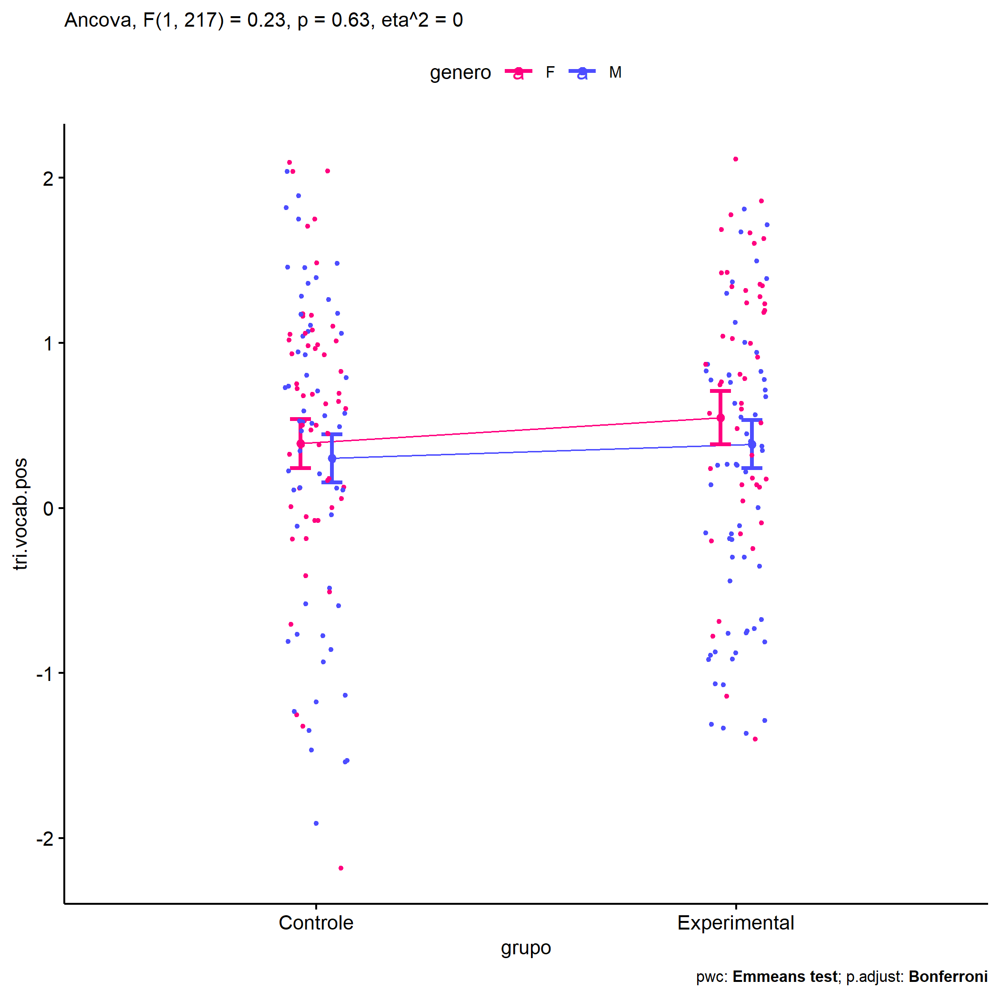<!-- -->

    ## Scale for colour is already present.
    ## Adding another scale for colour, which will replace the existing scale.

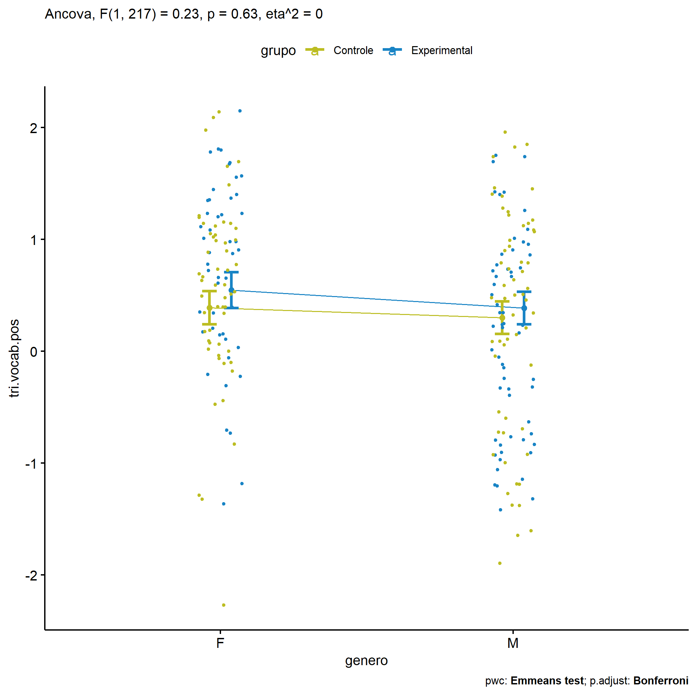<!-- -->

<!-- -->

<!-- -->

### Vocabulario Ensinado (Acertos)

| var                      | genero | grupo        |   n | M (pre) | SE (pre) | M (unadj) | SE (unadj) | M (adj) | SE (adj) |
|:-------------------------|:-------|:-------------|----:|--------:|---------:|----------:|-----------:|--------:|---------:|
| score.vocab.ensinado.pos | F      | Controle     |  61 |   4.508 |    0.322 |     4.705 |      0.286 |   4.617 |    0.273 |
| score.vocab.ensinado.pos | F      | Experimental |  54 |   4.704 |    0.312 |     4.741 |      0.343 |   4.573 |    0.291 |
| score.vocab.ensinado.pos | M      | Controle     |  65 |   4.169 |    0.283 |     3.954 |      0.277 |   4.004 |    0.264 |
| score.vocab.ensinado.pos | M      | Experimental |  66 |   3.879 |    0.242 |     4.045 |      0.284 |   4.214 |    0.263 |

| grupo        | genero | group1   | group2       | estimate | conf.low | conf.high |    se | statistic |     p | p.adj | p.adj.signif |
|:-------------|:-------|:---------|:-------------|---------:|---------:|----------:|------:|----------:|------:|------:|:-------------|
| Controle     |        | F        | M            |    0.613 |   -0.136 |     1.361 | 0.380 |     1.613 | 0.108 | 0.108 | ns           |
| Experimental |        | F        | M            |    0.359 |   -0.417 |     1.134 | 0.394 |     0.911 | 0.363 | 0.363 | ns           |
| Controle     |        | F        | M            |    0.339 |   -0.457 |     1.135 | 0.404 |     0.839 | 0.402 | 0.402 | ns           |
| Experimental |        | F        | M            |    0.825 |    0.006 |     1.644 | 0.416 |     1.984 | 0.048 | 0.048 | \*           |
|              | F      | Controle | Experimental |    0.044 |   -0.740 |     0.828 | 0.398 |     0.110 | 0.912 | 0.912 | ns           |
|              | M      | Controle | Experimental |   -0.210 |   -0.944 |     0.523 | 0.372 |    -0.564 | 0.573 | 0.573 | ns           |
|              | F      | Controle | Experimental |   -0.196 |   -1.030 |     0.639 | 0.423 |    -0.462 | 0.645 | 0.645 | ns           |
|              | M      | Controle | Experimental |    0.290 |   -0.490 |     1.070 | 0.396 |     0.733 | 0.464 | 0.464 | ns           |

| grupo        | genero | group1 | group2 | estimate | conf.low | conf.high |    se | statistic |     p | p.adj | p.adj.signif |
|:-------------|:-------|:-------|:-------|---------:|---------:|----------:|------:|----------:|------:|------:|:-------------|
| Controle     | F      | pre    | pos    |   -0.197 |   -1.012 |     0.619 | 0.415 |    -0.474 | 0.636 | 0.636 | ns           |
| Controle     | M      | pre    | pos    |    0.215 |   -0.574 |     1.005 | 0.402 |     0.536 | 0.592 | 0.592 | ns           |
| Experimental | F      | pre    | pos    |   -0.037 |   -0.904 |     0.829 | 0.441 |    -0.084 | 0.933 | 0.933 | ns           |
| Experimental | M      | pre    | pos    |   -0.167 |   -0.950 |     0.617 | 0.399 |    -0.418 | 0.676 | 0.676 | ns           |

    ## Scale for colour is already present.
    ## Adding another scale for colour, which will replace the existing scale.

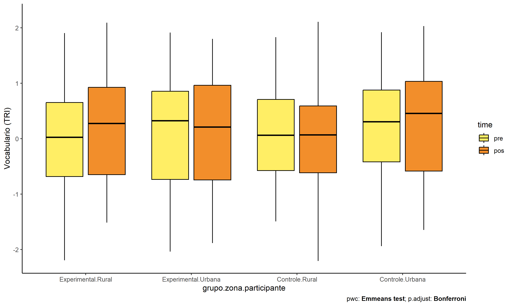<!-- -->

    ## Scale for colour is already present.
    ## Adding another scale for colour, which will replace the existing scale.

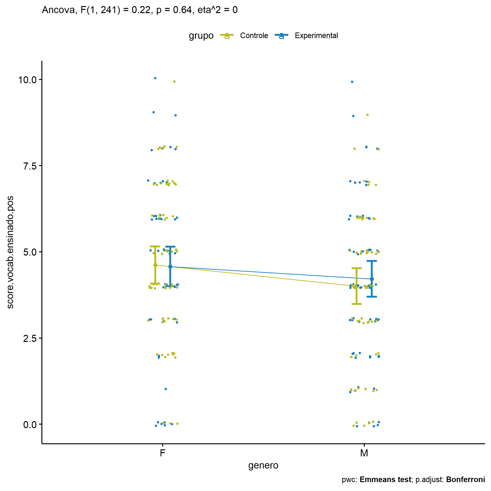<!-- -->

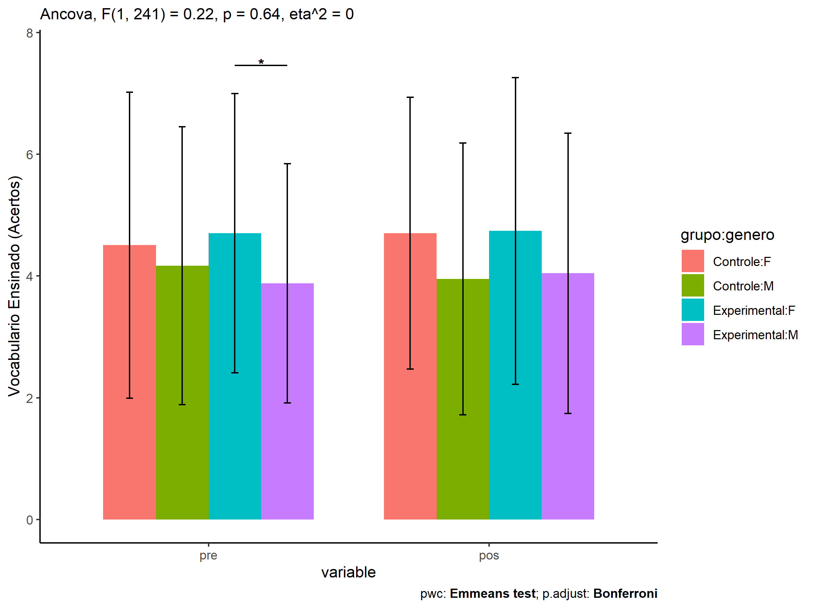<!-- -->

<!-- -->

<!-- -->

### Vocabulario Ensinado (TRI)

| var                    | genero | grupo        |   n | M (pre) | SE (pre) | M (unadj) | SE (unadj) | M (adj) | SE (adj) |
|:-----------------------|:-------|:-------------|----:|--------:|---------:|----------:|-----------:|--------:|---------:|
| tri.vocab.ensinado.pos | F      | Controle     |  56 |   0.373 |    0.110 |     0.409 |      0.095 |   0.322 |    0.083 |
| tri.vocab.ensinado.pos | F      | Experimental |  48 |   0.399 |    0.103 |     0.563 |      0.095 |   0.462 |    0.090 |
| tri.vocab.ensinado.pos | M      | Controle     |  58 |   0.185 |    0.095 |     0.189 |      0.104 |   0.204 |    0.081 |
| tri.vocab.ensinado.pos | M      | Experimental |  60 |  -0.061 |    0.095 |     0.046 |      0.101 |   0.195 |    0.081 |

| grupo        | genero | group1   | group2       | estimate | conf.low | conf.high |    se | statistic |     p | p.adj | p.adj.signif |
|:-------------|:-------|:---------|:-------------|---------:|---------:|----------:|------:|----------:|------:|------:|:-------------|
| Controle     |        | F        | M            |    0.118 |   -0.112 |     0.347 | 0.116 |     1.012 | 0.313 | 0.313 | ns           |
| Experimental |        | F        | M            |    0.267 |    0.025 |     0.508 | 0.123 |     2.174 | 0.031 | 0.031 | \*           |
| Controle     |        | F        | M            |    0.187 |   -0.090 |     0.464 | 0.140 |     1.333 | 0.184 | 0.184 | ns           |
| Experimental |        | F        | M            |    0.460 |    0.174 |     0.746 | 0.145 |     3.169 | 0.002 | 0.002 | \*\*         |
|              | F      | Controle | Experimental |   -0.140 |   -0.380 |     0.100 | 0.122 |    -1.148 | 0.252 | 0.252 | ns           |
|              | M      | Controle | Experimental |    0.009 |   -0.217 |     0.235 | 0.115 |     0.078 | 0.938 | 0.938 | ns           |
|              | F      | Controle | Experimental |   -0.027 |   -0.317 |     0.264 | 0.147 |    -0.180 | 0.857 | 0.857 | ns           |
|              | M      | Controle | Experimental |    0.246 |   -0.026 |     0.518 | 0.138 |     1.784 | 0.076 | 0.076 | ns           |

| grupo        | genero | group1 | group2 | estimate | conf.low | conf.high |    se | statistic |     p | p.adj | p.adj.signif |
|:-------------|:-------|:-------|:-------|---------:|---------:|----------:|------:|----------:|------:|------:|:-------------|
| Controle     | F      | pre    | pos    |   -0.066 |   -0.336 |     0.204 | 0.137 |    -0.482 | 0.630 | 0.630 | ns           |
| Controle     | M      | pre    | pos    |    0.014 |   -0.252 |     0.279 | 0.135 |     0.102 | 0.919 | 0.919 | ns           |
| Experimental | F      | pre    | pos    |   -0.176 |   -0.467 |     0.115 | 0.148 |    -1.191 | 0.234 | 0.234 | ns           |
| Experimental | M      | pre    | pos    |   -0.097 |   -0.357 |     0.163 | 0.132 |    -0.732 | 0.464 | 0.464 | ns           |

    ## Scale for colour is already present.
    ## Adding another scale for colour, which will replace the existing scale.

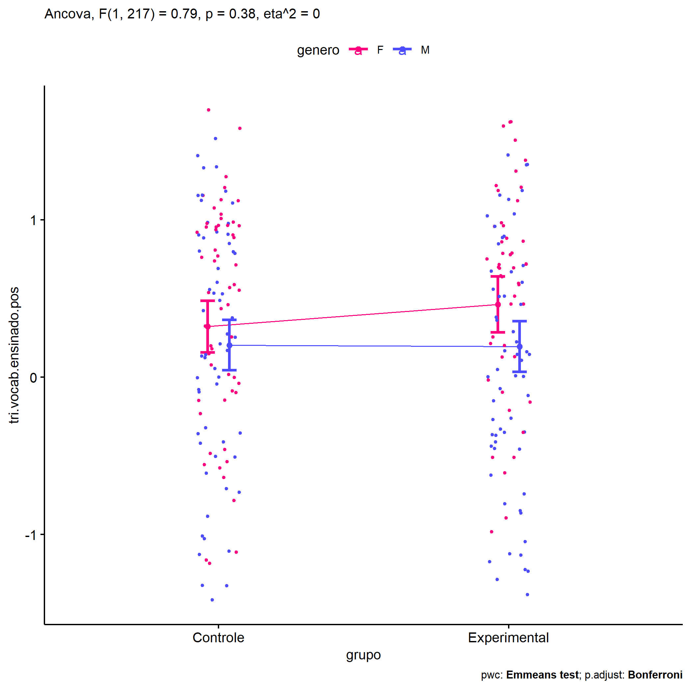<!-- -->

    ## Scale for colour is already present.
    ## Adding another scale for colour, which will replace the existing scale.

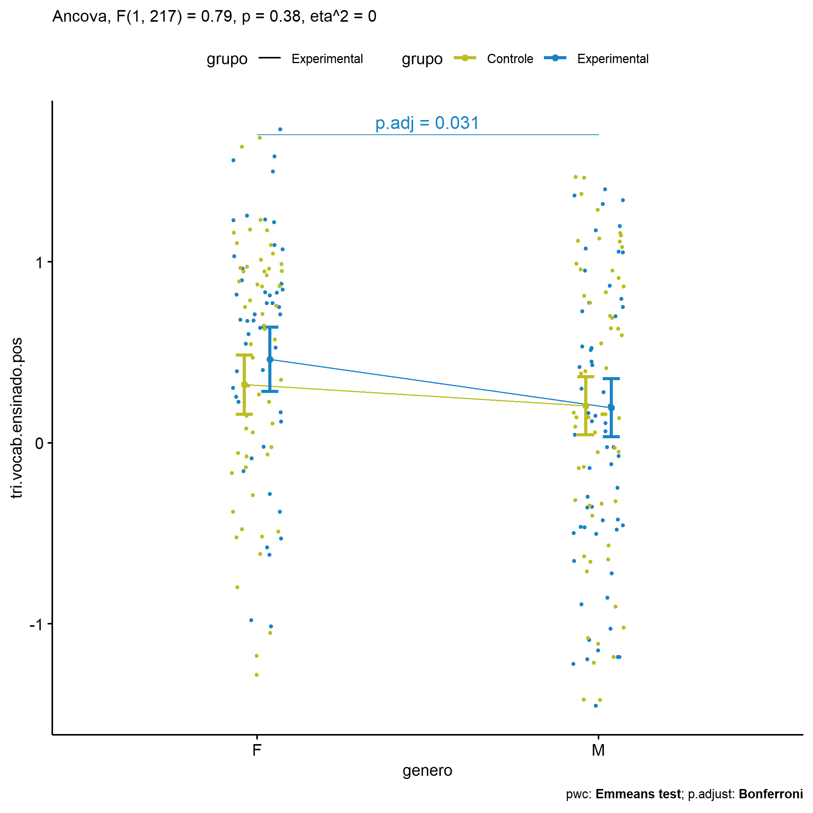<!-- -->

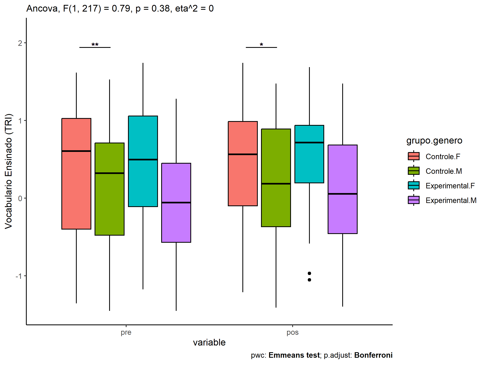<!-- -->

<!-- -->

### Vocabulario Nao Ensinado (Acertos)

| var                          | genero | grupo        |   n | M (pre) | SE (pre) | M (unadj) | SE (unadj) | M (adj) | SE (adj) |
|:-----------------------------|:-------|:-------------|----:|--------:|---------:|----------:|-----------:|--------:|---------:|
| score.vocab.nao.ensinado.pos | F      | Controle     |  61 |  19.262 |    0.877 |    19.541 |      0.903 |  18.862 |    0.872 |
| score.vocab.nao.ensinado.pos | F      | Experimental |  54 |  19.574 |    0.963 |    19.463 |      1.259 |  18.589 |    0.928 |
| score.vocab.nao.ensinado.pos | M      | Controle     |  65 |  17.462 |    0.966 |    17.215 |      1.065 |  17.661 |    0.843 |
| score.vocab.nao.ensinado.pos | M      | Experimental |  66 |  16.727 |    0.849 |    16.530 |      0.932 |  17.434 |    0.840 |

| grupo        | genero | group1   | group2       | estimate | conf.low | conf.high |    se | statistic |     p | p.adj | p.adj.signif |
|:-------------|:-------|:---------|:-------------|---------:|---------:|----------:|------:|----------:|------:|------:|:-------------|
| Controle     |        | F        | M            |    1.201 |   -1.193 |     3.595 | 1.215 |     0.988 | 0.324 | 0.324 | ns           |
| Experimental |        | F        | M            |    1.155 |   -1.322 |     3.633 | 1.258 |     0.918 | 0.359 | 0.359 | ns           |
| Controle     |        | F        | M            |    1.801 |   -0.718 |     4.319 | 1.279 |     1.408 | 0.160 | 0.160 | ns           |
| Experimental |        | F        | M            |    2.847 |    0.254 |     5.439 | 1.316 |     2.163 | 0.032 | 0.032 | \*           |
|              | F      | Controle | Experimental |    0.273 |   -2.227 |     2.772 | 1.269 |     0.215 | 0.830 | 0.830 | ns           |
|              | M      | Controle | Experimental |    0.227 |   -2.112 |     2.565 | 1.187 |     0.191 | 0.849 | 0.849 | ns           |
|              | F      | Controle | Experimental |   -0.312 |   -2.952 |     2.328 | 1.340 |    -0.233 | 0.816 | 0.816 | ns           |
|              | M      | Controle | Experimental |    0.734 |   -1.734 |     3.203 | 1.253 |     0.586 | 0.559 | 0.559 | ns           |

| grupo        | genero | group1 | group2 | estimate | conf.low | conf.high |    se | statistic |     p | p.adj | p.adj.signif |
|:-------------|:-------|:-------|:-------|---------:|---------:|----------:|------:|----------:|------:|------:|:-------------|
| Controle     | F      | pre    | pos    |   -0.279 |   -3.005 |     2.447 | 1.387 |    -0.201 | 0.841 | 0.841 | ns           |
| Controle     | M      | pre    | pos    |    0.246 |   -2.394 |     2.887 | 1.344 |     0.183 | 0.855 | 0.855 | ns           |
| Experimental | F      | pre    | pos    |    0.111 |   -2.786 |     3.008 | 1.474 |     0.075 | 0.940 | 0.940 | ns           |
| Experimental | M      | pre    | pos    |    0.197 |   -2.424 |     2.818 | 1.334 |     0.148 | 0.883 | 0.883 | ns           |

    ## Scale for colour is already present.
    ## Adding another scale for colour, which will replace the existing scale.

<!-- -->

    ## Scale for colour is already present.
    ## Adding another scale for colour, which will replace the existing scale.

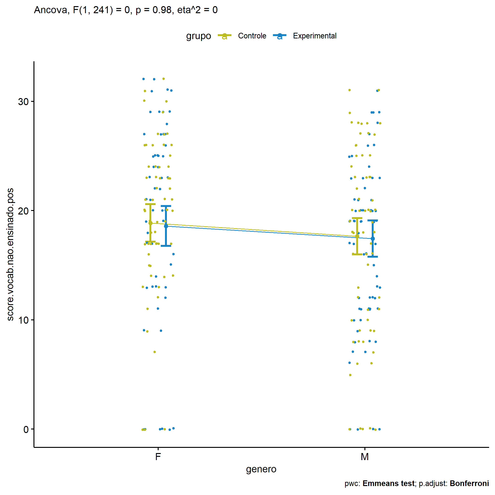<!-- -->

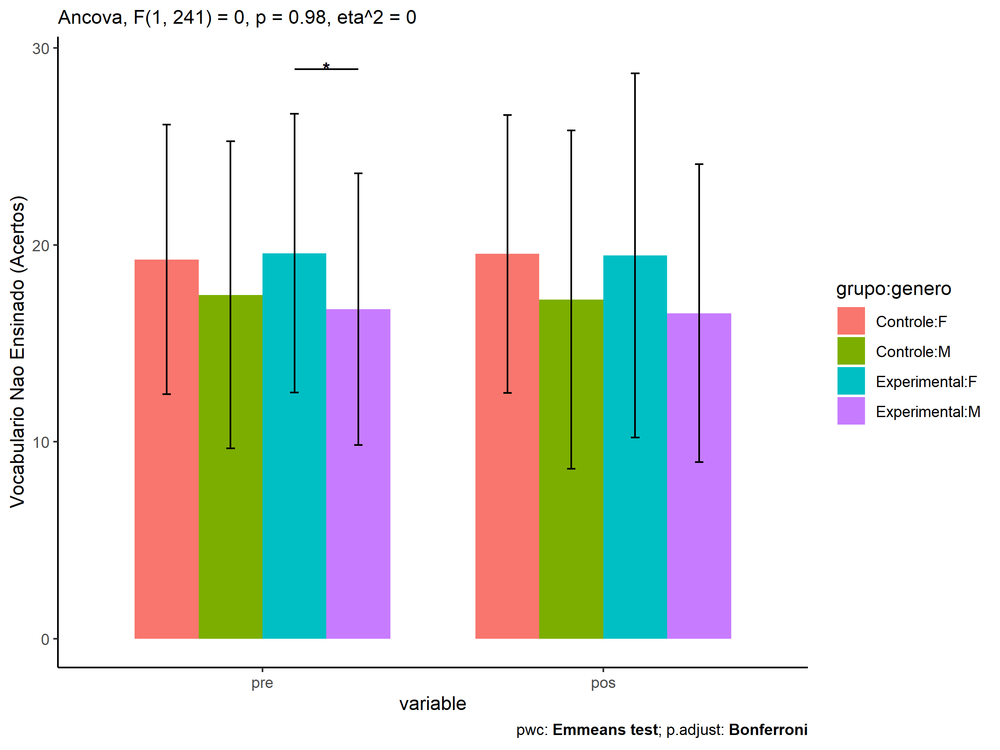<!-- -->

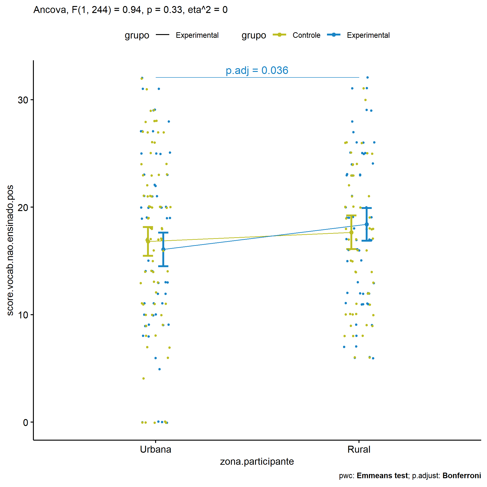<!-- -->

<!-- -->

### Vocabulario Nao Ensinado (TRI)

| var                        | genero | grupo        |   n | M (pre) | SE (pre) | M (unadj) | SE (unadj) | M (adj) | SE (adj) |
|:---------------------------|:-------|:-------------|----:|--------:|---------:|----------:|-----------:|--------:|---------:|
| tri.vocab.nao.ensinado.pos | F      | Controle     |  56 |   0.469 |    0.096 |     0.544 |      0.109 |   0.408 |    0.081 |
| tri.vocab.nao.ensinado.pos | F      | Experimental |  48 |   0.516 |    0.118 |     0.747 |      0.137 |   0.573 |    0.087 |
| tri.vocab.nao.ensinado.pos | M      | Controle     |  58 |   0.286 |    0.121 |     0.331 |      0.130 |   0.346 |    0.079 |
| tri.vocab.nao.ensinado.pos | M      | Experimental |  60 |  -0.001 |    0.110 |     0.081 |      0.114 |   0.333 |    0.079 |

| grupo        | genero | group1   | group2       | estimate | conf.low | conf.high |    se | statistic |     p | p.adj | p.adj.signif |
|:-------------|:-------|:---------|:-------------|---------:|---------:|----------:|------:|----------:|------:|------:|:-------------|
| Controle     |        | F        | M            |    0.062 |   -0.160 |     0.284 | 0.113 |     0.550 | 0.583 | 0.583 | ns           |
| Experimental |        | F        | M            |    0.239 |    0.005 |     0.474 | 0.119 |     2.013 | 0.045 | 0.045 | \*           |
| Controle     |        | F        | M            |    0.183 |   -0.124 |     0.490 | 0.156 |     1.175 | 0.241 | 0.241 | ns           |
| Experimental |        | F        | M            |    0.516 |    0.199 |     0.834 | 0.161 |     3.204 | 0.002 | 0.002 | \*\*         |
|              | F      | Controle | Experimental |   -0.165 |   -0.397 |     0.068 | 0.118 |    -1.396 | 0.164 | 0.164 | ns           |
|              | M      | Controle | Experimental |    0.013 |   -0.207 |     0.232 | 0.111 |     0.113 | 0.910 | 0.910 | ns           |
|              | F      | Controle | Experimental |   -0.047 |   -0.369 |     0.276 | 0.164 |    -0.285 | 0.776 | 0.776 | ns           |
|              | M      | Controle | Experimental |    0.287 |   -0.015 |     0.588 | 0.153 |     1.870 | 0.063 | 0.063 | ns           |

| grupo        | genero | group1 | group2 | estimate | conf.low | conf.high |    se | statistic |     p | p.adj | p.adj.signif |
|:-------------|:-------|:-------|:-------|---------:|---------:|----------:|------:|----------:|------:|------:|:-------------|
| Controle     | F      | pre    | pos    |   -0.093 |   -0.410 |     0.225 | 0.161 |    -0.574 | 0.566 | 0.566 | ns           |
| Controle     | M      | pre    | pos    |   -0.012 |   -0.324 |     0.300 | 0.159 |    -0.075 | 0.940 | 0.940 | ns           |
| Experimental | F      | pre    | pos    |   -0.265 |   -0.607 |     0.077 | 0.174 |    -1.523 | 0.128 | 0.128 | ns           |
| Experimental | M      | pre    | pos    |   -0.075 |   -0.380 |     0.231 | 0.156 |    -0.479 | 0.632 | 0.632 | ns           |

    ## Scale for colour is already present.
    ## Adding another scale for colour, which will replace the existing scale.

<!-- -->

    ## Scale for colour is already present.
    ## Adding another scale for colour, which will replace the existing scale.

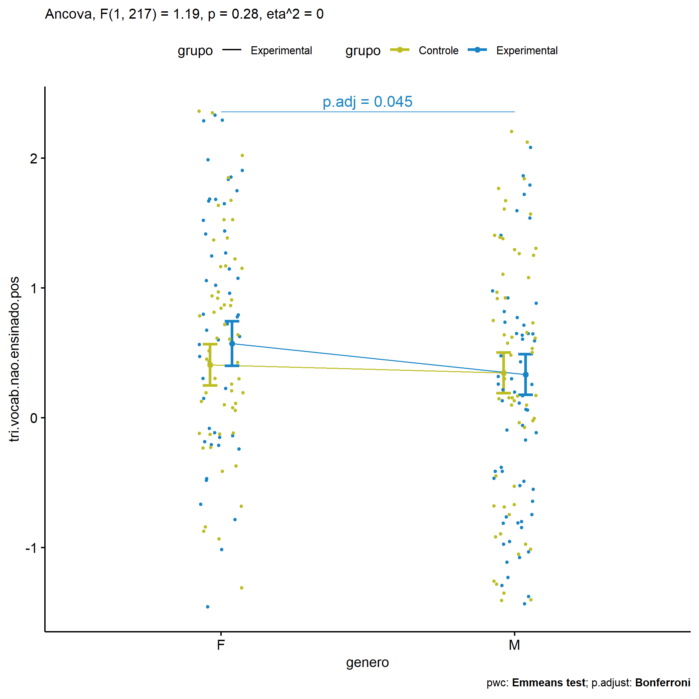<!-- -->

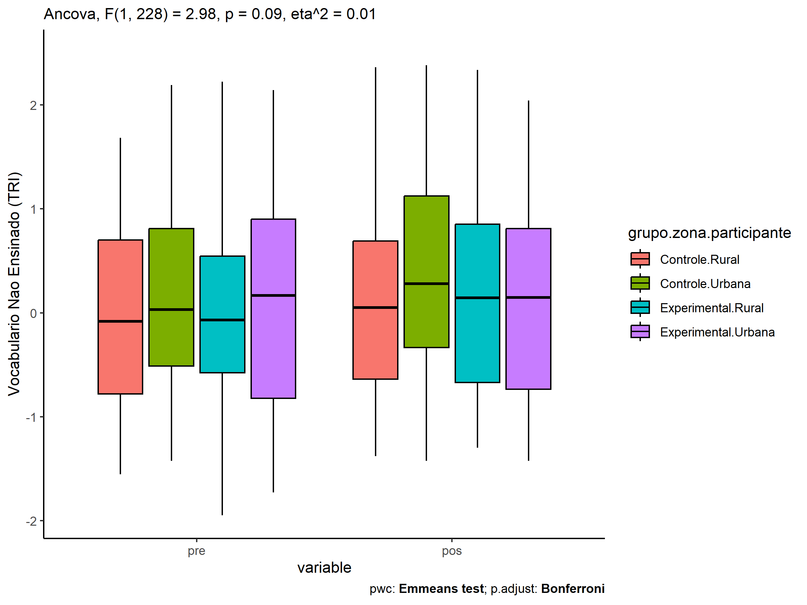<!-- -->

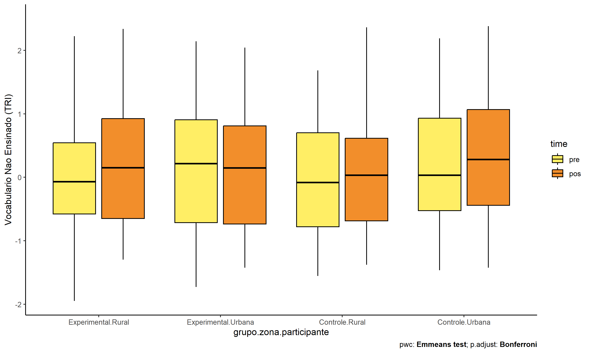<!-- -->

## factores: **idade:grupo**

### Vocabulario (Acertos)

| var             | idade | grupo        |   n | M (pre) | SE (pre) | M (unadj) | SE (unadj) | M (adj) | SE (adj) |
|:----------------|:------|:-------------|----:|--------:|---------:|----------:|-----------:|--------:|---------:|
| score.vocab.pos | 10y   | Controle     |  20 |  25.750 |    1.717 |    23.500 |      1.859 |  22.000 |    1.163 |
| score.vocab.pos | 10y   | Experimental |  22 |  21.364 |    1.520 |    22.500 |      1.180 |  24.243 |    1.111 |
| score.vocab.pos | 11y   | Controle     |  63 |  24.746 |    0.983 |    26.317 |      0.922 |  25.560 |    0.655 |
| score.vocab.pos | 11y   | Experimental |  69 |  23.638 |    0.999 |    25.159 |      1.038 |  25.221 |    0.624 |
| score.vocab.pos | 12y   | Controle     |  18 |  21.444 |    1.931 |    20.222 |      1.945 |  21.906 |    1.227 |
| score.vocab.pos | 12y   | Experimental |  11 |  23.000 |    2.754 |    26.000 |      2.639 |  26.533 |    1.564 |
| score.vocab.pos | 13y   | Controle     |   5 |  24.000 |    1.817 |    23.600 |      1.720 |  23.394 |    2.319 |

|     | grupo        | idade | group1   | group2       | estimate | conf.low | conf.high |    se | statistic |     p | p.adj | p.adj.signif |
|:----|:-------------|:------|:---------|:-------------|---------:|---------:|----------:|------:|----------:|------:|------:|:-------------|
| 1   | Controle     |       | 10y      | 11y          |   -3.560 |   -6.186 |    -0.934 | 1.332 |    -2.673 | 0.008 | 0.049 | \*           |
| 2   | Controle     |       | 10y      | 12y          |    0.094 |   -3.250 |     3.439 | 1.696 |     0.056 | 0.956 | 1.000 | ns           |
| 3   | Controle     |       | 10y      | 13y          |   -1.394 |   -6.509 |     3.721 | 2.594 |    -0.537 | 0.592 | 1.000 | ns           |
| 4   | Controle     |       | 11y      | 12y          |    3.654 |    0.905 |     6.403 | 1.394 |     2.621 | 0.009 | 0.057 | ns           |
| 5   | Controle     |       | 11y      | 13y          |    2.166 |   -2.585 |     6.917 | 2.409 |     0.899 | 0.370 | 1.000 | ns           |
| 6   | Controle     |       | 12y      | 13y          |   -1.488 |   -6.662 |     3.686 | 2.624 |    -0.567 | 0.571 | 1.000 | ns           |
| 7   | Experimental |       | 10y      | 11y          |   -0.978 |   -3.490 |     1.534 | 1.274 |    -0.768 | 0.444 | 1.000 | ns           |
| 8   | Experimental |       | 10y      | 12y          |   -2.290 |   -6.069 |     1.489 | 1.916 |    -1.195 | 0.233 | 0.700 | ns           |
| 10  | Experimental |       | 11y      | 12y          |   -1.312 |   -4.632 |     2.008 | 1.684 |    -0.779 | 0.437 | 1.000 | ns           |
| 13  | Controle     |       | 10y      | 11y          |    1.004 |   -3.016 |     5.024 | 2.039 |     0.492 | 0.623 | 1.000 | ns           |
| 14  | Controle     |       | 10y      | 12y          |    4.306 |   -0.784 |     9.395 | 2.581 |     1.668 | 0.097 | 0.581 | ns           |
| 15  | Controle     |       | 10y      | 13y          |    1.750 |   -6.082 |     9.582 | 3.972 |     0.441 | 0.660 | 1.000 | ns           |
| 16  | Controle     |       | 11y      | 12y          |    3.302 |   -0.885 |     7.488 | 2.123 |     1.555 | 0.122 | 0.729 | ns           |
| 17  | Controle     |       | 11y      | 13y          |    0.746 |   -6.532 |     8.024 | 3.691 |     0.202 | 0.840 | 1.000 | ns           |
| 18  | Controle     |       | 12y      | 13y          |   -2.556 |  -10.474 |     5.363 | 4.016 |    -0.636 | 0.525 | 1.000 | ns           |
| 19  | Experimental |       | 10y      | 11y          |   -2.274 |   -6.109 |     1.561 | 1.945 |    -1.169 | 0.244 | 0.731 | ns           |
| 20  | Experimental |       | 10y      | 12y          |   -1.636 |   -7.421 |     4.148 | 2.934 |    -0.558 | 0.578 | 1.000 | ns           |
| 22  | Experimental |       | 11y      | 12y          |    0.638 |   -4.448 |     5.723 | 2.579 |     0.247 | 0.805 | 1.000 | ns           |
| 25  |              | 10y   | Controle | Experimental |   -2.243 |   -5.427 |     0.941 | 1.615 |    -1.389 | 0.166 | 0.166 | ns           |
| 26  |              | 11y   | Controle | Experimental |    0.339 |   -1.446 |     2.123 | 0.905 |     0.374 | 0.709 | 0.709 | ns           |
| 27  |              | 12y   | Controle | Experimental |   -4.628 |   -8.543 |    -0.712 | 1.986 |    -2.330 | 0.021 | 0.021 | \*           |
| 29  |              | 10y   | Controle | Experimental |    4.386 |   -0.453 |     9.226 | 2.454 |     1.787 | 0.075 | 0.075 | ns           |
| 30  |              | 11y   | Controle | Experimental |    1.108 |   -1.621 |     3.838 | 1.384 |     0.801 | 0.424 | 0.424 | ns           |
| 31  |              | 12y   | Controle | Experimental |   -1.556 |   -7.551 |     4.439 | 3.040 |    -0.512 | 0.609 | 0.609 | ns           |

| grupo        | idade | group1 | group2 | estimate | conf.low | conf.high |    se | statistic |     p | p.adj | p.adj.signif |
|:-------------|:------|:-------|:-------|---------:|---------:|----------:|------:|----------:|------:|------:|:-------------|
| Controle     | 10y   | pre    | pos    |    1.329 |   -3.403 |     6.061 | 2.408 |     0.552 | 0.581 | 0.581 | ns           |
| Controle     | 11y   | pre    | pos    |   -1.517 |   -4.260 |     1.225 | 1.395 |    -1.088 | 0.277 | 0.277 | ns           |
| Controle     | 12y   | pre    | pos    |    0.778 |   -4.262 |     5.818 | 2.564 |     0.303 | 0.762 | 0.762 | ns           |
| Controle     | 13y   | pre    | pos    |    2.500 |   -6.893 |    11.893 | 4.779 |     0.523 | 0.601 | 0.601 | ns           |
| Experimental | 10y   | pre    | pos    |   -1.136 |   -5.814 |     3.541 | 2.379 |    -0.478 | 0.633 | 0.633 | ns           |
| Experimental | 11y   | pre    | pos    |   -1.454 |   -4.067 |     1.158 | 1.329 |    -1.094 | 0.275 | 0.275 | ns           |
| Experimental | 12y   | pre    | pos    |   -2.500 |   -8.750 |     3.750 | 3.180 |    -0.786 | 0.432 | 0.432 | ns           |

    ## Scale for colour is already present.
    ## Adding another scale for colour, which will replace the existing scale.

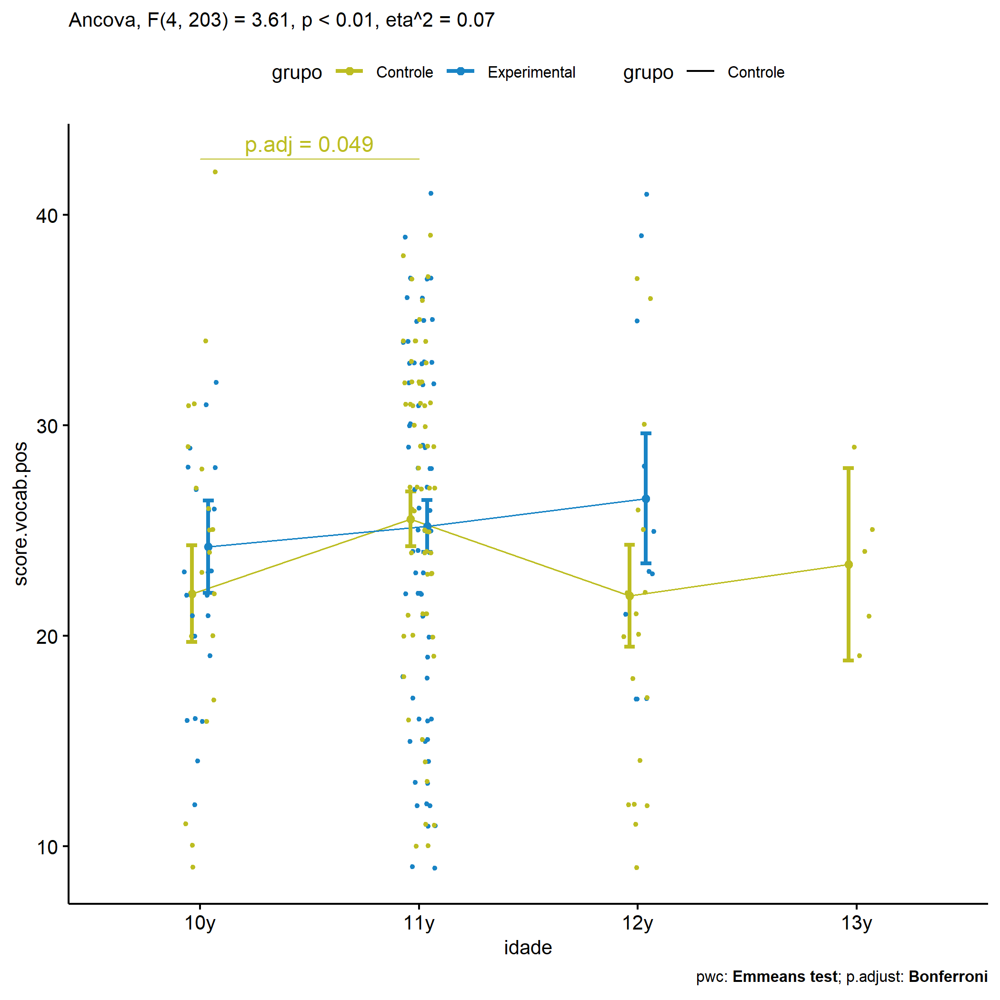<!-- -->

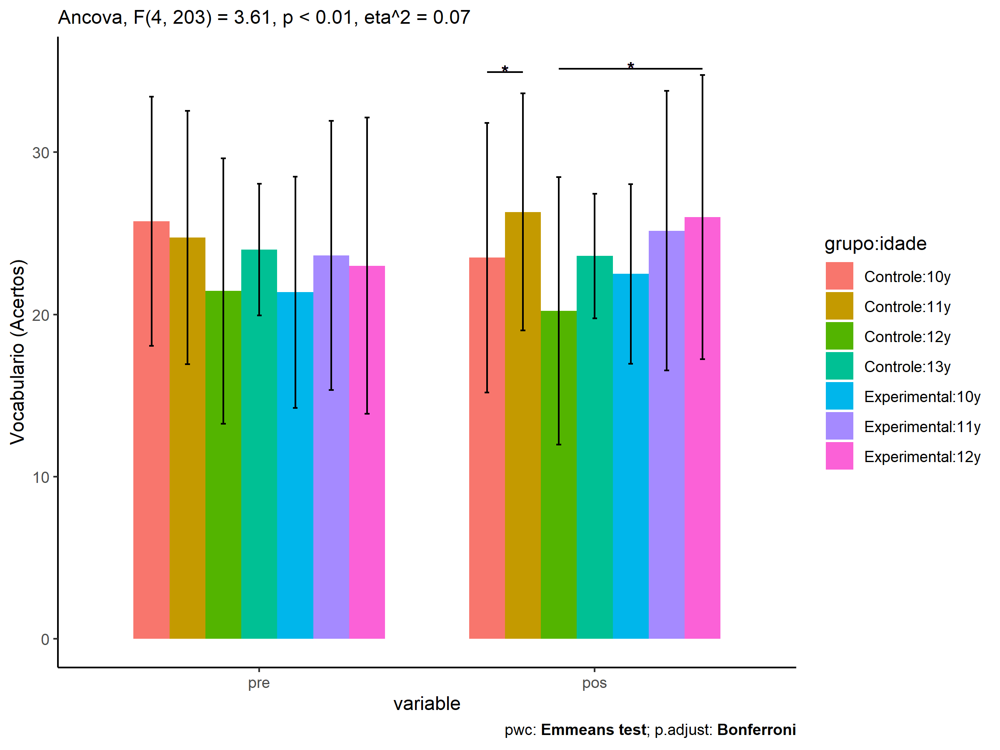<!-- -->

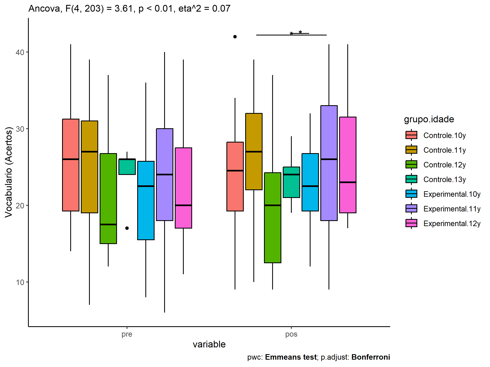<!-- -->

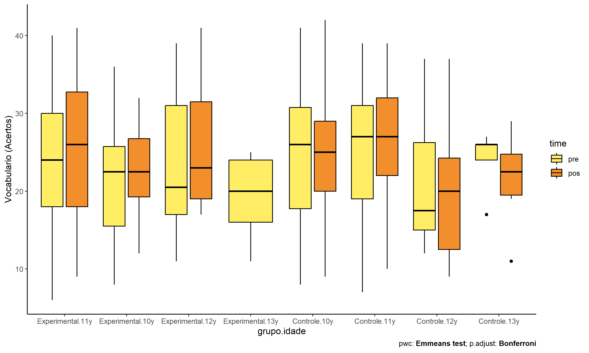<!-- -->

### Vocabulario (TRI)

| var           | idade | grupo        |   n | M (pre) | SE (pre) | M (unadj) | SE (unadj) | M (adj) | SE (adj) |
|:--------------|:------|:-------------|----:|--------:|---------:|----------:|-----------:|--------:|---------:|
| tri.vocab.pos | 10y   | Controle     |  20 |   0.503 |    0.174 |     0.332 |      0.221 |   0.209 |    0.121 |
| tri.vocab.pos | 10y   | Experimental |  22 |   0.152 |    0.182 |     0.264 |      0.132 |   0.420 |    0.115 |
| tri.vocab.pos | 11y   | Controle     |  63 |   0.503 |    0.095 |     0.646 |      0.104 |   0.524 |    0.068 |
| tri.vocab.pos | 11y   | Experimental |  69 |   0.315 |    0.106 |     0.493 |      0.107 |   0.519 |    0.065 |
| tri.vocab.pos | 12y   | Controle     |  18 |   0.089 |    0.201 |    -0.070 |      0.218 |   0.135 |    0.128 |
| tri.vocab.pos | 12y   | Experimental |  11 |   0.217 |    0.346 |     0.601 |      0.287 |   0.705 |    0.163 |
| tri.vocab.pos | 13y   | Controle     |   5 |   0.321 |    0.240 |     0.458 |      0.177 |   0.480 |    0.241 |

|     | grupo        | idade | group1   | group2       | estimate | conf.low | conf.high |    se | statistic |     p | p.adj | p.adj.signif |
|:----|:-------------|:------|:---------|:-------------|---------:|---------:|----------:|------:|----------:|------:|------:|:-------------|
| 1   | Controle     |       | 10y      | 11y          |   -0.315 |   -0.587 |    -0.042 | 0.138 |    -2.274 | 0.024 | 0.144 | ns           |
| 2   | Controle     |       | 10y      | 12y          |    0.075 |   -0.273 |     0.422 | 0.176 |     0.424 | 0.672 | 1.000 | ns           |
| 3   | Controle     |       | 10y      | 13y          |   -0.271 |   -0.802 |     0.261 | 0.270 |    -1.003 | 0.317 | 1.000 | ns           |
| 4   | Controle     |       | 11y      | 12y          |    0.389 |    0.103 |     0.676 | 0.145 |     2.679 | 0.008 | 0.048 | \*           |
| 5   | Controle     |       | 11y      | 13y          |    0.044 |   -0.450 |     0.538 | 0.251 |     0.176 | 0.861 | 1.000 | ns           |
| 6   | Controle     |       | 12y      | 13y          |   -0.345 |   -0.883 |     0.193 | 0.273 |    -1.266 | 0.207 | 1.000 | ns           |
| 7   | Experimental |       | 10y      | 11y          |   -0.099 |   -0.359 |     0.162 | 0.132 |    -0.748 | 0.456 | 1.000 | ns           |
| 8   | Experimental |       | 10y      | 12y          |   -0.285 |   -0.678 |     0.107 | 0.199 |    -1.434 | 0.153 | 0.460 | ns           |
| 10  | Experimental |       | 11y      | 12y          |   -0.187 |   -0.532 |     0.159 | 0.175 |    -1.066 | 0.288 | 0.863 | ns           |
| 13  | Controle     |       | 10y      | 11y          |    0.000 |   -0.425 |     0.425 | 0.215 |     0.000 | 1.000 | 1.000 | ns           |
| 14  | Controle     |       | 10y      | 12y          |    0.414 |   -0.123 |     0.952 | 0.273 |     1.519 | 0.130 | 0.782 | ns           |
| 15  | Controle     |       | 10y      | 13y          |    0.182 |   -0.645 |     1.009 | 0.420 |     0.434 | 0.665 | 1.000 | ns           |
| 16  | Controle     |       | 11y      | 12y          |    0.414 |   -0.028 |     0.856 | 0.224 |     1.847 | 0.066 | 0.398 | ns           |
| 17  | Controle     |       | 11y      | 13y          |    0.182 |   -0.587 |     0.951 | 0.390 |     0.466 | 0.641 | 1.000 | ns           |
| 18  | Controle     |       | 12y      | 13y          |   -0.232 |   -1.069 |     0.604 | 0.424 |    -0.548 | 0.585 | 1.000 | ns           |
| 19  | Experimental |       | 10y      | 11y          |   -0.164 |   -0.569 |     0.242 | 0.205 |    -0.796 | 0.427 | 1.000 | ns           |
| 20  | Experimental |       | 10y      | 12y          |   -0.065 |   -0.676 |     0.546 | 0.310 |    -0.210 | 0.834 | 1.000 | ns           |
| 22  | Experimental |       | 11y      | 12y          |    0.099 |   -0.439 |     0.636 | 0.272 |     0.362 | 0.718 | 1.000 | ns           |
| 25  |              | 10y   | Controle | Experimental |   -0.211 |   -0.540 |     0.119 | 0.167 |    -1.258 | 0.210 | 0.210 | ns           |
| 26  |              | 11y   | Controle | Experimental |    0.005 |   -0.181 |     0.191 | 0.094 |     0.056 | 0.956 | 0.956 | ns           |
| 27  |              | 12y   | Controle | Experimental |   -0.571 |   -0.978 |    -0.164 | 0.206 |    -2.765 | 0.006 | 0.006 | \*\*         |
| 29  |              | 10y   | Controle | Experimental |    0.351 |   -0.160 |     0.863 | 0.259 |     1.355 | 0.177 | 0.177 | ns           |
| 30  |              | 11y   | Controle | Experimental |    0.188 |   -0.101 |     0.476 | 0.146 |     1.283 | 0.201 | 0.201 | ns           |
| 31  |              | 12y   | Controle | Experimental |   -0.128 |   -0.761 |     0.505 | 0.321 |    -0.398 | 0.691 | 0.691 | ns           |

| grupo        | idade | group1 | group2 | estimate | conf.low | conf.high |    se | statistic |     p | p.adj | p.adj.signif |
|:-------------|:------|:-------|:-------|---------:|---------:|----------:|------:|----------:|------:|------:|:-------------|
| Controle     | 10y   | pre    | pos    |    0.131 |   -0.377 |     0.639 | 0.258 |     0.507 | 0.612 | 0.612 | ns           |
| Controle     | 11y   | pre    | pos    |   -0.128 |   -0.422 |     0.167 | 0.150 |    -0.852 | 0.395 | 0.395 | ns           |
| Controle     | 12y   | pre    | pos    |    0.130 |   -0.411 |     0.671 | 0.275 |     0.471 | 0.638 | 0.638 | ns           |
| Controle     | 13y   | pre    | pos    |    0.114 |   -0.895 |     1.122 | 0.513 |     0.222 | 0.825 | 0.825 | ns           |
| Experimental | 10y   | pre    | pos    |   -0.113 |   -0.615 |     0.389 | 0.255 |    -0.442 | 0.659 | 0.659 | ns           |
| Experimental | 11y   | pre    | pos    |   -0.162 |   -0.442 |     0.119 | 0.143 |    -1.133 | 0.258 | 0.258 | ns           |
| Experimental | 12y   | pre    | pos    |   -0.297 |   -0.968 |     0.374 | 0.341 |    -0.871 | 0.384 | 0.384 | ns           |

    ## Scale for colour is already present.
    ## Adding another scale for colour, which will replace the existing scale.

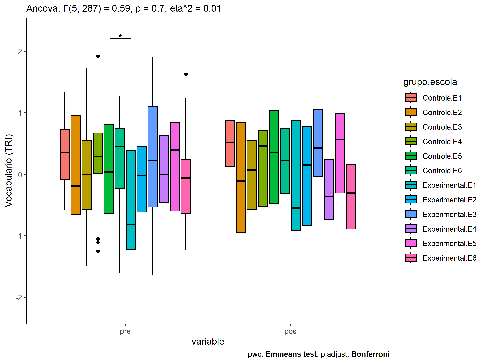<!-- -->

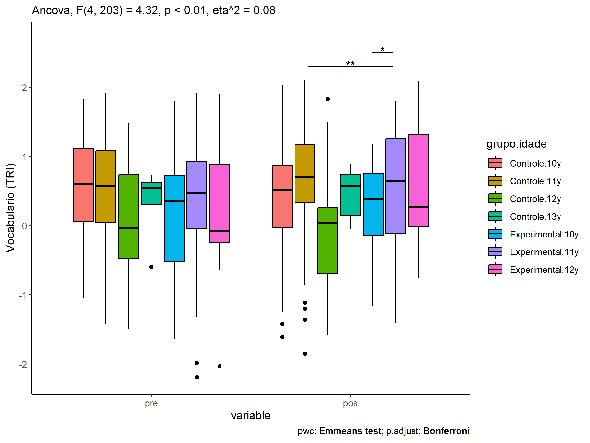<!-- -->

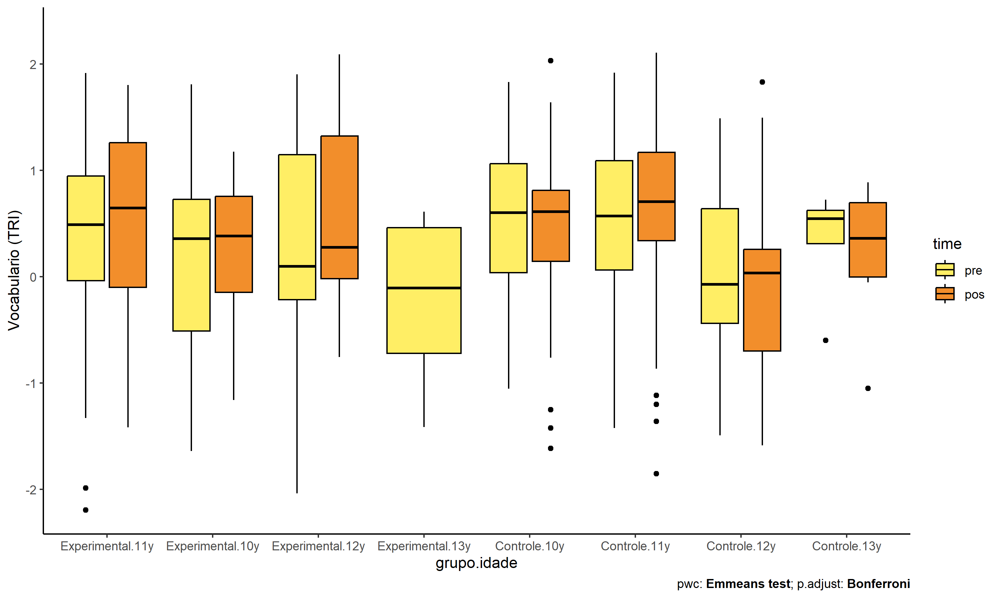<!-- -->

### Vocabulario Ensinado (Acertos)

| var                      | idade | grupo        |   n | M (pre) | SE (pre) | M (unadj) | SE (unadj) | M (adj) | SE (adj) |
|:-------------------------|:------|:-------------|----:|--------:|---------:|----------:|-----------:|--------:|---------:|
| score.vocab.ensinado.pos | 10y   | Controle     |  23 |   4.870 |    0.496 |     4.826 |      0.550 |   4.656 |    0.438 |
| score.vocab.ensinado.pos | 10y   | Experimental |  22 |   3.909 |    0.377 |     4.364 |      0.339 |   4.531 |    0.448 |
| score.vocab.ensinado.pos | 11y   | Controle     |  66 |   4.530 |    0.302 |     4.576 |      0.271 |   4.525 |    0.258 |
| score.vocab.ensinado.pos | 11y   | Experimental |  72 |   4.583 |    0.261 |     4.819 |      0.272 |   4.750 |    0.248 |
| score.vocab.ensinado.pos | 12y   | Controle     |  20 |   4.000 |    0.377 |     3.400 |      0.419 |   3.535 |    0.470 |
| score.vocab.ensinado.pos | 12y   | Experimental |  14 |   4.286 |    0.667 |     4.071 |      0.788 |   4.106 |    0.561 |
| score.vocab.ensinado.pos | 13y   | Controle     |   6 |   4.333 |    0.955 |     4.167 |      0.543 |   4.185 |    0.856 |
| score.vocab.ensinado.pos | 13y   | Experimental |   6 |   3.667 |    0.422 |     1.333 |      0.667 |   1.586 |    0.857 |
| score.vocab.ensinado.pos | 14y   | Experimental |   5 |   2.200 |    1.114 |     1.600 |      1.030 |   2.367 |    0.948 |

|     | grupo        | idade | group1   | group2       | estimate | conf.low | conf.high |    se | statistic | p       | p.adj | p.adj.signif |
|:----|:-------------|:------|:---------|:-------------|---------:|---------:|----------:|------:|----------:|:--------|------:|:-------------|
| 1   | Controle     |       | 10y      | 11y          |    0.131 |   -0.871 |     1.133 | 0.508 |     0.258 | 0.797   | 1.000 | ns           |
| 2   | Controle     |       | 10y      | 12y          |    1.121 |   -0.148 |     2.389 | 0.644 |     1.741 | 0.083   | 0.498 | ns           |
| 3   | Controle     |       | 10y      | 13y          |    0.471 |   -1.425 |     2.367 | 0.962 |     0.490 | 0.625   | 1.000 | ns           |
| 5   | Controle     |       | 11y      | 12y          |    0.989 |   -0.068 |     2.047 | 0.536 |     1.845 | 0.066   | 0.398 | ns           |
| 6   | Controle     |       | 11y      | 13y          |    0.340 |   -1.423 |     2.103 | 0.894 |     0.380 | 0.704   | 1.000 | ns           |
| 8   | Controle     |       | 12y      | 13y          |   -0.650 |   -2.574 |     1.275 | 0.977 |    -0.665 | 0.507   | 1.000 | ns           |
| 11  | Experimental |       | 10y      | 11y          |   -0.219 |   -1.229 |     0.791 | 0.513 |    -0.427 | 0.67    | 1.000 | ns           |
| 12  | Experimental |       | 10y      | 12y          |    0.425 |   -0.989 |     1.838 | 0.717 |     0.592 | 0.555   | 1.000 | ns           |
| 13  | Experimental |       | 10y      | 13y          |    2.945 |    1.041 |     4.849 | 0.966 |     3.048 | 0.003   | 0.026 | \*           |
| 14  | Experimental |       | 10y      | 14y          |    2.163 |    0.105 |     4.222 | 1.045 |     2.071 | 0.04    | 0.395 | ns           |
| 15  | Experimental |       | 11y      | 12y          |    0.643 |   -0.564 |     1.851 | 0.613 |     1.050 | 0.295   | 1.000 | ns           |
| 16  | Experimental |       | 11y      | 13y          |    3.164 |    1.404 |     4.924 | 0.893 |     3.543 | \<0.001 | 0.005 | \*\*         |
| 17  | Experimental |       | 11y      | 14y          |    2.382 |    0.448 |     4.316 | 0.981 |     2.427 | 0.016   | 0.160 | ns           |
| 18  | Experimental |       | 12y      | 13y          |    2.521 |    0.502 |     4.539 | 1.024 |     2.461 | 0.015   | 0.146 | ns           |
| 19  | Experimental |       | 12y      | 14y          |    1.739 |   -0.430 |     3.907 | 1.101 |     1.580 | 0.116   | 1.000 | ns           |
| 20  | Experimental |       | 13y      | 14y          |   -0.782 |   -3.291 |     1.727 | 1.273 |    -0.614 | 0.54    | 1.000 | ns           |
| 21  | Controle     |       | 10y      | 11y          |    0.339 |   -0.728 |     1.406 | 0.541 |     0.627 | 0.531   | 1.000 | ns           |
| 22  | Controle     |       | 10y      | 12y          |    0.870 |   -0.477 |     2.217 | 0.684 |     1.272 | 0.205   | 1.000 | ns           |
| 23  | Controle     |       | 10y      | 13y          |    0.536 |   -1.483 |     2.556 | 1.025 |     0.523 | 0.601   | 1.000 | ns           |
| 25  | Controle     |       | 11y      | 12y          |    0.530 |   -0.594 |     1.655 | 0.571 |     0.929 | 0.354   | 1.000 | ns           |
| 26  | Controle     |       | 11y      | 13y          |    0.197 |   -1.682 |     2.076 | 0.953 |     0.207 | 0.836   | 1.000 | ns           |
| 28  | Controle     |       | 12y      | 13y          |   -0.333 |   -2.384 |     1.717 | 1.041 |    -0.320 | 0.749   | 1.000 | ns           |
| 31  | Experimental |       | 10y      | 11y          |   -0.674 |   -1.747 |     0.399 | 0.545 |    -1.238 | 0.217   | 1.000 | ns           |
| 32  | Experimental |       | 10y      | 12y          |   -0.377 |   -1.883 |     1.130 | 0.764 |    -0.493 | 0.623   | 1.000 | ns           |
| 33  | Experimental |       | 10y      | 13y          |    0.242 |   -1.787 |     2.272 | 1.030 |     0.235 | 0.814   | 1.000 | ns           |
| 34  | Experimental |       | 10y      | 14y          |    1.709 |   -0.474 |     3.892 | 1.108 |     1.543 | 0.124   | 1.000 | ns           |
| 35  | Experimental |       | 11y      | 12y          |    0.298 |   -0.989 |     1.584 | 0.653 |     0.456 | 0.649   | 1.000 | ns           |
| 36  | Experimental |       | 11y      | 13y          |    0.917 |   -0.955 |     2.789 | 0.950 |     0.965 | 0.336   | 1.000 | ns           |
| 37  | Experimental |       | 11y      | 14y          |    2.383 |    0.346 |     4.421 | 1.034 |     2.305 | 0.022   | 0.221 | ns           |
| 38  | Experimental |       | 12y      | 13y          |    0.619 |   -1.531 |     2.769 | 1.091 |     0.567 | 0.571   | 1.000 | ns           |
| 39  | Experimental |       | 12y      | 14y          |    2.086 |   -0.210 |     4.381 | 1.165 |     1.791 | 0.075   | 0.747 | ns           |
| 40  | Experimental |       | 13y      | 14y          |    1.467 |   -1.201 |     4.134 | 1.354 |     1.083 | 0.28    | 1.000 | ns           |
| 41  |              | 10y   | Controle | Experimental |    0.125 |   -1.113 |     1.363 | 0.628 |     0.199 | 0.842   | 0.842 | ns           |
| 42  |              | 11y   | Controle | Experimental |   -0.225 |   -0.929 |     0.479 | 0.357 |    -0.630 | 0.53    | 0.530 | ns           |
| 43  |              | 12y   | Controle | Experimental |   -0.571 |   -2.012 |     0.870 | 0.731 |    -0.781 | 0.436   | 0.436 | ns           |
| 44  |              | 13y   | Controle | Experimental |    2.599 |    0.211 |     4.987 | 1.212 |     2.145 | 0.033   | 0.033 | \*           |
| 46  |              | 10y   | Controle | Experimental |    0.960 |   -0.353 |     2.274 | 0.667 |     1.441 | 0.151   | 0.151 | ns           |
| 47  |              | 11y   | Controle | Experimental |   -0.053 |   -0.804 |     0.698 | 0.381 |    -0.139 | 0.889   | 0.889 | ns           |
| 48  |              | 12y   | Controle | Experimental |   -0.286 |   -1.821 |     1.250 | 0.779 |    -0.367 | 0.714   | 0.714 | ns           |
| 49  |              | 13y   | Controle | Experimental |    0.667 |   -1.877 |     3.210 | 1.291 |     0.516 | 0.606   | 0.606 | ns           |

| grupo        | idade | group1 | group2 | estimate | conf.low | conf.high |    se | statistic |     p | p.adj | p.adj.signif |
|:-------------|:------|:-------|:-------|---------:|---------:|----------:|------:|----------:|------:|------:|:-------------|
| Controle     | 10y   | pre    | pos    |    0.043 |   -1.252 |     1.339 | 0.659 |     0.066 | 0.947 | 0.947 | ns           |
| Controle     | 11y   | pre    | pos    |   -0.045 |   -0.810 |     0.719 | 0.389 |    -0.117 | 0.907 | 0.907 | ns           |
| Controle     | 12y   | pre    | pos    |    0.600 |   -0.789 |     1.989 | 0.707 |     0.849 | 0.396 | 0.396 | ns           |
| Controle     | 13y   | pre    | pos    |    0.167 |   -2.370 |     2.703 | 1.291 |     0.129 | 0.897 | 0.897 | ns           |
| Experimental | 10y   | pre    | pos    |   -0.455 |   -1.779 |     0.870 | 0.674 |    -0.674 | 0.500 | 0.500 | ns           |
| Experimental | 11y   | pre    | pos    |   -0.236 |   -0.968 |     0.496 | 0.373 |    -0.634 | 0.527 | 0.527 | ns           |
| Experimental | 12y   | pre    | pos    |    0.214 |   -1.446 |     1.875 | 0.845 |     0.254 | 0.800 | 0.800 | ns           |
| Experimental | 13y   | pre    | pos    |    2.333 |   -0.203 |     4.870 | 1.291 |     1.808 | 0.071 | 0.071 | ns           |
| Experimental | 14y   | pre    | pos    |    0.600 |   -2.179 |     3.379 | 1.414 |     0.424 | 0.672 | 0.672 | ns           |

    ## Scale for colour is already present.
    ## Adding another scale for colour, which will replace the existing scale.

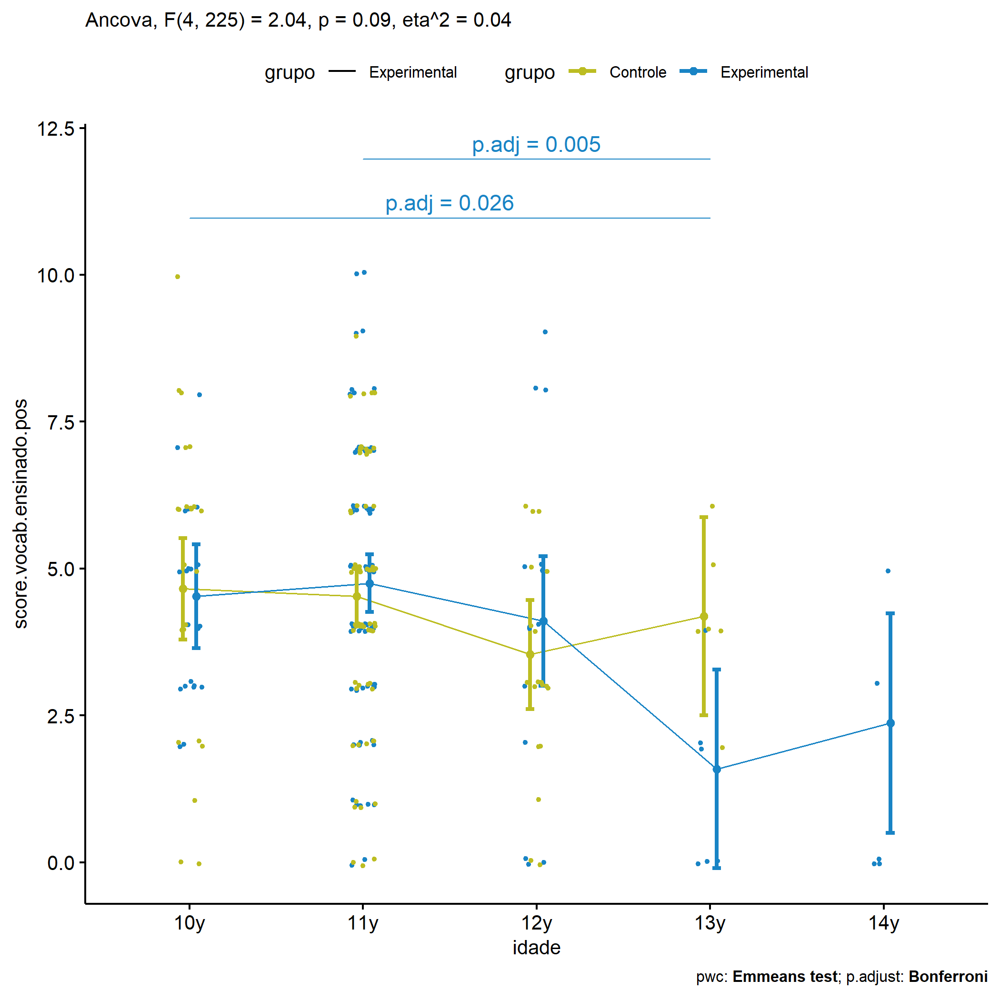<!-- -->

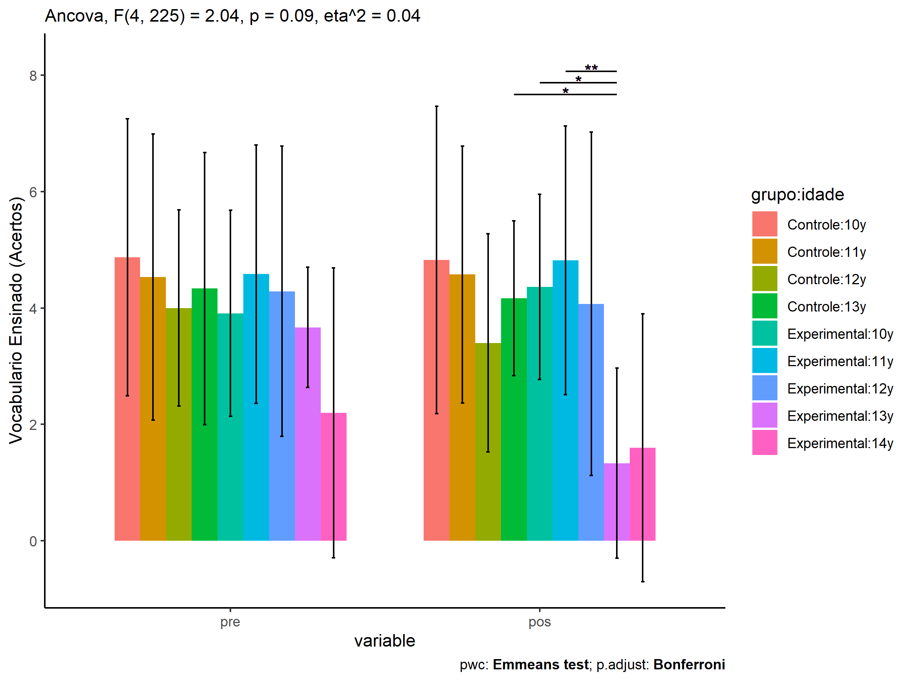<!-- -->

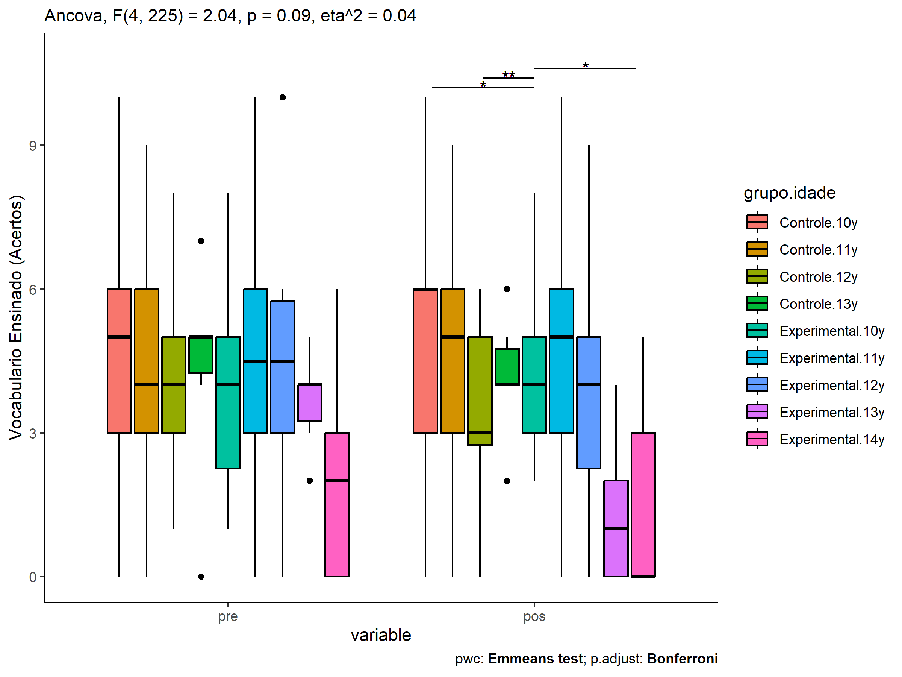<!-- -->

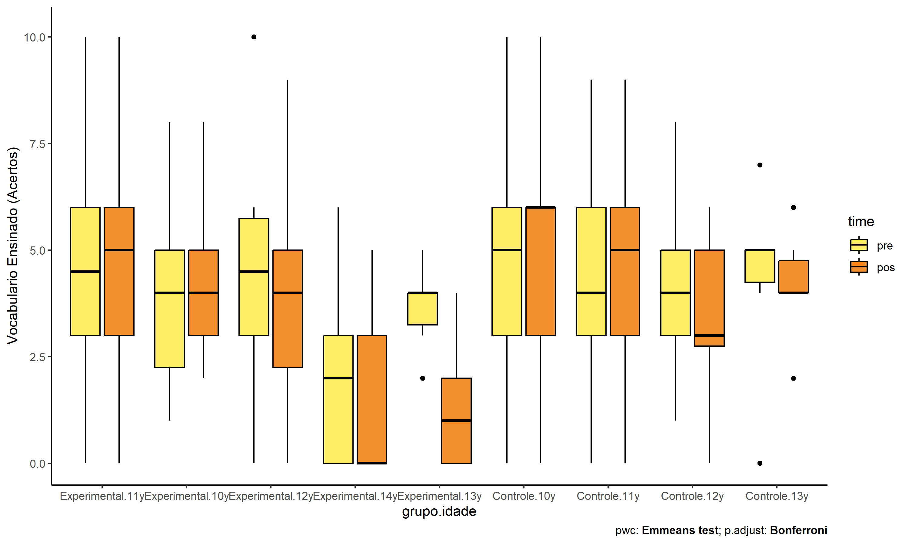<!-- -->

### Vocabulario Ensinado (TRI)

| var                    | idade | grupo        |   n | M (pre) | SE (pre) | M (unadj) | SE (unadj) | M (adj) | SE (adj) |
|:-----------------------|:------|:-------------|----:|--------:|---------:|----------:|-----------:|--------:|---------:|
| tri.vocab.ensinado.pos | 10y   | Controle     |  20 |   0.370 |    0.185 |     0.516 |      0.173 |   0.446 |    0.137 |
| tri.vocab.ensinado.pos | 10y   | Experimental |  22 |   0.062 |    0.167 |     0.247 |      0.113 |   0.343 |    0.131 |
| tri.vocab.ensinado.pos | 11y   | Controle     |  63 |   0.361 |    0.097 |     0.395 |      0.092 |   0.330 |    0.077 |
| tri.vocab.ensinado.pos | 11y   | Experimental |  69 |   0.211 |    0.084 |     0.337 |      0.095 |   0.353 |    0.074 |
| tri.vocab.ensinado.pos | 12y   | Controle     |  18 |   0.095 |    0.190 |     0.008 |      0.175 |   0.086 |    0.144 |
| tri.vocab.ensinado.pos | 12y   | Experimental |  11 |   0.079 |    0.313 |     0.366 |      0.242 |   0.453 |    0.185 |
| tri.vocab.ensinado.pos | 13y   | Controle     |   5 |   0.235 |    0.201 |     0.022 |      0.161 |   0.025 |    0.273 |

|     | grupo        | idade | group1   | group2       | estimate | conf.low | conf.high |    se | statistic |     p | p.adj | p.adj.signif |
|:----|:-------------|:------|:---------|:-------------|---------:|---------:|----------:|------:|----------:|------:|------:|:-------------|
| 1   | Controle     |       | 10y      | 11y          |    0.116 |   -0.193 |     0.425 | 0.157 |     0.740 | 0.460 | 1.000 | ns           |
| 2   | Controle     |       | 10y      | 12y          |    0.359 |   -0.033 |     0.752 | 0.199 |     1.804 | 0.073 | 0.436 | ns           |
| 3   | Controle     |       | 10y      | 13y          |    0.421 |   -0.182 |     1.024 | 0.306 |     1.377 | 0.170 | 1.000 | ns           |
| 4   | Controle     |       | 11y      | 12y          |    0.243 |   -0.080 |     0.567 | 0.164 |     1.483 | 0.140 | 0.837 | ns           |
| 5   | Controle     |       | 11y      | 13y          |    0.305 |   -0.255 |     0.865 | 0.284 |     1.073 | 0.285 | 1.000 | ns           |
| 6   | Controle     |       | 12y      | 13y          |    0.062 |   -0.548 |     0.671 | 0.309 |     0.199 | 0.842 | 1.000 | ns           |
| 7   | Experimental |       | 10y      | 11y          |   -0.010 |   -0.305 |     0.286 | 0.150 |    -0.066 | 0.948 | 1.000 | ns           |
| 8   | Experimental |       | 10y      | 12y          |   -0.110 |   -0.555 |     0.335 | 0.226 |    -0.486 | 0.628 | 1.000 | ns           |
| 10  | Experimental |       | 11y      | 12y          |   -0.100 |   -0.491 |     0.292 | 0.199 |    -0.503 | 0.616 | 1.000 | ns           |
| 13  | Controle     |       | 10y      | 11y          |    0.009 |   -0.379 |     0.397 | 0.197 |     0.046 | 0.964 | 1.000 | ns           |
| 14  | Controle     |       | 10y      | 12y          |    0.275 |   -0.216 |     0.767 | 0.249 |     1.104 | 0.271 | 1.000 | ns           |
| 15  | Controle     |       | 10y      | 13y          |    0.135 |   -0.621 |     0.892 | 0.384 |     0.352 | 0.725 | 1.000 | ns           |
| 16  | Controle     |       | 11y      | 12y          |    0.266 |   -0.138 |     0.671 | 0.205 |     1.298 | 0.196 | 1.000 | ns           |
| 17  | Controle     |       | 11y      | 13y          |    0.126 |   -0.577 |     0.829 | 0.356 |     0.354 | 0.724 | 1.000 | ns           |
| 18  | Controle     |       | 12y      | 13y          |   -0.140 |   -0.905 |     0.625 | 0.388 |    -0.361 | 0.718 | 1.000 | ns           |
| 19  | Experimental |       | 10y      | 11y          |   -0.149 |   -0.519 |     0.221 | 0.188 |    -0.793 | 0.429 | 1.000 | ns           |
| 20  | Experimental |       | 10y      | 12y          |   -0.017 |   -0.576 |     0.541 | 0.283 |    -0.061 | 0.952 | 1.000 | ns           |
| 22  | Experimental |       | 11y      | 12y          |    0.132 |   -0.359 |     0.623 | 0.249 |     0.529 | 0.597 | 1.000 | ns           |
| 25  |              | 10y   | Controle | Experimental |    0.103 |   -0.271 |     0.477 | 0.190 |     0.543 | 0.588 | 0.588 | ns           |
| 26  |              | 11y   | Controle | Experimental |   -0.023 |   -0.234 |     0.188 | 0.107 |    -0.215 | 0.830 | 0.830 | ns           |
| 27  |              | 12y   | Controle | Experimental |   -0.366 |   -0.827 |     0.095 | 0.234 |    -1.565 | 0.119 | 0.119 | ns           |
| 29  |              | 10y   | Controle | Experimental |    0.308 |   -0.159 |     0.775 | 0.237 |     1.299 | 0.195 | 0.195 | ns           |
| 30  |              | 11y   | Controle | Experimental |    0.150 |   -0.114 |     0.414 | 0.134 |     1.122 | 0.263 | 0.263 | ns           |
| 31  |              | 12y   | Controle | Experimental |    0.015 |   -0.564 |     0.594 | 0.294 |     0.053 | 0.958 | 0.958 | ns           |

| grupo        | idade | group1 | group2 | estimate | conf.low | conf.high |    se | statistic |     p | p.adj | p.adj.signif |
|:-------------|:------|:-------|:-------|---------:|---------:|----------:|------:|----------:|------:|------:|:-------------|
| Controle     | 10y   | pre    | pos    |   -0.231 |   -0.680 |     0.217 | 0.228 |    -1.014 | 0.311 | 0.311 | ns           |
| Controle     | 11y   | pre    | pos    |   -0.027 |   -0.287 |     0.233 | 0.132 |    -0.201 | 0.841 | 0.841 | ns           |
| Controle     | 12y   | pre    | pos    |    0.072 |   -0.405 |     0.550 | 0.243 |     0.298 | 0.766 | 0.766 | ns           |
| Controle     | 13y   | pre    | pos    |    0.274 |   -0.617 |     1.164 | 0.453 |     0.605 | 0.546 | 0.546 | ns           |
| Experimental | 10y   | pre    | pos    |   -0.185 |   -0.628 |     0.258 | 0.226 |    -0.820 | 0.413 | 0.413 | ns           |
| Experimental | 11y   | pre    | pos    |   -0.114 |   -0.362 |     0.134 | 0.126 |    -0.905 | 0.366 | 0.366 | ns           |
| Experimental | 12y   | pre    | pos    |   -0.210 |   -0.803 |     0.382 | 0.301 |    -0.698 | 0.486 | 0.486 | ns           |

    ## Scale for colour is already present.
    ## Adding another scale for colour, which will replace the existing scale.

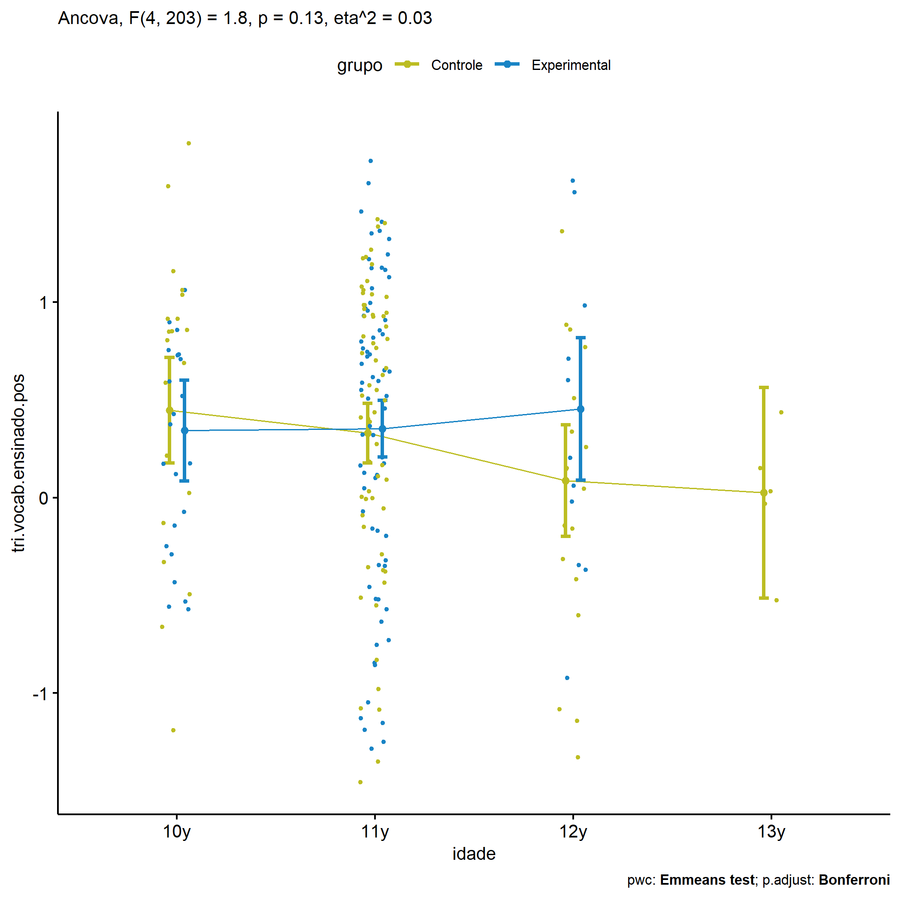<!-- -->

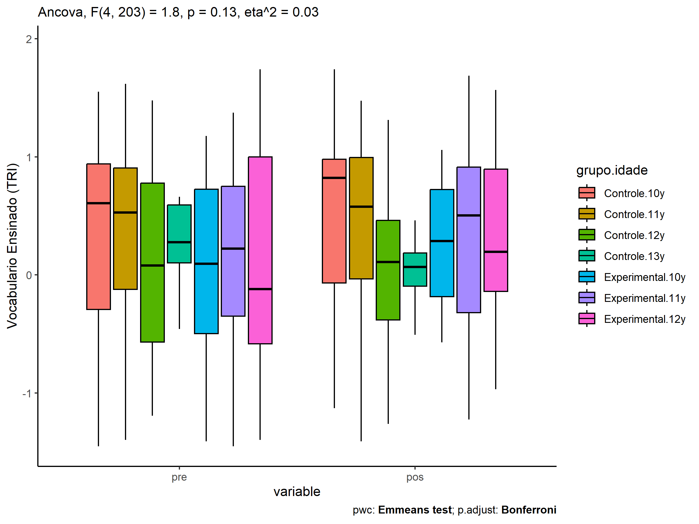<!-- -->

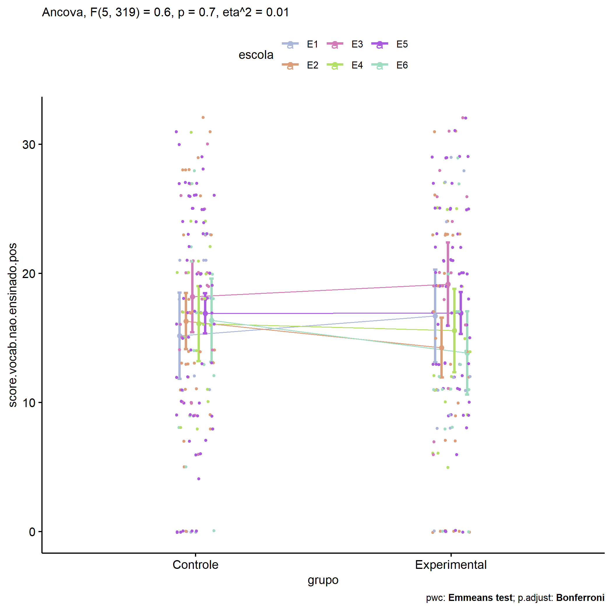<!-- -->

### Vocabulario Nao Ensinado (Acertos)

| var                          | idade | grupo        |   n | M (pre) | SE (pre) | M (unadj) | SE (unadj) | M (adj) | SE (adj) |
|:-----------------------------|:------|:-------------|----:|--------:|---------:|----------:|-----------:|--------:|---------:|
| score.vocab.nao.ensinado.pos | 10y   | Controle     |  23 |  19.130 |    1.551 |    16.870 |      1.716 |  16.542 |    1.357 |
| score.vocab.nao.ensinado.pos | 10y   | Experimental |  22 |  17.455 |    1.279 |    18.136 |      1.090 |  18.785 |    1.389 |
| score.vocab.nao.ensinado.pos | 11y   | Controle     |  66 |  19.894 |    0.817 |    20.545 |      0.907 |  19.773 |    0.805 |
| score.vocab.nao.ensinado.pos | 11y   | Experimental |  72 |  18.889 |    0.834 |    19.750 |      0.892 |  19.563 |    0.767 |
| score.vocab.nao.ensinado.pos | 12y   | Controle     |  20 |  17.000 |    1.465 |    14.800 |      1.918 |  15.714 |    1.458 |
| score.vocab.nao.ensinado.pos | 12y   | Experimental |  14 |  19.214 |    1.911 |    16.357 |      2.845 |  15.981 |    1.740 |
| score.vocab.nao.ensinado.pos | 13y   | Controle     |   6 |  15.667 |    3.363 |    17.333 |      2.459 |  19.024 |    2.663 |
| score.vocab.nao.ensinado.pos | 13y   | Experimental |   6 |  15.667 |    2.319 |     3.833 |      1.797 |   5.524 |    2.663 |
| score.vocab.nao.ensinado.pos | 14y   | Experimental |   5 |  10.200 |    5.024 |     8.800 |      4.454 |  13.676 |    2.957 |

|     | grupo        | idade | group1   | group2       | estimate | conf.low | conf.high |    se | statistic | p       | p.adj   | p.adj.signif |
|:----|:-------------|:------|:---------|:-------------|---------:|---------:|----------:|------:|----------:|:--------|:--------|:-------------|
| 1   | Controle     |       | 10y      | 11y          |   -3.231 |   -6.338 |    -0.124 | 1.576 |    -2.050 | 0.042   | 0.249   | ns           |
| 2   | Controle     |       | 10y      | 12y          |    0.828 |   -3.101 |     4.758 | 1.994 |     0.415 | 0.678   | 1       | ns           |
| 3   | Controle     |       | 10y      | 13y          |   -2.482 |   -8.376 |     3.412 | 2.991 |    -0.830 | 0.408   | 1       | ns           |
| 5   | Controle     |       | 11y      | 12y          |    4.059 |    0.767 |     7.352 | 1.671 |     2.429 | 0.016   | 0.095   | ns           |
| 6   | Controle     |       | 11y      | 13y          |    0.749 |   -4.744 |     6.242 | 2.787 |     0.269 | 0.788   | 1       | ns           |
| 8   | Controle     |       | 12y      | 13y          |   -3.310 |   -9.282 |     2.661 | 3.030 |    -1.092 | 0.276   | 1       | ns           |
| 11  | Experimental |       | 10y      | 11y          |   -0.778 |   -3.907 |     2.351 | 1.588 |    -0.490 | 0.625   | 1       | ns           |
| 12  | Experimental |       | 10y      | 12y          |    2.805 |   -1.585 |     7.194 | 2.228 |     1.259 | 0.209   | 1       | ns           |
| 13  | Experimental |       | 10y      | 13y          |   13.261 |    7.351 |    19.172 | 2.999 |     4.421 | \<0.001 | \<0.001 | \*\*\*       |
| 14  | Experimental |       | 10y      | 14y          |    5.110 |   -1.306 |    11.526 | 3.256 |     1.569 | 0.118   | 1       | ns           |
| 15  | Experimental |       | 11y      | 12y          |    3.582 |   -0.164 |     7.329 | 1.901 |     1.885 | 0.061   | 0.608   | ns           |
| 16  | Experimental |       | 11y      | 13y          |   14.039 |    8.576 |    19.503 | 2.773 |     5.064 | \<0.001 | \<0.001 | \*\*\*\*     |
| 17  | Experimental |       | 11y      | 14y          |    5.888 |   -0.139 |    11.914 | 3.058 |     1.925 | 0.055   | 0.555   | ns           |
| 18  | Experimental |       | 12y      | 13y          |   10.457 |    4.184 |    16.730 | 3.183 |     3.285 | 0.001   | 0.012   | \*           |
| 19  | Experimental |       | 12y      | 14y          |    2.305 |   -4.468 |     9.078 | 3.437 |     0.671 | 0.503   | 1       | ns           |
| 20  | Experimental |       | 13y      | 14y          |   -8.152 |  -15.946 |    -0.357 | 3.955 |    -2.061 | 0.04    | 0.405   | ns           |
| 21  | Controle     |       | 10y      | 11y          |   -0.764 |   -4.081 |     2.554 | 1.683 |    -0.454 | 0.651   | 1       | ns           |
| 22  | Controle     |       | 10y      | 12y          |    2.130 |   -2.058 |     6.319 | 2.126 |     1.002 | 0.317   | 1       | ns           |
| 23  | Controle     |       | 10y      | 13y          |    3.464 |   -2.817 |     9.744 | 3.187 |     1.087 | 0.278   | 1       | ns           |
| 25  | Controle     |       | 11y      | 12y          |    2.894 |   -0.603 |     6.391 | 1.775 |     1.631 | 0.104   | 0.626   | ns           |
| 26  | Controle     |       | 11y      | 13y          |    4.227 |   -1.614 |    10.069 | 2.964 |     1.426 | 0.155   | 0.932   | ns           |
| 28  | Controle     |       | 12y      | 13y          |    1.333 |   -5.044 |     7.710 | 3.236 |     0.412 | 0.681   | 1       | ns           |
| 31  | Experimental |       | 10y      | 11y          |   -1.434 |   -4.772 |     1.903 | 1.694 |    -0.847 | 0.398   | 1       | ns           |
| 32  | Experimental |       | 10y      | 12y          |   -1.760 |   -6.444 |     2.924 | 2.377 |    -0.740 | 0.46    | 1       | ns           |
| 33  | Experimental |       | 10y      | 13y          |    1.788 |   -4.522 |     8.098 | 3.202 |     0.558 | 0.577   | 1       | ns           |
| 34  | Experimental |       | 10y      | 14y          |    7.255 |    0.467 |    14.042 | 3.444 |     2.106 | 0.036   | 0.363   | ns           |
| 35  | Experimental |       | 11y      | 12y          |   -0.325 |   -4.327 |     3.676 | 2.031 |    -0.160 | 0.873   | 1       | ns           |
| 36  | Experimental |       | 11y      | 13y          |    3.222 |   -2.599 |     9.044 | 2.954 |     1.091 | 0.277   | 1       | ns           |
| 37  | Experimental |       | 11y      | 14y          |    8.689 |    2.353 |    15.025 | 3.215 |     2.702 | 0.007   | 0.074   | ns           |
| 38  | Experimental |       | 12y      | 13y          |    3.548 |   -3.137 |    10.233 | 3.392 |     1.046 | 0.297   | 1       | ns           |
| 39  | Experimental |       | 12y      | 14y          |    9.014 |    1.877 |    16.152 | 3.622 |     2.489 | 0.014   | 0.135   | ns           |
| 40  | Experimental |       | 13y      | 14y          |    5.467 |   -2.829 |    13.762 | 4.210 |     1.299 | 0.195   | 1       | ns           |
| 41  |              | 10y   | Controle | Experimental |   -2.243 |   -6.073 |     1.587 | 1.944 |    -1.154 | 0.25    | 0.25    | ns           |
| 42  |              | 11y   | Controle | Experimental |    0.210 |   -1.979 |     2.399 | 1.111 |     0.189 | 0.85    | 0.85    | ns           |
| 43  |              | 12y   | Controle | Experimental |   -0.267 |   -4.744 |     4.210 | 2.272 |    -0.118 | 0.907   | 0.907   | ns           |
| 44  |              | 13y   | Controle | Experimental |   13.500 |    6.096 |    20.904 | 3.757 |     3.593 | \<0.001 | \<0.001 | \*\*\*       |
| 46  |              | 10y   | Controle | Experimental |    1.676 |   -2.410 |     5.761 | 2.073 |     0.808 | 0.42    | 0.42    | ns           |
| 47  |              | 11y   | Controle | Experimental |    1.005 |   -1.330 |     3.340 | 1.185 |     0.848 | 0.397   | 0.397   | ns           |
| 48  |              | 12y   | Controle | Experimental |   -2.214 |   -6.988 |     2.560 | 2.423 |    -0.914 | 0.362   | 0.362   | ns           |
| 49  |              | 13y   | Controle | Experimental |    0.000 |   -7.910 |     7.910 | 4.014 |     0.000 | 1       | 1       | ns           |

| grupo        | idade | group1 | group2 | estimate | conf.low | conf.high |    se | statistic |     p | p.adj | p.adj.signif |
|:-------------|:------|:-------|:-------|---------:|---------:|----------:|------:|----------:|------:|------:|:-------------|
| Controle     | 10y   | pre    | pos    |    2.261 |   -1.976 |     6.498 | 2.156 |     1.049 | 0.295 | 0.295 | ns           |
| Controle     | 11y   | pre    | pos    |   -0.652 |   -3.153 |     1.850 | 1.273 |    -0.512 | 0.609 | 0.609 | ns           |
| Controle     | 12y   | pre    | pos    |    2.200 |   -2.344 |     6.744 | 2.312 |     0.952 | 0.342 | 0.342 | ns           |
| Controle     | 13y   | pre    | pos    |   -1.667 |   -9.962 |     6.629 | 4.221 |    -0.395 | 0.693 | 0.693 | ns           |
| Experimental | 10y   | pre    | pos    |   -0.682 |   -5.014 |     3.650 | 2.204 |    -0.309 | 0.757 | 0.757 | ns           |
| Experimental | 11y   | pre    | pos    |   -0.861 |   -3.256 |     1.534 | 1.219 |    -0.707 | 0.480 | 0.480 | ns           |
| Experimental | 12y   | pre    | pos    |    2.857 |   -2.574 |     8.288 | 2.763 |     1.034 | 0.302 | 0.302 | ns           |
| Experimental | 13y   | pre    | pos    |   11.833 |    3.538 |    20.129 | 4.221 |     2.803 | 0.005 | 0.005 | \*\*         |
| Experimental | 14y   | pre    | pos    |    1.400 |   -7.687 |    10.487 | 4.624 |     0.303 | 0.762 | 0.762 | ns           |

    ## Scale for colour is already present.
    ## Adding another scale for colour, which will replace the existing scale.

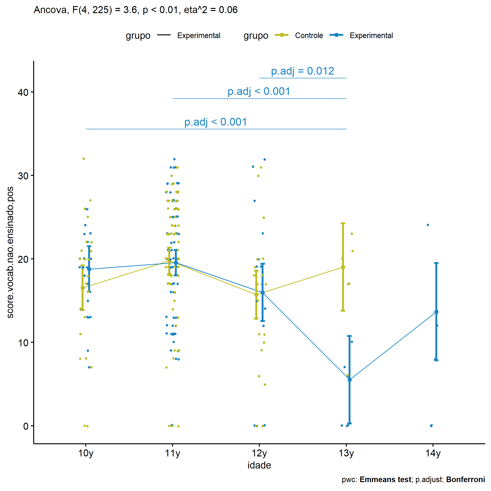<!-- -->

<!-- -->

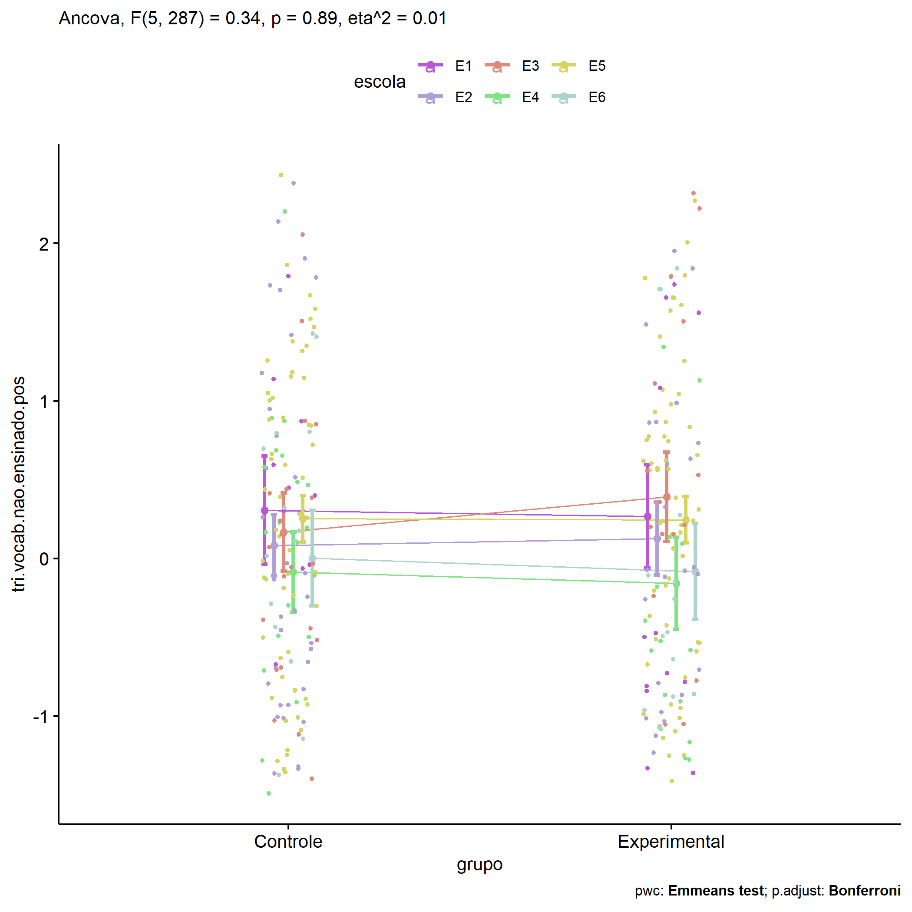<!-- -->

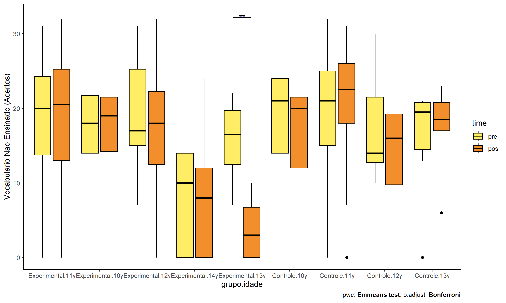<!-- -->

### Vocabulario Nao Ensinado (TRI)

| var                        | idade | grupo        |   n | M (pre) | SE (pre) | M (unadj) | SE (unadj) | M (adj) | SE (adj) |
|:---------------------------|:------|:-------------|----:|--------:|---------:|----------:|-----------:|--------:|---------:|
| tri.vocab.nao.ensinado.pos | 10y   | Controle     |  20 |   0.474 |    0.164 |     0.296 |      0.224 |   0.185 |    0.130 |
| tri.vocab.nao.ensinado.pos | 10y   | Experimental |  22 |   0.122 |    0.175 |     0.185 |      0.135 |   0.358 |    0.124 |
| tri.vocab.nao.ensinado.pos | 11y   | Controle     |  63 |   0.483 |    0.106 |     0.690 |      0.106 |   0.572 |    0.073 |
| tri.vocab.nao.ensinado.pos | 11y   | Experimental |  69 |   0.322 |    0.104 |     0.502 |      0.119 |   0.513 |    0.070 |
| tri.vocab.nao.ensinado.pos | 12y   | Controle     |  18 |   0.109 |    0.225 |    -0.067 |      0.216 |   0.117 |    0.137 |
| tri.vocab.nao.ensinado.pos | 12y   | Experimental |  11 |   0.196 |    0.325 |     0.616 |      0.320 |   0.729 |    0.175 |
| tri.vocab.nao.ensinado.pos | 13y   | Controle     |   5 |   0.214 |    0.216 |     0.397 |      0.198 |   0.496 |    0.260 |

|     | grupo        | idade | group1   | group2       | estimate | conf.low | conf.high |    se | statistic |     p | p.adj | p.adj.signif |
|:----|:-------------|:------|:---------|:-------------|---------:|---------:|----------:|------:|----------:|------:|------:|:-------------|
| 1   | Controle     |       | 10y      | 11y          |   -0.387 |   -0.681 |    -0.094 | 0.149 |    -2.599 | 0.010 | 0.060 | ns           |
| 2   | Controle     |       | 10y      | 12y          |    0.068 |   -0.306 |     0.441 | 0.189 |     0.358 | 0.721 | 1.000 | ns           |
| 3   | Controle     |       | 10y      | 13y          |   -0.311 |   -0.884 |     0.262 | 0.291 |    -1.070 | 0.286 | 1.000 | ns           |
| 4   | Controle     |       | 11y      | 12y          |    0.455 |    0.147 |     0.763 | 0.156 |     2.914 | 0.004 | 0.024 | \*           |
| 5   | Controle     |       | 11y      | 13y          |    0.077 |   -0.456 |     0.609 | 0.270 |     0.284 | 0.777 | 1.000 | ns           |
| 6   | Controle     |       | 12y      | 13y          |   -0.379 |   -0.957 |     0.200 | 0.294 |    -1.289 | 0.199 | 1.000 | ns           |
| 7   | Experimental |       | 10y      | 11y          |   -0.155 |   -0.436 |     0.126 | 0.142 |    -1.088 | 0.278 | 0.834 | ns           |
| 8   | Experimental |       | 10y      | 12y          |   -0.371 |   -0.794 |     0.052 | 0.214 |    -1.729 | 0.085 | 0.256 | ns           |
| 10  | Experimental |       | 11y      | 12y          |   -0.216 |   -0.588 |     0.156 | 0.189 |    -1.144 | 0.254 | 0.762 | ns           |
| 13  | Controle     |       | 10y      | 11y          |   -0.009 |   -0.442 |     0.424 | 0.220 |    -0.042 | 0.967 | 1.000 | ns           |
| 14  | Controle     |       | 10y      | 12y          |    0.365 |   -0.183 |     0.913 | 0.278 |     1.312 | 0.191 | 1.000 | ns           |
| 15  | Controle     |       | 10y      | 13y          |    0.259 |   -0.584 |     1.103 | 0.428 |     0.606 | 0.545 | 1.000 | ns           |
| 16  | Controle     |       | 11y      | 12y          |    0.374 |   -0.077 |     0.825 | 0.229 |     1.635 | 0.104 | 0.622 | ns           |
| 17  | Controle     |       | 11y      | 13y          |    0.269 |   -0.515 |     1.052 | 0.397 |     0.676 | 0.500 | 1.000 | ns           |
| 18  | Controle     |       | 12y      | 13y          |   -0.105 |   -0.958 |     0.748 | 0.432 |    -0.243 | 0.808 | 1.000 | ns           |
| 19  | Experimental |       | 10y      | 11y          |   -0.200 |   -0.613 |     0.213 | 0.209 |    -0.954 | 0.341 | 1.000 | ns           |
| 20  | Experimental |       | 10y      | 12y          |   -0.074 |   -0.697 |     0.549 | 0.316 |    -0.234 | 0.815 | 1.000 | ns           |
| 22  | Experimental |       | 11y      | 12y          |    0.126 |   -0.422 |     0.673 | 0.278 |     0.453 | 0.651 | 1.000 | ns           |
| 25  |              | 10y   | Controle | Experimental |   -0.173 |   -0.529 |     0.182 | 0.180 |    -0.963 | 0.337 | 0.337 | ns           |
| 26  |              | 11y   | Controle | Experimental |    0.059 |   -0.141 |     0.259 | 0.101 |     0.580 | 0.562 | 0.562 | ns           |
| 27  |              | 12y   | Controle | Experimental |   -0.612 |   -1.050 |    -0.174 | 0.222 |    -2.754 | 0.006 | 0.006 | \*\*         |
| 29  |              | 10y   | Controle | Experimental |    0.351 |   -0.170 |     0.872 | 0.264 |     1.329 | 0.185 | 0.185 | ns           |
| 30  |              | 11y   | Controle | Experimental |    0.160 |   -0.133 |     0.454 | 0.149 |     1.077 | 0.283 | 0.283 | ns           |
| 31  |              | 12y   | Controle | Experimental |   -0.087 |   -0.733 |     0.558 | 0.327 |    -0.267 | 0.790 | 0.790 | ns           |

| grupo        | idade | group1 | group2 | estimate | conf.low | conf.high |    se | statistic |     p | p.adj | p.adj.signif |
|:-------------|:------|:-------|:-------|---------:|---------:|----------:|------:|----------:|------:|------:|:-------------|
| Controle     | 10y   | pre    | pos    |    0.140 |   -0.386 |     0.665 | 0.267 |     0.522 | 0.602 | 0.602 | ns           |
| Controle     | 11y   | pre    | pos    |   -0.197 |   -0.502 |     0.107 | 0.155 |    -1.272 | 0.204 | 0.204 | ns           |
| Controle     | 12y   | pre    | pos    |    0.122 |   -0.438 |     0.682 | 0.285 |     0.428 | 0.669 | 0.669 | ns           |
| Controle     | 13y   | pre    | pos    |    0.077 |   -0.966 |     1.121 | 0.531 |     0.145 | 0.884 | 0.884 | ns           |
| Experimental | 10y   | pre    | pos    |   -0.063 |   -0.582 |     0.457 | 0.264 |    -0.237 | 0.813 | 0.813 | ns           |
| Experimental | 11y   | pre    | pos    |   -0.170 |   -0.461 |     0.120 | 0.148 |    -1.155 | 0.249 | 0.249 | ns           |
| Experimental | 12y   | pre    | pos    |   -0.349 |   -1.044 |     0.345 | 0.353 |    -0.989 | 0.323 | 0.323 | ns           |

    ## Scale for colour is already present.
    ## Adding another scale for colour, which will replace the existing scale.

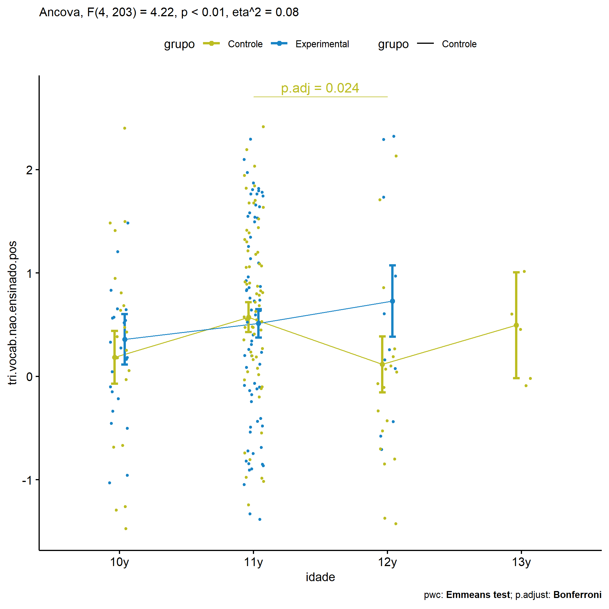<!-- -->

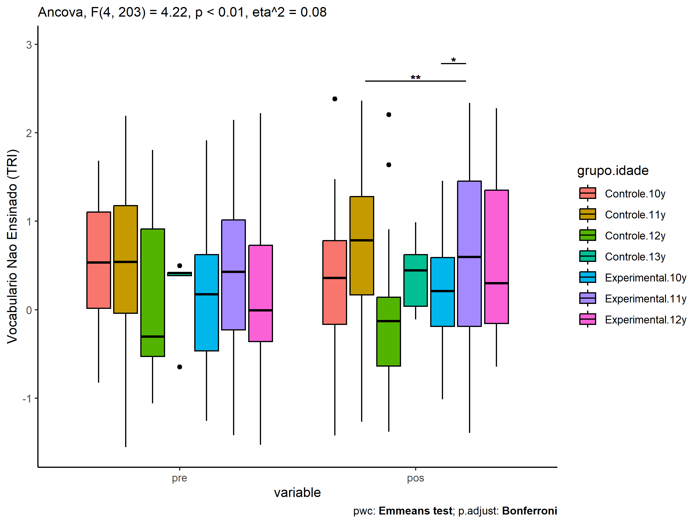<!-- -->

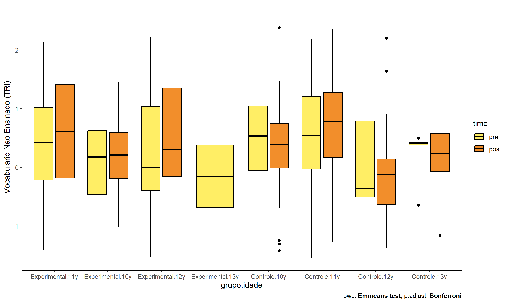<!-- -->

## factores: **zona.participante:grupo**

### Vocabulario (Acertos)

| var             | zona.participante | grupo        |   n | M (pre) | SE (pre) | M (unadj) | SE (unadj) | M (adj) | SE (adj) |
|:----------------|:------------------|:-------------|----:|--------:|---------:|----------:|-----------:|--------:|---------:|
| score.vocab.pos | Rural             | Controle     |  41 |  22.439 |    1.278 |    22.707 |      1.149 |  23.347 |    0.872 |
| score.vocab.pos | Rural             | Experimental |  43 |  21.767 |    1.267 |    24.558 |      1.274 |  25.696 |    0.854 |
| score.vocab.pos | Urbana            | Controle     |  47 |  25.149 |    1.069 |    25.766 |      1.176 |  24.397 |    0.819 |
| score.vocab.pos | Urbana            | Experimental |  41 |  23.659 |    1.248 |    24.561 |      1.337 |  24.297 |    0.871 |

| grupo        | zona.participante | group1   | group2       | estimate | conf.low | conf.high |    se | statistic |     p | p.adj | p.adj.signif |
|:-------------|:------------------|:---------|:-------------|---------:|---------:|----------:|------:|----------:|------:|------:|:-------------|
| Controle     |                   | Urbana   | Rural        |    1.050 |   -1.320 |     3.420 | 1.200 |     0.875 | 0.383 | 0.383 | ns           |
| Experimental |                   | Urbana   | Rural        |   -1.399 |   -3.810 |     1.012 | 1.221 |    -1.146 | 0.254 | 0.254 | ns           |
| Controle     |                   | Urbana   | Rural        |    2.710 |   -0.642 |     6.062 | 1.698 |     1.596 | 0.112 | 0.112 | ns           |
| Experimental |                   | Urbana   | Rural        |    1.891 |   -1.533 |     5.315 | 1.734 |     1.090 | 0.277 | 0.277 | ns           |
|              | Urbana            | Controle | Experimental |    0.100 |   -2.257 |     2.458 | 1.194 |     0.084 | 0.933 | 0.933 | ns           |
|              | Rural             | Controle | Experimental |   -2.349 |   -4.752 |     0.055 | 1.217 |    -1.929 | 0.055 | 0.055 | ns           |
|              | Urbana            | Controle | Experimental |    1.490 |   -1.861 |     4.842 | 1.698 |     0.878 | 0.381 | 0.381 | ns           |
|              | Rural             | Controle | Experimental |    0.672 |   -2.752 |     4.095 | 1.734 |     0.387 | 0.699 | 0.699 | ns           |

| grupo        | zona.participante | group1 | group2 | estimate | conf.low | conf.high |    se | statistic |     p | p.adj | p.adj.signif |
|:-------------|:------------------|:-------|:-------|---------:|---------:|----------:|------:|----------:|------:|------:|:-------------|
| Controle     | Urbana            | pre    | pos    |   -0.204 |   -3.388 |     2.980 | 1.619 |    -0.126 | 0.900 | 0.900 | ns           |
| Controle     | Rural             | pre    | pos    |   -0.142 |   -3.583 |     3.298 | 1.749 |    -0.081 | 0.935 | 0.935 | ns           |
| Experimental | Urbana            | pre    | pos    |   -0.652 |   -4.073 |     2.769 | 1.739 |    -0.375 | 0.708 | 0.708 | ns           |
| Experimental | Rural             | pre    | pos    |   -2.960 |   -6.340 |     0.420 | 1.718 |    -1.722 | 0.086 | 0.086 | ns           |

    ## Scale for colour is already present.
    ## Adding another scale for colour, which will replace the existing scale.

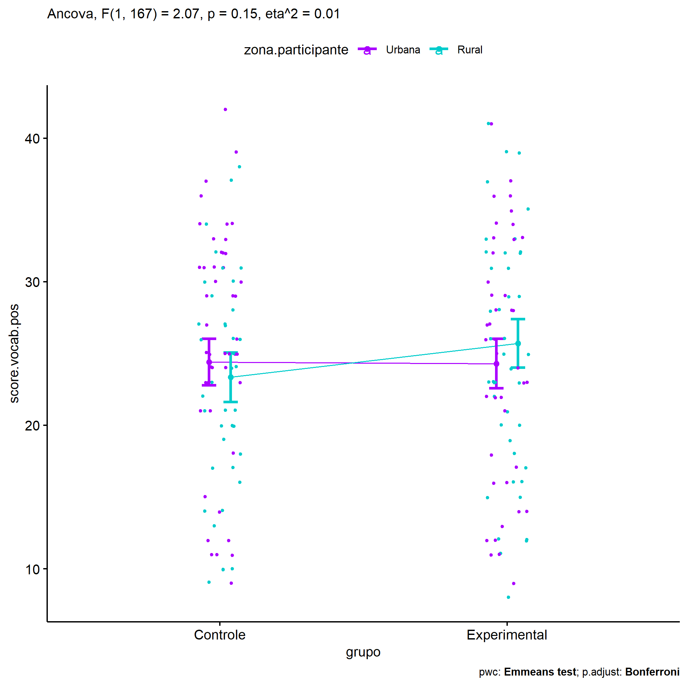<!-- -->

    ## Scale for colour is already present.
    ## Adding another scale for colour, which will replace the existing scale.

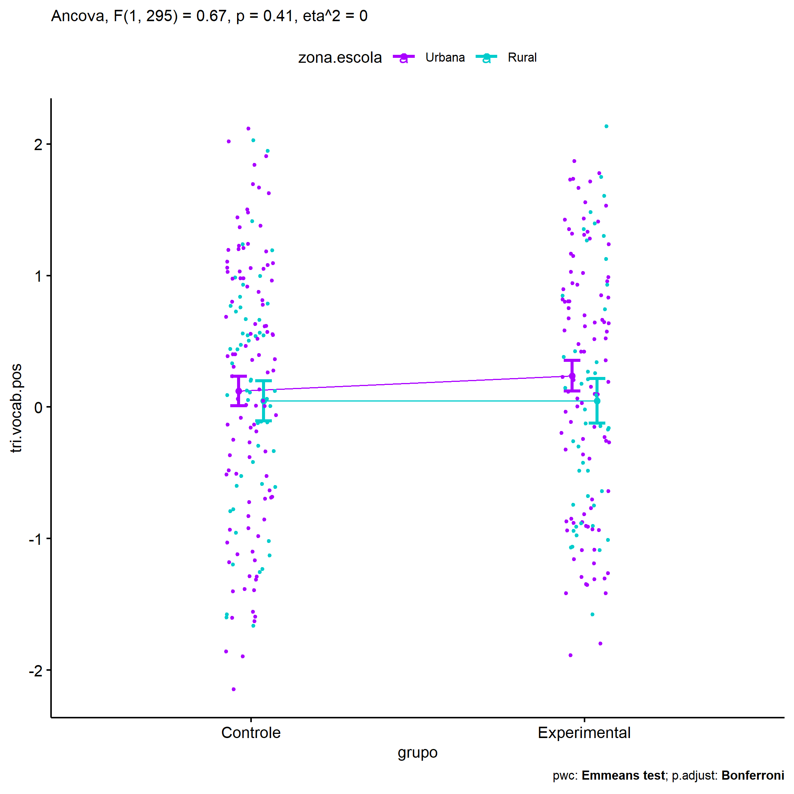<!-- -->

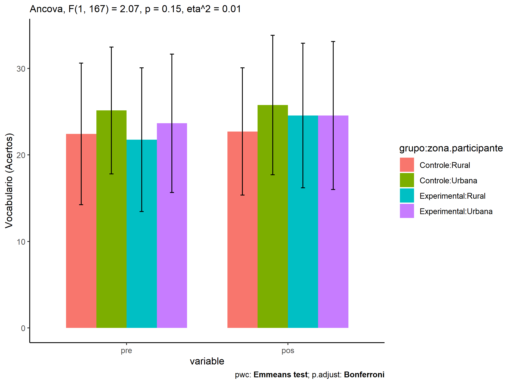<!-- -->

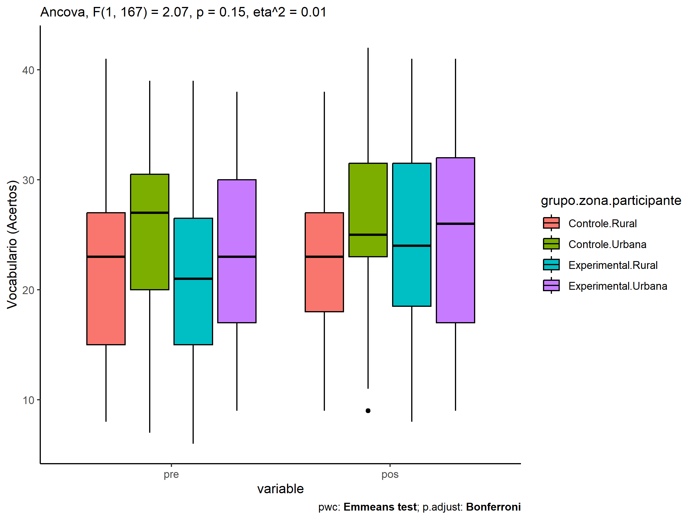<!-- -->

<!-- -->

### Vocabulario (TRI)

| var           | zona.participante | grupo        |   n | M (pre) | SE (pre) | M (unadj) | SE (unadj) | M (adj) | SE (adj) |
|:--------------|:------------------|:-------------|----:|--------:|---------:|----------:|-----------:|--------:|---------:|
| tri.vocab.pos | Rural             | Controle     |  41 |   0.263 |    0.122 |     0.178 |      0.150 |   0.209 |    0.092 |
| tri.vocab.pos | Rural             | Experimental |  43 |   0.174 |    0.145 |     0.471 |      0.127 |   0.574 |    0.090 |
| tri.vocab.pos | Urbana            | Controle     |  47 |   0.492 |    0.111 |     0.606 |      0.132 |   0.453 |    0.087 |
| tri.vocab.pos | Urbana            | Experimental |  41 |   0.255 |    0.151 |     0.376 |      0.151 |   0.414 |    0.092 |

| grupo        | zona.participante | group1   | group2       | estimate | conf.low | conf.high |    se | statistic |     p | p.adj | p.adj.signif |
|:-------------|:------------------|:---------|:-------------|---------:|---------:|----------:|------:|----------:|------:|------:|:-------------|
| Controle     |                   | Urbana   | Rural        |    0.244 |   -0.007 |     0.494 | 0.127 |     1.922 | 0.056 | 0.056 | ns           |
| Experimental |                   | Urbana   | Rural        |   -0.160 |   -0.414 |     0.095 | 0.129 |    -1.239 | 0.217 | 0.217 | ns           |
| Controle     |                   | Urbana   | Rural        |    0.229 |   -0.137 |     0.594 | 0.185 |     1.234 | 0.219 | 0.219 | ns           |
| Experimental |                   | Urbana   | Rural        |    0.081 |   -0.293 |     0.454 | 0.189 |     0.427 | 0.670 | 0.670 | ns           |
|              | Urbana            | Controle | Experimental |    0.039 |   -0.212 |     0.289 | 0.127 |     0.305 | 0.761 | 0.761 | ns           |
|              | Rural             | Controle | Experimental |   -0.365 |   -0.619 |    -0.110 | 0.129 |    -2.828 | 0.005 | 0.005 | \*\*         |
|              | Urbana            | Controle | Experimental |    0.237 |   -0.129 |     0.602 | 0.185 |     1.278 | 0.203 | 0.203 | ns           |
|              | Rural             | Controle | Experimental |    0.089 |   -0.285 |     0.462 | 0.189 |     0.469 | 0.639 | 0.639 | ns           |

| grupo        | zona.participante | group1 | group2 | estimate | conf.low | conf.high |    se | statistic |     p | p.adj | p.adj.signif |
|:-------------|:------------------|:-------|:-------|---------:|---------:|----------:|------:|----------:|------:|------:|:-------------|
| Controle     | Urbana            | pre    | pos    |   -0.060 |   -0.415 |     0.294 | 0.180 |    -0.335 | 0.738 | 0.738 | ns           |
| Controle     | Rural             | pre    | pos    |    0.103 |   -0.280 |     0.486 | 0.195 |     0.528 | 0.598 | 0.598 | ns           |
| Experimental | Urbana            | pre    | pos    |   -0.073 |   -0.454 |     0.308 | 0.194 |    -0.378 | 0.706 | 0.706 | ns           |
| Experimental | Rural             | pre    | pos    |   -0.312 |   -0.688 |     0.065 | 0.191 |    -1.629 | 0.104 | 0.104 | ns           |

    ## Scale for colour is already present.
    ## Adding another scale for colour, which will replace the existing scale.

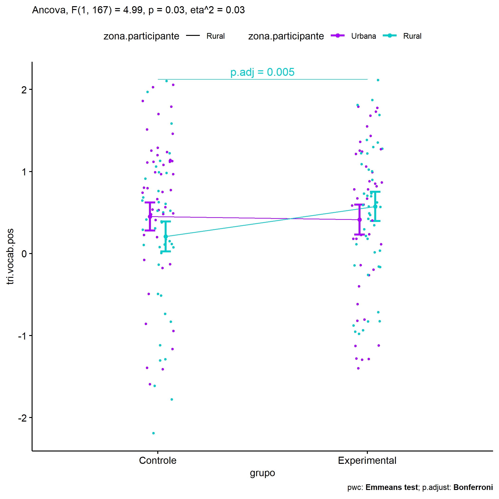<!-- -->

    ## Scale for colour is already present.
    ## Adding another scale for colour, which will replace the existing scale.

<!-- -->

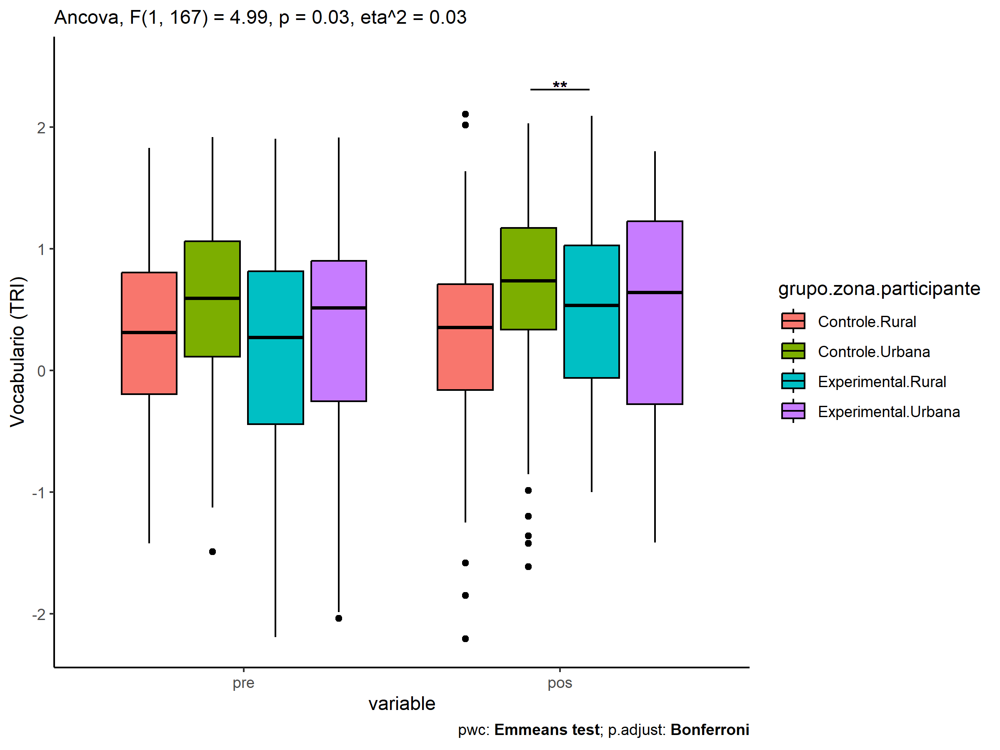<!-- -->

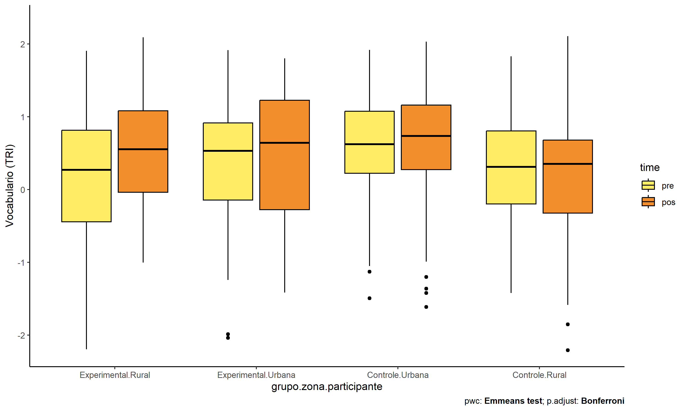<!-- -->

### Vocabulario Ensinado (Acertos)

| var                      | zona.participante | grupo        |   n | M (pre) | SE (pre) | M (unadj) | SE (unadj) | M (adj) | SE (adj) |
|:-------------------------|:------------------|:-------------|----:|--------:|---------:|----------:|-----------:|--------:|---------:|
| score.vocab.ensinado.pos | Rural             | Controle     |  43 |   4.186 |    0.396 |     4.488 |      0.289 |   4.518 |    0.308 |
| score.vocab.ensinado.pos | Rural             | Experimental |  44 |   4.045 |    0.342 |     4.841 |      0.305 |   4.926 |    0.305 |
| score.vocab.ensinado.pos | Urbana            | Controle     |  52 |   4.519 |    0.326 |     4.731 |      0.326 |   4.629 |    0.280 |
| score.vocab.ensinado.pos | Urbana            | Experimental |  45 |   4.244 |    0.315 |     4.400 |      0.371 |   4.406 |    0.301 |

| grupo        | zona.participante | group1   | group2       | estimate | conf.low | conf.high |    se | statistic |     p | p.adj | p.adj.signif |
|:-------------|:------------------|:---------|:-------------|---------:|---------:|----------:|------:|----------:|------:|------:|:-------------|
| Controle     |                   | Urbana   | Rural        |    0.111 |   -0.711 |     0.933 | 0.416 |     0.266 | 0.790 | 0.790 | ns           |
| Experimental |                   | Urbana   | Rural        |   -0.519 |   -1.364 |     0.325 | 0.428 |    -1.214 | 0.227 | 0.227 | ns           |
| Controle     |                   | Urbana   | Rural        |    0.333 |   -0.617 |     1.283 | 0.481 |     0.692 | 0.490 | 0.490 | ns           |
| Experimental |                   | Urbana   | Rural        |    0.199 |   -0.778 |     1.176 | 0.495 |     0.402 | 0.688 | 0.688 | ns           |
|              | Urbana            | Controle | Experimental |    0.222 |   -0.589 |     1.034 | 0.411 |     0.541 | 0.589 | 0.589 | ns           |
|              | Rural             | Controle | Experimental |   -0.408 |   -1.262 |     0.446 | 0.433 |    -0.943 | 0.347 | 0.347 | ns           |
|              | Urbana            | Controle | Experimental |    0.275 |   -0.663 |     1.213 | 0.475 |     0.578 | 0.564 | 0.564 | ns           |
|              | Rural             | Controle | Experimental |    0.141 |   -0.848 |     1.129 | 0.501 |     0.281 | 0.779 | 0.779 | ns           |

| grupo        | zona.participante | group1 | group2 | estimate | conf.low | conf.high |    se | statistic |     p | p.adj | p.adj.signif |
|:-------------|:------------------|:-------|:-------|---------:|---------:|----------:|------:|----------:|------:|------:|:-------------|
| Controle     | Urbana            | pre    | pos    |   -0.212 |   -1.089 |     0.666 | 0.446 |    -0.474 | 0.636 | 0.636 | ns           |
| Controle     | Rural             | pre    | pos    |   -0.302 |   -1.267 |     0.663 | 0.491 |    -0.616 | 0.538 | 0.538 | ns           |
| Experimental | Urbana            | pre    | pos    |   -0.156 |   -1.099 |     0.788 | 0.480 |    -0.324 | 0.746 | 0.746 | ns           |
| Experimental | Rural             | pre    | pos    |   -0.795 |   -1.749 |     0.158 | 0.485 |    -1.640 | 0.102 | 0.102 | ns           |

    ## Scale for colour is already present.
    ## Adding another scale for colour, which will replace the existing scale.

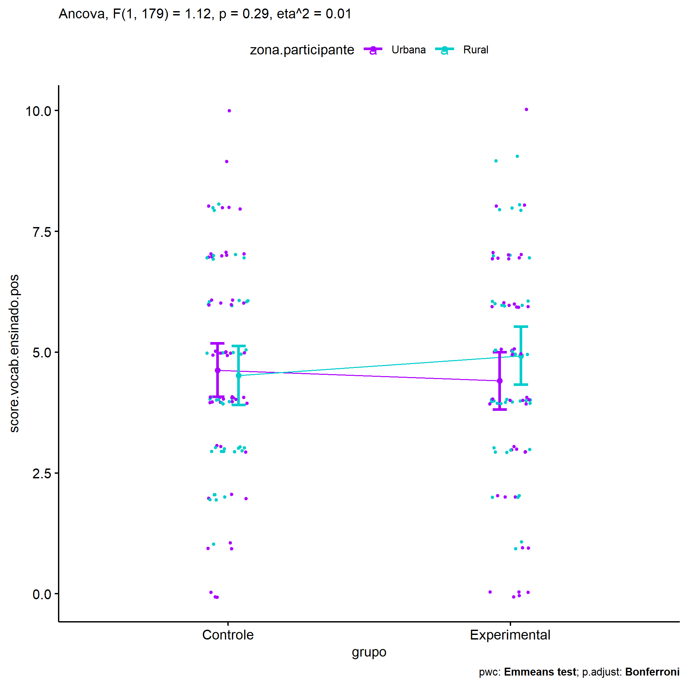<!-- -->

    ## Scale for colour is already present.
    ## Adding another scale for colour, which will replace the existing scale.

<!-- -->

<!-- -->

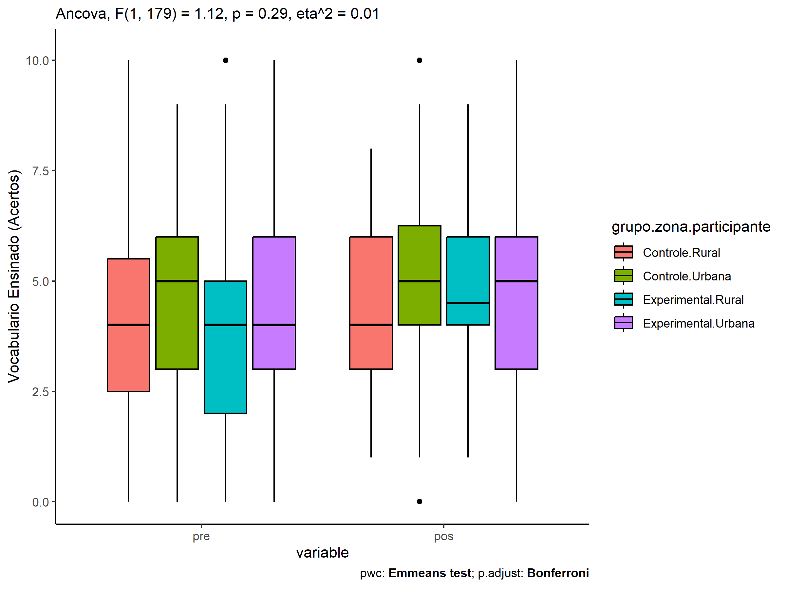<!-- -->

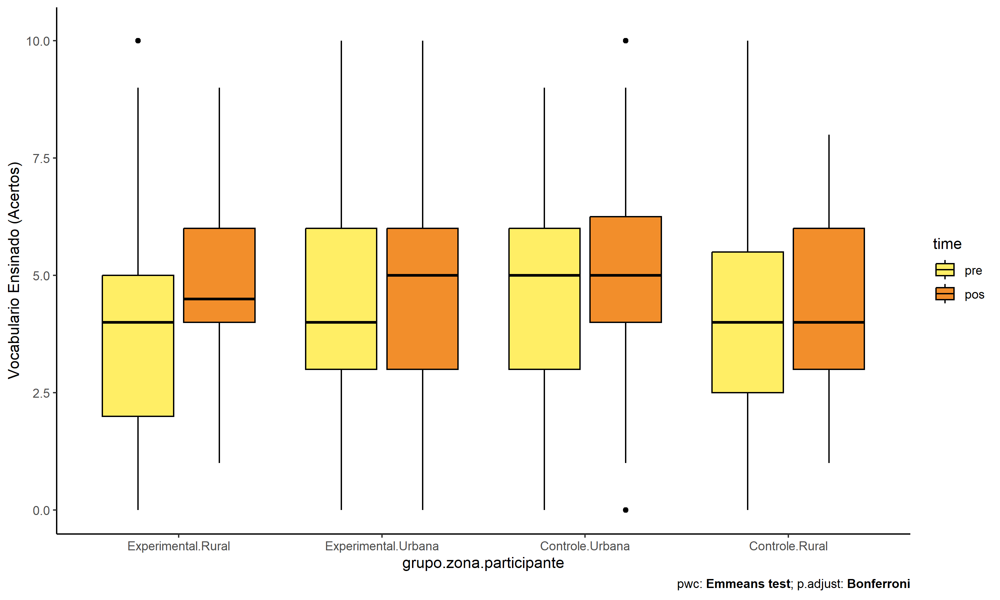<!-- -->

### Vocabulario Ensinado (TRI)

| var                    | zona.participante | grupo        |   n | M (pre) | SE (pre) | M (unadj) | SE (unadj) | M (adj) | SE (adj) |
|:-----------------------|:------------------|:-------------|----:|--------:|---------:|----------:|-----------:|--------:|---------:|
| tri.vocab.ensinado.pos | Rural             | Controle     |  41 |   0.192 |    0.127 |     0.141 |      0.123 |   0.141 |    0.096 |
| tri.vocab.ensinado.pos | Rural             | Experimental |  43 |   0.098 |    0.121 |     0.261 |      0.120 |   0.315 |    0.094 |
| tri.vocab.ensinado.pos | Urbana            | Controle     |  47 |   0.307 |    0.110 |     0.487 |      0.103 |   0.422 |    0.090 |
| tri.vocab.ensinado.pos | Urbana            | Experimental |  41 |   0.166 |    0.115 |     0.366 |      0.113 |   0.382 |    0.096 |

| grupo        | zona.participante | group1   | group2       | estimate | conf.low | conf.high |    se | statistic |     p | p.adj | p.adj.signif |
|:-------------|:------------------|:---------|:-------------|---------:|---------:|----------:|------:|----------:|------:|------:|:-------------|
| Controle     |                   | Urbana   | Rural        |    0.281 |    0.023 |     0.540 | 0.131 |     2.146 | 0.033 | 0.033 | \*           |
| Experimental |                   | Urbana   | Rural        |    0.067 |   -0.197 |     0.331 | 0.134 |     0.498 | 0.619 | 0.619 | ns           |
| Controle     |                   | Urbana   | Rural        |    0.114 |   -0.211 |     0.440 | 0.165 |     0.694 | 0.489 | 0.489 | ns           |
| Experimental |                   | Urbana   | Rural        |    0.068 |   -0.264 |     0.401 | 0.169 |     0.406 | 0.685 | 0.685 | ns           |
|              | Urbana            | Controle | Experimental |    0.041 |   -0.218 |     0.299 | 0.131 |     0.310 | 0.757 | 0.757 | ns           |
|              | Rural             | Controle | Experimental |   -0.174 |   -0.438 |     0.090 | 0.134 |    -1.301 | 0.195 | 0.195 | ns           |
|              | Urbana            | Controle | Experimental |    0.141 |   -0.185 |     0.467 | 0.165 |     0.854 | 0.394 | 0.394 | ns           |
|              | Rural             | Controle | Experimental |    0.095 |   -0.238 |     0.428 | 0.169 |     0.563 | 0.575 | 0.575 | ns           |

| grupo        | zona.participante | group1 | group2 | estimate | conf.low | conf.high |    se | statistic |     p | p.adj | p.adj.signif |
|:-------------|:------------------|:-------|:-------|---------:|---------:|----------:|------:|----------:|------:|------:|:-------------|
| Controle     | Urbana            | pre    | pos    |   -0.142 |   -0.446 |     0.162 | 0.155 |    -0.919 | 0.359 | 0.359 | ns           |
| Controle     | Rural             | pre    | pos    |    0.032 |   -0.296 |     0.360 | 0.167 |     0.192 | 0.848 | 0.848 | ns           |
| Experimental | Urbana            | pre    | pos    |   -0.156 |   -0.482 |     0.171 | 0.166 |    -0.938 | 0.349 | 0.349 | ns           |
| Experimental | Rural             | pre    | pos    |   -0.180 |   -0.503 |     0.142 | 0.164 |    -1.100 | 0.272 | 0.272 | ns           |

    ## Scale for colour is already present.
    ## Adding another scale for colour, which will replace the existing scale.

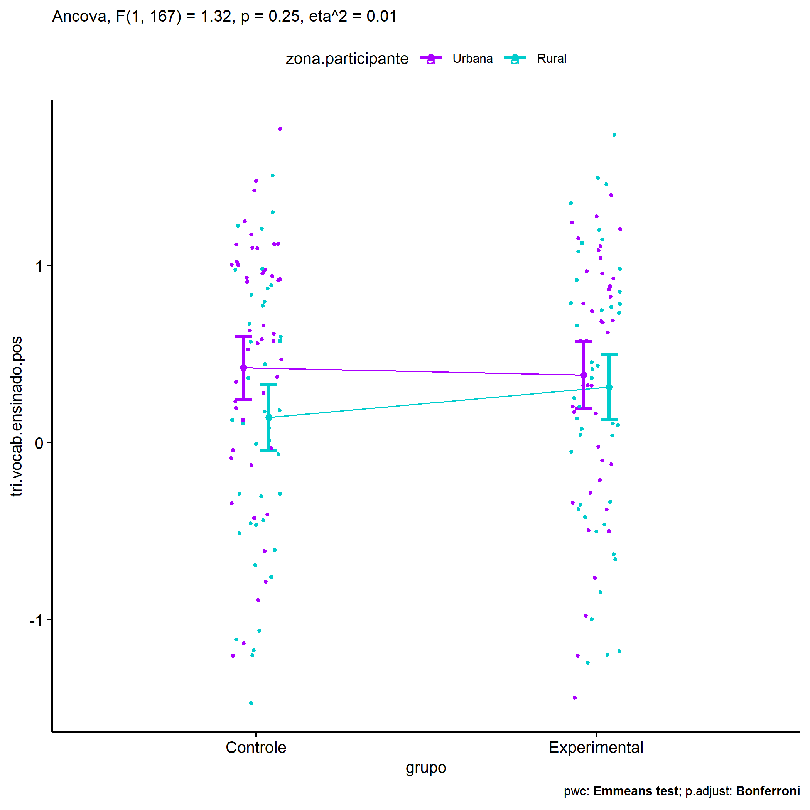<!-- -->

    ## Scale for colour is already present.
    ## Adding another scale for colour, which will replace the existing scale.

<!-- -->

<!-- -->

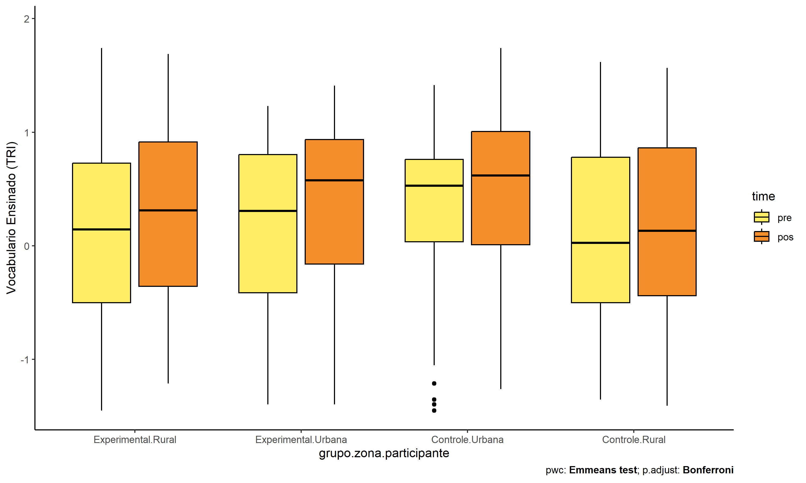<!-- -->

### Vocabulario Nao Ensinado (Acertos)

| var                          | zona.participante | grupo        |   n | M (pre) | SE (pre) | M (unadj) | SE (unadj) | M (adj) | SE (adj) |
|:-----------------------------|:------------------|:-------------|----:|--------:|---------:|----------:|-----------:|--------:|---------:|
| score.vocab.nao.ensinado.pos | Rural             | Controle     |  43 |  17.209 |    1.094 |    18.093 |      0.958 |  18.747 |    0.955 |
| score.vocab.nao.ensinado.pos | Rural             | Experimental |  44 |  17.227 |    1.069 |    19.909 |      1.019 |  20.552 |    0.944 |
| score.vocab.nao.ensinado.pos | Urbana            | Controle     |  52 |  19.442 |    1.035 |    19.423 |      1.110 |  18.757 |    0.869 |
| score.vocab.nao.ensinado.pos | Urbana            | Experimental |  45 |  19.133 |    1.061 |    17.978 |      1.307 |  17.494 |    0.933 |

| grupo        | zona.participante | group1   | group2       | estimate | conf.low | conf.high |    se | statistic |     p | p.adj | p.adj.signif |
|:-------------|:------------------|:---------|:-------------|---------:|---------:|----------:|------:|----------:|------:|------:|:-------------|
| Controle     |                   | Urbana   | Rural        |    0.010 |   -2.546 |     2.567 | 1.296 |     0.008 | 0.994 | 0.994 | ns           |
| Experimental |                   | Urbana   | Rural        |   -3.058 |   -5.683 |    -0.433 | 1.330 |    -2.299 | 0.023 | 0.023 | \*           |
| Controle     |                   | Urbana   | Rural        |    2.233 |   -0.705 |     5.171 | 1.489 |     1.500 | 0.135 | 0.135 | ns           |
| Experimental |                   | Urbana   | Rural        |    1.906 |   -1.116 |     4.928 | 1.532 |     1.244 | 0.215 | 0.215 | ns           |
|              | Urbana            | Controle | Experimental |    1.263 |   -1.247 |     3.773 | 1.272 |     0.993 | 0.322 | 0.322 | ns           |
|              | Rural             | Controle | Experimental |   -1.805 |   -4.449 |     0.838 | 1.340 |    -1.348 | 0.179 | 0.179 | ns           |
|              | Urbana            | Controle | Experimental |    0.309 |   -2.593 |     3.211 | 1.471 |     0.210 | 0.834 | 0.834 | ns           |
|              | Rural             | Controle | Experimental |   -0.018 |   -3.075 |     3.039 | 1.549 |    -0.012 | 0.991 | 0.991 | ns           |

| grupo        | zona.participante | group1 | group2 | estimate | conf.low | conf.high |    se | statistic |     p | p.adj | p.adj.signif |
|:-------------|:------------------|:-------|:-------|---------:|---------:|----------:|------:|----------:|------:|------:|:-------------|
| Controle     | Urbana            | pre    | pos    |    0.019 |   -2.831 |     2.869 | 1.449 |     0.013 | 0.989 | 0.989 | ns           |
| Controle     | Rural             | pre    | pos    |   -0.884 |   -4.018 |     2.251 | 1.594 |    -0.554 | 0.580 | 0.580 | ns           |
| Experimental | Urbana            | pre    | pos    |    1.156 |   -1.908 |     4.219 | 1.558 |     0.742 | 0.459 | 0.459 | ns           |
| Experimental | Rural             | pre    | pos    |   -2.682 |   -5.780 |     0.417 | 1.576 |    -1.702 | 0.090 | 0.090 | ns           |

    ## Scale for colour is already present.
    ## Adding another scale for colour, which will replace the existing scale.

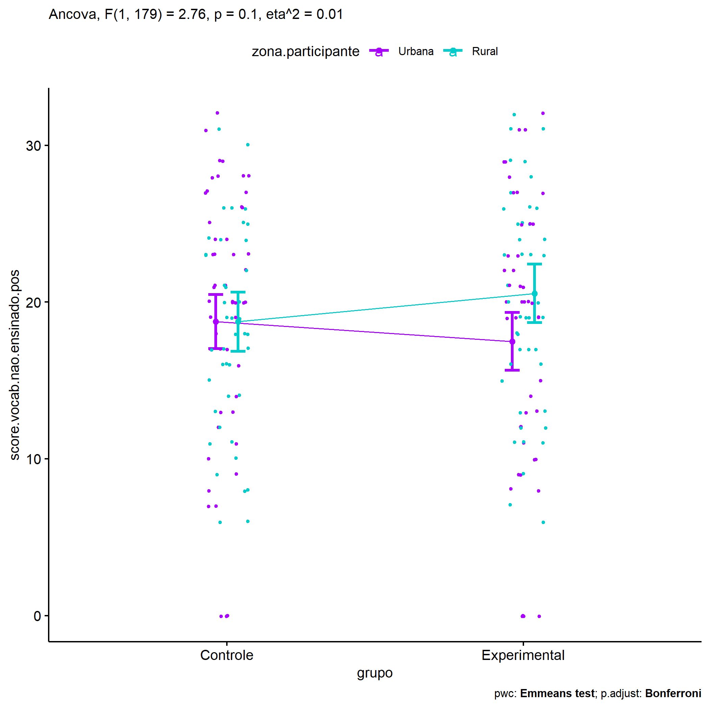<!-- -->

    ## Scale for colour is already present.
    ## Adding another scale for colour, which will replace the existing scale.

<!-- -->

<!-- -->

<!-- -->

<!-- -->

### Vocabulario Nao Ensinado (TRI)

| var                        | zona.participante | grupo        |   n | M (pre) | SE (pre) | M (unadj) | SE (unadj) | M (adj) | SE (adj) |
|:---------------------------|:------------------|:-------------|----:|--------:|---------:|----------:|-----------:|--------:|---------:|
| tri.vocab.nao.ensinado.pos | Rural             | Controle     |  41 |   0.195 |    0.121 |     0.202 |      0.133 |   0.291 |    0.099 |
| tri.vocab.nao.ensinado.pos | Rural             | Experimental |  43 |   0.151 |    0.135 |     0.473 |      0.143 |   0.599 |    0.097 |
| tri.vocab.nao.ensinado.pos | Urbana            | Controle     |  47 |   0.512 |    0.119 |     0.649 |      0.138 |   0.474 |    0.093 |
| tri.vocab.nao.ensinado.pos | Urbana            | Experimental |  41 |   0.326 |    0.142 |     0.379 |      0.160 |   0.359 |    0.099 |

| grupo        | zona.participante | group1   | group2       | estimate | conf.low | conf.high |    se | statistic |     p | p.adj | p.adj.signif |
|:-------------|:------------------|:---------|:-------------|---------:|---------:|----------:|------:|----------:|------:|------:|:-------------|
| Controle     |                   | Urbana   | Rural        |    0.183 |   -0.086 |     0.452 | 0.136 |     1.343 | 0.181 | 0.181 | ns           |
| Experimental |                   | Urbana   | Rural        |   -0.240 |   -0.513 |     0.033 | 0.138 |    -1.734 | 0.085 | 0.085 | ns           |
| Controle     |                   | Urbana   | Rural        |    0.318 |   -0.040 |     0.675 | 0.181 |     1.754 | 0.081 | 0.081 | ns           |
| Experimental |                   | Urbana   | Rural        |    0.175 |   -0.190 |     0.540 | 0.185 |     0.946 | 0.346 | 0.346 | ns           |
|              | Urbana            | Controle | Experimental |    0.115 |   -0.152 |     0.383 | 0.135 |     0.851 | 0.396 | 0.396 | ns           |
|              | Rural             | Controle | Experimental |   -0.307 |   -0.580 |    -0.035 | 0.138 |    -2.229 | 0.027 | 0.027 | \*           |
|              | Urbana            | Controle | Experimental |    0.187 |   -0.171 |     0.544 | 0.181 |     1.030 | 0.304 | 0.304 | ns           |
|              | Rural             | Controle | Experimental |    0.044 |   -0.321 |     0.409 | 0.185 |     0.237 | 0.813 | 0.813 | ns           |

| grupo        | zona.participante | group1 | group2 | estimate | conf.low | conf.high |    se | statistic |     p | p.adj | p.adj.signif |
|:-------------|:------------------|:-------|:-------|---------:|---------:|----------:|------:|----------:|------:|------:|:-------------|
| Controle     | Urbana            | pre    | pos    |   -0.085 |   -0.441 |     0.271 | 0.181 |    -0.469 | 0.639 | 0.639 | ns           |
| Controle     | Rural             | pre    | pos    |    0.019 |   -0.366 |     0.403 | 0.196 |     0.095 | 0.924 | 0.924 | ns           |
| Experimental | Urbana            | pre    | pos    |   -0.011 |   -0.393 |     0.372 | 0.194 |    -0.056 | 0.955 | 0.955 | ns           |
| Experimental | Rural             | pre    | pos    |   -0.336 |   -0.714 |     0.042 | 0.192 |    -1.748 | 0.081 | 0.081 | ns           |

    ## Scale for colour is already present.
    ## Adding another scale for colour, which will replace the existing scale.

<!-- -->

    ## Scale for colour is already present.
    ## Adding another scale for colour, which will replace the existing scale.

<!-- -->

<!-- -->

<!-- -->

## factores: **escola:grupo**

### Vocabulario (Acertos)

| var             | escola | grupo        |   n | M (pre) | SE (pre) | M (unadj) | SE (unadj) | M (adj) | SE (adj) |
|:----------------|:-------|:-------------|----:|--------:|---------:|----------:|-----------:|--------:|---------:|
| score.vocab.pos | E1     | Controle     |   5 |  26.200 |    2.131 |    27.400 |      1.288 |  25.251 |    2.378 |
| score.vocab.pos | E1     | Experimental |  12 |  18.167 |    2.519 |    19.667 |      3.028 |  23.695 |    1.552 |
| score.vocab.pos | E2     | Controle     |  24 |  24.458 |    1.966 |    23.667 |      2.036 |  22.857 |    1.085 |
| score.vocab.pos | E2     | Experimental |  19 |  21.158 |    1.655 |    23.474 |      1.929 |  25.202 |    1.223 |
| score.vocab.pos | E3     | Controle     |  15 |  22.333 |    1.961 |    22.933 |      1.866 |  23.758 |    1.372 |
| score.vocab.pos | E3     | Experimental |  16 |  22.188 |    2.255 |    25.000 |      2.343 |  25.936 |    1.329 |
| score.vocab.pos | E4     | Controle     |  17 |  25.059 |    1.668 |    22.941 |      1.834 |  21.670 |    1.290 |
| score.vocab.pos | E4     | Experimental |   6 |  25.833 |    3.092 |    22.833 |      3.341 |  20.967 |    2.171 |
| score.vocab.pos | E5     | Controle     |  43 |  23.186 |    1.189 |    25.186 |      1.148 |  25.355 |    0.810 |
| score.vocab.pos | E5     | Experimental |  43 |  24.977 |    1.107 |    26.651 |      1.030 |  25.443 |    0.813 |
| score.vocab.pos | E6     | Controle     |  10 |  25.600 |    1.979 |    24.800 |      2.133 |  23.113 |    1.682 |
| score.vocab.pos | E6     | Experimental |  12 |  21.667 |    2.527 |    19.833 |      2.443 |  21.170 |    1.535 |

| grupo        | escola | group1   | group2       | estimate | conf.low | conf.high |    se | statistic |     p | p.adj | p.adj.signif |
|:-------------|:-------|:---------|:-------------|---------:|---------:|----------:|------:|----------:|------:|------:|:-------------|
| Controle     |        | E1       | E2           |    2.394 |   -2.754 |     7.542 | 2.611 |     0.917 | 0.360 | 1.000 | ns           |
| Controle     |        | E1       | E3           |    1.494 |   -3.923 |     6.911 | 2.748 |     0.544 | 0.587 | 1.000 | ns           |
| Controle     |        | E1       | E4           |    3.581 |   -1.745 |     8.908 | 2.702 |     1.326 | 0.186 | 1.000 | ns           |
| Controle     |        | E1       | E5           |   -0.103 |   -5.057 |     4.850 | 2.513 |    -0.041 | 0.967 | 1.000 | ns           |
| Controle     |        | E1       | E6           |    2.139 |   -3.595 |     7.872 | 2.908 |     0.735 | 0.463 | 1.000 | ns           |
| Controle     |        | E2       | E3           |   -0.901 |   -4.351 |     2.550 | 1.750 |    -0.514 | 0.607 | 1.000 | ns           |
| Controle     |        | E2       | E4           |    1.187 |   -2.131 |     4.506 | 1.683 |     0.705 | 0.481 | 1.000 | ns           |
| Controle     |        | E2       | E5           |   -2.498 |   -5.167 |     0.172 | 1.354 |    -1.844 | 0.067 | 0.998 | ns           |
| Controle     |        | E2       | E6           |   -0.256 |   -4.197 |     3.686 | 1.999 |    -0.128 | 0.898 | 1.000 | ns           |
| Controle     |        | E3       | E4           |    2.088 |   -1.629 |     5.804 | 1.885 |     1.107 | 0.269 | 1.000 | ns           |
| Controle     |        | E3       | E5           |   -1.597 |   -4.737 |     1.543 | 1.593 |    -1.003 | 0.317 | 1.000 | ns           |
| Controle     |        | E3       | E6           |    0.645 |   -3.639 |     4.929 | 2.173 |     0.297 | 0.767 | 1.000 | ns           |
| Controle     |        | E4       | E5           |   -3.685 |   -6.689 |    -0.681 | 1.524 |    -2.418 | 0.016 | 0.247 | ns           |
| Controle     |        | E4       | E6           |   -1.443 |   -5.615 |     2.729 | 2.116 |    -0.682 | 0.496 | 1.000 | ns           |
| Controle     |        | E5       | E6           |    2.242 |   -1.439 |     5.924 | 1.868 |     1.201 | 0.231 | 1.000 | ns           |
| Experimental |        | E1       | E2           |   -1.507 |   -5.377 |     2.362 | 1.963 |    -0.768 | 0.443 | 1.000 | ns           |
| Experimental |        | E1       | E3           |   -2.242 |   -6.256 |     1.773 | 2.036 |    -1.101 | 0.272 | 1.000 | ns           |
| Experimental |        | E1       | E4           |    2.728 |   -2.553 |     8.009 | 2.679 |     1.018 | 0.310 | 1.000 | ns           |
| Experimental |        | E1       | E5           |   -1.748 |   -5.222 |     1.726 | 1.762 |    -0.992 | 0.322 | 1.000 | ns           |
| Experimental |        | E1       | E6           |    2.524 |   -1.761 |     6.810 | 2.174 |     1.161 | 0.247 | 1.000 | ns           |
| Experimental |        | E2       | E3           |   -0.735 |   -4.288 |     2.818 | 1.802 |    -0.408 | 0.684 | 1.000 | ns           |
| Experimental |        | E2       | E4           |    4.235 |   -0.685 |     9.156 | 2.496 |     1.697 | 0.091 | 1.000 | ns           |
| Experimental |        | E2       | E5           |   -0.241 |   -3.146 |     2.664 | 1.473 |    -0.164 | 0.870 | 1.000 | ns           |
| Experimental |        | E2       | E6           |    4.032 |    0.172 |     7.892 | 1.958 |     2.059 | 0.041 | 0.611 | ns           |
| Experimental |        | E3       | E4           |    4.970 |   -0.052 |     9.992 | 2.547 |     1.951 | 0.052 | 0.786 | ns           |
| Experimental |        | E3       | E5           |    0.493 |   -2.582 |     3.569 | 1.560 |     0.316 | 0.752 | 1.000 | ns           |
| Experimental |        | E3       | E6           |    4.766 |    0.769 |     8.764 | 2.028 |     2.350 | 0.020 | 0.295 | ns           |
| Experimental |        | E4       | E5           |   -4.476 |   -9.039 |     0.086 | 2.314 |    -1.934 | 0.054 | 0.817 | ns           |
| Experimental |        | E4       | E6           |   -0.204 |   -5.451 |     5.044 | 2.662 |    -0.077 | 0.939 | 1.000 | ns           |
| Experimental |        | E5       | E6           |    4.273 |    0.842 |     7.704 | 1.740 |     2.455 | 0.015 | 0.224 | ns           |
| Controle     |        | E1       | E2           |    1.742 |   -5.892 |     9.376 | 3.872 |     0.450 | 0.653 | 1.000 | ns           |
| Controle     |        | E1       | E3           |    3.867 |   -4.152 |    11.886 | 4.068 |     0.951 | 0.343 | 1.000 | ns           |
| Controle     |        | E1       | E4           |    1.141 |   -6.759 |     9.041 | 4.008 |     0.285 | 0.776 | 1.000 | ns           |
| Controle     |        | E1       | E5           |    3.014 |   -4.323 |    10.351 | 3.722 |     0.810 | 0.419 | 1.000 | ns           |
| Controle     |        | E1       | E6           |    0.600 |   -7.905 |     9.105 | 4.315 |     0.139 | 0.890 | 1.000 | ns           |
| Controle     |        | E2       | E3           |    2.125 |   -2.986 |     7.236 | 2.593 |     0.820 | 0.413 | 1.000 | ns           |
| Controle     |        | E2       | E4           |   -0.600 |   -5.523 |     4.322 | 2.497 |    -0.240 | 0.810 | 1.000 | ns           |
| Controle     |        | E2       | E5           |    1.272 |   -2.684 |     5.229 | 2.007 |     0.634 | 0.527 | 1.000 | ns           |
| Controle     |        | E2       | E6           |   -1.142 |   -6.986 |     4.703 | 2.965 |    -0.385 | 0.701 | 1.000 | ns           |
| Controle     |        | E3       | E4           |   -2.725 |   -8.227 |     2.776 | 2.791 |    -0.977 | 0.330 | 1.000 | ns           |
| Controle     |        | E3       | E5           |   -0.853 |   -5.509 |     3.804 | 2.362 |    -0.361 | 0.718 | 1.000 | ns           |
| Controle     |        | E3       | E6           |   -3.267 |   -9.606 |     3.073 | 3.216 |    -1.016 | 0.311 | 1.000 | ns           |
| Controle     |        | E4       | E5           |    1.873 |   -2.576 |     6.322 | 2.257 |     0.830 | 0.408 | 1.000 | ns           |
| Controle     |        | E4       | E6           |   -0.541 |   -6.730 |     5.647 | 3.139 |    -0.172 | 0.863 | 1.000 | ns           |
| Controle     |        | E5       | E6           |   -2.414 |   -7.866 |     3.038 | 2.766 |    -0.873 | 0.384 | 1.000 | ns           |
| Experimental |        | E1       | E2           |   -2.991 |   -8.717 |     2.735 | 2.905 |    -1.030 | 0.304 | 1.000 | ns           |
| Experimental |        | E1       | E3           |   -4.021 |   -9.951 |     1.909 | 3.008 |    -1.337 | 0.183 | 1.000 | ns           |
| Experimental |        | E1       | E4           |   -7.667 |  -15.431 |     0.098 | 3.939 |    -1.947 | 0.053 | 0.794 | ns           |
| Experimental |        | E1       | E5           |   -6.810 |  -11.880 |    -1.740 | 2.572 |    -2.648 | 0.009 | 0.131 | ns           |
| Experimental |        | E1       | E6           |   -3.500 |   -9.840 |     2.840 | 3.216 |    -1.088 | 0.278 | 1.000 | ns           |
| Experimental |        | E2       | E3           |   -1.030 |   -6.299 |     4.239 | 2.673 |    -0.385 | 0.700 | 1.000 | ns           |
| Experimental |        | E2       | E4           |   -4.675 |  -11.947 |     2.597 | 3.689 |    -1.267 | 0.206 | 1.000 | ns           |
| Experimental |        | E2       | E5           |   -3.819 |   -8.097 |     0.459 | 2.170 |    -1.760 | 0.080 | 1.000 | ns           |
| Experimental |        | E2       | E6           |   -0.509 |   -6.235 |     5.217 | 2.905 |    -0.175 | 0.861 | 1.000 | ns           |
| Experimental |        | E3       | E4           |   -3.646 |  -11.080 |     3.788 | 3.771 |    -0.967 | 0.335 | 1.000 | ns           |
| Experimental |        | E3       | E5           |   -2.789 |   -7.337 |     1.758 | 2.307 |    -1.209 | 0.228 | 1.000 | ns           |
| Experimental |        | E3       | E6           |    0.521 |   -5.409 |     6.451 | 3.008 |     0.173 | 0.863 | 1.000 | ns           |
| Experimental |        | E4       | E5           |    0.857 |   -5.911 |     7.624 | 3.433 |     0.250 | 0.803 | 1.000 | ns           |
| Experimental |        | E4       | E6           |    4.167 |   -3.598 |    11.931 | 3.939 |     1.058 | 0.291 | 1.000 | ns           |
| Experimental |        | E5       | E6           |    3.310 |   -1.760 |     8.380 | 2.572 |     1.287 | 0.199 | 1.000 | ns           |
|              | E1     | Controle | Experimental |    1.557 |   -4.064 |     7.177 | 2.851 |     0.546 | 0.586 | 0.586 | ns           |
|              | E2     | Controle | Experimental |   -2.345 |   -5.573 |     0.884 | 1.638 |    -1.432 | 0.154 | 0.154 | ns           |
|              | E3     | Controle | Experimental |   -2.179 |   -5.941 |     1.583 | 1.908 |    -1.142 | 0.255 | 0.255 | ns           |
|              | E4     | Controle | Experimental |    0.703 |   -4.268 |     5.674 | 2.522 |     0.279 | 0.781 | 0.781 | ns           |
|              | E5     | Controle | Experimental |   -0.088 |   -2.352 |     2.175 | 1.148 |    -0.077 | 0.939 | 0.939 | ns           |
|              | E6     | Controle | Experimental |    1.942 |   -2.554 |     6.439 | 2.281 |     0.852 | 0.395 | 0.395 | ns           |
|              | E1     | Controle | Experimental |    8.033 |   -0.233 |    16.299 | 4.193 |     1.916 | 0.057 | 0.057 | ns           |
|              | E2     | Controle | Experimental |    3.300 |   -1.468 |     8.069 | 2.419 |     1.364 | 0.174 | 0.174 | ns           |
|              | E3     | Controle | Experimental |    0.146 |   -5.435 |     5.727 | 2.831 |     0.052 | 0.959 | 0.959 | ns           |
|              | E4     | Controle | Experimental |   -0.775 |   -8.148 |     6.599 | 3.741 |    -0.207 | 0.836 | 0.836 | ns           |
|              | E5     | Controle | Experimental |   -1.791 |   -5.140 |     1.558 | 1.699 |    -1.054 | 0.293 | 0.293 | ns           |
|              | E6     | Controle | Experimental |    3.933 |   -2.716 |    10.582 | 3.373 |     1.166 | 0.245 | 0.245 | ns           |

| grupo        | escola | group1 | group2 | estimate | conf.low | conf.high |    se | statistic |     p | p.adj | p.adj.signif |
|:-------------|:-------|:-------|:-------|---------:|---------:|----------:|------:|----------:|------:|------:|:-------------|
| Controle     | E1     | pre    | pos    |    1.333 |   -7.753 |    10.420 | 4.623 |     0.288 | 0.773 | 0.773 | ns           |
| Controle     | E2     | pre    | pos    |    0.453 |   -4.044 |     4.951 | 2.288 |     0.198 | 0.843 | 0.843 | ns           |
| Controle     | E3     | pre    | pos    |   -0.979 |   -6.635 |     4.677 | 2.878 |    -0.340 | 0.734 | 0.734 | ns           |
| Controle     | E4     | pre    | pos    |    2.118 |   -3.280 |     7.516 | 2.747 |     0.771 | 0.441 | 0.441 | ns           |
| Controle     | E5     | pre    | pos    |   -1.760 |   -5.060 |     1.539 | 1.679 |    -1.048 | 0.295 | 0.295 | ns           |
| Controle     | E6     | pre    | pos    |   -0.800 |   -7.676 |     6.076 | 3.499 |    -0.229 | 0.819 | 0.819 | ns           |
| Experimental | E1     | pre    | pos    |   -1.500 |   -7.925 |     4.925 | 3.269 |    -0.459 | 0.647 | 0.647 | ns           |
| Experimental | E2     | pre    | pos    |   -1.625 |   -6.390 |     3.140 | 2.424 |    -0.670 | 0.503 | 0.503 | ns           |
| Experimental | E3     | pre    | pos    |   -2.812 |   -8.377 |     2.752 | 2.831 |    -0.993 | 0.321 | 0.321 | ns           |
| Experimental | E4     | pre    | pos    |    1.690 |   -7.065 |    10.446 | 4.455 |     0.379 | 0.705 | 0.705 | ns           |
| Experimental | E5     | pre    | pos    |   -1.715 |   -5.036 |     1.606 | 1.690 |    -1.015 | 0.311 | 0.311 | ns           |
| Experimental | E6     | pre    | pos    |    1.397 |   -4.903 |     7.698 | 3.206 |     0.436 | 0.663 | 0.663 | ns           |

    ## Scale for colour is already present.
    ## Adding another scale for colour, which will replace the existing scale.

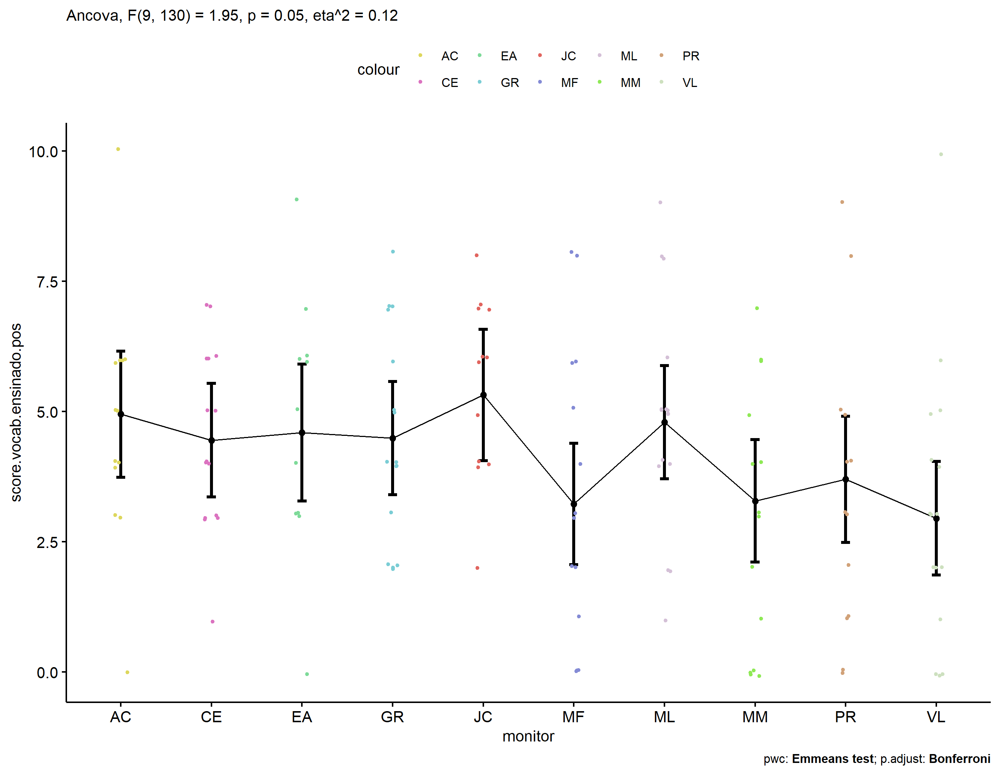<!-- -->

    ## Scale for colour is already present.
    ## Adding another scale for colour, which will replace the existing scale.

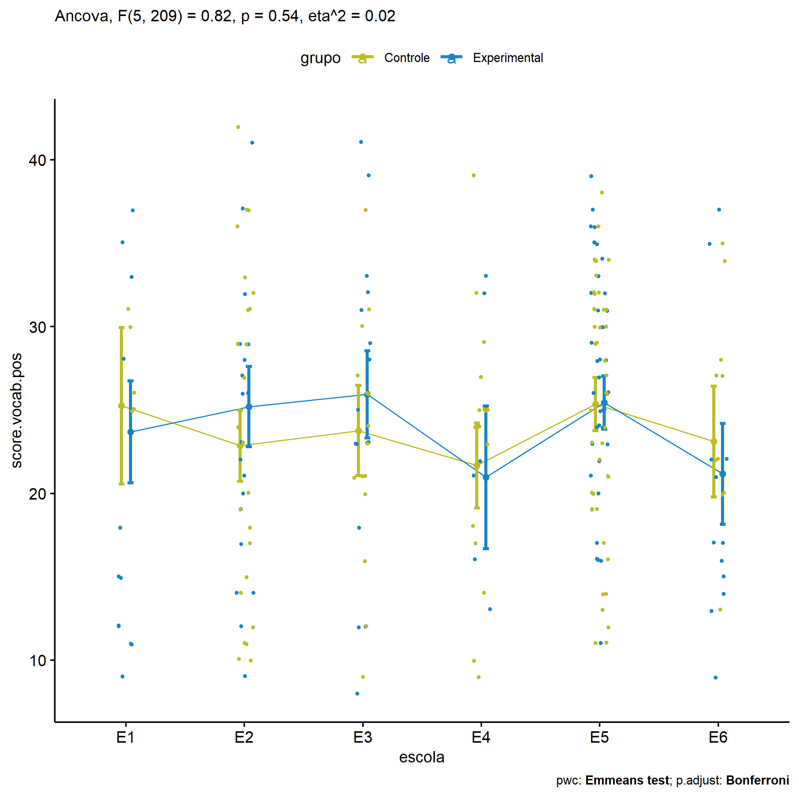<!-- -->

<!-- -->

<!-- -->

<!-- -->

### Vocabulario (TRI)

| var           | escola | grupo        |   n | M (pre) | SE (pre) | M (unadj) | SE (unadj) | M (adj) | SE (adj) |
|:--------------|:-------|:-------------|----:|--------:|---------:|----------:|-----------:|--------:|---------:|
| tri.vocab.pos | E1     | Controle     |   5 |   0.849 |    0.174 |     0.977 |      0.159 |   0.526 |    0.251 |
| tri.vocab.pos | E1     | Experimental |  12 |  -0.445 |    0.331 |    -0.099 |      0.335 |   0.540 |    0.165 |
| tri.vocab.pos | E2     | Controle     |  24 |   0.409 |    0.186 |     0.309 |      0.228 |   0.229 |    0.114 |
| tri.vocab.pos | E2     | Experimental |  19 |   0.081 |    0.207 |     0.245 |      0.207 |   0.441 |    0.129 |
| tri.vocab.pos | E3     | Controle     |  15 |   0.181 |    0.203 |     0.253 |      0.225 |   0.365 |    0.144 |
| tri.vocab.pos | E3     | Experimental |  16 |   0.224 |    0.262 |     0.494 |      0.224 |   0.569 |    0.140 |
| tri.vocab.pos | E4     | Controle     |  17 |   0.403 |    0.169 |     0.205 |      0.225 |   0.130 |    0.135 |
| tri.vocab.pos | E4     | Experimental |   6 |   0.476 |    0.182 |     0.331 |      0.399 |   0.194 |    0.228 |
| tri.vocab.pos | E5     | Controle     |  43 |   0.348 |    0.122 |     0.512 |      0.139 |   0.483 |    0.085 |
| tri.vocab.pos | E5     | Experimental |  43 |   0.495 |    0.118 |     0.679 |      0.108 |   0.527 |    0.086 |
| tri.vocab.pos | E6     | Controle     |  10 |   0.638 |    0.147 |     0.528 |      0.190 |   0.255 |    0.177 |
| tri.vocab.pos | E6     | Experimental |  12 |   0.069 |    0.228 |    -0.056 |      0.242 |   0.150 |    0.162 |

| grupo        | escola | group1   | group2       | estimate | conf.low | conf.high |    se | statistic | p       | p.adj | p.adj.signif |
|:-------------|:-------|:---------|:-------------|---------:|---------:|----------:|------:|----------:|:--------|------:|:-------------|
| Controle     |        | E1       | E2           |    0.297 |   -0.245 |     0.839 | 0.275 |     1.079 | 0.282   | 1.000 | ns           |
| Controle     |        | E1       | E3           |    0.161 |   -0.410 |     0.733 | 0.290 |     0.556 | 0.579   | 1.000 | ns           |
| Controle     |        | E1       | E4           |    0.396 |   -0.165 |     0.957 | 0.285 |     1.391 | 0.166   | 1.000 | ns           |
| Controle     |        | E1       | E5           |    0.043 |   -0.479 |     0.565 | 0.265 |     0.163 | 0.871   | 1.000 | ns           |
| Controle     |        | E1       | E6           |    0.271 |   -0.332 |     0.874 | 0.306 |     0.887 | 0.376   | 1.000 | ns           |
| Controle     |        | E2       | E3           |   -0.136 |   -0.499 |     0.227 | 0.184 |    -0.738 | 0.462   | 1.000 | ns           |
| Controle     |        | E2       | E4           |    0.099 |   -0.250 |     0.448 | 0.177 |     0.560 | 0.576   | 1.000 | ns           |
| Controle     |        | E2       | E5           |   -0.254 |   -0.534 |     0.027 | 0.142 |    -1.785 | 0.076   | 1.000 | ns           |
| Controle     |        | E2       | E6           |   -0.026 |   -0.441 |     0.389 | 0.210 |    -0.123 | 0.902   | 1.000 | ns           |
| Controle     |        | E3       | E4           |    0.235 |   -0.156 |     0.625 | 0.198 |     1.186 | 0.237   | 1.000 | ns           |
| Controle     |        | E3       | E5           |   -0.118 |   -0.448 |     0.212 | 0.168 |    -0.705 | 0.482   | 1.000 | ns           |
| Controle     |        | E3       | E6           |    0.110 |   -0.341 |     0.561 | 0.229 |     0.480 | 0.631   | 1.000 | ns           |
| Controle     |        | E4       | E5           |   -0.353 |   -0.668 |    -0.038 | 0.160 |    -2.207 | 0.028   | 0.426 | ns           |
| Controle     |        | E4       | E6           |   -0.125 |   -0.564 |     0.314 | 0.223 |    -0.561 | 0.576   | 1.000 | ns           |
| Controle     |        | E5       | E6           |    0.228 |   -0.159 |     0.615 | 0.196 |     1.161 | 0.247   | 1.000 | ns           |
| Experimental |        | E1       | E2           |    0.099 |   -0.310 |     0.508 | 0.207 |     0.478 | 0.633   | 1.000 | ns           |
| Experimental |        | E1       | E3           |   -0.029 |   -0.454 |     0.395 | 0.215 |    -0.136 | 0.892   | 1.000 | ns           |
| Experimental |        | E1       | E4           |    0.346 |   -0.211 |     0.902 | 0.282 |     1.225 | 0.222   | 1.000 | ns           |
| Experimental |        | E1       | E5           |    0.012 |   -0.357 |     0.382 | 0.187 |     0.067 | 0.947   | 1.000 | ns           |
| Experimental |        | E1       | E6           |    0.390 |   -0.062 |     0.841 | 0.229 |     1.701 | 0.09    | 1.000 | ns           |
| Experimental |        | E2       | E3           |   -0.128 |   -0.502 |     0.245 | 0.190 |    -0.677 | 0.499   | 1.000 | ns           |
| Experimental |        | E2       | E4           |    0.247 |   -0.270 |     0.763 | 0.262 |     0.942 | 0.347   | 1.000 | ns           |
| Experimental |        | E2       | E5           |   -0.087 |   -0.392 |     0.219 | 0.155 |    -0.558 | 0.577   | 1.000 | ns           |
| Experimental |        | E2       | E6           |    0.291 |   -0.115 |     0.696 | 0.206 |     1.412 | 0.159   | 1.000 | ns           |
| Experimental |        | E3       | E4           |    0.375 |   -0.152 |     0.902 | 0.267 |     1.403 | 0.162   | 1.000 | ns           |
| Experimental |        | E3       | E5           |    0.042 |   -0.281 |     0.365 | 0.164 |     0.255 | 0.799   | 1.000 | ns           |
| Experimental |        | E3       | E6           |    0.419 |   -0.001 |     0.839 | 0.213 |     1.965 | 0.051   | 0.762 | ns           |
| Experimental |        | E4       | E5           |   -0.333 |   -0.813 |     0.146 | 0.243 |    -1.371 | 0.172   | 1.000 | ns           |
| Experimental |        | E4       | E6           |    0.044 |   -0.508 |     0.595 | 0.280 |     0.157 | 0.876   | 1.000 | ns           |
| Experimental |        | E5       | E6           |    0.377 |    0.016 |     0.739 | 0.183 |     2.058 | 0.041   | 0.613 | ns           |
| Controle     |        | E1       | E2           |    0.440 |   -0.361 |     1.241 | 0.406 |     1.084 | 0.28    | 1.000 | ns           |
| Controle     |        | E1       | E3           |    0.668 |   -0.173 |     1.509 | 0.427 |     1.565 | 0.119   | 1.000 | ns           |
| Controle     |        | E1       | E4           |    0.446 |   -0.383 |     1.275 | 0.420 |     1.061 | 0.29    | 1.000 | ns           |
| Controle     |        | E1       | E5           |    0.501 |   -0.269 |     1.271 | 0.390 |     1.283 | 0.201   | 1.000 | ns           |
| Controle     |        | E1       | E6           |    0.210 |   -0.682 |     1.103 | 0.453 |     0.465 | 0.642   | 1.000 | ns           |
| Controle     |        | E2       | E3           |    0.228 |   -0.308 |     0.764 | 0.272 |     0.837 | 0.403   | 1.000 | ns           |
| Controle     |        | E2       | E4           |    0.006 |   -0.511 |     0.522 | 0.262 |     0.022 | 0.983   | 1.000 | ns           |
| Controle     |        | E2       | E5           |    0.061 |   -0.354 |     0.476 | 0.211 |     0.289 | 0.773   | 1.000 | ns           |
| Controle     |        | E2       | E6           |   -0.230 |   -0.843 |     0.383 | 0.311 |    -0.739 | 0.461   | 1.000 | ns           |
| Controle     |        | E3       | E4           |   -0.222 |   -0.799 |     0.355 | 0.293 |    -0.758 | 0.449   | 1.000 | ns           |
| Controle     |        | E3       | E5           |   -0.167 |   -0.655 |     0.322 | 0.248 |    -0.673 | 0.501   | 1.000 | ns           |
| Controle     |        | E3       | E6           |   -0.457 |   -1.122 |     0.208 | 0.337 |    -1.356 | 0.177   | 1.000 | ns           |
| Controle     |        | E4       | E5           |    0.055 |   -0.412 |     0.522 | 0.237 |     0.233 | 0.816   | 1.000 | ns           |
| Controle     |        | E4       | E6           |   -0.235 |   -0.885 |     0.414 | 0.329 |    -0.715 | 0.475   | 1.000 | ns           |
| Controle     |        | E5       | E6           |   -0.291 |   -0.862 |     0.281 | 0.290 |    -1.002 | 0.318   | 1.000 | ns           |
| Experimental |        | E1       | E2           |   -0.526 |   -1.127 |     0.074 | 0.305 |    -1.727 | 0.086   | 1.000 | ns           |
| Experimental |        | E1       | E3           |   -0.669 |   -1.291 |    -0.047 | 0.316 |    -2.120 | 0.035   | 0.528 | ns           |
| Experimental |        | E1       | E4           |   -0.921 |   -1.736 |    -0.107 | 0.413 |    -2.229 | 0.027   | 0.403 | ns           |
| Experimental |        | E1       | E5           |   -0.940 |   -1.471 |    -0.408 | 0.270 |    -3.483 | \<0.001 | 0.009 | \*\*         |
| Experimental |        | E1       | E6           |   -0.513 |   -1.178 |     0.152 | 0.337 |    -1.522 | 0.13    | 1.000 | ns           |
| Experimental |        | E2       | E3           |   -0.143 |   -0.695 |     0.410 | 0.280 |    -0.509 | 0.611   | 1.000 | ns           |
| Experimental |        | E2       | E4           |   -0.395 |   -1.158 |     0.368 | 0.387 |    -1.020 | 0.309   | 1.000 | ns           |
| Experimental |        | E2       | E5           |   -0.413 |   -0.862 |     0.036 | 0.228 |    -1.815 | 0.071   | 1.000 | ns           |
| Experimental |        | E2       | E6           |    0.013 |   -0.588 |     0.614 | 0.305 |     0.042 | 0.966   | 1.000 | ns           |
| Experimental |        | E3       | E4           |   -0.252 |   -1.032 |     0.528 | 0.396 |    -0.637 | 0.525   | 1.000 | ns           |
| Experimental |        | E3       | E5           |   -0.270 |   -0.748 |     0.207 | 0.242 |    -1.118 | 0.265   | 1.000 | ns           |
| Experimental |        | E3       | E6           |    0.156 |   -0.466 |     0.778 | 0.316 |     0.493 | 0.622   | 1.000 | ns           |
| Experimental |        | E4       | E5           |   -0.018 |   -0.728 |     0.691 | 0.360 |    -0.051 | 0.959   | 1.000 | ns           |
| Experimental |        | E4       | E6           |    0.408 |   -0.407 |     1.222 | 0.413 |     0.987 | 0.325   | 1.000 | ns           |
| Experimental |        | E5       | E6           |    0.426 |   -0.106 |     0.958 | 0.270 |     1.579 | 0.116   | 1.000 | ns           |
|              | E1     | Controle | Experimental |   -0.013 |   -0.611 |     0.584 | 0.303 |    -0.044 | 0.965   | 0.965 | ns           |
|              | E2     | Controle | Experimental |   -0.211 |   -0.551 |     0.128 | 0.172 |    -1.228 | 0.221   | 0.221 | ns           |
|              | E3     | Controle | Experimental |   -0.204 |   -0.599 |     0.192 | 0.201 |    -1.017 | 0.311   | 0.311 | ns           |
|              | E4     | Controle | Experimental |   -0.064 |   -0.586 |     0.459 | 0.265 |    -0.240 | 0.811   | 0.811 | ns           |
|              | E5     | Controle | Experimental |   -0.044 |   -0.282 |     0.194 | 0.121 |    -0.365 | 0.715   | 0.715 | ns           |
|              | E6     | Controle | Experimental |    0.105 |   -0.369 |     0.579 | 0.240 |     0.437 | 0.662   | 0.662 | ns           |
|              | E1     | Controle | Experimental |    1.294 |    0.427 |     2.161 | 0.440 |     2.941 | 0.004   | 0.004 | \*\*         |
|              | E2     | Controle | Experimental |    0.327 |   -0.173 |     0.827 | 0.254 |     1.289 | 0.199   | 0.199 | ns           |
|              | E3     | Controle | Experimental |   -0.043 |   -0.629 |     0.542 | 0.297 |    -0.146 | 0.884   | 0.884 | ns           |
|              | E4     | Controle | Experimental |   -0.073 |   -0.847 |     0.700 | 0.392 |    -0.187 | 0.852   | 0.852 | ns           |
|              | E5     | Controle | Experimental |   -0.147 |   -0.498 |     0.204 | 0.178 |    -0.825 | 0.411   | 0.411 | ns           |
|              | E6     | Controle | Experimental |    0.570 |   -0.128 |     1.267 | 0.354 |     1.610 | 0.109   | 0.109 | ns           |

| grupo        | escola | group1 | group2 | estimate | conf.low | conf.high |    se | statistic |     p | p.adj | p.adj.signif |
|:-------------|:-------|:-------|:-------|---------:|---------:|----------:|------:|----------:|------:|------:|:-------------|
| Controle     | E1     | pre    | pos    |    0.149 |   -0.830 |     1.129 | 0.499 |     0.300 | 0.764 | 0.764 | ns           |
| Controle     | E2     | pre    | pos    |    0.067 |   -0.418 |     0.552 | 0.247 |     0.271 | 0.787 | 0.787 | ns           |
| Controle     | E3     | pre    | pos    |   -0.097 |   -0.707 |     0.513 | 0.310 |    -0.313 | 0.755 | 0.755 | ns           |
| Controle     | E4     | pre    | pos    |    0.198 |   -0.384 |     0.780 | 0.296 |     0.667 | 0.505 | 0.505 | ns           |
| Controle     | E5     | pre    | pos    |   -0.118 |   -0.474 |     0.238 | 0.181 |    -0.652 | 0.515 | 0.515 | ns           |
| Controle     | E6     | pre    | pos    |    0.014 |   -0.728 |     0.755 | 0.377 |     0.036 | 0.971 | 0.971 | ns           |
| Experimental | E1     | pre    | pos    |   -0.346 |   -1.039 |     0.347 | 0.353 |    -0.981 | 0.327 | 0.327 | ns           |
| Experimental | E2     | pre    | pos    |   -0.083 |   -0.597 |     0.430 | 0.261 |    -0.319 | 0.750 | 0.750 | ns           |
| Experimental | E3     | pre    | pos    |   -0.269 |   -0.869 |     0.331 | 0.305 |    -0.882 | 0.378 | 0.378 | ns           |
| Experimental | E4     | pre    | pos    |    0.030 |   -0.914 |     0.974 | 0.480 |     0.063 | 0.950 | 0.950 | ns           |
| Experimental | E5     | pre    | pos    |   -0.178 |   -0.536 |     0.180 | 0.182 |    -0.977 | 0.329 | 0.329 | ns           |
| Experimental | E6     | pre    | pos    |    0.105 |   -0.574 |     0.785 | 0.346 |     0.304 | 0.761 | 0.761 | ns           |

    ## Scale for colour is already present.
    ## Adding another scale for colour, which will replace the existing scale.

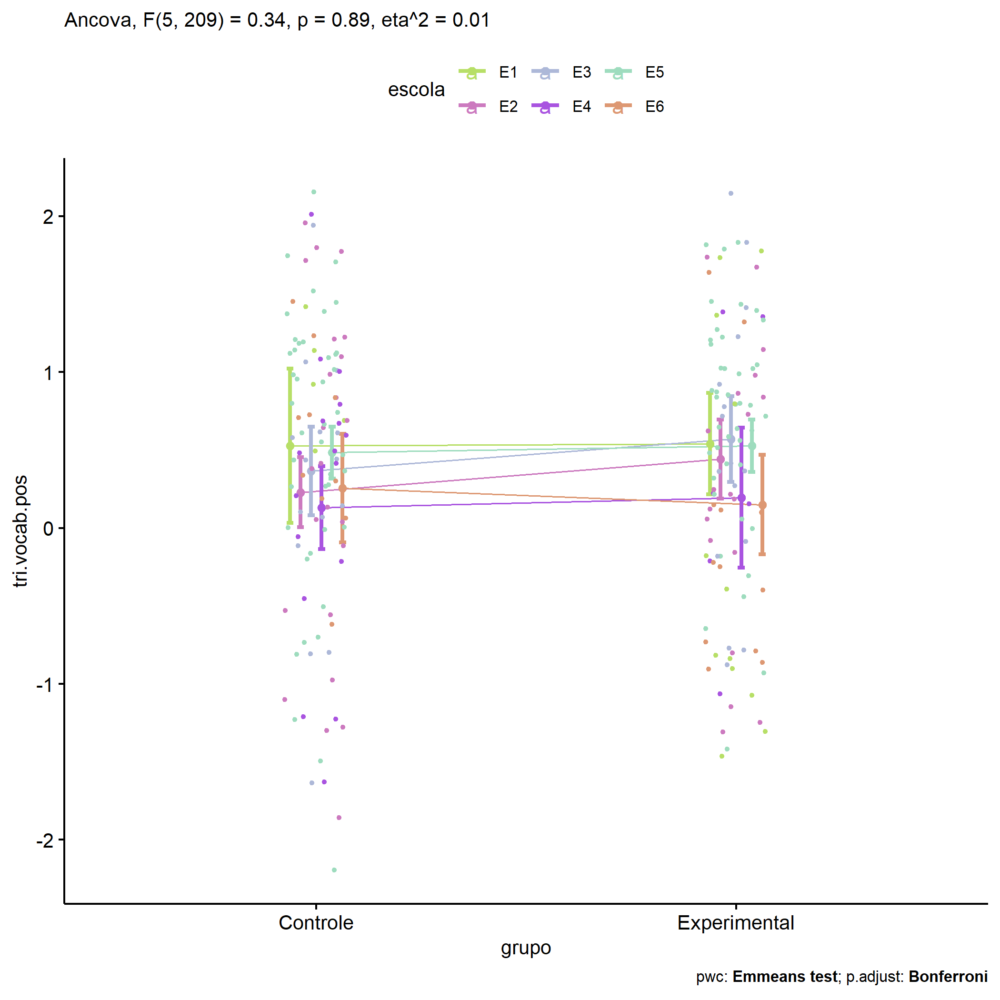<!-- -->

    ## Scale for colour is already present.
    ## Adding another scale for colour, which will replace the existing scale.

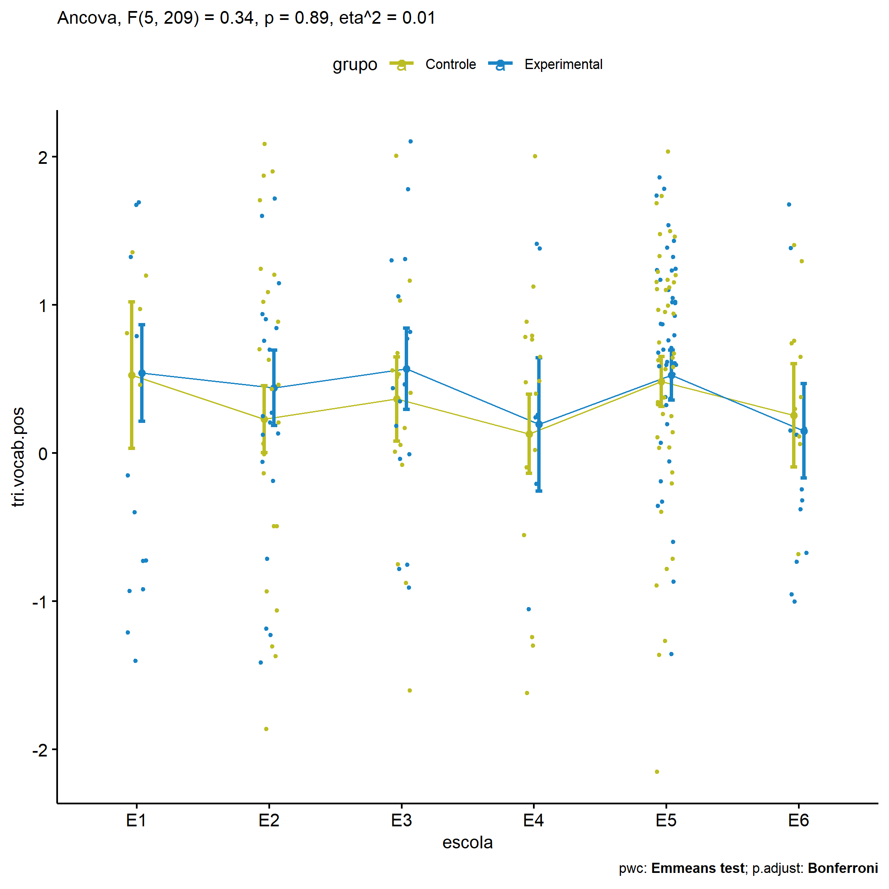<!-- -->

<!-- -->

<!-- -->

### Vocabulario Ensinado (Acertos)

| var                      | escola | grupo        |   n | M (pre) | SE (pre) | M (unadj) | SE (unadj) | M (adj) | SE (adj) |
|:-------------------------|:-------|:-------------|----:|--------:|---------:|----------:|-----------:|--------:|---------:|
| score.vocab.ensinado.pos | E1     | Controle     |   8 |   3.625 |    0.865 |     4.000 |      1.035 |   4.271 |    0.772 |
| score.vocab.ensinado.pos | E1     | Experimental |  13 |   3.462 |    0.550 |     3.462 |      0.781 |   3.797 |    0.607 |
| score.vocab.ensinado.pos | E2     | Controle     |  25 |   4.680 |    0.496 |     4.440 |      0.526 |   4.292 |    0.437 |
| score.vocab.ensinado.pos | E2     | Experimental |  25 |   3.480 |    0.433 |     3.760 |      0.521 |   4.088 |    0.439 |
| score.vocab.ensinado.pos | E3     | Controle     |  16 |   3.625 |    0.569 |     4.312 |      0.463 |   4.583 |    0.547 |
| score.vocab.ensinado.pos | E3     | Experimental |  16 |   4.312 |    0.637 |     4.875 |      0.547 |   4.873 |    0.545 |
| score.vocab.ensinado.pos | E4     | Controle     |  17 |   5.353 |    0.485 |     4.882 |      0.535 |   4.468 |    0.533 |
| score.vocab.ensinado.pos | E4     | Experimental |   7 |   4.143 |    1.164 |     4.857 |      0.670 |   4.922 |    0.824 |
| score.vocab.ensinado.pos | E5     | Controle     |  49 |   4.184 |    0.352 |     4.224 |      0.299 |   4.274 |    0.311 |
| score.vocab.ensinado.pos | E5     | Experimental |  47 |   4.745 |    0.259 |     4.766 |      0.340 |   4.593 |    0.319 |
| score.vocab.ensinado.pos | E6     | Controle     |  11 |   4.182 |    0.736 |     3.818 |      0.736 |   3.868 |    0.657 |
| score.vocab.ensinado.pos | E6     | Experimental |  13 |   5.000 |    0.641 |     3.692 |      0.702 |   3.418 |    0.606 |

| grupo        | escola | group1   | group2       | estimate | conf.low | conf.high |    se | statistic |     p | p.adj | p.adj.signif |
|:-------------|:-------|:---------|:-------------|---------:|---------:|----------:|------:|----------:|------:|------:|:-------------|
| Controle     |        | E1       | E2           |   -0.022 |   -1.771 |     1.728 | 0.888 |    -0.025 | 0.980 | 1.000 | ns           |
| Controle     |        | E1       | E3           |   -0.313 |   -2.172 |     1.547 | 0.944 |    -0.331 | 0.741 | 1.000 | ns           |
| Controle     |        | E1       | E4           |   -0.197 |   -2.051 |     1.656 | 0.941 |    -0.210 | 0.834 | 1.000 | ns           |
| Controle     |        | E1       | E5           |   -0.003 |   -1.642 |     1.636 | 0.832 |    -0.004 | 0.997 | 1.000 | ns           |
| Controle     |        | E1       | E6           |    0.403 |   -1.594 |     2.399 | 1.013 |     0.397 | 0.692 | 1.000 | ns           |
| Controle     |        | E2       | E3           |   -0.291 |   -1.672 |     1.090 | 0.701 |    -0.415 | 0.679 | 1.000 | ns           |
| Controle     |        | E2       | E4           |   -0.176 |   -1.528 |     1.177 | 0.687 |    -0.256 | 0.798 | 1.000 | ns           |
| Controle     |        | E2       | E5           |    0.019 |   -1.039 |     1.076 | 0.537 |     0.035 | 0.972 | 1.000 | ns           |
| Controle     |        | E2       | E6           |    0.424 |   -1.131 |     1.979 | 0.789 |     0.538 | 0.591 | 1.000 | ns           |
| Controle     |        | E3       | E4           |    0.115 |   -1.396 |     1.626 | 0.767 |     0.150 | 0.881 | 1.000 | ns           |
| Controle     |        | E3       | E5           |    0.309 |   -0.929 |     1.548 | 0.629 |     0.492 | 0.623 | 1.000 | ns           |
| Controle     |        | E3       | E6           |    0.715 |   -0.968 |     2.398 | 0.854 |     0.837 | 0.404 | 1.000 | ns           |
| Controle     |        | E4       | E5           |    0.194 |   -1.023 |     1.412 | 0.618 |     0.315 | 0.753 | 1.000 | ns           |
| Controle     |        | E4       | E6           |    0.600 |   -1.068 |     2.268 | 0.847 |     0.709 | 0.479 | 1.000 | ns           |
| Controle     |        | E5       | E6           |    0.406 |   -1.027 |     1.838 | 0.727 |     0.558 | 0.578 | 1.000 | ns           |
| Experimental |        | E1       | E2           |   -0.291 |   -1.760 |     1.177 | 0.745 |    -0.391 | 0.696 | 1.000 | ns           |
| Experimental |        | E1       | E3           |   -1.076 |   -2.683 |     0.531 | 0.816 |    -1.319 | 0.188 | 1.000 | ns           |
| Experimental |        | E1       | E4           |   -1.126 |   -3.141 |     0.890 | 1.023 |    -1.100 | 0.272 | 1.000 | ns           |
| Experimental |        | E1       | E5           |   -0.796 |   -2.151 |     0.559 | 0.688 |    -1.157 | 0.248 | 1.000 | ns           |
| Experimental |        | E1       | E6           |    0.379 |   -1.316 |     2.074 | 0.860 |     0.441 | 0.660 | 1.000 | ns           |
| Experimental |        | E2       | E3           |   -0.785 |   -2.164 |     0.594 | 0.700 |    -1.122 | 0.263 | 1.000 | ns           |
| Experimental |        | E2       | E4           |   -0.834 |   -2.673 |     1.004 | 0.933 |    -0.894 | 0.372 | 1.000 | ns           |
| Experimental |        | E2       | E5           |   -0.505 |   -1.579 |     0.570 | 0.545 |    -0.925 | 0.356 | 1.000 | ns           |
| Experimental |        | E2       | E6           |    0.670 |   -0.810 |     2.151 | 0.751 |     0.892 | 0.373 | 1.000 | ns           |
| Experimental |        | E3       | E4           |   -0.049 |   -1.996 |     1.897 | 0.988 |    -0.050 | 0.960 | 1.000 | ns           |
| Experimental |        | E3       | E5           |    0.280 |   -0.964 |     1.525 | 0.632 |     0.444 | 0.657 | 1.000 | ns           |
| Experimental |        | E3       | E6           |    1.455 |   -0.151 |     3.061 | 0.815 |     1.785 | 0.075 | 1.000 | ns           |
| Experimental |        | E4       | E5           |    0.330 |   -1.412 |     2.071 | 0.884 |     0.373 | 0.709 | 1.000 | ns           |
| Experimental |        | E4       | E6           |    1.505 |   -0.511 |     3.521 | 1.023 |     1.470 | 0.143 | 1.000 | ns           |
| Experimental |        | E5       | E6           |    1.175 |   -0.171 |     2.521 | 0.683 |     1.719 | 0.087 | 1.000 | ns           |
| Controle     |        | E1       | E2           |   -1.055 |   -2.867 |     0.757 | 0.920 |    -1.147 | 0.252 | 1.000 | ns           |
| Controle     |        | E1       | E3           |    0.000 |   -1.931 |     1.931 | 0.980 |     0.000 | 1.000 | 1.000 | ns           |
| Controle     |        | E1       | E4           |   -1.728 |   -3.640 |     0.184 | 0.971 |    -1.780 | 0.076 | 1.000 | ns           |
| Controle     |        | E1       | E5           |   -0.559 |   -2.260 |     1.142 | 0.863 |    -0.647 | 0.518 | 1.000 | ns           |
| Controle     |        | E1       | E6           |   -0.557 |   -2.629 |     1.516 | 1.052 |    -0.529 | 0.597 | 1.000 | ns           |
| Controle     |        | E2       | E3           |    1.055 |   -0.373 |     2.483 | 0.725 |     1.455 | 0.147 | 1.000 | ns           |
| Controle     |        | E2       | E4           |   -0.673 |   -2.075 |     0.729 | 0.712 |    -0.945 | 0.345 | 1.000 | ns           |
| Controle     |        | E2       | E5           |    0.496 |   -0.600 |     1.593 | 0.556 |     0.892 | 0.373 | 1.000 | ns           |
| Controle     |        | E2       | E6           |    0.498 |   -1.116 |     2.112 | 0.819 |     0.608 | 0.544 | 1.000 | ns           |
| Controle     |        | E3       | E4           |   -1.728 |   -3.282 |    -0.174 | 0.789 |    -2.191 | 0.029 | 0.441 | ns           |
| Controle     |        | E3       | E5           |   -0.559 |   -1.843 |     0.726 | 0.652 |    -0.857 | 0.392 | 1.000 | ns           |
| Controle     |        | E3       | E6           |   -0.557 |   -2.304 |     1.190 | 0.887 |    -0.628 | 0.531 | 1.000 | ns           |
| Controle     |        | E4       | E5           |    1.169 |   -0.086 |     2.425 | 0.637 |     1.835 | 0.068 | 1.000 | ns           |
| Controle     |        | E4       | E6           |    1.171 |   -0.555 |     2.897 | 0.876 |     1.337 | 0.183 | 1.000 | ns           |
| Controle     |        | E5       | E6           |    0.002 |   -1.486 |     1.490 | 0.755 |     0.002 | 0.998 | 1.000 | ns           |
| Experimental |        | E1       | E2           |   -0.018 |   -1.544 |     1.507 | 0.774 |    -0.024 | 0.981 | 1.000 | ns           |
| Experimental |        | E1       | E3           |   -0.851 |   -2.516 |     0.815 | 0.845 |    -1.007 | 0.315 | 1.000 | ns           |
| Experimental |        | E1       | E4           |   -0.681 |   -2.772 |     1.410 | 1.061 |    -0.642 | 0.522 | 1.000 | ns           |
| Experimental |        | E1       | E5           |   -1.283 |   -2.681 |     0.115 | 0.709 |    -1.809 | 0.072 | 1.000 | ns           |
| Experimental |        | E1       | E6           |   -1.538 |   -3.288 |     0.211 | 0.888 |    -1.732 | 0.085 | 1.000 | ns           |
| Experimental |        | E2       | E3           |   -0.833 |   -2.261 |     0.596 | 0.725 |    -1.148 | 0.252 | 1.000 | ns           |
| Experimental |        | E2       | E4           |   -0.663 |   -2.570 |     1.245 | 0.968 |    -0.685 | 0.494 | 1.000 | ns           |
| Experimental |        | E2       | E5           |   -1.265 |   -2.369 |    -0.161 | 0.560 |    -2.257 | 0.025 | 0.374 | ns           |
| Experimental |        | E2       | E6           |   -1.520 |   -3.045 |     0.005 | 0.774 |    -1.963 | 0.051 | 0.762 | ns           |
| Experimental |        | E3       | E4           |    0.170 |   -1.852 |     2.191 | 1.026 |     0.165 | 0.869 | 1.000 | ns           |
| Experimental |        | E3       | E5           |   -0.432 |   -1.723 |     0.859 | 0.655 |    -0.659 | 0.510 | 1.000 | ns           |
| Experimental |        | E3       | E6           |   -0.688 |   -2.353 |     0.978 | 0.845 |    -0.813 | 0.417 | 1.000 | ns           |
| Experimental |        | E4       | E5           |   -0.602 |   -2.409 |     1.205 | 0.917 |    -0.656 | 0.512 | 1.000 | ns           |
| Experimental |        | E4       | E6           |   -0.857 |   -2.948 |     1.234 | 1.061 |    -0.808 | 0.420 | 1.000 | ns           |
| Experimental |        | E5       | E6           |   -0.255 |   -1.653 |     1.142 | 0.709 |    -0.360 | 0.719 | 1.000 | ns           |
|              | E1     | Controle | Experimental |    0.474 |   -1.456 |     2.404 | 0.980 |     0.484 | 0.629 | 0.629 | ns           |
|              | E2     | Controle | Experimental |    0.204 |   -1.019 |     1.428 | 0.621 |     0.329 | 0.742 | 0.742 | ns           |
|              | E3     | Controle | Experimental |   -0.290 |   -1.811 |     1.231 | 0.772 |    -0.376 | 0.707 | 0.707 | ns           |
|              | E4     | Controle | Experimental |   -0.454 |   -2.389 |     1.480 | 0.982 |    -0.463 | 0.644 | 0.644 | ns           |
|              | E5     | Controle | Experimental |   -0.319 |   -1.199 |     0.560 | 0.446 |    -0.715 | 0.475 | 0.475 | ns           |
|              | E6     | Controle | Experimental |    0.450 |   -1.312 |     2.212 | 0.894 |     0.503 | 0.615 | 0.615 | ns           |
|              | E1     | Controle | Experimental |    0.163 |   -1.841 |     2.168 | 1.017 |     0.161 | 0.872 | 0.872 | ns           |
|              | E2     | Controle | Experimental |    1.200 |   -0.062 |     2.462 | 0.640 |     1.874 | 0.062 | 0.062 | ns           |
|              | E3     | Controle | Experimental |   -0.687 |   -2.265 |     0.890 | 0.800 |    -0.859 | 0.391 | 0.391 | ns           |
|              | E4     | Controle | Experimental |    1.210 |   -0.793 |     3.213 | 1.017 |     1.190 | 0.235 | 0.235 | ns           |
|              | E5     | Controle | Experimental |   -0.561 |   -1.472 |     0.350 | 0.462 |    -1.214 | 0.226 | 0.226 | ns           |
|              | E6     | Controle | Experimental |   -0.818 |   -2.646 |     1.009 | 0.928 |    -0.882 | 0.379 | 0.379 | ns           |

| grupo        | escola | group1 | group2 | estimate | conf.low | conf.high |    se | statistic |     p | p.adj | p.adj.signif |
|:-------------|:-------|:-------|:-------|---------:|---------:|----------:|------:|----------:|------:|------:|:-------------|
| Controle     | E1     | pre    | pos    |   -0.375 |   -2.644 |     1.894 | 1.154 |    -0.325 | 0.745 | 0.745 | ns           |
| Controle     | E2     | pre    | pos    |    0.240 |   -1.043 |     1.523 | 0.653 |     0.367 | 0.713 | 0.713 | ns           |
| Controle     | E3     | pre    | pos    |   -0.688 |   -2.292 |     0.917 | 0.816 |    -0.842 | 0.400 | 0.400 | ns           |
| Controle     | E4     | pre    | pos    |    0.471 |   -1.086 |     2.027 | 0.792 |     0.594 | 0.553 | 0.553 | ns           |
| Controle     | E5     | pre    | pos    |   -0.041 |   -0.957 |     0.876 | 0.466 |    -0.087 | 0.930 | 0.930 | ns           |
| Controle     | E6     | pre    | pos    |    0.364 |   -1.571 |     2.298 | 0.985 |     0.369 | 0.712 | 0.712 | ns           |
| Experimental | E1     | pre    | pos    |    0.000 |   -1.780 |     1.780 | 0.906 |     0.000 | 1.000 | 1.000 | ns           |
| Experimental | E2     | pre    | pos    |   -0.280 |   -1.563 |     1.003 | 0.653 |    -0.429 | 0.668 | 0.668 | ns           |
| Experimental | E3     | pre    | pos    |   -0.563 |   -2.167 |     1.042 | 0.816 |    -0.689 | 0.491 | 0.491 | ns           |
| Experimental | E4     | pre    | pos    |   -0.714 |   -3.140 |     1.711 | 1.234 |    -0.579 | 0.563 | 0.563 | ns           |
| Experimental | E5     | pre    | pos    |   -0.021 |   -0.957 |     0.915 | 0.476 |    -0.045 | 0.964 | 0.964 | ns           |
| Experimental | E6     | pre    | pos    |    1.308 |   -0.472 |     3.087 | 0.906 |     1.444 | 0.149 | 0.149 | ns           |

    ## Scale for colour is already present.
    ## Adding another scale for colour, which will replace the existing scale.

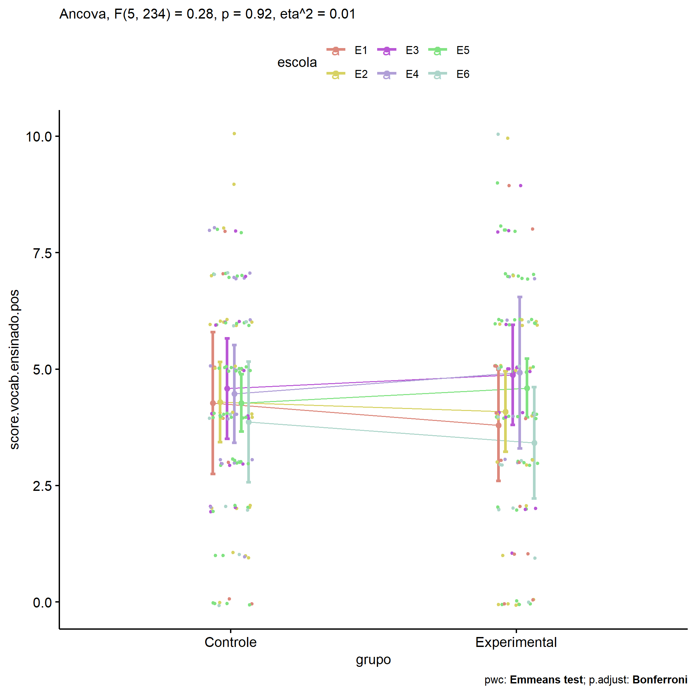<!-- -->

    ## Scale for colour is already present.
    ## Adding another scale for colour, which will replace the existing scale.

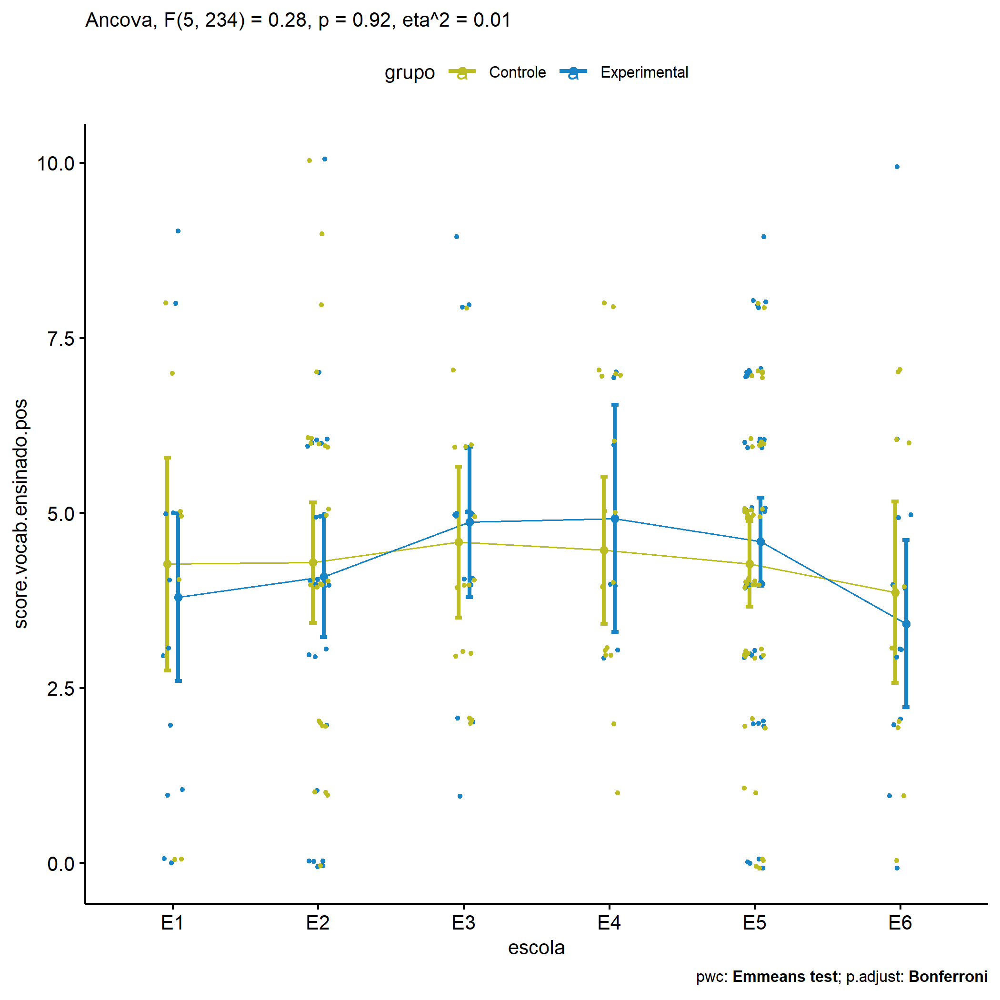<!-- -->

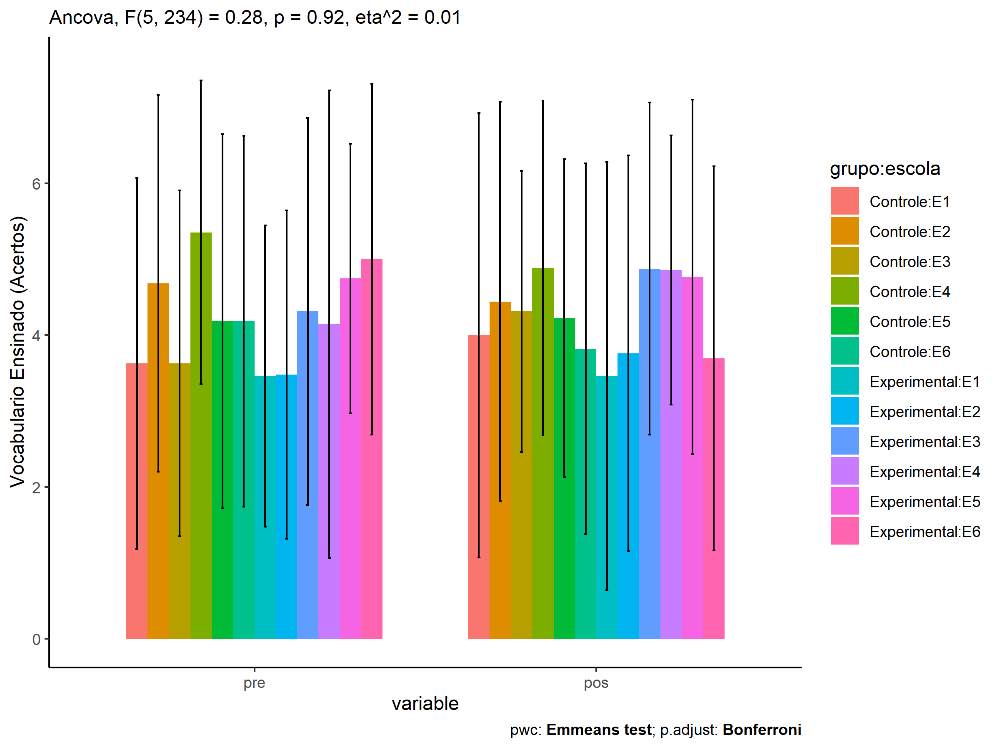<!-- -->

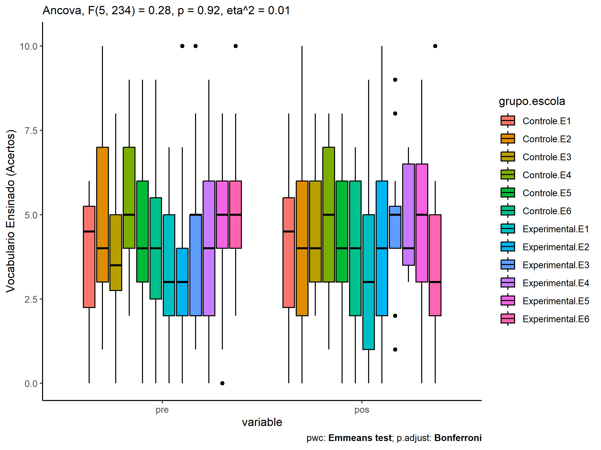<!-- -->

<!-- -->

### Vocabulario Ensinado (TRI)

| var                    | escola | grupo        |   n | M (pre) | SE (pre) | M (unadj) | SE (unadj) | M (adj) | SE (adj) |
|:-----------------------|:-------|:-------------|----:|--------:|---------:|----------:|-----------:|--------:|---------:|
| tri.vocab.ensinado.pos | E1     | Controle     |   5 |   0.732 |    0.109 |     0.868 |      0.122 |   0.575 |    0.278 |
| tri.vocab.ensinado.pos | E1     | Experimental |  12 |  -0.142 |    0.218 |    -0.196 |      0.272 |   0.003 |    0.179 |
| tri.vocab.ensinado.pos | E2     | Controle     |  24 |   0.262 |    0.163 |     0.225 |      0.171 |   0.197 |    0.126 |
| tri.vocab.ensinado.pos | E2     | Experimental |  19 |  -0.256 |    0.183 |     0.297 |      0.165 |   0.561 |    0.144 |
| tri.vocab.ensinado.pos | E3     | Controle     |  15 |   0.019 |    0.190 |     0.059 |      0.192 |   0.167 |    0.160 |
| tri.vocab.ensinado.pos | E3     | Experimental |  16 |   0.065 |    0.234 |     0.184 |      0.206 |   0.267 |    0.155 |
| tri.vocab.ensinado.pos | E4     | Controle     |  17 |   0.287 |    0.177 |     0.280 |      0.196 |   0.238 |    0.150 |
| tri.vocab.ensinado.pos | E4     | Experimental |   6 |   0.129 |    0.263 |     0.077 |      0.361 |   0.124 |    0.252 |
| tri.vocab.ensinado.pos | E5     | Controle     |  43 |   0.281 |    0.128 |     0.362 |      0.111 |   0.323 |    0.094 |
| tri.vocab.ensinado.pos | E5     | Experimental |  43 |   0.417 |    0.085 |     0.554 |      0.088 |   0.439 |    0.095 |
| tri.vocab.ensinado.pos | E6     | Controle     |  10 |   0.441 |    0.235 |     0.296 |      0.239 |   0.167 |    0.196 |
| tri.vocab.ensinado.pos | E6     | Experimental |  12 |   0.194 |    0.247 |    -0.059 |      0.251 |  -0.049 |    0.178 |

| grupo        | escola | group1   | group2       | estimate | conf.low | conf.high |    se | statistic |     p | p.adj | p.adj.signif |
|:-------------|:-------|:---------|:-------------|---------:|---------:|----------:|------:|----------:|------:|------:|:-------------|
| Controle     |        | E1       | E2           |    0.378 |   -0.222 |     0.979 | 0.305 |     1.242 | 0.216 | 1.000 | ns           |
| Controle     |        | E1       | E3           |    0.408 |   -0.225 |     1.041 | 0.321 |     1.270 | 0.205 | 1.000 | ns           |
| Controle     |        | E1       | E4           |    0.338 |   -0.283 |     0.959 | 0.315 |     1.072 | 0.285 | 1.000 | ns           |
| Controle     |        | E1       | E5           |    0.252 |   -0.325 |     0.830 | 0.293 |     0.863 | 0.389 | 1.000 | ns           |
| Controle     |        | E1       | E6           |    0.408 |   -0.259 |     1.075 | 0.338 |     1.206 | 0.229 | 1.000 | ns           |
| Controle     |        | E2       | E3           |    0.030 |   -0.372 |     0.431 | 0.204 |     0.146 | 0.884 | 1.000 | ns           |
| Controle     |        | E2       | E4           |   -0.041 |   -0.426 |     0.345 | 0.196 |    -0.208 | 0.836 | 1.000 | ns           |
| Controle     |        | E2       | E5           |   -0.126 |   -0.436 |     0.184 | 0.157 |    -0.800 | 0.424 | 1.000 | ns           |
| Controle     |        | E2       | E6           |    0.030 |   -0.429 |     0.488 | 0.233 |     0.128 | 0.898 | 1.000 | ns           |
| Controle     |        | E3       | E4           |   -0.070 |   -0.502 |     0.362 | 0.219 |    -0.321 | 0.748 | 1.000 | ns           |
| Controle     |        | E3       | E5           |   -0.156 |   -0.522 |     0.210 | 0.186 |    -0.838 | 0.403 | 1.000 | ns           |
| Controle     |        | E3       | E6           |    0.000 |   -0.499 |     0.499 | 0.253 |     0.000 | 1.000 | 1.000 | ns           |
| Controle     |        | E4       | E5           |   -0.085 |   -0.434 |     0.263 | 0.177 |    -0.482 | 0.630 | 1.000 | ns           |
| Controle     |        | E4       | E6           |    0.070 |   -0.415 |     0.556 | 0.246 |     0.286 | 0.775 | 1.000 | ns           |
| Controle     |        | E5       | E6           |    0.156 |   -0.272 |     0.583 | 0.217 |     0.718 | 0.474 | 1.000 | ns           |
| Experimental |        | E1       | E2           |   -0.558 |   -1.006 |    -0.109 | 0.228 |    -2.449 | 0.015 | 0.227 | ns           |
| Experimental |        | E1       | E3           |   -0.264 |   -0.729 |     0.202 | 0.236 |    -1.117 | 0.265 | 1.000 | ns           |
| Experimental |        | E1       | E4           |   -0.120 |   -0.729 |     0.489 | 0.309 |    -0.389 | 0.697 | 1.000 | ns           |
| Experimental |        | E1       | E5           |   -0.436 |   -0.838 |    -0.034 | 0.204 |    -2.139 | 0.034 | 0.505 | ns           |
| Experimental |        | E1       | E6           |    0.052 |   -0.446 |     0.550 | 0.253 |     0.206 | 0.837 | 1.000 | ns           |
| Experimental |        | E2       | E3           |    0.294 |   -0.120 |     0.708 | 0.210 |     1.399 | 0.163 | 1.000 | ns           |
| Experimental |        | E2       | E4           |    0.437 |   -0.134 |     1.009 | 0.290 |     1.509 | 0.133 | 1.000 | ns           |
| Experimental |        | E2       | E5           |    0.121 |   -0.222 |     0.465 | 0.174 |     0.697 | 0.486 | 1.000 | ns           |
| Experimental |        | E2       | E6           |    0.610 |    0.158 |     1.061 | 0.229 |     2.663 | 0.008 | 0.125 | ns           |
| Experimental |        | E3       | E4           |    0.143 |   -0.439 |     0.726 | 0.295 |     0.485 | 0.628 | 1.000 | ns           |
| Experimental |        | E3       | E5           |   -0.173 |   -0.531 |     0.186 | 0.182 |    -0.949 | 0.344 | 1.000 | ns           |
| Experimental |        | E3       | E6           |    0.316 |   -0.149 |     0.780 | 0.236 |     1.339 | 0.182 | 1.000 | ns           |
| Experimental |        | E4       | E5           |   -0.316 |   -0.847 |     0.215 | 0.269 |    -1.172 | 0.243 | 1.000 | ns           |
| Experimental |        | E4       | E6           |    0.172 |   -0.436 |     0.781 | 0.309 |     0.559 | 0.577 | 1.000 | ns           |
| Experimental |        | E5       | E6           |    0.488 |    0.090 |     0.886 | 0.202 |     2.419 | 0.016 | 0.246 | ns           |
| Controle     |        | E1       | E2           |    0.470 |   -0.261 |     1.201 | 0.371 |     1.267 | 0.206 | 1.000 | ns           |
| Controle     |        | E1       | E3           |    0.712 |   -0.056 |     1.480 | 0.390 |     1.828 | 0.069 | 1.000 | ns           |
| Controle     |        | E1       | E4           |    0.445 |   -0.312 |     1.201 | 0.384 |     1.159 | 0.248 | 1.000 | ns           |
| Controle     |        | E1       | E5           |    0.450 |   -0.252 |     1.153 | 0.356 |     1.263 | 0.208 | 1.000 | ns           |
| Controle     |        | E1       | E6           |    0.291 |   -0.524 |     1.105 | 0.413 |     0.704 | 0.482 | 1.000 | ns           |
| Controle     |        | E2       | E3           |    0.242 |   -0.247 |     0.732 | 0.248 |     0.976 | 0.330 | 1.000 | ns           |
| Controle     |        | E2       | E4           |   -0.025 |   -0.497 |     0.446 | 0.239 |    -0.106 | 0.916 | 1.000 | ns           |
| Controle     |        | E2       | E5           |   -0.020 |   -0.399 |     0.359 | 0.192 |    -0.103 | 0.918 | 1.000 | ns           |
| Controle     |        | E2       | E6           |   -0.179 |   -0.739 |     0.381 | 0.284 |    -0.631 | 0.529 | 1.000 | ns           |
| Controle     |        | E3       | E4           |   -0.268 |   -0.794 |     0.259 | 0.267 |    -1.001 | 0.318 | 1.000 | ns           |
| Controle     |        | E3       | E5           |   -0.262 |   -0.708 |     0.184 | 0.226 |    -1.159 | 0.248 | 1.000 | ns           |
| Controle     |        | E3       | E6           |   -0.421 |   -1.028 |     0.186 | 0.308 |    -1.368 | 0.173 | 1.000 | ns           |
| Controle     |        | E4       | E5           |    0.005 |   -0.421 |     0.431 | 0.216 |     0.025 | 0.980 | 1.000 | ns           |
| Controle     |        | E4       | E6           |   -0.154 |   -0.746 |     0.439 | 0.301 |    -0.512 | 0.610 | 1.000 | ns           |
| Controle     |        | E5       | E6           |   -0.159 |   -0.681 |     0.363 | 0.265 |    -0.601 | 0.548 | 1.000 | ns           |
| Experimental |        | E1       | E2           |    0.114 |   -0.435 |     0.662 | 0.278 |     0.409 | 0.683 | 1.000 | ns           |
| Experimental |        | E1       | E3           |   -0.206 |   -0.774 |     0.361 | 0.288 |    -0.716 | 0.475 | 1.000 | ns           |
| Experimental |        | E1       | E4           |   -0.271 |   -1.014 |     0.473 | 0.377 |    -0.718 | 0.473 | 1.000 | ns           |
| Experimental |        | E1       | E5           |   -0.558 |   -1.044 |    -0.073 | 0.246 |    -2.268 | 0.024 | 0.366 | ns           |
| Experimental |        | E1       | E6           |   -0.335 |   -0.942 |     0.272 | 0.308 |    -1.089 | 0.277 | 1.000 | ns           |
| Experimental |        | E2       | E3           |   -0.320 |   -0.825 |     0.184 | 0.256 |    -1.251 | 0.212 | 1.000 | ns           |
| Experimental |        | E2       | E4           |   -0.385 |   -1.081 |     0.312 | 0.353 |    -1.089 | 0.277 | 1.000 | ns           |
| Experimental |        | E2       | E5           |   -0.672 |   -1.082 |    -0.263 | 0.208 |    -3.235 | 0.001 | 0.021 | \*           |
| Experimental |        | E2       | E6           |   -0.449 |   -0.997 |     0.099 | 0.278 |    -1.615 | 0.108 | 1.000 | ns           |
| Experimental |        | E3       | E4           |   -0.065 |   -0.776 |     0.647 | 0.361 |    -0.179 | 0.858 | 1.000 | ns           |
| Experimental |        | E3       | E5           |   -0.352 |   -0.787 |     0.083 | 0.221 |    -1.594 | 0.112 | 1.000 | ns           |
| Experimental |        | E3       | E6           |   -0.129 |   -0.697 |     0.439 | 0.288 |    -0.448 | 0.655 | 1.000 | ns           |
| Experimental |        | E4       | E5           |   -0.287 |   -0.936 |     0.361 | 0.329 |    -0.875 | 0.383 | 1.000 | ns           |
| Experimental |        | E4       | E6           |   -0.064 |   -0.808 |     0.679 | 0.377 |    -0.171 | 0.865 | 1.000 | ns           |
| Experimental |        | E5       | E6           |    0.223 |   -0.262 |     0.709 | 0.246 |     0.906 | 0.366 | 1.000 | ns           |
|              | E1     | Controle | Experimental |    0.572 |   -0.083 |     1.227 | 0.332 |     1.723 | 0.086 | 0.086 | ns           |
|              | E2     | Controle | Experimental |   -0.364 |   -0.742 |     0.014 | 0.192 |    -1.897 | 0.059 | 0.059 | ns           |
|              | E3     | Controle | Experimental |   -0.099 |   -0.537 |     0.338 | 0.222 |    -0.448 | 0.655 | 0.655 | ns           |
|              | E4     | Controle | Experimental |    0.114 |   -0.464 |     0.692 | 0.293 |     0.390 | 0.697 | 0.697 | ns           |
|              | E5     | Controle | Experimental |   -0.116 |   -0.379 |     0.146 | 0.133 |    -0.873 | 0.384 | 0.384 | ns           |
|              | E6     | Controle | Experimental |    0.216 |   -0.305 |     0.738 | 0.265 |     0.817 | 0.415 | 0.415 | ns           |
|              | E1     | Controle | Experimental |    0.873 |    0.082 |     1.665 | 0.402 |     2.175 | 0.031 | 0.031 | \*           |
|              | E2     | Controle | Experimental |    0.517 |    0.060 |     0.974 | 0.232 |     2.232 | 0.027 | 0.027 | \*           |
|              | E3     | Controle | Experimental |   -0.045 |   -0.580 |     0.489 | 0.271 |    -0.167 | 0.868 | 0.868 | ns           |
|              | E4     | Controle | Experimental |    0.158 |   -0.548 |     0.864 | 0.358 |     0.440 | 0.660 | 0.660 | ns           |
|              | E5     | Controle | Experimental |   -0.135 |   -0.456 |     0.185 | 0.163 |    -0.832 | 0.407 | 0.407 | ns           |
|              | E6     | Controle | Experimental |    0.247 |   -0.390 |     0.884 | 0.323 |     0.765 | 0.445 | 0.445 | ns           |

| grupo        | escola | group1 | group2 | estimate | conf.low | conf.high |    se | statistic |     p | p.adj | p.adj.signif |
|:-------------|:-------|:-------|:-------|---------:|---------:|----------:|------:|----------:|------:|------:|:-------------|
| Controle     | E1     | pre    | pos    |    0.125 |   -0.732 |     0.982 | 0.436 |     0.287 | 0.774 | 0.774 | ns           |
| Controle     | E2     | pre    | pos    |    0.002 |   -0.422 |     0.427 | 0.216 |     0.011 | 0.992 | 0.992 | ns           |
| Controle     | E3     | pre    | pos    |   -0.128 |   -0.662 |     0.406 | 0.272 |    -0.472 | 0.637 | 0.637 | ns           |
| Controle     | E4     | pre    | pos    |    0.007 |   -0.502 |     0.516 | 0.259 |     0.027 | 0.978 | 0.978 | ns           |
| Controle     | E5     | pre    | pos    |   -0.062 |   -0.373 |     0.249 | 0.158 |    -0.392 | 0.696 | 0.696 | ns           |
| Controle     | E6     | pre    | pos    |    0.058 |   -0.591 |     0.707 | 0.330 |     0.176 | 0.861 | 0.861 | ns           |
| Experimental | E1     | pre    | pos    |    0.054 |   -0.552 |     0.661 | 0.308 |     0.176 | 0.860 | 0.860 | ns           |
| Experimental | E2     | pre    | pos    |   -0.403 |   -0.852 |     0.047 | 0.229 |    -1.761 | 0.079 | 0.079 | ns           |
| Experimental | E3     | pre    | pos    |   -0.119 |   -0.644 |     0.406 | 0.267 |    -0.445 | 0.656 | 0.656 | ns           |
| Experimental | E4     | pre    | pos    |   -0.083 |   -0.909 |     0.743 | 0.420 |    -0.197 | 0.844 | 0.844 | ns           |
| Experimental | E5     | pre    | pos    |   -0.129 |   -0.442 |     0.184 | 0.159 |    -0.808 | 0.419 | 0.419 | ns           |
| Experimental | E6     | pre    | pos    |    0.236 |   -0.358 |     0.831 | 0.302 |     0.781 | 0.435 | 0.435 | ns           |

    ## Scale for colour is already present.
    ## Adding another scale for colour, which will replace the existing scale.

<!-- -->

    ## Scale for colour is already present.
    ## Adding another scale for colour, which will replace the existing scale.

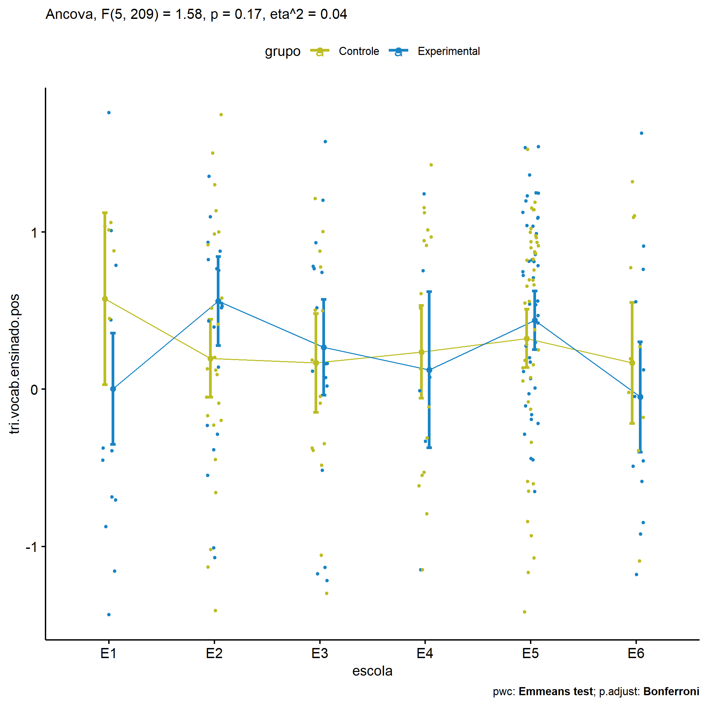<!-- -->

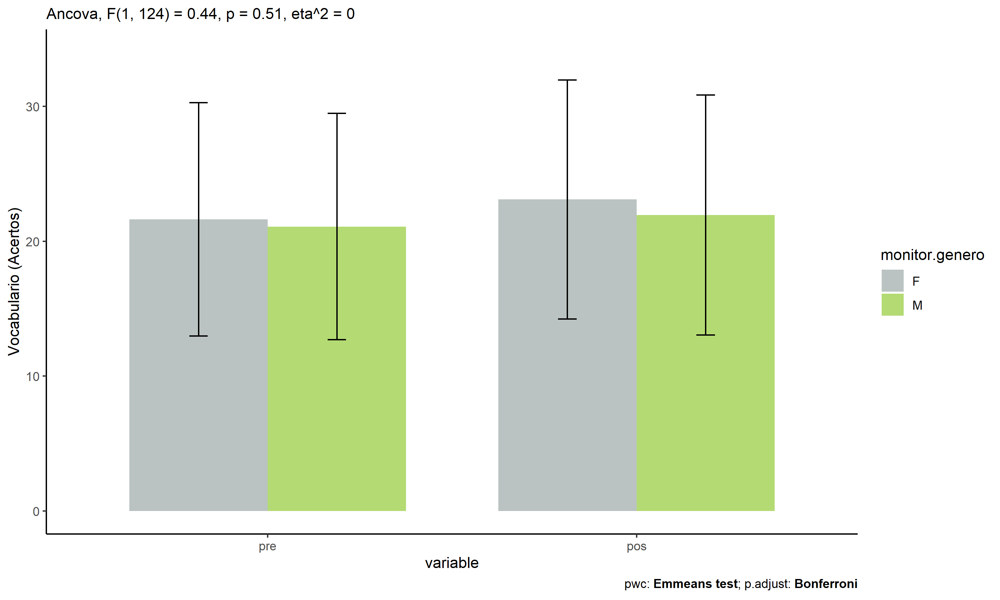<!-- -->

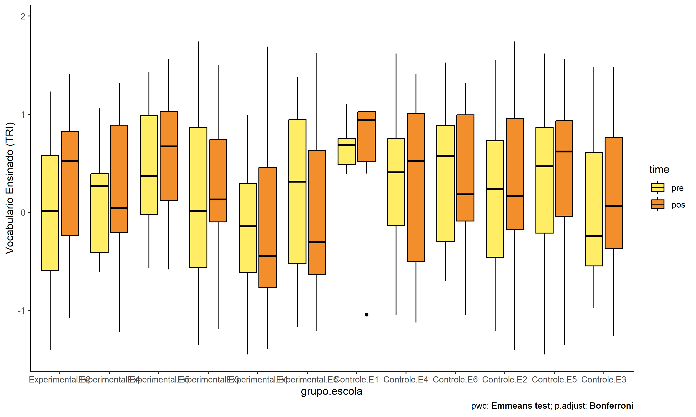<!-- -->

### Vocabulario Nao Ensinado (Acertos)

| var                          | escola | grupo        |   n | M (pre) | SE (pre) | M (unadj) | SE (unadj) | M (adj) | SE (adj) |
|:-----------------------------|:-------|:-------------|----:|--------:|---------:|----------:|-----------:|--------:|---------:|
| score.vocab.nao.ensinado.pos | E1     | Controle     |   8 |  16.375 |    3.737 |    15.000 |      3.495 |  16.132 |    2.462 |
| score.vocab.nao.ensinado.pos | E1     | Experimental |  13 |  13.308 |    2.246 |    14.769 |      2.535 |  17.788 |    1.953 |
| score.vocab.nao.ensinado.pos | E2     | Controle     |  25 |  19.440 |    1.537 |    18.280 |      1.800 |  17.526 |    1.393 |
| score.vocab.nao.ensinado.pos | E2     | Experimental |  25 |  17.760 |    1.286 |    15.240 |      1.985 |  15.520 |    1.391 |
| score.vocab.nao.ensinado.pos | E3     | Controle     |  16 |  17.312 |    1.877 |    19.000 |      1.469 |  19.555 |    1.740 |
| score.vocab.nao.ensinado.pos | E3     | Experimental |  16 |  17.875 |    1.782 |    20.125 |      1.921 |  20.334 |    1.739 |
| score.vocab.nao.ensinado.pos | E4     | Controle     |  17 |  19.706 |    1.331 |    18.059 |      1.431 |  17.141 |    1.689 |
| score.vocab.nao.ensinado.pos | E4     | Experimental |   7 |  18.000 |    3.457 |    19.286 |      2.533 |  19.418 |    2.629 |
| score.vocab.nao.ensinado.pos | E5     | Controle     |  49 |  17.612 |    1.071 |    18.714 |      1.216 |  19.085 |    0.994 |
| score.vocab.nao.ensinado.pos | E5     | Experimental |  47 |  20.191 |    0.952 |    19.617 |      1.164 |  18.401 |    1.022 |
| score.vocab.nao.ensinado.pos | E6     | Controle     |  11 |  19.818 |    1.949 |    18.727 |      2.316 |  17.741 |    2.099 |
| score.vocab.nao.ensinado.pos | E6     | Experimental |  13 |  16.231 |    1.847 |    14.615 |      2.129 |  15.836 |    1.933 |

| grupo        | escola | group1   | group2       | estimate | conf.low | conf.high |    se | statistic |     p | p.adj | p.adj.signif |
|:-------------|:-------|:---------|:-------------|---------:|---------:|----------:|------:|----------:|------:|------:|:-------------|
| Controle     |        | E1       | E2           |   -1.394 |   -6.973 |     4.184 | 2.832 |    -0.492 | 0.623 | 1.000 | ns           |
| Controle     |        | E1       | E3           |   -3.423 |   -9.357 |     2.511 | 3.012 |    -1.137 | 0.257 | 1.000 | ns           |
| Controle     |        | E1       | E4           |   -1.010 |   -6.899 |     4.879 | 2.989 |    -0.338 | 0.736 | 1.000 | ns           |
| Controle     |        | E1       | E5           |   -2.953 |   -8.180 |     2.274 | 2.653 |    -1.113 | 0.267 | 1.000 | ns           |
| Controle     |        | E1       | E6           |   -1.609 |   -7.990 |     4.772 | 3.239 |    -0.497 | 0.620 | 1.000 | ns           |
| Controle     |        | E2       | E3           |   -2.029 |   -6.423 |     2.366 | 2.231 |    -0.910 | 0.364 | 1.000 | ns           |
| Controle     |        | E2       | E4           |    0.385 |   -3.923 |     4.692 | 2.186 |     0.176 | 0.860 | 1.000 | ns           |
| Controle     |        | E2       | E5           |   -1.559 |   -4.934 |     1.816 | 1.713 |    -0.910 | 0.364 | 1.000 | ns           |
| Controle     |        | E2       | E6           |   -0.215 |   -5.172 |     4.743 | 2.516 |    -0.085 | 0.932 | 1.000 | ns           |
| Controle     |        | E3       | E4           |    2.414 |   -2.368 |     7.195 | 2.427 |     0.994 | 0.321 | 1.000 | ns           |
| Controle     |        | E3       | E5           |    0.470 |   -3.475 |     4.415 | 2.003 |     0.235 | 0.815 | 1.000 | ns           |
| Controle     |        | E3       | E6           |    1.814 |   -3.561 |     7.190 | 2.728 |     0.665 | 0.507 | 1.000 | ns           |
| Controle     |        | E4       | E5           |   -1.944 |   -5.809 |     1.922 | 1.962 |    -0.991 | 0.323 | 1.000 | ns           |
| Controle     |        | E4       | E6           |   -0.599 |   -5.901 |     4.702 | 2.691 |    -0.223 | 0.824 | 1.000 | ns           |
| Controle     |        | E5       | E6           |    1.344 |   -3.235 |     5.924 | 2.324 |     0.578 | 0.564 | 1.000 | ns           |
| Experimental |        | E1       | E2           |    2.268 |   -2.449 |     6.986 | 2.395 |     0.947 | 0.344 | 1.000 | ns           |
| Experimental |        | E1       | E3           |   -2.546 |   -7.693 |     2.602 | 2.613 |    -0.974 | 0.331 | 1.000 | ns           |
| Experimental |        | E1       | E4           |   -1.630 |   -8.079 |     4.820 | 3.274 |    -0.498 | 0.619 | 1.000 | ns           |
| Experimental |        | E1       | E5           |   -0.613 |   -4.991 |     3.765 | 2.222 |    -0.276 | 0.783 | 1.000 | ns           |
| Experimental |        | E1       | E6           |    1.952 |   -3.434 |     7.339 | 2.734 |     0.714 | 0.476 | 1.000 | ns           |
| Experimental |        | E2       | E3           |   -4.814 |   -9.201 |    -0.428 | 2.227 |    -2.162 | 0.032 | 0.474 | ns           |
| Experimental |        | E2       | E4           |   -3.898 |   -9.757 |     1.961 | 2.974 |    -1.311 | 0.191 | 1.000 | ns           |
| Experimental |        | E2       | E5           |   -2.881 |   -6.286 |     0.524 | 1.728 |    -1.667 | 0.097 | 1.000 | ns           |
| Experimental |        | E2       | E6           |   -0.316 |   -5.005 |     4.373 | 2.380 |    -0.133 | 0.894 | 1.000 | ns           |
| Experimental |        | E3       | E4           |    0.916 |   -5.293 |     7.125 | 3.152 |     0.291 | 0.772 | 1.000 | ns           |
| Experimental |        | E3       | E5           |    1.933 |   -2.043 |     5.909 | 2.018 |     0.958 | 0.339 | 1.000 | ns           |
| Experimental |        | E3       | E6           |    4.498 |   -0.622 |     9.618 | 2.599 |     1.731 | 0.085 | 1.000 | ns           |
| Experimental |        | E4       | E5           |    1.017 |   -4.541 |     6.575 | 2.821 |     0.360 | 0.719 | 1.000 | ns           |
| Experimental |        | E4       | E6           |    3.582 |   -2.845 |    10.009 | 3.262 |     1.098 | 0.273 | 1.000 | ns           |
| Experimental |        | E5       | E6           |    2.565 |   -1.757 |     6.887 | 2.194 |     1.169 | 0.243 | 1.000 | ns           |
| Controle     |        | E1       | E2           |   -3.065 |   -8.826 |     2.696 | 2.924 |    -1.048 | 0.296 | 1.000 | ns           |
| Controle     |        | E1       | E3           |   -0.937 |   -7.078 |     5.203 | 3.117 |    -0.301 | 0.764 | 1.000 | ns           |
| Controle     |        | E1       | E4           |   -3.331 |   -9.411 |     2.749 | 3.086 |    -1.079 | 0.282 | 1.000 | ns           |
| Controle     |        | E1       | E5           |   -1.237 |   -6.645 |     4.171 | 2.745 |    -0.451 | 0.653 | 1.000 | ns           |
| Controle     |        | E1       | E6           |   -3.443 |  -10.033 |     3.146 | 3.345 |    -1.029 | 0.304 | 1.000 | ns           |
| Controle     |        | E2       | E3           |    2.127 |   -2.413 |     6.668 | 2.305 |     0.923 | 0.357 | 1.000 | ns           |
| Controle     |        | E2       | E4           |   -0.266 |   -4.724 |     4.192 | 2.263 |    -0.117 | 0.907 | 1.000 | ns           |
| Controle     |        | E2       | E5           |    1.828 |   -1.658 |     5.313 | 1.769 |     1.033 | 0.303 | 1.000 | ns           |
| Controle     |        | E2       | E6           |   -0.378 |   -5.509 |     4.753 | 2.604 |    -0.145 | 0.885 | 1.000 | ns           |
| Controle     |        | E3       | E4           |   -2.393 |   -7.333 |     2.546 | 2.507 |    -0.955 | 0.341 | 1.000 | ns           |
| Controle     |        | E3       | E5           |   -0.300 |   -4.383 |     3.784 | 2.073 |    -0.145 | 0.885 | 1.000 | ns           |
| Controle     |        | E3       | E6           |   -2.506 |   -8.060 |     3.049 | 2.819 |    -0.889 | 0.375 | 1.000 | ns           |
| Controle     |        | E4       | E5           |    2.094 |   -1.898 |     6.085 | 2.026 |     1.033 | 0.303 | 1.000 | ns           |
| Controle     |        | E4       | E6           |   -0.112 |   -5.600 |     5.375 | 2.785 |    -0.040 | 0.968 | 1.000 | ns           |
| Controle     |        | E5       | E6           |   -2.206 |   -6.938 |     2.526 | 2.402 |    -0.918 | 0.359 | 1.000 | ns           |
| Experimental |        | E1       | E2           |   -4.452 |   -9.302 |     0.397 | 2.461 |    -1.809 | 0.072 | 1.000 | ns           |
| Experimental |        | E1       | E3           |   -4.567 |   -9.863 |     0.728 | 2.688 |    -1.699 | 0.091 | 1.000 | ns           |
| Experimental |        | E1       | E4           |   -4.692 |  -11.341 |     1.956 | 3.375 |    -1.390 | 0.166 | 1.000 | ns           |
| Experimental |        | E1       | E5           |   -6.884 |  -11.328 |    -2.440 | 2.256 |    -3.052 | 0.003 | 0.038 | \*           |
| Experimental |        | E1       | E6           |   -2.923 |   -8.486 |     2.639 | 2.823 |    -1.035 | 0.302 | 1.000 | ns           |
| Experimental |        | E2       | E3           |   -0.115 |   -4.655 |     4.425 | 2.305 |    -0.050 | 0.960 | 1.000 | ns           |
| Experimental |        | E2       | E4           |   -0.240 |   -6.304 |     5.824 | 3.078 |    -0.078 | 0.938 | 1.000 | ns           |
| Experimental |        | E2       | E5           |   -2.431 |   -5.942 |     1.079 | 1.782 |    -1.365 | 0.174 | 1.000 | ns           |
| Experimental |        | E2       | E6           |    1.529 |   -3.320 |     6.378 | 2.461 |     0.621 | 0.535 | 1.000 | ns           |
| Experimental |        | E3       | E4           |   -0.125 |   -6.552 |     6.302 | 3.262 |    -0.038 | 0.969 | 1.000 | ns           |
| Experimental |        | E3       | E5           |   -2.316 |   -6.421 |     1.788 | 2.084 |    -1.112 | 0.267 | 1.000 | ns           |
| Experimental |        | E3       | E6           |    1.644 |   -3.651 |     6.940 | 2.688 |     0.612 | 0.541 | 1.000 | ns           |
| Experimental |        | E4       | E5           |   -2.191 |   -7.937 |     3.554 | 2.916 |    -0.751 | 0.453 | 1.000 | ns           |
| Experimental |        | E4       | E6           |    1.769 |   -4.879 |     8.418 | 3.375 |     0.524 | 0.601 | 1.000 | ns           |
| Experimental |        | E5       | E6           |    3.961 |   -0.483 |     8.405 | 2.256 |     1.756 | 0.080 | 1.000 | ns           |
|              | E1     | Controle | Experimental |   -1.656 |   -7.825 |     4.512 | 3.131 |    -0.529 | 0.597 | 0.597 | ns           |
|              | E2     | Controle | Experimental |    2.006 |   -1.875 |     5.887 | 1.970 |     1.019 | 0.309 | 0.309 | ns           |
|              | E3     | Controle | Experimental |   -0.779 |   -5.624 |     4.066 | 2.459 |    -0.317 | 0.752 | 0.752 | ns           |
|              | E4     | Controle | Experimental |   -2.276 |   -8.433 |     3.880 | 3.125 |    -0.728 | 0.467 | 0.467 | ns           |
|              | E5     | Controle | Experimental |    0.684 |   -2.132 |     3.500 | 1.429 |     0.479 | 0.633 | 0.633 | ns           |
|              | E6     | Controle | Experimental |    1.905 |   -3.726 |     7.536 | 2.858 |     0.666 | 0.506 | 0.506 | ns           |
|              | E1     | Controle | Experimental |    3.067 |   -3.305 |     9.440 | 3.235 |     0.948 | 0.344 | 0.344 | ns           |
|              | E2     | Controle | Experimental |    1.680 |   -2.331 |     5.691 | 2.036 |     0.825 | 0.410 | 0.410 | ns           |
|              | E3     | Controle | Experimental |   -0.562 |   -5.576 |     4.451 | 2.545 |    -0.221 | 0.825 | 0.825 | ns           |
|              | E4     | Controle | Experimental |    1.706 |   -4.663 |     8.075 | 3.233 |     0.528 | 0.598 | 0.598 | ns           |
|              | E5     | Controle | Experimental |   -2.579 |   -5.475 |     0.316 | 1.470 |    -1.755 | 0.081 | 0.081 | ns           |
|              | E6     | Controle | Experimental |    3.587 |   -2.222 |     9.397 | 2.949 |     1.216 | 0.225 | 0.225 | ns           |

| grupo        | escola | group1 | group2 | estimate | conf.low | conf.high |    se | statistic |     p | p.adj | p.adj.signif |
|:-------------|:-------|:-------|:-------|---------:|---------:|----------:|------:|----------:|------:|------:|:-------------|
| Controle     | E1     | pre    | pos    |    1.375 |   -6.222 |     8.972 | 3.866 |     0.356 | 0.722 | 0.722 | ns           |
| Controle     | E2     | pre    | pos    |    1.160 |   -3.138 |     5.458 | 2.187 |     0.530 | 0.596 | 0.596 | ns           |
| Controle     | E3     | pre    | pos    |   -1.687 |   -7.060 |     3.685 | 2.734 |    -0.617 | 0.537 | 0.537 | ns           |
| Controle     | E4     | pre    | pos    |    1.647 |   -3.565 |     6.859 | 2.652 |     0.621 | 0.535 | 0.535 | ns           |
| Controle     | E5     | pre    | pos    |   -1.102 |   -4.172 |     1.968 | 1.562 |    -0.705 | 0.481 | 0.481 | ns           |
| Controle     | E6     | pre    | pos    |    1.091 |   -5.388 |     7.570 | 3.297 |     0.331 | 0.741 | 0.741 | ns           |
| Experimental | E1     | pre    | pos    |   -1.462 |   -7.421 |     4.498 | 3.033 |    -0.482 | 0.630 | 0.630 | ns           |
| Experimental | E2     | pre    | pos    |    2.520 |   -1.778 |     6.818 | 2.187 |     1.152 | 0.250 | 0.250 | ns           |
| Experimental | E3     | pre    | pos    |   -2.250 |   -7.622 |     3.122 | 2.734 |    -0.823 | 0.411 | 0.411 | ns           |
| Experimental | E4     | pre    | pos    |   -1.286 |   -9.408 |     6.836 | 4.133 |    -0.311 | 0.756 | 0.756 | ns           |
| Experimental | E5     | pre    | pos    |    0.574 |   -2.560 |     3.709 | 1.595 |     0.360 | 0.719 | 0.719 | ns           |
| Experimental | E6     | pre    | pos    |    1.615 |   -4.345 |     7.575 | 3.033 |     0.533 | 0.595 | 0.595 | ns           |

    ## Scale for colour is already present.
    ## Adding another scale for colour, which will replace the existing scale.

<!-- -->

    ## Scale for colour is already present.
    ## Adding another scale for colour, which will replace the existing scale.

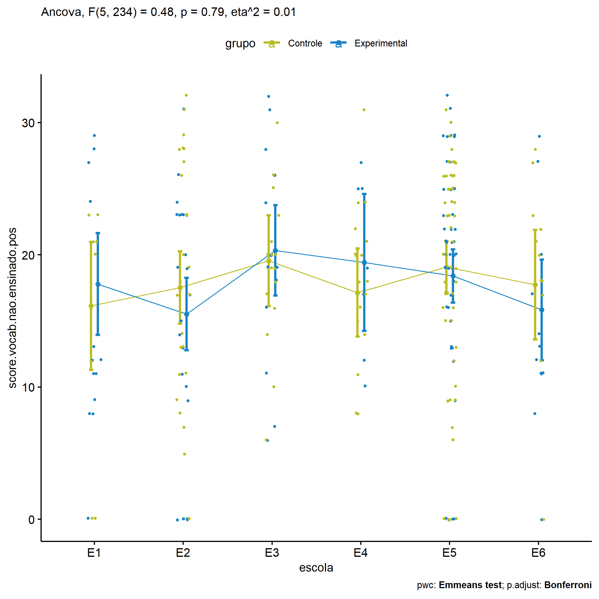<!-- -->

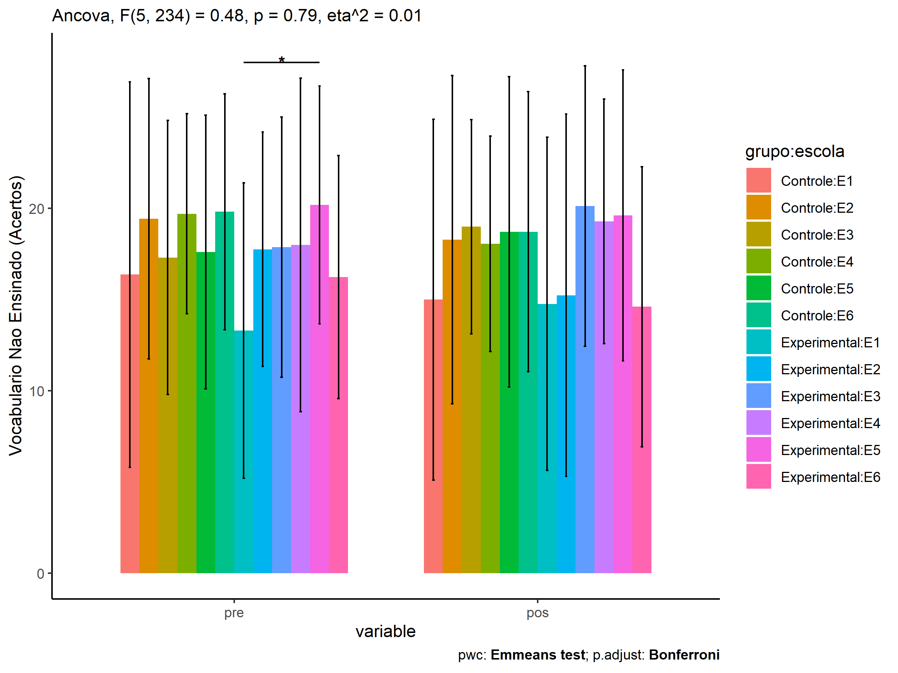<!-- -->

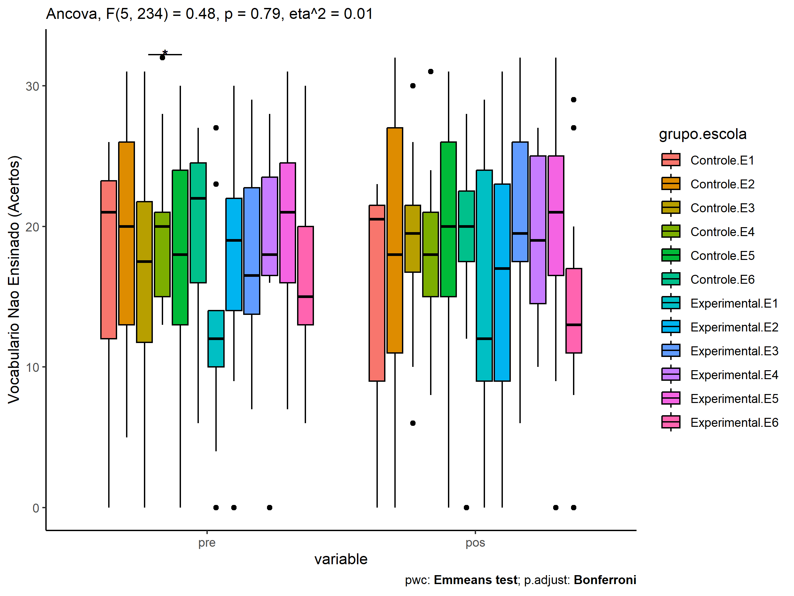<!-- -->

<!-- -->

### Vocabulario Nao Ensinado (TRI)

| var                        | escola | grupo        |   n | M (pre) | SE (pre) | M (unadj) | SE (unadj) | M (adj) | SE (adj) |
|:---------------------------|:-------|:-------------|----:|--------:|---------:|----------:|-----------:|--------:|---------:|
| tri.vocab.nao.ensinado.pos | E1     | Controle     |   5 |   0.805 |    0.263 |     0.957 |      0.240 |   0.532 |    0.268 |
| tri.vocab.nao.ensinado.pos | E1     | Experimental |  12 |  -0.352 |    0.270 |    -0.065 |      0.353 |   0.492 |    0.175 |
| tri.vocab.nao.ensinado.pos | E2     | Controle     |  24 |   0.411 |    0.208 |     0.415 |      0.236 |   0.325 |    0.122 |
| tri.vocab.nao.ensinado.pos | E2     | Experimental |  19 |   0.159 |    0.179 |     0.249 |      0.220 |   0.372 |    0.137 |
| tri.vocab.nao.ensinado.pos | E3     | Controle     |  15 |   0.153 |    0.191 |     0.257 |      0.216 |   0.386 |    0.154 |
| tri.vocab.nao.ensinado.pos | E3     | Experimental |  16 |   0.179 |    0.246 |     0.507 |      0.265 |   0.614 |    0.149 |
| tri.vocab.nao.ensinado.pos | E4     | Controle     |  17 |   0.376 |    0.180 |     0.152 |      0.210 |   0.091 |    0.145 |
| tri.vocab.nao.ensinado.pos | E4     | Experimental |   6 |   0.423 |    0.228 |     0.298 |      0.405 |   0.198 |    0.244 |
| tri.vocab.nao.ensinado.pos | E5     | Controle     |  43 |   0.312 |    0.129 |     0.546 |      0.133 |   0.540 |    0.091 |
| tri.vocab.nao.ensinado.pos | E5     | Experimental |  43 |   0.481 |    0.124 |     0.654 |      0.121 |   0.504 |    0.091 |
| tri.vocab.nao.ensinado.pos | E6     | Controle     |  10 |   0.685 |    0.174 |     0.495 |      0.208 |   0.173 |    0.190 |
| tri.vocab.nao.ensinado.pos | E6     | Experimental |  12 |  -0.015 |    0.265 |    -0.102 |      0.282 |   0.169 |    0.173 |

| grupo        | escola | group1   | group2       | estimate | conf.low | conf.high |    se | statistic |     p | p.adj | p.adj.signif |
|:-------------|:-------|:---------|:-------------|---------:|---------:|----------:|------:|----------:|------:|------:|:-------------|
| Controle     |        | E1       | E2           |    0.207 |   -0.373 |     0.787 | 0.294 |     0.704 | 0.483 | 1.000 | ns           |
| Controle     |        | E1       | E3           |    0.146 |   -0.465 |     0.757 | 0.310 |     0.471 | 0.638 | 1.000 | ns           |
| Controle     |        | E1       | E4           |    0.441 |   -0.160 |     1.041 | 0.305 |     1.447 | 0.150 | 1.000 | ns           |
| Controle     |        | E1       | E5           |   -0.008 |   -0.566 |     0.551 | 0.283 |    -0.028 | 0.978 | 1.000 | ns           |
| Controle     |        | E1       | E6           |    0.359 |   -0.286 |     1.004 | 0.327 |     1.097 | 0.274 | 1.000 | ns           |
| Controle     |        | E2       | E3           |   -0.061 |   -0.449 |     0.327 | 0.197 |    -0.310 | 0.757 | 1.000 | ns           |
| Controle     |        | E2       | E4           |    0.234 |   -0.140 |     0.607 | 0.189 |     1.234 | 0.219 | 1.000 | ns           |
| Controle     |        | E2       | E5           |   -0.215 |   -0.515 |     0.085 | 0.152 |    -1.411 | 0.160 | 1.000 | ns           |
| Controle     |        | E2       | E6           |    0.152 |   -0.292 |     0.596 | 0.225 |     0.674 | 0.501 | 1.000 | ns           |
| Controle     |        | E3       | E4           |    0.295 |   -0.123 |     0.712 | 0.212 |     1.391 | 0.166 | 1.000 | ns           |
| Controle     |        | E3       | E5           |   -0.154 |   -0.507 |     0.200 | 0.179 |    -0.858 | 0.392 | 1.000 | ns           |
| Controle     |        | E3       | E6           |    0.213 |   -0.271 |     0.696 | 0.245 |     0.868 | 0.386 | 1.000 | ns           |
| Controle     |        | E4       | E5           |   -0.448 |   -0.786 |    -0.111 | 0.171 |    -2.620 | 0.009 | 0.141 | ns           |
| Controle     |        | E4       | E6           |   -0.082 |   -0.552 |     0.388 | 0.239 |    -0.343 | 0.732 | 1.000 | ns           |
| Controle     |        | E5       | E6           |    0.367 |   -0.048 |     0.782 | 0.210 |     1.742 | 0.083 | 1.000 | ns           |
| Experimental |        | E1       | E2           |    0.120 |   -0.317 |     0.557 | 0.222 |     0.541 | 0.589 | 1.000 | ns           |
| Experimental |        | E1       | E3           |   -0.122 |   -0.574 |     0.331 | 0.230 |    -0.530 | 0.597 | 1.000 | ns           |
| Experimental |        | E1       | E4           |    0.294 |   -0.299 |     0.888 | 0.301 |     0.977 | 0.330 | 1.000 | ns           |
| Experimental |        | E1       | E5           |   -0.012 |   -0.405 |     0.381 | 0.199 |    -0.060 | 0.952 | 1.000 | ns           |
| Experimental |        | E1       | E6           |    0.323 |   -0.159 |     0.805 | 0.244 |     1.322 | 0.187 | 1.000 | ns           |
| Experimental |        | E2       | E3           |   -0.241 |   -0.641 |     0.158 | 0.203 |    -1.191 | 0.235 | 1.000 | ns           |
| Experimental |        | E2       | E4           |    0.174 |   -0.378 |     0.726 | 0.280 |     0.623 | 0.534 | 1.000 | ns           |
| Experimental |        | E2       | E5           |   -0.132 |   -0.458 |     0.194 | 0.165 |    -0.797 | 0.426 | 1.000 | ns           |
| Experimental |        | E2       | E6           |    0.203 |   -0.231 |     0.638 | 0.220 |     0.923 | 0.357 | 1.000 | ns           |
| Experimental |        | E3       | E4           |    0.416 |   -0.148 |     0.980 | 0.286 |     1.453 | 0.148 | 1.000 | ns           |
| Experimental |        | E3       | E5           |    0.110 |   -0.236 |     0.456 | 0.176 |     0.625 | 0.533 | 1.000 | ns           |
| Experimental |        | E3       | E6           |    0.445 |   -0.005 |     0.895 | 0.228 |     1.948 | 0.053 | 0.791 | ns           |
| Experimental |        | E4       | E5           |   -0.306 |   -0.819 |     0.207 | 0.260 |    -1.176 | 0.241 | 1.000 | ns           |
| Experimental |        | E4       | E6           |    0.029 |   -0.561 |     0.619 | 0.299 |     0.097 | 0.923 | 1.000 | ns           |
| Experimental |        | E5       | E6           |    0.335 |   -0.052 |     0.722 | 0.197 |     1.705 | 0.090 | 1.000 | ns           |
| Controle     |        | E1       | E2           |    0.394 |   -0.420 |     1.209 | 0.413 |     0.955 | 0.341 | 1.000 | ns           |
| Controle     |        | E1       | E3           |    0.652 |   -0.203 |     1.507 | 0.434 |     1.503 | 0.134 | 1.000 | ns           |
| Controle     |        | E1       | E4           |    0.430 |   -0.413 |     1.272 | 0.427 |     1.005 | 0.316 | 1.000 | ns           |
| Controle     |        | E1       | E5           |    0.493 |   -0.290 |     1.275 | 0.397 |     1.241 | 0.216 | 1.000 | ns           |
| Controle     |        | E1       | E6           |    0.121 |   -0.787 |     1.028 | 0.460 |     0.262 | 0.793 | 1.000 | ns           |
| Controle     |        | E2       | E3           |    0.258 |   -0.288 |     0.803 | 0.277 |     0.931 | 0.353 | 1.000 | ns           |
| Controle     |        | E2       | E4           |    0.035 |   -0.490 |     0.560 | 0.266 |     0.132 | 0.895 | 1.000 | ns           |
| Controle     |        | E2       | E5           |    0.098 |   -0.324 |     0.520 | 0.214 |     0.460 | 0.646 | 1.000 | ns           |
| Controle     |        | E2       | E6           |   -0.274 |   -0.897 |     0.350 | 0.316 |    -0.866 | 0.388 | 1.000 | ns           |
| Controle     |        | E3       | E4           |   -0.222 |   -0.809 |     0.364 | 0.298 |    -0.747 | 0.456 | 1.000 | ns           |
| Controle     |        | E3       | E5           |   -0.159 |   -0.656 |     0.338 | 0.252 |    -0.632 | 0.528 | 1.000 | ns           |
| Controle     |        | E3       | E6           |   -0.531 |   -1.208 |     0.145 | 0.343 |    -1.549 | 0.123 | 1.000 | ns           |
| Controle     |        | E4       | E5           |    0.063 |   -0.411 |     0.538 | 0.241 |     0.262 | 0.793 | 1.000 | ns           |
| Controle     |        | E4       | E6           |   -0.309 |   -0.969 |     0.351 | 0.335 |    -0.923 | 0.357 | 1.000 | ns           |
| Controle     |        | E5       | E6           |   -0.372 |   -0.954 |     0.209 | 0.295 |    -1.262 | 0.208 | 1.000 | ns           |
| Experimental |        | E1       | E2           |   -0.512 |   -1.122 |     0.099 | 0.310 |    -1.651 | 0.100 | 1.000 | ns           |
| Experimental |        | E1       | E3           |   -0.531 |   -1.164 |     0.101 | 0.321 |    -1.656 | 0.099 | 1.000 | ns           |
| Experimental |        | E1       | E4           |   -0.775 |   -1.603 |     0.053 | 0.420 |    -1.844 | 0.067 | 0.998 | ns           |
| Experimental |        | E1       | E5           |   -0.834 |   -1.375 |    -0.293 | 0.274 |    -3.039 | 0.003 | 0.040 | \*           |
| Experimental |        | E1       | E6           |   -0.337 |   -1.014 |     0.339 | 0.343 |    -0.984 | 0.326 | 1.000 | ns           |
| Experimental |        | E2       | E3           |   -0.020 |   -0.582 |     0.542 | 0.285 |    -0.070 | 0.945 | 1.000 | ns           |
| Experimental |        | E2       | E4           |   -0.263 |   -1.039 |     0.512 | 0.393 |    -0.669 | 0.504 | 1.000 | ns           |
| Experimental |        | E2       | E5           |   -0.322 |   -0.778 |     0.134 | 0.231 |    -1.392 | 0.165 | 1.000 | ns           |
| Experimental |        | E2       | E6           |    0.174 |   -0.437 |     0.785 | 0.310 |     0.562 | 0.575 | 1.000 | ns           |
| Experimental |        | E3       | E4           |   -0.243 |   -1.036 |     0.549 | 0.402 |    -0.605 | 0.546 | 1.000 | ns           |
| Experimental |        | E3       | E5           |   -0.302 |   -0.787 |     0.183 | 0.246 |    -1.229 | 0.221 | 1.000 | ns           |
| Experimental |        | E3       | E6           |    0.194 |   -0.439 |     0.826 | 0.321 |     0.604 | 0.546 | 1.000 | ns           |
| Experimental |        | E4       | E5           |   -0.059 |   -0.781 |     0.663 | 0.366 |    -0.161 | 0.872 | 1.000 | ns           |
| Experimental |        | E4       | E6           |    0.437 |   -0.391 |     1.266 | 0.420 |     1.041 | 0.299 | 1.000 | ns           |
| Experimental |        | E5       | E6           |    0.496 |   -0.045 |     1.037 | 0.274 |     1.809 | 0.072 | 1.000 | ns           |
|              | E1     | Controle | Experimental |    0.040 |   -0.597 |     0.676 | 0.323 |     0.123 | 0.902 | 0.902 | ns           |
|              | E2     | Controle | Experimental |   -0.047 |   -0.410 |     0.315 | 0.184 |    -0.258 | 0.797 | 0.797 | ns           |
|              | E3     | Controle | Experimental |   -0.228 |   -0.651 |     0.195 | 0.215 |    -1.061 | 0.290 | 0.290 | ns           |
|              | E4     | Controle | Experimental |   -0.107 |   -0.666 |     0.452 | 0.284 |    -0.376 | 0.707 | 0.707 | ns           |
|              | E5     | Controle | Experimental |    0.036 |   -0.219 |     0.290 | 0.129 |     0.276 | 0.783 | 0.783 | ns           |
|              | E6     | Controle | Experimental |    0.004 |   -0.505 |     0.513 | 0.258 |     0.016 | 0.987 | 0.987 | ns           |
|              | E1     | Controle | Experimental |    1.158 |    0.276 |     2.039 | 0.447 |     2.588 | 0.010 | 0.010 | \*           |
|              | E2     | Controle | Experimental |    0.252 |   -0.257 |     0.760 | 0.258 |     0.975 | 0.330 | 0.330 | ns           |
|              | E3     | Controle | Experimental |   -0.026 |   -0.621 |     0.570 | 0.302 |    -0.085 | 0.932 | 0.932 | ns           |
|              | E4     | Controle | Experimental |   -0.047 |   -0.833 |     0.740 | 0.399 |    -0.118 | 0.906 | 0.906 | ns           |
|              | E5     | Controle | Experimental |   -0.169 |   -0.526 |     0.188 | 0.181 |    -0.932 | 0.352 | 0.352 | ns           |
|              | E6     | Controle | Experimental |    0.699 |   -0.010 |     1.409 | 0.360 |     1.944 | 0.053 | 0.053 | ns           |

| grupo        | escola | group1 | group2 | estimate | conf.low | conf.high |    se | statistic |     p | p.adj | p.adj.signif |
|:-------------|:-------|:-------|:-------|---------:|---------:|----------:|------:|----------:|------:|------:|:-------------|
| Controle     | E1     | pre    | pos    |    0.122 |   -0.884 |     1.128 | 0.512 |     0.238 | 0.812 | 0.812 | ns           |
| Controle     | E2     | pre    | pos    |   -0.040 |   -0.538 |     0.458 | 0.253 |    -0.159 | 0.874 | 0.874 | ns           |
| Controle     | E3     | pre    | pos    |   -0.115 |   -0.741 |     0.511 | 0.319 |    -0.362 | 0.718 | 0.718 | ns           |
| Controle     | E4     | pre    | pos    |    0.224 |   -0.374 |     0.822 | 0.304 |     0.737 | 0.462 | 0.462 | ns           |
| Controle     | E5     | pre    | pos    |   -0.196 |   -0.562 |     0.169 | 0.186 |    -1.057 | 0.291 | 0.291 | ns           |
| Controle     | E6     | pre    | pos    |    0.064 |   -0.697 |     0.826 | 0.387 |     0.166 | 0.868 | 0.868 | ns           |
| Experimental | E1     | pre    | pos    |   -0.287 |   -0.998 |     0.424 | 0.362 |    -0.793 | 0.428 | 0.428 | ns           |
| Experimental | E2     | pre    | pos    |   -0.036 |   -0.563 |     0.492 | 0.268 |    -0.133 | 0.894 | 0.894 | ns           |
| Experimental | E3     | pre    | pos    |   -0.328 |   -0.944 |     0.288 | 0.313 |    -1.047 | 0.296 | 0.296 | ns           |
| Experimental | E4     | pre    | pos    |    0.016 |   -0.953 |     0.985 | 0.493 |     0.033 | 0.974 | 0.974 | ns           |
| Experimental | E5     | pre    | pos    |   -0.167 |   -0.534 |     0.201 | 0.187 |    -0.892 | 0.373 | 0.373 | ns           |
| Experimental | E6     | pre    | pos    |    0.052 |   -0.645 |     0.750 | 0.355 |     0.148 | 0.882 | 0.882 | ns           |

    ## Scale for colour is already present.
    ## Adding another scale for colour, which will replace the existing scale.

<!-- -->

    ## Scale for colour is already present.
    ## Adding another scale for colour, which will replace the existing scale.

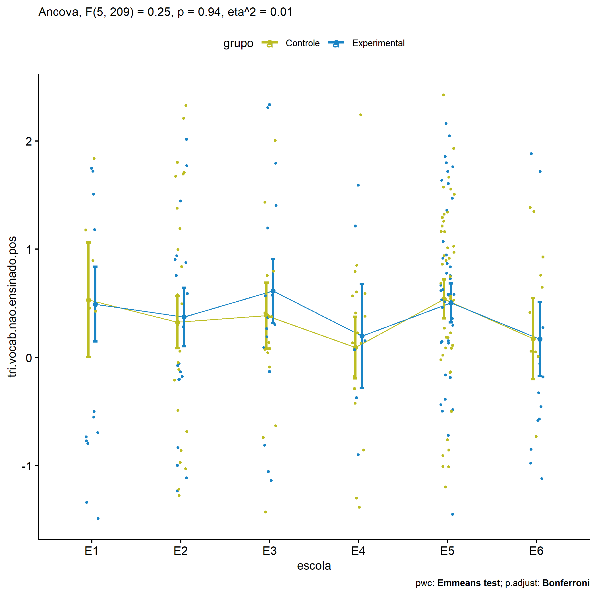<!-- -->

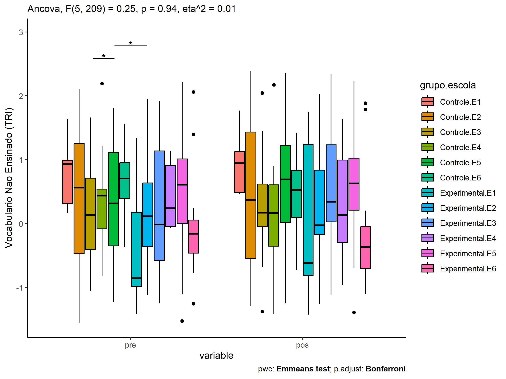<!-- -->

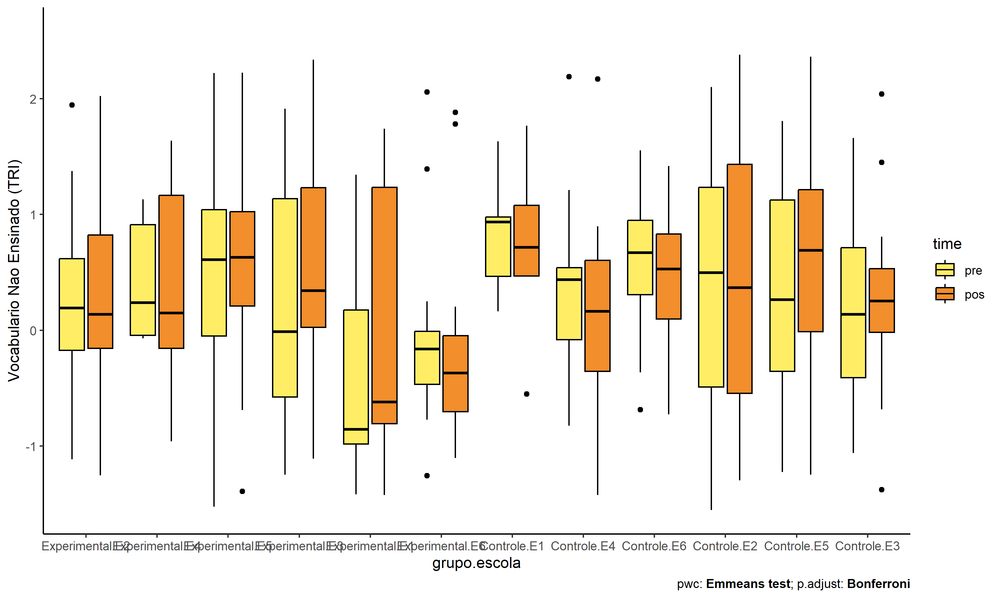<!-- -->

## factores: **zona.escola:grupo**

### Vocabulario (Acertos)

| var             | zona.escola | grupo        |   n | M (pre) | SE (pre) | M (unadj) | SE (unadj) | M (adj) | SE (adj) |
|:----------------|:------------|:-------------|----:|--------:|---------:|----------:|-----------:|--------:|---------:|
| score.vocab.pos | Rural       | Controle     |  42 |  24.214 |    1.078 |    23.381 |      1.100 |  22.760 |    0.829 |
| score.vocab.pos | Rural       | Experimental |  34 |  22.647 |    1.470 |    22.794 |      1.529 |  23.377 |    0.921 |
| score.vocab.pos | Urbana      | Controle     |  72 |  23.819 |    0.972 |    24.833 |      0.966 |  24.515 |    0.633 |
| score.vocab.pos | Urbana      | Experimental |  74 |  22.892 |    0.913 |    24.703 |      0.952 |  25.097 |    0.625 |

| grupo        | zona.escola | group1   | group2       | estimate | conf.low | conf.high |    se | statistic |     p | p.adj | p.adj.signif |
|:-------------|:------------|:---------|:-------------|---------:|---------:|----------:|------:|----------:|------:|------:|:-------------|
| Controle     |             | Urbana   | Rural        |    1.756 |   -0.299 |     3.811 | 1.043 |     1.684 | 0.094 | 0.094 | ns           |
| Experimental |             | Urbana   | Rural        |    1.721 |   -0.472 |     3.913 | 1.112 |     1.547 | 0.123 | 0.123 | ns           |
| Controle     |             | Urbana   | Rural        |   -0.395 |   -3.435 |     2.645 | 1.542 |    -0.256 | 0.798 | 0.798 | ns           |
| Experimental |             | Urbana   | Rural        |    0.245 |   -2.999 |     3.489 | 1.646 |     0.149 | 0.882 | 0.882 | ns           |
|              | Urbana      | Controle | Experimental |   -0.582 |   -2.336 |     1.172 | 0.890 |    -0.654 | 0.514 | 0.514 | ns           |
|              | Rural       | Controle | Experimental |   -0.617 |   -3.062 |     1.828 | 1.241 |    -0.497 | 0.619 | 0.619 | ns           |
|              | Urbana      | Controle | Experimental |    0.928 |   -1.664 |     3.519 | 1.315 |     0.705 | 0.481 | 0.481 | ns           |
|              | Rural       | Controle | Experimental |    1.567 |   -2.045 |     5.179 | 1.833 |     0.855 | 0.393 | 0.393 | ns           |

| grupo        | zona.escola | group1 | group2 | estimate | conf.low | conf.high |    se | statistic |     p | p.adj | p.adj.signif |
|:-------------|:------------|:-------|:-------|---------:|---------:|----------:|------:|----------:|------:|------:|:-------------|
| Controle     | Urbana      | pre    | pos    |   -0.807 |   -3.378 |     1.763 | 1.308 |    -0.617 | 0.537 | 0.537 | ns           |
| Controle     | Rural       | pre    | pos    |    0.326 |   -3.091 |     3.742 | 1.739 |     0.187 | 0.852 | 0.852 | ns           |
| Experimental | Urbana      | pre    | pos    |   -1.615 |   -4.139 |     0.908 | 1.284 |    -1.258 | 0.209 | 0.209 | ns           |
| Experimental | Rural       | pre    | pos    |   -0.600 |   -4.387 |     3.187 | 1.927 |    -0.311 | 0.756 | 0.756 | ns           |

    ## Scale for colour is already present.
    ## Adding another scale for colour, which will replace the existing scale.

<!-- -->

    ## Scale for colour is already present.
    ## Adding another scale for colour, which will replace the existing scale.

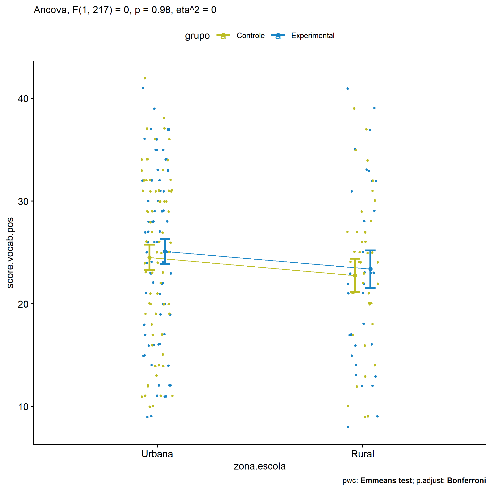<!-- -->

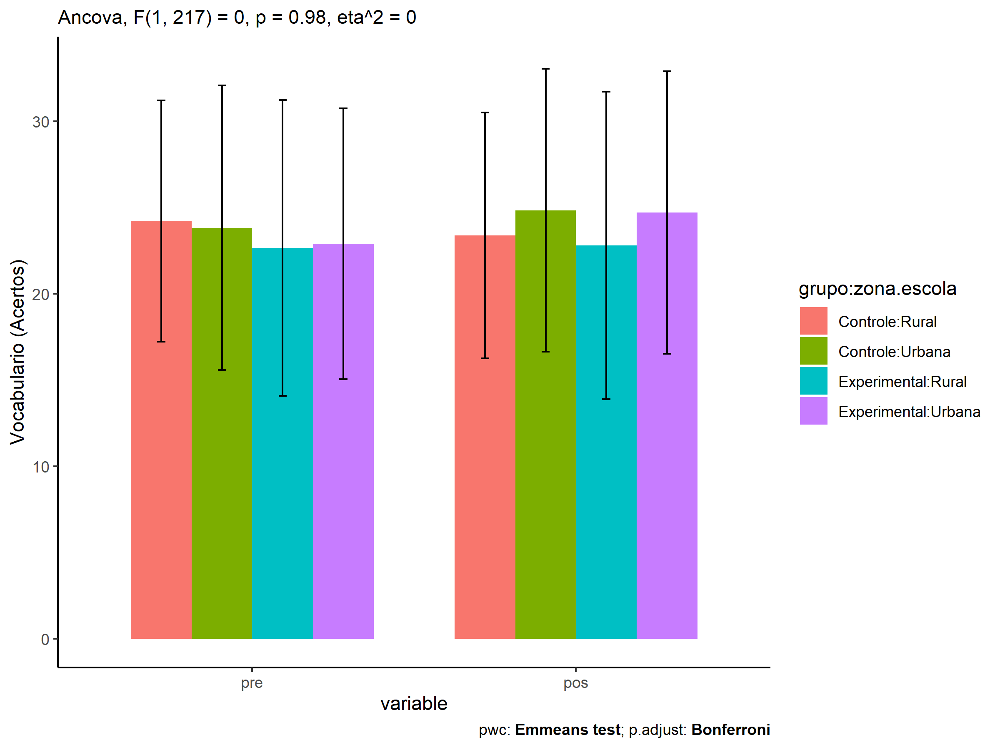<!-- -->

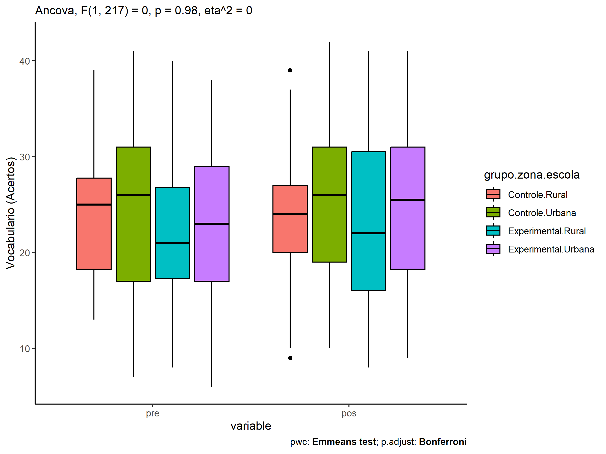<!-- -->

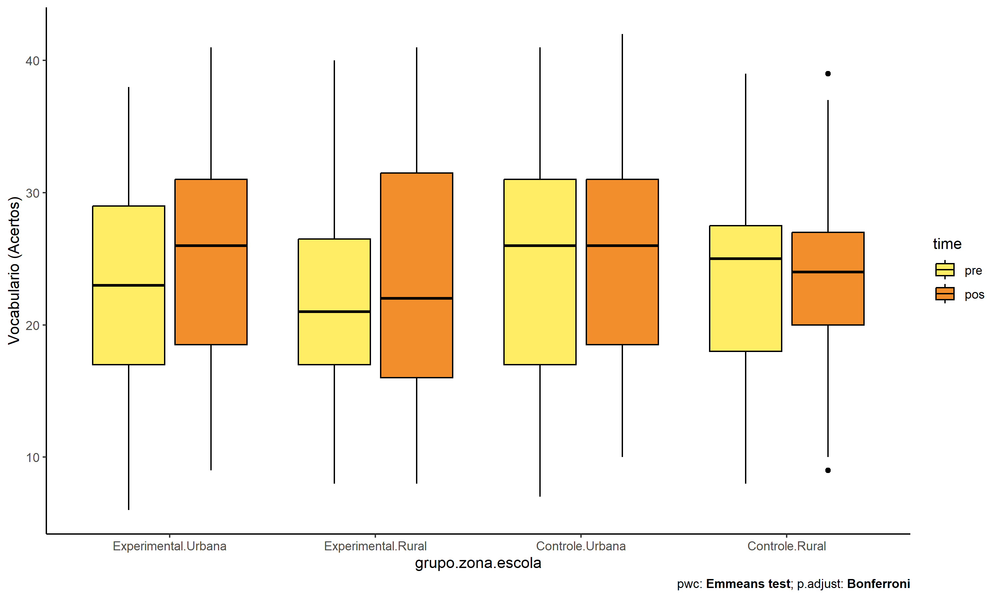<!-- -->

### Vocabulario (TRI)

| var           | zona.escola | grupo        |   n | M (pre) | SE (pre) | M (unadj) | SE (unadj) | M (adj) | SE (adj) |
|:--------------|:------------|:-------------|----:|--------:|---------:|----------:|-----------:|--------:|---------:|
| tri.vocab.pos | Rural       | Controle     |  42 |   0.380 |    0.107 |     0.299 |      0.128 |   0.244 |    0.087 |
| tri.vocab.pos | Rural       | Experimental |  34 |   0.214 |    0.149 |     0.271 |      0.154 |   0.355 |    0.096 |
| tri.vocab.pos | Urbana      | Controle     |  72 |   0.403 |    0.097 |     0.476 |      0.114 |   0.402 |    0.066 |
| tri.vocab.pos | Urbana      | Experimental |  74 |   0.236 |    0.108 |     0.442 |      0.103 |   0.507 |    0.065 |

| grupo        | zona.escola | group1   | group2       | estimate | conf.low | conf.high |    se | statistic |     p | p.adj | p.adj.signif |
|:-------------|:------------|:---------|:-------------|---------:|---------:|----------:|------:|----------:|------:|------:|:-------------|
| Controle     |             | Urbana   | Rural        |    0.158 |   -0.057 |     0.372 | 0.109 |     1.449 | 0.149 | 0.149 | ns           |
| Experimental |             | Urbana   | Rural        |    0.152 |   -0.077 |     0.381 | 0.116 |     1.310 | 0.192 | 0.192 | ns           |
| Controle     |             | Urbana   | Rural        |    0.023 |   -0.300 |     0.346 | 0.164 |     0.142 | 0.888 | 0.888 | ns           |
| Experimental |             | Urbana   | Rural        |    0.022 |   -0.322 |     0.367 | 0.175 |     0.129 | 0.898 | 0.898 | ns           |
|              | Urbana      | Controle | Experimental |   -0.105 |   -0.289 |     0.078 | 0.093 |    -1.133 | 0.258 | 0.258 | ns           |
|              | Rural       | Controle | Experimental |   -0.111 |   -0.366 |     0.144 | 0.129 |    -0.858 | 0.392 | 0.392 | ns           |
|              | Urbana      | Controle | Experimental |    0.167 |   -0.109 |     0.442 | 0.140 |     1.192 | 0.235 | 0.235 | ns           |
|              | Rural       | Controle | Experimental |    0.166 |   -0.218 |     0.550 | 0.195 |     0.852 | 0.395 | 0.395 | ns           |

| grupo        | zona.escola | group1 | group2 | estimate | conf.low | conf.high |    se | statistic |     p | p.adj | p.adj.signif |
|:-------------|:------------|:-------|:-------|---------:|---------:|----------:|------:|----------:|------:|------:|:-------------|
| Controle     | Urbana      | pre    | pos    |   -0.038 |   -0.318 |     0.241 | 0.142 |    -0.270 | 0.787 | 0.787 | ns           |
| Controle     | Rural       | pre    | pos    |    0.054 |   -0.318 |     0.425 | 0.189 |     0.284 | 0.777 | 0.777 | ns           |
| Experimental | Urbana      | pre    | pos    |   -0.172 |   -0.446 |     0.102 | 0.140 |    -1.232 | 0.219 | 0.219 | ns           |
| Experimental | Rural       | pre    | pos    |   -0.093 |   -0.505 |     0.318 | 0.209 |    -0.445 | 0.656 | 0.656 | ns           |

    ## Scale for colour is already present.
    ## Adding another scale for colour, which will replace the existing scale.

<!-- -->

    ## Scale for colour is already present.
    ## Adding another scale for colour, which will replace the existing scale.

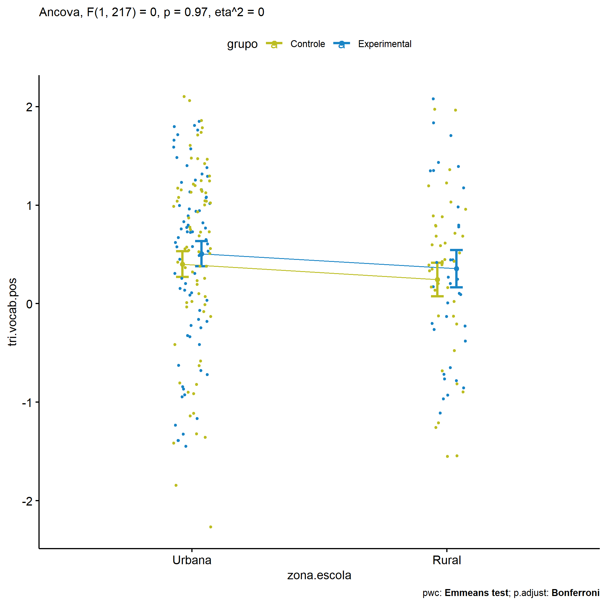<!-- -->

<!-- -->

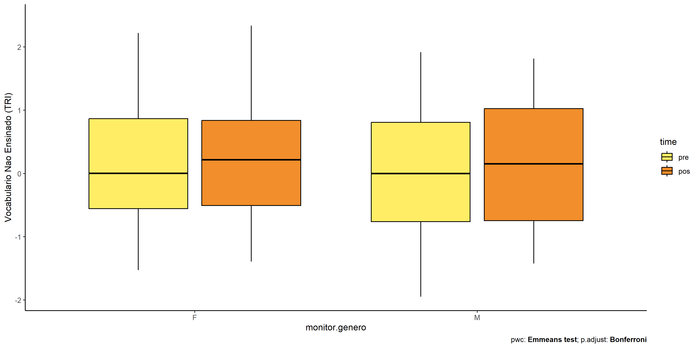<!-- -->

### Vocabulario Ensinado (Acertos)

| var                      | zona.escola | grupo        |   n | M (pre) | SE (pre) | M (unadj) | SE (unadj) | M (adj) | SE (adj) |
|:-------------------------|:------------|:-------------|----:|--------:|---------:|----------:|-----------:|--------:|---------:|
| score.vocab.ensinado.pos | Rural       | Controle     |  44 |   4.432 |    0.346 |     4.409 |      0.322 |   4.359 |    0.328 |
| score.vocab.ensinado.pos | Rural       | Experimental |  36 |   4.528 |    0.421 |     4.444 |      0.377 |   4.356 |    0.362 |
| score.vocab.ensinado.pos | Urbana      | Controle     |  82 |   4.280 |    0.271 |     4.268 |      0.257 |   4.279 |    0.240 |
| score.vocab.ensinado.pos | Urbana      | Experimental |  85 |   4.176 |    0.218 |     4.271 |      0.274 |   4.323 |    0.236 |

| grupo        | zona.escola | group1   | group2       | estimate | conf.low | conf.high |    se | statistic |     p | p.adj | p.adj.signif |
|:-------------|:------------|:---------|:-------------|---------:|---------:|----------:|------:|----------:|------:|------:|:-------------|
| Controle     |             | Urbana   | Rural        |   -0.080 |   -0.880 |     0.720 | 0.406 |    -0.197 | 0.844 | 0.844 | ns           |
| Experimental |             | Urbana   | Rural        |   -0.033 |   -0.884 |     0.819 | 0.432 |    -0.075 | 0.940 | 0.940 | ns           |
| Controle     |             | Urbana   | Rural        |   -0.151 |   -0.995 |     0.692 | 0.428 |    -0.353 | 0.724 | 0.724 | ns           |
| Experimental |             | Urbana   | Rural        |   -0.351 |   -1.249 |     0.547 | 0.456 |    -0.771 | 0.442 | 0.442 | ns           |
|              | Urbana      | Controle | Experimental |   -0.044 |   -0.707 |     0.618 | 0.336 |    -0.131 | 0.896 | 0.896 | ns           |
|              | Rural       | Controle | Experimental |    0.003 |   -0.958 |     0.965 | 0.488 |     0.007 | 0.995 | 0.995 | ns           |
|              | Urbana      | Controle | Experimental |    0.104 |   -0.595 |     0.803 | 0.355 |     0.293 | 0.770 | 0.770 | ns           |
|              | Rural       | Controle | Experimental |   -0.096 |   -1.111 |     0.919 | 0.515 |    -0.186 | 0.852 | 0.852 | ns           |

| grupo        | zona.escola | group1 | group2 | estimate | conf.low | conf.high |    se | statistic |     p | p.adj | p.adj.signif |
|:-------------|:------------|:-------|:-------|---------:|---------:|----------:|------:|----------:|------:|------:|:-------------|
| Controle     | Urbana      | pre    | pos    |    0.012 |   -0.701 |     0.725 | 0.363 |     0.034 | 0.973 | 0.973 | ns           |
| Controle     | Rural       | pre    | pos    |    0.023 |   -0.951 |     0.996 | 0.495 |     0.046 | 0.963 | 0.963 | ns           |
| Experimental | Urbana      | pre    | pos    |   -0.094 |   -0.795 |     0.606 | 0.356 |    -0.264 | 0.792 | 0.792 | ns           |
| Experimental | Rural       | pre    | pos    |    0.083 |   -0.993 |     1.160 | 0.548 |     0.152 | 0.879 | 0.879 | ns           |

    ## Scale for colour is already present.
    ## Adding another scale for colour, which will replace the existing scale.

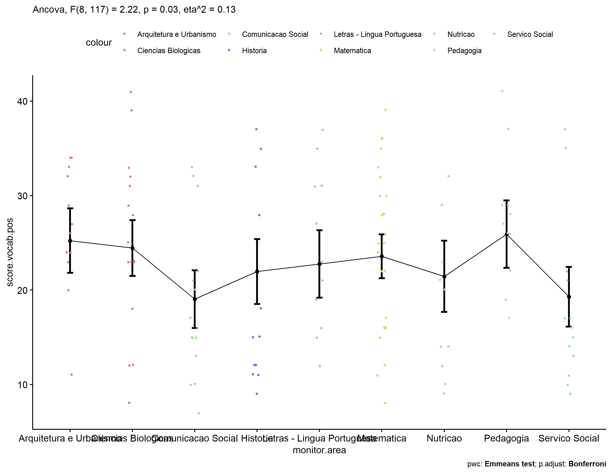<!-- -->

    ## Scale for colour is already present.
    ## Adding another scale for colour, which will replace the existing scale.

<!-- -->

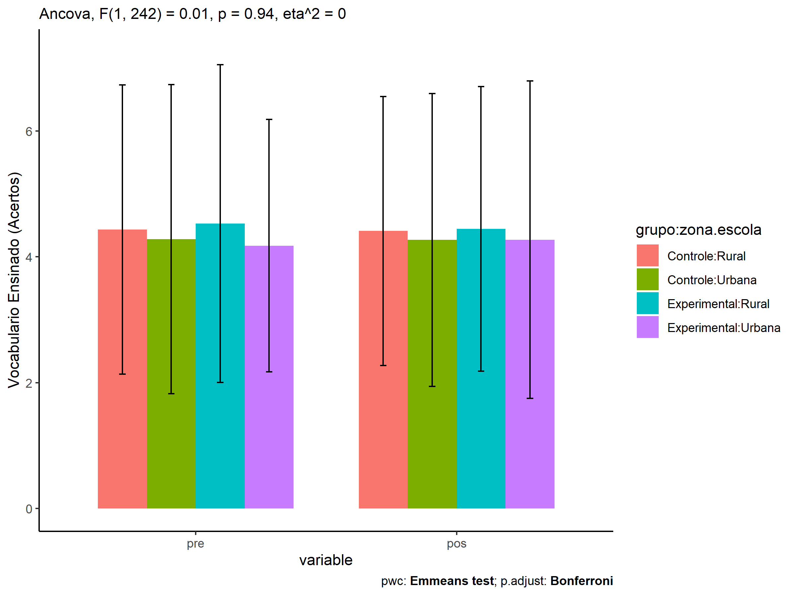<!-- -->

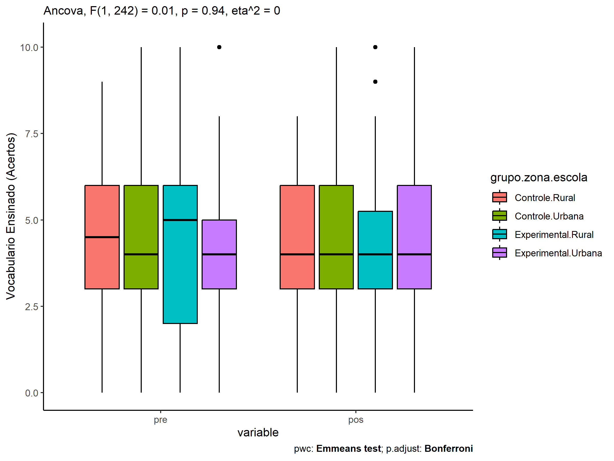<!-- -->

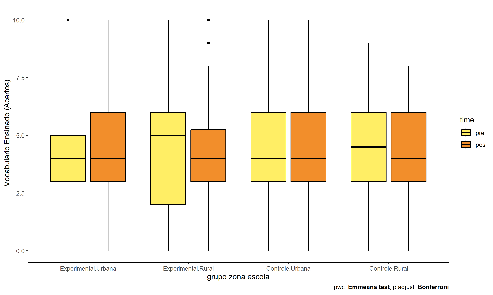<!-- -->

### Vocabulario Ensinado (TRI)

| var                    | zona.escola | grupo        |   n | M (pre) | SE (pre) | M (unadj) | SE (unadj) | M (adj) | SE (adj) |
|:-----------------------|:------------|:-------------|----:|--------:|---------:|----------:|-----------:|--------:|---------:|
| tri.vocab.ensinado.pos | Rural       | Controle     |  42 |   0.228 |    0.114 |     0.205 |      0.118 |   0.196 |    0.096 |
| tri.vocab.ensinado.pos | Rural       | Experimental |  34 |   0.122 |    0.144 |     0.079 |      0.143 |   0.131 |    0.106 |
| tri.vocab.ensinado.pos | Urbana      | Controle     |  72 |   0.306 |    0.094 |     0.351 |      0.089 |   0.298 |    0.073 |
| tri.vocab.ensinado.pos | Urbana      | Experimental |  74 |   0.154 |    0.084 |     0.367 |      0.084 |   0.400 |    0.072 |

| grupo        | zona.escola | group1   | group2       | estimate | conf.low | conf.high |    se | statistic |     p | p.adj | p.adj.signif |
|:-------------|:------------|:---------|:-------------|---------:|---------:|----------:|------:|----------:|------:|------:|:-------------|
| Controle     |             | Urbana   | Rural        |    0.102 |   -0.135 |     0.339 | 0.120 |     0.847 | 0.398 | 0.398 | ns           |
| Experimental |             | Urbana   | Rural        |    0.269 |    0.016 |     0.523 | 0.128 |     2.098 | 0.037 | 0.037 | \*           |
| Controle     |             | Urbana   | Rural        |    0.078 |   -0.216 |     0.372 | 0.149 |     0.523 | 0.601 | 0.601 | ns           |
| Experimental |             | Urbana   | Rural        |    0.032 |   -0.282 |     0.346 | 0.159 |     0.201 | 0.841 | 0.841 | ns           |
|              | Urbana      | Controle | Experimental |   -0.103 |   -0.305 |     0.100 | 0.103 |    -0.996 | 0.321 | 0.321 | ns           |
|              | Rural       | Controle | Experimental |    0.065 |   -0.217 |     0.347 | 0.143 |     0.453 | 0.651 | 0.651 | ns           |
|              | Urbana      | Controle | Experimental |    0.153 |   -0.098 |     0.403 | 0.127 |     1.198 | 0.232 | 0.232 | ns           |
|              | Rural       | Controle | Experimental |    0.106 |   -0.243 |     0.456 | 0.177 |     0.600 | 0.549 | 0.549 | ns           |

| grupo        | zona.escola | group1 | group2 | estimate | conf.low | conf.high |    se | statistic |     p | p.adj | p.adj.signif |
|:-------------|:------------|:-------|:-------|---------:|---------:|----------:|------:|----------:|------:|------:|:-------------|
| Controle     | Urbana      | pre    | pos    |   -0.028 |   -0.271 |     0.216 | 0.124 |    -0.223 | 0.824 | 0.824 | ns           |
| Controle     | Rural       | pre    | pos    |   -0.024 |   -0.347 |     0.300 | 0.165 |    -0.143 | 0.886 | 0.886 | ns           |
| Experimental | Urbana      | pre    | pos    |   -0.175 |   -0.414 |     0.064 | 0.122 |    -1.442 | 0.150 | 0.150 | ns           |
| Experimental | Rural       | pre    | pos    |    0.011 |   -0.347 |     0.370 | 0.182 |     0.062 | 0.950 | 0.950 | ns           |

    ## Scale for colour is already present.
    ## Adding another scale for colour, which will replace the existing scale.

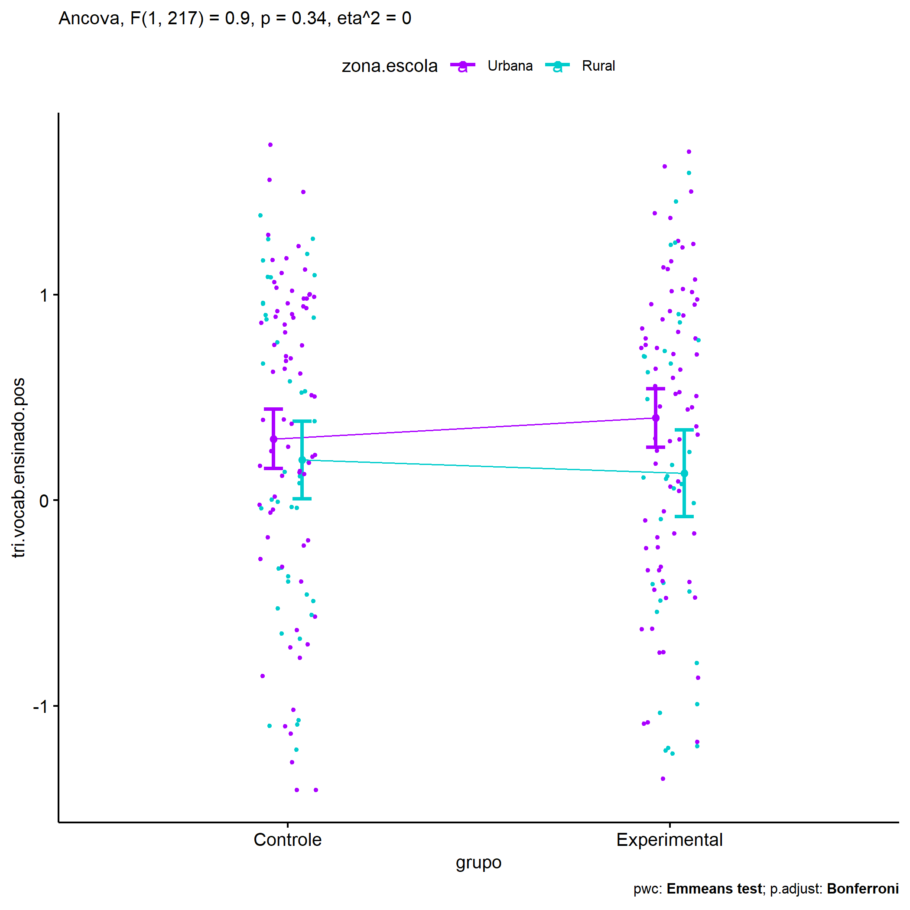<!-- -->

    ## Scale for colour is already present.
    ## Adding another scale for colour, which will replace the existing scale.

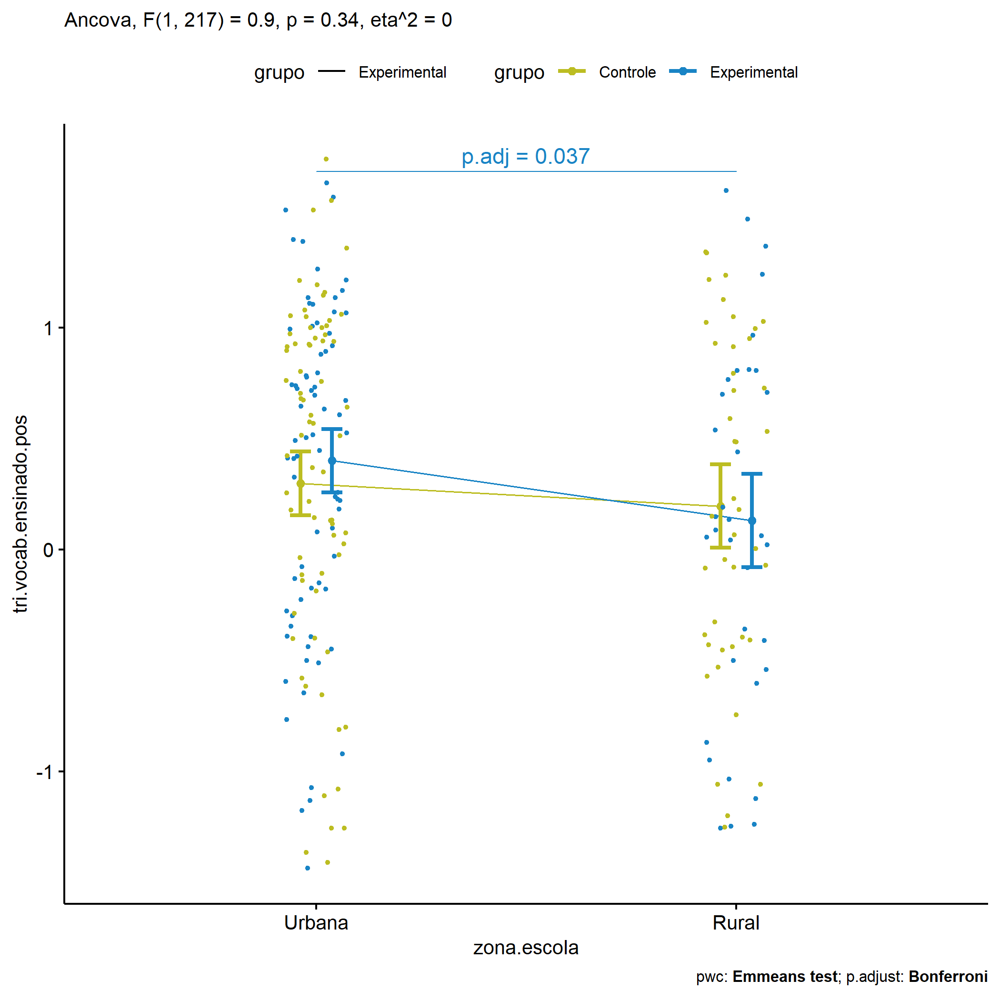<!-- -->

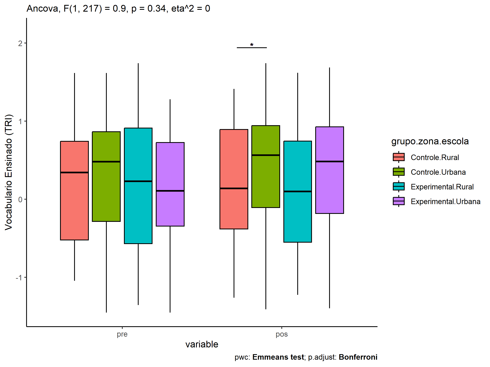<!-- -->

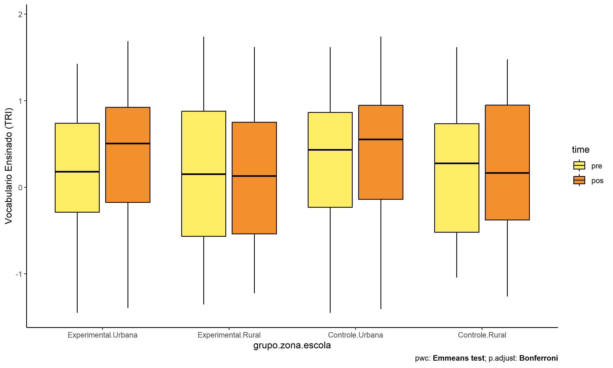<!-- -->

### Vocabulario Nao Ensinado (Acertos)

| var                          | zona.escola | grupo        |   n | M (pre) | SE (pre) | M (unadj) | SE (unadj) | M (adj) | SE (adj) |
|:-----------------------------|:------------|:-------------|----:|--------:|---------:|----------:|-----------:|--------:|---------:|
| score.vocab.nao.ensinado.pos | Rural       | Controle     |  44 |  18.864 |    0.977 |    18.568 |      0.940 |  18.165 |    1.051 |
| score.vocab.nao.ensinado.pos | Rural       | Experimental |  36 |  17.306 |    1.202 |    17.972 |      1.289 |  18.537 |    1.162 |
| score.vocab.nao.ensinado.pos | Urbana      | Controle     |  82 |  18.049 |    0.866 |    18.220 |      0.966 |  18.323 |    0.769 |
| score.vocab.nao.ensinado.pos | Urbana      | Experimental |  85 |  18.424 |    0.770 |    17.588 |      0.971 |  17.458 |    0.756 |

| grupo        | zona.escola | group1   | group2       | estimate | conf.low | conf.high |    se | statistic |     p | p.adj | p.adj.signif |
|:-------------|:------------|:---------|:-------------|---------:|---------:|----------:|------:|----------:|------:|------:|:-------------|
| Controle     |             | Urbana   | Rural        |    0.158 |   -2.408 |     2.723 | 1.303 |     0.121 | 0.904 | 0.904 | ns           |
| Experimental |             | Urbana   | Rural        |   -1.079 |   -3.810 |     1.653 | 1.387 |    -0.778 | 0.437 | 0.437 | ns           |
| Controle     |             | Urbana   | Rural        |   -0.815 |   -3.491 |     1.861 | 1.358 |    -0.600 | 0.549 | 0.549 | ns           |
| Experimental |             | Urbana   | Rural        |    1.118 |   -1.729 |     3.965 | 1.445 |     0.773 | 0.440 | 0.440 | ns           |
|              | Urbana      | Controle | Experimental |    0.864 |   -1.260 |     2.988 | 1.078 |     0.801 | 0.424 | 0.424 | ns           |
|              | Rural       | Controle | Experimental |   -0.372 |   -3.461 |     2.717 | 1.568 |    -0.237 | 0.813 | 0.813 | ns           |
|              | Urbana      | Controle | Experimental |   -0.375 |   -2.591 |     1.842 | 1.125 |    -0.333 | 0.739 | 0.739 | ns           |
|              | Rural       | Controle | Experimental |    1.558 |   -1.660 |     4.776 | 1.634 |     0.954 | 0.341 | 0.341 | ns           |

| grupo        | zona.escola | group1 | group2 | estimate | conf.low | conf.high |    se | statistic |     p | p.adj | p.adj.signif |
|:-------------|:------------|:-------|:-------|---------:|---------:|----------:|------:|----------:|------:|------:|:-------------|
| Controle     | Urbana      | pre    | pos    |   -0.171 |   -2.563 |     2.221 | 1.217 |    -0.140 | 0.889 | 0.889 | ns           |
| Controle     | Rural       | pre    | pos    |    0.295 |   -2.970 |     3.561 | 1.662 |     0.178 | 0.859 | 0.859 | ns           |
| Experimental | Urbana      | pre    | pos    |    0.835 |   -1.514 |     3.185 | 1.196 |     0.699 | 0.485 | 0.485 | ns           |
| Experimental | Rural       | pre    | pos    |   -0.667 |   -4.277 |     2.944 | 1.837 |    -0.363 | 0.717 | 0.717 | ns           |

    ## Scale for colour is already present.
    ## Adding another scale for colour, which will replace the existing scale.

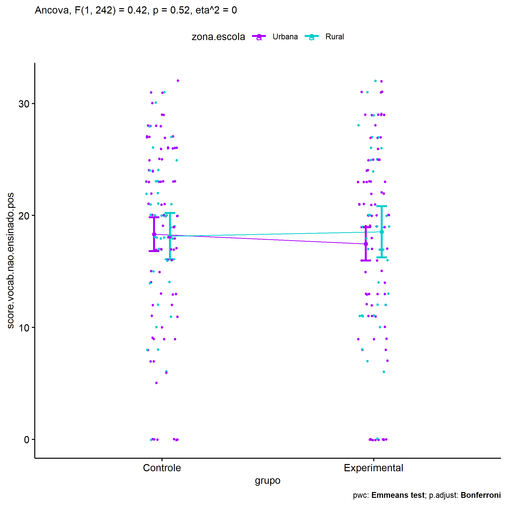<!-- -->

    ## Scale for colour is already present.
    ## Adding another scale for colour, which will replace the existing scale.

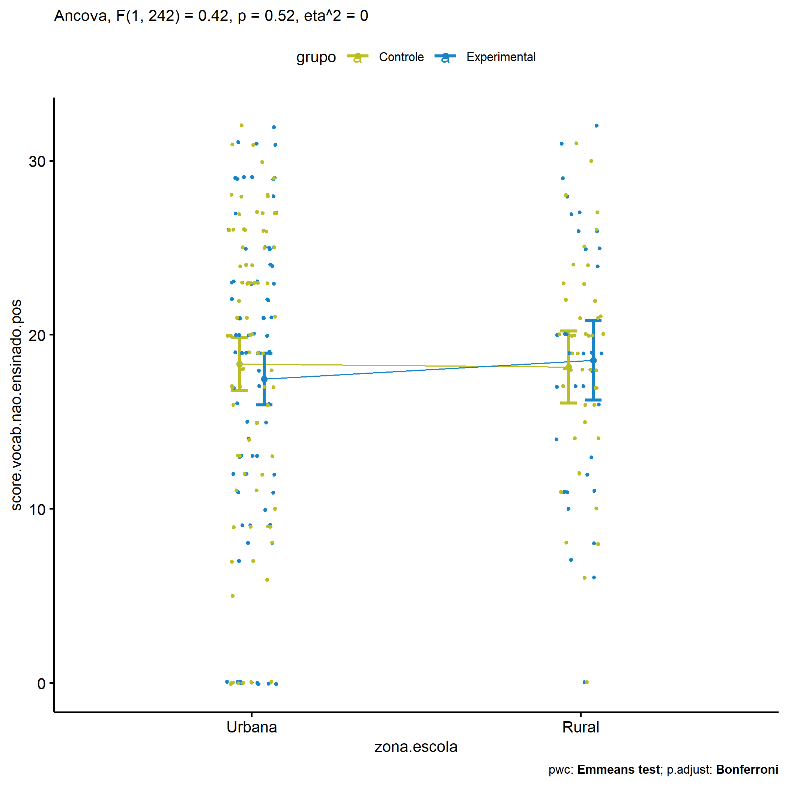<!-- -->

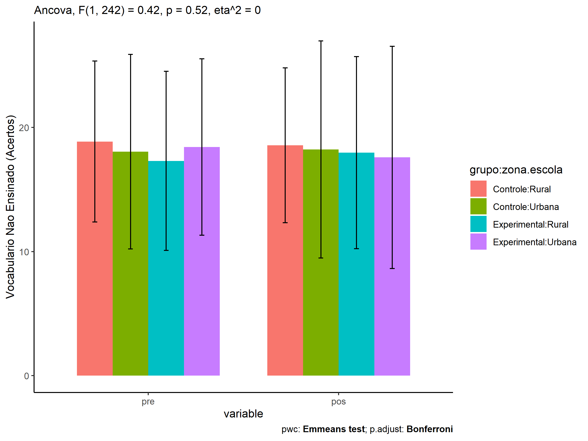<!-- -->

<!-- -->

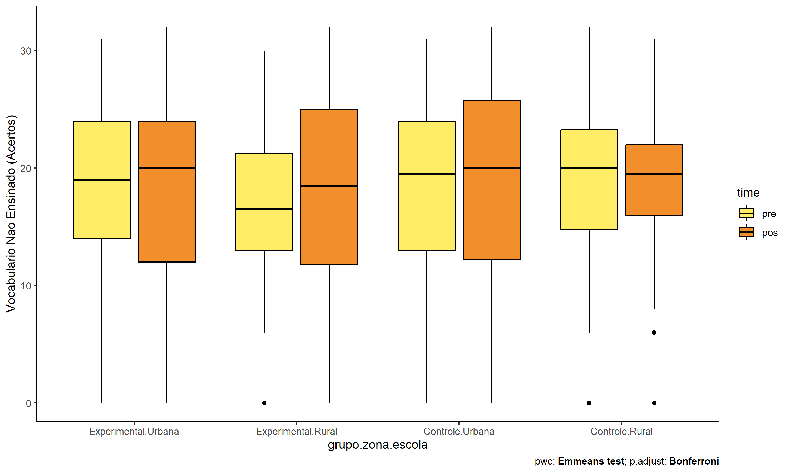<!-- -->

### Vocabulario Nao Ensinado (TRI)

| var                        | zona.escola | grupo        |   n | M (pre) | SE (pre) | M (unadj) | SE (unadj) | M (adj) | SE (adj) |
|:---------------------------|:------------|:-------------|----:|--------:|---------:|----------:|-----------:|--------:|---------:|
| tri.vocab.nao.ensinado.pos | Rural       | Controle     |  42 |   0.370 |    0.110 |     0.271 |      0.124 |   0.216 |    0.092 |
| tri.vocab.nao.ensinado.pos | Rural       | Experimental |  34 |   0.154 |    0.152 |     0.255 |      0.176 |   0.383 |    0.103 |
| tri.vocab.nao.ensinado.pos | Urbana      | Controle     |  72 |   0.379 |    0.105 |     0.531 |      0.113 |   0.467 |    0.071 |
| tri.vocab.nao.ensinado.pos | Urbana      | Experimental |  74 |   0.263 |    0.101 |     0.433 |      0.110 |   0.468 |    0.070 |

| grupo        | zona.escola | group1   | group2       | estimate | conf.low | conf.high |    se | statistic |     p | p.adj | p.adj.signif |
|:-------------|:------------|:---------|:-------------|---------:|---------:|----------:|------:|----------:|------:|------:|:-------------|
| Controle     |             | Urbana   | Rural        |    0.252 |    0.022 |     0.481 | 0.116 |     2.164 | 0.032 | 0.032 | \*           |
| Experimental |             | Urbana   | Rural        |    0.085 |   -0.160 |     0.330 | 0.124 |     0.685 | 0.494 | 0.494 | ns           |
| Controle     |             | Urbana   | Rural        |    0.010 |   -0.317 |     0.336 | 0.166 |     0.059 | 0.953 | 0.953 | ns           |
| Experimental |             | Urbana   | Rural        |    0.110 |   -0.238 |     0.458 | 0.177 |     0.622 | 0.535 | 0.535 | ns           |
|              | Urbana      | Controle | Experimental |   -0.001 |   -0.196 |     0.195 | 0.099 |    -0.005 | 0.996 | 0.996 | ns           |
|              | Rural       | Controle | Experimental |   -0.167 |   -0.440 |     0.106 | 0.139 |    -1.205 | 0.229 | 0.229 | ns           |
|              | Urbana      | Controle | Experimental |    0.116 |   -0.162 |     0.394 | 0.141 |     0.821 | 0.412 | 0.412 | ns           |
|              | Rural       | Controle | Experimental |    0.216 |   -0.172 |     0.604 | 0.197 |     1.098 | 0.273 | 0.273 | ns           |

| grupo        | zona.escola | group1 | group2 | estimate | conf.low | conf.high |    se | statistic |     p | p.adj | p.adj.signif |
|:-------------|:------------|:-------|:-------|---------:|---------:|----------:|------:|----------:|------:|------:|:-------------|
| Controle     | Urbana      | pre    | pos    |   -0.122 |   -0.407 |     0.164 | 0.145 |    -0.838 | 0.402 | 0.402 | ns           |
| Controle     | Rural       | pre    | pos    |    0.070 |   -0.309 |     0.450 | 0.193 |     0.363 | 0.717 | 0.717 | ns           |
| Experimental | Urbana      | pre    | pos    |   -0.144 |   -0.424 |     0.136 | 0.143 |    -1.008 | 0.314 | 0.314 | ns           |
| Experimental | Rural       | pre    | pos    |   -0.142 |   -0.563 |     0.278 | 0.214 |    -0.665 | 0.507 | 0.507 | ns           |

    ## Scale for colour is already present.
    ## Adding another scale for colour, which will replace the existing scale.

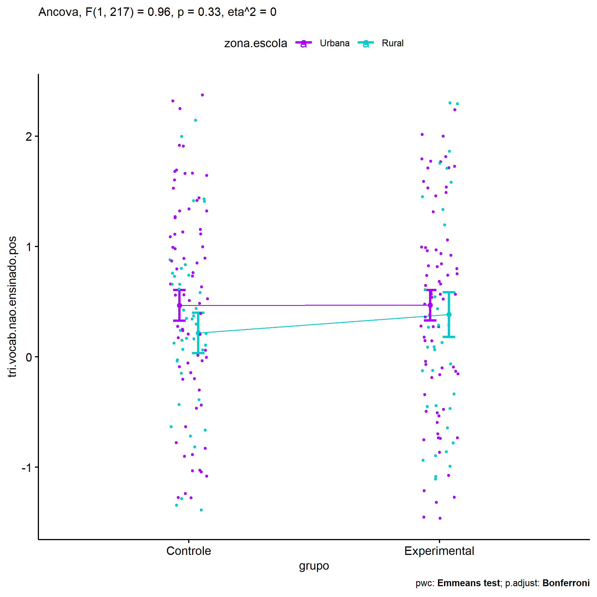<!-- -->

    ## Scale for colour is already present.
    ## Adding another scale for colour, which will replace the existing scale.

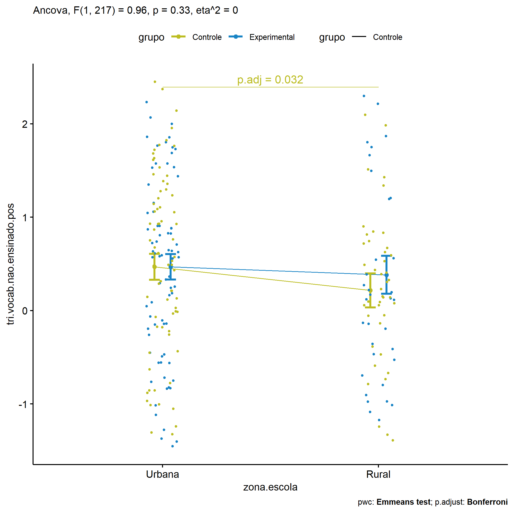<!-- -->

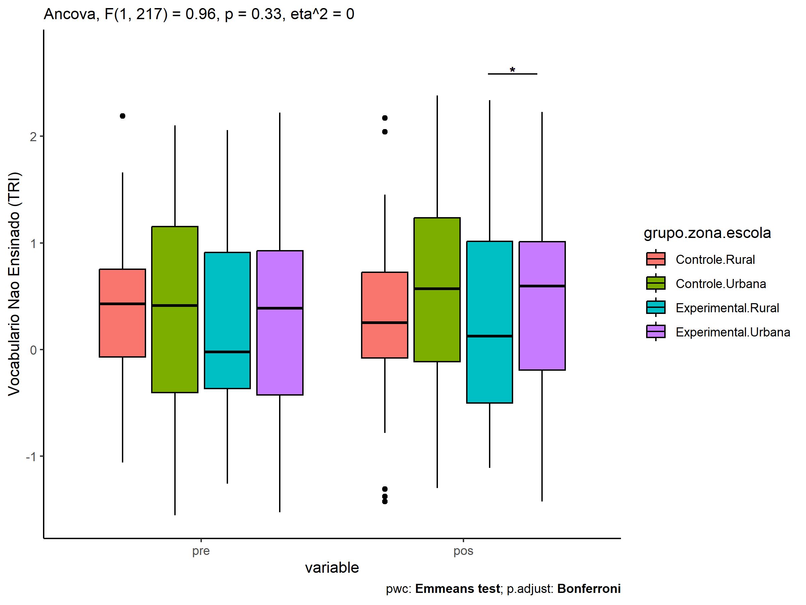<!-- -->

<!-- -->

# Pairwise comparisons for grupo=“Experimental”

## factores: **grupo=“Experimental”:monitor**

### Vocabulario (Acertos)

| var             | monitor |   n | M (pre) | SE (pre) | M (unadj) | SE (unadj) | M (adj) | SE (adj) |
|:----------------|:--------|----:|--------:|---------:|----------:|-----------:|--------:|---------:|
| score.vocab.pos | AC      |  10 |  25.300 |    2.362 |    27.200 |      2.337 |  25.389 |    1.877 |
| score.vocab.pos | CE      |   6 |  25.833 |    3.092 |    22.833 |      3.341 |  20.634 |    2.421 |
| score.vocab.pos | EA      |   8 |  26.375 |    1.475 |    27.250 |      2.336 |  24.656 |    2.105 |
| score.vocab.pos | GR      |  15 |  23.533 |    2.286 |    25.467 |      2.072 |  24.943 |    1.525 |
| score.vocab.pos | JC      |  11 |  24.455 |    2.313 |    27.818 |      1.476 |  26.624 |    1.784 |
| score.vocab.pos | MF      |   9 |  26.778 |    2.126 |    26.667 |      2.449 |  23.779 |    1.991 |
| score.vocab.pos | ML      |  16 |  22.188 |    2.255 |    25.000 |      2.343 |  25.457 |    1.477 |
| score.vocab.pos | MM      |   9 |  16.556 |    1.002 |    19.333 |      2.603 |  23.893 |    2.026 |
| score.vocab.pos | PR      |  12 |  18.167 |    2.519 |    19.667 |      3.028 |  23.053 |    1.741 |
| score.vocab.pos | VL      |  12 |  21.667 |    2.527 |    19.833 |      2.443 |  20.670 |    1.706 |

| .y.             | group1 | group2 | estimate | conf.low | conf.high |    se | statistic |     p | p.adj | p.adj.signif |
|:----------------|:-------|:-------|---------:|---------:|----------:|------:|----------:|------:|------:|:-------------|
| score.vocab.pos | AC     | CE     |    4.755 |   -1.296 |    10.806 | 3.049 |     1.560 | 0.122 | 1.000 | ns           |
| score.vocab.pos | AC     | EA     |    0.733 |   -4.827 |     6.293 | 2.801 |     0.262 | 0.794 | 1.000 | ns           |
| score.vocab.pos | AC     | GR     |    0.446 |   -4.345 |     5.237 | 2.414 |     0.185 | 0.854 | 1.000 | ns           |
| score.vocab.pos | AC     | JC     |   -1.234 |   -6.355 |     3.887 | 2.580 |    -0.478 | 0.634 | 1.000 | ns           |
| score.vocab.pos | AC     | MF     |    1.610 |   -3.778 |     6.998 | 2.715 |     0.593 | 0.555 | 1.000 | ns           |
| score.vocab.pos | AC     | ML     |   -0.068 |   -4.814 |     4.679 | 2.392 |    -0.028 | 0.978 | 1.000 | ns           |
| score.vocab.pos | AC     | MM     |    1.496 |   -4.050 |     7.042 | 2.794 |     0.535 | 0.594 | 1.000 | ns           |
| score.vocab.pos | AC     | PR     |    2.336 |   -2.797 |     7.470 | 2.586 |     0.903 | 0.369 | 1.000 | ns           |
| score.vocab.pos | AC     | VL     |    4.720 |   -0.328 |     9.767 | 2.543 |     1.856 | 0.067 | 1.000 | ns           |
| score.vocab.pos | CE     | EA     |   -4.022 |  -10.350 |     2.306 | 3.188 |    -1.261 | 0.210 | 1.000 | ns           |
| score.vocab.pos | CE     | GR     |   -4.309 |   -9.979 |     1.361 | 2.857 |    -1.508 | 0.135 | 1.000 | ns           |
| score.vocab.pos | CE     | JC     |   -5.989 |  -11.939 |    -0.039 | 2.998 |    -1.998 | 0.049 | 1.000 | ns           |
| score.vocab.pos | CE     | MF     |   -3.145 |   -9.322 |     3.031 | 3.112 |    -1.011 | 0.315 | 1.000 | ns           |
| score.vocab.pos | CE     | ML     |   -4.823 |  -10.459 |     0.814 | 2.840 |    -1.698 | 0.093 | 1.000 | ns           |
| score.vocab.pos | CE     | MM     |   -3.259 |   -9.594 |     3.076 | 3.192 |    -1.021 | 0.310 | 1.000 | ns           |
| score.vocab.pos | CE     | PR     |   -2.419 |   -8.393 |     3.555 | 3.010 |    -0.804 | 0.424 | 1.000 | ns           |
| score.vocab.pos | CE     | VL     |   -0.036 |   -5.928 |     5.857 | 2.969 |    -0.012 | 0.990 | 1.000 | ns           |
| score.vocab.pos | EA     | GR     |   -0.287 |   -5.435 |     4.861 | 2.594 |    -0.111 | 0.912 | 1.000 | ns           |
| score.vocab.pos | EA     | JC     |   -1.967 |   -7.419 |     3.485 | 2.747 |    -0.716 | 0.476 | 1.000 | ns           |
| score.vocab.pos | EA     | MF     |    0.877 |   -4.817 |     6.570 | 2.869 |     0.306 | 0.761 | 1.000 | ns           |
| score.vocab.pos | EA     | ML     |   -0.801 |   -5.914 |     4.313 | 2.576 |    -0.311 | 0.757 | 1.000 | ns           |
| score.vocab.pos | EA     | MM     |    0.763 |   -5.124 |     6.650 | 2.966 |     0.257 | 0.798 | 1.000 | ns           |
| score.vocab.pos | EA     | PR     |    1.603 |   -3.889 |     7.096 | 2.767 |     0.579 | 0.564 | 1.000 | ns           |
| score.vocab.pos | EA     | VL     |    3.986 |   -1.409 |     9.382 | 2.719 |     1.466 | 0.146 | 1.000 | ns           |
| score.vocab.pos | GR     | JC     |   -1.680 |   -6.333 |     2.973 | 2.344 |    -0.717 | 0.475 | 1.000 | ns           |
| score.vocab.pos | GR     | MF     |    1.164 |   -3.801 |     6.129 | 2.502 |     0.465 | 0.643 | 1.000 | ns           |
| score.vocab.pos | GR     | ML     |   -0.514 |   -4.730 |     3.702 | 2.124 |    -0.242 | 0.809 | 1.000 | ns           |
| score.vocab.pos | GR     | MM     |    1.050 |   -4.004 |     6.103 | 2.546 |     0.412 | 0.681 | 1.000 | ns           |
| score.vocab.pos | GR     | PR     |    1.890 |   -2.721 |     6.501 | 2.323 |     0.814 | 0.418 | 1.000 | ns           |
| score.vocab.pos | GR     | VL     |    4.273 |   -0.273 |     8.820 | 2.291 |     1.865 | 0.065 | 1.000 | ns           |
| score.vocab.pos | JC     | MF     |    2.844 |   -2.434 |     8.122 | 2.659 |     1.069 | 0.288 | 1.000 | ns           |
| score.vocab.pos | JC     | ML     |    1.167 |   -3.435 |     5.769 | 2.319 |     0.503 | 0.616 | 1.000 | ns           |
| score.vocab.pos | JC     | MM     |    2.730 |   -2.672 |     8.132 | 2.722 |     1.003 | 0.318 | 1.000 | ns           |
| score.vocab.pos | JC     | PR     |    3.571 |   -1.413 |     8.554 | 2.511 |     1.422 | 0.158 | 1.000 | ns           |
| score.vocab.pos | JC     | VL     |    5.954 |    1.045 |    10.863 | 2.473 |     2.407 | 0.018 | 0.809 | ns           |
| score.vocab.pos | MF     | ML     |   -1.678 |   -6.609 |     3.254 | 2.485 |    -0.675 | 0.501 | 1.000 | ns           |
| score.vocab.pos | MF     | MM     |   -0.114 |   -5.853 |     5.625 | 2.892 |    -0.039 | 0.969 | 1.000 | ns           |
| score.vocab.pos | MF     | PR     |    0.726 |   -4.604 |     6.057 | 2.686 |     0.270 | 0.787 | 1.000 | ns           |
| score.vocab.pos | MF     | VL     |    3.110 |   -2.115 |     8.335 | 2.633 |     1.181 | 0.240 | 1.000 | ns           |
| score.vocab.pos | ML     | MM     |    1.564 |   -3.393 |     6.520 | 2.498 |     0.626 | 0.533 | 1.000 | ns           |
| score.vocab.pos | ML     | PR     |    2.404 |   -2.112 |     6.920 | 2.275 |     1.056 | 0.293 | 1.000 | ns           |
| score.vocab.pos | ML     | VL     |    4.787 |    0.312 |     9.262 | 2.255 |     2.123 | 0.036 | 1.000 | ns           |
| score.vocab.pos | MM     | PR     |    0.840 |   -4.332 |     6.013 | 2.606 |     0.322 | 0.748 | 1.000 | ns           |
| score.vocab.pos | MM     | VL     |    3.224 |   -2.001 |     8.449 | 2.633 |     1.225 | 0.224 | 1.000 | ns           |
| score.vocab.pos | PR     | VL     |    2.383 |   -2.430 |     7.196 | 2.425 |     0.983 | 0.328 | 1.000 | ns           |
| score.vocab.pre | AC     | CE     |   -0.533 |   -8.482 |     7.415 | 4.005 |    -0.133 | 0.894 | 1.000 | ns           |
| score.vocab.pre | AC     | EA     |   -1.075 |   -8.376 |     6.226 | 3.679 |    -0.292 | 0.771 | 1.000 | ns           |
| score.vocab.pre | AC     | GR     |    1.767 |   -4.517 |     8.051 | 3.167 |     0.558 | 0.578 | 1.000 | ns           |
| score.vocab.pre | AC     | JC     |    0.845 |   -5.880 |     7.571 | 3.389 |     0.249 | 0.804 | 1.000 | ns           |
| score.vocab.pre | AC     | MF     |   -1.478 |   -8.550 |     5.594 | 3.564 |    -0.415 | 0.679 | 1.000 | ns           |
| score.vocab.pre | AC     | ML     |    3.112 |   -3.092 |     9.317 | 3.127 |     0.995 | 0.322 | 1.000 | ns           |
| score.vocab.pre | AC     | MM     |    8.744 |    1.672 |    15.817 | 3.564 |     2.454 | 0.016 | 0.716 | ns           |
| score.vocab.pre | AC     | PR     |    7.133 |    0.543 |    13.724 | 3.321 |     2.148 | 0.034 | 1.000 | ns           |
| score.vocab.pre | AC     | VL     |    3.633 |   -2.957 |    10.224 | 3.321 |     1.094 | 0.277 | 1.000 | ns           |
| score.vocab.pre | CE     | EA     |   -0.542 |   -8.854 |     7.771 | 4.189 |    -0.129 | 0.897 | 1.000 | ns           |
| score.vocab.pre | CE     | GR     |    2.300 |   -5.135 |     9.735 | 3.747 |     0.614 | 0.541 | 1.000 | ns           |
| score.vocab.pre | CE     | JC     |    1.379 |   -6.433 |     9.191 | 3.937 |     0.350 | 0.727 | 1.000 | ns           |
| score.vocab.pre | CE     | MF     |   -0.944 |   -9.057 |     7.168 | 4.088 |    -0.231 | 0.818 | 1.000 | ns           |
| score.vocab.pre | CE     | ML     |    3.646 |   -3.723 |    11.014 | 3.713 |     0.982 | 0.329 | 1.000 | ns           |
| score.vocab.pre | CE     | MM     |    9.278 |    1.165 |    17.390 | 4.088 |     2.270 | 0.025 | 1.000 | ns           |
| score.vocab.pre | CE     | PR     |    7.667 |   -0.029 |    15.363 | 3.878 |     1.977 | 0.051 | 1.000 | ns           |
| score.vocab.pre | CE     | VL     |    4.167 |   -3.529 |    11.863 | 3.878 |     1.074 | 0.285 | 1.000 | ns           |
| score.vocab.pre | EA     | GR     |    2.842 |   -3.897 |     9.580 | 3.396 |     0.837 | 0.405 | 1.000 | ns           |
| score.vocab.pre | EA     | JC     |    1.920 |   -5.232 |     9.073 | 3.604 |     0.533 | 0.595 | 1.000 | ns           |
| score.vocab.pre | EA     | MF     |   -0.403 |   -7.882 |     7.077 | 3.769 |    -0.107 | 0.915 | 1.000 | ns           |
| score.vocab.pre | EA     | ML     |    4.188 |   -2.478 |    10.853 | 3.359 |     1.247 | 0.215 | 1.000 | ns           |
| score.vocab.pre | EA     | MM     |    9.819 |    2.340 |    17.299 | 3.769 |     2.605 | 0.011 | 0.477 | ns           |
| score.vocab.pre | EA     | PR     |    8.208 |    1.183 |    15.234 | 3.540 |     2.319 | 0.022 | 1.000 | ns           |
| score.vocab.pre | EA     | VL     |    4.708 |   -2.317 |    11.734 | 3.540 |     1.330 | 0.187 | 1.000 | ns           |
| score.vocab.pre | GR     | JC     |   -0.921 |   -7.031 |     5.189 | 3.079 |    -0.299 | 0.765 | 1.000 | ns           |
| score.vocab.pre | GR     | MF     |   -3.244 |   -9.734 |     3.246 | 3.270 |    -0.992 | 0.324 | 1.000 | ns           |
| score.vocab.pre | GR     | ML     |    1.346 |   -4.186 |     6.878 | 2.788 |     0.483 | 0.630 | 1.000 | ns           |
| score.vocab.pre | GR     | MM     |    6.978 |    0.488 |    13.468 | 3.270 |     2.134 | 0.035 | 1.000 | ns           |
| score.vocab.pre | GR     | PR     |    5.367 |   -0.595 |    11.328 | 3.004 |     1.786 | 0.077 | 1.000 | ns           |
| score.vocab.pre | GR     | VL     |    1.867 |   -4.095 |     7.828 | 3.004 |     0.621 | 0.536 | 1.000 | ns           |
| score.vocab.pre | JC     | MF     |   -2.323 |   -9.242 |     4.595 | 3.486 |    -0.666 | 0.507 | 1.000 | ns           |
| score.vocab.pre | JC     | ML     |    2.267 |   -3.762 |     8.296 | 3.038 |     0.746 | 0.457 | 1.000 | ns           |
| score.vocab.pre | JC     | MM     |    7.899 |    0.981 |    14.817 | 3.486 |     2.266 | 0.026 | 1.000 | ns           |
| score.vocab.pre | JC     | PR     |    6.288 |   -0.137 |    12.713 | 3.238 |     1.942 | 0.055 | 1.000 | ns           |
| score.vocab.pre | JC     | VL     |    2.788 |   -3.637 |     9.213 | 3.238 |     0.861 | 0.391 | 1.000 | ns           |
| score.vocab.pre | MF     | ML     |    4.590 |   -1.823 |    11.004 | 3.232 |     1.420 | 0.159 | 1.000 | ns           |
| score.vocab.pre | MF     | MM     |   10.222 |    2.966 |    17.478 | 3.656 |     2.796 | 0.006 | 0.280 | ns           |
| score.vocab.pre | MF     | PR     |    8.611 |    1.824 |    15.398 | 3.420 |     2.518 | 0.013 | 0.605 | ns           |
| score.vocab.pre | MF     | VL     |    5.111 |   -1.676 |    11.898 | 3.420 |     1.494 | 0.138 | 1.000 | ns           |
| score.vocab.pre | ML     | MM     |    5.632 |   -0.782 |    12.045 | 3.232 |     1.743 | 0.085 | 1.000 | ns           |
| score.vocab.pre | ML     | PR     |    4.021 |   -1.857 |     9.899 | 2.962 |     1.357 | 0.178 | 1.000 | ns           |
| score.vocab.pre | ML     | VL     |    0.521 |   -5.357 |     6.399 | 2.962 |     0.176 | 0.861 | 1.000 | ns           |
| score.vocab.pre | MM     | PR     |   -1.611 |   -8.398 |     5.176 | 3.420 |    -0.471 | 0.639 | 1.000 | ns           |
| score.vocab.pre | MM     | VL     |   -5.111 |  -11.898 |     1.676 | 3.420 |    -1.494 | 0.138 | 1.000 | ns           |
| score.vocab.pre | PR     | VL     |   -3.500 |   -9.784 |     2.784 | 3.167 |    -1.105 | 0.272 | 1.000 | ns           |

| monitor | group1 | group2 | estimate | conf.low | conf.high |    se | statistic |     p | p.adj | p.adj.signif |
|:--------|:-------|:-------|---------:|---------:|----------:|------:|----------:|------:|------:|:-------------|
| AC      | pre    | pos    |   -1.364 |   -8.063 |     5.336 | 3.398 |    -0.401 | 0.689 | 0.689 | ns           |
| CE      | pre    | pos    |    1.690 |   -7.051 |    10.431 | 4.434 |     0.381 | 0.703 | 0.703 | ns           |
| EA      | pre    | pos    |    0.083 |   -7.551 |     7.718 | 3.872 |     0.022 | 0.983 | 0.983 | ns           |
| GR      | pre    | pos    |   -1.933 |   -7.670 |     3.804 | 2.910 |    -0.664 | 0.507 | 0.507 | ns           |
| JC      | pre    | pos    |   -3.364 |  -10.063 |     3.336 | 3.398 |    -0.990 | 0.323 | 0.323 | ns           |
| MF      | pre    | pos    |   -1.333 |   -8.261 |     5.595 | 3.514 |    -0.379 | 0.705 | 0.705 | ns           |
| ML      | pre    | pos    |   -2.812 |   -8.367 |     2.742 | 2.818 |    -0.998 | 0.319 | 0.319 | ns           |
| MM      | pre    | pos    |   -0.487 |   -7.300 |     6.326 | 3.456 |    -0.141 | 0.888 | 0.888 | ns           |
| PR      | pre    | pos    |   -1.500 |   -7.914 |     4.914 | 3.254 |    -0.461 | 0.645 | 0.645 | ns           |
| VL      | pre    | pos    |    1.397 |   -4.892 |     7.687 | 3.190 |     0.438 | 0.662 | 0.662 | ns           |

    ## Scale for colour is already present.
    ## Adding another scale for colour, which will replace the existing scale.

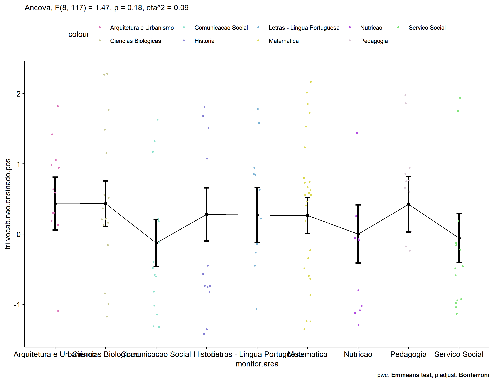<!-- -->

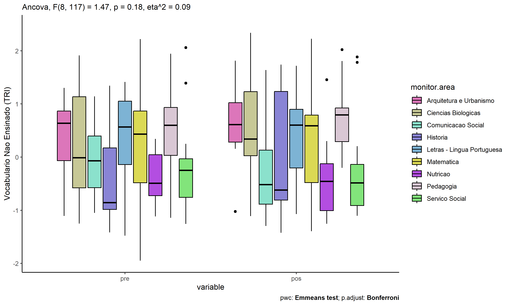<!-- -->

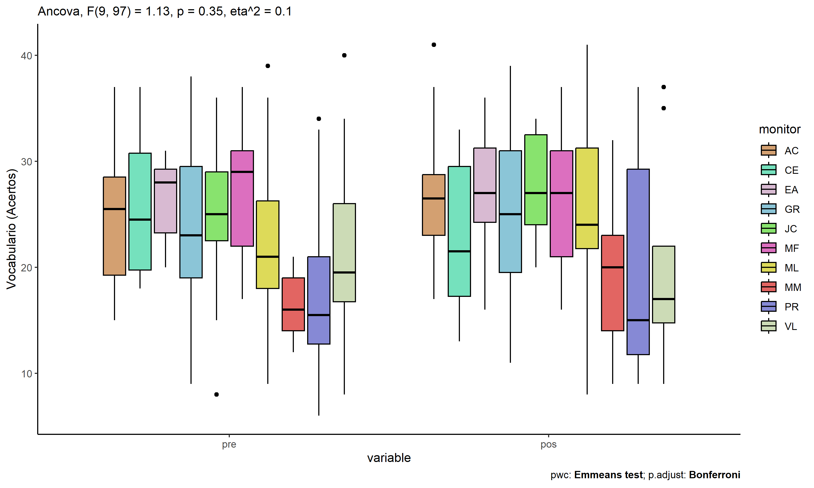<!-- -->

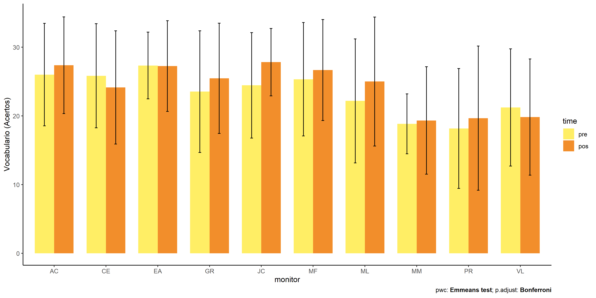<!-- -->

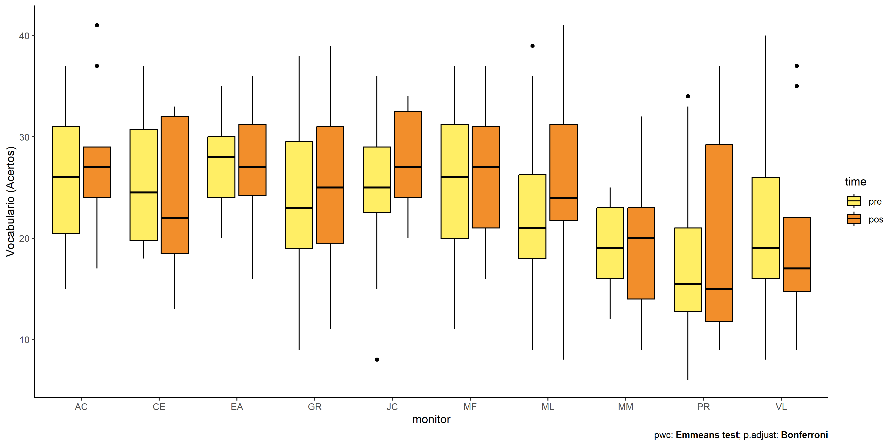<!-- -->

### Vocabulario (TRI)

| var           | monitor |   n | M (pre) | SE (pre) | M (unadj) | SE (unadj) | M (adj) | SE (adj) |
|:--------------|:--------|----:|--------:|---------:|----------:|-----------:|--------:|---------:|
| tri.vocab.pos | AC      |  10 |   0.648 |    0.204 |     0.769 |      0.185 |   0.481 |    0.193 |
| tri.vocab.pos | CE      |   6 |   0.476 |    0.182 |     0.331 |      0.399 |   0.160 |    0.246 |
| tri.vocab.pos | EA      |   8 |   0.602 |    0.183 |     0.676 |      0.292 |   0.419 |    0.215 |
| tri.vocab.pos | GR      |  15 |   0.327 |    0.263 |     0.526 |      0.223 |   0.458 |    0.156 |
| tri.vocab.pos | JC      |  11 |   0.442 |    0.214 |     0.831 |      0.127 |   0.684 |    0.182 |
| tri.vocab.pos | MF      |   9 |   0.743 |    0.190 |     0.754 |      0.216 |   0.400 |    0.204 |
| tri.vocab.pos | ML      |  16 |   0.224 |    0.262 |     0.494 |      0.224 |   0.497 |    0.151 |
| tri.vocab.pos | MM      |   9 |  -0.548 |    0.238 |    -0.337 |      0.283 |   0.198 |    0.208 |
| tri.vocab.pos | PR      |  12 |  -0.445 |    0.331 |    -0.099 |      0.335 |   0.365 |    0.180 |
| tri.vocab.pos | VL      |  12 |   0.069 |    0.228 |    -0.056 |      0.242 |   0.054 |    0.174 |

| .y.           | group1 | group2 | estimate | conf.low | conf.high |    se | statistic |     p | p.adj | p.adj.signif |
|:--------------|:-------|:-------|---------:|---------:|----------:|------:|----------:|------:|------:|:-------------|
| tri.vocab.pos | AC     | CE     |    0.320 |   -0.297 |     0.938 | 0.311 |     1.030 | 0.306 | 1.000 | ns           |
| tri.vocab.pos | AC     | EA     |    0.061 |   -0.505 |     0.628 | 0.286 |     0.215 | 0.830 | 1.000 | ns           |
| tri.vocab.pos | AC     | GR     |    0.022 |   -0.468 |     0.512 | 0.247 |     0.090 | 0.928 | 1.000 | ns           |
| tri.vocab.pos | AC     | JC     |   -0.203 |   -0.726 |     0.320 | 0.263 |    -0.771 | 0.443 | 1.000 | ns           |
| tri.vocab.pos | AC     | MF     |    0.081 |   -0.468 |     0.630 | 0.277 |     0.292 | 0.771 | 1.000 | ns           |
| tri.vocab.pos | AC     | ML     |   -0.016 |   -0.502 |     0.469 | 0.245 |    -0.066 | 0.947 | 1.000 | ns           |
| tri.vocab.pos | AC     | MM     |    0.283 |   -0.292 |     0.858 | 0.290 |     0.976 | 0.331 | 1.000 | ns           |
| tri.vocab.pos | AC     | PR     |    0.116 |   -0.419 |     0.650 | 0.269 |     0.429 | 0.669 | 1.000 | ns           |
| tri.vocab.pos | AC     | VL     |    0.427 |   -0.092 |     0.945 | 0.261 |     1.634 | 0.106 | 1.000 | ns           |
| tri.vocab.pos | CE     | EA     |   -0.259 |   -0.905 |     0.387 | 0.325 |    -0.796 | 0.428 | 1.000 | ns           |
| tri.vocab.pos | CE     | GR     |   -0.298 |   -0.876 |     0.280 | 0.291 |    -1.024 | 0.308 | 1.000 | ns           |
| tri.vocab.pos | CE     | JC     |   -0.523 |   -1.130 |     0.083 | 0.306 |    -1.713 | 0.090 | 1.000 | ns           |
| tri.vocab.pos | CE     | MF     |   -0.240 |   -0.870 |     0.391 | 0.318 |    -0.754 | 0.453 | 1.000 | ns           |
| tri.vocab.pos | CE     | ML     |   -0.337 |   -0.910 |     0.237 | 0.289 |    -1.165 | 0.247 | 1.000 | ns           |
| tri.vocab.pos | CE     | MM     |   -0.038 |   -0.684 |     0.609 | 0.326 |    -0.115 | 0.908 | 1.000 | ns           |
| tri.vocab.pos | CE     | PR     |   -0.205 |   -0.817 |     0.407 | 0.308 |    -0.665 | 0.508 | 1.000 | ns           |
| tri.vocab.pos | CE     | VL     |    0.106 |   -0.494 |     0.707 | 0.302 |     0.351 | 0.726 | 1.000 | ns           |
| tri.vocab.pos | EA     | GR     |   -0.039 |   -0.564 |     0.486 | 0.264 |    -0.148 | 0.883 | 1.000 | ns           |
| tri.vocab.pos | EA     | JC     |   -0.265 |   -0.820 |     0.291 | 0.280 |    -0.945 | 0.347 | 1.000 | ns           |
| tri.vocab.pos | EA     | MF     |    0.019 |   -0.562 |     0.600 | 0.293 |     0.066 | 0.947 | 1.000 | ns           |
| tri.vocab.pos | EA     | ML     |   -0.078 |   -0.598 |     0.443 | 0.262 |    -0.296 | 0.768 | 1.000 | ns           |
| tri.vocab.pos | EA     | MM     |    0.221 |   -0.382 |     0.825 | 0.304 |     0.728 | 0.468 | 1.000 | ns           |
| tri.vocab.pos | EA     | PR     |    0.054 |   -0.511 |     0.619 | 0.285 |     0.190 | 0.850 | 1.000 | ns           |
| tri.vocab.pos | EA     | VL     |    0.365 |   -0.186 |     0.916 | 0.277 |     1.316 | 0.191 | 1.000 | ns           |
| tri.vocab.pos | GR     | JC     |   -0.225 |   -0.700 |     0.249 | 0.239 |    -0.943 | 0.348 | 1.000 | ns           |
| tri.vocab.pos | GR     | MF     |    0.058 |   -0.449 |     0.566 | 0.256 |     0.229 | 0.820 | 1.000 | ns           |
| tri.vocab.pos | GR     | ML     |   -0.039 |   -0.468 |     0.391 | 0.217 |    -0.178 | 0.859 | 1.000 | ns           |
| tri.vocab.pos | GR     | MM     |    0.260 |   -0.259 |     0.779 | 0.261 |     0.996 | 0.322 | 1.000 | ns           |
| tri.vocab.pos | GR     | PR     |    0.093 |   -0.382 |     0.569 | 0.240 |     0.389 | 0.698 | 1.000 | ns           |
| tri.vocab.pos | GR     | VL     |    0.404 |   -0.060 |     0.869 | 0.234 |     1.728 | 0.087 | 1.000 | ns           |
| tri.vocab.pos | JC     | MF     |    0.284 |   -0.255 |     0.823 | 0.271 |     1.046 | 0.298 | 1.000 | ns           |
| tri.vocab.pos | JC     | ML     |    0.187 |   -0.282 |     0.656 | 0.236 |     0.791 | 0.431 | 1.000 | ns           |
| tri.vocab.pos | JC     | MM     |    0.486 |   -0.069 |     1.041 | 0.280 |     1.737 | 0.086 | 1.000 | ns           |
| tri.vocab.pos | JC     | PR     |    0.319 |   -0.196 |     0.833 | 0.259 |     1.229 | 0.222 | 1.000 | ns           |
| tri.vocab.pos | JC     | VL     |    0.630 |    0.128 |     1.131 | 0.253 |     2.492 | 0.014 | 0.649 | ns           |
| tri.vocab.pos | MF     | ML     |   -0.097 |   -0.600 |     0.406 | 0.254 |    -0.383 | 0.703 | 1.000 | ns           |
| tri.vocab.pos | MF     | MM     |    0.202 |   -0.391 |     0.794 | 0.299 |     0.677 | 0.500 | 1.000 | ns           |
| tri.vocab.pos | MF     | PR     |    0.035 |   -0.519 |     0.588 | 0.279 |     0.124 | 0.901 | 1.000 | ns           |
| tri.vocab.pos | MF     | VL     |    0.346 |   -0.190 |     0.881 | 0.270 |     1.281 | 0.203 | 1.000 | ns           |
| tri.vocab.pos | ML     | MM     |    0.299 |   -0.211 |     0.809 | 0.257 |     1.164 | 0.247 | 1.000 | ns           |
| tri.vocab.pos | ML     | PR     |    0.132 |   -0.334 |     0.598 | 0.235 |     0.561 | 0.576 | 1.000 | ns           |
| tri.vocab.pos | ML     | VL     |    0.443 |   -0.014 |     0.900 | 0.230 |     1.924 | 0.057 | 1.000 | ns           |
| tri.vocab.pos | MM     | PR     |   -0.167 |   -0.694 |     0.360 | 0.266 |    -0.630 | 0.530 | 1.000 | ns           |
| tri.vocab.pos | MM     | VL     |    0.144 |   -0.390 |     0.678 | 0.269 |     0.534 | 0.594 | 1.000 | ns           |
| tri.vocab.pos | PR     | VL     |    0.311 |   -0.182 |     0.804 | 0.249 |     1.252 | 0.214 | 1.000 | ns           |
| tri.vocab.pre | AC     | CE     |    0.172 |   -0.698 |     1.042 | 0.438 |     0.392 | 0.696 | 1.000 | ns           |
| tri.vocab.pre | AC     | EA     |    0.046 |   -0.753 |     0.845 | 0.403 |     0.114 | 0.910 | 1.000 | ns           |
| tri.vocab.pre | AC     | GR     |    0.321 |   -0.366 |     1.009 | 0.347 |     0.927 | 0.356 | 1.000 | ns           |
| tri.vocab.pre | AC     | JC     |    0.206 |   -0.530 |     0.942 | 0.371 |     0.555 | 0.580 | 1.000 | ns           |
| tri.vocab.pre | AC     | MF     |   -0.095 |   -0.869 |     0.679 | 0.390 |    -0.245 | 0.807 | 1.000 | ns           |
| tri.vocab.pre | AC     | ML     |    0.424 |   -0.255 |     1.103 | 0.342 |     1.238 | 0.219 | 1.000 | ns           |
| tri.vocab.pre | AC     | MM     |    1.196 |    0.422 |     1.970 | 0.390 |     3.066 | 0.003 | 0.126 | ns           |
| tri.vocab.pre | AC     | PR     |    1.093 |    0.372 |     1.814 | 0.363 |     3.007 | 0.003 | 0.151 | ns           |
| tri.vocab.pre | AC     | VL     |    0.579 |   -0.142 |     1.301 | 0.363 |     1.594 | 0.114 | 1.000 | ns           |
| tri.vocab.pre | CE     | EA     |   -0.126 |   -1.036 |     0.784 | 0.458 |    -0.275 | 0.784 | 1.000 | ns           |
| tri.vocab.pre | CE     | GR     |    0.150 |   -0.664 |     0.963 | 0.410 |     0.365 | 0.716 | 1.000 | ns           |
| tri.vocab.pre | CE     | JC     |    0.034 |   -0.821 |     0.889 | 0.431 |     0.079 | 0.937 | 1.000 | ns           |
| tri.vocab.pre | CE     | MF     |   -0.267 |   -1.155 |     0.621 | 0.447 |    -0.597 | 0.552 | 1.000 | ns           |
| tri.vocab.pre | CE     | ML     |    0.252 |   -0.554 |     1.059 | 0.406 |     0.620 | 0.537 | 1.000 | ns           |
| tri.vocab.pre | CE     | MM     |    1.024 |    0.136 |     1.912 | 0.447 |     2.289 | 0.024 | 1.000 | ns           |
| tri.vocab.pre | CE     | PR     |    0.921 |    0.079 |     1.763 | 0.424 |     2.170 | 0.032 | 1.000 | ns           |
| tri.vocab.pre | CE     | VL     |    0.408 |   -0.435 |     1.250 | 0.424 |     0.960 | 0.339 | 1.000 | ns           |
| tri.vocab.pre | EA     | GR     |    0.276 |   -0.462 |     1.013 | 0.372 |     0.742 | 0.460 | 1.000 | ns           |
| tri.vocab.pre | EA     | JC     |    0.160 |   -0.623 |     0.943 | 0.394 |     0.406 | 0.686 | 1.000 | ns           |
| tri.vocab.pre | EA     | MF     |   -0.141 |   -0.960 |     0.677 | 0.412 |    -0.342 | 0.733 | 1.000 | ns           |
| tri.vocab.pre | EA     | ML     |    0.378 |   -0.351 |     1.108 | 0.368 |     1.029 | 0.306 | 1.000 | ns           |
| tri.vocab.pre | EA     | MM     |    1.150 |    0.332 |     1.969 | 0.412 |     2.789 | 0.006 | 0.286 | ns           |
| tri.vocab.pre | EA     | PR     |    1.047 |    0.278 |     1.816 | 0.387 |     2.702 | 0.008 | 0.365 | ns           |
| tri.vocab.pre | EA     | VL     |    0.534 |   -0.235 |     1.303 | 0.387 |     1.377 | 0.172 | 1.000 | ns           |
| tri.vocab.pre | GR     | JC     |   -0.116 |   -0.784 |     0.553 | 0.337 |    -0.343 | 0.732 | 1.000 | ns           |
| tri.vocab.pre | GR     | MF     |   -0.417 |   -1.127 |     0.294 | 0.358 |    -1.164 | 0.247 | 1.000 | ns           |
| tri.vocab.pre | GR     | ML     |    0.102 |   -0.503 |     0.708 | 0.305 |     0.336 | 0.738 | 1.000 | ns           |
| tri.vocab.pre | GR     | MM     |    0.875 |    0.164 |     1.585 | 0.358 |     2.444 | 0.016 | 0.735 | ns           |
| tri.vocab.pre | GR     | PR     |    0.771 |    0.119 |     1.424 | 0.329 |     2.346 | 0.021 | 0.944 | ns           |
| tri.vocab.pre | GR     | VL     |    0.258 |   -0.394 |     0.910 | 0.329 |     0.785 | 0.434 | 1.000 | ns           |
| tri.vocab.pre | JC     | MF     |   -0.301 |   -1.058 |     0.456 | 0.382 |    -0.789 | 0.432 | 1.000 | ns           |
| tri.vocab.pre | JC     | ML     |    0.218 |   -0.442 |     0.878 | 0.332 |     0.656 | 0.514 | 1.000 | ns           |
| tri.vocab.pre | JC     | MM     |    0.990 |    0.233 |     1.747 | 0.382 |     2.595 | 0.011 | 0.491 | ns           |
| tri.vocab.pre | JC     | PR     |    0.887 |    0.184 |     1.590 | 0.354 |     2.503 | 0.014 | 0.628 | ns           |
| tri.vocab.pre | JC     | VL     |    0.374 |   -0.330 |     1.077 | 0.354 |     1.054 | 0.294 | 1.000 | ns           |
| tri.vocab.pre | MF     | ML     |    0.519 |   -0.183 |     1.221 | 0.354 |     1.468 | 0.145 | 1.000 | ns           |
| tri.vocab.pre | MF     | MM     |    1.291 |    0.497 |     2.085 | 0.400 |     3.227 | 0.002 | 0.077 | ns           |
| tri.vocab.pre | MF     | PR     |    1.188 |    0.445 |     1.931 | 0.374 |     3.174 | 0.002 | 0.090 | ns           |
| tri.vocab.pre | MF     | VL     |    0.675 |   -0.068 |     1.418 | 0.374 |     1.803 | 0.075 | 1.000 | ns           |
| tri.vocab.pre | ML     | MM     |    0.772 |    0.070 |     1.474 | 0.354 |     2.183 | 0.031 | 1.000 | ns           |
| tri.vocab.pre | ML     | PR     |    0.669 |    0.026 |     1.312 | 0.324 |     2.064 | 0.042 | 1.000 | ns           |
| tri.vocab.pre | ML     | VL     |    0.156 |   -0.488 |     0.799 | 0.324 |     0.480 | 0.632 | 1.000 | ns           |
| tri.vocab.pre | MM     | PR     |   -0.103 |   -0.846 |     0.640 | 0.374 |    -0.276 | 0.783 | 1.000 | ns           |
| tri.vocab.pre | MM     | VL     |   -0.617 |   -1.359 |     0.126 | 0.374 |    -1.647 | 0.103 | 1.000 | ns           |
| tri.vocab.pre | PR     | VL     |   -0.513 |   -1.201 |     0.174 | 0.347 |    -1.481 | 0.142 | 1.000 | ns           |

| monitor | group1 | group2 | estimate | conf.low | conf.high |    se | statistic |     p | p.adj | p.adj.signif |
|:--------|:-------|:-------|---------:|---------:|----------:|------:|----------:|------:|------:|:-------------|
| AC      | pre    | pos    |   -0.070 |   -0.785 |     0.646 | 0.363 |    -0.192 | 0.848 | 0.848 | ns           |
| CE      | pre    | pos    |    0.030 |   -0.903 |     0.964 | 0.473 |     0.064 | 0.949 | 0.949 | ns           |
| EA      | pre    | pos    |    0.057 |   -0.758 |     0.872 | 0.414 |     0.138 | 0.890 | 0.890 | ns           |
| GR      | pre    | pos    |   -0.199 |   -0.812 |     0.414 | 0.311 |    -0.640 | 0.523 | 0.523 | ns           |
| JC      | pre    | pos    |   -0.388 |   -1.104 |     0.327 | 0.363 |    -1.070 | 0.286 | 0.286 | ns           |
| MF      | pre    | pos    |   -0.154 |   -0.894 |     0.586 | 0.375 |    -0.410 | 0.682 | 0.682 | ns           |
| ML      | pre    | pos    |   -0.269 |   -0.863 |     0.324 | 0.301 |    -0.895 | 0.372 | 0.372 | ns           |
| MM      | pre    | pos    |    0.094 |   -0.634 |     0.821 | 0.369 |     0.254 | 0.800 | 0.800 | ns           |
| PR      | pre    | pos    |   -0.346 |   -1.031 |     0.339 | 0.347 |    -0.996 | 0.321 | 0.321 | ns           |
| VL      | pre    | pos    |    0.105 |   -0.566 |     0.777 | 0.341 |     0.309 | 0.758 | 0.758 | ns           |

    ## Scale for colour is already present.
    ## Adding another scale for colour, which will replace the existing scale.

<!-- -->

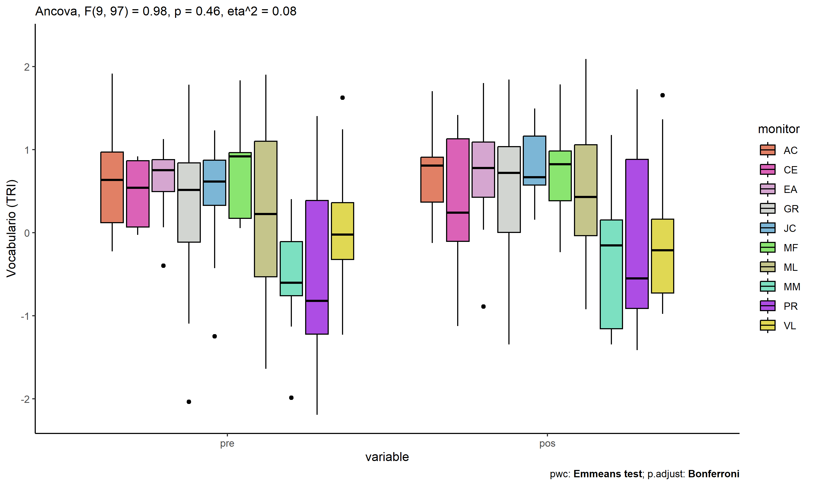<!-- -->

<!-- -->

### Vocabulario Ensinado (Acertos)

| var                      | monitor |   n | M (pre) | SE (pre) | M (unadj) | SE (unadj) | M (adj) | SE (adj) |
|:-------------------------|:--------|----:|--------:|---------:|----------:|-----------:|--------:|---------:|
| score.vocab.ensinado.pos | AC      |  12 |   3.833 |    0.815 |     4.667 |      0.689 |   4.823 |    0.658 |
| score.vocab.ensinado.pos | CE      |   7 |   4.143 |    1.164 |     4.857 |      0.670 |   4.905 |    0.860 |
| score.vocab.ensinado.pos | EA      |   9 |   5.000 |    0.373 |     5.000 |      0.882 |   4.749 |    0.761 |
| score.vocab.ensinado.pos | GR      |  15 |   4.333 |    0.386 |     4.667 |      0.513 |   4.648 |    0.587 |
| score.vocab.ensinado.pos | JC      |  11 |   4.818 |    0.772 |     5.818 |      0.423 |   5.631 |    0.688 |
| score.vocab.ensinado.pos | MF      |  12 |   5.000 |    0.508 |     3.750 |      0.845 |   3.499 |    0.660 |
| score.vocab.ensinado.pos | ML      |  16 |   4.312 |    0.637 |     4.875 |      0.547 |   4.864 |    0.568 |
| score.vocab.ensinado.pos | MM      |  13 |   3.154 |    0.373 |     2.923 |      0.720 |   3.316 |    0.641 |
| score.vocab.ensinado.pos | PR      |  13 |   3.462 |    0.550 |     3.462 |      0.781 |   3.747 |    0.636 |
| score.vocab.ensinado.pos | VL      |  13 |   5.000 |    0.641 |     3.692 |      0.702 |   3.442 |    0.635 |

| .y.                      | group1 | group2 | estimate | conf.low | conf.high |    se | statistic |     p | p.adj | p.adj.signif |
|:-------------------------|:-------|:-------|---------:|---------:|----------:|------:|----------:|------:|------:|:-------------|
| score.vocab.ensinado.pos | AC     | CE     |   -0.083 |   -2.227 |     2.061 | 1.082 |    -0.076 | 0.939 | 1.000 | ns           |
| score.vocab.ensinado.pos | AC     | EA     |    0.073 |   -1.927 |     2.074 | 1.009 |     0.073 | 0.942 | 1.000 | ns           |
| score.vocab.ensinado.pos | AC     | GR     |    0.174 |   -1.574 |     1.922 | 0.882 |     0.198 | 0.844 | 1.000 | ns           |
| score.vocab.ensinado.pos | AC     | JC     |   -0.808 |   -2.699 |     1.083 | 0.954 |    -0.847 | 0.399 | 1.000 | ns           |
| score.vocab.ensinado.pos | AC     | MF     |    1.323 |   -0.531 |     3.177 | 0.936 |     1.414 | 0.160 | 1.000 | ns           |
| score.vocab.ensinado.pos | AC     | ML     |   -0.041 |   -1.765 |     1.682 | 0.870 |    -0.048 | 0.962 | 1.000 | ns           |
| score.vocab.ensinado.pos | AC     | MM     |    1.507 |   -0.302 |     3.316 | 0.913 |     1.651 | 0.102 | 1.000 | ns           |
| score.vocab.ensinado.pos | AC     | PR     |    1.076 |   -0.730 |     2.881 | 0.911 |     1.181 | 0.240 | 1.000 | ns           |
| score.vocab.ensinado.pos | AC     | VL     |    1.381 |   -0.438 |     3.200 | 0.918 |     1.505 | 0.135 | 1.000 | ns           |
| score.vocab.ensinado.pos | CE     | EA     |    0.156 |   -2.121 |     2.433 | 1.149 |     0.136 | 0.892 | 1.000 | ns           |
| score.vocab.ensinado.pos | CE     | GR     |    0.257 |   -1.806 |     2.320 | 1.041 |     0.247 | 0.806 | 1.000 | ns           |
| score.vocab.ensinado.pos | CE     | JC     |   -0.726 |   -2.909 |     1.457 | 1.101 |    -0.659 | 0.511 | 1.000 | ns           |
| score.vocab.ensinado.pos | CE     | MF     |    1.406 |   -0.744 |     3.556 | 1.085 |     1.296 | 0.198 | 1.000 | ns           |
| score.vocab.ensinado.pos | CE     | ML     |    0.041 |   -2.001 |     2.084 | 1.031 |     0.040 | 0.968 | 1.000 | ns           |
| score.vocab.ensinado.pos | CE     | MM     |    1.589 |   -0.532 |     3.711 | 1.071 |     1.485 | 0.141 | 1.000 | ns           |
| score.vocab.ensinado.pos | CE     | PR     |    1.158 |   -0.959 |     3.275 | 1.068 |     1.084 | 0.281 | 1.000 | ns           |
| score.vocab.ensinado.pos | CE     | VL     |    1.464 |   -0.656 |     3.583 | 1.069 |     1.369 | 0.174 | 1.000 | ns           |
| score.vocab.ensinado.pos | EA     | GR     |    0.101 |   -1.804 |     2.006 | 0.961 |     0.105 | 0.917 | 1.000 | ns           |
| score.vocab.ensinado.pos | EA     | JC     |   -0.882 |   -2.907 |     1.144 | 1.022 |    -0.862 | 0.390 | 1.000 | ns           |
| score.vocab.ensinado.pos | EA     | MF     |    1.250 |   -0.737 |     3.237 | 1.003 |     1.247 | 0.215 | 1.000 | ns           |
| score.vocab.ensinado.pos | EA     | ML     |   -0.115 |   -1.997 |     1.768 | 0.950 |    -0.121 | 0.904 | 1.000 | ns           |
| score.vocab.ensinado.pos | EA     | MM     |    1.433 |   -0.555 |     3.422 | 1.003 |     1.429 | 0.156 | 1.000 | ns           |
| score.vocab.ensinado.pos | EA     | PR     |    1.002 |   -0.975 |     2.980 | 0.998 |     1.004 | 0.317 | 1.000 | ns           |
| score.vocab.ensinado.pos | EA     | VL     |    1.308 |   -0.646 |     3.262 | 0.986 |     1.326 | 0.188 | 1.000 | ns           |
| score.vocab.ensinado.pos | GR     | JC     |   -0.983 |   -2.774 |     0.809 | 0.904 |    -1.087 | 0.279 | 1.000 | ns           |
| score.vocab.ensinado.pos | GR     | MF     |    1.149 |   -0.601 |     2.899 | 0.883 |     1.301 | 0.196 | 1.000 | ns           |
| score.vocab.ensinado.pos | GR     | ML     |   -0.216 |   -1.835 |     1.404 | 0.817 |    -0.264 | 0.792 | 1.000 | ns           |
| score.vocab.ensinado.pos | GR     | MM     |    1.333 |   -0.391 |     3.056 | 0.870 |     1.532 | 0.128 | 1.000 | ns           |
| score.vocab.ensinado.pos | GR     | PR     |    0.901 |   -0.815 |     2.618 | 0.866 |     1.041 | 0.300 | 1.000 | ns           |
| score.vocab.ensinado.pos | GR     | VL     |    1.207 |   -0.506 |     2.919 | 0.864 |     1.396 | 0.165 | 1.000 | ns           |
| score.vocab.ensinado.pos | JC     | MF     |    2.132 |    0.250 |     4.013 | 0.949 |     2.245 | 0.027 | 1.000 | ns           |
| score.vocab.ensinado.pos | JC     | ML     |    0.767 |   -1.001 |     2.535 | 0.892 |     0.860 | 0.392 | 1.000 | ns           |
| score.vocab.ensinado.pos | JC     | MM     |    2.315 |    0.440 |     4.190 | 0.946 |     2.446 | 0.016 | 0.721 | ns           |
| score.vocab.ensinado.pos | JC     | PR     |    1.884 |    0.018 |     3.749 | 0.941 |     2.001 | 0.048 | 1.000 | ns           |
| score.vocab.ensinado.pos | JC     | VL     |    2.189 |    0.343 |     4.036 | 0.932 |     2.350 | 0.021 | 0.926 | ns           |
| score.vocab.ensinado.pos | MF     | ML     |   -1.365 |   -3.091 |     0.362 | 0.871 |    -1.567 | 0.120 | 1.000 | ns           |
| score.vocab.ensinado.pos | MF     | MM     |    0.183 |   -1.657 |     2.024 | 0.929 |     0.198 | 0.844 | 1.000 | ns           |
| score.vocab.ensinado.pos | MF     | PR     |   -0.248 |   -2.077 |     1.582 | 0.923 |    -0.268 | 0.789 | 1.000 | ns           |
| score.vocab.ensinado.pos | MF     | VL     |    0.058 |   -1.746 |     1.862 | 0.910 |     0.063 | 0.950 | 1.000 | ns           |
| score.vocab.ensinado.pos | ML     | MM     |    1.548 |   -0.150 |     3.246 | 0.857 |     1.807 | 0.074 | 1.000 | ns           |
| score.vocab.ensinado.pos | ML     | PR     |    1.117 |   -0.574 |     2.808 | 0.853 |     1.309 | 0.193 | 1.000 | ns           |
| score.vocab.ensinado.pos | ML     | VL     |    1.422 |   -0.266 |     3.110 | 0.852 |     1.670 | 0.098 | 1.000 | ns           |
| score.vocab.ensinado.pos | MM     | PR     |   -0.431 |   -2.200 |     1.337 | 0.892 |    -0.483 | 0.630 | 1.000 | ns           |
| score.vocab.ensinado.pos | MM     | VL     |   -0.126 |   -1.931 |     1.679 | 0.911 |    -0.138 | 0.890 | 1.000 | ns           |
| score.vocab.ensinado.pos | PR     | VL     |    0.305 |   -1.488 |     2.099 | 0.905 |     0.337 | 0.736 | 1.000 | ns           |
| score.vocab.ensinado.pre | AC     | CE     |   -0.310 |   -2.341 |     1.722 | 1.025 |    -0.302 | 0.763 | 1.000 | ns           |
| score.vocab.ensinado.pre | AC     | EA     |   -1.167 |   -3.050 |     0.717 | 0.951 |    -1.227 | 0.222 | 1.000 | ns           |
| score.vocab.ensinado.pre | AC     | GR     |   -0.500 |   -2.154 |     1.154 | 0.835 |    -0.599 | 0.550 | 1.000 | ns           |
| score.vocab.ensinado.pre | AC     | JC     |   -0.985 |   -2.768 |     0.798 | 0.900 |    -1.094 | 0.276 | 1.000 | ns           |
| score.vocab.ensinado.pre | AC     | MF     |   -1.167 |   -2.911 |     0.577 | 0.880 |    -1.326 | 0.188 | 1.000 | ns           |
| score.vocab.ensinado.pre | AC     | ML     |   -0.479 |   -2.110 |     1.152 | 0.823 |    -0.582 | 0.562 | 1.000 | ns           |
| score.vocab.ensinado.pre | AC     | MM     |    0.679 |   -1.031 |     2.390 | 0.863 |     0.787 | 0.433 | 1.000 | ns           |
| score.vocab.ensinado.pre | AC     | PR     |    0.372 |   -1.338 |     2.082 | 0.863 |     0.431 | 0.667 | 1.000 | ns           |
| score.vocab.ensinado.pre | AC     | VL     |   -1.167 |   -2.877 |     0.543 | 0.863 |    -1.352 | 0.179 | 1.000 | ns           |
| score.vocab.ensinado.pre | CE     | EA     |   -0.857 |   -3.010 |     1.296 | 1.086 |    -0.789 | 0.432 | 1.000 | ns           |
| score.vocab.ensinado.pre | CE     | GR     |   -0.190 |   -2.146 |     1.765 | 0.987 |    -0.193 | 0.847 | 1.000 | ns           |
| score.vocab.ensinado.pre | CE     | JC     |   -0.675 |   -2.741 |     1.390 | 1.042 |    -0.648 | 0.518 | 1.000 | ns           |
| score.vocab.ensinado.pre | CE     | MF     |   -0.857 |   -2.889 |     1.175 | 1.025 |    -0.836 | 0.405 | 1.000 | ns           |
| score.vocab.ensinado.pre | CE     | ML     |   -0.170 |   -2.105 |     1.766 | 0.977 |    -0.174 | 0.862 | 1.000 | ns           |
| score.vocab.ensinado.pre | CE     | MM     |    0.989 |   -1.014 |     2.992 | 1.011 |     0.979 | 0.330 | 1.000 | ns           |
| score.vocab.ensinado.pre | CE     | PR     |    0.681 |   -1.321 |     2.684 | 1.011 |     0.674 | 0.502 | 1.000 | ns           |
| score.vocab.ensinado.pre | CE     | VL     |   -0.857 |   -2.860 |     1.146 | 1.011 |    -0.848 | 0.398 | 1.000 | ns           |
| score.vocab.ensinado.pre | EA     | GR     |    0.667 |   -1.134 |     2.468 | 0.909 |     0.733 | 0.465 | 1.000 | ns           |
| score.vocab.ensinado.pre | EA     | JC     |    0.182 |   -1.738 |     2.102 | 0.969 |     0.188 | 0.851 | 1.000 | ns           |
| score.vocab.ensinado.pre | EA     | MF     |    0.000 |   -1.884 |     1.884 | 0.951 |     0.000 | 1.000 | 1.000 | ns           |
| score.vocab.ensinado.pre | EA     | ML     |    0.688 |   -1.092 |     2.467 | 0.898 |     0.765 | 0.446 | 1.000 | ns           |
| score.vocab.ensinado.pre | EA     | MM     |    1.846 |   -0.006 |     3.699 | 0.935 |     1.975 | 0.051 | 1.000 | ns           |
| score.vocab.ensinado.pre | EA     | PR     |    1.538 |   -0.314 |     3.391 | 0.935 |     1.646 | 0.103 | 1.000 | ns           |
| score.vocab.ensinado.pre | EA     | VL     |    0.000 |   -1.852 |     1.852 | 0.935 |     0.000 | 1.000 | 1.000 | ns           |
| score.vocab.ensinado.pre | GR     | JC     |   -0.485 |   -2.181 |     1.211 | 0.856 |    -0.567 | 0.572 | 1.000 | ns           |
| score.vocab.ensinado.pre | GR     | MF     |   -0.667 |   -2.321 |     0.988 | 0.835 |    -0.798 | 0.426 | 1.000 | ns           |
| score.vocab.ensinado.pre | GR     | ML     |    0.021 |   -1.514 |     1.556 | 0.775 |     0.027 | 0.979 | 1.000 | ns           |
| score.vocab.ensinado.pre | GR     | MM     |    1.179 |   -0.439 |     2.798 | 0.817 |     1.444 | 0.152 | 1.000 | ns           |
| score.vocab.ensinado.pre | GR     | PR     |    0.872 |   -0.747 |     2.491 | 0.817 |     1.067 | 0.288 | 1.000 | ns           |
| score.vocab.ensinado.pre | GR     | VL     |   -0.667 |   -2.285 |     0.952 | 0.817 |    -0.816 | 0.416 | 1.000 | ns           |
| score.vocab.ensinado.pre | JC     | MF     |   -0.182 |   -1.965 |     1.601 | 0.900 |    -0.202 | 0.840 | 1.000 | ns           |
| score.vocab.ensinado.pre | JC     | ML     |    0.506 |   -1.167 |     2.179 | 0.844 |     0.599 | 0.550 | 1.000 | ns           |
| score.vocab.ensinado.pre | JC     | MM     |    1.664 |   -0.086 |     3.414 | 0.883 |     1.885 | 0.062 | 1.000 | ns           |
| score.vocab.ensinado.pre | JC     | PR     |    1.357 |   -0.393 |     3.107 | 0.883 |     1.536 | 0.127 | 1.000 | ns           |
| score.vocab.ensinado.pre | JC     | VL     |   -0.182 |   -1.932 |     1.568 | 0.883 |    -0.206 | 0.837 | 1.000 | ns           |
| score.vocab.ensinado.pre | MF     | ML     |    0.687 |   -0.944 |     2.319 | 0.823 |     0.835 | 0.405 | 1.000 | ns           |
| score.vocab.ensinado.pre | MF     | MM     |    1.846 |    0.136 |     3.556 | 0.863 |     2.139 | 0.035 | 1.000 | ns           |
| score.vocab.ensinado.pre | MF     | PR     |    1.538 |   -0.172 |     3.249 | 0.863 |     1.783 | 0.077 | 1.000 | ns           |
| score.vocab.ensinado.pre | MF     | VL     |    0.000 |   -1.710 |     1.710 | 0.863 |     0.000 | 1.000 | 1.000 | ns           |
| score.vocab.ensinado.pre | ML     | MM     |    1.159 |   -0.436 |     2.754 | 0.805 |     1.439 | 0.153 | 1.000 | ns           |
| score.vocab.ensinado.pre | ML     | PR     |    0.851 |   -0.744 |     2.446 | 0.805 |     1.057 | 0.293 | 1.000 | ns           |
| score.vocab.ensinado.pre | ML     | VL     |   -0.687 |   -2.283 |     0.908 | 0.805 |    -0.854 | 0.395 | 1.000 | ns           |
| score.vocab.ensinado.pre | MM     | PR     |   -0.308 |   -1.983 |     1.368 | 0.846 |    -0.364 | 0.717 | 1.000 | ns           |
| score.vocab.ensinado.pre | MM     | VL     |   -1.846 |   -3.522 |    -0.171 | 0.846 |    -2.183 | 0.031 | 1.000 | ns           |
| score.vocab.ensinado.pre | PR     | VL     |   -1.538 |   -3.214 |     0.137 | 0.846 |    -1.819 | 0.072 | 1.000 | ns           |

| monitor | group1 | group2 | estimate | conf.low | conf.high |    se | statistic |     p | p.adj | p.adj.signif |
|:--------|:-------|:-------|---------:|---------:|----------:|------:|----------:|------:|------:|:-------------|
| AC      | pre    | pos    |   -0.833 |   -2.662 |     0.996 | 0.928 |    -0.898 | 0.370 | 0.370 | ns           |
| CE      | pre    | pos    |   -0.714 |   -3.109 |     1.680 | 1.215 |    -0.588 | 0.557 | 0.557 | ns           |
| EA      | pre    | pos    |    0.000 |   -2.112 |     2.112 | 1.072 |     0.000 | 1.000 | 1.000 | ns           |
| GR      | pre    | pos    |   -0.333 |   -1.969 |     1.303 | 0.830 |    -0.402 | 0.688 | 0.688 | ns           |
| JC      | pre    | pos    |   -1.000 |   -2.910 |     0.910 | 0.969 |    -1.032 | 0.303 | 0.303 | ns           |
| MF      | pre    | pos    |    1.250 |   -0.579 |     3.079 | 0.928 |     1.347 | 0.179 | 0.179 | ns           |
| ML      | pre    | pos    |   -0.563 |   -2.146 |     1.021 | 0.804 |    -0.700 | 0.485 | 0.485 | ns           |
| MM      | pre    | pos    |    0.231 |   -1.526 |     1.988 | 0.892 |     0.259 | 0.796 | 0.796 | ns           |
| PR      | pre    | pos    |    0.000 |   -1.757 |     1.757 | 0.892 |     0.000 | 1.000 | 1.000 | ns           |
| VL      | pre    | pos    |    1.308 |   -0.450 |     3.065 | 0.892 |     1.467 | 0.144 | 0.144 | ns           |

    ## Scale for colour is already present.
    ## Adding another scale for colour, which will replace the existing scale.

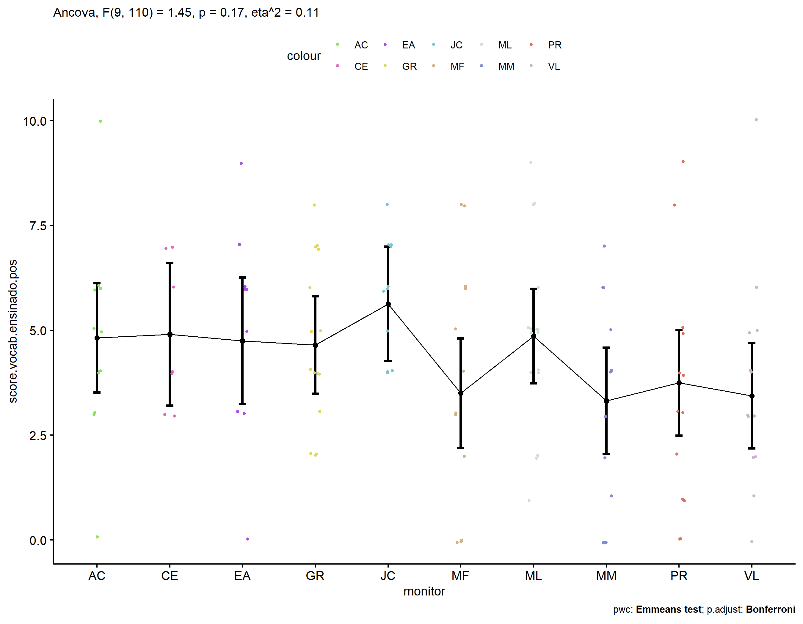<!-- -->

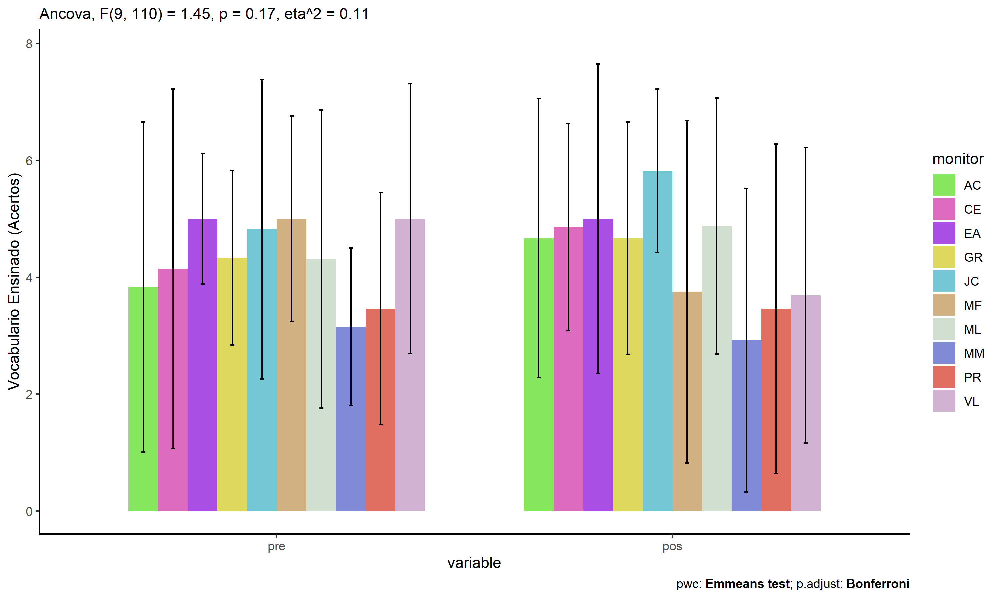<!-- -->

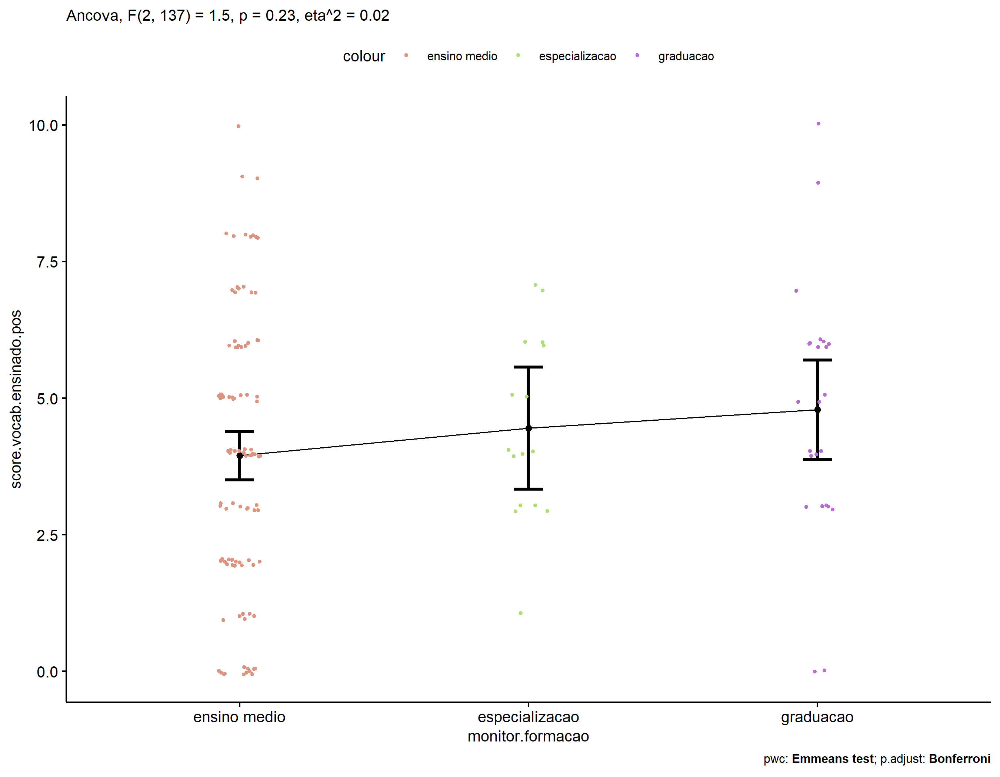<!-- -->

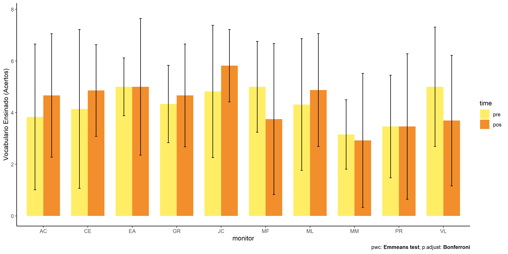<!-- -->

<!-- -->

### Vocabulario Ensinado (TRI)

| var                    | monitor |   n | M (pre) | SE (pre) | M (unadj) | SE (unadj) | M (adj) | SE (adj) |
|:-----------------------|:--------|----:|--------:|---------:|----------:|-----------:|--------:|---------:|
| tri.vocab.ensinado.pos | AC      |  10 |   0.134 |    0.256 |     0.670 |      0.157 |   0.675 |    0.200 |
| tri.vocab.ensinado.pos | CE      |   6 |   0.129 |    0.263 |     0.077 |      0.361 |   0.084 |    0.258 |
| tri.vocab.ensinado.pos | EA      |   8 |   0.494 |    0.153 |     0.580 |      0.225 |   0.401 |    0.226 |
| tri.vocab.ensinado.pos | GR      |  15 |   0.375 |    0.135 |     0.463 |      0.156 |   0.345 |    0.165 |
| tri.vocab.ensinado.pos | JC      |  11 |   0.425 |    0.222 |     0.717 |      0.144 |   0.574 |    0.192 |
| tri.vocab.ensinado.pos | MF      |   9 |   0.407 |    0.183 |     0.485 |      0.212 |   0.351 |    0.212 |
| tri.vocab.ensinado.pos | ML      |  16 |   0.065 |    0.234 |     0.184 |      0.206 |   0.224 |    0.158 |
| tri.vocab.ensinado.pos | MM      |   9 |  -0.688 |    0.179 |    -0.117 |      0.240 |   0.307 |    0.223 |
| tri.vocab.ensinado.pos | PR      |  12 |  -0.142 |    0.218 |    -0.196 |      0.272 |  -0.051 |    0.184 |
| tri.vocab.ensinado.pos | VL      |  12 |   0.194 |    0.247 |    -0.059 |      0.251 |  -0.085 |    0.183 |

| .y.                    | group1 | group2 | estimate | conf.low | conf.high |    se | statistic | p       | p.adj | p.adj.signif |
|:-----------------------|:-------|:-------|---------:|---------:|----------:|------:|----------:|:--------|------:|:-------------|
| tri.vocab.ensinado.pos | AC     | CE     |    0.591 |   -0.057 |     1.239 | 0.326 |     1.810 | 0.073   | 1.000 | ns           |
| tri.vocab.ensinado.pos | AC     | EA     |    0.274 |   -0.325 |     0.872 | 0.302 |     0.908 | 0.366   | 1.000 | ns           |
| tri.vocab.ensinado.pos | AC     | GR     |    0.330 |   -0.184 |     0.844 | 0.259 |     1.274 | 0.206   | 1.000 | ns           |
| tri.vocab.ensinado.pos | AC     | JC     |    0.101 |   -0.449 |     0.652 | 0.277 |     0.365 | 0.716   | 1.000 | ns           |
| tri.vocab.ensinado.pos | AC     | MF     |    0.324 |   -0.255 |     0.902 | 0.291 |     1.111 | 0.27    | 1.000 | ns           |
| tri.vocab.ensinado.pos | AC     | ML     |    0.451 |   -0.055 |     0.957 | 0.255 |     1.770 | 0.08    | 1.000 | ns           |
| tri.vocab.ensinado.pos | AC     | MM     |    0.368 |   -0.227 |     0.962 | 0.299 |     1.228 | 0.222   | 1.000 | ns           |
| tri.vocab.ensinado.pos | AC     | PR     |    0.726 |    0.186 |     1.265 | 0.272 |     2.670 | 0.009   | 0.400 | ns           |
| tri.vocab.ensinado.pos | AC     | VL     |    0.760 |    0.223 |     1.297 | 0.271 |     2.807 | 0.006   | 0.272 | ns           |
| tri.vocab.ensinado.pos | CE     | EA     |   -0.317 |   -0.998 |     0.364 | 0.343 |    -0.924 | 0.358   | 1.000 | ns           |
| tri.vocab.ensinado.pos | CE     | GR     |   -0.261 |   -0.869 |     0.347 | 0.306 |    -0.853 | 0.396   | 1.000 | ns           |
| tri.vocab.ensinado.pos | CE     | JC     |   -0.490 |   -1.129 |     0.149 | 0.322 |    -1.521 | 0.132   | 1.000 | ns           |
| tri.vocab.ensinado.pos | CE     | MF     |   -0.267 |   -0.930 |     0.396 | 0.334 |    -0.800 | 0.426   | 1.000 | ns           |
| tri.vocab.ensinado.pos | CE     | ML     |   -0.140 |   -0.741 |     0.461 | 0.303 |    -0.462 | 0.645   | 1.000 | ns           |
| tri.vocab.ensinado.pos | CE     | MM     |   -0.223 |   -0.900 |     0.454 | 0.341 |    -0.654 | 0.515   | 1.000 | ns           |
| tri.vocab.ensinado.pos | CE     | PR     |    0.135 |   -0.494 |     0.764 | 0.317 |     0.425 | 0.671   | 1.000 | ns           |
| tri.vocab.ensinado.pos | CE     | VL     |    0.169 |   -0.458 |     0.797 | 0.316 |     0.535 | 0.594   | 1.000 | ns           |
| tri.vocab.ensinado.pos | EA     | GR     |    0.056 |   -0.494 |     0.606 | 0.277 |     0.202 | 0.84    | 1.000 | ns           |
| tri.vocab.ensinado.pos | EA     | JC     |   -0.173 |   -0.756 |     0.411 | 0.294 |    -0.588 | 0.558   | 1.000 | ns           |
| tri.vocab.ensinado.pos | EA     | MF     |    0.050 |   -0.560 |     0.660 | 0.307 |     0.162 | 0.871   | 1.000 | ns           |
| tri.vocab.ensinado.pos | EA     | ML     |    0.177 |   -0.371 |     0.726 | 0.276 |     0.642 | 0.523   | 1.000 | ns           |
| tri.vocab.ensinado.pos | EA     | MM     |    0.094 |   -0.550 |     0.738 | 0.325 |     0.290 | 0.773   | 1.000 | ns           |
| tri.vocab.ensinado.pos | EA     | PR     |    0.452 |   -0.132 |     1.035 | 0.294 |     1.537 | 0.128   | 1.000 | ns           |
| tri.vocab.ensinado.pos | EA     | VL     |    0.486 |   -0.089 |     1.061 | 0.290 |     1.677 | 0.097   | 1.000 | ns           |
| tri.vocab.ensinado.pos | GR     | JC     |   -0.229 |   -0.727 |     0.270 | 0.251 |    -0.911 | 0.365   | 1.000 | ns           |
| tri.vocab.ensinado.pos | GR     | MF     |   -0.006 |   -0.535 |     0.523 | 0.267 |    -0.023 | 0.982   | 1.000 | ns           |
| tri.vocab.ensinado.pos | GR     | ML     |    0.121 |   -0.333 |     0.576 | 0.229 |     0.530 | 0.597   | 1.000 | ns           |
| tri.vocab.ensinado.pos | GR     | MM     |    0.038 |   -0.523 |     0.599 | 0.283 |     0.135 | 0.893   | 1.000 | ns           |
| tri.vocab.ensinado.pos | GR     | PR     |    0.396 |   -0.099 |     0.890 | 0.249 |     1.589 | 0.115   | 1.000 | ns           |
| tri.vocab.ensinado.pos | GR     | VL     |    0.430 |   -0.057 |     0.917 | 0.245 |     1.753 | 0.083   | 1.000 | ns           |
| tri.vocab.ensinado.pos | JC     | MF     |    0.223 |   -0.341 |     0.787 | 0.284 |     0.783 | 0.436   | 1.000 | ns           |
| tri.vocab.ensinado.pos | JC     | ML     |    0.350 |   -0.146 |     0.846 | 0.250 |     1.402 | 0.164   | 1.000 | ns           |
| tri.vocab.ensinado.pos | JC     | MM     |    0.267 |   -0.330 |     0.864 | 0.301 |     0.887 | 0.377   | 1.000 | ns           |
| tri.vocab.ensinado.pos | JC     | PR     |    0.625 |    0.091 |     1.158 | 0.269 |     2.325 | 0.022   | 0.998 | ns           |
| tri.vocab.ensinado.pos | JC     | VL     |    0.659 |    0.133 |     1.184 | 0.265 |     2.488 | 0.015   | 0.654 | ns           |
| tri.vocab.ensinado.pos | MF     | ML     |    0.127 |   -0.399 |     0.654 | 0.265 |     0.481 | 0.632   | 1.000 | ns           |
| tri.vocab.ensinado.pos | MF     | MM     |    0.044 |   -0.578 |     0.666 | 0.313 |     0.141 | 0.888   | 1.000 | ns           |
| tri.vocab.ensinado.pos | MF     | PR     |    0.402 |   -0.160 |     0.964 | 0.283 |     1.421 | 0.159   | 1.000 | ns           |
| tri.vocab.ensinado.pos | MF     | VL     |    0.436 |   -0.118 |     0.991 | 0.279 |     1.561 | 0.122   | 1.000 | ns           |
| tri.vocab.ensinado.pos | ML     | MM     |   -0.083 |   -0.623 |     0.456 | 0.272 |    -0.306 | 0.76    | 1.000 | ns           |
| tri.vocab.ensinado.pos | ML     | PR     |    0.275 |   -0.206 |     0.755 | 0.242 |     1.134 | 0.26    | 1.000 | ns           |
| tri.vocab.ensinado.pos | ML     | VL     |    0.309 |   -0.171 |     0.788 | 0.242 |     1.277 | 0.205   | 1.000 | ns           |
| tri.vocab.ensinado.pos | MM     | PR     |    0.358 |   -0.204 |     0.919 | 0.283 |     1.265 | 0.209   | 1.000 | ns           |
| tri.vocab.ensinado.pos | MM     | VL     |    0.392 |   -0.183 |     0.967 | 0.290 |     1.354 | 0.179   | 1.000 | ns           |
| tri.vocab.ensinado.pos | PR     | VL     |    0.034 |   -0.481 |     0.550 | 0.260 |     0.131 | 0.896   | 1.000 | ns           |
| tri.vocab.ensinado.pre | AC     | CE     |    0.005 |   -0.733 |     0.742 | 0.372 |     0.012 | 0.99    | 1.000 | ns           |
| tri.vocab.ensinado.pre | AC     | EA     |   -0.361 |   -1.038 |     0.317 | 0.341 |    -1.056 | 0.294   | 1.000 | ns           |
| tri.vocab.ensinado.pre | AC     | GR     |   -0.241 |   -0.824 |     0.342 | 0.294 |    -0.820 | 0.414   | 1.000 | ns           |
| tri.vocab.ensinado.pre | AC     | JC     |   -0.292 |   -0.916 |     0.333 | 0.315 |    -0.927 | 0.356   | 1.000 | ns           |
| tri.vocab.ensinado.pre | AC     | MF     |   -0.273 |   -0.929 |     0.384 | 0.331 |    -0.825 | 0.412   | 1.000 | ns           |
| tri.vocab.ensinado.pre | AC     | ML     |    0.069 |   -0.507 |     0.645 | 0.290 |     0.238 | 0.812   | 1.000 | ns           |
| tri.vocab.ensinado.pre | AC     | MM     |    0.822 |    0.166 |     1.478 | 0.331 |     2.485 | 0.015   | 0.659 | ns           |
| tri.vocab.ensinado.pre | AC     | PR     |    0.276 |   -0.336 |     0.887 | 0.308 |     0.894 | 0.374   | 1.000 | ns           |
| tri.vocab.ensinado.pre | AC     | VL     |   -0.060 |   -0.672 |     0.552 | 0.308 |    -0.194 | 0.847   | 1.000 | ns           |
| tri.vocab.ensinado.pre | CE     | EA     |   -0.365 |   -1.137 |     0.406 | 0.389 |    -0.939 | 0.35    | 1.000 | ns           |
| tri.vocab.ensinado.pre | CE     | GR     |   -0.246 |   -0.936 |     0.444 | 0.348 |    -0.707 | 0.482   | 1.000 | ns           |
| tri.vocab.ensinado.pre | CE     | JC     |   -0.296 |   -1.021 |     0.429 | 0.365 |    -0.811 | 0.42    | 1.000 | ns           |
| tri.vocab.ensinado.pre | CE     | MF     |   -0.277 |   -1.030 |     0.476 | 0.379 |    -0.731 | 0.466   | 1.000 | ns           |
| tri.vocab.ensinado.pre | CE     | ML     |    0.065 |   -0.619 |     0.748 | 0.345 |     0.187 | 0.852   | 1.000 | ns           |
| tri.vocab.ensinado.pre | CE     | MM     |    0.817 |    0.064 |     1.570 | 0.379 |     2.154 | 0.034   | 1.000 | ns           |
| tri.vocab.ensinado.pre | CE     | PR     |    0.271 |   -0.443 |     0.985 | 0.360 |     0.753 | 0.453   | 1.000 | ns           |
| tri.vocab.ensinado.pre | CE     | VL     |   -0.064 |   -0.779 |     0.650 | 0.360 |    -0.179 | 0.858   | 1.000 | ns           |
| tri.vocab.ensinado.pre | EA     | GR     |    0.119 |   -0.506 |     0.745 | 0.315 |     0.379 | 0.705   | 1.000 | ns           |
| tri.vocab.ensinado.pre | EA     | JC     |    0.069 |   -0.595 |     0.733 | 0.335 |     0.206 | 0.837   | 1.000 | ns           |
| tri.vocab.ensinado.pre | EA     | MF     |    0.088 |   -0.606 |     0.782 | 0.350 |     0.251 | 0.802   | 1.000 | ns           |
| tri.vocab.ensinado.pre | EA     | ML     |    0.430 |   -0.189 |     1.048 | 0.312 |     1.379 | 0.171   | 1.000 | ns           |
| tri.vocab.ensinado.pre | EA     | MM     |    1.183 |    0.488 |     1.877 | 0.350 |     3.380 | 0.001   | 0.047 | \*           |
| tri.vocab.ensinado.pre | EA     | PR     |    0.636 |   -0.016 |     1.288 | 0.329 |     1.936 | 0.056   | 1.000 | ns           |
| tri.vocab.ensinado.pre | EA     | VL     |    0.301 |   -0.351 |     0.953 | 0.329 |     0.915 | 0.362   | 1.000 | ns           |
| tri.vocab.ensinado.pre | GR     | JC     |   -0.050 |   -0.618 |     0.517 | 0.286 |    -0.177 | 0.86    | 1.000 | ns           |
| tri.vocab.ensinado.pre | GR     | MF     |   -0.032 |   -0.634 |     0.571 | 0.304 |    -0.104 | 0.917   | 1.000 | ns           |
| tri.vocab.ensinado.pre | GR     | ML     |    0.310 |   -0.203 |     0.824 | 0.259 |     1.199 | 0.233   | 1.000 | ns           |
| tri.vocab.ensinado.pre | GR     | MM     |    1.063 |    0.461 |     1.665 | 0.304 |     3.502 | \<0.001 | 0.031 | \*           |
| tri.vocab.ensinado.pre | GR     | PR     |    0.517 |   -0.037 |     1.070 | 0.279 |     1.853 | 0.067   | 1.000 | ns           |
| tri.vocab.ensinado.pre | GR     | VL     |    0.181 |   -0.372 |     0.735 | 0.279 |     0.650 | 0.517   | 1.000 | ns           |
| tri.vocab.ensinado.pre | JC     | MF     |    0.019 |   -0.623 |     0.661 | 0.324 |     0.058 | 0.954   | 1.000 | ns           |
| tri.vocab.ensinado.pre | JC     | ML     |    0.361 |   -0.199 |     0.920 | 0.282 |     1.279 | 0.204   | 1.000 | ns           |
| tri.vocab.ensinado.pre | JC     | MM     |    1.113 |    0.471 |     1.756 | 0.324 |     3.441 | \<0.001 | 0.038 | \*           |
| tri.vocab.ensinado.pre | JC     | PR     |    0.567 |   -0.029 |     1.163 | 0.301 |     1.887 | 0.062   | 1.000 | ns           |
| tri.vocab.ensinado.pre | JC     | VL     |    0.232 |   -0.365 |     0.828 | 0.301 |     0.771 | 0.442   | 1.000 | ns           |
| tri.vocab.ensinado.pre | MF     | ML     |    0.342 |   -0.253 |     0.937 | 0.300 |     1.140 | 0.257   | 1.000 | ns           |
| tri.vocab.ensinado.pre | MF     | MM     |    1.095 |    0.421 |     1.768 | 0.339 |     3.226 | 0.002   | 0.077 | ns           |
| tri.vocab.ensinado.pre | MF     | PR     |    0.548 |   -0.082 |     1.178 | 0.317 |     1.727 | 0.087   | 1.000 | ns           |
| tri.vocab.ensinado.pre | MF     | VL     |    0.213 |   -0.417 |     0.843 | 0.317 |     0.671 | 0.504   | 1.000 | ns           |
| tri.vocab.ensinado.pre | ML     | MM     |    0.753 |    0.157 |     1.348 | 0.300 |     2.509 | 0.014   | 0.618 | ns           |
| tri.vocab.ensinado.pre | ML     | PR     |    0.206 |   -0.339 |     0.752 | 0.275 |     0.751 | 0.455   | 1.000 | ns           |
| tri.vocab.ensinado.pre | ML     | VL     |   -0.129 |   -0.675 |     0.417 | 0.275 |    -0.469 | 0.64    | 1.000 | ns           |
| tri.vocab.ensinado.pre | MM     | PR     |   -0.546 |   -1.176 |     0.084 | 0.317 |    -1.721 | 0.088   | 1.000 | ns           |
| tri.vocab.ensinado.pre | MM     | VL     |   -0.882 |   -1.512 |    -0.252 | 0.317 |    -2.778 | 0.007   | 0.295 | ns           |
| tri.vocab.ensinado.pre | PR     | VL     |   -0.335 |   -0.919 |     0.248 | 0.294 |    -1.141 | 0.257   | 1.000 | ns           |

| monitor | group1 | group2 | estimate | conf.low | conf.high |    se | statistic |     p | p.adj | p.adj.signif |
|:--------|:-------|:-------|---------:|---------:|----------:|------:|----------:|------:|------:|:-------------|
| AC      | pre    | pos    |   -0.473 |   -1.086 |     0.140 | 0.311 |    -1.522 | 0.130 | 0.130 | ns           |
| CE      | pre    | pos    |   -0.083 |   -0.883 |     0.717 | 0.406 |    -0.204 | 0.838 | 0.838 | ns           |
| EA      | pre    | pos    |   -0.011 |   -0.709 |     0.688 | 0.354 |    -0.030 | 0.976 | 0.976 | ns           |
| GR      | pre    | pos    |   -0.088 |   -0.613 |     0.437 | 0.266 |    -0.331 | 0.741 | 0.741 | ns           |
| JC      | pre    | pos    |   -0.292 |   -0.905 |     0.321 | 0.311 |    -0.939 | 0.349 | 0.349 | ns           |
| MF      | pre    | pos    |   -0.104 |   -0.738 |     0.530 | 0.322 |    -0.323 | 0.747 | 0.747 | ns           |
| ML      | pre    | pos    |   -0.119 |   -0.627 |     0.389 | 0.258 |    -0.461 | 0.645 | 0.645 | ns           |
| MM      | pre    | pos    |   -0.208 |   -0.831 |     0.416 | 0.316 |    -0.657 | 0.512 | 0.512 | ns           |
| PR      | pre    | pos    |    0.054 |   -0.533 |     0.641 | 0.298 |     0.183 | 0.855 | 0.855 | ns           |
| VL      | pre    | pos    |    0.236 |   -0.339 |     0.812 | 0.292 |     0.809 | 0.419 | 0.419 | ns           |

    ## Scale for colour is already present.
    ## Adding another scale for colour, which will replace the existing scale.

<!-- -->

<!-- -->

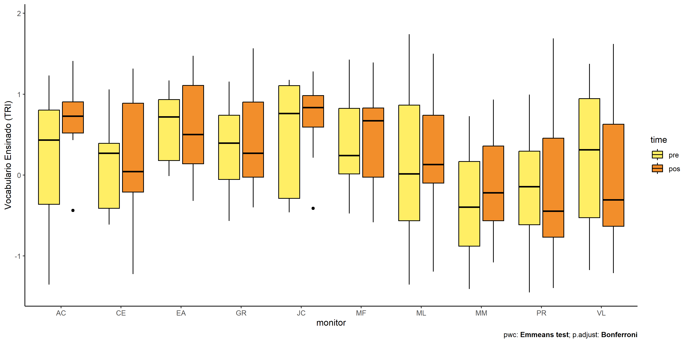<!-- -->

### Vocabulario Nao Ensinado (Acertos)

| var                          | monitor |   n | M (pre) | SE (pre) | M (unadj) | SE (unadj) | M (adj) | SE (adj) |
|:-----------------------------|:--------|----:|--------:|---------:|----------:|-----------:|--------:|---------:|
| score.vocab.nao.ensinado.pos | AC      |  12 |  20.000 |    2.303 |    20.417 |      2.410 |  19.500 |    2.155 |
| score.vocab.nao.ensinado.pos | CE      |   7 |  18.000 |    3.457 |    19.286 |      2.533 |  19.329 |    2.810 |
| score.vocab.nao.ensinado.pos | EA      |   9 |  22.333 |    1.424 |    19.222 |      2.957 |  17.185 |    2.516 |
| score.vocab.nao.ensinado.pos | GR      |  15 |  19.200 |    2.029 |    20.800 |      1.713 |  20.267 |    1.923 |
| score.vocab.nao.ensinado.pos | JC      |  11 |  19.636 |    1.835 |    22.000 |      1.214 |  21.258 |    2.247 |
| score.vocab.nao.ensinado.pos | MF      |  12 |  20.333 |    1.982 |    16.250 |      3.136 |  15.173 |    2.158 |
| score.vocab.nao.ensinado.pos | ML      |  16 |  17.875 |    1.782 |    20.125 |      1.921 |  20.229 |    1.859 |
| score.vocab.nao.ensinado.pos | MM      |  13 |  15.692 |    1.064 |    10.462 |      2.505 |  11.613 |    2.077 |
| score.vocab.nao.ensinado.pos | PR      |  13 |  13.308 |    2.246 |    14.769 |      2.535 |  17.066 |    2.119 |
| score.vocab.nao.ensinado.pos | VL      |  13 |  16.231 |    1.847 |    14.615 |      2.129 |  15.508 |    2.071 |

| .y.                          | group1 | group2 | estimate | conf.low | conf.high |    se | statistic |     p | p.adj | p.adj.signif |
|:-----------------------------|:-------|:-------|---------:|---------:|----------:|------:|----------:|------:|------:|:-------------|
| score.vocab.nao.ensinado.pos | AC     | CE     |    0.171 |   -6.849 |     7.190 | 3.542 |     0.048 | 0.962 | 1.000 | ns           |
| score.vocab.nao.ensinado.pos | AC     | EA     |    2.315 |   -4.200 |     8.829 | 3.287 |     0.704 | 0.483 | 1.000 | ns           |
| score.vocab.nao.ensinado.pos | AC     | GR     |   -0.767 |   -6.477 |     4.942 | 2.881 |    -0.266 | 0.790 | 1.000 | ns           |
| score.vocab.nao.ensinado.pos | AC     | JC     |   -1.758 |   -7.909 |     4.393 | 3.104 |    -0.566 | 0.572 | 1.000 | ns           |
| score.vocab.nao.ensinado.pos | AC     | MF     |    4.327 |   -1.689 |    10.343 | 3.036 |     1.425 | 0.157 | 1.000 | ns           |
| score.vocab.nao.ensinado.pos | AC     | ML     |   -0.729 |   -6.372 |     4.915 | 2.848 |    -0.256 | 0.799 | 1.000 | ns           |
| score.vocab.nao.ensinado.pos | AC     | MM     |    7.887 |    1.925 |    13.849 | 3.009 |     2.621 | 0.010 | 0.450 | ns           |
| score.vocab.nao.ensinado.pos | AC     | PR     |    2.434 |   -3.616 |     8.485 | 3.053 |     0.797 | 0.427 | 1.000 | ns           |
| score.vocab.nao.ensinado.pos | AC     | VL     |    3.992 |   -1.956 |     9.939 | 3.001 |     1.330 | 0.186 | 1.000 | ns           |
| score.vocab.nao.ensinado.pos | CE     | EA     |    2.144 |   -5.333 |     9.621 | 3.773 |     0.568 | 0.571 | 1.000 | ns           |
| score.vocab.nao.ensinado.pos | CE     | GR     |   -0.938 |   -7.687 |     5.811 | 3.406 |    -0.275 | 0.783 | 1.000 | ns           |
| score.vocab.nao.ensinado.pos | CE     | JC     |   -1.929 |   -9.061 |     5.203 | 3.599 |    -0.536 | 0.593 | 1.000 | ns           |
| score.vocab.nao.ensinado.pos | CE     | MF     |    4.156 |   -2.868 |    11.180 | 3.544 |     1.173 | 0.243 | 1.000 | ns           |
| score.vocab.nao.ensinado.pos | CE     | ML     |   -0.899 |   -7.577 |     5.778 | 3.370 |    -0.267 | 0.790 | 1.000 | ns           |
| score.vocab.nao.ensinado.pos | CE     | MM     |    7.716 |    0.793 |    14.640 | 3.494 |     2.209 | 0.029 | 1.000 | ns           |
| score.vocab.nao.ensinado.pos | CE     | PR     |    2.264 |   -4.709 |     9.236 | 3.518 |     0.643 | 0.521 | 1.000 | ns           |
| score.vocab.nao.ensinado.pos | CE     | VL     |    3.821 |   -3.096 |    10.738 | 3.490 |     1.095 | 0.276 | 1.000 | ns           |
| score.vocab.nao.ensinado.pos | EA     | GR     |   -3.082 |   -9.327 |     3.163 | 3.151 |    -0.978 | 0.330 | 1.000 | ns           |
| score.vocab.nao.ensinado.pos | EA     | JC     |   -4.073 |  -10.718 |     2.573 | 3.353 |    -1.215 | 0.227 | 1.000 | ns           |
| score.vocab.nao.ensinado.pos | EA     | MF     |    2.012 |   -4.498 |     8.522 | 3.285 |     0.612 | 0.541 | 1.000 | ns           |
| score.vocab.nao.ensinado.pos | EA     | ML     |   -3.043 |   -9.248 |     3.162 | 3.131 |    -0.972 | 0.333 | 1.000 | ns           |
| score.vocab.nao.ensinado.pos | EA     | MM     |    5.572 |   -0.956 |    12.100 | 3.294 |     1.692 | 0.094 | 1.000 | ns           |
| score.vocab.nao.ensinado.pos | EA     | PR     |    0.120 |   -6.523 |     6.762 | 3.352 |     0.036 | 0.972 | 1.000 | ns           |
| score.vocab.nao.ensinado.pos | EA     | VL     |    1.677 |   -4.830 |     8.184 | 3.283 |     0.511 | 0.611 | 1.000 | ns           |
| score.vocab.nao.ensinado.pos | GR     | JC     |   -0.990 |   -6.840 |     4.859 | 2.952 |    -0.336 | 0.738 | 1.000 | ns           |
| score.vocab.nao.ensinado.pos | GR     | MF     |    5.094 |   -0.617 |    10.806 | 2.882 |     1.768 | 0.080 | 1.000 | ns           |
| score.vocab.nao.ensinado.pos | GR     | ML     |    0.039 |   -5.264 |     5.341 | 2.676 |     0.015 | 0.988 | 1.000 | ns           |
| score.vocab.nao.ensinado.pos | GR     | MM     |    8.654 |    3.026 |    14.282 | 2.840 |     3.047 | 0.003 | 0.130 | ns           |
| score.vocab.nao.ensinado.pos | GR     | PR     |    3.202 |   -2.507 |     8.910 | 2.880 |     1.112 | 0.269 | 1.000 | ns           |
| score.vocab.nao.ensinado.pos | GR     | VL     |    4.759 |   -0.857 |    10.375 | 2.834 |     1.679 | 0.096 | 1.000 | ns           |
| score.vocab.nao.ensinado.pos | JC     | MF     |    6.085 |   -0.068 |    12.237 | 3.105 |     1.960 | 0.053 | 1.000 | ns           |
| score.vocab.nao.ensinado.pos | JC     | ML     |    1.029 |   -4.753 |     6.812 | 2.918 |     0.353 | 0.725 | 1.000 | ns           |
| score.vocab.nao.ensinado.pos | JC     | MM     |    9.645 |    3.556 |    15.733 | 3.072 |     3.139 | 0.002 | 0.098 | ns           |
| score.vocab.nao.ensinado.pos | JC     | PR     |    4.192 |   -1.977 |    10.362 | 3.113 |     1.347 | 0.181 | 1.000 | ns           |
| score.vocab.nao.ensinado.pos | JC     | VL     |    5.749 |   -0.326 |    11.825 | 3.066 |     1.875 | 0.063 | 1.000 | ns           |
| score.vocab.nao.ensinado.pos | MF     | ML     |   -5.055 |  -10.704 |     0.594 | 2.850 |    -1.774 | 0.079 | 1.000 | ns           |
| score.vocab.nao.ensinado.pos | MF     | MM     |    3.560 |   -2.412 |     9.533 | 3.014 |     1.181 | 0.240 | 1.000 | ns           |
| score.vocab.nao.ensinado.pos | MF     | PR     |   -1.892 |   -7.958 |     4.174 | 3.061 |    -0.618 | 0.538 | 1.000 | ns           |
| score.vocab.nao.ensinado.pos | MF     | VL     |   -0.335 |   -6.292 |     5.621 | 3.006 |    -0.112 | 0.911 | 1.000 | ns           |
| score.vocab.nao.ensinado.pos | ML     | MM     |    8.615 |    3.096 |    14.135 | 2.785 |     3.093 | 0.003 | 0.113 | ns           |
| score.vocab.nao.ensinado.pos | ML     | PR     |    3.163 |   -2.415 |     8.741 | 2.815 |     1.124 | 0.264 | 1.000 | ns           |
| score.vocab.nao.ensinado.pos | ML     | VL     |    4.720 |   -0.792 |    10.232 | 2.781 |     1.697 | 0.093 | 1.000 | ns           |
| score.vocab.nao.ensinado.pos | MM     | PR     |   -5.453 |  -11.252 |     0.347 | 2.926 |    -1.863 | 0.065 | 1.000 | ns           |
| score.vocab.nao.ensinado.pos | MM     | VL     |   -3.895 |   -9.676 |     1.885 | 2.917 |    -1.335 | 0.184 | 1.000 | ns           |
| score.vocab.nao.ensinado.pos | PR     | VL     |    1.557 |   -4.252 |     7.367 | 2.932 |     0.531 | 0.596 | 1.000 | ns           |
| score.vocab.nao.ensinado.pre | AC     | CE     |    2.000 |   -4.548 |     8.548 | 3.305 |     0.605 | 0.546 | 1.000 | ns           |
| score.vocab.nao.ensinado.pre | AC     | EA     |   -2.333 |   -8.405 |     3.738 | 3.064 |    -0.762 | 0.448 | 1.000 | ns           |
| score.vocab.nao.ensinado.pre | AC     | GR     |    0.800 |   -4.533 |     6.133 | 2.691 |     0.297 | 0.767 | 1.000 | ns           |
| score.vocab.nao.ensinado.pre | AC     | JC     |    0.364 |   -5.384 |     6.111 | 2.900 |     0.125 | 0.900 | 1.000 | ns           |
| score.vocab.nao.ensinado.pre | AC     | MF     |   -0.333 |   -5.954 |     5.288 | 2.837 |    -0.118 | 0.907 | 1.000 | ns           |
| score.vocab.nao.ensinado.pre | AC     | ML     |    2.125 |   -3.133 |     7.383 | 2.653 |     0.801 | 0.425 | 1.000 | ns           |
| score.vocab.nao.ensinado.pre | AC     | MM     |    4.308 |   -1.204 |     9.820 | 2.782 |     1.549 | 0.124 | 1.000 | ns           |
| score.vocab.nao.ensinado.pre | AC     | PR     |    6.692 |    1.180 |    12.204 | 2.782 |     2.406 | 0.018 | 0.800 | ns           |
| score.vocab.nao.ensinado.pre | AC     | VL     |    3.769 |   -1.743 |     9.281 | 2.782 |     1.355 | 0.178 | 1.000 | ns           |
| score.vocab.nao.ensinado.pre | CE     | EA     |   -4.333 |  -11.272 |     2.606 | 3.502 |    -1.237 | 0.219 | 1.000 | ns           |
| score.vocab.nao.ensinado.pre | CE     | GR     |   -1.200 |   -7.503 |     5.103 | 3.181 |    -0.377 | 0.707 | 1.000 | ns           |
| score.vocab.nao.ensinado.pre | CE     | JC     |   -1.636 |   -8.294 |     5.021 | 3.360 |    -0.487 | 0.627 | 1.000 | ns           |
| score.vocab.nao.ensinado.pre | CE     | MF     |   -2.333 |   -8.882 |     4.215 | 3.305 |    -0.706 | 0.482 | 1.000 | ns           |
| score.vocab.nao.ensinado.pre | CE     | ML     |    0.125 |   -6.115 |     6.365 | 3.149 |     0.040 | 0.968 | 1.000 | ns           |
| score.vocab.nao.ensinado.pre | CE     | MM     |    2.308 |   -4.147 |     8.763 | 3.257 |     0.708 | 0.480 | 1.000 | ns           |
| score.vocab.nao.ensinado.pre | CE     | PR     |    4.692 |   -1.763 |    11.147 | 3.257 |     1.440 | 0.153 | 1.000 | ns           |
| score.vocab.nao.ensinado.pre | CE     | VL     |    1.769 |   -4.686 |     8.224 | 3.257 |     0.543 | 0.588 | 1.000 | ns           |
| score.vocab.nao.ensinado.pre | EA     | GR     |    3.133 |   -2.672 |     8.939 | 2.930 |     1.069 | 0.287 | 1.000 | ns           |
| score.vocab.nao.ensinado.pre | EA     | JC     |    2.697 |   -3.492 |     8.886 | 3.123 |     0.864 | 0.390 | 1.000 | ns           |
| score.vocab.nao.ensinado.pre | EA     | MF     |    2.000 |   -4.071 |     8.071 | 3.064 |     0.653 | 0.515 | 1.000 | ns           |
| score.vocab.nao.ensinado.pre | EA     | ML     |    4.458 |   -1.279 |    10.195 | 2.895 |     1.540 | 0.126 | 1.000 | ns           |
| score.vocab.nao.ensinado.pre | EA     | MM     |    6.641 |    0.670 |    12.612 | 3.013 |     2.204 | 0.030 | 1.000 | ns           |
| score.vocab.nao.ensinado.pre | EA     | PR     |    9.026 |    3.055 |    14.996 | 3.013 |     2.996 | 0.003 | 0.152 | ns           |
| score.vocab.nao.ensinado.pre | EA     | VL     |    6.103 |    0.132 |    12.073 | 3.013 |     2.025 | 0.045 | 1.000 | ns           |
| score.vocab.nao.ensinado.pre | GR     | JC     |   -0.436 |   -5.902 |     5.029 | 2.758 |    -0.158 | 0.875 | 1.000 | ns           |
| score.vocab.nao.ensinado.pre | GR     | MF     |   -1.133 |   -6.466 |     4.199 | 2.691 |    -0.421 | 0.674 | 1.000 | ns           |
| score.vocab.nao.ensinado.pre | GR     | ML     |    1.325 |   -3.623 |     6.273 | 2.497 |     0.531 | 0.597 | 1.000 | ns           |
| score.vocab.nao.ensinado.pre | GR     | MM     |    3.508 |   -1.710 |     8.725 | 2.633 |     1.332 | 0.186 | 1.000 | ns           |
| score.vocab.nao.ensinado.pre | GR     | PR     |    5.892 |    0.675 |    11.110 | 2.633 |     2.238 | 0.027 | 1.000 | ns           |
| score.vocab.nao.ensinado.pre | GR     | VL     |    2.969 |   -2.248 |     8.187 | 2.633 |     1.128 | 0.262 | 1.000 | ns           |
| score.vocab.nao.ensinado.pre | JC     | MF     |   -0.697 |   -6.444 |     5.050 | 2.900 |    -0.240 | 0.811 | 1.000 | ns           |
| score.vocab.nao.ensinado.pre | JC     | ML     |    1.761 |   -3.632 |     7.154 | 2.722 |     0.647 | 0.519 | 1.000 | ns           |
| score.vocab.nao.ensinado.pre | JC     | MM     |    3.944 |   -1.697 |     9.585 | 2.847 |     1.386 | 0.169 | 1.000 | ns           |
| score.vocab.nao.ensinado.pre | JC     | PR     |    6.329 |    0.688 |    11.969 | 2.847 |     2.223 | 0.028 | 1.000 | ns           |
| score.vocab.nao.ensinado.pre | JC     | VL     |    3.406 |   -2.235 |     9.046 | 2.847 |     1.196 | 0.234 | 1.000 | ns           |
| score.vocab.nao.ensinado.pre | MF     | ML     |    2.458 |   -2.800 |     7.716 | 2.653 |     0.926 | 0.356 | 1.000 | ns           |
| score.vocab.nao.ensinado.pre | MF     | MM     |    4.641 |   -0.871 |    10.153 | 2.782 |     1.668 | 0.098 | 1.000 | ns           |
| score.vocab.nao.ensinado.pre | MF     | PR     |    7.026 |    1.514 |    12.538 | 2.782 |     2.526 | 0.013 | 0.583 | ns           |
| score.vocab.nao.ensinado.pre | MF     | VL     |    4.103 |   -1.409 |     9.615 | 2.782 |     1.475 | 0.143 | 1.000 | ns           |
| score.vocab.nao.ensinado.pre | ML     | MM     |    2.183 |   -2.959 |     7.324 | 2.595 |     0.841 | 0.402 | 1.000 | ns           |
| score.vocab.nao.ensinado.pre | ML     | PR     |    4.567 |   -0.574 |     9.709 | 2.595 |     1.760 | 0.081 | 1.000 | ns           |
| score.vocab.nao.ensinado.pre | ML     | VL     |    1.644 |   -3.497 |     6.785 | 2.595 |     0.634 | 0.528 | 1.000 | ns           |
| score.vocab.nao.ensinado.pre | MM     | PR     |    2.385 |   -3.016 |     7.785 | 2.725 |     0.875 | 0.383 | 1.000 | ns           |
| score.vocab.nao.ensinado.pre | MM     | VL     |   -0.538 |   -5.939 |     4.862 | 2.725 |    -0.198 | 0.844 | 1.000 | ns           |
| score.vocab.nao.ensinado.pre | PR     | VL     |   -2.923 |   -8.324 |     2.478 | 2.725 |    -1.073 | 0.286 | 1.000 | ns           |

| monitor | group1 | group2 | estimate | conf.low | conf.high |    se | statistic |     p | p.adj | p.adj.signif |
|:--------|:-------|:-------|---------:|---------:|----------:|------:|----------:|------:|------:|:-------------|
| AC      | pre    | pos    |   -0.417 |   -6.496 |     5.663 | 3.085 |    -0.135 | 0.893 | 0.893 | ns           |
| CE      | pre    | pos    |   -1.286 |   -9.246 |     6.674 | 4.039 |    -0.318 | 0.751 | 0.751 | ns           |
| EA      | pre    | pos    |    3.111 |   -3.909 |    10.131 | 3.562 |     0.873 | 0.383 | 0.383 | ns           |
| GR      | pre    | pos    |   -1.600 |   -7.038 |     3.838 | 2.759 |    -0.580 | 0.563 | 0.563 | ns           |
| JC      | pre    | pos    |   -2.364 |   -8.713 |     3.986 | 3.222 |    -0.734 | 0.464 | 0.464 | ns           |
| MF      | pre    | pos    |    4.083 |   -1.996 |    10.163 | 3.085 |     1.324 | 0.187 | 0.187 | ns           |
| ML      | pre    | pos    |   -2.250 |   -7.515 |     3.015 | 2.672 |    -0.842 | 0.401 | 0.401 | ns           |
| MM      | pre    | pos    |    5.231 |   -0.610 |    11.072 | 2.964 |     1.765 | 0.079 | 0.079 | ns           |
| PR      | pre    | pos    |   -1.462 |   -7.302 |     4.379 | 2.964 |    -0.493 | 0.622 | 0.622 | ns           |
| VL      | pre    | pos    |    1.615 |   -4.226 |     7.456 | 2.964 |     0.545 | 0.586 | 0.586 | ns           |

    ## Scale for colour is already present.
    ## Adding another scale for colour, which will replace the existing scale.

<!-- -->

<!-- -->

<!-- -->

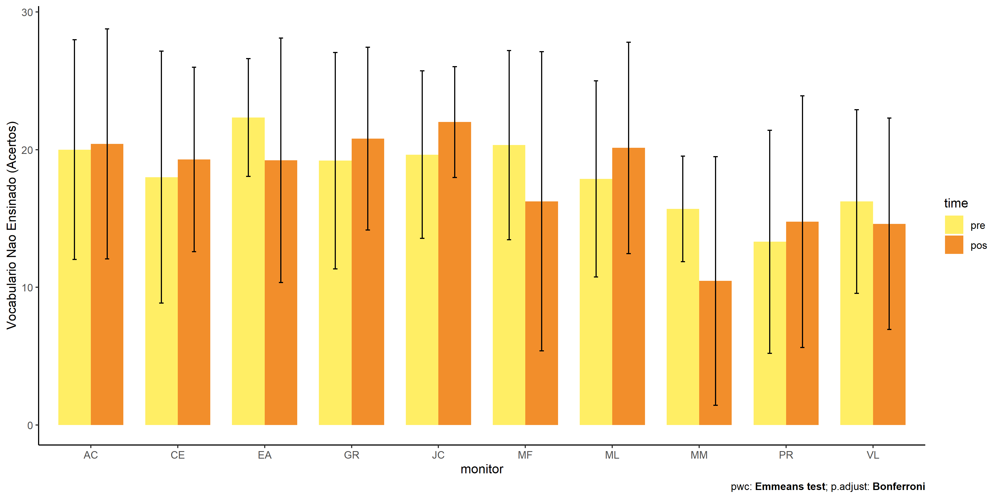<!-- -->

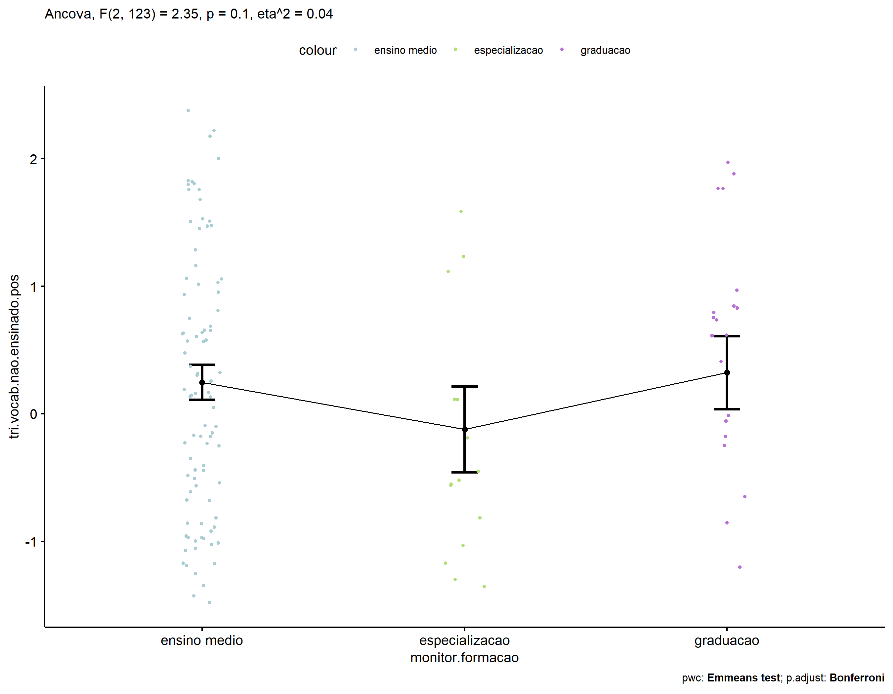<!-- -->

### Vocabulario Nao Ensinado (TRI)

| var                        | monitor |   n | M (pre) | SE (pre) | M (unadj) | SE (unadj) | M (adj) | SE (adj) |
|:---------------------------|:--------|----:|--------:|---------:|----------:|-----------:|--------:|---------:|
| tri.vocab.nao.ensinado.pos | AC      |  10 |   0.658 |    0.198 |     0.758 |      0.238 |   0.416 |    0.213 |
| tri.vocab.nao.ensinado.pos | CE      |   6 |   0.423 |    0.228 |     0.298 |      0.405 |   0.144 |    0.272 |
| tri.vocab.nao.ensinado.pos | EA      |   8 |   0.524 |    0.206 |     0.655 |      0.299 |   0.421 |    0.236 |
| tri.vocab.nao.ensinado.pos | GR      |  15 |   0.387 |    0.282 |     0.553 |      0.256 |   0.428 |    0.172 |
| tri.vocab.nao.ensinado.pos | JC      |  11 |   0.435 |    0.214 |     0.774 |      0.163 |   0.610 |    0.201 |
| tri.vocab.nao.ensinado.pos | MF      |   9 |   0.658 |    0.202 |     0.675 |      0.245 |   0.333 |    0.224 |
| tri.vocab.nao.ensinado.pos | ML      |  16 |   0.179 |    0.246 |     0.507 |      0.265 |   0.547 |    0.166 |
| tri.vocab.nao.ensinado.pos | MM      |   9 |  -0.396 |    0.176 |    -0.317 |      0.287 |   0.180 |    0.227 |
| tri.vocab.nao.ensinado.pos | PR      |  12 |  -0.352 |    0.270 |    -0.065 |      0.353 |   0.397 |    0.197 |
| tri.vocab.nao.ensinado.pos | VL      |  12 |  -0.015 |    0.265 |    -0.102 |      0.282 |   0.092 |    0.193 |

| .y.                        | group1 | group2 | estimate | conf.low | conf.high |    se | statistic |     p | p.adj | p.adj.signif |
|:---------------------------|:-------|:-------|---------:|---------:|----------:|------:|----------:|------:|------:|:-------------|
| tri.vocab.nao.ensinado.pos | AC     | CE     |    0.272 |   -0.410 |     0.955 | 0.344 |     0.792 | 0.430 | 1.000 | ns           |
| tri.vocab.nao.ensinado.pos | AC     | EA     |   -0.004 |   -0.631 |     0.622 | 0.315 |    -0.014 | 0.989 | 1.000 | ns           |
| tri.vocab.nao.ensinado.pos | AC     | GR     |   -0.011 |   -0.552 |     0.529 | 0.272 |    -0.041 | 0.967 | 1.000 | ns           |
| tri.vocab.nao.ensinado.pos | AC     | JC     |   -0.193 |   -0.771 |     0.384 | 0.291 |    -0.665 | 0.508 | 1.000 | ns           |
| tri.vocab.nao.ensinado.pos | AC     | MF     |    0.083 |   -0.523 |     0.689 | 0.305 |     0.272 | 0.786 | 1.000 | ns           |
| tri.vocab.nao.ensinado.pos | AC     | ML     |   -0.131 |   -0.668 |     0.407 | 0.271 |    -0.482 | 0.631 | 1.000 | ns           |
| tri.vocab.nao.ensinado.pos | AC     | MM     |    0.236 |   -0.393 |     0.865 | 0.317 |     0.745 | 0.458 | 1.000 | ns           |
| tri.vocab.nao.ensinado.pos | AC     | PR     |    0.019 |   -0.568 |     0.607 | 0.296 |     0.065 | 0.949 | 1.000 | ns           |
| tri.vocab.nao.ensinado.pos | AC     | VL     |    0.324 |   -0.251 |     0.899 | 0.290 |     1.120 | 0.265 | 1.000 | ns           |
| tri.vocab.nao.ensinado.pos | CE     | EA     |   -0.277 |   -0.989 |     0.436 | 0.359 |    -0.771 | 0.443 | 1.000 | ns           |
| tri.vocab.nao.ensinado.pos | CE     | GR     |   -0.284 |   -0.921 |     0.354 | 0.321 |    -0.884 | 0.379 | 1.000 | ns           |
| tri.vocab.nao.ensinado.pos | CE     | JC     |   -0.466 |   -1.135 |     0.204 | 0.337 |    -1.381 | 0.170 | 1.000 | ns           |
| tri.vocab.nao.ensinado.pos | CE     | MF     |   -0.189 |   -0.885 |     0.507 | 0.351 |    -0.540 | 0.591 | 1.000 | ns           |
| tri.vocab.nao.ensinado.pos | CE     | ML     |   -0.403 |   -1.036 |     0.230 | 0.319 |    -1.264 | 0.209 | 1.000 | ns           |
| tri.vocab.nao.ensinado.pos | CE     | MM     |   -0.036 |   -0.744 |     0.671 | 0.356 |    -0.101 | 0.919 | 1.000 | ns           |
| tri.vocab.nao.ensinado.pos | CE     | PR     |   -0.253 |   -0.924 |     0.418 | 0.338 |    -0.749 | 0.456 | 1.000 | ns           |
| tri.vocab.nao.ensinado.pos | CE     | VL     |    0.052 |   -0.611 |     0.715 | 0.334 |     0.156 | 0.876 | 1.000 | ns           |
| tri.vocab.nao.ensinado.pos | EA     | GR     |   -0.007 |   -0.585 |     0.571 | 0.291 |    -0.023 | 0.981 | 1.000 | ns           |
| tri.vocab.nao.ensinado.pos | EA     | JC     |   -0.189 |   -0.802 |     0.424 | 0.309 |    -0.612 | 0.542 | 1.000 | ns           |
| tri.vocab.nao.ensinado.pos | EA     | MF     |    0.088 |   -0.554 |     0.729 | 0.323 |     0.271 | 0.787 | 1.000 | ns           |
| tri.vocab.nao.ensinado.pos | EA     | ML     |   -0.126 |   -0.700 |     0.448 | 0.289 |    -0.436 | 0.664 | 1.000 | ns           |
| tri.vocab.nao.ensinado.pos | EA     | MM     |    0.241 |   -0.417 |     0.898 | 0.331 |     0.726 | 0.469 | 1.000 | ns           |
| tri.vocab.nao.ensinado.pos | EA     | PR     |    0.024 |   -0.595 |     0.642 | 0.311 |     0.076 | 0.940 | 1.000 | ns           |
| tri.vocab.nao.ensinado.pos | EA     | VL     |    0.329 |   -0.279 |     0.937 | 0.306 |     1.073 | 0.286 | 1.000 | ns           |
| tri.vocab.nao.ensinado.pos | GR     | JC     |   -0.182 |   -0.706 |     0.341 | 0.264 |    -0.691 | 0.491 | 1.000 | ns           |
| tri.vocab.nao.ensinado.pos | GR     | MF     |    0.094 |   -0.463 |     0.652 | 0.281 |     0.336 | 0.738 | 1.000 | ns           |
| tri.vocab.nao.ensinado.pos | GR     | ML     |   -0.119 |   -0.595 |     0.356 | 0.239 |    -0.498 | 0.619 | 1.000 | ns           |
| tri.vocab.nao.ensinado.pos | GR     | MM     |    0.248 |   -0.323 |     0.818 | 0.287 |     0.862 | 0.391 | 1.000 | ns           |
| tri.vocab.nao.ensinado.pos | GR     | PR     |    0.030 |   -0.494 |     0.555 | 0.264 |     0.115 | 0.909 | 1.000 | ns           |
| tri.vocab.nao.ensinado.pos | GR     | VL     |    0.336 |   -0.179 |     0.851 | 0.259 |     1.294 | 0.199 | 1.000 | ns           |
| tri.vocab.nao.ensinado.pos | JC     | MF     |    0.277 |   -0.317 |     0.870 | 0.299 |     0.924 | 0.358 | 1.000 | ns           |
| tri.vocab.nao.ensinado.pos | JC     | ML     |    0.063 |   -0.455 |     0.581 | 0.261 |     0.241 | 0.810 | 1.000 | ns           |
| tri.vocab.nao.ensinado.pos | JC     | MM     |    0.430 |   -0.178 |     1.037 | 0.306 |     1.404 | 0.164 | 1.000 | ns           |
| tri.vocab.nao.ensinado.pos | JC     | PR     |    0.213 |   -0.352 |     0.777 | 0.285 |     0.747 | 0.457 | 1.000 | ns           |
| tri.vocab.nao.ensinado.pos | JC     | VL     |    0.518 |   -0.037 |     1.073 | 0.280 |     1.851 | 0.067 | 1.000 | ns           |
| tri.vocab.nao.ensinado.pos | MF     | ML     |   -0.214 |   -0.769 |     0.341 | 0.280 |    -0.764 | 0.447 | 1.000 | ns           |
| tri.vocab.nao.ensinado.pos | MF     | MM     |    0.153 |   -0.491 |     0.797 | 0.325 |     0.472 | 0.638 | 1.000 | ns           |
| tri.vocab.nao.ensinado.pos | MF     | PR     |   -0.064 |   -0.668 |     0.540 | 0.304 |    -0.210 | 0.834 | 1.000 | ns           |
| tri.vocab.nao.ensinado.pos | MF     | VL     |    0.241 |   -0.350 |     0.833 | 0.298 |     0.810 | 0.420 | 1.000 | ns           |
| tri.vocab.nao.ensinado.pos | ML     | MM     |    0.367 |   -0.190 |     0.924 | 0.281 |     1.307 | 0.194 | 1.000 | ns           |
| tri.vocab.nao.ensinado.pos | ML     | PR     |    0.150 |   -0.361 |     0.661 | 0.257 |     0.582 | 0.562 | 1.000 | ns           |
| tri.vocab.nao.ensinado.pos | ML     | VL     |    0.455 |   -0.050 |     0.960 | 0.254 |     1.790 | 0.077 | 1.000 | ns           |
| tri.vocab.nao.ensinado.pos | MM     | PR     |   -0.217 |   -0.799 |     0.365 | 0.293 |    -0.741 | 0.461 | 1.000 | ns           |
| tri.vocab.nao.ensinado.pos | MM     | VL     |    0.088 |   -0.497 |     0.673 | 0.295 |     0.299 | 0.765 | 1.000 | ns           |
| tri.vocab.nao.ensinado.pos | PR     | VL     |    0.305 |   -0.236 |     0.847 | 0.273 |     1.120 | 0.266 | 1.000 | ns           |
| tri.vocab.nao.ensinado.pre | AC     | CE     |    0.236 |   -0.616 |     1.088 | 0.429 |     0.550 | 0.584 | 1.000 | ns           |
| tri.vocab.nao.ensinado.pre | AC     | EA     |    0.135 |   -0.648 |     0.917 | 0.394 |     0.342 | 0.733 | 1.000 | ns           |
| tri.vocab.nao.ensinado.pre | AC     | GR     |    0.272 |   -0.402 |     0.945 | 0.339 |     0.800 | 0.425 | 1.000 | ns           |
| tri.vocab.nao.ensinado.pre | AC     | JC     |    0.223 |   -0.497 |     0.944 | 0.363 |     0.615 | 0.540 | 1.000 | ns           |
| tri.vocab.nao.ensinado.pre | AC     | MF     |    0.000 |   -0.758 |     0.759 | 0.382 |     0.001 | 0.999 | 1.000 | ns           |
| tri.vocab.nao.ensinado.pre | AC     | ML     |    0.479 |   -0.186 |     1.145 | 0.335 |     1.430 | 0.156 | 1.000 | ns           |
| tri.vocab.nao.ensinado.pre | AC     | MM     |    1.054 |    0.296 |     1.812 | 0.382 |     2.759 | 0.007 | 0.311 | ns           |
| tri.vocab.nao.ensinado.pre | AC     | PR     |    1.011 |    0.304 |     1.717 | 0.356 |     2.839 | 0.005 | 0.247 | ns           |
| tri.vocab.nao.ensinado.pre | AC     | VL     |    0.673 |   -0.033 |     1.380 | 0.356 |     1.891 | 0.062 | 1.000 | ns           |
| tri.vocab.nao.ensinado.pre | CE     | EA     |   -0.101 |   -0.992 |     0.790 | 0.449 |    -0.226 | 0.822 | 1.000 | ns           |
| tri.vocab.nao.ensinado.pre | CE     | GR     |    0.036 |   -0.761 |     0.833 | 0.402 |     0.089 | 0.929 | 1.000 | ns           |
| tri.vocab.nao.ensinado.pre | CE     | JC     |   -0.013 |   -0.850 |     0.825 | 0.422 |    -0.030 | 0.976 | 1.000 | ns           |
| tri.vocab.nao.ensinado.pre | CE     | MF     |   -0.236 |   -1.105 |     0.634 | 0.438 |    -0.537 | 0.592 | 1.000 | ns           |
| tri.vocab.nao.ensinado.pre | CE     | ML     |    0.243 |   -0.546 |     1.033 | 0.398 |     0.612 | 0.542 | 1.000 | ns           |
| tri.vocab.nao.ensinado.pre | CE     | MM     |    0.818 |   -0.052 |     1.688 | 0.438 |     1.867 | 0.065 | 1.000 | ns           |
| tri.vocab.nao.ensinado.pre | CE     | PR     |    0.775 |   -0.050 |     1.600 | 0.416 |     1.864 | 0.065 | 1.000 | ns           |
| tri.vocab.nao.ensinado.pre | CE     | VL     |    0.437 |   -0.388 |     1.262 | 0.416 |     1.052 | 0.295 | 1.000 | ns           |
| tri.vocab.nao.ensinado.pre | EA     | GR     |    0.137 |   -0.585 |     0.859 | 0.364 |     0.376 | 0.707 | 1.000 | ns           |
| tri.vocab.nao.ensinado.pre | EA     | JC     |    0.089 |   -0.678 |     0.855 | 0.386 |     0.230 | 0.819 | 1.000 | ns           |
| tri.vocab.nao.ensinado.pre | EA     | MF     |   -0.134 |   -0.936 |     0.668 | 0.404 |    -0.332 | 0.740 | 1.000 | ns           |
| tri.vocab.nao.ensinado.pre | EA     | ML     |    0.345 |   -0.370 |     1.059 | 0.360 |     0.958 | 0.341 | 1.000 | ns           |
| tri.vocab.nao.ensinado.pre | EA     | MM     |    0.919 |    0.118 |     1.721 | 0.404 |     2.276 | 0.025 | 1.000 | ns           |
| tri.vocab.nao.ensinado.pre | EA     | PR     |    0.876 |    0.123 |     1.629 | 0.380 |     2.309 | 0.023 | 1.000 | ns           |
| tri.vocab.nao.ensinado.pre | EA     | VL     |    0.539 |   -0.214 |     1.292 | 0.380 |     1.419 | 0.159 | 1.000 | ns           |
| tri.vocab.nao.ensinado.pre | GR     | JC     |   -0.048 |   -0.703 |     0.607 | 0.330 |    -0.146 | 0.884 | 1.000 | ns           |
| tri.vocab.nao.ensinado.pre | GR     | MF     |   -0.271 |   -0.967 |     0.424 | 0.351 |    -0.774 | 0.441 | 1.000 | ns           |
| tri.vocab.nao.ensinado.pre | GR     | ML     |    0.208 |   -0.385 |     0.801 | 0.299 |     0.695 | 0.489 | 1.000 | ns           |
| tri.vocab.nao.ensinado.pre | GR     | MM     |    0.782 |    0.087 |     1.478 | 0.351 |     2.232 | 0.028 | 1.000 | ns           |
| tri.vocab.nao.ensinado.pre | GR     | PR     |    0.739 |    0.100 |     1.378 | 0.322 |     2.295 | 0.024 | 1.000 | ns           |
| tri.vocab.nao.ensinado.pre | GR     | VL     |    0.402 |   -0.237 |     1.041 | 0.322 |     1.247 | 0.215 | 1.000 | ns           |
| tri.vocab.nao.ensinado.pre | JC     | MF     |   -0.223 |   -0.965 |     0.519 | 0.374 |    -0.597 | 0.552 | 1.000 | ns           |
| tri.vocab.nao.ensinado.pre | JC     | ML     |    0.256 |   -0.390 |     0.902 | 0.326 |     0.786 | 0.434 | 1.000 | ns           |
| tri.vocab.nao.ensinado.pre | JC     | MM     |    0.831 |    0.089 |     1.572 | 0.374 |     2.223 | 0.029 | 1.000 | ns           |
| tri.vocab.nao.ensinado.pre | JC     | PR     |    0.787 |    0.099 |     1.476 | 0.347 |     2.269 | 0.025 | 1.000 | ns           |
| tri.vocab.nao.ensinado.pre | JC     | VL     |    0.450 |   -0.239 |     1.139 | 0.347 |     1.296 | 0.198 | 1.000 | ns           |
| tri.vocab.nao.ensinado.pre | MF     | ML     |    0.479 |   -0.209 |     1.167 | 0.346 |     1.383 | 0.170 | 1.000 | ns           |
| tri.vocab.nao.ensinado.pre | MF     | MM     |    1.054 |    0.276 |     1.831 | 0.392 |     2.688 | 0.008 | 0.380 | ns           |
| tri.vocab.nao.ensinado.pre | MF     | PR     |    1.010 |    0.283 |     1.738 | 0.367 |     2.756 | 0.007 | 0.314 | ns           |
| tri.vocab.nao.ensinado.pre | MF     | VL     |    0.673 |   -0.055 |     1.400 | 0.367 |     1.835 | 0.069 | 1.000 | ns           |
| tri.vocab.nao.ensinado.pre | ML     | MM     |    0.575 |   -0.113 |     1.262 | 0.346 |     1.659 | 0.100 | 1.000 | ns           |
| tri.vocab.nao.ensinado.pre | ML     | PR     |    0.531 |   -0.099 |     1.162 | 0.318 |     1.674 | 0.097 | 1.000 | ns           |
| tri.vocab.nao.ensinado.pre | ML     | VL     |    0.194 |   -0.436 |     0.824 | 0.318 |     0.611 | 0.543 | 1.000 | ns           |
| tri.vocab.nao.ensinado.pre | MM     | PR     |   -0.043 |   -0.771 |     0.684 | 0.367 |    -0.118 | 0.906 | 1.000 | ns           |
| tri.vocab.nao.ensinado.pre | MM     | VL     |   -0.381 |   -1.108 |     0.347 | 0.367 |    -1.038 | 0.302 | 1.000 | ns           |
| tri.vocab.nao.ensinado.pre | PR     | VL     |   -0.337 |   -1.011 |     0.336 | 0.339 |    -0.994 | 0.323 | 1.000 | ns           |

| monitor | group1 | group2 | estimate | conf.low | conf.high |    se | statistic |     p | p.adj | p.adj.signif |
|:--------|:-------|:-------|---------:|---------:|----------:|------:|----------:|------:|------:|:-------------|
| AC      | pre    | pos    |   -0.027 |   -0.769 |     0.714 | 0.376 |    -0.073 | 0.942 | 0.942 | ns           |
| CE      | pre    | pos    |    0.016 |   -0.951 |     0.983 | 0.490 |     0.033 | 0.974 | 0.974 | ns           |
| EA      | pre    | pos    |    0.023 |   -0.821 |     0.868 | 0.428 |     0.055 | 0.957 | 0.957 | ns           |
| GR      | pre    | pos    |   -0.166 |   -0.801 |     0.468 | 0.322 |    -0.517 | 0.606 | 0.606 | ns           |
| JC      | pre    | pos    |   -0.339 |   -1.080 |     0.402 | 0.376 |    -0.901 | 0.369 | 0.369 | ns           |
| MF      | pre    | pos    |   -0.158 |   -0.924 |     0.609 | 0.389 |    -0.405 | 0.686 | 0.686 | ns           |
| ML      | pre    | pos    |   -0.328 |   -0.943 |     0.286 | 0.312 |    -1.053 | 0.294 | 0.294 | ns           |
| MM      | pre    | pos    |    0.138 |   -0.616 |     0.892 | 0.382 |     0.361 | 0.719 | 0.719 | ns           |
| PR      | pre    | pos    |   -0.287 |   -0.997 |     0.423 | 0.360 |    -0.797 | 0.426 | 0.426 | ns           |
| VL      | pre    | pos    |    0.052 |   -0.643 |     0.748 | 0.353 |     0.149 | 0.882 | 0.882 | ns           |

    ## Scale for colour is already present.
    ## Adding another scale for colour, which will replace the existing scale.

<!-- -->

<!-- -->

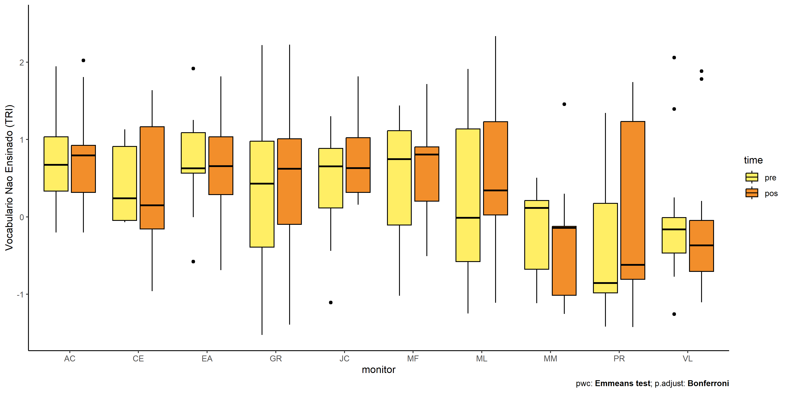<!-- -->

## factores: **grupo=“Experimental”:monitor.genero**

### Vocabulario (Acertos)

| var             | monitor.genero |   n | M (pre) | SE (pre) | M (unadj) | SE (unadj) | M (adj) | SE (adj) |
|:----------------|:---------------|----:|--------:|---------:|----------:|-----------:|--------:|---------:|
| score.vocab.pos | F              |  71 |  22.690 |    0.967 |    24.028 |      1.007 |  24.121 |    0.708 |
| score.vocab.pos | M              |  37 |  23.054 |    1.308 |    24.243 |      1.388 |  24.064 |    0.981 |

| .y.             | group1 | group2 | estimate | conf.low | conf.high |    se | statistic |     p | p.adj | p.adj.signif |
|:----------------|:-------|:-------|---------:|---------:|----------:|------:|----------:|------:|------:|:-------------|
| score.vocab.pos | F      | M      |    0.057 |   -2.341 |     2.455 | 1.210 |     0.047 | 0.962 | 0.962 | ns           |
| score.vocab.pre | F      | M      |   -0.364 |   -3.613 |     2.885 | 1.639 |    -0.222 | 0.825 | 0.825 | ns           |

| monitor.genero | group1 | group2 | estimate | conf.low | conf.high |    se | statistic |     p | p.adj | p.adj.signif |
|:---------------|:-------|:-------|---------:|---------:|----------:|------:|----------:|------:|------:|:-------------|
| F              | pre    | pos    |   -1.360 |   -4.003 |     1.283 | 1.341 |    -1.014 | 0.312 | 0.312 | ns           |
| M              | pre    | pos    |   -1.079 |   -4.811 |     2.653 | 1.894 |    -0.570 | 0.569 | 0.569 | ns           |

    ## Scale for colour is already present.
    ## Adding another scale for colour, which will replace the existing scale.

<!-- -->

<!-- -->

<!-- -->

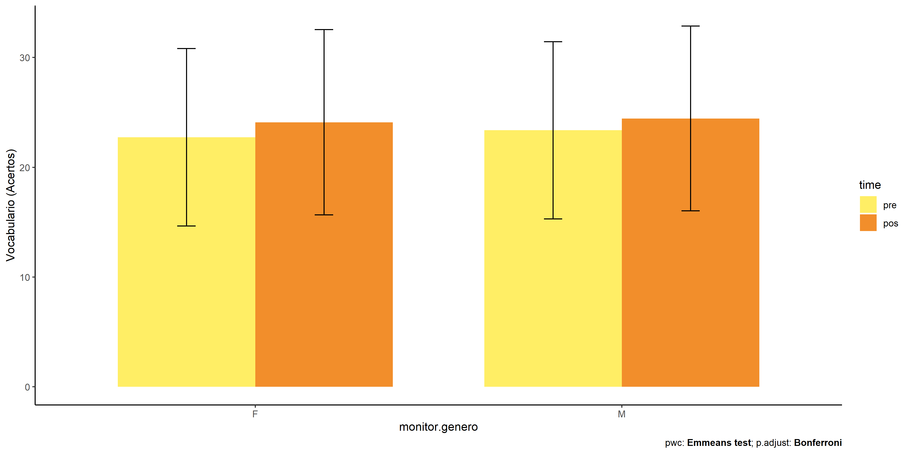<!-- -->

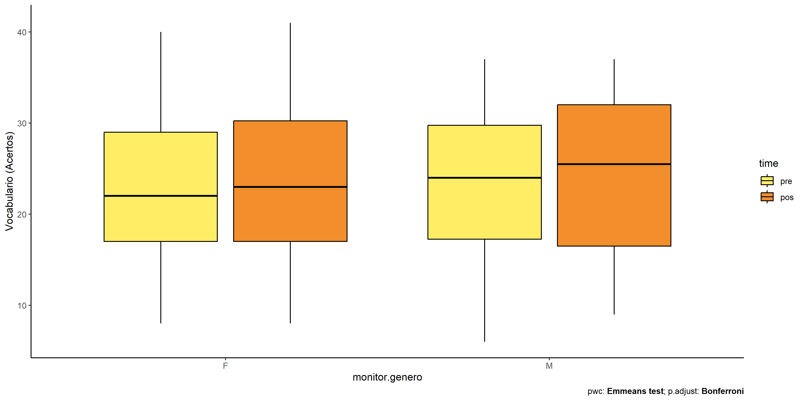<!-- -->

### Vocabulario (TRI)

| var           | monitor.genero |   n | M (pre) | SE (pre) | M (unadj) | SE (unadj) | M (adj) | SE (adj) |
|:--------------|:---------------|----:|--------:|---------:|----------:|-----------:|--------:|---------:|
| tri.vocab.pos | F              |  71 |   0.247 |    0.108 |     0.374 |      0.103 |   0.361 |    0.072 |
| tri.vocab.pos | M              |  37 |   0.195 |    0.150 |     0.415 |      0.155 |   0.440 |    0.099 |

| .y.           | group1 | group2 | estimate | conf.low | conf.high |    se | statistic |     p | p.adj | p.adj.signif |
|:--------------|:-------|:-------|---------:|---------:|----------:|------:|----------:|------:|------:|:-------------|
| tri.vocab.pos | F      | M      |   -0.079 |   -0.321 |     0.164 | 0.122 |    -0.645 | 0.520 | 0.520 | ns           |
| tri.vocab.pre | F      | M      |    0.053 |   -0.314 |     0.419 | 0.185 |     0.284 | 0.777 | 0.777 | ns           |

| monitor.genero | group1 | group2 | estimate | conf.low | conf.high |    se | statistic |     p | p.adj | p.adj.signif |
|:---------------|:-------|:-------|---------:|---------:|----------:|------:|----------:|------:|------:|:-------------|
| F              | pre    | pos    |   -0.119 |   -0.408 |     0.170 | 0.147 |    -0.810 | 0.419 | 0.419 | ns           |
| M              | pre    | pos    |   -0.197 |   -0.606 |     0.211 | 0.207 |    -0.952 | 0.342 | 0.342 | ns           |

    ## Scale for colour is already present.
    ## Adding another scale for colour, which will replace the existing scale.

<!-- -->

<!-- -->

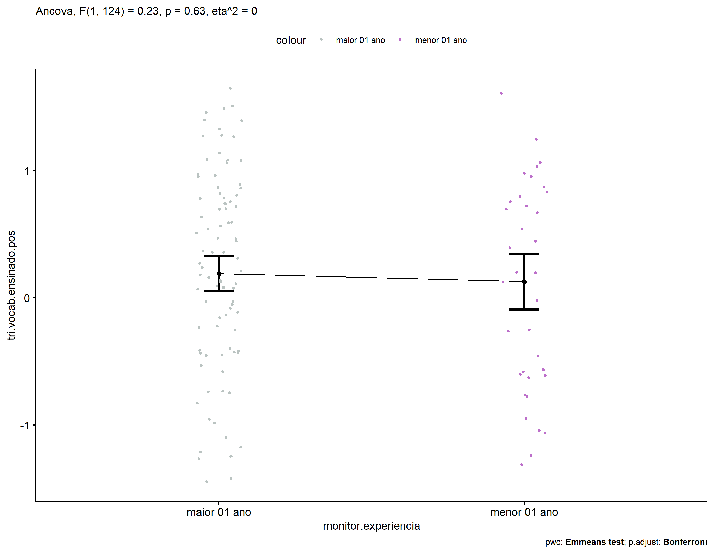<!-- -->

### Vocabulario Ensinado (Acertos)

| var                      | monitor.genero |   n | M (pre) | SE (pre) | M (unadj) | SE (unadj) | M (adj) | SE (adj) |
|:-------------------------|:---------------|----:|--------:|---------:|----------:|-----------:|--------:|---------:|
| score.vocab.ensinado.pos | F              |  81 |   4.272 |    0.238 |     4.136 |      0.273 |   4.139 |    0.256 |
| score.vocab.ensinado.pos | M              |  40 |   4.300 |    0.355 |     4.700 |      0.379 |   4.693 |    0.365 |

| .y.                      | group1 | group2 | estimate | conf.low | conf.high |    se | statistic |     p | p.adj | p.adj.signif |
|:-------------------------|:-------|:-------|---------:|---------:|----------:|------:|----------:|------:|------:|:-------------|
| score.vocab.ensinado.pos | F      | M      |   -0.554 |   -1.437 |     0.329 | 0.446 |    -1.242 | 0.217 | 0.217 | ns           |
| score.vocab.ensinado.pre | F      | M      |   -0.028 |   -0.862 |     0.805 | 0.421 |    -0.067 | 0.946 | 0.946 | ns           |

| monitor.genero | group1 | group2 | estimate | conf.low | conf.high |    se | statistic |     p | p.adj | p.adj.signif |
|:---------------|:-------|:-------|---------:|---------:|----------:|------:|----------:|------:|------:|:-------------|
| F              | pre    | pos    |    0.136 |   -0.579 |     0.851 | 0.363 |     0.374 | 0.709 | 0.709 | ns           |
| M              | pre    | pos    |   -0.400 |   -1.418 |     0.618 | 0.517 |    -0.774 | 0.440 | 0.440 | ns           |

    ## Scale for colour is already present.
    ## Adding another scale for colour, which will replace the existing scale.

<!-- -->

<!-- -->

<!-- -->

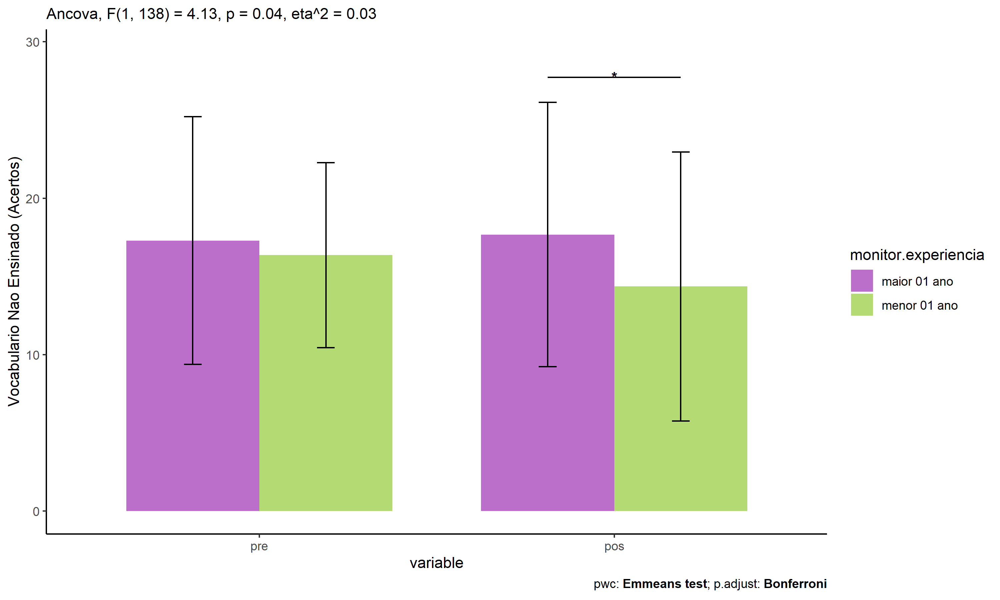<!-- -->

<!-- -->

### Vocabulario Ensinado (TRI)

| var                    | monitor.genero |   n | M (pre) | SE (pre) | M (unadj) | SE (unadj) | M (adj) | SE (adj) |
|:-----------------------|:---------------|----:|--------:|---------:|----------:|-----------:|--------:|---------:|
| tri.vocab.ensinado.pos | F              |  71 |   0.110 |    0.093 |     0.270 |      0.088 |   0.289 |    0.077 |
| tri.vocab.ensinado.pos | M              |  37 |   0.208 |    0.116 |     0.287 |      0.136 |   0.252 |    0.107 |

| .y.                    | group1 | group2 | estimate | conf.low | conf.high |    se | statistic |     p | p.adj | p.adj.signif |
|:-----------------------|:-------|:-------|---------:|---------:|----------:|------:|----------:|------:|------:|:-------------|
| tri.vocab.ensinado.pos | F      | M      |    0.037 |   -0.225 |     0.299 | 0.132 |     0.280 | 0.780 | 0.780 | ns           |
| tri.vocab.ensinado.pre | F      | M      |   -0.099 |   -0.404 |     0.207 | 0.154 |    -0.641 | 0.523 | 0.523 | ns           |

| monitor.genero | group1 | group2 | estimate | conf.low | conf.high |    se | statistic |     p | p.adj | p.adj.signif |
|:---------------|:-------|:-------|---------:|---------:|----------:|------:|----------:|------:|------:|:-------------|
| F              | pre    | pos    |   -0.132 |   -0.376 |     0.111 | 0.123 |    -1.073 | 0.284 | 0.284 | ns           |
| M              | pre    | pos    |   -0.073 |   -0.417 |     0.270 | 0.174 |    -0.420 | 0.675 | 0.675 | ns           |

    ## Scale for colour is already present.
    ## Adding another scale for colour, which will replace the existing scale.

<!-- -->

<!-- -->

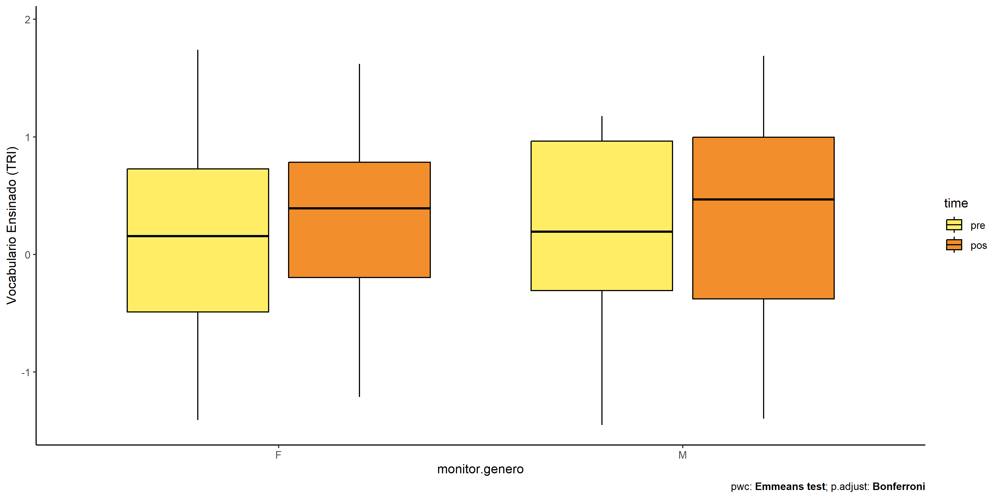<!-- -->

### Vocabulario Nao Ensinado (Acertos)

| var                          | monitor.genero |   n | M (pre) | SE (pre) | M (unadj) | SE (unadj) | M (adj) | SE (adj) |
|:-----------------------------|:---------------|----:|--------:|---------:|----------:|-----------:|--------:|---------:|
| score.vocab.nao.ensinado.pos | F              |  81 |  18.185 |    0.765 |    17.284 |      0.994 |  17.233 |    0.858 |
| score.vocab.nao.ensinado.pos | M              |  40 |  17.900 |    1.211 |    18.550 |      1.237 |  18.652 |    1.221 |

| .y.                          | group1 | group2 | estimate | conf.low | conf.high |    se | statistic |     p | p.adj | p.adj.signif |
|:-----------------------------|:-------|:-------|---------:|---------:|----------:|------:|----------:|------:|------:|:-------------|
| score.vocab.nao.ensinado.pos | F      | M      |   -1.419 |   -4.374 |     1.537 | 1.493 |    -0.951 | 0.344 | 0.344 | ns           |
| score.vocab.nao.ensinado.pre | F      | M      |    0.285 |   -2.451 |     3.022 | 1.382 |     0.206 | 0.837 | 0.837 | ns           |

| monitor.genero | group1 | group2 | estimate | conf.low | conf.high |    se | statistic |     p | p.adj | p.adj.signif |
|:---------------|:-------|:-------|---------:|---------:|----------:|------:|----------:|------:|------:|:-------------|
| F              | pre    | pos    |    0.901 |   -1.546 |     3.348 | 1.242 |     0.726 | 0.469 | 0.469 | ns           |
| M              | pre    | pos    |   -0.650 |   -4.132 |     2.832 | 1.767 |    -0.368 | 0.713 | 0.713 | ns           |

    ## Scale for colour is already present.
    ## Adding another scale for colour, which will replace the existing scale.

<!-- -->

<!-- -->

<!-- -->

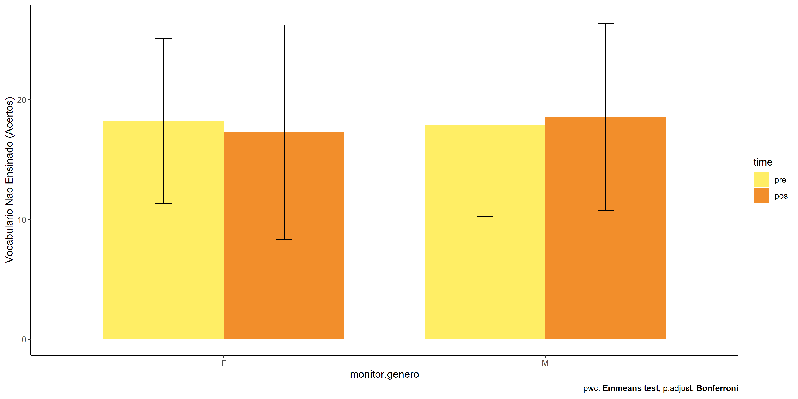<!-- -->

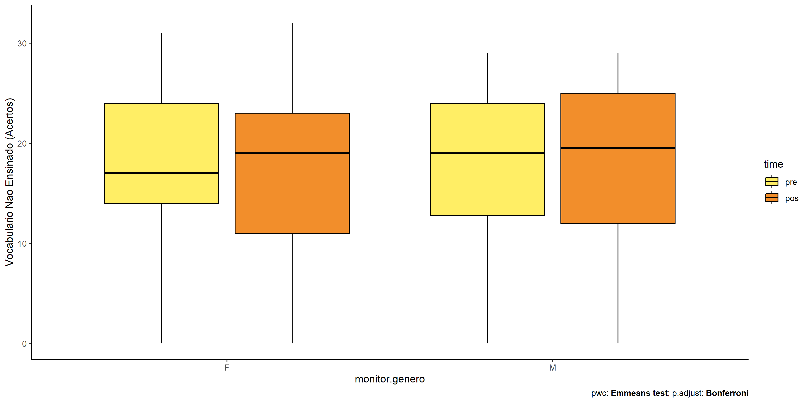<!-- -->

### Vocabulario Nao Ensinado (TRI)

| var                        | monitor.genero |   n | M (pre) | SE (pre) | M (unadj) | SE (unadj) | M (adj) | SE (adj) |
|:---------------------------|:---------------|----:|--------:|---------:|----------:|-----------:|--------:|---------:|
| tri.vocab.nao.ensinado.pos | F              |  71 |   0.246 |    0.107 |     0.366 |      0.116 |   0.352 |    0.078 |
| tri.vocab.nao.ensinado.pos | M              |  37 |   0.197 |    0.134 |     0.399 |      0.160 |   0.425 |    0.108 |

| .y.                        | group1 | group2 | estimate | conf.low | conf.high |    se | statistic |     p | p.adj | p.adj.signif |
|:---------------------------|:-------|:-------|---------:|---------:|----------:|------:|----------:|------:|------:|:-------------|
| tri.vocab.nao.ensinado.pos | F      | M      |   -0.073 |   -0.338 |     0.192 | 0.133 |    -0.547 | 0.586 | 0.586 | ns           |
| tri.vocab.nao.ensinado.pre | F      | M      |    0.049 |   -0.303 |     0.401 | 0.178 |     0.274 | 0.784 | 0.784 | ns           |

| monitor.genero | group1 | group2 | estimate | conf.low | conf.high |    se | statistic |     p | p.adj | p.adj.signif |
|:---------------|:-------|:-------|---------:|---------:|----------:|------:|----------:|------:|------:|:-------------|
| F              | pre    | pos    |   -0.122 |   -0.417 |     0.173 | 0.150 |    -0.816 | 0.415 | 0.415 | ns           |
| M              | pre    | pos    |   -0.174 |   -0.591 |     0.243 | 0.211 |    -0.823 | 0.411 | 0.411 | ns           |

    ## Scale for colour is already present.
    ## Adding another scale for colour, which will replace the existing scale.

<!-- -->

<!-- -->

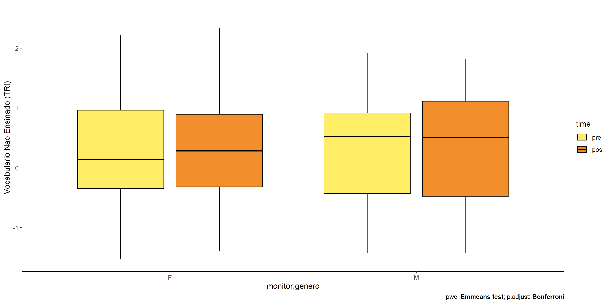<!-- -->

## factores: **grupo=“Experimental”:monitor.area**

### Vocabulario (Acertos)

| var             | monitor.area               |   n | M (pre) | SE (pre) | M (unadj) | SE (unadj) | M (adj) | SE (adj) |
|:----------------|:---------------------------|----:|--------:|---------:|----------:|-----------:|--------:|---------:|
| score.vocab.pos | Arquitetura e Urbanismo    |  11 |  24.455 |    2.313 |    27.818 |      1.476 |  26.625 |    1.775 |
| score.vocab.pos | Ciencias Biologicas        |  16 |  22.188 |    2.255 |    25.000 |      2.343 |  25.457 |    1.469 |
| score.vocab.pos | Comunicacao Social         |   6 |  25.833 |    3.092 |    22.833 |      3.341 |  20.636 |    2.409 |
| score.vocab.pos | Historia                   |  12 |  18.167 |    2.519 |    19.667 |      3.028 |  23.050 |    1.732 |
| score.vocab.pos | Letras - Lingua Portuguesa |   9 |  26.778 |    2.126 |    26.667 |      2.449 |  23.782 |    1.981 |
| score.vocab.pos | Matematica                 |  23 |  24.522 |    1.579 |    26.087 |      1.555 |  24.845 |    1.232 |
| score.vocab.pos | Nutricao                   |   9 |  16.556 |    1.002 |    19.333 |      2.603 |  23.889 |    2.015 |
| score.vocab.pos | Pedagogia                  |  10 |  25.300 |    2.362 |    27.200 |      2.337 |  25.391 |    1.867 |
| score.vocab.pos | Servico Social             |  12 |  21.667 |    2.527 |    19.833 |      2.443 |  20.669 |    1.698 |

| .y.             | group1                  | group2              | estimate | conf.low | conf.high |    se | statistic |     p | p.adj | p.adj.signif |
|:----------------|:------------------------|:--------------------|---------:|---------:|----------:|------:|----------:|------:|------:|:-------------|
| score.vocab.pos | Arquitetura e Urbanismo | Ciencias Biologicas |    1.168 |   -3.410 |     5.746 | 2.307 |     0.506 | 0.614 | 1.000 | ns           |
| score.vocab.pos | Arquitetura e Urbanismo | Comunicacao Social  |    5.988 |    0.069 |    11.908 | 2.983 |     2.008 | 0.047 | 1.000 | ns           |
| score.vocab.pos | Arquitetura e Urbanismo | Historia            |    3.575 |   -1.382 |     8.533 | 2.498 |     1.431 | 0.156 | 1.000 | ns           |
| score.vocab.pos | Arquitetura e Urbanismo | Letras              |    2.842 |   -2.408 |     8.093 | 2.646 |     1.074 | 0.285 | 1.000 | ns           |
| score.vocab.pos | Arquitetura e Urbanismo | Matematica          |    1.780 |   -2.493 |     6.053 | 2.153 |     0.827 | 0.410 | 1.000 | ns           |
| score.vocab.pos | Arquitetura e Urbanismo | Nutricao            |    2.736 |   -2.638 |     8.109 | 2.708 |     1.010 | 0.315 | 1.000 | ns           |
| score.vocab.pos | Arquitetura e Urbanismo | Pedagogia           |    1.234 |   -3.861 |     6.328 | 2.567 |     0.481 | 0.632 | 1.000 | ns           |
| score.vocab.pos | Arquitetura e Urbanismo | Servico Social      |    5.956 |    1.072 |    10.839 | 2.461 |     2.420 | 0.017 | 0.625 | ns           |
| score.vocab.pos | Ciencias Biologicas     | Comunicacao Social  |    4.820 |   -0.787 |    10.427 | 2.825 |     1.706 | 0.091 | 1.000 | ns           |
| score.vocab.pos | Ciencias Biologicas     | Historia            |    2.407 |   -2.086 |     6.899 | 2.264 |     1.063 | 0.290 | 1.000 | ns           |
| score.vocab.pos | Ciencias Biologicas     | Letras              |    1.674 |   -3.232 |     6.580 | 2.472 |     0.677 | 0.500 | 1.000 | ns           |
| score.vocab.pos | Ciencias Biologicas     | Matematica          |    0.612 |   -3.199 |     4.423 | 1.920 |     0.319 | 0.751 | 1.000 | ns           |
| score.vocab.pos | Ciencias Biologicas     | Nutricao            |    1.568 |   -3.363 |     6.498 | 2.485 |     0.631 | 0.530 | 1.000 | ns           |
| score.vocab.pos | Ciencias Biologicas     | Pedagogia           |    0.065 |   -4.657 |     4.787 | 2.380 |     0.027 | 0.978 | 1.000 | ns           |
| score.vocab.pos | Ciencias Biologicas     | Servico Social      |    4.788 |    0.336 |     9.239 | 2.243 |     2.134 | 0.035 | 1.000 | ns           |
| score.vocab.pos | Comunicacao Social      | Historia            |   -2.413 |   -8.355 |     3.529 | 2.994 |    -0.806 | 0.422 | 1.000 | ns           |
| score.vocab.pos | Comunicacao Social      | Letras              |   -3.146 |   -9.291 |     2.999 | 3.096 |    -1.016 | 0.312 | 1.000 | ns           |
| score.vocab.pos | Comunicacao Social      | Matematica          |   -4.208 |   -9.555 |     1.139 | 2.694 |    -1.562 | 0.122 | 1.000 | ns           |
| score.vocab.pos | Comunicacao Social      | Nutricao            |   -3.253 |   -9.554 |     3.049 | 3.175 |    -1.024 | 0.308 | 1.000 | ns           |
| score.vocab.pos | Comunicacao Social      | Pedagogia           |   -4.755 |  -10.774 |     1.265 | 3.033 |    -1.568 | 0.120 | 1.000 | ns           |
| score.vocab.pos | Comunicacao Social      | Servico Social      |   -0.033 |   -5.894 |     5.829 | 2.954 |    -0.011 | 0.991 | 1.000 | ns           |
| score.vocab.pos | Historia                | Letras              |   -0.733 |   -6.035 |     4.569 | 2.672 |    -0.274 | 0.784 | 1.000 | ns           |
| score.vocab.pos | Historia                | Matematica          |   -1.795 |   -6.055 |     2.466 | 2.147 |    -0.836 | 0.405 | 1.000 | ns           |
| score.vocab.pos | Historia                | Nutricao            |   -0.839 |   -5.985 |     4.306 | 2.593 |    -0.324 | 0.747 | 1.000 | ns           |
| score.vocab.pos | Historia                | Pedagogia           |   -2.342 |   -7.448 |     2.764 | 2.573 |    -0.910 | 0.365 | 1.000 | ns           |
| score.vocab.pos | Historia                | Servico Social      |    2.381 |   -2.407 |     7.168 | 2.413 |     0.987 | 0.326 | 1.000 | ns           |
| score.vocab.pos | Letras                  | Lingua Portuguesa   |   -1.062 |   -5.658 |     3.533 | 2.316 |    -0.459 | 0.647 | 1.000 | ns           |
| score.vocab.pos | Letras                  | Lingua Portuguesa   |   -0.107 |   -5.815 |     5.601 | 2.876 |    -0.037 | 0.971 | 1.000 | ns           |
| score.vocab.pos | Letras                  | Lingua Portuguesa   |   -1.609 |   -6.969 |     3.751 | 2.701 |    -0.596 | 0.553 | 1.000 | ns           |
| score.vocab.pos | Letras                  | Lingua Portuguesa   |    3.113 |   -2.084 |     8.311 | 2.619 |     1.189 | 0.237 | 1.000 | ns           |
| score.vocab.pos | Matematica              | Nutricao            |    0.956 |   -3.783 |     5.694 | 2.388 |     0.400 | 0.690 | 1.000 | ns           |
| score.vocab.pos | Matematica              | Pedagogia           |   -0.547 |   -4.963 |     3.870 | 2.226 |    -0.246 | 0.807 | 1.000 | ns           |
| score.vocab.pos | Matematica              | Servico Social      |    4.176 |    0.003 |     8.349 | 2.103 |     1.986 | 0.050 | 1.000 | ns           |
| score.vocab.pos | Nutricao                | Pedagogia           |   -1.502 |   -7.019 |     4.014 | 2.780 |    -0.540 | 0.590 | 1.000 | ns           |
| score.vocab.pos | Nutricao                | Servico Social      |    3.220 |   -1.978 |     8.417 | 2.619 |     1.229 | 0.222 | 1.000 | ns           |
| score.vocab.pos | Pedagogia               | Servico Social      |    4.722 |   -0.299 |     9.743 | 2.530 |     1.866 | 0.065 | 1.000 | ns           |
| score.vocab.pre | Arquitetura e Urbanismo | Ciencias Biologicas |    2.267 |   -3.752 |     8.286 | 3.033 |     0.747 | 0.457 | 1.000 | ns           |
| score.vocab.pre | Arquitetura e Urbanismo | Comunicacao Social  |   -1.379 |   -9.178 |     6.420 | 3.931 |    -0.351 | 0.726 | 1.000 | ns           |
| score.vocab.pre | Arquitetura e Urbanismo | Historia            |    6.288 |   -0.127 |    12.702 | 3.233 |     1.945 | 0.055 | 1.000 | ns           |
| score.vocab.pre | Arquitetura e Urbanismo | Letras              |   -2.323 |   -9.230 |     4.584 | 3.481 |    -0.667 | 0.506 | 1.000 | ns           |
| score.vocab.pre | Arquitetura e Urbanismo | Matematica          |   -0.067 |   -5.701 |     5.566 | 2.839 |    -0.024 | 0.981 | 1.000 | ns           |
| score.vocab.pre | Arquitetura e Urbanismo | Nutricao            |    7.899 |    0.992 |    14.806 | 3.481 |     2.269 | 0.025 | 0.915 | ns           |
| score.vocab.pre | Arquitetura e Urbanismo | Pedagogia           |   -0.845 |   -7.560 |     5.869 | 3.384 |    -0.250 | 0.803 | 1.000 | ns           |
| score.vocab.pre | Arquitetura e Urbanismo | Servico Social      |    2.788 |   -3.627 |     9.202 | 3.233 |     0.862 | 0.391 | 1.000 | ns           |
| score.vocab.pre | Ciencias Biologicas     | Comunicacao Social  |   -3.646 |  -11.002 |     3.711 | 3.707 |    -0.983 | 0.328 | 1.000 | ns           |
| score.vocab.pre | Ciencias Biologicas     | Historia            |    4.021 |   -1.848 |     9.889 | 2.958 |     1.360 | 0.177 | 1.000 | ns           |
| score.vocab.pre | Ciencias Biologicas     | Letras              |   -4.590 |  -10.993 |     1.813 | 3.227 |    -1.422 | 0.158 | 1.000 | ns           |
| score.vocab.pre | Ciencias Biologicas     | Matematica          |   -2.334 |   -7.337 |     2.668 | 2.521 |    -0.926 | 0.357 | 1.000 | ns           |
| score.vocab.pre | Ciencias Biologicas     | Nutricao            |    5.632 |   -0.771 |    12.035 | 3.227 |     1.745 | 0.084 | 1.000 | ns           |
| score.vocab.pre | Ciencias Biologicas     | Pedagogia           |   -3.113 |   -9.307 |     3.082 | 3.122 |    -0.997 | 0.321 | 1.000 | ns           |
| score.vocab.pre | Ciencias Biologicas     | Servico Social      |    0.521 |   -5.348 |     6.389 | 2.958 |     0.176 | 0.861 | 1.000 | ns           |
| score.vocab.pre | Comunicacao Social      | Historia            |    7.667 |   -0.017 |    15.350 | 3.872 |     1.980 | 0.050 | 1.000 | ns           |
| score.vocab.pre | Comunicacao Social      | Letras              |   -0.944 |   -9.044 |     7.155 | 4.082 |    -0.231 | 0.817 | 1.000 | ns           |
| score.vocab.pre | Comunicacao Social      | Matematica          |    1.312 |   -5.733 |     8.356 | 3.550 |     0.369 | 0.713 | 1.000 | ns           |
| score.vocab.pre | Comunicacao Social      | Nutricao            |    9.278 |    1.179 |    17.377 | 4.082 |     2.273 | 0.025 | 0.907 | ns           |
| score.vocab.pre | Comunicacao Social      | Pedagogia           |    0.533 |   -7.402 |     8.469 | 3.999 |     0.133 | 0.894 | 1.000 | ns           |
| score.vocab.pre | Comunicacao Social      | Servico Social      |    4.167 |   -3.517 |    11.850 | 3.872 |     1.076 | 0.285 | 1.000 | ns           |
| score.vocab.pre | Historia                | Letras              |   -8.611 |  -15.387 |    -1.835 | 3.415 |    -2.522 | 0.013 | 0.478 | ns           |
| score.vocab.pre | Historia                | Matematica          |   -6.355 |  -11.827 |    -0.883 | 2.758 |    -2.304 | 0.023 | 0.839 | ns           |
| score.vocab.pre | Historia                | Nutricao            |    1.611 |   -5.165 |     8.387 | 3.415 |     0.472 | 0.638 | 1.000 | ns           |
| score.vocab.pre | Historia                | Pedagogia           |   -7.133 |  -13.713 |    -0.554 | 3.316 |    -2.151 | 0.034 | 1.000 | ns           |
| score.vocab.pre | Historia                | Servico Social      |   -3.500 |   -9.774 |     2.774 | 3.162 |    -1.107 | 0.271 | 1.000 | ns           |
| score.vocab.pre | Letras                  | Lingua Portuguesa   |    2.256 |   -3.786 |     8.298 | 3.045 |     0.741 | 0.461 | 1.000 | ns           |
| score.vocab.pre | Letras                  | Lingua Portuguesa   |   10.222 |    2.978 |    17.466 | 3.651 |     2.800 | 0.006 | 0.221 | ns           |
| score.vocab.pre | Letras                  | Lingua Portuguesa   |    1.478 |   -5.583 |     8.538 | 3.558 |     0.415 | 0.679 | 1.000 | ns           |
| score.vocab.pre | Letras                  | Lingua Portuguesa   |    5.111 |   -1.665 |    11.887 | 3.415 |     1.497 | 0.138 | 1.000 | ns           |
| score.vocab.pre | Matematica              | Nutricao            |    7.966 |    1.924 |    14.008 | 3.045 |     2.616 | 0.010 | 0.370 | ns           |
| score.vocab.pre | Matematica              | Pedagogia           |   -0.778 |   -6.599 |     5.043 | 2.934 |    -0.265 | 0.791 | 1.000 | ns           |
| score.vocab.pre | Matematica              | Servico Social      |    2.855 |   -2.617 |     8.327 | 2.758 |     1.035 | 0.303 | 1.000 | ns           |
| score.vocab.pre | Nutricao                | Pedagogia           |   -8.744 |  -15.805 |    -1.684 | 3.558 |    -2.457 | 0.016 | 0.566 | ns           |
| score.vocab.pre | Nutricao                | Servico Social      |   -5.111 |  -11.887 |     1.665 | 3.415 |    -1.497 | 0.138 | 1.000 | ns           |
| score.vocab.pre | Pedagogia               | Servico Social      |    3.633 |   -2.946 |    10.213 | 3.316 |     1.096 | 0.276 | 1.000 | ns           |

| monitor.area               | group1 | group2 | estimate | conf.low | conf.high |    se | statistic |     p | p.adj | p.adj.signif |
|:---------------------------|:-------|:-------|---------:|---------:|----------:|------:|----------:|------:|------:|:-------------|
| Arquitetura e Urbanismo    | pre    | pos    |   -3.364 |  -10.055 |     3.328 | 3.394 |    -0.991 | 0.323 | 0.323 | ns           |
| Ciencias Biologicas        | pre    | pos    |   -2.812 |   -8.361 |     2.736 | 2.815 |    -0.999 | 0.319 | 0.319 | ns           |
| Comunicacao Social         | pre    | pos    |    1.690 |   -7.040 |    10.421 | 4.429 |     0.382 | 0.703 | 0.703 | ns           |
| Historia                   | pre    | pos    |   -1.500 |   -7.907 |     4.907 | 3.250 |    -0.462 | 0.645 | 0.645 | ns           |
| Letras - Lingua Portuguesa | pre    | pos    |   -1.333 |   -8.253 |     5.587 | 3.510 |    -0.380 | 0.704 | 0.704 | ns           |
| Matematica                 | pre    | pos    |   -1.129 |   -5.708 |     3.451 | 2.323 |    -0.486 | 0.628 | 0.628 | ns           |
| Nutricao                   | pre    | pos    |   -0.487 |   -7.292 |     6.318 | 3.452 |    -0.141 | 0.888 | 0.888 | ns           |
| Pedagogia                  | pre    | pos    |   -1.364 |   -8.055 |     5.328 | 3.394 |    -0.402 | 0.688 | 0.688 | ns           |
| Servico Social             | pre    | pos    |    1.397 |   -4.885 |     7.680 | 3.187 |     0.438 | 0.661 | 0.661 | ns           |

    ## Scale for colour is already present.
    ## Adding another scale for colour, which will replace the existing scale.

<!-- -->

<!-- -->

<!-- -->

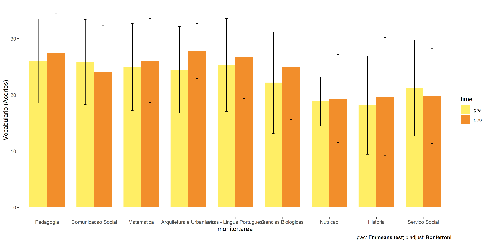<!-- -->

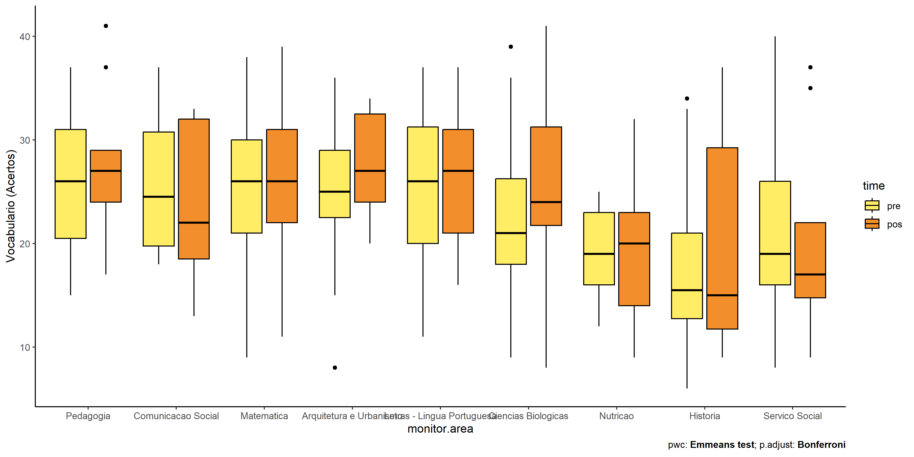<!-- -->

### Vocabulario (TRI)

| var           | monitor.area               |   n | M (pre) | SE (pre) | M (unadj) | SE (unadj) | M (adj) | SE (adj) |
|:--------------|:---------------------------|----:|--------:|---------:|----------:|-----------:|--------:|---------:|
| tri.vocab.pos | Arquitetura e Urbanismo    |  11 |   0.442 |    0.214 |     0.831 |      0.127 |   0.684 |    0.181 |
| tri.vocab.pos | Ciencias Biologicas        |  16 |   0.224 |    0.262 |     0.494 |      0.224 |   0.497 |    0.150 |
| tri.vocab.pos | Comunicacao Social         |   6 |   0.476 |    0.182 |     0.331 |      0.399 |   0.161 |    0.245 |
| tri.vocab.pos | Historia                   |  12 |  -0.445 |    0.331 |    -0.099 |      0.335 |   0.365 |    0.179 |
| tri.vocab.pos | Letras - Lingua Portuguesa |   9 |   0.743 |    0.190 |     0.754 |      0.216 |   0.400 |    0.203 |
| tri.vocab.pos | Matematica                 |  23 |   0.423 |    0.182 |     0.578 |      0.174 |   0.445 |    0.126 |
| tri.vocab.pos | Nutricao                   |   9 |  -0.548 |    0.238 |    -0.337 |      0.283 |   0.197 |    0.207 |
| tri.vocab.pos | Pedagogia                  |  10 |   0.648 |    0.204 |     0.769 |      0.185 |   0.481 |    0.192 |
| tri.vocab.pos | Servico Social             |  12 |   0.069 |    0.228 |    -0.056 |      0.242 |   0.054 |    0.173 |

| .y.           | group1                  | group2              | estimate | conf.low | conf.high |    se | statistic |     p | p.adj | p.adj.signif |
|:--------------|:------------------------|:--------------------|---------:|---------:|----------:|------:|----------:|------:|------:|:-------------|
| tri.vocab.pos | Arquitetura e Urbanismo | Ciencias Biologicas |    0.187 |   -0.280 |     0.654 | 0.235 |     0.796 | 0.428 | 1.000 | ns           |
| tri.vocab.pos | Arquitetura e Urbanismo | Comunicacao Social  |    0.523 |   -0.080 |     1.127 | 0.304 |     1.722 | 0.088 | 1.000 | ns           |
| tri.vocab.pos | Arquitetura e Urbanismo | Historia            |    0.319 |   -0.192 |     0.831 | 0.258 |     1.238 | 0.219 | 1.000 | ns           |
| tri.vocab.pos | Arquitetura e Urbanismo | Letras              |    0.284 |   -0.252 |     0.820 | 0.270 |     1.050 | 0.296 | 1.000 | ns           |
| tri.vocab.pos | Arquitetura e Urbanismo | Matematica          |    0.239 |   -0.197 |     0.675 | 0.220 |     1.089 | 0.279 | 1.000 | ns           |
| tri.vocab.pos | Arquitetura e Urbanismo | Nutricao            |    0.487 |   -0.066 |     1.039 | 0.278 |     1.749 | 0.083 | 1.000 | ns           |
| tri.vocab.pos | Arquitetura e Urbanismo | Pedagogia           |    0.203 |   -0.317 |     0.723 | 0.262 |     0.774 | 0.441 | 1.000 | ns           |
| tri.vocab.pos | Arquitetura e Urbanismo | Servico Social      |    0.630 |    0.131 |     1.129 | 0.251 |     2.505 | 0.014 | 0.500 | ns           |
| tri.vocab.pos | Ciencias Biologicas     | Comunicacao Social  |    0.336 |   -0.234 |     0.907 | 0.287 |     1.171 | 0.245 | 1.000 | ns           |
| tri.vocab.pos | Ciencias Biologicas     | Historia            |    0.132 |   -0.331 |     0.596 | 0.234 |     0.566 | 0.573 | 1.000 | ns           |
| tri.vocab.pos | Ciencias Biologicas     | Letras              |    0.097 |   -0.404 |     0.597 | 0.252 |     0.383 | 0.703 | 1.000 | ns           |
| tri.vocab.pos | Ciencias Biologicas     | Matematica          |    0.052 |   -0.336 |     0.440 | 0.196 |     0.266 | 0.791 | 1.000 | ns           |
| tri.vocab.pos | Ciencias Biologicas     | Nutricao            |    0.300 |   -0.208 |     0.807 | 0.256 |     1.172 | 0.244 | 1.000 | ns           |
| tri.vocab.pos | Ciencias Biologicas     | Pedagogia           |    0.016 |   -0.467 |     0.499 | 0.243 |     0.065 | 0.948 | 1.000 | ns           |
| tri.vocab.pos | Ciencias Biologicas     | Servico Social      |    0.443 |   -0.012 |     0.897 | 0.229 |     1.934 | 0.056 | 1.000 | ns           |
| tri.vocab.pos | Comunicacao Social      | Historia            |   -0.204 |   -0.813 |     0.404 | 0.307 |    -0.666 | 0.507 | 1.000 | ns           |
| tri.vocab.pos | Comunicacao Social      | Letras              |   -0.240 |   -0.867 |     0.388 | 0.316 |    -0.758 | 0.450 | 1.000 | ns           |
| tri.vocab.pos | Comunicacao Social      | Matematica          |   -0.284 |   -0.829 |     0.261 | 0.275 |    -1.035 | 0.303 | 1.000 | ns           |
| tri.vocab.pos | Comunicacao Social      | Nutricao            |   -0.037 |   -0.680 |     0.606 | 0.324 |    -0.113 | 0.910 | 1.000 | ns           |
| tri.vocab.pos | Comunicacao Social      | Pedagogia           |   -0.320 |   -0.935 |     0.294 | 0.310 |    -1.035 | 0.303 | 1.000 | ns           |
| tri.vocab.pos | Comunicacao Social      | Servico Social      |    0.107 |   -0.491 |     0.704 | 0.301 |     0.354 | 0.724 | 1.000 | ns           |
| tri.vocab.pos | Historia                | Letras              |   -0.036 |   -0.586 |     0.515 | 0.277 |    -0.128 | 0.898 | 1.000 | ns           |
| tri.vocab.pos | Historia                | Matematica          |   -0.080 |   -0.521 |     0.360 | 0.222 |    -0.361 | 0.719 | 1.000 | ns           |
| tri.vocab.pos | Historia                | Nutricao            |    0.167 |   -0.357 |     0.692 | 0.264 |     0.633 | 0.528 | 1.000 | ns           |
| tri.vocab.pos | Historia                | Pedagogia           |   -0.116 |   -0.648 |     0.415 | 0.268 |    -0.434 | 0.665 | 1.000 | ns           |
| tri.vocab.pos | Historia                | Servico Social      |    0.311 |   -0.180 |     0.801 | 0.247 |     1.256 | 0.212 | 1.000 | ns           |
| tri.vocab.pos | Letras                  | Lingua Portuguesa   |   -0.045 |   -0.514 |     0.425 | 0.237 |    -0.189 | 0.851 | 1.000 | ns           |
| tri.vocab.pos | Letras                  | Lingua Portuguesa   |    0.203 |   -0.386 |     0.792 | 0.297 |     0.684 | 0.496 | 1.000 | ns           |
| tri.vocab.pos | Letras                  | Lingua Portuguesa   |   -0.081 |   -0.627 |     0.466 | 0.275 |    -0.293 | 0.770 | 1.000 | ns           |
| tri.vocab.pos | Letras                  | Lingua Portuguesa   |    0.346 |   -0.186 |     0.879 | 0.268 |     1.290 | 0.200 | 1.000 | ns           |
| tri.vocab.pos | Matematica              | Nutricao            |    0.248 |   -0.239 |     0.735 | 0.245 |     1.009 | 0.315 | 1.000 | ns           |
| tri.vocab.pos | Matematica              | Pedagogia           |   -0.036 |   -0.488 |     0.415 | 0.227 |    -0.159 | 0.874 | 1.000 | ns           |
| tri.vocab.pos | Matematica              | Servico Social      |    0.391 |   -0.035 |     0.817 | 0.215 |     1.820 | 0.072 | 1.000 | ns           |
| tri.vocab.pos | Nutricao                | Pedagogia           |   -0.284 |   -0.855 |     0.288 | 0.288 |    -0.985 | 0.327 | 1.000 | ns           |
| tri.vocab.pos | Nutricao                | Servico Social      |    0.143 |   -0.388 |     0.675 | 0.268 |     0.535 | 0.594 | 1.000 | ns           |
| tri.vocab.pos | Pedagogia               | Servico Social      |    0.427 |   -0.088 |     0.943 | 0.260 |     1.644 | 0.103 | 1.000 | ns           |
| tri.vocab.pre | Arquitetura e Urbanismo | Ciencias Biologicas |    0.218 |   -0.440 |     0.876 | 0.332 |     0.657 | 0.513 | 1.000 | ns           |
| tri.vocab.pre | Arquitetura e Urbanismo | Comunicacao Social  |   -0.034 |   -0.887 |     0.819 | 0.430 |    -0.079 | 0.937 | 1.000 | ns           |
| tri.vocab.pre | Arquitetura e Urbanismo | Historia            |    0.887 |    0.185 |     1.588 | 0.354 |     2.509 | 0.014 | 0.494 | ns           |
| tri.vocab.pre | Arquitetura e Urbanismo | Letras              |   -0.301 |   -1.057 |     0.454 | 0.381 |    -0.791 | 0.431 | 1.000 | ns           |
| tri.vocab.pre | Arquitetura e Urbanismo | Matematica          |    0.020 |   -0.596 |     0.636 | 0.310 |     0.063 | 0.950 | 1.000 | ns           |
| tri.vocab.pre | Arquitetura e Urbanismo | Nutricao            |    0.990 |    0.235 |     1.746 | 0.381 |     2.601 | 0.011 | 0.386 | ns           |
| tri.vocab.pre | Arquitetura e Urbanismo | Pedagogia           |   -0.206 |   -0.940 |     0.528 | 0.370 |    -0.556 | 0.579 | 1.000 | ns           |
| tri.vocab.pre | Arquitetura e Urbanismo | Servico Social      |    0.374 |   -0.328 |     1.075 | 0.354 |     1.057 | 0.293 | 1.000 | ns           |
| tri.vocab.pre | Ciencias Biologicas     | Comunicacao Social  |   -0.252 |   -1.057 |     0.552 | 0.405 |    -0.622 | 0.536 | 1.000 | ns           |
| tri.vocab.pre | Ciencias Biologicas     | Historia            |    0.669 |    0.027 |     1.311 | 0.323 |     2.068 | 0.041 | 1.000 | ns           |
| tri.vocab.pre | Ciencias Biologicas     | Letras              |   -0.519 |   -1.219 |     0.181 | 0.353 |    -1.471 | 0.144 | 1.000 | ns           |
| tri.vocab.pre | Ciencias Biologicas     | Matematica          |   -0.198 |   -0.745 |     0.349 | 0.276 |    -0.719 | 0.474 | 1.000 | ns           |
| tri.vocab.pre | Ciencias Biologicas     | Nutricao            |    0.772 |    0.072 |     1.472 | 0.353 |     2.188 | 0.031 | 1.000 | ns           |
| tri.vocab.pre | Ciencias Biologicas     | Pedagogia           |   -0.424 |   -1.101 |     0.254 | 0.341 |    -1.241 | 0.217 | 1.000 | ns           |
| tri.vocab.pre | Ciencias Biologicas     | Servico Social      |    0.156 |   -0.486 |     0.797 | 0.323 |     0.481 | 0.632 | 1.000 | ns           |
| tri.vocab.pre | Comunicacao Social      | Historia            |    0.921 |    0.081 |     1.761 | 0.423 |     2.175 | 0.032 | 1.000 | ns           |
| tri.vocab.pre | Comunicacao Social      | Letras              |   -0.267 |   -1.153 |     0.619 | 0.446 |    -0.598 | 0.551 | 1.000 | ns           |
| tri.vocab.pre | Comunicacao Social      | Matematica          |    0.054 |   -0.717 |     0.824 | 0.388 |     0.138 | 0.890 | 1.000 | ns           |
| tri.vocab.pre | Comunicacao Social      | Nutricao            |    1.024 |    0.139 |     1.910 | 0.446 |     2.295 | 0.024 | 0.859 | ns           |
| tri.vocab.pre | Comunicacao Social      | Pedagogia           |   -0.172 |   -1.040 |     0.696 | 0.437 |    -0.393 | 0.695 | 1.000 | ns           |
| tri.vocab.pre | Comunicacao Social      | Servico Social      |    0.408 |   -0.433 |     1.248 | 0.423 |     0.963 | 0.338 | 1.000 | ns           |
| tri.vocab.pre | Historia                | Letras              |   -1.188 |   -1.929 |    -0.447 | 0.373 |    -3.181 | 0.002 | 0.070 | ns           |
| tri.vocab.pre | Historia                | Matematica          |   -0.867 |   -1.466 |    -0.269 | 0.302 |    -2.876 | 0.005 | 0.178 | ns           |
| tri.vocab.pre | Historia                | Nutricao            |    0.103 |   -0.638 |     0.844 | 0.373 |     0.276 | 0.783 | 1.000 | ns           |
| tri.vocab.pre | Historia                | Pedagogia           |   -1.093 |   -1.812 |    -0.373 | 0.363 |    -3.013 | 0.003 | 0.118 | ns           |
| tri.vocab.pre | Historia                | Servico Social      |   -0.513 |   -1.199 |     0.173 | 0.346 |    -1.485 | 0.141 | 1.000 | ns           |
| tri.vocab.pre | Letras                  | Lingua Portuguesa   |    0.321 |   -0.340 |     0.982 | 0.333 |     0.964 | 0.338 | 1.000 | ns           |
| tri.vocab.pre | Letras                  | Lingua Portuguesa   |    1.291 |    0.499 |     2.084 | 0.399 |     3.234 | 0.002 | 0.060 | ns           |
| tri.vocab.pre | Letras                  | Lingua Portuguesa   |    0.095 |   -0.677 |     0.868 | 0.389 |     0.245 | 0.807 | 1.000 | ns           |
| tri.vocab.pre | Letras                  | Lingua Portuguesa   |    0.675 |   -0.066 |     1.416 | 0.373 |     1.807 | 0.074 | 1.000 | ns           |
| tri.vocab.pre | Matematica              | Nutricao            |    0.970 |    0.310 |     1.631 | 0.333 |     2.914 | 0.004 | 0.159 | ns           |
| tri.vocab.pre | Matematica              | Pedagogia           |   -0.225 |   -0.862 |     0.411 | 0.321 |    -0.703 | 0.484 | 1.000 | ns           |
| tri.vocab.pre | Matematica              | Servico Social      |    0.354 |   -0.245 |     0.952 | 0.302 |     1.173 | 0.243 | 1.000 | ns           |
| tri.vocab.pre | Nutricao                | Pedagogia           |   -1.196 |   -1.968 |    -0.424 | 0.389 |    -3.073 | 0.003 | 0.098 | ns           |
| tri.vocab.pre | Nutricao                | Servico Social      |   -0.617 |   -1.358 |     0.124 | 0.373 |    -1.651 | 0.102 | 1.000 | ns           |
| tri.vocab.pre | Pedagogia               | Servico Social      |    0.579 |   -0.140 |     1.299 | 0.363 |     1.598 | 0.113 | 1.000 | ns           |

| monitor.area               | group1 | group2 | estimate | conf.low | conf.high |    se | statistic |     p | p.adj | p.adj.signif |
|:---------------------------|:-------|:-------|---------:|---------:|----------:|------:|----------:|------:|------:|:-------------|
| Arquitetura e Urbanismo    | pre    | pos    |   -0.388 |   -1.103 |     0.326 | 0.362 |    -1.072 | 0.285 | 0.285 | ns           |
| Ciencias Biologicas        | pre    | pos    |   -0.269 |   -0.862 |     0.323 | 0.300 |    -0.896 | 0.371 | 0.371 | ns           |
| Comunicacao Social         | pre    | pos    |    0.030 |   -0.902 |     0.962 | 0.473 |     0.064 | 0.949 | 0.949 | ns           |
| Historia                   | pre    | pos    |   -0.346 |   -1.030 |     0.338 | 0.347 |    -0.997 | 0.320 | 0.320 | ns           |
| Letras - Lingua Portuguesa | pre    | pos    |   -0.154 |   -0.893 |     0.585 | 0.375 |    -0.410 | 0.682 | 0.682 | ns           |
| Matematica                 | pre    | pos    |   -0.099 |   -0.588 |     0.390 | 0.248 |    -0.398 | 0.691 | 0.691 | ns           |
| Nutricao                   | pre    | pos    |    0.094 |   -0.633 |     0.820 | 0.369 |     0.254 | 0.799 | 0.799 | ns           |
| Pedagogia                  | pre    | pos    |   -0.070 |   -0.784 |     0.645 | 0.362 |    -0.192 | 0.848 | 0.848 | ns           |
| Servico Social             | pre    | pos    |    0.105 |   -0.565 |     0.776 | 0.340 |     0.309 | 0.757 | 0.757 | ns           |

    ## Scale for colour is already present.
    ## Adding another scale for colour, which will replace the existing scale.

<!-- -->

<!-- -->

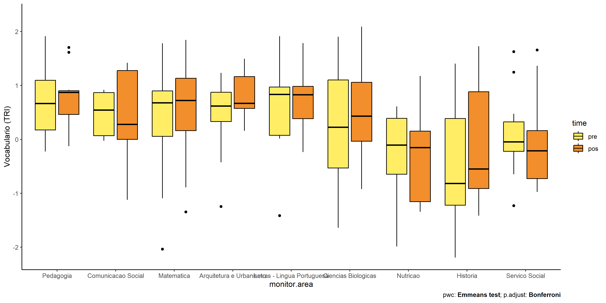<!-- -->

### Vocabulario Ensinado (Acertos)

| var                      | monitor.area               |   n | M (pre) | SE (pre) | M (unadj) | SE (unadj) | M (adj) | SE (adj) |
|:-------------------------|:---------------------------|----:|--------:|---------:|----------:|-----------:|--------:|---------:|
| score.vocab.ensinado.pos | Arquitetura e Urbanismo    |  11 |   4.818 |    0.772 |     5.818 |      0.423 |   5.631 |    0.685 |
| score.vocab.ensinado.pos | Ciencias Biologicas        |  16 |   4.312 |    0.637 |     4.875 |      0.547 |   4.864 |    0.566 |
| score.vocab.ensinado.pos | Comunicacao Social         |   7 |   4.143 |    1.164 |     4.857 |      0.670 |   4.905 |    0.856 |
| score.vocab.ensinado.pos | Historia                   |  13 |   3.462 |    0.550 |     3.462 |      0.781 |   3.748 |    0.633 |
| score.vocab.ensinado.pos | Letras - Lingua Portuguesa |  12 |   5.000 |    0.508 |     3.750 |      0.845 |   3.499 |    0.657 |
| score.vocab.ensinado.pos | Matematica                 |  24 |   4.583 |    0.282 |     4.792 |      0.450 |   4.686 |    0.463 |
| score.vocab.ensinado.pos | Nutricao                   |  13 |   3.154 |    0.373 |     2.923 |      0.720 |   3.317 |    0.638 |
| score.vocab.ensinado.pos | Pedagogia                  |  12 |   3.833 |    0.815 |     4.667 |      0.689 |   4.823 |    0.655 |
| score.vocab.ensinado.pos | Servico Social             |  13 |   5.000 |    0.641 |     3.692 |      0.702 |   3.441 |    0.632 |

| .y.                      | group1                  | group2              | estimate | conf.low | conf.high |    se | statistic |     p | p.adj | p.adj.signif |
|:-------------------------|:------------------------|:--------------------|---------:|---------:|----------:|------:|----------:|------:|------:|:-------------|
| score.vocab.ensinado.pos | Arquitetura e Urbanismo | Ciencias Biologicas |    0.767 |   -0.993 |     2.526 | 0.888 |     0.863 | 0.390 | 1.000 | ns           |
| score.vocab.ensinado.pos | Arquitetura e Urbanismo | Comunicacao Social  |    0.725 |   -1.448 |     2.898 | 1.097 |     0.661 | 0.510 | 1.000 | ns           |
| score.vocab.ensinado.pos | Arquitetura e Urbanismo | Historia            |    1.883 |    0.026 |     3.740 | 0.937 |     2.009 | 0.047 | 1.000 | ns           |
| score.vocab.ensinado.pos | Arquitetura e Urbanismo | Letras              |    2.132 |    0.259 |     4.004 | 0.945 |     2.256 | 0.026 | 0.938 | ns           |
| score.vocab.ensinado.pos | Arquitetura e Urbanismo | Matematica          |    0.944 |   -0.689 |     2.578 | 0.825 |     1.145 | 0.254 | 1.000 | ns           |
| score.vocab.ensinado.pos | Arquitetura e Urbanismo | Nutricao            |    2.314 |    0.447 |     4.181 | 0.942 |     2.456 | 0.016 | 0.561 | ns           |
| score.vocab.ensinado.pos | Arquitetura e Urbanismo | Pedagogia           |    0.808 |   -1.075 |     2.690 | 0.950 |     0.850 | 0.397 | 1.000 | ns           |
| score.vocab.ensinado.pos | Arquitetura e Urbanismo | Servico Social      |    2.189 |    0.351 |     4.027 | 0.928 |     2.360 | 0.020 | 0.720 | ns           |
| score.vocab.ensinado.pos | Ciencias Biologicas     | Comunicacao Social  |   -0.041 |   -2.074 |     1.992 | 1.026 |    -0.040 | 0.968 | 1.000 | ns           |
| score.vocab.ensinado.pos | Ciencias Biologicas     | Historia            |    1.116 |   -0.567 |     2.800 | 0.849 |     1.314 | 0.192 | 1.000 | ns           |
| score.vocab.ensinado.pos | Ciencias Biologicas     | Letras              |    1.365 |   -0.353 |     3.083 | 0.867 |     1.574 | 0.118 | 1.000 | ns           |
| score.vocab.ensinado.pos | Ciencias Biologicas     | Matematica          |    0.178 |   -1.271 |     1.627 | 0.731 |     0.243 | 0.808 | 1.000 | ns           |
| score.vocab.ensinado.pos | Ciencias Biologicas     | Nutricao            |    1.547 |   -0.143 |     3.238 | 0.853 |     1.814 | 0.072 | 1.000 | ns           |
| score.vocab.ensinado.pos | Ciencias Biologicas     | Pedagogia           |    0.041 |   -1.675 |     1.757 | 0.866 |     0.047 | 0.962 | 1.000 | ns           |
| score.vocab.ensinado.pos | Ciencias Biologicas     | Servico Social      |    1.423 |   -0.258 |     3.103 | 0.848 |     1.678 | 0.096 | 1.000 | ns           |
| score.vocab.ensinado.pos | Comunicacao Social      | Historia            |    1.158 |   -0.950 |     3.265 | 1.063 |     1.089 | 0.279 | 1.000 | ns           |
| score.vocab.ensinado.pos | Comunicacao Social      | Letras              |    1.407 |   -0.734 |     3.547 | 1.080 |     1.302 | 0.195 | 1.000 | ns           |
| score.vocab.ensinado.pos | Comunicacao Social      | Matematica          |    0.219 |   -1.710 |     2.148 | 0.973 |     0.225 | 0.822 | 1.000 | ns           |
| score.vocab.ensinado.pos | Comunicacao Social      | Nutricao            |    1.589 |   -0.523 |     3.701 | 1.066 |     1.491 | 0.139 | 1.000 | ns           |
| score.vocab.ensinado.pos | Comunicacao Social      | Pedagogia           |    0.082 |   -2.052 |     2.217 | 1.077 |     0.076 | 0.939 | 1.000 | ns           |
| score.vocab.ensinado.pos | Comunicacao Social      | Servico Social      |    1.464 |   -0.646 |     3.574 | 1.065 |     1.375 | 0.172 | 1.000 | ns           |
| score.vocab.ensinado.pos | Historia                | Letras              |    0.249 |   -1.572 |     2.070 | 0.919 |     0.271 | 0.787 | 1.000 | ns           |
| score.vocab.ensinado.pos | Historia                | Matematica          |   -0.938 |   -2.499 |     0.622 | 0.787 |    -1.192 | 0.236 | 1.000 | ns           |
| score.vocab.ensinado.pos | Historia                | Nutricao            |    0.431 |   -1.329 |     2.191 | 0.888 |     0.485 | 0.629 | 1.000 | ns           |
| score.vocab.ensinado.pos | Historia                | Pedagogia           |   -1.075 |   -2.872 |     0.722 | 0.907 |    -1.186 | 0.238 | 1.000 | ns           |
| score.vocab.ensinado.pos | Historia                | Servico Social      |    0.307 |   -1.479 |     2.092 | 0.901 |     0.340 | 0.734 | 1.000 | ns           |
| score.vocab.ensinado.pos | Letras                  | Lingua Portuguesa   |   -1.187 |   -2.775 |     0.401 | 0.801 |    -1.481 | 0.141 | 1.000 | ns           |
| score.vocab.ensinado.pos | Letras                  | Lingua Portuguesa   |    0.182 |   -1.650 |     2.014 | 0.925 |     0.197 | 0.844 | 1.000 | ns           |
| score.vocab.ensinado.pos | Letras                  | Lingua Portuguesa   |   -1.324 |   -3.170 |     0.522 | 0.931 |    -1.422 | 0.158 | 1.000 | ns           |
| score.vocab.ensinado.pos | Letras                  | Lingua Portuguesa   |    0.058 |   -1.738 |     1.853 | 0.906 |     0.064 | 0.949 | 1.000 | ns           |
| score.vocab.ensinado.pos | Matematica              | Nutricao            |    1.369 |   -0.201 |     2.940 | 0.792 |     1.728 | 0.087 | 1.000 | ns           |
| score.vocab.ensinado.pos | Matematica              | Pedagogia           |   -0.137 |   -1.730 |     1.456 | 0.804 |    -0.170 | 0.865 | 1.000 | ns           |
| score.vocab.ensinado.pos | Matematica              | Servico Social      |    1.245 |   -0.302 |     2.792 | 0.781 |     1.595 | 0.114 | 1.000 | ns           |
| score.vocab.ensinado.pos | Nutricao                | Pedagogia           |   -1.506 |   -3.307 |     0.294 | 0.909 |    -1.658 | 0.100 | 1.000 | ns           |
| score.vocab.ensinado.pos | Nutricao                | Servico Social      |   -0.124 |   -1.921 |     1.672 | 0.907 |    -0.137 | 0.891 | 1.000 | ns           |
| score.vocab.ensinado.pos | Pedagogia               | Servico Social      |    1.382 |   -0.429 |     3.192 | 0.914 |     1.512 | 0.133 | 1.000 | ns           |
| score.vocab.ensinado.pre | Arquitetura e Urbanismo | Ciencias Biologicas |    0.506 |   -1.164 |     2.175 | 0.843 |     0.600 | 0.550 | 1.000 | ns           |
| score.vocab.ensinado.pre | Arquitetura e Urbanismo | Comunicacao Social  |    0.675 |   -1.386 |     2.736 | 1.040 |     0.649 | 0.518 | 1.000 | ns           |
| score.vocab.ensinado.pre | Arquitetura e Urbanismo | Historia            |    1.357 |   -0.390 |     3.103 | 0.881 |     1.539 | 0.127 | 1.000 | ns           |
| score.vocab.ensinado.pre | Arquitetura e Urbanismo | Letras              |   -0.182 |   -1.961 |     1.597 | 0.898 |    -0.202 | 0.840 | 1.000 | ns           |
| score.vocab.ensinado.pre | Arquitetura e Urbanismo | Matematica          |    0.235 |   -1.317 |     1.787 | 0.783 |     0.300 | 0.765 | 1.000 | ns           |
| score.vocab.ensinado.pre | Arquitetura e Urbanismo | Nutricao            |    1.664 |   -0.082 |     3.411 | 0.881 |     1.888 | 0.062 | 1.000 | ns           |
| score.vocab.ensinado.pre | Arquitetura e Urbanismo | Pedagogia           |    0.985 |   -0.794 |     2.764 | 0.898 |     1.097 | 0.275 | 1.000 | ns           |
| score.vocab.ensinado.pre | Arquitetura e Urbanismo | Servico Social      |   -0.182 |   -1.928 |     1.564 | 0.881 |    -0.206 | 0.837 | 1.000 | ns           |
| score.vocab.ensinado.pre | Ciencias Biologicas     | Comunicacao Social  |    0.170 |   -1.762 |     2.101 | 0.975 |     0.174 | 0.862 | 1.000 | ns           |
| score.vocab.ensinado.pre | Ciencias Biologicas     | Historia            |    0.851 |   -0.741 |     2.443 | 0.803 |     1.059 | 0.292 | 1.000 | ns           |
| score.vocab.ensinado.pre | Ciencias Biologicas     | Letras              |   -0.687 |   -2.315 |     0.940 | 0.822 |    -0.837 | 0.404 | 1.000 | ns           |
| score.vocab.ensinado.pre | Ciencias Biologicas     | Matematica          |   -0.271 |   -1.647 |     1.105 | 0.694 |    -0.390 | 0.697 | 1.000 | ns           |
| score.vocab.ensinado.pre | Ciencias Biologicas     | Nutricao            |    1.159 |   -0.433 |     2.750 | 0.803 |     1.442 | 0.152 | 1.000 | ns           |
| score.vocab.ensinado.pre | Ciencias Biologicas     | Pedagogia           |    0.479 |   -1.149 |     2.107 | 0.822 |     0.583 | 0.561 | 1.000 | ns           |
| score.vocab.ensinado.pre | Ciencias Biologicas     | Servico Social      |   -0.688 |   -2.279 |     0.904 | 0.803 |    -0.856 | 0.394 | 1.000 | ns           |
| score.vocab.ensinado.pre | Comunicacao Social      | Historia            |    0.681 |   -1.317 |     2.680 | 1.009 |     0.676 | 0.501 | 1.000 | ns           |
| score.vocab.ensinado.pre | Comunicacao Social      | Letras              |   -0.857 |   -2.884 |     1.170 | 1.023 |    -0.838 | 0.404 | 1.000 | ns           |
| score.vocab.ensinado.pre | Comunicacao Social      | Matematica          |   -0.440 |   -2.272 |     1.391 | 0.924 |    -0.477 | 0.635 | 1.000 | ns           |
| score.vocab.ensinado.pre | Comunicacao Social      | Nutricao            |    0.989 |   -1.009 |     2.987 | 1.009 |     0.981 | 0.329 | 1.000 | ns           |
| score.vocab.ensinado.pre | Comunicacao Social      | Pedagogia           |    0.310 |   -1.718 |     2.337 | 1.023 |     0.303 | 0.763 | 1.000 | ns           |
| score.vocab.ensinado.pre | Comunicacao Social      | Servico Social      |   -0.857 |   -2.855 |     1.141 | 1.009 |    -0.850 | 0.397 | 1.000 | ns           |
| score.vocab.ensinado.pre | Historia                | Letras              |   -1.538 |   -3.245 |     0.168 | 0.861 |    -1.786 | 0.077 | 1.000 | ns           |
| score.vocab.ensinado.pre | Historia                | Matematica          |   -1.122 |   -2.590 |     0.346 | 0.741 |    -1.514 | 0.133 | 1.000 | ns           |
| score.vocab.ensinado.pre | Historia                | Nutricao            |    0.308 |   -1.364 |     1.980 | 0.844 |     0.365 | 0.716 | 1.000 | ns           |
| score.vocab.ensinado.pre | Historia                | Pedagogia           |   -0.372 |   -2.078 |     1.335 | 0.861 |    -0.432 | 0.667 | 1.000 | ns           |
| score.vocab.ensinado.pre | Historia                | Servico Social      |   -1.538 |   -3.210 |     0.133 | 0.844 |    -1.823 | 0.071 | 1.000 | ns           |
| score.vocab.ensinado.pre | Letras                  | Lingua Portuguesa   |    0.417 |   -1.090 |     1.924 | 0.761 |     0.548 | 0.585 | 1.000 | ns           |
| score.vocab.ensinado.pre | Letras                  | Lingua Portuguesa   |    1.846 |    0.140 |     3.553 | 0.861 |     2.144 | 0.034 | 1.000 | ns           |
| score.vocab.ensinado.pre | Letras                  | Lingua Portuguesa   |    1.167 |   -0.574 |     2.907 | 0.878 |     1.328 | 0.187 | 1.000 | ns           |
| score.vocab.ensinado.pre | Letras                  | Lingua Portuguesa   |    0.000 |   -1.706 |     1.706 | 0.861 |     0.000 | 1.000 | 1.000 | ns           |
| score.vocab.ensinado.pre | Matematica              | Nutricao            |    1.429 |   -0.038 |     2.897 | 0.741 |     1.930 | 0.056 | 1.000 | ns           |
| score.vocab.ensinado.pre | Matematica              | Pedagogia           |    0.750 |   -0.757 |     2.257 | 0.761 |     0.986 | 0.326 | 1.000 | ns           |
| score.vocab.ensinado.pre | Matematica              | Servico Social      |   -0.417 |   -1.885 |     1.051 | 0.741 |    -0.562 | 0.575 | 1.000 | ns           |
| score.vocab.ensinado.pre | Nutricao                | Pedagogia           |   -0.679 |   -2.386 |     1.027 | 0.861 |    -0.789 | 0.432 | 1.000 | ns           |
| score.vocab.ensinado.pre | Nutricao                | Servico Social      |   -1.846 |   -3.518 |    -0.174 | 0.844 |    -2.188 | 0.031 | 1.000 | ns           |
| score.vocab.ensinado.pre | Pedagogia               | Servico Social      |   -1.167 |   -2.873 |     0.540 | 0.861 |    -1.355 | 0.178 | 1.000 | ns           |

| monitor.area               | group1 | group2 | estimate | conf.low | conf.high |    se | statistic |     p | p.adj | p.adj.signif |
|:---------------------------|:-------|:-------|---------:|---------:|----------:|------:|----------:|------:|------:|:-------------|
| Arquitetura e Urbanismo    | pre    | pos    |   -1.000 |   -2.904 |     0.904 | 0.966 |    -1.035 | 0.302 | 0.302 | ns           |
| Ciencias Biologicas        | pre    | pos    |   -0.563 |   -2.141 |     1.016 | 0.801 |    -0.702 | 0.483 | 0.483 | ns           |
| Comunicacao Social         | pre    | pos    |   -0.714 |   -3.101 |     1.673 | 1.211 |    -0.590 | 0.556 | 0.556 | ns           |
| Historia                   | pre    | pos    |    0.000 |   -1.752 |     1.752 | 0.889 |     0.000 | 1.000 | 1.000 | ns           |
| Letras - Lingua Portuguesa | pre    | pos    |    1.250 |   -0.573 |     3.073 | 0.925 |     1.351 | 0.178 | 0.178 | ns           |
| Matematica                 | pre    | pos    |   -0.208 |   -1.498 |     1.081 | 0.654 |    -0.318 | 0.750 | 0.750 | ns           |
| Nutricao                   | pre    | pos    |    0.231 |   -1.521 |     1.982 | 0.889 |     0.260 | 0.795 | 0.795 | ns           |
| Pedagogia                  | pre    | pos    |   -0.833 |   -2.656 |     0.990 | 0.925 |    -0.901 | 0.369 | 0.369 | ns           |
| Servico Social             | pre    | pos    |    1.308 |   -0.444 |     3.059 | 0.889 |     1.471 | 0.143 | 0.143 | ns           |

    ## Scale for colour is already present.
    ## Adding another scale for colour, which will replace the existing scale.

<!-- -->

<!-- -->

<!-- -->

<!-- -->

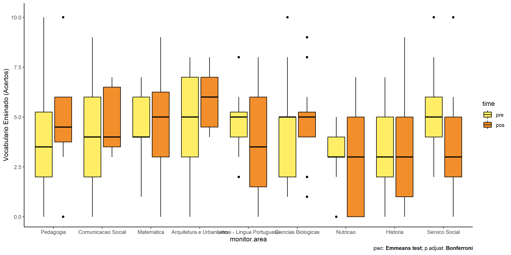<!-- -->

### Vocabulario Ensinado (TRI)

| var                    | monitor.area               |   n | M (pre) | SE (pre) | M (unadj) | SE (unadj) | M (adj) | SE (adj) |
|:-----------------------|:---------------------------|----:|--------:|---------:|----------:|-----------:|--------:|---------:|
| tri.vocab.ensinado.pos | Arquitetura e Urbanismo    |  11 |   0.425 |    0.222 |     0.717 |      0.144 |   0.574 |    0.191 |
| tri.vocab.ensinado.pos | Ciencias Biologicas        |  16 |   0.065 |    0.234 |     0.184 |      0.206 |   0.224 |    0.157 |
| tri.vocab.ensinado.pos | Comunicacao Social         |   6 |   0.129 |    0.263 |     0.077 |      0.361 |   0.084 |    0.257 |
| tri.vocab.ensinado.pos | Historia                   |  12 |  -0.142 |    0.218 |    -0.196 |      0.272 |  -0.051 |    0.183 |
| tri.vocab.ensinado.pos | Letras - Lingua Portuguesa |   9 |   0.407 |    0.183 |     0.485 |      0.212 |   0.351 |    0.211 |
| tri.vocab.ensinado.pos | Matematica                 |  23 |   0.416 |    0.101 |     0.504 |      0.126 |   0.364 |    0.133 |
| tri.vocab.ensinado.pos | Nutricao                   |   9 |  -0.688 |    0.179 |    -0.117 |      0.240 |   0.308 |    0.222 |
| tri.vocab.ensinado.pos | Pedagogia                  |  10 |   0.134 |    0.256 |     0.670 |      0.157 |   0.675 |    0.199 |
| tri.vocab.ensinado.pos | Servico Social             |  12 |   0.194 |    0.247 |    -0.059 |      0.251 |  -0.085 |    0.182 |

| .y.                    | group1                  | group2              | estimate | conf.low | conf.high |    se | statistic | p       | p.adj | p.adj.signif |
|:-----------------------|:------------------------|:--------------------|---------:|---------:|----------:|------:|----------:|:--------|------:|:-------------|
| tri.vocab.ensinado.pos | Arquitetura e Urbanismo | Ciencias Biologicas |    0.350 |   -0.143 |     0.843 | 0.248 |     1.408 | 0.162   | 1.000 | ns           |
| tri.vocab.ensinado.pos | Arquitetura e Urbanismo | Comunicacao Social  |    0.489 |   -0.146 |     1.125 | 0.320 |     1.528 | 0.13    | 1.000 | ns           |
| tri.vocab.ensinado.pos | Arquitetura e Urbanismo | Historia            |    0.624 |    0.094 |     1.155 | 0.267 |     2.335 | 0.022   | 0.777 | ns           |
| tri.vocab.ensinado.pos | Arquitetura e Urbanismo | Letras              |    0.223 |   -0.339 |     0.784 | 0.283 |     0.787 | 0.433   | 1.000 | ns           |
| tri.vocab.ensinado.pos | Arquitetura e Urbanismo | Matematica          |    0.209 |   -0.249 |     0.667 | 0.231 |     0.907 | 0.367   | 1.000 | ns           |
| tri.vocab.ensinado.pos | Arquitetura e Urbanismo | Nutricao            |    0.266 |   -0.328 |     0.860 | 0.299 |     0.888 | 0.376   | 1.000 | ns           |
| tri.vocab.ensinado.pos | Arquitetura e Urbanismo | Pedagogia           |   -0.101 |   -0.649 |     0.446 | 0.276 |    -0.367 | 0.714   | 1.000 | ns           |
| tri.vocab.ensinado.pos | Arquitetura e Urbanismo | Servico Social      |    0.659 |    0.136 |     1.181 | 0.263 |     2.500 | 0.014   | 0.507 | ns           |
| tri.vocab.ensinado.pos | Ciencias Biologicas     | Comunicacao Social  |    0.140 |   -0.458 |     0.738 | 0.301 |     0.464 | 0.644   | 1.000 | ns           |
| tri.vocab.ensinado.pos | Ciencias Biologicas     | Historia            |    0.274 |   -0.204 |     0.753 | 0.241 |     1.139 | 0.257   | 1.000 | ns           |
| tri.vocab.ensinado.pos | Ciencias Biologicas     | Letras              |   -0.127 |   -0.651 |     0.396 | 0.264 |    -0.482 | 0.631   | 1.000 | ns           |
| tri.vocab.ensinado.pos | Ciencias Biologicas     | Matematica          |   -0.141 |   -0.552 |     0.271 | 0.207 |    -0.679 | 0.499   | 1.000 | ns           |
| tri.vocab.ensinado.pos | Ciencias Biologicas     | Nutricao            |   -0.084 |   -0.620 |     0.453 | 0.270 |    -0.310 | 0.757   | 1.000 | ns           |
| tri.vocab.ensinado.pos | Ciencias Biologicas     | Pedagogia           |   -0.451 |   -0.955 |     0.052 | 0.254 |    -1.778 | 0.078   | 1.000 | ns           |
| tri.vocab.ensinado.pos | Ciencias Biologicas     | Servico Social      |    0.309 |   -0.168 |     0.786 | 0.241 |     1.284 | 0.202   | 1.000 | ns           |
| tri.vocab.ensinado.pos | Comunicacao Social      | Historia            |    0.135 |   -0.491 |     0.761 | 0.315 |     0.427 | 0.67    | 1.000 | ns           |
| tri.vocab.ensinado.pos | Comunicacao Social      | Letras              |   -0.267 |   -0.927 |     0.393 | 0.332 |    -0.803 | 0.424   | 1.000 | ns           |
| tri.vocab.ensinado.pos | Comunicacao Social      | Matematica          |   -0.280 |   -0.855 |     0.294 | 0.290 |    -0.968 | 0.335   | 1.000 | ns           |
| tri.vocab.ensinado.pos | Comunicacao Social      | Nutricao            |   -0.224 |   -0.897 |     0.450 | 0.339 |    -0.659 | 0.512   | 1.000 | ns           |
| tri.vocab.ensinado.pos | Comunicacao Social      | Pedagogia           |   -0.591 |   -1.236 |     0.054 | 0.325 |    -1.819 | 0.072   | 1.000 | ns           |
| tri.vocab.ensinado.pos | Comunicacao Social      | Servico Social      |    0.169 |   -0.455 |     0.793 | 0.315 |     0.537 | 0.592   | 1.000 | ns           |
| tri.vocab.ensinado.pos | Historia                | Letras              |   -0.402 |   -0.960 |     0.157 | 0.282 |    -1.426 | 0.157   | 1.000 | ns           |
| tri.vocab.ensinado.pos | Historia                | Matematica          |   -0.415 |   -0.870 |     0.040 | 0.229 |    -1.809 | 0.073   | 1.000 | ns           |
| tri.vocab.ensinado.pos | Historia                | Nutricao            |   -0.358 |   -0.917 |     0.201 | 0.282 |    -1.272 | 0.206   | 1.000 | ns           |
| tri.vocab.ensinado.pos | Historia                | Pedagogia           |   -0.726 |   -1.262 |    -0.189 | 0.270 |    -2.683 | 0.009   | 0.309 | ns           |
| tri.vocab.ensinado.pos | Historia                | Servico Social      |    0.034 |   -0.479 |     0.547 | 0.259 |     0.133 | 0.894   | 1.000 | ns           |
| tri.vocab.ensinado.pos | Letras                  | Lingua Portuguesa   |   -0.013 |   -0.504 |     0.478 | 0.247 |    -0.054 | 0.957   | 1.000 | ns           |
| tri.vocab.ensinado.pos | Letras                  | Lingua Portuguesa   |    0.043 |   -0.575 |     0.662 | 0.312 |     0.139 | 0.889   | 1.000 | ns           |
| tri.vocab.ensinado.pos | Letras                  | Lingua Portuguesa   |   -0.324 |   -0.900 |     0.252 | 0.290 |    -1.117 | 0.267   | 1.000 | ns           |
| tri.vocab.ensinado.pos | Letras                  | Lingua Portuguesa   |    0.436 |   -0.116 |     0.988 | 0.278 |     1.568 | 0.12    | 1.000 | ns           |
| tri.vocab.ensinado.pos | Matematica              | Nutricao            |    0.057 |   -0.471 |     0.584 | 0.266 |     0.214 | 0.831   | 1.000 | ns           |
| tri.vocab.ensinado.pos | Matematica              | Pedagogia           |   -0.311 |   -0.786 |     0.165 | 0.240 |    -1.296 | 0.198   | 1.000 | ns           |
| tri.vocab.ensinado.pos | Matematica              | Servico Social      |    0.449 |    0.003 |     0.896 | 0.225 |     1.998 | 0.048   | 1.000 | ns           |
| tri.vocab.ensinado.pos | Nutricao                | Pedagogia           |   -0.367 |   -0.959 |     0.224 | 0.298 |    -1.233 | 0.221   | 1.000 | ns           |
| tri.vocab.ensinado.pos | Nutricao                | Servico Social      |    0.393 |   -0.179 |     0.964 | 0.288 |     1.363 | 0.176   | 1.000 | ns           |
| tri.vocab.ensinado.pos | Pedagogia               | Servico Social      |    0.760 |    0.225 |     1.295 | 0.269 |     2.821 | 0.006   | 0.209 | ns           |
| tri.vocab.ensinado.pre | Arquitetura e Urbanismo | Ciencias Biologicas |    0.361 |   -0.196 |     0.918 | 0.281 |     1.285 | 0.202   | 1.000 | ns           |
| tri.vocab.ensinado.pre | Arquitetura e Urbanismo | Comunicacao Social  |    0.296 |   -0.426 |     1.018 | 0.364 |     0.814 | 0.418   | 1.000 | ns           |
| tri.vocab.ensinado.pre | Arquitetura e Urbanismo | Historia            |    0.567 |   -0.027 |     1.161 | 0.299 |     1.895 | 0.061   | 1.000 | ns           |
| tri.vocab.ensinado.pre | Arquitetura e Urbanismo | Letras              |    0.019 |   -0.621 |     0.658 | 0.322 |     0.058 | 0.954   | 1.000 | ns           |
| tri.vocab.ensinado.pre | Arquitetura e Urbanismo | Matematica          |    0.009 |   -0.512 |     0.530 | 0.263 |     0.034 | 0.973   | 1.000 | ns           |
| tri.vocab.ensinado.pre | Arquitetura e Urbanismo | Nutricao            |    1.113 |    0.474 |     1.753 | 0.322 |     3.456 | \<0.001 | 0.029 | \*           |
| tri.vocab.ensinado.pre | Arquitetura e Urbanismo | Pedagogia           |    0.292 |   -0.330 |     0.913 | 0.313 |     0.931 | 0.354   | 1.000 | ns           |
| tri.vocab.ensinado.pre | Arquitetura e Urbanismo | Servico Social      |    0.232 |   -0.362 |     0.825 | 0.299 |     0.775 | 0.44    | 1.000 | ns           |
| tri.vocab.ensinado.pre | Ciencias Biologicas     | Comunicacao Social  |   -0.065 |   -0.745 |     0.616 | 0.343 |    -0.188 | 0.851   | 1.000 | ns           |
| tri.vocab.ensinado.pre | Ciencias Biologicas     | Historia            |    0.206 |   -0.337 |     0.749 | 0.274 |     0.754 | 0.453   | 1.000 | ns           |
| tri.vocab.ensinado.pre | Ciencias Biologicas     | Letras              |   -0.342 |   -0.935 |     0.251 | 0.299 |    -1.145 | 0.255   | 1.000 | ns           |
| tri.vocab.ensinado.pre | Ciencias Biologicas     | Matematica          |   -0.352 |   -0.815 |     0.111 | 0.233 |    -1.508 | 0.135   | 1.000 | ns           |
| tri.vocab.ensinado.pre | Ciencias Biologicas     | Nutricao            |    0.753 |    0.160 |     1.345 | 0.299 |     2.520 | 0.013   | 0.480 | ns           |
| tri.vocab.ensinado.pre | Ciencias Biologicas     | Pedagogia           |   -0.069 |   -0.643 |     0.504 | 0.289 |    -0.239 | 0.811   | 1.000 | ns           |
| tri.vocab.ensinado.pre | Ciencias Biologicas     | Servico Social      |   -0.129 |   -0.672 |     0.414 | 0.274 |    -0.471 | 0.639   | 1.000 | ns           |
| tri.vocab.ensinado.pre | Comunicacao Social      | Historia            |    0.271 |   -0.440 |     0.982 | 0.358 |     0.756 | 0.451   | 1.000 | ns           |
| tri.vocab.ensinado.pre | Comunicacao Social      | Letras              |   -0.277 |   -1.027 |     0.472 | 0.378 |    -0.734 | 0.464   | 1.000 | ns           |
| tri.vocab.ensinado.pre | Comunicacao Social      | Matematica          |   -0.287 |   -0.939 |     0.365 | 0.329 |    -0.874 | 0.384   | 1.000 | ns           |
| tri.vocab.ensinado.pre | Comunicacao Social      | Nutricao            |    0.817 |    0.068 |     1.567 | 0.378 |     2.163 | 0.033   | 1.000 | ns           |
| tri.vocab.ensinado.pre | Comunicacao Social      | Pedagogia           |   -0.005 |   -0.739 |     0.730 | 0.370 |    -0.013 | 0.99    | 1.000 | ns           |
| tri.vocab.ensinado.pre | Comunicacao Social      | Servico Social      |   -0.064 |   -0.776 |     0.647 | 0.358 |    -0.180 | 0.858   | 1.000 | ns           |
| tri.vocab.ensinado.pre | Historia                | Letras              |   -0.548 |   -1.176 |     0.079 | 0.316 |    -1.735 | 0.086   | 1.000 | ns           |
| tri.vocab.ensinado.pre | Historia                | Matematica          |   -0.558 |   -1.065 |    -0.052 | 0.255 |    -2.187 | 0.031   | 1.000 | ns           |
| tri.vocab.ensinado.pre | Historia                | Nutricao            |    0.546 |   -0.081 |     1.174 | 0.316 |     1.729 | 0.087   | 1.000 | ns           |
| tri.vocab.ensinado.pre | Historia                | Pedagogia           |   -0.276 |   -0.885 |     0.333 | 0.307 |    -0.898 | 0.371   | 1.000 | ns           |
| tri.vocab.ensinado.pre | Historia                | Servico Social      |   -0.335 |   -0.916 |     0.245 | 0.293 |    -1.146 | 0.255   | 1.000 | ns           |
| tri.vocab.ensinado.pre | Letras                  | Lingua Portuguesa   |   -0.010 |   -0.569 |     0.549 | 0.282 |    -0.035 | 0.972   | 1.000 | ns           |
| tri.vocab.ensinado.pre | Letras                  | Lingua Portuguesa   |    1.095 |    0.424 |     1.765 | 0.338 |     3.240 | 0.002   | 0.059 | ns           |
| tri.vocab.ensinado.pre | Letras                  | Lingua Portuguesa   |    0.273 |   -0.381 |     0.926 | 0.329 |     0.828 | 0.41    | 1.000 | ns           |
| tri.vocab.ensinado.pre | Letras                  | Lingua Portuguesa   |    0.213 |   -0.414 |     0.840 | 0.316 |     0.674 | 0.502   | 1.000 | ns           |
| tri.vocab.ensinado.pre | Matematica              | Nutricao            |    1.105 |    0.545 |     1.664 | 0.282 |     3.919 | \<0.001 | 0.006 | \*\*         |
| tri.vocab.ensinado.pre | Matematica              | Pedagogia           |    0.283 |   -0.256 |     0.821 | 0.272 |     1.041 | 0.3     | 1.000 | ns           |
| tri.vocab.ensinado.pre | Matematica              | Servico Social      |    0.223 |   -0.284 |     0.729 | 0.255 |     0.873 | 0.385   | 1.000 | ns           |
| tri.vocab.ensinado.pre | Nutricao                | Pedagogia           |   -0.822 |   -1.475 |    -0.168 | 0.329 |    -2.496 | 0.014   | 0.512 | ns           |
| tri.vocab.ensinado.pre | Nutricao                | Servico Social      |   -0.882 |   -1.509 |    -0.255 | 0.316 |    -2.790 | 0.006   | 0.228 | ns           |
| tri.vocab.ensinado.pre | Pedagogia               | Servico Social      |   -0.060 |   -0.669 |     0.549 | 0.307 |    -0.195 | 0.846   | 1.000 | ns           |

| monitor.area               | group1 | group2 | estimate | conf.low | conf.high |    se | statistic |     p | p.adj | p.adj.signif |
|:---------------------------|:-------|:-------|---------:|---------:|----------:|------:|----------:|------:|------:|:-------------|
| Arquitetura e Urbanismo    | pre    | pos    |   -0.292 |   -0.903 |     0.319 | 0.310 |    -0.942 | 0.347 | 0.347 | ns           |
| Ciencias Biologicas        | pre    | pos    |   -0.119 |   -0.625 |     0.388 | 0.257 |    -0.463 | 0.644 | 0.644 | ns           |
| Comunicacao Social         | pre    | pos    |   -0.083 |   -0.880 |     0.714 | 0.404 |    -0.205 | 0.838 | 0.838 | ns           |
| Historia                   | pre    | pos    |    0.054 |   -0.530 |     0.639 | 0.297 |     0.183 | 0.855 | 0.855 | ns           |
| Letras - Lingua Portuguesa | pre    | pos    |   -0.104 |   -0.736 |     0.528 | 0.320 |    -0.324 | 0.746 | 0.746 | ns           |
| Matematica                 | pre    | pos    |   -0.056 |   -0.474 |     0.362 | 0.212 |    -0.264 | 0.792 | 0.792 | ns           |
| Nutricao                   | pre    | pos    |   -0.208 |   -0.829 |     0.413 | 0.315 |    -0.660 | 0.510 | 0.510 | ns           |
| Pedagogia                  | pre    | pos    |   -0.473 |   -1.084 |     0.138 | 0.310 |    -1.527 | 0.128 | 0.128 | ns           |
| Servico Social             | pre    | pos    |    0.236 |   -0.337 |     0.810 | 0.291 |     0.812 | 0.418 | 0.418 | ns           |

    ## Scale for colour is already present.
    ## Adding another scale for colour, which will replace the existing scale.

<!-- -->

<!-- -->

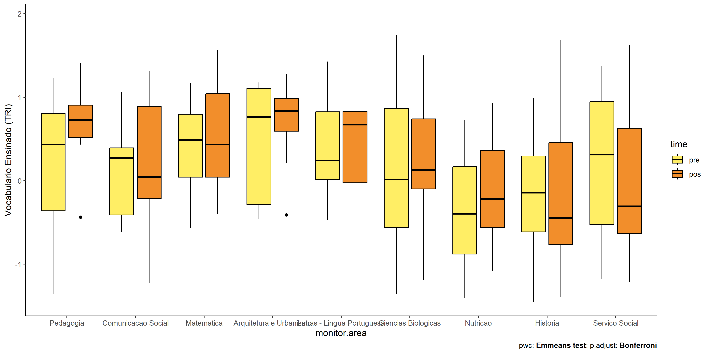<!-- -->

### Vocabulario Nao Ensinado (Acertos)

| var                          | monitor.area               |   n | M (pre) | SE (pre) | M (unadj) | SE (unadj) | M (adj) | SE (adj) |
|:-----------------------------|:---------------------------|----:|--------:|---------:|----------:|-----------:|--------:|---------:|
| score.vocab.nao.ensinado.pos | Arquitetura e Urbanismo    |  11 |  19.636 |    1.835 |    22.000 |      1.214 |  21.273 |    2.247 |
| score.vocab.nao.ensinado.pos | Ciencias Biologicas        |  16 |  17.875 |    1.782 |    20.125 |      1.921 |  20.226 |    1.859 |
| score.vocab.nao.ensinado.pos | Comunicacao Social         |   7 |  18.000 |    3.457 |    19.286 |      2.533 |  19.328 |    2.810 |
| score.vocab.nao.ensinado.pos | Historia                   |  13 |  13.308 |    2.246 |    14.769 |      2.535 |  17.018 |    2.118 |
| score.vocab.nao.ensinado.pos | Letras - Lingua Portuguesa |  12 |  20.333 |    1.982 |    16.250 |      3.136 |  15.196 |    2.158 |
| score.vocab.nao.ensinado.pos | Matematica                 |  24 |  20.375 |    1.389 |    20.208 |      1.511 |  19.135 |    1.535 |
| score.vocab.nao.ensinado.pos | Nutricao                   |  13 |  15.692 |    1.064 |    10.462 |      2.505 |  11.589 |    2.076 |
| score.vocab.nao.ensinado.pos | Pedagogia                  |  12 |  20.000 |    2.303 |    20.417 |      2.410 |  19.519 |    2.155 |
| score.vocab.nao.ensinado.pos | Servico Social             |  13 |  16.231 |    1.847 |    14.615 |      2.129 |  15.490 |    2.070 |

| .y.                          | group1                  | group2              | estimate | conf.low | conf.high |    se | statistic |     p | p.adj | p.adj.signif |
|:-----------------------------|:------------------------|:--------------------|---------:|---------:|----------:|------:|----------:|------:|------:|:-------------|
| score.vocab.nao.ensinado.pos | Arquitetura e Urbanismo | Ciencias Biologicas |    1.047 |   -4.734 |     6.828 | 2.917 |     0.359 | 0.720 | 1.000 | ns           |
| score.vocab.nao.ensinado.pos | Arquitetura e Urbanismo | Comunicacao Social  |    1.945 |   -5.185 |     9.075 | 3.598 |     0.541 | 0.590 | 1.000 | ns           |
| score.vocab.nao.ensinado.pos | Arquitetura e Urbanismo | Historia            |    4.256 |   -1.911 |    10.422 | 3.112 |     1.368 | 0.174 | 1.000 | ns           |
| score.vocab.nao.ensinado.pos | Arquitetura e Urbanismo | Letras              |    6.078 |   -0.073 |    12.228 | 3.104 |     1.958 | 0.053 | 1.000 | ns           |
| score.vocab.nao.ensinado.pos | Arquitetura e Urbanismo | Matematica          |    2.139 |   -3.227 |     7.505 | 2.708 |     0.790 | 0.431 | 1.000 | ns           |
| score.vocab.nao.ensinado.pos | Arquitetura e Urbanismo | Nutricao            |    9.684 |    3.598 |    15.771 | 3.071 |     3.153 | 0.002 | 0.075 | ns           |
| score.vocab.nao.ensinado.pos | Arquitetura e Urbanismo | Pedagogia           |    1.754 |   -4.395 |     7.904 | 3.103 |     0.565 | 0.573 | 1.000 | ns           |
| score.vocab.nao.ensinado.pos | Arquitetura e Urbanismo | Servico Social      |    5.784 |   -0.290 |    11.857 | 3.065 |     1.887 | 0.062 | 1.000 | ns           |
| score.vocab.nao.ensinado.pos | Ciencias Biologicas     | Comunicacao Social  |    0.898 |   -5.778 |     7.574 | 3.369 |     0.267 | 0.790 | 1.000 | ns           |
| score.vocab.nao.ensinado.pos | Ciencias Biologicas     | Historia            |    3.209 |   -2.367 |     8.785 | 2.814 |     1.140 | 0.257 | 1.000 | ns           |
| score.vocab.nao.ensinado.pos | Ciencias Biologicas     | Letras              |    5.031 |   -0.616 |    10.678 | 2.850 |     1.765 | 0.080 | 1.000 | ns           |
| score.vocab.nao.ensinado.pos | Ciencias Biologicas     | Matematica          |    1.092 |   -3.689 |     5.873 | 2.413 |     0.453 | 0.652 | 1.000 | ns           |
| score.vocab.nao.ensinado.pos | Ciencias Biologicas     | Nutricao            |    8.637 |    3.120 |    14.155 | 2.785 |     3.102 | 0.002 | 0.088 | ns           |
| score.vocab.nao.ensinado.pos | Ciencias Biologicas     | Pedagogia           |    0.707 |   -4.934 |     6.349 | 2.847 |     0.248 | 0.804 | 1.000 | ns           |
| score.vocab.nao.ensinado.pos | Ciencias Biologicas     | Servico Social      |    4.737 |   -0.774 |    10.247 | 2.781 |     1.703 | 0.091 | 1.000 | ns           |
| score.vocab.nao.ensinado.pos | Comunicacao Social      | Historia            |    2.311 |   -4.659 |     9.280 | 3.517 |     0.657 | 0.513 | 1.000 | ns           |
| score.vocab.nao.ensinado.pos | Comunicacao Social      | Letras              |    4.133 |   -2.889 |    11.154 | 3.543 |     1.166 | 0.246 | 1.000 | ns           |
| score.vocab.nao.ensinado.pos | Comunicacao Social      | Matematica          |    0.194 |   -6.152 |     6.540 | 3.202 |     0.061 | 0.952 | 1.000 | ns           |
| score.vocab.nao.ensinado.pos | Comunicacao Social      | Nutricao            |    7.739 |    0.818 |    14.661 | 3.493 |     2.216 | 0.029 | 1.000 | ns           |
| score.vocab.nao.ensinado.pos | Comunicacao Social      | Pedagogia           |   -0.191 |   -7.208 |     6.827 | 3.541 |    -0.054 | 0.957 | 1.000 | ns           |
| score.vocab.nao.ensinado.pos | Comunicacao Social      | Servico Social      |    3.839 |   -3.076 |    10.754 | 3.490 |     1.100 | 0.274 | 1.000 | ns           |
| score.vocab.nao.ensinado.pos | Historia                | Letras              |    1.822 |   -4.241 |     7.884 | 3.059 |     0.596 | 0.553 | 1.000 | ns           |
| score.vocab.nao.ensinado.pos | Historia                | Matematica          |   -2.117 |   -7.383 |     3.150 | 2.658 |    -0.796 | 0.427 | 1.000 | ns           |
| score.vocab.nao.ensinado.pos | Historia                | Nutricao            |    5.429 |   -0.369 |    11.226 | 2.926 |     1.855 | 0.066 | 1.000 | ns           |
| score.vocab.nao.ensinado.pos | Historia                | Pedagogia           |   -2.501 |   -8.549 |     3.546 | 3.052 |    -0.820 | 0.414 | 1.000 | ns           |
| score.vocab.nao.ensinado.pos | Historia                | Servico Social      |    1.528 |   -4.280 |     7.336 | 2.931 |     0.521 | 0.603 | 1.000 | ns           |
| score.vocab.nao.ensinado.pos | Letras                  | Lingua Portuguesa   |   -3.939 |   -9.147 |     1.269 | 2.628 |    -1.499 | 0.137 | 1.000 | ns           |
| score.vocab.nao.ensinado.pos | Letras                  | Lingua Portuguesa   |    3.607 |   -2.363 |     9.577 | 3.013 |     1.197 | 0.234 | 1.000 | ns           |
| score.vocab.nao.ensinado.pos | Letras                  | Lingua Portuguesa   |   -4.323 |  -10.338 |     1.691 | 3.035 |    -1.424 | 0.157 | 1.000 | ns           |
| score.vocab.nao.ensinado.pos | Letras                  | Lingua Portuguesa   |   -0.294 |   -6.248 |     5.660 | 3.005 |    -0.098 | 0.922 | 1.000 | ns           |
| score.vocab.nao.ensinado.pos | Matematica              | Nutricao            |    7.545 |    2.387 |    12.704 | 2.603 |     2.898 | 0.005 | 0.163 | ns           |
| score.vocab.nao.ensinado.pos | Matematica              | Pedagogia           |   -0.385 |   -5.593 |     4.824 | 2.629 |    -0.146 | 0.884 | 1.000 | ns           |
| score.vocab.nao.ensinado.pos | Matematica              | Servico Social      |    3.645 |   -1.496 |     8.785 | 2.594 |     1.405 | 0.163 | 1.000 | ns           |
| score.vocab.nao.ensinado.pos | Nutricao                | Pedagogia           |   -7.930 |  -13.890 |    -1.970 | 3.008 |    -2.637 | 0.010 | 0.345 | ns           |
| score.vocab.nao.ensinado.pos | Nutricao                | Servico Social      |   -3.901 |   -9.680 |     1.878 | 2.916 |    -1.338 | 0.184 | 1.000 | ns           |
| score.vocab.nao.ensinado.pos | Pedagogia               | Servico Social      |    4.029 |   -1.916 |     9.975 | 3.000 |     1.343 | 0.182 | 1.000 | ns           |
| score.vocab.nao.ensinado.pre | Arquitetura e Urbanismo | Ciencias Biologicas |    1.761 |   -3.634 |     7.157 | 2.723 |     0.647 | 0.519 | 1.000 | ns           |
| score.vocab.nao.ensinado.pre | Arquitetura e Urbanismo | Comunicacao Social  |    1.636 |   -5.024 |     8.297 | 3.362 |     0.487 | 0.627 | 1.000 | ns           |
| score.vocab.nao.ensinado.pre | Arquitetura e Urbanismo | Historia            |    6.329 |    0.685 |    11.972 | 2.848 |     2.222 | 0.028 | 1.000 | ns           |
| score.vocab.nao.ensinado.pre | Arquitetura e Urbanismo | Letras              |   -0.697 |   -6.448 |     5.054 | 2.902 |    -0.240 | 0.811 | 1.000 | ns           |
| score.vocab.nao.ensinado.pre | Arquitetura e Urbanismo | Matematica          |   -0.739 |   -5.755 |     4.277 | 2.532 |    -0.292 | 0.771 | 1.000 | ns           |
| score.vocab.nao.ensinado.pre | Arquitetura e Urbanismo | Nutricao            |    3.944 |   -1.700 |     9.588 | 2.848 |     1.385 | 0.169 | 1.000 | ns           |
| score.vocab.nao.ensinado.pre | Arquitetura e Urbanismo | Pedagogia           |   -0.364 |   -6.114 |     5.387 | 2.902 |    -0.125 | 0.901 | 1.000 | ns           |
| score.vocab.nao.ensinado.pre | Arquitetura e Urbanismo | Servico Social      |    3.406 |   -2.238 |     9.049 | 2.848 |     1.196 | 0.234 | 1.000 | ns           |
| score.vocab.nao.ensinado.pre | Ciencias Biologicas     | Comunicacao Social  |   -0.125 |   -6.368 |     6.118 | 3.151 |    -0.040 | 0.968 | 1.000 | ns           |
| score.vocab.nao.ensinado.pre | Ciencias Biologicas     | Historia            |    4.567 |   -0.577 |     9.711 | 2.596 |     1.759 | 0.081 | 1.000 | ns           |
| score.vocab.nao.ensinado.pre | Ciencias Biologicas     | Letras              |   -2.458 |   -7.719 |     2.803 | 2.655 |    -0.926 | 0.357 | 1.000 | ns           |
| score.vocab.nao.ensinado.pre | Ciencias Biologicas     | Matematica          |   -2.500 |   -6.946 |     1.946 | 2.244 |    -1.114 | 0.268 | 1.000 | ns           |
| score.vocab.nao.ensinado.pre | Ciencias Biologicas     | Nutricao            |    2.183 |   -2.961 |     7.327 | 2.596 |     0.841 | 0.402 | 1.000 | ns           |
| score.vocab.nao.ensinado.pre | Ciencias Biologicas     | Pedagogia           |   -2.125 |   -7.386 |     3.136 | 2.655 |    -0.800 | 0.425 | 1.000 | ns           |
| score.vocab.nao.ensinado.pre | Ciencias Biologicas     | Servico Social      |    1.644 |   -3.500 |     6.788 | 2.596 |     0.633 | 0.528 | 1.000 | ns           |
| score.vocab.nao.ensinado.pre | Comunicacao Social      | Historia            |    4.692 |   -1.766 |    11.151 | 3.260 |     1.440 | 0.153 | 1.000 | ns           |
| score.vocab.nao.ensinado.pre | Comunicacao Social      | Letras              |   -2.333 |   -8.885 |     4.219 | 3.307 |    -0.706 | 0.482 | 1.000 | ns           |
| score.vocab.nao.ensinado.pre | Comunicacao Social      | Matematica          |   -2.375 |   -8.293 |     3.543 | 2.987 |    -0.795 | 0.428 | 1.000 | ns           |
| score.vocab.nao.ensinado.pre | Comunicacao Social      | Nutricao            |    2.308 |   -4.151 |     8.766 | 3.260 |     0.708 | 0.480 | 1.000 | ns           |
| score.vocab.nao.ensinado.pre | Comunicacao Social      | Pedagogia           |   -2.000 |   -8.552 |     4.552 | 3.307 |    -0.605 | 0.547 | 1.000 | ns           |
| score.vocab.nao.ensinado.pre | Comunicacao Social      | Servico Social      |    1.769 |   -4.689 |     8.228 | 3.260 |     0.543 | 0.588 | 1.000 | ns           |
| score.vocab.nao.ensinado.pre | Historia                | Letras              |   -7.026 |  -12.541 |    -1.511 | 2.783 |    -2.524 | 0.013 | 0.468 | ns           |
| score.vocab.nao.ensinado.pre | Historia                | Matematica          |   -7.067 |  -11.811 |    -2.323 | 2.394 |    -2.952 | 0.004 | 0.139 | ns           |
| score.vocab.nao.ensinado.pre | Historia                | Nutricao            |   -2.385 |   -7.788 |     3.019 | 2.727 |    -0.874 | 0.384 | 1.000 | ns           |
| score.vocab.nao.ensinado.pre | Historia                | Pedagogia           |   -6.692 |  -12.207 |    -1.177 | 2.783 |    -2.404 | 0.018 | 0.642 | ns           |
| score.vocab.nao.ensinado.pre | Historia                | Servico Social      |   -2.923 |   -8.327 |     2.480 | 2.727 |    -1.072 | 0.286 | 1.000 | ns           |
| score.vocab.nao.ensinado.pre | Letras                  | Lingua Portuguesa   |   -0.042 |   -4.912 |     4.829 | 2.458 |    -0.017 | 0.987 | 1.000 | ns           |
| score.vocab.nao.ensinado.pre | Letras                  | Lingua Portuguesa   |    4.641 |   -0.874 |    10.156 | 2.783 |     1.667 | 0.098 | 1.000 | ns           |
| score.vocab.nao.ensinado.pre | Letras                  | Lingua Portuguesa   |    0.333 |   -5.291 |     5.957 | 2.839 |     0.117 | 0.907 | 1.000 | ns           |
| score.vocab.nao.ensinado.pre | Letras                  | Lingua Portuguesa   |    4.103 |   -1.412 |     9.618 | 2.783 |     1.474 | 0.143 | 1.000 | ns           |
| score.vocab.nao.ensinado.pre | Matematica              | Nutricao            |    4.683 |   -0.061 |     9.427 | 2.394 |     1.956 | 0.053 | 1.000 | ns           |
| score.vocab.nao.ensinado.pre | Matematica              | Pedagogia           |    0.375 |   -4.496 |     5.246 | 2.458 |     0.153 | 0.879 | 1.000 | ns           |
| score.vocab.nao.ensinado.pre | Matematica              | Servico Social      |    4.144 |   -0.600 |     8.888 | 2.394 |     1.731 | 0.086 | 1.000 | ns           |
| score.vocab.nao.ensinado.pre | Nutricao                | Pedagogia           |   -4.308 |   -9.823 |     1.207 | 2.783 |    -1.548 | 0.125 | 1.000 | ns           |
| score.vocab.nao.ensinado.pre | Nutricao                | Servico Social      |   -0.538 |   -5.942 |     4.865 | 2.727 |    -0.197 | 0.844 | 1.000 | ns           |
| score.vocab.nao.ensinado.pre | Pedagogia               | Servico Social      |    3.769 |   -1.746 |     9.284 | 2.783 |     1.354 | 0.178 | 1.000 | ns           |

| monitor.area               | group1 | group2 | estimate | conf.low | conf.high |    se | statistic |     p | p.adj | p.adj.signif |
|:---------------------------|:-------|:-------|---------:|---------:|----------:|------:|----------:|------:|------:|:-------------|
| Arquitetura e Urbanismo    | pre    | pos    |   -2.364 |   -8.702 |     3.975 | 3.216 |    -0.735 | 0.463 | 0.463 | ns           |
| Ciencias Biologicas        | pre    | pos    |   -2.250 |   -7.505 |     3.005 | 2.667 |    -0.844 | 0.400 | 0.400 | ns           |
| Comunicacao Social         | pre    | pos    |   -1.286 |   -9.231 |     6.660 | 4.032 |    -0.319 | 0.750 | 0.750 | ns           |
| Historia                   | pre    | pos    |   -1.462 |   -7.292 |     4.369 | 2.959 |    -0.494 | 0.622 | 0.622 | ns           |
| Letras - Lingua Portuguesa | pre    | pos    |    4.083 |   -1.985 |    10.152 | 3.079 |     1.326 | 0.186 | 0.186 | ns           |
| Matematica                 | pre    | pos    |    0.167 |   -4.124 |     4.458 | 2.178 |     0.077 | 0.939 | 0.939 | ns           |
| Nutricao                   | pre    | pos    |    5.231 |   -0.600 |    11.061 | 2.959 |     1.768 | 0.078 | 0.078 | ns           |
| Pedagogia                  | pre    | pos    |   -0.417 |   -6.485 |     5.652 | 3.079 |    -0.135 | 0.892 | 0.892 | ns           |
| Servico Social             | pre    | pos    |    1.615 |   -4.215 |     7.446 | 2.959 |     0.546 | 0.586 | 0.586 | ns           |

    ## Scale for colour is already present.
    ## Adding another scale for colour, which will replace the existing scale.

<!-- -->

<!-- -->

<!-- -->

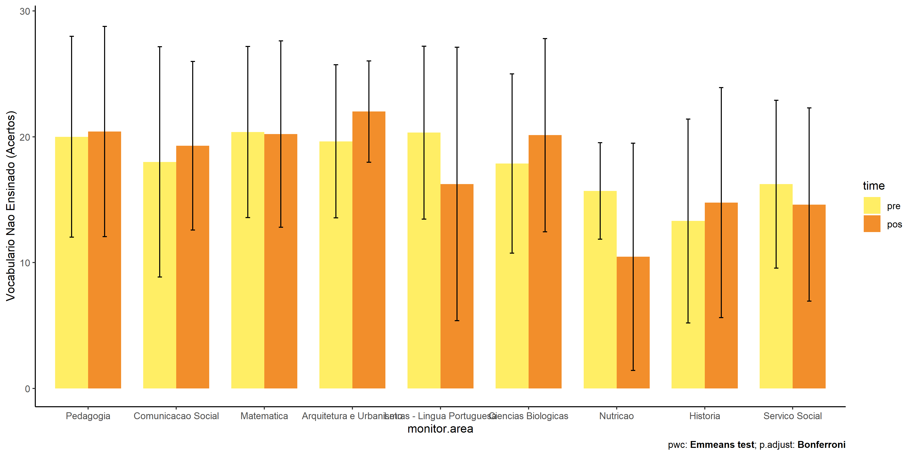<!-- -->

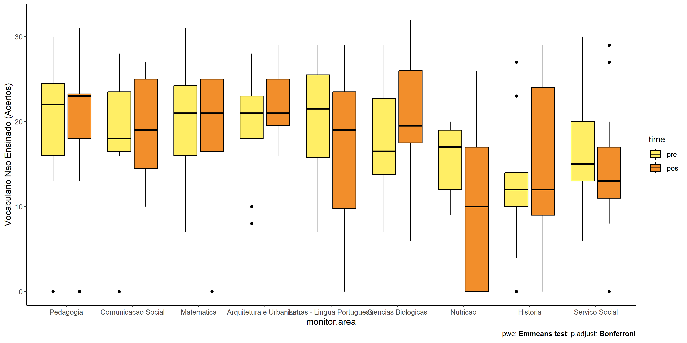<!-- -->

### Vocabulario Nao Ensinado (TRI)

| var                        | monitor.area               |   n | M (pre) | SE (pre) | M (unadj) | SE (unadj) | M (adj) | SE (adj) |
|:---------------------------|:---------------------------|----:|--------:|---------:|----------:|-----------:|--------:|---------:|
| tri.vocab.nao.ensinado.pos | Arquitetura e Urbanismo    |  11 |   0.435 |    0.214 |     0.774 |      0.163 |   0.610 |    0.200 |
| tri.vocab.nao.ensinado.pos | Ciencias Biologicas        |  16 |   0.179 |    0.246 |     0.507 |      0.265 |   0.547 |    0.165 |
| tri.vocab.nao.ensinado.pos | Comunicacao Social         |   6 |   0.423 |    0.228 |     0.298 |      0.405 |   0.144 |    0.270 |
| tri.vocab.nao.ensinado.pos | Historia                   |  12 |  -0.352 |    0.270 |    -0.065 |      0.353 |   0.397 |    0.196 |
| tri.vocab.nao.ensinado.pos | Letras - Lingua Portuguesa |   9 |   0.658 |    0.202 |     0.675 |      0.245 |   0.333 |    0.223 |
| tri.vocab.nao.ensinado.pos | Matematica                 |  23 |   0.434 |    0.195 |     0.589 |      0.193 |   0.425 |    0.139 |
| tri.vocab.nao.ensinado.pos | Nutricao                   |   9 |  -0.396 |    0.176 |    -0.317 |      0.287 |   0.180 |    0.226 |
| tri.vocab.nao.ensinado.pos | Pedagogia                  |  10 |   0.658 |    0.198 |     0.758 |      0.238 |   0.416 |    0.212 |
| tri.vocab.nao.ensinado.pos | Servico Social             |  12 |  -0.015 |    0.265 |    -0.102 |      0.282 |   0.092 |    0.192 |

| .y.                        | group1                  | group2              | estimate | conf.low | conf.high |    se | statistic |     p | p.adj | p.adj.signif |
|:---------------------------|:------------------------|:--------------------|---------:|---------:|----------:|------:|----------:|------:|------:|:-------------|
| tri.vocab.nao.ensinado.pos | Arquitetura e Urbanismo | Ciencias Biologicas |    0.063 |   -0.453 |     0.578 | 0.260 |     0.242 | 0.809 | 1.000 | ns           |
| tri.vocab.nao.ensinado.pos | Arquitetura e Urbanismo | Comunicacao Social  |    0.466 |   -0.200 |     1.132 | 0.336 |     1.388 | 0.168 | 1.000 | ns           |
| tri.vocab.nao.ensinado.pos | Arquitetura e Urbanismo | Historia            |    0.213 |   -0.349 |     0.775 | 0.283 |     0.751 | 0.454 | 1.000 | ns           |
| tri.vocab.nao.ensinado.pos | Arquitetura e Urbanismo | Letras              |    0.277 |   -0.314 |     0.867 | 0.298 |     0.929 | 0.355 | 1.000 | ns           |
| tri.vocab.nao.ensinado.pos | Arquitetura e Urbanismo | Matematica          |    0.185 |   -0.296 |     0.666 | 0.242 |     0.762 | 0.448 | 1.000 | ns           |
| tri.vocab.nao.ensinado.pos | Arquitetura e Urbanismo | Nutricao            |    0.430 |   -0.175 |     1.034 | 0.305 |     1.411 | 0.161 | 1.000 | ns           |
| tri.vocab.nao.ensinado.pos | Arquitetura e Urbanismo | Pedagogia           |    0.193 |   -0.381 |     0.768 | 0.289 |     0.668 | 0.505 | 1.000 | ns           |
| tri.vocab.nao.ensinado.pos | Arquitetura e Urbanismo | Servico Social      |    0.518 |   -0.034 |     1.070 | 0.278 |     1.861 | 0.066 | 1.000 | ns           |
| tri.vocab.nao.ensinado.pos | Ciencias Biologicas     | Comunicacao Social  |    0.403 |   -0.226 |     1.032 | 0.317 |     1.271 | 0.207 | 1.000 | ns           |
| tri.vocab.nao.ensinado.pos | Ciencias Biologicas     | Historia            |    0.150 |   -0.358 |     0.658 | 0.256 |     0.585 | 0.560 | 1.000 | ns           |
| tri.vocab.nao.ensinado.pos | Ciencias Biologicas     | Letras              |    0.214 |   -0.338 |     0.766 | 0.278 |     0.768 | 0.444 | 1.000 | ns           |
| tri.vocab.nao.ensinado.pos | Ciencias Biologicas     | Matematica          |    0.122 |   -0.307 |     0.551 | 0.216 |     0.563 | 0.575 | 1.000 | ns           |
| tri.vocab.nao.ensinado.pos | Ciencias Biologicas     | Nutricao            |    0.367 |   -0.187 |     0.921 | 0.279 |     1.313 | 0.192 | 1.000 | ns           |
| tri.vocab.nao.ensinado.pos | Ciencias Biologicas     | Pedagogia           |    0.131 |   -0.404 |     0.665 | 0.269 |     0.485 | 0.629 | 1.000 | ns           |
| tri.vocab.nao.ensinado.pos | Ciencias Biologicas     | Servico Social      |    0.455 |   -0.047 |     0.957 | 0.253 |     1.799 | 0.075 | 1.000 | ns           |
| tri.vocab.nao.ensinado.pos | Comunicacao Social      | Historia            |   -0.253 |   -0.921 |     0.414 | 0.336 |    -0.753 | 0.453 | 1.000 | ns           |
| tri.vocab.nao.ensinado.pos | Comunicacao Social      | Letras              |   -0.189 |   -0.882 |     0.503 | 0.349 |    -0.542 | 0.589 | 1.000 | ns           |
| tri.vocab.nao.ensinado.pos | Comunicacao Social      | Matematica          |   -0.281 |   -0.883 |     0.320 | 0.303 |    -0.928 | 0.356 | 1.000 | ns           |
| tri.vocab.nao.ensinado.pos | Comunicacao Social      | Nutricao            |   -0.036 |   -0.740 |     0.668 | 0.355 |    -0.102 | 0.919 | 1.000 | ns           |
| tri.vocab.nao.ensinado.pos | Comunicacao Social      | Pedagogia           |   -0.272 |   -0.951 |     0.406 | 0.342 |    -0.797 | 0.428 | 1.000 | ns           |
| tri.vocab.nao.ensinado.pos | Comunicacao Social      | Servico Social      |    0.052 |   -0.608 |     0.712 | 0.332 |     0.157 | 0.876 | 1.000 | ns           |
| tri.vocab.nao.ensinado.pos | Historia                | Letras              |    0.064 |   -0.537 |     0.664 | 0.303 |     0.211 | 0.833 | 1.000 | ns           |
| tri.vocab.nao.ensinado.pos | Historia                | Matematica          |   -0.028 |   -0.512 |     0.456 | 0.244 |    -0.115 | 0.908 | 1.000 | ns           |
| tri.vocab.nao.ensinado.pos | Historia                | Nutricao            |    0.217 |   -0.361 |     0.796 | 0.292 |     0.745 | 0.458 | 1.000 | ns           |
| tri.vocab.nao.ensinado.pos | Historia                | Pedagogia           |   -0.019 |   -0.604 |     0.565 | 0.294 |    -0.065 | 0.948 | 1.000 | ns           |
| tri.vocab.nao.ensinado.pos | Historia                | Servico Social      |    0.305 |   -0.233 |     0.844 | 0.271 |     1.125 | 0.263 | 1.000 | ns           |
| tri.vocab.nao.ensinado.pos | Letras                  | Lingua Portuguesa   |   -0.092 |   -0.609 |     0.425 | 0.261 |    -0.353 | 0.725 | 1.000 | ns           |
| tri.vocab.nao.ensinado.pos | Letras                  | Lingua Portuguesa   |    0.153 |   -0.488 |     0.794 | 0.323 |     0.475 | 0.636 | 1.000 | ns           |
| tri.vocab.nao.ensinado.pos | Letras                  | Lingua Portuguesa   |   -0.083 |   -0.686 |     0.520 | 0.304 |    -0.273 | 0.785 | 1.000 | ns           |
| tri.vocab.nao.ensinado.pos | Letras                  | Lingua Portuguesa   |    0.241 |   -0.347 |     0.830 | 0.297 |     0.814 | 0.417 | 1.000 | ns           |
| tri.vocab.nao.ensinado.pos | Matematica              | Nutricao            |    0.245 |   -0.287 |     0.778 | 0.268 |     0.914 | 0.363 | 1.000 | ns           |
| tri.vocab.nao.ensinado.pos | Matematica              | Pedagogia           |    0.009 |   -0.489 |     0.507 | 0.251 |     0.035 | 0.972 | 1.000 | ns           |
| tri.vocab.nao.ensinado.pos | Matematica              | Servico Social      |    0.333 |   -0.139 |     0.806 | 0.238 |     1.400 | 0.165 | 1.000 | ns           |
| tri.vocab.nao.ensinado.pos | Nutricao                | Pedagogia           |   -0.236 |   -0.862 |     0.389 | 0.315 |    -0.749 | 0.455 | 1.000 | ns           |
| tri.vocab.nao.ensinado.pos | Nutricao                | Servico Social      |    0.088 |   -0.494 |     0.670 | 0.293 |     0.301 | 0.764 | 1.000 | ns           |
| tri.vocab.nao.ensinado.pos | Pedagogia               | Servico Social      |    0.325 |   -0.247 |     0.896 | 0.288 |     1.126 | 0.263 | 1.000 | ns           |
| tri.vocab.nao.ensinado.pre | Arquitetura e Urbanismo | Ciencias Biologicas |    0.256 |   -0.387 |     0.899 | 0.324 |     0.789 | 0.432 | 1.000 | ns           |
| tri.vocab.nao.ensinado.pre | Arquitetura e Urbanismo | Comunicacao Social  |    0.013 |   -0.821 |     0.846 | 0.420 |     0.030 | 0.976 | 1.000 | ns           |
| tri.vocab.nao.ensinado.pre | Arquitetura e Urbanismo | Historia            |    0.787 |    0.102 |     1.473 | 0.346 |     2.278 | 0.025 | 0.895 | ns           |
| tri.vocab.nao.ensinado.pre | Arquitetura e Urbanismo | Letras              |   -0.223 |   -0.961 |     0.515 | 0.372 |    -0.599 | 0.550 | 1.000 | ns           |
| tri.vocab.nao.ensinado.pre | Arquitetura e Urbanismo | Matematica          |    0.001 |   -0.602 |     0.603 | 0.303 |     0.002 | 0.998 | 1.000 | ns           |
| tri.vocab.nao.ensinado.pre | Arquitetura e Urbanismo | Nutricao            |    0.831 |    0.092 |     1.569 | 0.372 |     2.232 | 0.028 | 1.000 | ns           |
| tri.vocab.nao.ensinado.pre | Arquitetura e Urbanismo | Pedagogia           |   -0.223 |   -0.941 |     0.494 | 0.362 |    -0.618 | 0.538 | 1.000 | ns           |
| tri.vocab.nao.ensinado.pre | Arquitetura e Urbanismo | Servico Social      |    0.450 |   -0.236 |     1.136 | 0.346 |     1.302 | 0.196 | 1.000 | ns           |
| tri.vocab.nao.ensinado.pre | Ciencias Biologicas     | Comunicacao Social  |   -0.243 |   -1.030 |     0.543 | 0.396 |    -0.614 | 0.540 | 1.000 | ns           |
| tri.vocab.nao.ensinado.pre | Ciencias Biologicas     | Historia            |    0.531 |   -0.096 |     1.159 | 0.316 |     1.681 | 0.096 | 1.000 | ns           |
| tri.vocab.nao.ensinado.pre | Ciencias Biologicas     | Letras              |   -0.479 |   -1.163 |     0.205 | 0.345 |    -1.389 | 0.168 | 1.000 | ns           |
| tri.vocab.nao.ensinado.pre | Ciencias Biologicas     | Matematica          |   -0.255 |   -0.790 |     0.279 | 0.270 |    -0.948 | 0.346 | 1.000 | ns           |
| tri.vocab.nao.ensinado.pre | Ciencias Biologicas     | Nutricao            |    0.575 |   -0.110 |     1.259 | 0.345 |     1.666 | 0.099 | 1.000 | ns           |
| tri.vocab.nao.ensinado.pre | Ciencias Biologicas     | Pedagogia           |   -0.479 |   -1.142 |     0.183 | 0.334 |    -1.437 | 0.154 | 1.000 | ns           |
| tri.vocab.nao.ensinado.pre | Ciencias Biologicas     | Servico Social      |    0.194 |   -0.433 |     0.821 | 0.316 |     0.613 | 0.541 | 1.000 | ns           |
| tri.vocab.nao.ensinado.pre | Comunicacao Social      | Historia            |    0.775 |   -0.046 |     1.596 | 0.414 |     1.872 | 0.064 | 1.000 | ns           |
| tri.vocab.nao.ensinado.pre | Comunicacao Social      | Letras              |   -0.236 |   -1.101 |     0.630 | 0.436 |    -0.540 | 0.591 | 1.000 | ns           |
| tri.vocab.nao.ensinado.pre | Comunicacao Social      | Matematica          |   -0.012 |   -0.765 |     0.741 | 0.380 |    -0.031 | 0.975 | 1.000 | ns           |
| tri.vocab.nao.ensinado.pre | Comunicacao Social      | Nutricao            |    0.818 |   -0.048 |     1.684 | 0.436 |     1.875 | 0.064 | 1.000 | ns           |
| tri.vocab.nao.ensinado.pre | Comunicacao Social      | Pedagogia           |   -0.236 |   -1.084 |     0.612 | 0.428 |    -0.552 | 0.582 | 1.000 | ns           |
| tri.vocab.nao.ensinado.pre | Comunicacao Social      | Servico Social      |    0.437 |   -0.384 |     1.259 | 0.414 |     1.057 | 0.293 | 1.000 | ns           |
| tri.vocab.nao.ensinado.pre | Historia                | Letras              |   -1.010 |   -1.735 |    -0.286 | 0.365 |    -2.768 | 0.007 | 0.243 | ns           |
| tri.vocab.nao.ensinado.pre | Historia                | Matematica          |   -0.787 |   -1.372 |    -0.202 | 0.295 |    -2.669 | 0.009 | 0.320 | ns           |
| tri.vocab.nao.ensinado.pre | Historia                | Nutricao            |    0.043 |   -0.681 |     0.768 | 0.365 |     0.119 | 0.906 | 1.000 | ns           |
| tri.vocab.nao.ensinado.pre | Historia                | Pedagogia           |   -1.011 |   -1.714 |    -0.307 | 0.354 |    -2.852 | 0.005 | 0.191 | ns           |
| tri.vocab.nao.ensinado.pre | Historia                | Servico Social      |   -0.337 |   -1.008 |     0.333 | 0.338 |    -0.999 | 0.320 | 1.000 | ns           |
| tri.vocab.nao.ensinado.pre | Letras                  | Lingua Portuguesa   |    0.224 |   -0.422 |     0.869 | 0.326 |     0.687 | 0.494 | 1.000 | ns           |
| tri.vocab.nao.ensinado.pre | Letras                  | Lingua Portuguesa   |    1.054 |    0.279 |     1.828 | 0.390 |     2.700 | 0.008 | 0.294 | ns           |
| tri.vocab.nao.ensinado.pre | Letras                  | Lingua Portuguesa   |    0.000 |   -0.755 |     0.754 | 0.380 |    -0.001 | 0.999 | 1.000 | ns           |
| tri.vocab.nao.ensinado.pre | Letras                  | Lingua Portuguesa   |    0.673 |   -0.051 |     1.397 | 0.365 |     1.843 | 0.068 | 1.000 | ns           |
| tri.vocab.nao.ensinado.pre | Matematica              | Nutricao            |    0.830 |    0.184 |     1.476 | 0.326 |     2.550 | 0.012 | 0.443 | ns           |
| tri.vocab.nao.ensinado.pre | Matematica              | Pedagogia           |   -0.224 |   -0.846 |     0.398 | 0.314 |    -0.715 | 0.477 | 1.000 | ns           |
| tri.vocab.nao.ensinado.pre | Matematica              | Servico Social      |    0.449 |   -0.136 |     1.034 | 0.295 |     1.524 | 0.131 | 1.000 | ns           |
| tri.vocab.nao.ensinado.pre | Nutricao                | Pedagogia           |   -1.054 |   -1.809 |    -0.299 | 0.380 |    -2.771 | 0.007 | 0.240 | ns           |
| tri.vocab.nao.ensinado.pre | Nutricao                | Servico Social      |   -0.381 |   -1.105 |     0.344 | 0.365 |    -1.043 | 0.300 | 1.000 | ns           |
| tri.vocab.nao.ensinado.pre | Pedagogia               | Servico Social      |    0.673 |   -0.030 |     1.377 | 0.354 |     1.900 | 0.060 | 1.000 | ns           |

| monitor.area               | group1 | group2 | estimate | conf.low | conf.high |    se | statistic |     p | p.adj | p.adj.signif |
|:---------------------------|:-------|:-------|---------:|---------:|----------:|------:|----------:|------:|------:|:-------------|
| Arquitetura e Urbanismo    | pre    | pos    |   -0.339 |   -1.077 |     0.400 | 0.375 |    -0.904 | 0.367 | 0.367 | ns           |
| Ciencias Biologicas        | pre    | pos    |   -0.328 |   -0.941 |     0.284 | 0.311 |    -1.056 | 0.292 | 0.292 | ns           |
| Comunicacao Social         | pre    | pos    |    0.016 |   -0.948 |     0.980 | 0.489 |     0.033 | 0.974 | 0.974 | ns           |
| Historia                   | pre    | pos    |   -0.287 |   -0.994 |     0.420 | 0.359 |    -0.800 | 0.425 | 0.425 | ns           |
| Letras - Lingua Portuguesa | pre    | pos    |   -0.158 |   -0.921 |     0.606 | 0.388 |    -0.406 | 0.685 | 0.685 | ns           |
| Matematica                 | pre    | pos    |   -0.092 |   -0.598 |     0.413 | 0.256 |    -0.361 | 0.719 | 0.719 | ns           |
| Nutricao                   | pre    | pos    |    0.138 |   -0.613 |     0.889 | 0.381 |     0.362 | 0.718 | 0.718 | ns           |
| Pedagogia                  | pre    | pos    |   -0.027 |   -0.766 |     0.711 | 0.375 |    -0.073 | 0.942 | 0.942 | ns           |
| Servico Social             | pre    | pos    |    0.052 |   -0.641 |     0.746 | 0.352 |     0.149 | 0.882 | 0.882 | ns           |

    ## Scale for colour is already present.
    ## Adding another scale for colour, which will replace the existing scale.

<!-- -->

<!-- -->

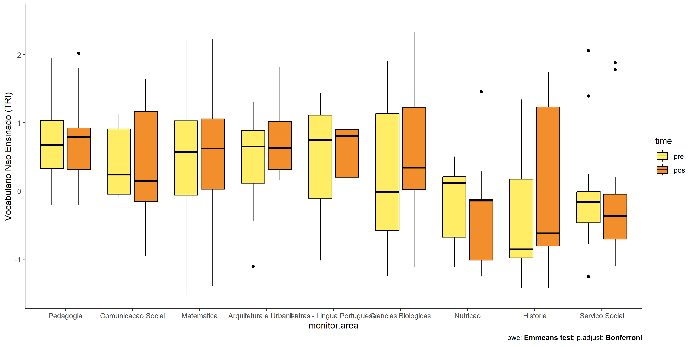<!-- -->

## factores: **grupo=“Experimental”:monitor.formacao**

### Vocabulario (Acertos)

| var             | monitor.formacao |   n | M (pre) | SE (pre) | M (unadj) | SE (unadj) | M (adj) | SE (adj) |
|:----------------|:-----------------|----:|--------:|---------:|----------:|-----------:|--------:|---------:|
| score.vocab.pos | ensino medio     |  84 |  21.964 |    0.907 |    23.524 |      0.948 |  24.162 |    0.649 |
| score.vocab.pos | especializacao   |   6 |  25.833 |    3.092 |    22.833 |      3.341 |  20.568 |    2.427 |
| score.vocab.pos | graduacao        |  18 |  25.778 |    1.434 |    27.222 |      1.614 |  24.998 |    1.412 |

| .y.             | group1         | group2         | estimate | conf.low | conf.high |    se | statistic |     p | p.adj | p.adj.signif |
|:----------------|:---------------|:---------------|---------:|---------:|----------:|------:|----------:|------:|------:|:-------------|
| score.vocab.pos | ensino medio   | especializacao |    3.594 |   -1.398 |     8.587 | 2.517 |     1.428 | 0.156 | 0.469 | ns           |
| score.vocab.pos | ensino medio   | graduacao      |   -0.836 |   -3.934 |     2.262 | 1.562 |    -0.535 | 0.594 | 1.000 | ns           |
| score.vocab.pos | especializacao | graduacao      |   -4.431 |   -9.965 |     1.104 | 2.791 |    -1.588 | 0.115 | 0.346 | ns           |
| score.vocab.pre | ensino medio   | especializacao |   -3.869 |  -10.539 |     2.801 | 3.364 |    -1.150 | 0.253 | 0.758 | ns           |
| score.vocab.pre | ensino medio   | graduacao      |   -3.813 |   -7.913 |     0.286 | 2.067 |    -1.845 | 0.068 | 0.204 | ns           |
| score.vocab.pre | especializacao | graduacao      |    0.056 |   -7.385 |     7.496 | 3.752 |     0.015 | 0.988 | 1.000 | ns           |

| monitor.formacao | group1 | group2 | estimate | conf.low | conf.high |    se | statistic |     p | p.adj | p.adj.signif |
|:-----------------|:-------|:-------|---------:|---------:|----------:|------:|----------:|------:|------:|:-------------|
| ensino medio     | pre    | pos    |   -1.567 |   -3.983 |     0.849 | 1.226 |    -1.278 | 0.202 | 0.202 | ns           |
| especializacao   | pre    | pos    |    1.690 |   -7.217 |    10.597 | 4.520 |     0.374 | 0.709 | 0.709 | ns           |
| graduacao        | pre    | pos    |   -0.716 |   -5.845 |     4.413 | 2.603 |    -0.275 | 0.784 | 0.784 | ns           |

    ## Scale for colour is already present.
    ## Adding another scale for colour, which will replace the existing scale.

<!-- -->

<!-- -->

<!-- -->

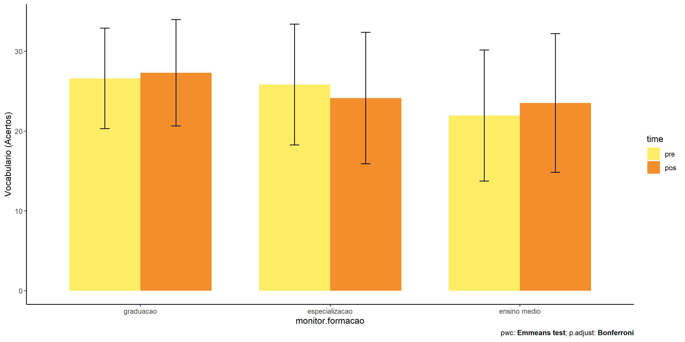<!-- -->

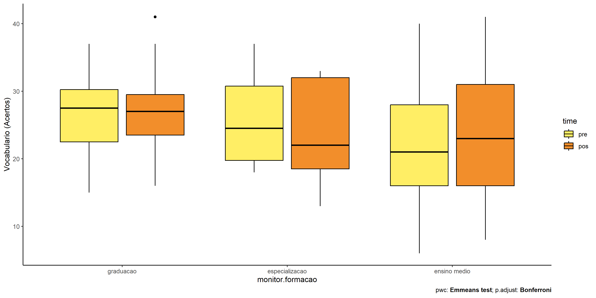<!-- -->

### Vocabulario (TRI)

| var           | monitor.formacao |   n | M (pre) | SE (pre) | M (unadj) | SE (unadj) | M (adj) | SE (adj) |
|:--------------|:-----------------|----:|--------:|---------:|----------:|-----------:|--------:|---------:|
| tri.vocab.pos | ensino medio     |  84 |   0.126 |    0.105 |     0.319 |      0.100 |   0.394 |    0.066 |
| tri.vocab.pos | especializacao   |   6 |   0.476 |    0.182 |     0.331 |      0.399 |   0.152 |    0.247 |
| tri.vocab.pos | graduacao        |  18 |   0.628 |    0.135 |     0.728 |      0.161 |   0.439 |    0.145 |

| .y.           | group1         | group2         | estimate | conf.low | conf.high |    se | statistic |     p | p.adj | p.adj.signif |
|:--------------|:---------------|:---------------|---------:|---------:|----------:|------:|----------:|------:|------:|:-------------|
| tri.vocab.pos | ensino medio   | especializacao |    0.242 |   -0.266 |     0.751 | 0.256 |     0.945 | 0.347 | 1.000 | ns           |
| tri.vocab.pos | ensino medio   | graduacao      |   -0.045 |   -0.363 |     0.273 | 0.160 |    -0.282 | 0.778 | 1.000 | ns           |
| tri.vocab.pos | especializacao | graduacao      |   -0.288 |   -0.853 |     0.278 | 0.285 |    -1.009 | 0.315 | 0.946 | ns           |
| tri.vocab.pre | ensino medio   | especializacao |   -0.350 |   -1.099 |     0.399 | 0.378 |    -0.927 | 0.356 | 1.000 | ns           |
| tri.vocab.pre | ensino medio   | graduacao      |   -0.502 |   -0.962 |    -0.041 | 0.232 |    -2.160 | 0.033 | 0.099 | ns           |
| tri.vocab.pre | especializacao | graduacao      |   -0.151 |   -0.987 |     0.684 | 0.422 |    -0.359 | 0.720 | 1.000 | ns           |

| monitor.formacao | group1 | group2 | estimate | conf.low | conf.high |    se | statistic |     p | p.adj | p.adj.signif |
|:-----------------|:-------|:-------|---------:|---------:|----------:|------:|----------:|------:|------:|:-------------|
| ensino medio     | pre    | pos    |   -0.181 |   -0.445 |     0.082 | 0.134 |    -1.355 | 0.177 | 0.177 | ns           |
| especializacao   | pre    | pos    |    0.030 |   -0.942 |     1.002 | 0.493 |     0.061 | 0.951 | 0.951 | ns           |
| graduacao        | pre    | pos    |   -0.016 |   -0.575 |     0.544 | 0.284 |    -0.055 | 0.956 | 0.956 | ns           |

    ## Scale for colour is already present.
    ## Adding another scale for colour, which will replace the existing scale.

<!-- -->

<!-- -->

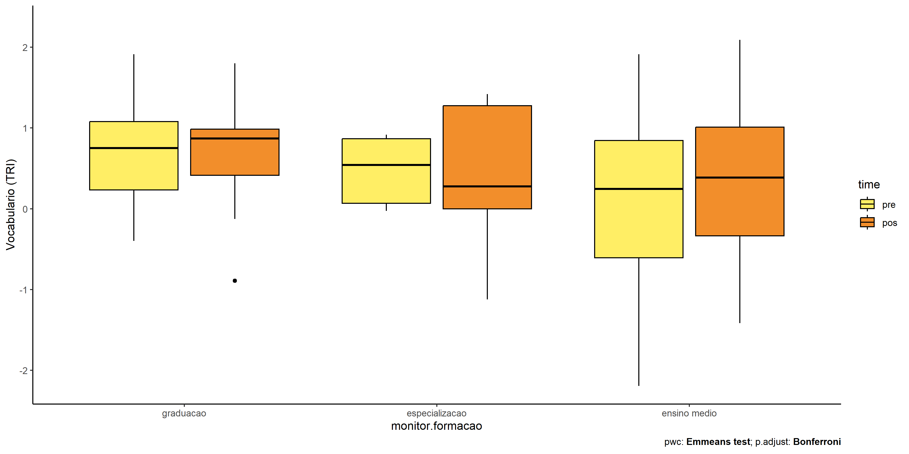<!-- -->

### Vocabulario Ensinado (Acertos)

| var                      | monitor.formacao |   n | M (pre) | SE (pre) | M (unadj) | SE (unadj) | M (adj) | SE (adj) |
|:-------------------------|:-----------------|----:|--------:|---------:|----------:|-----------:|--------:|---------:|
| score.vocab.ensinado.pos | ensino medio     |  93 |   4.280 |    0.217 |     4.172 |      0.257 |   4.173 |    0.240 |
| score.vocab.ensinado.pos | especializacao   |   7 |   4.143 |    1.164 |     4.857 |      0.670 |   4.909 |    0.875 |
| score.vocab.ensinado.pos | graduacao        |  21 |   4.333 |    0.499 |     4.810 |      0.533 |   4.790 |    0.505 |

| .y.                      | group1         | group2         | estimate | conf.low | conf.high |    se | statistic |     p | p.adj | p.adj.signif |
|:-------------------------|:---------------|:---------------|---------:|---------:|----------:|------:|----------:|------:|------:|:-------------|
| score.vocab.ensinado.pos | ensino medio   | especializacao |   -0.736 |   -2.533 |     1.061 | 0.908 |    -0.811 | 0.419 | 1.000 | ns           |
| score.vocab.ensinado.pos | ensino medio   | graduacao      |   -0.617 |   -1.725 |     0.490 | 0.559 |    -1.104 | 0.272 | 0.816 | ns           |
| score.vocab.ensinado.pos | especializacao | graduacao      |    0.119 |   -1.883 |     2.120 | 1.011 |     0.117 | 0.907 | 1.000 | ns           |
| score.vocab.ensinado.pre | ensino medio   | especializacao |    0.137 |   -1.560 |     1.834 | 0.857 |     0.160 | 0.874 | 1.000 | ns           |
| score.vocab.ensinado.pre | ensino medio   | graduacao      |   -0.054 |   -1.100 |     0.992 | 0.528 |    -0.102 | 0.919 | 1.000 | ns           |
| score.vocab.ensinado.pre | especializacao | graduacao      |   -0.190 |   -2.080 |     1.699 | 0.954 |    -0.200 | 0.842 | 1.000 | ns           |

| monitor.formacao | group1 | group2 | estimate | conf.low | conf.high |    se | statistic |     p | p.adj | p.adj.signif |
|:-----------------|:-------|:-------|---------:|---------:|----------:|------:|----------:|------:|------:|:-------------|
| ensino medio     | pre    | pos    |    0.108 |   -0.563 |     0.778 | 0.340 |     0.316 | 0.752 | 0.752 | ns           |
| especializacao   | pre    | pos    |   -0.714 |   -3.157 |     1.728 | 1.240 |    -0.576 | 0.565 | 0.565 | ns           |
| graduacao        | pre    | pos    |   -0.476 |   -1.886 |     0.934 | 0.716 |    -0.665 | 0.507 | 0.507 | ns           |

    ## Scale for colour is already present.
    ## Adding another scale for colour, which will replace the existing scale.

<!-- -->

<!-- -->

<!-- -->

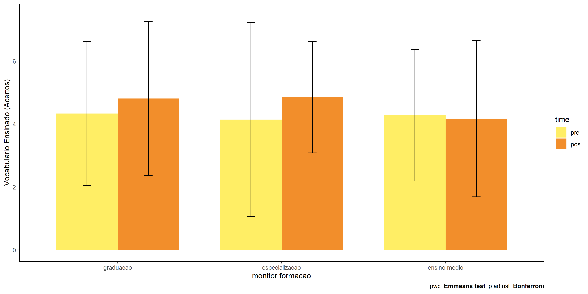<!-- -->

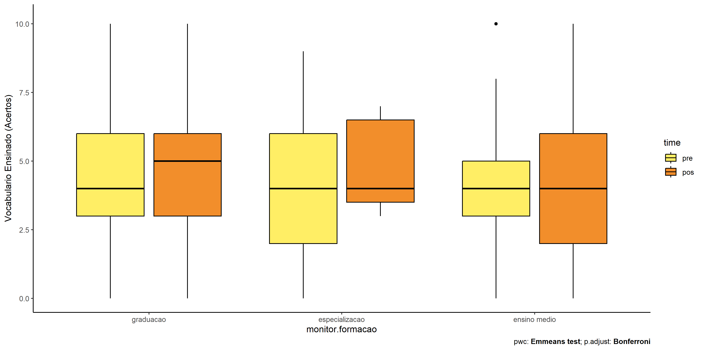<!-- -->

### Vocabulario Ensinado (TRI)

| var                    | monitor.formacao |   n | M (pre) | SE (pre) | M (unadj) | SE (unadj) | M (adj) | SE (adj) |
|:-----------------------|:-----------------|----:|--------:|---------:|----------:|-----------:|--------:|---------:|
| tri.vocab.ensinado.pos | ensino medio     |  84 |   0.112 |    0.086 |     0.215 |      0.086 |   0.231 |    0.070 |
| tri.vocab.ensinado.pos | especializacao   |   6 |   0.129 |    0.263 |     0.077 |      0.361 |   0.084 |    0.262 |
| tri.vocab.ensinado.pos | graduacao        |  18 |   0.294 |    0.160 |     0.630 |      0.129 |   0.549 |    0.152 |

| .y.                    | group1         | group2         | estimate | conf.low | conf.high |    se | statistic |     p | p.adj | p.adj.signif |
|:-----------------------|:---------------|:---------------|---------:|---------:|----------:|------:|----------:|------:|------:|:-------------|
| tri.vocab.ensinado.pos | ensino medio   | especializacao |    0.147 |   -0.391 |     0.685 | 0.271 |     0.541 | 0.590 | 1.000 | ns           |
| tri.vocab.ensinado.pos | ensino medio   | graduacao      |   -0.318 |   -0.650 |     0.014 | 0.167 |    -1.900 | 0.060 | 0.181 | ns           |
| tri.vocab.ensinado.pos | especializacao | graduacao      |   -0.465 |   -1.066 |     0.136 | 0.303 |    -1.535 | 0.128 | 0.384 | ns           |
| tri.vocab.ensinado.pre | ensino medio   | especializacao |   -0.017 |   -0.655 |     0.621 | 0.322 |    -0.053 | 0.958 | 1.000 | ns           |
| tri.vocab.ensinado.pre | ensino medio   | graduacao      |   -0.182 |   -0.574 |     0.210 | 0.198 |    -0.919 | 0.360 | 1.000 | ns           |
| tri.vocab.ensinado.pre | especializacao | graduacao      |   -0.165 |   -0.877 |     0.547 | 0.359 |    -0.459 | 0.647 | 1.000 | ns           |

| monitor.formacao | group1 | group2 | estimate | conf.low | conf.high |    se | statistic |     p | p.adj | p.adj.signif |
|:-----------------|:-------|:-------|---------:|---------:|----------:|------:|----------:|------:|------:|:-------------|
| ensino medio     | pre    | pos    |   -0.081 |   -0.305 |     0.143 | 0.114 |    -0.712 | 0.477 | 0.477 | ns           |
| especializacao   | pre    | pos    |   -0.083 |   -0.909 |     0.743 | 0.419 |    -0.198 | 0.843 | 0.843 | ns           |
| graduacao        | pre    | pos    |   -0.268 |   -0.743 |     0.207 | 0.241 |    -1.111 | 0.268 | 0.268 | ns           |

    ## Scale for colour is already present.
    ## Adding another scale for colour, which will replace the existing scale.

<!-- -->

<!-- -->

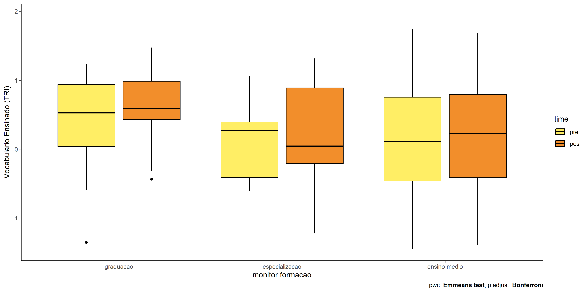<!-- -->

### Vocabulario Nao Ensinado (Acertos)

| var                          | monitor.formacao |   n | M (pre) | SE (pre) | M (unadj) | SE (unadj) | M (adj) | SE (adj) |
|:-----------------------------|:-----------------|----:|--------:|---------:|----------:|-----------:|--------:|---------:|
| score.vocab.nao.ensinado.pos | ensino medio     |  93 |  17.441 |    0.725 |    17.086 |      0.904 |  17.427 |    0.808 |
| score.vocab.nao.ensinado.pos | especializacao   |   7 |  18.000 |    3.457 |    19.286 |      2.533 |  19.333 |    2.935 |
| score.vocab.nao.ensinado.pos | graduacao        |  21 |  21.000 |    1.443 |    19.905 |      1.828 |  18.378 |    1.720 |

| .y.                          | group1         | group2         | estimate | conf.low | conf.high |    se | statistic |     p | p.adj | p.adj.signif |
|:-----------------------------|:---------------|:---------------|---------:|---------:|----------:|------:|----------:|------:|------:|:-------------|
| score.vocab.nao.ensinado.pos | ensino medio   | especializacao |   -1.906 |   -7.935 |     4.122 | 3.044 |    -0.626 | 0.532 | 1.000 | ns           |
| score.vocab.nao.ensinado.pos | ensino medio   | graduacao      |   -0.951 |   -4.734 |     2.833 | 1.910 |    -0.498 | 0.620 | 1.000 | ns           |
| score.vocab.nao.ensinado.pos | especializacao | graduacao      |    0.956 |   -5.783 |     7.694 | 3.403 |     0.281 | 0.779 | 1.000 | ns           |
| score.vocab.nao.ensinado.pre | ensino medio   | especializacao |   -0.559 |   -6.034 |     4.915 | 2.765 |    -0.202 | 0.840 | 1.000 | ns           |
| score.vocab.nao.ensinado.pre | ensino medio   | graduacao      |   -3.559 |   -6.934 |    -0.184 | 1.704 |    -2.088 | 0.039 | 0.117 | ns           |
| score.vocab.nao.ensinado.pre | especializacao | graduacao      |   -3.000 |   -9.096 |     3.096 | 3.078 |    -0.975 | 0.332 | 0.995 | ns           |

| monitor.formacao | group1 | group2 | estimate | conf.low | conf.high |    se | statistic |     p | p.adj | p.adj.signif |
|:-----------------|:-------|:-------|---------:|---------:|----------:|------:|----------:|------:|------:|:-------------|
| ensino medio     | pre    | pos    |    0.355 |   -1.913 |     2.623 | 1.151 |     0.308 | 0.758 | 0.758 | ns           |
| especializacao   | pre    | pos    |   -1.286 |   -9.552 |     6.981 | 4.196 |    -0.306 | 0.760 | 0.760 | ns           |
| graduacao        | pre    | pos    |    1.095 |   -3.677 |     5.868 | 2.423 |     0.452 | 0.652 | 0.652 | ns           |

    ## Scale for colour is already present.
    ## Adding another scale for colour, which will replace the existing scale.

<!-- -->

<!-- -->

<!-- -->

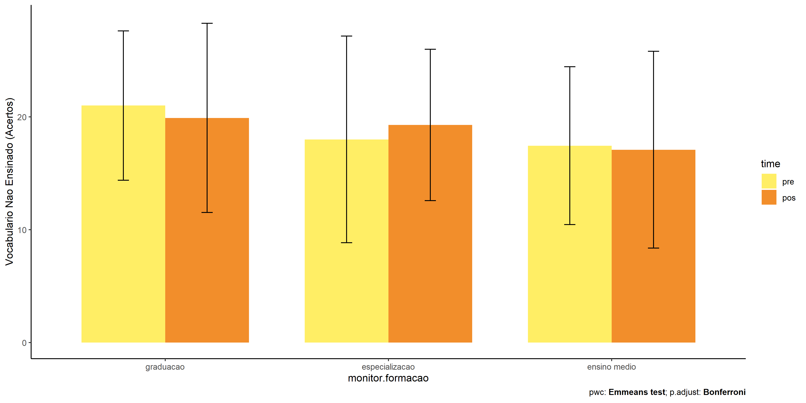<!-- -->

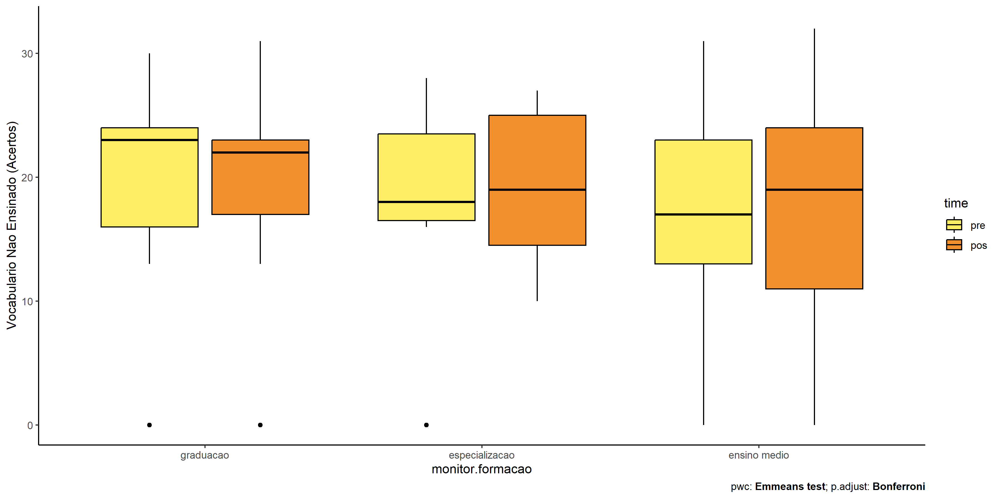<!-- -->

### Vocabulario Nao Ensinado (TRI)

| var                        | monitor.formacao |   n | M (pre) | SE (pre) | M (unadj) | SE (unadj) | M (adj) | SE (adj) |
|:---------------------------|:-----------------|----:|--------:|---------:|----------:|-----------:|--------:|---------:|
| tri.vocab.nao.ensinado.pos | ensino medio     |  84 |   0.136 |    0.100 |     0.311 |      0.109 |   0.388 |    0.072 |
| tri.vocab.nao.ensinado.pos | especializacao   |   6 |   0.423 |    0.228 |     0.298 |      0.405 |   0.138 |    0.270 |
| tri.vocab.nao.ensinado.pos | graduacao        |  18 |   0.599 |    0.140 |     0.712 |      0.182 |   0.408 |    0.158 |

| .y.                        | group1         | group2         | estimate | conf.low | conf.high |    se | statistic |     p | p.adj | p.adj.signif |
|:---------------------------|:---------------|:---------------|---------:|---------:|----------:|------:|----------:|------:|------:|:-------------|
| tri.vocab.nao.ensinado.pos | ensino medio   | especializacao |    0.249 |   -0.305 |     0.804 | 0.279 |     0.892 | 0.374 | 1.000 | ns           |
| tri.vocab.nao.ensinado.pos | ensino medio   | graduacao      |   -0.020 |   -0.366 |     0.327 | 0.175 |    -0.114 | 0.909 | 1.000 | ns           |
| tri.vocab.nao.ensinado.pos | especializacao | graduacao      |   -0.269 |   -0.886 |     0.348 | 0.311 |    -0.866 | 0.389 | 1.000 | ns           |
| tri.vocab.nao.ensinado.pre | ensino medio   | especializacao |   -0.287 |   -1.009 |     0.435 | 0.364 |    -0.788 | 0.433 | 1.000 | ns           |
| tri.vocab.nao.ensinado.pre | ensino medio   | graduacao      |   -0.463 |   -0.906 |    -0.019 | 0.224 |    -2.069 | 0.041 | 0.123 | ns           |
| tri.vocab.nao.ensinado.pre | especializacao | graduacao      |   -0.176 |   -0.981 |     0.629 | 0.406 |    -0.434 | 0.665 | 1.000 | ns           |

| monitor.formacao | group1 | group2 | estimate | conf.low | conf.high |    se | statistic |     p | p.adj | p.adj.signif |
|:-----------------|:-------|:-------|---------:|---------:|----------:|------:|----------:|------:|------:|:-------------|
| ensino medio     | pre    | pos    |   -0.176 |   -0.445 |     0.094 | 0.137 |    -1.285 | 0.200 | 0.200 | ns           |
| especializacao   | pre    | pos    |    0.016 |   -0.978 |     1.010 | 0.504 |     0.032 | 0.974 | 0.974 | ns           |
| graduacao        | pre    | pos    |   -0.007 |   -0.580 |     0.565 | 0.290 |    -0.025 | 0.980 | 0.980 | ns           |

    ## Scale for colour is already present.
    ## Adding another scale for colour, which will replace the existing scale.

<!-- -->

<!-- -->

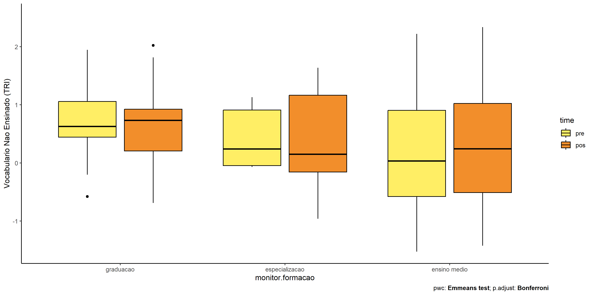<!-- -->

## factores: **grupo=“Experimental”:monitor.experiencia**

### Vocabulario (Acertos)

| var             | monitor.experiencia |   n | M (pre) | SE (pre) | M (unadj) | SE (unadj) | M (adj) | SE (adj) |
|:----------------|:--------------------|----:|--------:|---------:|----------:|-----------:|--------:|---------:|
| score.vocab.pos | maior 01 ano        |  76 |  23.500 |    0.936 |    24.803 |      0.980 |  24.294 |    0.685 |
| score.vocab.pos | menor 01 ano        |  32 |  21.188 |    1.353 |    22.438 |      1.421 |  23.646 |    1.060 |

| .y.             | group1       | group2       | estimate | conf.low | conf.high |    se | statistic |     p | p.adj | p.adj.signif |
|:----------------|:-------------|:-------------|---------:|---------:|----------:|------:|----------:|------:|------:|:-------------|
| score.vocab.pos | maior 01 ano | menor 01 ano |    0.648 |   -1.863 |     3.158 | 1.266 |     0.511 | 0.610 | 0.610 | ns           |
| score.vocab.pre | maior 01 ano | menor 01 ano |    2.312 |   -1.035 |     5.660 | 1.689 |     1.370 | 0.174 | 0.174 | ns           |

| monitor.experiencia | group1 | group2 | estimate | conf.low | conf.high |    se | statistic |     p | p.adj | p.adj.signif |
|:--------------------|:-------|:-------|---------:|---------:|----------:|------:|----------:|------:|------:|:-------------|
| maior 01 ano        | pre    | pos    |   -1.282 |   -3.840 |     1.276 | 1.298 |    -0.988 | 0.324 | 0.324 | ns           |
| menor 01 ano        | pre    | pos    |   -1.086 |   -4.979 |     2.807 | 1.976 |    -0.550 | 0.583 | 0.583 | ns           |

    ## Scale for colour is already present.
    ## Adding another scale for colour, which will replace the existing scale.

<!-- -->

<!-- -->

<!-- -->

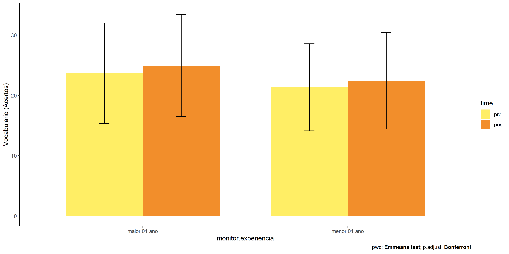<!-- -->

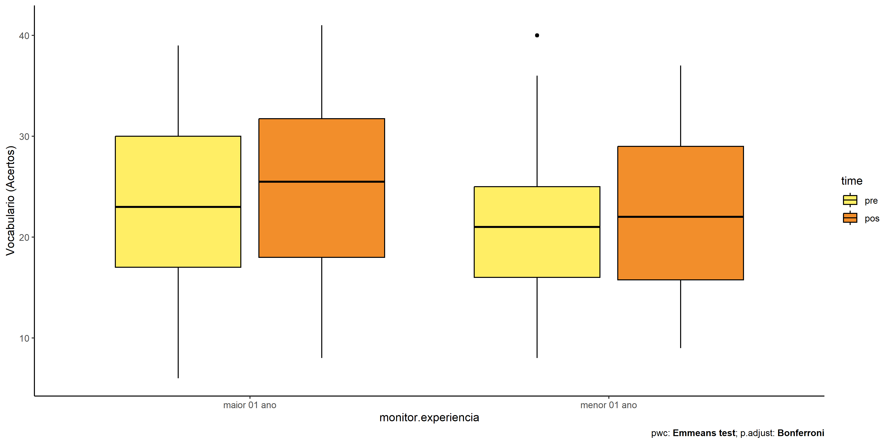<!-- -->

### Vocabulario (TRI)

| var           | monitor.experiencia |   n | M (pre) | SE (pre) | M (unadj) | SE (unadj) | M (adj) | SE (adj) |
|:--------------|:--------------------|----:|--------:|---------:|----------:|-----------:|--------:|---------:|
| tri.vocab.pos | maior 01 ano        |  76 |   0.316 |    0.107 |      0.48 |      0.102 |   0.418 |    0.069 |
| tri.vocab.pos | menor 01 ano        |  32 |   0.024 |    0.145 |      0.17 |      0.152 |   0.317 |    0.107 |

| .y.           | group1       | group2       | estimate | conf.low | conf.high |    se | statistic |     p | p.adj | p.adj.signif |
|:--------------|:-------------|:-------------|---------:|---------:|----------:|------:|----------:|------:|------:|:-------------|
| tri.vocab.pos | maior 01 ano | menor 01 ano |    0.101 |   -0.154 |     0.355 | 0.128 |     0.786 | 0.434 | 0.434 | ns           |
| tri.vocab.pre | maior 01 ano | menor 01 ano |    0.292 |   -0.085 |     0.669 | 0.190 |     1.538 | 0.127 | 0.127 | ns           |

| monitor.experiencia | group1 | group2 | estimate | conf.low | conf.high |    se | statistic |     p | p.adj | p.adj.signif |
|:--------------------|:-------|:-------|---------:|---------:|----------:|------:|----------:|------:|------:|:-------------|
| maior 01 ano        | pre    | pos    |   -0.152 |   -0.432 |     0.127 | 0.142 |    -1.076 | 0.283 | 0.283 | ns           |
| menor 01 ano        | pre    | pos    |   -0.106 |   -0.531 |     0.318 | 0.216 |    -0.494 | 0.622 | 0.622 | ns           |

    ## Scale for colour is already present.
    ## Adding another scale for colour, which will replace the existing scale.

<!-- -->

<!-- -->

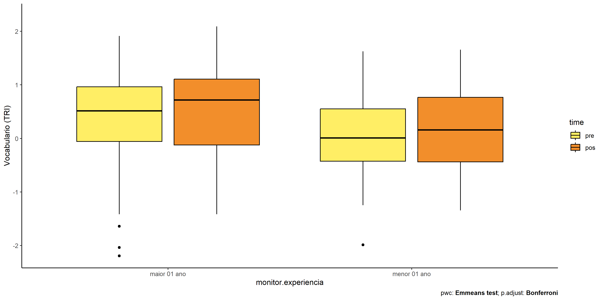<!-- -->

### Vocabulario Ensinado (Acertos)

| var                      | monitor.experiencia |   n | M (pre) | SE (pre) | M (unadj) | SE (unadj) | M (adj) | SE (adj) |
|:-------------------------|:--------------------|----:|--------:|---------:|----------:|-----------:|--------:|---------:|
| score.vocab.ensinado.pos | maior 01 ano        |  84 |   4.274 |    0.236 |     4.440 |      0.263 |   4.443 |    0.253 |
| score.vocab.ensinado.pos | menor 01 ano        |  37 |   4.297 |    0.365 |     4.054 |      0.415 |   4.048 |    0.381 |

| .y.                      | group1       | group2       | estimate | conf.low | conf.high |    se | statistic |     p | p.adj | p.adj.signif |
|:-------------------------|:-------------|:-------------|---------:|---------:|----------:|------:|----------:|------:|------:|:-------------|
| score.vocab.ensinado.pos | maior 01 ano | menor 01 ano |    0.395 |   -0.509 |     1.300 | 0.457 |     0.865 | 0.389 | 0.389 | ns           |
| score.vocab.ensinado.pre | maior 01 ano | menor 01 ano |   -0.023 |   -0.874 |     0.827 | 0.430 |    -0.055 | 0.957 | 0.957 | ns           |

| monitor.experiencia | group1 | group2 | estimate | conf.low | conf.high |    se | statistic |     p | p.adj | p.adj.signif |
|:--------------------|:-------|:-------|---------:|---------:|----------:|------:|----------:|------:|------:|:-------------|
| maior 01 ano        | pre    | pos    |   -0.167 |   -0.870 |     0.537 | 0.357 |    -0.467 | 0.641 | 0.641 | ns           |
| menor 01 ano        | pre    | pos    |    0.243 |   -0.817 |     1.303 | 0.538 |     0.452 | 0.652 | 0.652 | ns           |

    ## Scale for colour is already present.
    ## Adding another scale for colour, which will replace the existing scale.

<!-- -->

<!-- -->

<!-- -->

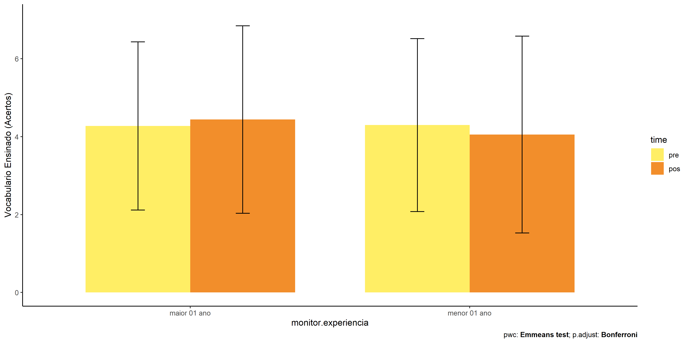<!-- -->

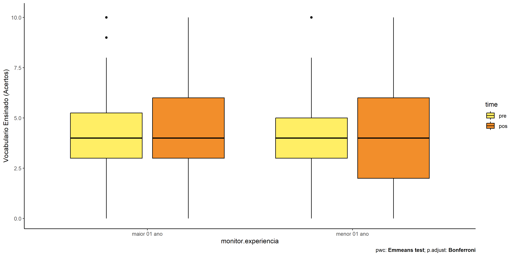<!-- -->

### Vocabulario Ensinado (TRI)

| var                    | monitor.experiencia |   n | M (pre) | SE (pre) | M (unadj) | SE (unadj) | M (adj) | SE (adj) |
|:-----------------------|:--------------------|----:|--------:|---------:|----------:|-----------:|--------:|---------:|
| tri.vocab.ensinado.pos | maior 01 ano        |  76 |   0.193 |    0.082 |     0.312 |      0.087 |   0.285 |    0.075 |
| tri.vocab.ensinado.pos | menor 01 ano        |  32 |   0.025 |    0.151 |     0.191 |      0.140 |   0.256 |    0.116 |

| .y.                    | group1       | group2       | estimate | conf.low | conf.high |    se | statistic |     p | p.adj | p.adj.signif |
|:-----------------------|:-------------|:-------------|---------:|---------:|----------:|------:|----------:|------:|------:|:-------------|
| tri.vocab.ensinado.pos | maior 01 ano | menor 01 ano |    0.028 |   -0.245 |     0.302 | 0.138 |     0.206 | 0.837 | 0.837 | ns           |
| tri.vocab.ensinado.pre | maior 01 ano | menor 01 ano |    0.168 |   -0.148 |     0.484 | 0.160 |     1.052 | 0.295 | 0.295 | ns           |

| monitor.experiencia | group1 | group2 | estimate | conf.low | conf.high |    se | statistic |     p | p.adj | p.adj.signif |
|:--------------------|:-------|:-------|---------:|---------:|----------:|------:|----------:|------:|------:|:-------------|
| maior 01 ano        | pre    | pos    |   -0.108 |   -0.345 |     0.129 | 0.120 |    -0.901 | 0.369 | 0.369 | ns           |
| menor 01 ano        | pre    | pos    |   -0.117 |   -0.478 |     0.244 | 0.183 |    -0.639 | 0.523 | 0.523 | ns           |

    ## Scale for colour is already present.
    ## Adding another scale for colour, which will replace the existing scale.

<!-- -->

<!-- -->

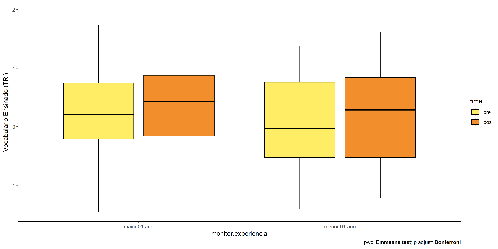<!-- -->

### Vocabulario Nao Ensinado (Acertos)

| var                          | monitor.experiencia |   n | M (pre) | SE (pre) | M (unadj) | SE (unadj) | M (adj) | SE (adj) |
|:-----------------------------|:--------------------|----:|--------:|---------:|----------:|-----------:|--------:|---------:|
| score.vocab.nao.ensinado.pos | maior 01 ano        |  84 |  18.548 |    0.834 |    18.738 |      0.918 |  18.502 |    0.837 |
| score.vocab.nao.ensinado.pos | menor 01 ano        |  37 |  17.054 |    0.944 |    15.351 |      1.411 |  15.888 |    1.263 |

| .y.                          | group1       | group2       | estimate | conf.low | conf.high |    se | statistic |     p | p.adj | p.adj.signif |
|:-----------------------------|:-------------|:-------------|---------:|---------:|----------:|------:|----------:|------:|------:|:-------------|
| score.vocab.nao.ensinado.pos | maior 01 ano | menor 01 ano |    2.613 |   -0.392 |     5.619 | 1.518 |     1.722 | 0.088 | 0.088 | ns           |
| score.vocab.nao.ensinado.pre | maior 01 ano | menor 01 ano |    1.494 |   -1.288 |     4.275 | 1.405 |     1.063 | 0.290 | 0.290 | ns           |

| monitor.experiencia | group1 | group2 | estimate | conf.low | conf.high |    se | statistic |     p | p.adj | p.adj.signif |
|:--------------------|:-------|:-------|---------:|---------:|----------:|------:|----------:|------:|------:|:-------------|
| maior 01 ano        | pre    | pos    |   -0.190 |   -2.568 |     2.187 | 1.207 |    -0.158 | 0.875 | 0.875 | ns           |
| menor 01 ano        | pre    | pos    |    1.703 |   -1.880 |     5.285 | 1.819 |     0.936 | 0.350 | 0.350 | ns           |

    ## Scale for colour is already present.
    ## Adding another scale for colour, which will replace the existing scale.

<!-- -->

<!-- -->

<!-- -->

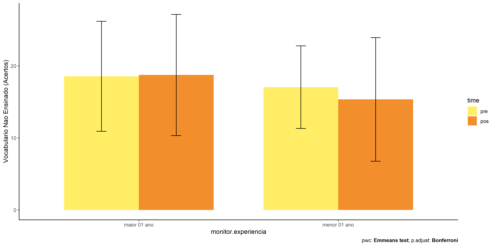<!-- -->

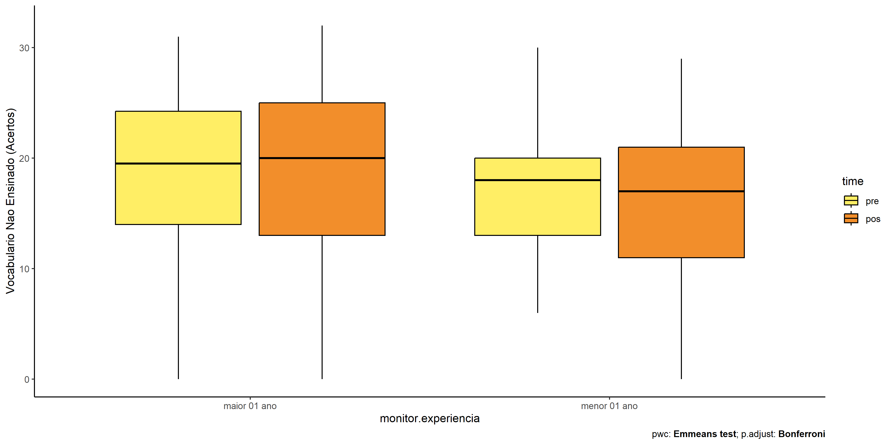<!-- -->

### Vocabulario Nao Ensinado (TRI)

| var                        | monitor.experiencia |   n | M (pre) | SE (pre) | M (unadj) | SE (unadj) | M (adj) | SE (adj) |
|:---------------------------|:--------------------|----:|--------:|---------:|----------:|-----------:|--------:|---------:|
| tri.vocab.nao.ensinado.pos | maior 01 ano        |  76 |   0.311 |    0.102 |     0.478 |      0.112 |   0.411 |    0.076 |
| tri.vocab.nao.ensinado.pos | menor 01 ano        |  32 |   0.033 |    0.142 |     0.139 |      0.163 |   0.298 |    0.117 |

| .y.                        | group1       | group2       | estimate | conf.low | conf.high |    se | statistic |     p | p.adj | p.adj.signif |
|:---------------------------|:-------------|:-------------|---------:|---------:|----------:|------:|----------:|------:|------:|:-------------|
| tri.vocab.nao.ensinado.pos | maior 01 ano | menor 01 ano |    0.113 |   -0.165 |     0.390 | 0.140 |     0.804 | 0.423 | 0.423 | ns           |
| tri.vocab.nao.ensinado.pre | maior 01 ano | menor 01 ano |    0.279 |   -0.083 |     0.641 | 0.183 |     1.527 | 0.130 | 0.130 | ns           |

| monitor.experiencia | group1 | group2 | estimate | conf.low | conf.high |    se | statistic |     p | p.adj | p.adj.signif |
|:--------------------|:-------|:-------|---------:|---------:|----------:|------:|----------:|------:|------:|:-------------|
| maior 01 ano        | pre    | pos    |   -0.151 |   -0.436 |     0.133 | 0.144 |    -1.049 | 0.295 | 0.295 | ns           |
| menor 01 ano        | pre    | pos    |   -0.090 |   -0.522 |     0.343 | 0.220 |    -0.408 | 0.684 | 0.684 | ns           |

    ## Scale for colour is already present.
    ## Adding another scale for colour, which will replace the existing scale.

<!-- -->

<!-- -->

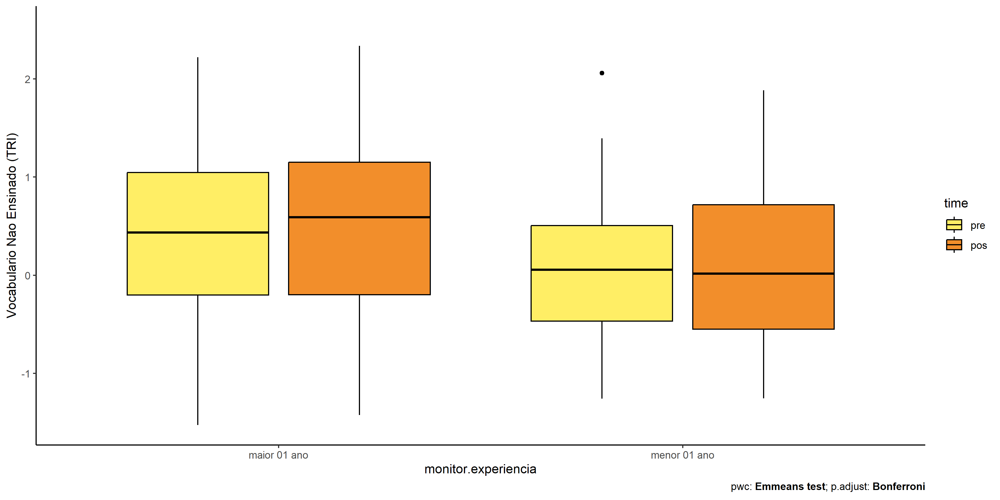<!-- -->
