ANCOVA in Vocabulary Test (Teste de Vocabulario)
================
Geiser C. Challco <geiser@alumni.usp.br>

- [Descriptive Statistics of Initial
  Data](#descriptive-statistics-of-initial-data)
  - [Vocabulario (Acertos)](#vocabulario-acertos)
  - [Vocabulario (TRI)](#vocabulario-tri)
  - [Vocabulario Ensinado (Acertos)](#vocabulario-ensinado-acertos)
  - [Vocabulario Ensinado (TRI)](#vocabulario-ensinado-tri)
  - [Vocabulario Nao Ensinado
    (Acertos)](#vocabulario-nao-ensinado-acertos)
  - [Vocabulario Nao Ensinado (TRI)](#vocabulario-nao-ensinado-tri)
- [Checking of Assumptions](#checking-of-assumptions)
  - [Assumption: Normality
    distribution](#assumption-normality-distribution)
    - [Vocabulario (Acertos)](#vocabulario-acertos-1)
    - [Vocabulario (TRI)](#vocabulario-tri-1)
    - [Vocabulario Ensinado (Acertos)](#vocabulario-ensinado-acertos-1)
    - [Vocabulario Ensinado (TRI)](#vocabulario-ensinado-tri-1)
    - [Vocabulario Nao Ensinado
      (Acertos)](#vocabulario-nao-ensinado-acertos-1)
    - [Vocabulario Nao Ensinado (TRI)](#vocabulario-nao-ensinado-tri-1)
  - [Assumption: Homogeneity](#assumption-homogeneity)
    - [Vocabulario (Acertos)](#vocabulario-acertos-2)
    - [Vocabulario (TRI)](#vocabulario-tri-2)
    - [Vocabulario Ensinado (Acertos)](#vocabulario-ensinado-acertos-2)
    - [Vocabulario Ensinado (TRI)](#vocabulario-ensinado-tri-2)
    - [Vocabulario Nao Ensinado
      (Acertos)](#vocabulario-nao-ensinado-acertos-2)
    - [Vocabulario Nao Ensinado (TRI)](#vocabulario-nao-ensinado-tri-2)
- [Computation of ANCOVA test and Pairwise
  Comparison](#computation-of-ancova-test-and-pairwise-comparison)
  - [ANCOVA tests for one factor](#ancova-tests-for-one-factor)
    - [Vocabulario (Acertos)](#vocabulario-acertos-3)
    - [Vocabulario (TRI)](#vocabulario-tri-3)
    - [Vocabulario Ensinado (Acertos)](#vocabulario-ensinado-acertos-3)
    - [Vocabulario Ensinado (TRI)](#vocabulario-ensinado-tri-3)
    - [Vocabulario Nao Ensinado
      (Acertos)](#vocabulario-nao-ensinado-acertos-3)
    - [Vocabulario Nao Ensinado (TRI)](#vocabulario-nao-ensinado-tri-3)
  - [ANCOVA tests for two factors](#ancova-tests-for-two-factors)
    - [Vocabulario (Acertos)](#vocabulario-acertos-4)
    - [Vocabulario (TRI)](#vocabulario-tri-4)
    - [Vocabulario Ensinado (Acertos)](#vocabulario-ensinado-acertos-4)
    - [Vocabulario Ensinado (TRI)](#vocabulario-ensinado-tri-4)
    - [Vocabulario Nao Ensinado
      (Acertos)](#vocabulario-nao-ensinado-acertos-4)
    - [Vocabulario Nao Ensinado (TRI)](#vocabulario-nao-ensinado-tri-4)
  - [ANCOVA tests for
    grupo=“Experimental”](#ancova-tests-for-grupoexperimental)
    - [Vocabulario (Acertos)](#vocabulario-acertos-5)
    - [Vocabulario (TRI)](#vocabulario-tri-5)
    - [Vocabulario Ensinado (Acertos)](#vocabulario-ensinado-acertos-5)
    - [Vocabulario Ensinado (TRI)](#vocabulario-ensinado-tri-5)
    - [Vocabulario Nao Ensinado
      (Acertos)](#vocabulario-nao-ensinado-acertos-5)
    - [Vocabulario Nao Ensinado (TRI)](#vocabulario-nao-ensinado-tri-5)
- [Pairwise comparisons for one
  factor](#pairwise-comparisons-for-one-factor)
  - [factor: **grupo**](#factor-grupo)
    - [Vocabulario (Acertos)](#vocabulario-acertos-6)
    - [Vocabulario (TRI)](#vocabulario-tri-6)
    - [Vocabulario Ensinado (Acertos)](#vocabulario-ensinado-acertos-6)
    - [Vocabulario Ensinado (TRI)](#vocabulario-ensinado-tri-6)
    - [Vocabulario Nao Ensinado
      (Acertos)](#vocabulario-nao-ensinado-acertos-6)
    - [Vocabulario Nao Ensinado (TRI)](#vocabulario-nao-ensinado-tri-6)
  - [factor: **genero**](#factor-genero)
    - [Vocabulario (Acertos)](#vocabulario-acertos-7)
    - [Vocabulario (TRI)](#vocabulario-tri-7)
    - [Vocabulario Ensinado (Acertos)](#vocabulario-ensinado-acertos-7)
    - [Vocabulario Ensinado (TRI)](#vocabulario-ensinado-tri-7)
    - [Vocabulario Nao Ensinado
      (Acertos)](#vocabulario-nao-ensinado-acertos-7)
    - [Vocabulario Nao Ensinado (TRI)](#vocabulario-nao-ensinado-tri-7)
  - [factor: **idade**](#factor-idade)
    - [Vocabulario (Acertos)](#vocabulario-acertos-8)
    - [Vocabulario (TRI)](#vocabulario-tri-8)
    - [Vocabulario Ensinado (Acertos)](#vocabulario-ensinado-acertos-8)
    - [Vocabulario Ensinado (TRI)](#vocabulario-ensinado-tri-8)
    - [Vocabulario Nao Ensinado
      (Acertos)](#vocabulario-nao-ensinado-acertos-8)
    - [Vocabulario Nao Ensinado (TRI)](#vocabulario-nao-ensinado-tri-8)
  - [factor: **zona.participante**](#factor-zonaparticipante)
    - [Vocabulario (Acertos)](#vocabulario-acertos-9)
    - [Vocabulario (TRI)](#vocabulario-tri-9)
    - [Vocabulario Ensinado (Acertos)](#vocabulario-ensinado-acertos-9)
    - [Vocabulario Ensinado (TRI)](#vocabulario-ensinado-tri-9)
    - [Vocabulario Nao Ensinado
      (Acertos)](#vocabulario-nao-ensinado-acertos-9)
    - [Vocabulario Nao Ensinado (TRI)](#vocabulario-nao-ensinado-tri-9)
  - [factor: **escola**](#factor-escola)
    - [Vocabulario (Acertos)](#vocabulario-acertos-10)
    - [Vocabulario (TRI)](#vocabulario-tri-10)
    - [Vocabulario Ensinado (Acertos)](#vocabulario-ensinado-acertos-10)
    - [Vocabulario Ensinado (TRI)](#vocabulario-ensinado-tri-10)
    - [Vocabulario Nao Ensinado
      (Acertos)](#vocabulario-nao-ensinado-acertos-10)
    - [Vocabulario Nao Ensinado (TRI)](#vocabulario-nao-ensinado-tri-10)
  - [factor: **zona.escola**](#factor-zonaescola)
    - [Vocabulario (Acertos)](#vocabulario-acertos-11)
    - [Vocabulario (TRI)](#vocabulario-tri-11)
    - [Vocabulario Ensinado (Acertos)](#vocabulario-ensinado-acertos-11)
    - [Vocabulario Ensinado (TRI)](#vocabulario-ensinado-tri-11)
    - [Vocabulario Nao Ensinado
      (Acertos)](#vocabulario-nao-ensinado-acertos-11)
    - [Vocabulario Nao Ensinado (TRI)](#vocabulario-nao-ensinado-tri-11)
- [Pairwise comparisons for two
  factors](#pairwise-comparisons-for-two-factors)
  - [factores: **genero:grupo**](#factores-generogrupo)
    - [Vocabulario (Acertos)](#vocabulario-acertos-12)
    - [Vocabulario (TRI)](#vocabulario-tri-12)
    - [Vocabulario Ensinado (Acertos)](#vocabulario-ensinado-acertos-12)
    - [Vocabulario Ensinado (TRI)](#vocabulario-ensinado-tri-12)
    - [Vocabulario Nao Ensinado
      (Acertos)](#vocabulario-nao-ensinado-acertos-12)
    - [Vocabulario Nao Ensinado (TRI)](#vocabulario-nao-ensinado-tri-12)
  - [factores: **idade:grupo**](#factores-idadegrupo)
    - [Vocabulario (Acertos)](#vocabulario-acertos-13)
    - [Vocabulario (TRI)](#vocabulario-tri-13)
    - [Vocabulario Ensinado (Acertos)](#vocabulario-ensinado-acertos-13)
    - [Vocabulario Ensinado (TRI)](#vocabulario-ensinado-tri-13)
    - [Vocabulario Nao Ensinado
      (Acertos)](#vocabulario-nao-ensinado-acertos-13)
    - [Vocabulario Nao Ensinado (TRI)](#vocabulario-nao-ensinado-tri-13)
  - [factores:
    **zona.participante:grupo**](#factores-zonaparticipantegrupo)
    - [Vocabulario (Acertos)](#vocabulario-acertos-14)
    - [Vocabulario (TRI)](#vocabulario-tri-14)
    - [Vocabulario Ensinado (Acertos)](#vocabulario-ensinado-acertos-14)
    - [Vocabulario Ensinado (TRI)](#vocabulario-ensinado-tri-14)
    - [Vocabulario Nao Ensinado
      (Acertos)](#vocabulario-nao-ensinado-acertos-14)
    - [Vocabulario Nao Ensinado (TRI)](#vocabulario-nao-ensinado-tri-14)
  - [factores: **escola:grupo**](#factores-escolagrupo)
    - [Vocabulario (Acertos)](#vocabulario-acertos-15)
    - [Vocabulario (TRI)](#vocabulario-tri-15)
    - [Vocabulario Ensinado (Acertos)](#vocabulario-ensinado-acertos-15)
    - [Vocabulario Ensinado (TRI)](#vocabulario-ensinado-tri-15)
    - [Vocabulario Nao Ensinado
      (Acertos)](#vocabulario-nao-ensinado-acertos-15)
    - [Vocabulario Nao Ensinado (TRI)](#vocabulario-nao-ensinado-tri-15)
  - [factores: **zona.escola:grupo**](#factores-zonaescolagrupo)
    - [Vocabulario (Acertos)](#vocabulario-acertos-16)
    - [Vocabulario (TRI)](#vocabulario-tri-16)
    - [Vocabulario Ensinado (Acertos)](#vocabulario-ensinado-acertos-16)
    - [Vocabulario Ensinado (TRI)](#vocabulario-ensinado-tri-16)
    - [Vocabulario Nao Ensinado
      (Acertos)](#vocabulario-nao-ensinado-acertos-16)
    - [Vocabulario Nao Ensinado (TRI)](#vocabulario-nao-ensinado-tri-16)
- [Pairwise comparisons for
  grupo=“Experimental”](#pairwise-comparisons-for-grupoexperimental)
  - [factores:
    **grupo=“Experimental”:monitor**](#factores-grupoexperimentalmonitor)
    - [Vocabulario (Acertos)](#vocabulario-acertos-17)
    - [Vocabulario (TRI)](#vocabulario-tri-17)
    - [Vocabulario Ensinado (Acertos)](#vocabulario-ensinado-acertos-17)
    - [Vocabulario Ensinado (TRI)](#vocabulario-ensinado-tri-17)
    - [Vocabulario Nao Ensinado
      (Acertos)](#vocabulario-nao-ensinado-acertos-17)
    - [Vocabulario Nao Ensinado (TRI)](#vocabulario-nao-ensinado-tri-17)
  - [factores:
    **grupo=“Experimental”:monitor.genero**](#factores-grupoexperimentalmonitorgenero)
    - [Vocabulario (Acertos)](#vocabulario-acertos-18)
    - [Vocabulario (TRI)](#vocabulario-tri-18)
    - [Vocabulario Ensinado (Acertos)](#vocabulario-ensinado-acertos-18)
    - [Vocabulario Ensinado (TRI)](#vocabulario-ensinado-tri-18)
    - [Vocabulario Nao Ensinado
      (Acertos)](#vocabulario-nao-ensinado-acertos-18)
    - [Vocabulario Nao Ensinado (TRI)](#vocabulario-nao-ensinado-tri-18)
  - [factores:
    **grupo=“Experimental”:monitor.area**](#factores-grupoexperimentalmonitorarea)
    - [Vocabulario (Acertos)](#vocabulario-acertos-19)
    - [Vocabulario (TRI)](#vocabulario-tri-19)
    - [Vocabulario Ensinado (Acertos)](#vocabulario-ensinado-acertos-19)
    - [Vocabulario Ensinado (TRI)](#vocabulario-ensinado-tri-19)
    - [Vocabulario Nao Ensinado
      (Acertos)](#vocabulario-nao-ensinado-acertos-19)
    - [Vocabulario Nao Ensinado (TRI)](#vocabulario-nao-ensinado-tri-19)
  - [factores:
    **grupo=“Experimental”:monitor.formacao**](#factores-grupoexperimentalmonitorformacao)
    - [Vocabulario (Acertos)](#vocabulario-acertos-20)
    - [Vocabulario (TRI)](#vocabulario-tri-20)
    - [Vocabulario Ensinado (Acertos)](#vocabulario-ensinado-acertos-20)
    - [Vocabulario Ensinado (TRI)](#vocabulario-ensinado-tri-20)
    - [Vocabulario Nao Ensinado
      (Acertos)](#vocabulario-nao-ensinado-acertos-20)
    - [Vocabulario Nao Ensinado (TRI)](#vocabulario-nao-ensinado-tri-20)
  - [factores:
    **grupo=“Experimental”:monitor.experiencia**](#factores-grupoexperimentalmonitorexperiencia)
    - [Vocabulario (Acertos)](#vocabulario-acertos-21)
    - [Vocabulario (TRI)](#vocabulario-tri-21)
    - [Vocabulario Ensinado (Acertos)](#vocabulario-ensinado-acertos-21)
    - [Vocabulario Ensinado (TRI)](#vocabulario-ensinado-tri-21)
    - [Vocabulario Nao Ensinado
      (Acertos)](#vocabulario-nao-ensinado-acertos-21)
    - [Vocabulario Nao Ensinado (TRI)](#vocabulario-nao-ensinado-tri-21)

**NOTE**

- Teste ANCOVA para determinar se houve diferenças significativas no
  Teste de Vocabulario (medido usando pre- e pos-testes).
- ANCOVA test to determine whether there were significant differences in
  Vocabulary Test (measured using pre- and post-tests).

# Descriptive Statistics of Initial Data

## Vocabulario (Acertos)

| grupo        | genero | idade | zona.participante | escola | zona.escola | variable        |   n |   mean | median | min | max |     sd |    se |      ci |   iqr |
|:-------------|:-------|:------|:------------------|:-------|:------------|:----------------|----:|-------:|-------:|----:|----:|-------:|------:|--------:|------:|
| Controle     | F      |       |                   |        |             | score.vocab.pos |  80 | 22.938 |   23.0 |   8 |  42 |  7.492 | 0.838 |   1.667 | 12.00 |
| Controle     | M      |       |                   |        |             | score.vocab.pos |  79 | 20.747 |   20.0 |   4 |  39 |  8.743 | 0.984 |   1.958 | 14.00 |
| Experimental | F      |       |                   |        |             | score.vocab.pos |  57 | 25.035 |   26.0 |   8 |  41 |  8.916 | 1.181 |   2.366 | 16.00 |
| Experimental | M      |       |                   |        |             | score.vocab.pos |  84 | 19.976 |   20.0 |   7 |  41 |  8.070 | 0.881 |   1.751 | 12.25 |
| Controle     | F      |       |                   |        |             | score.vocab.pre |  80 | 21.812 |   21.0 |   7 |  41 |  8.105 | 0.906 |   1.804 | 13.00 |
| Controle     | M      |       |                   |        |             | score.vocab.pre |  79 | 20.266 |   19.0 |   5 |  39 |  8.847 | 0.995 |   1.982 | 14.00 |
| Experimental | F      |       |                   |        |             | score.vocab.pre |  57 | 23.193 |   23.0 |   6 |  40 |  8.991 | 1.191 |   2.386 | 13.00 |
| Experimental | M      |       |                   |        |             | score.vocab.pre |  84 | 19.131 |   18.0 |   5 |  37 |  7.691 | 0.839 |   1.669 | 10.00 |
| Controle     |        | 10y   |                   |        |             | score.vocab.pos |  28 | 22.179 |   23.0 |   9 |  42 |  7.621 | 1.440 |   2.955 | 10.25 |
| Controle     |        | 11y   |                   |        |             | score.vocab.pos |  90 | 22.978 |   24.0 |   4 |  39 |  8.539 | 0.900 |   1.789 | 15.00 |
| Controle     |        | 12y   |                   |        |             | score.vocab.pos |  23 | 19.391 |   18.0 |   9 |  37 |  7.803 | 1.627 |   3.374 | 11.00 |
| Controle     |        | 13y   |                   |        |             | score.vocab.pos |   8 | 19.250 |   20.0 |   8 |  29 |  6.944 | 2.455 |   5.805 |  9.75 |
| Controle     |        | 14y   |                   |        |             | score.vocab.pos |   2 | 18.000 |   18.0 |  13 |  23 |  7.071 | 5.000 |  63.531 |  5.00 |
| Controle     |        | 16y   |                   |        |             | score.vocab.pos |   1 | 14.000 |   14.0 |  14 |  14 |        |       |         |  0.00 |
| Controle     |        |       |                   |        |             | score.vocab.pos |   7 | 19.286 |   17.0 |  12 |  30 |  7.697 | 2.909 |   7.118 | 11.00 |
| Experimental |        | 10y   |                   |        |             | score.vocab.pos |  26 | 21.615 |   22.0 |   7 |  32 |  6.524 | 1.280 |   2.635 | 10.75 |
| Experimental |        | 11y   |                   |        |             | score.vocab.pos |  86 | 23.523 |   23.5 |   9 |  41 |  8.797 | 0.949 |   1.886 | 15.75 |
| Experimental |        | 12y   |                   |        |             | score.vocab.pos |  16 | 21.625 |   19.0 |   8 |  41 |  9.926 | 2.481 |   5.289 | 10.75 |
| Experimental |        | 13y   |                   |        |             | score.vocab.pos |   9 | 11.556 |   11.0 |   8 |  15 |  2.506 | 0.835 |   1.926 |  4.00 |
| Experimental |        | 14y   |                   |        |             | score.vocab.pos |   2 | 11.500 |   11.5 |  11 |  12 |  0.707 | 0.500 |   6.353 |  0.50 |
| Experimental |        |       |                   |        |             | score.vocab.pos |   2 | 23.500 |   23.5 |  15 |  32 | 12.021 | 8.500 | 108.003 |  8.50 |
| Controle     |        | 10y   |                   |        |             | score.vocab.pre |  28 | 23.393 |   22.5 |  14 |  41 |  7.651 | 1.446 |   2.967 | 11.75 |
| Controle     |        | 11y   |                   |        |             | score.vocab.pre |  90 | 21.278 |   21.0 |   5 |  39 |  8.966 | 0.945 |   1.878 | 16.50 |
| Controle     |        | 12y   |                   |        |             | score.vocab.pre |  23 | 19.348 |   16.0 |   9 |  37 |  8.343 | 1.740 |   3.608 | 12.50 |
| Controle     |        | 13y   |                   |        |             | score.vocab.pre |   8 | 19.500 |   20.5 |  10 |  27 |  6.990 | 2.471 |   5.844 | 13.00 |
| Controle     |        | 14y   |                   |        |             | score.vocab.pre |   2 | 16.500 |   16.5 |  11 |  22 |  7.778 | 5.500 |  69.884 |  5.50 |
| Controle     |        | 16y   |                   |        |             | score.vocab.pre |   1 | 16.000 |   16.0 |  16 |  16 |        |       |         |  0.00 |
| Controle     |        |       |                   |        |             | score.vocab.pre |   7 | 18.000 |   18.0 |   8 |  28 |  7.594 | 2.870 |   7.023 | 12.00 |
| Experimental |        | 10y   |                   |        |             | score.vocab.pre |  26 | 20.538 |   22.0 |   6 |  36 |  7.783 | 1.526 |   3.144 | 11.50 |
| Experimental |        | 11y   |                   |        |             | score.vocab.pre |  86 | 21.895 |   21.0 |   5 |  40 |  8.594 | 0.927 |   1.843 | 14.00 |
| Experimental |        | 12y   |                   |        |             | score.vocab.pre |  16 | 20.062 |   18.5 |   6 |  39 |  9.118 | 2.279 |   4.858 |  5.25 |
| Experimental |        | 13y   |                   |        |             | score.vocab.pre |   9 | 14.444 |   14.0 |   7 |  25 |  5.175 | 1.725 |   3.978 |  5.00 |
| Experimental |        | 14y   |                   |        |             | score.vocab.pre |   2 | 14.500 |   14.5 |  12 |  17 |  3.536 | 2.500 |  31.766 |  2.50 |
| Experimental |        |       |                   |        |             | score.vocab.pre |   2 | 16.000 |   16.0 |   8 |  24 | 11.314 | 8.000 | 101.650 |  8.00 |
| Controle     |        |       | Urbana            |        |             | score.vocab.pos |  69 | 22.739 |   24.0 |   4 |  42 |  8.562 | 1.031 |   2.057 | 15.00 |
| Controle     |        |       | Rural             |        |             | score.vocab.pos |  53 | 21.340 |   21.0 |   9 |  38 |  7.550 | 1.037 |   2.081 | 12.00 |
| Controle     |        |       |                   |        |             | score.vocab.pos |  37 | 20.919 |   19.0 |   8 |  37 |  8.398 | 1.381 |   2.800 | 13.00 |
| Experimental |        |       | Urbana            |        |             | score.vocab.pos |  53 | 22.472 |   22.0 |   8 |  41 |  8.885 | 1.220 |   2.449 | 15.00 |
| Experimental |        |       | Rural             |        |             | score.vocab.pos |  58 | 22.397 |   22.5 |   7 |  41 |  8.756 | 1.150 |   2.302 | 14.00 |
| Experimental |        |       |                   |        |             | score.vocab.pos |  30 | 20.500 |   18.0 |   9 |  37 |  8.637 | 1.577 |   3.225 | 12.50 |
| Controle     |        |       | Urbana            |        |             | score.vocab.pre |  69 | 22.087 |   22.0 |   7 |  39 |  7.963 | 0.959 |   1.913 | 13.00 |
| Controle     |        |       | Rural             |        |             | score.vocab.pre |  53 | 20.075 |   18.0 |   5 |  41 |  8.799 | 1.209 |   2.425 | 13.00 |
| Controle     |        |       |                   |        |             | score.vocab.pre |  37 | 20.486 |   19.0 |   6 |  37 |  9.002 | 1.480 |   3.001 | 14.00 |
| Experimental |        |       | Urbana            |        |             | score.vocab.pre |  53 | 21.396 |   21.0 |   6 |  38 |  8.596 | 1.181 |   2.369 | 15.00 |
| Experimental |        |       | Rural             |        |             | score.vocab.pre |  58 | 20.103 |   20.0 |   5 |  39 |  8.410 | 1.104 |   2.211 | 11.00 |
| Experimental |        |       |                   |        |             | score.vocab.pre |  30 | 20.967 |   19.5 |   8 |  40 |  8.459 | 1.544 |   3.159 | 10.00 |
| Controle     |        |       |                   | E1     |             | score.vocab.pos |  11 | 22.636 |   24.0 |  12 |  31 |  6.500 | 1.960 |   4.367 |  5.50 |
| Controle     |        |       |                   | E2     |             | score.vocab.pos |  34 | 21.206 |   18.5 |  10 |  42 |  9.286 | 1.593 |   3.240 | 15.00 |
| Controle     |        |       |                   | E3     |             | score.vocab.pos |  21 | 20.905 |   21.0 |   9 |  37 |  7.449 | 1.626 |   3.391 | 10.00 |
| Controle     |        |       |                   | E4     |             | score.vocab.pos |  20 | 22.150 |   24.0 |   9 |  39 |  7.422 | 1.660 |   3.473 |  7.25 |
| Controle     |        |       |                   | E5     |             | score.vocab.pos |  59 | 22.441 |   22.0 |   4 |  38 |  8.532 | 1.111 |   2.224 | 15.50 |
| Controle     |        |       |                   | E6     |             | score.vocab.pos |  14 | 21.286 |   21.0 |   8 |  35 |  8.203 | 2.192 |   4.737 | 12.00 |
| Experimental |        |       |                   | E1     |             | score.vocab.pos |  12 | 19.667 |   15.0 |   9 |  37 | 10.491 | 3.028 |   6.666 | 17.50 |
| Experimental |        |       |                   | E2     |             | score.vocab.pos |  24 | 21.875 |   21.5 |   9 |  41 |  8.689 | 1.774 |   3.669 | 14.25 |
| Experimental |        |       |                   | E3     |             | score.vocab.pos |  16 | 25.000 |   24.0 |   8 |  41 |  9.374 | 2.343 |   4.995 |  9.50 |
| Experimental |        |       |                   | E4     |             | score.vocab.pos |  15 | 18.467 |   16.0 |   7 |  33 |  8.114 | 2.095 |   4.493 |  7.50 |
| Experimental |        |       |                   | E5     |             | score.vocab.pos |  60 | 23.467 |   24.0 |   8 |  39 |  8.135 | 1.050 |   2.102 | 14.00 |
| Experimental |        |       |                   | E6     |             | score.vocab.pos |  14 | 18.500 |   16.5 |   9 |  37 |  8.492 | 2.270 |   4.903 |  8.50 |
| Controle     |        |       |                   | E1     |             | score.vocab.pre |  11 | 22.000 |   23.0 |  13 |  31 |  6.132 | 1.849 |   4.119 |  9.00 |
| Controle     |        |       |                   | E2     |             | score.vocab.pre |  34 | 21.118 |   17.5 |   8 |  41 |  9.776 | 1.676 |   3.411 | 18.00 |
| Controle     |        |       |                   | E3     |             | score.vocab.pre |  21 | 19.095 |   16.0 |   5 |  39 |  8.461 | 1.846 |   3.851 | 12.00 |
| Controle     |        |       |                   | E4     |             | score.vocab.pre |  20 | 23.400 |   23.5 |   9 |  39 |  7.632 | 1.707 |   3.572 | 10.00 |
| Controle     |        |       |                   | E5     |             | score.vocab.pre |  59 | 20.644 |   19.0 |   6 |  36 |  8.281 | 1.078 |   2.158 | 13.00 |
| Controle     |        |       |                   | E6     |             | score.vocab.pre |  14 | 21.357 |   24.0 |   6 |  33 |  9.337 | 2.495 |   5.391 | 13.50 |
| Experimental |        |       |                   | E1     |             | score.vocab.pre |  12 | 18.167 |   15.5 |   6 |  34 |  8.726 | 2.519 |   5.545 |  8.25 |
| Experimental |        |       |                   | E2     |             | score.vocab.pre |  24 | 19.708 |   18.5 |   5 |  37 |  7.698 | 1.571 |   3.251 |  7.75 |
| Experimental |        |       |                   | E3     |             | score.vocab.pre |  16 | 22.188 |   21.0 |   9 |  39 |  9.020 | 2.255 |   4.806 |  8.25 |
| Experimental |        |       |                   | E4     |             | score.vocab.pre |  15 | 20.600 |   18.0 |  11 |  37 |  8.025 | 2.072 |   4.444 | 11.00 |
| Experimental |        |       |                   | E5     |             | score.vocab.pre |  60 | 21.500 |   22.0 |   6 |  38 |  8.728 | 1.127 |   2.255 | 14.25 |
| Experimental |        |       |                   | E6     |             | score.vocab.pre |  14 | 20.286 |   18.0 |   8 |  40 |  8.783 | 2.347 |   5.071 |  9.75 |
| Controle     |        |       |                   |        | Urbana      | score.vocab.pos | 104 | 22.058 |   21.5 |   4 |  42 |  8.549 | 0.838 |   1.663 | 15.25 |
| Controle     |        |       |                   |        | Rural       | score.vocab.pos |  55 | 21.455 |   22.0 |   8 |  39 |  7.513 | 1.013 |   2.031 | 10.50 |
| Experimental |        |       |                   |        | Urbana      | score.vocab.pos |  96 | 22.594 |   22.5 |   8 |  41 |  8.592 | 0.877 |   1.741 | 14.00 |
| Experimental |        |       |                   |        | Rural       | score.vocab.pos |  45 | 20.800 |   20.0 |   7 |  41 |  9.064 | 1.351 |   2.723 | 14.00 |
| Controle     |        |       |                   |        | Urbana      | score.vocab.pre | 104 | 20.942 |   19.0 |   6 |  41 |  8.548 | 0.838 |   1.662 | 15.00 |
| Controle     |        |       |                   |        | Rural       | score.vocab.pre |  55 | 21.236 |   21.0 |   5 |  39 |  8.457 | 1.140 |   2.286 | 12.00 |
| Experimental |        |       |                   |        | Urbana      | score.vocab.pre |  96 | 20.635 |   21.0 |   5 |  38 |  8.482 | 0.866 |   1.719 | 14.00 |
| Experimental |        |       |                   |        | Rural       | score.vocab.pre |  45 | 21.067 |   20.0 |   8 |  40 |  8.470 | 1.263 |   2.545 | 11.00 |

## Vocabulario (TRI)

| grupo        | genero | idade | zona.participante | escola | zona.escola | variable      |   n |   mean | median |    min |    max |    sd |    se |     ci |   iqr |
|:-------------|:-------|:------|:------------------|:-------|:------------|:--------------|----:|-------:|-------:|-------:|-------:|------:|------:|-------:|------:|
| Controle     | F      |       |                   |        |             | tri.vocab.pos |  80 |  0.225 |  0.414 | -2.207 |  2.106 | 0.921 | 0.103 |  0.205 | 1.285 |
| Controle     | M      |       |                   |        |             | tri.vocab.pos |  79 |  0.019 |  0.114 | -1.851 |  1.984 | 1.020 | 0.115 |  0.228 | 1.586 |
| Experimental | F      |       |                   |        |             | tri.vocab.pos |  57 |  0.493 |  0.652 | -1.885 |  2.090 | 0.944 | 0.125 |  0.251 | 1.435 |
| Experimental | M      |       |                   |        |             | tri.vocab.pos |  84 | -0.089 | -0.158 | -1.515 |  1.800 | 0.901 | 0.098 |  0.195 | 1.556 |
| Controle     | F      |       |                   |        |             | tri.vocab.pre |  80 |  0.171 |  0.301 | -1.939 |  1.829 | 0.809 | 0.090 |  0.180 | 1.173 |
| Controle     | M      |       |                   |        |             | tri.vocab.pre |  79 |  0.018 |  0.000 | -1.612 |  1.918 | 0.927 | 0.104 |  0.208 | 1.505 |
| Experimental | F      |       |                   |        |             | tri.vocab.pre |  57 |  0.320 |  0.473 | -1.988 |  1.903 | 0.910 | 0.121 |  0.242 | 1.010 |
| Experimental | M      |       |                   |        |             | tri.vocab.pre |  84 | -0.172 | -0.211 | -2.194 |  1.915 | 0.901 | 0.098 |  0.195 | 1.256 |
| Controle     |        | 10y   |                   |        |             | tri.vocab.pos |  28 |  0.201 |  0.383 | -1.614 |  2.029 | 0.943 | 0.178 |  0.366 | 1.031 |
| Controle     |        | 11y   |                   |        |             | tri.vocab.pos |  90 |  0.260 |  0.455 | -1.851 |  2.106 | 0.977 | 0.103 |  0.205 | 1.471 |
| Controle     |        | 12y   |                   |        |             | tri.vocab.pos |  23 | -0.178 | -0.161 | -1.584 |  1.832 | 0.863 | 0.180 |  0.373 | 0.959 |
| Controle     |        | 13y   |                   |        |             | tri.vocab.pos |   8 | -0.108 |  0.049 | -1.198 |  0.886 | 0.839 | 0.297 |  0.702 | 1.588 |
| Controle     |        | 14y   |                   |        |             | tri.vocab.pos |   2 | -0.680 | -0.680 | -1.835 |  0.475 | 1.633 | 1.155 | 14.674 | 1.155 |
| Controle     |        | 16y   |                   |        |             | tri.vocab.pos |   1 | -0.989 | -0.989 | -0.989 | -0.989 |       |       |        | 0.000 |
| Controle     |        |       |                   |        |             | tri.vocab.pos |   7 | -0.312 | -0.183 | -2.207 |  1.153 | 1.196 | 0.452 |  1.106 | 1.518 |
| Experimental |        | 10y   |                   |        |             | tri.vocab.pos |  26 |  0.119 |  0.272 | -1.515 |  1.176 | 0.791 | 0.155 |  0.319 | 0.976 |
| Experimental |        | 11y   |                   |        |             | tri.vocab.pos |  86 |  0.309 |  0.337 | -1.731 |  1.801 | 0.936 | 0.101 |  0.201 | 1.549 |
| Experimental |        | 12y   |                   |        |             | tri.vocab.pos |  16 |  0.140 | -0.018 | -1.885 |  2.090 | 1.099 | 0.275 |  0.586 | 1.351 |
| Experimental |        | 13y   |                   |        |             | tri.vocab.pos |   9 | -1.098 | -1.129 | -1.345 | -0.810 | 0.190 | 0.063 |  0.146 | 0.306 |
| Experimental |        | 14y   |                   |        |             | tri.vocab.pos |   2 | -1.029 | -1.029 | -1.258 | -0.800 | 0.324 | 0.229 |  2.909 | 0.229 |
| Experimental |        |       |                   |        |             | tri.vocab.pos |   2 |  0.344 |  0.344 | -0.374 |  1.061 | 1.015 | 0.717 |  9.115 | 0.717 |
| Controle     |        | 10y   |                   |        |             | tri.vocab.pre |  28 |  0.310 |  0.405 | -1.051 |  1.829 | 0.733 | 0.138 |  0.284 | 1.016 |
| Controle     |        | 11y   |                   |        |             | tri.vocab.pre |  90 |  0.152 |  0.217 | -1.939 |  1.918 | 0.899 | 0.095 |  0.188 | 1.469 |
| Controle     |        | 12y   |                   |        |             | tri.vocab.pre |  23 | -0.195 | -0.304 | -1.524 |  1.488 | 0.952 | 0.198 |  0.411 | 1.450 |
| Controle     |        | 13y   |                   |        |             | tri.vocab.pre |   8 | -0.186 | -0.144 | -1.082 |  0.725 | 0.809 | 0.286 |  0.677 | 1.540 |
| Controle     |        | 14y   |                   |        |             | tri.vocab.pre |   2 | -0.148 | -0.148 | -0.582 |  0.286 | 0.614 | 0.434 |  5.519 | 0.434 |
| Controle     |        | 16y   |                   |        |             | tri.vocab.pre |   1 | -0.357 | -0.357 | -0.357 | -0.357 |       |       |        | 0.000 |
| Controle     |        |       |                   |        |             | tri.vocab.pre |   7 | -0.105 | -0.072 | -1.348 |  0.765 | 0.761 | 0.288 |  0.704 | 0.971 |
| Experimental |        | 10y   |                   |        |             | tri.vocab.pre |  26 |  0.107 |  0.306 | -1.640 |  1.809 | 0.869 | 0.170 |  0.351 | 1.261 |
| Experimental |        | 11y   |                   |        |             | tri.vocab.pre |  86 |  0.138 |  0.068 | -2.194 |  1.915 | 0.903 | 0.097 |  0.194 | 1.442 |
| Experimental |        | 12y   |                   |        |             | tri.vocab.pre |  16 | -0.028 | -0.092 | -2.038 |  1.903 | 1.056 | 0.264 |  0.563 | 0.968 |
| Experimental |        | 13y   |                   |        |             | tri.vocab.pre |   9 | -0.751 | -0.805 | -1.468 |  0.484 | 0.644 | 0.215 |  0.495 | 0.676 |
| Experimental |        | 14y   |                   |        |             | tri.vocab.pre |   2 | -1.229 | -1.229 | -1.241 | -1.218 | 0.016 | 0.012 |  0.148 | 0.012 |
| Experimental |        |       |                   |        |             | tri.vocab.pre |   2 | -0.608 | -0.608 | -1.833 |  0.616 | 1.731 | 1.224 | 15.557 | 1.224 |
| Controle     |        |       | Urbana            |        |             | tri.vocab.pos |  69 |  0.257 |  0.465 | -1.646 |  2.029 | 0.999 | 0.120 |  0.240 | 1.463 |
| Controle     |        |       | Rural             |        |             | tri.vocab.pos |  53 |  0.024 |  0.070 | -2.207 |  2.106 | 0.937 | 0.129 |  0.258 | 1.139 |
| Controle     |        |       |                   |        |             | tri.vocab.pos |  37 |  0.015 |  0.053 | -1.835 |  1.832 | 0.973 | 0.160 |  0.324 | 1.555 |
| Experimental |        |       | Urbana            |        |             | tri.vocab.pos |  53 |  0.167 |  0.209 | -1.885 |  1.800 | 1.002 | 0.138 |  0.276 | 1.707 |
| Experimental |        |       | Rural             |        |             | tri.vocab.pos |  58 |  0.203 |  0.245 | -1.515 |  2.090 | 0.928 | 0.122 |  0.244 | 1.562 |
| Experimental |        |       |                   |        |             | tri.vocab.pos |  30 |  0.001 | -0.117 | -1.731 |  1.784 | 0.959 | 0.175 |  0.358 | 1.594 |
| Controle     |        |       | Urbana            |        |             | tri.vocab.pre |  69 |  0.177 |  0.303 | -1.939 |  1.918 | 0.850 | 0.102 |  0.204 | 1.213 |
| Controle     |        |       | Rural             |        |             | tri.vocab.pre |  53 |  0.037 |  0.062 | -1.493 |  1.829 | 0.857 | 0.118 |  0.236 | 1.283 |
| Controle     |        |       |                   |        |             | tri.vocab.pre |  37 |  0.023 | -0.072 | -1.612 |  1.721 | 0.934 | 0.154 |  0.311 | 1.450 |
| Experimental |        |       | Urbana            |        |             | tri.vocab.pre |  53 |  0.067 |  0.271 | -2.038 |  1.915 | 0.958 | 0.132 |  0.264 | 1.606 |
| Experimental |        |       | Rural             |        |             | tri.vocab.pre |  58 | -0.009 |  0.023 | -2.194 |  1.903 | 0.952 | 0.125 |  0.250 | 1.336 |
| Experimental |        |       |                   |        |             | tri.vocab.pre |  30 |  0.026 | -0.002 | -1.833 |  1.834 | 0.879 | 0.161 |  0.328 | 1.212 |
| Controle     |        |       |                   | E1     |             | tri.vocab.pos |  11 |  0.483 |  0.518 | -0.744 |  1.423 | 0.636 | 0.192 |  0.427 | 0.749 |
| Controle     |        |       |                   | E2     |             | tri.vocab.pos |  34 | -0.053 | -0.105 | -1.851 |  2.029 | 1.130 | 0.194 |  0.394 | 1.783 |
| Controle     |        |       |                   | E3     |             | tri.vocab.pos |  21 |  0.006 |  0.070 | -1.584 |  2.016 | 0.861 | 0.188 |  0.392 | 1.120 |
| Controle     |        |       |                   | E4     |             | tri.vocab.pos |  20 |  0.111 |  0.460 | -1.614 |  1.984 | 0.927 | 0.207 |  0.434 | 1.242 |
| Controle     |        |       |                   | E5     |             | tri.vocab.pos |  59 |  0.196 |  0.351 | -2.207 |  2.106 | 1.015 | 0.132 |  0.264 | 1.525 |
| Controle     |        |       |                   | E6     |             | tri.vocab.pos |  14 |  0.150 |  0.227 | -1.671 |  1.397 | 0.861 | 0.230 |  0.497 | 1.057 |
| Experimental |        |       |                   | E1     |             | tri.vocab.pos |  12 | -0.099 | -0.551 | -1.415 |  1.727 | 1.161 | 0.335 |  0.738 | 1.795 |
| Experimental |        |       |                   | E2     |             | tri.vocab.pos |  24 |  0.039 |  0.155 | -1.345 |  1.703 | 0.942 | 0.192 |  0.398 | 1.606 |
| Experimental |        |       |                   | E3     |             | tri.vocab.pos |  16 |  0.494 |  0.428 | -0.921 |  2.090 | 0.896 | 0.224 |  0.478 | 1.095 |
| Experimental |        |       |                   | E4     |             | tri.vocab.pos |  15 | -0.158 | -0.359 | -1.515 |  1.419 | 0.905 | 0.234 |  0.501 | 0.984 |
| Experimental |        |       |                   | E5     |             | tri.vocab.pos |  60 |  0.301 |  0.564 | -1.885 |  1.843 | 0.950 | 0.123 |  0.245 | 1.292 |
| Experimental |        |       |                   | E6     |             | tri.vocab.pos |  14 | -0.195 | -0.299 | -1.102 |  1.656 | 0.850 | 0.227 |  0.491 | 1.040 |
| Controle     |        |       |                   | E1     |             | tri.vocab.pre |  11 |  0.341 |  0.351 | -0.581 |  1.336 | 0.610 | 0.184 |  0.410 | 0.816 |
| Controle     |        |       |                   | E2     |             | tri.vocab.pre |  34 |  0.039 | -0.193 | -1.939 |  1.829 | 1.016 | 0.174 |  0.354 | 1.608 |
| Controle     |        |       |                   | E3     |             | tri.vocab.pre |  21 | -0.076 | -0.003 | -1.492 |  1.720 | 0.795 | 0.173 |  0.362 | 1.121 |
| Controle     |        |       |                   | E4     |             | tri.vocab.pre |  20 |  0.217 |  0.293 | -1.250 |  1.918 | 0.808 | 0.181 |  0.378 | 0.662 |
| Controle     |        |       |                   | E5     |             | tri.vocab.pre |  59 |  0.074 |  0.033 | -1.493 |  1.721 | 0.883 | 0.115 |  0.230 | 1.447 |
| Controle     |        |       |                   | E6     |             | tri.vocab.pre |  14 |  0.204 |  0.448 | -1.612 |  1.274 | 0.864 | 0.231 |  0.499 | 0.980 |
| Experimental |        |       |                   | E1     |             | tri.vocab.pre |  12 | -0.445 | -0.821 | -2.194 |  1.404 | 1.147 | 0.331 |  0.729 | 1.610 |
| Experimental |        |       |                   | E2     |             | tri.vocab.pre |  24 | -0.058 | -0.016 | -1.988 |  1.915 | 0.887 | 0.181 |  0.374 | 1.067 |
| Experimental |        |       |                   | E3     |             | tri.vocab.pre |  16 |  0.224 |  0.223 | -1.640 |  1.903 | 1.047 | 0.262 |  0.558 | 1.632 |
| Experimental |        |       |                   | E4     |             | tri.vocab.pre |  15 |  0.052 |  0.001 | -1.055 |  1.093 | 0.690 | 0.178 |  0.382 | 1.094 |
| Experimental |        |       |                   | E5     |             | tri.vocab.pre |  60 |  0.116 |  0.396 | -2.038 |  1.834 | 0.957 | 0.124 |  0.247 | 1.438 |
| Experimental |        |       |                   | E6     |             | tri.vocab.pre |  14 | -0.056 | -0.061 | -1.230 |  1.626 | 0.792 | 0.212 |  0.457 | 0.884 |
| Controle     |        |       |                   |        | Urbana      | tri.vocab.pos | 104 |  0.145 |  0.290 | -2.207 |  2.106 | 1.027 | 0.101 |  0.200 | 1.665 |
| Controle     |        |       |                   |        | Rural       | tri.vocab.pos |  55 |  0.081 |  0.144 | -1.671 |  2.016 | 0.872 | 0.118 |  0.236 | 1.217 |
| Experimental |        |       |                   |        | Urbana      | tri.vocab.pos |  96 |  0.186 |  0.279 | -1.885 |  1.843 | 0.977 | 0.100 |  0.198 | 1.679 |
| Experimental |        |       |                   |        | Rural       | tri.vocab.pos |  45 |  0.062 | -0.113 | -1.515 |  2.090 | 0.924 | 0.138 |  0.278 | 1.530 |
| Controle     |        |       |                   |        | Urbana      | tri.vocab.pre | 104 |  0.091 |  0.051 | -1.939 |  1.829 | 0.902 | 0.088 |  0.175 | 1.436 |
| Controle     |        |       |                   |        | Rural       | tri.vocab.pre |  55 |  0.102 |  0.223 | -1.612 |  1.918 | 0.814 | 0.110 |  0.220 | 1.148 |
| Experimental |        |       |                   |        | Urbana      | tri.vocab.pre |  96 |  0.002 |  0.073 | -2.194 |  1.915 | 0.973 | 0.099 |  0.197 | 1.536 |
| Experimental |        |       |                   |        | Rural       | tri.vocab.pre |  45 |  0.080 | -0.002 | -1.640 |  1.903 | 0.851 | 0.127 |  0.256 | 1.173 |

## Vocabulario Ensinado (Acertos)

| grupo        | genero | idade | zona.participante | escola | zona.escola | variable                 |   n |  mean | median | min | max |    sd |    se |     ci |  iqr |
|:-------------|:-------|:------|:------------------|:-------|:------------|:-------------------------|----:|------:|-------:|----:|----:|------:|------:|-------:|-----:|
| Controle     | F      |       |                   |        |             | score.vocab.ensinado.pos |  87 | 4.057 |    4.0 |   0 |  10 | 2.364 | 0.253 |  0.504 | 4.00 |
| Controle     | M      |       |                   |        |             | score.vocab.ensinado.pos |  89 | 3.539 |    3.0 |   0 |   9 | 2.169 | 0.230 |  0.457 | 3.00 |
| Experimental | F      |       |                   |        |             | score.vocab.ensinado.pos |  63 | 4.397 |    4.0 |   0 |  10 | 2.512 | 0.316 |  0.633 | 3.00 |
| Experimental | M      |       |                   |        |             | score.vocab.ensinado.pos |  92 | 3.826 |    4.0 |   0 |  10 | 2.217 | 0.231 |  0.459 | 3.00 |
| Experimental |        |       |                   |        |             | score.vocab.ensinado.pos |   1 | 0.000 |    0.0 |   0 |   0 |       |       |        | 0.00 |
| Controle     | F      |       |                   |        |             | score.vocab.ensinado.pre |  87 | 3.954 |    4.0 |   0 |  10 | 2.401 | 0.257 |  0.512 | 3.00 |
| Controle     | M      |       |                   |        |             | score.vocab.ensinado.pre |  89 | 3.663 |    4.0 |   0 |   9 | 2.256 | 0.239 |  0.475 | 3.00 |
| Experimental | F      |       |                   |        |             | score.vocab.ensinado.pre |  63 | 4.444 |    4.0 |   0 |  10 | 2.306 | 0.290 |  0.581 | 3.00 |
| Experimental | M      |       |                   |        |             | score.vocab.ensinado.pre |  92 | 3.630 |    4.0 |   0 |   8 | 1.874 | 0.195 |  0.388 | 3.00 |
| Experimental |        |       |                   |        |             | score.vocab.ensinado.pre |   1 | 8.000 |    8.0 |   8 |   8 |       |       |        | 0.00 |
| Controle     |        | 10y   |                   |        |             | score.vocab.ensinado.pos |  32 | 4.219 |    4.5 |   0 |  10 | 2.661 | 0.470 |  0.959 | 4.00 |
| Controle     |        | 11y   |                   |        |             | score.vocab.ensinado.pos |  93 | 3.914 |    4.0 |   0 |   9 | 2.273 | 0.236 |  0.468 | 3.00 |
| Controle     |        | 12y   |                   |        |             | score.vocab.ensinado.pos |  26 | 3.500 |    3.0 |   0 |   8 | 1.924 | 0.377 |  0.777 | 2.50 |
| Controle     |        | 13y   |                   |        |             | score.vocab.ensinado.pos |  10 | 3.500 |    3.5 |   2 |   6 | 1.354 | 0.428 |  0.969 | 1.75 |
| Controle     |        | 14y   |                   |        |             | score.vocab.ensinado.pos |   2 | 5.500 |    5.5 |   4 |   7 | 2.121 | 1.500 | 19.059 | 1.50 |
| Controle     |        | 15y   |                   |        |             | score.vocab.ensinado.pos |   3 | 1.000 |    0.0 |   0 |   3 | 1.732 | 1.000 |  4.303 | 1.50 |
| Controle     |        | 16y   |                   |        |             | score.vocab.ensinado.pos |   1 | 1.000 |    1.0 |   1 |   1 |       |       |        | 0.00 |
| Controle     |        |       |                   |        |             | score.vocab.ensinado.pos |   9 | 3.111 |    3.0 |   0 |   7 | 2.261 | 0.754 |  1.738 | 2.00 |
| Experimental |        | 10y   |                   |        |             | score.vocab.ensinado.pos |  27 | 4.074 |    4.0 |   0 |   8 | 1.817 | 0.350 |  0.719 | 2.00 |
| Experimental |        | 11y   |                   |        |             | score.vocab.ensinado.pos |  89 | 4.640 |    5.0 |   0 |  10 | 2.191 | 0.232 |  0.462 | 3.00 |
| Experimental |        | 12y   |                   |        |             | score.vocab.ensinado.pos |  19 | 3.632 |    4.0 |   0 |   9 | 2.671 | 0.613 |  1.287 | 3.00 |
| Experimental |        | 13y   |                   |        |             | score.vocab.ensinado.pos |  12 | 1.667 |    1.5 |   0 |   5 | 1.670 | 0.482 |  1.061 | 2.25 |
| Experimental |        | 14y   |                   |        |             | score.vocab.ensinado.pos |   6 | 1.333 |    0.0 |   0 |   5 | 2.160 | 0.882 |  2.267 | 2.25 |
| Experimental |        |       |                   |        |             | score.vocab.ensinado.pos |   3 | 3.000 |    2.0 |   0 |   7 | 3.606 | 2.082 |  8.957 | 3.50 |
| Controle     |        | 10y   |                   |        |             | score.vocab.ensinado.pre |  32 | 4.344 |    4.0 |   0 |  10 | 2.364 | 0.418 |  0.852 | 3.00 |
| Controle     |        | 11y   |                   |        |             | score.vocab.ensinado.pre |  93 | 3.925 |    4.0 |   0 |   9 | 2.388 | 0.248 |  0.492 | 3.00 |
| Controle     |        | 12y   |                   |        |             | score.vocab.ensinado.pre |  26 | 3.615 |    4.0 |   0 |   8 | 1.791 | 0.351 |  0.723 | 2.75 |
| Controle     |        | 13y   |                   |        |             | score.vocab.ensinado.pre |  10 | 3.400 |    4.0 |   0 |   7 | 2.366 | 0.748 |  1.693 | 3.50 |
| Controle     |        | 14y   |                   |        |             | score.vocab.ensinado.pre |   2 | 4.000 |    4.0 |   1 |   7 | 4.243 | 3.000 | 38.119 | 3.00 |
| Controle     |        | 15y   |                   |        |             | score.vocab.ensinado.pre |   3 | 0.333 |    0.0 |   0 |   1 | 0.577 | 0.333 |  1.434 | 0.50 |
| Controle     |        | 16y   |                   |        |             | score.vocab.ensinado.pre |   1 | 5.000 |    5.0 |   5 |   5 |       |       |        | 0.00 |
| Controle     |        |       |                   |        |             | score.vocab.ensinado.pre |   9 | 2.667 |    3.0 |   0 |   7 | 2.179 | 0.726 |  1.675 | 3.00 |
| Experimental |        | 10y   |                   |        |             | score.vocab.ensinado.pre |  27 | 3.852 |    4.0 |   1 |   8 | 1.854 | 0.357 |  0.734 | 3.00 |
| Experimental |        | 11y   |                   |        |             | score.vocab.ensinado.pre |  89 | 4.258 |    4.0 |   0 |  10 | 2.161 | 0.229 |  0.455 | 2.00 |
| Experimental |        | 12y   |                   |        |             | score.vocab.ensinado.pre |  19 | 4.053 |    4.0 |   0 |  10 | 2.368 | 0.543 |  1.141 | 3.00 |
| Experimental |        | 13y   |                   |        |             | score.vocab.ensinado.pre |  12 | 3.167 |    3.0 |   1 |   5 | 1.267 | 0.366 |  0.805 | 2.00 |
| Experimental |        | 14y   |                   |        |             | score.vocab.ensinado.pre |   6 | 2.333 |    2.5 |   0 |   6 | 2.251 | 0.919 |  2.362 | 2.50 |
| Experimental |        |       |                   |        |             | score.vocab.ensinado.pre |   3 | 3.333 |    3.0 |   1 |   6 | 2.517 | 1.453 |  6.252 | 2.50 |
| Controle     |        |       | Urbana            |        |             | score.vocab.ensinado.pos |  77 | 3.935 |    4.0 |   0 |  10 | 2.478 | 0.282 |  0.562 | 4.00 |
| Controle     |        |       | Rural             |        |             | score.vocab.ensinado.pos |  56 | 4.161 |    4.0 |   1 |   8 | 1.980 | 0.265 |  0.530 | 3.00 |
| Controle     |        |       |                   |        |             | score.vocab.ensinado.pos |  43 | 3.070 |    3.0 |   0 |   7 | 2.142 | 0.327 |  0.659 | 3.50 |
| Experimental |        |       | Urbana            |        |             | score.vocab.ensinado.pos |  57 | 4.263 |    4.0 |   0 |  10 | 2.319 | 0.307 |  0.615 | 3.00 |
| Experimental |        |       | Rural             |        |             | score.vocab.ensinado.pos |  59 | 4.508 |    4.0 |   1 |   9 | 1.986 | 0.259 |  0.518 | 3.00 |
| Experimental |        |       |                   |        |             | score.vocab.ensinado.pos |  40 | 3.000 |    2.5 |   0 |  10 | 2.670 | 0.422 |  0.854 | 4.25 |
| Controle     |        |       | Urbana            |        |             | score.vocab.ensinado.pre |  77 | 3.896 |    4.0 |   0 |   9 | 2.303 | 0.262 |  0.523 | 3.00 |
| Controle     |        |       | Rural             |        |             | score.vocab.ensinado.pre |  56 | 3.696 |    3.0 |   0 |  10 | 2.536 | 0.339 |  0.679 | 3.00 |
| Controle     |        |       |                   |        |             | score.vocab.ensinado.pre |  43 | 3.791 |    4.0 |   0 |   9 | 2.122 | 0.324 |  0.653 | 3.00 |
| Experimental |        |       | Urbana            |        |             | score.vocab.ensinado.pre |  57 | 4.000 |    4.0 |   0 |  10 | 2.044 | 0.271 |  0.542 | 3.00 |
| Experimental |        |       | Rural             |        |             | score.vocab.ensinado.pre |  59 | 3.831 |    4.0 |   0 |  10 | 2.167 | 0.282 |  0.565 | 3.00 |
| Experimental |        |       |                   |        |             | score.vocab.ensinado.pre |  40 | 4.200 |    4.0 |   0 |  10 | 2.151 | 0.340 |  0.688 | 2.00 |
| Controle     |        |       |                   | E1     |             | score.vocab.ensinado.pos |  15 | 3.333 |    3.0 |   0 |   8 | 2.743 | 0.708 |  1.519 | 4.50 |
| Controle     |        |       |                   | E2     |             | score.vocab.ensinado.pos |  35 | 3.943 |    4.0 |   0 |  10 | 2.496 | 0.422 |  0.858 | 4.00 |
| Controle     |        |       |                   | E3     |             | score.vocab.ensinado.pos |  22 | 4.000 |    3.5 |   1 |   8 | 2.047 | 0.436 |  0.908 | 3.50 |
| Controle     |        |       |                   | E4     |             | score.vocab.ensinado.pos |  20 | 4.650 |    4.5 |   1 |   8 | 2.231 | 0.499 |  1.044 | 4.00 |
| Controle     |        |       |                   | E5     |             | score.vocab.ensinado.pos |  68 | 3.603 |    4.0 |   0 |   8 | 2.159 | 0.262 |  0.523 | 3.00 |
| Controle     |        |       |                   | E6     |             | score.vocab.ensinado.pos |  16 | 3.375 |    3.0 |   0 |   7 | 2.156 | 0.539 |  1.149 | 2.50 |
| Experimental |        |       |                   | E1     |             | score.vocab.ensinado.pos |  13 | 3.462 |    3.0 |   0 |   9 | 2.817 | 0.781 |  1.702 | 4.00 |
| Experimental |        |       |                   | E2     |             | score.vocab.ensinado.pos |  31 | 3.516 |    4.0 |   0 |  10 | 2.528 | 0.454 |  0.927 | 4.00 |
| Experimental |        |       |                   | E3     |             | score.vocab.ensinado.pos |  16 | 4.875 |    5.0 |   1 |   9 | 2.187 | 0.547 |  1.165 | 1.25 |
| Experimental |        |       |                   | E4     |             | score.vocab.ensinado.pos |  16 | 4.438 |    4.0 |   1 |   7 | 1.672 | 0.418 |  0.891 | 3.00 |
| Experimental |        |       |                   | E5     |             | score.vocab.ensinado.pos |  64 | 4.312 |    4.0 |   0 |   9 | 2.253 | 0.282 |  0.563 | 3.00 |
| Experimental |        |       |                   | E6     |             | score.vocab.ensinado.pos |  16 | 3.125 |    3.0 |   0 |  10 | 2.604 | 0.651 |  1.388 | 2.50 |
| Controle     |        |       |                   | E1     |             | score.vocab.ensinado.pre |  15 | 3.600 |    4.0 |   0 |   6 | 2.131 | 0.550 |  1.180 | 3.00 |
| Controle     |        |       |                   | E2     |             | score.vocab.ensinado.pre |  35 | 4.057 |    4.0 |   1 |  10 | 2.376 | 0.402 |  0.816 | 3.00 |
| Controle     |        |       |                   | E3     |             | score.vocab.ensinado.pre |  22 | 3.318 |    3.0 |   0 |   8 | 2.079 | 0.443 |  0.922 | 1.75 |
| Controle     |        |       |                   | E4     |             | score.vocab.ensinado.pre |  20 | 4.850 |    5.0 |   1 |   9 | 2.277 | 0.509 |  1.066 | 3.25 |
| Controle     |        |       |                   | E5     |             | score.vocab.ensinado.pre |  68 | 3.647 |    4.0 |   0 |   9 | 2.374 | 0.288 |  0.575 | 3.00 |
| Controle     |        |       |                   | E6     |             | score.vocab.ensinado.pre |  16 | 3.500 |    3.5 |   0 |   9 | 2.477 | 0.619 |  1.320 | 3.25 |
| Experimental |        |       |                   | E1     |             | score.vocab.ensinado.pre |  13 | 3.462 |    3.0 |   0 |   7 | 1.984 | 0.550 |  1.199 | 3.00 |
| Experimental |        |       |                   | E2     |             | score.vocab.ensinado.pre |  31 | 3.387 |    3.0 |   0 |  10 | 2.060 | 0.370 |  0.756 | 2.00 |
| Experimental |        |       |                   | E3     |             | score.vocab.ensinado.pre |  16 | 4.312 |    5.0 |   1 |  10 | 2.549 | 0.637 |  1.358 | 3.00 |
| Experimental |        |       |                   | E4     |             | score.vocab.ensinado.pre |  16 | 4.062 |    4.5 |   0 |   9 | 2.380 | 0.595 |  1.268 | 3.25 |
| Experimental |        |       |                   | E5     |             | score.vocab.ensinado.pre |  64 | 4.141 |    4.0 |   0 |   8 | 1.918 | 0.240 |  0.479 | 2.00 |
| Experimental |        |       |                   | E6     |             | score.vocab.ensinado.pre |  16 | 4.562 |    4.0 |   2 |  10 | 2.279 | 0.570 |  1.215 | 2.25 |
| Controle     |        |       |                   |        | Urbana      | score.vocab.ensinado.pos | 118 | 3.669 |    4.0 |   0 |  10 | 2.328 | 0.214 |  0.424 | 3.00 |
| Controle     |        |       |                   |        | Rural       | score.vocab.ensinado.pos |  58 | 4.052 |    3.5 |   0 |   8 | 2.164 | 0.284 |  0.569 | 4.00 |
| Experimental |        |       |                   |        | Urbana      | score.vocab.ensinado.pos | 108 | 3.981 |    4.0 |   0 |  10 | 2.415 | 0.232 |  0.461 | 4.00 |
| Experimental |        |       |                   |        | Rural       | score.vocab.ensinado.pos |  48 | 4.146 |    4.0 |   0 |  10 | 2.269 | 0.328 |  0.659 | 2.00 |
| Controle     |        |       |                   |        | Urbana      | score.vocab.ensinado.pre | 118 | 3.763 |    4.0 |   0 |  10 | 2.334 | 0.215 |  0.426 | 3.00 |
| Controle     |        |       |                   |        | Rural       | score.vocab.ensinado.pre |  58 | 3.897 |    4.0 |   0 |   9 | 2.330 | 0.306 |  0.613 | 2.75 |
| Experimental |        |       |                   |        | Urbana      | score.vocab.ensinado.pre | 108 | 3.843 |    4.0 |   0 |  10 | 1.982 | 0.191 |  0.378 | 3.00 |
| Experimental |        |       |                   |        | Rural       | score.vocab.ensinado.pre |  48 | 4.312 |    4.5 |   0 |  10 | 2.362 | 0.341 |  0.686 | 3.00 |

## Vocabulario Ensinado (TRI)

| grupo        | genero | idade | zona.participante | escola | zona.escola | variable               |   n |   mean | median |    min |    max |    sd |    se |     ci |   iqr |
|:-------------|:-------|:------|:------------------|:-------|:------------|:-----------------------|----:|-------:|-------:|-------:|-------:|------:|------:|-------:|------:|
| Controle     | F      |       |                   |        |             | tri.vocab.ensinado.pos |  80 |  0.103 |  0.173 | -1.451 |  1.741 | 0.875 | 0.098 |  0.195 | 1.499 |
| Controle     | M      |       |                   |        |             | tri.vocab.ensinado.pos |  79 | -0.017 |  0.025 | -1.409 |  1.474 | 0.811 | 0.091 |  0.182 | 1.289 |
| Experimental | F      |       |                   |        |             | tri.vocab.ensinado.pos |  57 |  0.363 |  0.577 | -1.451 |  1.688 | 0.785 | 0.104 |  0.208 | 1.115 |
| Experimental | M      |       |                   |        |             | tri.vocab.ensinado.pos |  84 | -0.067 | -0.105 | -1.396 |  1.474 | 0.756 | 0.082 |  0.164 | 1.072 |
| Controle     | F      |       |                   |        |             | tri.vocab.ensinado.pre |  80 |  0.133 |  0.119 | -1.359 |  1.617 | 0.855 | 0.096 |  0.190 | 1.266 |
| Controle     | M      |       |                   |        |             | tri.vocab.ensinado.pre |  79 | -0.004 |  0.009 | -1.451 |  1.527 | 0.760 | 0.086 |  0.170 | 1.193 |
| Experimental | F      |       |                   |        |             | tri.vocab.ensinado.pre |  57 |  0.309 |  0.393 | -1.451 |  1.741 | 0.756 | 0.100 |  0.201 | 1.242 |
| Experimental | M      |       |                   |        |             | tri.vocab.ensinado.pre |  84 | -0.151 | -0.211 | -1.451 |  1.280 | 0.703 | 0.077 |  0.153 | 0.883 |
| Controle     |        | 10y   |                   |        |             | tri.vocab.ensinado.pos |  28 |  0.271 |  0.620 | -1.451 |  1.741 | 0.903 | 0.171 |  0.350 | 1.481 |
| Controle     |        | 11y   |                   |        |             | tri.vocab.ensinado.pos |  90 |  0.061 |  0.155 | -1.409 |  1.474 | 0.869 | 0.092 |  0.182 | 1.542 |
| Controle     |        | 12y   |                   |        |             | tri.vocab.ensinado.pos |  23 | -0.043 |  0.093 | -1.262 |  1.313 | 0.713 | 0.149 |  0.309 | 0.915 |
| Controle     |        | 13y   |                   |        |             | tri.vocab.ensinado.pos |   8 | -0.173 | -0.036 | -1.063 |  0.462 | 0.481 | 0.170 |  0.402 | 0.568 |
| Controle     |        | 14y   |                   |        |             | tri.vocab.ensinado.pos |   2 |  0.086 |  0.086 | -0.983 |  1.156 | 1.512 | 1.069 | 13.589 | 1.069 |
| Controle     |        | 16y   |                   |        |             | tri.vocab.ensinado.pos |   1 | -0.675 | -0.675 | -0.675 | -0.675 |       |       |        | 0.000 |
| Controle     |        |       |                   |        |             | tri.vocab.ensinado.pos |   7 | -0.474 | -0.635 | -1.232 |  0.940 | 0.773 | 0.292 |  0.715 | 0.785 |
| Experimental |        | 10y   |                   |        |             | tri.vocab.ensinado.pos |  26 |  0.188 |  0.172 | -0.958 |  1.058 | 0.576 | 0.113 |  0.232 | 0.936 |
| Experimental |        | 11y   |                   |        |             | tri.vocab.ensinado.pos |  86 |  0.218 |  0.262 | -1.451 |  1.688 | 0.792 | 0.085 |  0.170 | 1.272 |
| Experimental |        | 12y   |                   |        |             | tri.vocab.ensinado.pos |  16 |  0.038 | -0.140 | -1.232 |  1.566 | 0.842 | 0.211 |  0.449 | 1.152 |
| Experimental |        | 13y   |                   |        |             | tri.vocab.ensinado.pos |   9 | -0.803 | -1.018 | -1.348 |  0.156 | 0.521 | 0.174 |  0.400 | 0.519 |
| Experimental |        | 14y   |                   |        |             | tri.vocab.ensinado.pos |   2 | -0.916 | -0.916 | -1.396 | -0.437 | 0.678 | 0.480 |  6.095 | 0.480 |
| Experimental |        |       |                   |        |             | tri.vocab.ensinado.pos |   2 | -0.084 | -0.084 | -1.194 |  1.027 | 1.570 | 1.110 | 14.109 | 1.110 |
| Controle     |        | 10y   |                   |        |             | tri.vocab.ensinado.pre |  28 |  0.188 |  0.286 | -1.451 |  1.550 | 0.842 | 0.159 |  0.327 | 1.315 |
| Controle     |        | 11y   |                   |        |             | tri.vocab.ensinado.pre |  90 |  0.115 |  0.119 | -1.396 |  1.617 | 0.822 | 0.087 |  0.172 | 1.277 |
| Controle     |        | 12y   |                   |        |             | tri.vocab.ensinado.pre |  23 | -0.075 | -0.042 | -1.192 |  1.477 | 0.810 | 0.169 |  0.350 | 1.528 |
| Controle     |        | 13y   |                   |        |             | tri.vocab.ensinado.pre |   8 | -0.071 |  0.189 | -1.072 |  0.662 | 0.682 | 0.241 |  0.570 | 0.971 |
| Controle     |        | 14y   |                   |        |             | tri.vocab.ensinado.pre |   2 | -0.318 | -0.318 | -1.051 |  0.414 | 1.036 | 0.732 |  9.305 | 0.732 |
| Controle     |        | 16y   |                   |        |             | tri.vocab.ensinado.pre |   1 | -0.107 | -0.107 | -0.107 | -0.107 |       |       |        | 0.000 |
| Controle     |        |       |                   |        |             | tri.vocab.ensinado.pre |   7 | -0.323 | -0.456 | -1.355 |  0.864 | 0.691 | 0.261 |  0.639 | 0.548 |
| Experimental |        | 10y   |                   |        |             | tri.vocab.ensinado.pre |  26 |  0.073 |  0.094 | -1.409 |  1.176 | 0.777 | 0.152 |  0.314 | 1.253 |
| Experimental |        | 11y   |                   |        |             | tri.vocab.ensinado.pre |  86 |  0.095 |  0.075 | -1.451 |  1.375 | 0.704 | 0.076 |  0.151 | 1.160 |
| Experimental |        | 12y   |                   |        |             | tri.vocab.ensinado.pre |  16 |  0.055 | -0.048 | -1.396 |  1.741 | 0.951 | 0.238 |  0.507 | 1.562 |
| Experimental |        | 13y   |                   |        |             | tri.vocab.ensinado.pre |   9 | -0.434 | -0.434 | -1.282 |  0.145 | 0.488 | 0.163 |  0.375 | 0.715 |
| Experimental |        | 14y   |                   |        |             | tri.vocab.ensinado.pre |   2 | -0.888 | -0.888 | -1.063 | -0.713 | 0.247 | 0.175 |  2.221 | 0.175 |
| Experimental |        |       |                   |        |             | tri.vocab.ensinado.pre |   2 | -0.170 | -0.170 | -1.451 |  1.112 | 1.812 | 1.281 | 16.281 | 1.281 |
| Controle     |        |       | Urbana            |        |             | tri.vocab.ensinado.pos |  69 |  0.135 |  0.377 | -1.451 |  1.741 | 0.893 | 0.108 |  0.215 | 1.539 |
| Controle     |        |       | Rural             |        |             | tri.vocab.ensinado.pos |  53 | -0.001 |  0.015 | -1.409 |  1.566 | 0.815 | 0.112 |  0.225 | 1.331 |
| Controle     |        |       |                   |        |             | tri.vocab.ensinado.pos |  37 | -0.064 | -0.047 | -1.355 |  1.316 | 0.790 | 0.130 |  0.263 | 1.455 |
| Experimental |        |       | Urbana            |        |             | tri.vocab.ensinado.pos |  53 |  0.227 |  0.256 | -1.396 |  1.411 | 0.722 | 0.099 |  0.199 | 1.079 |
| Experimental |        |       | Rural             |        |             | tri.vocab.ensinado.pos |  58 |  0.098 |  0.120 | -1.224 |  1.688 | 0.797 | 0.105 |  0.210 | 1.247 |
| Experimental |        |       |                   |        |             | tri.vocab.ensinado.pos |  30 | -0.089 | -0.129 | -1.451 |  1.620 | 0.890 | 0.163 |  0.333 | 1.378 |
| Controle     |        |       | Urbana            |        |             | tri.vocab.ensinado.pre |  69 |  0.082 |  0.119 | -1.451 |  1.414 | 0.804 | 0.097 |  0.193 | 1.212 |
| Controle     |        |       | Rural             |        |             | tri.vocab.ensinado.pre |  53 |  0.067 | -0.028 | -1.396 |  1.617 | 0.805 | 0.111 |  0.222 | 1.244 |
| Controle     |        |       |                   |        |             | tri.vocab.ensinado.pre |  37 |  0.029 | -0.085 | -1.192 |  1.527 | 0.847 | 0.139 |  0.282 | 1.356 |
| Experimental |        |       | Urbana            |        |             | tri.vocab.ensinado.pre |  53 |  0.064 |  0.011 | -1.396 |  1.230 | 0.743 | 0.102 |  0.205 | 1.255 |
| Experimental |        |       | Rural             |        |             | tri.vocab.ensinado.pre |  58 |  0.010 | -0.027 | -1.451 |  1.741 | 0.754 | 0.099 |  0.198 | 1.184 |
| Experimental |        |       |                   |        |             | tri.vocab.ensinado.pre |  30 |  0.030 |  0.077 | -1.451 |  1.375 | 0.810 | 0.148 |  0.302 | 1.161 |
| Controle     |        |       |                   | E1     |             | tri.vocab.ensinado.pos |  11 |  0.208 |  0.432 | -1.232 |  1.033 | 0.923 | 0.278 |  0.620 | 1.303 |
| Controle     |        |       |                   | E2     |             | tri.vocab.ensinado.pos |  34 | -0.081 | -0.121 | -1.451 |  1.741 | 0.899 | 0.154 |  0.314 | 1.254 |
| Controle     |        |       |                   | E3     |             | tri.vocab.ensinado.pos |  21 | -0.151 | -0.353 | -1.262 |  1.235 | 0.766 | 0.167 |  0.349 | 1.298 |
| Controle     |        |       |                   | E4     |             | tri.vocab.ensinado.pos |  20 |  0.183 |  0.293 | -1.194 |  1.412 | 0.886 | 0.198 |  0.415 | 1.572 |
| Controle     |        |       |                   | E5     |             | tri.vocab.ensinado.pos |  59 |  0.115 |  0.220 | -1.409 |  1.566 | 0.823 | 0.107 |  0.215 | 1.474 |
| Controle     |        |       |                   | E6     |             | tri.vocab.ensinado.pos |  14 |  0.007 | -0.011 | -1.212 |  1.316 | 0.828 | 0.221 |  0.478 | 1.338 |
| Experimental |        |       |                   | E1     |             | tri.vocab.ensinado.pos |  12 | -0.196 | -0.447 | -1.396 |  1.688 | 0.942 | 0.272 |  0.599 | 1.223 |
| Experimental |        |       |                   | E2     |             | tri.vocab.ensinado.pos |  24 |  0.081 |  0.395 | -1.232 |  1.411 | 0.826 | 0.169 |  0.349 | 1.330 |
| Experimental |        |       |                   | E3     |             | tri.vocab.ensinado.pos |  16 |  0.184 |  0.130 | -1.194 |  1.501 | 0.824 | 0.206 |  0.439 | 0.837 |
| Experimental |        |       |                   | E4     |             | tri.vocab.ensinado.pos |  15 | -0.056 | -0.093 | -1.224 |  1.316 | 0.690 | 0.178 |  0.382 | 0.749 |
| Experimental |        |       |                   | E5     |             | tri.vocab.ensinado.pos |  60 |  0.266 |  0.257 | -1.451 |  1.566 | 0.732 | 0.094 |  0.189 | 1.168 |
| Experimental |        |       |                   | E6     |             | tri.vocab.ensinado.pos |  14 | -0.186 | -0.531 | -1.348 |  1.620 | 0.876 | 0.234 |  0.506 | 1.242 |
| Controle     |        |       |                   | E1     |             | tri.vocab.ensinado.pre |  11 |  0.467 |  0.637 | -0.408 |  1.101 | 0.561 | 0.169 |  0.377 | 0.877 |
| Controle     |        |       |                   | E2     |             | tri.vocab.ensinado.pre |  34 | -0.036 | -0.034 | -1.262 |  1.550 | 0.852 | 0.146 |  0.297 | 1.304 |
| Controle     |        |       |                   | E3     |             | tri.vocab.ensinado.pre |  21 | -0.021 | -0.028 | -1.192 |  1.477 | 0.676 | 0.148 |  0.308 | 1.092 |
| Controle     |        |       |                   | E4     |             | tri.vocab.ensinado.pre |  20 |  0.092 |  0.262 | -1.212 |  1.617 | 0.827 | 0.185 |  0.387 | 1.234 |
| Controle     |        |       |                   | E5     |             | tri.vocab.ensinado.pre |  59 |  0.056 |  0.084 | -1.451 |  1.617 | 0.857 | 0.112 |  0.223 | 1.271 |
| Controle     |        |       |                   | E6     |             | tri.vocab.ensinado.pre |  14 |  0.120 |  0.052 | -1.072 |  1.527 | 0.850 | 0.227 |  0.491 | 1.379 |
| Experimental |        |       |                   | E1     |             | tri.vocab.ensinado.pre |  12 | -0.142 | -0.145 | -1.451 |  0.994 | 0.757 | 0.218 |  0.481 | 0.910 |
| Experimental |        |       |                   | E2     |             | tri.vocab.ensinado.pre |  24 | -0.222 | -0.436 | -1.409 |  1.230 | 0.771 | 0.157 |  0.326 | 0.788 |
| Experimental |        |       |                   | E3     |             | tri.vocab.ensinado.pre |  16 |  0.065 |  0.013 | -1.355 |  1.741 | 0.937 | 0.234 |  0.499 | 1.430 |
| Experimental |        |       |                   | E4     |             | tri.vocab.ensinado.pre |  15 | -0.039 |  0.130 | -1.262 |  1.141 | 0.729 | 0.188 |  0.403 | 0.988 |
| Experimental |        |       |                   | E5     |             | tri.vocab.ensinado.pre |  60 |  0.174 |  0.123 | -1.451 |  1.280 | 0.668 | 0.086 |  0.173 | 1.167 |
| Experimental |        |       |                   | E6     |             | tri.vocab.ensinado.pre |  14 |  0.076 |  0.168 | -1.282 |  1.375 | 0.880 | 0.235 |  0.508 | 1.444 |
| Controle     |        |       |                   |        | Urbana      | tri.vocab.ensinado.pos | 104 |  0.061 |  0.180 | -1.451 |  1.741 | 0.857 | 0.084 |  0.167 | 1.483 |
| Controle     |        |       |                   |        | Rural       | tri.vocab.ensinado.pos |  55 |  0.011 | -0.025 | -1.262 |  1.412 | 0.825 | 0.111 |  0.223 | 1.478 |
| Experimental |        |       |                   |        | Urbana      | tri.vocab.ensinado.pos |  96 |  0.162 |  0.242 | -1.451 |  1.688 | 0.791 | 0.081 |  0.160 | 1.212 |
| Experimental |        |       |                   |        | Rural       | tri.vocab.ensinado.pos |  45 | -0.011 |  0.020 | -1.348 |  1.620 | 0.796 | 0.119 |  0.239 | 1.260 |
| Controle     |        |       |                   |        | Urbana      | tri.vocab.ensinado.pre | 104 |  0.070 |  0.080 | -1.451 |  1.617 | 0.835 | 0.082 |  0.162 | 1.257 |
| Controle     |        |       |                   |        | Rural       | tri.vocab.ensinado.pre |  55 |  0.056 |  0.025 | -1.212 |  1.617 | 0.767 | 0.103 |  0.207 | 1.174 |
| Experimental |        |       |                   |        | Urbana      | tri.vocab.ensinado.pre |  96 |  0.035 |  0.018 | -1.451 |  1.280 | 0.721 | 0.074 |  0.146 | 1.197 |
| Experimental |        |       |                   |        | Rural       | tri.vocab.ensinado.pre |  45 |  0.034 |  0.130 | -1.355 |  1.741 | 0.836 | 0.125 |  0.251 | 1.271 |

## Vocabulario Nao Ensinado (Acertos)

| grupo        | genero | idade | zona.participante | escola | zona.escola | variable                     |   n |   mean | median | min | max |     sd |    se |     ci |   iqr |
|:-------------|:-------|:------|:------------------|:-------|:------------|:-----------------------------|----:|-------:|-------:|----:|----:|-------:|------:|-------:|------:|
| Controle     | F      |       |                   |        |             | score.vocab.nao.ensinado.pos |  87 | 17.828 |   18.0 |   0 |  32 |  7.043 | 0.755 |  1.501 |  9.00 |
| Controle     | M      |       |                   |        |             | score.vocab.nao.ensinado.pos |  89 | 15.292 |   16.0 |   0 |  31 |  8.342 | 0.884 |  1.757 | 12.00 |
| Experimental | F      |       |                   |        |             | score.vocab.nao.ensinado.pos |  63 | 18.270 |   20.0 |   0 |  32 |  9.097 | 1.146 |  2.291 | 13.00 |
| Experimental | M      |       |                   |        |             | score.vocab.nao.ensinado.pos |  92 | 15.076 |   14.5 |   0 |  31 |  7.581 | 0.790 |  1.570 | 10.00 |
| Experimental |        |       |                   |        |             | score.vocab.nao.ensinado.pos |   1 |  0.000 |    0.0 |   0 |   0 |        |       |        |  0.00 |
| Controle     | F      |       |                   |        |             | score.vocab.nao.ensinado.pre |  87 | 16.989 |   17.0 |   0 |  31 |  7.183 | 0.770 |  1.531 | 11.00 |
| Controle     | M      |       |                   |        |             | score.vocab.nao.ensinado.pre |  89 | 15.382 |   14.0 |   0 |  32 |  7.896 | 0.837 |  1.663 | 11.00 |
| Experimental | F      |       |                   |        |             | score.vocab.nao.ensinado.pre |  63 | 18.159 |   18.0 |   0 |  31 |  7.531 | 0.949 |  1.897 | 11.00 |
| Experimental | M      |       |                   |        |             | score.vocab.nao.ensinado.pre |  92 | 15.304 |   15.5 |   0 |  30 |  6.850 | 0.714 |  1.419 | 10.00 |
| Experimental |        |       |                   |        |             | score.vocab.nao.ensinado.pre |   1 | 28.000 |   28.0 |  28 |  28 |        |       |        |  0.00 |
| Controle     |        | 10y   |                   |        |             | score.vocab.nao.ensinado.pos |  32 | 16.094 |   17.5 |   0 |  32 |  7.689 | 1.359 |  2.772 |  8.25 |
| Controle     |        | 11y   |                   |        |             | score.vocab.nao.ensinado.pos |  93 | 18.323 |   19.0 |   0 |  31 |  7.541 | 0.782 |  1.553 | 11.00 |
| Controle     |        | 12y   |                   |        |             | score.vocab.nao.ensinado.pos |  26 | 14.077 |   13.5 |   0 |  31 |  7.766 | 1.523 |  3.137 |  8.75 |
| Controle     |        | 13y   |                   |        |             | score.vocab.nao.ensinado.pos |  10 | 14.000 |   15.0 |   5 |  23 |  6.515 | 2.060 |  4.661 | 10.75 |
| Controle     |        | 14y   |                   |        |             | score.vocab.nao.ensinado.pos |   2 | 12.500 |   12.5 |   9 |  16 |  4.950 | 3.500 | 44.472 |  3.50 |
| Controle     |        | 15y   |                   |        |             | score.vocab.nao.ensinado.pos |   3 |  4.000 |    0.0 |   0 |  12 |  6.928 | 4.000 | 17.211 |  6.00 |
| Controle     |        | 16y   |                   |        |             | score.vocab.nao.ensinado.pos |   1 | 13.000 |   13.0 |  13 |  13 |        |       |        |  0.00 |
| Controle     |        |       |                   |        |             | score.vocab.nao.ensinado.pos |   9 | 15.222 |   15.0 |   0 |  26 |  8.228 | 2.743 |  6.324 | 12.00 |
| Experimental |        | 10y   |                   |        |             | score.vocab.nao.ensinado.pos |  27 | 16.741 |   19.0 |   0 |  26 |  6.573 | 1.265 |  2.600 |  8.00 |
| Experimental |        | 11y   |                   |        |             | score.vocab.nao.ensinado.pos |  89 | 18.461 |   19.0 |   0 |  32 |  7.650 | 0.811 |  1.612 | 14.00 |
| Experimental |        | 12y   |                   |        |             | score.vocab.nao.ensinado.pos |  19 | 14.579 |   14.0 |   0 |  32 |  9.622 | 2.208 |  4.638 | 10.00 |
| Experimental |        | 13y   |                   |        |             | score.vocab.nao.ensinado.pos |  12 |  7.000 |    8.0 |   0 |  13 |  4.843 | 1.398 |  3.077 |  7.25 |
| Experimental |        | 14y   |                   |        |             | score.vocab.nao.ensinado.pos |   6 |  7.333 |    4.0 |   0 |  24 |  9.606 | 3.921 | 10.080 | 11.00 |
| Experimental |        |       |                   |        |             | score.vocab.nao.ensinado.pos |   3 | 12.667 |   13.0 |   0 |  25 | 12.503 | 7.219 | 31.060 | 12.50 |
| Controle     |        | 10y   |                   |        |             | score.vocab.nao.ensinado.pre |  32 | 17.781 |   17.0 |   0 |  31 |  6.752 | 1.194 |  2.435 | 10.25 |
| Controle     |        | 11y   |                   |        |             | score.vocab.nao.ensinado.pre |  93 | 17.237 |   17.0 |   0 |  32 |  7.436 | 0.771 |  1.531 | 12.00 |
| Controle     |        | 12y   |                   |        |             | score.vocab.nao.ensinado.pre |  26 | 14.808 |   13.0 |   0 |  30 |  7.272 | 1.426 |  2.937 |  8.50 |
| Controle     |        | 13y   |                   |        |             | score.vocab.nao.ensinado.pre |  10 | 12.200 |   11.5 |   0 |  21 |  8.066 | 2.551 |  5.770 | 10.75 |
| Controle     |        | 14y   |                   |        |             | score.vocab.nao.ensinado.pre |   2 | 12.500 |   12.5 |  10 |  15 |  3.536 | 2.500 | 31.766 |  2.50 |
| Controle     |        | 15y   |                   |        |             | score.vocab.nao.ensinado.pre |   3 |  2.000 |    0.0 |   0 |   6 |  3.464 | 2.000 |  8.605 |  3.00 |
| Controle     |        | 16y   |                   |        |             | score.vocab.nao.ensinado.pre |   1 | 11.000 |   11.0 |  11 |  11 |        |       |        |  0.00 |
| Controle     |        |       |                   |        |             | score.vocab.nao.ensinado.pre |   9 | 14.000 |   14.0 |   0 |  24 |  7.906 | 2.635 |  6.077 | 11.00 |
| Experimental |        | 10y   |                   |        |             | score.vocab.nao.ensinado.pre |  27 | 16.481 |   17.0 |   4 |  28 |  6.447 | 1.241 |  2.550 | 10.00 |
| Experimental |        | 11y   |                   |        |             | score.vocab.nao.ensinado.pre |  89 | 17.562 |   17.0 |   0 |  31 |  7.283 | 0.772 |  1.534 | 12.00 |
| Experimental |        | 12y   |                   |        |             | score.vocab.nao.ensinado.pre |  19 | 16.842 |   15.0 |   5 |  31 |  7.485 | 1.717 |  3.608 |  6.50 |
| Experimental |        | 13y   |                   |        |             | score.vocab.nao.ensinado.pre |  12 | 12.583 |   11.0 |   4 |  22 |  5.648 | 1.630 |  3.589 |  8.00 |
| Experimental |        | 14y   |                   |        |             | score.vocab.nao.ensinado.pre |   6 | 10.500 |   11.0 |   0 |  27 | 10.075 | 4.113 | 10.573 | 11.00 |
| Experimental |        |       |                   |        |             | score.vocab.nao.ensinado.pre |   3 | 12.667 |   13.0 |   7 |  18 |  5.508 | 3.180 | 13.682 |  5.50 |
| Controle     |        |       | Urbana            |        |             | score.vocab.nao.ensinado.pos |  77 | 17.169 |   18.0 |   0 |  32 |  7.999 | 0.912 |  1.816 | 12.00 |
| Controle     |        |       | Rural             |        |             | score.vocab.nao.ensinado.pos |  56 | 16.929 |   17.0 |   6 |  31 |  6.361 | 0.850 |  1.704 | 10.25 |
| Controle     |        |       |                   |        |             | score.vocab.nao.ensinado.pos |  43 | 14.930 |   15.0 |   0 |  31 |  9.043 | 1.379 |  2.783 | 13.50 |
| Experimental |        |       | Urbana            |        |             | score.vocab.nao.ensinado.pos |  57 | 16.632 |   19.0 |   0 |  32 |  8.539 | 1.131 |  2.266 | 13.00 |
| Experimental |        |       | Rural             |        |             | score.vocab.nao.ensinado.pos |  59 | 18.068 |   18.0 |   6 |  32 |  7.201 | 0.938 |  1.877 | 12.00 |
| Experimental |        |       |                   |        |             | score.vocab.nao.ensinado.pos |  40 | 13.100 |   13.0 |   0 |  29 |  9.223 | 1.458 |  2.950 | 12.25 |
| Controle     |        |       | Urbana            |        |             | score.vocab.nao.ensinado.pre |  77 | 17.026 |   17.0 |   0 |  32 |  7.511 | 0.856 |  1.705 | 11.00 |
| Controle     |        |       | Rural             |        |             | score.vocab.nao.ensinado.pre |  56 | 15.304 |   14.0 |   0 |  31 |  7.608 | 1.017 |  2.038 | 11.00 |
| Controle     |        |       |                   |        |             | score.vocab.nao.ensinado.pre |  43 | 15.791 |   14.0 |   0 |  30 |  7.655 | 1.167 |  2.356 | 12.50 |
| Experimental |        |       | Urbana            |        |             | score.vocab.nao.ensinado.pre |  57 | 17.333 |   18.0 |   0 |  31 |  7.525 | 0.997 |  1.997 | 12.00 |
| Experimental |        |       | Rural             |        |             | score.vocab.nao.ensinado.pre |  59 | 15.932 |   16.0 |   0 |  31 |  7.124 | 0.927 |  1.857 | 10.50 |
| Experimental |        |       |                   |        |             | score.vocab.nao.ensinado.pre |  40 | 16.300 |   15.5 |   0 |  30 |  7.247 | 1.146 |  2.318 |  8.50 |
| Controle     |        |       |                   | E1     |             | score.vocab.nao.ensinado.pos |  15 | 14.267 |   18.0 |   0 |  23 |  8.396 | 2.168 |  4.650 | 10.00 |
| Controle     |        |       |                   | E2     |             | score.vocab.nao.ensinado.pos |  35 | 16.657 |   14.0 |   0 |  32 |  8.084 | 1.366 |  2.777 | 12.00 |
| Controle     |        |       |                   | E3     |             | score.vocab.nao.ensinado.pos |  22 | 17.273 |   18.0 |   6 |  30 |  6.001 | 1.280 |  2.661 |  6.00 |
| Controle     |        |       |                   | E4     |             | score.vocab.nao.ensinado.pos |  20 | 17.500 |   17.5 |   8 |  31 |  5.717 | 1.278 |  2.676 |  5.50 |
| Controle     |        |       |                   | E5     |             | score.vocab.nao.ensinado.pos |  68 | 16.618 |   17.5 |   0 |  31 |  8.685 | 1.053 |  2.102 | 14.50 |
| Controle     |        |       |                   | E6     |             | score.vocab.nao.ensinado.pos |  16 | 15.938 |   17.5 |   0 |  28 |  7.827 | 1.957 |  4.171 | 10.00 |
| Experimental |        |       |                   | E1     |             | score.vocab.nao.ensinado.pos |  13 | 14.769 |   12.0 |   0 |  29 |  9.139 | 2.535 |  5.523 | 15.00 |
| Experimental |        |       |                   | E2     |             | score.vocab.nao.ensinado.pos |  31 | 14.355 |   14.0 |   0 |  31 |  9.569 | 1.719 |  3.510 | 15.00 |
| Experimental |        |       |                   | E3     |             | score.vocab.nao.ensinado.pos |  16 | 20.125 |   19.5 |   6 |  32 |  7.684 | 1.921 |  4.095 |  8.50 |
| Experimental |        |       |                   | E4     |             | score.vocab.nao.ensinado.pos |  16 | 14.875 |   13.0 |   5 |  27 |  7.402 | 1.850 |  3.944 | 10.75 |
| Experimental |        |       |                   | E5     |             | score.vocab.nao.ensinado.pos |  64 | 17.688 |   19.0 |   0 |  32 |  7.876 | 0.984 |  1.967 | 10.25 |
| Experimental |        |       |                   | E6     |             | score.vocab.nao.ensinado.pos |  16 | 13.062 |   11.5 |   0 |  29 |  7.912 | 1.978 |  4.216 |  6.75 |
| Controle     |        |       |                   | E1     |             | score.vocab.nao.ensinado.pre |  15 | 14.933 |   17.0 |   0 |  26 |  8.207 | 2.119 |  4.545 | 10.00 |
| Controle     |        |       |                   | E2     |             | score.vocab.nao.ensinado.pre |  35 | 16.914 |   14.0 |   5 |  31 |  7.785 | 1.316 |  2.674 | 14.50 |
| Controle     |        |       |                   | E3     |             | score.vocab.nao.ensinado.pre |  22 | 14.909 |   14.0 |   0 |  31 |  7.653 | 1.632 |  3.393 | 11.00 |
| Controle     |        |       |                   | E4     |             | score.vocab.nao.ensinado.pre |  20 | 18.550 |   19.5 |   8 |  32 |  5.889 | 1.317 |  2.756 |  7.00 |
| Controle     |        |       |                   | E5     |             | score.vocab.nao.ensinado.pre |  68 | 15.897 |   15.0 |   0 |  30 |  7.505 | 0.910 |  1.817 | 11.25 |
| Controle     |        |       |                   | E6     |             | score.vocab.nao.ensinado.pre |  16 | 15.688 |   16.5 |   0 |  27 |  8.837 | 2.209 |  4.709 | 15.00 |
| Experimental |        |       |                   | E1     |             | score.vocab.nao.ensinado.pre |  13 | 13.308 |   12.0 |   0 |  27 |  8.097 | 2.246 |  4.893 |  4.00 |
| Experimental |        |       |                   | E2     |             | score.vocab.nao.ensinado.pre |  31 | 16.516 |   17.0 |   0 |  30 |  6.792 | 1.220 |  2.491 |  8.00 |
| Experimental |        |       |                   | E3     |             | score.vocab.nao.ensinado.pre |  16 | 17.875 |   16.5 |   7 |  29 |  7.126 | 1.782 |  3.797 |  9.00 |
| Experimental |        |       |                   | E4     |             | score.vocab.nao.ensinado.pre |  16 | 15.250 |   14.5 |   0 |  28 |  7.371 | 1.843 |  3.928 |  9.00 |
| Experimental |        |       |                   | E5     |             | score.vocab.nao.ensinado.pre |  64 | 17.547 |   17.5 |   4 |  31 |  7.523 | 0.940 |  1.879 | 13.25 |
| Experimental |        |       |                   | E6     |             | score.vocab.nao.ensinado.pre |  16 | 15.125 |   14.0 |   6 |  30 |  6.438 | 1.610 |  3.431 |  7.00 |
| Controle     |        |       |                   |        | Urbana      | score.vocab.nao.ensinado.pos | 118 | 16.331 |   17.0 |   0 |  32 |  8.441 | 0.777 |  1.539 | 12.75 |
| Controle     |        |       |                   |        | Rural       | score.vocab.nao.ensinado.pos |  58 | 16.983 |   18.0 |   0 |  31 |  6.381 | 0.838 |  1.678 |  7.50 |
| Experimental |        |       |                   |        | Urbana      | score.vocab.nao.ensinado.pos | 108 | 16.380 |   17.0 |   0 |  32 |  8.607 | 0.828 |  1.642 | 12.00 |
| Experimental |        |       |                   |        | Rural       | score.vocab.nao.ensinado.pos |  48 | 16.021 |   15.5 |   0 |  32 |  8.091 | 1.168 |  2.349 | 10.00 |
| Controle     |        |       |                   |        | Urbana      | score.vocab.nao.ensinado.pre | 118 | 16.076 |   15.0 |   0 |  31 |  7.637 | 0.703 |  1.392 | 12.00 |
| Controle     |        |       |                   |        | Rural       | score.vocab.nao.ensinado.pre |  58 | 16.379 |   16.0 |   0 |  32 |  7.504 | 0.985 |  1.973 |  9.75 |
| Experimental |        |       |                   |        | Urbana      | score.vocab.nao.ensinado.pre | 108 | 16.741 |   17.0 |   0 |  31 |  7.446 | 0.717 |  1.420 | 12.00 |
| Experimental |        |       |                   |        | Rural       | score.vocab.nao.ensinado.pre |  48 | 16.083 |   15.0 |   0 |  30 |  6.958 | 1.004 |  2.020 | 10.00 |

## Vocabulario Nao Ensinado (TRI)

| grupo        | genero | idade | zona.participante | escola | zona.escola | variable                   |   n |   mean | median |    min |    max |    sd |    se |     ci |   iqr |
|:-------------|:-------|:------|:------------------|:-------|:------------|:---------------------------|----:|-------:|-------:|-------:|-------:|------:|------:|-------:|------:|
| Controle     | F      |       |                   |        |             | tri.vocab.nao.ensinado.pos |  80 |  0.271 |  0.205 | -1.289 |  2.382 | 0.865 | 0.097 |  0.193 | 1.151 |
| Controle     | M      |       |                   |        |             | tri.vocab.nao.ensinado.pos |  79 |  0.056 |  0.051 | -1.423 |  2.203 | 0.996 | 0.112 |  0.223 | 1.536 |
| Experimental | F      |       |                   |        |             | tri.vocab.nao.ensinado.pos |  57 |  0.526 |  0.597 | -1.393 |  2.337 | 1.026 | 0.136 |  0.272 | 1.735 |
| Experimental | M      |       |                   |        |             | tri.vocab.nao.ensinado.pos |  84 | -0.113 | -0.175 | -1.424 |  2.023 | 0.901 | 0.098 |  0.195 | 1.499 |
| Controle     | F      |       |                   |        |             | tri.vocab.nao.ensinado.pre |  80 |  0.142 |  0.120 | -1.424 |  1.806 | 0.828 | 0.093 |  0.184 | 1.267 |
| Controle     | M      |       |                   |        |             | tri.vocab.nao.ensinado.pre |  79 | -0.014 | -0.144 | -2.007 |  2.190 | 0.968 | 0.109 |  0.217 | 1.516 |
| Experimental | F      |       |                   |        |             | tri.vocab.nao.ensinado.pre |  57 |  0.301 |  0.310 | -1.478 |  2.222 | 0.919 | 0.122 |  0.244 | 1.278 |
| Experimental | M      |       |                   |        |             | tri.vocab.nao.ensinado.pre |  84 | -0.182 | -0.317 | -1.948 |  1.946 | 0.864 | 0.094 |  0.188 | 1.274 |
| Controle     |        | 10y   |                   |        |             | tri.vocab.nao.ensinado.pos |  28 |  0.182 |  0.235 | -1.423 |  2.382 | 0.903 | 0.171 |  0.350 | 1.018 |
| Controle     |        | 11y   |                   |        |             | tri.vocab.nao.ensinado.pos |  90 |  0.325 |  0.406 | -1.304 |  2.363 | 0.954 | 0.101 |  0.200 | 1.498 |
| Controle     |        | 12y   |                   |        |             | tri.vocab.nao.ensinado.pos |  23 | -0.190 | -0.355 | -1.378 |  2.203 | 0.853 | 0.178 |  0.369 | 0.841 |
| Controle     |        | 13y   |                   |        |             | tri.vocab.nao.ensinado.pos |   8 | -0.125 | -0.036 | -1.207 |  0.989 | 0.805 | 0.284 |  0.673 | 1.300 |
| Controle     |        | 14y   |                   |        |             | tri.vocab.nao.ensinado.pos |   2 | -0.574 | -0.574 | -1.293 |  0.144 | 1.017 | 0.719 |  9.135 | 0.719 |
| Controle     |        | 16y   |                   |        |             | tri.vocab.nao.ensinado.pos |   1 | -0.822 | -0.822 | -0.822 | -0.822 |       |       |        | 0.000 |
| Controle     |        |       |                   |        |             | tri.vocab.nao.ensinado.pos |   7 | -0.139 | -0.153 | -1.099 |  1.220 | 0.927 | 0.350 |  0.857 | 1.467 |
| Experimental |        | 10y   |                   |        |             | tri.vocab.nao.ensinado.pos |  26 |  0.076 |  0.204 | -1.296 |  1.456 | 0.742 | 0.145 |  0.300 | 1.041 |
| Experimental |        | 11y   |                   |        |             | tri.vocab.nao.ensinado.pos |  86 |  0.309 |  0.202 | -1.393 |  2.337 | 1.019 | 0.110 |  0.219 | 1.623 |
| Experimental |        | 12y   |                   |        |             | tri.vocab.nao.ensinado.pos |  16 |  0.171 | -0.156 | -1.308 |  2.275 | 1.116 | 0.279 |  0.595 | 1.299 |
| Experimental |        | 13y   |                   |        |             | tri.vocab.nao.ensinado.pos |   9 | -1.041 | -1.037 | -1.254 | -0.847 | 0.136 | 0.045 |  0.104 | 0.193 |
| Experimental |        | 14y   |                   |        |             | tri.vocab.nao.ensinado.pos |   2 | -1.073 | -1.073 | -1.424 | -0.723 | 0.495 | 0.350 |  4.450 | 0.350 |
| Experimental |        |       |                   |        |             | tri.vocab.nao.ensinado.pos |   2 |  0.349 |  0.349 | -0.280 |  0.977 | 0.889 | 0.628 |  7.985 | 0.628 |
| Controle     |        | 10y   |                   |        |             | tri.vocab.nao.ensinado.pre |  28 |  0.237 |  0.180 | -0.825 |  1.684 | 0.732 | 0.138 |  0.284 | 1.230 |
| Controle     |        | 11y   |                   |        |             | tri.vocab.nao.ensinado.pre |  90 |  0.117 |  0.046 | -2.007 |  2.190 | 0.952 | 0.100 |  0.199 | 1.590 |
| Controle     |        | 12y   |                   |        |             | tri.vocab.nao.ensinado.pre |  23 | -0.147 | -0.445 | -1.346 |  1.806 | 0.987 | 0.206 |  0.427 | 1.445 |
| Controle     |        | 13y   |                   |        |             | tri.vocab.nao.ensinado.pre |   8 | -0.248 | -0.132 | -1.112 |  0.498 | 0.736 | 0.260 |  0.615 | 1.373 |
| Controle     |        | 14y   |                   |        |             | tri.vocab.nao.ensinado.pre |   2 | -0.305 | -0.305 | -0.722 |  0.112 | 0.590 | 0.417 |  5.298 | 0.417 |
| Controle     |        | 16y   |                   |        |             | tri.vocab.nao.ensinado.pre |   1 | -0.558 | -0.558 | -0.558 | -0.558 |       |       |        | 0.000 |
| Controle     |        |       |                   |        |             | tri.vocab.nao.ensinado.pre |   7 | -0.054 | -0.249 | -1.226 |  0.906 | 0.798 | 0.301 |  0.738 | 1.150 |
| Experimental |        | 10y   |                   |        |             | tri.vocab.nao.ensinado.pre |  26 |  0.055 |  0.023 | -1.728 |  1.913 | 0.871 | 0.171 |  0.352 | 1.146 |
| Experimental |        | 11y   |                   |        |             | tri.vocab.nao.ensinado.pre |  86 |  0.139 |  0.044 | -1.948 |  2.143 | 0.897 | 0.097 |  0.192 | 1.501 |
| Experimental |        | 12y   |                   |        |             | tri.vocab.nao.ensinado.pre |  16 | -0.110 | -0.212 | -1.526 |  2.222 | 1.026 | 0.257 |  0.547 | 0.796 |
| Experimental |        | 13y   |                   |        |             | tri.vocab.nao.ensinado.pre |   9 | -0.747 | -0.809 | -1.671 |  0.435 | 0.658 | 0.219 |  0.505 | 0.625 |
| Experimental |        | 14y   |                   |        |             | tri.vocab.nao.ensinado.pre |   2 | -0.856 | -0.856 | -0.890 | -0.823 | 0.047 | 0.033 |  0.424 | 0.033 |
| Experimental |        |       |                   |        |             | tri.vocab.nao.ensinado.pre |   2 | -0.651 | -0.651 | -1.478 |  0.176 | 1.170 | 0.827 | 10.508 | 0.827 |
| Controle     |        |       | Urbana            |        |             | tri.vocab.nao.ensinado.pos |  69 |  0.325 |  0.281 | -1.423 |  2.382 | 0.972 | 0.117 |  0.233 | 1.458 |
| Controle     |        |       | Rural             |        |             | tri.vocab.nao.ensinado.pos |  53 |  0.047 |  0.051 | -1.378 |  2.363 | 0.855 | 0.118 |  0.236 | 1.328 |
| Controle     |        |       |                   |        |             | tri.vocab.nao.ensinado.pos |  37 |  0.030 | -0.058 | -1.304 |  2.203 | 0.958 | 0.157 |  0.319 | 1.596 |
| Experimental |        |       | Urbana            |        |             | tri.vocab.nao.ensinado.pos |  53 |  0.161 |  0.148 | -1.424 |  2.042 | 1.044 | 0.143 |  0.288 | 1.546 |
| Experimental |        |       | Rural             |        |             | tri.vocab.nao.ensinado.pos |  58 |  0.213 |  0.143 | -1.296 |  2.337 | 0.989 | 0.130 |  0.260 | 1.523 |
| Experimental |        |       |                   |        |             | tri.vocab.nao.ensinado.pos |  30 | -0.013 | -0.220 | -1.254 |  1.883 | 0.957 | 0.175 |  0.357 | 1.587 |
| Controle     |        |       | Urbana            |        |             | tri.vocab.nao.ensinado.pre |  69 |  0.171 |  0.032 | -1.424 |  2.190 | 0.877 | 0.106 |  0.211 | 1.323 |
| Controle     |        |       | Rural             |        |             | tri.vocab.nao.ensinado.pre |  53 | -0.028 | -0.082 | -1.554 |  1.684 | 0.843 | 0.116 |  0.232 | 1.479 |
| Controle     |        |       |                   |        |             | tri.vocab.nao.ensinado.pre |  37 | -0.002 | -0.265 | -2.007 |  1.806 | 1.022 | 0.168 |  0.341 | 1.688 |
| Experimental |        |       | Urbana            |        |             | tri.vocab.nao.ensinado.pre |  53 |  0.097 |  0.167 | -1.728 |  2.143 | 0.951 | 0.131 |  0.262 | 1.723 |
| Experimental |        |       | Rural             |        |             | tri.vocab.nao.ensinado.pre |  58 | -0.041 | -0.069 | -1.948 |  2.222 | 0.905 | 0.119 |  0.238 | 1.122 |
| Experimental |        |       |                   |        |             | tri.vocab.nao.ensinado.pre |  30 | -0.029 | -0.098 | -1.478 |  2.059 | 0.887 | 0.162 |  0.331 | 1.264 |
| Controle     |        |       |                   | E1     |             | tri.vocab.nao.ensinado.pos |  11 |  0.439 |  0.462 | -0.697 |  1.768 | 0.671 | 0.202 |  0.451 | 0.763 |
| Controle     |        |       |                   | E2     |             | tri.vocab.nao.ensinado.pos |  34 |  0.076 | -0.288 | -1.298 |  2.382 | 1.116 | 0.191 |  0.389 | 1.749 |
| Controle     |        |       |                   | E3     |             | tri.vocab.nao.ensinado.pos |  21 |  0.011 |  0.016 | -1.378 |  2.041 | 0.830 | 0.181 |  0.378 | 0.951 |
| Controle     |        |       |                   | E4     |             | tri.vocab.nao.ensinado.pos |  20 |  0.068 |  0.154 | -1.423 |  2.171 | 0.844 | 0.189 |  0.395 | 1.048 |
| Controle     |        |       |                   | E5     |             | tri.vocab.nao.ensinado.pos |  59 |  0.259 |  0.244 | -1.304 |  2.363 | 0.962 | 0.125 |  0.251 | 1.733 |
| Controle     |        |       |                   | E6     |             | tri.vocab.nao.ensinado.pos |  14 |  0.124 |  0.105 | -1.298 |  1.419 | 0.857 | 0.229 |  0.495 | 1.097 |
| Experimental |        |       |                   | E1     |             | tri.vocab.nao.ensinado.pos |  12 | -0.065 | -0.620 | -1.424 |  1.742 | 1.223 | 0.353 |  0.777 | 2.041 |
| Experimental |        |       |                   | E2     |             | tri.vocab.nao.ensinado.pos |  24 |  0.076 | -0.125 | -1.254 |  2.023 | 0.956 | 0.195 |  0.404 | 1.586 |
| Experimental |        |       |                   | E3     |             | tri.vocab.nao.ensinado.pos |  16 |  0.507 |  0.341 | -1.111 |  2.337 | 1.059 | 0.265 |  0.564 | 1.205 |
| Experimental |        |       |                   | E4     |             | tri.vocab.nao.ensinado.pos |  15 | -0.233 | -0.517 | -1.296 |  1.638 | 0.930 | 0.240 |  0.515 | 1.017 |
| Experimental |        |       |                   | E5     |             | tri.vocab.nao.ensinado.pos |  60 |  0.301 |  0.378 | -1.393 |  2.226 | 0.952 | 0.123 |  0.246 | 1.389 |
| Experimental |        |       |                   | E6     |             | tri.vocab.nao.ensinado.pos |  14 | -0.232 | -0.484 | -1.104 |  1.883 | 0.957 | 0.256 |  0.553 | 0.772 |
| Controle     |        |       |                   | E1     |             | tri.vocab.nao.ensinado.pre |  11 |  0.197 | -0.016 | -0.660 |  1.631 | 0.718 | 0.217 |  0.483 | 0.935 |
| Controle     |        |       |                   | E2     |             | tri.vocab.nao.ensinado.pre |  34 |  0.033 | -0.311 | -1.554 |  2.102 | 1.066 | 0.183 |  0.372 | 1.772 |
| Controle     |        |       |                   | E3     |             | tri.vocab.nao.ensinado.pre |  21 | -0.143 | -0.252 | -1.206 |  1.662 | 0.795 | 0.173 |  0.362 | 1.204 |
| Controle     |        |       |                   | E4     |             | tri.vocab.nao.ensinado.pre |  20 |  0.224 |  0.399 | -1.005 |  2.190 | 0.789 | 0.176 |  0.369 | 0.805 |
| Controle     |        |       |                   | E5     |             | tri.vocab.nao.ensinado.pre |  59 |  0.049 | -0.050 | -1.372 |  1.806 | 0.894 | 0.116 |  0.233 | 1.546 |
| Controle     |        |       |                   | E6     |             | tri.vocab.nao.ensinado.pre |  14 |  0.184 |  0.409 | -2.007 |  1.554 | 0.993 | 0.265 |  0.573 | 1.334 |
| Experimental |        |       |                   | E1     |             | tri.vocab.nao.ensinado.pre |  12 | -0.352 | -0.856 | -1.417 |  1.343 | 0.935 | 0.270 |  0.594 | 1.158 |
| Experimental |        |       |                   | E2     |             | tri.vocab.nao.ensinado.pre |  24 | -0.020 |  0.013 | -1.671 |  1.946 | 0.831 | 0.170 |  0.351 | 1.157 |
| Experimental |        |       |                   | E3     |             | tri.vocab.nao.ensinado.pre |  16 |  0.179 | -0.013 | -1.249 |  1.913 | 0.983 | 0.246 |  0.524 | 1.713 |
| Experimental |        |       |                   | E4     |             | tri.vocab.nao.ensinado.pre |  15 | -0.048 | -0.070 | -1.048 |  1.141 | 0.739 | 0.191 |  0.409 | 0.972 |
| Experimental |        |       |                   | E5     |             | tri.vocab.nao.ensinado.pre |  60 |  0.106 |  0.217 | -1.948 |  2.222 | 0.975 | 0.126 |  0.252 | 1.444 |
| Experimental |        |       |                   | E6     |             | tri.vocab.nao.ensinado.pre |  14 | -0.136 | -0.248 | -1.256 |  2.059 | 0.898 | 0.240 |  0.518 | 0.726 |
| Controle     |        |       |                   |        | Urbana      | tri.vocab.nao.ensinado.pos | 104 |  0.218 |  0.159 | -1.304 |  2.382 | 0.988 | 0.097 |  0.192 | 1.691 |
| Controle     |        |       |                   |        | Rural       | tri.vocab.nao.ensinado.pos |  55 |  0.061 |  0.120 | -1.423 |  2.171 | 0.827 | 0.112 |  0.224 | 1.090 |
| Experimental |        |       |                   |        | Urbana      | tri.vocab.nao.ensinado.pos |  96 |  0.199 |  0.196 | -1.424 |  2.226 | 0.988 | 0.101 |  0.200 | 1.602 |
| Experimental |        |       |                   |        | Rural       | tri.vocab.nao.ensinado.pos |  45 |  0.031 | -0.161 | -1.296 |  2.337 | 1.028 | 0.153 |  0.309 | 1.350 |
| Controle     |        |       |                   |        | Urbana      | tri.vocab.nao.ensinado.pre | 104 |  0.059 | -0.084 | -1.554 |  2.102 | 0.931 | 0.091 |  0.181 | 1.602 |
| Controle     |        |       |                   |        | Rural       | tri.vocab.nao.ensinado.pre |  55 |  0.074 |  0.138 | -2.007 |  2.190 | 0.848 | 0.114 |  0.229 | 1.385 |
| Experimental |        |       |                   |        | Urbana      | tri.vocab.nao.ensinado.pre |  96 |  0.017 |  0.024 | -1.948 |  2.222 | 0.939 | 0.096 |  0.190 | 1.436 |
| Experimental |        |       |                   |        | Rural       | tri.vocab.nao.ensinado.pre |  45 |  0.005 | -0.101 | -1.256 |  2.059 | 0.871 | 0.130 |  0.262 | 1.105 |

# Checking of Assumptions

## Assumption: Normality distribution

### Vocabulario (Acertos)

| var             |   n |  skewness | kurtosis | symmetry | statistic | method     |         p | p.signif | normality |
|:----------------|----:|----------:|---------:|:---------|----------:|:-----------|----------:|:---------|:----------|
| score.vocab.pos | 300 | 0.3139786 | 1.673937 | YES      |  19.50820 | D’Agostino | 0.0000581 | \*\*\*   | \-        |
| score.vocab.pos | 291 | 0.2980433 | 1.935927 | YES      |  21.05561 | D’Agostino | 0.0000268 | \*\*\*   | \-        |
| score.vocab.pos | 233 | 0.2248842 | 1.802913 | YES      |  15.10062 | D’Agostino | 0.0005259 | \*\*     | \-        |
| score.vocab.pos | 300 | 0.2093112 | 1.750694 | YES      |  17.54281 | D’Agostino | 0.0001551 | \*\*     | \-        |
| score.vocab.pos | 300 | 0.3967766 | 2.365977 | YES      |  28.86927 | D’Agostino | 0.0000005 | \*\*\*\* | \-        |

### Vocabulario (TRI)

| var           |   n |  skewness | kurtosis | symmetry | statistic | method     |         p | p.signif | normality |
|:--------------|----:|----------:|---------:|:---------|----------:|:-----------|----------:|:---------|:----------|
| tri.vocab.pos | 300 | 0.1781263 | 1.630393 | YES      |  15.74091 | D’Agostino | 0.0003819 | \*\*     | \-        |
| tri.vocab.pos | 291 | 0.2288784 | 1.768912 | YES      |  17.71804 | D’Agostino | 0.0001421 | \*\*     | \-        |
| tri.vocab.pos | 233 | 0.1339137 | 1.765705 | YES      |  13.48316 | D’Agostino | 0.0011808 | \*       | \-        |
| tri.vocab.pos | 300 | 0.1772227 | 1.446893 | YES      |  13.89637 | D’Agostino | 0.0009604 | \*\*     | \-        |
| tri.vocab.pos | 300 | 0.2388486 | 2.192327 | YES      |  22.43315 | D’Agostino | 0.0000134 | \*\*\*   | \-        |

### Vocabulario Ensinado (Acertos)

| var                      |   n |   skewness |   kurtosis | symmetry | statistic | method     |         p | p.signif | normality |
|:-------------------------|----:|-----------:|-----------:|:---------|----------:|:-----------|----------:|:---------|:----------|
| score.vocab.ensinado.pos | 331 |  0.0060357 | -0.1068606 | YES      | 0.0290636 | D’Agostino | 0.9855733 | ns       | \-        |
| score.vocab.ensinado.pos | 320 |  0.0324535 |  0.0479763 | YES      | 0.2524799 | D’Agostino | 0.8814033 | ns       | \-        |
| score.vocab.ensinado.pos | 249 |  0.0912234 |  0.0231625 | YES      | 0.5077704 | D’Agostino | 0.7757809 | ns       | \-        |
| score.vocab.ensinado.pos | 332 |  0.0409081 | -0.0788081 | YES      | 0.0998277 | D’Agostino | 0.9513114 | ns       | \-        |
| score.vocab.ensinado.pos | 332 | -0.0004946 | -0.0884233 | YES      | 0.0078493 | D’Agostino | 0.9960830 | ns       | \-        |

### Vocabulario Ensinado (TRI)

| var                    |   n |   skewness |   kurtosis | symmetry | statistic | method     |         p | p.signif | normality |
|:-----------------------|----:|-----------:|-----------:|:---------|----------:|:-----------|----------:|:---------|:----------|
| tri.vocab.ensinado.pos | 300 | -0.0584196 |  0.0262087 | YES      | 0.3147182 | D’Agostino | 0.8543972 | ns       | \-        |
| tri.vocab.ensinado.pos | 291 | -0.0988158 | -0.0573968 | YES      | 0.5043775 | D’Agostino | 0.7770980 | ns       | \-        |
| tri.vocab.ensinado.pos | 233 | -0.0411800 |  0.0347205 | YES      | 0.2443373 | D’Agostino | 0.8849991 | ns       | \-        |
| tri.vocab.ensinado.pos | 300 | -0.1006170 |  0.0549237 | YES      | 0.7506843 | D’Agostino | 0.6870542 | ns       | \-        |
| tri.vocab.ensinado.pos | 300 | -0.0405873 |  0.0652503 | YES      | 0.3387089 | D’Agostino | 0.8442096 | ns       | \-        |

### Vocabulario Nao Ensinado (Acertos)

| var                          |   n |   skewness | kurtosis | symmetry | statistic | method     |   p | p.signif | normality |
|:-----------------------------|----:|-----------:|---------:|:---------|----------:|:-----------|----:|:---------|:----------|
| score.vocab.nao.ensinado.pos | 331 | -0.7883839 | 2.540382 | NO       |  53.24458 | D’Agostino |   0 | \*\*\*\* | \-        |
| score.vocab.nao.ensinado.pos | 320 | -0.6767572 | 2.768455 | NO       |  47.52869 | D’Agostino |   0 | \*\*\*\* | \-        |
| score.vocab.nao.ensinado.pos | 249 | -0.7020963 | 2.930167 | NO       |  40.68868 | D’Agostino |   0 | \*\*\*\* | \-        |
| score.vocab.nao.ensinado.pos | 332 | -0.7775422 | 2.489032 | NO       |  52.24191 | D’Agostino |   0 | \*\*\*\* | \-        |
| score.vocab.nao.ensinado.pos | 332 | -0.8214910 | 2.441917 | NO       |  54.42083 | D’Agostino |   0 | \*\*\*\* | \-        |

### Vocabulario Nao Ensinado (TRI)

| var                        |   n |  skewness | kurtosis | symmetry | statistic | method     |     p | p.signif | normality |
|:---------------------------|----:|----------:|---------:|:---------|----------:|:-----------|------:|:---------|:----------|
| tri.vocab.nao.ensinado.pos | 300 | 0.4920768 | 2.215029 | YES      |  31.27784 | D’Agostino | 2e-07 | \*\*\*\* | \-        |
| tri.vocab.nao.ensinado.pos | 291 | 0.6121292 | 2.874186 | NO       |  41.54676 | D’Agostino | 0e+00 | \*\*\*\* | \-        |
| tri.vocab.nao.ensinado.pos | 233 | 0.4579589 | 2.698078 | YES      |  27.81120 | D’Agostino | 9e-07 | \*\*\*\* | \-        |
| tri.vocab.nao.ensinado.pos | 300 | 0.4265340 | 2.409634 | YES      |  30.38814 | D’Agostino | 3e-07 | \*\*\*\* | \-        |
| tri.vocab.nao.ensinado.pos | 300 | 0.5707533 | 3.203173 | NO       |  43.38443 | D’Agostino | 0e+00 | \*\*\*\* | \-        |

## Assumption: Homogeneity

### Vocabulario (Acertos)

| var             | method         | formula                             |   n | DFn.df1 | DFd.df2 | statistic |         p | p.signif |
|:----------------|:---------------|:------------------------------------|----:|--------:|--------:|----------:|----------:|:---------|
| score.vocab.pos | Levene’s test  | `.res`~`grupo`\*`genero`            | 300 |       3 |     296 |  1.885877 | 0.1319952 | ns       |
| score.vocab.pos | Anova’s slopes | `.res`~`grupo`\*`genero`            | 300 |       3 |     292 |  1.282000 | 0.2810000 | ns       |
| score.vocab.pos | Levene’s test  | `.res`~`grupo`\*`idade`             | 291 |      10 |     280 |  1.000764 | 0.4429084 | ns       |
| score.vocab.pos | Anova’s slopes | `.res`~`grupo`\*`idade`             | 291 |       9 |     270 |  1.679000 | 0.0940000 | ns       |
| score.vocab.pos | Levene’s test  | `.res`~`grupo`\*`zona.participante` | 233 |       3 |     229 |  2.073500 | 0.1044968 | ns       |
| score.vocab.pos | Anova’s slopes | `.res`~`grupo`\*`zona.participante` | 233 |       3 |     225 |  3.494000 | 0.0160000 | ns       |
| score.vocab.pos | Levene’s test  | `.res`~`grupo`\*`escola`            | 300 |      11 |     288 |  2.270622 | 0.0114386 | ns       |
| score.vocab.pos | Anova’s slopes | `.res`~`grupo`\*`escola`            | 300 |      11 |     276 |  1.154000 | 0.3190000 | ns       |
| score.vocab.pos | Levene’s test  | `.res`~`grupo`\*`zona.escola`       | 300 |       3 |     296 |  2.076559 | 0.1033813 | ns       |
| score.vocab.pos | Anova’s slopes | `.res`~`grupo`\*`zona.escola`       | 300 |       3 |     292 |  1.166000 | 0.3230000 | ns       |

### Vocabulario (TRI)

| var           | method         | formula                             |   n | DFn.df1 | DFd.df2 | statistic |         p | p.signif |
|:--------------|:---------------|:------------------------------------|----:|--------:|--------:|----------:|----------:|:---------|
| tri.vocab.pos | Levene’s test  | `.res`~`grupo`\*`genero`            | 300 |       3 |     296 |  1.920408 | 0.1263035 | ns       |
| tri.vocab.pos | Anova’s slopes | `.res`~`grupo`\*`genero`            | 300 |       3 |     292 |  2.994000 | 0.0310000 | ns       |
| tri.vocab.pos | Levene’s test  | `.res`~`grupo`\*`idade`             | 291 |      10 |     280 |  1.440406 | 0.1621105 | ns       |
| tri.vocab.pos | Anova’s slopes | `.res`~`grupo`\*`idade`             | 291 |       9 |     270 |  2.430000 | 0.0110000 | ns       |
| tri.vocab.pos | Levene’s test  | `.res`~`grupo`\*`zona.participante` | 233 |       3 |     229 |  1.833843 | 0.1417633 | ns       |
| tri.vocab.pos | Anova’s slopes | `.res`~`grupo`\*`zona.participante` | 233 |       3 |     225 |  4.380000 | 0.0050000 | \*       |
| tri.vocab.pos | Levene’s test  | `.res`~`grupo`\*`escola`            | 300 |      11 |     288 |  1.886045 | 0.0408484 | ns       |
| tri.vocab.pos | Anova’s slopes | `.res`~`grupo`\*`escola`            | 300 |      11 |     276 |  1.492000 | 0.1340000 | ns       |
| tri.vocab.pos | Levene’s test  | `.res`~`grupo`\*`zona.escola`       | 300 |       3 |     296 |  2.972820 | 0.0320494 | ns       |
| tri.vocab.pos | Anova’s slopes | `.res`~`grupo`\*`zona.escola`       | 300 |       3 |     292 |  2.698000 | 0.0460000 | ns       |

### Vocabulario Ensinado (Acertos)

| var                      | method         | formula                             |   n | DFn.df1 | DFd.df2 | statistic |         p | p.signif |
|:-------------------------|:---------------|:------------------------------------|----:|--------:|--------:|----------:|----------:|:---------|
| score.vocab.ensinado.pos | Levene’s test  | `.res`~`grupo`\*`genero`            | 331 |       3 |     327 | 1.2219794 | 0.3016868 | ns       |
| score.vocab.ensinado.pos | Anova’s slopes | `.res`~`grupo`\*`genero`            | 331 |       3 |     323 | 1.3320000 | 0.2640000 | ns       |
| score.vocab.ensinado.pos | Levene’s test  | `.res`~`grupo`\*`idade`             | 320 |      11 |     308 | 1.8225593 | 0.0495696 | ns       |
| score.vocab.ensinado.pos | Anova’s slopes | `.res`~`grupo`\*`idade`             | 320 |      10 |     297 | 0.8390000 | 0.5910000 | ns       |
| score.vocab.ensinado.pos | Levene’s test  | `.res`~`grupo`\*`zona.participante` | 249 |       3 |     245 | 1.8830421 | 0.1329887 | ns       |
| score.vocab.ensinado.pos | Anova’s slopes | `.res`~`grupo`\*`zona.participante` | 249 |       3 |     241 | 0.1840000 | 0.9070000 | ns       |
| score.vocab.ensinado.pos | Levene’s test  | `.res`~`grupo`\*`escola`            | 332 |      11 |     320 | 0.9909477 | 0.4543287 | ns       |
| score.vocab.ensinado.pos | Anova’s slopes | `.res`~`grupo`\*`escola`            | 332 |      11 |     308 | 1.9490000 | 0.0330000 | ns       |
| score.vocab.ensinado.pos | Levene’s test  | `.res`~`grupo`\*`zona.escola`       | 332 |       3 |     328 | 1.4993846 | 0.2145867 | ns       |
| score.vocab.ensinado.pos | Anova’s slopes | `.res`~`grupo`\*`zona.escola`       | 332 |       3 |     324 | 0.3510000 | 0.7890000 | ns       |

### Vocabulario Ensinado (TRI)

| var                    | method         | formula                             |   n | DFn.df1 | DFd.df2 | statistic |         p | p.signif |
|:-----------------------|:---------------|:------------------------------------|----:|--------:|--------:|----------:|----------:|:---------|
| tri.vocab.ensinado.pos | Levene’s test  | `.res`~`grupo`\*`genero`            | 300 |       3 |     296 | 0.0303560 | 0.9928713 | ns       |
| tri.vocab.ensinado.pos | Anova’s slopes | `.res`~`grupo`\*`genero`            | 300 |       3 |     292 | 0.8160000 | 0.4860000 | ns       |
| tri.vocab.ensinado.pos | Levene’s test  | `.res`~`grupo`\*`idade`             | 291 |      10 |     280 | 1.4008544 | 0.1793245 | ns       |
| tri.vocab.ensinado.pos | Anova’s slopes | `.res`~`grupo`\*`idade`             | 291 |       9 |     270 | 1.3200000 | 0.2260000 | ns       |
| tri.vocab.ensinado.pos | Levene’s test  | `.res`~`grupo`\*`zona.participante` | 233 |       3 |     229 | 0.7536720 | 0.5212302 | ns       |
| tri.vocab.ensinado.pos | Anova’s slopes | `.res`~`grupo`\*`zona.participante` | 233 |       3 |     225 | 0.5170000 | 0.6710000 | ns       |
| tri.vocab.ensinado.pos | Levene’s test  | `.res`~`grupo`\*`escola`            | 300 |      11 |     288 | 0.6509816 | 0.7840671 | ns       |
| tri.vocab.ensinado.pos | Anova’s slopes | `.res`~`grupo`\*`escola`            | 300 |      11 |     276 | 1.0100000 | 0.4370000 | ns       |
| tri.vocab.ensinado.pos | Levene’s test  | `.res`~`grupo`\*`zona.escola`       | 300 |       3 |     296 | 0.0449042 | 0.9873418 | ns       |
| tri.vocab.ensinado.pos | Anova’s slopes | `.res`~`grupo`\*`zona.escola`       | 300 |       3 |     292 | 0.5430000 | 0.6530000 | ns       |

### Vocabulario Nao Ensinado (Acertos)

| var                          | method         | formula                             |   n | DFn.df1 | DFd.df2 | statistic |         p | p.signif |
|:-----------------------------|:---------------|:------------------------------------|----:|--------:|--------:|----------:|----------:|:---------|
| score.vocab.nao.ensinado.pos | Levene’s test  | `.res`~`grupo`\*`genero`            | 331 |       3 |     327 | 0.9498491 | 0.4167084 | ns       |
| score.vocab.nao.ensinado.pos | Anova’s slopes | `.res`~`grupo`\*`genero`            | 331 |       3 |     323 | 4.0190000 | 0.0080000 | \*       |
| score.vocab.nao.ensinado.pos | Levene’s test  | `.res`~`grupo`\*`idade`             | 320 |      11 |     308 | 1.6052300 | 0.0960848 | ns       |
| score.vocab.nao.ensinado.pos | Anova’s slopes | `.res`~`grupo`\*`idade`             | 320 |      10 |     297 | 3.2210000 | 0.0005900 | \*\*     |
| score.vocab.nao.ensinado.pos | Levene’s test  | `.res`~`grupo`\*`zona.participante` | 249 |       3 |     245 | 0.6217106 | 0.6015688 | ns       |
| score.vocab.nao.ensinado.pos | Anova’s slopes | `.res`~`grupo`\*`zona.participante` | 249 |       3 |     241 | 1.3890000 | 0.2470000 | ns       |
| score.vocab.nao.ensinado.pos | Levene’s test  | `.res`~`grupo`\*`escola`            | 332 |      11 |     320 | 2.3866426 | 0.0074832 | \*       |
| score.vocab.nao.ensinado.pos | Anova’s slopes | `.res`~`grupo`\*`escola`            | 332 |      11 |     308 | 1.7270000 | 0.0670000 | ns       |
| score.vocab.nao.ensinado.pos | Levene’s test  | `.res`~`grupo`\*`zona.escola`       | 332 |       3 |     328 | 2.0080178 | 0.1126621 | ns       |
| score.vocab.nao.ensinado.pos | Anova’s slopes | `.res`~`grupo`\*`zona.escola`       | 332 |       3 |     324 | 0.6930000 | 0.5570000 | ns       |

### Vocabulario Nao Ensinado (TRI)

| var                        | method         | formula                             |   n | DFn.df1 | DFd.df2 | statistic |         p | p.signif |
|:---------------------------|:---------------|:------------------------------------|----:|--------:|--------:|----------:|----------:|:---------|
| tri.vocab.nao.ensinado.pos | Levene’s test  | `.res`~`grupo`\*`genero`            | 300 |       3 |     296 | 1.7519415 | 0.1564802 | ns       |
| tri.vocab.nao.ensinado.pos | Anova’s slopes | `.res`~`grupo`\*`genero`            | 300 |       3 |     292 | 0.5680000 | 0.6360000 | ns       |
| tri.vocab.nao.ensinado.pos | Levene’s test  | `.res`~`grupo`\*`idade`             | 291 |      10 |     280 | 0.9781538 | 0.4626007 | ns       |
| tri.vocab.nao.ensinado.pos | Anova’s slopes | `.res`~`grupo`\*`idade`             | 291 |       9 |     270 | 2.0450000 | 0.0350000 | ns       |
| tri.vocab.nao.ensinado.pos | Levene’s test  | `.res`~`grupo`\*`zona.participante` | 233 |       3 |     229 | 2.1559502 | 0.0940178 | ns       |
| tri.vocab.nao.ensinado.pos | Anova’s slopes | `.res`~`grupo`\*`zona.participante` | 233 |       3 |     225 | 2.0770000 | 0.1040000 | ns       |
| tri.vocab.nao.ensinado.pos | Levene’s test  | `.res`~`grupo`\*`escola`            | 300 |      11 |     288 | 2.6570316 | 0.0029455 | \*       |
| tri.vocab.nao.ensinado.pos | Anova’s slopes | `.res`~`grupo`\*`escola`            | 300 |      11 |     276 | 1.3340000 | 0.2050000 | ns       |
| tri.vocab.nao.ensinado.pos | Levene’s test  | `.res`~`grupo`\*`zona.escola`       | 300 |       3 |     296 | 3.9380788 | 0.0088703 | \*       |
| tri.vocab.nao.ensinado.pos | Anova’s slopes | `.res`~`grupo`\*`zona.escola`       | 300 |       3 |     292 | 0.5860000 | 0.6250000 | ns       |

# Computation of ANCOVA test and Pairwise Comparison

## ANCOVA tests for one factor

### Vocabulario (Acertos)

|     | Effect            | DFn | DFd |       SSn |      SSd |       F | p       |   ges | p\<.05 |
|:----|:------------------|----:|----:|----------:|---------:|--------:|:--------|------:|:-------|
| 1   | score.vocab.pre   |   1 | 297 | 12733.664 | 8581.649 | 440.696 | \<0.001 | 0.597 | \*     |
| 2   | grupo             |   1 | 297 |    10.863 | 8581.649 |   0.376 | 0.54    | 0.001 |        |
| 4   | genero            |   1 | 297 |   144.121 | 8448.391 |   5.067 | 0.025   | 0.017 | \*     |
| 6   | idade             |   5 | 284 |   453.341 | 7994.074 |   3.221 | 0.008   | 0.054 | \*     |
| 8   | zona.participante |   1 | 230 |    17.436 | 7200.861 |   0.557 | 0.456   | 0.002 |        |
| 10  | escola            |   5 | 293 |   447.088 | 8145.424 |   3.216 | 0.008   | 0.052 | \*     |
| 12  | zona.escola       |   1 | 297 |   137.627 | 8454.885 |   4.835 | 0.029   | 0.016 | \*     |

### Vocabulario (TRI)

|     | Effect            | DFn | DFd |     SSn |    SSd |       F | p       |   ges | p\<.05 |
|:----|:------------------|----:|----:|--------:|-------:|--------:|:--------|------:|:-------|
| 1   | tri.vocab.pre     |   1 | 297 | 178.612 | 99.969 | 530.641 | \<0.001 | 0.641 | \*     |
| 2   | grupo             |   1 | 297 |   0.497 | 99.969 |   1.475 | 0.225   | 0.005 |        |
| 4   | genero            |   1 | 297 |   0.842 | 99.624 |   2.509 | 0.114   | 0.008 |        |
| 6   | idade             |   5 | 284 |   4.338 | 92.065 |   2.676 | 0.022   | 0.045 | \*     |
| 8   | zona.participante |   1 | 230 |   0.001 | 84.139 |   0.002 | 0.968   | 0.000 |        |
| 10  | escola            |   5 | 293 |   4.625 | 95.841 |   2.828 | 0.016   | 0.046 | \*     |
| 12  | zona.escola       |   1 | 297 |   1.124 | 99.342 |   3.360 | 0.068   | 0.011 |        |

### Vocabulario Ensinado (Acertos)

|     | Effect                   | DFn | DFd |     SSn |      SSd |      F | p       |   ges | p\<.05 |
|:----|:-------------------------|----:|----:|--------:|---------:|-------:|:--------|------:|:-------|
| 1   | score.vocab.ensinado.pre |   1 | 329 | 318.456 | 1455.020 | 72.007 | \<0.001 | 0.180 | \*     |
| 2   | grupo                    |   1 | 329 |   2.037 | 1455.020 |  0.460 | 0.498   | 0.001 |        |
| 4   | genero                   |   1 | 328 |   6.528 | 1417.319 |  1.511 | 0.22    | 0.005 |        |
| 6   | idade                    |   6 | 312 |  74.372 | 1319.273 |  2.931 | 0.009   | 0.053 | \*     |
| 8   | zona.participante        |   1 | 246 |   7.200 |  975.589 |  1.815 | 0.179   | 0.007 |        |
| 10  | escola                   |   5 | 325 |  36.850 | 1420.207 |  1.687 | 0.137   | 0.025 |        |
| 12  | zona.escola              |   1 | 329 |   1.631 | 1455.425 |  0.369 | 0.544   | 0.001 |        |

### Vocabulario Ensinado (TRI)

|     | Effect                 | DFn | DFd |    SSn |     SSd |       F | p       |   ges | p\<.05 |
|:----|:-----------------------|----:|----:|-------:|--------:|--------:|:--------|------:|:-------|
| 1   | tri.vocab.ensinado.pre |   1 | 297 | 71.427 | 129.158 | 164.248 | \<0.001 | 0.356 | \*     |
| 2   | grupo                  |   1 | 297 |  0.501 | 129.158 |   1.153 | 0.284   | 0.004 |        |
| 4   | genero                 |   1 | 297 |  0.443 | 129.217 |   1.017 | 0.314   | 0.003 |        |
| 6   | idade                  |   5 | 284 |  3.931 | 123.070 |   1.814 | 0.11    | 0.031 |        |
| 8   | zona.participante      |   1 | 230 |  0.595 | 100.926 |   1.356 | 0.245   | 0.006 |        |
| 10  | escola                 |   5 | 293 |  2.336 | 127.324 |   1.075 | 0.374   | 0.018 |        |
| 12  | zona.escola            |   1 | 297 |  0.722 | 128.938 |   1.663 | 0.198   | 0.006 |        |

### Vocabulario Nao Ensinado (Acertos)

|     | Effect                       | DFn | DFd |      SSn |       SSd |       F | p       |   ges | p\<.05 |
|:----|:-----------------------------|----:|----:|---------:|----------:|--------:|:--------|------:|:-------|
| 1   | score.vocab.nao.ensinado.pre |   1 | 329 | 7497.197 | 14185.132 | 173.885 | \<0.001 | 0.346 | \*     |
| 2   | grupo                        |   1 | 329 |   21.361 | 14185.132 |   0.495 | 0.482   | 0.002 |        |
| 4   | genero                       |   1 | 328 |  171.344 | 13459.208 |   4.176 | 0.042   | 0.013 | \*     |
| 6   | idade                        |   6 | 312 |  965.331 | 12237.985 |   4.102 | \<0.001 | 0.073 | \*     |
| 8   | zona.participante            |   1 | 246 |  147.218 |  8676.009 |   4.174 | 0.042   | 0.017 | \*     |
| 10  | escola                       |   5 | 325 |  364.585 | 13841.909 |   1.712 | 0.131   | 0.026 |        |
| 12  | zona.escola                  |   1 | 329 |    5.995 | 14200.498 |   0.139 | 0.71    | 0.000 |        |

### Vocabulario Nao Ensinado (TRI)

|     | Effect                     | DFn | DFd |     SSn |     SSd |       F | p       |   ges | p\<.05 |
|:----|:---------------------------|----:|----:|--------:|--------:|--------:|:--------|------:|:-------|
| 1   | tri.vocab.nao.ensinado.pre |   1 | 297 | 177.042 | 101.475 | 518.171 | \<0.001 | 0.636 | \*     |
| 2   | grupo                      |   1 | 297 |   0.046 | 101.475 |   0.135 | 0.713   | 0.000 |        |
| 4   | genero                     |   1 | 297 |   1.626 |  99.895 |   4.834 | 0.029   | 0.016 | \*     |
| 6   | idade                      |   5 | 284 |   4.832 |  94.070 |   2.918 | 0.014   | 0.049 | \*     |
| 8   | zona.participante          |   1 | 230 |   0.042 |  86.279 |   0.111 | 0.74    | 0.000 |        |
| 10  | escola                     |   5 | 293 |   5.714 |  95.807 |   3.495 | 0.004   | 0.056 | \*     |
| 12  | zona.escola                |   1 | 297 |   1.821 |  99.700 |   5.425 | 0.021   | 0.018 | \*     |

## ANCOVA tests for two factors

### Vocabulario (Acertos)

|     | Effect                  | DFn | DFd |       SSn |      SSd |       F | p       |   ges | p\<.05 |
|:----|:------------------------|----:|----:|----------:|---------:|--------:|:--------|------:|:-------|
| 1   | score.vocab.pre         |   1 | 295 | 11844.318 | 8411.189 | 415.408 | \<0.001 | 0.585 | \*     |
| 4   | grupo:genero            |   1 | 295 |    17.029 | 8411.189 |   0.597 | 0.44    | 0.002 |        |
| 8   | grupo:idade             |   4 | 279 |   145.573 | 7843.309 |   1.295 | 0.272   | 0.018 |        |
| 12  | grupo:zona.participante |   1 | 228 |     8.783 | 7169.210 |   0.279 | 0.598   | 0.001 |        |
| 16  | grupo:escola            |   5 | 287 |   112.296 | 8025.131 |   0.803 | 0.548   | 0.014 |        |
| 20  | grupo:zona.escola       |   1 | 295 |    27.821 | 8418.253 |   0.975 | 0.324   | 0.003 |        |

### Vocabulario (TRI)

|     | Effect                  | DFn | DFd |     SSn |    SSd |       F | p       |   ges | p\<.05 |
|:----|:------------------------|----:|----:|--------:|-------:|--------:|:--------|------:|:-------|
| 1   | tri.vocab.pre           |   1 | 295 | 166.559 | 98.850 | 497.065 | \<0.001 | 0.628 | \*     |
| 4   | grupo:genero            |   1 | 295 |   0.143 | 98.850 |   0.426 | 0.515   | 0.001 |        |
| 8   | grupo:idade             |   4 | 279 |   1.807 | 90.049 |   1.400 | 0.234   | 0.020 |        |
| 12  | grupo:zona.participante |   1 | 228 |   0.657 | 82.834 |   1.808 | 0.18    | 0.008 |        |
| 16  | grupo:escola            |   5 | 287 |   0.977 | 94.498 |   0.594 | 0.705   | 0.010 |        |
| 20  | grupo:zona.escola       |   1 | 295 |   0.224 | 98.661 |   0.671 | 0.413   | 0.002 |        |

### Vocabulario Ensinado (Acertos)

|     | Effect                   | DFn | DFd |     SSn |      SSd |      F | p       |   ges | p\<.05 |
|:----|:-------------------------|----:|----:|--------:|---------:|-------:|:--------|------:|:-------|
| 1   | score.vocab.ensinado.pre |   1 | 326 | 320.430 | 1412.692 | 73.944 | \<0.001 | 0.185 | \*     |
| 4   | grupo:genero             |   1 | 326 |   0.667 | 1412.692 |  0.154 | 0.695   | 0.000 |        |
| 8   | grupo:idade              |   4 | 307 |  48.783 | 1268.514 |  2.952 | 0.02    | 0.037 | \*     |
| 12  | grupo:zona.participante  |   1 | 244 |   0.001 |  970.573 |  0.000 | 0.99    | 0.000 |        |
| 16  | grupo:escola             |   5 | 319 |  11.926 | 1405.582 |  0.541 | 0.745   | 0.008 |        |
| 20  | grupo:zona.escola        |   1 | 327 |   2.396 | 1450.896 |  0.540 | 0.463   | 0.002 |        |

### Vocabulario Ensinado (TRI)

|     | Effect                  | DFn | DFd |    SSn |     SSd |       F | p       |   ges | p\<.05 |
|:----|:------------------------|----:|----:|-------:|--------:|--------:|:--------|------:|:-------|
| 1   | tri.vocab.ensinado.pre  |   1 | 295 | 65.348 | 128.380 | 150.160 | \<0.001 | 0.337 | \*     |
| 4   | grupo:genero            |   1 | 295 |  0.234 | 128.380 |   0.537 | 0.464   | 0.002 |        |
| 8   | grupo:idade             |   4 | 279 |  2.116 | 120.630 |   1.224 | 0.301   | 0.017 |        |
| 12  | grupo:zona.participante |   1 | 228 |  0.014 | 100.115 |   0.032 | 0.858   | 0.000 |        |
| 16  | grupo:escola            |   5 | 287 |  1.889 | 124.929 |   0.868 | 0.503   | 0.015 |        |
| 20  | grupo:zona.escola       |   1 | 295 |  0.283 | 128.187 |   0.651 | 0.421   | 0.002 |        |

### Vocabulario Nao Ensinado (Acertos)

|     | Effect                       | DFn | DFd |      SSn |       SSd |       F | p       |   ges | p\<.05 |
|:----|:-----------------------------|----:|----:|---------:|----------:|--------:|:--------|------:|:-------|
| 1   | score.vocab.nao.ensinado.pre |   1 | 326 | 7297.218 | 13454.481 | 176.810 | \<0.001 | 0.352 | \*     |
| 4   | grupo:genero                 |   1 | 326 |    0.411 | 13454.481 |   0.010 | 0.921   | 0.000 |        |
| 8   | grupo:idade                  |   4 | 307 |  328.833 | 11893.475 |   2.122 | 0.078   | 0.027 |        |
| 12  | grupo:zona.participante      |   1 | 244 |   33.131 |  8642.747 |   0.935 | 0.334   | 0.004 |        |
| 16  | grupo:escola                 |   5 | 319 |  129.506 | 13694.681 |   0.603 | 0.697   | 0.009 |        |
| 20  | grupo:zona.escola            |   1 | 327 |    2.805 | 14176.842 |   0.065 | 0.799   | 0.000 |        |

### Vocabulario Nao Ensinado (TRI)

|     | Effect                     | DFn | DFd |     SSn |    SSd |       F | p       |   ges | p\<.05 |
|:----|:---------------------------|----:|----:|--------:|-------:|--------:|:--------|------:|:-------|
| 1   | tri.vocab.nao.ensinado.pre |   1 | 295 | 163.475 | 99.360 | 485.359 | \<0.001 | 0.622 | \*     |
| 4   | grupo:genero               |   1 | 295 |   0.421 | 99.360 |   1.250 | 0.265   | 0.004 |        |
| 8   | grupo:idade                |   4 | 279 |   2.186 | 91.885 |   1.659 | 0.16    | 0.023 |        |
| 12  | grupo:zona.participante    |   1 | 228 |   1.113 | 85.107 |   2.982 | 0.086   | 0.013 |        |
| 16  | grupo:escola               |   5 | 287 |   0.564 | 95.228 |   0.340 | 0.888   | 0.006 |        |
| 20  | grupo:zona.escola          |   1 | 295 |   0.002 | 99.667 |   0.006 | 0.936   | 0.000 |        |

## ANCOVA tests for grupo=“Experimental”

### Vocabulario (Acertos)

|     | Effect              | DFn | DFd |      SSn |      SSd |       F | p       |   ges | p\<.05 |
|:----|:--------------------|----:|----:|---------:|---------:|--------:|:--------|------:|:-------|
| 1   | score.vocab.pre     |   1 | 116 | 4307.568 | 4160.626 | 120.097 | \<0.001 | 0.509 | \*     |
| 2   | monitor             |   9 | 116 |  631.523 | 4160.626 |   1.956 | 0.051   | 0.132 |        |
| 4   | monitor.genero      |   1 | 124 |   17.077 | 4775.071 |   0.443 | 0.507   | 0.004 |        |
| 6   | monitor.area        |   8 | 117 |  631.272 | 4160.877 |   2.219 | 0.031   | 0.132 | \*     |
| 8   | monitor.formacao    |   2 | 123 |  280.803 | 4511.346 |   3.828 | 0.024   | 0.059 | \*     |
| 10  | monitor.experiencia |   1 | 124 |   27.099 | 4765.050 |   0.705 | 0.403   | 0.006 |        |

### Vocabulario (TRI)

|     | Effect              | DFn | DFd |    SSn |    SSd |       F | p       |   ges | p\<.05 |
|:----|:--------------------|----:|----:|-------:|-------:|--------:|:--------|------:|:-------|
| 1   | tri.vocab.pre       |   1 | 116 | 50.327 | 45.711 | 127.715 | \<0.001 | 0.524 | \*     |
| 2   | monitor             |   9 | 116 |  5.520 | 45.711 |   1.556 | 0.137   | 0.108 |        |
| 4   | monitor.genero      |   1 | 124 |  0.022 | 51.208 |   0.054 | 0.817   | 0.000 |        |
| 6   | monitor.area        |   8 | 117 |  5.492 | 45.739 |   1.756 | 0.093   | 0.107 |        |
| 8   | monitor.formacao    |   2 | 123 |  2.122 | 49.109 |   2.657 | 0.074   | 0.041 |        |
| 10  | monitor.experiencia |   1 | 124 |  0.192 | 51.039 |   0.466 | 0.496   | 0.004 |        |

### Vocabulario Ensinado (Acertos)

|     | Effect                   | DFn | DFd |    SSn |     SSd |      F | p       |   ges | p\<.05 |
|:----|:-------------------------|----:|----:|-------:|--------:|-------:|:--------|------:|:-------|
| 1   | score.vocab.ensinado.pre |   1 | 130 | 85.493 | 629.022 | 17.669 | \<0.001 | 0.120 | \*     |
| 2   | monitor                  |   9 | 130 | 84.854 | 629.022 |  1.949 | 0.051   | 0.119 |        |
| 4   | monitor.genero           |   1 | 138 |  9.802 | 704.074 |  1.921 | 0.168   | 0.014 |        |
| 6   | monitor.area             |   8 | 131 | 84.783 | 629.093 |  2.207 | 0.031   | 0.119 | \*     |
| 8   | monitor.formacao         |   2 | 137 | 15.298 | 698.578 |  1.500 | 0.227   | 0.021 |        |
| 10  | monitor.experiencia      |   1 | 138 | 10.021 | 703.855 |  1.965 | 0.163   | 0.014 |        |

### Vocabulario Ensinado (TRI)

|     | Effect                 | DFn | DFd |    SSn |    SSd |      F | p       |   ges | p\<.05 |
|:----|:-----------------------|----:|----:|-------:|-------:|-------:|:--------|------:|:-------|
| 1   | tri.vocab.ensinado.pre |   1 | 116 | 19.048 | 48.014 | 46.019 | \<0.001 | 0.284 | \*     |
| 2   | monitor                |   9 | 116 |  6.676 | 48.014 |  1.792 | 0.077   | 0.122 |        |
| 4   | monitor.genero         |   1 | 124 |  0.069 | 54.622 |  0.157 | 0.693   | 0.001 |        |
| 6   | monitor.area           |   8 | 117 |  6.671 | 48.019 |  2.032 | 0.048   | 0.122 | \*     |
| 8   | monitor.formacao       |   2 | 123 |  2.628 | 52.062 |  3.105 | 0.048   | 0.048 | \*     |
| 10  | monitor.experiencia    |   1 | 124 |  0.102 | 54.589 |  0.231 | 0.631   | 0.002 |        |

### Vocabulario Nao Ensinado (Acertos)

|     | Effect                       | DFn | DFd |      SSn |      SSd |      F | p       |   ges | p\<.05 |
|:----|:-----------------------------|----:|----:|---------:|---------:|-------:|:--------|------:|:-------|
| 1   | score.vocab.nao.ensinado.pre |   1 | 130 | 1866.687 | 6792.101 | 35.728 | \<0.001 | 0.216 | \*     |
| 2   | monitor                      |   9 | 130 | 1150.528 | 6792.101 |  2.447 | 0.013   | 0.145 | \*     |
| 4   | monitor.genero               |   1 | 138 |   16.905 | 7925.724 |  0.294 | 0.588   | 0.002 |        |
| 6   | monitor.area                 |   8 | 131 | 1093.426 | 6849.203 |  2.614 | 0.011   | 0.138 | \*     |
| 8   | monitor.formacao             |   2 | 137 |   58.194 | 7884.434 |  0.506 | 0.604   | 0.007 |        |
| 10  | monitor.experiencia          |   1 | 138 |  230.897 | 7711.732 |  4.132 | 0.044   | 0.029 | \*     |

### Vocabulario Nao Ensinado (TRI)

|     | Effect                     | DFn | DFd |    SSn |    SSd |       F | p       |   ges | p\<.05 |
|:----|:---------------------------|----:|----:|-------:|-------:|--------:|:--------|------:|:-------|
| 1   | tri.vocab.nao.ensinado.pre |   1 | 116 | 58.816 | 50.061 | 136.287 | \<0.001 | 0.540 | \*     |
| 2   | monitor                    |   9 | 116 |  5.036 | 50.061 |   1.297 | 0.246   | 0.091 |        |
| 4   | monitor.genero             |   1 | 124 |  0.070 | 55.027 |   0.157 | 0.693   | 0.001 |        |
| 6   | monitor.area               |   8 | 117 |  5.017 | 50.080 |   1.465 | 0.177   | 0.091 |        |
| 8   | monitor.formacao           |   2 | 123 |  2.031 | 53.065 |   2.354 | 0.099   | 0.037 |        |
| 10  | monitor.experiencia        |   1 | 124 |  0.379 | 54.717 |   0.859 | 0.356   | 0.007 |        |

# Pairwise comparisons for one factor

## factor: **grupo**

### Vocabulario (Acertos)

| var             | grupo        |   n | M (pre) | SE (pre) | M (unadj) | SE (unadj) | M (adj) | SE (adj) |
|:----------------|:-------------|----:|--------:|---------:|----------:|-----------:|--------:|---------:|
| score.vocab.pos | Controle     | 159 |  21.044 |    0.673 |    21.849 |      0.649 |  21.751 |    0.426 |
| score.vocab.pos | Experimental | 141 |  20.773 |    0.712 |    22.021 |      0.737 |  22.132 |    0.453 |

| .y.             | group1   | group2       | estimate | conf.low | conf.high |    se | statistic |     p | p.adj | p.adj.signif |
|:----------------|:---------|:-------------|---------:|---------:|----------:|------:|----------:|------:|------:|:-------------|
| score.vocab.pos | Controle | Experimental |   -0.381 |   -1.605 |     0.843 | 0.622 |    -0.613 | 0.540 | 0.540 | ns           |
| score.vocab.pre | Controle | Experimental |    0.271 |   -1.658 |     2.200 | 0.980 |     0.277 | 0.782 | 0.782 | ns           |

| .y.         | grupo        | group1 | group2 | estimate | conf.low | conf.high |    se | statistic |     p | p.adj | p.adj.signif |
|:------------|:-------------|:-------|:-------|---------:|---------:|----------:|------:|----------:|------:|------:|:-------------|
| score.vocab | Controle     | pre    | pos    |   -0.762 |   -2.587 |     1.062 | 0.929 |    -0.821 | 0.412 | 0.412 | ns           |
| score.vocab | Experimental | pre    | pos    |   -1.212 |   -3.148 |     0.725 | 0.986 |    -1.229 | 0.220 | 0.220 | ns           |

    ## Scale for colour is already present.
    ## Adding another scale for colour, which will replace the existing scale.

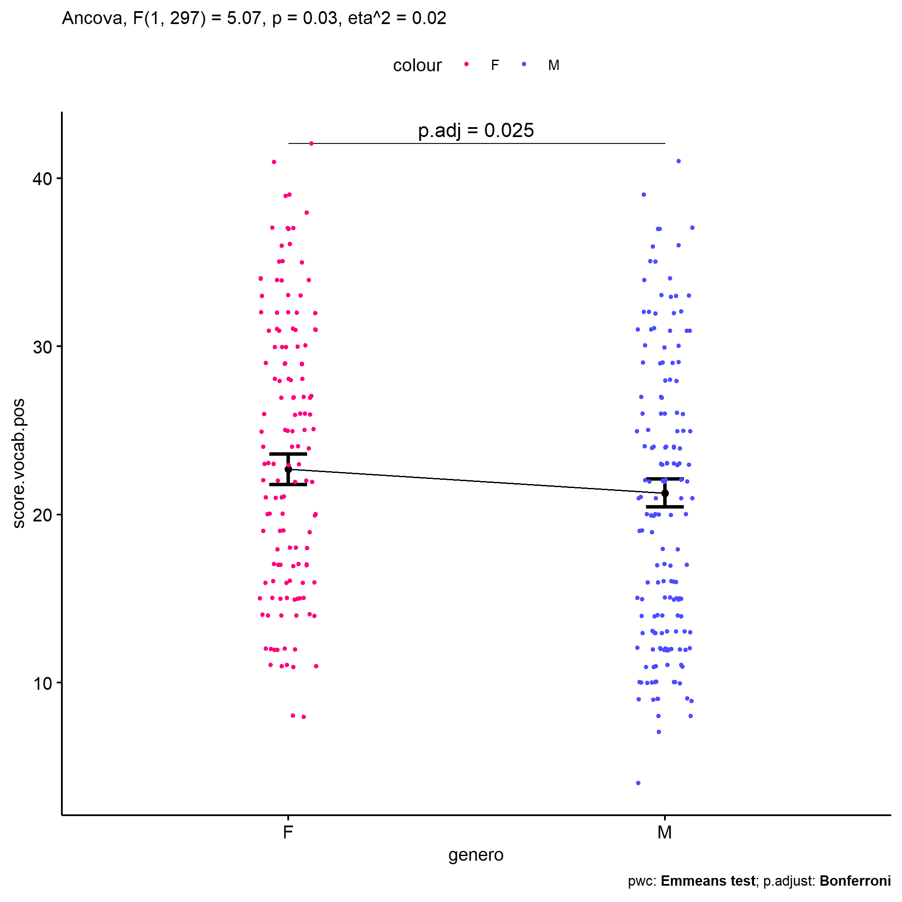<!-- -->

<!-- -->

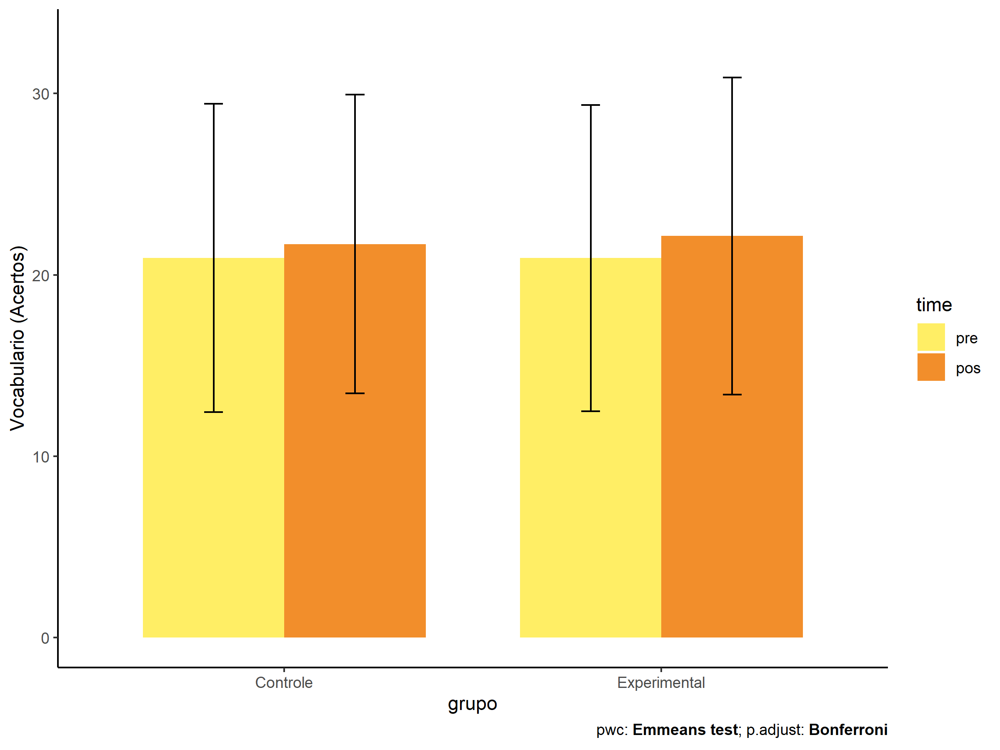<!-- -->

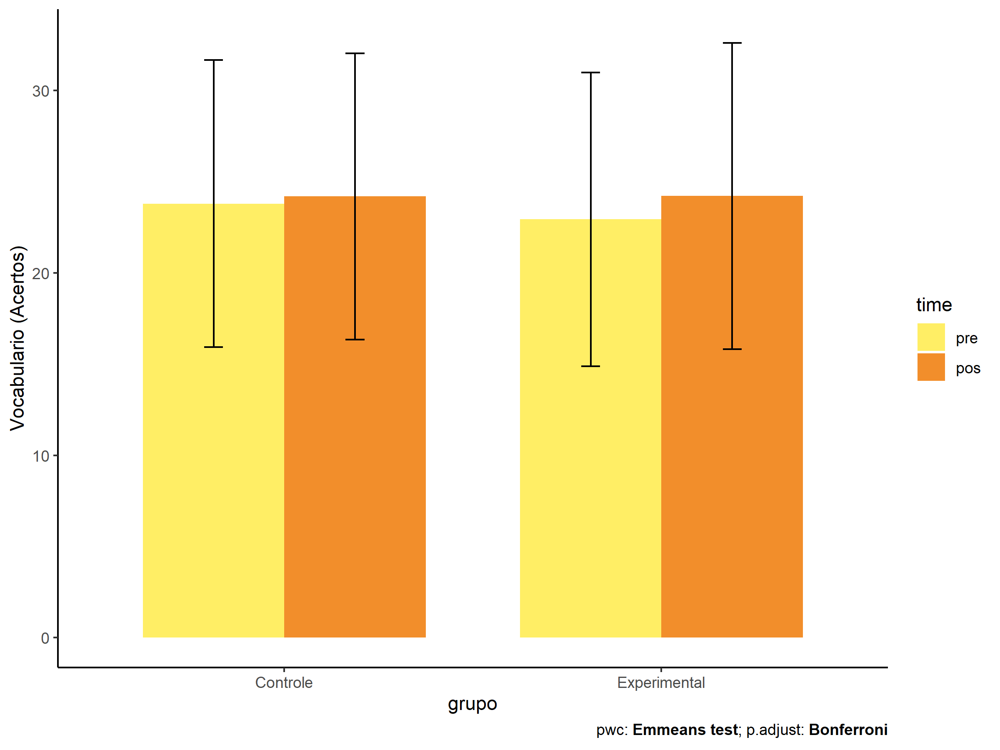<!-- -->

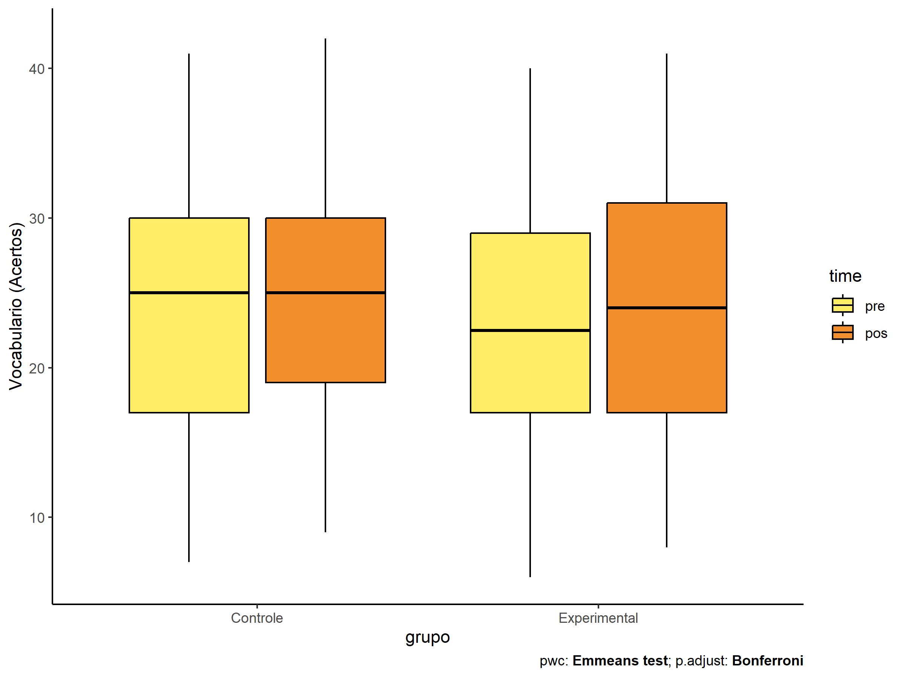<!-- -->

### Vocabulario (TRI)

| var           | grupo        |   n | M (pre) | SE (pre) | M (unadj) | SE (unadj) | M (adj) | SE (adj) |
|:--------------|:-------------|----:|--------:|---------:|----------:|-----------:|--------:|---------:|
| tri.vocab.pos | Controle     | 159 |   0.095 |    0.069 |     0.123 |      0.077 |   0.096 |    0.046 |
| tri.vocab.pos | Experimental | 141 |   0.027 |    0.079 |     0.146 |      0.081 |   0.177 |    0.049 |

| .y.           | group1   | group2       | estimate | conf.low | conf.high |    se | statistic |     p | p.adj | p.adj.signif |
|:--------------|:---------|:-------------|---------:|---------:|----------:|------:|----------:|------:|------:|:-------------|
| tri.vocab.pos | Controle | Experimental |   -0.082 |   -0.214 |     0.051 | 0.067 |    -1.215 | 0.225 | 0.225 | ns           |
| tri.vocab.pre | Controle | Experimental |    0.068 |   -0.137 |     0.273 | 0.104 |     0.650 | 0.516 | 0.516 | ns           |

| .y.       | grupo        | group1 | group2 | estimate | conf.low | conf.high |    se | statistic |     p | p.adj | p.adj.signif |
|:----------|:-------------|:-------|:-------|---------:|---------:|----------:|------:|----------:|------:|------:|:-------------|
| tri.vocab | Controle     | pre    | pos    |   -0.017 |   -0.219 |     0.185 | 0.103 |    -0.162 | 0.871 | 0.871 | ns           |
| tri.vocab | Experimental | pre    | pos    |   -0.109 |   -0.324 |     0.105 | 0.109 |    -1.004 | 0.316 | 0.316 | ns           |

    ## Scale for colour is already present.
    ## Adding another scale for colour, which will replace the existing scale.

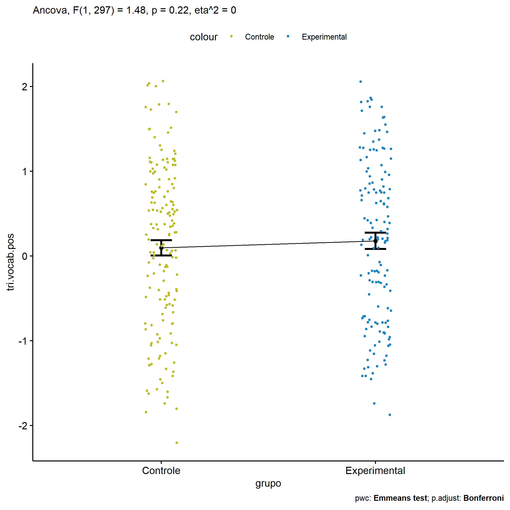<!-- -->

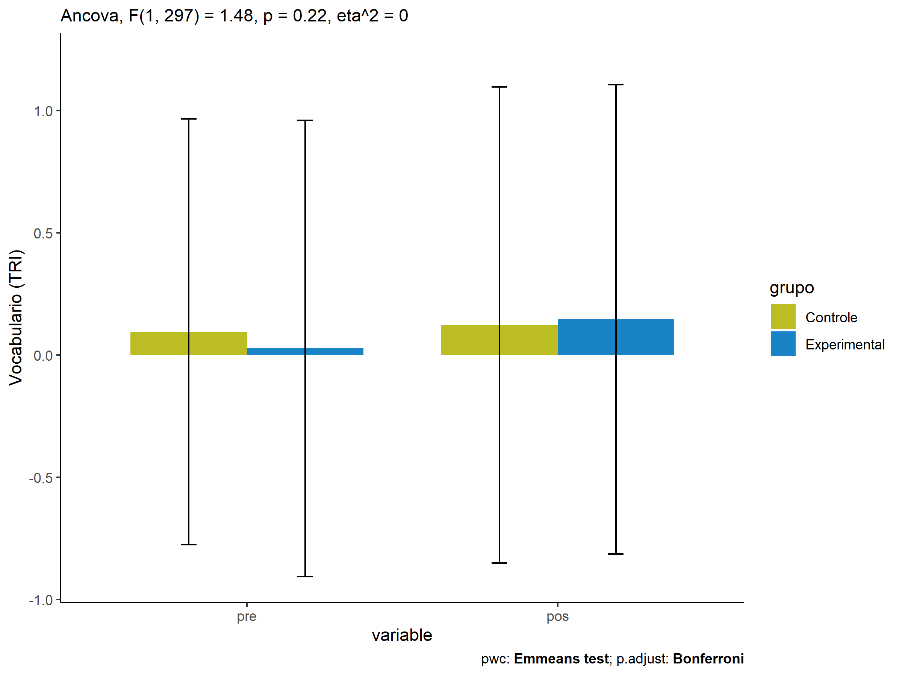<!-- -->

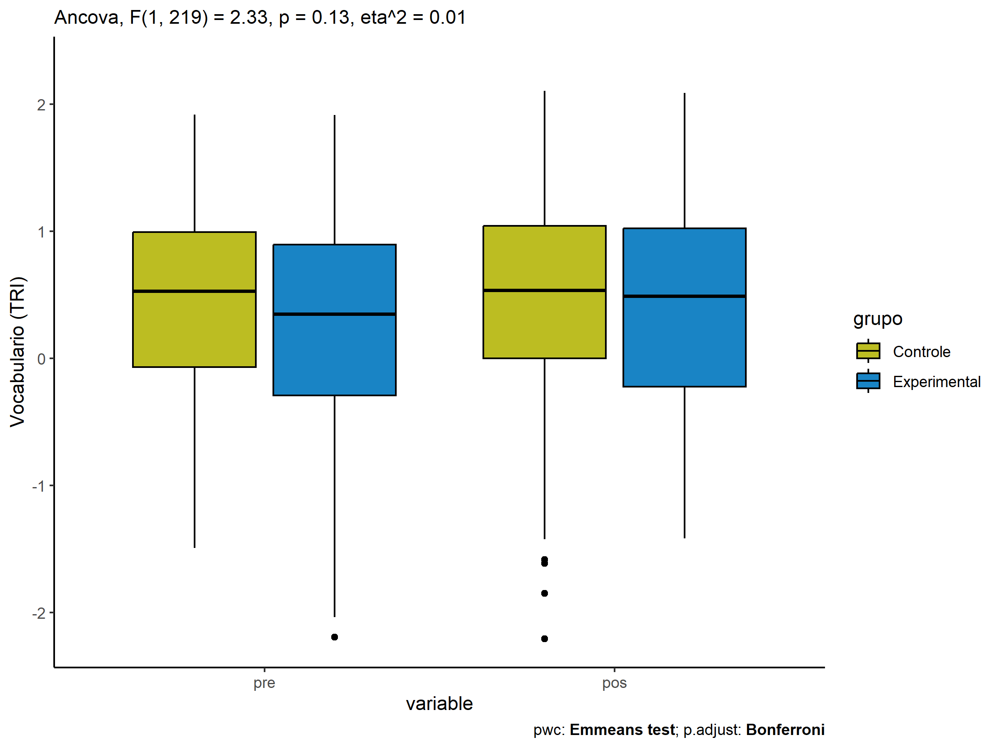<!-- -->

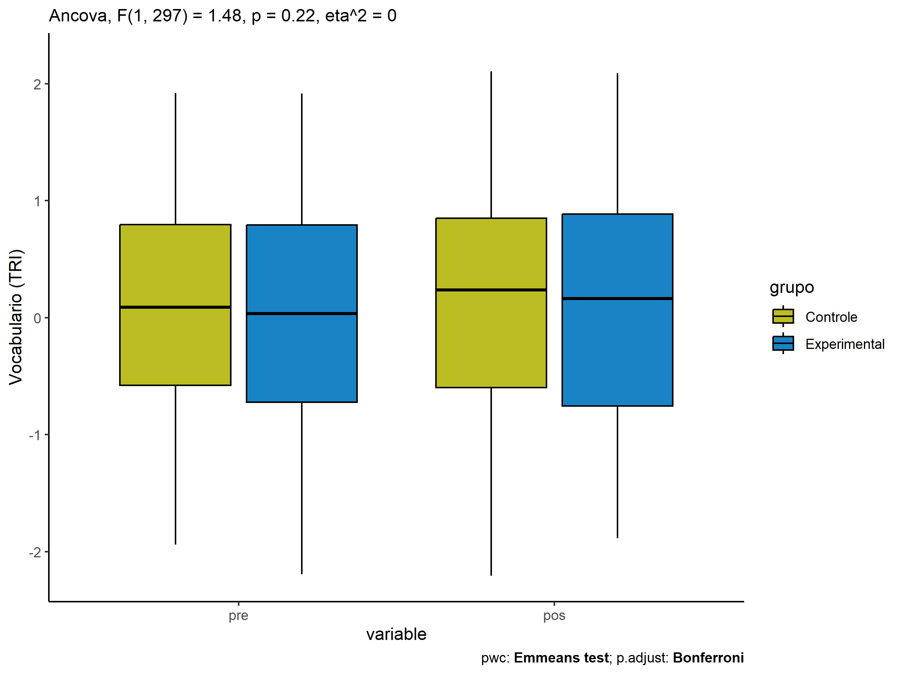<!-- -->

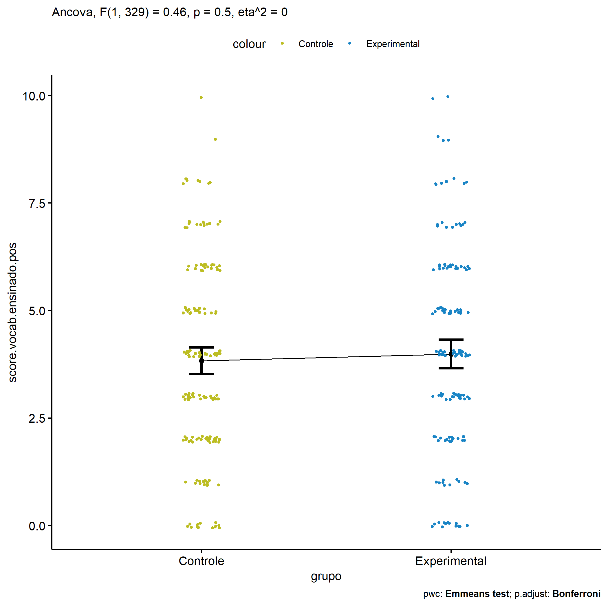<!-- -->

### Vocabulario Ensinado (Acertos)

| var                      | grupo        |   n | M (pre) | SE (pre) | M (unadj) | SE (unadj) | M (adj) | SE (adj) |
|:-------------------------|:-------------|----:|--------:|---------:|----------:|-----------:|--------:|---------:|
| score.vocab.ensinado.pos | Controle     | 176 |   3.807 |    0.175 |     3.795 |      0.172 |   3.833 |    0.159 |
| score.vocab.ensinado.pos | Experimental | 156 |   3.987 |    0.169 |     4.032 |      0.189 |   3.990 |    0.168 |

| .y.                      | group1   | group2       | estimate | conf.low | conf.high |    se | statistic |     p | p.adj | p.adj.signif |
|:-------------------------|:---------|:-------------|---------:|---------:|----------:|------:|----------:|------:|------:|:-------------|
| score.vocab.ensinado.pos | Controle | Experimental |   -0.157 |   -0.612 |     0.298 | 0.231 |    -0.679 | 0.498 | 0.498 | ns           |
| score.vocab.ensinado.pre | Controle | Experimental |   -0.180 |   -0.662 |     0.301 | 0.245 |    -0.736 | 0.462 | 0.462 | ns           |

| .y.                  | grupo        | group1 | group2 | estimate | conf.low | conf.high |    se | statistic |     p | p.adj | p.adj.signif |
|:---------------------|:-------------|:-------|:-------|---------:|---------:|----------:|------:|----------:|------:|------:|:-------------|
| score.vocab.ensinado | Controle     | pre    | pos    |    0.011 |   -0.464 |     0.487 | 0.242 |     0.047 | 0.963 | 0.963 | ns           |
| score.vocab.ensinado | Experimental | pre    | pos    |   -0.045 |   -0.550 |     0.461 | 0.257 |    -0.174 | 0.862 | 0.862 | ns           |

    ## Scale for colour is already present.
    ## Adding another scale for colour, which will replace the existing scale.

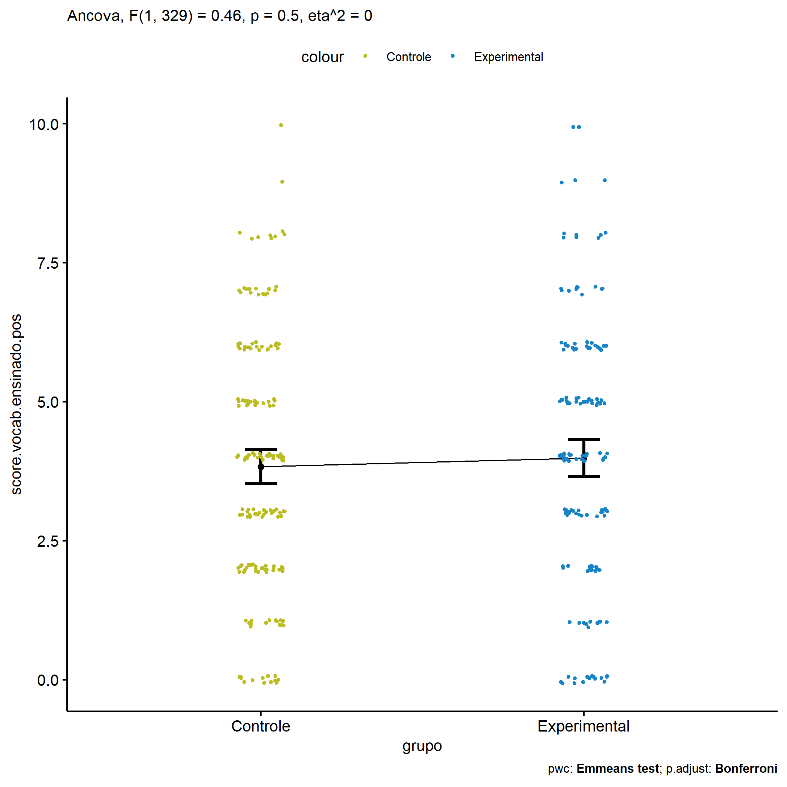<!-- -->

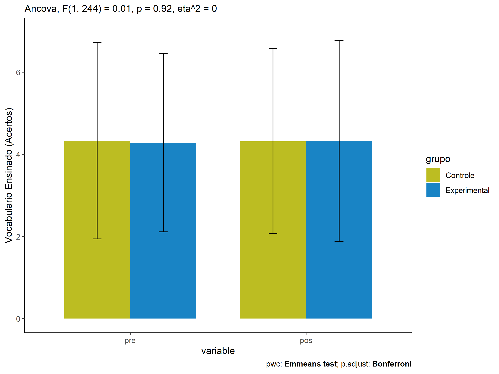<!-- -->

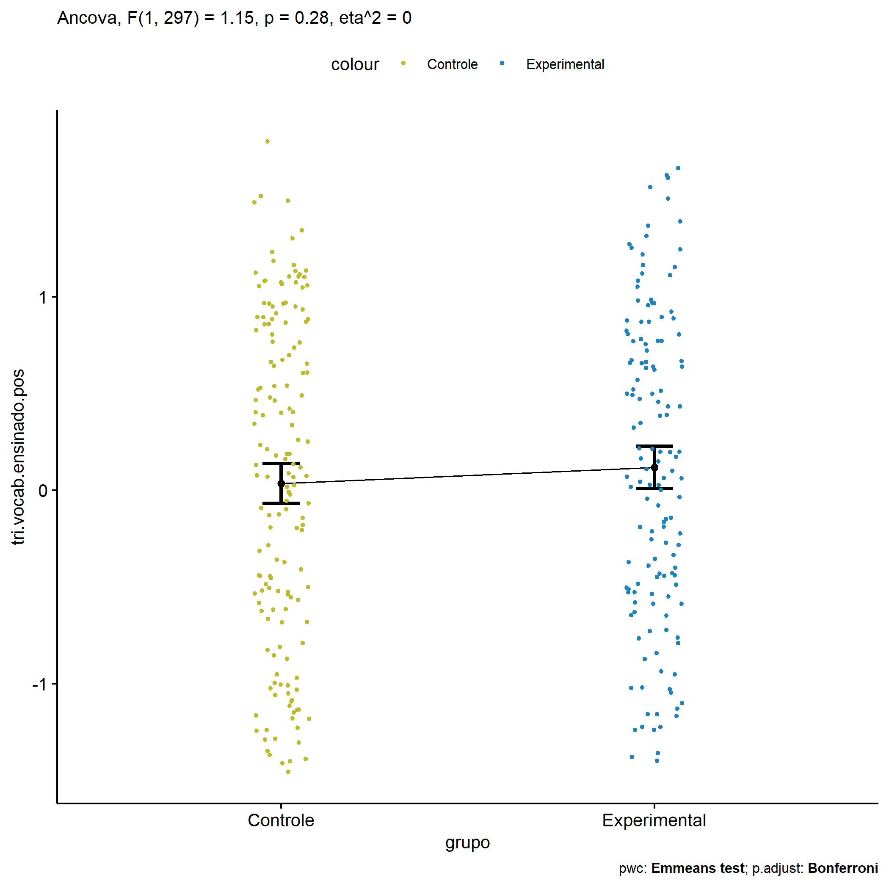<!-- -->

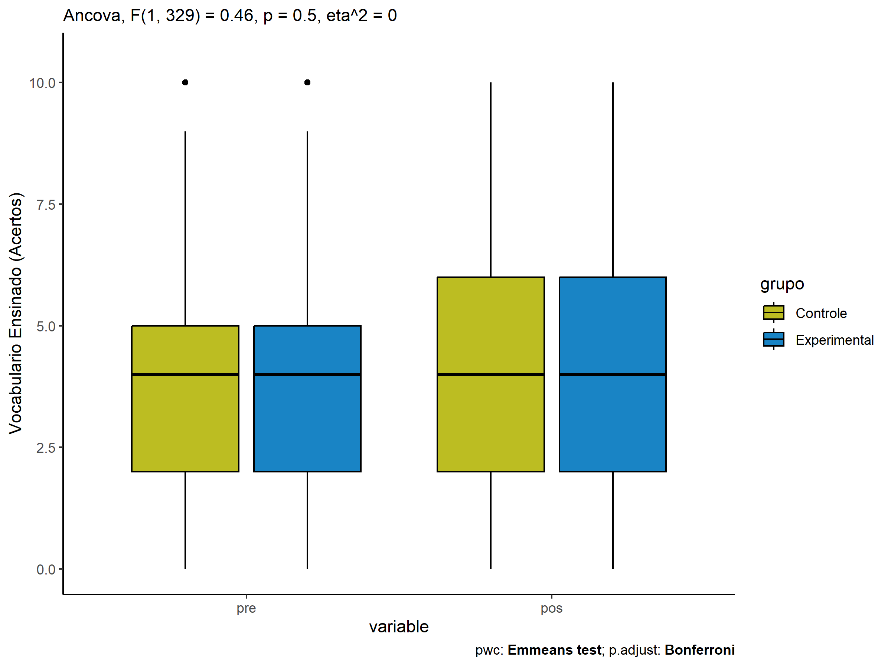<!-- -->

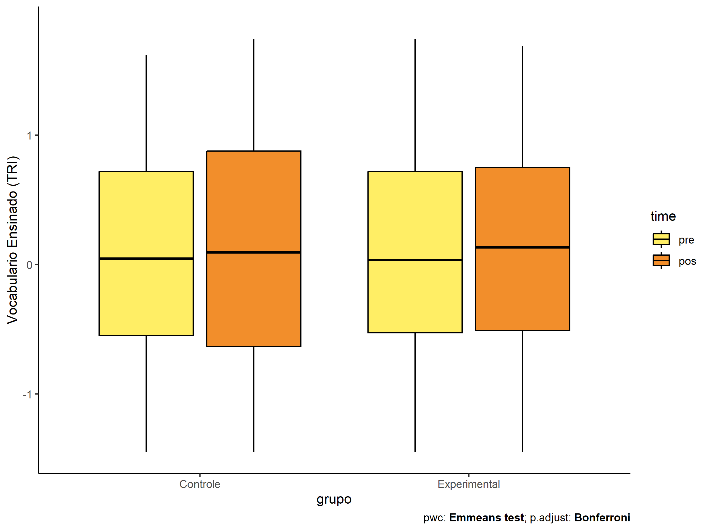<!-- -->

### Vocabulario Ensinado (TRI)

| var                    | grupo        |   n | M (pre) | SE (pre) | M (unadj) | SE (unadj) | M (adj) | SE (adj) |
|:-----------------------|:-------------|----:|--------:|---------:|----------:|-----------:|--------:|---------:|
| tri.vocab.ensinado.pos | Controle     | 159 |   0.065 |    0.064 |     0.043 |      0.067 |   0.035 |    0.052 |
| tri.vocab.ensinado.pos | Experimental | 141 |   0.035 |    0.064 |     0.107 |      0.067 |   0.117 |    0.056 |

| .y.                    | group1   | group2       | estimate | conf.low | conf.high |    se | statistic |     p | p.adj | p.adj.signif |
|:-----------------------|:---------|:-------------|---------:|---------:|----------:|------:|----------:|------:|------:|:-------------|
| tri.vocab.ensinado.pos | Controle | Experimental |   -0.082 |   -0.232 |     0.068 | 0.076 |    -1.074 | 0.284 | 0.284 | ns           |
| tri.vocab.ensinado.pre | Controle | Experimental |    0.030 |   -0.149 |     0.209 | 0.091 |     0.330 | 0.741 | 0.741 | ns           |

| .y.                | grupo        | group1 | group2 | estimate | conf.low | conf.high |    se | statistic |     p | p.adj | p.adj.signif |
|:-------------------|:-------------|:-------|:-------|---------:|---------:|----------:|------:|----------:|------:|------:|:-------------|
| tri.vocab.ensinado | Controle     | pre    | pos    |    0.008 |   -0.166 |     0.181 | 0.088 |     0.085 | 0.932 | 0.932 | ns           |
| tri.vocab.ensinado | Experimental | pre    | pos    |   -0.059 |   -0.243 |     0.125 | 0.094 |    -0.629 | 0.529 | 0.529 | ns           |

    ## Scale for colour is already present.
    ## Adding another scale for colour, which will replace the existing scale.

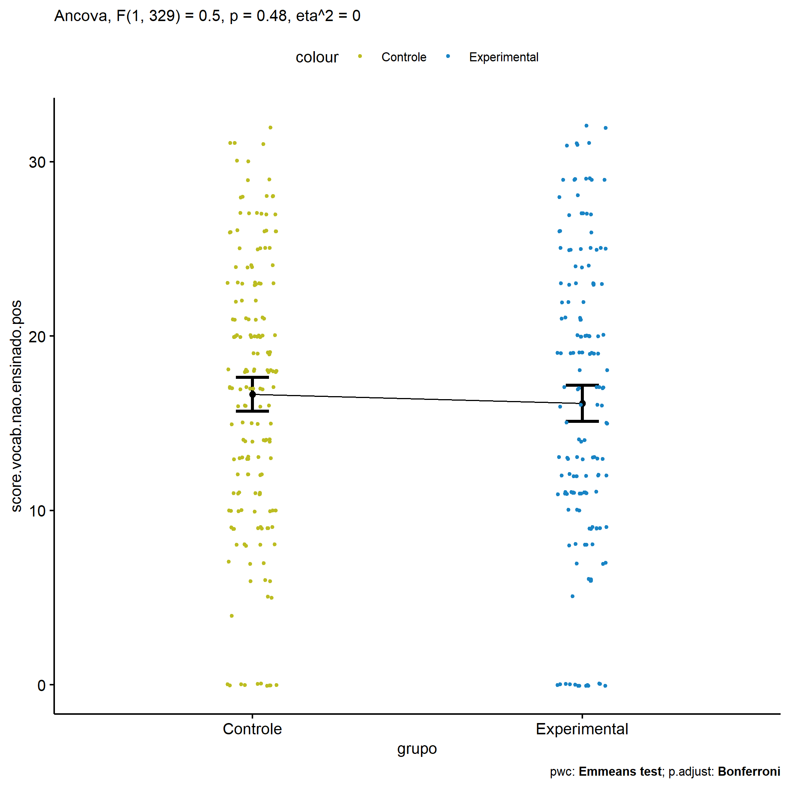<!-- -->

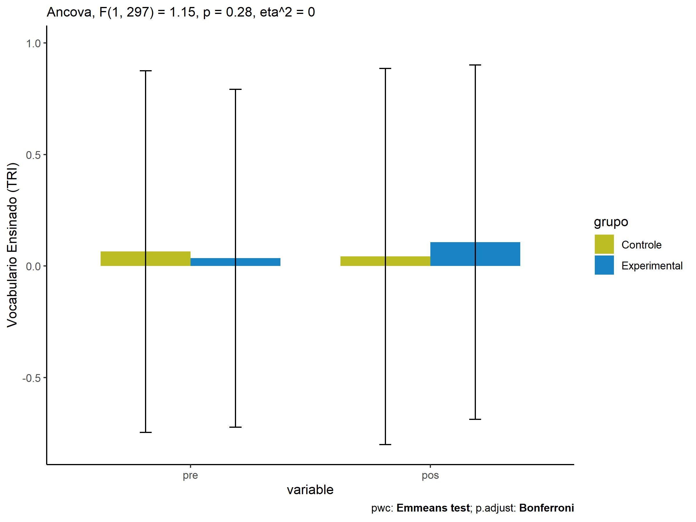<!-- -->

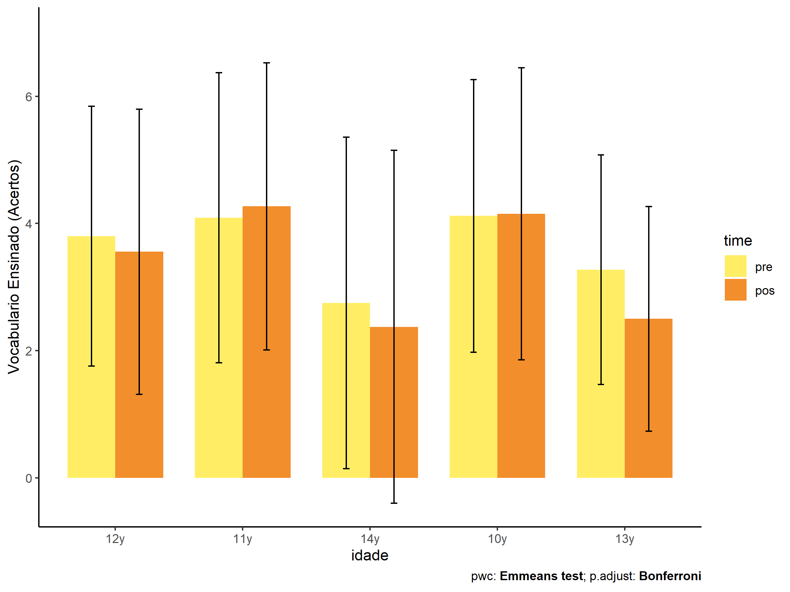<!-- -->

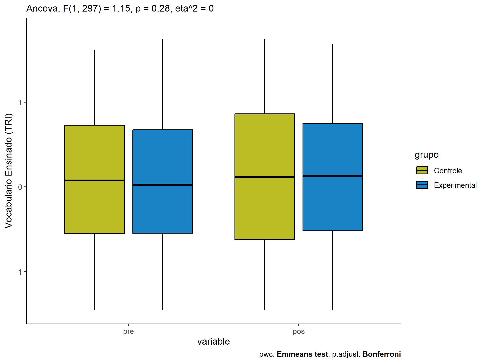<!-- -->

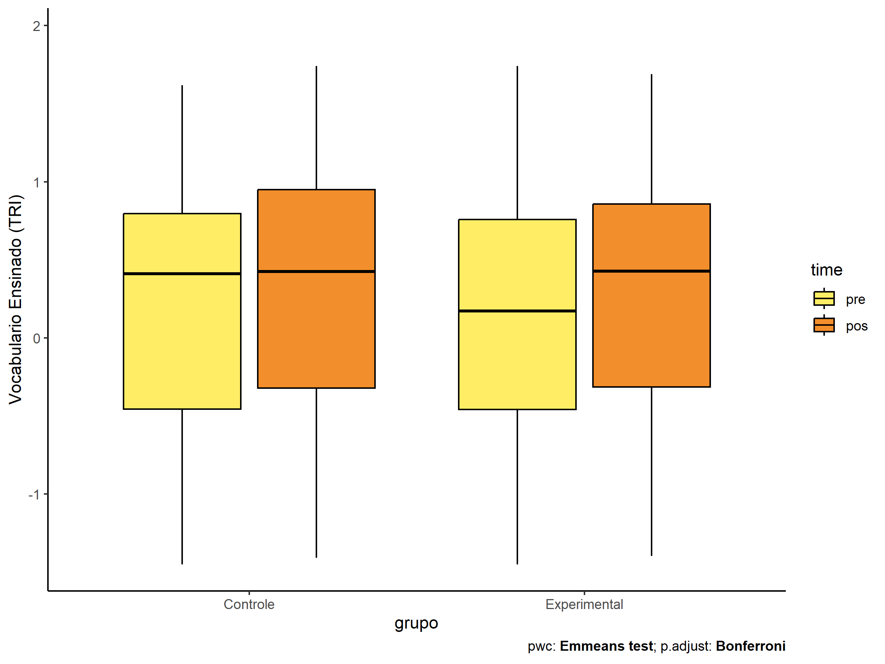<!-- -->

### Vocabulario Nao Ensinado (Acertos)

| var                          | grupo        |   n | M (pre) | SE (pre) | M (unadj) | SE (unadj) | M (adj) | SE (adj) |
|:-----------------------------|:-------------|----:|--------:|---------:|----------:|-----------:|--------:|---------:|
| score.vocab.nao.ensinado.pos | Controle     | 176 |  16.176 |    0.571 |    16.545 |      0.589 |  16.655 |    0.495 |
| score.vocab.nao.ensinado.pos | Experimental | 156 |  16.538 |    0.583 |    16.269 |      0.675 |  16.146 |    0.526 |

| .y.                          | group1   | group2       | estimate | conf.low | conf.high |    se | statistic |     p | p.adj | p.adj.signif |
|:-----------------------------|:---------|:-------------|---------:|---------:|----------:|------:|----------:|------:|------:|:-------------|
| score.vocab.nao.ensinado.pos | Controle | Experimental |    0.508 |   -0.912 |     1.929 | 0.722 |     0.704 | 0.482 | 0.482 | ns           |
| score.vocab.nao.ensinado.pre | Controle | Experimental |   -0.362 |   -1.971 |     1.247 | 0.818 |    -0.443 | 0.658 | 0.658 | ns           |

| .y.                      | grupo        | group1 | group2 | estimate | conf.low | conf.high |    se | statistic |     p | p.adj | p.adj.signif |
|:-------------------------|:-------------|:-------|:-------|---------:|---------:|----------:|------:|----------:|------:|------:|:-------------|
| score.vocab.nao.ensinado | Controle     | pre    | pos    |   -0.369 |   -1.998 |     1.259 | 0.829 |    -0.445 | 0.656 | 0.656 | ns           |
| score.vocab.nao.ensinado | Experimental | pre    | pos    |    0.269 |   -1.460 |     1.999 | 0.881 |     0.306 | 0.760 | 0.760 | ns           |

    ## Scale for colour is already present.
    ## Adding another scale for colour, which will replace the existing scale.

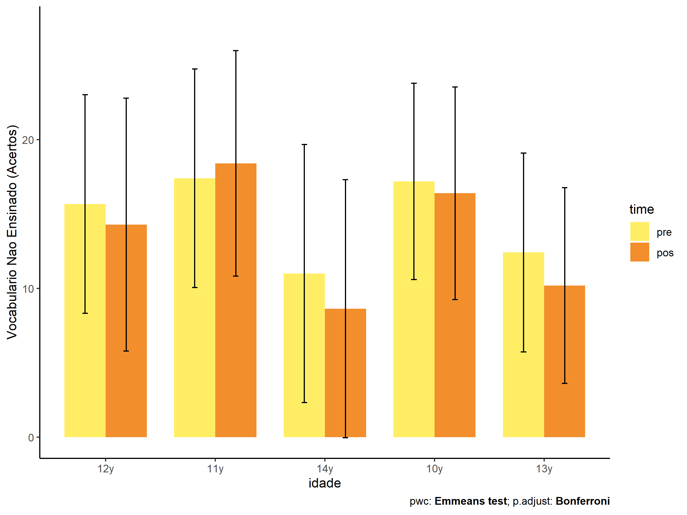<!-- -->

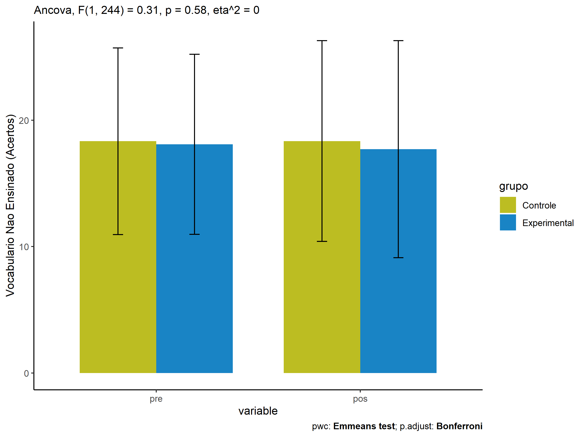<!-- -->

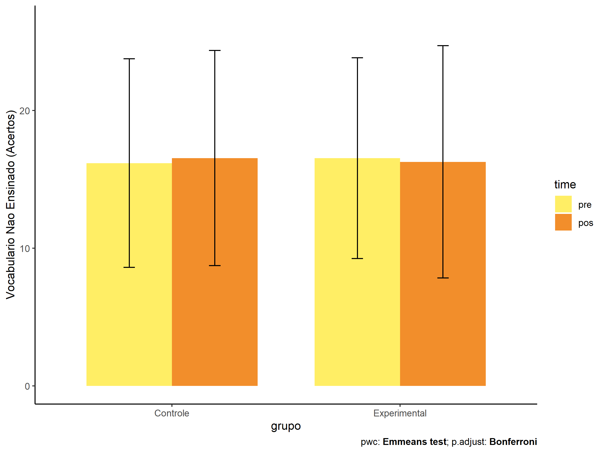<!-- -->

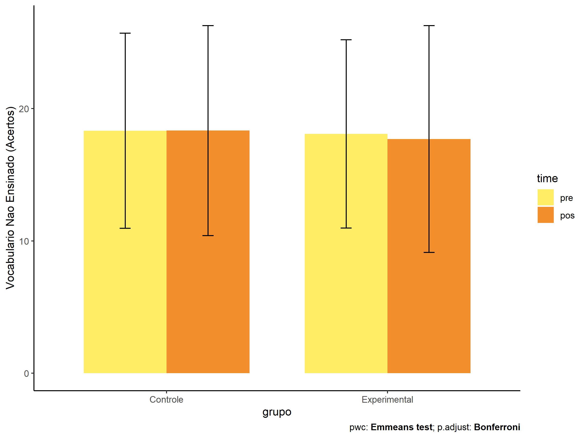<!-- -->

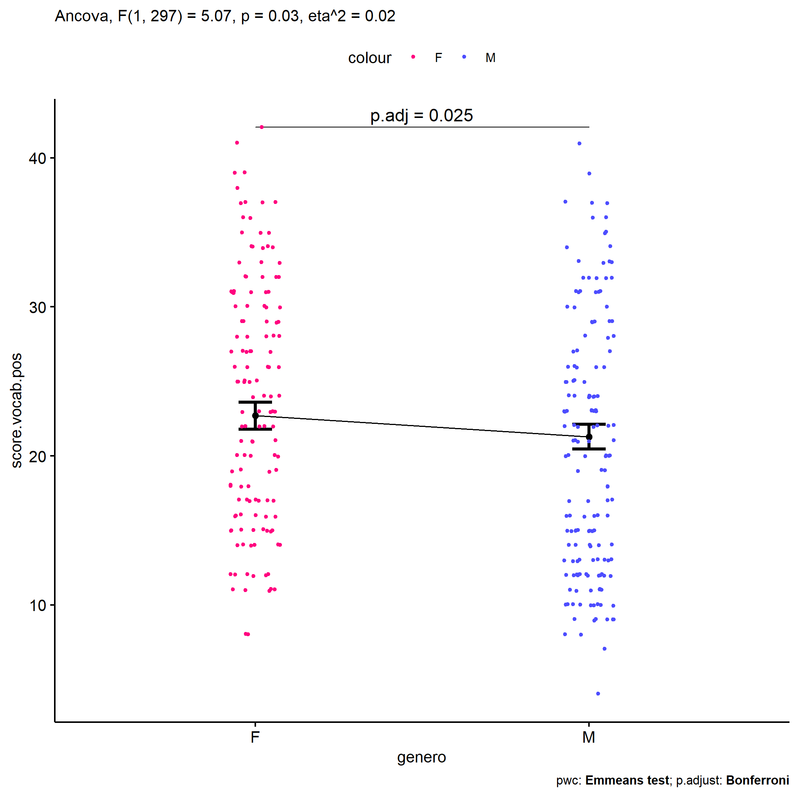<!-- -->

### Vocabulario Nao Ensinado (TRI)

| var                        | grupo        |   n | M (pre) | SE (pre) | M (unadj) | SE (unadj) | M (adj) | SE (adj) |
|:---------------------------|:-------------|----:|--------:|---------:|----------:|-----------:|--------:|---------:|
| tri.vocab.nao.ensinado.pos | Controle     | 159 |   0.064 |    0.071 |     0.164 |      0.074 |   0.143 |    0.046 |
| tri.vocab.nao.ensinado.pos | Experimental | 141 |   0.013 |    0.077 |     0.145 |      0.084 |   0.168 |    0.049 |

| .y.                        | group1   | group2       | estimate | conf.low | conf.high |    se | statistic |     p | p.adj | p.adj.signif |
|:---------------------------|:---------|:-------------|---------:|---------:|----------:|------:|----------:|------:|------:|:-------------|
| tri.vocab.nao.ensinado.pos | Controle | Experimental |   -0.025 |   -0.158 |     0.108 | 0.068 |    -0.368 | 0.713 | 0.713 | ns           |
| tri.vocab.nao.ensinado.pre | Controle | Experimental |    0.051 |   -0.156 |     0.258 | 0.105 |     0.486 | 0.627 | 0.627 | ns           |

| .y.                    | grupo        | group1 | group2 | estimate | conf.low | conf.high |    se | statistic |     p | p.adj | p.adj.signif |
|:-----------------------|:-------------|:-------|:-------|---------:|---------:|----------:|------:|----------:|------:|------:|:-------------|
| tri.vocab.nao.ensinado | Controle     | pre    | pos    |   -0.085 |   -0.286 |     0.117 | 0.103 |    -0.825 | 0.410 | 0.410 | ns           |
| tri.vocab.nao.ensinado | Experimental | pre    | pos    |   -0.123 |   -0.337 |     0.091 | 0.109 |    -1.130 | 0.259 | 0.259 | ns           |

    ## Scale for colour is already present.
    ## Adding another scale for colour, which will replace the existing scale.

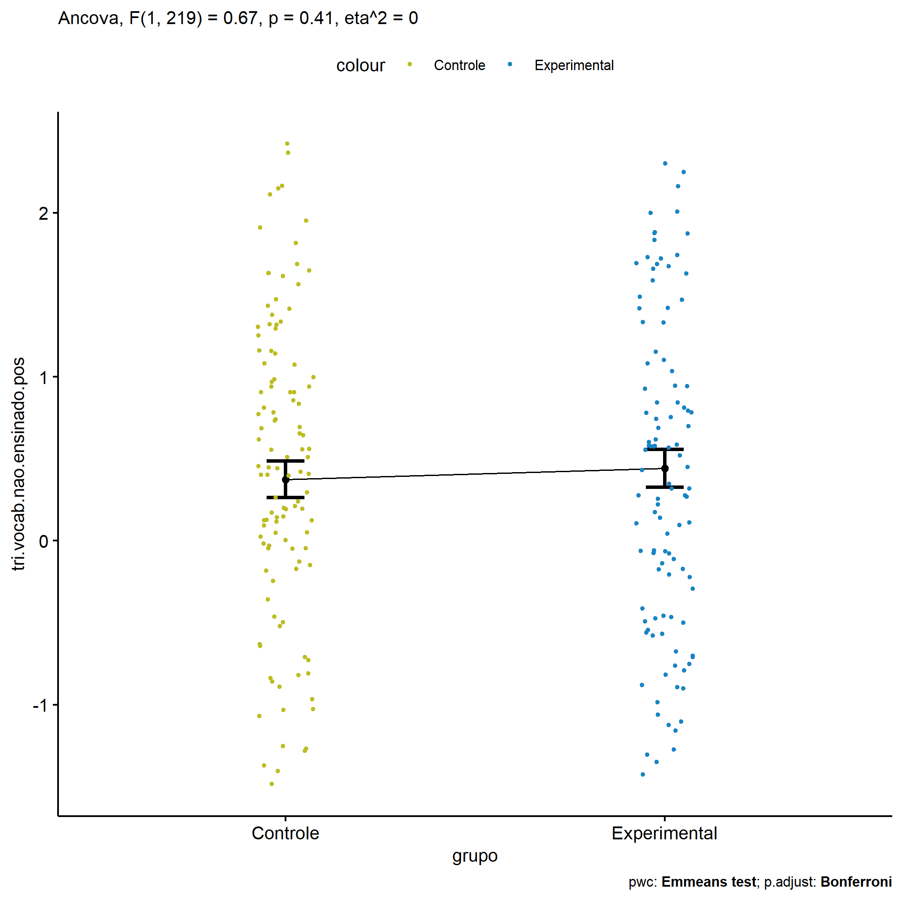<!-- -->

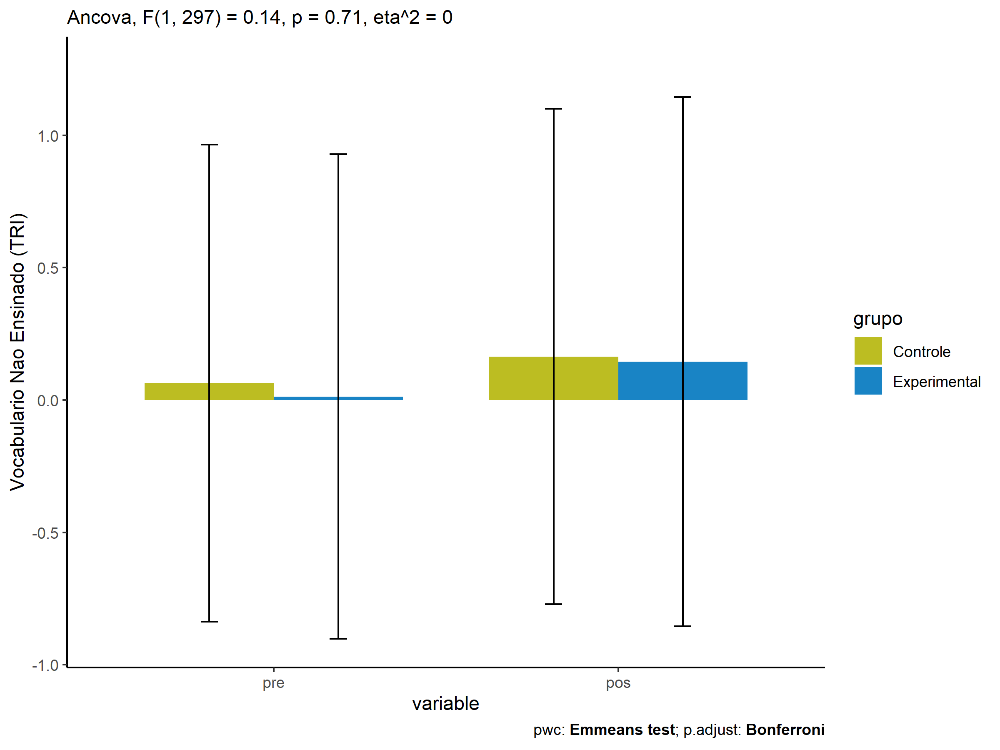<!-- -->

<!-- -->

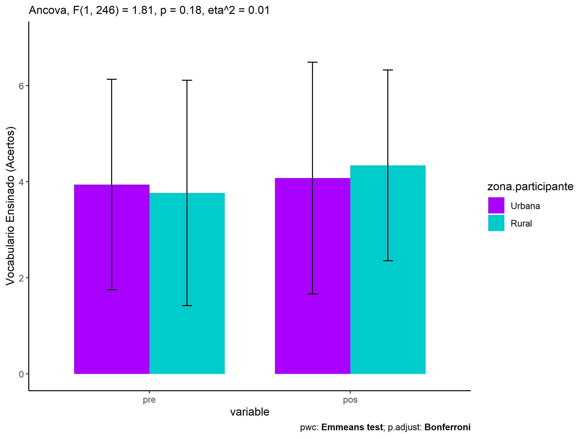<!-- -->

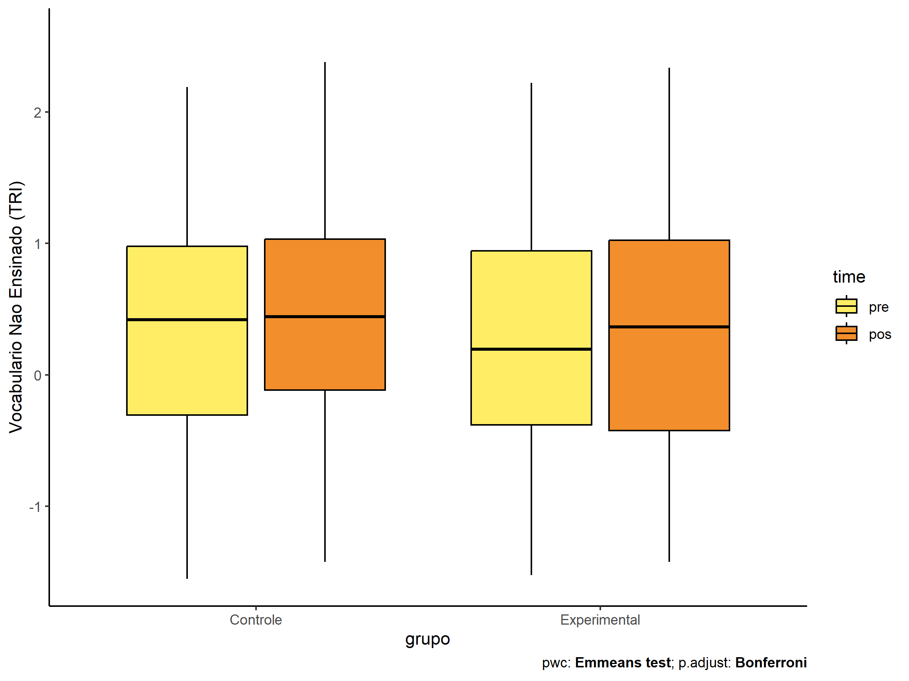<!-- -->

## factor: **genero**

### Vocabulario (Acertos)

| var             | genero |   n | M (pre) | SE (pre) | M (unadj) | SE (unadj) | M (adj) | SE (adj) |
|:----------------|:-------|----:|--------:|---------:|----------:|-----------:|--------:|---------:|
| score.vocab.pos | F      | 137 |  22.387 |    0.725 |     23.81 |      0.696 |  22.696 |    0.459 |
| score.vocab.pos | M      | 163 |  19.681 |    0.647 |     20.35 |      0.657 |  21.286 |    0.420 |

| .y.             | group1 | group2 | estimate | conf.low | conf.high |    se | statistic |     p | p.adj | p.adj.signif |
|:----------------|:-------|:-------|---------:|---------:|----------:|------:|----------:|------:|------:|:-------------|
| score.vocab.pos | F      | M      |    1.410 |    0.177 |     2.642 | 0.626 |     2.251 | 0.025 | 0.025 | \*           |
| score.vocab.pre | F      | M      |    2.706 |    0.798 |     4.614 | 0.969 |     2.791 | 0.006 | 0.006 | \*\*         |

| .y.         | genero | group1 | group2 | estimate | conf.low | conf.high |    se | statistic |     p | p.adj | p.adj.signif |
|:------------|:-------|:-------|:-------|---------:|---------:|----------:|------:|----------:|------:|------:|:-------------|
| score.vocab | F      | pre    | pos    |   -1.560 |   -3.495 |     0.375 | 0.985 |    -1.583 | 0.114 | 0.114 | ns           |
| score.vocab | M      | pre    | pos    |   -0.575 |   -2.344 |     1.195 | 0.901 |    -0.638 | 0.524 | 0.524 | ns           |

    ## Scale for colour is already present.
    ## Adding another scale for colour, which will replace the existing scale.

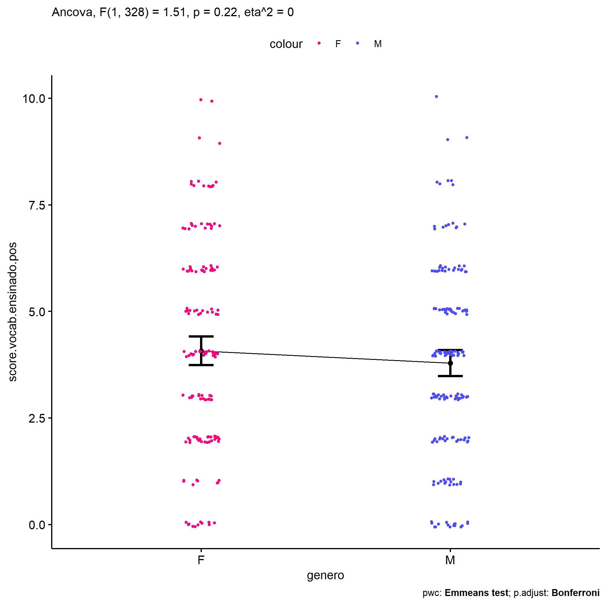<!-- -->

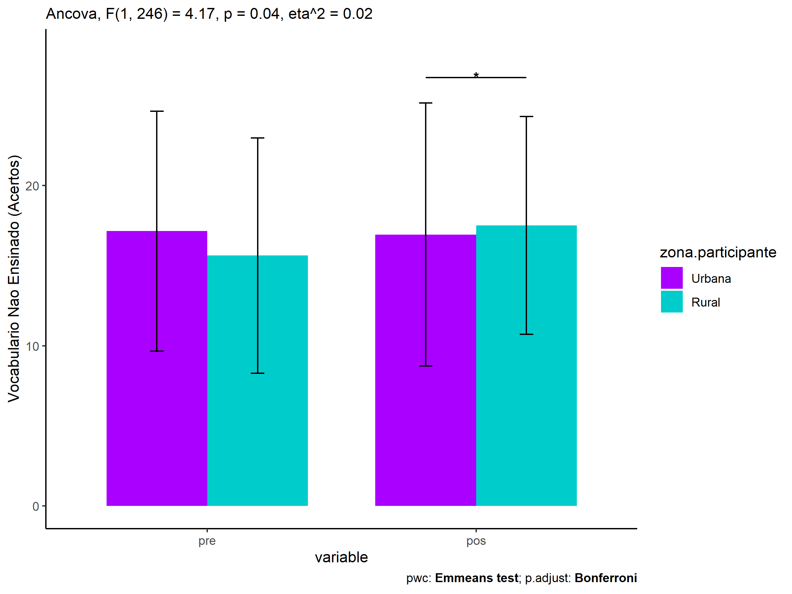<!-- -->

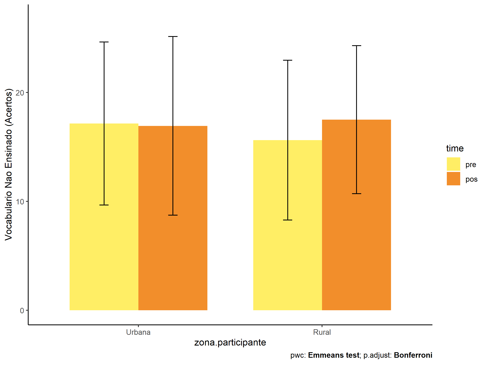<!-- -->

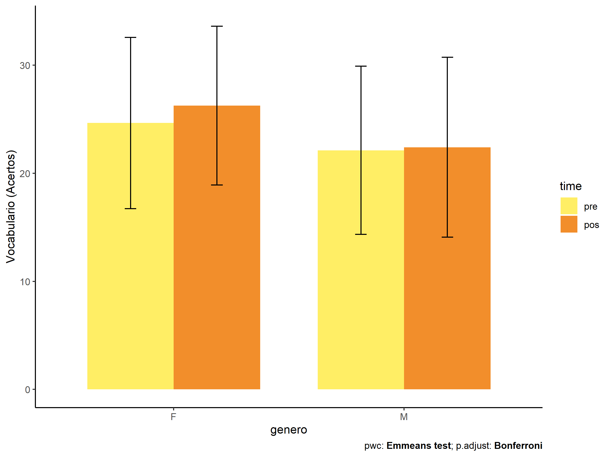<!-- -->

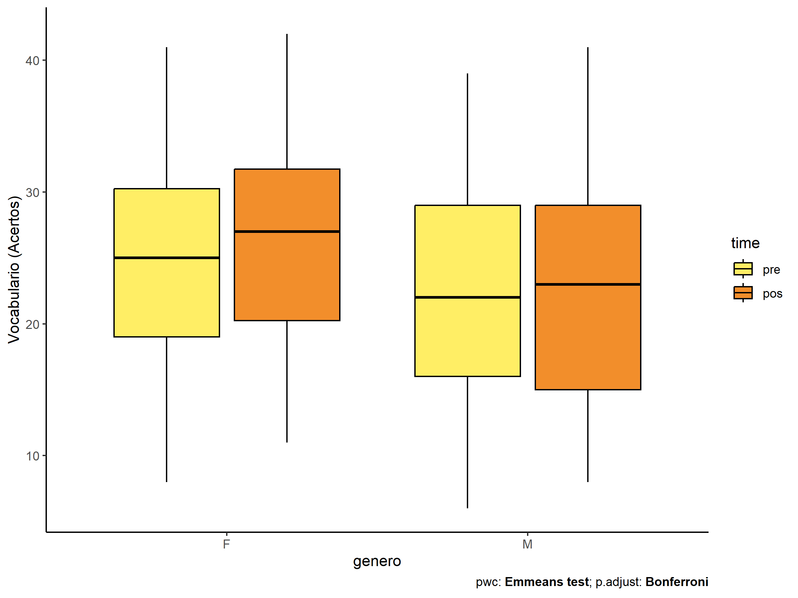<!-- -->

### Vocabulario (TRI)

| var           | genero |   n | M (pre) | SE (pre) | M (unadj) | SE (unadj) | M (adj) | SE (adj) |
|:--------------|:-------|----:|--------:|---------:|----------:|-----------:|--------:|---------:|
| tri.vocab.pos | F      | 137 |   0.233 |    0.073 |     0.337 |      0.080 |   0.193 |    0.050 |
| tri.vocab.pos | M      | 163 |  -0.080 |    0.072 |    -0.036 |      0.075 |   0.085 |    0.046 |

| .y.           | group1 | group2 | estimate | conf.low | conf.high |    se | statistic |     p | p.adj | p.adj.signif |
|:--------------|:-------|:-------|---------:|---------:|----------:|------:|----------:|------:|------:|:-------------|
| tri.vocab.pos | F      | M      |    0.108 |   -0.026 |     0.242 | 0.068 |     1.584 | 0.114 | 0.114 | ns           |
| tri.vocab.pre | F      | M      |    0.313 |    0.110 |     0.515 | 0.103 |     3.040 | 0.003 | 0.003 | \*\*         |

| .y.       | genero | group1 | group2 | estimate | conf.low | conf.high |    se | statistic |     p | p.adj | p.adj.signif |
|:----------|:-------|:-------|:-------|---------:|---------:|----------:|------:|----------:|------:|------:|:-------------|
| tri.vocab | F      | pre    | pos    |   -0.104 |   -0.318 |      0.11 | 0.109 |    -0.957 | 0.339 | 0.339 | ns           |
| tri.vocab | M      | pre    | pos    |   -0.035 |   -0.231 |      0.16 | 0.100 |    -0.354 | 0.724 | 0.724 | ns           |

    ## Scale for colour is already present.
    ## Adding another scale for colour, which will replace the existing scale.

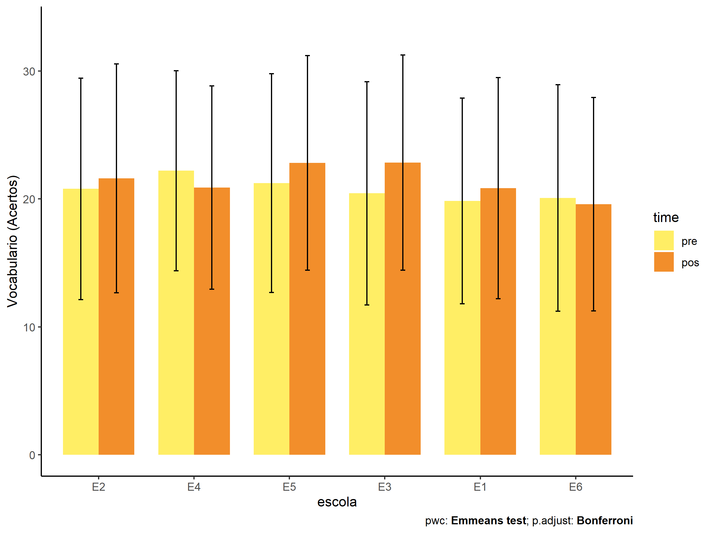<!-- -->

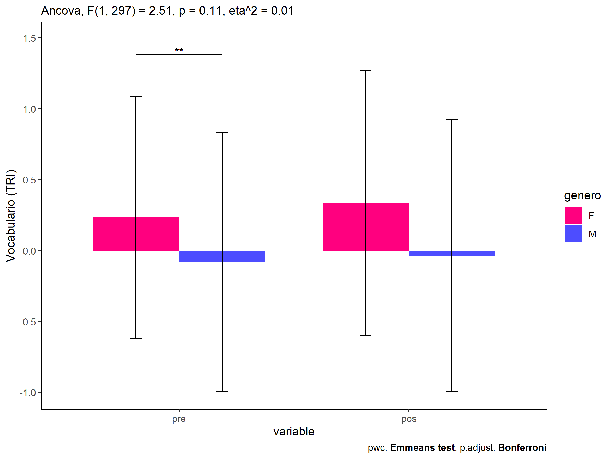<!-- -->

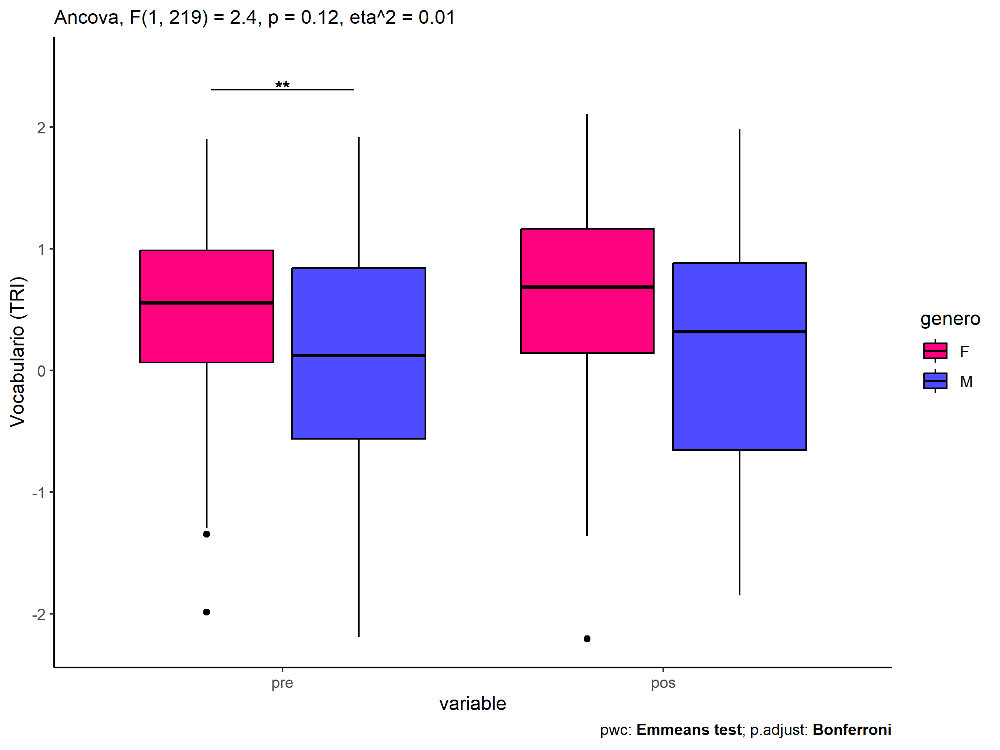<!-- -->

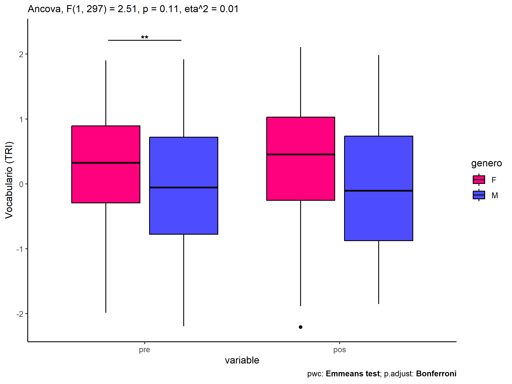<!-- -->

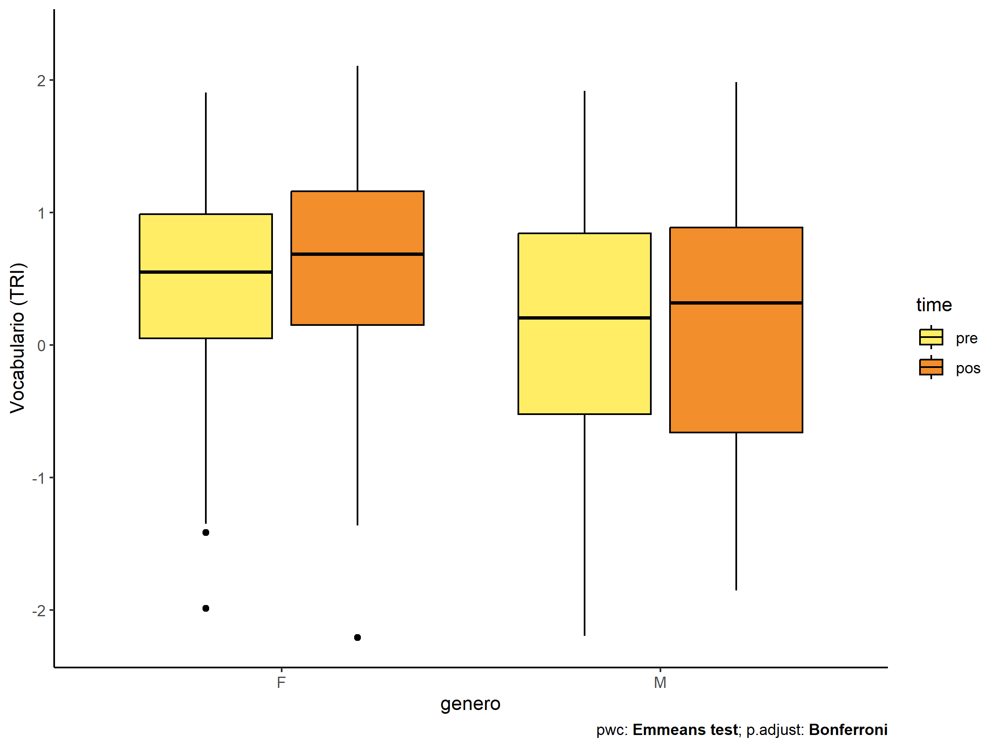<!-- -->

### Vocabulario Ensinado (Acertos)

| var                      | genero |   n | M (pre) | SE (pre) | M (unadj) | SE (unadj) | M (adj) | SE (adj) |
|:-------------------------|:-------|----:|--------:|---------:|----------:|-----------:|--------:|---------:|
| score.vocab.ensinado.pos | F      | 150 |   4.160 |    0.193 |     4.200 |      0.198 |   4.074 |    0.170 |
| score.vocab.ensinado.pos | M      | 181 |   3.646 |    0.153 |     3.685 |      0.163 |   3.790 |    0.155 |

| .y.                      | group1 | group2 | estimate | conf.low | conf.high |    se | statistic |     p | p.adj | p.adj.signif |
|:-------------------------|:-------|:-------|---------:|---------:|----------:|------:|----------:|------:|------:|:-------------|
| score.vocab.ensinado.pos | F      | M      |    0.284 |   -0.171 |     0.739 | 0.231 |     1.229 | 0.220 | 0.220 | ns           |
| score.vocab.ensinado.pre | F      | M      |    0.514 |    0.034 |     0.993 | 0.244 |     2.108 | 0.036 | 0.036 | \*           |

| .y.                  | genero | group1 | group2 | estimate | conf.low | conf.high |    se | statistic |     p | p.adj | p.adj.signif |
|:---------------------|:-------|:-------|:-------|---------:|---------:|----------:|------:|----------:|------:|------:|:-------------|
| score.vocab.ensinado | F      | pre    | pos    |   -0.040 |   -0.551 |     0.471 | 0.260 |    -0.154 | 0.878 | 0.878 | ns           |
| score.vocab.ensinado | M      | pre    | pos    |   -0.039 |   -0.504 |     0.427 | 0.237 |    -0.163 | 0.870 | 0.870 | ns           |

    ## Scale for colour is already present.
    ## Adding another scale for colour, which will replace the existing scale.

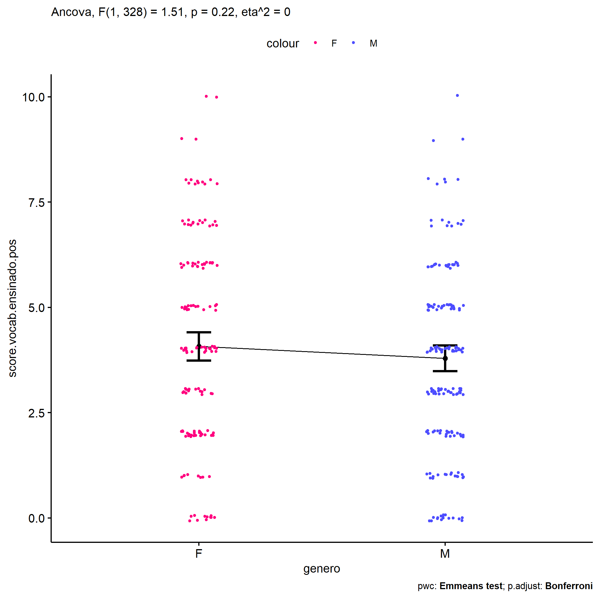<!-- -->

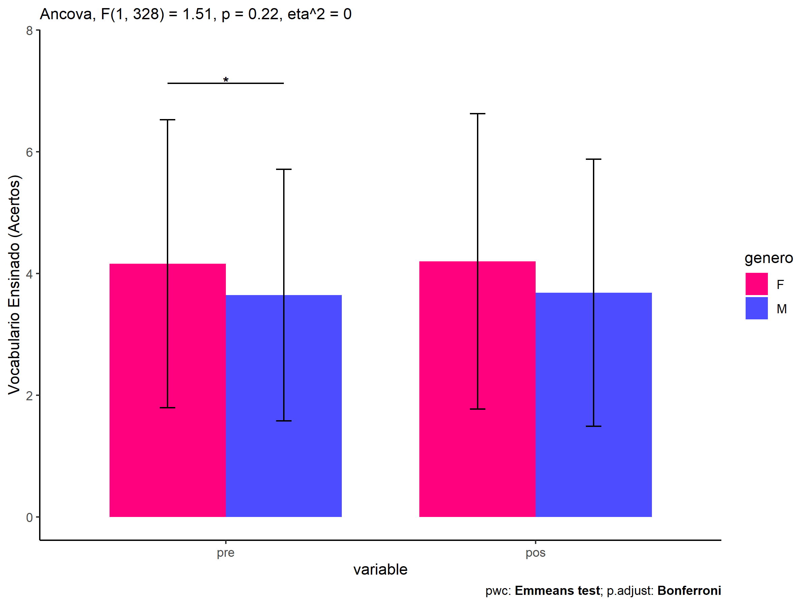<!-- -->

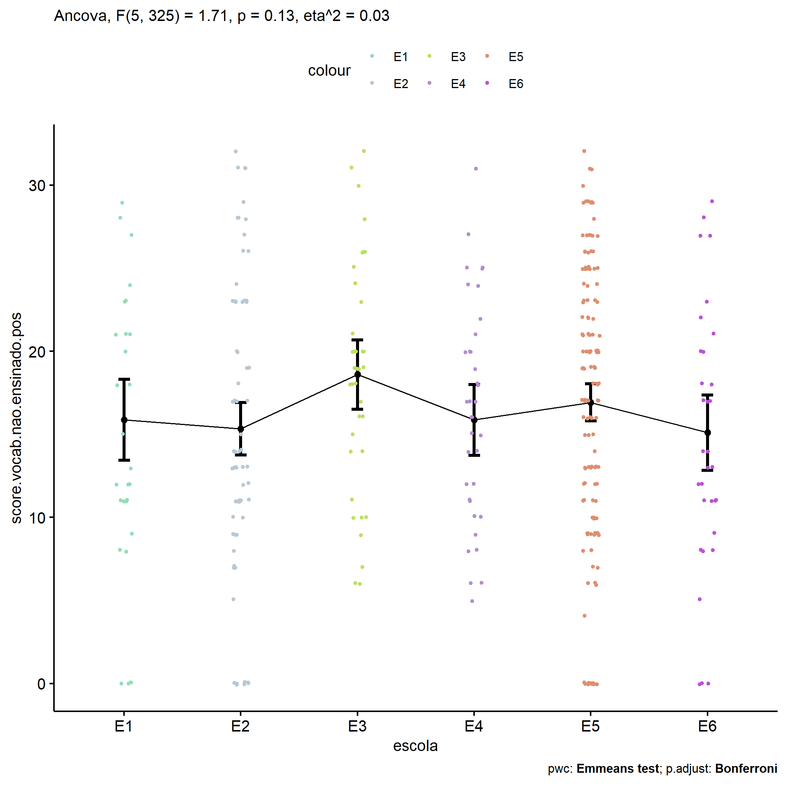<!-- -->

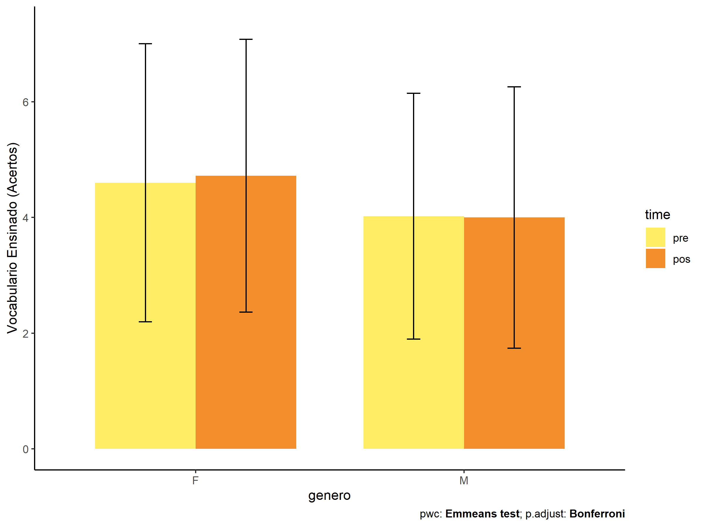<!-- -->

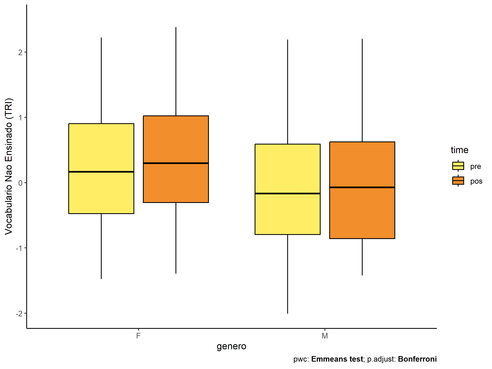<!-- -->

### Vocabulario Ensinado (TRI)

| var                    | genero |   n | M (pre) | SE (pre) | M (unadj) | SE (unadj) | M (adj) | SE (adj) |
|:-----------------------|:-------|----:|--------:|---------:|----------:|-----------:|--------:|---------:|
| tri.vocab.ensinado.pos | F      | 137 |   0.206 |    0.070 |     0.211 |      0.072 |   0.116 |    0.057 |
| tri.vocab.ensinado.pos | M      | 163 |  -0.080 |    0.057 |    -0.043 |      0.061 |   0.037 |    0.052 |

| .y.                    | group1 | group2 | estimate | conf.low | conf.high |    se | statistic |     p | p.adj | p.adj.signif |
|:-----------------------|:-------|:-------|---------:|---------:|----------:|------:|----------:|------:|------:|:-------------|
| tri.vocab.ensinado.pos | F      | M      |    0.078 |   -0.075 |     0.231 | 0.078 |     1.009 | 0.314 | 0.314 | ns           |
| tri.vocab.ensinado.pre | F      | M      |    0.286 |    0.110 |     0.462 | 0.090 |     3.194 | 0.002 | 0.002 | \*\*         |

| .y.                | genero | group1 | group2 | estimate | conf.low | conf.high |    se | statistic |     p | p.adj | p.adj.signif |
|:-------------------|:-------|:-------|:-------|---------:|---------:|----------:|------:|----------:|------:|------:|:-------------|
| tri.vocab.ensinado | F      | pre    | pos    |   -0.014 |   -0.198 |     0.170 | 0.094 |    -0.153 | 0.879 | 0.879 | ns           |
| tri.vocab.ensinado | M      | pre    | pos    |   -0.039 |   -0.208 |     0.129 | 0.086 |    -0.459 | 0.646 | 0.646 | ns           |

    ## Scale for colour is already present.
    ## Adding another scale for colour, which will replace the existing scale.

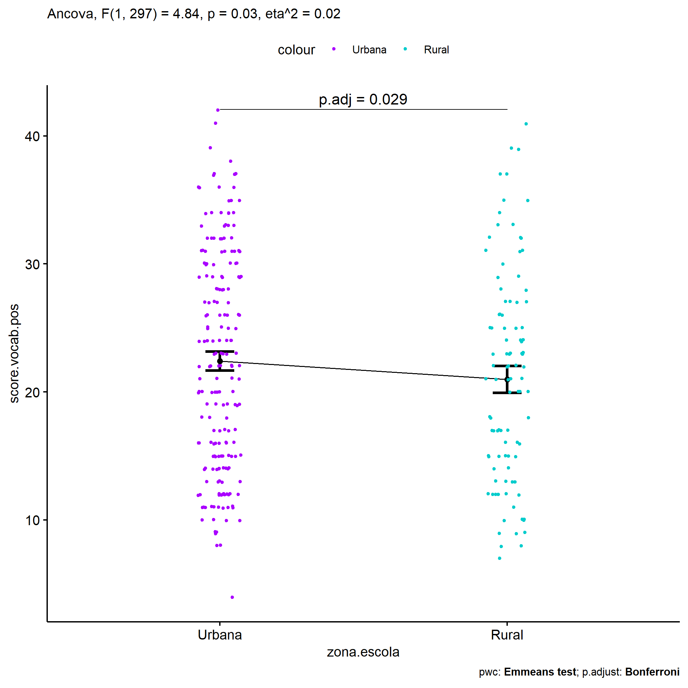<!-- -->

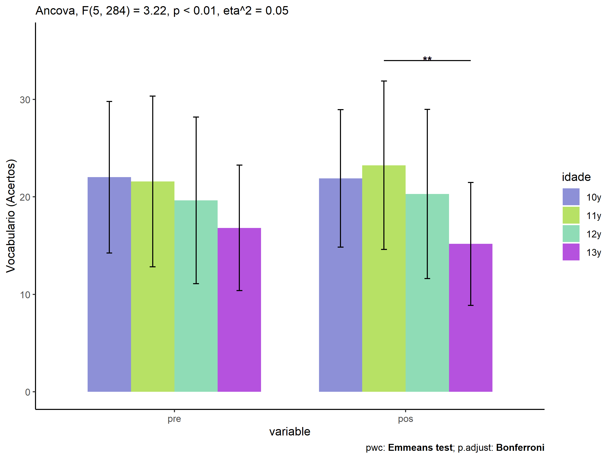<!-- -->

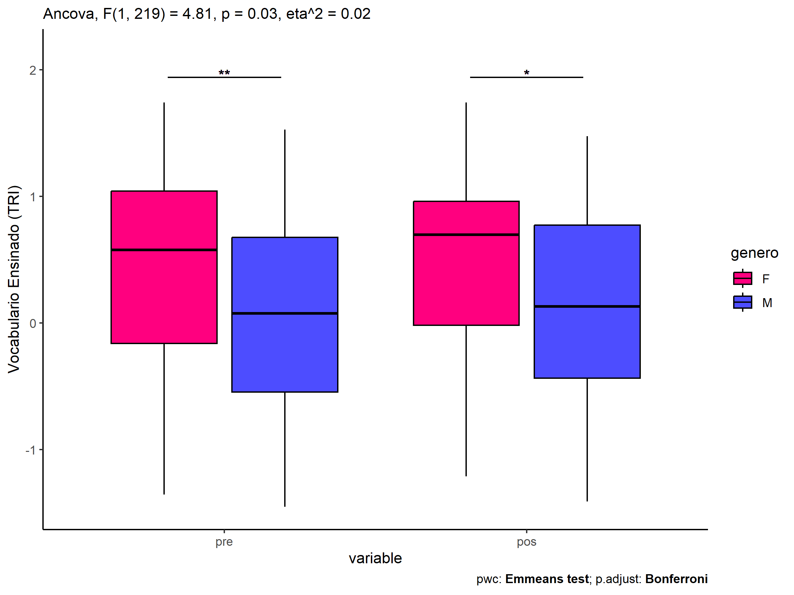<!-- -->

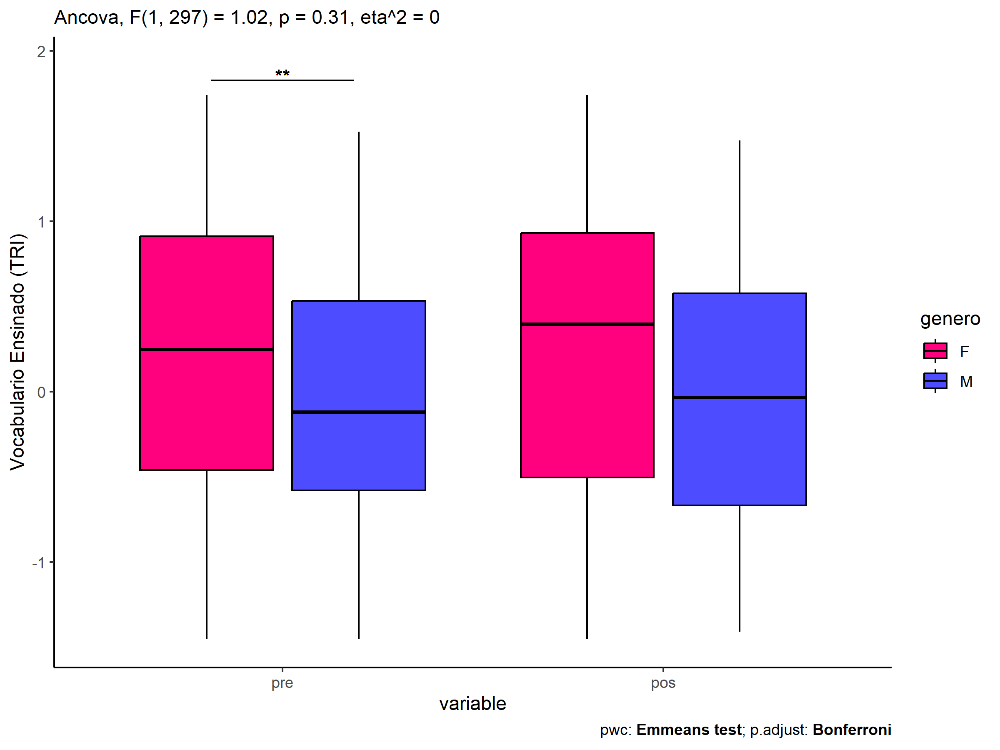<!-- -->

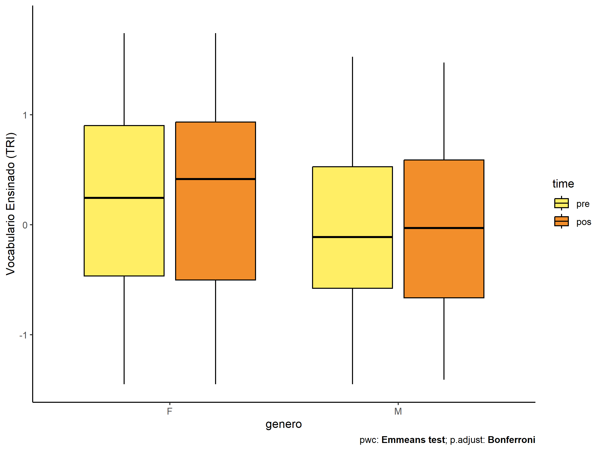<!-- -->

### Vocabulario Nao Ensinado (Acertos)

| var                          | genero |   n | M (pre) | SE (pre) | M (unadj) | SE (unadj) | M (adj) | SE (adj) |
|:-----------------------------|:-------|----:|--------:|---------:|----------:|-----------:|--------:|---------:|
| score.vocab.nao.ensinado.pos | F      | 150 |  17.480 |    0.598 |    18.013 |      0.649 |  17.264 |    0.526 |
| score.vocab.nao.ensinado.pos | M      | 181 |  15.343 |    0.547 |    15.182 |      0.590 |  15.803 |    0.478 |

| .y.                          | group1 | group2 | estimate | conf.low | conf.high |    se | statistic |     p | p.adj | p.adj.signif |
|:-----------------------------|:-------|:-------|---------:|---------:|----------:|------:|----------:|------:|------:|:-------------|
| score.vocab.nao.ensinado.pos | F      | M      |    1.460 |    0.054 |     2.867 | 0.715 |     2.043 | 0.042 | 0.042 | \*           |
| score.vocab.nao.ensinado.pre | F      | M      |    2.137 |    0.542 |     3.733 | 0.811 |     2.635 | 0.009 | 0.009 | \*\*         |

| .y.                      | genero | group1 | group2 | estimate | conf.low | conf.high |    se | statistic |     p | p.adj | p.adj.signif |
|:-------------------------|:-------|:-------|:-------|---------:|---------:|----------:|------:|----------:|------:|------:|:-------------|
| score.vocab.nao.ensinado | F      | pre    | pos    |   -0.533 |   -2.268 |     1.201 | 0.883 |    -0.604 | 0.546 | 0.546 | ns           |
| score.vocab.nao.ensinado | M      | pre    | pos    |    0.160 |   -1.419 |     1.740 | 0.804 |     0.199 | 0.842 | 0.842 | ns           |

    ## Scale for colour is already present.
    ## Adding another scale for colour, which will replace the existing scale.

<!-- -->

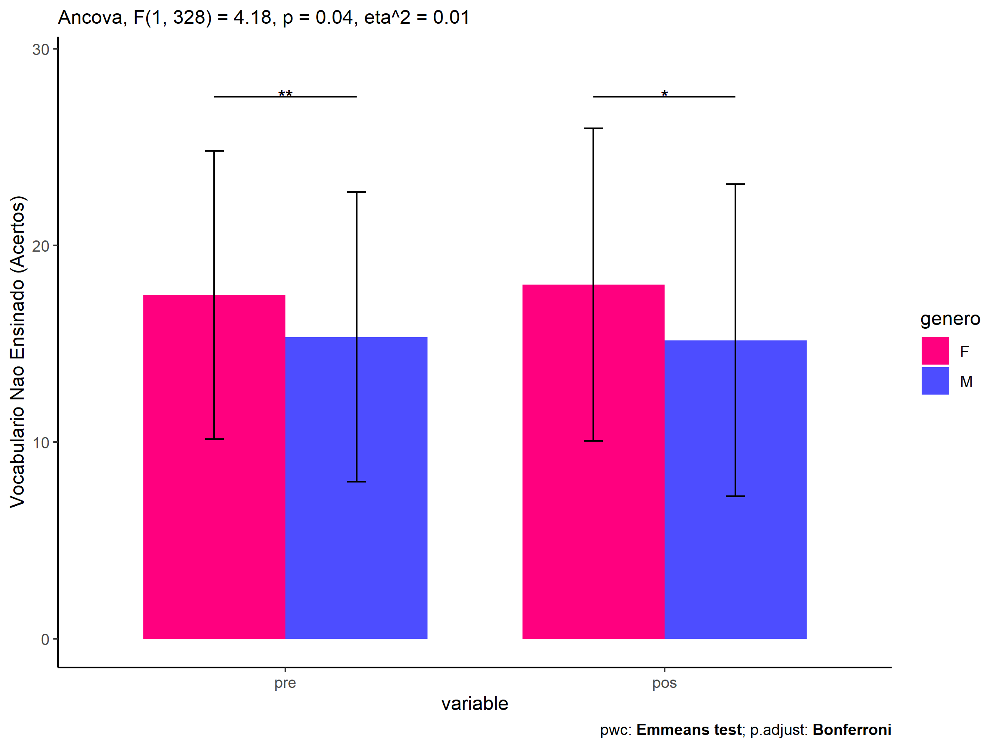<!-- -->

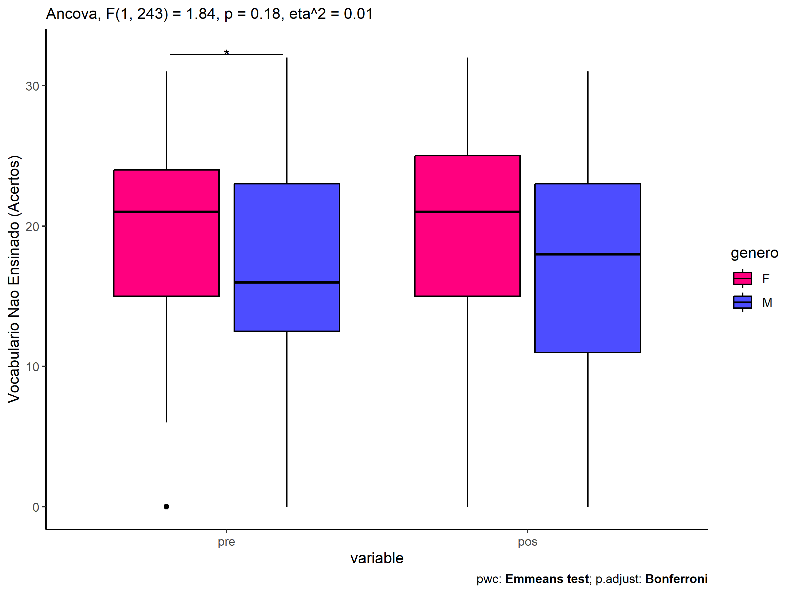<!-- -->

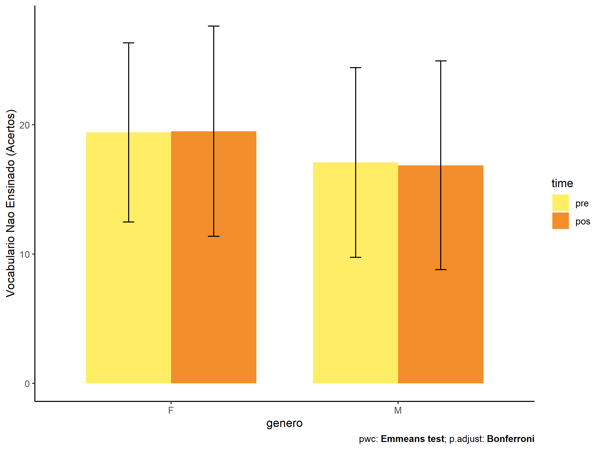<!-- -->

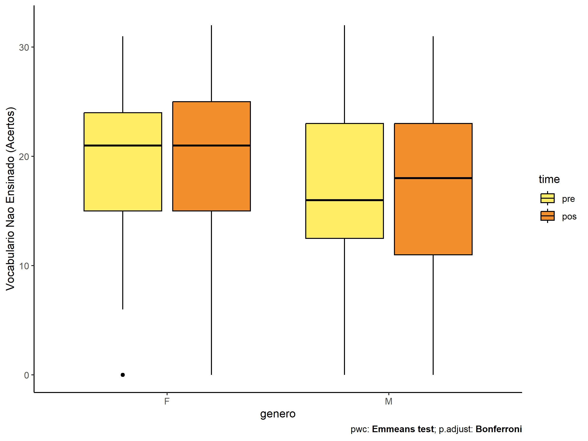<!-- -->

### Vocabulario Nao Ensinado (TRI)

| var                        | genero |   n | M (pre) | SE (pre) | M (unadj) | SE (unadj) | M (adj) | SE (adj) |
|:---------------------------|:-------|----:|--------:|---------:|----------:|-----------:|--------:|---------:|
| tri.vocab.nao.ensinado.pos | F      | 137 |   0.208 |    0.074 |     0.377 |      0.080 |   0.237 |    0.050 |
| tri.vocab.nao.ensinado.pos | M      | 163 |  -0.101 |    0.072 |    -0.031 |      0.074 |   0.087 |    0.046 |

| .y.                        | group1 | group2 | estimate | conf.low | conf.high |    se | statistic |     p | p.adj | p.adj.signif |
|:---------------------------|:-------|:-------|---------:|---------:|----------:|------:|----------:|------:|------:|:-------------|
| tri.vocab.nao.ensinado.pos | F      | M      |    0.150 |    0.016 |     0.284 | 0.068 |     2.199 | 0.029 | 0.029 | \*           |
| tri.vocab.nao.ensinado.pre | F      | M      |    0.309 |    0.105 |     0.513 | 0.104 |     2.979 | 0.003 | 0.003 | \*\*         |

| .y.                    | genero | group1 | group2 | estimate | conf.low | conf.high |    se | statistic |     p | p.adj | p.adj.signif |
|:-----------------------|:-------|:-------|:-------|---------:|---------:|----------:|------:|----------:|------:|------:|:-------------|
| tri.vocab.nao.ensinado | F      | pre    | pos    |   -0.169 |   -0.383 |     0.044 | 0.109 |    -1.558 | 0.120 | 0.120 | ns           |
| tri.vocab.nao.ensinado | M      | pre    | pos    |   -0.056 |   -0.252 |     0.139 | 0.099 |    -0.567 | 0.571 | 0.571 | ns           |

    ## Scale for colour is already present.
    ## Adding another scale for colour, which will replace the existing scale.

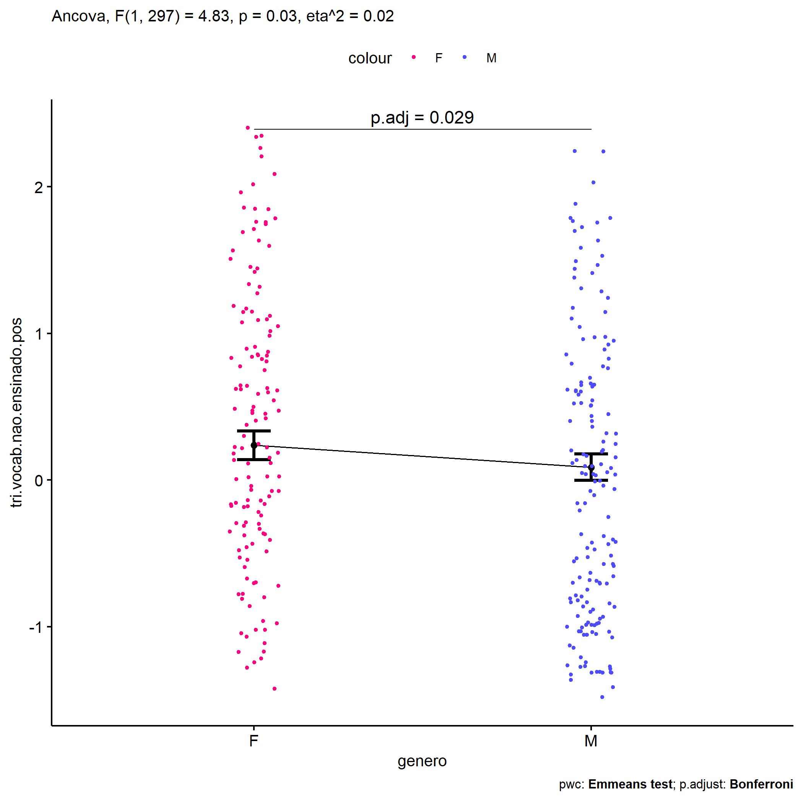<!-- -->

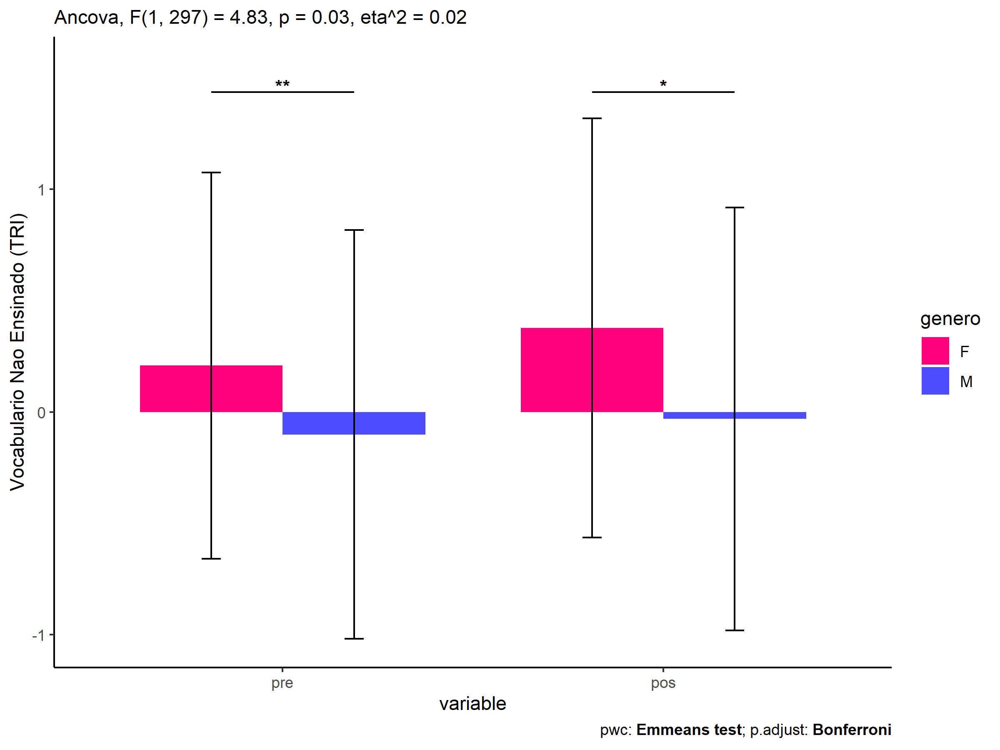<!-- -->

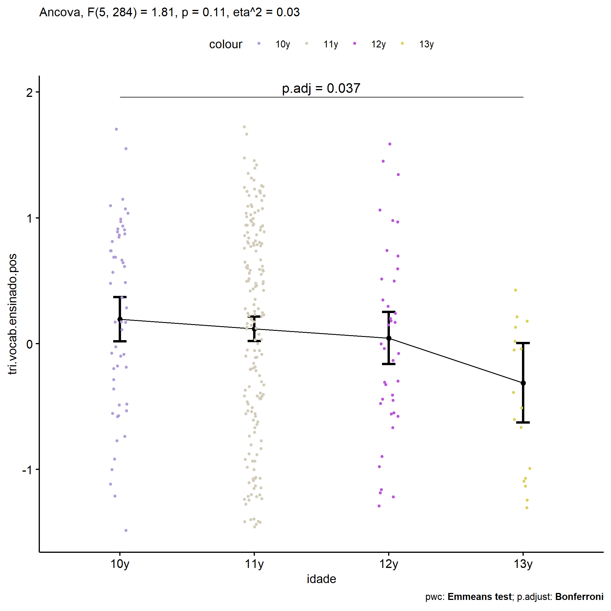<!-- -->

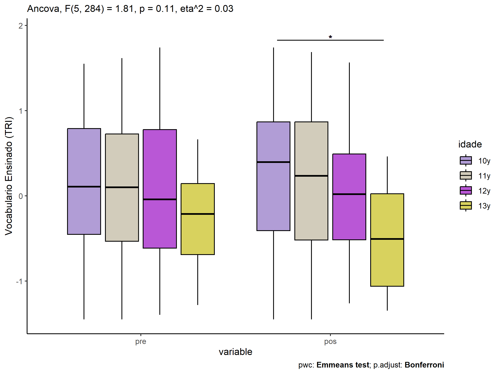<!-- -->

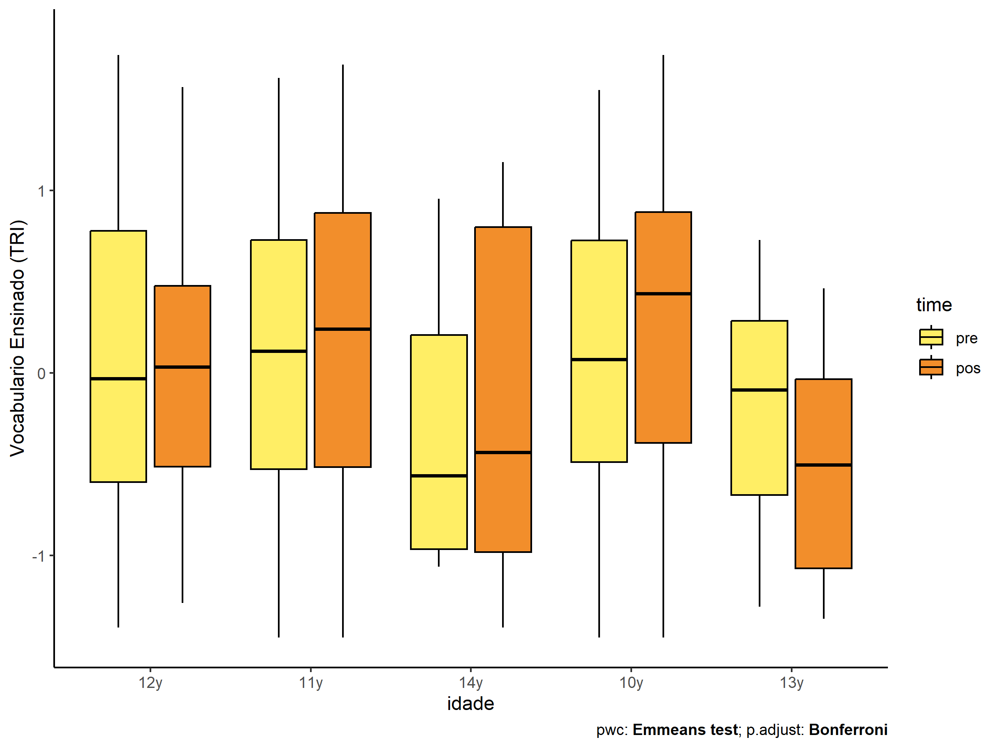<!-- -->

## factor: **idade**

### Vocabulario (Acertos)

| var             | idade |   n | M (pre) | SE (pre) | M (unadj) | SE (unadj) | M (adj) | SE (adj) |
|:----------------|:------|----:|--------:|---------:|----------:|-----------:|--------:|---------:|
| score.vocab.pos | 10y   |  54 |  22.019 |    1.058 |    21.907 |      0.960 |  21.231 |    0.725 |
| score.vocab.pos | 11y   | 176 |  21.580 |    0.661 |    23.244 |      0.652 |  22.897 |    0.401 |
| score.vocab.pos | 12y   |  39 |  19.641 |    1.370 |    20.308 |      1.390 |  21.411 |    0.854 |
| score.vocab.pos | 13y   |  17 |  16.824 |    1.563 |    15.176 |      1.532 |  18.389 |    1.301 |

| .y.             | group1 | group2 | estimate | conf.low | conf.high |    se | statistic |     p | p.adj | p.adj.signif |
|:----------------|:-------|:-------|---------:|---------:|----------:|------:|----------:|------:|------:|:-------------|
| score.vocab.pos | 10y    | 11y    |   -1.666 |   -3.295 |    -0.036 | 0.828 |    -2.012 | 0.045 | 0.271 | ns           |
| score.vocab.pos | 10y    | 12y    |   -0.180 |   -2.388 |     2.028 | 1.122 |    -0.160 | 0.873 | 1.000 | ns           |
| score.vocab.pos | 10y    | 13y    |    2.842 |   -0.096 |     5.780 | 1.493 |     1.904 | 0.058 | 0.347 | ns           |
| score.vocab.pos | 11y    | 12y    |    1.486 |   -0.374 |     3.345 | 0.945 |     1.573 | 0.117 | 0.701 | ns           |
| score.vocab.pos | 11y    | 13y    |    4.508 |    1.824 |     7.191 | 1.363 |     3.307 | 0.001 | 0.006 | \*\*         |
| score.vocab.pos | 12y    | 13y    |    3.022 |   -0.029 |     6.073 | 1.550 |     1.950 | 0.052 | 0.313 | ns           |
| score.vocab.pre | 10y    | 11y    |    0.439 |   -2.146 |     3.024 | 1.313 |     0.334 | 0.738 | 1.000 | ns           |
| score.vocab.pre | 10y    | 12y    |    2.377 |   -1.115 |     5.870 | 1.774 |     1.340 | 0.181 | 1.000 | ns           |
| score.vocab.pre | 10y    | 13y    |    5.195 |    0.573 |     9.817 | 2.348 |     2.213 | 0.028 | 0.166 | ns           |
| score.vocab.pre | 11y    | 12y    |    1.939 |   -1.003 |     4.880 | 1.494 |     1.297 | 0.196 | 1.000 | ns           |
| score.vocab.pre | 11y    | 13y    |    4.756 |    0.535 |     8.977 | 2.144 |     2.218 | 0.027 | 0.164 | ns           |
| score.vocab.pre | 12y    | 13y    |    2.817 |   -2.012 |     7.647 | 2.454 |     1.148 | 0.252 | 1.000 | ns           |

| .y.         | idade | group1 | group2 | estimate | conf.low | conf.high |    se | statistic |     p | p.adj | p.adj.signif |
|:------------|:------|:-------|:-------|---------:|---------:|----------:|------:|----------:|------:|------:|:-------------|
| score.vocab | 10y   | pre    | pos    |   -0.364 |   -3.446 |     2.719 | 1.570 |    -0.232 | 0.817 | 0.817 | ns           |
| score.vocab | 11y   | pre    | pos    |   -1.572 |   -3.305 |     0.162 | 0.883 |    -1.780 | 0.076 | 0.076 | ns           |
| score.vocab | 12y   | pre    | pos    |   -0.166 |   -3.744 |     3.412 | 1.822 |    -0.091 | 0.927 | 0.927 | ns           |
| score.vocab | 13y   | pre    | pos    |    2.566 |   -2.681 |     7.813 | 2.672 |     0.960 | 0.337 | 0.337 | ns           |
| score.vocab | 14y   | pre    | pos    |    0.733 |   -9.184 |    10.651 | 5.050 |     0.145 | 0.885 | 0.885 | ns           |

    ## Scale for colour is already present.
    ## Adding another scale for colour, which will replace the existing scale.

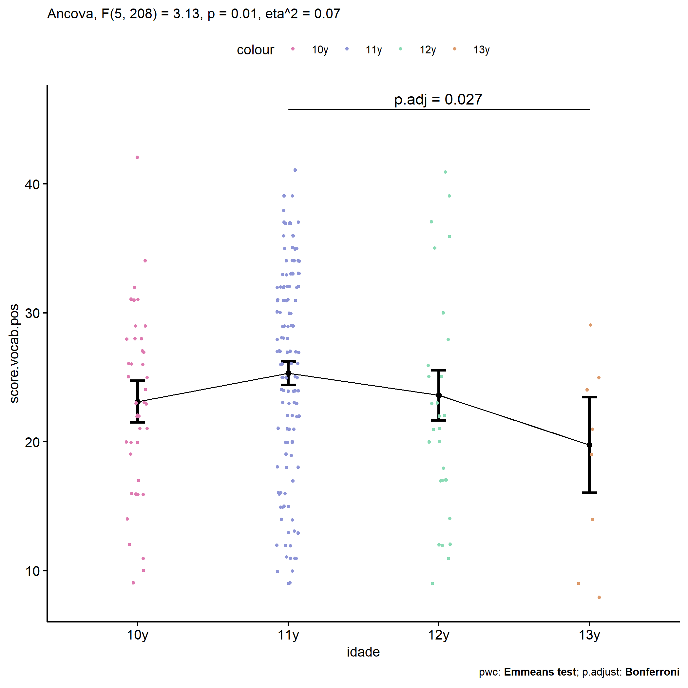<!-- -->

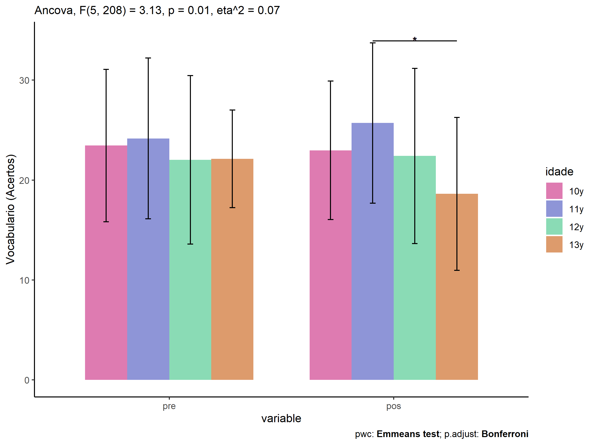<!-- -->

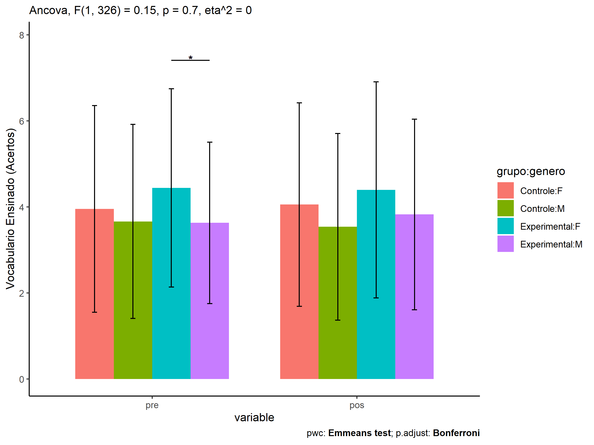<!-- -->

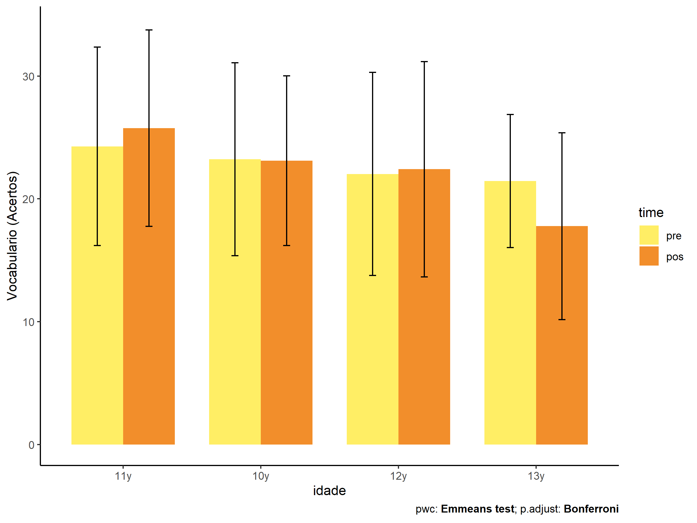<!-- -->

<!-- -->

### Vocabulario (TRI)

| var           | idade |   n | M (pre) | SE (pre) | M (unadj) | SE (unadj) | M (adj) | SE (adj) |
|:--------------|:------|----:|--------:|---------:|----------:|-----------:|--------:|---------:|
| tri.vocab.pos | 10y   |  54 |   0.213 |    0.109 |     0.161 |      0.118 |   0.054 |    0.077 |
| tri.vocab.pos | 11y   | 176 |   0.145 |    0.068 |     0.284 |      0.072 |   0.232 |    0.043 |
| tri.vocab.pos | 12y   |  39 |  -0.127 |    0.158 |    -0.048 |      0.155 |   0.127 |    0.091 |
| tri.vocab.pos | 13y   |  17 |  -0.485 |    0.184 |    -0.632 |      0.186 |  -0.158 |    0.139 |

| .y.           | group1 | group2 | estimate | conf.low | conf.high |    se | statistic |     p | p.adj | p.adj.signif |
|:--------------|:-------|:-------|---------:|---------:|----------:|------:|----------:|------:|------:|:-------------|
| tri.vocab.pos | 10y    | 11y    |   -0.179 |   -0.352 |    -0.005 | 0.088 |    -2.023 | 0.044 | 0.264 | ns           |
| tri.vocab.pos | 10y    | 12y    |   -0.073 |   -0.309 |     0.163 | 0.120 |    -0.612 | 0.541 | 1.000 | ns           |
| tri.vocab.pos | 10y    | 13y    |    0.212 |   -0.103 |     0.527 | 0.160 |     1.324 | 0.186 | 1.000 | ns           |
| tri.vocab.pos | 11y    | 12y    |    0.105 |   -0.093 |     0.304 | 0.101 |     1.043 | 0.298 | 1.000 | ns           |
| tri.vocab.pos | 11y    | 13y    |    0.390 |    0.103 |     0.678 | 0.146 |     2.674 | 0.008 | 0.048 | \*           |
| tri.vocab.pos | 12y    | 13y    |    0.285 |   -0.040 |     0.611 | 0.165 |     1.724 | 0.086 | 0.514 | ns           |
| tri.vocab.pre | 10y    | 11y    |    0.067 |   -0.204 |     0.339 | 0.138 |     0.488 | 0.626 | 1.000 | ns           |
| tri.vocab.pre | 10y    | 12y    |    0.339 |   -0.027 |     0.706 | 0.186 |     1.821 | 0.070 | 0.418 | ns           |
| tri.vocab.pre | 10y    | 13y    |    0.698 |    0.213 |     1.183 | 0.246 |     2.831 | 0.005 | 0.030 | \*           |
| tri.vocab.pre | 11y    | 12y    |    0.272 |   -0.037 |     0.581 | 0.157 |     1.734 | 0.084 | 0.504 | ns           |
| tri.vocab.pre | 11y    | 13y    |    0.630 |    0.188 |     1.073 | 0.225 |     2.802 | 0.005 | 0.033 | \*           |
| tri.vocab.pre | 12y    | 13y    |    0.359 |   -0.148 |     0.865 | 0.258 |     1.392 | 0.165 | 0.989 | ns           |

| .y.       | idade | group1 | group2 | estimate | conf.low | conf.high |    se | statistic |     p | p.adj | p.adj.signif |
|:----------|:------|:-------|:-------|---------:|---------:|----------:|------:|----------:|------:|------:|:-------------|
| tri.vocab | 10y   | pre    | pos    |    0.020 |   -0.317 |     0.357 | 0.172 |     0.114 | 0.909 | 0.909 | ns           |
| tri.vocab | 11y   | pre    | pos    |   -0.122 |   -0.312 |     0.067 | 0.096 |    -1.265 | 0.206 | 0.206 | ns           |
| tri.vocab | 12y   | pre    | pos    |   -0.001 |   -0.393 |     0.390 | 0.199 |    -0.007 | 0.994 | 0.994 | ns           |
| tri.vocab | 13y   | pre    | pos    |    0.244 |   -0.329 |     0.818 | 0.292 |     0.836 | 0.403 | 0.403 | ns           |
| tri.vocab | 14y   | pre    | pos    |    0.063 |   -1.021 |     1.147 | 0.552 |     0.114 | 0.909 | 0.909 | ns           |

    ## Scale for colour is already present.
    ## Adding another scale for colour, which will replace the existing scale.

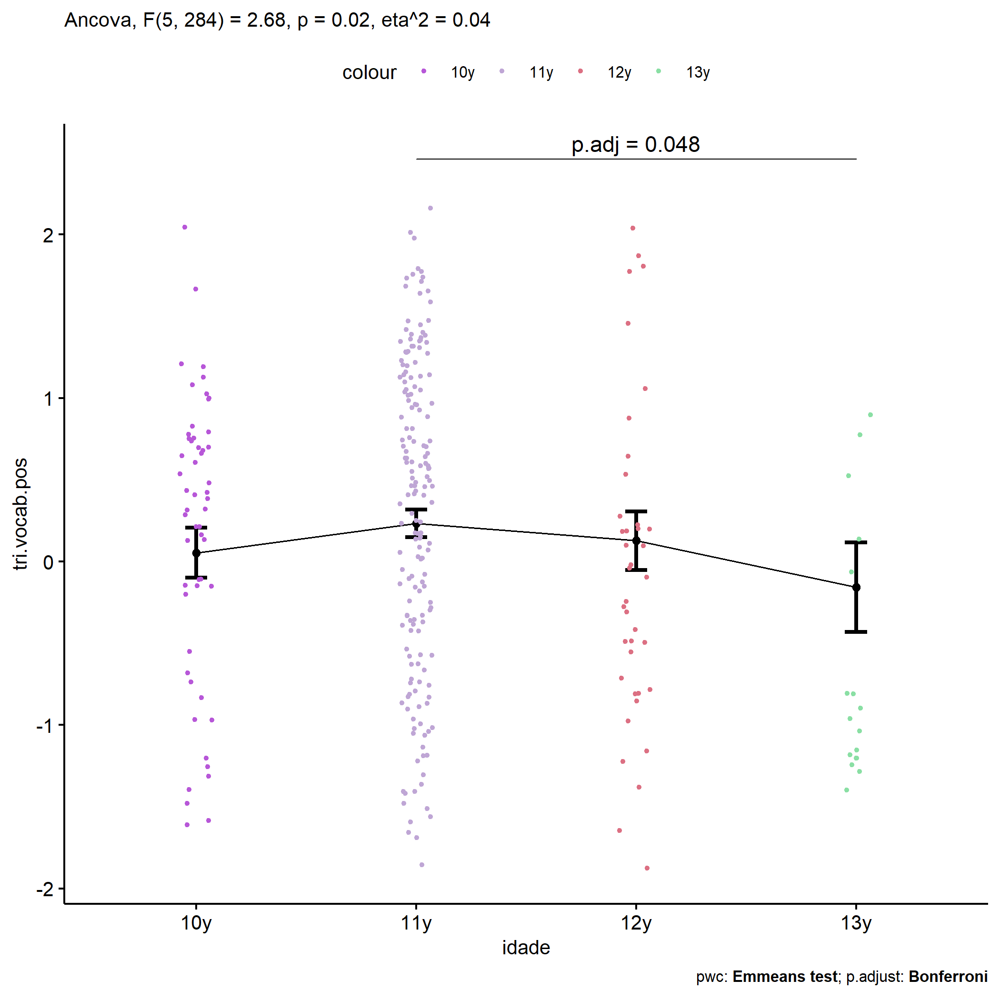<!-- -->

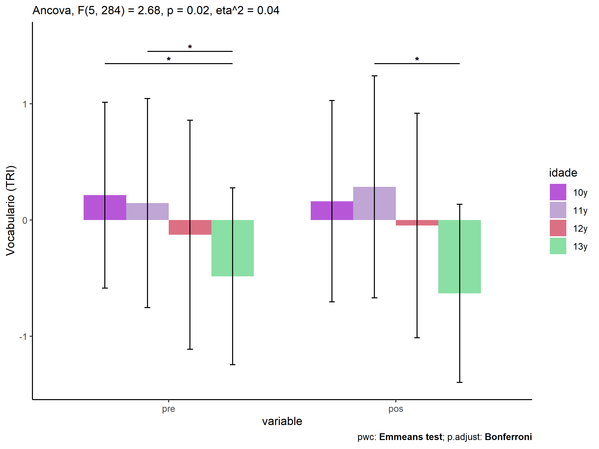<!-- -->

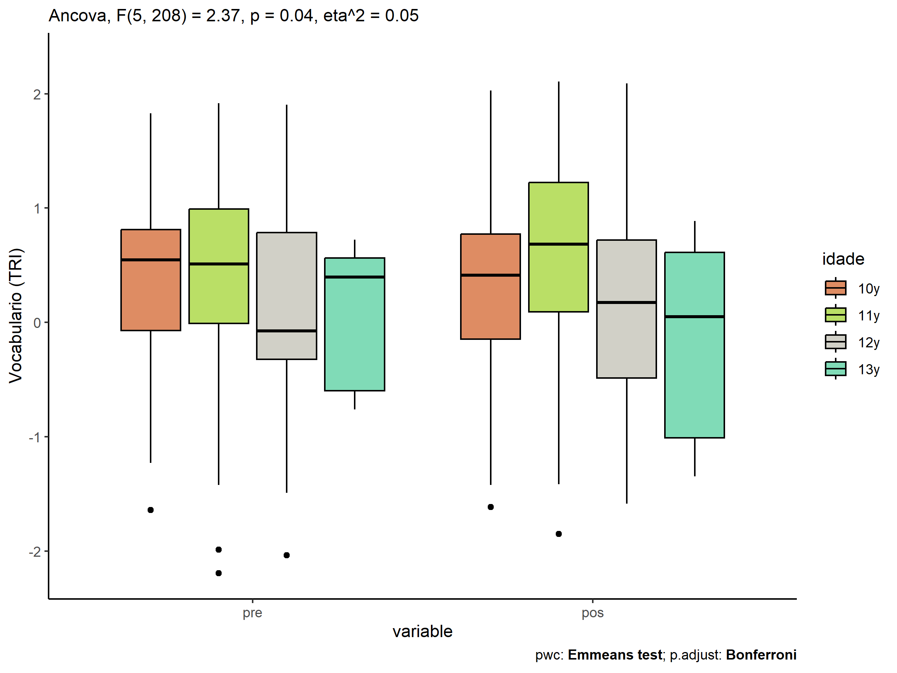<!-- -->

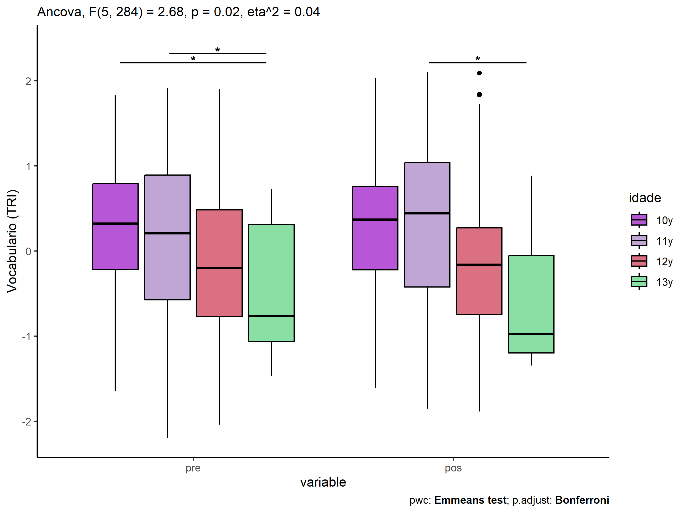<!-- -->

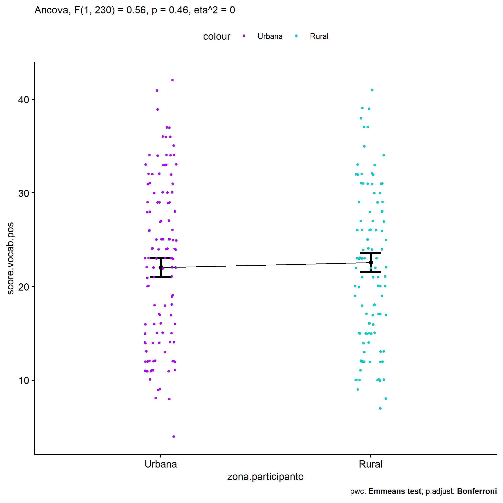<!-- -->

### Vocabulario Ensinado (Acertos)

| var                      | idade |   n | M (pre) | SE (pre) | M (unadj) | SE (unadj) | M (adj) | SE (adj) |
|:-------------------------|:------|----:|--------:|---------:|----------:|-----------:|--------:|---------:|
| score.vocab.ensinado.pos | 10y   |  59 |   4.119 |    0.279 |     4.153 |      0.299 |   4.088 |    0.268 |
| score.vocab.ensinado.pos | 11y   | 182 |   4.088 |    0.169 |     4.269 |      0.167 |   4.217 |    0.153 |
| score.vocab.ensinado.pos | 12y   |  45 |   3.800 |    0.304 |     3.556 |      0.334 |   3.622 |    0.307 |
| score.vocab.ensinado.pos | 13y   |  22 |   3.273 |    0.385 |     2.500 |      0.377 |   2.784 |    0.440 |
| score.vocab.ensinado.pos | 14y   |   8 |   2.750 |    0.921 |     2.375 |      0.981 |   2.874 |    0.730 |

| .y.                      | group1 | group2 | estimate | conf.low | conf.high |    se | statistic |     p | p.adj | p.adj.signif |
|:-------------------------|:-------|:-------|---------:|---------:|----------:|------:|----------:|------:|------:|:-------------|
| score.vocab.ensinado.pos | 10y    | 11y    |   -0.129 |   -0.736 |     0.477 | 0.308 |    -0.420 | 0.675 | 1.000 | ns           |
| score.vocab.ensinado.pos | 10y    | 12y    |    0.466 |   -0.336 |     1.268 | 0.408 |     1.143 | 0.254 | 1.000 | ns           |
| score.vocab.ensinado.pos | 10y    | 13y    |    1.304 |    0.289 |     2.319 | 0.516 |     2.528 | 0.012 | 0.120 | ns           |
| score.vocab.ensinado.pos | 10y    | 14y    |    1.214 |   -0.318 |     2.746 | 0.779 |     1.559 | 0.120 | 1.000 | ns           |
| score.vocab.ensinado.pos | 11y    | 12y    |    0.595 |   -0.080 |     1.270 | 0.343 |     1.735 | 0.084 | 0.837 | ns           |
| score.vocab.ensinado.pos | 11y    | 13y    |    1.433 |    0.516 |     2.351 | 0.466 |     3.073 | 0.002 | 0.023 | \*           |
| score.vocab.ensinado.pos | 11y    | 14y    |    1.343 |   -0.126 |     2.812 | 0.747 |     1.799 | 0.073 | 0.730 | ns           |
| score.vocab.ensinado.pos | 12y    | 13y    |    0.838 |   -0.216 |     1.893 | 0.536 |     1.564 | 0.119 | 1.000 | ns           |
| score.vocab.ensinado.pos | 12y    | 14y    |    0.748 |   -0.809 |     2.305 | 0.791 |     0.945 | 0.345 | 1.000 | ns           |
| score.vocab.ensinado.pos | 13y    | 14y    |   -0.090 |   -1.763 |     1.582 | 0.850 |    -0.106 | 0.915 | 1.000 | ns           |
| score.vocab.ensinado.pre | 10y    | 11y    |    0.031 |   -0.618 |     0.679 | 0.330 |     0.093 | 0.926 | 1.000 | ns           |
| score.vocab.ensinado.pre | 10y    | 12y    |    0.319 |   -0.538 |     1.176 | 0.436 |     0.732 | 0.465 | 1.000 | ns           |
| score.vocab.ensinado.pre | 10y    | 13y    |    0.846 |   -0.236 |     1.927 | 0.550 |     1.539 | 0.125 | 1.000 | ns           |
| score.vocab.ensinado.pre | 10y    | 14y    |    1.369 |   -0.263 |     3.000 | 0.829 |     1.651 | 0.100 | 0.998 | ns           |
| score.vocab.ensinado.pre | 11y    | 12y    |    0.288 |   -0.433 |     1.009 | 0.366 |     0.786 | 0.433 | 1.000 | ns           |
| score.vocab.ensinado.pre | 11y    | 13y    |    0.815 |   -0.162 |     1.792 | 0.497 |     1.641 | 0.102 | 1.000 | ns           |
| score.vocab.ensinado.pre | 11y    | 14y    |    1.338 |   -0.226 |     2.902 | 0.795 |     1.683 | 0.093 | 0.933 | ns           |
| score.vocab.ensinado.pre | 12y    | 13y    |    0.527 |   -0.599 |     1.654 | 0.572 |     0.921 | 0.358 | 1.000 | ns           |
| score.vocab.ensinado.pre | 12y    | 14y    |    1.050 |   -0.611 |     2.711 | 0.844 |     1.244 | 0.215 | 1.000 | ns           |
| score.vocab.ensinado.pre | 13y    | 14y    |    0.523 |   -1.265 |     2.310 | 0.908 |     0.575 | 0.565 | 1.000 | ns           |

| .y.                  | idade | group1 | group2 | estimate | conf.low | conf.high |    se | statistic |     p | p.adj | p.adj.signif |
|:---------------------|:------|:-------|:-------|---------:|---------:|----------:|------:|----------:|------:|------:|:-------------|
| score.vocab.ensinado | 10y   | pre    | pos    |   -0.034 |   -0.838 |     0.770 | 0.409 |    -0.083 | 0.934 | 0.934 | ns           |
| score.vocab.ensinado | 11y   | pre    | pos    |   -0.181 |   -0.639 |     0.276 | 0.233 |    -0.778 | 0.437 | 0.437 | ns           |
| score.vocab.ensinado | 12y   | pre    | pos    |    0.244 |   -0.676 |     1.165 | 0.469 |     0.522 | 0.602 | 0.602 | ns           |
| score.vocab.ensinado | 13y   | pre    | pos    |    0.773 |   -0.544 |     2.089 | 0.670 |     1.153 | 0.249 | 0.249 | ns           |
| score.vocab.ensinado | 14y   | pre    | pos    |    0.375 |   -1.808 |     2.558 | 1.111 |     0.337 | 0.736 | 0.736 | ns           |

    ## Scale for colour is already present.
    ## Adding another scale for colour, which will replace the existing scale.

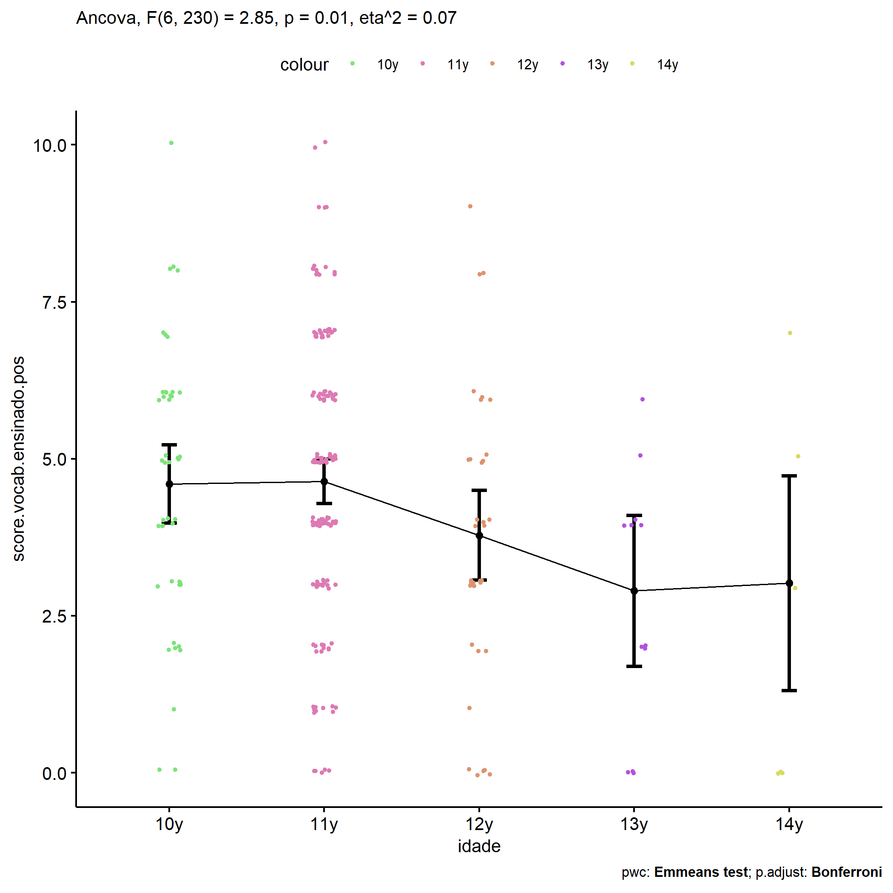<!-- -->

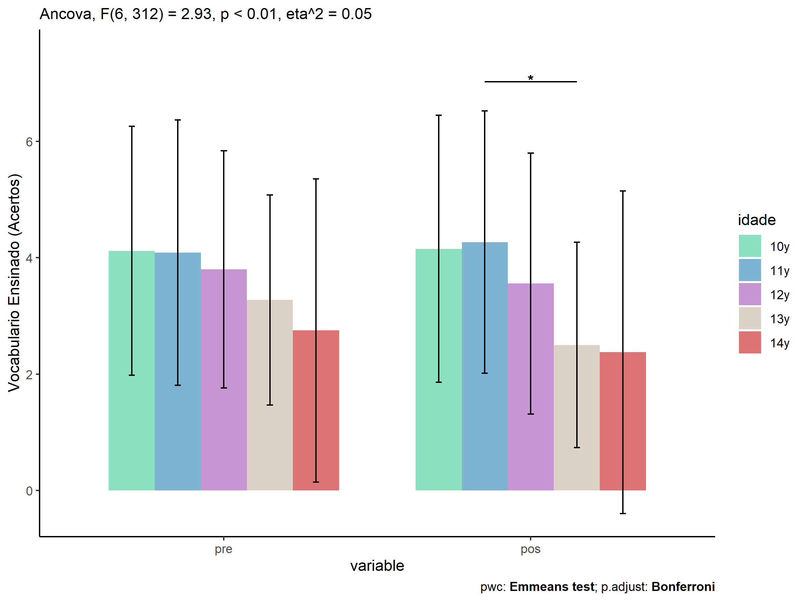<!-- -->

<!-- -->

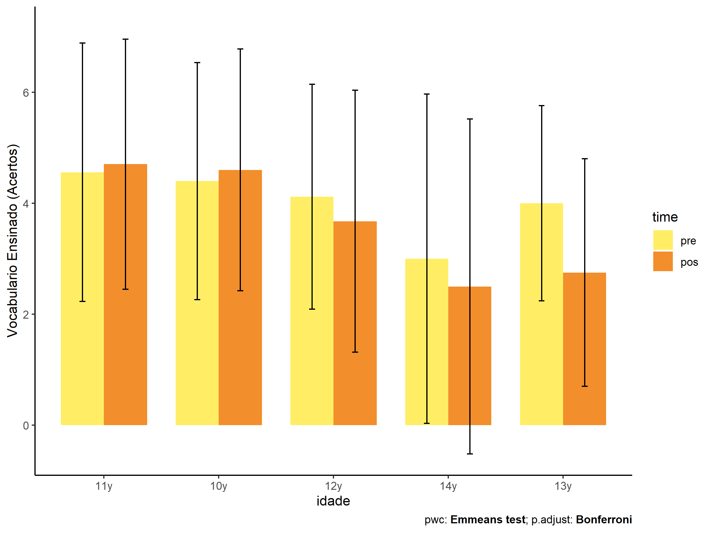<!-- -->

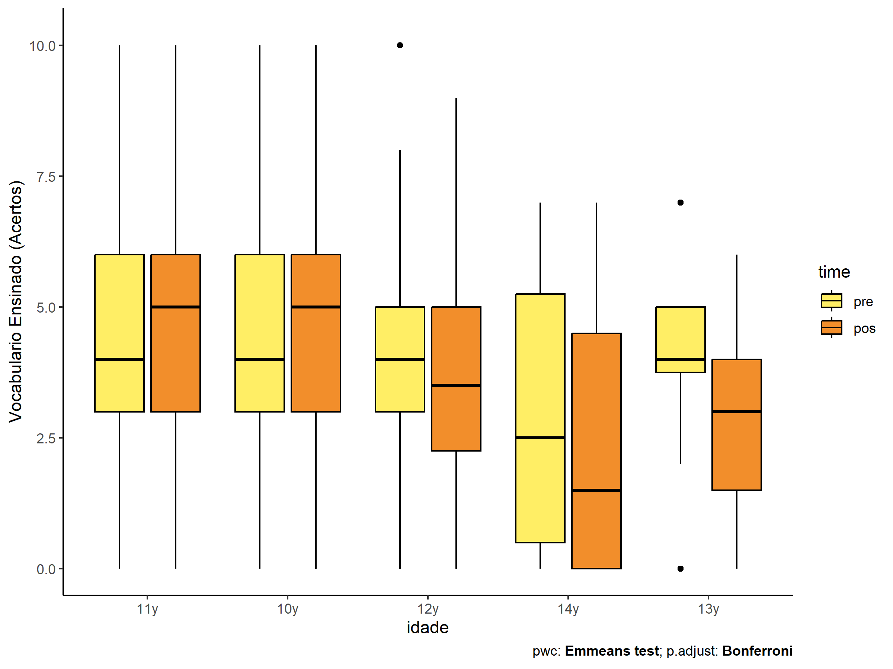<!-- -->

### Vocabulario Ensinado (TRI)

| var                    | idade |   n | M (pre) | SE (pre) | M (unadj) | SE (unadj) | M (adj) | SE (adj) |
|:-----------------------|:------|----:|--------:|---------:|----------:|-----------:|--------:|---------:|
| tri.vocab.ensinado.pos | 10y   |  54 |   0.133 |    0.110 |     0.231 |      0.103 |   0.195 |    0.089 |
| tri.vocab.ensinado.pos | 11y   | 176 |   0.105 |    0.058 |     0.138 |      0.063 |   0.118 |    0.050 |
| tri.vocab.ensinado.pos | 12y   |  39 |  -0.022 |    0.138 |    -0.010 |      0.122 |   0.044 |    0.105 |
| tri.vocab.ensinado.pos | 13y   |  17 |  -0.263 |    0.145 |    -0.507 |      0.142 |  -0.311 |    0.160 |

| .y.                    | group1 | group2 | estimate | conf.low | conf.high |    se | statistic |     p | p.adj | p.adj.signif |
|:-----------------------|:-------|:-------|---------:|---------:|----------:|------:|----------:|------:|------:|:-------------|
| tri.vocab.ensinado.pos | 10y    | 11y    |    0.077 |   -0.124 |     0.278 | 0.102 |     0.753 | 0.452 | 1.000 | ns           |
| tri.vocab.ensinado.pos | 10y    | 12y    |    0.151 |   -0.121 |     0.423 | 0.138 |     1.090 | 0.277 | 1.000 | ns           |
| tri.vocab.ensinado.pos | 10y    | 13y    |    0.506 |    0.145 |     0.868 | 0.184 |     2.757 | 0.006 | 0.037 | \*           |
| tri.vocab.ensinado.pos | 11y    | 12y    |    0.074 |   -0.155 |     0.303 | 0.116 |     0.633 | 0.527 | 1.000 | ns           |
| tri.vocab.ensinado.pos | 11y    | 13y    |    0.429 |    0.099 |     0.760 | 0.168 |     2.560 | 0.011 | 0.066 | ns           |
| tri.vocab.ensinado.pos | 12y    | 13y    |    0.356 |   -0.021 |     0.732 | 0.191 |     1.861 | 0.064 | 0.383 | ns           |
| tri.vocab.ensinado.pre | 10y    | 11y    |    0.028 |   -0.211 |     0.266 | 0.121 |     0.228 | 0.820 | 1.000 | ns           |
| tri.vocab.ensinado.pre | 10y    | 12y    |    0.154 |   -0.167 |     0.476 | 0.163 |     0.944 | 0.346 | 1.000 | ns           |
| tri.vocab.ensinado.pre | 10y    | 13y    |    0.396 |   -0.030 |     0.822 | 0.216 |     1.830 | 0.068 | 0.410 | ns           |
| tri.vocab.ensinado.pre | 11y    | 12y    |    0.127 |   -0.144 |     0.398 | 0.138 |     0.921 | 0.358 | 1.000 | ns           |
| tri.vocab.ensinado.pre | 11y    | 13y    |    0.368 |   -0.021 |     0.757 | 0.198 |     1.864 | 0.063 | 0.380 | ns           |
| tri.vocab.ensinado.pre | 12y    | 13y    |    0.241 |   -0.204 |     0.686 | 0.226 |     1.068 | 0.286 | 1.000 | ns           |

| .y.                | idade | group1 | group2 | estimate | conf.low | conf.high |    se | statistic |     p | p.adj | p.adj.signif |
|:-------------------|:------|:-------|:-------|---------:|---------:|----------:|------:|----------:|------:|------:|:-------------|
| tri.vocab.ensinado | 10y   | pre    | pos    |   -0.162 |   -0.454 |     0.130 | 0.149 |    -1.092 | 0.275 | 0.275 | ns           |
| tri.vocab.ensinado | 11y   | pre    | pos    |   -0.022 |   -0.187 |     0.142 | 0.084 |    -0.269 | 0.788 | 0.788 | ns           |
| tri.vocab.ensinado | 12y   | pre    | pos    |    0.015 |   -0.323 |     0.354 | 0.173 |     0.090 | 0.929 | 0.929 | ns           |
| tri.vocab.ensinado | 13y   | pre    | pos    |    0.353 |   -0.144 |     0.850 | 0.253 |     1.395 | 0.164 | 0.164 | ns           |
| tri.vocab.ensinado | 14y   | pre    | pos    |   -0.140 |   -1.080 |     0.799 | 0.478 |    -0.293 | 0.769 | 0.769 | ns           |

    ## Scale for colour is already present.
    ## Adding another scale for colour, which will replace the existing scale.

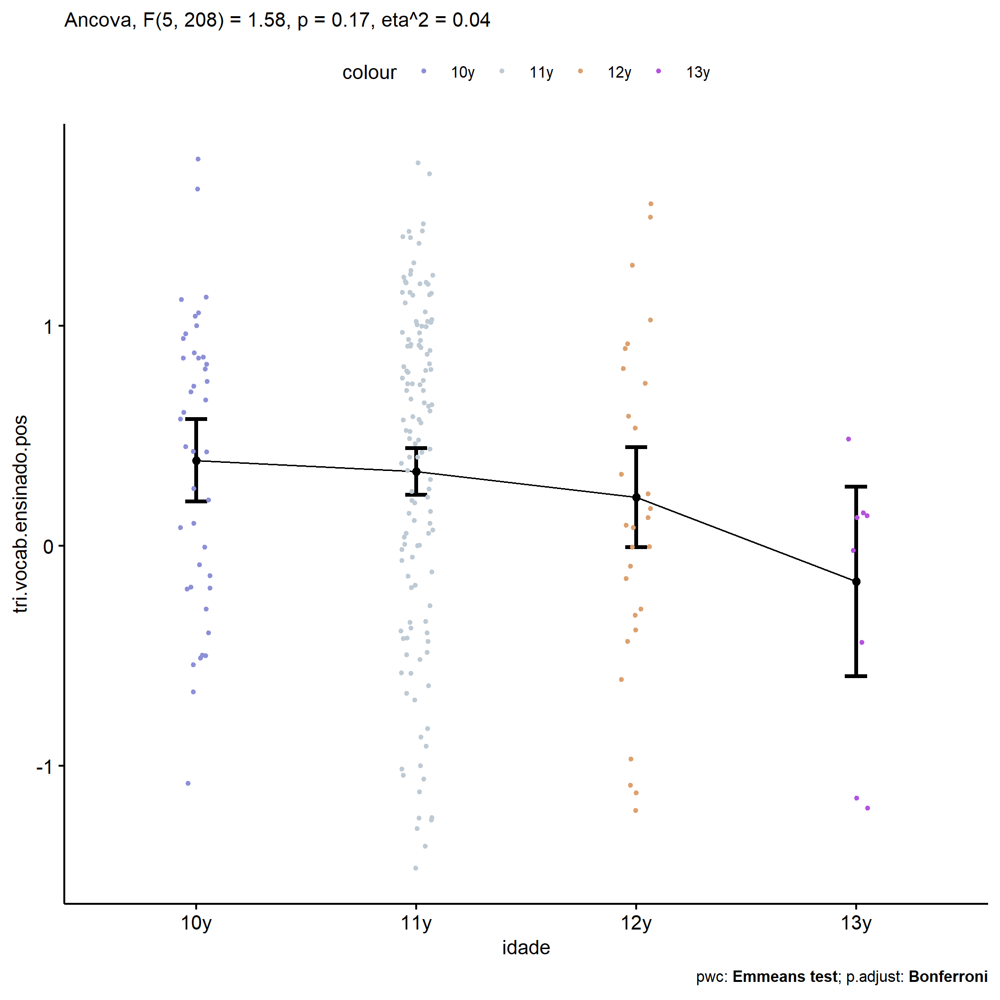<!-- -->

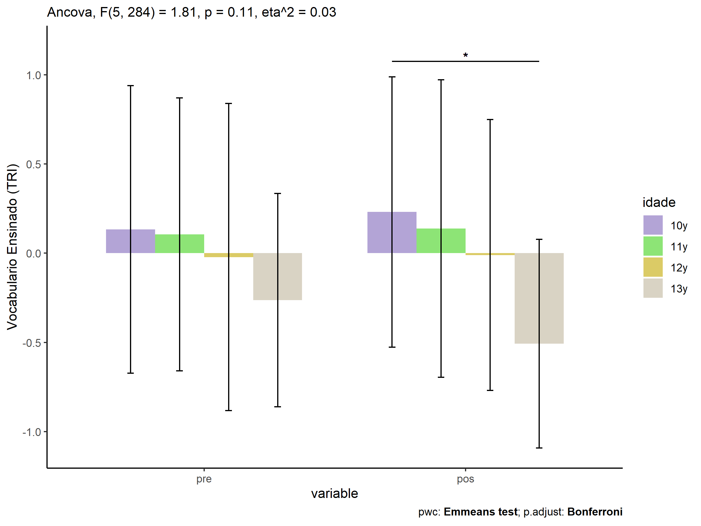<!-- -->

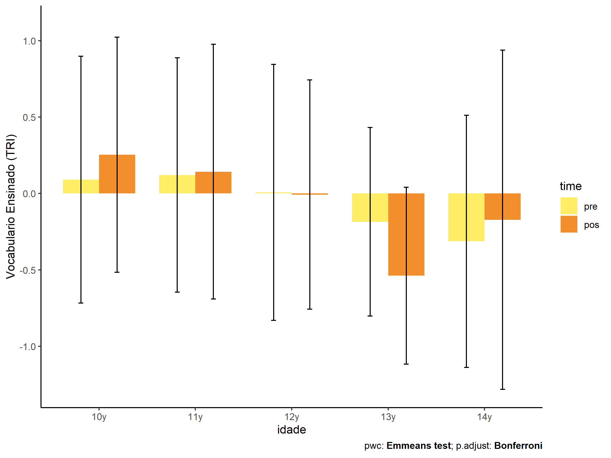<!-- -->

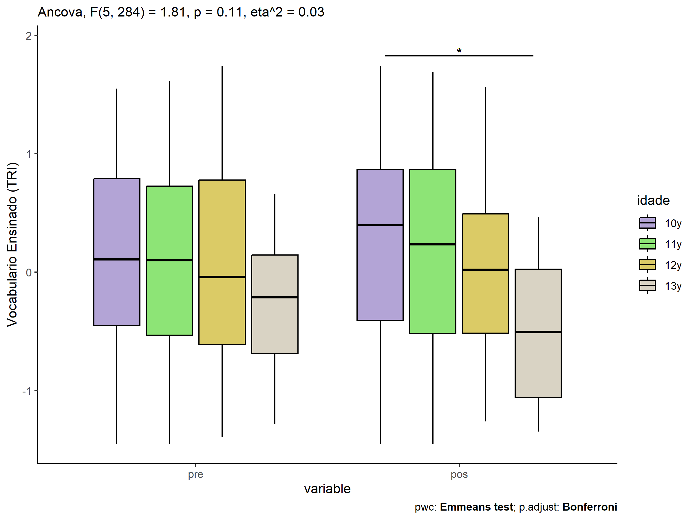<!-- -->

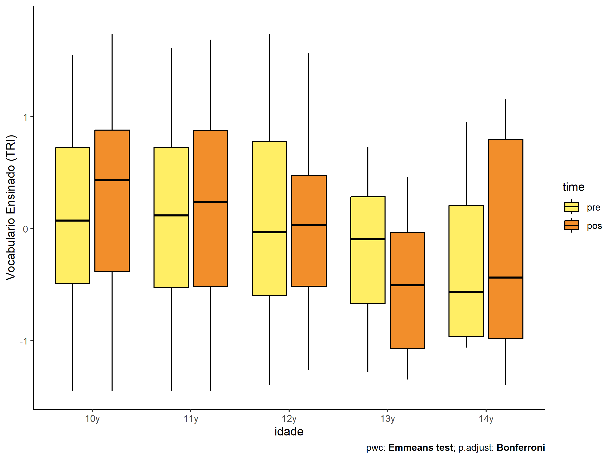<!-- -->

### Vocabulario Nao Ensinado (Acertos)

| var                          | idade |   n | M (pre) | SE (pre) | M (unadj) | SE (unadj) | M (adj) | SE (adj) |
|:-----------------------------|:------|----:|--------:|---------:|----------:|-----------:|--------:|---------:|
| score.vocab.nao.ensinado.pos | 10y   |  59 |  17.186 |    0.858 |    16.390 |      0.930 |  16.037 |    0.814 |
| score.vocab.nao.ensinado.pos | 11y   | 182 |  17.396 |    0.544 |    18.390 |      0.561 |  17.912 |    0.465 |
| score.vocab.nao.ensinado.pos | 12y   |  45 |  15.667 |    1.095 |    14.289 |      1.267 |  14.852 |    0.933 |
| score.vocab.nao.ensinado.pos | 13y   |  22 |  12.409 |    1.424 |    10.182 |      1.401 |  12.708 |    1.348 |
| score.vocab.nao.ensinado.pos | 14y   |   8 |  11.000 |    3.065 |     8.625 |      3.064 |  12.000 |    2.226 |

| .y.                          | group1 | group2 | estimate | conf.low | conf.high |    se | statistic | p       | p.adj | p.adj.signif |
|:-----------------------------|:-------|:-------|---------:|---------:|----------:|------:|----------:|:--------|------:|:-------------|
| score.vocab.nao.ensinado.pos | 10y    | 11y    |   -1.874 |   -3.716 |    -0.032 | 0.936 |    -2.002 | 0.046   | 0.462 | ns           |
| score.vocab.nao.ensinado.pos | 10y    | 12y    |    1.185 |   -1.253 |     3.623 | 1.239 |     0.957 | 0.34    | 1.000 | ns           |
| score.vocab.nao.ensinado.pos | 10y    | 13y    |    3.330 |    0.223 |     6.436 | 1.579 |     2.109 | 0.036   | 0.357 | ns           |
| score.vocab.nao.ensinado.pos | 10y    | 14y    |    4.037 |   -0.634 |     8.708 | 2.374 |     1.701 | 0.09    | 0.900 | ns           |
| score.vocab.nao.ensinado.pos | 11y    | 12y    |    3.059 |    1.006 |     5.113 | 1.044 |     2.931 | 0.004   | 0.036 | \*           |
| score.vocab.nao.ensinado.pos | 11y    | 13y    |    5.204 |    2.387 |     8.021 | 1.432 |     3.635 | \<0.001 | 0.003 | \*\*         |
| score.vocab.nao.ensinado.pos | 11y    | 14y    |    5.912 |    1.427 |    10.396 | 2.279 |     2.594 | 0.01    | 0.099 | ns           |
| score.vocab.nao.ensinado.pos | 12y    | 13y    |    2.144 |   -1.070 |     5.358 | 1.633 |     1.313 | 0.19    | 1.000 | ns           |
| score.vocab.nao.ensinado.pos | 12y    | 14y    |    2.852 |   -1.887 |     7.591 | 2.409 |     1.184 | 0.237   | 1.000 | ns           |
| score.vocab.nao.ensinado.pos | 13y    | 14y    |    0.708 |   -4.370 |     5.786 | 2.581 |     0.274 | 0.784   | 1.000 | ns           |
| score.vocab.nao.ensinado.pre | 10y    | 11y    |   -0.209 |   -2.331 |     1.913 | 1.078 |    -0.194 | 0.846   | 1.000 | ns           |
| score.vocab.nao.ensinado.pre | 10y    | 12y    |    1.520 |   -1.284 |     4.323 | 1.425 |     1.067 | 0.287   | 1.000 | ns           |
| score.vocab.nao.ensinado.pre | 10y    | 13y    |    4.777 |    1.239 |     8.316 | 1.798 |     2.656 | 0.008   | 0.083 | ns           |
| score.vocab.nao.ensinado.pre | 10y    | 14y    |    6.186 |    0.850 |    11.523 | 2.712 |     2.281 | 0.023   | 0.232 | ns           |
| score.vocab.nao.ensinado.pre | 11y    | 12y    |    1.729 |   -0.629 |     4.087 | 1.199 |     1.443 | 0.15    | 1.000 | ns           |
| score.vocab.nao.ensinado.pre | 11y    | 13y    |    4.987 |    1.789 |     8.184 | 1.625 |     3.069 | 0.002   | 0.023 | \*           |
| score.vocab.nao.ensinado.pre | 11y    | 14y    |    6.396 |    1.279 |    11.513 | 2.601 |     2.459 | 0.014   | 0.145 | ns           |
| score.vocab.nao.ensinado.pre | 12y    | 13y    |    3.258 |   -0.427 |     6.943 | 1.873 |     1.739 | 0.083   | 0.830 | ns           |
| score.vocab.nao.ensinado.pre | 12y    | 14y    |    4.667 |   -0.768 |    10.102 | 2.762 |     1.689 | 0.092   | 0.921 | ns           |
| score.vocab.nao.ensinado.pre | 13y    | 14y    |    1.409 |   -4.439 |     7.257 | 2.972 |     0.474 | 0.636   | 1.000 | ns           |

| .y.                      | idade | group1 | group2 | estimate | conf.low | conf.high |    se | statistic |     p | p.adj | p.adj.signif |
|:-------------------------|:------|:-------|:-------|---------:|---------:|----------:|------:|----------:|------:|------:|:-------------|
| score.vocab.nao.ensinado | 10y   | pre    | pos    |    0.797 |   -1.879 |     3.473 | 1.363 |     0.585 | 0.559 | 0.559 | ns           |
| score.vocab.nao.ensinado | 11y   | pre    | pos    |   -0.995 |   -2.518 |     0.529 | 0.776 |    -1.282 | 0.200 | 0.200 | ns           |
| score.vocab.nao.ensinado | 12y   | pre    | pos    |    1.378 |   -1.686 |     4.442 | 1.560 |     0.883 | 0.378 | 0.378 | ns           |
| score.vocab.nao.ensinado | 13y   | pre    | pos    |    2.227 |   -2.155 |     6.610 | 2.232 |     0.998 | 0.319 | 0.319 | ns           |
| score.vocab.nao.ensinado | 14y   | pre    | pos    |    2.375 |   -4.892 |     9.642 | 3.701 |     0.642 | 0.521 | 0.521 | ns           |

    ## Scale for colour is already present.
    ## Adding another scale for colour, which will replace the existing scale.

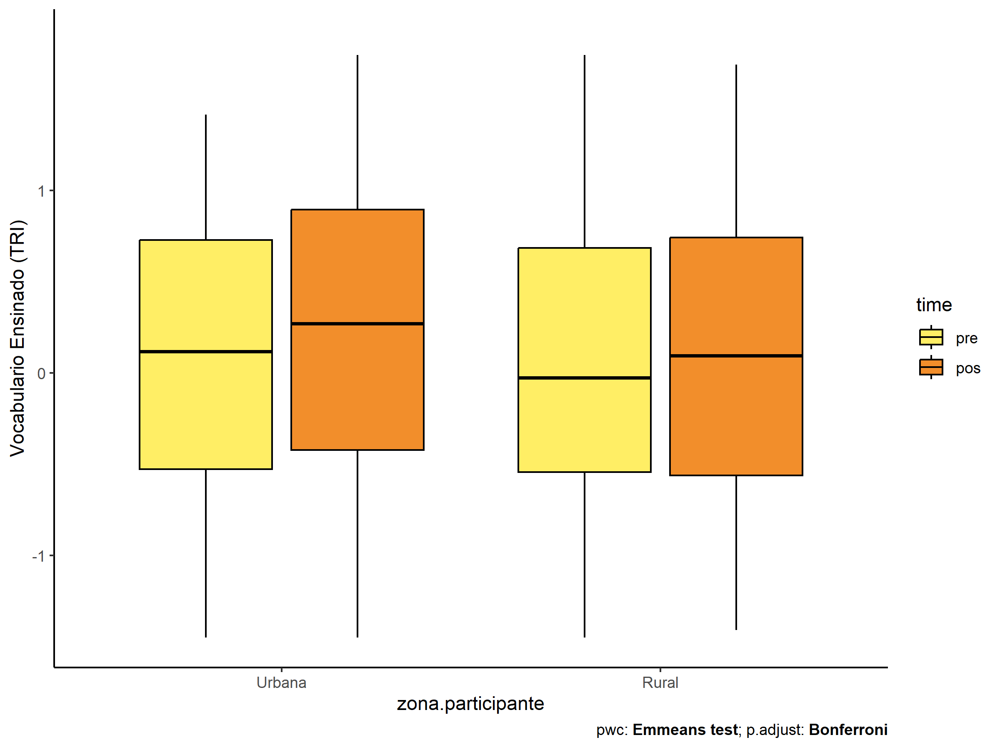<!-- -->

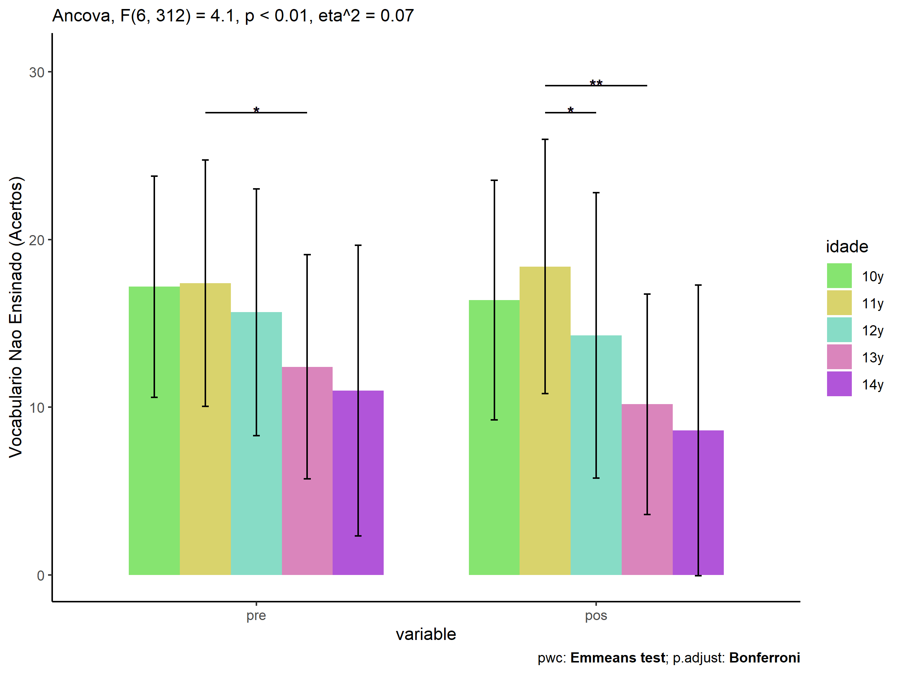<!-- -->

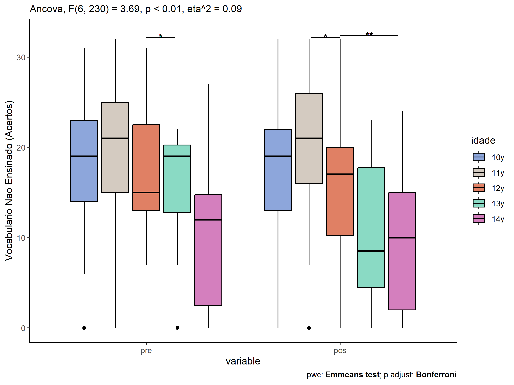<!-- -->

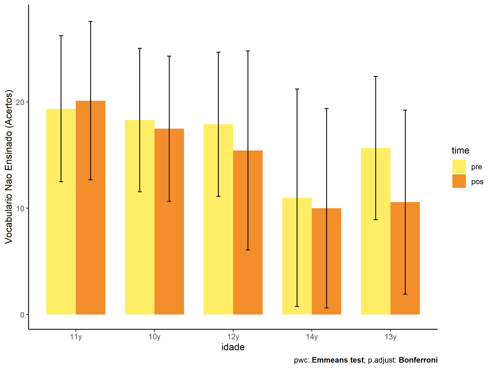<!-- -->

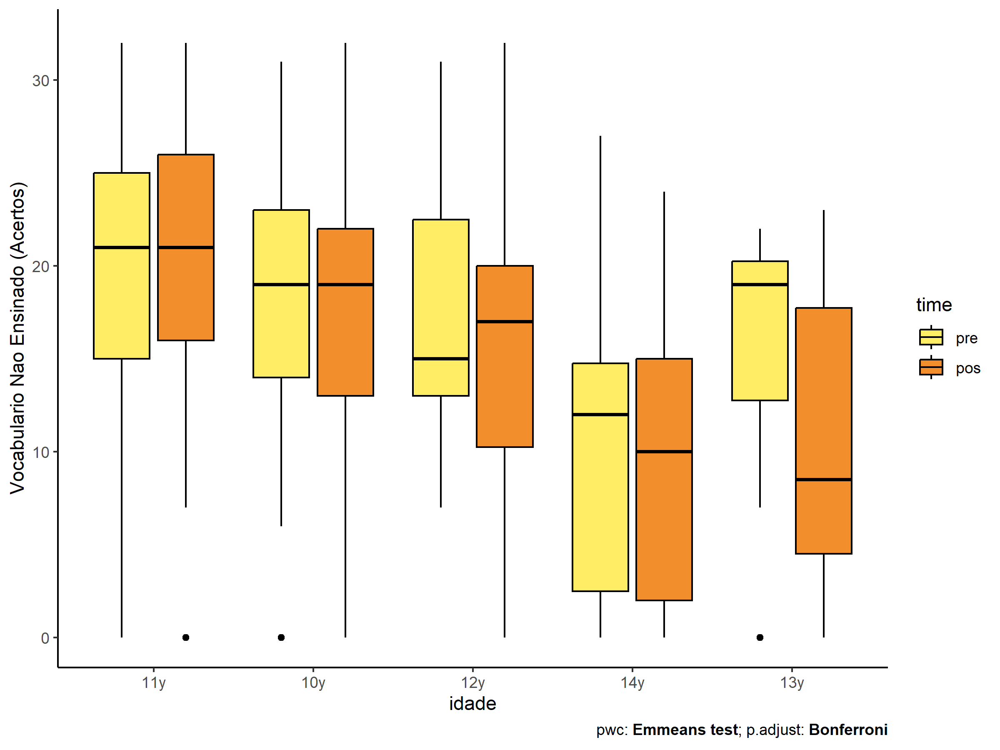<!-- -->

### Vocabulario Nao Ensinado (TRI)

| var                        | idade |   n | M (pre) | SE (pre) | M (unadj) | SE (unadj) | M (adj) | SE (adj) |
|:---------------------------|:------|----:|--------:|---------:|----------:|-----------:|--------:|---------:|
| tri.vocab.nao.ensinado.pos | 10y   |  54 |   0.149 |    0.109 |     0.131 |      0.112 |   0.056 |    0.079 |
| tri.vocab.nao.ensinado.pos | 11y   | 176 |   0.128 |    0.070 |     0.317 |      0.074 |   0.260 |    0.044 |
| tri.vocab.nao.ensinado.pos | 12y   |  39 |  -0.132 |    0.159 |    -0.042 |      0.156 |   0.115 |    0.093 |
| tri.vocab.nao.ensinado.pos | 13y   |  17 |  -0.512 |    0.175 |    -0.610 |      0.174 |  -0.139 |    0.142 |

| .y.                        | group1 | group2 | estimate | conf.low | conf.high |    se | statistic |     p | p.adj | p.adj.signif |
|:---------------------------|:-------|:-------|---------:|---------:|----------:|------:|----------:|------:|------:|:-------------|
| tri.vocab.nao.ensinado.pos | 10y    | 11y    |   -0.204 |   -0.381 |    -0.027 | 0.090 |    -2.274 | 0.024 | 0.142 | ns           |
| tri.vocab.nao.ensinado.pos | 10y    | 12y    |   -0.059 |   -0.299 |     0.181 | 0.122 |    -0.485 | 0.628 | 1.000 | ns           |
| tri.vocab.nao.ensinado.pos | 10y    | 13y    |    0.195 |   -0.125 |     0.514 | 0.162 |     1.200 | 0.231 | 1.000 | ns           |
| tri.vocab.nao.ensinado.pos | 11y    | 12y    |    0.145 |   -0.057 |     0.347 | 0.103 |     1.414 | 0.158 | 0.950 | ns           |
| tri.vocab.nao.ensinado.pos | 11y    | 13y    |    0.399 |    0.107 |     0.691 | 0.149 |     2.686 | 0.008 | 0.046 | \*           |
| tri.vocab.nao.ensinado.pos | 12y    | 13y    |    0.254 |   -0.077 |     0.585 | 0.168 |     1.508 | 0.133 | 0.795 | ns           |
| tri.vocab.nao.ensinado.pre | 10y    | 11y    |    0.022 |   -0.254 |     0.297 | 0.140 |     0.156 | 0.876 | 1.000 | ns           |
| tri.vocab.nao.ensinado.pre | 10y    | 12y    |    0.281 |   -0.091 |     0.654 | 0.189 |     1.488 | 0.138 | 0.827 | ns           |
| tri.vocab.nao.ensinado.pre | 10y    | 13y    |    0.661 |    0.169 |     1.154 | 0.250 |     2.642 | 0.009 | 0.052 | ns           |
| tri.vocab.nao.ensinado.pre | 11y    | 12y    |    0.260 |   -0.054 |     0.573 | 0.159 |     1.630 | 0.104 | 0.625 | ns           |
| tri.vocab.nao.ensinado.pre | 11y    | 13y    |    0.640 |    0.190 |     1.090 | 0.229 |     2.798 | 0.006 | 0.033 | \*           |
| tri.vocab.nao.ensinado.pre | 12y    | 13y    |    0.380 |   -0.135 |     0.895 | 0.262 |     1.452 | 0.148 | 0.885 | ns           |

| .y.                    | idade | group1 | group2 | estimate | conf.low | conf.high |    se | statistic |     p | p.adj | p.adj.signif |
|:-----------------------|:------|:-------|:-------|---------:|---------:|----------:|------:|----------:|------:|------:|:-------------|
| tri.vocab.nao.ensinado | 10y   | pre    | pos    |   -0.010 |   -0.349 |     0.329 | 0.173 |    -0.057 | 0.954 | 0.954 | ns           |
| tri.vocab.nao.ensinado | 11y   | pre    | pos    |   -0.177 |   -0.368 |     0.014 | 0.097 |    -1.825 | 0.069 | 0.069 | ns           |
| tri.vocab.nao.ensinado | 12y   | pre    | pos    |   -0.026 |   -0.420 |     0.368 | 0.201 |    -0.130 | 0.897 | 0.897 | ns           |
| tri.vocab.nao.ensinado | 13y   | pre    | pos    |    0.213 |   -0.364 |     0.791 | 0.294 |     0.725 | 0.468 | 0.468 | ns           |
| tri.vocab.nao.ensinado | 14y   | pre    | pos    |    0.215 |   -0.877 |     1.307 | 0.556 |     0.386 | 0.699 | 0.699 | ns           |

    ## Scale for colour is already present.
    ## Adding another scale for colour, which will replace the existing scale.

<!-- -->

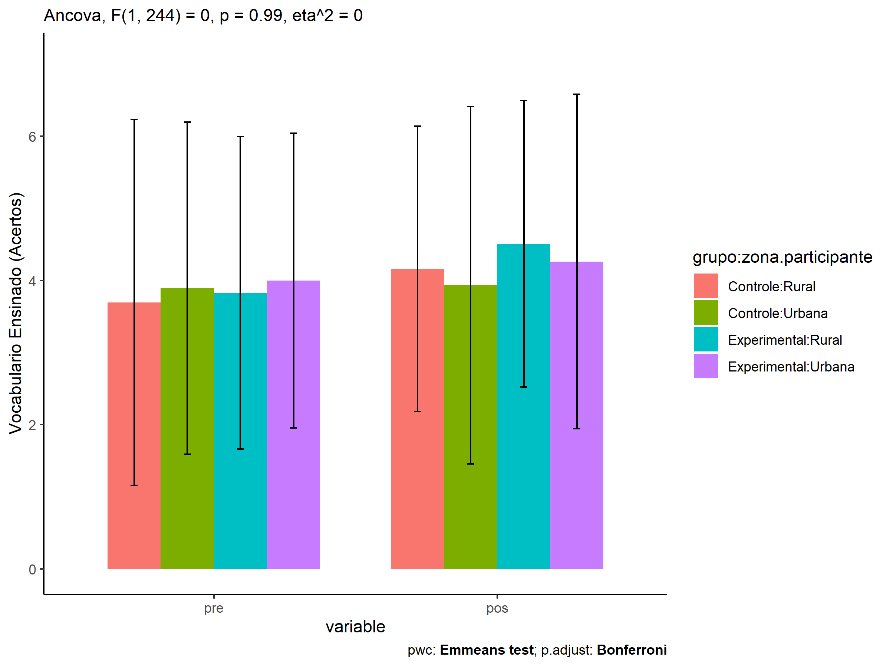<!-- -->

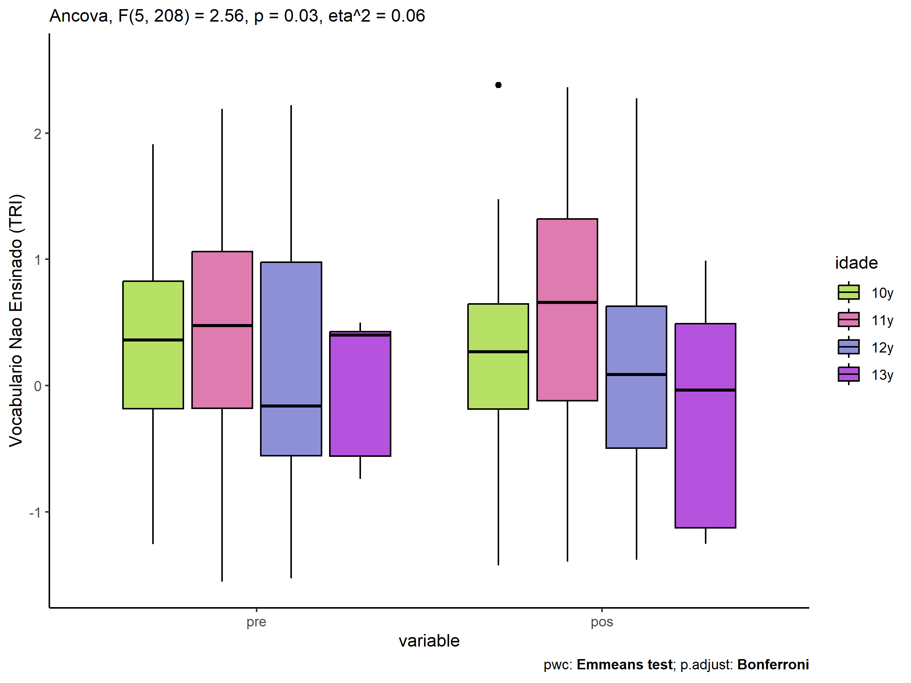<!-- -->

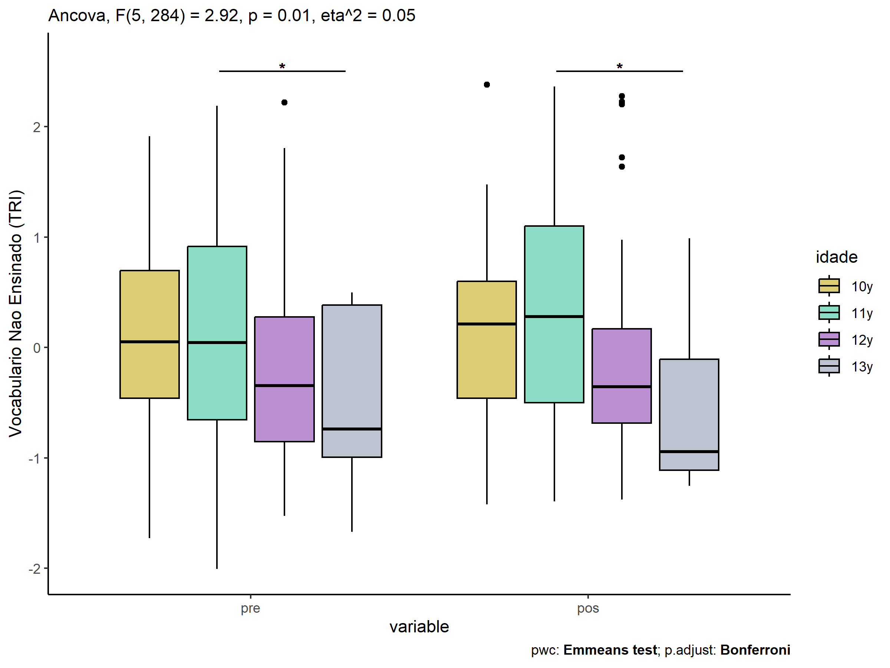<!-- -->

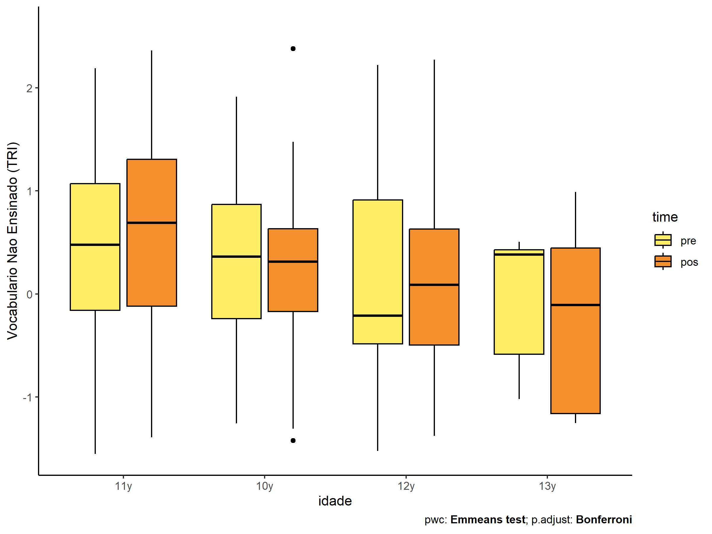<!-- -->

## factor: **zona.participante**

### Vocabulario (Acertos)

| var             | zona.participante |   n | M (pre) | SE (pre) | M (unadj) | SE (unadj) | M (adj) | SE (adj) |
|:----------------|:------------------|----:|--------:|---------:|----------:|-----------:|--------:|---------:|
| score.vocab.pos | Rural             | 111 |  20.090 |    0.812 |    21.892 |      0.777 |  22.563 |    0.533 |
| score.vocab.pos | Urbana            | 122 |  21.787 |    0.744 |    22.623 |      0.785 |  22.012 |    0.508 |

| .y.             | group1 | group2 | estimate | conf.low | conf.high |    se | statistic |     p | p.adj | p.adj.signif |
|:----------------|:-------|:-------|---------:|---------:|----------:|------:|----------:|------:|------:|:-------------|
| score.vocab.pos | Urbana | Rural  |   -0.551 |   -2.004 |     0.903 | 0.738 |    -0.746 | 0.456 | 0.456 | ns           |
| score.vocab.pre | Urbana | Rural  |    1.697 |   -0.469 |     3.863 | 1.099 |     1.543 | 0.124 | 0.124 | ns           |

| .y.         | zona.participante | group1 | group2 | estimate | conf.low | conf.high |    se | statistic |     p | p.adj | p.adj.signif |
|:------------|:------------------|:-------|:-------|---------:|---------:|----------:|------:|----------:|------:|------:|:-------------|
| score.vocab | Urbana            | pre    | pos    |   -0.613 |   -2.698 |     1.471 | 1.061 |    -0.578 | 0.563 | 0.563 | ns           |
| score.vocab | Rural             | pre    | pos    |   -1.753 |   -3.963 |     0.456 | 1.125 |    -1.559 | 0.120 | 0.120 | ns           |

    ## Scale for colour is already present.
    ## Adding another scale for colour, which will replace the existing scale.

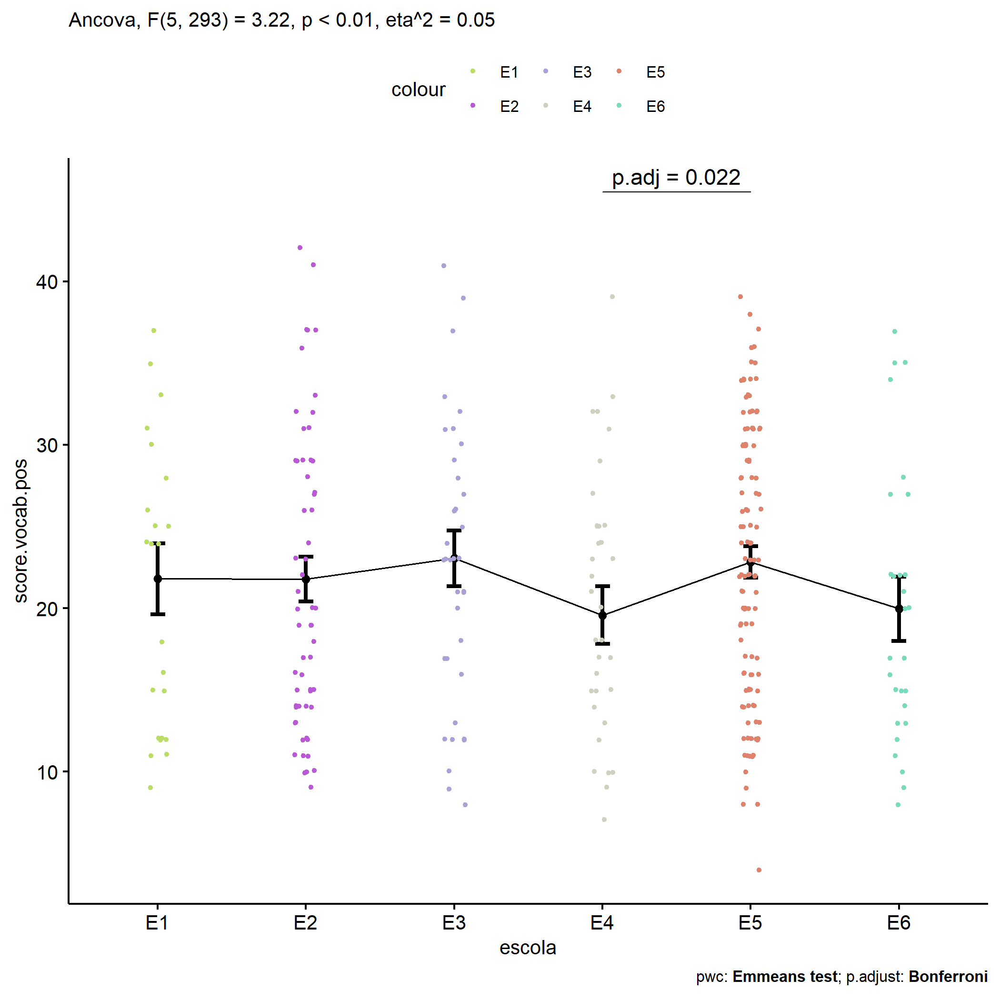<!-- -->

<!-- -->

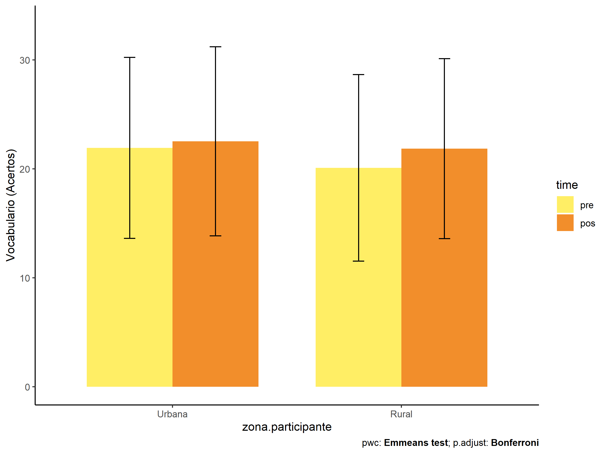<!-- -->

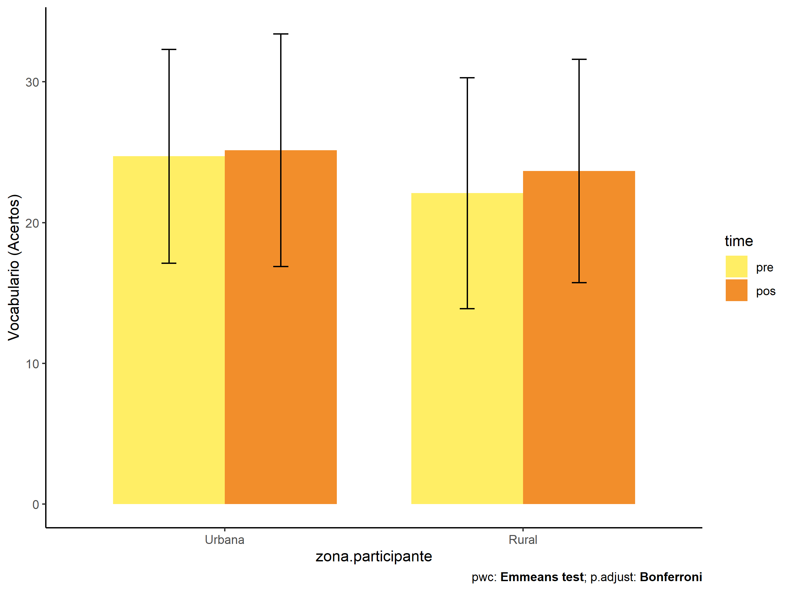<!-- -->

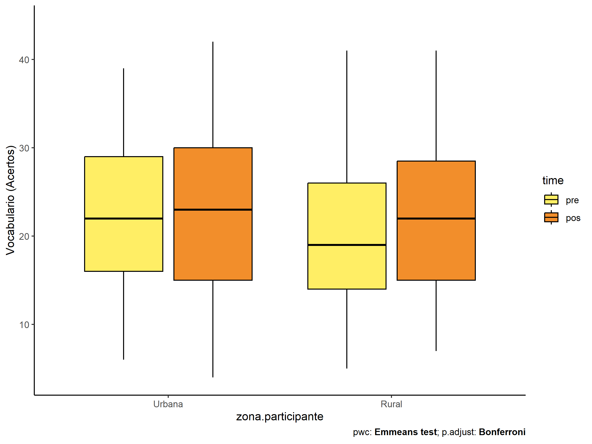<!-- -->

### Vocabulario (TRI)

| var           | zona.participante |   n | M (pre) | SE (pre) | M (unadj) | SE (unadj) | M (adj) | SE (adj) |
|:--------------|:------------------|----:|--------:|---------:|----------:|-----------:|--------:|---------:|
| tri.vocab.pos | Rural             | 111 |   0.013 |    0.086 |     0.117 |      0.088 |   0.168 |    0.057 |
| tri.vocab.pos | Urbana            | 122 |   0.129 |    0.081 |     0.218 |      0.090 |   0.172 |    0.055 |

| .y.           | group1 | group2 | estimate | conf.low | conf.high |    se | statistic |     p | p.adj | p.adj.signif |
|:--------------|:-------|:-------|---------:|---------:|----------:|------:|----------:|------:|------:|:-------------|
| tri.vocab.pos | Urbana | Rural  |    0.003 |   -0.153 |     0.160 | 0.080 |     0.040 | 0.968 | 0.968 | ns           |
| tri.vocab.pre | Urbana | Rural  |    0.116 |   -0.117 |     0.349 | 0.118 |     0.982 | 0.327 | 0.327 | ns           |

| .y.       | zona.participante | group1 | group2 | estimate | conf.low | conf.high |    se | statistic |     p | p.adj | p.adj.signif |
|:----------|:------------------|:-------|:-------|---------:|---------:|----------:|------:|----------:|------:|------:|:-------------|
| tri.vocab | Urbana            | pre    | pos    |   -0.060 |   -0.292 |     0.173 | 0.118 |    -0.504 | 0.615 | 0.615 | ns           |
| tri.vocab | Rural             | pre    | pos    |   -0.097 |   -0.343 |     0.149 | 0.125 |    -0.776 | 0.438 | 0.438 | ns           |

    ## Scale for colour is already present.
    ## Adding another scale for colour, which will replace the existing scale.

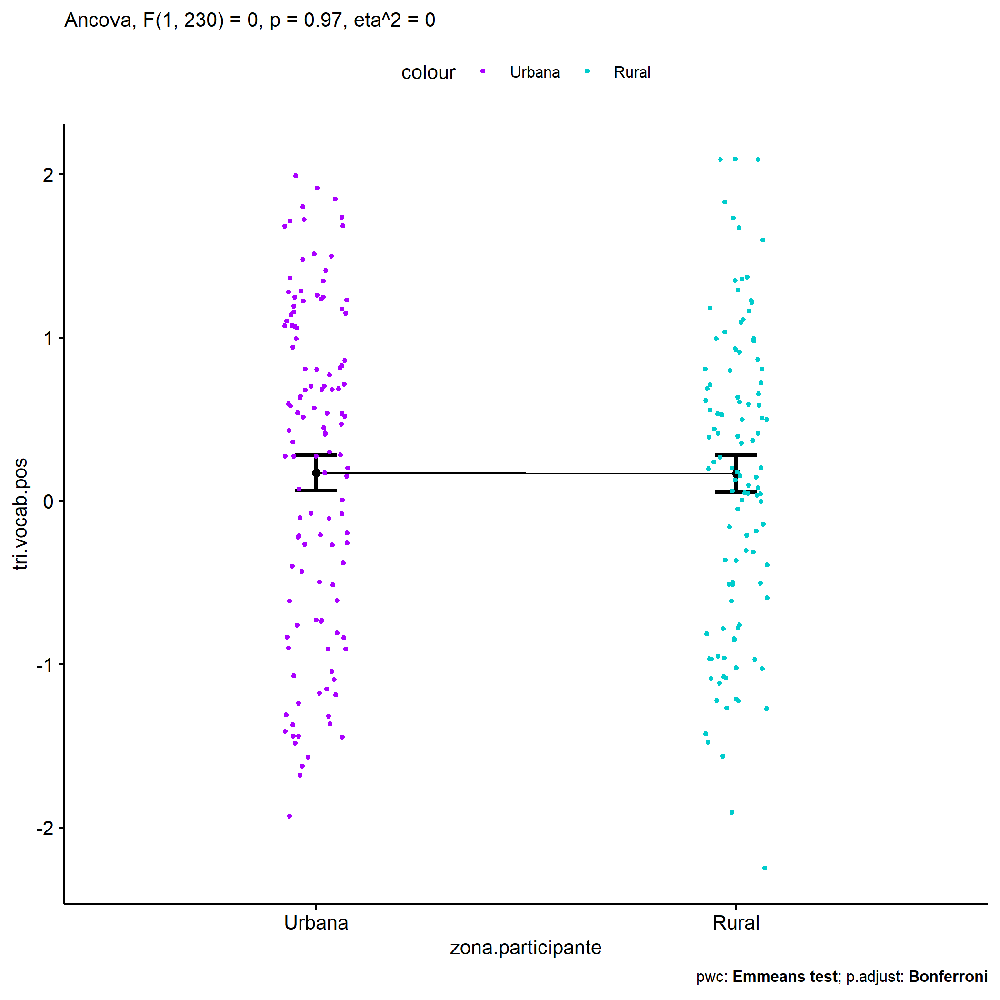<!-- -->

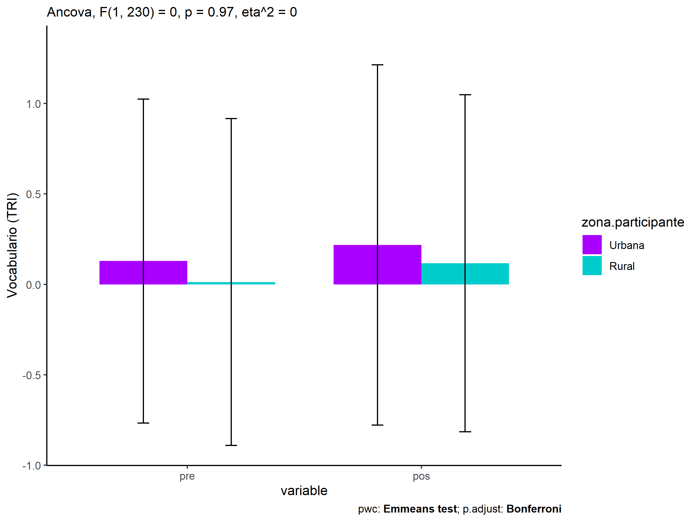<!-- -->

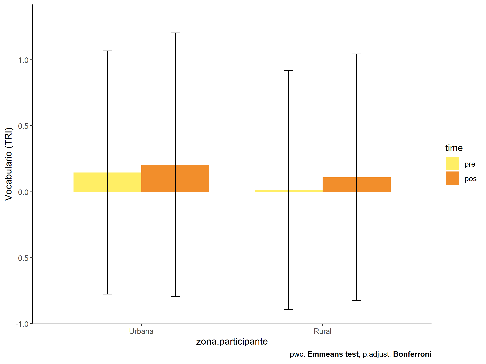<!-- -->

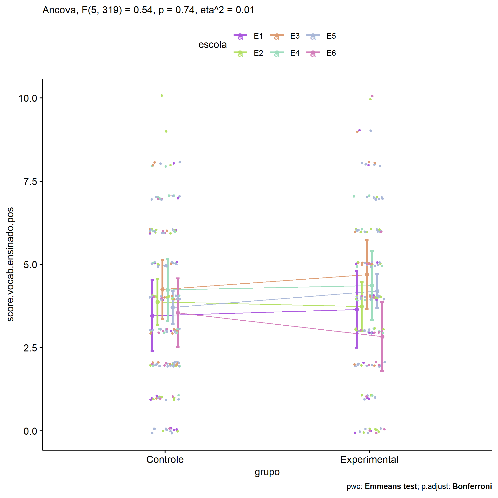<!-- -->

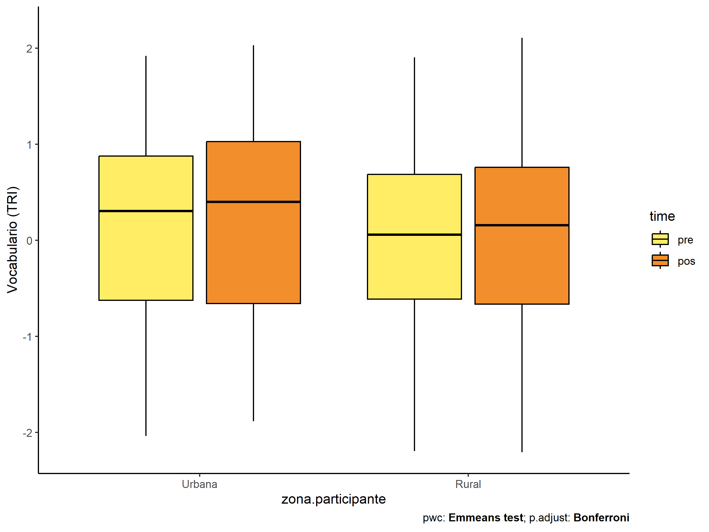<!-- -->

### Vocabulario Ensinado (Acertos)

| var                      | zona.participante |   n | M (pre) | SE (pre) | M (unadj) | SE (unadj) | M (adj) | SE (adj) |
|:-------------------------|:------------------|----:|--------:|---------:|----------:|-----------:|--------:|---------:|
| score.vocab.ensinado.pos | Rural             | 115 |   3.765 |    0.219 |     4.339 |      0.185 |   4.380 |    0.186 |
| score.vocab.ensinado.pos | Urbana            | 134 |   3.940 |    0.189 |     4.075 |      0.208 |   4.039 |    0.172 |

| .y.                      | group1 | group2 | estimate | conf.low | conf.high |    se | statistic |     p | p.adj | p.adj.signif |
|:-------------------------|:-------|:-------|---------:|---------:|----------:|------:|----------:|------:|------:|:-------------|
| score.vocab.ensinado.pos | Urbana | Rural  |   -0.341 |   -0.840 |     0.158 | 0.253 |    -1.347 | 0.179 | 0.179 | ns           |
| score.vocab.ensinado.pre | Urbana | Rural  |    0.175 |   -0.391 |     0.741 | 0.288 |     0.609 | 0.543 | 0.543 | ns           |

| .y.                  | zona.participante | group1 | group2 | estimate | conf.low | conf.high |    se | statistic |     p | p.adj | p.adj.signif |
|:---------------------|:------------------|:-------|:-------|---------:|---------:|----------:|------:|----------:|------:|------:|:-------------|
| score.vocab.ensinado | Urbana            | pre    | pos    |   -0.134 |   -0.672 |     0.404 | 0.274 |    -0.490 | 0.624 | 0.624 | ns           |
| score.vocab.ensinado | Rural             | pre    | pos    |   -0.574 |   -1.155 |     0.007 | 0.296 |    -1.941 | 0.053 | 0.053 | ns           |

    ## Scale for colour is already present.
    ## Adding another scale for colour, which will replace the existing scale.

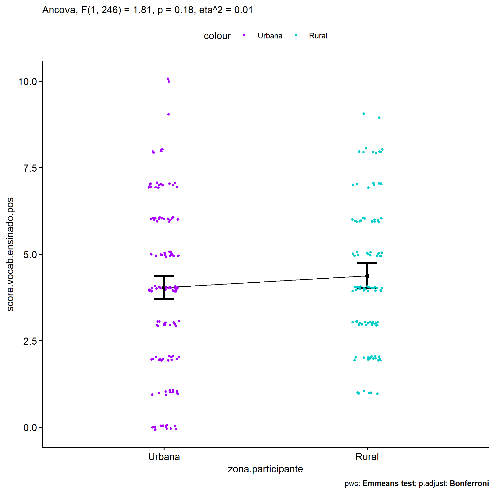<!-- -->

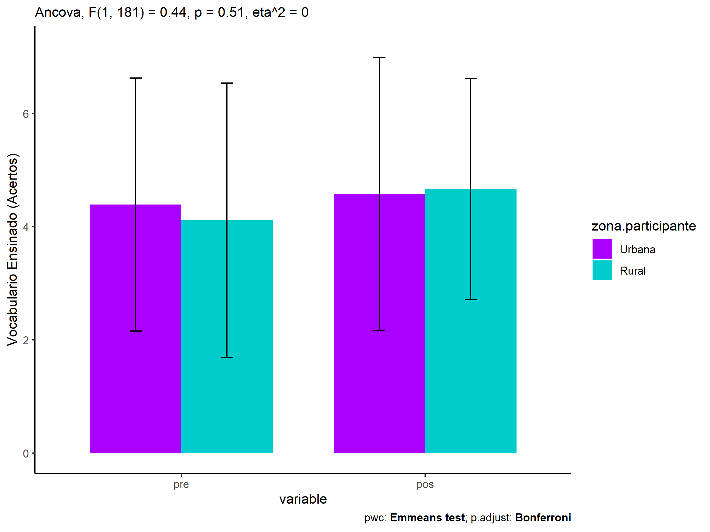<!-- -->

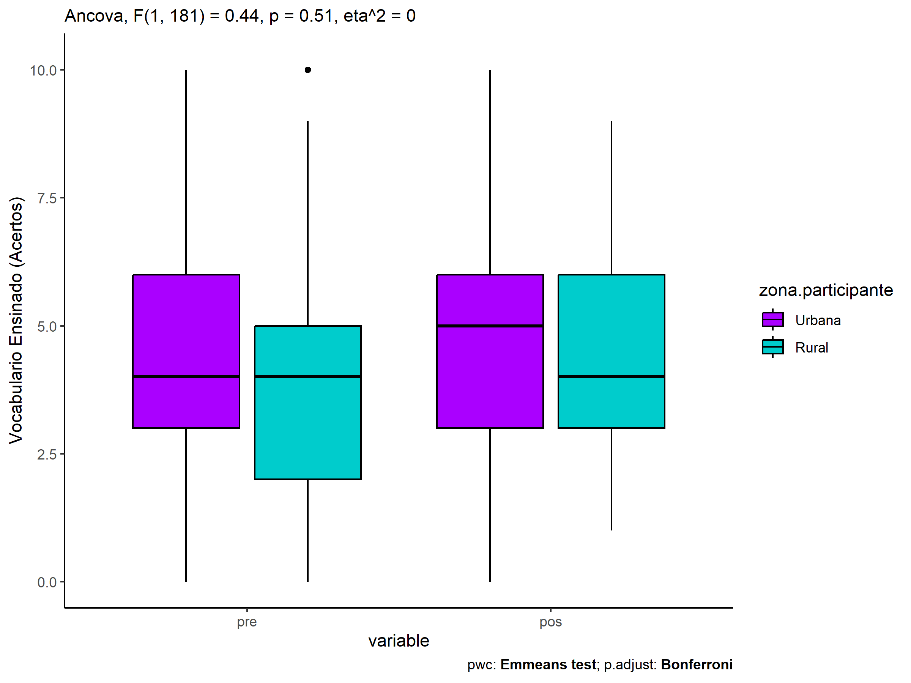<!-- -->

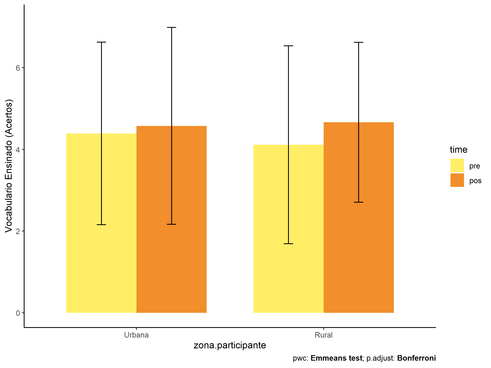<!-- -->

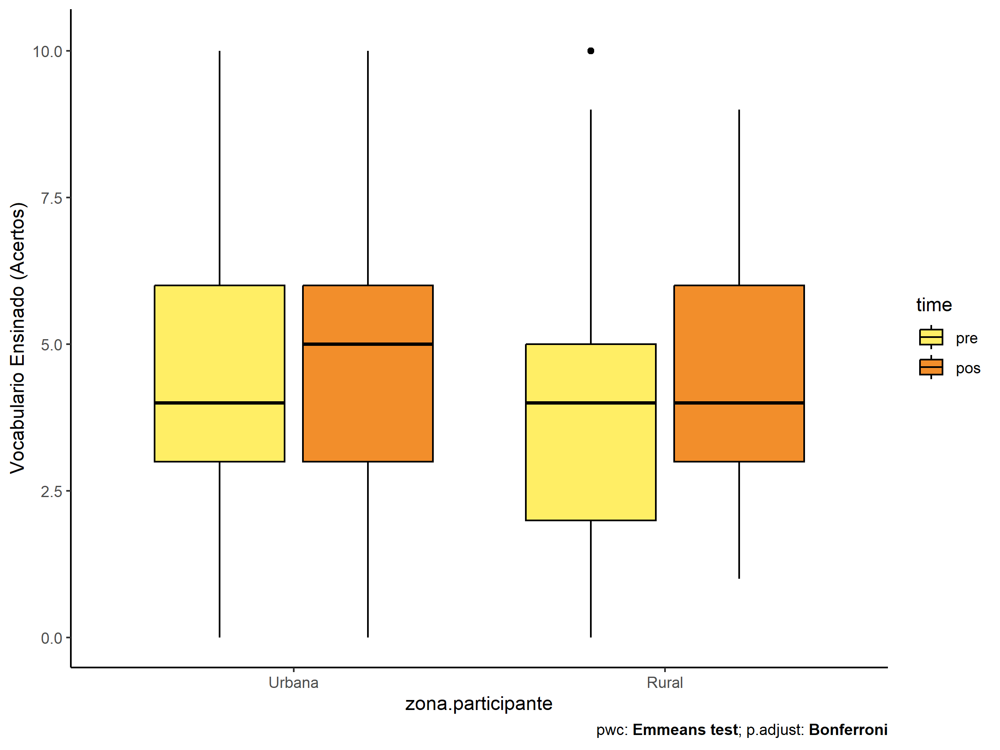<!-- -->

### Vocabulario Ensinado (TRI)

| var                    | zona.participante |   n | M (pre) | SE (pre) | M (unadj) | SE (unadj) | M (adj) | SE (adj) |
|:-----------------------|:------------------|----:|--------:|---------:|----------:|-----------:|--------:|---------:|
| tri.vocab.ensinado.pos | Rural             | 111 |   0.037 |    0.074 |     0.051 |      0.076 |   0.063 |    0.063 |
| tri.vocab.ensinado.pos | Urbana            | 122 |   0.075 |    0.070 |     0.175 |      0.074 |   0.164 |    0.060 |

| .y.                    | group1 | group2 | estimate | conf.low | conf.high |    se | statistic |     p | p.adj | p.adj.signif |
|:-----------------------|:-------|:-------|---------:|---------:|----------:|------:|----------:|------:|------:|:-------------|
| tri.vocab.ensinado.pos | Urbana | Rural  |    0.101 |   -0.070 |     0.272 | 0.087 |     1.165 | 0.245 | 0.245 | ns           |
| tri.vocab.ensinado.pre | Urbana | Rural  |    0.037 |   -0.163 |     0.238 | 0.102 |     0.368 | 0.713 | 0.713 | ns           |

| .y.                | zona.participante | group1 | group2 | estimate | conf.low | conf.high |    se | statistic |     p | p.adj | p.adj.signif |
|:-------------------|:------------------|:-------|:-------|---------:|---------:|----------:|------:|----------:|------:|------:|:-------------|
| tri.vocab.ensinado | Urbana            | pre    | pos    |   -0.092 |   -0.289 |     0.106 | 0.101 |    -0.912 | 0.362 | 0.362 | ns           |
| tri.vocab.ensinado | Rural             | pre    | pos    |   -0.020 |   -0.229 |     0.190 | 0.107 |    -0.186 | 0.853 | 0.853 | ns           |

    ## Scale for colour is already present.
    ## Adding another scale for colour, which will replace the existing scale.

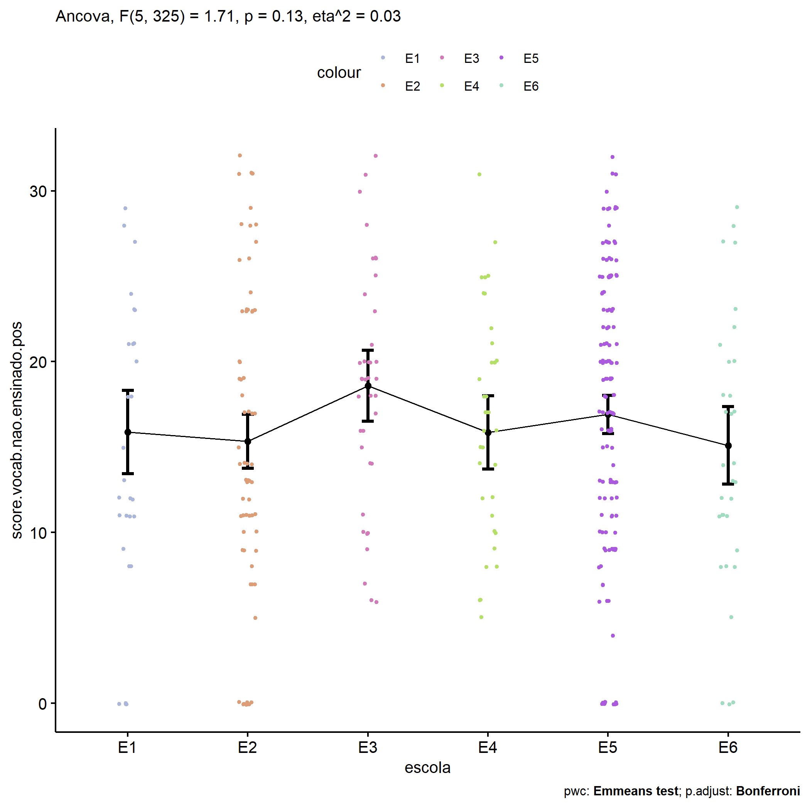<!-- -->

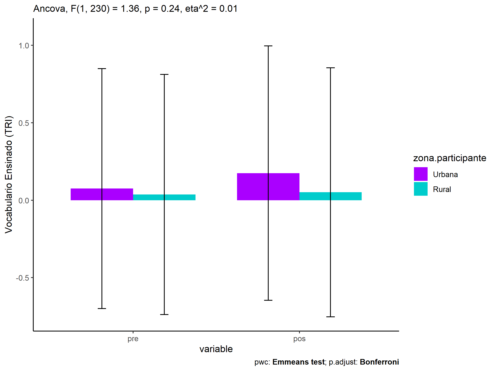<!-- -->

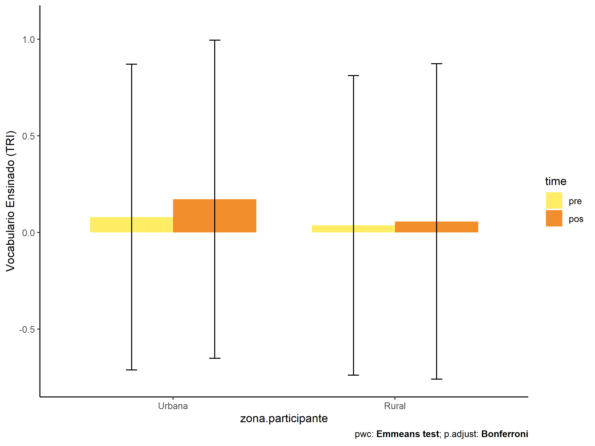<!-- -->

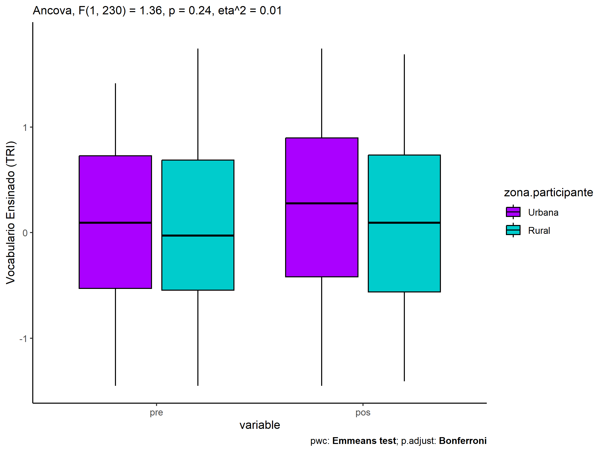<!-- -->

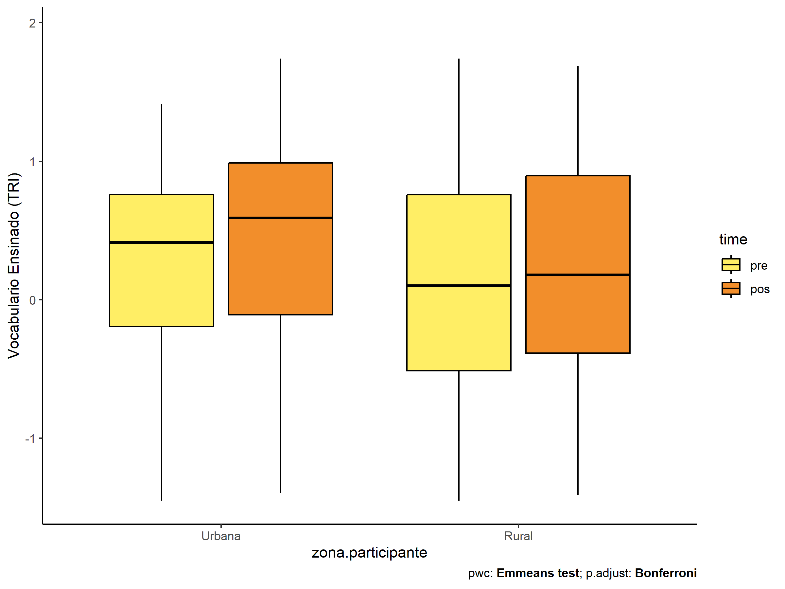<!-- -->

### Vocabulario Nao Ensinado (Acertos)

| var                          | zona.participante |   n | M (pre) | SE (pre) | M (unadj) | SE (unadj) | M (adj) | SE (adj) |
|:-----------------------------|:------------------|----:|--------:|---------:|----------:|-----------:|--------:|---------:|
| score.vocab.nao.ensinado.pos | Rural             | 115 |  15.626 |    0.684 |    17.513 |      0.634 |  18.039 |    0.555 |
| score.vocab.nao.ensinado.pos | Urbana            | 134 |  17.157 |    0.647 |    16.940 |      0.709 |  16.489 |    0.514 |

| .y.                          | group1 | group2 | estimate | conf.low | conf.high |    se | statistic |     p | p.adj | p.adj.signif |
|:-----------------------------|:-------|:-------|---------:|---------:|----------:|------:|----------:|------:|------:|:-------------|
| score.vocab.nao.ensinado.pos | Urbana | Rural  |   -1.551 |   -3.045 |    -0.056 | 0.759 |    -2.043 | 0.042 | 0.042 | \*           |
| score.vocab.nao.ensinado.pre | Urbana | Rural  |    1.531 |   -0.327 |     3.388 | 0.943 |     1.623 | 0.106 | 0.106 | ns           |

| .y.                      | zona.participante | group1 | group2 | estimate | conf.low | conf.high |    se | statistic |     p | p.adj | p.adj.signif |
|:-------------------------|:------------------|:-------|:-------|---------:|---------:|----------:|------:|----------:|------:|------:|:-------------|
| score.vocab.nao.ensinado | Urbana            | pre    | pos    |    0.216 |   -1.585 |     2.018 | 0.917 |     0.236 | 0.814 | 0.814 | ns           |
| score.vocab.nao.ensinado | Rural             | pre    | pos    |   -1.887 |   -3.832 |     0.058 | 0.990 |    -1.906 | 0.057 | 0.057 | ns           |

    ## Scale for colour is already present.
    ## Adding another scale for colour, which will replace the existing scale.

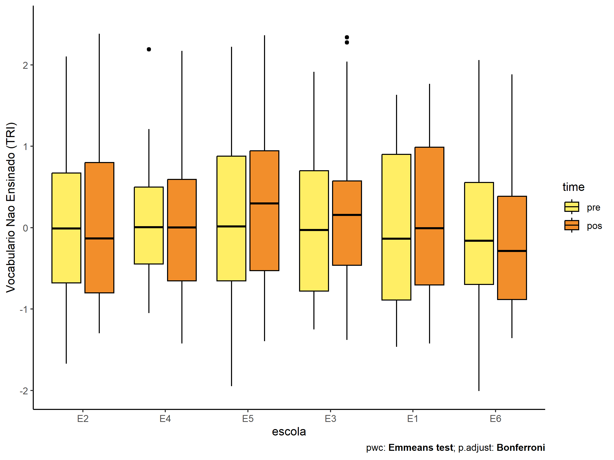<!-- -->

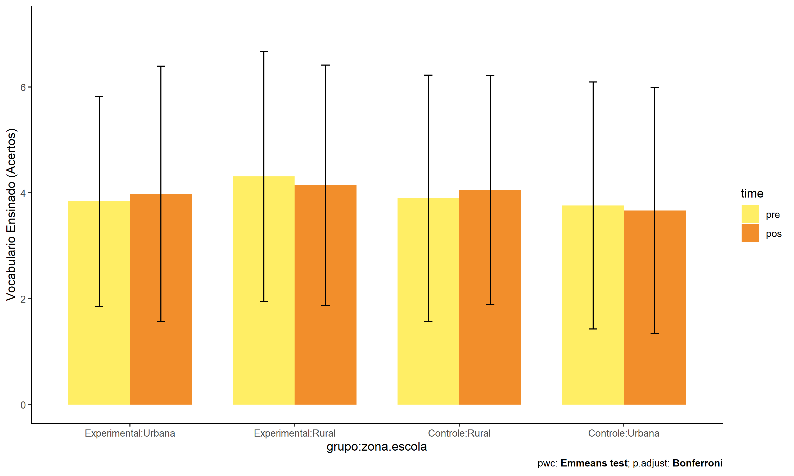<!-- -->

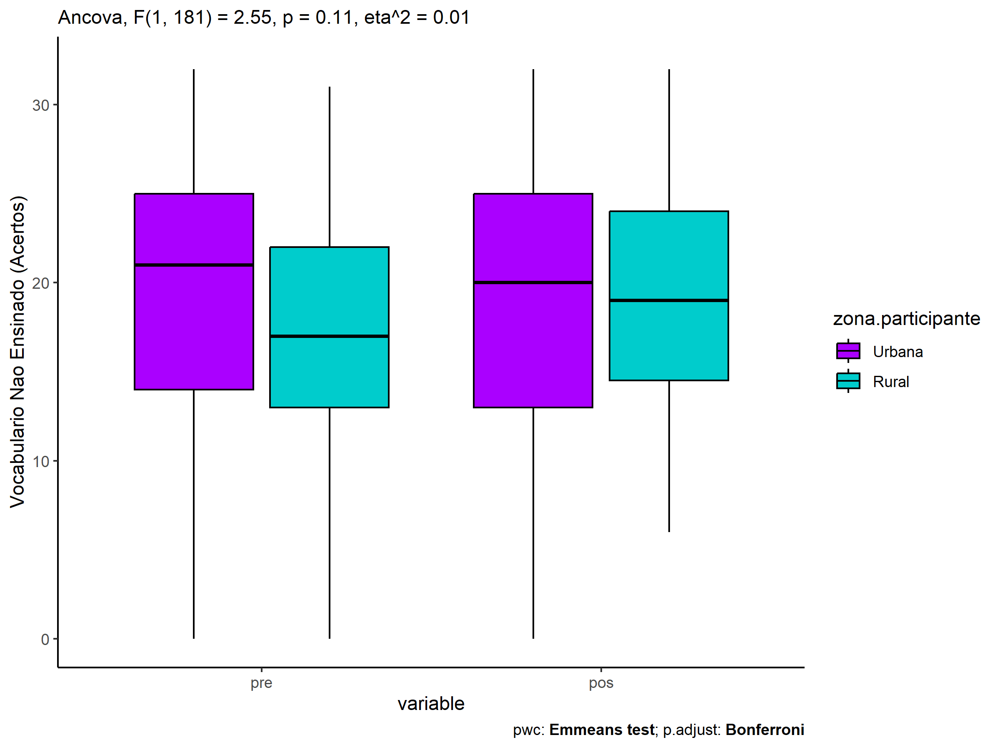<!-- -->

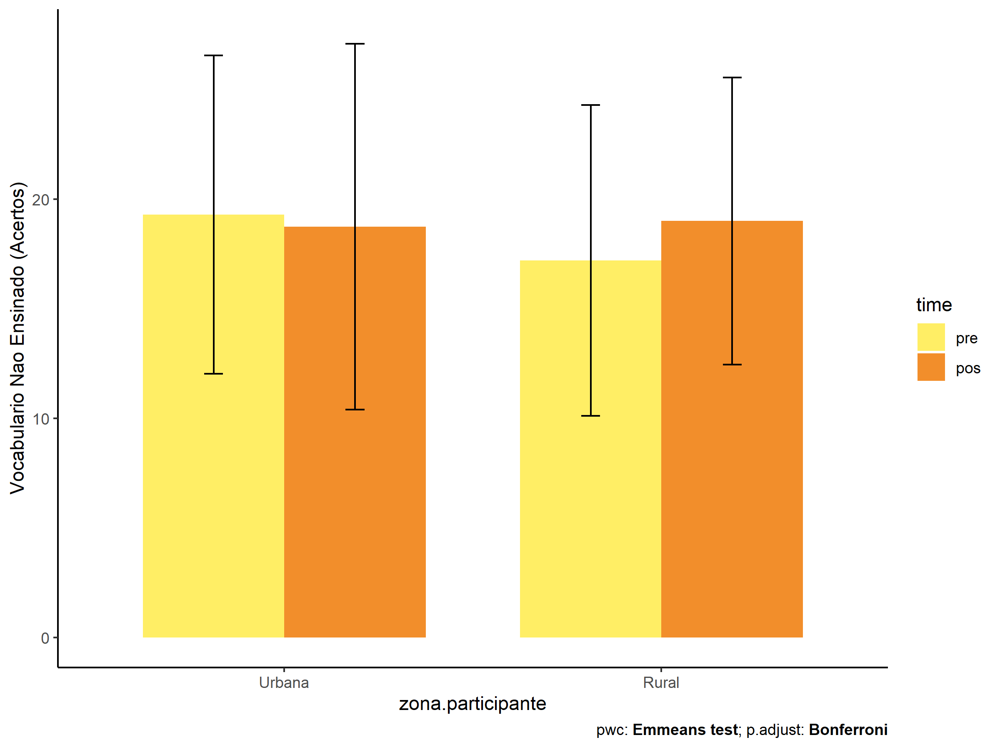<!-- -->

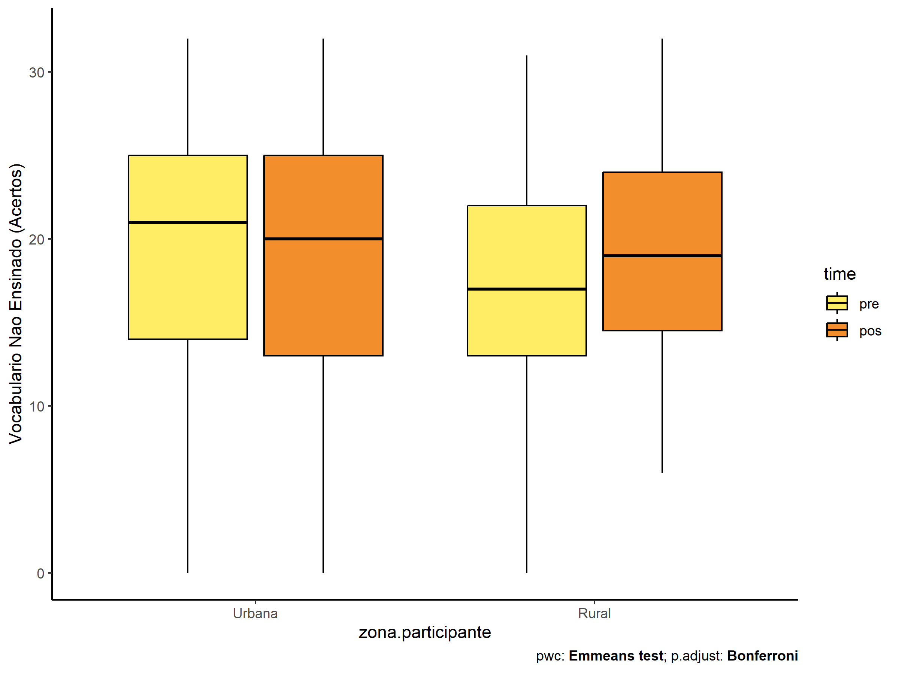<!-- -->

### Vocabulario Nao Ensinado (TRI)

| var                        | zona.participante |   n | M (pre) | SE (pre) | M (unadj) | SE (unadj) | M (adj) | SE (adj) |
|:---------------------------|:------------------|----:|--------:|---------:|----------:|-----------:|--------:|---------:|
| tri.vocab.nao.ensinado.pos | Rural             | 111 |  -0.035 |    0.083 |     0.134 |      0.088 |   0.211 |    0.058 |
| tri.vocab.nao.ensinado.pos | Urbana            | 122 |   0.139 |    0.082 |     0.254 |      0.091 |   0.184 |    0.056 |

| .y.                        | group1 | group2 | estimate | conf.low | conf.high |    se | statistic |     p | p.adj | p.adj.signif |
|:---------------------------|:-------|:-------|---------:|---------:|----------:|------:|----------:|------:|------:|:-------------|
| tri.vocab.nao.ensinado.pos | Urbana | Rural  |   -0.027 |   -0.186 |     0.132 | 0.081 |    -0.333 | 0.740 | 0.740 | ns           |
| tri.vocab.nao.ensinado.pre | Urbana | Rural  |    0.174 |   -0.056 |     0.404 | 0.117 |     1.491 | 0.137 | 0.137 | ns           |

| .y.                    | zona.participante | group1 | group2 | estimate | conf.low | conf.high |    se | statistic |     p | p.adj | p.adj.signif |
|:-----------------------|:------------------|:-------|:-------|---------:|---------:|----------:|------:|----------:|------:|------:|:-------------|
| tri.vocab.nao.ensinado | Urbana            | pre    | pos    |   -0.082 |   -0.312 |     0.149 | 0.117 |    -0.696 | 0.487 | 0.487 | ns           |
| tri.vocab.nao.ensinado | Rural             | pre    | pos    |   -0.158 |   -0.402 |     0.087 | 0.124 |    -1.267 | 0.206 | 0.206 | ns           |

    ## Scale for colour is already present.
    ## Adding another scale for colour, which will replace the existing scale.

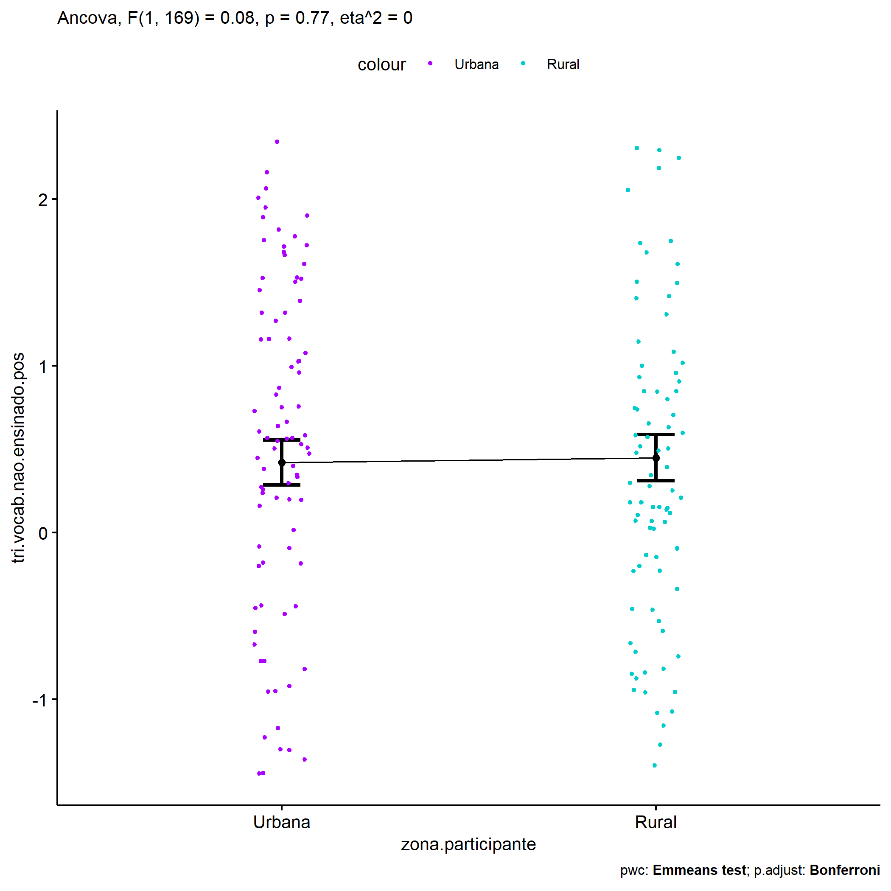<!-- -->

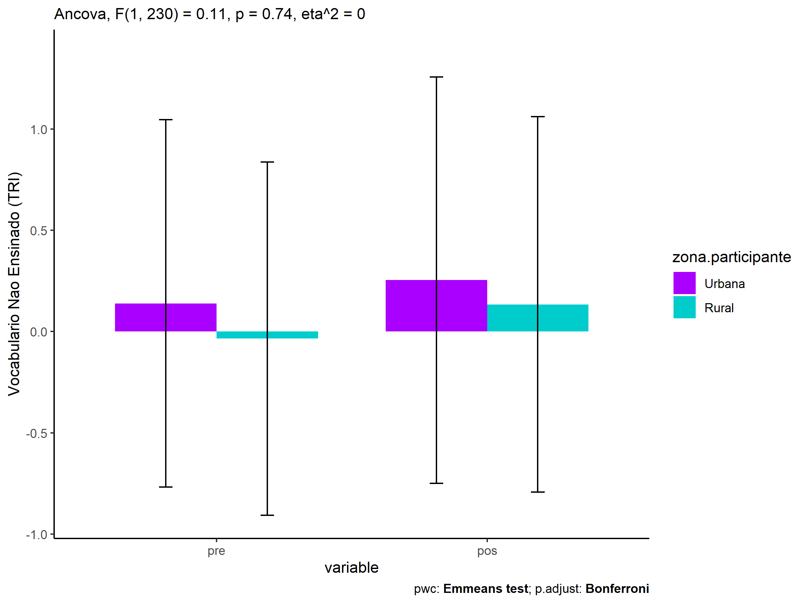<!-- -->

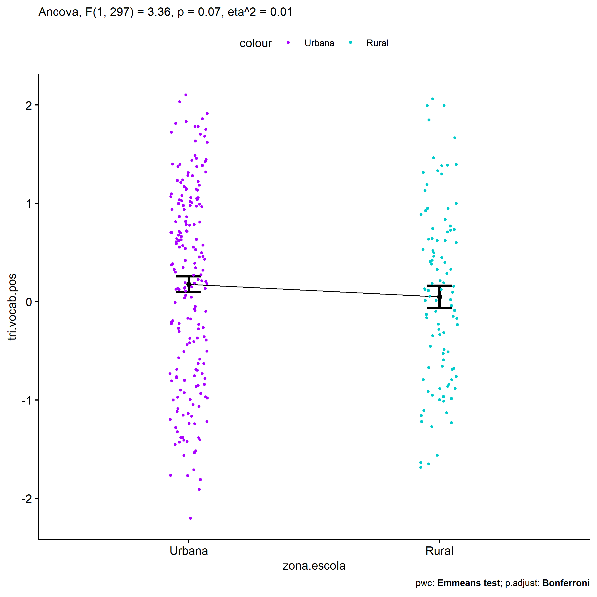<!-- -->

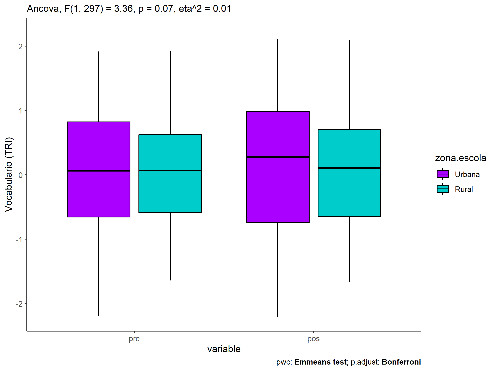<!-- -->

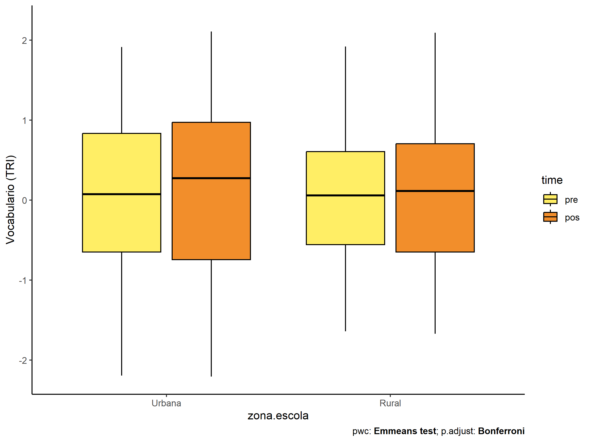<!-- -->

## factor: **escola**

### Vocabulario (Acertos)

| var             | escola |   n | M (pre) | SE (pre) | M (unadj) | SE (unadj) | M (adj) | SE (adj) |
|:----------------|:-------|----:|--------:|---------:|----------:|-----------:|--------:|---------:|
| score.vocab.pos | E1     |  23 |  20.000 |    1.602 |    21.087 |      1.824 |  21.798 |    1.100 |
| score.vocab.pos | E2     |  58 |  20.534 |    1.172 |    21.483 |      1.178 |  21.779 |    0.692 |
| score.vocab.pos | E3     |  37 |  20.432 |    1.434 |    22.676 |      1.392 |  23.051 |    0.867 |
| score.vocab.pos | E4     |  35 |  22.200 |    1.321 |    20.571 |      1.324 |  19.576 |    0.892 |
| score.vocab.pos | E5     | 119 |  21.076 |    0.778 |    22.958 |      0.762 |  22.835 |    0.483 |
| score.vocab.pos | E6     |  28 |  20.821 |    1.684 |    19.893 |      1.571 |  19.967 |    0.996 |

| .y.             | group1 | group2 | estimate | conf.low | conf.high |    se | statistic |     p | p.adj | p.adj.signif |
|:----------------|:-------|:-------|---------:|---------:|----------:|------:|----------:|------:|------:|:-------------|
| score.vocab.pos | E1     | E2     |    0.019 |   -2.538 |     2.576 | 1.299 |     0.015 | 0.988 | 1.000 | ns           |
| score.vocab.pos | E1     | E3     |   -1.253 |   -4.009 |     1.502 | 1.400 |    -0.895 | 0.371 | 1.000 | ns           |
| score.vocab.pos | E1     | E4     |    2.222 |   -0.567 |     5.012 | 1.417 |     1.568 | 0.118 | 1.000 | ns           |
| score.vocab.pos | E1     | E5     |   -1.037 |   -3.401 |     1.328 | 1.202 |    -0.863 | 0.389 | 1.000 | ns           |
| score.vocab.pos | E1     | E6     |    1.831 |   -1.089 |     4.752 | 1.484 |     1.234 | 0.218 | 1.000 | ns           |
| score.vocab.pos | E2     | E3     |   -1.272 |   -3.455 |     0.911 | 1.109 |    -1.147 | 0.252 | 1.000 | ns           |
| score.vocab.pos | E2     | E4     |    2.203 |   -0.021 |     4.428 | 1.130 |     1.950 | 0.052 | 0.782 | ns           |
| score.vocab.pos | E2     | E5     |   -1.055 |   -2.718 |     0.607 | 0.845 |    -1.250 | 0.212 | 1.000 | ns           |
| score.vocab.pos | E2     | E6     |    1.813 |   -0.576 |     4.201 | 1.213 |     1.494 | 0.136 | 1.000 | ns           |
| score.vocab.pos | E3     | E4     |    3.476 |    1.025 |     5.926 | 1.245 |     2.792 | 0.006 | 0.084 | ns           |
| score.vocab.pos | E3     | E5     |    0.217 |   -1.737 |     2.170 | 0.993 |     0.218 | 0.827 | 1.000 | ns           |
| score.vocab.pos | E3     | E6     |    3.085 |    0.485 |     5.684 | 1.321 |     2.335 | 0.020 | 0.303 | ns           |
| score.vocab.pos | E4     | E5     |   -3.259 |   -5.256 |    -1.262 | 1.015 |    -3.212 | 0.001 | 0.022 | \*           |
| score.vocab.pos | E4     | E6     |   -0.391 |   -3.024 |     2.242 | 1.338 |    -0.292 | 0.770 | 1.000 | ns           |
| score.vocab.pos | E5     | E6     |    2.868 |    0.688 |     5.048 | 1.108 |     2.590 | 0.010 | 0.151 | ns           |
| score.vocab.pre | E1     | E2     |   -0.534 |   -4.662 |     3.593 | 2.097 |    -0.255 | 0.799 | 1.000 | ns           |
| score.vocab.pre | E1     | E3     |   -0.432 |   -4.880 |     4.015 | 2.260 |    -0.191 | 0.848 | 1.000 | ns           |
| score.vocab.pre | E1     | E4     |   -2.200 |   -6.696 |     2.296 | 2.284 |    -0.963 | 0.336 | 1.000 | ns           |
| score.vocab.pre | E1     | E5     |   -1.076 |   -4.891 |     2.740 | 1.939 |    -0.555 | 0.579 | 1.000 | ns           |
| score.vocab.pre | E1     | E6     |   -0.821 |   -5.535 |     3.892 | 2.395 |    -0.343 | 0.732 | 1.000 | ns           |
| score.vocab.pre | E2     | E3     |    0.102 |   -3.422 |     3.626 | 1.791 |     0.057 | 0.955 | 1.000 | ns           |
| score.vocab.pre | E2     | E4     |   -1.666 |   -5.251 |     1.920 | 1.822 |    -0.914 | 0.361 | 1.000 | ns           |
| score.vocab.pre | E2     | E5     |   -0.541 |   -3.223 |     2.141 | 1.363 |    -0.397 | 0.692 | 1.000 | ns           |
| score.vocab.pre | E2     | E6     |   -0.287 |   -4.141 |     3.568 | 1.959 |    -0.147 | 0.884 | 1.000 | ns           |
| score.vocab.pre | E3     | E4     |   -1.768 |   -5.717 |     2.182 | 2.007 |    -0.881 | 0.379 | 1.000 | ns           |
| score.vocab.pre | E3     | E5     |   -0.643 |   -3.796 |     2.510 | 1.602 |    -0.402 | 0.688 | 1.000 | ns           |
| score.vocab.pre | E3     | E6     |   -0.389 |   -4.585 |     3.807 | 2.132 |    -0.182 | 0.855 | 1.000 | ns           |
| score.vocab.pre | E4     | E5     |    1.124 |   -2.096 |     4.345 | 1.637 |     0.687 | 0.493 | 1.000 | ns           |
| score.vocab.pre | E4     | E6     |    1.379 |   -2.868 |     5.625 | 2.158 |     0.639 | 0.523 | 1.000 | ns           |
| score.vocab.pre | E5     | E6     |    0.254 |   -3.264 |     3.772 | 1.788 |     0.142 | 0.887 | 1.000 | ns           |

| .y.         | escola | group1 | group2 | estimate | conf.low | conf.high |    se | statistic |     p | p.adj | p.adj.signif |
|:------------|:-------|:-------|:-------|---------:|---------:|----------:|------:|----------:|------:|------:|:-------------|
| score.vocab | E1     | pre    | pos    |   -0.993 |   -5.756 |     3.770 | 2.425 |    -0.410 | 0.682 | 0.682 | ns           |
| score.vocab | E2     | pre    | pos    |   -0.826 |   -3.823 |     2.171 | 1.526 |    -0.541 | 0.589 | 0.589 | ns           |
| score.vocab | E3     | pre    | pos    |   -2.410 |   -6.259 |     1.440 | 1.960 |    -1.229 | 0.219 | 0.219 | ns           |
| score.vocab | E4     | pre    | pos    |    1.311 |   -2.645 |     5.268 | 2.015 |     0.651 | 0.515 | 0.515 | ns           |
| score.vocab | E5     | pre    | pos    |   -1.585 |   -3.694 |     0.524 | 1.074 |    -1.476 | 0.140 | 0.140 | ns           |
| score.vocab | E6     | pre    | pos    |    0.478 |   -3.828 |     4.784 | 2.193 |     0.218 | 0.827 | 0.827 | ns           |

    ## Scale for colour is already present.
    ## Adding another scale for colour, which will replace the existing scale.

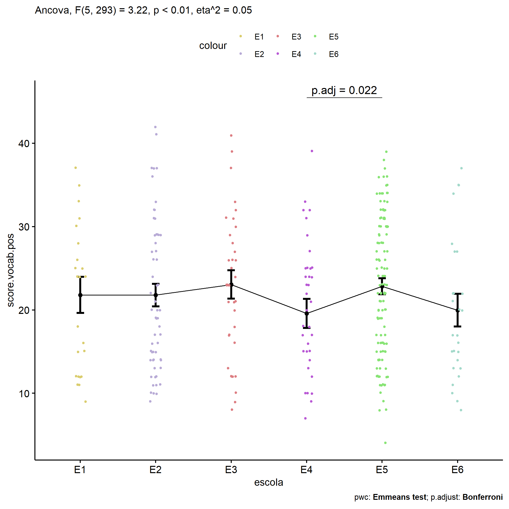<!-- -->

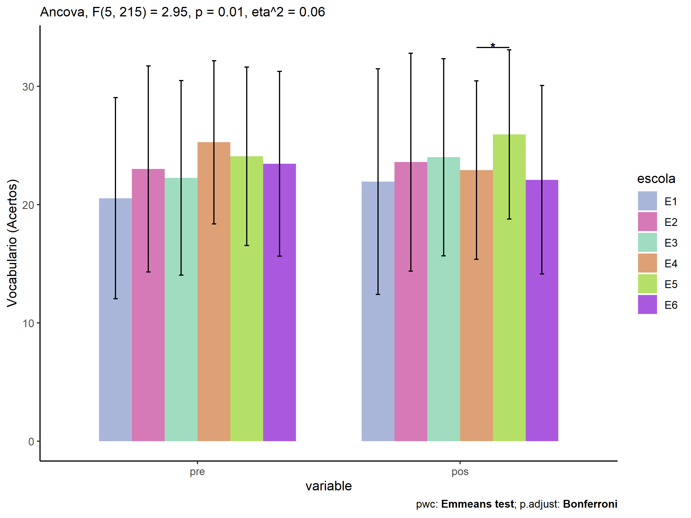<!-- -->

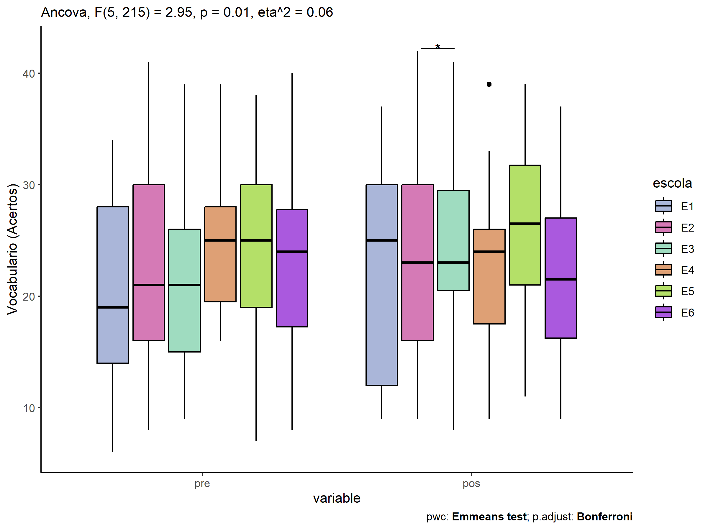<!-- -->

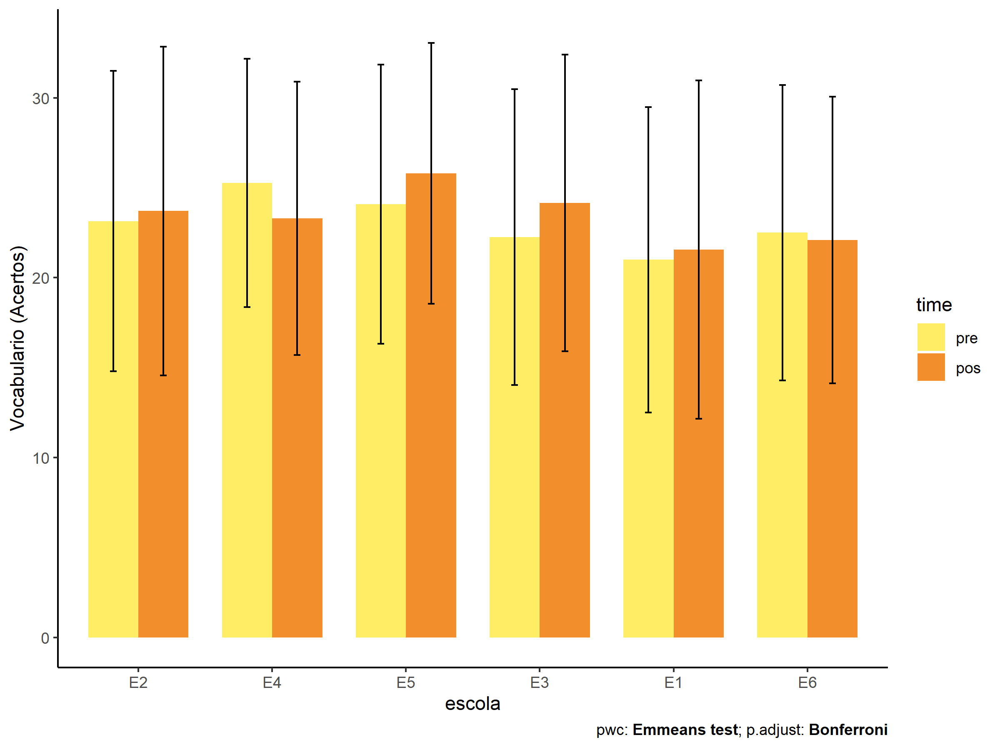<!-- -->

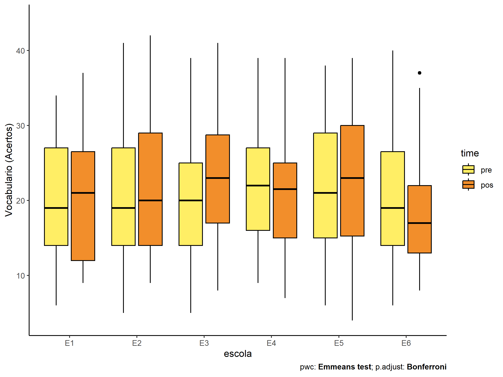<!-- -->

### Vocabulario (TRI)

| var           | escola |   n | M (pre) | SE (pre) | M (unadj) | SE (unadj) | M (adj) | SE (adj) |
|:--------------|:-------|----:|--------:|---------:|----------:|-----------:|--------:|---------:|
| tri.vocab.pos | E1     |  23 |  -0.069 |    0.207 |     0.179 |      0.203 |   0.293 |    0.119 |
| tri.vocab.pos | E2     |  58 |  -0.001 |    0.126 |    -0.015 |      0.138 |   0.040 |    0.075 |
| tri.vocab.pos | E3     |  37 |   0.054 |    0.150 |     0.217 |      0.148 |   0.225 |    0.094 |
| tri.vocab.pos | E4     |  35 |   0.147 |    0.127 |    -0.004 |      0.155 |  -0.076 |    0.097 |
| tri.vocab.pos | E5     | 119 |   0.095 |    0.084 |     0.249 |      0.090 |   0.222 |    0.052 |
| tri.vocab.pos | E6     |  28 |   0.074 |    0.156 |    -0.022 |      0.162 |  -0.032 |    0.108 |

| .y.           | group1 | group2 | estimate | conf.low | conf.high |    se | statistic |     p | p.adj | p.adj.signif |
|:--------------|:-------|:-------|---------:|---------:|----------:|------:|----------:|------:|------:|:-------------|
| tri.vocab.pos | E1     | E2     |    0.252 |   -0.025 |     0.530 | 0.141 |     1.790 | 0.074 | 1.000 | ns           |
| tri.vocab.pos | E1     | E3     |    0.068 |   -0.231 |     0.367 | 0.152 |     0.449 | 0.654 | 1.000 | ns           |
| tri.vocab.pos | E1     | E4     |    0.369 |    0.067 |     0.672 | 0.154 |     2.402 | 0.017 | 0.254 | ns           |
| tri.vocab.pos | E1     | E5     |    0.071 |   -0.186 |     0.328 | 0.130 |     0.546 | 0.586 | 1.000 | ns           |
| tri.vocab.pos | E1     | E6     |    0.325 |    0.008 |     0.642 | 0.161 |     2.016 | 0.045 | 0.670 | ns           |
| tri.vocab.pos | E2     | E3     |   -0.184 |   -0.421 |     0.053 | 0.120 |    -1.529 | 0.127 | 1.000 | ns           |
| tri.vocab.pos | E2     | E4     |    0.117 |   -0.124 |     0.358 | 0.123 |     0.954 | 0.341 | 1.000 | ns           |
| tri.vocab.pos | E2     | E5     |   -0.181 |   -0.362 |    -0.001 | 0.092 |    -1.977 | 0.049 | 0.735 | ns           |
| tri.vocab.pos | E2     | E6     |    0.072 |   -0.187 |     0.331 | 0.132 |     0.550 | 0.583 | 1.000 | ns           |
| tri.vocab.pos | E3     | E4     |    0.301 |    0.035 |     0.566 | 0.135 |     2.231 | 0.026 | 0.397 | ns           |
| tri.vocab.pos | E3     | E5     |    0.003 |   -0.209 |     0.215 | 0.108 |     0.027 | 0.979 | 1.000 | ns           |
| tri.vocab.pos | E3     | E6     |    0.256 |   -0.026 |     0.538 | 0.143 |     1.790 | 0.074 | 1.000 | ns           |
| tri.vocab.pos | E4     | E5     |   -0.298 |   -0.515 |    -0.082 | 0.110 |    -2.710 | 0.007 | 0.107 | ns           |
| tri.vocab.pos | E4     | E6     |   -0.045 |   -0.330 |     0.241 | 0.145 |    -0.307 | 0.759 | 1.000 | ns           |
| tri.vocab.pos | E5     | E6     |    0.254 |    0.017 |     0.490 | 0.120 |     2.111 | 0.036 | 0.535 | ns           |
| tri.vocab.pre | E1     | E2     |   -0.068 |   -0.507 |     0.371 | 0.223 |    -0.304 | 0.762 | 1.000 | ns           |
| tri.vocab.pre | E1     | E3     |   -0.123 |   -0.596 |     0.350 | 0.240 |    -0.511 | 0.610 | 1.000 | ns           |
| tri.vocab.pre | E1     | E4     |   -0.216 |   -0.694 |     0.263 | 0.243 |    -0.887 | 0.376 | 1.000 | ns           |
| tri.vocab.pre | E1     | E5     |   -0.164 |   -0.570 |     0.242 | 0.206 |    -0.796 | 0.427 | 1.000 | ns           |
| tri.vocab.pre | E1     | E6     |   -0.143 |   -0.644 |     0.359 | 0.255 |    -0.560 | 0.576 | 1.000 | ns           |
| tri.vocab.pre | E2     | E3     |   -0.055 |   -0.430 |     0.320 | 0.190 |    -0.289 | 0.773 | 1.000 | ns           |
| tri.vocab.pre | E2     | E4     |   -0.148 |   -0.529 |     0.233 | 0.194 |    -0.763 | 0.446 | 1.000 | ns           |
| tri.vocab.pre | E2     | E5     |   -0.096 |   -0.382 |     0.189 | 0.145 |    -0.664 | 0.507 | 1.000 | ns           |
| tri.vocab.pre | E2     | E6     |   -0.075 |   -0.485 |     0.335 | 0.208 |    -0.360 | 0.719 | 1.000 | ns           |
| tri.vocab.pre | E3     | E4     |   -0.093 |   -0.513 |     0.327 | 0.213 |    -0.435 | 0.664 | 1.000 | ns           |
| tri.vocab.pre | E3     | E5     |   -0.041 |   -0.377 |     0.294 | 0.170 |    -0.243 | 0.808 | 1.000 | ns           |
| tri.vocab.pre | E3     | E6     |   -0.020 |   -0.466 |     0.426 | 0.227 |    -0.088 | 0.930 | 1.000 | ns           |
| tri.vocab.pre | E4     | E5     |    0.051 |   -0.291 |     0.394 | 0.174 |     0.296 | 0.768 | 1.000 | ns           |
| tri.vocab.pre | E4     | E6     |    0.073 |   -0.379 |     0.524 | 0.229 |     0.317 | 0.751 | 1.000 | ns           |
| tri.vocab.pre | E5     | E6     |    0.021 |   -0.353 |     0.395 | 0.190 |     0.112 | 0.911 | 1.000 | ns           |

| .y.       | escola | group1 | group2 | estimate | conf.low | conf.high |    se | statistic |     p | p.adj | p.adj.signif |
|:----------|:-------|:-------|:-------|---------:|---------:|----------:|------:|----------:|------:|------:|:-------------|
| tri.vocab | E1     | pre    | pos    |   -0.250 |   -0.777 |     0.277 | 0.268 |    -0.931 | 0.352 | 0.352 | ns           |
| tri.vocab | E2     | pre    | pos    |    0.021 |   -0.311 |     0.352 | 0.169 |     0.122 | 0.903 | 0.903 | ns           |
| tri.vocab | E3     | pre    | pos    |   -0.174 |   -0.600 |     0.252 | 0.217 |    -0.804 | 0.422 | 0.422 | ns           |
| tri.vocab | E4     | pre    | pos    |    0.119 |   -0.319 |     0.557 | 0.223 |     0.534 | 0.593 | 0.593 | ns           |
| tri.vocab | E5     | pre    | pos    |   -0.116 |   -0.349 |     0.118 | 0.119 |    -0.974 | 0.330 | 0.330 | ns           |
| tri.vocab | E6     | pre    | pos    |    0.103 |   -0.374 |     0.579 | 0.243 |     0.424 | 0.672 | 0.672 | ns           |

    ## Scale for colour is already present.
    ## Adding another scale for colour, which will replace the existing scale.

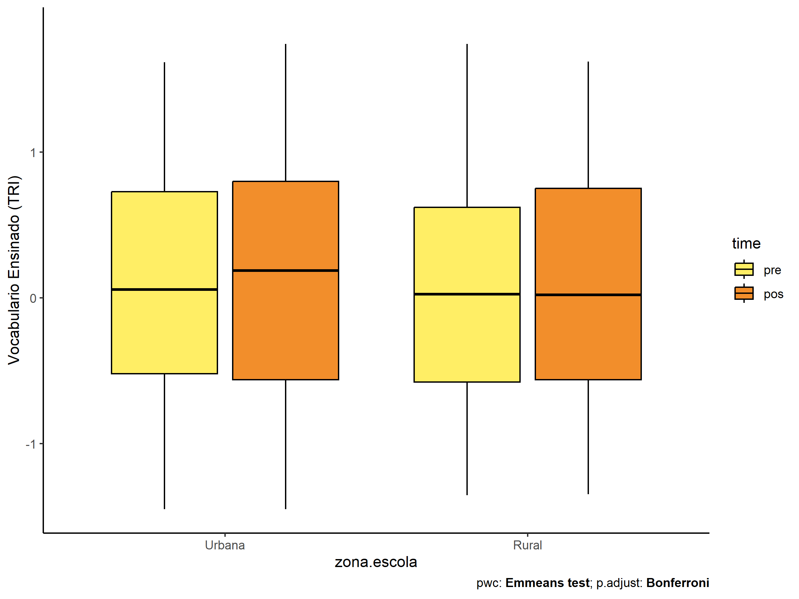<!-- -->

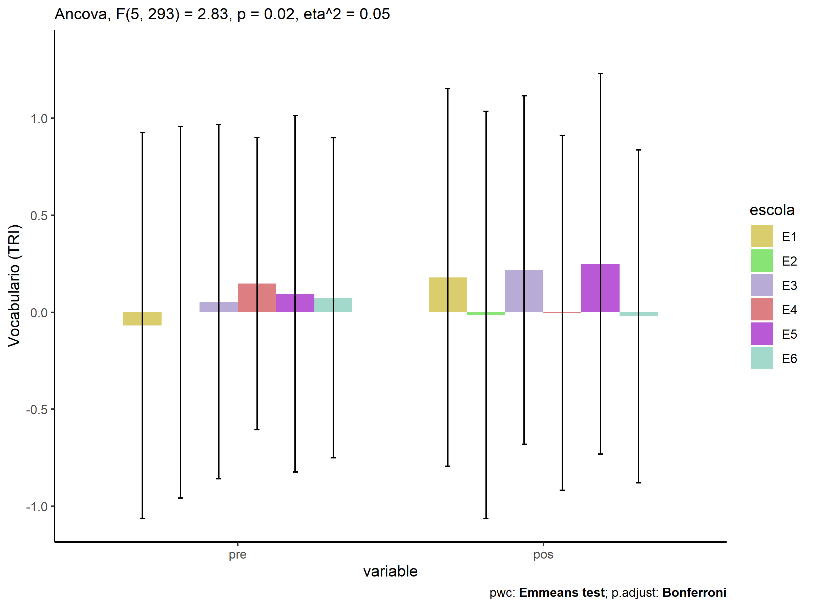<!-- -->

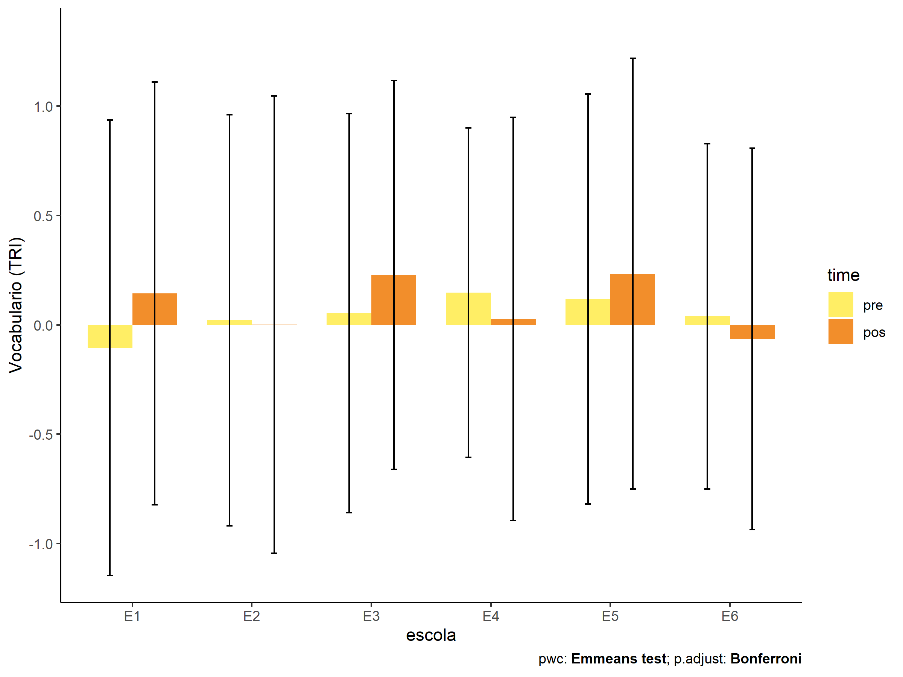<!-- -->

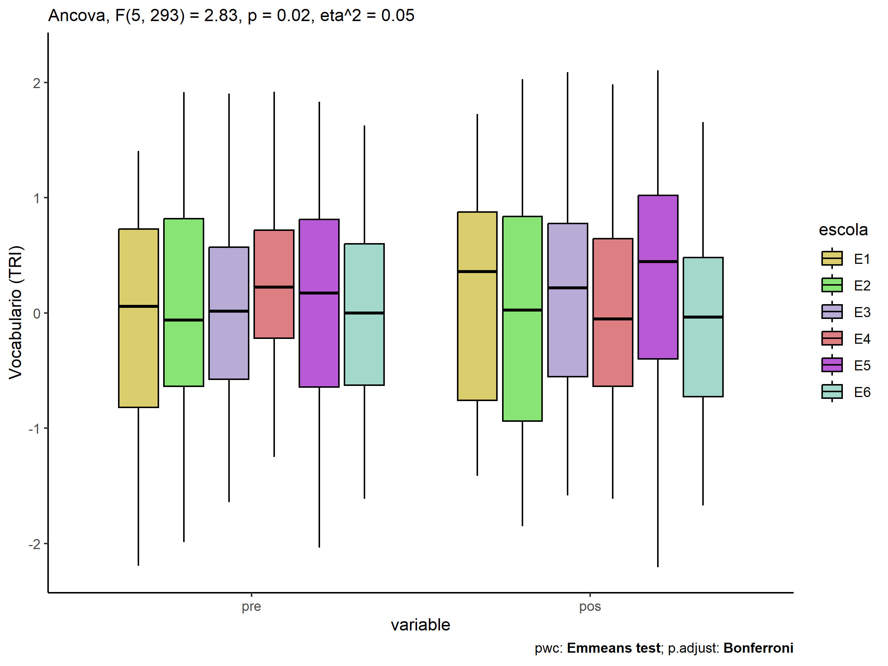<!-- -->

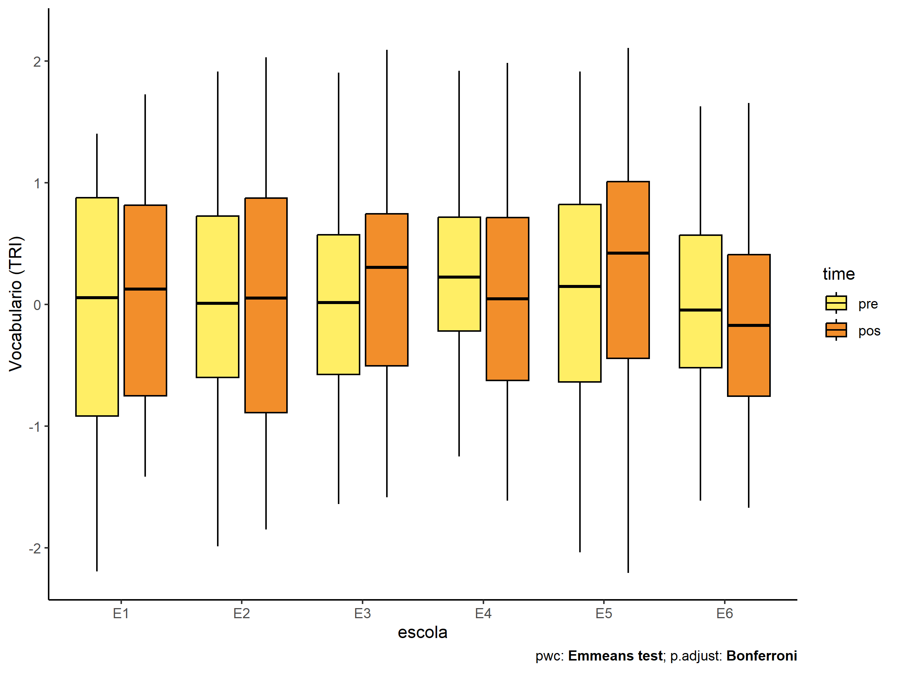<!-- -->

### Vocabulario Ensinado (Acertos)

| var                      | escola |   n | M (pre) | SE (pre) | M (unadj) | SE (unadj) | M (adj) | SE (adj) |
|:-------------------------|:-------|----:|--------:|---------:|----------:|-----------:|--------:|---------:|
| score.vocab.ensinado.pos | E1     |  28 |   3.536 |    0.383 |     3.393 |      0.515 |   3.549 |    0.395 |
| score.vocab.ensinado.pos | E2     |  66 |   3.742 |    0.276 |     3.742 |      0.308 |   3.808 |    0.257 |
| score.vocab.ensinado.pos | E3     |  38 |   3.737 |    0.375 |     4.368 |      0.344 |   4.436 |    0.339 |
| score.vocab.ensinado.pos | E4     |  36 |   4.500 |    0.387 |     4.556 |      0.330 |   4.289 |    0.350 |
| score.vocab.ensinado.pos | E5     | 132 |   3.886 |    0.189 |     3.947 |      0.194 |   3.949 |    0.182 |
| score.vocab.ensinado.pos | E6     |  32 |   4.031 |    0.425 |     3.250 |      0.416 |   3.189 |    0.370 |

| .y.                      | group1 | group2 | estimate | conf.low | conf.high |    se | statistic |     p | p.adj | p.adj.signif |
|:-------------------------|:-------|:-------|---------:|---------:|----------:|------:|----------:|------:|------:|:-------------|
| score.vocab.ensinado.pos | E1     | E2     |   -0.259 |   -1.187 |     0.669 | 0.472 |    -0.549 | 0.583 | 1.000 | ns           |
| score.vocab.ensinado.pos | E1     | E3     |   -0.887 |   -1.912 |     0.137 | 0.521 |    -1.704 | 0.089 | 1.000 | ns           |
| score.vocab.ensinado.pos | E1     | E4     |   -0.740 |   -1.781 |     0.301 | 0.529 |    -1.398 | 0.163 | 1.000 | ns           |
| score.vocab.ensinado.pos | E1     | E5     |   -0.400 |   -1.257 |     0.456 | 0.435 |    -0.920 | 0.358 | 1.000 | ns           |
| score.vocab.ensinado.pos | E1     | E6     |    0.360 |   -0.705 |     1.426 | 0.542 |     0.665 | 0.507 | 1.000 | ns           |
| score.vocab.ensinado.pos | E2     | E3     |   -0.628 |   -1.466 |     0.209 | 0.426 |    -1.476 | 0.141 | 1.000 | ns           |
| score.vocab.ensinado.pos | E2     | E4     |   -0.481 |   -1.337 |     0.375 | 0.435 |    -1.106 | 0.270 | 1.000 | ns           |
| score.vocab.ensinado.pos | E2     | E5     |   -0.141 |   -0.762 |     0.479 | 0.315 |    -0.449 | 0.654 | 1.000 | ns           |
| score.vocab.ensinado.pos | E2     | E6     |    0.619 |   -0.267 |     1.505 | 0.451 |     1.374 | 0.170 | 1.000 | ns           |
| score.vocab.ensinado.pos | E3     | E4     |    0.147 |   -0.812 |     1.107 | 0.488 |     0.302 | 0.763 | 1.000 | ns           |
| score.vocab.ensinado.pos | E3     | E5     |    0.487 |   -0.270 |     1.244 | 0.385 |     1.265 | 0.207 | 1.000 | ns           |
| score.vocab.ensinado.pos | E3     | E6     |    1.248 |    0.260 |     2.235 | 0.502 |     2.486 | 0.013 | 0.201 | ns           |
| score.vocab.ensinado.pos | E4     | E5     |    0.340 |   -0.436 |     1.115 | 0.394 |     0.861 | 0.390 | 1.000 | ns           |
| score.vocab.ensinado.pos | E4     | E6     |    1.100 |    0.100 |     2.100 | 0.508 |     2.163 | 0.031 | 0.469 | ns           |
| score.vocab.ensinado.pos | E5     | E6     |    0.760 |   -0.050 |     1.571 | 0.412 |     1.846 | 0.066 | 0.987 | ns           |
| score.vocab.ensinado.pre | E1     | E2     |   -0.207 |   -1.196 |     0.782 | 0.503 |    -0.411 | 0.681 | 1.000 | ns           |
| score.vocab.ensinado.pre | E1     | E3     |   -0.201 |   -1.293 |     0.891 | 0.555 |    -0.362 | 0.717 | 1.000 | ns           |
| score.vocab.ensinado.pre | E1     | E4     |   -0.964 |   -2.069 |     0.141 | 0.562 |    -1.717 | 0.087 | 1.000 | ns           |
| score.vocab.ensinado.pre | E1     | E5     |   -0.351 |   -1.263 |     0.562 | 0.464 |    -0.756 | 0.450 | 1.000 | ns           |
| score.vocab.ensinado.pre | E1     | E6     |   -0.496 |   -1.630 |     0.639 | 0.577 |    -0.859 | 0.391 | 1.000 | ns           |
| score.vocab.ensinado.pre | E2     | E3     |    0.006 |   -0.888 |     0.899 | 0.454 |     0.012 | 0.990 | 1.000 | ns           |
| score.vocab.ensinado.pre | E2     | E4     |   -0.758 |   -1.666 |     0.151 | 0.462 |    -1.640 | 0.102 | 1.000 | ns           |
| score.vocab.ensinado.pre | E2     | E5     |   -0.144 |   -0.805 |     0.517 | 0.336 |    -0.428 | 0.669 | 1.000 | ns           |
| score.vocab.ensinado.pre | E2     | E6     |   -0.289 |   -1.234 |     0.656 | 0.480 |    -0.601 | 0.548 | 1.000 | ns           |
| score.vocab.ensinado.pre | E3     | E4     |   -0.763 |   -1.783 |     0.257 | 0.519 |    -1.472 | 0.142 | 1.000 | ns           |
| score.vocab.ensinado.pre | E3     | E5     |   -0.150 |   -0.957 |     0.658 | 0.410 |    -0.364 | 0.716 | 1.000 | ns           |
| score.vocab.ensinado.pre | E3     | E6     |   -0.294 |   -1.347 |     0.758 | 0.535 |    -0.550 | 0.582 | 1.000 | ns           |
| score.vocab.ensinado.pre | E4     | E5     |    0.614 |   -0.211 |     1.438 | 0.419 |     1.464 | 0.144 | 1.000 | ns           |
| score.vocab.ensinado.pre | E4     | E6     |    0.469 |   -0.597 |     1.534 | 0.542 |     0.865 | 0.387 | 1.000 | ns           |
| score.vocab.ensinado.pre | E5     | E6     |   -0.145 |   -1.009 |     0.719 | 0.439 |    -0.330 | 0.742 | 1.000 | ns           |

| .y.                  | escola | group1 | group2 | estimate | conf.low | conf.high |    se | statistic |     p | p.adj | p.adj.signif |
|:---------------------|:-------|:-------|:-------|---------:|---------:|----------:|------:|----------:|------:|------:|:-------------|
| score.vocab.ensinado | E1     | pre    | pos    |    0.143 |   -1.047 |     1.333 | 0.606 |     0.236 | 0.814 | 0.814 | ns           |
| score.vocab.ensinado | E2     | pre    | pos    |    0.000 |   -0.775 |     0.775 | 0.395 |     0.000 | 1.000 | 1.000 | ns           |
| score.vocab.ensinado | E3     | pre    | pos    |   -0.632 |   -1.653 |     0.390 | 0.520 |    -1.214 | 0.225 | 0.225 | ns           |
| score.vocab.ensinado | E4     | pre    | pos    |   -0.056 |   -1.105 |     0.994 | 0.534 |    -0.104 | 0.917 | 0.917 | ns           |
| score.vocab.ensinado | E5     | pre    | pos    |   -0.061 |   -0.609 |     0.487 | 0.279 |    -0.217 | 0.828 | 0.828 | ns           |
| score.vocab.ensinado | E6     | pre    | pos    |    0.781 |   -0.332 |     1.894 | 0.567 |     1.378 | 0.169 | 0.169 | ns           |

    ## Scale for colour is already present.
    ## Adding another scale for colour, which will replace the existing scale.

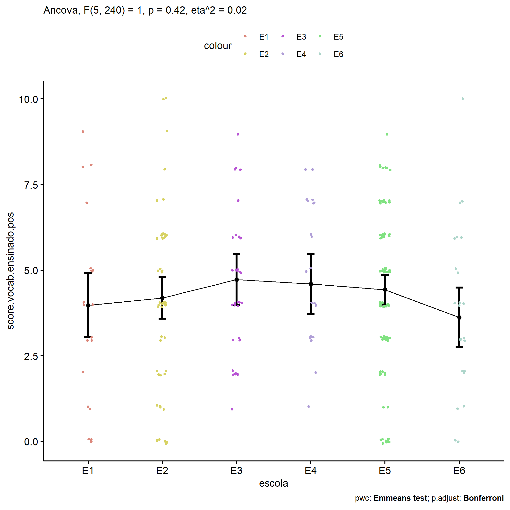<!-- -->

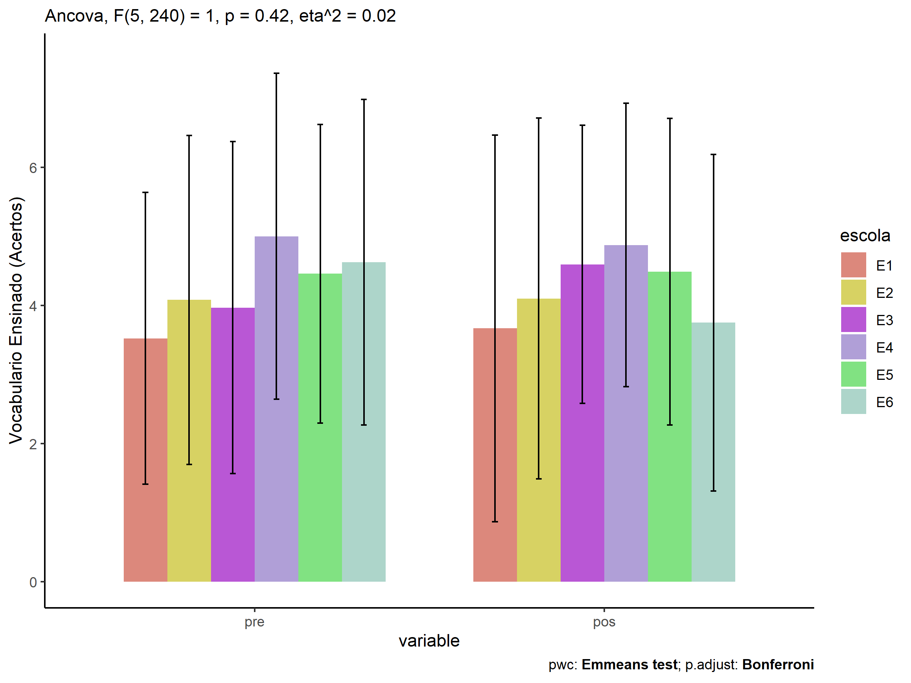<!-- -->

<!-- -->

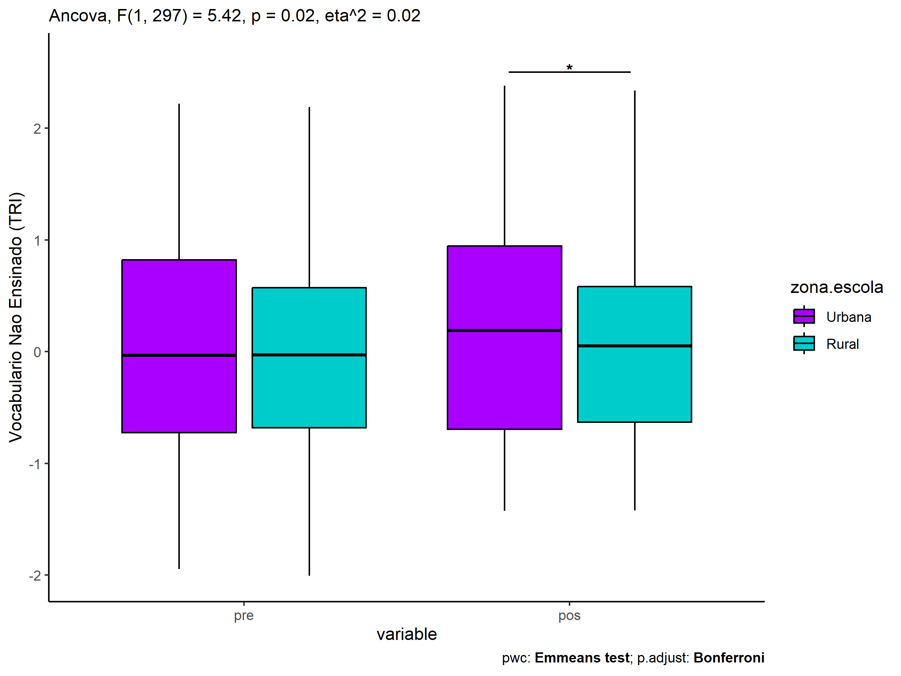<!-- -->

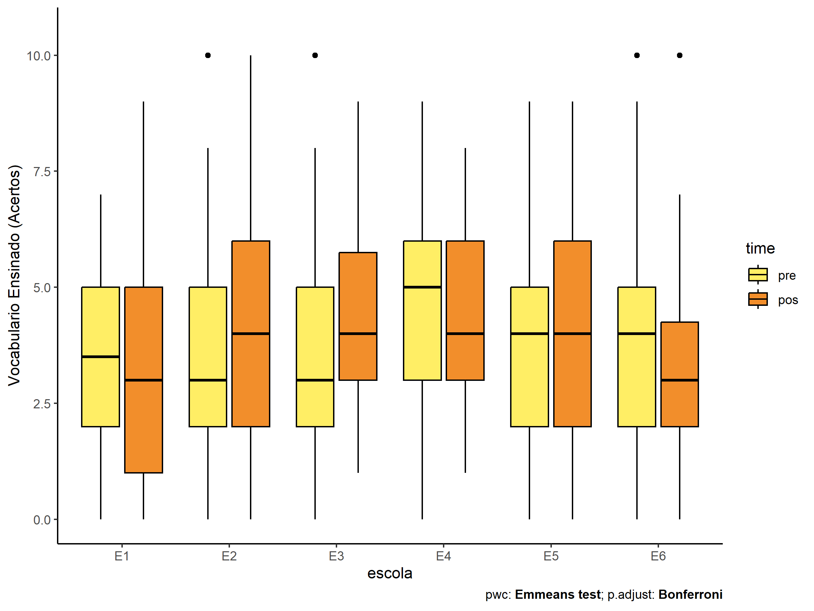<!-- -->

### Vocabulario Ensinado (TRI)

| var                    | escola |   n | M (pre) | SE (pre) | M (unadj) | SE (unadj) | M (adj) | SE (adj) |
|:-----------------------|:-------|----:|--------:|---------:|----------:|-----------:|--------:|---------:|
| tri.vocab.ensinado.pos | E1     |  23 |   0.149 |    0.151 |    -0.003 |      0.195 |  -0.064 |    0.138 |
| tri.vocab.ensinado.pos | E2     |  58 |  -0.113 |    0.107 |    -0.014 |      0.114 |   0.088 |    0.087 |
| tri.vocab.ensinado.pos | E3     |  37 |   0.016 |    0.130 |    -0.007 |      0.131 |   0.015 |    0.108 |
| tri.vocab.ensinado.pos | E4     |  35 |   0.036 |    0.132 |     0.081 |      0.136 |   0.090 |    0.111 |
| tri.vocab.ensinado.pos | E5     | 119 |   0.115 |    0.070 |     0.191 |      0.071 |   0.151 |    0.061 |
| tri.vocab.ensinado.pos | E6     |  28 |   0.098 |    0.160 |    -0.090 |      0.159 |  -0.119 |    0.125 |

| .y.                    | group1 | group2 | estimate | conf.low | conf.high |    se | statistic |     p | p.adj | p.adj.signif |
|:-----------------------|:-------|:-------|---------:|---------:|----------:|------:|----------:|------:|------:|:-------------|
| tri.vocab.ensinado.pos | E1     | E2     |   -0.152 |   -0.473 |     0.169 | 0.163 |    -0.932 | 0.352 |  1.00 | ns           |
| tri.vocab.ensinado.pos | E1     | E3     |   -0.079 |   -0.424 |     0.265 | 0.175 |    -0.452 | 0.651 |  1.00 | ns           |
| tri.vocab.ensinado.pos | E1     | E4     |   -0.154 |   -0.503 |     0.194 | 0.177 |    -0.872 | 0.384 |  1.00 | ns           |
| tri.vocab.ensinado.pos | E1     | E5     |   -0.215 |   -0.510 |     0.081 | 0.150 |    -1.431 | 0.153 |  1.00 | ns           |
| tri.vocab.ensinado.pos | E1     | E6     |    0.055 |   -0.310 |     0.420 | 0.186 |     0.298 | 0.766 |  1.00 | ns           |
| tri.vocab.ensinado.pos | E2     | E3     |    0.073 |   -0.201 |     0.346 | 0.139 |     0.523 | 0.602 |  1.00 | ns           |
| tri.vocab.ensinado.pos | E2     | E4     |   -0.002 |   -0.281 |     0.276 | 0.141 |    -0.018 | 0.986 |  1.00 | ns           |
| tri.vocab.ensinado.pos | E2     | E5     |   -0.063 |   -0.272 |     0.146 | 0.106 |    -0.594 | 0.553 |  1.00 | ns           |
| tri.vocab.ensinado.pos | E2     | E6     |    0.207 |   -0.092 |     0.506 | 0.152 |     1.362 | 0.174 |  1.00 | ns           |
| tri.vocab.ensinado.pos | E3     | E4     |   -0.075 |   -0.381 |     0.231 | 0.155 |    -0.483 | 0.630 |  1.00 | ns           |
| tri.vocab.ensinado.pos | E3     | E5     |   -0.136 |   -0.380 |     0.109 | 0.124 |    -1.092 | 0.276 |  1.00 | ns           |
| tri.vocab.ensinado.pos | E3     | E6     |    0.135 |   -0.191 |     0.460 | 0.165 |     0.815 | 0.416 |  1.00 | ns           |
| tri.vocab.ensinado.pos | E4     | E5     |   -0.061 |   -0.310 |     0.189 | 0.127 |    -0.478 | 0.633 |  1.00 | ns           |
| tri.vocab.ensinado.pos | E4     | E6     |    0.210 |   -0.119 |     0.539 | 0.167 |     1.254 | 0.211 |  1.00 | ns           |
| tri.vocab.ensinado.pos | E5     | E6     |    0.270 |   -0.002 |     0.543 | 0.138 |     1.951 | 0.052 |  0.78 | ns           |
| tri.vocab.ensinado.pre | E1     | E2     |    0.262 |   -0.119 |     0.643 | 0.194 |     1.355 | 0.177 |  1.00 | ns           |
| tri.vocab.ensinado.pre | E1     | E3     |    0.133 |   -0.277 |     0.544 | 0.209 |     0.640 | 0.523 |  1.00 | ns           |
| tri.vocab.ensinado.pre | E1     | E4     |    0.114 |   -0.301 |     0.529 | 0.211 |     0.538 | 0.591 |  1.00 | ns           |
| tri.vocab.ensinado.pre | E1     | E5     |    0.034 |   -0.318 |     0.386 | 0.179 |     0.189 | 0.850 |  1.00 | ns           |
| tri.vocab.ensinado.pre | E1     | E6     |    0.051 |   -0.384 |     0.486 | 0.221 |     0.230 | 0.818 |  1.00 | ns           |
| tri.vocab.ensinado.pre | E2     | E3     |   -0.129 |   -0.454 |     0.197 | 0.165 |    -0.779 | 0.437 |  1.00 | ns           |
| tri.vocab.ensinado.pre | E2     | E4     |   -0.149 |   -0.480 |     0.182 | 0.168 |    -0.884 | 0.377 |  1.00 | ns           |
| tri.vocab.ensinado.pre | E2     | E5     |   -0.228 |   -0.476 |     0.019 | 0.126 |    -1.816 | 0.070 |  1.00 | ns           |
| tri.vocab.ensinado.pre | E2     | E6     |   -0.211 |   -0.567 |     0.144 | 0.181 |    -1.169 | 0.243 |  1.00 | ns           |
| tri.vocab.ensinado.pre | E3     | E4     |   -0.020 |   -0.384 |     0.345 | 0.185 |    -0.108 | 0.914 |  1.00 | ns           |
| tri.vocab.ensinado.pre | E3     | E5     |   -0.100 |   -0.391 |     0.191 | 0.148 |    -0.674 | 0.501 |  1.00 | ns           |
| tri.vocab.ensinado.pre | E3     | E6     |   -0.083 |   -0.470 |     0.305 | 0.197 |    -0.420 | 0.675 |  1.00 | ns           |
| tri.vocab.ensinado.pre | E4     | E5     |   -0.080 |   -0.377 |     0.218 | 0.151 |    -0.528 | 0.598 |  1.00 | ns           |
| tri.vocab.ensinado.pre | E4     | E6     |   -0.063 |   -0.455 |     0.329 | 0.199 |    -0.314 | 0.753 |  1.00 | ns           |
| tri.vocab.ensinado.pre | E5     | E6     |    0.017 |   -0.308 |     0.342 | 0.165 |     0.104 | 0.917 |  1.00 | ns           |

| .y.                | escola | group1 | group2 | estimate | conf.low | conf.high |    se | statistic |     p | p.adj | p.adj.signif |
|:-------------------|:-------|:-------|:-------|---------:|---------:|----------:|------:|----------:|------:|------:|:-------------|
| tri.vocab.ensinado | E1     | pre    | pos    |    0.141 |   -0.311 |     0.593 | 0.230 |     0.612 | 0.541 | 0.541 | ns           |
| tri.vocab.ensinado | E2     | pre    | pos    |   -0.071 |   -0.355 |     0.213 | 0.145 |    -0.491 | 0.624 | 0.624 | ns           |
| tri.vocab.ensinado | E3     | pre    | pos    |   -0.017 |   -0.382 |     0.348 | 0.186 |    -0.090 | 0.928 | 0.928 | ns           |
| tri.vocab.ensinado | E4     | pre    | pos    |   -0.071 |   -0.447 |     0.304 | 0.191 |    -0.374 | 0.709 | 0.709 | ns           |
| tri.vocab.ensinado | E5     | pre    | pos    |   -0.057 |   -0.257 |     0.143 | 0.102 |    -0.562 | 0.574 | 0.574 | ns           |
| tri.vocab.ensinado | E6     | pre    | pos    |    0.141 |   -0.268 |     0.549 | 0.208 |     0.677 | 0.498 | 0.498 | ns           |

    ## Scale for colour is already present.
    ## Adding another scale for colour, which will replace the existing scale.

<!-- -->

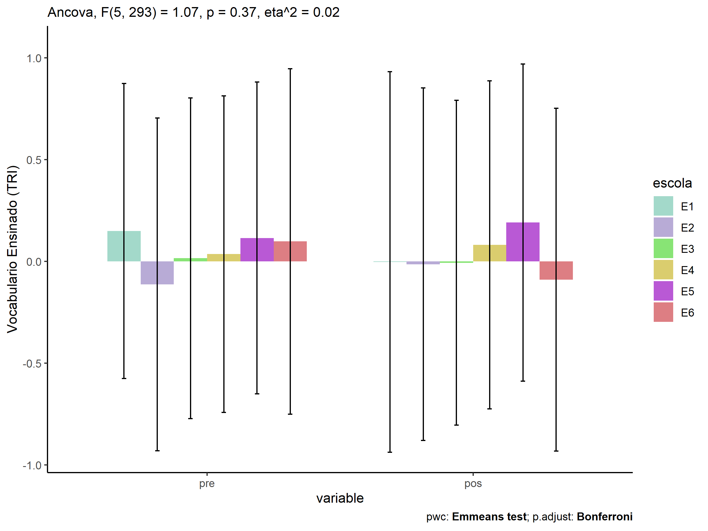<!-- -->

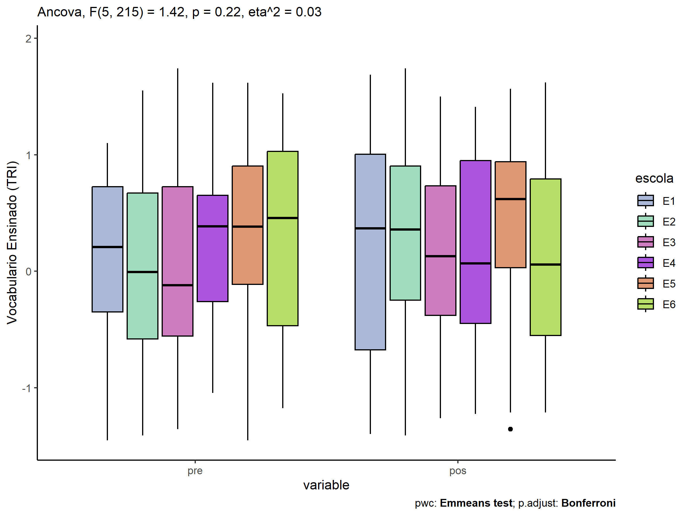<!-- -->

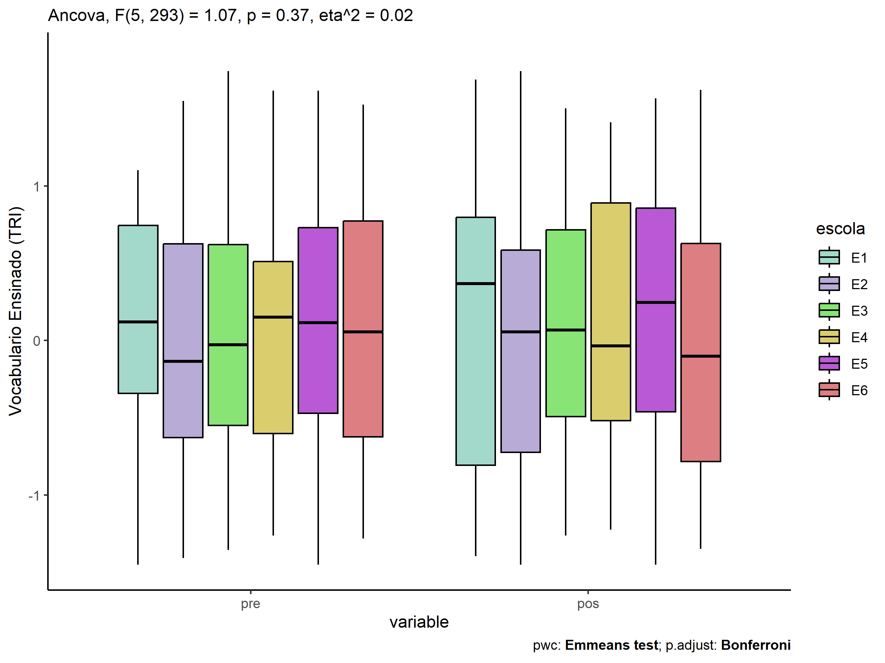<!-- -->

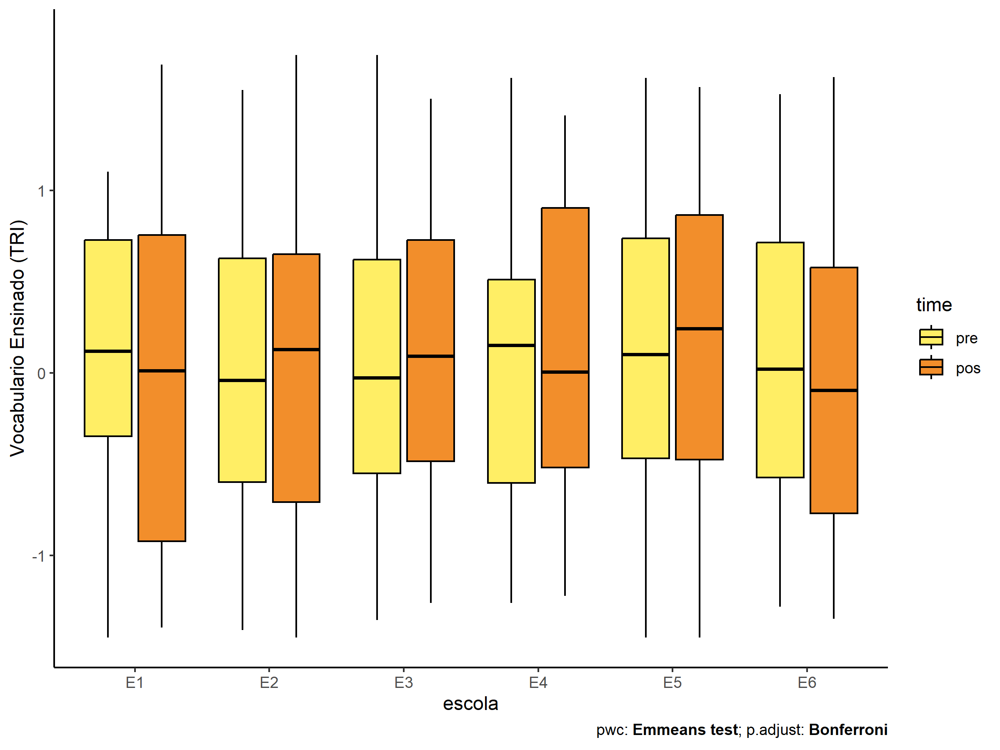<!-- -->

### Vocabulario Nao Ensinado (Acertos)

| var                          | escola |   n | M (pre) | SE (pre) | M (unadj) | SE (unadj) | M (adj) | SE (adj) |
|:-----------------------------|:-------|----:|--------:|---------:|----------:|-----------:|--------:|---------:|
| score.vocab.nao.ensinado.pos | E1     |  28 |  14.179 |    1.521 |    14.500 |      1.623 |  15.883 |    1.238 |
| score.vocab.nao.ensinado.pos | E2     |  66 |  16.727 |    0.896 |    15.576 |      1.086 |  15.333 |    0.804 |
| score.vocab.nao.ensinado.pos | E3     |  38 |  16.158 |    1.214 |    18.474 |      1.105 |  18.594 |    1.059 |
| score.vocab.nao.ensinado.pos | E4     |  36 |  17.083 |    1.117 |    16.333 |      1.093 |  15.863 |    1.088 |
| score.vocab.nao.ensinado.pos | E5     | 132 |  16.697 |    0.655 |    17.136 |      0.721 |  16.913 |    0.568 |
| score.vocab.nao.ensinado.pos | E6     |  32 |  15.406 |    1.345 |    14.500 |      1.393 |  15.100 |    1.155 |

| .y.                          | group1 | group2 | estimate | conf.low | conf.high |    se | statistic |     p | p.adj | p.adj.signif |
|:-----------------------------|:-------|:-------|---------:|---------:|----------:|------:|----------:|------:|------:|:-------------|
| score.vocab.nao.ensinado.pos | E1     | E2     |    0.550 |   -2.356 |     3.456 | 1.477 |     0.372 | 0.710 | 1.000 | ns           |
| score.vocab.nao.ensinado.pos | E1     | E3     |   -2.711 |   -5.914 |     0.492 | 1.628 |    -1.665 | 0.097 | 1.000 | ns           |
| score.vocab.nao.ensinado.pos | E1     | E4     |    0.020 |   -3.227 |     3.266 | 1.650 |     0.012 | 0.991 | 1.000 | ns           |
| score.vocab.nao.ensinado.pos | E1     | E5     |   -1.030 |   -3.712 |     1.652 | 1.363 |    -0.755 | 0.451 | 1.000 | ns           |
| score.vocab.nao.ensinado.pos | E1     | E6     |    0.783 |   -2.541 |     4.108 | 1.690 |     0.463 | 0.643 | 1.000 | ns           |
| score.vocab.nao.ensinado.pos | E2     | E3     |   -3.261 |   -5.876 |    -0.646 | 1.329 |    -2.453 | 0.015 | 0.220 | ns           |
| score.vocab.nao.ensinado.pos | E2     | E4     |   -0.530 |   -3.191 |     2.130 | 1.352 |    -0.392 | 0.695 | 1.000 | ns           |
| score.vocab.nao.ensinado.pos | E2     | E5     |   -1.580 |   -3.515 |     0.356 | 0.984 |    -1.606 | 0.109 | 1.000 | ns           |
| score.vocab.nao.ensinado.pos | E2     | E6     |    0.233 |   -2.535 |     3.002 | 1.407 |     0.166 | 0.869 | 1.000 | ns           |
| score.vocab.nao.ensinado.pos | E3     | E4     |    2.731 |   -0.257 |     5.718 | 1.519 |     1.798 | 0.073 | 1.000 | ns           |
| score.vocab.nao.ensinado.pos | E3     | E5     |    1.681 |   -0.683 |     4.045 | 1.202 |     1.399 | 0.163 | 1.000 | ns           |
| score.vocab.nao.ensinado.pos | E3     | E6     |    3.494 |    0.413 |     6.575 | 1.566 |     2.231 | 0.026 | 0.395 | ns           |
| score.vocab.nao.ensinado.pos | E4     | E5     |   -1.049 |   -3.464 |     1.365 | 1.227 |    -0.855 | 0.393 | 1.000 | ns           |
| score.vocab.nao.ensinado.pos | E4     | E6     |    0.764 |   -2.360 |     3.887 | 1.588 |     0.481 | 0.631 | 1.000 | ns           |
| score.vocab.nao.ensinado.pos | E5     | E6     |    1.813 |   -0.720 |     4.346 | 1.287 |     1.408 | 0.160 | 1.000 | ns           |
| score.vocab.nao.ensinado.pre | E1     | E2     |   -2.549 |   -5.851 |     0.754 | 1.679 |    -1.518 | 0.130 | 1.000 | ns           |
| score.vocab.nao.ensinado.pre | E1     | E3     |   -1.979 |   -5.627 |     1.668 | 1.854 |    -1.068 | 0.286 | 1.000 | ns           |
| score.vocab.nao.ensinado.pre | E1     | E4     |   -2.905 |   -6.595 |     0.785 | 1.876 |    -1.549 | 0.122 | 1.000 | ns           |
| score.vocab.nao.ensinado.pre | E1     | E5     |   -2.518 |   -5.565 |     0.529 | 1.549 |    -1.626 | 0.105 | 1.000 | ns           |
| score.vocab.nao.ensinado.pre | E1     | E6     |   -1.228 |   -5.017 |     2.562 | 1.926 |    -0.637 | 0.524 | 1.000 | ns           |
| score.vocab.nao.ensinado.pre | E2     | E3     |    0.569 |   -2.413 |     3.551 | 1.516 |     0.376 | 0.707 | 1.000 | ns           |
| score.vocab.nao.ensinado.pre | E2     | E4     |   -0.356 |   -3.390 |     2.678 | 1.542 |    -0.231 | 0.818 | 1.000 | ns           |
| score.vocab.nao.ensinado.pre | E2     | E5     |    0.030 |   -2.177 |     2.238 | 1.122 |     0.027 | 0.978 | 1.000 | ns           |
| score.vocab.nao.ensinado.pre | E2     | E6     |    1.321 |   -1.834 |     4.476 | 1.604 |     0.824 | 0.411 | 1.000 | ns           |
| score.vocab.nao.ensinado.pre | E3     | E4     |   -0.925 |   -4.331 |     2.481 | 1.731 |    -0.535 | 0.593 | 1.000 | ns           |
| score.vocab.nao.ensinado.pre | E3     | E5     |   -0.539 |   -3.235 |     2.157 | 1.370 |    -0.393 | 0.694 | 1.000 | ns           |
| score.vocab.nao.ensinado.pre | E3     | E6     |    0.752 |   -2.762 |     4.265 | 1.786 |     0.421 | 0.674 | 1.000 | ns           |
| score.vocab.nao.ensinado.pre | E4     | E5     |    0.386 |   -2.367 |     3.140 | 1.400 |     0.276 | 0.783 | 1.000 | ns           |
| score.vocab.nao.ensinado.pre | E4     | E6     |    1.677 |   -1.881 |     5.235 | 1.809 |     0.927 | 0.354 | 1.000 | ns           |
| score.vocab.nao.ensinado.pre | E5     | E6     |    1.291 |   -1.595 |     4.176 | 1.467 |     0.880 | 0.380 | 1.000 | ns           |

| .y.                      | escola | group1 | group2 | estimate | conf.low | conf.high |    se | statistic |     p | p.adj | p.adj.signif |
|:-------------------------|:-------|:-------|:-------|---------:|---------:|----------:|------:|----------:|------:|------:|:-------------|
| score.vocab.nao.ensinado | E1     | pre    | pos    |   -0.321 |   -4.394 |     3.751 | 2.074 |    -0.155 | 0.877 | 0.877 | ns           |
| score.vocab.nao.ensinado | E2     | pre    | pos    |    1.152 |   -1.501 |     3.804 | 1.351 |     0.852 | 0.394 | 0.394 | ns           |
| score.vocab.nao.ensinado | E3     | pre    | pos    |   -2.316 |   -5.811 |     1.180 | 1.780 |    -1.301 | 0.194 | 0.194 | ns           |
| score.vocab.nao.ensinado | E4     | pre    | pos    |    0.750 |   -2.841 |     4.341 | 1.829 |     0.410 | 0.682 | 0.682 | ns           |
| score.vocab.nao.ensinado | E5     | pre    | pos    |   -0.439 |   -2.315 |     1.436 | 0.955 |    -0.460 | 0.646 | 0.646 | ns           |
| score.vocab.nao.ensinado | E6     | pre    | pos    |    0.906 |   -2.903 |     4.715 | 1.940 |     0.467 | 0.641 | 0.641 | ns           |

    ## Scale for colour is already present.
    ## Adding another scale for colour, which will replace the existing scale.

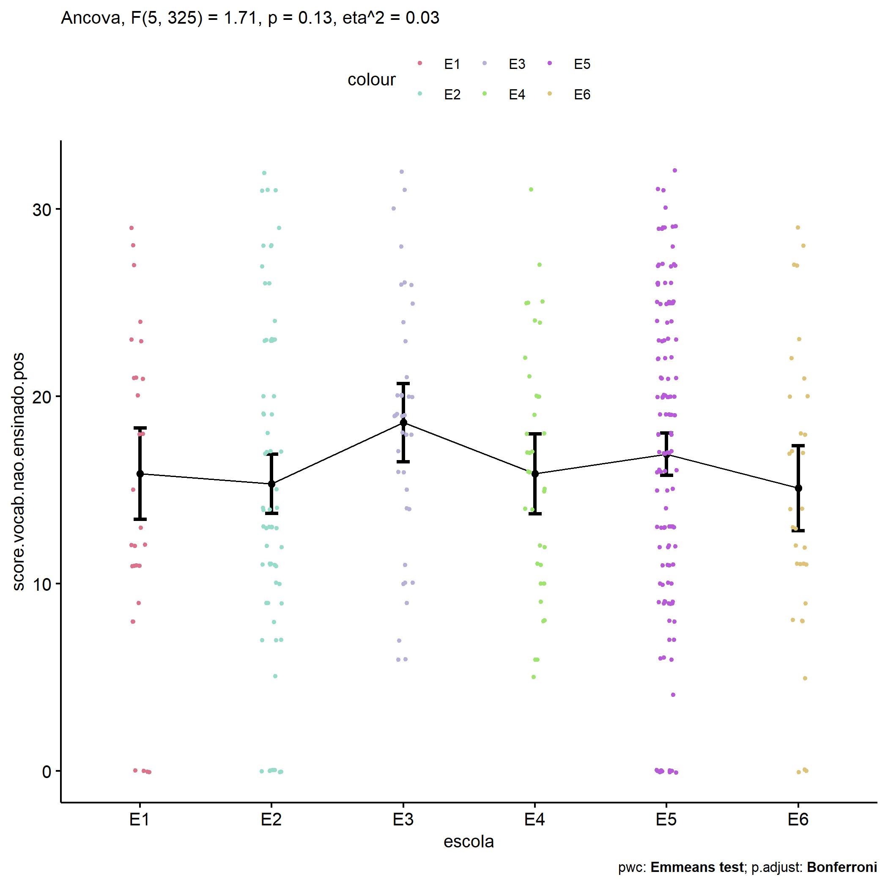<!-- -->

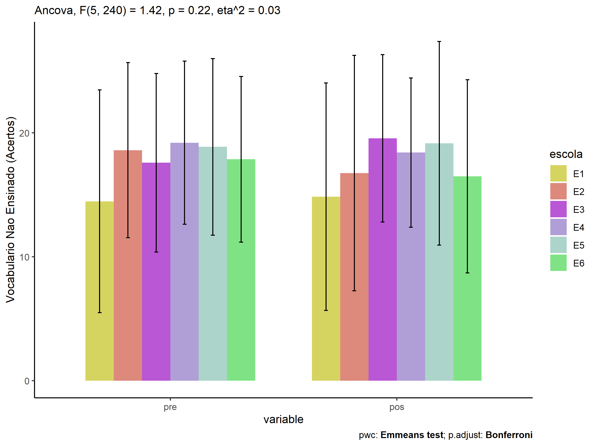<!-- -->

<!-- -->

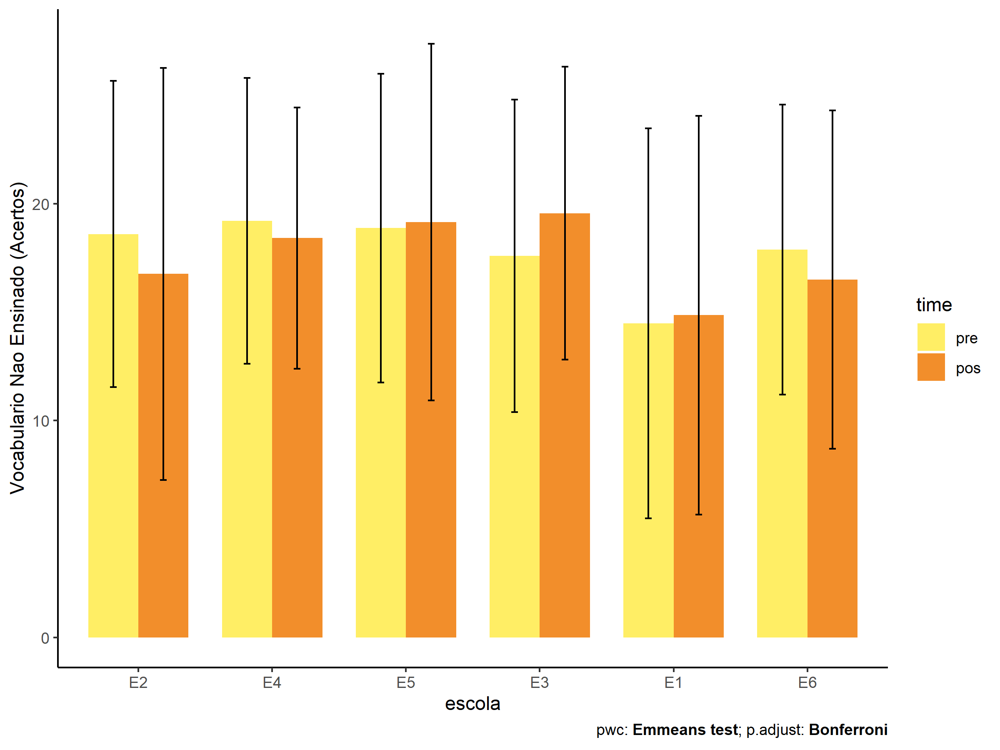<!-- -->

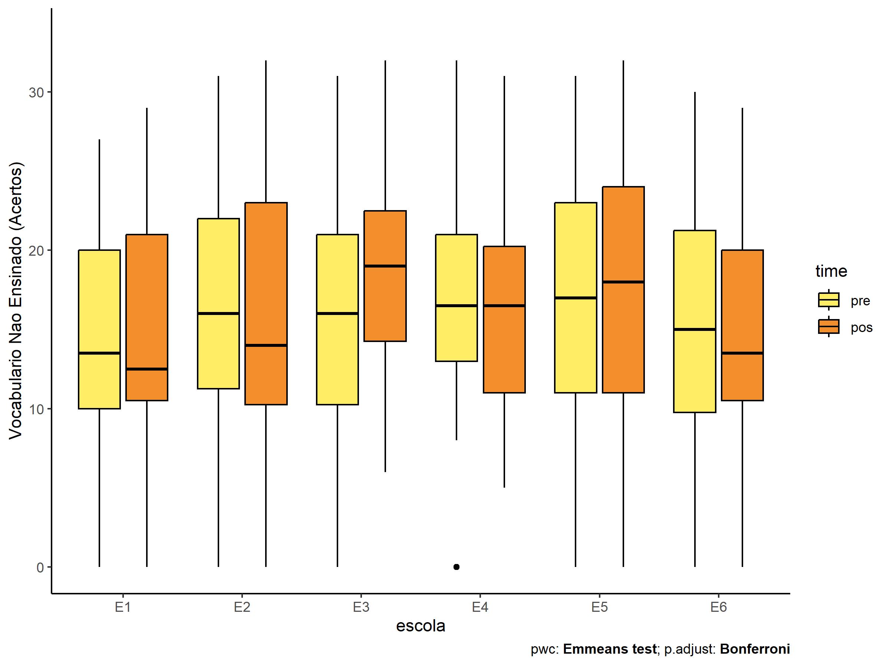<!-- -->

### Vocabulario Nao Ensinado (TRI)

| var                        | escola |   n | M (pre) | SE (pre) | M (unadj) | SE (unadj) | M (adj) | SE (adj) |
|:---------------------------|:-------|----:|--------:|---------:|----------:|-----------:|--------:|---------:|
| tri.vocab.nao.ensinado.pos | E1     |  23 |  -0.089 |    0.181 |     0.176 |      0.210 |   0.287 |    0.119 |
| tri.vocab.nao.ensinado.pos | E2     |  58 |   0.011 |    0.127 |     0.076 |      0.137 |   0.101 |    0.075 |
| tri.vocab.nao.ensinado.pos | E3     |  37 |  -0.004 |    0.145 |     0.226 |      0.157 |   0.263 |    0.094 |
| tri.vocab.nao.ensinado.pos | E4     |  35 |   0.108 |    0.130 |    -0.061 |      0.149 |  -0.118 |    0.097 |
| tri.vocab.nao.ensinado.pos | E5     | 119 |   0.078 |    0.085 |     0.281 |      0.087 |   0.249 |    0.052 |
| tri.vocab.nao.ensinado.pos | E6     |  28 |   0.024 |    0.178 |    -0.054 |      0.172 |  -0.040 |    0.108 |

| .y.                        | group1 | group2 | estimate | conf.low | conf.high |    se | statistic | p       | p.adj | p.adj.signif |
|:---------------------------|:-------|:-------|---------:|---------:|----------:|------:|----------:|:--------|------:|:-------------|
| tri.vocab.nao.ensinado.pos | E1     | E2     |    0.186 |   -0.092 |     0.463 | 0.141 |     1.317 | 0.189   | 1.000 | ns           |
| tri.vocab.nao.ensinado.pos | E1     | E3     |    0.024 |   -0.275 |     0.322 | 0.152 |     0.155 | 0.877   | 1.000 | ns           |
| tri.vocab.nao.ensinado.pos | E1     | E4     |    0.405 |    0.102 |     0.707 | 0.154 |     2.634 | 0.009   | 0.133 | ns           |
| tri.vocab.nao.ensinado.pos | E1     | E5     |    0.038 |   -0.219 |     0.295 | 0.130 |     0.291 | 0.771   | 1.000 | ns           |
| tri.vocab.nao.ensinado.pos | E1     | E6     |    0.326 |    0.009 |     0.643 | 0.161 |     2.027 | 0.044   | 0.654 | ns           |
| tri.vocab.nao.ensinado.pos | E2     | E3     |   -0.162 |   -0.399 |     0.075 | 0.120 |    -1.348 | 0.179   | 1.000 | ns           |
| tri.vocab.nao.ensinado.pos | E2     | E4     |    0.219 |   -0.022 |     0.460 | 0.122 |     1.789 | 0.075   | 1.000 | ns           |
| tri.vocab.nao.ensinado.pos | E2     | E5     |   -0.148 |   -0.328 |     0.033 | 0.092 |    -1.612 | 0.108   | 1.000 | ns           |
| tri.vocab.nao.ensinado.pos | E2     | E6     |    0.141 |   -0.118 |     0.400 | 0.132 |     1.069 | 0.286   | 1.000 | ns           |
| tri.vocab.nao.ensinado.pos | E3     | E4     |    0.381 |    0.116 |     0.647 | 0.135 |     2.826 | 0.005   | 0.076 | ns           |
| tri.vocab.nao.ensinado.pos | E3     | E5     |    0.014 |   -0.197 |     0.226 | 0.108 |     0.134 | 0.893   | 1.000 | ns           |
| tri.vocab.nao.ensinado.pos | E3     | E6     |    0.303 |    0.021 |     0.585 | 0.143 |     2.114 | 0.035   | 0.531 | ns           |
| tri.vocab.nao.ensinado.pos | E4     | E5     |   -0.367 |   -0.583 |    -0.150 | 0.110 |    -3.335 | \<0.001 | 0.014 | \*           |
| tri.vocab.nao.ensinado.pos | E4     | E6     |   -0.078 |   -0.364 |     0.207 | 0.145 |    -0.541 | 0.589   | 1.000 | ns           |
| tri.vocab.nao.ensinado.pos | E5     | E6     |    0.288 |    0.052 |     0.525 | 0.120 |     2.400 | 0.017   | 0.255 | ns           |
| tri.vocab.nao.ensinado.pre | E1     | E2     |   -0.100 |   -0.543 |     0.342 | 0.225 |    -0.447 | 0.655   | 1.000 | ns           |
| tri.vocab.nao.ensinado.pre | E1     | E3     |   -0.086 |   -0.563 |     0.391 | 0.242 |    -0.354 | 0.724   | 1.000 | ns           |
| tri.vocab.nao.ensinado.pre | E1     | E4     |   -0.197 |   -0.679 |     0.285 | 0.245 |    -0.805 | 0.422   | 1.000 | ns           |
| tri.vocab.nao.ensinado.pre | E1     | E5     |   -0.167 |   -0.576 |     0.242 | 0.208 |    -0.805 | 0.422   | 1.000 | ns           |
| tri.vocab.nao.ensinado.pre | E1     | E6     |   -0.113 |   -0.618 |     0.392 | 0.257 |    -0.441 | 0.66    | 1.000 | ns           |
| tri.vocab.nao.ensinado.pre | E2     | E3     |    0.015 |   -0.363 |     0.392 | 0.192 |     0.076 | 0.939   | 1.000 | ns           |
| tri.vocab.nao.ensinado.pre | E2     | E4     |   -0.097 |   -0.481 |     0.288 | 0.195 |    -0.495 | 0.621   | 1.000 | ns           |
| tri.vocab.nao.ensinado.pre | E2     | E5     |   -0.067 |   -0.354 |     0.221 | 0.146 |    -0.458 | 0.648   | 1.000 | ns           |
| tri.vocab.nao.ensinado.pre | E2     | E6     |   -0.013 |   -0.426 |     0.400 | 0.210 |    -0.060 | 0.952   | 1.000 | ns           |
| tri.vocab.nao.ensinado.pre | E3     | E4     |   -0.111 |   -0.535 |     0.312 | 0.215 |    -0.517 | 0.605   | 1.000 | ns           |
| tri.vocab.nao.ensinado.pre | E3     | E5     |   -0.081 |   -0.419 |     0.256 | 0.172 |    -0.475 | 0.635   | 1.000 | ns           |
| tri.vocab.nao.ensinado.pre | E3     | E6     |   -0.027 |   -0.477 |     0.422 | 0.229 |    -0.120 | 0.905   | 1.000 | ns           |
| tri.vocab.nao.ensinado.pre | E4     | E5     |    0.030 |   -0.315 |     0.375 | 0.175 |     0.170 | 0.865   | 1.000 | ns           |
| tri.vocab.nao.ensinado.pre | E4     | E6     |    0.084 |   -0.371 |     0.539 | 0.231 |     0.363 | 0.717   | 1.000 | ns           |
| tri.vocab.nao.ensinado.pre | E5     | E6     |    0.054 |   -0.323 |     0.431 | 0.192 |     0.283 | 0.778   | 1.000 | ns           |

| .y.                    | escola | group1 | group2 | estimate | conf.low | conf.high |    se | statistic |     p | p.adj | p.adj.signif |
|:-----------------------|:-------|:-------|:-------|---------:|---------:|----------:|------:|----------:|------:|------:|:-------------|
| tri.vocab.nao.ensinado | E1     | pre    | pos    |   -0.249 |   -0.776 |     0.277 | 0.268 |    -0.930 | 0.353 | 0.353 | ns           |
| tri.vocab.nao.ensinado | E2     | pre    | pos    |   -0.058 |   -0.389 |     0.273 | 0.169 |    -0.342 | 0.732 | 0.732 | ns           |
| tri.vocab.nao.ensinado | E3     | pre    | pos    |   -0.235 |   -0.660 |     0.191 | 0.217 |    -1.084 | 0.279 | 0.279 | ns           |
| tri.vocab.nao.ensinado | E4     | pre    | pos    |    0.137 |   -0.300 |     0.575 | 0.223 |     0.617 | 0.537 | 0.537 | ns           |
| tri.vocab.nao.ensinado | E5     | pre    | pos    |   -0.166 |   -0.399 |     0.067 | 0.119 |    -1.401 | 0.162 | 0.162 | ns           |
| tri.vocab.nao.ensinado | E6     | pre    | pos    |    0.070 |   -0.406 |     0.546 | 0.242 |     0.290 | 0.772 | 0.772 | ns           |

    ## Scale for colour is already present.
    ## Adding another scale for colour, which will replace the existing scale.

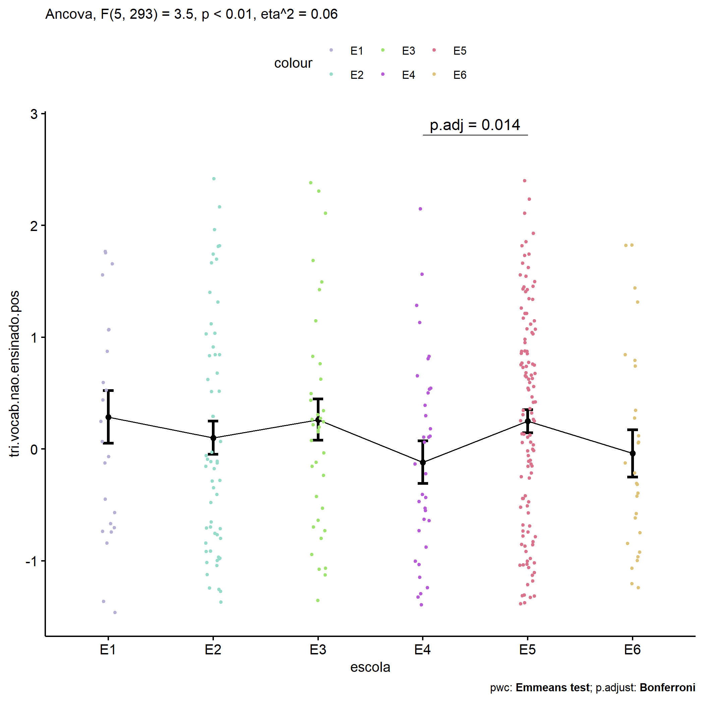<!-- -->

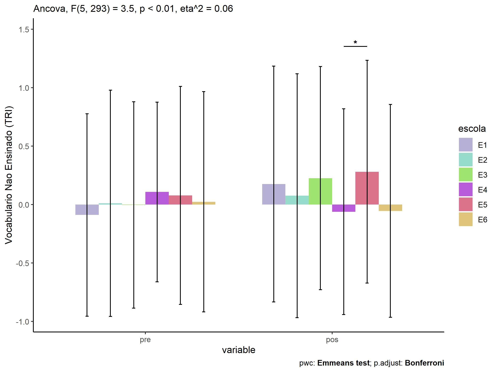<!-- -->

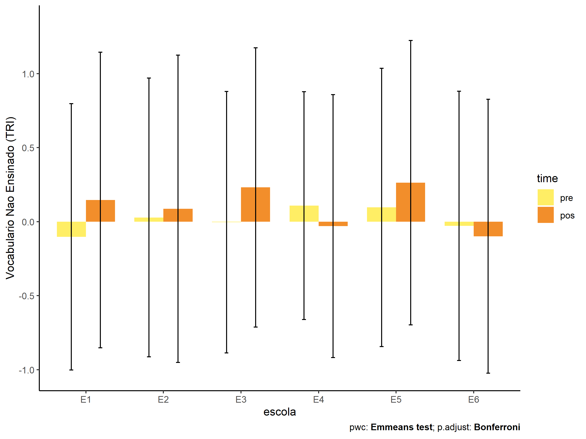<!-- -->

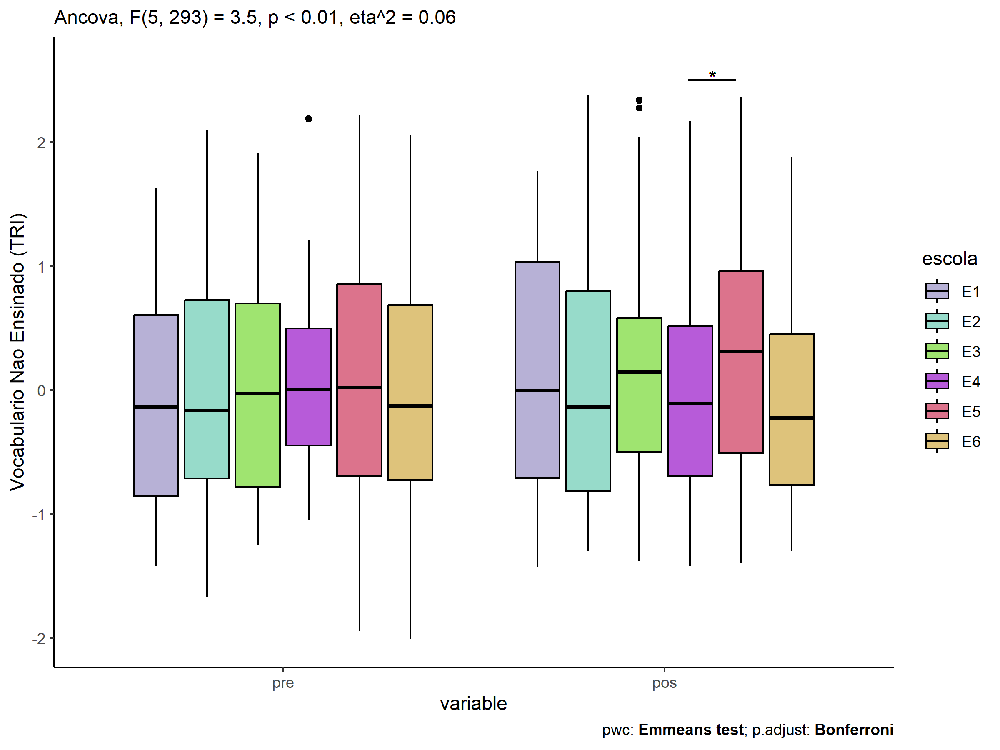<!-- -->

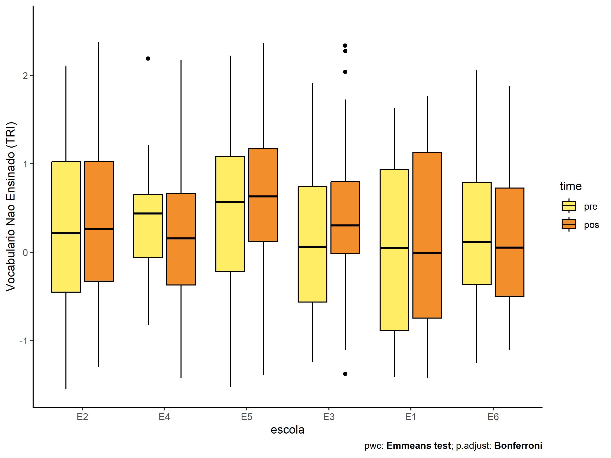<!-- -->

## factor: **zona.escola**

### Vocabulario (Acertos)

| var             | zona.escola |   n | M (pre) | SE (pre) | M (unadj) | SE (unadj) | M (adj) | SE (adj) |
|:----------------|:------------|----:|--------:|---------:|----------:|-----------:|--------:|---------:|
| score.vocab.pos | Rural       | 100 |  21.160 |    0.842 |    21.160 |      0.821 |  20.972 |    0.534 |
| score.vocab.pos | Urbana      | 200 |  20.795 |    0.601 |    22.315 |      0.605 |  22.409 |    0.377 |

| .y.             | group1 | group2 | estimate | conf.low | conf.high |    se | statistic |     p | p.adj | p.adj.signif |
|:----------------|:-------|:-------|---------:|---------:|----------:|------:|----------:|------:|------:|:-------------|
| score.vocab.pos | Urbana | Rural  |    1.437 |    0.151 |     2.723 | 0.654 |     2.199 | 0.029 | 0.029 | \*           |
| score.vocab.pre | Urbana | Rural  |   -0.365 |   -2.407 |     1.677 | 1.037 |    -0.352 | 0.725 | 0.725 | ns           |

| .y.         | zona.escola | group1 | group2 | estimate | conf.low | conf.high |    se | statistic |     p | p.adj | p.adj.signif |
|:------------|:------------|:-------|:-------|---------:|---------:|----------:|------:|----------:|------:|------:|:-------------|
| score.vocab | Urbana      | pre    | pos    |   -1.298 |   -2.917 |     0.320 | 0.824 |    -1.575 | 0.116 | 0.116 | ns           |
| score.vocab | Rural       | pre    | pos    |   -0.320 |   -2.639 |     1.998 | 1.181 |    -0.271 | 0.786 | 0.786 | ns           |

    ## Scale for colour is already present.
    ## Adding another scale for colour, which will replace the existing scale.

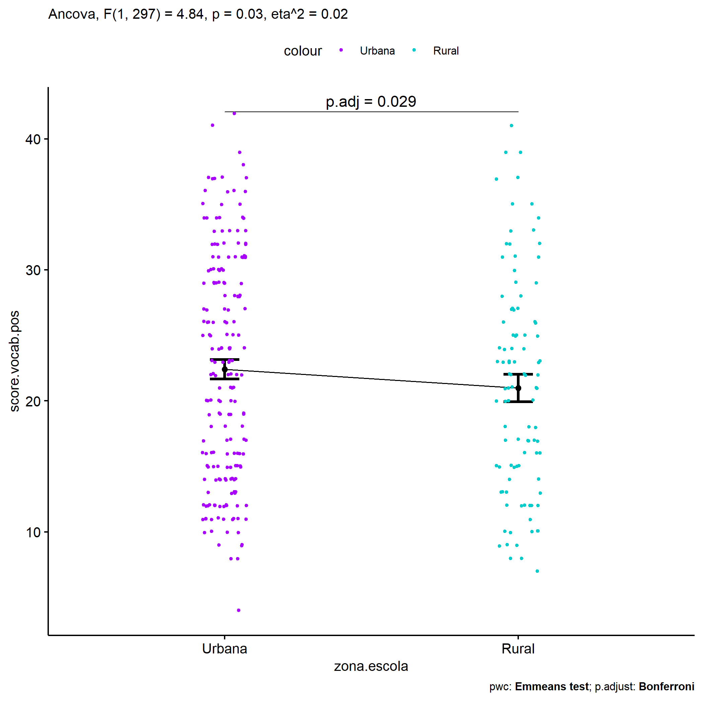<!-- -->

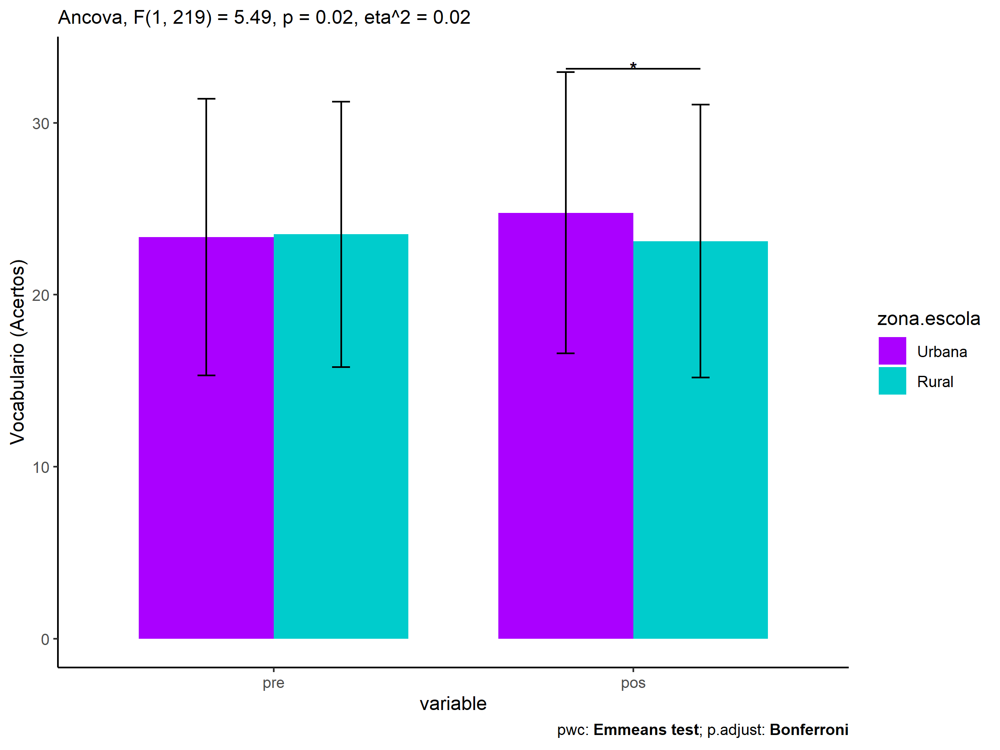<!-- -->

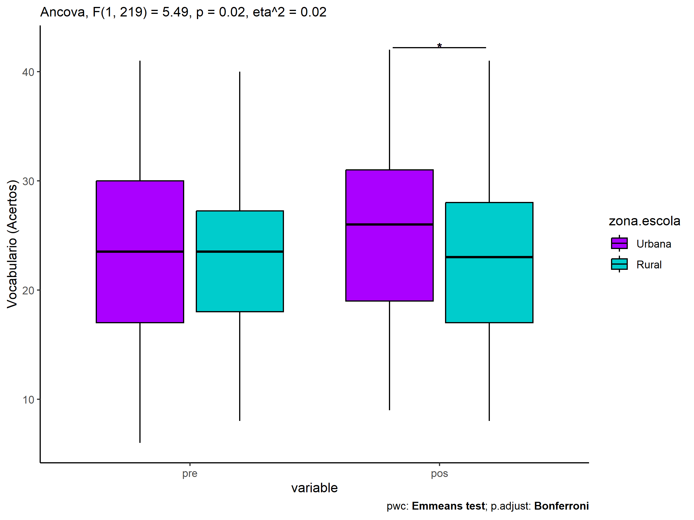<!-- -->

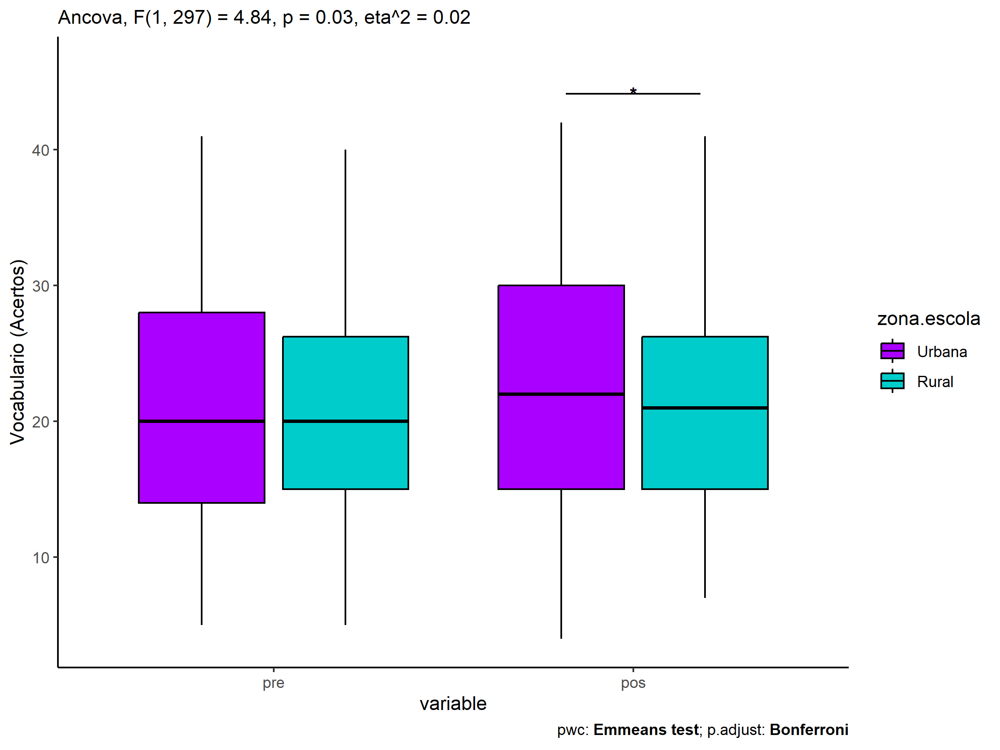<!-- -->

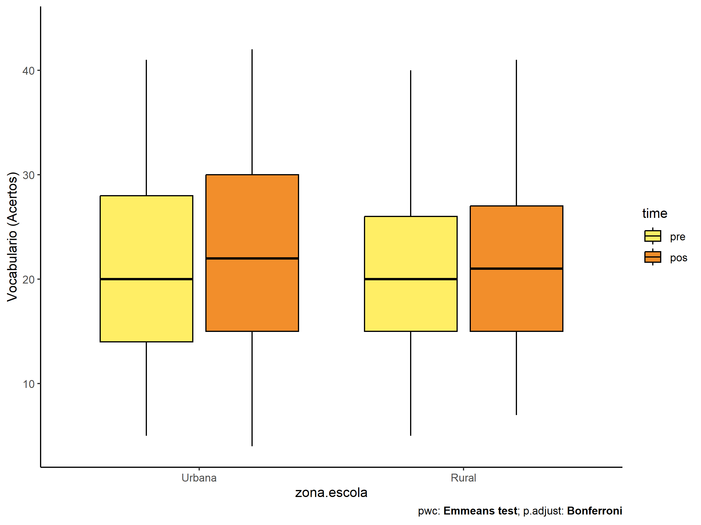<!-- -->

### Vocabulario (TRI)

| var           | zona.escola |   n | M (pre) | SE (pre) | M (unadj) | SE (unadj) | M (adj) | SE (adj) |
|:--------------|:------------|----:|--------:|---------:|----------:|-----------:|--------:|---------:|
| tri.vocab.pos | Rural       | 100 |   0.092 |    0.083 |     0.072 |      0.089 |   0.047 |    0.058 |
| tri.vocab.pos | Urbana      | 200 |   0.048 |    0.066 |     0.165 |      0.071 |   0.177 |    0.041 |

| .y.           | group1 | group2 | estimate | conf.low | conf.high |    se | statistic |     p | p.adj | p.adj.signif |
|:--------------|:-------|:-------|---------:|---------:|----------:|------:|----------:|------:|------:|:-------------|
| tri.vocab.pos | Urbana | Rural  |    0.130 |   -0.010 |     0.269 | 0.071 |     1.833 | 0.068 | 0.068 | ns           |
| tri.vocab.pre | Urbana | Rural  |   -0.044 |   -0.261 |     0.174 | 0.110 |    -0.395 | 0.693 | 0.693 | ns           |

| .y.       | zona.escola | group1 | group2 | estimate | conf.low | conf.high |    se | statistic |     p | p.adj | p.adj.signif |
|:----------|:------------|:-------|:-------|---------:|---------:|----------:|------:|----------:|------:|------:|:-------------|
| tri.vocab | Urbana      | pre    | pos    |   -0.093 |   -0.272 |     0.086 | 0.091 |    -1.016 | 0.310 | 0.310 | ns           |
| tri.vocab | Rural       | pre    | pos    |    0.005 |   -0.252 |     0.262 | 0.131 |     0.039 | 0.969 | 0.969 | ns           |

    ## Scale for colour is already present.
    ## Adding another scale for colour, which will replace the existing scale.

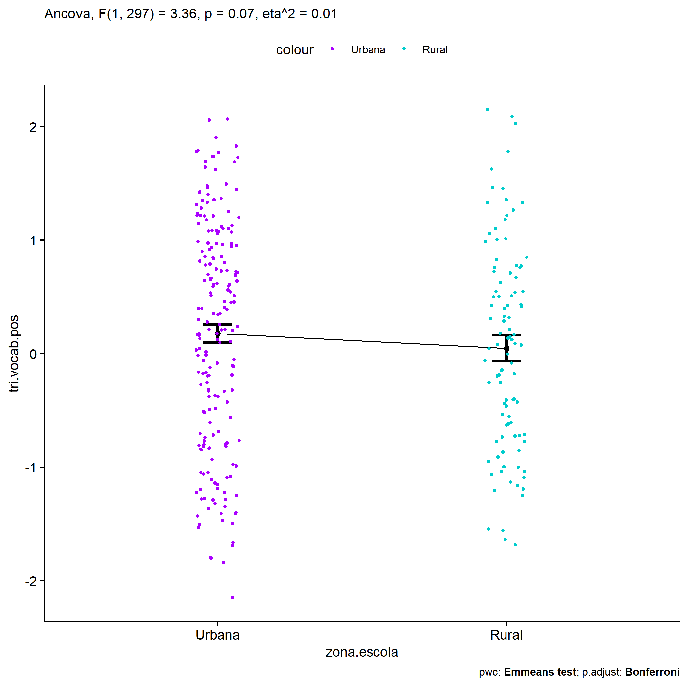<!-- -->

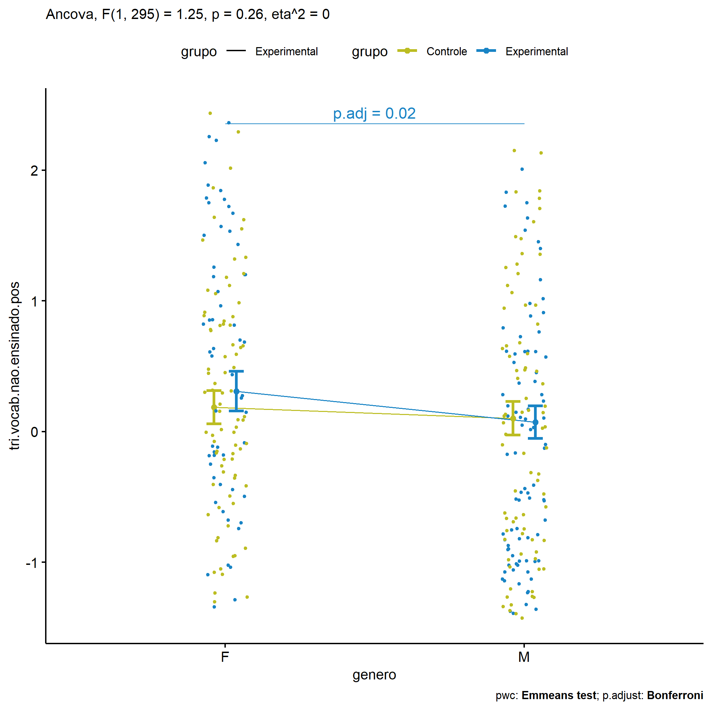<!-- -->

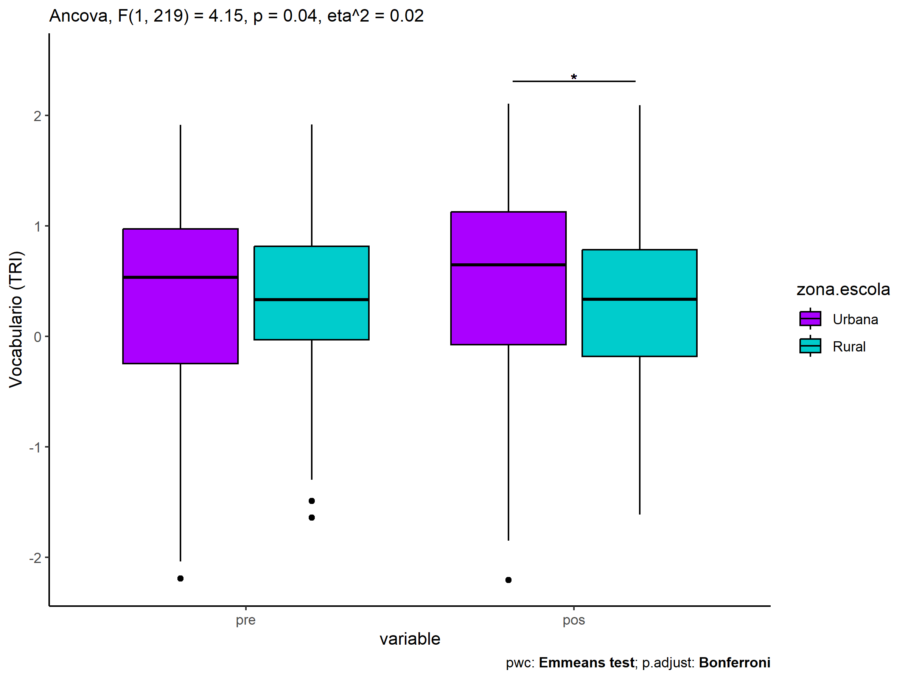<!-- -->

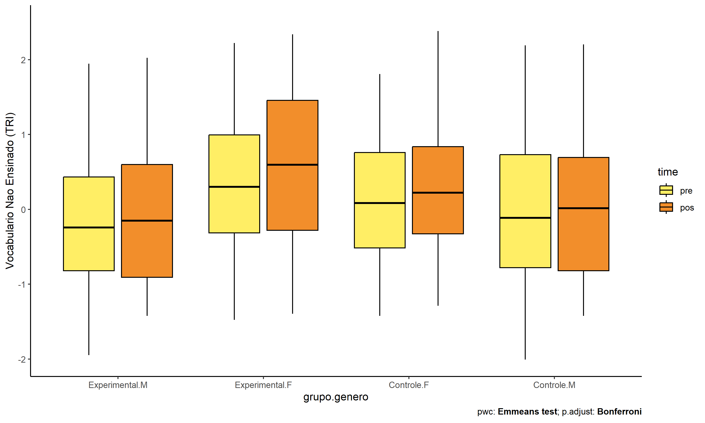<!-- -->

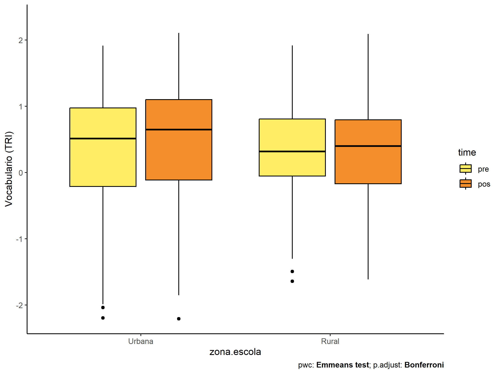<!-- -->

### Vocabulario Ensinado (Acertos)

| var                      | zona.escola |   n | M (pre) | SE (pre) | M (unadj) | SE (unadj) | M (adj) | SE (adj) |
|:-------------------------|:------------|----:|--------:|---------:|----------:|-----------:|--------:|---------:|
| score.vocab.ensinado.pos | Rural       | 106 |   4.085 |    0.228 |     4.094 |      0.214 |   4.009 |    0.205 |
| score.vocab.ensinado.pos | Urbana      | 226 |   3.801 |    0.144 |     3.819 |      0.158 |   3.859 |    0.140 |

| .y.                      | group1 | group2 | estimate | conf.low | conf.high |    se | statistic |     p | p.adj | p.adj.signif |
|:-------------------------|:-------|:-------|---------:|---------:|----------:|------:|----------:|------:|------:|:-------------|
| score.vocab.ensinado.pos | Urbana | Rural  |   -0.151 |   -0.639 |     0.337 | 0.248 |    -0.607 | 0.544 | 0.544 | ns           |
| score.vocab.ensinado.pre | Urbana | Rural  |   -0.284 |   -0.799 |     0.231 | 0.262 |    -1.084 | 0.279 | 0.279 | ns           |

| .y.                  | zona.escola | group1 | group2 | estimate | conf.low | conf.high |    se | statistic |     p | p.adj | p.adj.signif |
|:---------------------|:------------|:-------|:-------|---------:|---------:|----------:|------:|----------:|------:|------:|:-------------|
| score.vocab.ensinado | Urbana      | pre    | pos    |   -0.018 |   -0.437 |     0.402 | 0.214 |    -0.083 | 0.934 | 0.934 | ns           |
| score.vocab.ensinado | Rural       | pre    | pos    |   -0.009 |   -0.622 |     0.603 | 0.312 |    -0.030 | 0.976 | 0.976 | ns           |

    ## Scale for colour is already present.
    ## Adding another scale for colour, which will replace the existing scale.

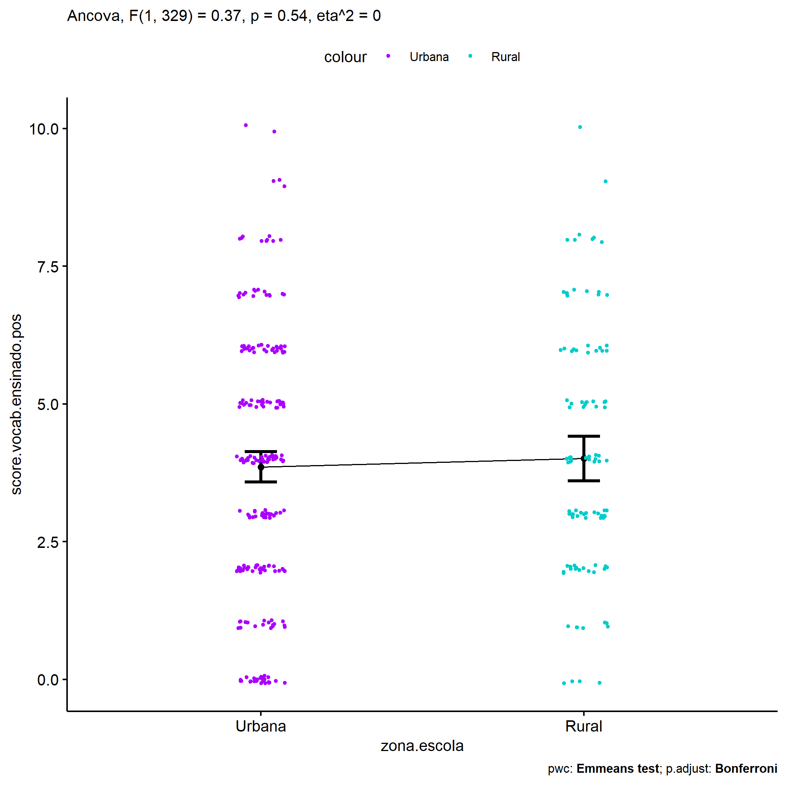<!-- -->

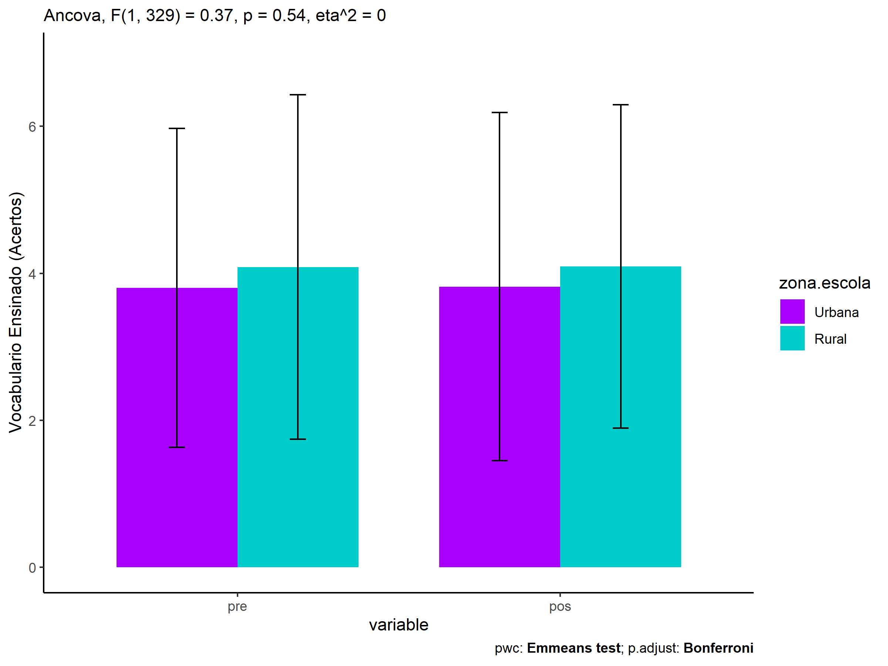<!-- -->

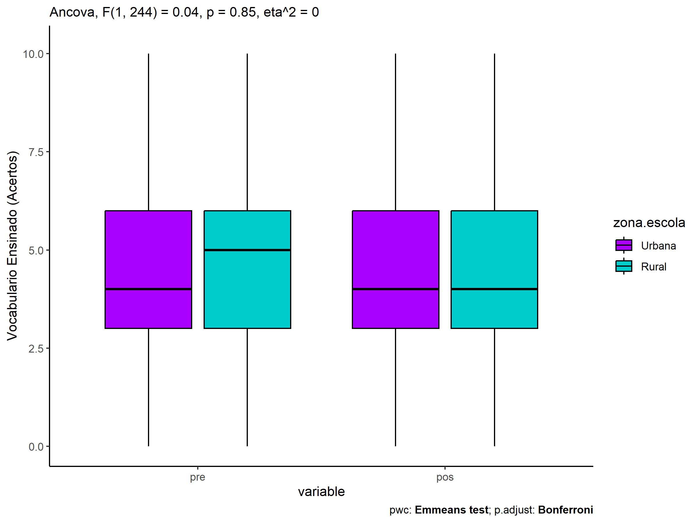<!-- -->

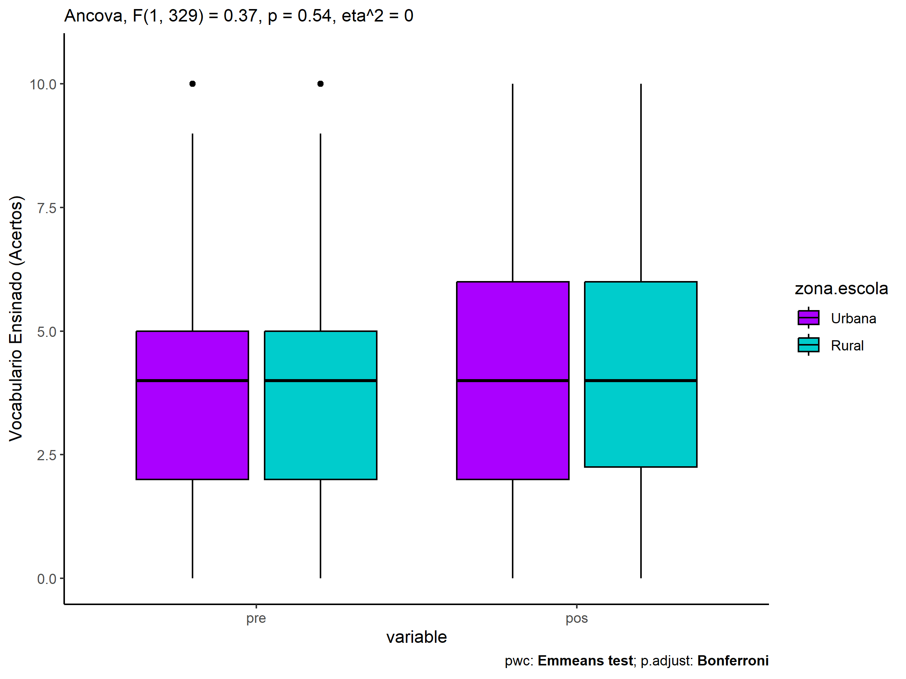<!-- -->

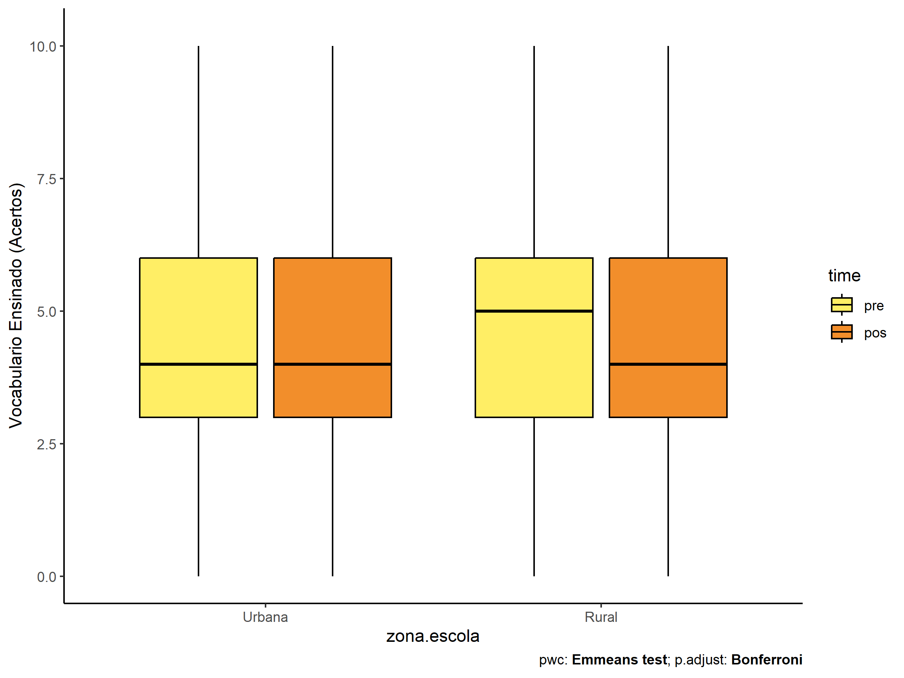<!-- -->

### Vocabulario Ensinado (TRI)

| var                    | zona.escola |   n | M (pre) | SE (pre) | M (unadj) | SE (unadj) | M (adj) | SE (adj) |
|:-----------------------|:------------|----:|--------:|---------:|----------:|-----------:|--------:|---------:|
| tri.vocab.ensinado.pos | Rural       | 100 |   0.046 |    0.079 |     0.001 |      0.081 |   0.004 |    0.066 |
| tri.vocab.ensinado.pos | Urbana      | 200 |   0.053 |    0.055 |     0.109 |      0.058 |   0.108 |    0.047 |

| .y.                    | group1 | group2 | estimate | conf.low | conf.high |    se | statistic |     p | p.adj | p.adj.signif |
|:-----------------------|:-------|:-------|---------:|---------:|----------:|------:|----------:|------:|------:|:-------------|
| tri.vocab.ensinado.pos | Urbana | Rural  |    0.104 |   -0.055 |     0.263 | 0.081 |     1.289 | 0.198 | 0.198 | ns           |
| tri.vocab.ensinado.pre | Urbana | Rural  |    0.007 |   -0.182 |     0.197 | 0.096 |     0.075 | 0.940 | 0.940 | ns           |

| .y.                | zona.escola | group1 | group2 | estimate | conf.low | conf.high |    se | statistic |     p | p.adj | p.adj.signif |
|:-------------------|:------------|:-------|:-------|---------:|---------:|----------:|------:|----------:|------:|------:|:-------------|
| tri.vocab.ensinado | Urbana      | pre    | pos    |   -0.040 |   -0.194 |     0.114 | 0.078 |    -0.511 | 0.609 | 0.609 | ns           |
| tri.vocab.ensinado | Rural       | pre    | pos    |    0.009 |   -0.211 |     0.229 | 0.112 |     0.081 | 0.935 | 0.935 | ns           |

    ## Scale for colour is already present.
    ## Adding another scale for colour, which will replace the existing scale.

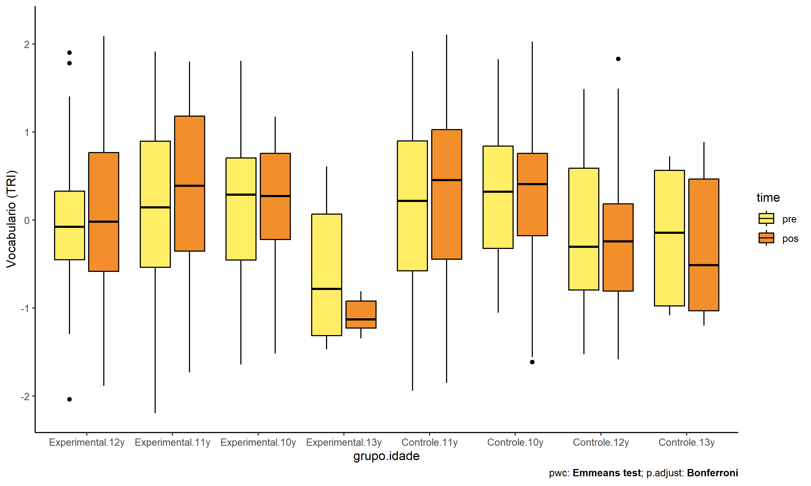<!-- -->

<!-- -->

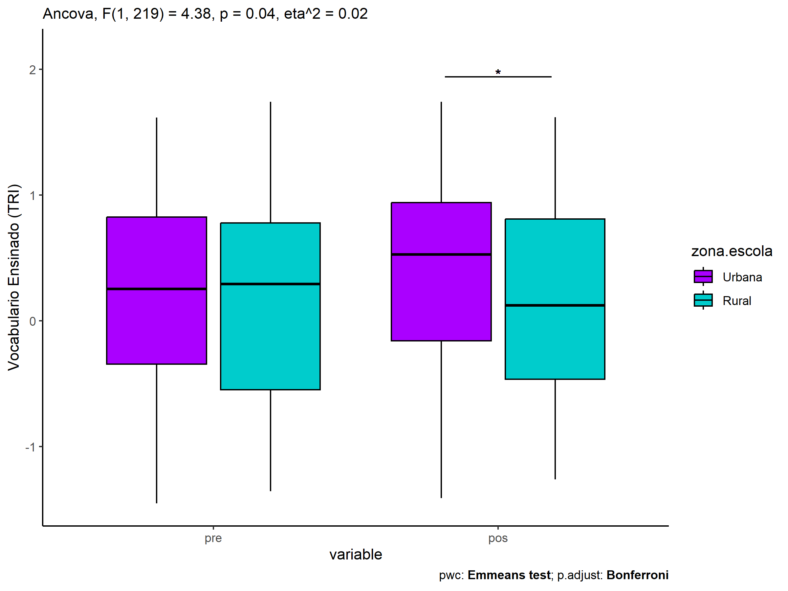<!-- -->

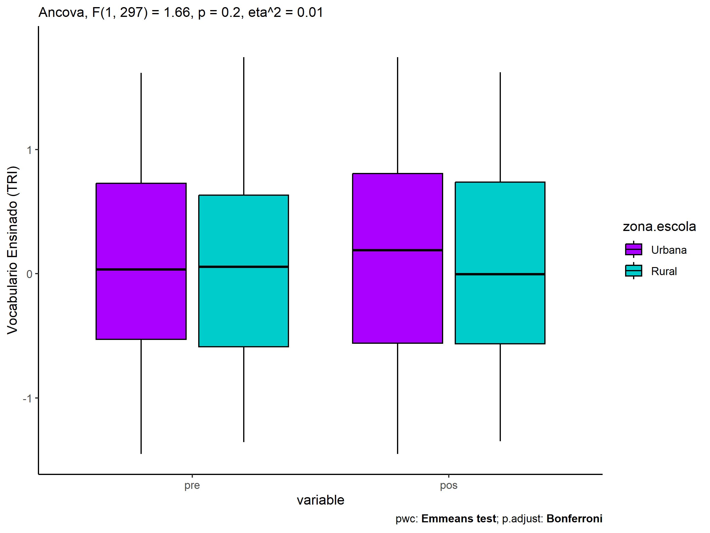<!-- -->

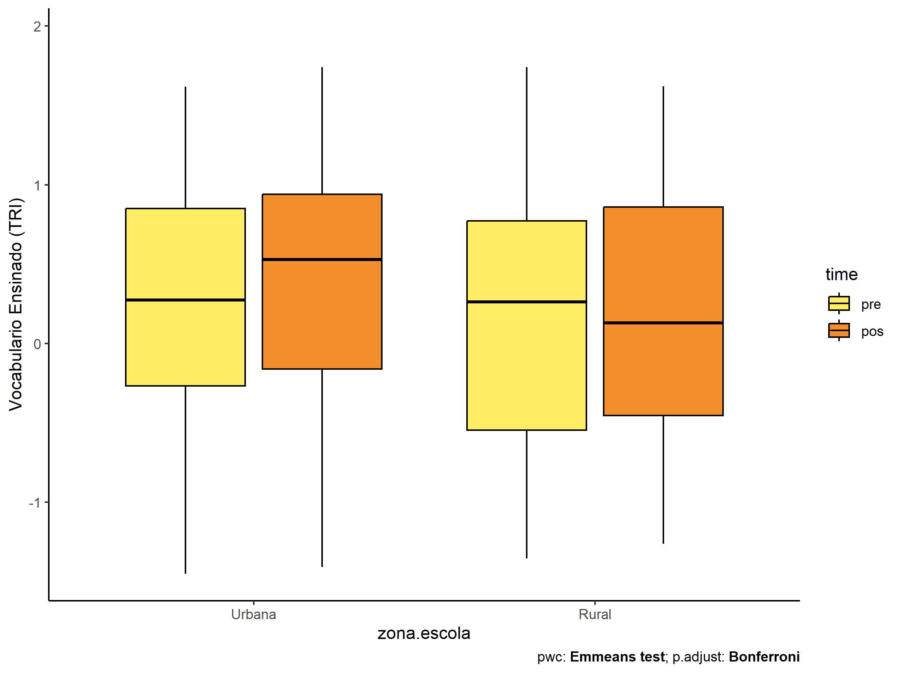<!-- -->

### Vocabulario Nao Ensinado (Acertos)

| var                          | zona.escola |   n | M (pre) | SE (pre) | M (unadj) | SE (unadj) | M (adj) | SE (adj) |
|:-----------------------------|:------------|----:|--------:|---------:|----------:|-----------:|--------:|---------:|
| score.vocab.nao.ensinado.pos | Rural       | 106 |  16.245 |    0.702 |    16.547 |      0.698 |  16.612 |    0.638 |
| score.vocab.nao.ensinado.pos | Urbana      | 226 |  16.394 |    0.501 |    16.354 |      0.566 |  16.324 |    0.437 |

| .y.                          | group1 | group2 | estimate | conf.low | conf.high |    se | statistic |     p | p.adj | p.adj.signif |
|:-----------------------------|:-------|:-------|---------:|---------:|----------:|------:|----------:|------:|------:|:-------------|
| score.vocab.nao.ensinado.pos | Urbana | Rural  |   -0.288 |   -1.810 |     1.233 | 0.773 |    -0.373 | 0.710 | 0.710 | ns           |
| score.vocab.nao.ensinado.pre | Urbana | Rural  |    0.149 |   -1.575 |     1.872 | 0.876 |     0.170 | 0.865 | 0.865 | ns           |

| .y.                      | zona.escola | group1 | group2 | estimate | conf.low | conf.high |    se | statistic |     p | p.adj | p.adj.signif |
|:-------------------------|:------------|:-------|:-------|---------:|---------:|----------:|------:|----------:|------:|------:|:-------------|
| score.vocab.nao.ensinado | Urbana      | pre    | pos    |    0.040 |   -1.397 |     1.477 | 0.732 |     0.054 | 0.957 | 0.957 | ns           |
| score.vocab.nao.ensinado | Rural       | pre    | pos    |   -0.302 |   -2.400 |     1.797 | 1.069 |    -0.282 | 0.778 | 0.778 | ns           |

    ## Scale for colour is already present.
    ## Adding another scale for colour, which will replace the existing scale.

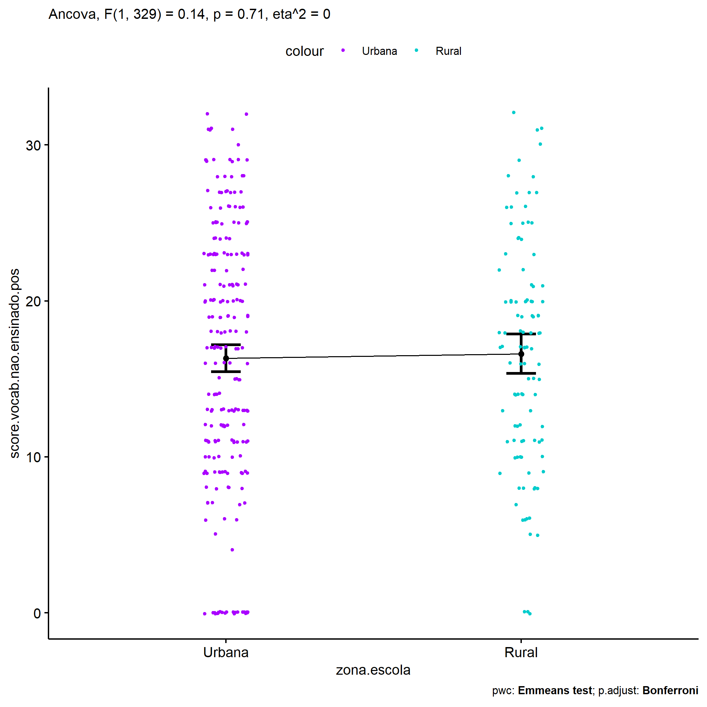<!-- -->

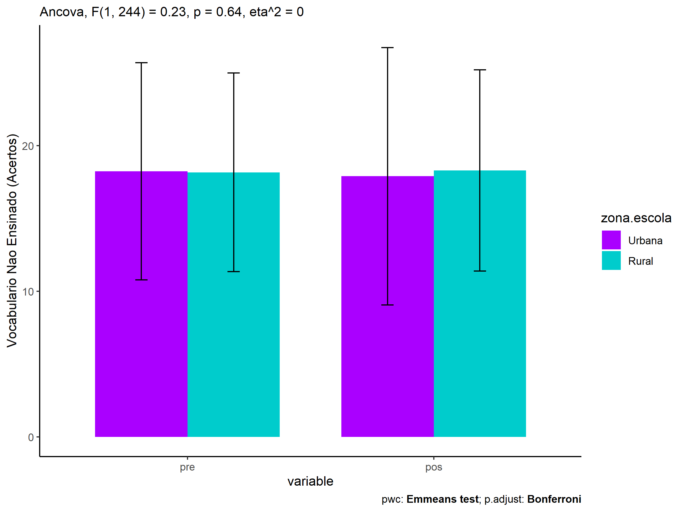<!-- -->

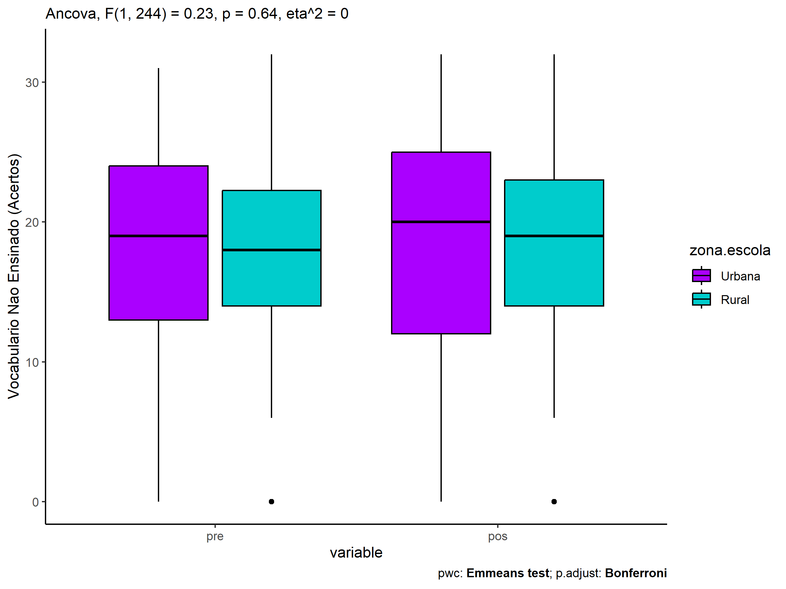<!-- -->

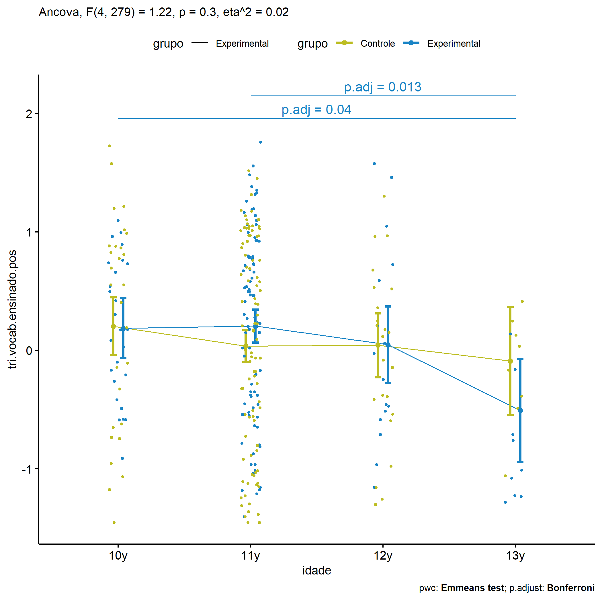<!-- -->

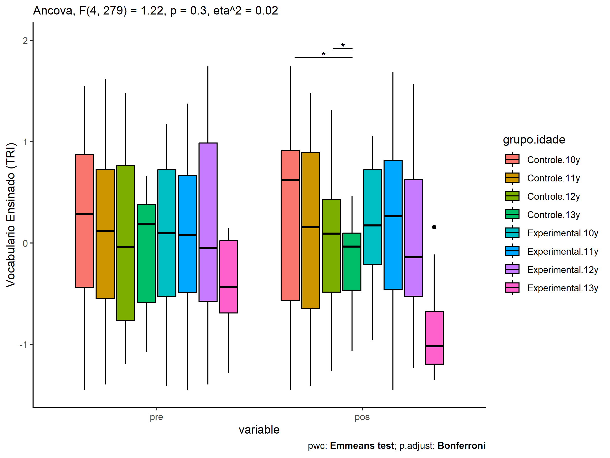<!-- -->

### Vocabulario Nao Ensinado (TRI)

| var                        | zona.escola |   n | M (pre) | SE (pre) | M (unadj) | SE (unadj) | M (adj) | SE (adj) |
|:---------------------------|:------------|----:|--------:|---------:|----------:|-----------:|--------:|---------:|
| tri.vocab.nao.ensinado.pos | Rural       | 100 |   0.043 |    0.086 |     0.047 |      0.092 |   0.045 |    0.058 |
| tri.vocab.nao.ensinado.pos | Urbana      | 200 |   0.039 |    0.066 |     0.209 |      0.070 |   0.210 |    0.041 |

| .y.                        | group1 | group2 | estimate | conf.low | conf.high |    se | statistic |     p | p.adj | p.adj.signif |
|:---------------------------|:-------|:-------|---------:|---------:|----------:|------:|----------:|------:|------:|:-------------|
| tri.vocab.nao.ensinado.pos | Urbana | Rural  |    0.165 |    0.026 |     0.305 | 0.071 |     2.329 | 0.021 | 0.021 | \*           |
| tri.vocab.nao.ensinado.pre | Urbana | Rural  |   -0.004 |   -0.223 |     0.215 | 0.111 |    -0.034 | 0.973 | 0.973 | ns           |

| .y.                    | zona.escola | group1 | group2 | estimate | conf.low | conf.high |    se | statistic |     p | p.adj | p.adj.signif |
|:-----------------------|:------------|:-------|:-------|---------:|---------:|----------:|------:|----------:|------:|------:|:-------------|
| tri.vocab.nao.ensinado | Urbana      | pre    | pos    |   -0.145 |   -0.324 |     0.034 | 0.091 |    -1.592 | 0.112 | 0.112 | ns           |
| tri.vocab.nao.ensinado | Rural       | pre    | pos    |   -0.020 |   -0.276 |     0.236 | 0.130 |    -0.156 | 0.876 | 0.876 | ns           |

    ## Scale for colour is already present.
    ## Adding another scale for colour, which will replace the existing scale.

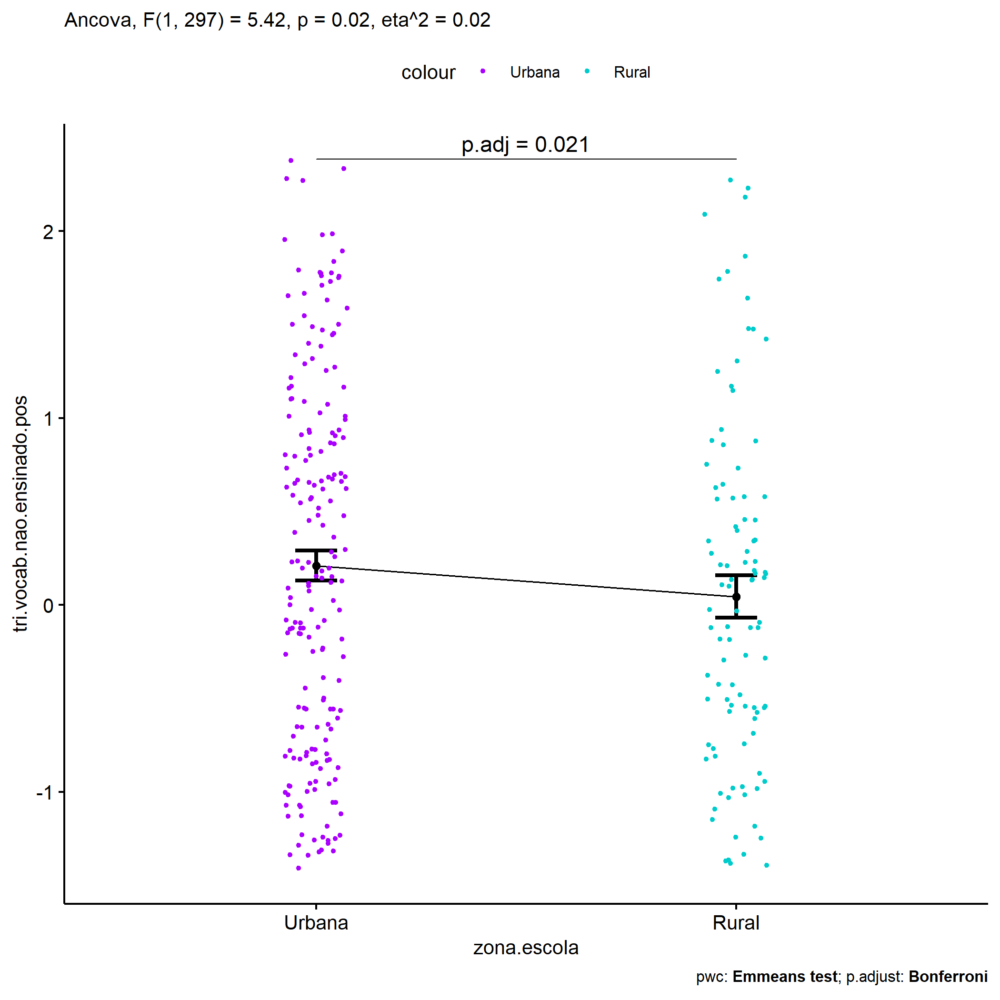<!-- -->

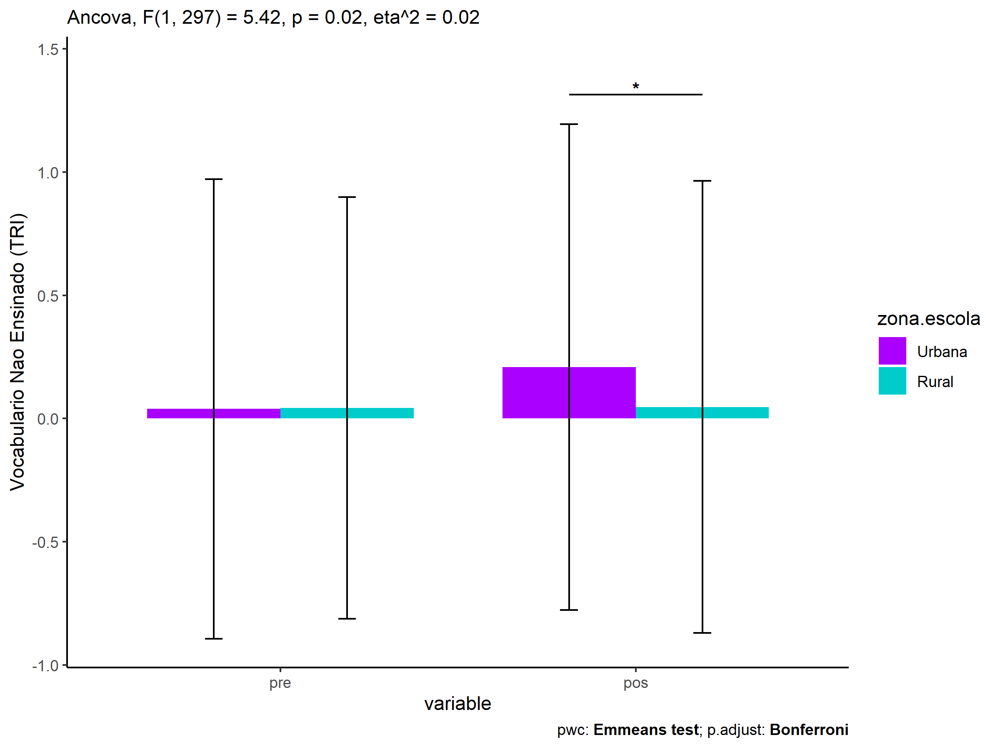<!-- -->

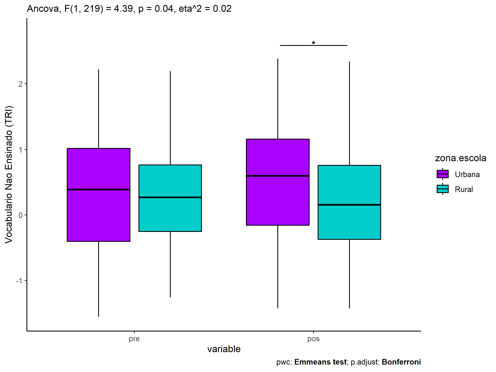<!-- -->

<!-- -->

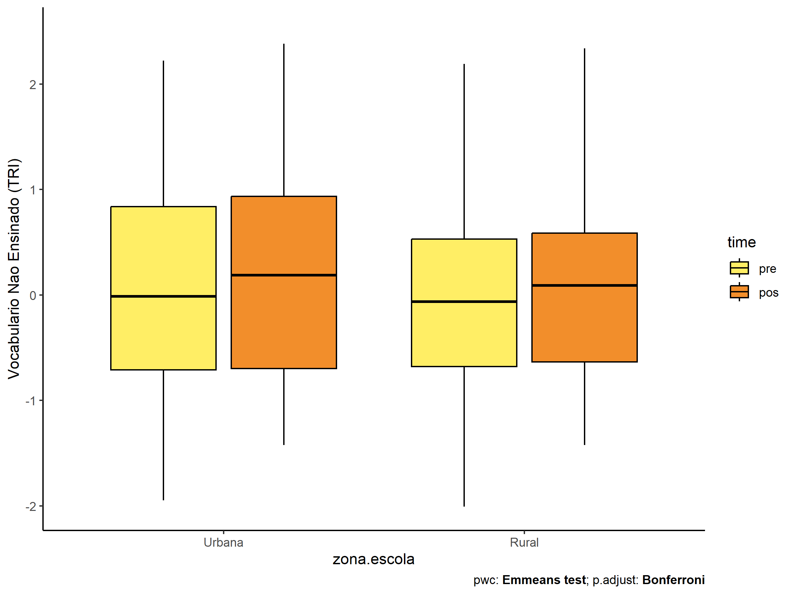<!-- -->

# Pairwise comparisons for two factors

## factores: **genero:grupo**

### Vocabulario (Acertos)

| var             | genero | grupo        |   n | M (pre) | SE (pre) | M (unadj) | SE (unadj) | M (adj) | SE (adj) |
|:----------------|:-------|:-------------|----:|--------:|---------:|----------:|-----------:|--------:|---------:|
| score.vocab.pos | F      | Controle     |  80 |  21.812 |    0.906 |    22.938 |      0.838 |  22.260 |    0.598 |
| score.vocab.pos | F      | Experimental |  57 |  23.193 |    1.191 |    25.035 |      1.181 |  23.315 |    0.712 |
| score.vocab.pos | M      | Controle     |  79 |  20.266 |    0.995 |    20.747 |      0.984 |  21.239 |    0.601 |
| score.vocab.pos | M      | Experimental |  84 |  19.131 |    0.839 |    19.976 |      0.881 |  21.326 |    0.586 |

| .y.             | grupo        | genero | group1   | group2       | estimate | conf.low | conf.high |    se | statistic |     p | p.adj | p.adj.signif |
|:----------------|:-------------|:-------|:---------|:-------------|---------:|---------:|----------:|------:|----------:|------:|------:|:-------------|
| score.vocab.pos | Controle     |        | F        | M            |    1.022 |   -0.649 |     2.692 | 0.849 |     1.203 | 0.230 | 0.230 | ns           |
| score.vocab.pos | Experimental |        | F        | M            |    1.989 |    0.161 |     3.816 | 0.929 |     2.141 | 0.033 | 0.033 | \*           |
| score.vocab.pre | Controle     |        | F        | M            |    1.547 |   -1.066 |     4.159 | 1.327 |     1.165 | 0.245 | 0.245 | ns           |
| score.vocab.pre | Experimental |        | F        | M            |    4.062 |    1.236 |     6.888 | 1.436 |     2.828 | 0.005 | 0.005 | \*\*         |
| score.vocab.pos |              | F      | Controle | Experimental |   -1.054 |   -2.878 |     0.770 | 0.927 |    -1.137 | 0.256 | 0.256 | ns           |
| score.vocab.pos |              | M      | Controle | Experimental |   -0.087 |   -1.736 |     1.562 | 0.838 |    -0.104 | 0.917 | 0.917 | ns           |
| score.vocab.pre |              | F      | Controle | Experimental |   -1.380 |   -4.235 |     1.474 | 1.451 |    -0.952 | 0.342 | 0.342 | ns           |
| score.vocab.pre |              | M      | Controle | Experimental |    1.135 |   -1.446 |     3.716 | 1.312 |     0.865 | 0.388 | 0.388 | ns           |

| grupo        | genero | group1 | group2 | estimate | conf.low | conf.high |    se | statistic |     p | p.adj | p.adj.signif |
|:-------------|:-------|:-------|:-------|---------:|---------:|----------:|------:|----------:|------:|------:|:-------------|
| Controle     | F      | pre    | pos    |   -1.249 |   -3.782 |     1.284 | 1.290 |    -0.969 | 0.333 | 0.333 | ns           |
| Controle     | M      | pre    | pos    |   -0.260 |   -2.801 |     2.280 | 1.294 |    -0.201 | 0.841 | 0.841 | ns           |
| Experimental | F      | pre    | pos    |   -2.067 |   -5.071 |     0.936 | 1.529 |    -1.352 | 0.177 | 0.177 | ns           |
| Experimental | M      | pre    | pos    |   -0.865 |   -3.333 |     1.603 | 1.257 |    -0.689 | 0.491 | 0.491 | ns           |

    ## Scale for colour is already present.
    ## Adding another scale for colour, which will replace the existing scale.

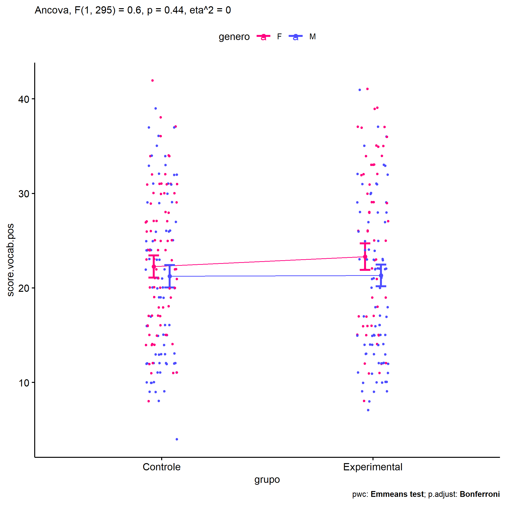<!-- -->

    ## Scale for colour is already present.
    ## Adding another scale for colour, which will replace the existing scale.

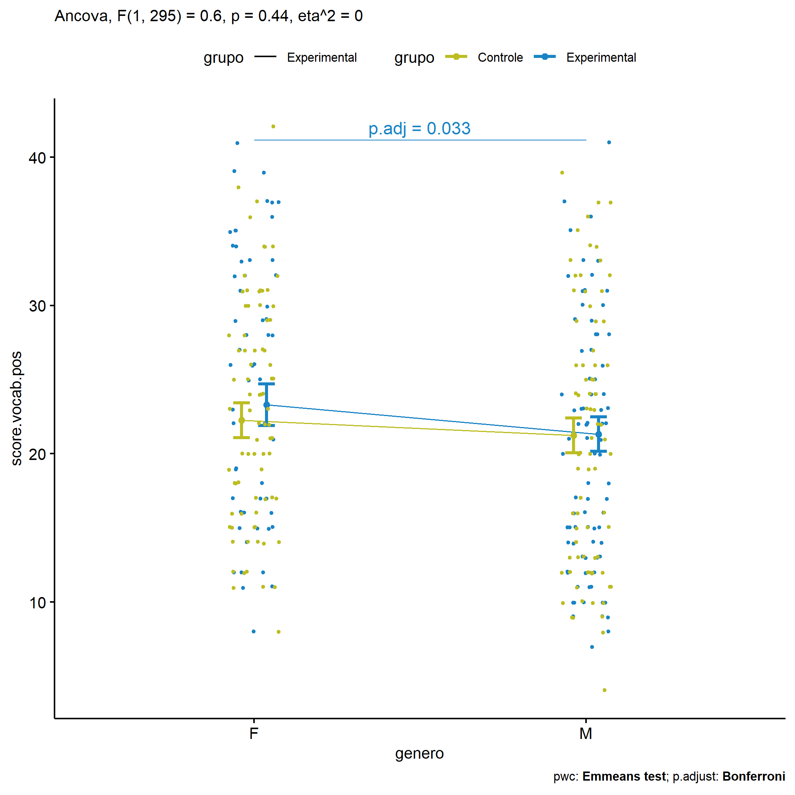<!-- -->

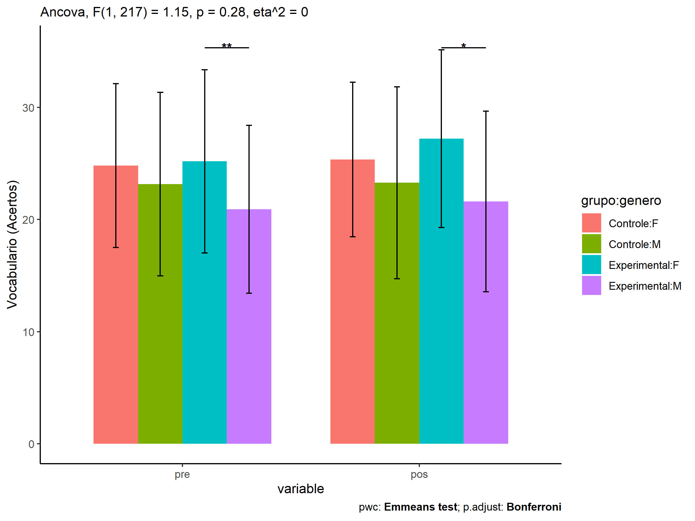<!-- -->

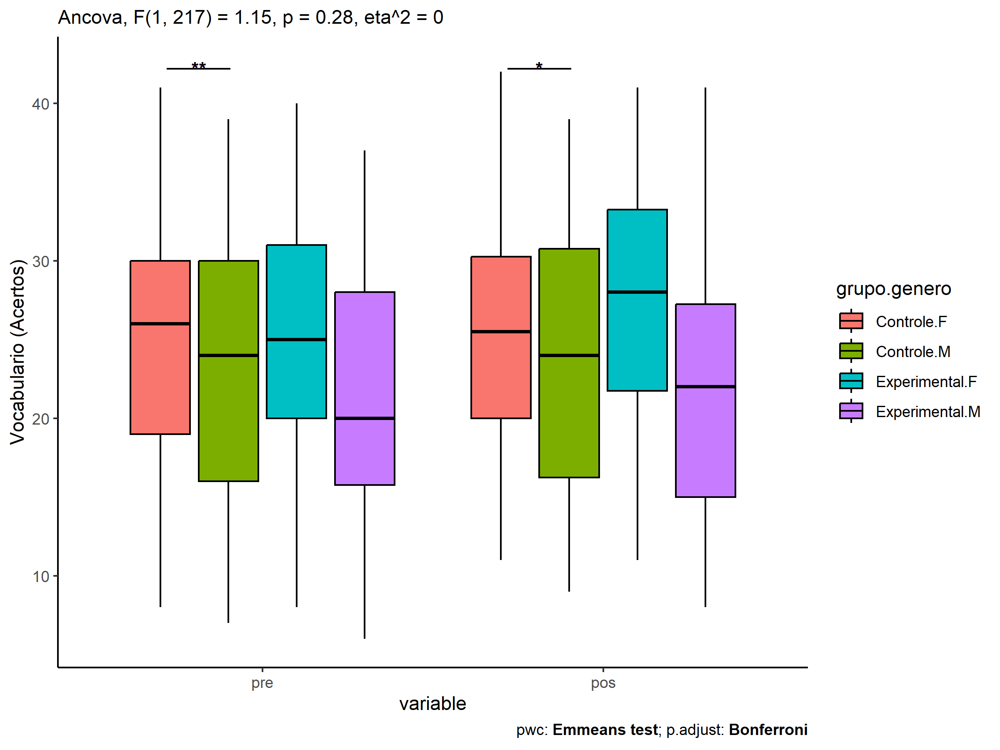<!-- -->

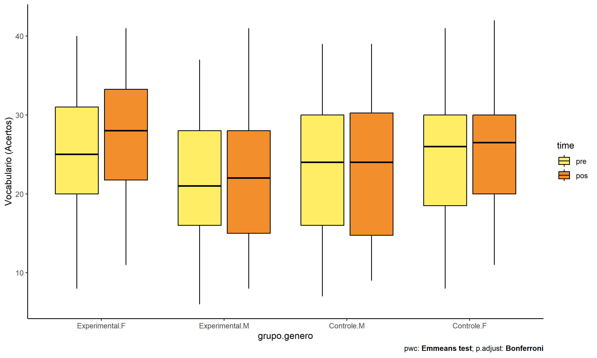<!-- -->

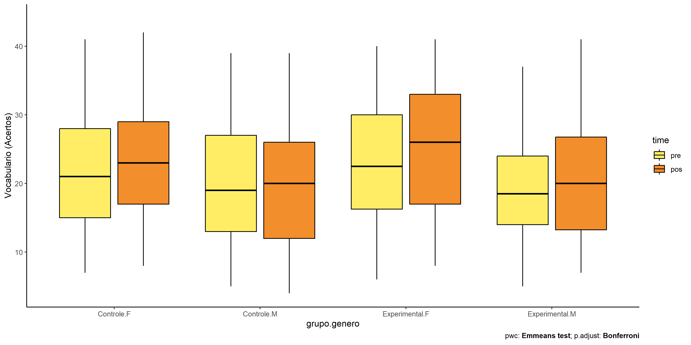<!-- -->

### Vocabulario (TRI)

| var           | genero | grupo        |   n | M (pre) | SE (pre) | M (unadj) | SE (unadj) | M (adj) | SE (adj) |
|:--------------|:-------|:-------------|----:|--------:|---------:|----------:|-----------:|--------:|---------:|
| tri.vocab.pos | F      | Controle     |  80 |   0.171 |    0.090 |     0.225 |      0.103 |   0.134 |    0.065 |
| tri.vocab.pos | F      | Experimental |  57 |   0.320 |    0.121 |     0.493 |      0.125 |   0.275 |    0.077 |
| tri.vocab.pos | M      | Controle     |  79 |   0.018 |    0.104 |     0.019 |      0.115 |   0.057 |    0.065 |
| tri.vocab.pos | M      | Experimental |  84 |  -0.172 |    0.098 |    -0.089 |      0.098 |   0.110 |    0.064 |

| .y.           | grupo        | genero | group1   | group2       | estimate | conf.low | conf.high |    se | statistic |     p | p.adj | p.adj.signif |
|:--------------|:-------------|:-------|:---------|:-------------|---------:|---------:|----------:|------:|----------:|------:|------:|:-------------|
| tri.vocab.pos | Controle     |        | F        | M            |    0.077 |   -0.104 |     0.258 | 0.092 |     0.833 | 0.405 | 0.405 | ns           |
| tri.vocab.pos | Experimental |        | F        | M            |    0.165 |   -0.034 |     0.364 | 0.101 |     1.636 | 0.103 | 0.103 | ns           |
| tri.vocab.pre | Controle     |        | F        | M            |    0.153 |   -0.124 |     0.430 | 0.141 |     1.089 | 0.277 | 0.277 | ns           |
| tri.vocab.pre | Experimental |        | F        | M            |    0.492 |    0.192 |     0.791 | 0.152 |     3.233 | 0.001 | 0.001 | \*\*         |
| tri.vocab.pos |              | F      | Controle | Experimental |   -0.141 |   -0.339 |     0.057 | 0.100 |    -1.404 | 0.161 | 0.161 | ns           |
| tri.vocab.pos |              | M      | Controle | Experimental |   -0.052 |   -0.232 |     0.127 | 0.091 |    -0.576 | 0.565 | 0.565 | ns           |
| tri.vocab.pre |              | F      | Controle | Experimental |   -0.149 |   -0.451 |     0.153 | 0.154 |    -0.971 | 0.332 | 0.332 | ns           |
| tri.vocab.pre |              | M      | Controle | Experimental |    0.189 |   -0.084 |     0.463 | 0.139 |     1.364 | 0.174 | 0.174 | ns           |

| grupo        | genero | group1 | group2 | estimate | conf.low | conf.high |    se | statistic |     p | p.adj | p.adj.signif |
|:-------------|:-------|:-------|:-------|---------:|---------:|----------:|------:|----------:|------:|------:|:-------------|
| Controle     | F      | pre    | pos    |   -0.052 |   -0.331 |     0.228 | 0.142 |    -0.365 | 0.715 | 0.715 | ns           |
| Controle     | M      | pre    | pos    |    0.020 |   -0.260 |     0.300 | 0.143 |     0.140 | 0.888 | 0.888 | ns           |
| Experimental | F      | pre    | pos    |   -0.186 |   -0.517 |     0.145 | 0.169 |    -1.102 | 0.271 | 0.271 | ns           |
| Experimental | M      | pre    | pos    |   -0.086 |   -0.359 |     0.186 | 0.139 |    -0.622 | 0.534 | 0.534 | ns           |

    ## Scale for colour is already present.
    ## Adding another scale for colour, which will replace the existing scale.

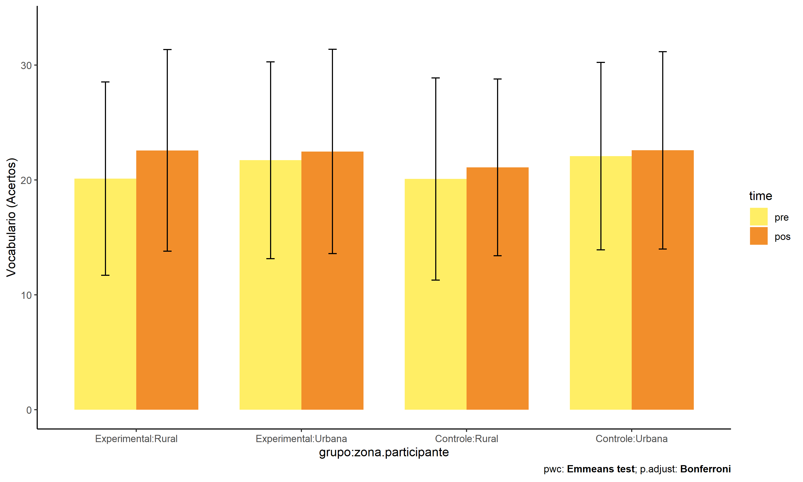<!-- -->

    ## Scale for colour is already present.
    ## Adding another scale for colour, which will replace the existing scale.

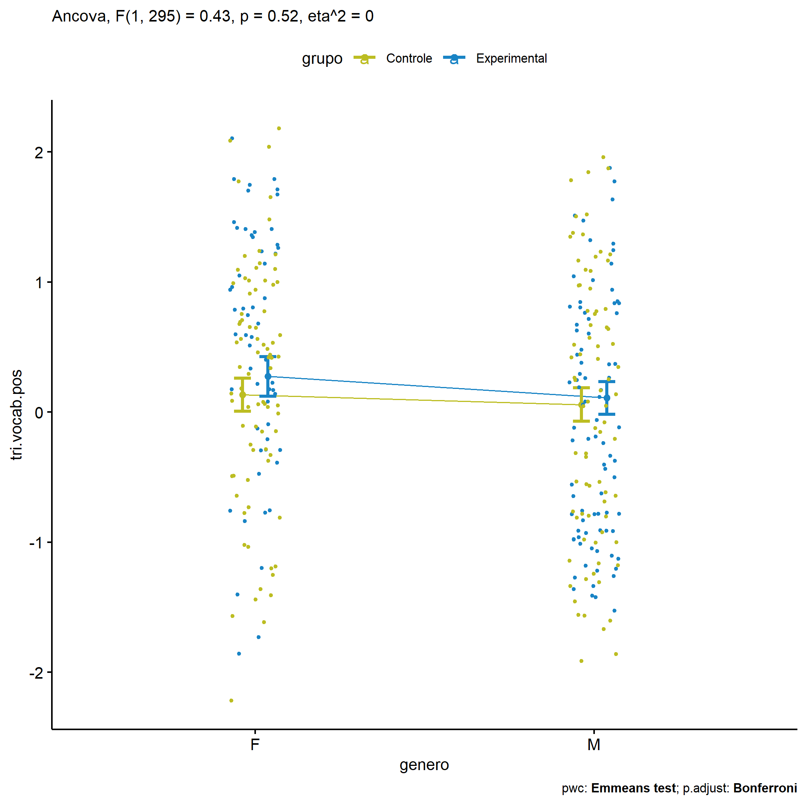<!-- -->

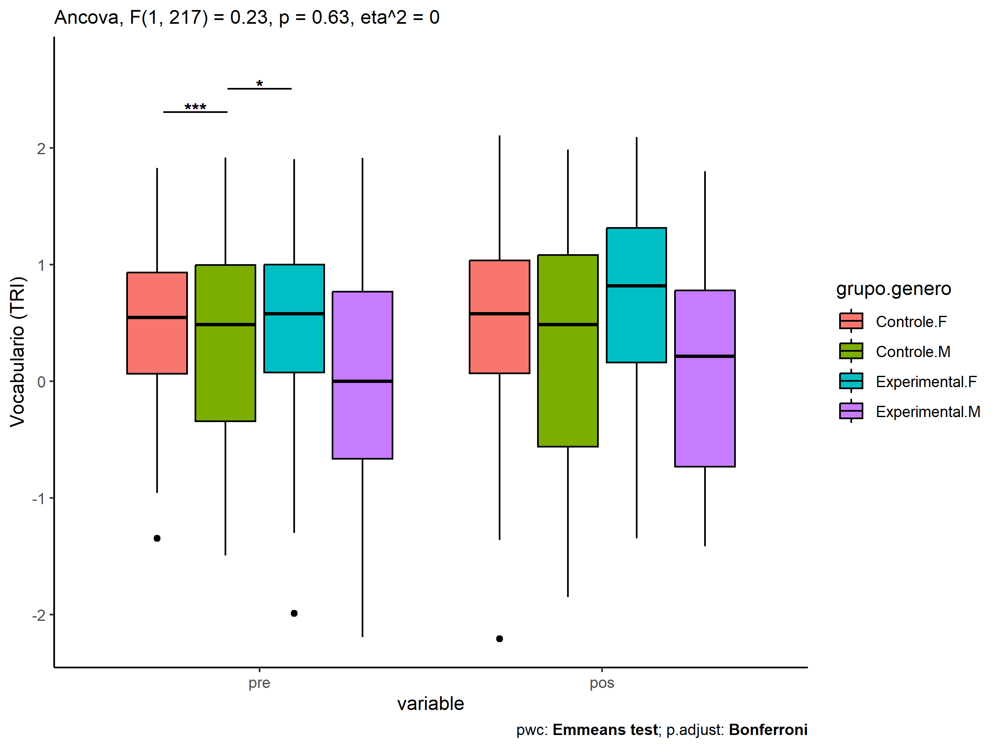<!-- -->

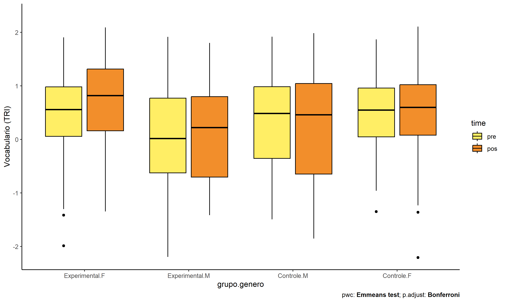<!-- -->

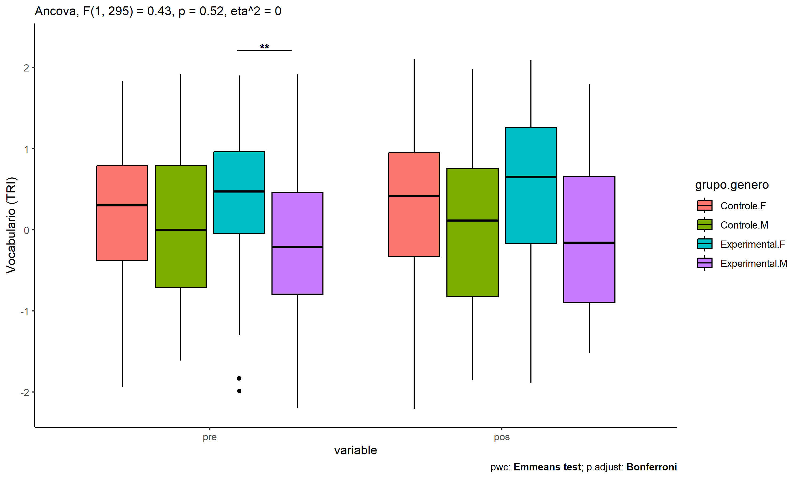<!-- -->

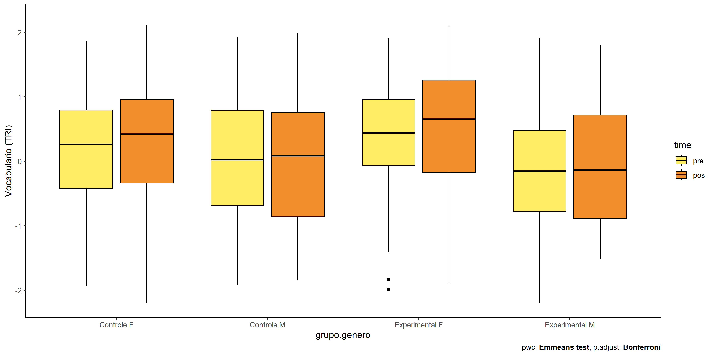<!-- -->

### Vocabulario Ensinado (Acertos)

| var                      | genero | grupo        |   n | M (pre) | SE (pre) | M (unadj) | SE (unadj) | M (adj) | SE (adj) |
|:-------------------------|:-------|:-------------|----:|--------:|---------:|----------:|-----------:|--------:|---------:|
| score.vocab.ensinado.pos | F      | Controle     |  87 |   3.954 |    0.257 |     4.057 |      0.253 |   4.024 |    0.223 |
| score.vocab.ensinado.pos | F      | Experimental |  63 |   4.444 |    0.290 |     4.397 |      0.316 |   4.143 |    0.264 |
| score.vocab.ensinado.pos | M      | Controle     |  89 |   3.663 |    0.239 |     3.539 |      0.230 |   3.636 |    0.221 |
| score.vocab.ensinado.pos | M      | Experimental |  92 |   3.630 |    0.195 |     3.826 |      0.231 |   3.938 |    0.217 |

| .y.                      | grupo        | genero | group1   | group2       | estimate | conf.low | conf.high |    se | statistic |     p | p.adj | p.adj.signif |
|:-------------------------|:-------------|:-------|:---------|:-------------|---------:|---------:|----------:|------:|----------:|------:|------:|:-------------|
| score.vocab.ensinado.pos | Controle     |        | F        | M            |    0.388 |   -0.231 |     1.006 | 0.314 |     1.233 | 0.218 | 0.218 | ns           |
| score.vocab.ensinado.pos | Experimental |        | F        | M            |    0.206 |   -0.469 |     0.881 | 0.343 |     0.599 | 0.549 | 0.549 | ns           |
| score.vocab.ensinado.pre | Controle     |        | F        | M            |    0.291 |   -0.363 |     0.946 | 0.333 |     0.875 | 0.382 | 0.382 | ns           |
| score.vocab.ensinado.pre | Experimental |        | F        | M            |    0.814 |    0.104 |     1.524 | 0.361 |     2.255 | 0.025 | 0.025 | \*           |
| score.vocab.ensinado.pos |              | F      | Controle | Experimental |   -0.119 |   -0.799 |     0.560 | 0.345 |    -0.346 | 0.730 | 0.730 | ns           |
| score.vocab.ensinado.pos |              | M      | Controle | Experimental |   -0.301 |   -0.910 |     0.308 | 0.310 |    -0.974 | 0.331 | 0.331 | ns           |
| score.vocab.ensinado.pre |              | F      | Controle | Experimental |   -0.490 |   -1.209 |     0.228 | 0.365 |    -1.343 | 0.180 | 0.180 | ns           |
| score.vocab.ensinado.pre |              | M      | Controle | Experimental |    0.032 |   -0.613 |     0.678 | 0.328 |     0.099 | 0.921 | 0.921 | ns           |

| grupo        | genero | group1 | group2 | estimate | conf.low | conf.high |    se | statistic |     p | p.adj | p.adj.signif |
|:-------------|:-------|:-------|:-------|---------:|---------:|----------:|------:|----------:|------:|------:|:-------------|
| Controle     | F      | pre    | pos    |   -0.103 |   -0.775 |     0.568 | 0.342 |    -0.303 | 0.762 | 0.762 | ns           |
| Controle     | M      | pre    | pos    |    0.124 |   -0.540 |     0.787 | 0.338 |     0.366 | 0.715 | 0.715 | ns           |
| Experimental | F      | pre    | pos    |    0.048 |   -0.741 |     0.837 | 0.402 |     0.119 | 0.906 | 0.906 | ns           |
| Experimental | M      | pre    | pos    |   -0.196 |   -0.849 |     0.457 | 0.332 |    -0.588 | 0.556 | 0.556 | ns           |

    ## Scale for colour is already present.
    ## Adding another scale for colour, which will replace the existing scale.

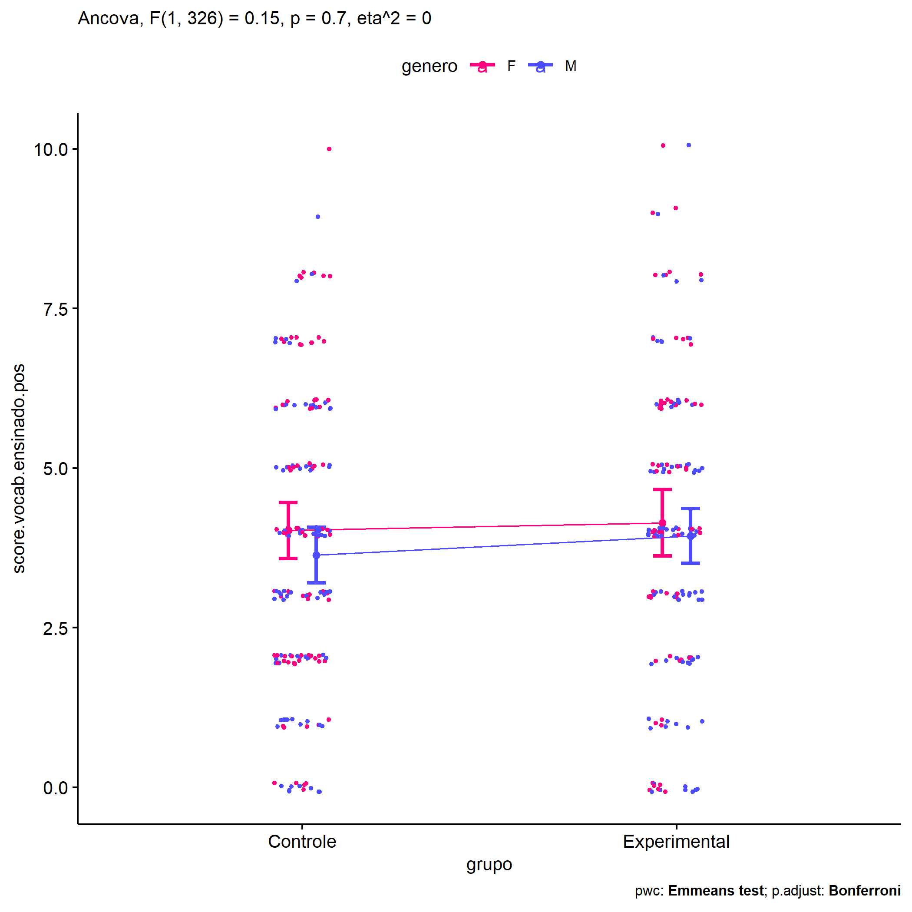<!-- -->

    ## Scale for colour is already present.
    ## Adding another scale for colour, which will replace the existing scale.

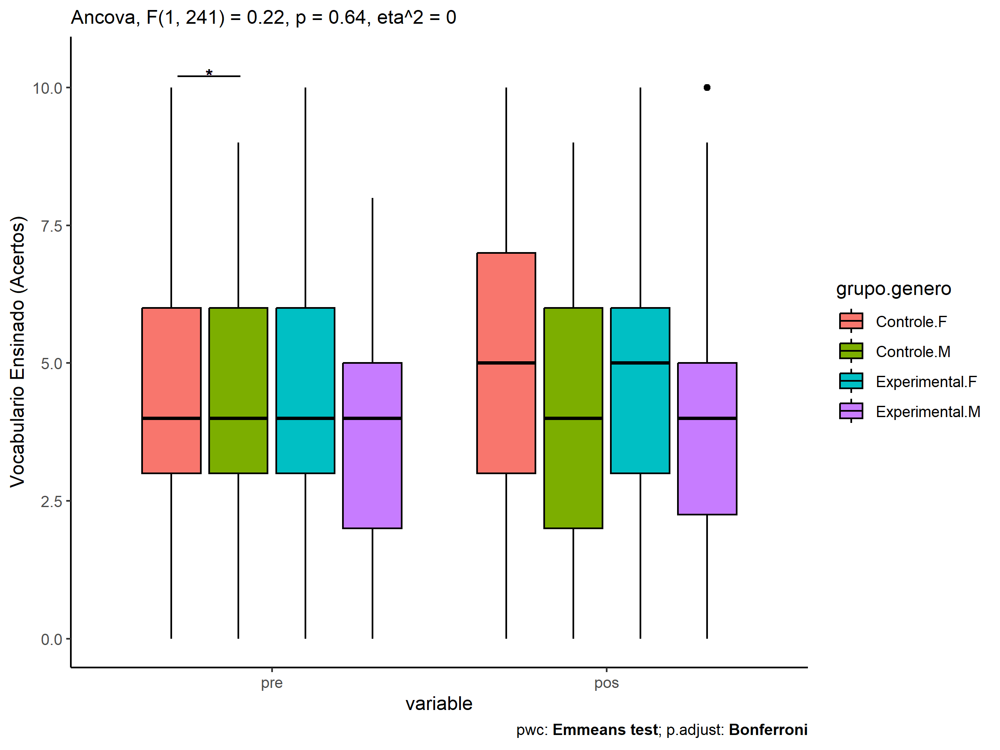<!-- -->

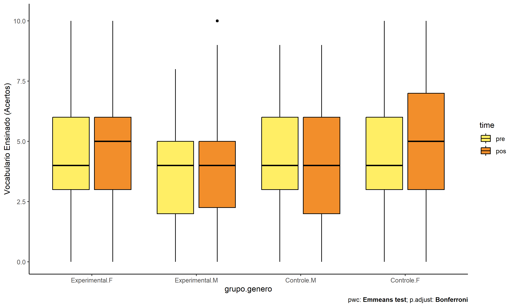<!-- -->

<!-- -->

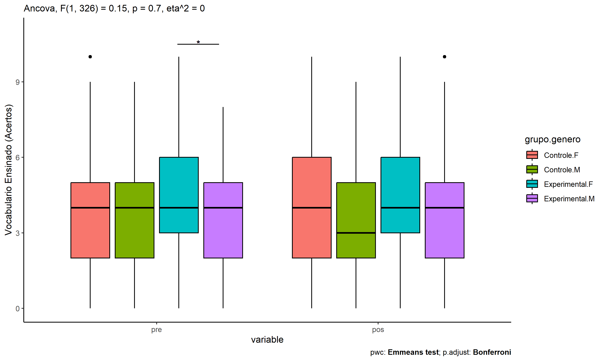<!-- -->

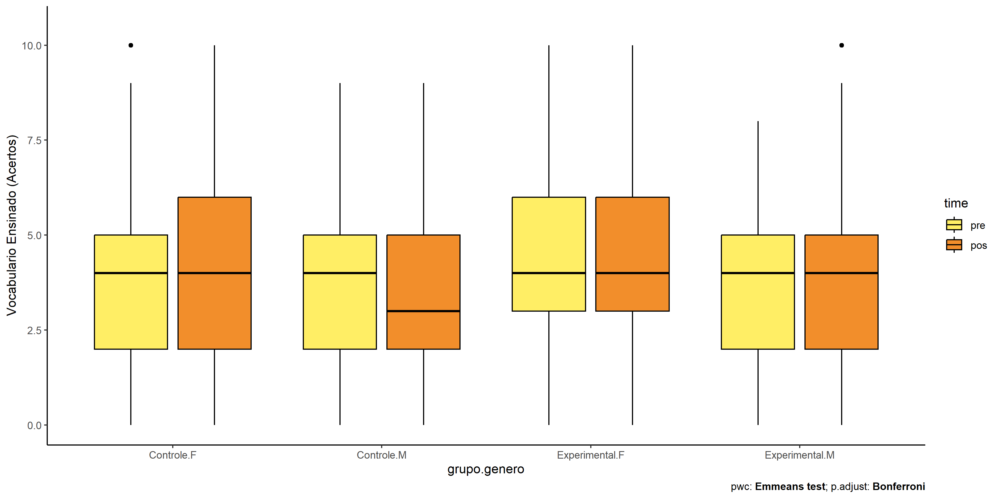<!-- -->

### Vocabulario Ensinado (TRI)

| var                    | genero | grupo        |   n | M (pre) | SE (pre) | M (unadj) | SE (unadj) | M (adj) | SE (adj) |
|:-----------------------|:-------|:-------------|----:|--------:|---------:|----------:|-----------:|--------:|---------:|
| tri.vocab.ensinado.pos | F      | Controle     |  80 |   0.133 |    0.096 |     0.103 |      0.098 |   0.053 |    0.074 |
| tri.vocab.ensinado.pos | F      | Experimental |  57 |   0.309 |    0.100 |     0.363 |      0.104 |   0.206 |    0.088 |
| tri.vocab.ensinado.pos | M      | Controle     |  79 |  -0.004 |    0.086 |    -0.017 |      0.091 |   0.017 |    0.074 |
| tri.vocab.ensinado.pos | M      | Experimental |  84 |  -0.151 |    0.077 |    -0.067 |      0.082 |   0.056 |    0.073 |

| .y.                    | grupo        | genero | group1   | group2       | estimate | conf.low | conf.high |    se | statistic | p       | p.adj   | p.adj.signif |
|:-----------------------|:-------------|:-------|:---------|:-------------|---------:|---------:|----------:|------:|----------:|:--------|:--------|:-------------|
| tri.vocab.ensinado.pos | Controle     |        | F        | M            |    0.036 |   -0.170 |     0.242 | 0.105 |     0.344 | 0.731   | 0.731   | ns           |
| tri.vocab.ensinado.pos | Experimental |        | F        | M            |    0.150 |   -0.078 |     0.377 | 0.116 |     1.296 | 0.196   | 0.196   | ns           |
| tri.vocab.ensinado.pre | Controle     |        | F        | M            |    0.137 |   -0.104 |     0.377 | 0.122 |     1.117 | 0.265   | 0.265   | ns           |
| tri.vocab.ensinado.pre | Experimental |        | F        | M            |    0.460 |    0.200 |     0.721 | 0.132 |     3.482 | \<0.001 | \<0.001 | \*\*\*       |
| tri.vocab.ensinado.pos |              | F      | Controle | Experimental |   -0.153 |   -0.378 |     0.073 | 0.115 |    -1.332 | 0.184   | 0.184   | ns           |
| tri.vocab.ensinado.pos |              | M      | Controle | Experimental |   -0.039 |   -0.243 |     0.165 | 0.104 |    -0.378 | 0.706   | 0.706   | ns           |
| tri.vocab.ensinado.pre |              | F      | Controle | Experimental |   -0.176 |   -0.439 |     0.086 | 0.134 |    -1.321 | 0.187   | 0.187   | ns           |
| tri.vocab.ensinado.pre |              | M      | Controle | Experimental |    0.147 |   -0.090 |     0.385 | 0.121 |     1.221 | 0.223   | 0.223   | ns           |

| grupo        | genero | group1 | group2 | estimate | conf.low | conf.high |    se | statistic |     p | p.adj | p.adj.signif |
|:-------------|:-------|:-------|:-------|---------:|---------:|----------:|------:|----------:|------:|------:|:-------------|
| Controle     | F      | pre    | pos    |    0.010 |   -0.231 |     0.250 | 0.122 |     0.079 | 0.937 | 0.937 | ns           |
| Controle     | M      | pre    | pos    |    0.006 |   -0.235 |     0.247 | 0.123 |     0.051 | 0.960 | 0.960 | ns           |
| Experimental | F      | pre    | pos    |   -0.057 |   -0.342 |     0.228 | 0.145 |    -0.393 | 0.695 | 0.695 | ns           |
| Experimental | M      | pre    | pos    |   -0.082 |   -0.316 |     0.152 | 0.119 |    -0.685 | 0.494 | 0.494 | ns           |

    ## Scale for colour is already present.
    ## Adding another scale for colour, which will replace the existing scale.

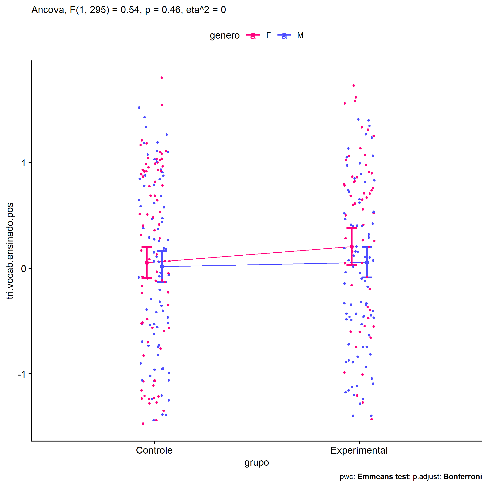<!-- -->

    ## Scale for colour is already present.
    ## Adding another scale for colour, which will replace the existing scale.

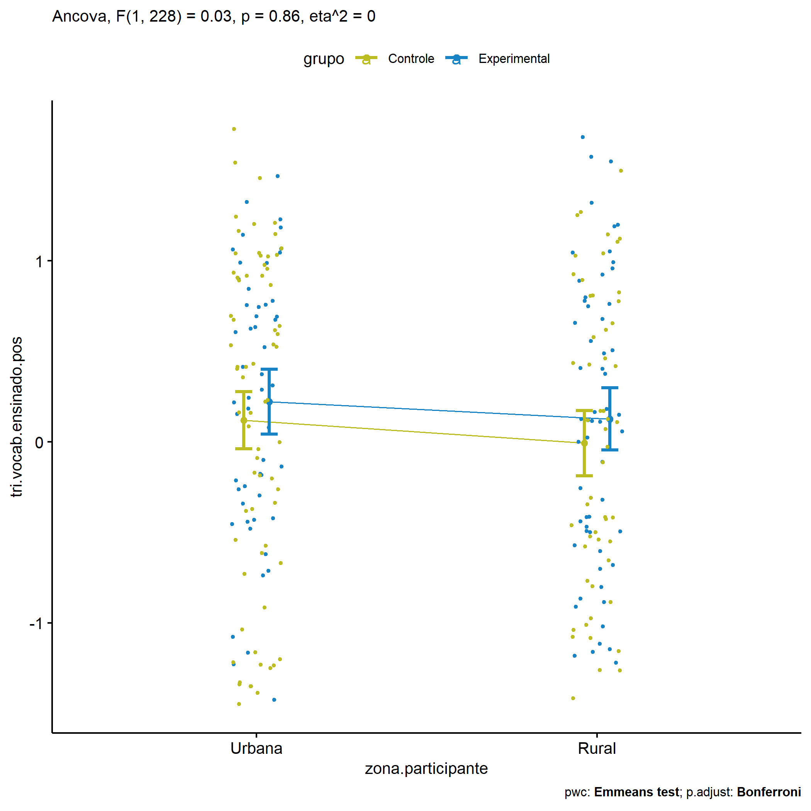<!-- -->

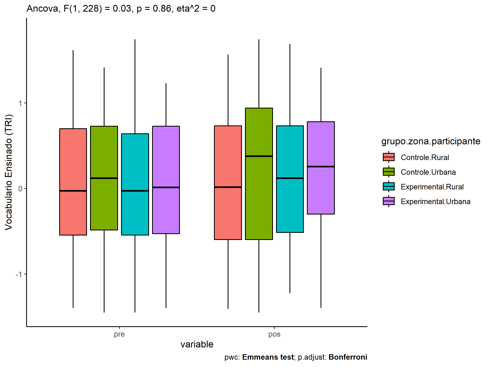<!-- -->

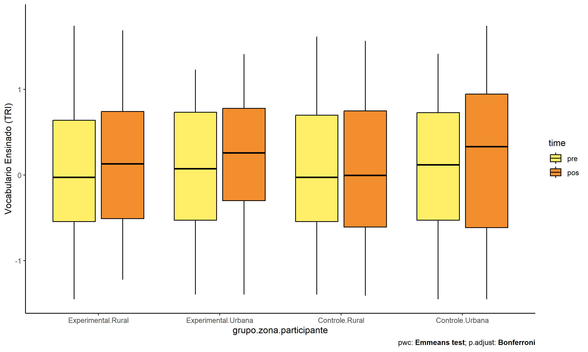<!-- -->

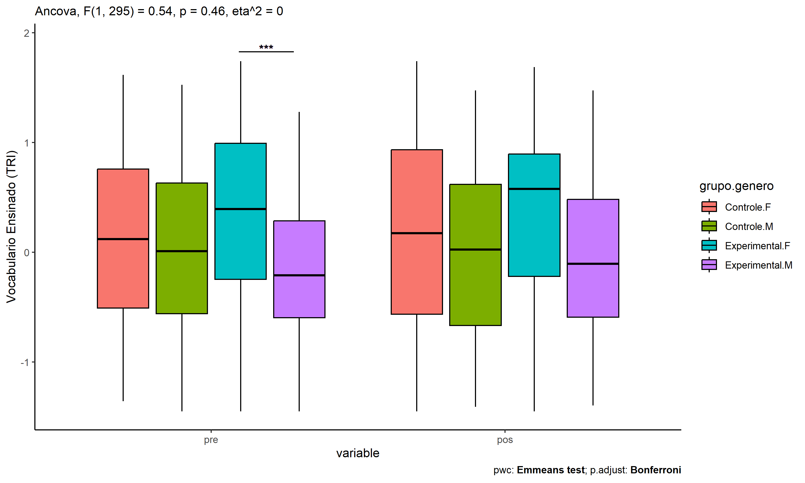<!-- -->

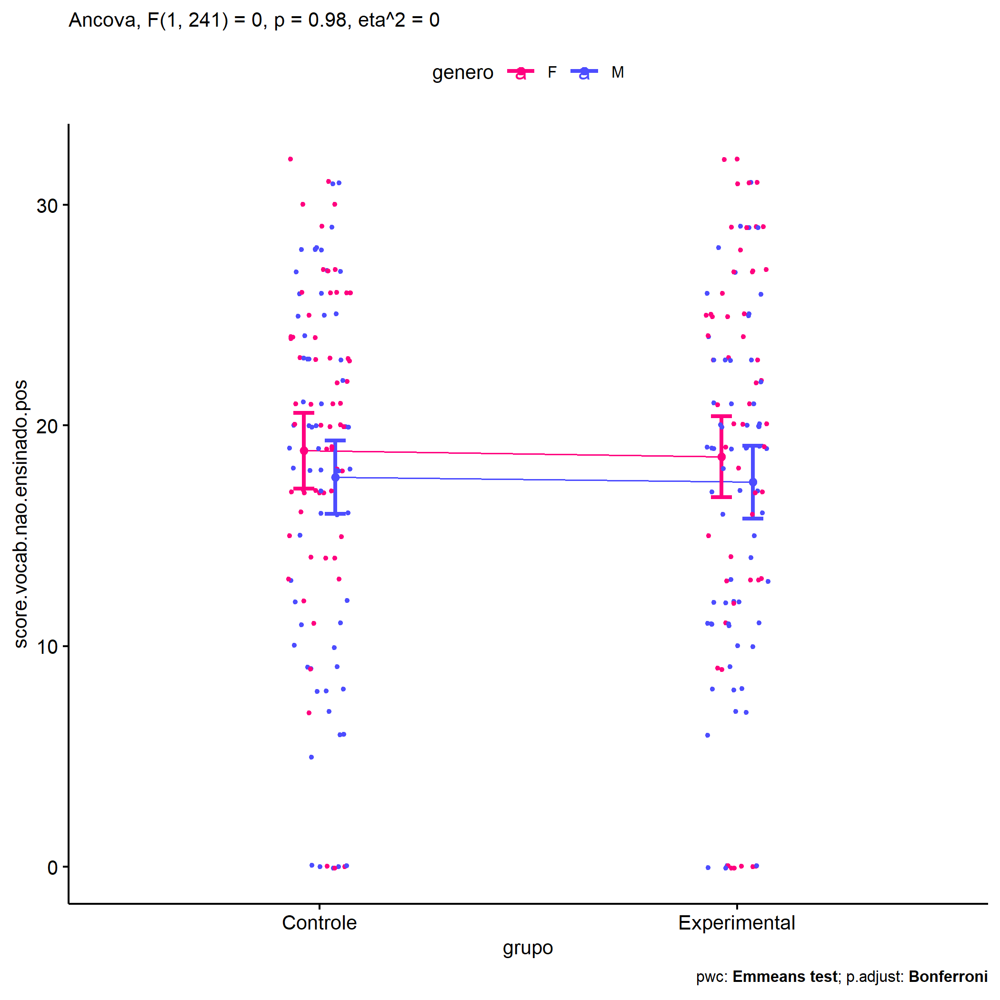<!-- -->

### Vocabulario Nao Ensinado (Acertos)

| var                          | genero | grupo        |   n | M (pre) | SE (pre) | M (unadj) | SE (unadj) | M (adj) | SE (adj) |
|:-----------------------------|:-------|:-------------|----:|--------:|---------:|----------:|-----------:|--------:|---------:|
| score.vocab.nao.ensinado.pos | F      | Controle     |  87 |  16.989 |    0.770 |    17.828 |      0.755 |  17.393 |    0.690 |
| score.vocab.nao.ensinado.pos | F      | Experimental |  63 |  18.159 |    0.949 |    18.270 |      1.146 |  17.084 |    0.814 |
| score.vocab.nao.ensinado.pos | M      | Controle     |  89 |  15.382 |    0.837 |    15.292 |      0.884 |  15.889 |    0.682 |
| score.vocab.nao.ensinado.pos | M      | Experimental |  92 |  15.304 |    0.714 |    15.076 |      0.790 |  15.722 |    0.672 |

| .y.                          | grupo        | genero | group1   | group2       | estimate | conf.low | conf.high |    se | statistic |     p | p.adj | p.adj.signif |
|:-----------------------------|:-------------|:-------|:---------|:-------------|---------:|---------:|----------:|------:|----------:|------:|------:|:-------------|
| score.vocab.nao.ensinado.pos | Controle     |        | F        | M            |    1.504 |   -0.407 |     3.416 | 0.972 |     1.548 | 0.123 | 0.123 | ns           |
| score.vocab.nao.ensinado.pos | Experimental |        | F        | M            |    1.362 |   -0.723 |     3.446 | 1.060 |     1.285 | 0.200 | 0.200 | ns           |
| score.vocab.nao.ensinado.pre | Controle     |        | F        | M            |    1.606 |   -0.576 |     3.789 | 1.110 |     1.448 | 0.149 | 0.149 | ns           |
| score.vocab.nao.ensinado.pre | Experimental |        | F        | M            |    2.854 |    0.487 |     5.222 | 1.203 |     2.372 | 0.018 | 0.018 | \*           |
| score.vocab.nao.ensinado.pos |              | F      | Controle | Experimental |    0.309 |   -1.785 |     2.403 | 1.064 |     0.290 | 0.772 | 0.772 | ns           |
| score.vocab.nao.ensinado.pos |              | M      | Controle | Experimental |    0.166 |   -1.713 |     2.045 | 0.955 |     0.174 | 0.862 | 0.862 | ns           |
| score.vocab.nao.ensinado.pre |              | F      | Controle | Experimental |   -1.170 |   -3.565 |     1.225 | 1.217 |    -0.961 | 0.337 | 0.337 | ns           |
| score.vocab.nao.ensinado.pre |              | M      | Controle | Experimental |    0.078 |   -2.075 |     2.230 | 1.094 |     0.071 | 0.943 | 0.943 | ns           |

| grupo        | genero | group1 | group2 | estimate | conf.low | conf.high |    se | statistic |     p | p.adj | p.adj.signif |
|:-------------|:-------|:-------|:-------|---------:|---------:|----------:|------:|----------:|------:|------:|:-------------|
| Controle     | F      | pre    | pos    |   -0.839 |   -3.122 |     1.444 | 1.163 |    -0.722 | 0.471 | 0.471 | ns           |
| Controle     | M      | pre    | pos    |    0.090 |   -2.167 |     2.347 | 1.150 |     0.078 | 0.938 | 0.938 | ns           |
| Experimental | F      | pre    | pos    |   -0.111 |   -2.794 |     2.572 | 1.366 |    -0.081 | 0.935 | 0.935 | ns           |
| Experimental | M      | pre    | pos    |    0.228 |   -1.992 |     2.448 | 1.131 |     0.202 | 0.840 | 0.840 | ns           |

    ## Scale for colour is already present.
    ## Adding another scale for colour, which will replace the existing scale.

<!-- -->

    ## Scale for colour is already present.
    ## Adding another scale for colour, which will replace the existing scale.

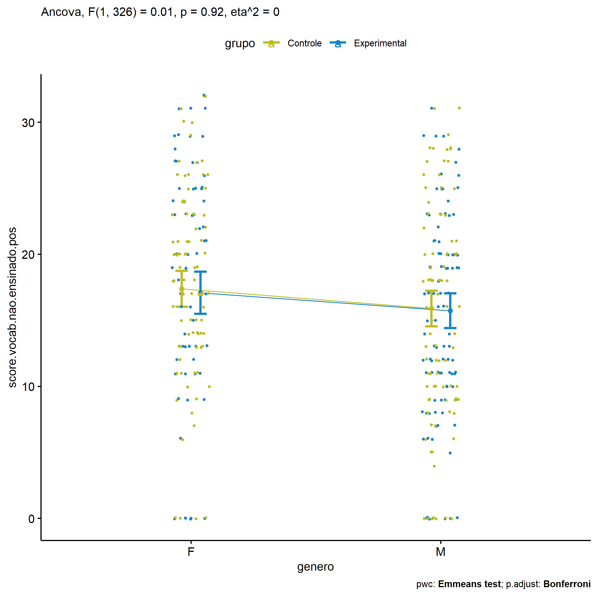<!-- -->

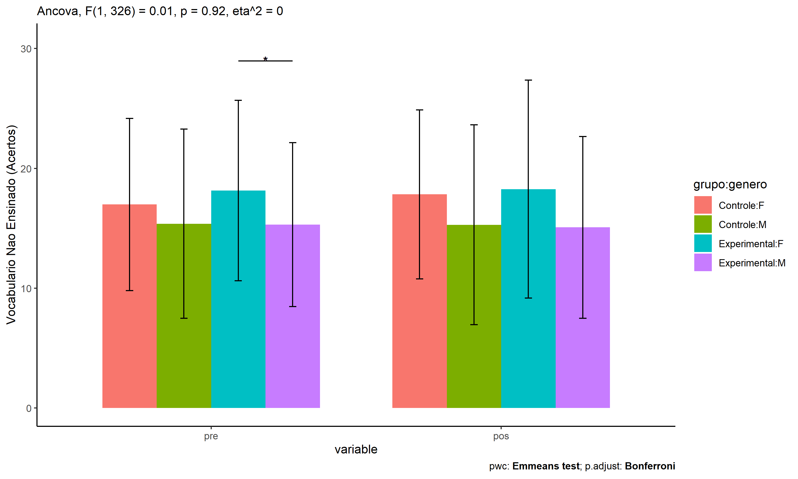<!-- -->

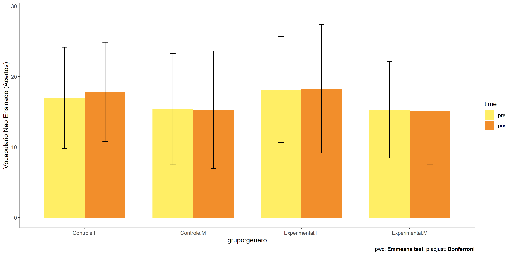<!-- -->

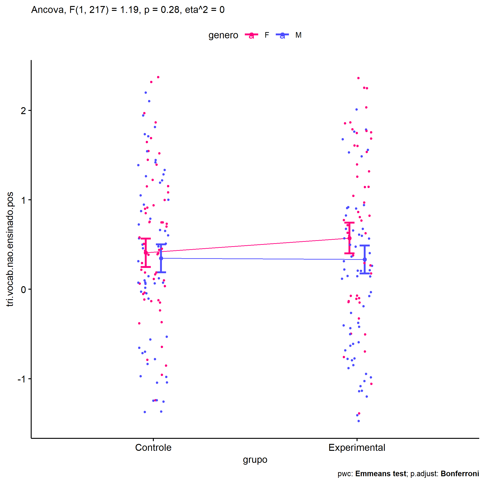<!-- -->

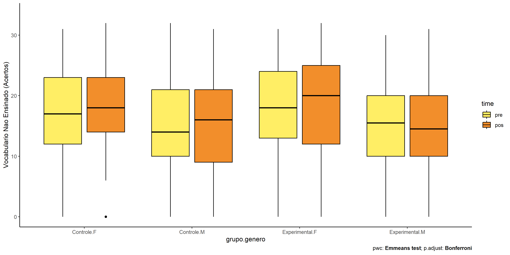<!-- -->

### Vocabulario Nao Ensinado (TRI)

| var                        | genero | grupo        |   n | M (pre) | SE (pre) | M (unadj) | SE (unadj) | M (adj) | SE (adj) |
|:---------------------------|:-------|:-------------|----:|--------:|---------:|----------:|-----------:|--------:|---------:|
| tri.vocab.nao.ensinado.pos | F      | Controle     |  80 |   0.142 |    0.093 |     0.271 |      0.097 |   0.186 |    0.065 |
| tri.vocab.nao.ensinado.pos | F      | Experimental |  57 |   0.301 |    0.122 |     0.526 |      0.136 |   0.309 |    0.077 |
| tri.vocab.nao.ensinado.pos | M      | Controle     |  79 |  -0.014 |    0.109 |     0.056 |      0.112 |   0.101 |    0.065 |
| tri.vocab.nao.ensinado.pos | M      | Experimental |  84 |  -0.182 |    0.094 |    -0.113 |      0.098 |   0.072 |    0.064 |

| .y.                        | grupo        | genero | group1   | group2       | estimate | conf.low | conf.high |    se | statistic |     p | p.adj | p.adj.signif |
|:---------------------------|:-------------|:-------|:---------|:-------------|---------:|---------:|----------:|------:|----------:|------:|------:|:-------------|
| tri.vocab.nao.ensinado.pos | Controle     |        | F        | M            |    0.085 |   -0.097 |     0.266 | 0.092 |     0.920 | 0.358 | 0.358 | ns           |
| tri.vocab.nao.ensinado.pos | Experimental |        | F        | M            |    0.237 |    0.038 |     0.436 | 0.101 |     2.342 | 0.020 | 0.020 | \*           |
| tri.vocab.nao.ensinado.pre | Controle     |        | F        | M            |    0.156 |   -0.123 |     0.435 | 0.142 |     1.103 | 0.271 | 0.271 | ns           |
| tri.vocab.nao.ensinado.pre | Experimental |        | F        | M            |    0.483 |    0.181 |     0.785 | 0.153 |     3.148 | 0.002 | 0.002 | \*\*         |
| tri.vocab.nao.ensinado.pos |              | F      | Controle | Experimental |   -0.123 |   -0.321 |     0.075 | 0.101 |    -1.221 | 0.223 | 0.223 | ns           |
| tri.vocab.nao.ensinado.pos |              | M      | Controle | Experimental |    0.029 |   -0.150 |     0.209 | 0.091 |     0.320 | 0.749 | 0.749 | ns           |
| tri.vocab.nao.ensinado.pre |              | F      | Controle | Experimental |   -0.159 |   -0.464 |     0.146 | 0.155 |    -1.026 | 0.306 | 0.306 | ns           |
| tri.vocab.nao.ensinado.pre |              | M      | Controle | Experimental |    0.168 |   -0.108 |     0.443 | 0.140 |     1.196 | 0.233 | 0.233 | ns           |

| grupo        | genero | group1 | group2 | estimate | conf.low | conf.high |    se | statistic |     p | p.adj | p.adj.signif |
|:-------------|:-------|:-------|:-------|---------:|---------:|----------:|------:|----------:|------:|------:|:-------------|
| Controle     | F      | pre    | pos    |   -0.128 |   -0.407 |     0.151 | 0.142 |    -0.901 | 0.368 | 0.368 | ns           |
| Controle     | M      | pre    | pos    |   -0.040 |   -0.320 |     0.240 | 0.143 |    -0.280 | 0.780 | 0.780 | ns           |
| Experimental | F      | pre    | pos    |   -0.236 |   -0.567 |     0.095 | 0.169 |    -1.401 | 0.162 | 0.162 | ns           |
| Experimental | M      | pre    | pos    |   -0.071 |   -0.343 |     0.201 | 0.138 |    -0.511 | 0.610 | 0.610 | ns           |

    ## Scale for colour is already present.
    ## Adding another scale for colour, which will replace the existing scale.

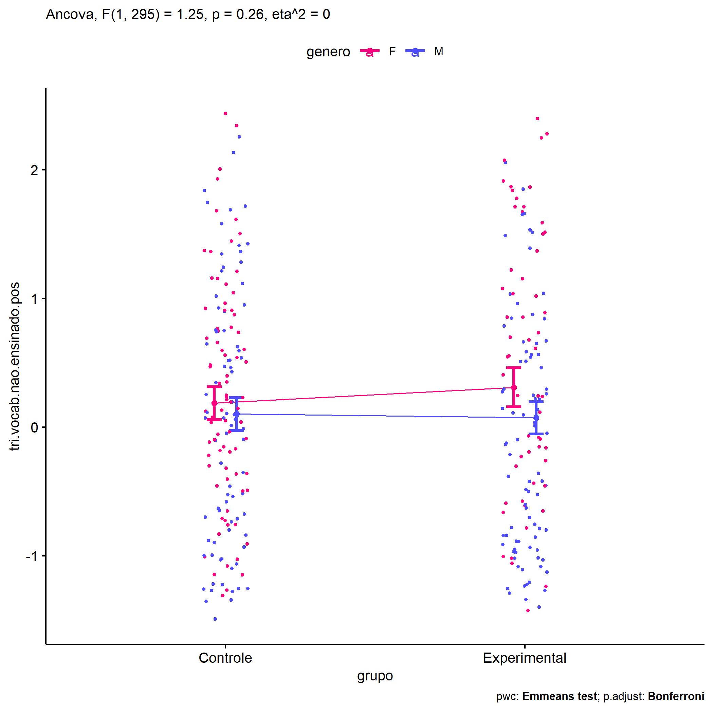<!-- -->

    ## Scale for colour is already present.
    ## Adding another scale for colour, which will replace the existing scale.

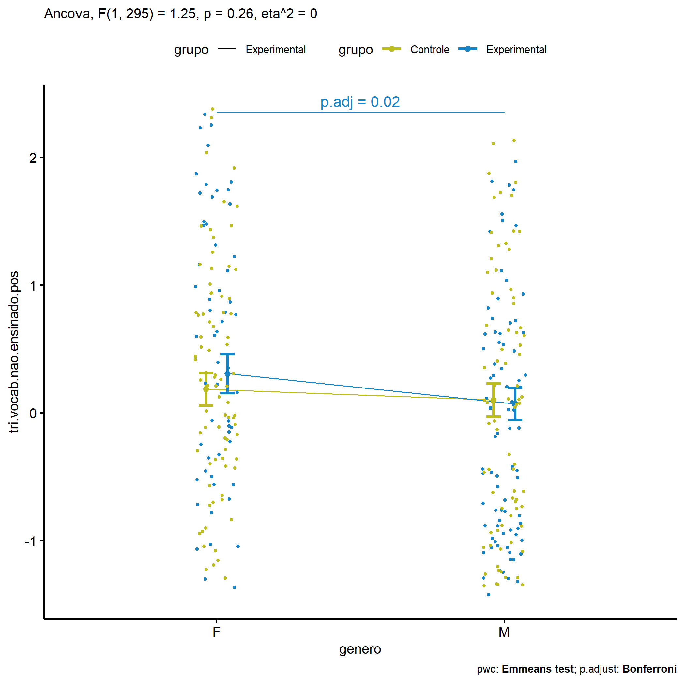<!-- -->

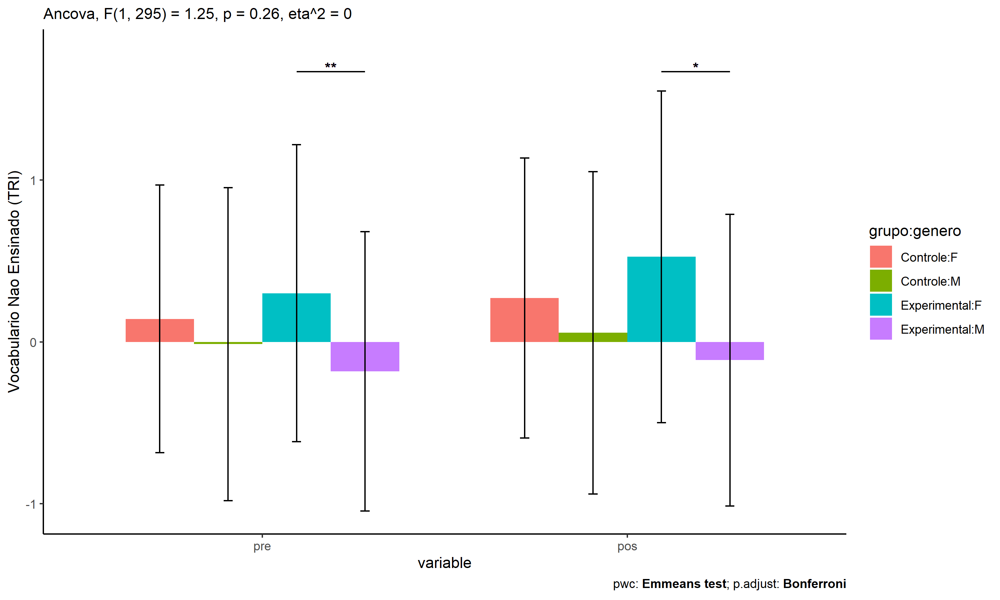<!-- -->

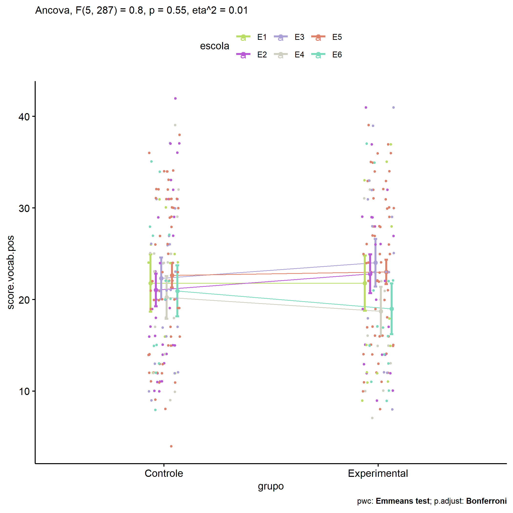<!-- -->

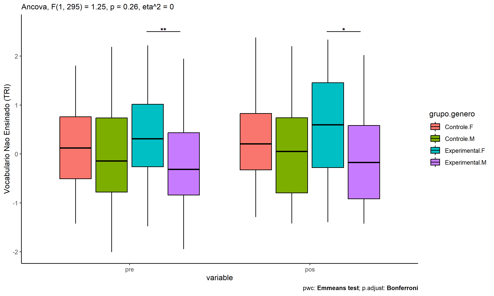<!-- -->

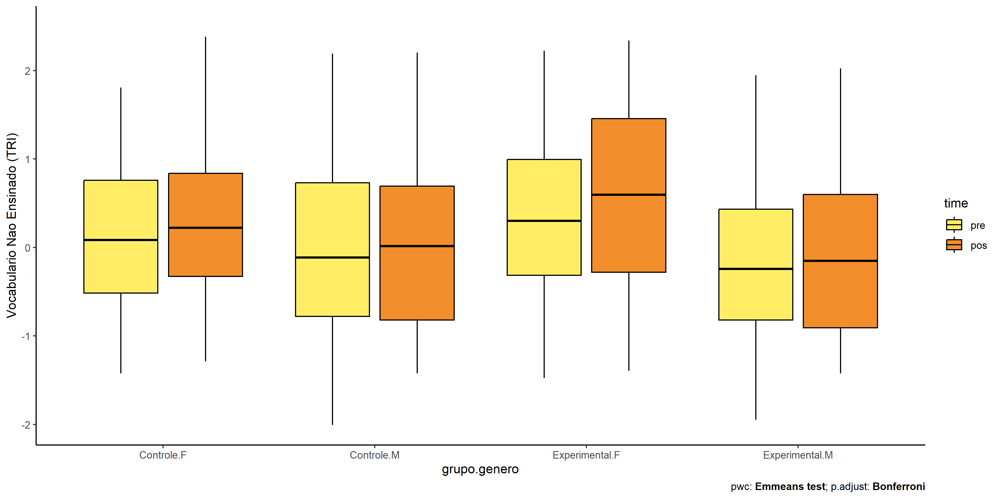<!-- -->

## factores: **idade:grupo**

### Vocabulario (Acertos)

| var             | idade | grupo        |   n | M (pre) | SE (pre) | M (unadj) | SE (unadj) | M (adj) | SE (adj) |
|:----------------|:------|:-------------|----:|--------:|---------:|----------:|-----------:|--------:|---------:|
| score.vocab.pos | 10y   | Controle     |  28 |  23.393 |    1.446 |    22.179 |      1.440 |  20.478 |    1.008 |
| score.vocab.pos | 10y   | Experimental |  26 |  20.538 |    1.526 |    21.615 |      1.280 |  22.046 |    1.043 |
| score.vocab.pos | 11y   | Controle     |  90 |  21.278 |    0.945 |    22.978 |      0.900 |  22.857 |    0.560 |
| score.vocab.pos | 11y   | Experimental |  86 |  21.895 |    0.927 |    23.523 |      0.949 |  22.941 |    0.574 |
| score.vocab.pos | 12y   | Controle     |  23 |  19.348 |    1.740 |    19.391 |      1.627 |  20.711 |    1.111 |
| score.vocab.pos | 12y   | Experimental |  16 |  20.062 |    2.279 |    21.625 |      2.481 |  22.411 |    1.330 |
| score.vocab.pos | 13y   | Controle     |   8 |  19.500 |    2.471 |    19.250 |      2.455 |  20.456 |    1.881 |
| score.vocab.pos | 13y   | Experimental |   9 |  14.444 |    1.725 |    11.556 |      0.835 |  16.537 |    1.790 |

| .y.             | grupo        | idade | group1   | group2       | estimate | conf.low | conf.high |    se | statistic | p       | p.adj | p.adj.signif |
|:----------------|:-------------|:------|:---------|:-------------|---------:|---------:|----------:|------:|----------:|:--------|------:|:-------------|
| score.vocab.pos | Controle     |       | 10y      | 11y          |   -2.379 |   -4.649 |    -0.108 | 1.153 |    -2.062 | 0.04    | 0.241 | ns           |
| score.vocab.pos | Controle     |       | 10y      | 12y          |   -0.233 |   -3.194 |     2.728 | 1.504 |    -0.155 | 0.877   | 1.000 | ns           |
| score.vocab.pos | Controle     |       | 10y      | 13y          |    0.022 |   -4.184 |     4.228 | 2.137 |     0.010 | 0.992   | 1.000 | ns           |
| score.vocab.pos | Controle     |       | 11y      | 12y          |    2.145 |   -0.304 |     4.595 | 1.244 |     1.724 | 0.086   | 0.515 | ns           |
| score.vocab.pos | Controle     |       | 11y      | 13y          |    2.400 |   -1.463 |     6.264 | 1.963 |     1.223 | 0.222   | 1.000 | ns           |
| score.vocab.pos | Controle     |       | 12y      | 13y          |    0.255 |   -4.041 |     4.551 | 2.182 |     0.117 | 0.907   | 1.000 | ns           |
| score.vocab.pos | Experimental |       | 10y      | 11y          |   -0.895 |   -3.239 |     1.450 | 1.191 |    -0.751 | 0.453   | 1.000 | ns           |
| score.vocab.pos | Experimental |       | 10y      | 12y          |   -0.365 |   -3.691 |     2.961 | 1.689 |    -0.216 | 0.829   | 1.000 | ns           |
| score.vocab.pos | Experimental |       | 10y      | 13y          |    5.509 |    1.436 |     9.583 | 2.069 |     2.663 | 0.008   | 0.049 | \*           |
| score.vocab.pos | Experimental |       | 11y      | 12y          |    0.530 |   -2.323 |     3.383 | 1.449 |     0.365 | 0.715   | 1.000 | ns           |
| score.vocab.pos | Experimental |       | 11y      | 13y          |    6.404 |    2.696 |    10.112 | 1.884 |     3.400 | \<0.001 | 0.005 | \*\*         |
| score.vocab.pos | Experimental |       | 12y      | 13y          |    5.874 |    1.493 |    10.255 | 2.225 |     2.640 | 0.009   | 0.053 | ns           |
| score.vocab.pre | Controle     |       | 10y      | 11y          |    2.115 |   -1.485 |     5.716 | 1.829 |     1.156 | 0.249   | 1.000 | ns           |
| score.vocab.pre | Controle     |       | 10y      | 12y          |    4.045 |   -0.637 |     8.727 | 2.379 |     1.701 | 0.09    | 0.541 | ns           |
| score.vocab.pre | Controle     |       | 10y      | 13y          |    3.893 |   -2.778 |    10.563 | 3.389 |     1.149 | 0.252   | 1.000 | ns           |
| score.vocab.pre | Controle     |       | 11y      | 12y          |    1.930 |   -1.958 |     5.818 | 1.975 |     0.977 | 0.329   | 1.000 | ns           |
| score.vocab.pre | Controle     |       | 11y      | 13y          |    1.778 |   -4.361 |     7.916 | 3.118 |     0.570 | 0.569   | 1.000 | ns           |
| score.vocab.pre | Controle     |       | 12y      | 13y          |   -0.152 |   -6.982 |     6.677 | 3.469 |    -0.044 | 0.965   | 1.000 | ns           |
| score.vocab.pre | Experimental |       | 10y      | 11y          |   -1.357 |   -5.081 |     2.367 | 1.892 |    -0.717 | 0.474   | 1.000 | ns           |
| score.vocab.pre | Experimental |       | 10y      | 12y          |    0.476 |   -4.811 |     5.763 | 2.686 |     0.177 | 0.859   | 1.000 | ns           |
| score.vocab.pre | Experimental |       | 10y      | 13y          |    6.094 |   -0.341 |    12.529 | 3.269 |     1.864 | 0.063   | 0.380 | ns           |
| score.vocab.pre | Experimental |       | 11y      | 12y          |    1.833 |   -2.697 |     6.363 | 2.301 |     0.796 | 0.426   | 1.000 | ns           |
| score.vocab.pre | Experimental |       | 11y      | 13y          |    7.451 |    1.622 |    13.280 | 2.961 |     2.516 | 0.012   | 0.075 | ns           |
| score.vocab.pre | Experimental |       | 12y      | 13y          |    5.618 |   -1.315 |    12.551 | 3.522 |     1.595 | 0.112   | 0.671 | ns           |
| score.vocab.pos |              | 10y   | Controle | Experimental |   -1.568 |   -4.427 |     1.290 | 1.452 |    -1.080 | 0.281   | 0.281 | ns           |
| score.vocab.pos |              | 11y   | Controle | Experimental |   -0.084 |   -1.663 |     1.495 | 0.802 |    -0.105 | 0.916   | 0.916 | ns           |
| score.vocab.pos |              | 12y   | Controle | Experimental |   -1.700 |   -5.108 |     1.708 | 1.731 |    -0.982 | 0.327   | 0.327 | ns           |
| score.vocab.pos |              | 13y   | Controle | Experimental |    3.919 |   -1.180 |     9.019 | 2.591 |     1.513 | 0.131   | 0.131 | ns           |
| score.vocab.pre |              | 10y   | Controle | Experimental |    2.854 |   -1.677 |     7.386 | 2.302 |     1.240 | 0.216   | 0.216 | ns           |
| score.vocab.pre |              | 11y   | Controle | Experimental |   -0.618 |   -3.127 |     1.892 | 1.275 |    -0.485 | 0.628   | 0.628 | ns           |
| score.vocab.pre |              | 12y   | Controle | Experimental |   -0.715 |   -6.131 |     4.702 | 2.752 |    -0.260 | 0.795   | 0.795 | ns           |
| score.vocab.pre |              | 13y   | Controle | Experimental |    5.056 |   -3.030 |    13.141 | 4.107 |     1.231 | 0.219   | 0.219 | ns           |

| grupo        | idade | group1 | group2 | estimate | conf.low | conf.high |    se | statistic |     p | p.adj | p.adj.signif |
|:-------------|:------|:-------|:-------|---------:|---------:|----------:|------:|----------:|------:|------:|:-------------|
| Controle     | 10y   | pre    | pos    |    0.425 |   -3.813 |     4.663 | 2.158 |     0.197 | 0.844 | 0.844 | ns           |
| Controle     | 11y   | pre    | pos    |   -1.586 |   -4.018 |     0.846 | 1.238 |    -1.281 | 0.201 | 0.201 | ns           |
| Controle     | 12y   | pre    | pos    |    0.118 |   -4.569 |     4.806 | 2.387 |     0.050 | 0.960 | 0.960 | ns           |
| Controle     | 13y   | pre    | pos    |    2.000 |   -5.781 |     9.781 | 3.962 |     0.505 | 0.614 | 0.614 | ns           |
| Experimental | 10y   | pre    | pos    |   -1.282 |   -5.789 |     3.225 | 2.295 |    -0.559 | 0.577 | 0.577 | ns           |
| Experimental | 11y   | pre    | pos    |   -1.553 |   -4.033 |     0.928 | 1.263 |    -1.230 | 0.219 | 0.219 | ns           |
| Experimental | 12y   | pre    | pos    |   -0.730 |   -6.296 |     4.836 | 2.834 |    -0.258 | 0.797 | 0.797 | ns           |
| Experimental | 13y   | pre    | pos    |    4.194 |   -3.039 |    11.428 | 3.683 |     1.139 | 0.255 | 0.255 | ns           |

    ## Scale for colour is already present.
    ## Adding another scale for colour, which will replace the existing scale.

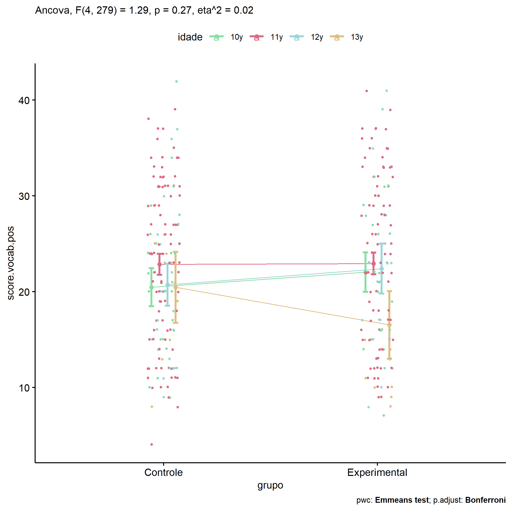<!-- -->

    ## Scale for colour is already present.
    ## Adding another scale for colour, which will replace the existing scale.

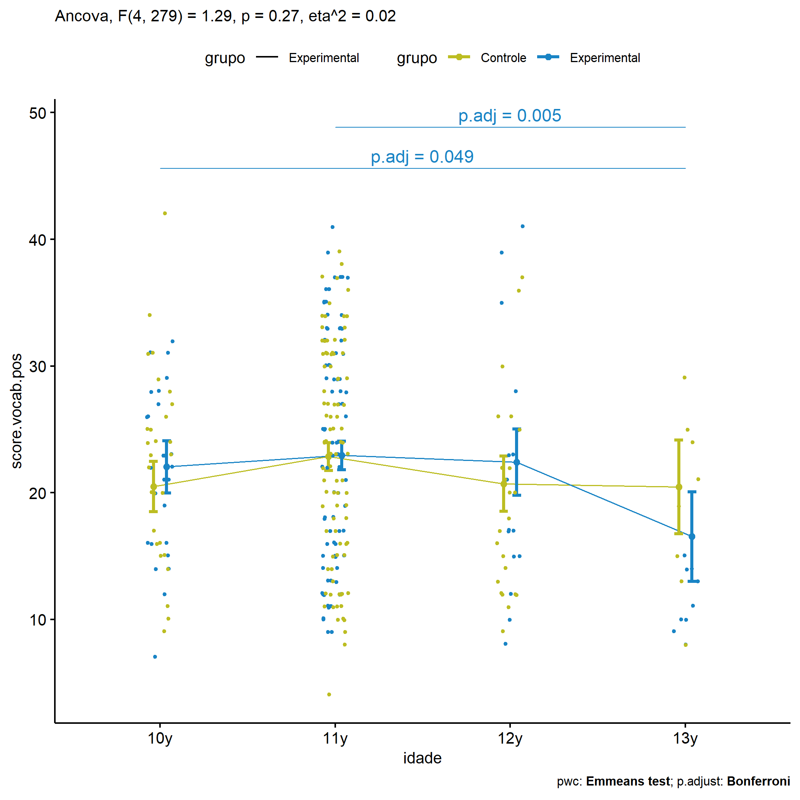<!-- -->

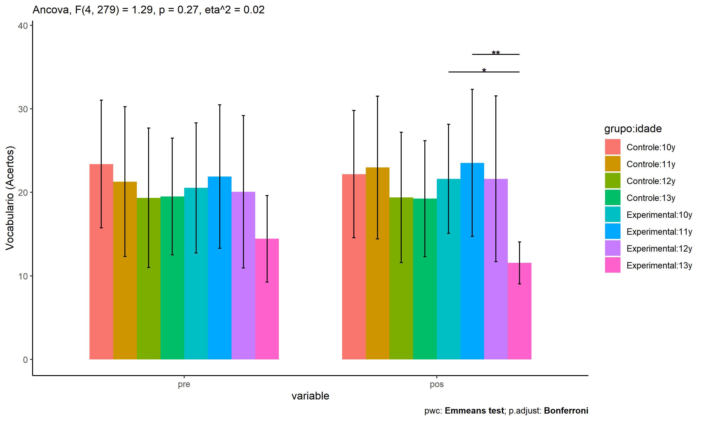<!-- -->

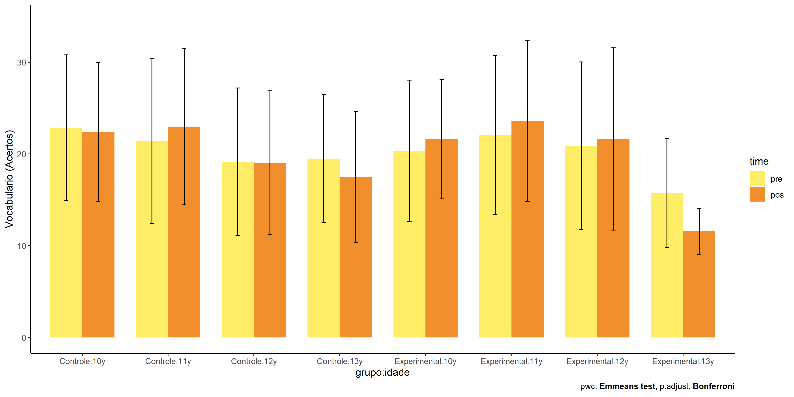<!-- -->

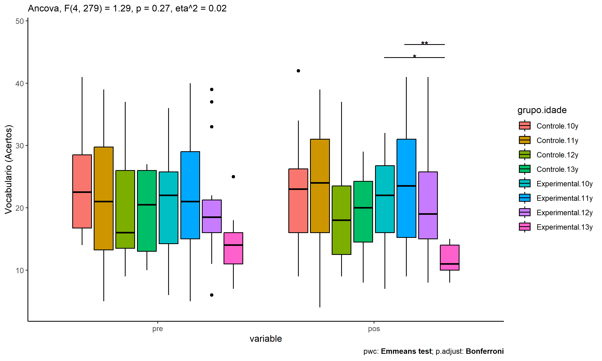<!-- -->

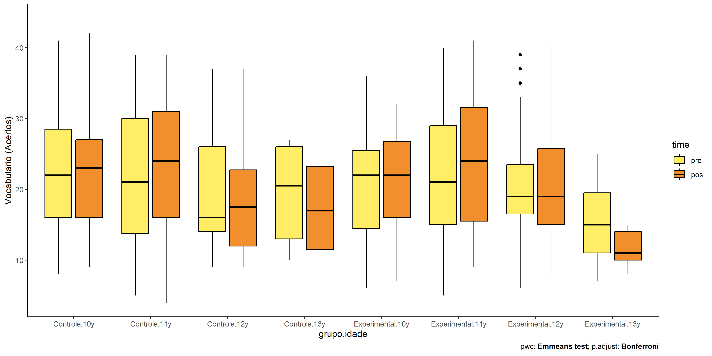<!-- -->

### Vocabulario (TRI)

| var           | idade | grupo        |   n | M (pre) | SE (pre) | M (unadj) | SE (unadj) | M (adj) | SE (adj) |
|:--------------|:------|:-------------|----:|--------:|---------:|----------:|-----------:|--------:|---------:|
| tri.vocab.pos | 10y   | Controle     |  28 |   0.310 |    0.138 |     0.201 |      0.178 |   0.013 |    0.107 |
| tri.vocab.pos | 10y   | Experimental |  26 |   0.107 |    0.170 |     0.119 |      0.155 |   0.099 |    0.111 |
| tri.vocab.pos | 11y   | Controle     |  90 |   0.152 |    0.095 |     0.260 |      0.103 |   0.203 |    0.060 |
| tri.vocab.pos | 11y   | Experimental |  86 |   0.138 |    0.097 |     0.309 |      0.101 |   0.264 |    0.061 |
| tri.vocab.pos | 12y   | Controle     |  23 |  -0.195 |    0.198 |    -0.178 |      0.180 |   0.052 |    0.118 |
| tri.vocab.pos | 12y   | Experimental |  16 |  -0.028 |    0.264 |     0.140 |      0.275 |   0.232 |    0.142 |
| tri.vocab.pos | 13y   | Controle     |   8 |  -0.186 |    0.286 |    -0.108 |      0.297 |   0.115 |    0.200 |
| tri.vocab.pos | 13y   | Experimental |   9 |  -0.751 |    0.215 |    -1.098 |      0.063 |  -0.407 |    0.191 |

| .y.           | grupo        | idade | group1   | group2       | estimate | conf.low | conf.high |    se | statistic | p       | p.adj | p.adj.signif |
|:--------------|:-------------|:------|:---------|:-------------|---------:|---------:|----------:|------:|----------:|:--------|------:|:-------------|
| tri.vocab.pos | Controle     |       | 10y      | 11y          |   -0.190 |   -0.432 |     0.051 | 0.123 |    -1.553 | 0.122   | 0.729 | ns           |
| tri.vocab.pos | Controle     |       | 10y      | 12y          |   -0.039 |   -0.355 |     0.277 | 0.160 |    -0.244 | 0.808   | 1.000 | ns           |
| tri.vocab.pos | Controle     |       | 10y      | 13y          |   -0.102 |   -0.551 |     0.346 | 0.228 |    -0.450 | 0.653   | 1.000 | ns           |
| tri.vocab.pos | Controle     |       | 11y      | 12y          |    0.151 |   -0.110 |     0.413 | 0.133 |     1.139 | 0.256   | 1.000 | ns           |
| tri.vocab.pos | Controle     |       | 11y      | 13y          |    0.088 |   -0.324 |     0.500 | 0.209 |     0.420 | 0.674   | 1.000 | ns           |
| tri.vocab.pos | Controle     |       | 12y      | 13y          |   -0.063 |   -0.521 |     0.394 | 0.232 |    -0.273 | 0.785   | 1.000 | ns           |
| tri.vocab.pos | Experimental |       | 10y      | 11y          |   -0.164 |   -0.413 |     0.085 | 0.127 |    -1.296 | 0.196   | 1.000 | ns           |
| tri.vocab.pos | Experimental |       | 10y      | 12y          |   -0.133 |   -0.487 |     0.221 | 0.180 |    -0.739 | 0.461   | 1.000 | ns           |
| tri.vocab.pos | Experimental |       | 10y      | 13y          |    0.507 |    0.071 |     0.942 | 0.221 |     2.289 | 0.023   | 0.137 | ns           |
| tri.vocab.pos | Experimental |       | 11y      | 12y          |    0.031 |   -0.272 |     0.335 | 0.154 |     0.203 | 0.839   | 1.000 | ns           |
| tri.vocab.pos | Experimental |       | 11y      | 13y          |    0.671 |    0.275 |     1.067 | 0.201 |     3.335 | \<0.001 | 0.006 | \*\*         |
| tri.vocab.pos | Experimental |       | 12y      | 13y          |    0.640 |    0.172 |     1.107 | 0.237 |     2.694 | 0.007   | 0.045 | \*           |
| tri.vocab.pre | Controle     |       | 10y      | 11y          |    0.158 |   -0.220 |     0.536 | 0.192 |     0.822 | 0.412   | 1.000 | ns           |
| tri.vocab.pre | Controle     |       | 10y      | 12y          |    0.505 |    0.013 |     0.997 | 0.250 |     2.022 | 0.044   | 0.265 | ns           |
| tri.vocab.pre | Controle     |       | 10y      | 13y          |    0.496 |   -0.205 |     1.197 | 0.356 |     1.394 | 0.164   | 0.987 | ns           |
| tri.vocab.pre | Controle     |       | 11y      | 12y          |    0.347 |   -0.061 |     0.756 | 0.207 |     1.673 | 0.095   | 0.572 | ns           |
| tri.vocab.pre | Controle     |       | 11y      | 13y          |    0.338 |   -0.307 |     0.983 | 0.328 |     1.032 | 0.303   | 1.000 | ns           |
| tri.vocab.pre | Controle     |       | 12y      | 13y          |   -0.009 |   -0.727 |     0.708 | 0.364 |    -0.025 | 0.98    | 1.000 | ns           |
| tri.vocab.pre | Experimental |       | 10y      | 11y          |   -0.031 |   -0.422 |     0.360 | 0.199 |    -0.155 | 0.877   | 1.000 | ns           |
| tri.vocab.pre | Experimental |       | 10y      | 12y          |    0.136 |   -0.420 |     0.691 | 0.282 |     0.481 | 0.631   | 1.000 | ns           |
| tri.vocab.pre | Experimental |       | 10y      | 13y          |    0.858 |    0.182 |     1.534 | 0.343 |     2.500 | 0.013   | 0.078 | ns           |
| tri.vocab.pre | Experimental |       | 11y      | 12y          |    0.166 |   -0.309 |     0.642 | 0.242 |     0.688 | 0.492   | 1.000 | ns           |
| tri.vocab.pre | Experimental |       | 11y      | 13y          |    0.889 |    0.277 |     1.502 | 0.311 |     2.858 | 0.005   | 0.027 | \*           |
| tri.vocab.pre | Experimental |       | 12y      | 13y          |    0.723 |   -0.006 |     1.451 | 0.370 |     1.954 | 0.052   | 0.311 | ns           |
| tri.vocab.pos |              | 10y   | Controle | Experimental |   -0.086 |   -0.390 |     0.217 | 0.154 |    -0.560 | 0.576   | 0.576 | ns           |
| tri.vocab.pos |              | 11y   | Controle | Experimental |   -0.060 |   -0.228 |     0.108 | 0.085 |    -0.704 | 0.482   | 0.482 | ns           |
| tri.vocab.pos |              | 12y   | Controle | Experimental |   -0.180 |   -0.543 |     0.183 | 0.184 |    -0.977 | 0.329   | 0.329 | ns           |
| tri.vocab.pos |              | 13y   | Controle | Experimental |    0.523 |   -0.020 |     1.066 | 0.276 |     1.895 | 0.059   | 0.059 | ns           |
| tri.vocab.pre |              | 10y   | Controle | Experimental |    0.203 |   -0.273 |     0.679 | 0.242 |     0.839 | 0.402   | 0.402 | ns           |
| tri.vocab.pre |              | 11y   | Controle | Experimental |    0.014 |   -0.250 |     0.278 | 0.134 |     0.105 | 0.917   | 0.917 | ns           |
| tri.vocab.pre |              | 12y   | Controle | Experimental |   -0.167 |   -0.736 |     0.402 | 0.289 |    -0.577 | 0.565   | 0.565 | ns           |
| tri.vocab.pre |              | 13y   | Controle | Experimental |    0.565 |   -0.284 |     1.415 | 0.431 |     1.310 | 0.191   | 0.191 | ns           |

| grupo        | idade | group1 | group2 | estimate | conf.low | conf.high |    se | statistic |     p | p.adj | p.adj.signif |
|:-------------|:------|:-------|:-------|---------:|---------:|----------:|------:|----------:|------:|------:|:-------------|
| Controle     | 10y   | pre    | pos    |    0.057 |   -0.403 |     0.518 | 0.235 |     0.245 | 0.807 | 0.807 | ns           |
| Controle     | 11y   | pre    | pos    |   -0.089 |   -0.354 |     0.175 | 0.135 |    -0.664 | 0.507 | 0.507 | ns           |
| Controle     | 12y   | pre    | pos    |    0.027 |   -0.483 |     0.536 | 0.260 |     0.102 | 0.919 | 0.919 | ns           |
| Controle     | 13y   | pre    | pos    |    0.113 |   -0.734 |     0.959 | 0.431 |     0.262 | 0.794 | 0.794 | ns           |
| Experimental | 10y   | pre    | pos    |   -0.025 |   -0.516 |     0.465 | 0.250 |    -0.102 | 0.919 | 0.919 | ns           |
| Experimental | 11y   | pre    | pos    |   -0.156 |   -0.426 |     0.114 | 0.137 |    -1.136 | 0.256 | 0.256 | ns           |
| Experimental | 12y   | pre    | pos    |   -0.065 |   -0.670 |     0.540 | 0.308 |    -0.211 | 0.833 | 0.833 | ns           |
| Experimental | 13y   | pre    | pos    |    0.500 |   -0.286 |     1.287 | 0.401 |     1.249 | 0.212 | 0.212 | ns           |

    ## Scale for colour is already present.
    ## Adding another scale for colour, which will replace the existing scale.

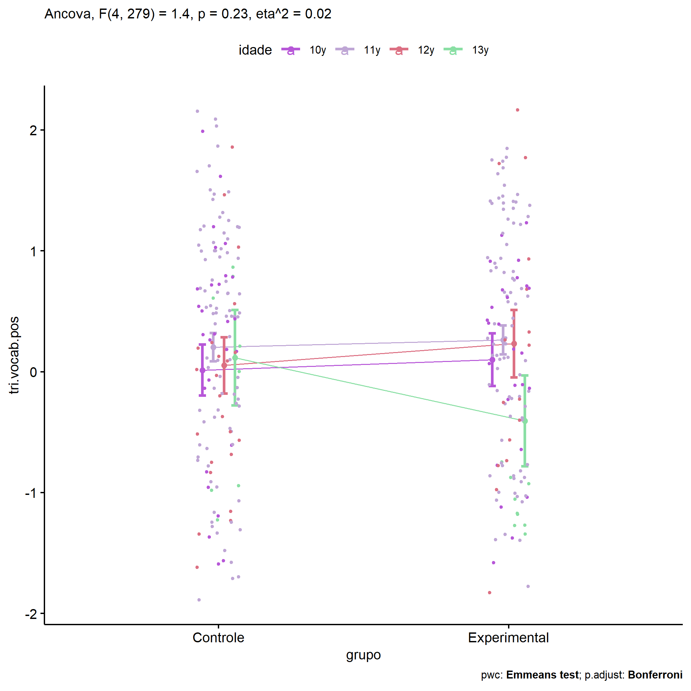<!-- -->

    ## Scale for colour is already present.
    ## Adding another scale for colour, which will replace the existing scale.

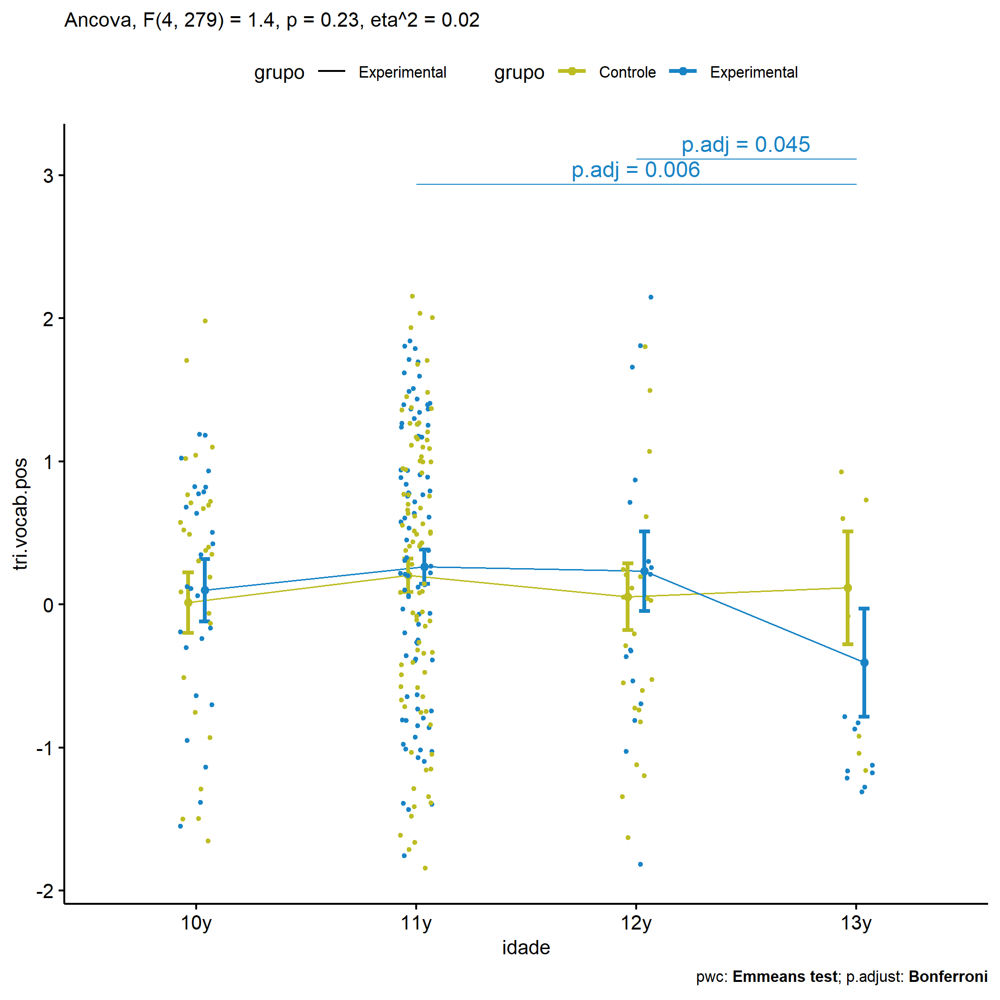<!-- -->

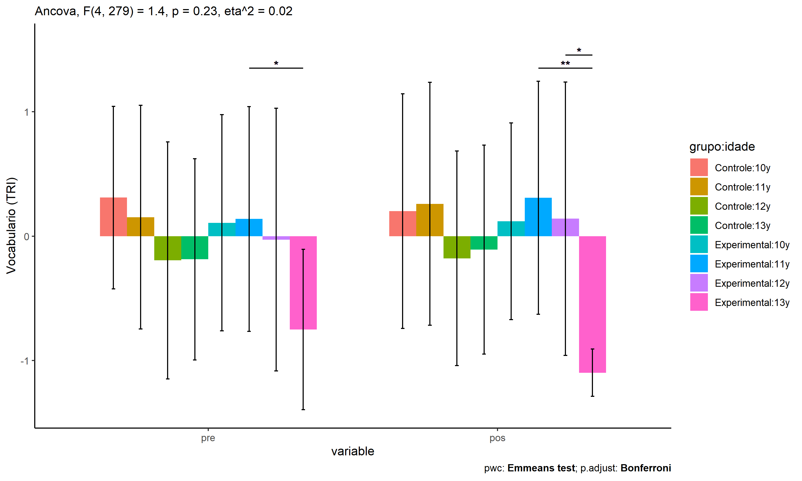<!-- -->

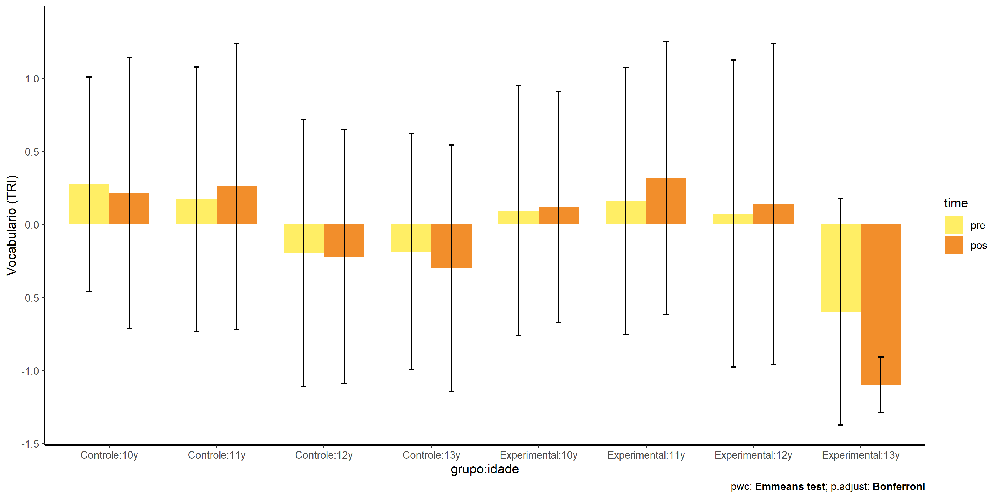<!-- -->

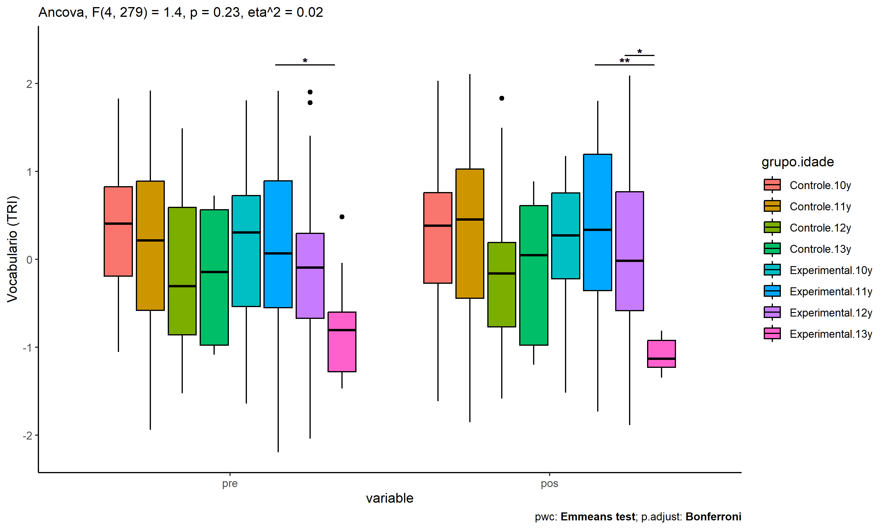<!-- -->

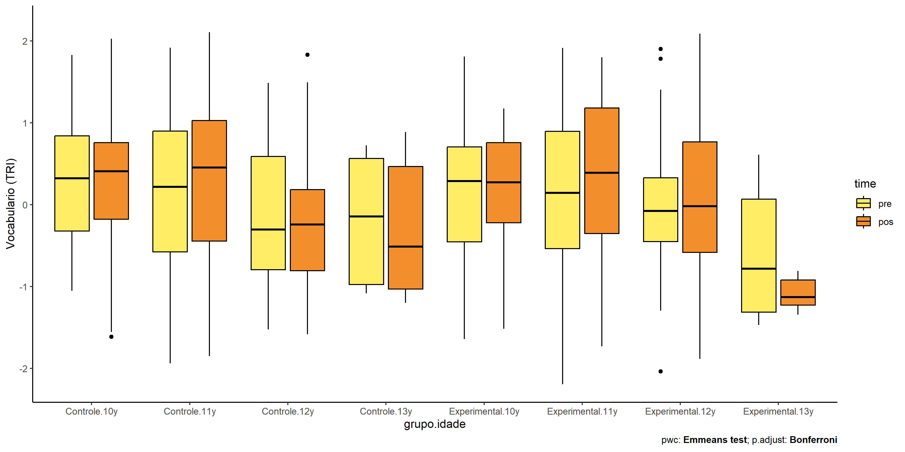<!-- -->

### Vocabulario Ensinado (Acertos)

| var                      | idade | grupo        |   n | M (pre) | SE (pre) | M (unadj) | SE (unadj) | M (adj) | SE (adj) |
|:-------------------------|:------|:-------------|----:|--------:|---------:|----------:|-----------:|--------:|---------:|
| score.vocab.ensinado.pos | 10y   | Controle     |  32 |   4.344 |    0.418 |     4.219 |      0.470 |   4.067 |    0.361 |
| score.vocab.ensinado.pos | 10y   | Experimental |  27 |   3.852 |    0.357 |     4.074 |      0.350 |   4.118 |    0.392 |
| score.vocab.ensinado.pos | 11y   | Controle     |  93 |   3.925 |    0.248 |     3.914 |      0.236 |   3.929 |    0.211 |
| score.vocab.ensinado.pos | 11y   | Experimental |  89 |   4.258 |    0.229 |     4.640 |      0.232 |   4.522 |    0.216 |
| score.vocab.ensinado.pos | 12y   | Controle     |  26 |   3.615 |    0.351 |     3.500 |      0.377 |   3.638 |    0.400 |
| score.vocab.ensinado.pos | 12y   | Experimental |  19 |   4.053 |    0.543 |     3.632 |      0.613 |   3.595 |    0.467 |
| score.vocab.ensinado.pos | 13y   | Controle     |  10 |   3.400 |    0.748 |     3.500 |      0.428 |   3.724 |    0.645 |
| score.vocab.ensinado.pos | 13y   | Experimental |  12 |   3.167 |    0.366 |     1.667 |      0.482 |   1.983 |    0.590 |
| score.vocab.ensinado.pos | 14y   | Experimental |   6 |   2.333 |    0.919 |     1.333 |      0.882 |   1.981 |    0.836 |

|     | .y.                      | grupo        | idade | group1   | group2       | estimate | conf.low | conf.high |    se | statistic | p       | p.adj   | p.adj.signif |
|:----|:-------------------------|:-------------|:------|:---------|:-------------|---------:|---------:|----------:|------:|----------:|:--------|:--------|:-------------|
| 1   | score.vocab.ensinado.pos | Controle     |       | 10y      | 11y          |    0.138 |   -0.685 |     0.961 | 0.418 |     0.330 | 0.741   | 1       | ns           |
| 2   | score.vocab.ensinado.pos | Controle     |       | 10y      | 12y          |    0.429 |   -0.632 |     1.490 | 0.539 |     0.796 | 0.427   | 1       | ns           |
| 3   | score.vocab.ensinado.pos | Controle     |       | 10y      | 13y          |    0.343 |   -1.112 |     1.799 | 0.740 |     0.464 | 0.643   | 1       | ns           |
| 5   | score.vocab.ensinado.pos | Controle     |       | 11y      | 12y          |    0.291 |   -0.599 |     1.181 | 0.452 |     0.643 | 0.521   | 1       | ns           |
| 6   | score.vocab.ensinado.pos | Controle     |       | 11y      | 13y          |    0.205 |   -1.130 |     1.540 | 0.678 |     0.302 | 0.763   | 1       | ns           |
| 8   | score.vocab.ensinado.pos | Controle     |       | 12y      | 13y          |   -0.086 |   -1.577 |     1.406 | 0.758 |    -0.113 | 0.91    | 1       | ns           |
| 11  | score.vocab.ensinado.pos | Experimental |       | 10y      | 11y          |   -0.405 |   -1.286 |     0.477 | 0.448 |    -0.903 | 0.367   | 1       | ns           |
| 12  | score.vocab.ensinado.pos | Experimental |       | 10y      | 12y          |    0.522 |   -0.678 |     1.723 | 0.610 |     0.856 | 0.393   | 1       | ns           |
| 13  | score.vocab.ensinado.pos | Experimental |       | 10y      | 13y          |    2.135 |    0.742 |     3.527 | 0.708 |     3.017 | 0.003   | 0.028   | \*           |
| 14  | score.vocab.ensinado.pos | Experimental |       | 10y      | 14y          |    2.137 |    0.320 |     3.953 | 0.923 |     2.315 | 0.021   | 0.213   | ns           |
| 15  | score.vocab.ensinado.pos | Experimental |       | 11y      | 12y          |    0.927 |   -0.086 |     1.940 | 0.515 |     1.800 | 0.073   | 0.728   | ns           |
| 16  | score.vocab.ensinado.pos | Experimental |       | 11y      | 13y          |    2.539 |    1.301 |     3.777 | 0.629 |     4.037 | \<0.001 | \<0.001 | \*\*\*       |
| 17  | score.vocab.ensinado.pos | Experimental |       | 11y      | 14y          |    2.541 |    0.839 |     4.244 | 0.865 |     2.937 | 0.004   | 0.036   | \*           |
| 18  | score.vocab.ensinado.pos | Experimental |       | 12y      | 13y          |    1.612 |    0.131 |     3.093 | 0.753 |     2.142 | 0.033   | 0.329   | ns           |
| 19  | score.vocab.ensinado.pos | Experimental |       | 12y      | 14y          |    1.614 |   -0.272 |     3.500 | 0.958 |     1.684 | 0.093   | 0.931   | ns           |
| 20  | score.vocab.ensinado.pos | Experimental |       | 13y      | 14y          |    0.002 |   -2.004 |     2.008 | 1.019 |     0.002 | 0.999   | 1       | ns           |
| 21  | score.vocab.ensinado.pre | Controle     |       | 10y      | 11y          |    0.419 |   -0.467 |     1.305 | 0.450 |     0.930 | 0.353   | 1       | ns           |
| 22  | score.vocab.ensinado.pre | Controle     |       | 10y      | 12y          |    0.728 |   -0.413 |     1.870 | 0.580 |     1.255 | 0.21    | 1       | ns           |
| 23  | score.vocab.ensinado.pre | Controle     |       | 10y      | 13y          |    0.944 |   -0.623 |     2.510 | 0.796 |     1.186 | 0.237   | 1       | ns           |
| 25  | score.vocab.ensinado.pre | Controle     |       | 11y      | 12y          |    0.309 |   -0.650 |     1.269 | 0.487 |     0.635 | 0.526   | 1       | ns           |
| 26  | score.vocab.ensinado.pre | Controle     |       | 11y      | 13y          |    0.525 |   -0.914 |     1.964 | 0.731 |     0.718 | 0.474   | 1       | ns           |
| 28  | score.vocab.ensinado.pre | Controle     |       | 12y      | 13y          |    0.215 |   -1.394 |     1.824 | 0.818 |     0.263 | 0.792   | 1       | ns           |
| 31  | score.vocab.ensinado.pre | Experimental |       | 10y      | 11y          |   -0.407 |   -1.357 |     0.543 | 0.483 |    -0.842 | 0.4     | 1       | ns           |
| 32  | score.vocab.ensinado.pre | Experimental |       | 10y      | 12y          |   -0.201 |   -1.496 |     1.094 | 0.658 |    -0.305 | 0.76    | 1       | ns           |
| 33  | score.vocab.ensinado.pre | Experimental |       | 10y      | 13y          |    0.685 |   -0.815 |     2.185 | 0.762 |     0.899 | 0.369   | 1       | ns           |
| 34  | score.vocab.ensinado.pre | Experimental |       | 10y      | 14y          |    1.519 |   -0.433 |     3.470 | 0.992 |     1.531 | 0.127   | 1       | ns           |
| 35  | score.vocab.ensinado.pre | Experimental |       | 11y      | 12y          |    0.206 |   -0.887 |     1.299 | 0.555 |     0.371 | 0.711   | 1       | ns           |
| 36  | score.vocab.ensinado.pre | Experimental |       | 11y      | 13y          |    1.092 |   -0.238 |     2.421 | 0.676 |     1.616 | 0.107   | 1       | ns           |
| 37  | score.vocab.ensinado.pre | Experimental |       | 11y      | 14y          |    1.925 |    0.101 |     3.749 | 0.927 |     2.077 | 0.039   | 0.386   | ns           |
| 38  | score.vocab.ensinado.pre | Experimental |       | 12y      | 13y          |    0.886 |   -0.708 |     2.480 | 0.810 |     1.093 | 0.275   | 1       | ns           |
| 39  | score.vocab.ensinado.pre | Experimental |       | 12y      | 14y          |    1.719 |   -0.306 |     3.744 | 1.029 |     1.671 | 0.096   | 0.958   | ns           |
| 40  | score.vocab.ensinado.pre | Experimental |       | 13y      | 14y          |    0.833 |   -1.329 |     2.995 | 1.099 |     0.758 | 0.449   | 1       | ns           |
| 41  | score.vocab.ensinado.pos |              | 10y   | Controle | Experimental |   -0.051 |   -1.100 |     0.998 | 0.533 |    -0.096 | 0.924   | 0.924   | ns           |
| 42  | score.vocab.ensinado.pos |              | 11y   | Controle | Experimental |   -0.594 |   -1.189 |     0.002 | 0.303 |    -1.962 | 0.051   | 0.051   | ns           |
| 43  | score.vocab.ensinado.pos |              | 12y   | Controle | Experimental |    0.042 |   -1.168 |     1.253 | 0.615 |     0.069 | 0.945   | 0.945   | ns           |
| 44  | score.vocab.ensinado.pos |              | 13y   | Controle | Experimental |    1.740 |    0.024 |     3.457 | 0.872 |     1.995 | 0.047   | 0.047   | \*           |
| 46  | score.vocab.ensinado.pre |              | 10y   | Controle | Experimental |    0.492 |   -0.638 |     1.622 | 0.574 |     0.857 | 0.392   | 0.392   | ns           |
| 47  | score.vocab.ensinado.pre |              | 11y   | Controle | Experimental |   -0.334 |   -0.975 |     0.307 | 0.326 |    -1.024 | 0.307   | 0.307   | ns           |
| 48  | score.vocab.ensinado.pre |              | 12y   | Controle | Experimental |   -0.437 |   -1.742 |     0.868 | 0.663 |    -0.659 | 0.51    | 0.51    | ns           |
| 49  | score.vocab.ensinado.pre |              | 13y   | Controle | Experimental |    0.233 |   -1.618 |     2.085 | 0.941 |     0.248 | 0.804   | 0.804   | ns           |

| grupo        | idade | group1 | group2 | estimate | conf.low | conf.high |    se | statistic |     p | p.adj | p.adj.signif |
|:-------------|:------|:-------|:-------|---------:|---------:|----------:|------:|----------:|------:|------:|:-------------|
| Controle     | 10y   | pre    | pos    |    0.125 |   -0.958 |     1.208 | 0.551 |     0.227 | 0.821 | 0.821 | ns           |
| Controle     | 11y   | pre    | pos    |    0.011 |   -0.624 |     0.646 | 0.323 |     0.033 | 0.973 | 0.973 | ns           |
| Controle     | 12y   | pre    | pos    |    0.115 |   -1.086 |     1.317 | 0.612 |     0.189 | 0.850 | 0.850 | ns           |
| Controle     | 13y   | pre    | pos    |   -0.100 |   -2.037 |     1.837 | 0.986 |    -0.101 | 0.919 | 0.919 | ns           |
| Experimental | 10y   | pre    | pos    |   -0.222 |   -1.401 |     0.957 | 0.600 |    -0.370 | 0.711 | 0.711 | ns           |
| Experimental | 11y   | pre    | pos    |   -0.382 |   -1.031 |     0.267 | 0.331 |    -1.155 | 0.248 | 0.248 | ns           |
| Experimental | 12y   | pre    | pos    |    0.421 |   -0.984 |     1.826 | 0.716 |     0.588 | 0.556 | 0.556 | ns           |
| Experimental | 13y   | pre    | pos    |    1.500 |   -0.268 |     3.268 | 0.900 |     1.666 | 0.096 | 0.096 | ns           |
| Experimental | 14y   | pre    | pos    |    1.000 |   -1.501 |     3.501 | 1.273 |     0.785 | 0.433 | 0.433 | ns           |

    ## Scale for colour is already present.
    ## Adding another scale for colour, which will replace the existing scale.

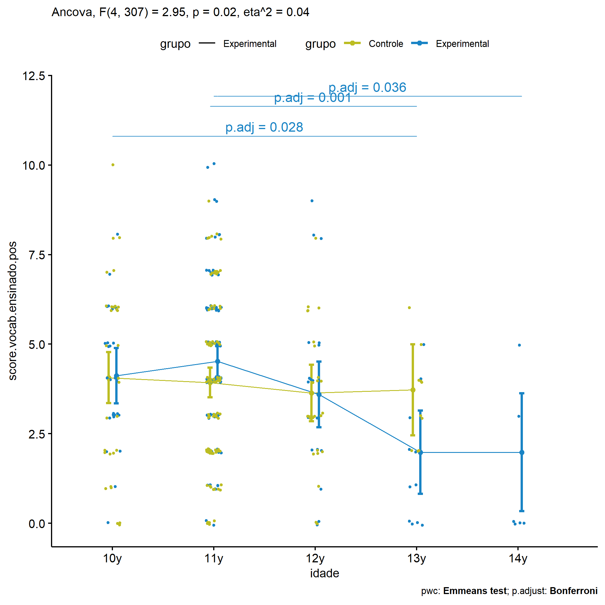<!-- -->

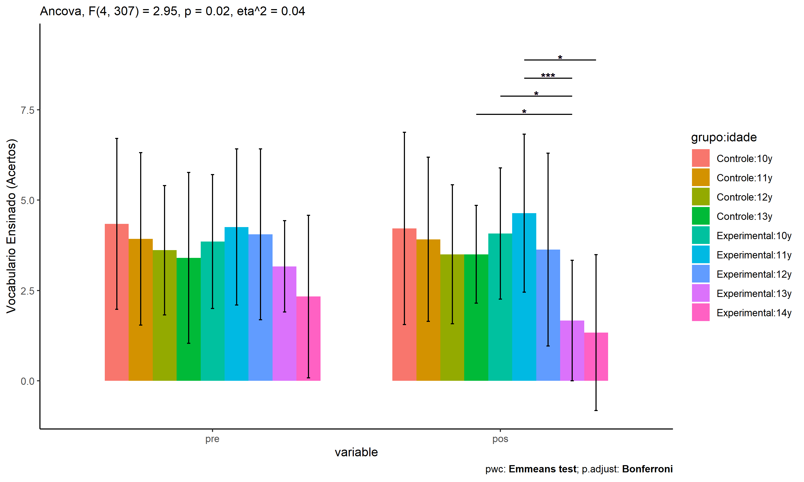<!-- -->

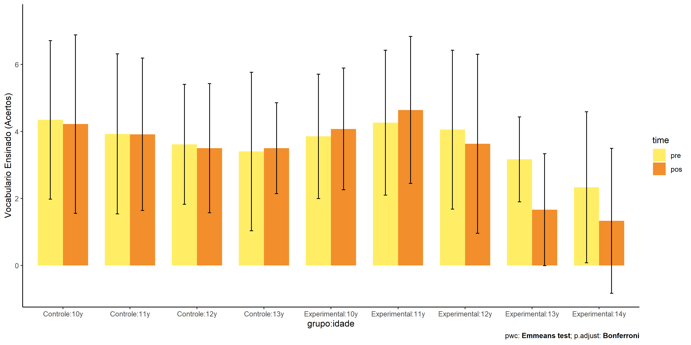<!-- -->

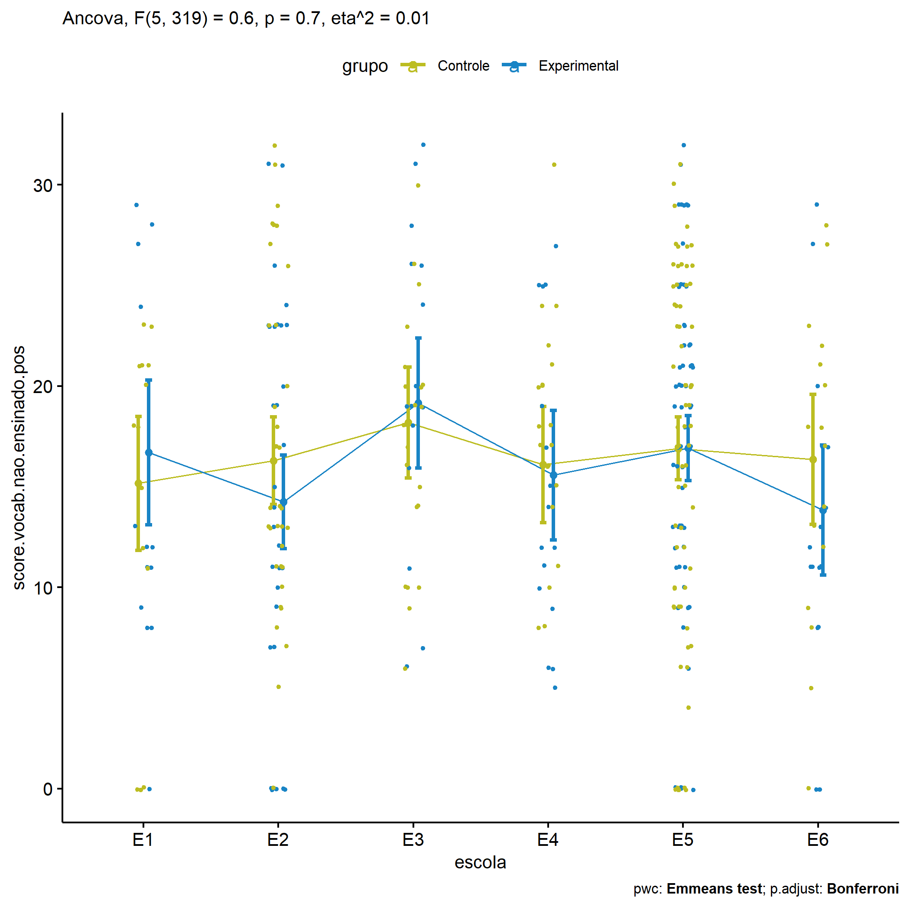<!-- -->

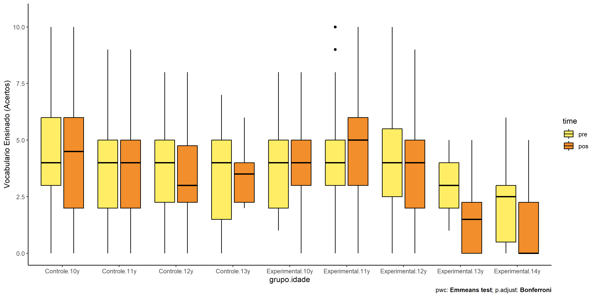<!-- -->

### Vocabulario Ensinado (TRI)

| var                    | idade | grupo        |   n | M (pre) | SE (pre) | M (unadj) | SE (unadj) | M (adj) | SE (adj) |
|:-----------------------|:------|:-------------|----:|--------:|---------:|----------:|-----------:|--------:|---------:|
| tri.vocab.ensinado.pos | 10y   | Controle     |  28 |   0.188 |    0.159 |     0.271 |      0.171 |   0.203 |    0.124 |
| tri.vocab.ensinado.pos | 10y   | Experimental |  26 |   0.073 |    0.152 |     0.188 |      0.113 |   0.187 |    0.129 |
| tri.vocab.ensinado.pos | 11y   | Controle     |  90 |   0.115 |    0.087 |     0.061 |      0.092 |   0.036 |    0.069 |
| tri.vocab.ensinado.pos | 11y   | Experimental |  86 |   0.095 |    0.076 |     0.218 |      0.085 |   0.205 |    0.071 |
| tri.vocab.ensinado.pos | 12y   | Controle     |  23 |  -0.075 |    0.169 |    -0.043 |      0.149 |   0.042 |    0.137 |
| tri.vocab.ensinado.pos | 12y   | Experimental |  16 |   0.055 |    0.238 |     0.038 |      0.211 |   0.047 |    0.164 |
| tri.vocab.ensinado.pos | 13y   | Controle     |   8 |  -0.071 |    0.241 |    -0.173 |      0.170 |  -0.090 |    0.232 |
| tri.vocab.ensinado.pos | 13y   | Experimental |   9 |  -0.434 |    0.163 |    -0.803 |      0.174 |  -0.510 |    0.220 |

| .y.                    | grupo        | idade | group1   | group2       | estimate | conf.low | conf.high |    se | statistic |     p | p.adj | p.adj.signif |
|:-----------------------|:-------------|:------|:---------|:-------------|---------:|---------:|----------:|------:|----------:|------:|------:|:-------------|
| tri.vocab.ensinado.pos | Controle     |       | 10y      | 11y          |    0.167 |   -0.112 |     0.447 | 0.142 |     1.180 | 0.239 | 1.000 | ns           |
| tri.vocab.ensinado.pos | Controle     |       | 10y      | 12y          |    0.161 |   -0.203 |     0.525 | 0.185 |     0.871 | 0.385 | 1.000 | ns           |
| tri.vocab.ensinado.pos | Controle     |       | 10y      | 13y          |    0.294 |   -0.224 |     0.812 | 0.263 |     1.116 | 0.265 | 1.000 | ns           |
| tri.vocab.ensinado.pos | Controle     |       | 11y      | 12y          |   -0.006 |   -0.309 |     0.296 | 0.154 |    -0.042 | 0.967 | 1.000 | ns           |
| tri.vocab.ensinado.pos | Controle     |       | 11y      | 13y          |    0.126 |   -0.350 |     0.603 | 0.242 |     0.521 | 0.602 | 1.000 | ns           |
| tri.vocab.ensinado.pos | Controle     |       | 12y      | 13y          |    0.133 |   -0.397 |     0.663 | 0.269 |     0.493 | 0.623 | 1.000 | ns           |
| tri.vocab.ensinado.pos | Experimental |       | 10y      | 11y          |   -0.018 |   -0.307 |     0.271 | 0.147 |    -0.122 | 0.903 | 1.000 | ns           |
| tri.vocab.ensinado.pos | Experimental |       | 10y      | 12y          |    0.140 |   -0.271 |     0.550 | 0.208 |     0.670 | 0.503 | 1.000 | ns           |
| tri.vocab.ensinado.pos | Experimental |       | 10y      | 13y          |    0.696 |    0.194 |     1.198 | 0.255 |     2.731 | 0.007 | 0.040 | \*           |
| tri.vocab.ensinado.pos | Experimental |       | 11y      | 12y          |    0.158 |   -0.194 |     0.509 | 0.179 |     0.882 | 0.378 | 1.000 | ns           |
| tri.vocab.ensinado.pos | Experimental |       | 11y      | 13y          |    0.714 |    0.259 |     1.169 | 0.231 |     3.088 | 0.002 | 0.013 | \*           |
| tri.vocab.ensinado.pos | Experimental |       | 12y      | 13y          |    0.557 |    0.017 |     1.097 | 0.274 |     2.029 | 0.043 | 0.261 | ns           |
| tri.vocab.ensinado.pre | Controle     |       | 10y      | 11y          |    0.073 |   -0.260 |     0.406 | 0.169 |     0.432 | 0.666 | 1.000 | ns           |
| tri.vocab.ensinado.pre | Controle     |       | 10y      | 12y          |    0.263 |   -0.169 |     0.696 | 0.220 |     1.198 | 0.232 | 1.000 | ns           |
| tri.vocab.ensinado.pre | Controle     |       | 10y      | 13y          |    0.259 |   -0.357 |     0.876 | 0.313 |     0.827 | 0.409 | 1.000 | ns           |
| tri.vocab.ensinado.pre | Controle     |       | 11y      | 12y          |    0.190 |   -0.169 |     0.550 | 0.183 |     1.043 | 0.298 | 1.000 | ns           |
| tri.vocab.ensinado.pre | Controle     |       | 11y      | 13y          |    0.186 |   -0.381 |     0.754 | 0.288 |     0.646 | 0.519 | 1.000 | ns           |
| tri.vocab.ensinado.pre | Controle     |       | 12y      | 13y          |   -0.004 |   -0.636 |     0.627 | 0.321 |    -0.013 | 0.989 | 1.000 | ns           |
| tri.vocab.ensinado.pre | Experimental |       | 10y      | 11y          |   -0.022 |   -0.366 |     0.323 | 0.175 |    -0.124 | 0.901 | 1.000 | ns           |
| tri.vocab.ensinado.pre | Experimental |       | 10y      | 12y          |    0.017 |   -0.471 |     0.506 | 0.248 |     0.070 | 0.944 | 1.000 | ns           |
| tri.vocab.ensinado.pre | Experimental |       | 10y      | 13y          |    0.507 |   -0.088 |     1.102 | 0.302 |     1.677 | 0.095 | 0.568 | ns           |
| tri.vocab.ensinado.pre | Experimental |       | 11y      | 12y          |    0.039 |   -0.380 |     0.458 | 0.213 |     0.184 | 0.854 | 1.000 | ns           |
| tri.vocab.ensinado.pre | Experimental |       | 11y      | 13y          |    0.529 |   -0.010 |     1.067 | 0.274 |     1.931 | 0.055 | 0.327 | ns           |
| tri.vocab.ensinado.pre | Experimental |       | 12y      | 13y          |    0.489 |   -0.152 |     1.130 | 0.326 |     1.503 | 0.134 | 0.804 | ns           |
| tri.vocab.ensinado.pos |              | 10y   | Controle | Experimental |    0.017 |   -0.335 |     0.368 | 0.179 |     0.093 | 0.926 | 0.926 | ns           |
| tri.vocab.ensinado.pos |              | 11y   | Controle | Experimental |   -0.169 |   -0.364 |     0.026 | 0.099 |    -1.708 | 0.089 | 0.089 | ns           |
| tri.vocab.ensinado.pos |              | 12y   | Controle | Experimental |   -0.005 |   -0.425 |     0.416 | 0.214 |    -0.023 | 0.982 | 0.982 | ns           |
| tri.vocab.ensinado.pos |              | 13y   | Controle | Experimental |    0.419 |   -0.209 |     1.047 | 0.319 |     1.313 | 0.190 | 0.190 | ns           |
| tri.vocab.ensinado.pre |              | 10y   | Controle | Experimental |    0.115 |   -0.304 |     0.534 | 0.213 |     0.541 | 0.589 | 0.589 | ns           |
| tri.vocab.ensinado.pre |              | 11y   | Controle | Experimental |    0.020 |   -0.212 |     0.252 | 0.118 |     0.172 | 0.863 | 0.863 | ns           |
| tri.vocab.ensinado.pre |              | 12y   | Controle | Experimental |   -0.131 |   -0.632 |     0.370 | 0.254 |    -0.515 | 0.607 | 0.607 | ns           |
| tri.vocab.ensinado.pre |              | 13y   | Controle | Experimental |    0.363 |   -0.385 |     1.110 | 0.380 |     0.955 | 0.340 | 0.340 | ns           |

| grupo        | idade | group1 | group2 | estimate | conf.low | conf.high |    se | statistic |     p | p.adj | p.adj.signif |
|:-------------|:------|:-------|:-------|---------:|---------:|----------:|------:|----------:|------:|------:|:-------------|
| Controle     | 10y   | pre    | pos    |   -0.189 |   -0.589 |     0.211 | 0.204 |    -0.928 | 0.354 | 0.354 | ns           |
| Controle     | 11y   | pre    | pos    |    0.065 |   -0.165 |     0.294 | 0.117 |     0.552 | 0.581 | 0.581 | ns           |
| Controle     | 12y   | pre    | pos    |   -0.036 |   -0.479 |     0.407 | 0.225 |    -0.159 | 0.873 | 0.873 | ns           |
| Controle     | 13y   | pre    | pos    |    0.228 |   -0.507 |     0.963 | 0.374 |     0.610 | 0.542 | 0.542 | ns           |
| Experimental | 10y   | pre    | pos    |   -0.134 |   -0.559 |     0.292 | 0.217 |    -0.616 | 0.538 | 0.538 | ns           |
| Experimental | 11y   | pre    | pos    |   -0.113 |   -0.347 |     0.122 | 0.119 |    -0.944 | 0.346 | 0.346 | ns           |
| Experimental | 12y   | pre    | pos    |    0.078 |   -0.448 |     0.603 | 0.268 |     0.290 | 0.772 | 0.772 | ns           |
| Experimental | 13y   | pre    | pos    |    0.542 |   -0.141 |     1.225 | 0.348 |     1.559 | 0.120 | 0.120 | ns           |

    ## Scale for colour is already present.
    ## Adding another scale for colour, which will replace the existing scale.

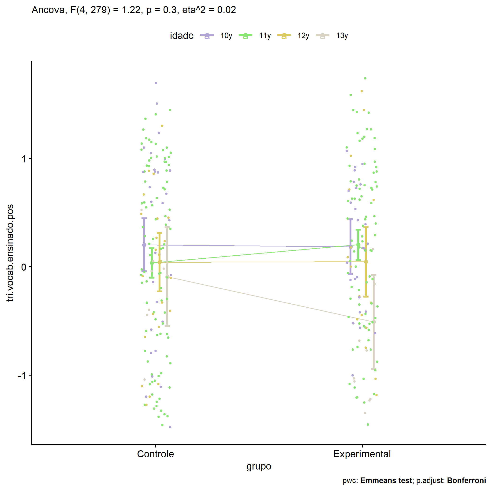<!-- -->

    ## Scale for colour is already present.
    ## Adding another scale for colour, which will replace the existing scale.

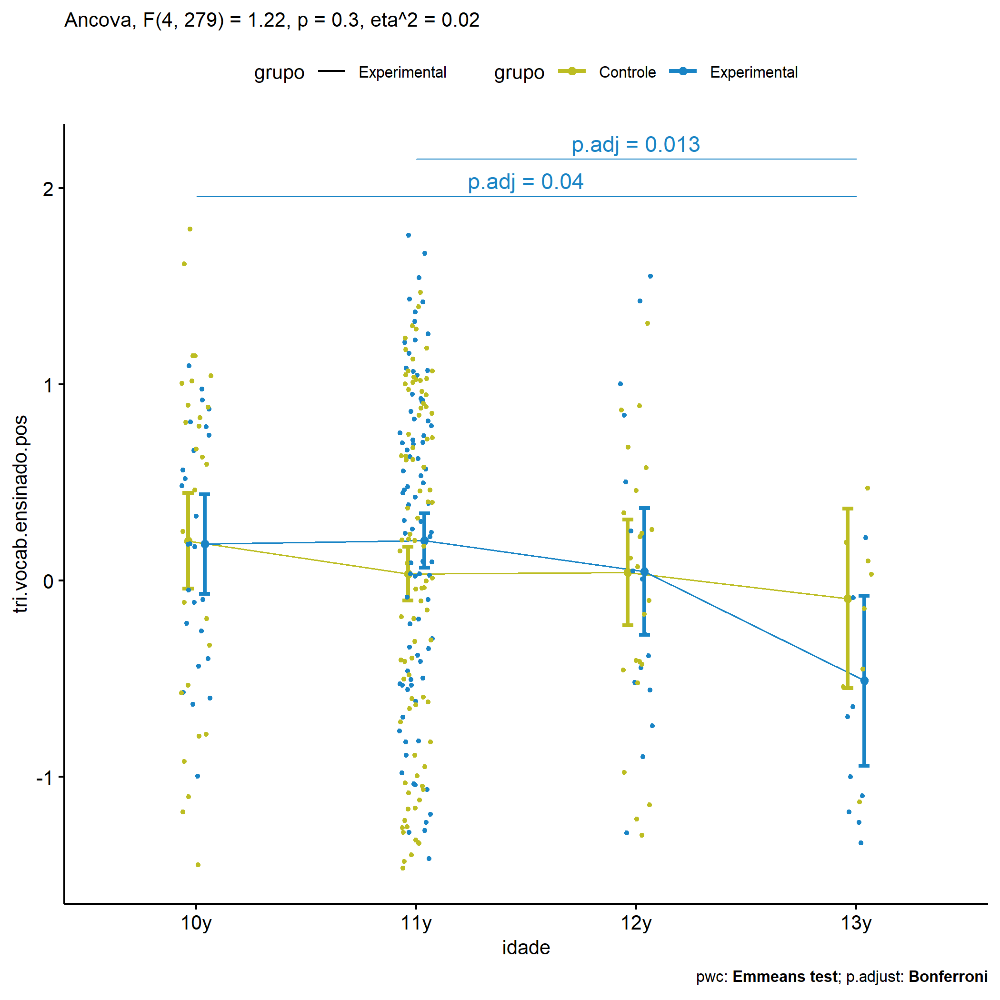<!-- -->

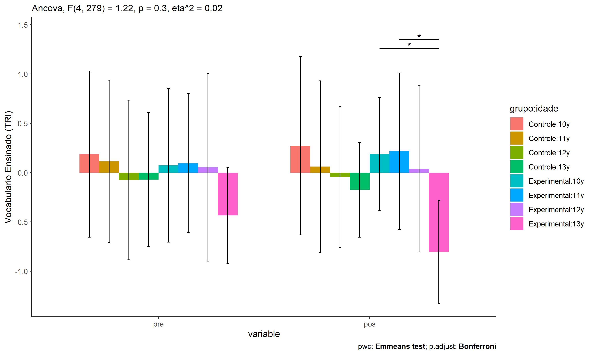<!-- -->

<!-- -->

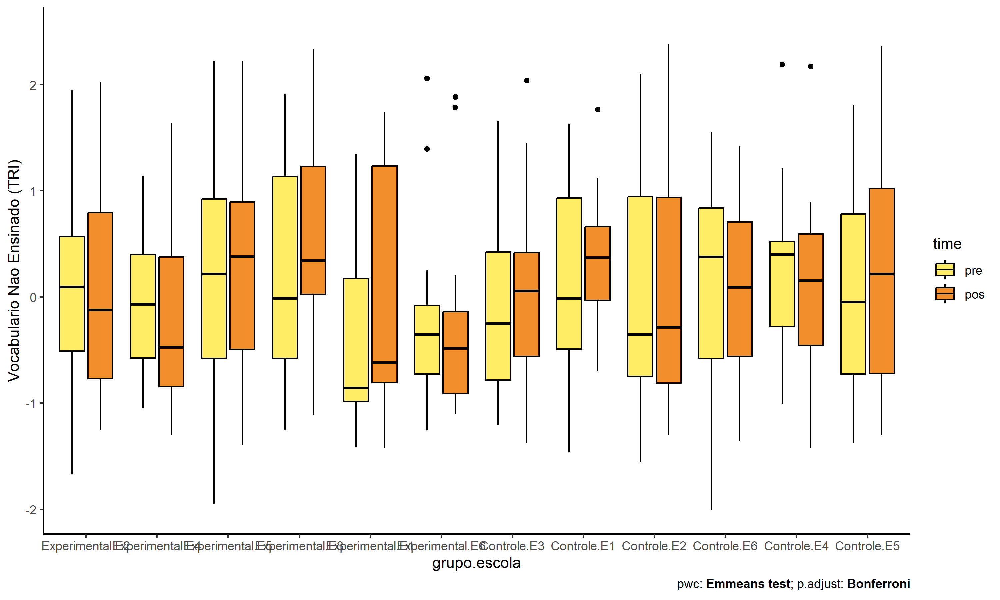<!-- -->

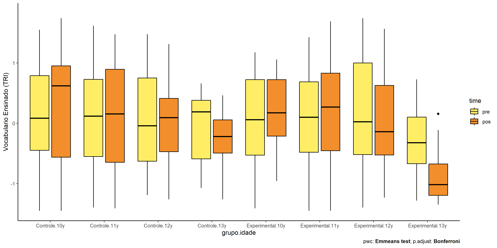<!-- -->

### Vocabulario Nao Ensinado (Acertos)

| var                          | idade | grupo        |   n | M (pre) | SE (pre) | M (unadj) | SE (unadj) | M (adj) | SE (adj) |
|:-----------------------------|:------|:-------------|----:|--------:|---------:|----------:|-----------:|--------:|---------:|
| score.vocab.nao.ensinado.pos | 10y   | Controle     |  32 |  17.781 |    1.194 |    16.094 |      1.359 |  15.396 |    1.101 |
| score.vocab.nao.ensinado.pos | 10y   | Experimental |  27 |  16.481 |    1.241 |    16.741 |      1.265 |  16.829 |    1.197 |
| score.vocab.nao.ensinado.pos | 11y   | Controle     |  93 |  17.237 |    0.771 |    18.323 |      0.782 |  17.954 |    0.645 |
| score.vocab.nao.ensinado.pos | 11y   | Experimental |  89 |  17.562 |    0.772 |    18.461 |      0.811 |  17.895 |    0.661 |
| score.vocab.nao.ensinado.pos | 12y   | Controle     |  26 |  14.808 |    1.426 |    14.077 |      1.523 |  15.178 |    1.223 |
| score.vocab.nao.ensinado.pos | 12y   | Experimental |  19 |  16.842 |    1.717 |    14.579 |      2.208 |  14.449 |    1.426 |
| score.vocab.nao.ensinado.pos | 13y   | Controle     |  10 |  12.200 |    2.551 |    14.000 |      2.060 |  16.678 |    1.978 |
| score.vocab.nao.ensinado.pos | 13y   | Experimental |  12 |  12.583 |    1.630 |     7.000 |      1.398 |   9.446 |    1.806 |
| score.vocab.nao.ensinado.pos | 14y   | Experimental |   6 |  10.500 |    4.113 |     7.333 |      3.921 |  11.040 |    2.556 |

|     | .y.                          | grupo        | idade | group1   | group2       | estimate | conf.low | conf.high |    se | statistic | p       | p.adj   | p.adj.signif |
|:----|:-----------------------------|:-------------|:------|:---------|:-------------|---------:|---------:|----------:|------:|----------:|:--------|:--------|:-------------|
| 1   | score.vocab.nao.ensinado.pos | Controle     |       | 10y      | 11y          |   -2.558 |   -5.066 |    -0.050 | 1.275 |    -2.007 | 0.046   | 0.274   | ns           |
| 2   | score.vocab.nao.ensinado.pos | Controle     |       | 10y      | 12y          |    0.218 |   -3.025 |     3.461 | 1.648 |     0.132 | 0.895   | 1       | ns           |
| 3   | score.vocab.nao.ensinado.pos | Controle     |       | 10y      | 13y          |   -1.282 |   -5.747 |     3.183 | 2.269 |    -0.565 | 0.572   | 1       | ns           |
| 5   | score.vocab.nao.ensinado.pos | Controle     |       | 11y      | 12y          |    2.777 |    0.052 |     5.501 | 1.384 |     2.005 | 0.046   | 0.275   | ns           |
| 6   | score.vocab.nao.ensinado.pos | Controle     |       | 11y      | 13y          |    1.276 |   -2.825 |     5.377 | 2.084 |     0.612 | 0.541   | 1       | ns           |
| 8   | score.vocab.nao.ensinado.pos | Controle     |       | 12y      | 13y          |   -1.500 |   -6.060 |     3.059 | 2.317 |    -0.648 | 0.518   | 1       | ns           |
| 11  | score.vocab.nao.ensinado.pos | Experimental |       | 10y      | 11y          |   -1.066 |   -3.757 |     1.624 | 1.367 |    -0.780 | 0.436   | 1       | ns           |
| 12  | score.vocab.nao.ensinado.pos | Experimental |       | 10y      | 12y          |    2.380 |   -1.284 |     6.044 | 1.862 |     1.278 | 0.202   | 1       | ns           |
| 13  | score.vocab.nao.ensinado.pos | Experimental |       | 10y      | 13y          |    7.383 |    3.121 |    11.644 | 2.166 |     3.409 | \<0.001 | 0.007   | \*\*         |
| 14  | score.vocab.nao.ensinado.pos | Experimental |       | 10y      | 14y          |    5.789 |    0.237 |    11.342 | 2.822 |     2.052 | 0.041   | 0.41    | ns           |
| 15  | score.vocab.nao.ensinado.pos | Experimental |       | 11y      | 12y          |    3.446 |    0.354 |     6.539 | 1.572 |     2.193 | 0.029   | 0.291   | ns           |
| 16  | score.vocab.nao.ensinado.pos | Experimental |       | 11y      | 13y          |    8.449 |    4.656 |    12.242 | 1.928 |     4.383 | \<0.001 | \<0.001 | \*\*\*       |
| 17  | score.vocab.nao.ensinado.pos | Experimental |       | 11y      | 14y          |    6.856 |    1.651 |    12.061 | 2.645 |     2.592 | 0.01    | 0.1     | ns           |
| 18  | score.vocab.nao.ensinado.pos | Experimental |       | 12y      | 13y          |    5.003 |    0.473 |     9.533 | 2.302 |     2.173 | 0.031   | 0.305   | ns           |
| 19  | score.vocab.nao.ensinado.pos | Experimental |       | 12y      | 14y          |    3.410 |   -2.353 |     9.172 | 2.928 |     1.164 | 0.245   | 1       | ns           |
| 20  | score.vocab.nao.ensinado.pos | Experimental |       | 13y      | 14y          |   -1.593 |   -7.714 |     4.527 | 3.110 |    -0.512 | 0.609   | 1       | ns           |
| 21  | score.vocab.nao.ensinado.pre | Controle     |       | 10y      | 11y          |    0.545 |   -2.378 |     3.468 | 1.485 |     0.367 | 0.714   | 1       | ns           |
| 22  | score.vocab.nao.ensinado.pre | Controle     |       | 10y      | 12y          |    2.974 |   -0.792 |     6.739 | 1.914 |     1.554 | 0.121   | 0.728   | ns           |
| 23  | score.vocab.nao.ensinado.pre | Controle     |       | 10y      | 13y          |    5.581 |    0.414 |    10.748 | 2.626 |     2.125 | 0.034   | 0.206   | ns           |
| 25  | score.vocab.nao.ensinado.pre | Controle     |       | 11y      | 12y          |    2.429 |   -0.735 |     5.593 | 1.608 |     1.511 | 0.132   | 0.792   | ns           |
| 26  | score.vocab.nao.ensinado.pre | Controle     |       | 11y      | 13y          |    5.037 |    0.290 |     9.783 | 2.412 |     2.088 | 0.038   | 0.226   | ns           |
| 28  | score.vocab.nao.ensinado.pre | Controle     |       | 12y      | 13y          |    2.608 |   -2.700 |     7.915 | 2.697 |     0.967 | 0.334   | 1       | ns           |
| 31  | score.vocab.nao.ensinado.pre | Experimental |       | 10y      | 11y          |   -1.080 |   -4.214 |     2.053 | 1.593 |    -0.678 | 0.498   | 1       | ns           |
| 32  | score.vocab.nao.ensinado.pre | Experimental |       | 10y      | 12y          |   -0.361 |   -4.632 |     3.910 | 2.170 |    -0.166 | 0.868   | 1       | ns           |
| 33  | score.vocab.nao.ensinado.pre | Experimental |       | 10y      | 13y          |    3.898 |   -1.050 |     8.847 | 2.515 |     1.550 | 0.122   | 1       | ns           |
| 34  | score.vocab.nao.ensinado.pre | Experimental |       | 10y      | 14y          |    5.981 |   -0.456 |    12.419 | 3.271 |     1.828 | 0.068   | 0.685   | ns           |
| 35  | score.vocab.nao.ensinado.pre | Experimental |       | 11y      | 12y          |    0.720 |   -2.885 |     4.324 | 1.832 |     0.393 | 0.695   | 1       | ns           |
| 36  | score.vocab.nao.ensinado.pre | Experimental |       | 11y      | 13y          |    4.978 |    0.592 |     9.365 | 2.229 |     2.234 | 0.026   | 0.262   | ns           |
| 37  | score.vocab.nao.ensinado.pre | Experimental |       | 11y      | 14y          |    7.062 |    1.046 |    13.078 | 3.057 |     2.310 | 0.022   | 0.216   | ns           |
| 38  | score.vocab.nao.ensinado.pre | Experimental |       | 12y      | 13y          |    4.259 |   -1.000 |     9.518 | 2.673 |     1.593 | 0.112   | 1       | ns           |
| 39  | score.vocab.nao.ensinado.pre | Experimental |       | 12y      | 14y          |    6.342 |   -0.337 |    13.021 | 3.394 |     1.868 | 0.063   | 0.627   | ns           |
| 40  | score.vocab.nao.ensinado.pre | Experimental |       | 13y      | 14y          |    2.083 |   -5.048 |     9.215 | 3.624 |     0.575 | 0.566   | 1       | ns           |
| 41  | score.vocab.nao.ensinado.pos |              | 10y   | Controle | Experimental |   -1.433 |   -4.633 |     1.766 | 1.626 |    -0.881 | 0.379   | 0.379   | ns           |
| 42  | score.vocab.nao.ensinado.pos |              | 11y   | Controle | Experimental |    0.059 |   -1.756 |     1.873 | 0.922 |     0.064 | 0.949   | 0.949   | ns           |
| 43  | score.vocab.nao.ensinado.pos |              | 12y   | Controle | Experimental |    0.729 |   -2.969 |     4.426 | 1.879 |     0.388 | 0.699   | 0.699   | ns           |
| 44  | score.vocab.nao.ensinado.pos |              | 13y   | Controle | Experimental |    7.232 |    1.993 |    12.471 | 2.662 |     2.716 | 0.007   | 0.007   | \*\*         |
| 46  | score.vocab.nao.ensinado.pre |              | 10y   | Controle | Experimental |    1.300 |   -2.427 |     5.027 | 1.894 |     0.686 | 0.493   | 0.493   | ns           |
| 47  | score.vocab.nao.ensinado.pre |              | 11y   | Controle | Experimental |   -0.325 |   -2.440 |     1.790 | 1.075 |    -0.303 | 0.762   | 0.762   | ns           |
| 48  | score.vocab.nao.ensinado.pre |              | 12y   | Controle | Experimental |   -2.034 |   -6.339 |     2.270 | 2.188 |    -0.930 | 0.353   | 0.353   | ns           |
| 49  | score.vocab.nao.ensinado.pre |              | 13y   | Controle | Experimental |   -0.383 |   -6.490 |     5.724 | 3.103 |    -0.124 | 0.902   | 0.902   | ns           |

| grupo        | idade | group1 | group2 | estimate | conf.low | conf.high |    se | statistic |     p | p.adj | p.adj.signif |
|:-------------|:------|:-------|:-------|---------:|---------:|----------:|------:|----------:|------:|------:|:-------------|
| Controle     | 10y   | pre    | pos    |    1.688 |   -1.958 |     5.333 | 1.856 |     0.909 | 0.364 | 0.364 | ns           |
| Controle     | 11y   | pre    | pos    |   -1.086 |   -3.225 |     1.053 | 1.089 |    -0.997 | 0.319 | 0.319 | ns           |
| Controle     | 12y   | pre    | pos    |    0.731 |   -3.314 |     4.775 | 2.060 |     0.355 | 0.723 | 0.723 | ns           |
| Controle     | 13y   | pre    | pos    |   -1.800 |   -8.322 |     4.722 | 3.321 |    -0.542 | 0.588 | 0.588 | ns           |
| Experimental | 10y   | pre    | pos    |   -0.259 |   -4.228 |     3.710 | 2.021 |    -0.128 | 0.898 | 0.898 | ns           |
| Experimental | 11y   | pre    | pos    |   -0.899 |   -3.085 |     1.287 | 1.113 |    -0.807 | 0.420 | 0.420 | ns           |
| Experimental | 12y   | pre    | pos    |    2.263 |   -2.468 |     6.995 | 2.409 |     0.939 | 0.348 | 0.348 | ns           |
| Experimental | 13y   | pre    | pos    |    5.583 |   -0.370 |    11.537 | 3.032 |     1.842 | 0.066 | 0.066 | ns           |
| Experimental | 14y   | pre    | pos    |    3.167 |   -5.253 |    11.586 | 4.287 |     0.739 | 0.460 | 0.460 | ns           |

    ## Scale for colour is already present.
    ## Adding another scale for colour, which will replace the existing scale.

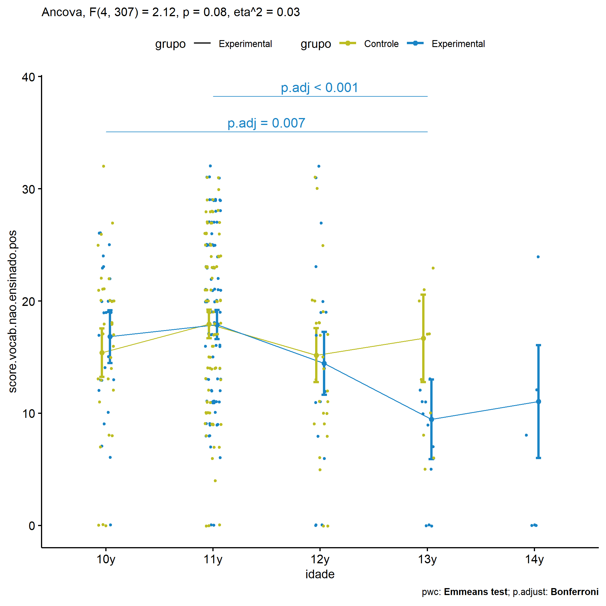<!-- -->

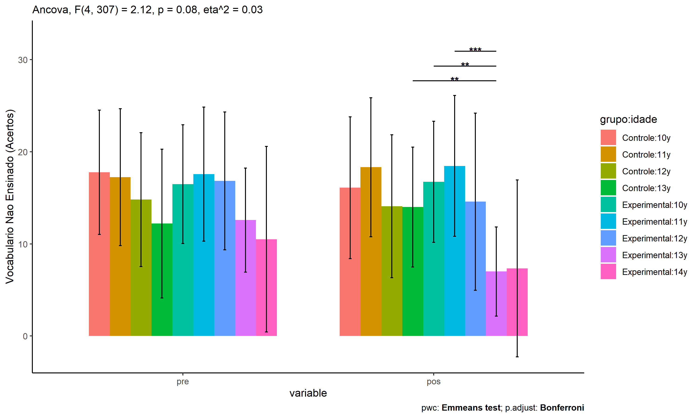<!-- -->

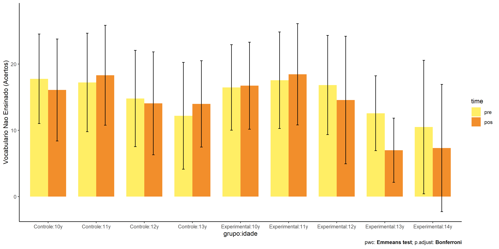<!-- -->

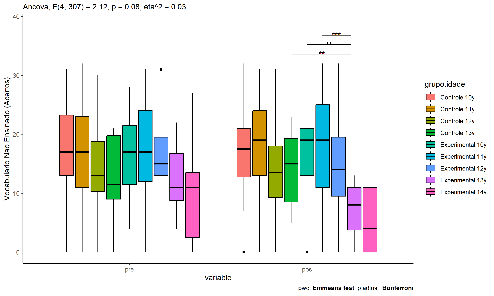<!-- -->

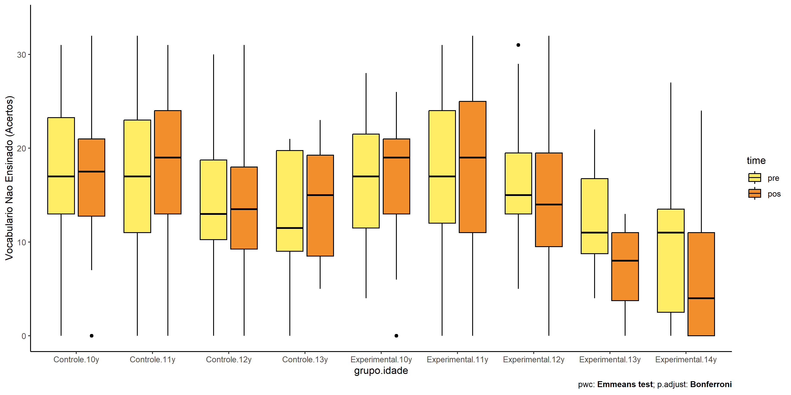<!-- -->

### Vocabulario Nao Ensinado (TRI)

| var                        | idade | grupo        |   n | M (pre) | SE (pre) | M (unadj) | SE (unadj) | M (adj) | SE (adj) |
|:---------------------------|:------|:-------------|----:|--------:|---------:|----------:|-----------:|--------:|---------:|
| tri.vocab.nao.ensinado.pos | 10y   | Controle     |  28 |   0.237 |    0.138 |     0.182 |      0.171 |   0.035 |    0.109 |
| tri.vocab.nao.ensinado.pos | 10y   | Experimental |  26 |   0.055 |    0.171 |     0.076 |      0.145 |   0.079 |    0.113 |
| tri.vocab.nao.ensinado.pos | 11y   | Controle     |  90 |   0.117 |    0.100 |     0.325 |      0.101 |   0.277 |    0.061 |
| tri.vocab.nao.ensinado.pos | 11y   | Experimental |  86 |   0.139 |    0.097 |     0.309 |      0.110 |   0.243 |    0.062 |
| tri.vocab.nao.ensinado.pos | 12y   | Controle     |  23 |  -0.147 |    0.206 |    -0.190 |      0.178 |  -0.021 |    0.120 |
| tri.vocab.nao.ensinado.pos | 12y   | Experimental |  16 |  -0.110 |    0.257 |     0.171 |      0.279 |   0.309 |    0.144 |
| tri.vocab.nao.ensinado.pos | 13y   | Controle     |   8 |  -0.248 |    0.260 |    -0.125 |      0.284 |   0.126 |    0.203 |
| tri.vocab.nao.ensinado.pos | 13y   | Experimental |   9 |  -0.747 |    0.219 |    -1.041 |      0.045 |  -0.379 |    0.194 |

| .y.                        | grupo        | idade | group1   | group2       | estimate | conf.low | conf.high |    se | statistic |     p | p.adj | p.adj.signif |
|:---------------------------|:-------------|:------|:---------|:-------------|---------:|---------:|----------:|------:|----------:|------:|------:|:-------------|
| tri.vocab.nao.ensinado.pos | Controle     |       | 10y      | 11y          |   -0.242 |   -0.486 |     0.003 | 0.124 |    -1.944 | 0.053 | 0.317 | ns           |
| tri.vocab.nao.ensinado.pos | Controle     |       | 10y      | 12y          |    0.057 |   -0.262 |     0.376 | 0.162 |     0.351 | 0.726 | 1.000 | ns           |
| tri.vocab.nao.ensinado.pos | Controle     |       | 10y      | 13y          |   -0.091 |   -0.545 |     0.364 | 0.231 |    -0.393 | 0.695 | 1.000 | ns           |
| tri.vocab.nao.ensinado.pos | Controle     |       | 11y      | 12y          |    0.299 |    0.034 |     0.563 | 0.135 |     2.220 | 0.027 | 0.163 | ns           |
| tri.vocab.nao.ensinado.pos | Controle     |       | 11y      | 13y          |    0.151 |   -0.267 |     0.569 | 0.212 |     0.711 | 0.478 | 1.000 | ns           |
| tri.vocab.nao.ensinado.pos | Controle     |       | 12y      | 13y          |   -0.148 |   -0.612 |     0.316 | 0.236 |    -0.627 | 0.531 | 1.000 | ns           |
| tri.vocab.nao.ensinado.pos | Experimental |       | 10y      | 11y          |   -0.164 |   -0.417 |     0.089 | 0.129 |    -1.275 | 0.203 | 1.000 | ns           |
| tri.vocab.nao.ensinado.pos | Experimental |       | 10y      | 12y          |   -0.230 |   -0.590 |     0.129 | 0.183 |    -1.261 | 0.208 | 1.000 | ns           |
| tri.vocab.nao.ensinado.pos | Experimental |       | 10y      | 13y          |    0.458 |    0.017 |     0.900 | 0.224 |     2.045 | 0.042 | 0.251 | ns           |
| tri.vocab.nao.ensinado.pos | Experimental |       | 11y      | 12y          |   -0.066 |   -0.375 |     0.242 | 0.157 |    -0.423 | 0.672 | 1.000 | ns           |
| tri.vocab.nao.ensinado.pos | Experimental |       | 11y      | 13y          |    0.622 |    0.221 |     1.024 | 0.204 |     3.050 | 0.003 | 0.015 | \*           |
| tri.vocab.nao.ensinado.pos | Experimental |       | 12y      | 13y          |    0.688 |    0.215 |     1.162 | 0.240 |     2.863 | 0.005 | 0.027 | \*           |
| tri.vocab.nao.ensinado.pre | Controle     |       | 10y      | 11y          |    0.120 |   -0.265 |     0.505 | 0.196 |     0.616 | 0.539 | 1.000 | ns           |
| tri.vocab.nao.ensinado.pre | Controle     |       | 10y      | 12y          |    0.384 |   -0.116 |     0.885 | 0.254 |     1.511 | 0.132 | 0.791 | ns           |
| tri.vocab.nao.ensinado.pre | Controle     |       | 10y      | 13y          |    0.485 |   -0.228 |     1.198 | 0.362 |     1.338 | 0.182 | 1.000 | ns           |
| tri.vocab.nao.ensinado.pre | Controle     |       | 11y      | 12y          |    0.264 |   -0.152 |     0.679 | 0.211 |     1.250 | 0.212 | 1.000 | ns           |
| tri.vocab.nao.ensinado.pre | Controle     |       | 11y      | 13y          |    0.364 |   -0.292 |     1.021 | 0.333 |     1.093 | 0.275 | 1.000 | ns           |
| tri.vocab.nao.ensinado.pre | Controle     |       | 12y      | 13y          |    0.100 |   -0.630 |     0.831 | 0.371 |     0.271 | 0.787 | 1.000 | ns           |
| tri.vocab.nao.ensinado.pre | Experimental |       | 10y      | 11y          |   -0.084 |   -0.482 |     0.314 | 0.202 |    -0.416 | 0.678 | 1.000 | ns           |
| tri.vocab.nao.ensinado.pre | Experimental |       | 10y      | 12y          |    0.165 |   -0.400 |     0.730 | 0.287 |     0.576 | 0.565 | 1.000 | ns           |
| tri.vocab.nao.ensinado.pre | Experimental |       | 10y      | 13y          |    0.802 |    0.114 |     1.490 | 0.349 |     2.295 | 0.022 | 0.135 | ns           |
| tri.vocab.nao.ensinado.pre | Experimental |       | 11y      | 12y          |    0.249 |   -0.235 |     0.734 | 0.246 |     1.014 | 0.312 | 1.000 | ns           |
| tri.vocab.nao.ensinado.pre | Experimental |       | 11y      | 13y          |    0.886 |    0.263 |     1.509 | 0.317 |     2.799 | 0.005 | 0.033 | \*           |
| tri.vocab.nao.ensinado.pre | Experimental |       | 12y      | 13y          |    0.637 |   -0.105 |     1.378 | 0.376 |     1.691 | 0.092 | 0.552 | ns           |
| tri.vocab.nao.ensinado.pos |              | 10y   | Controle | Experimental |   -0.044 |   -0.352 |     0.264 | 0.157 |    -0.279 | 0.781 | 0.781 | ns           |
| tri.vocab.nao.ensinado.pos |              | 11y   | Controle | Experimental |    0.034 |   -0.136 |     0.205 | 0.087 |     0.395 | 0.693 | 0.693 | ns           |
| tri.vocab.nao.ensinado.pos |              | 12y   | Controle | Experimental |   -0.331 |   -0.699 |     0.037 | 0.187 |    -1.770 | 0.078 | 0.078 | ns           |
| tri.vocab.nao.ensinado.pos |              | 13y   | Controle | Experimental |    0.505 |   -0.045 |     1.056 | 0.280 |     1.807 | 0.072 | 0.072 | ns           |
| tri.vocab.nao.ensinado.pre |              | 10y   | Controle | Experimental |    0.182 |   -0.302 |     0.667 | 0.246 |     0.740 | 0.460 | 0.460 | ns           |
| tri.vocab.nao.ensinado.pre |              | 11y   | Controle | Experimental |   -0.022 |   -0.290 |     0.246 | 0.136 |    -0.163 | 0.871 | 0.871 | ns           |
| tri.vocab.nao.ensinado.pre |              | 12y   | Controle | Experimental |   -0.037 |   -0.616 |     0.542 | 0.294 |    -0.125 | 0.900 | 0.900 | ns           |
| tri.vocab.nao.ensinado.pre |              | 13y   | Controle | Experimental |    0.499 |   -0.365 |     1.363 | 0.439 |     1.137 | 0.256 | 0.256 | ns           |

| grupo        | idade | group1 | group2 | estimate | conf.low | conf.high |    se | statistic |     p | p.adj | p.adj.signif |
|:-------------|:------|:-------|:-------|---------:|---------:|----------:|------:|----------:|------:|------:|:-------------|
| Controle     | 10y   | pre    | pos    |    0.013 |   -0.453 |     0.479 | 0.238 |     0.055 | 0.956 | 0.956 | ns           |
| Controle     | 11y   | pre    | pos    |   -0.193 |   -0.461 |     0.075 | 0.136 |    -1.416 | 0.157 | 0.157 | ns           |
| Controle     | 12y   | pre    | pos    |    0.069 |   -0.447 |     0.585 | 0.263 |     0.263 | 0.793 | 0.793 | ns           |
| Controle     | 13y   | pre    | pos    |    0.077 |   -0.780 |     0.933 | 0.436 |     0.176 | 0.860 | 0.860 | ns           |
| Experimental | 10y   | pre    | pos    |   -0.038 |   -0.534 |     0.458 | 0.253 |    -0.150 | 0.881 | 0.881 | ns           |
| Experimental | 11y   | pre    | pos    |   -0.161 |   -0.434 |     0.112 | 0.139 |    -1.159 | 0.247 | 0.247 | ns           |
| Experimental | 12y   | pre    | pos    |   -0.181 |   -0.794 |     0.432 | 0.312 |    -0.581 | 0.562 | 0.562 | ns           |
| Experimental | 13y   | pre    | pos    |    0.455 |   -0.341 |     1.252 | 0.405 |     1.123 | 0.262 | 0.262 | ns           |

    ## Scale for colour is already present.
    ## Adding another scale for colour, which will replace the existing scale.

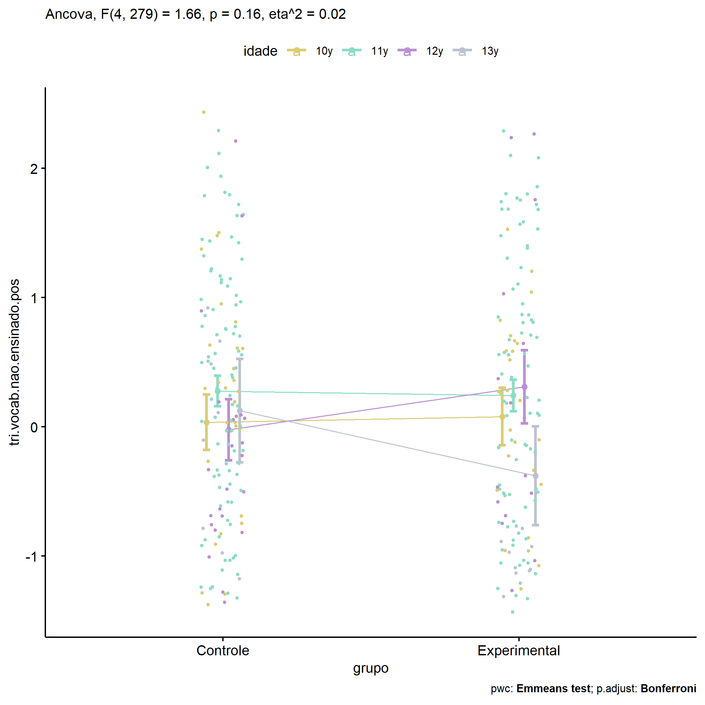<!-- -->

    ## Scale for colour is already present.
    ## Adding another scale for colour, which will replace the existing scale.

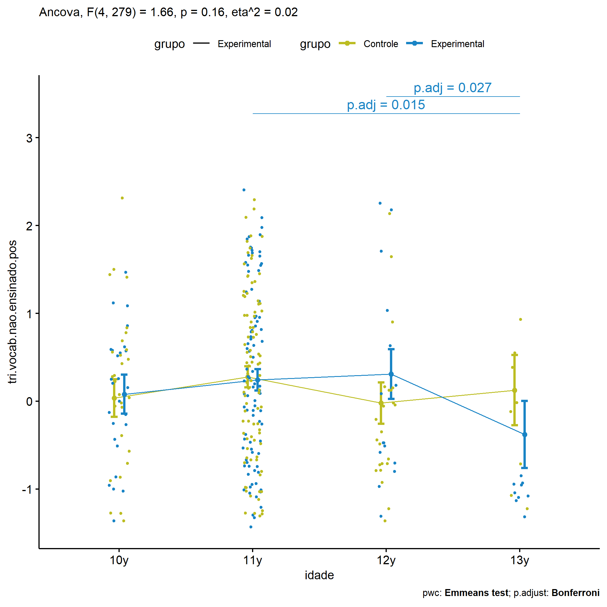<!-- -->

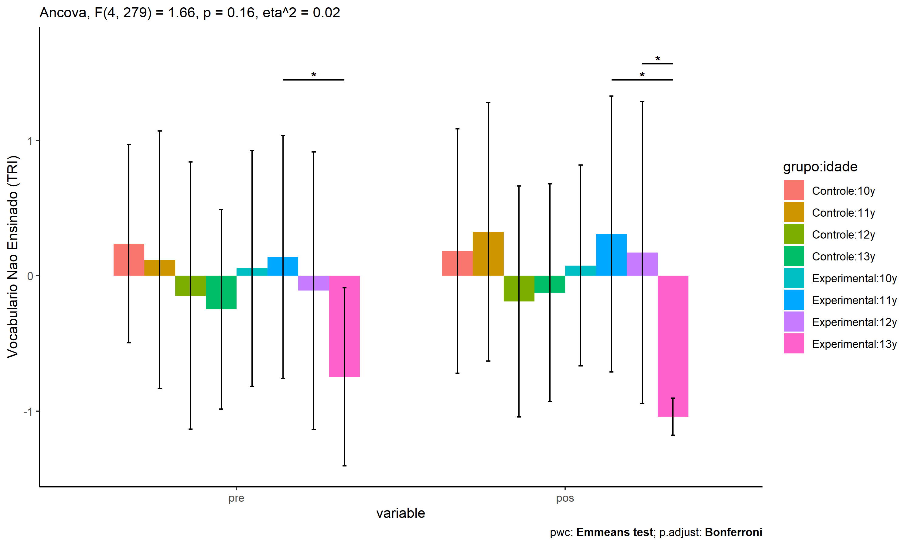<!-- -->

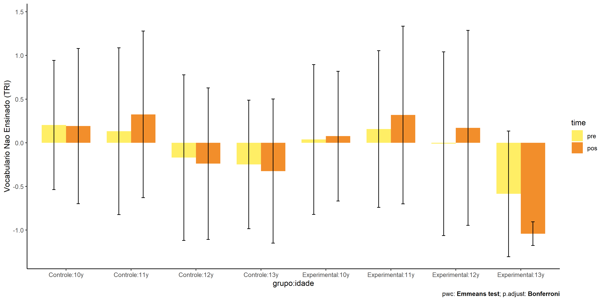<!-- -->

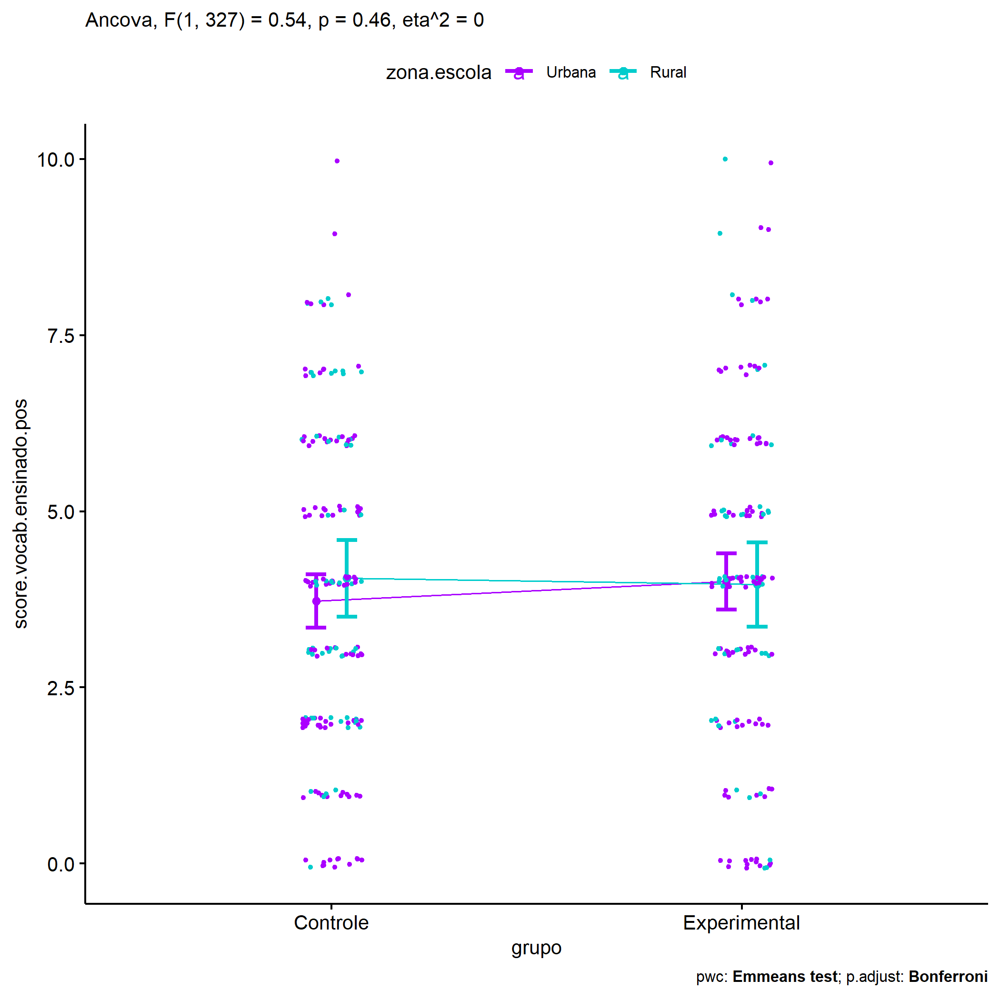<!-- -->

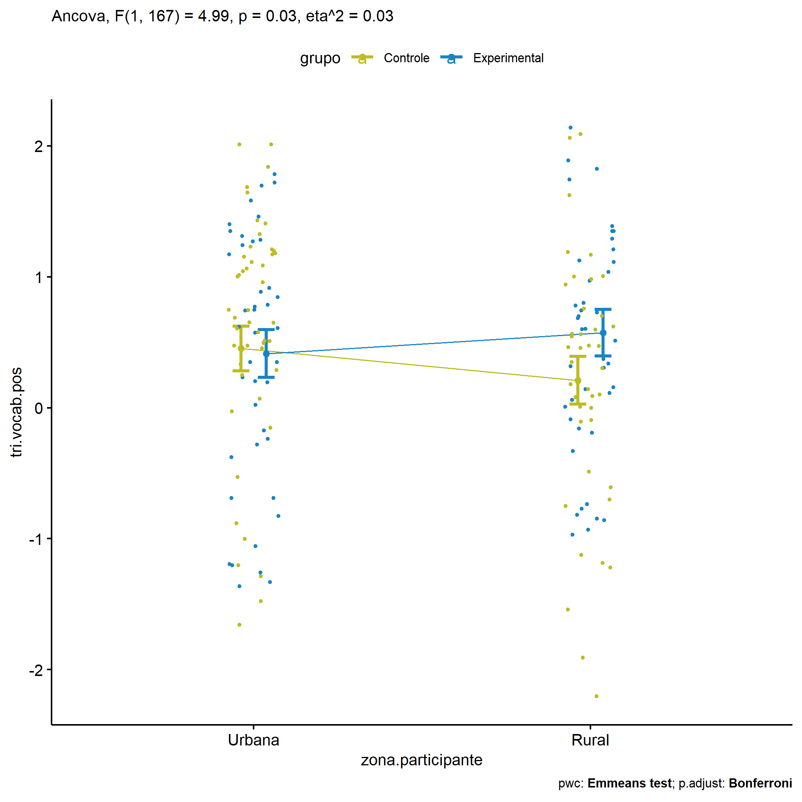<!-- -->

## factores: **zona.participante:grupo**

### Vocabulario (Acertos)

| var             | zona.participante | grupo        |   n | M (pre) | SE (pre) | M (unadj) | SE (unadj) | M (adj) | SE (adj) |
|:----------------|:------------------|:-------------|----:|--------:|---------:|----------:|-----------:|--------:|---------:|
| score.vocab.pos | Rural             | Controle     |  53 |  20.075 |    1.209 |    21.340 |      1.037 |  22.022 |    0.771 |
| score.vocab.pos | Rural             | Experimental |  58 |  20.103 |    1.104 |    22.397 |      1.150 |  23.058 |    0.737 |
| score.vocab.pos | Urbana            | Controle     |  69 |  22.087 |    0.959 |    22.739 |      1.031 |  21.902 |    0.677 |
| score.vocab.pos | Urbana            | Experimental |  53 |  21.396 |    1.181 |    22.472 |      1.220 |  22.156 |    0.770 |

| .y.             | grupo        | zona.participante | group1   | group2       | estimate | conf.low | conf.high |    se | statistic |     p | p.adj | p.adj.signif |
|:----------------|:-------------|:------------------|:---------|:-------------|---------:|---------:|----------:|------:|----------:|------:|------:|:-------------|
| score.vocab.pos | Controle     |                   | Urbana   | Rural        |   -0.120 |   -2.146 |     1.905 | 1.028 |    -0.117 | 0.907 | 0.907 | ns           |
| score.vocab.pos | Experimental |                   | Urbana   | Rural        |   -0.902 |   -3.004 |     1.201 | 1.067 |    -0.845 | 0.399 | 0.399 | ns           |
| score.vocab.pre | Controle     |                   | Urbana   | Rural        |    2.011 |   -1.017 |     5.039 | 1.537 |     1.309 | 0.192 | 0.192 | ns           |
| score.vocab.pre | Experimental |                   | Urbana   | Rural        |    1.293 |   -1.858 |     4.443 | 1.599 |     0.809 | 0.420 | 0.420 | ns           |
| score.vocab.pos |              | Urbana            | Controle | Experimental |   -0.254 |   -2.273 |     1.765 | 1.025 |    -0.248 | 0.804 | 0.804 | ns           |
| score.vocab.pos |              | Rural             | Controle | Experimental |   -1.036 |   -3.135 |     1.064 | 1.066 |    -0.972 | 0.332 | 0.332 | ns           |
| score.vocab.pre |              | Urbana            | Controle | Experimental |    0.691 |   -2.337 |     3.719 | 1.537 |     0.449 | 0.654 | 0.654 | ns           |
| score.vocab.pre |              | Rural             | Controle | Experimental |   -0.028 |   -3.178 |     3.122 | 1.599 |    -0.017 | 0.986 | 0.986 | ns           |

| grupo        | zona.participante | group1 | group2 | estimate | conf.low | conf.high |    se | statistic |     p | p.adj | p.adj.signif |
|:-------------|:------------------|:-------|:-------|---------:|---------:|----------:|------:|----------:|------:|------:|:-------------|
| Controle     | Urbana            | pre    | pos    |   -0.501 |   -3.268 |     2.266 | 1.408 |    -0.356 | 0.722 | 0.722 | ns           |
| Controle     | Rural             | pre    | pos    |   -1.014 |   -4.207 |     2.179 | 1.625 |    -0.624 | 0.533 | 0.533 | ns           |
| Experimental | Urbana            | pre    | pos    |   -0.757 |   -3.950 |     2.435 | 1.625 |    -0.466 | 0.641 | 0.641 | ns           |
| Experimental | Rural             | pre    | pos    |   -2.456 |   -5.537 |     0.625 | 1.568 |    -1.566 | 0.118 | 0.118 | ns           |

    ## Scale for colour is already present.
    ## Adding another scale for colour, which will replace the existing scale.

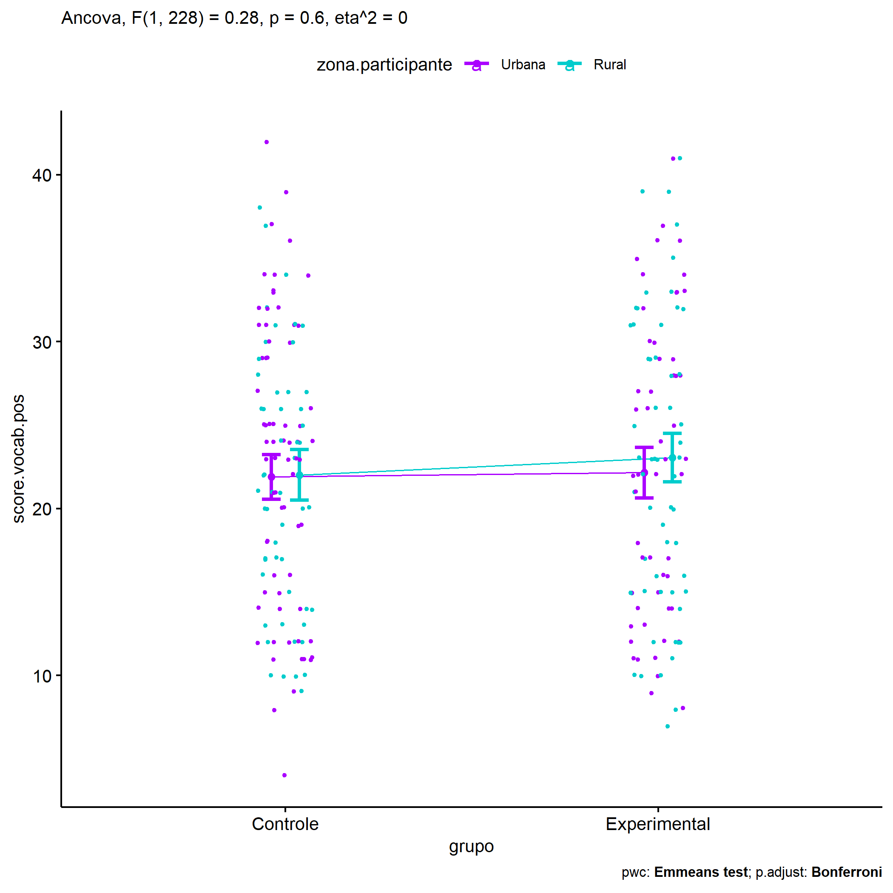<!-- -->

    ## Scale for colour is already present.
    ## Adding another scale for colour, which will replace the existing scale.

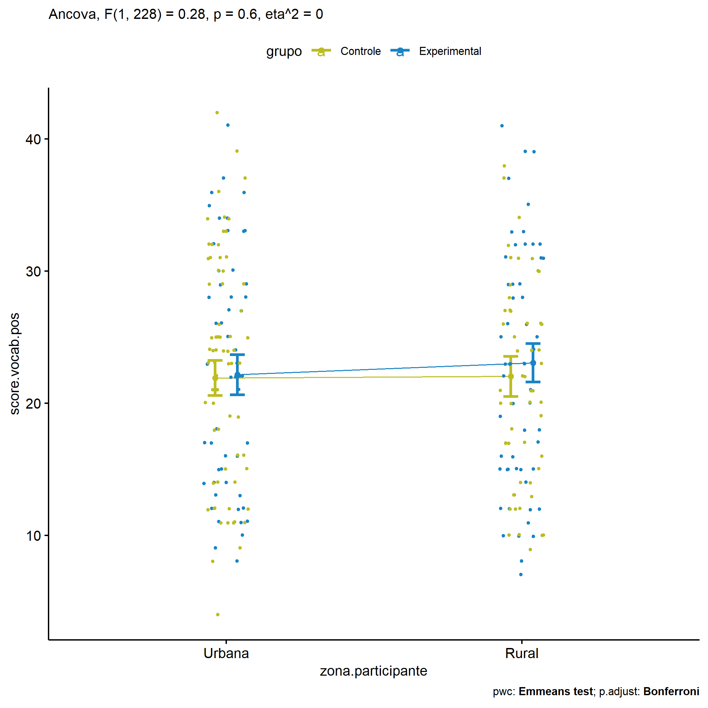<!-- -->

<!-- -->

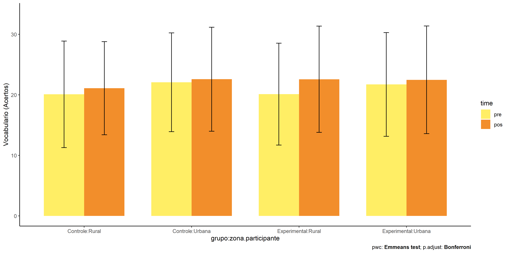<!-- -->

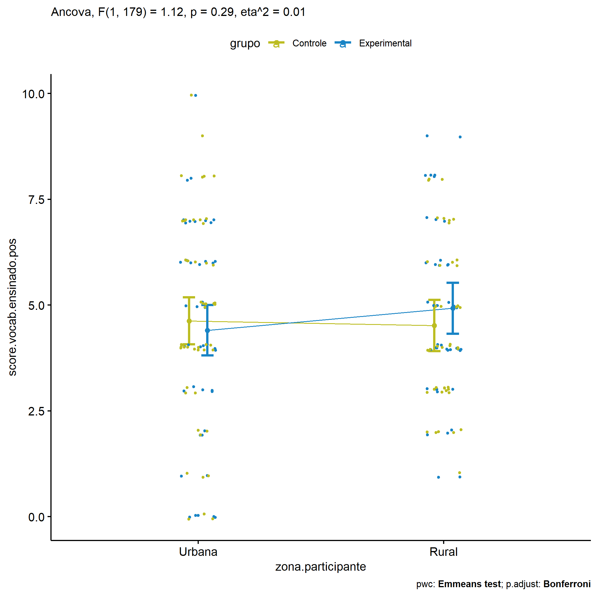<!-- -->

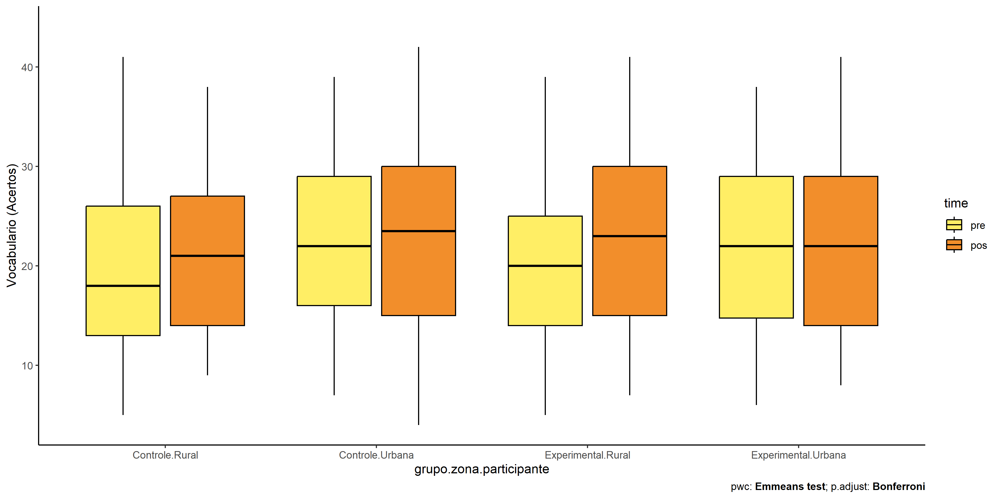<!-- -->

### Vocabulario (TRI)

| var           | zona.participante | grupo        |   n | M (pre) | SE (pre) | M (unadj) | SE (unadj) | M (adj) | SE (adj) |
|:--------------|:------------------|:-------------|----:|--------:|---------:|----------:|-----------:|--------:|---------:|
| tri.vocab.pos | Rural             | Controle     |  53 |   0.037 |    0.118 |     0.024 |      0.129 |   0.055 |    0.083 |
| tri.vocab.pos | Rural             | Experimental |  58 |  -0.009 |    0.125 |     0.203 |      0.122 |   0.272 |    0.079 |
| tri.vocab.pos | Urbana            | Controle     |  69 |   0.177 |    0.102 |     0.257 |      0.120 |   0.170 |    0.073 |
| tri.vocab.pos | Urbana            | Experimental |  53 |   0.067 |    0.132 |     0.167 |      0.138 |   0.173 |    0.083 |

| .y.           | grupo        | zona.participante | group1   | group2       | estimate | conf.low | conf.high |    se | statistic |     p | p.adj | p.adj.signif |
|:--------------|:-------------|:------------------|:---------|:-------------|---------:|---------:|----------:|------:|----------:|------:|------:|:-------------|
| tri.vocab.pos | Controle     |                   | Urbana   | Rural        |    0.115 |   -0.102 |     0.332 | 0.110 |     1.042 | 0.298 | 0.298 | ns           |
| tri.vocab.pos | Experimental |                   | Urbana   | Rural        |   -0.099 |   -0.325 |     0.127 | 0.115 |    -0.862 | 0.390 | 0.390 | ns           |
| tri.vocab.pre | Controle     |                   | Urbana   | Rural        |    0.140 |   -0.185 |     0.465 | 0.165 |     0.849 | 0.397 | 0.397 | ns           |
| tri.vocab.pre | Experimental |                   | Urbana   | Rural        |    0.075 |   -0.263 |     0.413 | 0.172 |     0.439 | 0.661 | 0.661 | ns           |
| tri.vocab.pos |              | Urbana            | Controle | Experimental |   -0.003 |   -0.221 |     0.214 | 0.110 |    -0.031 | 0.975 | 0.975 | ns           |
| tri.vocab.pos |              | Rural             | Controle | Experimental |   -0.217 |   -0.443 |     0.009 | 0.115 |    -1.895 | 0.059 | 0.059 | ns           |
| tri.vocab.pre |              | Urbana            | Controle | Experimental |    0.111 |   -0.214 |     0.435 | 0.165 |     0.670 | 0.503 | 0.503 | ns           |
| tri.vocab.pre |              | Rural             | Controle | Experimental |    0.046 |   -0.292 |     0.384 | 0.172 |     0.268 | 0.789 | 0.789 | ns           |

| grupo        | zona.participante | group1 | group2 | estimate | conf.low | conf.high |    se | statistic |     p | p.adj | p.adj.signif |
|:-------------|:------------------|:-------|:-------|---------:|---------:|----------:|------:|----------:|------:|------:|:-------------|
| Controle     | Urbana            | pre    | pos    |   -0.064 |   -0.372 |     0.244 | 0.157 |    -0.405 | 0.685 | 0.685 | ns           |
| Controle     | Rural             | pre    | pos    |    0.041 |   -0.315 |     0.396 | 0.181 |     0.225 | 0.822 | 0.822 | ns           |
| Experimental | Urbana            | pre    | pos    |   -0.053 |   -0.408 |     0.303 | 0.181 |    -0.292 | 0.770 | 0.770 | ns           |
| Experimental | Rural             | pre    | pos    |   -0.227 |   -0.570 |     0.116 | 0.174 |    -1.303 | 0.193 | 0.193 | ns           |

    ## Scale for colour is already present.
    ## Adding another scale for colour, which will replace the existing scale.

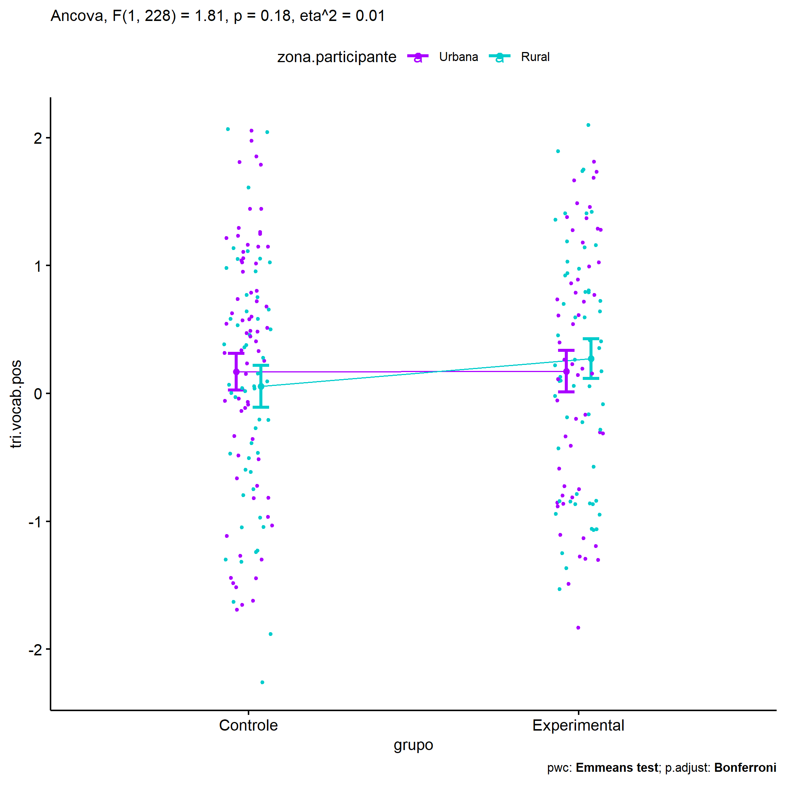<!-- -->

    ## Scale for colour is already present.
    ## Adding another scale for colour, which will replace the existing scale.

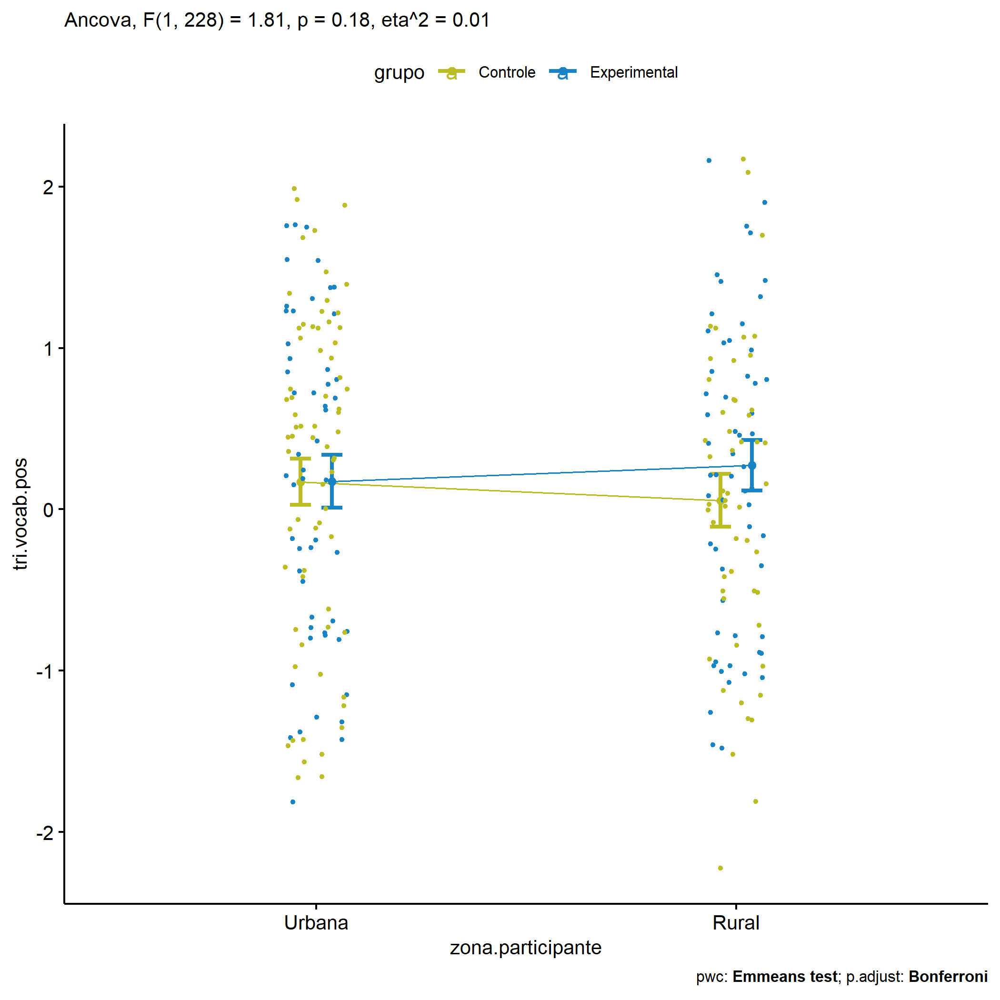<!-- -->

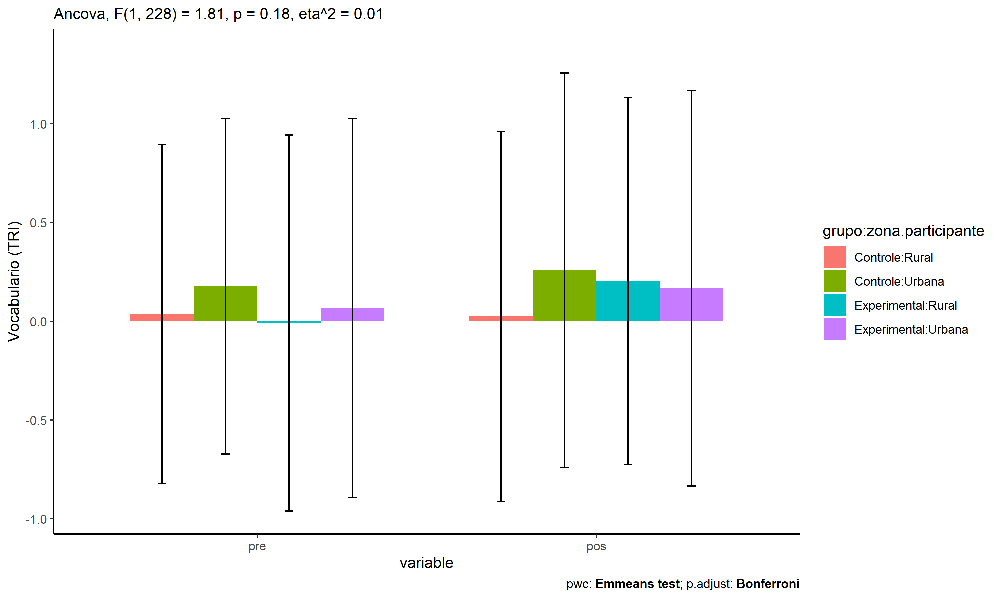<!-- -->

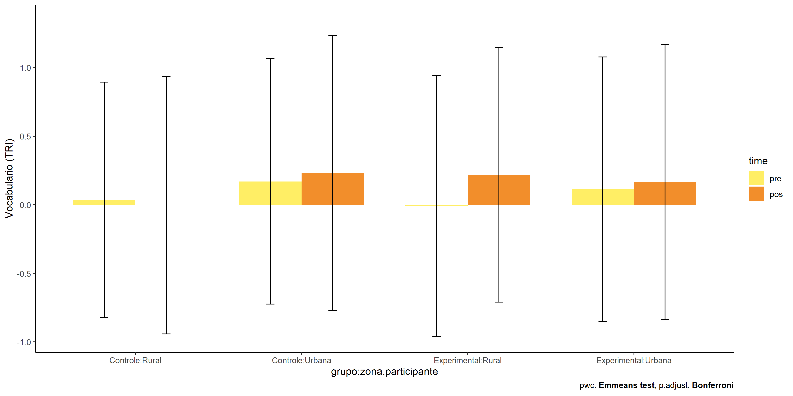<!-- -->

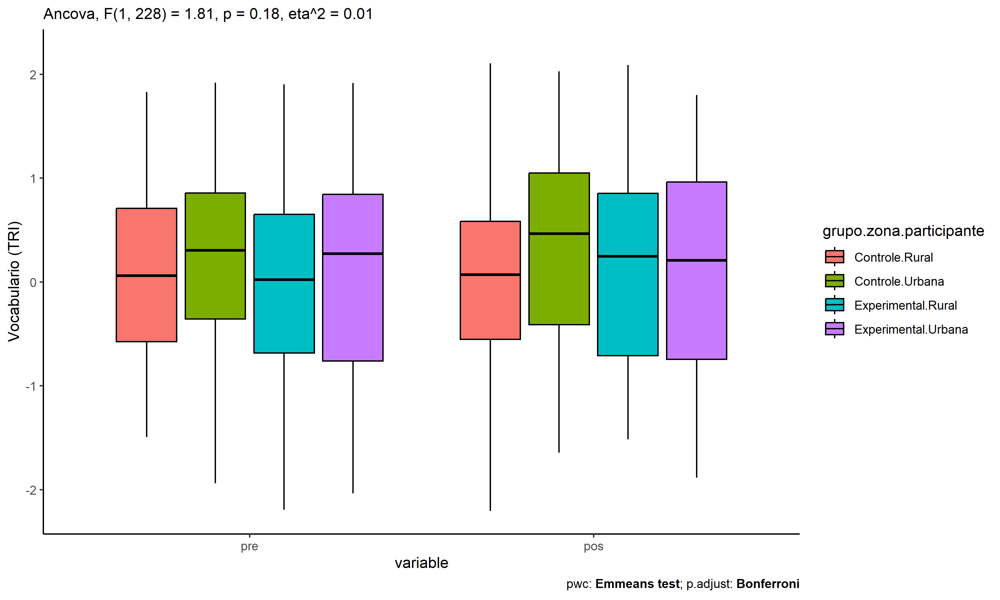<!-- -->

<!-- -->

### Vocabulario Ensinado (Acertos)

| var                      | zona.participante | grupo        |   n | M (pre) | SE (pre) | M (unadj) | SE (unadj) | M (adj) | SE (adj) |
|:-------------------------|:------------------|:-------------|----:|--------:|---------:|----------:|-----------:|--------:|---------:|
| score.vocab.ensinado.pos | Rural             | Controle     |  56 |   3.696 |    0.339 |     4.161 |      0.265 |   4.232 |    0.267 |
| score.vocab.ensinado.pos | Rural             | Experimental |  59 |   3.831 |    0.282 |     4.508 |      0.259 |   4.521 |    0.260 |
| score.vocab.ensinado.pos | Urbana            | Controle     |  77 |   3.896 |    0.262 |     3.935 |      0.282 |   3.919 |    0.227 |
| score.vocab.ensinado.pos | Urbana            | Experimental |  57 |   4.000 |    0.271 |     4.263 |      0.307 |   4.202 |    0.264 |

| .y.                      | grupo        | zona.participante | group1   | group2       | estimate | conf.low | conf.high |    se | statistic |     p | p.adj | p.adj.signif |
|:-------------------------|:-------------|:------------------|:---------|:-------------|---------:|---------:|----------:|------:|----------:|------:|------:|:-------------|
| score.vocab.ensinado.pos | Controle     |                   | Urbana   | Rural        |   -0.313 |   -1.003 |     0.377 | 0.350 |    -0.893 | 0.373 | 0.373 | ns           |
| score.vocab.ensinado.pos | Experimental |                   | Urbana   | Rural        |   -0.319 |   -1.049 |     0.410 | 0.371 |    -0.862 | 0.390 | 0.390 | ns           |
| score.vocab.ensinado.pre | Controle     |                   | Urbana   | Rural        |    0.200 |   -0.586 |     0.985 | 0.399 |     0.501 | 0.617 | 0.617 | ns           |
| score.vocab.ensinado.pre | Experimental |                   | Urbana   | Rural        |    0.169 |   -0.661 |     1.000 | 0.422 |     0.402 | 0.688 | 0.688 | ns           |
| score.vocab.ensinado.pos |              | Urbana            | Controle | Experimental |   -0.283 |   -0.969 |     0.404 | 0.349 |    -0.811 | 0.418 | 0.418 | ns           |
| score.vocab.ensinado.pos |              | Rural             | Controle | Experimental |   -0.289 |   -1.022 |     0.444 | 0.372 |    -0.777 | 0.438 | 0.438 | ns           |
| score.vocab.ensinado.pre |              | Urbana            | Controle | Experimental |   -0.104 |   -0.885 |     0.678 | 0.397 |    -0.262 | 0.794 | 0.794 | ns           |
| score.vocab.ensinado.pre |              | Rural             | Controle | Experimental |   -0.134 |   -0.969 |     0.700 | 0.424 |    -0.316 | 0.752 | 0.752 | ns           |

| grupo        | zona.participante | group1 | group2 | estimate | conf.low | conf.high |    se | statistic |     p | p.adj | p.adj.signif |
|:-------------|:------------------|:-------|:-------|---------:|---------:|----------:|------:|----------:|------:|------:|:-------------|
| Controle     | Urbana            | pre    | pos    |   -0.039 |   -0.751 |     0.673 | 0.362 |    -0.108 | 0.914 | 0.914 | ns           |
| Controle     | Rural             | pre    | pos    |   -0.464 |   -1.299 |     0.370 | 0.425 |    -1.093 | 0.275 | 0.275 | ns           |
| Experimental | Urbana            | pre    | pos    |   -0.263 |   -1.090 |     0.564 | 0.421 |    -0.625 | 0.532 | 0.532 | ns           |
| Experimental | Rural             | pre    | pos    |   -0.678 |   -1.491 |     0.135 | 0.414 |    -1.638 | 0.102 | 0.102 | ns           |

    ## Scale for colour is already present.
    ## Adding another scale for colour, which will replace the existing scale.

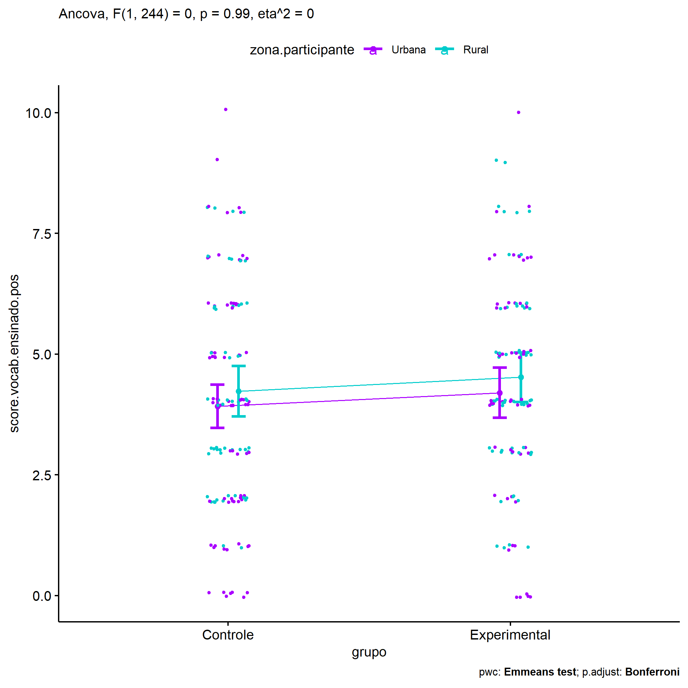<!-- -->

    ## Scale for colour is already present.
    ## Adding another scale for colour, which will replace the existing scale.

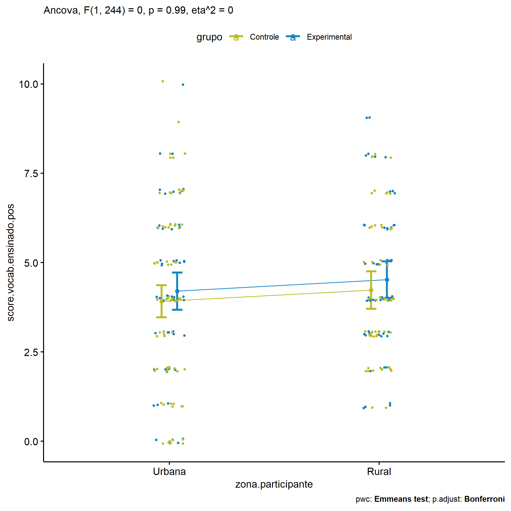<!-- -->

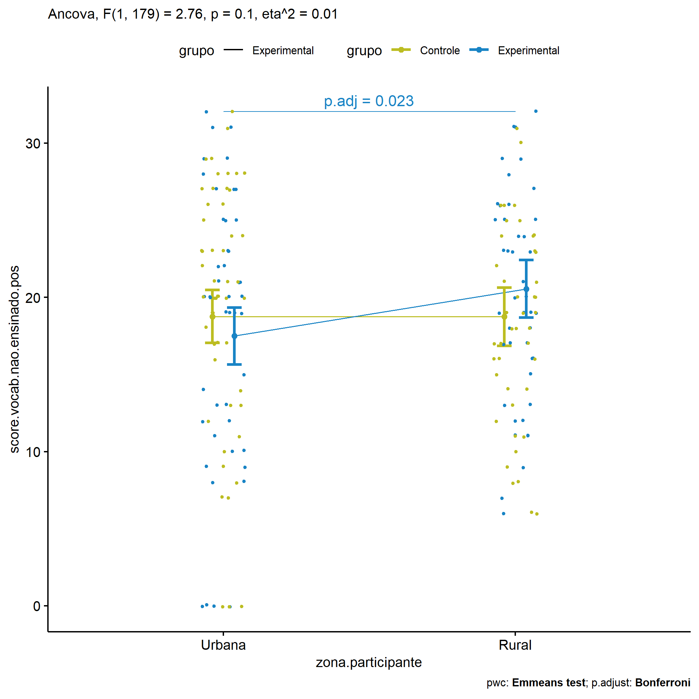<!-- -->

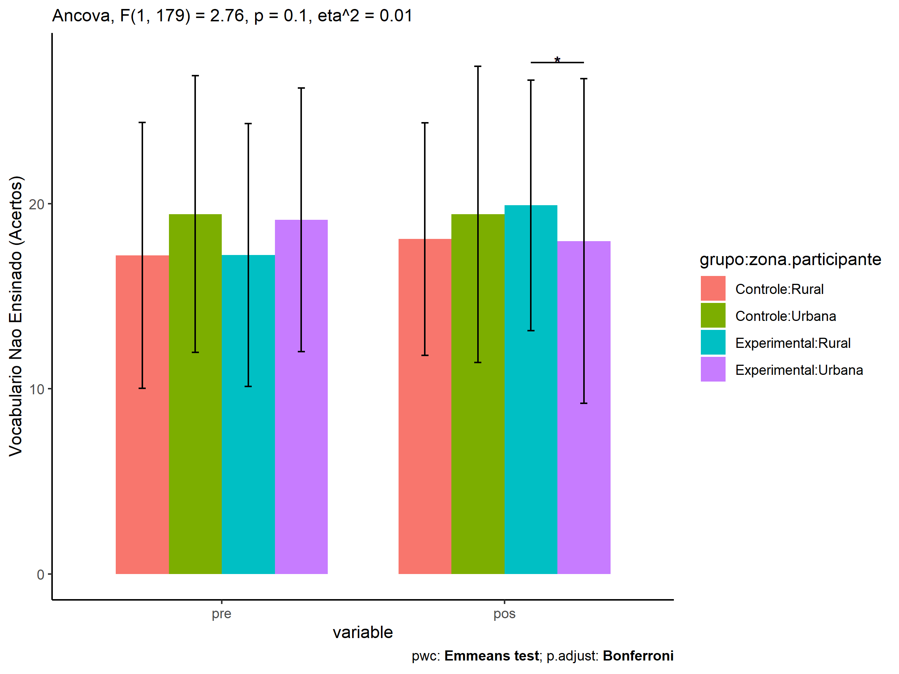<!-- -->

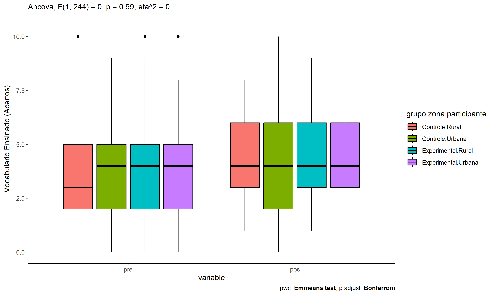<!-- -->

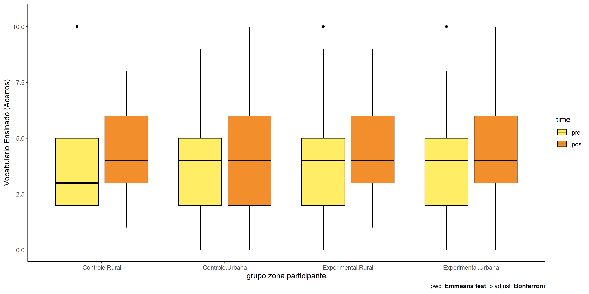<!-- -->

### Vocabulario Ensinado (TRI)

| var                    | zona.participante | grupo        |   n | M (pre) | SE (pre) | M (unadj) | SE (unadj) | M (adj) | SE (adj) |
|:-----------------------|:------------------|:-------------|----:|--------:|---------:|----------:|-----------:|--------:|---------:|
| tri.vocab.ensinado.pos | Rural             | Controle     |  53 |   0.067 |    0.111 |    -0.001 |      0.112 |  -0.007 |    0.091 |
| tri.vocab.ensinado.pos | Rural             | Experimental |  58 |   0.010 |    0.099 |     0.098 |      0.105 |   0.127 |    0.087 |
| tri.vocab.ensinado.pos | Urbana            | Controle     |  69 |   0.082 |    0.097 |     0.135 |      0.108 |   0.120 |    0.080 |
| tri.vocab.ensinado.pos | Urbana            | Experimental |  53 |   0.064 |    0.102 |     0.227 |      0.099 |   0.222 |    0.091 |

| .y.                    | grupo        | zona.participante | group1   | group2       | estimate | conf.low | conf.high |    se | statistic |     p | p.adj | p.adj.signif |
|:-----------------------|:-------------|:------------------|:---------|:-------------|---------:|---------:|----------:|------:|----------:|------:|------:|:-------------|
| tri.vocab.ensinado.pos | Controle     |                   | Urbana   | Rural        |    0.126 |   -0.112 |     0.365 | 0.121 |     1.045 | 0.297 | 0.297 | ns           |
| tri.vocab.ensinado.pos | Experimental |                   | Urbana   | Rural        |    0.095 |   -0.153 |     0.343 | 0.126 |     0.757 | 0.450 | 0.450 | ns           |
| tri.vocab.ensinado.pre | Controle     |                   | Urbana   | Rural        |    0.016 |   -0.265 |     0.296 | 0.142 |     0.110 | 0.913 | 0.913 | ns           |
| tri.vocab.ensinado.pre | Experimental |                   | Urbana   | Rural        |    0.054 |   -0.237 |     0.346 | 0.148 |     0.367 | 0.714 | 0.714 | ns           |
| tri.vocab.ensinado.pos |              | Urbana            | Controle | Experimental |   -0.103 |   -0.341 |     0.136 | 0.121 |    -0.848 | 0.397 | 0.397 | ns           |
| tri.vocab.ensinado.pos |              | Rural             | Controle | Experimental |   -0.134 |   -0.382 |     0.114 | 0.126 |    -1.062 | 0.289 | 0.289 | ns           |
| tri.vocab.ensinado.pre |              | Urbana            | Controle | Experimental |    0.018 |   -0.262 |     0.298 | 0.142 |     0.126 | 0.900 | 0.900 | ns           |
| tri.vocab.ensinado.pre |              | Rural             | Controle | Experimental |    0.057 |   -0.235 |     0.348 | 0.148 |     0.384 | 0.702 | 0.702 | ns           |

| grupo        | zona.participante | group1 | group2 | estimate | conf.low | conf.high |    se | statistic |     p | p.adj | p.adj.signif |
|:-------------|:------------------|:-------|:-------|---------:|---------:|----------:|------:|----------:|------:|------:|:-------------|
| Controle     | Urbana            | pre    | pos    |   -0.070 |   -0.333 |     0.192 | 0.134 |    -0.525 | 0.600 | 0.600 | ns           |
| Controle     | Rural             | pre    | pos    |    0.070 |   -0.233 |     0.373 | 0.154 |     0.454 | 0.650 | 0.650 | ns           |
| Experimental | Urbana            | pre    | pos    |   -0.122 |   -0.425 |     0.181 | 0.154 |    -0.792 | 0.429 | 0.429 | ns           |
| Experimental | Rural             | pre    | pos    |   -0.104 |   -0.396 |     0.188 | 0.149 |    -0.699 | 0.485 | 0.485 | ns           |

    ## Scale for colour is already present.
    ## Adding another scale for colour, which will replace the existing scale.

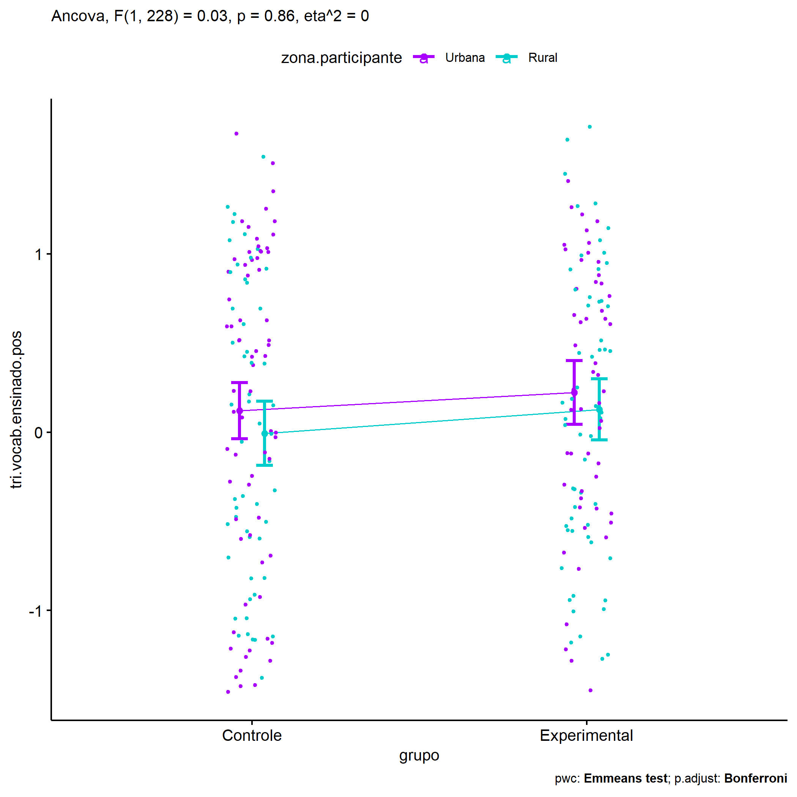<!-- -->

    ## Scale for colour is already present.
    ## Adding another scale for colour, which will replace the existing scale.

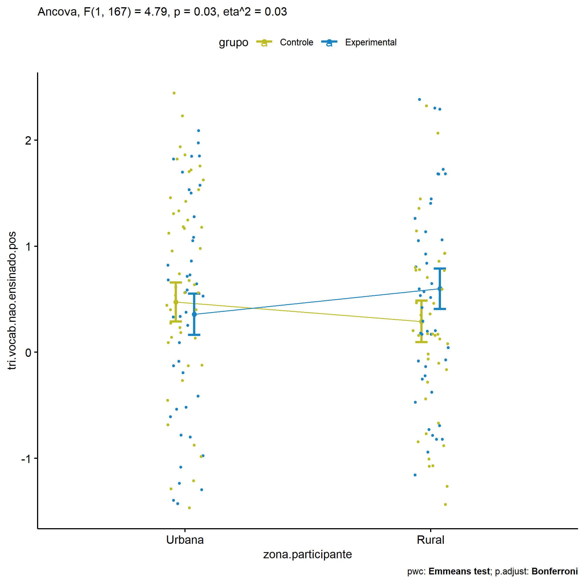<!-- -->

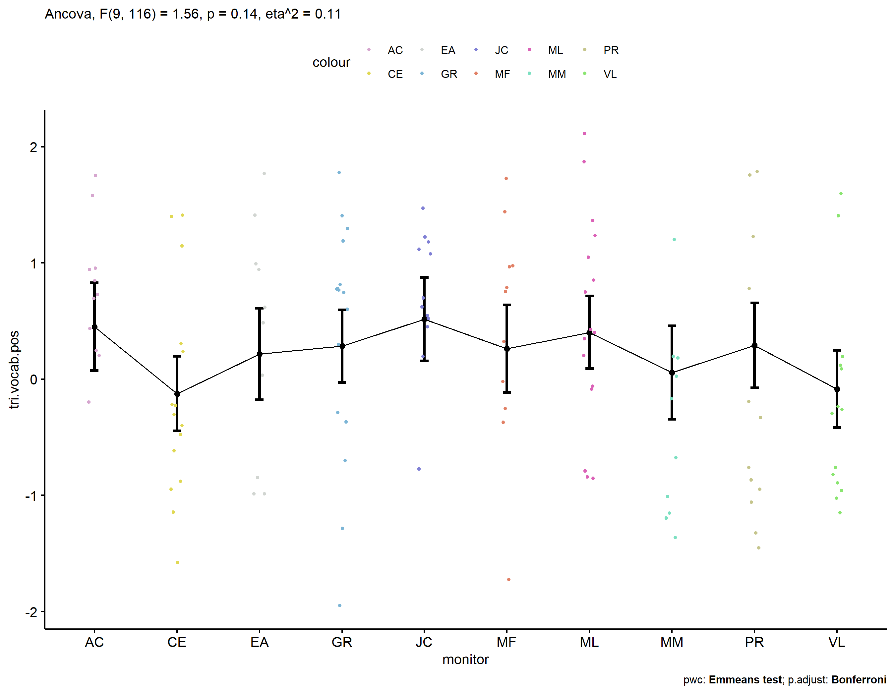<!-- -->

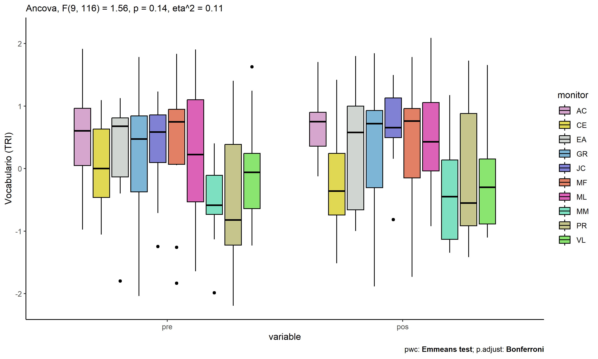<!-- -->

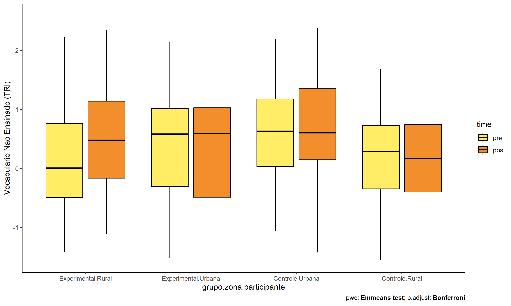<!-- -->

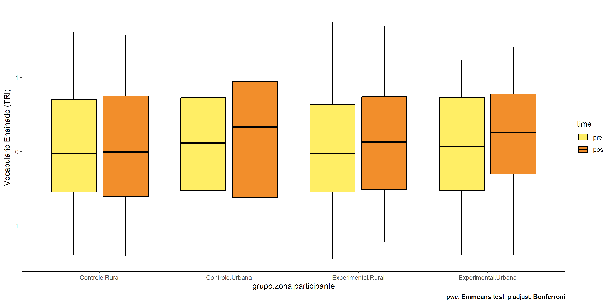<!-- -->

### Vocabulario Nao Ensinado (Acertos)

| var                          | zona.participante | grupo        |   n | M (pre) | SE (pre) | M (unadj) | SE (unadj) | M (adj) | SE (adj) |
|:-----------------------------|:------------------|:-------------|----:|--------:|---------:|----------:|-----------:|--------:|---------:|
| score.vocab.nao.ensinado.pos | Rural             | Controle     |  56 |  15.304 |    1.017 |    16.929 |      0.850 |  17.660 |    0.797 |
| score.vocab.nao.ensinado.pos | Rural             | Experimental |  59 |  15.932 |    0.927 |    18.068 |      0.938 |  18.398 |    0.775 |
| score.vocab.nao.ensinado.pos | Urbana            | Controle     |  77 |  17.026 |    0.856 |    17.169 |      0.912 |  16.801 |    0.679 |
| score.vocab.nao.ensinado.pos | Urbana            | Experimental |  57 |  17.333 |    0.997 |    16.632 |      1.131 |  16.068 |    0.790 |

| .y.                          | grupo        | zona.participante | group1   | group2       | estimate | conf.low | conf.high |    se | statistic |     p | p.adj | p.adj.signif |
|:-----------------------------|:-------------|:------------------|:---------|:-------------|---------:|---------:|----------:|------:|----------:|------:|------:|:-------------|
| score.vocab.nao.ensinado.pos | Controle     |                   | Urbana   | Rural        |   -0.859 |   -2.925 |     1.207 | 1.049 |    -0.819 | 0.413 | 0.413 | ns           |
| score.vocab.nao.ensinado.pos | Experimental |                   | Urbana   | Rural        |   -2.331 |   -4.512 |    -0.149 | 1.108 |    -2.104 | 0.036 | 0.036 | \*           |
| score.vocab.nao.ensinado.pre | Controle     |                   | Urbana   | Rural        |    1.722 |   -0.854 |     4.298 | 1.308 |     1.317 | 0.189 | 0.189 | ns           |
| score.vocab.nao.ensinado.pre | Experimental |                   | Urbana   | Rural        |    1.401 |   -1.323 |     4.125 | 1.383 |     1.013 | 0.312 | 0.312 | ns           |
| score.vocab.nao.ensinado.pos |              | Urbana            | Controle | Experimental |    0.733 |   -1.315 |     2.782 | 1.040 |     0.705 | 0.481 | 0.481 | ns           |
| score.vocab.nao.ensinado.pos |              | Rural             | Controle | Experimental |   -0.738 |   -2.926 |     1.450 | 1.111 |    -0.664 | 0.507 | 0.507 | ns           |
| score.vocab.nao.ensinado.pre |              | Urbana            | Controle | Experimental |   -0.307 |   -2.870 |     2.256 | 1.301 |    -0.236 | 0.813 | 0.813 | ns           |
| score.vocab.nao.ensinado.pre |              | Rural             | Controle | Experimental |   -0.629 |   -3.365 |     2.108 | 1.389 |    -0.452 | 0.651 | 0.651 | ns           |

| grupo        | zona.participante | group1 | group2 | estimate | conf.low | conf.high |    se | statistic |     p | p.adj | p.adj.signif |
|:-------------|:------------------|:-------|:-------|---------:|---------:|----------:|------:|----------:|------:|------:|:-------------|
| Controle     | Urbana            | pre    | pos    |   -0.143 |   -2.527 |     2.241 | 1.213 |    -0.118 | 0.906 | 0.906 | ns           |
| Controle     | Rural             | pre    | pos    |   -1.625 |   -4.420 |     1.170 | 1.423 |    -1.142 | 0.254 | 0.254 | ns           |
| Experimental | Urbana            | pre    | pos    |    0.702 |   -2.069 |     3.472 | 1.410 |     0.498 | 0.619 | 0.619 | ns           |
| Experimental | Rural             | pre    | pos    |   -2.136 |   -4.859 |     0.588 | 1.386 |    -1.541 | 0.124 | 0.124 | ns           |

    ## Scale for colour is already present.
    ## Adding another scale for colour, which will replace the existing scale.

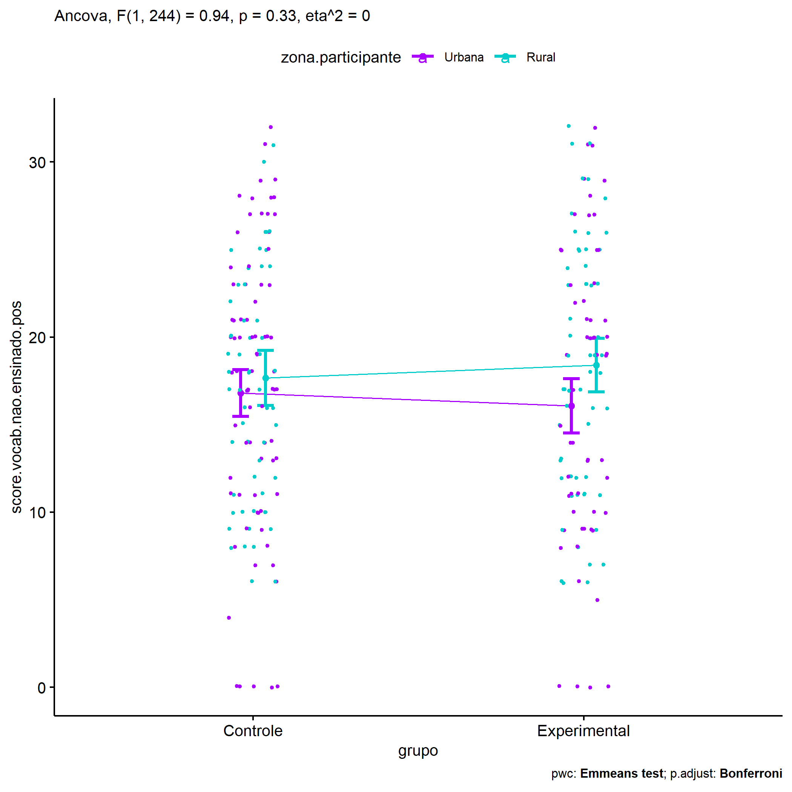<!-- -->

    ## Scale for colour is already present.
    ## Adding another scale for colour, which will replace the existing scale.

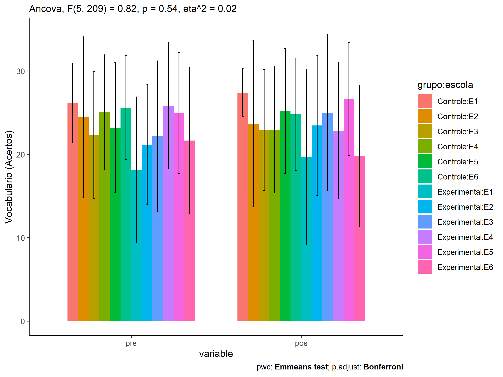<!-- -->

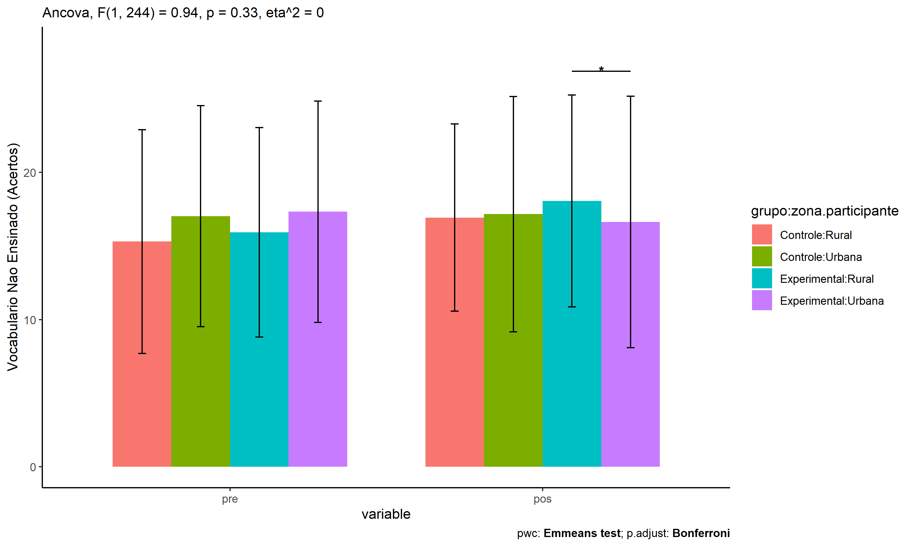<!-- -->

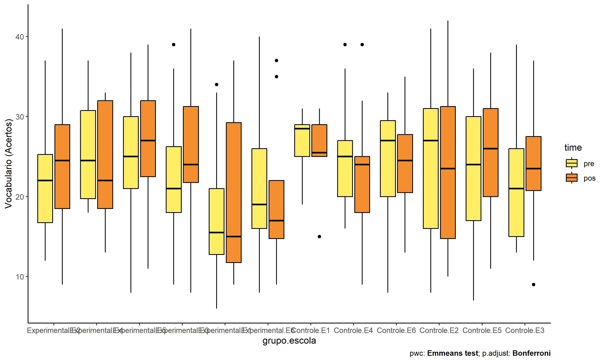<!-- -->

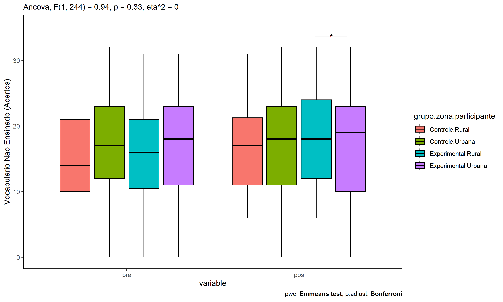<!-- -->

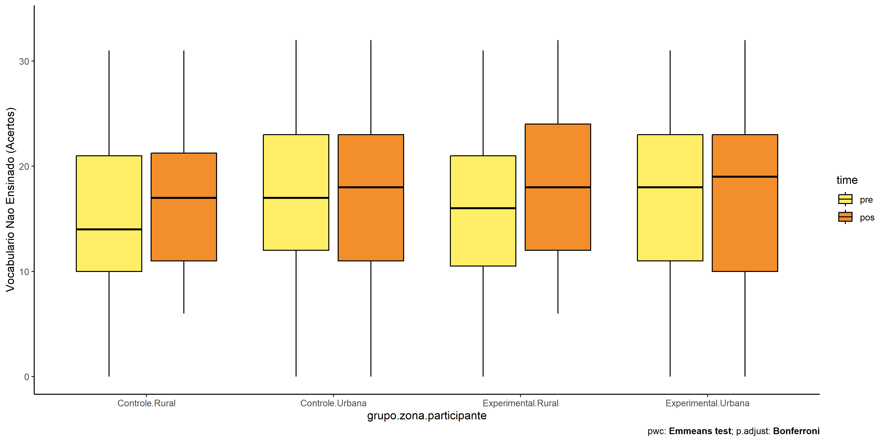<!-- -->

### Vocabulario Nao Ensinado (TRI)

| var                        | zona.participante | grupo        |   n | M (pre) | SE (pre) | M (unadj) | SE (unadj) | M (adj) | SE (adj) |
|:---------------------------|:------------------|:-------------|----:|--------:|---------:|----------:|-----------:|--------:|---------:|
| tri.vocab.nao.ensinado.pos | Rural             | Controle     |  53 |  -0.028 |    0.116 |     0.047 |      0.118 |   0.119 |    0.084 |
| tri.vocab.nao.ensinado.pos | Rural             | Experimental |  58 |  -0.041 |    0.119 |     0.213 |      0.130 |   0.295 |    0.080 |
| tri.vocab.nao.ensinado.pos | Urbana            | Controle     |  69 |   0.171 |    0.106 |     0.325 |      0.117 |   0.228 |    0.074 |
| tri.vocab.nao.ensinado.pos | Urbana            | Experimental |  53 |   0.097 |    0.131 |     0.161 |      0.143 |   0.126 |    0.084 |

| .y.                        | grupo        | zona.participante | group1   | group2       | estimate | conf.low | conf.high |    se | statistic |     p | p.adj | p.adj.signif |
|:---------------------------|:-------------|:------------------|:---------|:-------------|---------:|---------:|----------:|------:|----------:|------:|------:|:-------------|
| tri.vocab.nao.ensinado.pos | Controle     |                   | Urbana   | Rural        |    0.110 |   -0.111 |     0.330 | 0.112 |     0.979 | 0.328 | 0.328 | ns           |
| tri.vocab.nao.ensinado.pos | Experimental |                   | Urbana   | Rural        |   -0.168 |   -0.398 |     0.061 | 0.116 |    -1.449 | 0.149 | 0.149 | ns           |
| tri.vocab.nao.ensinado.pre | Controle     |                   | Urbana   | Rural        |    0.200 |   -0.122 |     0.521 | 0.163 |     1.222 | 0.223 | 0.223 | ns           |
| tri.vocab.nao.ensinado.pre | Experimental |                   | Urbana   | Rural        |    0.138 |   -0.196 |     0.473 | 0.170 |     0.815 | 0.416 | 0.416 | ns           |
| tri.vocab.nao.ensinado.pos |              | Urbana            | Controle | Experimental |    0.102 |   -0.118 |     0.322 | 0.112 |     0.913 | 0.362 | 0.362 | ns           |
| tri.vocab.nao.ensinado.pos |              | Rural             | Controle | Experimental |   -0.176 |   -0.405 |     0.052 | 0.116 |    -1.518 | 0.130 | 0.130 | ns           |
| tri.vocab.nao.ensinado.pre |              | Urbana            | Controle | Experimental |    0.074 |   -0.248 |     0.396 | 0.163 |     0.453 | 0.651 | 0.651 | ns           |
| tri.vocab.nao.ensinado.pre |              | Rural             | Controle | Experimental |    0.013 |   -0.322 |     0.347 | 0.170 |     0.076 | 0.940 | 0.940 | ns           |

| grupo        | zona.participante | group1 | group2 | estimate | conf.low | conf.high |    se | statistic |     p | p.adj | p.adj.signif |
|:-------------|:------------------|:-------|:-------|---------:|---------:|----------:|------:|----------:|------:|------:|:-------------|
| Controle     | Urbana            | pre    | pos    |   -0.128 |   -0.434 |     0.178 | 0.156 |    -0.822 | 0.412 | 0.412 | ns           |
| Controle     | Rural             | pre    | pos    |   -0.041 |   -0.394 |     0.312 | 0.180 |    -0.228 | 0.820 | 0.820 | ns           |
| Experimental | Urbana            | pre    | pos    |   -0.018 |   -0.371 |     0.335 | 0.180 |    -0.102 | 0.919 | 0.919 | ns           |
| Experimental | Rural             | pre    | pos    |   -0.268 |   -0.609 |     0.072 | 0.173 |    -1.548 | 0.122 | 0.122 | ns           |

    ## Scale for colour is already present.
    ## Adding another scale for colour, which will replace the existing scale.

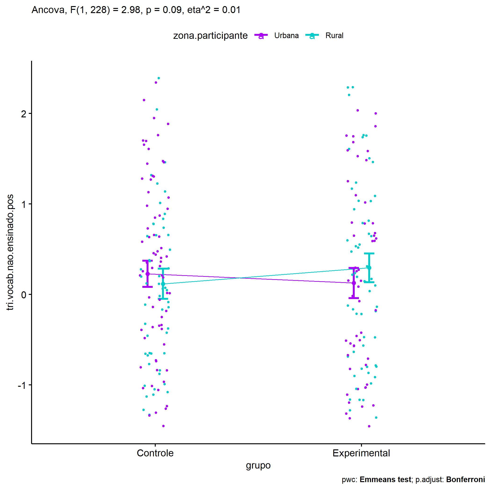<!-- -->

    ## Scale for colour is already present.
    ## Adding another scale for colour, which will replace the existing scale.

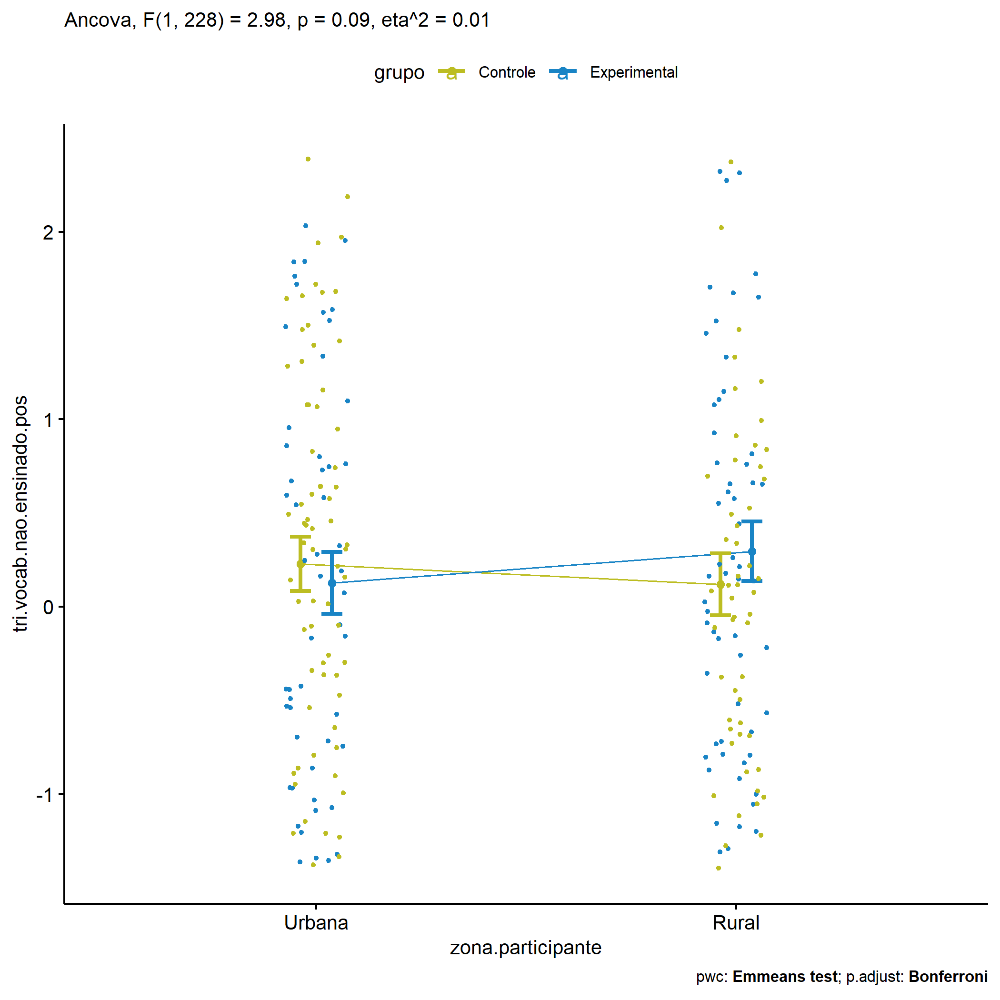<!-- -->

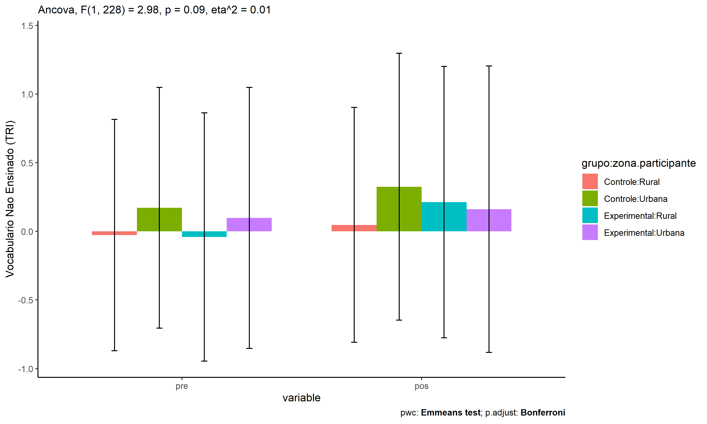<!-- -->

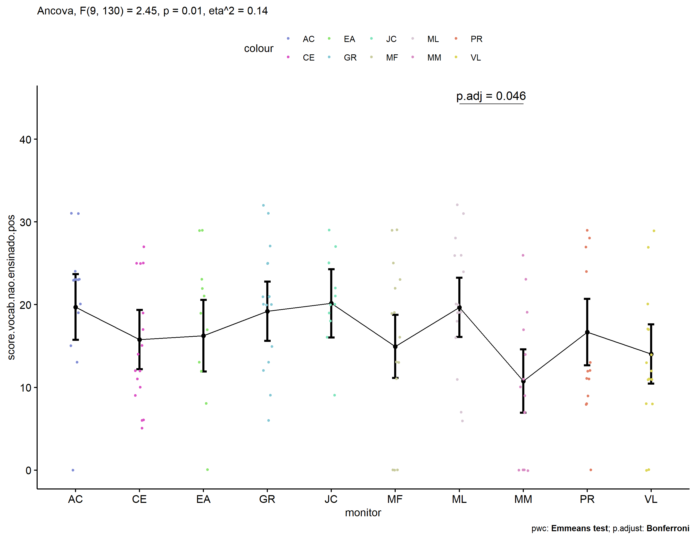<!-- -->

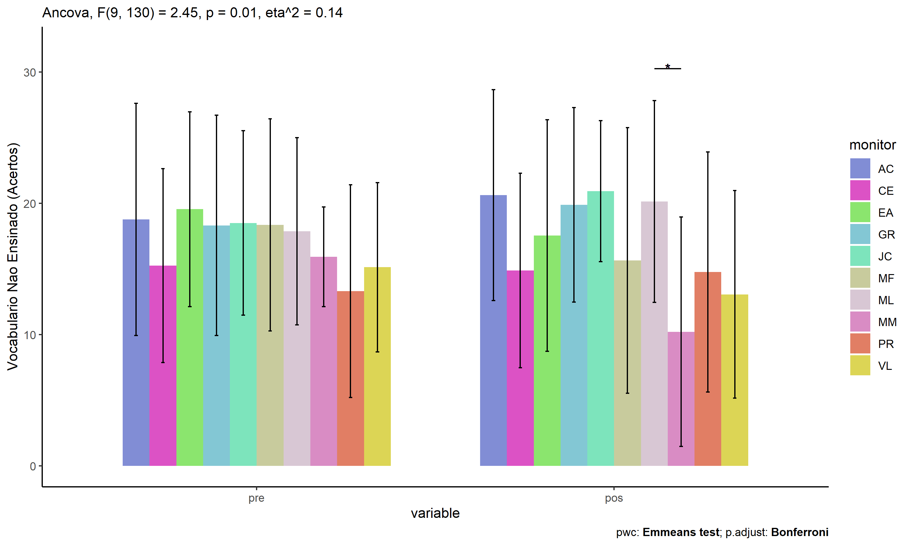<!-- -->

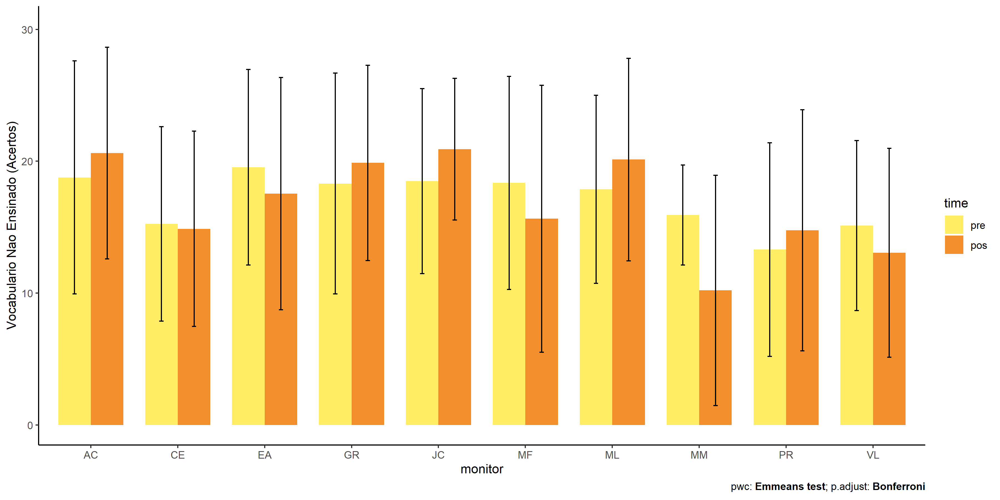<!-- -->

## factores: **escola:grupo**

### Vocabulario (Acertos)

| var             | escola | grupo        |   n | M (pre) | SE (pre) | M (unadj) | SE (unadj) | M (adj) | SE (adj) |
|:----------------|:-------|:-------------|----:|--------:|---------:|----------:|-----------:|--------:|---------:|
| score.vocab.pos | E1     | Controle     |  11 |  22.000 |    1.849 |    22.636 |      1.960 |  21.800 |    1.595 |
| score.vocab.pos | E1     | Experimental |  12 |  18.167 |    2.519 |    19.667 |      3.028 |  21.791 |    1.530 |
| score.vocab.pos | E2     | Controle     |  34 |  21.118 |    1.676 |    21.206 |      1.593 |  21.051 |    0.907 |
| score.vocab.pos | E2     | Experimental |  24 |  19.708 |    1.571 |    21.875 |      1.774 |  22.808 |    1.080 |
| score.vocab.pos | E3     | Controle     |  21 |  19.095 |    1.846 |    20.905 |      1.626 |  22.312 |    1.156 |
| score.vocab.pos | E3     | Experimental |  16 |  22.188 |    2.255 |    25.000 |      2.343 |  24.018 |    1.323 |
| score.vocab.pos | E4     | Controle     |  20 |  23.400 |    1.707 |    22.150 |      1.660 |  20.232 |    1.186 |
| score.vocab.pos | E4     | Experimental |  15 |  20.600 |    2.072 |    18.467 |      2.095 |  18.711 |    1.365 |
| score.vocab.pos | E5     | Controle     |  59 |  20.644 |    1.078 |    22.441 |      1.111 |  22.651 |    0.689 |
| score.vocab.pos | E5     | Experimental |  60 |  21.500 |    1.127 |    23.467 |      1.050 |  23.016 |    0.683 |
| score.vocab.pos | E6     | Controle     |  14 |  21.357 |    2.495 |    21.286 |      2.192 |  20.946 |    1.413 |
| score.vocab.pos | E6     | Experimental |  14 |  20.286 |    2.347 |    18.500 |      2.270 |  18.987 |    1.413 |

| .y.             | grupo        | escola | group1   | group2       | estimate | conf.low | conf.high |    se | statistic |     p | p.adj | p.adj.signif |
|:----------------|:-------------|:-------|:---------|:-------------|---------:|---------:|----------:|------:|----------:|------:|------:|:-------------|
| score.vocab.pos | Controle     |        | E1       | E2           |    0.749 |   -2.862 |     4.360 | 1.835 |     0.408 | 0.683 | 1.000 | ns           |
| score.vocab.pos | Controle     |        | E1       | E3           |   -0.512 |   -4.391 |     3.368 | 1.971 |    -0.260 | 0.795 | 1.000 | ns           |
| score.vocab.pos | Controle     |        | E1       | E4           |    1.568 |   -2.341 |     5.476 | 1.986 |     0.789 | 0.430 | 1.000 | ns           |
| score.vocab.pos | Controle     |        | E1       | E5           |   -0.852 |   -4.271 |     2.568 | 1.737 |    -0.490 | 0.624 | 1.000 | ns           |
| score.vocab.pos | Controle     |        | E1       | E6           |    0.854 |   -3.340 |     5.048 | 2.131 |     0.401 | 0.689 | 1.000 | ns           |
| score.vocab.pos | Controle     |        | E2       | E3           |   -1.261 |   -4.153 |     1.631 | 1.469 |    -0.858 | 0.392 | 1.000 | ns           |
| score.vocab.pos | Controle     |        | E2       | E4           |    0.819 |   -2.119 |     3.756 | 1.492 |     0.549 | 0.584 | 1.000 | ns           |
| score.vocab.pos | Controle     |        | E2       | E5           |   -1.601 |   -3.842 |     0.641 | 1.139 |    -1.406 | 0.161 | 1.000 | ns           |
| score.vocab.pos | Controle     |        | E2       | E6           |    0.105 |   -3.200 |     3.410 | 1.679 |     0.063 | 0.950 | 1.000 | ns           |
| score.vocab.pos | Controle     |        | E3       | E4           |    2.079 |   -1.187 |     5.346 | 1.660 |     1.253 | 0.211 | 1.000 | ns           |
| score.vocab.pos | Controle     |        | E3       | E5           |   -0.340 |   -2.987 |     2.307 | 1.345 |    -0.253 | 0.801 | 1.000 | ns           |
| score.vocab.pos | Controle     |        | E3       | E6           |    1.366 |   -2.229 |     4.961 | 1.826 |     0.748 | 0.455 | 1.000 | ns           |
| score.vocab.pos | Controle     |        | E4       | E5           |   -2.419 |   -5.119 |     0.281 | 1.372 |    -1.763 | 0.079 | 1.000 | ns           |
| score.vocab.pos | Controle     |        | E4       | E6           |   -0.713 |   -4.343 |     2.916 | 1.844 |    -0.387 | 0.699 | 1.000 | ns           |
| score.vocab.pos | Controle     |        | E5       | E6           |    1.706 |   -1.389 |     4.800 | 1.572 |     1.085 | 0.279 | 1.000 | ns           |
| score.vocab.pos | Experimental |        | E1       | E2           |   -1.018 |   -4.699 |     2.664 | 1.870 |    -0.544 | 0.587 | 1.000 | ns           |
| score.vocab.pos | Experimental |        | E1       | E3           |   -2.228 |   -6.213 |     1.757 | 2.025 |    -1.100 | 0.272 | 1.000 | ns           |
| score.vocab.pos | Experimental |        | E1       | E4           |    3.079 |   -0.955 |     7.114 | 2.050 |     1.502 | 0.134 | 1.000 | ns           |
| score.vocab.pos | Experimental |        | E1       | E5           |   -1.226 |   -4.526 |     2.074 | 1.677 |    -0.731 | 0.465 | 1.000 | ns           |
| score.vocab.pos | Experimental |        | E1       | E6           |    2.803 |   -1.294 |     6.901 | 2.082 |     1.347 | 0.179 | 1.000 | ns           |
| score.vocab.pos | Experimental |        | E2       | E3           |   -1.210 |   -4.574 |     2.154 | 1.709 |    -0.708 | 0.479 | 1.000 | ns           |
| score.vocab.pos | Experimental |        | E2       | E4           |    4.097 |    0.671 |     7.523 | 1.741 |     2.354 | 0.019 | 0.289 | ns           |
| score.vocab.pos | Experimental |        | E2       | E5           |   -0.208 |   -2.725 |     2.309 | 1.279 |    -0.163 | 0.871 | 1.000 | ns           |
| score.vocab.pos | Experimental |        | E2       | E6           |    3.821 |    0.321 |     7.321 | 1.778 |     2.148 | 0.033 | 0.488 | ns           |
| score.vocab.pos | Experimental |        | E3       | E4           |    5.307 |    1.565 |     9.050 | 1.901 |     2.791 | 0.006 | 0.084 | ns           |
| score.vocab.pos | Experimental |        | E3       | E5           |    1.002 |   -1.927 |     3.931 | 1.488 |     0.674 | 0.501 | 1.000 | ns           |
| score.vocab.pos | Experimental |        | E3       | E6           |    5.031 |    1.220 |     8.843 | 1.936 |     2.598 | 0.010 | 0.148 | ns           |
| score.vocab.pos | Experimental |        | E4       | E5           |   -4.305 |   -7.310 |    -1.300 | 1.527 |    -2.819 | 0.005 | 0.077 | ns           |
| score.vocab.pos | Experimental |        | E4       | E6           |   -0.276 |   -4.144 |     3.592 | 1.965 |    -0.140 | 0.888 | 1.000 | ns           |
| score.vocab.pos | Experimental |        | E5       | E6           |    4.029 |    0.938 |     7.119 | 1.570 |     2.566 | 0.011 | 0.162 | ns           |
| score.vocab.pre | Controle     |        | E1       | E2           |    0.882 |   -4.947 |     6.712 | 2.962 |     0.298 | 0.766 | 1.000 | ns           |
| score.vocab.pre | Controle     |        | E1       | E3           |    2.905 |   -3.351 |     9.160 | 3.178 |     0.914 | 0.361 | 1.000 | ns           |
| score.vocab.pre | Controle     |        | E1       | E4           |   -1.400 |   -7.709 |     4.909 | 3.205 |    -0.437 | 0.663 | 1.000 | ns           |
| score.vocab.pre | Controle     |        | E1       | E5           |    1.356 |   -4.164 |     6.876 | 2.804 |     0.484 | 0.629 | 1.000 | ns           |
| score.vocab.pre | Controle     |        | E1       | E6           |    0.643 |   -6.129 |     7.414 | 3.440 |     0.187 | 0.852 | 1.000 | ns           |
| score.vocab.pre | Controle     |        | E2       | E3           |    2.022 |   -2.642 |     6.687 | 2.370 |     0.853 | 0.394 | 1.000 | ns           |
| score.vocab.pre | Controle     |        | E2       | E4           |   -2.282 |   -7.019 |     2.454 | 2.406 |    -0.948 | 0.344 | 1.000 | ns           |
| score.vocab.pre | Controle     |        | E2       | E5           |    0.474 |   -3.145 |     4.092 | 1.839 |     0.258 | 0.797 | 1.000 | ns           |
| score.vocab.pre | Controle     |        | E2       | E6           |   -0.239 |   -5.577 |     5.098 | 2.712 |    -0.088 | 0.930 | 1.000 | ns           |
| score.vocab.pre | Controle     |        | E3       | E4           |   -4.305 |   -9.556 |     0.946 | 2.668 |    -1.614 | 0.108 | 1.000 | ns           |
| score.vocab.pre | Controle     |        | E3       | E5           |   -1.549 |   -5.819 |     2.722 | 2.170 |    -0.714 | 0.476 | 1.000 | ns           |
| score.vocab.pre | Controle     |        | E3       | E6           |   -2.262 |   -8.061 |     3.537 | 2.946 |    -0.768 | 0.443 | 1.000 | ns           |
| score.vocab.pre | Controle     |        | E4       | E5           |    2.756 |   -1.593 |     7.105 | 2.209 |     1.247 | 0.213 | 1.000 | ns           |
| score.vocab.pre | Controle     |        | E4       | E6           |    2.043 |   -3.814 |     7.899 | 2.976 |     0.687 | 0.493 | 1.000 | ns           |
| score.vocab.pre | Controle     |        | E5       | E6           |   -0.713 |   -5.709 |     4.283 | 2.539 |    -0.281 | 0.779 | 1.000 | ns           |
| score.vocab.pre | Experimental |        | E1       | E2           |   -1.542 |   -7.484 |     4.400 | 3.019 |    -0.511 | 0.610 | 1.000 | ns           |
| score.vocab.pre | Experimental |        | E1       | E3           |   -4.021 |  -10.439 |     2.397 | 3.261 |    -1.233 | 0.219 | 1.000 | ns           |
| score.vocab.pre | Experimental |        | E1       | E4           |   -2.433 |   -8.943 |     4.076 | 3.307 |    -0.736 | 0.462 | 1.000 | ns           |
| score.vocab.pre | Experimental |        | E1       | E5           |   -3.333 |   -8.648 |     1.981 | 2.700 |    -1.234 | 0.218 | 1.000 | ns           |
| score.vocab.pre | Experimental |        | E1       | E6           |   -2.119 |   -8.731 |     4.493 | 3.359 |    -0.631 | 0.529 | 1.000 | ns           |
| score.vocab.pre | Experimental |        | E2       | E3           |   -2.479 |   -7.904 |     2.945 | 2.756 |    -0.900 | 0.369 | 1.000 | ns           |
| score.vocab.pre | Experimental |        | E2       | E4           |   -0.892 |   -6.423 |     4.640 | 2.811 |    -0.317 | 0.751 | 1.000 | ns           |
| score.vocab.pre | Experimental |        | E2       | E5           |   -1.792 |   -5.851 |     2.268 | 2.062 |    -0.869 | 0.386 | 1.000 | ns           |
| score.vocab.pre | Experimental |        | E2       | E6           |   -0.577 |   -6.229 |     5.075 | 2.872 |    -0.201 | 0.841 | 1.000 | ns           |
| score.vocab.pre | Experimental |        | E3       | E4           |    1.588 |   -4.453 |     7.628 | 3.069 |     0.517 | 0.605 | 1.000 | ns           |
| score.vocab.pre | Experimental |        | E3       | E5           |    0.687 |   -4.041 |     5.416 | 2.403 |     0.286 | 0.775 | 1.000 | ns           |
| score.vocab.pre | Experimental |        | E3       | E6           |    1.902 |   -4.249 |     8.052 | 3.125 |     0.609 | 0.543 | 1.000 | ns           |
| score.vocab.pre | Experimental |        | E4       | E5           |   -0.900 |   -5.752 |     3.952 | 2.465 |    -0.365 | 0.715 | 1.000 | ns           |
| score.vocab.pre | Experimental |        | E4       | E6           |    0.314 |   -5.931 |     6.560 | 3.173 |     0.099 | 0.921 | 1.000 | ns           |
| score.vocab.pre | Experimental |        | E5       | E6           |    1.214 |   -3.774 |     6.203 | 2.534 |     0.479 | 0.632 | 1.000 | ns           |
| score.vocab.pos |              | E1     | Controle | Experimental |    0.009 |   -4.344 |     4.362 | 2.212 |     0.004 | 0.997 | 0.997 | ns           |
| score.vocab.pos |              | E2     | Controle | Experimental |   -1.758 |   -4.534 |     1.019 | 1.411 |    -1.246 | 0.214 | 0.214 | ns           |
| score.vocab.pos |              | E3     | Controle | Experimental |   -1.707 |   -5.168 |     1.754 | 1.758 |    -0.971 | 0.332 | 0.332 | ns           |
| score.vocab.pos |              | E4     | Controle | Experimental |    1.521 |   -2.040 |     5.081 | 1.809 |     0.841 | 0.401 | 0.401 | ns           |
| score.vocab.pos |              | E5     | Controle | Experimental |   -0.365 |   -2.274 |     1.544 | 0.970 |    -0.376 | 0.707 | 0.707 | ns           |
| score.vocab.pos |              | E6     | Controle | Experimental |    1.958 |   -1.976 |     5.893 | 1.999 |     0.980 | 0.328 | 0.328 | ns           |
| score.vocab.pre |              | E1     | Controle | Experimental |    3.833 |   -3.182 |    10.849 | 3.564 |     1.075 | 0.283 | 0.283 | ns           |
| score.vocab.pre |              | E2     | Controle | Experimental |    1.409 |   -3.071 |     5.890 | 2.277 |     0.619 | 0.536 | 0.536 | ns           |
| score.vocab.pre |              | E3     | Controle | Experimental |   -3.092 |   -8.669 |     2.485 | 2.834 |    -1.091 | 0.276 | 0.276 | ns           |
| score.vocab.pre |              | E4     | Controle | Experimental |    2.800 |   -2.941 |     8.541 | 2.917 |     0.960 | 0.338 | 0.338 | ns           |
| score.vocab.pre |              | E5     | Controle | Experimental |   -0.856 |   -3.937 |     2.226 | 1.566 |    -0.547 | 0.585 | 0.585 | ns           |
| score.vocab.pre |              | E6     | Controle | Experimental |    1.071 |   -5.281 |     7.424 | 3.227 |     0.332 | 0.740 | 0.740 | ns           |

| grupo        | escola | group1 | group2 | estimate | conf.low | conf.high |    se | statistic |     p | p.adj | p.adj.signif |
|:-------------|:-------|:-------|:-------|---------:|---------:|----------:|------:|----------:|------:|------:|:-------------|
| Controle     | E1     | pre    | pos    |   -0.615 |   -7.309 |     6.079 | 3.409 |    -0.181 | 0.857 | 0.857 | ns           |
| Controle     | E2     | pre    | pos    |   -0.234 |   -4.261 |     3.792 | 2.050 |    -0.114 | 0.909 | 0.909 | ns           |
| Controle     | E3     | pre    | pos    |   -2.177 |   -7.279 |     2.924 | 2.598 |    -0.838 | 0.402 | 0.402 | ns           |
| Controle     | E4     | pre    | pos    |    1.250 |   -4.038 |     6.538 | 2.693 |     0.464 | 0.643 | 0.643 | ns           |
| Controle     | E5     | pre    | pos    |   -1.412 |   -4.392 |     1.568 | 1.517 |    -0.930 | 0.352 | 0.352 | ns           |
| Controle     | E6     | pre    | pos    |   -0.133 |   -6.239 |     5.973 | 3.109 |    -0.043 | 0.966 | 0.966 | ns           |
| Experimental | E1     | pre    | pos    |   -1.500 |   -8.327 |     5.327 | 3.476 |    -0.432 | 0.666 | 0.666 | ns           |
| Experimental | E2     | pre    | pos    |   -1.593 |   -6.122 |     2.935 | 2.306 |    -0.691 | 0.490 | 0.490 | ns           |
| Experimental | E3     | pre    | pos    |   -2.813 |   -8.725 |     3.100 | 3.010 |    -0.934 | 0.351 | 0.351 | ns           |
| Experimental | E4     | pre    | pos    |    1.288 |   -4.722 |     7.297 | 3.060 |     0.421 | 0.674 | 0.674 | ns           |
| Experimental | E5     | pre    | pos    |   -1.779 |   -4.784 |     1.226 | 1.530 |    -1.163 | 0.245 | 0.245 | ns           |
| Experimental | E6     | pre    | pos    |    1.188 |   -4.932 |     7.307 | 3.116 |     0.381 | 0.703 | 0.703 | ns           |

    ## Scale for colour is already present.
    ## Adding another scale for colour, which will replace the existing scale.

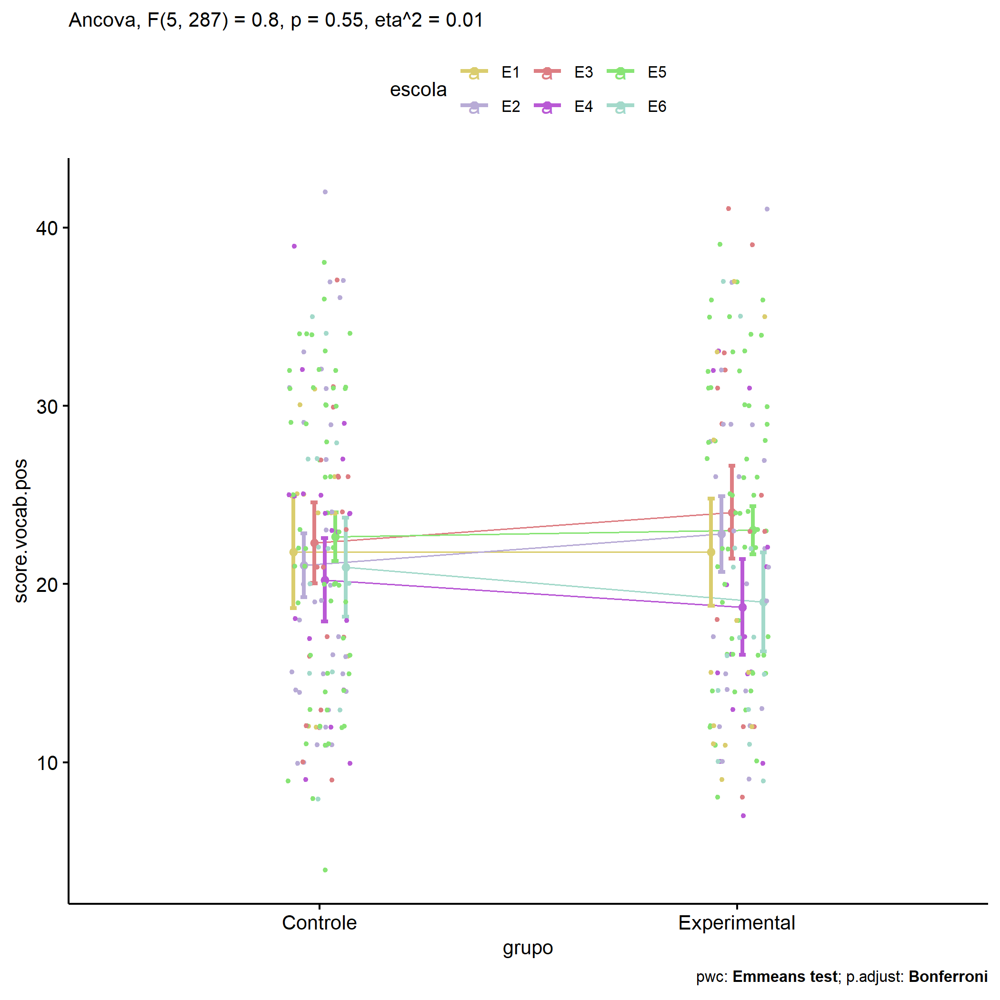<!-- -->

    ## Scale for colour is already present.
    ## Adding another scale for colour, which will replace the existing scale.

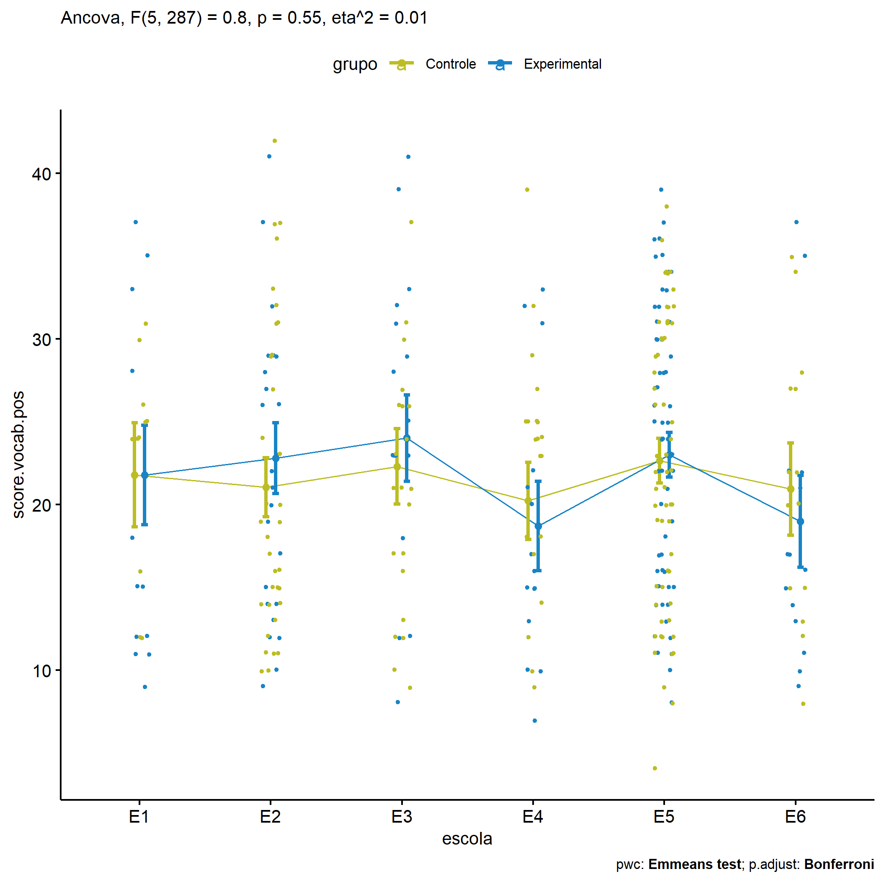<!-- -->

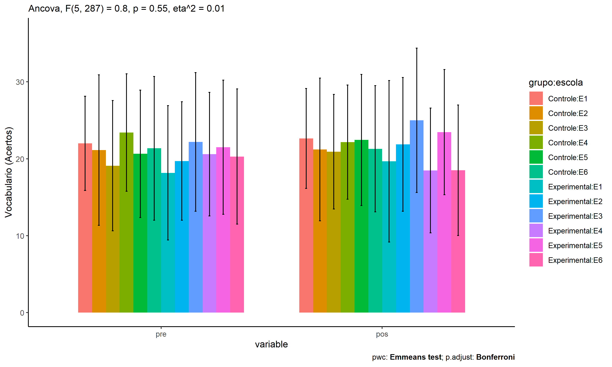<!-- -->

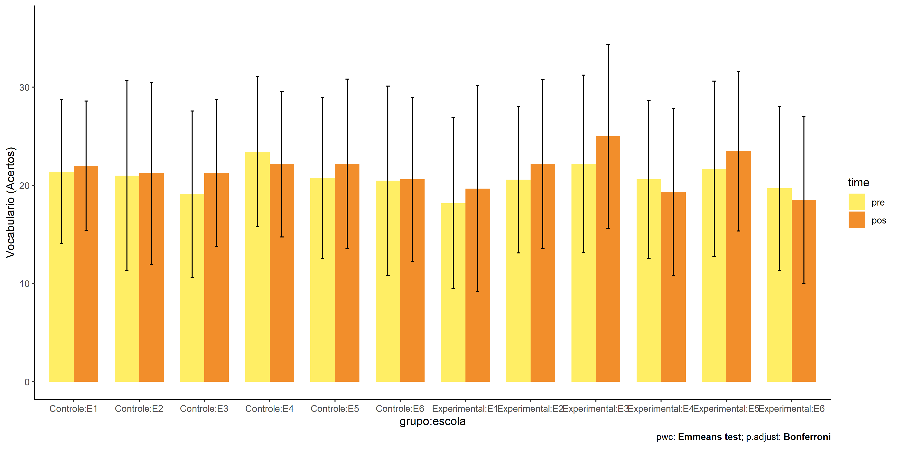<!-- -->

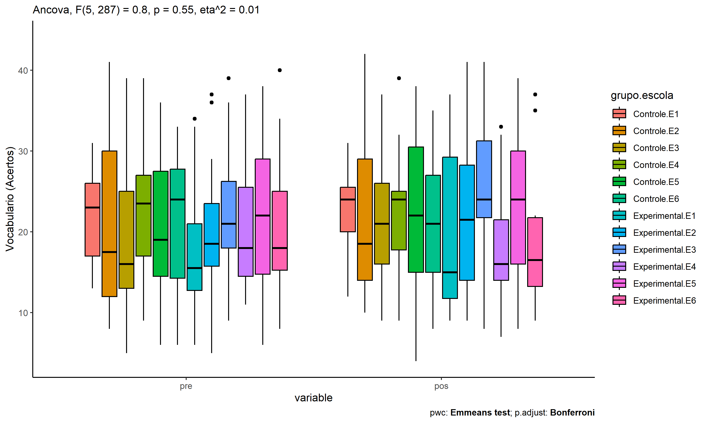<!-- -->

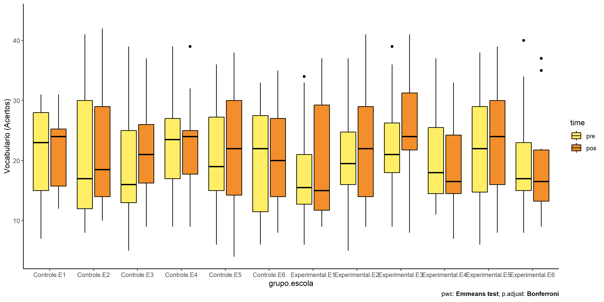<!-- -->

### Vocabulario (TRI)

| var           | escola | grupo        |   n | M (pre) | SE (pre) | M (unadj) | SE (unadj) | M (adj) | SE (adj) |
|:--------------|:-------|:-------------|----:|--------:|---------:|----------:|-----------:|--------:|---------:|
| tri.vocab.pos | E1     | Controle     |  11 |   0.341 |    0.184 |     0.483 |      0.192 |   0.244 |    0.173 |
| tri.vocab.pos | E1     | Experimental |  12 |  -0.445 |    0.331 |    -0.099 |      0.335 |   0.337 |    0.167 |
| tri.vocab.pos | E2     | Controle     |  34 |   0.039 |    0.174 |    -0.053 |      0.194 |  -0.032 |    0.098 |
| tri.vocab.pos | E2     | Experimental |  24 |  -0.058 |    0.181 |     0.039 |      0.192 |   0.143 |    0.117 |
| tri.vocab.pos | E3     | Controle     |  21 |  -0.076 |    0.173 |     0.006 |      0.188 |   0.125 |    0.125 |
| tri.vocab.pos | E3     | Experimental |  16 |   0.224 |    0.262 |     0.494 |      0.224 |   0.355 |    0.144 |
| tri.vocab.pos | E4     | Controle     |  20 |   0.217 |    0.181 |     0.111 |      0.207 |  -0.022 |    0.128 |
| tri.vocab.pos | E4     | Experimental |  15 |   0.052 |    0.178 |    -0.158 |      0.234 |  -0.149 |    0.148 |
| tri.vocab.pos | E5     | Controle     |  59 |   0.074 |    0.115 |     0.196 |      0.132 |   0.187 |    0.075 |
| tri.vocab.pos | E5     | Experimental |  60 |   0.116 |    0.124 |     0.301 |      0.123 |   0.256 |    0.074 |
| tri.vocab.pos | E6     | Controle     |  14 |   0.204 |    0.231 |     0.150 |      0.230 |   0.030 |    0.153 |
| tri.vocab.pos | E6     | Experimental |  14 |  -0.056 |    0.212 |    -0.195 |      0.227 |  -0.093 |    0.153 |

| .y.           | grupo        | escola | group1   | group2       | estimate | conf.low | conf.high |    se | statistic |     p | p.adj | p.adj.signif |
|:--------------|:-------------|:-------|:---------|:-------------|---------:|---------:|----------:|------:|----------:|------:|------:|:-------------|
| tri.vocab.pos | Controle     |        | E1       | E2           |    0.276 |   -0.116 |     0.668 | 0.199 |     1.385 | 0.167 | 1.000 | ns           |
| tri.vocab.pos | Controle     |        | E1       | E3           |    0.119 |   -0.302 |     0.541 | 0.214 |     0.556 | 0.579 | 1.000 | ns           |
| tri.vocab.pos | Controle     |        | E1       | E4           |    0.266 |   -0.158 |     0.690 | 0.215 |     1.236 | 0.218 | 1.000 | ns           |
| tri.vocab.pos | Controle     |        | E1       | E5           |    0.058 |   -0.314 |     0.429 | 0.189 |     0.305 | 0.760 | 1.000 | ns           |
| tri.vocab.pos | Controle     |        | E1       | E6           |    0.215 |   -0.240 |     0.670 | 0.231 |     0.928 | 0.354 | 1.000 | ns           |
| tri.vocab.pos | Controle     |        | E2       | E3           |   -0.157 |   -0.471 |     0.157 | 0.159 |    -0.985 | 0.325 | 1.000 | ns           |
| tri.vocab.pos | Controle     |        | E2       | E4           |   -0.010 |   -0.328 |     0.309 | 0.162 |    -0.061 | 0.952 | 1.000 | ns           |
| tri.vocab.pos | Controle     |        | E2       | E5           |   -0.218 |   -0.462 |     0.025 | 0.124 |    -1.768 | 0.078 | 1.000 | ns           |
| tri.vocab.pos | Controle     |        | E2       | E6           |   -0.061 |   -0.420 |     0.297 | 0.182 |    -0.337 | 0.737 | 1.000 | ns           |
| tri.vocab.pos | Controle     |        | E3       | E4           |    0.147 |   -0.206 |     0.501 | 0.180 |     0.819 | 0.413 | 1.000 | ns           |
| tri.vocab.pos | Controle     |        | E3       | E5           |   -0.062 |   -0.349 |     0.226 | 0.146 |    -0.422 | 0.674 | 1.000 | ns           |
| tri.vocab.pos | Controle     |        | E3       | E6           |    0.096 |   -0.295 |     0.486 | 0.198 |     0.482 | 0.630 | 1.000 | ns           |
| tri.vocab.pos | Controle     |        | E4       | E5           |   -0.209 |   -0.501 |     0.084 | 0.149 |    -1.404 | 0.161 | 1.000 | ns           |
| tri.vocab.pos | Controle     |        | E4       | E6           |   -0.052 |   -0.445 |     0.342 | 0.200 |    -0.258 | 0.797 | 1.000 | ns           |
| tri.vocab.pos | Controle     |        | E5       | E6           |    0.157 |   -0.179 |     0.493 | 0.171 |     0.920 | 0.358 | 1.000 | ns           |
| tri.vocab.pos | Experimental |        | E1       | E2           |    0.194 |   -0.206 |     0.595 | 0.203 |     0.955 | 0.340 | 1.000 | ns           |
| tri.vocab.pos | Experimental |        | E1       | E3           |   -0.018 |   -0.452 |     0.416 | 0.221 |    -0.082 | 0.935 | 1.000 | ns           |
| tri.vocab.pos | Experimental |        | E1       | E4           |    0.485 |    0.047 |     0.924 | 0.223 |     2.177 | 0.030 | 0.454 | ns           |
| tri.vocab.pos | Experimental |        | E1       | E5           |    0.081 |   -0.279 |     0.440 | 0.183 |     0.441 | 0.659 | 1.000 | ns           |
| tri.vocab.pos | Experimental |        | E1       | E6           |    0.430 |   -0.015 |     0.875 | 0.226 |     1.902 | 0.058 | 0.873 | ns           |
| tri.vocab.pos | Experimental |        | E2       | E3           |   -0.212 |   -0.578 |     0.153 | 0.185 |    -1.145 | 0.253 | 1.000 | ns           |
| tri.vocab.pos | Experimental |        | E2       | E4           |    0.291 |   -0.081 |     0.663 | 0.189 |     1.541 | 0.124 | 1.000 | ns           |
| tri.vocab.pos | Experimental |        | E2       | E5           |   -0.114 |   -0.387 |     0.159 | 0.139 |    -0.819 | 0.413 | 1.000 | ns           |
| tri.vocab.pos | Experimental |        | E2       | E6           |    0.236 |   -0.144 |     0.616 | 0.193 |     1.222 | 0.223 | 1.000 | ns           |
| tri.vocab.pos | Experimental |        | E3       | E4           |    0.504 |    0.098 |     0.910 | 0.206 |     2.441 | 0.015 | 0.229 | ns           |
| tri.vocab.pos | Experimental |        | E3       | E5           |    0.099 |   -0.219 |     0.417 | 0.162 |     0.611 | 0.541 | 1.000 | ns           |
| tri.vocab.pos | Experimental |        | E3       | E6           |    0.448 |    0.034 |     0.862 | 0.210 |     2.132 | 0.034 | 0.508 | ns           |
| tri.vocab.pos | Experimental |        | E4       | E5           |   -0.405 |   -0.731 |    -0.079 | 0.166 |    -2.444 | 0.015 | 0.227 | ns           |
| tri.vocab.pos | Experimental |        | E4       | E6           |   -0.055 |   -0.475 |     0.364 | 0.213 |    -0.259 | 0.796 | 1.000 | ns           |
| tri.vocab.pos | Experimental |        | E5       | E6           |    0.350 |    0.014 |     0.685 | 0.170 |     2.051 | 0.041 | 0.618 | ns           |
| tri.vocab.pre | Controle     |        | E1       | E2           |    0.302 |   -0.315 |     0.920 | 0.314 |     0.964 | 0.336 | 1.000 | ns           |
| tri.vocab.pre | Controle     |        | E1       | E3           |    0.417 |   -0.245 |     1.080 | 0.337 |     1.239 | 0.216 | 1.000 | ns           |
| tri.vocab.pre | Controle     |        | E1       | E4           |    0.124 |   -0.545 |     0.792 | 0.340 |     0.364 | 0.716 | 1.000 | ns           |
| tri.vocab.pre | Controle     |        | E1       | E5           |    0.267 |   -0.318 |     0.851 | 0.297 |     0.898 | 0.370 | 1.000 | ns           |
| tri.vocab.pre | Controle     |        | E1       | E6           |    0.137 |   -0.580 |     0.855 | 0.364 |     0.377 | 0.706 | 1.000 | ns           |
| tri.vocab.pre | Controle     |        | E2       | E3           |    0.115 |   -0.379 |     0.609 | 0.251 |     0.457 | 0.648 | 1.000 | ns           |
| tri.vocab.pre | Controle     |        | E2       | E4           |   -0.179 |   -0.680 |     0.323 | 0.255 |    -0.701 | 0.484 | 1.000 | ns           |
| tri.vocab.pre | Controle     |        | E2       | E5           |   -0.036 |   -0.419 |     0.348 | 0.195 |    -0.183 | 0.855 | 1.000 | ns           |
| tri.vocab.pre | Controle     |        | E2       | E6           |   -0.165 |   -0.730 |     0.400 | 0.287 |    -0.574 | 0.566 | 1.000 | ns           |
| tri.vocab.pre | Controle     |        | E3       | E4           |   -0.294 |   -0.850 |     0.263 | 0.283 |    -1.039 | 0.300 | 1.000 | ns           |
| tri.vocab.pre | Controle     |        | E3       | E5           |   -0.150 |   -0.603 |     0.302 | 0.230 |    -0.654 | 0.513 | 1.000 | ns           |
| tri.vocab.pre | Controle     |        | E3       | E6           |   -0.280 |   -0.894 |     0.334 | 0.312 |    -0.896 | 0.371 | 1.000 | ns           |
| tri.vocab.pre | Controle     |        | E4       | E5           |    0.143 |   -0.317 |     0.604 | 0.234 |     0.612 | 0.541 | 1.000 | ns           |
| tri.vocab.pre | Controle     |        | E4       | E6           |    0.014 |   -0.607 |     0.634 | 0.315 |     0.044 | 0.965 | 1.000 | ns           |
| tri.vocab.pre | Controle     |        | E5       | E6           |   -0.129 |   -0.659 |     0.400 | 0.269 |    -0.481 | 0.631 | 1.000 | ns           |
| tri.vocab.pre | Experimental |        | E1       | E2           |   -0.387 |   -1.016 |     0.242 | 0.320 |    -1.211 | 0.227 | 1.000 | ns           |
| tri.vocab.pre | Experimental |        | E1       | E3           |   -0.669 |   -1.349 |     0.011 | 0.345 |    -1.937 | 0.054 | 0.806 | ns           |
| tri.vocab.pre | Experimental |        | E1       | E4           |   -0.497 |   -1.186 |     0.193 | 0.350 |    -1.419 | 0.157 | 1.000 | ns           |
| tri.vocab.pre | Experimental |        | E1       | E5           |   -0.560 |   -1.123 |     0.003 | 0.286 |    -1.959 | 0.051 | 0.766 | ns           |
| tri.vocab.pre | Experimental |        | E1       | E6           |   -0.389 |   -1.089 |     0.312 | 0.356 |    -1.093 | 0.275 | 1.000 | ns           |
| tri.vocab.pre | Experimental |        | E2       | E3           |   -0.282 |   -0.856 |     0.293 | 0.292 |    -0.966 | 0.335 | 1.000 | ns           |
| tri.vocab.pre | Experimental |        | E2       | E4           |   -0.110 |   -0.696 |     0.476 | 0.298 |    -0.369 | 0.713 | 1.000 | ns           |
| tri.vocab.pre | Experimental |        | E2       | E5           |   -0.173 |   -0.603 |     0.257 | 0.218 |    -0.793 | 0.428 | 1.000 | ns           |
| tri.vocab.pre | Experimental |        | E2       | E6           |   -0.002 |   -0.600 |     0.597 | 0.304 |    -0.005 | 0.996 | 1.000 | ns           |
| tri.vocab.pre | Experimental |        | E3       | E4           |    0.172 |   -0.468 |     0.812 | 0.325 |     0.530 | 0.597 | 1.000 | ns           |
| tri.vocab.pre | Experimental |        | E3       | E5           |    0.109 |   -0.392 |     0.610 | 0.254 |     0.427 | 0.670 | 1.000 | ns           |
| tri.vocab.pre | Experimental |        | E3       | E6           |    0.280 |   -0.371 |     0.932 | 0.331 |     0.847 | 0.398 | 1.000 | ns           |
| tri.vocab.pre | Experimental |        | E4       | E5           |   -0.063 |   -0.577 |     0.450 | 0.261 |    -0.243 | 0.808 | 1.000 | ns           |
| tri.vocab.pre | Experimental |        | E4       | E6           |    0.108 |   -0.553 |     0.770 | 0.336 |     0.322 | 0.748 | 1.000 | ns           |
| tri.vocab.pre | Experimental |        | E5       | E6           |    0.172 |   -0.357 |     0.700 | 0.268 |     0.639 | 0.523 | 1.000 | ns           |
| tri.vocab.pos |              | E1     | Controle | Experimental |   -0.093 |   -0.568 |     0.382 | 0.241 |    -0.384 | 0.701 | 0.701 | ns           |
| tri.vocab.pos |              | E2     | Controle | Experimental |   -0.174 |   -0.476 |     0.127 | 0.153 |    -1.140 | 0.255 | 0.255 | ns           |
| tri.vocab.pos |              | E3     | Controle | Experimental |   -0.230 |   -0.605 |     0.146 | 0.191 |    -1.205 | 0.229 | 0.229 | ns           |
| tri.vocab.pos |              | E4     | Controle | Experimental |    0.127 |   -0.259 |     0.513 | 0.196 |     0.646 | 0.519 | 0.519 | ns           |
| tri.vocab.pos |              | E5     | Controle | Experimental |   -0.070 |   -0.277 |     0.137 | 0.105 |    -0.661 | 0.509 | 0.509 | ns           |
| tri.vocab.pos |              | E6     | Controle | Experimental |    0.123 |   -0.304 |     0.550 | 0.217 |     0.566 | 0.572 | 0.572 | ns           |
| tri.vocab.pre |              | E1     | Controle | Experimental |    0.786 |    0.043 |     1.529 | 0.378 |     2.081 | 0.038 | 0.038 | \*           |
| tri.vocab.pre |              | E2     | Controle | Experimental |    0.096 |   -0.378 |     0.571 | 0.241 |     0.399 | 0.690 | 0.690 | ns           |
| tri.vocab.pre |              | E3     | Controle | Experimental |   -0.300 |   -0.891 |     0.290 | 0.300 |    -1.001 | 0.318 | 0.318 | ns           |
| tri.vocab.pre |              | E4     | Controle | Experimental |    0.165 |   -0.443 |     0.773 | 0.309 |     0.535 | 0.593 | 0.593 | ns           |
| tri.vocab.pre |              | E5     | Controle | Experimental |   -0.041 |   -0.368 |     0.285 | 0.166 |    -0.249 | 0.803 | 0.803 | ns           |
| tri.vocab.pre |              | E6     | Controle | Experimental |    0.260 |   -0.413 |     0.932 | 0.342 |     0.759 | 0.448 | 0.448 | ns           |

| grupo        | escola | group1 | group2 | estimate | conf.low | conf.high |    se | statistic |     p | p.adj | p.adj.signif |
|:-------------|:-------|:-------|:-------|---------:|---------:|----------:|------:|----------:|------:|------:|:-------------|
| Controle     | E1     | pre    | pos    |   -0.180 |   -0.919 |     0.560 | 0.376 |    -0.477 | 0.633 | 0.633 | ns           |
| Controle     | E2     | pre    | pos    |    0.078 |   -0.366 |     0.523 | 0.226 |     0.346 | 0.729 | 0.729 | ns           |
| Controle     | E3     | pre    | pos    |   -0.111 |   -0.675 |     0.452 | 0.287 |    -0.388 | 0.698 | 0.698 | ns           |
| Controle     | E4     | pre    | pos    |    0.107 |   -0.477 |     0.691 | 0.297 |     0.359 | 0.720 | 0.720 | ns           |
| Controle     | E5     | pre    | pos    |   -0.076 |   -0.405 |     0.253 | 0.168 |    -0.456 | 0.649 | 0.649 | ns           |
| Controle     | E6     | pre    | pos    |    0.104 |   -0.571 |     0.778 | 0.343 |     0.302 | 0.762 | 0.762 | ns           |
| Experimental | E1     | pre    | pos    |   -0.346 |   -1.100 |     0.408 | 0.384 |    -0.901 | 0.368 | 0.368 | ns           |
| Experimental | E2     | pre    | pos    |   -0.057 |   -0.557 |     0.443 | 0.255 |    -0.224 | 0.823 | 0.823 | ns           |
| Experimental | E3     | pre    | pos    |   -0.269 |   -0.922 |     0.384 | 0.332 |    -0.810 | 0.418 | 0.418 | ns           |
| Experimental | E4     | pre    | pos    |    0.129 |   -0.535 |     0.793 | 0.338 |     0.381 | 0.703 | 0.703 | ns           |
| Experimental | E5     | pre    | pos    |   -0.157 |   -0.489 |     0.175 | 0.169 |    -0.931 | 0.352 | 0.352 | ns           |
| Experimental | E6     | pre    | pos    |    0.118 |   -0.558 |     0.794 | 0.344 |     0.343 | 0.731 | 0.731 | ns           |

    ## Scale for colour is already present.
    ## Adding another scale for colour, which will replace the existing scale.

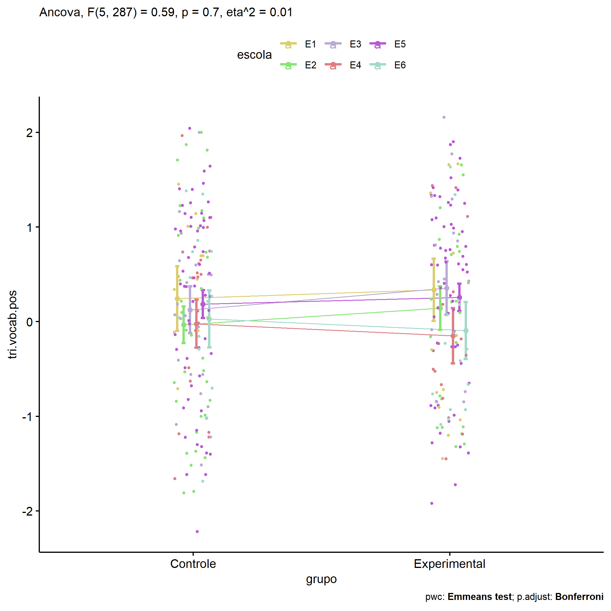<!-- -->

    ## Scale for colour is already present.
    ## Adding another scale for colour, which will replace the existing scale.

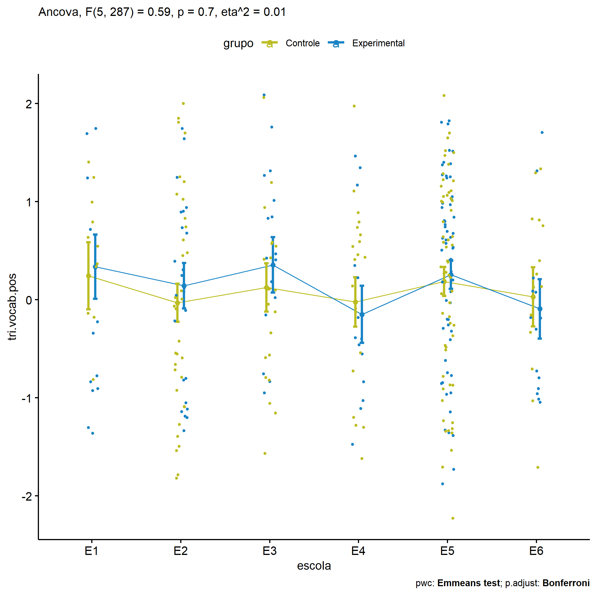<!-- -->

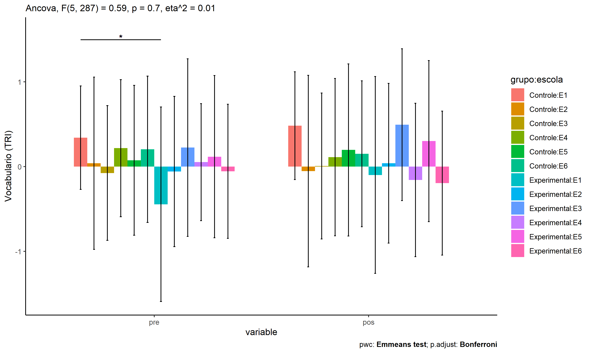<!-- -->

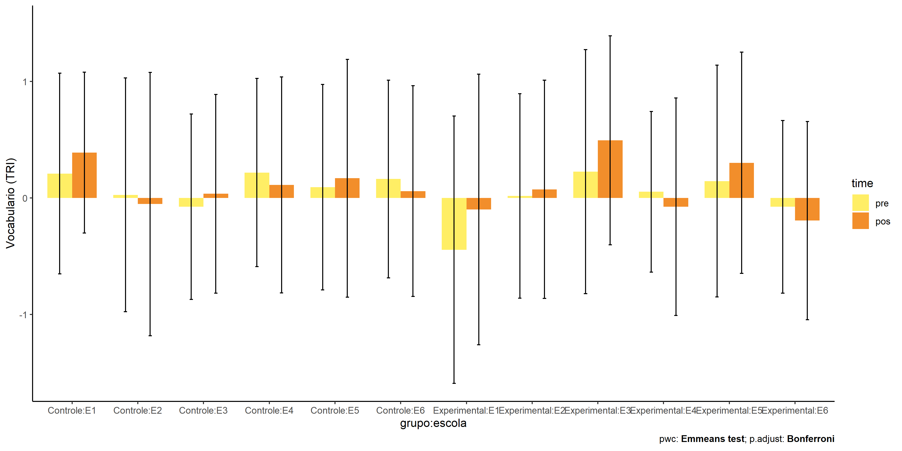<!-- -->

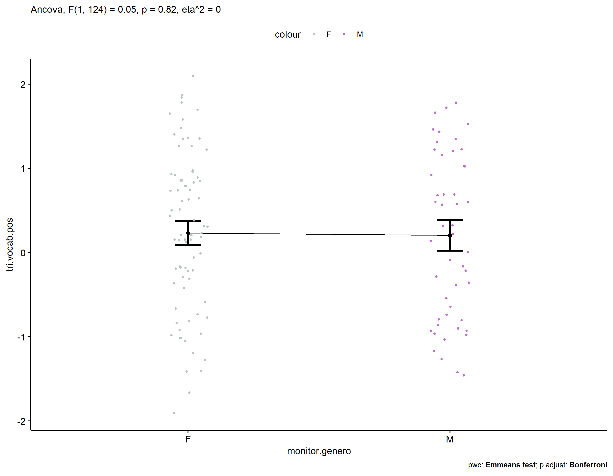<!-- -->

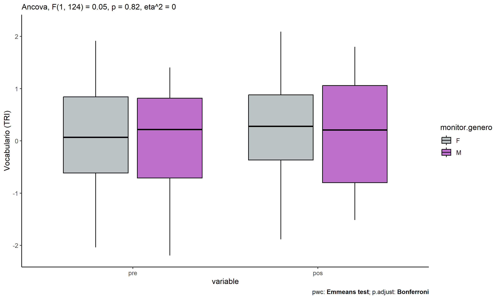<!-- -->

### Vocabulario Ensinado (Acertos)

| var                      | escola | grupo        |   n | M (pre) | SE (pre) | M (unadj) | SE (unadj) | M (adj) | SE (adj) |
|:-------------------------|:-------|:-------------|----:|--------:|---------:|----------:|-----------:|--------:|---------:|
| score.vocab.ensinado.pos | E1     | Controle     |  15 |   3.600 |    0.550 |     3.333 |      0.708 |   3.460 |    0.542 |
| score.vocab.ensinado.pos | E1     | Experimental |  13 |   3.462 |    0.550 |     3.462 |      0.781 |   3.648 |    0.583 |
| score.vocab.ensinado.pos | E2     | Controle     |  35 |   4.057 |    0.402 |     3.943 |      0.422 |   3.871 |    0.355 |
| score.vocab.ensinado.pos | E2     | Experimental |  31 |   3.387 |    0.370 |     3.516 |      0.454 |   3.735 |    0.378 |
| score.vocab.ensinado.pos | E3     | Controle     |  22 |   3.318 |    0.443 |     4.000 |      0.436 |   4.249 |    0.449 |
| score.vocab.ensinado.pos | E3     | Experimental |  16 |   4.312 |    0.637 |     4.875 |      0.547 |   4.692 |    0.525 |
| score.vocab.ensinado.pos | E4     | Controle     |  20 |   4.850 |    0.509 |     4.650 |      0.499 |   4.234 |    0.472 |
| score.vocab.ensinado.pos | E4     | Experimental |  16 |   4.062 |    0.595 |     4.438 |      0.418 |   4.363 |    0.525 |
| score.vocab.ensinado.pos | E5     | Controle     |  68 |   3.647 |    0.288 |     3.603 |      0.262 |   3.709 |    0.255 |
| score.vocab.ensinado.pos | E5     | Experimental |  64 |   4.141 |    0.240 |     4.312 |      0.282 |   4.204 |    0.263 |
| score.vocab.ensinado.pos | E6     | Controle     |  16 |   3.500 |    0.619 |     3.375 |      0.539 |   3.545 |    0.525 |
| score.vocab.ensinado.pos | E6     | Experimental |  16 |   4.562 |    0.570 |     3.125 |      0.651 |   2.834 |    0.526 |

| .y.                      | grupo        | escola | group1   | group2       | estimate | conf.low | conf.high |    se | statistic |     p | p.adj | p.adj.signif |
|:-------------------------|:-------------|:-------|:---------|:-------------|---------:|---------:|----------:|------:|----------:|------:|------:|:-------------|
| score.vocab.ensinado.pos | Controle     |        | E1       | E2           |   -0.411 |   -1.686 |     0.864 | 0.648 |    -0.634 | 0.527 | 1.000 | ns           |
| score.vocab.ensinado.pos | Controle     |        | E1       | E3           |   -0.789 |   -2.172 |     0.594 | 0.703 |    -1.122 | 0.263 | 1.000 | ns           |
| score.vocab.ensinado.pos | Controle     |        | E1       | E4           |   -0.774 |   -2.190 |     0.643 | 0.720 |    -1.074 | 0.283 | 1.000 | ns           |
| score.vocab.ensinado.pos | Controle     |        | E1       | E5           |   -0.249 |   -1.427 |     0.929 | 0.599 |    -0.416 | 0.678 | 1.000 | ns           |
| score.vocab.ensinado.pos | Controle     |        | E1       | E6           |   -0.085 |   -1.569 |     1.399 | 0.754 |    -0.113 | 0.910 | 1.000 | ns           |
| score.vocab.ensinado.pos | Controle     |        | E2       | E3           |   -0.378 |   -1.504 |     0.748 | 0.572 |    -0.661 | 0.509 | 1.000 | ns           |
| score.vocab.ensinado.pos | Controle     |        | E2       | E4           |   -0.363 |   -1.523 |     0.798 | 0.590 |    -0.615 | 0.539 | 1.000 | ns           |
| score.vocab.ensinado.pos | Controle     |        | E2       | E5           |    0.162 |   -0.698 |     1.022 | 0.437 |     0.370 | 0.712 | 1.000 | ns           |
| score.vocab.ensinado.pos | Controle     |        | E2       | E6           |    0.326 |   -0.922 |     1.573 | 0.634 |     0.514 | 0.608 | 1.000 | ns           |
| score.vocab.ensinado.pos | Controle     |        | E3       | E4           |    0.015 |   -1.270 |     1.301 | 0.654 |     0.024 | 0.981 | 1.000 | ns           |
| score.vocab.ensinado.pos | Controle     |        | E3       | E5           |    0.540 |   -0.474 |     1.553 | 0.515 |     1.048 | 0.295 | 1.000 | ns           |
| score.vocab.ensinado.pos | Controle     |        | E3       | E6           |    0.704 |   -0.653 |     2.061 | 0.690 |     1.021 | 0.308 | 1.000 | ns           |
| score.vocab.ensinado.pos | Controle     |        | E4       | E5           |    0.524 |   -0.533 |     1.582 | 0.538 |     0.975 | 0.330 | 1.000 | ns           |
| score.vocab.ensinado.pos | Controle     |        | E4       | E6           |    0.689 |   -0.704 |     2.081 | 0.708 |     0.973 | 0.331 | 1.000 | ns           |
| score.vocab.ensinado.pos | Controle     |        | E5       | E6           |    0.164 |   -0.984 |     1.312 | 0.583 |     0.281 | 0.779 | 1.000 | ns           |
| score.vocab.ensinado.pos | Experimental |        | E1       | E2           |   -0.087 |   -1.452 |     1.278 | 0.694 |    -0.125 | 0.900 | 1.000 | ns           |
| score.vocab.ensinado.pos | Experimental |        | E1       | E3           |   -1.044 |   -2.588 |     0.501 | 0.785 |    -1.330 | 0.185 | 1.000 | ns           |
| score.vocab.ensinado.pos | Experimental |        | E1       | E4           |   -0.715 |   -2.258 |     0.828 | 0.784 |    -0.911 | 0.363 | 1.000 | ns           |
| score.vocab.ensinado.pos | Experimental |        | E1       | E5           |   -0.556 |   -1.814 |     0.702 | 0.640 |    -0.869 | 0.385 | 1.000 | ns           |
| score.vocab.ensinado.pos | Experimental |        | E1       | E6           |    0.815 |   -0.731 |     2.361 | 0.786 |     1.037 | 0.301 | 1.000 | ns           |
| score.vocab.ensinado.pos | Experimental |        | E2       | E3           |   -0.957 |   -2.232 |     0.318 | 0.648 |    -1.477 | 0.141 | 1.000 | ns           |
| score.vocab.ensinado.pos | Experimental |        | E2       | E4           |   -0.628 |   -1.901 |     0.645 | 0.647 |    -0.970 | 0.333 | 1.000 | ns           |
| score.vocab.ensinado.pos | Experimental |        | E2       | E5           |   -0.469 |   -1.376 |     0.438 | 0.461 |    -1.017 | 0.310 | 1.000 | ns           |
| score.vocab.ensinado.pos | Experimental |        | E2       | E6           |    0.902 |   -0.375 |     2.179 | 0.649 |     1.389 | 0.166 | 1.000 | ns           |
| score.vocab.ensinado.pos | Experimental |        | E3       | E4           |    0.329 |   -1.131 |     1.789 | 0.742 |     0.443 | 0.658 | 1.000 | ns           |
| score.vocab.ensinado.pos | Experimental |        | E3       | E5           |    0.488 |   -0.667 |     1.642 | 0.587 |     0.831 | 0.406 | 1.000 | ns           |
| score.vocab.ensinado.pos | Experimental |        | E3       | E6           |    1.859 |    0.398 |     3.319 | 0.742 |     2.504 | 0.013 | 0.192 | ns           |
| score.vocab.ensinado.pos | Experimental |        | E4       | E5           |    0.159 |   -0.995 |     1.313 | 0.587 |     0.271 | 0.787 | 1.000 | ns           |
| score.vocab.ensinado.pos | Experimental |        | E4       | E6           |    1.530 |    0.069 |     2.991 | 0.743 |     2.060 | 0.040 | 0.603 | ns           |
| score.vocab.ensinado.pos | Experimental |        | E5       | E6           |    1.371 |    0.216 |     2.526 | 0.587 |     2.335 | 0.020 | 0.303 | ns           |
| score.vocab.ensinado.pre | Controle     |        | E1       | E2           |   -0.457 |   -1.807 |     0.892 | 0.686 |    -0.666 | 0.506 | 1.000 | ns           |
| score.vocab.ensinado.pre | Controle     |        | E1       | E3           |    0.282 |   -1.182 |     1.746 | 0.744 |     0.379 | 0.705 | 1.000 | ns           |
| score.vocab.ensinado.pre | Controle     |        | E1       | E4           |   -1.250 |   -2.744 |     0.244 | 0.759 |    -1.646 | 0.101 | 1.000 | ns           |
| score.vocab.ensinado.pre | Controle     |        | E1       | E5           |   -0.047 |   -1.294 |     1.200 | 0.634 |    -0.074 | 0.941 | 1.000 | ns           |
| score.vocab.ensinado.pre | Controle     |        | E1       | E6           |    0.100 |   -1.472 |     1.672 | 0.799 |     0.125 | 0.900 | 1.000 | ns           |
| score.vocab.ensinado.pre | Controle     |        | E2       | E3           |    0.739 |   -0.451 |     1.929 | 0.605 |     1.222 | 0.223 | 1.000 | ns           |
| score.vocab.ensinado.pre | Controle     |        | E2       | E4           |   -0.793 |   -2.019 |     0.433 | 0.623 |    -1.273 | 0.204 | 1.000 | ns           |
| score.vocab.ensinado.pre | Controle     |        | E2       | E5           |    0.410 |   -0.500 |     1.320 | 0.462 |     0.887 | 0.376 | 1.000 | ns           |
| score.vocab.ensinado.pre | Controle     |        | E2       | E6           |    0.557 |   -0.763 |     1.877 | 0.671 |     0.831 | 0.407 | 1.000 | ns           |
| score.vocab.ensinado.pre | Controle     |        | E3       | E4           |   -1.532 |   -2.883 |    -0.181 | 0.687 |    -2.231 | 0.026 | 0.396 | ns           |
| score.vocab.ensinado.pre | Controle     |        | E3       | E5           |   -0.329 |   -1.401 |     0.744 | 0.545 |    -0.603 | 0.547 | 1.000 | ns           |
| score.vocab.ensinado.pre | Controle     |        | E3       | E6           |   -0.182 |   -1.619 |     1.255 | 0.730 |    -0.249 | 0.804 | 1.000 | ns           |
| score.vocab.ensinado.pre | Controle     |        | E4       | E5           |    1.203 |    0.091 |     2.315 | 0.565 |     2.128 | 0.034 | 0.512 | ns           |
| score.vocab.ensinado.pre | Controle     |        | E4       | E6           |    1.350 |   -0.117 |     2.817 | 0.746 |     1.811 | 0.071 | 1.000 | ns           |
| score.vocab.ensinado.pre | Controle     |        | E5       | E6           |    0.147 |   -1.068 |     1.362 | 0.618 |     0.238 | 0.812 | 1.000 | ns           |
| score.vocab.ensinado.pre | Experimental |        | E1       | E2           |    0.074 |   -1.371 |     1.519 | 0.734 |     0.101 | 0.919 | 1.000 | ns           |
| score.vocab.ensinado.pre | Experimental |        | E1       | E3           |   -0.851 |   -2.484 |     0.782 | 0.830 |    -1.025 | 0.306 | 1.000 | ns           |
| score.vocab.ensinado.pre | Experimental |        | E1       | E4           |   -0.601 |   -2.234 |     1.032 | 0.830 |    -0.724 | 0.470 | 1.000 | ns           |
| score.vocab.ensinado.pre | Experimental |        | E1       | E5           |   -0.679 |   -2.009 |     0.651 | 0.676 |    -1.004 | 0.316 | 1.000 | ns           |
| score.vocab.ensinado.pre | Experimental |        | E1       | E6           |   -1.101 |   -2.734 |     0.532 | 0.830 |    -1.327 | 0.186 | 1.000 | ns           |
| score.vocab.ensinado.pre | Experimental |        | E2       | E3           |   -0.925 |   -2.272 |     0.421 | 0.684 |    -1.352 | 0.177 | 1.000 | ns           |
| score.vocab.ensinado.pre | Experimental |        | E2       | E4           |   -0.675 |   -2.022 |     0.671 | 0.684 |    -0.987 | 0.324 | 1.000 | ns           |
| score.vocab.ensinado.pre | Experimental |        | E2       | E5           |   -0.754 |   -1.710 |     0.203 | 0.486 |    -1.549 | 0.122 | 1.000 | ns           |
| score.vocab.ensinado.pre | Experimental |        | E2       | E6           |   -1.175 |   -2.522 |     0.171 | 0.684 |    -1.718 | 0.087 | 1.000 | ns           |
| score.vocab.ensinado.pre | Experimental |        | E3       | E4           |    0.250 |   -1.296 |     1.796 | 0.786 |     0.318 | 0.751 | 1.000 | ns           |
| score.vocab.ensinado.pre | Experimental |        | E3       | E5           |    0.172 |   -1.050 |     1.394 | 0.621 |     0.277 | 0.782 | 1.000 | ns           |
| score.vocab.ensinado.pre | Experimental |        | E3       | E6           |   -0.250 |   -1.796 |     1.296 | 0.786 |    -0.318 | 0.751 | 1.000 | ns           |
| score.vocab.ensinado.pre | Experimental |        | E4       | E5           |   -0.078 |   -1.300 |     1.144 | 0.621 |    -0.126 | 0.900 | 1.000 | ns           |
| score.vocab.ensinado.pre | Experimental |        | E4       | E6           |   -0.500 |   -2.046 |     1.046 | 0.786 |    -0.636 | 0.525 | 1.000 | ns           |
| score.vocab.ensinado.pre | Experimental |        | E5       | E6           |   -0.422 |   -1.644 |     0.800 | 0.621 |    -0.679 | 0.498 | 1.000 | ns           |
| score.vocab.ensinado.pos |              | E1     | Controle | Experimental |   -0.188 |   -1.753 |     1.377 | 0.795 |    -0.237 | 0.813 | 0.813 | ns           |
| score.vocab.ensinado.pos |              | E2     | Controle | Experimental |    0.136 |   -0.885 |     1.157 | 0.519 |     0.261 | 0.794 | 0.794 | ns           |
| score.vocab.ensinado.pos |              | E3     | Controle | Experimental |   -0.443 |   -1.804 |     0.918 | 0.692 |    -0.641 | 0.522 | 0.522 | ns           |
| score.vocab.ensinado.pos |              | E4     | Controle | Experimental |   -0.130 |   -1.517 |     1.258 | 0.705 |    -0.184 | 0.854 | 0.854 | ns           |
| score.vocab.ensinado.pos |              | E5     | Controle | Experimental |   -0.495 |   -1.216 |     0.226 | 0.367 |    -1.351 | 0.178 | 0.178 | ns           |
| score.vocab.ensinado.pos |              | E6     | Controle | Experimental |    0.712 |   -0.753 |     2.176 | 0.744 |     0.956 | 0.340 | 0.340 | ns           |
| score.vocab.ensinado.pre |              | E1     | Controle | Experimental |    0.138 |   -1.519 |     1.796 | 0.842 |     0.164 | 0.870 | 0.870 | ns           |
| score.vocab.ensinado.pre |              | E2     | Controle | Experimental |    0.670 |   -0.408 |     1.749 | 0.548 |     1.222 | 0.223 | 0.223 | ns           |
| score.vocab.ensinado.pre |              | E3     | Controle | Experimental |   -0.994 |   -2.431 |     0.442 | 0.730 |    -1.362 | 0.174 | 0.174 | ns           |
| score.vocab.ensinado.pre |              | E4     | Controle | Experimental |    0.787 |   -0.679 |     2.254 | 0.746 |     1.056 | 0.292 | 0.292 | ns           |
| score.vocab.ensinado.pre |              | E5     | Controle | Experimental |   -0.494 |   -1.255 |     0.268 | 0.387 |    -1.275 | 0.203 | 0.203 | ns           |
| score.vocab.ensinado.pre |              | E6     | Controle | Experimental |   -1.062 |   -2.609 |     0.484 | 0.786 |    -1.352 | 0.177 | 0.177 | ns           |

| grupo        | escola | group1 | group2 | estimate | conf.low | conf.high |    se | statistic |     p | p.adj | p.adj.signif |
|:-------------|:-------|:-------|:-------|---------:|---------:|----------:|------:|----------:|------:|------:|:-------------|
| Controle     | E1     | pre    | pos    |    0.267 |   -1.358 |     1.891 | 0.827 |     0.322 | 0.747 | 0.747 | ns           |
| Controle     | E2     | pre    | pos    |    0.114 |   -0.949 |     1.178 | 0.542 |     0.211 | 0.833 | 0.833 | ns           |
| Controle     | E3     | pre    | pos    |   -0.682 |   -2.023 |     0.660 | 0.683 |    -0.998 | 0.319 | 0.319 | ns           |
| Controle     | E4     | pre    | pos    |    0.200 |   -1.207 |     1.607 | 0.716 |     0.279 | 0.780 | 0.780 | ns           |
| Controle     | E5     | pre    | pos    |    0.044 |   -0.719 |     0.807 | 0.389 |     0.114 | 0.910 | 0.910 | ns           |
| Controle     | E6     | pre    | pos    |    0.125 |   -1.448 |     1.698 | 0.801 |     0.156 | 0.876 | 0.876 | ns           |
| Experimental | E1     | pre    | pos    |    0.000 |   -1.745 |     1.745 | 0.889 |     0.000 | 1.000 | 1.000 | ns           |
| Experimental | E2     | pre    | pos    |   -0.129 |   -1.259 |     1.001 | 0.575 |    -0.224 | 0.823 | 0.823 | ns           |
| Experimental | E3     | pre    | pos    |   -0.562 |   -2.135 |     1.010 | 0.801 |    -0.702 | 0.483 | 0.483 | ns           |
| Experimental | E4     | pre    | pos    |   -0.375 |   -1.948 |     1.198 | 0.801 |    -0.468 | 0.640 | 0.640 | ns           |
| Experimental | E5     | pre    | pos    |   -0.172 |   -0.958 |     0.615 | 0.400 |    -0.429 | 0.668 | 0.668 | ns           |
| Experimental | E6     | pre    | pos    |    1.438 |   -0.135 |     3.010 | 0.801 |     1.795 | 0.073 | 0.073 | ns           |

    ## Scale for colour is already present.
    ## Adding another scale for colour, which will replace the existing scale.

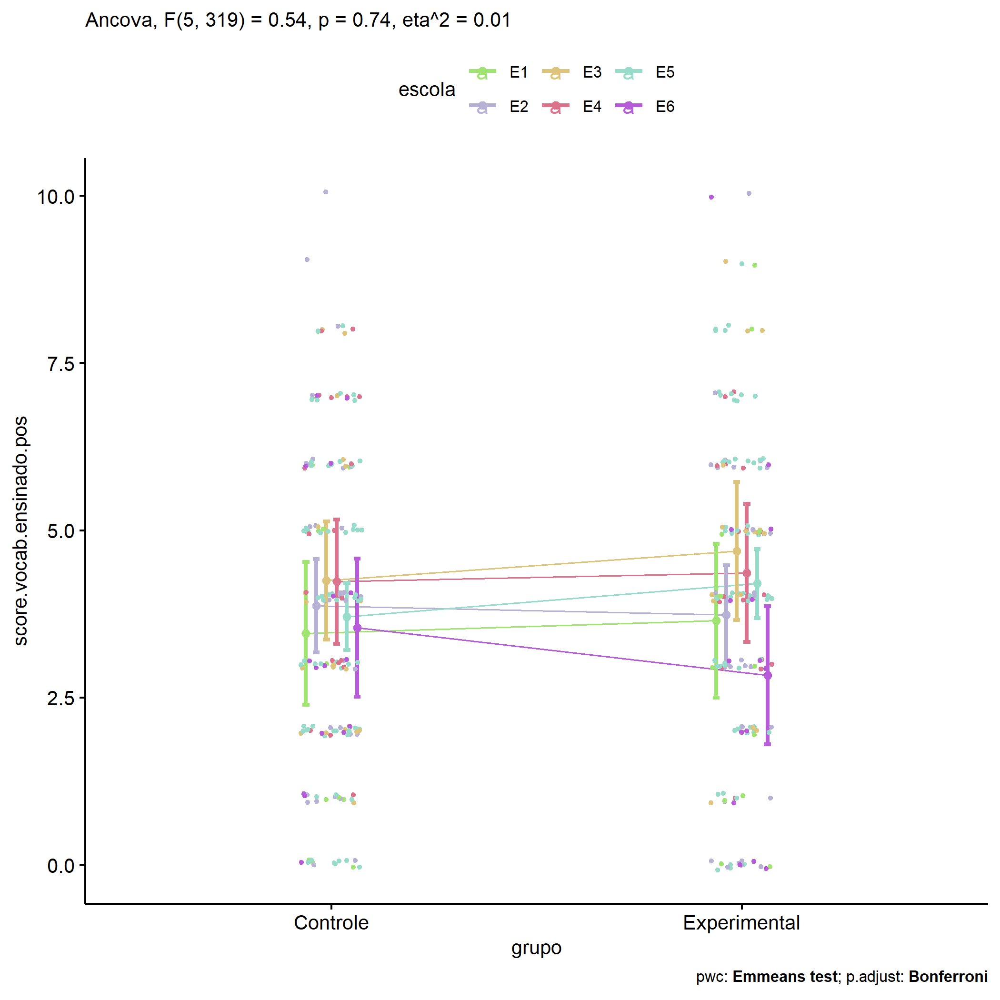<!-- -->

    ## Scale for colour is already present.
    ## Adding another scale for colour, which will replace the existing scale.

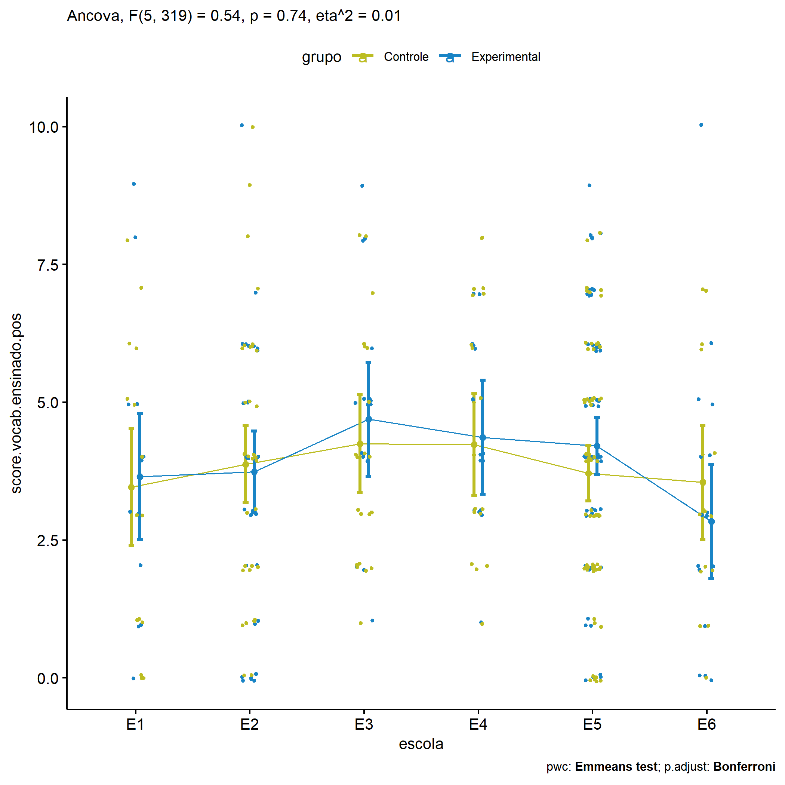<!-- -->

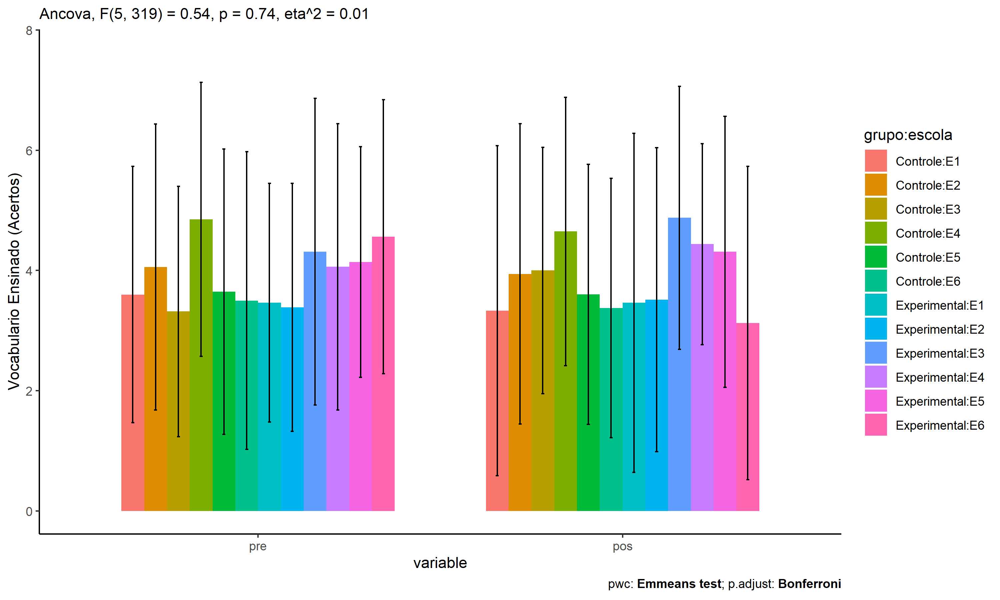<!-- -->

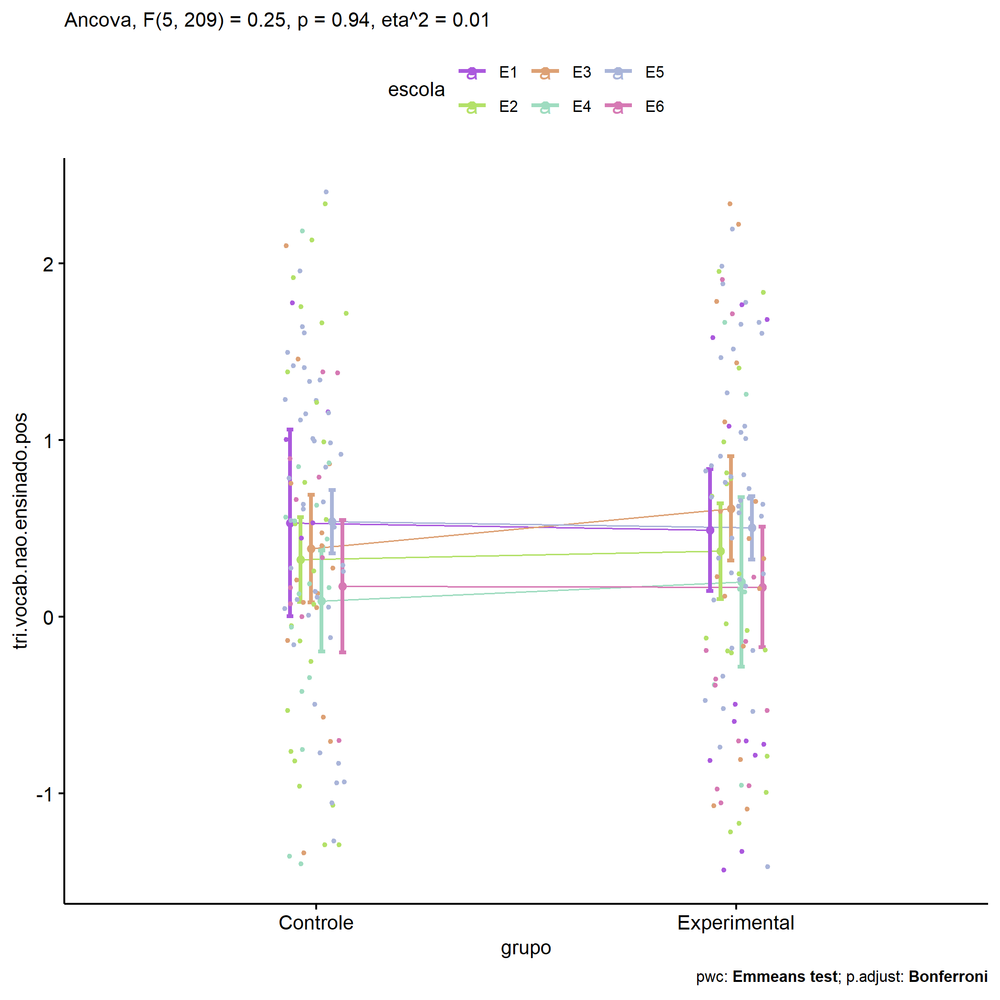<!-- -->

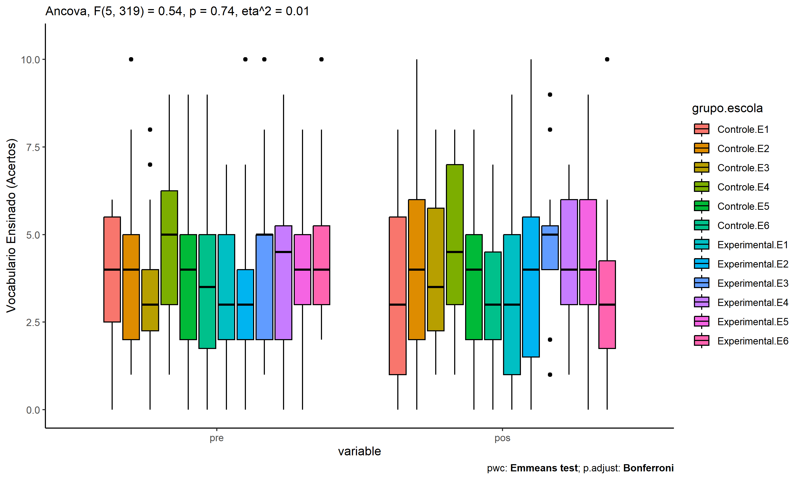<!-- -->

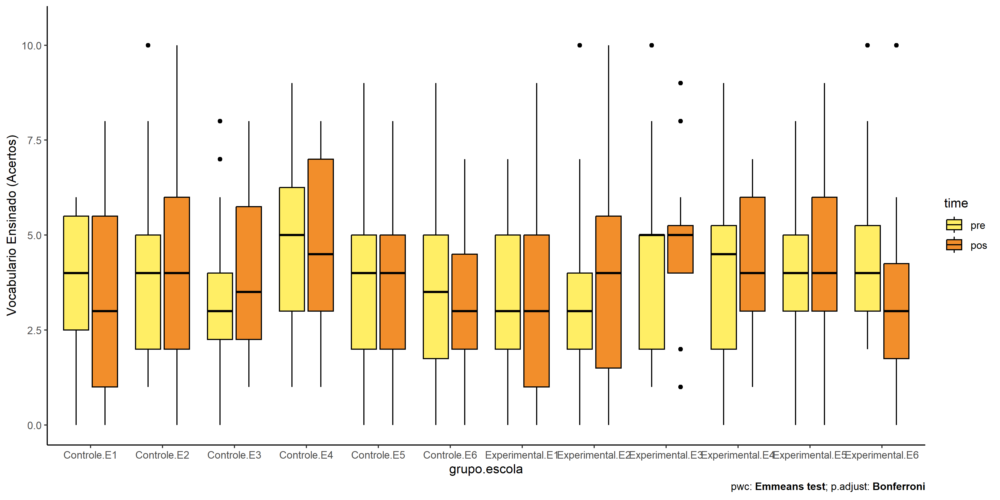<!-- -->

### Vocabulario Ensinado (TRI)

| var                    | escola | grupo        |   n | M (pre) | SE (pre) | M (unadj) | SE (unadj) | M (adj) | SE (adj) |
|:-----------------------|:-------|:-------------|----:|--------:|---------:|----------:|-----------:|--------:|---------:|
| tri.vocab.ensinado.pos | E1     | Controle     |  11 |   0.467 |    0.169 |     0.208 |      0.278 |  -0.050 |    0.200 |
| tri.vocab.ensinado.pos | E1     | Experimental |  12 |  -0.142 |    0.218 |    -0.196 |      0.272 |  -0.076 |    0.191 |
| tri.vocab.ensinado.pos | E2     | Controle     |  34 |  -0.036 |    0.146 |    -0.081 |      0.154 |  -0.027 |    0.113 |
| tri.vocab.ensinado.pos | E2     | Experimental |  24 |  -0.222 |    0.157 |     0.081 |      0.169 |   0.251 |    0.135 |
| tri.vocab.ensinado.pos | E3     | Controle     |  21 |  -0.021 |    0.148 |    -0.151 |      0.167 |  -0.106 |    0.144 |
| tri.vocab.ensinado.pos | E3     | Experimental |  16 |   0.065 |    0.234 |     0.184 |      0.206 |   0.175 |    0.165 |
| tri.vocab.ensinado.pos | E4     | Controle     |  20 |   0.092 |    0.185 |     0.183 |      0.198 |   0.158 |    0.148 |
| tri.vocab.ensinado.pos | E4     | Experimental |  15 |  -0.039 |    0.188 |    -0.056 |      0.178 |   0.000 |    0.170 |
| tri.vocab.ensinado.pos | E5     | Controle     |  59 |   0.056 |    0.112 |     0.115 |      0.107 |   0.112 |    0.086 |
| tri.vocab.ensinado.pos | E5     | Experimental |  60 |   0.174 |    0.086 |     0.266 |      0.094 |   0.190 |    0.085 |
| tri.vocab.ensinado.pos | E6     | Controle     |  14 |   0.120 |    0.227 |     0.007 |      0.221 |  -0.037 |    0.176 |
| tri.vocab.ensinado.pos | E6     | Experimental |  14 |   0.076 |    0.235 |    -0.186 |      0.234 |  -0.202 |    0.176 |

| .y.                    | grupo        | escola | group1   | group2       | estimate | conf.low | conf.high |    se | statistic |     p | p.adj | p.adj.signif |
|:-----------------------|:-------------|:-------|:---------|:-------------|---------:|---------:|----------:|------:|----------:|------:|------:|:-------------|
| tri.vocab.ensinado.pos | Controle     |        | E1       | E2           |   -0.023 |   -0.476 |     0.430 | 0.230 |    -0.101 | 0.920 | 1.000 | ns           |
| tri.vocab.ensinado.pos | Controle     |        | E1       | E3           |    0.056 |   -0.430 |     0.542 | 0.247 |     0.227 | 0.820 | 1.000 | ns           |
| tri.vocab.ensinado.pos | Controle     |        | E1       | E4           |   -0.208 |   -0.697 |     0.280 | 0.248 |    -0.839 | 0.402 | 1.000 | ns           |
| tri.vocab.ensinado.pos | Controle     |        | E1       | E5           |   -0.162 |   -0.590 |     0.266 | 0.218 |    -0.744 | 0.457 | 1.000 | ns           |
| tri.vocab.ensinado.pos | Controle     |        | E1       | E6           |   -0.014 |   -0.538 |     0.510 | 0.266 |    -0.052 | 0.959 | 1.000 | ns           |
| tri.vocab.ensinado.pos | Controle     |        | E2       | E3           |    0.079 |   -0.281 |     0.440 | 0.183 |     0.433 | 0.665 | 1.000 | ns           |
| tri.vocab.ensinado.pos | Controle     |        | E2       | E4           |   -0.185 |   -0.551 |     0.181 | 0.186 |    -0.996 | 0.320 | 1.000 | ns           |
| tri.vocab.ensinado.pos | Controle     |        | E2       | E5           |   -0.139 |   -0.419 |     0.141 | 0.142 |    -0.976 | 0.330 | 1.000 | ns           |
| tri.vocab.ensinado.pos | Controle     |        | E2       | E6           |    0.009 |   -0.403 |     0.422 | 0.210 |     0.045 | 0.964 | 1.000 | ns           |
| tri.vocab.ensinado.pos | Controle     |        | E3       | E4           |   -0.264 |   -0.670 |     0.141 | 0.206 |    -1.283 | 0.201 | 1.000 | ns           |
| tri.vocab.ensinado.pos | Controle     |        | E3       | E5           |   -0.218 |   -0.548 |     0.112 | 0.168 |    -1.300 | 0.195 | 1.000 | ns           |
| tri.vocab.ensinado.pos | Controle     |        | E3       | E6           |   -0.070 |   -0.518 |     0.378 | 0.228 |    -0.307 | 0.759 | 1.000 | ns           |
| tri.vocab.ensinado.pos | Controle     |        | E4       | E5           |    0.046 |   -0.290 |     0.382 | 0.171 |     0.272 | 0.786 | 1.000 | ns           |
| tri.vocab.ensinado.pos | Controle     |        | E4       | E6           |    0.195 |   -0.258 |     0.647 | 0.230 |     0.846 | 0.398 | 1.000 | ns           |
| tri.vocab.ensinado.pos | Controle     |        | E5       | E6           |    0.148 |   -0.238 |     0.534 | 0.196 |     0.755 | 0.451 | 1.000 | ns           |
| tri.vocab.ensinado.pos | Experimental |        | E1       | E2           |   -0.327 |   -0.786 |     0.132 | 0.233 |    -1.401 | 0.162 | 1.000 | ns           |
| tri.vocab.ensinado.pos | Experimental |        | E1       | E3           |   -0.251 |   -0.748 |     0.245 | 0.252 |    -0.997 | 0.320 | 1.000 | ns           |
| tri.vocab.ensinado.pos | Experimental |        | E1       | E4           |   -0.076 |   -0.579 |     0.427 | 0.256 |    -0.299 | 0.765 | 1.000 | ns           |
| tri.vocab.ensinado.pos | Experimental |        | E1       | E5           |   -0.266 |   -0.678 |     0.146 | 0.209 |    -1.272 | 0.205 | 1.000 | ns           |
| tri.vocab.ensinado.pos | Experimental |        | E1       | E6           |    0.126 |   -0.386 |     0.637 | 0.260 |     0.484 | 0.629 | 1.000 | ns           |
| tri.vocab.ensinado.pos | Experimental |        | E2       | E3           |    0.076 |   -0.344 |     0.496 | 0.213 |     0.354 | 0.723 | 1.000 | ns           |
| tri.vocab.ensinado.pos | Experimental |        | E2       | E4           |    0.251 |   -0.177 |     0.678 | 0.217 |     1.153 | 0.250 | 1.000 | ns           |
| tri.vocab.ensinado.pos | Experimental |        | E2       | E5           |    0.061 |   -0.255 |     0.377 | 0.161 |     0.379 | 0.705 | 1.000 | ns           |
| tri.vocab.ensinado.pos | Experimental |        | E2       | E6           |    0.453 |    0.015 |     0.890 | 0.222 |     2.035 | 0.043 | 0.641 | ns           |
| tri.vocab.ensinado.pos | Experimental |        | E3       | E4           |    0.175 |   -0.292 |     0.642 | 0.237 |     0.738 | 0.461 | 1.000 | ns           |
| tri.vocab.ensinado.pos | Experimental |        | E3       | E5           |   -0.015 |   -0.380 |     0.351 | 0.186 |    -0.079 | 0.937 | 1.000 | ns           |
| tri.vocab.ensinado.pos | Experimental |        | E3       | E6           |    0.377 |   -0.098 |     0.852 | 0.241 |     1.561 | 0.120 | 1.000 | ns           |
| tri.vocab.ensinado.pos | Experimental |        | E4       | E5           |   -0.190 |   -0.565 |     0.186 | 0.191 |    -0.994 | 0.321 | 1.000 | ns           |
| tri.vocab.ensinado.pos | Experimental |        | E4       | E6           |    0.202 |   -0.281 |     0.685 | 0.245 |     0.823 | 0.411 | 1.000 | ns           |
| tri.vocab.ensinado.pos | Experimental |        | E5       | E6           |    0.392 |    0.006 |     0.777 | 0.196 |     1.999 | 0.047 | 0.698 | ns           |
| tri.vocab.ensinado.pre | Controle     |        | E1       | E2           |    0.503 |   -0.034 |     1.040 | 0.273 |     1.842 | 0.066 | 0.997 | ns           |
| tri.vocab.ensinado.pre | Controle     |        | E1       | E3           |    0.488 |   -0.088 |     1.064 | 0.293 |     1.667 | 0.097 | 1.000 | ns           |
| tri.vocab.ensinado.pre | Controle     |        | E1       | E4           |    0.375 |   -0.206 |     0.956 | 0.295 |     1.270 | 0.205 | 1.000 | ns           |
| tri.vocab.ensinado.pre | Controle     |        | E1       | E5           |    0.410 |   -0.098 |     0.919 | 0.258 |     1.588 | 0.113 | 1.000 | ns           |
| tri.vocab.ensinado.pre | Controle     |        | E1       | E6           |    0.346 |   -0.278 |     0.970 | 0.317 |     1.092 | 0.276 | 1.000 | ns           |
| tri.vocab.ensinado.pre | Controle     |        | E2       | E3           |   -0.015 |   -0.444 |     0.415 | 0.218 |    -0.066 | 0.947 | 1.000 | ns           |
| tri.vocab.ensinado.pre | Controle     |        | E2       | E4           |   -0.128 |   -0.564 |     0.309 | 0.222 |    -0.575 | 0.565 | 1.000 | ns           |
| tri.vocab.ensinado.pre | Controle     |        | E2       | E5           |   -0.092 |   -0.426 |     0.241 | 0.169 |    -0.545 | 0.586 | 1.000 | ns           |
| tri.vocab.ensinado.pre | Controle     |        | E2       | E6           |   -0.156 |   -0.648 |     0.335 | 0.250 |    -0.626 | 0.532 | 1.000 | ns           |
| tri.vocab.ensinado.pre | Controle     |        | E3       | E4           |   -0.113 |   -0.597 |     0.371 | 0.246 |    -0.460 | 0.646 | 1.000 | ns           |
| tri.vocab.ensinado.pre | Controle     |        | E3       | E5           |   -0.078 |   -0.471 |     0.316 | 0.200 |    -0.389 | 0.697 | 1.000 | ns           |
| tri.vocab.ensinado.pre | Controle     |        | E3       | E6           |   -0.142 |   -0.676 |     0.392 | 0.271 |    -0.523 | 0.601 | 1.000 | ns           |
| tri.vocab.ensinado.pre | Controle     |        | E4       | E5           |    0.035 |   -0.365 |     0.436 | 0.204 |     0.173 | 0.863 | 1.000 | ns           |
| tri.vocab.ensinado.pre | Controle     |        | E4       | E6           |   -0.029 |   -0.568 |     0.511 | 0.274 |    -0.105 | 0.916 | 1.000 | ns           |
| tri.vocab.ensinado.pre | Controle     |        | E5       | E6           |   -0.064 |   -0.524 |     0.396 | 0.234 |    -0.274 | 0.784 | 1.000 | ns           |
| tri.vocab.ensinado.pre | Experimental |        | E1       | E2           |    0.080 |   -0.467 |     0.628 | 0.278 |     0.289 | 0.773 | 1.000 | ns           |
| tri.vocab.ensinado.pre | Experimental |        | E1       | E3           |   -0.206 |   -0.798 |     0.385 | 0.300 |    -0.687 | 0.493 | 1.000 | ns           |
| tri.vocab.ensinado.pre | Experimental |        | E1       | E4           |   -0.103 |   -0.703 |     0.497 | 0.305 |    -0.338 | 0.736 | 1.000 | ns           |
| tri.vocab.ensinado.pre | Experimental |        | E1       | E5           |   -0.315 |   -0.805 |     0.174 | 0.249 |    -1.268 | 0.206 | 1.000 | ns           |
| tri.vocab.ensinado.pre | Experimental |        | E1       | E6           |   -0.218 |   -0.827 |     0.391 | 0.309 |    -0.704 | 0.482 | 1.000 | ns           |
| tri.vocab.ensinado.pre | Experimental |        | E2       | E3           |   -0.287 |   -0.786 |     0.213 | 0.254 |    -1.130 | 0.260 | 1.000 | ns           |
| tri.vocab.ensinado.pre | Experimental |        | E2       | E4           |   -0.183 |   -0.693 |     0.326 | 0.259 |    -0.708 | 0.479 | 1.000 | ns           |
| tri.vocab.ensinado.pre | Experimental |        | E2       | E5           |   -0.396 |   -0.770 |    -0.022 | 0.190 |    -2.083 | 0.038 | 0.572 | ns           |
| tri.vocab.ensinado.pre | Experimental |        | E2       | E6           |   -0.298 |   -0.819 |     0.222 | 0.265 |    -1.128 | 0.260 | 1.000 | ns           |
| tri.vocab.ensinado.pre | Experimental |        | E3       | E4           |    0.103 |   -0.453 |     0.660 | 0.283 |     0.366 | 0.715 | 1.000 | ns           |
| tri.vocab.ensinado.pre | Experimental |        | E3       | E5           |   -0.109 |   -0.545 |     0.327 | 0.221 |    -0.492 | 0.623 | 1.000 | ns           |
| tri.vocab.ensinado.pre | Experimental |        | E3       | E6           |   -0.012 |   -0.578 |     0.555 | 0.288 |    -0.040 | 0.968 | 1.000 | ns           |
| tri.vocab.ensinado.pre | Experimental |        | E4       | E5           |   -0.212 |   -0.659 |     0.235 | 0.227 |    -0.935 | 0.350 | 1.000 | ns           |
| tri.vocab.ensinado.pre | Experimental |        | E4       | E6           |   -0.115 |   -0.690 |     0.460 | 0.292 |    -0.393 | 0.694 | 1.000 | ns           |
| tri.vocab.ensinado.pre | Experimental |        | E5       | E6           |    0.097 |   -0.362 |     0.557 | 0.233 |     0.417 | 0.677 | 1.000 | ns           |
| tri.vocab.ensinado.pos |              | E1     | Controle | Experimental |    0.026 |   -0.519 |     0.571 | 0.277 |     0.094 | 0.925 | 0.925 | ns           |
| tri.vocab.ensinado.pos |              | E2     | Controle | Experimental |   -0.278 |   -0.624 |     0.069 | 0.176 |    -1.577 | 0.116 | 0.116 | ns           |
| tri.vocab.ensinado.pos |              | E3     | Controle | Experimental |   -0.281 |   -0.712 |     0.150 | 0.219 |    -1.285 | 0.200 | 0.200 | ns           |
| tri.vocab.ensinado.pos |              | E4     | Controle | Experimental |    0.158 |   -0.286 |     0.602 | 0.225 |     0.701 | 0.484 | 0.484 | ns           |
| tri.vocab.ensinado.pos |              | E5     | Controle | Experimental |   -0.078 |   -0.316 |     0.160 | 0.121 |    -0.644 | 0.520 | 0.520 | ns           |
| tri.vocab.ensinado.pos |              | E6     | Controle | Experimental |    0.165 |   -0.325 |     0.656 | 0.249 |     0.664 | 0.507 | 0.507 | ns           |
| tri.vocab.ensinado.pre |              | E1     | Controle | Experimental |    0.608 |   -0.038 |     1.255 | 0.328 |     1.853 | 0.065 | 0.065 | ns           |
| tri.vocab.ensinado.pre |              | E2     | Controle | Experimental |    0.186 |   -0.227 |     0.599 | 0.210 |     0.888 | 0.376 | 0.376 | ns           |
| tri.vocab.ensinado.pre |              | E3     | Controle | Experimental |   -0.086 |   -0.600 |     0.428 | 0.261 |    -0.330 | 0.742 | 0.742 | ns           |
| tri.vocab.ensinado.pre |              | E4     | Controle | Experimental |    0.130 |   -0.398 |     0.659 | 0.269 |     0.485 | 0.628 | 0.628 | ns           |
| tri.vocab.ensinado.pre |              | E5     | Controle | Experimental |   -0.117 |   -0.401 |     0.167 | 0.144 |    -0.813 | 0.417 | 0.417 | ns           |
| tri.vocab.ensinado.pre |              | E6     | Controle | Experimental |    0.044 |   -0.541 |     0.629 | 0.297 |     0.149 | 0.882 | 0.882 | ns           |

| grupo        | escola | group1 | group2 | estimate | conf.low | conf.high |    se | statistic |     p | p.adj | p.adj.signif |
|:-------------|:-------|:-------|:-------|---------:|---------:|----------:|------:|----------:|------:|------:|:-------------|
| Controle     | E1     | pre    | pos    |    0.209 |   -0.426 |     0.844 | 0.323 |     0.647 | 0.518 | 0.518 | ns           |
| Controle     | E2     | pre    | pos    |    0.029 |   -0.353 |     0.411 | 0.194 |     0.149 | 0.881 | 0.881 | ns           |
| Controle     | E3     | pre    | pos    |    0.056 |   -0.428 |     0.540 | 0.246 |     0.227 | 0.821 | 0.821 | ns           |
| Controle     | E4     | pre    | pos    |   -0.092 |   -0.593 |     0.410 | 0.255 |    -0.360 | 0.719 | 0.719 | ns           |
| Controle     | E5     | pre    | pos    |   -0.046 |   -0.329 |     0.236 | 0.144 |    -0.322 | 0.747 | 0.747 | ns           |
| Controle     | E6     | pre    | pos    |    0.066 |   -0.514 |     0.645 | 0.295 |     0.222 | 0.824 | 0.824 | ns           |
| Experimental | E1     | pre    | pos    |    0.054 |   -0.593 |     0.702 | 0.330 |     0.165 | 0.869 | 0.869 | ns           |
| Experimental | E2     | pre    | pos    |   -0.204 |   -0.633 |     0.226 | 0.219 |    -0.931 | 0.352 | 0.352 | ns           |
| Experimental | E3     | pre    | pos    |   -0.119 |   -0.680 |     0.442 | 0.286 |    -0.417 | 0.677 | 0.677 | ns           |
| Experimental | E4     | pre    | pos    |   -0.051 |   -0.621 |     0.519 | 0.290 |    -0.174 | 0.862 | 0.862 | ns           |
| Experimental | E5     | pre    | pos    |   -0.071 |   -0.356 |     0.214 | 0.145 |    -0.487 | 0.626 | 0.626 | ns           |
| Experimental | E6     | pre    | pos    |    0.224 |   -0.356 |     0.805 | 0.296 |     0.759 | 0.448 | 0.448 | ns           |

    ## Scale for colour is already present.
    ## Adding another scale for colour, which will replace the existing scale.

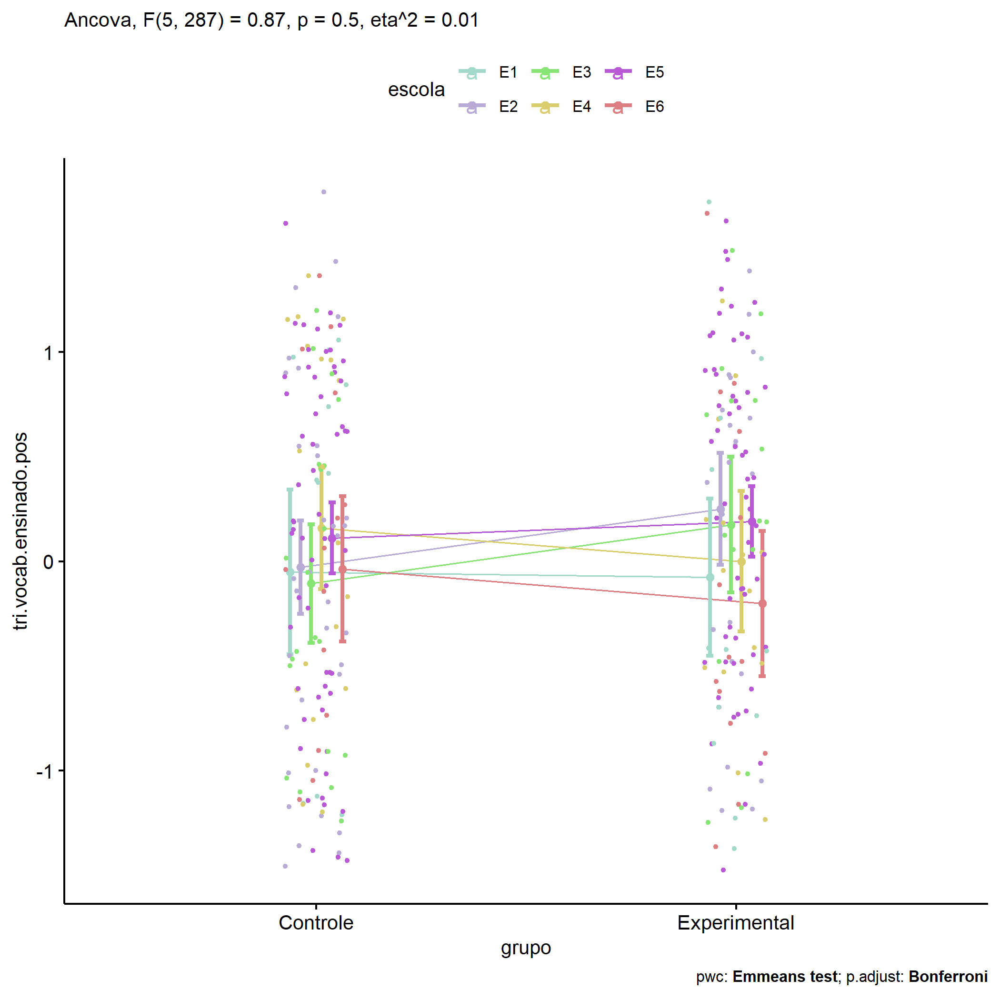<!-- -->

    ## Scale for colour is already present.
    ## Adding another scale for colour, which will replace the existing scale.

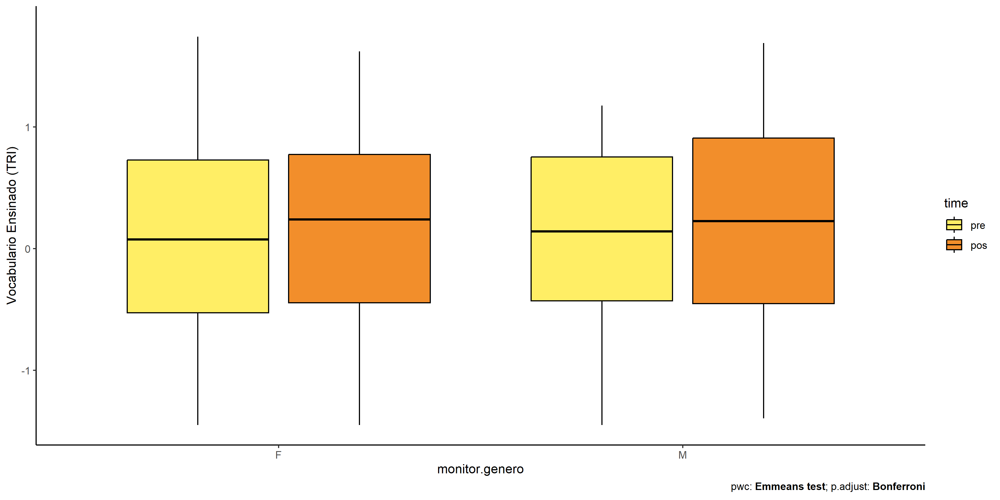<!-- -->

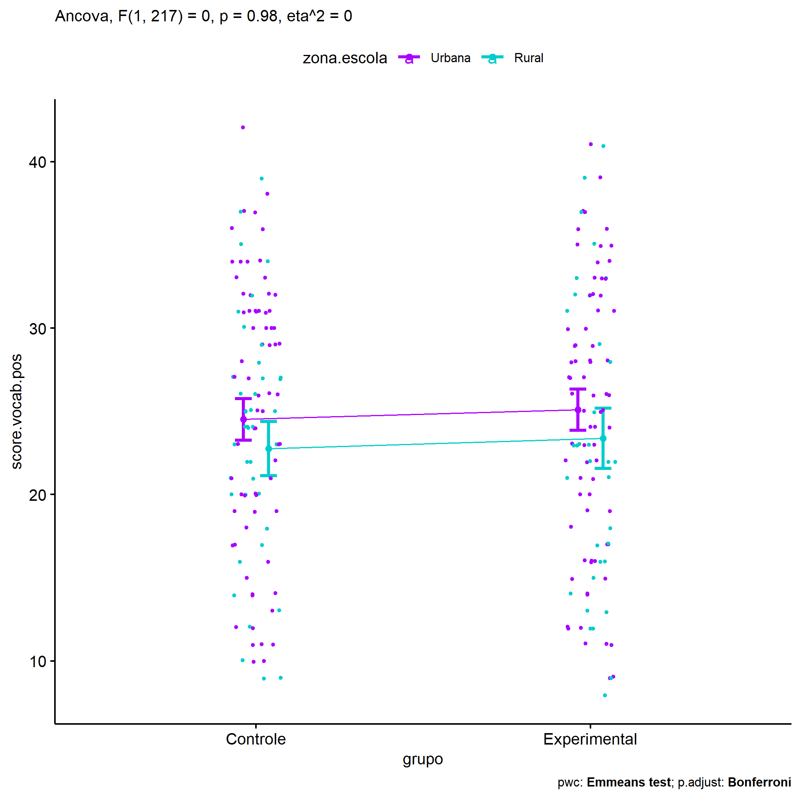<!-- -->

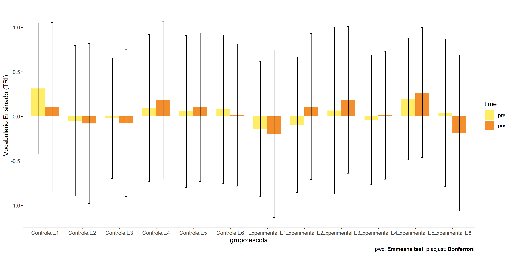<!-- -->

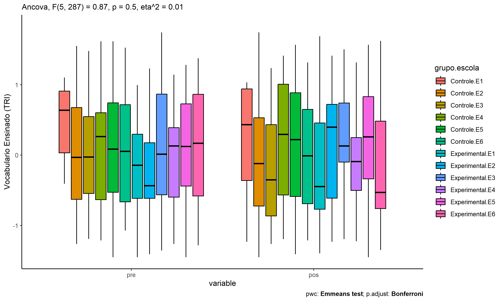<!-- -->

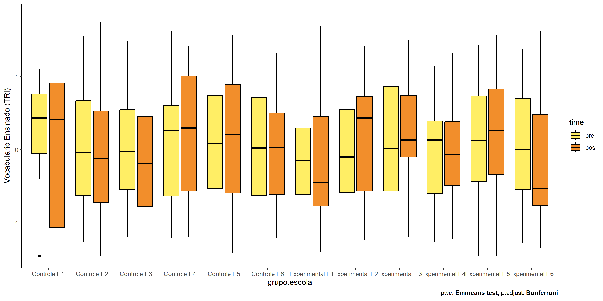<!-- -->

### Vocabulario Nao Ensinado (Acertos)

| var                          | escola | grupo        |   n | M (pre) | SE (pre) | M (unadj) | SE (unadj) | M (adj) | SE (adj) |
|:-----------------------------|:-------|:-------------|----:|--------:|---------:|----------:|-----------:|--------:|---------:|
| score.vocab.nao.ensinado.pos | E1     | Controle     |  15 |  14.933 |    2.119 |    14.267 |      2.168 |  15.164 |    1.693 |
| score.vocab.nao.ensinado.pos | E1     | Experimental |  13 |  13.308 |    2.246 |    14.769 |      2.535 |  16.699 |    1.823 |
| score.vocab.nao.ensinado.pos | E2     | Controle     |  35 |  16.914 |    1.316 |    16.657 |      1.366 |  16.296 |    1.108 |
| score.vocab.nao.ensinado.pos | E2     | Experimental |  31 |  16.516 |    1.220 |    14.355 |      1.719 |  14.247 |    1.177 |
| score.vocab.nao.ensinado.pos | E3     | Controle     |  22 |  14.909 |    1.632 |    17.273 |      1.280 |  18.186 |    1.399 |
| score.vocab.nao.ensinado.pos | E3     | Experimental |  16 |  17.875 |    1.782 |    20.125 |      1.921 |  19.154 |    1.640 |
| score.vocab.nao.ensinado.pos | E4     | Controle     |  20 |  18.550 |    1.317 |    17.500 |      1.278 |  16.101 |    1.469 |
| score.vocab.nao.ensinado.pos | E4     | Experimental |  16 |  15.250 |    1.843 |    14.875 |      1.850 |  15.571 |    1.639 |
| score.vocab.nao.ensinado.pos | E5     | Controle     |  68 |  15.897 |    0.910 |    16.618 |      1.053 |  16.903 |    0.795 |
| score.vocab.nao.ensinado.pos | E5     | Experimental |  64 |  17.547 |    0.940 |    17.688 |      0.984 |  16.925 |    0.821 |
| score.vocab.nao.ensinado.pos | E6     | Controle     |  16 |  15.688 |    2.209 |    15.938 |      1.957 |  16.356 |    1.638 |
| score.vocab.nao.ensinado.pos | E6     | Experimental |  16 |  15.125 |    1.610 |    13.062 |      1.978 |  13.838 |    1.639 |

| .y.                          | grupo        | escola | group1   | group2       | estimate | conf.low | conf.high |    se | statistic |     p | p.adj | p.adj.signif |
|:-----------------------------|:-------------|:-------|:---------|:-------------|---------:|---------:|----------:|------:|----------:|------:|------:|:-------------|
| score.vocab.nao.ensinado.pos | Controle     |        | E1       | E2           |   -1.132 |   -5.115 |     2.850 | 2.024 |    -0.559 | 0.576 | 1.000 | ns           |
| score.vocab.nao.ensinado.pos | Controle     |        | E1       | E3           |   -3.021 |   -7.338 |     1.295 | 2.194 |    -1.377 | 0.169 | 1.000 | ns           |
| score.vocab.nao.ensinado.pos | Controle     |        | E1       | E4           |   -0.937 |   -5.353 |     3.480 | 2.245 |    -0.417 | 0.677 | 1.000 | ns           |
| score.vocab.nao.ensinado.pos | Controle     |        | E1       | E5           |   -1.739 |   -5.417 |     1.939 | 1.870 |    -0.930 | 0.353 | 1.000 | ns           |
| score.vocab.nao.ensinado.pos | Controle     |        | E1       | E6           |   -1.192 |   -5.825 |     3.442 | 2.355 |    -0.506 | 0.613 | 1.000 | ns           |
| score.vocab.nao.ensinado.pos | Controle     |        | E2       | E3           |   -1.889 |   -5.402 |     1.624 | 1.785 |    -1.058 | 0.291 | 1.000 | ns           |
| score.vocab.nao.ensinado.pos | Controle     |        | E2       | E4           |    0.196 |   -3.421 |     3.813 | 1.838 |     0.107 | 0.915 | 1.000 | ns           |
| score.vocab.nao.ensinado.pos | Controle     |        | E2       | E5           |   -0.607 |   -3.290 |     2.077 | 1.364 |    -0.445 | 0.657 | 1.000 | ns           |
| score.vocab.nao.ensinado.pos | Controle     |        | E2       | E6           |   -0.059 |   -3.951 |     3.833 | 1.978 |    -0.030 | 0.976 | 1.000 | ns           |
| score.vocab.nao.ensinado.pos | Controle     |        | E3       | E4           |    2.085 |   -1.913 |     6.083 | 2.032 |     1.026 | 0.306 | 1.000 | ns           |
| score.vocab.nao.ensinado.pos | Controle     |        | E3       | E5           |    1.283 |   -1.881 |     4.446 | 1.608 |     0.798 | 0.426 | 1.000 | ns           |
| score.vocab.nao.ensinado.pos | Controle     |        | E3       | E6           |    1.830 |   -2.407 |     6.066 | 2.153 |     0.850 | 0.396 | 1.000 | ns           |
| score.vocab.nao.ensinado.pos | Controle     |        | E4       | E5           |   -0.802 |   -4.092 |     2.487 | 1.672 |    -0.480 | 0.632 | 1.000 | ns           |
| score.vocab.nao.ensinado.pos | Controle     |        | E4       | E6           |   -0.255 |   -4.588 |     4.077 | 2.202 |    -0.116 | 0.908 | 1.000 | ns           |
| score.vocab.nao.ensinado.pos | Controle     |        | E5       | E6           |    0.547 |   -3.035 |     4.129 | 1.821 |     0.300 | 0.764 | 1.000 | ns           |
| score.vocab.nao.ensinado.pos | Experimental |        | E1       | E2           |    2.452 |   -1.819 |     6.723 | 2.171 |     1.130 | 0.260 | 1.000 | ns           |
| score.vocab.nao.ensinado.pos | Experimental |        | E1       | E3           |   -2.455 |   -7.289 |     2.378 | 2.457 |    -0.999 | 0.318 | 1.000 | ns           |
| score.vocab.nao.ensinado.pos | Experimental |        | E1       | E4           |    1.128 |   -3.689 |     5.945 | 2.448 |     0.461 | 0.645 | 1.000 | ns           |
| score.vocab.nao.ensinado.pos | Experimental |        | E1       | E5           |   -0.226 |   -4.169 |     3.717 | 2.004 |    -0.113 | 0.910 | 1.000 | ns           |
| score.vocab.nao.ensinado.pos | Experimental |        | E1       | E6           |    2.861 |   -1.956 |     7.677 | 2.448 |     1.169 | 0.243 | 1.000 | ns           |
| score.vocab.nao.ensinado.pos | Experimental |        | E2       | E3           |   -4.907 |   -8.878 |    -0.937 | 2.018 |    -2.432 | 0.016 | 0.234 | ns           |
| score.vocab.nao.ensinado.pos | Experimental |        | E2       | E4           |   -1.324 |   -5.294 |     2.646 | 2.018 |    -0.656 | 0.512 | 1.000 | ns           |
| score.vocab.nao.ensinado.pos | Experimental |        | E2       | E5           |   -2.678 |   -5.501 |     0.144 | 1.435 |    -1.867 | 0.063 | 0.943 | ns           |
| score.vocab.nao.ensinado.pos | Experimental |        | E2       | E6           |    0.409 |   -3.562 |     4.379 | 2.018 |     0.203 | 0.840 | 1.000 | ns           |
| score.vocab.nao.ensinado.pos | Experimental |        | E3       | E4           |    3.583 |   -0.982 |     8.148 | 2.320 |     1.544 | 0.124 | 1.000 | ns           |
| score.vocab.nao.ensinado.pos | Experimental |        | E3       | E5           |    2.229 |   -1.374 |     5.832 | 1.831 |     1.217 | 0.224 | 1.000 | ns           |
| score.vocab.nao.ensinado.pos | Experimental |        | E3       | E6           |    5.316 |    0.751 |     9.881 | 2.320 |     2.291 | 0.023 | 0.339 | ns           |
| score.vocab.nao.ensinado.pos | Experimental |        | E4       | E5           |   -1.354 |   -4.964 |     2.256 | 1.835 |    -0.738 | 0.461 | 1.000 | ns           |
| score.vocab.nao.ensinado.pos | Experimental |        | E4       | E6           |    1.733 |   -2.824 |     6.291 | 2.317 |     0.748 | 0.455 | 1.000 | ns           |
| score.vocab.nao.ensinado.pos | Experimental |        | E5       | E6           |    3.087 |   -0.524 |     6.698 | 1.835 |     1.682 | 0.094 | 1.000 | ns           |
| score.vocab.nao.ensinado.pre | Controle     |        | E1       | E2           |   -1.981 |   -6.506 |     2.544 | 2.300 |    -0.861 | 0.390 | 1.000 | ns           |
| score.vocab.nao.ensinado.pre | Controle     |        | E1       | E3           |    0.024 |   -4.885 |     4.934 | 2.495 |     0.010 | 0.992 | 1.000 | ns           |
| score.vocab.nao.ensinado.pre | Controle     |        | E1       | E4           |   -3.617 |   -8.625 |     1.391 | 2.546 |    -1.421 | 0.156 | 1.000 | ns           |
| score.vocab.nao.ensinado.pre | Controle     |        | E1       | E5           |   -0.964 |   -5.146 |     3.219 | 2.126 |    -0.453 | 0.651 | 1.000 | ns           |
| score.vocab.nao.ensinado.pre | Controle     |        | E1       | E6           |   -0.754 |   -6.024 |     4.515 | 2.678 |    -0.282 | 0.778 | 1.000 | ns           |
| score.vocab.nao.ensinado.pre | Controle     |        | E2       | E3           |    2.005 |   -1.984 |     5.994 | 2.028 |     0.989 | 0.323 | 1.000 | ns           |
| score.vocab.nao.ensinado.pre | Controle     |        | E2       | E4           |   -1.636 |   -5.746 |     2.474 | 2.089 |    -0.783 | 0.434 | 1.000 | ns           |
| score.vocab.nao.ensinado.pre | Controle     |        | E2       | E5           |    1.017 |   -2.033 |     4.067 | 1.550 |     0.656 | 0.512 | 1.000 | ns           |
| score.vocab.nao.ensinado.pre | Controle     |        | E2       | E6           |    1.227 |   -3.198 |     5.652 | 2.249 |     0.545 | 0.586 | 1.000 | ns           |
| score.vocab.nao.ensinado.pre | Controle     |        | E3       | E4           |   -3.641 |   -8.171 |     0.889 | 2.303 |    -1.581 | 0.115 | 1.000 | ns           |
| score.vocab.nao.ensinado.pre | Controle     |        | E3       | E5           |   -0.988 |   -4.584 |     2.608 | 1.828 |    -0.540 | 0.589 | 1.000 | ns           |
| score.vocab.nao.ensinado.pre | Controle     |        | E3       | E6           |   -0.778 |   -5.596 |     4.039 | 2.449 |    -0.318 | 0.751 | 1.000 | ns           |
| score.vocab.nao.ensinado.pre | Controle     |        | E4       | E5           |    2.653 |   -1.077 |     6.383 | 1.896 |     1.399 | 0.163 | 1.000 | ns           |
| score.vocab.nao.ensinado.pre | Controle     |        | E4       | E6           |    2.863 |   -2.055 |     7.780 | 2.500 |     1.145 | 0.253 | 1.000 | ns           |
| score.vocab.nao.ensinado.pre | Controle     |        | E5       | E6           |    0.210 |   -3.864 |     4.284 | 2.071 |     0.101 | 0.919 | 1.000 | ns           |
| score.vocab.nao.ensinado.pre | Experimental |        | E1       | E2           |   -3.208 |   -8.053 |     1.636 | 2.463 |    -1.303 | 0.194 | 1.000 | ns           |
| score.vocab.nao.ensinado.pre | Experimental |        | E1       | E3           |   -4.567 |  -10.042 |     0.907 | 2.783 |    -1.641 | 0.102 | 1.000 | ns           |
| score.vocab.nao.ensinado.pre | Experimental |        | E1       | E4           |   -1.942 |   -7.417 |     3.532 | 2.783 |    -0.698 | 0.486 | 1.000 | ns           |
| score.vocab.nao.ensinado.pre | Experimental |        | E1       | E5           |   -4.239 |   -8.700 |     0.221 | 2.267 |    -1.870 | 0.062 | 0.936 | ns           |
| score.vocab.nao.ensinado.pre | Experimental |        | E1       | E6           |   -1.817 |   -7.292 |     3.657 | 2.783 |    -0.653 | 0.514 | 1.000 | ns           |
| score.vocab.nao.ensinado.pre | Experimental |        | E2       | E3           |   -1.359 |   -5.872 |     3.155 | 2.294 |    -0.592 | 0.554 | 1.000 | ns           |
| score.vocab.nao.ensinado.pre | Experimental |        | E2       | E4           |    1.266 |   -3.247 |     5.780 | 2.294 |     0.552 | 0.581 | 1.000 | ns           |
| score.vocab.nao.ensinado.pre | Experimental |        | E2       | E5           |   -1.031 |   -4.239 |     2.178 | 1.631 |    -0.632 | 0.528 | 1.000 | ns           |
| score.vocab.nao.ensinado.pre | Experimental |        | E2       | E6           |    1.391 |   -3.122 |     5.905 | 2.294 |     0.606 | 0.545 | 1.000 | ns           |
| score.vocab.nao.ensinado.pre | Experimental |        | E3       | E4           |    2.625 |   -2.559 |     7.809 | 2.635 |     0.996 | 0.320 | 1.000 | ns           |
| score.vocab.nao.ensinado.pre | Experimental |        | E3       | E5           |    0.328 |   -3.770 |     4.426 | 2.083 |     0.158 | 0.875 | 1.000 | ns           |
| score.vocab.nao.ensinado.pre | Experimental |        | E3       | E6           |    2.750 |   -2.434 |     7.934 | 2.635 |     1.044 | 0.297 | 1.000 | ns           |
| score.vocab.nao.ensinado.pre | Experimental |        | E4       | E5           |   -2.297 |   -6.395 |     1.801 | 2.083 |    -1.103 | 0.271 | 1.000 | ns           |
| score.vocab.nao.ensinado.pre | Experimental |        | E4       | E6           |    0.125 |   -5.059 |     5.309 | 2.635 |     0.047 | 0.962 | 1.000 | ns           |
| score.vocab.nao.ensinado.pre | Experimental |        | E5       | E6           |    2.422 |   -1.676 |     6.520 | 2.083 |     1.163 | 0.246 | 1.000 | ns           |
| score.vocab.nao.ensinado.pos |              | E1     | Controle | Experimental |   -1.535 |   -6.422 |     3.352 | 2.484 |    -0.618 | 0.537 | 0.537 | ns           |
| score.vocab.nao.ensinado.pos |              | E2     | Controle | Experimental |    2.049 |   -1.130 |     5.229 | 1.616 |     1.268 | 0.206 | 0.206 | ns           |
| score.vocab.nao.ensinado.pos |              | E3     | Controle | Experimental |   -0.969 |   -5.214 |     3.276 | 2.158 |    -0.449 | 0.654 | 0.654 | ns           |
| score.vocab.nao.ensinado.pos |              | E4     | Controle | Experimental |    0.529 |   -3.806 |     4.865 | 2.204 |     0.240 | 0.810 | 0.810 | ns           |
| score.vocab.nao.ensinado.pos |              | E5     | Controle | Experimental |   -0.022 |   -2.273 |     2.229 | 1.144 |    -0.019 | 0.985 | 0.985 | ns           |
| score.vocab.nao.ensinado.pos |              | E6     | Controle | Experimental |    2.518 |   -2.040 |     7.076 | 2.317 |     1.087 | 0.278 | 0.278 | ns           |
| score.vocab.nao.ensinado.pre |              | E1     | Controle | Experimental |    1.626 |   -3.930 |     7.182 | 2.824 |     0.576 | 0.565 | 0.565 | ns           |
| score.vocab.nao.ensinado.pre |              | E2     | Controle | Experimental |    0.398 |   -3.218 |     4.014 | 1.838 |     0.217 | 0.829 | 0.829 | ns           |
| score.vocab.nao.ensinado.pre |              | E3     | Controle | Experimental |   -2.966 |   -7.783 |     1.852 | 2.449 |    -1.211 | 0.227 | 0.227 | ns           |
| score.vocab.nao.ensinado.pre |              | E4     | Controle | Experimental |    3.300 |   -1.618 |     8.218 | 2.500 |     1.320 | 0.188 | 0.188 | ns           |
| score.vocab.nao.ensinado.pre |              | E5     | Controle | Experimental |   -1.650 |   -4.203 |     0.904 | 1.298 |    -1.271 | 0.205 | 0.205 | ns           |
| score.vocab.nao.ensinado.pre |              | E6     | Controle | Experimental |    0.563 |   -4.621 |     5.746 | 2.635 |     0.213 | 0.831 | 0.831 | ns           |

| grupo        | escola | group1 | group2 | estimate | conf.low | conf.high |    se | statistic |     p | p.adj | p.adj.signif |
|:-------------|:-------|:-------|:-------|---------:|---------:|----------:|------:|----------:|------:|------:|:-------------|
| Controle     | E1     | pre    | pos    |    0.667 |   -4.904 |     6.238 | 2.837 |     0.235 | 0.814 | 0.814 | ns           |
| Controle     | E2     | pre    | pos    |    0.257 |   -3.390 |     3.904 | 1.857 |     0.138 | 0.890 | 0.890 | ns           |
| Controle     | E3     | pre    | pos    |   -2.364 |   -6.964 |     2.237 | 2.343 |    -1.009 | 0.313 | 0.313 | ns           |
| Controle     | E4     | pre    | pos    |    1.050 |   -3.775 |     5.875 | 2.457 |     0.427 | 0.669 | 0.669 | ns           |
| Controle     | E5     | pre    | pos    |   -0.721 |   -3.337 |     1.896 | 1.332 |    -0.541 | 0.589 | 0.589 | ns           |
| Controle     | E6     | pre    | pos    |   -0.250 |   -5.644 |     5.144 | 2.747 |    -0.091 | 0.928 | 0.928 | ns           |
| Experimental | E1     | pre    | pos    |   -1.462 |   -7.446 |     4.523 | 3.048 |    -0.480 | 0.632 | 0.632 | ns           |
| Experimental | E2     | pre    | pos    |    2.161 |   -1.714 |     6.037 | 1.974 |     1.095 | 0.274 | 0.274 | ns           |
| Experimental | E3     | pre    | pos    |   -2.250 |   -7.644 |     3.144 | 2.747 |    -0.819 | 0.413 | 0.413 | ns           |
| Experimental | E4     | pre    | pos    |    0.375 |   -5.019 |     5.769 | 2.747 |     0.137 | 0.891 | 0.891 | ns           |
| Experimental | E5     | pre    | pos    |   -0.141 |   -2.838 |     2.556 | 1.374 |    -0.102 | 0.918 | 0.918 | ns           |
| Experimental | E6     | pre    | pos    |    2.063 |   -3.332 |     7.457 | 2.747 |     0.751 | 0.453 | 0.453 | ns           |

    ## Scale for colour is already present.
    ## Adding another scale for colour, which will replace the existing scale.

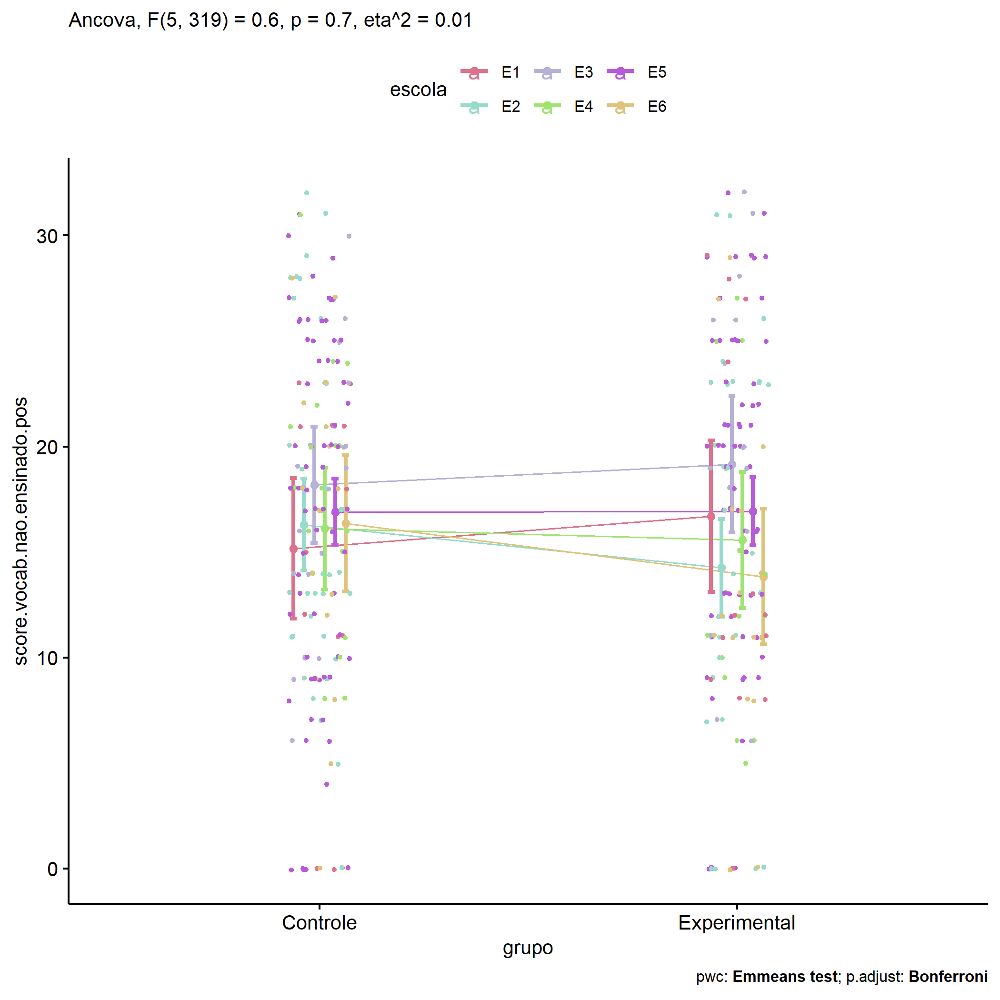<!-- -->

    ## Scale for colour is already present.
    ## Adding another scale for colour, which will replace the existing scale.

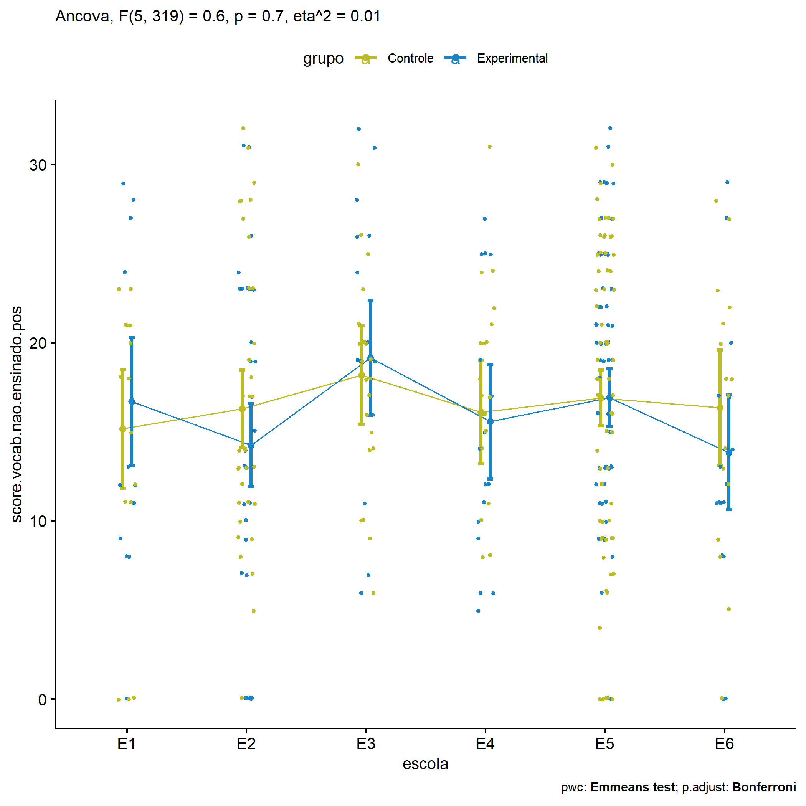<!-- -->

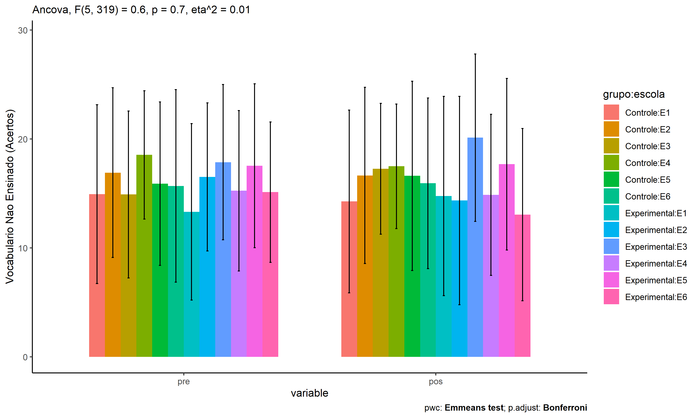<!-- -->

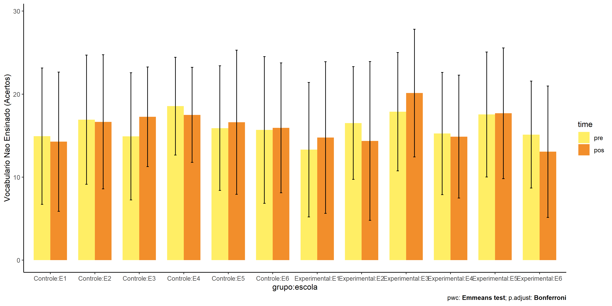<!-- -->

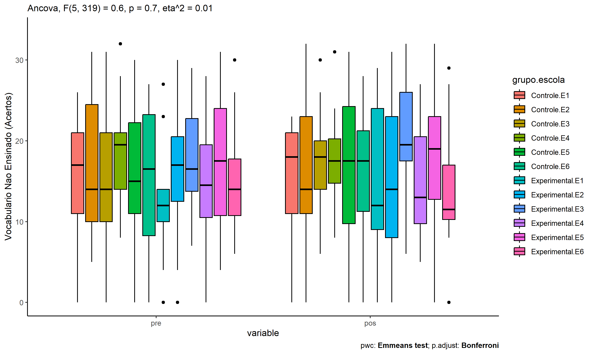<!-- -->

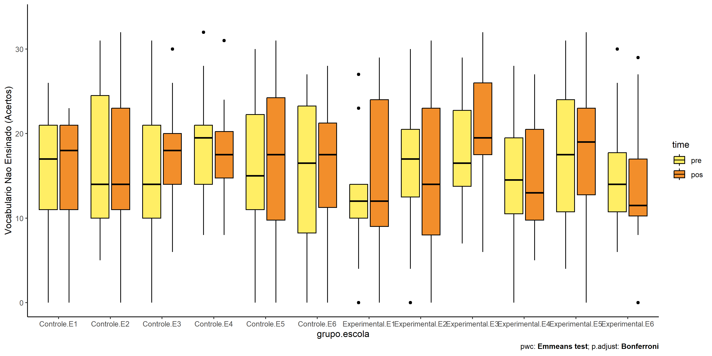<!-- -->

### Vocabulario Nao Ensinado (TRI)

| var                        | escola | grupo        |   n | M (pre) | SE (pre) | M (unadj) | SE (unadj) | M (adj) | SE (adj) |
|:---------------------------|:-------|:-------------|----:|--------:|---------:|----------:|-----------:|--------:|---------:|
| tri.vocab.nao.ensinado.pos | E1     | Controle     |  11 |   0.197 |    0.217 |     0.439 |      0.202 |   0.307 |    0.174 |
| tri.vocab.nao.ensinado.pos | E1     | Experimental |  12 |  -0.352 |    0.270 |    -0.065 |      0.353 |   0.267 |    0.167 |
| tri.vocab.nao.ensinado.pos | E2     | Controle     |  34 |   0.033 |    0.183 |     0.076 |      0.191 |   0.082 |    0.099 |
| tri.vocab.nao.ensinado.pos | E2     | Experimental |  24 |  -0.020 |    0.170 |     0.076 |      0.195 |   0.127 |    0.118 |
| tri.vocab.nao.ensinado.pos | E3     | Controle     |  21 |  -0.143 |    0.173 |     0.011 |      0.181 |   0.166 |    0.126 |
| tri.vocab.nao.ensinado.pos | E3     | Experimental |  16 |   0.179 |    0.246 |     0.507 |      0.265 |   0.390 |    0.144 |
| tri.vocab.nao.ensinado.pos | E4     | Controle     |  20 |   0.224 |    0.176 |     0.068 |      0.189 |  -0.088 |    0.129 |
| tri.vocab.nao.ensinado.pos | E4     | Experimental |  15 |  -0.048 |    0.191 |    -0.233 |      0.240 |  -0.158 |    0.149 |
| tri.vocab.nao.ensinado.pos | E5     | Controle     |  59 |   0.049 |    0.116 |     0.259 |      0.125 |   0.252 |    0.075 |
| tri.vocab.nao.ensinado.pos | E5     | Experimental |  60 |   0.106 |    0.126 |     0.301 |      0.123 |   0.246 |    0.074 |
| tri.vocab.nao.ensinado.pos | E6     | Controle     |  14 |   0.184 |    0.265 |     0.124 |      0.229 |   0.003 |    0.154 |
| tri.vocab.nao.ensinado.pos | E6     | Experimental |  14 |  -0.136 |    0.240 |    -0.232 |      0.256 |  -0.082 |    0.154 |

| .y.                        | grupo        | escola | group1   | group2       | estimate | conf.low | conf.high |    se | statistic |     p | p.adj | p.adj.signif |
|:---------------------------|:-------------|:-------|:---------|:-------------|---------:|---------:|----------:|------:|----------:|------:|------:|:-------------|
| tri.vocab.nao.ensinado.pos | Controle     |        | E1       | E2           |    0.224 |   -0.169 |     0.618 | 0.200 |     1.121 | 0.263 | 1.000 | ns           |
| tri.vocab.nao.ensinado.pos | Controle     |        | E1       | E3           |    0.140 |   -0.283 |     0.563 | 0.215 |     0.653 | 0.514 | 1.000 | ns           |
| tri.vocab.nao.ensinado.pos | Controle     |        | E1       | E4           |    0.394 |   -0.032 |     0.820 | 0.216 |     1.823 | 0.069 | 1.000 | ns           |
| tri.vocab.nao.ensinado.pos | Controle     |        | E1       | E5           |    0.055 |   -0.318 |     0.427 | 0.189 |     0.288 | 0.773 | 1.000 | ns           |
| tri.vocab.nao.ensinado.pos | Controle     |        | E1       | E6           |    0.304 |   -0.153 |     0.760 | 0.232 |     1.308 | 0.192 | 1.000 | ns           |
| tri.vocab.nao.ensinado.pos | Controle     |        | E2       | E3           |   -0.084 |   -0.399 |     0.231 | 0.160 |    -0.524 | 0.600 | 1.000 | ns           |
| tri.vocab.nao.ensinado.pos | Controle     |        | E2       | E4           |    0.170 |   -0.150 |     0.490 | 0.162 |     1.046 | 0.296 | 1.000 | ns           |
| tri.vocab.nao.ensinado.pos | Controle     |        | E2       | E5           |   -0.170 |   -0.414 |     0.075 | 0.124 |    -1.367 | 0.173 | 1.000 | ns           |
| tri.vocab.nao.ensinado.pos | Controle     |        | E2       | E6           |    0.080 |   -0.281 |     0.440 | 0.183 |     0.435 | 0.664 | 1.000 | ns           |
| tri.vocab.nao.ensinado.pos | Controle     |        | E3       | E4           |    0.254 |   -0.101 |     0.609 | 0.180 |     1.407 | 0.161 | 1.000 | ns           |
| tri.vocab.nao.ensinado.pos | Controle     |        | E3       | E5           |   -0.086 |   -0.374 |     0.203 | 0.147 |    -0.584 | 0.560 | 1.000 | ns           |
| tri.vocab.nao.ensinado.pos | Controle     |        | E3       | E6           |    0.164 |   -0.228 |     0.555 | 0.199 |     0.821 | 0.412 | 1.000 | ns           |
| tri.vocab.nao.ensinado.pos | Controle     |        | E4       | E5           |   -0.339 |   -0.633 |    -0.046 | 0.149 |    -2.276 | 0.024 | 0.354 | ns           |
| tri.vocab.nao.ensinado.pos | Controle     |        | E4       | E6           |   -0.090 |   -0.485 |     0.305 | 0.201 |    -0.450 | 0.653 | 1.000 | ns           |
| tri.vocab.nao.ensinado.pos | Controle     |        | E5       | E6           |    0.249 |   -0.088 |     0.586 | 0.171 |     1.454 | 0.147 | 1.000 | ns           |
| tri.vocab.nao.ensinado.pos | Experimental |        | E1       | E2           |    0.140 |   -0.261 |     0.542 | 0.204 |     0.688 | 0.492 | 1.000 | ns           |
| tri.vocab.nao.ensinado.pos | Experimental |        | E1       | E3           |   -0.122 |   -0.557 |     0.312 | 0.221 |    -0.554 | 0.580 | 1.000 | ns           |
| tri.vocab.nao.ensinado.pos | Experimental |        | E1       | E4           |    0.425 |   -0.014 |     0.865 | 0.223 |     1.904 | 0.058 | 0.868 | ns           |
| tri.vocab.nao.ensinado.pos | Experimental |        | E1       | E5           |    0.022 |   -0.339 |     0.382 | 0.183 |     0.118 | 0.906 | 1.000 | ns           |
| tri.vocab.nao.ensinado.pos | Experimental |        | E1       | E6           |    0.350 |   -0.097 |     0.796 | 0.227 |     1.542 | 0.124 | 1.000 | ns           |
| tri.vocab.nao.ensinado.pos | Experimental |        | E2       | E3           |   -0.263 |   -0.629 |     0.104 | 0.186 |    -1.412 | 0.159 | 1.000 | ns           |
| tri.vocab.nao.ensinado.pos | Experimental |        | E2       | E4           |    0.285 |   -0.088 |     0.658 | 0.190 |     1.504 | 0.134 | 1.000 | ns           |
| tri.vocab.nao.ensinado.pos | Experimental |        | E2       | E5           |   -0.119 |   -0.393 |     0.155 | 0.139 |    -0.853 | 0.394 | 1.000 | ns           |
| tri.vocab.nao.ensinado.pos | Experimental |        | E2       | E6           |    0.209 |   -0.172 |     0.591 | 0.194 |     1.080 | 0.281 | 1.000 | ns           |
| tri.vocab.nao.ensinado.pos | Experimental |        | E3       | E4           |    0.548 |    0.140 |     0.956 | 0.207 |     2.644 | 0.009 | 0.130 | ns           |
| tri.vocab.nao.ensinado.pos | Experimental |        | E3       | E5           |    0.144 |   -0.175 |     0.463 | 0.162 |     0.888 | 0.375 | 1.000 | ns           |
| tri.vocab.nao.ensinado.pos | Experimental |        | E3       | E6           |    0.472 |    0.056 |     0.888 | 0.211 |     2.235 | 0.026 | 0.392 | ns           |
| tri.vocab.nao.ensinado.pos | Experimental |        | E4       | E5           |   -0.404 |   -0.731 |    -0.076 | 0.166 |    -2.427 | 0.016 | 0.237 | ns           |
| tri.vocab.nao.ensinado.pos | Experimental |        | E4       | E6           |   -0.076 |   -0.497 |     0.346 | 0.214 |    -0.354 | 0.724 | 1.000 | ns           |
| tri.vocab.nao.ensinado.pos | Experimental |        | E5       | E6           |    0.328 |   -0.009 |     0.665 | 0.171 |     1.916 | 0.056 | 0.845 | ns           |
| tri.vocab.nao.ensinado.pre | Controle     |        | E1       | E2           |    0.165 |   -0.459 |     0.789 | 0.317 |     0.520 | 0.604 | 1.000 | ns           |
| tri.vocab.nao.ensinado.pre | Controle     |        | E1       | E3           |    0.340 |   -0.329 |     1.010 | 0.340 |     1.000 | 0.318 | 1.000 | ns           |
| tri.vocab.nao.ensinado.pre | Controle     |        | E1       | E4           |   -0.027 |   -0.702 |     0.648 | 0.343 |    -0.079 | 0.937 | 1.000 | ns           |
| tri.vocab.nao.ensinado.pre | Controle     |        | E1       | E5           |    0.148 |   -0.443 |     0.739 | 0.300 |     0.494 | 0.622 | 1.000 | ns           |
| tri.vocab.nao.ensinado.pre | Controle     |        | E1       | E6           |    0.014 |   -0.711 |     0.738 | 0.368 |     0.037 | 0.970 | 1.000 | ns           |
| tri.vocab.nao.ensinado.pre | Controle     |        | E2       | E3           |    0.176 |   -0.324 |     0.675 | 0.254 |     0.692 | 0.489 | 1.000 | ns           |
| tri.vocab.nao.ensinado.pre | Controle     |        | E2       | E4           |   -0.192 |   -0.699 |     0.315 | 0.258 |    -0.744 | 0.457 | 1.000 | ns           |
| tri.vocab.nao.ensinado.pre | Controle     |        | E2       | E5           |   -0.017 |   -0.404 |     0.371 | 0.197 |    -0.084 | 0.933 | 1.000 | ns           |
| tri.vocab.nao.ensinado.pre | Controle     |        | E2       | E6           |   -0.151 |   -0.722 |     0.420 | 0.290 |    -0.520 | 0.603 | 1.000 | ns           |
| tri.vocab.nao.ensinado.pre | Controle     |        | E3       | E4           |   -0.367 |   -0.929 |     0.195 | 0.286 |    -1.286 | 0.199 | 1.000 | ns           |
| tri.vocab.nao.ensinado.pre | Controle     |        | E3       | E5           |   -0.192 |   -0.649 |     0.265 | 0.232 |    -0.827 | 0.409 | 1.000 | ns           |
| tri.vocab.nao.ensinado.pre | Controle     |        | E3       | E6           |   -0.327 |   -0.947 |     0.294 | 0.315 |    -1.036 | 0.301 | 1.000 | ns           |
| tri.vocab.nao.ensinado.pre | Controle     |        | E4       | E5           |    0.175 |   -0.290 |     0.641 | 0.236 |     0.741 | 0.459 | 1.000 | ns           |
| tri.vocab.nao.ensinado.pre | Controle     |        | E4       | E6           |    0.041 |   -0.586 |     0.668 | 0.318 |     0.128 | 0.898 | 1.000 | ns           |
| tri.vocab.nao.ensinado.pre | Controle     |        | E5       | E6           |   -0.134 |   -0.669 |     0.400 | 0.272 |    -0.495 | 0.621 | 1.000 | ns           |
| tri.vocab.nao.ensinado.pre | Experimental |        | E1       | E2           |   -0.333 |   -0.969 |     0.303 | 0.323 |    -1.029 | 0.304 | 1.000 | ns           |
| tri.vocab.nao.ensinado.pre | Experimental |        | E1       | E3           |   -0.531 |   -1.218 |     0.156 | 0.349 |    -1.523 | 0.129 | 1.000 | ns           |
| tri.vocab.nao.ensinado.pre | Experimental |        | E1       | E4           |   -0.304 |   -1.001 |     0.392 | 0.354 |    -0.860 | 0.391 | 1.000 | ns           |
| tri.vocab.nao.ensinado.pre | Experimental |        | E1       | E5           |   -0.458 |   -1.027 |     0.111 | 0.289 |    -1.586 | 0.114 | 1.000 | ns           |
| tri.vocab.nao.ensinado.pre | Experimental |        | E1       | E6           |   -0.216 |   -0.924 |     0.492 | 0.360 |    -0.601 | 0.548 | 1.000 | ns           |
| tri.vocab.nao.ensinado.pre | Experimental |        | E2       | E3           |   -0.199 |   -0.779 |     0.382 | 0.295 |    -0.674 | 0.501 | 1.000 | ns           |
| tri.vocab.nao.ensinado.pre | Experimental |        | E2       | E4           |    0.028 |   -0.564 |     0.620 | 0.301 |     0.094 | 0.925 | 1.000 | ns           |
| tri.vocab.nao.ensinado.pre | Experimental |        | E2       | E5           |   -0.126 |   -0.560 |     0.309 | 0.221 |    -0.570 | 0.569 | 1.000 | ns           |
| tri.vocab.nao.ensinado.pre | Experimental |        | E2       | E6           |    0.117 |   -0.488 |     0.721 | 0.307 |     0.379 | 0.705 | 1.000 | ns           |
| tri.vocab.nao.ensinado.pre | Experimental |        | E3       | E4           |    0.227 |   -0.419 |     0.874 | 0.328 |     0.691 | 0.490 | 1.000 | ns           |
| tri.vocab.nao.ensinado.pre | Experimental |        | E3       | E5           |    0.073 |   -0.433 |     0.579 | 0.257 |     0.284 | 0.776 | 1.000 | ns           |
| tri.vocab.nao.ensinado.pre | Experimental |        | E3       | E6           |    0.315 |   -0.343 |     0.974 | 0.334 |     0.943 | 0.346 | 1.000 | ns           |
| tri.vocab.nao.ensinado.pre | Experimental |        | E4       | E5           |   -0.154 |   -0.673 |     0.365 | 0.264 |    -0.584 | 0.560 | 1.000 | ns           |
| tri.vocab.nao.ensinado.pre | Experimental |        | E4       | E6           |    0.088 |   -0.580 |     0.757 | 0.340 |     0.260 | 0.795 | 1.000 | ns           |
| tri.vocab.nao.ensinado.pre | Experimental |        | E5       | E6           |    0.242 |   -0.292 |     0.776 | 0.271 |     0.893 | 0.372 | 1.000 | ns           |
| tri.vocab.nao.ensinado.pos |              | E1     | Controle | Experimental |    0.039 |   -0.436 |     0.514 | 0.241 |     0.162 | 0.871 | 0.871 | ns           |
| tri.vocab.nao.ensinado.pos |              | E2     | Controle | Experimental |   -0.045 |   -0.347 |     0.258 | 0.154 |    -0.291 | 0.772 | 0.772 | ns           |
| tri.vocab.nao.ensinado.pos |              | E3     | Controle | Experimental |   -0.223 |   -0.600 |     0.154 | 0.192 |    -1.167 | 0.244 | 0.244 | ns           |
| tri.vocab.nao.ensinado.pos |              | E4     | Controle | Experimental |    0.070 |   -0.317 |     0.458 | 0.197 |     0.358 | 0.721 | 0.721 | ns           |
| tri.vocab.nao.ensinado.pos |              | E5     | Controle | Experimental |    0.006 |   -0.202 |     0.214 | 0.106 |     0.057 | 0.954 | 0.954 | ns           |
| tri.vocab.nao.ensinado.pos |              | E6     | Controle | Experimental |    0.085 |   -0.344 |     0.514 | 0.218 |     0.390 | 0.697 | 0.697 | ns           |
| tri.vocab.nao.ensinado.pre |              | E1     | Controle | Experimental |    0.550 |   -0.201 |     1.301 | 0.381 |     1.441 | 0.151 | 0.151 | ns           |
| tri.vocab.nao.ensinado.pre |              | E2     | Controle | Experimental |    0.052 |   -0.427 |     0.532 | 0.244 |     0.215 | 0.830 | 0.830 | ns           |
| tri.vocab.nao.ensinado.pre |              | E3     | Controle | Experimental |   -0.322 |   -0.919 |     0.275 | 0.303 |    -1.062 | 0.289 | 0.289 | ns           |
| tri.vocab.nao.ensinado.pre |              | E4     | Controle | Experimental |    0.272 |   -0.342 |     0.887 | 0.312 |     0.873 | 0.383 | 0.383 | ns           |
| tri.vocab.nao.ensinado.pre |              | E5     | Controle | Experimental |   -0.057 |   -0.387 |     0.273 | 0.168 |    -0.339 | 0.735 | 0.735 | ns           |
| tri.vocab.nao.ensinado.pre |              | E6     | Controle | Experimental |    0.320 |   -0.360 |     1.000 | 0.345 |     0.926 | 0.355 | 0.355 | ns           |

| grupo        | escola | group1 | group2 | estimate | conf.low | conf.high |    se | statistic |     p | p.adj | p.adj.signif |
|:-------------|:-------|:-------|:-------|---------:|---------:|----------:|------:|----------:|------:|------:|:-------------|
| Controle     | E1     | pre    | pos    |   -0.231 |   -0.970 |     0.508 | 0.376 |    -0.613 | 0.540 | 0.540 | ns           |
| Controle     | E2     | pre    | pos    |   -0.058 |   -0.503 |     0.386 | 0.226 |    -0.257 | 0.797 | 0.797 | ns           |
| Controle     | E3     | pre    | pos    |   -0.173 |   -0.736 |     0.390 | 0.287 |    -0.604 | 0.546 | 0.546 | ns           |
| Controle     | E4     | pre    | pos    |    0.156 |   -0.428 |     0.740 | 0.297 |     0.525 | 0.600 | 0.600 | ns           |
| Controle     | E5     | pre    | pos    |   -0.166 |   -0.495 |     0.163 | 0.167 |    -0.992 | 0.322 | 0.322 | ns           |
| Controle     | E6     | pre    | pos    |    0.100 |   -0.574 |     0.774 | 0.343 |     0.292 | 0.770 | 0.770 | ns           |
| Experimental | E1     | pre    | pos    |   -0.287 |   -1.041 |     0.467 | 0.384 |    -0.748 | 0.455 | 0.455 | ns           |
| Experimental | E2     | pre    | pos    |   -0.059 |   -0.559 |     0.441 | 0.255 |    -0.232 | 0.816 | 0.816 | ns           |
| Experimental | E3     | pre    | pos    |   -0.328 |   -0.981 |     0.325 | 0.332 |    -0.987 | 0.324 | 0.324 | ns           |
| Experimental | E4     | pre    | pos    |    0.104 |   -0.559 |     0.768 | 0.338 |     0.309 | 0.758 | 0.758 | ns           |
| Experimental | E5     | pre    | pos    |   -0.168 |   -0.499 |     0.164 | 0.169 |    -0.992 | 0.321 | 0.321 | ns           |
| Experimental | E6     | pre    | pos    |    0.059 |   -0.617 |     0.734 | 0.344 |     0.171 | 0.864 | 0.864 | ns           |

    ## Scale for colour is already present.
    ## Adding another scale for colour, which will replace the existing scale.

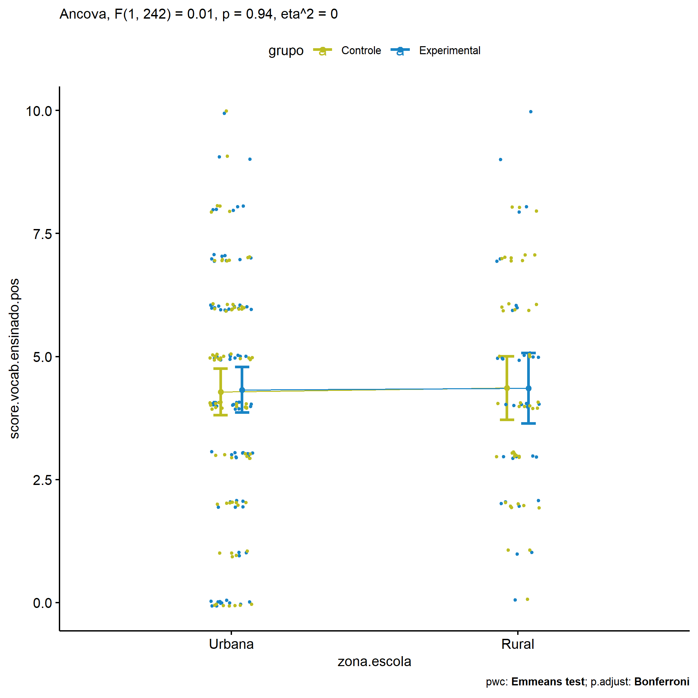<!-- -->

    ## Scale for colour is already present.
    ## Adding another scale for colour, which will replace the existing scale.

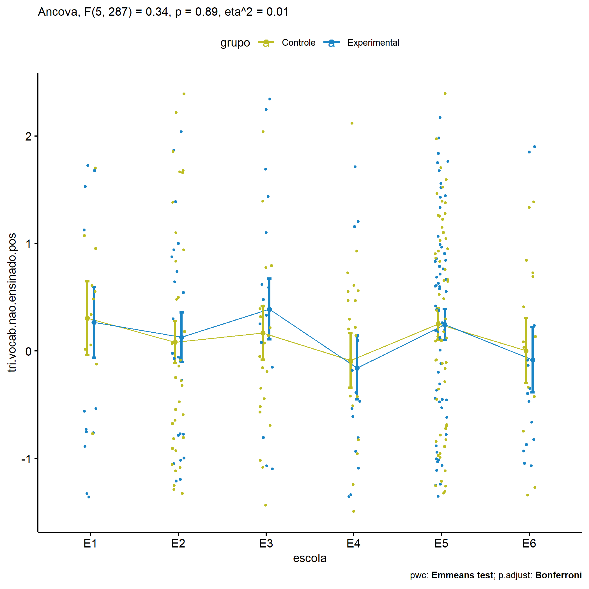<!-- -->

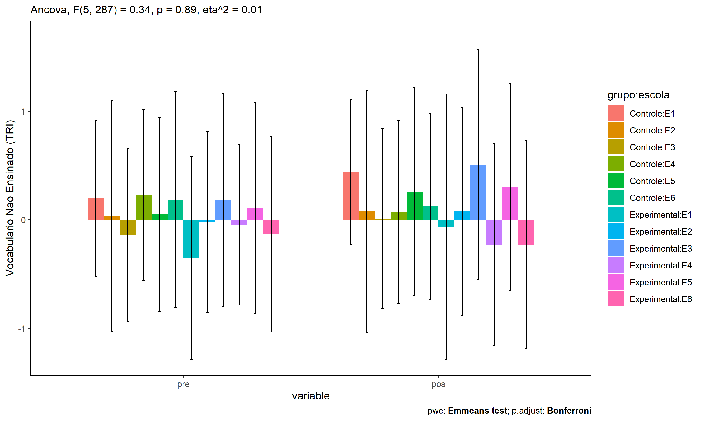<!-- -->

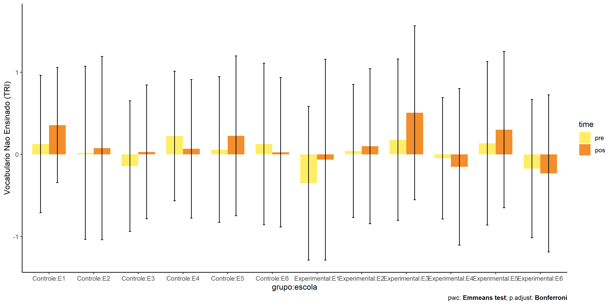<!-- -->

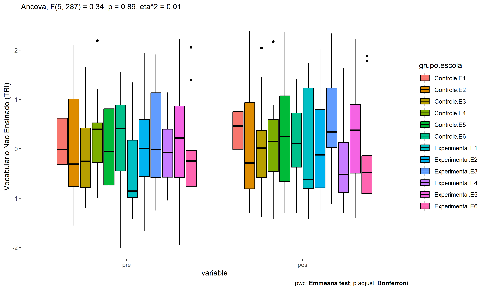<!-- -->

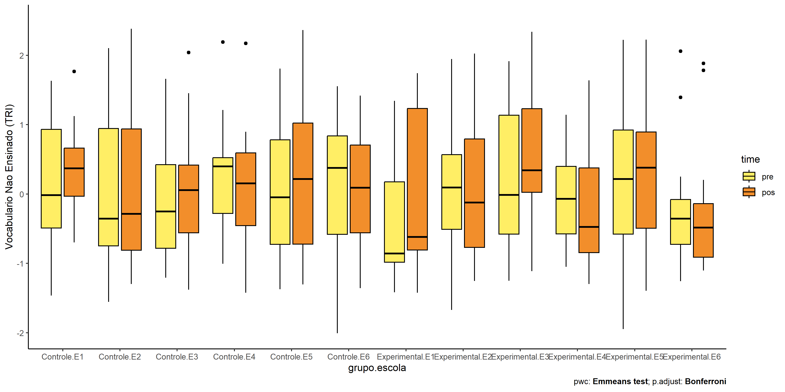<!-- -->

## factores: **zona.escola:grupo**

### Vocabulario (Acertos)

| var             | zona.escola | grupo        |   n | M (pre) | SE (pre) | M (unadj) | SE (unadj) | M (adj) | SE (adj) |
|:----------------|:------------|:-------------|----:|--------:|---------:|----------:|-----------:|--------:|---------:|
| score.vocab.pos | Rural       | Controle     |  55 |  21.236 |    1.140 |    21.455 |      1.013 |  21.207 |    0.720 |
| score.vocab.pos | Rural       | Experimental |  45 |  21.067 |    1.263 |    20.800 |      1.351 |  20.684 |    0.796 |
| score.vocab.pos | Urbana      | Controle     | 104 |  20.942 |    0.838 |    22.058 |      0.838 |  22.038 |    0.524 |
| score.vocab.pos | Urbana      | Experimental |  96 |  20.635 |    0.866 |    22.594 |      0.877 |  22.811 |    0.545 |

| .y.             | grupo        | zona.escola | group1   | group2       | estimate | conf.low | conf.high |    se | statistic |     p | p.adj | p.adj.signif |
|:----------------|:-------------|:------------|:---------|:-------------|---------:|---------:|----------:|------:|----------:|------:|------:|:-------------|
| score.vocab.pos | Controle     |             | Urbana   | Rural        |    0.831 |   -0.922 |     2.583 | 0.891 |     0.932 | 0.352 | 0.352 | ns           |
| score.vocab.pos | Experimental |             | Urbana   | Rural        |    2.127 |    0.228 |     4.027 | 0.965 |     2.204 | 0.028 | 0.028 | \*           |
| score.vocab.pre | Controle     |             | Urbana   | Rural        |   -0.294 |   -3.083 |     2.494 | 1.417 |    -0.208 | 0.836 | 0.836 | ns           |
| score.vocab.pre | Experimental |             | Urbana   | Rural        |   -0.431 |   -3.453 |     2.590 | 1.535 |    -0.281 | 0.779 | 0.779 | ns           |
| score.vocab.pos |              | Urbana      | Controle | Experimental |   -0.773 |   -2.262 |     0.715 | 0.756 |    -1.023 | 0.307 | 0.307 | ns           |
| score.vocab.pos |              | Rural       | Controle | Experimental |    0.523 |   -1.590 |     2.637 | 1.074 |     0.487 | 0.626 | 0.626 | ns           |
| score.vocab.pre |              | Urbana      | Controle | Experimental |    0.307 |   -2.060 |     2.674 | 1.203 |     0.255 | 0.799 | 0.799 | ns           |
| score.vocab.pre |              | Rural       | Controle | Experimental |    0.170 |   -3.192 |     3.532 | 1.708 |     0.099 | 0.921 | 0.921 | ns           |

| grupo        | zona.escola | group1 | group2 | estimate | conf.low | conf.high |    se | statistic |     p | p.adj | p.adj.signif |
|:-------------|:------------|:-------|:-------|---------:|---------:|----------:|------:|----------:|------:|------:|:-------------|
| Controle     | Urbana      | pre    | pos    |   -0.950 |   -3.200 |     1.300 | 1.146 |    -0.829 | 0.407 | 0.407 | ns           |
| Controle     | Rural       | pre    | pos    |   -0.404 |   -3.543 |     2.736 | 1.599 |    -0.252 | 0.801 | 0.801 | ns           |
| Experimental | Urbana      | pre    | pos    |   -1.688 |   -4.033 |     0.656 | 1.194 |    -1.414 | 0.158 | 0.158 | ns           |
| Experimental | Rural       | pre    | pos    |   -0.214 |   -3.674 |     3.247 | 1.762 |    -0.121 | 0.904 | 0.904 | ns           |

    ## Scale for colour is already present.
    ## Adding another scale for colour, which will replace the existing scale.

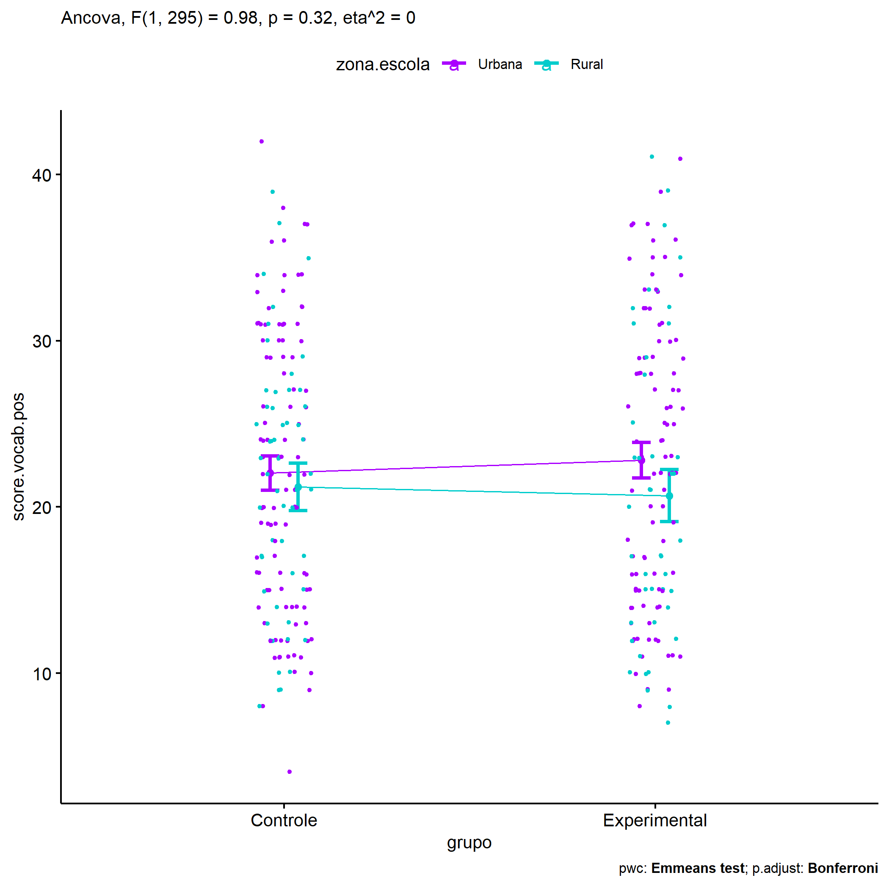<!-- -->

    ## Scale for colour is already present.
    ## Adding another scale for colour, which will replace the existing scale.

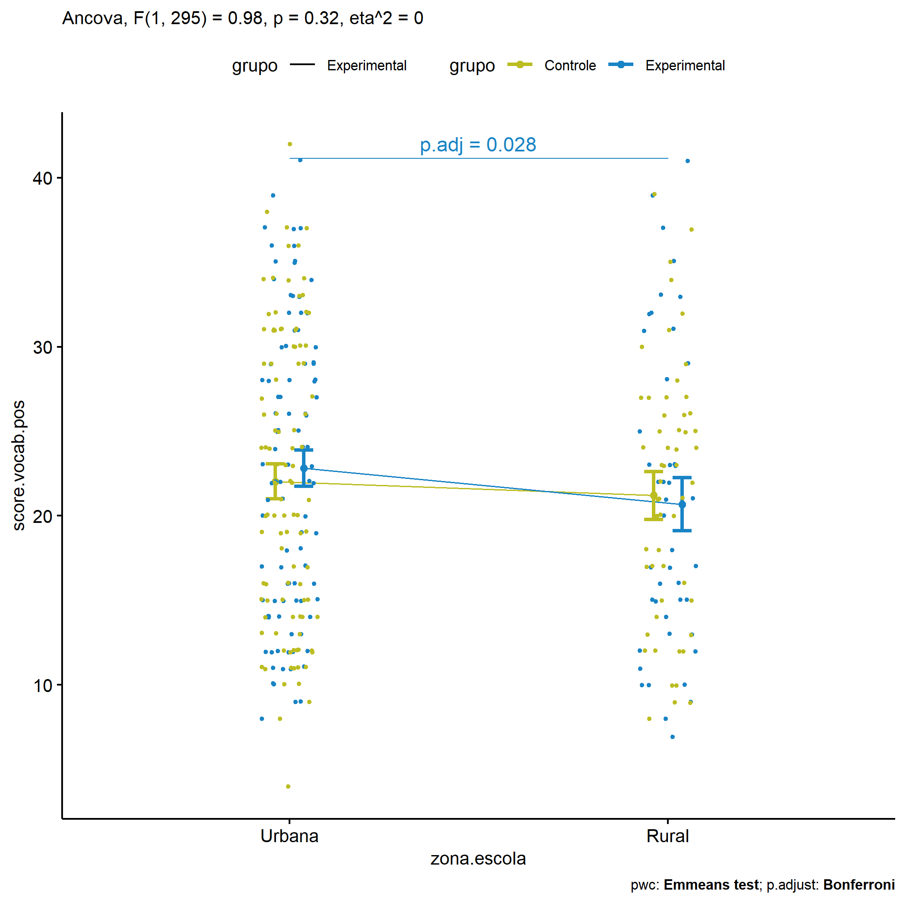<!-- -->

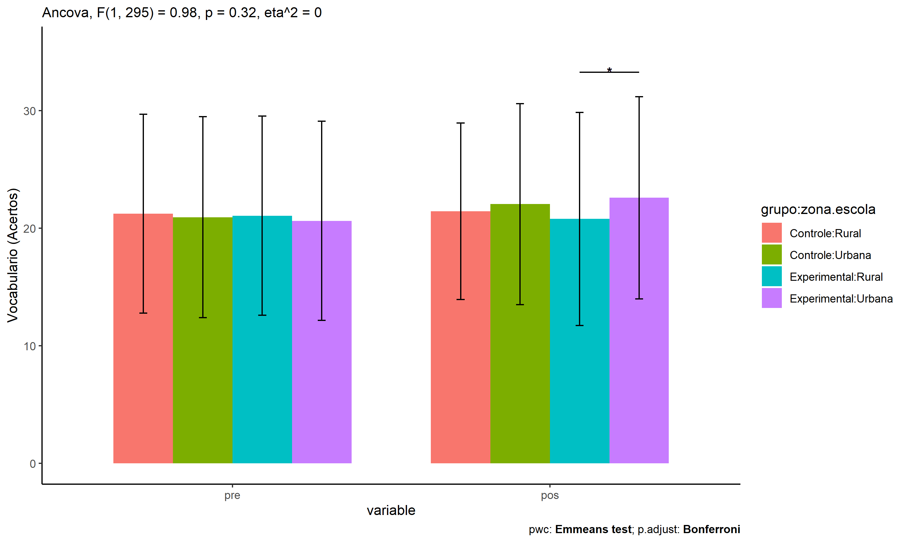<!-- -->

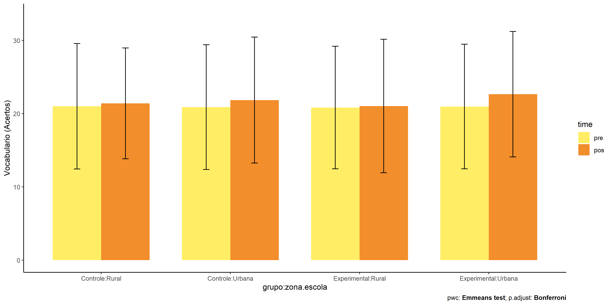<!-- -->

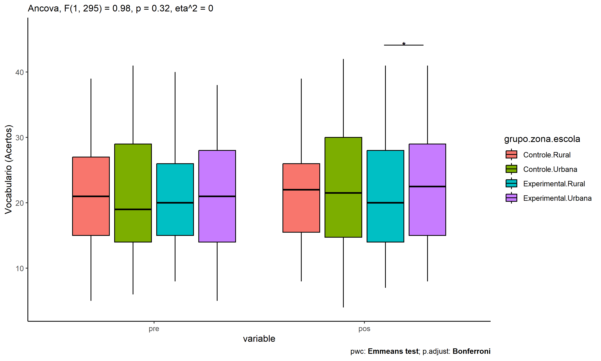<!-- -->

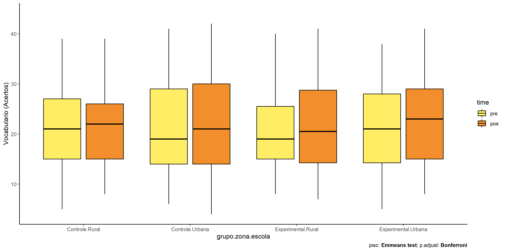<!-- -->

### Vocabulario (TRI)

| var           | zona.escola | grupo        |   n | M (pre) | SE (pre) | M (unadj) | SE (unadj) | M (adj) | SE (adj) |
|:--------------|:------------|:-------------|----:|--------:|---------:|----------:|-----------:|--------:|---------:|
| tri.vocab.pos | Rural       | Controle     |  55 |   0.102 |    0.110 |     0.081 |      0.118 |   0.047 |    0.078 |
| tri.vocab.pos | Rural       | Experimental |  45 |   0.080 |    0.127 |     0.062 |      0.138 |   0.048 |    0.086 |
| tri.vocab.pos | Urbana      | Controle     | 104 |   0.091 |    0.088 |     0.145 |      0.101 |   0.121 |    0.057 |
| tri.vocab.pos | Urbana      | Experimental |  96 |   0.002 |    0.099 |     0.186 |      0.100 |   0.238 |    0.059 |

| .y.           | grupo        | zona.escola | group1   | group2       | estimate | conf.low | conf.high |    se | statistic |     p | p.adj | p.adj.signif |
|:--------------|:-------------|:------------|:---------|:-------------|---------:|---------:|----------:|------:|----------:|------:|------:|:-------------|
| tri.vocab.pos | Controle     |             | Urbana   | Rural        |    0.074 |   -0.116 |     0.264 | 0.096 |     0.768 | 0.443 | 0.443 | ns           |
| tri.vocab.pos | Experimental |             | Urbana   | Rural        |    0.191 |   -0.015 |     0.396 | 0.105 |     1.823 | 0.069 | 0.069 | ns           |
| tri.vocab.pre | Controle     |             | Urbana   | Rural        |   -0.011 |   -0.307 |     0.285 | 0.151 |    -0.073 | 0.942 | 0.942 | ns           |
| tri.vocab.pre | Experimental |             | Urbana   | Rural        |   -0.077 |   -0.399 |     0.244 | 0.163 |    -0.475 | 0.635 | 0.635 | ns           |
| tri.vocab.pos |              | Urbana      | Controle | Experimental |   -0.117 |   -0.278 |     0.044 | 0.082 |    -1.427 | 0.155 | 0.155 | ns           |
| tri.vocab.pos |              | Rural       | Controle | Experimental |    0.000 |   -0.229 |     0.228 | 0.116 |    -0.004 | 0.997 | 0.997 | ns           |
| tri.vocab.pre |              | Urbana      | Controle | Experimental |    0.089 |   -0.163 |     0.340 | 0.128 |     0.693 | 0.489 | 0.489 | ns           |
| tri.vocab.pre |              | Rural       | Controle | Experimental |    0.022 |   -0.335 |     0.379 | 0.181 |     0.122 | 0.903 | 0.903 | ns           |

| grupo        | zona.escola | group1 | group2 | estimate | conf.low | conf.high |    se | statistic |     p | p.adj | p.adj.signif |
|:-------------|:------------|:-------|:-------|---------:|---------:|----------:|------:|----------:|------:|------:|:-------------|
| Controle     | Urbana      | pre    | pos    |   -0.038 |   -0.287 |     0.211 | 0.127 |    -0.303 | 0.762 | 0.762 | ns           |
| Controle     | Rural       | pre    | pos    |    0.025 |   -0.323 |     0.372 | 0.177 |     0.140 | 0.889 | 0.889 | ns           |
| Experimental | Urbana      | pre    | pos    |   -0.152 |   -0.411 |     0.108 | 0.132 |    -1.150 | 0.251 | 0.251 | ns           |
| Experimental | Rural       | pre    | pos    |   -0.019 |   -0.402 |     0.364 | 0.195 |    -0.097 | 0.923 | 0.923 | ns           |

    ## Scale for colour is already present.
    ## Adding another scale for colour, which will replace the existing scale.

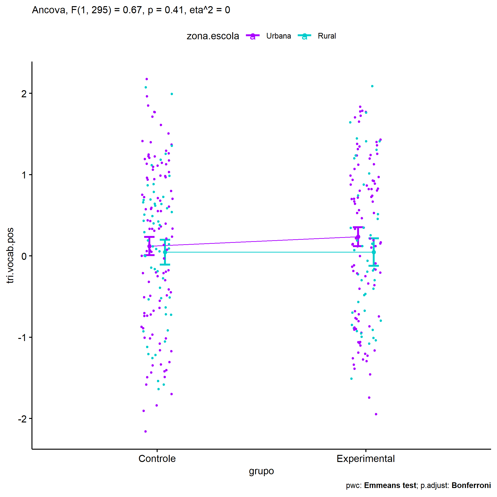<!-- -->

    ## Scale for colour is already present.
    ## Adding another scale for colour, which will replace the existing scale.

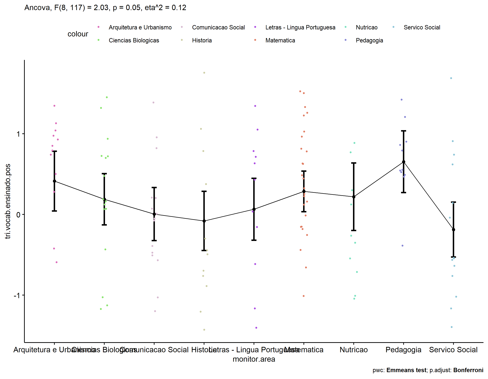<!-- -->

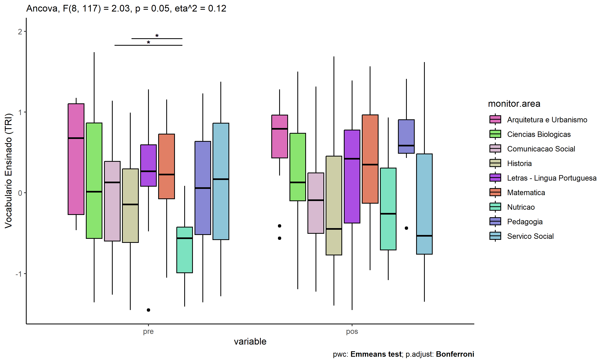<!-- -->

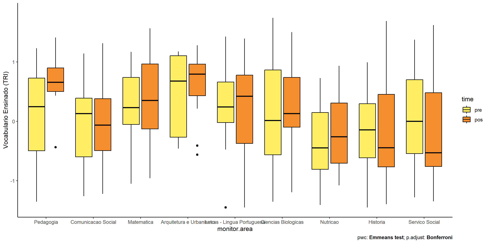<!-- -->

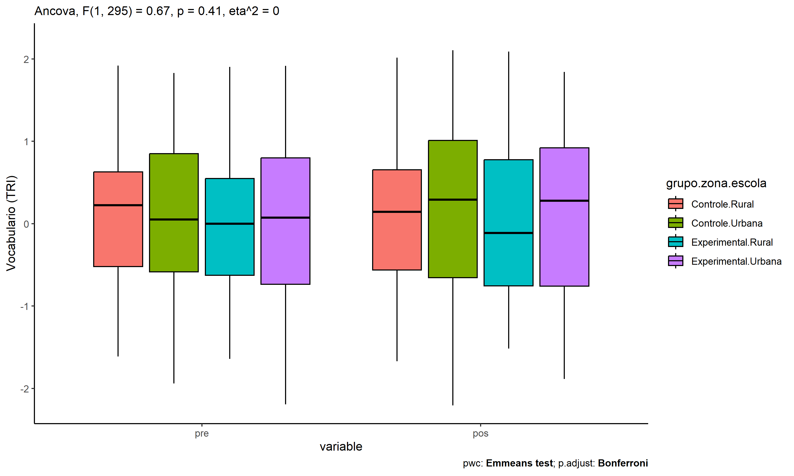<!-- -->

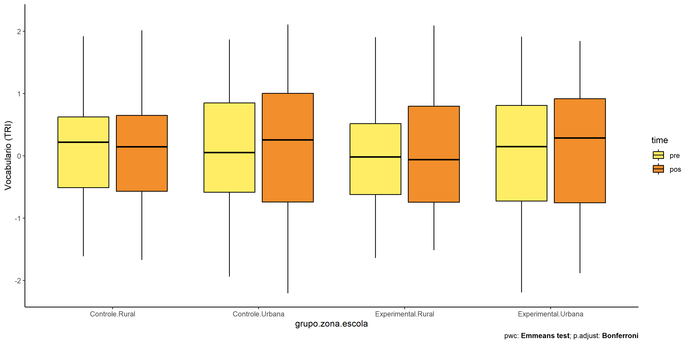<!-- -->

### Vocabulario Ensinado (Acertos)

| var                      | zona.escola | grupo        |   n | M (pre) | SE (pre) | M (unadj) | SE (unadj) | M (adj) | SE (adj) |
|:-------------------------|:------------|:-------------|----:|--------:|---------:|----------:|-----------:|--------:|---------:|
| score.vocab.ensinado.pos | Rural       | Controle     |  58 |   3.897 |    0.306 |     4.052 |      0.284 |   4.050 |    0.277 |
| score.vocab.ensinado.pos | Rural       | Experimental |  48 |   4.312 |    0.341 |     4.146 |      0.328 |   3.960 |    0.305 |
| score.vocab.ensinado.pos | Urbana      | Controle     | 118 |   3.763 |    0.215 |     3.669 |      0.214 |   3.726 |    0.194 |
| score.vocab.ensinado.pos | Urbana      | Experimental | 108 |   3.843 |    0.191 |     3.981 |      0.232 |   4.003 |    0.203 |

| .y.                      | grupo        | zona.escola | group1   | group2       | estimate | conf.low | conf.high |    se | statistic |     p | p.adj | p.adj.signif |
|:-------------------------|:-------------|:------------|:---------|:-------------|---------:|---------:|----------:|------:|----------:|------:|------:|:-------------|
| score.vocab.ensinado.pos | Controle     |             | Urbana   | Rural        |   -0.323 |   -0.988 |     0.341 | 0.338 |    -0.957 | 0.339 | 0.339 | ns           |
| score.vocab.ensinado.pos | Experimental |             | Urbana   | Rural        |    0.043 |   -0.678 |     0.763 | 0.366 |     0.116 | 0.907 | 0.907 | ns           |
| score.vocab.ensinado.pre | Controle     |             | Urbana   | Rural        |   -0.134 |   -0.837 |     0.569 | 0.357 |    -0.374 | 0.708 | 0.708 | ns           |
| score.vocab.ensinado.pre | Experimental |             | Urbana   | Rural        |   -0.470 |   -1.231 |     0.291 | 0.387 |    -1.215 | 0.225 | 0.225 | ns           |
| score.vocab.ensinado.pos |              | Urbana      | Controle | Experimental |   -0.277 |   -0.829 |     0.275 | 0.281 |    -0.987 | 0.325 | 0.325 | ns           |
| score.vocab.ensinado.pos |              | Rural       | Controle | Experimental |    0.089 |   -0.721 |     0.899 | 0.412 |     0.216 | 0.829 | 0.829 | ns           |
| score.vocab.ensinado.pre |              | Urbana      | Controle | Experimental |   -0.080 |   -0.664 |     0.504 | 0.297 |    -0.269 | 0.788 | 0.788 | ns           |
| score.vocab.ensinado.pre |              | Rural       | Controle | Experimental |   -0.416 |   -1.271 |     0.440 | 0.435 |    -0.956 | 0.340 | 0.340 | ns           |

| grupo        | zona.escola | group1 | group2 | estimate | conf.low | conf.high |    se | statistic |     p | p.adj | p.adj.signif |
|:-------------|:------------|:-------|:-------|---------:|---------:|----------:|------:|----------:|------:|------:|:-------------|
| Controle     | Urbana      | pre    | pos    |    0.093 |   -0.488 |     0.675 | 0.296 |     0.315 | 0.753 | 0.753 | ns           |
| Controle     | Rural       | pre    | pos    |   -0.155 |   -0.985 |     0.674 | 0.423 |    -0.367 | 0.714 | 0.714 | ns           |
| Experimental | Urbana      | pre    | pos    |   -0.139 |   -0.747 |     0.469 | 0.310 |    -0.449 | 0.654 | 0.654 | ns           |
| Experimental | Rural       | pre    | pos    |    0.167 |   -0.745 |     1.079 | 0.464 |     0.359 | 0.720 | 0.720 | ns           |

    ## Scale for colour is already present.
    ## Adding another scale for colour, which will replace the existing scale.

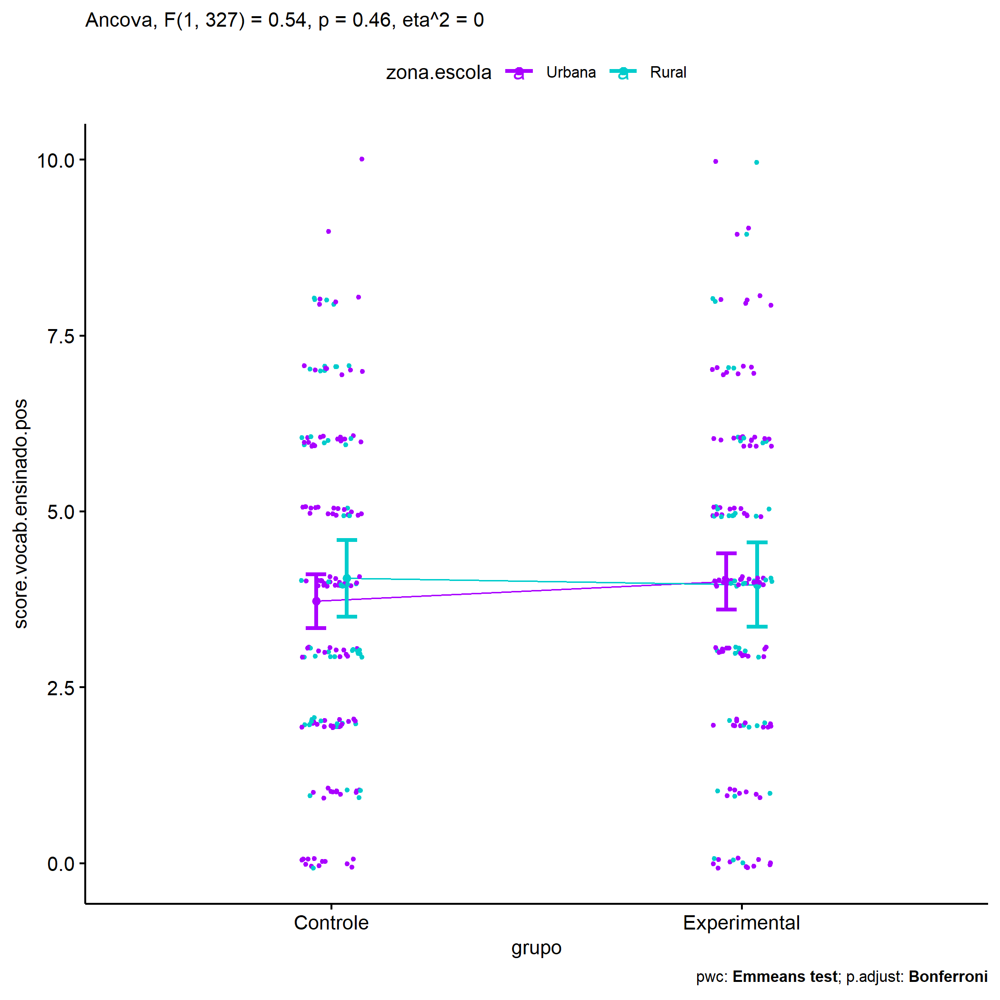<!-- -->

    ## Scale for colour is already present.
    ## Adding another scale for colour, which will replace the existing scale.

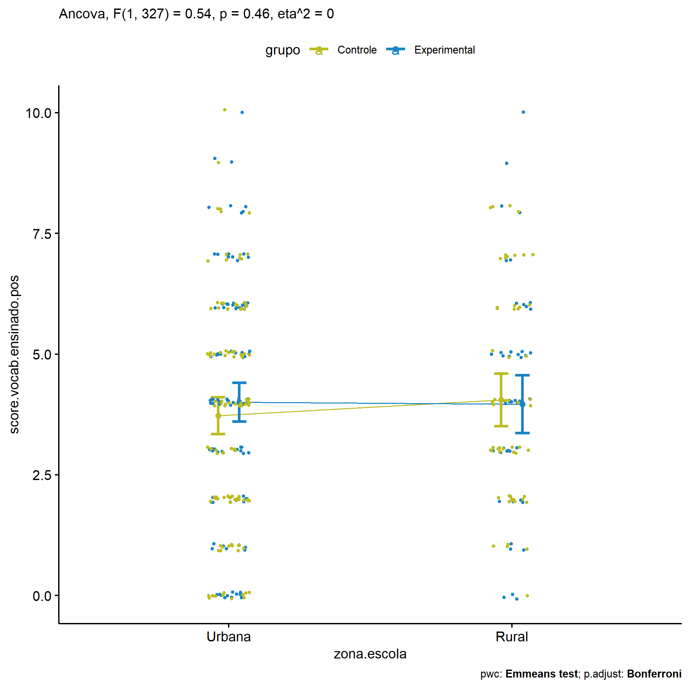<!-- -->

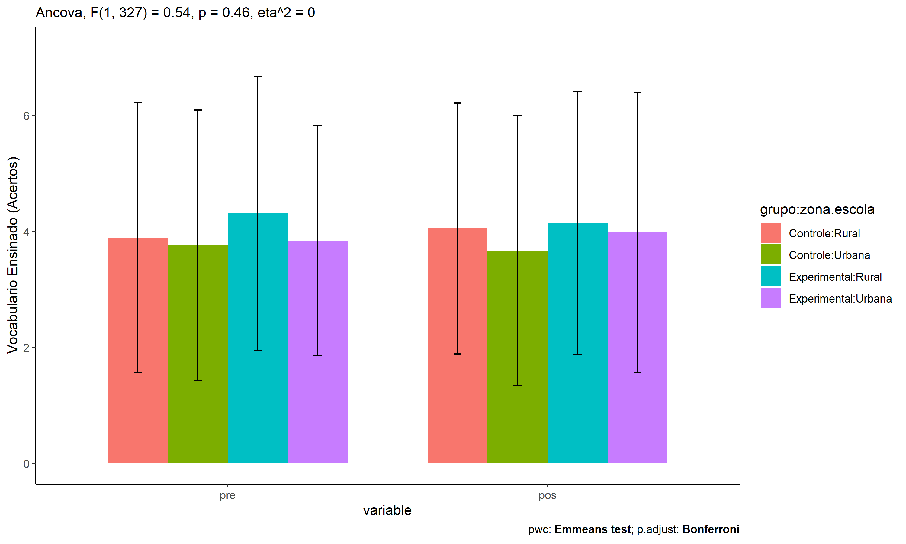<!-- -->

<!-- -->

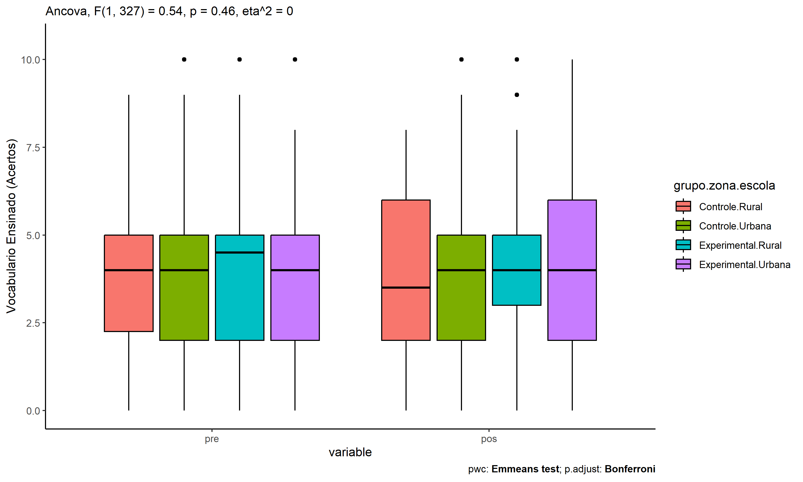<!-- -->

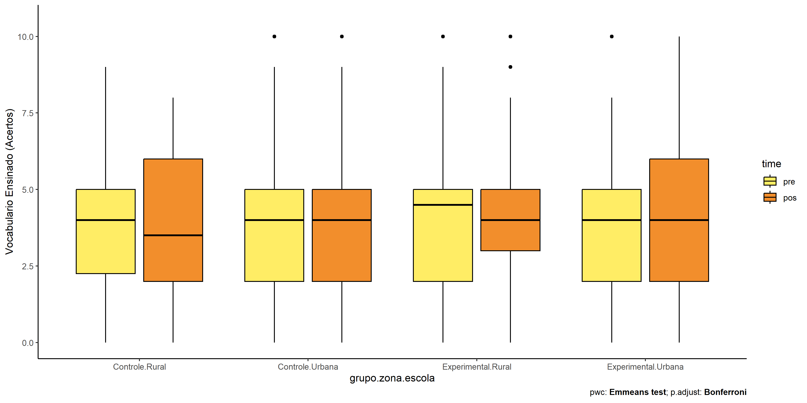<!-- -->

### Vocabulario Ensinado (TRI)

| var                    | zona.escola | grupo        |   n | M (pre) | SE (pre) | M (unadj) | SE (unadj) | M (adj) | SE (adj) |
|:-----------------------|:------------|:-------------|----:|--------:|---------:|----------:|-----------:|--------:|---------:|
| tri.vocab.ensinado.pos | Rural       | Controle     |  55 |   0.056 |    0.103 |     0.011 |      0.111 |   0.008 |    0.089 |
| tri.vocab.ensinado.pos | Rural       | Experimental |  45 |   0.034 |    0.125 |    -0.011 |      0.119 |  -0.001 |    0.098 |
| tri.vocab.ensinado.pos | Urbana      | Controle     | 104 |   0.070 |    0.082 |     0.061 |      0.084 |   0.049 |    0.065 |
| tri.vocab.ensinado.pos | Urbana      | Experimental |  96 |   0.035 |    0.074 |     0.162 |      0.081 |   0.172 |    0.067 |

| .y.                    | grupo        | zona.escola | group1   | group2       | estimate | conf.low | conf.high |    se | statistic |     p | p.adj | p.adj.signif |
|:-----------------------|:-------------|:------------|:---------|:-------------|---------:|---------:|----------:|------:|----------:|------:|------:|:-------------|
| tri.vocab.ensinado.pos | Controle     |             | Urbana   | Rural        |    0.042 |   -0.175 |     0.258 | 0.110 |     0.378 | 0.706 | 0.706 | ns           |
| tri.vocab.ensinado.pos | Experimental |             | Urbana   | Rural        |    0.172 |   -0.062 |     0.407 | 0.119 |     1.446 | 0.149 | 0.149 | ns           |
| tri.vocab.ensinado.pre | Controle     |             | Urbana   | Rural        |    0.014 |   -0.245 |     0.272 | 0.131 |     0.105 | 0.916 | 0.916 | ns           |
| tri.vocab.ensinado.pre | Experimental |             | Urbana   | Rural        |    0.001 |   -0.279 |     0.282 | 0.142 |     0.010 | 0.992 | 0.992 | ns           |
| tri.vocab.ensinado.pos |              | Urbana      | Controle | Experimental |   -0.123 |   -0.306 |     0.061 | 0.093 |    -1.313 | 0.190 | 0.190 | ns           |
| tri.vocab.ensinado.pos |              | Rural       | Controle | Experimental |    0.008 |   -0.253 |     0.269 | 0.133 |     0.062 | 0.951 | 0.951 | ns           |
| tri.vocab.ensinado.pre |              | Urbana      | Controle | Experimental |    0.034 |   -0.185 |     0.254 | 0.112 |     0.308 | 0.759 | 0.759 | ns           |
| tri.vocab.ensinado.pre |              | Rural       | Controle | Experimental |    0.022 |   -0.290 |     0.334 | 0.158 |     0.139 | 0.890 | 0.890 | ns           |

| grupo        | zona.escola | group1 | group2 | estimate | conf.low | conf.high |    se | statistic |     p | p.adj | p.adj.signif |
|:-------------|:------------|:-------|:-------|---------:|---------:|----------:|------:|----------:|------:|------:|:-------------|
| Controle     | Urbana      | pre    | pos    |    0.007 |   -0.206 |     0.221 | 0.109 |     0.067 | 0.947 | 0.947 | ns           |
| Controle     | Rural       | pre    | pos    |    0.008 |   -0.290 |     0.305 | 0.152 |     0.051 | 0.959 | 0.959 | ns           |
| Experimental | Urbana      | pre    | pos    |   -0.093 |   -0.316 |     0.129 | 0.113 |    -0.824 | 0.410 | 0.410 | ns           |
| Experimental | Rural       | pre    | pos    |    0.011 |   -0.317 |     0.340 | 0.167 |     0.068 | 0.946 | 0.946 | ns           |

    ## Scale for colour is already present.
    ## Adding another scale for colour, which will replace the existing scale.

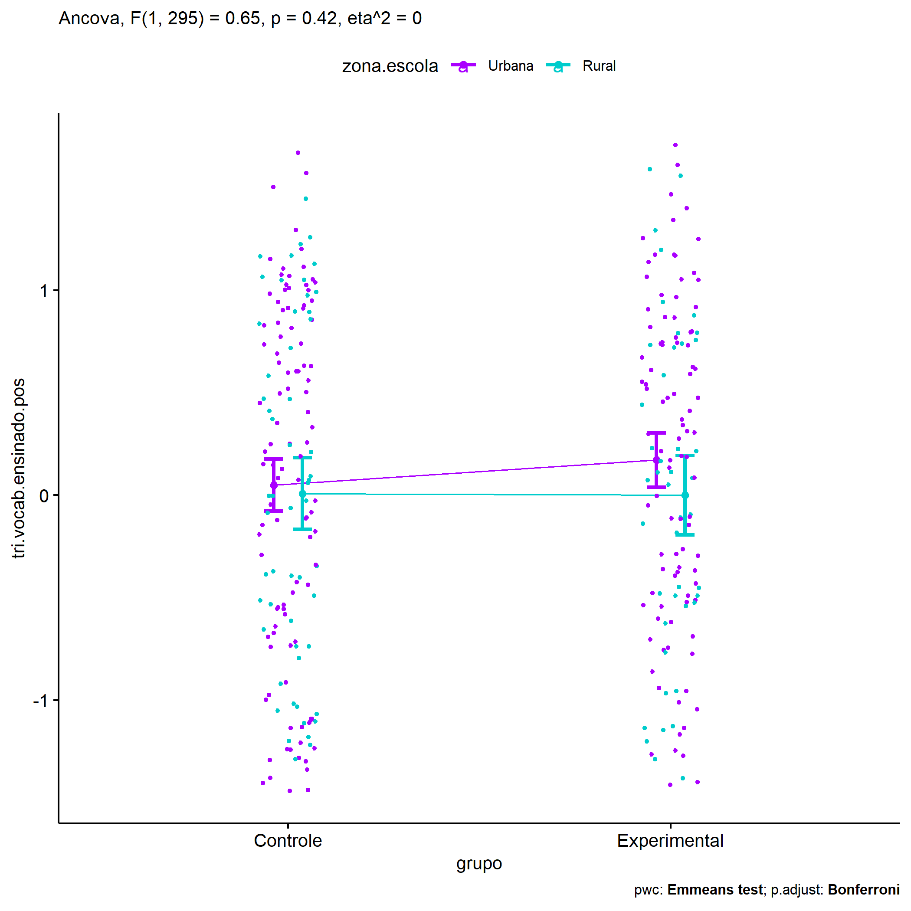<!-- -->

    ## Scale for colour is already present.
    ## Adding another scale for colour, which will replace the existing scale.

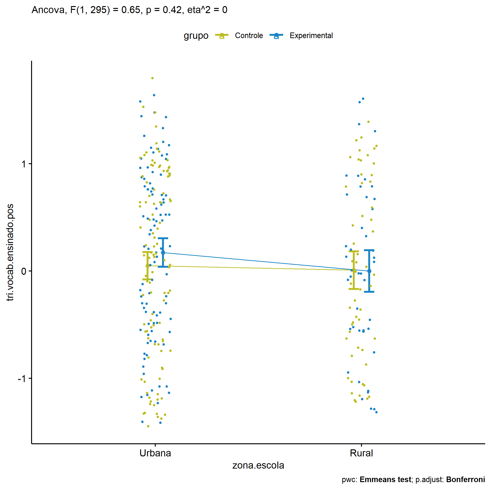<!-- -->

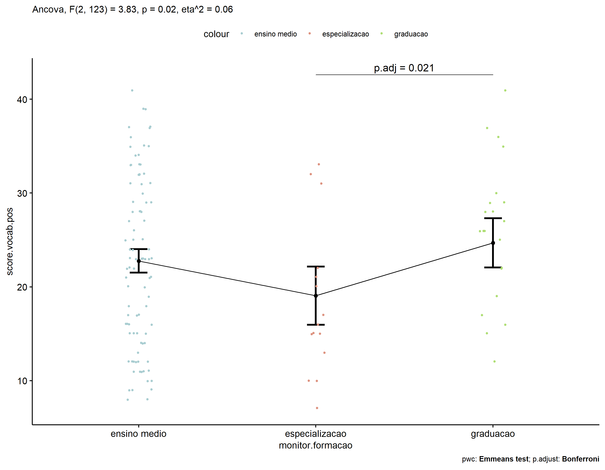<!-- -->

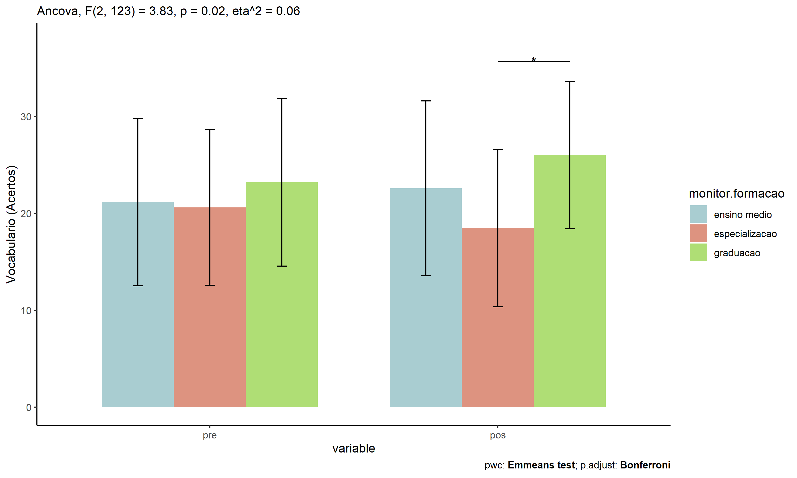<!-- -->

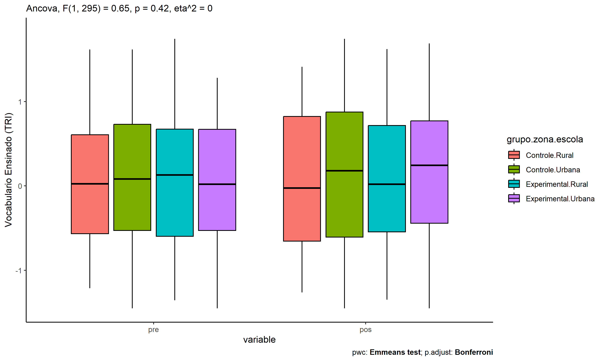<!-- -->

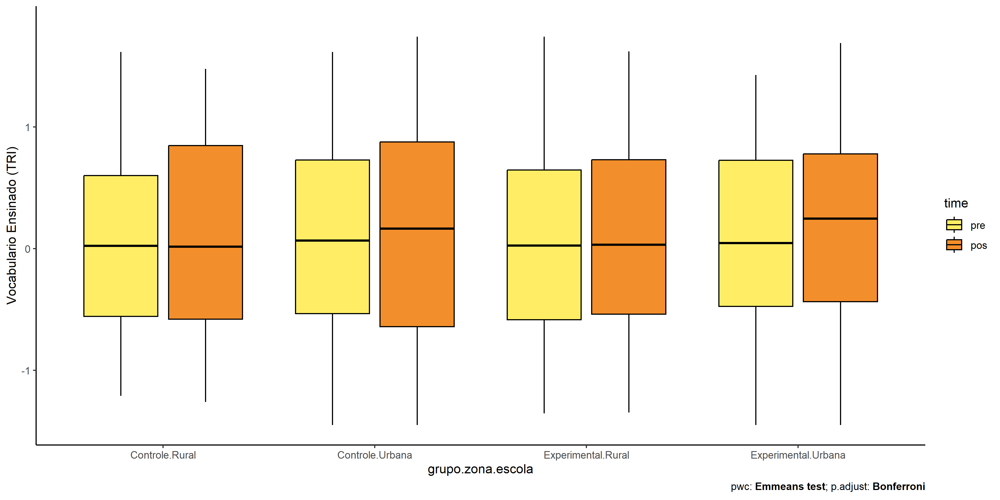<!-- -->

### Vocabulario Nao Ensinado (Acertos)

| var                          | zona.escola | grupo        |   n | M (pre) | SE (pre) | M (unadj) | SE (unadj) | M (adj) | SE (adj) |
|:-----------------------------|:------------|:-------------|----:|--------:|---------:|----------:|-----------:|--------:|---------:|
| score.vocab.nao.ensinado.pos | Rural       | Controle     |  58 |  16.379 |    0.985 |    16.983 |      0.838 |  16.962 |    0.865 |
| score.vocab.nao.ensinado.pos | Rural       | Experimental |  48 |  16.083 |    1.004 |    16.021 |      1.168 |  16.189 |    0.950 |
| score.vocab.nao.ensinado.pos | Urbana      | Controle     | 118 |  16.076 |    0.703 |    16.331 |      0.777 |  16.504 |    0.606 |
| score.vocab.nao.ensinado.pos | Urbana      | Experimental | 108 |  16.741 |    0.717 |    16.380 |      0.828 |  16.127 |    0.634 |

| .y.                          | grupo        | zona.escola | group1   | group2       | estimate | conf.low | conf.high |    se | statistic |     p | p.adj | p.adj.signif |
|:-----------------------------|:-------------|:------------|:---------|:-------------|---------:|---------:|----------:|------:|----------:|------:|------:|:-------------|
| score.vocab.nao.ensinado.pos | Controle     |             | Urbana   | Rural        |   -0.458 |   -2.536 |     1.619 | 1.056 |    -0.434 | 0.665 | 0.665 | ns           |
| score.vocab.nao.ensinado.pos | Experimental |             | Urbana   | Rural        |   -0.062 |   -2.310 |     2.186 | 1.143 |    -0.055 | 0.957 | 0.957 | ns           |
| score.vocab.nao.ensinado.pre | Controle     |             | Urbana   | Rural        |   -0.303 |   -2.656 |     2.050 | 1.196 |    -0.253 | 0.800 | 0.800 | ns           |
| score.vocab.nao.ensinado.pre | Experimental |             | Urbana   | Rural        |    0.657 |   -1.888 |     3.202 | 1.294 |     0.508 | 0.612 | 0.612 | ns           |
| score.vocab.nao.ensinado.pos |              | Urbana      | Controle | Experimental |    0.376 |   -1.350 |     2.103 | 0.877 |     0.429 | 0.668 | 0.668 | ns           |
| score.vocab.nao.ensinado.pos |              | Rural       | Controle | Experimental |    0.772 |   -1.755 |     3.300 | 1.285 |     0.601 | 0.548 | 0.548 | ns           |
| score.vocab.nao.ensinado.pre |              | Urbana      | Controle | Experimental |   -0.664 |   -2.618 |     1.289 | 0.993 |    -0.669 | 0.504 | 0.504 | ns           |
| score.vocab.nao.ensinado.pre |              | Rural       | Controle | Experimental |    0.296 |   -2.567 |     3.159 | 1.455 |     0.203 | 0.839 | 0.839 | ns           |

| grupo        | zona.escola | group1 | group2 | estimate | conf.low | conf.high |    se | statistic |     p | p.adj | p.adj.signif |
|:-------------|:------------|:-------|:-------|---------:|---------:|----------:|------:|----------:|------:|------:|:-------------|
| Controle     | Urbana      | pre    | pos    |   -0.254 |   -2.248 |     1.740 | 1.015 |    -0.250 | 0.802 | 0.802 | ns           |
| Controle     | Rural       | pre    | pos    |   -0.603 |   -3.447 |     2.240 | 1.448 |    -0.417 | 0.677 | 0.677 | ns           |
| Experimental | Urbana      | pre    | pos    |    0.361 |   -1.723 |     2.445 | 1.061 |     0.340 | 0.734 | 0.734 | ns           |
| Experimental | Rural       | pre    | pos    |    0.062 |   -3.064 |     3.189 | 1.592 |     0.039 | 0.969 | 0.969 | ns           |

    ## Scale for colour is already present.
    ## Adding another scale for colour, which will replace the existing scale.

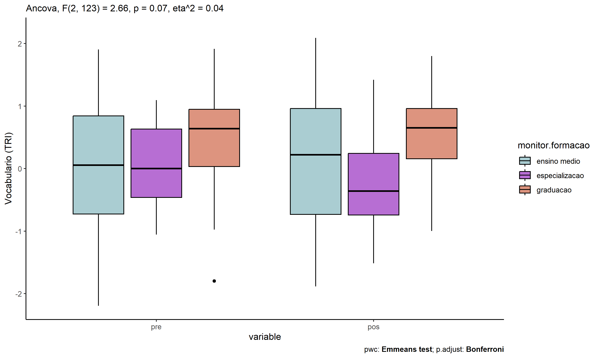<!-- -->

    ## Scale for colour is already present.
    ## Adding another scale for colour, which will replace the existing scale.

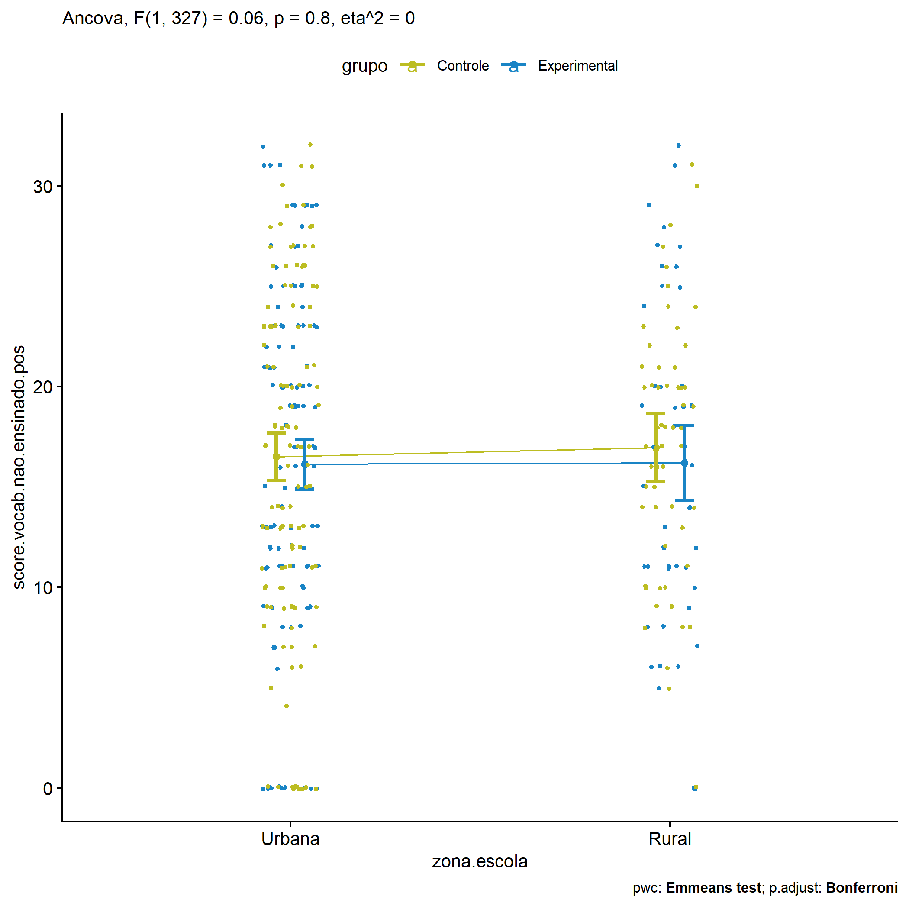<!-- -->

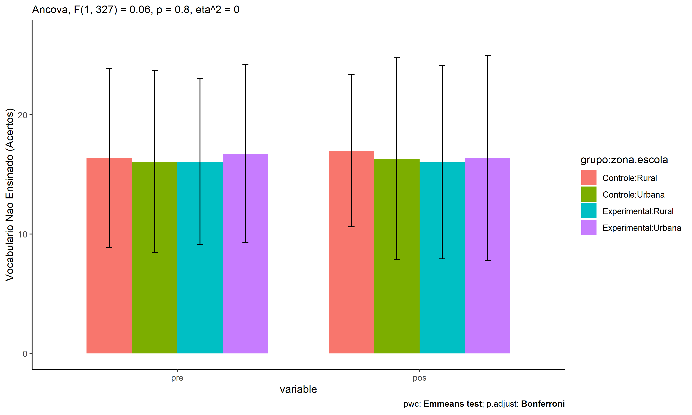<!-- -->

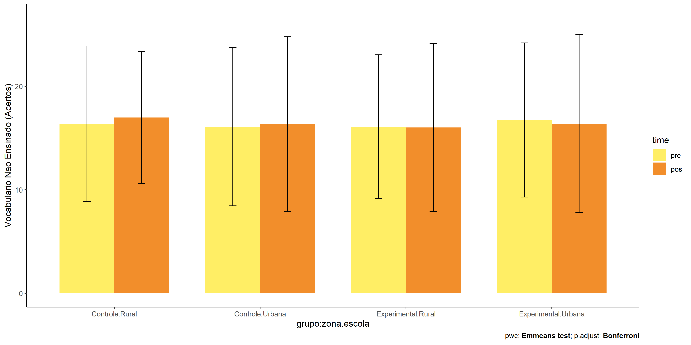<!-- -->

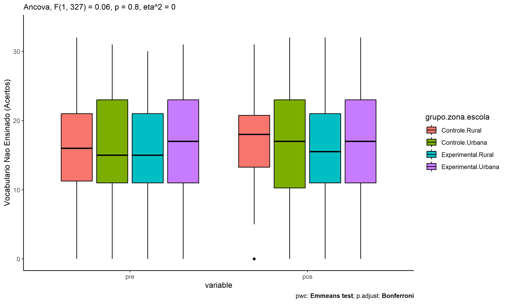<!-- -->

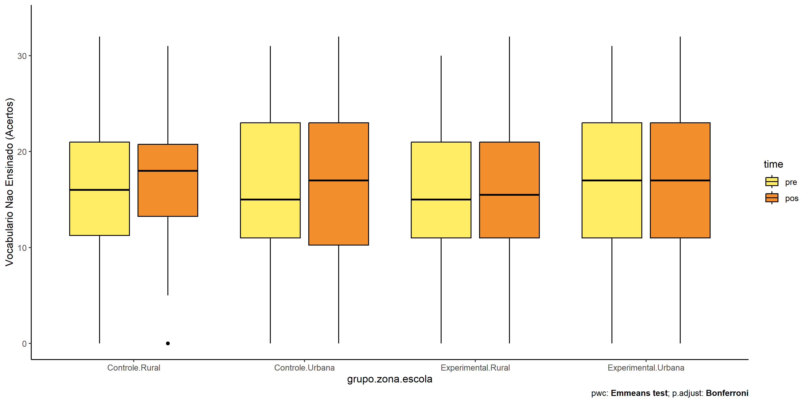<!-- -->

### Vocabulario Nao Ensinado (TRI)

| var                        | zona.escola | grupo        |   n | M (pre) | SE (pre) | M (unadj) | SE (unadj) | M (adj) | SE (adj) |
|:---------------------------|:------------|:-------------|----:|--------:|---------:|----------:|-----------:|--------:|---------:|
| tri.vocab.nao.ensinado.pos | Rural       | Controle     |  55 |   0.074 |    0.114 |     0.061 |      0.112 |   0.032 |    0.078 |
| tri.vocab.nao.ensinado.pos | Rural       | Experimental |  45 |   0.005 |    0.130 |     0.031 |      0.153 |   0.060 |    0.087 |
| tri.vocab.nao.ensinado.pos | Urbana      | Controle     | 104 |   0.059 |    0.091 |     0.218 |      0.097 |   0.202 |    0.057 |
| tri.vocab.nao.ensinado.pos | Urbana      | Experimental |  96 |   0.017 |    0.096 |     0.199 |      0.101 |   0.219 |    0.059 |

| .y.                        | grupo        | zona.escola | group1   | group2       | estimate | conf.low | conf.high |    se | statistic |     p | p.adj | p.adj.signif |
|:---------------------------|:-------------|:------------|:---------|:-------------|---------:|---------:|----------:|------:|----------:|------:|------:|:-------------|
| tri.vocab.nao.ensinado.pos | Controle     |             | Urbana   | Rural        |    0.170 |   -0.021 |     0.361 | 0.097 |     1.753 | 0.081 | 0.081 | ns           |
| tri.vocab.nao.ensinado.pos | Experimental |             | Urbana   | Rural        |    0.158 |   -0.048 |     0.365 | 0.105 |     1.509 | 0.132 | 0.132 | ns           |
| tri.vocab.nao.ensinado.pre | Controle     |             | Urbana   | Rural        |   -0.014 |   -0.313 |     0.284 | 0.152 |    -0.094 | 0.925 | 0.925 | ns           |
| tri.vocab.nao.ensinado.pre | Experimental |             | Urbana   | Rural        |    0.012 |   -0.312 |     0.336 | 0.164 |     0.073 | 0.942 | 0.942 | ns           |
| tri.vocab.nao.ensinado.pos |              | Urbana      | Controle | Experimental |   -0.017 |   -0.179 |     0.145 | 0.082 |    -0.203 | 0.840 | 0.840 | ns           |
| tri.vocab.nao.ensinado.pos |              | Rural       | Controle | Experimental |   -0.028 |   -0.258 |     0.202 | 0.117 |    -0.241 | 0.810 | 0.810 | ns           |
| tri.vocab.nao.ensinado.pre |              | Urbana      | Controle | Experimental |    0.042 |   -0.211 |     0.296 | 0.129 |     0.328 | 0.743 | 0.743 | ns           |
| tri.vocab.nao.ensinado.pre |              | Rural       | Controle | Experimental |    0.069 |   -0.292 |     0.429 | 0.183 |     0.375 | 0.708 | 0.708 | ns           |

| grupo        | zona.escola | group1 | group2 | estimate | conf.low | conf.high |    se | statistic |     p | p.adj | p.adj.signif |
|:-------------|:------------|:-------|:-------|---------:|---------:|----------:|------:|----------:|------:|------:|:-------------|
| Controle     | Urbana      | pre    | pos    |   -0.139 |   -0.387 |     0.110 | 0.127 |    -1.097 | 0.273 | 0.273 | ns           |
| Controle     | Rural       | pre    | pos    |    0.018 |   -0.329 |     0.365 | 0.177 |     0.101 | 0.919 | 0.919 | ns           |
| Experimental | Urbana      | pre    | pos    |   -0.152 |   -0.411 |     0.107 | 0.132 |    -1.150 | 0.251 | 0.251 | ns           |
| Experimental | Rural       | pre    | pos    |   -0.066 |   -0.448 |     0.316 | 0.195 |    -0.340 | 0.734 | 0.734 | ns           |

    ## Scale for colour is already present.
    ## Adding another scale for colour, which will replace the existing scale.

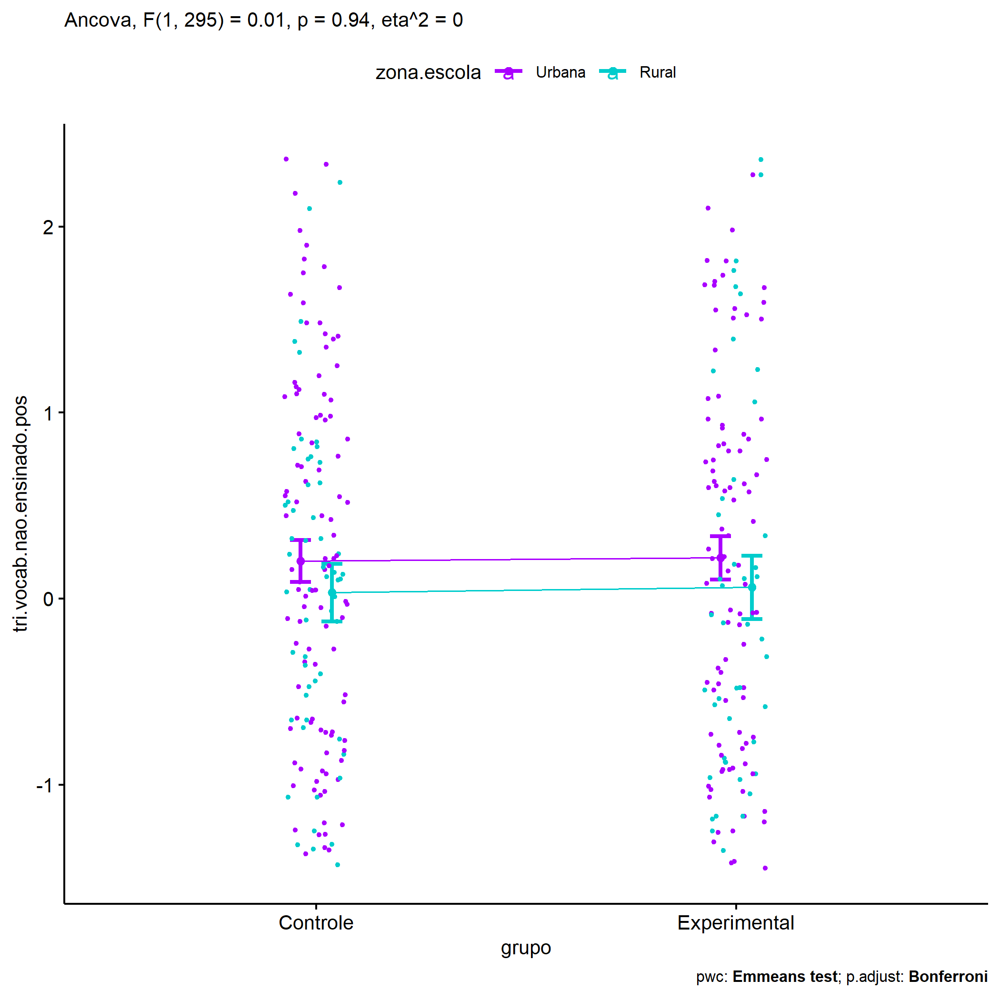<!-- -->

    ## Scale for colour is already present.
    ## Adding another scale for colour, which will replace the existing scale.

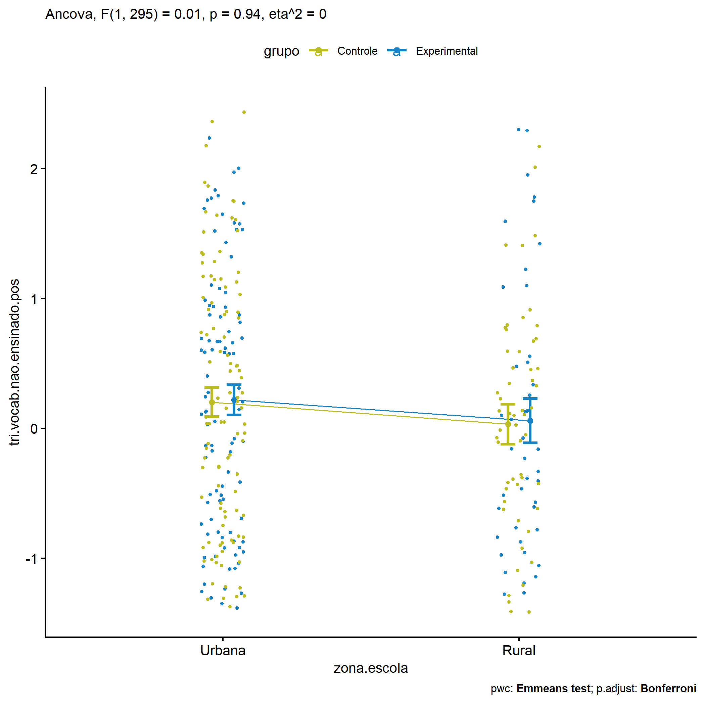<!-- -->

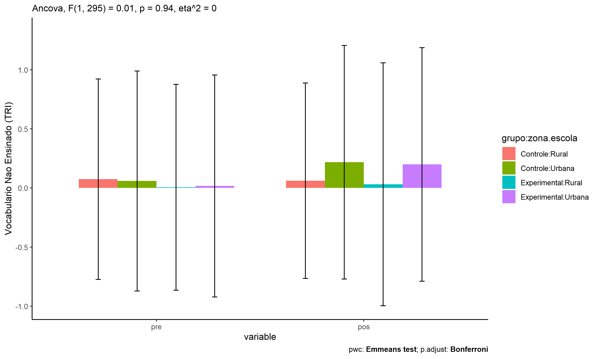<!-- -->

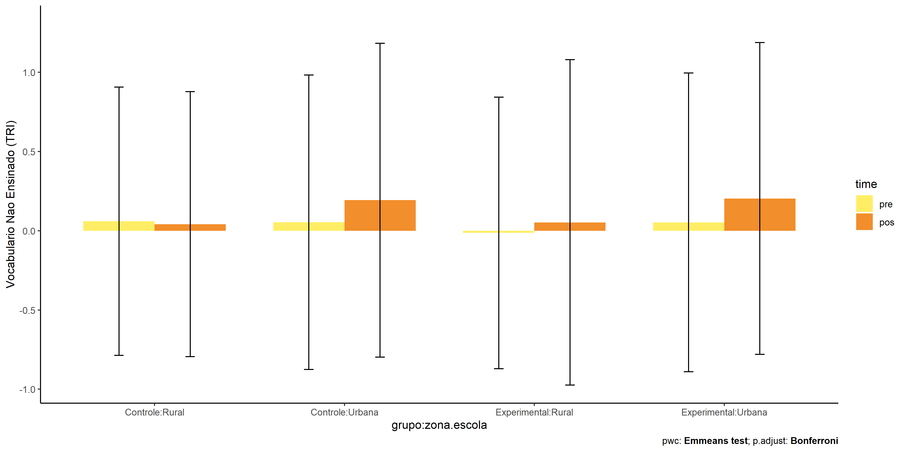<!-- -->

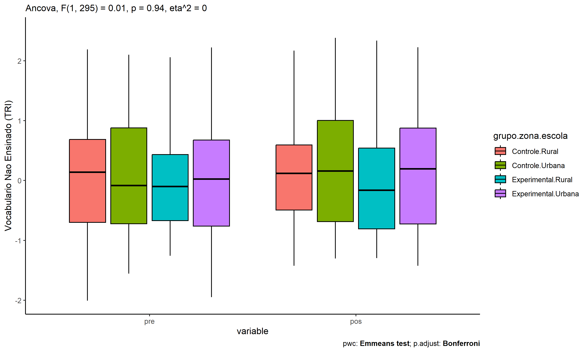<!-- -->

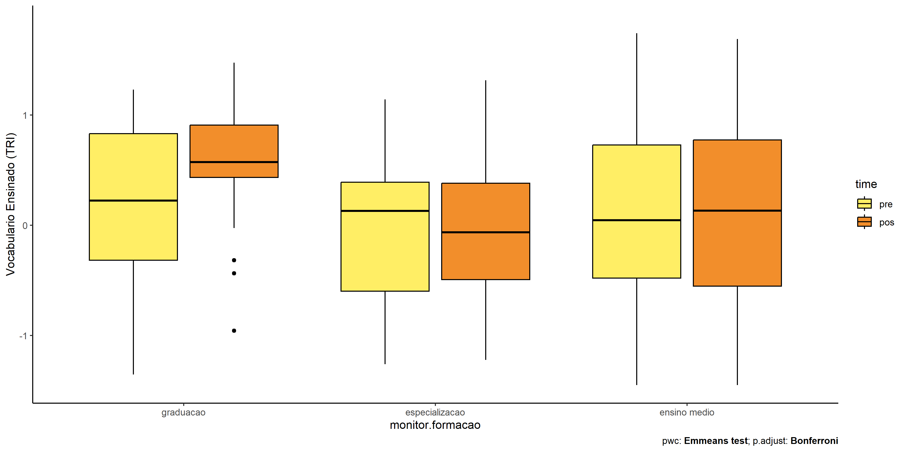<!-- -->

# Pairwise comparisons for grupo=“Experimental”

## factores: **grupo=“Experimental”:monitor**

### Vocabulario (Acertos)

| var             | monitor |   n | M (pre) | SE (pre) | M (unadj) | SE (unadj) | M (adj) | SE (adj) |
|:----------------|:--------|----:|--------:|---------:|----------:|-----------:|--------:|---------:|
| score.vocab.pos | AC      |  11 |  23.455 |    2.823 |    27.364 |      2.120 |  25.918 |    1.811 |
| score.vocab.pos | CE      |  15 |  20.600 |    2.072 |    18.467 |      2.095 |  19.039 |    1.547 |
| score.vocab.pos | EA      |  10 |  22.900 |    2.610 |    24.500 |      2.609 |  23.446 |    1.896 |
| score.vocab.pos | GR      |  16 |  22.438 |    2.403 |    24.375 |      2.225 |  23.648 |    1.499 |
| score.vocab.pos | JC      |  12 |  23.083 |    2.518 |    26.417 |      1.944 |  25.233 |    1.732 |
| score.vocab.pos | MF      |  11 |  23.545 |    2.771 |    24.273 |      2.559 |  22.763 |    1.811 |
| score.vocab.pos | ML      |  16 |  22.188 |    2.255 |    25.000 |      2.343 |  24.450 |    1.498 |
| score.vocab.pos | MM      |  10 |  17.100 |    1.048 |    18.400 |      2.509 |  21.447 |    1.914 |
| score.vocab.pos | PR      |  12 |  18.167 |    2.519 |    19.667 |      3.028 |  21.959 |    1.741 |
| score.vocab.pos | VL      |  14 |  20.286 |    2.347 |    18.500 |      2.270 |  19.294 |    1.602 |

| .y.             | group1 | group2 | estimate | conf.low | conf.high |    se | statistic |     p | p.adj | p.adj.signif |
|:----------------|:-------|:-------|---------:|---------:|----------:|------:|----------:|------:|------:|:-------------|
| score.vocab.pos | AC     | CE     |    6.879 |    2.156 |    11.602 | 2.384 |     2.885 | 0.005 | 0.210 | ns           |
| score.vocab.pos | AC     | EA     |    2.472 |   -2.712 |     7.655 | 2.617 |     0.944 | 0.347 | 1.000 | ns           |
| score.vocab.pos | AC     | GR     |    2.270 |   -2.378 |     6.917 | 2.347 |     0.967 | 0.335 | 1.000 | ns           |
| score.vocab.pos | AC     | JC     |    0.685 |   -4.267 |     5.636 | 2.500 |     0.274 | 0.785 | 1.000 | ns           |
| score.vocab.pos | AC     | MF     |    3.155 |   -1.903 |     8.213 | 2.554 |     1.236 | 0.219 | 1.000 | ns           |
| score.vocab.pos | AC     | ML     |    1.468 |   -3.181 |     6.117 | 2.347 |     0.625 | 0.533 | 1.000 | ns           |
| score.vocab.pos | AC     | MM     |    4.471 |   -0.775 |     9.717 | 2.649 |     1.688 | 0.094 | 1.000 | ns           |
| score.vocab.pos | AC     | PR     |    3.959 |   -1.039 |     8.956 | 2.523 |     1.569 | 0.119 | 1.000 | ns           |
| score.vocab.pos | AC     | VL     |    6.623 |    1.827 |    11.420 | 2.422 |     2.735 | 0.007 | 0.325 | ns           |
| score.vocab.pos | CE     | EA     |   -4.407 |   -9.259 |     0.444 | 2.449 |    -1.799 | 0.075 | 1.000 | ns           |
| score.vocab.pos | CE     | GR     |   -4.609 |   -8.879 |    -0.340 | 2.156 |    -2.138 | 0.035 | 1.000 | ns           |
| score.vocab.pos | CE     | JC     |   -6.194 |  -10.799 |    -1.589 | 2.325 |    -2.664 | 0.009 | 0.397 | ns           |
| score.vocab.pos | CE     | MF     |   -3.724 |   -8.447 |     1.000 | 2.385 |    -1.561 | 0.121 | 1.000 | ns           |
| score.vocab.pos | CE     | ML     |   -5.411 |   -9.679 |    -1.143 | 2.155 |    -2.511 | 0.013 | 0.604 | ns           |
| score.vocab.pos | CE     | MM     |   -2.408 |   -7.271 |     2.455 | 2.455 |    -0.981 | 0.329 | 1.000 | ns           |
| score.vocab.pos | CE     | PR     |   -2.920 |   -7.525 |     1.684 | 2.325 |    -1.256 | 0.212 | 1.000 | ns           |
| score.vocab.pos | CE     | VL     |   -0.256 |   -4.664 |     4.153 | 2.226 |    -0.115 | 0.909 | 1.000 | ns           |
| score.vocab.pos | EA     | GR     |   -0.202 |   -4.984 |     4.580 | 2.414 |    -0.084 | 0.933 | 1.000 | ns           |
| score.vocab.pos | EA     | JC     |   -1.787 |   -6.866 |     3.292 | 2.564 |    -0.697 | 0.487 | 1.000 | ns           |
| score.vocab.pos | EA     | MF     |    0.684 |   -4.500 |     5.867 | 2.617 |     0.261 | 0.794 | 1.000 | ns           |
| score.vocab.pos | EA     | ML     |   -1.004 |   -5.786 |     3.779 | 2.415 |    -0.416 | 0.678 | 1.000 | ns           |
| score.vocab.pos | EA     | MM     |    2.000 |   -3.357 |     7.356 | 2.704 |     0.739 | 0.461 | 1.000 | ns           |
| score.vocab.pos | EA     | PR     |    1.487 |   -3.628 |     6.602 | 2.582 |     0.576 | 0.566 | 1.000 | ns           |
| score.vocab.pos | EA     | VL     |    4.152 |   -0.771 |     9.074 | 2.485 |     1.670 | 0.098 | 1.000 | ns           |
| score.vocab.pos | GR     | JC     |   -1.585 |   -6.116 |     2.945 | 2.287 |    -0.693 | 0.490 | 1.000 | ns           |
| score.vocab.pos | GR     | MF     |    0.886 |   -3.763 |     5.534 | 2.347 |     0.377 | 0.707 | 1.000 | ns           |
| score.vocab.pos | GR     | ML     |   -0.802 |   -4.996 |     3.392 | 2.117 |    -0.379 | 0.706 | 1.000 | ns           |
| score.vocab.pos | GR     | MM     |    2.202 |   -2.628 |     7.032 | 2.439 |     0.903 | 0.369 | 1.000 | ns           |
| score.vocab.pos | GR     | PR     |    1.689 |   -2.874 |     6.252 | 2.304 |     0.733 | 0.465 | 1.000 | ns           |
| score.vocab.pos | GR     | VL     |    4.354 |    0.004 |     8.703 | 2.196 |     1.982 | 0.050 | 1.000 | ns           |
| score.vocab.pos | JC     | MF     |    2.471 |   -2.481 |     7.422 | 2.500 |     0.988 | 0.325 | 1.000 | ns           |
| score.vocab.pos | JC     | ML     |    0.783 |   -3.748 |     5.315 | 2.288 |     0.342 | 0.733 | 1.000 | ns           |
| score.vocab.pos | JC     | MM     |    3.787 |   -1.349 |     8.923 | 2.593 |     1.460 | 0.147 | 1.000 | ns           |
| score.vocab.pos | JC     | PR     |    3.274 |   -1.609 |     8.157 | 2.465 |     1.328 | 0.187 | 1.000 | ns           |
| score.vocab.pos | JC     | VL     |    5.939 |    1.259 |    10.619 | 2.363 |     2.513 | 0.013 | 0.600 | ns           |
| score.vocab.pos | MF     | ML     |   -1.687 |   -6.337 |     2.962 | 2.347 |    -0.719 | 0.474 | 1.000 | ns           |
| score.vocab.pos | MF     | MM     |    1.316 |   -3.932 |     6.564 | 2.650 |     0.497 | 0.620 | 1.000 | ns           |
| score.vocab.pos | MF     | PR     |    0.803 |   -4.195 |     5.802 | 2.524 |     0.318 | 0.751 | 1.000 | ns           |
| score.vocab.pos | MF     | VL     |    3.468 |   -1.329 |     8.266 | 2.422 |     1.432 | 0.155 | 1.000 | ns           |
| score.vocab.pos | ML     | MM     |    3.003 |   -1.822 |     7.829 | 2.436 |     1.233 | 0.220 | 1.000 | ns           |
| score.vocab.pos | ML     | PR     |    2.491 |   -2.068 |     7.050 | 2.302 |     1.082 | 0.281 | 1.000 | ns           |
| score.vocab.pos | ML     | VL     |    5.156 |    0.808 |     9.503 | 2.195 |     2.349 | 0.021 | 0.924 | ns           |
| score.vocab.pos | MM     | PR     |   -0.513 |   -5.593 |     4.568 | 2.565 |    -0.200 | 0.842 | 1.000 | ns           |
| score.vocab.pos | MM     | VL     |    2.152 |   -2.776 |     7.080 | 2.488 |     0.865 | 0.389 | 1.000 | ns           |
| score.vocab.pos | PR     | VL     |    2.665 |   -2.010 |     7.339 | 2.360 |     1.129 | 0.261 | 1.000 | ns           |
| score.vocab.pre | AC     | CE     |    2.855 |   -3.893 |     9.602 | 3.407 |     0.838 | 0.404 | 1.000 | ns           |
| score.vocab.pre | AC     | EA     |    0.555 |   -6.872 |     7.981 | 3.750 |     0.148 | 0.883 | 1.000 | ns           |
| score.vocab.pre | AC     | GR     |    1.017 |   -5.641 |     7.675 | 3.362 |     0.303 | 0.763 | 1.000 | ns           |
| score.vocab.pre | AC     | JC     |    0.371 |   -6.724 |     7.466 | 3.583 |     0.104 | 0.918 | 1.000 | ns           |
| score.vocab.pre | AC     | MF     |   -0.091 |   -7.339 |     7.157 | 3.660 |    -0.025 | 0.980 | 1.000 | ns           |
| score.vocab.pre | AC     | ML     |    1.267 |   -5.391 |     7.925 | 3.362 |     0.377 | 0.707 | 1.000 | ns           |
| score.vocab.pre | AC     | MM     |    6.355 |   -1.072 |    13.781 | 3.750 |     1.695 | 0.093 | 1.000 | ns           |
| score.vocab.pre | AC     | PR     |    5.288 |   -1.807 |    12.383 | 3.583 |     1.476 | 0.143 | 1.000 | ns           |
| score.vocab.pre | AC     | VL     |    3.169 |   -3.680 |    10.017 | 3.458 |     0.916 | 0.361 | 1.000 | ns           |
| score.vocab.pre | CE     | EA     |   -2.300 |   -9.239 |     4.639 | 3.504 |    -0.656 | 0.513 | 1.000 | ns           |
| score.vocab.pre | CE     | GR     |   -1.838 |   -7.946 |     4.271 | 3.085 |    -0.596 | 0.553 | 1.000 | ns           |
| score.vocab.pre | CE     | JC     |   -2.483 |   -9.067 |     4.100 | 3.324 |    -0.747 | 0.457 | 1.000 | ns           |
| score.vocab.pre | CE     | MF     |   -2.945 |   -9.693 |     3.802 | 3.407 |    -0.865 | 0.389 | 1.000 | ns           |
| score.vocab.pre | CE     | ML     |   -1.588 |   -7.696 |     4.521 | 3.085 |    -0.515 | 0.608 | 1.000 | ns           |
| score.vocab.pre | CE     | MM     |    3.500 |   -3.439 |    10.439 | 3.504 |     0.999 | 0.320 | 1.000 | ns           |
| score.vocab.pre | CE     | PR     |    2.433 |   -4.150 |     9.017 | 3.324 |     0.732 | 0.466 | 1.000 | ns           |
| score.vocab.pre | CE     | VL     |    0.314 |   -6.002 |     6.631 | 3.189 |     0.099 | 0.922 | 1.000 | ns           |
| score.vocab.pre | EA     | GR     |    0.462 |   -6.389 |     7.314 | 3.460 |     0.134 | 0.894 | 1.000 | ns           |
| score.vocab.pre | EA     | JC     |   -0.183 |   -7.461 |     7.095 | 3.675 |    -0.050 | 0.960 | 1.000 | ns           |
| score.vocab.pre | EA     | MF     |   -0.645 |   -8.072 |     6.781 | 3.750 |    -0.172 | 0.864 | 1.000 | ns           |
| score.vocab.pre | EA     | ML     |    0.713 |   -6.139 |     7.564 | 3.460 |     0.206 | 0.837 | 1.000 | ns           |
| score.vocab.pre | EA     | MM     |    5.800 |   -1.802 |    13.402 | 3.838 |     1.511 | 0.133 | 1.000 | ns           |
| score.vocab.pre | EA     | PR     |    4.733 |   -2.545 |    12.011 | 3.675 |     1.288 | 0.200 | 1.000 | ns           |
| score.vocab.pre | EA     | VL     |    2.614 |   -4.423 |     9.652 | 3.554 |     0.736 | 0.463 | 1.000 | ns           |
| score.vocab.pre | GR     | JC     |   -0.646 |   -7.137 |     5.845 | 3.278 |    -0.197 | 0.844 | 1.000 | ns           |
| score.vocab.pre | GR     | MF     |   -1.108 |   -7.766 |     5.550 | 3.362 |    -0.330 | 0.742 | 1.000 | ns           |
| score.vocab.pre | GR     | ML     |    0.250 |   -5.760 |     6.260 | 3.034 |     0.082 | 0.934 | 1.000 | ns           |
| score.vocab.pre | GR     | MM     |    5.337 |   -1.514 |    12.189 | 3.460 |     1.543 | 0.126 | 1.000 | ns           |
| score.vocab.pre | GR     | PR     |    4.271 |   -2.220 |    10.762 | 3.278 |     1.303 | 0.195 | 1.000 | ns           |
| score.vocab.pre | GR     | VL     |    2.152 |   -4.069 |     8.372 | 3.141 |     0.685 | 0.495 | 1.000 | ns           |
| score.vocab.pre | JC     | MF     |   -0.462 |   -7.557 |     6.633 | 3.583 |    -0.129 | 0.898 | 1.000 | ns           |
| score.vocab.pre | JC     | ML     |    0.896 |   -5.595 |     7.387 | 3.278 |     0.273 | 0.785 | 1.000 | ns           |
| score.vocab.pre | JC     | MM     |    5.983 |   -1.295 |    13.261 | 3.675 |     1.628 | 0.106 | 1.000 | ns           |
| score.vocab.pre | JC     | PR     |    4.917 |   -2.023 |    11.856 | 3.504 |     1.403 | 0.163 | 1.000 | ns           |
| score.vocab.pre | JC     | VL     |    2.798 |   -3.889 |     9.484 | 3.376 |     0.829 | 0.409 | 1.000 | ns           |
| score.vocab.pre | MF     | ML     |    1.358 |   -5.300 |     8.016 | 3.362 |     0.404 | 0.687 | 1.000 | ns           |
| score.vocab.pre | MF     | MM     |    6.445 |   -0.981 |    13.872 | 3.750 |     1.719 | 0.088 | 1.000 | ns           |
| score.vocab.pre | MF     | PR     |    5.379 |   -1.716 |    12.474 | 3.583 |     1.501 | 0.136 | 1.000 | ns           |
| score.vocab.pre | MF     | VL     |    3.260 |   -3.589 |    10.108 | 3.458 |     0.943 | 0.348 | 1.000 | ns           |
| score.vocab.pre | ML     | MM     |    5.087 |   -1.764 |    11.939 | 3.460 |     1.470 | 0.144 | 1.000 | ns           |
| score.vocab.pre | ML     | PR     |    4.021 |   -2.470 |    10.512 | 3.278 |     1.227 | 0.222 | 1.000 | ns           |
| score.vocab.pre | ML     | VL     |    1.902 |   -4.319 |     8.122 | 3.141 |     0.605 | 0.546 | 1.000 | ns           |
| score.vocab.pre | MM     | PR     |   -1.067 |   -8.345 |     6.211 | 3.675 |    -0.290 | 0.772 | 1.000 | ns           |
| score.vocab.pre | MM     | VL     |   -3.186 |  -10.223 |     3.852 | 3.554 |    -0.896 | 0.372 | 1.000 | ns           |
| score.vocab.pre | PR     | VL     |   -2.119 |   -8.806 |     4.568 | 3.376 |    -0.628 | 0.531 | 1.000 | ns           |

| .y.         | monitor | group1 | group2 | estimate | conf.low | conf.high |    se | statistic |     p | p.adj | p.adj.signif |
|:------------|:--------|:-------|:-------|---------:|---------:|----------:|------:|----------:|------:|------:|:-------------|
| score.vocab | AC      | pre    | pos    |   -3.250 |  -10.118 |     3.618 | 3.487 |    -0.932 | 0.352 | 0.352 | ns           |
| score.vocab | CE      | pre    | pos    |    1.288 |   -4.759 |     7.334 | 3.070 |     0.419 | 0.675 | 0.675 | ns           |
| score.vocab | EA      | pre    | pos    |   -0.500 |   -7.851 |     6.851 | 3.732 |    -0.134 | 0.894 | 0.894 | ns           |
| score.vocab | GR      | pre    | pos    |   -1.938 |   -7.886 |     4.011 | 3.020 |    -0.642 | 0.522 | 0.522 | ns           |
| score.vocab | JC      | pre    | pos    |   -3.333 |  -10.202 |     3.535 | 3.487 |    -0.956 | 0.340 | 0.340 | ns           |
| score.vocab | MF      | pre    | pos    |   -1.273 |   -8.051 |     5.506 | 3.442 |    -0.370 | 0.712 | 0.712 | ns           |
| score.vocab | ML      | pre    | pos    |   -2.812 |   -8.761 |     3.136 | 3.020 |    -0.931 | 0.353 | 0.353 | ns           |
| score.vocab | MM      | pre    | pos    |    0.671 |   -6.294 |     7.637 | 3.537 |     0.190 | 0.850 | 0.850 | ns           |
| score.vocab | PR      | pre    | pos    |   -1.500 |   -8.368 |     5.368 | 3.487 |    -0.430 | 0.667 | 0.667 | ns           |
| score.vocab | VL      | pre    | pos    |    1.188 |   -4.969 |     7.344 | 3.126 |     0.380 | 0.704 | 0.704 | ns           |

    ## Scale for colour is already present.
    ## Adding another scale for colour, which will replace the existing scale.

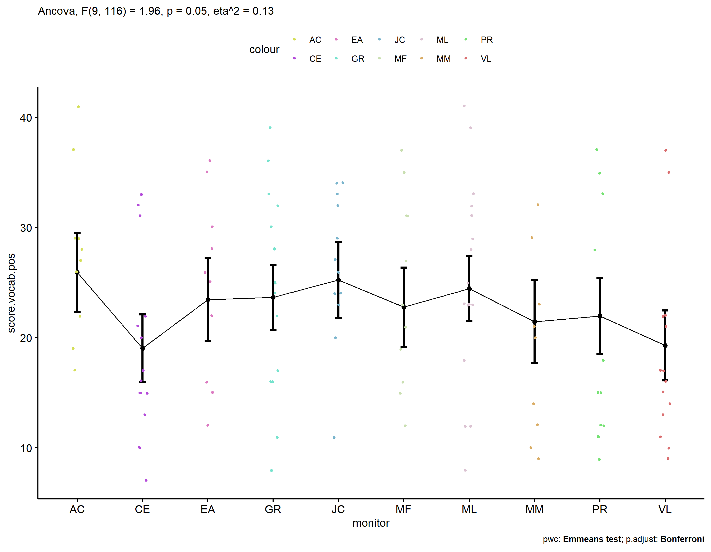<!-- -->

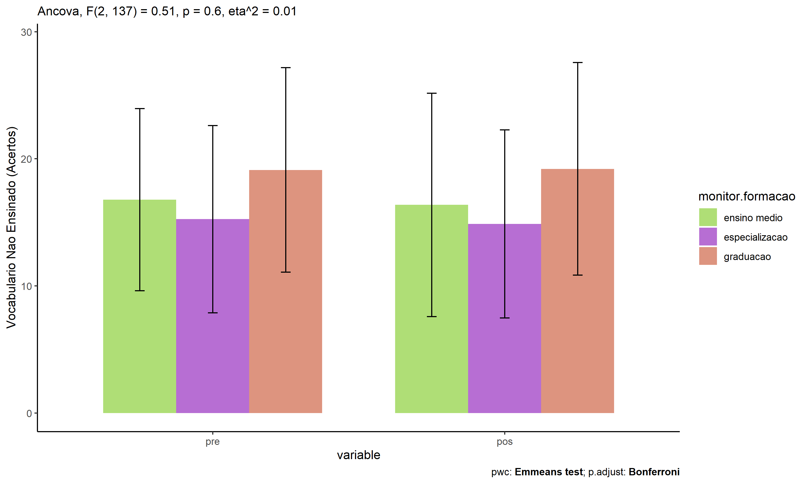<!-- -->

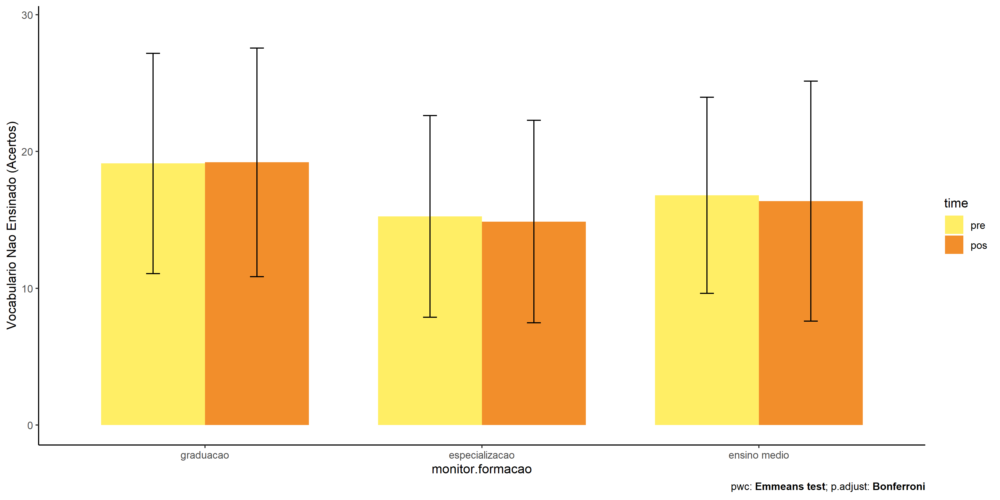<!-- -->

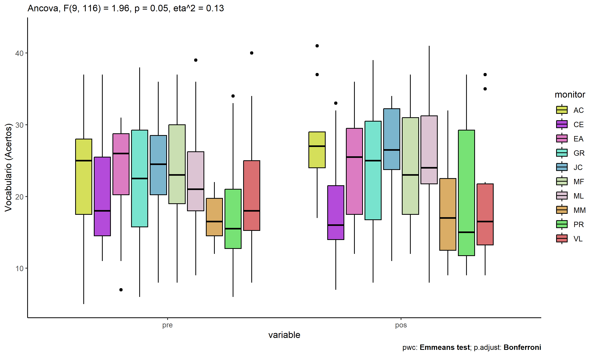<!-- -->

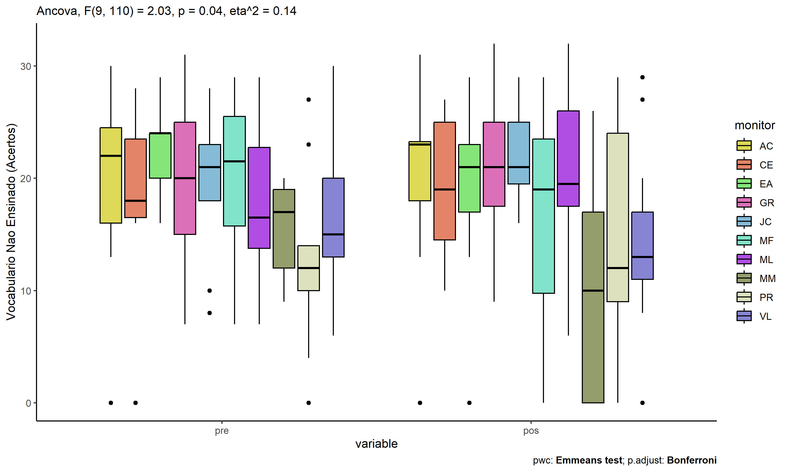<!-- -->

### Vocabulario (TRI)

| var           | monitor |   n | M (pre) | SE (pre) | M (unadj) | SE (unadj) | M (adj) | SE (adj) |
|:--------------|:--------|----:|--------:|---------:|----------:|-----------:|--------:|---------:|
| tri.vocab.pos | AC      |  11 |   0.500 |    0.236 |     0.740 |      0.170 |   0.451 |    0.191 |
| tri.vocab.pos | CE      |  15 |   0.052 |    0.178 |    -0.158 |      0.234 |  -0.125 |    0.162 |
| tri.vocab.pos | EA      |  10 |   0.282 |    0.284 |     0.348 |      0.318 |   0.216 |    0.199 |
| tri.vocab.pos | GR      |  16 |   0.225 |    0.266 |     0.375 |      0.258 |   0.283 |    0.157 |
| tri.vocab.pos | JC      |  12 |   0.346 |    0.218 |     0.693 |      0.179 |   0.515 |    0.182 |
| tri.vocab.pos | MF      |  11 |   0.327 |    0.321 |     0.426 |      0.296 |   0.261 |    0.190 |
| tri.vocab.pos | ML      |  16 |   0.224 |    0.262 |     0.494 |      0.224 |   0.403 |    0.157 |
| tri.vocab.pos | MM      |  10 |  -0.550 |    0.213 |    -0.409 |      0.263 |   0.056 |    0.203 |
| tri.vocab.pos | PR      |  12 |  -0.445 |    0.331 |    -0.099 |      0.335 |   0.290 |    0.184 |
| tri.vocab.pos | VL      |  14 |  -0.056 |    0.212 |    -0.195 |      0.227 |  -0.085 |    0.168 |

| .y.           | group1 | group2 | estimate | conf.low | conf.high |    se | statistic |     p | p.adj | p.adj.signif |
|:--------------|:-------|:-------|---------:|---------:|----------:|------:|----------:|------:|------:|:-------------|
| tri.vocab.pos | AC     | CE     |    0.576 |    0.079 |     1.072 | 0.251 |     2.295 | 0.024 | 1.000 | ns           |
| tri.vocab.pos | AC     | EA     |    0.235 |   -0.309 |     0.779 | 0.275 |     0.856 | 0.394 | 1.000 | ns           |
| tri.vocab.pos | AC     | GR     |    0.167 |   -0.321 |     0.655 | 0.246 |     0.679 | 0.499 | 1.000 | ns           |
| tri.vocab.pos | AC     | JC     |   -0.065 |   -0.584 |     0.455 | 0.262 |    -0.247 | 0.806 | 1.000 | ns           |
| tri.vocab.pos | AC     | MF     |    0.190 |   -0.341 |     0.720 | 0.268 |     0.708 | 0.481 | 1.000 | ns           |
| tri.vocab.pos | AC     | ML     |    0.048 |   -0.440 |     0.536 | 0.246 |     0.194 | 0.847 | 1.000 | ns           |
| tri.vocab.pos | AC     | MM     |    0.394 |   -0.165 |     0.954 | 0.282 |     1.397 | 0.165 | 1.000 | ns           |
| tri.vocab.pos | AC     | PR     |    0.160 |   -0.372 |     0.693 | 0.269 |     0.596 | 0.552 | 1.000 | ns           |
| tri.vocab.pos | AC     | VL     |    0.536 |    0.030 |     1.041 | 0.255 |     2.097 | 0.038 | 1.000 | ns           |
| tri.vocab.pos | CE     | EA     |   -0.341 |   -0.849 |     0.168 | 0.257 |    -1.327 | 0.187 | 1.000 | ns           |
| tri.vocab.pos | CE     | GR     |   -0.408 |   -0.856 |     0.039 | 0.226 |    -1.808 | 0.073 | 1.000 | ns           |
| tri.vocab.pos | CE     | JC     |   -0.640 |   -1.123 |    -0.157 | 0.244 |    -2.626 | 0.010 | 0.441 | ns           |
| tri.vocab.pos | CE     | MF     |   -0.386 |   -0.881 |     0.109 | 0.250 |    -1.546 | 0.125 | 1.000 | ns           |
| tri.vocab.pos | CE     | ML     |   -0.528 |   -0.975 |    -0.081 | 0.226 |    -2.337 | 0.021 | 0.952 | ns           |
| tri.vocab.pos | CE     | MM     |   -0.181 |   -0.694 |     0.332 | 0.259 |    -0.700 | 0.486 | 1.000 | ns           |
| tri.vocab.pos | CE     | PR     |   -0.415 |   -0.901 |     0.070 | 0.245 |    -1.695 | 0.093 | 1.000 | ns           |
| tri.vocab.pos | CE     | VL     |   -0.040 |   -0.502 |     0.422 | 0.233 |    -0.172 | 0.864 | 1.000 | ns           |
| tri.vocab.pos | EA     | GR     |   -0.068 |   -0.569 |     0.434 | 0.253 |    -0.268 | 0.789 | 1.000 | ns           |
| tri.vocab.pos | EA     | JC     |   -0.300 |   -0.832 |     0.233 | 0.269 |    -1.115 | 0.267 | 1.000 | ns           |
| tri.vocab.pos | EA     | MF     |   -0.045 |   -0.589 |     0.498 | 0.274 |    -0.166 | 0.869 | 1.000 | ns           |
| tri.vocab.pos | EA     | ML     |   -0.187 |   -0.688 |     0.314 | 0.253 |    -0.740 | 0.461 | 1.000 | ns           |
| tri.vocab.pos | EA     | MM     |    0.159 |   -0.406 |     0.725 | 0.286 |     0.558 | 0.578 | 1.000 | ns           |
| tri.vocab.pos | EA     | PR     |   -0.075 |   -0.615 |     0.465 | 0.273 |    -0.274 | 0.785 | 1.000 | ns           |
| tri.vocab.pos | EA     | VL     |    0.301 |   -0.216 |     0.817 | 0.261 |     1.153 | 0.251 | 1.000 | ns           |
| tri.vocab.pos | GR     | JC     |   -0.232 |   -0.707 |     0.243 | 0.240 |    -0.967 | 0.335 | 1.000 | ns           |
| tri.vocab.pos | GR     | MF     |    0.022 |   -0.465 |     0.509 | 0.246 |     0.091 | 0.928 | 1.000 | ns           |
| tri.vocab.pos | GR     | ML     |   -0.119 |   -0.559 |     0.320 | 0.222 |    -0.538 | 0.591 | 1.000 | ns           |
| tri.vocab.pos | GR     | MM     |    0.227 |   -0.283 |     0.738 | 0.258 |     0.881 | 0.380 | 1.000 | ns           |
| tri.vocab.pos | GR     | PR     |   -0.007 |   -0.489 |     0.475 | 0.243 |    -0.029 | 0.977 | 1.000 | ns           |
| tri.vocab.pos | GR     | VL     |    0.368 |   -0.088 |     0.825 | 0.230 |     1.599 | 0.113 | 1.000 | ns           |
| tri.vocab.pos | JC     | MF     |    0.254 |   -0.265 |     0.773 | 0.262 |     0.970 | 0.334 | 1.000 | ns           |
| tri.vocab.pos | JC     | ML     |    0.113 |   -0.363 |     0.588 | 0.240 |     0.469 | 0.640 | 1.000 | ns           |
| tri.vocab.pos | JC     | MM     |    0.459 |   -0.085 |     1.003 | 0.275 |     1.671 | 0.097 | 1.000 | ns           |
| tri.vocab.pos | JC     | PR     |    0.225 |   -0.292 |     0.742 | 0.261 |     0.861 | 0.391 | 1.000 | ns           |
| tri.vocab.pos | JC     | VL     |    0.600 |    0.109 |     1.092 | 0.248 |     2.418 | 0.017 | 0.772 | ns           |
| tri.vocab.pos | MF     | ML     |   -0.142 |   -0.629 |     0.345 | 0.246 |    -0.576 | 0.565 | 1.000 | ns           |
| tri.vocab.pos | MF     | MM     |    0.205 |   -0.349 |     0.759 | 0.280 |     0.732 | 0.466 | 1.000 | ns           |
| tri.vocab.pos | MF     | PR     |   -0.029 |   -0.557 |     0.499 | 0.267 |    -0.110 | 0.913 | 1.000 | ns           |
| tri.vocab.pos | MF     | VL     |    0.346 |   -0.157 |     0.849 | 0.254 |     1.362 | 0.176 | 1.000 | ns           |
| tri.vocab.pos | ML     | MM     |    0.347 |   -0.164 |     0.857 | 0.258 |     1.345 | 0.181 | 1.000 | ns           |
| tri.vocab.pos | ML     | PR     |    0.112 |   -0.370 |     0.595 | 0.243 |     0.462 | 0.645 | 1.000 | ns           |
| tri.vocab.pos | ML     | VL     |    0.488 |    0.031 |     0.944 | 0.230 |     2.117 | 0.036 | 1.000 | ns           |
| tri.vocab.pos | MM     | PR     |   -0.234 |   -0.767 |     0.298 | 0.269 |    -0.871 | 0.386 | 1.000 | ns           |
| tri.vocab.pos | MM     | VL     |    0.141 |   -0.377 |     0.660 | 0.262 |     0.539 | 0.591 | 1.000 | ns           |
| tri.vocab.pos | PR     | VL     |    0.375 |   -0.116 |     0.867 | 0.248 |     1.512 | 0.133 | 1.000 | ns           |
| tri.vocab.pre | AC     | CE     |    0.448 |   -0.270 |     1.167 | 0.363 |     1.236 | 0.219 | 1.000 | ns           |
| tri.vocab.pre | AC     | EA     |    0.218 |   -0.573 |     1.009 | 0.399 |     0.546 | 0.586 | 1.000 | ns           |
| tri.vocab.pre | AC     | GR     |    0.275 |   -0.434 |     0.984 | 0.358 |     0.769 | 0.444 | 1.000 | ns           |
| tri.vocab.pre | AC     | JC     |    0.154 |   -0.601 |     0.910 | 0.382 |     0.405 | 0.686 | 1.000 | ns           |
| tri.vocab.pre | AC     | MF     |    0.173 |   -0.599 |     0.945 | 0.390 |     0.445 | 0.657 | 1.000 | ns           |
| tri.vocab.pre | AC     | ML     |    0.276 |   -0.433 |     0.985 | 0.358 |     0.772 | 0.442 | 1.000 | ns           |
| tri.vocab.pre | AC     | MM     |    1.051 |    0.260 |     1.842 | 0.399 |     2.630 | 0.010 | 0.436 | ns           |
| tri.vocab.pre | AC     | PR     |    0.945 |    0.190 |     1.701 | 0.382 |     2.477 | 0.015 | 0.660 | ns           |
| tri.vocab.pre | AC     | VL     |    0.557 |   -0.173 |     1.286 | 0.368 |     1.511 | 0.134 | 1.000 | ns           |
| tri.vocab.pre | CE     | EA     |   -0.230 |   -0.969 |     0.509 | 0.373 |    -0.617 | 0.539 | 1.000 | ns           |
| tri.vocab.pre | CE     | GR     |   -0.173 |   -0.824 |     0.477 | 0.329 |    -0.527 | 0.599 | 1.000 | ns           |
| tri.vocab.pre | CE     | JC     |   -0.294 |   -0.995 |     0.407 | 0.354 |    -0.830 | 0.408 | 1.000 | ns           |
| tri.vocab.pre | CE     | MF     |   -0.275 |   -0.994 |     0.444 | 0.363 |    -0.758 | 0.450 | 1.000 | ns           |
| tri.vocab.pre | CE     | ML     |   -0.172 |   -0.823 |     0.479 | 0.329 |    -0.524 | 0.601 | 1.000 | ns           |
| tri.vocab.pre | CE     | MM     |    0.602 |   -0.137 |     1.341 | 0.373 |     1.614 | 0.109 | 1.000 | ns           |
| tri.vocab.pre | CE     | PR     |    0.497 |   -0.204 |     1.198 | 0.354 |     1.403 | 0.163 | 1.000 | ns           |
| tri.vocab.pre | CE     | VL     |    0.108 |   -0.565 |     0.781 | 0.340 |     0.318 | 0.751 | 1.000 | ns           |
| tri.vocab.pre | EA     | GR     |    0.057 |   -0.673 |     0.787 | 0.369 |     0.155 | 0.877 | 1.000 | ns           |
| tri.vocab.pre | EA     | JC     |   -0.064 |   -0.839 |     0.711 | 0.391 |    -0.163 | 0.871 | 1.000 | ns           |
| tri.vocab.pre | EA     | MF     |   -0.045 |   -0.836 |     0.746 | 0.399 |    -0.112 | 0.911 | 1.000 | ns           |
| tri.vocab.pre | EA     | ML     |    0.058 |   -0.672 |     0.788 | 0.369 |     0.158 | 0.875 | 1.000 | ns           |
| tri.vocab.pre | EA     | MM     |    0.832 |    0.023 |     1.642 | 0.409 |     2.036 | 0.044 | 1.000 | ns           |
| tri.vocab.pre | EA     | PR     |    0.727 |   -0.048 |     1.502 | 0.391 |     1.857 | 0.066 | 1.000 | ns           |
| tri.vocab.pre | EA     | VL     |    0.338 |   -0.411 |     1.088 | 0.379 |     0.894 | 0.373 | 1.000 | ns           |
| tri.vocab.pre | GR     | JC     |   -0.121 |   -0.812 |     0.571 | 0.349 |    -0.346 | 0.730 | 1.000 | ns           |
| tri.vocab.pre | GR     | MF     |   -0.102 |   -0.811 |     0.607 | 0.358 |    -0.284 | 0.777 | 1.000 | ns           |
| tri.vocab.pre | GR     | ML     |    0.001 |   -0.639 |     0.641 | 0.323 |     0.003 | 0.997 | 1.000 | ns           |
| tri.vocab.pre | GR     | MM     |    0.775 |    0.046 |     1.505 | 0.369 |     2.104 | 0.038 | 1.000 | ns           |
| tri.vocab.pre | GR     | PR     |    0.670 |   -0.021 |     1.362 | 0.349 |     1.919 | 0.057 | 1.000 | ns           |
| tri.vocab.pre | GR     | VL     |    0.281 |   -0.381 |     0.944 | 0.335 |     0.841 | 0.402 | 1.000 | ns           |
| tri.vocab.pre | JC     | MF     |    0.019 |   -0.737 |     0.775 | 0.382 |     0.049 | 0.961 | 1.000 | ns           |
| tri.vocab.pre | JC     | ML     |    0.122 |   -0.570 |     0.813 | 0.349 |     0.349 | 0.728 | 1.000 | ns           |
| tri.vocab.pre | JC     | MM     |    0.896 |    0.121 |     1.671 | 0.391 |     2.289 | 0.024 | 1.000 | ns           |
| tri.vocab.pre | JC     | PR     |    0.791 |    0.052 |     1.530 | 0.373 |     2.119 | 0.036 | 1.000 | ns           |
| tri.vocab.pre | JC     | VL     |    0.402 |   -0.310 |     1.114 | 0.360 |     1.118 | 0.266 | 1.000 | ns           |
| tri.vocab.pre | MF     | ML     |    0.103 |   -0.606 |     0.812 | 0.358 |     0.288 | 0.774 | 1.000 | ns           |
| tri.vocab.pre | MF     | MM     |    0.877 |    0.086 |     1.668 | 0.399 |     2.196 | 0.030 | 1.000 | ns           |
| tri.vocab.pre | MF     | PR     |    0.772 |    0.016 |     1.528 | 0.382 |     2.023 | 0.045 | 1.000 | ns           |
| tri.vocab.pre | MF     | VL     |    0.383 |   -0.346 |     1.113 | 0.368 |     1.040 | 0.300 | 1.000 | ns           |
| tri.vocab.pre | ML     | MM     |    0.774 |    0.045 |     1.504 | 0.369 |     2.101 | 0.038 | 1.000 | ns           |
| tri.vocab.pre | ML     | PR     |    0.669 |   -0.022 |     1.360 | 0.349 |     1.916 | 0.058 | 1.000 | ns           |
| tri.vocab.pre | ML     | VL     |    0.280 |   -0.382 |     0.943 | 0.335 |     0.838 | 0.404 | 1.000 | ns           |
| tri.vocab.pre | MM     | PR     |   -0.105 |   -0.881 |     0.670 | 0.391 |    -0.269 | 0.788 | 1.000 | ns           |
| tri.vocab.pre | MM     | VL     |   -0.494 |   -1.244 |     0.256 | 0.379 |    -1.305 | 0.194 | 1.000 | ns           |
| tri.vocab.pre | PR     | VL     |   -0.389 |   -1.101 |     0.323 | 0.360 |    -1.081 | 0.282 | 1.000 | ns           |

| .y.       | monitor | group1 | group2 | estimate | conf.low | conf.high |    se | statistic |     p | p.adj | p.adj.signif |
|:----------|:--------|:-------|:-------|---------:|---------:|----------:|------:|----------:|------:|------:|:-------------|
| tri.vocab | AC      | pre    | pos    |   -0.182 |   -0.917 |     0.554 | 0.373 |    -0.487 | 0.627 | 0.627 | ns           |
| tri.vocab | CE      | pre    | pos    |    0.129 |   -0.519 |     0.776 | 0.329 |     0.392 | 0.696 | 0.696 | ns           |
| tri.vocab | EA      | pre    | pos    |    0.071 |   -0.717 |     0.858 | 0.400 |     0.177 | 0.860 | 0.860 | ns           |
| tri.vocab | GR      | pre    | pos    |   -0.150 |   -0.787 |     0.487 | 0.323 |    -0.463 | 0.644 | 0.644 | ns           |
| tri.vocab | JC      | pre    | pos    |   -0.347 |   -1.083 |     0.388 | 0.373 |    -0.930 | 0.353 | 0.353 | ns           |
| tri.vocab | MF      | pre    | pos    |   -0.132 |   -0.858 |     0.594 | 0.369 |    -0.358 | 0.721 | 0.721 | ns           |
| tri.vocab | ML      | pre    | pos    |   -0.269 |   -0.906 |     0.368 | 0.323 |    -0.833 | 0.406 | 0.406 | ns           |
| tri.vocab | MM      | pre    | pos    |    0.142 |   -0.604 |     0.888 | 0.379 |     0.375 | 0.708 | 0.708 | ns           |
| tri.vocab | PR      | pre    | pos    |   -0.346 |   -1.081 |     0.390 | 0.373 |    -0.926 | 0.355 | 0.355 | ns           |
| tri.vocab | VL      | pre    | pos    |    0.118 |   -0.541 |     0.777 | 0.335 |     0.353 | 0.724 | 0.724 | ns           |

    ## Scale for colour is already present.
    ## Adding another scale for colour, which will replace the existing scale.

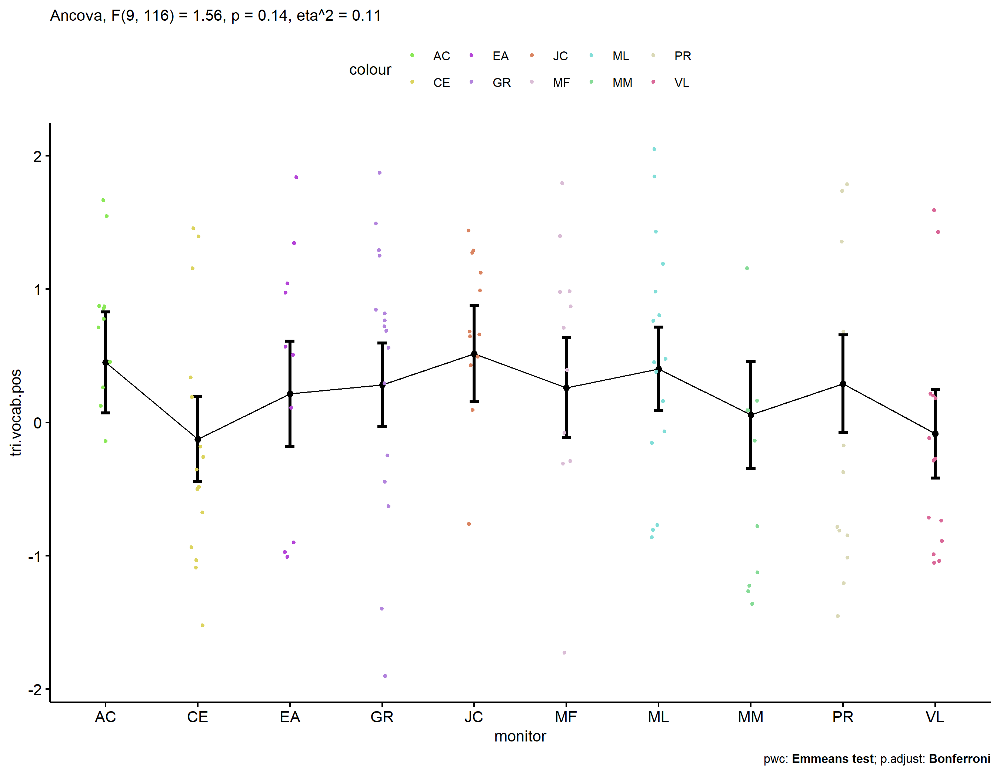<!-- -->

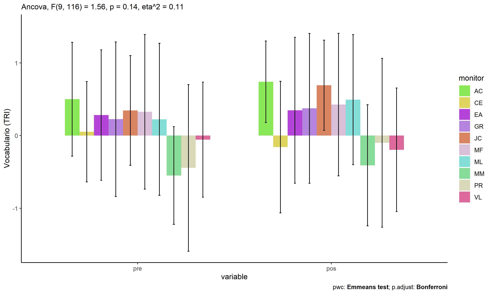<!-- -->

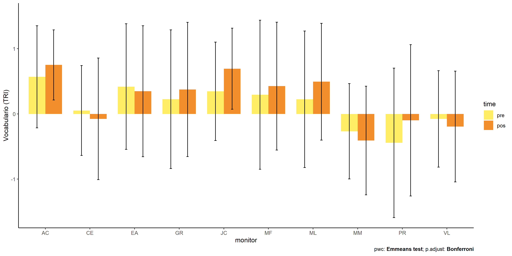<!-- -->

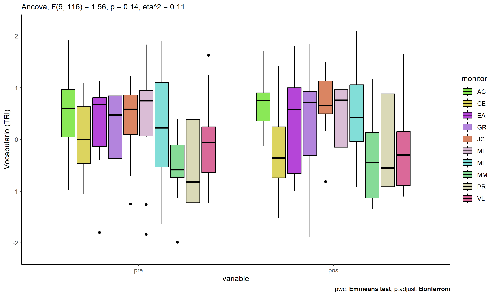<!-- -->

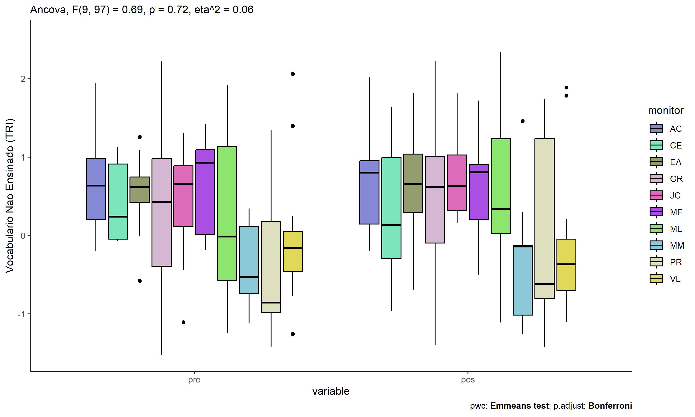<!-- -->

### Vocabulario Ensinado (Acertos)

| var                      | monitor |   n | M (pre) | SE (pre) | M (unadj) | SE (unadj) | M (adj) | SE (adj) |
|:-------------------------|:--------|----:|--------:|---------:|----------:|-----------:|--------:|---------:|
| score.vocab.ensinado.pos | AC      |  13 |   3.615 |    0.781 |     4.769 |      0.642 |   4.950 |    0.612 |
| score.vocab.ensinado.pos | CE      |  16 |   4.062 |    0.595 |     4.438 |      0.418 |   4.451 |    0.550 |
| score.vocab.ensinado.pos | EA      |  11 |   4.455 |    0.493 |     4.727 |      0.740 |   4.595 |    0.664 |
| score.vocab.ensinado.pos | GR      |  16 |   4.125 |    0.417 |     4.500 |      0.508 |   4.490 |    0.550 |
| score.vocab.ensinado.pos | JC      |  12 |   4.583 |    0.743 |     5.500 |      0.500 |   5.320 |    0.636 |
| score.vocab.ensinado.pos | MF      |  14 |   4.643 |    0.520 |     3.429 |      0.754 |   3.226 |    0.590 |
| score.vocab.ensinado.pos | ML      |  16 |   4.312 |    0.637 |     4.875 |      0.547 |   4.796 |    0.550 |
| score.vocab.ensinado.pos | MM      |  14 |   3.143 |    0.345 |     2.929 |      0.667 |   3.285 |    0.594 |
| score.vocab.ensinado.pos | PR      |  13 |   3.462 |    0.550 |     3.462 |      0.781 |   3.699 |    0.613 |
| score.vocab.ensinado.pos | VL      |  16 |   4.562 |    0.570 |     3.125 |      0.651 |   2.952 |    0.551 |

| .y.                      | group1 | group2 | estimate | conf.low | conf.high |    se | statistic |     p | p.adj | p.adj.signif |
|:-------------------------|:-------|:-------|---------:|---------:|----------:|------:|----------:|------:|------:|:-------------|
| score.vocab.ensinado.pos | AC     | CE     |    0.498 |   -1.128 |     2.125 | 0.822 |     0.606 | 0.545 | 1.000 | ns           |
| score.vocab.ensinado.pos | AC     | EA     |    0.355 |   -1.434 |     2.144 | 0.904 |     0.392 | 0.695 | 1.000 | ns           |
| score.vocab.ensinado.pos | AC     | GR     |    0.459 |   -1.168 |     2.087 | 0.823 |     0.558 | 0.578 | 1.000 | ns           |
| score.vocab.ensinado.pos | AC     | JC     |   -0.370 |   -2.120 |     1.381 | 0.885 |    -0.418 | 0.677 | 1.000 | ns           |
| score.vocab.ensinado.pos | AC     | MF     |    1.724 |    0.038 |     3.410 | 0.852 |     2.023 | 0.045 | 1.000 | ns           |
| score.vocab.ensinado.pos | AC     | ML     |    0.154 |   -1.475 |     1.784 | 0.824 |     0.187 | 0.852 | 1.000 | ns           |
| score.vocab.ensinado.pos | AC     | MM     |    1.664 |   -0.014 |     3.343 | 0.848 |     1.962 | 0.052 | 1.000 | ns           |
| score.vocab.ensinado.pos | AC     | PR     |    1.250 |   -0.457 |     2.957 | 0.863 |     1.449 | 0.150 | 1.000 | ns           |
| score.vocab.ensinado.pos | AC     | VL     |    1.997 |    0.364 |     3.631 | 0.826 |     2.419 | 0.017 | 0.762 | ns           |
| score.vocab.ensinado.pos | CE     | EA     |   -0.144 |   -1.849 |     1.562 | 0.862 |    -0.167 | 0.868 | 1.000 | ns           |
| score.vocab.ensinado.pos | CE     | GR     |   -0.039 |   -1.578 |     1.499 | 0.778 |    -0.050 | 0.960 | 1.000 | ns           |
| score.vocab.ensinado.pos | CE     | JC     |   -0.868 |   -2.533 |     0.796 | 0.841 |    -1.032 | 0.304 | 1.000 | ns           |
| score.vocab.ensinado.pos | CE     | MF     |    1.225 |   -0.371 |     2.821 | 0.807 |     1.519 | 0.131 | 1.000 | ns           |
| score.vocab.ensinado.pos | CE     | ML     |   -0.344 |   -1.884 |     1.195 | 0.778 |    -0.443 | 0.659 | 1.000 | ns           |
| score.vocab.ensinado.pos | CE     | MM     |    1.166 |   -0.435 |     2.767 | 0.809 |     1.441 | 0.152 | 1.000 | ns           |
| score.vocab.ensinado.pos | CE     | PR     |    0.752 |   -0.876 |     2.380 | 0.823 |     0.914 | 0.363 | 1.000 | ns           |
| score.vocab.ensinado.pos | CE     | VL     |    1.499 |   -0.042 |     3.040 | 0.779 |     1.924 | 0.057 | 1.000 | ns           |
| score.vocab.ensinado.pos | EA     | GR     |    0.104 |   -1.601 |     1.810 | 0.862 |     0.121 | 0.904 | 1.000 | ns           |
| score.vocab.ensinado.pos | EA     | JC     |   -0.725 |   -2.541 |     1.092 | 0.918 |    -0.789 | 0.431 | 1.000 | ns           |
| score.vocab.ensinado.pos | EA     | MF     |    1.369 |   -0.385 |     3.123 | 0.886 |     1.544 | 0.125 | 1.000 | ns           |
| score.vocab.ensinado.pos | EA     | ML     |   -0.201 |   -1.905 |     1.504 | 0.862 |    -0.233 | 0.816 | 1.000 | ns           |
| score.vocab.ensinado.pos | EA     | MM     |    1.310 |   -0.459 |     3.078 | 0.894 |     1.465 | 0.145 | 1.000 | ns           |
| score.vocab.ensinado.pos | EA     | PR     |    0.895 |   -0.896 |     2.687 | 0.905 |     0.989 | 0.325 | 1.000 | ns           |
| score.vocab.ensinado.pos | EA     | VL     |    1.643 |   -0.062 |     3.347 | 0.862 |     1.906 | 0.059 | 1.000 | ns           |
| score.vocab.ensinado.pos | GR     | JC     |   -0.829 |   -2.493 |     0.835 | 0.841 |    -0.986 | 0.326 | 1.000 | ns           |
| score.vocab.ensinado.pos | GR     | MF     |    1.265 |   -0.331 |     2.860 | 0.806 |     1.568 | 0.119 | 1.000 | ns           |
| score.vocab.ensinado.pos | GR     | ML     |   -0.305 |   -1.844 |     1.234 | 0.778 |    -0.392 | 0.696 | 1.000 | ns           |
| score.vocab.ensinado.pos | GR     | MM     |    1.205 |   -0.397 |     2.807 | 0.810 |     1.488 | 0.139 | 1.000 | ns           |
| score.vocab.ensinado.pos | GR     | PR     |    0.791 |   -0.838 |     2.420 | 0.823 |     0.961 | 0.338 | 1.000 | ns           |
| score.vocab.ensinado.pos | GR     | VL     |    1.538 |   -0.002 |     3.079 | 0.779 |     1.975 | 0.050 | 1.000 | ns           |
| score.vocab.ensinado.pos | JC     | MF     |    2.094 |    0.382 |     3.806 | 0.865 |     2.419 | 0.017 | 0.762 | ns           |
| score.vocab.ensinado.pos | JC     | ML     |    0.524 |   -1.139 |     2.187 | 0.840 |     0.624 | 0.534 | 1.000 | ns           |
| score.vocab.ensinado.pos | JC     | MM     |    2.034 |    0.304 |     3.765 | 0.875 |     2.326 | 0.022 | 0.971 | ns           |
| score.vocab.ensinado.pos | JC     | PR     |    1.620 |   -0.133 |     3.373 | 0.886 |     1.828 | 0.070 | 1.000 | ns           |
| score.vocab.ensinado.pos | JC     | VL     |    2.367 |    0.705 |     4.029 | 0.840 |     2.818 | 0.006 | 0.251 | ns           |
| score.vocab.ensinado.pos | MF     | ML     |   -1.570 |   -3.163 |     0.024 | 0.806 |    -1.949 | 0.054 | 1.000 | ns           |
| score.vocab.ensinado.pos | MF     | MM     |   -0.059 |   -1.725 |     1.606 | 0.842 |    -0.070 | 0.944 | 1.000 | ns           |
| score.vocab.ensinado.pos | MF     | PR     |   -0.473 |   -2.162 |     1.216 | 0.854 |    -0.555 | 0.580 | 1.000 | ns           |
| score.vocab.ensinado.pos | MF     | VL     |    0.274 |   -1.319 |     1.866 | 0.805 |     0.340 | 0.735 | 1.000 | ns           |
| score.vocab.ensinado.pos | ML     | MM     |    1.510 |   -0.095 |     3.116 | 0.812 |     1.861 | 0.065 | 1.000 | ns           |
| score.vocab.ensinado.pos | ML     | PR     |    1.096 |   -0.536 |     2.728 | 0.825 |     1.329 | 0.186 | 1.000 | ns           |
| score.vocab.ensinado.pos | ML     | VL     |    1.843 |    0.304 |     3.382 | 0.778 |     2.369 | 0.019 | 0.869 | ns           |
| score.vocab.ensinado.pos | MM     | PR     |   -0.414 |   -2.091 |     1.263 | 0.848 |    -0.489 | 0.626 | 1.000 | ns           |
| score.vocab.ensinado.pos | MM     | VL     |    0.333 |   -1.279 |     1.945 | 0.815 |     0.409 | 0.684 | 1.000 | ns           |
| score.vocab.ensinado.pos | PR     | VL     |    0.747 |   -0.889 |     2.383 | 0.827 |     0.903 | 0.368 | 1.000 | ns           |
| score.vocab.ensinado.pre | AC     | CE     |   -0.447 |   -2.048 |     1.153 | 0.809 |    -0.553 | 0.581 | 1.000 | ns           |
| score.vocab.ensinado.pre | AC     | EA     |   -0.839 |   -2.595 |     0.917 | 0.888 |    -0.945 | 0.346 | 1.000 | ns           |
| score.vocab.ensinado.pre | AC     | GR     |   -0.510 |   -2.110 |     1.091 | 0.809 |    -0.630 | 0.530 | 1.000 | ns           |
| score.vocab.ensinado.pre | AC     | JC     |   -0.968 |   -2.684 |     0.748 | 0.867 |    -1.116 | 0.266 | 1.000 | ns           |
| score.vocab.ensinado.pre | AC     | MF     |   -1.027 |   -2.678 |     0.623 | 0.835 |    -1.231 | 0.220 | 1.000 | ns           |
| score.vocab.ensinado.pre | AC     | ML     |   -0.697 |   -2.298 |     0.903 | 0.809 |    -0.862 | 0.390 | 1.000 | ns           |
| score.vocab.ensinado.pre | AC     | MM     |    0.473 |   -1.178 |     2.123 | 0.835 |     0.566 | 0.572 | 1.000 | ns           |
| score.vocab.ensinado.pre | AC     | PR     |    0.154 |   -1.527 |     1.835 | 0.850 |     0.181 | 0.857 | 1.000 | ns           |
| score.vocab.ensinado.pre | AC     | VL     |   -0.947 |   -2.548 |     0.653 | 0.809 |    -1.171 | 0.244 | 1.000 | ns           |
| score.vocab.ensinado.pre | CE     | EA     |   -0.392 |   -2.071 |     1.287 | 0.849 |    -0.462 | 0.645 | 1.000 | ns           |
| score.vocab.ensinado.pre | CE     | GR     |   -0.062 |   -1.578 |     1.453 | 0.766 |    -0.082 | 0.935 | 1.000 | ns           |
| score.vocab.ensinado.pre | CE     | JC     |   -0.521 |   -2.158 |     1.116 | 0.827 |    -0.629 | 0.530 | 1.000 | ns           |
| score.vocab.ensinado.pre | CE     | MF     |   -0.580 |   -2.149 |     0.988 | 0.793 |    -0.732 | 0.466 | 1.000 | ns           |
| score.vocab.ensinado.pre | CE     | ML     |   -0.250 |   -1.765 |     1.265 | 0.766 |    -0.326 | 0.745 | 1.000 | ns           |
| score.vocab.ensinado.pre | CE     | MM     |    0.920 |   -0.649 |     2.488 | 0.793 |     1.160 | 0.248 | 1.000 | ns           |
| score.vocab.ensinado.pre | CE     | PR     |    0.601 |   -0.999 |     2.201 | 0.809 |     0.743 | 0.459 | 1.000 | ns           |
| score.vocab.ensinado.pre | CE     | VL     |   -0.500 |   -2.015 |     1.015 | 0.766 |    -0.653 | 0.515 | 1.000 | ns           |
| score.vocab.ensinado.pre | EA     | GR     |    0.330 |   -1.349 |     2.008 | 0.849 |     0.388 | 0.698 | 1.000 | ns           |
| score.vocab.ensinado.pre | EA     | JC     |   -0.129 |   -1.918 |     1.660 | 0.904 |    -0.142 | 0.887 | 1.000 | ns           |
| score.vocab.ensinado.pre | EA     | MF     |   -0.188 |   -1.915 |     1.539 | 0.873 |    -0.216 | 0.830 | 1.000 | ns           |
| score.vocab.ensinado.pre | EA     | ML     |    0.142 |   -1.537 |     1.821 | 0.849 |     0.167 | 0.867 | 1.000 | ns           |
| score.vocab.ensinado.pre | EA     | MM     |    1.312 |   -0.415 |     3.039 | 0.873 |     1.503 | 0.135 | 1.000 | ns           |
| score.vocab.ensinado.pre | EA     | PR     |    0.993 |   -0.763 |     2.749 | 0.888 |     1.119 | 0.265 | 1.000 | ns           |
| score.vocab.ensinado.pre | EA     | VL     |   -0.108 |   -1.787 |     1.571 | 0.849 |    -0.127 | 0.899 | 1.000 | ns           |
| score.vocab.ensinado.pre | GR     | JC     |   -0.458 |   -2.095 |     1.178 | 0.827 |    -0.554 | 0.581 | 1.000 | ns           |
| score.vocab.ensinado.pre | GR     | MF     |   -0.518 |   -2.086 |     1.051 | 0.793 |    -0.653 | 0.515 | 1.000 | ns           |
| score.vocab.ensinado.pre | GR     | ML     |   -0.188 |   -1.703 |     1.328 | 0.766 |    -0.245 | 0.807 | 1.000 | ns           |
| score.vocab.ensinado.pre | GR     | MM     |    0.982 |   -0.586 |     2.551 | 0.793 |     1.239 | 0.218 | 1.000 | ns           |
| score.vocab.ensinado.pre | GR     | PR     |    0.663 |   -0.937 |     2.264 | 0.809 |     0.820 | 0.414 | 1.000 | ns           |
| score.vocab.ensinado.pre | GR     | VL     |   -0.438 |   -1.953 |     1.078 | 0.766 |    -0.571 | 0.569 | 1.000 | ns           |
| score.vocab.ensinado.pre | JC     | MF     |   -0.060 |   -1.746 |     1.627 | 0.852 |    -0.070 | 0.944 | 1.000 | ns           |
| score.vocab.ensinado.pre | JC     | ML     |    0.271 |   -1.366 |     1.908 | 0.827 |     0.327 | 0.744 | 1.000 | ns           |
| score.vocab.ensinado.pre | JC     | MM     |    1.440 |   -0.246 |     3.127 | 0.852 |     1.690 | 0.093 | 1.000 | ns           |
| score.vocab.ensinado.pre | JC     | PR     |    1.122 |   -0.594 |     2.838 | 0.867 |     1.293 | 0.198 | 1.000 | ns           |
| score.vocab.ensinado.pre | JC     | VL     |    0.021 |   -1.616 |     1.658 | 0.827 |     0.025 | 0.980 | 1.000 | ns           |
| score.vocab.ensinado.pre | MF     | ML     |    0.330 |   -1.238 |     1.899 | 0.793 |     0.417 | 0.678 | 1.000 | ns           |
| score.vocab.ensinado.pre | MF     | MM     |    1.500 |   -0.120 |     3.120 | 0.819 |     1.832 | 0.069 | 1.000 | ns           |
| score.vocab.ensinado.pre | MF     | PR     |    1.181 |   -0.470 |     2.832 | 0.835 |     1.416 | 0.159 | 1.000 | ns           |
| score.vocab.ensinado.pre | MF     | VL     |    0.080 |   -1.488 |     1.649 | 0.793 |     0.101 | 0.919 | 1.000 | ns           |
| score.vocab.ensinado.pre | ML     | MM     |    1.170 |   -0.399 |     2.738 | 0.793 |     1.475 | 0.143 | 1.000 | ns           |
| score.vocab.ensinado.pre | ML     | PR     |    0.851 |   -0.749 |     2.451 | 0.809 |     1.052 | 0.295 | 1.000 | ns           |
| score.vocab.ensinado.pre | ML     | VL     |   -0.250 |   -1.765 |     1.265 | 0.766 |    -0.326 | 0.745 | 1.000 | ns           |
| score.vocab.ensinado.pre | MM     | PR     |   -0.319 |   -1.970 |     1.332 | 0.835 |    -0.382 | 0.703 | 1.000 | ns           |
| score.vocab.ensinado.pre | MM     | VL     |   -1.420 |   -2.988 |     0.149 | 0.793 |    -1.790 | 0.076 | 1.000 | ns           |
| score.vocab.ensinado.pre | PR     | VL     |   -1.101 |   -2.701 |     0.499 | 0.809 |    -1.361 | 0.176 | 1.000 | ns           |

| .y.                  | monitor | group1 | group2 | estimate | conf.low | conf.high |    se | statistic |     p | p.adj | p.adj.signif |
|:---------------------|:--------|:-------|:-------|---------:|---------:|----------:|------:|----------:|------:|------:|:-------------|
| score.vocab.ensinado | AC      | pre    | pos    |   -1.154 |   -2.894 |     0.586 | 0.884 |    -1.306 | 0.193 | 0.193 | ns           |
| score.vocab.ensinado | CE      | pre    | pos    |   -0.375 |   -1.943 |     1.193 | 0.796 |    -0.471 | 0.638 | 0.638 | ns           |
| score.vocab.ensinado | EA      | pre    | pos    |   -0.273 |   -2.164 |     1.619 | 0.961 |    -0.284 | 0.777 | 0.777 | ns           |
| score.vocab.ensinado | GR      | pre    | pos    |   -0.375 |   -1.943 |     1.193 | 0.796 |    -0.471 | 0.638 | 0.638 | ns           |
| score.vocab.ensinado | JC      | pre    | pos    |   -0.917 |   -2.727 |     0.894 | 0.920 |    -0.997 | 0.320 | 0.320 | ns           |
| score.vocab.ensinado | MF      | pre    | pos    |    1.214 |   -0.462 |     2.891 | 0.851 |     1.426 | 0.155 | 0.155 | ns           |
| score.vocab.ensinado | ML      | pre    | pos    |   -0.563 |   -2.131 |     1.006 | 0.796 |    -0.706 | 0.481 | 0.481 | ns           |
| score.vocab.ensinado | MM      | pre    | pos    |    0.214 |   -1.462 |     1.891 | 0.851 |     0.252 | 0.801 | 0.801 | ns           |
| score.vocab.ensinado | PR      | pre    | pos    |    0.000 |   -1.740 |     1.740 | 0.884 |     0.000 | 1.000 | 1.000 | ns           |
| score.vocab.ensinado | VL      | pre    | pos    |    1.437 |   -0.131 |     3.006 | 0.796 |     1.805 | 0.072 | 0.072 | ns           |

    ## Scale for colour is already present.
    ## Adding another scale for colour, which will replace the existing scale.

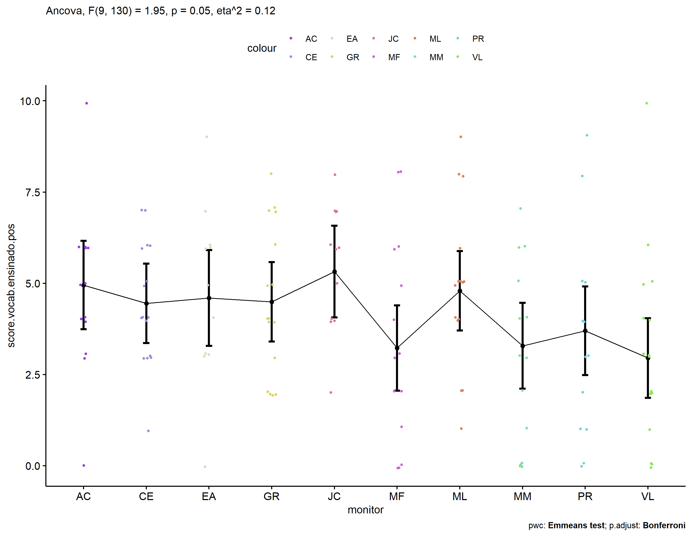<!-- -->

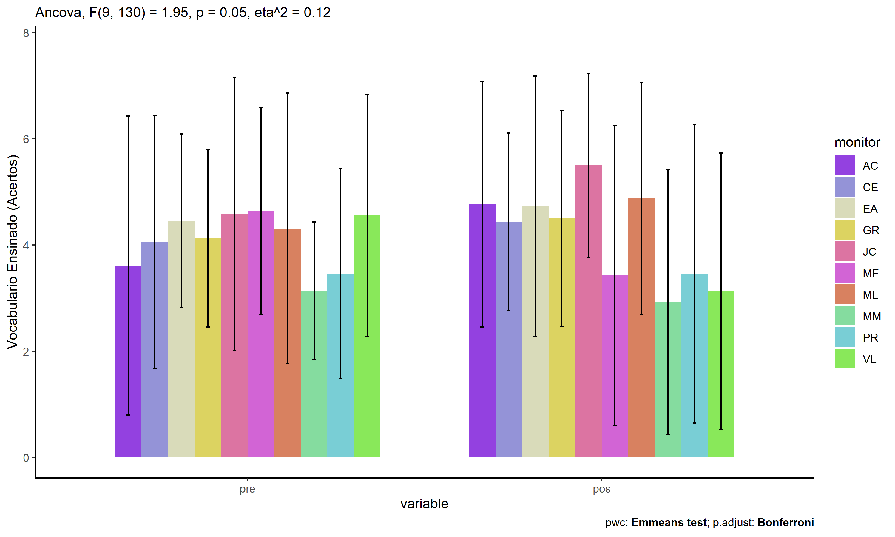<!-- -->

<!-- -->

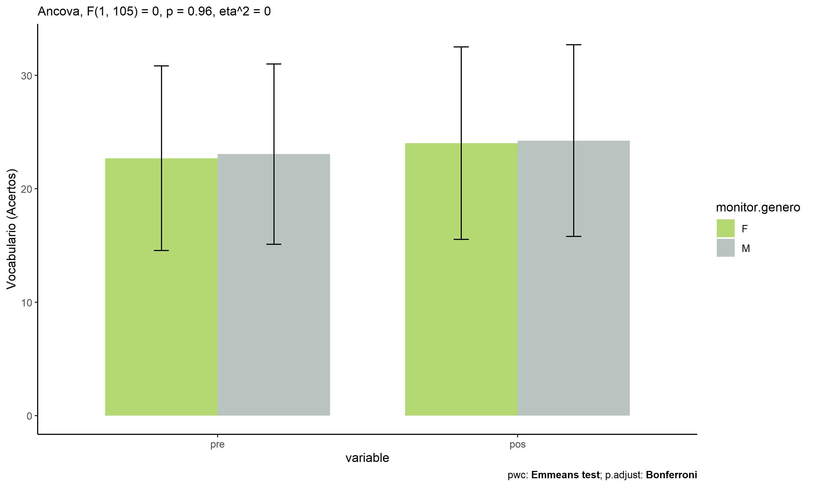<!-- -->

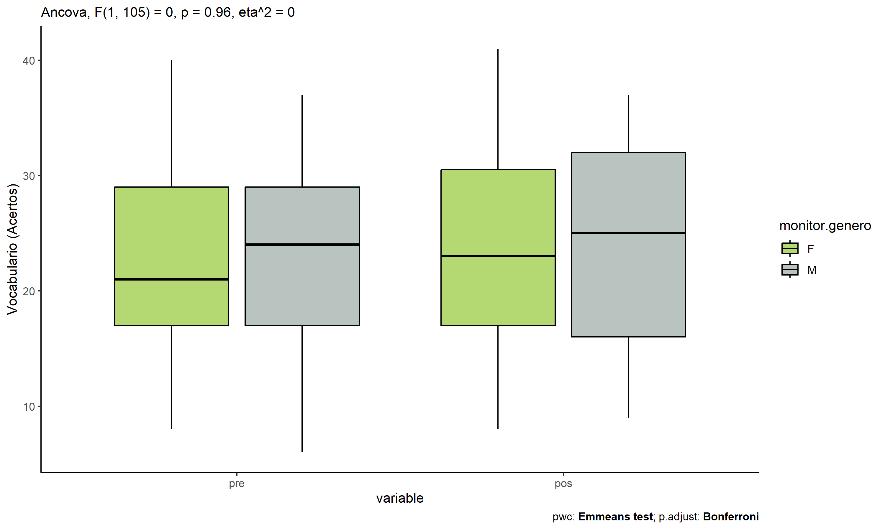<!-- -->

### Vocabulario Ensinado (TRI)

| var                    | monitor |   n | M (pre) | SE (pre) | M (unadj) | SE (unadj) | M (adj) | SE (adj) |
|:-----------------------|:--------|----:|--------:|---------:|----------:|-----------:|--------:|---------:|
| tri.vocab.ensinado.pos | AC      |  11 |   0.079 |    0.238 |     0.656 |      0.143 |   0.653 |    0.194 |
| tri.vocab.ensinado.pos | CE      |  15 |  -0.039 |    0.188 |    -0.056 |      0.178 |   0.005 |    0.166 |
| tri.vocab.ensinado.pos | EA      |  10 |   0.279 |    0.187 |     0.414 |      0.234 |   0.303 |    0.204 |
| tri.vocab.ensinado.pos | GR      |  16 |   0.286 |    0.154 |     0.389 |      0.163 |   0.275 |    0.162 |
| tri.vocab.ensinado.pos | JC      |  12 |   0.439 |    0.204 |     0.611 |      0.169 |   0.413 |    0.188 |
| tri.vocab.ensinado.pos | MF      |  11 |   0.243 |    0.225 |     0.157 |      0.280 |   0.065 |    0.194 |
| tri.vocab.ensinado.pos | ML      |  16 |   0.065 |    0.234 |     0.184 |      0.206 |   0.188 |    0.161 |
| tri.vocab.ensinado.pos | MM      |  10 |  -0.669 |    0.161 |    -0.180 |      0.224 |   0.220 |    0.212 |
| tri.vocab.ensinado.pos | PR      |  12 |  -0.142 |    0.218 |    -0.196 |      0.272 |  -0.080 |    0.187 |
| tri.vocab.ensinado.pos | VL      |  14 |   0.076 |    0.235 |    -0.186 |      0.234 |  -0.188 |    0.172 |

| .y.                    | group1 | group2 | estimate | conf.low | conf.high |    se | statistic | p       | p.adj | p.adj.signif |
|:-----------------------|:-------|:-------|---------:|---------:|----------:|------:|----------:|:--------|------:|:-------------|
| tri.vocab.ensinado.pos | AC     | CE     |    0.648 |    0.142 |     1.155 | 0.256 |     2.537 | 0.013   | 0.563 | ns           |
| tri.vocab.ensinado.pos | AC     | EA     |    0.350 |   -0.208 |     0.907 | 0.282 |     1.242 | 0.217   | 1.000 | ns           |
| tri.vocab.ensinado.pos | AC     | GR     |    0.378 |   -0.122 |     0.878 | 0.253 |     1.498 | 0.137   | 1.000 | ns           |
| tri.vocab.ensinado.pos | AC     | JC     |    0.240 |   -0.295 |     0.775 | 0.270 |     0.888 | 0.376   | 1.000 | ns           |
| tri.vocab.ensinado.pos | AC     | MF     |    0.588 |    0.044 |     1.132 | 0.275 |     2.141 | 0.034   | 1.000 | ns           |
| tri.vocab.ensinado.pos | AC     | ML     |    0.465 |   -0.034 |     0.964 | 0.252 |     1.845 | 0.068   | 1.000 | ns           |
| tri.vocab.ensinado.pos | AC     | MM     |    0.433 |   -0.136 |     1.002 | 0.287 |     1.507 | 0.134   | 1.000 | ns           |
| tri.vocab.ensinado.pos | AC     | PR     |    0.733 |    0.200 |     1.266 | 0.269 |     2.725 | 0.007   | 0.335 | ns           |
| tri.vocab.ensinado.pos | AC     | VL     |    0.841 |    0.327 |     1.354 | 0.259 |     3.244 | 0.002   | 0.069 | ns           |
| tri.vocab.ensinado.pos | CE     | EA     |   -0.299 |   -0.821 |     0.224 | 0.264 |    -1.132 | 0.26    | 1.000 | ns           |
| tri.vocab.ensinado.pos | CE     | GR     |   -0.270 |   -0.731 |     0.191 | 0.233 |    -1.161 | 0.248   | 1.000 | ns           |
| tri.vocab.ensinado.pos | CE     | JC     |   -0.409 |   -0.908 |     0.091 | 0.252 |    -1.621 | 0.108   | 1.000 | ns           |
| tri.vocab.ensinado.pos | CE     | MF     |   -0.060 |   -0.568 |     0.447 | 0.256 |    -0.236 | 0.814   | 1.000 | ns           |
| tri.vocab.ensinado.pos | CE     | ML     |   -0.184 |   -0.642 |     0.275 | 0.231 |    -0.793 | 0.429   | 1.000 | ns           |
| tri.vocab.ensinado.pos | CE     | MM     |   -0.215 |   -0.745 |     0.314 | 0.267 |    -0.805 | 0.422   | 1.000 | ns           |
| tri.vocab.ensinado.pos | CE     | PR     |    0.085 |   -0.409 |     0.579 | 0.249 |     0.340 | 0.734   | 1.000 | ns           |
| tri.vocab.ensinado.pos | CE     | VL     |    0.192 |   -0.281 |     0.666 | 0.239 |     0.804 | 0.423   | 1.000 | ns           |
| tri.vocab.ensinado.pos | EA     | GR     |    0.028 |   -0.485 |     0.542 | 0.259 |     0.110 | 0.913   | 1.000 | ns           |
| tri.vocab.ensinado.pos | EA     | JC     |   -0.110 |   -0.656 |     0.436 | 0.276 |    -0.399 | 0.691   | 1.000 | ns           |
| tri.vocab.ensinado.pos | EA     | MF     |    0.238 |   -0.319 |     0.795 | 0.281 |     0.847 | 0.399   | 1.000 | ns           |
| tri.vocab.ensinado.pos | EA     | ML     |    0.115 |   -0.400 |     0.630 | 0.260 |     0.443 | 0.659   | 1.000 | ns           |
| tri.vocab.ensinado.pos | EA     | MM     |    0.083 |   -0.506 |     0.672 | 0.297 |     0.280 | 0.78    | 1.000 | ns           |
| tri.vocab.ensinado.pos | EA     | PR     |    0.383 |   -0.166 |     0.933 | 0.277 |     1.382 | 0.17    | 1.000 | ns           |
| tri.vocab.ensinado.pos | EA     | VL     |    0.491 |   -0.038 |     1.020 | 0.267 |     1.840 | 0.068   | 1.000 | ns           |
| tri.vocab.ensinado.pos | GR     | JC     |   -0.138 |   -0.626 |     0.349 | 0.246 |    -0.563 | 0.575   | 1.000 | ns           |
| tri.vocab.ensinado.pos | GR     | MF     |    0.210 |   -0.289 |     0.709 | 0.252 |     0.832 | 0.407   | 1.000 | ns           |
| tri.vocab.ensinado.pos | GR     | ML     |    0.087 |   -0.365 |     0.538 | 0.228 |     0.380 | 0.705   | 1.000 | ns           |
| tri.vocab.ensinado.pos | GR     | MM     |    0.055 |   -0.480 |     0.590 | 0.270 |     0.203 | 0.84    | 1.000 | ns           |
| tri.vocab.ensinado.pos | GR     | PR     |    0.355 |   -0.136 |     0.846 | 0.248 |     1.431 | 0.155   | 1.000 | ns           |
| tri.vocab.ensinado.pos | GR     | VL     |    0.463 |   -0.005 |     0.930 | 0.236 |     1.960 | 0.052   | 1.000 | ns           |
| tri.vocab.ensinado.pos | JC     | MF     |    0.348 |   -0.185 |     0.881 | 0.269 |     1.294 | 0.198   | 1.000 | ns           |
| tri.vocab.ensinado.pos | JC     | ML     |    0.225 |   -0.265 |     0.715 | 0.247 |     0.909 | 0.365   | 1.000 | ns           |
| tri.vocab.ensinado.pos | JC     | MM     |    0.193 |   -0.380 |     0.766 | 0.289 |     0.668 | 0.505   | 1.000 | ns           |
| tri.vocab.ensinado.pos | JC     | PR     |    0.493 |   -0.035 |     1.022 | 0.267 |     1.850 | 0.067   | 1.000 | ns           |
| tri.vocab.ensinado.pos | JC     | VL     |    0.601 |    0.096 |     1.106 | 0.255 |     2.359 | 0.02    | 0.899 | ns           |
| tri.vocab.ensinado.pos | MF     | ML     |   -0.123 |   -0.623 |     0.377 | 0.252 |    -0.488 | 0.627   | 1.000 | ns           |
| tri.vocab.ensinado.pos | MF     | MM     |   -0.155 |   -0.730 |     0.420 | 0.290 |    -0.534 | 0.595   | 1.000 | ns           |
| tri.vocab.ensinado.pos | MF     | PR     |    0.145 |   -0.390 |     0.681 | 0.270 |     0.538 | 0.592   | 1.000 | ns           |
| tri.vocab.ensinado.pos | MF     | VL     |    0.253 |   -0.261 |     0.767 | 0.260 |     0.974 | 0.332   | 1.000 | ns           |
| tri.vocab.ensinado.pos | ML     | MM     |   -0.032 |   -0.558 |     0.495 | 0.266 |    -0.120 | 0.905   | 1.000 | ns           |
| tri.vocab.ensinado.pos | ML     | PR     |    0.268 |   -0.219 |     0.756 | 0.246 |     1.090 | 0.278   | 1.000 | ns           |
| tri.vocab.ensinado.pos | ML     | VL     |    0.376 |   -0.090 |     0.842 | 0.235 |     1.597 | 0.113   | 1.000 | ns           |
| tri.vocab.ensinado.pos | MM     | PR     |    0.300 |   -0.252 |     0.852 | 0.279 |     1.077 | 0.284   | 1.000 | ns           |
| tri.vocab.ensinado.pos | MM     | VL     |    0.408 |   -0.133 |     0.948 | 0.273 |     1.494 | 0.138   | 1.000 | ns           |
| tri.vocab.ensinado.pos | PR     | VL     |    0.108 |   -0.395 |     0.610 | 0.254 |     0.424 | 0.672   | 1.000 | ns           |
| tri.vocab.ensinado.pre | AC     | CE     |    0.117 |   -0.471 |     0.705 | 0.297 |     0.395 | 0.693   | 1.000 | ns           |
| tri.vocab.ensinado.pre | AC     | EA     |   -0.200 |   -0.848 |     0.447 | 0.327 |    -0.613 | 0.541   | 1.000 | ns           |
| tri.vocab.ensinado.pre | AC     | GR     |   -0.207 |   -0.787 |     0.373 | 0.293 |    -0.707 | 0.481   | 1.000 | ns           |
| tri.vocab.ensinado.pre | AC     | JC     |   -0.361 |   -0.979 |     0.258 | 0.312 |    -1.155 | 0.25    | 1.000 | ns           |
| tri.vocab.ensinado.pre | AC     | MF     |   -0.164 |   -0.796 |     0.468 | 0.319 |    -0.515 | 0.608   | 1.000 | ns           |
| tri.vocab.ensinado.pre | AC     | ML     |    0.014 |   -0.566 |     0.594 | 0.293 |     0.048 | 0.962   | 1.000 | ns           |
| tri.vocab.ensinado.pre | AC     | MM     |    0.748 |    0.100 |     1.395 | 0.327 |     2.288 | 0.024   | 1.000 | ns           |
| tri.vocab.ensinado.pre | AC     | PR     |    0.220 |   -0.398 |     0.839 | 0.312 |     0.706 | 0.482   | 1.000 | ns           |
| tri.vocab.ensinado.pre | AC     | VL     |    0.002 |   -0.594 |     0.599 | 0.301 |     0.008 | 0.994   | 1.000 | ns           |
| tri.vocab.ensinado.pre | CE     | EA     |   -0.318 |   -0.923 |     0.287 | 0.305 |    -1.041 | 0.3     | 1.000 | ns           |
| tri.vocab.ensinado.pre | CE     | GR     |   -0.325 |   -0.857 |     0.208 | 0.269 |    -1.207 | 0.23    | 1.000 | ns           |
| tri.vocab.ensinado.pre | CE     | JC     |   -0.478 |   -1.052 |     0.096 | 0.290 |    -1.650 | 0.102   | 1.000 | ns           |
| tri.vocab.ensinado.pre | CE     | MF     |   -0.282 |   -0.870 |     0.307 | 0.297 |    -0.948 | 0.345   | 1.000 | ns           |
| tri.vocab.ensinado.pre | CE     | ML     |   -0.103 |   -0.636 |     0.429 | 0.269 |    -0.385 | 0.701   | 1.000 | ns           |
| tri.vocab.ensinado.pre | CE     | MM     |    0.630 |    0.026 |     1.235 | 0.305 |     2.064 | 0.041   | 1.000 | ns           |
| tri.vocab.ensinado.pre | CE     | PR     |    0.103 |   -0.471 |     0.677 | 0.290 |     0.355 | 0.723   | 1.000 | ns           |
| tri.vocab.ensinado.pre | CE     | VL     |   -0.115 |   -0.666 |     0.436 | 0.278 |    -0.414 | 0.68    | 1.000 | ns           |
| tri.vocab.ensinado.pre | EA     | GR     |   -0.007 |   -0.604 |     0.590 | 0.302 |    -0.022 | 0.982   | 1.000 | ns           |
| tri.vocab.ensinado.pre | EA     | JC     |   -0.160 |   -0.795 |     0.474 | 0.320 |    -0.500 | 0.618   | 1.000 | ns           |
| tri.vocab.ensinado.pre | EA     | MF     |    0.036 |   -0.611 |     0.684 | 0.327 |     0.111 | 0.912   | 1.000 | ns           |
| tri.vocab.ensinado.pre | EA     | ML     |    0.214 |   -0.383 |     0.812 | 0.302 |     0.711 | 0.478   | 1.000 | ns           |
| tri.vocab.ensinado.pre | EA     | MM     |    0.948 |    0.286 |     1.611 | 0.335 |     2.834 | 0.005   | 0.243 | ns           |
| tri.vocab.ensinado.pre | EA     | PR     |    0.421 |   -0.214 |     1.055 | 0.320 |     1.314 | 0.191   | 1.000 | ns           |
| tri.vocab.ensinado.pre | EA     | VL     |    0.203 |   -0.411 |     0.816 | 0.310 |     0.655 | 0.514   | 1.000 | ns           |
| tri.vocab.ensinado.pre | GR     | JC     |   -0.154 |   -0.719 |     0.412 | 0.286 |    -0.537 | 0.592   | 1.000 | ns           |
| tri.vocab.ensinado.pre | GR     | MF     |    0.043 |   -0.537 |     0.623 | 0.293 |     0.147 | 0.883   | 1.000 | ns           |
| tri.vocab.ensinado.pre | GR     | ML     |    0.221 |   -0.303 |     0.745 | 0.264 |     0.836 | 0.405   | 1.000 | ns           |
| tri.vocab.ensinado.pre | GR     | MM     |    0.955 |    0.358 |     1.552 | 0.302 |     3.167 | 0.002   | 0.088 | ns           |
| tri.vocab.ensinado.pre | GR     | PR     |    0.428 |   -0.138 |     0.993 | 0.286 |     1.497 | 0.137   | 1.000 | ns           |
| tri.vocab.ensinado.pre | GR     | VL     |    0.210 |   -0.333 |     0.752 | 0.274 |     0.766 | 0.445   | 1.000 | ns           |
| tri.vocab.ensinado.pre | JC     | MF     |    0.197 |   -0.422 |     0.815 | 0.312 |     0.629 | 0.53    | 1.000 | ns           |
| tri.vocab.ensinado.pre | JC     | ML     |    0.375 |   -0.191 |     0.940 | 0.286 |     1.312 | 0.192   | 1.000 | ns           |
| tri.vocab.ensinado.pre | JC     | MM     |    1.108 |    0.474 |     1.743 | 0.320 |     3.461 | \<0.001 | 0.034 | \*           |
| tri.vocab.ensinado.pre | JC     | PR     |    0.581 |   -0.024 |     1.186 | 0.305 |     1.903 | 0.06    | 1.000 | ns           |
| tri.vocab.ensinado.pre | JC     | VL     |    0.363 |   -0.220 |     0.946 | 0.294 |     1.234 | 0.22    | 1.000 | ns           |
| tri.vocab.ensinado.pre | MF     | ML     |    0.178 |   -0.402 |     0.758 | 0.293 |     0.608 | 0.544   | 1.000 | ns           |
| tri.vocab.ensinado.pre | MF     | MM     |    0.912 |    0.265 |     1.559 | 0.327 |     2.790 | 0.006   | 0.277 | ns           |
| tri.vocab.ensinado.pre | MF     | PR     |    0.385 |   -0.234 |     1.003 | 0.312 |     1.231 | 0.221   | 1.000 | ns           |
| tri.vocab.ensinado.pre | MF     | VL     |    0.167 |   -0.430 |     0.763 | 0.301 |     0.553 | 0.582   | 1.000 | ns           |
| tri.vocab.ensinado.pre | ML     | MM     |    0.734 |    0.137 |     1.331 | 0.302 |     2.433 | 0.016   | 0.741 | ns           |
| tri.vocab.ensinado.pre | ML     | PR     |    0.206 |   -0.359 |     0.772 | 0.286 |     0.722 | 0.472   | 1.000 | ns           |
| tri.vocab.ensinado.pre | ML     | VL     |   -0.012 |   -0.554 |     0.531 | 0.274 |    -0.042 | 0.966   | 1.000 | ns           |
| tri.vocab.ensinado.pre | MM     | PR     |   -0.527 |   -1.162 |     0.107 | 0.320 |    -1.647 | 0.102   | 1.000 | ns           |
| tri.vocab.ensinado.pre | MM     | VL     |   -0.745 |   -1.359 |    -0.132 | 0.310 |    -2.406 | 0.018   | 0.795 | ns           |
| tri.vocab.ensinado.pre | PR     | VL     |   -0.218 |   -0.801 |     0.365 | 0.294 |    -0.741 | 0.46    | 1.000 | ns           |

| .y.                | monitor | group1 | group2 | estimate | conf.low | conf.high |    se | statistic |     p | p.adj | p.adj.signif |
|:-------------------|:--------|:-------|:-------|---------:|---------:|----------:|------:|----------:|------:|------:|:-------------|
| tri.vocab.ensinado | AC      | pre    | pos    |   -0.516 |   -1.124 |     0.092 | 0.309 |    -1.672 | 0.096 | 0.096 | ns           |
| tri.vocab.ensinado | CE      | pre    | pos    |   -0.051 |   -0.586 |     0.485 | 0.272 |    -0.186 | 0.853 | 0.853 | ns           |
| tri.vocab.ensinado | EA      | pre    | pos    |   -0.054 |   -0.705 |     0.597 | 0.330 |    -0.165 | 0.869 | 0.869 | ns           |
| tri.vocab.ensinado | GR      | pre    | pos    |   -0.104 |   -0.630 |     0.423 | 0.267 |    -0.388 | 0.699 | 0.699 | ns           |
| tri.vocab.ensinado | JC      | pre    | pos    |   -0.171 |   -0.780 |     0.437 | 0.309 |    -0.555 | 0.579 | 0.579 | ns           |
| tri.vocab.ensinado | MF      | pre    | pos    |    0.100 |   -0.500 |     0.700 | 0.305 |     0.327 | 0.744 | 0.744 | ns           |
| tri.vocab.ensinado | ML      | pre    | pos    |   -0.119 |   -0.646 |     0.408 | 0.267 |    -0.445 | 0.657 | 0.657 | ns           |
| tri.vocab.ensinado | MM      | pre    | pos    |   -0.157 |   -0.773 |     0.460 | 0.313 |    -0.500 | 0.617 | 0.617 | ns           |
| tri.vocab.ensinado | PR      | pre    | pos    |    0.054 |   -0.554 |     0.663 | 0.309 |     0.176 | 0.860 | 0.860 | ns           |
| tri.vocab.ensinado | VL      | pre    | pos    |    0.224 |   -0.321 |     0.770 | 0.277 |     0.810 | 0.418 | 0.418 | ns           |

    ## Scale for colour is already present.
    ## Adding another scale for colour, which will replace the existing scale.

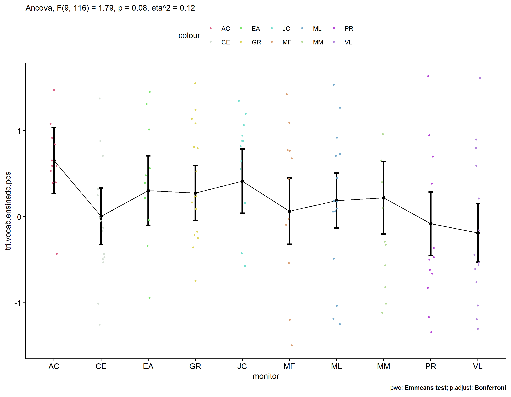<!-- -->

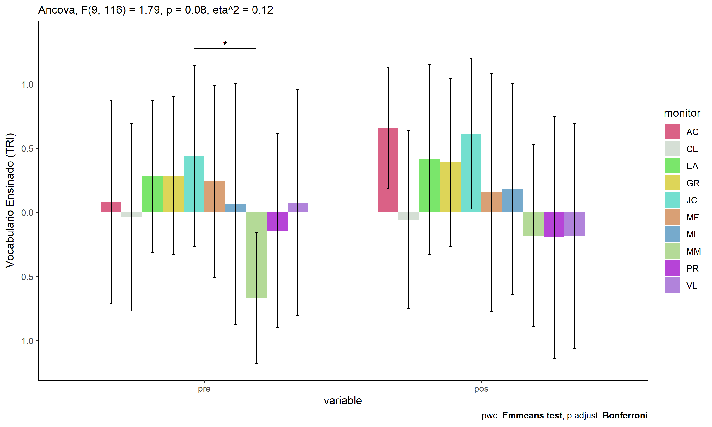<!-- -->

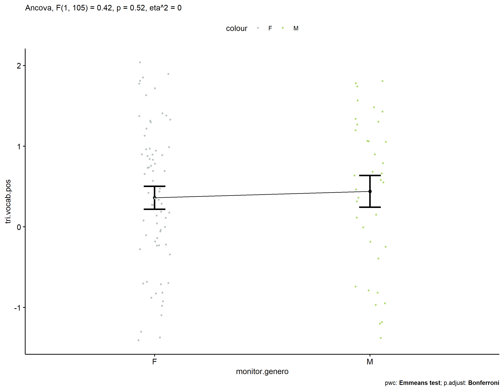<!-- -->

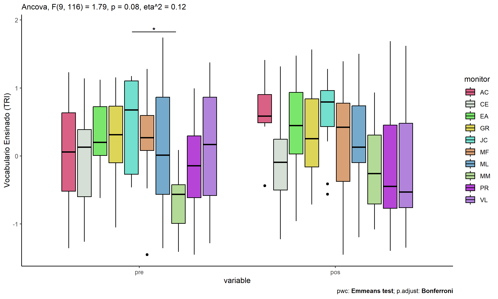<!-- -->

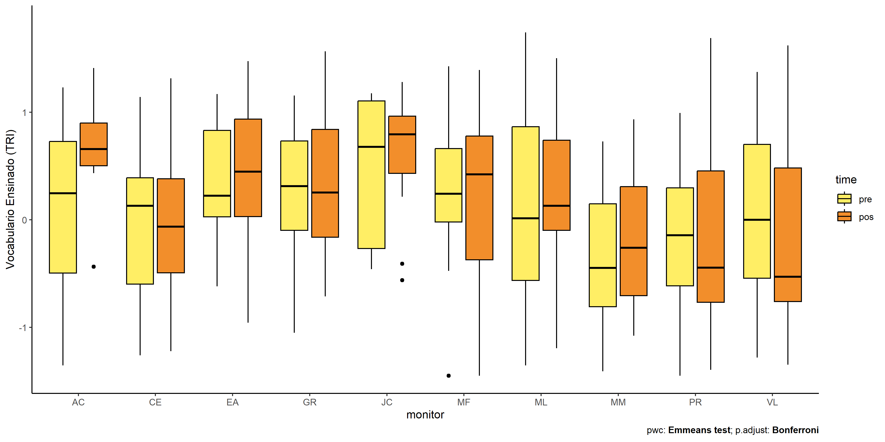<!-- -->

### Vocabulario Nao Ensinado (Acertos)

| var                          | monitor |   n | M (pre) | SE (pre) | M (unadj) | SE (unadj) | M (adj) | SE (adj) |
|:-----------------------------|:--------|----:|--------:|---------:|----------:|-----------:|--------:|---------:|
| score.vocab.nao.ensinado.pos | AC      |  13 |  18.769 |    2.450 |    20.615 |      2.226 |  19.715 |    2.010 |
| score.vocab.nao.ensinado.pos | CE      |  16 |  15.250 |    1.843 |    14.875 |      1.850 |  15.780 |    1.813 |
| score.vocab.nao.ensinado.pos | EA      |  11 |  19.545 |    2.233 |    17.545 |      2.657 |  16.247 |    2.190 |
| score.vocab.nao.ensinado.pos | GR      |  16 |  18.312 |    2.095 |    19.875 |      1.850 |  19.209 |    1.810 |
| score.vocab.nao.ensinado.pos | JC      |  12 |  18.500 |    2.024 |    20.917 |      1.549 |  20.155 |    2.090 |
| score.vocab.nao.ensinado.pos | MF      |  14 |  18.357 |    2.158 |    15.643 |      2.705 |  14.954 |    1.935 |
| score.vocab.nao.ensinado.pos | ML      |  16 |  17.875 |    1.782 |    20.125 |      1.921 |  19.684 |    1.809 |
| score.vocab.nao.ensinado.pos | MM      |  14 |  15.929 |    1.013 |    10.214 |      2.333 |  10.771 |    1.934 |
| score.vocab.nao.ensinado.pos | PR      |  13 |  13.308 |    2.246 |    14.769 |      2.535 |  16.670 |    2.030 |
| score.vocab.nao.ensinado.pos | VL      |  16 |  15.125 |    1.610 |    13.062 |      1.978 |  14.031 |    1.814 |

| .y.                          | group1 | group2 | estimate | conf.low | conf.high |    se | statistic |     p | p.adj | p.adj.signif |
|:-----------------------------|:-------|:-------|---------:|---------:|----------:|------:|----------:|------:|------:|:-------------|
| score.vocab.nao.ensinado.pos | AC     | CE     |    3.936 |   -1.437 |     9.309 | 2.716 |     1.449 | 0.150 | 1.000 | ns           |
| score.vocab.nao.ensinado.pos | AC     | EA     |    3.468 |   -2.392 |     9.328 | 2.962 |     1.171 | 0.244 | 1.000 | ns           |
| score.vocab.nao.ensinado.pos | AC     | GR     |    0.506 |   -4.834 |     5.846 | 2.699 |     0.188 | 0.852 | 1.000 | ns           |
| score.vocab.nao.ensinado.pos | AC     | JC     |   -0.439 |   -6.164 |     5.285 | 2.894 |    -0.152 | 0.880 | 1.000 | ns           |
| score.vocab.nao.ensinado.pos | AC     | MF     |    4.761 |   -0.747 |    10.270 | 2.784 |     1.710 | 0.090 | 1.000 | ns           |
| score.vocab.nao.ensinado.pos | AC     | ML     |    0.032 |   -5.310 |     5.374 | 2.700 |     0.012 | 0.991 | 1.000 | ns           |
| score.vocab.nao.ensinado.pos | AC     | MM     |    8.944 |    3.415 |    14.473 | 2.795 |     3.201 | 0.002 | 0.078 | ns           |
| score.vocab.nao.ensinado.pos | AC     | PR     |    3.046 |   -2.640 |     8.731 | 2.874 |     1.060 | 0.291 | 1.000 | ns           |
| score.vocab.nao.ensinado.pos | AC     | VL     |    5.684 |    0.309 |    11.059 | 2.717 |     2.092 | 0.038 | 1.000 | ns           |
| score.vocab.nao.ensinado.pos | CE     | EA     |   -0.468 |   -6.116 |     5.180 | 2.855 |    -0.164 | 0.870 | 1.000 | ns           |
| score.vocab.nao.ensinado.pos | CE     | GR     |   -3.430 |   -8.512 |     1.653 | 2.569 |    -1.335 | 0.184 | 1.000 | ns           |
| score.vocab.nao.ensinado.pos | CE     | JC     |   -4.375 |   -9.864 |     1.114 | 2.774 |    -1.577 | 0.117 | 1.000 | ns           |
| score.vocab.nao.ensinado.pos | CE     | MF     |    0.825 |   -4.434 |     6.085 | 2.659 |     0.310 | 0.757 | 1.000 | ns           |
| score.vocab.nao.ensinado.pos | CE     | ML     |   -3.904 |   -8.979 |     1.172 | 2.565 |    -1.522 | 0.131 | 1.000 | ns           |
| score.vocab.nao.ensinado.pos | CE     | MM     |    5.009 |   -0.226 |    10.243 | 2.646 |     1.893 | 0.061 | 1.000 | ns           |
| score.vocab.nao.ensinado.pos | CE     | PR     |   -0.890 |   -6.240 |     4.460 | 2.704 |    -0.329 | 0.743 | 1.000 | ns           |
| score.vocab.nao.ensinado.pos | CE     | VL     |    1.748 |   -3.308 |     6.804 | 2.556 |     0.684 | 0.495 | 1.000 | ns           |
| score.vocab.nao.ensinado.pos | EA     | GR     |   -2.962 |   -8.567 |     2.643 | 2.833 |    -1.045 | 0.298 | 1.000 | ns           |
| score.vocab.nao.ensinado.pos | EA     | JC     |   -3.907 |   -9.879 |     2.065 | 3.019 |    -1.294 | 0.198 | 1.000 | ns           |
| score.vocab.nao.ensinado.pos | EA     | MF     |    1.293 |   -4.472 |     7.058 | 2.914 |     0.444 | 0.658 | 1.000 | ns           |
| score.vocab.nao.ensinado.pos | EA     | ML     |   -3.436 |   -9.044 |     2.172 | 2.835 |    -1.212 | 0.228 | 1.000 | ns           |
| score.vocab.nao.ensinado.pos | EA     | MM     |    5.476 |   -0.318 |    11.271 | 2.929 |     1.870 | 0.064 | 1.000 | ns           |
| score.vocab.nao.ensinado.pos | EA     | PR     |   -0.422 |   -6.376 |     5.531 | 3.009 |    -0.140 | 0.889 | 1.000 | ns           |
| score.vocab.nao.ensinado.pos | EA     | VL     |    2.216 |   -3.435 |     7.867 | 2.856 |     0.776 | 0.439 | 1.000 | ns           |
| score.vocab.nao.ensinado.pos | GR     | JC     |   -0.946 |   -6.407 |     4.516 | 2.760 |    -0.343 | 0.733 | 1.000 | ns           |
| score.vocab.nao.ensinado.pos | GR     | MF     |    4.255 |   -0.978 |     9.488 | 2.645 |     1.609 | 0.110 | 1.000 | ns           |
| score.vocab.nao.ensinado.pos | GR     | ML     |   -0.474 |   -5.531 |     4.582 | 2.556 |    -0.186 | 0.853 | 1.000 | ns           |
| score.vocab.nao.ensinado.pos | GR     | MM     |    8.438 |    3.189 |    13.687 | 2.653 |     3.180 | 0.002 | 0.083 | ns           |
| score.vocab.nao.ensinado.pos | GR     | PR     |    2.539 |   -2.867 |     7.946 | 2.733 |     0.929 | 0.355 | 1.000 | ns           |
| score.vocab.nao.ensinado.pos | GR     | VL     |    5.178 |    0.093 |    10.263 | 2.570 |     2.015 | 0.046 | 1.000 | ns           |
| score.vocab.nao.ensinado.pos | JC     | MF     |    5.201 |   -0.425 |    10.826 | 2.844 |     1.829 | 0.070 | 1.000 | ns           |
| score.vocab.nao.ensinado.pos | JC     | ML     |    0.471 |   -4.991 |     5.933 | 2.761 |     0.171 | 0.865 | 1.000 | ns           |
| score.vocab.nao.ensinado.pos | JC     | MM     |    9.384 |    3.741 |    15.026 | 2.852 |     3.290 | 0.001 | 0.058 | ns           |
| score.vocab.nao.ensinado.pos | JC     | PR     |    3.485 |   -2.307 |     9.277 | 2.928 |     1.190 | 0.236 | 1.000 | ns           |
| score.vocab.nao.ensinado.pos | JC     | VL     |    6.123 |    0.633 |    11.614 | 2.775 |     2.206 | 0.029 | 1.000 | ns           |
| score.vocab.nao.ensinado.pos | MF     | ML     |   -4.729 |   -9.963 |     0.505 | 2.646 |    -1.788 | 0.076 | 1.000 | ns           |
| score.vocab.nao.ensinado.pos | MF     | MM     |    4.183 |   -1.237 |     9.604 | 2.740 |     1.527 | 0.129 | 1.000 | ns           |
| score.vocab.nao.ensinado.pos | MF     | PR     |   -1.716 |   -7.290 |     3.858 | 2.818 |    -0.609 | 0.544 | 1.000 | ns           |
| score.vocab.nao.ensinado.pos | MF     | VL     |    0.923 |   -4.339 |     6.185 | 2.660 |     0.347 | 0.729 | 1.000 | ns           |
| score.vocab.nao.ensinado.pos | ML     | MM     |    8.913 |    3.669 |    14.156 | 2.651 |     3.363 | 0.001 | 0.046 | \*           |
| score.vocab.nao.ensinado.pos | ML     | PR     |    3.014 |   -2.382 |     8.409 | 2.727 |     1.105 | 0.271 | 1.000 | ns           |
| score.vocab.nao.ensinado.pos | ML     | VL     |    5.652 |    0.575 |    10.730 | 2.566 |     2.202 | 0.029 | 1.000 | ns           |
| score.vocab.nao.ensinado.pos | MM     | PR     |   -5.899 |  -11.425 |    -0.373 | 2.793 |    -2.112 | 0.037 | 1.000 | ns           |
| score.vocab.nao.ensinado.pos | MM     | VL     |   -3.260 |   -8.495 |     1.975 | 2.646 |    -1.232 | 0.220 | 1.000 | ns           |
| score.vocab.nao.ensinado.pos | PR     | VL     |    2.639 |   -2.710 |     7.987 | 2.703 |     0.976 | 0.331 | 1.000 | ns           |
| score.vocab.nao.ensinado.pre | AC     | CE     |    3.519 |   -1.918 |     8.957 | 2.749 |     1.280 | 0.203 | 1.000 | ns           |
| score.vocab.nao.ensinado.pre | AC     | EA     |   -0.776 |   -6.742 |     5.190 | 3.016 |    -0.257 | 0.797 | 1.000 | ns           |
| score.vocab.nao.ensinado.pre | AC     | GR     |    0.457 |   -4.981 |     5.894 | 2.749 |     0.166 | 0.868 | 1.000 | ns           |
| score.vocab.nao.ensinado.pre | AC     | JC     |    0.269 |   -5.560 |     6.099 | 2.947 |     0.091 | 0.927 | 1.000 | ns           |
| score.vocab.nao.ensinado.pre | AC     | MF     |    0.412 |   -5.197 |     6.021 | 2.835 |     0.145 | 0.885 | 1.000 | ns           |
| score.vocab.nao.ensinado.pre | AC     | ML     |    0.894 |   -4.543 |     6.332 | 2.749 |     0.325 | 0.745 | 1.000 | ns           |
| score.vocab.nao.ensinado.pre | AC     | MM     |    2.841 |   -2.768 |     8.450 | 2.835 |     1.002 | 0.318 | 1.000 | ns           |
| score.vocab.nao.ensinado.pre | AC     | PR     |    5.462 |   -0.250 |    11.173 | 2.887 |     1.892 | 0.061 | 1.000 | ns           |
| score.vocab.nao.ensinado.pre | AC     | VL     |    3.644 |   -1.793 |     9.082 | 2.749 |     1.326 | 0.187 | 1.000 | ns           |
| score.vocab.nao.ensinado.pre | CE     | EA     |   -4.295 |   -9.999 |     1.408 | 2.883 |    -1.490 | 0.139 | 1.000 | ns           |
| score.vocab.nao.ensinado.pre | CE     | GR     |   -3.063 |   -8.211 |     2.086 | 2.603 |    -1.177 | 0.241 | 1.000 | ns           |
| score.vocab.nao.ensinado.pre | CE     | JC     |   -3.250 |   -8.811 |     2.311 | 2.811 |    -1.156 | 0.250 | 1.000 | ns           |
| score.vocab.nao.ensinado.pre | CE     | MF     |   -3.107 |   -8.436 |     2.222 | 2.694 |    -1.153 | 0.251 | 1.000 | ns           |
| score.vocab.nao.ensinado.pre | CE     | ML     |   -2.625 |   -7.774 |     2.524 | 2.603 |    -1.009 | 0.315 | 1.000 | ns           |
| score.vocab.nao.ensinado.pre | CE     | MM     |   -0.679 |   -6.008 |     4.651 | 2.694 |    -0.252 | 0.802 | 1.000 | ns           |
| score.vocab.nao.ensinado.pre | CE     | PR     |    1.942 |   -3.495 |     7.380 | 2.749 |     0.707 | 0.481 | 1.000 | ns           |
| score.vocab.nao.ensinado.pre | CE     | VL     |    0.125 |   -5.024 |     5.274 | 2.603 |     0.048 | 0.962 | 1.000 | ns           |
| score.vocab.nao.ensinado.pre | EA     | GR     |    1.233 |   -4.471 |     6.937 | 2.883 |     0.428 | 0.670 | 1.000 | ns           |
| score.vocab.nao.ensinado.pre | EA     | JC     |    1.045 |   -5.033 |     7.124 | 3.073 |     0.340 | 0.734 | 1.000 | ns           |
| score.vocab.nao.ensinado.pre | EA     | MF     |    1.188 |   -4.679 |     7.056 | 2.966 |     0.401 | 0.689 | 1.000 | ns           |
| score.vocab.nao.ensinado.pre | EA     | ML     |    1.670 |   -4.033 |     7.374 | 2.883 |     0.579 | 0.563 | 1.000 | ns           |
| score.vocab.nao.ensinado.pre | EA     | MM     |    3.617 |   -2.251 |     9.484 | 2.966 |     1.219 | 0.225 | 1.000 | ns           |
| score.vocab.nao.ensinado.pre | EA     | PR     |    6.238 |    0.272 |    12.204 | 3.016 |     2.068 | 0.041 | 1.000 | ns           |
| score.vocab.nao.ensinado.pre | EA     | VL     |    4.420 |   -1.283 |    10.124 | 2.883 |     1.533 | 0.128 | 1.000 | ns           |
| score.vocab.nao.ensinado.pre | GR     | JC     |   -0.187 |   -5.749 |     5.374 | 2.811 |    -0.067 | 0.947 | 1.000 | ns           |
| score.vocab.nao.ensinado.pre | GR     | MF     |   -0.045 |   -5.374 |     5.285 | 2.694 |    -0.017 | 0.987 | 1.000 | ns           |
| score.vocab.nao.ensinado.pre | GR     | ML     |    0.438 |   -4.711 |     5.586 | 2.603 |     0.168 | 0.867 | 1.000 | ns           |
| score.vocab.nao.ensinado.pre | GR     | MM     |    2.384 |   -2.945 |     7.713 | 2.694 |     0.885 | 0.378 | 1.000 | ns           |
| score.vocab.nao.ensinado.pre | GR     | PR     |    5.005 |   -0.433 |    10.442 | 2.749 |     1.821 | 0.071 | 1.000 | ns           |
| score.vocab.nao.ensinado.pre | GR     | VL     |    3.187 |   -1.961 |     8.336 | 2.603 |     1.225 | 0.223 | 1.000 | ns           |
| score.vocab.nao.ensinado.pre | JC     | MF     |    0.143 |   -5.586 |     5.872 | 2.896 |     0.049 | 0.961 | 1.000 | ns           |
| score.vocab.nao.ensinado.pre | JC     | ML     |    0.625 |   -4.936 |     6.186 | 2.811 |     0.222 | 0.824 | 1.000 | ns           |
| score.vocab.nao.ensinado.pre | JC     | MM     |    2.571 |   -3.157 |     8.300 | 2.896 |     0.888 | 0.376 | 1.000 | ns           |
| score.vocab.nao.ensinado.pre | JC     | PR     |    5.192 |   -0.637 |    11.022 | 2.947 |     1.762 | 0.080 | 1.000 | ns           |
| score.vocab.nao.ensinado.pre | JC     | VL     |    3.375 |   -2.186 |     8.936 | 2.811 |     1.201 | 0.232 | 1.000 | ns           |
| score.vocab.nao.ensinado.pre | MF     | ML     |    0.482 |   -4.847 |     5.811 | 2.694 |     0.179 | 0.858 | 1.000 | ns           |
| score.vocab.nao.ensinado.pre | MF     | MM     |    2.429 |   -3.076 |     7.933 | 2.782 |     0.873 | 0.384 | 1.000 | ns           |
| score.vocab.nao.ensinado.pre | MF     | PR     |    5.049 |   -0.560 |    10.658 | 2.835 |     1.781 | 0.077 | 1.000 | ns           |
| score.vocab.nao.ensinado.pre | MF     | VL     |    3.232 |   -2.097 |     8.561 | 2.694 |     1.200 | 0.232 | 1.000 | ns           |
| score.vocab.nao.ensinado.pre | ML     | MM     |    1.946 |   -3.383 |     7.276 | 2.694 |     0.723 | 0.471 | 1.000 | ns           |
| score.vocab.nao.ensinado.pre | ML     | PR     |    4.567 |   -0.870 |    10.005 | 2.749 |     1.662 | 0.099 | 1.000 | ns           |
| score.vocab.nao.ensinado.pre | ML     | VL     |    2.750 |   -2.399 |     7.899 | 2.603 |     1.057 | 0.293 | 1.000 | ns           |
| score.vocab.nao.ensinado.pre | MM     | PR     |    2.621 |   -2.988 |     8.230 | 2.835 |     0.924 | 0.357 | 1.000 | ns           |
| score.vocab.nao.ensinado.pre | MM     | VL     |    0.804 |   -4.526 |     6.133 | 2.694 |     0.298 | 0.766 | 1.000 | ns           |
| score.vocab.nao.ensinado.pre | PR     | VL     |   -1.817 |   -7.255 |     3.620 | 2.749 |    -0.661 | 0.510 | 1.000 | ns           |

| .y.                      | monitor | group1 | group2 | estimate | conf.low | conf.high |    se | statistic |     p | p.adj | p.adj.signif |
|:-------------------------|:--------|:-------|:-------|---------:|---------:|----------:|------:|----------:|------:|------:|:-------------|
| score.vocab.nao.ensinado | AC      | pre    | pos    |   -1.846 |   -7.836 |     4.143 | 3.042 |    -0.607 | 0.544 | 0.544 | ns           |
| score.vocab.nao.ensinado | CE      | pre    | pos    |    0.375 |   -5.024 |     5.774 | 2.742 |     0.137 | 0.891 | 0.891 | ns           |
| score.vocab.nao.ensinado | EA      | pre    | pos    |    2.000 |   -4.511 |     8.511 | 3.307 |     0.605 | 0.546 | 0.546 | ns           |
| score.vocab.nao.ensinado | GR      | pre    | pos    |   -1.562 |   -6.961 |     3.836 | 2.742 |    -0.570 | 0.569 | 0.569 | ns           |
| score.vocab.nao.ensinado | JC      | pre    | pos    |   -2.417 |   -8.651 |     3.818 | 3.166 |    -0.763 | 0.446 | 0.446 | ns           |
| score.vocab.nao.ensinado | MF      | pre    | pos    |    2.714 |   -3.057 |     8.486 | 2.931 |     0.926 | 0.355 | 0.355 | ns           |
| score.vocab.nao.ensinado | ML      | pre    | pos    |   -2.250 |   -7.649 |     3.149 | 2.742 |    -0.821 | 0.413 | 0.413 | ns           |
| score.vocab.nao.ensinado | MM      | pre    | pos    |    5.714 |   -0.057 |    11.486 | 2.931 |     1.949 | 0.052 | 0.052 | ns           |
| score.vocab.nao.ensinado | PR      | pre    | pos    |   -1.462 |   -7.451 |     4.528 | 3.042 |    -0.480 | 0.631 | 0.631 | ns           |
| score.vocab.nao.ensinado | VL      | pre    | pos    |    2.062 |   -3.336 |     7.461 | 2.742 |     0.752 | 0.453 | 0.453 | ns           |

    ## Scale for colour is already present.
    ## Adding another scale for colour, which will replace the existing scale.

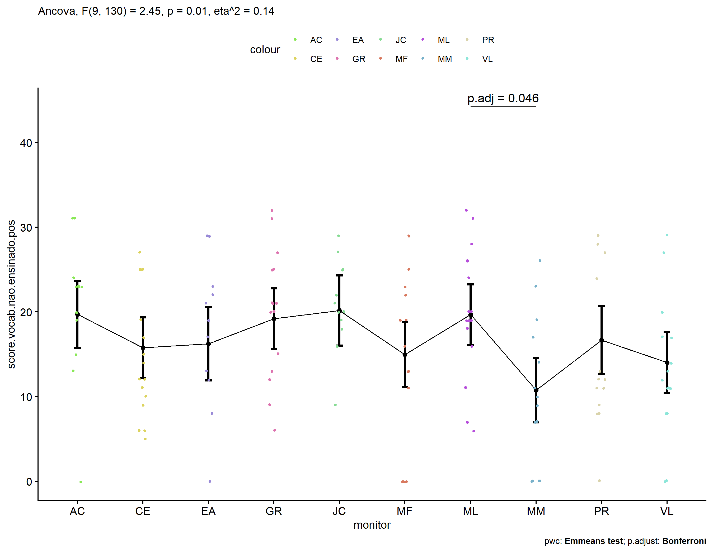<!-- -->

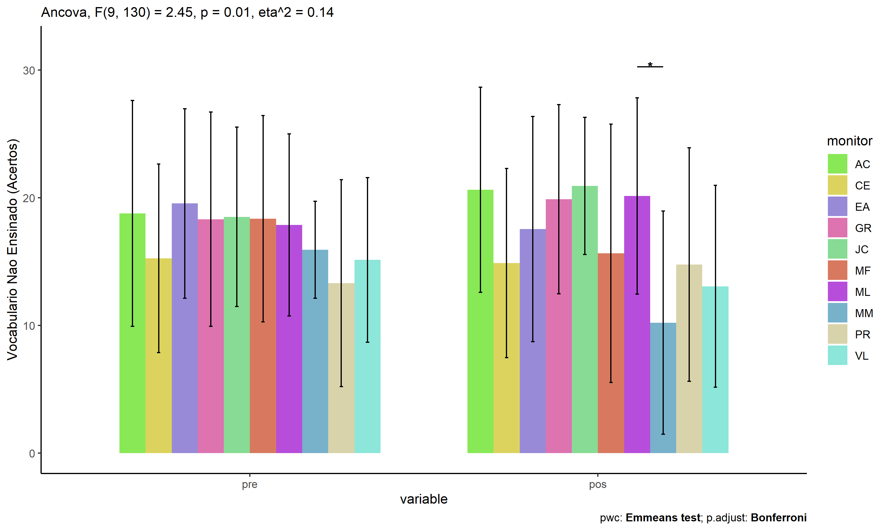<!-- -->

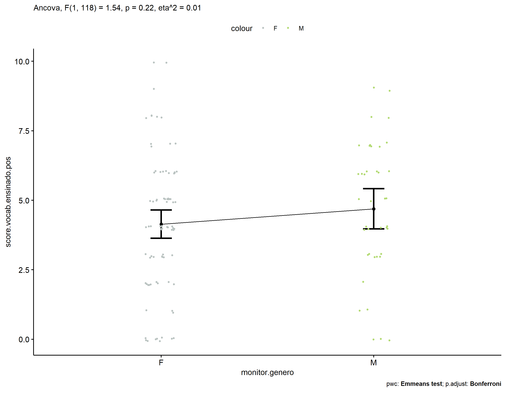<!-- -->

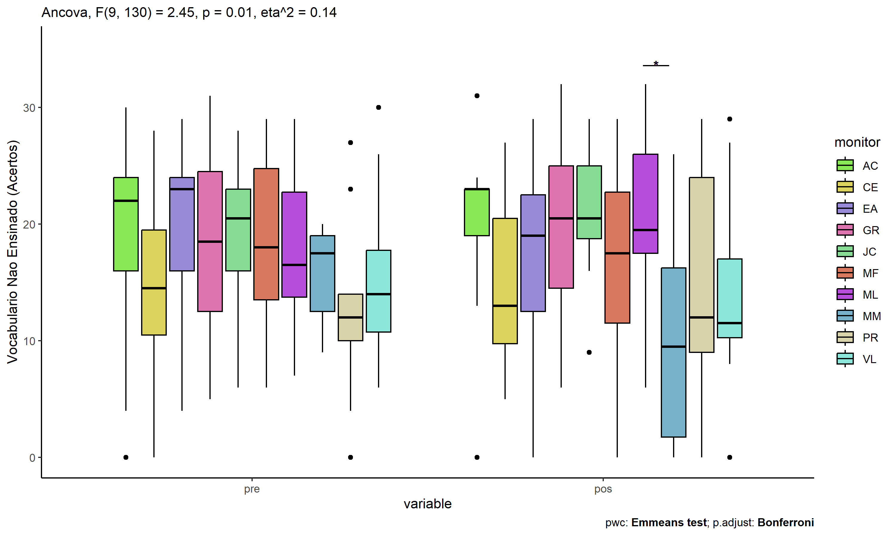<!-- -->

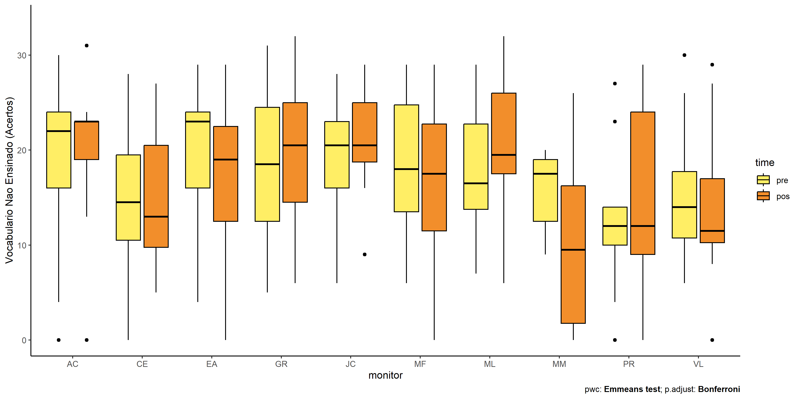<!-- -->

### Vocabulario Nao Ensinado (TRI)

| var                        | monitor |   n | M (pre) | SE (pre) | M (unadj) | SE (unadj) | M (adj) | SE (adj) |
|:---------------------------|:--------|----:|--------:|---------:|----------:|-----------:|--------:|---------:|
| tri.vocab.nao.ensinado.pos | AC      |  11 |   0.495 |    0.242 |     0.745 |      0.216 |   0.423 |    0.200 |
| tri.vocab.nao.ensinado.pos | CE      |  15 |  -0.048 |    0.191 |    -0.233 |      0.240 |  -0.127 |    0.170 |
| tri.vocab.nao.ensinado.pos | EA      |  10 |   0.199 |    0.299 |     0.319 |      0.327 |   0.231 |    0.208 |
| tri.vocab.nao.ensinado.pos | GR      |  16 |   0.277 |    0.286 |     0.437 |      0.266 |   0.287 |    0.165 |
| tri.vocab.nao.ensinado.pos | JC      |  12 |   0.329 |    0.223 |     0.624 |      0.211 |   0.433 |    0.190 |
| tri.vocab.nao.ensinado.pos | MF      |  11 |   0.289 |    0.297 |     0.429 |      0.263 |   0.270 |    0.199 |
| tri.vocab.nao.ensinado.pos | ML      |  16 |   0.179 |    0.246 |     0.507 |      0.265 |   0.434 |    0.164 |
| tri.vocab.nao.ensinado.pos | MM      |  10 |  -0.402 |    0.158 |    -0.383 |      0.265 |   0.001 |    0.210 |
| tri.vocab.nao.ensinado.pos | PR      |  12 |  -0.352 |    0.270 |    -0.065 |      0.353 |   0.280 |    0.192 |
| tri.vocab.nao.ensinado.pos | VL      |  14 |  -0.136 |    0.240 |    -0.232 |      0.256 |  -0.056 |    0.176 |

| .y.                        | group1 | group2 | estimate | conf.low | conf.high |    se | statistic |     p | p.adj | p.adj.signif |
|:---------------------------|:-------|:-------|---------:|---------:|----------:|------:|----------:|------:|------:|:-------------|
| tri.vocab.nao.ensinado.pos | AC     | CE     |    0.550 |    0.029 |     1.072 | 0.263 |     2.089 | 0.039 | 1.000 | ns           |
| tri.vocab.nao.ensinado.pos | AC     | EA     |    0.192 |   -0.377 |     0.762 | 0.288 |     0.669 | 0.505 | 1.000 | ns           |
| tri.vocab.nao.ensinado.pos | AC     | GR     |    0.136 |   -0.374 |     0.647 | 0.258 |     0.530 | 0.597 | 1.000 | ns           |
| tri.vocab.nao.ensinado.pos | AC     | JC     |   -0.010 |   -0.554 |     0.534 | 0.274 |    -0.036 | 0.971 | 1.000 | ns           |
| tri.vocab.nao.ensinado.pos | AC     | MF     |    0.154 |   -0.402 |     0.709 | 0.280 |     0.548 | 0.585 | 1.000 | ns           |
| tri.vocab.nao.ensinado.pos | AC     | ML     |   -0.011 |   -0.522 |     0.500 | 0.258 |    -0.043 | 0.966 | 1.000 | ns           |
| tri.vocab.nao.ensinado.pos | AC     | MM     |    0.422 |   -0.159 |     1.003 | 0.293 |     1.439 | 0.153 | 1.000 | ns           |
| tri.vocab.nao.ensinado.pos | AC     | PR     |    0.143 |   -0.412 |     0.698 | 0.280 |     0.510 | 0.611 | 1.000 | ns           |
| tri.vocab.nao.ensinado.pos | AC     | VL     |    0.480 |   -0.051 |     1.011 | 0.268 |     1.789 | 0.076 | 1.000 | ns           |
| tri.vocab.nao.ensinado.pos | CE     | EA     |   -0.358 |   -0.890 |     0.175 | 0.269 |    -1.331 | 0.186 | 1.000 | ns           |
| tri.vocab.nao.ensinado.pos | CE     | GR     |   -0.414 |   -0.883 |     0.056 | 0.237 |    -1.745 | 0.084 | 1.000 | ns           |
| tri.vocab.nao.ensinado.pos | CE     | JC     |   -0.560 |   -1.067 |    -0.054 | 0.256 |    -2.191 | 0.030 | 1.000 | ns           |
| tri.vocab.nao.ensinado.pos | CE     | MF     |   -0.397 |   -0.915 |     0.122 | 0.262 |    -1.515 | 0.132 | 1.000 | ns           |
| tri.vocab.nao.ensinado.pos | CE     | ML     |   -0.561 |   -1.030 |    -0.093 | 0.237 |    -2.372 | 0.019 | 0.869 | ns           |
| tri.vocab.nao.ensinado.pos | CE     | MM     |   -0.128 |   -0.661 |     0.405 | 0.269 |    -0.476 | 0.635 | 1.000 | ns           |
| tri.vocab.nao.ensinado.pos | CE     | PR     |   -0.407 |   -0.913 |     0.098 | 0.255 |    -1.596 | 0.113 | 1.000 | ns           |
| tri.vocab.nao.ensinado.pos | CE     | VL     |   -0.071 |   -0.554 |     0.413 | 0.244 |    -0.289 | 0.773 | 1.000 | ns           |
| tri.vocab.nao.ensinado.pos | EA     | GR     |   -0.056 |   -0.581 |     0.469 | 0.265 |    -0.211 | 0.833 | 1.000 | ns           |
| tri.vocab.nao.ensinado.pos | EA     | JC     |   -0.202 |   -0.760 |     0.355 | 0.281 |    -0.719 | 0.473 | 1.000 | ns           |
| tri.vocab.nao.ensinado.pos | EA     | MF     |   -0.039 |   -0.607 |     0.530 | 0.287 |    -0.135 | 0.893 | 1.000 | ns           |
| tri.vocab.nao.ensinado.pos | EA     | ML     |   -0.204 |   -0.728 |     0.321 | 0.265 |    -0.769 | 0.444 | 1.000 | ns           |
| tri.vocab.nao.ensinado.pos | EA     | MM     |    0.230 |   -0.358 |     0.817 | 0.297 |     0.774 | 0.441 | 1.000 | ns           |
| tri.vocab.nao.ensinado.pos | EA     | PR     |   -0.050 |   -0.612 |     0.512 | 0.284 |    -0.175 | 0.862 | 1.000 | ns           |
| tri.vocab.nao.ensinado.pos | EA     | VL     |    0.287 |   -0.253 |     0.828 | 0.273 |     1.052 | 0.295 | 1.000 | ns           |
| tri.vocab.nao.ensinado.pos | GR     | JC     |   -0.146 |   -0.643 |     0.350 | 0.251 |    -0.584 | 0.561 | 1.000 | ns           |
| tri.vocab.nao.ensinado.pos | GR     | MF     |    0.017 |   -0.492 |     0.527 | 0.257 |     0.067 | 0.947 | 1.000 | ns           |
| tri.vocab.nao.ensinado.pos | GR     | ML     |   -0.148 |   -0.608 |     0.313 | 0.232 |    -0.635 | 0.527 | 1.000 | ns           |
| tri.vocab.nao.ensinado.pos | GR     | MM     |    0.286 |   -0.247 |     0.818 | 0.269 |     1.062 | 0.290 | 1.000 | ns           |
| tri.vocab.nao.ensinado.pos | GR     | PR     |    0.006 |   -0.497 |     0.510 | 0.254 |     0.025 | 0.980 | 1.000 | ns           |
| tri.vocab.nao.ensinado.pos | GR     | VL     |    0.343 |   -0.136 |     0.823 | 0.242 |     1.418 | 0.159 | 1.000 | ns           |
| tri.vocab.nao.ensinado.pos | JC     | MF     |    0.164 |   -0.380 |     0.707 | 0.274 |     0.597 | 0.552 | 1.000 | ns           |
| tri.vocab.nao.ensinado.pos | JC     | ML     |   -0.001 |   -0.498 |     0.496 | 0.251 |    -0.005 | 0.996 | 1.000 | ns           |
| tri.vocab.nao.ensinado.pos | JC     | MM     |    0.432 |   -0.134 |     0.998 | 0.286 |     1.513 | 0.133 | 1.000 | ns           |
| tri.vocab.nao.ensinado.pos | JC     | PR     |    0.153 |   -0.386 |     0.692 | 0.272 |     0.562 | 0.575 | 1.000 | ns           |
| tri.vocab.nao.ensinado.pos | JC     | VL     |    0.490 |   -0.026 |     1.005 | 0.260 |     1.881 | 0.063 | 1.000 | ns           |
| tri.vocab.nao.ensinado.pos | MF     | ML     |   -0.165 |   -0.675 |     0.345 | 0.257 |    -0.640 | 0.523 | 1.000 | ns           |
| tri.vocab.nao.ensinado.pos | MF     | MM     |    0.268 |   -0.308 |     0.844 | 0.291 |     0.923 | 0.358 | 1.000 | ns           |
| tri.vocab.nao.ensinado.pos | MF     | PR     |   -0.011 |   -0.561 |     0.539 | 0.278 |    -0.039 | 0.969 | 1.000 | ns           |
| tri.vocab.nao.ensinado.pos | MF     | VL     |    0.326 |   -0.201 |     0.853 | 0.266 |     1.225 | 0.223 | 1.000 | ns           |
| tri.vocab.nao.ensinado.pos | ML     | MM     |    0.433 |   -0.097 |     0.963 | 0.268 |     1.618 | 0.108 | 1.000 | ns           |
| tri.vocab.nao.ensinado.pos | ML     | PR     |    0.154 |   -0.348 |     0.656 | 0.253 |     0.608 | 0.544 | 1.000 | ns           |
| tri.vocab.nao.ensinado.pos | ML     | VL     |    0.491 |    0.013 |     0.969 | 0.241 |     2.033 | 0.044 | 1.000 | ns           |
| tri.vocab.nao.ensinado.pos | MM     | PR     |   -0.279 |   -0.836 |     0.278 | 0.281 |    -0.992 | 0.323 | 1.000 | ns           |
| tri.vocab.nao.ensinado.pos | MM     | VL     |    0.058 |   -0.482 |     0.598 | 0.273 |     0.211 | 0.833 | 1.000 | ns           |
| tri.vocab.nao.ensinado.pos | PR     | VL     |    0.337 |   -0.176 |     0.849 | 0.259 |     1.301 | 0.196 | 1.000 | ns           |
| tri.vocab.nao.ensinado.pre | AC     | CE     |    0.543 |   -0.165 |     1.251 | 0.357 |     1.519 | 0.131 | 1.000 | ns           |
| tri.vocab.nao.ensinado.pre | AC     | EA     |    0.296 |   -0.483 |     1.075 | 0.393 |     0.753 | 0.453 | 1.000 | ns           |
| tri.vocab.nao.ensinado.pre | AC     | GR     |    0.218 |   -0.481 |     0.916 | 0.353 |     0.617 | 0.538 | 1.000 | ns           |
| tri.vocab.nao.ensinado.pre | AC     | JC     |    0.166 |   -0.578 |     0.910 | 0.376 |     0.442 | 0.660 | 1.000 | ns           |
| tri.vocab.nao.ensinado.pre | AC     | MF     |    0.205 |   -0.555 |     0.966 | 0.384 |     0.535 | 0.594 | 1.000 | ns           |
| tri.vocab.nao.ensinado.pre | AC     | ML     |    0.316 |   -0.383 |     1.014 | 0.353 |     0.895 | 0.372 | 1.000 | ns           |
| tri.vocab.nao.ensinado.pre | AC     | MM     |    0.897 |    0.118 |     1.676 | 0.393 |     2.280 | 0.024 | 1.000 | ns           |
| tri.vocab.nao.ensinado.pre | AC     | PR     |    0.847 |    0.103 |     1.591 | 0.376 |     2.254 | 0.026 | 1.000 | ns           |
| tri.vocab.nao.ensinado.pre | AC     | VL     |    0.631 |   -0.087 |     1.349 | 0.363 |     1.740 | 0.084 | 1.000 | ns           |
| tri.vocab.nao.ensinado.pre | CE     | EA     |   -0.247 |   -0.975 |     0.481 | 0.368 |    -0.671 | 0.503 | 1.000 | ns           |
| tri.vocab.nao.ensinado.pre | CE     | GR     |   -0.325 |   -0.966 |     0.316 | 0.324 |    -1.005 | 0.317 | 1.000 | ns           |
| tri.vocab.nao.ensinado.pre | CE     | JC     |   -0.377 |   -1.067 |     0.314 | 0.349 |    -1.081 | 0.282 | 1.000 | ns           |
| tri.vocab.nao.ensinado.pre | CE     | MF     |   -0.337 |   -1.045 |     0.370 | 0.357 |    -0.944 | 0.347 | 1.000 | ns           |
| tri.vocab.nao.ensinado.pre | CE     | ML     |   -0.227 |   -0.868 |     0.414 | 0.324 |    -0.702 | 0.484 | 1.000 | ns           |
| tri.vocab.nao.ensinado.pre | CE     | MM     |    0.354 |   -0.374 |     1.082 | 0.368 |     0.963 | 0.338 | 1.000 | ns           |
| tri.vocab.nao.ensinado.pre | CE     | PR     |    0.304 |   -0.386 |     0.995 | 0.349 |     0.873 | 0.385 | 1.000 | ns           |
| tri.vocab.nao.ensinado.pre | CE     | VL     |    0.088 |   -0.574 |     0.751 | 0.335 |     0.264 | 0.792 | 1.000 | ns           |
| tri.vocab.nao.ensinado.pre | EA     | GR     |   -0.078 |   -0.797 |     0.640 | 0.363 |    -0.216 | 0.829 | 1.000 | ns           |
| tri.vocab.nao.ensinado.pre | EA     | JC     |   -0.130 |   -0.893 |     0.633 | 0.385 |    -0.337 | 0.736 | 1.000 | ns           |
| tri.vocab.nao.ensinado.pre | EA     | MF     |   -0.091 |   -0.870 |     0.688 | 0.393 |    -0.230 | 0.818 | 1.000 | ns           |
| tri.vocab.nao.ensinado.pre | EA     | ML     |    0.020 |   -0.699 |     0.738 | 0.363 |     0.054 | 0.957 | 1.000 | ns           |
| tri.vocab.nao.ensinado.pre | EA     | MM     |    0.601 |   -0.197 |     1.398 | 0.403 |     1.492 | 0.138 | 1.000 | ns           |
| tri.vocab.nao.ensinado.pre | EA     | PR     |    0.551 |   -0.212 |     1.314 | 0.385 |     1.430 | 0.155 | 1.000 | ns           |
| tri.vocab.nao.ensinado.pre | EA     | VL     |    0.335 |   -0.403 |     1.073 | 0.373 |     0.899 | 0.371 | 1.000 | ns           |
| tri.vocab.nao.ensinado.pre | GR     | JC     |   -0.052 |   -0.733 |     0.629 | 0.344 |    -0.150 | 0.881 | 1.000 | ns           |
| tri.vocab.nao.ensinado.pre | GR     | MF     |   -0.012 |   -0.711 |     0.686 | 0.353 |    -0.035 | 0.972 | 1.000 | ns           |
| tri.vocab.nao.ensinado.pre | GR     | ML     |    0.098 |   -0.532 |     0.728 | 0.318 |     0.308 | 0.759 | 1.000 | ns           |
| tri.vocab.nao.ensinado.pre | GR     | MM     |    0.679 |   -0.040 |     1.398 | 0.363 |     1.871 | 0.064 | 1.000 | ns           |
| tri.vocab.nao.ensinado.pre | GR     | PR     |    0.629 |   -0.051 |     1.310 | 0.344 |     1.831 | 0.070 | 1.000 | ns           |
| tri.vocab.nao.ensinado.pre | GR     | VL     |    0.413 |   -0.239 |     1.066 | 0.329 |     1.255 | 0.212 | 1.000 | ns           |
| tri.vocab.nao.ensinado.pre | JC     | MF     |    0.039 |   -0.705 |     0.784 | 0.376 |     0.105 | 0.917 | 1.000 | ns           |
| tri.vocab.nao.ensinado.pre | JC     | ML     |    0.150 |   -0.531 |     0.831 | 0.344 |     0.436 | 0.664 | 1.000 | ns           |
| tri.vocab.nao.ensinado.pre | JC     | MM     |    0.731 |   -0.033 |     1.494 | 0.385 |     1.896 | 0.060 | 1.000 | ns           |
| tri.vocab.nao.ensinado.pre | JC     | PR     |    0.681 |   -0.047 |     1.409 | 0.368 |     1.853 | 0.066 | 1.000 | ns           |
| tri.vocab.nao.ensinado.pre | JC     | VL     |    0.465 |   -0.236 |     1.167 | 0.354 |     1.313 | 0.192 | 1.000 | ns           |
| tri.vocab.nao.ensinado.pre | MF     | ML     |    0.110 |   -0.588 |     0.809 | 0.353 |     0.313 | 0.755 | 1.000 | ns           |
| tri.vocab.nao.ensinado.pre | MF     | MM     |    0.691 |   -0.088 |     1.470 | 0.393 |     1.757 | 0.081 | 1.000 | ns           |
| tri.vocab.nao.ensinado.pre | MF     | PR     |    0.642 |   -0.102 |     1.386 | 0.376 |     1.708 | 0.090 | 1.000 | ns           |
| tri.vocab.nao.ensinado.pre | MF     | VL     |    0.426 |   -0.293 |     1.144 | 0.363 |     1.174 | 0.243 | 1.000 | ns           |
| tri.vocab.nao.ensinado.pre | ML     | MM     |    0.581 |   -0.138 |     1.300 | 0.363 |     1.601 | 0.112 | 1.000 | ns           |
| tri.vocab.nao.ensinado.pre | ML     | PR     |    0.531 |   -0.149 |     1.212 | 0.344 |     1.546 | 0.125 | 1.000 | ns           |
| tri.vocab.nao.ensinado.pre | ML     | VL     |    0.315 |   -0.337 |     0.968 | 0.329 |     0.957 | 0.340 | 1.000 | ns           |
| tri.vocab.nao.ensinado.pre | MM     | PR     |   -0.050 |   -0.813 |     0.714 | 0.385 |    -0.129 | 0.898 | 1.000 | ns           |
| tri.vocab.nao.ensinado.pre | MM     | VL     |   -0.266 |   -1.004 |     0.473 | 0.373 |    -0.712 | 0.478 | 1.000 | ns           |
| tri.vocab.nao.ensinado.pre | PR     | VL     |   -0.216 |   -0.917 |     0.485 | 0.354 |    -0.610 | 0.543 | 1.000 | ns           |

| .y.                    | monitor | group1 | group2 | estimate | conf.low | conf.high |    se | statistic |     p | p.adj | p.adj.signif |
|:-----------------------|:--------|:-------|:-------|---------:|---------:|----------:|------:|----------:|------:|------:|:-------------|
| tri.vocab.nao.ensinado | AC      | pre    | pos    |   -0.171 |   -0.919 |     0.576 | 0.380 |    -0.451 | 0.652 | 0.652 | ns           |
| tri.vocab.nao.ensinado | CE      | pre    | pos    |    0.104 |   -0.554 |     0.762 | 0.334 |     0.312 | 0.755 | 0.755 | ns           |
| tri.vocab.nao.ensinado | EA      | pre    | pos    |    0.036 |   -0.764 |     0.836 | 0.406 |     0.089 | 0.929 | 0.929 | ns           |
| tri.vocab.nao.ensinado | GR      | pre    | pos    |   -0.160 |   -0.807 |     0.488 | 0.329 |    -0.486 | 0.627 | 0.627 | ns           |
| tri.vocab.nao.ensinado | JC      | pre    | pos    |   -0.295 |   -1.043 |     0.452 | 0.380 |    -0.778 | 0.437 | 0.437 | ns           |
| tri.vocab.nao.ensinado | MF      | pre    | pos    |   -0.182 |   -0.920 |     0.556 | 0.375 |    -0.485 | 0.628 | 0.628 | ns           |
| tri.vocab.nao.ensinado | ML      | pre    | pos    |   -0.328 |   -0.976 |     0.319 | 0.329 |    -0.998 | 0.319 | 0.319 | ns           |
| tri.vocab.nao.ensinado | MM      | pre    | pos    |    0.185 |   -0.574 |     0.943 | 0.385 |     0.479 | 0.632 | 0.632 | ns           |
| tri.vocab.nao.ensinado | PR      | pre    | pos    |   -0.287 |   -1.035 |     0.461 | 0.380 |    -0.756 | 0.450 | 0.450 | ns           |
| tri.vocab.nao.ensinado | VL      | pre    | pos    |    0.059 |   -0.611 |     0.729 | 0.340 |     0.173 | 0.863 | 0.863 | ns           |

    ## Scale for colour is already present.
    ## Adding another scale for colour, which will replace the existing scale.

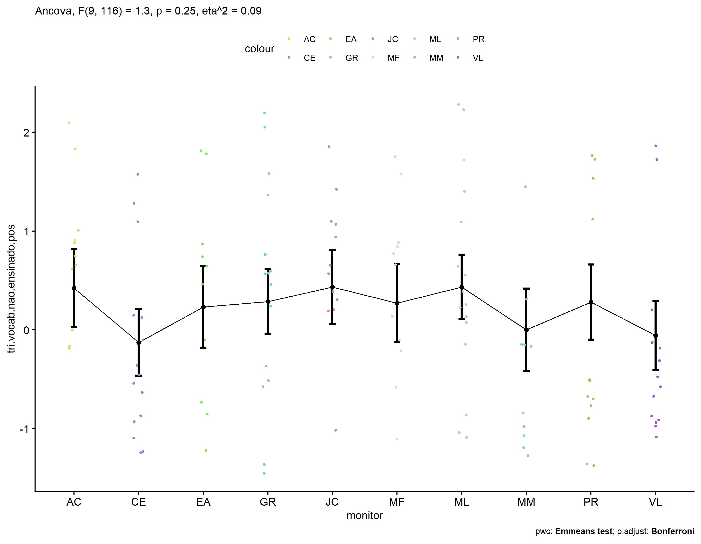<!-- -->

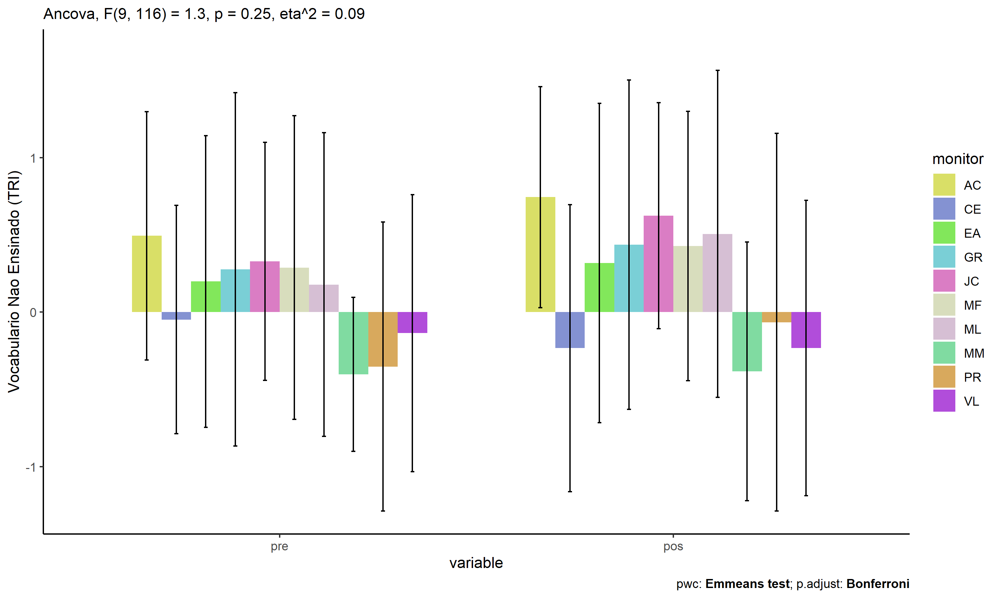<!-- -->

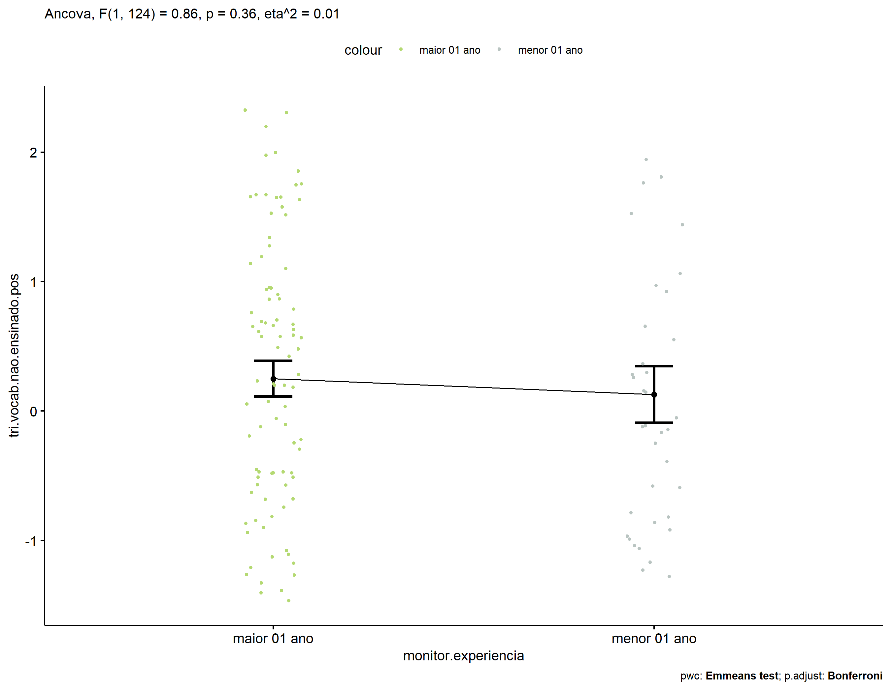<!-- -->

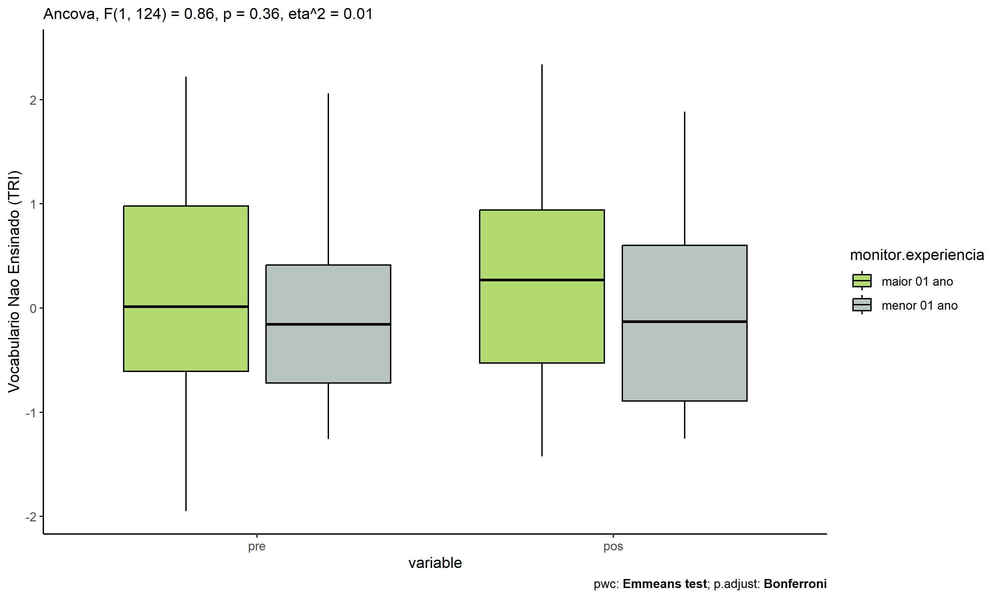<!-- -->

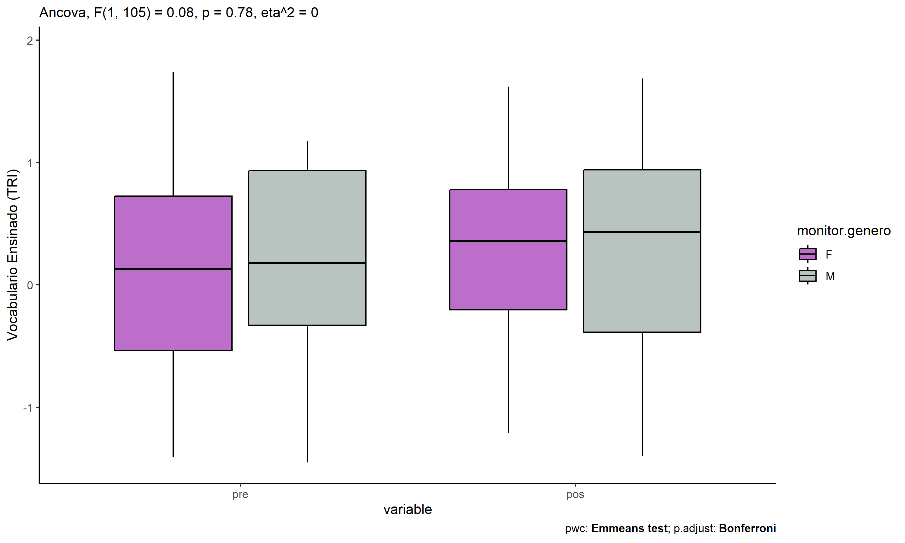<!-- -->

## factores: **grupo=“Experimental”:monitor.genero**

### Vocabulario (Acertos)

| var             | monitor.genero |   n | M (pre) | SE (pre) | M (unadj) | SE (unadj) | M (adj) | SE (adj) |
|:----------------|:---------------|----:|--------:|---------:|----------:|-----------:|--------:|---------:|
| score.vocab.pos | F              |  78 |  21.615 |    0.979 |    23.090 |      1.003 |  22.936 |    0.703 |
| score.vocab.pos | M              |  49 |  21.082 |    1.198 |    21.939 |      1.270 |  22.183 |    0.887 |

| .y.             | group1 | group2 | estimate | conf.low | conf.high |    se | statistic |     p | p.adj | p.adj.signif |
|:----------------|:-------|:-------|---------:|---------:|----------:|------:|----------:|------:|------:|:-------------|
| score.vocab.pos | F      | M      |    0.754 |   -1.486 |     2.994 | 1.132 |     0.666 | 0.507 | 0.507 | ns           |
| score.vocab.pre | F      | M      |    0.534 |   -2.549 |     3.617 | 1.558 |     0.343 | 0.732 | 0.732 | ns           |

| .y.         | monitor.genero | group1 | group2 | estimate | conf.low | conf.high |    se | statistic |     p | p.adj | p.adj.signif |
|:------------|:---------------|:-------|:-------|---------:|---------:|----------:|------:|----------:|------:|------:|:-------------|
| score.vocab | F              | pre    | pos    |   -1.471 |   -4.124 |     1.181 | 1.347 |    -1.092 | 0.276 | 0.276 | ns           |
| score.vocab | M              | pre    | pos    |   -0.780 |   -4.203 |     2.643 | 1.738 |    -0.449 | 0.654 | 0.654 | ns           |

    ## Scale for colour is already present.
    ## Adding another scale for colour, which will replace the existing scale.

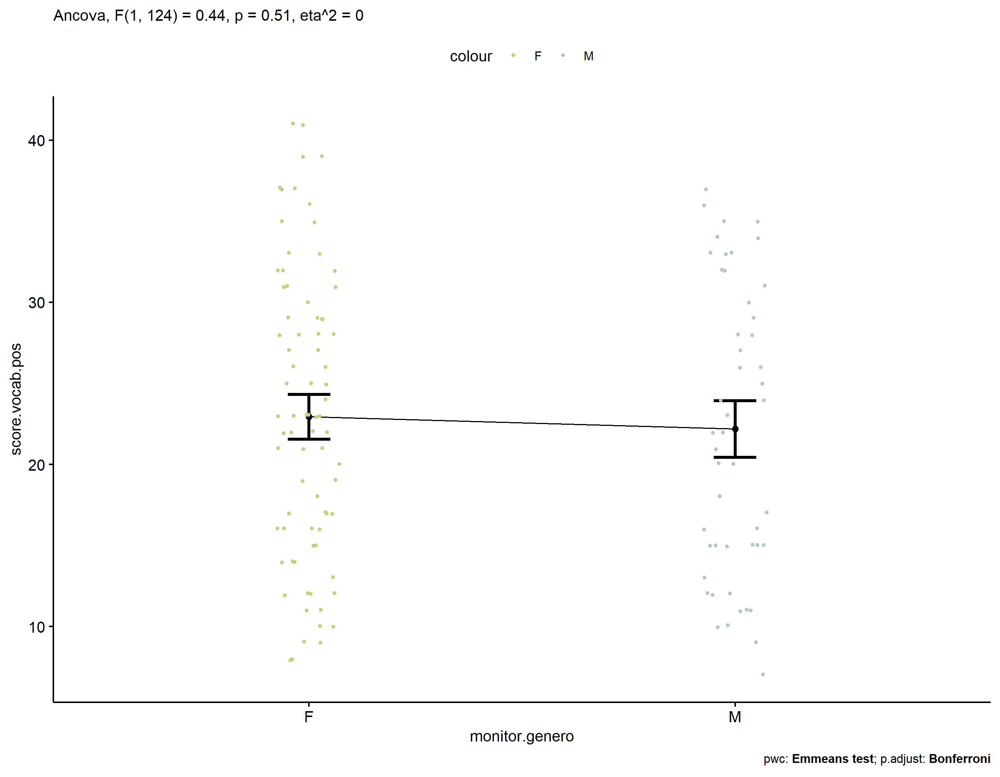<!-- -->

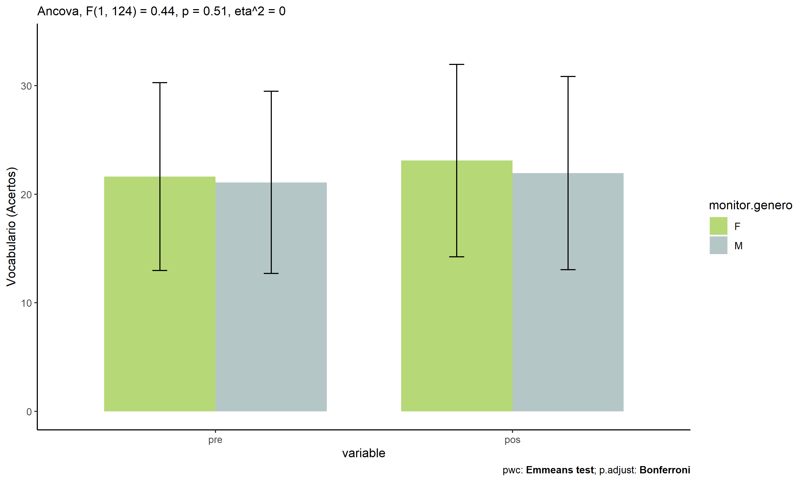<!-- -->

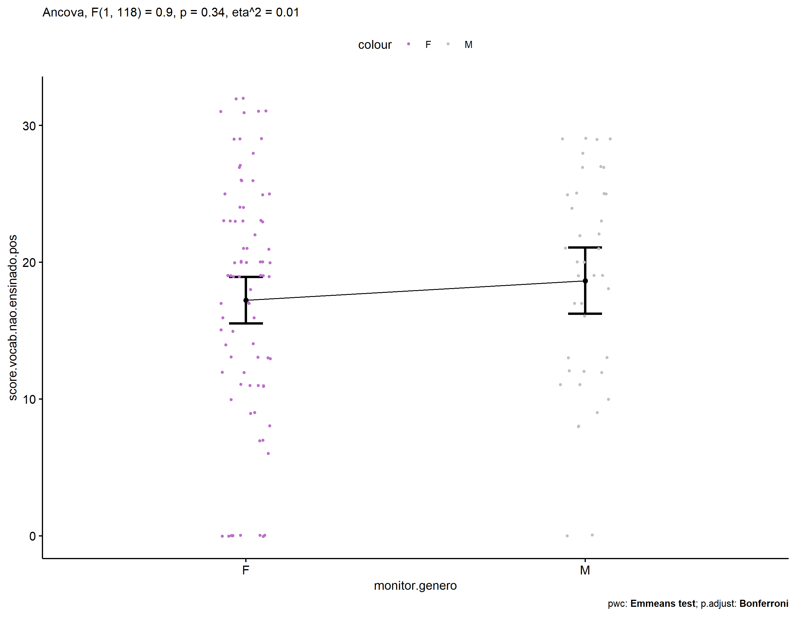<!-- -->

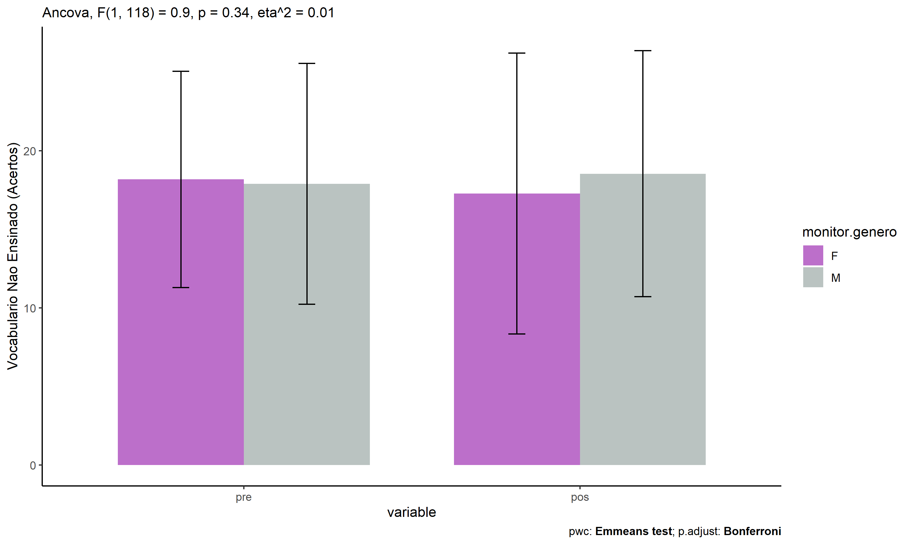<!-- -->

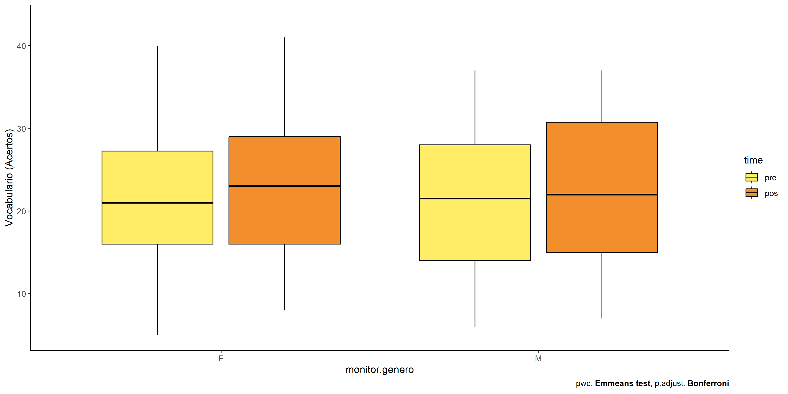<!-- -->

### Vocabulario (TRI)

| var           | monitor.genero |   n | M (pre) | SE (pre) | M (unadj) | SE (unadj) | M (adj) | SE (adj) |
|:--------------|:---------------|----:|--------:|---------:|----------:|-----------:|--------:|---------:|
| tri.vocab.pos | F              |  78 |   0.128 |    0.108 |     0.255 |      0.106 |   0.232 |    0.073 |
| tri.vocab.pos | M              |  49 |   0.049 |    0.129 |     0.168 |      0.139 |   0.205 |    0.092 |

| .y.           | group1 | group2 | estimate | conf.low | conf.high |    se | statistic |     p | p.adj | p.adj.signif |
|:--------------|:-------|:-------|---------:|---------:|----------:|------:|----------:|------:|------:|:-------------|
| tri.vocab.pos | F      | M      |    0.027 |   -0.205 |     0.259 | 0.117 |     0.232 | 0.817 | 0.817 | ns           |
| tri.vocab.pre | F      | M      |    0.079 |   -0.259 |     0.417 | 0.171 |     0.463 | 0.644 | 0.644 | ns           |

| .y.       | monitor.genero | group1 | group2 | estimate | conf.low | conf.high |    se | statistic |     p | p.adj | p.adj.signif |
|:----------|:---------------|:-------|:-------|---------:|---------:|----------:|------:|----------:|------:|------:|:-------------|
| tri.vocab | F              | pre    | pos    |   -0.113 |   -0.402 |     0.175 | 0.147 |    -0.773 | 0.440 | 0.440 | ns           |
| tri.vocab | M              | pre    | pos    |   -0.104 |   -0.476 |     0.269 | 0.189 |    -0.549 | 0.584 | 0.584 | ns           |

    ## Scale for colour is already present.
    ## Adding another scale for colour, which will replace the existing scale.

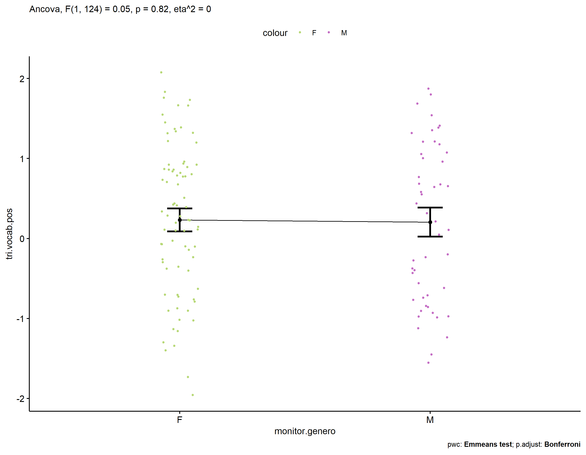<!-- -->

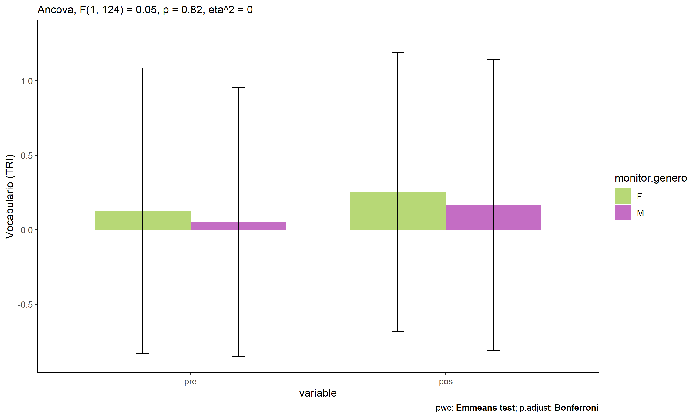<!-- -->

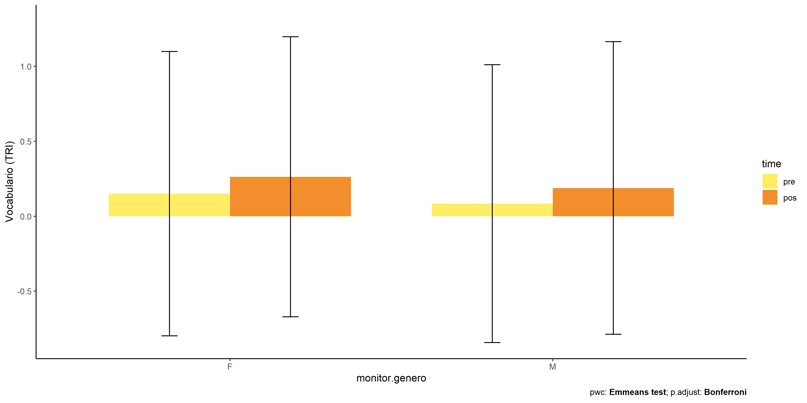<!-- -->

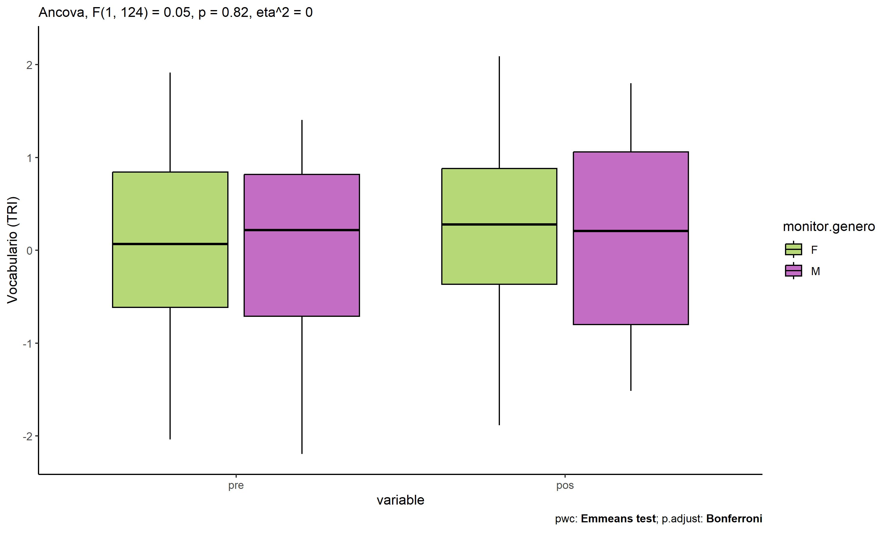<!-- -->

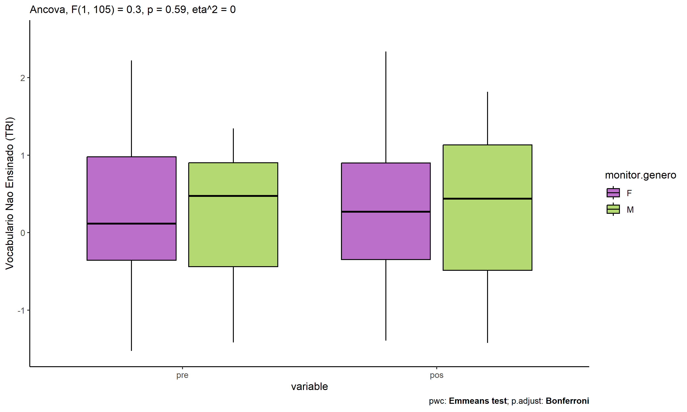<!-- -->

### Vocabulario Ensinado (Acertos)

| var                      | monitor.genero |   n | M (pre) | SE (pre) | M (unadj) | SE (unadj) | M (adj) | SE (adj) |
|:-------------------------|:---------------|----:|--------:|---------:|----------:|-----------:|--------:|---------:|
| score.vocab.ensinado.pos | F              |  89 |   4.090 |    0.228 |     3.944 |      0.263 |   3.947 |    0.239 |
| score.vocab.ensinado.pos | M              |  52 |   4.115 |    0.302 |     4.500 |      0.311 |   4.494 |    0.313 |

| .y.                      | group1 | group2 | estimate | conf.low | conf.high |    se | statistic |     p | p.adj | p.adj.signif |
|:-------------------------|:-------|:-------|---------:|---------:|----------:|------:|----------:|------:|------:|:-------------|
| score.vocab.ensinado.pos | F      | M      |   -0.546 |   -1.326 |     0.233 | 0.394 |    -1.386 | 0.168 | 0.168 | ns           |
| score.vocab.ensinado.pre | F      | M      |   -0.025 |   -0.771 |     0.720 | 0.377 |    -0.068 | 0.946 | 0.946 | ns           |

| .y.                  | monitor.genero | group1 | group2 | estimate | conf.low | conf.high |    se | statistic |     p | p.adj | p.adj.signif |
|:---------------------|:---------------|:-------|:-------|---------:|---------:|----------:|------:|----------:|------:|------:|:-------------|
| score.vocab.ensinado | F              | pre    | pos    |    0.146 |   -0.527 |     0.819 | 0.342 |     0.427 | 0.670 | 0.670 | ns           |
| score.vocab.ensinado | M              | pre    | pos    |   -0.385 |   -1.265 |     0.496 | 0.447 |    -0.860 | 0.391 | 0.391 | ns           |

    ## Scale for colour is already present.
    ## Adding another scale for colour, which will replace the existing scale.

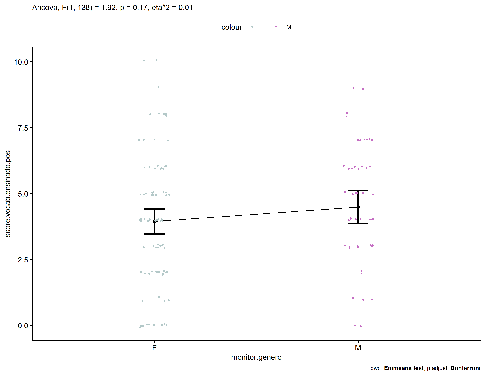<!-- -->

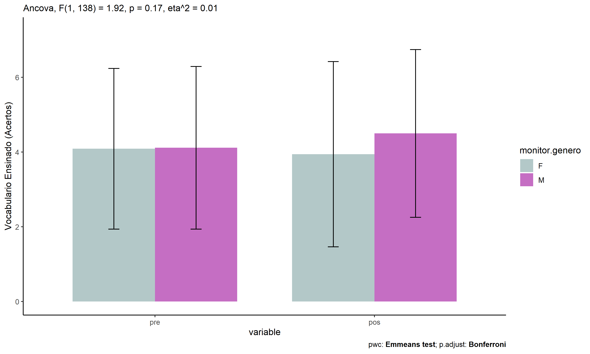<!-- -->

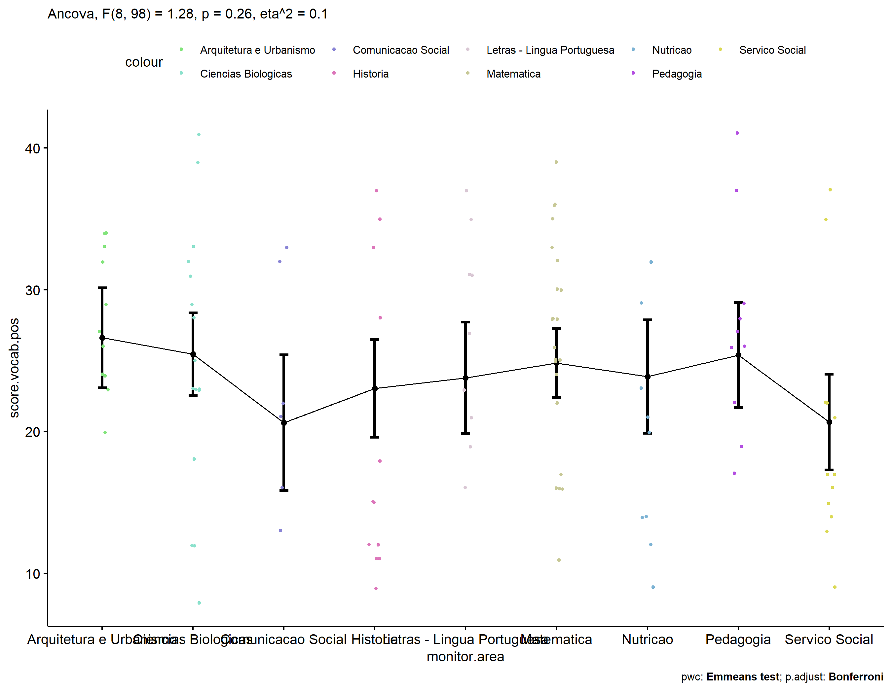<!-- -->

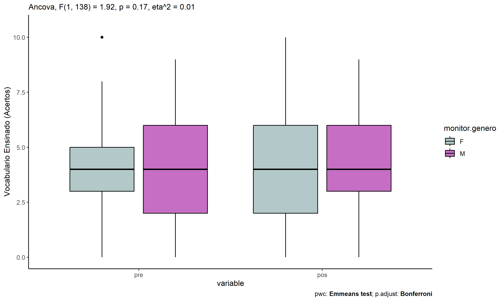<!-- -->

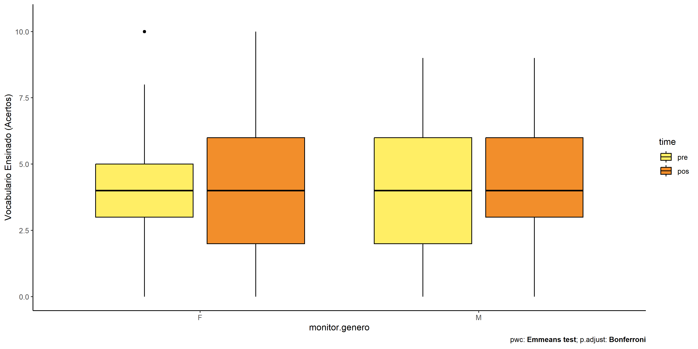<!-- -->

### Vocabulario Ensinado (TRI)

| var                    | monitor.genero |   n | M (pre) | SE (pre) | M (unadj) | SE (unadj) | M (adj) | SE (adj) |
|:-----------------------|:---------------|----:|--------:|---------:|----------:|-----------:|--------:|---------:|
| tri.vocab.ensinado.pos | F              |  78 |   0.045 |    0.091 |     0.176 |      0.090 |   0.192 |    0.075 |
| tri.vocab.ensinado.pos | M              |  49 |   0.118 |    0.103 |     0.169 |      0.114 |   0.144 |    0.095 |

| .y.                    | group1 | group2 | estimate | conf.low | conf.high |    se | statistic |     p | p.adj | p.adj.signif |
|:-----------------------|:-------|:-------|---------:|---------:|----------:|------:|----------:|------:|------:|:-------------|
| tri.vocab.ensinado.pos | F      | M      |    0.048 |   -0.192 |     0.288 | 0.121 |     0.396 | 0.693 | 0.693 | ns           |
| tri.vocab.ensinado.pre | F      | M      |   -0.073 |   -0.352 |     0.206 | 0.141 |    -0.517 | 0.606 | 0.606 | ns           |

| .y.                | monitor.genero | group1 | group2 | estimate | conf.low | conf.high |    se | statistic |     p | p.adj | p.adj.signif |
|:-------------------|:---------------|:-------|:-------|---------:|---------:|----------:|------:|----------:|------:|------:|:-------------|
| tri.vocab.ensinado | F              | pre    | pos    |   -0.105 |   -0.343 |     0.133 | 0.121 |    -0.869 | 0.385 | 0.385 | ns           |
| tri.vocab.ensinado | M              | pre    | pos    |   -0.047 |   -0.354 |     0.260 | 0.156 |    -0.303 | 0.762 | 0.762 | ns           |

    ## Scale for colour is already present.
    ## Adding another scale for colour, which will replace the existing scale.

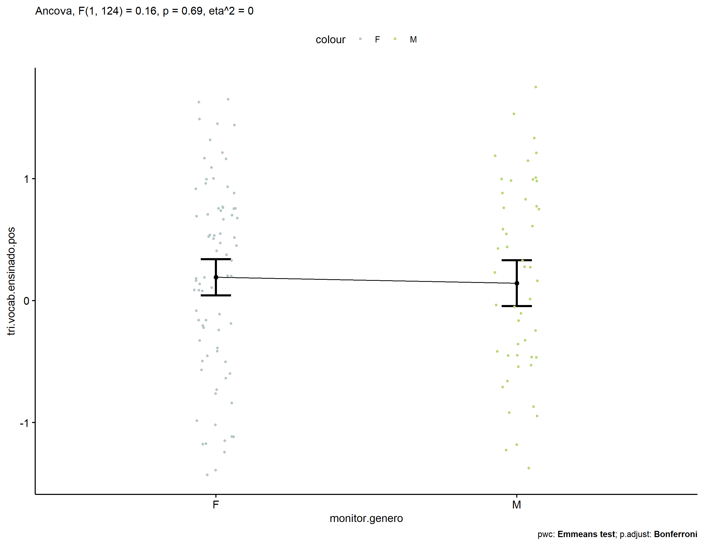<!-- -->

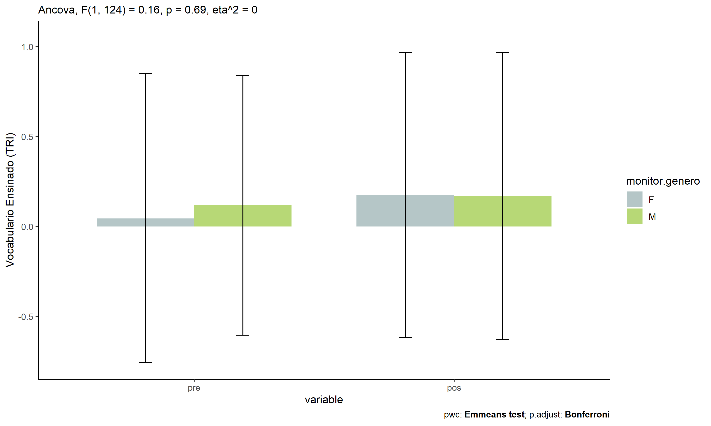<!-- -->

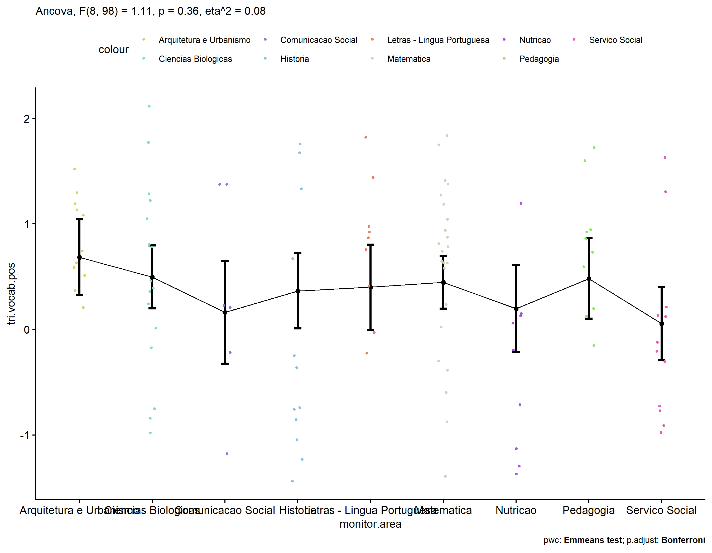<!-- -->

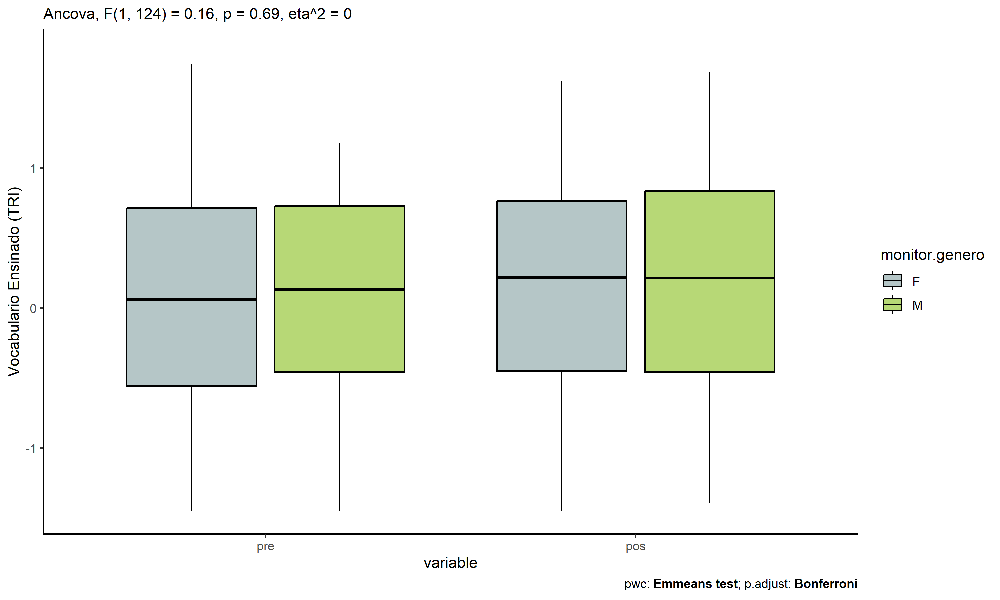<!-- -->

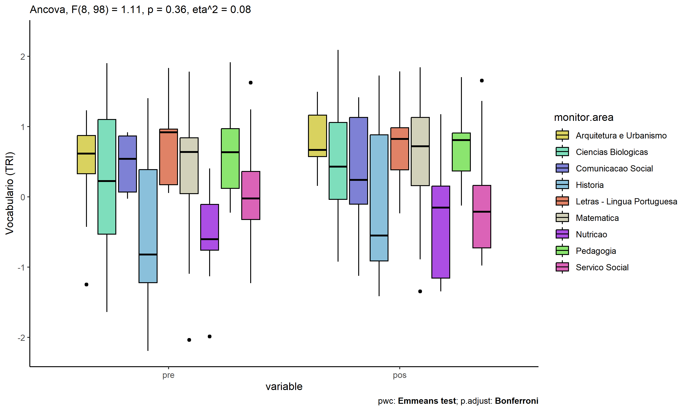<!-- -->

### Vocabulario Nao Ensinado (Acertos)

| var                          | monitor.genero |   n | M (pre) | SE (pre) | M (unadj) | SE (unadj) | M (adj) | SE (adj) |
|:-----------------------------|:---------------|----:|--------:|---------:|----------:|-----------:|--------:|---------:|
| score.vocab.nao.ensinado.pos | F              |  89 |  17.360 |    0.764 |    16.618 |      0.952 |  16.423 |    0.804 |
| score.vocab.nao.ensinado.pos | M              |  52 |  16.423 |    1.063 |    16.808 |      1.105 |  17.142 |    1.052 |

| .y.                          | group1 | group2 | estimate | conf.low | conf.high |    se | statistic |     p | p.adj | p.adj.signif |
|:-----------------------------|:-------|:-------|---------:|---------:|----------:|------:|----------:|------:|------:|:-------------|
| score.vocab.nao.ensinado.pos | F      | M      |   -0.719 |   -3.340 |     1.902 | 1.325 |    -0.543 | 0.588 | 0.588 | ns           |
| score.vocab.nao.ensinado.pre | F      | M      |    0.936 |   -1.611 |     3.484 | 1.288 |     0.727 | 0.469 | 0.469 | ns           |

| .y.                      | monitor.genero | group1 | group2 | estimate | conf.low | conf.high |    se | statistic |     p | p.adj | p.adj.signif |
|:-------------------------|:---------------|:-------|:-------|---------:|---------:|----------:|------:|----------:|------:|------:|:-------------|
| score.vocab.nao.ensinado | F              | pre    | pos    |    0.742 |   -1.628 |     3.111 | 1.203 |     0.616 | 0.538 | 0.538 | ns           |
| score.vocab.nao.ensinado | M              | pre    | pos    |   -0.385 |   -3.484 |     2.715 | 1.574 |    -0.244 | 0.807 | 0.807 | ns           |

    ## Scale for colour is already present.
    ## Adding another scale for colour, which will replace the existing scale.

<!-- -->

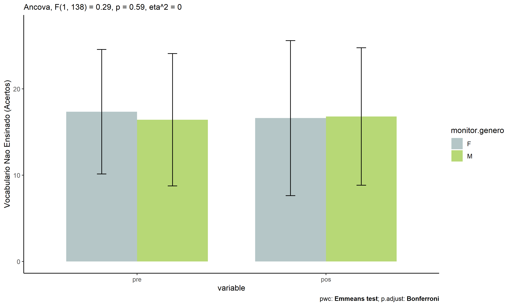<!-- -->

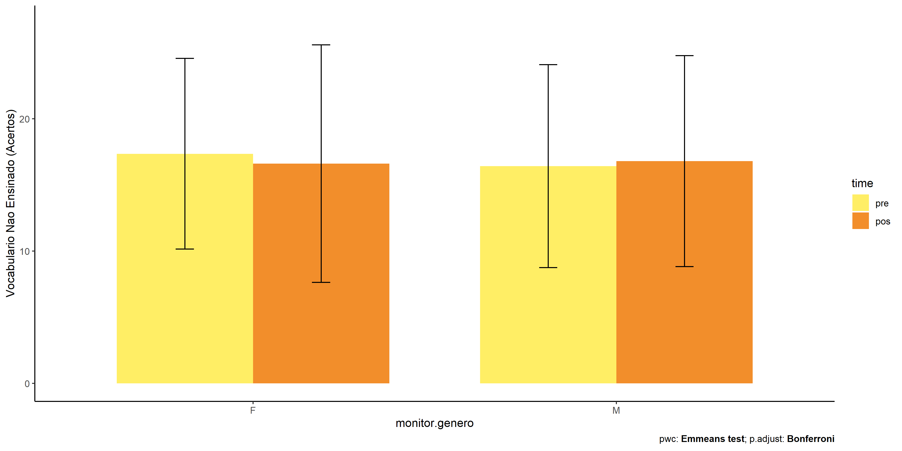<!-- -->

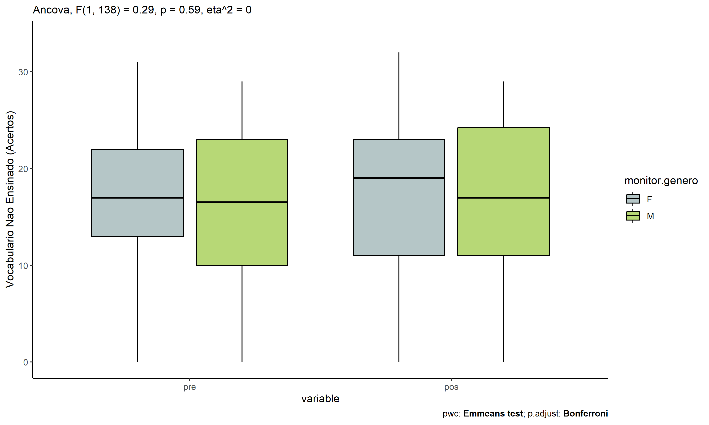<!-- -->

<!-- -->

### Vocabulario Nao Ensinado (TRI)

| var                        | monitor.genero |   n | M (pre) | SE (pre) | M (unadj) | SE (unadj) | M (adj) | SE (adj) |
|:---------------------------|:---------------|----:|--------:|---------:|----------:|-----------:|--------:|---------:|
| tri.vocab.nao.ensinado.pos | F              |  78 |   0.128 |    0.107 |     0.268 |      0.113 |   0.234 |    0.075 |
| tri.vocab.nao.ensinado.pos | M              |  49 |   0.020 |    0.122 |     0.131 |      0.146 |   0.186 |    0.095 |

| .y.                        | group1 | group2 | estimate | conf.low | conf.high |    se | statistic |     p | p.adj | p.adj.signif |
|:---------------------------|:-------|:-------|---------:|---------:|----------:|------:|----------:|------:|------:|:-------------|
| tri.vocab.nao.ensinado.pos | F      | M      |    0.048 |   -0.193 |     0.289 | 0.122 |     0.396 | 0.693 | 0.693 | ns           |
| tri.vocab.nao.ensinado.pre | F      | M      |    0.108 |   -0.221 |     0.437 | 0.166 |     0.650 | 0.517 | 0.517 | ns           |

| .y.                    | monitor.genero | group1 | group2 | estimate | conf.low | conf.high |    se | statistic |     p | p.adj | p.adj.signif |
|:-----------------------|:---------------|:-------|:-------|---------:|---------:|----------:|------:|----------:|------:|------:|:-------------|
| tri.vocab.nao.ensinado | F              | pre    | pos    |   -0.137 |   -0.429 |     0.155 | 0.148 |    -0.924 | 0.356 | 0.356 | ns           |
| tri.vocab.nao.ensinado | M              | pre    | pos    |   -0.091 |   -0.468 |     0.286 | 0.191 |    -0.476 | 0.634 | 0.634 | ns           |

    ## Scale for colour is already present.
    ## Adding another scale for colour, which will replace the existing scale.

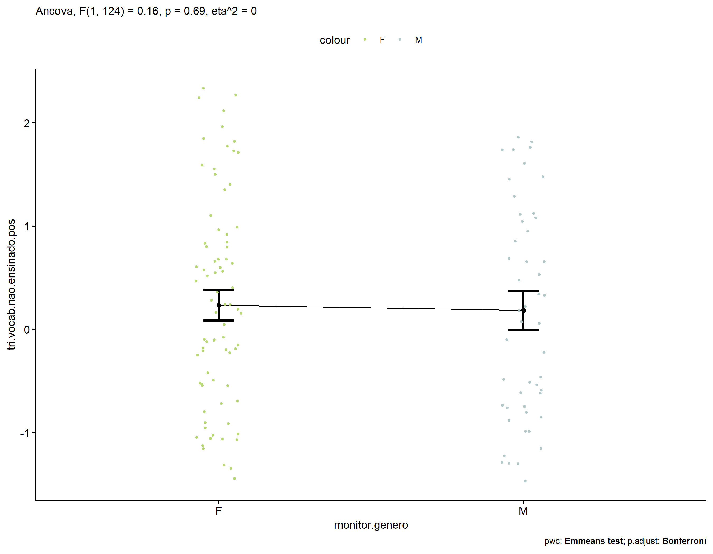<!-- -->

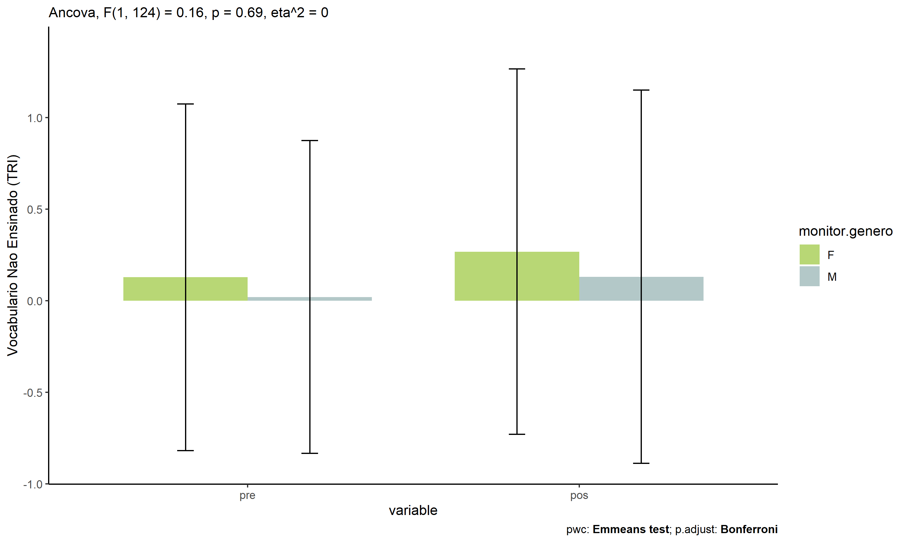<!-- -->

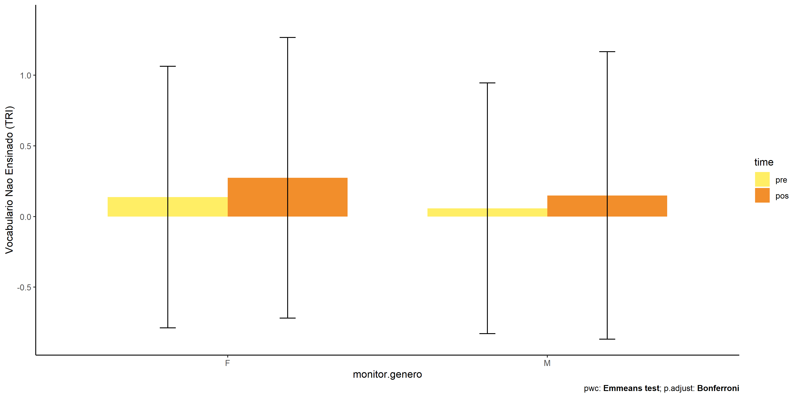<!-- -->

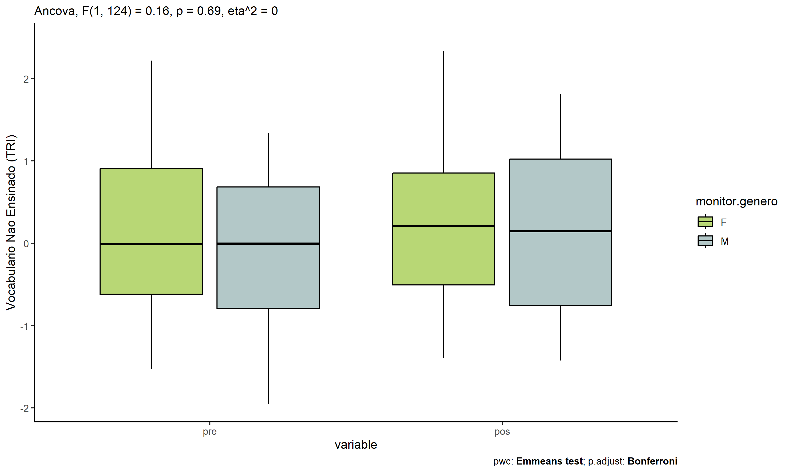<!-- -->

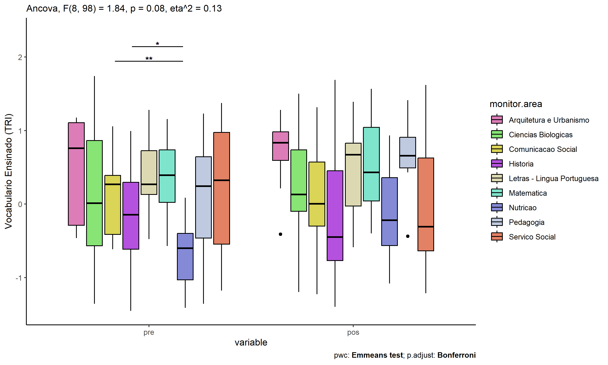<!-- -->

## factores: **grupo=“Experimental”:monitor.area**

### Vocabulario (Acertos)

| var             | monitor.area               |   n | M (pre) | SE (pre) | M (unadj) | SE (unadj) | M (adj) | SE (adj) |
|:----------------|:---------------------------|----:|--------:|---------:|----------:|-----------:|--------:|---------:|
| score.vocab.pos | Arquitetura e Urbanismo    |  12 |  23.083 |    2.518 |    26.417 |      1.944 |  25.233 |    1.725 |
| score.vocab.pos | Ciencias Biologicas        |  16 |  22.188 |    2.255 |    25.000 |      2.343 |  24.450 |    1.492 |
| score.vocab.pos | Comunicacao Social         |  15 |  20.600 |    2.072 |    18.467 |      2.095 |  19.039 |    1.541 |
| score.vocab.pos | Historia                   |  12 |  18.167 |    2.519 |    19.667 |      3.028 |  21.959 |    1.734 |
| score.vocab.pos | Letras - Lingua Portuguesa |  11 |  23.545 |    2.771 |    24.273 |      2.559 |  22.763 |    1.803 |
| score.vocab.pos | Matematica                 |  26 |  22.615 |    1.754 |    24.423 |      1.664 |  23.571 |    1.172 |
| score.vocab.pos | Nutricao                   |  10 |  17.100 |    1.048 |    18.400 |      2.509 |  21.446 |    1.906 |
| score.vocab.pos | Pedagogia                  |  11 |  23.455 |    2.823 |    27.364 |      2.120 |  25.918 |    1.803 |
| score.vocab.pos | Servico Social             |  14 |  20.286 |    2.347 |    18.500 |      2.270 |  19.294 |    1.595 |

| .y.             | group1                  | group2              | estimate | conf.low | conf.high |    se | statistic |     p | p.adj | p.adj.signif |
|:----------------|:------------------------|:--------------------|---------:|---------:|----------:|------:|----------:|------:|------:|:-------------|
| score.vocab.pos | Arquitetura e Urbanismo | Ciencias Biologicas |    0.783 |   -3.728 |     5.295 | 2.278 |     0.344 | 0.732 | 1.000 | ns           |
| score.vocab.pos | Arquitetura e Urbanismo | Comunicacao Social  |    6.195 |    1.610 |    10.780 | 2.315 |     2.676 | 0.009 | 0.307 | ns           |
| score.vocab.pos | Arquitetura e Urbanismo | Historia            |    3.274 |   -1.588 |     8.136 | 2.455 |     1.334 | 0.185 | 1.000 | ns           |
| score.vocab.pos | Arquitetura e Urbanismo | Letras              |    2.471 |   -2.460 |     7.401 | 2.489 |     0.992 | 0.323 | 1.000 | ns           |
| score.vocab.pos | Arquitetura e Urbanismo | Matematica          |    1.663 |   -2.459 |     5.785 | 2.081 |     0.799 | 0.426 | 1.000 | ns           |
| score.vocab.pos | Arquitetura e Urbanismo | Nutricao            |    3.787 |   -1.327 |     8.901 | 2.582 |     1.467 | 0.145 | 1.000 | ns           |
| score.vocab.pos | Arquitetura e Urbanismo | Pedagogia           |   -0.685 |   -5.615 |     4.246 | 2.489 |    -0.275 | 0.784 | 1.000 | ns           |
| score.vocab.pos | Arquitetura e Urbanismo | Servico Social      |    5.939 |    1.279 |    10.599 | 2.353 |     2.524 | 0.013 | 0.466 | ns           |
| score.vocab.pos | Ciencias Biologicas     | Comunicacao Social  |    5.411 |    1.162 |     9.661 | 2.146 |     2.522 | 0.013 | 0.469 | ns           |
| score.vocab.pos | Ciencias Biologicas     | Historia            |    2.491 |   -2.048 |     7.030 | 2.292 |     1.087 | 0.279 | 1.000 | ns           |
| score.vocab.pos | Ciencias Biologicas     | Letras              |    1.687 |   -2.942 |     6.316 | 2.337 |     0.722 | 0.472 | 1.000 | ns           |
| score.vocab.pos | Ciencias Biologicas     | Matematica          |    0.879 |   -2.874 |     4.632 | 1.895 |     0.464 | 0.643 | 1.000 | ns           |
| score.vocab.pos | Ciencias Biologicas     | Nutricao            |    3.004 |   -1.801 |     7.808 | 2.426 |     1.238 | 0.218 | 1.000 | ns           |
| score.vocab.pos | Ciencias Biologicas     | Pedagogia           |   -1.468 |   -6.097 |     3.161 | 2.337 |    -0.628 | 0.531 | 1.000 | ns           |
| score.vocab.pos | Ciencias Biologicas     | Servico Social      |    5.156 |    0.827 |     9.485 | 2.186 |     2.359 | 0.020 | 0.720 | ns           |
| score.vocab.pos | Comunicacao Social      | Historia            |   -2.920 |   -7.505 |     1.664 | 2.315 |    -1.261 | 0.210 | 1.000 | ns           |
| score.vocab.pos | Comunicacao Social      | Letras              |   -3.724 |   -8.427 |     0.979 | 2.375 |    -1.568 | 0.120 | 1.000 | ns           |
| score.vocab.pos | Comunicacao Social      | Matematica          |   -4.532 |   -8.370 |    -0.694 | 1.938 |    -2.338 | 0.021 | 0.758 | ns           |
| score.vocab.pos | Comunicacao Social      | Nutricao            |   -2.407 |   -7.250 |     2.435 | 2.445 |    -0.985 | 0.327 | 1.000 | ns           |
| score.vocab.pos | Comunicacao Social      | Pedagogia           |   -6.879 |  -11.581 |    -2.177 | 2.374 |    -2.897 | 0.004 | 0.162 | ns           |
| score.vocab.pos | Comunicacao Social      | Servico Social      |   -0.256 |   -4.645 |     4.134 | 2.216 |    -0.115 | 0.908 | 1.000 | ns           |
| score.vocab.pos | Historia                | Letras              |   -0.804 |   -5.781 |     4.173 | 2.513 |    -0.320 | 0.750 | 1.000 | ns           |
| score.vocab.pos | Historia                | Matematica          |   -1.612 |   -5.772 |     2.549 | 2.101 |    -0.767 | 0.445 | 1.000 | ns           |
| score.vocab.pos | Historia                | Nutricao            |    0.513 |   -4.546 |     5.571 | 2.554 |     0.201 | 0.841 | 1.000 | ns           |
| score.vocab.pos | Historia                | Pedagogia           |   -3.959 |   -8.935 |     1.017 | 2.512 |    -1.576 | 0.118 | 1.000 | ns           |
| score.vocab.pos | Historia                | Servico Social      |    2.665 |   -1.989 |     7.319 | 2.350 |     1.134 | 0.259 | 1.000 | ns           |
| score.vocab.pos | Letras                  | Lingua Portuguesa   |   -0.808 |   -5.057 |     3.442 | 2.146 |    -0.376 | 0.707 | 1.000 | ns           |
| score.vocab.pos | Letras                  | Lingua Portuguesa   |    1.316 |   -3.909 |     6.542 | 2.638 |     0.499 | 0.619 | 1.000 | ns           |
| score.vocab.pos | Letras                  | Lingua Portuguesa   |   -3.155 |   -8.191 |     1.881 | 2.543 |    -1.241 | 0.217 | 1.000 | ns           |
| score.vocab.pos | Letras                  | Lingua Portuguesa   |    3.468 |   -1.308 |     8.245 | 2.412 |     1.438 | 0.153 | 1.000 | ns           |
| score.vocab.pos | Matematica              | Nutricao            |    2.124 |   -2.326 |     6.575 | 2.247 |     0.945 | 0.346 | 1.000 | ns           |
| score.vocab.pos | Matematica              | Pedagogia           |   -2.347 |   -6.597 |     1.902 | 2.146 |    -1.094 | 0.276 | 1.000 | ns           |
| score.vocab.pos | Matematica              | Servico Social      |    4.276 |    0.350 |     8.203 | 1.983 |     2.157 | 0.033 | 1.000 | ns           |
| score.vocab.pos | Nutricao                | Pedagogia           |   -4.472 |   -9.695 |     0.752 | 2.637 |    -1.695 | 0.093 | 1.000 | ns           |
| score.vocab.pos | Nutricao                | Servico Social      |    2.152 |   -2.755 |     7.059 | 2.478 |     0.869 | 0.387 | 1.000 | ns           |
| score.vocab.pos | Pedagogia               | Servico Social      |    6.624 |    1.848 |    11.399 | 2.411 |     2.747 | 0.007 | 0.251 | ns           |
| score.vocab.pre | Arquitetura e Urbanismo | Ciencias Biologicas |    0.896 |   -5.568 |     7.359 | 3.264 |     0.274 | 0.784 | 1.000 | ns           |
| score.vocab.pre | Arquitetura e Urbanismo | Comunicacao Social  |    2.483 |   -4.072 |     9.038 | 3.310 |     0.750 | 0.455 | 1.000 | ns           |
| score.vocab.pre | Arquitetura e Urbanismo | Historia            |    4.917 |   -1.993 |    11.826 | 3.489 |     1.409 | 0.161 | 1.000 | ns           |
| score.vocab.pre | Arquitetura e Urbanismo | Letras              |   -0.462 |   -7.527 |     6.603 | 3.568 |    -0.130 | 0.897 | 1.000 | ns           |
| score.vocab.pre | Arquitetura e Urbanismo | Matematica          |    0.468 |   -5.439 |     6.375 | 2.983 |     0.157 | 0.876 | 1.000 | ns           |
| score.vocab.pre | Arquitetura e Urbanismo | Nutricao            |    5.983 |   -1.264 |    13.230 | 3.660 |     1.635 | 0.105 | 1.000 | ns           |
| score.vocab.pre | Arquitetura e Urbanismo | Pedagogia           |   -0.371 |   -7.436 |     6.694 | 3.568 |    -0.104 | 0.917 | 1.000 | ns           |
| score.vocab.pre | Arquitetura e Urbanismo | Servico Social      |    2.798 |   -3.861 |     9.456 | 3.362 |     0.832 | 0.407 | 1.000 | ns           |
| score.vocab.pre | Ciencias Biologicas     | Comunicacao Social  |    1.588 |   -4.495 |     7.670 | 3.072 |     0.517 | 0.606 | 1.000 | ns           |
| score.vocab.pre | Ciencias Biologicas     | Historia            |    4.021 |   -2.443 |    10.484 | 3.264 |     1.232 | 0.220 | 1.000 | ns           |
| score.vocab.pre | Ciencias Biologicas     | Letras              |   -1.358 |   -7.987 |     5.271 | 3.348 |    -0.406 | 0.686 | 1.000 | ns           |
| score.vocab.pre | Ciencias Biologicas     | Matematica          |   -0.428 |   -5.806 |     4.950 | 2.716 |    -0.158 | 0.875 | 1.000 | ns           |
| score.vocab.pre | Ciencias Biologicas     | Nutricao            |    5.087 |   -1.735 |    11.910 | 3.445 |     1.477 | 0.142 | 1.000 | ns           |
| score.vocab.pre | Ciencias Biologicas     | Pedagogia           |   -1.267 |   -7.896 |     5.362 | 3.348 |    -0.378 | 0.706 | 1.000 | ns           |
| score.vocab.pre | Ciencias Biologicas     | Servico Social      |    1.902 |   -4.292 |     8.096 | 3.128 |     0.608 | 0.544 | 1.000 | ns           |
| score.vocab.pre | Comunicacao Social      | Historia            |    2.433 |   -4.122 |     8.988 | 3.310 |     0.735 | 0.464 | 1.000 | ns           |
| score.vocab.pre | Comunicacao Social      | Letras              |   -2.945 |   -9.664 |     3.773 | 3.393 |    -0.868 | 0.387 | 1.000 | ns           |
| score.vocab.pre | Comunicacao Social      | Matematica          |   -2.015 |   -7.503 |     3.472 | 2.771 |    -0.727 | 0.469 | 1.000 | ns           |
| score.vocab.pre | Comunicacao Social      | Nutricao            |    3.500 |   -3.410 |    10.410 | 3.489 |     1.003 | 0.318 | 1.000 | ns           |
| score.vocab.pre | Comunicacao Social      | Pedagogia           |   -2.855 |   -9.573 |     3.864 | 3.393 |    -0.841 | 0.402 | 1.000 | ns           |
| score.vocab.pre | Comunicacao Social      | Servico Social      |    0.314 |   -5.975 |     6.604 | 3.176 |     0.099 | 0.921 | 1.000 | ns           |
| score.vocab.pre | Historia                | Letras              |   -5.379 |  -12.444 |     1.686 | 3.568 |    -1.508 | 0.134 | 1.000 | ns           |
| score.vocab.pre | Historia                | Matematica          |   -4.449 |  -10.356 |     1.458 | 2.983 |    -1.491 | 0.139 | 1.000 | ns           |
| score.vocab.pre | Historia                | Nutricao            |    1.067 |   -6.180 |     8.314 | 3.660 |     0.291 | 0.771 | 1.000 | ns           |
| score.vocab.pre | Historia                | Pedagogia           |   -5.288 |  -12.353 |     1.777 | 3.568 |    -1.482 | 0.141 | 1.000 | ns           |
| score.vocab.pre | Historia                | Servico Social      |   -2.119 |   -8.777 |     4.539 | 3.362 |    -0.630 | 0.530 | 1.000 | ns           |
| score.vocab.pre | Letras                  | Lingua Portuguesa   |    0.930 |   -5.158 |     7.018 | 3.074 |     0.303 | 0.763 | 1.000 | ns           |
| score.vocab.pre | Letras                  | Lingua Portuguesa   |    6.445 |   -0.950 |    13.841 | 3.734 |     1.726 | 0.087 | 1.000 | ns           |
| score.vocab.pre | Letras                  | Lingua Portuguesa   |    0.091 |   -7.126 |     7.308 | 3.644 |     0.025 | 0.980 | 1.000 | ns           |
| score.vocab.pre | Letras                  | Lingua Portuguesa   |    3.260 |   -3.560 |    10.079 | 3.444 |     0.947 | 0.346 | 1.000 | ns           |
| score.vocab.pre | Matematica              | Nutricao            |    5.515 |   -0.783 |    11.813 | 3.180 |     1.734 | 0.085 | 1.000 | ns           |
| score.vocab.pre | Matematica              | Pedagogia           |   -0.839 |   -6.927 |     5.249 | 3.074 |    -0.273 | 0.785 | 1.000 | ns           |
| score.vocab.pre | Matematica              | Servico Social      |    2.330 |   -3.281 |     7.940 | 2.833 |     0.822 | 0.413 | 1.000 | ns           |
| score.vocab.pre | Nutricao                | Pedagogia           |   -6.355 |  -13.750 |     1.041 | 3.734 |    -1.702 | 0.091 | 1.000 | ns           |
| score.vocab.pre | Nutricao                | Servico Social      |   -3.186 |  -10.193 |     3.822 | 3.539 |    -0.900 | 0.370 | 1.000 | ns           |
| score.vocab.pre | Pedagogia               | Servico Social      |    3.169 |   -3.651 |     9.988 | 3.444 |     0.920 | 0.359 | 1.000 | ns           |

| .y.         | monitor.area               | group1 | group2 | estimate | conf.low | conf.high |    se | statistic |     p | p.adj | p.adj.signif |
|:------------|:---------------------------|:-------|:-------|---------:|---------:|----------:|------:|----------:|------:|------:|:-------------|
| score.vocab | Arquitetura e Urbanismo    | pre    | pos    |   -3.333 |  -10.177 |     3.510 | 3.475 |    -0.959 | 0.338 | 0.338 | ns           |
| score.vocab | Ciencias Biologicas        | pre    | pos    |   -2.812 |   -8.739 |     3.114 | 3.009 |    -0.935 | 0.351 | 0.351 | ns           |
| score.vocab | Comunicacao Social         | pre    | pos    |    1.287 |   -4.737 |     7.312 | 3.059 |     0.421 | 0.674 | 0.674 | ns           |
| score.vocab | Historia                   | pre    | pos    |   -1.500 |   -8.343 |     5.343 | 3.475 |    -0.432 | 0.666 | 0.666 | ns           |
| score.vocab | Letras - Lingua Portuguesa | pre    | pos    |   -1.273 |   -8.027 |     5.481 | 3.429 |    -0.371 | 0.711 | 0.711 | ns           |
| score.vocab | Matematica                 | pre    | pos    |   -1.349 |   -5.955 |     3.257 | 2.339 |    -0.577 | 0.565 | 0.565 | ns           |
| score.vocab | Nutricao                   | pre    | pos    |    0.671 |   -6.269 |     7.612 | 3.524 |     0.191 | 0.849 | 0.849 | ns           |
| score.vocab | Pedagogia                  | pre    | pos    |   -3.250 |  -10.093 |     3.593 | 3.475 |    -0.935 | 0.351 | 0.351 | ns           |
| score.vocab | Servico Social             | pre    | pos    |    1.188 |   -4.947 |     7.322 | 3.115 |     0.381 | 0.703 | 0.703 | ns           |

    ## Scale for colour is already present.
    ## Adding another scale for colour, which will replace the existing scale.

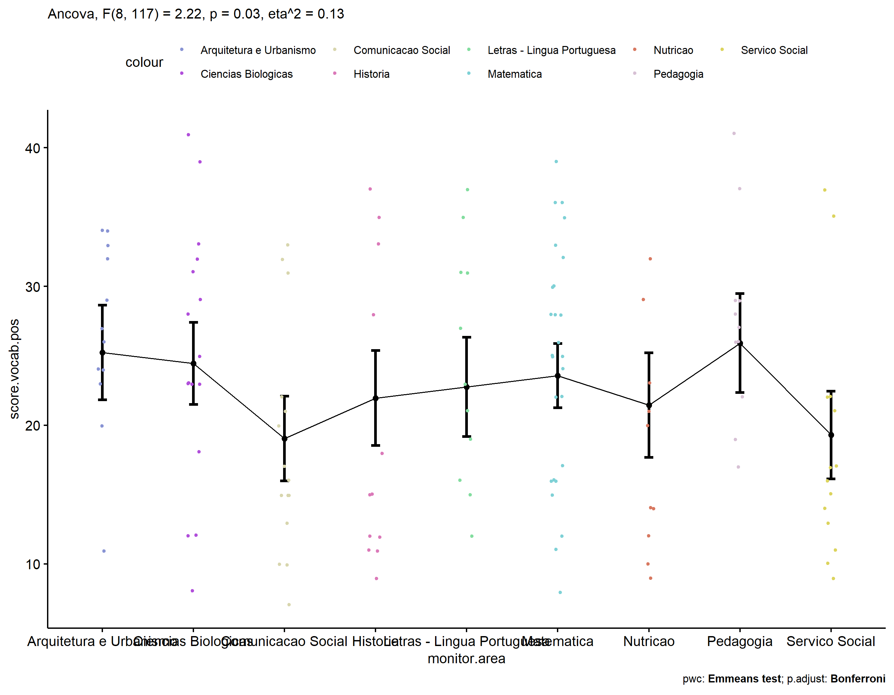<!-- -->

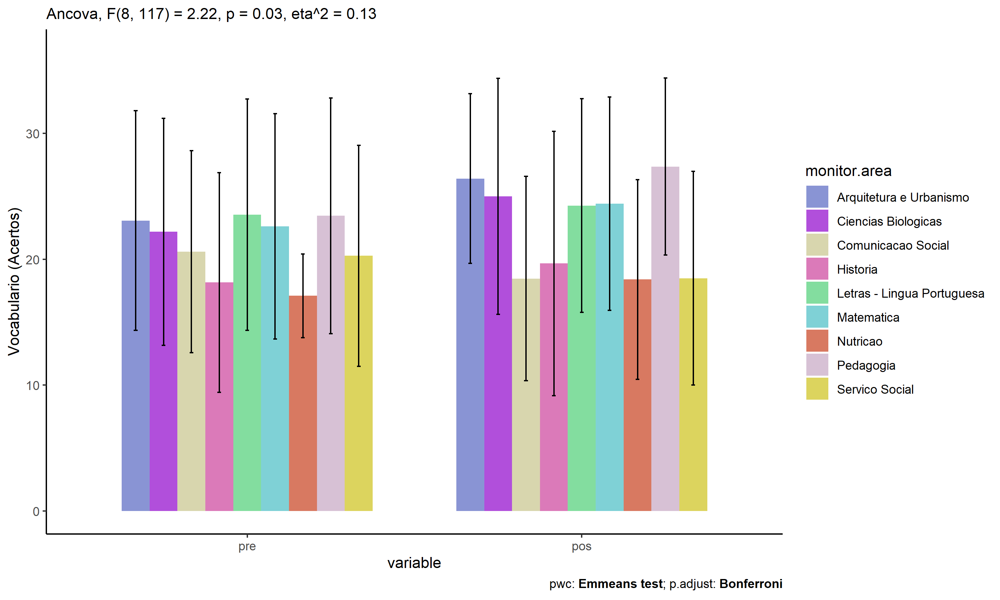<!-- -->

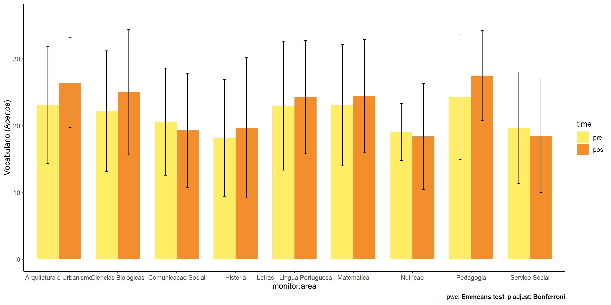<!-- -->

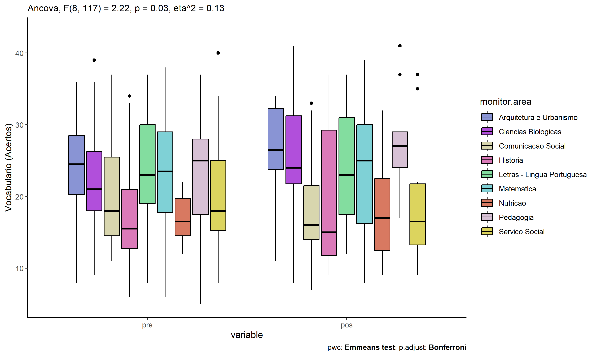<!-- -->

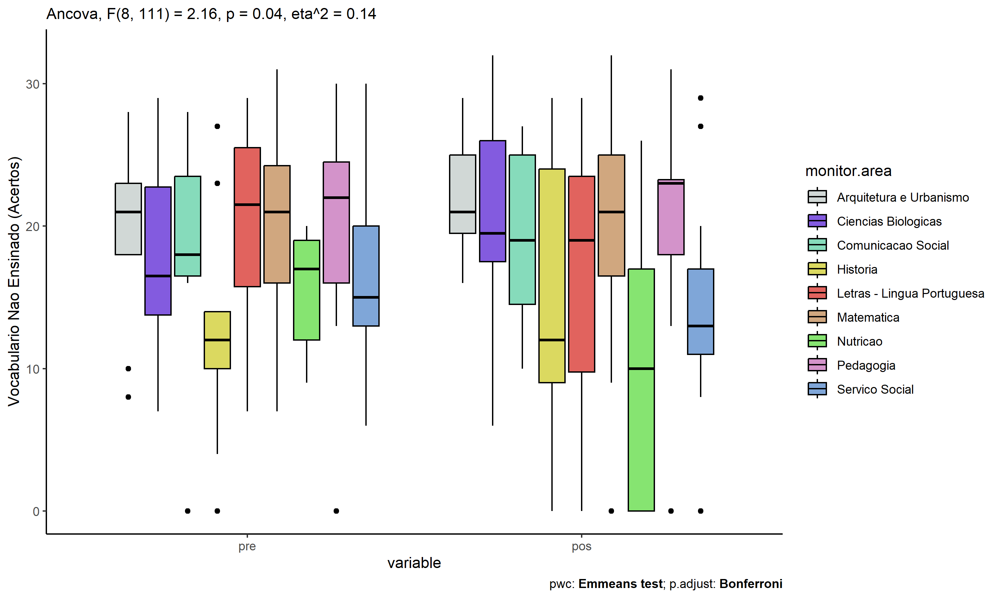<!-- -->

### Vocabulario (TRI)

| var           | monitor.area               |   n | M (pre) | SE (pre) | M (unadj) | SE (unadj) | M (adj) | SE (adj) |
|:--------------|:---------------------------|----:|--------:|---------:|----------:|-----------:|--------:|---------:|
| tri.vocab.pos | Arquitetura e Urbanismo    |  12 |   0.346 |    0.218 |     0.693 |      0.179 |   0.515 |    0.181 |
| tri.vocab.pos | Ciencias Biologicas        |  16 |   0.224 |    0.262 |     0.494 |      0.224 |   0.403 |    0.157 |
| tri.vocab.pos | Comunicacao Social         |  15 |   0.052 |    0.178 |    -0.158 |      0.234 |  -0.125 |    0.161 |
| tri.vocab.pos | Historia                   |  12 |  -0.445 |    0.331 |    -0.099 |      0.335 |   0.290 |    0.184 |
| tri.vocab.pos | Letras - Lingua Portuguesa |  11 |   0.327 |    0.321 |     0.426 |      0.296 |   0.261 |    0.189 |
| tri.vocab.pos | Matematica                 |  26 |   0.247 |    0.193 |     0.365 |      0.196 |   0.257 |    0.123 |
| tri.vocab.pos | Nutricao                   |  10 |  -0.550 |    0.213 |    -0.409 |      0.263 |   0.056 |    0.202 |
| tri.vocab.pos | Pedagogia                  |  11 |   0.500 |    0.236 |     0.740 |      0.170 |   0.451 |    0.190 |
| tri.vocab.pos | Servico Social             |  14 |  -0.056 |    0.212 |    -0.195 |      0.227 |  -0.085 |    0.167 |

| .y.           | group1                  | group2              | estimate | conf.low | conf.high |    se | statistic |     p | p.adj | p.adj.signif |
|:--------------|:------------------------|:--------------------|---------:|---------:|----------:|------:|----------:|------:|------:|:-------------|
| tri.vocab.pos | Arquitetura e Urbanismo | Ciencias Biologicas |    0.113 |   -0.361 |     0.586 | 0.239 |     0.471 | 0.638 | 1.000 | ns           |
| tri.vocab.pos | Arquitetura e Urbanismo | Comunicacao Social  |    0.640 |    0.159 |     1.121 | 0.243 |     2.637 | 0.009 | 0.342 | ns           |
| tri.vocab.pos | Arquitetura e Urbanismo | Historia            |    0.225 |   -0.290 |     0.740 | 0.260 |     0.866 | 0.388 | 1.000 | ns           |
| tri.vocab.pos | Arquitetura e Urbanismo | Letras              |    0.254 |   -0.263 |     0.771 | 0.261 |     0.974 | 0.332 | 1.000 | ns           |
| tri.vocab.pos | Arquitetura e Urbanismo | Matematica          |    0.258 |   -0.174 |     0.690 | 0.218 |     1.182 | 0.240 | 1.000 | ns           |
| tri.vocab.pos | Arquitetura e Urbanismo | Nutricao            |    0.459 |   -0.083 |     1.001 | 0.274 |     1.679 | 0.096 | 1.000 | ns           |
| tri.vocab.pos | Arquitetura e Urbanismo | Pedagogia           |    0.065 |   -0.453 |     0.582 | 0.261 |     0.248 | 0.805 | 1.000 | ns           |
| tri.vocab.pos | Arquitetura e Urbanismo | Servico Social      |    0.600 |    0.111 |     1.090 | 0.247 |     2.428 | 0.017 | 0.601 | ns           |
| tri.vocab.pos | Ciencias Biologicas     | Comunicacao Social  |    0.528 |    0.082 |     0.973 | 0.225 |     2.347 | 0.021 | 0.743 | ns           |
| tri.vocab.pos | Ciencias Biologicas     | Historia            |    0.113 |   -0.368 |     0.593 | 0.242 |     0.464 | 0.643 | 1.000 | ns           |
| tri.vocab.pos | Ciencias Biologicas     | Letras              |    0.142 |   -0.343 |     0.627 | 0.245 |     0.579 | 0.564 | 1.000 | ns           |
| tri.vocab.pos | Ciencias Biologicas     | Matematica          |    0.146 |   -0.248 |     0.539 | 0.199 |     0.732 | 0.465 | 1.000 | ns           |
| tri.vocab.pos | Ciencias Biologicas     | Nutricao            |    0.347 |   -0.162 |     0.855 | 0.257 |     1.351 | 0.179 | 1.000 | ns           |
| tri.vocab.pos | Ciencias Biologicas     | Pedagogia           |   -0.048 |   -0.534 |     0.438 | 0.246 |    -0.195 | 0.846 | 1.000 | ns           |
| tri.vocab.pos | Ciencias Biologicas     | Servico Social      |    0.488 |    0.033 |     0.942 | 0.230 |     2.126 | 0.036 | 1.000 | ns           |
| tri.vocab.pos | Comunicacao Social      | Historia            |   -0.415 |   -0.899 |     0.068 | 0.244 |    -1.701 | 0.092 | 1.000 | ns           |
| tri.vocab.pos | Comunicacao Social      | Letras              |   -0.386 |   -0.879 |     0.107 | 0.249 |    -1.552 | 0.123 | 1.000 | ns           |
| tri.vocab.pos | Comunicacao Social      | Matematica          |   -0.382 |   -0.785 |     0.020 | 0.203 |    -1.883 | 0.062 | 1.000 | ns           |
| tri.vocab.pos | Comunicacao Social      | Nutricao            |   -0.181 |   -0.692 |     0.330 | 0.258 |    -0.702 | 0.484 | 1.000 | ns           |
| tri.vocab.pos | Comunicacao Social      | Pedagogia           |   -0.576 |   -1.071 |    -0.081 | 0.250 |    -2.305 | 0.023 | 0.825 | ns           |
| tri.vocab.pos | Comunicacao Social      | Servico Social      |   -0.040 |   -0.500 |     0.420 | 0.232 |    -0.172 | 0.863 | 1.000 | ns           |
| tri.vocab.pos | Historia                | Letras              |    0.029 |   -0.497 |     0.555 | 0.266 |     0.110 | 0.913 | 1.000 | ns           |
| tri.vocab.pos | Historia                | Matematica          |    0.033 |   -0.408 |     0.474 | 0.223 |     0.148 | 0.883 | 1.000 | ns           |
| tri.vocab.pos | Historia                | Nutricao            |    0.234 |   -0.296 |     0.765 | 0.268 |     0.874 | 0.384 | 1.000 | ns           |
| tri.vocab.pos | Historia                | Pedagogia           |   -0.161 |   -0.691 |     0.370 | 0.268 |    -0.599 | 0.550 | 1.000 | ns           |
| tri.vocab.pos | Historia                | Servico Social      |    0.375 |   -0.114 |     0.865 | 0.247 |     1.518 | 0.132 | 1.000 | ns           |
| tri.vocab.pos | Letras                  | Lingua Portuguesa   |    0.004 |   -0.442 |     0.449 | 0.225 |     0.017 | 0.987 | 1.000 | ns           |
| tri.vocab.pos | Letras                  | Lingua Portuguesa   |    0.205 |   -0.347 |     0.757 | 0.279 |     0.736 | 0.463 | 1.000 | ns           |
| tri.vocab.pos | Letras                  | Lingua Portuguesa   |   -0.190 |   -0.718 |     0.339 | 0.267 |    -0.711 | 0.479 | 1.000 | ns           |
| tri.vocab.pos | Letras                  | Lingua Portuguesa   |    0.346 |   -0.155 |     0.847 | 0.253 |     1.368 | 0.174 | 1.000 | ns           |
| tri.vocab.pos | Matematica              | Nutricao            |    0.201 |   -0.270 |     0.673 | 0.238 |     0.846 | 0.399 | 1.000 | ns           |
| tri.vocab.pos | Matematica              | Pedagogia           |   -0.193 |   -0.640 |     0.253 | 0.225 |    -0.858 | 0.393 | 1.000 | ns           |
| tri.vocab.pos | Matematica              | Servico Social      |    0.342 |   -0.070 |     0.755 | 0.208 |     1.645 | 0.103 | 1.000 | ns           |
| tri.vocab.pos | Nutricao                | Pedagogia           |   -0.395 |   -0.951 |     0.162 | 0.281 |    -1.404 | 0.163 | 1.000 | ns           |
| tri.vocab.pos | Nutricao                | Servico Social      |    0.141 |   -0.375 |     0.657 | 0.261 |     0.541 | 0.590 | 1.000 | ns           |
| tri.vocab.pos | Pedagogia               | Servico Social      |    0.536 |    0.032 |     1.040 | 0.254 |     2.106 | 0.037 | 1.000 | ns           |
| tri.vocab.pre | Arquitetura e Urbanismo | Ciencias Biologicas |    0.122 |   -0.567 |     0.810 | 0.348 |     0.350 | 0.727 | 1.000 | ns           |
| tri.vocab.pre | Arquitetura e Urbanismo | Comunicacao Social  |    0.294 |   -0.404 |     0.992 | 0.353 |     0.834 | 0.406 | 1.000 | ns           |
| tri.vocab.pre | Arquitetura e Urbanismo | Historia            |    0.791 |    0.055 |     1.527 | 0.372 |     2.128 | 0.035 | 1.000 | ns           |
| tri.vocab.pre | Arquitetura e Urbanismo | Letras              |    0.019 |   -0.734 |     0.771 | 0.380 |     0.050 | 0.961 | 1.000 | ns           |
| tri.vocab.pre | Arquitetura e Urbanismo | Matematica          |    0.099 |   -0.530 |     0.728 | 0.318 |     0.311 | 0.756 | 1.000 | ns           |
| tri.vocab.pre | Arquitetura e Urbanismo | Nutricao            |    0.896 |    0.124 |     1.668 | 0.390 |     2.299 | 0.023 | 0.838 | ns           |
| tri.vocab.pre | Arquitetura e Urbanismo | Pedagogia           |   -0.154 |   -0.907 |     0.598 | 0.380 |    -0.407 | 0.685 | 1.000 | ns           |
| tri.vocab.pre | Arquitetura e Urbanismo | Servico Social      |    0.402 |   -0.307 |     1.111 | 0.358 |     1.123 | 0.264 | 1.000 | ns           |
| tri.vocab.pre | Ciencias Biologicas     | Comunicacao Social  |    0.172 |   -0.476 |     0.820 | 0.327 |     0.526 | 0.600 | 1.000 | ns           |
| tri.vocab.pre | Ciencias Biologicas     | Historia            |    0.669 |   -0.019 |     1.357 | 0.348 |     1.924 | 0.057 | 1.000 | ns           |
| tri.vocab.pre | Ciencias Biologicas     | Letras              |   -0.103 |   -0.809 |     0.603 | 0.357 |    -0.289 | 0.773 | 1.000 | ns           |
| tri.vocab.pre | Ciencias Biologicas     | Matematica          |   -0.023 |   -0.596 |     0.550 | 0.289 |    -0.080 | 0.937 | 1.000 | ns           |
| tri.vocab.pre | Ciencias Biologicas     | Nutricao            |    0.774 |    0.048 |     1.501 | 0.367 |     2.110 | 0.037 | 1.000 | ns           |
| tri.vocab.pre | Ciencias Biologicas     | Pedagogia           |   -0.276 |   -0.982 |     0.430 | 0.357 |    -0.775 | 0.440 | 1.000 | ns           |
| tri.vocab.pre | Ciencias Biologicas     | Servico Social      |    0.280 |   -0.380 |     0.940 | 0.333 |     0.841 | 0.402 | 1.000 | ns           |
| tri.vocab.pre | Comunicacao Social      | Historia            |    0.497 |   -0.201 |     1.195 | 0.353 |     1.409 | 0.161 | 1.000 | ns           |
| tri.vocab.pre | Comunicacao Social      | Letras              |   -0.275 |   -0.991 |     0.441 | 0.361 |    -0.761 | 0.448 | 1.000 | ns           |
| tri.vocab.pre | Comunicacao Social      | Matematica          |   -0.195 |   -0.780 |     0.389 | 0.295 |    -0.661 | 0.510 | 1.000 | ns           |
| tri.vocab.pre | Comunicacao Social      | Nutricao            |    0.602 |   -0.134 |     1.338 | 0.372 |     1.620 | 0.108 | 1.000 | ns           |
| tri.vocab.pre | Comunicacao Social      | Pedagogia           |   -0.448 |   -1.164 |     0.267 | 0.361 |    -1.241 | 0.217 | 1.000 | ns           |
| tri.vocab.pre | Comunicacao Social      | Servico Social      |    0.108 |   -0.562 |     0.778 | 0.338 |     0.320 | 0.750 | 1.000 | ns           |
| tri.vocab.pre | Historia                | Letras              |   -0.772 |   -1.525 |    -0.019 | 0.380 |    -2.031 | 0.044 | 1.000 | ns           |
| tri.vocab.pre | Historia                | Matematica          |   -0.692 |   -1.321 |    -0.063 | 0.318 |    -2.178 | 0.031 | 1.000 | ns           |
| tri.vocab.pre | Historia                | Nutricao            |    0.105 |   -0.667 |     0.877 | 0.390 |     0.270 | 0.787 | 1.000 | ns           |
| tri.vocab.pre | Historia                | Pedagogia           |   -0.945 |   -1.698 |    -0.193 | 0.380 |    -2.487 | 0.014 | 0.513 | ns           |
| tri.vocab.pre | Historia                | Servico Social      |   -0.389 |   -1.098 |     0.320 | 0.358 |    -1.085 | 0.280 | 1.000 | ns           |
| tri.vocab.pre | Letras                  | Lingua Portuguesa   |    0.080 |   -0.568 |     0.728 | 0.327 |     0.244 | 0.808 | 1.000 | ns           |
| tri.vocab.pre | Letras                  | Lingua Portuguesa   |    0.877 |    0.090 |     1.665 | 0.398 |     2.205 | 0.029 | 1.000 | ns           |
| tri.vocab.pre | Letras                  | Lingua Portuguesa   |   -0.173 |   -0.942 |     0.595 | 0.388 |    -0.446 | 0.656 | 1.000 | ns           |
| tri.vocab.pre | Letras                  | Lingua Portuguesa   |    0.383 |   -0.343 |     1.110 | 0.367 |     1.045 | 0.298 | 1.000 | ns           |
| tri.vocab.pre | Matematica              | Nutricao            |    0.797 |    0.127 |     1.468 | 0.339 |     2.354 | 0.020 | 0.729 | ns           |
| tri.vocab.pre | Matematica              | Pedagogia           |   -0.253 |   -0.902 |     0.395 | 0.327 |    -0.773 | 0.441 | 1.000 | ns           |
| tri.vocab.pre | Matematica              | Servico Social      |    0.303 |   -0.294 |     0.901 | 0.302 |     1.005 | 0.317 | 1.000 | ns           |
| tri.vocab.pre | Nutricao                | Pedagogia           |   -1.051 |   -1.838 |    -0.263 | 0.398 |    -2.641 | 0.009 | 0.338 | ns           |
| tri.vocab.pre | Nutricao                | Servico Social      |   -0.494 |   -1.241 |     0.252 | 0.377 |    -1.311 | 0.192 | 1.000 | ns           |
| tri.vocab.pre | Pedagogia               | Servico Social      |    0.557 |   -0.170 |     1.283 | 0.367 |     1.517 | 0.132 | 1.000 | ns           |

| .y.       | monitor.area               | group1 | group2 | estimate | conf.low | conf.high |    se | statistic |     p | p.adj | p.adj.signif |
|:----------|:---------------------------|:-------|:-------|---------:|---------:|----------:|------:|----------:|------:|------:|:-------------|
| tri.vocab | Arquitetura e Urbanismo    | pre    | pos    |   -0.347 |   -1.080 |     0.385 | 0.372 |    -0.934 | 0.351 | 0.351 | ns           |
| tri.vocab | Ciencias Biologicas        | pre    | pos    |   -0.269 |   -0.904 |     0.365 | 0.322 |    -0.836 | 0.404 | 0.404 | ns           |
| tri.vocab | Comunicacao Social         | pre    | pos    |    0.129 |   -0.516 |     0.774 | 0.328 |     0.393 | 0.695 | 0.695 | ns           |
| tri.vocab | Historia                   | pre    | pos    |   -0.346 |   -1.079 |     0.387 | 0.372 |    -0.930 | 0.353 | 0.353 | ns           |
| tri.vocab | Letras - Lingua Portuguesa | pre    | pos    |   -0.132 |   -0.855 |     0.591 | 0.367 |    -0.359 | 0.720 | 0.720 | ns           |
| tri.vocab | Matematica                 | pre    | pos    |   -0.060 |   -0.554 |     0.433 | 0.250 |    -0.241 | 0.809 | 0.809 | ns           |
| tri.vocab | Nutricao                   | pre    | pos    |    0.142 |   -0.601 |     0.885 | 0.377 |     0.376 | 0.707 | 0.707 | ns           |
| tri.vocab | Pedagogia                  | pre    | pos    |   -0.182 |   -0.915 |     0.551 | 0.372 |    -0.489 | 0.625 | 0.625 | ns           |
| tri.vocab | Servico Social             | pre    | pos    |    0.118 |   -0.539 |     0.775 | 0.334 |     0.354 | 0.723 | 0.723 | ns           |

    ## Scale for colour is already present.
    ## Adding another scale for colour, which will replace the existing scale.

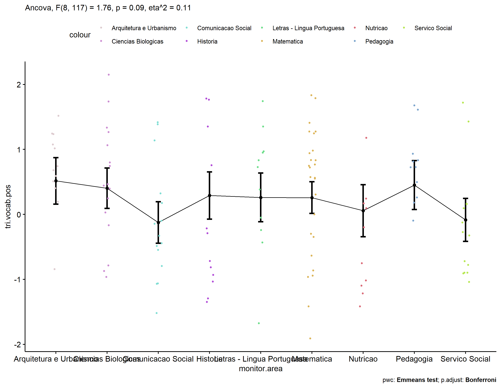<!-- -->

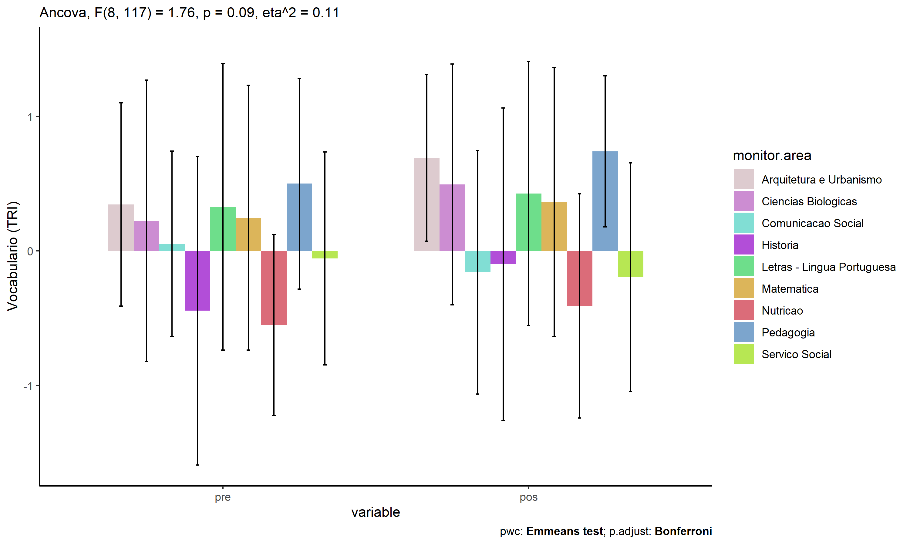<!-- -->

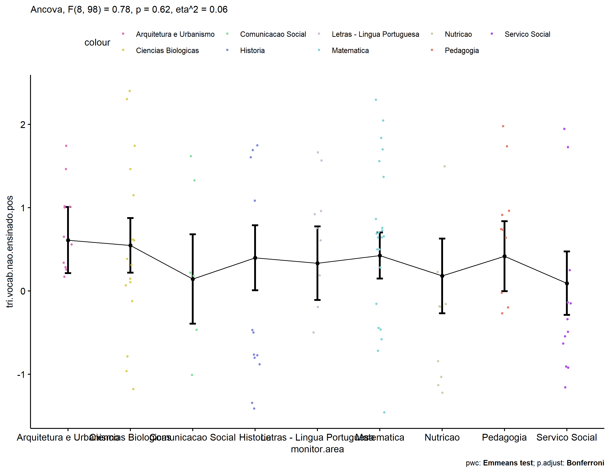<!-- -->

<!-- -->

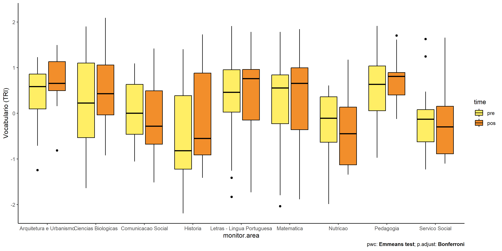<!-- -->

### Vocabulario Ensinado (Acertos)

| var                      | monitor.area               |   n | M (pre) | SE (pre) | M (unadj) | SE (unadj) | M (adj) | SE (adj) |
|:-------------------------|:---------------------------|----:|--------:|---------:|----------:|-----------:|--------:|---------:|
| score.vocab.ensinado.pos | Arquitetura e Urbanismo    |  12 |   4.583 |    0.743 |     5.500 |      0.500 |   5.319 |    0.634 |
| score.vocab.ensinado.pos | Ciencias Biologicas        |  16 |   4.312 |    0.637 |     4.875 |      0.547 |   4.795 |    0.548 |
| score.vocab.ensinado.pos | Comunicacao Social         |  16 |   4.062 |    0.595 |     4.438 |      0.418 |   4.451 |    0.548 |
| score.vocab.ensinado.pos | Historia                   |  13 |   3.462 |    0.550 |     3.462 |      0.781 |   3.700 |    0.610 |
| score.vocab.ensinado.pos | Letras - Lingua Portuguesa |  14 |   4.643 |    0.520 |     3.429 |      0.754 |   3.226 |    0.588 |
| score.vocab.ensinado.pos | Matematica                 |  27 |   4.259 |    0.314 |     4.593 |      0.418 |   4.533 |    0.422 |
| score.vocab.ensinado.pos | Nutricao                   |  14 |   3.143 |    0.345 |     2.929 |      0.667 |   3.286 |    0.592 |
| score.vocab.ensinado.pos | Pedagogia                  |  13 |   3.615 |    0.781 |     4.769 |      0.642 |   4.950 |    0.609 |
| score.vocab.ensinado.pos | Servico Social             |  16 |   4.562 |    0.570 |     3.125 |      0.651 |   2.952 |    0.549 |

| .y.                      | group1                  | group2              | estimate | conf.low | conf.high |    se | statistic |     p | p.adj | p.adj.signif |
|:-------------------------|:------------------------|:--------------------|---------:|---------:|----------:|------:|----------:|------:|------:|:-------------|
| score.vocab.ensinado.pos | Arquitetura e Urbanismo | Ciencias Biologicas |    0.524 |   -1.132 |     2.180 | 0.837 |     0.626 | 0.533 | 1.000 | ns           |
| score.vocab.ensinado.pos | Arquitetura e Urbanismo | Comunicacao Social  |    0.868 |   -0.790 |     2.526 | 0.838 |     1.036 | 0.302 | 1.000 | ns           |
| score.vocab.ensinado.pos | Arquitetura e Urbanismo | Historia            |    1.620 |   -0.127 |     3.366 | 0.883 |     1.835 | 0.069 | 1.000 | ns           |
| score.vocab.ensinado.pos | Arquitetura e Urbanismo | Letras              |    2.094 |    0.388 |     3.799 | 0.862 |     2.429 | 0.017 | 0.595 | ns           |
| score.vocab.ensinado.pos | Arquitetura e Urbanismo | Matematica          |    0.786 |   -0.719 |     2.292 | 0.761 |     1.034 | 0.303 | 1.000 | ns           |
| score.vocab.ensinado.pos | Arquitetura e Urbanismo | Nutricao            |    2.034 |    0.310 |     3.758 | 0.871 |     2.334 | 0.021 | 0.760 | ns           |
| score.vocab.ensinado.pos | Arquitetura e Urbanismo | Pedagogia           |    0.370 |   -1.374 |     2.113 | 0.881 |     0.419 | 0.676 | 1.000 | ns           |
| score.vocab.ensinado.pos | Arquitetura e Urbanismo | Servico Social      |    2.367 |    0.712 |     4.023 | 0.837 |     2.829 | 0.005 | 0.195 | ns           |
| score.vocab.ensinado.pos | Ciencias Biologicas     | Comunicacao Social  |    0.344 |   -1.189 |     1.878 | 0.775 |     0.444 | 0.658 | 1.000 | ns           |
| score.vocab.ensinado.pos | Ciencias Biologicas     | Historia            |    1.096 |   -0.530 |     2.721 | 0.822 |     1.334 | 0.185 | 1.000 | ns           |
| score.vocab.ensinado.pos | Ciencias Biologicas     | Letras              |    1.570 |   -0.018 |     3.157 | 0.803 |     1.956 | 0.053 | 1.000 | ns           |
| score.vocab.ensinado.pos | Ciencias Biologicas     | Matematica          |    0.263 |   -1.105 |     1.630 | 0.691 |     0.380 | 0.705 | 1.000 | ns           |
| score.vocab.ensinado.pos | Ciencias Biologicas     | Nutricao            |    1.510 |   -0.090 |     3.109 | 0.809 |     1.867 | 0.064 | 1.000 | ns           |
| score.vocab.ensinado.pos | Ciencias Biologicas     | Pedagogia           |   -0.154 |   -1.778 |     1.469 | 0.821 |    -0.188 | 0.851 | 1.000 | ns           |
| score.vocab.ensinado.pos | Ciencias Biologicas     | Servico Social      |    1.843 |    0.310 |     3.377 | 0.775 |     2.378 | 0.019 | 0.678 | ns           |
| score.vocab.ensinado.pos | Comunicacao Social      | Historia            |    0.752 |   -0.870 |     2.374 | 0.820 |     0.917 | 0.361 | 1.000 | ns           |
| score.vocab.ensinado.pos | Comunicacao Social      | Letras              |    1.226 |   -0.364 |     2.815 | 0.804 |     1.525 | 0.130 | 1.000 | ns           |
| score.vocab.ensinado.pos | Comunicacao Social      | Matematica          |   -0.082 |   -1.450 |     1.286 | 0.692 |    -0.118 | 0.906 | 1.000 | ns           |
| score.vocab.ensinado.pos | Comunicacao Social      | Nutricao            |    1.166 |   -0.429 |     2.760 | 0.806 |     1.446 | 0.151 | 1.000 | ns           |
| score.vocab.ensinado.pos | Comunicacao Social      | Pedagogia           |   -0.499 |   -2.119 |     1.122 | 0.819 |    -0.609 | 0.544 | 1.000 | ns           |
| score.vocab.ensinado.pos | Comunicacao Social      | Servico Social      |    1.499 |   -0.036 |     3.034 | 0.776 |     1.932 | 0.056 | 1.000 | ns           |
| score.vocab.ensinado.pos | Historia                | Letras              |    0.474 |   -1.209 |     2.156 | 0.850 |     0.557 | 0.578 | 1.000 | ns           |
| score.vocab.ensinado.pos | Historia                | Matematica          |   -0.833 |   -2.303 |     0.637 | 0.743 |    -1.121 | 0.264 | 1.000 | ns           |
| score.vocab.ensinado.pos | Historia                | Nutricao            |    0.414 |   -1.257 |     2.085 | 0.845 |     0.490 | 0.625 | 1.000 | ns           |
| score.vocab.ensinado.pos | Historia                | Pedagogia           |   -1.250 |   -2.951 |     0.450 | 0.860 |    -1.454 | 0.148 | 1.000 | ns           |
| score.vocab.ensinado.pos | Historia                | Servico Social      |    0.747 |   -0.883 |     2.378 | 0.824 |     0.907 | 0.366 | 1.000 | ns           |
| score.vocab.ensinado.pos | Letras                  | Lingua Portuguesa   |   -1.307 |   -2.736 |     0.122 | 0.723 |    -1.809 | 0.073 | 1.000 | ns           |
| score.vocab.ensinado.pos | Letras                  | Lingua Portuguesa   |   -0.060 |   -1.719 |     1.600 | 0.839 |    -0.071 | 0.943 | 1.000 | ns           |
| score.vocab.ensinado.pos | Letras                  | Lingua Portuguesa   |   -1.724 |   -3.403 |    -0.045 | 0.849 |    -2.031 | 0.044 | 1.000 | ns           |
| score.vocab.ensinado.pos | Letras                  | Lingua Portuguesa   |    0.274 |   -1.313 |     1.860 | 0.802 |     0.341 | 0.734 | 1.000 | ns           |
| score.vocab.ensinado.pos | Matematica              | Nutricao            |    1.247 |   -0.194 |     2.688 | 0.728 |     1.712 | 0.089 | 1.000 | ns           |
| score.vocab.ensinado.pos | Matematica              | Pedagogia           |   -0.417 |   -1.885 |     1.051 | 0.742 |    -0.562 | 0.575 | 1.000 | ns           |
| score.vocab.ensinado.pos | Matematica              | Servico Social      |    1.581 |    0.212 |     2.950 | 0.692 |     2.285 | 0.024 | 0.862 | ns           |
| score.vocab.ensinado.pos | Nutricao                | Pedagogia           |   -1.664 |   -3.336 |     0.007 | 0.845 |    -1.969 | 0.051 | 1.000 | ns           |
| score.vocab.ensinado.pos | Nutricao                | Servico Social      |    0.333 |   -1.272 |     1.939 | 0.812 |     0.411 | 0.682 | 1.000 | ns           |
| score.vocab.ensinado.pos | Pedagogia               | Servico Social      |    1.998 |    0.371 |     3.625 | 0.823 |     2.429 | 0.017 | 0.594 | ns           |
| score.vocab.ensinado.pre | Arquitetura e Urbanismo | Ciencias Biologicas |    0.271 |   -1.361 |     1.902 | 0.825 |     0.328 | 0.743 | 1.000 | ns           |
| score.vocab.ensinado.pre | Arquitetura e Urbanismo | Comunicacao Social  |    0.521 |   -1.111 |     2.152 | 0.825 |     0.632 | 0.529 | 1.000 | ns           |
| score.vocab.ensinado.pre | Arquitetura e Urbanismo | Historia            |    1.122 |   -0.588 |     2.832 | 0.865 |     1.298 | 0.197 | 1.000 | ns           |
| score.vocab.ensinado.pre | Arquitetura e Urbanismo | Letras              |   -0.060 |   -1.740 |     1.621 | 0.850 |    -0.070 | 0.944 | 1.000 | ns           |
| score.vocab.ensinado.pre | Arquitetura e Urbanismo | Matematica          |    0.324 |   -1.158 |     1.806 | 0.749 |     0.433 | 0.666 | 1.000 | ns           |
| score.vocab.ensinado.pre | Arquitetura e Urbanismo | Nutricao            |    1.440 |   -0.240 |     3.121 | 0.850 |     1.695 | 0.092 | 1.000 | ns           |
| score.vocab.ensinado.pre | Arquitetura e Urbanismo | Pedagogia           |    0.968 |   -0.742 |     2.678 | 0.865 |     1.120 | 0.265 | 1.000 | ns           |
| score.vocab.ensinado.pre | Arquitetura e Urbanismo | Servico Social      |    0.021 |   -1.611 |     1.652 | 0.825 |     0.025 | 0.980 | 1.000 | ns           |
| score.vocab.ensinado.pre | Ciencias Biologicas     | Comunicacao Social  |    0.250 |   -1.260 |     1.760 | 0.764 |     0.327 | 0.744 | 1.000 | ns           |
| score.vocab.ensinado.pre | Ciencias Biologicas     | Historia            |    0.851 |   -0.744 |     2.446 | 0.806 |     1.055 | 0.293 | 1.000 | ns           |
| score.vocab.ensinado.pre | Ciencias Biologicas     | Letras              |   -0.330 |   -1.894 |     1.233 | 0.790 |    -0.418 | 0.677 | 1.000 | ns           |
| score.vocab.ensinado.pre | Ciencias Biologicas     | Matematica          |    0.053 |   -1.295 |     1.401 | 0.681 |     0.078 | 0.938 | 1.000 | ns           |
| score.vocab.ensinado.pre | Ciencias Biologicas     | Nutricao            |    1.170 |   -0.394 |     2.733 | 0.790 |     1.480 | 0.141 | 1.000 | ns           |
| score.vocab.ensinado.pre | Ciencias Biologicas     | Pedagogia           |    0.697 |   -0.898 |     2.292 | 0.806 |     0.864 | 0.389 | 1.000 | ns           |
| score.vocab.ensinado.pre | Ciencias Biologicas     | Servico Social      |   -0.250 |   -1.760 |     1.260 | 0.764 |    -0.327 | 0.744 | 1.000 | ns           |
| score.vocab.ensinado.pre | Comunicacao Social      | Historia            |    0.601 |   -0.994 |     2.196 | 0.806 |     0.745 | 0.457 | 1.000 | ns           |
| score.vocab.ensinado.pre | Comunicacao Social      | Letras              |   -0.580 |   -2.144 |     0.983 | 0.790 |    -0.734 | 0.464 | 1.000 | ns           |
| score.vocab.ensinado.pre | Comunicacao Social      | Matematica          |   -0.197 |   -1.545 |     1.151 | 0.681 |    -0.289 | 0.773 | 1.000 | ns           |
| score.vocab.ensinado.pre | Comunicacao Social      | Nutricao            |    0.920 |   -0.644 |     2.483 | 0.790 |     1.164 | 0.247 | 1.000 | ns           |
| score.vocab.ensinado.pre | Comunicacao Social      | Pedagogia           |    0.447 |   -1.148 |     2.042 | 0.806 |     0.554 | 0.580 | 1.000 | ns           |
| score.vocab.ensinado.pre | Comunicacao Social      | Servico Social      |   -0.500 |   -2.010 |     1.010 | 0.764 |    -0.655 | 0.514 | 1.000 | ns           |
| score.vocab.ensinado.pre | Historia                | Letras              |   -1.181 |   -2.827 |     0.464 | 0.832 |    -1.420 | 0.158 | 1.000 | ns           |
| score.vocab.ensinado.pre | Historia                | Matematica          |   -0.798 |   -2.240 |     0.644 | 0.729 |    -1.094 | 0.276 | 1.000 | ns           |
| score.vocab.ensinado.pre | Historia                | Nutricao            |    0.319 |   -1.327 |     1.964 | 0.832 |     0.383 | 0.702 | 1.000 | ns           |
| score.vocab.ensinado.pre | Historia                | Pedagogia           |   -0.154 |   -1.829 |     1.522 | 0.847 |    -0.182 | 0.856 | 1.000 | ns           |
| score.vocab.ensinado.pre | Historia                | Servico Social      |   -1.101 |   -2.696 |     0.494 | 0.806 |    -1.365 | 0.174 | 1.000 | ns           |
| score.vocab.ensinado.pre | Letras                  | Lingua Portuguesa   |    0.384 |   -1.023 |     1.791 | 0.711 |     0.539 | 0.591 | 1.000 | ns           |
| score.vocab.ensinado.pre | Letras                  | Lingua Portuguesa   |    1.500 |   -0.115 |     3.115 | 0.816 |     1.838 | 0.068 | 1.000 | ns           |
| score.vocab.ensinado.pre | Letras                  | Lingua Portuguesa   |    1.027 |   -0.618 |     2.673 | 0.832 |     1.235 | 0.219 | 1.000 | ns           |
| score.vocab.ensinado.pre | Letras                  | Lingua Portuguesa   |    0.080 |   -1.483 |     1.644 | 0.790 |     0.102 | 0.919 | 1.000 | ns           |
| score.vocab.ensinado.pre | Matematica              | Nutricao            |    1.116 |   -0.291 |     2.523 | 0.711 |     1.570 | 0.119 | 1.000 | ns           |
| score.vocab.ensinado.pre | Matematica              | Pedagogia           |    0.644 |   -0.798 |     2.086 | 0.729 |     0.883 | 0.379 | 1.000 | ns           |
| score.vocab.ensinado.pre | Matematica              | Servico Social      |   -0.303 |   -1.651 |     1.045 | 0.681 |    -0.445 | 0.657 | 1.000 | ns           |
| score.vocab.ensinado.pre | Nutricao                | Pedagogia           |   -0.473 |   -2.118 |     1.173 | 0.832 |    -0.568 | 0.571 | 1.000 | ns           |
| score.vocab.ensinado.pre | Nutricao                | Servico Social      |   -1.420 |   -2.983 |     0.144 | 0.790 |    -1.796 | 0.075 | 1.000 | ns           |
| score.vocab.ensinado.pre | Pedagogia               | Servico Social      |   -0.947 |   -2.542 |     0.648 | 0.806 |    -1.175 | 0.242 | 1.000 | ns           |

| .y.                  | monitor.area               | group1 | group2 | estimate | conf.low | conf.high |    se | statistic |     p | p.adj | p.adj.signif |
|:---------------------|:---------------------------|:-------|:-------|---------:|---------:|----------:|------:|----------:|------:|------:|:-------------|
| score.vocab.ensinado | Arquitetura e Urbanismo    | pre    | pos    |   -0.917 |   -2.721 |     0.888 | 0.916 |    -1.000 | 0.318 | 0.318 | ns           |
| score.vocab.ensinado | Ciencias Biologicas        | pre    | pos    |   -0.562 |   -2.125 |     1.000 | 0.794 |    -0.709 | 0.479 | 0.479 | ns           |
| score.vocab.ensinado | Comunicacao Social         | pre    | pos    |   -0.375 |   -1.938 |     1.188 | 0.794 |    -0.472 | 0.637 | 0.637 | ns           |
| score.vocab.ensinado | Historia                   | pre    | pos    |    0.000 |   -1.734 |     1.734 | 0.881 |     0.000 | 1.000 | 1.000 | ns           |
| score.vocab.ensinado | Letras - Lingua Portuguesa | pre    | pos    |    1.214 |   -0.456 |     2.885 | 0.849 |     1.431 | 0.154 | 0.154 | ns           |
| score.vocab.ensinado | Matematica                 | pre    | pos    |   -0.333 |   -1.536 |     0.870 | 0.611 |    -0.546 | 0.586 | 0.586 | ns           |
| score.vocab.ensinado | Nutricao                   | pre    | pos    |    0.214 |   -1.456 |     1.885 | 0.849 |     0.253 | 0.801 | 0.801 | ns           |
| score.vocab.ensinado | Pedagogia                  | pre    | pos    |   -1.154 |   -2.888 |     0.580 | 0.881 |    -1.310 | 0.191 | 0.191 | ns           |
| score.vocab.ensinado | Servico Social             | pre    | pos    |    1.438 |   -0.125 |     3.000 | 0.794 |     1.811 | 0.071 | 0.071 | ns           |

    ## Scale for colour is already present.
    ## Adding another scale for colour, which will replace the existing scale.

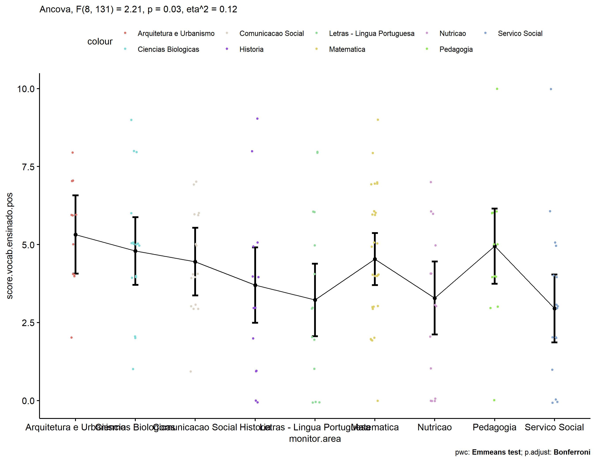<!-- -->

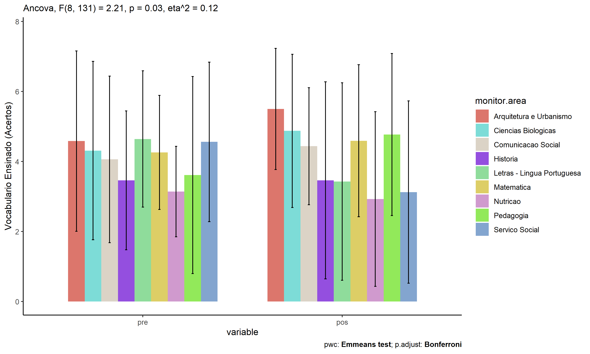<!-- -->

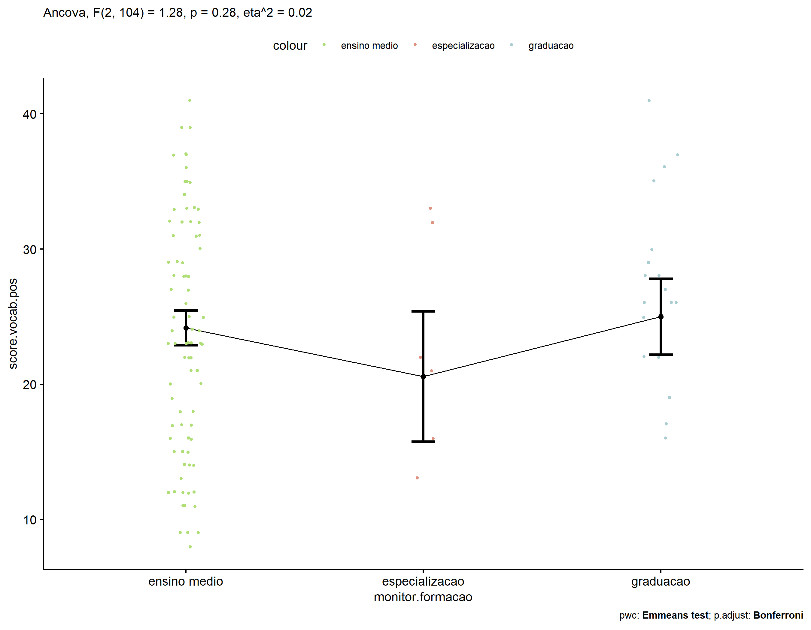<!-- -->

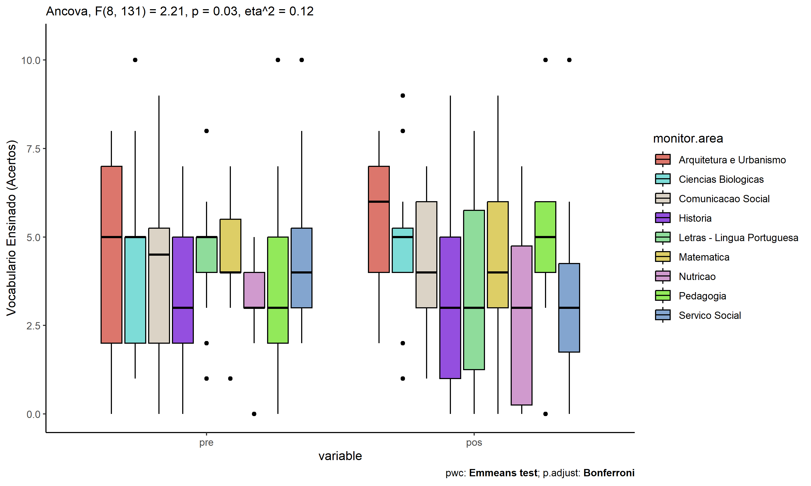<!-- -->

<!-- -->

### Vocabulario Ensinado (TRI)

| var                    | monitor.area               |   n | M (pre) | SE (pre) | M (unadj) | SE (unadj) | M (adj) | SE (adj) |
|:-----------------------|:---------------------------|----:|--------:|---------:|----------:|-----------:|--------:|---------:|
| tri.vocab.ensinado.pos | Arquitetura e Urbanismo    |  12 |   0.439 |    0.204 |     0.611 |      0.169 |   0.413 |    0.187 |
| tri.vocab.ensinado.pos | Ciencias Biologicas        |  16 |   0.065 |    0.234 |     0.184 |      0.206 |   0.188 |    0.160 |
| tri.vocab.ensinado.pos | Comunicacao Social         |  15 |  -0.039 |    0.188 |    -0.056 |      0.178 |   0.005 |    0.166 |
| tri.vocab.ensinado.pos | Historia                   |  12 |  -0.142 |    0.218 |    -0.196 |      0.272 |  -0.080 |    0.186 |
| tri.vocab.ensinado.pos | Letras - Lingua Portuguesa |  11 |   0.243 |    0.225 |     0.157 |      0.280 |   0.065 |    0.194 |
| tri.vocab.ensinado.pos | Matematica                 |  26 |   0.283 |    0.117 |     0.399 |      0.132 |   0.286 |    0.127 |
| tri.vocab.ensinado.pos | Nutricao                   |  10 |  -0.669 |    0.161 |    -0.180 |      0.224 |   0.220 |    0.211 |
| tri.vocab.ensinado.pos | Pedagogia                  |  11 |   0.079 |    0.238 |     0.656 |      0.143 |   0.653 |    0.193 |
| tri.vocab.ensinado.pos | Servico Social             |  14 |   0.076 |    0.235 |    -0.186 |      0.234 |  -0.188 |    0.171 |

| .y.                    | group1                  | group2              | estimate | conf.low | conf.high |    se | statistic | p       | p.adj | p.adj.signif |
|:-----------------------|:------------------------|:--------------------|---------:|---------:|----------:|------:|----------:|:--------|------:|:-------------|
| tri.vocab.ensinado.pos | Arquitetura e Urbanismo | Ciencias Biologicas |    0.225 |   -0.263 |     0.713 | 0.246 |     0.913 | 0.363   | 1.000 | ns           |
| tri.vocab.ensinado.pos | Arquitetura e Urbanismo | Comunicacao Social  |    0.409 |   -0.089 |     0.906 | 0.251 |     1.628 | 0.106   | 1.000 | ns           |
| tri.vocab.ensinado.pos | Arquitetura e Urbanismo | Historia            |    0.493 |   -0.032 |     1.019 | 0.266 |     1.858 | 0.066   | 1.000 | ns           |
| tri.vocab.ensinado.pos | Arquitetura e Urbanismo | Letras              |    0.348 |   -0.182 |     0.879 | 0.268 |     1.300 | 0.196   | 1.000 | ns           |
| tri.vocab.ensinado.pos | Arquitetura e Urbanismo | Matematica          |    0.127 |   -0.316 |     0.571 | 0.224 |     0.569 | 0.57    | 1.000 | ns           |
| tri.vocab.ensinado.pos | Arquitetura e Urbanismo | Nutricao            |    0.193 |   -0.377 |     0.764 | 0.288 |     0.671 | 0.504   | 1.000 | ns           |
| tri.vocab.ensinado.pos | Arquitetura e Urbanismo | Pedagogia           |   -0.240 |   -0.772 |     0.293 | 0.269 |    -0.892 | 0.374   | 1.000 | ns           |
| tri.vocab.ensinado.pos | Arquitetura e Urbanismo | Servico Social      |    0.601 |    0.099 |     1.103 | 0.254 |     2.369 | 0.019   | 0.701 | ns           |
| tri.vocab.ensinado.pos | Ciencias Biologicas     | Comunicacao Social  |    0.184 |   -0.273 |     0.640 | 0.230 |     0.797 | 0.427   | 1.000 | ns           |
| tri.vocab.ensinado.pos | Ciencias Biologicas     | Historia            |    0.268 |   -0.217 |     0.754 | 0.245 |     1.095 | 0.276   | 1.000 | ns           |
| tri.vocab.ensinado.pos | Ciencias Biologicas     | Letras              |    0.123 |   -0.375 |     0.621 | 0.251 |     0.490 | 0.625   | 1.000 | ns           |
| tri.vocab.ensinado.pos | Ciencias Biologicas     | Matematica          |   -0.098 |   -0.502 |     0.307 | 0.204 |    -0.477 | 0.634   | 1.000 | ns           |
| tri.vocab.ensinado.pos | Ciencias Biologicas     | Nutricao            |   -0.032 |   -0.556 |     0.492 | 0.265 |    -0.120 | 0.905   | 1.000 | ns           |
| tri.vocab.ensinado.pos | Ciencias Biologicas     | Pedagogia           |   -0.465 |   -0.962 |     0.032 | 0.251 |    -1.852 | 0.066   | 1.000 | ns           |
| tri.vocab.ensinado.pos | Ciencias Biologicas     | Servico Social      |    0.376 |   -0.088 |     0.840 | 0.234 |     1.604 | 0.111   | 1.000 | ns           |
| tri.vocab.ensinado.pos | Comunicacao Social      | Historia            |    0.085 |   -0.407 |     0.577 | 0.248 |     0.342 | 0.733   | 1.000 | ns           |
| tri.vocab.ensinado.pos | Comunicacao Social      | Letras              |   -0.060 |   -0.566 |     0.445 | 0.255 |    -0.237 | 0.813   | 1.000 | ns           |
| tri.vocab.ensinado.pos | Comunicacao Social      | Matematica          |   -0.281 |   -0.696 |     0.133 | 0.209 |    -1.343 | 0.182   | 1.000 | ns           |
| tri.vocab.ensinado.pos | Comunicacao Social      | Nutricao            |   -0.215 |   -0.743 |     0.312 | 0.266 |    -0.809 | 0.42    | 1.000 | ns           |
| tri.vocab.ensinado.pos | Comunicacao Social      | Pedagogia           |   -0.648 |   -1.152 |    -0.144 | 0.254 |    -2.548 | 0.012   | 0.437 | ns           |
| tri.vocab.ensinado.pos | Comunicacao Social      | Servico Social      |    0.192 |   -0.279 |     0.664 | 0.238 |     0.808 | 0.421   | 1.000 | ns           |
| tri.vocab.ensinado.pos | Historia                | Letras              |   -0.145 |   -0.678 |     0.388 | 0.269 |    -0.540 | 0.59    | 1.000 | ns           |
| tri.vocab.ensinado.pos | Historia                | Matematica          |   -0.366 |   -0.814 |     0.082 | 0.226 |    -1.619 | 0.108   | 1.000 | ns           |
| tri.vocab.ensinado.pos | Historia                | Nutricao            |   -0.300 |   -0.850 |     0.249 | 0.277 |    -1.082 | 0.282   | 1.000 | ns           |
| tri.vocab.ensinado.pos | Historia                | Pedagogia           |   -0.733 |   -1.264 |    -0.203 | 0.268 |    -2.736 | 0.007   | 0.259 | ns           |
| tri.vocab.ensinado.pos | Historia                | Servico Social      |    0.108 |   -0.393 |     0.608 | 0.253 |     0.426 | 0.671   | 1.000 | ns           |
| tri.vocab.ensinado.pos | Letras                  | Lingua Portuguesa   |   -0.221 |   -0.677 |     0.236 | 0.230 |    -0.958 | 0.34    | 1.000 | ns           |
| tri.vocab.ensinado.pos | Letras                  | Lingua Portuguesa   |   -0.155 |   -0.727 |     0.418 | 0.289 |    -0.536 | 0.593   | 1.000 | ns           |
| tri.vocab.ensinado.pos | Letras                  | Lingua Portuguesa   |   -0.588 |   -1.130 |    -0.046 | 0.273 |    -2.150 | 0.034   | 1.000 | ns           |
| tri.vocab.ensinado.pos | Letras                  | Lingua Portuguesa   |    0.253 |   -0.259 |     0.765 | 0.258 |     0.978 | 0.33    | 1.000 | ns           |
| tri.vocab.ensinado.pos | Matematica              | Nutricao            |    0.066 |   -0.429 |     0.561 | 0.250 |     0.263 | 0.793   | 1.000 | ns           |
| tri.vocab.ensinado.pos | Matematica              | Pedagogia           |   -0.367 |   -0.825 |     0.090 | 0.231 |    -1.590 | 0.115   | 1.000 | ns           |
| tri.vocab.ensinado.pos | Matematica              | Servico Social      |    0.474 |    0.052 |     0.895 | 0.213 |     2.223 | 0.028   | 1.000 | ns           |
| tri.vocab.ensinado.pos | Nutricao                | Pedagogia           |   -0.433 |   -1.000 |     0.134 | 0.286 |    -1.514 | 0.133   | 1.000 | ns           |
| tri.vocab.ensinado.pos | Nutricao                | Servico Social      |    0.408 |   -0.130 |     0.946 | 0.272 |     1.500 | 0.136   | 1.000 | ns           |
| tri.vocab.ensinado.pos | Pedagogia               | Servico Social      |    0.841 |    0.330 |     1.352 | 0.258 |     3.257 | 0.001   | 0.053 | ns           |
| tri.vocab.ensinado.pre | Arquitetura e Urbanismo | Ciencias Biologicas |    0.375 |   -0.189 |     0.938 | 0.284 |     1.317 | 0.19    | 1.000 | ns           |
| tri.vocab.ensinado.pre | Arquitetura e Urbanismo | Comunicacao Social  |    0.478 |   -0.093 |     1.049 | 0.288 |     1.657 | 0.1     | 1.000 | ns           |
| tri.vocab.ensinado.pre | Arquitetura e Urbanismo | Historia            |    0.581 |   -0.021 |     1.183 | 0.304 |     1.911 | 0.058   | 1.000 | ns           |
| tri.vocab.ensinado.pre | Arquitetura e Urbanismo | Letras              |    0.197 |   -0.419 |     0.812 | 0.311 |     0.632 | 0.529   | 1.000 | ns           |
| tri.vocab.ensinado.pre | Arquitetura e Urbanismo | Matematica          |    0.156 |   -0.359 |     0.671 | 0.260 |     0.601 | 0.549   | 1.000 | ns           |
| tri.vocab.ensinado.pre | Arquitetura e Urbanismo | Nutricao            |    1.108 |    0.477 |     1.740 | 0.319 |     3.476 | \<0.001 | 0.026 | \*           |
| tri.vocab.ensinado.pre | Arquitetura e Urbanismo | Pedagogia           |    0.361 |   -0.255 |     0.976 | 0.311 |     1.160 | 0.248   | 1.000 | ns           |
| tri.vocab.ensinado.pre | Arquitetura e Urbanismo | Servico Social      |    0.363 |   -0.217 |     0.943 | 0.293 |     1.239 | 0.218   | 1.000 | ns           |
| tri.vocab.ensinado.pre | Ciencias Biologicas     | Comunicacao Social  |    0.103 |   -0.427 |     0.634 | 0.268 |     0.386 | 0.7     | 1.000 | ns           |
| tri.vocab.ensinado.pre | Ciencias Biologicas     | Historia            |    0.206 |   -0.357 |     0.770 | 0.284 |     0.725 | 0.47    | 1.000 | ns           |
| tri.vocab.ensinado.pre | Ciencias Biologicas     | Letras              |   -0.178 |   -0.756 |     0.400 | 0.292 |    -0.611 | 0.543   | 1.000 | ns           |
| tri.vocab.ensinado.pre | Ciencias Biologicas     | Matematica          |   -0.219 |   -0.687 |     0.250 | 0.237 |    -0.924 | 0.358   | 1.000 | ns           |
| tri.vocab.ensinado.pre | Ciencias Biologicas     | Nutricao            |    0.734 |    0.139 |     1.328 | 0.300 |     2.444 | 0.016   | 0.577 | ns           |
| tri.vocab.ensinado.pre | Ciencias Biologicas     | Pedagogia           |   -0.014 |   -0.592 |     0.564 | 0.292 |    -0.048 | 0.962   | 1.000 | ns           |
| tri.vocab.ensinado.pre | Ciencias Biologicas     | Servico Social      |   -0.012 |   -0.551 |     0.528 | 0.273 |    -0.042 | 0.966   | 1.000 | ns           |
| tri.vocab.ensinado.pre | Comunicacao Social      | Historia            |    0.103 |   -0.468 |     0.674 | 0.288 |     0.357 | 0.722   | 1.000 | ns           |
| tri.vocab.ensinado.pre | Comunicacao Social      | Letras              |   -0.282 |   -0.867 |     0.304 | 0.296 |    -0.952 | 0.343   | 1.000 | ns           |
| tri.vocab.ensinado.pre | Comunicacao Social      | Matematica          |   -0.322 |   -0.800 |     0.156 | 0.242 |    -1.333 | 0.185   | 1.000 | ns           |
| tri.vocab.ensinado.pre | Comunicacao Social      | Nutricao            |    0.630 |    0.028 |     1.233 | 0.304 |     2.073 | 0.04    | 1.000 | ns           |
| tri.vocab.ensinado.pre | Comunicacao Social      | Pedagogia           |   -0.117 |   -0.703 |     0.468 | 0.296 |    -0.397 | 0.692   | 1.000 | ns           |
| tri.vocab.ensinado.pre | Comunicacao Social      | Servico Social      |   -0.115 |   -0.663 |     0.433 | 0.277 |    -0.415 | 0.679   | 1.000 | ns           |
| tri.vocab.ensinado.pre | Historia                | Letras              |   -0.385 |   -1.000 |     0.231 | 0.311 |    -1.237 | 0.219   | 1.000 | ns           |
| tri.vocab.ensinado.pre | Historia                | Matematica          |   -0.425 |   -0.940 |     0.090 | 0.260 |    -1.635 | 0.105   | 1.000 | ns           |
| tri.vocab.ensinado.pre | Historia                | Nutricao            |    0.527 |   -0.104 |     1.159 | 0.319 |     1.654 | 0.101   | 1.000 | ns           |
| tri.vocab.ensinado.pre | Historia                | Pedagogia           |   -0.220 |   -0.836 |     0.395 | 0.311 |    -0.709 | 0.48    | 1.000 | ns           |
| tri.vocab.ensinado.pre | Historia                | Servico Social      |   -0.218 |   -0.798 |     0.362 | 0.293 |    -0.744 | 0.459   | 1.000 | ns           |
| tri.vocab.ensinado.pre | Letras                  | Lingua Portuguesa   |   -0.040 |   -0.571 |     0.490 | 0.268 |    -0.151 | 0.88    | 1.000 | ns           |
| tri.vocab.ensinado.pre | Letras                  | Lingua Portuguesa   |    0.912 |    0.267 |     1.556 | 0.325 |     2.802 | 0.006   | 0.214 | ns           |
| tri.vocab.ensinado.pre | Letras                  | Lingua Portuguesa   |    0.164 |   -0.465 |     0.793 | 0.318 |     0.517 | 0.606   | 1.000 | ns           |
| tri.vocab.ensinado.pre | Letras                  | Lingua Portuguesa   |    0.167 |   -0.428 |     0.761 | 0.300 |     0.555 | 0.58    | 1.000 | ns           |
| tri.vocab.ensinado.pre | Matematica              | Nutricao            |    0.952 |    0.403 |     1.501 | 0.277 |     3.436 | \<0.001 | 0.029 | \*           |
| tri.vocab.ensinado.pre | Matematica              | Pedagogia           |    0.205 |   -0.326 |     0.735 | 0.268 |     0.764 | 0.447   | 1.000 | ns           |
| tri.vocab.ensinado.pre | Matematica              | Servico Social      |    0.207 |   -0.282 |     0.696 | 0.247 |     0.838 | 0.403   | 1.000 | ns           |
| tri.vocab.ensinado.pre | Nutricao                | Pedagogia           |   -0.748 |   -1.392 |    -0.103 | 0.325 |    -2.298 | 0.023   | 0.841 | ns           |
| tri.vocab.ensinado.pre | Nutricao                | Servico Social      |   -0.745 |   -1.356 |    -0.135 | 0.308 |    -2.417 | 0.017   | 0.619 | ns           |
| tri.vocab.ensinado.pre | Pedagogia               | Servico Social      |    0.002 |   -0.592 |     0.597 | 0.300 |     0.008 | 0.994   | 1.000 | ns           |

| .y.                | monitor.area               | group1 | group2 | estimate | conf.low | conf.high |    se | statistic |     p | p.adj | p.adj.signif |
|:-------------------|:---------------------------|:-------|:-------|---------:|---------:|----------:|------:|----------:|------:|------:|:-------------|
| tri.vocab.ensinado | Arquitetura e Urbanismo    | pre    | pos    |   -0.171 |   -0.777 |     0.434 | 0.308 |    -0.557 | 0.578 | 0.578 | ns           |
| tri.vocab.ensinado | Ciencias Biologicas        | pre    | pos    |   -0.119 |   -0.644 |     0.406 | 0.266 |    -0.447 | 0.656 | 0.656 | ns           |
| tri.vocab.ensinado | Comunicacao Social         | pre    | pos    |   -0.051 |   -0.584 |     0.483 | 0.271 |    -0.187 | 0.852 | 0.852 | ns           |
| tri.vocab.ensinado | Historia                   | pre    | pos    |    0.054 |   -0.551 |     0.660 | 0.308 |     0.177 | 0.860 | 0.860 | ns           |
| tri.vocab.ensinado | Letras - Lingua Portuguesa | pre    | pos    |    0.100 |   -0.498 |     0.698 | 0.304 |     0.329 | 0.743 | 0.743 | ns           |
| tri.vocab.ensinado | Matematica                 | pre    | pos    |   -0.083 |   -0.491 |     0.325 | 0.207 |    -0.401 | 0.689 | 0.689 | ns           |
| tri.vocab.ensinado | Nutricao                   | pre    | pos    |   -0.157 |   -0.771 |     0.458 | 0.312 |    -0.502 | 0.616 | 0.616 | ns           |
| tri.vocab.ensinado | Pedagogia                  | pre    | pos    |   -0.516 |   -1.122 |     0.090 | 0.308 |    -1.678 | 0.095 | 0.095 | ns           |
| tri.vocab.ensinado | Servico Social             | pre    | pos    |    0.224 |   -0.319 |     0.767 | 0.276 |     0.814 | 0.417 | 0.417 | ns           |

    ## Scale for colour is already present.
    ## Adding another scale for colour, which will replace the existing scale.

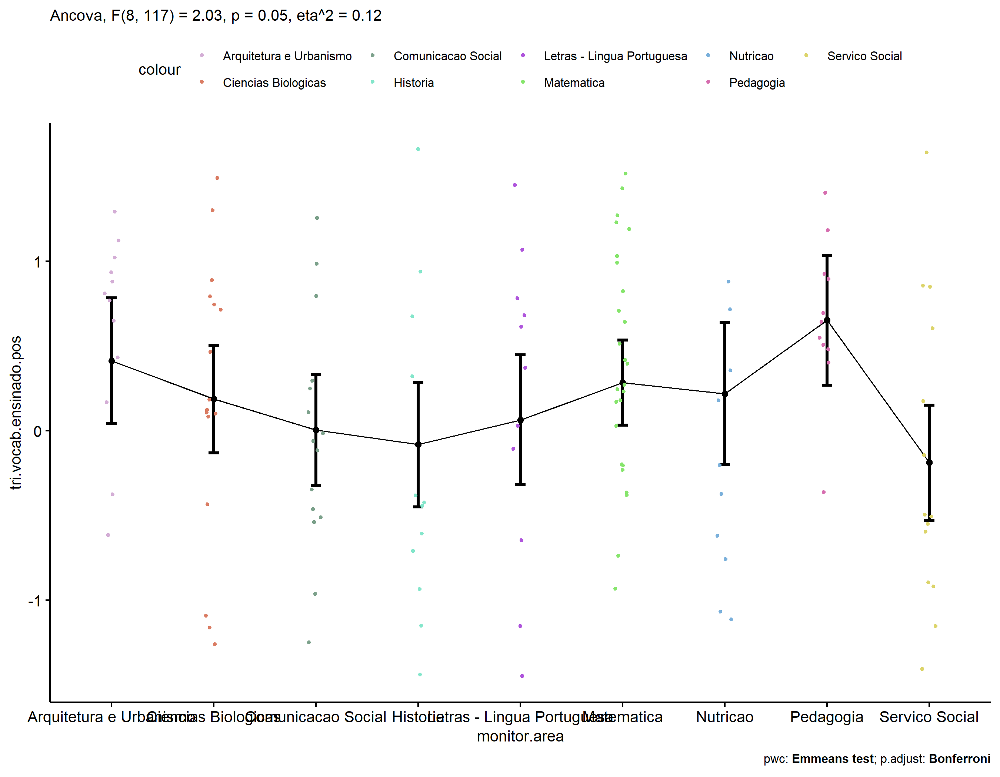<!-- -->

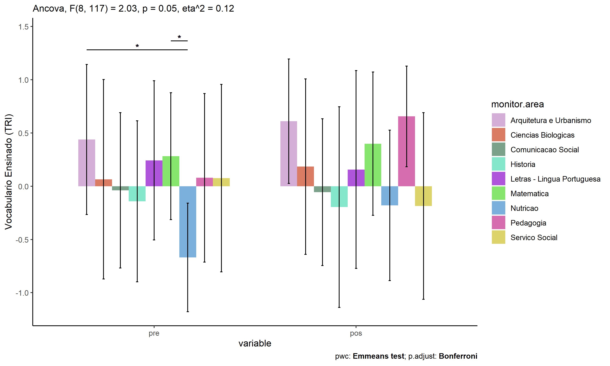<!-- -->

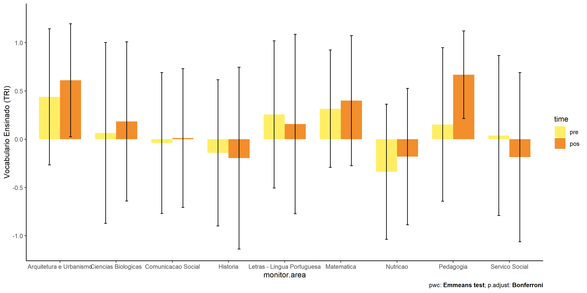<!-- -->

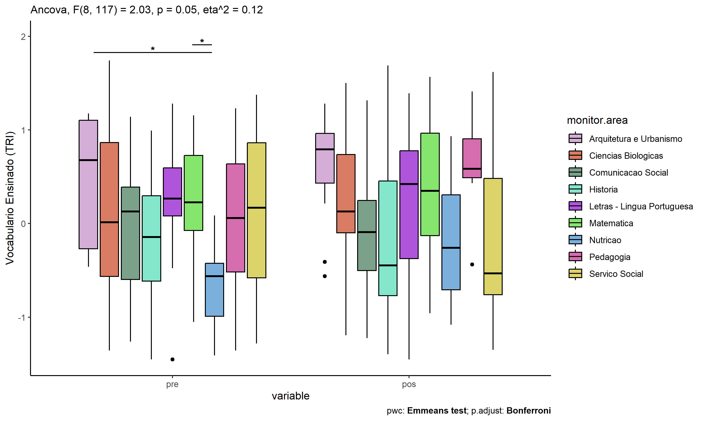<!-- -->

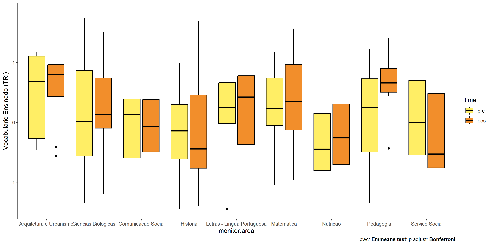<!-- -->

### Vocabulario Nao Ensinado (Acertos)

| var                          | monitor.area               |   n | M (pre) | SE (pre) | M (unadj) | SE (unadj) | M (adj) | SE (adj) |
|:-----------------------------|:---------------------------|----:|--------:|---------:|----------:|-----------:|--------:|---------:|
| score.vocab.nao.ensinado.pos | Arquitetura e Urbanismo    |  12 |  18.500 |    2.024 |    20.917 |      1.549 |  20.160 |    2.091 |
| score.vocab.nao.ensinado.pos | Ciencias Biologicas        |  16 |  17.875 |    1.782 |    20.125 |      1.921 |  19.686 |    1.809 |
| score.vocab.nao.ensinado.pos | Comunicacao Social         |  16 |  15.250 |    1.843 |    14.875 |      1.850 |  15.774 |    1.814 |
| score.vocab.nao.ensinado.pos | Historia                   |  13 |  13.308 |    2.246 |    14.769 |      2.535 |  16.657 |    2.030 |
| score.vocab.nao.ensinado.pos | Letras - Lingua Portuguesa |  14 |  18.357 |    2.158 |    15.643 |      2.705 |  14.959 |    1.936 |
| score.vocab.nao.ensinado.pos | Matematica                 |  27 |  18.815 |    1.515 |    18.926 |      1.526 |  18.009 |    1.400 |
| score.vocab.nao.ensinado.pos | Nutricao                   |  14 |  15.929 |    1.013 |    10.214 |      2.333 |  10.767 |    1.935 |
| score.vocab.nao.ensinado.pos | Pedagogia                  |  13 |  18.769 |    2.450 |    20.615 |      2.226 |  19.721 |    2.011 |
| score.vocab.nao.ensinado.pos | Servico Social             |  16 |  15.125 |    1.610 |    13.062 |      1.978 |  14.025 |    1.815 |

| .y.                          | group1                  | group2              | estimate | conf.low | conf.high |    se | statistic |     p | p.adj | p.adj.signif |
|:-----------------------------|:------------------------|:--------------------|---------:|---------:|----------:|------:|----------:|------:|------:|:-------------|
| score.vocab.nao.ensinado.pos | Arquitetura e Urbanismo | Ciencias Biologicas |    0.473 |   -4.990 |     5.937 | 2.762 |     0.171 | 0.864 | 1.000 | ns           |
| score.vocab.nao.ensinado.pos | Arquitetura e Urbanismo | Comunicacao Social  |    4.386 |   -1.104 |     9.876 | 2.775 |     1.580 | 0.116 | 1.000 | ns           |
| score.vocab.nao.ensinado.pos | Arquitetura e Urbanismo | Historia            |    3.502 |   -2.291 |     9.296 | 2.929 |     1.196 | 0.234 | 1.000 | ns           |
| score.vocab.nao.ensinado.pos | Arquitetura e Urbanismo | Letras              |    5.201 |   -0.426 |    10.828 | 2.845 |     1.828 | 0.070 | 1.000 | ns           |
| score.vocab.nao.ensinado.pos | Arquitetura e Urbanismo | Matematica          |    2.151 |   -2.812 |     7.114 | 2.509 |     0.857 | 0.393 | 1.000 | ns           |
| score.vocab.nao.ensinado.pos | Arquitetura e Urbanismo | Nutricao            |    9.392 |    3.748 |    15.037 | 2.853 |     3.292 | 0.001 | 0.046 | \*           |
| score.vocab.nao.ensinado.pos | Arquitetura e Urbanismo | Pedagogia           |    0.438 |   -5.288 |     6.165 | 2.895 |     0.151 | 0.880 | 1.000 | ns           |
| score.vocab.nao.ensinado.pos | Arquitetura e Urbanismo | Servico Social      |    6.135 |    0.642 |    11.627 | 2.776 |     2.210 | 0.029 | 1.000 | ns           |
| score.vocab.nao.ensinado.pos | Ciencias Biologicas     | Comunicacao Social  |    3.913 |   -1.164 |     8.990 | 2.566 |     1.525 | 0.130 | 1.000 | ns           |
| score.vocab.nao.ensinado.pos | Ciencias Biologicas     | Historia            |    3.029 |   -2.368 |     8.426 | 2.728 |     1.110 | 0.269 | 1.000 | ns           |
| score.vocab.nao.ensinado.pos | Ciencias Biologicas     | Letras              |    4.728 |   -0.508 |     9.963 | 2.647 |     1.786 | 0.076 | 1.000 | ns           |
| score.vocab.nao.ensinado.pos | Ciencias Biologicas     | Matematica          |    1.678 |   -2.838 |     6.194 | 2.283 |     0.735 | 0.464 | 1.000 | ns           |
| score.vocab.nao.ensinado.pos | Ciencias Biologicas     | Nutricao            |    8.919 |    3.674 |    14.164 | 2.651 |     3.364 | 0.001 | 0.036 | \*           |
| score.vocab.nao.ensinado.pos | Ciencias Biologicas     | Pedagogia           |   -0.035 |   -5.378 |     5.308 | 2.701 |    -0.013 | 0.990 | 1.000 | ns           |
| score.vocab.nao.ensinado.pos | Ciencias Biologicas     | Servico Social      |    5.662 |    0.583 |    10.740 | 2.567 |     2.205 | 0.029 | 1.000 | ns           |
| score.vocab.nao.ensinado.pos | Comunicacao Social      | Historia            |   -0.884 |   -6.235 |     4.468 | 2.705 |    -0.327 | 0.744 | 1.000 | ns           |
| score.vocab.nao.ensinado.pos | Comunicacao Social      | Letras              |    0.815 |   -4.446 |     6.076 | 2.660 |     0.306 | 0.760 | 1.000 | ns           |
| score.vocab.nao.ensinado.pos | Comunicacao Social      | Matematica          |   -2.235 |   -6.788 |     2.318 | 2.302 |    -0.971 | 0.333 | 1.000 | ns           |
| score.vocab.nao.ensinado.pos | Comunicacao Social      | Nutricao            |    5.006 |   -0.230 |    10.242 | 2.647 |     1.891 | 0.061 | 1.000 | ns           |
| score.vocab.nao.ensinado.pos | Comunicacao Social      | Pedagogia           |   -3.948 |   -9.322 |     1.427 | 2.717 |    -1.453 | 0.149 | 1.000 | ns           |
| score.vocab.nao.ensinado.pos | Comunicacao Social      | Servico Social      |    1.749 |   -3.309 |     6.806 | 2.556 |     0.684 | 0.495 | 1.000 | ns           |
| score.vocab.nao.ensinado.pos | Historia                | Letras              |    1.699 |   -3.877 |     7.274 | 2.818 |     0.603 | 0.548 | 1.000 | ns           |
| score.vocab.nao.ensinado.pos | Historia                | Matematica          |   -1.351 |   -6.269 |     3.567 | 2.486 |    -0.543 | 0.588 | 1.000 | ns           |
| score.vocab.nao.ensinado.pos | Historia                | Nutricao            |    5.890 |    0.363 |    11.418 | 2.794 |     2.108 | 0.037 | 1.000 | ns           |
| score.vocab.nao.ensinado.pos | Historia                | Pedagogia           |   -3.064 |   -8.750 |     2.623 | 2.875 |    -1.066 | 0.288 | 1.000 | ns           |
| score.vocab.nao.ensinado.pos | Historia                | Servico Social      |    2.633 |   -2.717 |     7.983 | 2.704 |     0.973 | 0.332 | 1.000 | ns           |
| score.vocab.nao.ensinado.pos | Letras                  | Lingua Portuguesa   |   -3.050 |   -7.762 |     1.662 | 2.382 |    -1.281 | 0.203 | 1.000 | ns           |
| score.vocab.nao.ensinado.pos | Letras                  | Lingua Portuguesa   |    4.191 |   -1.231 |     9.614 | 2.741 |     1.529 | 0.129 | 1.000 | ns           |
| score.vocab.nao.ensinado.pos | Letras                  | Lingua Portuguesa   |   -4.763 |  -10.272 |     0.747 | 2.785 |    -1.710 | 0.090 | 1.000 | ns           |
| score.vocab.nao.ensinado.pos | Letras                  | Lingua Portuguesa   |    0.934 |   -4.330 |     6.197 | 2.661 |     0.351 | 0.726 | 1.000 | ns           |
| score.vocab.nao.ensinado.pos | Matematica              | Nutricao            |    7.241 |    2.505 |    11.978 | 2.394 |     3.024 | 0.003 | 0.108 | ns           |
| score.vocab.nao.ensinado.pos | Matematica              | Pedagogia           |   -1.713 |   -6.541 |     3.116 | 2.441 |    -0.702 | 0.484 | 1.000 | ns           |
| score.vocab.nao.ensinado.pos | Matematica              | Servico Social      |    3.984 |   -0.572 |     8.540 | 2.303 |     1.730 | 0.086 | 1.000 | ns           |
| score.vocab.nao.ensinado.pos | Nutricao                | Pedagogia           |   -8.954 |  -14.484 |    -3.423 | 2.796 |    -3.203 | 0.002 | 0.062 | ns           |
| score.vocab.nao.ensinado.pos | Nutricao                | Servico Social      |   -3.258 |   -8.494 |     1.979 | 2.647 |    -1.231 | 0.221 | 1.000 | ns           |
| score.vocab.nao.ensinado.pos | Pedagogia               | Servico Social      |    5.696 |    0.320 |    11.073 | 2.718 |     2.096 | 0.038 | 1.000 | ns           |
| score.vocab.nao.ensinado.pre | Arquitetura e Urbanismo | Ciencias Biologicas |    0.625 |   -4.919 |     6.169 | 2.802 |     0.223 | 0.824 | 1.000 | ns           |
| score.vocab.nao.ensinado.pre | Arquitetura e Urbanismo | Comunicacao Social  |    3.250 |   -2.294 |     8.794 | 2.802 |     1.160 | 0.248 | 1.000 | ns           |
| score.vocab.nao.ensinado.pre | Arquitetura e Urbanismo | Historia            |    5.192 |   -0.619 |    11.004 | 2.938 |     1.767 | 0.079 | 1.000 | ns           |
| score.vocab.nao.ensinado.pre | Arquitetura e Urbanismo | Letras              |    0.143 |   -5.568 |     5.854 | 2.887 |     0.049 | 0.961 | 1.000 | ns           |
| score.vocab.nao.ensinado.pre | Arquitetura e Urbanismo | Matematica          |   -0.315 |   -5.351 |     4.722 | 2.546 |    -0.124 | 0.902 | 1.000 | ns           |
| score.vocab.nao.ensinado.pre | Arquitetura e Urbanismo | Nutricao            |    2.571 |   -3.139 |     8.282 | 2.887 |     0.891 | 0.375 | 1.000 | ns           |
| score.vocab.nao.ensinado.pre | Arquitetura e Urbanismo | Pedagogia           |   -0.269 |   -6.080 |     5.542 | 2.938 |    -0.092 | 0.927 | 1.000 | ns           |
| score.vocab.nao.ensinado.pre | Arquitetura e Urbanismo | Servico Social      |    3.375 |   -2.169 |     8.919 | 2.802 |     1.204 | 0.231 | 1.000 | ns           |
| score.vocab.nao.ensinado.pre | Ciencias Biologicas     | Comunicacao Social  |    2.625 |   -2.507 |     7.757 | 2.595 |     1.012 | 0.314 | 1.000 | ns           |
| score.vocab.nao.ensinado.pre | Ciencias Biologicas     | Historia            |    4.567 |   -0.853 |     9.988 | 2.740 |     1.667 | 0.098 | 1.000 | ns           |
| score.vocab.nao.ensinado.pre | Ciencias Biologicas     | Letras              |   -0.482 |   -5.795 |     4.830 | 2.686 |    -0.180 | 0.858 | 1.000 | ns           |
| score.vocab.nao.ensinado.pre | Ciencias Biologicas     | Matematica          |   -0.940 |   -5.520 |     3.640 | 2.315 |    -0.406 | 0.685 | 1.000 | ns           |
| score.vocab.nao.ensinado.pre | Ciencias Biologicas     | Nutricao            |    1.946 |   -3.366 |     7.259 | 2.686 |     0.725 | 0.470 | 1.000 | ns           |
| score.vocab.nao.ensinado.pre | Ciencias Biologicas     | Pedagogia           |   -0.894 |   -6.315 |     4.526 | 2.740 |    -0.326 | 0.745 | 1.000 | ns           |
| score.vocab.nao.ensinado.pre | Ciencias Biologicas     | Servico Social      |    2.750 |   -2.382 |     7.882 | 2.595 |     1.060 | 0.291 | 1.000 | ns           |
| score.vocab.nao.ensinado.pre | Comunicacao Social      | Historia            |    1.942 |   -3.478 |     7.363 | 2.740 |     0.709 | 0.480 | 1.000 | ns           |
| score.vocab.nao.ensinado.pre | Comunicacao Social      | Letras              |   -3.107 |   -8.420 |     2.205 | 2.686 |    -1.157 | 0.249 | 1.000 | ns           |
| score.vocab.nao.ensinado.pre | Comunicacao Social      | Matematica          |   -3.565 |   -8.145 |     1.015 | 2.315 |    -1.540 | 0.126 | 1.000 | ns           |
| score.vocab.nao.ensinado.pre | Comunicacao Social      | Nutricao            |   -0.679 |   -5.991 |     4.634 | 2.686 |    -0.253 | 0.801 | 1.000 | ns           |
| score.vocab.nao.ensinado.pre | Comunicacao Social      | Pedagogia           |   -3.519 |   -8.940 |     1.901 | 2.740 |    -1.284 | 0.201 | 1.000 | ns           |
| score.vocab.nao.ensinado.pre | Comunicacao Social      | Servico Social      |    0.125 |   -5.007 |     5.257 | 2.595 |     0.048 | 0.962 | 1.000 | ns           |
| score.vocab.nao.ensinado.pre | Historia                | Letras              |   -5.049 |  -10.641 |     0.542 | 2.827 |    -1.786 | 0.076 | 1.000 | ns           |
| score.vocab.nao.ensinado.pre | Historia                | Matematica          |   -5.507 |  -10.408 |    -0.607 | 2.477 |    -2.223 | 0.028 | 1.000 | ns           |
| score.vocab.nao.ensinado.pre | Historia                | Nutricao            |   -2.621 |   -8.212 |     2.970 | 2.827 |    -0.927 | 0.355 | 1.000 | ns           |
| score.vocab.nao.ensinado.pre | Historia                | Pedagogia           |   -5.462 |  -11.155 |     0.232 | 2.878 |    -1.897 | 0.060 | 1.000 | ns           |
| score.vocab.nao.ensinado.pre | Historia                | Servico Social      |   -1.817 |   -7.238 |     3.603 | 2.740 |    -0.663 | 0.508 | 1.000 | ns           |
| score.vocab.nao.ensinado.pre | Letras                  | Lingua Portuguesa   |   -0.458 |   -5.239 |     4.323 | 2.417 |    -0.189 | 0.850 | 1.000 | ns           |
| score.vocab.nao.ensinado.pre | Letras                  | Lingua Portuguesa   |    2.429 |   -3.058 |     7.915 | 2.774 |     0.876 | 0.383 | 1.000 | ns           |
| score.vocab.nao.ensinado.pre | Letras                  | Lingua Portuguesa   |   -0.412 |   -6.003 |     5.179 | 2.827 |    -0.146 | 0.884 | 1.000 | ns           |
| score.vocab.nao.ensinado.pre | Letras                  | Lingua Portuguesa   |    3.232 |   -2.080 |     8.545 | 2.686 |     1.203 | 0.231 | 1.000 | ns           |
| score.vocab.nao.ensinado.pre | Matematica              | Nutricao            |    2.886 |   -1.895 |     7.667 | 2.417 |     1.194 | 0.235 | 1.000 | ns           |
| score.vocab.nao.ensinado.pre | Matematica              | Pedagogia           |    0.046 |   -4.855 |     4.946 | 2.477 |     0.018 | 0.985 | 1.000 | ns           |
| score.vocab.nao.ensinado.pre | Matematica              | Servico Social      |    3.690 |   -0.890 |     8.270 | 2.315 |     1.594 | 0.113 | 1.000 | ns           |
| score.vocab.nao.ensinado.pre | Nutricao                | Pedagogia           |   -2.841 |   -8.432 |     2.751 | 2.827 |    -1.005 | 0.317 | 1.000 | ns           |
| score.vocab.nao.ensinado.pre | Nutricao                | Servico Social      |    0.804 |   -4.509 |     6.116 | 2.686 |     0.299 | 0.765 | 1.000 | ns           |
| score.vocab.nao.ensinado.pre | Pedagogia               | Servico Social      |    3.644 |   -1.776 |     9.065 | 2.740 |     1.330 | 0.186 | 1.000 | ns           |

| .y.                      | monitor.area               | group1 | group2 | estimate | conf.low | conf.high |    se | statistic |     p | p.adj | p.adj.signif |
|:-------------------------|:---------------------------|:-------|:-------|---------:|---------:|----------:|------:|----------:|------:|------:|:-------------|
| score.vocab.nao.ensinado | Arquitetura e Urbanismo    | pre    | pos    |   -2.417 |   -8.636 |     3.803 | 3.159 |    -0.765 | 0.445 | 0.445 | ns           |
| score.vocab.nao.ensinado | Ciencias Biologicas        | pre    | pos    |   -2.250 |   -7.636 |     3.136 | 2.735 |    -0.823 | 0.412 | 0.412 | ns           |
| score.vocab.nao.ensinado | Comunicacao Social         | pre    | pos    |    0.375 |   -5.011 |     5.761 | 2.735 |     0.137 | 0.891 | 0.891 | ns           |
| score.vocab.nao.ensinado | Historia                   | pre    | pos    |   -1.462 |   -7.437 |     4.514 | 3.035 |    -0.482 | 0.630 | 0.630 | ns           |
| score.vocab.nao.ensinado | Letras - Lingua Portuguesa | pre    | pos    |    2.714 |   -3.044 |     8.472 | 2.924 |     0.928 | 0.354 | 0.354 | ns           |
| score.vocab.nao.ensinado | Matematica                 | pre    | pos    |   -0.111 |   -4.257 |     4.035 | 2.106 |    -0.053 | 0.958 | 0.958 | ns           |
| score.vocab.nao.ensinado | Nutricao                   | pre    | pos    |    5.714 |   -0.044 |    11.472 | 2.924 |     1.954 | 0.052 | 0.052 | ns           |
| score.vocab.nao.ensinado | Pedagogia                  | pre    | pos    |   -1.846 |   -7.821 |     4.129 | 3.035 |    -0.608 | 0.543 | 0.543 | ns           |
| score.vocab.nao.ensinado | Servico Social             | pre    | pos    |    2.062 |   -3.323 |     7.448 | 2.735 |     0.754 | 0.452 | 0.452 | ns           |

    ## Scale for colour is already present.
    ## Adding another scale for colour, which will replace the existing scale.

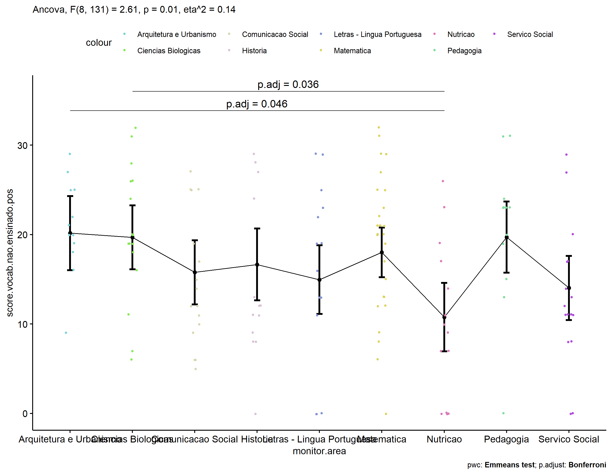<!-- -->

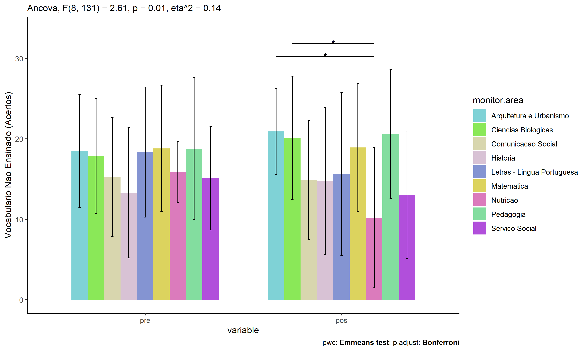<!-- -->

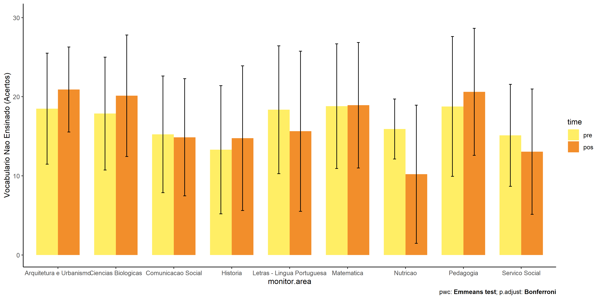<!-- -->

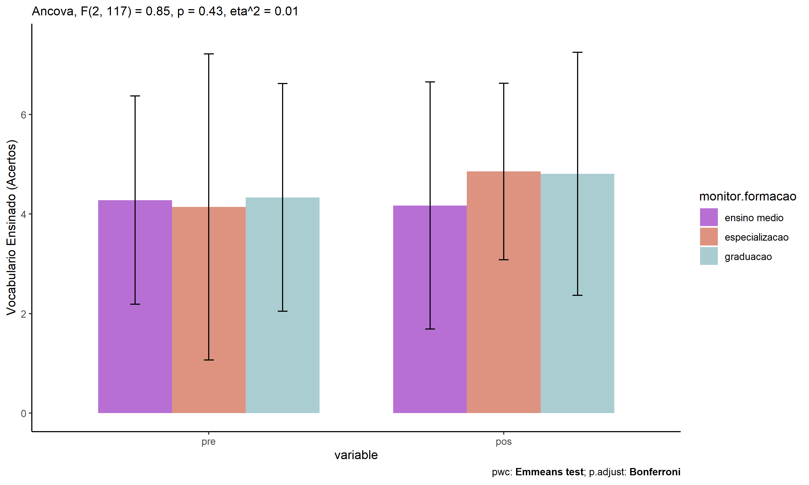<!-- -->

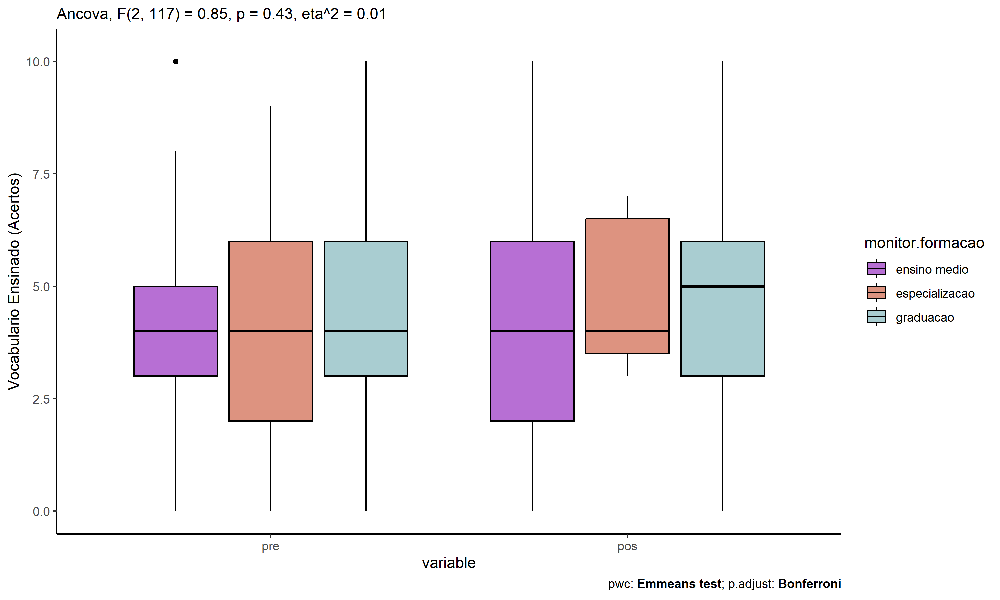<!-- -->

### Vocabulario Nao Ensinado (TRI)

| var                        | monitor.area               |   n | M (pre) | SE (pre) | M (unadj) | SE (unadj) | M (adj) | SE (adj) |
|:---------------------------|:---------------------------|----:|--------:|---------:|----------:|-----------:|--------:|---------:|
| tri.vocab.nao.ensinado.pos | Arquitetura e Urbanismo    |  12 |   0.329 |    0.223 |     0.624 |      0.211 |   0.433 |    0.190 |
| tri.vocab.nao.ensinado.pos | Ciencias Biologicas        |  16 |   0.179 |    0.246 |     0.507 |      0.265 |   0.434 |    0.164 |
| tri.vocab.nao.ensinado.pos | Comunicacao Social         |  15 |  -0.048 |    0.191 |    -0.233 |      0.240 |  -0.127 |    0.169 |
| tri.vocab.nao.ensinado.pos | Historia                   |  12 |  -0.352 |    0.270 |    -0.065 |      0.353 |   0.280 |    0.191 |
| tri.vocab.nao.ensinado.pos | Letras - Lingua Portuguesa |  11 |   0.289 |    0.297 |     0.429 |      0.263 |   0.269 |    0.198 |
| tri.vocab.nao.ensinado.pos | Matematica                 |  26 |   0.247 |    0.206 |     0.392 |      0.203 |   0.265 |    0.129 |
| tri.vocab.nao.ensinado.pos | Nutricao                   |  10 |  -0.402 |    0.158 |    -0.383 |      0.265 |   0.001 |    0.209 |
| tri.vocab.nao.ensinado.pos | Pedagogia                  |  11 |   0.495 |    0.242 |     0.745 |      0.216 |   0.423 |    0.199 |
| tri.vocab.nao.ensinado.pos | Servico Social             |  14 |  -0.136 |    0.240 |    -0.232 |      0.256 |  -0.056 |    0.175 |

| .y.                        | group1                  | group2              | estimate | conf.low | conf.high |    se | statistic |     p | p.adj | p.adj.signif |
|:---------------------------|:------------------------|:--------------------|---------:|---------:|----------:|------:|----------:|------:|------:|:-------------|
| tri.vocab.nao.ensinado.pos | Arquitetura e Urbanismo | Ciencias Biologicas |   -0.001 |   -0.496 |     0.494 | 0.250 |    -0.005 | 0.996 | 1.000 | ns           |
| tri.vocab.nao.ensinado.pos | Arquitetura e Urbanismo | Comunicacao Social  |    0.560 |    0.056 |     1.064 | 0.255 |     2.199 | 0.030 | 1.000 | ns           |
| tri.vocab.nao.ensinado.pos | Arquitetura e Urbanismo | Historia            |    0.153 |   -0.384 |     0.689 | 0.271 |     0.564 | 0.574 | 1.000 | ns           |
| tri.vocab.nao.ensinado.pos | Arquitetura e Urbanismo | Letras              |    0.164 |   -0.377 |     0.704 | 0.273 |     0.599 | 0.550 | 1.000 | ns           |
| tri.vocab.nao.ensinado.pos | Arquitetura e Urbanismo | Matematica          |    0.168 |   -0.284 |     0.620 | 0.228 |     0.735 | 0.464 | 1.000 | ns           |
| tri.vocab.nao.ensinado.pos | Arquitetura e Urbanismo | Nutricao            |    0.432 |   -0.131 |     0.995 | 0.284 |     1.518 | 0.132 | 1.000 | ns           |
| tri.vocab.nao.ensinado.pos | Arquitetura e Urbanismo | Pedagogia           |    0.010 |   -0.531 |     0.551 | 0.273 |     0.037 | 0.971 | 1.000 | ns           |
| tri.vocab.nao.ensinado.pos | Arquitetura e Urbanismo | Servico Social      |    0.489 |   -0.024 |     1.003 | 0.259 |     1.888 | 0.062 | 1.000 | ns           |
| tri.vocab.nao.ensinado.pos | Ciencias Biologicas     | Comunicacao Social  |    0.561 |    0.095 |     1.028 | 0.236 |     2.382 | 0.019 | 0.678 | ns           |
| tri.vocab.nao.ensinado.pos | Ciencias Biologicas     | Historia            |    0.154 |   -0.346 |     0.654 | 0.252 |     0.610 | 0.543 | 1.000 | ns           |
| tri.vocab.nao.ensinado.pos | Ciencias Biologicas     | Letras              |    0.165 |   -0.343 |     0.672 | 0.256 |     0.643 | 0.522 | 1.000 | ns           |
| tri.vocab.nao.ensinado.pos | Ciencias Biologicas     | Matematica          |    0.169 |   -0.243 |     0.581 | 0.208 |     0.813 | 0.418 | 1.000 | ns           |
| tri.vocab.nao.ensinado.pos | Ciencias Biologicas     | Nutricao            |    0.433 |   -0.095 |     0.961 | 0.267 |     1.624 | 0.107 | 1.000 | ns           |
| tri.vocab.nao.ensinado.pos | Ciencias Biologicas     | Pedagogia           |    0.011 |   -0.498 |     0.520 | 0.257 |     0.044 | 0.965 | 1.000 | ns           |
| tri.vocab.nao.ensinado.pos | Ciencias Biologicas     | Servico Social      |    0.491 |    0.015 |     0.967 | 0.240 |     2.041 | 0.043 | 1.000 | ns           |
| tri.vocab.nao.ensinado.pos | Comunicacao Social      | Historia            |   -0.407 |   -0.911 |     0.096 | 0.254 |    -1.602 | 0.112 | 1.000 | ns           |
| tri.vocab.nao.ensinado.pos | Comunicacao Social      | Letras              |   -0.396 |   -0.913 |     0.120 | 0.261 |    -1.521 | 0.131 | 1.000 | ns           |
| tri.vocab.nao.ensinado.pos | Comunicacao Social      | Matematica          |   -0.392 |   -0.814 |     0.030 | 0.213 |    -1.840 | 0.068 | 1.000 | ns           |
| tri.vocab.nao.ensinado.pos | Comunicacao Social      | Nutricao            |   -0.128 |   -0.659 |     0.403 | 0.268 |    -0.478 | 0.633 | 1.000 | ns           |
| tri.vocab.nao.ensinado.pos | Comunicacao Social      | Pedagogia           |   -0.550 |   -1.069 |    -0.031 | 0.262 |    -2.097 | 0.038 | 1.000 | ns           |
| tri.vocab.nao.ensinado.pos | Comunicacao Social      | Servico Social      |   -0.071 |   -0.552 |     0.411 | 0.243 |    -0.290 | 0.772 | 1.000 | ns           |
| tri.vocab.nao.ensinado.pos | Historia                | Letras              |    0.011 |   -0.537 |     0.558 | 0.276 |     0.039 | 0.969 | 1.000 | ns           |
| tri.vocab.nao.ensinado.pos | Historia                | Matematica          |    0.015 |   -0.444 |     0.474 | 0.232 |     0.066 | 0.948 | 1.000 | ns           |
| tri.vocab.nao.ensinado.pos | Historia                | Nutricao            |    0.279 |   -0.276 |     0.834 | 0.280 |     0.996 | 0.321 | 1.000 | ns           |
| tri.vocab.nao.ensinado.pos | Historia                | Pedagogia           |   -0.143 |   -0.695 |     0.410 | 0.279 |    -0.511 | 0.610 | 1.000 | ns           |
| tri.vocab.nao.ensinado.pos | Historia                | Servico Social      |    0.337 |   -0.174 |     0.847 | 0.258 |     1.306 | 0.194 | 1.000 | ns           |
| tri.vocab.nao.ensinado.pos | Letras                  | Lingua Portuguesa   |    0.004 |   -0.462 |     0.470 | 0.235 |     0.019 | 0.985 | 1.000 | ns           |
| tri.vocab.nao.ensinado.pos | Letras                  | Lingua Portuguesa   |    0.268 |   -0.305 |     0.842 | 0.290 |     0.926 | 0.356 | 1.000 | ns           |
| tri.vocab.nao.ensinado.pos | Letras                  | Lingua Portuguesa   |   -0.154 |   -0.707 |     0.400 | 0.279 |    -0.550 | 0.584 | 1.000 | ns           |
| tri.vocab.nao.ensinado.pos | Letras                  | Lingua Portuguesa   |    0.326 |   -0.199 |     0.851 | 0.265 |     1.229 | 0.221 | 1.000 | ns           |
| tri.vocab.nao.ensinado.pos | Matematica              | Nutricao            |    0.264 |   -0.226 |     0.754 | 0.247 |     1.067 | 0.288 | 1.000 | ns           |
| tri.vocab.nao.ensinado.pos | Matematica              | Pedagogia           |   -0.158 |   -0.625 |     0.309 | 0.236 |    -0.669 | 0.505 | 1.000 | ns           |
| tri.vocab.nao.ensinado.pos | Matematica              | Servico Social      |    0.322 |   -0.111 |     0.754 | 0.218 |     1.472 | 0.144 | 1.000 | ns           |
| tri.vocab.nao.ensinado.pos | Nutricao                | Pedagogia           |   -0.422 |   -1.000 |     0.157 | 0.292 |    -1.444 | 0.152 | 1.000 | ns           |
| tri.vocab.nao.ensinado.pos | Nutricao                | Servico Social      |    0.058 |   -0.480 |     0.595 | 0.271 |     0.213 | 0.832 | 1.000 | ns           |
| tri.vocab.nao.ensinado.pos | Pedagogia               | Servico Social      |    0.479 |   -0.049 |     1.008 | 0.267 |     1.796 | 0.075 | 1.000 | ns           |
| tri.vocab.nao.ensinado.pre | Arquitetura e Urbanismo | Ciencias Biologicas |    0.150 |   -0.528 |     0.828 | 0.342 |     0.437 | 0.663 | 1.000 | ns           |
| tri.vocab.nao.ensinado.pre | Arquitetura e Urbanismo | Comunicacao Social  |    0.377 |   -0.311 |     1.064 | 0.347 |     1.085 | 0.280 | 1.000 | ns           |
| tri.vocab.nao.ensinado.pre | Arquitetura e Urbanismo | Historia            |    0.681 |   -0.044 |     1.406 | 0.366 |     1.861 | 0.065 | 1.000 | ns           |
| tri.vocab.nao.ensinado.pre | Arquitetura e Urbanismo | Letras              |    0.039 |   -0.702 |     0.781 | 0.374 |     0.105 | 0.916 | 1.000 | ns           |
| tri.vocab.nao.ensinado.pre | Arquitetura e Urbanismo | Matematica          |    0.082 |   -0.538 |     0.701 | 0.313 |     0.262 | 0.794 | 1.000 | ns           |
| tri.vocab.nao.ensinado.pre | Arquitetura e Urbanismo | Nutricao            |    0.731 |   -0.030 |     1.491 | 0.384 |     1.903 | 0.059 | 1.000 | ns           |
| tri.vocab.nao.ensinado.pre | Arquitetura e Urbanismo | Pedagogia           |   -0.166 |   -0.907 |     0.575 | 0.374 |    -0.443 | 0.658 | 1.000 | ns           |
| tri.vocab.nao.ensinado.pre | Arquitetura e Urbanismo | Servico Social      |    0.465 |   -0.233 |     1.164 | 0.353 |     1.319 | 0.190 | 1.000 | ns           |
| tri.vocab.nao.ensinado.pre | Ciencias Biologicas     | Comunicacao Social  |    0.227 |   -0.411 |     0.865 | 0.322 |     0.705 | 0.482 | 1.000 | ns           |
| tri.vocab.nao.ensinado.pre | Ciencias Biologicas     | Historia            |    0.531 |   -0.147 |     1.209 | 0.342 |     1.552 | 0.123 | 1.000 | ns           |
| tri.vocab.nao.ensinado.pre | Ciencias Biologicas     | Letras              |   -0.110 |   -0.806 |     0.585 | 0.351 |    -0.314 | 0.754 | 1.000 | ns           |
| tri.vocab.nao.ensinado.pre | Ciencias Biologicas     | Matematica          |   -0.068 |   -0.632 |     0.496 | 0.285 |    -0.238 | 0.812 | 1.000 | ns           |
| tri.vocab.nao.ensinado.pre | Ciencias Biologicas     | Nutricao            |    0.581 |   -0.135 |     1.297 | 0.361 |     1.607 | 0.111 | 1.000 | ns           |
| tri.vocab.nao.ensinado.pre | Ciencias Biologicas     | Pedagogia           |   -0.316 |   -1.011 |     0.380 | 0.351 |    -0.899 | 0.370 | 1.000 | ns           |
| tri.vocab.nao.ensinado.pre | Ciencias Biologicas     | Servico Social      |    0.315 |   -0.334 |     0.965 | 0.328 |     0.961 | 0.338 | 1.000 | ns           |
| tri.vocab.nao.ensinado.pre | Comunicacao Social      | Historia            |    0.304 |   -0.383 |     0.992 | 0.347 |     0.876 | 0.383 | 1.000 | ns           |
| tri.vocab.nao.ensinado.pre | Comunicacao Social      | Letras              |   -0.337 |   -1.042 |     0.367 | 0.356 |    -0.948 | 0.345 | 1.000 | ns           |
| tri.vocab.nao.ensinado.pre | Comunicacao Social      | Matematica          |   -0.295 |   -0.871 |     0.281 | 0.291 |    -1.015 | 0.312 | 1.000 | ns           |
| tri.vocab.nao.ensinado.pre | Comunicacao Social      | Nutricao            |    0.354 |   -0.371 |     1.079 | 0.366 |     0.967 | 0.336 | 1.000 | ns           |
| tri.vocab.nao.ensinado.pre | Comunicacao Social      | Pedagogia           |   -0.543 |   -1.248 |     0.162 | 0.356 |    -1.525 | 0.130 | 1.000 | ns           |
| tri.vocab.nao.ensinado.pre | Comunicacao Social      | Servico Social      |    0.088 |   -0.571 |     0.748 | 0.333 |     0.265 | 0.791 | 1.000 | ns           |
| tri.vocab.nao.ensinado.pre | Historia                | Letras              |   -0.642 |   -1.383 |     0.099 | 0.374 |    -1.715 | 0.089 | 1.000 | ns           |
| tri.vocab.nao.ensinado.pre | Historia                | Matematica          |   -0.599 |   -1.219 |     0.020 | 0.313 |    -1.915 | 0.058 | 1.000 | ns           |
| tri.vocab.nao.ensinado.pre | Historia                | Nutricao            |    0.050 |   -0.711 |     0.810 | 0.384 |     0.129 | 0.898 | 1.000 | ns           |
| tri.vocab.nao.ensinado.pre | Historia                | Pedagogia           |   -0.847 |   -1.588 |    -0.106 | 0.374 |    -2.263 | 0.025 | 0.916 | ns           |
| tri.vocab.nao.ensinado.pre | Historia                | Servico Social      |   -0.216 |   -0.914 |     0.482 | 0.353 |    -0.612 | 0.541 | 1.000 | ns           |
| tri.vocab.nao.ensinado.pre | Letras                  | Lingua Portuguesa   |    0.042 |   -0.596 |     0.681 | 0.322 |     0.132 | 0.896 | 1.000 | ns           |
| tri.vocab.nao.ensinado.pre | Letras                  | Lingua Portuguesa   |    0.691 |   -0.084 |     1.467 | 0.392 |     1.765 | 0.080 | 1.000 | ns           |
| tri.vocab.nao.ensinado.pre | Letras                  | Lingua Portuguesa   |   -0.205 |   -0.962 |     0.552 | 0.382 |    -0.537 | 0.592 | 1.000 | ns           |
| tri.vocab.nao.ensinado.pre | Letras                  | Lingua Portuguesa   |    0.426 |   -0.290 |     1.141 | 0.361 |     1.179 | 0.241 | 1.000 | ns           |
| tri.vocab.nao.ensinado.pre | Matematica              | Nutricao            |    0.649 |   -0.012 |     1.310 | 0.334 |     1.945 | 0.054 | 1.000 | ns           |
| tri.vocab.nao.ensinado.pre | Matematica              | Pedagogia           |   -0.248 |   -0.886 |     0.391 | 0.322 |    -0.768 | 0.444 | 1.000 | ns           |
| tri.vocab.nao.ensinado.pre | Matematica              | Servico Social      |    0.383 |   -0.205 |     0.972 | 0.297 |     1.290 | 0.200 | 1.000 | ns           |
| tri.vocab.nao.ensinado.pre | Nutricao                | Pedagogia           |   -0.897 |   -1.672 |    -0.121 | 0.392 |    -2.289 | 0.024 | 0.859 | ns           |
| tri.vocab.nao.ensinado.pre | Nutricao                | Servico Social      |   -0.266 |   -1.001 |     0.470 | 0.371 |    -0.715 | 0.476 | 1.000 | ns           |
| tri.vocab.nao.ensinado.pre | Pedagogia               | Servico Social      |    0.631 |   -0.084 |     1.346 | 0.361 |     1.747 | 0.083 | 1.000 | ns           |

| .y.                    | monitor.area               | group1 | group2 | estimate | conf.low | conf.high |    se | statistic |     p | p.adj | p.adj.signif |
|:-----------------------|:---------------------------|:-------|:-------|---------:|---------:|----------:|------:|----------:|------:|------:|:-------------|
| tri.vocab.nao.ensinado | Arquitetura e Urbanismo    | pre    | pos    |   -0.295 |   -1.040 |     0.450 | 0.378 |    -0.781 | 0.436 | 0.436 | ns           |
| tri.vocab.nao.ensinado | Ciencias Biologicas        | pre    | pos    |   -0.328 |   -0.973 |     0.317 | 0.328 |    -1.002 | 0.317 | 0.317 | ns           |
| tri.vocab.nao.ensinado | Comunicacao Social         | pre    | pos    |    0.104 |   -0.551 |     0.760 | 0.333 |     0.313 | 0.754 | 0.754 | ns           |
| tri.vocab.nao.ensinado | Historia                   | pre    | pos    |   -0.287 |   -1.032 |     0.458 | 0.378 |    -0.759 | 0.449 | 0.449 | ns           |
| tri.vocab.nao.ensinado | Letras - Lingua Portuguesa | pre    | pos    |   -0.182 |   -0.917 |     0.553 | 0.373 |    -0.487 | 0.627 | 0.627 | ns           |
| tri.vocab.nao.ensinado | Matematica                 | pre    | pos    |   -0.083 |   -0.584 |     0.419 | 0.255 |    -0.325 | 0.746 | 0.746 | ns           |
| tri.vocab.nao.ensinado | Nutricao                   | pre    | pos    |    0.185 |   -0.571 |     0.940 | 0.384 |     0.481 | 0.631 | 0.631 | ns           |
| tri.vocab.nao.ensinado | Pedagogia                  | pre    | pos    |   -0.171 |   -0.916 |     0.574 | 0.378 |    -0.453 | 0.651 | 0.651 | ns           |
| tri.vocab.nao.ensinado | Servico Social             | pre    | pos    |    0.059 |   -0.609 |     0.727 | 0.339 |     0.174 | 0.862 | 0.862 | ns           |

    ## Scale for colour is already present.
    ## Adding another scale for colour, which will replace the existing scale.

<!-- -->

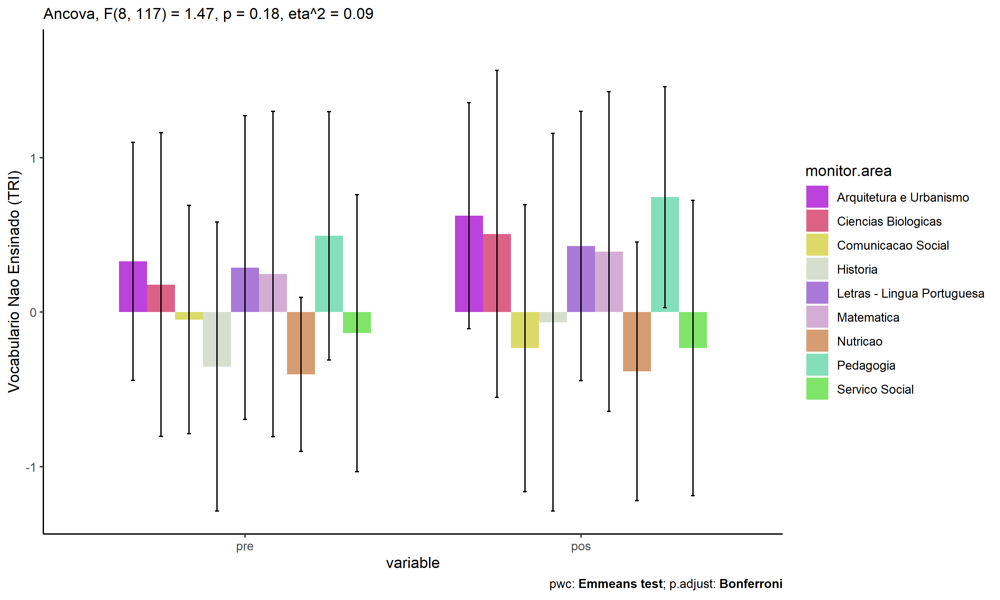<!-- -->

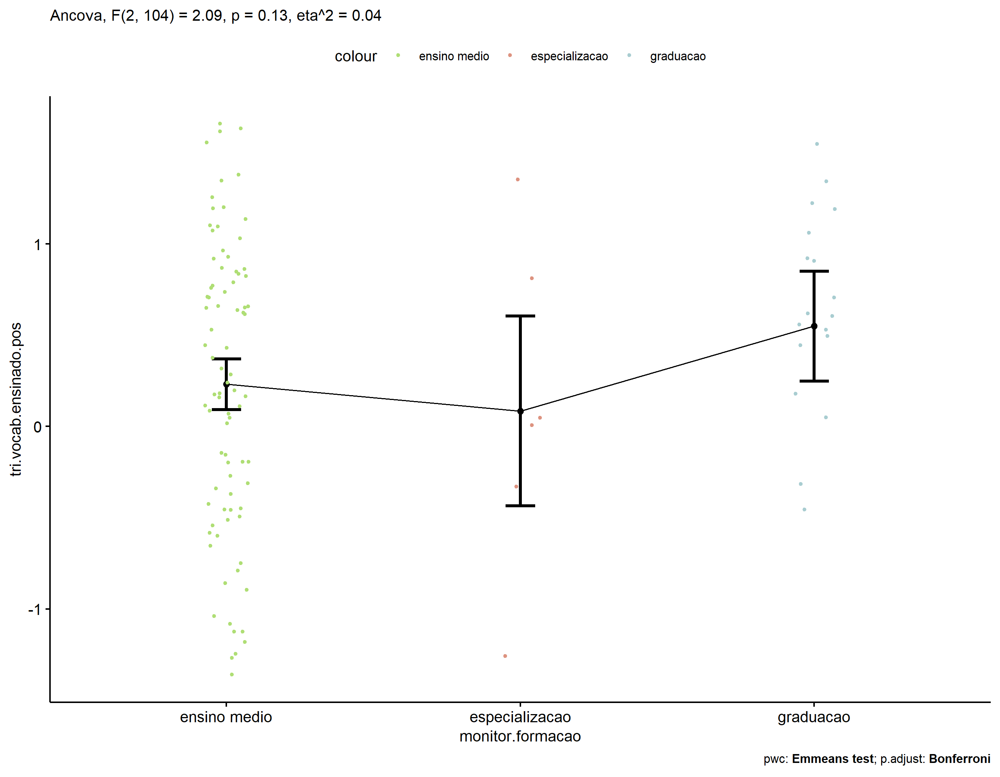<!-- -->

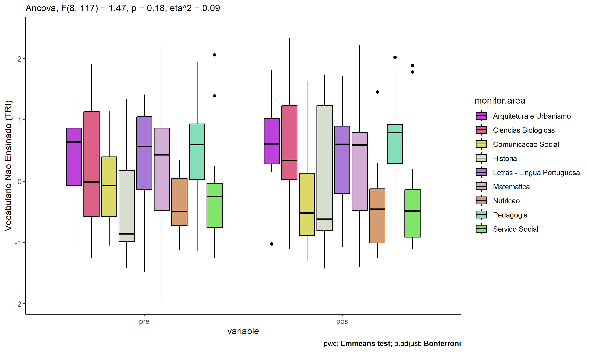<!-- -->

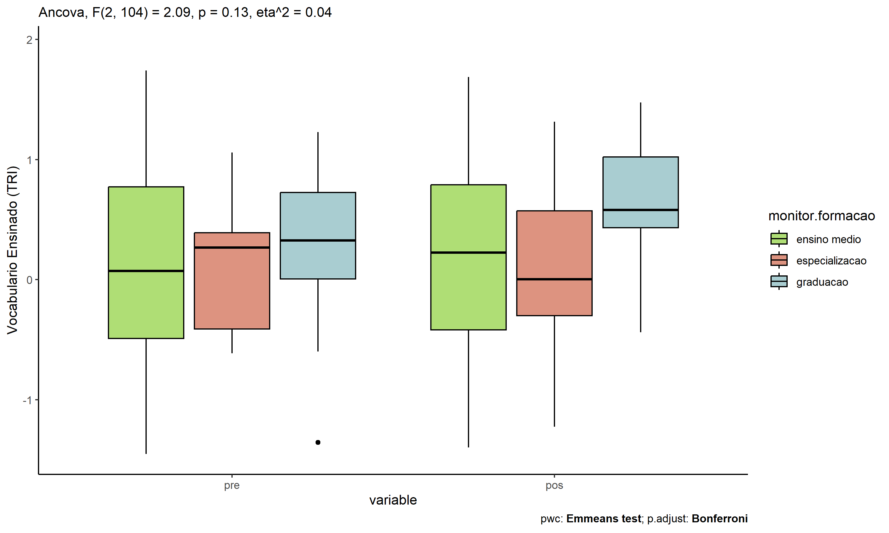<!-- -->

## factores: **grupo=“Experimental”:monitor.formacao**

### Vocabulario (Acertos)

| var             | monitor.formacao |   n | M (pre) | SE (pre) | M (unadj) | SE (unadj) | M (adj) | SE (adj) |
|:----------------|:-----------------|----:|--------:|---------:|----------:|-----------:|--------:|---------:|
| score.vocab.pos | ensino medio     |  91 |  21.132 |    0.902 |    22.560 |      0.944 |  22.764 |    0.635 |
| score.vocab.pos | especializacao   |  15 |  20.600 |    2.072 |    18.467 |      2.095 |  19.060 |    1.565 |
| score.vocab.pos | graduacao        |  21 |  23.190 |    1.884 |    26.000 |      1.655 |  24.695 |    1.326 |

| .y.             | group1         | group2         | estimate | conf.low | conf.high |    se | statistic |     p | p.adj | p.adj.signif |
|:----------------|:---------------|:---------------|---------:|---------:|----------:|------:|----------:|------:|------:|:-------------|
| score.vocab.pos | ensino medio   | especializacao |    3.704 |    0.363 |     7.045 | 1.688 |     2.194 | 0.030 | 0.090 | ns           |
| score.vocab.pos | ensino medio   | graduacao      |   -1.931 |   -4.845 |     0.983 | 1.472 |    -1.312 | 0.192 | 0.576 | ns           |
| score.vocab.pos | especializacao | graduacao      |   -5.635 |   -9.701 |    -1.569 | 2.054 |    -2.743 | 0.007 | 0.021 | \*           |
| score.vocab.pre | ensino medio   | especializacao |    0.532 |   -4.181 |     5.245 | 2.381 |     0.223 | 0.824 | 1.000 | ns           |
| score.vocab.pre | ensino medio   | graduacao      |   -2.059 |   -6.153 |     2.036 | 2.069 |    -0.995 | 0.322 | 0.965 | ns           |
| score.vocab.pre | especializacao | graduacao      |   -2.590 |   -8.308 |     3.127 | 2.889 |    -0.897 | 0.372 | 1.000 | ns           |

| .y.         | monitor.formacao | group1 | group2 | estimate | conf.low | conf.high |    se | statistic |     p | p.adj | p.adj.signif |
|:------------|:-----------------|:-------|:-------|---------:|---------:|----------:|------:|----------:|------:|------:|:-------------|
| score.vocab | ensino medio     | pre    | pos    |   -1.430 |   -3.882 |     1.021 | 1.245 |    -1.149 | 0.252 | 0.252 | ns           |
| score.vocab | especializacao   | pre    | pos    |    1.288 |   -4.794 |     7.369 | 3.088 |     0.417 | 0.677 | 0.677 | ns           |
| score.vocab | graduacao        | pre    | pos    |   -2.006 |   -7.052 |     3.040 | 2.563 |    -0.783 | 0.434 | 0.434 | ns           |

    ## Scale for colour is already present.
    ## Adding another scale for colour, which will replace the existing scale.

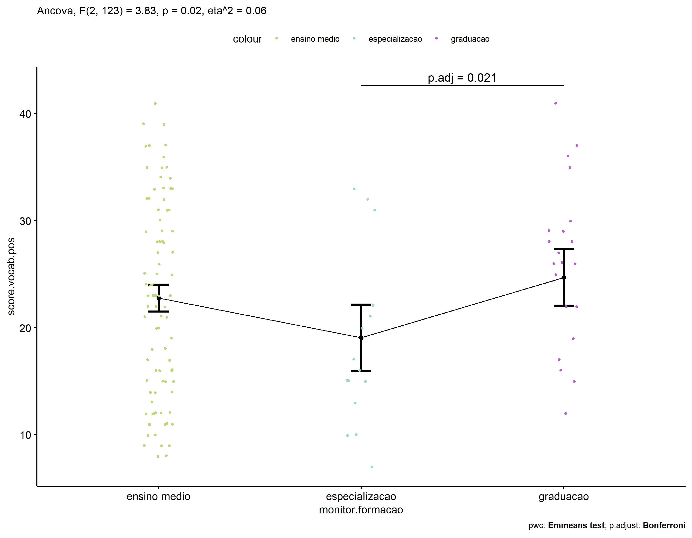<!-- -->

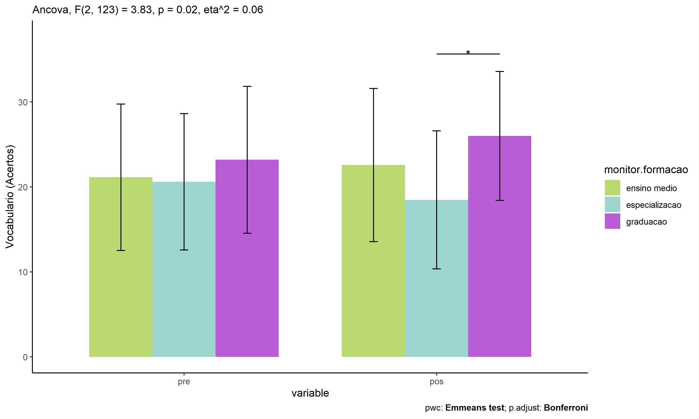<!-- -->

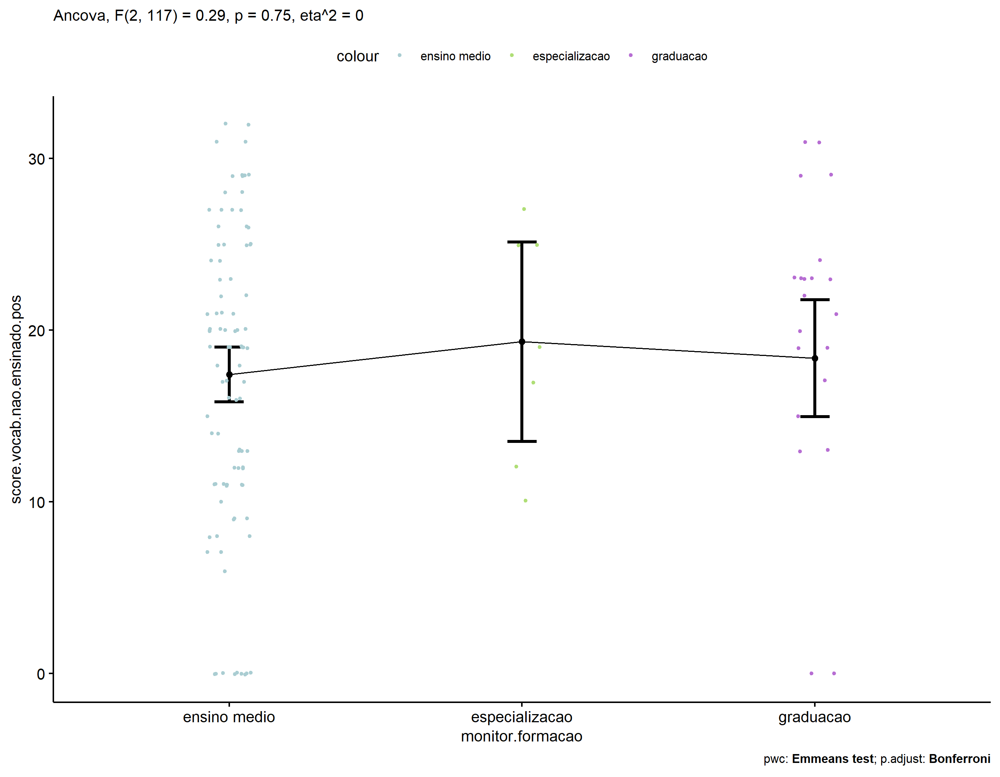<!-- -->

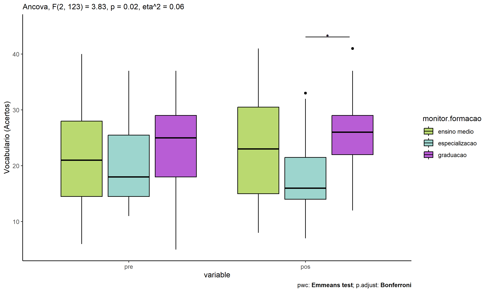<!-- -->

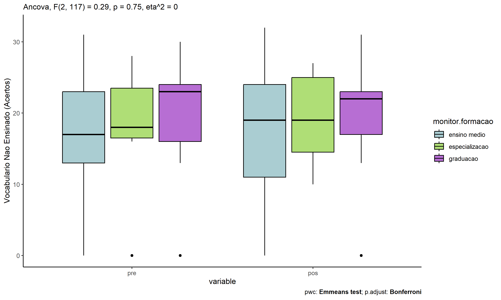<!-- -->

### Vocabulario (TRI)

| var           | monitor.formacao |   n | M (pre) | SE (pre) | M (unadj) | SE (unadj) | M (adj) | SE (adj) |
|:--------------|:-----------------|----:|--------:|---------:|----------:|-----------:|--------:|---------:|
| tri.vocab.pos | ensino medio     |  91 |   0.036 |    0.103 |     0.208 |      0.102 |   0.253 |    0.066 |
| tri.vocab.pos | especializacao   |  15 |   0.052 |    0.178 |    -0.158 |      0.234 |  -0.124 |    0.163 |
| tri.vocab.pos | graduacao        |  21 |   0.397 |    0.180 |     0.553 |      0.176 |   0.330 |    0.139 |

| .y.           | group1         | group2         | estimate | conf.low | conf.high |    se | statistic |     p | p.adj | p.adj.signif |
|:--------------|:---------------|:---------------|---------:|---------:|----------:|------:|----------:|------:|------:|:-------------|
| tri.vocab.pos | ensino medio   | especializacao |    0.377 |    0.029 |     0.726 | 0.176 |     2.141 | 0.034 | 0.103 | ns           |
| tri.vocab.pos | ensino medio   | graduacao      |   -0.077 |   -0.382 |     0.229 | 0.155 |    -0.495 | 0.621 | 1.000 | ns           |
| tri.vocab.pos | especializacao | graduacao      |   -0.454 |   -0.878 |    -0.029 | 0.215 |    -2.113 | 0.037 | 0.110 | ns           |
| tri.vocab.pre | ensino medio   | especializacao |   -0.016 |   -0.529 |     0.498 | 0.260 |    -0.060 | 0.952 | 1.000 | ns           |
| tri.vocab.pre | ensino medio   | graduacao      |   -0.360 |   -0.806 |     0.086 | 0.225 |    -1.597 | 0.113 | 0.339 | ns           |
| tri.vocab.pre | especializacao | graduacao      |   -0.344 |   -0.968 |     0.279 | 0.315 |    -1.094 | 0.276 | 0.828 | ns           |

| .y.       | monitor.formacao | group1 | group2 | estimate | conf.low | conf.high |    se | statistic |     p | p.adj | p.adj.signif |
|:----------|:-----------------|:-------|:-------|---------:|---------:|----------:|------:|----------:|------:|------:|:-------------|
| tri.vocab | ensino medio     | pre    | pos    |   -0.156 |   -0.422 |     0.110 | 0.135 |    -1.154 | 0.249 | 0.249 | ns           |
| tri.vocab | especializacao   | pre    | pos    |    0.129 |   -0.532 |     0.789 | 0.335 |     0.384 | 0.701 | 0.701 | ns           |
| tri.vocab | graduacao        | pre    | pos    |   -0.071 |   -0.619 |     0.477 | 0.278 |    -0.254 | 0.800 | 0.800 | ns           |

    ## Scale for colour is already present.
    ## Adding another scale for colour, which will replace the existing scale.

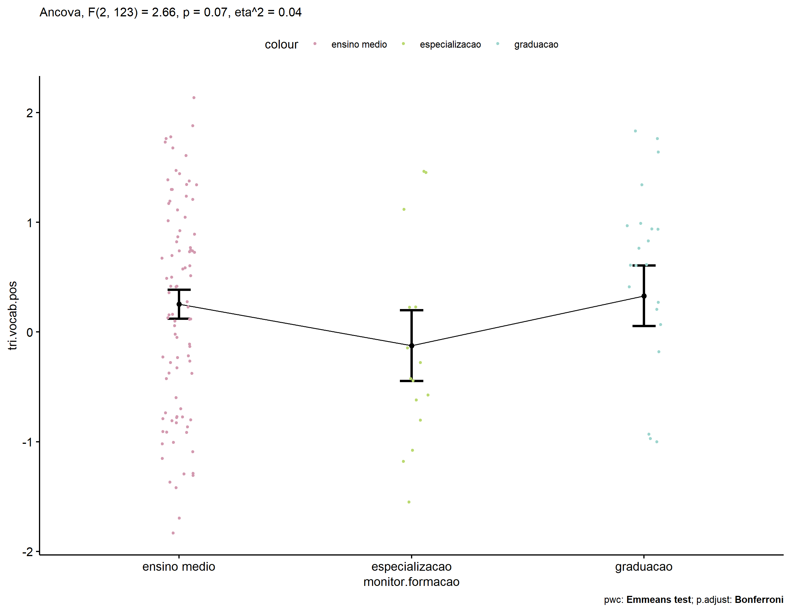<!-- -->

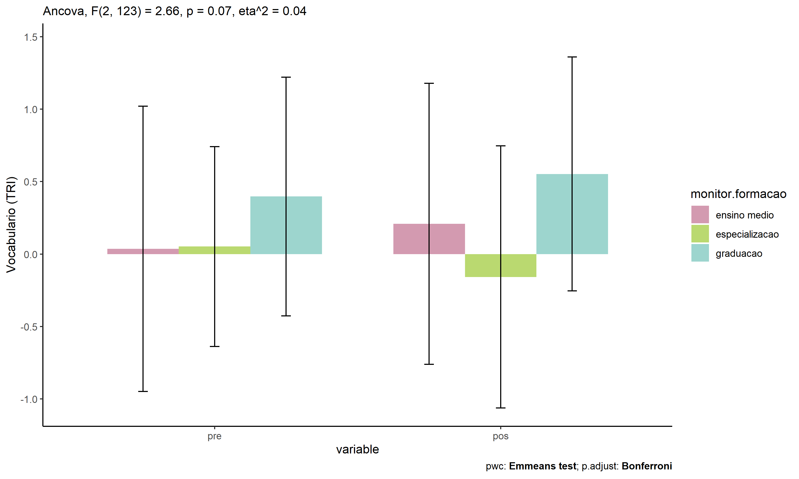<!-- -->

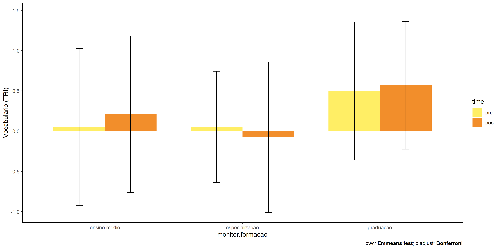<!-- -->

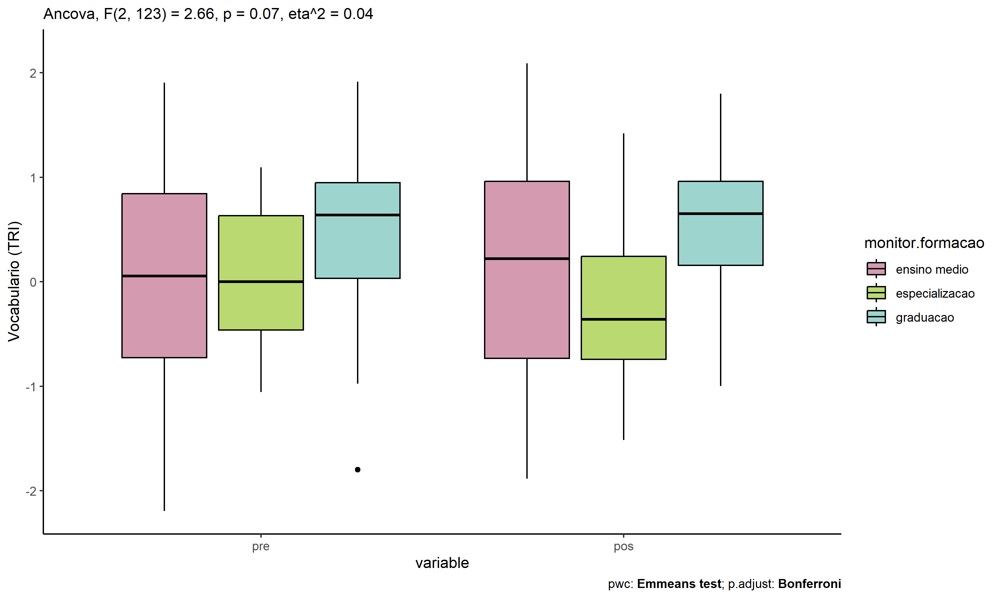<!-- -->

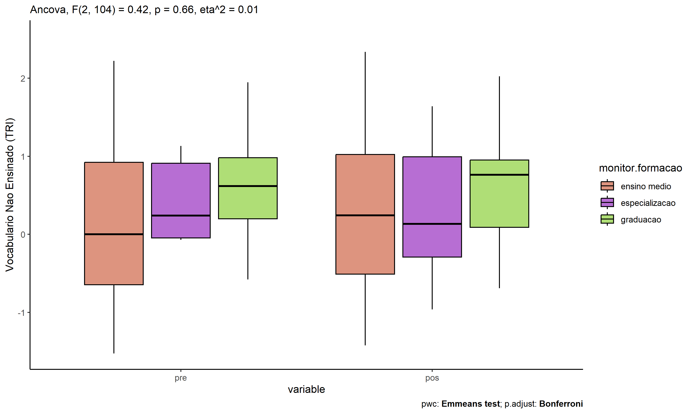<!-- -->

### Vocabulario Ensinado (Acertos)

| var                      | monitor.formacao |   n | M (pre) | SE (pre) | M (unadj) | SE (unadj) | M (adj) | SE (adj) |
|:-------------------------|:-----------------|----:|--------:|---------:|----------:|-----------:|--------:|---------:|
| score.vocab.ensinado.pos | ensino medio     | 101 |   4.129 |    0.208 |     3.960 |      0.249 |   3.949 |    0.225 |
| score.vocab.ensinado.pos | especializacao   |  16 |   4.062 |    0.595 |     4.438 |      0.418 |   4.452 |    0.565 |
| score.vocab.ensinado.pos | graduacao        |  24 |   4.000 |    0.478 |     4.750 |      0.475 |   4.788 |    0.461 |

| .y.                      | group1         | group2         | estimate | conf.low | conf.high |    se | statistic |     p | p.adj | p.adj.signif |
|:-------------------------|:---------------|:---------------|---------:|---------:|----------:|------:|----------:|------:|------:|:-------------|
| score.vocab.ensinado.pos | ensino medio   | especializacao |   -0.503 |   -1.704 |     0.699 | 0.608 |    -0.827 | 0.410 | 1.000 | ns           |
| score.vocab.ensinado.pos | ensino medio   | graduacao      |   -0.839 |   -1.853 |     0.175 | 0.513 |    -1.636 | 0.104 | 0.312 | ns           |
| score.vocab.ensinado.pos | especializacao | graduacao      |   -0.337 |   -1.778 |     1.105 | 0.729 |    -0.462 | 0.645 | 1.000 | ns           |
| score.vocab.ensinado.pre | ensino medio   | especializacao |    0.066 |   -1.087 |     1.219 | 0.583 |     0.114 | 0.910 | 1.000 | ns           |
| score.vocab.ensinado.pre | ensino medio   | graduacao      |    0.129 |   -0.844 |     1.102 | 0.492 |     0.262 | 0.794 | 1.000 | ns           |
| score.vocab.ensinado.pre | especializacao | graduacao      |    0.062 |   -1.321 |     1.446 | 0.700 |     0.089 | 0.929 | 1.000 | ns           |

| .y.                  | monitor.formacao | group1 | group2 | estimate | conf.low | conf.high |    se | statistic |     p | p.adj | p.adj.signif |
|:---------------------|:-----------------|:-------|:-------|---------:|---------:|----------:|------:|----------:|------:|------:|:-------------|
| score.vocab.ensinado | ensino medio     | pre    | pos    |    0.168 |   -0.465 |     0.802 | 0.322 |     0.523 | 0.601 | 0.601 | ns           |
| score.vocab.ensinado | especializacao   | pre    | pos    |   -0.375 |   -1.966 |     1.216 | 0.808 |    -0.464 | 0.643 | 0.643 | ns           |
| score.vocab.ensinado | graduacao        | pre    | pos    |   -0.750 |   -2.049 |     0.549 | 0.660 |    -1.136 | 0.257 | 0.257 | ns           |

    ## Scale for colour is already present.
    ## Adding another scale for colour, which will replace the existing scale.

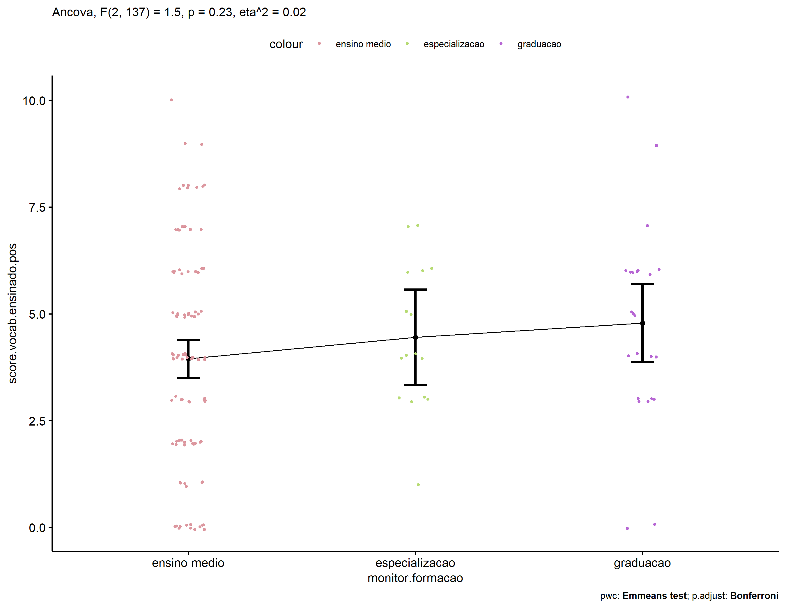<!-- -->

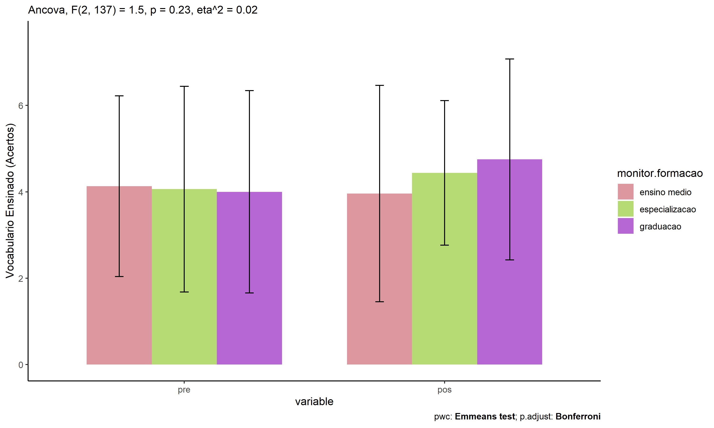<!-- -->

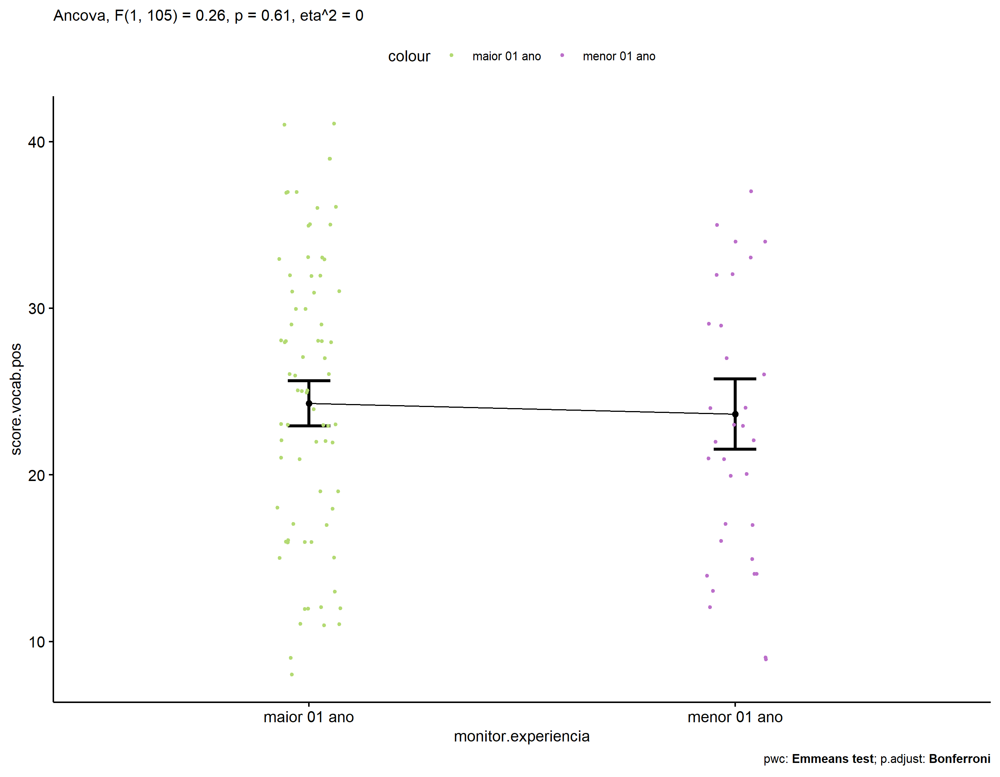<!-- -->

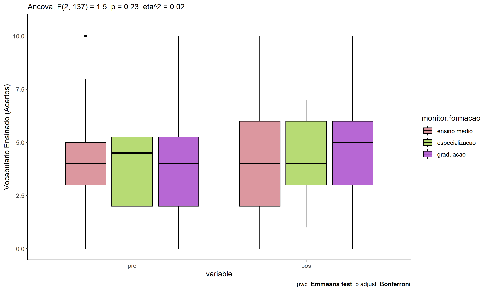<!-- -->

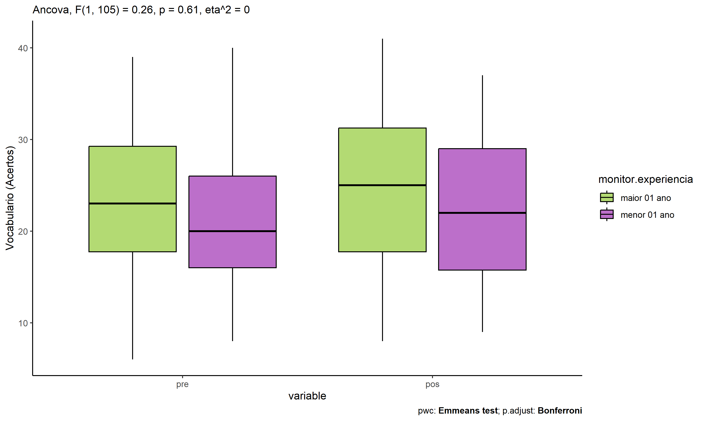<!-- -->

### Vocabulario Ensinado (TRI)

| var                    | monitor.formacao |   n | M (pre) | SE (pre) | M (unadj) | SE (unadj) | M (adj) | SE (adj) |
|:-----------------------|:-----------------|----:|--------:|---------:|----------:|-----------:|--------:|---------:|
| tri.vocab.ensinado.pos | ensino medio     |  91 |   0.068 |    0.084 |     0.126 |      0.086 |   0.129 |    0.068 |
| tri.vocab.ensinado.pos | especializacao   |  15 |  -0.039 |    0.188 |    -0.056 |      0.178 |   0.006 |    0.168 |
| tri.vocab.ensinado.pos | graduacao        |  21 |   0.174 |    0.151 |     0.541 |      0.134 |   0.485 |    0.142 |

| .y.                    | group1         | group2         | estimate | conf.low | conf.high |    se | statistic |     p | p.adj | p.adj.signif |
|:-----------------------|:---------------|:---------------|---------:|---------:|----------:|------:|----------:|------:|------:|:-------------|
| tri.vocab.ensinado.pos | ensino medio   | especializacao |    0.122 |   -0.237 |     0.481 | 0.181 |     0.674 | 0.502 | 1.000 | ns           |
| tri.vocab.ensinado.pos | ensino medio   | graduacao      |   -0.356 |   -0.669 |    -0.044 | 0.158 |    -2.260 | 0.026 | 0.077 | ns           |
| tri.vocab.ensinado.pos | especializacao | graduacao      |   -0.479 |   -0.915 |    -0.042 | 0.221 |    -2.171 | 0.032 | 0.096 | ns           |
| tri.vocab.ensinado.pre | ensino medio   | especializacao |    0.107 |   -0.320 |     0.534 | 0.216 |     0.497 | 0.620 | 1.000 | ns           |
| tri.vocab.ensinado.pre | ensino medio   | graduacao      |   -0.106 |   -0.477 |     0.265 | 0.188 |    -0.564 | 0.574 | 1.000 | ns           |
| tri.vocab.ensinado.pre | especializacao | graduacao      |   -0.213 |   -0.731 |     0.305 | 0.262 |    -0.813 | 0.418 | 1.000 | ns           |

| .y.                | monitor.formacao | group1 | group2 | estimate | conf.low | conf.high |    se | statistic |     p | p.adj | p.adj.signif |
|:-------------------|:-----------------|:-------|:-------|---------:|---------:|----------:|------:|----------:|------:|------:|:-------------|
| tri.vocab.ensinado | ensino medio     | pre    | pos    |   -0.039 |   -0.259 |     0.181 | 0.112 |    -0.352 | 0.725 | 0.725 | ns           |
| tri.vocab.ensinado | especializacao   | pre    | pos    |   -0.051 |   -0.596 |     0.495 | 0.277 |    -0.182 | 0.855 | 0.855 | ns           |
| tri.vocab.ensinado | graduacao        | pre    | pos    |   -0.301 |   -0.754 |     0.151 | 0.230 |    -1.311 | 0.191 | 0.191 | ns           |

    ## Scale for colour is already present.
    ## Adding another scale for colour, which will replace the existing scale.

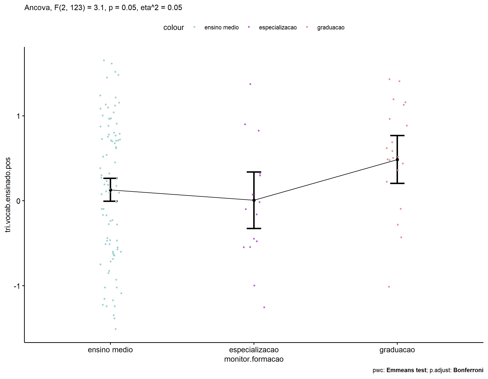<!-- -->

<!-- -->

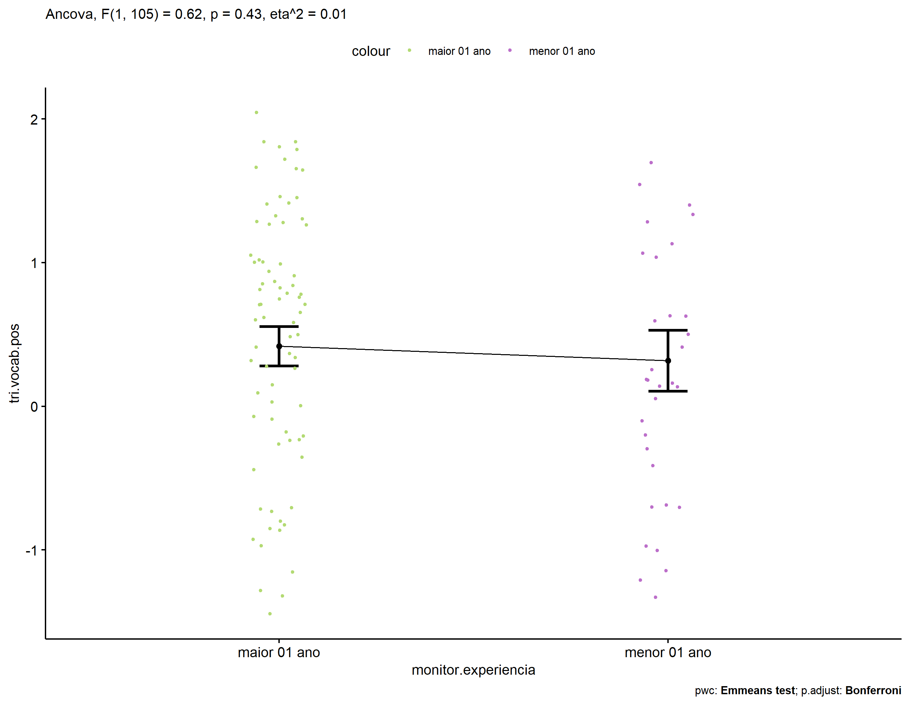<!-- -->

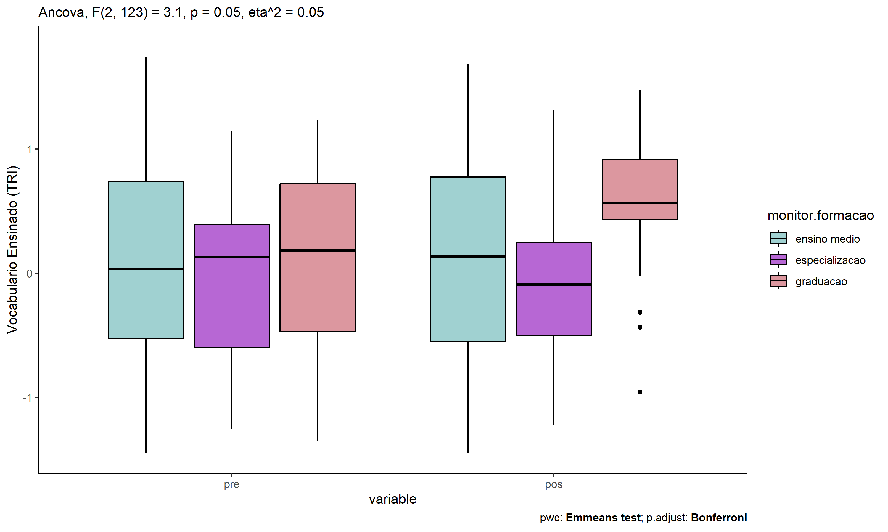<!-- -->

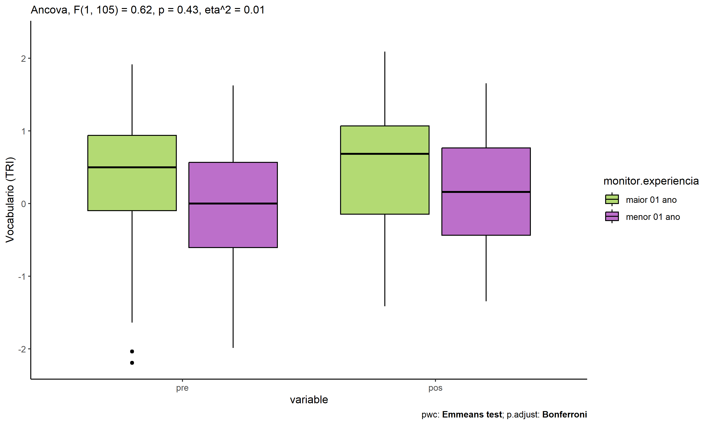<!-- -->

### Vocabulario Nao Ensinado (Acertos)

| var                          | monitor.formacao |   n | M (pre) | SE (pre) | M (unadj) | SE (unadj) | M (adj) | SE (adj) |
|:-----------------------------|:-----------------|----:|--------:|---------:|----------:|-----------:|--------:|---------:|
| score.vocab.nao.ensinado.pos | ensino medio     | 101 |  16.792 |    0.713 |    16.376 |      0.873 |  16.498 |    0.755 |
| score.vocab.nao.ensinado.pos | especializacao   |  16 |  15.250 |    1.843 |    14.875 |      1.850 |  15.845 |    1.903 |
| score.vocab.nao.ensinado.pos | graduacao        |  24 |  19.125 |    1.642 |    19.208 |      1.706 |  18.048 |    1.560 |

| .y.                          | group1         | group2         | estimate | conf.low | conf.high |    se | statistic |     p | p.adj | p.adj.signif |
|:-----------------------------|:---------------|:---------------|---------:|---------:|----------:|------:|----------:|------:|------:|:-------------|
| score.vocab.nao.ensinado.pos | ensino medio   | especializacao |    0.654 |   -3.392 |     4.699 | 2.046 |     0.320 | 0.750 | 1.000 | ns           |
| score.vocab.nao.ensinado.pos | ensino medio   | graduacao      |   -1.550 |   -4.981 |     1.881 | 1.735 |    -0.893 | 0.373 | 1.000 | ns           |
| score.vocab.nao.ensinado.pos | especializacao | graduacao      |   -2.204 |   -7.092 |     2.684 | 2.472 |    -0.892 | 0.374 | 1.000 | ns           |
| score.vocab.nao.ensinado.pre | ensino medio   | especializacao |    1.542 |   -2.365 |     5.449 | 1.976 |     0.781 | 0.436 | 1.000 | ns           |
| score.vocab.nao.ensinado.pre | ensino medio   | graduacao      |   -2.333 |   -5.630 |     0.964 | 1.667 |    -1.399 | 0.164 | 0.492 | ns           |
| score.vocab.nao.ensinado.pre | especializacao | graduacao      |   -3.875 |   -8.561 |     0.811 | 2.370 |    -1.635 | 0.104 | 0.313 | ns           |

| .y.                      | monitor.formacao | group1 | group2 | estimate | conf.low | conf.high |    se | statistic |     p | p.adj | p.adj.signif |
|:-------------------------|:-----------------|:-------|:-------|---------:|---------:|----------:|------:|----------:|------:|------:|:-------------|
| score.vocab.nao.ensinado | ensino medio     | pre    | pos    |    0.416 |   -1.795 |     2.626 | 1.123 |     0.370 | 0.711 | 0.711 | ns           |
| score.vocab.nao.ensinado | especializacao   | pre    | pos    |    0.375 |   -5.178 |     5.928 | 2.821 |     0.133 | 0.894 | 0.894 | ns           |
| score.vocab.nao.ensinado | graduacao        | pre    | pos    |   -0.083 |   -4.618 |     4.451 | 2.303 |    -0.036 | 0.971 | 0.971 | ns           |

    ## Scale for colour is already present.
    ## Adding another scale for colour, which will replace the existing scale.

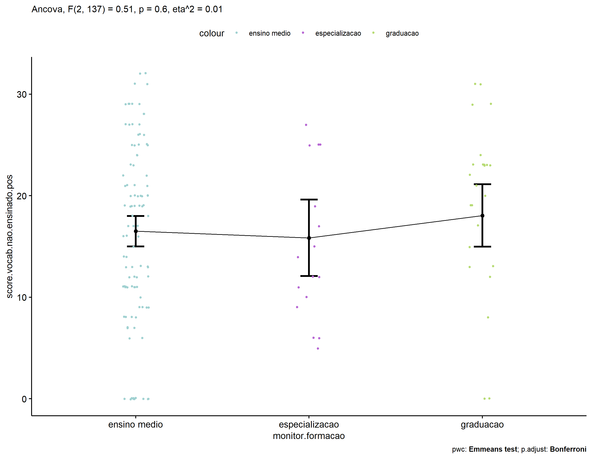<!-- -->

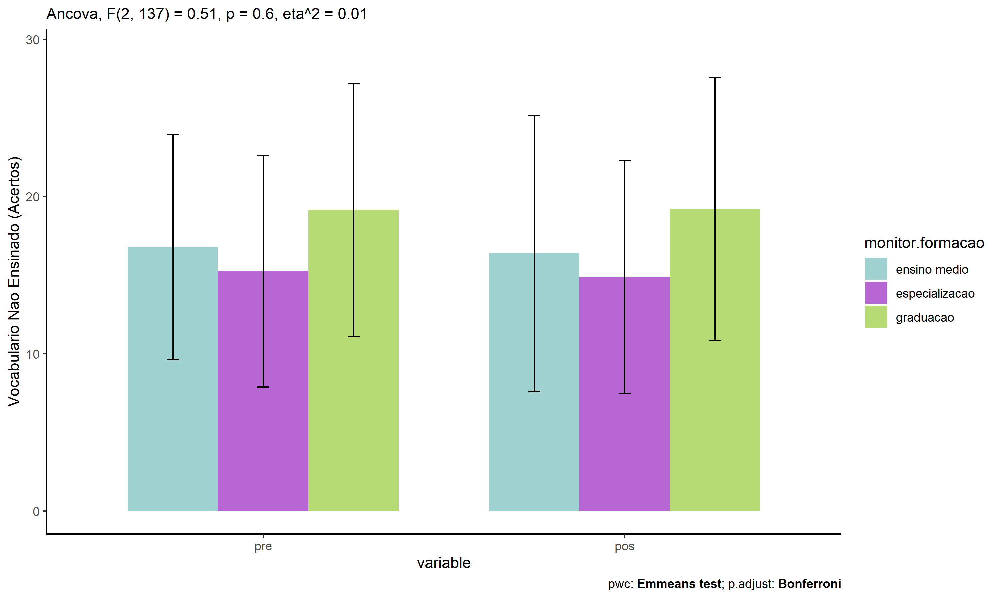<!-- -->

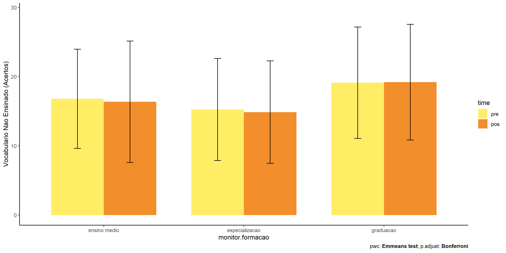<!-- -->

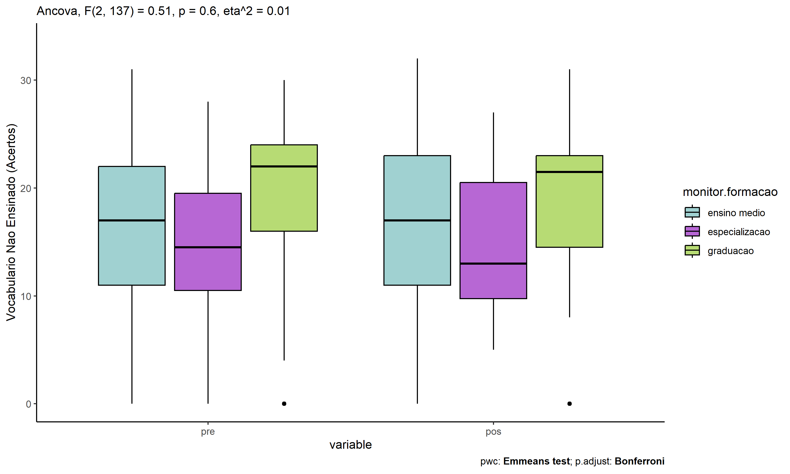<!-- -->

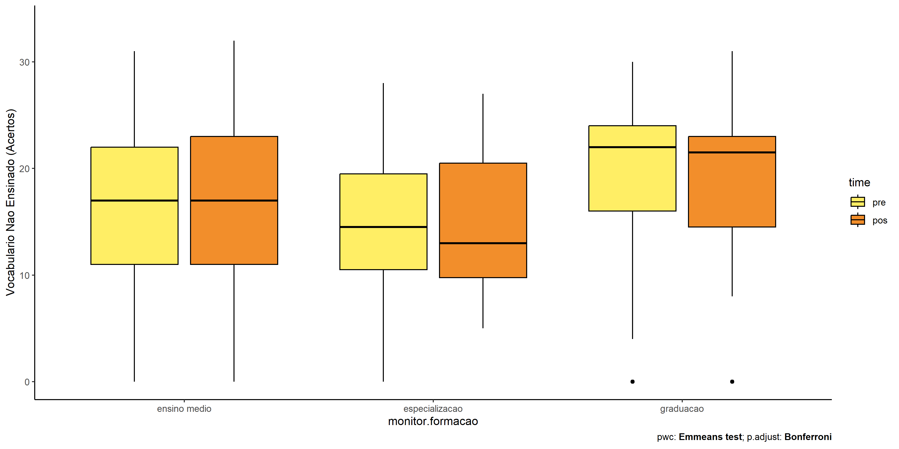<!-- -->

### Vocabulario Nao Ensinado (TRI)

| var                        | monitor.formacao |   n | M (pre) | SE (pre) | M (unadj) | SE (unadj) | M (adj) | SE (adj) |
|:---------------------------|:-----------------|----:|--------:|---------:|----------:|-----------:|--------:|---------:|
| tri.vocab.nao.ensinado.pos | ensino medio     |  91 |   0.047 |    0.099 |     0.214 |      0.107 |   0.246 |    0.069 |
| tri.vocab.nao.ensinado.pos | especializacao   |  15 |  -0.048 |    0.191 |    -0.233 |      0.240 |  -0.123 |    0.170 |
| tri.vocab.nao.ensinado.pos | graduacao        |  21 |   0.354 |    0.189 |     0.542 |      0.193 |   0.323 |    0.144 |

| .y.                        | group1         | group2         | estimate | conf.low | conf.high |    se | statistic |     p | p.adj | p.adj.signif |
|:---------------------------|:---------------|:---------------|---------:|---------:|----------:|------:|----------:|------:|------:|:-------------|
| tri.vocab.nao.ensinado.pos | ensino medio   | especializacao |    0.369 |    0.006 |     0.731 | 0.183 |     2.014 | 0.046 | 0.139 | ns           |
| tri.vocab.nao.ensinado.pos | ensino medio   | graduacao      |   -0.077 |   -0.394 |     0.240 | 0.160 |    -0.480 | 0.632 | 1.000 | ns           |
| tri.vocab.nao.ensinado.pos | especializacao | graduacao      |   -0.446 |   -0.888 |    -0.003 | 0.224 |    -1.994 | 0.048 | 0.145 | ns           |
| tri.vocab.nao.ensinado.pre | ensino medio   | especializacao |    0.095 |   -0.406 |     0.596 | 0.253 |     0.375 | 0.708 | 1.000 | ns           |
| tri.vocab.nao.ensinado.pre | ensino medio   | graduacao      |   -0.307 |   -0.742 |     0.129 | 0.220 |    -1.395 | 0.166 | 0.497 | ns           |
| tri.vocab.nao.ensinado.pre | especializacao | graduacao      |   -0.402 |   -1.010 |     0.206 | 0.307 |    -1.308 | 0.193 | 0.580 | ns           |

| .y.                    | monitor.formacao | group1 | group2 | estimate | conf.low | conf.high |    se | statistic |     p | p.adj | p.adj.signif |
|:-----------------------|:-----------------|:-------|:-------|---------:|---------:|----------:|------:|----------:|------:|------:|:-------------|
| tri.vocab.nao.ensinado | ensino medio     | pre    | pos    |   -0.164 |   -0.434 |     0.105 | 0.137 |    -1.202 | 0.231 | 0.231 | ns           |
| tri.vocab.nao.ensinado | especializacao   | pre    | pos    |    0.104 |   -0.564 |     0.773 | 0.340 |     0.307 | 0.759 | 0.759 | ns           |
| tri.vocab.nao.ensinado | graduacao        | pre    | pos    |   -0.082 |   -0.637 |     0.473 | 0.282 |    -0.291 | 0.771 | 0.771 | ns           |

    ## Scale for colour is already present.
    ## Adding another scale for colour, which will replace the existing scale.

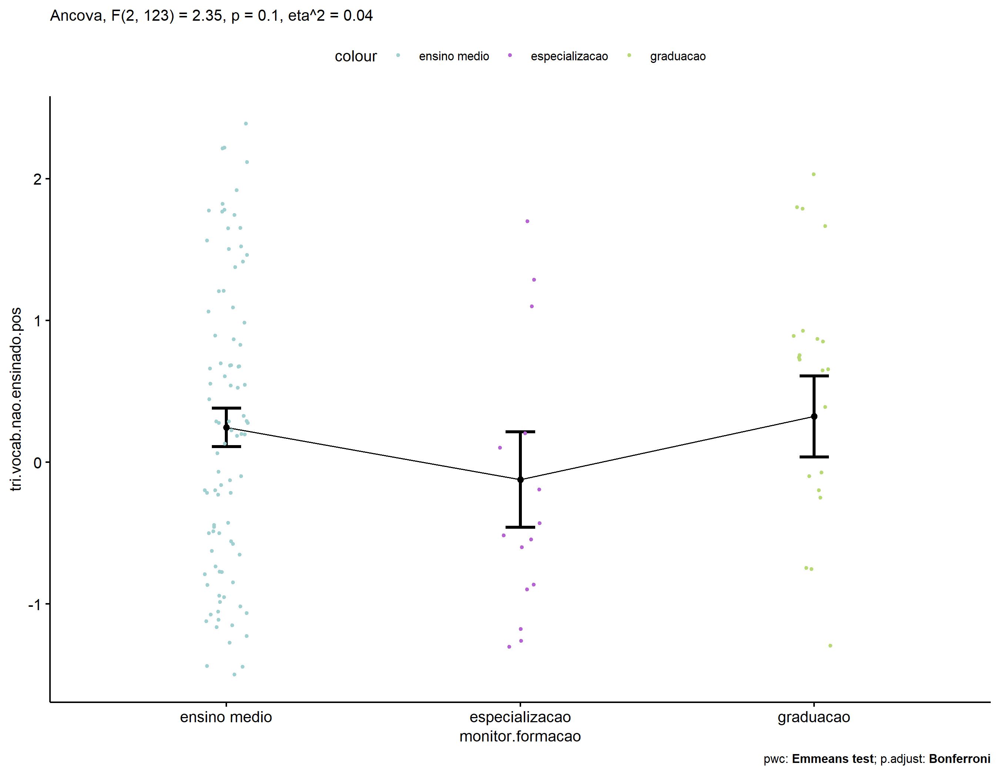<!-- -->

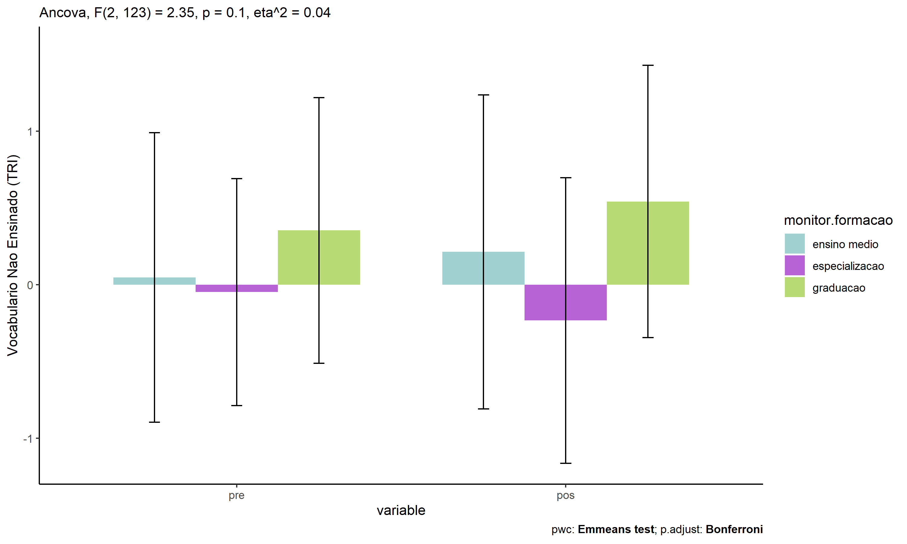<!-- -->

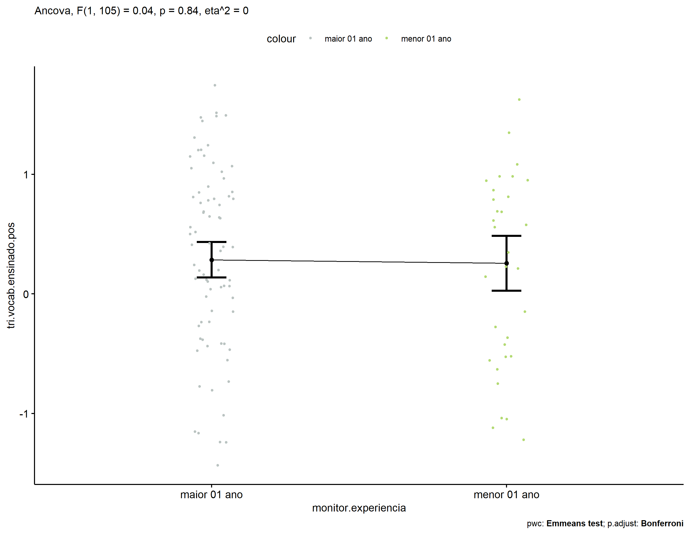<!-- -->

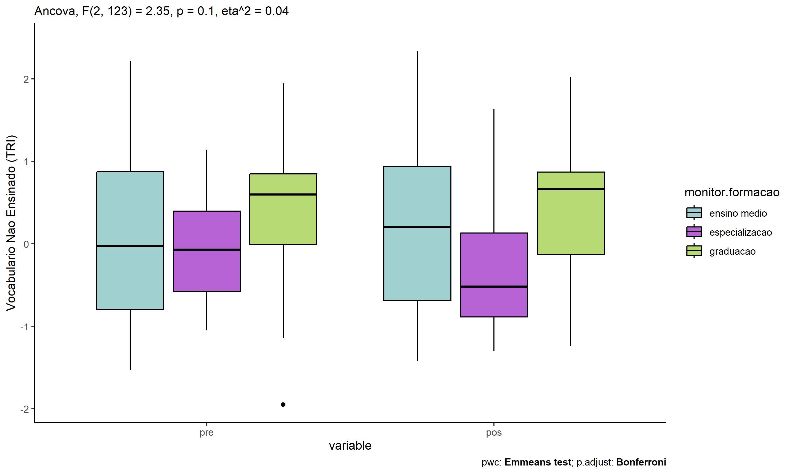<!-- -->

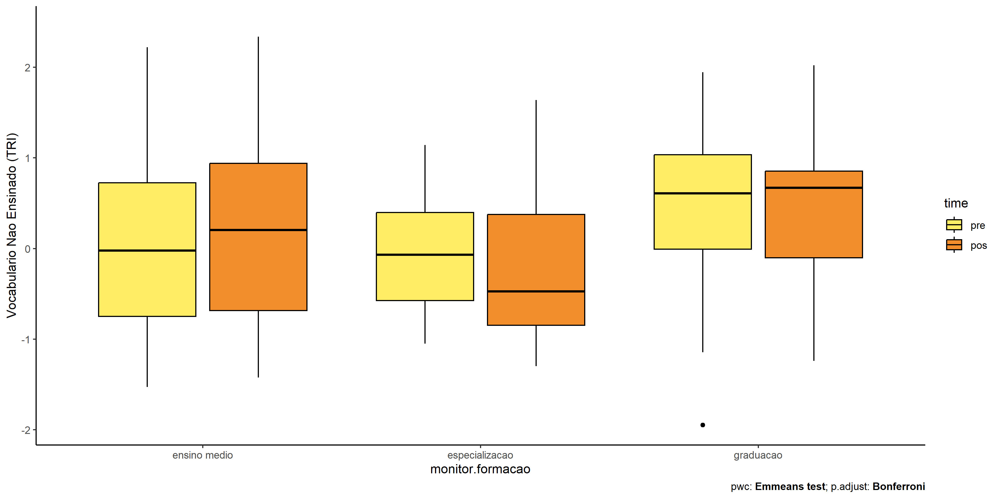<!-- -->

## factores: **grupo=“Experimental”:monitor.experiencia**

### Vocabulario (Acertos)

| var             | monitor.experiencia |   n | M (pre) | SE (pre) | M (unadj) | SE (unadj) | M (adj) | SE (adj) |
|:----------------|:--------------------|----:|--------:|---------:|----------:|-----------:|--------:|---------:|
| score.vocab.pos | maior 01 ano        |  91 |  21.835 |    0.921 |    23.253 |      0.941 |  22.937 |    0.650 |
| score.vocab.pos | menor 01 ano        |  36 |  20.333 |    1.301 |    21.111 |      1.411 |  21.909 |    1.036 |

| .y.             | group1       | group2       | estimate | conf.low | conf.high |    se | statistic |     p | p.adj | p.adj.signif |
|:----------------|:-------------|:-------------|---------:|---------:|----------:|------:|----------:|------:|------:|:-------------|
| score.vocab.pos | maior 01 ano | menor 01 ano |    1.028 |   -1.395 |     3.452 | 1.224 |     0.840 | 0.403 | 0.403 | ns           |
| score.vocab.pre | maior 01 ano | menor 01 ano |    1.502 |   -1.819 |     4.823 | 1.678 |     0.895 | 0.372 | 0.372 | ns           |

| .y.         | monitor.experiencia | group1 | group2 | estimate | conf.low | conf.high |    se | statistic |     p | p.adj | p.adj.signif |
|:------------|:--------------------|:-------|:-------|---------:|---------:|----------:|------:|----------:|------:|------:|:-------------|
| score.vocab | maior 01 ano        | pre    | pos    |   -1.346 |   -3.825 |     1.133 | 1.259 |    -1.069 | 0.286 | 0.286 | ns           |
| score.vocab | menor 01 ano        | pre    | pos    |   -0.659 |   -4.528 |     3.211 | 1.965 |    -0.335 | 0.738 | 0.738 | ns           |

    ## Scale for colour is already present.
    ## Adding another scale for colour, which will replace the existing scale.

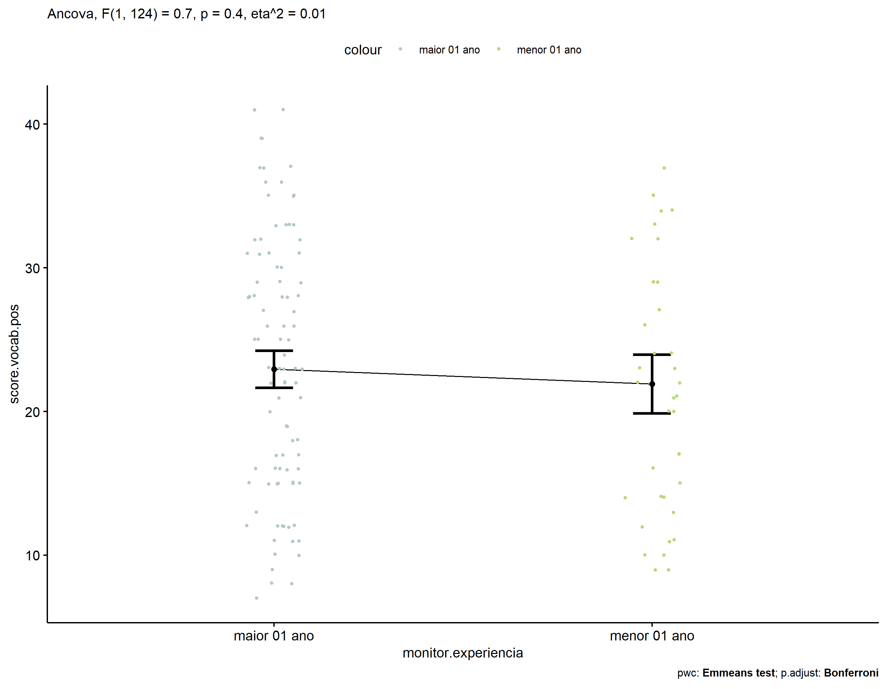<!-- -->

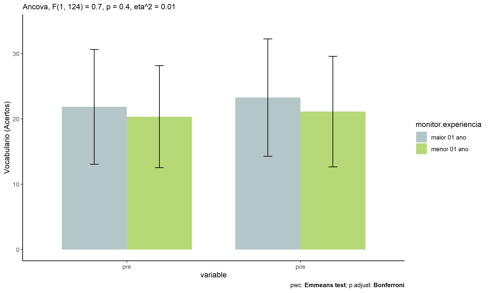<!-- -->

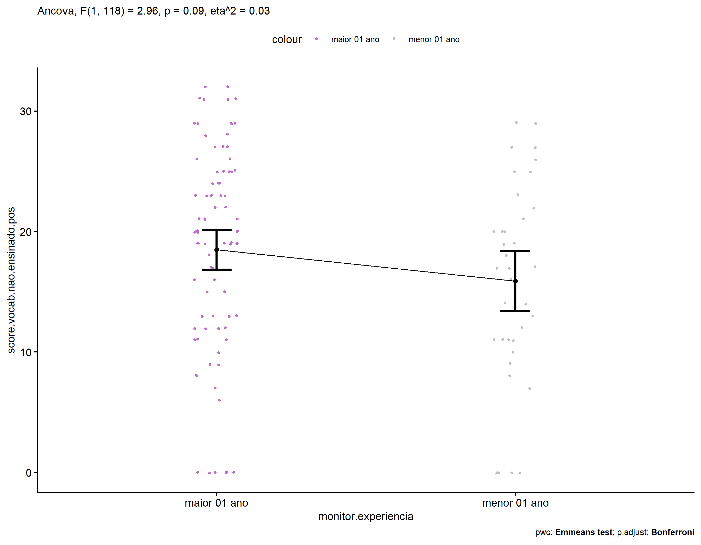<!-- -->

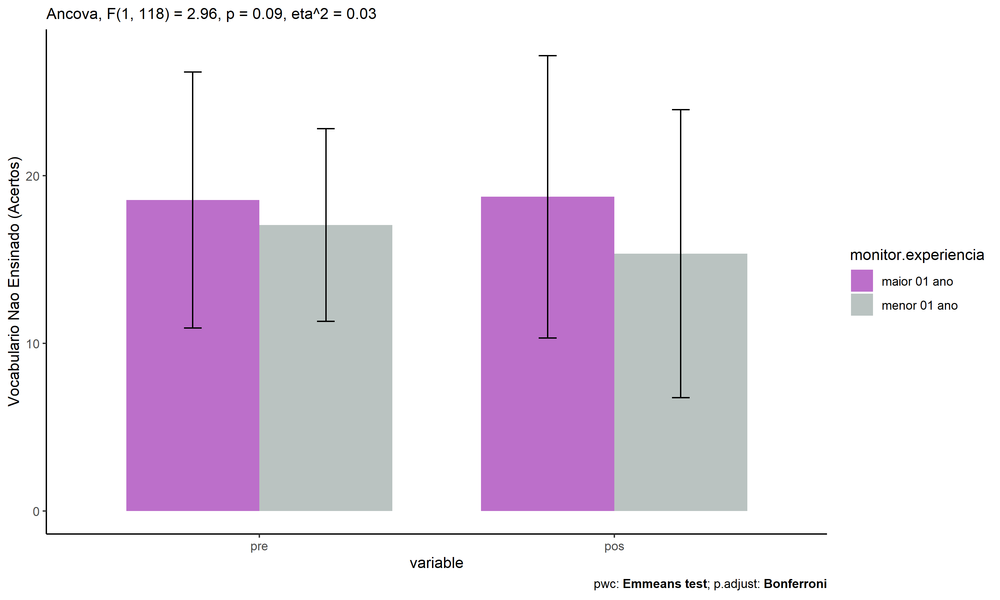<!-- -->

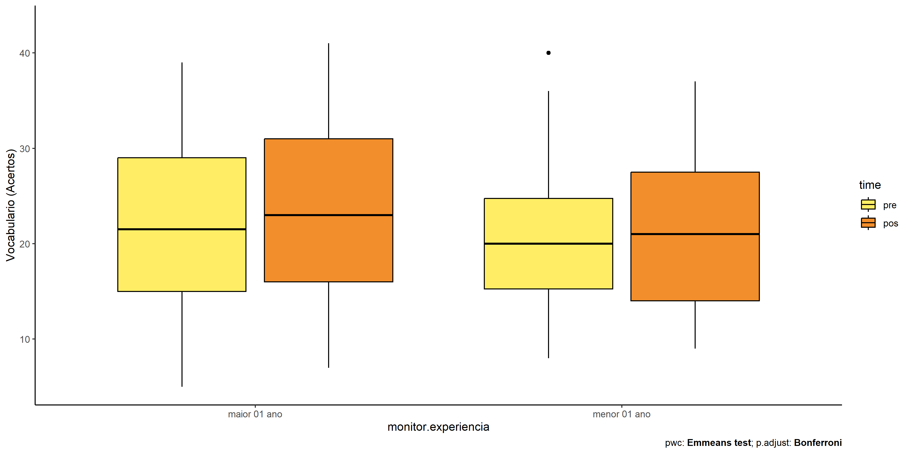<!-- -->

### Vocabulario (TRI)

| var           | monitor.experiencia |   n | M (pre) | SE (pre) | M (unadj) | SE (unadj) | M (adj) | SE (adj) |
|:--------------|:--------------------|----:|--------:|---------:|----------:|-----------:|--------:|---------:|
| tri.vocab.pos | maior 01 ano        |  91 |   0.160 |    0.102 |     0.293 |      0.101 |   0.246 |    0.067 |
| tri.vocab.pos | menor 01 ano        |  36 |  -0.059 |    0.135 |     0.042 |      0.148 |   0.159 |    0.107 |

| .y.           | group1       | group2       | estimate | conf.low | conf.high |    se | statistic |     p | p.adj | p.adj.signif |
|:--------------|:-------------|:-------------|---------:|---------:|----------:|------:|----------:|------:|------:|:-------------|
| tri.vocab.pos | maior 01 ano | menor 01 ano |    0.087 |   -0.165 |     0.338 | 0.127 |     0.683 | 0.496 | 0.496 | ns           |
| tri.vocab.pre | maior 01 ano | menor 01 ano |    0.219 |   -0.144 |     0.583 | 0.184 |     1.195 | 0.234 | 0.234 | ns           |

| .y.       | monitor.experiencia | group1 | group2 | estimate | conf.low | conf.high |    se | statistic |     p | p.adj | p.adj.signif |
|:----------|:--------------------|:-------|:-------|---------:|---------:|----------:|------:|----------:|------:|------:|:-------------|
| tri.vocab | maior 01 ano        | pre    | pos    |   -0.119 |   -0.388 |     0.150 | 0.137 |    -0.869 | 0.386 | 0.386 | ns           |
| tri.vocab | menor 01 ano        | pre    | pos    |   -0.061 |   -0.481 |     0.359 | 0.213 |    -0.286 | 0.775 | 0.775 | ns           |

    ## Scale for colour is already present.
    ## Adding another scale for colour, which will replace the existing scale.

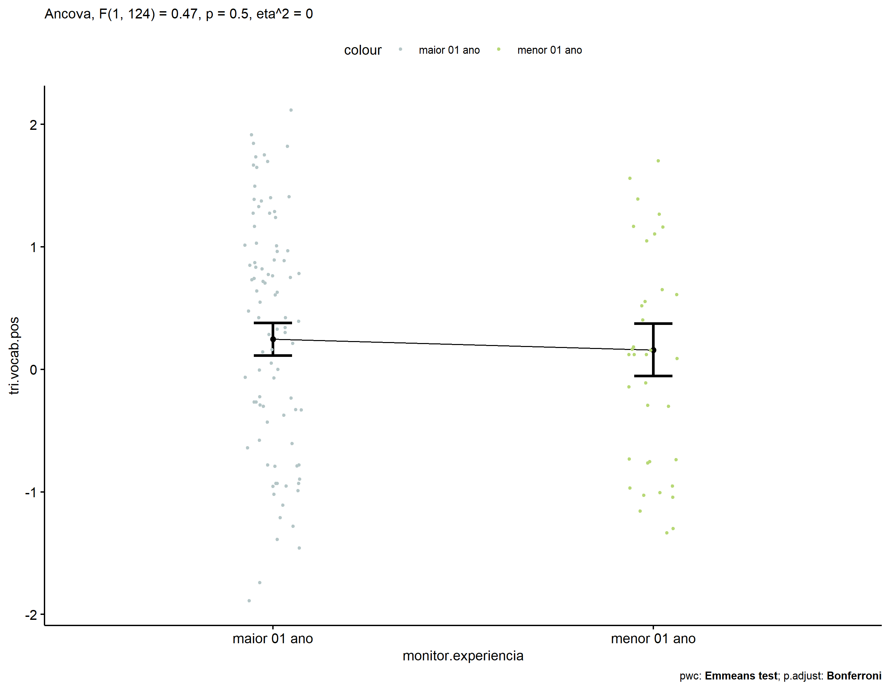<!-- -->

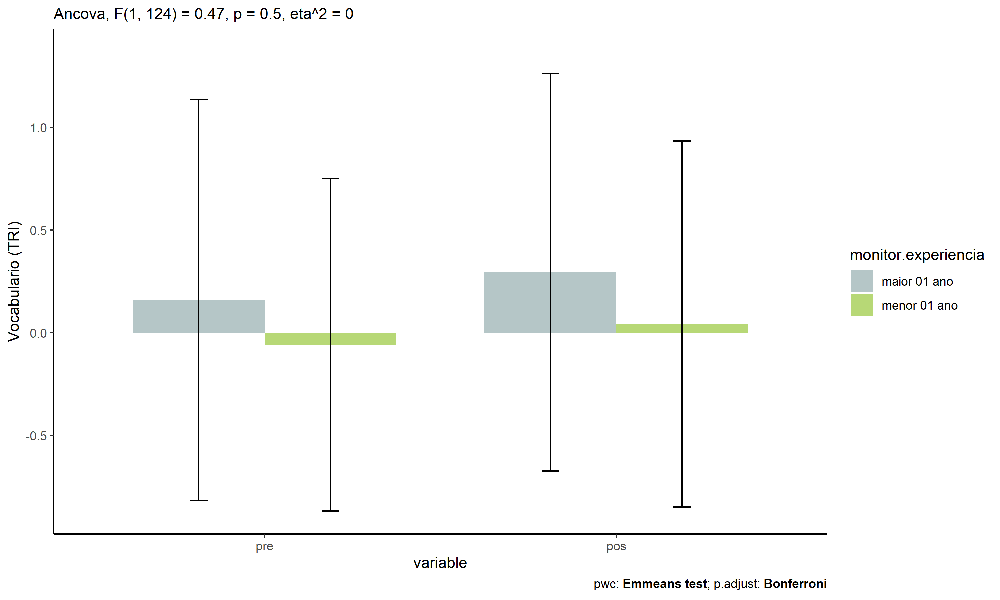<!-- -->

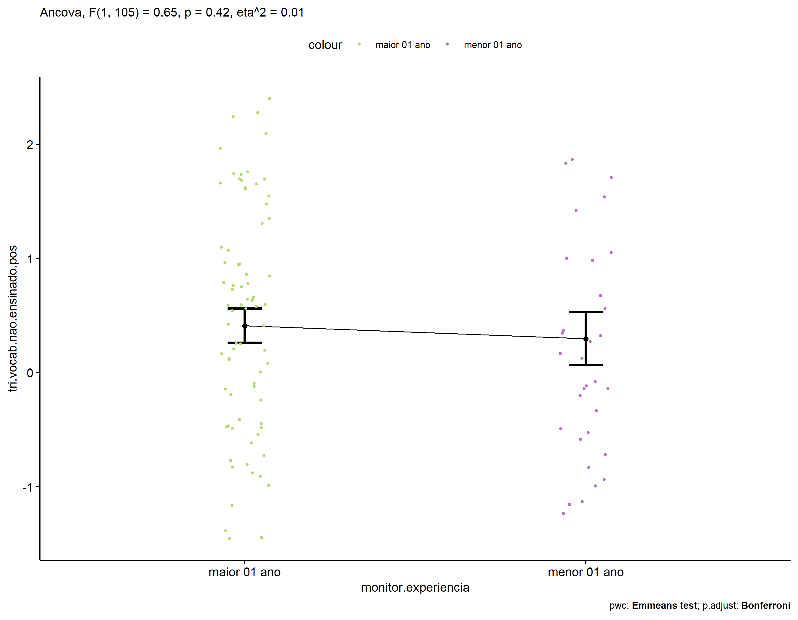<!-- -->

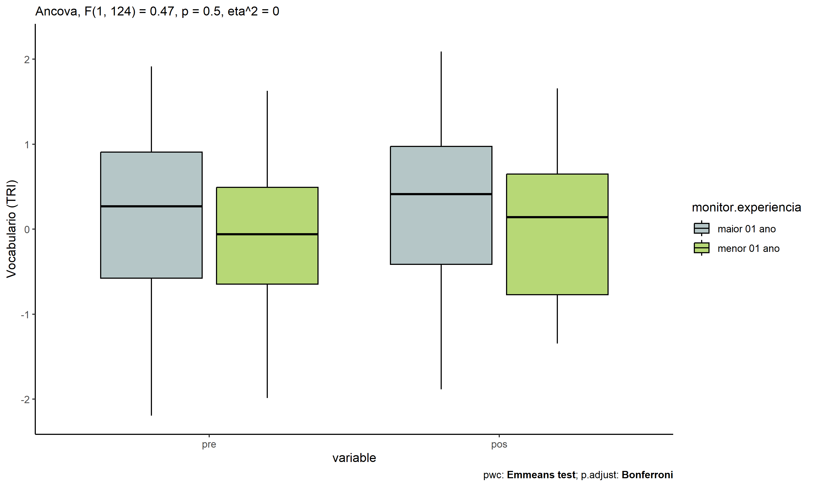<!-- -->

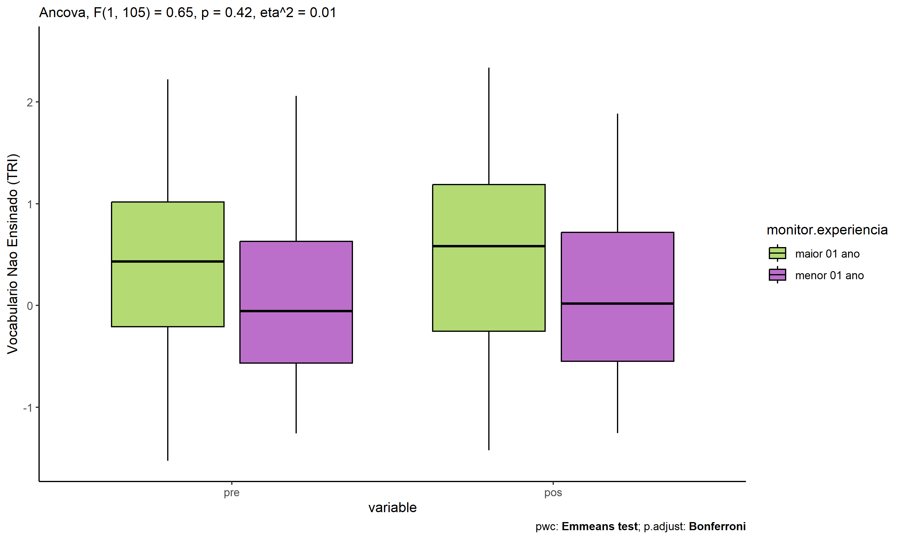<!-- -->

### Vocabulario Ensinado (Acertos)

| var                      | monitor.experiencia |   n | M (pre) | SE (pre) | M (unadj) | SE (unadj) | M (adj) | SE (adj) |
|:-------------------------|:--------------------|----:|--------:|---------:|----------:|-----------:|--------:|---------:|
| score.vocab.ensinado.pos | maior 01 ano        |  99 |   4.101 |    0.217 |     4.323 |      0.234 |   4.323 |    0.227 |
| score.vocab.ensinado.pos | menor 01 ano        |  42 |   4.095 |    0.334 |     3.738 |      0.395 |   3.740 |    0.348 |

| .y.                      | group1       | group2       | estimate | conf.low | conf.high |    se | statistic |     p | p.adj | p.adj.signif |
|:-------------------------|:-------------|:-------------|---------:|---------:|----------:|------:|----------:|------:|------:|:-------------|
| score.vocab.ensinado.pos | maior 01 ano | menor 01 ano |    0.583 |   -0.239 |     1.405 | 0.416 |     1.402 | 0.163 | 0.163 | ns           |
| score.vocab.ensinado.pre | maior 01 ano | menor 01 ano |    0.006 |   -0.781 |     0.792 | 0.398 |     0.015 | 0.988 | 0.988 | ns           |

| .y.                  | monitor.experiencia | group1 | group2 | estimate | conf.low | conf.high |    se | statistic |     p | p.adj | p.adj.signif |
|:---------------------|:--------------------|:-------|:-------|---------:|---------:|----------:|------:|----------:|------:|------:|:-------------|
| score.vocab.ensinado | maior 01 ano        | pre    | pos    |   -0.222 |   -0.860 |     0.416 | 0.324 |    -0.685 | 0.494 | 0.494 | ns           |
| score.vocab.ensinado | menor 01 ano        | pre    | pos    |    0.357 |   -0.623 |     1.337 | 0.498 |     0.718 | 0.474 | 0.474 | ns           |

    ## Scale for colour is already present.
    ## Adding another scale for colour, which will replace the existing scale.

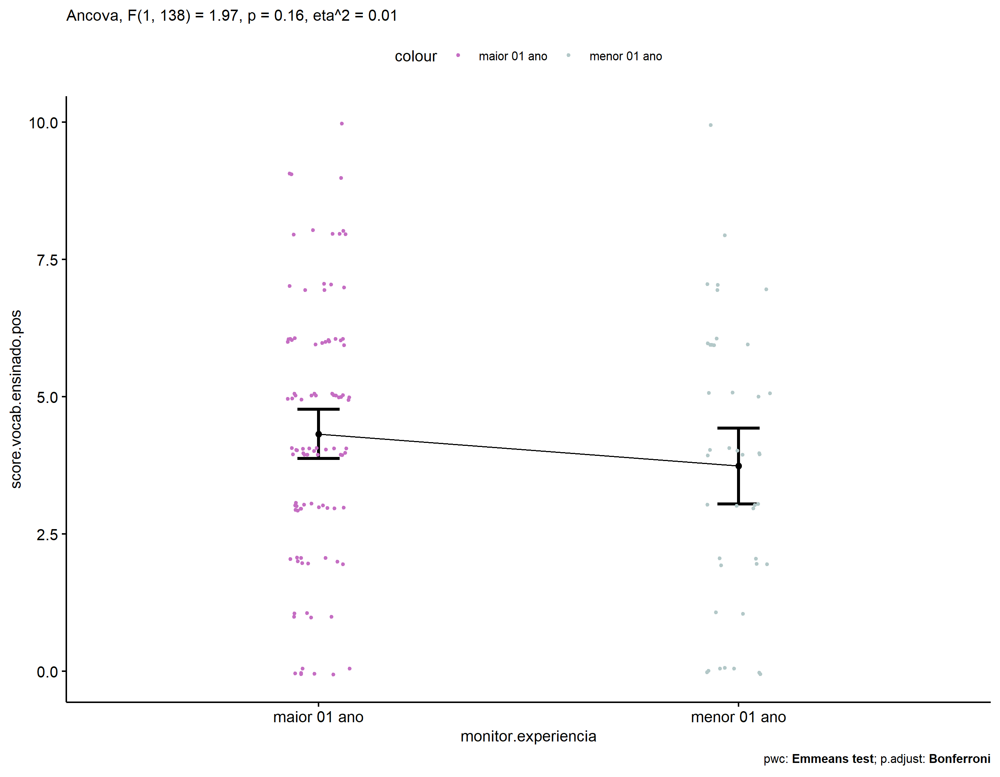<!-- -->

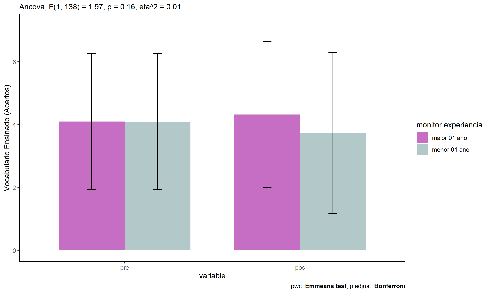<!-- -->

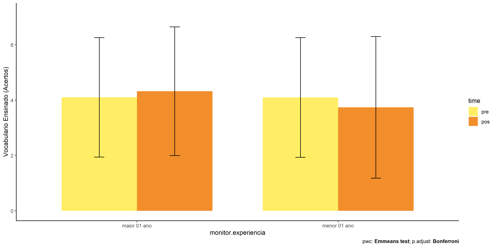<!-- -->

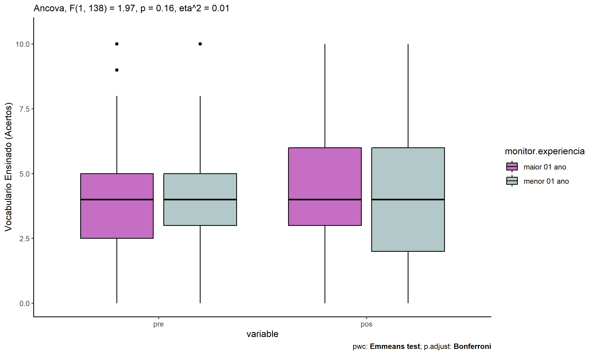<!-- -->

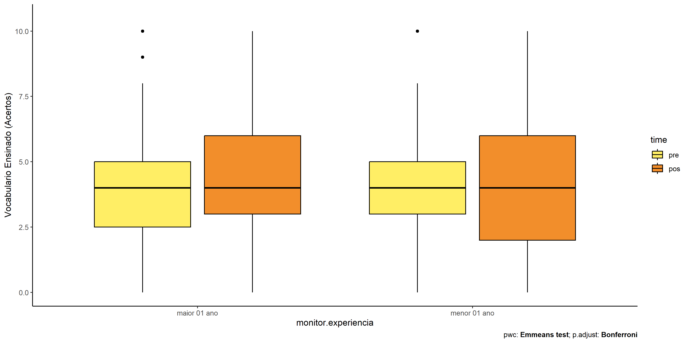<!-- -->

### Vocabulario Ensinado (TRI)

| var                    | monitor.experiencia |   n | M (pre) | SE (pre) | M (unadj) | SE (unadj) | M (adj) | SE (adj) |
|:-----------------------|:--------------------|----:|--------:|---------:|----------:|-----------:|--------:|---------:|
| tri.vocab.ensinado.pos | maior 01 ano        |  91 |   0.106 |    0.078 |     0.209 |      0.082 |   0.191 |    0.070 |
| tri.vocab.ensinado.pos | menor 01 ano        |  36 |  -0.010 |    0.140 |     0.081 |      0.136 |   0.128 |    0.111 |

| .y.                    | group1       | group2       | estimate | conf.low | conf.high |    se | statistic |     p | p.adj | p.adj.signif |
|:-----------------------|:-------------|:-------------|---------:|---------:|----------:|------:|----------:|------:|------:|:-------------|
| tri.vocab.ensinado.pos | maior 01 ano | menor 01 ano |    0.063 |   -0.196 |     0.322 | 0.131 |     0.481 | 0.631 | 0.631 | ns           |
| tri.vocab.ensinado.pre | maior 01 ano | menor 01 ano |    0.116 |   -0.185 |     0.417 | 0.152 |     0.762 | 0.447 | 0.447 | ns           |

| .y.                | monitor.experiencia | group1 | group2 | estimate | conf.low | conf.high |    se | statistic |     p | p.adj | p.adj.signif |
|:-------------------|:--------------------|:-------|:-------|---------:|---------:|----------:|------:|----------:|------:|------:|:-------------|
| tri.vocab.ensinado | maior 01 ano        | pre    | pos    |   -0.092 |   -0.315 |     0.130 | 0.113 |    -0.816 | 0.415 | 0.415 | ns           |
| tri.vocab.ensinado | menor 01 ano        | pre    | pos    |   -0.053 |   -0.401 |     0.294 | 0.177 |    -0.302 | 0.763 | 0.763 | ns           |

    ## Scale for colour is already present.
    ## Adding another scale for colour, which will replace the existing scale.

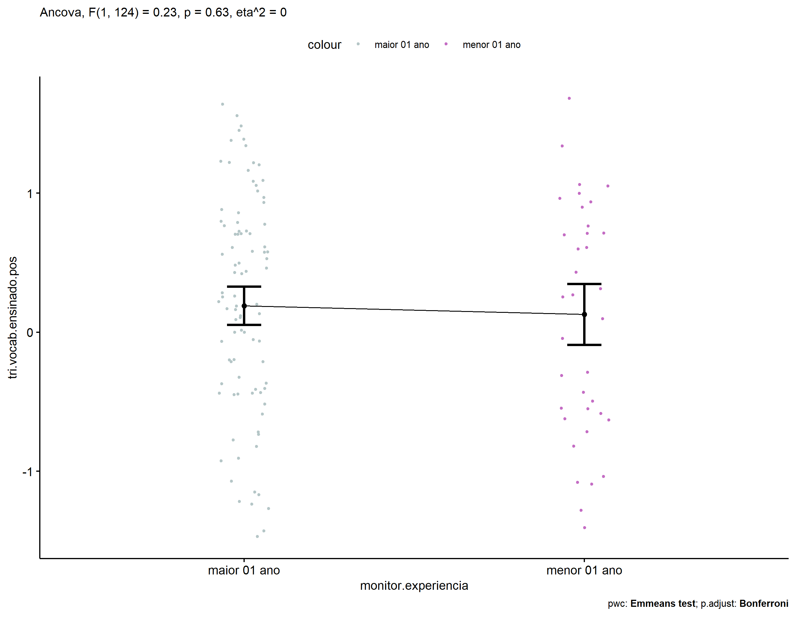<!-- -->

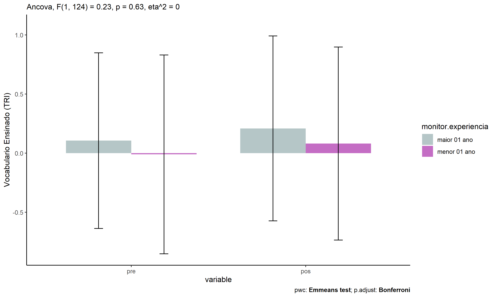<!-- -->

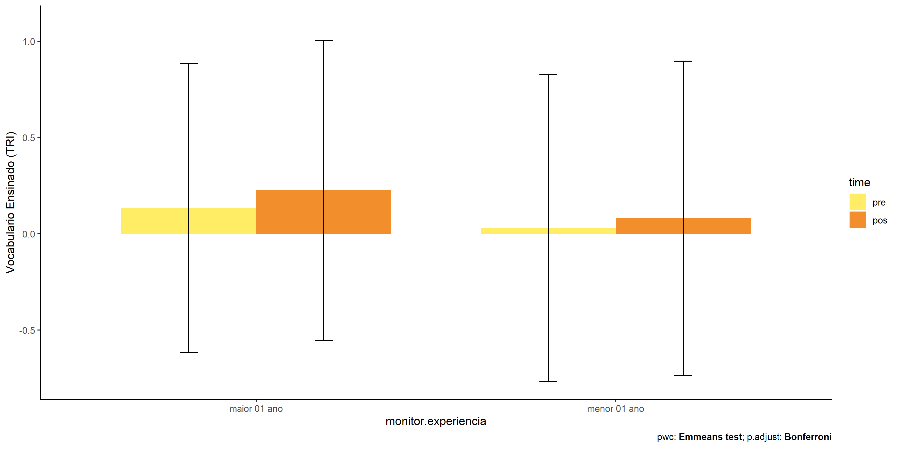<!-- -->

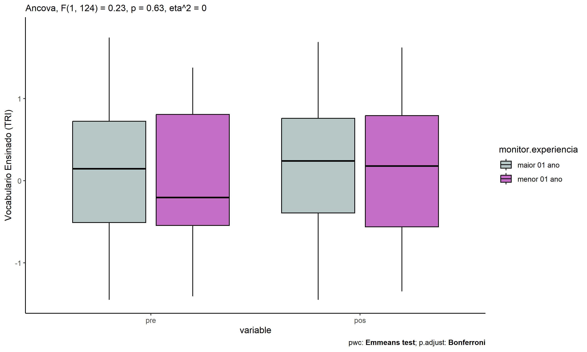<!-- -->

<!-- -->

### Vocabulario Nao Ensinado (Acertos)

| var                          | monitor.experiencia |   n | M (pre) | SE (pre) | M (unadj) | SE (unadj) | M (adj) | SE (adj) |
|:-----------------------------|:--------------------|----:|--------:|---------:|----------:|-----------:|--------:|---------:|
| score.vocab.nao.ensinado.pos | maior 01 ano        |  99 |  17.293 |    0.796 |    17.677 |      0.849 |  17.523 |    0.752 |
| score.vocab.nao.ensinado.pos | menor 01 ano        |  42 |  16.357 |    0.912 |    14.357 |      1.326 |  14.720 |    1.155 |

| .y.                          | group1       | group2       | estimate | conf.low | conf.high |    se | statistic |     p | p.adj | p.adj.signif |
|:-----------------------------|:-------------|:-------------|---------:|---------:|----------:|------:|----------:|------:|------:|:-------------|
| score.vocab.nao.ensinado.pos | maior 01 ano | menor 01 ano |    2.803 |    0.076 |     5.530 | 1.379 |     2.033 | 0.044 | 0.044 | \*           |
| score.vocab.nao.ensinado.pre | maior 01 ano | menor 01 ano |    0.936 |   -1.752 |     3.624 | 1.360 |     0.688 | 0.492 | 0.492 | ns           |

| .y.                      | monitor.experiencia | group1 | group2 | estimate | conf.low | conf.high |    se | statistic |     p | p.adj | p.adj.signif |
|:-------------------------|:--------------------|:-------|:-------|---------:|---------:|----------:|------:|----------:|------:|------:|:-------------|
| score.vocab.nao.ensinado | maior 01 ano        | pre    | pos    |   -0.384 |   -2.610 |     1.842 | 1.131 |    -0.339 | 0.735 | 0.735 | ns           |
| score.vocab.nao.ensinado | menor 01 ano        | pre    | pos    |    2.000 |   -1.418 |     5.418 | 1.736 |     1.152 | 0.250 | 0.250 | ns           |

    ## Scale for colour is already present.
    ## Adding another scale for colour, which will replace the existing scale.

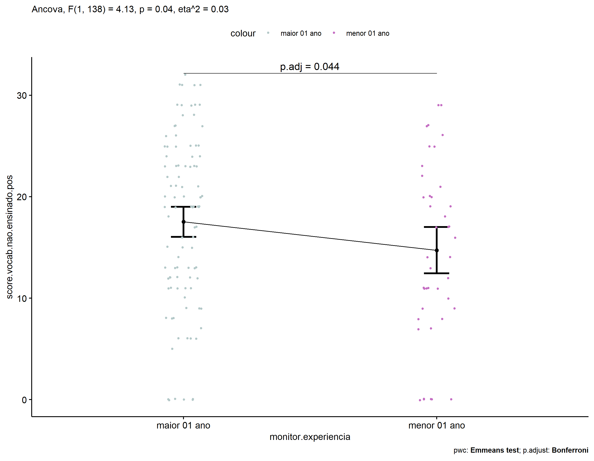<!-- -->

<!-- -->

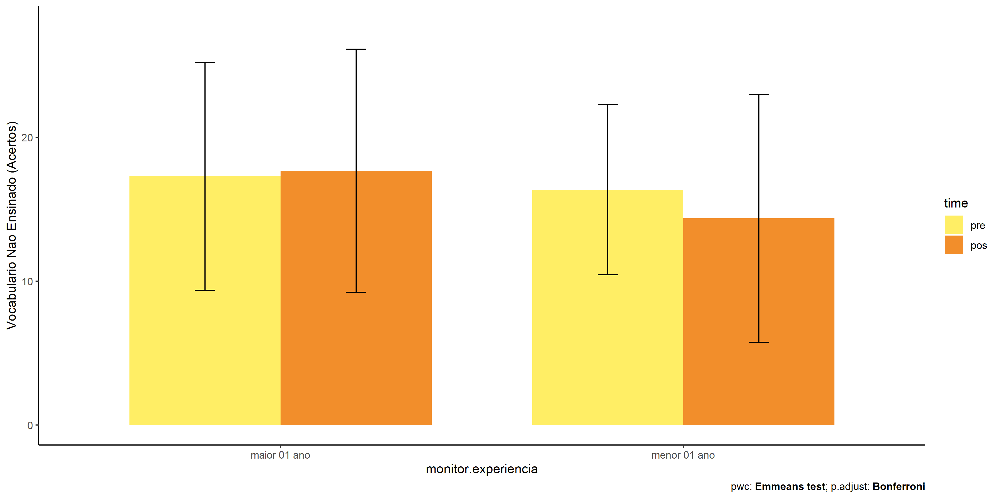<!-- -->

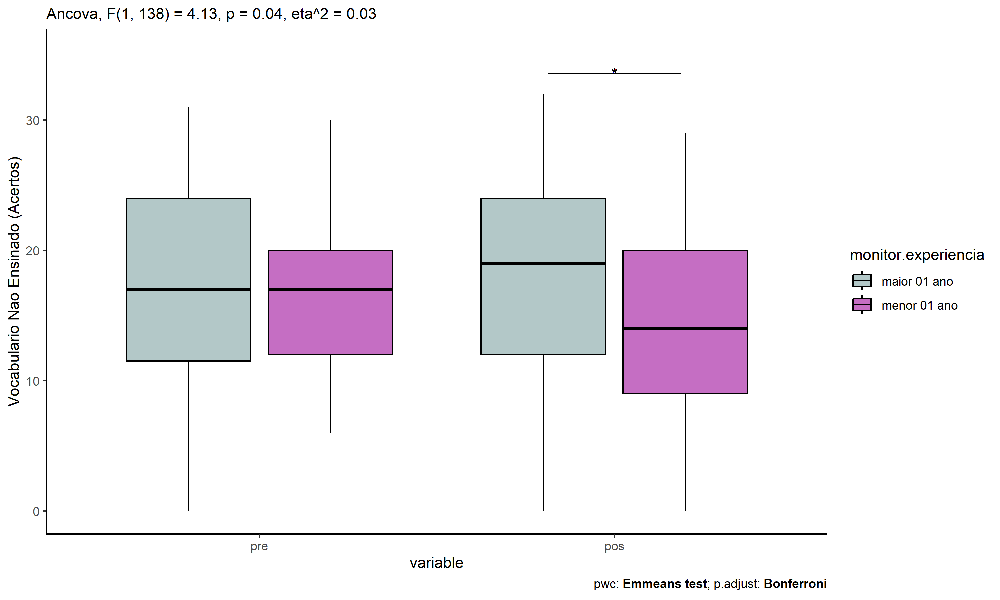<!-- -->

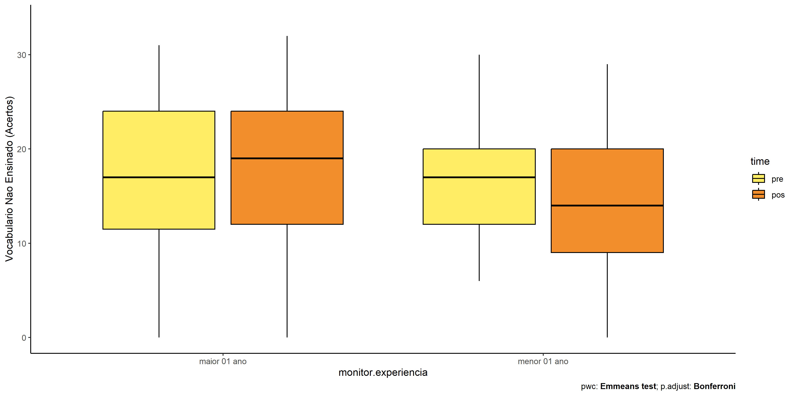<!-- -->

### Vocabulario Nao Ensinado (TRI)

| var                        | monitor.experiencia |   n | M (pre) | SE (pre) | M (unadj) | SE (unadj) | M (adj) | SE (adj) |
|:---------------------------|:--------------------|----:|--------:|---------:|----------:|-----------:|--------:|---------:|
| tri.vocab.nao.ensinado.pos | maior 01 ano        |  91 |   0.142 |    0.099 |     0.296 |      0.107 |   0.250 |    0.070 |
| tri.vocab.nao.ensinado.pos | menor 01 ano        |  36 |  -0.055 |    0.133 |     0.011 |      0.157 |   0.128 |    0.111 |

| .y.                        | group1       | group2       | estimate | conf.low | conf.high |    se | statistic |     p | p.adj | p.adj.signif |
|:---------------------------|:-------------|:-------------|---------:|---------:|----------:|------:|----------:|------:|------:|:-------------|
| tri.vocab.nao.ensinado.pos | maior 01 ano | menor 01 ano |    0.122 |   -0.138 |     0.382 | 0.131 |     0.927 | 0.356 | 0.356 | ns           |
| tri.vocab.nao.ensinado.pre | maior 01 ano | menor 01 ano |    0.198 |   -0.157 |     0.552 | 0.179 |     1.103 | 0.272 | 0.272 | ns           |

| .y.                    | monitor.experiencia | group1 | group2 | estimate | conf.low | conf.high |    se | statistic |     p | p.adj | p.adj.signif |
|:-----------------------|:--------------------|:-------|:-------|---------:|---------:|----------:|------:|----------:|------:|------:|:-------------|
| tri.vocab.nao.ensinado | maior 01 ano        | pre    | pos    |   -0.136 |   -0.408 |     0.136 | 0.138 |    -0.983 | 0.326 | 0.326 | ns           |
| tri.vocab.nao.ensinado | menor 01 ano        | pre    | pos    |   -0.050 |   -0.475 |     0.375 | 0.216 |    -0.230 | 0.818 | 0.818 | ns           |

    ## Scale for colour is already present.
    ## Adding another scale for colour, which will replace the existing scale.

<!-- -->

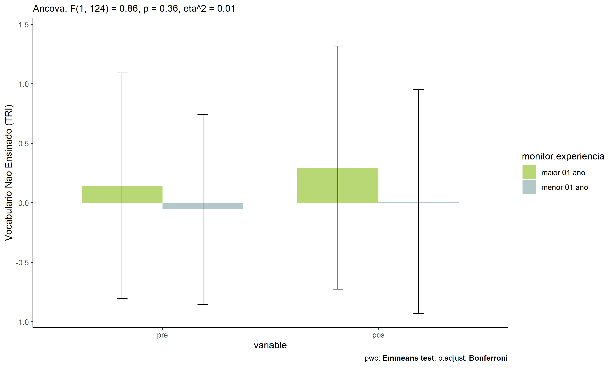<!-- -->

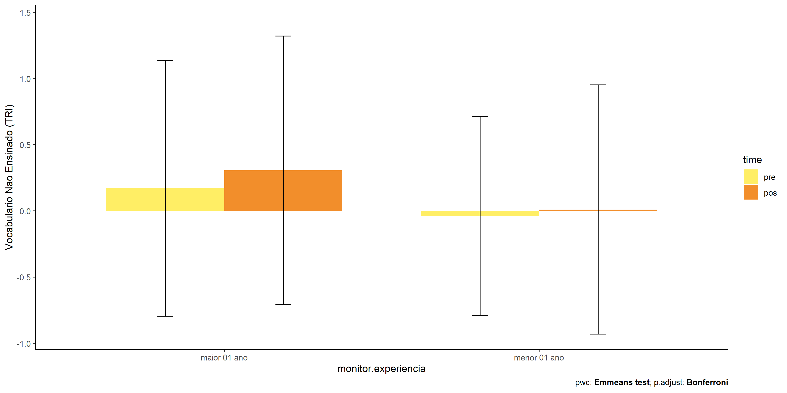<!-- -->

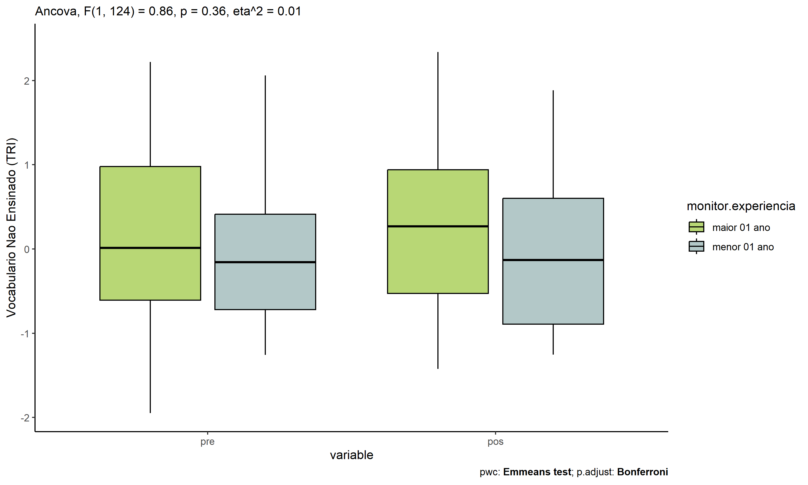<!-- -->

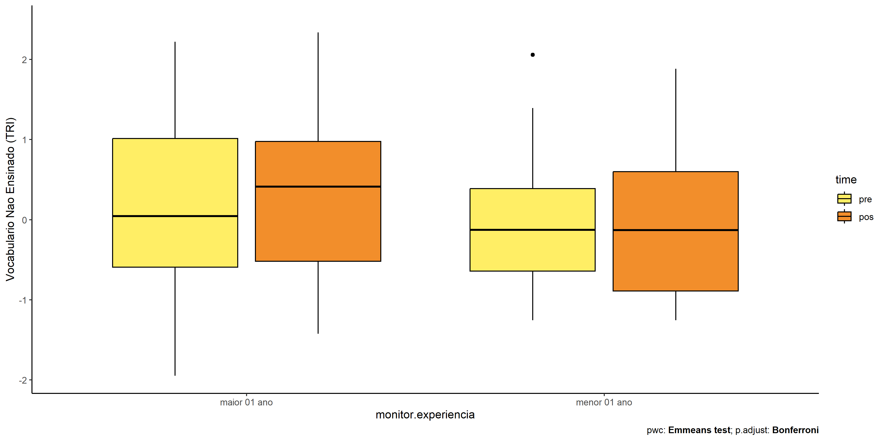<!-- -->
