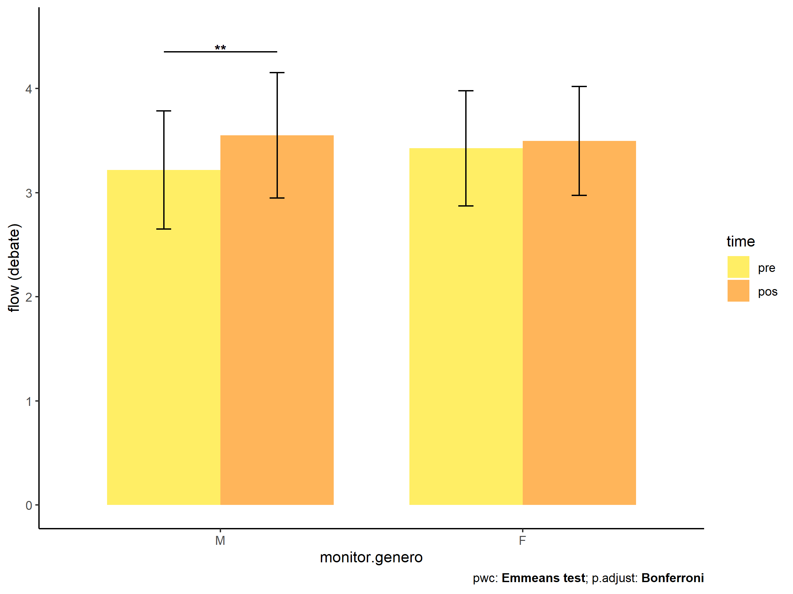

# ANCOVA test for flow.debate (engajamento no debate)

Geiser C. Challco
[geiser\@alumni.usp.br](mailto:geiser@alumni.usp.br){.email}

-   [Descriptive Statistics of Initial
    Data](#descriptive-statistics-of-initial-data)
-   [Checking of Assumptions](#checking-of-assumptions)
    -   [Identify and dealing with outliers (performing treatment of
        outliers)](#identify-and-dealing-with-outliers-performing-treatment-of-outliers)
    -   [Assumption: Normality distribution of
        data](#assumption-normality-distribution-of-data)
        -   [Para fatores de:
            **intervention:genero**](#para-fatores-de-interventiongenero)
        -   [Para fatores de:
            **intervention:idade**](#para-fatores-de-interventionidade)
        -   [Para fatores de:
            **intervention:zona.escola**](#para-fatores-de-interventionzonaescola)
        -   [Para fatores de:
            **intervention:zona.participante**](#para-fatores-de-interventionzonaparticipante)
        -   [Para fatores de:
            **intervention:escola**](#para-fatores-de-interventionescola)
        -   [Para fatores de:
            **intervention:monitor**](#para-fatores-de-interventionmonitor)
    -   [Assumption: Homogeneity of data
        distribution](#assumption-homogeneity-of-data-distribution)
        -   [Para fatores de:
            **intervention:genero**](#para-fatores-de-interventiongenero-1)
        -   [Para fatores de:
            **intervention:idade**](#para-fatores-de-interventionidade-1)
        -   [Para fatores de:
            **intervention:zona.escola**](#para-fatores-de-interventionzonaescola-1)
        -   [Para fatores de:
            **intervention:zona.participante**](#para-fatores-de-interventionzonaparticipante-1)
        -   [Para fatores de:
            **intervention:escola**](#para-fatores-de-interventionescola-1)
        -   [Para fatores de:
            **intervention:monitor**](#para-fatores-de-interventionmonitor-1)
-   [Computation of ANCOVA test and Pairwise
    Comparison](#computation-of-ancova-test-and-pairwise-comparison)
    -   [ANCOVA test](#ancova-test)
    -   [Pairwise comparisons for one
        factor](#pairwise-comparisons-for-one-factor)
        -   [factor: **intervention**](#factor-intervention)
        -   [factor: **genero**](#factor-genero)
        -   [factor: **idade**](#factor-idade)
        -   [factor: **zona.escola**](#factor-zonaescola)
        -   [factor: **zona.participante**](#factor-zonaparticipante)
        -   [factor: **escola**](#factor-escola)
        -   [factor: **monitor**](#factor-monitor)
        -   [factor: **monitor.genero**](#factor-monitorgenero)
        -   [factor: **monitor.formacao**](#factor-monitorformacao)
        -   [factor: **monitor.titulacao**](#factor-monitortitulacao)
        -   [factor:
            **monitor.experiencia**](#factor-monitorexperiencia)
    -   [Pairwise comparisons for two
        factors](#pairwise-comparisons-for-two-factors)
        -   [factores:
            **intervention:genero**](#factores-interventiongenero)
        -   [factores:
            **intervention:idade**](#factores-interventionidade)
        -   [factores:
            **intervention:zona.escola**](#factores-interventionzonaescola)
        -   [factores:
            **intervention:zona.participante**](#factores-interventionzonaparticipante)
        -   [factores:
            **intervention:escola**](#factores-interventionescola)
        -   [factores:
            **intervention:monitor**](#factores-interventionmonitor)
        -   [factores:
            **intervention:monitor.genero**](#factores-interventionmonitorgenero)
        -   [factores:
            **intervention:monitor.formacao**](#factores-interventionmonitorformacao)
        -   [factores:
            **intervention:monitor.titulacao**](#factores-interventionmonitortitulacao)
        -   [factores:
            **intervention:monitor.experiencia**](#factores-interventionmonitorexperiencia)

Teste ANCOVA para determinar se houve diferenças significativas em
referência ao engajamento no debate (medido como estado de fluxo).

ANCOVA test to determine whether there were significant differences in
reference to engagement in debate (measured as flow state).

# Descriptive Statistics of Initial Data {#descriptive-statistics-of-initial-data}

| intervention      | genero | variable   |   n |  mean | median |   min |   max |    sd |    se |    ci |   iqr |
|:-----|:-----|:-----|-----:|-----:|-----:|-----:|-----:|-----:|-----:|-----:|-----:|
| Controle          | F      | fss.debate |  60 | 3.533 |  3.556 | 2.444 | 4.333 | 0.492 | 0.063 | 0.127 | 0.580 |
| Controle          | M      | fss.debate |  63 | 3.333 |  3.333 | 2.111 | 4.222 | 0.504 | 0.063 | 0.127 | 0.667 |
| Stari             | F      | fss.debate |   5 | 3.483 |  3.667 | 2.889 | 4.111 | 0.521 | 0.233 | 0.647 | 0.750 |
| Stari             | M      | fss.debate |   6 | 3.019 |  3.000 | 2.667 | 3.333 | 0.237 | 0.097 | 0.249 | 0.250 |
| WordGen           | F      | fss.debate |  52 | 3.683 |  3.667 | 2.111 | 4.750 | 0.529 | 0.073 | 0.147 | 0.694 |
| WordGen           | M      | fss.debate |  62 | 3.433 |  3.444 | 2.111 | 5.000 | 0.573 | 0.073 | 0.145 | 0.667 |
| Stari and WordGen | F      | fss.debate |   4 | 3.326 |  3.000 | 2.750 | 4.556 | 0.848 | 0.424 | 1.349 | 0.785 |
| Stari and WordGen | M      | fss.debate |  12 | 3.382 |  3.389 | 2.778 | 4.222 | 0.462 | 0.133 | 0.293 | 0.785 |
| Controle          | F      | dfs.debate |  60 | 3.481 |  3.556 | 2.333 | 4.556 | 0.542 | 0.070 | 0.140 | 0.795 |
| Controle          | M      | dfs.debate |  63 | 3.454 |  3.444 | 2.000 | 4.556 | 0.587 | 0.074 | 0.148 | 0.722 |
| Stari             | F      | dfs.debate |   5 | 2.950 |  2.778 | 2.667 | 3.333 | 0.305 | 0.136 | 0.378 | 0.472 |
| Stari             | M      | dfs.debate |   6 | 2.715 |  2.778 | 1.333 | 3.625 | 0.827 | 0.338 | 0.868 | 0.833 |
| WordGen           | F      | dfs.debate |  52 | 3.560 |  3.667 | 2.222 | 4.667 | 0.520 | 0.072 | 0.145 | 0.472 |
| WordGen           | M      | dfs.debate |  62 | 3.344 |  3.250 | 2.375 | 4.556 | 0.530 | 0.067 | 0.135 | 0.861 |
| Stari and WordGen | F      | dfs.debate |   4 | 2.889 |  2.944 | 1.889 | 3.778 | 0.775 | 0.388 | 1.233 | 0.556 |
| Stari and WordGen | M      | dfs.debate |  12 | 3.040 |  2.944 | 2.556 | 4.000 | 0.451 | 0.130 | 0.286 | 0.413 |

| intervention      | escola | variable   |   n |  mean | median |   min |   max |    sd |    se |    ci |   iqr |
|:-----|:-----|:-----|-----:|-----:|-----:|-----:|-----:|-----:|-----:|-----:|-----:|
| Controle          | E1     | fss.debate |  12 | 3.361 |  3.333 | 2.222 | 4.333 | 0.596 | 0.172 | 0.379 | 0.778 |
| Controle          | E2     | fss.debate |  22 | 3.363 |  3.333 | 2.111 | 4.333 | 0.610 | 0.130 | 0.271 | 0.851 |
| Controle          | E3     | fss.debate |  15 | 3.421 |  3.444 | 2.778 | 4.333 | 0.417 | 0.108 | 0.231 | 0.389 |
| Controle          | E4     | fss.debate |  15 | 3.393 |  3.222 | 2.778 | 4.333 | 0.482 | 0.125 | 0.267 | 0.778 |
| Controle          | E5     | fss.debate |  48 | 3.485 |  3.444 | 2.111 | 4.333 | 0.510 | 0.074 | 0.148 | 0.580 |
| Controle          | E6     | fss.debate |  11 | 3.465 |  3.667 | 2.556 | 3.778 | 0.358 | 0.108 | 0.240 | 0.333 |
| Stari             | E1     | fss.debate |   5 | 3.333 |  3.333 | 2.667 | 4.111 | 0.583 | 0.261 | 0.723 | 0.778 |
| Stari             | E2     | fss.debate |   1 | 3.750 |  3.750 | 3.750 | 3.750 |    NA |    NA |   NaN | 0.000 |
| Stari             | E5     | fss.debate |   5 | 3.022 |  3.000 | 2.889 | 3.222 | 0.122 | 0.054 | 0.151 | 0.000 |
| WordGen           | E1     | fss.debate |  10 | 3.779 |  3.611 | 2.500 | 4.667 | 0.645 | 0.204 | 0.461 | 0.608 |
| WordGen           | E2     | fss.debate |  24 | 3.448 |  3.444 | 2.625 | 4.222 | 0.432 | 0.088 | 0.182 | 0.556 |
| WordGen           | E3     | fss.debate |  15 | 3.231 |  3.333 | 2.111 | 4.222 | 0.576 | 0.149 | 0.319 | 0.611 |
| WordGen           | E4     | fss.debate |   9 | 3.775 |  3.556 | 3.111 | 4.750 | 0.616 | 0.205 | 0.473 | 0.778 |
| WordGen           | E5     | fss.debate |  45 | 3.545 |  3.667 | 2.111 | 5.000 | 0.564 | 0.084 | 0.169 | 0.556 |
| WordGen           | E6     | fss.debate |  11 | 3.808 |  3.889 | 3.111 | 4.444 | 0.531 | 0.160 | 0.357 | 0.889 |
| Stari and WordGen | E2     | fss.debate |   2 | 3.167 |  3.167 | 3.000 | 3.333 | 0.236 | 0.167 | 2.118 | 0.167 |
| Stari and WordGen | E4     | fss.debate |   5 | 3.606 |  3.750 | 2.778 | 4.222 | 0.531 | 0.237 | 0.659 | 0.278 |
| Stari and WordGen | E5     | fss.debate |   7 | 3.171 |  2.889 | 2.750 | 4.556 | 0.634 | 0.240 | 0.587 | 0.333 |
| Stari and WordGen | E6     | fss.debate |   2 | 3.667 |  3.667 | 3.444 | 3.889 | 0.314 | 0.222 | 2.824 | 0.222 |
| Controle          | E1     | dfs.debate |  12 | 3.139 |  3.333 | 2.111 | 4.111 | 0.545 | 0.157 | 0.346 | 0.611 |
| Controle          | E2     | dfs.debate |  22 | 3.505 |  3.556 | 2.375 | 4.444 | 0.476 | 0.102 | 0.211 | 0.556 |
| Controle          | E3     | dfs.debate |  15 | 3.643 |  3.556 | 2.778 | 4.556 | 0.555 | 0.143 | 0.308 | 0.778 |
| Controle          | E4     | dfs.debate |  15 | 3.403 |  3.556 | 2.111 | 4.375 | 0.638 | 0.165 | 0.353 | 0.556 |
| Controle          | E5     | dfs.debate |  48 | 3.489 |  3.556 | 2.000 | 4.556 | 0.611 | 0.088 | 0.177 | 0.944 |
| Controle          | E6     | dfs.debate |  11 | 3.505 |  3.444 | 2.778 | 4.111 | 0.349 | 0.105 | 0.235 | 0.278 |
| Stari             | E1     | dfs.debate |   5 | 2.506 |  2.750 | 1.333 | 3.333 | 0.745 | 0.333 | 0.926 | 0.444 |
| Stari             | E2     | dfs.debate |   1 | 3.222 |  3.222 | 3.222 | 3.222 |    NA |    NA |   NaN | 0.000 |
| Stari             | E5     | dfs.debate |   5 | 3.058 |  2.778 | 2.667 | 3.625 | 0.442 | 0.198 | 0.549 | 0.667 |
| WordGen           | E1     | dfs.debate |  10 | 3.179 |  3.222 | 2.375 | 3.778 | 0.417 | 0.132 | 0.298 | 0.500 |
| WordGen           | E2     | dfs.debate |  24 | 3.498 |  3.500 | 2.500 | 4.667 | 0.545 | 0.111 | 0.230 | 0.694 |
| WordGen           | E3     | dfs.debate |  15 | 3.496 |  3.778 | 2.556 | 4.556 | 0.696 | 0.180 | 0.386 | 1.000 |
| WordGen           | E4     | dfs.debate |   9 | 3.537 |  3.444 | 3.000 | 4.500 | 0.441 | 0.147 | 0.339 | 0.444 |
| WordGen           | E5     | dfs.debate |  45 | 3.398 |  3.556 | 2.222 | 4.222 | 0.544 | 0.081 | 0.163 | 0.778 |
| WordGen           | E6     | dfs.debate |  11 | 3.591 |  3.667 | 2.889 | 4.111 | 0.355 | 0.107 | 0.239 | 0.361 |
| Stari and WordGen | E2     | dfs.debate |   2 | 3.016 |  3.016 | 2.889 | 3.143 | 0.180 | 0.127 | 1.613 | 0.127 |
| Stari and WordGen | E4     | dfs.debate |   5 | 3.333 |  3.000 | 2.889 | 4.000 | 0.515 | 0.230 | 0.640 | 0.778 |
| Stari and WordGen | E5     | dfs.debate |   7 | 2.778 |  2.778 | 1.889 | 3.778 | 0.570 | 0.216 | 0.527 | 0.389 |
| Stari and WordGen | E6     | dfs.debate |   2 | 2.944 |  2.944 | 2.667 | 3.222 | 0.393 | 0.278 | 3.530 | 0.278 |

| intervention      | zona.escola | variable   |   n |  mean | median |   min |   max |    sd |    se |    ci |   iqr |
|:-----|:-----|:-----|-----:|-----:|-----:|-----:|-----:|-----:|-----:|-----:|-----:|
| Controle          | Urbana      | fss.debate |  82 | 3.434 |  3.444 | 2.111 | 4.333 | 0.547 | 0.060 | 0.120 | 0.667 |
| Controle          | Rural       | fss.debate |  41 | 3.422 |  3.444 | 2.556 | 4.333 | 0.418 | 0.065 | 0.132 | 0.556 |
| Stari             | Urbana      | fss.debate |  11 | 3.230 |  3.000 | 2.667 | 4.111 | 0.442 | 0.133 | 0.297 | 0.556 |
| WordGen           | Urbana      | fss.debate |  79 | 3.545 |  3.556 | 2.111 | 5.000 | 0.541 | 0.061 | 0.121 | 0.556 |
| WordGen           | Rural       | fss.debate |  35 | 3.552 |  3.444 | 2.111 | 4.750 | 0.623 | 0.105 | 0.214 | 0.889 |
| Stari and WordGen | Urbana      | fss.debate |   9 | 3.170 |  3.000 | 2.750 | 4.556 | 0.556 | 0.185 | 0.427 | 0.333 |
| Stari and WordGen | Rural       | fss.debate |   7 | 3.623 |  3.750 | 2.778 | 4.222 | 0.453 | 0.171 | 0.419 | 0.361 |
| Controle          | Urbana      | dfs.debate |  82 | 3.442 |  3.444 | 2.000 | 4.556 | 0.576 | 0.064 | 0.127 | 0.889 |
| Controle          | Rural       | dfs.debate |  41 | 3.518 |  3.556 | 2.111 | 4.556 | 0.540 | 0.084 | 0.171 | 0.667 |
| Stari             | Urbana      | dfs.debate |  11 | 2.822 |  2.778 | 1.333 | 3.625 | 0.628 | 0.189 | 0.422 | 0.569 |
| WordGen           | Urbana      | dfs.debate |  79 | 3.401 |  3.444 | 2.222 | 4.667 | 0.533 | 0.060 | 0.119 | 0.778 |
| WordGen           | Rural       | dfs.debate |  35 | 3.537 |  3.667 | 2.556 | 4.556 | 0.533 | 0.090 | 0.183 | 0.694 |
| Stari and WordGen | Urbana      | dfs.debate |   9 | 2.831 |  2.889 | 1.889 | 3.778 | 0.509 | 0.170 | 0.391 | 0.444 |
| Stari and WordGen | Rural       | dfs.debate |   7 | 3.222 |  3.000 | 2.667 | 4.000 | 0.489 | 0.185 | 0.452 | 0.556 |

| intervention      | zona.participante | variable   |   n |  mean | median |   min |   max |    sd |    se |    ci |   iqr |
|:-----|:-----|:-----|-----:|-----:|-----:|-----:|-----:|-----:|-----:|-----:|-----:|
| Controle          | Urbana            | fss.debate |  51 | 3.443 |  3.375 | 2.111 | 4.333 | 0.525 | 0.073 | 0.148 | 0.604 |
| Controle          | Rural             | fss.debate |  43 | 3.364 |  3.444 | 2.111 | 4.333 | 0.523 | 0.080 | 0.161 | 0.667 |
| Controle          | NA                | fss.debate |  29 | 3.506 |  3.667 | 2.556 | 4.222 | 0.448 | 0.083 | 0.170 | 0.556 |
| Stari             | Urbana            | fss.debate |   4 | 3.250 |  3.111 | 2.667 | 4.111 | 0.637 | 0.319 | 1.014 | 0.694 |
| Stari             | Rural             | fss.debate |   5 | 3.306 |  3.222 | 2.889 | 3.750 | 0.388 | 0.173 | 0.482 | 0.667 |
| Stari             | NA                | fss.debate |   2 | 3.000 |  3.000 | 3.000 | 3.000 | 0.000 | 0.000 | 0.000 | 0.000 |
| WordGen           | Urbana            | fss.debate |  43 | 3.588 |  3.556 | 2.625 | 4.778 | 0.504 | 0.077 | 0.155 | 0.611 |
| WordGen           | Rural             | fss.debate |  47 | 3.456 |  3.444 | 2.111 | 4.750 | 0.572 | 0.083 | 0.168 | 0.715 |
| WordGen           | NA                | fss.debate |  24 | 3.653 |  3.667 | 2.111 | 5.000 | 0.645 | 0.132 | 0.272 | 0.833 |
| Stari and WordGen | Urbana            | fss.debate |   6 | 3.574 |  3.625 | 2.750 | 4.556 | 0.622 | 0.254 | 0.653 | 0.562 |
| Stari and WordGen | Rural             | fss.debate |   5 | 3.289 |  3.222 | 2.778 | 4.222 | 0.570 | 0.255 | 0.708 | 0.444 |
| Stari and WordGen | NA                | fss.debate |   5 | 3.200 |  3.000 | 2.778 | 3.889 | 0.461 | 0.206 | 0.572 | 0.556 |
| Controle          | Urbana            | dfs.debate |  51 | 3.365 |  3.444 | 2.000 | 4.500 | 0.628 | 0.088 | 0.177 | 0.833 |
| Controle          | Rural             | dfs.debate |  43 | 3.532 |  3.556 | 2.444 | 4.556 | 0.526 | 0.080 | 0.162 | 0.889 |
| Controle          | NA                | dfs.debate |  29 | 3.551 |  3.556 | 2.778 | 4.556 | 0.480 | 0.089 | 0.183 | 0.556 |
| Stari             | Urbana            | dfs.debate |   4 | 2.444 |  2.556 | 1.333 | 3.333 | 0.846 | 0.423 | 1.346 | 0.833 |
| Stari             | Rural             | dfs.debate |   5 | 2.839 |  2.778 | 2.667 | 3.222 | 0.219 | 0.098 | 0.272 | 0.028 |
| Stari             | NA                | dfs.debate |   2 | 3.535 |  3.535 | 3.444 | 3.625 | 0.128 | 0.090 | 1.147 | 0.090 |
| WordGen           | Urbana            | dfs.debate |  43 | 3.393 |  3.444 | 2.222 | 4.667 | 0.578 | 0.088 | 0.178 | 0.833 |
| WordGen           | Rural             | dfs.debate |  47 | 3.441 |  3.444 | 2.556 | 4.556 | 0.541 | 0.079 | 0.159 | 0.722 |
| WordGen           | NA                | dfs.debate |  24 | 3.534 |  3.667 | 2.500 | 4.222 | 0.437 | 0.089 | 0.185 | 0.458 |
| Stari and WordGen | Urbana            | dfs.debate |   6 | 3.352 |  3.389 | 2.556 | 4.000 | 0.577 | 0.236 | 0.606 | 0.778 |
| Stari and WordGen | Rural             | dfs.debate |   5 | 2.940 |  2.889 | 2.778 | 3.143 | 0.138 | 0.062 | 0.171 | 0.111 |
| Stari and WordGen | NA                | dfs.debate |   5 | 2.644 |  2.667 | 1.889 | 3.222 | 0.493 | 0.221 | 0.612 | 0.333 |

| intervention      | monitor | variable   |   n |  mean | median |   min |   max |    sd |    se |    ci |   iqr |
|:-----|:-----|:-----|-----:|-----:|-----:|-----:|-----:|-----:|-----:|-----:|-----:|
| Controle          | NA      | fss.debate | 123 | 3.430 |  3.444 | 2.111 | 4.333 | 0.506 | 0.046 | 0.090 | 0.667 |
| Stari             | EA      | fss.debate |   2 | 2.944 |  2.944 | 2.889 | 3.000 | 0.079 | 0.056 | 0.706 | 0.056 |
| Stari             | GR,JC   | fss.debate |   1 | 3.222 |  3.222 | 3.222 | 3.222 |    NA |    NA |   NaN | 0.000 |
| Stari             | MF      | fss.debate |   2 | 3.000 |  3.000 | 3.000 | 3.000 | 0.000 | 0.000 | 0.000 | 0.000 |
| Stari             | MM      | fss.debate |   1 | 3.750 |  3.750 | 3.750 | 3.750 |    NA |    NA |   NaN | 0.000 |
| Stari             | PR      | fss.debate |   5 | 3.333 |  3.333 | 2.667 | 4.111 | 0.583 | 0.261 | 0.723 | 0.778 |
| WordGen           | AC      | fss.debate |  11 | 3.427 |  3.333 | 2.667 | 4.222 | 0.429 | 0.129 | 0.288 | 0.431 |
| WordGen           | AC,MM   | fss.debate |   1 | 3.111 |  3.111 | 3.111 | 3.111 |    NA |    NA |   NaN | 0.000 |
| WordGen           | CE      | fss.debate |   9 | 3.775 |  3.556 | 3.111 | 4.750 | 0.616 | 0.205 | 0.473 | 0.778 |
| WordGen           | EA      | fss.debate |   9 | 3.827 |  3.778 | 3.000 | 4.778 | 0.596 | 0.199 | 0.458 | 0.667 |
| WordGen           | EA,MF   | fss.debate |   1 | 2.556 |  2.556 | 2.556 | 2.556 |    NA |    NA |   NaN | 0.000 |
| WordGen           | GR      | fss.debate |  14 | 3.524 |  3.667 | 3.000 | 4.111 | 0.388 | 0.104 | 0.224 | 0.694 |
| WordGen           | GR,JC   | fss.debate |   1 | 3.750 |  3.750 | 3.750 | 3.750 |    NA |    NA |   NaN | 0.000 |
| WordGen           | JC      | fss.debate |   9 | 3.295 |  3.222 | 2.667 | 3.875 | 0.435 | 0.145 | 0.334 | 0.667 |
| WordGen           | MF      | fss.debate |  11 | 3.616 |  3.556 | 2.111 | 5.000 | 0.729 | 0.220 | 0.490 | 0.556 |
| WordGen           | ML      | fss.debate |  15 | 3.231 |  3.333 | 2.111 | 4.222 | 0.576 | 0.149 | 0.319 | 0.611 |
| WordGen           | MM      | fss.debate |  12 | 3.497 |  3.500 | 2.625 | 4.111 | 0.458 | 0.132 | 0.291 | 0.583 |
| WordGen           | PR      | fss.debate |  10 | 3.779 |  3.611 | 2.500 | 4.667 | 0.645 | 0.204 | 0.461 | 0.608 |
| WordGen           | VL      | fss.debate |  11 | 3.808 |  3.889 | 3.111 | 4.444 | 0.531 | 0.160 | 0.357 | 0.889 |
| Stari and WordGen | AC,MM   | fss.debate |   1 | 3.000 |  3.000 | 3.000 | 3.000 |    NA |    NA |   NaN | 0.000 |
| Stari and WordGen | CE      | fss.debate |   5 | 3.606 |  3.750 | 2.778 | 4.222 | 0.531 | 0.237 | 0.659 | 0.278 |
| Stari and WordGen | EA      | fss.debate |   1 | 2.889 |  2.889 | 2.889 | 2.889 |    NA |    NA |   NaN | 0.000 |
| Stari and WordGen | EA,GR   | fss.debate |   1 | 4.556 |  4.556 | 4.556 | 4.556 |    NA |    NA |   NaN | 0.000 |
| Stari and WordGen | EA,MF   | fss.debate |   2 | 3.056 |  3.056 | 2.889 | 3.222 | 0.236 | 0.167 | 2.118 | 0.167 |
| Stari and WordGen | GR,JC   | fss.debate |   1 | 3.111 |  3.111 | 3.111 | 3.111 |    NA |    NA |   NaN | 0.000 |
| Stari and WordGen | JC      | fss.debate |   1 | 2.750 |  2.750 | 2.750 | 2.750 |    NA |    NA |   NaN | 0.000 |
| Stari and WordGen | MF      | fss.debate |   1 | 2.778 |  2.778 | 2.778 | 2.778 |    NA |    NA |   NaN | 0.000 |
| Stari and WordGen | MM      | fss.debate |   1 | 3.333 |  3.333 | 3.333 | 3.333 |    NA |    NA |   NaN | 0.000 |
| Stari and WordGen | VL      | fss.debate |   2 | 3.667 |  3.667 | 3.444 | 3.889 | 0.314 | 0.222 | 2.824 | 0.222 |
| Controle          | NA      | dfs.debate | 123 | 3.467 |  3.444 | 2.000 | 4.556 | 0.563 | 0.051 | 0.101 | 0.778 |
| Stari             | EA      | dfs.debate |   2 | 2.722 |  2.722 | 2.667 | 2.778 | 0.079 | 0.056 | 0.706 | 0.056 |
| Stari             | GR,JC   | dfs.debate |   1 | 2.778 |  2.778 | 2.778 | 2.778 |    NA |    NA |   NaN | 0.000 |
| Stari             | MF      | dfs.debate |   2 | 3.535 |  3.535 | 3.444 | 3.625 | 0.128 | 0.090 | 1.147 | 0.090 |
| Stari             | MM      | dfs.debate |   1 | 3.222 |  3.222 | 3.222 | 3.222 |    NA |    NA |   NaN | 0.000 |
| Stari             | PR      | dfs.debate |   5 | 2.506 |  2.750 | 1.333 | 3.333 | 0.745 | 0.333 | 0.926 | 0.444 |
| WordGen           | AC      | dfs.debate |  11 | 3.788 |  3.667 | 3.333 | 4.667 | 0.440 | 0.133 | 0.296 | 0.333 |
| WordGen           | AC,MM   | dfs.debate |   1 | 3.222 |  3.222 | 3.222 | 3.222 |    NA |    NA |   NaN | 0.000 |
| WordGen           | CE      | dfs.debate |   9 | 3.537 |  3.444 | 3.000 | 4.500 | 0.441 | 0.147 | 0.339 | 0.444 |
| WordGen           | EA      | dfs.debate |   9 | 3.315 |  3.250 | 2.778 | 3.778 | 0.379 | 0.126 | 0.291 | 0.556 |
| WordGen           | EA,MF   | dfs.debate |   1 | 2.778 |  2.778 | 2.778 | 2.778 |    NA |    NA |   NaN | 0.000 |
| WordGen           | GR      | dfs.debate |  14 | 3.429 |  3.389 | 2.222 | 4.222 | 0.571 | 0.153 | 0.330 | 0.889 |
| WordGen           | GR,JC   | dfs.debate |   1 | 3.667 |  3.667 | 3.667 | 3.667 |    NA |    NA |   NaN | 0.000 |
| WordGen           | JC      | dfs.debate |   9 | 3.346 |  3.556 | 2.333 | 4.222 | 0.730 | 0.243 | 0.561 | 1.111 |
| WordGen           | MF      | dfs.debate |  11 | 3.503 |  3.667 | 2.556 | 4.222 | 0.519 | 0.156 | 0.349 | 0.611 |
| WordGen           | ML      | dfs.debate |  15 | 3.496 |  3.778 | 2.556 | 4.556 | 0.696 | 0.180 | 0.386 | 1.000 |
| WordGen           | MM      | dfs.debate |  12 | 3.255 |  3.056 | 2.500 | 4.111 | 0.537 | 0.155 | 0.341 | 0.750 |
| WordGen           | PR      | dfs.debate |  10 | 3.179 |  3.222 | 2.375 | 3.778 | 0.417 | 0.132 | 0.298 | 0.500 |
| WordGen           | VL      | dfs.debate |  11 | 3.591 |  3.667 | 2.889 | 4.111 | 0.355 | 0.107 | 0.239 | 0.361 |
| Stari and WordGen | AC,MM   | dfs.debate |   1 | 2.889 |  2.889 | 2.889 | 2.889 |    NA |    NA |   NaN | 0.000 |
| Stari and WordGen | CE      | dfs.debate |   5 | 3.333 |  3.000 | 2.889 | 4.000 | 0.515 | 0.230 | 0.640 | 0.778 |
| Stari and WordGen | EA      | dfs.debate |   1 | 2.778 |  2.778 | 2.778 | 2.778 |    NA |    NA |   NaN | 0.000 |
| Stari and WordGen | EA,GR   | dfs.debate |   1 | 3.778 |  3.778 | 3.778 | 3.778 |    NA |    NA |   NaN | 0.000 |
| Stari and WordGen | EA,MF   | dfs.debate |   2 | 2.722 |  2.722 | 2.556 | 2.889 | 0.236 | 0.167 | 2.118 | 0.167 |
| Stari and WordGen | GR,JC   | dfs.debate |   1 | 2.556 |  2.556 | 2.556 | 2.556 |    NA |    NA |   NaN | 0.000 |
| Stari and WordGen | JC      | dfs.debate |   1 | 3.000 |  3.000 | 3.000 | 3.000 |    NA |    NA |   NaN | 0.000 |
| Stari and WordGen | MF      | dfs.debate |   1 | 1.889 |  1.889 | 1.889 | 1.889 |    NA |    NA |   NaN | 0.000 |
| Stari and WordGen | MM      | dfs.debate |   1 | 3.143 |  3.143 | 3.143 | 3.143 |    NA |    NA |   NaN | 0.000 |
| Stari and WordGen | VL      | dfs.debate |   2 | 2.944 |  2.944 | 2.667 | 3.222 | 0.393 | 0.278 | 3.530 | 0.278 |

# Checking of Assumptions {#checking-of-assumptions}

## Identify and dealing with outliers (performing treatment of outliers) {#identify-and-dealing-with-outliers-performing-treatment-of-outliers}

| intervention | genero | escola | zona.escola | zona.participante | id   | fss.debate | dfs.debate | is.outlier | is.extreme |
|:-------|:-------|:-------|:-------|:-------|:-------|-------:|-------:|:-------|:-------|
| Controle     | F      | E1     | Urbana      | Urbana            | s164 |   4.333333 |   3.555556 | TRUE       | FALSE      |
| Controle     | F      | E6     | Rural       | NA                | s313 |   2.555556 |   4.111111 | TRUE       | FALSE      |
| Controle     | M      | E2     | Urbana      | Urbana            | s194 |   3.111111 |   3.555556 | TRUE       | TRUE       |
| Controle     | M      | E2     | Urbana      | NA                | s207 |   4.111111 |   4.444444 | TRUE       | FALSE      |
| Controle     | M      | E5     | Urbana      | Urbana            | s271 |   2.111111 |   2.000000 | TRUE       | TRUE       |
| WordGen      | F      | E5     | Urbana      | NA                | s123 |   2.111111 |   2.555556 | TRUE       | FALSE      |
| WordGen      | M      | E2     | Urbana      | Urbana            | s25  |   2.625000 |   2.777778 | TRUE       | FALSE      |

*Note*: No one of outliers is extreme then we don’t need to remove data

## Assumption: Normality distribution of data {#assumption-normality-distribution-of-data}

*Note*: All data satisfy normality

### Para fatores de: **intervention:genero** {#para-fatores-de-interventiongenero}

| var        |   n | skewness |  kurtosis | symmetry | statistic | method     |        p | p.signif | normality |
|:-------|-------:|-------:|-------:|:-------|-------:|:-------|-------:|:-------|:-------|
| fss.debate | 264 | 0.098378 | 0.0491902 | YES      | 0.6573527 | D’Agostino | 0.719876 | ns       | \-        |

### Para fatores de: **intervention:idade** {#para-fatores-de-interventionidade}

| var        |   n |   skewness |  kurtosis | symmetry | statistic | method     |         p | p.signif | normality |
|:-------|-------:|-------:|-------:|:-------|-------:|:-------|-------:|:-------|:-------|
| fss.debate | 256 | -0.0763537 | 0.3304571 | YES      |  1.843353 | D’Agostino | 0.3978515 | ns       | \-        |

### Para fatores de: **intervention:zona.escola**

| var        |   n | skewness |  kurtosis | symmetry | statistic | method     |         p | p.signif | normality |
|:-------|-------:|-------:|-------:|:-------|-------:|:-------|-------:|:-------|:-------|
| fss.debate | 264 | 0.072171 | 0.0510099 | YES      | 0.4545135 | D’Agostino | 0.7967162 | ns       | \-        |

### Para fatores de: **intervention:zona.participante**

| var        |   n | skewness | kurtosis | symmetry | statistic | method     |         p | p.signif | normality |
|:-------|-------:|-------:|-------:|:-------|-------:|:-------|-------:|:-------|:-------|
| fss.debate | 204 | 0.226192 | 0.044982 | YES      |  2.055497 | D’Agostino | 0.3578117 | ns       | \-        |

### Para fatores de: **intervention:escola** {#para-fatores-de-interventionescola}

| var        |   n |  skewness | kurtosis | symmetry | statistic | method     |         p | p.signif | normality |
|:-------|-------:|-------:|-------:|:-------|-------:|:-------|-------:|:-------|:-------|
| fss.debate | 264 | 0.0474097 | 0.027065 | YES      | 0.2503122 | D’Agostino | 0.8823591 | ns       | \-        |

### Para fatores de: **intervention:monitor** {#para-fatores-de-interventionmonitor}

| var        |   n |  skewness |  kurtosis | symmetry | statistic | method     |         p | p.signif | normality |
|:-------|-------:|-------:|-------:|:-------|-------:|:-------|-------:|:-------|:-------|
| fss.debate | 141 | 0.0060096 | 0.2765628 | YES      |  1.022329 | D’Agostino | 0.5997968 | ns       | QQ        |

## Assumption: Homogeneity of data distribution {#assumption-homogeneity-of-data-distribution}

*Note*: Can be applied parametric tests, all data satisfied homogeneity
tests

### Para fatores de: **intervention:genero** {#para-fatores-de-interventiongenero-1}

| var        | method         | formula                          |   n | DFn.df1 | DFd.df2 | statistic |         p | p.signif |
|:-------|:-------|:---------|-------:|-------:|-------:|-------:|-------:|:-------|
| fss.debate | Levene’s test  | `.res`\~`intervention`\*`genero` | 264 |       7 |     256 | 0.7526303 | 0.6275829 | ns       |
| fss.debate | Anova’s slopes | `.res`\~`intervention`\*`genero` | 264 |       7 |     248 | 1.0150000 | 0.4210000 | ns       |

### Para fatores de: **intervention:idade** {#para-fatores-de-interventionidade-1}

| var        | method         | formula                         |   n | DFn.df1 | DFd.df2 | statistic |         p | p.signif |
|:-------|:-------|:---------|-------:|-------:|-------:|-------:|-------:|:-------|
| fss.debate | Levene’s test  | `.res`\~`intervention`\*`idade` | 256 |      18 |     237 |   1.39809 | 0.1330509 | ns       |
| fss.debate | Anova’s slopes | `.res`\~`intervention`\*`idade` | 256 |      14 |     222 |   0.58400 | 0.8770000 | ns       |

### Para fatores de: **intervention:zona.escola**

| var        | method         | formula                               |   n | DFn.df1 | DFd.df2 | statistic |         p | p.signif |
|:-------|:-------|:-----------|-------:|-------:|-------:|-------:|-------:|:-------|
| fss.debate | Levene’s test  | `.res`\~`intervention`\*`zona.escola` | 264 |       6 |     257 |  0.722066 | 0.6321686 | ns       |
| fss.debate | Anova’s slopes | `.res`\~`intervention`\*`zona.escola` | 264 |       6 |     250 |  1.918000 | 0.0780000 | ns       |

### Para fatores de: **intervention:zona.participante**

| var        | method         | formula                                     |   n | DFn.df1 | DFd.df2 | statistic |         p | p.signif |
|:-------|:-------|:-------------|-------:|-------:|-------:|-------:|-------:|:-------|
| fss.debate | Levene’s test  | `.res`\~`intervention`\*`zona.participante` | 204 |       7 |     196 | 0.4908555 | 0.8405516 | ns       |
| fss.debate | Anova’s slopes | `.res`\~`intervention`\*`zona.participante` | 204 |       7 |     188 | 0.5990000 | 0.7560000 | ns       |

### Para fatores de: **intervention:escola** {#para-fatores-de-interventionescola-1}

| var        | method         | formula                          |   n | DFn.df1 | DFd.df2 | statistic |         p | p.signif |
|:-------|:-------|:---------|-------:|-------:|-------:|-------:|-------:|:-------|
| fss.debate | Levene’s test  | `.res`\~`intervention`\*`escola` | 264 |      18 |     245 | 0.7454043 | 0.7620184 | ns       |
| fss.debate | Anova’s slopes | `.res`\~`intervention`\*`escola` | 264 |      17 |     227 | 1.3260000 | 0.1780000 | ns       |

### Para fatores de: **intervention:monitor** {#para-fatores-de-interventionmonitor-1}

| var        | method         | formula                           |   n | DFn.df1 | DFd.df2 | statistic |         p | p.signif |
|:-------|:-------|:----------|-------:|-------:|-------:|-------:|-------:|:-------|
| fss.debate | Levene’s test  | `.res`\~`intervention`\*`monitor` | 141 |      27 |     113 | 0.9923144 | 0.4852918 | ns       |
| fss.debate | Anova’s slopes | `.res`\~`intervention`\*`monitor` | 141 |      15 |      97 | 0.8620000 | 0.6070000 | ns       |

# Computation of ANCOVA test and Pairwise Comparison {#computation-of-ancova-test-and-pairwise-comparison}

## ANCOVA test {#ancova-test}

| Effect                           | DFn | DFd |    SSn |    SSd |      F | p       |   ges | p\<.05 |
|:--------------|-------:|-------:|-------:|-------:|-------:|:-------|-------:|:-------|
| dfs.debate                       |   1 | 259 | 10.669 | 63.059 | 43.820 | \<0.001 | 0.145 | \*     |
| intervention                     |   3 | 259 |  0.981 | 63.059 |  1.344 | 0.261   | 0.015 |        |
| genero                           |   1 | 261 |  1.984 | 62.057 |  8.343 | 0.004   | 0.031 | \*     |
| idade                            |   6 | 248 |  3.475 | 58.963 |  2.436 | 0.026   | 0.056 | \*     |
| zona.escola                      |   1 | 261 |  0.015 | 64.026 |  0.059 | 0.808   | 0.000 |        |
| zona.participante                |   1 | 201 |  0.865 | 49.378 |  3.520 | 0.062   | 0.017 |        |
| escola                           |   5 | 257 |  3.144 | 60.896 |  2.654 | 0.023   | 0.049 | \*     |
| monitor                          |  13 | 126 |  7.136 | 29.429 |  2.350 | 0.008   | 0.195 | \*     |
| monitor.genero                   |   3 | 136 |  1.185 | 35.380 |  1.518 | 0.213   | 0.032 |        |
| monitor.formacao                 |  11 | 128 |  6.299 | 30.266 |  2.422 | 0.009   | 0.172 | \*     |
| monitor.experiencia              |   2 | 137 |  0.311 | 36.254 |  0.587 | 0.557   | 0.009 |        |
| monitor.titulacao                |   3 | 136 |  0.550 | 36.015 |  0.692 | 0.559   | 0.015 |        |
| intervention:genero              |   3 | 255 |  0.216 | 60.713 |  0.302 | 0.824   | 0.004 |        |
| intervention:idade               |   9 | 236 |  3.147 | 54.742 |  1.508 | 0.146   | 0.054 |        |
| intervention:zona.escola         |   2 | 256 |  0.451 | 62.593 |  0.922 | 0.399   | 0.007 |        |
| intervention:zona.participante   |   3 | 195 |  0.009 | 48.497 |  0.013 | 0.998   | 0.000 |        |
| intervention:escola              |  10 | 244 |  2.228 | 57.467 |  0.946 | 0.492   | 0.037 |        |
| intervention:monitor             |  12 | 112 |  1.471 | 27.233 |  0.504 | 0.908   | 0.051 |        |
| intervention:monitor.genero      |   5 | 129 |  0.987 | 34.222 |  0.744 | 0.592   | 0.028 |        |
| intervention:monitor.formacao    |  12 | 114 |  1.047 | 28.687 |  0.347 | 0.978   | 0.035 |        |
| intervention:monitor.experiencia |   2 | 133 |  0.356 | 35.786 |  0.661 | 0.518   | 0.010 |        |
| intervention:monitor.titulacao   |   4 | 130 |  0.799 | 35.163 |  0.738 | 0.567   | 0.022 |        |

## Pairwise comparisons for one factor {#pairwise-comparisons-for-one-factor}

### factor: **intervention** {#factor-intervention}

| var        | intervention      |   n | M (pre) | SE (pre) | M (unadj) | SE (unadj) | M (adj) | SE (adj) |
|:-------|:-------|-------:|-------:|-------:|-------:|-------:|-------:|-------:|
| fss.debate | Controle          | 123 |   3.467 |    0.051 |     3.430 |      0.046 |   3.406 |    0.045 |
| fss.debate | Stari             |  11 |   2.822 |    0.189 |     3.230 |      0.133 |   3.443 |    0.152 |
| fss.debate | Stari and WordGen |  16 |   3.002 |    0.131 |     3.368 |      0.137 |   3.515 |    0.125 |
| fss.debate | WordGen           | 114 |   3.442 |    0.050 |     3.547 |      0.053 |   3.532 |    0.046 |

| .y.        | group1   | group2            | estimate | conf.low | conf.high |    se | statistic | p       | p.adj | p.adj.signif |
|:------|:------|:------|------:|------:|------:|------:|------:|:------|------:|:------|
| fss.debate | Controle | Stari             |   -0.037 |   -0.350 |     0.277 | 0.159 |    -0.230 | 0.818   | 1.000 | ns           |
| fss.debate | Controle | WordGen           |   -0.126 |   -0.252 |     0.000 | 0.064 |    -1.965 | 0.05    | 0.303 | ns           |
| fss.debate | Controle | Stari and WordGen |   -0.109 |   -0.372 |     0.154 | 0.134 |    -0.813 | 0.417   | 1.000 | ns           |
| fss.debate | Stari    | WordGen           |   -0.089 |   -0.404 |     0.225 | 0.160 |    -0.561 | 0.576   | 1.000 | ns           |
| fss.debate | Stari    | Stari and WordGen |   -0.072 |   -0.453 |     0.309 | 0.194 |    -0.373 | 0.71    | 1.000 | ns           |
| fss.debate | WordGen  | Stari and WordGen |    0.017 |   -0.246 |     0.281 | 0.134 |     0.130 | 0.897   | 1.000 | ns           |
| dfs.debate | Controle | Stari             |    0.645 |    0.304 |     0.987 | 0.173 |     3.721 | \<0.001 | 0.001 | \*\*         |
| dfs.debate | Controle | WordGen           |    0.025 |   -0.116 |     0.166 | 0.072 |     0.349 | 0.728   | 1.000 | ns           |
| dfs.debate | Controle | Stari and WordGen |    0.465 |    0.177 |     0.754 | 0.146 |     3.177 | 0.002   | 0.010 | \*\*         |
| dfs.debate | Stari    | WordGen           |   -0.620 |   -0.963 |    -0.278 | 0.174 |    -3.565 | \<0.001 | 0.003 | \*\*         |
| dfs.debate | Stari    | Stari and WordGen |   -0.180 |   -0.605 |     0.245 | 0.216 |    -0.834 | 0.405   | 1.000 | ns           |
| dfs.debate | WordGen  | Stari and WordGen |    0.440 |    0.151 |     0.730 | 0.147 |     2.993 | 0.003   | 0.018 | \*           |

| intervention      | group1 | group2 | estimate | conf.low | conf.high |    se | statistic |     p | p.adj | p.adj.signif |
|:------|:------|:------|------:|------:|------:|------:|------:|------:|------:|:------|
| Controle          | pre    | pos    |    0.042 |   -0.088 |     0.173 | 0.066 |     0.635 | 0.526 | 0.526 | ns           |
| Stari             | pre    | pos    |   -0.352 |   -0.765 |     0.062 | 0.210 |    -1.671 | 0.095 | 0.095 | ns           |
| WordGen           | pre    | pos    |   -0.122 |   -0.258 |     0.014 | 0.069 |    -1.760 | 0.079 | 0.079 | ns           |
| Stari and WordGen | pre    | pos    |   -0.298 |   -0.665 |     0.068 | 0.187 |    -1.598 | 0.111 | 0.111 | ns           |

```         
## Scale for colour is already present.
## Adding another scale for colour, which will replace the existing scale.
```

<!-- -->

<!-- -->

<!-- -->

### factor: **genero** {#factor-genero}

| var        | genero |   n | M (pre) | SE (pre) | M (unadj) | SE (unadj) | M (adj) | SE (adj) |
|:-------|:-------|-------:|-------:|-------:|-------:|-------:|-------:|-------:|
| fss.debate | F      | 121 |   3.473 |    0.050 |     3.588 |      0.047 |   3.564 |    0.044 |
| fss.debate | M      | 143 |   3.341 |    0.049 |     3.367 |      0.044 |   3.388 |    0.041 |

| .y.        | group1 | group2 | estimate | conf.low | conf.high |    se | statistic |     p | p.adj | p.adj.signif |
|:------|:------|:------|------:|------:|------:|------:|------:|------:|------:|:------|
| fss.debate | F      | M      |    0.175 |    0.056 |     0.295 | 0.061 |     2.888 | 0.004 | 0.004 | \*\*         |
| dfs.debate | F      | M      |    0.133 |   -0.005 |     0.271 | 0.070 |     1.892 | 0.060 | 0.060 | ns           |

| genero | group1 | group2 | estimate | conf.low | conf.high |    se | statistic |     p | p.adj | p.adj.signif |
|:------|:------|:------|------:|------:|------:|------:|------:|------:|------:|:------|
| F      | pre    | pos    |   -0.130 |   -0.264 |     0.005 | 0.068 |    -1.893 | 0.059 | 0.059 | ns           |
| M      | pre    | pos    |   -0.028 |   -0.149 |     0.092 | 0.061 |    -0.458 | 0.647 | 0.647 | ns           |

```         
## Scale for colour is already present.
## Adding another scale for colour, which will replace the existing scale.
```

<!-- -->

<!-- -->

<!-- -->

### factor: **idade** {#factor-idade}

| var        | idade |   n | M (pre) | SE (pre) | M (unadj) | SE (unadj) | M (adj) | SE (adj) |
|:-------|:-------|-------:|-------:|-------:|-------:|-------:|-------:|-------:|
| fss.debate | 10y   |  50 |   3.377 |    0.077 |     3.458 |      0.079 |   3.473 |    0.069 |
| fss.debate | 11y   | 150 |   3.460 |    0.047 |     3.494 |      0.044 |   3.479 |    0.040 |
| fss.debate | 12y   |  36 |   3.365 |    0.099 |     3.521 |      0.084 |   3.541 |    0.081 |
| fss.debate | 13y   |  16 |   3.284 |    0.139 |     3.223 |      0.090 |   3.273 |    0.122 |

| .y.        | group1 | group2 | estimate | conf.low | conf.high |    se | statistic |     p | p.adj | p.adj.signif |
|:------|:------|:------|------:|------:|------:|------:|------:|------:|------:|:------|
| fss.debate | 10y    | 11y    |   -0.006 |   -0.163 |     0.151 | 0.080 |    -0.073 | 0.942 | 1.000 | ns           |
| fss.debate | 10y    | 12y    |   -0.067 |   -0.277 |     0.142 | 0.106 |    -0.634 | 0.527 | 1.000 | ns           |
| fss.debate | 10y    | 13y    |    0.201 |   -0.075 |     0.476 | 0.140 |     1.433 | 0.153 | 0.918 | ns           |
| fss.debate | 11y    | 12y    |   -0.062 |   -0.240 |     0.117 | 0.090 |    -0.681 | 0.497 | 1.000 | ns           |
| fss.debate | 11y    | 13y    |    0.206 |   -0.047 |     0.459 | 0.128 |     1.607 | 0.109 | 0.656 | ns           |
| fss.debate | 12y    | 13y    |    0.268 |   -0.020 |     0.556 | 0.146 |     1.831 | 0.068 | 0.410 | ns           |
| dfs.debate | 10y    | 11y    |   -0.082 |   -0.265 |     0.101 | 0.093 |    -0.886 | 0.376 | 1.000 | ns           |
| dfs.debate | 10y    | 12y    |    0.013 |   -0.232 |     0.258 | 0.124 |     0.102 | 0.919 | 1.000 | ns           |
| dfs.debate | 10y    | 13y    |    0.093 |   -0.228 |     0.415 | 0.163 |     0.571 | 0.568 | 1.000 | ns           |
| dfs.debate | 11y    | 12y    |    0.095 |   -0.113 |     0.303 | 0.106 |     0.900 | 0.369 | 1.000 | ns           |
| dfs.debate | 11y    | 13y    |    0.176 |   -0.119 |     0.470 | 0.150 |     1.174 | 0.241 | 1.000 | ns           |
| dfs.debate | 12y    | 13y    |    0.081 |   -0.256 |     0.417 | 0.171 |     0.472 | 0.637 | 1.000 | ns           |

| idade | group1 | group2 | estimate | conf.low | conf.high |    se | statistic |     p | p.adj | p.adj.signif |
|:------|:------|:------|------:|------:|------:|------:|------:|------:|------:|:------|
| 10y   | pre    | pos    |   -0.036 |   -0.244 |     0.171 | 0.106 |    -0.344 | 0.731 | 0.731 | ns           |
| 11y   | pre    | pos    |   -0.055 |   -0.174 |     0.064 | 0.060 |    -0.914 | 0.361 | 0.361 | ns           |
| 12y   | pre    | pos    |   -0.175 |   -0.413 |     0.063 | 0.121 |    -1.442 | 0.150 | 0.150 | ns           |
| 13y   | pre    | pos    |    0.021 |   -0.338 |     0.379 | 0.183 |     0.113 | 0.910 | 0.910 | ns           |

```         
## Scale for colour is already present.
## Adding another scale for colour, which will replace the existing scale.
```

<!-- -->

<!-- -->

<!-- -->

### factor: **zona.escola**

| var        | zona.escola |   n | M (pre) | SE (pre) | M (unadj) | SE (unadj) | M (adj) | SE (adj) |
|:-------|:-------|-------:|-------:|-------:|-------:|-------:|-------:|-------:|
| fss.debate | Rural       |  83 |   3.501 |    0.059 |     3.494 |      0.057 |   3.458 |    0.055 |
| fss.debate | Urbana      | 181 |   3.356 |    0.043 |     3.457 |      0.040 |   3.474 |    0.037 |

| .y.        | group1 | group2 | estimate | conf.low | conf.high |    se | statistic |     p | p.adj | p.adj.signif |
|:------|:------|:------|------:|------:|------:|------:|------:|------:|------:|:------|
| fss.debate | Urbana | Rural  |    0.016 |   -0.114 |     0.146 | 0.066 |     0.243 | 0.808 | 0.808 | ns           |
| dfs.debate | Urbana | Rural  |   -0.145 |   -0.293 |     0.004 | 0.075 |    -1.922 | 0.056 | 0.056 | ns           |

| zona.escola | group1 | group2 | estimate | conf.low | conf.high |    se | statistic |     p | p.adj | p.adj.signif |
|:------|:------|:------|------:|------:|------:|------:|------:|------:|------:|:------|
| Urbana      | pre    | pos    |   -0.112 |   -0.221 |    -0.002 | 0.056 |    -2.008 | 0.045 | 0.045 | \*           |
| Rural       | pre    | pos    |    0.012 |   -0.150 |     0.175 | 0.083 |     0.150 | 0.881 | 0.881 | ns           |

```         
## Scale for colour is already present.
## Adding another scale for colour, which will replace the existing scale.
```

<!-- -->

<!-- -->

<!-- -->

### factor: **zona.participante**

| var        | zona.participante |   n | M (pre) | SE (pre) | M (unadj) | SE (unadj) | M (adj) | SE (adj) |
|:-------|:-------|-------:|-------:|-------:|-------:|-------:|-------:|-------:|
| fss.debate | Rural             | 100 |   3.425 |    0.054 |     3.401 |      0.054 |   3.386 |    0.050 |
| fss.debate | Urbana            | 104 |   3.341 |    0.062 |     3.503 |      0.051 |   3.517 |    0.049 |

| .y.        | group1 | group2 | estimate | conf.low | conf.high |    se | statistic |     p | p.adj | p.adj.signif |
|:------|:------|:------|------:|------:|------:|------:|------:|------:|------:|:------|
| fss.debate | Urbana | Rural  |    0.131 |   -0.007 |     0.268 | 0.070 |     1.876 | 0.062 | 0.062 | ns           |
| dfs.debate | Urbana | Rural  |   -0.084 |   -0.247 |     0.078 | 0.082 |    -1.025 | 0.306 | 0.306 | ns           |

| zona.participante | group1 | group2 | estimate | conf.low | conf.high |    se | statistic |     p | p.adj | p.adj.signif |
|:------|:------|:------|------:|------:|------:|------:|------:|------:|------:|:------|
| Urbana            | pre    | pos    |   -0.141 |   -0.288 |     0.005 | 0.074 |    -1.896 | 0.059 | 0.059 | ns           |
| Rural             | pre    | pos    |    0.032 |   -0.120 |     0.184 | 0.077 |     0.409 | 0.683 | 0.683 | ns           |

```         
## Scale for colour is already present.
## Adding another scale for colour, which will replace the existing scale.
```

<!-- -->

<!-- -->

<!-- -->

### factor: **escola** {#factor-escola}

| var        | escola |   n | M (pre) | SE (pre) | M (unadj) | SE (unadj) | M (adj) | SE (adj) |
|:-------|:-------|-------:|-------:|-------:|-------:|-------:|-------:|-------:|
| fss.debate | E1     |  27 |   3.037 |    0.112 |     3.511 |      0.120 |   3.656 |    0.096 |
| fss.debate | E2     |  49 |   3.476 |    0.072 |     3.405 |      0.073 |   3.375 |    0.070 |
| fss.debate | E3     |  30 |   3.569 |    0.114 |     3.326 |      0.092 |   3.259 |    0.089 |
| fss.debate | E4     |  29 |   3.432 |    0.102 |     3.548 |      0.101 |   3.536 |    0.090 |
| fss.debate | E5     | 105 |   3.382 |    0.058 |     3.468 |      0.053 |   3.475 |    0.048 |
| fss.debate | E6     |  24 |   3.498 |    0.078 |     3.639 |      0.094 |   3.601 |    0.099 |

| .y.        | group1 | group2 | estimate | conf.low | conf.high |    se | statistic | p       | p.adj | p.adj.signif |
|:------|:------|:------|------:|------:|------:|------:|------:|:------|------:|:------|
| fss.debate | E1     | E2     |    0.280 |    0.046 |     0.515 | 0.119 |     2.356 | 0.019   | 0.289 | ns           |
| fss.debate | E1     | E3     |    0.397 |    0.136 |     0.657 | 0.132 |     2.997 | 0.003   | 0.045 | \*           |
| fss.debate | E1     | E4     |    0.120 |   -0.140 |     0.380 | 0.132 |     0.911 | 0.363   | 1.000 | ns           |
| fss.debate | E1     | E5     |    0.180 |   -0.030 |     0.390 | 0.107 |     1.690 | 0.092   | 1.000 | ns           |
| fss.debate | E1     | E6     |    0.055 |   -0.218 |     0.328 | 0.139 |     0.397 | 0.692   | 1.000 | ns           |
| fss.debate | E2     | E3     |    0.116 |   -0.106 |     0.339 | 0.113 |     1.028 | 0.305   | 1.000 | ns           |
| fss.debate | E2     | E4     |   -0.160 |   -0.385 |     0.064 | 0.114 |    -1.405 | 0.161   | 1.000 | ns           |
| fss.debate | E2     | E5     |   -0.100 |   -0.266 |     0.066 | 0.084 |    -1.187 | 0.236   | 1.000 | ns           |
| fss.debate | E2     | E6     |   -0.225 |   -0.464 |     0.013 | 0.121 |    -1.858 | 0.064   | 0.964 | ns           |
| fss.debate | E3     | E4     |   -0.276 |   -0.526 |    -0.026 | 0.127 |    -2.176 | 0.03    | 0.456 | ns           |
| fss.debate | E3     | E5     |   -0.216 |   -0.416 |    -0.017 | 0.101 |    -2.135 | 0.034   | 0.505 | ns           |
| fss.debate | E3     | E6     |   -0.341 |   -0.604 |    -0.079 | 0.133 |    -2.560 | 0.011   | 0.165 | ns           |
| fss.debate | E4     | E5     |    0.060 |   -0.141 |     0.261 | 0.102 |     0.589 | 0.557   | 1.000 | ns           |
| fss.debate | E4     | E6     |   -0.065 |   -0.330 |     0.200 | 0.134 |    -0.484 | 0.628   | 1.000 | ns           |
| fss.debate | E5     | E6     |   -0.125 |   -0.342 |     0.092 | 0.110 |    -1.135 | 0.257   | 1.000 | ns           |
| dfs.debate | E1     | E2     |   -0.439 |   -0.704 |    -0.175 | 0.134 |    -3.271 | 0.001   | 0.018 | \*           |
| dfs.debate | E1     | E3     |   -0.533 |   -0.826 |    -0.240 | 0.149 |    -3.587 | \<0.001 | 0.006 | \*\*         |
| dfs.debate | E1     | E4     |   -0.396 |   -0.691 |    -0.101 | 0.150 |    -2.643 | 0.009   | 0.131 | ns           |
| dfs.debate | E1     | E5     |   -0.346 |   -0.584 |    -0.108 | 0.121 |    -2.860 | 0.005   | 0.069 | ns           |
| dfs.debate | E1     | E6     |   -0.461 |   -0.771 |    -0.152 | 0.157 |    -2.935 | 0.004   | 0.055 | ns           |
| dfs.debate | E2     | E3     |   -0.094 |   -0.349 |     0.162 | 0.130 |    -0.722 | 0.471   | 1.000 | ns           |
| dfs.debate | E2     | E4     |    0.043 |   -0.215 |     0.302 | 0.131 |     0.329 | 0.742   | 1.000 | ns           |
| dfs.debate | E2     | E5     |    0.094 |   -0.097 |     0.284 | 0.097 |     0.965 | 0.335   | 1.000 | ns           |
| dfs.debate | E2     | E6     |   -0.022 |   -0.297 |     0.253 | 0.140 |    -0.158 | 0.875   | 1.000 | ns           |
| dfs.debate | E3     | E4     |    0.137 |   -0.150 |     0.424 | 0.146 |     0.939 | 0.349   | 1.000 | ns           |
| dfs.debate | E3     | E5     |    0.187 |   -0.041 |     0.416 | 0.116 |     1.615 | 0.107   | 1.000 | ns           |
| dfs.debate | E3     | E6     |    0.072 |   -0.230 |     0.374 | 0.153 |     0.468 | 0.64    | 1.000 | ns           |
| dfs.debate | E4     | E5     |    0.050 |   -0.181 |     0.282 | 0.118 |     0.428 | 0.669   | 1.000 | ns           |
| dfs.debate | E4     | E6     |   -0.065 |   -0.370 |     0.239 | 0.155 |    -0.422 | 0.673   | 1.000 | ns           |
| dfs.debate | E5     | E6     |   -0.116 |   -0.365 |     0.134 | 0.127 |    -0.912 | 0.363   | 1.000 | ns           |

| escola | group1 | group2 | estimate | conf.low | conf.high |    se | statistic |     p | p.adj | p.adj.signif |
|:------|:------|:------|------:|------:|------:|------:|------:|------:|------:|:------|
| E1     | pre    | pos    |   -0.438 |   -0.719 |    -0.158 | 0.143 |    -3.068 | 0.002 | 0.002 | \*\*         |
| E2     | pre    | pos    |    0.019 |   -0.188 |     0.226 | 0.106 |     0.180 | 0.857 | 0.857 | ns           |
| E3     | pre    | pos    |    0.229 |   -0.045 |     0.502 | 0.139 |     1.641 | 0.101 | 0.101 | ns           |
| E4     | pre    | pos    |   -0.028 |   -0.300 |     0.244 | 0.138 |    -0.203 | 0.839 | 0.839 | ns           |
| E5     | pre    | pos    |   -0.092 |   -0.234 |     0.051 | 0.072 |    -1.264 | 0.207 | 0.207 | ns           |
| E6     | pre    | pos    |   -0.184 |   -0.477 |     0.109 | 0.149 |    -1.232 | 0.218 | 0.218 | ns           |

```         
## Scale for colour is already present.
## Adding another scale for colour, which will replace the existing scale.
```

<!-- -->

<!-- -->

<!-- -->

### factor: **monitor** {#factor-monitor}

| var        | monitor |   n | M (pre) | SE (pre) | M (unadj) | SE (unadj) | M (adj) | SE (adj) |
|:-------|:-------|-------:|-------:|-------:|-------:|-------:|-------:|-------:|
| fss.debate | AC      |  11 |   3.788 |    0.133 |     3.427 |      0.129 |   3.239 |    0.152 |
| fss.debate | CE      |  14 |   3.464 |    0.123 |     3.714 |      0.153 |   3.671 |    0.132 |
| fss.debate | EA      |  12 |   3.171 |    0.120 |     3.602 |      0.188 |   3.689 |    0.143 |
| fss.debate | GR      |  14 |   3.429 |    0.153 |     3.524 |      0.104 |   3.496 |    0.131 |
| fss.debate | JC      |  10 |   3.311 |    0.220 |     3.240 |      0.141 |   3.265 |    0.155 |
| fss.debate | MF      |  14 |   3.392 |    0.168 |     3.468 |      0.189 |   3.457 |    0.131 |
| fss.debate | ML      |  15 |   3.496 |    0.180 |     3.231 |      0.149 |   3.173 |    0.127 |
| fss.debate | MM      |  14 |   3.244 |    0.132 |     3.503 |      0.115 |   3.558 |    0.132 |
| fss.debate | PR      |  15 |   2.955 |    0.159 |     3.631 |      0.166 |   3.815 |    0.131 |
| fss.debate | VL      |  13 |   3.491 |    0.117 |     3.786 |      0.138 |   3.731 |    0.137 |

| .y.        | group1 | group2 | estimate | conf.low | conf.high |    se | statistic | p       | p.adj | p.adj.signif |
|:------|:------|:------|------:|------:|------:|------:|------:|:------|------:|:------|
| fss.debate | AC     | CE     |   -0.432 |   -0.827 |    -0.037 | 0.200 |    -2.164 | 0.032   | 1.000 | ns           |
| fss.debate | AC     | EA     |   -0.450 |   -0.868 |    -0.033 | 0.211 |    -2.135 | 0.035   | 1.000 | ns           |
| fss.debate | AC     | GR     |   -0.258 |   -0.654 |     0.139 | 0.200 |    -1.287 | 0.2     | 1.000 | ns           |
| fss.debate | AC     | JC     |   -0.026 |   -0.458 |     0.405 | 0.218 |    -0.121 | 0.904   | 1.000 | ns           |
| fss.debate | AC     | MF     |   -0.218 |   -0.615 |     0.179 | 0.201 |    -1.089 | 0.278   | 1.000 | ns           |
| fss.debate | AC     | ML     |    0.066 |   -0.323 |     0.455 | 0.196 |     0.336 | 0.738   | 1.000 | ns           |
| fss.debate | AC     | MM     |   -0.319 |   -0.720 |     0.082 | 0.203 |    -1.574 | 0.118   | 1.000 | ns           |
| fss.debate | AC     | PR     |   -0.576 |   -0.984 |    -0.168 | 0.206 |    -2.794 | 0.006   | 0.272 | ns           |
| fss.debate | AC     | VL     |   -0.492 |   -0.893 |    -0.091 | 0.203 |    -2.427 | 0.017   | 0.751 | ns           |
| fss.debate | CE     | EA     |   -0.018 |   -0.404 |     0.367 | 0.195 |    -0.095 | 0.925   | 1.000 | ns           |
| fss.debate | CE     | GR     |    0.175 |   -0.193 |     0.542 | 0.186 |     0.940 | 0.349   | 1.000 | ns           |
| fss.debate | CE     | JC     |    0.406 |    0.002 |     0.809 | 0.204 |     1.990 | 0.049   | 1.000 | ns           |
| fss.debate | CE     | MF     |    0.214 |   -0.154 |     0.582 | 0.186 |     1.150 | 0.252   | 1.000 | ns           |
| fss.debate | CE     | ML     |    0.498 |    0.136 |     0.860 | 0.183 |     2.727 | 0.007   | 0.330 | ns           |
| fss.debate | CE     | MM     |    0.113 |   -0.256 |     0.482 | 0.187 |     0.606 | 0.546   | 1.000 | ns           |
| fss.debate | CE     | PR     |   -0.144 |   -0.514 |     0.227 | 0.187 |    -0.769 | 0.443   | 1.000 | ns           |
| fss.debate | CE     | VL     |   -0.060 |   -0.435 |     0.315 | 0.189 |    -0.317 | 0.752   | 1.000 | ns           |
| fss.debate | EA     | GR     |    0.193 |   -0.192 |     0.578 | 0.194 |     0.993 | 0.323   | 1.000 | ns           |
| fss.debate | EA     | JC     |    0.424 |    0.007 |     0.841 | 0.211 |     2.012 | 0.046   | 1.000 | ns           |
| fss.debate | EA     | MF     |    0.232 |   -0.152 |     0.616 | 0.194 |     1.196 | 0.234   | 1.000 | ns           |
| fss.debate | EA     | ML     |    0.516 |    0.136 |     0.897 | 0.192 |     2.689 | 0.008   | 0.368 | ns           |
| fss.debate | EA     | MM     |    0.131 |   -0.251 |     0.514 | 0.193 |     0.680 | 0.498   | 1.000 | ns           |
| fss.debate | EA     | PR     |   -0.125 |   -0.504 |     0.253 | 0.191 |    -0.657 | 0.513   | 1.000 | ns           |
| fss.debate | EA     | VL     |   -0.041 |   -0.434 |     0.351 | 0.198 |    -0.209 | 0.835   | 1.000 | ns           |
| fss.debate | GR     | JC     |    0.231 |   -0.172 |     0.634 | 0.204 |     1.135 | 0.259   | 1.000 | ns           |
| fss.debate | GR     | MF     |    0.039 |   -0.329 |     0.407 | 0.186 |     0.211 | 0.833   | 1.000 | ns           |
| fss.debate | GR     | ML     |    0.324 |   -0.038 |     0.685 | 0.183 |     1.771 | 0.079   | 1.000 | ns           |
| fss.debate | GR     | MM     |   -0.061 |   -0.430 |     0.307 | 0.186 |    -0.330 | 0.742   | 1.000 | ns           |
| fss.debate | GR     | PR     |   -0.318 |   -0.688 |     0.051 | 0.186 |    -1.707 | 0.09    | 1.000 | ns           |
| fss.debate | GR     | VL     |   -0.234 |   -0.609 |     0.140 | 0.189 |    -1.238 | 0.218   | 1.000 | ns           |
| fss.debate | JC     | MF     |   -0.192 |   -0.595 |     0.211 | 0.204 |    -0.943 | 0.348   | 1.000 | ns           |
| fss.debate | JC     | ML     |    0.092 |   -0.306 |     0.491 | 0.201 |     0.460 | 0.647   | 1.000 | ns           |
| fss.debate | JC     | MM     |   -0.293 |   -0.695 |     0.110 | 0.204 |    -1.437 | 0.153   | 1.000 | ns           |
| fss.debate | JC     | PR     |   -0.549 |   -0.951 |    -0.148 | 0.203 |    -2.712 | 0.008   | 0.345 | ns           |
| fss.debate | JC     | VL     |   -0.466 |   -0.876 |    -0.055 | 0.207 |    -2.247 | 0.026   | 1.000 | ns           |
| fss.debate | MF     | ML     |    0.284 |   -0.078 |     0.646 | 0.183 |     1.556 | 0.122   | 1.000 | ns           |
| fss.debate | MF     | MM     |   -0.101 |   -0.469 |     0.268 | 0.186 |    -0.541 | 0.59    | 1.000 | ns           |
| fss.debate | MF     | PR     |   -0.358 |   -0.726 |     0.010 | 0.186 |    -1.923 | 0.057   | 1.000 | ns           |
| fss.debate | MF     | VL     |   -0.274 |   -0.649 |     0.101 | 0.189 |    -1.444 | 0.151   | 1.000 | ns           |
| fss.debate | ML     | MM     |   -0.385 |   -0.749 |    -0.021 | 0.184 |    -2.095 | 0.038   | 1.000 | ns           |
| fss.debate | ML     | PR     |   -0.642 |   -1.007 |    -0.276 | 0.185 |    -3.478 | \<0.001 | 0.032 | \*           |
| fss.debate | ML     | VL     |   -0.558 |   -0.927 |    -0.189 | 0.186 |    -2.996 | 0.003   | 0.149 | ns           |
| fss.debate | MM     | PR     |   -0.257 |   -0.621 |     0.107 | 0.184 |    -1.396 | 0.165   | 1.000 | ns           |
| fss.debate | MM     | VL     |   -0.173 |   -0.550 |     0.204 | 0.190 |    -0.909 | 0.365   | 1.000 | ns           |
| fss.debate | PR     | VL     |    0.084 |   -0.294 |     0.462 | 0.191 |     0.440 | 0.661   | 1.000 | ns           |
| dfs.debate | AC     | CE     |    0.324 |   -0.120 |     0.767 | 0.224 |     1.444 | 0.151   | 1.000 | ns           |
| dfs.debate | AC     | EA     |    0.617 |    0.157 |     1.076 | 0.232 |     2.656 | 0.009   | 0.403 | ns           |
| dfs.debate | AC     | GR     |    0.359 |   -0.084 |     0.803 | 0.224 |     1.604 | 0.111   | 1.000 | ns           |
| dfs.debate | AC     | JC     |    0.477 |   -0.004 |     0.958 | 0.243 |     1.962 | 0.052   | 1.000 | ns           |
| dfs.debate | AC     | MF     |    0.396 |   -0.048 |     0.840 | 0.224 |     1.767 | 0.08    | 1.000 | ns           |
| dfs.debate | AC     | ML     |    0.292 |   -0.145 |     0.729 | 0.221 |     1.321 | 0.189   | 1.000 | ns           |
| dfs.debate | AC     | MM     |    0.544 |    0.100 |     0.987 | 0.224 |     2.426 | 0.017   | 0.753 | ns           |
| dfs.debate | AC     | PR     |    0.833 |    0.396 |     1.270 | 0.221 |     3.774 | \<0.001 | 0.011 | \*           |
| dfs.debate | AC     | VL     |    0.296 |   -0.155 |     0.747 | 0.228 |     1.301 | 0.196   | 1.000 | ns           |
| dfs.debate | CE     | EA     |    0.293 |   -0.140 |     0.726 | 0.219 |     1.339 | 0.183   | 1.000 | ns           |
| dfs.debate | CE     | GR     |    0.036 |   -0.380 |     0.452 | 0.210 |     0.170 | 0.865   | 1.000 | ns           |
| dfs.debate | CE     | JC     |    0.153 |   -0.303 |     0.609 | 0.230 |     0.665 | 0.507   | 1.000 | ns           |
| dfs.debate | CE     | MF     |    0.072 |   -0.344 |     0.489 | 0.210 |     0.345 | 0.731   | 1.000 | ns           |
| dfs.debate | CE     | ML     |   -0.032 |   -0.441 |     0.377 | 0.207 |    -0.155 | 0.877   | 1.000 | ns           |
| dfs.debate | CE     | MM     |    0.220 |   -0.196 |     0.636 | 0.210 |     1.046 | 0.297   | 1.000 | ns           |
| dfs.debate | CE     | PR     |    0.510 |    0.101 |     0.919 | 0.207 |     2.466 | 0.015   | 0.677 | ns           |
| dfs.debate | CE     | VL     |   -0.027 |   -0.451 |     0.397 | 0.214 |    -0.127 | 0.899   | 1.000 | ns           |
| dfs.debate | EA     | GR     |   -0.257 |   -0.690 |     0.176 | 0.219 |    -1.176 | 0.242   | 1.000 | ns           |
| dfs.debate | EA     | JC     |   -0.140 |   -0.611 |     0.332 | 0.238 |    -0.587 | 0.558   | 1.000 | ns           |
| dfs.debate | EA     | MF     |   -0.221 |   -0.654 |     0.213 | 0.219 |    -1.008 | 0.315   | 1.000 | ns           |
| dfs.debate | EA     | ML     |   -0.325 |   -0.751 |     0.101 | 0.215 |    -1.509 | 0.134   | 1.000 | ns           |
| dfs.debate | EA     | MM     |   -0.073 |   -0.506 |     0.360 | 0.219 |    -0.334 | 0.739   | 1.000 | ns           |
| dfs.debate | EA     | PR     |    0.217 |   -0.210 |     0.643 | 0.215 |     1.006 | 0.316   | 1.000 | ns           |
| dfs.debate | EA     | VL     |   -0.320 |   -0.761 |     0.121 | 0.223 |    -1.438 | 0.153   | 1.000 | ns           |
| dfs.debate | GR     | JC     |    0.117 |   -0.338 |     0.573 | 0.230 |     0.510 | 0.611   | 1.000 | ns           |
| dfs.debate | GR     | MF     |    0.037 |   -0.379 |     0.453 | 0.210 |     0.175 | 0.862   | 1.000 | ns           |
| dfs.debate | GR     | ML     |   -0.068 |   -0.477 |     0.341 | 0.207 |    -0.328 | 0.744   | 1.000 | ns           |
| dfs.debate | GR     | MM     |    0.184 |   -0.232 |     0.600 | 0.210 |     0.877 | 0.382   | 1.000 | ns           |
| dfs.debate | GR     | PR     |    0.474 |    0.065 |     0.883 | 0.207 |     2.293 | 0.024   | 1.000 | ns           |
| dfs.debate | GR     | VL     |   -0.063 |   -0.487 |     0.361 | 0.214 |    -0.294 | 0.77    | 1.000 | ns           |
| dfs.debate | JC     | MF     |   -0.081 |   -0.537 |     0.375 | 0.230 |    -0.351 | 0.726   | 1.000 | ns           |
| dfs.debate | JC     | ML     |   -0.185 |   -0.635 |     0.264 | 0.227 |    -0.816 | 0.416   | 1.000 | ns           |
| dfs.debate | JC     | MM     |    0.067 |   -0.389 |     0.523 | 0.230 |     0.290 | 0.772   | 1.000 | ns           |
| dfs.debate | JC     | PR     |    0.356 |   -0.093 |     0.806 | 0.227 |     1.570 | 0.119   | 1.000 | ns           |
| dfs.debate | JC     | VL     |   -0.180 |   -0.643 |     0.283 | 0.234 |    -0.771 | 0.442   | 1.000 | ns           |
| dfs.debate | MF     | ML     |   -0.104 |   -0.514 |     0.305 | 0.207 |    -0.505 | 0.614   | 1.000 | ns           |
| dfs.debate | MF     | MM     |    0.148 |   -0.269 |     0.564 | 0.210 |     0.702 | 0.484   | 1.000 | ns           |
| dfs.debate | MF     | PR     |    0.437 |    0.028 |     0.846 | 0.207 |     2.116 | 0.036   | 1.000 | ns           |
| dfs.debate | MF     | VL     |   -0.100 |   -0.524 |     0.324 | 0.214 |    -0.465 | 0.643   | 1.000 | ns           |
| dfs.debate | ML     | MM     |    0.252 |   -0.157 |     0.661 | 0.207 |     1.219 | 0.225   | 1.000 | ns           |
| dfs.debate | ML     | PR     |    0.542 |    0.140 |     0.944 | 0.203 |     2.667 | 0.009   | 0.391 | ns           |
| dfs.debate | ML     | VL     |    0.005 |   -0.412 |     0.422 | 0.211 |     0.023 | 0.982   | 1.000 | ns           |
| dfs.debate | MM     | PR     |    0.290 |   -0.119 |     0.699 | 0.207 |     1.402 | 0.164   | 1.000 | ns           |
| dfs.debate | MM     | VL     |   -0.247 |   -0.671 |     0.177 | 0.214 |    -1.154 | 0.251   | 1.000 | ns           |
| dfs.debate | PR     | VL     |   -0.537 |   -0.954 |    -0.120 | 0.211 |    -2.547 | 0.012   | 0.544 | ns           |

| monitor | group1 | group2 | estimate | conf.low | conf.high |    se | statistic | p       | p.adj   | p.adj.signif |
|:------|:------|:------|------:|------:|------:|------:|------:|:------|:------|:------|
| AC      | pre    | pos    |    0.361 |   -0.097 |     0.819 | 0.232 |     1.553 | 0.122   | 0.122   | ns           |
| CE      | pre    | pos    |   -0.154 |   -0.547 |     0.239 | 0.200 |    -0.771 | 0.442   | 0.442   | ns           |
| EA      | pre    | pos    |   -0.435 |   -0.865 |    -0.005 | 0.218 |    -1.994 | 0.047   | 0.047   | \*           |
| GR      | pre    | pos    |   -0.075 |   -0.474 |     0.324 | 0.203 |    -0.371 | 0.711   | 0.711   | ns           |
| JC      | pre    | pos    |    0.139 |   -0.320 |     0.599 | 0.233 |     0.597 | 0.551   | 0.551   | ns           |
| MF      | pre    | pos    |   -0.132 |   -0.520 |     0.255 | 0.197 |    -0.673 | 0.501   | 0.501   | ns           |
| ML      | pre    | pos    |    0.228 |   -0.158 |     0.614 | 0.196 |     1.162 | 0.246   | 0.246   | ns           |
| MM      | pre    | pos    |   -0.254 |   -0.647 |     0.138 | 0.200 |    -1.275 | 0.203   | 0.203   | ns           |
| PR      | pre    | pos    |   -0.710 |   -1.090 |    -0.331 | 0.193 |    -3.684 | \<0.001 | \<0.001 | \*\*\*       |
| VL      | pre    | pos    |   -0.394 |   -0.780 |    -0.009 | 0.196 |    -2.013 | 0.045   | 0.045   | \*           |

```         
## Scale for colour is already present.
## Adding another scale for colour, which will replace the existing scale.
```

<!-- -->

<!-- -->

<!-- -->

### factor: **monitor.genero**

| var        | monitor.genero |   n | M (pre) | SE (pre) | M (unadj) | SE (unadj) | M (adj) | SE (adj) |
|:-------|:-------|-------:|-------:|-------:|-------:|-------:|-------:|-------:|
| fss.debate | F              |  81 |   3.462 |    0.063 |     3.485 |      0.059 |   3.448 |    0.057 |
| fss.debate | M              |  51 |   3.215 |    0.080 |     3.570 |      0.084 |   3.630 |    0.073 |

| .y.        | group1 | group2 | estimate | conf.low | conf.high |    se | statistic |     p | p.adj | p.adj.signif |
|:------|:------|:------|------:|------:|------:|------:|------:|------:|------:|:------|
| fss.debate | F      | M      |   -0.183 |   -0.368 |     0.003 | 0.094 |    -1.949 | 0.053 | 0.053 | ns           |
| dfs.debate | F      | M      |    0.246 |    0.046 |     0.447 | 0.101 |     2.434 | 0.016 | 0.016 | \*           |

| monitor.genero | group1 | group2 | estimate | conf.low | conf.high |    se | statistic |     p | p.adj | p.adj.signif |
|:------|:------|:------|------:|------:|------:|------:|------:|------:|------:|:------|
| F              | pre    | pos    |   -0.071 |   -0.238 |     0.095 | 0.085 |    -0.841 | 0.401 | 0.401 | ns           |
| M              | pre    | pos    |   -0.331 |   -0.541 |    -0.121 | 0.107 |    -3.099 | 0.002 | 0.002 | \*\*         |

```         
## Scale for colour is already present.
## Adding another scale for colour, which will replace the existing scale.
```

<!-- -->

<!-- -->

<!-- -->

### factor: **monitor.formacao**

| var        | monitor.formacao           |   n | M (pre) | SE (pre) | M (unadj) | SE (unadj) | M (adj) | SE (adj) |
|:-------|:--------|-------:|-------:|-------:|-------:|-------:|-------:|-------:|
| fss.debate | Arquitetura e Urbanismo    |  10 |   3.311 |    0.220 |     3.240 |      0.141 |   3.265 |    0.155 |
| fss.debate | Ciencias Biologicas        |  15 |   3.496 |    0.180 |     3.231 |      0.149 |   3.174 |    0.127 |
| fss.debate | Comunicacao Social         |  14 |   3.464 |    0.123 |     3.714 |      0.153 |   3.671 |    0.132 |
| fss.debate | Historia                   |  15 |   2.955 |    0.159 |     3.631 |      0.166 |   3.811 |    0.131 |
| fss.debate | Letras - Lingua Portuguesa |  14 |   3.392 |    0.168 |     3.468 |      0.189 |   3.457 |    0.131 |
| fss.debate | Matematica                 |  26 |   3.310 |    0.101 |     3.560 |      0.101 |   3.585 |    0.096 |
| fss.debate | Nutricao                   |  14 |   3.244 |    0.132 |     3.503 |      0.115 |   3.557 |    0.132 |
| fss.debate | Pedagogia                  |  11 |   3.788 |    0.133 |     3.427 |      0.129 |   3.242 |    0.152 |
| fss.debate | Servico Social             |  13 |   3.491 |    0.117 |     3.786 |      0.138 |   3.732 |    0.137 |

| .y.        | group1                  | group2              | estimate | conf.low | conf.high |    se | statistic | p       | p.adj | p.adj.signif |
|:------|:------|:------|------:|------:|------:|------:|------:|:------|------:|:------|
| fss.debate | Arquitetura e Urbanismo | Ciencias Biologicas |    0.091 |   -0.307 |     0.489 | 0.201 |     0.452 | 0.652   | 1.000 | ns           |
| fss.debate | Arquitetura e Urbanismo | Comunicacao Social  |   -0.407 |   -0.810 |    -0.003 | 0.204 |    -1.996 | 0.048   | 1.000 | ns           |
| fss.debate | Arquitetura e Urbanismo | Historia            |   -0.546 |   -0.948 |    -0.145 | 0.203 |    -2.698 | 0.008   | 0.287 | ns           |
| fss.debate | Arquitetura e Urbanismo | Letras              |   -0.193 |   -0.596 |     0.210 | 0.204 |    -0.946 | 0.346   | 1.000 | ns           |
| fss.debate | Arquitetura e Urbanismo | Matematica          |   -0.320 |   -0.682 |     0.042 | 0.183 |    -1.751 | 0.082   | 1.000 | ns           |
| fss.debate | Arquitetura e Urbanismo | Nutricao            |   -0.292 |   -0.695 |     0.111 | 0.204 |    -1.435 | 0.154   | 1.000 | ns           |
| fss.debate | Arquitetura e Urbanismo | Pedagogia           |    0.022 |   -0.409 |     0.454 | 0.218 |     0.103 | 0.918   | 1.000 | ns           |
| fss.debate | Arquitetura e Urbanismo | Servico Social      |   -0.467 |   -0.877 |    -0.057 | 0.207 |    -2.254 | 0.026   | 0.935 | ns           |
| fss.debate | Ciencias Biologicas     | Comunicacao Social  |   -0.498 |   -0.859 |    -0.136 | 0.183 |    -2.726 | 0.007   | 0.265 | ns           |
| fss.debate | Ciencias Biologicas     | Historia            |   -0.637 |   -1.003 |    -0.272 | 0.185 |    -3.454 | \<0.001 | 0.027 | \*           |
| fss.debate | Ciencias Biologicas     | Letras              |   -0.283 |   -0.645 |     0.078 | 0.183 |    -1.551 | 0.124   | 1.000 | ns           |
| fss.debate | Ciencias Biologicas     | Matematica          |   -0.411 |   -0.728 |    -0.094 | 0.160 |    -2.569 | 0.011   | 0.411 | ns           |
| fss.debate | Ciencias Biologicas     | Nutricao            |   -0.383 |   -0.746 |    -0.019 | 0.184 |    -2.084 | 0.039   | 1.000 | ns           |
| fss.debate | Ciencias Biologicas     | Pedagogia           |   -0.068 |   -0.457 |     0.320 | 0.196 |    -0.348 | 0.728   | 1.000 | ns           |
| fss.debate | Ciencias Biologicas     | Servico Social      |   -0.558 |   -0.926 |    -0.189 | 0.186 |    -2.996 | 0.003   | 0.119 | ns           |
| fss.debate | Comunicacao Social      | Historia            |   -0.140 |   -0.510 |     0.231 | 0.187 |    -0.746 | 0.457   | 1.000 | ns           |
| fss.debate | Comunicacao Social      | Letras              |    0.214 |   -0.154 |     0.582 | 0.186 |     1.153 | 0.251   | 1.000 | ns           |
| fss.debate | Comunicacao Social      | Matematica          |    0.087 |   -0.237 |     0.410 | 0.163 |     0.531 | 0.596   | 1.000 | ns           |
| fss.debate | Comunicacao Social      | Nutricao            |    0.115 |   -0.254 |     0.484 | 0.187 |     0.616 | 0.539   | 1.000 | ns           |
| fss.debate | Comunicacao Social      | Pedagogia           |    0.429 |    0.034 |     0.825 | 0.200 |     2.151 | 0.033   | 1.000 | ns           |
| fss.debate | Comunicacao Social      | Servico Social      |   -0.060 |   -0.435 |     0.315 | 0.189 |    -0.318 | 0.751   | 1.000 | ns           |
| fss.debate | Historia                | Letras              |    0.354 |   -0.014 |     0.722 | 0.186 |     1.904 | 0.059   | 1.000 | ns           |
| fss.debate | Historia                | Matematica          |    0.226 |   -0.094 |     0.547 | 0.162 |     1.399 | 0.164   | 1.000 | ns           |
| fss.debate | Historia                | Nutricao            |    0.255 |   -0.110 |     0.619 | 0.184 |     1.383 | 0.169   | 1.000 | ns           |
| fss.debate | Historia                | Pedagogia           |    0.569 |    0.161 |     0.977 | 0.206 |     2.762 | 0.007   | 0.239 | ns           |
| fss.debate | Historia                | Servico Social      |    0.079 |   -0.299 |     0.458 | 0.191 |     0.416 | 0.678   | 1.000 | ns           |
| fss.debate | Letras                  | Lingua Portuguesa   |   -0.128 |   -0.450 |     0.195 | 0.163 |    -0.782 | 0.436   | 1.000 | ns           |
| fss.debate | Letras                  | Lingua Portuguesa   |   -0.099 |   -0.468 |     0.269 | 0.186 |    -0.534 | 0.594   | 1.000 | ns           |
| fss.debate | Letras                  | Lingua Portuguesa   |    0.215 |   -0.182 |     0.612 | 0.200 |     1.073 | 0.286   | 1.000 | ns           |
| fss.debate | Letras                  | Lingua Portuguesa   |   -0.274 |   -0.649 |     0.101 | 0.189 |    -1.449 | 0.15    | 1.000 | ns           |
| fss.debate | Matematica              | Nutricao            |    0.028 |   -0.294 |     0.351 | 0.163 |     0.173 | 0.863   | 1.000 | ns           |
| fss.debate | Matematica              | Pedagogia           |    0.343 |   -0.015 |     0.700 | 0.181 |     1.895 | 0.06    | 1.000 | ns           |
| fss.debate | Matematica              | Servico Social      |   -0.147 |   -0.479 |     0.185 | 0.168 |    -0.877 | 0.382   | 1.000 | ns           |
| fss.debate | Nutricao                | Pedagogia           |    0.314 |   -0.087 |     0.716 | 0.203 |     1.552 | 0.123   | 1.000 | ns           |
| fss.debate | Nutricao                | Servico Social      |   -0.175 |   -0.552 |     0.202 | 0.190 |    -0.920 | 0.359   | 1.000 | ns           |
| fss.debate | Pedagogia               | Servico Social      |   -0.489 |   -0.891 |    -0.088 | 0.203 |    -2.415 | 0.017   | 0.620 | ns           |
| dfs.debate | Arquitetura e Urbanismo | Ciencias Biologicas |   -0.185 |   -0.635 |     0.265 | 0.227 |    -0.814 | 0.417   | 1.000 | ns           |
| dfs.debate | Arquitetura e Urbanismo | Comunicacao Social  |   -0.153 |   -0.610 |     0.303 | 0.231 |    -0.664 | 0.508   | 1.000 | ns           |
| dfs.debate | Arquitetura e Urbanismo | Historia            |    0.356 |   -0.094 |     0.807 | 0.227 |     1.568 | 0.12    | 1.000 | ns           |
| dfs.debate | Arquitetura e Urbanismo | Letras              |   -0.081 |   -0.537 |     0.376 | 0.231 |    -0.350 | 0.727   | 1.000 | ns           |
| dfs.debate | Arquitetura e Urbanismo | Matematica          |    0.001 |   -0.409 |     0.412 | 0.207 |     0.006 | 0.995   | 1.000 | ns           |
| dfs.debate | Arquitetura e Urbanismo | Nutricao            |    0.067 |   -0.390 |     0.523 | 0.231 |     0.290 | 0.773   | 1.000 | ns           |
| dfs.debate | Arquitetura e Urbanismo | Pedagogia           |   -0.477 |   -0.959 |     0.005 | 0.243 |    -1.959 | 0.052   | 1.000 | ns           |
| dfs.debate | Arquitetura e Urbanismo | Servico Social      |   -0.180 |   -0.644 |     0.283 | 0.234 |    -0.770 | 0.443   | 1.000 | ns           |
| dfs.debate | Ciencias Biologicas     | Comunicacao Social  |    0.032 |   -0.378 |     0.442 | 0.207 |     0.155 | 0.877   | 1.000 | ns           |
| dfs.debate | Ciencias Biologicas     | Historia            |    0.542 |    0.139 |     0.944 | 0.203 |     2.663 | 0.009   | 0.316 | ns           |
| dfs.debate | Ciencias Biologicas     | Letras              |    0.104 |   -0.305 |     0.514 | 0.207 |     0.505 | 0.615   | 1.000 | ns           |
| dfs.debate | Ciencias Biologicas     | Matematica          |    0.186 |   -0.171 |     0.544 | 0.181 |     1.033 | 0.304   | 1.000 | ns           |
| dfs.debate | Ciencias Biologicas     | Nutricao            |    0.252 |   -0.158 |     0.662 | 0.207 |     1.217 | 0.226   | 1.000 | ns           |
| dfs.debate | Ciencias Biologicas     | Pedagogia           |   -0.292 |   -0.729 |     0.146 | 0.221 |    -1.319 | 0.19    | 1.000 | ns           |
| dfs.debate | Ciencias Biologicas     | Servico Social      |    0.005 |   -0.413 |     0.423 | 0.211 |     0.023 | 0.982   | 1.000 | ns           |
| dfs.debate | Comunicacao Social      | Historia            |    0.510 |    0.100 |     0.919 | 0.207 |     2.462 | 0.015   | 0.547 | ns           |
| dfs.debate | Comunicacao Social      | Letras              |    0.072 |   -0.344 |     0.489 | 0.211 |     0.344 | 0.731   | 1.000 | ns           |
| dfs.debate | Comunicacao Social      | Matematica          |    0.154 |   -0.211 |     0.520 | 0.185 |     0.837 | 0.404   | 1.000 | ns           |
| dfs.debate | Comunicacao Social      | Nutricao            |    0.220 |   -0.197 |     0.637 | 0.211 |     1.045 | 0.298   | 1.000 | ns           |
| dfs.debate | Comunicacao Social      | Pedagogia           |   -0.324 |   -0.768 |     0.121 | 0.224 |    -1.442 | 0.152   | 1.000 | ns           |
| dfs.debate | Comunicacao Social      | Servico Social      |   -0.027 |   -0.452 |     0.397 | 0.215 |    -0.127 | 0.899   | 1.000 | ns           |
| dfs.debate | Historia                | Letras              |   -0.437 |   -0.847 |    -0.028 | 0.207 |    -2.112 | 0.037   | 1.000 | ns           |
| dfs.debate | Historia                | Matematica          |   -0.355 |   -0.713 |     0.002 | 0.181 |    -1.967 | 0.051   | 1.000 | ns           |
| dfs.debate | Historia                | Nutricao            |   -0.290 |   -0.699 |     0.120 | 0.207 |    -1.400 | 0.164   | 1.000 | ns           |
| dfs.debate | Historia                | Pedagogia           |   -0.833 |   -1.271 |    -0.396 | 0.221 |    -3.769 | \<0.001 | 0.009 | \*\*         |
| dfs.debate | Historia                | Servico Social      |   -0.537 |   -0.955 |    -0.119 | 0.211 |    -2.543 | 0.012   | 0.440 | ns           |
| dfs.debate | Letras                  | Lingua Portuguesa   |    0.082 |   -0.283 |     0.448 | 0.185 |     0.444 | 0.658   | 1.000 | ns           |
| dfs.debate | Letras                  | Lingua Portuguesa   |    0.148 |   -0.269 |     0.564 | 0.211 |     0.701 | 0.485   | 1.000 | ns           |
| dfs.debate | Letras                  | Lingua Portuguesa   |   -0.396 |   -0.840 |     0.048 | 0.224 |    -1.765 | 0.08    | 1.000 | ns           |
| dfs.debate | Letras                  | Lingua Portuguesa   |   -0.100 |   -0.524 |     0.325 | 0.215 |    -0.464 | 0.643   | 1.000 | ns           |
| dfs.debate | Matematica              | Nutricao            |    0.065 |   -0.300 |     0.431 | 0.185 |     0.355 | 0.723   | 1.000 | ns           |
| dfs.debate | Matematica              | Pedagogia           |   -0.478 |   -0.875 |    -0.081 | 0.200 |    -2.386 | 0.019   | 0.668 | ns           |
| dfs.debate | Matematica              | Servico Social      |   -0.182 |   -0.556 |     0.193 | 0.189 |    -0.960 | 0.339   | 1.000 | ns           |
| dfs.debate | Nutricao                | Pedagogia           |   -0.544 |   -0.988 |    -0.099 | 0.224 |    -2.422 | 0.017   | 0.608 | ns           |
| dfs.debate | Nutricao                | Servico Social      |   -0.247 |   -0.672 |     0.178 | 0.215 |    -1.152 | 0.252   | 1.000 | ns           |
| dfs.debate | Pedagogia               | Servico Social      |    0.296 |   -0.155 |     0.748 | 0.228 |     1.299 | 0.196   | 1.000 | ns           |

| monitor.formacao           | group1 | group2 | estimate | conf.low | conf.high |    se | statistic | p       | p.adj   | p.adj.signif |
|:------|:------|:------|------:|------:|------:|------:|------:|:------|:------|:------|
| Arquitetura e Urbanismo    | pre    | pos    |    0.139 |   -0.320 |     0.599 | 0.233 |     0.597 | 0.551   | 0.551   | ns           |
| Ciencias Biologicas        | pre    | pos    |    0.228 |   -0.158 |     0.613 | 0.196 |     1.163 | 0.246   | 0.246   | ns           |
| Comunicacao Social         | pre    | pos    |   -0.154 |   -0.546 |     0.239 | 0.199 |    -0.771 | 0.441   | 0.441   | ns           |
| Historia                   | pre    | pos    |   -0.710 |   -1.089 |    -0.331 | 0.193 |    -3.685 | \<0.001 | \<0.001 | \*\*\*       |
| Letras - Lingua Portuguesa | pre    | pos    |   -0.132 |   -0.520 |     0.255 | 0.197 |    -0.674 | 0.501   | 0.501   | ns           |
| Matematica                 | pre    | pos    |   -0.245 |   -0.537 |     0.047 | 0.148 |    -1.651 | 0.1     | 0.1     | ns           |
| Nutricao                   | pre    | pos    |   -0.254 |   -0.647 |     0.138 | 0.199 |    -1.276 | 0.203   | 0.203   | ns           |
| Pedagogia                  | pre    | pos    |    0.361 |   -0.096 |     0.819 | 0.232 |     1.554 | 0.121   | 0.121   | ns           |
| Servico Social             | pre    | pos    |   -0.394 |   -0.780 |    -0.009 | 0.196 |    -2.014 | 0.045   | 0.045   | \*           |

```         
## Scale for colour is already present.
## Adding another scale for colour, which will replace the existing scale.
```

<!-- -->

<!-- -->

<!-- -->

### factor: **monitor.titulacao**

| var        | monitor.titulacao |   n | M (pre) | SE (pre) | M (unadj) | SE (unadj) | M (adj) | SE (adj) |
|:-------|:-------|-------:|-------:|-------:|-------:|-------:|-------:|-------:|
| fss.debate | ensino medio      |  95 |   3.328 |    0.062 |     3.489 |      0.057 |   3.503 |    0.053 |
| fss.debate | especializacao    |  14 |   3.464 |    0.123 |     3.714 |      0.153 |   3.679 |    0.139 |
| fss.debate | graduacao         |  23 |   3.466 |    0.109 |     3.518 |      0.115 |   3.482 |    0.108 |

| .y.        | group1         | group2         | estimate | conf.low | conf.high |    se | statistic |     p | p.adj | p.adj.signif |
|:------|:------|:------|------:|------:|------:|------:|------:|------:|------:|:------|
| fss.debate | ensino medio   | especializacao |   -0.176 |   -0.471 |     0.118 | 0.149 |    -1.183 | 0.239 | 0.717 | ns           |
| fss.debate | ensino medio   | graduacao      |    0.021 |   -0.219 |     0.260 | 0.121 |     0.171 | 0.865 | 1.000 | ns           |
| fss.debate | especializacao | graduacao      |    0.197 |   -0.151 |     0.545 | 0.176 |     1.119 | 0.265 | 0.795 | ns           |
| dfs.debate | ensino medio   | especializacao |   -0.136 |   -0.463 |     0.191 | 0.165 |    -0.823 | 0.412 | 1.000 | ns           |
| dfs.debate | ensino medio   | graduacao      |   -0.138 |   -0.404 |     0.128 | 0.134 |    -1.028 | 0.306 | 0.917 | ns           |
| dfs.debate | especializacao | graduacao      |   -0.002 |   -0.389 |     0.386 | 0.196 |    -0.010 | 0.992 | 1.000 | ns           |

| monitor.titulacao | group1 | group2 | estimate | conf.low | conf.high |    se | statistic |     p | p.adj | p.adj.signif |
|:------|:------|:------|------:|------:|------:|------:|------:|------:|------:|:------|
| ensino medio      | pre    | pos    |   -0.194 |   -0.348 |    -0.039 | 0.078 |    -2.472 | 0.014 | 0.014 | \*           |
| especializacao    | pre    | pos    |   -0.154 |   -0.559 |     0.251 | 0.206 |    -0.748 | 0.455 | 0.455 | ns           |
| graduacao         | pre    | pos    |   -0.067 |   -0.389 |     0.256 | 0.164 |    -0.407 | 0.684 | 0.684 | ns           |

```         
## Scale for colour is already present.
## Adding another scale for colour, which will replace the existing scale.
```

<!-- -->

<!-- -->

<!-- -->

### factor: **monitor.experiencia**

| var        | monitor.experiencia |   n | M (pre) | SE (pre) | M (unadj) | SE (unadj) | M (adj) | SE (adj) |
|:-------|:-------|-------:|-------:|-------:|-------:|-------:|-------:|-------:|
| fss.debate | \> 01 ano           |  26 |   3.307 |    0.134 |     3.544 |      0.110 |   3.566 |    0.102 |
| fss.debate | até 01 ano          | 106 |   3.381 |    0.053 |     3.512 |      0.054 |   3.506 |    0.050 |

| .y.        | group1    | group2     | estimate | conf.low | conf.high |    se | statistic |    p | p.adj | p.adj.signif |
|:------|:------|:------|------:|------:|------:|------:|------:|------:|------:|:------|
| fss.debate | \> 01 ano | até 01 ano |    0.060 |   -0.165 |     0.285 | 0.114 |     0.525 | 0.60 |  0.60 | ns           |
| dfs.debate | \> 01 ano | até 01 ano |   -0.074 |   -0.324 |     0.176 | 0.127 |    -0.585 | 0.56 |  0.56 | ns           |

| monitor.experiencia | group1 | group2 | estimate | conf.low | conf.high |    se | statistic |     p | p.adj | p.adj.signif |
|:------|:------|:------|------:|------:|------:|------:|------:|------:|------:|:------|
| \> 01 ano           | pre    | pos    |   -0.274 |   -0.575 |     0.027 | 0.153 |    -1.790 | 0.075 | 0.075 | ns           |
| até 01 ano          | pre    | pos    |   -0.147 |   -0.293 |     0.000 | 0.074 |    -1.974 | 0.049 | 0.049 | \*           |

```         
## Scale for colour is already present.
## Adding another scale for colour, which will replace the existing scale.
```

<!-- -->

<!-- -->

<!-- -->

## Pairwise comparisons for two factors {#pairwise-comparisons-for-two-factors}

### factores: **intervention:genero** {#factores-interventiongenero}

| var        | intervention      | genero |   n | M (pre) | SE (pre) | M (unadj) | SE (unadj) | M (adj) | SE (adj) |
|:-------|:-------|:-------|-------:|-------:|-------:|-------:|-------:|-------:|-------:|
| fss.debate | Controle          | F      |  60 |   3.481 |    0.070 |     3.533 |      0.063 |   3.508 |    0.063 |
| fss.debate | Controle          | M      |  63 |   3.454 |    0.074 |     3.333 |      0.063 |   3.318 |    0.061 |
| fss.debate | Stari and WordGen | M      |  12 |   3.040 |    0.130 |     3.382 |      0.133 |   3.506 |    0.142 |
| fss.debate | Stari             | F      |   5 |   2.950 |    0.136 |     3.483 |      0.233 |   3.638 |    0.219 |
| fss.debate | Stari             | M      |   6 |   2.715 |    0.338 |     3.019 |      0.097 |   3.252 |    0.202 |
| fss.debate | WordGen           | F      |  52 |   3.560 |    0.072 |     3.683 |      0.073 |   3.633 |    0.068 |
| fss.debate | WordGen           | M      |  62 |   3.344 |    0.067 |     3.433 |      0.073 |   3.455 |    0.062 |

|     | intervention | genero | group1   | group2            | estimate | conf.low | conf.high |    se | statistic |     p | p.adj | p.adj.signif |
|:-----|:-----|:-----|:-----|:-----|-----:|-----:|-----:|-----:|-----:|-----:|-----:|:-----|
| 1   | NA           | F      | Controle | Stari             |   -0.129 |   -0.578 |     0.320 | 0.228 |    -0.568 | 0.571 | 1.000 | ns           |
| 2   | NA           | F      | Controle | WordGen           |   -0.124 |   -0.306 |     0.057 | 0.092 |    -1.348 | 0.179 | 0.537 | ns           |
| 4   | NA           | F      | Stari    | WordGen           |    0.005 |   -0.448 |     0.458 | 0.230 |     0.023 | 0.982 | 1.000 | ns           |
| 7   | NA           | M      | Controle | Stari             |    0.066 |   -0.351 |     0.483 | 0.212 |     0.312 | 0.756 | 1.000 | ns           |
| 8   | NA           | M      | Controle | WordGen           |   -0.137 |   -0.309 |     0.034 | 0.087 |    -1.577 | 0.116 | 0.696 | ns           |
| 9   | NA           | M      | Controle | Stari and WordGen |   -0.188 |   -0.493 |     0.116 | 0.155 |    -1.218 | 0.224 | 1.000 | ns           |
| 10  | NA           | M      | Stari    | WordGen           |   -0.203 |   -0.618 |     0.211 | 0.211 |    -0.965 | 0.335 | 1.000 | ns           |
| 11  | NA           | M      | Stari    | Stari and WordGen |   -0.254 |   -0.734 |     0.225 | 0.243 |    -1.044 | 0.297 | 1.000 | ns           |
| 12  | NA           | M      | WordGen  | Stari and WordGen |   -0.051 |   -0.354 |     0.252 | 0.154 |    -0.331 | 0.741 | 1.000 | ns           |
| 13  | NA           | F      | Controle | Stari             |    0.531 |    0.030 |     1.032 | 0.254 |     2.088 | 0.038 | 0.113 | ns           |
| 14  | NA           | F      | Controle | WordGen           |   -0.079 |   -0.283 |     0.125 | 0.104 |    -0.759 | 0.449 | 1.000 | ns           |
| 16  | NA           | F      | Stari    | WordGen           |   -0.610 |   -1.114 |    -0.106 | 0.256 |    -2.382 | 0.018 | 0.054 | ns           |
| 19  | NA           | M      | Controle | Stari             |    0.739 |    0.279 |     1.199 | 0.234 |     3.163 | 0.002 | 0.011 | \*           |
| 20  | NA           | M      | Controle | WordGen           |    0.110 |   -0.082 |     0.303 | 0.098 |     1.128 | 0.261 | 1.000 | ns           |
| 21  | NA           | M      | Controle | Stari and WordGen |    0.414 |    0.075 |     0.754 | 0.172 |     2.407 | 0.017 | 0.101 | ns           |
| 22  | NA           | M      | Stari    | WordGen           |   -0.629 |   -1.089 |    -0.168 | 0.234 |    -2.689 | 0.008 | 0.046 | \*           |
| 23  | NA           | M      | Stari    | Stari and WordGen |   -0.324 |   -0.863 |     0.214 | 0.273 |    -1.187 | 0.236 | 1.000 | ns           |
| 24  | NA           | M      | WordGen  | Stari and WordGen |    0.304 |   -0.035 |     0.644 | 0.172 |     1.764 | 0.079 | 0.473 | ns           |
| 25  | Controle     | NA     | F        | M                 |    0.191 |    0.018 |     0.363 | 0.088 |     2.175 | 0.031 | 0.031 | \*           |
| 26  | Stari        | NA     | F        | M                 |    0.386 |   -0.194 |     0.966 | 0.294 |     1.311 | 0.191 | 0.191 | ns           |
| 27  | WordGen      | NA     | F        | M                 |    0.177 |   -0.004 |     0.359 | 0.092 |     1.925 | 0.055 | 0.055 | ns           |
| 29  | Controle     | NA     | F        | M                 |    0.027 |   -0.167 |     0.221 | 0.099 |     0.275 | 0.784 | 0.784 | ns           |
| 30  | Stari        | NA     | F        | M                 |    0.235 |   -0.417 |     0.887 | 0.331 |     0.709 | 0.479 | 0.479 | ns           |
| 31  | WordGen      | NA     | F        | M                 |    0.216 |    0.014 |     0.418 | 0.103 |     2.101 | 0.037 | 0.037 | \*           |

| intervention      | genero | group1 | group2 | estimate | conf.low | conf.high |    se | statistic |     p | p.adj | p.adj.signif |
|:-----|:-----|:-----|:-----|-----:|-----:|-----:|-----:|-----:|-----:|-----:|:-----|
| Controle          | F      | pre    | pos    |   -0.067 |   -0.252 |     0.119 | 0.094 |    -0.709 | 0.479 | 0.479 | ns           |
| Controle          | M      | pre    | pos    |    0.140 |   -0.037 |     0.317 | 0.090 |     1.552 | 0.121 | 0.121 | ns           |
| Stari             | F      | pre    | pos    |   -0.533 |   -1.197 |     0.130 | 0.338 |    -1.579 | 0.115 | 0.115 | ns           |
| Stari             | M      | pre    | pos    |   -0.170 |   -0.695 |     0.354 | 0.267 |    -0.637 | 0.524 | 0.524 | ns           |
| WordGen           | F      | pre    | pos    |   -0.149 |   -0.349 |     0.051 | 0.102 |    -1.463 | 0.144 | 0.144 | ns           |
| WordGen           | M      | pre    | pos    |   -0.099 |   -0.280 |     0.081 | 0.092 |    -1.082 | 0.280 | 0.280 | ns           |
| Stari and WordGen | M      | pre    | pos    |   -0.261 |   -0.673 |     0.152 | 0.210 |    -1.241 | 0.215 | 0.215 | ns           |

```         
## Scale for colour is already present.
## Adding another scale for colour, which will replace the existing scale.
```

<!-- -->

<!-- -->

<!-- -->

<!-- -->

### factores: **intervention:idade** {#factores-interventionidade}

| var        | intervention      | idade |   n | M (pre) | SE (pre) | M (unadj) | SE (unadj) | M (adj) | SE (adj) |
|:-------|:-------|:-------|-------:|-------:|-------:|-------:|-------:|-------:|-------:|
| fss.debate | Controle          | 10y   |  24 |   3.513 |    0.110 |     3.440 |      0.128 |   3.415 |    0.099 |
| fss.debate | Controle          | 11y   |  66 |   3.495 |    0.070 |     3.433 |      0.059 |   3.414 |    0.060 |
| fss.debate | Controle          | 12y   |  17 |   3.533 |    0.129 |     3.515 |      0.111 |   3.482 |    0.118 |
| fss.debate | Controle          | 13y   |   7 |   3.450 |    0.220 |     3.349 |      0.136 |   3.346 |    0.184 |
| fss.debate | Stari and WordGen | 11y   |   9 |   2.892 |    0.167 |     3.154 |      0.134 |   3.357 |    0.165 |
| fss.debate | Stari             | 11y   |   6 |   2.977 |    0.174 |     3.514 |      0.165 |   3.685 |    0.200 |
| fss.debate | WordGen           | 10y   |  22 |   3.343 |    0.111 |     3.470 |      0.104 |   3.506 |    0.104 |
| fss.debate | WordGen           | 11y   |  69 |   3.542 |    0.066 |     3.596 |      0.072 |   3.559 |    0.059 |
| fss.debate | WordGen           | 12y   |  14 |   3.310 |    0.117 |     3.603 |      0.129 |   3.652 |    0.130 |
| fss.debate | WordGen           | 13y   |   6 |   3.157 |    0.194 |     3.123 |      0.157 |   3.228 |    0.199 |

|     | intervention | idade | group1   | group2            | estimate | conf.low | conf.high |    se | statistic | p       | p.adj | p.adj.signif |
|:-----|:-----|:-----|:-----|:-----|-----:|-----:|-----:|-----:|-----:|:-----|-----:|:-----|
| 2   | NA           | 10y   | Controle | WordGen           |   -0.092 |   -0.375 |     0.192 | 0.144 |    -0.636 | 0.525   | 0.525 | ns           |
| 7   | NA           | 11y   | Controle | Stari             |   -0.271 |   -0.684 |     0.142 | 0.210 |    -1.294 | 0.197   | 1.000 | ns           |
| 8   | NA           | 11y   | Controle | WordGen           |   -0.145 |   -0.310 |     0.020 | 0.084 |    -1.734 | 0.084   | 0.506 | ns           |
| 9   | NA           | 11y   | Controle | Stari and WordGen |    0.057 |   -0.291 |     0.405 | 0.176 |     0.324 | 0.746   | 1.000 | ns           |
| 10  | NA           | 11y   | Stari    | WordGen           |    0.126 |   -0.287 |     0.539 | 0.210 |     0.601 | 0.549   | 1.000 | ns           |
| 11  | NA           | 11y   | Stari    | Stari and WordGen |    0.329 |   -0.177 |     0.834 | 0.256 |     1.282 | 0.201   | 1.000 | ns           |
| 12  | NA           | 11y   | WordGen  | Stari and WordGen |    0.203 |   -0.146 |     0.551 | 0.177 |     1.146 | 0.253   | 1.000 | ns           |
| 14  | NA           | 12y   | Controle | WordGen           |   -0.170 |   -0.517 |     0.176 | 0.176 |    -0.969 | 0.334   | 0.334 | ns           |
| 20  | NA           | 13y   | Controle | WordGen           |    0.119 |   -0.415 |     0.653 | 0.271 |     0.438 | 0.662   | 0.662 | ns           |
| 26  | NA           | 10y   | Controle | WordGen           |    0.169 |   -0.144 |     0.482 | 0.159 |     1.066 | 0.288   | 0.288 | ns           |
| 31  | NA           | 11y   | Controle | Stari             |    0.518 |    0.066 |     0.970 | 0.229 |     2.256 | 0.025   | 0.150 | ns           |
| 32  | NA           | 11y   | Controle | WordGen           |   -0.048 |   -0.230 |     0.135 | 0.093 |    -0.513 | 0.608   | 1.000 | ns           |
| 33  | NA           | 11y   | Controle | Stari and WordGen |    0.602 |    0.225 |     0.979 | 0.191 |     3.149 | 0.002   | 0.011 | \*           |
| 34  | NA           | 11y   | Stari    | WordGen           |   -0.565 |   -1.016 |    -0.114 | 0.229 |    -2.468 | 0.014   | 0.086 | ns           |
| 35  | NA           | 11y   | Stari    | Stari and WordGen |    0.084 |   -0.474 |     0.643 | 0.284 |     0.298 | 0.766   | 1.000 | ns           |
| 36  | NA           | 11y   | WordGen  | Stari and WordGen |    0.650 |    0.274 |     1.025 | 0.191 |     3.407 | \<0.001 | 0.005 | \*\*         |
| 38  | NA           | 12y   | Controle | WordGen           |    0.223 |   -0.159 |     0.606 | 0.194 |     1.149 | 0.252   | 0.252 | ns           |
| 44  | NA           | 13y   | Controle | WordGen           |    0.293 |   -0.297 |     0.883 | 0.299 |     0.979 | 0.329   | 0.329 | ns           |
| 49  | Controle     | NA    | 10y      | 11y               |    0.001 |   -0.228 |     0.229 | 0.116 |     0.007 | 0.994   | 1.000 | ns           |
| 50  | Controle     | NA    | 10y      | 12y               |   -0.067 |   -0.371 |     0.237 | 0.154 |    -0.434 | 0.664   | 1.000 | ns           |
| 51  | Controle     | NA    | 10y      | 13y               |    0.068 |   -0.343 |     0.480 | 0.209 |     0.327 | 0.744   | 1.000 | ns           |
| 52  | Controle     | NA    | 11y      | 12y               |   -0.068 |   -0.328 |     0.193 | 0.132 |    -0.513 | 0.609   | 1.000 | ns           |
| 53  | Controle     | NA    | 11y      | 13y               |    0.067 |   -0.313 |     0.448 | 0.193 |     0.349 | 0.728   | 1.000 | ns           |
| 54  | Controle     | NA    | 12y      | 13y               |    0.135 |   -0.295 |     0.566 | 0.218 |     0.619 | 0.536   | 1.000 | ns           |
| 61  | WordGen      | NA    | 10y      | 11y               |   -0.053 |   -0.289 |     0.183 | 0.120 |    -0.442 | 0.659   | 1.000 | ns           |
| 62  | WordGen      | NA    | 10y      | 12y               |   -0.146 |   -0.474 |     0.182 | 0.166 |    -0.878 | 0.381   | 1.000 | ns           |
| 63  | WordGen      | NA    | 10y      | 13y               |    0.279 |   -0.163 |     0.721 | 0.224 |     1.243 | 0.215   | 1.000 | ns           |
| 64  | WordGen      | NA    | 11y      | 12y               |   -0.093 |   -0.375 |     0.189 | 0.143 |    -0.650 | 0.517   | 1.000 | ns           |
| 65  | WordGen      | NA    | 11y      | 13y               |    0.332 |   -0.079 |     0.742 | 0.208 |     1.592 | 0.113   | 0.677 | ns           |
| 66  | WordGen      | NA    | 12y      | 13y               |    0.425 |   -0.043 |     0.892 | 0.237 |     1.788 | 0.075   | 0.451 | ns           |
| 73  | Controle     | NA    | 10y      | 11y               |    0.018 |   -0.235 |     0.271 | 0.128 |     0.142 | 0.887   | 1.000 | ns           |
| 74  | Controle     | NA    | 10y      | 12y               |   -0.020 |   -0.356 |     0.316 | 0.171 |    -0.117 | 0.907   | 1.000 | ns           |
| 75  | Controle     | NA    | 10y      | 13y               |    0.062 |   -0.393 |     0.518 | 0.231 |     0.270 | 0.788   | 1.000 | ns           |
| 76  | Controle     | NA    | 11y      | 12y               |   -0.038 |   -0.327 |     0.250 | 0.146 |    -0.261 | 0.795   | 1.000 | ns           |
| 77  | Controle     | NA    | 11y      | 13y               |    0.044 |   -0.377 |     0.466 | 0.214 |     0.206 | 0.837   | 1.000 | ns           |
| 78  | Controle     | NA    | 12y      | 13y               |    0.082 |   -0.394 |     0.558 | 0.242 |     0.341 | 0.734   | 1.000 | ns           |
| 85  | WordGen      | NA    | 10y      | 11y               |   -0.199 |   -0.458 |     0.061 | 0.132 |    -1.508 | 0.133   | 0.798 | ns           |
| 86  | WordGen      | NA    | 10y      | 12y               |    0.034 |   -0.329 |     0.396 | 0.184 |     0.184 | 0.854   | 1.000 | ns           |
| 87  | WordGen      | NA    | 10y      | 13y               |    0.186 |   -0.302 |     0.674 | 0.248 |     0.751 | 0.454   | 1.000 | ns           |
| 88  | WordGen      | NA    | 11y      | 12y               |    0.233 |   -0.078 |     0.543 | 0.158 |     1.474 | 0.142   | 0.850 | ns           |
| 89  | WordGen      | NA    | 11y      | 13y               |    0.385 |   -0.067 |     0.836 | 0.229 |     1.680 | 0.094   | 0.566 | ns           |
| 90  | WordGen      | NA    | 12y      | 13y               |    0.152 |   -0.365 |     0.669 | 0.263 |     0.579 | 0.563   | 1.000 | ns           |

| intervention      | idade | group1 | group2 | estimate | conf.low | conf.high |    se | statistic |     p | p.adj | p.adj.signif |
|:-----|:-----|:-----|:-----|-----:|-----:|-----:|-----:|-----:|-----:|-----:|:-----|
| Controle          | 10y   | pre    | pos    |    0.123 |   -0.170 |     0.417 | 0.149 |     0.826 | 0.409 | 0.409 | ns           |
| Controle          | 11y   | pre    | pos    |    0.042 |   -0.131 |     0.215 | 0.088 |     0.476 | 0.634 | 0.634 | ns           |
| Controle          | 12y   | pre    | pos    |   -0.006 |   -0.338 |     0.327 | 0.169 |    -0.033 | 0.974 | 0.974 | ns           |
| Controle          | 13y   | pre    | pos    |    0.101 |   -0.453 |     0.655 | 0.282 |     0.359 | 0.720 | 0.720 | ns           |
| Stari             | 11y   | pre    | pos    |   -0.642 |   -1.202 |    -0.083 | 0.285 |    -2.256 | 0.025 | 0.025 | \*           |
| WordGen           | 10y   | pre    | pos    |   -0.073 |   -0.379 |     0.233 | 0.156 |    -0.470 | 0.638 | 0.638 | ns           |
| WordGen           | 11y   | pre    | pos    |   -0.070 |   -0.241 |     0.101 | 0.087 |    -0.806 | 0.421 | 0.421 | ns           |
| WordGen           | 12y   | pre    | pos    |   -0.317 |   -0.689 |     0.056 | 0.190 |    -1.671 | 0.095 | 0.095 | ns           |
| WordGen           | 13y   | pre    | pos    |   -0.019 |   -0.578 |     0.541 | 0.285 |    -0.065 | 0.948 | 0.948 | ns           |
| Stari and WordGen | 11y   | pre    | pos    |   -0.151 |   -0.627 |     0.325 | 0.242 |    -0.624 | 0.533 | 0.533 | ns           |

```         
## Scale for colour is already present.
## Adding another scale for colour, which will replace the existing scale.
```

<!-- -->

<!-- -->

<!-- -->

<!-- -->

### factores: **intervention:zona.escola**

| var        | intervention      | zona.escola |   n | M (pre) | SE (pre) | M (unadj) | SE (unadj) | M (adj) | SE (adj) |
|:-------|:-------|:-------|-------:|-------:|-------:|-------:|-------:|-------:|-------:|
| fss.debate | Controle          | Rural       |  41 |   3.518 |    0.084 |     3.422 |      0.065 |   3.380 |    0.077 |
| fss.debate | Controle          | Urbana      |  82 |   3.442 |    0.064 |     3.434 |      0.060 |   3.420 |    0.055 |
| fss.debate | Stari and WordGen | Rural       |   7 |   3.222 |    0.185 |     3.623 |      0.171 |   3.688 |    0.187 |
| fss.debate | Stari and WordGen | Urbana      |   9 |   2.831 |    0.170 |     3.170 |      0.185 |   3.378 |    0.168 |
| fss.debate | Stari             | Urbana      |  11 |   2.822 |    0.189 |     3.230 |      0.133 |   3.441 |    0.153 |
| fss.debate | WordGen           | Rural       |  35 |   3.537 |    0.090 |     3.552 |      0.105 |   3.503 |    0.084 |
| fss.debate | WordGen           | Urbana      |  79 |   3.401 |    0.060 |     3.545 |      0.061 |   3.545 |    0.056 |

|     | intervention      | zona.escola | group1   | group2            | estimate | conf.low | conf.high |    se | statistic | p       | p.adj | p.adj.signif |
|:-----|:-----|:-----|:-----|:-----|-----:|-----:|-----:|-----:|-----:|:-----|-----:|:-----|
| 1   | NA                | Urbana      | Controle | Stari             |   -0.021 |   -0.341 |     0.299 | 0.163 |    -0.131 | 0.896   | 1.000 | ns           |
| 2   | NA                | Urbana      | Controle | WordGen           |   -0.126 |   -0.279 |     0.028 | 0.078 |    -1.615 | 0.108   | 0.646 | ns           |
| 3   | NA                | Urbana      | Controle | Stari and WordGen |    0.042 |   -0.307 |     0.390 | 0.177 |     0.237 | 0.813   | 1.000 | ns           |
| 4   | NA                | Urbana      | Stari    | WordGen           |   -0.105 |   -0.424 |     0.215 | 0.162 |    -0.644 | 0.52    | 1.000 | ns           |
| 5   | NA                | Urbana      | Stari    | Stari and WordGen |    0.063 |   -0.374 |     0.501 | 0.222 |     0.284 | 0.776   | 1.000 | ns           |
| 6   | NA                | Urbana      | WordGen  | Stari and WordGen |    0.168 |   -0.181 |     0.516 | 0.177 |     0.949 | 0.344   | 1.000 | ns           |
| 8   | NA                | Rural       | Controle | WordGen           |   -0.123 |   -0.347 |     0.101 | 0.114 |    -1.079 | 0.282   | 0.845 | ns           |
| 9   | NA                | Rural       | Controle | Stari and WordGen |   -0.308 |   -0.708 |     0.091 | 0.203 |    -1.520 | 0.13    | 0.390 | ns           |
| 12  | NA                | Rural       | WordGen  | Stari and WordGen |   -0.186 |   -0.590 |     0.219 | 0.205 |    -0.903 | 0.367   | 1.000 | ns           |
| 13  | NA                | Urbana      | Controle | Stari             |    0.620 |    0.272 |     0.968 | 0.177 |     3.511 | \<0.001 | 0.003 | \*\*         |
| 14  | NA                | Urbana      | Controle | WordGen           |    0.041 |   -0.129 |     0.212 | 0.087 |     0.477 | 0.633   | 1.000 | ns           |
| 15  | NA                | Urbana      | Controle | Stari and WordGen |    0.611 |    0.231 |     0.992 | 0.193 |     3.165 | 0.002   | 0.010 | \*           |
| 16  | NA                | Urbana      | Stari    | WordGen           |   -0.579 |   -0.927 |    -0.230 | 0.177 |    -3.269 | 0.001   | 0.007 | \*\*         |
| 17  | NA                | Urbana      | Stari    | Stari and WordGen |   -0.009 |   -0.496 |     0.478 | 0.247 |    -0.035 | 0.972   | 1.000 | ns           |
| 18  | NA                | Urbana      | WordGen  | Stari and WordGen |    0.570 |    0.189 |     0.951 | 0.194 |     2.945 | 0.004   | 0.021 | \*           |
| 20  | NA                | Rural       | Controle | WordGen           |   -0.019 |   -0.268 |     0.231 | 0.127 |    -0.147 | 0.884   | 1.000 | ns           |
| 21  | NA                | Rural       | Controle | Stari and WordGen |    0.296 |   -0.147 |     0.739 | 0.225 |     1.315 | 0.19    | 0.569 | ns           |
| 24  | NA                | Rural       | WordGen  | Stari and WordGen |    0.314 |   -0.134 |     0.763 | 0.228 |     1.380 | 0.169   | 0.506 | ns           |
| 25  | Controle          | NA          | Urbana   | Rural             |    0.040 |   -0.147 |     0.226 | 0.095 |     0.418 | 0.676   | 0.676 | ns           |
| 27  | WordGen           | NA          | Urbana   | Rural             |    0.043 |   -0.156 |     0.241 | 0.101 |     0.424 | 0.672   | 0.672 | ns           |
| 28  | Stari and WordGen | NA          | Urbana   | Rural             |   -0.311 |   -0.803 |     0.182 | 0.250 |    -1.242 | 0.215   | 0.215 | ns           |
| 29  | Controle          | NA          | Urbana   | Rural             |   -0.076 |   -0.283 |     0.131 | 0.105 |    -0.721 | 0.471   | 0.471 | ns           |
| 31  | WordGen           | NA          | Urbana   | Rural             |   -0.136 |   -0.356 |     0.084 | 0.112 |    -1.216 | 0.225   | 0.225 | ns           |
| 32  | Stari and WordGen | NA          | Urbana   | Rural             |   -0.392 |   -0.937 |     0.154 | 0.277 |    -1.412 | 0.159   | 0.159 | ns           |

| intervention      | zona.escola | group1 | group2 | estimate | conf.low | conf.high |    se | statistic |     p | p.adj | p.adj.signif |
|:-----|:-----|:-----|:-----|-----:|-----:|-----:|-----:|-----:|-----:|-----:|:-----|
| Controle          | Urbana      | pre    | pos    |   -0.007 |   -0.166 |     0.152 | 0.081 |    -0.090 | 0.928 | 0.928 | ns           |
| Controle          | Rural       | pre    | pos    |    0.146 |   -0.083 |     0.376 | 0.117 |     1.255 | 0.210 | 0.210 | ns           |
| Stari             | Urbana      | pre    | pos    |   -0.353 |   -0.777 |     0.071 | 0.216 |    -1.634 | 0.103 | 0.103 | ns           |
| WordGen           | Urbana      | pre    | pos    |   -0.160 |   -0.324 |     0.005 | 0.084 |    -1.910 | 0.057 | 0.057 | ns           |
| WordGen           | Rural       | pre    | pos    |   -0.028 |   -0.274 |     0.217 | 0.125 |    -0.227 | 0.821 | 0.821 | ns           |
| Stari and WordGen | Urbana      | pre    | pos    |   -0.197 |   -0.678 |     0.283 | 0.245 |    -0.806 | 0.420 | 0.420 | ns           |
| Stari and WordGen | Rural       | pre    | pos    |   -0.401 |   -0.972 |     0.170 | 0.291 |    -1.378 | 0.169 | 0.169 | ns           |

```         
## Scale for colour is already present.
## Adding another scale for colour, which will replace the existing scale.
```

<!-- -->

<!-- -->

<!-- -->

### factores: **intervention:zona.participante**

| var        | intervention      | zona.participante |   n | M (pre) | SE (pre) | M (unadj) | SE (unadj) | M (adj) | SE (adj) |
|:-------|:-------|:-------|-------:|-------:|-------:|-------:|-------:|-------:|-------:|
| fss.debate | Controle          | Rural             |  43 |   3.532 |    0.080 |     3.364 |      0.080 |   3.320 |    0.077 |
| fss.debate | Controle          | Urbana            |  51 |   3.365 |    0.088 |     3.443 |      0.073 |   3.455 |    0.070 |
| fss.debate | Stari and WordGen | Rural             |   5 |   2.940 |    0.062 |     3.289 |      0.255 |   3.444 |    0.225 |
| fss.debate | Stari and WordGen | Urbana            |   6 |   3.352 |    0.236 |     3.574 |      0.254 |   3.591 |    0.204 |
| fss.debate | Stari             | Rural             |   5 |   2.839 |    0.098 |     3.306 |      0.173 |   3.495 |    0.226 |
| fss.debate | WordGen           | Rural             |  47 |   3.441 |    0.079 |     3.456 |      0.083 |   3.443 |    0.073 |
| fss.debate | WordGen           | Urbana            |  43 |   3.393 |    0.088 |     3.588 |      0.077 |   3.590 |    0.076 |

|     | intervention      | zona.participante | group1   | group2            | estimate | conf.low | conf.high |    se | statistic |     p | p.adj | p.adj.signif |
|:-----|:-----|:-----|:-----|:-----|-----:|-----:|-----:|-----:|-----:|-----:|-----:|:-----|
| 2   | NA                | Urbana            | Controle | WordGen           |   -0.135 |   -0.339 |     0.069 | 0.103 |    -1.306 | 0.193 | 0.579 | ns           |
| 3   | NA                | Urbana            | Controle | Stari and WordGen |   -0.135 |   -0.560 |     0.290 | 0.216 |    -0.627 | 0.531 | 1.000 | ns           |
| 6   | NA                | Urbana            | WordGen  | Stari and WordGen |    0.000 |   -0.430 |     0.429 | 0.218 |    -0.001 | 1.000 | 1.000 | ns           |
| 7   | NA                | Rural             | Controle | Stari             |   -0.175 |   -0.649 |     0.299 | 0.240 |    -0.729 | 0.467 | 1.000 | ns           |
| 8   | NA                | Rural             | Controle | WordGen           |   -0.123 |   -0.331 |     0.085 | 0.106 |    -1.163 | 0.246 | 1.000 | ns           |
| 9   | NA                | Rural             | Controle | Stari and WordGen |   -0.125 |   -0.596 |     0.347 | 0.239 |    -0.521 | 0.603 | 1.000 | ns           |
| 10  | NA                | Rural             | Stari    | WordGen           |    0.052 |   -0.417 |     0.522 | 0.238 |     0.220 | 0.826 | 1.000 | ns           |
| 11  | NA                | Rural             | Stari    | Stari and WordGen |    0.051 |   -0.573 |     0.674 | 0.316 |     0.160 | 0.873 | 1.000 | ns           |
| 12  | NA                | Rural             | WordGen  | Stari and WordGen |   -0.002 |   -0.469 |     0.466 | 0.237 |    -0.007 | 0.994 | 1.000 | ns           |
| 14  | NA                | Urbana            | Controle | WordGen           |   -0.028 |   -0.257 |     0.201 | 0.116 |    -0.240 | 0.811 | 1.000 | ns           |
| 15  | NA                | Urbana            | Controle | Stari and WordGen |    0.013 |   -0.464 |     0.491 | 0.242 |     0.055 | 0.956 | 1.000 | ns           |
| 18  | NA                | Urbana            | WordGen  | Stari and WordGen |    0.041 |   -0.441 |     0.524 | 0.245 |     0.169 | 0.866 | 1.000 | ns           |
| 19  | NA                | Rural             | Controle | Stari             |    0.693 |    0.170 |     1.216 | 0.265 |     2.614 | 0.010 | 0.058 | ns           |
| 20  | NA                | Rural             | Controle | WordGen           |    0.091 |   -0.143 |     0.325 | 0.118 |     0.769 | 0.443 | 1.000 | ns           |
| 21  | NA                | Rural             | Controle | Stari and WordGen |    0.592 |    0.069 |     1.115 | 0.265 |     2.234 | 0.027 | 0.160 | ns           |
| 22  | NA                | Rural             | Stari    | WordGen           |   -0.602 |   -1.123 |    -0.081 | 0.264 |    -2.280 | 0.024 | 0.142 | ns           |
| 23  | NA                | Rural             | Stari    | Stari and WordGen |   -0.101 |   -0.801 |     0.599 | 0.355 |    -0.284 | 0.777 | 1.000 | ns           |
| 24  | NA                | Rural             | WordGen  | Stari and WordGen |    0.501 |   -0.019 |     1.022 | 0.264 |     1.898 | 0.059 | 0.355 | ns           |
| 25  | Controle          | NA                | Urbana   | Rural             |    0.135 |   -0.070 |     0.341 | 0.104 |     1.303 | 0.194 | 0.194 | ns           |
| 27  | WordGen           | NA                | Urbana   | Rural             |    0.148 |   -0.060 |     0.356 | 0.105 |     1.401 | 0.163 | 0.163 | ns           |
| 28  | Stari and WordGen | NA                | Urbana   | Rural             |    0.146 |   -0.453 |     0.745 | 0.304 |     0.481 | 0.631 | 0.631 | ns           |
| 29  | Controle          | NA                | Urbana   | Rural             |   -0.167 |   -0.396 |     0.062 | 0.116 |    -1.435 | 0.153 | 0.153 | ns           |
| 31  | WordGen           | NA                | Urbana   | Rural             |   -0.048 |   -0.281 |     0.186 | 0.118 |    -0.404 | 0.687 | 0.687 | ns           |
| 32  | Stari and WordGen | NA                | Urbana   | Rural             |    0.412 |   -0.258 |     1.082 | 0.340 |     1.213 | 0.227 | 0.227 | ns           |

| intervention      | zona.participante | group1 | group2 | estimate | conf.low | conf.high |    se | statistic |     p | p.adj | p.adj.signif |
|:-----|:-----|:-----|:-----|-----:|-----:|-----:|-----:|-----:|-----:|-----:|:-----|
| Controle          | Urbana            | pre    | pos    |   -0.053 |   -0.257 |     0.152 | 0.104 |    -0.507 | 0.612 | 0.612 | ns           |
| Controle          | Rural             | pre    | pos    |    0.177 |   -0.054 |     0.408 | 0.118 |     1.505 | 0.133 | 0.133 | ns           |
| Stari             | Rural             | pre    | pos    |   -0.310 |   -0.971 |     0.351 | 0.336 |    -0.923 | 0.357 | 0.357 | ns           |
| WordGen           | Urbana            | pre    | pos    |   -0.196 |   -0.425 |     0.033 | 0.116 |    -1.686 | 0.093 | 0.093 | ns           |
| WordGen           | Rural             | pre    | pos    |   -0.012 |   -0.230 |     0.206 | 0.111 |    -0.110 | 0.912 | 0.912 | ns           |
| Stari and WordGen | Urbana            | pre    | pos    |   -0.130 |   -0.737 |     0.477 | 0.309 |    -0.420 | 0.675 | 0.675 | ns           |
| Stari and WordGen | Rural             | pre    | pos    |   -0.302 |   -0.963 |     0.359 | 0.336 |    -0.899 | 0.369 | 0.369 | ns           |

```         
## Scale for colour is already present.
## Adding another scale for colour, which will replace the existing scale.
```

<!-- -->

<!-- -->

<!-- -->

<!-- -->

### factores: **intervention:escola** {#factores-interventionescola}

| var        | intervention      | escola |   n | M (pre) | SE (pre) | M (unadj) | SE (unadj) | M (adj) | SE (adj) |
|:-------|:-------|:-------|-------:|-------:|-------:|-------:|-------:|-------:|-------:|
| fss.debate | Controle          | E1     |  12 |   3.139 |    0.157 |     3.361 |      0.172 |   3.466 |    0.141 |
| fss.debate | Controle          | E2     |  22 |   3.505 |    0.102 |     3.363 |      0.130 |   3.326 |    0.104 |
| fss.debate | Controle          | E3     |  15 |   3.643 |    0.143 |     3.421 |      0.108 |   3.330 |    0.126 |
| fss.debate | Controle          | E4     |  15 |   3.403 |    0.165 |     3.393 |      0.125 |   3.395 |    0.126 |
| fss.debate | Controle          | E5     |  48 |   3.489 |    0.088 |     3.485 |      0.074 |   3.454 |    0.070 |
| fss.debate | Controle          | E6     |  11 |   3.505 |    0.105 |     3.465 |      0.108 |   3.427 |    0.147 |
| fss.debate | Stari and WordGen | E4     |   5 |   3.333 |    0.230 |     3.606 |      0.237 |   3.635 |    0.218 |
| fss.debate | Stari and WordGen | E5     |   7 |   2.778 |    0.216 |     3.171 |      0.240 |   3.416 |    0.187 |
| fss.debate | Stari             | E1     |   5 |   2.506 |    0.333 |     3.333 |      0.261 |   3.685 |    0.223 |
| fss.debate | Stari             | E5     |   5 |   3.058 |    0.198 |     3.022 |      0.054 |   3.158 |    0.218 |
| fss.debate | WordGen           | E1     |  10 |   3.179 |    0.132 |     3.779 |      0.204 |   3.868 |    0.154 |
| fss.debate | WordGen           | E2     |  24 |   3.498 |    0.111 |     3.448 |      0.088 |   3.414 |    0.099 |
| fss.debate | WordGen           | E3     |  15 |   3.496 |    0.180 |     3.231 |      0.149 |   3.196 |    0.126 |
| fss.debate | WordGen           | E4     |   9 |   3.537 |    0.147 |     3.775 |      0.205 |   3.725 |    0.162 |
| fss.debate | WordGen           | E5     |  45 |   3.398 |    0.081 |     3.545 |      0.084 |   3.549 |    0.072 |
| fss.debate | WordGen           | E6     |  11 |   3.591 |    0.107 |     3.808 |      0.160 |   3.737 |    0.147 |

|     | intervention      | escola | group1   | group2            | estimate | conf.low | conf.high |    se | statistic | p       | p.adj | p.adj.signif |
|:-----|:-----|:-----|:-----|:-----|-----:|-----:|-----:|-----:|-----:|:-----|-----:|:-----|
| 1   | NA                | E1     | Controle | Stari             |   -0.219 |   -0.733 |     0.296 | 0.261 |    -0.836 | 0.404   | 1.000 | ns           |
| 2   | NA                | E1     | Controle | WordGen           |   -0.402 |   -0.813 |     0.008 | 0.208 |    -1.933 | 0.054   | 0.163 | ns           |
| 4   | NA                | E1     | Stari    | WordGen           |   -0.184 |   -0.714 |     0.346 | 0.269 |    -0.683 | 0.495   | 1.000 | ns           |
| 8   | NA                | E2     | Controle | WordGen           |   -0.088 |   -0.371 |     0.194 | 0.144 |    -0.616 | 0.539   | 0.539 | ns           |
| 14  | NA                | E3     | Controle | WordGen           |    0.134 |   -0.216 |     0.484 | 0.178 |     0.753 | 0.452   | 0.452 | ns           |
| 20  | NA                | E4     | Controle | WordGen           |   -0.330 |   -0.734 |     0.074 | 0.205 |    -1.608 | 0.109   | 0.328 | ns           |
| 21  | NA                | E4     | Controle | Stari and WordGen |   -0.240 |   -0.735 |     0.255 | 0.251 |    -0.956 | 0.34    | 1.000 | ns           |
| 24  | NA                | E4     | WordGen  | Stari and WordGen |    0.090 |   -0.445 |     0.625 | 0.271 |     0.331 | 0.741   | 1.000 | ns           |
| 25  | NA                | E5     | Controle | Stari             |    0.296 |   -0.157 |     0.748 | 0.230 |     1.286 | 0.2     | 1.000 | ns           |
| 26  | NA                | E5     | Controle | WordGen           |   -0.095 |   -0.294 |     0.104 | 0.101 |    -0.938 | 0.349   | 1.000 | ns           |
| 27  | NA                | E5     | Controle | Stari and WordGen |    0.038 |   -0.357 |     0.434 | 0.201 |     0.190 | 0.85    | 1.000 | ns           |
| 28  | NA                | E5     | Stari    | WordGen           |   -0.390 |   -0.843 |     0.063 | 0.230 |    -1.697 | 0.091   | 0.546 | ns           |
| 29  | NA                | E5     | Stari    | Stari and WordGen |   -0.258 |   -0.819 |     0.304 | 0.285 |    -0.903 | 0.367   | 1.000 | ns           |
| 30  | NA                | E5     | WordGen  | Stari and WordGen |    0.133 |   -0.262 |     0.528 | 0.201 |     0.662 | 0.509   | 1.000 | ns           |
| 32  | NA                | E6     | Controle | WordGen           |   -0.310 |   -0.719 |     0.099 | 0.207 |    -1.495 | 0.136   | 0.136 | ns           |
| 37  | NA                | E1     | Controle | Stari             |    0.633 |    0.055 |     1.211 | 0.293 |     2.159 | 0.032   | 0.096 | ns           |
| 38  | NA                | E1     | Controle | WordGen           |   -0.040 |   -0.505 |     0.425 | 0.236 |    -0.171 | 0.865   | 1.000 | ns           |
| 40  | NA                | E1     | Stari    | WordGen           |   -0.674 |   -1.268 |    -0.079 | 0.302 |    -2.231 | 0.027   | 0.080 | ns           |
| 44  | NA                | E2     | Controle | WordGen           |    0.007 |   -0.313 |     0.328 | 0.163 |     0.045 | 0.964   | 0.964 | ns           |
| 50  | NA                | E3     | Controle | WordGen           |    0.146 |   -0.250 |     0.543 | 0.201 |     0.727 | 0.468   | 0.468 | ns           |
| 56  | NA                | E4     | Controle | WordGen           |   -0.134 |   -0.592 |     0.324 | 0.232 |    -0.578 | 0.564   | 1.000 | ns           |
| 57  | NA                | E4     | Controle | Stari and WordGen |    0.069 |   -0.491 |     0.630 | 0.285 |     0.244 | 0.807   | 1.000 | ns           |
| 60  | NA                | E4     | WordGen  | Stari and WordGen |    0.204 |   -0.402 |     0.809 | 0.307 |     0.663 | 0.508   | 1.000 | ns           |
| 61  | NA                | E5     | Controle | Stari             |    0.431 |   -0.080 |     0.941 | 0.259 |     1.663 | 0.098   | 0.586 | ns           |
| 62  | NA                | E5     | Controle | WordGen           |    0.091 |   -0.134 |     0.316 | 0.114 |     0.794 | 0.428   | 1.000 | ns           |
| 63  | NA                | E5     | Controle | Stari and WordGen |    0.711 |    0.272 |     1.151 | 0.223 |     3.189 | 0.002   | 0.010 | \*\*         |
| 64  | NA                | E5     | Stari    | WordGen           |   -0.340 |   -0.852 |     0.172 | 0.260 |    -1.308 | 0.192   | 1.000 | ns           |
| 65  | NA                | E5     | Stari    | Stari and WordGen |    0.281 |   -0.355 |     0.916 | 0.323 |     0.869 | 0.386   | 1.000 | ns           |
| 66  | NA                | E5     | WordGen  | Stari and WordGen |    0.620 |    0.179 |     1.062 | 0.224 |     2.770 | 0.006   | 0.036 | \*           |
| 68  | NA                | E6     | Controle | WordGen           |   -0.086 |   -0.549 |     0.377 | 0.235 |    -0.365 | 0.715   | 0.715 | ns           |
| 73  | Controle          | NA     | E1       | E2                |    0.141 |   -0.206 |     0.487 | 0.176 |     0.800 | 0.425   | 1.000 | ns           |
| 74  | Controle          | NA     | E1       | E3                |    0.136 |   -0.239 |     0.511 | 0.190 |     0.713 | 0.477   | 1.000 | ns           |
| 75  | Controle          | NA     | E1       | E4                |    0.071 |   -0.301 |     0.443 | 0.189 |     0.377 | 0.707   | 1.000 | ns           |
| 76  | Controle          | NA     | E1       | E5                |    0.012 |   -0.300 |     0.324 | 0.158 |     0.075 | 0.94    | 1.000 | ns           |
| 77  | Controle          | NA     | E1       | E6                |    0.039 |   -0.363 |     0.441 | 0.204 |     0.191 | 0.849   | 1.000 | ns           |
| 78  | Controle          | NA     | E2       | E3                |   -0.005 |   -0.326 |     0.316 | 0.163 |    -0.029 | 0.977   | 1.000 | ns           |
| 79  | Controle          | NA     | E2       | E4                |   -0.069 |   -0.390 |     0.252 | 0.163 |    -0.426 | 0.671   | 1.000 | ns           |
| 80  | Controle          | NA     | E2       | E5                |   -0.129 |   -0.375 |     0.118 | 0.125 |    -1.027 | 0.305   | 1.000 | ns           |
| 81  | Controle          | NA     | E2       | E6                |   -0.102 |   -0.455 |     0.252 | 0.180 |    -0.566 | 0.572   | 1.000 | ns           |
| 82  | Controle          | NA     | E3       | E4                |   -0.065 |   -0.415 |     0.286 | 0.178 |    -0.363 | 0.717   | 1.000 | ns           |
| 83  | Controle          | NA     | E3       | E5                |   -0.124 |   -0.408 |     0.160 | 0.144 |    -0.859 | 0.391   | 1.000 | ns           |
| 84  | Controle          | NA     | E3       | E6                |   -0.097 |   -0.477 |     0.284 | 0.193 |    -0.501 | 0.617   | 1.000 | ns           |
| 85  | Controle          | NA     | E4       | E5                |   -0.059 |   -0.343 |     0.224 | 0.144 |    -0.412 | 0.681   | 1.000 | ns           |
| 86  | Controle          | NA     | E4       | E6                |   -0.032 |   -0.413 |     0.348 | 0.193 |    -0.167 | 0.867   | 1.000 | ns           |
| 87  | Controle          | NA     | E5       | E6                |    0.027 |   -0.293 |     0.347 | 0.163 |     0.166 | 0.868   | 1.000 | ns           |
| 91  | Stari             | NA     | E1       | E5                |    0.526 |   -0.083 |     1.135 | 0.309 |     1.702 | 0.09    | 0.090 | ns           |
| 103 | WordGen           | NA     | E1       | E2                |    0.455 |    0.092 |     0.817 | 0.184 |     2.472 | 0.014   | 0.212 | ns           |
| 104 | WordGen           | NA     | E1       | E3                |    0.672 |    0.279 |     1.065 | 0.199 |     3.371 | \<0.001 | 0.013 | \*           |
| 105 | WordGen           | NA     | E1       | E4                |    0.144 |   -0.298 |     0.586 | 0.224 |     0.640 | 0.523   | 1.000 | ns           |
| 106 | WordGen           | NA     | E1       | E5                |    0.320 |   -0.016 |     0.655 | 0.170 |     1.875 | 0.062   | 0.930 | ns           |
| 107 | WordGen           | NA     | E1       | E6                |    0.131 |   -0.290 |     0.552 | 0.214 |     0.614 | 0.54    | 1.000 | ns           |
| 108 | WordGen           | NA     | E2       | E3                |    0.217 |   -0.098 |     0.533 | 0.160 |     1.358 | 0.176   | 1.000 | ns           |
| 109 | WordGen           | NA     | E2       | E4                |   -0.311 |   -0.685 |     0.064 | 0.190 |    -1.636 | 0.103   | 1.000 | ns           |
| 110 | WordGen           | NA     | E2       | E5                |   -0.135 |   -0.377 |     0.107 | 0.123 |    -1.097 | 0.274   | 1.000 | ns           |
| 111 | WordGen           | NA     | E2       | E6                |   -0.323 |   -0.672 |     0.026 | 0.177 |    -1.825 | 0.069   | 1.000 | ns           |
| 112 | WordGen           | NA     | E3       | E4                |   -0.528 |   -0.932 |    -0.124 | 0.205 |    -2.577 | 0.011   | 0.159 | ns           |
| 113 | WordGen           | NA     | E3       | E5                |   -0.352 |   -0.638 |    -0.067 | 0.145 |    -2.429 | 0.016   | 0.238 | ns           |
| 114 | WordGen           | NA     | E3       | E6                |   -0.541 |   -0.921 |    -0.160 | 0.193 |    -2.800 | 0.006   | 0.083 | ns           |
| 115 | WordGen           | NA     | E4       | E5                |    0.176 |   -0.174 |     0.526 | 0.178 |     0.990 | 0.323   | 1.000 | ns           |
| 116 | WordGen           | NA     | E4       | E6                |   -0.012 |   -0.443 |     0.418 | 0.219 |    -0.057 | 0.955   | 1.000 | ns           |
| 117 | WordGen           | NA     | E5       | E6                |   -0.188 |   -0.511 |     0.135 | 0.164 |    -1.149 | 0.252   | 1.000 | ns           |
| 130 | Stari and WordGen | NA     | E4       | E5                |    0.219 |   -0.345 |     0.783 | 0.286 |     0.764 | 0.446   | 0.446 | ns           |
| 133 | Controle          | NA     | E1       | E2                |   -0.366 |   -0.756 |     0.023 | 0.198 |    -1.851 | 0.065   | 0.981 | ns           |
| 134 | Controle          | NA     | E1       | E3                |   -0.504 |   -0.924 |    -0.083 | 0.213 |    -2.359 | 0.019   | 0.286 | ns           |
| 135 | Controle          | NA     | E1       | E4                |   -0.264 |   -0.684 |     0.157 | 0.213 |    -1.236 | 0.218   | 1.000 | ns           |
| 136 | Controle          | NA     | E1       | E5                |   -0.350 |   -0.701 |     0.000 | 0.178 |    -1.968 | 0.05    | 0.753 | ns           |
| 137 | Controle          | NA     | E1       | E6                |   -0.366 |   -0.819 |     0.087 | 0.230 |    -1.591 | 0.113   | 1.000 | ns           |
| 138 | Controle          | NA     | E2       | E3                |   -0.138 |   -0.501 |     0.226 | 0.185 |    -0.745 | 0.457   | 1.000 | ns           |
| 139 | Controle          | NA     | E2       | E4                |    0.102 |   -0.261 |     0.466 | 0.185 |     0.554 | 0.58    | 1.000 | ns           |
| 140 | Controle          | NA     | E2       | E5                |    0.016 |   -0.264 |     0.296 | 0.142 |     0.113 | 0.91    | 1.000 | ns           |
| 141 | Controle          | NA     | E2       | E6                |    0.000 |   -0.401 |     0.401 | 0.204 |     0.000 | 1       | 1.000 | ns           |
| 142 | Controle          | NA     | E3       | E4                |    0.240 |   -0.157 |     0.636 | 0.201 |     1.191 | 0.235   | 1.000 | ns           |
| 143 | Controle          | NA     | E3       | E5                |    0.154 |   -0.168 |     0.475 | 0.163 |     0.942 | 0.347   | 1.000 | ns           |
| 144 | Controle          | NA     | E3       | E6                |    0.138 |   -0.293 |     0.569 | 0.219 |     0.629 | 0.53    | 1.000 | ns           |
| 145 | Controle          | NA     | E4       | E5                |   -0.086 |   -0.407 |     0.235 | 0.163 |    -0.529 | 0.597   | 1.000 | ns           |
| 146 | Controle          | NA     | E4       | E6                |   -0.102 |   -0.533 |     0.329 | 0.219 |    -0.467 | 0.641   | 1.000 | ns           |
| 147 | Controle          | NA     | E5       | E6                |   -0.016 |   -0.379 |     0.347 | 0.184 |    -0.087 | 0.931   | 1.000 | ns           |
| 151 | Stari             | NA     | E1       | E5                |   -0.553 |   -1.239 |     0.134 | 0.349 |    -1.586 | 0.114   | 0.114 | ns           |
| 163 | WordGen           | NA     | E1       | E2                |   -0.319 |   -0.727 |     0.090 | 0.207 |    -1.535 | 0.126   | 1.000 | ns           |
| 164 | WordGen           | NA     | E1       | E3                |   -0.317 |   -0.760 |     0.126 | 0.225 |    -1.409 | 0.16    | 1.000 | ns           |
| 165 | WordGen           | NA     | E1       | E4                |   -0.358 |   -0.857 |     0.141 | 0.253 |    -1.413 | 0.159   | 1.000 | ns           |
| 166 | WordGen           | NA     | E1       | E5                |   -0.219 |   -0.599 |     0.161 | 0.193 |    -1.136 | 0.257   | 1.000 | ns           |
| 167 | WordGen           | NA     | E1       | E6                |   -0.412 |   -0.886 |     0.063 | 0.241 |    -1.710 | 0.089   | 1.000 | ns           |
| 168 | WordGen           | NA     | E2       | E3                |    0.001 |   -0.356 |     0.359 | 0.181 |     0.008 | 0.994   | 1.000 | ns           |
| 169 | WordGen           | NA     | E2       | E4                |   -0.039 |   -0.464 |     0.385 | 0.215 |    -0.183 | 0.855   | 1.000 | ns           |
| 170 | WordGen           | NA     | E2       | E5                |    0.100 |   -0.175 |     0.374 | 0.139 |     0.714 | 0.476   | 1.000 | ns           |
| 171 | WordGen           | NA     | E2       | E6                |   -0.093 |   -0.489 |     0.302 | 0.201 |    -0.464 | 0.643   | 1.000 | ns           |
| 172 | WordGen           | NA     | E3       | E4                |   -0.041 |   -0.499 |     0.417 | 0.232 |    -0.175 | 0.861   | 1.000 | ns           |
| 173 | WordGen           | NA     | E3       | E5                |    0.098 |   -0.226 |     0.422 | 0.164 |     0.597 | 0.551   | 1.000 | ns           |
| 174 | WordGen           | NA     | E3       | E6                |   -0.095 |   -0.526 |     0.336 | 0.219 |    -0.432 | 0.666   | 1.000 | ns           |
| 175 | WordGen           | NA     | E4       | E5                |    0.139 |   -0.258 |     0.535 | 0.201 |     0.690 | 0.491   | 1.000 | ns           |
| 176 | WordGen           | NA     | E4       | E6                |   -0.054 |   -0.542 |     0.434 | 0.248 |    -0.217 | 0.828   | 1.000 | ns           |
| 177 | WordGen           | NA     | E5       | E6                |   -0.193 |   -0.558 |     0.172 | 0.185 |    -1.040 | 0.3     | 1.000 | ns           |
| 190 | Stari and WordGen | NA     | E4       | E5                |    0.556 |   -0.080 |     1.191 | 0.323 |     1.721 | 0.086   | 0.086 | ns           |

| intervention      | escola | group1 | group2 | estimate | conf.low | conf.high |    se | statistic |     p | p.adj | p.adj.signif |
|:-----|:-----|:-----|:-----|-----:|-----:|-----:|-----:|-----:|-----:|-----:|:-----|
| Controle          | E1     | pre    | pos    |   -0.111 |   -0.522 |     0.300 | 0.209 |    -0.531 | 0.595 | 0.595 | ns           |
| Controle          | E2     | pre    | pos    |    0.061 |   -0.241 |     0.363 | 0.154 |     0.396 | 0.692 | 0.692 | ns           |
| Controle          | E3     | pre    | pos    |    0.230 |   -0.154 |     0.613 | 0.195 |     1.177 | 0.240 | 0.240 | ns           |
| Controle          | E4     | pre    | pos    |    0.092 |   -0.279 |     0.464 | 0.189 |     0.487 | 0.627 | 0.627 | ns           |
| Controle          | E5     | pre    | pos    |   -0.010 |   -0.220 |     0.199 | 0.107 |    -0.098 | 0.922 | 0.922 | ns           |
| Controle          | E6     | pre    | pos    |    0.098 |   -0.348 |     0.543 | 0.227 |     0.431 | 0.667 | 0.667 | ns           |
| Stari             | E1     | pre    | pos    |   -0.828 |   -1.502 |    -0.153 | 0.343 |    -2.410 | 0.016 | 0.016 | \*           |
| Stari             | E5     | pre    | pos    |   -0.012 |   -0.637 |     0.612 | 0.318 |    -0.039 | 0.969 | 0.969 | ns           |
| WordGen           | E1     | pre    | pos    |   -0.657 |   -1.111 |    -0.202 | 0.232 |    -2.836 | 0.005 | 0.005 | \*\*         |
| WordGen           | E2     | pre    | pos    |    0.032 |   -0.270 |     0.334 | 0.154 |     0.210 | 0.834 | 0.834 | ns           |
| WordGen           | E3     | pre    | pos    |    0.228 |   -0.156 |     0.611 | 0.195 |     1.167 | 0.244 | 0.244 | ns           |
| WordGen           | E4     | pre    | pos    |   -0.087 |   -0.566 |     0.393 | 0.244 |    -0.355 | 0.723 | 0.723 | ns           |
| WordGen           | E5     | pre    | pos    |   -0.146 |   -0.362 |     0.070 | 0.110 |    -1.330 | 0.184 | 0.184 | ns           |
| WordGen           | E6     | pre    | pos    |   -0.234 |   -0.664 |     0.195 | 0.219 |    -1.072 | 0.284 | 0.284 | ns           |
| Stari and WordGen | E4     | pre    | pos    |   -0.272 |   -0.947 |     0.402 | 0.343 |    -0.793 | 0.428 | 0.428 | ns           |
| Stari and WordGen | E5     | pre    | pos    |   -0.208 |   -0.745 |     0.330 | 0.274 |    -0.759 | 0.448 | 0.448 | ns           |

```         
## Scale for colour is already present.
## Adding another scale for colour, which will replace the existing scale.
```

<!-- -->

```         
## Scale for colour is already present.
## Adding another scale for colour, which will replace the existing scale.
```

<!-- -->

<!-- -->

<!-- -->

### factores: **intervention:monitor** {#factores-interventionmonitor}

| var        | intervention      | monitor |   n | M (pre) | SE (pre) | M (unadj) | SE (unadj) | M (adj) | SE (adj) |
|:-------|:-------|:-------|-------:|-------:|-------:|-------:|-------:|-------:|-------:|
| fss.debate | Stari and WordGen | CE      |   5 |   3.333 |    0.230 |     3.606 |      0.237 |   3.635 |    0.224 |
| fss.debate | Stari             | PR      |   5 |   2.506 |    0.333 |     3.333 |      0.261 |   3.707 |    0.237 |
| fss.debate | WordGen           | AC      |  11 |   3.788 |    0.133 |     3.427 |      0.129 |   3.267 |    0.154 |
| fss.debate | WordGen           | CE      |   9 |   3.537 |    0.147 |     3.775 |      0.205 |   3.720 |    0.167 |
| fss.debate | WordGen           | EA      |   9 |   3.315 |    0.126 |     3.827 |      0.199 |   3.865 |    0.167 |
| fss.debate | WordGen           | GR      |  14 |   3.429 |    0.153 |     3.524 |      0.104 |   3.514 |    0.134 |
| fss.debate | WordGen           | JC      |   9 |   3.346 |    0.243 |     3.295 |      0.145 |   3.319 |    0.167 |
| fss.debate | WordGen           | MF      |  11 |   3.503 |    0.156 |     3.616 |      0.220 |   3.575 |    0.151 |
| fss.debate | WordGen           | ML      |  15 |   3.496 |    0.180 |     3.231 |      0.149 |   3.192 |    0.129 |
| fss.debate | WordGen           | MM      |  12 |   3.255 |    0.155 |     3.497 |      0.132 |   3.559 |    0.145 |
| fss.debate | WordGen           | PR      |  10 |   3.179 |    0.132 |     3.779 |      0.204 |   3.873 |    0.159 |
| fss.debate | WordGen           | VL      |  11 |   3.591 |    0.107 |     3.808 |      0.160 |   3.731 |    0.152 |

|     | intervention | monitor | group1  | group2            | estimate | conf.low | conf.high |    se | statistic |     p | p.adj | p.adj.signif |
|:-----|:-----|:-----|:-----|:-----|-----:|-----:|-----:|-----:|-----:|-----:|-----:|:-----|
| 6   | NA           | CE      | WordGen | Stari and WordGen |    0.084 |   -0.469 |     0.638 | 0.279 |     0.302 | 0.763 | 0.763 | ns           |
| 25  | NA           | PR      | Stari   | WordGen           |   -0.166 |   -0.721 |     0.390 | 0.280 |    -0.591 | 0.556 | 0.556 | ns           |
| 36  | NA           | CE      | WordGen | Stari and WordGen |    0.204 |   -0.394 |     0.802 | 0.302 |     0.675 | 0.501 | 0.501 | ns           |
| 55  | NA           | PR      | Stari   | WordGen           |   -0.674 |   -1.261 |    -0.086 | 0.296 |    -2.273 | 0.025 | 0.025 | \*           |
| 106 | WordGen      | NA      | AC      | CE                |   -0.452 |   -0.900 |    -0.005 | 0.226 |    -2.004 | 0.048 | 1.000 | ns           |
| 107 | WordGen      | NA      | AC      | EA                |   -0.597 |   -1.050 |    -0.144 | 0.229 |    -2.614 | 0.010 | 0.461 | ns           |
| 108 | WordGen      | NA      | AC      | GR                |   -0.247 |   -0.651 |     0.158 | 0.204 |    -1.209 | 0.229 | 1.000 | ns           |
| 109 | WordGen      | NA      | AC      | JC                |   -0.052 |   -0.504 |     0.400 | 0.228 |    -0.228 | 0.820 | 1.000 | ns           |
| 110 | WordGen      | NA      | AC      | MF                |   -0.308 |   -0.734 |     0.117 | 0.215 |    -1.436 | 0.154 | 1.000 | ns           |
| 111 | WordGen      | NA      | AC      | ML                |    0.075 |   -0.322 |     0.471 | 0.200 |     0.374 | 0.709 | 1.000 | ns           |
| 112 | WordGen      | NA      | AC      | MM                |   -0.292 |   -0.716 |     0.132 | 0.214 |    -1.363 | 0.176 | 1.000 | ns           |
| 113 | WordGen      | NA      | AC      | PR                |   -0.606 |   -1.052 |    -0.160 | 0.225 |    -2.693 | 0.008 | 0.370 | ns           |
| 114 | WordGen      | NA      | AC      | VL                |   -0.463 |   -0.887 |    -0.039 | 0.214 |    -2.166 | 0.032 | 1.000 | ns           |
| 115 | WordGen      | NA      | CE      | EA                |   -0.145 |   -0.614 |     0.324 | 0.236 |    -0.613 | 0.541 | 1.000 | ns           |
| 116 | WordGen      | NA      | CE      | GR                |    0.206 |   -0.218 |     0.629 | 0.214 |     0.962 | 0.338 | 1.000 | ns           |
| 117 | WordGen      | NA      | CE      | JC                |    0.400 |   -0.068 |     0.869 | 0.236 |     1.695 | 0.093 | 1.000 | ns           |
| 118 | WordGen      | NA      | CE      | MF                |    0.144 |   -0.301 |     0.590 | 0.225 |     0.642 | 0.522 | 1.000 | ns           |
| 119 | WordGen      | NA      | CE      | ML                |    0.527 |    0.109 |     0.945 | 0.211 |     2.501 | 0.014 | 0.625 | ns           |
| 120 | WordGen      | NA      | CE      | MM                |    0.161 |   -0.279 |     0.600 | 0.222 |     0.724 | 0.470 | 1.000 | ns           |
| 121 | WordGen      | NA      | CE      | PR                |   -0.153 |   -0.613 |     0.306 | 0.232 |    -0.662 | 0.510 | 1.000 | ns           |
| 122 | WordGen      | NA      | CE      | VL                |   -0.011 |   -0.456 |     0.434 | 0.225 |    -0.049 | 0.961 | 1.000 | ns           |
| 123 | WordGen      | NA      | EA      | GR                |    0.351 |   -0.073 |     0.774 | 0.214 |     1.640 | 0.104 | 1.000 | ns           |
| 124 | WordGen      | NA      | EA      | JC                |    0.545 |    0.078 |     1.012 | 0.236 |     2.314 | 0.023 | 1.000 | ns           |
| 125 | WordGen      | NA      | EA      | MF                |    0.289 |   -0.157 |     0.736 | 0.225 |     1.283 | 0.202 | 1.000 | ns           |
| 126 | WordGen      | NA      | EA      | ML                |    0.672 |    0.253 |     1.091 | 0.211 |     3.180 | 0.002 | 0.086 | ns           |
| 127 | WordGen      | NA      | EA      | MM                |    0.306 |   -0.131 |     0.743 | 0.220 |     1.386 | 0.169 | 1.000 | ns           |
| 128 | WordGen      | NA      | EA      | PR                |   -0.008 |   -0.464 |     0.447 | 0.230 |    -0.037 | 0.971 | 1.000 | ns           |
| 129 | WordGen      | NA      | EA      | VL                |    0.134 |   -0.314 |     0.582 | 0.226 |     0.593 | 0.555 | 1.000 | ns           |
| 130 | WordGen      | NA      | GR      | JC                |    0.195 |   -0.229 |     0.618 | 0.214 |     0.911 | 0.365 | 1.000 | ns           |
| 131 | WordGen      | NA      | GR      | MF                |   -0.062 |   -0.461 |     0.338 | 0.201 |    -0.306 | 0.760 | 1.000 | ns           |
| 132 | WordGen      | NA      | GR      | ML                |    0.321 |   -0.047 |     0.690 | 0.186 |     1.730 | 0.087 | 1.000 | ns           |
| 133 | WordGen      | NA      | GR      | MM                |   -0.045 |   -0.436 |     0.346 | 0.197 |    -0.229 | 0.820 | 1.000 | ns           |
| 134 | WordGen      | NA      | GR      | PR                |   -0.359 |   -0.772 |     0.053 | 0.208 |    -1.726 | 0.087 | 1.000 | ns           |
| 135 | WordGen      | NA      | GR      | VL                |   -0.217 |   -0.617 |     0.183 | 0.202 |    -1.073 | 0.285 | 1.000 | ns           |
| 136 | WordGen      | NA      | JC      | MF                |   -0.256 |   -0.702 |     0.190 | 0.225 |    -1.138 | 0.258 | 1.000 | ns           |
| 137 | WordGen      | NA      | JC      | ML                |    0.127 |   -0.292 |     0.545 | 0.211 |     0.601 | 0.549 | 1.000 | ns           |
| 138 | WordGen      | NA      | JC      | MM                |   -0.240 |   -0.677 |     0.198 | 0.221 |    -1.087 | 0.280 | 1.000 | ns           |
| 139 | WordGen      | NA      | JC      | PR                |   -0.554 |   -1.010 |    -0.098 | 0.230 |    -2.406 | 0.018 | 0.802 | ns           |
| 140 | WordGen      | NA      | JC      | VL                |   -0.411 |   -0.859 |     0.036 | 0.226 |    -1.822 | 0.071 | 1.000 | ns           |
| 141 | WordGen      | NA      | MF      | ML                |    0.383 |   -0.010 |     0.776 | 0.198 |     1.930 | 0.056 | 1.000 | ns           |
| 142 | WordGen      | NA      | MF      | MM                |    0.016 |   -0.399 |     0.432 | 0.210 |     0.079 | 0.938 | 1.000 | ns           |
| 143 | WordGen      | NA      | MF      | PR                |   -0.298 |   -0.734 |     0.139 | 0.220 |    -1.351 | 0.180 | 1.000 | ns           |
| 144 | WordGen      | NA      | MF      | VL                |   -0.155 |   -0.578 |     0.268 | 0.213 |    -0.727 | 0.469 | 1.000 | ns           |
| 145 | WordGen      | NA      | ML      | MM                |   -0.367 |   -0.753 |     0.020 | 0.195 |    -1.882 | 0.063 | 1.000 | ns           |
| 146 | WordGen      | NA      | ML      | PR                |   -0.681 |   -1.089 |    -0.272 | 0.206 |    -3.304 | 0.001 | 0.058 | ns           |
| 147 | WordGen      | NA      | ML      | VL                |   -0.538 |   -0.932 |    -0.145 | 0.199 |    -2.710 | 0.008 | 0.352 | ns           |
| 148 | WordGen      | NA      | MM      | PR                |   -0.314 |   -0.738 |     0.110 | 0.214 |    -1.467 | 0.145 | 1.000 | ns           |
| 149 | WordGen      | NA      | MM      | VL                |   -0.172 |   -0.589 |     0.246 | 0.211 |    -0.814 | 0.417 | 1.000 | ns           |
| 150 | WordGen      | NA      | PR      | VL                |    0.142 |   -0.296 |     0.581 | 0.221 |     0.643 | 0.521 | 1.000 | ns           |
| 241 | WordGen      | NA      | AC      | CE                |    0.251 |   -0.231 |     0.733 | 0.243 |     1.032 | 0.305 | 1.000 | ns           |
| 242 | WordGen      | NA      | AC      | EA                |    0.473 |   -0.009 |     0.955 | 0.243 |     1.945 | 0.054 | 1.000 | ns           |
| 243 | WordGen      | NA      | AC      | GR                |    0.359 |   -0.073 |     0.791 | 0.218 |     1.648 | 0.102 | 1.000 | ns           |
| 244 | WordGen      | NA      | AC      | JC                |    0.442 |   -0.040 |     0.924 | 0.243 |     1.818 | 0.072 | 1.000 | ns           |
| 245 | WordGen      | NA      | AC      | MF                |    0.285 |   -0.172 |     0.743 | 0.231 |     1.237 | 0.219 | 1.000 | ns           |
| 246 | WordGen      | NA      | AC      | ML                |    0.292 |   -0.134 |     0.717 | 0.215 |     1.358 | 0.177 | 1.000 | ns           |
| 247 | WordGen      | NA      | AC      | MM                |    0.533 |    0.086 |     0.981 | 0.226 |     2.361 | 0.020 | 0.900 | ns           |
| 248 | WordGen      | NA      | AC      | PR                |    0.609 |    0.140 |     1.077 | 0.236 |     2.575 | 0.011 | 0.511 | ns           |
| 249 | WordGen      | NA      | AC      | VL                |    0.197 |   -0.260 |     0.654 | 0.231 |     0.854 | 0.395 | 1.000 | ns           |
| 250 | WordGen      | NA      | CE      | EA                |    0.222 |   -0.283 |     0.728 | 0.255 |     0.871 | 0.385 | 1.000 | ns           |
| 251 | WordGen      | NA      | CE      | GR                |    0.108 |   -0.350 |     0.567 | 0.231 |     0.469 | 0.640 | 1.000 | ns           |
| 252 | WordGen      | NA      | CE      | JC                |    0.191 |   -0.314 |     0.697 | 0.255 |     0.750 | 0.455 | 1.000 | ns           |
| 253 | WordGen      | NA      | CE      | MF                |    0.035 |   -0.447 |     0.516 | 0.243 |     0.142 | 0.887 | 1.000 | ns           |
| 254 | WordGen      | NA      | CE      | ML                |    0.041 |   -0.411 |     0.493 | 0.228 |     0.179 | 0.859 | 1.000 | ns           |
| 255 | WordGen      | NA      | CE      | MM                |    0.282 |   -0.190 |     0.755 | 0.239 |     1.184 | 0.239 | 1.000 | ns           |
| 256 | WordGen      | NA      | CE      | PR                |    0.358 |   -0.135 |     0.851 | 0.249 |     1.440 | 0.153 | 1.000 | ns           |
| 257 | WordGen      | NA      | CE      | VL                |   -0.054 |   -0.536 |     0.428 | 0.243 |    -0.222 | 0.825 | 1.000 | ns           |
| 258 | WordGen      | NA      | EA      | GR                |   -0.114 |   -0.572 |     0.344 | 0.231 |    -0.492 | 0.624 | 1.000 | ns           |
| 259 | WordGen      | NA      | EA      | JC                |   -0.031 |   -0.536 |     0.475 | 0.255 |    -0.121 | 0.904 | 1.000 | ns           |
| 260 | WordGen      | NA      | EA      | MF                |   -0.188 |   -0.670 |     0.294 | 0.243 |    -0.772 | 0.442 | 1.000 | ns           |
| 261 | WordGen      | NA      | EA      | ML                |   -0.181 |   -0.634 |     0.271 | 0.228 |    -0.796 | 0.428 | 1.000 | ns           |
| 262 | WordGen      | NA      | EA      | MM                |    0.060 |   -0.413 |     0.533 | 0.239 |     0.252 | 0.801 | 1.000 | ns           |
| 263 | WordGen      | NA      | EA      | PR                |    0.136 |   -0.357 |     0.628 | 0.249 |     0.546 | 0.586 | 1.000 | ns           |
| 264 | WordGen      | NA      | EA      | VL                |   -0.276 |   -0.758 |     0.206 | 0.243 |    -1.135 | 0.259 | 1.000 | ns           |
| 265 | WordGen      | NA      | GR      | JC                |    0.083 |   -0.375 |     0.541 | 0.231 |     0.359 | 0.721 | 1.000 | ns           |
| 266 | WordGen      | NA      | GR      | MF                |   -0.074 |   -0.506 |     0.358 | 0.218 |    -0.339 | 0.735 | 1.000 | ns           |
| 267 | WordGen      | NA      | GR      | ML                |   -0.068 |   -0.466 |     0.331 | 0.201 |    -0.337 | 0.737 | 1.000 | ns           |
| 268 | WordGen      | NA      | GR      | MM                |    0.174 |   -0.248 |     0.596 | 0.213 |     0.817 | 0.416 | 1.000 | ns           |
| 269 | WordGen      | NA      | GR      | PR                |    0.249 |   -0.195 |     0.693 | 0.224 |     1.113 | 0.268 | 1.000 | ns           |
| 270 | WordGen      | NA      | GR      | VL                |   -0.162 |   -0.594 |     0.270 | 0.218 |    -0.745 | 0.458 | 1.000 | ns           |
| 271 | WordGen      | NA      | JC      | MF                |   -0.157 |   -0.639 |     0.325 | 0.243 |    -0.645 | 0.520 | 1.000 | ns           |
| 272 | WordGen      | NA      | JC      | ML                |   -0.151 |   -0.603 |     0.301 | 0.228 |    -0.660 | 0.510 | 1.000 | ns           |
| 273 | WordGen      | NA      | JC      | MM                |    0.091 |   -0.382 |     0.564 | 0.239 |     0.382 | 0.703 | 1.000 | ns           |
| 274 | WordGen      | NA      | JC      | PR                |    0.167 |   -0.326 |     0.659 | 0.249 |     0.670 | 0.504 | 1.000 | ns           |
| 275 | WordGen      | NA      | JC      | VL                |   -0.245 |   -0.727 |     0.237 | 0.243 |    -1.008 | 0.315 | 1.000 | ns           |
| 276 | WordGen      | NA      | MF      | ML                |    0.006 |   -0.419 |     0.432 | 0.215 |     0.029 | 0.977 | 1.000 | ns           |
| 277 | WordGen      | NA      | MF      | MM                |    0.248 |   -0.200 |     0.695 | 0.226 |     1.098 | 0.275 | 1.000 | ns           |
| 278 | WordGen      | NA      | MF      | PR                |    0.323 |   -0.145 |     0.792 | 0.236 |     1.368 | 0.174 | 1.000 | ns           |
| 279 | WordGen      | NA      | MF      | VL                |   -0.088 |   -0.546 |     0.369 | 0.231 |    -0.383 | 0.702 | 1.000 | ns           |
| 280 | WordGen      | NA      | ML      | MM                |    0.242 |   -0.174 |     0.657 | 0.210 |     1.153 | 0.251 | 1.000 | ns           |
| 281 | WordGen      | NA      | ML      | PR                |    0.317 |   -0.121 |     0.755 | 0.221 |     1.436 | 0.154 | 1.000 | ns           |
| 282 | WordGen      | NA      | ML      | VL                |   -0.095 |   -0.520 |     0.331 | 0.215 |    -0.441 | 0.660 | 1.000 | ns           |
| 283 | WordGen      | NA      | MM      | PR                |    0.075 |   -0.384 |     0.535 | 0.232 |     0.326 | 0.745 | 1.000 | ns           |
| 284 | WordGen      | NA      | MM      | VL                |   -0.336 |   -0.784 |     0.111 | 0.226 |    -1.489 | 0.139 | 1.000 | ns           |
| 285 | WordGen      | NA      | PR      | VL                |   -0.412 |   -0.880 |     0.057 | 0.236 |    -1.742 | 0.084 | 1.000 | ns           |

| intervention      | monitor | group1 | group2 | estimate | conf.low | conf.high |    se | statistic |     p | p.adj | p.adj.signif |
|:-----|:-----|:-----|:-----|-----:|-----:|-----:|-----:|-----:|-----:|-----:|:-----|
| Stari             | PR      | pre    | pos    |   -0.828 |   -1.498 |    -0.158 | 0.340 |    -2.434 | 0.016 | 0.016 | \*           |
| WordGen           | AC      | pre    | pos    |    0.361 |   -0.091 |     0.813 | 0.229 |     1.575 | 0.117 | 0.117 | ns           |
| WordGen           | CE      | pre    | pos    |   -0.087 |   -0.563 |     0.389 | 0.242 |    -0.359 | 0.720 | 0.720 | ns           |
| WordGen           | EA      | pre    | pos    |   -0.533 |   -1.019 |    -0.046 | 0.247 |    -2.156 | 0.032 | 0.032 | \*           |
| WordGen           | GR      | pre    | pos    |   -0.075 |   -0.469 |     0.319 | 0.200 |    -0.376 | 0.707 | 0.707 | ns           |
| WordGen           | JC      | pre    | pos    |    0.119 |   -0.357 |     0.596 | 0.242 |     0.494 | 0.622 | 0.622 | ns           |
| WordGen           | MF      | pre    | pos    |   -0.205 |   -0.632 |     0.221 | 0.217 |    -0.948 | 0.344 | 0.344 | ns           |
| WordGen           | ML      | pre    | pos    |    0.228 |   -0.153 |     0.609 | 0.193 |     1.179 | 0.240 | 0.240 | ns           |
| WordGen           | MM      | pre    | pos    |   -0.239 |   -0.655 |     0.178 | 0.212 |    -1.128 | 0.261 | 0.261 | ns           |
| WordGen           | PR      | pre    | pos    |   -0.657 |   -1.108 |    -0.205 | 0.229 |    -2.863 | 0.005 | 0.005 | \*\*         |
| WordGen           | VL      | pre    | pos    |   -0.234 |   -0.661 |     0.192 | 0.217 |    -1.082 | 0.280 | 0.280 | ns           |
| Stari and WordGen | CE      | pre    | pos    |   -0.272 |   -0.942 |     0.398 | 0.340 |    -0.800 | 0.424 | 0.424 | ns           |

<!-- -->

<!-- -->

<!-- -->

### factores: **intervention:monitor.genero**

| var        | intervention      | monitor.genero |   n | M (pre) | SE (pre) | M (unadj) | SE (unadj) | M (adj) | SE (adj) |
|:-------|:-------|:-------|-------:|-------:|-------:|-------:|-------:|-------:|-------:|
| fss.debate | Stari and WordGen | M              |   7 |   3.206 |    0.181 |     3.381 |      0.219 |   3.452 |    0.197 |
| fss.debate | Stari             | M              |   7 |   2.567 |    0.234 |     3.222 |      0.194 |   3.545 |    0.209 |
| fss.debate | WordGen           | F              |  74 |   3.503 |    0.064 |     3.502 |      0.063 |   3.455 |    0.061 |
| fss.debate | WordGen           | M              |  37 |   3.340 |    0.083 |     3.672 |      0.098 |   3.690 |    0.085 |

|     | intervention | monitor.genero | group1  | group2            | estimate | conf.low | conf.high |    se | statistic | p       | p.adj | p.adj.signif |
|:-----|:-----|:-----|:-----|:-----|-----:|-----:|-----:|-----:|-----:|:-----|-----:|:-----|
| 4   | NA           | M              | Stari   | WordGen           |   -0.145 |   -0.589 |     0.299 | 0.224 |    -0.647 | 0.519   | 1.000 | ns           |
| 5   | NA           | M              | Stari   | Stari and WordGen |    0.093 |   -0.467 |     0.653 | 0.283 |     0.329 | 0.742   | 1.000 | ns           |
| 6   | NA           | M              | WordGen | Stari and WordGen |    0.238 |   -0.186 |     0.662 | 0.214 |     1.113 | 0.268   | 0.803 | ns           |
| 10  | NA           | M              | Stari   | WordGen           |   -0.772 |   -1.209 |    -0.335 | 0.221 |    -3.499 | \<0.001 | 0.002 | \*\*         |
| 11  | NA           | M              | Stari   | Stari and WordGen |   -0.639 |   -1.206 |    -0.072 | 0.286 |    -2.232 | 0.027   | 0.082 | ns           |
| 12  | NA           | M              | WordGen | Stari and WordGen |    0.133 |   -0.304 |     0.570 | 0.221 |     0.604 | 0.547   | 1.000 | ns           |
| 14  | WordGen      | NA             | F       | M                 |   -0.235 |   -0.443 |    -0.026 | 0.105 |    -2.226 | 0.028   | 0.028 | \*           |
| 17  | WordGen      | NA             | F       | M                 |    0.163 |   -0.051 |     0.376 | 0.108 |     1.511 | 0.133   | 0.133 | ns           |

| intervention      | monitor.genero | group1 | group2 | estimate | conf.low | conf.high |    se | statistic |     p | p.adj | p.adj.signif |
|:-----|:-----|:-----|:-----|-----:|-----:|-----:|-----:|-----:|-----:|-----:|:-----|
| Stari             | M              | pre    | pos    |   -0.655 |   -1.225 |    -0.084 | 0.290 |    -2.261 | 0.025 | 0.025 | \*           |
| WordGen           | F              | pre    | pos    |   -0.040 |   -0.209 |     0.130 | 0.086 |    -0.459 | 0.647 | 0.647 | ns           |
| WordGen           | M              | pre    | pos    |   -0.304 |   -0.542 |    -0.067 | 0.120 |    -2.528 | 0.012 | 0.012 | \*           |
| Stari and WordGen | M              | pre    | pos    |   -0.175 |   -0.745 |     0.396 | 0.290 |    -0.603 | 0.547 | 0.547 | ns           |

<!-- -->

<!-- -->

<!-- -->

<!-- -->

### factores: **intervention:monitor.formacao**

| var        | intervention      | monitor.formacao           |   n | M (pre) | SE (pre) | M (unadj) | SE (unadj) | M (adj) | SE (adj) |
|:-------|:-------|:-------|-------:|-------:|-------:|-------:|-------:|-------:|-------:|
| fss.debate | Stari and WordGen | Comunicacao Social         |   5 |   3.333 |    0.230 |     3.606 |      0.237 |   3.635 |    0.225 |
| fss.debate | Stari             | Historia                   |   5 |   2.506 |    0.333 |     3.333 |      0.261 |   3.701 |    0.239 |
| fss.debate | WordGen           | Arquitetura e Urbanismo    |   9 |   3.346 |    0.243 |     3.295 |      0.145 |   3.319 |    0.168 |
| fss.debate | WordGen           | Ciencias Biologicas        |  15 |   3.496 |    0.180 |     3.231 |      0.149 |   3.193 |    0.130 |
| fss.debate | WordGen           | Comunicacao Social         |   9 |   3.537 |    0.147 |     3.775 |      0.205 |   3.720 |    0.168 |
| fss.debate | WordGen           | Historia                   |  10 |   3.179 |    0.132 |     3.779 |      0.204 |   3.871 |    0.161 |
| fss.debate | WordGen           | Letras - Lingua Portuguesa |  11 |   3.503 |    0.156 |     3.616 |      0.220 |   3.576 |    0.152 |
| fss.debate | WordGen           | Matematica                 |  23 |   3.384 |    0.104 |     3.643 |      0.102 |   3.651 |    0.105 |
| fss.debate | WordGen           | Nutricao                   |  12 |   3.255 |    0.155 |     3.497 |      0.132 |   3.558 |    0.146 |
| fss.debate | WordGen           | Pedagogia                  |  11 |   3.788 |    0.133 |     3.427 |      0.129 |   3.270 |    0.156 |
| fss.debate | WordGen           | Servico Social             |  11 |   3.591 |    0.107 |     3.808 |      0.160 |   3.732 |    0.153 |

|     | intervention | monitor.formacao   | group1                  | group2              | estimate | conf.low | conf.high |    se | statistic |     p | p.adj | p.adj.signif |
|:-----|:-----|:-----|:-----|:-----|-----:|-----:|-----:|-----:|-----:|-----:|-----:|:-----|
| 9   | NA           | Comunicacao Social | WordGen                 | Stari and WordGen   |    0.086 |   -0.472 |     0.644 | 0.282 |     0.305 | 0.761 | 0.761 | ns           |
| 10  | NA           | Historia           | Stari                   | WordGen             |   -0.170 |   -0.730 |     0.389 | 0.282 |    -0.603 | 0.548 | 0.548 | ns           |
| 36  | NA           | Comunicacao Social | WordGen                 | Stari and WordGen   |    0.204 |   -0.392 |     0.800 | 0.301 |     0.677 | 0.500 | 0.500 | ns           |
| 37  | NA           | Historia           | Stari                   | WordGen             |   -0.674 |   -1.259 |    -0.088 | 0.295 |    -2.281 | 0.024 | 0.024 | \*           |
| 91  | WordGen      | NA                 | Arquitetura e Urbanismo | Ciencias Biologicas |    0.126 |   -0.296 |     0.548 | 0.213 |     0.591 | 0.555 | 1.000 | ns           |
| 92  | WordGen      | NA                 | Arquitetura e Urbanismo | Comunicacao Social  |   -0.402 |   -0.873 |     0.070 | 0.238 |    -1.687 | 0.094 | 1.000 | ns           |
| 93  | WordGen      | NA                 | Arquitetura e Urbanismo | Historia            |   -0.553 |   -1.012 |    -0.093 | 0.232 |    -2.383 | 0.019 | 0.681 | ns           |
| 94  | WordGen      | NA                 | Arquitetura e Urbanismo | Letras              |   -0.257 |   -0.707 |     0.192 | 0.227 |    -1.134 | 0.259 | 1.000 | ns           |
| 95  | WordGen      | NA                 | Arquitetura e Urbanismo | Matematica          |   -0.332 |   -0.725 |     0.061 | 0.198 |    -1.676 | 0.097 | 1.000 | ns           |
| 96  | WordGen      | NA                 | Arquitetura e Urbanismo | Nutricao            |   -0.239 |   -0.680 |     0.201 | 0.222 |    -1.076 | 0.285 | 1.000 | ns           |
| 97  | WordGen      | NA                 | Arquitetura e Urbanismo | Pedagogia           |    0.049 |   -0.406 |     0.504 | 0.230 |     0.213 | 0.832 | 1.000 | ns           |
| 98  | WordGen      | NA                 | Arquitetura e Urbanismo | Servico Social      |   -0.413 |   -0.864 |     0.038 | 0.227 |    -1.816 | 0.072 | 1.000 | ns           |
| 99  | WordGen      | NA                 | Ciencias Biologicas     | Comunicacao Social  |   -0.527 |   -0.948 |    -0.106 | 0.212 |    -2.483 | 0.015 | 0.523 | ns           |
| 100 | WordGen      | NA                 | Ciencias Biologicas     | Historia            |   -0.678 |   -1.090 |    -0.267 | 0.208 |    -3.268 | 0.001 | 0.052 | ns           |
| 101 | WordGen      | NA                 | Ciencias Biologicas     | Letras              |   -0.383 |   -0.779 |     0.013 | 0.200 |    -1.916 | 0.058 | 1.000 | ns           |
| 102 | WordGen      | NA                 | Ciencias Biologicas     | Matematica          |   -0.458 |   -0.790 |    -0.126 | 0.167 |    -2.734 | 0.007 | 0.263 | ns           |
| 103 | WordGen      | NA                 | Ciencias Biologicas     | Nutricao            |   -0.365 |   -0.754 |     0.024 | 0.196 |    -1.859 | 0.066 | 1.000 | ns           |
| 104 | WordGen      | NA                 | Ciencias Biologicas     | Pedagogia           |   -0.077 |   -0.476 |     0.323 | 0.202 |    -0.381 | 0.704 | 1.000 | ns           |
| 105 | WordGen      | NA                 | Ciencias Biologicas     | Servico Social      |   -0.539 |   -0.935 |    -0.142 | 0.200 |    -2.692 | 0.008 | 0.296 | ns           |
| 106 | WordGen      | NA                 | Comunicacao Social      | Historia            |   -0.151 |   -0.614 |     0.312 | 0.234 |    -0.646 | 0.520 | 1.000 | ns           |
| 107 | WordGen      | NA                 | Comunicacao Social      | Letras              |    0.144 |   -0.304 |     0.593 | 0.226 |     0.638 | 0.525 | 1.000 | ns           |
| 108 | WordGen      | NA                 | Comunicacao Social      | Matematica          |    0.070 |   -0.324 |     0.463 | 0.199 |     0.350 | 0.727 | 1.000 | ns           |
| 109 | WordGen      | NA                 | Comunicacao Social      | Nutricao            |    0.163 |   -0.280 |     0.606 | 0.224 |     0.727 | 0.469 | 1.000 | ns           |
| 110 | WordGen      | NA                 | Comunicacao Social      | Pedagogia           |    0.451 |    0.000 |     0.901 | 0.227 |     1.981 | 0.050 | 1.000 | ns           |
| 111 | WordGen      | NA                 | Comunicacao Social      | Servico Social      |   -0.011 |   -0.460 |     0.437 | 0.226 |    -0.050 | 0.960 | 1.000 | ns           |
| 112 | WordGen      | NA                 | Historia                | Letras              |    0.295 |   -0.145 |     0.735 | 0.222 |     1.331 | 0.186 | 1.000 | ns           |
| 113 | WordGen      | NA                 | Historia                | Matematica          |    0.221 |   -0.159 |     0.600 | 0.192 |     1.151 | 0.252 | 1.000 | ns           |
| 114 | WordGen      | NA                 | Historia                | Nutricao            |    0.314 |   -0.114 |     0.741 | 0.216 |     1.453 | 0.149 | 1.000 | ns           |
| 115 | WordGen      | NA                 | Historia                | Pedagogia           |    0.602 |    0.152 |     1.051 | 0.227 |     2.654 | 0.009 | 0.329 | ns           |
| 116 | WordGen      | NA                 | Historia                | Servico Social      |    0.140 |   -0.303 |     0.582 | 0.223 |     0.626 | 0.533 | 1.000 | ns           |
| 117 | WordGen      | NA                 | Letras                  | Lingua Portuguesa   |   -0.075 |   -0.441 |     0.292 | 0.185 |    -0.405 | 0.687 | 1.000 | ns           |
| 118 | WordGen      | NA                 | Letras                  | Lingua Portuguesa   |    0.018 |   -0.401 |     0.437 | 0.211 |     0.086 | 0.932 | 1.000 | ns           |
| 119 | WordGen      | NA                 | Letras                  | Lingua Portuguesa   |    0.306 |   -0.122 |     0.735 | 0.216 |     1.416 | 0.160 | 1.000 | ns           |
| 120 | WordGen      | NA                 | Letras                  | Lingua Portuguesa   |   -0.156 |   -0.582 |     0.270 | 0.215 |    -0.725 | 0.470 | 1.000 | ns           |
| 121 | WordGen      | NA                 | Matematica              | Nutricao            |    0.093 |   -0.263 |     0.449 | 0.180 |     0.517 | 0.606 | 1.000 | ns           |
| 122 | WordGen      | NA                 | Matematica              | Pedagogia           |    0.381 |    0.008 |     0.754 | 0.188 |     2.025 | 0.045 | 1.000 | ns           |
| 123 | WordGen      | NA                 | Matematica              | Servico Social      |   -0.081 |   -0.449 |     0.287 | 0.186 |    -0.436 | 0.664 | 1.000 | ns           |
| 124 | WordGen      | NA                 | Nutricao                | Pedagogia           |    0.288 |   -0.139 |     0.715 | 0.216 |     1.336 | 0.184 | 1.000 | ns           |
| 125 | WordGen      | NA                 | Nutricao                | Servico Social      |   -0.174 |   -0.595 |     0.247 | 0.212 |    -0.819 | 0.415 | 1.000 | ns           |
| 126 | WordGen      | NA                 | Pedagogia               | Servico Social      |   -0.462 |   -0.889 |    -0.035 | 0.215 |    -2.144 | 0.034 | 1.000 | ns           |
| 199 | WordGen      | NA                 | Arquitetura e Urbanismo | Ciencias Biologicas |   -0.151 |   -0.601 |     0.300 | 0.227 |    -0.663 | 0.509 | 1.000 | ns           |
| 200 | WordGen      | NA                 | Arquitetura e Urbanismo | Comunicacao Social  |   -0.191 |   -0.695 |     0.312 | 0.254 |    -0.753 | 0.453 | 1.000 | ns           |
| 201 | WordGen      | NA                 | Arquitetura e Urbanismo | Historia            |    0.167 |   -0.324 |     0.657 | 0.248 |     0.672 | 0.503 | 1.000 | ns           |
| 202 | WordGen      | NA                 | Arquitetura e Urbanismo | Letras              |   -0.157 |   -0.637 |     0.323 | 0.242 |    -0.647 | 0.519 | 1.000 | ns           |
| 203 | WordGen      | NA                 | Arquitetura e Urbanismo | Matematica          |   -0.038 |   -0.458 |     0.382 | 0.212 |    -0.181 | 0.857 | 1.000 | ns           |
| 204 | WordGen      | NA                 | Arquitetura e Urbanismo | Nutricao            |    0.091 |   -0.380 |     0.562 | 0.238 |     0.383 | 0.702 | 1.000 | ns           |
| 205 | WordGen      | NA                 | Arquitetura e Urbanismo | Pedagogia           |   -0.442 |   -0.922 |     0.038 | 0.242 |    -1.825 | 0.071 | 1.000 | ns           |
| 206 | WordGen      | NA                 | Arquitetura e Urbanismo | Servico Social      |   -0.245 |   -0.725 |     0.235 | 0.242 |    -1.012 | 0.314 | 1.000 | ns           |
| 207 | WordGen      | NA                 | Ciencias Biologicas     | Comunicacao Social  |   -0.041 |   -0.491 |     0.410 | 0.227 |    -0.179 | 0.858 | 1.000 | ns           |
| 208 | WordGen      | NA                 | Ciencias Biologicas     | Historia            |    0.317 |   -0.119 |     0.753 | 0.220 |     1.441 | 0.152 | 1.000 | ns           |
| 209 | WordGen      | NA                 | Ciencias Biologicas     | Letras              |   -0.006 |   -0.430 |     0.418 | 0.214 |    -0.029 | 0.977 | 1.000 | ns           |
| 210 | WordGen      | NA                 | Ciencias Biologicas     | Matematica          |    0.112 |   -0.242 |     0.467 | 0.179 |     0.627 | 0.532 | 1.000 | ns           |
| 211 | WordGen      | NA                 | Ciencias Biologicas     | Nutricao            |    0.242 |   -0.172 |     0.655 | 0.209 |     1.157 | 0.250 | 1.000 | ns           |
| 212 | WordGen      | NA                 | Ciencias Biologicas     | Pedagogia           |   -0.292 |   -0.716 |     0.133 | 0.214 |    -1.362 | 0.176 | 1.000 | ns           |
| 213 | WordGen      | NA                 | Ciencias Biologicas     | Servico Social      |   -0.095 |   -0.519 |     0.330 | 0.214 |    -0.442 | 0.659 | 1.000 | ns           |
| 214 | WordGen      | NA                 | Comunicacao Social      | Historia            |    0.358 |   -0.133 |     0.849 | 0.248 |     1.445 | 0.151 | 1.000 | ns           |
| 215 | WordGen      | NA                 | Comunicacao Social      | Letras              |    0.035 |   -0.446 |     0.515 | 0.242 |     0.142 | 0.887 | 1.000 | ns           |
| 216 | WordGen      | NA                 | Comunicacao Social      | Matematica          |    0.153 |   -0.267 |     0.573 | 0.212 |     0.722 | 0.472 | 1.000 | ns           |
| 217 | WordGen      | NA                 | Comunicacao Social      | Nutricao            |    0.282 |   -0.189 |     0.754 | 0.238 |     1.188 | 0.237 | 1.000 | ns           |
| 218 | WordGen      | NA                 | Comunicacao Social      | Pedagogia           |   -0.251 |   -0.731 |     0.229 | 0.242 |    -1.035 | 0.303 | 1.000 | ns           |
| 219 | WordGen      | NA                 | Comunicacao Social      | Servico Social      |   -0.054 |   -0.534 |     0.426 | 0.242 |    -0.222 | 0.824 | 1.000 | ns           |
| 220 | WordGen      | NA                 | Historia                | Letras              |   -0.323 |   -0.790 |     0.143 | 0.236 |    -1.373 | 0.173 | 1.000 | ns           |
| 221 | WordGen      | NA                 | Historia                | Matematica          |   -0.205 |   -0.610 |     0.200 | 0.204 |    -1.003 | 0.318 | 1.000 | ns           |
| 222 | WordGen      | NA                 | Historia                | Nutricao            |   -0.075 |   -0.533 |     0.382 | 0.231 |    -0.327 | 0.744 | 1.000 | ns           |
| 223 | WordGen      | NA                 | Historia                | Pedagogia           |   -0.609 |   -1.076 |    -0.142 | 0.236 |    -2.584 | 0.011 | 0.399 | ns           |
| 224 | WordGen      | NA                 | Historia                | Servico Social      |   -0.412 |   -0.879 |     0.055 | 0.236 |    -1.748 | 0.083 | 1.000 | ns           |
| 225 | WordGen      | NA                 | Letras                  | Lingua Portuguesa   |    0.118 |   -0.273 |     0.510 | 0.198 |     0.599 | 0.550 | 1.000 | ns           |
| 226 | WordGen      | NA                 | Letras                  | Lingua Portuguesa   |    0.248 |   -0.198 |     0.694 | 0.225 |     1.101 | 0.273 | 1.000 | ns           |
| 227 | WordGen      | NA                 | Letras                  | Lingua Portuguesa   |   -0.285 |   -0.741 |     0.170 | 0.230 |    -1.241 | 0.217 | 1.000 | ns           |
| 228 | WordGen      | NA                 | Letras                  | Lingua Portuguesa   |   -0.088 |   -0.544 |     0.367 | 0.230 |    -0.384 | 0.701 | 1.000 | ns           |
| 229 | WordGen      | NA                 | Matematica              | Nutricao            |    0.129 |   -0.251 |     0.510 | 0.192 |     0.674 | 0.502 | 1.000 | ns           |
| 230 | WordGen      | NA                 | Matematica              | Pedagogia           |   -0.404 |   -0.796 |    -0.012 | 0.198 |    -2.043 | 0.043 | 1.000 | ns           |
| 231 | WordGen      | NA                 | Matematica              | Servico Social      |   -0.207 |   -0.599 |     0.185 | 0.198 |    -1.047 | 0.298 | 1.000 | ns           |
| 232 | WordGen      | NA                 | Nutricao                | Pedagogia           |   -0.533 |   -0.979 |    -0.087 | 0.225 |    -2.369 | 0.020 | 0.704 | ns           |
| 233 | WordGen      | NA                 | Nutricao                | Servico Social      |   -0.336 |   -0.782 |     0.110 | 0.225 |    -1.494 | 0.138 | 1.000 | ns           |
| 234 | WordGen      | NA                 | Pedagogia               | Servico Social      |    0.197 |   -0.259 |     0.653 | 0.230 |     0.857 | 0.393 | 1.000 | ns           |

| intervention      | monitor.formacao           | group1 | group2 | estimate | conf.low | conf.high |    se | statistic |     p | p.adj | p.adj.signif |
|:-----|:-----|:-----|:-----|-----:|-----:|-----:|-----:|-----:|-----:|-----:|:-----|
| Stari             | Historia                   | pre    | pos    |   -0.828 |   -1.498 |    -0.157 | 0.340 |    -2.432 | 0.016 | 0.016 | \*           |
| WordGen           | Arquitetura e Urbanismo    | pre    | pos    |    0.119 |   -0.357 |     0.596 | 0.242 |     0.494 | 0.622 | 0.622 | ns           |
| WordGen           | Ciencias Biologicas        | pre    | pos    |    0.228 |   -0.153 |     0.609 | 0.193 |     1.178 | 0.240 | 0.240 | ns           |
| WordGen           | Comunicacao Social         | pre    | pos    |   -0.087 |   -0.563 |     0.390 | 0.242 |    -0.358 | 0.720 | 0.720 | ns           |
| WordGen           | Historia                   | pre    | pos    |   -0.657 |   -1.109 |    -0.204 | 0.229 |    -2.861 | 0.005 | 0.005 | \*\*         |
| WordGen           | Letras - Lingua Portuguesa | pre    | pos    |   -0.205 |   -0.633 |     0.222 | 0.217 |    -0.947 | 0.344 | 0.344 | ns           |
| WordGen           | Matematica                 | pre    | pos    |   -0.252 |   -0.558 |     0.054 | 0.155 |    -1.624 | 0.106 | 0.106 | ns           |
| WordGen           | Nutricao                   | pre    | pos    |   -0.239 |   -0.656 |     0.179 | 0.212 |    -1.127 | 0.261 | 0.261 | ns           |
| WordGen           | Pedagogia                  | pre    | pos    |    0.361 |   -0.091 |     0.813 | 0.229 |     1.574 | 0.117 | 0.117 | ns           |
| WordGen           | Servico Social             | pre    | pos    |   -0.234 |   -0.662 |     0.193 | 0.217 |    -1.081 | 0.281 | 0.281 | ns           |
| Stari and WordGen | Comunicacao Social         | pre    | pos    |   -0.272 |   -0.943 |     0.398 | 0.340 |    -0.800 | 0.425 | 0.425 | ns           |

<!-- -->

<!-- -->

<!-- -->

### factores: **intervention:monitor.titulacao**

| var        | intervention      | monitor.titulacao |   n | M (pre) | SE (pre) | M (unadj) | SE (unadj) | M (adj) | SE (adj) |
|:-------|:-------|:-------|-------:|-------:|-------:|-------:|-------:|-------:|-------:|
| fss.debate | Stari and WordGen | ensino medio      |   5 |   2.784 |    0.243 |     3.239 |      0.215 |   3.435 |    0.242 |
| fss.debate | Stari and WordGen | especializacao    |   5 |   3.333 |    0.230 |     3.606 |      0.237 |   3.621 |    0.236 |
| fss.debate | Stari             | ensino medio      |   8 |   2.852 |    0.264 |     3.302 |      0.177 |   3.476 |    0.192 |
| fss.debate | WordGen           | ensino medio      |  82 |   3.408 |    0.062 |     3.523 |      0.062 |   3.514 |    0.058 |
| fss.debate | WordGen           | especializacao    |   9 |   3.537 |    0.147 |     3.775 |      0.205 |   3.723 |    0.176 |
| fss.debate | WordGen           | graduacao         |  20 |   3.575 |    0.105 |     3.607 |      0.120 |   3.543 |    0.119 |

|     | intervention      | monitor.titulacao | group1         | group2            | estimate | conf.low | conf.high |    se | statistic |     p | p.adj | p.adj.signif |
|:-----|:-----|:-----|:-----|:-----|-----:|-----:|-----:|-----:|-----:|-----:|-----:|:-----|
| 1   | NA                | ensino medio      | Stari          | WordGen           |   -0.038 |   -0.437 |     0.360 | 0.201 |    -0.189 | 0.850 | 1.000 | ns           |
| 2   | NA                | ensino medio      | Stari          | Stari and WordGen |    0.041 |   -0.555 |     0.636 | 0.301 |     0.135 | 0.893 | 1.000 | ns           |
| 3   | NA                | ensino medio      | WordGen        | Stari and WordGen |    0.079 |   -0.414 |     0.572 | 0.249 |     0.316 | 0.752 | 1.000 | ns           |
| 6   | NA                | especializacao    | WordGen        | Stari and WordGen |    0.102 |   -0.482 |     0.686 | 0.295 |     0.346 | 0.730 | 0.730 | ns           |
| 10  | NA                | ensino medio      | Stari          | WordGen           |   -0.555 |   -0.959 |    -0.151 | 0.204 |    -2.722 | 0.007 | 0.022 | \*           |
| 11  | NA                | ensino medio      | Stari          | Stari and WordGen |    0.068 |   -0.553 |     0.690 | 0.314 |     0.218 | 0.828 | 1.000 | ns           |
| 12  | NA                | ensino medio      | WordGen        | Stari and WordGen |    0.624 |    0.121 |     1.126 | 0.254 |     2.458 | 0.015 | 0.046 | \*           |
| 15  | NA                | especializacao    | WordGen        | Stari and WordGen |    0.204 |   -0.404 |     0.812 | 0.307 |     0.663 | 0.509 | 0.509 | ns           |
| 22  | WordGen           | NA                | ensino medio   | especializacao    |   -0.209 |   -0.577 |     0.158 | 0.186 |    -1.128 | 0.261 | 0.784 | ns           |
| 23  | WordGen           | NA                | ensino medio   | graduacao         |   -0.029 |   -0.291 |     0.233 | 0.132 |    -0.221 | 0.826 | 1.000 | ns           |
| 24  | WordGen           | NA                | especializacao | graduacao         |    0.180 |   -0.239 |     0.600 | 0.212 |     0.851 | 0.397 | 1.000 | ns           |
| 25  | Stari and WordGen | NA                | ensino medio   | especializacao    |   -0.186 |   -0.854 |     0.481 | 0.337 |    -0.552 | 0.582 | 0.582 | ns           |
| 31  | WordGen           | NA                | ensino medio   | especializacao    |   -0.129 |   -0.512 |     0.253 | 0.193 |    -0.669 | 0.505 | 1.000 | ns           |
| 32  | WordGen           | NA                | ensino medio   | graduacao         |   -0.167 |   -0.439 |     0.105 | 0.137 |    -1.218 | 0.226 | 0.677 | ns           |
| 33  | WordGen           | NA                | especializacao | graduacao         |   -0.038 |   -0.476 |     0.400 | 0.221 |    -0.172 | 0.864 | 1.000 | ns           |
| 34  | Stari and WordGen | NA                | ensino medio   | especializacao    |   -0.549 |   -1.239 |     0.140 | 0.348 |    -1.577 | 0.117 | 0.117 | ns           |

| intervention      | monitor.titulacao | group1 | group2 | estimate | conf.low | conf.high |    se | statistic |     p | p.adj | p.adj.signif |
|:-----|:-----|:-----|:-----|-----:|-----:|-----:|-----:|-----:|-----:|-----:|:-----|
| Stari             | ensino medio      | pre    | pos    |   -0.442 |   -0.954 |     0.070 | 0.260 |    -1.701 | 0.090 | 0.090 | ns           |
| WordGen           | ensino medio      | pre    | pos    |   -0.149 |   -0.311 |     0.013 | 0.082 |    -1.813 | 0.071 | 0.071 | ns           |
| WordGen           | especializacao    | pre    | pos    |   -0.087 |   -0.572 |     0.399 | 0.246 |    -0.352 | 0.725 | 0.725 | ns           |
| WordGen           | graduacao         | pre    | pos    |   -0.054 |   -0.391 |     0.283 | 0.171 |    -0.315 | 0.753 | 0.753 | ns           |
| Stari and WordGen | ensino medio      | pre    | pos    |   -0.455 |   -1.138 |     0.228 | 0.347 |    -1.311 | 0.191 | 0.191 | ns           |
| Stari and WordGen | especializacao    | pre    | pos    |   -0.272 |   -0.955 |     0.411 | 0.347 |    -0.785 | 0.433 | 0.433 | ns           |

<!-- -->

<!-- -->

<!-- -->

<!-- -->

### factores: **intervention:monitor.experiencia**

| var        | intervention      | monitor.experiencia |   n | M (pre) | SE (pre) | M (unadj) | SE (unadj) | M (adj) | SE (adj) |
|:-------|:-------|:-------|-------:|-------:|-------:|-------:|-------:|-------:|-------:|
| fss.debate | Stari and WordGen | até 01 ano          |  11 |   3.033 |    0.167 |     3.374 |      0.155 |   3.495 |    0.160 |
| fss.debate | Stari             | \> 01 ano           |   5 |   2.506 |    0.333 |     3.333 |      0.261 |   3.647 |    0.244 |
| fss.debate | Stari             | até 01 ano          |   5 |   3.147 |    0.186 |     3.128 |      0.157 |   3.208 |    0.234 |
| fss.debate | WordGen           | \> 01 ano           |  21 |   3.498 |    0.114 |     3.595 |      0.122 |   3.547 |    0.114 |
| fss.debate | WordGen           | até 01 ano          |  90 |   3.437 |    0.057 |     3.550 |      0.060 |   3.524 |    0.055 |

|     | intervention | monitor.experiencia | group1    | group2            | estimate | conf.low | conf.high |    se | statistic | p       | p.adj   | p.adj.signif |
|:-----|:-----|:-----|:-----|:-----|-----:|-----:|-----:|-----:|-----:|:-----|:-----|:-----|
| 1   | NA           | \> 01 ano           | Stari     | WordGen           |    0.100 |   -0.440 |     0.640 | 0.273 |     0.366 | 0.715   | 0.715   | ns           |
| 4   | NA           | até 01 ano          | Stari     | WordGen           |   -0.317 |   -0.793 |     0.160 | 0.241 |    -1.315 | 0.191   | 0.573   | ns           |
| 5   | NA           | até 01 ano          | Stari     | Stari and WordGen |   -0.287 |   -0.845 |     0.270 | 0.281 |    -1.021 | 0.309   | 0.927   | ns           |
| 6   | NA           | até 01 ano          | WordGen   | Stari and WordGen |    0.029 |   -0.307 |     0.366 | 0.170 |     0.172 | 0.864   | 1       | ns           |
| 7   | NA           | \> 01 ano           | Stari     | WordGen           |   -0.992 |   -1.528 |    -0.457 | 0.271 |    -3.665 | \<0.001 | \<0.001 | \*\*\*       |
| 10  | NA           | até 01 ano          | Stari     | WordGen           |   -0.290 |   -0.784 |     0.205 | 0.250 |    -1.158 | 0.249   | 0.747   | ns           |
| 11  | NA           | até 01 ano          | Stari     | Stari and WordGen |    0.114 |   -0.467 |     0.695 | 0.293 |     0.389 | 0.698   | 1       | ns           |
| 12  | NA           | até 01 ano          | WordGen   | Stari and WordGen |    0.404 |    0.060 |     0.747 | 0.174 |     2.322 | 0.022   | 0.066   | ns           |
| 13  | Stari        | NA                  | \> 01 ano | até 01 ano        |    0.439 |   -0.223 |     1.101 | 0.334 |     1.313 | 0.192   | 0.192   | ns           |
| 14  | WordGen      | NA                  | \> 01 ano | até 01 ano        |    0.022 |   -0.228 |     0.273 | 0.127 |     0.177 | 0.86    | 0.86    | ns           |
| 16  | Stari        | NA                  | \> 01 ano | até 01 ano        |   -0.642 |   -1.323 |     0.039 | 0.344 |    -1.865 | 0.065   | 0.065   | ns           |
| 17  | WordGen      | NA                  | \> 01 ano | até 01 ano        |    0.061 |   -0.200 |     0.322 | 0.132 |     0.465 | 0.643   | 0.643   | ns           |

| intervention      | monitor.experiencia | group1 | group2 | estimate | conf.low | conf.high |    se | statistic |     p | p.adj | p.adj.signif |
|:-----|:-----|:-----|:-----|-----:|-----:|-----:|-----:|-----:|-----:|-----:|:-----|
| Stari             | \> 01 ano           | pre    | pos    |   -0.828 |   -1.506 |    -0.150 | 0.344 |    -2.403 | 0.017 | 0.017 | \*           |
| Stari             | até 01 ano          | pre    | pos    |   -0.054 |   -0.682 |     0.573 | 0.319 |    -0.170 | 0.865 | 0.865 | ns           |
| WordGen           | \> 01 ano           | pre    | pos    |   -0.148 |   -0.471 |     0.176 | 0.164 |    -0.900 | 0.369 | 0.369 | ns           |
| WordGen           | até 01 ano          | pre    | pos    |   -0.125 |   -0.279 |     0.029 | 0.078 |    -1.602 | 0.110 | 0.110 | ns           |
| Stari and WordGen | até 01 ano          | pre    | pos    |   -0.341 |   -0.798 |     0.117 | 0.232 |    -1.466 | 0.144 | 0.144 | ns           |

```         
## Scale for colour is already present.
## Adding another scale for colour, which will replace the existing scale.
```

<!-- -->

<!-- -->

<!-- -->
