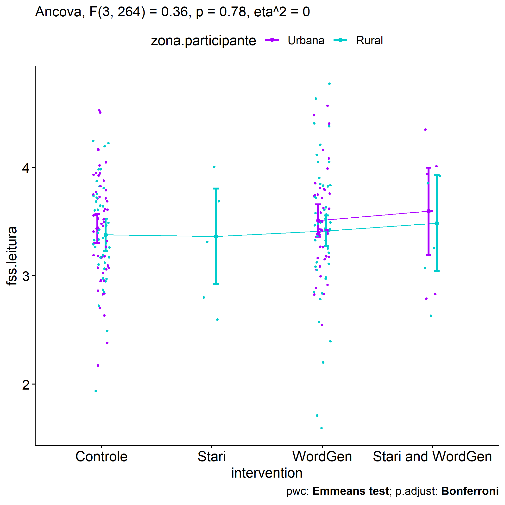

# ANCOVA test for flow.leitura (engajamento na leitura)

Geiser C. Challco
[geiser\@alumni.usp.br](mailto:geiser@alumni.usp.br){.email}

-   [Descriptive Statistics of Initial
    Data](#descriptive-statistics-of-initial-data)
-   [Checking of Assumptions](#checking-of-assumptions)
    -   [Identify and dealing with outliers (performing treatment of
        outliers)](#identify-and-dealing-with-outliers-performing-treatment-of-outliers)
    -   [Assumption: Normality distribution of
        data](#assumption-normality-distribution-of-data)
        -   [Para fatores de:
            **intervention:genero**](#para-fatores-de-interventiongenero)
        -   [Para fatores de:
            **intervention:idade**](#para-fatores-de-interventionidade)
        -   [Para fatores de:
            **intervention:zona.escola**](#para-fatores-de-interventionzonaescola)
        -   [Para fatores de:
            **intervention:zona.participante**](#para-fatores-de-interventionzonaparticipante)
        -   [Para fatores de:
            **intervention:escola**](#para-fatores-de-interventionescola)
        -   [Para fatores de:
            **intervention:monitor**](#para-fatores-de-interventionmonitor)
    -   [Assumption: Homogeneity of data
        distribution](#assumption-homogeneity-of-data-distribution)
        -   [Para fatores de:
            **intervention:genero**](#para-fatores-de-interventiongenero-1)
        -   [Para fatores de:
            **intervention:idade**](#para-fatores-de-interventionidade-1)
        -   [Para fatores de:
            **intervention:zona.escola**](#para-fatores-de-interventionzonaescola-1)
        -   [Para fatores de:
            **intervention:zona.participante**](#para-fatores-de-interventionzonaparticipante-1)
        -   [Para fatores de:
            **intervention:escola**](#para-fatores-de-interventionescola-1)
        -   [Para fatores de:
            **intervention:monitor**](#para-fatores-de-interventionmonitor-1)
-   [Computation of ANCOVA test and Pairwise
    Comparison](#computation-of-ancova-test-and-pairwise-comparison)
    -   [ANCOVA test](#ancova-test)
    -   [Pairwise comparisons for one
        factor](#pairwise-comparisons-for-one-factor)
        -   [factor: **intervention**](#factor-intervention)
        -   [factor: **genero**](#factor-genero)
        -   [factor: **idade**](#factor-idade)
        -   [factor: **zona.escola**](#factor-zonaescola)
        -   [factor: **zona.participante**](#factor-zonaparticipante)
        -   [factor: **escola**](#factor-escola)
        -   [factor: **monitor**](#factor-monitor)
        -   [factor: **monitor.genero**](#factor-monitorgenero)
        -   [factor: **monitor.formacao**](#factor-monitorformacao)
        -   [factor: **monitor.titulacao**](#factor-monitortitulacao)
        -   [factor:
            **monitor.experiencia**](#factor-monitorexperiencia)
    -   [Pairwise comparisons for two
        factors](#pairwise-comparisons-for-two-factors)
        -   [factores:
            **intervention:genero**](#factores-interventiongenero)
        -   [factores:
            **intervention:idade**](#factores-interventionidade)
        -   [factores:
            **intervention:zona.escola**](#factores-interventionzonaescola)
        -   [factores:
            **intervention:zona.participante**](#factores-interventionzonaparticipante)
        -   [factores:
            **intervention:escola**](#factores-interventionescola)
        -   [factores:
            **intervention:monitor**](#factores-interventionmonitor)
        -   [factores:
            **intervention:monitor.genero**](#factores-interventionmonitorgenero)
        -   [factores:
            **intervention:monitor.formacao**](#factores-interventionmonitorformacao)
        -   [factores:
            **intervention:monitor.titulacao**](#factores-interventionmonitortitulacao)
        -   [factores:
            **intervention:monitor.experiencia**](#factores-interventionmonitorexperiencia)

Teste ANCOVA para determinar se houve diferenças significativas em
referência ao engajamento nas atividades de leitura (medido como estado
de fluxo).

ANCOVA test to determine whether there were significant differences in
reference to engagement in reading activities (measured as flow state).

# Descriptive Statistics of Initial Data {#descriptive-statistics-of-initial-data}

| intervention      | genero | variable    |   n |  mean | median |   min |   max |    sd |    se |    ci |   iqr |
|:-----|:-----|:-----|-----:|-----:|-----:|-----:|-----:|-----:|-----:|-----:|-----:|
| Controle          | F      | fss.leitura |  60 | 3.521 |  3.611 | 2.556 | 4.222 | 0.418 | 0.054 | 0.108 | 0.583 |
| Controle          | M      | fss.leitura |  66 | 3.394 |  3.333 | 2.000 | 4.556 | 0.522 | 0.064 | 0.128 | 0.743 |
| Stari             | F      | fss.leitura |   5 | 3.467 |  3.667 | 2.556 | 4.000 | 0.563 | 0.252 | 0.699 | 0.444 |
| Stari             | M      | fss.leitura |   6 | 2.977 |  3.000 | 2.000 | 3.778 | 0.600 | 0.245 | 0.630 | 0.493 |
| WordGen           | F      | fss.leitura |  53 | 3.663 |  3.667 | 2.556 | 4.778 | 0.516 | 0.071 | 0.142 | 0.667 |
| WordGen           | M      | fss.leitura |  63 | 3.318 |  3.375 | 1.667 | 4.556 | 0.556 | 0.070 | 0.140 | 0.556 |
| Stari and WordGen | F      | fss.leitura |   4 | 3.361 |  3.333 | 2.778 | 4.000 | 0.675 | 0.338 | 1.074 | 1.139 |
| Stari and WordGen | M      | fss.leitura |  12 | 3.478 |  3.500 | 2.667 | 4.375 | 0.537 | 0.155 | 0.341 | 0.833 |
| Controle          | F      | dfs.leitura |  60 | 3.595 |  3.667 | 2.444 | 4.556 | 0.536 | 0.069 | 0.138 | 0.889 |
| Controle          | M      | dfs.leitura |  66 | 3.526 |  3.556 | 2.222 | 4.778 | 0.527 | 0.065 | 0.129 | 0.667 |
| Stari             | F      | dfs.leitura |   5 | 3.178 |  3.222 | 2.778 | 3.556 | 0.339 | 0.152 | 0.421 | 0.556 |
| Stari             | M      | dfs.leitura |   6 | 2.859 |  3.243 | 1.000 | 3.778 | 1.067 | 0.435 | 1.119 | 1.149 |
| WordGen           | F      | dfs.leitura |  53 | 3.640 |  3.667 | 2.556 | 4.875 | 0.498 | 0.068 | 0.137 | 0.556 |
| WordGen           | M      | dfs.leitura |  63 | 3.407 |  3.444 | 1.667 | 4.889 | 0.599 | 0.075 | 0.151 | 0.817 |
| Stari and WordGen | F      | dfs.leitura |   4 | 2.972 |  2.944 | 2.333 | 3.667 | 0.591 | 0.295 | 0.940 | 0.750 |
| Stari and WordGen | M      | dfs.leitura |  12 | 3.351 |  3.222 | 2.778 | 4.111 | 0.479 | 0.138 | 0.305 | 0.750 |

| intervention      | escola | variable    |   n |  mean | median |   min |   max |    sd |    se |    ci |   iqr |
|:-----|:-----|:-----|-----:|-----:|-----:|-----:|-----:|-----:|-----:|-----:|-----:|
| Controle          | E1     | fss.leitura |  12 | 3.439 |  3.611 | 2.444 | 4.556 | 0.593 | 0.171 | 0.377 | 0.647 |
| Controle          | E2     | fss.leitura |  23 | 3.437 |  3.333 | 2.667 | 4.556 | 0.530 | 0.110 | 0.229 | 0.778 |
| Controle          | E3     | fss.leitura |  15 | 3.419 |  3.444 | 2.889 | 3.778 | 0.257 | 0.066 | 0.142 | 0.278 |
| Controle          | E4     | fss.leitura |  16 | 3.429 |  3.500 | 2.556 | 4.000 | 0.428 | 0.107 | 0.228 | 0.667 |
| Controle          | E5     | fss.leitura |  49 | 3.457 |  3.444 | 2.000 | 4.333 | 0.517 | 0.074 | 0.149 | 0.778 |
| Controle          | E6     | fss.leitura |  11 | 3.578 |  3.444 | 2.667 | 4.000 | 0.422 | 0.127 | 0.283 | 0.556 |
| Stari             | E1     | fss.leitura |   5 | 3.289 |  3.778 | 2.000 | 4.000 | 0.837 | 0.374 | 1.040 | 0.889 |
| Stari             | E2     | fss.leitura |   1 | 3.667 |  3.667 | 3.667 | 3.667 |    NA |    NA |   NaN | 0.000 |
| Stari             | E5     | fss.leitura |   5 | 3.017 |  3.111 | 2.556 | 3.333 | 0.351 | 0.157 | 0.436 | 0.583 |
| WordGen           | E1     | fss.leitura |  10 | 3.735 |  3.667 | 2.750 | 4.556 | 0.586 | 0.185 | 0.419 | 0.878 |
| WordGen           | E2     | fss.leitura |  24 | 3.402 |  3.500 | 2.556 | 4.111 | 0.406 | 0.083 | 0.171 | 0.583 |
| WordGen           | E3     | fss.leitura |  15 | 3.106 |  3.250 | 1.667 | 4.111 | 0.700 | 0.181 | 0.388 | 0.611 |
| WordGen           | E4     | fss.leitura |   9 | 3.642 |  3.667 | 3.111 | 4.667 | 0.523 | 0.174 | 0.402 | 0.667 |
| WordGen           | E5     | fss.leitura |  47 | 3.500 |  3.444 | 2.222 | 4.778 | 0.556 | 0.081 | 0.163 | 0.715 |
| WordGen           | E6     | fss.leitura |  11 | 3.664 |  3.556 | 2.750 | 4.444 | 0.528 | 0.159 | 0.355 | 0.778 |
| Stari and WordGen | E2     | fss.leitura |   2 | 3.000 |  3.000 | 2.667 | 3.333 | 0.471 | 0.333 | 4.235 | 0.333 |
| Stari and WordGen | E4     | fss.leitura |   5 | 3.808 |  3.889 | 3.111 | 4.375 | 0.467 | 0.209 | 0.579 | 0.333 |
| Stari and WordGen | E5     | fss.leitura |   7 | 3.210 |  3.000 | 2.778 | 4.000 | 0.531 | 0.201 | 0.491 | 0.792 |
| Stari and WordGen | E6     | fss.leitura |   2 | 3.833 |  3.833 | 3.667 | 4.000 | 0.236 | 0.167 | 2.118 | 0.167 |
| Controle          | E1     | dfs.leitura |  12 | 3.130 |  3.111 | 2.222 | 4.000 | 0.514 | 0.148 | 0.327 | 0.611 |
| Controle          | E2     | dfs.leitura |  23 | 3.552 |  3.667 | 2.778 | 4.222 | 0.478 | 0.100 | 0.207 | 0.778 |
| Controle          | E3     | dfs.leitura |  15 | 3.763 |  3.889 | 2.889 | 4.556 | 0.521 | 0.135 | 0.288 | 0.833 |
| Controle          | E4     | dfs.leitura |  16 | 3.612 |  3.556 | 3.000 | 4.250 | 0.305 | 0.076 | 0.163 | 0.326 |
| Controle          | E5     | dfs.leitura |  49 | 3.521 |  3.556 | 2.444 | 4.778 | 0.591 | 0.084 | 0.170 | 0.778 |
| Controle          | E6     | dfs.leitura |  11 | 3.859 |  3.778 | 3.222 | 4.333 | 0.352 | 0.106 | 0.236 | 0.389 |
| Stari             | E1     | dfs.leitura |   5 | 2.542 |  2.889 | 1.000 | 3.375 | 0.969 | 0.433 | 1.203 | 1.000 |
| Stari             | E2     | dfs.leitura |   1 | 3.556 |  3.556 | 3.556 | 3.556 |    NA |    NA |   NaN | 0.000 |
| Stari             | E5     | dfs.leitura |   5 | 3.356 |  3.444 | 2.778 | 3.778 | 0.411 | 0.184 | 0.511 | 0.556 |
| WordGen           | E1     | dfs.leitura |  10 | 3.275 |  3.667 | 1.667 | 3.889 | 0.760 | 0.240 | 0.544 | 0.944 |
| WordGen           | E2     | dfs.leitura |  24 | 3.359 |  3.333 | 2.444 | 4.222 | 0.473 | 0.096 | 0.200 | 0.639 |
| WordGen           | E3     | dfs.leitura |  15 | 3.701 |  3.778 | 2.625 | 4.444 | 0.525 | 0.136 | 0.291 | 0.722 |
| WordGen           | E4     | dfs.leitura |   9 | 3.634 |  3.556 | 2.500 | 4.444 | 0.640 | 0.213 | 0.492 | 0.667 |
| WordGen           | E5     | dfs.leitura |  47 | 3.516 |  3.556 | 2.111 | 4.889 | 0.577 | 0.084 | 0.169 | 0.556 |
| WordGen           | E6     | dfs.leitura |  11 | 3.702 |  3.667 | 3.000 | 4.500 | 0.417 | 0.126 | 0.280 | 0.500 |
| Stari and WordGen | E2     | dfs.leitura |   2 | 3.556 |  3.556 | 3.000 | 4.111 | 0.786 | 0.556 | 7.059 | 0.556 |
| Stari and WordGen | E4     | dfs.leitura |   5 | 3.553 |  3.667 | 2.875 | 4.111 | 0.502 | 0.224 | 0.623 | 0.667 |
| Stari and WordGen | E5     | dfs.leitura |   7 | 2.968 |  2.889 | 2.333 | 3.667 | 0.438 | 0.166 | 0.406 | 0.500 |
| Stari and WordGen | E6     | dfs.leitura |   2 | 3.222 |  3.222 | 3.111 | 3.333 | 0.157 | 0.111 | 1.412 | 0.111 |

| intervention      | zona.escola | variable    |   n |  mean | median |   min |   max |    sd |    se |    ci |   iqr |
|:-----|:-----|:-----|-----:|-----:|-----:|-----:|-----:|-----:|-----:|-----:|-----:|
| Controle          | Urbana      | fss.leitura |  84 | 3.449 |  3.444 | 2.000 | 4.556 | 0.525 | 0.057 | 0.114 | 0.806 |
| Controle          | Rural       | fss.leitura |  42 | 3.465 |  3.444 | 2.556 | 4.000 | 0.371 | 0.057 | 0.116 | 0.438 |
| Stari             | Urbana      | fss.leitura |  11 | 3.199 |  3.333 | 2.000 | 4.000 | 0.610 | 0.184 | 0.410 | 0.903 |
| WordGen           | Urbana      | fss.leitura |  81 | 3.500 |  3.444 | 2.222 | 4.778 | 0.523 | 0.058 | 0.116 | 0.667 |
| WordGen           | Rural       | fss.leitura |  35 | 3.419 |  3.444 | 1.667 | 4.667 | 0.651 | 0.110 | 0.224 | 0.667 |
| Stari and WordGen | Urbana      | fss.leitura |   9 | 3.164 |  3.000 | 2.667 | 4.000 | 0.498 | 0.166 | 0.383 | 0.556 |
| Stari and WordGen | Rural       | fss.leitura |   7 | 3.815 |  3.889 | 3.111 | 4.375 | 0.393 | 0.149 | 0.364 | 0.333 |
| Controle          | Urbana      | dfs.leitura |  84 | 3.473 |  3.556 | 2.222 | 4.778 | 0.564 | 0.062 | 0.122 | 0.778 |
| Controle          | Rural       | dfs.leitura |  42 | 3.730 |  3.778 | 2.889 | 4.556 | 0.409 | 0.063 | 0.127 | 0.486 |
| Stari             | Urbana      | dfs.leitura |  11 | 3.004 |  3.222 | 1.000 | 3.778 | 0.802 | 0.242 | 0.538 | 0.667 |
| WordGen           | Urbana      | dfs.leitura |  81 | 3.439 |  3.556 | 1.667 | 4.889 | 0.574 | 0.064 | 0.127 | 0.667 |
| WordGen           | Rural       | dfs.leitura |  35 | 3.684 |  3.667 | 2.500 | 4.500 | 0.512 | 0.087 | 0.176 | 0.722 |
| Stari and WordGen | Urbana      | dfs.leitura |   9 | 3.099 |  3.000 | 2.333 | 4.111 | 0.537 | 0.179 | 0.413 | 0.444 |
| Stari and WordGen | Rural       | dfs.leitura |   7 | 3.458 |  3.333 | 2.875 | 4.111 | 0.445 | 0.168 | 0.411 | 0.611 |

| intervention      | zona.participante | variable    |   n |  mean | median |   min |   max |    sd |    se |    ci |   iqr |
|:-----|:-----|:-----|-----:|-----:|-----:|-----:|-----:|-----:|-----:|-----:|-----:|
| Controle          | Urbana            | fss.leitura |  54 | 3.450 |  3.528 | 2.222 | 4.556 | 0.487 | 0.066 | 0.133 | 0.667 |
| Controle          | Rural             | fss.leitura |  43 | 3.395 |  3.333 | 2.000 | 4.222 | 0.454 | 0.069 | 0.140 | 0.556 |
| Controle          | NA                | fss.leitura |  29 | 3.549 |  3.444 | 2.667 | 4.375 | 0.495 | 0.092 | 0.188 | 0.667 |
| Stari             | Urbana            | fss.leitura |   4 | 3.111 |  3.333 | 2.000 | 3.778 | 0.851 | 0.426 | 1.354 | 1.111 |
| Stari             | Rural             | fss.leitura |   5 | 3.261 |  3.333 | 2.556 | 4.000 | 0.607 | 0.272 | 0.754 | 0.917 |
| Stari             | NA                | fss.leitura |   2 | 3.222 |  3.222 | 3.111 | 3.333 | 0.157 | 0.111 | 1.412 | 0.111 |
| WordGen           | Urbana            | fss.leitura |  44 | 3.495 |  3.444 | 2.556 | 4.556 | 0.448 | 0.068 | 0.136 | 0.583 |
| WordGen           | Rural             | fss.leitura |  48 | 3.424 |  3.444 | 1.667 | 4.778 | 0.653 | 0.094 | 0.190 | 0.667 |
| WordGen           | NA                | fss.leitura |  24 | 3.545 |  3.556 | 2.556 | 4.556 | 0.572 | 0.117 | 0.241 | 0.722 |
| Stari and WordGen | Urbana            | fss.leitura |   6 | 3.600 |  3.833 | 2.778 | 4.375 | 0.675 | 0.276 | 0.708 | 1.000 |
| Stari and WordGen | Rural             | fss.leitura |   5 | 3.361 |  3.250 | 2.667 | 3.889 | 0.528 | 0.236 | 0.655 | 0.778 |
| Stari and WordGen | NA                | fss.leitura |   5 | 3.356 |  3.333 | 2.778 | 4.000 | 0.493 | 0.221 | 0.612 | 0.667 |
| Controle          | Urbana            | dfs.leitura |  54 | 3.539 |  3.556 | 2.222 | 4.778 | 0.552 | 0.075 | 0.151 | 0.750 |
| Controle          | Rural             | dfs.leitura |  43 | 3.549 |  3.556 | 2.444 | 4.556 | 0.549 | 0.084 | 0.169 | 0.889 |
| Controle          | NA                | dfs.leitura |  29 | 3.612 |  3.667 | 2.667 | 4.333 | 0.471 | 0.087 | 0.179 | 0.556 |
| Stari             | Urbana            | dfs.leitura |   4 | 2.455 |  2.722 | 1.000 | 3.375 | 1.096 | 0.548 | 1.745 | 1.344 |
| Stari             | Rural             | dfs.leitura |   5 | 3.156 |  3.111 | 2.778 | 3.556 | 0.339 | 0.152 | 0.421 | 0.556 |
| Stari             | NA                | dfs.leitura |   2 | 3.722 |  3.722 | 3.667 | 3.778 | 0.079 | 0.056 | 0.706 | 0.056 |
| WordGen           | Urbana            | dfs.leitura |  44 | 3.447 |  3.611 | 1.667 | 4.875 | 0.658 | 0.099 | 0.200 | 0.639 |
| WordGen           | Rural             | dfs.leitura |  48 | 3.526 |  3.556 | 2.444 | 4.444 | 0.511 | 0.074 | 0.148 | 0.603 |
| WordGen           | NA                | dfs.leitura |  24 | 3.610 |  3.556 | 2.667 | 4.889 | 0.486 | 0.099 | 0.205 | 0.583 |
| Stari and WordGen | Urbana            | dfs.leitura |   6 | 3.500 |  3.444 | 2.889 | 4.111 | 0.465 | 0.190 | 0.488 | 0.611 |
| Stari and WordGen | Rural             | dfs.leitura |   5 | 3.086 |  3.000 | 2.667 | 3.667 | 0.382 | 0.171 | 0.474 | 0.347 |
| Stari and WordGen | NA                | dfs.leitura |   5 | 3.133 |  3.111 | 2.333 | 4.111 | 0.664 | 0.297 | 0.824 | 0.556 |

| intervention      | monitor | variable    |   n |  mean | median |   min |   max |    sd |    se |    ci |   iqr |
|:-----|:-----|:-----|-----:|-----:|-----:|-----:|-----:|-----:|-----:|-----:|-----:|
| Controle          | NA      | fss.leitura | 126 | 3.454 |  3.444 | 2.000 | 4.556 | 0.478 | 0.043 | 0.084 | 0.667 |
| Stari             | EA      | fss.leitura |   2 | 2.944 |  2.944 | 2.556 | 3.333 | 0.550 | 0.389 | 4.941 | 0.389 |
| Stari             | GR,JC   | fss.leitura |   1 | 2.750 |  2.750 | 2.750 | 2.750 |    NA |    NA |   NaN | 0.000 |
| Stari             | MF      | fss.leitura |   2 | 3.222 |  3.222 | 3.111 | 3.333 | 0.157 | 0.111 | 1.412 | 0.111 |
| Stari             | MM      | fss.leitura |   1 | 3.667 |  3.667 | 3.667 | 3.667 |    NA |    NA |   NaN | 0.000 |
| Stari             | PR      | fss.leitura |   5 | 3.289 |  3.778 | 2.000 | 4.000 | 0.837 | 0.374 | 1.040 | 0.889 |
| WordGen           | AC      | fss.leitura |  11 | 3.545 |  3.667 | 2.667 | 4.111 | 0.386 | 0.116 | 0.260 | 0.333 |
| WordGen           | AC,MM   | fss.leitura |   1 | 3.556 |  3.556 | 3.556 | 3.556 |    NA |    NA |   NaN | 0.000 |
| WordGen           | CE      | fss.leitura |   9 | 3.642 |  3.667 | 3.111 | 4.667 | 0.523 | 0.174 | 0.402 | 0.667 |
| WordGen           | EA      | fss.leitura |  10 | 3.667 |  3.722 | 2.333 | 4.778 | 0.683 | 0.216 | 0.489 | 0.528 |
| WordGen           | EA,MF   | fss.leitura |   1 | 2.222 |  2.222 | 2.222 | 2.222 |    NA |    NA |   NaN | 0.000 |
| WordGen           | GR      | fss.leitura |  15 | 3.406 |  3.375 | 2.889 | 4.222 | 0.384 | 0.099 | 0.212 | 0.389 |
| WordGen           | GR,JC   | fss.leitura |   1 | 3.778 |  3.778 | 3.778 | 3.778 |    NA |    NA |   NaN | 0.000 |
| WordGen           | JC      | fss.leitura |   9 | 3.444 |  3.444 | 2.556 | 4.444 | 0.598 | 0.199 | 0.460 | 0.778 |
| WordGen           | MF      | fss.leitura |  11 | 3.615 |  3.556 | 2.778 | 4.556 | 0.531 | 0.160 | 0.357 | 0.715 |
| WordGen           | ML      | fss.leitura |  15 | 3.106 |  3.250 | 1.667 | 4.111 | 0.700 | 0.181 | 0.388 | 0.611 |
| WordGen           | MM      | fss.leitura |  12 | 3.258 |  3.278 | 2.556 | 3.778 | 0.404 | 0.117 | 0.257 | 0.615 |
| WordGen           | PR      | fss.leitura |  10 | 3.735 |  3.667 | 2.750 | 4.556 | 0.586 | 0.185 | 0.419 | 0.878 |
| WordGen           | VL      | fss.leitura |  11 | 3.664 |  3.556 | 2.750 | 4.444 | 0.528 | 0.159 | 0.355 | 0.778 |
| Stari and WordGen | AC,MM   | fss.leitura |   1 | 3.333 |  3.333 | 3.333 | 3.333 |    NA |    NA |   NaN | 0.000 |
| Stari and WordGen | CE      | fss.leitura |   5 | 3.808 |  3.889 | 3.111 | 4.375 | 0.467 | 0.209 | 0.579 | 0.333 |
| Stari and WordGen | EA      | fss.leitura |   1 | 3.250 |  3.250 | 3.250 | 3.250 |    NA |    NA |   NaN | 0.000 |
| Stari and WordGen | EA,GR   | fss.leitura |   1 | 4.000 |  4.000 | 4.000 | 4.000 |    NA |    NA |   NaN | 0.000 |
| Stari and WordGen | EA,MF   | fss.leitura |   2 | 3.444 |  3.444 | 3.000 | 3.889 | 0.629 | 0.444 | 5.647 | 0.444 |
| Stari and WordGen | GR,JC   | fss.leitura |   1 | 2.778 |  2.778 | 2.778 | 2.778 |    NA |    NA |   NaN | 0.000 |
| Stari and WordGen | JC      | fss.leitura |   1 | 2.778 |  2.778 | 2.778 | 2.778 |    NA |    NA |   NaN | 0.000 |
| Stari and WordGen | MF      | fss.leitura |   1 | 2.778 |  2.778 | 2.778 | 2.778 |    NA |    NA |   NaN | 0.000 |
| Stari and WordGen | MM      | fss.leitura |   1 | 2.667 |  2.667 | 2.667 | 2.667 |    NA |    NA |   NaN | 0.000 |
| Stari and WordGen | VL      | fss.leitura |   2 | 3.833 |  3.833 | 3.667 | 4.000 | 0.236 | 0.167 | 2.118 | 0.167 |
| Controle          | NA      | dfs.leitura | 126 | 3.559 |  3.556 | 2.222 | 4.778 | 0.530 | 0.047 | 0.093 | 0.667 |
| Stari             | EA      | dfs.leitura |   2 | 3.111 |  3.111 | 2.778 | 3.444 | 0.471 | 0.333 | 4.235 | 0.333 |
| Stari             | GR,JC   | dfs.leitura |   1 | 3.111 |  3.111 | 3.111 | 3.111 |    NA |    NA |   NaN | 0.000 |
| Stari             | MF      | dfs.leitura |   2 | 3.722 |  3.722 | 3.667 | 3.778 | 0.079 | 0.056 | 0.706 | 0.056 |
| Stari             | MM      | dfs.leitura |   1 | 3.556 |  3.556 | 3.556 | 3.556 |    NA |    NA |   NaN | 0.000 |
| Stari             | PR      | dfs.leitura |   5 | 2.542 |  2.889 | 1.000 | 3.375 | 0.969 | 0.433 | 1.203 | 1.000 |
| WordGen           | AC      | dfs.leitura |  11 | 3.505 |  3.556 | 3.111 | 3.778 | 0.245 | 0.074 | 0.165 | 0.389 |
| WordGen           | AC,MM   | dfs.leitura |   1 | 2.889 |  2.889 | 2.889 | 2.889 |    NA |    NA |   NaN | 0.000 |
| WordGen           | CE      | dfs.leitura |   9 | 3.634 |  3.556 | 2.500 | 4.444 | 0.640 | 0.213 | 0.492 | 0.667 |
| WordGen           | EA      | dfs.leitura |  10 | 3.663 |  3.611 | 2.778 | 4.778 | 0.568 | 0.180 | 0.406 | 0.490 |
| WordGen           | EA,MF   | dfs.leitura |   1 | 3.000 |  3.000 | 3.000 | 3.000 |    NA |    NA |   NaN | 0.000 |
| WordGen           | GR      | dfs.leitura |  15 | 3.390 |  3.556 | 2.111 | 4.000 | 0.535 | 0.138 | 0.296 | 0.500 |
| WordGen           | GR,JC   | dfs.leitura |   1 | 3.444 |  3.444 | 3.444 | 3.444 |    NA |    NA |   NaN | 0.000 |
| WordGen           | JC      | dfs.leitura |   9 | 3.591 |  3.667 | 2.556 | 4.875 | 0.635 | 0.212 | 0.488 | 0.556 |
| WordGen           | MF      | dfs.leitura |  11 | 3.545 |  3.333 | 2.667 | 4.889 | 0.664 | 0.200 | 0.446 | 0.889 |
| WordGen           | ML      | dfs.leitura |  15 | 3.701 |  3.778 | 2.625 | 4.444 | 0.525 | 0.136 | 0.291 | 0.722 |
| WordGen           | MM      | dfs.leitura |  12 | 3.264 |  3.333 | 2.444 | 4.222 | 0.601 | 0.173 | 0.382 | 0.944 |
| WordGen           | PR      | dfs.leitura |  10 | 3.275 |  3.667 | 1.667 | 3.889 | 0.760 | 0.240 | 0.544 | 0.944 |
| WordGen           | VL      | dfs.leitura |  11 | 3.702 |  3.667 | 3.000 | 4.500 | 0.417 | 0.126 | 0.280 | 0.500 |
| Stari and WordGen | AC,MM   | dfs.leitura |   1 | 4.111 |  4.111 | 4.111 | 4.111 |    NA |    NA |   NaN | 0.000 |
| Stari and WordGen | CE      | dfs.leitura |   5 | 3.553 |  3.667 | 2.875 | 4.111 | 0.502 | 0.224 | 0.623 | 0.667 |
| Stari and WordGen | EA      | dfs.leitura |   1 | 3.222 |  3.222 | 3.222 | 3.222 |    NA |    NA |   NaN | 0.000 |
| Stari and WordGen | EA,GR   | dfs.leitura |   1 | 3.667 |  3.667 | 3.667 | 3.667 |    NA |    NA |   NaN | 0.000 |
| Stari and WordGen | EA,MF   | dfs.leitura |   2 | 2.722 |  2.722 | 2.667 | 2.778 | 0.079 | 0.056 | 0.706 | 0.056 |
| Stari and WordGen | GR,JC   | dfs.leitura |   1 | 2.889 |  2.889 | 2.889 | 2.889 |    NA |    NA |   NaN | 0.000 |
| Stari and WordGen | JC      | dfs.leitura |   1 | 3.222 |  3.222 | 3.222 | 3.222 |    NA |    NA |   NaN | 0.000 |
| Stari and WordGen | MF      | dfs.leitura |   1 | 2.333 |  2.333 | 2.333 | 2.333 |    NA |    NA |   NaN | 0.000 |
| Stari and WordGen | MM      | dfs.leitura |   1 | 3.000 |  3.000 | 3.000 | 3.000 |    NA |    NA |   NaN | 0.000 |
| Stari and WordGen | VL      | dfs.leitura |   2 | 3.222 |  3.222 | 3.111 | 3.333 | 0.157 | 0.111 | 1.412 | 0.111 |

# Checking of Assumptions {#checking-of-assumptions}

## Identify and dealing with outliers (performing treatment of outliers) {#identify-and-dealing-with-outliers-performing-treatment-of-outliers}

| intervention | genero | escola | zona.escola | zona.participante | id   | fss.leitura | dfs.leitura | is.outlier | is.extreme |
|:-------|:-------|:-------|:-------|:-------|:-------|-------:|-------:|:-------|:-------|
| Controle     | F      | E1     | Urbana      | Urbana            | s160 |    2.666667 |    3.000000 | TRUE       | TRUE       |
| Controle     | F      | E6     | Rural       | NA                | s313 |    2.666667 |    3.777778 | TRUE       | FALSE      |
| Controle     | M      | E2     | Urbana      | Urbana            | s194 |    2.666667 |    3.444444 | TRUE       | TRUE       |
| Controle     | M      | E2     | Urbana      | Urbana            | s198 |    4.555556 |    3.111111 | TRUE       | FALSE      |
| Controle     | M      | E2     | Urbana      | NA                | s207 |    4.375000 |    4.111111 | TRUE       | FALSE      |
| Controle     | M      | E5     | Urbana      | Urbana            | s271 |    2.222222 |    3.666667 | TRUE       | FALSE      |
| Controle     | M      | E5     | Urbana      | Rural             | s254 |    2.000000 |    2.777778 | TRUE       | FALSE      |
| Controle     | M      | E6     | Rural       | NA                | s314 |    4.000000 |    3.666667 | TRUE       | TRUE       |
| WordGen      | F      | E5     | Urbana      | Urbana            | s102 |    4.444444 |    4.875000 | TRUE       | FALSE      |
| WordGen      | M      | E3     | Rural       | Rural             | s48  |    1.666667 |    2.625000 | TRUE       | FALSE      |
| WordGen      | M      | E3     | Rural       | Rural             | s53  |    1.666667 |    3.444444 | TRUE       | FALSE      |
| WordGen      | M      | E5     | Urbana      | Urbana            | s129 |    4.444444 |    4.333333 | TRUE       | FALSE      |
| WordGen      | M      | E5     | Urbana      | Rural             | s125 |    2.222222 |    3.000000 | TRUE       | FALSE      |
| WordGen      | M      | E5     | Urbana      | NA                | s110 |    3.000000 |    3.555556 | TRUE       | FALSE      |

*Note*: No one of outliers is extreme then we don’t need to remove data

## Assumption: Normality distribution of data {#assumption-normality-distribution-of-data}

*Note*: All data satisfy normality

### Para fatores de: **intervention:genero** {#para-fatores-de-interventiongenero}

| var         |   n |   skewness |  kurtosis | symmetry | statistic | method     |         p | p.signif | normality |
|:-------|-------:|-------:|-------:|:-------|-------:|:-------|-------:|:-------|:-------|
| fss.leitura | 269 | -0.2266821 | 0.0946266 | YES      |  2.754071 | D’Agostino | 0.2523255 | ns       | \-        |

### Para fatores de: **intervention:idade** {#para-fatores-de-interventionidade}

| var         |   n |   skewness |  kurtosis | symmetry | statistic | method     |         p | p.signif | normality |
|:-------|-------:|-------:|-------:|:-------|-------:|:-------|-------:|:-------|:-------|
| fss.leitura | 261 | -0.3512184 | 0.5441483 | YES      |  8.561429 | D’Agostino | 0.0138328 | ns       | \-        |

### Para fatores de: **intervention:zona.escola**

| var         |   n |   skewness |  kurtosis | symmetry | statistic | method     |         p | p.signif | normality |
|:-------|-------:|-------:|-------:|:-------|-------:|:-------|-------:|:-------|:-------|
| fss.leitura | 269 | -0.2207365 | 0.2033293 | YES      |  3.130041 | D’Agostino | 0.2090838 | ns       | \-        |

### Para fatores de: **intervention:zona.participante**

| var         |   n |   skewness |  kurtosis | symmetry | statistic | method     |         p | p.signif | normality |
|:-------|-------:|-------:|-------:|:-------|-------:|:-------|-------:|:-------|:-------|
| fss.leitura | 209 | -0.2518686 | 0.4292706 | YES      |  4.342309 | D’Agostino | 0.1140459 | ns       | \-        |

### Para fatores de: **intervention:escola** {#para-fatores-de-interventionescola}

| var         |   n |  skewness |   kurtosis | symmetry | statistic | method     |         p | p.signif | normality |
|:-------|-------:|-------:|-------:|:-------|-------:|:-------|-------:|:-------|:-------|
| fss.leitura | 269 | -0.226897 | -0.1140963 | YES      |  2.416465 | D’Agostino | 0.2987248 | ns       | \-        |

### Para fatores de: **intervention:monitor** {#para-fatores-de-interventionmonitor}

| var         |   n |   skewness |  kurtosis | symmetry | statistic | method     |         p | p.signif | normality |
|:-------|-------:|-------:|-------:|:-------|-------:|:-------|-------:|:-------|:-------|
| fss.leitura | 143 | -0.3729789 | 0.0613607 | YES      |  3.791679 | D’Agostino | 0.1501922 | ns       | QQ        |

## Assumption: Homogeneity of data distribution {#assumption-homogeneity-of-data-distribution}

*Note*: Can be applied parametric tests, all data satisfied homogeneity
tests

### Para fatores de: **intervention:genero** {#para-fatores-de-interventiongenero-1}

| var         | method         | formula                          |   n | DFn.df1 | DFd.df2 | statistic |         p | p.signif |
|:-------|:-------|:---------|-------:|-------:|-------:|-------:|-------:|:-------|
| fss.leitura | Levene’s test  | `.res`\~`intervention`\*`genero` | 269 |       7 |     261 |  0.389902 | 0.9078796 | ns       |
| fss.leitura | Anova’s slopes | `.res`\~`intervention`\*`genero` | 269 |       7 |     253 |  0.411000 | 0.8950000 | ns       |

### Para fatores de: **intervention:idade** {#para-fatores-de-interventionidade-1}

| var         | method         | formula                         |   n | DFn.df1 | DFd.df2 | statistic |         p | p.signif |
|:-------|:-------|:---------|-------:|-------:|-------:|-------:|-------:|:-------|
| fss.leitura | Levene’s test  | `.res`\~`intervention`\*`idade` | 261 |      18 |     242 |  1.147203 | 0.3074194 | ns       |
| fss.leitura | Anova’s slopes | `.res`\~`intervention`\*`idade` | 261 |      14 |     227 |  0.945000 | 0.5110000 | ns       |

### Para fatores de: **intervention:zona.escola**

| var         | method         | formula                               |   n | DFn.df1 | DFd.df2 | statistic |        p | p.signif |
|:-------|:-------|:-----------|-------:|-------:|-------:|-------:|-------:|:-------|
| fss.leitura | Levene’s test  | `.res`\~`intervention`\*`zona.escola` | 269 |       6 |     262 | 0.9166671 | 0.483339 | ns       |
| fss.leitura | Anova’s slopes | `.res`\~`intervention`\*`zona.escola` | 269 |       6 |     255 | 0.8060000 | 0.566000 | ns       |

### Para fatores de: **intervention:zona.participante**

| var         | method         | formula                                     |   n | DFn.df1 | DFd.df2 | statistic |         p | p.signif |
|:-------|:-------|:-------------|-------:|-------:|-------:|-------:|-------:|:-------|
| fss.leitura | Levene’s test  | `.res`\~`intervention`\*`zona.participante` | 209 |       7 |     201 |  1.121954 | 0.3506246 | ns       |
| fss.leitura | Anova’s slopes | `.res`\~`intervention`\*`zona.participante` | 209 |       7 |     193 |  1.355000 | 0.2270000 | ns       |

### Para fatores de: **intervention:escola** {#para-fatores-de-interventionescola-1}

| var         | method         | formula                          |   n | DFn.df1 | DFd.df2 | statistic |         p | p.signif |
|:-------|:-------|:---------|-------:|-------:|-------:|-------:|-------:|:-------|
| fss.leitura | Levene’s test  | `.res`\~`intervention`\*`escola` | 269 |      18 |     250 | 0.8514758 | 0.6381104 | ns       |
| fss.leitura | Anova’s slopes | `.res`\~`intervention`\*`escola` | 269 |      17 |     232 | 0.7530000 | 0.7460000 | ns       |

### Para fatores de: **intervention:monitor** {#para-fatores-de-interventionmonitor-1}

| var         | method         | formula                           |   n | DFn.df1 | DFd.df2 | statistic |         p | p.signif |
|:-------|:-------|:---------|-------:|-------:|-------:|-------:|-------:|:-------|
| fss.leitura | Levene’s test  | `.res`\~`intervention`\*`monitor` | 143 |      27 |     115 | 0.9973736 | 0.4784681 | ns       |
| fss.leitura | Anova’s slopes | `.res`\~`intervention`\*`monitor` | 143 |      15 |      99 | 0.6610000 | 0.8170000 | ns       |

# Computation of ANCOVA test and Pairwise Comparison {#computation-of-ancova-test-and-pairwise-comparison}

## ANCOVA test {#ancova-test}

| Effect                           | DFn | DFd |   SSn |    SSd |      F | p       |   ges | p\<.05 |
|:--------------|------:|------:|------:|------:|------:|:------|------:|:------|
| dfs.leitura                      |   1 | 264 | 9.674 | 63.639 | 40.131 | \<0.001 | 0.132 | \*     |
| intervention                     |   3 | 264 | 0.261 | 63.639 |  0.361 | 0.781   | 0.004 |        |
| genero                           |   1 | 266 | 2.066 | 61.835 |  8.886 | 0.003   | 0.032 | \*     |
| idade                            |   6 | 253 | 2.334 | 60.056 |  1.639 | 0.137   | 0.037 |        |
| zona.escola                      |   1 | 266 | 0.238 | 63.662 |  0.995 | 0.319   | 0.004 |        |
| zona.participante                |   1 | 206 | 0.295 | 50.849 |  1.197 | 0.275   | 0.006 |        |
| escola                           |   5 | 262 | 4.028 | 59.873 |  3.525 | 0.004   | 0.063 | \*     |
| monitor                          |  13 | 128 | 6.294 | 30.484 |  2.033 | 0.023   | 0.171 | \*     |
| monitor.genero                   |   3 | 138 | 1.330 | 35.448 |  1.726 | 0.165   | 0.036 |        |
| monitor.formacao                 |  11 | 130 | 6.088 | 30.690 |  2.344 | 0.011   | 0.166 | \*     |
| monitor.experiencia              |   2 | 139 | 1.400 | 35.379 |  2.750 | 0.067   | 0.038 |        |
| monitor.titulacao                |   3 | 138 | 0.671 | 36.108 |  0.855 | 0.466   | 0.018 |        |
| intervention:genero              |   3 | 260 | 0.622 | 60.821 |  0.886 | 0.449   | 0.010 |        |
| intervention:idade               |   9 | 241 | 2.925 | 56.739 |  1.381 | 0.197   | 0.049 |        |
| intervention:zona.escola         |   2 | 261 | 1.626 | 61.719 |  3.437 | 0.034   | 0.026 | \*     |
| intervention:zona.participante   |   3 | 200 | 0.019 | 50.544 |  0.025 | 0.994   | 0.000 |        |
| intervention:escola              |  10 | 249 | 2.852 | 56.496 |  1.257 | 0.256   | 0.048 |        |
| intervention:monitor             |  12 | 114 | 3.256 | 26.766 |  1.156 | 0.324   | 0.108 |        |
| intervention:monitor.genero      |   5 | 131 | 1.812 | 33.448 |  1.419 | 0.222   | 0.051 |        |
| intervention:monitor.formacao    |  12 | 116 | 3.189 | 27.027 |  1.140 | 0.335   | 0.106 |        |
| intervention:monitor.experiencia |   2 | 135 | 0.645 | 34.257 |  1.271 | 0.284   | 0.018 |        |
| intervention:monitor.titulacao   |   4 | 132 | 0.974 | 35.083 |  0.916 | 0.457   | 0.027 |        |

## Pairwise comparisons for one factor {#pairwise-comparisons-for-one-factor}

### factor: **intervention** {#factor-intervention}

| var         | intervention      |   n | M (pre) | SE (pre) | M (unadj) | SE (unadj) | M (adj) | SE (adj) |
|:-------|:-------|-------:|-------:|-------:|-------:|-------:|-------:|-------:|
| fss.leitura | Controle          | 126 |   3.559 |    0.047 |     3.454 |      0.043 |   3.433 |    0.044 |
| fss.leitura | Stari             |  11 |   3.004 |    0.242 |     3.199 |      0.184 |   3.369 |    0.150 |
| fss.leitura | Stari and WordGen |  16 |   3.256 |    0.129 |     3.449 |      0.138 |   3.532 |    0.123 |
| fss.leitura | WordGen           | 116 |   3.513 |    0.052 |     3.476 |      0.052 |   3.471 |    0.046 |

| .y.         | group1   | group2            | estimate | conf.low | conf.high |    se | statistic |     p | p.adj | p.adj.signif |
|:------|:------|:------|------:|------:|------:|------:|------:|------:|------:|:------|
| fss.leitura | Controle | Stari             |    0.064 |   -0.245 |     0.374 | 0.157 |     0.409 | 0.683 | 1.000 | ns           |
| fss.leitura | Controle | WordGen           |   -0.037 |   -0.162 |     0.087 | 0.063 |    -0.589 | 0.556 | 1.000 | ns           |
| fss.leitura | Controle | Stari and WordGen |   -0.099 |   -0.357 |     0.160 | 0.131 |    -0.750 | 0.454 | 1.000 | ns           |
| fss.leitura | Stari    | WordGen           |   -0.101 |   -0.411 |     0.208 | 0.157 |    -0.645 | 0.519 | 1.000 | ns           |
| fss.leitura | Stari    | Stari and WordGen |   -0.163 |   -0.542 |     0.217 | 0.193 |    -0.844 | 0.399 | 1.000 | ns           |
| fss.leitura | WordGen  | Stari and WordGen |   -0.061 |   -0.321 |     0.198 | 0.132 |    -0.465 | 0.642 | 1.000 | ns           |
| dfs.leitura | Controle | Stari             |    0.555 |    0.210 |     0.900 | 0.175 |     3.170 | 0.002 | 0.010 | \*           |
| dfs.leitura | Controle | WordGen           |    0.046 |   -0.095 |     0.187 | 0.072 |     0.640 | 0.523 | 1.000 | ns           |
| dfs.leitura | Controle | Stari and WordGen |    0.303 |    0.012 |     0.594 | 0.148 |     2.049 | 0.041 | 0.248 | ns           |
| dfs.leitura | Stari    | WordGen           |   -0.509 |   -0.856 |    -0.163 | 0.176 |    -2.898 | 0.004 | 0.024 | \*           |
| dfs.leitura | Stari    | Stari and WordGen |   -0.252 |   -0.682 |     0.177 | 0.218 |    -1.156 | 0.249 | 1.000 | ns           |
| dfs.leitura | WordGen  | Stari and WordGen |    0.257 |   -0.035 |     0.550 | 0.149 |     1.731 | 0.085 | 0.508 | ns           |

| intervention      | group1 | group2 | estimate | conf.low | conf.high |    se | statistic |     p | p.adj | p.adj.signif |
|:------|:------|:------|------:|------:|------:|------:|------:|------:|------:|:------|
| Controle          | pre    | pos    |    0.103 |   -0.027 |     0.233 | 0.066 |     1.555 | 0.120 | 0.120 | ns           |
| Stari             | pre    | pos    |   -0.087 |   -0.501 |     0.328 | 0.211 |    -0.411 | 0.681 | 0.681 | ns           |
| WordGen           | pre    | pos    |    0.016 |   -0.120 |     0.152 | 0.069 |     0.231 | 0.818 | 0.818 | ns           |
| Stari and WordGen | pre    | pos    |   -0.101 |   -0.464 |     0.261 | 0.184 |    -0.550 | 0.583 | 0.583 | ns           |

```         
## Scale for colour is already present.
## Adding another scale for colour, which will replace the existing scale.
```

<!-- -->

<!-- -->

<!-- -->

### factor: **genero** {#factor-genero}

| var         | genero |   n | M (pre) | SE (pre) | M (unadj) | SE (unadj) | M (adj) | SE (adj) |
|:-------|:-------|-------:|-------:|-------:|-------:|-------:|-------:|-------:|
| fss.leitura | F      | 122 |   3.577 |    0.048 |     3.575 |      0.043 |   3.550 |    0.044 |
| fss.leitura | M      | 147 |   3.434 |    0.049 |     3.351 |      0.045 |   3.372 |    0.040 |

| .y.         | group1 | group2 | estimate | conf.low | conf.high |    se | statistic |     p | p.adj | p.adj.signif |
|:------|:------|:------|------:|------:|------:|------:|------:|------:|------:|:------|
| fss.leitura | F      | M      |    0.177 |    0.060 |     0.295 | 0.060 |     2.981 | 0.003 | 0.003 | \*\*         |
| dfs.leitura | F      | M      |    0.143 |    0.007 |     0.280 | 0.069 |     2.076 | 0.039 | 0.039 | \*           |

| genero | group1 | group2 | estimate | conf.low | conf.high |    se | statistic |     p | p.adj | p.adj.signif |
|:------|:------|:------|------:|------:|------:|------:|------:|------:|------:|:------|
| F      | pre    | pos    |   -0.013 |   -0.146 |     0.119 | 0.068 |    -0.198 | 0.843 | 0.843 | ns           |
| M      | pre    | pos    |    0.079 |   -0.040 |     0.197 | 0.060 |     1.306 | 0.192 | 0.192 | ns           |

```         
## Scale for colour is already present.
## Adding another scale for colour, which will replace the existing scale.
```

<!-- -->

<!-- -->

<!-- -->

### factor: **idade** {#factor-idade}

| var         | idade |   n | M (pre) | SE (pre) | M (unadj) | SE (unadj) | M (adj) | SE (adj) |
|:-------|:-------|-------:|-------:|-------:|-------:|-------:|-------:|-------:|
| fss.leitura | 10y   |  51 |   3.458 |    0.074 |     3.459 |      0.073 |   3.479 |    0.068 |
| fss.leitura | 11y   | 153 |   3.563 |    0.042 |     3.505 |      0.042 |   3.488 |    0.040 |
| fss.leitura | 12y   |  37 |   3.452 |    0.118 |     3.398 |      0.093 |   3.419 |    0.080 |
| fss.leitura | 13y   |  16 |   3.385 |    0.138 |     3.175 |      0.127 |   3.220 |    0.122 |

| .y.         | group1 | group2 | estimate | conf.low | conf.high |    se | statistic |     p | p.adj | p.adj.signif |
|:------|:------|:------|------:|------:|------:|------:|------:|------:|------:|:------|
| fss.leitura | 10y    | 11y    |   -0.009 |   -0.165 |     0.146 | 0.079 |    -0.120 | 0.905 | 1.000 | ns           |
| fss.leitura | 10y    | 12y    |    0.060 |   -0.148 |     0.267 | 0.105 |     0.566 | 0.572 | 1.000 | ns           |
| fss.leitura | 10y    | 13y    |    0.259 |   -0.017 |     0.534 | 0.140 |     1.850 | 0.065 | 0.393 | ns           |
| fss.leitura | 11y    | 12y    |    0.069 |   -0.107 |     0.246 | 0.090 |     0.771 | 0.441 | 1.000 | ns           |
| fss.leitura | 11y    | 13y    |    0.268 |    0.015 |     0.521 | 0.129 |     2.087 | 0.038 | 0.228 | ns           |
| fss.leitura | 12y    | 13y    |    0.199 |   -0.088 |     0.487 | 0.146 |     1.364 | 0.174 | 1.000 | ns           |
| dfs.leitura | 10y    | 11y    |   -0.105 |   -0.283 |     0.072 | 0.090 |    -1.171 | 0.243 | 1.000 | ns           |
| dfs.leitura | 10y    | 12y    |    0.006 |   -0.231 |     0.243 | 0.120 |     0.049 | 0.961 | 1.000 | ns           |
| dfs.leitura | 10y    | 13y    |    0.073 |   -0.241 |     0.387 | 0.159 |     0.456 | 0.649 | 1.000 | ns           |
| dfs.leitura | 11y    | 12y    |    0.111 |   -0.089 |     0.312 | 0.102 |     1.091 | 0.276 | 1.000 | ns           |
| dfs.leitura | 11y    | 13y    |    0.178 |   -0.110 |     0.466 | 0.146 |     1.218 | 0.225 | 1.000 | ns           |
| dfs.leitura | 12y    | 13y    |    0.067 |   -0.261 |     0.395 | 0.166 |     0.401 | 0.689 | 1.000 | ns           |

| idade | group1 | group2 | estimate | conf.low | conf.high |    se | statistic |     p | p.adj | p.adj.signif |
|:------|:------|:------|------:|------:|------:|------:|------:|------:|------:|:------|
| 10y   | pre    | pos    |    0.020 |   -0.184 |     0.223 | 0.104 |     0.189 | 0.850 | 0.850 | ns           |
| 11y   | pre    | pos    |    0.050 |   -0.067 |     0.167 | 0.060 |     0.840 | 0.402 | 0.402 | ns           |
| 12y   | pre    | pos    |    0.043 |   -0.191 |     0.277 | 0.119 |     0.362 | 0.717 | 0.717 | ns           |
| 13y   | pre    | pos    |    0.199 |   -0.156 |     0.554 | 0.181 |     1.102 | 0.271 | 0.271 | ns           |

```         
## Scale for colour is already present.
## Adding another scale for colour, which will replace the existing scale.
```

<!-- -->

<!-- -->

<!-- -->

### factor: **zona.escola**

| var         | zona.escola |   n | M (pre) | SE (pre) | M (unadj) | SE (unadj) | M (adj) | SE (adj) |
|:-------|:-------|-------:|-------:|-------:|-------:|-------:|-------:|-------:|
| fss.leitura | Rural       |  84 |   3.688 |    0.050 |     3.475 |      0.056 |   3.407 |    0.054 |
| fss.leitura | Urbana      | 185 |   3.412 |    0.044 |     3.443 |      0.039 |   3.473 |    0.036 |

| .y.         | group1 | group2 | estimate | conf.low | conf.high |    se | statistic | p       | p.adj   | p.adj.signif |
|:------|:------|:------|------:|------:|------:|------:|------:|:------|:------|:------|
| fss.leitura | Urbana | Rural  |    0.066 |   -0.064 |     0.196 | 0.066 |     0.998 | 0.319   | 0.319   | ns           |
| dfs.leitura | Urbana | Rural  |   -0.276 |   -0.420 |    -0.132 | 0.073 |    -3.786 | \<0.001 | \<0.001 | \*\*\*       |

| zona.escola | group1 | group2 | estimate | conf.low | conf.high |    se | statistic |     p | p.adj | p.adj.signif |
|:------|:------|:------|------:|------:|------:|------:|------:|------:|------:|:------|
| Urbana      | pre    | pos    |   -0.025 |   -0.132 |     0.081 | 0.054 |     -0.47 | 0.638 | 0.638 | ns           |
| Rural       | pre    | pos    |    0.195 |    0.036 |     0.354 | 0.081 |      2.41 | 0.016 | 0.016 | \*           |

```         
## Scale for colour is already present.
## Adding another scale for colour, which will replace the existing scale.
```

<!-- -->

<!-- -->

<!-- -->

### factor: **zona.participante**

| var         | zona.participante |   n | M (pre) | SE (pre) | M (unadj) | SE (unadj) | M (adj) | SE (adj) |
|:-------|:-------|-------:|-------:|-------:|-------:|-------:|-------:|-------:|
| fss.leitura | Rural             | 101 |   3.495 |    0.052 |     3.400 |      0.056 |   3.394 |    0.049 |
| fss.leitura | Urbana            | 108 |   3.459 |    0.062 |     3.464 |      0.048 |   3.470 |    0.048 |

| .y.         | group1 | group2 | estimate | conf.low | conf.high |    se | statistic |     p | p.adj | p.adj.signif |
|:------|:------|:------|------:|------:|------:|------:|------:|------:|------:|:------|
| fss.leitura | Urbana | Rural  |    0.075 |   -0.060 |     0.211 | 0.069 |     1.094 | 0.275 | 0.275 | ns           |
| dfs.leitura | Urbana | Rural  |   -0.036 |   -0.196 |     0.124 | 0.081 |    -0.445 | 0.657 | 0.657 | ns           |

| zona.participante | group1 | group2 | estimate | conf.low | conf.high |    se | statistic |     p | p.adj | p.adj.signif |
|:------|:------|:------|------:|------:|------:|------:|------:|------:|------:|:------|
| Urbana            | pre    | pos    |    0.002 |   -0.144 |     0.148 | 0.074 |     0.023 | 0.982 | 0.982 | ns           |
| Rural             | pre    | pos    |    0.088 |   -0.065 |     0.241 | 0.078 |     1.125 | 0.261 | 0.261 | ns           |

```         
## Scale for colour is already present.
## Adding another scale for colour, which will replace the existing scale.
```

<!-- -->

<!-- -->

<!-- -->

### factor: **escola** {#factor-escola}

| var         | escola |   n | M (pre) | SE (pre) | M (unadj) | SE (unadj) | M (adj) | SE (adj) |
|:-------|:-------|-------:|-------:|-------:|-------:|-------:|-------:|-------:|
| fss.leitura | E1     |  27 |   3.074 |    0.140 |     3.521 |      0.123 |   3.685 |    0.095 |
| fss.leitura | E2     |  50 |   3.459 |    0.068 |     3.407 |      0.066 |   3.422 |    0.068 |
| fss.leitura | E3     |  30 |   3.732 |    0.094 |     3.263 |      0.099 |   3.172 |    0.088 |
| fss.leitura | E4     |  30 |   3.609 |    0.081 |     3.556 |      0.086 |   3.513 |    0.087 |
| fss.leitura | E5     | 108 |   3.475 |    0.056 |     3.440 |      0.052 |   3.449 |    0.046 |
| fss.leitura | E6     |  24 |   3.734 |    0.082 |     3.639 |      0.093 |   3.548 |    0.098 |

| .y.         | group1 | group2 | estimate | conf.low | conf.high |    se | statistic | p       | p.adj   | p.adj.signif |
|:------|:------|:------|------:|------:|------:|------:|------:|:------|:------|:------|
| fss.leitura | E1     | E2     |    0.263 |    0.034 |     0.491 | 0.116 |     2.264 | 0.024   | 0.366   | ns           |
| fss.leitura | E1     | E3     |    0.513 |    0.254 |     0.772 | 0.132 |     3.896 | \<0.001 | 0.002   | \*\*         |
| fss.leitura | E1     | E4     |    0.172 |   -0.084 |     0.428 | 0.130 |     1.321 | 0.188   | 1       | ns           |
| fss.leitura | E1     | E5     |    0.237 |    0.030 |     0.443 | 0.105 |     2.250 | 0.025   | 0.379   | ns           |
| fss.leitura | E1     | E6     |    0.137 |   -0.136 |     0.411 | 0.139 |     0.990 | 0.323   | 1       | ns           |
| fss.leitura | E2     | E3     |    0.250 |    0.031 |     0.470 | 0.111 |     2.247 | 0.025   | 0.382   | ns           |
| fss.leitura | E2     | E4     |   -0.091 |   -0.309 |     0.127 | 0.111 |    -0.822 | 0.412   | 1       | ns           |
| fss.leitura | E2     | E5     |   -0.026 |   -0.187 |     0.135 | 0.082 |    -0.321 | 0.748   | 1       | ns           |
| fss.leitura | E2     | E6     |   -0.125 |   -0.361 |     0.110 | 0.120 |    -1.048 | 0.296   | 1       | ns           |
| fss.leitura | E3     | E4     |   -0.341 |   -0.585 |    -0.098 | 0.124 |    -2.761 | 0.006   | 0.092   | ns           |
| fss.leitura | E3     | E5     |   -0.277 |   -0.473 |    -0.080 | 0.100 |    -2.776 | 0.006   | 0.089   | ns           |
| fss.leitura | E3     | E6     |   -0.376 |   -0.633 |    -0.118 | 0.131 |    -2.870 | 0.004   | 0.067   | ns           |
| fss.leitura | E4     | E5     |    0.065 |   -0.130 |     0.260 | 0.099 |     0.655 | 0.513   | 1       | ns           |
| fss.leitura | E4     | E6     |   -0.034 |   -0.292 |     0.224 | 0.131 |    -0.262 | 0.793   | 1       | ns           |
| fss.leitura | E5     | E6     |   -0.099 |   -0.313 |     0.115 | 0.109 |    -0.911 | 0.363   | 1       | ns           |
| dfs.leitura | E1     | E2     |   -0.385 |   -0.641 |    -0.129 | 0.130 |    -2.959 | 0.003   | 0.051   | ns           |
| dfs.leitura | E1     | E3     |   -0.658 |   -0.942 |    -0.373 | 0.145 |    -4.549 | \<0.001 | \<0.001 | \*\*\*       |
| dfs.leitura | E1     | E4     |   -0.534 |   -0.819 |    -0.250 | 0.145 |    -3.696 | \<0.001 | 0.004   | \*\*         |
| dfs.leitura | E1     | E5     |   -0.401 |   -0.632 |    -0.170 | 0.117 |    -3.418 | \<0.001 | 0.011   | \*           |
| dfs.leitura | E1     | E6     |   -0.659 |   -0.960 |    -0.358 | 0.153 |    -4.314 | \<0.001 | \<0.001 | \*\*\*       |
| dfs.leitura | E2     | E3     |   -0.273 |   -0.520 |    -0.025 | 0.126 |    -2.166 | 0.031   | 0.468   | ns           |
| dfs.leitura | E2     | E4     |   -0.149 |   -0.397 |     0.099 | 0.126 |    -1.185 | 0.237   | 1       | ns           |
| dfs.leitura | E2     | E5     |   -0.016 |   -0.199 |     0.168 | 0.093 |    -0.168 | 0.866   | 1       | ns           |
| dfs.leitura | E2     | E6     |   -0.274 |   -0.541 |    -0.008 | 0.135 |    -2.028 | 0.044   | 0.654   | ns           |
| dfs.leitura | E3     | E4     |    0.123 |   -0.154 |     0.400 | 0.141 |     0.877 | 0.381   | 1       | ns           |
| dfs.leitura | E3     | E5     |    0.257 |    0.035 |     0.478 | 0.112 |     2.284 | 0.023   | 0.348   | ns           |
| dfs.leitura | E3     | E6     |   -0.002 |   -0.296 |     0.292 | 0.149 |    -0.012 | 0.99    | 1       | ns           |
| dfs.leitura | E4     | E5     |    0.133 |   -0.088 |     0.355 | 0.112 |     1.187 | 0.236   | 1       | ns           |
| dfs.leitura | E4     | E6     |   -0.125 |   -0.419 |     0.169 | 0.149 |    -0.839 | 0.402   | 1       | ns           |
| dfs.leitura | E5     | E6     |   -0.259 |   -0.501 |    -0.017 | 0.123 |    -2.104 | 0.036   | 0.545   | ns           |

| escola | group1 | group2 | estimate | conf.low | conf.high |    se | statistic |     p | p.adj | p.adj.signif |
|:------|:------|:------|------:|------:|------:|------:|------:|------:|------:|:------|
| E1     | pre    | pos    |   -0.387 |   -0.662 |    -0.113 | 0.140 |    -2.770 | 0.006 | 0.006 | \*\*         |
| E2     | pre    | pos    |    0.031 |   -0.171 |     0.234 | 0.103 |     0.304 | 0.761 | 0.761 | ns           |
| E3     | pre    | pos    |    0.438 |    0.170 |     0.706 | 0.136 |     3.207 | 0.001 | 0.001 | \*\*         |
| E4     | pre    | pos    |    0.069 |   -0.195 |     0.334 | 0.134 |     0.516 | 0.606 | 0.606 | ns           |
| E5     | pre    | pos    |    0.037 |   -0.101 |     0.175 | 0.070 |     0.524 | 0.601 | 0.601 | ns           |
| E6     | pre    | pos    |    0.079 |   -0.208 |     0.367 | 0.146 |     0.543 | 0.588 | 0.588 | ns           |

```         
## Scale for colour is already present.
## Adding another scale for colour, which will replace the existing scale.
```

<!-- -->

<!-- -->

<!-- -->

### factor: **monitor** {#factor-monitor}

| var         | monitor |   n | M (pre) | SE (pre) | M (unadj) | SE (unadj) | M (adj) | SE (adj) |
|:-------|:-------|-------:|-------:|-------:|-------:|-------:|-------:|-------:|
| fss.leitura | AC      |  11 |   3.505 |    0.074 |     3.545 |      0.116 |   3.526 |    0.144 |
| fss.leitura | CE      |  14 |   3.605 |    0.154 |     3.701 |      0.132 |   3.634 |    0.128 |
| fss.leitura | EA      |  13 |   3.544 |    0.155 |     3.524 |      0.187 |   3.485 |    0.133 |
| fss.leitura | GR      |  15 |   3.390 |    0.138 |     3.406 |      0.099 |   3.441 |    0.123 |
| fss.leitura | JC      |  10 |   3.554 |    0.193 |     3.378 |      0.190 |   3.335 |    0.151 |
| fss.leitura | MF      |  14 |   3.484 |    0.180 |     3.499 |      0.142 |   3.489 |    0.128 |
| fss.leitura | ML      |  15 |   3.701 |    0.136 |     3.106 |      0.181 |   2.993 |    0.125 |
| fss.leitura | MM      |  14 |   3.266 |    0.151 |     3.245 |      0.113 |   3.339 |    0.128 |
| fss.leitura | PR      |  15 |   3.030 |    0.226 |     3.586 |      0.177 |   3.792 |    0.127 |
| fss.leitura | VL      |  13 |   3.628 |    0.118 |     3.690 |      0.136 |   3.612 |    0.133 |

| .y.         | group1 | group2 | estimate | conf.low | conf.high |    se | statistic | p       | p.adj | p.adj.signif |
|:------|:------|:------|------:|------:|------:|------:|------:|:------|------:|:------|
| fss.leitura | AC     | CE     |   -0.108 |   -0.490 |     0.273 | 0.193 |    -0.563 | 0.575   | 1.000 | ns           |
| fss.leitura | AC     | EA     |    0.040 |   -0.347 |     0.428 | 0.196 |     0.206 | 0.837   | 1.000 | ns           |
| fss.leitura | AC     | GR     |    0.085 |   -0.290 |     0.461 | 0.190 |     0.449 | 0.654   | 1.000 | ns           |
| fss.leitura | AC     | JC     |    0.191 |   -0.222 |     0.604 | 0.209 |     0.915 | 0.362   | 1.000 | ns           |
| fss.leitura | AC     | MF     |    0.037 |   -0.344 |     0.417 | 0.192 |     0.190 | 0.85    | 1.000 | ns           |
| fss.leitura | AC     | ML     |    0.533 |    0.156 |     0.909 | 0.190 |     2.802 | 0.006   | 0.265 | ns           |
| fss.leitura | AC     | MM     |    0.187 |   -0.196 |     0.569 | 0.193 |     0.967 | 0.335   | 1.000 | ns           |
| fss.leitura | AC     | PR     |   -0.266 |   -0.648 |     0.116 | 0.193 |    -1.380 | 0.17    | 1.000 | ns           |
| fss.leitura | AC     | VL     |   -0.086 |   -0.474 |     0.302 | 0.196 |    -0.440 | 0.66    | 1.000 | ns           |
| fss.leitura | CE     | EA     |    0.149 |   -0.216 |     0.513 | 0.184 |     0.808 | 0.42    | 1.000 | ns           |
| fss.leitura | CE     | GR     |    0.194 |   -0.159 |     0.546 | 0.178 |     1.087 | 0.279   | 1.000 | ns           |
| fss.leitura | CE     | JC     |    0.299 |   -0.092 |     0.691 | 0.198 |     1.514 | 0.133   | 1.000 | ns           |
| fss.leitura | CE     | MF     |    0.145 |   -0.213 |     0.503 | 0.181 |     0.802 | 0.424   | 1.000 | ns           |
| fss.leitura | CE     | ML     |    0.641 |    0.290 |     0.993 | 0.178 |     3.610 | \<0.001 | 0.020 | \*           |
| fss.leitura | CE     | MM     |    0.295 |   -0.065 |     0.656 | 0.182 |     1.621 | 0.108   | 1.000 | ns           |
| fss.leitura | CE     | PR     |   -0.158 |   -0.519 |     0.204 | 0.182 |    -0.864 | 0.389   | 1.000 | ns           |
| fss.leitura | CE     | VL     |    0.022 |   -0.342 |     0.386 | 0.184 |     0.120 | 0.904   | 1.000 | ns           |
| fss.leitura | EA     | GR     |    0.045 |   -0.314 |     0.404 | 0.181 |     0.247 | 0.805   | 1.000 | ns           |
| fss.leitura | EA     | JC     |    0.151 |   -0.247 |     0.548 | 0.201 |     0.750 | 0.455   | 1.000 | ns           |
| fss.leitura | EA     | MF     |   -0.004 |   -0.368 |     0.360 | 0.184 |    -0.021 | 0.983   | 1.000 | ns           |
| fss.leitura | EA     | ML     |    0.493 |    0.134 |     0.852 | 0.181 |     2.716 | 0.008   | 0.341 | ns           |
| fss.leitura | EA     | MM     |    0.147 |   -0.220 |     0.513 | 0.185 |     0.792 | 0.43    | 1.000 | ns           |
| fss.leitura | EA     | PR     |   -0.306 |   -0.672 |     0.060 | 0.185 |    -1.657 | 0.1     | 1.000 | ns           |
| fss.leitura | EA     | VL     |   -0.127 |   -0.498 |     0.244 | 0.187 |    -0.675 | 0.501   | 1.000 | ns           |
| fss.leitura | GR     | JC     |    0.106 |   -0.281 |     0.493 | 0.195 |     0.541 | 0.589   | 1.000 | ns           |
| fss.leitura | GR     | MF     |   -0.049 |   -0.400 |     0.303 | 0.178 |    -0.274 | 0.784   | 1.000 | ns           |
| fss.leitura | GR     | ML     |    0.448 |    0.099 |     0.796 | 0.176 |     2.545 | 0.012   | 0.547 | ns           |
| fss.leitura | GR     | MM     |    0.102 |   -0.250 |     0.454 | 0.178 |     0.572 | 0.568   | 1.000 | ns           |
| fss.leitura | GR     | PR     |   -0.351 |   -0.700 |    -0.002 | 0.176 |    -1.991 | 0.049   | 1.000 | ns           |
| fss.leitura | GR     | VL     |   -0.171 |   -0.531 |     0.188 | 0.182 |    -0.943 | 0.348   | 1.000 | ns           |
| fss.leitura | JC     | MF     |   -0.154 |   -0.546 |     0.237 | 0.198 |    -0.781 | 0.436   | 1.000 | ns           |
| fss.leitura | JC     | ML     |    0.342 |   -0.045 |     0.728 | 0.195 |     1.750 | 0.083   | 1.000 | ns           |
| fss.leitura | JC     | MM     |   -0.004 |   -0.398 |     0.390 | 0.199 |    -0.021 | 0.984   | 1.000 | ns           |
| fss.leitura | JC     | PR     |   -0.457 |   -0.850 |    -0.064 | 0.199 |    -2.299 | 0.023   | 1.000 | ns           |
| fss.leitura | JC     | VL     |   -0.277 |   -0.675 |     0.121 | 0.201 |    -1.379 | 0.17    | 1.000 | ns           |
| fss.leitura | MF     | ML     |    0.496 |    0.144 |     0.849 | 0.178 |     2.785 | 0.006   | 0.279 | ns           |
| fss.leitura | MF     | MM     |    0.150 |   -0.208 |     0.509 | 0.181 |     0.830 | 0.408   | 1.000 | ns           |
| fss.leitura | MF     | PR     |   -0.302 |   -0.660 |     0.055 | 0.181 |    -1.675 | 0.096   | 1.000 | ns           |
| fss.leitura | MF     | VL     |   -0.123 |   -0.488 |     0.242 | 0.184 |    -0.666 | 0.506   | 1.000 | ns           |
| fss.leitura | ML     | MM     |   -0.346 |   -0.703 |     0.011 | 0.180 |    -1.918 | 0.057   | 1.000 | ns           |
| fss.leitura | ML     | PR     |   -0.799 |   -1.157 |    -0.440 | 0.181 |    -4.409 | \<0.001 | 0.001 | \*\*         |
| fss.leitura | ML     | VL     |   -0.619 |   -0.978 |    -0.261 | 0.181 |    -3.419 | \<0.001 | 0.038 | \*           |
| fss.leitura | MM     | PR     |   -0.453 |   -0.806 |    -0.100 | 0.178 |    -2.539 | 0.012   | 0.556 | ns           |
| fss.leitura | MM     | VL     |   -0.273 |   -0.641 |     0.095 | 0.186 |    -1.470 | 0.144   | 1.000 | ns           |
| fss.leitura | PR     | VL     |    0.180 |   -0.189 |     0.548 | 0.186 |     0.965 | 0.336   | 1.000 | ns           |
| dfs.leitura | AC     | CE     |   -0.100 |   -0.569 |     0.368 | 0.237 |    -0.423 | 0.673   | 1.000 | ns           |
| dfs.leitura | AC     | EA     |   -0.039 |   -0.515 |     0.438 | 0.241 |    -0.161 | 0.872   | 1.000 | ns           |
| dfs.leitura | AC     | GR     |    0.115 |   -0.346 |     0.577 | 0.233 |     0.494 | 0.622   | 1.000 | ns           |
| dfs.leitura | AC     | JC     |   -0.049 |   -0.557 |     0.459 | 0.257 |    -0.191 | 0.849   | 1.000 | ns           |
| dfs.leitura | AC     | MF     |    0.021 |   -0.448 |     0.489 | 0.237 |     0.088 | 0.93    | 1.000 | ns           |
| dfs.leitura | AC     | ML     |   -0.196 |   -0.657 |     0.266 | 0.233 |    -0.840 | 0.402   | 1.000 | ns           |
| dfs.leitura | AC     | MM     |    0.239 |   -0.229 |     0.708 | 0.237 |     1.011 | 0.314   | 1.000 | ns           |
| dfs.leitura | AC     | PR     |    0.475 |    0.013 |     0.936 | 0.233 |     2.036 | 0.044   | 1.000 | ns           |
| dfs.leitura | AC     | VL     |   -0.123 |   -0.599 |     0.353 | 0.241 |    -0.512 | 0.61    | 1.000 | ns           |
| dfs.leitura | CE     | EA     |    0.061 |   -0.386 |     0.509 | 0.226 |     0.271 | 0.787   | 1.000 | ns           |
| dfs.leitura | CE     | GR     |    0.215 |   -0.217 |     0.647 | 0.218 |     0.987 | 0.326   | 1.000 | ns           |
| dfs.leitura | CE     | JC     |    0.051 |   -0.430 |     0.532 | 0.243 |     0.210 | 0.834   | 1.000 | ns           |
| dfs.leitura | CE     | MF     |    0.121 |   -0.318 |     0.560 | 0.222 |     0.545 | 0.587   | 1.000 | ns           |
| dfs.leitura | CE     | ML     |   -0.096 |   -0.528 |     0.336 | 0.218 |    -0.439 | 0.662   | 1.000 | ns           |
| dfs.leitura | CE     | MM     |    0.339 |   -0.100 |     0.779 | 0.222 |     1.528 | 0.129   | 1.000 | ns           |
| dfs.leitura | CE     | PR     |    0.575 |    0.143 |     1.007 | 0.218 |     2.634 | 0.01    | 0.429 | ns           |
| dfs.leitura | CE     | VL     |   -0.023 |   -0.471 |     0.425 | 0.226 |    -0.102 | 0.919   | 1.000 | ns           |
| dfs.leitura | EA     | GR     |    0.154 |   -0.287 |     0.595 | 0.223 |     0.692 | 0.49    | 1.000 | ns           |
| dfs.leitura | EA     | JC     |   -0.010 |   -0.499 |     0.479 | 0.247 |    -0.042 | 0.967   | 1.000 | ns           |
| dfs.leitura | EA     | MF     |    0.060 |   -0.388 |     0.507 | 0.226 |     0.264 | 0.792   | 1.000 | ns           |
| dfs.leitura | EA     | ML     |   -0.157 |   -0.598 |     0.283 | 0.223 |    -0.706 | 0.482   | 1.000 | ns           |
| dfs.leitura | EA     | MM     |    0.278 |   -0.170 |     0.726 | 0.226 |     1.228 | 0.222   | 1.000 | ns           |
| dfs.leitura | EA     | PR     |    0.514 |    0.073 |     0.954 | 0.223 |     2.307 | 0.023   | 1.000 | ns           |
| dfs.leitura | EA     | VL     |   -0.084 |   -0.540 |     0.372 | 0.230 |    -0.366 | 0.715   | 1.000 | ns           |
| dfs.leitura | GR     | JC     |   -0.164 |   -0.639 |     0.310 | 0.240 |    -0.685 | 0.494   | 1.000 | ns           |
| dfs.leitura | GR     | MF     |   -0.094 |   -0.526 |     0.338 | 0.218 |    -0.432 | 0.666   | 1.000 | ns           |
| dfs.leitura | GR     | ML     |   -0.311 |   -0.736 |     0.113 | 0.214 |    -1.451 | 0.149   | 1.000 | ns           |
| dfs.leitura | GR     | MM     |    0.124 |   -0.308 |     0.556 | 0.218 |     0.568 | 0.571   | 1.000 | ns           |
| dfs.leitura | GR     | PR     |    0.360 |   -0.065 |     0.784 | 0.214 |     1.676 | 0.096   | 1.000 | ns           |
| dfs.leitura | GR     | VL     |   -0.238 |   -0.679 |     0.202 | 0.223 |    -1.071 | 0.286   | 1.000 | ns           |
| dfs.leitura | JC     | MF     |    0.070 |   -0.411 |     0.551 | 0.243 |     0.288 | 0.774   | 1.000 | ns           |
| dfs.leitura | JC     | ML     |   -0.147 |   -0.621 |     0.328 | 0.240 |    -0.612 | 0.542   | 1.000 | ns           |
| dfs.leitura | JC     | MM     |    0.288 |   -0.193 |     0.770 | 0.243 |     1.185 | 0.238   | 1.000 | ns           |
| dfs.leitura | JC     | PR     |    0.524 |    0.049 |     0.999 | 0.240 |     2.185 | 0.031   | 1.000 | ns           |
| dfs.leitura | JC     | VL     |   -0.074 |   -0.563 |     0.415 | 0.247 |    -0.300 | 0.765   | 1.000 | ns           |
| dfs.leitura | MF     | ML     |   -0.217 |   -0.649 |     0.215 | 0.218 |    -0.993 | 0.323   | 1.000 | ns           |
| dfs.leitura | MF     | MM     |    0.218 |   -0.221 |     0.658 | 0.222 |     0.983 | 0.327   | 1.000 | ns           |
| dfs.leitura | MF     | PR     |    0.454 |    0.022 |     0.886 | 0.218 |     2.079 | 0.04    | 1.000 | ns           |
| dfs.leitura | MF     | VL     |   -0.144 |   -0.592 |     0.304 | 0.226 |    -0.637 | 0.525   | 1.000 | ns           |
| dfs.leitura | ML     | MM     |    0.435 |    0.003 |     0.867 | 0.218 |     1.993 | 0.048   | 1.000 | ns           |
| dfs.leitura | ML     | PR     |    0.671 |    0.246 |     1.095 | 0.214 |     3.127 | 0.002   | 0.099 | ns           |
| dfs.leitura | ML     | VL     |    0.073 |   -0.368 |     0.513 | 0.223 |     0.327 | 0.744   | 1.000 | ns           |
| dfs.leitura | MM     | PR     |    0.236 |   -0.196 |     0.668 | 0.218 |     1.079 | 0.283   | 1.000 | ns           |
| dfs.leitura | MM     | VL     |   -0.362 |   -0.810 |     0.085 | 0.226 |    -1.602 | 0.112   | 1.000 | ns           |
| dfs.leitura | PR     | VL     |   -0.598 |   -1.038 |    -0.157 | 0.223 |    -2.686 | 0.008   | 0.370 | ns           |

| monitor | group1 | group2 | estimate | conf.low | conf.high |    se | statistic |     p | p.adj | p.adj.signif |
|:------|:------|:------|------:|------:|------:|------:|------:|------:|------:|:------|
| AC      | pre    | pos    |   -0.040 |   -0.509 |     0.428 | 0.238 |    -0.170 | 0.865 | 0.865 | ns           |
| CE      | pre    | pos    |   -0.098 |   -0.500 |     0.304 | 0.204 |    -0.480 | 0.632 | 0.632 | ns           |
| EA      | pre    | pos    |    0.020 |   -0.410 |     0.451 | 0.219 |     0.093 | 0.926 | 0.926 | ns           |
| GR      | pre    | pos    |   -0.016 |   -0.417 |     0.385 | 0.204 |    -0.077 | 0.938 | 0.938 | ns           |
| JC      | pre    | pos    |    0.214 |   -0.256 |     0.684 | 0.239 |     0.895 | 0.372 | 0.372 | ns           |
| MF      | pre    | pos    |   -0.022 |   -0.418 |     0.374 | 0.201 |    -0.109 | 0.913 | 0.913 | ns           |
| ML      | pre    | pos    |    0.579 |    0.185 |     0.974 | 0.200 |     2.891 | 0.004 | 0.004 | \*\*         |
| MM      | pre    | pos    |    0.008 |   -0.393 |     0.410 | 0.204 |     0.041 | 0.967 | 0.967 | ns           |
| PR      | pre    | pos    |   -0.577 |   -0.965 |    -0.188 | 0.197 |    -2.925 | 0.004 | 0.004 | \*\*         |
| VL      | pre    | pos    |   -0.084 |   -0.478 |     0.311 | 0.200 |    -0.419 | 0.676 | 0.676 | ns           |

```         
## Scale for colour is already present.
## Adding another scale for colour, which will replace the existing scale.
```

<!-- -->

<!-- -->

<!-- -->

### factor: **monitor.genero**

| var         | monitor.genero |   n | M (pre) | SE (pre) | M (unadj) | SE (unadj) | M (adj) | SE (adj) |
|:-------|:-------|-------:|-------:|-------:|-------:|-------:|-------:|-------:|
| fss.leitura | F              |  82 |   3.495 |    0.058 |     3.403 |      0.058 |   3.390 |    0.055 |
| fss.leitura | M              |  52 |   3.414 |    0.098 |     3.561 |      0.085 |   3.582 |    0.069 |

| .y.         | group1 | group2 | estimate | conf.low | conf.high |    se | statistic |     p | p.adj | p.adj.signif |
|:------|:------|:------|------:|------:|------:|------:|------:|------:|------:|:------|
| fss.leitura | F      | M      |   -0.193 |   -0.369 |    -0.017 | 0.089 |    -2.167 | 0.032 | 0.032 | \*           |
| dfs.leitura | F      | M      |    0.081 |   -0.130 |     0.292 | 0.107 |     0.758 | 0.450 | 0.450 | ns           |

| monitor.genero | group1 | group2 | estimate | conf.low | conf.high |    se | statistic |     p | p.adj | p.adj.signif |
|:------|:------|:------|------:|------:|------:|------:|------:|------:|------:|:------|
| F              | pre    | pos    |    0.072 |   -0.098 |     0.242 | 0.087 |     0.834 | 0.405 | 0.405 | ns           |
| M              | pre    | pos    |   -0.153 |   -0.368 |     0.062 | 0.109 |    -1.404 | 0.161 | 0.161 | ns           |

```         
## Scale for colour is already present.
## Adding another scale for colour, which will replace the existing scale.
```

<!-- -->

<!-- -->

<!-- -->

### factor: **monitor.formacao**

| var         | monitor.formacao           |   n | M (pre) | SE (pre) | M (unadj) | SE (unadj) | M (adj) | SE (adj) |
|:-------|:--------|-------:|-------:|-------:|-------:|-------:|-------:|-------:|
| fss.leitura | Arquitetura e Urbanismo    |  10 |   3.554 |    0.193 |     3.378 |      0.190 |   3.335 |    0.151 |
| fss.leitura | Ciencias Biologicas        |  15 |   3.701 |    0.136 |     3.106 |      0.181 |   2.993 |    0.124 |
| fss.leitura | Comunicacao Social         |  14 |   3.605 |    0.154 |     3.701 |      0.132 |   3.634 |    0.128 |
| fss.leitura | Historia                   |  15 |   3.030 |    0.226 |     3.586 |      0.177 |   3.792 |    0.127 |
| fss.leitura | Letras - Lingua Portuguesa |  14 |   3.484 |    0.180 |     3.499 |      0.142 |   3.489 |    0.127 |
| fss.leitura | Matematica                 |  28 |   3.461 |    0.102 |     3.460 |      0.100 |   3.461 |    0.090 |
| fss.leitura | Nutricao                   |  14 |   3.266 |    0.151 |     3.245 |      0.113 |   3.339 |    0.128 |
| fss.leitura | Pedagogia                  |  11 |   3.505 |    0.074 |     3.545 |      0.116 |   3.526 |    0.144 |
| fss.leitura | Servico Social             |  13 |   3.628 |    0.118 |     3.690 |      0.136 |   3.612 |    0.133 |

| .y.         | group1                  | group2              | estimate | conf.low | conf.high |    se | statistic | p       | p.adj   | p.adj.signif |
|:------|:------|:------|------:|------:|------:|------:|------:|:------|:------|:------|
| fss.leitura | Arquitetura e Urbanismo | Ciencias Biologicas |    0.342 |   -0.043 |     0.727 | 0.195 |     1.758 | 0.081   | 1       | ns           |
| fss.leitura | Arquitetura e Urbanismo | Comunicacao Social  |   -0.299 |   -0.689 |     0.091 | 0.197 |    -1.519 | 0.131   | 1       | ns           |
| fss.leitura | Arquitetura e Urbanismo | Historia            |   -0.458 |   -0.849 |    -0.066 | 0.198 |    -2.311 | 0.022   | 0.809   | ns           |
| fss.leitura | Arquitetura e Urbanismo | Letras              |   -0.155 |   -0.545 |     0.236 | 0.197 |    -0.784 | 0.434   | 1       | ns           |
| fss.leitura | Arquitetura e Urbanismo | Matematica          |   -0.127 |   -0.474 |     0.221 | 0.175 |    -0.722 | 0.471   | 1       | ns           |
| fss.leitura | Arquitetura e Urbanismo | Nutricao            |   -0.004 |   -0.397 |     0.388 | 0.198 |    -0.022 | 0.982   | 1       | ns           |
| fss.leitura | Arquitetura e Urbanismo | Pedagogia           |   -0.191 |   -0.603 |     0.221 | 0.208 |    -0.919 | 0.36    | 1       | ns           |
| fss.leitura | Arquitetura e Urbanismo | Servico Social      |   -0.277 |   -0.673 |     0.119 | 0.200 |    -1.384 | 0.169   | 1       | ns           |
| fss.leitura | Ciencias Biologicas     | Comunicacao Social  |   -0.641 |   -0.992 |    -0.291 | 0.177 |    -3.624 | \<0.001 | 0.015   | \*           |
| fss.leitura | Ciencias Biologicas     | Historia            |   -0.800 |   -1.157 |    -0.442 | 0.180 |    -4.431 | \<0.001 | \<0.001 | \*\*\*       |
| fss.leitura | Ciencias Biologicas     | Letras              |   -0.497 |   -0.848 |    -0.145 | 0.178 |    -2.797 | 0.006   | 0.215   | ns           |
| fss.leitura | Ciencias Biologicas     | Matematica          |   -0.469 |   -0.772 |    -0.165 | 0.153 |    -3.059 | 0.003   | 0.098   | ns           |
| fss.leitura | Ciencias Biologicas     | Nutricao            |   -0.346 |   -0.702 |     0.009 | 0.180 |    -1.929 | 0.056   | 1       | ns           |
| fss.leitura | Ciencias Biologicas     | Pedagogia           |   -0.533 |   -0.908 |    -0.158 | 0.189 |    -2.814 | 0.006   | 0.205   | ns           |
| fss.leitura | Ciencias Biologicas     | Servico Social      |   -0.619 |   -0.976 |    -0.262 | 0.180 |    -3.432 | \<0.001 | 0.029   | \*           |
| fss.leitura | Comunicacao Social      | Historia            |   -0.158 |   -0.518 |     0.201 | 0.182 |    -0.871 | 0.386   | 1       | ns           |
| fss.leitura | Comunicacao Social      | Letras              |    0.145 |   -0.212 |     0.501 | 0.180 |     0.804 | 0.423   | 1       | ns           |
| fss.leitura | Comunicacao Social      | Matematica          |    0.173 |   -0.136 |     0.482 | 0.156 |     1.106 | 0.271   | 1       | ns           |
| fss.leitura | Comunicacao Social      | Nutricao            |    0.295 |   -0.064 |     0.654 | 0.182 |     1.625 | 0.107   | 1       | ns           |
| fss.leitura | Comunicacao Social      | Pedagogia           |    0.108 |   -0.271 |     0.488 | 0.192 |     0.565 | 0.573   | 1       | ns           |
| fss.leitura | Comunicacao Social      | Servico Social      |    0.022 |   -0.341 |     0.385 | 0.183 |     0.121 | 0.904   | 1       | ns           |
| fss.leitura | Historia                | Letras              |    0.303 |   -0.053 |     0.659 | 0.180 |     1.684 | 0.095   | 1       | ns           |
| fss.leitura | Historia                | Matematica          |    0.331 |    0.023 |     0.639 | 0.155 |     2.128 | 0.035   | 1       | ns           |
| fss.leitura | Historia                | Nutricao            |    0.453 |    0.101 |     0.805 | 0.178 |     2.551 | 0.012   | 0.431   | ns           |
| fss.leitura | Historia                | Pedagogia           |    0.267 |   -0.114 |     0.647 | 0.192 |     1.388 | 0.168   | 1       | ns           |
| fss.leitura | Historia                | Servico Social      |    0.180 |   -0.187 |     0.547 | 0.185 |     0.973 | 0.333   | 1       | ns           |
| fss.leitura | Letras                  | Lingua Portuguesa   |    0.028 |   -0.280 |     0.336 | 0.156 |     0.179 | 0.858   | 1       | ns           |
| fss.leitura | Letras                  | Lingua Portuguesa   |    0.150 |   -0.207 |     0.508 | 0.181 |     0.832 | 0.407   | 1       | ns           |
| fss.leitura | Letras                  | Lingua Portuguesa   |   -0.036 |   -0.416 |     0.343 | 0.192 |    -0.190 | 0.849   | 1       | ns           |
| fss.leitura | Letras                  | Lingua Portuguesa   |   -0.123 |   -0.486 |     0.241 | 0.184 |    -0.668 | 0.505   | 1       | ns           |
| fss.leitura | Matematica              | Nutricao            |    0.122 |   -0.187 |     0.432 | 0.156 |     0.782 | 0.436   | 1       | ns           |
| fss.leitura | Matematica              | Pedagogia           |   -0.064 |   -0.400 |     0.271 | 0.169 |    -0.380 | 0.705   | 1       | ns           |
| fss.leitura | Matematica              | Servico Social      |   -0.150 |   -0.467 |     0.167 | 0.160 |    -0.939 | 0.349   | 1       | ns           |
| fss.leitura | Nutricao                | Pedagogia           |   -0.187 |   -0.568 |     0.194 | 0.193 |    -0.969 | 0.334   | 1       | ns           |
| fss.leitura | Nutricao                | Servico Social      |   -0.273 |   -0.639 |     0.094 | 0.185 |    -1.473 | 0.143   | 1       | ns           |
| fss.leitura | Pedagogia               | Servico Social      |   -0.086 |   -0.472 |     0.300 | 0.195 |    -0.441 | 0.66    | 1       | ns           |
| dfs.leitura | Arquitetura e Urbanismo | Ciencias Biologicas |   -0.147 |   -0.620 |     0.327 | 0.239 |    -0.613 | 0.541   | 1       | ns           |
| dfs.leitura | Arquitetura e Urbanismo | Comunicacao Social  |   -0.051 |   -0.531 |     0.429 | 0.243 |    -0.210 | 0.834   | 1       | ns           |
| dfs.leitura | Arquitetura e Urbanismo | Historia            |    0.524 |    0.050 |     0.997 | 0.239 |     2.189 | 0.03    | 1       | ns           |
| dfs.leitura | Arquitetura e Urbanismo | Letras              |    0.070 |   -0.410 |     0.550 | 0.243 |     0.289 | 0.773   | 1       | ns           |
| dfs.leitura | Arquitetura e Urbanismo | Matematica          |    0.093 |   -0.335 |     0.520 | 0.216 |     0.430 | 0.668   | 1       | ns           |
| dfs.leitura | Arquitetura e Urbanismo | Nutricao            |    0.288 |   -0.192 |     0.769 | 0.243 |     1.188 | 0.237   | 1       | ns           |
| dfs.leitura | Arquitetura e Urbanismo | Pedagogia           |    0.049 |   -0.458 |     0.556 | 0.256 |     0.192 | 0.848   | 1       | ns           |
| dfs.leitura | Arquitetura e Urbanismo | Servico Social      |   -0.074 |   -0.562 |     0.414 | 0.247 |    -0.300 | 0.764   | 1       | ns           |
| dfs.leitura | Ciencias Biologicas     | Comunicacao Social  |    0.096 |   -0.335 |     0.527 | 0.218 |     0.440 | 0.661   | 1       | ns           |
| dfs.leitura | Ciencias Biologicas     | Historia            |    0.671 |    0.247 |     1.094 | 0.214 |     3.133 | 0.002   | 0.078   | ns           |
| dfs.leitura | Ciencias Biologicas     | Letras              |    0.217 |   -0.214 |     0.648 | 0.218 |     0.995 | 0.322   | 1       | ns           |
| dfs.leitura | Ciencias Biologicas     | Matematica          |    0.240 |   -0.132 |     0.611 | 0.188 |     1.278 | 0.204   | 1       | ns           |
| dfs.leitura | Ciencias Biologicas     | Nutricao            |    0.435 |    0.004 |     0.866 | 0.218 |     1.997 | 0.048   | 1       | ns           |
| dfs.leitura | Ciencias Biologicas     | Pedagogia           |    0.196 |   -0.265 |     0.656 | 0.233 |     0.842 | 0.401   | 1       | ns           |
| dfs.leitura | Ciencias Biologicas     | Servico Social      |    0.073 |   -0.367 |     0.512 | 0.222 |     0.327 | 0.744   | 1       | ns           |
| dfs.leitura | Comunicacao Social      | Historia            |    0.575 |    0.144 |     1.006 | 0.218 |     2.639 | 0.009   | 0.337   | ns           |
| dfs.leitura | Comunicacao Social      | Letras              |    0.121 |   -0.317 |     0.560 | 0.222 |     0.546 | 0.586   | 1       | ns           |
| dfs.leitura | Comunicacao Social      | Matematica          |    0.144 |   -0.236 |     0.524 | 0.192 |     0.750 | 0.455   | 1       | ns           |
| dfs.leitura | Comunicacao Social      | Nutricao            |    0.339 |   -0.099 |     0.778 | 0.222 |     1.531 | 0.128   | 1       | ns           |
| dfs.leitura | Comunicacao Social      | Pedagogia           |    0.100 |   -0.367 |     0.568 | 0.236 |     0.424 | 0.672   | 1       | ns           |
| dfs.leitura | Comunicacao Social      | Servico Social      |   -0.023 |   -0.470 |     0.424 | 0.226 |    -0.102 | 0.919   | 1       | ns           |
| dfs.leitura | Historia                | Letras              |   -0.454 |   -0.885 |    -0.023 | 0.218 |    -2.083 | 0.039   | 1       | ns           |
| dfs.leitura | Historia                | Matematica          |   -0.431 |   -0.802 |    -0.060 | 0.188 |    -2.298 | 0.023   | 0.836   | ns           |
| dfs.leitura | Historia                | Nutricao            |   -0.236 |   -0.667 |     0.196 | 0.218 |    -1.082 | 0.282   | 1       | ns           |
| dfs.leitura | Historia                | Pedagogia           |   -0.475 |   -0.935 |    -0.014 | 0.233 |    -2.040 | 0.043   | 1       | ns           |
| dfs.leitura | Historia                | Servico Social      |   -0.598 |   -1.038 |    -0.158 | 0.222 |    -2.692 | 0.008   | 0.291   | ns           |
| dfs.leitura | Letras                  | Lingua Portuguesa   |    0.023 |   -0.357 |     0.403 | 0.192 |     0.119 | 0.906   | 1       | ns           |
| dfs.leitura | Letras                  | Lingua Portuguesa   |    0.218 |   -0.220 |     0.657 | 0.222 |     0.985 | 0.326   | 1       | ns           |
| dfs.leitura | Letras                  | Lingua Portuguesa   |   -0.021 |   -0.488 |     0.446 | 0.236 |    -0.089 | 0.93    | 1       | ns           |
| dfs.leitura | Letras                  | Lingua Portuguesa   |   -0.144 |   -0.591 |     0.303 | 0.226 |    -0.638 | 0.525   | 1       | ns           |
| dfs.leitura | Matematica              | Nutricao            |    0.195 |   -0.184 |     0.575 | 0.192 |     1.019 | 0.31    | 1       | ns           |
| dfs.leitura | Matematica              | Pedagogia           |   -0.044 |   -0.457 |     0.369 | 0.209 |    -0.210 | 0.834   | 1       | ns           |
| dfs.leitura | Matematica              | Servico Social      |   -0.167 |   -0.556 |     0.222 | 0.197 |    -0.848 | 0.398   | 1       | ns           |
| dfs.leitura | Nutricao                | Pedagogia           |   -0.239 |   -0.707 |     0.228 | 0.236 |    -1.013 | 0.313   | 1       | ns           |
| dfs.leitura | Nutricao                | Servico Social      |   -0.362 |   -0.809 |     0.084 | 0.226 |    -1.605 | 0.111   | 1       | ns           |
| dfs.leitura | Pedagogia               | Servico Social      |   -0.123 |   -0.598 |     0.352 | 0.240 |    -0.513 | 0.609   | 1       | ns           |

| monitor.formacao           | group1 | group2 | estimate | conf.low | conf.high |    se | statistic |     p | p.adj | p.adj.signif |
|:------|:------|:------|------:|------:|------:|------:|------:|------:|------:|:------|
| Arquitetura e Urbanismo    | pre    | pos    |    0.214 |   -0.255 |     0.683 | 0.238 |     0.897 | 0.371 | 0.371 | ns           |
| Ciencias Biologicas        | pre    | pos    |    0.579 |    0.186 |     0.973 | 0.200 |     2.897 | 0.004 | 0.004 | \*\*         |
| Comunicacao Social         | pre    | pos    |   -0.098 |   -0.499 |     0.303 | 0.204 |    -0.481 | 0.631 | 0.631 | ns           |
| Historia                   | pre    | pos    |   -0.577 |   -0.964 |    -0.189 | 0.197 |    -2.931 | 0.004 | 0.004 | \*\*         |
| Letras - Lingua Portuguesa | pre    | pos    |   -0.022 |   -0.417 |     0.373 | 0.201 |    -0.109 | 0.913 | 0.913 | ns           |
| Matematica                 | pre    | pos    |    0.001 |   -0.292 |     0.294 | 0.149 |     0.007 | 0.995 | 0.995 | ns           |
| Nutricao                   | pre    | pos    |    0.008 |   -0.392 |     0.409 | 0.204 |     0.041 | 0.967 | 0.967 | ns           |
| Pedagogia                  | pre    | pos    |   -0.040 |   -0.508 |     0.427 | 0.237 |    -0.170 | 0.865 | 0.865 | ns           |
| Servico Social             | pre    | pos    |   -0.084 |   -0.478 |     0.310 | 0.200 |    -0.420 | 0.675 | 0.675 | ns           |

```         
## Scale for colour is already present.
## Adding another scale for colour, which will replace the existing scale.
```

<!-- -->

<!-- -->

<!-- -->

### factor: **monitor.titulacao**

| var         | monitor.titulacao |   n | M (pre) | SE (pre) | M (unadj) | SE (unadj) | M (adj) | SE (adj) |
|:-------|:-------|-------:|-------:|-------:|-------:|-------:|-------:|-------:|
| fss.leitura | ensino medio      |  96 |   3.427 |    0.065 |     3.413 |      0.058 |   3.427 |    0.052 |
| fss.leitura | especializacao    |  14 |   3.605 |    0.154 |     3.701 |      0.132 |   3.644 |    0.136 |
| fss.leitura | graduacao         |  24 |   3.526 |    0.089 |     3.534 |      0.112 |   3.508 |    0.103 |

| .y.         | group1         | group2         | estimate | conf.low | conf.high |    se | statistic |     p | p.adj | p.adj.signif |
|:------|:------|:------|------:|------:|------:|------:|------:|------:|------:|:------|
| fss.leitura | ensino medio   | especializacao |   -0.217 |   -0.505 |     0.071 | 0.146 |    -1.490 | 0.139 | 0.416 | ns           |
| fss.leitura | ensino medio   | graduacao      |   -0.081 |   -0.310 |     0.148 | 0.116 |    -0.699 | 0.486 | 1.000 | ns           |
| fss.leitura | especializacao | graduacao      |    0.136 |   -0.201 |     0.473 | 0.170 |     0.797 | 0.427 | 1.000 | ns           |
| dfs.leitura | ensino medio   | especializacao |   -0.178 |   -0.518 |     0.163 | 0.172 |    -1.033 | 0.303 | 0.910 | ns           |
| dfs.leitura | ensino medio   | graduacao      |   -0.099 |   -0.370 |     0.173 | 0.137 |    -0.719 | 0.473 | 1.000 | ns           |
| dfs.leitura | especializacao | graduacao      |    0.079 |   -0.321 |     0.479 | 0.202 |     0.391 | 0.696 | 1.000 | ns           |

| monitor.titulacao | group1 | group2 | estimate | conf.low | conf.high |    se | statistic |     p | p.adj | p.adj.signif |
|:------|:------|:------|------:|------:|------:|------:|------:|------:|------:|:------|
| ensino medio      | pre    | pos    |    0.002 |   -0.155 |     0.158 | 0.079 |     0.020 | 0.984 | 0.984 | ns           |
| especializacao    | pre    | pos    |   -0.098 |   -0.509 |     0.313 | 0.209 |    -0.469 | 0.640 | 0.640 | ns           |
| graduacao         | pre    | pos    |   -0.008 |   -0.332 |     0.317 | 0.165 |    -0.046 | 0.964 | 0.964 | ns           |

```         
## Scale for colour is already present.
## Adding another scale for colour, which will replace the existing scale.
```

<!-- -->

<!-- -->

<!-- -->

### factor: **monitor.experiencia**

| var         | monitor.experiencia |   n | M (pre) | SE (pre) | M (unadj) | SE (unadj) | M (adj) | SE (adj) |
|:-------|:-------|-------:|-------:|-------:|-------:|-------:|-------:|-------:|
| fss.leitura | \> 01 ano           |  26 |   3.231 |    0.140 |     3.569 |      0.111 |   3.673 |    0.099 |
| fss.leitura | até 01 ano          | 108 |   3.520 |    0.054 |     3.439 |      0.054 |   3.414 |    0.048 |

| .y.         | group1    | group2     | estimate | conf.low | conf.high |    se | statistic |     p | p.adj | p.adj.signif |
|:------|:------|:------|------:|------:|------:|------:|------:|------:|------:|:------|
| fss.leitura | \> 01 ano | até 01 ano |    0.259 |    0.039 |     0.478 | 0.111 |     2.329 | 0.021 | 0.021 | \*           |
| dfs.leitura | \> 01 ano | até 01 ano |   -0.288 |   -0.544 |    -0.033 | 0.129 |    -2.233 | 0.027 | 0.027 | \*           |

| monitor.experiencia | group1 | group2 | estimate | conf.low | conf.high |    se | statistic |     p | p.adj | p.adj.signif |
|:------|:------|:------|------:|------:|------:|------:|------:|------:|------:|:------|
| \> 01 ano           | pre    | pos    |   -0.358 |   -0.662 |    -0.054 | 0.154 |    -2.319 | 0.021 | 0.021 | \*           |
| até 01 ano          | pre    | pos    |    0.064 |   -0.083 |     0.211 | 0.075 |     0.856 | 0.393 | 0.393 | ns           |

```         
## Scale for colour is already present.
## Adding another scale for colour, which will replace the existing scale.
```

<!-- -->

<!-- -->

<!-- -->

## Pairwise comparisons for two factors {#pairwise-comparisons-for-two-factors}

### factores: **intervention:genero** {#factores-interventiongenero}

| var         | intervention      | genero |   n | M (pre) | SE (pre) | M (unadj) | SE (unadj) | M (adj) | SE (adj) |
|:-------|:-------|:-------|-------:|-------:|-------:|-------:|-------:|-------:|-------:|
| fss.leitura | Controle          | F      |  60 |   3.595 |    0.069 |     3.521 |      0.054 |   3.493 |    0.062 |
| fss.leitura | Controle          | M      |  66 |   3.526 |    0.065 |     3.394 |      0.064 |   3.388 |    0.059 |
| fss.leitura | Stari and WordGen | M      |  12 |   3.351 |    0.138 |     3.478 |      0.155 |   3.527 |    0.139 |
| fss.leitura | Stari             | F      |   5 |   3.178 |    0.152 |     3.467 |      0.252 |   3.569 |    0.216 |
| fss.leitura | Stari             | M      |   6 |   2.859 |    0.435 |     2.977 |      0.245 |   3.179 |    0.200 |
| fss.leitura | WordGen           | F      |  53 |   3.640 |    0.068 |     3.663 |      0.071 |   3.621 |    0.067 |
| fss.leitura | WordGen           | M      |  63 |   3.407 |    0.075 |     3.318 |      0.070 |   3.349 |    0.061 |

|     | intervention | genero | group1   | group2            | estimate | conf.low | conf.high |    se | statistic |     p | p.adj | p.adj.signif |
|:-----|:-----|:-----|:-----|:-----|-----:|-----:|-----:|-----:|-----:|-----:|-----:|:-----|
| 1   | NA           | F      | Controle | Stari             |   -0.076 |   -0.520 |     0.368 | 0.225 |    -0.337 | 0.736 | 1.000 | ns           |
| 2   | NA           | F      | Controle | WordGen           |   -0.128 |   -0.307 |     0.051 | 0.091 |    -1.412 | 0.159 | 0.477 | ns           |
| 4   | NA           | F      | Stari    | WordGen           |   -0.052 |   -0.499 |     0.394 | 0.227 |    -0.231 | 0.818 | 1.000 | ns           |
| 7   | NA           | M      | Controle | Stari             |    0.209 |   -0.202 |     0.620 | 0.209 |     1.001 | 0.318 | 1.000 | ns           |
| 8   | NA           | M      | Controle | WordGen           |    0.038 |   -0.129 |     0.206 | 0.085 |     0.450 | 0.653 | 1.000 | ns           |
| 9   | NA           | M      | Controle | Stari and WordGen |   -0.139 |   -0.437 |     0.159 | 0.152 |    -0.918 | 0.360 | 1.000 | ns           |
| 10  | NA           | M      | Stari    | WordGen           |   -0.171 |   -0.580 |     0.239 | 0.208 |    -0.820 | 0.413 | 1.000 | ns           |
| 11  | NA           | M      | Stari    | Stari and WordGen |   -0.348 |   -0.825 |     0.129 | 0.242 |    -1.435 | 0.152 | 0.915 | ns           |
| 12  | NA           | M      | WordGen  | Stari and WordGen |   -0.177 |   -0.476 |     0.122 | 0.152 |    -1.168 | 0.244 | 1.000 | ns           |
| 13  | NA           | F      | Controle | Stari             |    0.417 |   -0.089 |     0.924 | 0.257 |     1.622 | 0.106 | 0.318 | ns           |
| 14  | NA           | F      | Controle | WordGen           |   -0.045 |   -0.250 |     0.160 | 0.104 |    -0.431 | 0.667 | 1.000 | ns           |
| 16  | NA           | F      | Stari    | WordGen           |   -0.462 |   -0.971 |     0.047 | 0.259 |    -1.788 | 0.075 | 0.225 | ns           |
| 19  | NA           | M      | Controle | Stari             |    0.668 |    0.204 |     1.132 | 0.236 |     2.833 | 0.005 | 0.030 | \*           |
| 20  | NA           | M      | Controle | WordGen           |    0.120 |   -0.072 |     0.311 | 0.097 |     1.230 | 0.220 | 1.000 | ns           |
| 21  | NA           | M      | Controle | Stari and WordGen |    0.176 |   -0.166 |     0.517 | 0.173 |     1.013 | 0.312 | 1.000 | ns           |
| 22  | NA           | M      | Stari    | WordGen           |   -0.548 |   -1.013 |    -0.083 | 0.236 |    -2.320 | 0.021 | 0.127 | ns           |
| 23  | NA           | M      | Stari    | Stari and WordGen |   -0.492 |   -1.036 |     0.052 | 0.276 |    -1.780 | 0.076 | 0.457 | ns           |
| 24  | NA           | M      | WordGen  | Stari and WordGen |    0.056 |   -0.287 |     0.399 | 0.174 |     0.322 | 0.748 | 1.000 | ns           |
| 25  | Controle     | NA     | F        | M                 |    0.106 |   -0.064 |     0.275 | 0.086 |     1.227 | 0.221 | 0.221 | ns           |
| 26  | Stari        | NA     | F        | M                 |    0.390 |   -0.185 |     0.966 | 0.292 |     1.336 | 0.183 | 0.183 | ns           |
| 27  | WordGen      | NA     | F        | M                 |    0.272 |    0.094 |     0.451 | 0.091 |     3.001 | 0.003 | 0.003 | \*\*         |
| 29  | Controle     | NA     | F        | M                 |    0.069 |   -0.126 |     0.263 | 0.099 |     0.696 | 0.487 | 0.487 | ns           |
| 30  | Stari        | NA     | F        | M                 |    0.319 |   -0.340 |     0.978 | 0.335 |     0.953 | 0.341 | 0.341 | ns           |
| 31  | WordGen      | NA     | F        | M                 |    0.233 |    0.030 |     0.436 | 0.103 |     2.264 | 0.024 | 0.024 | \*           |

| intervention      | genero | group1 | group2 | estimate | conf.low | conf.high |    se | statistic |     p | p.adj | p.adj.signif |
|:-----|:-----|:-----|:-----|-----:|-----:|-----:|-----:|-----:|-----:|-----:|:-----|
| Controle          | F      | pre    | pos    |    0.053 |   -0.134 |     0.239 | 0.095 |     0.554 | 0.580 | 0.580 | ns           |
| Controle          | M      | pre    | pos    |    0.147 |   -0.029 |     0.324 | 0.090 |     1.642 | 0.101 | 0.101 | ns           |
| Stari             | F      | pre    | pos    |   -0.289 |   -0.955 |     0.378 | 0.339 |    -0.851 | 0.395 | 0.395 | ns           |
| Stari             | M      | pre    | pos    |    0.109 |   -0.418 |     0.636 | 0.268 |     0.406 | 0.685 | 0.685 | ns           |
| WordGen           | F      | pre    | pos    |   -0.041 |   -0.241 |     0.159 | 0.102 |    -0.400 | 0.689 | 0.689 | ns           |
| WordGen           | M      | pre    | pos    |    0.051 |   -0.129 |     0.232 | 0.092 |     0.557 | 0.578 | 0.578 | ns           |
| Stari and WordGen | M      | pre    | pos    |   -0.020 |   -0.426 |     0.385 | 0.207 |    -0.099 | 0.921 | 0.921 | ns           |

```         
## Scale for colour is already present.
## Adding another scale for colour, which will replace the existing scale.
```

<!-- -->

<!-- -->

<!-- -->

<!-- -->

### factores: **intervention:idade** {#factores-interventionidade}

| var         | intervention      | idade |   n | M (pre) | SE (pre) | M (unadj) | SE (unadj) | M (adj) | SE (adj) |
|:-------|:-------|:-------|-------:|-------:|-------:|-------:|-------:|-------:|-------:|
| fss.leitura | Controle          | 10y   |  24 |   3.583 |    0.092 |     3.541 |      0.083 |   3.524 |    0.100 |
| fss.leitura | Controle          | 11y   |  68 |   3.618 |    0.062 |     3.486 |      0.053 |   3.459 |    0.059 |
| fss.leitura | Controle          | 12y   |  18 |   3.519 |    0.145 |     3.437 |      0.144 |   3.441 |    0.115 |
| fss.leitura | Controle          | 13y   |   7 |   3.476 |    0.218 |     3.032 |      0.194 |   3.049 |    0.184 |
| fss.leitura | Stari and WordGen | 11y   |   9 |   3.148 |    0.175 |     3.213 |      0.173 |   3.335 |    0.164 |
| fss.leitura | Stari             | 11y   |   6 |   3.111 |    0.213 |     3.514 |      0.195 |   3.647 |    0.201 |
| fss.leitura | WordGen           | 10y   |  23 |   3.398 |    0.126 |     3.377 |      0.126 |   3.419 |    0.102 |
| fss.leitura | WordGen           | 11y   |  70 |   3.603 |    0.058 |     3.560 |      0.070 |   3.537 |    0.058 |
| fss.leitura | WordGen           | 12y   |  14 |   3.517 |    0.181 |     3.426 |      0.116 |   3.430 |    0.130 |
| fss.leitura | WordGen           | 13y   |   6 |   3.176 |    0.192 |     3.146 |      0.149 |   3.259 |    0.200 |

|     | intervention | idade | group1   | group2            | estimate | conf.low | conf.high |    se | statistic |     p | p.adj | p.adj.signif |
|:-----|:-----|:-----|:-----|:-----|-----:|-----:|-----:|-----:|-----:|-----:|-----:|:-----|
| 2   | NA           | 10y   | Controle | WordGen           |    0.105 |   -0.176 |     0.386 | 0.143 |     0.735 | 0.463 | 0.463 | ns           |
| 7   | NA           | 11y   | Controle | Stari             |   -0.188 |   -0.602 |     0.226 | 0.210 |    -0.896 | 0.371 | 1.000 | ns           |
| 8   | NA           | 11y   | Controle | WordGen           |   -0.078 |   -0.242 |     0.085 | 0.083 |    -0.943 | 0.346 | 1.000 | ns           |
| 9   | NA           | 11y   | Controle | Stari and WordGen |    0.125 |   -0.221 |     0.470 | 0.175 |     0.710 | 0.478 | 1.000 | ns           |
| 10  | NA           | 11y   | Stari    | WordGen           |    0.110 |   -0.303 |     0.523 | 0.210 |     0.523 | 0.601 | 1.000 | ns           |
| 11  | NA           | 11y   | Stari    | Stari and WordGen |    0.313 |   -0.194 |     0.819 | 0.257 |     1.216 | 0.225 | 1.000 | ns           |
| 12  | NA           | 11y   | WordGen  | Stari and WordGen |    0.203 |   -0.142 |     0.548 | 0.175 |     1.160 | 0.247 | 1.000 | ns           |
| 14  | NA           | 12y   | Controle | WordGen           |    0.010 |   -0.332 |     0.353 | 0.174 |     0.060 | 0.952 | 0.952 | ns           |
| 20  | NA           | 13y   | Controle | WordGen           |   -0.209 |   -0.745 |     0.327 | 0.272 |    -0.769 | 0.443 | 0.443 | ns           |
| 26  | NA           | 10y   | Controle | WordGen           |    0.185 |   -0.119 |     0.490 | 0.155 |     1.198 | 0.232 | 0.232 | ns           |
| 31  | NA           | 11y   | Controle | Stari             |    0.506 |    0.062 |     0.951 | 0.226 |     2.243 | 0.026 | 0.155 | ns           |
| 32  | NA           | 11y   | Controle | WordGen           |    0.015 |   -0.163 |     0.193 | 0.090 |     0.163 | 0.871 | 1.000 | ns           |
| 33  | NA           | 11y   | Controle | Stari and WordGen |    0.469 |    0.099 |     0.840 | 0.188 |     2.496 | 0.013 | 0.079 | ns           |
| 34  | NA           | 11y   | Stari    | WordGen           |   -0.492 |   -0.936 |    -0.048 | 0.226 |    -2.181 | 0.030 | 0.181 | ns           |
| 35  | NA           | 11y   | Stari    | Stari and WordGen |   -0.037 |   -0.587 |     0.513 | 0.279 |    -0.133 | 0.895 | 1.000 | ns           |
| 36  | NA           | 11y   | WordGen  | Stari and WordGen |    0.455 |    0.085 |     0.825 | 0.188 |     2.422 | 0.016 | 0.097 | ns           |
| 38  | NA           | 12y   | Controle | WordGen           |    0.002 |   -0.370 |     0.374 | 0.189 |     0.011 | 0.991 | 0.991 | ns           |
| 44  | NA           | 13y   | Controle | WordGen           |    0.300 |   -0.281 |     0.881 | 0.295 |     1.018 | 0.310 | 0.310 | ns           |
| 49  | Controle     | NA    | 10y      | 11y               |    0.065 |   -0.163 |     0.293 | 0.116 |     0.562 | 0.574 | 1.000 | ns           |
| 50  | Controle     | NA    | 10y      | 12y               |    0.083 |   -0.216 |     0.383 | 0.152 |     0.548 | 0.584 | 1.000 | ns           |
| 51  | Controle     | NA    | 10y      | 13y               |    0.475 |    0.062 |     0.888 | 0.210 |     2.265 | 0.024 | 0.147 | ns           |
| 52  | Controle     | NA    | 11y      | 12y               |    0.018 |   -0.237 |     0.273 | 0.129 |     0.141 | 0.888 | 1.000 | ns           |
| 53  | Controle     | NA    | 11y      | 13y               |    0.410 |    0.028 |     0.792 | 0.194 |     2.113 | 0.036 | 0.214 | ns           |
| 54  | Controle     | NA    | 12y      | 13y               |    0.391 |   -0.037 |     0.820 | 0.217 |     1.801 | 0.073 | 0.438 | ns           |
| 61  | WordGen      | NA    | 10y      | 11y               |   -0.118 |   -0.350 |     0.114 | 0.118 |    -1.002 | 0.317 | 1.000 | ns           |
| 62  | WordGen      | NA    | 10y      | 12y               |   -0.011 |   -0.337 |     0.315 | 0.166 |    -0.067 | 0.946 | 1.000 | ns           |
| 63  | WordGen      | NA    | 10y      | 13y               |    0.161 |   -0.281 |     0.602 | 0.224 |     0.717 | 0.474 | 1.000 | ns           |
| 64  | WordGen      | NA    | 11y      | 12y               |    0.107 |   -0.175 |     0.389 | 0.143 |     0.749 | 0.455 | 1.000 | ns           |
| 65  | WordGen      | NA    | 11y      | 13y               |    0.279 |   -0.133 |     0.691 | 0.209 |     1.334 | 0.184 | 1.000 | ns           |
| 66  | WordGen      | NA    | 12y      | 13y               |    0.172 |   -0.299 |     0.643 | 0.239 |     0.719 | 0.473 | 1.000 | ns           |
| 73  | Controle     | NA    | 10y      | 11y               |   -0.034 |   -0.282 |     0.214 | 0.126 |    -0.272 | 0.786 | 1.000 | ns           |
| 74  | Controle     | NA    | 10y      | 12y               |    0.064 |   -0.261 |     0.390 | 0.165 |     0.389 | 0.697 | 1.000 | ns           |
| 75  | Controle     | NA    | 10y      | 13y               |    0.107 |   -0.342 |     0.556 | 0.228 |     0.470 | 0.638 | 1.000 | ns           |
| 76  | Controle     | NA    | 11y      | 12y               |    0.099 |   -0.178 |     0.375 | 0.141 |     0.702 | 0.483 | 1.000 | ns           |
| 77  | Controle     | NA    | 11y      | 13y               |    0.141 |   -0.273 |     0.556 | 0.210 |     0.672 | 0.502 | 1.000 | ns           |
| 78  | Controle     | NA    | 12y      | 13y               |    0.043 |   -0.422 |     0.508 | 0.236 |     0.181 | 0.856 | 1.000 | ns           |
| 85  | WordGen      | NA    | 10y      | 11y               |   -0.205 |   -0.456 |     0.046 | 0.127 |    -1.609 | 0.109 | 0.654 | ns           |
| 86  | WordGen      | NA    | 10y      | 12y               |   -0.119 |   -0.473 |     0.235 | 0.180 |    -0.662 | 0.509 | 1.000 | ns           |
| 87  | WordGen      | NA    | 10y      | 13y               |    0.222 |   -0.257 |     0.701 | 0.243 |     0.914 | 0.362 | 1.000 | ns           |
| 88  | WordGen      | NA    | 11y      | 12y               |    0.086 |   -0.220 |     0.392 | 0.155 |     0.554 | 0.580 | 1.000 | ns           |
| 89  | WordGen      | NA    | 11y      | 13y               |    0.427 |   -0.017 |     0.871 | 0.226 |     1.893 | 0.060 | 0.357 | ns           |
| 90  | WordGen      | NA    | 12y      | 13y               |    0.341 |   -0.169 |     0.851 | 0.259 |     1.318 | 0.189 | 1.000 | ns           |

| intervention      | idade | group1 | group2 | estimate | conf.low | conf.high |    se | statistic |     p | p.adj | p.adj.signif |
|:-----|:-----|:-----|:-----|-----:|-----:|-----:|-----:|-----:|-----:|-----:|:-----|
| Controle          | 10y   | pre    | pos    |    0.076 |   -0.215 |     0.367 | 0.148 |     0.512 | 0.609 | 0.609 | ns           |
| Controle          | 11y   | pre    | pos    |    0.104 |   -0.066 |     0.275 | 0.087 |     1.202 | 0.230 | 0.230 | ns           |
| Controle          | 12y   | pre    | pos    |    0.103 |   -0.222 |     0.429 | 0.166 |     0.624 | 0.533 | 0.533 | ns           |
| Controle          | 13y   | pre    | pos    |    0.444 |   -0.106 |     0.994 | 0.280 |     1.588 | 0.113 | 0.113 | ns           |
| Stari             | 11y   | pre    | pos    |   -0.431 |   -0.986 |     0.125 | 0.283 |    -1.522 | 0.129 | 0.129 | ns           |
| WordGen           | 10y   | pre    | pos    |    0.014 |   -0.287 |     0.314 | 0.153 |     0.090 | 0.929 | 0.929 | ns           |
| WordGen           | 11y   | pre    | pos    |    0.042 |   -0.127 |     0.212 | 0.086 |     0.492 | 0.623 | 0.623 | ns           |
| WordGen           | 12y   | pre    | pos    |    0.031 |   -0.338 |     0.401 | 0.188 |     0.167 | 0.867 | 0.867 | ns           |
| WordGen           | 13y   | pre    | pos    |    0.111 |   -0.445 |     0.667 | 0.283 |     0.393 | 0.695 | 0.695 | ns           |
| Stari and WordGen | 11y   | pre    | pos    |    0.120 |   -0.352 |     0.593 | 0.241 |     0.500 | 0.617 | 0.617 | ns           |

```         
## Scale for colour is already present.
## Adding another scale for colour, which will replace the existing scale.
```

<!-- -->

<!-- -->

<!-- -->

<!-- -->

### factores: **intervention:zona.escola**

| var         | intervention      | zona.escola |   n | M (pre) | SE (pre) | M (unadj) | SE (unadj) | M (adj) | SE (adj) |
|:-------|:-------|:-------|-------:|-------:|-------:|-------:|-------:|-------:|-------:|
| fss.leitura | Controle          | Rural       |  42 |   3.730 |    0.063 |     3.465 |      0.057 |   3.383 |    0.076 |
| fss.leitura | Controle          | Urbana      |  84 |   3.473 |    0.062 |     3.449 |      0.057 |   3.458 |    0.053 |
| fss.leitura | Stari and WordGen | Rural       |   7 |   3.458 |    0.168 |     3.815 |      0.149 |   3.830 |    0.184 |
| fss.leitura | Stari and WordGen | Urbana      |   9 |   3.099 |    0.179 |     3.164 |      0.166 |   3.305 |    0.164 |
| fss.leitura | Stari             | Urbana      |  11 |   3.004 |    0.242 |     3.199 |      0.184 |   3.374 |    0.149 |
| fss.leitura | WordGen           | Rural       |  35 |   3.684 |    0.087 |     3.419 |      0.110 |   3.354 |    0.083 |
| fss.leitura | WordGen           | Urbana      |  81 |   3.439 |    0.064 |     3.500 |      0.058 |   3.521 |    0.054 |

|     | intervention      | zona.escola | group1   | group2            | estimate | conf.low | conf.high |    se | statistic |     p | p.adj | p.adj.signif |
|:-----|:-----|:-----|:-----|:-----|-----:|-----:|-----:|-----:|-----:|-----:|-----:|:-----|
| 1   | NA                | Urbana      | Controle | Stari             |    0.084 |   -0.227 |     0.395 | 0.158 |     0.531 | 0.596 | 1.000 | ns           |
| 2   | NA                | Urbana      | Controle | WordGen           |   -0.063 |   -0.212 |     0.086 | 0.076 |    -0.834 | 0.405 | 1.000 | ns           |
| 3   | NA                | Urbana      | Controle | Stari and WordGen |    0.153 |   -0.185 |     0.492 | 0.172 |     0.892 | 0.373 | 1.000 | ns           |
| 4   | NA                | Urbana      | Stari    | WordGen           |   -0.147 |   -0.458 |     0.164 | 0.158 |    -0.930 | 0.353 | 1.000 | ns           |
| 5   | NA                | Urbana      | Stari    | Stari and WordGen |    0.069 |   -0.361 |     0.500 | 0.219 |     0.317 | 0.751 | 1.000 | ns           |
| 6   | NA                | Urbana      | WordGen  | Stari and WordGen |    0.216 |   -0.122 |     0.555 | 0.172 |     1.259 | 0.209 | 1.000 | ns           |
| 8   | NA                | Rural       | Controle | WordGen           |    0.029 |   -0.190 |     0.248 | 0.111 |     0.263 | 0.793 | 1.000 | ns           |
| 9   | NA                | Rural       | Controle | Stari and WordGen |   -0.447 |   -0.839 |    -0.055 | 0.199 |    -2.244 | 0.026 | 0.077 | ns           |
| 12  | NA                | Rural       | WordGen  | Stari and WordGen |   -0.476 |   -0.873 |    -0.079 | 0.202 |    -2.360 | 0.019 | 0.057 | ns           |
| 13  | NA                | Urbana      | Controle | Stari             |    0.470 |    0.124 |     0.815 | 0.175 |     2.677 | 0.008 | 0.047 | \*           |
| 14  | NA                | Urbana      | Controle | WordGen           |    0.034 |   -0.134 |     0.202 | 0.085 |     0.400 | 0.690 | 1.000 | ns           |
| 15  | NA                | Urbana      | Controle | Stari and WordGen |    0.375 |   -0.003 |     0.753 | 0.192 |     1.953 | 0.052 | 0.312 | ns           |
| 16  | NA                | Urbana      | Stari    | WordGen           |   -0.436 |   -0.782 |    -0.089 | 0.176 |    -2.478 | 0.014 | 0.083 | ns           |
| 17  | NA                | Urbana      | Stari    | Stari and WordGen |   -0.095 |   -0.579 |     0.389 | 0.246 |    -0.386 | 0.700 | 1.000 | ns           |
| 18  | NA                | Urbana      | WordGen  | Stari and WordGen |    0.341 |   -0.038 |     0.719 | 0.192 |     1.772 | 0.078 | 0.465 | ns           |
| 20  | NA                | Rural       | Controle | WordGen           |    0.046 |   -0.200 |     0.293 | 0.125 |     0.369 | 0.712 | 1.000 | ns           |
| 21  | NA                | Rural       | Controle | Stari and WordGen |    0.272 |   -0.168 |     0.712 | 0.223 |     1.218 | 0.224 | 0.673 | ns           |
| 24  | NA                | Rural       | WordGen  | Stari and WordGen |    0.226 |   -0.220 |     0.672 | 0.227 |     0.997 | 0.320 | 0.960 | ns           |
| 25  | Controle          | NA          | Urbana   | Rural             |    0.075 |   -0.108 |     0.258 | 0.093 |     0.806 | 0.421 | 0.421 | ns           |
| 27  | WordGen           | NA          | Urbana   | Rural             |    0.167 |   -0.028 |     0.363 | 0.099 |     1.686 | 0.093 | 0.093 | ns           |
| 28  | Stari and WordGen | NA          | Urbana   | Rural             |   -0.525 |   -1.009 |    -0.041 | 0.246 |    -2.136 | 0.034 | 0.034 | \*           |
| 29  | Controle          | NA          | Urbana   | Rural             |   -0.257 |   -0.460 |    -0.053 | 0.103 |    -2.484 | 0.014 | 0.014 | \*           |
| 31  | WordGen           | NA          | Urbana   | Rural             |   -0.245 |   -0.463 |    -0.027 | 0.111 |    -2.211 | 0.028 | 0.028 | \*           |
| 32  | Stari and WordGen | NA          | Urbana   | Rural             |   -0.360 |   -0.903 |     0.183 | 0.276 |    -1.304 | 0.193 | 0.193 | ns           |

| intervention      | zona.escola | group1 | group2 | estimate | conf.low | conf.high |    se | statistic |     p | p.adj | p.adj.signif |
|:-----|:-----|:-----|:-----|-----:|-----:|-----:|-----:|-----:|-----:|-----:|:-----|
| Controle          | Urbana      | pre    | pos    |    0.028 |   -0.128 |     0.185 | 0.080 |     0.356 | 0.722 | 0.722 | ns           |
| Controle          | Rural       | pre    | pos    |    0.267 |    0.041 |     0.493 | 0.115 |     2.323 | 0.021 | 0.021 | \*           |
| Stari             | Urbana      | pre    | pos    |   -0.101 |   -0.522 |     0.319 | 0.214 |    -0.473 | 0.636 | 0.636 | ns           |
| WordGen           | Urbana      | pre    | pos    |   -0.075 |   -0.237 |     0.086 | 0.082 |    -0.915 | 0.361 | 0.361 | ns           |
| WordGen           | Rural       | pre    | pos    |    0.236 |   -0.007 |     0.480 | 0.124 |     1.905 | 0.057 | 0.057 | ns           |
| Stari and WordGen | Urbana      | pre    | pos    |    0.087 |   -0.376 |     0.550 | 0.236 |     0.369 | 0.712 | 0.712 | ns           |
| Stari and WordGen | Rural       | pre    | pos    |   -0.357 |   -0.924 |     0.209 | 0.288 |    -1.238 | 0.216 | 0.216 | ns           |

```         
## Scale for colour is already present.
## Adding another scale for colour, which will replace the existing scale.
```

<!-- -->

<!-- -->

<!-- -->

### factores: **intervention:zona.participante**

| var         | intervention      | zona.participante |   n | M (pre) | SE (pre) | M (unadj) | SE (unadj) | M (adj) | SE (adj) |
|:-------|:-------|:-------|-------:|-------:|-------:|-------:|-------:|-------:|-------:|
| fss.leitura | Controle          | Rural             |  43 |   3.549 |    0.084 |     3.395 |      0.069 |   3.379 |    0.076 |
| fss.leitura | Controle          | Urbana            |  54 |   3.539 |    0.075 |     3.450 |      0.066 |   3.438 |    0.068 |
| fss.leitura | Stari and WordGen | Rural             |   5 |   3.086 |    0.171 |     3.361 |      0.236 |   3.486 |    0.225 |
| fss.leitura | Stari and WordGen | Urbana            |   6 |   3.500 |    0.190 |     3.600 |      0.276 |   3.599 |    0.204 |
| fss.leitura | Stari             | Rural             |   5 |   3.156 |    0.152 |     3.261 |      0.272 |   3.365 |    0.224 |
| fss.leitura | WordGen           | Rural             |  48 |   3.526 |    0.074 |     3.424 |      0.094 |   3.415 |    0.072 |
| fss.leitura | WordGen           | Urbana            |  44 |   3.447 |    0.099 |     3.495 |      0.068 |   3.510 |    0.075 |

|     | intervention      | zona.participante | group1   | group2            | estimate | conf.low | conf.high |    se | statistic |     p | p.adj | p.adj.signif |
|:-----|:-----|:-----|:-----|:-----|-----:|-----:|-----:|-----:|-----:|-----:|-----:|:-----|
| 2   | NA                | Urbana            | Controle | WordGen           |   -0.072 |   -0.273 |     0.128 | 0.102 |    -0.714 | 0.476 | 1.000 | ns           |
| 3   | NA                | Urbana            | Controle | Stari and WordGen |   -0.161 |   -0.585 |     0.263 | 0.215 |    -0.749 | 0.455 | 1.000 | ns           |
| 6   | NA                | Urbana            | WordGen  | Stari and WordGen |   -0.088 |   -0.517 |     0.340 | 0.217 |    -0.407 | 0.684 | 1.000 | ns           |
| 7   | NA                | Rural             | Controle | Stari             |    0.014 |   -0.453 |     0.482 | 0.237 |     0.061 | 0.952 | 1.000 | ns           |
| 8   | NA                | Rural             | Controle | WordGen           |   -0.036 |   -0.242 |     0.171 | 0.105 |    -0.339 | 0.735 | 1.000 | ns           |
| 9   | NA                | Rural             | Controle | Stari and WordGen |   -0.107 |   -0.576 |     0.362 | 0.238 |    -0.449 | 0.654 | 1.000 | ns           |
| 10  | NA                | Rural             | Stari    | WordGen           |   -0.050 |   -0.515 |     0.415 | 0.236 |    -0.212 | 0.832 | 1.000 | ns           |
| 11  | NA                | Rural             | Stari    | Stari and WordGen |   -0.121 |   -0.744 |     0.502 | 0.316 |    -0.383 | 0.702 | 1.000 | ns           |
| 12  | NA                | Rural             | WordGen  | Stari and WordGen |   -0.071 |   -0.537 |     0.395 | 0.236 |    -0.301 | 0.764 | 1.000 | ns           |
| 14  | NA                | Urbana            | Controle | WordGen           |    0.092 |   -0.132 |     0.316 | 0.113 |     0.812 | 0.418 | 1.000 | ns           |
| 15  | NA                | Urbana            | Controle | Stari and WordGen |    0.039 |   -0.435 |     0.513 | 0.240 |     0.163 | 0.871 | 1.000 | ns           |
| 18  | NA                | Urbana            | WordGen  | Stari and WordGen |   -0.053 |   -0.532 |     0.426 | 0.243 |    -0.218 | 0.828 | 1.000 | ns           |
| 19  | NA                | Rural             | Controle | Stari             |    0.393 |   -0.127 |     0.914 | 0.264 |     1.489 | 0.138 | 0.828 | ns           |
| 20  | NA                | Rural             | Controle | WordGen           |    0.023 |   -0.208 |     0.254 | 0.117 |     0.196 | 0.845 | 1.000 | ns           |
| 21  | NA                | Rural             | Controle | Stari and WordGen |    0.463 |   -0.058 |     0.983 | 0.264 |     1.752 | 0.081 | 0.488 | ns           |
| 22  | NA                | Rural             | Stari    | WordGen           |   -0.370 |   -0.888 |     0.148 | 0.263 |    -1.410 | 0.160 | 0.961 | ns           |
| 23  | NA                | Rural             | Stari    | Stari and WordGen |    0.069 |   -0.627 |     0.766 | 0.353 |     0.197 | 0.844 | 1.000 | ns           |
| 24  | NA                | Rural             | WordGen  | Stari and WordGen |    0.440 |   -0.078 |     0.957 | 0.263 |     1.674 | 0.096 | 0.574 | ns           |
| 25  | Controle          | NA                | Urbana   | Rural             |    0.058 |   -0.143 |     0.260 | 0.102 |     0.572 | 0.568 | 0.568 | ns           |
| 27  | WordGen           | NA                | Urbana   | Rural             |    0.095 |   -0.110 |     0.301 | 0.104 |     0.913 | 0.362 | 0.362 | ns           |
| 28  | Stari and WordGen | NA                | Urbana   | Rural             |    0.113 |   -0.486 |     0.711 | 0.304 |     0.371 | 0.711 | 0.711 | ns           |
| 29  | Controle          | NA                | Urbana   | Rural             |   -0.010 |   -0.235 |     0.216 | 0.114 |    -0.084 | 0.933 | 0.933 | ns           |
| 31  | WordGen           | NA                | Urbana   | Rural             |   -0.079 |   -0.309 |     0.151 | 0.117 |    -0.675 | 0.500 | 0.500 | ns           |
| 32  | Stari and WordGen | NA                | Urbana   | Rural             |    0.414 |   -0.253 |     1.081 | 0.338 |     1.224 | 0.223 | 0.223 | ns           |

| intervention      | zona.participante | group1 | group2 | estimate | conf.low | conf.high |    se | statistic |     p | p.adj | p.adj.signif |
|:-----|:-----|:-----|:-----|-----:|-----:|-----:|-----:|-----:|-----:|-----:|:-----|
| Controle          | Urbana            | pre    | pos    |    0.082 |   -0.121 |     0.286 | 0.103 |     0.795 | 0.427 | 0.427 | ns           |
| Controle          | Rural             | pre    | pos    |    0.169 |   -0.065 |     0.402 | 0.119 |     1.421 | 0.156 | 0.156 | ns           |
| Stari             | Rural             | pre    | pos    |   -0.039 |   -0.705 |     0.627 | 0.339 |    -0.115 | 0.909 | 0.909 | ns           |
| WordGen           | Urbana            | pre    | pos    |   -0.083 |   -0.312 |     0.147 | 0.117 |    -0.710 | 0.478 | 0.478 | ns           |
| WordGen           | Rural             | pre    | pos    |    0.091 |   -0.128 |     0.310 | 0.111 |     0.820 | 0.413 | 0.413 | ns           |
| Stari and WordGen | Urbana            | pre    | pos    |    0.232 |   -0.356 |     0.820 | 0.299 |     0.776 | 0.438 | 0.438 | ns           |
| Stari and WordGen | Rural             | pre    | pos    |   -0.382 |   -1.048 |     0.284 | 0.339 |    -1.127 | 0.260 | 0.260 | ns           |

```         
## Scale for colour is already present.
## Adding another scale for colour, which will replace the existing scale.
```

<!-- -->

<!-- -->

<!-- -->

<!-- -->

### factores: **intervention:escola** {#factores-interventionescola}

| var         | intervention      | escola |   n | M (pre) | SE (pre) | M (unadj) | SE (unadj) | M (adj) | SE (adj) |
|:-------|:-------|:-------|-------:|-------:|-------:|-------:|-------:|-------:|-------:|
| fss.leitura | Controle          | E1     |  12 |   3.130 |    0.148 |     3.439 |      0.171 |   3.582 |    0.139 |
| fss.leitura | Controle          | E2     |  23 |   3.552 |    0.100 |     3.437 |      0.110 |   3.417 |    0.100 |
| fss.leitura | Controle          | E3     |  15 |   3.763 |    0.135 |     3.419 |      0.066 |   3.318 |    0.124 |
| fss.leitura | Controle          | E4     |  16 |   3.612 |    0.076 |     3.429 |      0.107 |   3.386 |    0.120 |
| fss.leitura | Controle          | E5     |  49 |   3.521 |    0.084 |     3.457 |      0.074 |   3.449 |    0.068 |
| fss.leitura | Controle          | E6     |  11 |   3.859 |    0.106 |     3.578 |      0.127 |   3.440 |    0.145 |
| fss.leitura | Stari and WordGen | E4     |   5 |   3.553 |    0.224 |     3.808 |      0.209 |   3.788 |    0.214 |
| fss.leitura | Stari and WordGen | E5     |   7 |   2.968 |    0.166 |     3.210 |      0.201 |   3.415 |    0.183 |
| fss.leitura | Stari             | E1     |   5 |   2.542 |    0.433 |     3.289 |      0.374 |   3.659 |    0.220 |
| fss.leitura | Stari             | E5     |   5 |   3.356 |    0.184 |     3.017 |      0.157 |   3.072 |    0.214 |
| fss.leitura | WordGen           | E1     |  10 |   3.275 |    0.240 |     3.735 |      0.185 |   3.822 |    0.152 |
| fss.leitura | WordGen           | E2     |  24 |   3.359 |    0.096 |     3.402 |      0.083 |   3.457 |    0.098 |
| fss.leitura | WordGen           | E3     |  15 |   3.701 |    0.136 |     3.106 |      0.181 |   3.028 |    0.124 |
| fss.leitura | WordGen           | E4     |   9 |   3.634 |    0.213 |     3.642 |      0.174 |   3.590 |    0.159 |
| fss.leitura | WordGen           | E5     |  47 |   3.516 |    0.084 |     3.500 |      0.081 |   3.494 |    0.070 |
| fss.leitura | WordGen           | E6     |  11 |   3.702 |    0.126 |     3.664 |      0.159 |   3.586 |    0.144 |

|     | intervention      | escola | group1   | group2            | estimate | conf.low | conf.high |    se | statistic | p       | p.adj | p.adj.signif |
|:-----|:-----|:-----|:-----|:-----|-----:|-----:|-----:|-----:|-----:|:-----|-----:|:-----|
| 1   | NA                | E1     | Controle | Stari             |   -0.077 |   -0.582 |     0.429 | 0.256 |    -0.298 | 0.766   | 1.000 | ns           |
| 2   | NA                | E1     | Controle | WordGen           |   -0.240 |   -0.643 |     0.164 | 0.205 |    -1.171 | 0.243   | 0.729 | ns           |
| 4   | NA                | E1     | Stari    | WordGen           |   -0.163 |   -0.685 |     0.359 | 0.265 |    -0.616 | 0.539   | 1.000 | ns           |
| 8   | NA                | E2     | Controle | WordGen           |   -0.040 |   -0.316 |     0.235 | 0.140 |    -0.287 | 0.775   | 0.775 | ns           |
| 14  | NA                | E3     | Controle | WordGen           |    0.290 |   -0.054 |     0.634 | 0.174 |     1.662 | 0.098   | 0.098 | ns           |
| 20  | NA                | E4     | Controle | WordGen           |   -0.204 |   -0.597 |     0.188 | 0.199 |    -1.027 | 0.305   | 0.916 | ns           |
| 21  | NA                | E4     | Controle | Stari and WordGen |   -0.402 |   -0.884 |     0.080 | 0.245 |    -1.643 | 0.102   | 0.305 | ns           |
| 24  | NA                | E4     | WordGen  | Stari and WordGen |   -0.198 |   -0.723 |     0.327 | 0.267 |    -0.742 | 0.459   | 1.000 | ns           |
| 25  | NA                | E5     | Controle | Stari             |    0.377 |   -0.065 |     0.819 | 0.224 |     1.678 | 0.095   | 0.567 | ns           |
| 26  | NA                | E5     | Controle | WordGen           |   -0.045 |   -0.237 |     0.147 | 0.098 |    -0.462 | 0.644   | 1.000 | ns           |
| 27  | NA                | E5     | Controle | Stari and WordGen |    0.034 |   -0.351 |     0.419 | 0.196 |     0.172 | 0.863   | 1.000 | ns           |
| 28  | NA                | E5     | Stari    | WordGen           |   -0.422 |   -0.865 |     0.021 | 0.225 |    -1.876 | 0.062   | 0.371 | ns           |
| 29  | NA                | E5     | Stari    | Stari and WordGen |   -0.343 |   -0.896 |     0.210 | 0.281 |    -1.223 | 0.223   | 1.000 | ns           |
| 30  | NA                | E5     | WordGen  | Stari and WordGen |    0.079 |   -0.307 |     0.465 | 0.196 |     0.402 | 0.688   | 1.000 | ns           |
| 32  | NA                | E6     | Controle | WordGen           |   -0.146 |   -0.548 |     0.255 | 0.204 |    -0.717 | 0.474   | 0.474 | ns           |
| 37  | NA                | E1     | Controle | Stari             |    0.588 |    0.022 |     1.154 | 0.287 |     2.046 | 0.042   | 0.125 | ns           |
| 38  | NA                | E1     | Controle | WordGen           |   -0.145 |   -0.600 |     0.310 | 0.231 |    -0.627 | 0.531   | 1.000 | ns           |
| 40  | NA                | E1     | Stari    | WordGen           |   -0.733 |   -1.315 |    -0.150 | 0.296 |    -2.478 | 0.014   | 0.042 | \*           |
| 44  | NA                | E2     | Controle | WordGen           |    0.193 |   -0.117 |     0.503 | 0.158 |     1.226 | 0.221   | 0.221 | ns           |
| 50  | NA                | E3     | Controle | WordGen           |    0.062 |   -0.326 |     0.450 | 0.197 |     0.315 | 0.753   | 0.753 | ns           |
| 56  | NA                | E4     | Controle | WordGen           |   -0.023 |   -0.466 |     0.420 | 0.225 |    -0.101 | 0.92    | 1.000 | ns           |
| 57  | NA                | E4     | Controle | Stari and WordGen |    0.059 |   -0.486 |     0.604 | 0.277 |     0.213 | 0.832   | 1.000 | ns           |
| 60  | NA                | E4     | WordGen  | Stari and WordGen |    0.081 |   -0.512 |     0.675 | 0.301 |     0.271 | 0.787   | 1.000 | ns           |
| 61  | NA                | E5     | Controle | Stari             |    0.165 |   -0.334 |     0.665 | 0.253 |     0.652 | 0.515   | 1.000 | ns           |
| 62  | NA                | E5     | Controle | WordGen           |    0.005 |   -0.212 |     0.222 | 0.110 |     0.047 | 0.962   | 1.000 | ns           |
| 63  | NA                | E5     | Controle | Stari and WordGen |    0.553 |    0.123 |     0.982 | 0.218 |     2.533 | 0.012   | 0.072 | ns           |
| 64  | NA                | E5     | Stari    | WordGen           |   -0.160 |   -0.660 |     0.340 | 0.254 |    -0.630 | 0.529   | 1.000 | ns           |
| 65  | NA                | E5     | Stari    | Stari and WordGen |    0.387 |   -0.235 |     1.010 | 0.316 |     1.225 | 0.222   | 1.000 | ns           |
| 66  | NA                | E5     | WordGen  | Stari and WordGen |    0.547 |    0.117 |     0.978 | 0.219 |     2.503 | 0.013   | 0.078 | ns           |
| 68  | NA                | E6     | Controle | WordGen           |    0.157 |   -0.297 |     0.610 | 0.230 |     0.680 | 0.497   | 0.497 | ns           |
| 73  | Controle          | NA     | E1       | E2                |    0.165 |   -0.173 |     0.504 | 0.172 |     0.963 | 0.336   | 1.000 | ns           |
| 74  | Controle          | NA     | E1       | E3                |    0.264 |   -0.107 |     0.635 | 0.188 |     1.401 | 0.162   | 1.000 | ns           |
| 75  | Controle          | NA     | E1       | E4                |    0.196 |   -0.167 |     0.560 | 0.184 |     1.064 | 0.288   | 1.000 | ns           |
| 76  | Controle          | NA     | E1       | E5                |    0.133 |   -0.173 |     0.439 | 0.155 |     0.855 | 0.394   | 1.000 | ns           |
| 77  | Controle          | NA     | E1       | E6                |    0.142 |   -0.259 |     0.543 | 0.204 |     0.698 | 0.486   | 1.000 | ns           |
| 78  | Controle          | NA     | E2       | E3                |    0.099 |   -0.215 |     0.412 | 0.159 |     0.620 | 0.536   | 1.000 | ns           |
| 79  | Controle          | NA     | E2       | E4                |    0.031 |   -0.276 |     0.337 | 0.156 |     0.198 | 0.843   | 1.000 | ns           |
| 80  | Controle          | NA     | E2       | E5                |   -0.033 |   -0.270 |     0.205 | 0.121 |    -0.270 | 0.788   | 1.000 | ns           |
| 81  | Controle          | NA     | E2       | E6                |   -0.023 |   -0.370 |     0.323 | 0.176 |    -0.133 | 0.894   | 1.000 | ns           |
| 82  | Controle          | NA     | E3       | E4                |   -0.068 |   -0.406 |     0.271 | 0.172 |    -0.394 | 0.694   | 1.000 | ns           |
| 83  | Controle          | NA     | E3       | E5                |   -0.131 |   -0.410 |     0.148 | 0.142 |    -0.926 | 0.355   | 1.000 | ns           |
| 84  | Controle          | NA     | E3       | E6                |   -0.122 |   -0.496 |     0.252 | 0.190 |    -0.643 | 0.521   | 1.000 | ns           |
| 85  | Controle          | NA     | E4       | E5                |   -0.063 |   -0.335 |     0.208 | 0.138 |    -0.460 | 0.646   | 1.000 | ns           |
| 86  | Controle          | NA     | E4       | E6                |   -0.054 |   -0.424 |     0.315 | 0.188 |    -0.289 | 0.773   | 1.000 | ns           |
| 87  | Controle          | NA     | E5       | E6                |    0.009 |   -0.307 |     0.325 | 0.161 |     0.057 | 0.955   | 1.000 | ns           |
| 91  | Stari             | NA     | E1       | E5                |    0.586 |   -0.016 |     1.188 | 0.306 |     1.918 | 0.056   | 0.056 | ns           |
| 103 | WordGen           | NA     | E1       | E2                |    0.365 |    0.011 |     0.719 | 0.180 |     2.029 | 0.044   | 0.653 | ns           |
| 104 | WordGen           | NA     | E1       | E3                |    0.794 |    0.407 |     1.181 | 0.197 |     4.038 | \<0.001 | 0.001 | \*\*         |
| 105 | WordGen           | NA     | E1       | E4                |    0.231 |   -0.203 |     0.666 | 0.220 |     1.050 | 0.295   | 1.000 | ns           |
| 106 | WordGen           | NA     | E1       | E5                |    0.327 |   -0.001 |     0.656 | 0.167 |     1.961 | 0.051   | 0.764 | ns           |
| 107 | WordGen           | NA     | E1       | E6                |    0.235 |   -0.178 |     0.649 | 0.210 |     1.120 | 0.264   | 1.000 | ns           |
| 108 | WordGen           | NA     | E2       | E3                |    0.429 |    0.117 |     0.741 | 0.158 |     2.705 | 0.007   | 0.109 | ns           |
| 109 | WordGen           | NA     | E2       | E4                |   -0.134 |   -0.503 |     0.236 | 0.187 |    -0.713 | 0.477   | 1.000 | ns           |
| 110 | WordGen           | NA     | E2       | E5                |   -0.038 |   -0.274 |     0.199 | 0.120 |    -0.313 | 0.755   | 1.000 | ns           |
| 111 | WordGen           | NA     | E2       | E6                |   -0.130 |   -0.474 |     0.215 | 0.175 |    -0.740 | 0.46    | 1.000 | ns           |
| 112 | WordGen           | NA     | E3       | E4                |   -0.562 |   -0.959 |    -0.165 | 0.201 |    -2.790 | 0.006   | 0.085 | ns           |
| 113 | WordGen           | NA     | E3       | E5                |   -0.466 |   -0.746 |    -0.186 | 0.142 |    -3.282 | 0.001   | 0.018 | \*           |
| 114 | WordGen           | NA     | E3       | E6                |   -0.558 |   -0.932 |    -0.185 | 0.190 |    -2.943 | 0.004   | 0.053 | ns           |
| 115 | WordGen           | NA     | E4       | E5                |    0.096 |   -0.247 |     0.439 | 0.174 |     0.551 | 0.582   | 1.000 | ns           |
| 116 | WordGen           | NA     | E4       | E6                |    0.004 |   -0.419 |     0.427 | 0.215 |     0.018 | 0.985   | 1.000 | ns           |
| 117 | WordGen           | NA     | E5       | E6                |   -0.092 |   -0.408 |     0.224 | 0.160 |    -0.573 | 0.567   | 1.000 | ns           |
| 130 | Stari and WordGen | NA     | E4       | E5                |    0.373 |   -0.182 |     0.927 | 0.282 |     1.323 | 0.187   | 0.187 | ns           |
| 133 | Controle          | NA     | E1       | E2                |   -0.422 |   -0.801 |    -0.044 | 0.192 |    -2.196 | 0.029   | 0.435 | ns           |
| 134 | Controle          | NA     | E1       | E3                |   -0.633 |   -1.045 |    -0.221 | 0.209 |    -3.029 | 0.003   | 0.041 | \*           |
| 135 | Controle          | NA     | E1       | E4                |   -0.482 |   -0.888 |    -0.076 | 0.206 |    -2.338 | 0.02    | 0.303 | ns           |
| 136 | Controle          | NA     | E1       | E5                |   -0.391 |   -0.734 |    -0.049 | 0.174 |    -2.250 | 0.025   | 0.380 | ns           |
| 137 | Controle          | NA     | E1       | E6                |   -0.729 |   -1.173 |    -0.285 | 0.225 |    -3.234 | 0.001   | 0.021 | \*           |
| 138 | Controle          | NA     | E2       | E3                |   -0.211 |   -0.564 |     0.142 | 0.179 |    -1.178 | 0.24    | 1.000 | ns           |
| 139 | Controle          | NA     | E2       | E4                |   -0.060 |   -0.406 |     0.287 | 0.176 |    -0.340 | 0.735   | 1.000 | ns           |
| 140 | Controle          | NA     | E2       | E5                |    0.031 |   -0.238 |     0.300 | 0.136 |     0.227 | 0.82    | 1.000 | ns           |
| 141 | Controle          | NA     | E2       | E6                |   -0.307 |   -0.696 |     0.083 | 0.198 |    -1.549 | 0.123   | 1.000 | ns           |
| 142 | Controle          | NA     | E3       | E4                |    0.151 |   -0.231 |     0.534 | 0.194 |     0.780 | 0.436   | 1.000 | ns           |
| 143 | Controle          | NA     | E3       | E5                |    0.242 |   -0.072 |     0.556 | 0.159 |     1.519 | 0.13    | 1.000 | ns           |
| 144 | Controle          | NA     | E3       | E6                |   -0.096 |   -0.518 |     0.327 | 0.214 |    -0.446 | 0.656   | 1.000 | ns           |
| 145 | Controle          | NA     | E4       | E5                |    0.091 |   -0.215 |     0.397 | 0.155 |     0.584 | 0.56    | 1.000 | ns           |
| 146 | Controle          | NA     | E4       | E6                |   -0.247 |   -0.663 |     0.170 | 0.211 |    -1.168 | 0.244   | 1.000 | ns           |
| 147 | Controle          | NA     | E5       | E6                |   -0.338 |   -0.692 |     0.017 | 0.180 |    -1.875 | 0.062   | 0.930 | ns           |
| 151 | Stari             | NA     | E1       | E5                |   -0.814 |   -1.486 |    -0.141 | 0.341 |    -2.383 | 0.018   | 0.018 | \*           |
| 163 | WordGen           | NA     | E1       | E2                |   -0.084 |   -0.484 |     0.316 | 0.203 |    -0.414 | 0.679   | 1.000 | ns           |
| 164 | WordGen           | NA     | E1       | E3                |   -0.426 |   -0.860 |     0.008 | 0.220 |    -1.934 | 0.054   | 0.813 | ns           |
| 165 | WordGen           | NA     | E1       | E4                |   -0.360 |   -0.848 |     0.129 | 0.248 |    -1.450 | 0.148   | 1.000 | ns           |
| 166 | WordGen           | NA     | E1       | E5                |   -0.241 |   -0.611 |     0.129 | 0.188 |    -1.282 | 0.201   | 1.000 | ns           |
| 167 | WordGen           | NA     | E1       | E6                |   -0.427 |   -0.892 |     0.037 | 0.236 |    -1.812 | 0.071   | 1.000 | ns           |
| 168 | WordGen           | NA     | E2       | E3                |   -0.342 |   -0.692 |     0.008 | 0.178 |    -1.925 | 0.055   | 0.830 | ns           |
| 169 | WordGen           | NA     | E2       | E4                |   -0.275 |   -0.691 |     0.140 | 0.211 |    -1.305 | 0.193   | 1.000 | ns           |
| 170 | WordGen           | NA     | E2       | E5                |   -0.157 |   -0.424 |     0.110 | 0.135 |    -1.158 | 0.248   | 1.000 | ns           |
| 171 | WordGen           | NA     | E2       | E6                |   -0.343 |   -0.730 |     0.044 | 0.197 |    -1.746 | 0.082   | 1.000 | ns           |
| 172 | WordGen           | NA     | E3       | E4                |    0.067 |   -0.382 |     0.515 | 0.228 |     0.293 | 0.77    | 1.000 | ns           |
| 173 | WordGen           | NA     | E3       | E5                |    0.185 |   -0.130 |     0.501 | 0.160 |     1.157 | 0.248   | 1.000 | ns           |
| 174 | WordGen           | NA     | E3       | E6                |   -0.001 |   -0.423 |     0.421 | 0.214 |    -0.005 | 0.996   | 1.000 | ns           |
| 175 | WordGen           | NA     | E4       | E5                |    0.119 |   -0.268 |     0.506 | 0.196 |     0.604 | 0.547   | 1.000 | ns           |
| 176 | WordGen           | NA     | E4       | E6                |   -0.068 |   -0.546 |     0.410 | 0.243 |    -0.279 | 0.78    | 1.000 | ns           |
| 177 | WordGen           | NA     | E5       | E6                |   -0.186 |   -0.543 |     0.170 | 0.181 |    -1.031 | 0.304   | 1.000 | ns           |
| 190 | Stari and WordGen | NA     | E4       | E5                |    0.585 |   -0.038 |     1.207 | 0.316 |     1.849 | 0.066   | 0.066 | ns           |

| intervention      | escola | group1 | group2 | estimate | conf.low | conf.high |    se | statistic |     p | p.adj | p.adj.signif |
|:-----|:-----|:-----|:-----|-----:|-----:|-----:|-----:|-----:|-----:|-----:|:-----|
| Controle          | E1     | pre    | pos    |   -0.162 |   -0.567 |     0.243 | 0.206 |    -0.785 | 0.433 | 0.433 | ns           |
| Controle          | E2     | pre    | pos    |    0.076 |   -0.218 |     0.371 | 0.150 |     0.510 | 0.610 | 0.610 | ns           |
| Controle          | E3     | pre    | pos    |    0.296 |   -0.082 |     0.674 | 0.192 |     1.537 | 0.125 | 0.125 | ns           |
| Controle          | E4     | pre    | pos    |    0.218 |   -0.143 |     0.579 | 0.184 |     1.185 | 0.236 | 0.236 | ns           |
| Controle          | E5     | pre    | pos    |    0.055 |   -0.150 |     0.260 | 0.105 |     0.527 | 0.599 | 0.599 | ns           |
| Controle          | E6     | pre    | pos    |    0.301 |   -0.138 |     0.740 | 0.223 |     1.346 | 0.179 | 0.179 | ns           |
| Stari             | E1     | pre    | pos    |   -0.747 |   -1.412 |    -0.082 | 0.339 |    -2.207 | 0.028 | 0.028 | \*           |
| Stari             | E5     | pre    | pos    |    0.285 |   -0.331 |     0.901 | 0.314 |     0.909 | 0.364 | 0.364 | ns           |
| WordGen           | E1     | pre    | pos    |   -0.499 |   -0.948 |    -0.051 | 0.228 |    -2.186 | 0.029 | 0.029 | \*           |
| WordGen           | E2     | pre    | pos    |   -0.058 |   -0.356 |     0.240 | 0.152 |    -0.384 | 0.701 | 0.701 | ns           |
| WordGen           | E3     | pre    | pos    |    0.579 |    0.201 |     0.957 | 0.192 |     3.011 | 0.003 | 0.003 | \*\*         |
| WordGen           | E4     | pre    | pos    |   -0.021 |   -0.494 |     0.452 | 0.241 |    -0.087 | 0.930 | 0.930 | ns           |
| WordGen           | E5     | pre    | pos    |    0.007 |   -0.203 |     0.218 | 0.107 |     0.068 | 0.946 | 0.946 | ns           |
| WordGen           | E6     | pre    | pos    |    0.069 |   -0.355 |     0.493 | 0.216 |     0.320 | 0.749 | 0.749 | ns           |
| Stari and WordGen | E4     | pre    | pos    |   -0.256 |   -0.921 |     0.410 | 0.339 |    -0.755 | 0.451 | 0.451 | ns           |
| Stari and WordGen | E5     | pre    | pos    |   -0.020 |   -0.532 |     0.491 | 0.260 |    -0.079 | 0.937 | 0.937 | ns           |

```         
## Scale for colour is already present.
## Adding another scale for colour, which will replace the existing scale.
```

<!-- -->

```         
## Scale for colour is already present.
## Adding another scale for colour, which will replace the existing scale.
```

<!-- -->

<!-- -->

<!-- -->

### factores: **intervention:monitor** {#factores-interventionmonitor}

| var         | intervention      | monitor |   n | M (pre) | SE (pre) | M (unadj) | SE (unadj) | M (adj) | SE (adj) |
|:-------|:-------|:-------|-------:|-------:|-------:|-------:|-------:|-------:|-------:|
| fss.leitura | Stari and WordGen | CE      |   5 |   3.553 |    0.224 |     3.808 |      0.209 |   3.778 |    0.218 |
| fss.leitura | Stari             | PR      |   5 |   2.542 |    0.433 |     3.289 |      0.374 |   3.715 |    0.230 |
| fss.leitura | WordGen           | AC      |  11 |   3.505 |    0.074 |     3.545 |      0.116 |   3.536 |    0.147 |
| fss.leitura | WordGen           | CE      |   9 |   3.634 |    0.213 |     3.642 |      0.174 |   3.575 |    0.163 |
| fss.leitura | WordGen           | EA      |  10 |   3.663 |    0.180 |     3.667 |      0.216 |   3.587 |    0.155 |
| fss.leitura | WordGen           | GR      |  15 |   3.390 |    0.138 |     3.406 |      0.099 |   3.449 |    0.126 |
| fss.leitura | WordGen           | JC      |   9 |   3.591 |    0.212 |     3.444 |      0.199 |   3.397 |    0.163 |
| fss.leitura | WordGen           | MF      |  11 |   3.545 |    0.200 |     3.615 |      0.160 |   3.588 |    0.147 |
| fss.leitura | WordGen           | ML      |  15 |   3.701 |    0.136 |     3.106 |      0.181 |   3.008 |    0.127 |
| fss.leitura | WordGen           | MM      |  12 |   3.264 |    0.173 |     3.258 |      0.117 |   3.358 |    0.142 |
| fss.leitura | WordGen           | PR      |  10 |   3.275 |    0.240 |     3.735 |      0.185 |   3.830 |    0.155 |
| fss.leitura | WordGen           | VL      |  11 |   3.702 |    0.126 |     3.664 |      0.159 |   3.566 |    0.148 |

|     | intervention | monitor | group1  | group2            | estimate | conf.low | conf.high |    se | statistic | p       | p.adj | p.adj.signif |
|:-----|:-----|:-----|:-----|:-----|-----:|-----:|-----:|-----:|-----:|:-----|-----:|:-----|
| 6   | NA           | CE      | WordGen | Stari and WordGen |   -0.203 |   -0.742 |     0.335 | 0.272 |    -0.747 | 0.456   | 0.456 | ns           |
| 25  | NA           | PR      | Stari   | WordGen           |   -0.115 |   -0.656 |     0.426 | 0.273 |    -0.421 | 0.674   | 0.674 | ns           |
| 36  | NA           | CE      | WordGen | Stari and WordGen |    0.081 |   -0.565 |     0.728 | 0.326 |     0.250 | 0.803   | 0.803 | ns           |
| 55  | NA           | PR      | Stari   | WordGen           |   -0.733 |   -1.368 |    -0.098 | 0.320 |    -2.288 | 0.024   | 0.024 | \*           |
| 106 | WordGen      | NA      | AC      | CE                |   -0.038 |   -0.473 |     0.396 | 0.219 |    -0.174 | 0.862   | 1.000 | ns           |
| 107 | WordGen      | NA      | AC      | EA                |   -0.050 |   -0.473 |     0.372 | 0.213 |    -0.235 | 0.814   | 1.000 | ns           |
| 108 | WordGen      | NA      | AC      | GR                |    0.088 |   -0.296 |     0.472 | 0.194 |     0.454 | 0.651   | 1.000 | ns           |
| 109 | WordGen      | NA      | AC      | JC                |    0.140 |   -0.294 |     0.574 | 0.219 |     0.638 | 0.525   | 1.000 | ns           |
| 110 | WordGen      | NA      | AC      | MF                |   -0.051 |   -0.463 |     0.360 | 0.208 |    -0.247 | 0.806   | 1.000 | ns           |
| 111 | WordGen      | NA      | AC      | ML                |    0.528 |    0.144 |     0.913 | 0.194 |     2.723 | 0.008   | 0.338 | ns           |
| 112 | WordGen      | NA      | AC      | MM                |    0.179 |   -0.226 |     0.583 | 0.204 |     0.874 | 0.384   | 1.000 | ns           |
| 113 | WordGen      | NA      | AC      | PR                |   -0.293 |   -0.717 |     0.130 | 0.214 |    -1.373 | 0.173   | 1.000 | ns           |
| 114 | WordGen      | NA      | AC      | VL                |   -0.030 |   -0.443 |     0.383 | 0.208 |    -0.143 | 0.887   | 1.000 | ns           |
| 115 | WordGen      | NA      | CE      | EA                |   -0.012 |   -0.456 |     0.432 | 0.224 |    -0.053 | 0.958   | 1.000 | ns           |
| 116 | WordGen      | NA      | CE      | GR                |    0.126 |   -0.283 |     0.535 | 0.206 |     0.611 | 0.542   | 1.000 | ns           |
| 117 | WordGen      | NA      | CE      | JC                |    0.178 |   -0.277 |     0.633 | 0.230 |     0.775 | 0.44    | 1.000 | ns           |
| 118 | WordGen      | NA      | CE      | MF                |   -0.013 |   -0.447 |     0.421 | 0.219 |    -0.059 | 0.953   | 1.000 | ns           |
| 119 | WordGen      | NA      | CE      | ML                |    0.567 |    0.159 |     0.974 | 0.205 |     2.757 | 0.007   | 0.307 | ns           |
| 120 | WordGen      | NA      | CE      | MM                |    0.217 |   -0.213 |     0.646 | 0.217 |     1.000 | 0.32    | 1.000 | ns           |
| 121 | WordGen      | NA      | CE      | PR                |   -0.255 |   -0.702 |     0.192 | 0.226 |    -1.131 | 0.261   | 1.000 | ns           |
| 122 | WordGen      | NA      | CE      | VL                |    0.008 |   -0.426 |     0.442 | 0.219 |     0.038 | 0.969   | 1.000 | ns           |
| 123 | WordGen      | NA      | EA      | GR                |    0.138 |   -0.258 |     0.534 | 0.200 |     0.690 | 0.492   | 1.000 | ns           |
| 124 | WordGen      | NA      | EA      | JC                |    0.190 |   -0.254 |     0.634 | 0.224 |     0.849 | 0.398   | 1.000 | ns           |
| 125 | WordGen      | NA      | EA      | MF                |   -0.001 |   -0.423 |     0.421 | 0.213 |    -0.005 | 0.996   | 1.000 | ns           |
| 126 | WordGen      | NA      | EA      | ML                |    0.578 |    0.184 |     0.973 | 0.199 |     2.908 | 0.004   | 0.198 | ns           |
| 127 | WordGen      | NA      | EA      | MM                |    0.229 |   -0.189 |     0.647 | 0.211 |     1.084 | 0.281   | 1.000 | ns           |
| 128 | WordGen      | NA      | EA      | PR                |   -0.243 |   -0.679 |     0.193 | 0.220 |    -1.105 | 0.272   | 1.000 | ns           |
| 129 | WordGen      | NA      | EA      | VL                |    0.020 |   -0.401 |     0.442 | 0.213 |     0.096 | 0.924   | 1.000 | ns           |
| 130 | WordGen      | NA      | GR      | JC                |    0.052 |   -0.356 |     0.460 | 0.206 |     0.252 | 0.801   | 1.000 | ns           |
| 131 | WordGen      | NA      | GR      | MF                |   -0.139 |   -0.523 |     0.245 | 0.194 |    -0.718 | 0.474   | 1.000 | ns           |
| 132 | WordGen      | NA      | GR      | ML                |    0.440 |    0.085 |     0.796 | 0.180 |     2.453 | 0.016   | 0.709 | ns           |
| 133 | WordGen      | NA      | GR      | MM                |    0.091 |   -0.284 |     0.465 | 0.189 |     0.480 | 0.632   | 1.000 | ns           |
| 134 | WordGen      | NA      | GR      | PR                |   -0.381 |   -0.776 |     0.013 | 0.199 |    -1.915 | 0.058   | 1.000 | ns           |
| 135 | WordGen      | NA      | GR      | VL                |   -0.118 |   -0.504 |     0.269 | 0.195 |    -0.604 | 0.547   | 1.000 | ns           |
| 136 | WordGen      | NA      | JC      | MF                |   -0.191 |   -0.625 |     0.243 | 0.219 |    -0.872 | 0.385   | 1.000 | ns           |
| 137 | WordGen      | NA      | JC      | ML                |    0.388 |   -0.019 |     0.796 | 0.206 |     1.890 | 0.061   | 1.000 | ns           |
| 138 | WordGen      | NA      | JC      | MM                |    0.039 |   -0.390 |     0.467 | 0.216 |     0.179 | 0.858   | 1.000 | ns           |
| 139 | WordGen      | NA      | JC      | PR                |   -0.433 |   -0.879 |     0.013 | 0.225 |    -1.923 | 0.057   | 1.000 | ns           |
| 140 | WordGen      | NA      | JC      | VL                |   -0.170 |   -0.604 |     0.265 | 0.219 |    -0.774 | 0.441   | 1.000 | ns           |
| 141 | WordGen      | NA      | MF      | ML                |    0.580 |    0.196 |     0.964 | 0.194 |     2.991 | 0.003   | 0.155 | ns           |
| 142 | WordGen      | NA      | MF      | MM                |    0.230 |   -0.176 |     0.635 | 0.205 |     1.123 | 0.264   | 1.000 | ns           |
| 143 | WordGen      | NA      | MF      | PR                |   -0.242 |   -0.666 |     0.182 | 0.214 |    -1.132 | 0.26    | 1.000 | ns           |
| 144 | WordGen      | NA      | MF      | VL                |    0.021 |   -0.391 |     0.434 | 0.208 |     0.103 | 0.918   | 1.000 | ns           |
| 145 | WordGen      | NA      | ML      | MM                |   -0.350 |   -0.730 |     0.030 | 0.192 |    -1.824 | 0.071   | 1.000 | ns           |
| 146 | WordGen      | NA      | ML      | PR                |   -0.822 |   -1.221 |    -0.422 | 0.202 |    -4.073 | \<0.001 | 0.004 | \*\*         |
| 147 | WordGen      | NA      | ML      | VL                |   -0.558 |   -0.941 |    -0.175 | 0.193 |    -2.886 | 0.005   | 0.211 | ns           |
| 148 | WordGen      | NA      | MM      | PR                |   -0.472 |   -0.885 |    -0.058 | 0.209 |    -2.262 | 0.026   | 1.000 | ns           |
| 149 | WordGen      | NA      | MM      | VL                |   -0.208 |   -0.617 |     0.200 | 0.206 |    -1.010 | 0.315   | 1.000 | ns           |
| 150 | WordGen      | NA      | PR      | VL                |    0.263 |   -0.164 |     0.691 | 0.216 |     1.223 | 0.224   | 1.000 | ns           |
| 241 | WordGen      | NA      | AC      | CE                |   -0.129 |   -0.650 |     0.392 | 0.263 |    -0.492 | 0.624   | 1.000 | ns           |
| 242 | WordGen      | NA      | AC      | EA                |   -0.157 |   -0.664 |     0.349 | 0.255 |    -0.616 | 0.539   | 1.000 | ns           |
| 243 | WordGen      | NA      | AC      | GR                |    0.115 |   -0.345 |     0.575 | 0.232 |     0.496 | 0.621   | 1.000 | ns           |
| 244 | WordGen      | NA      | AC      | JC                |   -0.086 |   -0.607 |     0.435 | 0.263 |    -0.327 | 0.744   | 1.000 | ns           |
| 245 | WordGen      | NA      | AC      | MF                |   -0.040 |   -0.534 |     0.454 | 0.249 |    -0.162 | 0.872   | 1.000 | ns           |
| 246 | WordGen      | NA      | AC      | ML                |   -0.196 |   -0.656 |     0.264 | 0.232 |    -0.844 | 0.401   | 1.000 | ns           |
| 247 | WordGen      | NA      | AC      | MM                |    0.241 |   -0.243 |     0.725 | 0.244 |     0.988 | 0.325   | 1.000 | ns           |
| 248 | WordGen      | NA      | AC      | PR                |    0.230 |   -0.276 |     0.737 | 0.255 |     0.902 | 0.369   | 1.000 | ns           |
| 249 | WordGen      | NA      | AC      | VL                |   -0.197 |   -0.691 |     0.297 | 0.249 |    -0.790 | 0.431   | 1.000 | ns           |
| 250 | WordGen      | NA      | CE      | EA                |   -0.028 |   -0.561 |     0.504 | 0.269 |    -0.105 | 0.916   | 1.000 | ns           |
| 251 | WordGen      | NA      | CE      | GR                |    0.244 |   -0.244 |     0.733 | 0.247 |     0.991 | 0.324   | 1.000 | ns           |
| 252 | WordGen      | NA      | CE      | JC                |    0.043 |   -0.503 |     0.589 | 0.276 |     0.157 | 0.876   | 1.000 | ns           |
| 253 | WordGen      | NA      | CE      | MF                |    0.089 |   -0.432 |     0.610 | 0.263 |     0.338 | 0.736   | 1.000 | ns           |
| 254 | WordGen      | NA      | CE      | ML                |   -0.067 |   -0.555 |     0.422 | 0.247 |    -0.270 | 0.787   | 1.000 | ns           |
| 255 | WordGen      | NA      | CE      | MM                |    0.370 |   -0.141 |     0.881 | 0.258 |     1.436 | 0.154   | 1.000 | ns           |
| 256 | WordGen      | NA      | CE      | PR                |    0.360 |   -0.173 |     0.892 | 0.269 |     1.339 | 0.183   | 1.000 | ns           |
| 257 | WordGen      | NA      | CE      | VL                |   -0.068 |   -0.589 |     0.453 | 0.263 |    -0.258 | 0.797   | 1.000 | ns           |
| 258 | WordGen      | NA      | EA      | GR                |    0.273 |   -0.200 |     0.746 | 0.239 |     1.142 | 0.256   | 1.000 | ns           |
| 259 | WordGen      | NA      | EA      | JC                |    0.071 |   -0.461 |     0.604 | 0.269 |     0.266 | 0.791   | 1.000 | ns           |
| 260 | WordGen      | NA      | EA      | MF                |    0.117 |   -0.389 |     0.623 | 0.255 |     0.458 | 0.648   | 1.000 | ns           |
| 261 | WordGen      | NA      | EA      | ML                |   -0.038 |   -0.511 |     0.435 | 0.239 |    -0.161 | 0.872   | 1.000 | ns           |
| 262 | WordGen      | NA      | EA      | MM                |    0.399 |   -0.098 |     0.895 | 0.250 |     1.592 | 0.114   | 1.000 | ns           |
| 263 | WordGen      | NA      | EA      | PR                |    0.388 |   -0.130 |     0.906 | 0.262 |     1.483 | 0.141   | 1.000 | ns           |
| 264 | WordGen      | NA      | EA      | VL                |   -0.040 |   -0.546 |     0.467 | 0.255 |    -0.155 | 0.877   | 1.000 | ns           |
| 265 | WordGen      | NA      | GR      | JC                |   -0.201 |   -0.690 |     0.287 | 0.247 |    -0.816 | 0.416   | 1.000 | ns           |
| 266 | WordGen      | NA      | GR      | MF                |   -0.156 |   -0.616 |     0.304 | 0.232 |    -0.671 | 0.504   | 1.000 | ns           |
| 267 | WordGen      | NA      | GR      | ML                |   -0.311 |   -0.734 |     0.112 | 0.214 |    -1.457 | 0.148   | 1.000 | ns           |
| 268 | WordGen      | NA      | GR      | MM                |    0.126 |   -0.323 |     0.575 | 0.226 |     0.556 | 0.579   | 1.000 | ns           |
| 269 | WordGen      | NA      | GR      | PR                |    0.115 |   -0.358 |     0.588 | 0.239 |     0.483 | 0.63    | 1.000 | ns           |
| 270 | WordGen      | NA      | GR      | VL                |   -0.312 |   -0.772 |     0.148 | 0.232 |    -1.345 | 0.181   | 1.000 | ns           |
| 271 | WordGen      | NA      | JC      | MF                |    0.046 |   -0.475 |     0.566 | 0.263 |     0.173 | 0.863   | 1.000 | ns           |
| 272 | WordGen      | NA      | JC      | ML                |   -0.110 |   -0.598 |     0.379 | 0.247 |    -0.446 | 0.657   | 1.000 | ns           |
| 273 | WordGen      | NA      | JC      | MM                |    0.327 |   -0.184 |     0.838 | 0.258 |     1.269 | 0.207   | 1.000 | ns           |
| 274 | WordGen      | NA      | JC      | PR                |    0.316 |   -0.216 |     0.849 | 0.269 |     1.178 | 0.241   | 1.000 | ns           |
| 275 | WordGen      | NA      | JC      | VL                |   -0.111 |   -0.632 |     0.410 | 0.263 |    -0.422 | 0.674   | 1.000 | ns           |
| 276 | WordGen      | NA      | MF      | ML                |   -0.155 |   -0.615 |     0.304 | 0.232 |    -0.670 | 0.504   | 1.000 | ns           |
| 277 | WordGen      | NA      | MF      | MM                |    0.282 |   -0.202 |     0.765 | 0.244 |     1.154 | 0.251   | 1.000 | ns           |
| 278 | WordGen      | NA      | MF      | PR                |    0.271 |   -0.235 |     0.777 | 0.255 |     1.060 | 0.291   | 1.000 | ns           |
| 279 | WordGen      | NA      | MF      | VL                |   -0.157 |   -0.651 |     0.338 | 0.249 |    -0.628 | 0.531   | 1.000 | ns           |
| 280 | WordGen      | NA      | ML      | MM                |    0.437 |   -0.012 |     0.886 | 0.226 |     1.930 | 0.056   | 1.000 | ns           |
| 281 | WordGen      | NA      | ML      | PR                |    0.426 |   -0.047 |     0.899 | 0.239 |     1.786 | 0.077   | 1.000 | ns           |
| 282 | WordGen      | NA      | ML      | VL                |   -0.001 |   -0.461 |     0.459 | 0.232 |    -0.005 | 0.996   | 1.000 | ns           |
| 283 | WordGen      | NA      | MM      | PR                |   -0.011 |   -0.507 |     0.485 | 0.250 |    -0.043 | 0.966   | 1.000 | ns           |
| 284 | WordGen      | NA      | MM      | VL                |   -0.438 |   -0.922 |     0.046 | 0.244 |    -1.795 | 0.075   | 1.000 | ns           |
| 285 | WordGen      | NA      | PR      | VL                |   -0.427 |   -0.934 |     0.079 | 0.255 |    -1.673 | 0.097   | 1.000 | ns           |

| intervention      | monitor | group1 | group2 | estimate | conf.low | conf.high |    se | statistic |     p | p.adj | p.adj.signif |
|:-----|:-----|:-----|:-----|-----:|-----:|-----:|-----:|-----:|-----:|-----:|:-----|
| Stari             | PR      | pre    | pos    |   -0.747 |   -1.443 |    -0.052 | 0.353 |    -2.116 | 0.035 | 0.035 | \*           |
| WordGen           | AC      | pre    | pos    |   -0.040 |   -0.509 |     0.429 | 0.238 |    -0.170 | 0.865 | 0.865 | ns           |
| WordGen           | CE      | pre    | pos    |   -0.021 |   -0.515 |     0.473 | 0.251 |    -0.084 | 0.933 | 0.933 | ns           |
| WordGen           | EA      | pre    | pos    |   -0.004 |   -0.496 |     0.488 | 0.250 |    -0.017 | 0.987 | 0.987 | ns           |
| WordGen           | GR      | pre    | pos    |   -0.016 |   -0.417 |     0.386 | 0.204 |    -0.077 | 0.939 | 0.939 | ns           |
| WordGen           | JC      | pre    | pos    |    0.181 |   -0.314 |     0.675 | 0.251 |     0.720 | 0.472 | 0.472 | ns           |
| WordGen           | MF      | pre    | pos    |   -0.091 |   -0.534 |     0.352 | 0.225 |    -0.405 | 0.686 | 0.686 | ns           |
| WordGen           | ML      | pre    | pos    |    0.579 |    0.184 |     0.975 | 0.201 |     2.888 | 0.004 | 0.004 | \*\*         |
| WordGen           | MM      | pre    | pos    |   -0.008 |   -0.441 |     0.425 | 0.220 |    -0.037 | 0.971 | 0.971 | ns           |
| WordGen           | PR      | pre    | pos    |   -0.499 |   -0.968 |    -0.030 | 0.238 |    -2.097 | 0.037 | 0.037 | \*           |
| WordGen           | VL      | pre    | pos    |    0.069 |   -0.374 |     0.512 | 0.225 |     0.307 | 0.759 | 0.759 | ns           |
| Stari and WordGen | CE      | pre    | pos    |   -0.256 |   -0.951 |     0.440 | 0.353 |    -0.724 | 0.470 | 0.470 | ns           |

<!-- -->

<!-- -->

<!-- -->

### factores: **intervention:monitor.genero**

| var         | intervention      | monitor.genero |   n | M (pre) | SE (pre) | M (unadj) | SE (unadj) | M (adj) | SE (adj) |
|:-------|:-------|:-------|-------:|-------:|-------:|-------:|-------:|-------:|-------:|
| fss.leitura | Stari and WordGen | M              |   7 |   3.458 |    0.166 |     3.581 |      0.212 |   3.588 |    0.192 |
| fss.leitura | Stari             | M              |   7 |   2.704 |    0.325 |     3.190 |      0.279 |   3.512 |    0.202 |
| fss.leitura | WordGen           | F              |  75 |   3.517 |    0.061 |     3.411 |      0.061 |   3.393 |    0.059 |
| fss.leitura | WordGen           | M              |  38 |   3.537 |    0.105 |     3.626 |      0.095 |   3.600 |    0.083 |

|     | intervention | monitor.genero | group1  | group2            | estimate | conf.low | conf.high |    se | statistic | p       | p.adj | p.adj.signif |
|:-----|:-----|:-----|:-----|:-----|-----:|-----:|-----:|-----:|-----:|:-----|-----:|:-----|
| 4   | NA           | M              | Stari   | WordGen           |   -0.089 |   -0.522 |     0.345 | 0.219 |    -0.404 | 0.687   | 1.000 | ns           |
| 5   | NA           | M              | Stari   | Stari and WordGen |   -0.077 |   -0.627 |     0.474 | 0.278 |    -0.275 | 0.784   | 1.000 | ns           |
| 6   | NA           | M              | WordGen | Stari and WordGen |    0.012 |   -0.402 |     0.426 | 0.209 |     0.057 | 0.954   | 1.000 | ns           |
| 10  | NA           | M              | Stari   | WordGen           |   -0.832 |   -1.306 |    -0.359 | 0.239 |    -3.478 | \<0.001 | 0.002 | \*\*         |
| 11  | NA           | M              | Stari   | Stari and WordGen |   -0.754 |   -1.370 |    -0.138 | 0.311 |    -2.424 | 0.017   | 0.050 | ns           |
| 12  | NA           | M              | WordGen | Stari and WordGen |    0.078 |   -0.395 |     0.552 | 0.239 |     0.328 | 0.744   | 1.000 | ns           |
| 14  | WordGen      | NA             | F       | M                 |   -0.207 |   -0.407 |    -0.006 | 0.101 |    -2.043 | 0.043   | 0.043 | \*           |
| 17  | WordGen      | NA             | F       | M                 |   -0.019 |   -0.249 |     0.210 | 0.116 |    -0.167 | 0.867   | 0.867 | ns           |

| intervention      | monitor.genero | group1 | group2 | estimate | conf.low | conf.high |    se | statistic |     p | p.adj | p.adj.signif |
|:-----|:-----|:-----|:-----|-----:|-----:|-----:|-----:|-----:|-----:|-----:|:-----|
| Stari             | M              | pre    | pos    |   -0.486 |   -1.077 |     0.105 | 0.300 |    -1.620 | 0.106 | 0.106 | ns           |
| WordGen           | F              | pre    | pos    |    0.090 |   -0.085 |     0.265 | 0.089 |     1.009 | 0.314 | 0.314 | ns           |
| WordGen           | M              | pre    | pos    |   -0.101 |   -0.346 |     0.143 | 0.124 |    -0.818 | 0.414 | 0.414 | ns           |
| Stari and WordGen | M              | pre    | pos    |   -0.123 |   -0.714 |     0.468 | 0.300 |    -0.410 | 0.682 | 0.682 | ns           |

<!-- -->

<!-- -->

<!-- -->

<!-- -->

### factores: **intervention:monitor.formacao**

| var         | intervention      | monitor.formacao           |   n | M (pre) | SE (pre) | M (unadj) | SE (unadj) | M (adj) | SE (adj) |
|:-------|:-------|:-------|-------:|-------:|-------:|-------:|-------:|-------:|-------:|
| fss.leitura | Stari and WordGen | Comunicacao Social         |   5 |   3.553 |    0.224 |     3.808 |      0.209 |   3.777 |    0.217 |
| fss.leitura | Stari             | Historia                   |   5 |   2.542 |    0.433 |     3.289 |      0.374 |   3.720 |    0.230 |
| fss.leitura | WordGen           | Arquitetura e Urbanismo    |   9 |   3.591 |    0.212 |     3.444 |      0.199 |   3.396 |    0.162 |
| fss.leitura | WordGen           | Ciencias Biologicas        |  15 |   3.701 |    0.136 |     3.106 |      0.181 |   3.007 |    0.127 |
| fss.leitura | WordGen           | Comunicacao Social         |   9 |   3.634 |    0.213 |     3.642 |      0.174 |   3.574 |    0.162 |
| fss.leitura | WordGen           | Historia                   |  10 |   3.275 |    0.240 |     3.735 |      0.185 |   3.831 |    0.155 |
| fss.leitura | WordGen           | Letras - Lingua Portuguesa |  11 |   3.545 |    0.200 |     3.615 |      0.160 |   3.587 |    0.147 |
| fss.leitura | WordGen           | Matematica                 |  25 |   3.499 |    0.111 |     3.510 |      0.105 |   3.504 |    0.097 |
| fss.leitura | WordGen           | Nutricao                   |  12 |   3.264 |    0.173 |     3.258 |      0.117 |   3.359 |    0.141 |
| fss.leitura | WordGen           | Pedagogia                  |  11 |   3.505 |    0.074 |     3.545 |      0.116 |   3.536 |    0.147 |
| fss.leitura | WordGen           | Servico Social             |  11 |   3.702 |    0.126 |     3.664 |      0.159 |   3.565 |    0.148 |

|     | intervention | monitor.formacao   | group1                  | group2              | estimate | conf.low | conf.high |    se | statistic | p       | p.adj | p.adj.signif |
|:-----|:-----|:-----|:-----|:-----|-----:|-----:|-----:|-----:|-----:|:-----|-----:|:-----|
| 9   | NA           | Comunicacao Social | WordGen                 | Stari and WordGen   |   -0.204 |   -0.741 |     0.334 | 0.271 |    -0.751 | 0.454   | 0.454 | ns           |
| 10  | NA           | Historia           | Stari                   | WordGen             |   -0.111 |   -0.650 |     0.429 | 0.272 |    -0.407 | 0.685   | 0.685 | ns           |
| 36  | NA           | Comunicacao Social | WordGen                 | Stari and WordGen   |    0.081 |   -0.566 |     0.729 | 0.327 |     0.249 | 0.803   | 0.803 | ns           |
| 37  | NA           | Historia           | Stari                   | WordGen             |   -0.733 |   -1.368 |    -0.097 | 0.321 |    -2.285 | 0.024   | 0.024 | \*           |
| 91  | WordGen      | NA                 | Arquitetura e Urbanismo | Ciencias Biologicas |    0.389 |   -0.017 |     0.796 | 0.205 |     1.897 | 0.06    | 1.000 | ns           |
| 92  | WordGen      | NA                 | Arquitetura e Urbanismo | Comunicacao Social  |   -0.178 |   -0.632 |     0.276 | 0.229 |    -0.776 | 0.439   | 1.000 | ns           |
| 93  | WordGen      | NA                 | Arquitetura e Urbanismo | Historia            |   -0.435 |   -0.880 |     0.010 | 0.225 |    -1.936 | 0.055   | 1.000 | ns           |
| 94  | WordGen      | NA                 | Arquitetura e Urbanismo | Letras              |   -0.191 |   -0.624 |     0.242 | 0.218 |    -0.876 | 0.383   | 1.000 | ns           |
| 95  | WordGen      | NA                 | Arquitetura e Urbanismo | Matematica          |   -0.108 |   -0.482 |     0.267 | 0.189 |    -0.570 | 0.57    | 1.000 | ns           |
| 96  | WordGen      | NA                 | Arquitetura e Urbanismo | Nutricao            |    0.037 |   -0.391 |     0.464 | 0.216 |     0.170 | 0.865   | 1.000 | ns           |
| 97  | WordGen      | NA                 | Arquitetura e Urbanismo | Pedagogia           |   -0.140 |   -0.573 |     0.293 | 0.219 |    -0.642 | 0.522   | 1.000 | ns           |
| 98  | WordGen      | NA                 | Arquitetura e Urbanismo | Servico Social      |   -0.169 |   -0.602 |     0.264 | 0.219 |    -0.773 | 0.441   | 1.000 | ns           |
| 99  | WordGen      | NA                 | Ciencias Biologicas     | Comunicacao Social  |   -0.567 |   -0.973 |    -0.161 | 0.205 |    -2.766 | 0.007   | 0.240 | ns           |
| 100 | WordGen      | NA                 | Ciencias Biologicas     | Historia            |   -0.824 |   -1.223 |    -0.425 | 0.201 |    -4.096 | \<0.001 | 0.003 | \*\*         |
| 101 | WordGen      | NA                 | Ciencias Biologicas     | Letras              |   -0.580 |   -0.963 |    -0.197 | 0.193 |    -3.003 | 0.003   | 0.119 | ns           |
| 102 | WordGen      | NA                 | Ciencias Biologicas     | Matematica          |   -0.497 |   -0.813 |    -0.181 | 0.160 |    -3.115 | 0.002   | 0.084 | ns           |
| 103 | WordGen      | NA                 | Ciencias Biologicas     | Nutricao            |   -0.352 |   -0.731 |     0.027 | 0.191 |    -1.842 | 0.068   | 1.000 | ns           |
| 104 | WordGen      | NA                 | Ciencias Biologicas     | Pedagogia           |   -0.529 |   -0.913 |    -0.146 | 0.194 |    -2.736 | 0.007   | 0.261 | ns           |
| 105 | WordGen      | NA                 | Ciencias Biologicas     | Servico Social      |   -0.558 |   -0.940 |    -0.176 | 0.193 |    -2.893 | 0.005   | 0.165 | ns           |
| 106 | WordGen      | NA                 | Comunicacao Social      | Historia            |   -0.257 |   -0.703 |     0.189 | 0.225 |    -1.143 | 0.256   | 1.000 | ns           |
| 107 | WordGen      | NA                 | Comunicacao Social      | Letras              |   -0.014 |   -0.447 |     0.420 | 0.219 |    -0.062 | 0.951   | 1.000 | ns           |
| 108 | WordGen      | NA                 | Comunicacao Social      | Matematica          |    0.070 |   -0.305 |     0.445 | 0.189 |     0.370 | 0.712   | 1.000 | ns           |
| 109 | WordGen      | NA                 | Comunicacao Social      | Nutricao            |    0.215 |   -0.214 |     0.643 | 0.216 |     0.992 | 0.323   | 1.000 | ns           |
| 110 | WordGen      | NA                 | Comunicacao Social      | Pedagogia           |    0.037 |   -0.396 |     0.471 | 0.219 |     0.171 | 0.864   | 1.000 | ns           |
| 111 | WordGen      | NA                 | Comunicacao Social      | Servico Social      |    0.009 |   -0.424 |     0.442 | 0.218 |     0.040 | 0.968   | 1.000 | ns           |
| 112 | WordGen      | NA                 | Historia                | Letras              |    0.244 |   -0.179 |     0.667 | 0.213 |     1.142 | 0.256   | 1.000 | ns           |
| 113 | WordGen      | NA                 | Historia                | Matematica          |    0.327 |   -0.035 |     0.689 | 0.183 |     1.791 | 0.076   | 1.000 | ns           |
| 114 | WordGen      | NA                 | Historia                | Nutricao            |    0.472 |    0.059 |     0.884 | 0.208 |     2.267 | 0.025   | 0.912 | ns           |
| 115 | WordGen      | NA                 | Historia                | Pedagogia           |    0.295 |   -0.128 |     0.717 | 0.213 |     1.383 | 0.17    | 1.000 | ns           |
| 116 | WordGen      | NA                 | Historia                | Servico Social      |    0.266 |   -0.160 |     0.692 | 0.215 |     1.237 | 0.219   | 1.000 | ns           |
| 117 | WordGen      | NA                 | Letras                  | Lingua Portuguesa   |    0.084 |   -0.265 |     0.432 | 0.176 |     0.475 | 0.635   | 1.000 | ns           |
| 118 | WordGen      | NA                 | Letras                  | Lingua Portuguesa   |    0.228 |   -0.176 |     0.632 | 0.204 |     1.118 | 0.266   | 1.000 | ns           |
| 119 | WordGen      | NA                 | Letras                  | Lingua Portuguesa   |    0.051 |   -0.360 |     0.462 | 0.207 |     0.246 | 0.806   | 1.000 | ns           |
| 120 | WordGen      | NA                 | Letras                  | Lingua Portuguesa   |    0.022 |   -0.389 |     0.434 | 0.208 |     0.108 | 0.914   | 1.000 | ns           |
| 121 | WordGen      | NA                 | Matematica              | Nutricao            |    0.144 |   -0.196 |     0.485 | 0.172 |     0.841 | 0.402   | 1.000 | ns           |
| 122 | WordGen      | NA                 | Matematica              | Pedagogia           |   -0.033 |   -0.381 |     0.316 | 0.176 |    -0.186 | 0.853   | 1.000 | ns           |
| 123 | WordGen      | NA                 | Matematica              | Servico Social      |   -0.061 |   -0.411 |     0.289 | 0.177 |    -0.347 | 0.729   | 1.000 | ns           |
| 124 | WordGen      | NA                 | Nutricao                | Pedagogia           |   -0.177 |   -0.581 |     0.227 | 0.204 |    -0.869 | 0.387   | 1.000 | ns           |
| 125 | WordGen      | NA                 | Nutricao                | Servico Social      |   -0.206 |   -0.613 |     0.202 | 0.206 |    -1.000 | 0.32    | 1.000 | ns           |
| 126 | WordGen      | NA                 | Pedagogia               | Servico Social      |   -0.029 |   -0.440 |     0.383 | 0.208 |    -0.138 | 0.891   | 1.000 | ns           |
| 199 | WordGen      | NA                 | Arquitetura e Urbanismo | Ciencias Biologicas |   -0.110 |   -0.599 |     0.379 | 0.247 |    -0.445 | 0.657   | 1.000 | ns           |
| 200 | WordGen      | NA                 | Arquitetura e Urbanismo | Comunicacao Social  |   -0.043 |   -0.590 |     0.504 | 0.276 |    -0.157 | 0.876   | 1.000 | ns           |
| 201 | WordGen      | NA                 | Arquitetura e Urbanismo | Historia            |    0.316 |   -0.217 |     0.850 | 0.269 |     1.176 | 0.242   | 1.000 | ns           |
| 202 | WordGen      | NA                 | Arquitetura e Urbanismo | Letras              |    0.046 |   -0.476 |     0.567 | 0.263 |     0.173 | 0.863   | 1.000 | ns           |
| 203 | WordGen      | NA                 | Arquitetura e Urbanismo | Matematica          |    0.092 |   -0.359 |     0.543 | 0.228 |     0.405 | 0.686   | 1.000 | ns           |
| 204 | WordGen      | NA                 | Arquitetura e Urbanismo | Nutricao            |    0.327 |   -0.184 |     0.839 | 0.258 |     1.267 | 0.208   | 1.000 | ns           |
| 205 | WordGen      | NA                 | Arquitetura e Urbanismo | Pedagogia           |    0.086 |   -0.435 |     0.607 | 0.263 |     0.327 | 0.744   | 1.000 | ns           |
| 206 | WordGen      | NA                 | Arquitetura e Urbanismo | Servico Social      |   -0.111 |   -0.632 |     0.410 | 0.263 |    -0.422 | 0.674   | 1.000 | ns           |
| 207 | WordGen      | NA                 | Ciencias Biologicas     | Comunicacao Social  |    0.067 |   -0.423 |     0.556 | 0.247 |     0.270 | 0.788   | 1.000 | ns           |
| 208 | WordGen      | NA                 | Ciencias Biologicas     | Historia            |    0.426 |   -0.047 |     0.900 | 0.239 |     1.783 | 0.077   | 1.000 | ns           |
| 209 | WordGen      | NA                 | Ciencias Biologicas     | Letras              |    0.155 |   -0.305 |     0.616 | 0.232 |     0.669 | 0.505   | 1.000 | ns           |
| 210 | WordGen      | NA                 | Ciencias Biologicas     | Matematica          |    0.202 |   -0.177 |     0.581 | 0.191 |     1.056 | 0.293   | 1.000 | ns           |
| 211 | WordGen      | NA                 | Ciencias Biologicas     | Nutricao            |    0.437 |   -0.012 |     0.886 | 0.227 |     1.927 | 0.056   | 1.000 | ns           |
| 212 | WordGen      | NA                 | Ciencias Biologicas     | Pedagogia           |    0.196 |   -0.265 |     0.656 | 0.232 |     0.843 | 0.401   | 1.000 | ns           |
| 213 | WordGen      | NA                 | Ciencias Biologicas     | Servico Social      |   -0.001 |   -0.462 |     0.459 | 0.232 |    -0.005 | 0.996   | 1.000 | ns           |
| 214 | WordGen      | NA                 | Comunicacao Social      | Historia            |    0.360 |   -0.173 |     0.893 | 0.269 |     1.337 | 0.184   | 1.000 | ns           |
| 215 | WordGen      | NA                 | Comunicacao Social      | Letras              |    0.089 |   -0.433 |     0.610 | 0.263 |     0.337 | 0.736   | 1.000 | ns           |
| 216 | WordGen      | NA                 | Comunicacao Social      | Matematica          |    0.135 |   -0.316 |     0.586 | 0.228 |     0.595 | 0.553   | 1.000 | ns           |
| 217 | WordGen      | NA                 | Comunicacao Social      | Nutricao            |    0.370 |   -0.141 |     0.882 | 0.258 |     1.434 | 0.154   | 1.000 | ns           |
| 218 | WordGen      | NA                 | Comunicacao Social      | Pedagogia           |    0.129 |   -0.392 |     0.651 | 0.263 |     0.491 | 0.624   | 1.000 | ns           |
| 219 | WordGen      | NA                 | Comunicacao Social      | Servico Social      |   -0.068 |   -0.589 |     0.454 | 0.263 |    -0.257 | 0.797   | 1.000 | ns           |
| 220 | WordGen      | NA                 | Historia                | Letras              |   -0.271 |   -0.778 |     0.236 | 0.256 |    -1.059 | 0.292   | 1.000 | ns           |
| 221 | WordGen      | NA                 | Historia                | Matematica          |   -0.224 |   -0.658 |     0.210 | 0.219 |    -1.024 | 0.308   | 1.000 | ns           |
| 222 | WordGen      | NA                 | Historia                | Nutricao            |    0.011 |   -0.486 |     0.507 | 0.251 |     0.043 | 0.966   | 1.000 | ns           |
| 223 | WordGen      | NA                 | Historia                | Pedagogia           |   -0.230 |   -0.737 |     0.276 | 0.256 |    -0.901 | 0.37    | 1.000 | ns           |
| 224 | WordGen      | NA                 | Historia                | Servico Social      |   -0.427 |   -0.934 |     0.079 | 0.256 |    -1.671 | 0.098   | 1.000 | ns           |
| 225 | WordGen      | NA                 | Letras                  | Lingua Portuguesa   |    0.047 |   -0.373 |     0.466 | 0.212 |     0.220 | 0.826   | 1.000 | ns           |
| 226 | WordGen      | NA                 | Letras                  | Lingua Portuguesa   |    0.282 |   -0.203 |     0.766 | 0.244 |     1.152 | 0.252   | 1.000 | ns           |
| 227 | WordGen      | NA                 | Letras                  | Lingua Portuguesa   |    0.040 |   -0.454 |     0.535 | 0.250 |     0.162 | 0.872   | 1.000 | ns           |
| 228 | WordGen      | NA                 | Letras                  | Lingua Portuguesa   |   -0.157 |   -0.651 |     0.338 | 0.250 |    -0.627 | 0.532   | 1.000 | ns           |
| 229 | WordGen      | NA                 | Matematica              | Nutricao            |    0.235 |   -0.172 |     0.642 | 0.206 |     1.143 | 0.256   | 1.000 | ns           |
| 230 | WordGen      | NA                 | Matematica              | Pedagogia           |   -0.006 |   -0.426 |     0.414 | 0.212 |    -0.029 | 0.977   | 1.000 | ns           |
| 231 | WordGen      | NA                 | Matematica              | Servico Social      |   -0.203 |   -0.623 |     0.217 | 0.212 |    -0.959 | 0.34    | 1.000 | ns           |
| 232 | WordGen      | NA                 | Nutricao                | Pedagogia           |   -0.241 |   -0.725 |     0.243 | 0.244 |    -0.987 | 0.326   | 1.000 | ns           |
| 233 | WordGen      | NA                 | Nutricao                | Servico Social      |   -0.438 |   -0.922 |     0.046 | 0.244 |    -1.793 | 0.076   | 1.000 | ns           |
| 234 | WordGen      | NA                 | Pedagogia               | Servico Social      |   -0.197 |   -0.692 |     0.298 | 0.250 |    -0.789 | 0.432   | 1.000 | ns           |

| intervention      | monitor.formacao           | group1 | group2 | estimate | conf.low | conf.high |    se | statistic |     p | p.adj | p.adj.signif |
|:-----|:-----|:-----|:-----|-----:|-----:|-----:|-----:|-----:|-----:|-----:|:-----|
| Stari             | Historia                   | pre    | pos    |   -0.747 |   -1.444 |    -0.051 | 0.354 |    -2.113 | 0.036 | 0.036 | \*           |
| WordGen           | Arquitetura e Urbanismo    | pre    | pos    |    0.181 |   -0.314 |     0.676 | 0.251 |     0.718 | 0.473 | 0.473 | ns           |
| WordGen           | Ciencias Biologicas        | pre    | pos    |    0.579 |    0.183 |     0.975 | 0.201 |     2.883 | 0.004 | 0.004 | \*\*         |
| WordGen           | Comunicacao Social         | pre    | pos    |   -0.021 |   -0.516 |     0.474 | 0.251 |    -0.084 | 0.933 | 0.933 | ns           |
| WordGen           | Historia                   | pre    | pos    |   -0.499 |   -0.969 |    -0.029 | 0.238 |    -2.094 | 0.037 | 0.037 | \*           |
| WordGen           | Letras - Lingua Portuguesa | pre    | pos    |   -0.091 |   -0.535 |     0.353 | 0.225 |    -0.404 | 0.686 | 0.686 | ns           |
| WordGen           | Matematica                 | pre    | pos    |   -0.011 |   -0.323 |     0.300 | 0.158 |    -0.070 | 0.944 | 0.944 | ns           |
| WordGen           | Nutricao                   | pre    | pos    |   -0.008 |   -0.441 |     0.425 | 0.220 |    -0.037 | 0.971 | 0.971 | ns           |
| WordGen           | Pedagogia                  | pre    | pos    |   -0.040 |   -0.510 |     0.429 | 0.238 |    -0.169 | 0.866 | 0.866 | ns           |
| WordGen           | Servico Social             | pre    | pos    |    0.069 |   -0.375 |     0.513 | 0.225 |     0.307 | 0.759 | 0.759 | ns           |
| Stari and WordGen | Comunicacao Social         | pre    | pos    |   -0.256 |   -0.952 |     0.441 | 0.354 |    -0.723 | 0.471 | 0.471 | ns           |

<!-- -->

<!-- -->

<!-- -->

### factores: **intervention:monitor.titulacao**

| var         | intervention      | monitor.titulacao |   n | M (pre) | SE (pre) | M (unadj) | SE (unadj) | M (adj) | SE (adj) |
|:-------|:-------|:-------|-------:|-------:|-------:|-------:|-------:|-------:|-------:|
| fss.leitura | Stari and WordGen | ensino medio      |   5 |   3.000 |    0.176 |     3.178 |      0.274 |   3.364 |    0.232 |
| fss.leitura | Stari and WordGen | especializacao    |   5 |   3.553 |    0.224 |     3.808 |      0.209 |   3.776 |    0.229 |
| fss.leitura | Stari             | ensino medio      |   8 |   2.964 |    0.332 |     3.319 |      0.230 |   3.521 |    0.185 |
| fss.leitura | WordGen           | ensino medio      |  83 |   3.498 |    0.065 |     3.436 |      0.062 |   3.425 |    0.056 |
| fss.leitura | WordGen           | especializacao    |   9 |   3.634 |    0.213 |     3.642 |      0.174 |   3.577 |    0.171 |
| fss.leitura | WordGen           | graduacao         |  21 |   3.580 |    0.093 |     3.603 |      0.117 |   3.560 |    0.112 |

|     | intervention      | monitor.titulacao | group1         | group2            | estimate | conf.low | conf.high |    se | statistic |     p | p.adj | p.adj.signif |
|:-----|:-----|:-----|:-----|:-----|-----:|-----:|-----:|-----:|-----:|-----:|-----:|:-----|
| 1   | NA                | ensino medio      | Stari          | WordGen           |    0.095 |   -0.289 |     0.480 | 0.194 |     0.491 | 0.625 | 1.000 | ns           |
| 2   | NA                | ensino medio      | Stari          | Stari and WordGen |    0.156 |   -0.422 |     0.734 | 0.292 |     0.534 | 0.594 | 1.000 | ns           |
| 3   | NA                | ensino medio      | WordGen        | Stari and WordGen |    0.061 |   -0.413 |     0.534 | 0.239 |     0.254 | 0.800 | 1.000 | ns           |
| 6   | NA                | especializacao    | WordGen        | Stari and WordGen |   -0.199 |   -0.765 |     0.367 | 0.286 |    -0.695 | 0.489 | 0.489 | ns           |
| 10  | NA                | ensino medio      | Stari          | WordGen           |   -0.534 |   -0.967 |    -0.101 | 0.219 |    -2.443 | 0.016 | 0.048 | \*           |
| 11  | NA                | ensino medio      | Stari          | Stari and WordGen |   -0.036 |   -0.703 |     0.630 | 0.337 |    -0.108 | 0.914 | 1.000 | ns           |
| 12  | NA                | ensino medio      | WordGen        | Stari and WordGen |    0.498 |   -0.041 |     1.036 | 0.272 |     1.830 | 0.070 | 0.209 | ns           |
| 15  | NA                | especializacao    | WordGen        | Stari and WordGen |    0.081 |   -0.571 |     0.734 | 0.329 |     0.247 | 0.805 | 0.805 | ns           |
| 22  | WordGen           | NA                | ensino medio   | especializacao    |   -0.152 |   -0.509 |     0.205 | 0.180 |    -0.843 | 0.401 | 1.000 | ns           |
| 23  | WordGen           | NA                | ensino medio   | graduacao         |   -0.135 |   -0.383 |     0.113 | 0.125 |    -1.074 | 0.285 | 0.854 | ns           |
| 24  | WordGen           | NA                | especializacao | graduacao         |    0.017 |   -0.387 |     0.422 | 0.204 |     0.085 | 0.933 | 1.000 | ns           |
| 25  | Stari and WordGen | NA                | ensino medio   | especializacao    |   -0.411 |   -1.059 |     0.236 | 0.327 |    -1.258 | 0.211 | 0.211 | ns           |
| 31  | WordGen           | NA                | ensino medio   | especializacao    |   -0.136 |   -0.547 |     0.274 | 0.207 |    -0.658 | 0.511 | 1.000 | ns           |
| 32  | WordGen           | NA                | ensino medio   | graduacao         |   -0.082 |   -0.368 |     0.203 | 0.144 |    -0.570 | 0.570 | 1.000 | ns           |
| 33  | WordGen           | NA                | especializacao | graduacao         |    0.054 |   -0.411 |     0.520 | 0.235 |     0.230 | 0.818 | 1.000 | ns           |
| 34  | Stari and WordGen | NA                | ensino medio   | especializacao    |   -0.553 |   -1.292 |     0.187 | 0.374 |    -1.480 | 0.141 | 0.141 | ns           |

| intervention      | monitor.titulacao | group1 | group2 | estimate | conf.low | conf.high |    se | statistic |     p | p.adj | p.adj.signif |
|:-----|:-----|:-----|:-----|-----:|-----:|-----:|-----:|-----:|-----:|-----:|:-----|
| Stari             | ensino medio      | pre    | pos    |   -0.304 |   -0.833 |     0.225 | 0.269 |    -1.132 | 0.259 | 0.259 | ns           |
| WordGen           | ensino medio      | pre    | pos    |    0.045 |   -0.121 |     0.212 | 0.085 |     0.536 | 0.593 | 0.593 | ns           |
| WordGen           | especializacao    | pre    | pos    |   -0.021 |   -0.523 |     0.480 | 0.255 |    -0.083 | 0.934 | 0.934 | ns           |
| WordGen           | graduacao         | pre    | pos    |   -0.023 |   -0.367 |     0.321 | 0.175 |    -0.132 | 0.895 | 0.895 | ns           |
| Stari and WordGen | ensino medio      | pre    | pos    |   -0.178 |   -0.883 |     0.528 | 0.358 |    -0.496 | 0.620 | 0.620 | ns           |
| Stari and WordGen | especializacao    | pre    | pos    |   -0.256 |   -0.961 |     0.450 | 0.358 |    -0.713 | 0.476 | 0.476 | ns           |

<!-- -->

<!-- -->

<!-- -->

<!-- -->

### factores: **intervention:monitor.experiencia**

| var         | intervention      | monitor.experiencia |   n | M (pre) | SE (pre) | M (unadj) | SE (unadj) | M (adj) | SE (adj) |
|:-------|:-------|:-------|-------:|-------:|-------:|-------:|-------:|-------:|-------:|
| fss.leitura | Stari and WordGen | até 01 ano          |  11 |   3.271 |    0.147 |     3.471 |      0.176 |   3.559 |    0.152 |
| fss.leitura | Stari             | \> 01 ano           |   5 |   2.542 |    0.433 |     3.289 |      0.374 |   3.712 |    0.235 |
| fss.leitura | Stari             | até 01 ano          |   5 |   3.444 |    0.176 |     3.200 |      0.184 |   3.209 |    0.224 |
| fss.leitura | WordGen           | \> 01 ano           |  21 |   3.395 |    0.120 |     3.636 |      0.107 |   3.667 |    0.110 |
| fss.leitura | WordGen           | até 01 ano          |  92 |   3.553 |    0.059 |     3.449 |      0.059 |   3.408 |    0.053 |

|     | intervention | monitor.experiencia | group1    | group2            | estimate | conf.low | conf.high |    se | statistic |     p | p.adj | p.adj.signif |
|:-----|:-----|:-----|:-----|:-----|-----:|-----:|-----:|-----:|-----:|-----:|-----:|:-----|
| 1   | NA           | \> 01 ano           | Stari     | WordGen           |    0.045 |   -0.466 |     0.555 | 0.258 |     0.174 | 0.862 | 0.862 | ns           |
| 4   | NA           | até 01 ano          | Stari     | WordGen           |   -0.199 |   -0.655 |     0.257 | 0.230 |    -0.863 | 0.390 | 1.000 | ns           |
| 5   | NA           | até 01 ano          | Stari     | Stari and WordGen |   -0.350 |   -0.886 |     0.185 | 0.271 |    -1.294 | 0.198 | 0.594 | ns           |
| 6   | NA           | até 01 ano          | WordGen   | Stari and WordGen |   -0.152 |   -0.471 |     0.168 | 0.161 |    -0.939 | 0.350 | 1.000 | ns           |
| 7   | NA           | \> 01 ano           | Stari     | WordGen           |   -0.854 |   -1.418 |    -0.289 | 0.285 |    -2.992 | 0.003 | 0.003 | \*\*         |
| 10  | NA           | até 01 ano          | Stari     | WordGen           |   -0.109 |   -0.630 |     0.412 | 0.263 |    -0.413 | 0.680 | 1.000 | ns           |
| 11  | NA           | até 01 ano          | Stari     | Stari and WordGen |    0.173 |   -0.439 |     0.785 | 0.309 |     0.559 | 0.577 | 1.000 | ns           |
| 12  | NA           | até 01 ano          | WordGen   | Stari and WordGen |    0.282 |   -0.080 |     0.644 | 0.183 |     1.541 | 0.126 | 0.377 | ns           |
| 13  | Stari        | NA                  | \> 01 ano | até 01 ano        |    0.503 |   -0.139 |     1.145 | 0.325 |     1.549 | 0.124 | 0.124 | ns           |
| 14  | WordGen      | NA                  | \> 01 ano | até 01 ano        |    0.259 |    0.018 |     0.501 | 0.122 |     2.128 | 0.035 | 0.035 | \*           |
| 16  | Stari        | NA                  | \> 01 ano | até 01 ano        |   -0.903 |   -1.620 |    -0.185 | 0.363 |    -2.490 | 0.014 | 0.014 | \*           |
| 17  | WordGen      | NA                  | \> 01 ano | até 01 ano        |   -0.158 |   -0.432 |     0.116 | 0.139 |    -1.139 | 0.257 | 0.257 | ns           |

| intervention      | monitor.experiencia | group1 | group2 | estimate | conf.low | conf.high |    se | statistic |     p | p.adj | p.adj.signif |
|:-----|:-----|:-----|:-----|-----:|-----:|-----:|-----:|-----:|-----:|-----:|:-----|
| Stari             | \> 01 ano           | pre    | pos    |   -0.747 |   -1.444 |    -0.050 | 0.354 |    -2.110 | 0.036 | 0.036 | \*           |
| Stari             | até 01 ano          | pre    | pos    |    0.181 |   -0.464 |     0.826 | 0.328 |     0.552 | 0.581 | 0.581 | ns           |
| WordGen           | \> 01 ano           | pre    | pos    |   -0.270 |   -0.602 |     0.063 | 0.169 |    -1.598 | 0.111 | 0.111 | ns           |
| WordGen           | até 01 ano          | pre    | pos    |    0.089 |   -0.068 |     0.246 | 0.080 |     1.120 | 0.264 | 0.264 | ns           |
| Stari and WordGen | até 01 ano          | pre    | pos    |   -0.199 |   -0.669 |     0.270 | 0.239 |    -0.836 | 0.404 | 0.404 | ns           |

```         
## Scale for colour is already present.
## Adding another scale for colour, which will replace the existing scale.
```

<!-- -->

<!-- -->

<!-- -->
