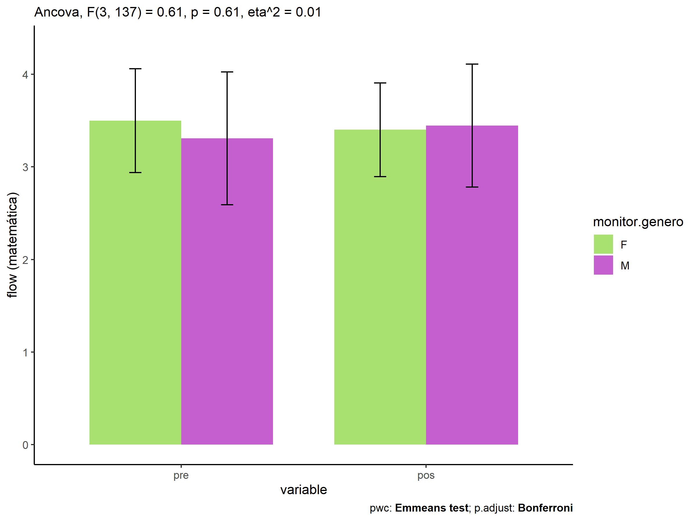
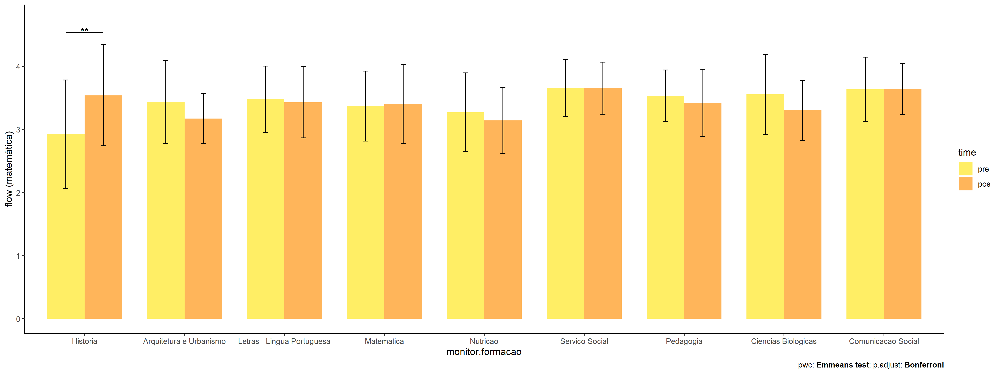
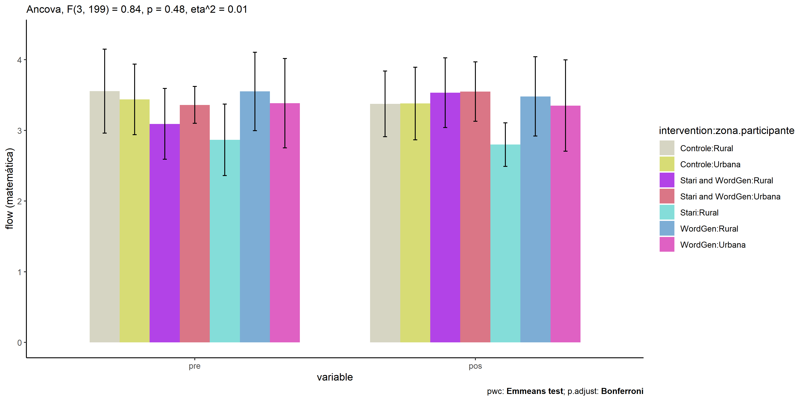

# ANCOVA test for flow.matematica (engajamento na matemática)

Geiser C. Challco <geiser@alumni.usp.br>

- [Descriptive Statistics of Initial
  Data](#descriptive-statistics-of-initial-data)
- [Checking of Assumptions](#checking-of-assumptions)
  - [Identify and dealing with outliers (performing treatment of
    outliers)](#identify-and-dealing-with-outliers-performing-treatment-of-outliers)
  - [Assumption: Normality distribution of
    data](#assumption-normality-distribution-of-data)
    - [Para fatores de:
      **intervention:genero**](#para-fatores-de-interventiongenero)
    - [Para fatores de:
      **intervention:idade**](#para-fatores-de-interventionidade)
    - [Para fatores de:
      **intervention:zona.escola**](#para-fatores-de-interventionzonaescola)
    - [Para fatores de:
      **intervention:zona.participante**](#para-fatores-de-interventionzonaparticipante)
    - [Para fatores de:
      **intervention:escola**](#para-fatores-de-interventionescola)
    - [Para fatores de:
      **intervention:monitor**](#para-fatores-de-interventionmonitor)
  - [Assumption: Homogeneity of data
    distribution](#assumption-homogeneity-of-data-distribution)
    - [Para fatores de:
      **intervention:genero**](#para-fatores-de-interventiongenero-1)
    - [Para fatores de:
      **intervention:idade**](#para-fatores-de-interventionidade-1)
    - [Para fatores de:
      **intervention:zona.escola**](#para-fatores-de-interventionzonaescola-1)
    - [Para fatores de:
      **intervention:zona.participante**](#para-fatores-de-interventionzonaparticipante-1)
    - [Para fatores de:
      **intervention:escola**](#para-fatores-de-interventionescola-1)
    - [Para fatores de:
      **intervention:monitor**](#para-fatores-de-interventionmonitor-1)
- [Computation of ANCOVA test and Pairwise
  Comparison](#computation-of-ancova-test-and-pairwise-comparison)
  - [ANCOVA test](#ancova-test)
  - [Pairwise comparisons for one
    factor](#pairwise-comparisons-for-one-factor)
    - [factor: **intervention**](#factor-intervention)
    - [factor: **genero**](#factor-genero)
    - [factor: **idade**](#factor-idade)
    - [factor: **zona.escola**](#factor-zonaescola)
    - [factor: **zona.participante**](#factor-zonaparticipante)
    - [factor: **escola**](#factor-escola)
    - [factor: **monitor**](#factor-monitor)
    - [factor: **monitor.genero**](#factor-monitorgenero)
    - [factor: **monitor.formacao**](#factor-monitorformacao)
    - [factor: **monitor.titulacao**](#factor-monitortitulacao)
    - [factor: **monitor.experiencia**](#factor-monitorexperiencia)
  - [Pairwise comparisons for two
    factors](#pairwise-comparisons-for-two-factors)
    - [factores: **intervention:genero**](#factores-interventiongenero)
    - [factores: **intervention:idade**](#factores-interventionidade)
    - [factores:
      **intervention:zona.escola**](#factores-interventionzonaescola)
    - [factores:
      **intervention:zona.participante**](#factores-interventionzonaparticipante)
    - [factores: **intervention:escola**](#factores-interventionescola)
    - [factores:
      **intervention:monitor**](#factores-interventionmonitor)
    - [factores:
      **intervention:monitor.genero**](#factores-interventionmonitorgenero)
    - [factores:
      **intervention:monitor.formacao**](#factores-interventionmonitorformacao)
    - [factores:
      **intervention:monitor.titulacao**](#factores-interventionmonitortitulacao)
    - [factores:
      **intervention:monitor.experiencia**](#factores-interventionmonitorexperiencia)

Teste ANCOVA para determinar se houve diferenças significativas em
referência ao engajamento nas atividades de resolução de problemas de
matemática (medido como estado de fluxo).

ANCOVA test to determine whether there were significant differences in
reference to engagement in math problem solving activities (measured as
flow state).

# Descriptive Statistics of Initial Data

| intervention      | genero | variable       |   n |  mean | median |   min |   max |    sd |    se |    ci |   iqr |
|:------------------|:-------|:---------------|----:|------:|-------:|------:|------:|------:|------:|------:|------:|
| Controle          | F      | fss.matematica |  60 | 3.401 |  3.389 | 2.000 | 4.333 | 0.522 | 0.067 | 0.135 | 0.778 |
| Controle          | M      | fss.matematica |  66 | 3.381 |  3.333 | 2.444 | 4.556 | 0.501 | 0.062 | 0.123 | 0.556 |
| Stari             | F      | fss.matematica |   5 | 3.111 |  3.000 | 2.333 | 4.222 | 0.689 | 0.308 | 0.856 | 0.222 |
| Stari             | M      | fss.matematica |   6 | 2.704 |  2.778 | 2.000 | 3.000 | 0.376 | 0.154 | 0.395 | 0.306 |
| WordGen           | F      | fss.matematica |  53 | 3.478 |  3.444 | 2.444 | 4.444 | 0.540 | 0.074 | 0.149 | 0.889 |
| WordGen           | M      | fss.matematica |  62 | 3.431 |  3.444 | 1.778 | 4.714 | 0.625 | 0.079 | 0.159 | 0.861 |
| Stari and WordGen | F      | fss.matematica |   4 | 3.611 |  3.611 | 3.000 | 4.222 | 0.591 | 0.296 | 0.941 | 0.889 |
| Stari and WordGen | M      | fss.matematica |  12 | 3.441 |  3.444 | 3.000 | 4.111 | 0.368 | 0.106 | 0.234 | 0.500 |
| Controle          | F      | dfs.matematica |  60 | 3.510 |  3.556 | 2.000 | 4.556 | 0.584 | 0.075 | 0.151 | 0.694 |
| Controle          | M      | dfs.matematica |  66 | 3.558 |  3.556 | 2.444 | 4.556 | 0.489 | 0.060 | 0.120 | 0.667 |
| Stari             | F      | dfs.matematica |   5 | 2.933 |  3.000 | 2.111 | 3.444 | 0.564 | 0.252 | 0.701 | 0.778 |
| Stari             | M      | dfs.matematica |   6 | 2.481 |  2.444 | 1.000 | 3.889 | 1.003 | 0.409 | 1.052 | 1.000 |
| WordGen           | F      | dfs.matematica |  53 | 3.604 |  3.667 | 2.333 | 4.857 | 0.577 | 0.079 | 0.159 | 0.778 |
| WordGen           | M      | dfs.matematica |  62 | 3.424 |  3.444 | 1.667 | 4.556 | 0.559 | 0.071 | 0.142 | 0.861 |
| Stari and WordGen | F      | dfs.matematica |   4 | 2.972 |  2.889 | 2.667 | 3.444 | 0.378 | 0.189 | 0.602 | 0.528 |
| Stari and WordGen | M      | dfs.matematica |  12 | 3.274 |  3.278 | 2.556 | 3.778 | 0.408 | 0.118 | 0.259 | 0.420 |

| intervention      | escola | variable       |   n |  mean | median |   min |   max |    sd |    se |    ci |   iqr |
|:------------------|:-------|:---------------|----:|------:|-------:|------:|------:|------:|------:|------:|------:|
| Controle          | E1     | fss.matematica |  12 | 3.120 |  3.167 | 2.444 | 4.222 | 0.516 | 0.149 | 0.328 | 0.694 |
| Controle          | E2     | fss.matematica |  23 | 3.314 |  3.222 | 2.444 | 4.333 | 0.479 | 0.100 | 0.207 | 0.722 |
| Controle          | E3     | fss.matematica |  15 | 3.378 |  3.333 | 2.000 | 3.889 | 0.440 | 0.114 | 0.244 | 0.333 |
| Controle          | E4     | fss.matematica |  16 | 3.370 |  3.278 | 2.778 | 4.000 | 0.361 | 0.090 | 0.192 | 0.524 |
| Controle          | E5     | fss.matematica |  49 | 3.477 |  3.444 | 2.444 | 4.556 | 0.579 | 0.083 | 0.166 | 0.889 |
| Controle          | E6     | fss.matematica |  11 | 3.505 |  3.556 | 2.444 | 4.000 | 0.462 | 0.139 | 0.310 | 0.556 |
| Stari             | E1     | fss.matematica |   5 | 2.889 |  2.889 | 2.000 | 4.222 | 0.850 | 0.380 | 1.055 | 0.667 |
| Stari             | E2     | fss.matematica |   1 | 3.000 |  3.000 | 3.000 | 3.000 |    NA |    NA |   NaN | 0.000 |
| Stari             | E5     | fss.matematica |   5 | 2.867 |  2.889 | 2.667 | 3.111 | 0.199 | 0.089 | 0.247 | 0.333 |
| WordGen           | E1     | fss.matematica |  10 | 3.805 |  3.889 | 2.667 | 4.714 | 0.629 | 0.199 | 0.450 | 0.778 |
| WordGen           | E2     | fss.matematica |  24 | 3.307 |  3.333 | 1.889 | 4.444 | 0.551 | 0.112 | 0.232 | 0.597 |
| WordGen           | E3     | fss.matematica |  15 | 3.302 |  3.333 | 2.556 | 4.111 | 0.473 | 0.122 | 0.262 | 0.667 |
| WordGen           | E4     | fss.matematica |   9 | 3.664 |  3.778 | 2.778 | 4.222 | 0.499 | 0.166 | 0.384 | 0.333 |
| WordGen           | E5     | fss.matematica |  46 | 3.402 |  3.444 | 1.778 | 4.667 | 0.634 | 0.094 | 0.188 | 1.000 |
| WordGen           | E6     | fss.matematica |  11 | 3.697 |  3.778 | 3.000 | 4.333 | 0.453 | 0.137 | 0.304 | 0.833 |
| Stari and WordGen | E2     | fss.matematica |   2 | 3.111 |  3.111 | 3.000 | 3.222 | 0.157 | 0.111 | 1.412 | 0.111 |
| Stari and WordGen | E4     | fss.matematica |   5 | 3.636 |  3.625 | 3.222 | 4.111 | 0.318 | 0.142 | 0.395 | 0.111 |
| Stari and WordGen | E5     | fss.matematica |   7 | 3.397 |  3.222 | 3.000 | 4.222 | 0.509 | 0.192 | 0.470 | 0.667 |
| Stari and WordGen | E6     | fss.matematica |   2 | 3.778 |  3.778 | 3.667 | 3.889 | 0.157 | 0.111 | 1.412 | 0.111 |
| Controle          | E1     | dfs.matematica |  12 | 3.074 |  3.222 | 2.222 | 3.556 | 0.445 | 0.129 | 0.283 | 0.611 |
| Controle          | E2     | dfs.matematica |  23 | 3.570 |  3.667 | 2.444 | 4.333 | 0.438 | 0.091 | 0.189 | 0.604 |
| Controle          | E3     | dfs.matematica |  15 | 3.731 |  3.889 | 2.750 | 4.556 | 0.626 | 0.162 | 0.346 | 0.944 |
| Controle          | E4     | dfs.matematica |  16 | 3.583 |  3.444 | 3.222 | 4.556 | 0.362 | 0.090 | 0.193 | 0.361 |
| Controle          | E5     | dfs.matematica |  49 | 3.513 |  3.600 | 2.000 | 4.556 | 0.588 | 0.084 | 0.169 | 0.778 |
| Controle          | E6     | dfs.matematica |  11 | 3.727 |  3.778 | 3.000 | 4.333 | 0.405 | 0.122 | 0.272 | 0.333 |
| Stari             | E1     | dfs.matematica |   5 | 2.133 |  2.111 | 1.000 | 3.444 | 0.869 | 0.389 | 1.079 | 0.111 |
| Stari             | E2     | dfs.matematica |   1 | 3.000 |  3.000 | 3.000 | 3.000 |    NA |    NA |   NaN | 0.000 |
| Stari             | E5     | dfs.matematica |   5 | 3.178 |  3.111 | 2.667 | 3.889 | 0.501 | 0.224 | 0.622 | 0.667 |
| WordGen           | E1     | dfs.matematica |  10 | 3.358 |  3.361 | 2.444 | 4.111 | 0.564 | 0.178 | 0.404 | 0.792 |
| WordGen           | E2     | dfs.matematica |  24 | 3.417 |  3.556 | 1.667 | 4.111 | 0.576 | 0.118 | 0.243 | 0.694 |
| WordGen           | E3     | dfs.matematica |  15 | 3.584 |  3.333 | 2.750 | 4.556 | 0.643 | 0.166 | 0.356 | 1.167 |
| WordGen           | E4     | dfs.matematica |   9 | 3.781 |  3.778 | 3.111 | 4.444 | 0.478 | 0.159 | 0.367 | 0.917 |
| WordGen           | E5     | dfs.matematica |  46 | 3.448 |  3.444 | 2.333 | 4.857 | 0.577 | 0.085 | 0.171 | 0.861 |
| WordGen           | E6     | dfs.matematica |  11 | 3.758 |  3.667 | 2.778 | 4.333 | 0.460 | 0.139 | 0.309 | 0.500 |
| Stari and WordGen | E2     | dfs.matematica |   2 | 3.278 |  3.278 | 3.222 | 3.333 | 0.079 | 0.056 | 0.706 | 0.056 |
| Stari and WordGen | E4     | dfs.matematica |   5 | 3.367 |  3.500 | 2.556 | 3.778 | 0.509 | 0.227 | 0.631 | 0.556 |
| Stari and WordGen | E5     | dfs.matematica |   7 | 2.954 |  3.111 | 2.556 | 3.444 | 0.327 | 0.124 | 0.303 | 0.451 |
| Stari and WordGen | E6     | dfs.matematica |   2 | 3.556 |  3.556 | 3.444 | 3.667 | 0.157 | 0.111 | 1.412 | 0.111 |

| intervention      | zona.escola | variable       |   n |  mean | median |   min |   max |    sd |    se |    ci |   iqr |
|:------------------|:------------|:---------------|----:|------:|-------:|------:|------:|------:|------:|------:|------:|
| Controle          | Urbana      | fss.matematica |  84 | 3.381 |  3.333 | 2.444 | 4.556 | 0.554 | 0.060 | 0.120 | 0.778 |
| Controle          | Rural       | fss.matematica |  42 | 3.408 |  3.389 | 2.000 | 4.000 | 0.411 | 0.063 | 0.128 | 0.444 |
| Stari             | Urbana      | fss.matematica |  11 | 2.889 |  2.889 | 2.000 | 4.222 | 0.553 | 0.167 | 0.372 | 0.333 |
| WordGen           | Urbana      | fss.matematica |  80 | 3.424 |  3.444 | 1.778 | 4.714 | 0.621 | 0.069 | 0.138 | 1.000 |
| WordGen           | Rural       | fss.matematica |  35 | 3.519 |  3.667 | 2.556 | 4.333 | 0.498 | 0.084 | 0.171 | 0.667 |
| Stari and WordGen | Urbana      | fss.matematica |   9 | 3.333 |  3.222 | 3.000 | 4.222 | 0.461 | 0.154 | 0.355 | 0.333 |
| Stari and WordGen | Rural       | fss.matematica |   7 | 3.677 |  3.667 | 3.222 | 4.111 | 0.276 | 0.104 | 0.255 | 0.188 |
| Controle          | Urbana      | dfs.matematica |  84 | 3.466 |  3.556 | 2.000 | 4.556 | 0.551 | 0.060 | 0.120 | 0.778 |
| Controle          | Rural       | dfs.matematica |  42 | 3.674 |  3.667 | 2.750 | 4.556 | 0.476 | 0.073 | 0.148 | 0.639 |
| Stari             | Urbana      | dfs.matematica |  11 | 2.687 |  2.778 | 1.000 | 3.889 | 0.828 | 0.250 | 0.556 | 1.167 |
| WordGen           | Urbana      | dfs.matematica |  80 | 3.427 |  3.444 | 1.667 | 4.857 | 0.569 | 0.064 | 0.127 | 0.889 |
| WordGen           | Rural       | dfs.matematica |  35 | 3.689 |  3.667 | 2.750 | 4.556 | 0.543 | 0.092 | 0.187 | 0.889 |
| Stari and WordGen | Urbana      | dfs.matematica |   9 | 3.026 |  3.111 | 2.556 | 3.444 | 0.319 | 0.106 | 0.245 | 0.556 |
| Stari and WordGen | Rural       | dfs.matematica |   7 | 3.421 |  3.500 | 2.556 | 3.778 | 0.430 | 0.163 | 0.398 | 0.389 |

| intervention      | zona.participante | variable       |   n |  mean | median |   min |   max |    sd |    se |    ci |   iqr |
|:------------------|:------------------|:---------------|----:|------:|-------:|------:|------:|------:|------:|------:|------:|
| Controle          | Urbana            | fss.matematica |  54 | 3.381 |  3.389 | 2.444 | 4.444 | 0.514 | 0.070 | 0.140 | 0.667 |
| Controle          | Rural             | fss.matematica |  43 | 3.376 |  3.333 | 2.000 | 4.444 | 0.464 | 0.071 | 0.143 | 0.535 |
| Controle          | NA                | fss.matematica |  29 | 3.431 |  3.556 | 2.444 | 4.556 | 0.576 | 0.107 | 0.219 | 0.889 |
| Stari             | Urbana            | fss.matematica |   4 | 3.028 |  2.944 | 2.000 | 4.222 | 0.913 | 0.457 | 1.453 | 0.639 |
| Stari             | Rural             | fss.matematica |   5 | 2.800 |  2.889 | 2.333 | 3.111 | 0.308 | 0.138 | 0.383 | 0.333 |
| Stari             | NA                | fss.matematica |   2 | 2.833 |  2.833 | 2.667 | 3.000 | 0.236 | 0.167 | 2.118 | 0.167 |
| WordGen           | Urbana            | fss.matematica |  43 | 3.351 |  3.333 | 1.889 | 4.714 | 0.647 | 0.099 | 0.199 | 1.000 |
| WordGen           | Rural             | fss.matematica |  48 | 3.481 |  3.667 | 1.778 | 4.444 | 0.562 | 0.081 | 0.163 | 0.667 |
| WordGen           | NA                | fss.matematica |  24 | 3.579 |  3.611 | 2.556 | 4.444 | 0.502 | 0.103 | 0.212 | 0.722 |
| Stari and WordGen | Urbana            | fss.matematica |   6 | 3.549 |  3.590 | 3.000 | 4.222 | 0.420 | 0.171 | 0.441 | 0.351 |
| Stari and WordGen | Rural             | fss.matematica |   5 | 3.533 |  3.333 | 3.000 | 4.111 | 0.493 | 0.221 | 0.612 | 0.778 |
| Stari and WordGen | NA                | fss.matematica |   5 | 3.356 |  3.222 | 3.000 | 3.889 | 0.404 | 0.181 | 0.501 | 0.667 |
| Controle          | Urbana            | dfs.matematica |  54 | 3.438 |  3.444 | 2.222 | 4.333 | 0.500 | 0.068 | 0.136 | 0.549 |
| Controle          | Rural             | dfs.matematica |  43 | 3.555 |  3.556 | 2.000 | 4.556 | 0.594 | 0.091 | 0.183 | 0.889 |
| Controle          | NA                | dfs.matematica |  29 | 3.689 |  3.667 | 2.778 | 4.556 | 0.480 | 0.089 | 0.183 | 0.556 |
| Stari             | Urbana            | dfs.matematica |   4 | 2.139 |  2.056 | 1.000 | 3.444 | 1.004 | 0.502 | 1.597 | 0.694 |
| Stari             | Rural             | dfs.matematica |   5 | 2.867 |  3.000 | 2.111 | 3.444 | 0.506 | 0.226 | 0.628 | 0.444 |
| Stari             | NA                | dfs.matematica |   2 | 3.333 |  3.333 | 2.778 | 3.889 | 0.786 | 0.556 | 7.059 | 0.556 |
| WordGen           | Urbana            | dfs.matematica |  43 | 3.385 |  3.333 | 1.667 | 4.857 | 0.632 | 0.096 | 0.195 | 0.778 |
| WordGen           | Rural             | dfs.matematica |  48 | 3.551 |  3.500 | 2.611 | 4.556 | 0.556 | 0.080 | 0.162 | 0.806 |
| WordGen           | NA                | dfs.matematica |  24 | 3.639 |  3.667 | 2.444 | 4.333 | 0.455 | 0.093 | 0.192 | 0.444 |
| Stari and WordGen | Urbana            | dfs.matematica |   6 | 3.361 |  3.333 | 3.111 | 3.778 | 0.262 | 0.107 | 0.275 | 0.347 |
| Stari and WordGen | Rural             | dfs.matematica |   5 | 3.092 |  3.125 | 2.556 | 3.778 | 0.500 | 0.223 | 0.620 | 0.667 |
| Stari and WordGen | NA                | dfs.matematica |   5 | 3.111 |  3.222 | 2.556 | 3.667 | 0.484 | 0.217 | 0.601 | 0.778 |

| intervention      | monitor | variable       |   n |  mean | median |   min |   max |    sd |    se |    ci |   iqr |
|:------------------|:--------|:---------------|----:|------:|-------:|------:|------:|------:|------:|------:|------:|
| Controle          | NA      | fss.matematica | 126 | 3.390 |  3.333 | 2.000 | 4.556 | 0.509 | 0.045 | 0.090 | 0.667 |
| Stari             | EA      | fss.matematica |   2 | 3.000 |  3.000 | 2.889 | 3.111 | 0.157 | 0.111 | 1.412 | 0.111 |
| Stari             | GR,JC   | fss.matematica |   1 | 2.667 |  2.667 | 2.667 | 2.667 |    NA |    NA |   NaN | 0.000 |
| Stari             | MF      | fss.matematica |   2 | 2.833 |  2.833 | 2.667 | 3.000 | 0.236 | 0.167 | 2.118 | 0.167 |
| Stari             | MM      | fss.matematica |   1 | 3.000 |  3.000 | 3.000 | 3.000 |    NA |    NA |   NaN | 0.000 |
| Stari             | PR      | fss.matematica |   5 | 2.889 |  2.889 | 2.000 | 4.222 | 0.850 | 0.380 | 1.055 | 0.667 |
| WordGen           | AC      | fss.matematica |  11 | 3.418 |  3.444 | 2.444 | 4.444 | 0.535 | 0.161 | 0.359 | 0.521 |
| WordGen           | AC,MM   | fss.matematica |   1 | 3.778 |  3.778 | 3.778 | 3.778 |    NA |    NA |   NaN | 0.000 |
| WordGen           | CE      | fss.matematica |   9 | 3.664 |  3.778 | 2.778 | 4.222 | 0.499 | 0.166 | 0.384 | 0.333 |
| WordGen           | EA      | fss.matematica |  10 | 3.456 |  3.778 | 1.778 | 4.667 | 0.921 | 0.291 | 0.659 | 1.083 |
| WordGen           | EA,MF   | fss.matematica |   1 | 1.889 |  1.889 | 1.889 | 1.889 |    NA |    NA |   NaN | 0.000 |
| WordGen           | GR      | fss.matematica |  14 | 3.437 |  3.500 | 2.778 | 4.000 | 0.432 | 0.116 | 0.250 | 0.861 |
| WordGen           | GR,JC   | fss.matematica |   1 | 4.111 |  4.111 | 4.111 | 4.111 |    NA |    NA |   NaN | 0.000 |
| WordGen           | JC      | fss.matematica |   9 | 3.165 |  3.333 | 2.667 | 3.667 | 0.415 | 0.138 | 0.319 | 0.667 |
| WordGen           | MF      | fss.matematica |  11 | 3.576 |  3.556 | 2.556 | 4.444 | 0.546 | 0.165 | 0.367 | 0.556 |
| WordGen           | ML      | fss.matematica |  15 | 3.302 |  3.333 | 2.556 | 4.111 | 0.473 | 0.122 | 0.262 | 0.667 |
| WordGen           | MM      | fss.matematica |  12 | 3.167 |  3.222 | 1.889 | 4.111 | 0.566 | 0.163 | 0.359 | 0.472 |
| WordGen           | PR      | fss.matematica |  10 | 3.805 |  3.889 | 2.667 | 4.714 | 0.629 | 0.199 | 0.450 | 0.778 |
| WordGen           | VL      | fss.matematica |  11 | 3.697 |  3.778 | 3.000 | 4.333 | 0.453 | 0.137 | 0.304 | 0.833 |
| Stari and WordGen | AC,MM   | fss.matematica |   1 | 3.222 |  3.222 | 3.222 | 3.222 |    NA |    NA |   NaN | 0.000 |
| Stari and WordGen | CE      | fss.matematica |   5 | 3.636 |  3.625 | 3.222 | 4.111 | 0.318 | 0.142 | 0.395 | 0.111 |
| Stari and WordGen | EA      | fss.matematica |   1 | 3.333 |  3.333 | 3.333 | 3.333 |    NA |    NA |   NaN | 0.000 |
| Stari and WordGen | EA,GR   | fss.matematica |   1 | 4.222 |  4.222 | 4.222 | 4.222 |    NA |    NA |   NaN | 0.000 |
| Stari and WordGen | EA,MF   | fss.matematica |   2 | 3.500 |  3.500 | 3.000 | 4.000 | 0.707 | 0.500 | 6.353 | 0.500 |
| Stari and WordGen | GR,JC   | fss.matematica |   1 | 3.000 |  3.000 | 3.000 | 3.000 |    NA |    NA |   NaN | 0.000 |
| Stari and WordGen | JC      | fss.matematica |   1 | 3.222 |  3.222 | 3.222 | 3.222 |    NA |    NA |   NaN | 0.000 |
| Stari and WordGen | MF      | fss.matematica |   1 | 3.000 |  3.000 | 3.000 | 3.000 |    NA |    NA |   NaN | 0.000 |
| Stari and WordGen | MM      | fss.matematica |   1 | 3.000 |  3.000 | 3.000 | 3.000 |    NA |    NA |   NaN | 0.000 |
| Stari and WordGen | VL      | fss.matematica |   2 | 3.778 |  3.778 | 3.667 | 3.889 | 0.157 | 0.111 | 1.412 | 0.111 |
| Controle          | NA      | dfs.matematica | 126 | 3.535 |  3.556 | 2.000 | 4.556 | 0.535 | 0.048 | 0.094 | 0.667 |
| Stari             | EA      | dfs.matematica |   2 | 3.056 |  3.056 | 2.667 | 3.444 | 0.550 | 0.389 | 4.941 | 0.389 |
| Stari             | GR,JC   | dfs.matematica |   1 | 3.111 |  3.111 | 3.111 | 3.111 |    NA |    NA |   NaN | 0.000 |
| Stari             | MF      | dfs.matematica |   2 | 3.333 |  3.333 | 2.778 | 3.889 | 0.786 | 0.556 | 7.059 | 0.556 |
| Stari             | MM      | dfs.matematica |   1 | 3.000 |  3.000 | 3.000 | 3.000 |    NA |    NA |   NaN | 0.000 |
| Stari             | PR      | dfs.matematica |   5 | 2.133 |  2.111 | 1.000 | 3.444 | 0.869 | 0.389 | 1.079 | 0.111 |
| WordGen           | AC      | dfs.matematica |  11 | 3.535 |  3.667 | 2.778 | 4.111 | 0.406 | 0.122 | 0.273 | 0.500 |
| WordGen           | AC,MM   | dfs.matematica |   1 | 3.556 |  3.556 | 3.556 | 3.556 |    NA |    NA |   NaN | 0.000 |
| WordGen           | CE      | dfs.matematica |   9 | 3.781 |  3.778 | 3.111 | 4.444 | 0.478 | 0.159 | 0.367 | 0.917 |
| WordGen           | EA      | dfs.matematica |  10 | 3.350 |  3.333 | 2.611 | 4.333 | 0.600 | 0.190 | 0.429 | 0.833 |
| WordGen           | EA,MF   | dfs.matematica |   1 | 3.444 |  3.444 | 3.444 | 3.444 |    NA |    NA |   NaN | 0.000 |
| WordGen           | GR      | dfs.matematica |  14 | 3.444 |  3.389 | 2.333 | 4.222 | 0.563 | 0.151 | 0.325 | 0.889 |
| WordGen           | GR,JC   | dfs.matematica |   1 | 3.444 |  3.444 | 3.444 | 3.444 |    NA |    NA |   NaN | 0.000 |
| WordGen           | JC      | dfs.matematica |   9 | 3.453 |  3.444 | 2.333 | 4.857 | 0.761 | 0.254 | 0.585 | 1.111 |
| WordGen           | MF      | dfs.matematica |  11 | 3.537 |  3.667 | 2.444 | 4.222 | 0.531 | 0.160 | 0.357 | 0.549 |
| WordGen           | ML      | dfs.matematica |  15 | 3.584 |  3.333 | 2.750 | 4.556 | 0.643 | 0.166 | 0.356 | 1.167 |
| WordGen           | MM      | dfs.matematica |  12 | 3.296 |  3.389 | 1.667 | 4.111 | 0.716 | 0.207 | 0.455 | 0.889 |
| WordGen           | PR      | dfs.matematica |  10 | 3.358 |  3.361 | 2.444 | 4.111 | 0.564 | 0.178 | 0.404 | 0.792 |
| WordGen           | VL      | dfs.matematica |  11 | 3.758 |  3.667 | 2.778 | 4.333 | 0.460 | 0.139 | 0.309 | 0.500 |
| Stari and WordGen | AC,MM   | dfs.matematica |   1 | 3.222 |  3.222 | 3.222 | 3.222 |    NA |    NA |   NaN | 0.000 |
| Stari and WordGen | CE      | dfs.matematica |   5 | 3.367 |  3.500 | 2.556 | 3.778 | 0.509 | 0.227 | 0.631 | 0.556 |
| Stari and WordGen | EA      | dfs.matematica |   1 | 3.125 |  3.125 | 3.125 | 3.125 |    NA |    NA |   NaN | 0.000 |
| Stari and WordGen | EA,GR   | dfs.matematica |   1 | 3.444 |  3.444 | 3.444 | 3.444 |    NA |    NA |   NaN | 0.000 |
| Stari and WordGen | EA,MF   | dfs.matematica |   2 | 2.611 |  2.611 | 2.556 | 2.667 | 0.079 | 0.056 | 0.706 | 0.056 |
| Stari and WordGen | GR,JC   | dfs.matematica |   1 | 3.111 |  3.111 | 3.111 | 3.111 |    NA |    NA |   NaN | 0.000 |
| Stari and WordGen | JC      | dfs.matematica |   1 | 3.111 |  3.111 | 3.111 | 3.111 |    NA |    NA |   NaN | 0.000 |
| Stari and WordGen | MF      | dfs.matematica |   1 | 2.667 |  2.667 | 2.667 | 2.667 |    NA |    NA |   NaN | 0.000 |
| Stari and WordGen | MM      | dfs.matematica |   1 | 3.333 |  3.333 | 3.333 | 3.333 |    NA |    NA |   NaN | 0.000 |
| Stari and WordGen | VL      | dfs.matematica |   2 | 3.556 |  3.556 | 3.444 | 3.667 | 0.157 | 0.111 | 1.412 | 0.111 |

# Checking of Assumptions

## Identify and dealing with outliers (performing treatment of outliers)

| intervention | genero | escola | zona.escola | zona.participante | id   | fss.matematica | dfs.matematica | is.outlier | is.extreme |
|:-------------|:-------|:-------|:------------|:------------------|:-----|---------------:|---------------:|:-----------|:-----------|
| Controle     | F      | E1     | Urbana      | Urbana            | s164 |       4.222222 |       3.333333 | TRUE       | FALSE      |
| Controle     | F      | E2     | Urbana      | Urbana            | s178 |       2.444444 |       3.222222 | TRUE       | FALSE      |
| Controle     | F      | E3     | Rural       | Rural             | s214 |       2.000000 |       3.333333 | TRUE       | FALSE      |
| Controle     | F      | E6     | Rural       | NA                | s313 |       2.444444 |       3.777778 | TRUE       | FALSE      |
| Controle     | M      | E2     | Urbana      | Urbana            | s194 |       3.000000 |       3.444444 | TRUE       | FALSE      |
| Controle     | M      | E2     | Urbana      | NA                | s207 |       3.777778 |       4.111111 | TRUE       | FALSE      |
| Controle     | M      | E4     | Rural       | Urbana            | s230 |       2.777778 |       3.777778 | TRUE       | FALSE      |
| Controle     | M      | E5     | Urbana      | Urbana            | s249 |       4.222222 |       3.000000 | TRUE       | FALSE      |
| Controle     | M      | E5     | Urbana      | Urbana            | s271 |       4.444444 |       4.000000 | TRUE       | FALSE      |
| Controle     | M      | E5     | Urbana      | Rural             | s265 |       4.444444 |       4.111111 | TRUE       | FALSE      |
| WordGen      | F      | E2     | Urbana      | Urbana            | s20  |       4.111111 |       3.333333 | TRUE       | FALSE      |
| WordGen      | F      | E5     | Urbana      | Rural             | s128 |       4.444444 |       3.666667 | TRUE       | FALSE      |
| WordGen      | F      | E5     | Urbana      | NA                | s123 |       2.555556 |       2.444444 | TRUE       | FALSE      |
| WordGen      | F      | E6     | Rural       | NA                | s153 |       3.000000 |       3.666667 | TRUE       | FALSE      |
| WordGen      | M      | E5     | Urbana      | NA                | s114 |       4.444444 |       4.222222 | TRUE       | FALSE      |

*Note*: No one of outliers is extreme then we don’t need to remove data

## Assumption: Normality distribution of data

*Note*: All data satisfy normality

### Para fatores de: **intervention:genero**

| var            |   n |   skewness |  kurtosis | symmetry | statistic | method     |        p | p.signif | normality |
|:---------------|----:|-----------:|----------:|:---------|----------:|:-----------|---------:|:---------|:----------|
| fss.matematica | 268 | -0.0177765 | 0.2009105 | YES      |  0.855894 | D’Agostino | 0.651846 | ns       | \-        |

### Para fatores de: **intervention:idade**

| var            |   n |  skewness |  kurtosis | symmetry | statistic | method     |        p | p.signif | normality |
|:---------------|----:|----------:|----------:|:---------|----------:|:-----------|---------:|:---------|:----------|
| fss.matematica | 260 | -0.064149 | 0.3431057 | YES      |  1.863154 | D’Agostino | 0.393932 | ns       | \-        |

### Para fatores de: **intervention:zona.escola**

| var            |   n |  skewness |  kurtosis | symmetry | statistic | method     |        p | p.signif | normality |
|:---------------|----:|----------:|----------:|:---------|----------:|:-----------|---------:|:---------|:----------|
| fss.matematica | 268 | 0.0139356 | 0.1931544 | YES      | 0.8095916 | D’Agostino | 0.667113 | ns       | \-        |

### Para fatores de: **intervention:zona.participante**

| var            |   n |  skewness |  kurtosis | symmetry | statistic | method     |         p | p.signif | normality |
|:---------------|----:|----------:|----------:|:---------|----------:|:-----------|----------:|:---------|:----------|
| fss.matematica | 208 | 0.0561339 | 0.4797588 | YES      |   2.44437 | D’Agostino | 0.2945857 | ns       | \-        |

### Para fatores de: **intervention:escola**

| var            |   n |   skewness |  kurtosis | symmetry | statistic | method     |         p | p.signif | normality |
|:---------------|----:|-----------:|----------:|:---------|----------:|:-----------|----------:|:---------|:----------|
| fss.matematica | 268 | -0.1928094 | 0.1534114 | YES      |  2.343814 | D’Agostino | 0.3097756 | ns       | \-        |

### Para fatores de: **intervention:monitor**

| var            |   n |   skewness | kurtosis | symmetry | statistic | method     |         p | p.signif | normality |
|:---------------|----:|-----------:|---------:|:---------|----------:|:-----------|----------:|:---------|:----------|
| fss.matematica | 142 | -0.3524541 |  1.06638 | YES      |  8.274613 | D’Agostino | 0.0159658 | ns       | QQ        |

## Assumption: Homogeneity of data distribution

*Note*: Can be applied parametric tests, all data satisfied homogeneity
tests

### Para fatores de: **intervention:genero**

| var            | method         | formula                         |   n | DFn.df1 | DFd.df2 | statistic |         p | p.signif |
|:---------------|:---------------|:--------------------------------|----:|--------:|--------:|----------:|----------:|:---------|
| fss.matematica | Levene’s test  | `.res`~`intervention`\*`genero` | 268 |       7 |     260 |  1.238619 | 0.2818465 | ns       |
| fss.matematica | Anova’s slopes | `.res`~`intervention`\*`genero` | 268 |       7 |     252 |  0.602000 | 0.7540000 | ns       |

### Para fatores de: **intervention:idade**

| var            | method         | formula                        |   n | DFn.df1 | DFd.df2 | statistic |         p | p.signif |
|:---------------|:---------------|:-------------------------------|----:|--------:|--------:|----------:|----------:|:---------|
| fss.matematica | Levene’s test  | `.res`~`intervention`\*`idade` | 260 |      18 |     241 |  1.101467 | 0.3512901 | ns       |
| fss.matematica | Anova’s slopes | `.res`~`intervention`\*`idade` | 260 |      13 |     227 |  0.816000 | 0.6430000 | ns       |

### Para fatores de: **intervention:zona.escola**

| var            | method         | formula                              |   n | DFn.df1 | DFd.df2 | statistic |         p | p.signif |
|:---------------|:---------------|:-------------------------------------|----:|--------:|--------:|----------:|----------:|:---------|
| fss.matematica | Levene’s test  | `.res`~`intervention`\*`zona.escola` | 268 |       6 |     261 |   2.53202 | 0.0212211 | ns       |
| fss.matematica | Anova’s slopes | `.res`~`intervention`\*`zona.escola` | 268 |       6 |     254 |   0.46200 | 0.8360000 | ns       |

### Para fatores de: **intervention:zona.participante**

| var            | method         | formula                                    |   n | DFn.df1 | DFd.df2 | statistic |         p | p.signif |
|:---------------|:---------------|:-------------------------------------------|----:|--------:|--------:|----------:|----------:|:---------|
| fss.matematica | Levene’s test  | `.res`~`intervention`\*`zona.participante` | 208 |       7 |     200 |  1.298648 | 0.2526349 | ns       |
| fss.matematica | Anova’s slopes | `.res`~`intervention`\*`zona.participante` | 208 |       7 |     192 |  0.914000 | 0.4970000 | ns       |

### Para fatores de: **intervention:escola**

| var            | method         | formula                         |   n | DFn.df1 | DFd.df2 | statistic |         p | p.signif |
|:---------------|:---------------|:--------------------------------|----:|--------:|--------:|----------:|----------:|:---------|
| fss.matematica | Levene’s test  | `.res`~`intervention`\*`escola` | 268 |      18 |     249 |  1.504528 | 0.0884277 | ns       |
| fss.matematica | Anova’s slopes | `.res`~`intervention`\*`escola` | 268 |      17 |     231 |  1.301000 | 0.1920000 | ns       |

### Para fatores de: **intervention:monitor**

| var            | method         | formula                          |   n | DFn.df1 | DFd.df2 | statistic |       p | p.signif |
|:---------------|:---------------|:---------------------------------|----:|--------:|--------:|----------:|--------:|:---------|
| fss.matematica | Levene’s test  | `.res`~`intervention`\*`monitor` | 142 |      27 |     114 |  1.697359 | 0.02906 | ns       |
| fss.matematica | Anova’s slopes | `.res`~`intervention`\*`monitor` | 142 |      15 |      98 |  1.686000 | 0.06600 | ns       |

# Computation of ANCOVA test and Pairwise Comparison

## ANCOVA test

| Effect                           | DFn | DFd |   SSn |    SSd |      F | p       |   ges | p\<.05 |
|:---------------------------------|----:|----:|------:|-------:|-------:|:--------|------:|:-------|
| dfs.matematica                   |   1 | 263 | 9.817 | 67.335 | 38.345 | \<0.001 | 0.127 | \*     |
| intervention                     |   3 | 263 | 1.437 | 67.335 |  1.871 | 0.135   | 0.021 |        |
| genero                           |   1 | 265 | 0.034 | 68.738 |  0.131 | 0.718   | 0.000 |        |
| idade                            |   6 | 252 | 3.445 | 63.914 |  2.264 | 0.038   | 0.051 | \*     |
| zona.escola                      |   1 | 265 | 0.005 | 68.767 |  0.019 | 0.89    | 0.000 |        |
| zona.participante                |   1 | 205 | 0.001 | 54.761 |  0.003 | 0.953   | 0.000 |        |
| escola                           |   5 | 261 | 1.823 | 66.949 |  1.421 | 0.217   | 0.027 |        |
| monitor                          |  13 | 127 | 4.441 | 34.207 |  1.268 | 0.241   | 0.115 |        |
| monitor.genero                   |   3 | 137 | 0.507 | 38.141 |  0.607 | 0.611   | 0.013 |        |
| monitor.formacao                 |  11 | 129 | 3.850 | 34.798 |  1.298 | 0.233   | 0.100 |        |
| monitor.experiencia              |   2 | 138 | 0.676 | 37.972 |  1.229 | 0.296   | 0.017 |        |
| monitor.titulacao                |   3 | 137 | 0.369 | 38.279 |  0.440 | 0.725   | 0.010 |        |
| intervention:genero              |   3 | 259 | 0.372 | 66.890 |  0.480 | 0.697   | 0.006 |        |
| intervention:idade               |   9 | 240 | 2.922 | 59.130 |  1.318 | 0.228   | 0.047 |        |
| intervention:zona.escola         |   2 | 260 | 0.224 | 67.109 |  0.434 | 0.648   | 0.003 |        |
| intervention:zona.participante   |   3 | 199 | 0.671 | 53.121 |  0.837 | 0.475   | 0.012 |        |
| intervention:escola              |  10 | 248 | 2.498 | 62.788 |  0.986 | 0.456   | 0.038 |        |
| intervention:monitor             |  12 | 113 | 3.503 | 28.984 |  1.138 | 0.337   | 0.108 |        |
| intervention:monitor.genero      |   5 | 130 | 3.798 | 33.258 |  2.969 | 0.014   | 0.102 | \*     |
| intervention:monitor.formacao    |  12 | 115 | 3.585 | 29.292 |  1.173 | 0.311   | 0.109 |        |
| intervention:monitor.experiencia |   2 | 134 | 0.298 | 36.249 |  0.552 | 0.577   | 0.008 |        |
| intervention:monitor.titulacao   |   4 | 131 | 1.159 | 36.334 |  1.045 | 0.387   | 0.031 |        |

## Pairwise comparisons for one factor

### factor: **intervention**

| var            | intervention      |   n | M (pre) | SE (pre) | M (unadj) | SE (unadj) | M (adj) | SE (adj) |
|:---------------|:------------------|----:|--------:|---------:|----------:|-----------:|--------:|---------:|
| fss.matematica | Controle          | 126 |   3.535 |    0.048 |     3.390 |      0.045 |   3.367 |    0.045 |
| fss.matematica | Stari             |  11 |   2.687 |    0.250 |     2.889 |      0.167 |   3.159 |    0.159 |
| fss.matematica | Stari and WordGen |  16 |   3.199 |    0.103 |     3.484 |      0.105 |   3.577 |    0.127 |
| fss.matematica | WordGen           | 115 |   3.507 |    0.053 |     3.453 |      0.055 |   3.439 |    0.047 |

| .y.            | group1   | group2            | estimate | conf.low | conf.high |    se | statistic | p       | p.adj   | p.adj.signif |
|:---------------|:---------|:------------------|---------:|---------:|----------:|------:|----------:|:--------|:--------|:-------------|
| fss.matematica | Controle | Stari             |    0.209 |   -0.118 |     0.535 | 0.166 |     1.257 | 0.21    | 1       | ns           |
| fss.matematica | Controle | WordGen           |   -0.072 |   -0.201 |     0.056 | 0.065 |    -1.107 | 0.269   | 1       | ns           |
| fss.matematica | Controle | Stari and WordGen |   -0.209 |   -0.476 |     0.058 | 0.136 |    -1.544 | 0.124   | 0.743   | ns           |
| fss.matematica | Stari    | WordGen           |   -0.281 |   -0.608 |     0.046 | 0.166 |    -1.691 | 0.092   | 0.552   | ns           |
| fss.matematica | Stari    | Stari and WordGen |   -0.418 |   -0.812 |    -0.024 | 0.200 |    -2.087 | 0.038   | 0.227   | ns           |
| fss.matematica | WordGen  | Stari and WordGen |   -0.137 |   -0.405 |     0.131 | 0.136 |    -1.007 | 0.315   | 1       | ns           |
| dfs.matematica | Controle | Stari             |    0.849 |    0.503 |     1.194 | 0.176 |     4.831 | \<0.001 | \<0.001 | \*\*\*\*     |
| dfs.matematica | Controle | WordGen           |    0.028 |   -0.113 |     0.170 | 0.072 |     0.395 | 0.693   | 1       | ns           |
| dfs.matematica | Controle | Stari and WordGen |    0.337 |    0.045 |     0.629 | 0.148 |     2.270 | 0.024   | 0.144   | ns           |
| dfs.matematica | Stari    | WordGen           |   -0.820 |   -1.167 |    -0.473 | 0.176 |    -4.651 | \<0.001 | \<0.001 | \*\*\*\*     |
| dfs.matematica | Stari    | Stari and WordGen |   -0.512 |   -0.943 |    -0.081 | 0.219 |    -2.340 | 0.02    | 0.12    | ns           |
| dfs.matematica | WordGen  | Stari and WordGen |    0.308 |    0.015 |     0.602 | 0.149 |     2.067 | 0.04    | 0.238   | ns           |

| intervention      | group1 | group2 | estimate | conf.low | conf.high |    se | statistic |     p | p.adj | p.adj.signif |
|:------------------|:-------|:-------|---------:|---------:|----------:|------:|----------:|------:|------:|:-------------|
| Controle          | pre    | pos    |    0.136 |    0.005 |     0.266 | 0.067 |     2.037 | 0.042 | 0.042 | \*           |
| Stari             | pre    | pos    |   -0.026 |   -0.442 |     0.390 | 0.212 |    -0.123 | 0.902 | 0.902 | ns           |
| WordGen           | pre    | pos    |    0.032 |   -0.105 |     0.169 | 0.070 |     0.464 | 0.643 | 0.643 | ns           |
| Stari and WordGen | pre    | pos    |   -0.222 |   -0.586 |     0.141 | 0.185 |    -1.201 | 0.230 | 0.230 | ns           |

    ## Scale for colour is already present.
    ## Adding another scale for colour, which will replace the existing scale.

<!-- -->

<!-- -->

<!-- -->

### factor: **genero**

| var            | genero |   n | M (pre) | SE (pre) | M (unadj) | SE (unadj) | M (adj) | SE (adj) |
|:---------------|:-------|----:|--------:|---------:|----------:|-----------:|--------:|---------:|
| fss.matematica | F      | 122 |   3.510 |    0.054 |     3.429 |      0.049 |   3.414 |    0.046 |
| fss.matematica | M      | 146 |   3.434 |    0.048 |     3.380 |      0.046 |   3.392 |    0.042 |

| .y.            | group1 | group2 | estimate | conf.low | conf.high |    se | statistic |     p | p.adj | p.adj.signif |
|:---------------|:-------|:-------|---------:|---------:|----------:|------:|----------:|------:|------:|:-------------|
| fss.matematica | F      | M      |    0.023 |   -0.101 |     0.146 | 0.063 |     0.361 | 0.718 | 0.718 | ns           |
| dfs.matematica | F      | M      |    0.076 |   -0.065 |     0.217 | 0.072 |     1.061 | 0.290 | 0.290 | ns           |

| genero | group1 | group2 | estimate | conf.low | conf.high |    se | statistic |     p | p.adj | p.adj.signif |
|:-------|:-------|:-------|---------:|---------:|----------:|------:|----------:|------:|------:|:-------------|
| F      | pre    | pos    |    0.067 |   -0.071 |     0.205 | 0.070 |     0.956 | 0.339 | 0.339 | ns           |
| M      | pre    | pos    |    0.037 |   -0.086 |     0.160 | 0.063 |     0.588 | 0.557 | 0.557 | ns           |

    ## Scale for colour is already present.
    ## Adding another scale for colour, which will replace the existing scale.

<!-- -->

<!-- -->

<!-- -->

### factor: **idade**

| var            | idade |   n | M (pre) | SE (pre) | M (unadj) | SE (unadj) | M (adj) | SE (adj) |
|:---------------|:------|----:|--------:|---------:|----------:|-----------:|--------:|---------:|
| fss.matematica | 10y   |  50 |   3.429 |    0.075 |     3.347 |      0.081 |   3.364 |    0.071 |
| fss.matematica | 11y   | 153 |   3.513 |    0.046 |     3.454 |      0.044 |   3.441 |    0.041 |
| fss.matematica | 12y   |  37 |   3.391 |    0.117 |     3.386 |      0.092 |   3.417 |    0.083 |
| fss.matematica | 13y   |  16 |   3.479 |    0.140 |     3.078 |      0.111 |   3.077 |    0.126 |

| .y.            | group1 | group2 | estimate | conf.low | conf.high |    se | statistic |     p | p.adj | p.adj.signif |
|:---------------|:-------|:-------|---------:|---------:|----------:|------:|----------:|------:|------:|:-------------|
| fss.matematica | 10y    | 11y    |   -0.077 |   -0.238 |     0.084 | 0.082 |    -0.939 | 0.348 | 1.000 | ns           |
| fss.matematica | 10y    | 12y    |   -0.053 |   -0.268 |     0.162 | 0.109 |    -0.487 | 0.627 | 1.000 | ns           |
| fss.matematica | 10y    | 13y    |    0.287 |    0.002 |     0.571 | 0.144 |     1.986 | 0.048 | 0.288 | ns           |
| fss.matematica | 11y    | 12y    |    0.024 |   -0.158 |     0.206 | 0.092 |     0.259 | 0.796 | 1.000 | ns           |
| fss.matematica | 11y    | 13y    |    0.364 |    0.104 |     0.624 | 0.132 |     2.755 | 0.006 | 0.038 | \*           |
| fss.matematica | 12y    | 13y    |    0.340 |    0.044 |     0.636 | 0.150 |     2.259 | 0.025 | 0.148 | ns           |
| dfs.matematica | 10y    | 11y    |   -0.084 |   -0.271 |     0.104 | 0.095 |    -0.879 | 0.380 | 1.000 | ns           |
| dfs.matematica | 10y    | 12y    |    0.038 |   -0.211 |     0.288 | 0.127 |     0.303 | 0.762 | 1.000 | ns           |
| dfs.matematica | 10y    | 13y    |   -0.050 |   -0.380 |     0.280 | 0.168 |    -0.298 | 0.766 | 1.000 | ns           |
| dfs.matematica | 11y    | 12y    |    0.122 |   -0.089 |     0.333 | 0.107 |     1.141 | 0.255 | 1.000 | ns           |
| dfs.matematica | 11y    | 13y    |    0.034 |   -0.269 |     0.336 | 0.154 |     0.219 | 0.826 | 1.000 | ns           |
| dfs.matematica | 12y    | 13y    |   -0.088 |   -0.433 |     0.256 | 0.175 |    -0.506 | 0.614 | 1.000 | ns           |

| idade | group1 | group2 | estimate | conf.low | conf.high |    se | statistic |     p | p.adj | p.adj.signif |
|:------|:-------|:-------|---------:|---------:|----------:|------:|----------:|------:|------:|:-------------|
| 10y   | pre    | pos    |    0.089 |   -0.122 |     0.300 | 0.108 |     0.827 | 0.408 | 0.408 | ns           |
| 11y   | pre    | pos    |    0.047 |   -0.074 |     0.168 | 0.062 |     0.761 | 0.447 | 0.447 | ns           |
| 12y   | pre    | pos    |   -0.006 |   -0.247 |     0.236 | 0.123 |    -0.047 | 0.963 | 0.963 | ns           |
| 13y   | pre    | pos    |    0.333 |   -0.033 |     0.699 | 0.186 |     1.786 | 0.075 | 0.075 | ns           |

    ## Scale for colour is already present.
    ## Adding another scale for colour, which will replace the existing scale.

<!-- -->

<!-- -->

<!-- -->

### factor: **zona.escola**

| var            | zona.escola |   n | M (pre) | SE (pre) | M (unadj) | SE (unadj) | M (adj) | SE (adj) |
|:---------------|:------------|----:|--------:|---------:|----------:|-----------:|--------:|---------:|
| fss.matematica | Rural       |  84 |   3.659 |    0.055 |     3.477 |      0.048 |   3.409 |    0.057 |
| fss.matematica | Urbana      | 184 |   3.381 |    0.044 |     3.368 |      0.043 |   3.399 |    0.038 |

| .y.            | group1 | group2 | estimate | conf.low | conf.high |    se | statistic | p       | p.adj   | p.adj.signif |
|:---------------|:-------|:-------|---------:|---------:|----------:|------:|----------:|:--------|:--------|:-------------|
| fss.matematica | Urbana | Rural  |   -0.009 |   -0.145 |     0.126 | 0.069 |    -0.138 | 0.89    | 0.89    | ns           |
| dfs.matematica | Urbana | Rural  |   -0.278 |   -0.426 |    -0.130 | 0.075 |    -3.702 | \<0.001 | \<0.001 | \*\*\*       |

| zona.escola | group1 | group2 | estimate | conf.low | conf.high |    se | statistic |    p | p.adj | p.adj.signif |
|:------------|:-------|:-------|---------:|---------:|----------:|------:|----------:|-----:|------:|:-------------|
| Urbana      | pre    | pos    |    0.001 |   -0.107 |     0.110 | 0.055 |     0.026 | 0.98 |  0.98 | ns           |
| Rural       | pre    | pos    |    0.180 |    0.018 |     0.342 | 0.083 |     2.176 | 0.03 |  0.03 | \*           |

    ## Scale for colour is already present.
    ## Adding another scale for colour, which will replace the existing scale.

<!-- -->

<!-- -->

<!-- -->

### factor: **zona.participante**

| var            | zona.participante |   n | M (pre) | SE (pre) | M (unadj) | SE (unadj) | M (adj) | SE (adj) |
|:---------------|:------------------|----:|--------:|---------:|----------:|-----------:|--------:|---------:|
| fss.matematica | Rural             | 101 |   3.496 |    0.058 |     3.405 |      0.052 |   3.382 |    0.052 |
| fss.matematica | Urbana            | 107 |   3.363 |    0.059 |     3.365 |      0.056 |   3.386 |    0.050 |

| .y.            | group1 | group2 | estimate | conf.low | conf.high |    se | statistic |     p | p.adj | p.adj.signif |
|:---------------|:-------|:-------|---------:|---------:|----------:|------:|----------:|------:|------:|:-------------|
| fss.matematica | Urbana | Rural  |    0.004 |   -0.138 |     0.146 | 0.072 |     0.059 | 0.953 | 0.953 | ns           |
| dfs.matematica | Urbana | Rural  |   -0.132 |   -0.297 |     0.032 | 0.083 |    -1.591 | 0.113 | 0.113 | ns           |

| zona.participante | group1 | group2 | estimate | conf.low | conf.high |    se | statistic |     p | p.adj | p.adj.signif |
|:------------------|:-------|:-------|---------:|---------:|----------:|------:|----------:|------:|------:|:-------------|
| Urbana            | pre    | pos    |   -0.011 |   -0.159 |     0.138 | 0.076 |    -0.143 | 0.887 | 0.887 | ns           |
| Rural             | pre    | pos    |    0.078 |   -0.077 |     0.233 | 0.079 |     0.985 | 0.325 | 0.325 | ns           |

    ## Scale for colour is already present.
    ## Adding another scale for colour, which will replace the existing scale.

<!-- -->

<!-- -->

<!-- -->

### factor: **escola**

| var            | escola |   n | M (pre) | SE (pre) | M (unadj) | SE (unadj) | M (adj) | SE (adj) |
|:---------------|:-------|----:|--------:|---------:|----------:|-----------:|--------:|---------:|
| fss.matematica | E1     |  27 |   3.005 |    0.137 |     3.331 |      0.137 |   3.503 |    0.101 |
| fss.matematica | E2     |  50 |   3.473 |    0.071 |     3.296 |      0.071 |   3.295 |    0.072 |
| fss.matematica | E3     |  30 |   3.658 |    0.115 |     3.340 |      0.082 |   3.269 |    0.093 |
| fss.matematica | E4     |  30 |   3.606 |    0.079 |     3.503 |      0.075 |   3.451 |    0.093 |
| fss.matematica | E5     | 107 |   3.433 |    0.056 |     3.411 |      0.058 |   3.424 |    0.049 |
| fss.matematica | E6     |  24 |   3.727 |    0.084 |     3.616 |      0.090 |   3.520 |    0.104 |

| .y.            | group1 | group2 | estimate | conf.low | conf.high |    se | statistic | p       | p.adj   | p.adj.signif |
|:---------------|:-------|:-------|---------:|---------:|----------:|------:|----------:|:--------|:--------|:-------------|
| fss.matematica | E1     | E2     |    0.209 |   -0.035 |     0.452 | 0.124 |     1.685 | 0.093   | 1       | ns           |
| fss.matematica | E1     | E3     |    0.234 |   -0.040 |     0.508 | 0.139 |     1.678 | 0.094   | 1       | ns           |
| fss.matematica | E1     | E4     |    0.052 |   -0.221 |     0.325 | 0.139 |     0.374 | 0.709   | 1       | ns           |
| fss.matematica | E1     | E5     |    0.079 |   -0.141 |     0.299 | 0.112 |     0.707 | 0.48    | 1       | ns           |
| fss.matematica | E1     | E6     |   -0.017 |   -0.307 |     0.274 | 0.148 |    -0.112 | 0.911   | 1       | ns           |
| fss.matematica | E2     | E3     |    0.025 |   -0.206 |     0.256 | 0.117 |     0.214 | 0.831   | 1       | ns           |
| fss.matematica | E2     | E4     |   -0.157 |   -0.388 |     0.074 | 0.117 |    -1.338 | 0.182   | 1       | ns           |
| fss.matematica | E2     | E5     |   -0.130 |   -0.300 |     0.041 | 0.087 |    -1.493 | 0.137   | 1       | ns           |
| fss.matematica | E2     | E6     |   -0.225 |   -0.474 |     0.024 | 0.127 |    -1.779 | 0.076   | 1       | ns           |
| fss.matematica | E3     | E4     |   -0.182 |   -0.439 |     0.076 | 0.131 |    -1.391 | 0.166   | 1       | ns           |
| fss.matematica | E3     | E5     |   -0.155 |   -0.362 |     0.053 | 0.105 |    -1.468 | 0.143   | 1       | ns           |
| fss.matematica | E3     | E6     |   -0.250 |   -0.523 |     0.023 | 0.139 |    -1.803 | 0.072   | 1       | ns           |
| fss.matematica | E4     | E5     |    0.027 |   -0.180 |     0.234 | 0.105 |     0.259 | 0.796   | 1       | ns           |
| fss.matematica | E4     | E6     |   -0.068 |   -0.342 |     0.205 | 0.139 |    -0.492 | 0.623   | 1       | ns           |
| fss.matematica | E5     | E6     |   -0.096 |   -0.323 |     0.132 | 0.116 |    -0.827 | 0.409   | 1       | ns           |
| dfs.matematica | E1     | E2     |   -0.468 |   -0.731 |    -0.205 | 0.133 |    -3.508 | \<0.001 | 0.008   | \*\*         |
| dfs.matematica | E1     | E3     |   -0.653 |   -0.945 |    -0.361 | 0.148 |    -4.402 | \<0.001 | \<0.001 | \*\*\*       |
| dfs.matematica | E1     | E4     |   -0.601 |   -0.893 |    -0.309 | 0.148 |    -4.056 | \<0.001 | \<0.001 | \*\*\*       |
| dfs.matematica | E1     | E5     |   -0.428 |   -0.665 |    -0.191 | 0.120 |    -3.554 | \<0.001 | 0.007   | \*\*         |
| dfs.matematica | E1     | E6     |   -0.722 |   -1.030 |    -0.413 | 0.157 |    -4.603 | \<0.001 | \<0.001 | \*\*\*\*     |
| dfs.matematica | E2     | E3     |   -0.184 |   -0.439 |     0.070 | 0.129 |    -1.429 | 0.154   | 1       | ns           |
| dfs.matematica | E2     | E4     |   -0.133 |   -0.387 |     0.121 | 0.129 |    -1.032 | 0.303   | 1       | ns           |
| dfs.matematica | E2     | E5     |    0.040 |   -0.148 |     0.229 | 0.096 |     0.423 | 0.673   | 1       | ns           |
| dfs.matematica | E2     | E6     |   -0.254 |   -0.527 |     0.020 | 0.139 |    -1.827 | 0.069   | 1       | ns           |
| dfs.matematica | E3     | E4     |    0.051 |   -0.233 |     0.335 | 0.144 |     0.355 | 0.723   | 1       | ns           |
| dfs.matematica | E3     | E5     |    0.225 |   -0.002 |     0.452 | 0.115 |     1.948 | 0.053   | 0.788   | ns           |
| dfs.matematica | E3     | E6     |   -0.069 |   -0.370 |     0.232 | 0.153 |    -0.452 | 0.652   | 1       | ns           |
| dfs.matematica | E4     | E5     |    0.174 |   -0.054 |     0.401 | 0.115 |     1.504 | 0.134   | 1       | ns           |
| dfs.matematica | E4     | E6     |   -0.120 |   -0.422 |     0.181 | 0.153 |    -0.786 | 0.432   | 1       | ns           |
| dfs.matematica | E5     | E6     |   -0.294 |   -0.543 |    -0.045 | 0.126 |    -2.329 | 0.021   | 0.309   | ns           |

| escola | group1 | group2 | estimate | conf.low | conf.high |    se | statistic |     p | p.adj | p.adj.signif |
|:-------|:-------|:-------|---------:|---------:|----------:|------:|----------:|------:|------:|:-------------|
| E1     | pre    | pos    |   -0.330 |   -0.610 |    -0.049 | 0.143 |    -2.309 | 0.021 | 0.021 | \*           |
| E2     | pre    | pos    |    0.134 |   -0.072 |     0.341 | 0.105 |     1.275 | 0.203 | 0.203 | ns           |
| E3     | pre    | pos    |    0.298 |    0.024 |     0.571 | 0.139 |     2.136 | 0.033 | 0.033 | \*           |
| E4     | pre    | pos    |    0.130 |   -0.139 |     0.400 | 0.137 |     0.949 | 0.343 | 0.343 | ns           |
| E5     | pre    | pos    |    0.020 |   -0.121 |     0.161 | 0.072 |     0.280 | 0.780 | 0.780 | ns           |
| E6     | pre    | pos    |    0.112 |   -0.181 |     0.406 | 0.149 |     0.752 | 0.452 | 0.452 | ns           |

    ## Scale for colour is already present.
    ## Adding another scale for colour, which will replace the existing scale.

<!-- -->

<!-- -->

<!-- -->

### factor: **monitor**

| var            | monitor |   n | M (pre) | SE (pre) | M (unadj) | SE (unadj) | M (adj) | SE (adj) |
|:---------------|:--------|----:|--------:|---------:|----------:|-----------:|--------:|---------:|
| fss.matematica | AC      |  11 |   3.535 |    0.122 |     3.418 |      0.161 |   3.369 |    0.150 |
| fss.matematica | CE      |  14 |   3.633 |    0.137 |     3.654 |      0.115 |   3.561 |    0.134 |
| fss.matematica | EA      |  13 |   3.287 |    0.154 |     3.376 |      0.227 |   3.437 |    0.138 |
| fss.matematica | GR      |  14 |   3.444 |    0.151 |     3.437 |      0.116 |   3.428 |    0.133 |
| fss.matematica | JC      |  10 |   3.419 |    0.230 |     3.171 |      0.124 |   3.173 |    0.157 |
| fss.matematica | MF      |  14 |   3.445 |    0.151 |     3.429 |      0.151 |   3.419 |    0.133 |
| fss.matematica | ML      |  15 |   3.584 |    0.166 |     3.302 |      0.122 |   3.231 |    0.129 |
| fss.matematica | MM      |  14 |   3.278 |    0.177 |     3.143 |      0.140 |   3.208 |    0.133 |
| fss.matematica | PR      |  15 |   2.950 |    0.228 |     3.499 |      0.210 |   3.710 |    0.133 |
| fss.matematica | VL      |  13 |   3.726 |    0.119 |     3.709 |      0.116 |   3.576 |    0.140 |

| .y.            | group1 | group2 | estimate | conf.low | conf.high |    se | statistic |     p | p.adj | p.adj.signif |
|:---------------|:-------|:-------|---------:|---------:|----------:|------:|----------:|------:|------:|:-------------|
| fss.matematica | AC     | CE     |   -0.193 |   -0.589 |     0.204 | 0.200 |    -0.961 | 0.339 | 1.000 | ns           |
| fss.matematica | AC     | EA     |   -0.068 |   -0.473 |     0.337 | 0.204 |    -0.333 | 0.740 | 1.000 | ns           |
| fss.matematica | AC     | GR     |   -0.059 |   -0.456 |     0.338 | 0.200 |    -0.294 | 0.769 | 1.000 | ns           |
| fss.matematica | AC     | JC     |    0.196 |   -0.235 |     0.626 | 0.217 |     0.899 | 0.370 | 1.000 | ns           |
| fss.matematica | AC     | MF     |   -0.051 |   -0.447 |     0.346 | 0.200 |    -0.252 | 0.802 | 1.000 | ns           |
| fss.matematica | AC     | ML     |    0.138 |   -0.253 |     0.528 | 0.197 |     0.697 | 0.487 | 1.000 | ns           |
| fss.matematica | AC     | MM     |    0.161 |   -0.237 |     0.559 | 0.201 |     0.800 | 0.425 | 1.000 | ns           |
| fss.matematica | AC     | PR     |   -0.341 |   -0.741 |     0.059 | 0.202 |    -1.689 | 0.094 | 1.000 | ns           |
| fss.matematica | AC     | VL     |   -0.207 |   -0.611 |     0.197 | 0.204 |    -1.013 | 0.313 | 1.000 | ns           |
| fss.matematica | CE     | EA     |    0.125 |   -0.258 |     0.507 | 0.193 |     0.645 | 0.520 | 1.000 | ns           |
| fss.matematica | CE     | GR     |    0.134 |   -0.239 |     0.507 | 0.188 |     0.710 | 0.479 | 1.000 | ns           |
| fss.matematica | CE     | JC     |    0.388 |   -0.021 |     0.797 | 0.206 |     1.880 | 0.063 | 1.000 | ns           |
| fss.matematica | CE     | MF     |    0.142 |   -0.231 |     0.515 | 0.188 |     0.754 | 0.452 | 1.000 | ns           |
| fss.matematica | CE     | ML     |    0.330 |   -0.036 |     0.696 | 0.185 |     1.787 | 0.076 | 1.000 | ns           |
| fss.matematica | CE     | MM     |    0.353 |   -0.022 |     0.729 | 0.190 |     1.863 | 0.065 | 1.000 | ns           |
| fss.matematica | CE     | PR     |   -0.148 |   -0.527 |     0.230 | 0.191 |    -0.776 | 0.439 | 1.000 | ns           |
| fss.matematica | CE     | VL     |   -0.014 |   -0.394 |     0.365 | 0.192 |    -0.074 | 0.941 | 1.000 | ns           |
| fss.matematica | EA     | GR     |    0.009 |   -0.371 |     0.389 | 0.192 |     0.048 | 0.962 | 1.000 | ns           |
| fss.matematica | EA     | JC     |    0.264 |   -0.151 |     0.678 | 0.209 |     1.259 | 0.210 | 1.000 | ns           |
| fss.matematica | EA     | MF     |    0.018 |   -0.362 |     0.397 | 0.192 |     0.091 | 0.927 | 1.000 | ns           |
| fss.matematica | EA     | ML     |    0.206 |   -0.170 |     0.581 | 0.190 |     1.085 | 0.280 | 1.000 | ns           |
| fss.matematica | EA     | MM     |    0.229 |   -0.150 |     0.608 | 0.192 |     1.195 | 0.234 | 1.000 | ns           |
| fss.matematica | EA     | PR     |   -0.273 |   -0.649 |     0.103 | 0.190 |    -1.437 | 0.153 | 1.000 | ns           |
| fss.matematica | EA     | VL     |   -0.139 |   -0.530 |     0.253 | 0.198 |    -0.702 | 0.484 | 1.000 | ns           |
| fss.matematica | GR     | JC     |    0.254 |   -0.153 |     0.662 | 0.206 |     1.236 | 0.219 | 1.000 | ns           |
| fss.matematica | GR     | MF     |    0.008 |   -0.364 |     0.380 | 0.188 |     0.045 | 0.965 | 1.000 | ns           |
| fss.matematica | GR     | ML     |    0.197 |   -0.170 |     0.563 | 0.185 |     1.062 | 0.290 | 1.000 | ns           |
| fss.matematica | GR     | MM     |    0.220 |   -0.153 |     0.593 | 0.188 |     1.167 | 0.245 | 1.000 | ns           |
| fss.matematica | GR     | PR     |   -0.282 |   -0.655 |     0.091 | 0.188 |    -1.499 | 0.137 | 1.000 | ns           |
| fss.matematica | GR     | VL     |   -0.148 |   -0.529 |     0.233 | 0.193 |    -0.768 | 0.444 | 1.000 | ns           |
| fss.matematica | JC     | MF     |   -0.246 |   -0.654 |     0.162 | 0.206 |    -1.195 | 0.234 | 1.000 | ns           |
| fss.matematica | JC     | ML     |   -0.058 |   -0.460 |     0.345 | 0.203 |    -0.285 | 0.776 | 1.000 | ns           |
| fss.matematica | JC     | MM     |   -0.035 |   -0.443 |     0.373 | 0.206 |    -0.168 | 0.867 | 1.000 | ns           |
| fss.matematica | JC     | PR     |   -0.537 |   -0.944 |    -0.129 | 0.206 |    -2.606 | 0.010 | 0.463 | ns           |
| fss.matematica | JC     | VL     |   -0.402 |   -0.819 |     0.014 | 0.210 |    -1.913 | 0.058 | 1.000 | ns           |
| fss.matematica | MF     | ML     |    0.188 |   -0.178 |     0.554 | 0.185 |     1.017 | 0.311 | 1.000 | ns           |
| fss.matematica | MF     | MM     |    0.211 |   -0.161 |     0.584 | 0.188 |     1.122 | 0.264 | 1.000 | ns           |
| fss.matematica | MF     | PR     |   -0.291 |   -0.663 |     0.082 | 0.188 |    -1.543 | 0.125 | 1.000 | ns           |
| fss.matematica | MF     | VL     |   -0.156 |   -0.538 |     0.225 | 0.193 |    -0.811 | 0.419 | 1.000 | ns           |
| fss.matematica | ML     | MM     |    0.023 |   -0.345 |     0.392 | 0.186 |     0.125 | 0.901 | 1.000 | ns           |
| fss.matematica | ML     | PR     |   -0.479 |   -0.850 |    -0.108 | 0.187 |    -2.555 | 0.012 | 0.534 | ns           |
| fss.matematica | ML     | VL     |   -0.344 |   -0.718 |     0.029 | 0.189 |    -1.825 | 0.070 | 1.000 | ns           |
| fss.matematica | MM     | PR     |   -0.502 |   -0.871 |    -0.133 | 0.186 |    -2.694 | 0.008 | 0.363 | ns           |
| fss.matematica | MM     | VL     |   -0.368 |   -0.752 |     0.017 | 0.194 |    -1.892 | 0.061 | 1.000 | ns           |
| fss.matematica | PR     | VL     |    0.134 |   -0.255 |     0.524 | 0.197 |     0.682 | 0.496 | 1.000 | ns           |
| dfs.matematica | AC     | CE     |   -0.098 |   -0.588 |     0.392 | 0.248 |    -0.394 | 0.694 | 1.000 | ns           |
| dfs.matematica | AC     | EA     |    0.248 |   -0.250 |     0.746 | 0.252 |     0.985 | 0.326 | 1.000 | ns           |
| dfs.matematica | AC     | GR     |    0.091 |   -0.399 |     0.581 | 0.248 |     0.367 | 0.714 | 1.000 | ns           |
| dfs.matematica | AC     | JC     |    0.116 |   -0.415 |     0.648 | 0.268 |     0.433 | 0.666 | 1.000 | ns           |
| dfs.matematica | AC     | MF     |    0.090 |   -0.400 |     0.580 | 0.248 |     0.363 | 0.717 | 1.000 | ns           |
| dfs.matematica | AC     | ML     |   -0.049 |   -0.531 |     0.434 | 0.244 |    -0.199 | 0.842 | 1.000 | ns           |
| dfs.matematica | AC     | MM     |    0.258 |   -0.232 |     0.748 | 0.248 |     1.041 | 0.300 | 1.000 | ns           |
| dfs.matematica | AC     | PR     |    0.585 |    0.103 |     1.068 | 0.244 |     2.400 | 0.018 | 0.804 | ns           |
| dfs.matematica | AC     | VL     |   -0.191 |   -0.689 |     0.307 | 0.252 |    -0.760 | 0.449 | 1.000 | ns           |
| dfs.matematica | CE     | EA     |    0.346 |   -0.123 |     0.814 | 0.237 |     1.460 | 0.147 | 1.000 | ns           |
| dfs.matematica | CE     | GR     |    0.188 |   -0.271 |     0.648 | 0.232 |     0.812 | 0.418 | 1.000 | ns           |
| dfs.matematica | CE     | JC     |    0.214 |   -0.290 |     0.717 | 0.254 |     0.841 | 0.402 | 1.000 | ns           |
| dfs.matematica | CE     | MF     |    0.187 |   -0.272 |     0.647 | 0.232 |     0.808 | 0.421 | 1.000 | ns           |
| dfs.matematica | CE     | ML     |    0.049 |   -0.403 |     0.501 | 0.228 |     0.214 | 0.831 | 1.000 | ns           |
| dfs.matematica | CE     | MM     |    0.355 |   -0.104 |     0.815 | 0.232 |     1.530 | 0.129 | 1.000 | ns           |
| dfs.matematica | CE     | PR     |    0.683 |    0.231 |     1.135 | 0.228 |     2.992 | 0.003 | 0.151 | ns           |
| dfs.matematica | CE     | VL     |   -0.094 |   -0.562 |     0.375 | 0.237 |    -0.395 | 0.693 | 1.000 | ns           |
| dfs.matematica | EA     | GR     |   -0.157 |   -0.625 |     0.311 | 0.237 |    -0.664 | 0.508 | 1.000 | ns           |
| dfs.matematica | EA     | JC     |   -0.132 |   -0.643 |     0.380 | 0.258 |    -0.510 | 0.611 | 1.000 | ns           |
| dfs.matematica | EA     | MF     |   -0.158 |   -0.626 |     0.310 | 0.237 |    -0.668 | 0.505 | 1.000 | ns           |
| dfs.matematica | EA     | ML     |   -0.297 |   -0.757 |     0.164 | 0.233 |    -1.274 | 0.205 | 1.000 | ns           |
| dfs.matematica | EA     | MM     |    0.010 |   -0.459 |     0.478 | 0.237 |     0.041 | 0.968 | 1.000 | ns           |
| dfs.matematica | EA     | PR     |    0.337 |   -0.123 |     0.798 | 0.233 |     1.449 | 0.150 | 1.000 | ns           |
| dfs.matematica | EA     | VL     |   -0.439 |   -0.916 |     0.038 | 0.241 |    -1.822 | 0.071 | 1.000 | ns           |
| dfs.matematica | GR     | JC     |    0.025 |   -0.478 |     0.529 | 0.254 |     0.100 | 0.921 | 1.000 | ns           |
| dfs.matematica | GR     | MF     |   -0.001 |   -0.461 |     0.459 | 0.232 |    -0.004 | 0.997 | 1.000 | ns           |
| dfs.matematica | GR     | ML     |   -0.140 |   -0.591 |     0.312 | 0.228 |    -0.611 | 0.542 | 1.000 | ns           |
| dfs.matematica | GR     | MM     |    0.167 |   -0.293 |     0.626 | 0.232 |     0.718 | 0.474 | 1.000 | ns           |
| dfs.matematica | GR     | PR     |    0.494 |    0.043 |     0.946 | 0.228 |     2.166 | 0.032 | 1.000 | ns           |
| dfs.matematica | GR     | VL     |   -0.282 |   -0.750 |     0.186 | 0.237 |    -1.192 | 0.236 | 1.000 | ns           |
| dfs.matematica | JC     | MF     |   -0.026 |   -0.530 |     0.477 | 0.254 |    -0.104 | 0.918 | 1.000 | ns           |
| dfs.matematica | JC     | ML     |   -0.165 |   -0.661 |     0.331 | 0.251 |    -0.658 | 0.512 | 1.000 | ns           |
| dfs.matematica | JC     | MM     |    0.141 |   -0.362 |     0.645 | 0.254 |     0.555 | 0.580 | 1.000 | ns           |
| dfs.matematica | JC     | PR     |    0.469 |   -0.027 |     0.965 | 0.251 |     1.870 | 0.064 | 1.000 | ns           |
| dfs.matematica | JC     | VL     |   -0.307 |   -0.819 |     0.204 | 0.258 |    -1.190 | 0.236 | 1.000 | ns           |
| dfs.matematica | MF     | ML     |   -0.139 |   -0.590 |     0.313 | 0.228 |    -0.607 | 0.545 | 1.000 | ns           |
| dfs.matematica | MF     | MM     |    0.168 |   -0.292 |     0.627 | 0.232 |     0.722 | 0.472 | 1.000 | ns           |
| dfs.matematica | MF     | PR     |    0.495 |    0.044 |     0.947 | 0.228 |     2.170 | 0.032 | 1.000 | ns           |
| dfs.matematica | MF     | VL     |   -0.281 |   -0.749 |     0.187 | 0.237 |    -1.188 | 0.237 | 1.000 | ns           |
| dfs.matematica | ML     | MM     |    0.306 |   -0.146 |     0.758 | 0.228 |     1.341 | 0.182 | 1.000 | ns           |
| dfs.matematica | ML     | PR     |    0.634 |    0.190 |     1.078 | 0.224 |     2.826 | 0.005 | 0.247 | ns           |
| dfs.matematica | ML     | VL     |   -0.143 |   -0.603 |     0.318 | 0.233 |    -0.612 | 0.542 | 1.000 | ns           |
| dfs.matematica | MM     | PR     |    0.328 |   -0.124 |     0.780 | 0.228 |     1.436 | 0.154 | 1.000 | ns           |
| dfs.matematica | MM     | VL     |   -0.449 |   -0.917 |     0.020 | 0.237 |    -1.896 | 0.060 | 1.000 | ns           |
| dfs.matematica | PR     | VL     |   -0.776 |   -1.237 |    -0.316 | 0.233 |    -3.336 | 0.001 | 0.051 | ns           |

| monitor | group1 | group2 | estimate | conf.low | conf.high |    se | statistic |     p | p.adj | p.adj.signif |
|:--------|:-------|:-------|---------:|---------:|----------:|------:|----------:|------:|------:|:-------------|
| AC      | pre    | pos    |    0.117 |   -0.367 |     0.602 | 0.246 |     0.477 | 0.634 | 0.634 | ns           |
| CE      | pre    | pos    |   -0.002 |   -0.418 |     0.414 | 0.211 |    -0.008 | 0.994 | 0.994 | ns           |
| EA      | pre    | pos    |   -0.089 |   -0.535 |     0.357 | 0.226 |    -0.392 | 0.696 | 0.696 | ns           |
| GR      | pre    | pos    |    0.028 |   -0.395 |     0.450 | 0.215 |     0.128 | 0.898 | 0.898 | ns           |
| JC      | pre    | pos    |    0.262 |   -0.225 |     0.748 | 0.247 |     1.059 | 0.291 | 0.291 | ns           |
| MF      | pre    | pos    |    0.049 |   -0.361 |     0.460 | 0.208 |     0.237 | 0.813 | 0.813 | ns           |
| ML      | pre    | pos    |    0.253 |   -0.156 |     0.661 | 0.207 |     1.217 | 0.225 | 0.225 | ns           |
| MM      | pre    | pos    |    0.128 |   -0.288 |     0.544 | 0.211 |     0.606 | 0.545 | 0.545 | ns           |
| PR      | pre    | pos    |   -0.612 |   -1.014 |    -0.210 | 0.204 |    -3.000 | 0.003 | 0.003 | \*\*         |
| VL      | pre    | pos    |   -0.001 |   -0.409 |     0.408 | 0.207 |    -0.004 | 0.996 | 0.996 | ns           |

    ## Scale for colour is already present.
    ## Adding another scale for colour, which will replace the existing scale.

<!-- -->

<!-- -->

<!-- -->

### factor: **monitor.genero**

| var            | monitor.genero |   n | M (pre) | SE (pre) | M (unadj) | SE (unadj) | M (adj) | SE (adj) |
|:---------------|:---------------|----:|--------:|---------:|----------:|-----------:|--------:|---------:|
| fss.matematica | F              |  81 |   3.499 |    0.062 |     3.401 |      0.056 |   3.368 |    0.056 |
| fss.matematica | M              |  52 |   3.308 |    0.100 |     3.447 |      0.092 |   3.498 |    0.071 |

| .y.            | group1 | group2 | estimate | conf.low | conf.high |    se | statistic |     p | p.adj | p.adj.signif |
|:---------------|:-------|:-------|---------:|---------:|----------:|------:|----------:|------:|------:|:-------------|
| fss.matematica | F      | M      |   -0.130 |   -0.309 |     0.050 | 0.091 |    -1.425 | 0.156 | 0.156 | ns           |
| dfs.matematica | F      | M      |    0.191 |   -0.030 |     0.411 | 0.111 |     1.713 | 0.089 | 0.089 | ns           |

| monitor.genero | group1 | group2 | estimate | conf.low | conf.high |    se | statistic |     p | p.adj | p.adj.signif |
|:---------------|:-------|:-------|---------:|---------:|----------:|------:|----------:|------:|------:|:-------------|
| F              | pre    | pos    |    0.088 |   -0.088 |     0.263 | 0.089 |     0.983 | 0.327 | 0.327 | ns           |
| M              | pre    | pos    |   -0.159 |   -0.380 |     0.062 | 0.112 |    -1.420 | 0.157 | 0.157 | ns           |

    ## Scale for colour is already present.
    ## Adding another scale for colour, which will replace the existing scale.

<!-- -->

<!-- -->

<!-- -->

### factor: **monitor.formacao**

| var            | monitor.formacao           |   n | M (pre) | SE (pre) | M (unadj) | SE (unadj) | M (adj) | SE (adj) |
|:---------------|:---------------------------|----:|--------:|---------:|----------:|-----------:|--------:|---------:|
| fss.matematica | Arquitetura e Urbanismo    |  10 |   3.419 |    0.230 |     3.171 |      0.124 |   3.173 |    0.157 |
| fss.matematica | Ciencias Biologicas        |  15 |   3.584 |    0.166 |     3.302 |      0.122 |   3.231 |    0.128 |
| fss.matematica | Comunicacao Social         |  14 |   3.633 |    0.137 |     3.654 |      0.115 |   3.561 |    0.133 |
| fss.matematica | Historia                   |  15 |   2.950 |    0.228 |     3.499 |      0.210 |   3.710 |    0.132 |
| fss.matematica | Letras - Lingua Portuguesa |  14 |   3.445 |    0.151 |     3.429 |      0.151 |   3.419 |    0.132 |
| fss.matematica | Matematica                 |  27 |   3.369 |    0.107 |     3.407 |      0.122 |   3.432 |    0.095 |
| fss.matematica | Nutricao                   |  14 |   3.278 |    0.177 |     3.143 |      0.140 |   3.208 |    0.133 |
| fss.matematica | Pedagogia                  |  11 |   3.535 |    0.122 |     3.418 |      0.161 |   3.369 |    0.150 |
| fss.matematica | Servico Social             |  13 |   3.726 |    0.119 |     3.709 |      0.116 |   3.576 |    0.139 |

| .y.            | group1                  | group2              | estimate | conf.low | conf.high |    se | statistic |     p | p.adj | p.adj.signif |
|:---------------|:------------------------|:--------------------|---------:|---------:|----------:|------:|----------:|------:|------:|:-------------|
| fss.matematica | Arquitetura e Urbanismo | Ciencias Biologicas |   -0.058 |   -0.459 |     0.343 | 0.203 |    -0.286 | 0.775 | 1.000 | ns           |
| fss.matematica | Arquitetura e Urbanismo | Comunicacao Social  |   -0.388 |   -0.795 |     0.019 | 0.206 |    -1.888 | 0.061 | 1.000 | ns           |
| fss.matematica | Arquitetura e Urbanismo | Historia            |   -0.536 |   -0.942 |    -0.131 | 0.205 |    -2.617 | 0.010 | 0.360 | ns           |
| fss.matematica | Arquitetura e Urbanismo | Letras              |   -0.246 |   -0.652 |     0.160 | 0.205 |    -1.200 | 0.232 | 1.000 | ns           |
| fss.matematica | Arquitetura e Urbanismo | Matematica          |   -0.259 |   -0.622 |     0.104 | 0.183 |    -1.412 | 0.161 | 1.000 | ns           |
| fss.matematica | Arquitetura e Urbanismo | Nutricao            |   -0.035 |   -0.441 |     0.372 | 0.205 |    -0.169 | 0.866 | 1.000 | ns           |
| fss.matematica | Arquitetura e Urbanismo | Pedagogia           |   -0.196 |   -0.624 |     0.233 | 0.217 |    -0.903 | 0.368 | 1.000 | ns           |
| fss.matematica | Arquitetura e Urbanismo | Servico Social      |   -0.402 |   -0.817 |     0.012 | 0.209 |    -1.921 | 0.057 | 1.000 | ns           |
| fss.matematica | Ciencias Biologicas     | Comunicacao Social  |   -0.330 |   -0.695 |     0.034 | 0.184 |    -1.794 | 0.075 | 1.000 | ns           |
| fss.matematica | Ciencias Biologicas     | Historia            |   -0.479 |   -0.848 |    -0.109 | 0.187 |    -2.565 | 0.012 | 0.415 | ns           |
| fss.matematica | Ciencias Biologicas     | Letras              |   -0.188 |   -0.553 |     0.177 | 0.184 |    -1.021 | 0.309 | 1.000 | ns           |
| fss.matematica | Ciencias Biologicas     | Matematica          |   -0.201 |   -0.518 |     0.116 | 0.160 |    -1.254 | 0.212 | 1.000 | ns           |
| fss.matematica | Ciencias Biologicas     | Nutricao            |    0.023 |   -0.344 |     0.390 | 0.185 |     0.126 | 0.900 | 1.000 | ns           |
| fss.matematica | Ciencias Biologicas     | Pedagogia           |   -0.138 |   -0.527 |     0.252 | 0.197 |    -0.700 | 0.485 | 1.000 | ns           |
| fss.matematica | Ciencias Biologicas     | Servico Social      |   -0.344 |   -0.716 |     0.028 | 0.188 |    -1.833 | 0.069 | 1.000 | ns           |
| fss.matematica | Comunicacao Social      | Historia            |   -0.148 |   -0.526 |     0.229 | 0.191 |    -0.778 | 0.438 | 1.000 | ns           |
| fss.matematica | Comunicacao Social      | Letras              |    0.142 |   -0.229 |     0.514 | 0.188 |     0.757 | 0.450 | 1.000 | ns           |
| fss.matematica | Comunicacao Social      | Matematica          |    0.129 |   -0.196 |     0.454 | 0.164 |     0.788 | 0.432 | 1.000 | ns           |
| fss.matematica | Comunicacao Social      | Nutricao            |    0.354 |   -0.020 |     0.728 | 0.189 |     1.871 | 0.064 | 1.000 | ns           |
| fss.matematica | Comunicacao Social      | Pedagogia           |    0.193 |   -0.203 |     0.588 | 0.200 |     0.965 | 0.337 | 1.000 | ns           |
| fss.matematica | Comunicacao Social      | Servico Social      |   -0.014 |   -0.392 |     0.364 | 0.191 |    -0.074 | 0.941 | 1.000 | ns           |
| fss.matematica | Historia                | Letras              |    0.290 |   -0.081 |     0.662 | 0.187 |     1.549 | 0.124 | 1.000 | ns           |
| fss.matematica | Historia                | Matematica          |    0.278 |   -0.044 |     0.599 | 0.162 |     1.710 | 0.090 | 1.000 | ns           |
| fss.matematica | Historia                | Nutricao            |    0.502 |    0.135 |     0.869 | 0.186 |     2.705 | 0.008 | 0.281 | ns           |
| fss.matematica | Historia                | Pedagogia           |    0.341 |   -0.057 |     0.739 | 0.201 |     1.695 | 0.093 | 1.000 | ns           |
| fss.matematica | Historia                | Servico Social      |    0.134 |   -0.254 |     0.522 | 0.196 |     0.685 | 0.495 | 1.000 | ns           |
| fss.matematica | Letras                  | Lingua Portuguesa   |   -0.013 |   -0.336 |     0.310 | 0.163 |    -0.078 | 0.938 | 1.000 | ns           |
| fss.matematica | Letras                  | Lingua Portuguesa   |    0.211 |   -0.160 |     0.583 | 0.188 |     1.127 | 0.262 | 1.000 | ns           |
| fss.matematica | Letras                  | Lingua Portuguesa   |    0.050 |   -0.345 |     0.446 | 0.200 |     0.253 | 0.801 | 1.000 | ns           |
| fss.matematica | Letras                  | Lingua Portuguesa   |   -0.156 |   -0.536 |     0.223 | 0.192 |    -0.815 | 0.417 | 1.000 | ns           |
| fss.matematica | Matematica              | Nutricao            |    0.224 |   -0.099 |     0.547 | 0.163 |     1.374 | 0.172 | 1.000 | ns           |
| fss.matematica | Matematica              | Pedagogia           |    0.063 |   -0.288 |     0.415 | 0.178 |     0.356 | 0.722 | 1.000 | ns           |
| fss.matematica | Matematica              | Servico Social      |   -0.144 |   -0.478 |     0.191 | 0.169 |    -0.848 | 0.398 | 1.000 | ns           |
| fss.matematica | Nutricao                | Pedagogia           |   -0.161 |   -0.558 |     0.236 | 0.200 |    -0.803 | 0.423 | 1.000 | ns           |
| fss.matematica | Nutricao                | Servico Social      |   -0.368 |   -0.751 |     0.015 | 0.193 |    -1.901 | 0.060 | 1.000 | ns           |
| fss.matematica | Pedagogia               | Servico Social      |   -0.207 |   -0.609 |     0.196 | 0.203 |    -1.017 | 0.311 | 1.000 | ns           |
| dfs.matematica | Arquitetura e Urbanismo | Ciencias Biologicas |   -0.165 |   -0.660 |     0.330 | 0.250 |    -0.659 | 0.511 | 1.000 | ns           |
| dfs.matematica | Arquitetura e Urbanismo | Comunicacao Social  |   -0.214 |   -0.716 |     0.288 | 0.254 |    -0.843 | 0.401 | 1.000 | ns           |
| dfs.matematica | Arquitetura e Urbanismo | Historia            |    0.469 |   -0.026 |     0.964 | 0.250 |     1.875 | 0.063 | 1.000 | ns           |
| dfs.matematica | Arquitetura e Urbanismo | Letras              |   -0.026 |   -0.529 |     0.476 | 0.254 |    -0.104 | 0.917 | 1.000 | ns           |
| dfs.matematica | Arquitetura e Urbanismo | Matematica          |    0.050 |   -0.399 |     0.499 | 0.227 |     0.221 | 0.825 | 1.000 | ns           |
| dfs.matematica | Arquitetura e Urbanismo | Nutricao            |    0.141 |   -0.361 |     0.644 | 0.254 |     0.557 | 0.579 | 1.000 | ns           |
| dfs.matematica | Arquitetura e Urbanismo | Pedagogia           |   -0.116 |   -0.646 |     0.414 | 0.268 |    -0.434 | 0.665 | 1.000 | ns           |
| dfs.matematica | Arquitetura e Urbanismo | Servico Social      |   -0.307 |   -0.818 |     0.203 | 0.258 |    -1.193 | 0.235 | 1.000 | ns           |
| dfs.matematica | Ciencias Biologicas     | Comunicacao Social  |   -0.049 |   -0.500 |     0.402 | 0.228 |    -0.215 | 0.830 | 1.000 | ns           |
| dfs.matematica | Ciencias Biologicas     | Historia            |    0.634 |    0.191 |     1.077 | 0.224 |     2.833 | 0.005 | 0.194 | ns           |
| dfs.matematica | Ciencias Biologicas     | Letras              |    0.139 |   -0.312 |     0.589 | 0.228 |     0.608 | 0.544 | 1.000 | ns           |
| dfs.matematica | Ciencias Biologicas     | Matematica          |    0.215 |   -0.175 |     0.606 | 0.197 |     1.090 | 0.278 | 1.000 | ns           |
| dfs.matematica | Ciencias Biologicas     | Nutricao            |    0.306 |   -0.145 |     0.757 | 0.228 |     1.344 | 0.181 | 1.000 | ns           |
| dfs.matematica | Ciencias Biologicas     | Pedagogia           |    0.049 |   -0.433 |     0.530 | 0.243 |     0.200 | 0.842 | 1.000 | ns           |
| dfs.matematica | Ciencias Biologicas     | Servico Social      |   -0.143 |   -0.602 |     0.317 | 0.232 |    -0.614 | 0.541 | 1.000 | ns           |
| dfs.matematica | Comunicacao Social      | Historia            |    0.683 |    0.232 |     1.134 | 0.228 |     2.998 | 0.003 | 0.118 | ns           |
| dfs.matematica | Comunicacao Social      | Letras              |    0.187 |   -0.271 |     0.646 | 0.232 |     0.809 | 0.420 | 1.000 | ns           |
| dfs.matematica | Comunicacao Social      | Matematica          |    0.264 |   -0.135 |     0.664 | 0.202 |     1.308 | 0.193 | 1.000 | ns           |
| dfs.matematica | Comunicacao Social      | Nutricao            |    0.355 |   -0.103 |     0.814 | 0.232 |     1.533 | 0.128 | 1.000 | ns           |
| dfs.matematica | Comunicacao Social      | Pedagogia           |    0.098 |   -0.391 |     0.586 | 0.247 |     0.395 | 0.693 | 1.000 | ns           |
| dfs.matematica | Comunicacao Social      | Servico Social      |   -0.094 |   -0.561 |     0.374 | 0.236 |    -0.396 | 0.693 | 1.000 | ns           |
| dfs.matematica | Historia                | Letras              |   -0.495 |   -0.946 |    -0.045 | 0.228 |    -2.175 | 0.032 | 1.000 | ns           |
| dfs.matematica | Historia                | Matematica          |   -0.419 |   -0.809 |    -0.028 | 0.197 |    -2.122 | 0.036 | 1.000 | ns           |
| dfs.matematica | Historia                | Nutricao            |   -0.328 |   -0.779 |     0.123 | 0.228 |    -1.439 | 0.153 | 1.000 | ns           |
| dfs.matematica | Historia                | Pedagogia           |   -0.585 |   -1.067 |    -0.104 | 0.243 |    -2.406 | 0.018 | 0.634 | ns           |
| dfs.matematica | Historia                | Servico Social      |   -0.776 |   -1.236 |    -0.317 | 0.232 |    -3.343 | 0.001 | 0.039 | \*           |
| dfs.matematica | Letras                  | Lingua Portuguesa   |    0.077 |   -0.323 |     0.476 | 0.202 |     0.380 | 0.705 | 1.000 | ns           |
| dfs.matematica | Letras                  | Lingua Portuguesa   |    0.168 |   -0.291 |     0.626 | 0.232 |     0.724 | 0.471 | 1.000 | ns           |
| dfs.matematica | Letras                  | Lingua Portuguesa   |   -0.090 |   -0.579 |     0.399 | 0.247 |    -0.364 | 0.716 | 1.000 | ns           |
| dfs.matematica | Letras                  | Lingua Portuguesa   |   -0.281 |   -0.748 |     0.186 | 0.236 |    -1.191 | 0.236 | 1.000 | ns           |
| dfs.matematica | Matematica              | Nutricao            |    0.091 |   -0.308 |     0.491 | 0.202 |     0.451 | 0.653 | 1.000 | ns           |
| dfs.matematica | Matematica              | Pedagogia           |   -0.167 |   -0.600 |     0.267 | 0.219 |    -0.760 | 0.449 | 1.000 | ns           |
| dfs.matematica | Matematica              | Servico Social      |   -0.358 |   -0.767 |     0.052 | 0.207 |    -1.729 | 0.086 | 1.000 | ns           |
| dfs.matematica | Nutricao                | Pedagogia           |   -0.258 |   -0.746 |     0.231 | 0.247 |    -1.043 | 0.299 | 1.000 | ns           |
| dfs.matematica | Nutricao                | Servico Social      |   -0.449 |   -0.916 |     0.019 | 0.236 |    -1.901 | 0.060 | 1.000 | ns           |
| dfs.matematica | Pedagogia               | Servico Social      |   -0.191 |   -0.688 |     0.306 | 0.251 |    -0.761 | 0.448 | 1.000 | ns           |

| monitor.formacao           | group1 | group2 | estimate | conf.low | conf.high |    se | statistic |     p | p.adj | p.adj.signif |
|:---------------------------|:-------|:-------|---------:|---------:|----------:|------:|----------:|------:|------:|:-------------|
| Arquitetura e Urbanismo    | pre    | pos    |    0.262 |   -0.224 |     0.747 | 0.247 |     1.062 | 0.289 | 0.289 | ns           |
| Ciencias Biologicas        | pre    | pos    |    0.253 |   -0.155 |     0.660 | 0.207 |     1.221 | 0.223 | 0.223 | ns           |
| Comunicacao Social         | pre    | pos    |   -0.002 |   -0.416 |     0.413 | 0.211 |    -0.008 | 0.994 | 0.994 | ns           |
| Historia                   | pre    | pos    |   -0.612 |   -1.013 |    -0.212 | 0.204 |    -3.008 | 0.003 | 0.003 | \*\*         |
| Letras - Lingua Portuguesa | pre    | pos    |    0.049 |   -0.360 |     0.458 | 0.208 |     0.238 | 0.812 | 0.812 | ns           |
| Matematica                 | pre    | pos    |   -0.029 |   -0.335 |     0.277 | 0.155 |    -0.188 | 0.851 | 0.851 | ns           |
| Nutricao                   | pre    | pos    |    0.128 |   -0.287 |     0.543 | 0.211 |     0.607 | 0.544 | 0.544 | ns           |
| Pedagogia                  | pre    | pos    |    0.117 |   -0.366 |     0.601 | 0.245 |     0.478 | 0.633 | 0.633 | ns           |
| Servico Social             | pre    | pos    |   -0.001 |   -0.408 |     0.406 | 0.207 |    -0.004 | 0.996 | 0.996 | ns           |

    ## Scale for colour is already present.
    ## Adding another scale for colour, which will replace the existing scale.

<!-- -->

<!-- -->

<!-- -->

### factor: **monitor.titulacao**

| var            | monitor.titulacao |   n | M (pre) | SE (pre) | M (unadj) | SE (unadj) | M (adj) | SE (adj) |
|:---------------|:------------------|----:|--------:|---------:|----------:|-----------:|--------:|---------:|
| fss.matematica | ensino medio      |  95 |   3.400 |    0.069 |     3.390 |      0.057 |   3.400 |    0.052 |
| fss.matematica | especializacao    |  14 |   3.633 |    0.137 |     3.654 |      0.115 |   3.568 |    0.137 |
| fss.matematica | graduacao         |  24 |   3.401 |    0.102 |     3.395 |      0.140 |   3.405 |    0.104 |

| .y.            | group1         | group2         | estimate | conf.low | conf.high |    se | statistic |     p | p.adj | p.adj.signif |
|:---------------|:---------------|:---------------|---------:|---------:|----------:|------:|----------:|------:|------:|:-------------|
| fss.matematica | ensino medio   | especializacao |   -0.168 |   -0.458 |     0.123 | 0.147 |    -1.142 | 0.256 | 0.767 | ns           |
| fss.matematica | ensino medio   | graduacao      |   -0.005 |   -0.235 |     0.226 | 0.116 |    -0.040 | 0.968 | 1.000 | ns           |
| fss.matematica | especializacao | graduacao      |    0.163 |   -0.178 |     0.503 | 0.172 |     0.947 | 0.346 | 1.000 | ns           |
| dfs.matematica | ensino medio   | especializacao |   -0.233 |   -0.591 |     0.125 | 0.181 |    -1.287 | 0.200 | 0.601 | ns           |
| dfs.matematica | ensino medio   | graduacao      |   -0.001 |   -0.287 |     0.285 | 0.144 |    -0.008 | 0.994 | 1.000 | ns           |
| dfs.matematica | especializacao | graduacao      |    0.232 |   -0.189 |     0.653 | 0.213 |     1.090 | 0.278 | 0.833 | ns           |

| monitor.titulacao | group1 | group2 | estimate | conf.low | conf.high |    se | statistic |     p | p.adj | p.adj.signif |
|:------------------|:-------|:-------|---------:|---------:|----------:|------:|----------:|------:|------:|:-------------|
| ensino medio      | pre    | pos    |   -0.006 |   -0.167 |     0.156 | 0.082 |    -0.067 | 0.947 | 0.947 | ns           |
| especializacao    | pre    | pos    |   -0.002 |   -0.426 |     0.423 | 0.216 |    -0.007 | 0.994 | 0.994 | ns           |
| graduacao         | pre    | pos    |    0.006 |   -0.329 |     0.341 | 0.170 |     0.034 | 0.973 | 0.973 | ns           |

    ## Scale for colour is already present.
    ## Adding another scale for colour, which will replace the existing scale.

<!-- -->

<!-- -->

<!-- -->

### factor: **monitor.experiencia**

| var            | monitor.experiencia |   n | M (pre) | SE (pre) | M (unadj) | SE (unadj) | M (adj) | SE (adj) |
|:---------------|:--------------------|----:|--------:|---------:|----------:|-----------:|--------:|---------:|
| fss.matematica | \> 01 ano           |  26 |   3.198 |    0.150 |     3.465 |      0.137 |   3.565 |    0.100 |
| fss.matematica | até 01 ano          | 107 |   3.480 |    0.057 |     3.408 |      0.052 |   3.383 |    0.049 |

| .y.            | group1    | group2     | estimate | conf.low | conf.high |    se | statistic |     p | p.adj | p.adj.signif |
|:---------------|:----------|:-----------|---------:|---------:|----------:|------:|----------:|------:|------:|:-------------|
| fss.matematica | \> 01 ano | até 01 ano |    0.182 |   -0.040 |     0.404 | 0.112 |     1.624 | 0.107 | 0.107 | ns           |
| dfs.matematica | \> 01 ano | até 01 ano |   -0.282 |   -0.552 |    -0.012 | 0.136 |    -2.068 | 0.041 | 0.041 | \*           |

| monitor.experiencia | group1 | group2 | estimate | conf.low | conf.high |    se | statistic |     p | p.adj | p.adj.signif |
|:--------------------|:-------|:-------|---------:|---------:|----------:|------:|----------:|------:|------:|:-------------|
| \> 01 ano           | pre    | pos    |   -0.315 |   -0.629 |    -0.001 | 0.159 |    -1.976 | 0.049 | 0.049 | \*           |
| até 01 ano          | pre    | pos    |    0.064 |   -0.088 |     0.216 | 0.077 |     0.831 | 0.407 | 0.407 | ns           |

    ## Scale for colour is already present.
    ## Adding another scale for colour, which will replace the existing scale.

<!-- -->

<!-- -->

<!-- -->

## Pairwise comparisons for two factors

### factores: **intervention:genero**

| var            | intervention      | genero |   n | M (pre) | SE (pre) | M (unadj) | SE (unadj) | M (adj) | SE (adj) |
|:---------------|:------------------|:-------|----:|--------:|---------:|----------:|-----------:|--------:|---------:|
| fss.matematica | Controle          | F      |  60 |   3.510 |    0.075 |     3.401 |      0.067 |   3.389 |    0.066 |
| fss.matematica | Controle          | M      |  66 |   3.558 |    0.060 |     3.381 |      0.062 |   3.353 |    0.063 |
| fss.matematica | Stari and WordGen | M      |  12 |   3.274 |    0.118 |     3.441 |      0.106 |   3.510 |    0.147 |
| fss.matematica | Stari             | F      |   5 |   2.933 |    0.252 |     3.111 |      0.308 |   3.298 |    0.229 |
| fss.matematica | Stari             | M      |   6 |   2.481 |    0.409 |     2.704 |      0.154 |   3.046 |    0.215 |
| fss.matematica | WordGen           | F      |  53 |   3.604 |    0.079 |     3.478 |      0.074 |   3.434 |    0.070 |
| fss.matematica | WordGen           | M      |  62 |   3.424 |    0.071 |     3.431 |      0.079 |   3.449 |    0.065 |

|     | intervention | genero | group1   | group2            | estimate | conf.low | conf.high |    se | statistic | p       | p.adj   | p.adj.signif |
|:----|:-------------|:-------|:---------|:------------------|---------:|---------:|----------:|------:|----------:|:--------|:--------|:-------------|
| 1   | NA           | F      | Controle | Stari             |    0.091 |   -0.379 |     0.561 | 0.239 |     0.381 | 0.704   | 1       | ns           |
| 2   | NA           | F      | Controle | WordGen           |   -0.045 |   -0.234 |     0.144 | 0.096 |    -0.472 | 0.637   | 1       | ns           |
| 4   | NA           | F      | Stari    | WordGen           |   -0.136 |   -0.610 |     0.338 | 0.241 |    -0.566 | 0.572   | 1       | ns           |
| 7   | NA           | M      | Controle | Stari             |    0.307 |   -0.136 |     0.750 | 0.225 |     1.364 | 0.174   | 1       | ns           |
| 8   | NA           | M      | Controle | WordGen           |   -0.096 |   -0.274 |     0.081 | 0.090 |    -1.069 | 0.286   | 1       | ns           |
| 9   | NA           | M      | Controle | Stari and WordGen |   -0.158 |   -0.473 |     0.158 | 0.160 |    -0.984 | 0.326   | 1       | ns           |
| 10  | NA           | M      | Stari    | WordGen           |   -0.403 |   -0.843 |     0.037 | 0.224 |    -1.803 | 0.073   | 0.435   | ns           |
| 11  | NA           | M      | Stari    | Stari and WordGen |   -0.464 |   -0.972 |     0.043 | 0.258 |    -1.801 | 0.073   | 0.437   | ns           |
| 12  | NA           | M      | WordGen  | Stari and WordGen |   -0.061 |   -0.377 |     0.255 | 0.160 |    -0.382 | 0.703   | 1       | ns           |
| 13  | NA           | F      | Controle | Stari             |    0.577 |    0.065 |     1.089 | 0.260 |     2.220 | 0.027   | 0.082   | ns           |
| 14  | NA           | F      | Controle | WordGen           |   -0.093 |   -0.301 |     0.114 | 0.105 |    -0.886 | 0.376   | 1       | ns           |
| 16  | NA           | F      | Stari    | WordGen           |   -0.670 |   -1.185 |    -0.156 | 0.261 |    -2.566 | 0.011   | 0.033   | \*           |
| 19  | NA           | M      | Controle | Stari             |    1.077 |    0.608 |     1.546 | 0.238 |     4.522 | \<0.001 | \<0.001 | \*\*\*\*     |
| 20  | NA           | M      | Controle | WordGen           |    0.134 |   -0.061 |     0.328 | 0.099 |     1.356 | 0.176   | 1       | ns           |
| 21  | NA           | M      | Controle | Stari and WordGen |    0.284 |   -0.061 |     0.629 | 0.175 |     1.620 | 0.107   | 0.639   | ns           |
| 22  | NA           | M      | Stari    | WordGen           |   -0.943 |   -1.413 |    -0.473 | 0.239 |    -3.949 | \<0.001 | \<0.001 | \*\*\*       |
| 23  | NA           | M      | Stari    | Stari and WordGen |   -0.793 |   -1.343 |    -0.243 | 0.279 |    -2.840 | 0.005   | 0.029   | \*           |
| 24  | NA           | M      | WordGen  | Stari and WordGen |    0.150 |   -0.197 |     0.497 | 0.176 |     0.851 | 0.395   | 1       | ns           |
| 25  | Controle     | NA     | F        | M                 |    0.036 |   -0.142 |     0.214 | 0.091 |     0.397 | 0.692   | 0.692   | ns           |
| 26  | Stari        | NA     | F        | M                 |    0.252 |   -0.356 |     0.859 | 0.309 |     0.816 | 0.415   | 0.415   | ns           |
| 27  | WordGen      | NA     | F        | M                 |   -0.015 |   -0.203 |     0.173 | 0.096 |    -0.158 | 0.874   | 0.874   | ns           |
| 29  | Controle     | NA     | F        | M                 |   -0.048 |   -0.244 |     0.148 | 0.100 |    -0.479 | 0.632   | 0.632   | ns           |
| 30  | Stari        | NA     | F        | M                 |    0.452 |   -0.214 |     1.118 | 0.338 |     1.336 | 0.183   | 0.183   | ns           |
| 31  | WordGen      | NA     | F        | M                 |    0.179 |   -0.026 |     0.385 | 0.104 |     1.718 | 0.087   | 0.087   | ns           |

| intervention      | genero | group1 | group2 | estimate | conf.low | conf.high |    se | statistic |     p | p.adj | p.adj.signif |
|:------------------|:-------|:-------|:-------|---------:|---------:|----------:|------:|----------:|------:|------:|:-------------|
| Controle          | F      | pre    | pos    |    0.093 |   -0.098 |     0.283 | 0.097 |     0.955 | 0.340 | 0.340 | ns           |
| Controle          | M      | pre    | pos    |    0.174 |   -0.006 |     0.354 | 0.092 |     1.896 | 0.059 | 0.059 | ns           |
| Stari             | F      | pre    | pos    |   -0.178 |   -0.859 |     0.504 | 0.347 |    -0.512 | 0.609 | 0.609 | ns           |
| Stari             | M      | pre    | pos    |    0.130 |   -0.409 |     0.668 | 0.274 |     0.473 | 0.637 | 0.637 | ns           |
| WordGen           | F      | pre    | pos    |    0.107 |   -0.098 |     0.312 | 0.104 |     1.027 | 0.305 | 0.305 | ns           |
| WordGen           | M      | pre    | pos    |   -0.039 |   -0.224 |     0.147 | 0.094 |    -0.410 | 0.682 | 0.682 | ns           |
| Stari and WordGen | M      | pre    | pos    |   -0.100 |   -0.515 |     0.315 | 0.211 |    -0.473 | 0.637 | 0.637 | ns           |

    ## Scale for colour is already present.
    ## Adding another scale for colour, which will replace the existing scale.

<!-- -->

<!-- -->

<!-- -->

<!-- -->

### factores: **intervention:idade**

| var            | intervention      | idade |   n | M (pre) | SE (pre) | M (unadj) | SE (unadj) | M (adj) | SE (adj) |
|:---------------|:------------------|:------|----:|--------:|---------:|----------:|-----------:|--------:|---------:|
| fss.matematica | Controle          | 10y   |  24 |   3.427 |    0.106 |     3.435 |      0.104 |   3.459 |    0.103 |
| fss.matematica | Controle          | 11y   |  68 |   3.598 |    0.065 |     3.391 |      0.063 |   3.356 |    0.061 |
| fss.matematica | Controle          | 12y   |  18 |   3.560 |    0.114 |     3.474 |      0.120 |   3.452 |    0.118 |
| fss.matematica | Controle          | 13y   |   7 |   3.683 |    0.196 |     3.058 |      0.121 |   2.994 |    0.190 |
| fss.matematica | Stari and WordGen | 11y   |   9 |   3.032 |    0.109 |     3.333 |      0.116 |   3.491 |    0.170 |
| fss.matematica | Stari             | 11y   |   6 |   2.741 |    0.234 |     2.981 |      0.268 |   3.238 |    0.210 |
| fss.matematica | WordGen           | 10y   |  22 |   3.439 |    0.120 |     3.222 |      0.136 |   3.241 |    0.107 |
| fss.matematica | WordGen           | 11y   |  70 |   3.558 |    0.067 |     3.571 |      0.065 |   3.550 |    0.060 |
| fss.matematica | WordGen           | 12y   |  14 |   3.392 |    0.185 |     3.355 |      0.140 |   3.391 |    0.134 |
| fss.matematica | WordGen           | 13y   |   6 |   3.389 |    0.241 |     3.000 |      0.255 |   3.036 |    0.205 |

|     | intervention | idade | group1   | group2            | estimate | conf.low | conf.high |    se | statistic | p       | p.adj | p.adj.signif |
|:----|:-------------|:------|:---------|:------------------|---------:|---------:|----------:|------:|----------:|:--------|------:|:-------------|
| 2   | NA           | 10y   | Controle | WordGen           |    0.217 |   -0.075 |     0.509 | 0.148 |     1.466 | 0.144   | 0.144 | ns           |
| 7   | NA           | 11y   | Controle | Stari             |    0.119 |   -0.315 |     0.552 | 0.220 |     0.540 | 0.59    | 1.000 | ns           |
| 8   | NA           | 11y   | Controle | WordGen           |   -0.194 |   -0.363 |    -0.026 | 0.086 |    -2.268 | 0.024   | 0.145 | ns           |
| 9   | NA           | 11y   | Controle | Stari and WordGen |   -0.134 |   -0.491 |     0.223 | 0.181 |    -0.740 | 0.46    | 1.000 | ns           |
| 10  | NA           | 11y   | Stari    | WordGen           |   -0.313 |   -0.745 |     0.119 | 0.219 |    -1.427 | 0.155   | 0.929 | ns           |
| 11  | NA           | 11y   | Stari    | Stari and WordGen |   -0.253 |   -0.776 |     0.270 | 0.265 |    -0.954 | 0.341   | 1.000 | ns           |
| 12  | NA           | 11y   | WordGen  | Stari and WordGen |    0.060 |   -0.296 |     0.416 | 0.181 |     0.332 | 0.741   | 1.000 | ns           |
| 14  | NA           | 12y   | Controle | WordGen           |    0.061 |   -0.292 |     0.414 | 0.179 |     0.342 | 0.733   | 0.733 | ns           |
| 20  | NA           | 13y   | Controle | WordGen           |   -0.042 |   -0.594 |     0.510 | 0.280 |    -0.150 | 0.881   | 0.881 | ns           |
| 26  | NA           | 10y   | Controle | WordGen           |   -0.013 |   -0.330 |     0.304 | 0.161 |    -0.080 | 0.936   | 0.936 | ns           |
| 31  | NA           | 11y   | Controle | Stari             |    0.858 |    0.400 |     1.315 | 0.232 |     3.696 | \<0.001 | 0.002 | \*\*         |
| 32  | NA           | 11y   | Controle | WordGen           |    0.041 |   -0.142 |     0.224 | 0.093 |     0.440 | 0.66    | 1.000 | ns           |
| 33  | NA           | 11y   | Controle | Stari and WordGen |    0.566 |    0.185 |     0.947 | 0.193 |     2.928 | 0.004   | 0.022 | \*           |
| 34  | NA           | 11y   | Stari    | WordGen           |   -0.817 |   -1.274 |    -0.360 | 0.232 |    -3.524 | \<0.001 | 0.003 | \*\*         |
| 35  | NA           | 11y   | Stari    | Stari and WordGen |   -0.292 |   -0.858 |     0.274 | 0.287 |    -1.015 | 0.311   | 1.000 | ns           |
| 36  | NA           | 11y   | WordGen  | Stari and WordGen |    0.525 |    0.145 |     0.905 | 0.193 |     2.722 | 0.007   | 0.042 | \*           |
| 38  | NA           | 12y   | Controle | WordGen           |    0.168 |   -0.214 |     0.551 | 0.194 |     0.867 | 0.387   | 0.387 | ns           |
| 44  | NA           | 13y   | Controle | WordGen           |    0.294 |   -0.304 |     0.891 | 0.303 |     0.969 | 0.334   | 0.334 | ns           |
| 49  | Controle     | NA    | 10y      | 11y               |    0.102 |   -0.133 |     0.338 | 0.120 |     0.855 | 0.393   | 1.000 | ns           |
| 50  | Controle     | NA    | 10y      | 12y               |    0.007 |   -0.302 |     0.316 | 0.157 |     0.044 | 0.965   | 1.000 | ns           |
| 51  | Controle     | NA    | 10y      | 13y               |    0.464 |    0.038 |     0.891 | 0.216 |     2.148 | 0.033   | 0.197 | ns           |
| 52  | Controle     | NA    | 11y      | 12y               |   -0.095 |   -0.358 |     0.167 | 0.133 |    -0.717 | 0.474   | 1.000 | ns           |
| 53  | Controle     | NA    | 11y      | 13y               |    0.362 |   -0.031 |     0.755 | 0.199 |     1.816 | 0.071   | 0.424 | ns           |
| 54  | Controle     | NA    | 12y      | 13y               |    0.457 |    0.017 |     0.898 | 0.224 |     2.044 | 0.042   | 0.252 | ns           |
| 61  | WordGen      | NA    | 10y      | 11y               |   -0.309 |   -0.551 |    -0.067 | 0.123 |    -2.513 | 0.013   | 0.076 | ns           |
| 62  | WordGen      | NA    | 10y      | 12y               |   -0.149 |   -0.487 |     0.189 | 0.172 |    -0.868 | 0.386   | 1.000 | ns           |
| 63  | WordGen      | NA    | 10y      | 13y               |    0.205 |   -0.251 |     0.661 | 0.231 |     0.887 | 0.376   | 1.000 | ns           |
| 64  | WordGen      | NA    | 11y      | 12y               |    0.160 |   -0.130 |     0.450 | 0.147 |     1.085 | 0.279   | 1.000 | ns           |
| 65  | WordGen      | NA    | 11y      | 13y               |    0.514 |    0.093 |     0.935 | 0.214 |     2.404 | 0.017   | 0.102 | ns           |
| 66  | WordGen      | NA    | 12y      | 13y               |    0.354 |   -0.129 |     0.837 | 0.245 |     1.445 | 0.15    | 0.898 | ns           |
| 73  | Controle     | NA    | 10y      | 11y               |   -0.172 |   -0.427 |     0.083 | 0.129 |    -1.329 | 0.185   | 1.000 | ns           |
| 74  | Controle     | NA    | 10y      | 12y               |   -0.134 |   -0.468 |     0.201 | 0.170 |    -0.787 | 0.432   | 1.000 | ns           |
| 75  | Controle     | NA    | 10y      | 13y               |   -0.256 |   -0.717 |     0.205 | 0.234 |    -1.094 | 0.275   | 1.000 | ns           |
| 76  | Controle     | NA    | 11y      | 12y               |    0.038 |   -0.246 |     0.323 | 0.144 |     0.265 | 0.791   | 1.000 | ns           |
| 77  | Controle     | NA    | 11y      | 13y               |   -0.084 |   -0.510 |     0.342 | 0.216 |    -0.389 | 0.698   | 1.000 | ns           |
| 78  | Controle     | NA    | 12y      | 13y               |   -0.122 |   -0.601 |     0.356 | 0.243 |    -0.504 | 0.615   | 1.000 | ns           |
| 85  | WordGen      | NA    | 10y      | 11y               |   -0.118 |   -0.381 |     0.144 | 0.133 |    -0.888 | 0.376   | 1.000 | ns           |
| 86  | WordGen      | NA    | 10y      | 12y               |    0.048 |   -0.320 |     0.415 | 0.186 |     0.255 | 0.799   | 1.000 | ns           |
| 87  | WordGen      | NA    | 10y      | 13y               |    0.051 |   -0.444 |     0.545 | 0.251 |     0.201 | 0.841   | 1.000 | ns           |
| 88  | WordGen      | NA    | 11y      | 12y               |    0.166 |   -0.149 |     0.480 | 0.160 |     1.039 | 0.3     | 1.000 | ns           |
| 89  | WordGen      | NA    | 11y      | 13y               |    0.169 |   -0.288 |     0.625 | 0.232 |     0.728 | 0.467   | 1.000 | ns           |
| 90  | WordGen      | NA    | 12y      | 13y               |    0.003 |   -0.521 |     0.527 | 0.266 |     0.011 | 0.991   | 1.000 | ns           |

| intervention      | idade | group1 | group2 | estimate | conf.low | conf.high |    se | statistic |     p | p.adj | p.adj.signif |
|:------------------|:------|:-------|:-------|---------:|---------:|----------:|------:|----------:|------:|------:|:-------------|
| Controle          | 10y   | pre    | pos    |    0.021 |   -0.278 |     0.319 | 0.152 |     0.135 | 0.892 | 0.892 | ns           |
| Controle          | 11y   | pre    | pos    |    0.178 |    0.003 |     0.352 | 0.089 |     2.004 | 0.046 | 0.046 | \*           |
| Controle          | 12y   | pre    | pos    |    0.100 |   -0.233 |     0.434 | 0.170 |     0.591 | 0.555 | 0.555 | ns           |
| Controle          | 13y   | pre    | pos    |    0.625 |    0.062 |     1.188 | 0.286 |     2.182 | 0.030 | 0.030 | \*           |
| Stari             | 11y   | pre    | pos    |   -0.023 |   -0.592 |     0.546 | 0.289 |    -0.080 | 0.936 | 0.936 | ns           |
| WordGen           | 10y   | pre    | pos    |    0.211 |   -0.100 |     0.522 | 0.158 |     1.335 | 0.182 | 0.182 | ns           |
| WordGen           | 11y   | pre    | pos    |   -0.020 |   -0.194 |     0.153 | 0.088 |    -0.232 | 0.816 | 0.816 | ns           |
| WordGen           | 12y   | pre    | pos    |   -0.013 |   -0.391 |     0.366 | 0.193 |    -0.066 | 0.948 | 0.948 | ns           |
| WordGen           | 13y   | pre    | pos    |    0.347 |   -0.221 |     0.916 | 0.289 |     1.200 | 0.231 | 0.231 | ns           |
| Stari and WordGen | 11y   | pre    | pos    |   -0.249 |   -0.732 |     0.235 | 0.246 |    -1.010 | 0.313 | 0.313 | ns           |

    ## Scale for colour is already present.
    ## Adding another scale for colour, which will replace the existing scale.

<!-- -->

<!-- -->

<!-- -->

<!-- -->

### factores: **intervention:zona.escola**

| var            | intervention      | zona.escola |   n | M (pre) | SE (pre) | M (unadj) | SE (unadj) | M (adj) | SE (adj) |
|:---------------|:------------------|:------------|----:|--------:|---------:|----------:|-----------:|--------:|---------:|
| fss.matematica | Controle          | Rural       |  42 |   3.674 |    0.073 |     3.408 |      0.063 |   3.338 |    0.079 |
| fss.matematica | Controle          | Urbana      |  84 |   3.466 |    0.060 |     3.381 |      0.060 |   3.382 |    0.055 |
| fss.matematica | Stari and WordGen | Rural       |   7 |   3.421 |    0.163 |     3.677 |      0.104 |   3.693 |    0.192 |
| fss.matematica | Stari and WordGen | Urbana      |   9 |   3.026 |    0.106 |     3.333 |      0.154 |   3.485 |    0.171 |
| fss.matematica | Stari             | Urbana      |  11 |   2.687 |    0.250 |     2.889 |      0.167 |   3.158 |    0.160 |
| fss.matematica | WordGen           | Rural       |  35 |   3.689 |    0.092 |     3.519 |      0.084 |   3.443 |    0.087 |
| fss.matematica | WordGen           | Urbana      |  80 |   3.427 |    0.064 |     3.424 |      0.069 |   3.438 |    0.057 |

|     | intervention      | zona.escola | group1   | group2            | estimate | conf.low | conf.high |    se | statistic | p       | p.adj   | p.adj.signif |
|:----|:------------------|:------------|:---------|:------------------|---------:|---------:|----------:|------:|----------:|:--------|:--------|:-------------|
| 1   | NA                | Urbana      | Controle | Stari             |    0.224 |   -0.108 |     0.557 | 0.169 |     1.329 | 0.185   | 1       | ns           |
| 2   | NA                | Urbana      | Controle | WordGen           |   -0.056 |   -0.212 |     0.101 | 0.079 |    -0.703 | 0.483   | 1       | ns           |
| 3   | NA                | Urbana      | Controle | Stari and WordGen |   -0.103 |   -0.458 |     0.251 | 0.180 |    -0.574 | 0.567   | 1       | ns           |
| 4   | NA                | Urbana      | Stari    | WordGen           |   -0.280 |   -0.613 |     0.052 | 0.169 |    -1.661 | 0.098   | 0.588   | ns           |
| 5   | NA                | Urbana      | Stari    | Stari and WordGen |   -0.328 |   -0.779 |     0.124 | 0.229 |    -1.430 | 0.154   | 0.924   | ns           |
| 6   | NA                | Urbana      | WordGen  | Stari and WordGen |   -0.047 |   -0.402 |     0.307 | 0.180 |    -0.263 | 0.792   | 1       | ns           |
| 8   | NA                | Rural       | Controle | WordGen           |   -0.106 |   -0.334 |     0.123 | 0.116 |    -0.907 | 0.365   | 1       | ns           |
| 9   | NA                | Rural       | Controle | Stari and WordGen |   -0.355 |   -0.765 |     0.054 | 0.208 |    -1.709 | 0.089   | 0.266   | ns           |
| 12  | NA                | Rural       | WordGen  | Stari and WordGen |   -0.250 |   -0.665 |     0.165 | 0.211 |    -1.185 | 0.237   | 0.711   | ns           |
| 13  | NA                | Urbana      | Controle | Stari             |    0.779 |    0.432 |     1.126 | 0.176 |     4.420 | \<0.001 | \<0.001 | \*\*\*\*     |
| 14  | NA                | Urbana      | Controle | WordGen           |    0.039 |   -0.130 |     0.208 | 0.086 |     0.453 | 0.651   | 1       | ns           |
| 15  | NA                | Urbana      | Controle | Stari and WordGen |    0.440 |    0.060 |     0.820 | 0.193 |     2.281 | 0.023   | 0.14    | ns           |
| 16  | NA                | Urbana      | Stari    | WordGen           |   -0.740 |   -1.088 |    -0.392 | 0.177 |    -4.187 | \<0.001 | \<0.001 | \*\*\*       |
| 17  | NA                | Urbana      | Stari    | Stari and WordGen |   -0.339 |   -0.826 |     0.147 | 0.247 |    -1.373 | 0.171   | 1       | ns           |
| 18  | NA                | Urbana      | WordGen  | Stari and WordGen |    0.401 |    0.020 |     0.782 | 0.193 |     2.074 | 0.039   | 0.234   | ns           |
| 20  | NA                | Rural       | Controle | WordGen           |   -0.015 |   -0.263 |     0.233 | 0.126 |    -0.121 | 0.904   | 1       | ns           |
| 21  | NA                | Rural       | Controle | Stari and WordGen |    0.253 |   -0.189 |     0.695 | 0.224 |     1.129 | 0.26    | 0.78    | ns           |
| 24  | NA                | Rural       | WordGen  | Stari and WordGen |    0.269 |   -0.180 |     0.717 | 0.228 |     1.180 | 0.239   | 0.718   | ns           |
| 25  | Controle          | NA          | Urbana   | Rural             |    0.045 |   -0.146 |     0.235 | 0.097 |     0.461 | 0.645   | 0.645   | ns           |
| 27  | WordGen           | NA          | Urbana   | Rural             |   -0.005 |   -0.210 |     0.200 | 0.104 |    -0.049 | 0.961   | 0.961   | ns           |
| 28  | Stari and WordGen | NA          | Urbana   | Rural             |   -0.208 |   -0.714 |     0.299 | 0.257 |    -0.808 | 0.42    | 0.42    | ns           |
| 29  | Controle          | NA          | Urbana   | Rural             |   -0.208 |   -0.412 |    -0.003 | 0.104 |    -2.000 | 0.047   | 0.047   | \*           |
| 31  | WordGen           | NA          | Urbana   | Rural             |   -0.262 |   -0.481 |    -0.043 | 0.111 |    -2.351 | 0.019   | 0.019   | \*           |
| 32  | Stari and WordGen | NA          | Urbana   | Rural             |   -0.394 |   -0.940 |     0.151 | 0.277 |    -1.423 | 0.156   | 0.156   | ns           |

| intervention      | zona.escola | group1 | group2 | estimate | conf.low | conf.high |    se | statistic |     p | p.adj | p.adj.signif |
|:------------------|:------------|:-------|:-------|---------:|---------:|----------:|------:|----------:|------:|------:|:-------------|
| Controle          | Urbana      | pre    | pos    |    0.067 |   -0.091 |     0.224 | 0.080 |     0.827 | 0.408 | 0.408 | ns           |
| Controle          | Rural       | pre    | pos    |    0.288 |    0.060 |     0.515 | 0.116 |     2.481 | 0.013 | 0.013 | \*           |
| Stari             | Urbana      | pre    | pos    |   -0.067 |   -0.491 |     0.357 | 0.216 |    -0.309 | 0.758 | 0.758 | ns           |
| WordGen           | Urbana      | pre    | pos    |   -0.016 |   -0.180 |     0.147 | 0.083 |    -0.193 | 0.847 | 0.847 | ns           |
| WordGen           | Rural       | pre    | pos    |    0.163 |   -0.082 |     0.409 | 0.125 |     1.308 | 0.191 | 0.191 | ns           |
| Stari and WordGen | Urbana      | pre    | pos    |   -0.187 |   -0.653 |     0.280 | 0.238 |    -0.786 | 0.432 | 0.432 | ns           |
| Stari and WordGen | Rural       | pre    | pos    |   -0.256 |   -0.827 |     0.315 | 0.291 |    -0.881 | 0.379 | 0.379 | ns           |

    ## Scale for colour is already present.
    ## Adding another scale for colour, which will replace the existing scale.

<!-- -->

<!-- -->

<!-- -->

### factores: **intervention:zona.participante**

| var            | intervention      | zona.participante |   n | M (pre) | SE (pre) | M (unadj) | SE (unadj) | M (adj) | SE (adj) |
|:---------------|:------------------|:------------------|----:|--------:|---------:|----------:|-----------:|--------:|---------:|
| fss.matematica | Controle          | Rural             |  43 |   3.555 |    0.091 |     3.376 |      0.071 |   3.345 |    0.079 |
| fss.matematica | Controle          | Urbana            |  54 |   3.438 |    0.068 |     3.381 |      0.070 |   3.385 |    0.070 |
| fss.matematica | Stari and WordGen | Rural             |   5 |   3.092 |    0.223 |     3.533 |      0.221 |   3.642 |    0.232 |
| fss.matematica | Stari and WordGen | Urbana            |   6 |   3.361 |    0.107 |     3.549 |      0.171 |   3.576 |    0.210 |
| fss.matematica | Stari             | Rural             |   5 |   2.867 |    0.226 |     2.800 |      0.138 |   2.977 |    0.234 |
| fss.matematica | WordGen           | Rural             |  48 |   3.551 |    0.080 |     3.481 |      0.081 |   3.452 |    0.075 |
| fss.matematica | WordGen           | Urbana            |  43 |   3.385 |    0.096 |     3.351 |      0.099 |   3.372 |    0.079 |

|     | intervention      | zona.participante | group1   | group2            | estimate | conf.low | conf.high |    se | statistic |     p | p.adj | p.adj.signif |
|:----|:------------------|:------------------|:---------|:------------------|---------:|---------:|----------:|------:|----------:|------:|------:|:-------------|
| 2   | NA                | Urbana            | Controle | WordGen           |    0.014 |   -0.194 |     0.222 | 0.105 |     0.131 | 0.896 | 1.000 | ns           |
| 3   | NA                | Urbana            | Controle | Stari and WordGen |   -0.191 |   -0.628 |     0.246 | 0.222 |    -0.861 | 0.390 | 1.000 | ns           |
| 6   | NA                | Urbana            | WordGen  | Stari and WordGen |   -0.205 |   -0.648 |     0.238 | 0.225 |    -0.912 | 0.363 | 1.000 | ns           |
| 7   | NA                | Rural             | Controle | Stari             |    0.368 |   -0.121 |     0.856 | 0.248 |     1.485 | 0.139 | 0.836 | ns           |
| 8   | NA                | Rural             | Controle | WordGen           |   -0.107 |   -0.320 |     0.106 | 0.108 |    -0.988 | 0.324 | 1.000 | ns           |
| 9   | NA                | Rural             | Controle | Stari and WordGen |   -0.298 |   -0.782 |     0.186 | 0.245 |    -1.213 | 0.226 | 1.000 | ns           |
| 10  | NA                | Rural             | Stari    | WordGen           |   -0.475 |   -0.960 |     0.011 | 0.246 |    -1.927 | 0.055 | 0.333 | ns           |
| 11  | NA                | Rural             | Stari    | Stari and WordGen |   -0.665 |   -1.309 |    -0.022 | 0.326 |    -2.039 | 0.043 | 0.256 | ns           |
| 12  | NA                | Rural             | WordGen  | Stari and WordGen |   -0.191 |   -0.672 |     0.290 | 0.244 |    -0.782 | 0.435 | 1.000 | ns           |
| 14  | NA                | Urbana            | Controle | WordGen           |    0.053 |   -0.173 |     0.279 | 0.114 |     0.462 | 0.644 | 1.000 | ns           |
| 15  | NA                | Urbana            | Controle | Stari and WordGen |    0.076 |   -0.399 |     0.552 | 0.241 |     0.317 | 0.752 | 1.000 | ns           |
| 18  | NA                | Urbana            | WordGen  | Stari and WordGen |    0.023 |   -0.458 |     0.505 | 0.244 |     0.096 | 0.923 | 1.000 | ns           |
| 19  | NA                | Rural             | Controle | Stari             |    0.688 |    0.167 |     1.210 | 0.265 |     2.601 | 0.010 | 0.060 | ns           |
| 20  | NA                | Rural             | Controle | WordGen           |    0.004 |   -0.227 |     0.236 | 0.118 |     0.037 | 0.970 | 1.000 | ns           |
| 21  | NA                | Rural             | Controle | Stari and WordGen |    0.463 |   -0.058 |     0.985 | 0.265 |     1.751 | 0.082 | 0.489 | ns           |
| 22  | NA                | Rural             | Stari    | WordGen           |   -0.684 |   -1.203 |    -0.165 | 0.263 |    -2.599 | 0.010 | 0.060 | ns           |
| 23  | NA                | Rural             | Stari    | Stari and WordGen |   -0.225 |   -0.923 |     0.473 | 0.354 |    -0.635 | 0.526 | 1.000 | ns           |
| 24  | NA                | Rural             | WordGen  | Stari and WordGen |    0.459 |   -0.060 |     0.978 | 0.263 |     1.744 | 0.083 | 0.496 | ns           |
| 25  | Controle          | NA                | Urbana   | Rural             |    0.041 |   -0.168 |     0.249 | 0.106 |     0.384 | 0.701 | 0.701 | ns           |
| 27  | WordGen           | NA                | Urbana   | Rural             |   -0.080 |   -0.295 |     0.134 | 0.109 |    -0.737 | 0.462 | 0.462 | ns           |
| 28  | Stari and WordGen | NA                | Urbana   | Rural             |   -0.066 |   -0.682 |     0.550 | 0.313 |    -0.212 | 0.833 | 0.833 | ns           |
| 29  | Controle          | NA                | Urbana   | Rural             |   -0.117 |   -0.343 |     0.108 | 0.114 |    -1.026 | 0.306 | 0.306 | ns           |
| 31  | WordGen           | NA                | Urbana   | Rural             |   -0.166 |   -0.398 |     0.066 | 0.118 |    -1.412 | 0.160 | 0.160 | ns           |
| 32  | Stari and WordGen | NA                | Urbana   | Rural             |    0.269 |   -0.399 |     0.938 | 0.339 |     0.795 | 0.428 | 0.428 | ns           |

| intervention      | zona.participante | group1 | group2 | estimate | conf.low | conf.high |    se | statistic |     p | p.adj | p.adj.signif |
|:------------------|:------------------|:-------|:-------|---------:|---------:|----------:|------:|----------:|------:|------:|:-------------|
| Controle          | Urbana            | pre    | pos    |    0.044 |   -0.159 |     0.247 | 0.103 |     0.425 | 0.671 | 0.671 | ns           |
| Controle          | Rural             | pre    | pos    |    0.198 |   -0.035 |     0.430 | 0.118 |     1.670 | 0.096 | 0.096 | ns           |
| Stari             | Rural             | pre    | pos    |    0.052 |   -0.613 |     0.717 | 0.338 |     0.153 | 0.878 | 0.878 | ns           |
| WordGen           | Urbana            | pre    | pos    |    0.003 |   -0.227 |     0.234 | 0.117 |     0.028 | 0.977 | 0.977 | ns           |
| WordGen           | Rural             | pre    | pos    |    0.043 |   -0.175 |     0.262 | 0.111 |     0.388 | 0.698 | 0.698 | ns           |
| Stari and WordGen | Urbana            | pre    | pos    |   -0.065 |   -0.652 |     0.521 | 0.298 |    -0.219 | 0.826 | 0.826 | ns           |
| Stari and WordGen | Rural             | pre    | pos    |   -0.401 |   -1.066 |     0.263 | 0.338 |    -1.187 | 0.236 | 0.236 | ns           |

    ## Scale for colour is already present.
    ## Adding another scale for colour, which will replace the existing scale.

<!-- -->

<!-- -->

<!-- -->

<!-- -->

### factores: **intervention:escola**

| var            | intervention      | escola |   n | M (pre) | SE (pre) | M (unadj) | SE (unadj) | M (adj) | SE (adj) |
|:---------------|:------------------|:-------|----:|--------:|---------:|----------:|-----------:|--------:|---------:|
| fss.matematica | Controle          | E1     |  12 |   3.074 |    0.129 |     3.120 |      0.149 |   3.259 |    0.148 |
| fss.matematica | Controle          | E2     |  23 |   3.570 |    0.091 |     3.314 |      0.100 |   3.279 |    0.105 |
| fss.matematica | Controle          | E3     |  15 |   3.731 |    0.162 |     3.378 |      0.114 |   3.287 |    0.131 |
| fss.matematica | Controle          | E4     |  16 |   3.583 |    0.090 |     3.370 |      0.090 |   3.331 |    0.126 |
| fss.matematica | Controle          | E5     |  49 |   3.513 |    0.084 |     3.477 |      0.083 |   3.462 |    0.072 |
| fss.matematica | Controle          | E6     |  11 |   3.727 |    0.122 |     3.505 |      0.139 |   3.415 |    0.153 |
| fss.matematica | Stari and WordGen | E4     |   5 |   3.367 |    0.227 |     3.636 |      0.142 |   3.673 |    0.226 |
| fss.matematica | Stari and WordGen | E5     |   7 |   2.954 |    0.124 |     3.397 |      0.192 |   3.577 |    0.193 |
| fss.matematica | Stari             | E1     |   5 |   2.133 |    0.389 |     2.889 |      0.380 |   3.357 |    0.239 |
| fss.matematica | Stari             | E5     |   5 |   3.178 |    0.224 |     2.867 |      0.089 |   2.969 |    0.227 |
| fss.matematica | WordGen           | E1     |  10 |   3.358 |    0.178 |     3.805 |      0.199 |   3.844 |    0.160 |
| fss.matematica | WordGen           | E2     |  24 |   3.417 |    0.118 |     3.307 |      0.112 |   3.326 |    0.103 |
| fss.matematica | WordGen           | E3     |  15 |   3.584 |    0.166 |     3.302 |      0.122 |   3.262 |    0.131 |
| fss.matematica | WordGen           | E4     |   9 |   3.781 |    0.159 |     3.664 |      0.166 |   3.555 |    0.169 |
| fss.matematica | WordGen           | E5     |  46 |   3.448 |    0.085 |     3.402 |      0.094 |   3.410 |    0.074 |
| fss.matematica | WordGen           | E6     |  11 |   3.758 |    0.139 |     3.697 |      0.137 |   3.597 |    0.153 |

|     | intervention      | escola | group1   | group2            | estimate | conf.low | conf.high |    se | statistic | p       | p.adj   | p.adj.signif |
|:----|:------------------|:-------|:---------|:------------------|---------:|---------:|----------:|------:|----------:|:--------|:--------|:-------------|
| 1   | NA                | E1     | Controle | Stari             |   -0.097 |   -0.638 |     0.443 | 0.275 |    -0.355 | 0.723   | 1       | ns           |
| 2   | NA                | E1     | Controle | WordGen           |   -0.585 |   -1.012 |    -0.158 | 0.217 |    -2.697 | 0.007   | 0.022   | \*           |
| 4   | NA                | E1     | Stari    | WordGen           |   -0.488 |   -1.051 |     0.076 | 0.286 |    -1.705 | 0.089   | 0.268   | ns           |
| 8   | NA                | E2     | Controle | WordGen           |   -0.047 |   -0.338 |     0.244 | 0.148 |    -0.318 | 0.751   | 0.751   | ns           |
| 14  | NA                | E3     | Controle | WordGen           |    0.024 |   -0.339 |     0.388 | 0.185 |     0.132 | 0.895   | 0.895   | ns           |
| 20  | NA                | E4     | Controle | WordGen           |   -0.224 |   -0.639 |     0.191 | 0.211 |    -1.063 | 0.289   | 0.866   | ns           |
| 21  | NA                | E4     | Controle | Stari and WordGen |   -0.341 |   -0.852 |     0.169 | 0.259 |    -1.318 | 0.189   | 0.566   | ns           |
| 24  | NA                | E4     | WordGen  | Stari and WordGen |   -0.117 |   -0.674 |     0.440 | 0.283 |    -0.415 | 0.678   | 1       | ns           |
| 25  | NA                | E5     | Controle | Stari             |    0.493 |    0.024 |     0.962 | 0.238 |     2.072 | 0.039   | 0.236   | ns           |
| 26  | NA                | E5     | Controle | WordGen           |    0.052 |   -0.152 |     0.257 | 0.104 |     0.503 | 0.615   | 1       | ns           |
| 27  | NA                | E5     | Controle | Stari and WordGen |   -0.115 |   -0.522 |     0.292 | 0.207 |    -0.558 | 0.578   | 1       | ns           |
| 28  | NA                | E5     | Stari    | WordGen           |   -0.441 |   -0.910 |     0.029 | 0.238 |    -1.849 | 0.066   | 0.394   | ns           |
| 29  | NA                | E5     | Stari    | Stari and WordGen |   -0.608 |   -1.191 |    -0.025 | 0.296 |    -2.055 | 0.041   | 0.246   | ns           |
| 30  | NA                | E5     | WordGen  | Stari and WordGen |   -0.167 |   -0.575 |     0.240 | 0.207 |    -0.809 | 0.419   | 1       | ns           |
| 32  | NA                | E6     | Controle | WordGen           |   -0.181 |   -0.605 |     0.243 | 0.215 |    -0.842 | 0.401   | 0.401   | ns           |
| 37  | NA                | E1     | Controle | Stari             |    0.941 |    0.371 |     1.511 | 0.289 |     3.250 | 0.001   | 0.004   | \*\*         |
| 38  | NA                | E1     | Controle | WordGen           |   -0.284 |   -0.743 |     0.174 | 0.233 |    -1.221 | 0.223   | 0.67    | ns           |
| 40  | NA                | E1     | Stari    | WordGen           |   -1.225 |   -1.812 |    -0.638 | 0.298 |    -4.113 | \<0.001 | \<0.001 | \*\*\*       |
| 44  | NA                | E2     | Controle | WordGen           |    0.153 |   -0.159 |     0.466 | 0.159 |     0.967 | 0.335   | 0.335   | ns           |
| 50  | NA                | E3     | Controle | WordGen           |    0.147 |   -0.244 |     0.539 | 0.199 |     0.743 | 0.458   | 0.458   | ns           |
| 56  | NA                | E4     | Controle | WordGen           |   -0.198 |   -0.644 |     0.249 | 0.227 |    -0.872 | 0.384   | 1       | ns           |
| 57  | NA                | E4     | Controle | Stari and WordGen |    0.217 |   -0.332 |     0.765 | 0.279 |     0.778 | 0.438   | 1       | ns           |
| 60  | NA                | E4     | WordGen  | Stari and WordGen |    0.414 |   -0.183 |     1.012 | 0.303 |     1.366 | 0.173   | 0.52    | ns           |
| 61  | NA                | E5     | Controle | Stari             |    0.336 |   -0.167 |     0.838 | 0.255 |     1.315 | 0.19    | 1       | ns           |
| 62  | NA                | E5     | Controle | WordGen           |    0.066 |   -0.154 |     0.286 | 0.112 |     0.589 | 0.557   | 1       | ns           |
| 63  | NA                | E5     | Controle | Stari and WordGen |    0.559 |    0.126 |     0.992 | 0.220 |     2.544 | 0.012   | 0.069   | ns           |
| 64  | NA                | E5     | Stari    | WordGen           |   -0.270 |   -0.774 |     0.234 | 0.256 |    -1.054 | 0.293   | 1       | ns           |
| 65  | NA                | E5     | Stari    | Stari and WordGen |    0.223 |   -0.404 |     0.851 | 0.318 |     0.702 | 0.484   | 1       | ns           |
| 66  | NA                | E5     | WordGen  | Stari and WordGen |    0.493 |    0.059 |     0.928 | 0.221 |     2.236 | 0.026   | 0.157   | ns           |
| 68  | NA                | E6     | Controle | WordGen           |   -0.030 |   -0.487 |     0.426 | 0.232 |    -0.131 | 0.896   | 0.896   | ns           |
| 73  | Controle          | NA     | E1       | E2                |   -0.020 |   -0.379 |     0.339 | 0.182 |    -0.111 | 0.912   | 1       | ns           |
| 74  | Controle          | NA     | E1       | E3                |   -0.028 |   -0.420 |     0.365 | 0.199 |    -0.138 | 0.89    | 1       | ns           |
| 75  | Controle          | NA     | E1       | E4                |   -0.072 |   -0.456 |     0.313 | 0.195 |    -0.369 | 0.713   | 1       | ns           |
| 76  | Controle          | NA     | E1       | E5                |   -0.203 |   -0.528 |     0.121 | 0.165 |    -1.233 | 0.219   | 1       | ns           |
| 77  | Controle          | NA     | E1       | E6                |   -0.156 |   -0.578 |     0.266 | 0.214 |    -0.729 | 0.467   | 1       | ns           |
| 78  | Controle          | NA     | E2       | E3                |   -0.007 |   -0.338 |     0.323 | 0.168 |    -0.044 | 0.965   | 1       | ns           |
| 79  | Controle          | NA     | E2       | E4                |   -0.052 |   -0.376 |     0.272 | 0.164 |    -0.315 | 0.753   | 1       | ns           |
| 80  | Controle          | NA     | E2       | E5                |   -0.183 |   -0.434 |     0.069 | 0.128 |    -1.432 | 0.153   | 1       | ns           |
| 81  | Controle          | NA     | E2       | E6                |   -0.136 |   -0.501 |     0.229 | 0.185 |    -0.734 | 0.464   | 1       | ns           |
| 82  | Controle          | NA     | E3       | E4                |   -0.044 |   -0.402 |     0.313 | 0.182 |    -0.245 | 0.807   | 1       | ns           |
| 83  | Controle          | NA     | E3       | E5                |   -0.176 |   -0.470 |     0.119 | 0.150 |    -1.173 | 0.242   | 1       | ns           |
| 84  | Controle          | NA     | E3       | E6                |   -0.129 |   -0.524 |     0.266 | 0.200 |    -0.642 | 0.521   | 1       | ns           |
| 85  | Controle          | NA     | E4       | E5                |   -0.131 |   -0.418 |     0.155 | 0.145 |    -0.901 | 0.368   | 1       | ns           |
| 86  | Controle          | NA     | E4       | E6                |   -0.084 |   -0.474 |     0.306 | 0.198 |    -0.426 | 0.671   | 1       | ns           |
| 87  | Controle          | NA     | E5       | E6                |    0.047 |   -0.286 |     0.380 | 0.169 |     0.277 | 0.782   | 1       | ns           |
| 91  | Stari             | NA     | E1       | E5                |    0.387 |   -0.253 |     1.028 | 0.325 |     1.191 | 0.235   | 0.235   | ns           |
| 103 | WordGen           | NA     | E1       | E2                |    0.518 |    0.143 |     0.892 | 0.190 |     2.724 | 0.007   | 0.104   | ns           |
| 104 | WordGen           | NA     | E1       | E3                |    0.582 |    0.175 |     0.989 | 0.207 |     2.816 | 0.005   | 0.079   | ns           |
| 105 | WordGen           | NA     | E1       | E4                |    0.289 |   -0.171 |     0.749 | 0.233 |     1.238 | 0.217   | 1       | ns           |
| 106 | WordGen           | NA     | E1       | E5                |    0.434 |    0.087 |     0.781 | 0.176 |     2.463 | 0.014   | 0.217   | ns           |
| 107 | WordGen           | NA     | E1       | E6                |    0.247 |   -0.190 |     0.685 | 0.222 |     1.115 | 0.266   | 1       | ns           |
| 108 | WordGen           | NA     | E2       | E3                |    0.064 |   -0.264 |     0.392 | 0.167 |     0.384 | 0.701   | 1       | ns           |
| 109 | WordGen           | NA     | E2       | E4                |   -0.229 |   -0.620 |     0.162 | 0.199 |    -1.153 | 0.25    | 1       | ns           |
| 110 | WordGen           | NA     | E2       | E5                |   -0.084 |   -0.334 |     0.167 | 0.127 |    -0.658 | 0.511   | 1       | ns           |
| 111 | WordGen           | NA     | E2       | E6                |   -0.270 |   -0.635 |     0.094 | 0.185 |    -1.462 | 0.145   | 1       | ns           |
| 112 | WordGen           | NA     | E3       | E4                |   -0.293 |   -0.713 |     0.127 | 0.213 |    -1.373 | 0.171   | 1       | ns           |
| 113 | WordGen           | NA     | E3       | E5                |   -0.148 |   -0.444 |     0.149 | 0.150 |    -0.982 | 0.327   | 1       | ns           |
| 114 | WordGen           | NA     | E3       | E6                |   -0.334 |   -0.730 |     0.061 | 0.201 |    -1.666 | 0.097   | 1       | ns           |
| 115 | WordGen           | NA     | E4       | E5                |    0.145 |   -0.219 |     0.510 | 0.185 |     0.784 | 0.434   | 1       | ns           |
| 116 | WordGen           | NA     | E4       | E6                |   -0.042 |   -0.489 |     0.406 | 0.227 |    -0.183 | 0.855   | 1       | ns           |
| 117 | WordGen           | NA     | E5       | E6                |   -0.187 |   -0.523 |     0.149 | 0.170 |    -1.095 | 0.274   | 1       | ns           |
| 130 | Stari and WordGen | NA     | E4       | E5                |    0.095 |   -0.489 |     0.680 | 0.297 |     0.321 | 0.749   | 0.749   | ns           |
| 133 | Controle          | NA     | E1       | E2                |   -0.496 |   -0.877 |    -0.115 | 0.194 |    -2.561 | 0.011   | 0.165   | ns           |
| 134 | Controle          | NA     | E1       | E3                |   -0.657 |   -1.072 |    -0.243 | 0.211 |    -3.121 | 0.002   | 0.03    | \*           |
| 135 | Controle          | NA     | E1       | E4                |   -0.509 |   -0.918 |    -0.100 | 0.208 |    -2.452 | 0.015   | 0.223   | ns           |
| 136 | Controle          | NA     | E1       | E5                |   -0.439 |   -0.784 |    -0.094 | 0.175 |    -2.508 | 0.013   | 0.192   | ns           |
| 137 | Controle          | NA     | E1       | E6                |   -0.653 |   -1.100 |    -0.206 | 0.227 |    -2.878 | 0.004   | 0.065   | ns           |
| 138 | Controle          | NA     | E2       | E3                |   -0.161 |   -0.517 |     0.194 | 0.180 |    -0.895 | 0.372   | 1       | ns           |
| 139 | Controle          | NA     | E2       | E4                |   -0.013 |   -0.362 |     0.335 | 0.177 |    -0.075 | 0.94    | 1       | ns           |
| 140 | Controle          | NA     | E2       | E5                |    0.057 |   -0.214 |     0.327 | 0.137 |     0.412 | 0.68    | 1       | ns           |
| 141 | Controle          | NA     | E2       | E6                |   -0.157 |   -0.550 |     0.235 | 0.199 |    -0.789 | 0.431   | 1       | ns           |
| 142 | Controle          | NA     | E3       | E4                |    0.148 |   -0.237 |     0.533 | 0.195 |     0.758 | 0.449   | 1       | ns           |
| 143 | Controle          | NA     | E3       | E5                |    0.218 |   -0.098 |     0.534 | 0.160 |     1.359 | 0.175   | 1       | ns           |
| 144 | Controle          | NA     | E3       | E6                |    0.004 |   -0.421 |     0.429 | 0.216 |     0.019 | 0.984   | 1       | ns           |
| 145 | Controle          | NA     | E4       | E5                |    0.070 |   -0.238 |     0.378 | 0.157 |     0.447 | 0.655   | 1       | ns           |
| 146 | Controle          | NA     | E4       | E6                |   -0.144 |   -0.563 |     0.276 | 0.213 |    -0.676 | 0.5     | 1       | ns           |
| 147 | Controle          | NA     | E5       | E6                |   -0.214 |   -0.571 |     0.143 | 0.181 |    -1.179 | 0.24    | 1       | ns           |
| 151 | Stari             | NA     | E1       | E5                |   -1.044 |   -1.722 |    -0.367 | 0.344 |    -3.037 | 0.003   | 0.003   | \*\*         |
| 163 | WordGen           | NA     | E1       | E2                |   -0.058 |   -0.461 |     0.345 | 0.205 |    -0.285 | 0.776   | 1       | ns           |
| 164 | WordGen           | NA     | E1       | E3                |   -0.226 |   -0.663 |     0.212 | 0.222 |    -1.016 | 0.31    | 1       | ns           |
| 165 | WordGen           | NA     | E1       | E4                |   -0.423 |   -0.915 |     0.070 | 0.250 |    -1.691 | 0.092   | 1       | ns           |
| 166 | WordGen           | NA     | E1       | E5                |   -0.089 |   -0.463 |     0.284 | 0.190 |    -0.471 | 0.638   | 1       | ns           |
| 167 | WordGen           | NA     | E1       | E6                |   -0.399 |   -0.867 |     0.069 | 0.238 |    -1.680 | 0.094   | 1       | ns           |
| 168 | WordGen           | NA     | E2       | E3                |   -0.167 |   -0.520 |     0.185 | 0.179 |    -0.935 | 0.351   | 1       | ns           |
| 169 | WordGen           | NA     | E2       | E4                |   -0.364 |   -0.783 |     0.054 | 0.213 |    -1.713 | 0.088   | 1       | ns           |
| 170 | WordGen           | NA     | E2       | E5                |   -0.031 |   -0.301 |     0.239 | 0.137 |    -0.226 | 0.821   | 1       | ns           |
| 171 | WordGen           | NA     | E2       | E6                |   -0.341 |   -0.731 |     0.049 | 0.198 |    -1.722 | 0.086   | 1       | ns           |
| 172 | WordGen           | NA     | E3       | E4                |   -0.197 |   -0.648 |     0.255 | 0.229 |    -0.859 | 0.391   | 1       | ns           |
| 173 | WordGen           | NA     | E3       | E5                |    0.136 |   -0.182 |     0.455 | 0.162 |     0.843 | 0.4     | 1       | ns           |
| 174 | WordGen           | NA     | E3       | E6                |   -0.174 |   -0.599 |     0.252 | 0.216 |    -0.804 | 0.422   | 1       | ns           |
| 175 | WordGen           | NA     | E4       | E5                |    0.333 |   -0.057 |     0.724 | 0.198 |     1.681 | 0.094   | 1       | ns           |
| 176 | WordGen           | NA     | E4       | E6                |    0.023 |   -0.458 |     0.505 | 0.244 |     0.095 | 0.924   | 1       | ns           |
| 177 | WordGen           | NA     | E5       | E6                |   -0.310 |   -0.669 |     0.050 | 0.183 |    -1.698 | 0.091   | 1       | ns           |
| 190 | Stari and WordGen | NA     | E4       | E5                |    0.412 |   -0.215 |     1.039 | 0.318 |     1.295 | 0.197   | 0.197   | ns           |

| intervention      | escola | group1 | group2 | estimate | conf.low | conf.high |    se | statistic |     p | p.adj | p.adj.signif |
|:------------------|:-------|:-------|:-------|---------:|---------:|----------:|------:|----------:|------:|------:|:-------------|
| Controle          | E1     | pre    | pos    |    0.013 |   -0.393 |     0.418 | 0.206 |     0.062 | 0.951 | 0.951 | ns           |
| Controle          | E2     | pre    | pos    |    0.179 |   -0.116 |     0.474 | 0.150 |     1.190 | 0.235 | 0.235 | ns           |
| Controle          | E3     | pre    | pos    |    0.343 |   -0.036 |     0.721 | 0.193 |     1.779 | 0.076 | 0.076 | ns           |
| Controle          | E4     | pre    | pos    |    0.248 |   -0.114 |     0.610 | 0.184 |     1.346 | 0.179 | 0.179 | ns           |
| Controle          | E5     | pre    | pos    |    0.027 |   -0.178 |     0.233 | 0.105 |     0.263 | 0.793 | 0.793 | ns           |
| Controle          | E6     | pre    | pos    |    0.264 |   -0.175 |     0.704 | 0.224 |     1.181 | 0.238 | 0.238 | ns           |
| Stari             | E1     | pre    | pos    |   -0.756 |   -1.422 |    -0.089 | 0.339 |    -2.228 | 0.026 | 0.026 | \*           |
| Stari             | E5     | pre    | pos    |    0.260 |   -0.356 |     0.877 | 0.314 |     0.829 | 0.407 | 0.407 | ns           |
| WordGen           | E1     | pre    | pos    |   -0.547 |   -0.996 |    -0.098 | 0.229 |    -2.394 | 0.017 | 0.017 | \*           |
| WordGen           | E2     | pre    | pos    |    0.094 |   -0.204 |     0.393 | 0.152 |     0.622 | 0.534 | 0.534 | ns           |
| WordGen           | E3     | pre    | pos    |    0.253 |   -0.126 |     0.631 | 0.193 |     1.311 | 0.190 | 0.190 | ns           |
| WordGen           | E4     | pre    | pos    |    0.147 |   -0.326 |     0.620 | 0.241 |     0.610 | 0.542 | 0.542 | ns           |
| WordGen           | E5     | pre    | pos    |    0.049 |   -0.163 |     0.261 | 0.108 |     0.452 | 0.651 | 0.651 | ns           |
| WordGen           | E6     | pre    | pos    |    0.123 |   -0.302 |     0.547 | 0.216 |     0.568 | 0.570 | 0.570 | ns           |
| Stari and WordGen | E4     | pre    | pos    |   -0.269 |   -0.936 |     0.397 | 0.339 |    -0.795 | 0.427 | 0.427 | ns           |
| Stari and WordGen | E5     | pre    | pos    |   -0.270 |   -0.782 |     0.242 | 0.261 |    -1.037 | 0.300 | 0.300 | ns           |

    ## Scale for colour is already present.
    ## Adding another scale for colour, which will replace the existing scale.

<!-- -->

    ## Scale for colour is already present.
    ## Adding another scale for colour, which will replace the existing scale.

<!-- -->

<!-- -->

<!-- -->

### factores: **intervention:monitor**

| var            | intervention      | monitor |   n | M (pre) | SE (pre) | M (unadj) | SE (unadj) | M (adj) | SE (adj) |
|:---------------|:------------------|:--------|----:|--------:|---------:|----------:|-----------:|--------:|---------:|
| fss.matematica | Stari and WordGen | CE      |   5 |   3.367 |    0.227 |     3.636 |      0.142 |   3.668 |    0.229 |
| fss.matematica | Stari             | PR      |   5 |   2.133 |    0.389 |     2.889 |      0.380 |   3.419 |    0.253 |
| fss.matematica | WordGen           | AC      |  11 |   3.535 |    0.122 |     3.418 |      0.161 |   3.382 |    0.154 |
| fss.matematica | WordGen           | CE      |   9 |   3.781 |    0.159 |     3.664 |      0.166 |   3.528 |    0.173 |
| fss.matematica | WordGen           | EA      |  10 |   3.350 |    0.190 |     3.456 |      0.291 |   3.494 |    0.162 |
| fss.matematica | WordGen           | GR      |  14 |   3.444 |    0.151 |     3.437 |      0.116 |   3.437 |    0.137 |
| fss.matematica | WordGen           | JC      |   9 |   3.453 |    0.254 |     3.165 |      0.138 |   3.162 |    0.170 |
| fss.matematica | WordGen           | MF      |  11 |   3.537 |    0.160 |     3.576 |      0.165 |   3.539 |    0.154 |
| fss.matematica | WordGen           | ML      |  15 |   3.584 |    0.166 |     3.302 |      0.122 |   3.246 |    0.133 |
| fss.matematica | WordGen           | MM      |  12 |   3.296 |    0.207 |     3.167 |      0.163 |   3.227 |    0.148 |
| fss.matematica | WordGen           | PR      |  10 |   3.358 |    0.178 |     3.805 |      0.199 |   3.840 |    0.162 |
| fss.matematica | WordGen           | VL      |  11 |   3.758 |    0.139 |     3.697 |      0.137 |   3.571 |    0.156 |

|     | intervention | monitor | group1  | group2            | estimate | conf.low | conf.high |    se | statistic | p       | p.adj   | p.adj.signif |
|:----|:-------------|:--------|:--------|:------------------|---------:|---------:|----------:|------:|----------:|:--------|:--------|:-------------|
| 6   | NA           | CE      | WordGen | Stari and WordGen |   -0.140 |   -0.709 |     0.429 | 0.287 |    -0.487 | 0.627   | 0.627   | ns           |
| 25  | NA           | PR      | Stari   | WordGen           |   -0.421 |   -1.011 |     0.169 | 0.298 |    -1.414 | 0.16    | 0.16    | ns           |
| 36  | NA           | CE      | WordGen | Stari and WordGen |    0.414 |   -0.242 |     1.070 | 0.331 |     1.251 | 0.214   | 0.214   | ns           |
| 55  | NA           | PR      | Stari   | WordGen           |   -1.225 |   -1.869 |    -0.581 | 0.325 |    -3.768 | \<0.001 | \<0.001 | \*\*\*       |
| 106 | WordGen      | NA      | AC      | CE                |   -0.146 |   -0.604 |     0.311 | 0.231 |    -0.635 | 0.527   | 1       | ns           |
| 107 | WordGen      | NA      | AC      | EA                |   -0.113 |   -0.556 |     0.331 | 0.224 |    -0.502 | 0.616   | 1       | ns           |
| 108 | WordGen      | NA      | AC      | GR                |   -0.055 |   -0.464 |     0.353 | 0.206 |    -0.268 | 0.789   | 1       | ns           |
| 109 | WordGen      | NA      | AC      | JC                |    0.220 |   -0.236 |     0.675 | 0.230 |     0.955 | 0.342   | 1       | ns           |
| 110 | WordGen      | NA      | AC      | MF                |   -0.157 |   -0.590 |     0.275 | 0.218 |    -0.721 | 0.472   | 1       | ns           |
| 111 | WordGen      | NA      | AC      | ML                |    0.136 |   -0.267 |     0.538 | 0.203 |     0.668 | 0.505   | 1       | ns           |
| 112 | WordGen      | NA      | AC      | MM                |    0.155 |   -0.270 |     0.580 | 0.214 |     0.721 | 0.472   | 1       | ns           |
| 113 | WordGen      | NA      | AC      | PR                |   -0.458 |   -0.902 |    -0.015 | 0.224 |    -2.047 | 0.043   | 1       | ns           |
| 114 | WordGen      | NA      | AC      | VL                |   -0.189 |   -0.623 |     0.244 | 0.219 |    -0.865 | 0.389   | 1       | ns           |
| 115 | WordGen      | NA      | CE      | EA                |    0.034 |   -0.437 |     0.505 | 0.238 |     0.143 | 0.887   | 1       | ns           |
| 116 | WordGen      | NA      | CE      | GR                |    0.091 |   -0.345 |     0.528 | 0.220 |     0.414 | 0.68    | 1       | ns           |
| 117 | WordGen      | NA      | CE      | JC                |    0.366 |   -0.115 |     0.847 | 0.243 |     1.509 | 0.134   | 1       | ns           |
| 118 | WordGen      | NA      | CE      | MF                |   -0.011 |   -0.468 |     0.446 | 0.231 |    -0.047 | 0.962   | 1       | ns           |
| 119 | WordGen      | NA      | CE      | ML                |    0.282 |   -0.146 |     0.711 | 0.216 |     1.305 | 0.195   | 1       | ns           |
| 120 | WordGen      | NA      | CE      | MM                |    0.301 |   -0.153 |     0.755 | 0.229 |     1.315 | 0.191   | 1       | ns           |
| 121 | WordGen      | NA      | CE      | PR                |   -0.312 |   -0.783 |     0.159 | 0.238 |    -1.313 | 0.192   | 1       | ns           |
| 122 | WordGen      | NA      | CE      | VL                |   -0.043 |   -0.498 |     0.413 | 0.230 |    -0.186 | 0.853   | 1       | ns           |
| 123 | WordGen      | NA      | EA      | GR                |    0.057 |   -0.363 |     0.477 | 0.212 |     0.270 | 0.788   | 1       | ns           |
| 124 | WordGen      | NA      | EA      | JC                |    0.332 |   -0.134 |     0.798 | 0.235 |     1.413 | 0.161   | 1       | ns           |
| 125 | WordGen      | NA      | EA      | MF                |   -0.045 |   -0.489 |     0.399 | 0.224 |    -0.200 | 0.842   | 1       | ns           |
| 126 | WordGen      | NA      | EA      | ML                |    0.248 |   -0.167 |     0.664 | 0.210 |     1.184 | 0.239   | 1       | ns           |
| 127 | WordGen      | NA      | EA      | MM                |    0.267 |   -0.167 |     0.701 | 0.219 |     1.220 | 0.225   | 1       | ns           |
| 128 | WordGen      | NA      | EA      | PR                |   -0.346 |   -0.799 |     0.107 | 0.229 |    -1.512 | 0.133   | 1       | ns           |
| 129 | WordGen      | NA      | EA      | VL                |   -0.077 |   -0.525 |     0.371 | 0.226 |    -0.339 | 0.735   | 1       | ns           |
| 130 | WordGen      | NA      | GR      | JC                |    0.275 |   -0.158 |     0.708 | 0.219 |     1.258 | 0.211   | 1       | ns           |
| 131 | WordGen      | NA      | GR      | MF                |   -0.102 |   -0.511 |     0.307 | 0.206 |    -0.495 | 0.622   | 1       | ns           |
| 132 | WordGen      | NA      | GR      | ML                |    0.191 |   -0.186 |     0.568 | 0.190 |     1.003 | 0.318   | 1       | ns           |
| 133 | WordGen      | NA      | GR      | MM                |    0.210 |   -0.190 |     0.609 | 0.202 |     1.042 | 0.3     | 1       | ns           |
| 134 | WordGen      | NA      | GR      | PR                |   -0.403 |   -0.823 |     0.017 | 0.212 |    -1.902 | 0.06    | 1       | ns           |
| 135 | WordGen      | NA      | GR      | VL                |   -0.134 |   -0.545 |     0.278 | 0.208 |    -0.645 | 0.52    | 1       | ns           |
| 136 | WordGen      | NA      | JC      | MF                |   -0.377 |   -0.833 |     0.079 | 0.230 |    -1.639 | 0.104   | 1       | ns           |
| 137 | WordGen      | NA      | JC      | ML                |   -0.084 |   -0.512 |     0.344 | 0.216 |    -0.389 | 0.698   | 1       | ns           |
| 138 | WordGen      | NA      | JC      | MM                |   -0.065 |   -0.513 |     0.383 | 0.226 |    -0.288 | 0.774   | 1       | ns           |
| 139 | WordGen      | NA      | JC      | PR                |   -0.678 |   -1.144 |    -0.212 | 0.235 |    -2.884 | 0.005   | 0.213   | ns           |
| 140 | WordGen      | NA      | JC      | VL                |   -0.409 |   -0.867 |     0.049 | 0.231 |    -1.768 | 0.08    | 1       | ns           |
| 141 | WordGen      | NA      | MF      | ML                |    0.293 |   -0.109 |     0.695 | 0.203 |     1.443 | 0.152   | 1       | ns           |
| 142 | WordGen      | NA      | MF      | MM                |    0.312 |   -0.113 |     0.737 | 0.214 |     1.455 | 0.148   | 1       | ns           |
| 143 | WordGen      | NA      | MF      | PR                |   -0.301 |   -0.745 |     0.143 | 0.224 |    -1.344 | 0.182   | 1       | ns           |
| 144 | WordGen      | NA      | MF      | VL                |   -0.032 |   -0.466 |     0.402 | 0.219 |    -0.146 | 0.884   | 1       | ns           |
| 145 | WordGen      | NA      | ML      | MM                |    0.019 |   -0.376 |     0.414 | 0.199 |     0.095 | 0.925   | 1       | ns           |
| 146 | WordGen      | NA      | ML      | PR                |   -0.594 |   -1.010 |    -0.179 | 0.210 |    -2.834 | 0.005   | 0.246   | ns           |
| 147 | WordGen      | NA      | ML      | VL                |   -0.325 |   -0.728 |     0.078 | 0.204 |    -1.597 | 0.113   | 1       | ns           |
| 148 | WordGen      | NA      | MM      | PR                |   -0.613 |   -1.047 |    -0.179 | 0.219 |    -2.799 | 0.006   | 0.273   | ns           |
| 149 | WordGen      | NA      | MM      | VL                |   -0.344 |   -0.774 |     0.086 | 0.217 |    -1.586 | 0.116   | 1       | ns           |
| 150 | WordGen      | NA      | PR      | VL                |    0.269 |   -0.178 |     0.717 | 0.226 |     1.192 | 0.236   | 1       | ns           |
| 241 | WordGen      | NA      | AC      | CE                |   -0.246 |   -0.774 |     0.283 | 0.267 |    -0.920 | 0.36    | 1       | ns           |
| 242 | WordGen      | NA      | AC      | EA                |    0.185 |   -0.329 |     0.699 | 0.259 |     0.715 | 0.476   | 1       | ns           |
| 243 | WordGen      | NA      | AC      | GR                |    0.091 |   -0.383 |     0.565 | 0.239 |     0.380 | 0.705   | 1       | ns           |
| 244 | WordGen      | NA      | AC      | JC                |    0.082 |   -0.447 |     0.611 | 0.267 |     0.308 | 0.759   | 1       | ns           |
| 245 | WordGen      | NA      | AC      | MF                |   -0.001 |   -0.503 |     0.500 | 0.253 |    -0.005 | 0.996   | 1       | ns           |
| 246 | WordGen      | NA      | AC      | ML                |   -0.049 |   -0.516 |     0.418 | 0.236 |    -0.206 | 0.837   | 1       | ns           |
| 247 | WordGen      | NA      | AC      | MM                |    0.239 |   -0.252 |     0.730 | 0.248 |     0.965 | 0.337   | 1       | ns           |
| 248 | WordGen      | NA      | AC      | PR                |    0.177 |   -0.337 |     0.691 | 0.259 |     0.682 | 0.496   | 1       | ns           |
| 249 | WordGen      | NA      | AC      | VL                |   -0.222 |   -0.724 |     0.279 | 0.253 |    -0.878 | 0.382   | 1       | ns           |
| 250 | WordGen      | NA      | CE      | EA                |    0.431 |   -0.110 |     0.971 | 0.273 |     1.580 | 0.117   | 1       | ns           |
| 251 | WordGen      | NA      | CE      | GR                |    0.336 |   -0.166 |     0.839 | 0.254 |     1.326 | 0.187   | 1       | ns           |
| 252 | WordGen      | NA      | CE      | JC                |    0.328 |   -0.227 |     0.882 | 0.280 |     1.171 | 0.244   | 1       | ns           |
| 253 | WordGen      | NA      | CE      | MF                |    0.244 |   -0.285 |     0.773 | 0.267 |     0.915 | 0.362   | 1       | ns           |
| 254 | WordGen      | NA      | CE      | ML                |    0.197 |   -0.299 |     0.693 | 0.250 |     0.787 | 0.433   | 1       | ns           |
| 255 | WordGen      | NA      | CE      | MM                |    0.485 |   -0.034 |     1.003 | 0.262 |     1.851 | 0.067   | 1       | ns           |
| 256 | WordGen      | NA      | CE      | PR                |    0.423 |   -0.118 |     0.963 | 0.273 |     1.549 | 0.124   | 1       | ns           |
| 257 | WordGen      | NA      | CE      | VL                |    0.023 |   -0.505 |     0.552 | 0.267 |     0.087 | 0.931   | 1       | ns           |
| 258 | WordGen      | NA      | EA      | GR                |   -0.094 |   -0.582 |     0.393 | 0.246 |    -0.384 | 0.702   | 1       | ns           |
| 259 | WordGen      | NA      | EA      | JC                |   -0.103 |   -0.644 |     0.437 | 0.273 |    -0.379 | 0.706   | 1       | ns           |
| 260 | WordGen      | NA      | EA      | MF                |   -0.187 |   -0.701 |     0.327 | 0.259 |    -0.719 | 0.473   | 1       | ns           |
| 261 | WordGen      | NA      | EA      | ML                |   -0.234 |   -0.714 |     0.246 | 0.242 |    -0.966 | 0.336   | 1       | ns           |
| 262 | WordGen      | NA      | EA      | MM                |    0.054 |   -0.450 |     0.557 | 0.254 |     0.211 | 0.833   | 1       | ns           |
| 263 | WordGen      | NA      | EA      | PR                |   -0.008 |   -0.534 |     0.518 | 0.265 |    -0.031 | 0.975   | 1       | ns           |
| 264 | WordGen      | NA      | EA      | VL                |   -0.408 |   -0.922 |     0.106 | 0.259 |    -1.571 | 0.119   | 1       | ns           |
| 265 | WordGen      | NA      | GR      | JC                |   -0.009 |   -0.511 |     0.494 | 0.254 |    -0.035 | 0.972   | 1       | ns           |
| 266 | WordGen      | NA      | GR      | MF                |   -0.092 |   -0.566 |     0.382 | 0.239 |    -0.385 | 0.701   | 1       | ns           |
| 267 | WordGen      | NA      | GR      | ML                |   -0.140 |   -0.577 |     0.298 | 0.221 |    -0.633 | 0.528   | 1       | ns           |
| 268 | WordGen      | NA      | GR      | MM                |    0.148 |   -0.315 |     0.611 | 0.234 |     0.634 | 0.527   | 1       | ns           |
| 269 | WordGen      | NA      | GR      | PR                |    0.086 |   -0.401 |     0.573 | 0.246 |     0.350 | 0.727   | 1       | ns           |
| 270 | WordGen      | NA      | GR      | VL                |   -0.313 |   -0.787 |     0.161 | 0.239 |    -1.309 | 0.193   | 1       | ns           |
| 271 | WordGen      | NA      | JC      | MF                |   -0.083 |   -0.612 |     0.445 | 0.267 |    -0.312 | 0.755   | 1       | ns           |
| 272 | WordGen      | NA      | JC      | ML                |   -0.131 |   -0.627 |     0.365 | 0.250 |    -0.522 | 0.603   | 1       | ns           |
| 273 | WordGen      | NA      | JC      | MM                |    0.157 |   -0.362 |     0.676 | 0.262 |     0.600 | 0.55    | 1       | ns           |
| 274 | WordGen      | NA      | JC      | PR                |    0.095 |   -0.446 |     0.635 | 0.273 |     0.348 | 0.728   | 1       | ns           |
| 275 | WordGen      | NA      | JC      | VL                |   -0.304 |   -0.833 |     0.224 | 0.267 |    -1.141 | 0.257   | 1       | ns           |
| 276 | WordGen      | NA      | MF      | ML                |   -0.047 |   -0.514 |     0.420 | 0.236 |    -0.201 | 0.841   | 1       | ns           |
| 277 | WordGen      | NA      | MF      | MM                |    0.240 |   -0.251 |     0.731 | 0.248 |     0.970 | 0.334   | 1       | ns           |
| 278 | WordGen      | NA      | MF      | PR                |    0.178 |   -0.336 |     0.692 | 0.259 |     0.687 | 0.493   | 1       | ns           |
| 279 | WordGen      | NA      | MF      | VL                |   -0.221 |   -0.723 |     0.281 | 0.253 |    -0.873 | 0.385   | 1       | ns           |
| 280 | WordGen      | NA      | ML      | MM                |    0.288 |   -0.168 |     0.743 | 0.230 |     1.251 | 0.213   | 1       | ns           |
| 281 | WordGen      | NA      | ML      | PR                |    0.226 |   -0.255 |     0.706 | 0.242 |     0.931 | 0.354   | 1       | ns           |
| 282 | WordGen      | NA      | ML      | VL                |   -0.174 |   -0.641 |     0.293 | 0.236 |    -0.737 | 0.463   | 1       | ns           |
| 283 | WordGen      | NA      | MM      | PR                |   -0.062 |   -0.566 |     0.442 | 0.254 |    -0.244 | 0.808   | 1       | ns           |
| 284 | WordGen      | NA      | MM      | VL                |   -0.461 |   -0.952 |     0.030 | 0.248 |    -1.862 | 0.065   | 1       | ns           |
| 285 | WordGen      | NA      | PR      | VL                |   -0.399 |   -0.913 |     0.115 | 0.259 |    -1.539 | 0.127   | 1       | ns           |

| intervention      | monitor | group1 | group2 | estimate | conf.low | conf.high |    se | statistic |     p | p.adj | p.adj.signif |
|:------------------|:--------|:-------|:-------|---------:|---------:|----------:|------:|----------:|------:|------:|:-------------|
| Stari             | PR      | pre    | pos    |   -0.756 |   -1.460 |    -0.051 | 0.357 |    -2.114 | 0.036 | 0.036 | \*           |
| WordGen           | AC      | pre    | pos    |    0.117 |   -0.357 |     0.592 | 0.241 |     0.487 | 0.627 | 0.627 | ns           |
| WordGen           | CE      | pre    | pos    |    0.147 |   -0.353 |     0.647 | 0.254 |     0.579 | 0.563 | 0.563 | ns           |
| WordGen           | EA      | pre    | pos    |   -0.106 |   -0.604 |     0.392 | 0.253 |    -0.418 | 0.677 | 0.677 | ns           |
| WordGen           | GR      | pre    | pos    |    0.028 |   -0.386 |     0.441 | 0.210 |     0.131 | 0.896 | 0.896 | ns           |
| WordGen           | JC      | pre    | pos    |    0.297 |   -0.204 |     0.797 | 0.254 |     1.168 | 0.244 | 0.244 | ns           |
| WordGen           | MF      | pre    | pos    |   -0.019 |   -0.468 |     0.429 | 0.228 |    -0.084 | 0.933 | 0.933 | ns           |
| WordGen           | ML      | pre    | pos    |    0.253 |   -0.148 |     0.653 | 0.203 |     1.244 | 0.215 | 0.215 | ns           |
| WordGen           | MM      | pre    | pos    |    0.119 |   -0.319 |     0.557 | 0.222 |     0.535 | 0.593 | 0.593 | ns           |
| WordGen           | PR      | pre    | pos    |   -0.547 |   -1.022 |    -0.072 | 0.241 |    -2.271 | 0.024 | 0.024 | \*           |
| WordGen           | VL      | pre    | pos    |    0.123 |   -0.326 |     0.571 | 0.228 |     0.539 | 0.591 | 0.591 | ns           |
| Stari and WordGen | CE      | pre    | pos    |   -0.269 |   -0.974 |     0.435 | 0.357 |    -0.754 | 0.452 | 0.452 | ns           |

<!-- -->

<!-- -->

<!-- -->

### factores: **intervention:monitor.genero**

| var            | intervention      | monitor.genero |   n | M (pre) | SE (pre) | M (unadj) | SE (unadj) | M (adj) | SE (adj) |
|:---------------|:------------------|:---------------|----:|--------:|---------:|----------:|-----------:|--------:|---------:|
| fss.matematica | Stari and WordGen | M              |   7 |   3.296 |    0.164 |     3.534 |      0.119 |   3.590 |    0.195 |
| fss.matematica | Stari             | M              |   7 |   2.397 |    0.329 |     2.921 |      0.264 |   3.345 |    0.211 |
| fss.matematica | WordGen           | F              |  74 |   3.522 |    0.066 |     3.422 |      0.059 |   3.386 |    0.060 |
| fss.matematica | WordGen           | M              |  38 |   3.479 |    0.099 |     3.528 |      0.109 |   3.510 |    0.084 |

|     | intervention | monitor.genero | group1  | group2            | estimate | conf.low | conf.high |    se | statistic | p       | p.adj   | p.adj.signif |
|:----|:-------------|:---------------|:--------|:------------------|---------:|---------:|----------:|------:|----------:|:--------|:--------|:-------------|
| 4   | NA           | M              | Stari   | WordGen           |   -0.165 |   -0.617 |     0.288 | 0.229 |    -0.721 | 0.472   | 1       | ns           |
| 5   | NA           | M              | Stari   | Stari and WordGen |   -0.245 |   -0.809 |     0.318 | 0.285 |    -0.863 | 0.39    | 1       | ns           |
| 6   | NA           | M              | WordGen | Stari and WordGen |   -0.081 |   -0.501 |     0.340 | 0.213 |    -0.380 | 0.705   | 1       | ns           |
| 10  | NA           | M              | Stari   | WordGen           |   -1.082 |   -1.565 |    -0.599 | 0.244 |    -4.437 | \<0.001 | \<0.001 | \*\*\*\*     |
| 11  | NA           | M              | Stari   | Stari and WordGen |   -0.899 |   -1.526 |    -0.272 | 0.317 |    -2.836 | 0.005   | 0.016   | \*           |
| 12  | NA           | M              | WordGen | Stari and WordGen |    0.183 |   -0.300 |     0.666 | 0.244 |     0.751 | 0.454   | 1       | ns           |
| 14  | WordGen      | NA             | F       | M                 |   -0.124 |   -0.328 |     0.080 | 0.103 |    -1.202 | 0.232   | 0.232   | ns           |
| 17  | WordGen      | NA             | F       | M                 |    0.044 |   -0.190 |     0.278 | 0.118 |     0.370 | 0.712   | 0.712   | ns           |

| intervention      | monitor.genero | group1 | group2 | estimate | conf.low | conf.high |    se | statistic |     p | p.adj | p.adj.signif |
|:------------------|:---------------|:-------|:-------|---------:|---------:|----------:|------:|----------:|------:|------:|:-------------|
| Stari             | M              | pre    | pos    |   -0.524 |   -1.121 |     0.074 | 0.304 |    -1.726 | 0.086 | 0.086 | ns           |
| WordGen           | F              | pre    | pos    |    0.096 |   -0.082 |     0.274 | 0.090 |     1.061 | 0.290 | 0.290 | ns           |
| WordGen           | M              | pre    | pos    |   -0.084 |   -0.331 |     0.163 | 0.125 |    -0.666 | 0.506 | 0.506 | ns           |
| Stari and WordGen | M              | pre    | pos    |   -0.238 |   -0.836 |     0.360 | 0.304 |    -0.784 | 0.434 | 0.434 | ns           |

<!-- -->

<!-- -->

<!-- -->

<!-- -->

### factores: **intervention:monitor.formacao**

| var            | intervention      | monitor.formacao           |   n | M (pre) | SE (pre) | M (unadj) | SE (unadj) | M (adj) | SE (adj) |
|:---------------|:------------------|:---------------------------|----:|--------:|---------:|----------:|-----------:|--------:|---------:|
| fss.matematica | Stari and WordGen | Comunicacao Social         |   5 |   3.367 |    0.227 |     3.636 |      0.142 |   3.668 |    0.228 |
| fss.matematica | Stari             | Historia                   |   5 |   2.133 |    0.389 |     2.889 |      0.380 |   3.418 |    0.252 |
| fss.matematica | WordGen           | Arquitetura e Urbanismo    |   9 |   3.453 |    0.254 |     3.165 |      0.138 |   3.162 |    0.170 |
| fss.matematica | WordGen           | Ciencias Biologicas        |  15 |   3.584 |    0.166 |     3.302 |      0.122 |   3.246 |    0.132 |
| fss.matematica | WordGen           | Comunicacao Social         |   9 |   3.781 |    0.159 |     3.664 |      0.166 |   3.528 |    0.172 |
| fss.matematica | WordGen           | Historia                   |  10 |   3.358 |    0.178 |     3.805 |      0.199 |   3.840 |    0.161 |
| fss.matematica | WordGen           | Letras - Lingua Portuguesa |  11 |   3.537 |    0.160 |     3.576 |      0.165 |   3.539 |    0.154 |
| fss.matematica | WordGen           | Matematica                 |  24 |   3.405 |    0.116 |     3.444 |      0.135 |   3.461 |    0.104 |
| fss.matematica | WordGen           | Nutricao                   |  12 |   3.296 |    0.207 |     3.167 |      0.163 |   3.227 |    0.148 |
| fss.matematica | WordGen           | Pedagogia                  |  11 |   3.535 |    0.122 |     3.418 |      0.161 |   3.382 |    0.154 |
| fss.matematica | WordGen           | Servico Social             |  11 |   3.758 |    0.139 |     3.697 |      0.137 |   3.571 |    0.156 |

|     | intervention | monitor.formacao   | group1                  | group2              | estimate | conf.low | conf.high |    se | statistic | p       | p.adj   | p.adj.signif |
|:----|:-------------|:-------------------|:------------------------|:--------------------|---------:|---------:|----------:|------:|----------:|:--------|:--------|:-------------|
| 9   | NA           | Comunicacao Social | WordGen                 | Stari and WordGen   |   -0.140 |   -0.706 |     0.427 | 0.286 |    -0.488 | 0.627   | 0.627   | ns           |
| 10  | NA           | Historia           | Stari                   | WordGen             |   -0.422 |   -1.009 |     0.165 | 0.296 |    -1.423 | 0.157   | 0.157   | ns           |
| 36  | NA           | Comunicacao Social | WordGen                 | Stari and WordGen   |    0.414 |   -0.239 |     1.068 | 0.330 |     1.256 | 0.212   | 0.212   | ns           |
| 37  | NA           | Historia           | Stari                   | WordGen             |   -1.225 |   -1.867 |    -0.583 | 0.324 |    -3.782 | \<0.001 | \<0.001 | \*\*\*       |
| 91  | WordGen      | NA                 | Arquitetura e Urbanismo | Ciencias Biologicas |   -0.084 |   -0.510 |     0.342 | 0.215 |    -0.391 | 0.697   | 1       | ns           |
| 92  | WordGen      | NA                 | Arquitetura e Urbanismo | Comunicacao Social  |   -0.366 |   -0.845 |     0.112 | 0.242 |    -1.517 | 0.132   | 1       | ns           |
| 93  | WordGen      | NA                 | Arquitetura e Urbanismo | Historia            |   -0.678 |   -1.142 |    -0.214 | 0.234 |    -2.896 | 0.005   | 0.164   | ns           |
| 94  | WordGen      | NA                 | Arquitetura e Urbanismo | Letras              |   -0.377 |   -0.831 |     0.077 | 0.229 |    -1.646 | 0.103   | 1       | ns           |
| 95  | WordGen      | NA                 | Arquitetura e Urbanismo | Matematica          |   -0.299 |   -0.693 |     0.096 | 0.199 |    -1.501 | 0.136   | 1       | ns           |
| 96  | WordGen      | NA                 | Arquitetura e Urbanismo | Nutricao            |   -0.065 |   -0.511 |     0.381 | 0.225 |    -0.288 | 0.774   | 1       | ns           |
| 97  | WordGen      | NA                 | Arquitetura e Urbanismo | Pedagogia           |   -0.220 |   -0.674 |     0.234 | 0.229 |    -0.959 | 0.339   | 1       | ns           |
| 98  | WordGen      | NA                 | Arquitetura e Urbanismo | Servico Social      |   -0.409 |   -0.865 |     0.047 | 0.230 |    -1.777 | 0.078   | 1       | ns           |
| 99  | WordGen      | NA                 | Ciencias Biologicas     | Comunicacao Social  |   -0.282 |   -0.709 |     0.144 | 0.215 |    -1.311 | 0.193   | 1       | ns           |
| 100 | WordGen      | NA                 | Ciencias Biologicas     | Historia            |   -0.594 |   -1.008 |    -0.180 | 0.209 |    -2.846 | 0.005   | 0.19    | ns           |
| 101 | WordGen      | NA                 | Ciencias Biologicas     | Letras              |   -0.293 |   -0.694 |     0.108 | 0.202 |    -1.449 | 0.15    | 1       | ns           |
| 102 | WordGen      | NA                 | Ciencias Biologicas     | Matematica          |   -0.215 |   -0.548 |     0.119 | 0.168 |    -1.276 | 0.205   | 1       | ns           |
| 103 | WordGen      | NA                 | Ciencias Biologicas     | Nutricao            |    0.019 |   -0.374 |     0.413 | 0.199 |     0.096 | 0.923   | 1       | ns           |
| 104 | WordGen      | NA                 | Ciencias Biologicas     | Pedagogia           |   -0.136 |   -0.536 |     0.265 | 0.202 |    -0.671 | 0.504   | 1       | ns           |
| 105 | WordGen      | NA                 | Ciencias Biologicas     | Servico Social      |   -0.325 |   -0.727 |     0.076 | 0.203 |    -1.604 | 0.112   | 1       | ns           |
| 106 | WordGen      | NA                 | Comunicacao Social      | Historia            |   -0.312 |   -0.780 |     0.157 | 0.237 |    -1.317 | 0.19    | 1       | ns           |
| 107 | WordGen      | NA                 | Comunicacao Social      | Letras              |   -0.011 |   -0.466 |     0.445 | 0.230 |    -0.046 | 0.963   | 1       | ns           |
| 108 | WordGen      | NA                 | Comunicacao Social      | Matematica          |    0.068 |   -0.332 |     0.467 | 0.201 |     0.336 | 0.738   | 1       | ns           |
| 109 | WordGen      | NA                 | Comunicacao Social      | Nutricao            |    0.301 |   -0.150 |     0.753 | 0.228 |     1.322 | 0.189   | 1       | ns           |
| 110 | WordGen      | NA                 | Comunicacao Social      | Pedagogia           |    0.147 |   -0.309 |     0.602 | 0.230 |     0.638 | 0.525   | 1       | ns           |
| 111 | WordGen      | NA                 | Comunicacao Social      | Servico Social      |   -0.043 |   -0.496 |     0.411 | 0.229 |    -0.187 | 0.852   | 1       | ns           |
| 112 | WordGen      | NA                 | Historia                | Letras              |    0.301 |   -0.141 |     0.743 | 0.223 |     1.349 | 0.18    | 1       | ns           |
| 113 | WordGen      | NA                 | Historia                | Matematica          |    0.379 |   -0.001 |     0.759 | 0.192 |     1.978 | 0.05    | 1       | ns           |
| 114 | WordGen      | NA                 | Historia                | Nutricao            |    0.613 |    0.181 |     1.045 | 0.218 |     2.811 | 0.006   | 0.211   | ns           |
| 115 | WordGen      | NA                 | Historia                | Pedagogia           |    0.458 |    0.016 |     0.900 | 0.223 |     2.055 | 0.042   | 1       | ns           |
| 116 | WordGen      | NA                 | Historia                | Servico Social      |    0.269 |   -0.177 |     0.714 | 0.225 |     1.195 | 0.235   | 1       | ns           |
| 117 | WordGen      | NA                 | Letras                  | Lingua Portuguesa   |    0.078 |   -0.290 |     0.446 | 0.186 |     0.421 | 0.674   | 1       | ns           |
| 118 | WordGen      | NA                 | Letras                  | Lingua Portuguesa   |    0.312 |   -0.111 |     0.735 | 0.213 |     1.462 | 0.147   | 1       | ns           |
| 119 | WordGen      | NA                 | Letras                  | Lingua Portuguesa   |    0.157 |   -0.273 |     0.588 | 0.217 |     0.724 | 0.47    | 1       | ns           |
| 120 | WordGen      | NA                 | Letras                  | Lingua Portuguesa   |   -0.032 |   -0.464 |     0.400 | 0.218 |    -0.147 | 0.883   | 1       | ns           |
| 121 | WordGen      | NA                 | Matematica              | Nutricao            |    0.234 |   -0.123 |     0.591 | 0.180 |     1.298 | 0.197   | 1       | ns           |
| 122 | WordGen      | NA                 | Matematica              | Pedagogia           |    0.079 |   -0.289 |     0.447 | 0.186 |     0.426 | 0.671   | 1       | ns           |
| 123 | WordGen      | NA                 | Matematica              | Servico Social      |   -0.110 |   -0.482 |     0.262 | 0.188 |    -0.588 | 0.558   | 1       | ns           |
| 124 | WordGen      | NA                 | Nutricao                | Pedagogia           |   -0.155 |   -0.578 |     0.268 | 0.213 |    -0.725 | 0.47    | 1       | ns           |
| 125 | WordGen      | NA                 | Nutricao                | Servico Social      |   -0.344 |   -0.772 |     0.084 | 0.216 |    -1.595 | 0.114   | 1       | ns           |
| 126 | WordGen      | NA                 | Pedagogia               | Servico Social      |   -0.189 |   -0.621 |     0.242 | 0.218 |    -0.869 | 0.387   | 1       | ns           |
| 199 | WordGen      | NA                 | Arquitetura e Urbanismo | Ciencias Biologicas |   -0.131 |   -0.625 |     0.363 | 0.249 |    -0.524 | 0.601   | 1       | ns           |
| 200 | WordGen      | NA                 | Arquitetura e Urbanismo | Comunicacao Social  |   -0.328 |   -0.880 |     0.225 | 0.279 |    -1.175 | 0.242   | 1       | ns           |
| 201 | WordGen      | NA                 | Arquitetura e Urbanismo | Historia            |    0.095 |   -0.443 |     0.633 | 0.272 |     0.349 | 0.727   | 1       | ns           |
| 202 | WordGen      | NA                 | Arquitetura e Urbanismo | Letras              |   -0.083 |   -0.610 |     0.443 | 0.266 |    -0.314 | 0.754   | 1       | ns           |
| 203 | WordGen      | NA                 | Arquitetura e Urbanismo | Matematica          |    0.048 |   -0.410 |     0.506 | 0.231 |     0.208 | 0.835   | 1       | ns           |
| 204 | WordGen      | NA                 | Arquitetura e Urbanismo | Nutricao            |    0.157 |   -0.360 |     0.674 | 0.261 |     0.602 | 0.548   | 1       | ns           |
| 205 | WordGen      | NA                 | Arquitetura e Urbanismo | Pedagogia           |   -0.082 |   -0.609 |     0.445 | 0.266 |    -0.309 | 0.758   | 1       | ns           |
| 206 | WordGen      | NA                 | Arquitetura e Urbanismo | Servico Social      |   -0.304 |   -0.831 |     0.222 | 0.266 |    -1.145 | 0.255   | 1       | ns           |
| 207 | WordGen      | NA                 | Ciencias Biologicas     | Comunicacao Social  |   -0.197 |   -0.691 |     0.297 | 0.249 |    -0.790 | 0.431   | 1       | ns           |
| 208 | WordGen      | NA                 | Ciencias Biologicas     | Historia            |    0.226 |   -0.253 |     0.704 | 0.241 |     0.935 | 0.352   | 1       | ns           |
| 209 | WordGen      | NA                 | Ciencias Biologicas     | Letras              |    0.047 |   -0.418 |     0.513 | 0.235 |     0.202 | 0.84    | 1       | ns           |
| 210 | WordGen      | NA                 | Ciencias Biologicas     | Matematica          |    0.179 |   -0.207 |     0.565 | 0.195 |     0.919 | 0.36    | 1       | ns           |
| 211 | WordGen      | NA                 | Ciencias Biologicas     | Nutricao            |    0.288 |   -0.166 |     0.742 | 0.229 |     1.256 | 0.212   | 1       | ns           |
| 212 | WordGen      | NA                 | Ciencias Biologicas     | Pedagogia           |    0.049 |   -0.417 |     0.514 | 0.235 |     0.207 | 0.836   | 1       | ns           |
| 213 | WordGen      | NA                 | Ciencias Biologicas     | Servico Social      |   -0.174 |   -0.639 |     0.292 | 0.235 |    -0.739 | 0.461   | 1       | ns           |
| 214 | WordGen      | NA                 | Comunicacao Social      | Historia            |    0.423 |   -0.116 |     0.961 | 0.272 |     1.555 | 0.123   | 1       | ns           |
| 215 | WordGen      | NA                 | Comunicacao Social      | Letras              |    0.244 |   -0.282 |     0.771 | 0.266 |     0.919 | 0.36    | 1       | ns           |
| 216 | WordGen      | NA                 | Comunicacao Social      | Matematica          |    0.376 |   -0.082 |     0.834 | 0.231 |     1.626 | 0.107   | 1       | ns           |
| 217 | WordGen      | NA                 | Comunicacao Social      | Nutricao            |    0.485 |   -0.032 |     1.001 | 0.261 |     1.858 | 0.066   | 1       | ns           |
| 218 | WordGen      | NA                 | Comunicacao Social      | Pedagogia           |    0.246 |   -0.281 |     0.772 | 0.266 |     0.924 | 0.358   | 1       | ns           |
| 219 | WordGen      | NA                 | Comunicacao Social      | Servico Social      |    0.023 |   -0.503 |     0.550 | 0.266 |     0.088 | 0.93    | 1       | ns           |
| 220 | WordGen      | NA                 | Historia                | Letras              |   -0.178 |   -0.690 |     0.334 | 0.258 |    -0.690 | 0.492   | 1       | ns           |
| 221 | WordGen      | NA                 | Historia                | Matematica          |   -0.047 |   -0.488 |     0.394 | 0.223 |    -0.210 | 0.834   | 1       | ns           |
| 222 | WordGen      | NA                 | Historia                | Nutricao            |    0.062 |   -0.440 |     0.564 | 0.253 |     0.245 | 0.807   | 1       | ns           |
| 223 | WordGen      | NA                 | Historia                | Pedagogia           |   -0.177 |   -0.689 |     0.335 | 0.258 |    -0.685 | 0.495   | 1       | ns           |
| 224 | WordGen      | NA                 | Historia                | Servico Social      |   -0.399 |   -0.911 |     0.113 | 0.258 |    -1.545 | 0.125   | 1       | ns           |
| 225 | WordGen      | NA                 | Letras                  | Lingua Portuguesa   |    0.132 |   -0.295 |     0.558 | 0.215 |     0.611 | 0.543   | 1       | ns           |
| 226 | WordGen      | NA                 | Letras                  | Lingua Portuguesa   |    0.240 |   -0.249 |     0.729 | 0.247 |     0.974 | 0.332   | 1       | ns           |
| 227 | WordGen      | NA                 | Letras                  | Lingua Portuguesa   |    0.001 |   -0.498 |     0.501 | 0.252 |     0.005 | 0.996   | 1       | ns           |
| 228 | WordGen      | NA                 | Letras                  | Lingua Portuguesa   |   -0.221 |   -0.721 |     0.279 | 0.252 |    -0.876 | 0.383   | 1       | ns           |
| 229 | WordGen      | NA                 | Matematica              | Nutricao            |    0.109 |   -0.305 |     0.523 | 0.209 |     0.520 | 0.604   | 1       | ns           |
| 230 | WordGen      | NA                 | Matematica              | Pedagogia           |   -0.130 |   -0.557 |     0.296 | 0.215 |    -0.605 | 0.546   | 1       | ns           |
| 231 | WordGen      | NA                 | Matematica              | Servico Social      |   -0.352 |   -0.779 |     0.074 | 0.215 |    -1.637 | 0.104   | 1       | ns           |
| 232 | WordGen      | NA                 | Nutricao                | Pedagogia           |   -0.239 |   -0.728 |     0.250 | 0.247 |    -0.968 | 0.335   | 1       | ns           |
| 233 | WordGen      | NA                 | Nutricao                | Servico Social      |   -0.461 |   -0.950 |     0.028 | 0.247 |    -1.869 | 0.064   | 1       | ns           |
| 234 | WordGen      | NA                 | Pedagogia               | Servico Social      |   -0.222 |   -0.722 |     0.277 | 0.252 |    -0.881 | 0.38    | 1       | ns           |

| intervention      | monitor.formacao           | group1 | group2 | estimate | conf.low | conf.high |    se | statistic |     p | p.adj | p.adj.signif |
|:------------------|:---------------------------|:-------|:-------|---------:|---------:|----------:|------:|----------:|------:|------:|:-------------|
| Stari             | Historia                   | pre    | pos    |   -0.756 |   -1.457 |    -0.054 | 0.356 |    -2.122 | 0.035 | 0.035 | \*           |
| WordGen           | Arquitetura e Urbanismo    | pre    | pos    |    0.297 |   -0.202 |     0.795 | 0.253 |     1.172 | 0.242 | 0.242 | ns           |
| WordGen           | Ciencias Biologicas        | pre    | pos    |    0.253 |   -0.146 |     0.651 | 0.202 |     1.248 | 0.213 | 0.213 | ns           |
| WordGen           | Comunicacao Social         | pre    | pos    |    0.147 |   -0.352 |     0.646 | 0.253 |     0.581 | 0.562 | 0.562 | ns           |
| WordGen           | Historia                   | pre    | pos    |   -0.547 |   -1.020 |    -0.074 | 0.240 |    -2.280 | 0.024 | 0.024 | \*           |
| WordGen           | Letras - Lingua Portuguesa | pre    | pos    |   -0.019 |   -0.466 |     0.428 | 0.227 |    -0.085 | 0.933 | 0.933 | ns           |
| WordGen           | Matematica                 | pre    | pos    |   -0.027 |   -0.344 |     0.290 | 0.161 |    -0.170 | 0.865 | 0.865 | ns           |
| WordGen           | Nutricao                   | pre    | pos    |    0.119 |   -0.317 |     0.555 | 0.221 |     0.537 | 0.591 | 0.591 | ns           |
| WordGen           | Pedagogia                  | pre    | pos    |    0.117 |   -0.356 |     0.590 | 0.240 |     0.489 | 0.625 | 0.625 | ns           |
| WordGen           | Servico Social             | pre    | pos    |    0.123 |   -0.324 |     0.570 | 0.227 |     0.541 | 0.589 | 0.589 | ns           |
| Stari and WordGen | Comunicacao Social         | pre    | pos    |   -0.269 |   -0.971 |     0.432 | 0.356 |    -0.757 | 0.450 | 0.450 | ns           |

<!-- -->

<!-- -->

<!-- -->

### factores: **intervention:monitor.titulacao**

| var            | intervention      | monitor.titulacao |   n | M (pre) | SE (pre) | M (unadj) | SE (unadj) | M (adj) | SE (adj) |
|:---------------|:------------------|:------------------|----:|--------:|---------:|----------:|-----------:|--------:|---------:|
| fss.matematica | Stari and WordGen | ensino medio      |   5 |   3.244 |    0.170 |     3.356 |      0.181 |   3.429 |    0.232 |
| fss.matematica | Stari and WordGen | especializacao    |   5 |   3.367 |    0.227 |     3.636 |      0.142 |   3.662 |    0.232 |
| fss.matematica | Stari             | ensino medio      |   8 |   2.542 |    0.326 |     2.889 |      0.230 |   3.236 |    0.196 |
| fss.matematica | WordGen           | ensino medio      |  82 |   3.493 |    0.067 |     3.441 |      0.059 |   3.418 |    0.057 |
| fss.matematica | WordGen           | especializacao    |   9 |   3.781 |    0.159 |     3.664 |      0.166 |   3.528 |    0.175 |
| fss.matematica | WordGen           | graduacao         |  21 |   3.447 |    0.110 |     3.436 |      0.158 |   3.430 |    0.113 |

|     | intervention      | monitor.titulacao | group1         | group2            | estimate | conf.low | conf.high |    se | statistic | p       | p.adj   | p.adj.signif |
|:----|:------------------|:------------------|:---------------|:------------------|---------:|---------:|----------:|------:|----------:|:--------|:--------|:-------------|
| 1   | NA                | ensino medio      | Stari          | WordGen           |   -0.182 |   -0.589 |     0.225 | 0.206 |    -0.885 | 0.378   | 1       | ns           |
| 2   | NA                | ensino medio      | Stari          | Stari and WordGen |   -0.193 |   -0.788 |     0.401 | 0.300 |    -0.643 | 0.521   | 1       | ns           |
| 3   | NA                | ensino medio      | WordGen        | Stari and WordGen |   -0.011 |   -0.485 |     0.463 | 0.239 |    -0.047 | 0.963   | 1       | ns           |
| 6   | NA                | especializacao    | WordGen        | Stari and WordGen |   -0.134 |   -0.709 |     0.442 | 0.291 |    -0.460 | 0.647   | 0.647   | ns           |
| 10  | NA                | ensino medio      | Stari          | WordGen           |   -0.951 |   -1.388 |    -0.515 | 0.221 |    -4.310 | \<0.001 | \<0.001 | \*\*\*\*     |
| 11  | NA                | ensino medio      | Stari          | Stari and WordGen |   -0.703 |   -1.375 |    -0.030 | 0.340 |    -2.068 | 0.041   | 0.122   | ns           |
| 12  | NA                | ensino medio      | WordGen        | Stari and WordGen |    0.249 |   -0.295 |     0.792 | 0.275 |     0.906 | 0.367   | 1       | ns           |
| 15  | NA                | especializacao    | WordGen        | Stari and WordGen |    0.414 |   -0.244 |     1.072 | 0.332 |     1.246 | 0.215   | 0.215   | ns           |
| 22  | WordGen           | NA                | ensino medio   | especializacao    |   -0.111 |   -0.473 |     0.252 | 0.183 |    -0.603 | 0.548   | 1       | ns           |
| 23  | WordGen           | NA                | ensino medio   | graduacao         |   -0.013 |   -0.264 |     0.238 | 0.127 |    -0.100 | 0.921   | 1       | ns           |
| 24  | WordGen           | NA                | especializacao | graduacao         |    0.098 |   -0.314 |     0.510 | 0.208 |     0.470 | 0.639   | 1       | ns           |
| 25  | Stari and WordGen | NA                | ensino medio   | especializacao    |   -0.233 |   -0.882 |     0.416 | 0.328 |    -0.711 | 0.479   | 0.479   | ns           |
| 31  | WordGen           | NA                | ensino medio   | especializacao    |   -0.288 |   -0.702 |     0.126 | 0.209 |    -1.375 | 0.172   | 0.515   | ns           |
| 32  | WordGen           | NA                | ensino medio   | graduacao         |    0.046 |   -0.242 |     0.335 | 0.146 |     0.316 | 0.753   | 1       | ns           |
| 33  | WordGen           | NA                | especializacao | graduacao         |    0.334 |   -0.136 |     0.804 | 0.237 |     1.406 | 0.162   | 0.487   | ns           |
| 34  | Stari and WordGen | NA                | ensino medio   | especializacao    |   -0.122 |   -0.868 |     0.624 | 0.377 |    -0.324 | 0.746   | 0.746   | ns           |

| intervention      | monitor.titulacao | group1 | group2 | estimate | conf.low | conf.high |    se | statistic |     p | p.adj | p.adj.signif |
|:------------------|:------------------|:-------|:-------|---------:|---------:|----------:|------:|----------:|------:|------:|:-------------|
| Stari             | ensino medio      | pre    | pos    |   -0.222 |   -0.756 |     0.311 | 0.271 |    -0.820 | 0.413 | 0.413 | ns           |
| WordGen           | ensino medio      | pre    | pos    |    0.033 |   -0.136 |     0.202 | 0.086 |     0.386 | 0.700 | 0.700 | ns           |
| WordGen           | especializacao    | pre    | pos    |    0.147 |   -0.358 |     0.652 | 0.257 |     0.573 | 0.567 | 0.567 | ns           |
| WordGen           | graduacao         | pre    | pos    |    0.011 |   -0.336 |     0.358 | 0.176 |     0.064 | 0.949 | 0.949 | ns           |
| Stari and WordGen | ensino medio      | pre    | pos    |   -0.111 |   -0.822 |     0.600 | 0.361 |    -0.308 | 0.759 | 0.759 | ns           |
| Stari and WordGen | especializacao    | pre    | pos    |   -0.269 |   -0.981 |     0.442 | 0.361 |    -0.746 | 0.456 | 0.456 | ns           |

<!-- -->

<!-- -->

<!-- -->

<!-- -->

### factores: **intervention:monitor.experiencia**

| var            | intervention      | monitor.experiencia |   n | M (pre) | SE (pre) | M (unadj) | SE (unadj) | M (adj) | SE (adj) |
|:---------------|:------------------|:--------------------|----:|--------:|---------:|----------:|-----------:|--------:|---------:|
| fss.matematica | Stari and WordGen | até 01 ano          |  11 |   3.289 |    0.124 |     3.481 |      0.108 |   3.538 |    0.152 |
| fss.matematica | Stari             | \> 01 ano           |   5 |   2.133 |    0.389 |     2.889 |      0.380 |   3.433 |    0.246 |
| fss.matematica | Stari             | até 01 ano          |   5 |   3.156 |    0.227 |     2.933 |      0.075 |   3.047 |    0.226 |
| fss.matematica | WordGen           | \> 01 ano           |  21 |   3.451 |    0.106 |     3.602 |      0.131 |   3.591 |    0.110 |
| fss.matematica | WordGen           | até 01 ano          |  91 |   3.521 |    0.063 |     3.425 |      0.059 |   3.384 |    0.053 |

|     | intervention | monitor.experiencia | group1    | group2            | estimate | conf.low | conf.high |    se | statistic | p       | p.adj   | p.adj.signif |
|:----|:-------------|:--------------------|:----------|:------------------|---------:|---------:|----------:|------:|----------:|:--------|:--------|:-------------|
| 1   | NA           | \> 01 ano           | Stari     | WordGen           |   -0.158 |   -0.693 |     0.377 | 0.270 |    -0.585 | 0.56    | 0.56    | ns           |
| 4   | NA           | até 01 ano          | Stari     | WordGen           |   -0.338 |   -0.799 |     0.124 | 0.233 |    -1.449 | 0.15    | 0.45    | ns           |
| 5   | NA           | até 01 ano          | Stari     | Stari and WordGen |   -0.491 |   -1.029 |     0.046 | 0.272 |    -1.808 | 0.073   | 0.219   | ns           |
| 6   | NA           | até 01 ano          | WordGen   | Stari and WordGen |   -0.154 |   -0.474 |     0.166 | 0.162 |    -0.951 | 0.343   | 1       | ns           |
| 7   | NA           | \> 01 ano           | Stari     | WordGen           |   -1.318 |   -1.888 |    -0.748 | 0.288 |    -4.574 | \<0.001 | \<0.001 | \*\*\*\*     |
| 10  | NA           | até 01 ano          | Stari     | WordGen           |   -0.365 |   -0.891 |     0.161 | 0.266 |    -1.373 | 0.172   | 0.517   | ns           |
| 11  | NA           | até 01 ano          | Stari     | Stari and WordGen |   -0.134 |   -0.751 |     0.484 | 0.312 |    -0.428 | 0.67    | 1       | ns           |
| 12  | NA           | até 01 ano          | WordGen   | Stari and WordGen |    0.232 |   -0.134 |     0.597 | 0.185 |     1.253 | 0.213   | 0.638   | ns           |
| 13  | Stari        | NA                  | \> 01 ano | até 01 ano        |    0.386 |   -0.263 |     1.035 | 0.328 |     1.177 | 0.241   | 0.241   | ns           |
| 14  | WordGen      | NA                  | \> 01 ano | até 01 ano        |    0.207 |   -0.035 |     0.448 | 0.122 |     1.694 | 0.093   | 0.093   | ns           |
| 16  | Stari        | NA                  | \> 01 ano | até 01 ano        |   -1.022 |   -1.747 |    -0.298 | 0.366 |    -2.792 | 0.006   | 0.006   | \*\*         |
| 17  | WordGen      | NA                  | \> 01 ano | até 01 ano        |   -0.070 |   -0.347 |     0.208 | 0.140 |    -0.497 | 0.62    | 0.62    | ns           |

| intervention      | monitor.experiencia | group1 | group2 | estimate | conf.low | conf.high |    se | statistic |     p | p.adj | p.adj.signif |
|:------------------|:--------------------|:-------|:-------|---------:|---------:|----------:|------:|----------:|------:|------:|:-------------|
| Stari             | \> 01 ano           | pre    | pos    |   -0.756 |   -1.448 |    -0.063 | 0.352 |    -2.147 | 0.033 | 0.033 | \*           |
| Stari             | até 01 ano          | pre    | pos    |    0.225 |   -0.416 |     0.867 | 0.326 |     0.692 | 0.490 | 0.490 | ns           |
| WordGen           | \> 01 ano           | pre    | pos    |   -0.215 |   -0.545 |     0.115 | 0.168 |    -1.281 | 0.201 | 0.201 | ns           |
| WordGen           | até 01 ano          | pre    | pos    |    0.091 |   -0.066 |     0.247 | 0.079 |     1.139 | 0.256 | 0.256 | ns           |
| Stari and WordGen | até 01 ano          | pre    | pos    |   -0.192 |   -0.659 |     0.275 | 0.237 |    -0.809 | 0.419 | 0.419 | ns           |

    ## Scale for colour is already present.
    ## Adding another scale for colour, which will replace the existing scale.

<!-- -->

<!-- -->

<!-- -->
