ANCOVA test for triagem (avaliação triagem)
================
Geiser C. Challco <geiser@alumni.usp.br>

- [Descriptive Statistics of Initial
  Data](#descriptive-statistics-of-initial-data)
  - [Baseado nos acertos (score) da
    prova](#baseado-nos-acertos-score-da-prova)
  - [Baseado nas estimativas da aprendizagem (theta - traço latente)
    mediante TRI aplicado as respostas da
    prova](#baseado-nas-estimativas-da-aprendizagem-theta---traço-latente-mediante-tri-aplicado-as-respostas-da-prova)
- [Checking of Assumptions](#checking-of-assumptions)
  - [Identify and dealing with outliers (performing treatment of
    outliers)](#identify-and-dealing-with-outliers-performing-treatment-of-outliers)
  - [Assumption: Normality distribution of
    data](#assumption-normality-distribution-of-data)
    - [Para fatores de:
      **intervention:genero**](#para-fatores-de-interventiongenero)
    - [Para fatores de:
      **intervention:idade**](#para-fatores-de-interventionidade)
    - [Para fatores de:
      **intervention:zona.escola**](#para-fatores-de-interventionzonaescola)
    - [Para fatores de:
      **intervention:zona.participante**](#para-fatores-de-interventionzonaparticipante)
    - [Para fatores de:
      **intervention:escola**](#para-fatores-de-interventionescola)
    - [Para fatores de:
      **intervention:monitor**](#para-fatores-de-interventionmonitor)
  - [Assumption: Homogeneity of data
    distribution](#assumption-homogeneity-of-data-distribution)
    - [Para fatores de:
      **intervention:genero**](#para-fatores-de-interventiongenero-1)
    - [Para fatores de:
      **intervention:idade**](#para-fatores-de-interventionidade-1)
    - [Para fatores de:
      **intervention:zona.escola**](#para-fatores-de-interventionzonaescola-1)
    - [Para fatores de:
      **intervention:zona.participante**](#para-fatores-de-interventionzonaparticipante-1)
    - [Para fatores de:
      **intervention:escola**](#para-fatores-de-interventionescola-1)
    - [Para fatores de:
      **intervention:monitor**](#para-fatores-de-interventionmonitor-1)
- [Computation of ANCOVA test and Pairwise
  Comparison](#computation-of-ancova-test-and-pairwise-comparison)
  - [ANCOVA test](#ancova-test)
    - [ANCOVA test usando acertos (pontuação - score) da
      prova](#ancova-test-usando-acertos-pontuação---score-da-prova)
    - [ANCOVA test usando as estimativas da aprendizagem (theta - traço
      latente) mediante TRI aplicado as respostas da
      prova](#ancova-test-usando-as-estimativas-da-aprendizagem-theta---traço-latente-mediante-tri-aplicado-as-respostas-da-prova)
  - [Pairwise comparisons for one
    factor](#pairwise-comparisons-for-one-factor)
    - [factor: **intervention**](#factor-intervention)
    - [factor: **genero**](#factor-genero)
    - [factor: **idade**](#factor-idade)
    - [factor: **zona.escola**](#factor-zonaescola)
    - [factor: **zona.participante**](#factor-zonaparticipante)
    - [factor: **escola**](#factor-escola)
    - [factor: **monitor**](#factor-monitor)
    - [factor: **monitor.genero**](#factor-monitorgenero)
    - [factor: **monitor.formacao**](#factor-monitorformacao)
    - [factor: **monitor.titulacao**](#factor-monitortitulacao)
    - [factor: **monitor.experiencia**](#factor-monitorexperiencia)
  - [Pairwise comparisons for two
    factor](#pairwise-comparisons-for-two-factor)
    - [factores: **intervention:genero**](#factores-interventiongenero)
    - [factores: **intervention:idade**](#factores-interventionidade)
    - [factores:
      **intervention:zona.escola**](#factores-interventionzonaescola)
    - [factores:
      **intervention:zona.participante**](#factores-interventionzonaparticipante)
    - [factores: **intervention:escola**](#factores-interventionescola)
    - [factores:
      **intervention:monitor**](#factores-interventionmonitor)
    - [factores:
      **intervention:monitor.genero**](#factores-interventionmonitorgenero)
    - [factores:
      **intervention:monitor.formacao**](#factores-interventionmonitorformacao)
    - [factores:
      **intervention:monitor.titulacao**](#factores-interventionmonitortitulacao)
    - [factores:
      **intervention:monitor.experiencia**](#factores-interventionmonitorexperiencia)

Teste ANCOVA para determinar se houve diferenças significativas na
avaliação triagem (medido usando pre- e pos-testes).

ANCOVA test to determine whether there were significant differences in
triagem evaluation (measured using pre- and post-tests).

# Descriptive Statistics of Initial Data

## Baseado nos acertos (score) da prova

| intervention      | genero | variable          |   n |  mean | median | min | max |    sd |    se |     ci |  iqr |
|:------------------|:-------|:------------------|----:|------:|-------:|----:|----:|------:|------:|-------:|-----:|
| Controle          | F      | pos_score.triagem |  78 | 5.269 |    5.0 |   1 |  10 | 2.587 | 0.293 |  0.583 | 4.00 |
| Controle          | M      | pos_score.triagem |  75 | 4.440 |    4.0 |   1 |  10 | 2.772 | 0.320 |  0.638 | 5.00 |
| Stari             | F      | pos_score.triagem |  18 | 3.667 |    3.0 |   1 |   9 | 1.782 | 0.420 |  0.886 | 1.00 |
| Stari             | M      | pos_score.triagem |  18 | 2.778 |    2.5 |   1 |   6 | 1.665 | 0.392 |  0.828 | 3.00 |
| WordGen           | F      | pos_score.triagem |  55 | 5.964 |    6.0 |   1 |  10 | 2.742 | 0.370 |  0.741 | 4.50 |
| WordGen           | M      | pos_score.triagem |  59 | 4.610 |    4.0 |   1 |  10 | 2.327 | 0.303 |  0.606 | 3.00 |
| Stari and WordGen | F      | pos_score.triagem |   2 | 4.000 |    4.0 |   3 |   5 | 1.414 | 1.000 | 12.706 | 1.00 |
| Stari and WordGen | M      | pos_score.triagem |  11 | 4.364 |    4.0 |   3 |   7 | 1.206 | 0.364 |  0.810 | 1.50 |
| Controle          | F      | pre_score.triagem |  78 | 5.359 |    5.0 |   1 |  10 | 2.594 | 0.294 |  0.585 | 4.00 |
| Controle          | M      | pre_score.triagem |  75 | 4.893 |    4.0 |   1 |  10 | 2.391 | 0.276 |  0.550 | 3.00 |
| Stari             | F      | pre_score.triagem |  18 | 2.833 |    2.0 |   1 |   6 | 1.543 | 0.364 |  0.768 | 1.00 |
| Stari             | M      | pre_score.triagem |  18 | 3.056 |    3.0 |   1 |   6 | 1.626 | 0.383 |  0.809 | 1.75 |
| WordGen           | F      | pre_score.triagem |  55 | 6.345 |    6.0 |   1 |  10 | 2.654 | 0.358 |  0.718 | 3.00 |
| WordGen           | M      | pre_score.triagem |  59 | 4.881 |    4.0 |   1 |  10 | 2.736 | 0.356 |  0.713 | 5.00 |
| Stari and WordGen | F      | pre_score.triagem |   2 | 4.000 |    4.0 |   3 |   5 | 1.414 | 1.000 | 12.706 | 1.00 |
| Stari and WordGen | M      | pre_score.triagem |  11 | 4.091 |    3.0 |   1 |   8 | 2.071 | 0.625 |  1.392 | 2.50 |

| intervention      | escola | variable          |   n |  mean | median | min | max |    sd |    se |    ci |  iqr |
|:------------------|:-------|:------------------|----:|------:|-------:|----:|----:|------:|------:|------:|-----:|
| Controle          | E1     | pos_score.triagem |  13 | 5.615 |    6.0 |   1 |  10 | 2.663 | 0.738 | 1.609 | 3.00 |
| Controle          | E2     | pos_score.triagem |  29 | 4.724 |    4.0 |   1 |  10 | 2.951 | 0.548 | 1.122 | 5.00 |
| Controle          | E3     | pos_score.triagem |  19 | 4.684 |    4.0 |   1 |  10 | 2.689 | 0.617 | 1.296 | 3.50 |
| Controle          | E4     | pos_score.triagem |  19 | 5.474 |    5.0 |   2 |  10 | 2.695 | 0.618 | 1.299 | 4.00 |
| Controle          | E5     | pos_score.triagem |  59 | 4.492 |    4.0 |   1 |  10 | 2.562 | 0.334 | 0.668 | 3.50 |
| Controle          | E6     | pos_score.triagem |  14 | 5.429 |    4.5 |   1 |  10 | 2.928 | 0.782 | 1.690 | 5.00 |
| Stari             | E1     | pos_score.triagem |   4 | 2.000 |    2.0 |   1 |   3 | 1.155 | 0.577 | 1.837 | 2.00 |
| Stari             | E2     | pos_score.triagem |   7 | 2.714 |    3.0 |   1 |   5 | 1.380 | 0.522 | 1.276 | 1.00 |
| Stari             | E3     | pos_score.triagem |   6 | 3.167 |    3.5 |   1 |   5 | 1.472 | 0.601 | 1.545 | 1.75 |
| Stari             | E4     | pos_score.triagem |   1 | 3.000 |    3.0 |   3 |   3 |    NA |    NA |   NaN | 0.00 |
| Stari             | E5     | pos_score.triagem |  13 | 3.692 |    4.0 |   1 |   9 | 2.250 | 0.624 | 1.360 | 3.00 |
| Stari             | E6     | pos_score.triagem |   5 | 3.800 |    4.0 |   2 |   6 | 1.483 | 0.663 | 1.842 | 1.00 |
| WordGen           | E1     | pos_score.triagem |   8 | 5.875 |    5.5 |   2 |  10 | 3.441 | 1.217 | 2.877 | 5.50 |
| WordGen           | E2     | pos_score.triagem |  21 | 4.000 |    4.0 |   1 |   8 | 1.817 | 0.396 | 0.827 | 2.00 |
| WordGen           | E3     | pos_score.triagem |  14 | 5.429 |    5.5 |   1 |  10 | 2.954 | 0.789 | 1.706 | 5.25 |
| WordGen           | E4     | pos_score.triagem |  11 | 6.182 |    7.0 |   2 |  10 | 2.857 | 0.861 | 1.919 | 5.00 |
| WordGen           | E5     | pos_score.triagem |  49 | 5.469 |    5.0 |   1 |  10 | 2.467 | 0.352 | 0.709 | 4.00 |
| WordGen           | E6     | pos_score.triagem |  11 | 5.182 |    5.0 |   1 |  10 | 2.960 | 0.893 | 1.989 | 3.50 |
| Stari and WordGen | E2     | pos_score.triagem |   1 | 3.000 |    3.0 |   3 |   3 |    NA |    NA |   NaN | 0.00 |
| Stari and WordGen | E4     | pos_score.triagem |   4 | 4.500 |    4.0 |   3 |   7 | 1.732 | 0.866 | 2.756 | 1.00 |
| Stari and WordGen | E5     | pos_score.triagem |   6 | 4.167 |    4.5 |   3 |   5 | 0.983 | 0.401 | 1.032 | 1.75 |
| Stari and WordGen | E6     | pos_score.triagem |   2 | 5.000 |    5.0 |   5 |   5 | 0.000 | 0.000 | 0.000 | 0.00 |
| Controle          | E1     | pre_score.triagem |  13 | 5.462 |    5.0 |   2 |  10 | 2.367 | 0.656 | 1.430 | 3.00 |
| Controle          | E2     | pre_score.triagem |  29 | 4.379 |    3.0 |   1 |  10 | 2.821 | 0.524 | 1.073 | 4.00 |
| Controle          | E3     | pre_score.triagem |  19 | 5.000 |    4.0 |   3 |  10 | 2.186 | 0.501 | 1.054 | 3.50 |
| Controle          | E4     | pre_score.triagem |  19 | 5.789 |    5.0 |   3 |  10 | 2.070 | 0.475 | 0.998 | 2.00 |
| Controle          | E5     | pre_score.triagem |  59 | 4.966 |    5.0 |   1 |  10 | 2.435 | 0.317 | 0.635 | 3.00 |
| Controle          | E6     | pre_score.triagem |  14 | 6.357 |    7.5 |   1 |  10 | 2.818 | 0.753 | 1.627 | 4.00 |
| Stari             | E1     | pre_score.triagem |   4 | 2.000 |    2.0 |   1 |   3 | 0.816 | 0.408 | 1.299 | 0.50 |
| Stari             | E2     | pre_score.triagem |   7 | 2.000 |    2.0 |   1 |   3 | 0.577 | 0.218 | 0.534 | 0.00 |
| Stari             | E3     | pre_score.triagem |   6 | 3.500 |    3.0 |   2 |   6 | 1.643 | 0.671 | 1.724 | 2.25 |
| Stari             | E4     | pre_score.triagem |   1 | 2.000 |    2.0 |   2 |   2 |    NA |    NA |   NaN | 0.00 |
| Stari             | E5     | pre_score.triagem |  13 | 3.692 |    3.0 |   1 |   6 | 1.888 | 0.524 | 1.141 | 3.00 |
| Stari             | E6     | pre_score.triagem |   5 | 2.600 |    3.0 |   1 |   4 | 1.140 | 0.510 | 1.416 | 1.00 |
| WordGen           | E1     | pre_score.triagem |   8 | 5.500 |    6.0 |   1 |  10 | 3.295 | 1.165 | 2.755 | 4.75 |
| WordGen           | E2     | pre_score.triagem |  21 | 4.190 |    4.0 |   1 |   9 | 2.657 | 0.580 | 1.210 | 5.00 |
| WordGen           | E3     | pre_score.triagem |  14 | 5.786 |    6.0 |   1 |  10 | 2.778 | 0.743 | 1.604 | 3.75 |
| WordGen           | E4     | pre_score.triagem |  11 | 6.909 |    7.0 |   1 |  10 | 2.625 | 0.791 | 1.764 | 3.00 |
| WordGen           | E5     | pre_score.triagem |  49 | 5.673 |    6.0 |   1 |  10 | 2.649 | 0.378 | 0.761 | 3.00 |
| WordGen           | E6     | pre_score.triagem |  11 | 6.364 |    6.0 |   2 |  10 | 2.908 | 0.877 | 1.953 | 5.50 |
| Stari and WordGen | E2     | pre_score.triagem |   1 | 3.000 |    3.0 |   3 |   3 |    NA |    NA |   NaN | 0.00 |
| Stari and WordGen | E4     | pre_score.triagem |   4 | 6.250 |    6.0 |   5 |   8 | 1.258 | 0.629 | 2.002 | 0.75 |
| Stari and WordGen | E5     | pre_score.triagem |   6 | 3.167 |    3.0 |   1 |   5 | 1.602 | 0.654 | 1.681 | 2.25 |
| Stari and WordGen | E6     | pre_score.triagem |   2 | 3.000 |    3.0 |   3 |   3 | 0.000 | 0.000 | 0.000 | 0.00 |

| intervention      | zona.escola | variable          |   n |  mean | median | min | max |    sd |    se |    ci |  iqr |
|:------------------|:------------|:------------------|----:|------:|-------:|----:|----:|------:|------:|------:|-----:|
| Controle          | Urbana      | pos_score.triagem | 101 | 4.703 |    4.0 |   1 |  10 | 2.689 | 0.268 | 0.531 | 5.00 |
| Controle          | Rural       | pos_score.triagem |  52 | 5.173 |    4.5 |   1 |  10 | 2.728 | 0.378 | 0.759 | 4.25 |
| Stari             | Urbana      | pos_score.triagem |  24 | 3.125 |    3.0 |   1 |   9 | 1.941 | 0.396 | 0.819 | 2.25 |
| Stari             | Rural       | pos_score.triagem |  12 | 3.417 |    3.5 |   1 |   6 | 1.379 | 0.398 | 0.876 | 1.25 |
| WordGen           | Urbana      | pos_score.triagem |  78 | 5.115 |    5.0 |   1 |  10 | 2.491 | 0.282 | 0.562 | 4.00 |
| WordGen           | Rural       | pos_score.triagem |  36 | 5.583 |    5.0 |   1 |  10 | 2.872 | 0.479 | 0.972 | 5.25 |
| Stari and WordGen | Urbana      | pos_score.triagem |   7 | 4.000 |    4.0 |   3 |   5 | 1.000 | 0.378 | 0.925 | 2.00 |
| Stari and WordGen | Rural       | pos_score.triagem |   6 | 4.667 |    4.5 |   3 |   7 | 1.366 | 0.558 | 1.434 | 1.00 |
| Controle          | Urbana      | pre_score.triagem | 101 | 4.861 |    4.0 |   1 |  10 | 2.542 | 0.253 | 0.502 | 4.00 |
| Controle          | Rural       | pre_score.triagem |  52 | 5.654 |    5.0 |   1 |  10 | 2.351 | 0.326 | 0.654 | 4.00 |
| Stari             | Urbana      | pre_score.triagem |  24 | 2.917 |    2.0 |   1 |   6 | 1.666 | 0.340 | 0.703 | 1.50 |
| Stari             | Rural       | pre_score.triagem |  12 | 3.000 |    3.0 |   1 |   6 | 1.414 | 0.408 | 0.899 | 1.25 |
| WordGen           | Urbana      | pre_score.triagem |  78 | 5.256 |    5.0 |   1 |  10 | 2.761 | 0.313 | 0.622 | 4.75 |
| WordGen           | Rural       | pre_score.triagem |  36 | 6.306 |    6.0 |   1 |  10 | 2.734 | 0.456 | 0.925 | 4.25 |
| Stari and WordGen | Urbana      | pre_score.triagem |   7 | 3.143 |    3.0 |   1 |   5 | 1.464 | 0.553 | 1.354 | 1.50 |
| Stari and WordGen | Rural       | pre_score.triagem |   6 | 5.167 |    5.5 |   3 |   8 | 1.941 | 0.792 | 2.037 | 2.50 |

| intervention      | zona.participante | variable          |   n |  mean | median | min | max |    sd |    se |    ci |  iqr |
|:------------------|:------------------|:------------------|----:|------:|-------:|----:|----:|------:|------:|------:|-----:|
| Controle          | Urbana            | pos_score.triagem |  67 | 5.194 |    5.0 |   1 |  10 | 2.693 | 0.329 | 0.657 | 4.00 |
| Controle          | Rural             | pos_score.triagem |  52 | 4.327 |    4.0 |   1 |  10 | 2.625 | 0.364 | 0.731 | 3.00 |
| Controle          | NA                | pos_score.triagem |  34 | 5.029 |    4.5 |   1 |  10 | 2.791 | 0.479 | 0.974 | 5.00 |
| Stari             | Urbana            | pos_score.triagem |  11 | 3.000 |    3.0 |   1 |   5 | 1.483 | 0.447 | 0.996 | 2.00 |
| Stari             | Rural             | pos_score.triagem |  15 | 3.533 |    3.0 |   1 |   9 | 1.995 | 0.515 | 1.105 | 2.00 |
| Stari             | NA                | pos_score.triagem |  10 | 3.000 |    3.0 |   1 |   6 | 1.764 | 0.558 | 1.262 | 2.75 |
| WordGen           | Urbana            | pos_score.triagem |  43 | 5.326 |    5.0 |   1 |  10 | 2.598 | 0.396 | 0.799 | 4.00 |
| WordGen           | Rural             | pos_score.triagem |  46 | 5.413 |    5.0 |   1 |  10 | 2.663 | 0.393 | 0.791 | 5.00 |
| WordGen           | NA                | pos_score.triagem |  25 | 4.880 |    5.0 |   1 |  10 | 2.619 | 0.524 | 1.081 | 3.00 |
| Stari and WordGen | Urbana            | pos_score.triagem |   5 | 4.400 |    4.0 |   3 |   7 | 1.673 | 0.748 | 2.078 | 2.00 |
| Stari and WordGen | Rural             | pos_score.triagem |   5 | 4.200 |    4.0 |   3 |   5 | 0.837 | 0.374 | 1.039 | 1.00 |
| Stari and WordGen | NA                | pos_score.triagem |   3 | 4.333 |    5.0 |   3 |   5 | 1.155 | 0.667 | 2.868 | 1.00 |
| Controle          | Urbana            | pre_score.triagem |  67 | 5.194 |    5.0 |   1 |  10 | 2.439 | 0.298 | 0.595 | 4.00 |
| Controle          | Rural             | pre_score.triagem |  52 | 4.577 |    4.0 |   1 |  10 | 2.346 | 0.325 | 0.653 | 3.00 |
| Controle          | NA                | pre_score.triagem |  34 | 5.853 |    6.0 |   1 |  10 | 2.709 | 0.465 | 0.945 | 4.00 |
| Stari             | Urbana            | pre_score.triagem |  11 | 2.364 |    2.0 |   1 |   6 | 1.362 | 0.411 | 0.915 | 0.50 |
| Stari             | Rural             | pre_score.triagem |  15 | 3.267 |    3.0 |   1 |   6 | 1.831 | 0.473 | 1.014 | 3.00 |
| Stari             | NA                | pre_score.triagem |  10 | 3.100 |    3.0 |   1 |   5 | 1.287 | 0.407 | 0.920 | 1.50 |
| WordGen           | Urbana            | pre_score.triagem |  43 | 5.256 |    6.0 |   1 |  10 | 2.821 | 0.430 | 0.868 | 5.50 |
| WordGen           | Rural             | pre_score.triagem |  46 | 5.609 |    6.0 |   1 |  10 | 2.728 | 0.402 | 0.810 | 4.00 |
| WordGen           | NA                | pre_score.triagem |  25 | 6.120 |    6.0 |   2 |  10 | 2.848 | 0.570 | 1.176 | 5.00 |
| Stari and WordGen | Urbana            | pre_score.triagem |   5 | 3.400 |    3.0 |   1 |   6 | 2.074 | 0.927 | 2.575 | 3.00 |
| Stari and WordGen | Rural             | pre_score.triagem |   5 | 5.400 |    5.0 |   3 |   8 | 1.817 | 0.812 | 2.256 | 1.00 |
| Stari and WordGen | NA                | pre_score.triagem |   3 | 3.000 |    3.0 |   3 |   3 | 0.000 | 0.000 | 0.000 | 0.00 |

| intervention      | monitor | variable          |   n |  mean | median | min | max |    sd |    se |     ci |  iqr |
|:------------------|:--------|:------------------|----:|------:|-------:|----:|----:|------:|------:|-------:|-----:|
| Controle          | NA      | pos_score.triagem | 153 | 4.863 |    4.0 |   1 |  10 | 2.702 | 0.218 |  0.432 | 4.00 |
| Stari             | AC      | pos_score.triagem |   3 | 2.333 |    3.0 |   1 |   3 | 1.155 | 0.667 |  2.868 | 1.00 |
| Stari             | AC,MM   | pos_score.triagem |   1 | 5.000 |    5.0 |   5 |   5 |    NA |    NA |    NaN | 0.00 |
| Stari             | CE      | pos_score.triagem |   1 | 3.000 |    3.0 |   3 |   3 |    NA |    NA |    NaN | 0.00 |
| Stari             | EA      | pos_score.triagem |   3 | 4.333 |    2.0 |   2 |   9 | 4.041 | 2.333 | 10.040 | 3.50 |
| Stari             | EA,MF   | pos_score.triagem |   2 | 2.500 |    2.5 |   1 |   4 | 2.121 | 1.500 | 19.059 | 1.50 |
| Stari             | GR      | pos_score.triagem |   2 | 5.500 |    5.5 |   5 |   6 | 0.707 | 0.500 |  6.353 | 0.50 |
| Stari             | GR,JC   | pos_score.triagem |   1 | 3.000 |    3.0 |   3 |   3 |    NA |    NA |    NaN | 0.00 |
| Stari             | JC      | pos_score.triagem |   3 | 3.333 |    4.0 |   2 |   4 | 1.155 | 0.667 |  2.868 | 1.00 |
| Stari             | MF      | pos_score.triagem |   2 | 3.000 |    3.0 |   1 |   5 | 2.828 | 2.000 | 25.412 | 2.00 |
| Stari             | ML      | pos_score.triagem |   6 | 3.167 |    3.5 |   1 |   5 | 1.472 | 0.601 |  1.545 | 1.75 |
| Stari             | MM      | pos_score.triagem |   3 | 2.333 |    3.0 |   1 |   3 | 1.155 | 0.667 |  2.868 | 1.00 |
| Stari             | PR      | pos_score.triagem |   4 | 2.000 |    2.0 |   1 |   3 | 1.155 | 0.577 |  1.837 | 2.00 |
| Stari             | VL      | pos_score.triagem |   5 | 3.800 |    4.0 |   2 |   6 | 1.483 | 0.663 |  1.842 | 1.00 |
| WordGen           | AC      | pos_score.triagem |   9 | 4.111 |    4.0 |   2 |   7 | 1.764 | 0.588 |  1.356 | 2.00 |
| WordGen           | AC,MM   | pos_score.triagem |   1 | 3.000 |    3.0 |   3 |   3 |    NA |    NA |    NaN | 0.00 |
| WordGen           | CE      | pos_score.triagem |  11 | 6.182 |    7.0 |   2 |  10 | 2.857 | 0.861 |  1.919 | 5.00 |
| WordGen           | EA      | pos_score.triagem |  10 | 6.100 |    5.5 |   3 |  10 | 2.378 | 0.752 |  1.701 | 2.75 |
| WordGen           | EA,MF   | pos_score.triagem |   1 | 3.000 |    3.0 |   3 |   3 |    NA |    NA |    NaN | 0.00 |
| WordGen           | GR      | pos_score.triagem |  15 | 4.667 |    5.0 |   1 |  10 | 2.193 | 0.566 |  1.214 | 1.50 |
| WordGen           | GR,JC   | pos_score.triagem |   2 | 4.000 |    4.0 |   2 |   6 | 2.828 | 2.000 | 25.412 | 2.00 |
| WordGen           | JC      | pos_score.triagem |   9 | 7.222 |    7.0 |   3 |  10 | 2.108 | 0.703 |  1.620 | 3.00 |
| WordGen           | MF      | pos_score.triagem |  12 | 5.083 |    4.5 |   2 |   9 | 2.644 | 0.763 |  1.680 | 4.25 |
| WordGen           | ML      | pos_score.triagem |  14 | 5.429 |    5.5 |   1 |  10 | 2.954 | 0.789 |  1.706 | 5.25 |
| WordGen           | MM      | pos_score.triagem |  11 | 4.000 |    4.0 |   1 |   8 | 2.000 | 0.603 |  1.344 | 2.50 |
| WordGen           | PR      | pos_score.triagem |   8 | 5.875 |    5.5 |   2 |  10 | 3.441 | 1.217 |  2.877 | 5.50 |
| WordGen           | VL      | pos_score.triagem |  11 | 5.182 |    5.0 |   1 |  10 | 2.960 | 0.893 |  1.989 | 3.50 |
| Stari and WordGen | CE      | pos_score.triagem |   4 | 4.500 |    4.0 |   3 |   7 | 1.732 | 0.866 |  2.756 | 1.00 |
| Stari and WordGen | EA      | pos_score.triagem |   1 | 5.000 |    5.0 |   5 |   5 |    NA |    NA |    NaN | 0.00 |
| Stari and WordGen | EA,MF   | pos_score.triagem |   2 | 4.000 |    4.0 |   3 |   5 | 1.414 | 1.000 | 12.706 | 1.00 |
| Stari and WordGen | GR,JC   | pos_score.triagem |   2 | 4.500 |    4.5 |   4 |   5 | 0.707 | 0.500 |  6.353 | 0.50 |
| Stari and WordGen | MF      | pos_score.triagem |   1 | 3.000 |    3.0 |   3 |   3 |    NA |    NA |    NaN | 0.00 |
| Stari and WordGen | MM      | pos_score.triagem |   1 | 3.000 |    3.0 |   3 |   3 |    NA |    NA |    NaN | 0.00 |
| Stari and WordGen | VL      | pos_score.triagem |   2 | 5.000 |    5.0 |   5 |   5 | 0.000 | 0.000 |  0.000 | 0.00 |
| Controle          | NA      | pre_score.triagem | 153 | 5.131 |    5.0 |   1 |  10 | 2.499 | 0.202 |  0.399 | 4.00 |
| Stari             | AC      | pre_score.triagem |   3 | 2.000 |    2.0 |   1 |   3 | 1.000 | 0.577 |  2.484 | 1.00 |
| Stari             | AC,MM   | pre_score.triagem |   1 | 2.000 |    2.0 |   2 |   2 |    NA |    NA |    NaN | 0.00 |
| Stari             | CE      | pre_score.triagem |   1 | 2.000 |    2.0 |   2 |   2 |    NA |    NA |    NaN | 0.00 |
| Stari             | EA      | pre_score.triagem |   3 | 3.667 |    3.0 |   2 |   6 | 2.082 | 1.202 |  5.171 | 2.00 |
| Stari             | EA,MF   | pre_score.triagem |   2 | 5.500 |    5.5 |   5 |   6 | 0.707 | 0.500 |  6.353 | 0.50 |
| Stari             | GR      | pre_score.triagem |   2 | 5.500 |    5.5 |   5 |   6 | 0.707 | 0.500 |  6.353 | 0.50 |
| Stari             | GR,JC   | pre_score.triagem |   1 | 1.000 |    1.0 |   1 |   1 |    NA |    NA |    NaN | 0.00 |
| Stari             | JC      | pre_score.triagem |   3 | 2.000 |    2.0 |   1 |   3 | 1.000 | 0.577 |  2.484 | 1.00 |
| Stari             | MF      | pre_score.triagem |   2 | 4.000 |    4.0 |   3 |   5 | 1.414 | 1.000 | 12.706 | 1.00 |
| Stari             | ML      | pre_score.triagem |   6 | 3.500 |    3.0 |   2 |   6 | 1.643 | 0.671 |  1.724 | 2.25 |
| Stari             | MM      | pre_score.triagem |   3 | 2.000 |    2.0 |   2 |   2 | 0.000 | 0.000 |  0.000 | 0.00 |
| Stari             | PR      | pre_score.triagem |   4 | 2.000 |    2.0 |   1 |   3 | 0.816 | 0.408 |  1.299 | 0.50 |
| Stari             | VL      | pre_score.triagem |   5 | 2.600 |    3.0 |   1 |   4 | 1.140 | 0.510 |  1.416 | 1.00 |
| WordGen           | AC      | pre_score.triagem |   9 | 5.333 |    7.0 |   1 |   8 | 3.041 | 1.014 |  2.338 | 6.00 |
| WordGen           | AC,MM   | pre_score.triagem |   1 | 4.000 |    4.0 |   4 |   4 |    NA |    NA |    NaN | 0.00 |
| WordGen           | CE      | pre_score.triagem |  11 | 6.909 |    7.0 |   1 |  10 | 2.625 | 0.791 |  1.764 | 3.00 |
| WordGen           | EA      | pre_score.triagem |  10 | 6.400 |    7.0 |   1 |   9 | 2.757 | 0.872 |  1.972 | 1.75 |
| WordGen           | EA,MF   | pre_score.triagem |   1 | 7.000 |    7.0 |   7 |   7 |    NA |    NA |    NaN | 0.00 |
| WordGen           | GR      | pre_score.triagem |  15 | 5.200 |    5.0 |   2 |  10 | 1.897 | 0.490 |  1.051 | 1.00 |
| WordGen           | GR,JC   | pre_score.triagem |   2 | 2.000 |    2.0 |   1 |   3 | 1.414 | 1.000 | 12.706 | 1.00 |
| WordGen           | JC      | pre_score.triagem |   9 | 5.556 |    7.0 |   1 |  10 | 3.358 | 1.119 |  2.581 | 6.00 |
| WordGen           | MF      | pre_score.triagem |  12 | 6.250 |    6.0 |   2 |  10 | 2.768 | 0.799 |  1.758 | 4.50 |
| WordGen           | ML      | pre_score.triagem |  14 | 5.786 |    6.0 |   1 |  10 | 2.778 | 0.743 |  1.604 | 3.75 |
| WordGen           | MM      | pre_score.triagem |  11 | 3.273 |    3.0 |   1 |   9 | 2.149 | 0.648 |  1.444 | 2.00 |
| WordGen           | PR      | pre_score.triagem |   8 | 5.500 |    6.0 |   1 |  10 | 3.295 | 1.165 |  2.755 | 4.75 |
| WordGen           | VL      | pre_score.triagem |  11 | 6.364 |    6.0 |   2 |  10 | 2.908 | 0.877 |  1.953 | 5.50 |
| Stari and WordGen | CE      | pre_score.triagem |   4 | 6.250 |    6.0 |   5 |   8 | 1.258 | 0.629 |  2.002 | 0.75 |
| Stari and WordGen | EA      | pre_score.triagem |   1 | 5.000 |    5.0 |   5 |   5 |    NA |    NA |    NaN | 0.00 |
| Stari and WordGen | EA,MF   | pre_score.triagem |   2 | 4.000 |    4.0 |   3 |   5 | 1.414 | 1.000 | 12.706 | 1.00 |
| Stari and WordGen | GR,JC   | pre_score.triagem |   2 | 1.500 |    1.5 |   1 |   2 | 0.707 | 0.500 |  6.353 | 0.50 |
| Stari and WordGen | MF      | pre_score.triagem |   1 | 3.000 |    3.0 |   3 |   3 |    NA |    NA |    NaN | 0.00 |
| Stari and WordGen | MM      | pre_score.triagem |   1 | 3.000 |    3.0 |   3 |   3 |    NA |    NA |    NaN | 0.00 |
| Stari and WordGen | VL      | pre_score.triagem |   2 | 3.000 |    3.0 |   3 |   3 | 0.000 | 0.000 |  0.000 | 0.00 |

## Baseado nas estimativas da aprendizagem (theta - traço latente) mediante TRI aplicado as respostas da prova

| intervention      | genero | variable              |   n |   mean | median |    min |    max |    sd |    se |    ci |   iqr |
|:------------------|:-------|:----------------------|----:|-------:|-------:|-------:|-------:|------:|------:|------:|------:|
| Controle          | F      | pos_score_tri.triagem |  78 |  0.090 | -0.049 | -1.048 |  1.802 | 0.867 | 0.098 | 0.195 | 1.072 |
| Controle          | M      | pos_score_tri.triagem |  75 | -0.066 | -0.316 | -1.053 |  1.802 | 0.865 | 0.100 | 0.199 | 1.385 |
| Stari             | F      | pos_score_tri.triagem |  18 | -0.238 | -0.250 | -1.053 |  1.470 | 0.564 | 0.133 | 0.281 | 0.443 |
| Stari             | M      | pos_score_tri.triagem |  18 | -0.490 | -0.370 | -1.051 |  0.157 | 0.412 | 0.097 | 0.205 | 0.756 |
| WordGen           | F      | pos_score_tri.triagem |  55 |  0.300 |  0.555 | -1.053 |  1.802 | 0.963 | 0.130 | 0.260 | 1.759 |
| WordGen           | M      | pos_score_tri.triagem |  59 | -0.034 | -0.223 | -0.999 |  1.802 | 0.694 | 0.090 | 0.181 | 1.046 |
| Stari and WordGen | F      | pos_score_tri.triagem |   2 | -0.316 | -0.316 | -0.930 |  0.297 | 0.868 | 0.614 | 7.798 | 0.614 |
| Stari and WordGen | M      | pos_score_tri.triagem |  11 | -0.288 | -0.143 | -0.999 |  0.729 | 0.565 | 0.170 | 0.380 | 0.936 |
| Controle          | F      | pre_score_tri.triagem |  78 |  0.118 | -0.007 | -1.147 |  1.732 | 0.873 | 0.099 | 0.197 | 1.174 |
| Controle          | M      | pre_score_tri.triagem |  75 | -0.108 | -0.218 | -1.132 |  1.732 | 0.769 | 0.089 | 0.177 | 0.951 |
| Stari             | F      | pre_score_tri.triagem |  18 | -0.603 | -0.711 | -1.147 |  0.338 | 0.516 | 0.122 | 0.257 | 0.657 |
| Stari             | M      | pre_score_tri.triagem |  18 | -0.627 | -0.686 | -1.147 |  0.359 | 0.464 | 0.109 | 0.231 | 0.554 |
| WordGen           | F      | pre_score_tri.triagem |  55 |  0.443 |  0.383 | -1.109 |  1.732 | 0.875 | 0.118 | 0.237 | 1.202 |
| WordGen           | M      | pre_score_tri.triagem |  59 |  0.008 | -0.112 | -1.135 |  1.732 | 0.832 | 0.108 | 0.217 | 1.239 |
| Stari and WordGen | F      | pre_score_tri.triagem |   2 | -0.251 | -0.251 | -0.424 | -0.077 | 0.245 | 0.173 | 2.200 | 0.173 |
| Stari and WordGen | M      | pre_score_tri.triagem |  11 | -0.309 | -0.451 | -1.085 |  1.172 | 0.748 | 0.226 | 0.503 | 1.192 |

| intervention      | escola | variable              |   n |   mean | median |    min |    max |    sd |    se |    ci |   iqr |
|:------------------|:-------|:----------------------|----:|-------:|-------:|-------:|-------:|------:|------:|------:|------:|
| Controle          | E1     | pos_score_tri.triagem |  13 |  0.212 | -0.012 | -0.905 |  1.802 | 0.830 | 0.230 | 0.502 | 1.211 |
| Controle          | E2     | pos_score_tri.triagem |  29 |  0.090 | -0.291 | -0.999 |  1.802 | 0.864 | 0.160 | 0.329 | 1.405 |
| Controle          | E3     | pos_score_tri.triagem |  19 |  0.038 | -0.088 | -1.053 |  1.802 | 0.880 | 0.202 | 0.424 | 1.065 |
| Controle          | E4     | pos_score_tri.triagem |  19 |  0.162 | -0.087 | -0.940 |  1.802 | 0.869 | 0.199 | 0.419 | 0.956 |
| Controle          | E5     | pos_score_tri.triagem |  59 | -0.136 | -0.263 | -1.053 |  1.802 | 0.858 | 0.112 | 0.224 | 1.194 |
| Controle          | E6     | pos_score_tri.triagem |  14 |  0.068 | -0.307 | -1.053 |  1.802 | 0.971 | 0.260 | 0.561 | 1.707 |
| Stari             | E1     | pos_score_tri.triagem |   4 | -0.834 | -0.838 | -1.040 | -0.617 | 0.182 | 0.091 | 0.289 | 0.209 |
| Stari             | E2     | pos_score_tri.triagem |   7 | -0.525 | -0.504 | -1.053 | -0.028 | 0.400 | 0.151 | 0.370 | 0.556 |
| Stari             | E3     | pos_score_tri.triagem |   6 | -0.219 | -0.306 | -0.479 |  0.287 | 0.288 | 0.118 | 0.302 | 0.294 |
| Stari             | E4     | pos_score_tri.triagem |   1 | -0.230 | -0.230 | -0.230 | -0.230 |    NA |    NA |   NaN | 0.000 |
| Stari             | E5     | pos_score_tri.triagem |  13 | -0.194 | -0.250 | -1.051 |  1.470 | 0.660 | 0.183 | 0.399 | 0.562 |
| Stari             | E6     | pos_score_tri.triagem |   5 | -0.406 | -0.256 | -1.040 | -0.076 | 0.381 | 0.170 | 0.473 | 0.265 |
| WordGen           | E1     | pos_score_tri.triagem |   8 |  0.485 |  0.353 | -0.517 |  1.802 | 0.981 | 0.347 | 0.820 | 1.490 |
| WordGen           | E2     | pos_score_tri.triagem |  21 | -0.278 | -0.324 | -1.030 |  0.943 | 0.565 | 0.123 | 0.257 | 0.494 |
| WordGen           | E3     | pos_score_tri.triagem |  14 |  0.162 |  0.229 | -0.983 |  1.802 | 0.900 | 0.241 | 0.520 | 1.429 |
| WordGen           | E4     | pos_score_tri.triagem |  11 |  0.382 |  0.732 | -0.930 |  1.802 | 0.954 | 0.288 | 0.641 | 1.632 |
| WordGen           | E5     | pos_score_tri.triagem |  49 |  0.215 |  0.082 | -1.040 |  1.802 | 0.801 | 0.114 | 0.230 | 1.111 |
| WordGen           | E6     | pos_score_tri.triagem |  11 | -0.049 | -0.440 | -1.053 |  1.802 | 1.080 | 0.326 | 0.726 | 1.477 |
| Stari and WordGen | E2     | pos_score_tri.triagem |   1 | -0.999 | -0.999 | -0.999 | -0.999 |    NA |    NA |   NaN | 0.000 |
| Stari and WordGen | E4     | pos_score_tri.triagem |   4 | -0.159 | -0.206 | -0.951 |  0.729 | 0.697 | 0.348 | 1.109 | 0.622 |
| Stari and WordGen | E5     | pos_score_tri.triagem |   6 | -0.386 | -0.470 | -0.930 |  0.297 | 0.565 | 0.231 | 0.593 | 0.989 |
| Stari and WordGen | E6     | pos_score_tri.triagem |   2 |  0.076 |  0.076 |  0.045 |  0.107 | 0.044 | 0.031 | 0.397 | 0.031 |
| Controle          | E1     | pre_score_tri.triagem |  13 |  0.126 |  0.005 | -0.877 |  1.732 | 0.728 | 0.202 | 0.440 | 1.018 |
| Controle          | E2     | pre_score_tri.triagem |  29 | -0.202 | -0.515 | -1.147 |  1.732 | 0.863 | 0.160 | 0.328 | 1.167 |
| Controle          | E3     | pre_score_tri.triagem |  19 | -0.048 | -0.106 | -1.070 |  1.732 | 0.772 | 0.177 | 0.372 | 1.222 |
| Controle          | E4     | pre_score_tri.triagem |  19 |  0.286 |  0.137 | -0.568 |  1.732 | 0.666 | 0.153 | 0.321 | 0.738 |
| Controle          | E5     | pre_score_tri.triagem |  59 | -0.083 | -0.361 | -1.126 |  1.732 | 0.847 | 0.110 | 0.221 | 1.044 |
| Controle          | E6     | pre_score_tri.triagem |  14 |  0.404 |  0.625 | -1.132 |  1.732 | 0.931 | 0.249 | 0.537 | 1.222 |
| Stari             | E1     | pre_score_tri.triagem |   4 | -0.961 | -0.971 | -1.093 | -0.808 | 0.153 | 0.077 | 0.244 | 0.254 |
| Stari             | E2     | pre_score_tri.triagem |   7 | -0.868 | -0.801 | -1.147 | -0.557 | 0.229 | 0.087 | 0.212 | 0.364 |
| Stari             | E3     | pre_score_tri.triagem |   6 | -0.426 | -0.594 | -1.109 |  0.359 | 0.589 | 0.240 | 0.618 | 0.801 |
| Stari             | E4     | pre_score_tri.triagem |   1 | -0.375 | -0.375 | -0.375 | -0.375 |    NA |    NA |   NaN | 0.000 |
| Stari             | E5     | pre_score_tri.triagem |  13 | -0.398 | -0.440 | -1.147 |  0.338 | 0.565 | 0.157 | 0.341 | 1.217 |
| Stari             | E6     | pre_score_tri.triagem |   5 | -0.821 | -0.772 | -1.110 | -0.572 | 0.240 | 0.107 | 0.298 | 0.407 |
| WordGen           | E1     | pre_score_tri.triagem |   8 |  0.281 |  0.224 | -1.085 |  1.732 | 0.941 | 0.333 | 0.786 | 1.058 |
| WordGen           | E2     | pre_score_tri.triagem |  21 | -0.192 | -0.321 | -1.110 |  1.469 | 0.852 | 0.186 | 0.388 | 1.804 |
| WordGen           | E3     | pre_score_tri.triagem |  14 |  0.286 |  0.453 | -0.691 |  1.732 | 0.780 | 0.209 | 0.450 | 0.944 |
| WordGen           | E4     | pre_score_tri.triagem |  11 |  0.625 |  0.763 | -0.808 |  1.732 | 0.796 | 0.240 | 0.534 | 0.810 |
| WordGen           | E5     | pre_score_tri.triagem |  49 |  0.225 |  0.238 | -1.135 |  1.732 | 0.869 | 0.124 | 0.250 | 1.176 |
| WordGen           | E6     | pre_score_tri.triagem |  11 |  0.429 |  0.073 | -0.645 |  1.732 | 0.984 | 0.297 | 0.661 | 1.803 |
| Stari and WordGen | E2     | pre_score_tri.triagem |   1 | -0.451 | -0.451 | -0.451 | -0.451 |    NA |    NA |   NaN | 0.000 |
| Stari and WordGen | E4     | pre_score_tri.triagem |   4 |  0.383 |  0.233 | -0.106 |  1.172 | 0.560 | 0.280 | 0.891 | 0.517 |
| Stari and WordGen | E5     | pre_score_tri.triagem |   6 | -0.556 | -0.743 | -1.085 |  0.373 | 0.616 | 0.252 | 0.647 | 0.898 |
| Stari and WordGen | E6     | pre_score_tri.triagem |   2 | -0.820 | -0.820 | -0.856 | -0.783 | 0.052 | 0.037 | 0.466 | 0.037 |

| intervention      | zona.escola | variable              |   n |   mean | median |    min |   max |    sd |    se |    ci |   iqr |
|:------------------|:------------|:----------------------|----:|-------:|-------:|-------:|------:|------:|------:|------:|------:|
| Controle          | Urbana      | pos_score_tri.triagem | 101 | -0.026 | -0.250 | -1.053 | 1.802 | 0.859 | 0.085 | 0.170 | 1.308 |
| Controle          | Rural       | pos_score_tri.triagem |  52 |  0.092 | -0.107 | -1.053 | 1.802 | 0.885 | 0.123 | 0.246 | 1.231 |
| Stari             | Urbana      | pos_score_tri.triagem |  24 | -0.397 | -0.399 | -1.053 | 1.470 | 0.578 | 0.118 | 0.244 | 0.690 |
| Stari             | Rural       | pos_score_tri.triagem |  12 | -0.298 | -0.274 | -1.040 | 0.287 | 0.316 | 0.091 | 0.201 | 0.284 |
| WordGen           | Urbana      | pos_score_tri.triagem |  78 |  0.110 | -0.128 | -1.040 | 1.802 | 0.796 | 0.090 | 0.179 | 1.157 |
| WordGen           | Rural       | pos_score_tri.triagem |  36 |  0.165 | -0.024 | -1.053 | 1.802 | 0.961 | 0.160 | 0.325 | 1.574 |
| Stari and WordGen | Urbana      | pos_score_tri.triagem |   7 | -0.473 | -0.798 | -0.999 | 0.297 | 0.566 | 0.214 | 0.523 | 0.944 |
| Stari and WordGen | Rural       | pos_score_tri.triagem |   6 | -0.080 | -0.013 | -0.951 | 0.729 | 0.554 | 0.226 | 0.581 | 0.365 |
| Controle          | Urbana      | pre_score_tri.triagem | 101 | -0.090 | -0.361 | -1.147 | 1.732 | 0.835 | 0.083 | 0.165 | 1.027 |
| Controle          | Rural       | pre_score_tri.triagem |  52 |  0.196 |  0.108 | -1.132 | 1.732 | 0.790 | 0.110 | 0.220 | 1.063 |
| Stari             | Urbana      | pre_score_tri.triagem |  24 | -0.629 | -0.771 | -1.147 | 0.338 | 0.500 | 0.102 | 0.211 | 0.687 |
| Stari             | Rural       | pre_score_tri.triagem |  12 | -0.586 | -0.611 | -1.110 | 0.359 | 0.471 | 0.136 | 0.299 | 0.366 |
| WordGen           | Urbana      | pre_score_tri.triagem |  78 |  0.119 |  0.090 | -1.135 | 1.732 | 0.881 | 0.100 | 0.199 | 1.412 |
| WordGen           | Rural       | pre_score_tri.triagem |  36 |  0.433 |  0.401 | -0.808 | 1.732 | 0.839 | 0.140 | 0.284 | 1.343 |
| Stari and WordGen | Urbana      | pre_score_tri.triagem |   7 | -0.541 | -0.451 | -1.085 | 0.373 | 0.564 | 0.213 | 0.522 | 0.811 |
| Stari and WordGen | Rural       | pre_score_tri.triagem |   6 | -0.018 | -0.002 | -0.856 | 1.172 | 0.758 | 0.309 | 0.795 | 0.912 |

| intervention      | zona.participante | variable              |   n |   mean | median |    min |    max |    sd |    se |    ci |   iqr |
|:------------------|:------------------|:----------------------|----:|-------:|-------:|-------:|-------:|------:|------:|------:|------:|
| Controle          | Urbana            | pos_score_tri.triagem |  67 |  0.090 | -0.087 | -1.053 |  1.802 | 0.845 | 0.103 | 0.206 | 1.258 |
| Controle          | Rural             | pos_score_tri.triagem |  52 | -0.082 | -0.256 | -1.053 |  1.802 | 0.860 | 0.119 | 0.240 | 1.020 |
| Controle          | NA                | pos_score_tri.triagem |  34 |  0.009 | -0.307 | -1.053 |  1.802 | 0.928 | 0.159 | 0.324 | 1.613 |
| Stari             | Urbana            | pos_score_tri.triagem |  11 | -0.412 | -0.238 | -1.053 |  0.157 | 0.413 | 0.125 | 0.278 | 0.587 |
| Stari             | Rural             | pos_score_tri.triagem |  15 | -0.207 | -0.294 | -0.907 |  1.470 | 0.579 | 0.149 | 0.320 | 0.359 |
| Stari             | NA                | pos_score_tri.triagem |  10 | -0.546 | -0.359 | -1.051 | -0.055 | 0.441 | 0.139 | 0.315 | 0.828 |
| WordGen           | Urbana            | pos_score_tri.triagem |  43 |  0.162 | -0.096 | -1.040 |  1.802 | 0.851 | 0.130 | 0.262 | 1.164 |
| WordGen           | Rural             | pos_score_tri.triagem |  46 |  0.188 |  0.030 | -0.983 |  1.802 | 0.809 | 0.119 | 0.240 | 1.295 |
| WordGen           | NA                | pos_score_tri.triagem |  25 | -0.043 | -0.402 | -1.053 |  1.802 | 0.920 | 0.184 | 0.380 | 1.402 |
| Stari and WordGen | Urbana            | pos_score_tri.triagem |   5 | -0.241 | -0.143 | -0.921 |  0.729 | 0.662 | 0.296 | 0.822 | 0.726 |
| Stari and WordGen | Rural             | pos_score_tri.triagem |   5 | -0.363 | -0.341 | -0.999 |  0.297 | 0.608 | 0.272 | 0.755 | 1.130 |
| Stari and WordGen | NA                | pos_score_tri.triagem |   3 | -0.259 |  0.045 | -0.930 |  0.107 | 0.582 | 0.336 | 1.445 | 0.519 |
| Controle          | Urbana            | pre_score_tri.triagem |  67 | -0.001 | -0.019 | -1.147 |  1.732 | 0.822 | 0.100 | 0.201 | 1.194 |
| Controle          | Rural             | pre_score_tri.triagem |  52 | -0.132 | -0.335 | -1.126 |  1.732 | 0.768 | 0.106 | 0.214 | 0.928 |
| Controle          | NA                | pre_score_tri.triagem |  34 |  0.237 |  0.202 | -1.132 |  1.732 | 0.903 | 0.155 | 0.315 | 1.314 |
| Stari             | Urbana            | pre_score_tri.triagem |  11 | -0.766 | -0.850 | -1.147 |  0.338 | 0.444 | 0.134 | 0.298 | 0.454 |
| Stari             | Rural             | pre_score_tri.triagem |  15 | -0.499 | -0.601 | -1.147 |  0.359 | 0.588 | 0.152 | 0.326 | 1.252 |
| Stari             | NA                | pre_score_tri.triagem |  10 | -0.622 | -0.597 | -1.110 | -0.077 | 0.324 | 0.102 | 0.231 | 0.324 |
| WordGen           | Urbana            | pre_score_tri.triagem |  43 |  0.148 |  0.238 | -1.110 |  1.732 | 0.854 | 0.130 | 0.263 | 1.298 |
| WordGen           | Rural             | pre_score_tri.triagem |  46 |  0.214 |  0.228 | -1.135 |  1.732 | 0.828 | 0.122 | 0.246 | 1.218 |
| WordGen           | NA                | pre_score_tri.triagem |  25 |  0.347 |  0.136 | -1.109 |  1.732 | 1.016 | 0.203 | 0.420 | 1.799 |
| Stari and WordGen | Urbana            | pre_score_tri.triagem |   5 | -0.590 | -1.062 | -1.085 |  0.364 | 0.677 | 0.303 | 0.841 | 0.956 |
| Stari and WordGen | Rural             | pre_score_tri.triagem |   5 |  0.223 |  0.101 | -0.451 |  1.172 | 0.609 | 0.272 | 0.756 | 0.450 |
| Stari and WordGen | NA                | pre_score_tri.triagem |   3 | -0.688 | -0.783 | -0.856 | -0.424 | 0.232 | 0.134 | 0.575 | 0.216 |

| intervention      | monitor | variable              |   n |   mean | median |    min |    max |    sd |    se |    ci |   iqr |
|:------------------|:--------|:----------------------|----:|-------:|-------:|-------:|-------:|------:|------:|------:|------:|
| Controle          | NA      | pos_score_tri.triagem | 153 |  0.014 | -0.199 | -1.053 |  1.802 | 0.867 | 0.070 | 0.138 | 1.321 |
| Stari             | AC      | pos_score_tri.triagem |   3 | -0.596 | -0.504 | -1.048 | -0.238 | 0.413 | 0.238 | 1.026 | 0.405 |
| Stari             | AC,MM   | pos_score_tri.triagem |   1 | -0.028 | -0.028 | -0.028 | -0.028 |    NA |    NA |   NaN | 0.000 |
| Stari             | CE      | pos_score_tri.triagem |   1 | -0.230 | -0.230 | -0.230 | -0.230 |    NA |    NA |   NaN | 0.000 |
| Stari             | EA      | pos_score_tri.triagem |   3 |  0.201 | -0.250 | -0.617 |  1.470 | 1.115 | 0.643 | 2.769 | 1.044 |
| Stari             | EA,MF   | pos_score_tri.triagem |   2 | -0.672 | -0.672 | -1.051 | -0.294 | 0.535 | 0.378 | 4.808 | 0.378 |
| Stari             | GR      | pos_score_tri.triagem |   2 |  0.148 |  0.148 | -0.088 |  0.383 | 0.333 | 0.235 | 2.991 | 0.235 |
| Stari             | GR,JC   | pos_score_tri.triagem |   1 | -0.250 | -0.250 | -0.250 | -0.250 |    NA |    NA |   NaN | 0.000 |
| Stari             | JC      | pos_score_tri.triagem |   3 | -0.247 | -0.125 | -0.773 |  0.157 | 0.477 | 0.275 | 1.184 | 0.465 |
| Stari             | MF      | pos_score_tri.triagem |   2 | -0.542 | -0.542 | -1.030 | -0.055 | 0.689 | 0.487 | 6.193 | 0.487 |
| Stari             | ML      | pos_score_tri.triagem |   6 | -0.219 | -0.306 | -0.479 |  0.287 | 0.288 | 0.118 | 0.302 | 0.294 |
| Stari             | MM      | pos_score_tri.triagem |   3 | -0.618 | -0.552 | -1.053 | -0.250 | 0.405 | 0.234 | 1.007 | 0.401 |
| Stari             | PR      | pos_score_tri.triagem |   4 | -0.834 | -0.838 | -1.040 | -0.617 | 0.182 | 0.091 | 0.289 | 0.209 |
| Stari             | VL      | pos_score_tri.triagem |   5 | -0.406 | -0.256 | -1.040 | -0.076 | 0.381 | 0.170 | 0.473 | 0.265 |
| WordGen           | AC      | pos_score_tri.triagem |   9 | -0.195 | -0.324 | -0.929 |  0.787 | 0.599 | 0.200 | 0.461 | 0.693 |
| WordGen           | AC,MM   | pos_score_tri.triagem |   1 | -0.355 | -0.355 | -0.355 | -0.355 |    NA |    NA |   NaN | 0.000 |
| WordGen           | CE      | pos_score_tri.triagem |  11 |  0.382 |  0.732 | -0.930 |  1.802 | 0.954 | 0.288 | 0.641 | 1.632 |
| WordGen           | EA      | pos_score_tri.triagem |  10 |  0.383 |  0.347 | -0.941 |  1.802 | 0.843 | 0.266 | 0.603 | 0.856 |
| WordGen           | EA,MF   | pos_score_tri.triagem |   1 | -0.607 | -0.607 | -0.607 | -0.607 |    NA |    NA |   NaN | 0.000 |
| WordGen           | GR      | pos_score_tri.triagem |  15 | -0.110 | -0.208 | -1.040 |  1.802 | 0.702 | 0.181 | 0.389 | 0.537 |
| WordGen           | GR,JC   | pos_score_tri.triagem |   2 | -0.292 | -0.292 | -0.773 |  0.189 | 0.680 | 0.481 | 6.106 | 0.481 |
| WordGen           | JC      | pos_score_tri.triagem |   9 |  0.856 |  0.854 | -0.402 |  1.802 | 0.618 | 0.206 | 0.475 | 0.695 |
| WordGen           | MF      | pos_score_tri.triagem |  12 |  0.155 |  0.014 | -0.921 |  1.310 | 0.810 | 0.234 | 0.514 | 1.204 |
| WordGen           | ML      | pos_score_tri.triagem |  14 |  0.162 |  0.229 | -0.983 |  1.802 | 0.900 | 0.241 | 0.520 | 1.429 |
| WordGen           | MM      | pos_score_tri.triagem |  11 | -0.338 | -0.223 | -1.030 |  0.943 | 0.583 | 0.176 | 0.392 | 0.698 |
| WordGen           | PR      | pos_score_tri.triagem |   8 |  0.485 |  0.353 | -0.517 |  1.802 | 0.981 | 0.347 | 0.820 | 1.490 |
| WordGen           | VL      | pos_score_tri.triagem |  11 | -0.049 | -0.440 | -1.053 |  1.802 | 1.080 | 0.326 | 0.726 | 1.477 |
| Stari and WordGen | CE      | pos_score_tri.triagem |   4 | -0.159 | -0.206 | -0.951 |  0.729 | 0.697 | 0.348 | 1.109 | 0.622 |
| Stari and WordGen | EA      | pos_score_tri.triagem |   1 |  0.179 |  0.179 |  0.179 |  0.179 |    NA |    NA |   NaN | 0.000 |
| Stari and WordGen | EA,MF   | pos_score_tri.triagem |   2 | -0.312 | -0.312 | -0.921 |  0.297 | 0.862 | 0.609 | 7.741 | 0.609 |
| Stari and WordGen | GR,JC   | pos_score_tri.triagem |   2 | -0.470 | -0.470 | -0.798 | -0.143 | 0.463 | 0.328 | 4.163 | 0.328 |
| Stari and WordGen | MF      | pos_score_tri.triagem |   1 | -0.930 | -0.930 | -0.930 | -0.930 |    NA |    NA |   NaN | 0.000 |
| Stari and WordGen | MM      | pos_score_tri.triagem |   1 | -0.999 | -0.999 | -0.999 | -0.999 |    NA |    NA |   NaN | 0.000 |
| Stari and WordGen | VL      | pos_score_tri.triagem |   2 |  0.076 |  0.076 |  0.045 |  0.107 | 0.044 | 0.031 | 0.397 | 0.031 |
| Controle          | NA      | pre_score_tri.triagem | 153 |  0.007 | -0.125 | -1.147 |  1.732 | 0.829 | 0.067 | 0.132 | 1.163 |
| Stari             | AC      | pre_score_tri.triagem |   3 | -1.007 | -1.073 | -1.147 | -0.801 | 0.182 | 0.105 | 0.452 | 0.173 |
| Stari             | AC,MM   | pre_score_tri.triagem |   1 | -1.077 | -1.077 | -1.077 | -1.077 |    NA |    NA |   NaN | 0.000 |
| Stari             | CE      | pre_score_tri.triagem |   1 | -0.375 | -0.375 | -0.375 | -0.375 |    NA |    NA |   NaN | 0.000 |
| Stari             | EA      | pre_score_tri.triagem |   3 | -0.478 | -0.562 | -1.079 |  0.208 | 0.648 | 0.374 | 1.609 | 0.644 |
| Stari             | EA,MF   | pre_score_tri.triagem |   2 |  0.035 |  0.035 | -0.238 |  0.308 | 0.386 | 0.273 | 3.468 | 0.273 |
| Stari             | GR      | pre_score_tri.triagem |   2 |  0.266 |  0.266 |  0.194 |  0.338 | 0.101 | 0.072 | 0.909 | 0.072 |
| Stari             | GR,JC   | pre_score_tri.triagem |   1 | -1.147 | -1.147 | -1.147 | -1.147 |    NA |    NA |   NaN | 0.000 |
| Stari             | JC      | pre_score_tri.triagem |   3 | -0.893 | -1.022 | -1.085 | -0.572 | 0.280 | 0.161 | 0.695 | 0.256 |
| Stari             | MF      | pre_score_tri.triagem |   2 | -0.259 | -0.259 | -0.440 | -0.077 | 0.257 | 0.182 | 2.307 | 0.182 |
| Stari             | ML      | pre_score_tri.triagem |   6 | -0.426 | -0.594 | -1.109 |  0.359 | 0.589 | 0.240 | 0.618 | 0.801 |
| Stari             | MM      | pre_score_tri.triagem |   3 | -0.660 | -0.681 | -0.741 | -0.557 | 0.094 | 0.054 | 0.234 | 0.092 |
| Stari             | PR      | pre_score_tri.triagem |   4 | -0.961 | -0.971 | -1.093 | -0.808 | 0.153 | 0.077 | 0.244 | 0.254 |
| Stari             | VL      | pre_score_tri.triagem |   5 | -0.821 | -0.772 | -1.110 | -0.572 | 0.240 | 0.107 | 0.298 | 0.407 |
| WordGen           | AC      | pre_score_tri.triagem |   9 |  0.149 |  0.752 | -1.110 |  0.931 | 0.876 | 0.292 | 0.673 | 1.463 |
| WordGen           | AC,MM   | pre_score_tri.triagem |   1 | -0.112 | -0.112 | -0.112 | -0.112 |    NA |    NA |   NaN | 0.000 |
| WordGen           | CE      | pre_score_tri.triagem |  11 |  0.625 |  0.763 | -0.808 |  1.732 | 0.796 | 0.240 | 0.534 | 0.810 |
| WordGen           | EA      | pre_score_tri.triagem |  10 |  0.451 |  0.605 | -1.135 |  1.469 | 0.857 | 0.271 | 0.613 | 0.565 |
| WordGen           | EA,MF   | pre_score_tri.triagem |   1 |  0.644 |  0.644 |  0.644 |  0.644 |    NA |    NA |   NaN | 0.000 |
| WordGen           | GR      | pre_score_tri.triagem |  15 |  0.003 | -0.095 | -1.062 |  1.732 | 0.668 | 0.172 | 0.370 | 0.667 |
| WordGen           | GR,JC   | pre_score_tri.triagem |   2 | -0.368 | -0.368 | -0.488 | -0.248 | 0.169 | 0.120 | 1.520 | 0.120 |
| WordGen           | JC      | pre_score_tri.triagem |   9 |  0.155 |  0.238 | -1.085 |  1.732 | 1.086 | 0.362 | 0.835 | 1.728 |
| WordGen           | MF      | pre_score_tri.triagem |  12 |  0.433 |  0.378 | -1.109 |  1.732 | 1.012 | 0.292 | 0.643 | 1.602 |
| WordGen           | ML      | pre_score_tri.triagem |  14 |  0.286 |  0.453 | -0.691 |  1.732 | 0.780 | 0.209 | 0.450 | 0.944 |
| WordGen           | MM      | pre_score_tri.triagem |  11 | -0.479 | -0.659 | -1.109 |  1.469 | 0.801 | 0.241 | 0.538 | 0.852 |
| WordGen           | PR      | pre_score_tri.triagem |   8 |  0.281 |  0.224 | -1.085 |  1.732 | 0.941 | 0.333 | 0.786 | 1.058 |
| WordGen           | VL      | pre_score_tri.triagem |  11 |  0.429 |  0.073 | -0.645 |  1.732 | 0.984 | 0.297 | 0.661 | 1.803 |
| Stari and WordGen | CE      | pre_score_tri.triagem |   4 |  0.383 |  0.233 | -0.106 |  1.172 | 0.560 | 0.280 | 0.891 | 0.517 |
| Stari and WordGen | EA      | pre_score_tri.triagem |   1 |  0.373 |  0.373 |  0.373 |  0.373 |    NA |    NA |   NaN | 0.000 |
| Stari and WordGen | EA,MF   | pre_score_tri.triagem |   2 | -0.569 | -0.569 | -1.062 | -0.077 | 0.696 | 0.492 | 6.253 | 0.492 |
| Stari and WordGen | GR,JC   | pre_score_tri.triagem |   2 | -1.073 | -1.073 | -1.085 | -1.062 | 0.016 | 0.012 | 0.147 | 0.012 |
| Stari and WordGen | MF      | pre_score_tri.triagem |   1 | -0.424 | -0.424 | -0.424 | -0.424 |    NA |    NA |   NaN | 0.000 |
| Stari and WordGen | MM      | pre_score_tri.triagem |   1 | -0.451 | -0.451 | -0.451 | -0.451 |    NA |    NA |   NaN | 0.000 |
| Stari and WordGen | VL      | pre_score_tri.triagem |   2 | -0.820 | -0.820 | -0.856 | -0.783 | 0.052 | 0.037 | 0.466 | 0.037 |

# Checking of Assumptions

## Identify and dealing with outliers (performing treatment of outliers)

| intervention | genero | escola | zona.escola | zona.participante | id   | pos_score.triagem | pre_score.triagem | is.outlier | is.extreme |
|:-------------|:-------|:-------|:------------|:------------------|:-----|------------------:|------------------:|:-----------|:-----------|
| Controle     | F      | E3     | Rural       | Rural             | s214 |                10 |                10 | TRUE       | TRUE       |
| Controle     | F      | E3     | Rural       | Rural             | s218 |                 7 |                 8 | TRUE       | FALSE      |
| Controle     | F      | E3     | Rural       | Rural             | s220 |                 2 |                 3 | TRUE       | FALSE      |
| Controle     | F      | E3     | Rural       | Rural             | s221 |                 2 |                 5 | TRUE       | FALSE      |
| Controle     | F      | E5     | Urbana      | Rural             | s298 |                10 |                10 | TRUE       | FALSE      |
| Controle     | M      | E2     | Urbana      | Urbana            | s198 |                 3 |                 2 | TRUE       | FALSE      |
| Controle     | M      | E5     | Urbana      | Urbana            | s271 |                10 |                 6 | TRUE       | TRUE       |
| Controle     | M      | E5     | Urbana      | Rural             | s269 |                10 |                10 | TRUE       | TRUE       |
| WordGen      | F      | E5     | Urbana      | Rural             | s92  |                 7 |                 5 | TRUE       | FALSE      |
| WordGen      | F      | E5     | Urbana      | NA                | s121 |                 2 |                 3 | TRUE       | TRUE       |
| WordGen      | F      | E5     | Urbana      | NA                | s123 |                 9 |                10 | TRUE       | TRUE       |
| WordGen      | F      | E6     | Rural       | NA                | s153 |                 1 |                 2 | TRUE       | FALSE      |
| WordGen      | M      | E2     | Urbana      | Urbana            | s32  |                 7 |                 8 | TRUE       | FALSE      |
| WordGen      | M      | E5     | Urbana      | Urbana            | s129 |                10 |                 9 | TRUE       | FALSE      |
| WordGen      | M      | E5     | Urbana      | NA                | s122 |                 9 |                 9 | TRUE       | FALSE      |

| intervention | genero | escola | zona.escola | zona.participante | id   | pos_score_tri.triagem | pre_score_tri.triagem | is.outlier | is.extreme |
|:-------------|:-------|:-------|:------------|:------------------|:-----|----------------------:|----------------------:|:-----------|:-----------|
| Controle     | F      | E3     | Rural       | Rural             | s214 |             1.8015712 |             1.7324925 | TRUE       | TRUE       |
| Controle     | F      | E3     | Rural       | Rural             | s220 |            -0.8625955 |            -0.9445684 | TRUE       | FALSE      |
| Controle     | F      | E3     | Rural       | Rural             | s221 |            -0.9986142 |             0.0909272 | TRUE       | FALSE      |
| Controle     | F      | E5     | Urbana      | Rural             | s298 |             1.8015712 |             1.7324925 | TRUE       | FALSE      |
| Controle     | M      | E2     | Urbana      | Urbana            | s188 |             1.8015712 |             0.4674572 | TRUE       | FALSE      |
| Controle     | M      | E2     | Urbana      | Urbana            | s198 |            -0.3240326 |            -0.6309043 | TRUE       | FALSE      |
| Controle     | M      | E4     | Rural       | Urbana            | s237 |             1.8015712 |             1.7324925 | TRUE       | FALSE      |
| Controle     | M      | E5     | Urbana      | Urbana            | s271 |             1.8015712 |             0.0929623 | TRUE       | FALSE      |
| Controle     | M      | E5     | Urbana      | Rural             | s269 |             1.8015712 |             1.7324925 | TRUE       | FALSE      |
| Stari        | M      | E6     | Rural       | NA                | s309 |            -1.0402943 |            -1.1097117 | TRUE       | FALSE      |
| WordGen      | F      | E5     | Urbana      | NA                | s123 |             1.3098602 |             1.7324925 | TRUE       | FALSE      |
| WordGen      | M      | E2     | Urbana      | Urbana            | s32  |             0.7872144 |             0.8408490 | TRUE       | FALSE      |
| WordGen      | M      | E5     | Urbana      | Urbana            | s129 |             1.8015712 |             1.4686280 | TRUE       | TRUE       |
| WordGen      | M      | E5     | Urbana      | NA                | s114 |            -0.1286985 |             0.4098287 | TRUE       | FALSE      |

## Assumption: Normality distribution of data

**Note**: To satisfy normality assumption no one outlier need to be
removed

### Para fatores de: **intervention:genero**

| var               |   n | skewness |   kurtosis | symmetry | statistic | method     |         p | p.signif | normality |
|:------------------|----:|---------:|-----------:|:---------|----------:|:-----------|----------:|:---------|:----------|
| pos_score.triagem | 316 | 0.118385 | -0.0156363 | YES      | 0.8174474 | D’Agostino | 0.6644978 | ns       | \-        |

| var                   |   n | skewness |  kurtosis | symmetry | statistic | method     |         p | p.signif | normality |
|:----------------------|----:|---------:|----------:|:---------|----------:|:-----------|----------:|:---------|:----------|
| pos_score_tri.triagem | 316 | 0.299906 | 0.4540299 | YES      |  7.559506 | D’Agostino | 0.0228283 | ns       | \-        |

### Para fatores de: **intervention:idade**

| var               |   n |  skewness |  kurtosis | symmetry | statistic | method     |         p | p.signif | normality |
|:------------------|----:|----------:|----------:|:---------|----------:|:-----------|----------:|:---------|:----------|
| pos_score.triagem | 308 | 0.0468211 | 0.0858524 | YES      | 0.4453061 | D’Agostino | 0.8003925 | ns       | \-        |

| var                   |   n |  skewness |  kurtosis | symmetry | statistic | method     |         p | p.signif | normality |
|:----------------------|----:|----------:|----------:|:---------|----------:|:-----------|----------:|:---------|:----------|
| pos_score_tri.triagem | 308 | 0.2497131 | 0.5090983 | YES      |  6.471806 | D’Agostino | 0.0393247 | ns       | \-        |

### Para fatores de: **intervention:zona.escola**

| var               |   n |  skewness | kurtosis | symmetry | statistic | method     |         p | p.signif | normality |
|:------------------|----:|----------:|---------:|:---------|----------:|:-----------|----------:|:---------|:----------|
| pos_score.triagem | 316 | 0.1319707 |  0.09818 | YES      |  1.337102 | D’Agostino | 0.5124506 | ns       | \-        |

| var                   |   n |  skewness |  kurtosis | symmetry | statistic | method     |         p | p.signif | normality |
|:----------------------|----:|----------:|----------:|:---------|----------:|:-----------|----------:|:---------|:----------|
| pos_score_tri.triagem | 316 | 0.3253008 | 0.5956621 | YES      |  9.638857 | D’Agostino | 0.0080714 | \*       | \-        |

### Para fatores de: **intervention:zona.participante**

| var               |   n |  skewness |  kurtosis | symmetry | statistic | method     |         p | p.signif | normality |
|:------------------|----:|----------:|----------:|:---------|----------:|:-----------|----------:|:---------|:----------|
| pos_score.triagem | 244 | 0.1556628 | 0.1499392 | YES      |  1.620782 | D’Agostino | 0.4446842 | ns       | \-        |

| var                   |   n |  skewness | kurtosis | symmetry | statistic | method     |         p | p.signif | normality |
|:----------------------|----:|----------:|---------:|:---------|----------:|:-----------|----------:|:---------|:----------|
| pos_score_tri.triagem | 244 | 0.4517405 | 0.540988 | YES      |  11.14621 | D’Agostino | 0.0037987 | \*       | \-        |

### Para fatores de: **intervention:escola**

| var               |   n |  skewness |  kurtosis | symmetry | statistic | method     |         p | p.signif | normality |
|:------------------|----:|----------:|----------:|:---------|----------:|:-----------|----------:|:---------|:----------|
| pos_score.triagem | 316 | 0.1348645 | 0.1595761 | YES      |  1.668845 | D’Agostino | 0.4341251 | ns       | \-        |

| var                   |   n |  skewness |  kurtosis | symmetry | statistic | method     |         p | p.signif | normality |
|:----------------------|----:|----------:|----------:|:---------|----------:|:-----------|----------:|:---------|:----------|
| pos_score_tri.triagem | 316 | 0.3497989 | 0.7456809 | YES      |   11.9202 | D’Agostino | 0.0025797 | \*       | \-        |

### Para fatores de: **intervention:monitor**

| var               |   n |  skewness |  kurtosis | symmetry | statistic | method     |         p | p.signif | normality |
|:------------------|----:|----------:|----------:|:---------|----------:|:-----------|----------:|:---------|:----------|
| pos_score.triagem | 163 | 0.1058026 | 0.4529875 | YES      |  2.256751 | D’Agostino | 0.3235584 | ns       | QQ        |

| var                   |   n |  skewness |  kurtosis | symmetry | statistic | method     |         p | p.signif | normality |
|:----------------------|----:|----------:|----------:|:---------|----------:|:-----------|----------:|:---------|:----------|
| pos_score_tri.triagem | 163 | 0.1054987 | 0.2992238 | YES      |  1.492824 | D’Agostino | 0.4740646 | ns       | QQ        |

## Assumption: Homogeneity of data distribution

*Note*: Can be applied parametric tests, all data satisfied homogeneity
tests

### Para fatores de: **intervention:genero**

| var               | method         | formula                         |   n | DFn.df1 | DFd.df2 | statistic |        p | p.signif |
|:------------------|:---------------|:--------------------------------|----:|--------:|--------:|----------:|---------:|:---------|
| pos_score.triagem | Levene’s test  | `.res`~`intervention`\*`genero` | 316 |       7 |     308 | 0.7509884 | 0.628911 | ns       |
| pos_score.triagem | Anova’s slopes | `.res`~`intervention`\*`genero` | 316 |       7 |     300 | 2.7390000 | 0.009000 | \*       |

| var                   | method         | formula                         |   n | DFn.df1 | DFd.df2 | statistic |         p | p.signif |
|:----------------------|:---------------|:--------------------------------|----:|--------:|--------:|----------:|----------:|:---------|
| pos_score_tri.triagem | Levene’s test  | `.res`~`intervention`\*`genero` | 316 |       7 |     308 | 0.4938916 | 0.8388351 | ns       |
| pos_score_tri.triagem | Anova’s slopes | `.res`~`intervention`\*`genero` | 316 |       7 |     300 | 3.1070000 | 0.0040000 | \*       |

### Para fatores de: **intervention:idade**

| var               | method         | formula                        |   n | DFn.df1 | DFd.df2 | statistic |         p | p.signif |
|:------------------|:---------------|:-------------------------------|----:|--------:|--------:|----------:|----------:|:---------|
| pos_score.triagem | Levene’s test  | `.res`~`intervention`\*`idade` | 308 |      17 |     290 | 0.9856005 | 0.4744432 | ns       |
| pos_score.triagem | Anova’s slopes | `.res`~`intervention`\*`idade` | 308 |      13 |     276 | 1.1220000 | 0.3400000 | ns       |

### Para fatores de: **intervention:zona.escola**

| var               | method         | formula                              |   n | DFn.df1 | DFd.df2 | statistic |         p | p.signif |
|:------------------|:---------------|:-------------------------------------|----:|--------:|--------:|----------:|----------:|:---------|
| pos_score.triagem | Levene’s test  | `.res`~`intervention`\*`zona.escola` | 316 |       7 |     308 | 0.8591122 | 0.5392851 | ns       |
| pos_score.triagem | Anova’s slopes | `.res`~`intervention`\*`zona.escola` | 316 |       7 |     300 | 3.0180000 | 0.0040000 | \*       |

| var                   | method         | formula                              |   n | DFn.df1 | DFd.df2 | statistic |         p | p.signif |
|:----------------------|:---------------|:-------------------------------------|----:|--------:|--------:|----------:|----------:|:---------|
| pos_score_tri.triagem | Levene’s test  | `.res`~`intervention`\*`zona.escola` | 316 |       7 |     308 |  1.158662 | 0.3264297 | ns       |
| pos_score_tri.triagem | Anova’s slopes | `.res`~`intervention`\*`zona.escola` | 316 |       7 |     300 |  3.287000 | 0.0020000 | \*       |

### Para fatores de: **intervention:zona.participante**

| var               | method         | formula                                    |   n | DFn.df1 | DFd.df2 | statistic |         p | p.signif |
|:------------------|:---------------|:-------------------------------------------|----:|--------:|--------:|----------:|----------:|:---------|
| pos_score.triagem | Levene’s test  | `.res`~`intervention`\*`zona.participante` | 244 |       7 |     236 | 0.6309338 | 0.7301057 | ns       |
| pos_score.triagem | Anova’s slopes | `.res`~`intervention`\*`zona.participante` | 244 |       7 |     228 | 1.7370000 | 0.1010000 | ns       |

| var                   | method         | formula                                    |   n | DFn.df1 | DFd.df2 | statistic |        p | p.signif |
|:----------------------|:---------------|:-------------------------------------------|----:|--------:|--------:|----------:|---------:|:---------|
| pos_score_tri.triagem | Levene’s test  | `.res`~`intervention`\*`zona.participante` | 244 |       7 |     236 | 0.3582627 | 0.925513 | ns       |
| pos_score_tri.triagem | Anova’s slopes | `.res`~`intervention`\*`zona.participante` | 244 |       7 |     228 | 1.4490000 | 0.187000 | ns       |

### Para fatores de: **intervention:escola**

| var               | method         | formula                         |   n | DFn.df1 | DFd.df2 | statistic |         p | p.signif |
|:------------------|:---------------|:--------------------------------|----:|--------:|--------:|----------:|----------:|:---------|
| pos_score.triagem | Levene’s test  | `.res`~`intervention`\*`escola` | 316 |      21 |     294 | 0.8362304 | 0.6740724 | ns       |
| pos_score.triagem | Anova’s slopes | `.res`~`intervention`\*`escola` | 316 |      18 |     275 | 1.5760000 | 0.0660000 | ns       |

| var                   | method         | formula                         |   n | DFn.df1 | DFd.df2 | statistic |         p | p.signif |
|:----------------------|:---------------|:--------------------------------|----:|--------:|--------:|----------:|----------:|:---------|
| pos_score_tri.triagem | Levene’s test  | `.res`~`intervention`\*`escola` | 316 |      21 |     294 | 0.9153911 | 0.5713121 | ns       |
| pos_score_tri.triagem | Anova’s slopes | `.res`~`intervention`\*`escola` | 316 |      19 |     274 | 1.5760000 | 0.0620000 | ns       |

### Para fatores de: **intervention:monitor**

| var               | method         | formula                          |   n | DFn.df1 | DFd.df2 | statistic |         p | p.signif |
|:------------------|:---------------|:---------------------------------|----:|--------:|--------:|----------:|----------:|:---------|
| pos_score.triagem | Levene’s test  | `.res`~`intervention`\*`monitor` | 163 |      32 |     130 | 0.9629794 | 0.5309758 | ns       |
| pos_score.triagem | Anova’s slopes | `.res`~`intervention`\*`monitor` | 163 |      22 |     107 | 1.7080000 | 0.0380000 | ns       |

| var                   | method         | formula                          |   n | DFn.df1 | DFd.df2 | statistic |         p | p.signif |
|:----------------------|:---------------|:---------------------------------|----:|--------:|--------:|----------:|----------:|:---------|
| pos_score_tri.triagem | Levene’s test  | `.res`~`intervention`\*`monitor` | 163 |      32 |     130 | 0.8916998 | 0.6360779 | ns       |
| pos_score_tri.triagem | Anova’s slopes | `.res`~`intervention`\*`monitor` | 163 |      24 |     105 | 1.4670000 | 0.0960000 | ns       |

# Computation of ANCOVA test and Pairwise Comparison

## ANCOVA test

### ANCOVA test usando acertos (pontuação - score) da prova

| Effect                           | DFn | DFd |     SSn |      SSd |       F | p       |   ges | p\<.05 |
|:---------------------------------|----:|----:|--------:|---------:|--------:|:--------|------:|:-------|
| pre_score.triagem                |   1 | 311 | 947.430 | 1059.785 | 278.029 | \<0.001 | 0.472 | \*     |
| intervention                     |   3 | 311 |   1.453 | 1059.785 |   0.142 | 0.935   | 0.001 |        |
| genero                           |   1 | 313 |  17.278 | 1043.959 |   5.180 | 0.024   | 0.016 | \*     |
| idade                            |   5 | 301 |  14.381 | 1033.651 |   0.838 | 0.524   | 0.014 |        |
| zona.escola                      |   1 | 313 |   1.448 | 1059.789 |   0.428 | 0.514   | 0.001 |        |
| zona.participante                |   1 | 241 |   6.923 |  837.330 |   1.993 | 0.159   | 0.008 |        |
| escola                           |   5 | 309 |   5.505 | 1055.732 |   0.322 | 0.899   | 0.005 |        |
| monitor                          |  12 | 149 |  76.004 |  459.041 |   2.056 | 0.023   | 0.142 | \*     |
| monitor.genero                   |   3 | 158 |  40.985 |  494.060 |   4.369 | 0.006   | 0.077 | \*     |
| monitor.formacao                 |  11 | 150 |  73.612 |  461.433 |   2.175 | 0.019   | 0.138 | \*     |
| monitor.experiencia              |   2 | 159 |   3.155 |  531.890 |   0.472 | 0.625   | 0.006 |        |
| monitor.titulacao                |   3 | 158 |  11.770 |  523.275 |   1.185 | 0.317   | 0.022 |        |
| intervention:genero              |   3 | 307 |   4.335 | 1036.659 |   0.428 | 0.733   | 0.004 |        |
| intervention:idade               |   9 | 289 |  26.547 | 1005.569 |   0.848 | 0.573   | 0.026 |        |
| intervention:zona.escola         |   3 | 307 |   2.835 | 1055.549 |   0.275 | 0.844   | 0.003 |        |
| intervention:zona.participante   |   3 | 235 |   5.307 |  828.665 |   0.502 | 0.681   | 0.006 |        |
| intervention:escola              |  13 | 293 |  37.720 | 1016.269 |   0.837 | 0.621   | 0.036 |        |
| intervention:monitor             |  18 | 129 |  43.677 |  411.799 |   0.760 | 0.742   | 0.096 |        |
| intervention:monitor.genero      |   6 | 150 |  25.201 |  466.213 |   1.351 | 0.238   | 0.051 |        |
| intervention:monitor.formacao    |  17 | 131 |  43.872 |  414.222 |   0.816 | 0.672   | 0.096 |        |
| intervention:monitor.experiencia |   2 | 155 |   7.113 |  520.242 |   1.060 | 0.349   | 0.013 |        |
| intervention:monitor.titulacao   |   6 | 150 |  13.073 |  506.384 |   0.645 | 0.694   | 0.025 |        |

### ANCOVA test usando as estimativas da aprendizagem (theta - traço latente) mediante TRI aplicado as respostas da prova

| Effect                           | DFn | DFd |    SSn |     SSd |       F | p       |   ges | p\<.05 |
|:---------------------------------|----:|----:|-------:|--------:|--------:|:--------|------:|:-------|
| pre_score_tri.triagem            |   1 | 311 | 95.668 | 112.450 | 264.587 | \<0.001 | 0.460 | \*     |
| intervention                     |   3 | 311 |  0.267 | 112.450 |   0.246 | 0.864   | 0.002 |        |
| genero                           |   1 | 313 |  0.183 | 112.535 |   0.509 | 0.476   | 0.002 |        |
| idade                            |   5 | 301 |  0.883 | 109.301 |   0.486 | 0.786   | 0.008 |        |
| zona.escola                      |   1 | 313 |  0.504 | 112.213 |   1.406 | 0.237   | 0.004 |        |
| zona.participante                |   1 | 241 |  0.302 |  87.649 |   0.831 | 0.363   | 0.003 |        |
| escola                           |   5 | 309 |  1.555 | 111.162 |   0.865 | 0.505   | 0.014 |        |
| monitor                          |  12 | 149 |  8.611 |  49.409 |   2.164 | 0.016   | 0.148 | \*     |
| monitor.genero                   |   3 | 158 |  4.207 |  53.813 |   4.118 | 0.008   | 0.073 | \*     |
| monitor.formacao                 |  11 | 150 |  8.013 |  50.007 |   2.185 | 0.018   | 0.138 | \*     |
| monitor.experiencia              |   2 | 159 |  0.089 |  57.931 |   0.122 | 0.885   | 0.002 |        |
| monitor.titulacao                |   3 | 158 |  0.715 |  57.305 |   0.657 | 0.58    | 0.012 |        |
| intervention:genero              |   3 | 307 |  0.414 | 111.904 |   0.378 | 0.769   | 0.004 |        |
| intervention:idade               |   9 | 289 |  1.484 | 107.413 |   0.444 | 0.91    | 0.014 |        |
| intervention:zona.escola         |   3 | 307 |  0.386 | 111.551 |   0.354 | 0.786   | 0.003 |        |
| intervention:zona.participante   |   3 | 235 |  1.035 |  85.946 |   0.943 | 0.42    | 0.012 |        |
| intervention:escola              |  13 | 293 |  6.129 | 104.832 |   1.318 | 0.201   | 0.055 |        |
| intervention:monitor             |  18 | 129 |  6.423 |  42.984 |   1.071 | 0.389   | 0.130 |        |
| intervention:monitor.genero      |   6 | 150 |  2.783 |  50.849 |   1.368 | 0.231   | 0.052 |        |
| intervention:monitor.formacao    |  17 | 131 |  6.416 |  43.576 |   1.135 | 0.328   | 0.128 |        |
| intervention:monitor.experiencia |   2 | 155 |  0.520 |  57.251 |   0.703 | 0.497   | 0.009 |        |
| intervention:monitor.titulacao   |   6 | 150 |  1.425 |  55.831 |   0.638 | 0.699   | 0.025 |        |

## Pairwise comparisons for one factor

### factor: **intervention**

#### Baseado nos acertos (score) da prova

| var               | intervention      |   n | M (pre) | SE (pre) | M (unadj) | SE (unadj) | M (adj) | SE (adj) |
|:------------------|:------------------|----:|--------:|---------:|----------:|-----------:|--------:|---------:|
| pos_score.triagem | Controle          | 153 |   5.131 |    0.202 |     4.863 |      0.218 |   4.774 |    0.149 |
| pos_score.triagem | Stari             |  36 |   2.944 |    0.261 |     3.222 |      0.293 |   4.655 |    0.319 |
| pos_score.triagem | Stari and WordGen |  13 |   4.077 |    0.537 |     4.308 |      0.328 |   4.952 |    0.513 |
| pos_score.triagem | WordGen           | 114 |   5.588 |    0.261 |     5.263 |      0.245 |   4.856 |    0.175 |

| .y.               | group1   | group2            | estimate | conf.low | conf.high |    se | statistic | p       | p.adj   | p.adj.signif |
|:------------------|:---------|:------------------|---------:|---------:|----------:|------:|----------:|:--------|:--------|:-------------|
| pos_score.triagem | Controle | Stari             |    0.119 |   -0.577 |     0.815 | 0.354 |     0.336 | 0.737   | 1       | ns           |
| pos_score.triagem | Controle | WordGen           |   -0.082 |   -0.533 |     0.369 | 0.229 |    -0.359 | 0.72    | 1       | ns           |
| pos_score.triagem | Controle | Stari and WordGen |   -0.178 |   -1.231 |     0.874 | 0.535 |    -0.333 | 0.739   | 1       | ns           |
| pos_score.triagem | Stari    | WordGen           |   -0.201 |   -0.929 |     0.526 | 0.370 |    -0.544 | 0.587   | 1       | ns           |
| pos_score.triagem | Stari    | Stari and WordGen |   -0.297 |   -1.476 |     0.882 | 0.599 |    -0.496 | 0.62    | 1       | ns           |
| pos_score.triagem | WordGen  | Stari and WordGen |   -0.096 |   -1.167 |     0.974 | 0.544 |    -0.177 | 0.86    | 1       | ns           |
| pre_score.triagem | Controle | Stari             |    2.186 |    1.274 |     3.099 | 0.464 |     4.714 | \<0.001 | \<0.001 | \*\*\*\*     |
| pre_score.triagem | Controle | WordGen           |   -0.457 |   -1.067 |     0.153 | 0.310 |    -1.475 | 0.141   | 0.847   | ns           |
| pre_score.triagem | Controle | Stari and WordGen |    1.054 |   -0.369 |     2.477 | 0.723 |     1.457 | 0.146   | 0.877   | ns           |
| pre_score.triagem | Stari    | WordGen           |   -2.643 |   -3.585 |    -1.701 | 0.479 |    -5.522 | \<0.001 | \<0.001 | \*\*\*\*     |
| pre_score.triagem | Stari    | Stari and WordGen |   -1.132 |   -2.727 |     0.462 | 0.810 |    -1.398 | 0.163   | 0.979   | ns           |
| pre_score.triagem | WordGen  | Stari and WordGen |    1.511 |    0.069 |     2.953 | 0.733 |     2.061 | 0.04    | 0.241   | ns           |

| intervention      | group1 | group2 | estimate | conf.low | conf.high |    se | statistic |     p | p.adj | p.adj.signif |
|:------------------|:-------|:-------|---------:|---------:|----------:|------:|----------:|------:|------:|:-------------|
| Controle          | pre    | pos    |    0.268 |   -0.298 |     0.834 | 0.288 |     0.930 | 0.353 | 0.353 | ns           |
| Stari             | pre    | pos    |   -0.278 |   -1.444 |     0.889 | 0.594 |    -0.468 | 0.640 | 0.640 | ns           |
| WordGen           | pre    | pos    |    0.325 |   -0.331 |     0.980 | 0.334 |     0.972 | 0.331 | 0.331 | ns           |
| Stari and WordGen | pre    | pos    |   -0.231 |   -2.172 |     1.710 | 0.988 |    -0.233 | 0.815 | 0.815 | ns           |

    ## Scale for colour is already present.
    ## Adding another scale for colour, which will replace the existing scale.

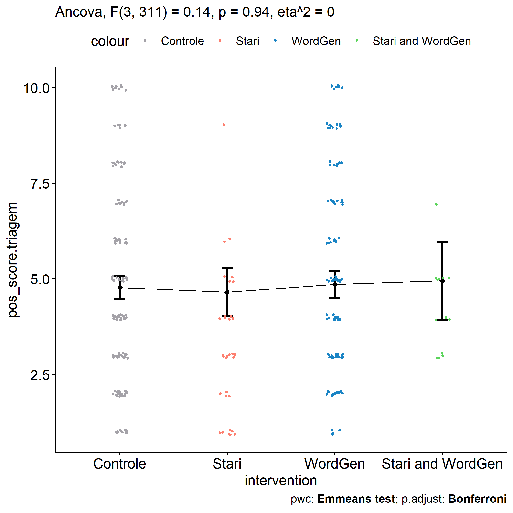<!-- -->

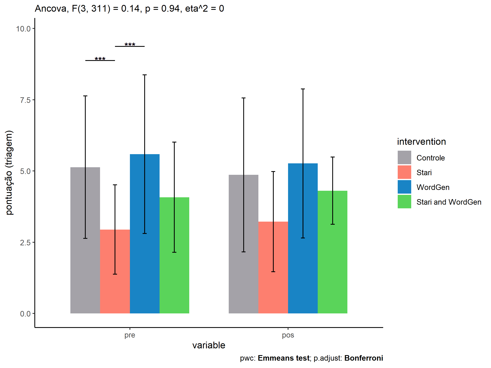<!-- -->

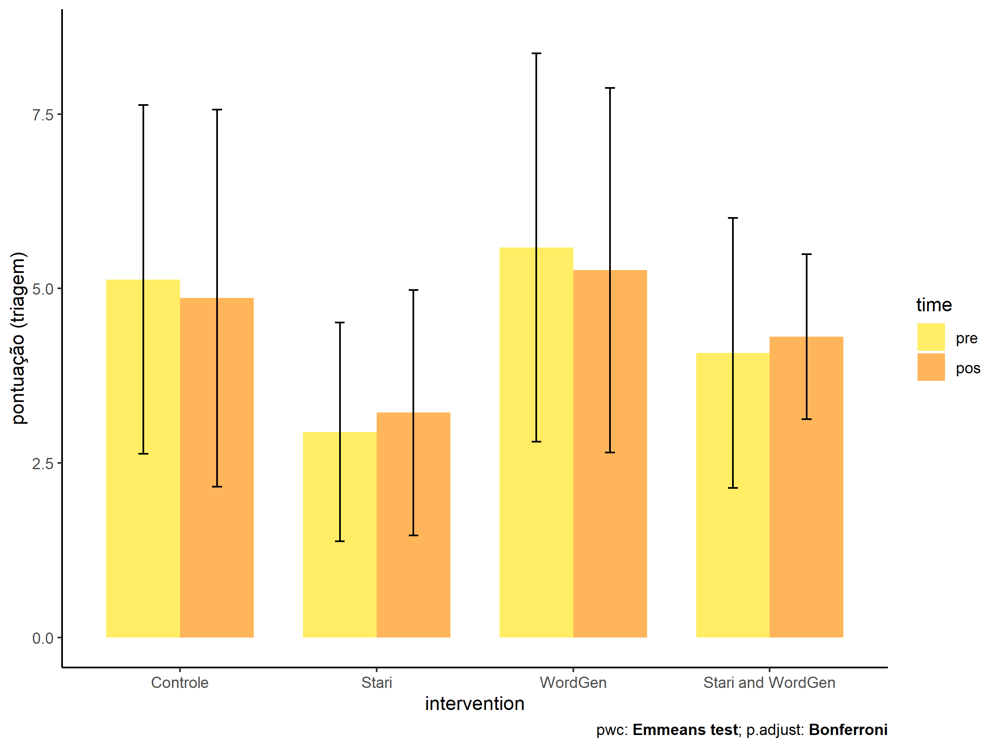<!-- -->

#### Baseado nas estimativas da aprendizagem (theta - traço latente) mediante TRI aplicado as respostas da prova

| var                   | intervention      |   n | M (pre) | SE (pre) | M (unadj) | SE (unadj) | M (adj) | SE (adj) |
|:----------------------|:------------------|----:|--------:|---------:|----------:|-----------:|--------:|---------:|
| pos_score_tri.triagem | Controle          | 153 |   0.007 |    0.067 |     0.014 |      0.070 |   0.009 |    0.049 |
| pos_score_tri.triagem | Stari             |  36 |  -0.615 |    0.081 |    -0.364 |      0.084 |   0.056 |    0.103 |
| pos_score_tri.triagem | Stari and WordGen |  13 |  -0.300 |    0.191 |    -0.292 |      0.159 |  -0.088 |    0.167 |
| pos_score_tri.triagem | WordGen           | 114 |   0.218 |    0.082 |     0.127 |      0.079 |  -0.022 |    0.057 |

| .y.                   | group1   | group2            | estimate | conf.low | conf.high |    se | statistic | p       | p.adj   | p.adj.signif |
|:----------------------|:---------|:------------------|---------:|---------:|----------:|------:|----------:|:--------|:--------|:-------------|
| pos_score_tri.triagem | Controle | Stari             |   -0.047 |   -0.272 |     0.178 | 0.114 |    -0.411 | 0.681   | 1       | ns           |
| pos_score_tri.triagem | Controle | WordGen           |    0.030 |   -0.117 |     0.178 | 0.075 |     0.405 | 0.686   | 1       | ns           |
| pos_score_tri.triagem | Controle | Stari and WordGen |    0.096 |   -0.246 |     0.439 | 0.174 |     0.553 | 0.581   | 1       | ns           |
| pos_score_tri.triagem | Stari    | WordGen           |    0.077 |   -0.159 |     0.314 | 0.120 |     0.644 | 0.52    | 1       | ns           |
| pos_score_tri.triagem | Stari    | Stari and WordGen |    0.143 |   -0.240 |     0.527 | 0.195 |     0.735 | 0.463   | 1       | ns           |
| pos_score_tri.triagem | WordGen  | Stari and WordGen |    0.066 |   -0.283 |     0.415 | 0.177 |     0.372 | 0.711   | 1       | ns           |
| pre_score_tri.triagem | Controle | Stari             |    0.622 |    0.326 |     0.917 | 0.150 |     4.140 | \<0.001 | \<0.001 | \*\*\*       |
| pre_score_tri.triagem | Controle | WordGen           |   -0.211 |   -0.408 |    -0.014 | 0.100 |    -2.104 | 0.036   | 0.217   | ns           |
| pre_score_tri.triagem | Controle | Stari and WordGen |    0.307 |   -0.154 |     0.768 | 0.234 |     1.309 | 0.191   | 1       | ns           |
| pre_score_tri.triagem | Stari    | WordGen           |   -0.833 |   -1.138 |    -0.528 | 0.155 |    -5.373 | \<0.001 | \<0.001 | \*\*\*\*     |
| pre_score_tri.triagem | Stari    | Stari and WordGen |   -0.315 |   -0.831 |     0.201 | 0.262 |    -1.201 | 0.231   | 1       | ns           |
| pre_score_tri.triagem | WordGen  | Stari and WordGen |    0.518 |    0.051 |     0.985 | 0.237 |     2.181 | 0.03    | 0.18    | ns           |

| intervention      | group1 | group2 | estimate | conf.low | conf.high |    se | statistic |     p | p.adj | p.adj.signif |
|:------------------|:-------|:-------|---------:|---------:|----------:|------:|----------:|------:|------:|:-------------|
| Controle          | pre    | pos    |   -0.007 |   -0.189 |     0.176 | 0.093 |    -0.071 | 0.943 | 0.943 | ns           |
| Stari             | pre    | pos    |   -0.251 |   -0.627 |     0.126 | 0.192 |    -1.308 | 0.192 | 0.192 | ns           |
| WordGen           | pre    | pos    |    0.091 |   -0.121 |     0.302 | 0.108 |     0.841 | 0.401 | 0.401 | ns           |
| Stari and WordGen | pre    | pos    |   -0.008 |   -0.634 |     0.619 | 0.319 |    -0.024 | 0.981 | 0.981 | ns           |

    ## Scale for colour is already present.
    ## Adding another scale for colour, which will replace the existing scale.

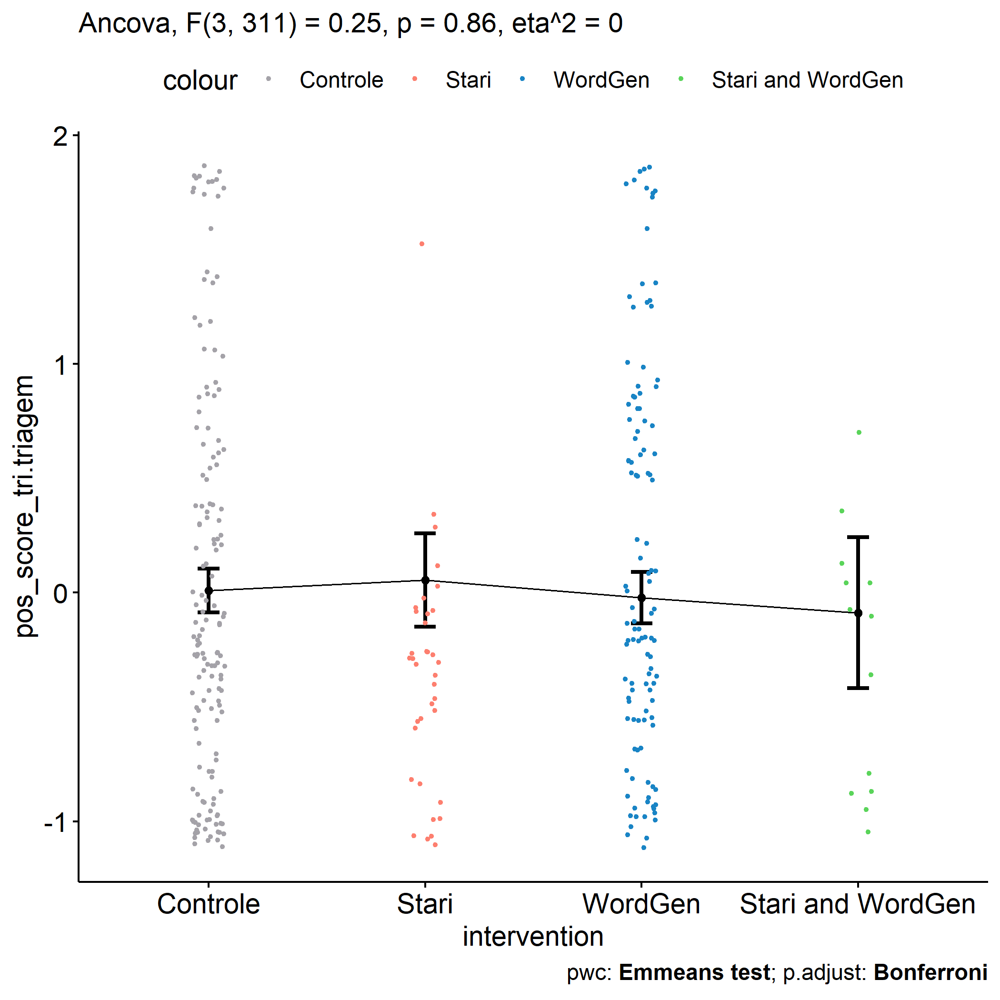<!-- -->

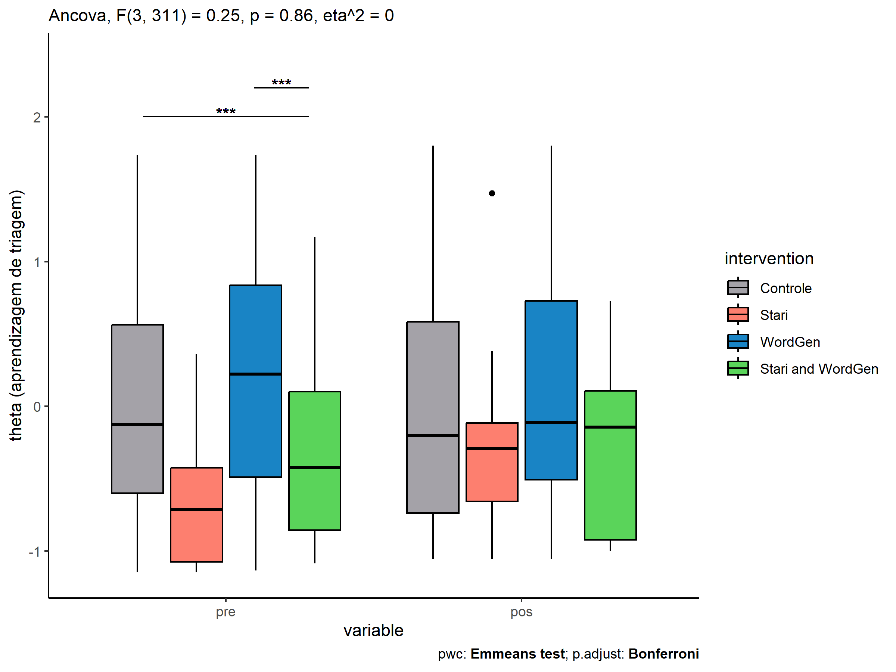<!-- -->

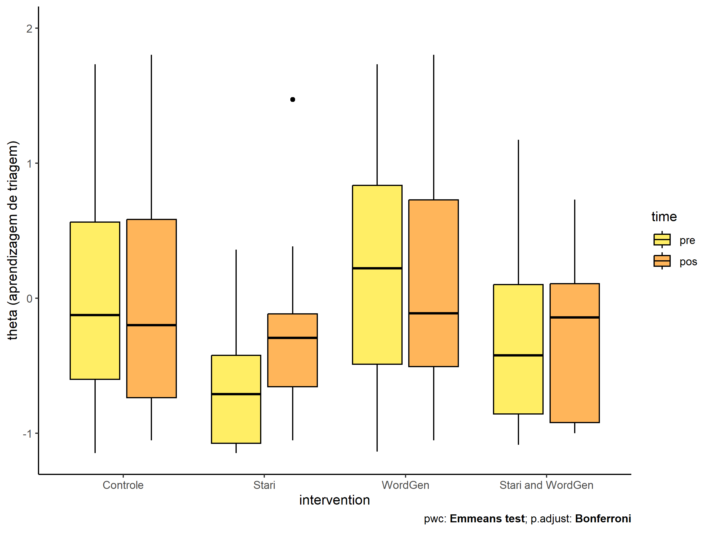<!-- -->

### factor: **genero**

#### Baseado nos acertos (score) da prova

| var               | genero |   n | M (pre) | SE (pre) | M (unadj) | SE (unadj) | M (adj) | SE (adj) |
|:------------------|:-------|----:|--------:|---------:|----------:|-----------:|--------:|---------:|
| pos_score.triagem | F      | 153 |   5.399 |    0.219 |     5.314 |      0.213 |   5.041 |    0.148 |
| pos_score.triagem | M      | 163 |   4.632 |    0.195 |     4.313 |      0.194 |   4.568 |    0.144 |

| .y.               | group1 | group2 | estimate | conf.low | conf.high |    se | statistic |     p | p.adj | p.adj.signif |
|:------------------|:-------|:-------|---------:|---------:|----------:|------:|----------:|------:|------:|:-------------|
| pos_score.triagem | F      | M      |    0.473 |    0.064 |     0.882 | 0.208 |     2.276 | 0.024 | 0.024 | \*           |
| pre_score.triagem | F      | M      |    0.767 |    0.192 |     1.342 | 0.292 |     2.625 | 0.009 | 0.009 | \*\*         |

| genero | group1 | group2 | estimate | conf.low | conf.high |    se | statistic |     p | p.adj | p.adj.signif |
|:-------|:-------|:-------|---------:|---------:|----------:|------:|----------:|------:|------:|:-------------|
| F      | pre    | pos    |    0.085 |   -0.493 |     0.663 | 0.294 |     0.289 | 0.773 | 0.773 | ns           |
| M      | pre    | pos    |    0.319 |   -0.241 |     0.879 | 0.285 |     1.119 | 0.264 | 0.264 | ns           |

    ## Scale for colour is already present.
    ## Adding another scale for colour, which will replace the existing scale.

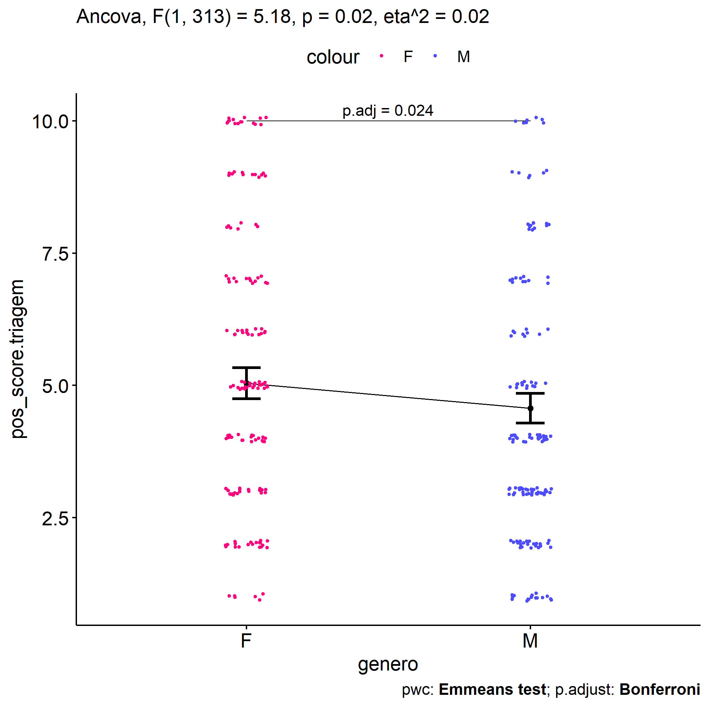<!-- -->

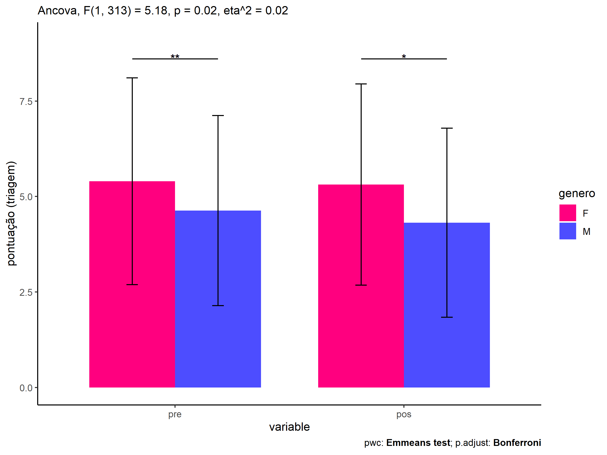<!-- -->

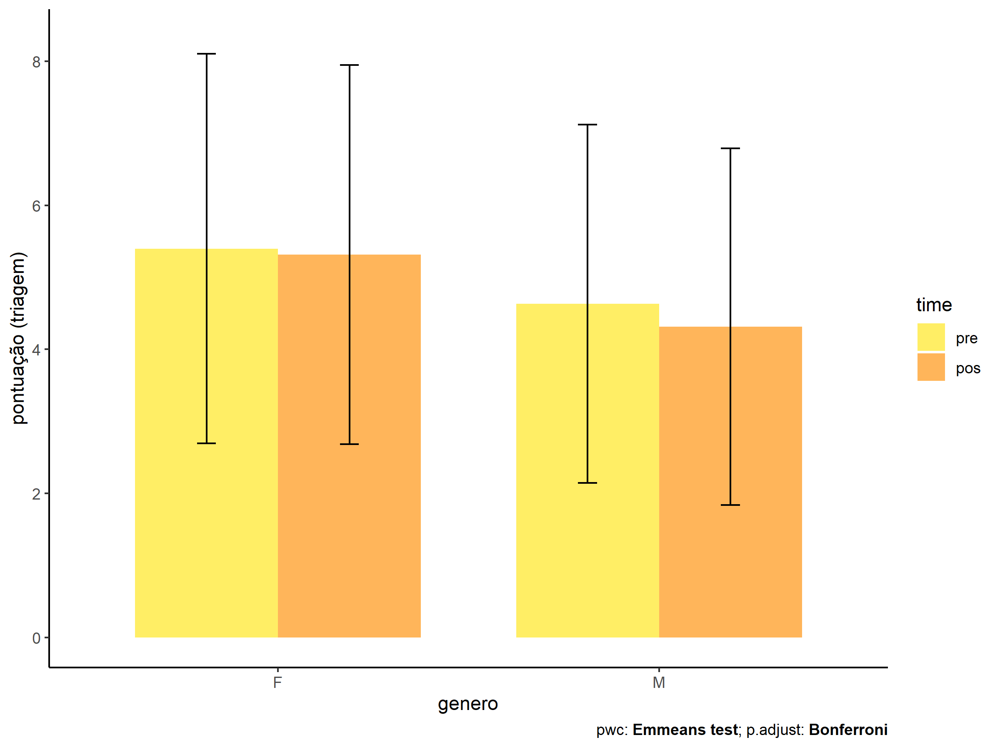<!-- -->

#### Baseado nas estimativas da aprendizagem (theta - traço latente) mediante TRI aplicado as respostas da prova

| var                   | genero |   n | M (pre) | SE (pre) | M (unadj) | SE (unadj) | M (adj) | SE (adj) |
|:----------------------|:-------|----:|--------:|---------:|----------:|-----------:|--------:|---------:|
| pos_score_tri.triagem | F      | 153 |   0.145 |    0.072 |     0.122 |      0.071 |   0.024 |    0.049 |
| pos_score_tri.triagem | M      | 163 |  -0.137 |    0.061 |    -0.116 |      0.059 |  -0.025 |    0.047 |

| .y.                   | group1 | group2 | estimate | conf.low | conf.high |    se | statistic |     p | p.adj | p.adj.signif |
|:----------------------|:-------|:-------|---------:|---------:|----------:|------:|----------:|------:|------:|:-------------|
| pos_score_tri.triagem | F      | M      |    0.049 |   -0.086 |     0.184 | 0.068 |     0.713 | 0.476 | 0.476 | ns           |
| pre_score_tri.triagem | F      | M      |    0.282 |    0.097 |     0.467 | 0.094 |     2.997 | 0.003 | 0.003 | \*\*         |

| genero | group1 | group2 | estimate | conf.low | conf.high |    se | statistic |     p | p.adj | p.adj.signif |
|:-------|:-------|:-------|---------:|---------:|----------:|------:|----------:|------:|------:|:-------------|
| F      | pre    | pos    |    0.023 |   -0.163 |     0.209 | 0.095 |     0.244 | 0.807 | 0.807 | ns           |
| M      | pre    | pos    |   -0.021 |   -0.201 |     0.160 | 0.092 |    -0.224 | 0.823 | 0.823 | ns           |

    ## Scale for colour is already present.
    ## Adding another scale for colour, which will replace the existing scale.

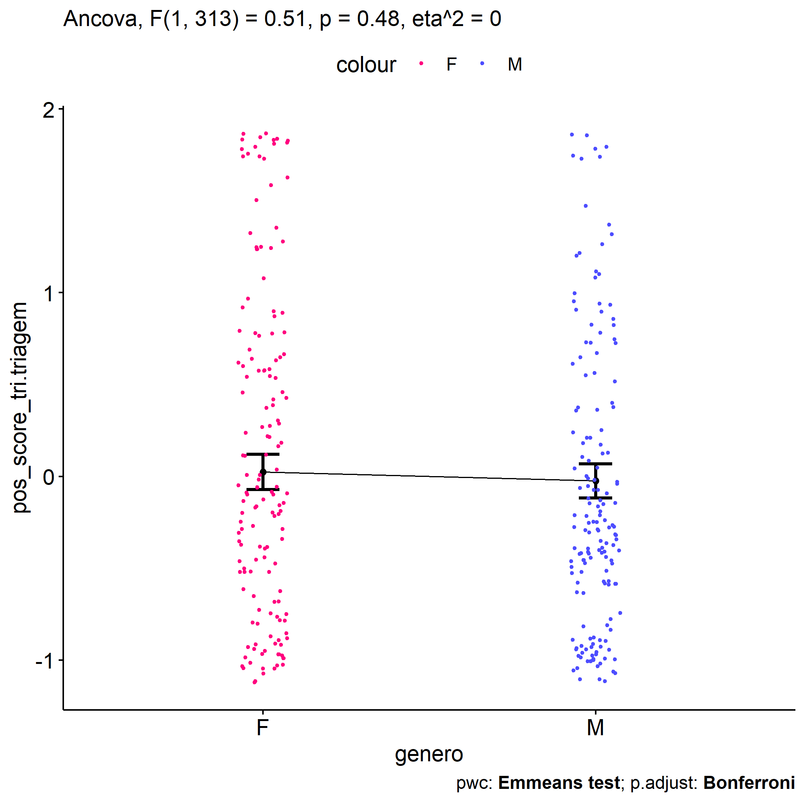<!-- -->

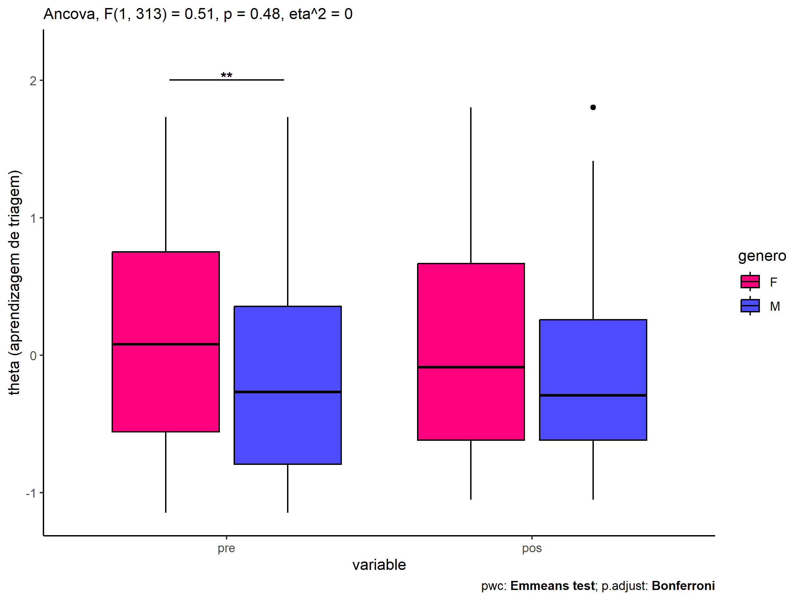<!-- -->

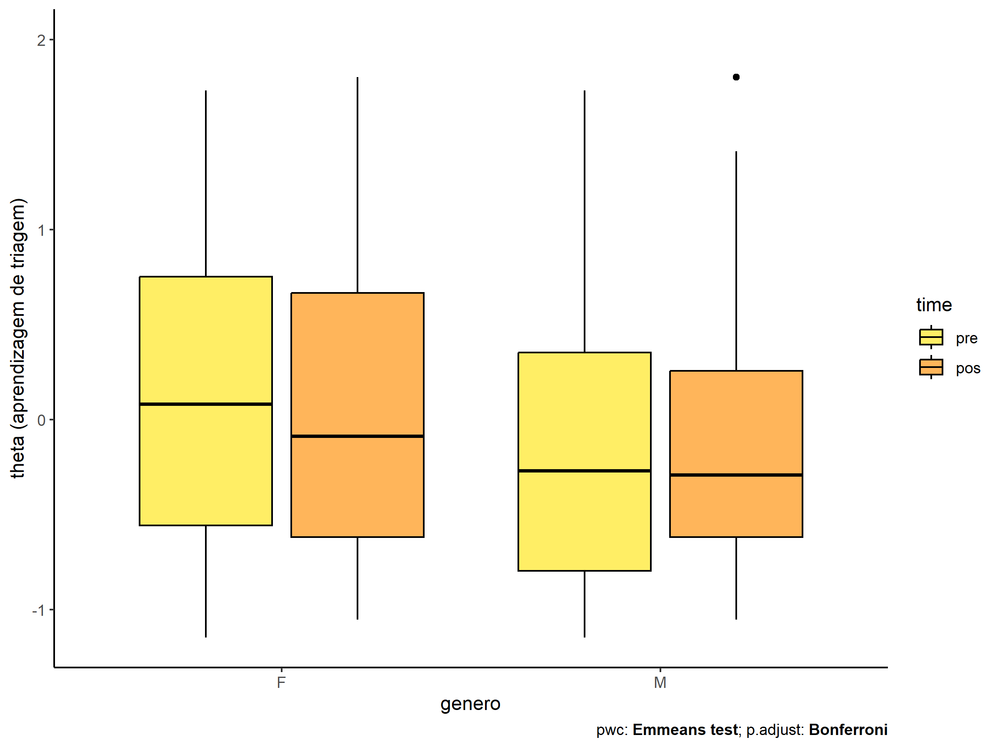<!-- -->

### factor: **idade**

#### Baseado nos acertos (score) da prova

| var               | idade |   n | M (pre) | SE (pre) | M (unadj) | SE (unadj) | M (adj) | SE (adj) |
|:------------------|:------|----:|--------:|---------:|----------:|-----------:|--------:|---------:|
| pos_score.triagem | 10y   |  61 |   4.934 |    0.343 |     4.836 |      0.316 |   4.915 |    0.237 |
| pos_score.triagem | 11y   | 181 |   5.293 |    0.203 |     5.110 |      0.203 |   4.943 |    0.138 |
| pos_score.triagem | 12y   |  46 |   4.522 |    0.320 |     4.239 |      0.352 |   4.601 |    0.274 |
| pos_score.triagem | 13y   |  17 |   4.294 |    0.483 |     3.706 |      0.361 |   4.224 |    0.451 |

| .y.               | group1 | group2 | estimate | conf.low | conf.high |    se | statistic |     p | p.adj | p.adj.signif |
|:------------------|:-------|:-------|---------:|---------:|----------:|------:|----------:|------:|------:|:-------------|
| pos_score.triagem | 10y    | 11y    |   -0.029 |   -0.570 |     0.512 | 0.275 |    -0.104 | 0.917 | 1.000 | ns           |
| pos_score.triagem | 10y    | 12y    |    0.314 |   -0.399 |     1.027 | 0.362 |     0.866 | 0.387 | 1.000 | ns           |
| pos_score.triagem | 10y    | 13y    |    0.691 |   -0.311 |     1.693 | 0.509 |     1.357 | 0.176 | 1.000 | ns           |
| pos_score.triagem | 11y    | 12y    |    0.343 |   -0.263 |     0.948 | 0.308 |     1.113 | 0.266 | 1.000 | ns           |
| pos_score.triagem | 11y    | 13y    |    0.720 |   -0.209 |     1.649 | 0.472 |     1.525 | 0.128 | 0.770 | ns           |
| pos_score.triagem | 12y    | 13y    |    0.377 |   -0.659 |     1.413 | 0.526 |     0.717 | 0.474 | 1.000 | ns           |
| pre_score.triagem | 10y    | 11y    |   -0.358 |   -1.119 |     0.402 | 0.387 |    -0.927 | 0.355 | 1.000 | ns           |
| pre_score.triagem | 10y    | 12y    |    0.413 |   -0.591 |     1.416 | 0.510 |     0.809 | 0.419 | 1.000 | ns           |
| pre_score.triagem | 10y    | 13y    |    0.640 |   -0.769 |     2.050 | 0.716 |     0.894 | 0.372 | 1.000 | ns           |
| pre_score.triagem | 11y    | 12y    |    0.771 |   -0.077 |     1.620 | 0.431 |     1.788 | 0.075 | 0.448 | ns           |
| pre_score.triagem | 11y    | 13y    |    0.999 |   -0.305 |     2.302 | 0.662 |     1.508 | 0.133 | 0.796 | ns           |
| pre_score.triagem | 12y    | 13y    |    0.228 |   -1.231 |     1.686 | 0.741 |     0.307 | 0.759 | 1.000 | ns           |

| idade | group1 | group2 | estimate | conf.low | conf.high |    se | statistic |     p | p.adj | p.adj.signif |
|:------|:-------|:-------|---------:|---------:|----------:|------:|----------:|------:|------:|:-------------|
| 10y   | pre    | pos    |    0.098 |   -0.824 |     1.021 | 0.470 |     0.209 | 0.834 | 0.834 | ns           |
| 11y   | pre    | pos    |    0.182 |   -0.353 |     0.718 | 0.273 |     0.669 | 0.504 | 0.504 | ns           |
| 12y   | pre    | pos    |    0.283 |   -0.779 |     1.345 | 0.541 |     0.523 | 0.601 | 0.601 | ns           |
| 13y   | pre    | pos    |    0.588 |   -1.159 |     2.335 | 0.889 |     0.661 | 0.509 | 0.509 | ns           |

    ## Scale for colour is already present.
    ## Adding another scale for colour, which will replace the existing scale.

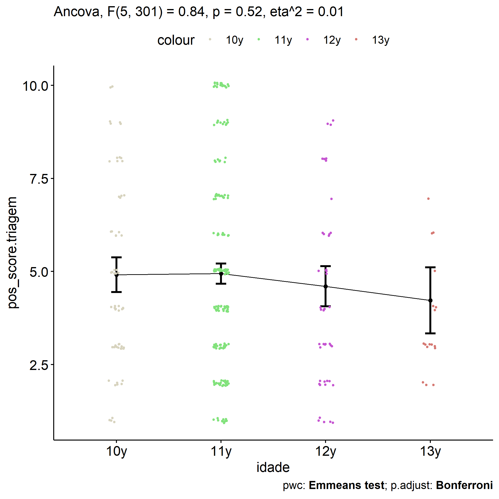<!-- -->

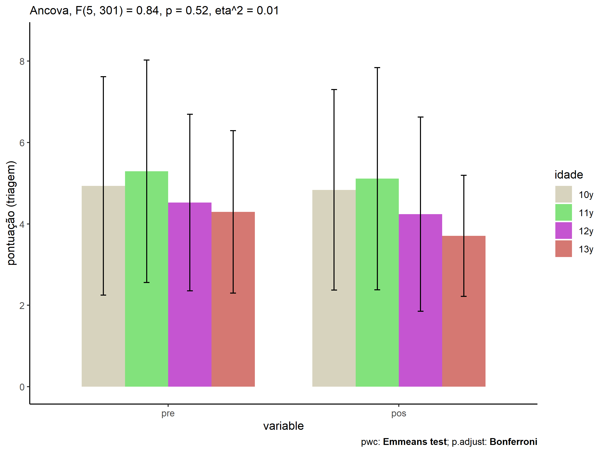<!-- -->

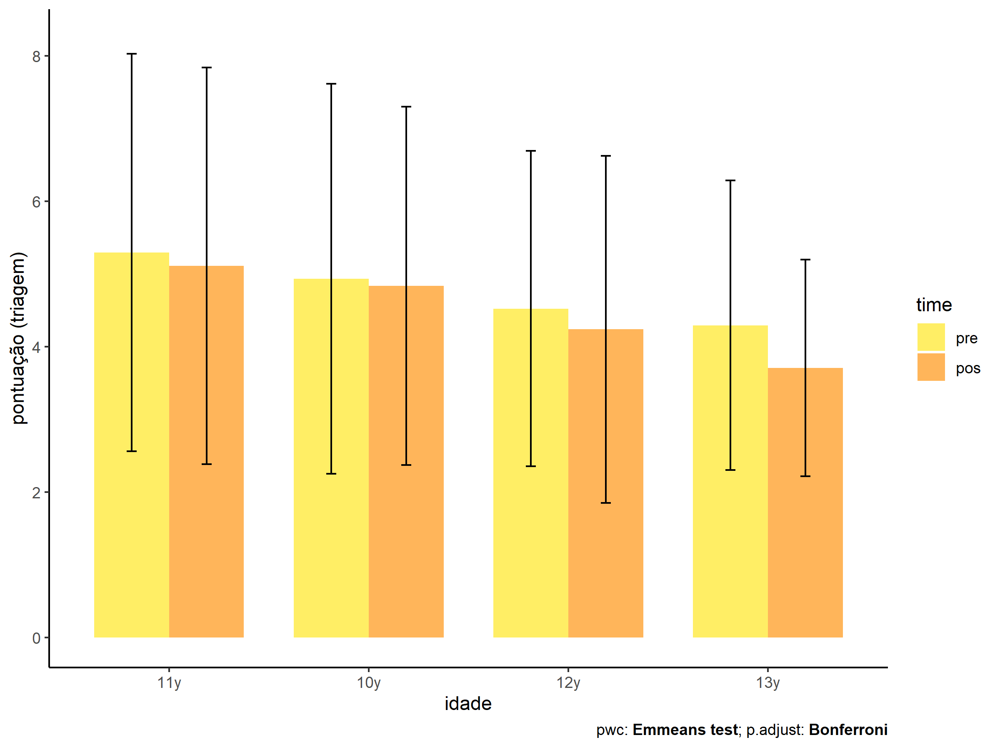<!-- -->

#### Baseado nas estimativas da aprendizagem (theta - traço latente) mediante TRI aplicado as respostas da prova

| var                   | idade |   n | M (pre) | SE (pre) | M (unadj) | SE (unadj) | M (adj) | SE (adj) |
|:----------------------|:------|----:|--------:|---------:|----------:|-----------:|--------:|---------:|
| pos_score_tri.triagem | 10y   |  61 |  -0.039 |    0.109 |    -0.029 |      0.099 |   0.008 |    0.077 |
| pos_score_tri.triagem | 11y   | 181 |   0.107 |    0.066 |     0.113 |      0.065 |   0.052 |    0.045 |
| pos_score_tri.triagem | 12y   |  46 |  -0.131 |    0.096 |    -0.160 |      0.111 |  -0.062 |    0.089 |
| pos_score_tri.triagem | 13y   |  17 |  -0.353 |    0.148 |    -0.380 |      0.107 |  -0.134 |    0.147 |

| .y.                   | group1 | group2 | estimate | conf.low | conf.high |    se | statistic |     p | p.adj | p.adj.signif |
|:----------------------|:-------|:-------|---------:|---------:|----------:|------:|----------:|------:|------:|:-------------|
| pos_score_tri.triagem | 10y    | 11y    |   -0.044 |   -0.220 |     0.132 | 0.089 |    -0.495 | 0.621 | 1.000 | ns           |
| pos_score_tri.triagem | 10y    | 12y    |    0.070 |   -0.162 |     0.301 | 0.118 |     0.590 | 0.555 | 1.000 | ns           |
| pos_score_tri.triagem | 10y    | 13y    |    0.142 |   -0.185 |     0.468 | 0.166 |     0.855 | 0.393 | 1.000 | ns           |
| pos_score_tri.triagem | 11y    | 12y    |    0.114 |   -0.083 |     0.311 | 0.100 |     1.138 | 0.256 | 1.000 | ns           |
| pos_score_tri.triagem | 11y    | 13y    |    0.186 |   -0.117 |     0.489 | 0.154 |     1.207 | 0.228 | 1.000 | ns           |
| pos_score_tri.triagem | 12y    | 13y    |    0.072 |   -0.265 |     0.410 | 0.171 |     0.421 | 0.674 | 1.000 | ns           |
| pre_score_tri.triagem | 10y    | 11y    |   -0.145 |   -0.390 |     0.099 | 0.124 |    -1.171 | 0.243 | 1.000 | ns           |
| pre_score_tri.triagem | 10y    | 12y    |    0.093 |   -0.230 |     0.415 | 0.164 |     0.567 | 0.571 | 1.000 | ns           |
| pre_score_tri.triagem | 10y    | 13y    |    0.314 |   -0.139 |     0.767 | 0.230 |     1.365 | 0.173 | 1.000 | ns           |
| pre_score_tri.triagem | 11y    | 12y    |    0.238 |   -0.034 |     0.511 | 0.139 |     1.721 | 0.086 | 0.518 | ns           |
| pre_score_tri.triagem | 11y    | 13y    |    0.460 |    0.041 |     0.878 | 0.213 |     2.159 | 0.032 | 0.190 | ns           |
| pre_score_tri.triagem | 12y    | 13y    |    0.221 |   -0.248 |     0.690 | 0.238 |     0.928 | 0.354 | 1.000 | ns           |

| idade | group1 | group2 | estimate | conf.low | conf.high |    se | statistic |     p | p.adj | p.adj.signif |
|:------|:-------|:-------|---------:|---------:|----------:|------:|----------:|------:|------:|:-------------|
| 10y   | pre    | pos    |   -0.010 |   -0.305 |     0.285 | 0.150 |    -0.066 | 0.948 | 0.948 | ns           |
| 11y   | pre    | pos    |   -0.006 |   -0.177 |     0.166 | 0.087 |    -0.065 | 0.948 | 0.948 | ns           |
| 12y   | pre    | pos    |    0.029 |   -0.311 |     0.369 | 0.173 |     0.165 | 0.869 | 0.869 | ns           |
| 13y   | pre    | pos    |    0.027 |   -0.532 |     0.587 | 0.285 |     0.095 | 0.924 | 0.924 | ns           |

    ## Scale for colour is already present.
    ## Adding another scale for colour, which will replace the existing scale.

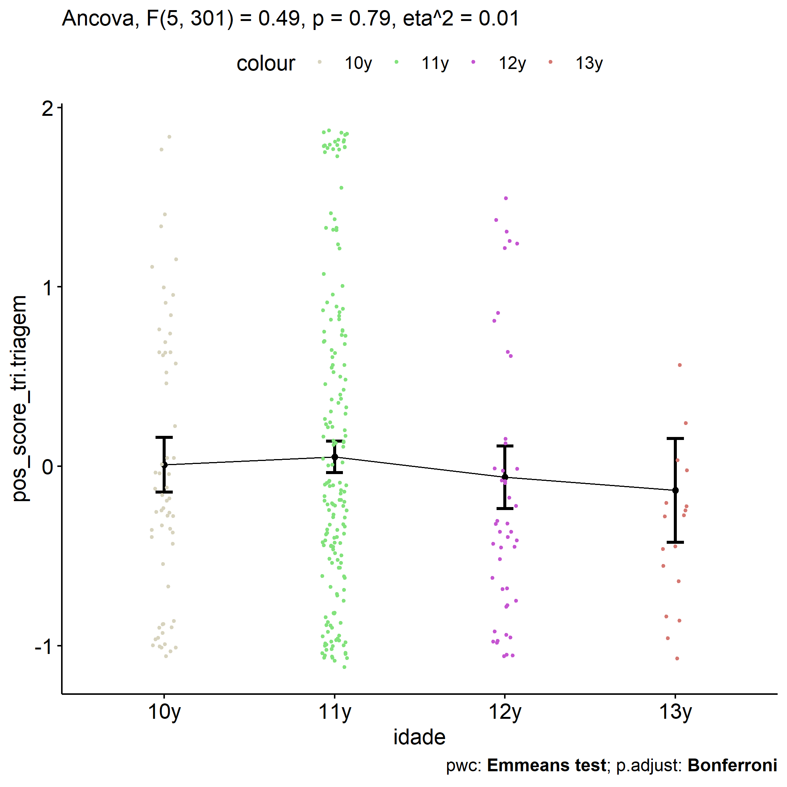<!-- -->

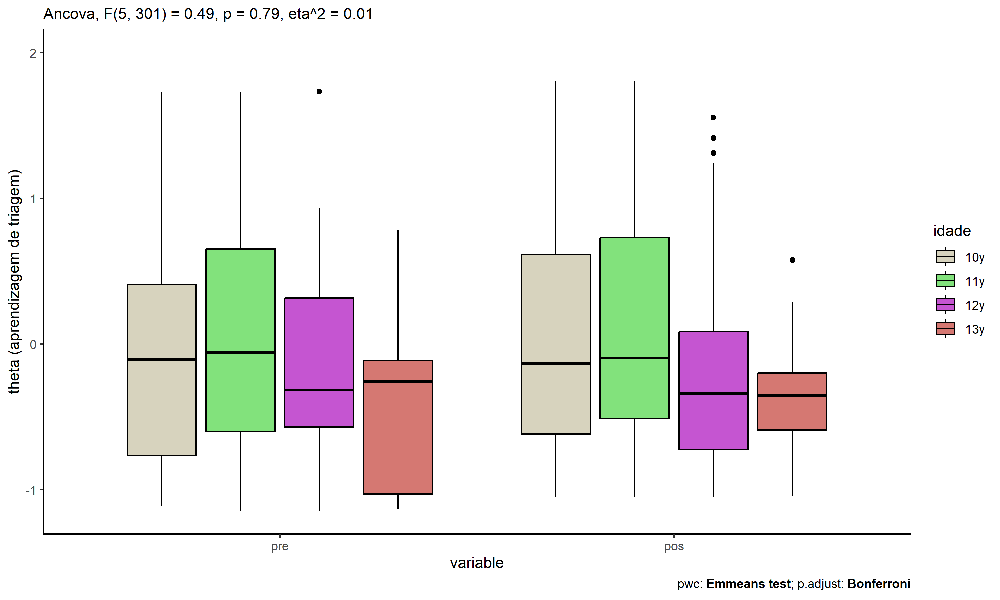<!-- -->

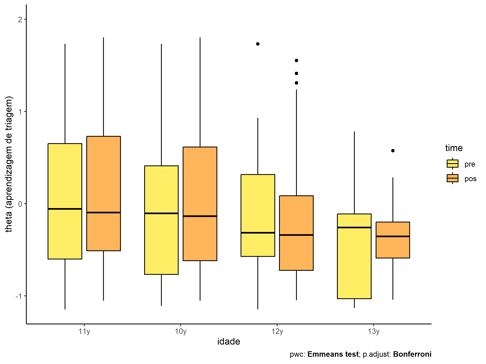<!-- -->

### factor: **zona.escola**

#### Baseado nos acertos (score) da prova

| var               | zona.escola |   n | M (pre) | SE (pre) | M (unadj) | SE (unadj) | M (adj) | SE (adj) |
|:------------------|:------------|----:|--------:|---------:|----------:|-----------:|--------:|---------:|
| pos_score.triagem | Rural       | 106 |   5.547 |    0.248 |     5.085 |      0.258 |   4.701 |    0.180 |
| pos_score.triagem | Urbana      | 210 |   4.729 |    0.180 |     4.652 |      0.177 |   4.846 |    0.127 |

| .y.               | group1 | group2 | estimate | conf.low | conf.high |    se | statistic |     p | p.adj | p.adj.signif |
|:------------------|:-------|:-------|---------:|---------:|----------:|------:|----------:|------:|------:|:-------------|
| pos_score.triagem | Urbana | Rural  |    0.145 |   -0.291 |     0.581 | 0.222 |     0.654 | 0.514 | 0.514 | ns           |
| pre_score.triagem | Urbana | Rural  |   -0.819 |   -1.427 |    -0.210 | 0.309 |    -2.648 | 0.009 | 0.009 | \*\*         |

| zona.escola | group1 | group2 | estimate | conf.low | conf.high |    se | statistic |     p | p.adj | p.adj.signif |
|:------------|:-------|:-------|---------:|---------:|----------:|------:|----------:|------:|------:|:-------------|
| Urbana      | pre    | pos    |    0.076 |   -0.421 |     0.573 | 0.253 |     0.301 | 0.764 | 0.764 | ns           |
| Rural       | pre    | pos    |    0.462 |   -0.237 |     1.162 | 0.356 |     1.297 | 0.195 | 0.195 | ns           |

    ## Scale for colour is already present.
    ## Adding another scale for colour, which will replace the existing scale.

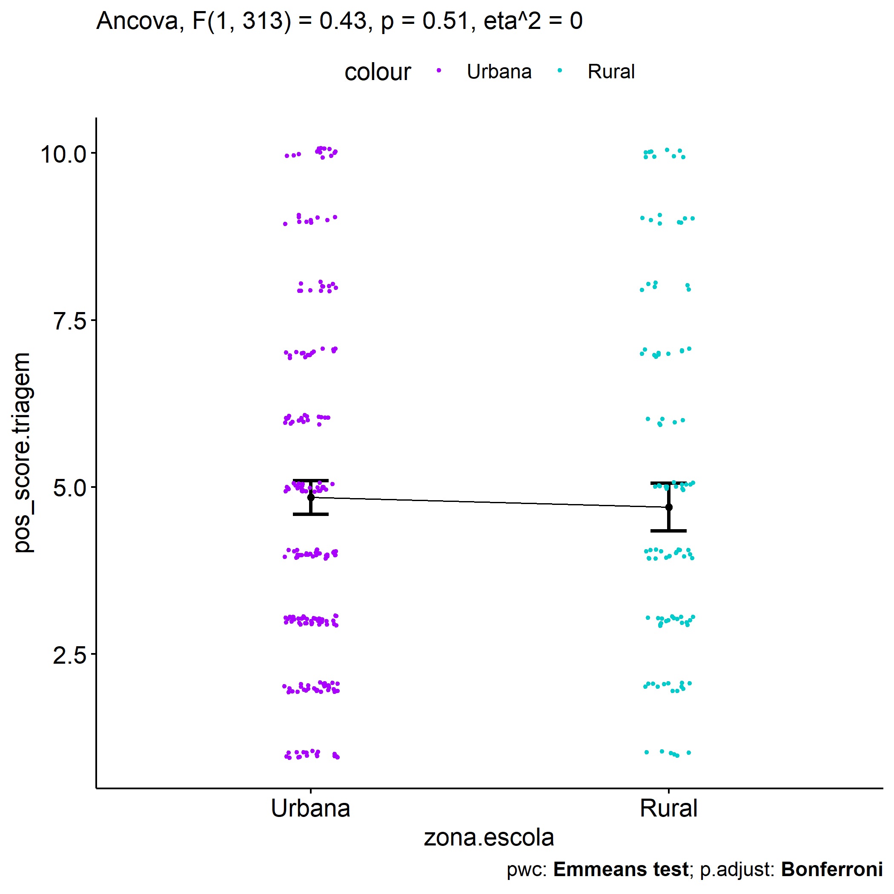<!-- -->

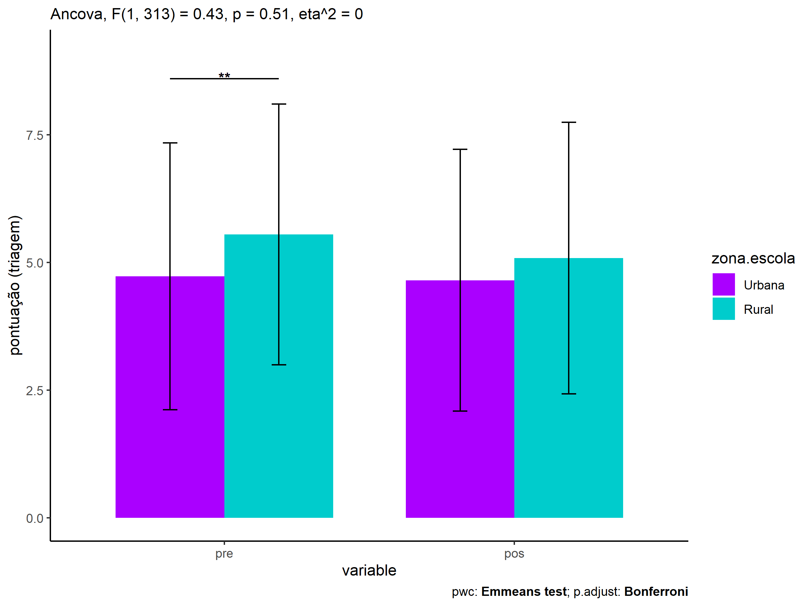<!-- -->

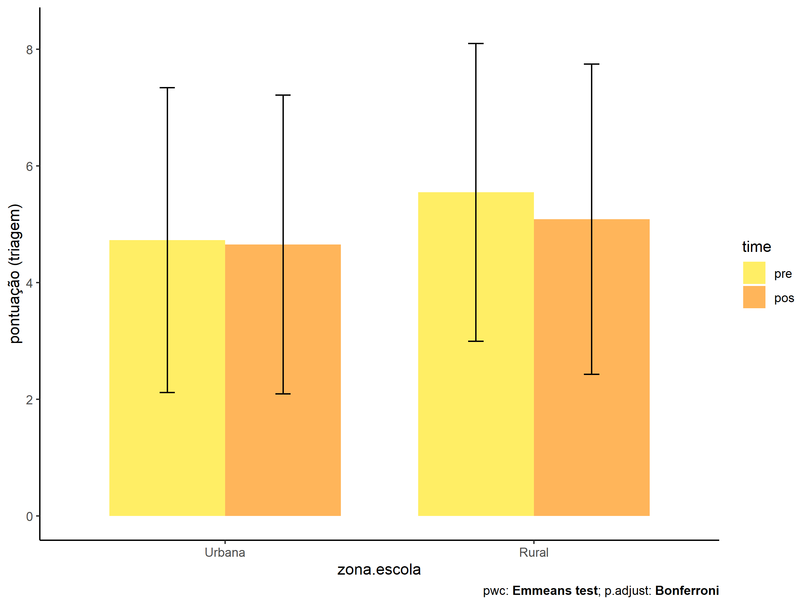<!-- -->

#### Baseado nas estimativas da aprendizagem (theta - traço latente) mediante TRI aplicado as respostas da prova

| var                   | zona.escola |   n | M (pre) | SE (pre) | M (unadj) | SE (unadj) | M (adj) | SE (adj) |
|:----------------------|:------------|----:|--------:|---------:|----------:|-----------:|--------:|---------:|
| pos_score_tri.triagem | Rural       | 106 |   0.176 |    0.080 |     0.063 |      0.083 |  -0.058 |    0.059 |
| pos_score_tri.triagem | Urbana      | 210 |  -0.089 |    0.058 |    -0.033 |      0.056 |   0.028 |    0.041 |

| .y.                   | group1 | group2 | estimate | conf.low | conf.high |    se | statistic |     p | p.adj | p.adj.signif |
|:----------------------|:-------|:-------|---------:|---------:|----------:|------:|----------:|------:|------:|:-------------|
| pos_score_tri.triagem | Urbana | Rural  |    0.086 |   -0.056 |     0.227 | 0.072 |     1.186 | 0.237 | 0.237 | ns           |
| pre_score_tri.triagem | Urbana | Rural  |   -0.265 |   -0.461 |    -0.068 | 0.100 |    -2.654 | 0.008 | 0.008 | \*\*         |

| zona.escola | group1 | group2 | estimate | conf.low | conf.high |    se | statistic |     p | p.adj | p.adj.signif |
|:------------|:-------|:-------|---------:|---------:|----------:|------:|----------:|------:|------:|:-------------|
| Urbana      | pre    | pos    |   -0.056 |   -0.216 |     0.103 | 0.081 |    -0.691 | 0.490 | 0.490 | ns           |
| Rural       | pre    | pos    |    0.113 |   -0.112 |     0.338 | 0.114 |     0.989 | 0.323 | 0.323 | ns           |

    ## Scale for colour is already present.
    ## Adding another scale for colour, which will replace the existing scale.

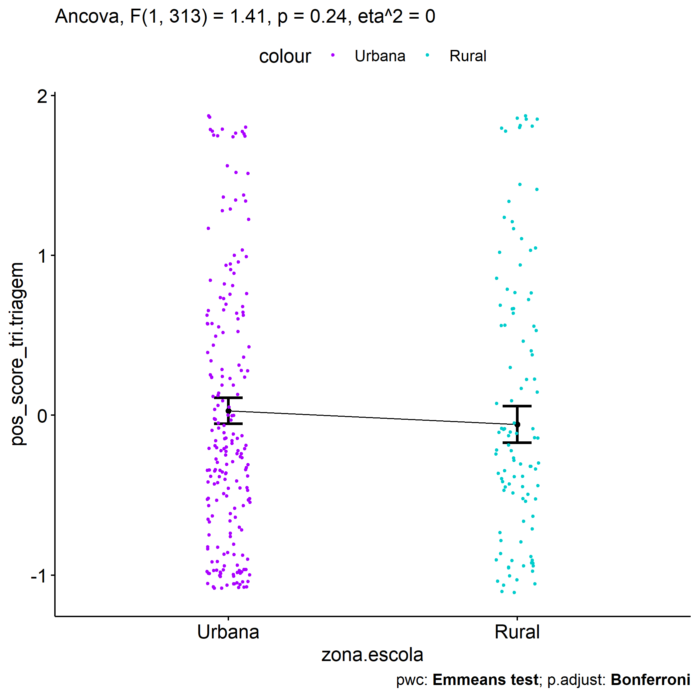<!-- -->

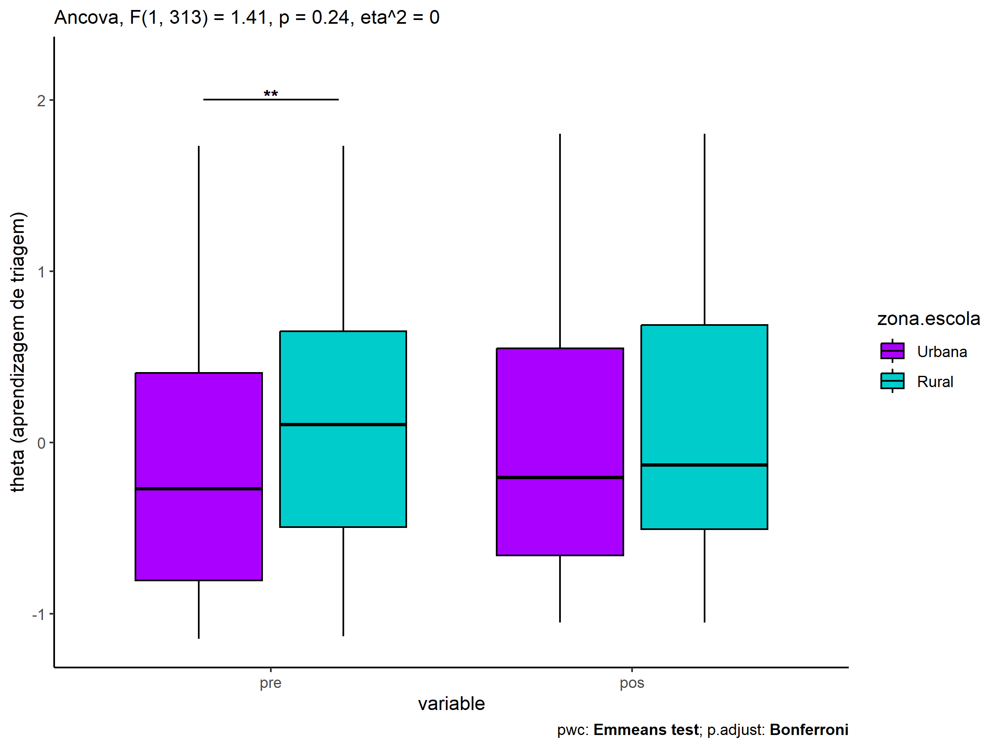<!-- -->

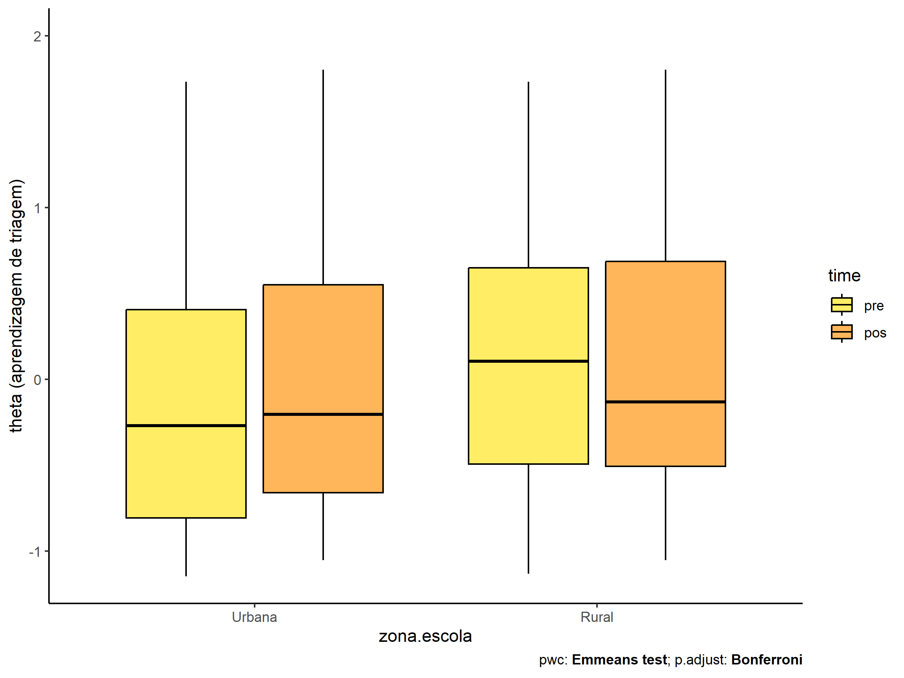<!-- -->

### factor: **zona.participante**

#### Baseado nos acertos (score) da prova

| var               | zona.participante |   n | M (pre) | SE (pre) | M (unadj) | SE (unadj) | M (adj) | SE (adj) |
|:------------------|:------------------|----:|--------:|---------:|----------:|-----------:|--------:|---------:|
| pos_score.triagem | Rural             | 118 |   4.847 |    0.232 |     4.644 |      0.238 |   4.662 |    0.172 |
| pos_score.triagem | Urbana            | 126 |   4.897 |    0.233 |     5.016 |      0.232 |   4.999 |    0.166 |

| .y.               | group1 | group2 | estimate | conf.low | conf.high |    se | statistic |     p | p.adj | p.adj.signif |
|:------------------|:-------|:-------|---------:|---------:|----------:|------:|----------:|------:|------:|:-------------|
| pos_score.triagem | Urbana | Rural  |    0.337 |   -0.133 |     0.807 | 0.239 |     1.412 | 0.159 | 0.159 | ns           |
| pre_score.triagem | Urbana | Rural  |    0.049 |   -0.600 |     0.698 | 0.329 |     0.150 | 0.881 | 0.881 | ns           |

| zona.participante | group1 | group2 | estimate | conf.low | conf.high |    se | statistic |     p | p.adj | p.adj.signif |
|:------------------|:-------|:-------|---------:|---------:|----------:|------:|----------:|------:|------:|:-------------|
| Urbana            | pre    | pos    |   -0.119 |   -0.759 |     0.520 | 0.325 |    -0.366 | 0.715 | 0.715 | ns           |
| Rural             | pre    | pos    |    0.203 |   -0.457 |     0.864 | 0.336 |     0.605 | 0.546 | 0.546 | ns           |

    ## Scale for colour is already present.
    ## Adding another scale for colour, which will replace the existing scale.

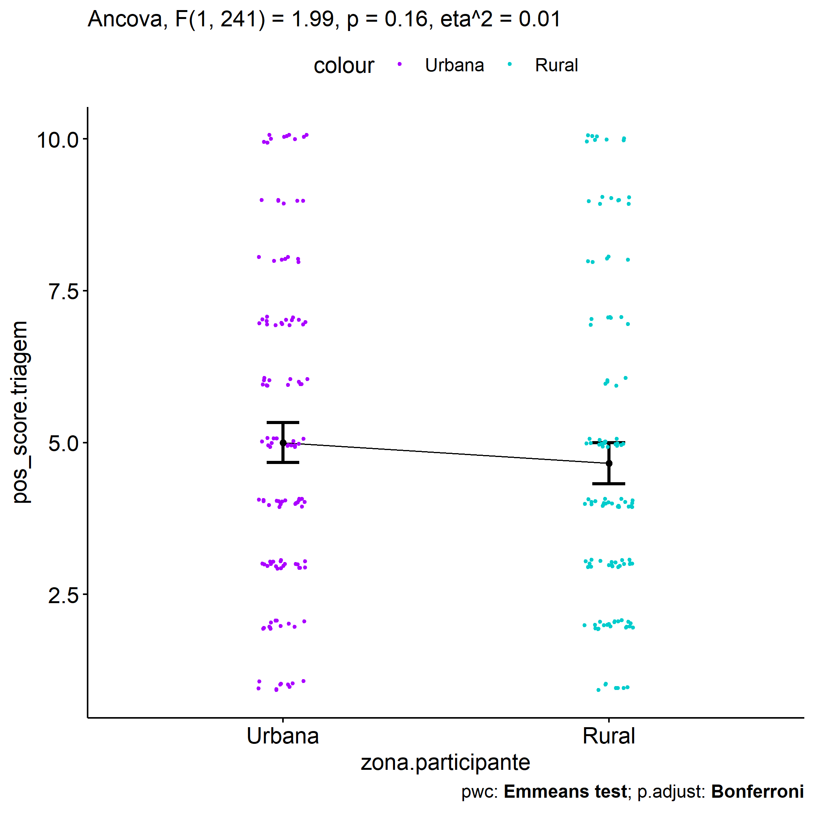<!-- -->

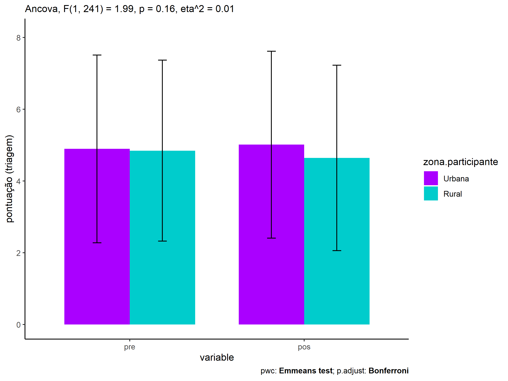<!-- -->

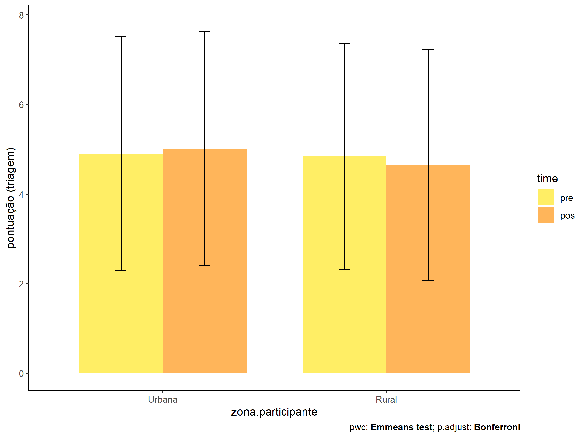<!-- -->

#### Baseado nas estimativas da aprendizagem (theta - traço latente) mediante TRI aplicado as respostas da prova

| var                   | zona.participante |   n | M (pre) | SE (pre) | M (unadj) | SE (unadj) | M (adj) | SE (adj) |
|:----------------------|:------------------|----:|--------:|---------:|----------:|-----------:|--------:|---------:|
| pos_score_tri.triagem | Rural             | 118 |  -0.029 |    0.073 |    -0.005 |      0.075 |  -0.009 |    0.056 |
| pos_score_tri.triagem | Urbana            | 126 |  -0.041 |    0.075 |     0.058 |      0.073 |   0.062 |    0.054 |

| .y.                   | group1 | group2 | estimate | conf.low | conf.high |    se | statistic |     p | p.adj | p.adj.signif |
|:----------------------|:-------|:-------|---------:|---------:|----------:|------:|----------:|------:|------:|:-------------|
| pos_score_tri.triagem | Urbana | Rural  |    0.070 |   -0.082 |     0.223 | 0.077 |     0.911 | 0.363 | 0.363 | ns           |
| pre_score_tri.triagem | Urbana | Rural  |   -0.012 |   -0.218 |     0.195 | 0.105 |    -0.113 | 0.910 | 0.910 | ns           |

| zona.participante | group1 | group2 | estimate | conf.low | conf.high |    se | statistic |     p | p.adj | p.adj.signif |
|:------------------|:-------|:-------|---------:|---------:|----------:|------:|----------:|------:|------:|:-------------|
| Urbana            | pre    | pos    |   -0.098 |   -0.301 |     0.104 | 0.103 |    -0.956 | 0.339 | 0.339 | ns           |
| Rural             | pre    | pos    |   -0.024 |   -0.233 |     0.185 | 0.106 |    -0.227 | 0.820 | 0.820 | ns           |

    ## Scale for colour is already present.
    ## Adding another scale for colour, which will replace the existing scale.

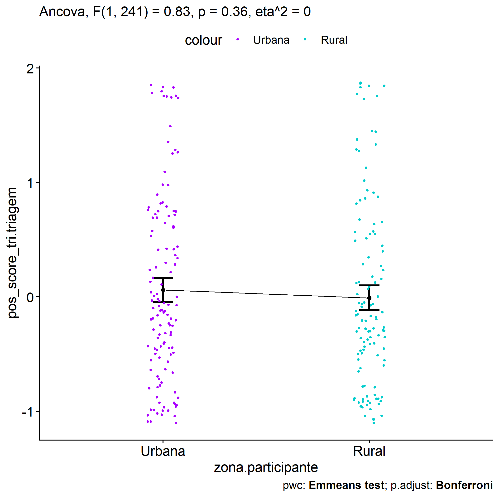<!-- -->

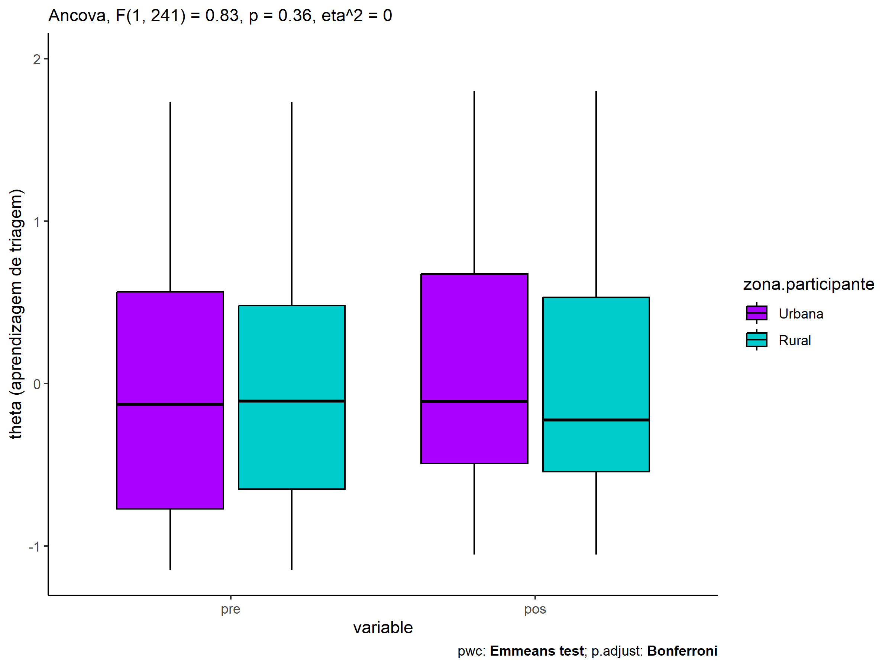<!-- -->

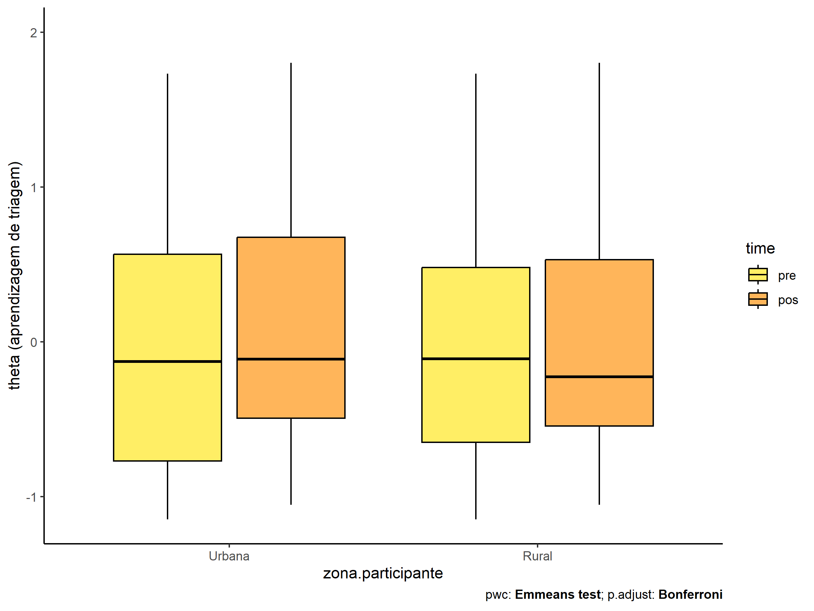<!-- -->

### factor: **escola**

#### Baseado nos acertos (score) da prova

| var               | escola |   n | M (pre) | SE (pre) | M (unadj) | SE (unadj) | M (adj) | SE (adj) |
|:------------------|:-------|----:|--------:|---------:|----------:|-----------:|--------:|---------:|
| pos_score.triagem | E1     |  25 |   4.920 |    0.557 |     5.120 |      0.604 |   5.179 |    0.370 |
| pos_score.triagem | E2     |  58 |   4.000 |    0.348 |     4.190 |      0.324 |   4.899 |    0.246 |
| pos_score.triagem | E3     |  39 |   5.051 |    0.387 |     4.718 |      0.431 |   4.684 |    0.296 |
| pos_score.triagem | E4     |  35 |   6.086 |    0.385 |     5.514 |      0.446 |   4.749 |    0.316 |
| pos_score.triagem | E5     | 127 |   5.024 |    0.224 |     4.772 |      0.221 |   4.757 |    0.164 |
| pos_score.triagem | E6     |  32 |   5.562 |    0.518 |     5.062 |      0.469 |   4.667 |    0.328 |

| .y.               | group1 | group2 | estimate | conf.low | conf.high |    se | statistic | p       | p.adj | p.adj.signif |
|:------------------|:-------|:-------|---------:|---------:|----------:|------:|----------:|:--------|------:|:-------------|
| pos_score.triagem | E1     | E2     |    0.280 |   -0.593 |     1.153 | 0.444 |     0.631 | 0.528   | 1.000 | ns           |
| pos_score.triagem | E1     | E3     |    0.495 |   -0.437 |     1.427 | 0.474 |     1.045 | 0.297   | 1.000 | ns           |
| pos_score.triagem | E1     | E4     |    0.430 |   -0.527 |     1.387 | 0.486 |     0.883 | 0.378   | 1.000 | ns           |
| pos_score.triagem | E1     | E5     |    0.422 |   -0.374 |     1.217 | 0.404 |     1.042 | 0.298   | 1.000 | ns           |
| pos_score.triagem | E1     | E6     |    0.512 |   -0.461 |     1.484 | 0.494 |     1.035 | 0.301   | 1.000 | ns           |
| pos_score.triagem | E2     | E3     |    0.215 |   -0.543 |     0.973 | 0.385 |     0.558 | 0.578   | 1.000 | ns           |
| pos_score.triagem | E2     | E4     |    0.150 |   -0.647 |     0.946 | 0.405 |     0.369 | 0.712   | 1.000 | ns           |
| pos_score.triagem | E2     | E5     |    0.141 |   -0.441 |     0.724 | 0.296 |     0.478 | 0.633   | 1.000 | ns           |
| pos_score.triagem | E2     | E6     |    0.232 |   -0.579 |     1.042 | 0.412 |     0.562 | 0.575   | 1.000 | ns           |
| pos_score.triagem | E3     | E4     |   -0.065 |   -0.916 |     0.786 | 0.432 |    -0.151 | 0.88    | 1.000 | ns           |
| pos_score.triagem | E3     | E5     |   -0.073 |   -0.739 |     0.593 | 0.338 |    -0.216 | 0.829   | 1.000 | ns           |
| pos_score.triagem | E3     | E6     |    0.017 |   -0.852 |     0.885 | 0.441 |     0.038 | 0.97    | 1.000 | ns           |
| pos_score.triagem | E4     | E5     |   -0.008 |   -0.708 |     0.692 | 0.356 |    -0.023 | 0.982   | 1.000 | ns           |
| pos_score.triagem | E4     | E6     |    0.082 |   -0.809 |     0.973 | 0.453 |     0.181 | 0.856   | 1.000 | ns           |
| pos_score.triagem | E5     | E6     |    0.090 |   -0.631 |     0.811 | 0.366 |     0.246 | 0.806   | 1.000 | ns           |
| pre_score.triagem | E1     | E2     |    0.920 |   -0.291 |     2.131 | 0.615 |     1.495 | 0.136   | 1.000 | ns           |
| pre_score.triagem | E1     | E3     |   -0.131 |   -1.428 |     1.165 | 0.659 |    -0.199 | 0.842   | 1.000 | ns           |
| pre_score.triagem | E1     | E4     |   -1.166 |   -2.491 |     0.160 | 0.674 |    -1.731 | 0.085   | 1.000 | ns           |
| pre_score.triagem | E1     | E5     |   -0.104 |   -1.211 |     1.004 | 0.563 |    -0.184 | 0.854   | 1.000 | ns           |
| pre_score.triagem | E1     | E6     |   -0.642 |   -1.994 |     0.709 | 0.687 |    -0.936 | 0.35    | 1.000 | ns           |
| pre_score.triagem | E2     | E3     |   -1.051 |   -2.099 |    -0.003 | 0.533 |    -1.974 | 0.049   | 0.740 | ns           |
| pre_score.triagem | E2     | E4     |   -2.086 |   -3.169 |    -1.002 | 0.551 |    -3.788 | \<0.001 | 0.003 | \*\*         |
| pre_score.triagem | E2     | E5     |   -1.024 |   -1.826 |    -0.221 | 0.408 |    -2.511 | 0.013   | 0.188 | ns           |
| pre_score.triagem | E2     | E6     |   -1.562 |   -2.677 |    -0.448 | 0.566 |    -2.758 | 0.006   | 0.092 | ns           |
| pre_score.triagem | E3     | E4     |   -1.034 |   -2.213 |     0.144 | 0.599 |    -1.727 | 0.085   | 1.000 | ns           |
| pre_score.triagem | E3     | E5     |    0.028 |   -0.899 |     0.954 | 0.471 |     0.059 | 0.953   | 1.000 | ns           |
| pre_score.triagem | E3     | E6     |   -0.511 |   -1.718 |     0.696 | 0.614 |    -0.833 | 0.405   | 1.000 | ns           |
| pre_score.triagem | E4     | E5     |    1.062 |    0.096 |     2.028 | 0.491 |     2.163 | 0.031   | 0.470 | ns           |
| pre_score.triagem | E4     | E6     |    0.523 |   -0.715 |     1.761 | 0.629 |     0.832 | 0.406   | 1.000 | ns           |
| pre_score.triagem | E5     | E6     |   -0.539 |   -1.540 |     0.462 | 0.509 |    -1.059 | 0.29    | 1.000 | ns           |

| escola | group1 | group2 | estimate | conf.low | conf.high |    se | statistic |     p | p.adj | p.adj.signif |
|:-------|:-------|:-------|---------:|---------:|----------:|------:|----------:|------:|------:|:-------------|
| E1     | pre    | pos    |   -0.200 |   -1.634 |     1.234 | 0.730 |    -0.274 | 0.784 | 0.784 | ns           |
| E2     | pre    | pos    |   -0.190 |   -1.131 |     0.752 | 0.479 |    -0.396 | 0.693 | 0.693 | ns           |
| E3     | pre    | pos    |    0.333 |   -0.815 |     1.481 | 0.585 |     0.570 | 0.569 | 0.569 | ns           |
| E4     | pre    | pos    |    0.571 |   -0.640 |     1.783 | 0.617 |     0.926 | 0.355 | 0.355 | ns           |
| E5     | pre    | pos    |    0.252 |   -0.384 |     0.888 | 0.324 |     0.778 | 0.437 | 0.437 | ns           |
| E6     | pre    | pos    |    0.500 |   -0.767 |     1.767 | 0.645 |     0.775 | 0.439 | 0.439 | ns           |

    ## Scale for colour is already present.
    ## Adding another scale for colour, which will replace the existing scale.

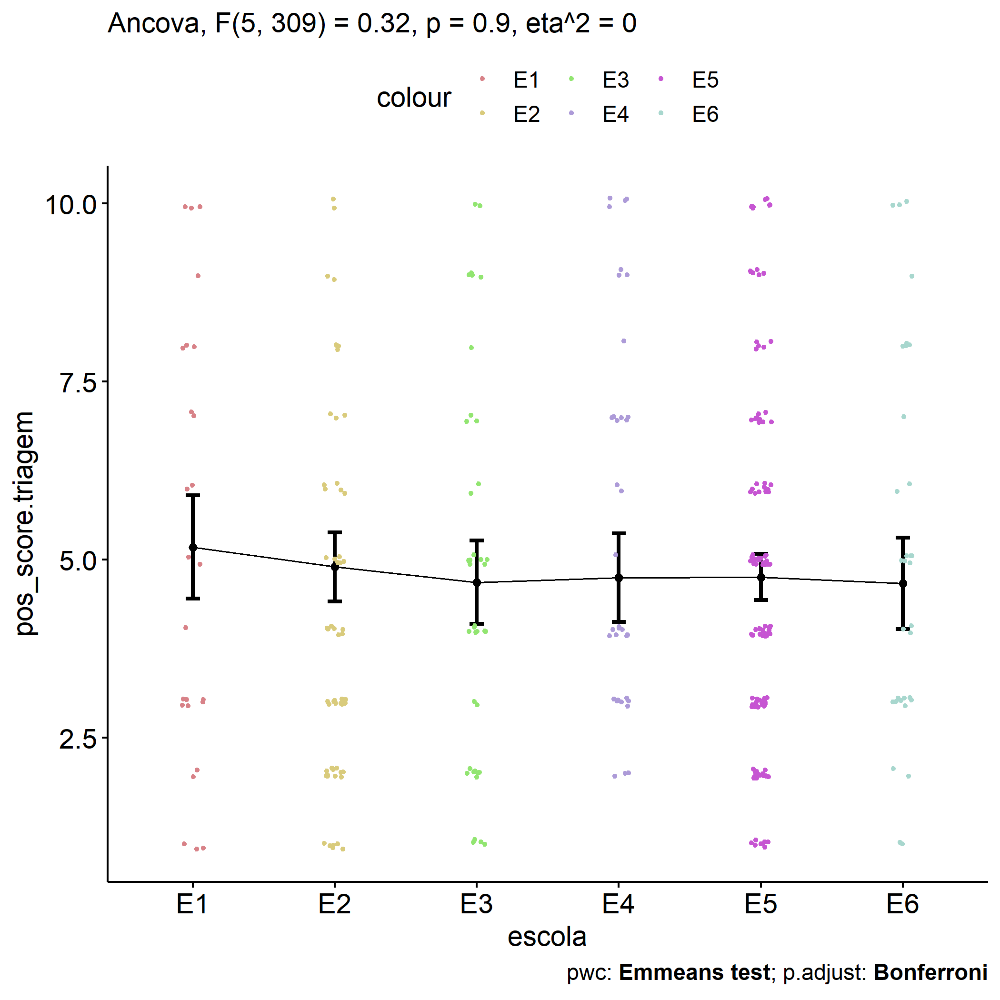<!-- -->

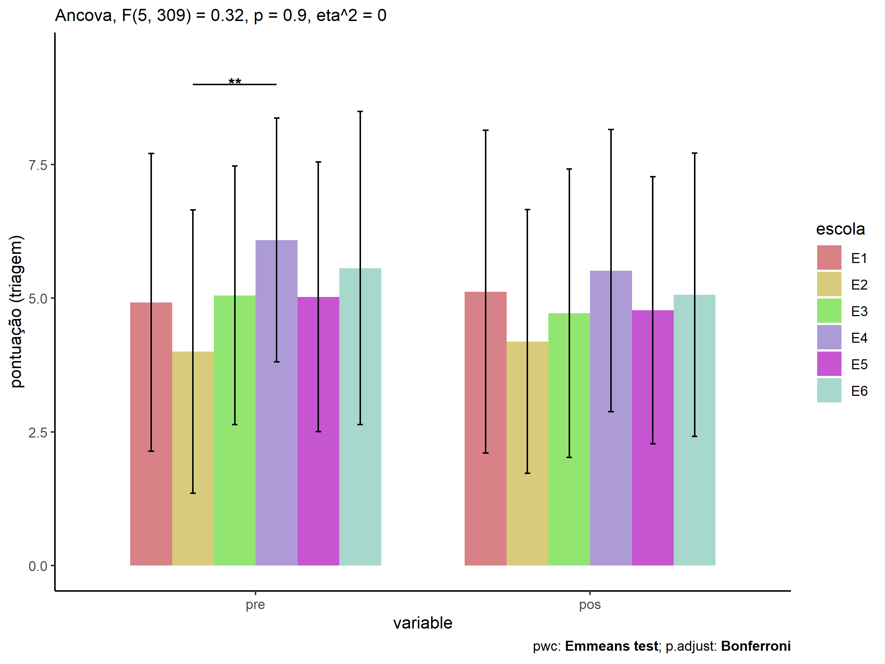<!-- -->

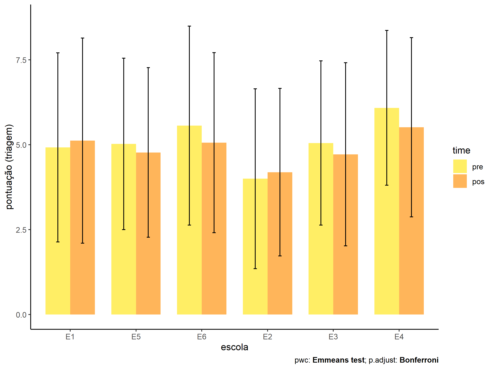<!-- -->

#### Baseado nas estimativas da aprendizagem (theta - traço latente) mediante TRI aplicado as respostas da prova

| var                   | escola |   n | M (pre) | SE (pre) | M (unadj) | SE (unadj) | M (adj) | SE (adj) |
|:----------------------|:-------|----:|--------:|---------:|----------:|-----------:|--------:|---------:|
| pos_score_tri.triagem | E1     |  25 |   0.002 |    0.169 |     0.132 |      0.182 |   0.131 |    0.120 |
| pos_score_tri.triagem | E2     |  58 |  -0.283 |    0.108 |    -0.136 |      0.098 |   0.059 |    0.080 |
| pos_score_tri.triagem | E3     |  39 |   0.014 |    0.124 |     0.043 |      0.131 |   0.033 |    0.096 |
| pos_score_tri.triagem | E4     |  35 |   0.384 |    0.118 |     0.183 |      0.146 |  -0.081 |    0.103 |
| pos_score_tri.triagem | E5     | 127 |  -0.018 |    0.075 |    -0.018 |      0.073 |  -0.006 |    0.053 |
| pos_score_tri.triagem | E6     |  32 |   0.145 |    0.173 |    -0.046 |      0.160 |  -0.146 |    0.106 |

| .y.                   | group1 | group2 | estimate | conf.low | conf.high |    se | statistic | p       | p.adj | p.adj.signif |
|:----------------------|:-------|:-------|---------:|---------:|----------:|------:|----------:|:--------|------:|:-------------|
| pos_score_tri.triagem | E1     | E2     |    0.072 |   -0.211 |     0.355 | 0.144 |     0.501 | 0.617   | 1.000 | ns           |
| pos_score_tri.triagem | E1     | E3     |    0.097 |   -0.205 |     0.400 | 0.154 |     0.634 | 0.526   | 1.000 | ns           |
| pos_score_tri.triagem | E1     | E4     |    0.212 |   -0.098 |     0.523 | 0.158 |     1.345 | 0.18    | 1.000 | ns           |
| pos_score_tri.triagem | E1     | E5     |    0.137 |   -0.121 |     0.395 | 0.131 |     1.042 | 0.298   | 1.000 | ns           |
| pos_score_tri.triagem | E1     | E6     |    0.277 |   -0.039 |     0.592 | 0.160 |     1.727 | 0.085   | 1.000 | ns           |
| pos_score_tri.triagem | E2     | E3     |    0.025 |   -0.220 |     0.271 | 0.125 |     0.203 | 0.84    | 1.000 | ns           |
| pos_score_tri.triagem | E2     | E4     |    0.140 |   -0.118 |     0.398 | 0.131 |     1.068 | 0.286   | 1.000 | ns           |
| pos_score_tri.triagem | E2     | E5     |    0.065 |   -0.124 |     0.253 | 0.096 |     0.675 | 0.5     | 1.000 | ns           |
| pos_score_tri.triagem | E2     | E6     |    0.204 |   -0.058 |     0.467 | 0.133 |     1.535 | 0.126   | 1.000 | ns           |
| pos_score_tri.triagem | E3     | E4     |    0.115 |   -0.162 |     0.391 | 0.140 |     0.818 | 0.414   | 1.000 | ns           |
| pos_score_tri.triagem | E3     | E5     |    0.039 |   -0.177 |     0.255 | 0.110 |     0.358 | 0.721   | 1.000 | ns           |
| pos_score_tri.triagem | E3     | E6     |    0.179 |   -0.103 |     0.461 | 0.143 |     1.252 | 0.212   | 1.000 | ns           |
| pos_score_tri.triagem | E4     | E5     |   -0.076 |   -0.303 |     0.152 | 0.116 |    -0.653 | 0.514   | 1.000 | ns           |
| pos_score_tri.triagem | E4     | E6     |    0.064 |   -0.225 |     0.354 | 0.147 |     0.437 | 0.662   | 1.000 | ns           |
| pos_score_tri.triagem | E5     | E6     |    0.140 |   -0.094 |     0.374 | 0.119 |     1.177 | 0.24    | 1.000 | ns           |
| pre_score_tri.triagem | E1     | E2     |    0.285 |   -0.107 |     0.677 | 0.199 |     1.430 | 0.154   | 1.000 | ns           |
| pre_score_tri.triagem | E1     | E3     |   -0.012 |   -0.432 |     0.408 | 0.213 |    -0.057 | 0.955   | 1.000 | ns           |
| pre_score_tri.triagem | E1     | E4     |   -0.383 |   -0.812 |     0.046 | 0.218 |    -1.756 | 0.08    | 1.000 | ns           |
| pre_score_tri.triagem | E1     | E5     |    0.020 |   -0.338 |     0.378 | 0.182 |     0.111 | 0.912   | 1.000 | ns           |
| pre_score_tri.triagem | E1     | E6     |   -0.143 |   -0.580 |     0.294 | 0.222 |    -0.645 | 0.52    | 1.000 | ns           |
| pre_score_tri.triagem | E2     | E3     |   -0.297 |   -0.636 |     0.042 | 0.172 |    -1.722 | 0.086   | 1.000 | ns           |
| pre_score_tri.triagem | E2     | E4     |   -0.667 |   -1.018 |    -0.317 | 0.178 |    -3.747 | \<0.001 | 0.003 | \*\*         |
| pre_score_tri.triagem | E2     | E5     |   -0.265 |   -0.524 |    -0.005 | 0.132 |    -2.006 | 0.046   | 0.687 | ns           |
| pre_score_tri.triagem | E2     | E6     |   -0.428 |   -0.789 |    -0.067 | 0.183 |    -2.335 | 0.02    | 0.303 | ns           |
| pre_score_tri.triagem | E3     | E4     |   -0.371 |   -0.752 |     0.011 | 0.194 |    -1.913 | 0.057   | 0.850 | ns           |
| pre_score_tri.triagem | E3     | E5     |    0.032 |   -0.268 |     0.332 | 0.152 |     0.211 | 0.833   | 1.000 | ns           |
| pre_score_tri.triagem | E3     | E6     |   -0.131 |   -0.522 |     0.259 | 0.199 |    -0.661 | 0.509   | 1.000 | ns           |
| pre_score_tri.triagem | E4     | E5     |    0.403 |    0.090 |     0.716 | 0.159 |     2.536 | 0.012   | 0.176 | ns           |
| pre_score_tri.triagem | E4     | E6     |    0.240 |   -0.161 |     0.640 | 0.204 |     1.177 | 0.24    | 1.000 | ns           |
| pre_score_tri.triagem | E5     | E6     |   -0.163 |   -0.487 |     0.161 | 0.165 |    -0.992 | 0.322   | 1.000 | ns           |

| escola | group1 | group2 | estimate | conf.low | conf.high |    se | statistic |     p | p.adj | p.adj.signif |
|:-------|:-------|:-------|---------:|---------:|----------:|------:|----------:|------:|------:|:-------------|
| E1     | pre    | pos    |   -0.131 |   -0.592 |     0.331 | 0.235 |    -0.556 | 0.579 | 0.579 | ns           |
| E2     | pre    | pos    |   -0.147 |   -0.450 |     0.156 | 0.154 |    -0.953 | 0.341 | 0.341 | ns           |
| E3     | pre    | pos    |   -0.029 |   -0.399 |     0.340 | 0.188 |    -0.156 | 0.876 | 0.876 | ns           |
| E4     | pre    | pos    |    0.201 |   -0.189 |     0.591 | 0.199 |     1.012 | 0.312 | 0.312 | ns           |
| E5     | pre    | pos    |    0.000 |   -0.205 |     0.205 | 0.104 |    -0.001 | 0.999 | 0.999 | ns           |
| E6     | pre    | pos    |    0.191 |   -0.217 |     0.598 | 0.208 |     0.918 | 0.359 | 0.359 | ns           |

    ## Scale for colour is already present.
    ## Adding another scale for colour, which will replace the existing scale.

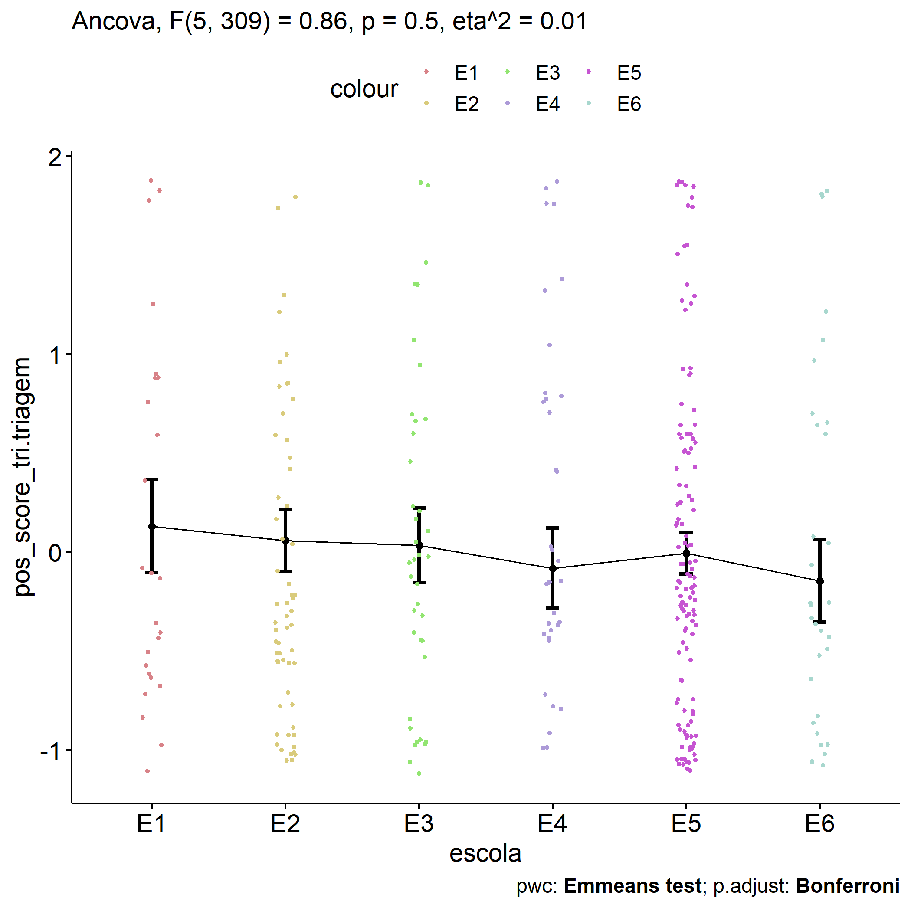<!-- -->

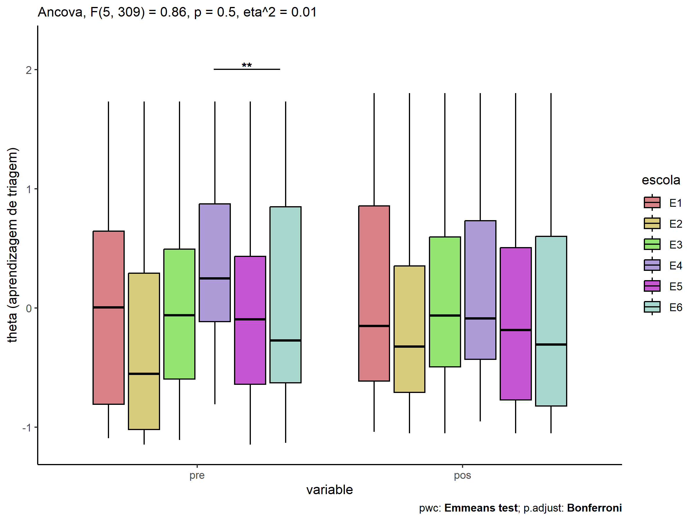<!-- -->

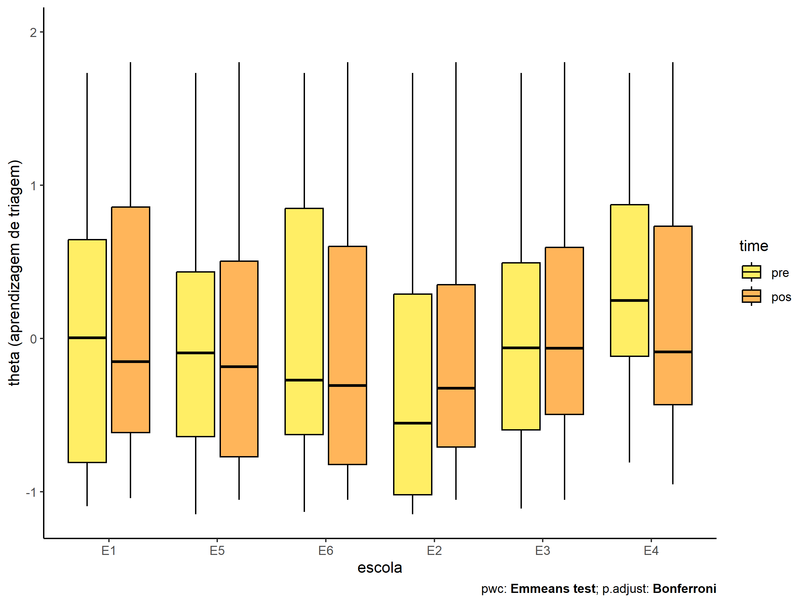<!-- -->

### factor: **monitor**

#### Baseado nos acertos (score) da prova

| var               | monitor |   n | M (pre) | SE (pre) | M (unadj) | SE (unadj) | M (adj) | SE (adj) |
|:------------------|:--------|----:|--------:|---------:|----------:|-----------:|--------:|---------:|
| pos_score.triagem | AC      |  12 |   4.500 |    0.875 |     3.667 |      0.512 |   4.008 |    0.510 |
| pos_score.triagem | CE      |  16 |   6.438 |    0.632 |     5.562 |      0.664 |   4.599 |    0.448 |
| pos_score.triagem | EA      |  14 |   5.714 |    0.722 |     5.643 |      0.708 |   5.166 |    0.473 |
| pos_score.triagem | GR      |  17 |   5.235 |    0.433 |     4.765 |      0.504 |   4.611 |    0.428 |
| pos_score.triagem | JC      |  12 |   4.667 |    0.956 |     6.250 |      0.740 |   6.479 |    0.510 |
| pos_score.triagem | MF      |  15 |   5.733 |    0.700 |     4.667 |      0.674 |   4.177 |    0.457 |
| pos_score.triagem | ML      |  20 |   5.100 |    0.598 |     4.750 |      0.619 |   4.687 |    0.395 |
| pos_score.triagem | MM      |  15 |   3.000 |    0.488 |     3.600 |      0.486 |   4.952 |    0.469 |
| pos_score.triagem | PR      |  12 |   4.333 |    0.916 |     4.583 |      0.981 |   5.037 |    0.511 |
| pos_score.triagem | VL      |  18 |   4.944 |    0.693 |     4.778 |      0.580 |   4.820 |    0.416 |

| .y.               | group1 | group2 | estimate | conf.low | conf.high |    se | statistic | p       | p.adj | p.adj.signif |
|:------------------|:-------|:-------|---------:|---------:|----------:|------:|----------:|:--------|------:|:-------------|
| pos_score.triagem | AC     | CE     |   -0.591 |   -1.940 |     0.758 | 0.682 |    -0.866 | 0.388   | 1.000 | ns           |
| pos_score.triagem | AC     | EA     |   -1.158 |   -2.537 |     0.220 | 0.697 |    -1.661 | 0.099   | 1.000 | ns           |
| pos_score.triagem | AC     | GR     |   -0.603 |   -1.920 |     0.715 | 0.666 |    -0.905 | 0.367   | 1.000 | ns           |
| pos_score.triagem | AC     | JC     |   -2.471 |   -3.895 |    -1.047 | 0.720 |    -3.431 | \<0.001 | 0.036 | \*           |
| pos_score.triagem | AC     | MF     |   -0.169 |   -1.527 |     1.188 | 0.687 |    -0.247 | 0.806   | 1.000 | ns           |
| pos_score.triagem | AC     | ML     |   -0.679 |   -1.954 |     0.596 | 0.645 |    -1.053 | 0.294   | 1.000 | ns           |
| pos_score.triagem | AC     | MM     |   -0.944 |   -2.304 |     0.417 | 0.688 |    -1.371 | 0.173   | 1.000 | ns           |
| pos_score.triagem | AC     | PR     |   -1.029 |   -2.453 |     0.395 | 0.720 |    -1.429 | 0.155   | 1.000 | ns           |
| pos_score.triagem | AC     | VL     |   -0.812 |   -2.112 |     0.489 | 0.658 |    -1.234 | 0.219   | 1.000 | ns           |
| pos_score.triagem | CE     | EA     |   -0.567 |   -1.846 |     0.711 | 0.647 |    -0.877 | 0.382   | 1.000 | ns           |
| pos_score.triagem | CE     | GR     |   -0.012 |   -1.234 |     1.210 | 0.618 |    -0.019 | 0.985   | 1.000 | ns           |
| pos_score.triagem | CE     | JC     |   -1.880 |   -3.226 |    -0.534 | 0.681 |    -2.762 | 0.007   | 0.293 | ns           |
| pos_score.triagem | CE     | MF     |    0.422 |   -0.834 |     1.677 | 0.635 |     0.664 | 0.508   | 1.000 | ns           |
| pos_score.triagem | CE     | ML     |   -0.088 |   -1.267 |     1.091 | 0.596 |    -0.148 | 0.882   | 1.000 | ns           |
| pos_score.triagem | CE     | MM     |   -0.353 |   -1.662 |     0.956 | 0.662 |    -0.533 | 0.595   | 1.000 | ns           |
| pos_score.triagem | CE     | PR     |   -0.438 |   -1.790 |     0.914 | 0.684 |    -0.641 | 0.523   | 1.000 | ns           |
| pos_score.triagem | CE     | VL     |   -0.221 |   -1.430 |     0.989 | 0.612 |    -0.361 | 0.719   | 1.000 | ns           |
| pos_score.triagem | EA     | GR     |    0.556 |   -0.704 |     1.815 | 0.637 |     0.872 | 0.385   | 1.000 | ns           |
| pos_score.triagem | EA     | JC     |   -1.313 |   -2.690 |     0.064 | 0.696 |    -1.885 | 0.062   | 1.000 | ns           |
| pos_score.triagem | EA     | MF     |    0.989 |   -0.307 |     2.285 | 0.656 |     1.509 | 0.134   | 1.000 | ns           |
| pos_score.triagem | EA     | ML     |    0.479 |   -0.738 |     1.696 | 0.616 |     0.778 | 0.438   | 1.000 | ns           |
| pos_score.triagem | EA     | MM     |    0.215 |   -1.115 |     1.545 | 0.673 |     0.319 | 0.75    | 1.000 | ns           |
| pos_score.triagem | EA     | PR     |    0.129 |   -1.251 |     1.510 | 0.698 |     0.185 | 0.853   | 1.000 | ns           |
| pos_score.triagem | EA     | VL     |    0.347 |   -0.899 |     1.592 | 0.630 |     0.550 | 0.583   | 1.000 | ns           |
| pos_score.triagem | GR     | JC     |   -1.868 |   -3.185 |    -0.552 | 0.666 |    -2.806 | 0.006   | 0.258 | ns           |
| pos_score.triagem | GR     | MF     |    0.433 |   -0.803 |     1.670 | 0.626 |     0.693 | 0.489   | 1.000 | ns           |
| pos_score.triagem | GR     | ML     |   -0.076 |   -1.227 |     1.074 | 0.582 |    -0.131 | 0.896   | 1.000 | ns           |
| pos_score.triagem | GR     | MM     |   -0.341 |   -1.601 |     0.919 | 0.637 |    -0.535 | 0.594   | 1.000 | ns           |
| pos_score.triagem | GR     | PR     |   -0.426 |   -1.745 |     0.893 | 0.667 |    -0.639 | 0.524   | 1.000 | ns           |
| pos_score.triagem | GR     | VL     |   -0.209 |   -1.389 |     0.971 | 0.597 |    -0.350 | 0.727   | 1.000 | ns           |
| pos_score.triagem | JC     | MF     |    2.302 |    0.946 |     3.658 | 0.686 |     3.356 | 0.001   | 0.046 | \*           |
| pos_score.triagem | JC     | ML     |    1.792 |    0.517 |     3.066 | 0.645 |     2.780 | 0.006   | 0.278 | ns           |
| pos_score.triagem | JC     | MM     |    1.527 |    0.164 |     2.891 | 0.689 |     2.215 | 0.028   | 1.000 | ns           |
| pos_score.triagem | JC     | PR     |    1.442 |    0.018 |     2.867 | 0.720 |     2.002 | 0.047   | 1.000 | ns           |
| pos_score.triagem | JC     | VL     |    1.659 |    0.359 |     2.959 | 0.658 |     2.523 | 0.013   | 0.574 | ns           |
| pos_score.triagem | MF     | ML     |   -0.510 |   -1.703 |     0.683 | 0.604 |    -0.845 | 0.4     | 1.000 | ns           |
| pos_score.triagem | MF     | MM     |   -0.774 |   -2.083 |     0.534 | 0.662 |    -1.170 | 0.244   | 1.000 | ns           |
| pos_score.triagem | MF     | PR     |   -0.860 |   -2.219 |     0.500 | 0.688 |    -1.250 | 0.213   | 1.000 | ns           |
| pos_score.triagem | MF     | VL     |   -0.642 |   -1.865 |     0.580 | 0.618 |    -1.039 | 0.301   | 1.000 | ns           |
| pos_score.triagem | ML     | MM     |   -0.264 |   -1.478 |     0.949 | 0.614 |    -0.431 | 0.667   | 1.000 | ns           |
| pos_score.triagem | ML     | PR     |   -0.350 |   -1.626 |     0.927 | 0.646 |    -0.542 | 0.589   | 1.000 | ns           |
| pos_score.triagem | ML     | VL     |   -0.133 |   -1.266 |     1.001 | 0.573 |    -0.231 | 0.817   | 1.000 | ns           |
| pos_score.triagem | MM     | PR     |   -0.085 |   -1.444 |     1.273 | 0.687 |    -0.124 | 0.901   | 1.000 | ns           |
| pos_score.triagem | MM     | VL     |    0.132 |   -1.106 |     1.370 | 0.626 |     0.211 | 0.833   | 1.000 | ns           |
| pos_score.triagem | PR     | VL     |    0.217 |   -1.084 |     1.519 | 0.658 |     0.330 | 0.742   | 1.000 | ns           |
| pre_score.triagem | AC     | CE     |   -1.937 |   -3.958 |     0.083 | 1.022 |    -1.896 | 0.06    | 1.000 | ns           |
| pre_score.triagem | AC     | EA     |   -1.214 |   -3.296 |     0.867 | 1.053 |    -1.153 | 0.251   | 1.000 | ns           |
| pre_score.triagem | AC     | GR     |   -0.735 |   -2.730 |     1.259 | 1.009 |    -0.729 | 0.467   | 1.000 | ns           |
| pre_score.triagem | AC     | JC     |   -0.167 |   -2.327 |     1.993 | 1.093 |    -0.153 | 0.879   | 1.000 | ns           |
| pre_score.triagem | AC     | MF     |   -1.233 |   -3.282 |     0.816 | 1.036 |    -1.190 | 0.236   | 1.000 | ns           |
| pre_score.triagem | AC     | ML     |   -0.600 |   -2.532 |     1.332 | 0.977 |    -0.614 | 0.54    | 1.000 | ns           |
| pre_score.triagem | AC     | MM     |    1.500 |   -0.549 |     3.549 | 1.036 |     1.447 | 0.15    | 1.000 | ns           |
| pre_score.triagem | AC     | PR     |    0.167 |   -1.993 |     2.327 | 1.093 |     0.153 | 0.879   | 1.000 | ns           |
| pre_score.triagem | AC     | VL     |   -0.444 |   -2.416 |     1.527 | 0.997 |    -0.446 | 0.657   | 1.000 | ns           |
| pre_score.triagem | CE     | EA     |    0.723 |   -1.213 |     2.659 | 0.979 |     0.738 | 0.461   | 1.000 | ns           |
| pre_score.triagem | CE     | GR     |    1.202 |   -0.641 |     3.045 | 0.932 |     1.290 | 0.199   | 1.000 | ns           |
| pre_score.triagem | CE     | JC     |    1.771 |   -0.250 |     3.791 | 1.022 |     1.733 | 0.085   | 1.000 | ns           |
| pre_score.triagem | CE     | MF     |    0.704 |   -1.197 |     2.606 | 0.962 |     0.732 | 0.465   | 1.000 | ns           |
| pre_score.triagem | CE     | ML     |    1.338 |   -0.437 |     3.112 | 0.898 |     1.490 | 0.138   | 1.000 | ns           |
| pre_score.triagem | CE     | MM     |    3.438 |    1.536 |     5.339 | 0.962 |     3.574 | \<0.001 | 0.022 | \*           |
| pre_score.triagem | CE     | PR     |    2.104 |    0.084 |     4.125 | 1.022 |     2.059 | 0.041   | 1.000 | ns           |
| pre_score.triagem | CE     | VL     |    1.493 |   -0.325 |     3.311 | 0.920 |     1.624 | 0.107   | 1.000 | ns           |
| pre_score.triagem | EA     | GR     |    0.479 |   -1.430 |     2.388 | 0.966 |     0.496 | 0.621   | 1.000 | ns           |
| pre_score.triagem | EA     | JC     |    1.048 |   -1.034 |     3.129 | 1.053 |     0.995 | 0.321   | 1.000 | ns           |
| pre_score.triagem | EA     | MF     |   -0.019 |   -1.985 |     1.947 | 0.995 |    -0.019 | 0.985   | 1.000 | ns           |
| pre_score.triagem | EA     | ML     |    0.614 |   -1.229 |     2.458 | 0.933 |     0.659 | 0.511   | 1.000 | ns           |
| pre_score.triagem | EA     | MM     |    2.714 |    0.748 |     4.680 | 0.995 |     2.729 | 0.007   | 0.322 | ns           |
| pre_score.triagem | EA     | PR     |    1.381 |   -0.700 |     3.462 | 1.053 |     1.312 | 0.192   | 1.000 | ns           |
| pre_score.triagem | EA     | VL     |    0.770 |   -1.115 |     2.655 | 0.954 |     0.807 | 0.421   | 1.000 | ns           |
| pre_score.triagem | GR     | JC     |    0.569 |   -1.426 |     2.563 | 1.009 |     0.564 | 0.574   | 1.000 | ns           |
| pre_score.triagem | GR     | MF     |   -0.498 |   -2.372 |     1.376 | 0.948 |    -0.525 | 0.6     | 1.000 | ns           |
| pre_score.triagem | GR     | ML     |    0.135 |   -1.610 |     1.881 | 0.883 |     0.153 | 0.878   | 1.000 | ns           |
| pre_score.triagem | GR     | MM     |    2.235 |    0.361 |     4.110 | 0.948 |     2.358 | 0.02    | 0.889 | ns           |
| pre_score.triagem | GR     | PR     |    0.902 |   -1.093 |     2.897 | 1.009 |     0.894 | 0.373   | 1.000 | ns           |
| pre_score.triagem | GR     | VL     |    0.291 |   -1.498 |     2.080 | 0.905 |     0.321 | 0.748   | 1.000 | ns           |
| pre_score.triagem | JC     | MF     |   -1.067 |   -3.116 |     0.982 | 1.036 |    -1.029 | 0.305   | 1.000 | ns           |
| pre_score.triagem | JC     | ML     |   -0.433 |   -2.365 |     1.499 | 0.977 |    -0.443 | 0.658   | 1.000 | ns           |
| pre_score.triagem | JC     | MM     |    1.667 |   -0.382 |     3.716 | 1.036 |     1.608 | 0.11    | 1.000 | ns           |
| pre_score.triagem | JC     | PR     |    0.333 |   -1.827 |     2.493 | 1.093 |     0.305 | 0.761   | 1.000 | ns           |
| pre_score.triagem | JC     | VL     |   -0.278 |   -2.250 |     1.694 | 0.997 |    -0.279 | 0.781   | 1.000 | ns           |
| pre_score.triagem | MF     | ML     |    0.633 |   -1.174 |     2.440 | 0.914 |     0.693 | 0.49    | 1.000 | ns           |
| pre_score.triagem | MF     | MM     |    2.733 |    0.801 |     4.665 | 0.977 |     2.797 | 0.006   | 0.265 | ns           |
| pre_score.triagem | MF     | PR     |    1.400 |   -0.649 |     3.449 | 1.036 |     1.351 | 0.179   | 1.000 | ns           |
| pre_score.triagem | MF     | VL     |    0.789 |   -1.061 |     2.639 | 0.936 |     0.843 | 0.401   | 1.000 | ns           |
| pre_score.triagem | ML     | MM     |    2.100 |    0.293 |     3.907 | 0.914 |     2.297 | 0.023   | 1.000 | ns           |
| pre_score.triagem | ML     | PR     |    0.767 |   -1.165 |     2.699 | 0.977 |     0.785 | 0.434   | 1.000 | ns           |
| pre_score.triagem | ML     | VL     |    0.156 |   -1.563 |     1.874 | 0.869 |     0.179 | 0.858   | 1.000 | ns           |
| pre_score.triagem | MM     | PR     |   -1.333 |   -3.382 |     0.716 | 1.036 |    -1.286 | 0.2     | 1.000 | ns           |
| pre_score.triagem | MM     | VL     |   -1.944 |   -3.794 |    -0.095 | 0.936 |    -2.078 | 0.039   | 1.000 | ns           |
| pre_score.triagem | PR     | VL     |   -0.611 |   -2.583 |     1.361 | 0.997 |    -0.613 | 0.541   | 1.000 | ns           |

| monitor | group1 | group2 | estimate | conf.low | conf.high |    se | statistic |     p | p.adj | p.adj.signif |
|:--------|:-------|:-------|---------:|---------:|----------:|------:|----------:|------:|------:|:-------------|
| AC      | pre    | pos    |    0.833 |   -1.255 |     2.921 | 1.061 |     0.786 | 0.433 | 0.433 | ns           |
| CE      | pre    | pos    |    0.875 |   -0.933 |     2.683 | 0.919 |     0.953 | 0.342 | 0.342 | ns           |
| EA      | pre    | pos    |    0.071 |   -1.862 |     2.004 | 0.982 |     0.073 | 0.942 | 0.942 | ns           |
| GR      | pre    | pos    |    0.471 |   -1.284 |     2.225 | 0.891 |     0.528 | 0.598 | 0.598 | ns           |
| JC      | pre    | pos    |   -1.583 |   -3.671 |     0.505 | 1.061 |    -1.493 | 0.137 | 0.137 | ns           |
| MF      | pre    | pos    |    1.067 |   -0.801 |     2.934 | 0.949 |     1.124 | 0.262 | 0.262 | ns           |
| ML      | pre    | pos    |    0.350 |   -1.267 |     1.967 | 0.822 |     0.426 | 0.670 | 0.670 | ns           |
| MM      | pre    | pos    |   -0.600 |   -2.467 |     1.267 | 0.949 |    -0.632 | 0.528 | 0.528 | ns           |
| PR      | pre    | pos    |   -0.250 |   -2.338 |     1.838 | 1.061 |    -0.236 | 0.814 | 0.814 | ns           |
| VL      | pre    | pos    |    0.167 |   -1.538 |     1.871 | 0.866 |     0.192 | 0.848 | 0.848 | ns           |

    ## Scale for colour is already present.
    ## Adding another scale for colour, which will replace the existing scale.

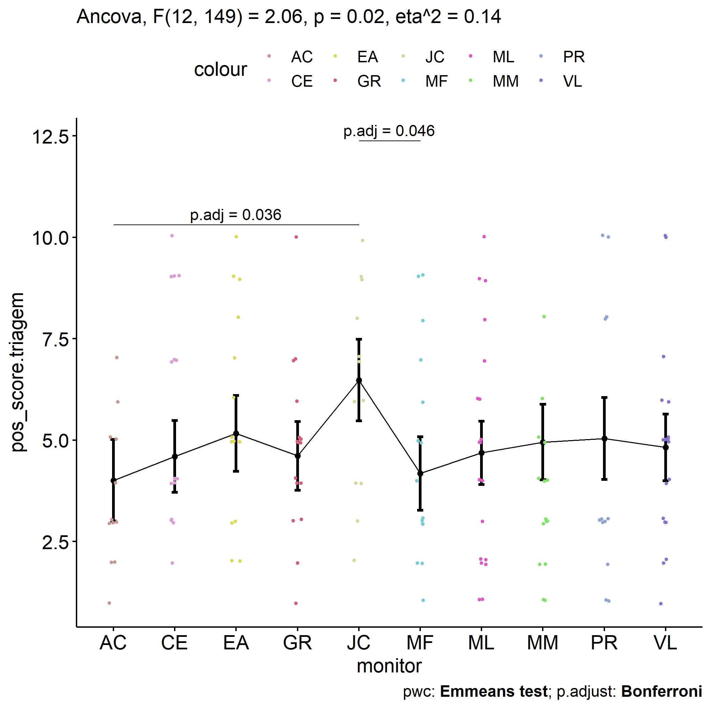<!-- -->

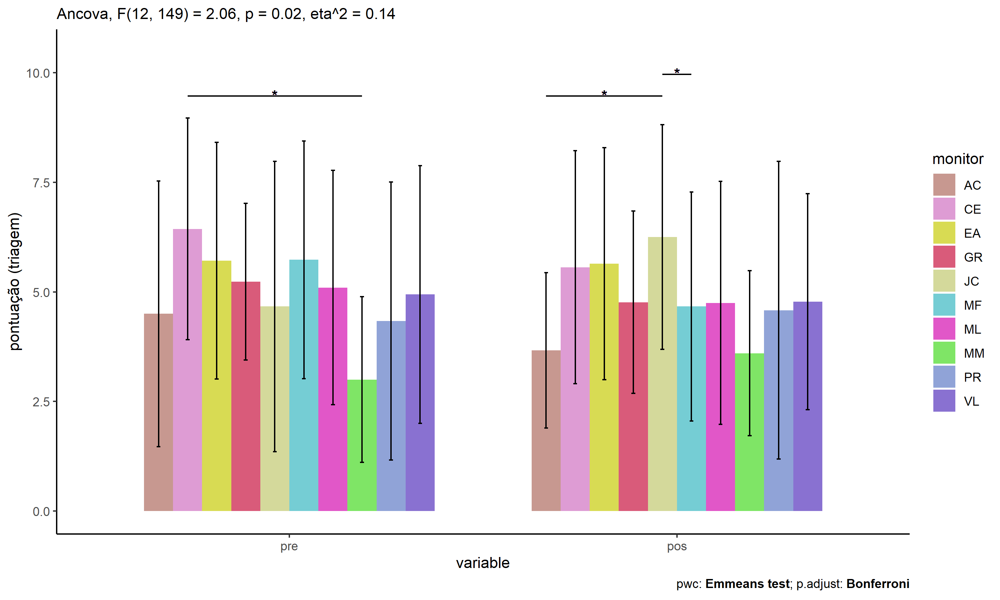<!-- -->

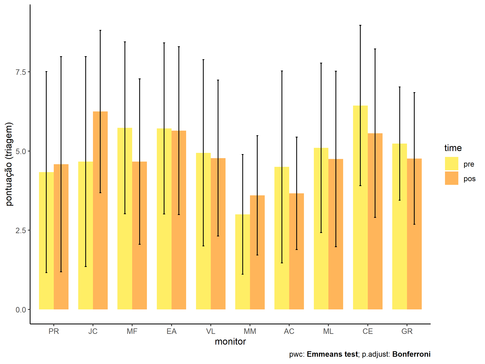<!-- -->

#### Baseado nas estimativas da aprendizagem (theta - traço latente) mediante TRI aplicado as respostas da prova

| var                   | monitor |   n | M (pre) | SE (pre) | M (unadj) | SE (unadj) | M (adj) | SE (adj) |
|:----------------------|:--------|----:|--------:|---------:|----------:|-----------:|--------:|---------:|
| pos_score_tri.triagem | AC      |  12 |  -0.140 |    0.264 |    -0.295 |      0.165 |  -0.189 |    0.167 |
| pos_score_tri.triagem | CE      |  16 |   0.502 |    0.186 |     0.209 |      0.220 |  -0.086 |    0.147 |
| pos_score_tri.triagem | EA      |  14 |   0.246 |    0.228 |     0.330 |      0.222 |   0.194 |    0.155 |
| pos_score_tri.triagem | GR      |  17 |   0.034 |    0.153 |    -0.080 |      0.162 |  -0.082 |    0.140 |
| pos_score_tri.triagem | JC      |  12 |  -0.107 |    0.302 |     0.580 |      0.218 |   0.665 |    0.167 |
| pos_score_tri.triagem | MF      |  15 |   0.284 |    0.246 |    -0.011 |      0.212 |  -0.169 |    0.150 |
| pos_score_tri.triagem | ML      |  20 |   0.073 |    0.176 |     0.048 |      0.174 |   0.021 |    0.129 |
| pos_score_tri.triagem | MM      |  15 |  -0.513 |    0.176 |    -0.438 |      0.142 |  -0.099 |    0.152 |
| pos_score_tri.triagem | PR      |  12 |  -0.133 |    0.280 |     0.046 |      0.295 |   0.147 |    0.167 |
| pos_score_tri.triagem | VL      |  18 |  -0.057 |    0.233 |    -0.134 |      0.204 |  -0.080 |    0.136 |

| .y.                   | group1 | group2 | estimate | conf.low | conf.high |    se | statistic | p       | p.adj | p.adj.signif |
|:----------------------|:-------|:-------|---------:|---------:|----------:|------:|----------:|:--------|------:|:-------------|
| pos_score_tri.triagem | AC     | CE     |   -0.104 |   -0.546 |     0.339 | 0.224 |    -0.463 | 0.644   | 1.000 | ns           |
| pos_score_tri.triagem | AC     | EA     |   -0.384 |   -0.836 |     0.068 | 0.228 |    -1.680 | 0.095   | 1.000 | ns           |
| pos_score_tri.triagem | AC     | GR     |   -0.107 |   -0.539 |     0.324 | 0.218 |    -0.491 | 0.624   | 1.000 | ns           |
| pos_score_tri.triagem | AC     | JC     |   -0.855 |   -1.321 |    -0.388 | 0.236 |    -3.623 | \<0.001 | 0.018 | \*           |
| pos_score_tri.triagem | AC     | MF     |   -0.020 |   -0.465 |     0.425 | 0.225 |    -0.089 | 0.929   | 1.000 | ns           |
| pos_score_tri.triagem | AC     | ML     |   -0.210 |   -0.628 |     0.208 | 0.211 |    -0.994 | 0.322   | 1.000 | ns           |
| pos_score_tri.triagem | AC     | MM     |   -0.090 |   -0.535 |     0.355 | 0.225 |    -0.400 | 0.69    | 1.000 | ns           |
| pos_score_tri.triagem | AC     | PR     |   -0.336 |   -0.803 |     0.130 | 0.236 |    -1.426 | 0.156   | 1.000 | ns           |
| pos_score_tri.triagem | AC     | VL     |   -0.109 |   -0.535 |     0.317 | 0.215 |    -0.506 | 0.613   | 1.000 | ns           |
| pos_score_tri.triagem | CE     | EA     |   -0.280 |   -0.700 |     0.139 | 0.212 |    -1.322 | 0.188   | 1.000 | ns           |
| pos_score_tri.triagem | CE     | GR     |   -0.004 |   -0.405 |     0.398 | 0.203 |    -0.018 | 0.986   | 1.000 | ns           |
| pos_score_tri.triagem | CE     | JC     |   -0.751 |   -1.193 |    -0.310 | 0.223 |    -3.363 | \<0.001 | 0.045 | \*           |
| pos_score_tri.triagem | CE     | MF     |    0.083 |   -0.328 |     0.495 | 0.208 |     0.401 | 0.689   | 1.000 | ns           |
| pos_score_tri.triagem | CE     | ML     |   -0.107 |   -0.493 |     0.280 | 0.195 |    -0.546 | 0.586   | 1.000 | ns           |
| pos_score_tri.triagem | CE     | MM     |    0.014 |   -0.413 |     0.440 | 0.216 |     0.063 | 0.95    | 1.000 | ns           |
| pos_score_tri.triagem | CE     | PR     |   -0.233 |   -0.675 |     0.209 | 0.224 |    -1.041 | 0.299   | 1.000 | ns           |
| pos_score_tri.triagem | CE     | VL     |   -0.006 |   -0.403 |     0.392 | 0.201 |    -0.028 | 0.978   | 1.000 | ns           |
| pos_score_tri.triagem | EA     | GR     |    0.277 |   -0.136 |     0.690 | 0.209 |     1.324 | 0.188   | 1.000 | ns           |
| pos_score_tri.triagem | EA     | JC     |   -0.471 |   -0.922 |    -0.020 | 0.228 |    -2.063 | 0.041   | 1.000 | ns           |
| pos_score_tri.triagem | EA     | MF     |    0.364 |   -0.061 |     0.788 | 0.215 |     1.693 | 0.093   | 1.000 | ns           |
| pos_score_tri.triagem | EA     | ML     |    0.174 |   -0.225 |     0.572 | 0.202 |     0.861 | 0.391   | 1.000 | ns           |
| pos_score_tri.triagem | EA     | MM     |    0.294 |   -0.139 |     0.727 | 0.219 |     1.341 | 0.182   | 1.000 | ns           |
| pos_score_tri.triagem | EA     | PR     |    0.047 |   -0.404 |     0.499 | 0.228 |     0.207 | 0.836   | 1.000 | ns           |
| pos_score_tri.triagem | EA     | VL     |    0.275 |   -0.134 |     0.683 | 0.207 |     1.329 | 0.186   | 1.000 | ns           |
| pos_score_tri.triagem | GR     | JC     |   -0.748 |   -1.179 |    -0.317 | 0.218 |    -3.428 | \<0.001 | 0.036 | \*           |
| pos_score_tri.triagem | GR     | MF     |    0.087 |   -0.319 |     0.493 | 0.205 |     0.424 | 0.672   | 1.000 | ns           |
| pos_score_tri.triagem | GR     | ML     |   -0.103 |   -0.480 |     0.274 | 0.191 |    -0.540 | 0.59    | 1.000 | ns           |
| pos_score_tri.triagem | GR     | MM     |    0.017 |   -0.392 |     0.427 | 0.207 |     0.083 | 0.934   | 1.000 | ns           |
| pos_score_tri.triagem | GR     | PR     |   -0.229 |   -0.661 |     0.202 | 0.218 |    -1.051 | 0.295   | 1.000 | ns           |
| pos_score_tri.triagem | GR     | VL     |   -0.002 |   -0.389 |     0.385 | 0.196 |    -0.010 | 0.992   | 1.000 | ns           |
| pos_score_tri.triagem | JC     | MF     |    0.835 |    0.390 |     1.280 | 0.225 |     3.711 | \<0.001 | 0.013 | \*           |
| pos_score_tri.triagem | JC     | ML     |    0.645 |    0.227 |     1.062 | 0.211 |     3.051 | 0.003   | 0.123 | ns           |
| pos_score_tri.triagem | JC     | MM     |    0.765 |    0.320 |     1.210 | 0.225 |     3.399 | \<0.001 | 0.040 | \*           |
| pos_score_tri.triagem | JC     | PR     |    0.518 |    0.052 |     0.985 | 0.236 |     2.197 | 0.03    | 1.000 | ns           |
| pos_score_tri.triagem | JC     | VL     |    0.746 |    0.320 |     1.172 | 0.215 |     3.462 | \<0.001 | 0.032 | \*           |
| pos_score_tri.triagem | MF     | ML     |   -0.190 |   -0.581 |     0.201 | 0.198 |    -0.961 | 0.338   | 1.000 | ns           |
| pos_score_tri.triagem | MF     | MM     |   -0.070 |   -0.497 |     0.357 | 0.216 |    -0.324 | 0.747   | 1.000 | ns           |
| pos_score_tri.triagem | MF     | PR     |   -0.316 |   -0.761 |     0.129 | 0.225 |    -1.405 | 0.162   | 1.000 | ns           |
| pos_score_tri.triagem | MF     | VL     |   -0.089 |   -0.490 |     0.312 | 0.203 |    -0.438 | 0.662   | 1.000 | ns           |
| pos_score_tri.triagem | ML     | MM     |    0.120 |   -0.276 |     0.516 | 0.200 |     0.600 | 0.549   | 1.000 | ns           |
| pos_score_tri.triagem | ML     | PR     |   -0.126 |   -0.544 |     0.292 | 0.211 |    -0.598 | 0.551   | 1.000 | ns           |
| pos_score_tri.triagem | ML     | VL     |    0.101 |   -0.270 |     0.473 | 0.188 |     0.538 | 0.592   | 1.000 | ns           |
| pos_score_tri.triagem | MM     | PR     |   -0.247 |   -0.691 |     0.198 | 0.225 |    -1.096 | 0.275   | 1.000 | ns           |
| pos_score_tri.triagem | MM     | VL     |   -0.019 |   -0.422 |     0.384 | 0.204 |    -0.094 | 0.925   | 1.000 | ns           |
| pos_score_tri.triagem | PR     | VL     |    0.227 |   -0.199 |     0.653 | 0.215 |     1.055 | 0.293   | 1.000 | ns           |
| pre_score_tri.triagem | AC     | CE     |   -0.642 |   -1.288 |     0.005 | 0.327 |    -1.963 | 0.052   | 1.000 | ns           |
| pre_score_tri.triagem | AC     | EA     |   -0.386 |   -1.052 |     0.280 | 0.337 |    -1.146 | 0.254   | 1.000 | ns           |
| pre_score_tri.triagem | AC     | GR     |   -0.173 |   -0.811 |     0.465 | 0.323 |    -0.537 | 0.592   | 1.000 | ns           |
| pre_score_tri.triagem | AC     | JC     |   -0.033 |   -0.724 |     0.658 | 0.349 |    -0.094 | 0.926   | 1.000 | ns           |
| pre_score_tri.triagem | AC     | MF     |   -0.424 |   -1.079 |     0.232 | 0.332 |    -1.279 | 0.203   | 1.000 | ns           |
| pre_score_tri.triagem | AC     | ML     |   -0.213 |   -0.830 |     0.405 | 0.313 |    -0.680 | 0.498   | 1.000 | ns           |
| pre_score_tri.triagem | AC     | MM     |    0.373 |   -0.282 |     1.029 | 0.332 |     1.126 | 0.262   | 1.000 | ns           |
| pre_score_tri.triagem | AC     | PR     |   -0.007 |   -0.698 |     0.684 | 0.349 |    -0.020 | 0.984   | 1.000 | ns           |
| pre_score_tri.triagem | AC     | VL     |   -0.083 |   -0.714 |     0.548 | 0.319 |    -0.260 | 0.795   | 1.000 | ns           |
| pre_score_tri.triagem | CE     | EA     |    0.256 |   -0.364 |     0.875 | 0.313 |     0.816 | 0.416   | 1.000 | ns           |
| pre_score_tri.triagem | CE     | GR     |    0.468 |   -0.121 |     1.058 | 0.298 |     1.570 | 0.119   | 1.000 | ns           |
| pre_score_tri.triagem | CE     | JC     |    0.609 |   -0.037 |     1.255 | 0.327 |     1.863 | 0.065   | 1.000 | ns           |
| pre_score_tri.triagem | CE     | MF     |    0.218 |   -0.390 |     0.826 | 0.308 |     0.708 | 0.48    | 1.000 | ns           |
| pre_score_tri.triagem | CE     | ML     |    0.429 |   -0.139 |     0.997 | 0.287 |     1.495 | 0.137   | 1.000 | ns           |
| pre_score_tri.triagem | CE     | MM     |    1.015 |    0.407 |     1.623 | 0.308 |     3.299 | 0.001   | 0.055 | ns           |
| pre_score_tri.triagem | CE     | PR     |    0.635 |   -0.012 |     1.281 | 0.327 |     1.941 | 0.054   | 1.000 | ns           |
| pre_score_tri.triagem | CE     | VL     |    0.559 |   -0.023 |     1.140 | 0.294 |     1.900 | 0.06    | 1.000 | ns           |
| pre_score_tri.triagem | EA     | GR     |    0.213 |   -0.398 |     0.823 | 0.309 |     0.688 | 0.492   | 1.000 | ns           |
| pre_score_tri.triagem | EA     | JC     |    0.353 |   -0.312 |     1.019 | 0.337 |     1.049 | 0.296   | 1.000 | ns           |
| pre_score_tri.triagem | EA     | MF     |   -0.038 |   -0.667 |     0.591 | 0.318 |    -0.119 | 0.905   | 1.000 | ns           |
| pre_score_tri.triagem | EA     | ML     |    0.173 |   -0.416 |     0.763 | 0.298 |     0.582 | 0.562   | 1.000 | ns           |
| pre_score_tri.triagem | EA     | MM     |    0.759 |    0.130 |     1.388 | 0.318 |     2.387 | 0.018   | 0.824 | ns           |
| pre_score_tri.triagem | EA     | PR     |    0.379 |   -0.287 |     1.045 | 0.337 |     1.125 | 0.262   | 1.000 | ns           |
| pre_score_tri.triagem | EA     | VL     |    0.303 |   -0.300 |     0.906 | 0.305 |     0.994 | 0.322   | 1.000 | ns           |
| pre_score_tri.triagem | GR     | JC     |    0.141 |   -0.497 |     0.779 | 0.323 |     0.436 | 0.663   | 1.000 | ns           |
| pre_score_tri.triagem | GR     | MF     |   -0.250 |   -0.850 |     0.349 | 0.303 |    -0.826 | 0.41    | 1.000 | ns           |
| pre_score_tri.triagem | GR     | ML     |   -0.039 |   -0.597 |     0.519 | 0.282 |    -0.139 | 0.89    | 1.000 | ns           |
| pre_score_tri.triagem | GR     | MM     |    0.547 |   -0.053 |     1.146 | 0.303 |     1.803 | 0.074   | 1.000 | ns           |
| pre_score_tri.triagem | GR     | PR     |    0.166 |   -0.472 |     0.804 | 0.323 |     0.515 | 0.607   | 1.000 | ns           |
| pre_score_tri.triagem | GR     | VL     |    0.091 |   -0.482 |     0.663 | 0.290 |     0.313 | 0.755   | 1.000 | ns           |
| pre_score_tri.triagem | JC     | MF     |   -0.391 |   -1.047 |     0.264 | 0.332 |    -1.180 | 0.24    | 1.000 | ns           |
| pre_score_tri.triagem | JC     | ML     |   -0.180 |   -0.798 |     0.438 | 0.313 |    -0.575 | 0.566   | 1.000 | ns           |
| pre_score_tri.triagem | JC     | MM     |    0.406 |   -0.249 |     1.061 | 0.332 |     1.225 | 0.223   | 1.000 | ns           |
| pre_score_tri.triagem | JC     | PR     |    0.026 |   -0.665 |     0.716 | 0.349 |     0.073 | 0.942   | 1.000 | ns           |
| pre_score_tri.triagem | JC     | VL     |   -0.050 |   -0.681 |     0.580 | 0.319 |    -0.157 | 0.875   | 1.000 | ns           |
| pre_score_tri.triagem | MF     | ML     |    0.211 |   -0.367 |     0.789 | 0.292 |     0.723 | 0.471   | 1.000 | ns           |
| pre_score_tri.triagem | MF     | MM     |    0.797 |    0.179 |     1.415 | 0.313 |     2.550 | 0.012   | 0.532 | ns           |
| pre_score_tri.triagem | MF     | PR     |    0.417 |   -0.239 |     1.072 | 0.332 |     1.257 | 0.211   | 1.000 | ns           |
| pre_score_tri.triagem | MF     | VL     |    0.341 |   -0.251 |     0.933 | 0.299 |     1.139 | 0.256   | 1.000 | ns           |
| pre_score_tri.triagem | ML     | MM     |    0.586 |    0.008 |     1.164 | 0.292 |     2.004 | 0.047   | 1.000 | ns           |
| pre_score_tri.triagem | ML     | PR     |    0.205 |   -0.412 |     0.823 | 0.313 |     0.657 | 0.512   | 1.000 | ns           |
| pre_score_tri.triagem | ML     | VL     |    0.130 |   -0.420 |     0.679 | 0.278 |     0.466 | 0.642   | 1.000 | ns           |
| pre_score_tri.triagem | MM     | PR     |   -0.380 |   -1.036 |     0.275 | 0.332 |    -1.147 | 0.253   | 1.000 | ns           |
| pre_score_tri.triagem | MM     | VL     |   -0.456 |   -1.048 |     0.135 | 0.299 |    -1.524 | 0.13    | 1.000 | ns           |
| pre_score_tri.triagem | PR     | VL     |   -0.076 |   -0.706 |     0.555 | 0.319 |    -0.238 | 0.813   | 1.000 | ns           |

| monitor | group1 | group2 | estimate | conf.low | conf.high |    se | statistic |     p | p.adj | p.adj.signif |
|:--------|:-------|:-------|---------:|---------:|----------:|------:|----------:|------:|------:|:-------------|
| AC      | pre    | pos    |    0.155 |   -0.505 |     0.816 | 0.335 |     0.463 | 0.643 | 0.643 | ns           |
| CE      | pre    | pos    |    0.293 |   -0.279 |     0.865 | 0.290 |     1.008 | 0.314 | 0.314 | ns           |
| EA      | pre    | pos    |   -0.083 |   -0.695 |     0.528 | 0.311 |    -0.269 | 0.788 | 0.788 | ns           |
| GR      | pre    | pos    |    0.113 |   -0.441 |     0.668 | 0.282 |     0.402 | 0.688 | 0.688 | ns           |
| JC      | pre    | pos    |   -0.687 |   -1.347 |    -0.027 | 0.335 |    -2.049 | 0.041 | 0.041 | \*           |
| MF      | pre    | pos    |    0.295 |   -0.296 |     0.885 | 0.300 |     0.982 | 0.327 | 0.327 | ns           |
| ML      | pre    | pos    |    0.025 |   -0.486 |     0.537 | 0.260 |     0.097 | 0.923 | 0.923 | ns           |
| MM      | pre    | pos    |   -0.075 |   -0.665 |     0.516 | 0.300 |    -0.249 | 0.803 | 0.803 | ns           |
| PR      | pre    | pos    |   -0.178 |   -0.839 |     0.482 | 0.335 |    -0.532 | 0.595 | 0.595 | ns           |
| VL      | pre    | pos    |    0.077 |   -0.462 |     0.617 | 0.274 |     0.283 | 0.778 | 0.778 | ns           |

    ## Scale for colour is already present.
    ## Adding another scale for colour, which will replace the existing scale.

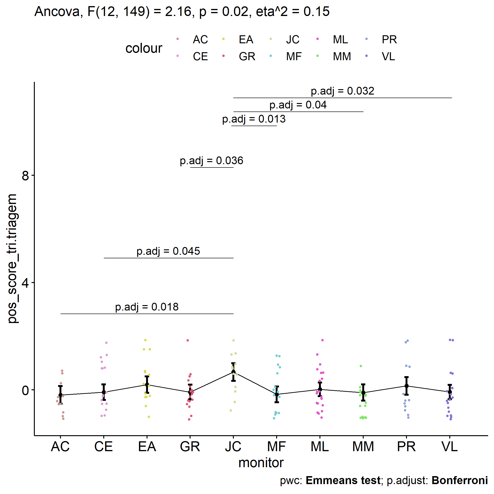<!-- -->

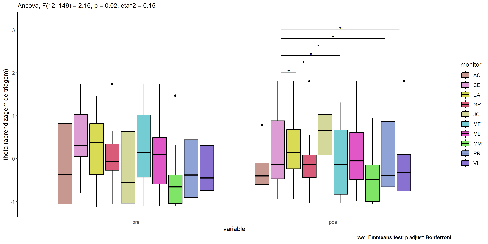<!-- -->

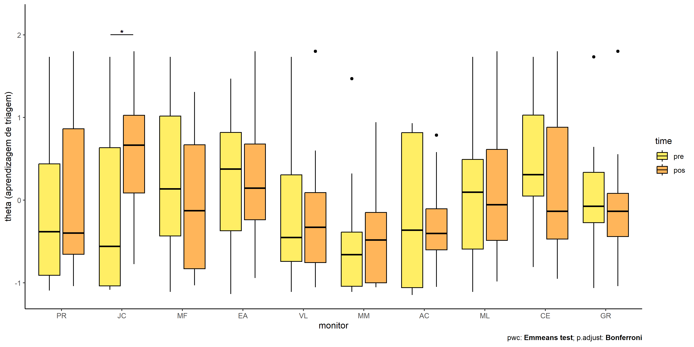<!-- -->

### factor: **monitor.genero**

#### Baseado nos acertos (score) da prova

| var               | monitor.genero |   n | M (pre) | SE (pre) | M (unadj) | SE (unadj) | M (adj) | SE (adj) |
|:------------------|:---------------|----:|--------:|---------:|----------:|-----------:|--------:|---------:|
| pos_score.triagem | F              |  97 |   4.794 |    0.265 |     4.433 |      0.237 |   4.570 |    0.181 |
| pos_score.triagem | M              |  54 |   5.389 |    0.401 |     5.519 |      0.380 |   5.272 |    0.243 |

| .y.               | group1 | group2 | estimate | conf.low | conf.high |    se | statistic |     p | p.adj | p.adj.signif |
|:------------------|:-------|:-------|---------:|---------:|----------:|------:|----------:|------:|------:|:-------------|
| pos_score.triagem | F      | M      |   -0.701 |   -1.303 |    -0.100 | 0.304 |    -2.305 | 0.023 | 0.023 | \*           |
| pre_score.triagem | F      | M      |   -0.595 |   -1.514 |     0.323 | 0.465 |    -1.280 | 0.202 | 0.202 | ns           |

| monitor.genero | group1 | group2 | estimate | conf.low | conf.high |    se | statistic |     p | p.adj | p.adj.signif |
|:---------------|:-------|:-------|---------:|---------:|----------:|------:|----------:|------:|------:|:-------------|
| F              | pre    | pos    |    0.361 |   -0.381 |     1.102 | 0.377 |     0.958 | 0.339 | 0.339 | ns           |
| M              | pre    | pos    |   -0.130 |   -1.123 |     0.864 | 0.505 |    -0.257 | 0.798 | 0.798 | ns           |

    ## Scale for colour is already present.
    ## Adding another scale for colour, which will replace the existing scale.

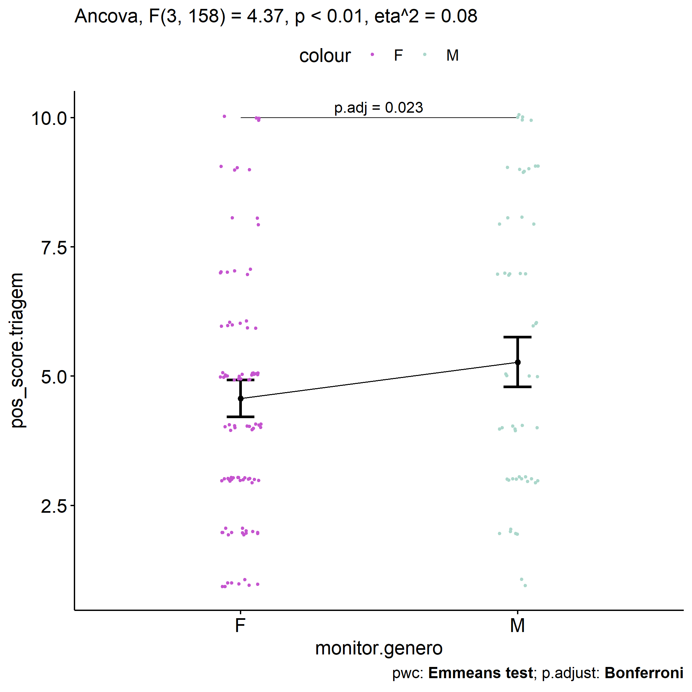<!-- -->

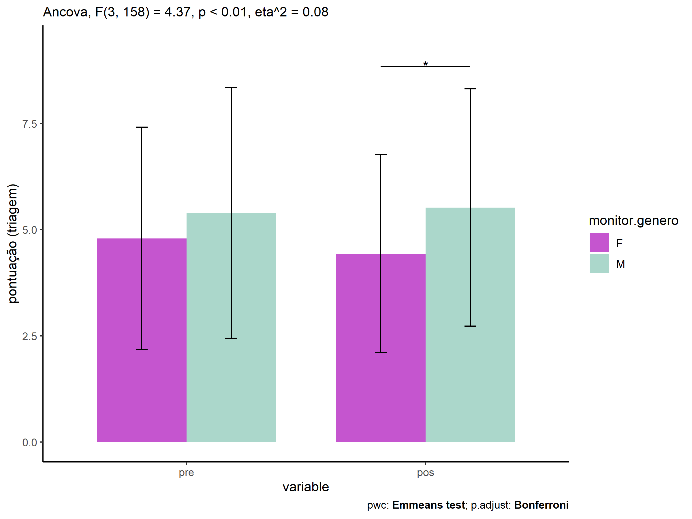<!-- -->

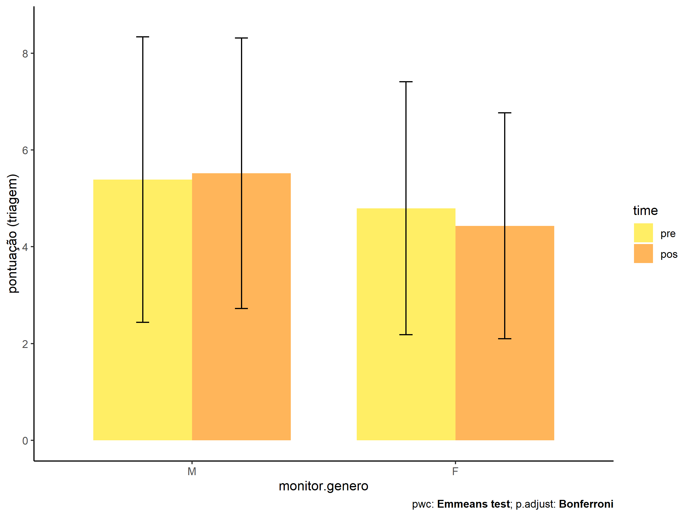<!-- -->

#### Baseado nas estimativas da aprendizagem (theta - traço latente) mediante TRI aplicado as respostas da prova

| var                   | monitor.genero |   n | M (pre) | SE (pre) | M (unadj) | SE (unadj) | M (adj) | SE (adj) |
|:----------------------|:---------------|----:|--------:|---------:|----------:|-----------:|--------:|---------:|
| pos_score_tri.triagem | F              |  97 |  -0.042 |    0.086 |    -0.135 |      0.074 |  -0.092 |     0.06 |
| pos_score_tri.triagem | M              |  54 |   0.159 |    0.124 |     0.286 |      0.118 |   0.209 |     0.08 |

| .y.                   | group1 | group2 | estimate | conf.low | conf.high |    se | statistic |     p | p.adj | p.adj.signif |
|:----------------------|:-------|:-------|---------:|---------:|----------:|------:|----------:|------:|------:|:-------------|
| pos_score_tri.triagem | F      | M      |   -0.301 |   -0.499 |    -0.102 | 0.100 |    -2.994 | 0.003 | 0.003 | \*\*         |
| pre_score_tri.triagem | F      | M      |   -0.202 |   -0.493 |     0.090 | 0.148 |    -1.366 | 0.174 | 0.174 | ns           |

| monitor.genero | group1 | group2 | estimate | conf.low | conf.high |    se | statistic |     p | p.adj | p.adj.signif |
|:---------------|:-------|:-------|---------:|---------:|----------:|------:|----------:|------:|------:|:-------------|
| F              | pre    | pos    |    0.093 |   -0.141 |     0.326 | 0.119 |     0.779 | 0.436 | 0.436 | ns           |
| M              | pre    | pos    |   -0.127 |   -0.441 |     0.186 | 0.159 |    -0.799 | 0.425 | 0.425 | ns           |

    ## Scale for colour is already present.
    ## Adding another scale for colour, which will replace the existing scale.

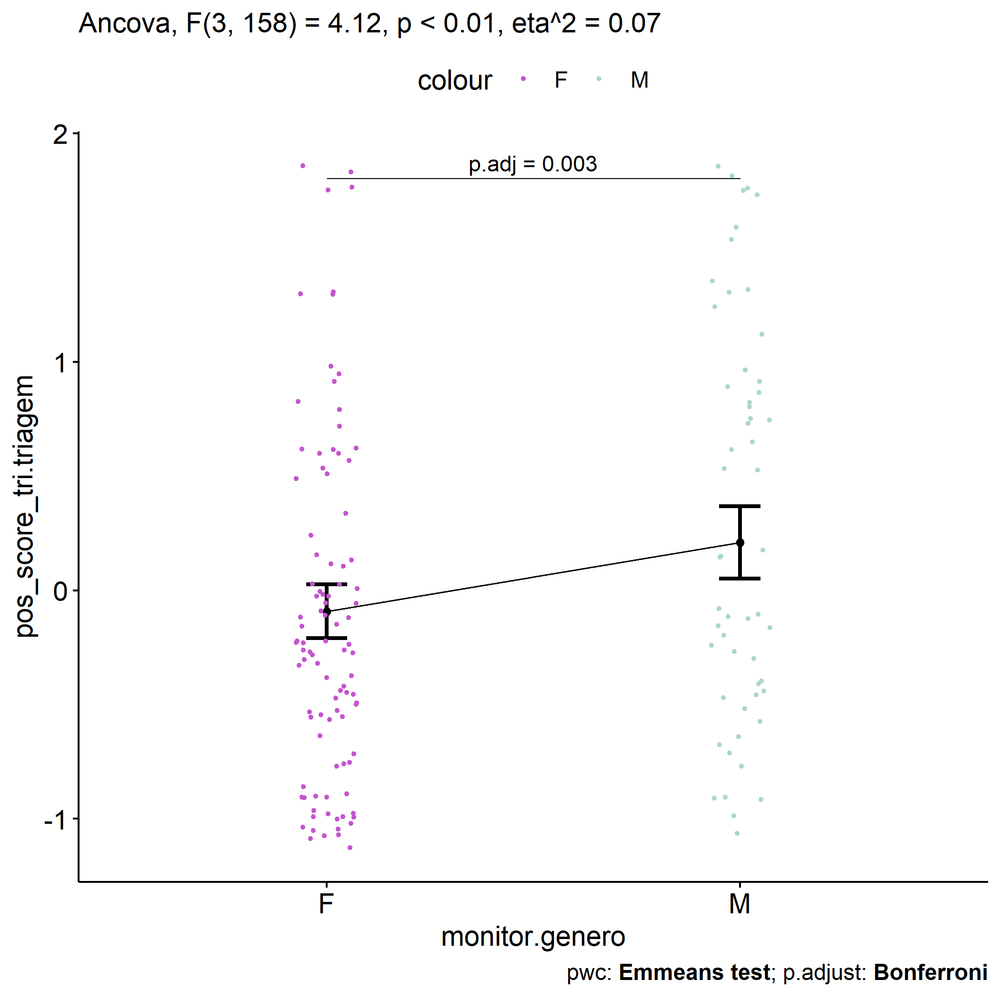<!-- -->

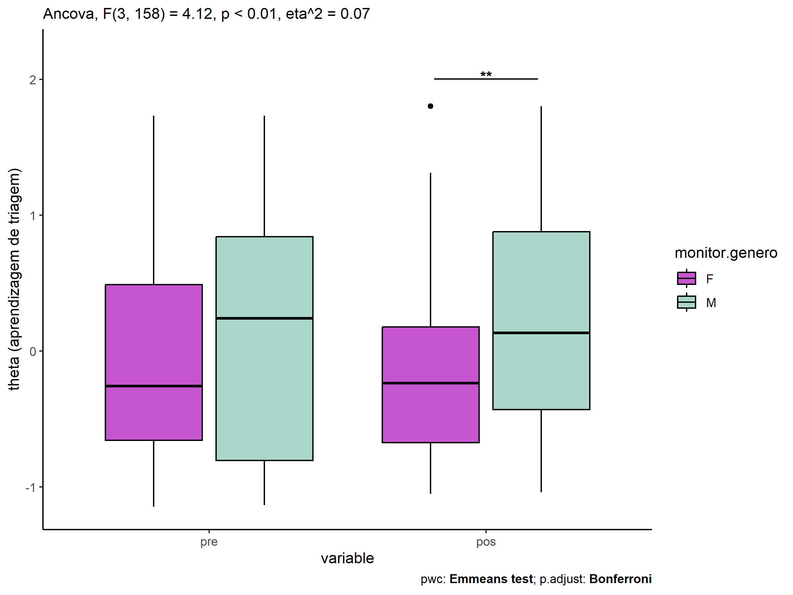<!-- -->

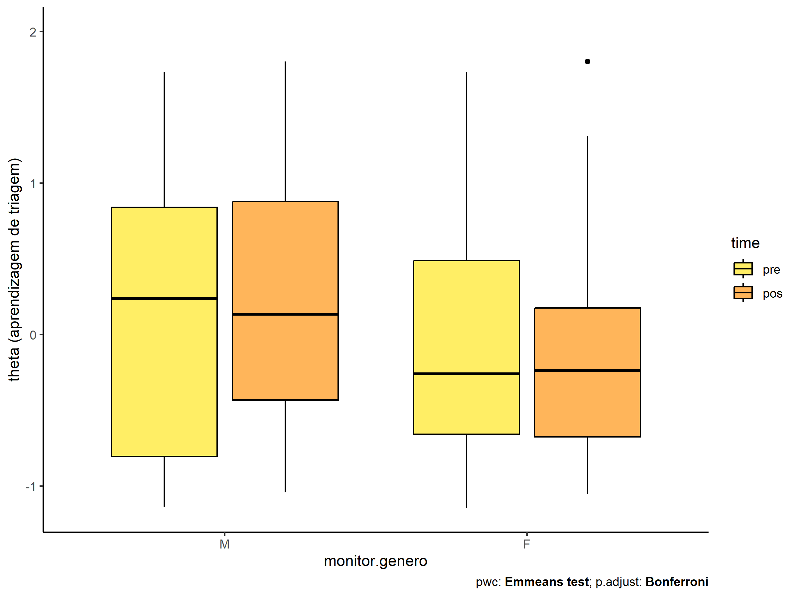<!-- -->

### factor: **monitor.formacao**

#### Baseado nos acertos (score) da prova

| var               | monitor.formacao           |   n | M (pre) | SE (pre) | M (unadj) | SE (unadj) | M (adj) | SE (adj) |
|:------------------|:---------------------------|----:|--------:|---------:|----------:|-----------:|--------:|---------:|
| pos_score.triagem | Arquitetura e Urbanismo    |  12 |   4.667 |    0.956 |     6.250 |      0.740 |   6.480 |    0.509 |
| pos_score.triagem | Ciencias Biologicas        |  20 |   5.100 |    0.598 |     4.750 |      0.619 |   4.687 |    0.394 |
| pos_score.triagem | Comunicacao Social         |  16 |   6.438 |    0.632 |     5.562 |      0.664 |   4.596 |    0.448 |
| pos_score.triagem | Historia                   |  12 |   4.333 |    0.916 |     4.583 |      0.981 |   5.038 |    0.510 |
| pos_score.triagem | Letras - Lingua Portuguesa |  15 |   5.733 |    0.700 |     4.667 |      0.674 |   4.176 |    0.457 |
| pos_score.triagem | Matematica                 |  31 |   5.452 |    0.398 |     5.161 |      0.423 |   4.861 |    0.318 |
| pos_score.triagem | Nutricao                   |  15 |   3.000 |    0.488 |     3.600 |      0.486 |   4.956 |    0.468 |
| pos_score.triagem | Pedagogia                  |  12 |   4.500 |    0.875 |     3.667 |      0.512 |   4.009 |    0.510 |
| pos_score.triagem | Servico Social             |  18 |   4.944 |    0.693 |     4.778 |      0.580 |   4.820 |    0.415 |

| .y.               | group1                  | group2              | estimate | conf.low | conf.high |    se | statistic | p       | p.adj | p.adj.signif |
|:------------------|:------------------------|:--------------------|---------:|---------:|----------:|------:|----------:|:--------|------:|:-------------|
| pos_score.triagem | Arquitetura e Urbanismo | Ciencias Biologicas |    1.793 |    0.519 |     3.066 | 0.644 |     2.783 | 0.006   | 0.220 | ns           |
| pos_score.triagem | Arquitetura e Urbanismo | Comunicacao Social  |    1.884 |    0.539 |     3.229 | 0.680 |     2.769 | 0.006   | 0.229 | ns           |
| pos_score.triagem | Arquitetura e Urbanismo | Historia            |    1.441 |    0.018 |     2.865 | 0.720 |     2.003 | 0.047   | 1.000 | ns           |
| pos_score.triagem | Arquitetura e Urbanismo | Letras              |    2.304 |    0.949 |     3.659 | 0.685 |     3.362 | \<0.001 | 0.036 | \*           |
| pos_score.triagem | Arquitetura e Urbanismo | Matematica          |    1.619 |    0.431 |     2.807 | 0.601 |     2.694 | 0.008   | 0.285 | ns           |
| pos_score.triagem | Arquitetura e Urbanismo | Nutricao            |    1.524 |    0.162 |     2.886 | 0.689 |     2.212 | 0.029   | 1.000 | ns           |
| pos_score.triagem | Arquitetura e Urbanismo | Pedagogia           |    2.471 |    1.048 |     3.893 | 0.720 |     3.433 | \<0.001 | 0.028 | \*           |
| pos_score.triagem | Arquitetura e Urbanismo | Servico Social      |    1.660 |    0.361 |     2.959 | 0.657 |     2.526 | 0.013   | 0.455 | ns           |
| pos_score.triagem | Ciencias Biologicas     | Comunicacao Social  |    0.091 |   -1.087 |     1.269 | 0.596 |     0.153 | 0.879   | 1.000 | ns           |
| pos_score.triagem | Ciencias Biologicas     | Historia            |   -0.351 |   -1.626 |     0.924 | 0.645 |    -0.545 | 0.587   | 1.000 | ns           |
| pos_score.triagem | Ciencias Biologicas     | Letras              |    0.511 |   -0.681 |     1.703 | 0.603 |     0.848 | 0.398   | 1.000 | ns           |
| pos_score.triagem | Ciencias Biologicas     | Matematica          |   -0.174 |   -1.174 |     0.826 | 0.506 |    -0.343 | 0.732   | 1.000 | ns           |
| pos_score.triagem | Ciencias Biologicas     | Nutricao            |   -0.269 |   -1.481 |     0.944 | 0.613 |    -0.438 | 0.662   | 1.000 | ns           |
| pos_score.triagem | Ciencias Biologicas     | Pedagogia           |    0.678 |   -0.596 |     1.952 | 0.644 |     1.052 | 0.295   | 1.000 | ns           |
| pos_score.triagem | Ciencias Biologicas     | Servico Social      |   -0.133 |   -1.265 |     0.999 | 0.573 |    -0.232 | 0.817   | 1.000 | ns           |
| pos_score.triagem | Comunicacao Social      | Historia            |   -0.442 |   -1.793 |     0.908 | 0.683 |    -0.647 | 0.518   | 1.000 | ns           |
| pos_score.triagem | Comunicacao Social      | Letras              |    0.420 |   -0.835 |     1.675 | 0.635 |     0.662 | 0.509   | 1.000 | ns           |
| pos_score.triagem | Comunicacao Social      | Matematica          |   -0.265 |   -1.343 |     0.813 | 0.545 |    -0.486 | 0.628   | 1.000 | ns           |
| pos_score.triagem | Comunicacao Social      | Nutricao            |   -0.360 |   -1.668 |     0.948 | 0.662 |    -0.544 | 0.587   | 1.000 | ns           |
| pos_score.triagem | Comunicacao Social      | Pedagogia           |    0.587 |   -0.761 |     1.934 | 0.682 |     0.861 | 0.391   | 1.000 | ns           |
| pos_score.triagem | Comunicacao Social      | Servico Social      |   -0.224 |   -1.432 |     0.984 | 0.611 |    -0.366 | 0.715   | 1.000 | ns           |
| pos_score.triagem | Historia                | Letras              |    0.862 |   -0.496 |     2.221 | 0.687 |     1.255 | 0.211   | 1.000 | ns           |
| pos_score.triagem | Historia                | Matematica          |    0.178 |   -1.014 |     1.369 | 0.602 |     0.295 | 0.769   | 1.000 | ns           |
| pos_score.triagem | Historia                | Nutricao            |    0.083 |   -1.275 |     1.440 | 0.687 |     0.120 | 0.904   | 1.000 | ns           |
| pos_score.triagem | Historia                | Pedagogia           |    1.029 |   -0.393 |     2.452 | 0.720 |     1.430 | 0.155   | 1.000 | ns           |
| pos_score.triagem | Historia                | Servico Social      |    0.218 |   -1.082 |     1.519 | 0.658 |     0.332 | 0.74    | 1.000 | ns           |
| pos_score.triagem | Letras                  | Lingua Portuguesa   |   -0.685 |   -1.781 |     0.411 | 0.555 |    -1.235 | 0.219   | 1.000 | ns           |
| pos_score.triagem | Letras                  | Lingua Portuguesa   |   -0.780 |   -2.087 |     0.527 | 0.661 |    -1.179 | 0.24    | 1.000 | ns           |
| pos_score.triagem | Letras                  | Lingua Portuguesa   |    0.167 |   -1.190 |     1.523 | 0.686 |     0.243 | 0.808   | 1.000 | ns           |
| pos_score.triagem | Letras                  | Lingua Portuguesa   |   -0.644 |   -1.865 |     0.577 | 0.618 |    -1.043 | 0.299   | 1.000 | ns           |
| pos_score.triagem | Matematica              | Nutricao            |   -0.095 |   -1.223 |     1.033 | 0.571 |    -0.166 | 0.868   | 1.000 | ns           |
| pos_score.triagem | Matematica              | Pedagogia           |    0.852 |   -0.338 |     2.041 | 0.602 |     1.416 | 0.159   | 1.000 | ns           |
| pos_score.triagem | Matematica              | Servico Social      |    0.041 |   -0.993 |     1.075 | 0.523 |     0.078 | 0.938   | 1.000 | ns           |
| pos_score.triagem | Nutricao                | Pedagogia           |    0.947 |   -0.413 |     2.306 | 0.688 |     1.377 | 0.171   | 1.000 | ns           |
| pos_score.triagem | Nutricao                | Servico Social      |    0.136 |   -1.101 |     1.373 | 0.626 |     0.217 | 0.828   | 1.000 | ns           |
| pos_score.triagem | Pedagogia               | Servico Social      |   -0.811 |   -2.110 |     0.489 | 0.657 |    -1.234 | 0.219   | 1.000 | ns           |
| pre_score.triagem | Arquitetura e Urbanismo | Ciencias Biologicas |   -0.433 |   -2.360 |     1.493 | 0.975 |    -0.445 | 0.657   | 1.000 | ns           |
| pre_score.triagem | Arquitetura e Urbanismo | Comunicacao Social  |   -1.771 |   -3.786 |     0.244 | 1.019 |    -1.737 | 0.084   | 1.000 | ns           |
| pre_score.triagem | Arquitetura e Urbanismo | Historia            |    0.333 |   -1.821 |     2.487 | 1.090 |     0.306 | 0.76    | 1.000 | ns           |
| pre_score.triagem | Arquitetura e Urbanismo | Letras              |   -1.067 |   -3.110 |     0.977 | 1.034 |    -1.032 | 0.304   | 1.000 | ns           |
| pre_score.triagem | Arquitetura e Urbanismo | Matematica          |   -0.785 |   -2.579 |     1.009 | 0.907 |    -0.865 | 0.389   | 1.000 | ns           |
| pre_score.triagem | Arquitetura e Urbanismo | Nutricao            |    1.667 |   -0.377 |     3.710 | 1.034 |     1.612 | 0.109   | 1.000 | ns           |
| pre_score.triagem | Arquitetura e Urbanismo | Pedagogia           |    0.167 |   -1.987 |     2.321 | 1.090 |     0.153 | 0.879   | 1.000 | ns           |
| pre_score.triagem | Arquitetura e Urbanismo | Servico Social      |   -0.278 |   -2.244 |     1.689 | 0.995 |    -0.279 | 0.78    | 1.000 | ns           |
| pre_score.triagem | Ciencias Biologicas     | Comunicacao Social  |   -1.337 |   -3.107 |     0.432 | 0.895 |    -1.494 | 0.137   | 1.000 | ns           |
| pre_score.triagem | Ciencias Biologicas     | Historia            |    0.767 |   -1.160 |     2.693 | 0.975 |     0.787 | 0.433   | 1.000 | ns           |
| pre_score.triagem | Ciencias Biologicas     | Letras              |   -0.633 |   -2.436 |     1.169 | 0.912 |    -0.695 | 0.488   | 1.000 | ns           |
| pre_score.triagem | Ciencias Biologicas     | Matematica          |   -0.352 |   -1.865 |     1.162 | 0.766 |    -0.459 | 0.647   | 1.000 | ns           |
| pre_score.triagem | Ciencias Biologicas     | Nutricao            |    2.100 |    0.298 |     3.902 | 0.912 |     2.303 | 0.023   | 0.817 | ns           |
| pre_score.triagem | Ciencias Biologicas     | Pedagogia           |    0.600 |   -1.327 |     2.527 | 0.975 |     0.616 | 0.539   | 1.000 | ns           |
| pre_score.triagem | Ciencias Biologicas     | Servico Social      |    0.156 |   -1.559 |     1.870 | 0.867 |     0.179 | 0.858   | 1.000 | ns           |
| pre_score.triagem | Comunicacao Social      | Historia            |    2.104 |    0.089 |     4.119 | 1.019 |     2.064 | 0.041   | 1.000 | ns           |
| pre_score.triagem | Comunicacao Social      | Letras              |    0.704 |   -1.192 |     2.600 | 0.959 |     0.734 | 0.464   | 1.000 | ns           |
| pre_score.triagem | Comunicacao Social      | Matematica          |    0.986 |   -0.638 |     2.610 | 0.822 |     1.200 | 0.232   | 1.000 | ns           |
| pre_score.triagem | Comunicacao Social      | Nutricao            |    3.437 |    1.541 |     5.334 | 0.959 |     3.583 | \<0.001 | 0.017 | \*           |
| pre_score.triagem | Comunicacao Social      | Pedagogia           |    1.937 |   -0.077 |     3.952 | 1.019 |     1.901 | 0.059   | 1.000 | ns           |
| pre_score.triagem | Comunicacao Social      | Servico Social      |    1.493 |   -0.320 |     3.306 | 0.917 |     1.628 | 0.106   | 1.000 | ns           |
| pre_score.triagem | Historia                | Letras              |   -1.400 |   -3.444 |     0.644 | 1.034 |    -1.354 | 0.178   | 1.000 | ns           |
| pre_score.triagem | Historia                | Matematica          |   -1.118 |   -2.912 |     0.676 | 0.907 |    -1.232 | 0.22    | 1.000 | ns           |
| pre_score.triagem | Historia                | Nutricao            |    1.333 |   -0.710 |     3.377 | 1.034 |     1.290 | 0.199   | 1.000 | ns           |
| pre_score.triagem | Historia                | Pedagogia           |   -0.167 |   -2.321 |     1.987 | 1.090 |    -0.153 | 0.879   | 1.000 | ns           |
| pre_score.triagem | Historia                | Servico Social      |   -0.611 |   -2.577 |     1.355 | 0.995 |    -0.614 | 0.54    | 1.000 | ns           |
| pre_score.triagem | Letras                  | Lingua Portuguesa   |    0.282 |   -1.378 |     1.941 | 0.839 |     0.336 | 0.738   | 1.000 | ns           |
| pre_score.triagem | Letras                  | Lingua Portuguesa   |    2.733 |    0.807 |     4.660 | 0.975 |     2.805 | 0.006   | 0.207 | ns           |
| pre_score.triagem | Letras                  | Lingua Portuguesa   |    1.233 |   -0.810 |     3.277 | 1.034 |     1.193 | 0.235   | 1.000 | ns           |
| pre_score.triagem | Letras                  | Lingua Portuguesa   |    0.789 |   -1.056 |     2.634 | 0.933 |     0.845 | 0.399   | 1.000 | ns           |
| pre_score.triagem | Matematica              | Nutricao            |    2.452 |    0.792 |     4.111 | 0.839 |     2.920 | 0.004   | 0.146 | ns           |
| pre_score.triagem | Matematica              | Pedagogia           |    0.952 |   -0.842 |     2.745 | 0.907 |     1.049 | 0.296   | 1.000 | ns           |
| pre_score.triagem | Matematica              | Servico Social      |    0.507 |   -1.056 |     2.071 | 0.791 |     0.641 | 0.522   | 1.000 | ns           |
| pre_score.triagem | Nutricao                | Pedagogia           |   -1.500 |   -3.544 |     0.544 | 1.034 |    -1.451 | 0.149   | 1.000 | ns           |
| pre_score.triagem | Nutricao                | Servico Social      |   -1.944 |   -3.789 |    -0.100 | 0.933 |    -2.084 | 0.039   | 1.000 | ns           |
| pre_score.triagem | Pedagogia               | Servico Social      |   -0.444 |   -2.411 |     1.522 | 0.995 |    -0.447 | 0.656   | 1.000 | ns           |

| monitor.formacao           | group1 | group2 | estimate | conf.low | conf.high |    se | statistic |     p | p.adj | p.adj.signif |
|:---------------------------|:-------|:-------|---------:|---------:|----------:|------:|----------:|------:|------:|:-------------|
| Arquitetura e Urbanismo    | pre    | pos    |   -1.583 |   -3.668 |     0.501 | 1.059 |    -1.495 | 0.136 | 0.136 | ns           |
| Ciencias Biologicas        | pre    | pos    |    0.350 |   -1.265 |     1.965 | 0.820 |     0.427 | 0.670 | 0.670 | ns           |
| Comunicacao Social         | pre    | pos    |    0.875 |   -0.930 |     2.680 | 0.917 |     0.954 | 0.341 | 0.341 | ns           |
| Historia                   | pre    | pos    |   -0.250 |   -2.335 |     1.835 | 1.059 |    -0.236 | 0.814 | 0.814 | ns           |
| Letras - Lingua Portuguesa | pre    | pos    |    1.067 |   -0.798 |     2.931 | 0.947 |     1.126 | 0.261 | 0.261 | ns           |
| Matematica                 | pre    | pos    |    0.290 |   -1.007 |     1.587 | 0.659 |     0.441 | 0.660 | 0.660 | ns           |
| Nutricao                   | pre    | pos    |   -0.600 |   -2.465 |     1.265 | 0.947 |    -0.633 | 0.527 | 0.527 | ns           |
| Pedagogia                  | pre    | pos    |    0.833 |   -1.251 |     2.918 | 1.059 |     0.787 | 0.432 | 0.432 | ns           |
| Servico Social             | pre    | pos    |    0.167 |   -1.535 |     1.869 | 0.865 |     0.193 | 0.847 | 0.847 | ns           |

    ## Scale for colour is already present.
    ## Adding another scale for colour, which will replace the existing scale.

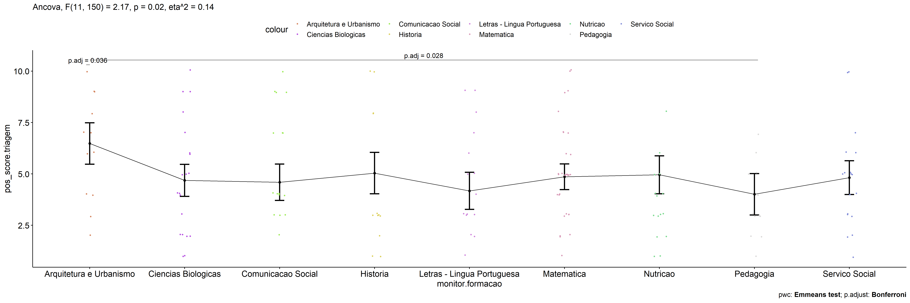<!-- -->

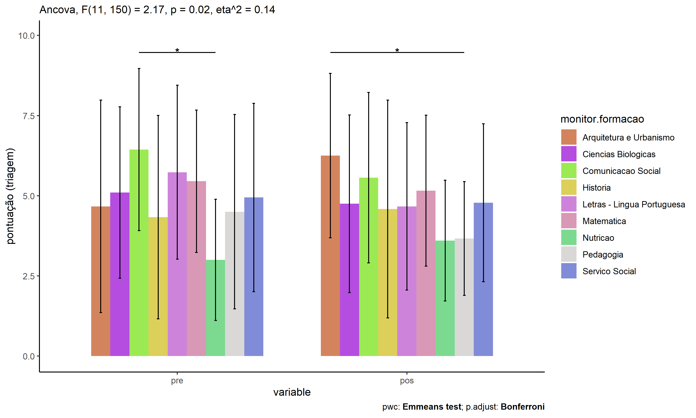<!-- -->

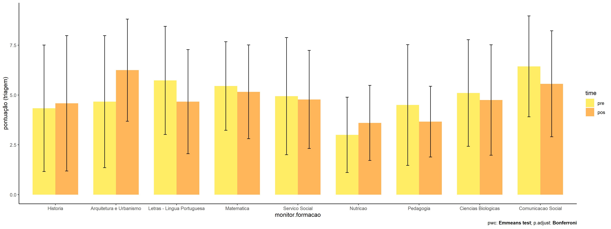<!-- -->

#### Baseado nas estimativas da aprendizagem (theta - traço latente) mediante TRI aplicado as respostas da prova

| var                   | monitor.formacao           |   n | M (pre) | SE (pre) | M (unadj) | SE (unadj) | M (adj) | SE (adj) |
|:----------------------|:---------------------------|----:|--------:|---------:|----------:|-----------:|--------:|---------:|
| pos_score_tri.triagem | Arquitetura e Urbanismo    |  12 |  -0.107 |    0.302 |     0.580 |      0.218 |   0.666 |    0.167 |
| pos_score_tri.triagem | Ciencias Biologicas        |  20 |   0.073 |    0.176 |     0.048 |      0.174 |   0.021 |    0.130 |
| pos_score_tri.triagem | Comunicacao Social         |  16 |   0.502 |    0.186 |     0.209 |      0.220 |  -0.088 |    0.147 |
| pos_score_tri.triagem | Historia                   |  12 |  -0.133 |    0.280 |     0.046 |      0.295 |   0.148 |    0.168 |
| pos_score_tri.triagem | Letras - Lingua Portuguesa |  15 |   0.284 |    0.246 |    -0.011 |      0.212 |  -0.170 |    0.150 |
| pos_score_tri.triagem | Matematica                 |  31 |   0.130 |    0.132 |     0.105 |      0.137 |   0.042 |    0.104 |
| pos_score_tri.triagem | Nutricao                   |  15 |  -0.513 |    0.176 |    -0.438 |      0.142 |  -0.097 |    0.153 |
| pos_score_tri.triagem | Pedagogia                  |  12 |  -0.140 |    0.264 |    -0.295 |      0.165 |  -0.189 |    0.168 |
| pos_score_tri.triagem | Servico Social             |  18 |  -0.057 |    0.233 |    -0.134 |      0.204 |  -0.080 |    0.137 |

| .y.                   | group1                  | group2              | estimate | conf.low | conf.high |    se | statistic | p       | p.adj | p.adj.signif |
|:----------------------|:------------------------|:--------------------|---------:|---------:|----------:|------:|----------:|:--------|------:|:-------------|
| pos_score_tri.triagem | Arquitetura e Urbanismo | Ciencias Biologicas |    0.645 |    0.227 |     1.064 | 0.212 |     3.047 | 0.003   | 0.100 | ns           |
| pos_score_tri.triagem | Arquitetura e Urbanismo | Comunicacao Social  |    0.754 |    0.311 |     1.197 | 0.224 |     3.366 | \<0.001 | 0.035 | \*           |
| pos_score_tri.triagem | Arquitetura e Urbanismo | Historia            |    0.518 |    0.051 |     0.986 | 0.237 |     2.190 | 0.03    | 1.000 | ns           |
| pos_score_tri.triagem | Arquitetura e Urbanismo | Letras              |    0.836 |    0.391 |     1.282 | 0.226 |     3.708 | \<0.001 | 0.011 | \*           |
| pos_score_tri.triagem | Arquitetura e Urbanismo | Matematica          |    0.624 |    0.233 |     1.014 | 0.198 |     3.158 | 0.002   | 0.070 | ns           |
| pos_score_tri.triagem | Arquitetura e Urbanismo | Nutricao            |    0.763 |    0.317 |     1.209 | 0.226 |     3.382 | \<0.001 | 0.034 | \*           |
| pos_score_tri.triagem | Arquitetura e Urbanismo | Pedagogia           |    0.855 |    0.387 |     1.322 | 0.237 |     3.612 | \<0.001 | 0.015 | \*           |
| pos_score_tri.triagem | Arquitetura e Urbanismo | Servico Social      |    0.746 |    0.319 |     1.173 | 0.216 |     3.454 | \<0.001 | 0.026 | \*           |
| pos_score_tri.triagem | Ciencias Biologicas     | Comunicacao Social  |    0.108 |   -0.279 |     0.496 | 0.196 |     0.554 | 0.581   | 1.000 | ns           |
| pos_score_tri.triagem | Ciencias Biologicas     | Historia            |   -0.127 |   -0.546 |     0.292 | 0.212 |    -0.600 | 0.549   | 1.000 | ns           |
| pos_score_tri.triagem | Ciencias Biologicas     | Letras              |    0.191 |   -0.201 |     0.583 | 0.198 |     0.963 | 0.337   | 1.000 | ns           |
| pos_score_tri.triagem | Ciencias Biologicas     | Matematica          |   -0.022 |   -0.350 |     0.307 | 0.166 |    -0.131 | 0.896   | 1.000 | ns           |
| pos_score_tri.triagem | Ciencias Biologicas     | Nutricao            |    0.118 |   -0.279 |     0.515 | 0.201 |     0.586 | 0.559   | 1.000 | ns           |
| pos_score_tri.triagem | Ciencias Biologicas     | Pedagogia           |    0.209 |   -0.210 |     0.628 | 0.212 |     0.987 | 0.325   | 1.000 | ns           |
| pos_score_tri.triagem | Ciencias Biologicas     | Servico Social      |    0.101 |   -0.272 |     0.473 | 0.188 |     0.533 | 0.595   | 1.000 | ns           |
| pos_score_tri.triagem | Comunicacao Social      | Historia            |   -0.236 |   -0.679 |     0.208 | 0.224 |    -1.051 | 0.295   | 1.000 | ns           |
| pos_score_tri.triagem | Comunicacao Social      | Letras              |    0.082 |   -0.330 |     0.495 | 0.209 |     0.395 | 0.693   | 1.000 | ns           |
| pos_score_tri.triagem | Comunicacao Social      | Matematica          |   -0.130 |   -0.485 |     0.225 | 0.180 |    -0.725 | 0.47    | 1.000 | ns           |
| pos_score_tri.triagem | Comunicacao Social      | Nutricao            |    0.009 |   -0.418 |     0.436 | 0.216 |     0.042 | 0.966   | 1.000 | ns           |
| pos_score_tri.triagem | Comunicacao Social      | Pedagogia           |    0.101 |   -0.343 |     0.544 | 0.224 |     0.449 | 0.654   | 1.000 | ns           |
| pos_score_tri.triagem | Comunicacao Social      | Servico Social      |   -0.008 |   -0.407 |     0.391 | 0.202 |    -0.040 | 0.968   | 1.000 | ns           |
| pos_score_tri.triagem | Historia                | Letras              |    0.318 |   -0.128 |     0.764 | 0.226 |     1.410 | 0.161   | 1.000 | ns           |
| pos_score_tri.triagem | Historia                | Matematica          |    0.105 |   -0.285 |     0.496 | 0.198 |     0.534 | 0.594   | 1.000 | ns           |
| pos_score_tri.triagem | Historia                | Nutricao            |    0.245 |   -0.201 |     0.691 | 0.226 |     1.086 | 0.279   | 1.000 | ns           |
| pos_score_tri.triagem | Historia                | Pedagogia           |    0.336 |   -0.131 |     0.804 | 0.237 |     1.422 | 0.157   | 1.000 | ns           |
| pos_score_tri.triagem | Historia                | Servico Social      |    0.228 |   -0.199 |     0.655 | 0.216 |     1.054 | 0.294   | 1.000 | ns           |
| pos_score_tri.triagem | Letras                  | Lingua Portuguesa   |   -0.213 |   -0.573 |     0.148 | 0.182 |    -1.166 | 0.246   | 1.000 | ns           |
| pos_score_tri.triagem | Letras                  | Lingua Portuguesa   |   -0.073 |   -0.501 |     0.355 | 0.216 |    -0.339 | 0.735   | 1.000 | ns           |
| pos_score_tri.triagem | Letras                  | Lingua Portuguesa   |    0.018 |   -0.428 |     0.465 | 0.226 |     0.081 | 0.936   | 1.000 | ns           |
| pos_score_tri.triagem | Letras                  | Lingua Portuguesa   |   -0.090 |   -0.493 |     0.312 | 0.204 |    -0.445 | 0.657   | 1.000 | ns           |
| pos_score_tri.triagem | Matematica              | Nutricao            |    0.139 |   -0.228 |     0.507 | 0.186 |     0.750 | 0.455   | 1.000 | ns           |
| pos_score_tri.triagem | Matematica              | Pedagogia           |    0.231 |   -0.160 |     0.622 | 0.198 |     1.169 | 0.244   | 1.000 | ns           |
| pos_score_tri.triagem | Matematica              | Servico Social      |    0.122 |   -0.218 |     0.462 | 0.172 |     0.710 | 0.479   | 1.000 | ns           |
| pos_score_tri.triagem | Nutricao                | Pedagogia           |    0.092 |   -0.354 |     0.537 | 0.225 |     0.406 | 0.685   | 1.000 | ns           |
| pos_score_tri.triagem | Nutricao                | Servico Social      |   -0.017 |   -0.421 |     0.387 | 0.204 |    -0.084 | 0.933   | 1.000 | ns           |
| pos_score_tri.triagem | Pedagogia               | Servico Social      |   -0.109 |   -0.536 |     0.318 | 0.216 |    -0.503 | 0.615   | 1.000 | ns           |
| pre_score_tri.triagem | Arquitetura e Urbanismo | Ciencias Biologicas |   -0.180 |   -0.797 |     0.437 | 0.312 |    -0.576 | 0.565   | 1.000 | ns           |
| pre_score_tri.triagem | Arquitetura e Urbanismo | Comunicacao Social  |   -0.609 |   -1.254 |     0.036 | 0.326 |    -1.866 | 0.064   | 1.000 | ns           |
| pre_score_tri.triagem | Arquitetura e Urbanismo | Historia            |    0.026 |   -0.664 |     0.715 | 0.349 |     0.073 | 0.942   | 1.000 | ns           |
| pre_score_tri.triagem | Arquitetura e Urbanismo | Letras              |   -0.391 |   -1.045 |     0.263 | 0.331 |    -1.182 | 0.239   | 1.000 | ns           |
| pre_score_tri.triagem | Arquitetura e Urbanismo | Matematica          |   -0.237 |   -0.811 |     0.338 | 0.290 |    -0.815 | 0.416   | 1.000 | ns           |
| pre_score_tri.triagem | Arquitetura e Urbanismo | Nutricao            |    0.406 |   -0.248 |     1.060 | 0.331 |     1.227 | 0.222   | 1.000 | ns           |
| pre_score_tri.triagem | Arquitetura e Urbanismo | Pedagogia           |    0.033 |   -0.657 |     0.722 | 0.349 |     0.094 | 0.925   | 1.000 | ns           |
| pre_score_tri.triagem | Arquitetura e Urbanismo | Servico Social      |   -0.050 |   -0.680 |     0.579 | 0.318 |    -0.158 | 0.875   | 1.000 | ns           |
| pre_score_tri.triagem | Ciencias Biologicas     | Comunicacao Social  |   -0.429 |   -0.996 |     0.137 | 0.287 |    -1.497 | 0.137   | 1.000 | ns           |
| pre_score_tri.triagem | Ciencias Biologicas     | Historia            |    0.205 |   -0.411 |     0.822 | 0.312 |     0.659 | 0.511   | 1.000 | ns           |
| pre_score_tri.triagem | Ciencias Biologicas     | Letras              |   -0.211 |   -0.788 |     0.366 | 0.292 |    -0.724 | 0.47    | 1.000 | ns           |
| pre_score_tri.triagem | Ciencias Biologicas     | Matematica          |   -0.057 |   -0.541 |     0.428 | 0.245 |    -0.232 | 0.817   | 1.000 | ns           |
| pre_score_tri.triagem | Ciencias Biologicas     | Nutricao            |    0.586 |    0.009 |     1.163 | 0.292 |     2.007 | 0.047   | 1.000 | ns           |
| pre_score_tri.triagem | Ciencias Biologicas     | Pedagogia           |    0.213 |   -0.404 |     0.829 | 0.312 |     0.681 | 0.497   | 1.000 | ns           |
| pre_score_tri.triagem | Ciencias Biologicas     | Servico Social      |    0.130 |   -0.419 |     0.678 | 0.278 |     0.467 | 0.641   | 1.000 | ns           |
| pre_score_tri.triagem | Comunicacao Social      | Historia            |    0.635 |   -0.010 |     1.280 | 0.326 |     1.945 | 0.054   | 1.000 | ns           |
| pre_score_tri.triagem | Comunicacao Social      | Letras              |    0.218 |   -0.389 |     0.825 | 0.307 |     0.709 | 0.479   | 1.000 | ns           |
| pre_score_tri.triagem | Comunicacao Social      | Matematica          |    0.372 |   -0.148 |     0.892 | 0.263 |     1.415 | 0.159   | 1.000 | ns           |
| pre_score_tri.triagem | Comunicacao Social      | Nutricao            |    1.015 |    0.408 |     1.622 | 0.307 |     3.305 | 0.001   | 0.043 | \*           |
| pre_score_tri.triagem | Comunicacao Social      | Pedagogia           |    0.642 |   -0.003 |     1.287 | 0.326 |     1.967 | 0.051   | 1.000 | ns           |
| pre_score_tri.triagem | Comunicacao Social      | Servico Social      |    0.559 |   -0.022 |     1.139 | 0.294 |     1.903 | 0.059   | 1.000 | ns           |
| pre_score_tri.triagem | Historia                | Letras              |   -0.417 |   -1.071 |     0.237 | 0.331 |    -1.260 | 0.21    | 1.000 | ns           |
| pre_score_tri.triagem | Historia                | Matematica          |   -0.262 |   -0.837 |     0.312 | 0.290 |    -0.903 | 0.368   | 1.000 | ns           |
| pre_score_tri.triagem | Historia                | Nutricao            |    0.380 |   -0.274 |     1.035 | 0.331 |     1.149 | 0.252   | 1.000 | ns           |
| pre_score_tri.triagem | Historia                | Pedagogia           |    0.007 |   -0.682 |     0.697 | 0.349 |     0.020 | 0.984   | 1.000 | ns           |
| pre_score_tri.triagem | Historia                | Servico Social      |   -0.076 |   -0.705 |     0.554 | 0.318 |    -0.238 | 0.812   | 1.000 | ns           |
| pre_score_tri.triagem | Letras                  | Lingua Portuguesa   |    0.154 |   -0.377 |     0.686 | 0.269 |     0.575 | 0.566   | 1.000 | ns           |
| pre_score_tri.triagem | Letras                  | Lingua Portuguesa   |    0.797 |    0.180 |     1.414 | 0.312 |     2.555 | 0.012   | 0.420 | ns           |
| pre_score_tri.triagem | Letras                  | Lingua Portuguesa   |    0.424 |   -0.230 |     1.078 | 0.331 |     1.281 | 0.202   | 1.000 | ns           |
| pre_score_tri.triagem | Letras                  | Lingua Portuguesa   |    0.341 |   -0.250 |     0.931 | 0.299 |     1.142 | 0.256   | 1.000 | ns           |
| pre_score_tri.triagem | Matematica              | Nutricao            |    0.643 |    0.111 |     1.174 | 0.269 |     2.392 | 0.018   | 0.651 | ns           |
| pre_score_tri.triagem | Matematica              | Pedagogia           |    0.269 |   -0.305 |     0.844 | 0.290 |     0.928 | 0.355   | 1.000 | ns           |
| pre_score_tri.triagem | Matematica              | Servico Social      |    0.187 |   -0.314 |     0.687 | 0.253 |     0.737 | 0.463   | 1.000 | ns           |
| pre_score_tri.triagem | Nutricao                | Pedagogia           |   -0.373 |   -1.027 |     0.281 | 0.331 |    -1.128 | 0.261   | 1.000 | ns           |
| pre_score_tri.triagem | Nutricao                | Servico Social      |   -0.456 |   -1.047 |     0.134 | 0.299 |    -1.527 | 0.129   | 1.000 | ns           |
| pre_score_tri.triagem | Pedagogia               | Servico Social      |   -0.083 |   -0.712 |     0.547 | 0.318 |    -0.260 | 0.795   | 1.000 | ns           |

| monitor.formacao           | group1 | group2 | estimate | conf.low | conf.high |    se | statistic |     p | p.adj | p.adj.signif |
|:---------------------------|:-------|:-------|---------:|---------:|----------:|------:|----------:|------:|------:|:-------------|
| Arquitetura e Urbanismo    | pre    | pos    |   -0.687 |   -1.348 |    -0.026 | 0.336 |    -2.047 | 0.042 | 0.042 | \*           |
| Ciencias Biologicas        | pre    | pos    |    0.025 |   -0.487 |     0.537 | 0.260 |     0.096 | 0.923 | 0.923 | ns           |
| Comunicacao Social         | pre    | pos    |    0.293 |   -0.279 |     0.865 | 0.291 |     1.008 | 0.315 | 0.315 | ns           |
| Historia                   | pre    | pos    |   -0.178 |   -0.839 |     0.482 | 0.336 |    -0.532 | 0.595 | 0.595 | ns           |
| Letras - Lingua Portuguesa | pre    | pos    |    0.295 |   -0.296 |     0.886 | 0.300 |     0.981 | 0.327 | 0.327 | ns           |
| Matematica                 | pre    | pos    |    0.024 |   -0.387 |     0.436 | 0.209 |     0.117 | 0.907 | 0.907 | ns           |
| Nutricao                   | pre    | pos    |   -0.075 |   -0.666 |     0.516 | 0.300 |    -0.249 | 0.803 | 0.803 | ns           |
| Pedagogia                  | pre    | pos    |    0.155 |   -0.505 |     0.816 | 0.336 |     0.463 | 0.644 | 0.644 | ns           |
| Servico Social             | pre    | pos    |    0.077 |   -0.462 |     0.617 | 0.274 |     0.283 | 0.778 | 0.778 | ns           |

    ## Scale for colour is already present.
    ## Adding another scale for colour, which will replace the existing scale.

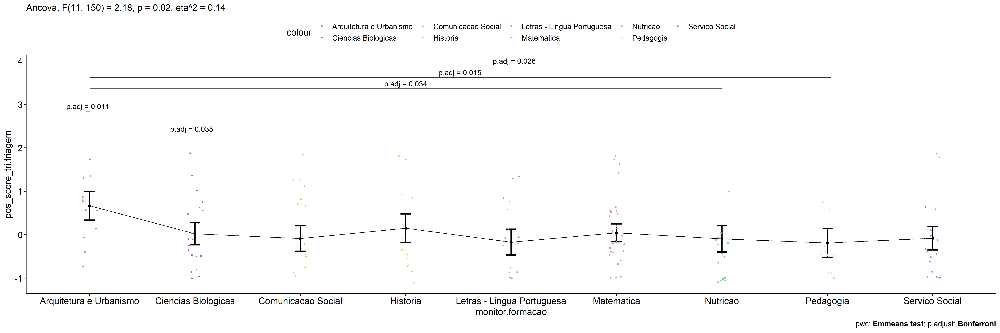<!-- -->

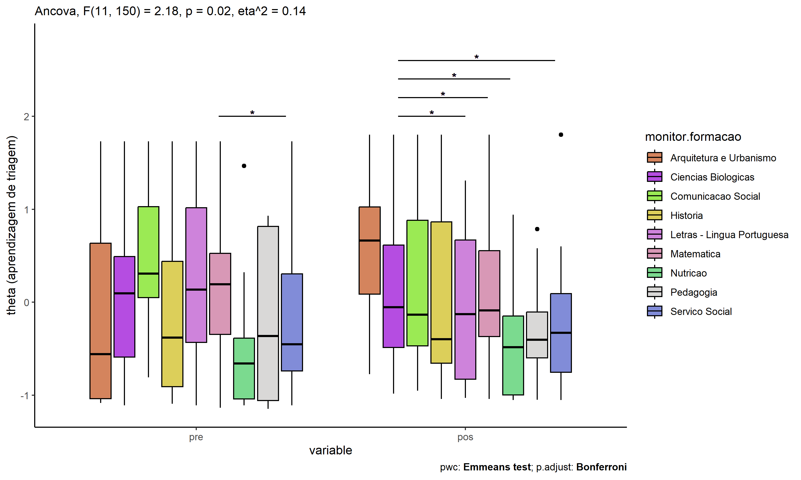<!-- -->

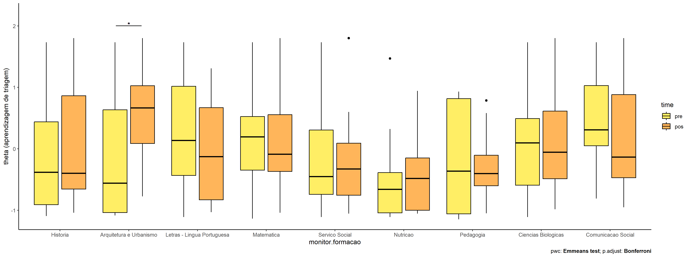<!-- -->

### factor: **monitor.titulacao**

#### Baseado nos acertos (score) da prova

| var               | monitor.titulacao |   n | M (pre) | SE (pre) | M (unadj) | SE (unadj) | M (adj) | SE (adj) |
|:------------------|:------------------|----:|--------:|---------:|----------:|-----------:|--------:|---------:|
| pos_score.triagem | ensino medio      | 109 |   4.761 |    0.259 |     4.734 |      0.245 |   4.897 |    0.174 |
| pos_score.triagem | especializacao    |  16 |   6.438 |    0.632 |     5.562 |      0.664 |   4.611 |    0.461 |
| pos_score.triagem | graduacao         |  26 |   5.154 |    0.562 |     4.731 |      0.482 |   4.633 |    0.356 |

| .y.               | group1         | group2         | estimate | conf.low | conf.high |    se | statistic |     p | p.adj | p.adj.signif |
|:------------------|:---------------|:---------------|---------:|---------:|----------:|------:|----------:|------:|------:|:-------------|
| pos_score.triagem | ensino medio   | especializacao |    0.286 |   -0.692 |     1.264 | 0.495 |     0.578 | 0.564 | 1.000 | ns           |
| pos_score.triagem | ensino medio   | graduacao      |    0.264 |   -0.520 |     1.049 | 0.397 |     0.665 | 0.507 | 1.000 | ns           |
| pos_score.triagem | especializacao | graduacao      |   -0.022 |   -1.171 |     1.127 | 0.581 |    -0.038 | 0.970 | 1.000 | ns           |
| pre_score.triagem | ensino medio   | especializacao |   -1.676 |   -3.111 |    -0.241 | 0.726 |    -2.308 | 0.022 | 0.067 | ns           |
| pre_score.triagem | ensino medio   | graduacao      |   -0.392 |   -1.562 |     0.778 | 0.592 |    -0.663 | 0.509 | 1.000 | ns           |
| pre_score.triagem | especializacao | graduacao      |    1.284 |   -0.420 |     2.987 | 0.862 |     1.489 | 0.139 | 0.416 | ns           |

| monitor.titulacao | group1 | group2 | estimate | conf.low | conf.high |    se | statistic |     p | p.adj | p.adj.signif |
|:------------------|:-------|:-------|---------:|---------:|----------:|------:|----------:|------:|------:|:-------------|
| ensino medio      | pre    | pos    |    0.028 |   -0.675 |     0.730 | 0.357 |     0.077 | 0.939 | 0.939 | ns           |
| especializacao    | pre    | pos    |    0.875 |   -0.959 |     2.709 | 0.932 |     0.939 | 0.348 | 0.348 | ns           |
| graduacao         | pre    | pos    |    0.423 |   -1.015 |     1.861 | 0.731 |     0.579 | 0.563 | 0.563 | ns           |

    ## Scale for colour is already present.
    ## Adding another scale for colour, which will replace the existing scale.

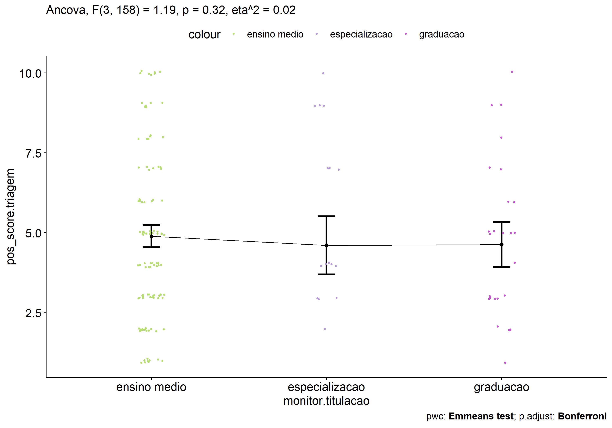<!-- -->

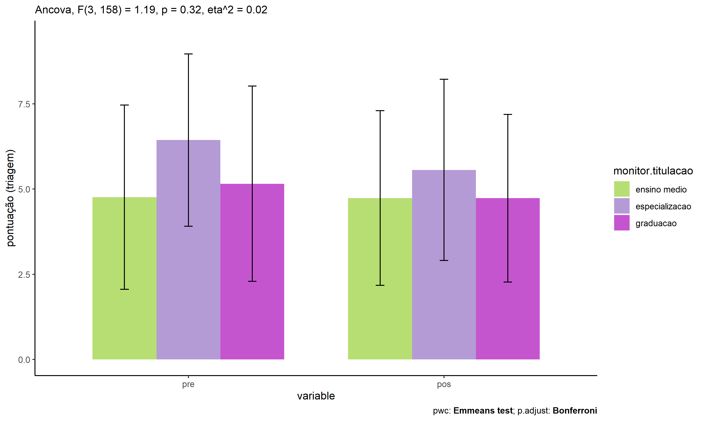<!-- -->

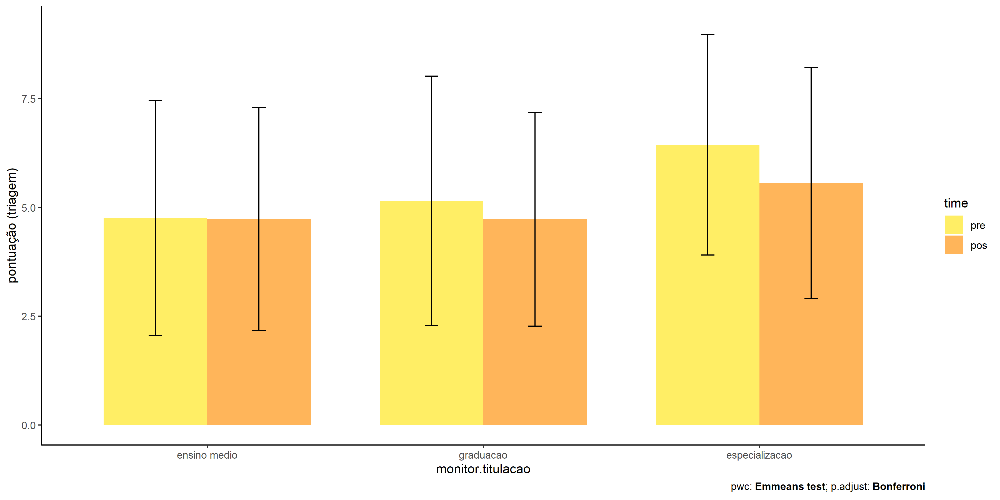<!-- -->

#### Baseado nas estimativas da aprendizagem (theta - traço latente) mediante TRI aplicado as respostas da prova

| var                   | monitor.titulacao |   n | M (pre) | SE (pre) | M (unadj) | SE (unadj) | M (adj) | SE (adj) |
|:----------------------|:------------------|----:|--------:|---------:|----------:|-----------:|--------:|---------:|
| pos_score_tri.triagem | ensino medio      | 109 |  -0.049 |    0.083 |    -0.019 |      0.077 |   0.030 |    0.058 |
| pos_score_tri.triagem | especializacao    |  16 |   0.502 |    0.186 |     0.209 |      0.220 |  -0.086 |    0.154 |
| pos_score_tri.triagem | graduacao         |  26 |   0.068 |    0.174 |     0.041 |      0.152 |   0.017 |    0.119 |

| .y.                   | group1         | group2         | estimate | conf.low | conf.high |    se | statistic |     p | p.adj | p.adj.signif |
|:----------------------|:---------------|:---------------|---------:|---------:|----------:|------:|----------:|------:|------:|:-------------|
| pos_score_tri.triagem | ensino medio   | especializacao |    0.117 |   -0.210 |     0.444 | 0.165 |     0.706 | 0.481 | 1.000 | ns           |
| pos_score_tri.triagem | ensino medio   | graduacao      |    0.013 |   -0.249 |     0.275 | 0.132 |     0.099 | 0.922 | 1.000 | ns           |
| pos_score_tri.triagem | especializacao | graduacao      |   -0.104 |   -0.488 |     0.280 | 0.194 |    -0.534 | 0.594 | 1.000 | ns           |
| pre_score_tri.triagem | ensino medio   | especializacao |   -0.551 |   -1.006 |    -0.095 | 0.231 |    -2.389 | 0.018 | 0.055 | ns           |
| pre_score_tri.triagem | ensino medio   | graduacao      |   -0.117 |   -0.488 |     0.255 | 0.188 |    -0.621 | 0.535 | 1.000 | ns           |
| pre_score_tri.triagem | especializacao | graduacao      |    0.434 |   -0.107 |     0.974 | 0.274 |     1.586 | 0.115 | 0.345 | ns           |

| monitor.titulacao | group1 | group2 | estimate | conf.low | conf.high |    se | statistic |     p | p.adj | p.adj.signif |
|:------------------|:-------|:-------|---------:|---------:|----------:|------:|----------:|------:|------:|:-------------|
| ensino medio      | pre    | pos    |   -0.030 |   -0.253 |     0.193 | 0.113 |    -0.265 | 0.791 | 0.791 | ns           |
| especializacao    | pre    | pos    |    0.293 |   -0.288 |     0.874 | 0.295 |     0.991 | 0.322 | 0.322 | ns           |
| graduacao         | pre    | pos    |    0.027 |   -0.429 |     0.483 | 0.232 |     0.116 | 0.908 | 0.908 | ns           |

    ## Scale for colour is already present.
    ## Adding another scale for colour, which will replace the existing scale.

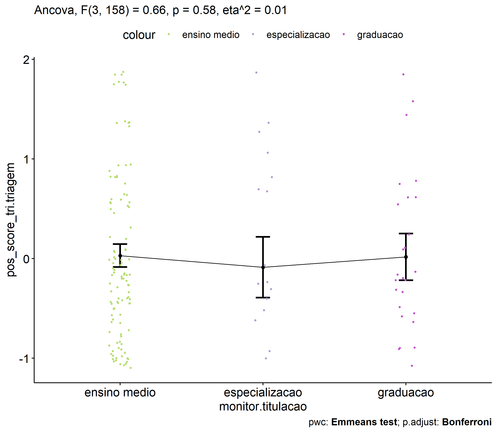<!-- -->

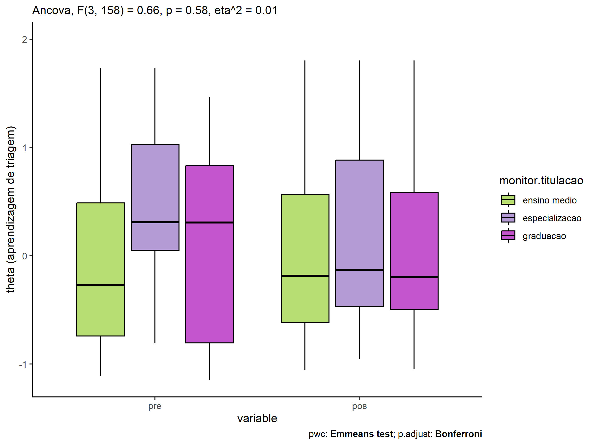<!-- -->

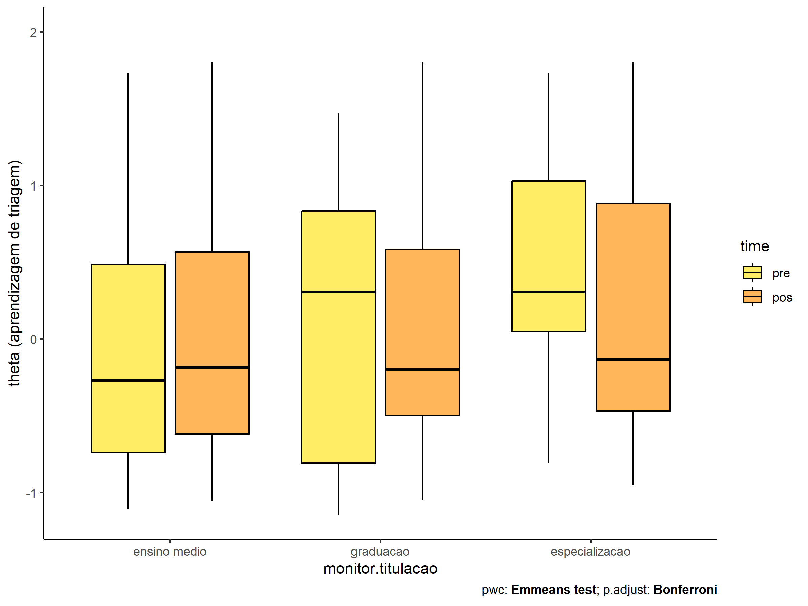<!-- -->

### factor: **monitor.experiencia**

#### Baseado nos acertos (score) da prova

| var               | monitor.experiencia |   n | M (pre) | SE (pre) | M (unadj) | SE (unadj) | M (adj) | SE (adj) |
|:------------------|:--------------------|----:|--------:|---------:|----------:|-----------:|--------:|---------:|
| pos_score.triagem | \> 01 ano           |  24 |   4.417 |    0.619 |     4.125 |      0.549 |   4.511 |    0.371 |
| pos_score.triagem | até 01 ano          | 127 |   5.118 |    0.238 |     4.953 |      0.223 |   4.880 |    0.161 |

| .y.               | group1    | group2     | estimate | conf.low | conf.high |    se | statistic |     p | p.adj | p.adj.signif |
|:------------------|:----------|:-----------|---------:|---------:|----------:|------:|----------:|------:|------:|:-------------|
| pos_score.triagem | \> 01 ano | até 01 ano |   -0.369 |   -1.168 |     0.430 | 0.404 |    -0.913 | 0.363 | 0.363 | ns           |
| pre_score.triagem | \> 01 ano | até 01 ano |   -0.701 |   -1.907 |     0.504 | 0.610 |    -1.150 | 0.252 | 0.252 | ns           |

| monitor.experiencia | group1 | group2 | estimate | conf.low | conf.high |    se | statistic |     p | p.adj | p.adj.signif |
|:--------------------|:-------|:-------|---------:|---------:|----------:|------:|----------:|------:|------:|:-------------|
| \> 01 ano           | pre    | pos    |    0.292 |   -1.210 |     1.793 | 0.763 |     0.382 | 0.703 | 0.703 | ns           |
| até 01 ano          | pre    | pos    |    0.165 |   -0.487 |     0.818 | 0.332 |     0.499 | 0.618 | 0.618 | ns           |

    ## Scale for colour is already present.
    ## Adding another scale for colour, which will replace the existing scale.

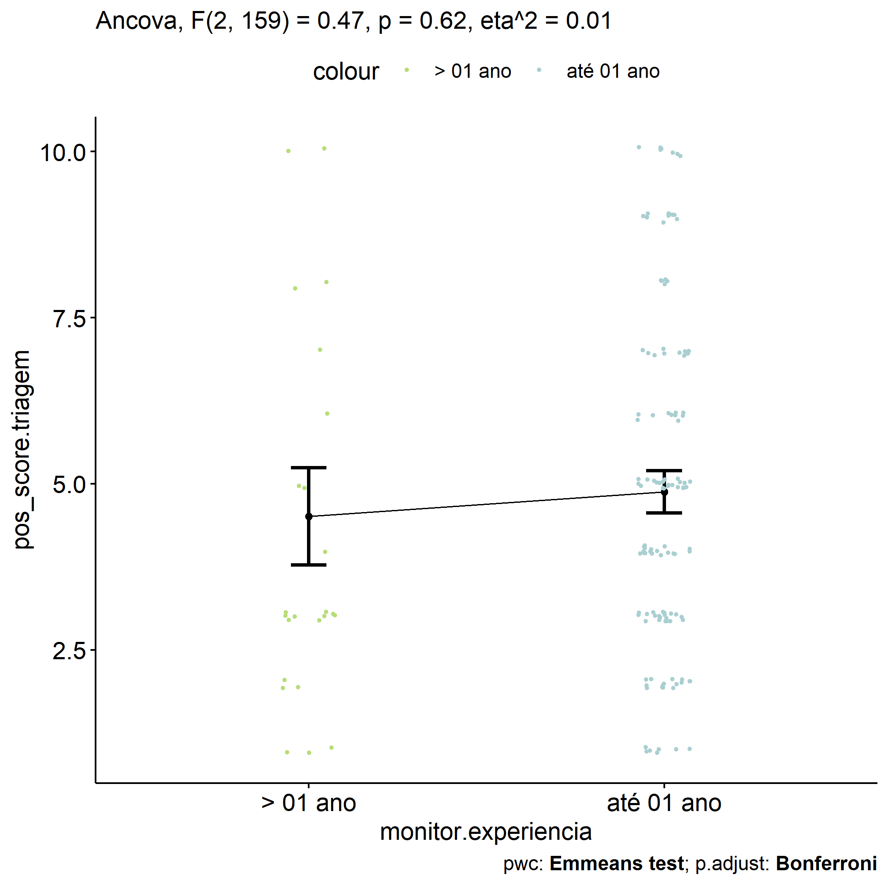<!-- -->

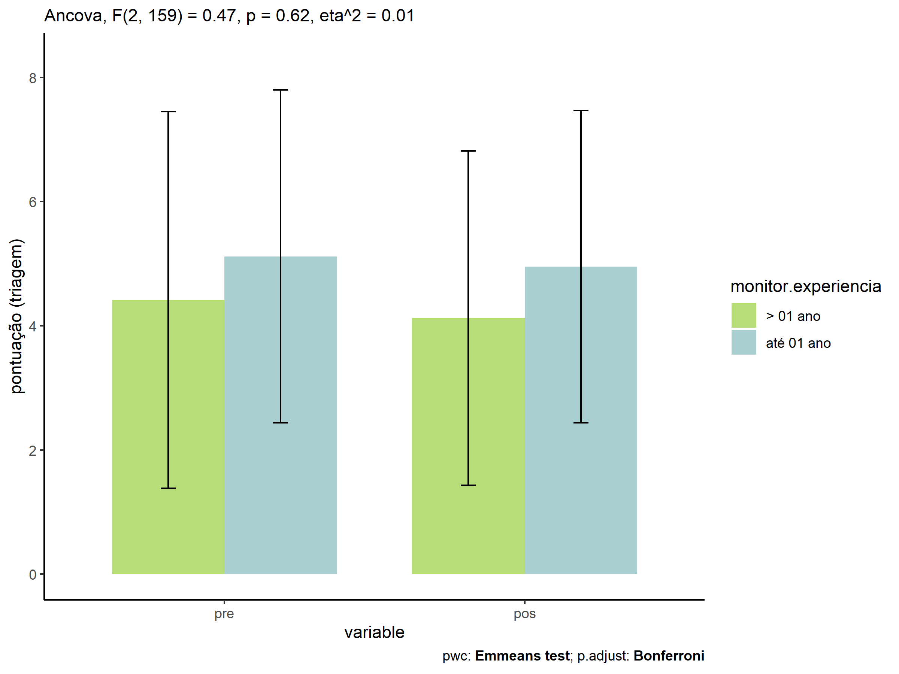<!-- -->

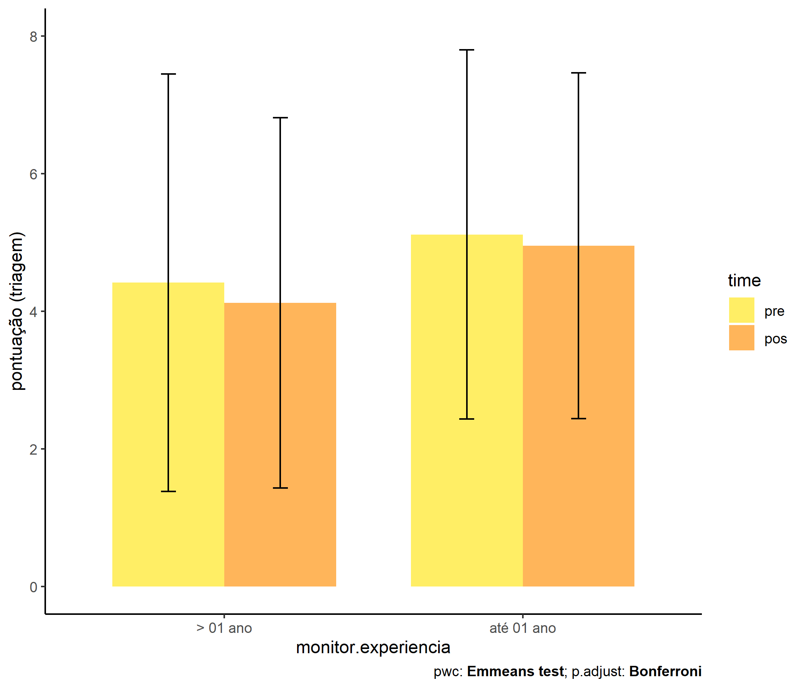<!-- -->

#### Baseado nas estimativas da aprendizagem (theta - traço latente) mediante TRI aplicado as respostas da prova

| var                   | monitor.experiencia |   n | M (pre) | SE (pre) | M (unadj) | SE (unadj) | M (adj) | SE (adj) |
|:----------------------|:--------------------|----:|--------:|---------:|----------:|-----------:|--------:|---------:|
| pos_score_tri.triagem | \> 01 ano           |  24 |  -0.136 |    0.188 |    -0.125 |      0.169 |  -0.023 |    0.124 |
| pos_score_tri.triagem | até 01 ano          | 127 |   0.061 |    0.076 |     0.042 |      0.071 |   0.023 |    0.054 |

| .y.                   | group1    | group2     | estimate | conf.low | conf.high |    se | statistic |     p | p.adj | p.adj.signif |
|:----------------------|:----------|:-----------|---------:|---------:|----------:|------:|----------:|------:|------:|:-------------|
| pos_score_tri.triagem | \> 01 ano | até 01 ano |   -0.045 |   -0.312 |     0.222 | 0.135 |    -0.336 | 0.737 | 0.737 | ns           |
| pre_score_tri.triagem | \> 01 ano | até 01 ano |   -0.197 |   -0.581 |     0.186 | 0.194 |    -1.017 | 0.311 | 0.311 | ns           |

| monitor.experiencia | group1 | group2 | estimate | conf.low | conf.high |    se | statistic |     p | p.adj | p.adj.signif |
|:--------------------|:-------|:-------|---------:|---------:|----------:|------:|----------:|------:|------:|:-------------|
| \> 01 ano           | pre    | pos    |   -0.012 |   -0.489 |     0.466 | 0.243 |    -0.047 | 0.962 | 0.962 | ns           |
| até 01 ano          | pre    | pos    |    0.019 |   -0.189 |     0.226 | 0.105 |     0.179 | 0.858 | 0.858 | ns           |

    ## Scale for colour is already present.
    ## Adding another scale for colour, which will replace the existing scale.

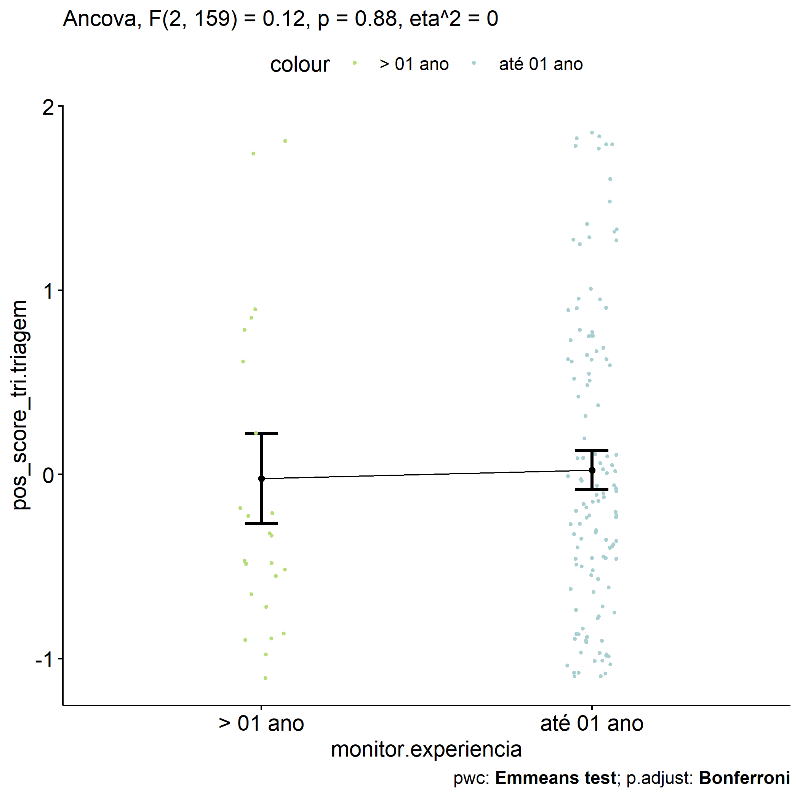<!-- -->

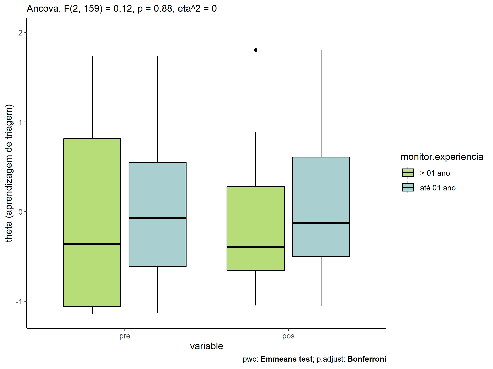<!-- -->

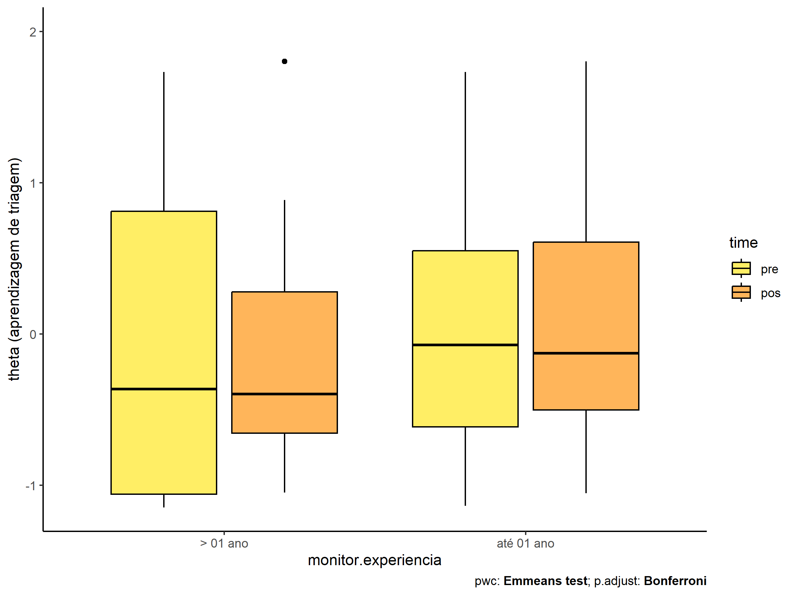<!-- -->

## Pairwise comparisons for two factor

### factores: **intervention:genero**

#### Baseado nos acertos (score) da prova

| var               | intervention      | genero |   n | M (pre) | SE (pre) | M (unadj) | SE (unadj) | M (adj) | SE (adj) |
|:------------------|:------------------|:-------|----:|--------:|---------:|----------:|-----------:|--------:|---------:|
| pos_score.triagem | Controle          | F      |  78 |   5.359 |    0.294 |     5.269 |      0.293 |   5.030 |    0.209 |
| pos_score.triagem | Controle          | M      |  75 |   4.893 |    0.276 |     4.440 |      0.320 |   4.520 |    0.213 |
| pos_score.triagem | Stari and WordGen | M      |  11 |   4.091 |    0.625 |     4.364 |      0.364 |   4.993 |    0.556 |
| pos_score.triagem | Stari             | F      |  18 |   2.833 |    0.364 |     3.667 |      0.420 |   5.156 |    0.443 |
| pos_score.triagem | Stari             | M      |  18 |   3.056 |    0.383 |     2.778 |      0.392 |   4.115 |    0.442 |
| pos_score.triagem | WordGen           | F      |  55 |   6.345 |    0.358 |     5.964 |      0.370 |   5.049 |    0.255 |
| pos_score.triagem | WordGen           | M      |  59 |   4.881 |    0.356 |     4.610 |      0.303 |   4.698 |    0.240 |

|     | intervention | genero | group1   | group2            | estimate | conf.low | conf.high |    se | statistic | p       | p.adj   | p.adj.signif |
|:----|:-------------|:-------|:---------|:------------------|---------:|---------:|----------:|------:|----------:|:--------|:--------|:-------------|
| 1   | NA           | F      | Controle | Stari             |   -0.126 |   -1.097 |     0.844 | 0.493 |    -0.257 | 0.798   | 1       | ns           |
| 2   | NA           | F      | Controle | WordGen           |   -0.019 |   -0.662 |     0.624 | 0.327 |    -0.058 | 0.953   | 1       | ns           |
| 4   | NA           | F      | Stari    | WordGen           |    0.107 |   -0.919 |     1.134 | 0.521 |     0.206 | 0.837   | 1       | ns           |
| 7   | NA           | M      | Controle | Stari             |    0.404 |   -0.559 |     1.367 | 0.489 |     0.826 | 0.41    | 1       | ns           |
| 8   | NA           | M      | Controle | WordGen           |   -0.178 |   -0.809 |     0.452 | 0.320 |    -0.557 | 0.578   | 1       | ns           |
| 9   | NA           | M      | Controle | Stari and WordGen |   -0.473 |   -1.644 |     0.698 | 0.595 |    -0.795 | 0.427   | 1       | ns           |
| 10  | NA           | M      | Stari    | WordGen           |   -0.582 |   -1.569 |     0.404 | 0.502 |    -1.161 | 0.246   | 1       | ns           |
| 11  | NA           | M      | Stari    | Stari and WordGen |   -0.877 |   -2.266 |     0.512 | 0.706 |    -1.243 | 0.215   | 1       | ns           |
| 12  | NA           | M      | WordGen  | Stari and WordGen |   -0.295 |   -1.486 |     0.897 | 0.605 |    -0.487 | 0.627   | 1       | ns           |
| 13  | NA           | F      | Controle | Stari             |    2.526 |    1.251 |     3.800 | 0.648 |     3.899 | \<0.001 | \<0.001 | \*\*\*       |
| 14  | NA           | F      | Controle | WordGen           |   -0.986 |   -1.845 |    -0.128 | 0.436 |    -2.262 | 0.024   | 0.073   | ns           |
| 16  | NA           | F      | Stari    | WordGen           |   -3.512 |   -4.836 |    -2.188 | 0.673 |    -5.221 | \<0.001 | \<0.001 | \*\*\*\*     |
| 19  | NA           | M      | Controle | Stari             |    1.838 |    0.558 |     3.117 | 0.650 |     2.826 | 0.005   | 0.03    | \*           |
| 20  | NA           | M      | Controle | WordGen           |    0.012 |   -0.836 |     0.860 | 0.431 |     0.028 | 0.978   | 1       | ns           |
| 21  | NA           | M      | Controle | Stari and WordGen |    0.802 |   -0.771 |     2.376 | 0.800 |     1.003 | 0.317   | 1       | ns           |
| 22  | NA           | M      | Stari    | WordGen           |   -1.826 |   -3.138 |    -0.513 | 0.667 |    -2.737 | 0.007   | 0.039   | \*           |
| 23  | NA           | M      | Stari    | Stari and WordGen |   -1.035 |   -2.901 |     0.830 | 0.948 |    -1.092 | 0.276   | 1       | ns           |
| 24  | NA           | M      | WordGen  | Stari and WordGen |    0.790 |   -0.810 |     2.391 | 0.814 |     0.972 | 0.332   | 1       | ns           |
| 25  | Controle     | NA     | F        | M                 |    0.510 |   -0.076 |     1.097 | 0.298 |     1.711 | 0.088   | 0.088   | ns           |
| 26  | Stari        | NA     | F        | M                 |    1.041 |   -0.166 |     2.248 | 0.614 |     1.697 | 0.091   | 0.091   | ns           |
| 27  | WordGen      | NA     | F        | M                 |    0.351 |   -0.339 |     1.041 | 0.350 |     1.002 | 0.317   | 0.317   | ns           |
| 29  | Controle     | NA     | F        | M                 |    0.466 |   -0.323 |     1.254 | 0.401 |     1.162 | 0.246   | 0.246   | ns           |
| 30  | Stari        | NA     | F        | M                 |   -0.222 |   -1.847 |     1.403 | 0.826 |    -0.269 | 0.788   | 0.788   | ns           |
| 31  | WordGen      | NA     | F        | M                 |    1.464 |    0.550 |     2.378 | 0.464 |     3.153 | 0.002   | 0.002   | \*\*         |

| genero | group1 | group2 | estimate | conf.low | conf.high |    se | statistic |     p | p.adj | p.adj.signif |
|:-------|:-------|:-------|---------:|---------:|----------:|------:|----------:|------:|------:|:-------------|
| F      | pre    | pos    |    0.090 |   -0.693 |     0.872 | 0.399 |     0.225 | 0.822 | 0.822 | ns           |
| M      | pre    | pos    |    0.453 |   -0.345 |     1.252 | 0.406 |     1.115 | 0.265 | 0.265 | ns           |
| F      | pre    | pos    |   -0.833 |   -2.463 |     0.796 | 0.830 |    -1.004 | 0.316 | 0.316 | ns           |
| M      | pre    | pos    |    0.278 |   -1.351 |     1.907 | 0.830 |     0.335 | 0.738 | 0.738 | ns           |
| F      | pre    | pos    |    0.382 |   -0.550 |     1.314 | 0.475 |     0.804 | 0.421 | 0.421 | ns           |
| M      | pre    | pos    |    0.271 |   -0.629 |     1.171 | 0.458 |     0.592 | 0.554 | 0.554 | ns           |
| M      | pre    | pos    |   -0.273 |   -2.357 |     1.811 | 1.061 |    -0.257 | 0.797 | 0.797 | ns           |

<!-- -->

    ## Scale for colour is already present.
    ## Adding another scale for colour, which will replace the existing scale.

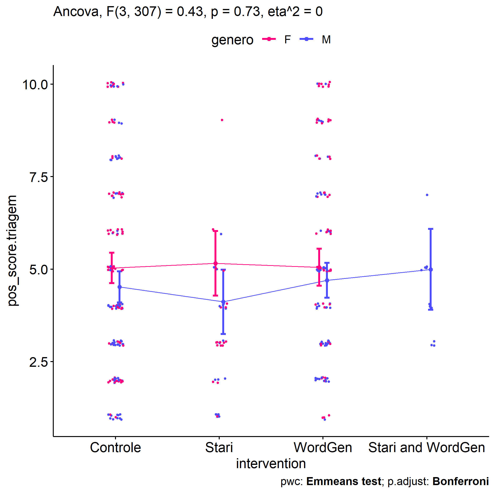<!-- -->

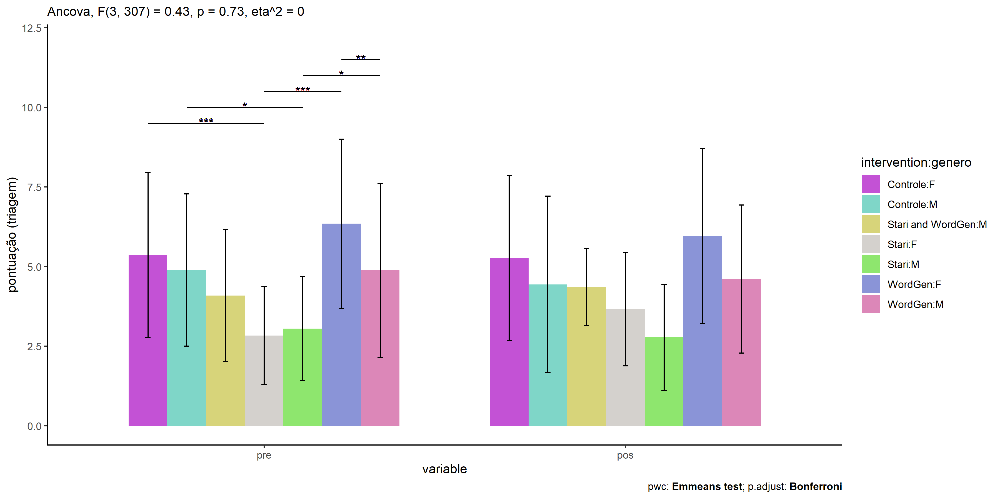<!-- -->

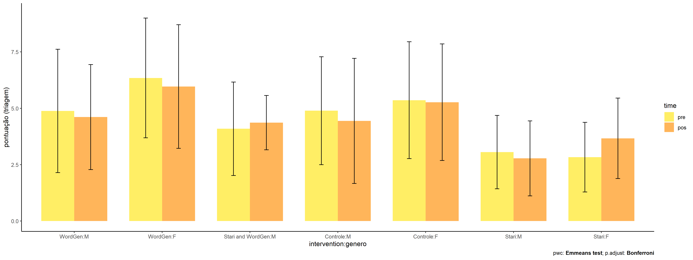<!-- -->

#### Baseado nas estimativas da aprendizagem (theta - traço latente) mediante TRI aplicado as respostas da prova

| var                   | intervention      | genero |   n | M (pre) | SE (pre) | M (unadj) | SE (unadj) | M (adj) | SE (adj) |
|:----------------------|:------------------|:-------|----:|--------:|---------:|----------:|-----------:|--------:|---------:|
| pos_score_tri.triagem | Controle          | F      |  78 |   0.118 |    0.099 |     0.090 |      0.098 |   0.011 |    0.069 |
| pos_score_tri.triagem | Controle          | M      |  75 |  -0.108 |    0.089 |    -0.066 |      0.100 |   0.008 |    0.070 |
| pos_score_tri.triagem | Stari and WordGen | M      |  11 |  -0.309 |    0.226 |    -0.288 |      0.170 |  -0.077 |    0.182 |
| pos_score_tri.triagem | Stari             | F      |  18 |  -0.603 |    0.122 |    -0.238 |      0.133 |   0.172 |    0.145 |
| pos_score_tri.triagem | Stari             | M      |  18 |  -0.627 |    0.109 |    -0.490 |      0.097 |  -0.063 |    0.145 |
| pos_score_tri.triagem | WordGen           | F      |  55 |   0.443 |    0.118 |     0.300 |      0.130 |   0.000 |    0.084 |
| pos_score_tri.triagem | WordGen           | M      |  59 |   0.008 |    0.108 |    -0.034 |      0.090 |  -0.039 |    0.079 |

|     | intervention | genero | group1   | group2            | estimate | conf.low | conf.high |    se | statistic | p       | p.adj   | p.adj.signif |
|:----|:-------------|:-------|:---------|:------------------|---------:|---------:|----------:|------:|----------:|:--------|:--------|:-------------|
| 1   | NA           | F      | Controle | Stari             |   -0.161 |   -0.477 |     0.156 | 0.161 |    -1.000 | 0.318   | 0.954   | ns           |
| 2   | NA           | F      | Controle | WordGen           |    0.011 |   -0.200 |     0.222 | 0.107 |     0.104 | 0.917   | 1       | ns           |
| 4   | NA           | F      | Stari    | WordGen           |    0.172 |   -0.162 |     0.506 | 0.170 |     1.012 | 0.312   | 0.937   | ns           |
| 7   | NA           | M      | Controle | Stari             |    0.071 |   -0.244 |     0.386 | 0.160 |     0.444 | 0.657   | 1       | ns           |
| 8   | NA           | M      | Controle | WordGen           |    0.047 |   -0.160 |     0.253 | 0.105 |     0.444 | 0.658   | 1       | ns           |
| 9   | NA           | M      | Controle | Stari and WordGen |    0.085 |   -0.299 |     0.469 | 0.195 |     0.437 | 0.663   | 1       | ns           |
| 10  | NA           | M      | Stari    | WordGen           |   -0.024 |   -0.349 |     0.300 | 0.165 |    -0.148 | 0.882   | 1       | ns           |
| 11  | NA           | M      | Stari    | Stari and WordGen |    0.014 |   -0.441 |     0.469 | 0.231 |     0.061 | 0.951   | 1       | ns           |
| 12  | NA           | M      | WordGen  | Stari and WordGen |    0.038 |   -0.352 |     0.429 | 0.199 |     0.194 | 0.846   | 1       | ns           |
| 13  | NA           | F      | Controle | Stari             |    0.720 |    0.307 |     1.133 | 0.210 |     3.433 | \<0.001 | 0.002   | \*\*         |
| 14  | NA           | F      | Controle | WordGen           |   -0.326 |   -0.604 |    -0.048 | 0.141 |    -2.304 | 0.022   | 0.066   | ns           |
| 16  | NA           | F      | Stari    | WordGen           |   -1.046 |   -1.475 |    -0.617 | 0.218 |    -4.800 | \<0.001 | \<0.001 | \*\*\*\*     |
| 19  | NA           | M      | Controle | Stari             |    0.519 |    0.104 |     0.933 | 0.211 |     2.463 | 0.014   | 0.086   | ns           |
| 20  | NA           | M      | Controle | WordGen           |   -0.116 |   -0.391 |     0.159 | 0.140 |    -0.832 | 0.406   | 1       | ns           |
| 21  | NA           | M      | Controle | Stari and WordGen |    0.201 |   -0.309 |     0.710 | 0.259 |     0.774 | 0.439   | 1       | ns           |
| 22  | NA           | M      | Stari    | WordGen           |   -0.635 |   -1.060 |    -0.210 | 0.216 |    -2.938 | 0.004   | 0.021   | \*           |
| 23  | NA           | M      | Stari    | Stari and WordGen |   -0.318 |   -0.922 |     0.286 | 0.307 |    -1.036 | 0.301   | 1       | ns           |
| 24  | NA           | M      | WordGen  | Stari and WordGen |    0.317 |   -0.202 |     0.835 | 0.264 |     1.202 | 0.23    | 1       | ns           |
| 25  | Controle     | NA     | F        | M                 |    0.003 |   -0.190 |     0.196 | 0.098 |     0.034 | 0.973   | 0.973   | ns           |
| 26  | Stari        | NA     | F        | M                 |    0.235 |   -0.161 |     0.631 | 0.201 |     1.169 | 0.243   | 0.243   | ns           |
| 27  | WordGen      | NA     | F        | M                 |    0.039 |   -0.187 |     0.264 | 0.115 |     0.339 | 0.735   | 0.735   | ns           |
| 29  | Controle     | NA     | F        | M                 |    0.226 |   -0.030 |     0.481 | 0.130 |     1.738 | 0.083   | 0.083   | ns           |
| 30  | Stari        | NA     | F        | M                 |    0.024 |   -0.502 |     0.550 | 0.267 |     0.089 | 0.929   | 0.929   | ns           |
| 31  | WordGen      | NA     | F        | M                 |    0.435 |    0.139 |     0.731 | 0.150 |     2.892 | 0.004   | 0.004   | \*\*         |

| intervention      | genero | group1 | group2 | estimate | conf.low | conf.high |    se | statistic |     p | p.adj | p.adj.signif |
|:------------------|:-------|:-------|:-------|---------:|---------:|----------:|------:|----------:|------:|------:|:-------------|
| Controle          | F      | pre    | pos    |    0.027 |   -0.227 |     0.281 | 0.129 |     0.210 | 0.834 | 0.834 | ns           |
| Controle          | M      | pre    | pos    |   -0.042 |   -0.301 |     0.217 | 0.132 |    -0.317 | 0.752 | 0.752 | ns           |
| Stari             | F      | pre    | pos    |   -0.365 |   -0.893 |     0.164 | 0.269 |    -1.354 | 0.176 | 0.176 | ns           |
| Stari             | M      | pre    | pos    |   -0.137 |   -0.666 |     0.392 | 0.269 |    -0.509 | 0.611 | 0.611 | ns           |
| WordGen           | F      | pre    | pos    |    0.143 |   -0.160 |     0.445 | 0.154 |     0.927 | 0.355 | 0.355 | ns           |
| WordGen           | M      | pre    | pos    |    0.042 |   -0.250 |     0.334 | 0.149 |     0.283 | 0.777 | 0.777 | ns           |
| Stari and WordGen | M      | pre    | pos    |   -0.021 |   -0.697 |     0.655 | 0.344 |    -0.061 | 0.952 | 0.952 | ns           |

<!-- -->

    ## Scale for colour is already present.
    ## Adding another scale for colour, which will replace the existing scale.

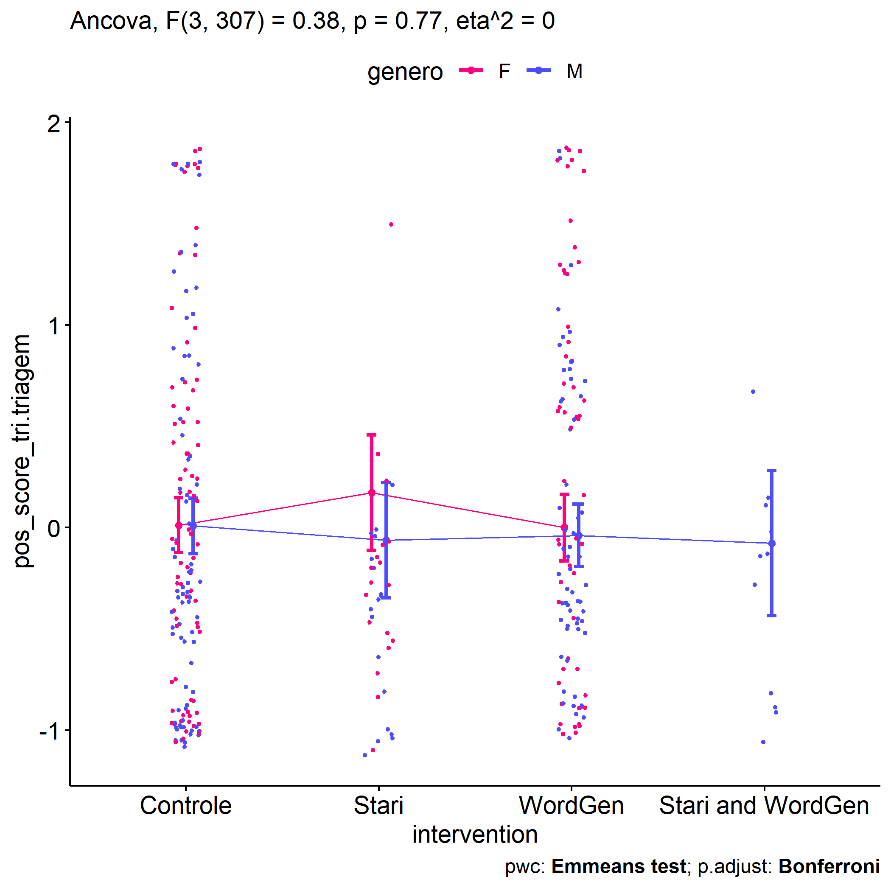<!-- -->

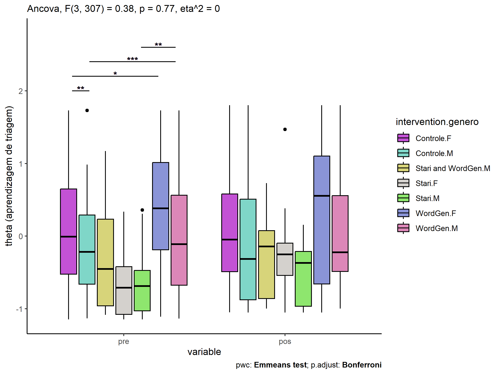<!-- -->

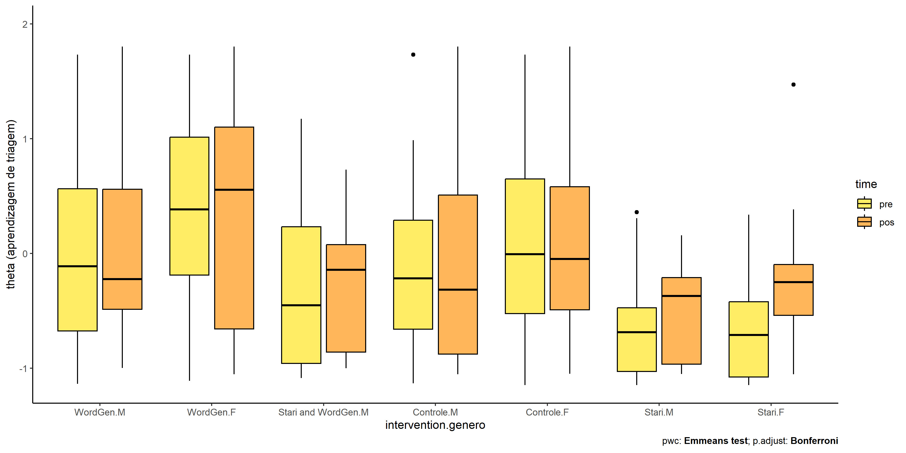<!-- -->

### factores: **intervention:idade**

#### Baseado nos acertos (score) da prova

| var               | intervention      | idade |   n | M (pre) | SE (pre) | M (unadj) | SE (unadj) | M (adj) | SE (adj) |
|:------------------|:------------------|:------|----:|--------:|---------:|----------:|-----------:|--------:|---------:|
| pos_score.triagem | Controle          | 10y   |  28 |   5.321 |    0.477 |     5.071 |      0.490 |   4.899 |    0.353 |
| pos_score.triagem | Controle          | 11y   |  87 |   5.276 |    0.277 |     5.115 |      0.306 |   4.974 |    0.200 |
| pos_score.triagem | Controle          | 12y   |  21 |   5.048 |    0.475 |     4.571 |      0.528 |   4.587 |    0.408 |
| pos_score.triagem | Controle          | 13y   |   9 |   4.333 |    0.726 |     3.778 |      0.572 |   4.284 |    0.624 |
| pos_score.triagem | Stari and WordGen | 11y   |   8 |   4.000 |    0.779 |     4.500 |      0.463 |   5.235 |    0.662 |
| pos_score.triagem | Stari             | 10y   |   7 |   3.286 |    0.747 |     3.000 |      0.378 |   4.226 |    0.710 |
| pos_score.triagem | Stari             | 11y   |  20 |   2.900 |    0.332 |     3.500 |      0.450 |   4.991 |    0.429 |
| pos_score.triagem | Stari             | 12y   |   8 |   2.750 |    0.590 |     2.375 |      0.420 |   3.969 |    0.668 |
| pos_score.triagem | WordGen           | 10y   |  23 |   5.087 |    0.635 |     5.217 |      0.533 |   5.206 |    0.390 |
| pos_score.triagem | WordGen           | 11y   |  66 |   6.197 |    0.346 |     5.667 |      0.332 |   4.892 |    0.235 |
| pos_score.triagem | WordGen           | 12y   |  16 |   4.812 |    0.510 |     4.688 |      0.631 |   4.865 |    0.467 |
| pos_score.triagem | WordGen           | 13y   |   6 |   4.167 |    0.833 |     3.333 |      0.422 |   3.954 |    0.764 |

|     | intervention | idade | group1   | group2            | estimate | conf.low | conf.high |    se | statistic | p       | p.adj   | p.adj.signif |
|:----|:-------------|:------|:---------|:------------------|---------:|---------:|----------:|------:|----------:|:--------|:--------|:-------------|
| 1   | NA           | 10y   | Controle | Stari             |    0.672 |   -0.891 |     2.236 | 0.795 |     0.846 | 0.398   | 1       | ns           |
| 2   | NA           | 10y   | Controle | WordGen           |   -0.307 |   -1.342 |     0.728 | 0.526 |    -0.584 | 0.56    | 1       | ns           |
| 4   | NA           | 10y   | Stari    | WordGen           |   -0.980 |   -2.575 |     0.615 | 0.810 |    -1.209 | 0.228   | 0.683   | ns           |
| 7   | NA           | 11y   | Controle | Stari             |   -0.018 |   -0.953 |     0.917 | 0.475 |    -0.037 | 0.97    | 1       | ns           |
| 8   | NA           | 11y   | Controle | WordGen           |    0.081 |   -0.524 |     0.687 | 0.308 |     0.264 | 0.792   | 1       | ns           |
| 9   | NA           | 11y   | Controle | Stari and WordGen |   -0.262 |   -1.625 |     1.101 | 0.692 |    -0.378 | 0.706   | 1       | ns           |
| 10  | NA           | 11y   | Stari    | WordGen           |    0.099 |   -0.882 |     1.080 | 0.498 |     0.199 | 0.843   | 1       | ns           |
| 11  | NA           | 11y   | Stari    | Stari and WordGen |   -0.244 |   -1.785 |     1.297 | 0.783 |    -0.312 | 0.755   | 1       | ns           |
| 12  | NA           | 11y   | WordGen  | Stari and WordGen |   -0.343 |   -1.733 |     1.047 | 0.706 |    -0.486 | 0.627   | 1       | ns           |
| 13  | NA           | 12y   | Controle | Stari             |    0.618 |   -0.923 |     2.158 | 0.783 |     0.789 | 0.431   | 1       | ns           |
| 14  | NA           | 12y   | Controle | WordGen           |   -0.278 |   -1.498 |     0.943 | 0.620 |    -0.448 | 0.655   | 1       | ns           |
| 16  | NA           | 12y   | Stari    | WordGen           |   -0.895 |   -2.497 |     0.707 | 0.814 |    -1.100 | 0.272   | 0.817   | ns           |
| 20  | NA           | 13y   | Controle | WordGen           |    0.330 |   -1.608 |     2.268 | 0.985 |     0.335 | 0.738   | 0.738   | ns           |
| 25  | NA           | 10y   | Controle | Stari             |    2.036 |   -0.047 |     4.118 | 1.058 |     1.924 | 0.055   | 0.166   | ns           |
| 26  | NA           | 10y   | Controle | WordGen           |    0.234 |   -1.152 |     1.621 | 0.705 |     0.333 | 0.74    | 1       | ns           |
| 28  | NA           | 10y   | Stari    | WordGen           |   -1.801 |   -3.928 |     0.326 | 1.081 |    -1.667 | 0.097   | 0.29    | ns           |
| 31  | NA           | 11y   | Controle | Stari             |    2.376 |    1.154 |     3.598 | 0.621 |     3.827 | \<0.001 | \<0.001 | \*\*\*       |
| 32  | NA           | 11y   | Controle | WordGen           |   -0.921 |   -1.725 |    -0.117 | 0.409 |    -2.254 | 0.025   | 0.15    | ns           |
| 33  | NA           | 11y   | Controle | Stari and WordGen |    1.276 |   -0.545 |     3.096 | 0.925 |     1.379 | 0.169   | 1       | ns           |
| 34  | NA           | 11y   | Stari    | WordGen           |   -3.297 |   -4.555 |    -2.039 | 0.639 |    -5.160 | \<0.001 | \<0.001 | \*\*\*\*     |
| 35  | NA           | 11y   | Stari    | Stari and WordGen |   -1.100 |   -3.161 |     0.961 | 1.047 |    -1.050 | 0.294   | 1       | ns           |
| 36  | NA           | 11y   | WordGen  | Stari and WordGen |    2.197 |    0.352 |     4.042 | 0.937 |     2.344 | 0.02    | 0.119   | ns           |
| 37  | NA           | 12y   | Controle | Stari             |    2.298 |    0.250 |     4.345 | 1.040 |     2.209 | 0.028   | 0.084   | ns           |
| 38  | NA           | 12y   | Controle | WordGen           |    0.235 |   -1.400 |     1.870 | 0.831 |     0.283 | 0.777   | 1       | ns           |
| 40  | NA           | 12y   | Stari    | WordGen           |   -2.062 |   -4.196 |     0.071 | 1.084 |    -1.903 | 0.058   | 0.174   | ns           |
| 44  | NA           | 13y   | Controle | WordGen           |    0.167 |   -2.430 |     2.764 | 1.319 |     0.126 | 0.9     | 0.9     | ns           |
| 49  | Controle     | NA    | 10y      | 11y               |   -0.075 |   -0.874 |     0.724 | 0.406 |    -0.184 | 0.854   | 1       | ns           |
| 50  | Controle     | NA    | 10y      | 12y               |    0.312 |   -0.750 |     1.374 | 0.539 |     0.578 | 0.564   | 1       | ns           |
| 51  | Controle     | NA    | 10y      | 13y               |    0.615 |   -0.797 |     2.026 | 0.717 |     0.857 | 0.392   | 1       | ns           |
| 52  | Controle     | NA    | 11y      | 12y               |    0.387 |   -0.508 |     1.281 | 0.454 |     0.851 | 0.395   | 1       | ns           |
| 53  | Controle     | NA    | 11y      | 13y               |    0.689 |   -0.601 |     1.980 | 0.655 |     1.052 | 0.294   | 1       | ns           |
| 54  | Controle     | NA    | 12y      | 13y               |    0.303 |   -1.164 |     1.769 | 0.745 |     0.406 | 0.685   | 1       | ns           |
| 55  | Stari        | NA    | 10y      | 11y               |   -0.765 |   -2.380 |     0.850 | 0.821 |    -0.932 | 0.352   | 1       | ns           |
| 56  | Stari        | NA    | 10y      | 12y               |    0.257 |   -1.647 |     2.161 | 0.967 |     0.266 | 0.791   | 1       | ns           |
| 58  | Stari        | NA    | 11y      | 12y               |    1.022 |   -0.516 |     2.560 | 0.782 |     1.308 | 0.192   | 0.576   | ns           |
| 61  | WordGen      | NA    | 10y      | 11y               |    0.314 |   -0.582 |     1.209 | 0.455 |     0.689 | 0.491   | 1       | ns           |
| 62  | WordGen      | NA    | 10y      | 12y               |    0.341 |   -0.856 |     1.539 | 0.608 |     0.561 | 0.575   | 1       | ns           |
| 63  | WordGen      | NA    | 10y      | 13y               |    1.252 |   -0.436 |     2.939 | 0.857 |     1.460 | 0.145   | 0.873   | ns           |
| 64  | WordGen      | NA    | 11y      | 12y               |    0.028 |   -1.004 |     1.059 | 0.524 |     0.053 | 0.958   | 1       | ns           |
| 65  | WordGen      | NA    | 11y      | 13y               |    0.938 |   -0.640 |     2.516 | 0.802 |     1.170 | 0.243   | 1       | ns           |
| 66  | WordGen      | NA    | 12y      | 13y               |    0.910 |   -0.851 |     2.672 | 0.895 |     1.017 | 0.31    | 1       | ns           |
| 73  | Controle     | NA    | 10y      | 11y               |    0.046 |   -1.025 |     1.116 | 0.544 |     0.084 | 0.933   | 1       | ns           |
| 74  | Controle     | NA    | 10y      | 12y               |    0.274 |   -1.149 |     1.696 | 0.723 |     0.379 | 0.705   | 1       | ns           |
| 75  | Controle     | NA    | 10y      | 13y               |    0.988 |   -0.900 |     2.876 | 0.959 |     1.030 | 0.304   | 1       | ns           |
| 76  | Controle     | NA    | 11y      | 12y               |    0.228 |   -0.970 |     1.426 | 0.609 |     0.375 | 0.708   | 1       | ns           |
| 77  | Controle     | NA    | 11y      | 13y               |    0.943 |   -0.783 |     2.668 | 0.877 |     1.075 | 0.283   | 1       | ns           |
| 78  | Controle     | NA    | 12y      | 13y               |    0.714 |   -1.249 |     2.677 | 0.997 |     0.716 | 0.474   | 1       | ns           |
| 79  | Stari        | NA    | 10y      | 11y               |    0.386 |   -1.778 |     2.550 | 1.099 |     0.351 | 0.726   | 1       | ns           |
| 80  | Stari        | NA    | 10y      | 12y               |    0.536 |   -2.014 |     3.086 | 1.296 |     0.413 | 0.68    | 1       | ns           |
| 82  | Stari        | NA    | 11y      | 12y               |    0.150 |   -1.911 |     2.211 | 1.047 |     0.143 | 0.886   | 1       | ns           |
| 85  | WordGen      | NA    | 10y      | 11y               |   -1.110 |   -2.303 |     0.083 | 0.606 |    -1.831 | 0.068   | 0.409   | ns           |
| 86  | WordGen      | NA    | 10y      | 12y               |    0.274 |   -1.330 |     1.879 | 0.815 |     0.337 | 0.737   | 1       | ns           |
| 87  | WordGen      | NA    | 10y      | 13y               |    0.920 |   -1.339 |     3.179 | 1.148 |     0.802 | 0.423   | 1       | ns           |
| 88  | WordGen      | NA    | 11y      | 12y               |    1.384 |    0.011 |     2.758 | 0.698 |     1.985 | 0.048   | 0.289   | ns           |
| 89  | WordGen      | NA    | 11y      | 13y               |    2.030 |   -0.071 |     4.131 | 1.067 |     1.902 | 0.058   | 0.349   | ns           |
| 90  | WordGen      | NA    | 12y      | 13y               |    0.646 |   -1.713 |     3.005 | 1.198 |     0.539 | 0.59    | 1       | ns           |

| idade | group1 | group2 | estimate | conf.low | conf.high |    se | statistic |     p | p.adj | p.adj.signif |
|:------|:-------|:-------|---------:|---------:|----------:|------:|----------:|------:|------:|:-------------|
| 10y   | pre    | pos    |    0.250 |   -1.073 |     1.573 | 0.674 |     0.371 | 0.711 | 0.711 | ns           |
| 11y   | pre    | pos    |    0.161 |   -0.590 |     0.911 | 0.382 |     0.421 | 0.674 | 0.674 | ns           |
| 12y   | pre    | pos    |    0.476 |   -1.052 |     2.004 | 0.778 |     0.612 | 0.541 | 0.541 | ns           |
| 13y   | pre    | pos    |    0.556 |   -1.778 |     2.889 | 1.188 |     0.468 | 0.640 | 0.640 | ns           |
| 10y   | pre    | pos    |    0.286 |   -2.360 |     2.932 | 1.347 |     0.212 | 0.832 | 0.832 | ns           |
| 11y   | pre    | pos    |   -0.600 |   -2.165 |     0.965 | 0.797 |    -0.753 | 0.452 | 0.452 | ns           |
| 12y   | pre    | pos    |    0.375 |   -2.100 |     2.850 | 1.260 |     0.298 | 0.766 | 0.766 | ns           |
| 10y   | pre    | pos    |   -0.130 |   -1.590 |     1.329 | 0.743 |    -0.175 | 0.861 | 0.861 | ns           |
| 11y   | pre    | pos    |    0.530 |   -0.331 |     1.392 | 0.439 |     1.209 | 0.227 | 0.227 | ns           |
| 12y   | pre    | pos    |    0.125 |   -1.625 |     1.875 | 0.891 |     0.140 | 0.888 | 0.888 | ns           |
| 13y   | pre    | pos    |    0.833 |   -2.025 |     3.691 | 1.455 |     0.573 | 0.567 | 0.567 | ns           |
| 11y   | pre    | pos    |   -0.500 |   -2.975 |     1.975 | 1.260 |    -0.397 | 0.692 | 0.692 | ns           |

    ## Scale for colour is already present.
    ## Adding another scale for colour, which will replace the existing scale.

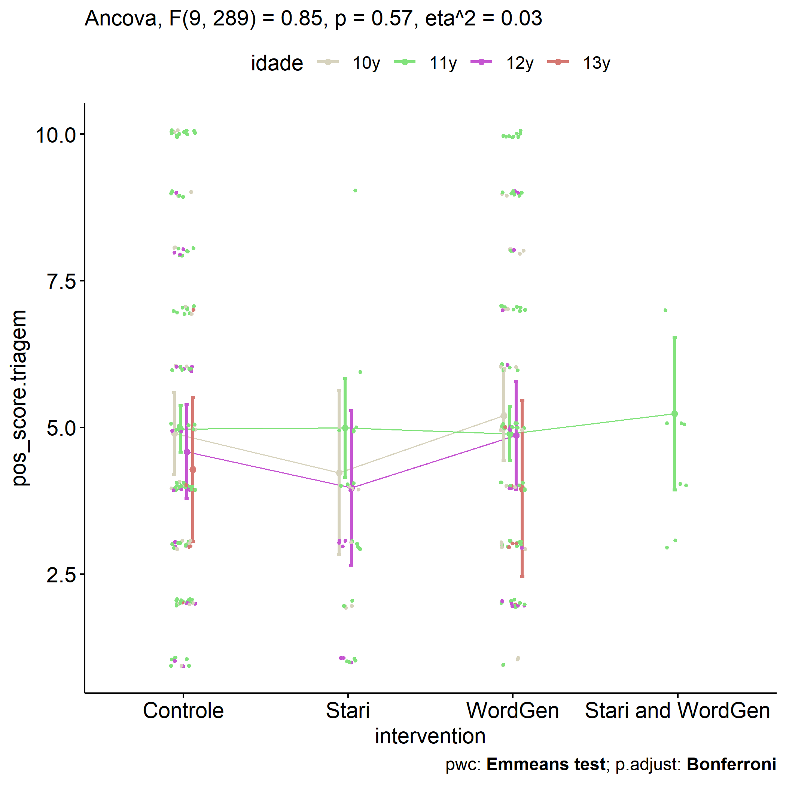<!-- -->

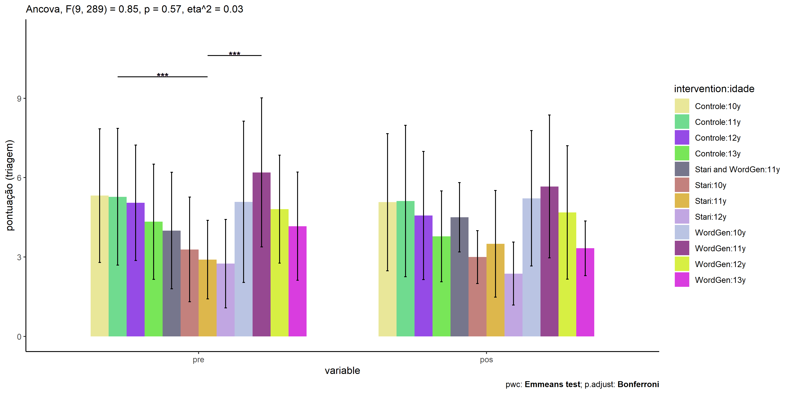<!-- -->

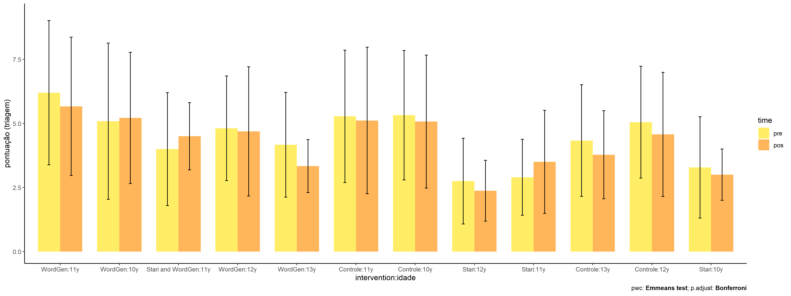<!-- -->

#### Baseado nas estimativas da aprendizagem (theta - traço latente) mediante TRI aplicado as respostas da prova

| var                   | intervention      | idade |   n | M (pre) | SE (pre) | M (unadj) | SE (unadj) | M (adj) | SE (adj) |
|:----------------------|:------------------|:------|----:|--------:|---------:|----------:|-----------:|--------:|---------:|
| pos_score_tri.triagem | Controle          | 10y   |  28 |   0.067 |    0.152 |     0.064 |      0.159 |   0.037 |    0.115 |
| pos_score_tri.triagem | Controle          | 11y   |  87 |   0.049 |    0.095 |     0.103 |      0.098 |   0.088 |    0.065 |
| pos_score_tri.triagem | Controle          | 12y   |  21 |   0.016 |    0.156 |    -0.054 |      0.176 |  -0.046 |    0.133 |
| pos_score_tri.triagem | Controle          | 13y   |   9 |  -0.369 |    0.201 |    -0.388 |      0.184 |  -0.117 |    0.204 |
| pos_score_tri.triagem | Stari and WordGen | 11y   |   8 |  -0.207 |    0.263 |    -0.251 |      0.223 |  -0.090 |    0.215 |
| pos_score_tri.triagem | Stari             | 10y   |   7 |  -0.584 |    0.230 |    -0.377 |      0.129 |   0.041 |    0.232 |
| pos_score_tri.triagem | Stari             | 11y   |  20 |  -0.621 |    0.108 |    -0.269 |      0.131 |   0.175 |    0.139 |
| pos_score_tri.triagem | Stari             | 12y   |   8 |  -0.573 |    0.154 |    -0.603 |      0.133 |  -0.192 |    0.217 |
| pos_score_tri.triagem | WordGen           | 10y   |  23 |   0.072 |    0.198 |     0.040 |      0.161 |   0.010 |    0.127 |
| pos_score_tri.triagem | WordGen           | 11y   |  66 |   0.442 |    0.106 |     0.285 |      0.109 |   0.002 |    0.077 |
| pos_score_tri.triagem | WordGen           | 12y   |  16 |  -0.063 |    0.147 |    -0.094 |      0.201 |  -0.033 |    0.152 |
| pos_score_tri.triagem | WordGen           | 13y   |   6 |  -0.334 |    0.263 |    -0.438 |      0.137 |  -0.191 |    0.249 |

|     | intervention | idade | group1   | group2            | estimate | conf.low | conf.high |    se | statistic | p       | p.adj   | p.adj.signif |
|:----|:-------------|:------|:---------|:------------------|---------:|---------:|----------:|------:|----------:|:--------|:--------|:-------------|
| 1   | NA           | 10y   | Controle | Stari             |   -0.004 |   -0.513 |     0.505 | 0.259 |    -0.016 | 0.988   | 1       | ns           |
| 2   | NA           | 10y   | Controle | WordGen           |    0.027 |   -0.310 |     0.364 | 0.171 |     0.158 | 0.874   | 1       | ns           |
| 4   | NA           | 10y   | Stari    | WordGen           |    0.031 |   -0.489 |     0.551 | 0.264 |     0.118 | 0.906   | 1       | ns           |
| 7   | NA           | 11y   | Controle | Stari             |   -0.087 |   -0.389 |     0.216 | 0.154 |    -0.564 | 0.573   | 1       | ns           |
| 8   | NA           | 11y   | Controle | WordGen           |    0.086 |   -0.112 |     0.285 | 0.101 |     0.853 | 0.394   | 1       | ns           |
| 9   | NA           | 11y   | Controle | Stari and WordGen |    0.178 |   -0.265 |     0.621 | 0.225 |     0.790 | 0.43    | 1       | ns           |
| 10  | NA           | 11y   | Stari    | WordGen           |    0.173 |   -0.147 |     0.492 | 0.162 |     1.064 | 0.288   | 1       | ns           |
| 11  | NA           | 11y   | Stari    | Stari and WordGen |    0.264 |   -0.238 |     0.767 | 0.255 |     1.037 | 0.301   | 1       | ns           |
| 12  | NA           | 11y   | WordGen  | Stari and WordGen |    0.092 |   -0.360 |     0.544 | 0.230 |     0.400 | 0.69    | 1       | ns           |
| 13  | NA           | 12y   | Controle | Stari             |    0.145 |   -0.355 |     0.646 | 0.254 |     0.572 | 0.568   | 1       | ns           |
| 14  | NA           | 12y   | Controle | WordGen           |   -0.014 |   -0.411 |     0.384 | 0.202 |    -0.068 | 0.946   | 1       | ns           |
| 16  | NA           | 12y   | Stari    | WordGen           |   -0.159 |   -0.679 |     0.361 | 0.264 |    -0.601 | 0.548   | 1       | ns           |
| 20  | NA           | 13y   | Controle | WordGen           |    0.074 |   -0.557 |     0.705 | 0.321 |     0.230 | 0.818   | 0.818   | ns           |
| 25  | NA           | 10y   | Controle | Stari             |    0.651 |   -0.017 |     1.319 | 0.339 |     1.919 | 0.056   | 0.168   | ns           |
| 26  | NA           | 10y   | Controle | WordGen           |   -0.005 |   -0.450 |     0.440 | 0.226 |    -0.021 | 0.983   | 1       | ns           |
| 28  | NA           | 10y   | Stari    | WordGen           |   -0.656 |   -1.338 |     0.026 | 0.347 |    -1.893 | 0.059   | 0.178   | ns           |
| 31  | NA           | 11y   | Controle | Stari             |    0.671 |    0.279 |     1.063 | 0.199 |     3.369 | \<0.001 | 0.005   | \*\*         |
| 32  | NA           | 11y   | Controle | WordGen           |   -0.393 |   -0.651 |    -0.135 | 0.131 |    -2.995 | 0.003   | 0.018   | \*           |
| 33  | NA           | 11y   | Controle | Stari and WordGen |    0.257 |   -0.327 |     0.841 | 0.297 |     0.866 | 0.387   | 1       | ns           |
| 34  | NA           | 11y   | Stari    | WordGen           |   -1.063 |   -1.467 |    -0.660 | 0.205 |    -5.188 | \<0.001 | \<0.001 | \*\*\*\*     |
| 35  | NA           | 11y   | Stari    | Stari and WordGen |   -0.414 |   -1.075 |     0.247 | 0.336 |    -1.232 | 0.219   | 1       | ns           |
| 36  | NA           | 11y   | WordGen  | Stari and WordGen |    0.649 |    0.058 |     1.241 | 0.301 |     2.160 | 0.032   | 0.189   | ns           |
| 37  | NA           | 12y   | Controle | Stari             |    0.589 |   -0.068 |     1.246 | 0.334 |     1.766 | 0.079   | 0.236   | ns           |
| 38  | NA           | 12y   | Controle | WordGen           |    0.078 |   -0.446 |     0.603 | 0.266 |     0.293 | 0.77    | 1       | ns           |
| 40  | NA           | 12y   | Stari    | WordGen           |   -0.511 |   -1.195 |     0.173 | 0.348 |    -1.469 | 0.143   | 0.428   | ns           |
| 44  | NA           | 13y   | Controle | WordGen           |   -0.035 |   -0.868 |     0.798 | 0.423 |    -0.082 | 0.935   | 0.935   | ns           |
| 49  | Controle     | NA    | 10y      | 11y               |   -0.051 |   -0.311 |     0.209 | 0.132 |    -0.387 | 0.699   | 1       | ns           |
| 50  | Controle     | NA    | 10y      | 12y               |    0.083 |   -0.263 |     0.429 | 0.176 |     0.473 | 0.637   | 1       | ns           |
| 51  | Controle     | NA    | 10y      | 13y               |    0.154 |   -0.306 |     0.614 | 0.234 |     0.658 | 0.511   | 1       | ns           |
| 52  | Controle     | NA    | 11y      | 12y               |    0.134 |   -0.157 |     0.425 | 0.148 |     0.907 | 0.365   | 1       | ns           |
| 53  | Controle     | NA    | 11y      | 13y               |    0.205 |   -0.216 |     0.626 | 0.214 |     0.959 | 0.338   | 1       | ns           |
| 54  | Controle     | NA    | 12y      | 13y               |    0.071 |   -0.407 |     0.549 | 0.243 |     0.292 | 0.77    | 1       | ns           |
| 55  | Stari        | NA    | 10y      | 11y               |   -0.134 |   -0.660 |     0.392 | 0.267 |    -0.501 | 0.617   | 1       | ns           |
| 56  | Stari        | NA    | 10y      | 12y               |    0.232 |   -0.387 |     0.852 | 0.315 |     0.738 | 0.461   | 1       | ns           |
| 58  | Stari        | NA    | 11y      | 12y               |    0.366 |   -0.135 |     0.867 | 0.254 |     1.439 | 0.151   | 0.454   | ns           |
| 61  | WordGen      | NA    | 10y      | 11y               |    0.008 |   -0.284 |     0.300 | 0.148 |     0.052 | 0.958   | 1       | ns           |
| 62  | WordGen      | NA    | 10y      | 12y               |    0.042 |   -0.348 |     0.432 | 0.198 |     0.213 | 0.831   | 1       | ns           |
| 63  | WordGen      | NA    | 10y      | 13y               |    0.201 |   -0.350 |     0.751 | 0.279 |     0.718 | 0.474   | 1       | ns           |
| 64  | WordGen      | NA    | 11y      | 12y               |    0.035 |   -0.302 |     0.371 | 0.171 |     0.202 | 0.84    | 1       | ns           |
| 65  | WordGen      | NA    | 11y      | 13y               |    0.193 |   -0.322 |     0.708 | 0.262 |     0.737 | 0.462   | 1       | ns           |
| 66  | WordGen      | NA    | 12y      | 13y               |    0.158 |   -0.415 |     0.732 | 0.291 |     0.543 | 0.587   | 1       | ns           |
| 73  | Controle     | NA    | 10y      | 11y               |    0.018 |   -0.325 |     0.362 | 0.174 |     0.104 | 0.917   | 1       | ns           |
| 74  | Controle     | NA    | 10y      | 12y               |    0.052 |   -0.404 |     0.508 | 0.232 |     0.224 | 0.823   | 1       | ns           |
| 75  | Controle     | NA    | 10y      | 13y               |    0.437 |   -0.169 |     1.042 | 0.308 |     1.419 | 0.157   | 0.942   | ns           |
| 76  | Controle     | NA    | 11y      | 12y               |    0.034 |   -0.350 |     0.418 | 0.195 |     0.173 | 0.863   | 1       | ns           |
| 77  | Controle     | NA    | 11y      | 13y               |    0.418 |   -0.135 |     0.972 | 0.281 |     1.488 | 0.138   | 0.827   | ns           |
| 78  | Controle     | NA    | 12y      | 13y               |    0.385 |   -0.245 |     1.014 | 0.320 |     1.202 | 0.23    | 1       | ns           |
| 79  | Stari        | NA    | 10y      | 11y               |    0.038 |   -0.656 |     0.732 | 0.353 |     0.107 | 0.915   | 1       | ns           |
| 80  | Stari        | NA    | 10y      | 12y               |   -0.010 |   -0.828 |     0.808 | 0.416 |    -0.025 | 0.98    | 1       | ns           |
| 82  | Stari        | NA    | 11y      | 12y               |   -0.048 |   -0.709 |     0.613 | 0.336 |    -0.143 | 0.887   | 1       | ns           |
| 85  | WordGen      | NA    | 10y      | 11y               |   -0.370 |   -0.752 |     0.013 | 0.194 |    -1.901 | 0.058   | 0.35    | ns           |
| 86  | WordGen      | NA    | 10y      | 12y               |    0.135 |   -0.380 |     0.649 | 0.261 |     0.516 | 0.606   | 1       | ns           |
| 87  | WordGen      | NA    | 10y      | 13y               |    0.407 |   -0.318 |     1.131 | 0.368 |     1.105 | 0.27    | 1       | ns           |
| 88  | WordGen      | NA    | 11y      | 12y               |    0.504 |    0.064 |     0.945 | 0.224 |     2.255 | 0.025   | 0.149   | ns           |
| 89  | WordGen      | NA    | 11y      | 13y               |    0.776 |    0.102 |     1.450 | 0.342 |     2.268 | 0.024   | 0.145   | ns           |
| 90  | WordGen      | NA    | 12y      | 13y               |    0.272 |   -0.485 |     1.028 | 0.384 |     0.707 | 0.48    | 1       | ns           |

| intervention      | idade | group1 | group2 | estimate | conf.low | conf.high |    se | statistic |     p | p.adj | p.adj.signif |
|:------------------|:------|:-------|:-------|---------:|---------:|----------:|------:|----------:|------:|------:|:-------------|
| Controle          | 10y   | pre    | pos    |    0.003 |   -0.422 |     0.429 | 0.217 |     0.016 | 0.988 | 0.988 | ns           |
| Controle          | 11y   | pre    | pos    |   -0.054 |   -0.295 |     0.188 | 0.123 |    -0.436 | 0.663 | 0.663 | ns           |
| Controle          | 12y   | pre    | pos    |    0.070 |   -0.422 |     0.561 | 0.250 |     0.279 | 0.780 | 0.780 | ns           |
| Controle          | 13y   | pre    | pos    |    0.019 |   -0.731 |     0.770 | 0.382 |     0.051 | 0.960 | 0.960 | ns           |
| Stari             | 10y   | pre    | pos    |   -0.206 |   -1.058 |     0.645 | 0.433 |    -0.476 | 0.634 | 0.634 | ns           |
| Stari             | 11y   | pre    | pos    |   -0.352 |   -0.856 |     0.151 | 0.256 |    -1.374 | 0.170 | 0.170 | ns           |
| Stari             | 12y   | pre    | pos    |    0.029 |   -0.767 |     0.825 | 0.405 |     0.072 | 0.943 | 0.943 | ns           |
| WordGen           | 10y   | pre    | pos    |    0.032 |   -0.438 |     0.502 | 0.239 |     0.134 | 0.894 | 0.894 | ns           |
| WordGen           | 11y   | pre    | pos    |    0.157 |   -0.121 |     0.434 | 0.141 |     1.109 | 0.268 | 0.268 | ns           |
| WordGen           | 12y   | pre    | pos    |    0.032 |   -0.531 |     0.595 | 0.287 |     0.110 | 0.912 | 0.912 | ns           |
| WordGen           | 13y   | pre    | pos    |    0.104 |   -0.815 |     1.024 | 0.468 |     0.222 | 0.824 | 0.824 | ns           |
| Stari and WordGen | 11y   | pre    | pos    |    0.043 |   -0.753 |     0.839 | 0.405 |     0.106 | 0.915 | 0.915 | ns           |

    ## Scale for colour is already present.
    ## Adding another scale for colour, which will replace the existing scale.

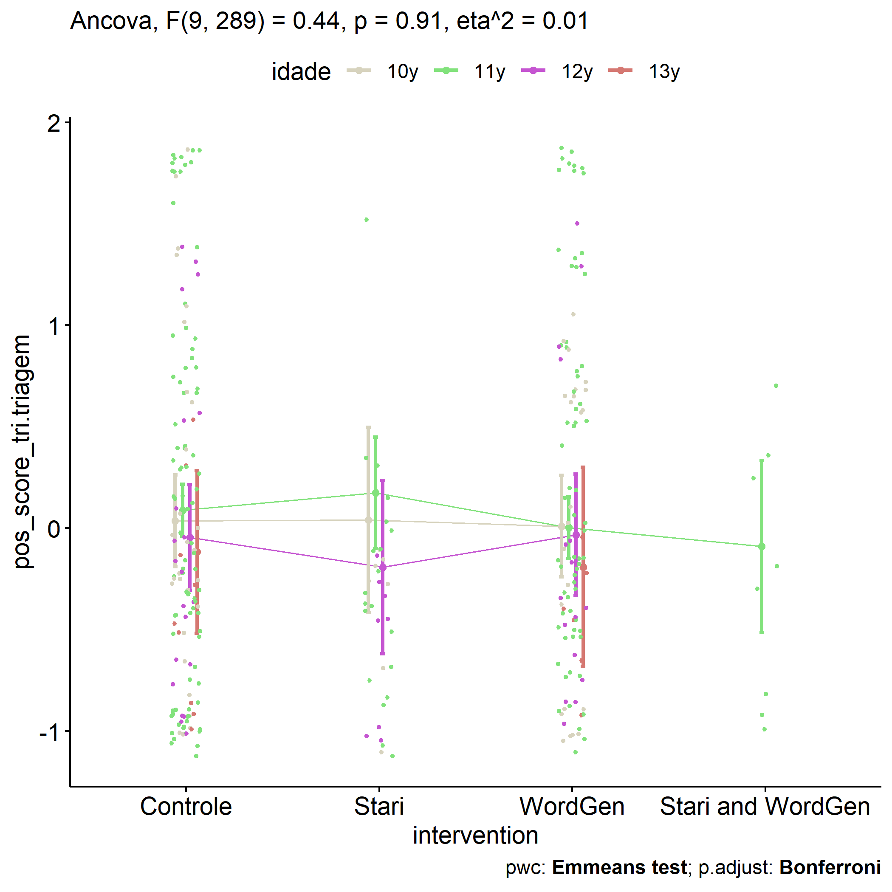<!-- -->

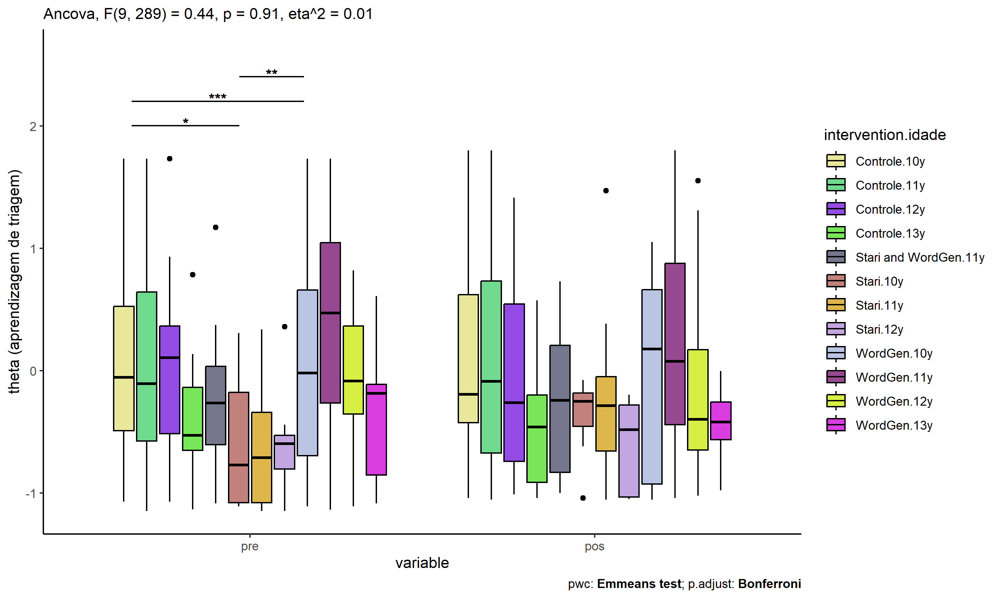<!-- -->

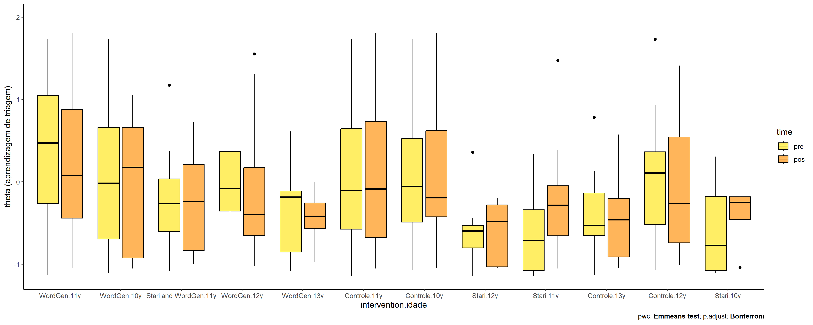<!-- -->

### factores: **intervention:zona.escola**

#### Baseado nos acertos (score) da prova

| var               | intervention      | zona.escola |   n | M (pre) | SE (pre) | M (unadj) | SE (unadj) | M (adj) | SE (adj) |
|:------------------|:------------------|:------------|----:|--------:|---------:|----------:|-----------:|--------:|---------:|
| pos_score.triagem | Controle          | Rural       |  52 |   5.654 |    0.326 |     5.173 |      0.378 |   4.715 |    0.259 |
| pos_score.triagem | Controle          | Urbana      | 101 |   4.861 |    0.253 |     4.703 |      0.268 |   4.803 |    0.185 |
| pos_score.triagem | Stari and WordGen | Rural       |   6 |   5.167 |    0.792 |     4.667 |      0.558 |   4.552 |    0.757 |
| pos_score.triagem | Stari and WordGen | Urbana      |   7 |   3.143 |    0.553 |     4.000 |      0.378 |   5.308 |    0.705 |
| pos_score.triagem | Stari             | Rural       |  12 |   3.000 |    0.408 |     3.417 |      0.398 |   4.825 |    0.542 |
| pos_score.triagem | Stari             | Urbana      |  24 |   2.917 |    0.340 |     3.125 |      0.396 |   4.592 |    0.389 |
| pos_score.triagem | WordGen           | Rural       |  36 |   6.306 |    0.456 |     5.583 |      0.479 |   4.667 |    0.314 |
| pos_score.triagem | WordGen           | Urbana      |  78 |   5.256 |    0.313 |     5.115 |      0.282 |   4.937 |    0.210 |

| intervention      | zona.escola | group1   | group2            | estimate | conf.low | conf.high |    se | statistic | p       | p.adj   | p.adj.signif |
|:------------------|:------------|:---------|:------------------|---------:|---------:|----------:|------:|----------:|:--------|:--------|:-------------|
| NA                | Urbana      | Controle | Stari             |    0.210 |   -0.634 |     1.055 | 0.429 |     0.490 | 0.624   | 1       | ns           |
| NA                | Urbana      | Controle | WordGen           |   -0.135 |   -0.686 |     0.416 | 0.280 |    -0.481 | 0.631   | 1       | ns           |
| NA                | Urbana      | Controle | Stari and WordGen |   -0.506 |   -1.939 |     0.928 | 0.728 |    -0.694 | 0.488   | 1       | ns           |
| NA                | Urbana      | Stari    | WordGen           |   -0.345 |   -1.219 |     0.529 | 0.444 |    -0.777 | 0.438   | 1       | ns           |
| NA                | Urbana      | Stari    | Stari and WordGen |   -0.716 |   -2.283 |     0.852 | 0.797 |    -0.899 | 0.369   | 1       | ns           |
| NA                | Urbana      | WordGen  | Stari and WordGen |   -0.371 |   -1.821 |     1.080 | 0.737 |    -0.503 | 0.615   | 1       | ns           |
| NA                | Rural       | Controle | Stari             |   -0.110 |   -1.299 |     1.080 | 0.605 |    -0.182 | 0.856   | 1       | ns           |
| NA                | Rural       | Controle | WordGen           |    0.048 |   -0.745 |     0.841 | 0.403 |     0.119 | 0.905   | 1       | ns           |
| NA                | Rural       | Controle | Stari and WordGen |    0.164 |   -1.410 |     1.737 | 0.800 |     0.205 | 0.838   | 1       | ns           |
| NA                | Rural       | Stari    | WordGen           |    0.158 |   -1.090 |     1.405 | 0.634 |     0.249 | 0.803   | 1       | ns           |
| NA                | Rural       | Stari    | Stari and WordGen |    0.274 |   -1.560 |     2.107 | 0.932 |     0.294 | 0.769   | 1       | ns           |
| NA                | Rural       | WordGen  | Stari and WordGen |    0.116 |   -1.496 |     1.728 | 0.819 |     0.141 | 0.888   | 1       | ns           |
| NA                | Urbana      | Controle | Stari             |    1.945 |    0.837 |     3.053 | 0.563 |     3.454 | \<0.001 | 0.004   | \*\*         |
| NA                | Urbana      | Controle | WordGen           |   -0.395 |   -1.131 |     0.340 | 0.374 |    -1.057 | 0.291   | 1       | ns           |
| NA                | Urbana      | Controle | Stari and WordGen |    1.719 |   -0.189 |     3.626 | 0.969 |     1.773 | 0.077   | 0.463   | ns           |
| NA                | Urbana      | Stari    | WordGen           |   -2.340 |   -3.479 |    -1.201 | 0.579 |    -4.042 | \<0.001 | \<0.001 | \*\*\*       |
| NA                | Urbana      | Stari    | Stari and WordGen |   -0.226 |   -2.322 |     1.870 | 1.065 |    -0.212 | 0.832   | 1       | ns           |
| NA                | Urbana      | WordGen  | Stari and WordGen |    2.114 |    0.188 |     4.039 | 0.978 |     2.160 | 0.032   | 0.189   | ns           |
| NA                | Rural       | Controle | Stari             |    2.654 |    1.091 |     4.216 | 0.794 |     3.342 | \<0.001 | 0.006   | \*\*         |
| NA                | Rural       | Controle | WordGen           |   -0.652 |   -1.710 |     0.406 | 0.538 |    -1.212 | 0.226   | 1       | ns           |
| NA                | Rural       | Controle | Stari and WordGen |    0.487 |   -1.617 |     2.591 | 1.069 |     0.456 | 0.649   | 1       | ns           |
| NA                | Rural       | Stari    | WordGen           |   -3.306 |   -4.932 |    -1.679 | 0.827 |    -3.999 | \<0.001 | \<0.001 | \*\*\*       |
| NA                | Rural       | Stari    | Stari and WordGen |   -2.167 |   -4.606 |     0.273 | 1.240 |    -1.748 | 0.082   | 0.489   | ns           |
| NA                | Rural       | WordGen  | Stari and WordGen |    1.139 |   -1.013 |     3.290 | 1.093 |     1.042 | 0.298   | 1       | ns           |
| Controle          | NA          | Urbana   | Rural             |    0.087 |   -0.539 |     0.713 | 0.318 |     0.274 | 0.784   | 0.784   | ns           |
| Stari             | NA          | Urbana   | Rural             |   -0.233 |   -1.523 |     1.057 | 0.656 |    -0.356 | 0.722   | 0.722   | ns           |
| WordGen           | NA          | Urbana   | Rural             |    0.270 |   -0.471 |     1.010 | 0.376 |     0.717 | 0.474   | 0.474   | ns           |
| Stari and WordGen | NA          | Urbana   | Rural             |    0.757 |   -1.280 |     2.794 | 1.035 |     0.731 | 0.465   | 0.465   | ns           |
| Controle          | NA          | Urbana   | Rural             |   -0.792 |   -1.625 |     0.040 | 0.423 |    -1.872 | 0.062   | 0.062   | ns           |
| Stari             | NA          | Urbana   | Rural             |   -0.083 |   -1.808 |     1.642 | 0.877 |    -0.095 | 0.924   | 0.924   | ns           |
| WordGen           | NA          | Urbana   | Rural             |   -1.049 |   -2.032 |    -0.066 | 0.500 |    -2.100 | 0.037   | 0.037   | \*           |
| Stari and WordGen | NA          | Urbana   | Rural             |   -2.024 |   -4.738 |     0.691 | 1.380 |    -1.467 | 0.143   | 0.143   | ns           |

| zona.escola | group1 | group2 | estimate | conf.low | conf.high |    se | statistic |     p | p.adj | p.adj.signif |
|:------------|:-------|:-------|---------:|---------:|----------:|------:|----------:|------:|------:|:-------------|
| Urbana      | pre    | pos    |    0.158 |   -0.536 |     0.853 | 0.353 |     0.448 | 0.654 | 0.654 | ns           |
| Rural       | pre    | pos    |    0.481 |   -0.487 |     1.448 | 0.493 |     0.976 | 0.329 | 0.329 | ns           |
| Urbana      | pre    | pos    |   -0.208 |   -1.632 |     1.216 | 0.725 |    -0.287 | 0.774 | 0.774 | ns           |
| Rural       | pre    | pos    |   -0.417 |   -2.430 |     1.597 | 1.025 |    -0.406 | 0.685 | 0.685 | ns           |
| Urbana      | pre    | pos    |    0.141 |   -0.649 |     0.931 | 0.402 |     0.351 | 0.726 | 0.726 | ns           |
| Rural       | pre    | pos    |    0.722 |   -0.440 |     1.885 | 0.592 |     1.220 | 0.223 | 0.223 | ns           |
| Urbana      | pre    | pos    |   -0.857 |   -3.494 |     1.779 | 1.343 |    -0.638 | 0.523 | 0.523 | ns           |
| Rural       | pre    | pos    |    0.500 |   -2.348 |     3.348 | 1.450 |     0.345 | 0.730 | 0.730 | ns           |

    ## Scale for colour is already present.
    ## Adding another scale for colour, which will replace the existing scale.

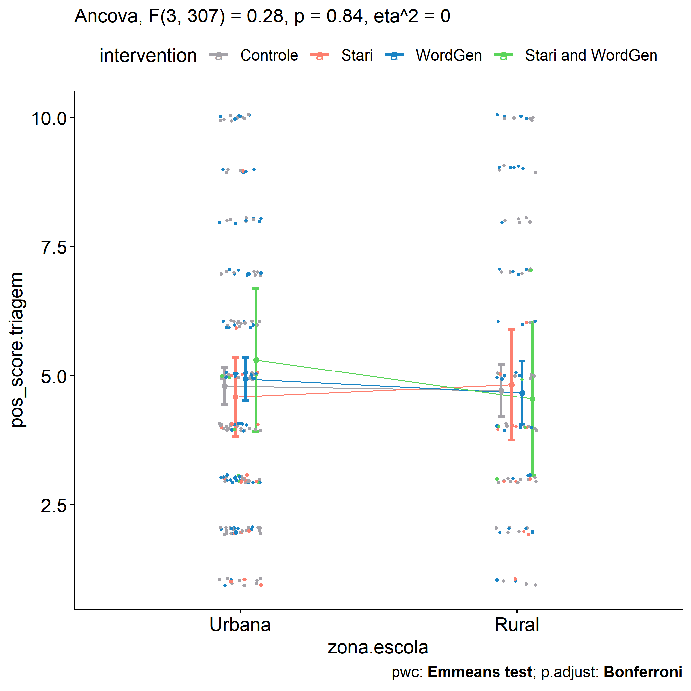<!-- -->

    ## Scale for colour is already present.
    ## Adding another scale for colour, which will replace the existing scale.

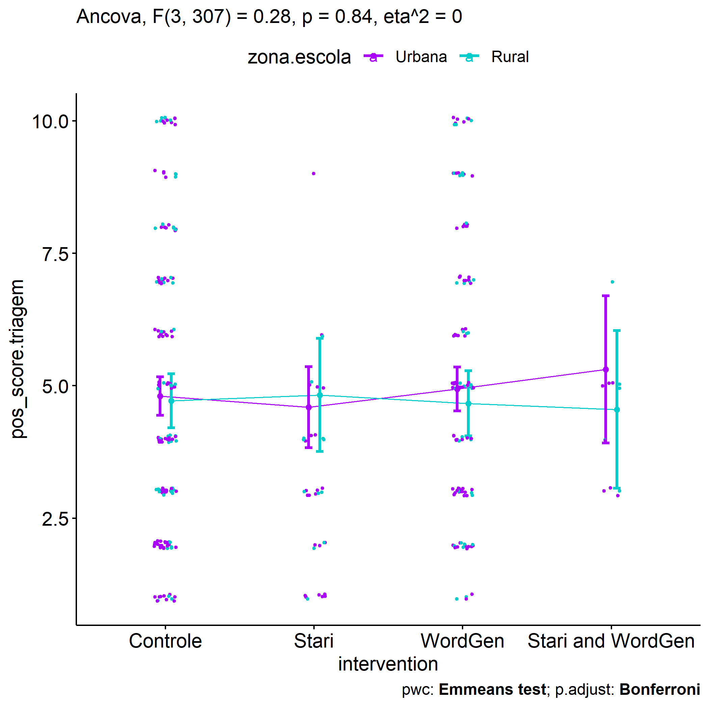<!-- -->

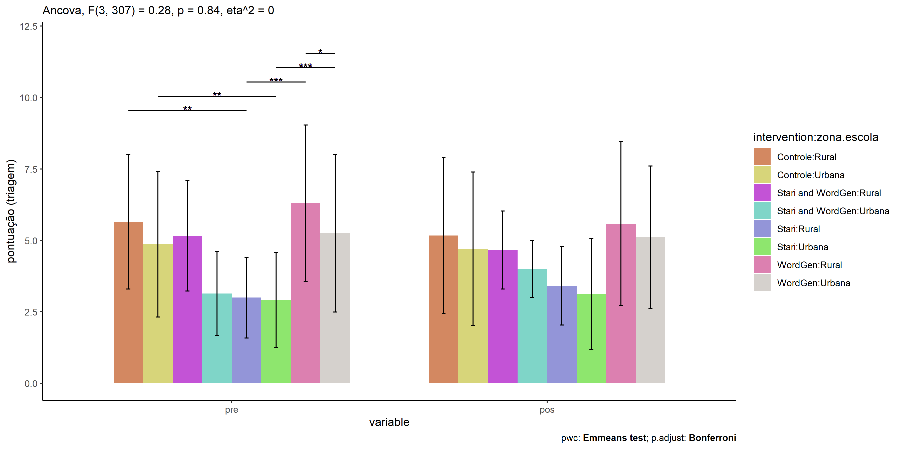<!-- -->

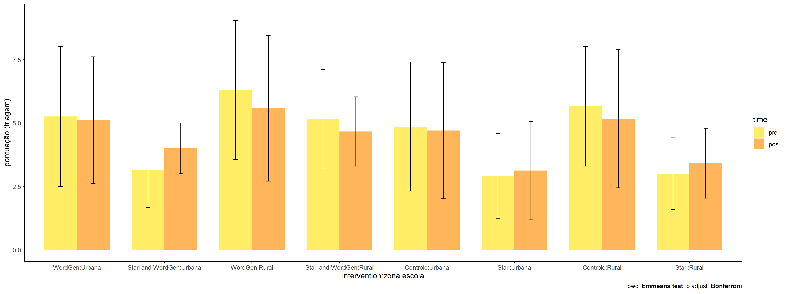<!-- -->

#### Baseado nas estimativas da aprendizagem (theta - traço latente) mediante TRI aplicado as respostas da prova

| var                   | intervention      | zona.escola |   n | M (pre) | SE (pre) | M (unadj) | SE (unadj) | M (adj) | SE (adj) |
|:----------------------|:------------------|:------------|----:|--------:|---------:|----------:|-----------:|--------:|---------:|
| pos_score_tri.triagem | Controle          | Rural       |  52 |   0.196 |    0.110 |     0.092 |      0.123 |  -0.044 |    0.084 |
| pos_score_tri.triagem | Controle          | Urbana      | 101 |  -0.090 |    0.083 |    -0.026 |      0.085 |   0.036 |    0.060 |
| pos_score_tri.triagem | Stari and WordGen | Rural       |   6 |  -0.018 |    0.309 |    -0.080 |      0.226 |  -0.068 |    0.246 |
| pos_score_tri.triagem | Stari and WordGen | Urbana      |   7 |  -0.541 |    0.213 |    -0.473 |      0.214 |  -0.099 |    0.229 |
| pos_score_tri.triagem | Stari             | Rural       |  12 |  -0.586 |    0.136 |    -0.298 |      0.091 |   0.108 |    0.176 |
| pos_score_tri.triagem | Stari             | Urbana      |  24 |  -0.629 |    0.102 |    -0.397 |      0.118 |   0.038 |    0.126 |
| pos_score_tri.triagem | WordGen           | Rural       |  36 |   0.433 |    0.140 |     0.165 |      0.160 |  -0.136 |    0.102 |
| pos_score_tri.triagem | WordGen           | Urbana      |  78 |   0.119 |    0.100 |     0.110 |      0.090 |   0.028 |    0.068 |

| intervention      | zona.escola | group1   | group2            | estimate | conf.low | conf.high |    se | statistic | p       | p.adj   | p.adj.signif |
|:------------------|:------------|:---------|:------------------|---------:|---------:|----------:|------:|----------:|:--------|:--------|:-------------|
| NA                | Urbana      | Controle | Stari             |   -0.003 |   -0.276 |     0.270 | 0.139 |    -0.020 | 0.984   | 1       | ns           |
| NA                | Urbana      | Controle | WordGen           |    0.008 |   -0.172 |     0.188 | 0.091 |     0.087 | 0.931   | 1       | ns           |
| NA                | Urbana      | Controle | Stari and WordGen |    0.135 |   -0.331 |     0.600 | 0.236 |     0.569 | 0.57    | 1       | ns           |
| NA                | Urbana      | Stari    | WordGen           |    0.011 |   -0.273 |     0.295 | 0.144 |     0.074 | 0.941   | 1       | ns           |
| NA                | Urbana      | Stari    | Stari and WordGen |    0.137 |   -0.372 |     0.647 | 0.259 |     0.530 | 0.596   | 1       | ns           |
| NA                | Urbana      | WordGen  | Stari and WordGen |    0.127 |   -0.345 |     0.598 | 0.240 |     0.529 | 0.597   | 1       | ns           |
| NA                | Rural       | Controle | Stari             |   -0.152 |   -0.538 |     0.233 | 0.196 |    -0.776 | 0.438   | 1       | ns           |
| NA                | Rural       | Controle | WordGen           |    0.092 |   -0.166 |     0.349 | 0.131 |     0.698 | 0.486   | 1       | ns           |
| NA                | Rural       | Controle | Stari and WordGen |    0.024 |   -0.488 |     0.536 | 0.260 |     0.093 | 0.926   | 1       | ns           |
| NA                | Rural       | Stari    | WordGen           |    0.244 |   -0.161 |     0.648 | 0.206 |     1.185 | 0.237   | 1       | ns           |
| NA                | Rural       | Stari    | Stari and WordGen |    0.176 |   -0.419 |     0.771 | 0.302 |     0.583 | 0.56    | 1       | ns           |
| NA                | Rural       | WordGen  | Stari and WordGen |   -0.067 |   -0.592 |     0.457 | 0.267 |    -0.253 | 0.8     | 1       | ns           |
| NA                | Urbana      | Controle | Stari             |    0.539 |    0.180 |     0.898 | 0.183 |     2.952 | 0.003   | 0.02    | \*           |
| NA                | Urbana      | Controle | WordGen           |   -0.209 |   -0.447 |     0.030 | 0.121 |    -1.723 | 0.086   | 0.515   | ns           |
| NA                | Urbana      | Controle | Stari and WordGen |    0.451 |   -0.167 |     1.069 | 0.314 |     1.436 | 0.152   | 0.912   | ns           |
| NA                | Urbana      | Stari    | WordGen           |   -0.748 |   -1.117 |    -0.378 | 0.188 |    -3.985 | \<0.001 | \<0.001 | \*\*\*       |
| NA                | Urbana      | Stari    | Stari and WordGen |   -0.088 |   -0.767 |     0.592 | 0.345 |    -0.254 | 0.799   | 1       | ns           |
| NA                | Urbana      | WordGen  | Stari and WordGen |    0.660 |    0.036 |     1.284 | 0.317 |     2.081 | 0.038   | 0.23    | ns           |
| NA                | Rural       | Controle | Stari             |    0.782 |    0.276 |     1.289 | 0.257 |     3.038 | 0.003   | 0.015   | \*           |
| NA                | Rural       | Controle | WordGen           |   -0.238 |   -0.581 |     0.105 | 0.174 |    -1.364 | 0.174   | 1       | ns           |
| NA                | Rural       | Controle | Stari and WordGen |    0.213 |   -0.468 |     0.895 | 0.347 |     0.616 | 0.538   | 1       | ns           |
| NA                | Rural       | Stari    | WordGen           |   -1.020 |   -1.547 |    -0.493 | 0.268 |    -3.806 | \<0.001 | 0.001   | \*\*         |
| NA                | Rural       | Stari    | Stari and WordGen |   -0.569 |   -1.359 |     0.222 | 0.402 |    -1.415 | 0.158   | 0.949   | ns           |
| NA                | Rural       | WordGen  | Stari and WordGen |    0.451 |   -0.246 |     1.149 | 0.354 |     1.273 | 0.204   | 1       | ns           |
| Controle          | NA          | Urbana   | Rural             |    0.080 |   -0.124 |     0.284 | 0.104 |     0.770 | 0.442   | 0.442   | ns           |
| Stari             | NA          | Urbana   | Rural             |   -0.070 |   -0.489 |     0.350 | 0.213 |    -0.327 | 0.744   | 0.744   | ns           |
| WordGen           | NA          | Urbana   | Rural             |    0.163 |   -0.077 |     0.404 | 0.122 |     1.337 | 0.182   | 0.182   | ns           |
| Stari and WordGen | NA          | Urbana   | Rural             |   -0.031 |   -0.692 |     0.631 | 0.336 |    -0.091 | 0.927   | 0.927   | ns           |
| Controle          | NA          | Urbana   | Rural             |   -0.286 |   -0.556 |    -0.016 | 0.137 |    -2.083 | 0.038   | 0.038   | \*           |
| Stari             | NA          | Urbana   | Rural             |   -0.043 |   -0.602 |     0.517 | 0.284 |    -0.150 | 0.881   | 0.881   | ns           |
| WordGen           | NA          | Urbana   | Rural             |   -0.315 |   -0.633 |     0.004 | 0.162 |    -1.943 | 0.053   | 0.053   | ns           |
| Stari and WordGen | NA          | Urbana   | Rural             |   -0.523 |   -1.403 |     0.357 | 0.447 |    -1.170 | 0.243   | 0.243   | ns           |

| intervention      | zona.escola | group1 | group2 | estimate | conf.low | conf.high |    se | statistic |     p | p.adj | p.adj.signif |
|:------------------|:------------|:-------|:-------|---------:|---------:|----------:|------:|----------:|------:|------:|:-------------|
| Controle          | Urbana      | pre    | pos    |   -0.064 |   -0.288 |     0.161 | 0.114 |    -0.557 | 0.578 | 0.578 | ns           |
| Controle          | Rural       | pre    | pos    |    0.104 |   -0.209 |     0.417 | 0.159 |     0.653 | 0.514 | 0.514 | ns           |
| Stari             | Urbana      | pre    | pos    |   -0.232 |   -0.692 |     0.228 | 0.234 |    -0.990 | 0.323 | 0.323 | ns           |
| Stari             | Rural       | pre    | pos    |   -0.289 |   -0.939 |     0.362 | 0.331 |    -0.871 | 0.384 | 0.384 | ns           |
| WordGen           | Urbana      | pre    | pos    |    0.008 |   -0.247 |     0.264 | 0.130 |     0.065 | 0.948 | 0.948 | ns           |
| WordGen           | Rural       | pre    | pos    |    0.269 |   -0.107 |     0.644 | 0.191 |     1.404 | 0.161 | 0.161 | ns           |
| Stari and WordGen | Urbana      | pre    | pos    |   -0.068 |   -0.920 |     0.784 | 0.434 |    -0.156 | 0.876 | 0.876 | ns           |
| Stari and WordGen | Rural       | pre    | pos    |    0.062 |   -0.858 |     0.983 | 0.469 |     0.133 | 0.894 | 0.894 | ns           |

    ## Scale for colour is already present.
    ## Adding another scale for colour, which will replace the existing scale.

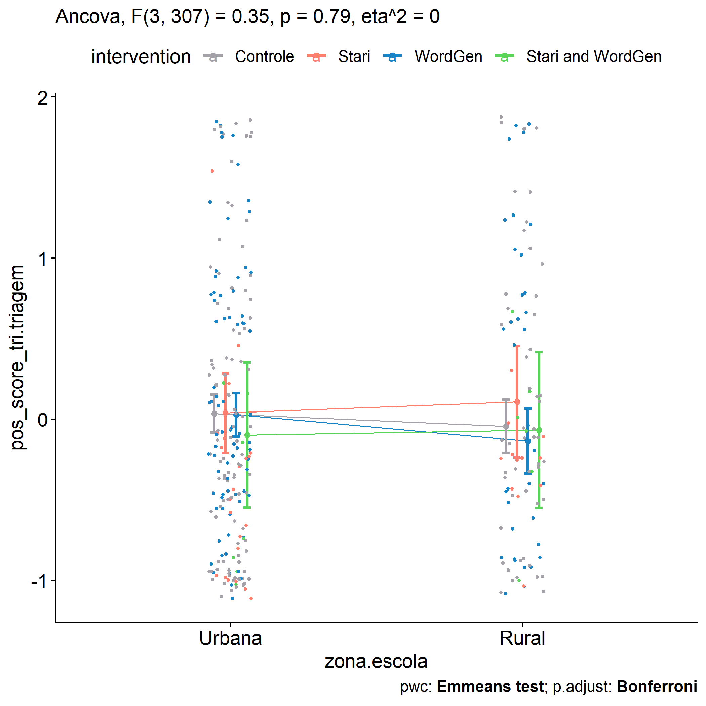<!-- -->

    ## Scale for colour is already present.
    ## Adding another scale for colour, which will replace the existing scale.

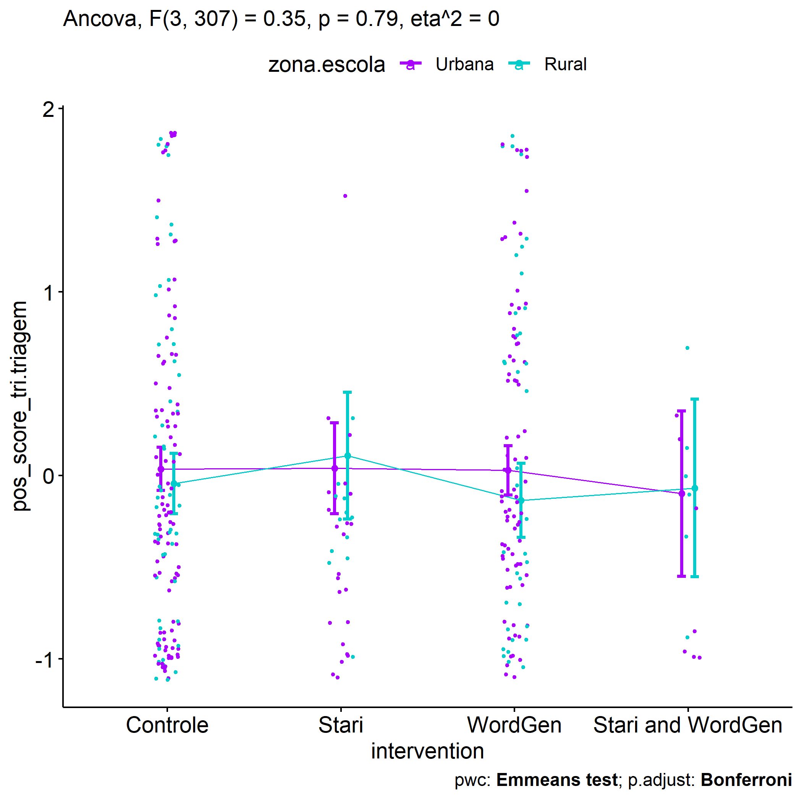<!-- -->

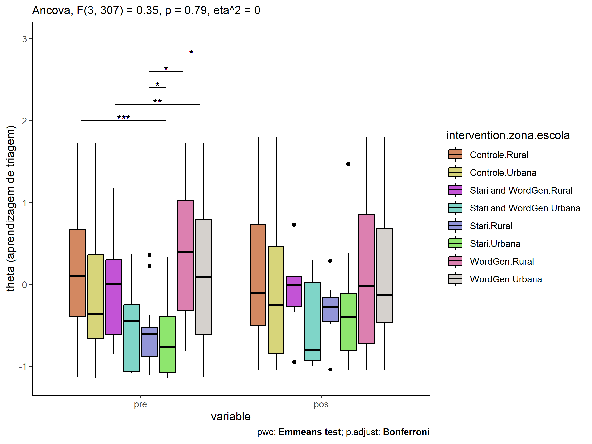<!-- -->

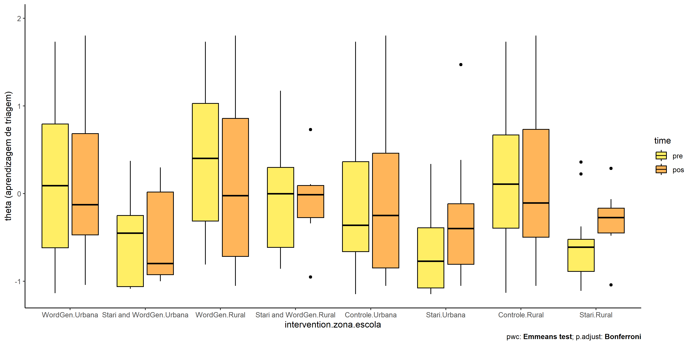<!-- -->

### factores: **intervention:zona.participante**

#### Baseado nos acertos (score) da prova

| var               | intervention      | zona.participante |   n | M (pre) | SE (pre) | M (unadj) | SE (unadj) | M (adj) | SE (adj) |
|:------------------|:------------------|:------------------|----:|--------:|---------:|----------:|-----------:|--------:|---------:|
| pos_score.triagem | Controle          | Rural             |  52 |   4.577 |    0.325 |     4.327 |      0.364 |   4.533 |    0.261 |
| pos_score.triagem | Controle          | Urbana            |  67 |   5.194 |    0.298 |     5.194 |      0.329 |   4.971 |    0.230 |
| pos_score.triagem | Stari and WordGen | Rural             |   5 |   5.400 |    0.812 |     4.200 |      0.374 |   3.833 |    0.840 |
| pos_score.triagem | Stari and WordGen | Urbana            |   5 |   3.400 |    0.927 |     4.400 |      0.748 |   5.424 |    0.843 |
| pos_score.triagem | Stari             | Rural             |  15 |   3.267 |    0.473 |     3.533 |      0.515 |   4.650 |    0.491 |
| pos_score.triagem | Stari             | Urbana            |  11 |   2.364 |    0.411 |     3.000 |      0.447 |   4.745 |    0.580 |
| pos_score.triagem | WordGen           | Rural             |  46 |   5.609 |    0.402 |     5.413 |      0.393 |   4.901 |    0.279 |
| pos_score.triagem | WordGen           | Urbana            |  43 |   5.256 |    0.430 |     5.326 |      0.396 |   5.059 |    0.287 |

| intervention      | zona.participante | group1   | group2            | estimate | conf.low | conf.high |    se | statistic | p       | p.adj | p.adj.signif |
|:------------------|:------------------|:---------|:------------------|---------:|---------:|----------:|------:|----------:|:--------|------:|:-------------|
| NA                | Urbana            | Controle | Stari             |    0.226 |   -1.009 |     1.460 | 0.627 |     0.360 | 0.719   | 1.000 | ns           |
| NA                | Urbana            | Controle | WordGen           |   -0.089 |   -0.811 |     0.634 | 0.367 |    -0.241 | 0.809   | 1.000 | ns           |
| NA                | Urbana            | Controle | Stari and WordGen |   -0.454 |   -2.178 |     1.270 | 0.875 |    -0.518 | 0.605   | 1.000 | ns           |
| NA                | Urbana            | Stari    | WordGen           |   -0.314 |   -1.596 |     0.967 | 0.650 |    -0.483 | 0.629   | 1.000 | ns           |
| NA                | Urbana            | Stari    | Stari and WordGen |   -0.679 |   -2.677 |     1.319 | 1.014 |    -0.670 | 0.504   | 1.000 | ns           |
| NA                | Urbana            | WordGen  | Stari and WordGen |   -0.365 |   -2.122 |     1.392 | 0.892 |    -0.409 | 0.683   | 1.000 | ns           |
| NA                | Rural             | Controle | Stari             |   -0.118 |   -1.209 |     0.974 | 0.554 |    -0.212 | 0.832   | 1.000 | ns           |
| NA                | Rural             | Controle | WordGen           |   -0.369 |   -1.124 |     0.387 | 0.384 |    -0.961 | 0.338   | 1.000 | ns           |
| NA                | Rural             | Controle | Stari and WordGen |    0.699 |   -1.035 |     2.433 | 0.880 |     0.795 | 0.428   | 1.000 | ns           |
| NA                | Rural             | Stari    | WordGen           |   -0.251 |   -1.374 |     0.873 | 0.570 |    -0.440 | 0.66    | 1.000 | ns           |
| NA                | Rural             | Stari    | Stari and WordGen |    0.817 |   -1.105 |     2.739 | 0.975 |     0.838 | 0.403   | 1.000 | ns           |
| NA                | Rural             | WordGen  | Stari and WordGen |    1.068 |   -0.674 |     2.810 | 0.884 |     1.208 | 0.228   | 1.000 | ns           |
| NA                | Urbana            | Controle | Stari             |    2.830 |    1.248 |     4.413 | 0.803 |     3.524 | \<0.001 | 0.003 | \*\*         |
| NA                | Urbana            | Controle | WordGen           |   -0.062 |   -1.012 |     0.889 | 0.482 |    -0.128 | 0.898   | 1.000 | ns           |
| NA                | Urbana            | Controle | Stari and WordGen |    1.794 |   -0.461 |     4.049 | 1.144 |     1.568 | 0.118   | 0.710 | ns           |
| NA                | Urbana            | Stari    | WordGen           |   -2.892 |   -4.535 |    -1.249 | 0.834 |    -3.467 | \<0.001 | 0.004 | \*\*         |
| NA                | Urbana            | Stari    | Stari and WordGen |   -1.036 |   -3.659 |     1.587 | 1.331 |    -0.778 | 0.437   | 1.000 | ns           |
| NA                | Urbana            | WordGen  | Stari and WordGen |    1.856 |   -0.442 |     4.154 | 1.166 |     1.591 | 0.113   | 0.678 | ns           |
| NA                | Rural             | Controle | Stari             |    1.310 |   -0.115 |     2.736 | 0.724 |     1.811 | 0.071   | 0.428 | ns           |
| NA                | Rural             | Controle | WordGen           |   -1.032 |   -2.016 |    -0.047 | 0.500 |    -2.065 | 0.04    | 0.240 | ns           |
| NA                | Rural             | Controle | Stari and WordGen |   -0.823 |   -3.100 |     1.454 | 1.156 |    -0.712 | 0.477   | 1.000 | ns           |
| NA                | Rural             | Stari    | WordGen           |   -2.342 |   -3.788 |    -0.896 | 0.734 |    -3.191 | 0.002   | 0.010 | \*\*         |
| NA                | Rural             | Stari    | Stari and WordGen |   -2.133 |   -4.645 |     0.378 | 1.275 |    -1.673 | 0.096   | 0.573 | ns           |
| NA                | Rural             | WordGen  | Stari and WordGen |    0.209 |   -2.081 |     2.499 | 1.162 |     0.180 | 0.858   | 1.000 | ns           |
| Controle          | NA                | Urbana   | Rural             |    0.438 |   -0.248 |     1.124 | 0.348 |     1.257 | 0.21    | 0.210 | ns           |
| Stari             | NA                | Urbana   | Rural             |    0.095 |   -1.377 |     1.566 | 0.747 |     0.127 | 0.899   | 0.899 | ns           |
| WordGen           | NA                | Urbana   | Rural             |    0.158 |   -0.628 |     0.943 | 0.399 |     0.396 | 0.692   | 0.692 | ns           |
| Stari and WordGen | NA                | Urbana   | Rural             |    1.591 |   -0.757 |     3.939 | 1.192 |     1.335 | 0.183   | 0.183 | ns           |
| Controle          | NA                | Urbana   | Rural             |    0.617 |   -0.282 |     1.516 | 0.456 |     1.353 | 0.177   | 0.177 | ns           |
| Stari             | NA                | Urbana   | Rural             |   -0.903 |   -2.834 |     1.028 | 0.980 |    -0.922 | 0.358   | 0.358 | ns           |
| WordGen           | NA                | Urbana   | Rural             |   -0.353 |   -1.384 |     0.679 | 0.524 |    -0.674 | 0.501   | 0.501 | ns           |
| Stari and WordGen | NA                | Urbana   | Rural             |   -2.000 |   -5.076 |     1.076 | 1.561 |    -1.281 | 0.201   | 0.201 | ns           |

| zona.participante | group1 | group2 | estimate | conf.low | conf.high |    se | statistic |     p | p.adj | p.adj.signif |
|:------------------|:-------|:-------|---------:|---------:|----------:|------:|----------:|------:|------:|:-------------|
| Urbana            | pre    | pos    |    0.000 |   -0.851 |     0.851 | 0.433 |     0.000 | 1.000 | 1.000 | ns           |
| Rural             | pre    | pos    |    0.250 |   -0.715 |     1.215 | 0.491 |     0.509 | 0.611 | 0.611 | ns           |
| Urbana            | pre    | pos    |   -0.636 |   -2.735 |     1.463 | 1.068 |    -0.596 | 0.552 | 0.552 | ns           |
| Rural             | pre    | pos    |   -0.267 |   -2.064 |     1.531 | 0.915 |    -0.292 | 0.771 | 0.771 | ns           |
| Urbana            | pre    | pos    |   -0.070 |   -1.131 |     0.992 | 0.540 |    -0.129 | 0.897 | 0.897 | ns           |
| Rural             | pre    | pos    |    0.196 |   -0.831 |     1.222 | 0.522 |     0.375 | 0.708 | 0.708 | ns           |
| Urbana            | pre    | pos    |   -1.000 |   -4.113 |     2.113 | 1.584 |    -0.631 | 0.528 | 0.528 | ns           |
| Rural             | pre    | pos    |    1.200 |   -1.913 |     4.313 | 1.584 |     0.757 | 0.449 | 0.449 | ns           |

    ## Scale for colour is already present.
    ## Adding another scale for colour, which will replace the existing scale.

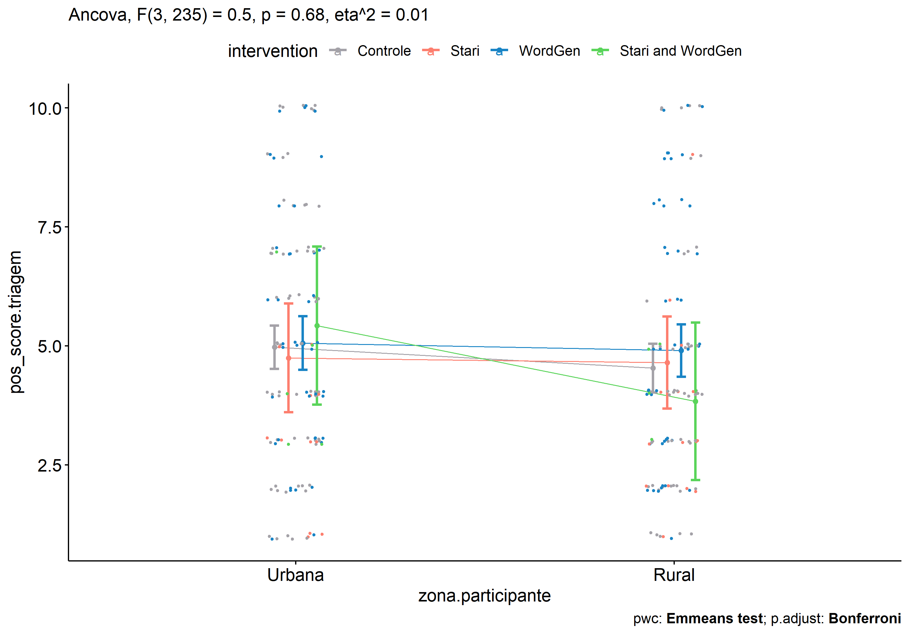<!-- -->

    ## Scale for colour is already present.
    ## Adding another scale for colour, which will replace the existing scale.

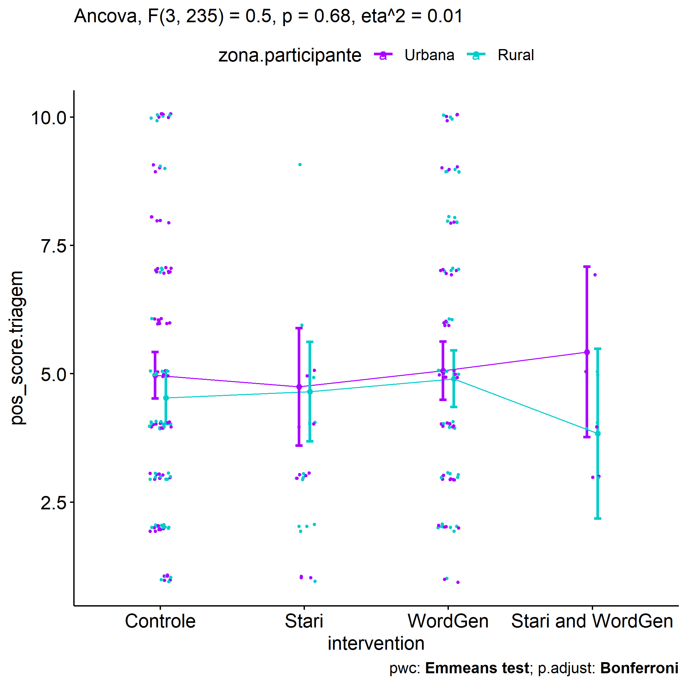<!-- -->

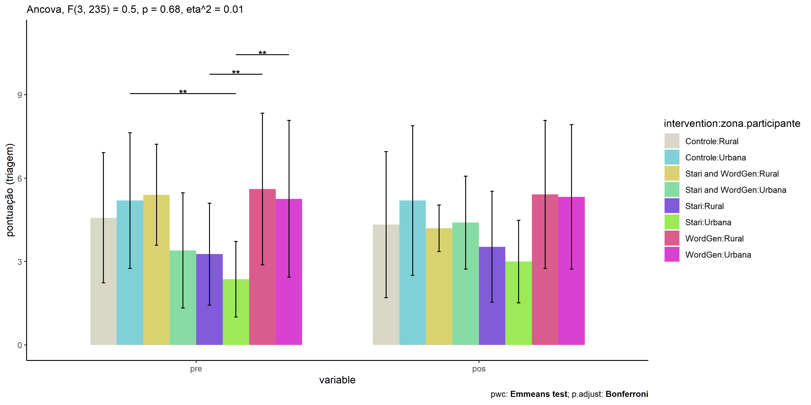<!-- -->

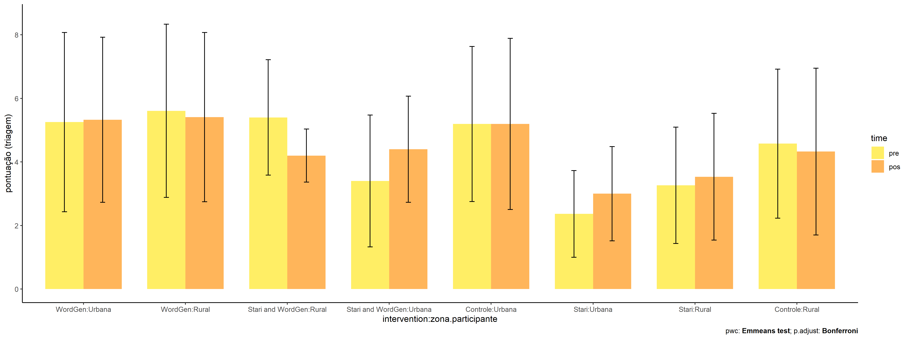<!-- -->

#### Baseado nas estimativas da aprendizagem (theta - traço latente) mediante TRI aplicado as respostas da prova

| var                   | intervention      | zona.participante |   n | M (pre) | SE (pre) | M (unadj) | SE (unadj) | M (adj) | SE (adj) |
|:----------------------|:------------------|:------------------|----:|--------:|---------:|----------:|-----------:|--------:|---------:|
| pos_score_tri.triagem | Controle          | Rural             |  52 |  -0.132 |    0.106 |    -0.082 |      0.119 |  -0.016 |    0.084 |
| pos_score_tri.triagem | Controle          | Urbana            |  67 |  -0.001 |    0.100 |     0.090 |      0.103 |   0.067 |    0.074 |
| pos_score_tri.triagem | Stari and WordGen | Rural             |   5 |   0.223 |    0.272 |    -0.363 |      0.272 |  -0.540 |    0.271 |
| pos_score_tri.triagem | Stari and WordGen | Urbana            |   5 |  -0.590 |    0.303 |    -0.241 |      0.296 |   0.139 |    0.272 |
| pos_score_tri.triagem | Stari             | Rural             |  15 |  -0.499 |    0.152 |    -0.207 |      0.149 |   0.111 |    0.158 |
| pos_score_tri.triagem | Stari             | Urbana            |  11 |  -0.766 |    0.134 |    -0.412 |      0.125 |   0.088 |    0.186 |
| pos_score_tri.triagem | WordGen           | Rural             |  46 |   0.214 |    0.122 |     0.188 |      0.119 |   0.017 |    0.090 |
| pos_score_tri.triagem | WordGen           | Urbana            |  43 |   0.148 |    0.130 |     0.162 |      0.130 |   0.037 |    0.093 |

| intervention      | zona.participante | group1   | group2            | estimate | conf.low | conf.high |    se | statistic | p       | p.adj | p.adj.signif |
|:------------------|:------------------|:---------|:------------------|---------:|---------:|----------:|------:|----------:|:--------|------:|:-------------|
| NA                | Urbana            | Controle | Stari             |   -0.020 |   -0.415 |     0.375 | 0.200 |    -0.101 | 0.92    | 1.000 | ns           |
| NA                | Urbana            | Controle | WordGen           |    0.030 |   -0.203 |     0.264 | 0.118 |     0.256 | 0.798   | 1.000 | ns           |
| NA                | Urbana            | Controle | Stari and WordGen |   -0.071 |   -0.627 |     0.484 | 0.282 |    -0.253 | 0.8     | 1.000 | ns           |
| NA                | Urbana            | Stari    | WordGen           |    0.050 |   -0.362 |     0.463 | 0.209 |     0.241 | 0.81    | 1.000 | ns           |
| NA                | Urbana            | Stari    | Stari and WordGen |   -0.051 |   -0.694 |     0.592 | 0.326 |    -0.157 | 0.875   | 1.000 | ns           |
| NA                | Urbana            | WordGen  | Stari and WordGen |   -0.102 |   -0.669 |     0.466 | 0.288 |    -0.353 | 0.725   | 1.000 | ns           |
| NA                | Rural             | Controle | Stari             |   -0.126 |   -0.477 |     0.225 | 0.178 |    -0.709 | 0.479   | 1.000 | ns           |
| NA                | Rural             | Controle | WordGen           |   -0.033 |   -0.276 |     0.211 | 0.124 |    -0.266 | 0.79    | 1.000 | ns           |
| NA                | Rural             | Controle | Stari and WordGen |    0.524 |   -0.035 |     1.083 | 0.284 |     1.847 | 0.066   | 0.396 | ns           |
| NA                | Rural             | Stari    | WordGen           |    0.093 |   -0.268 |     0.455 | 0.183 |     0.509 | 0.611   | 1.000 | ns           |
| NA                | Rural             | Stari    | Stari and WordGen |    0.650 |    0.031 |     1.270 | 0.314 |     2.069 | 0.04    | 0.238 | ns           |
| NA                | Rural             | WordGen  | Stari and WordGen |    0.557 |   -0.004 |     1.118 | 0.285 |     1.956 | 0.052   | 0.310 | ns           |
| NA                | Urbana            | Controle | Stari             |    0.764 |    0.260 |     1.269 | 0.256 |     2.984 | 0.003   | 0.019 | \*           |
| NA                | Urbana            | Controle | WordGen           |   -0.149 |   -0.452 |     0.154 | 0.154 |    -0.969 | 0.334   | 1.000 | ns           |
| NA                | Urbana            | Controle | Stari and WordGen |    0.588 |   -0.131 |     1.307 | 0.365 |     1.612 | 0.108   | 0.649 | ns           |
| NA                | Urbana            | Stari    | WordGen           |   -0.913 |   -1.437 |    -0.389 | 0.266 |    -3.433 | \<0.001 | 0.004 | \*\*         |
| NA                | Urbana            | Stari    | Stari and WordGen |   -0.176 |   -1.012 |     0.661 | 0.425 |    -0.414 | 0.679   | 1.000 | ns           |
| NA                | Urbana            | WordGen  | Stari and WordGen |    0.737 |    0.005 |     1.470 | 0.372 |     1.982 | 0.049   | 0.292 | ns           |
| NA                | Rural             | Controle | Stari             |    0.367 |   -0.087 |     0.822 | 0.231 |     1.592 | 0.113   | 0.676 | ns           |
| NA                | Rural             | Controle | WordGen           |   -0.346 |   -0.660 |    -0.032 | 0.159 |    -2.171 | 0.031   | 0.185 | ns           |
| NA                | Rural             | Controle | Stari and WordGen |   -0.356 |   -1.082 |     0.371 | 0.369 |    -0.965 | 0.336   | 1.000 | ns           |
| NA                | Rural             | Stari    | WordGen           |   -0.713 |   -1.174 |    -0.252 | 0.234 |    -3.047 | 0.003   | 0.015 | \*           |
| NA                | Rural             | Stari    | Stari and WordGen |   -0.723 |   -1.524 |     0.078 | 0.407 |    -1.778 | 0.077   | 0.460 | ns           |
| NA                | Rural             | WordGen  | Stari and WordGen |   -0.010 |   -0.740 |     0.721 | 0.371 |    -0.026 | 0.979   | 1.000 | ns           |
| Controle          | NA                | Urbana   | Rural             |    0.083 |   -0.138 |     0.304 | 0.112 |     0.741 | 0.459   | 0.459 | ns           |
| Stari             | NA                | Urbana   | Rural             |   -0.023 |   -0.497 |     0.450 | 0.240 |    -0.096 | 0.923   | 0.923 | ns           |
| WordGen           | NA                | Urbana   | Rural             |    0.020 |   -0.233 |     0.273 | 0.128 |     0.154 | 0.878   | 0.878 | ns           |
| Stari and WordGen | NA                | Urbana   | Rural             |    0.678 |   -0.079 |     1.436 | 0.385 |     1.764 | 0.079   | 0.079 | ns           |
| Controle          | NA                | Urbana   | Rural             |    0.131 |   -0.156 |     0.417 | 0.145 |     0.898 | 0.37    | 0.370 | ns           |
| Stari             | NA                | Urbana   | Rural             |   -0.266 |   -0.882 |     0.349 | 0.312 |    -0.852 | 0.395   | 0.395 | ns           |
| WordGen           | NA                | Urbana   | Rural             |   -0.066 |   -0.395 |     0.263 | 0.167 |    -0.397 | 0.691   | 0.691 | ns           |
| Stari and WordGen | NA                | Urbana   | Rural             |   -0.813 |   -1.794 |     0.168 | 0.498 |    -1.634 | 0.104   | 0.104 | ns           |

| intervention      | zona.participante | group1 | group2 | estimate | conf.low | conf.high |    se | statistic |     p | p.adj | p.adj.signif |
|:------------------|:------------------|:-------|:-------|---------:|---------:|----------:|------:|----------:|------:|------:|:-------------|
| Controle          | Urbana            | pre    | pos    |   -0.092 |   -0.363 |     0.179 | 0.138 |    -0.666 | 0.506 | 0.506 | ns           |
| Controle          | Rural             | pre    | pos    |   -0.050 |   -0.358 |     0.257 | 0.157 |    -0.320 | 0.749 | 0.749 | ns           |
| Stari             | Urbana            | pre    | pos    |   -0.353 |   -1.022 |     0.315 | 0.340 |    -1.038 | 0.300 | 0.300 | ns           |
| Stari             | Rural             | pre    | pos    |   -0.292 |   -0.865 |     0.280 | 0.291 |    -1.004 | 0.316 | 0.316 | ns           |
| WordGen           | Urbana            | pre    | pos    |   -0.014 |   -0.353 |     0.324 | 0.172 |    -0.084 | 0.933 | 0.933 | ns           |
| WordGen           | Rural             | pre    | pos    |    0.026 |   -0.301 |     0.353 | 0.166 |     0.158 | 0.875 | 0.875 | ns           |
| Stari and WordGen | Urbana            | pre    | pos    |   -0.349 |   -1.341 |     0.643 | 0.505 |    -0.692 | 0.490 | 0.490 | ns           |
| Stari and WordGen | Rural             | pre    | pos    |    0.586 |   -0.405 |     1.578 | 0.505 |     1.162 | 0.246 | 0.246 | ns           |

    ## Scale for colour is already present.
    ## Adding another scale for colour, which will replace the existing scale.

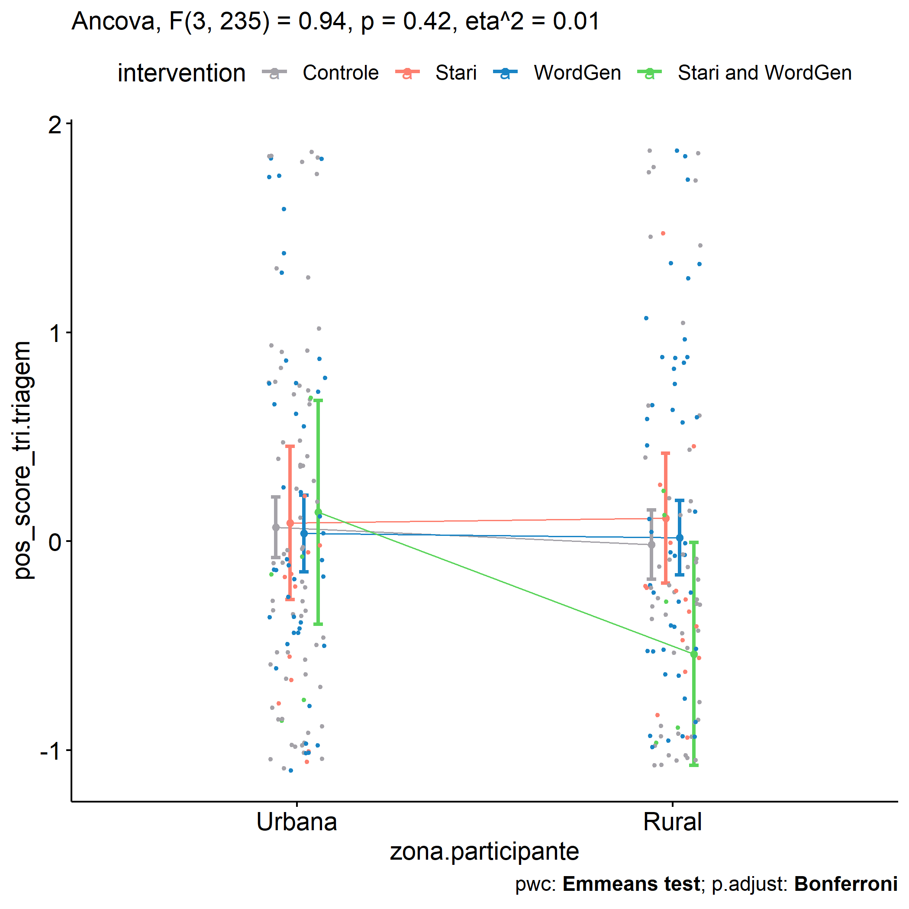<!-- -->

    ## Scale for colour is already present.
    ## Adding another scale for colour, which will replace the existing scale.

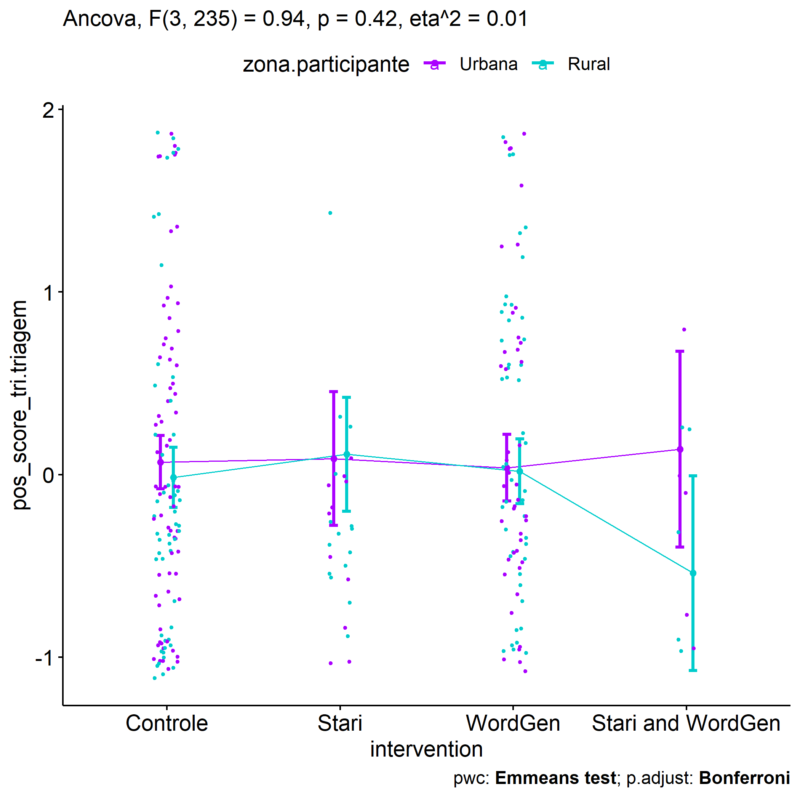<!-- -->

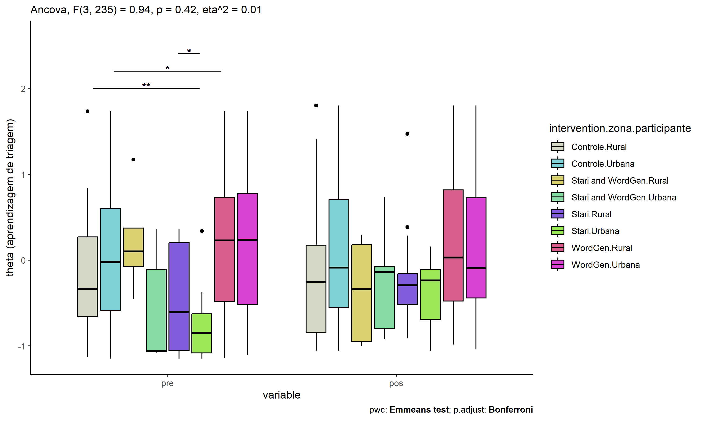<!-- -->

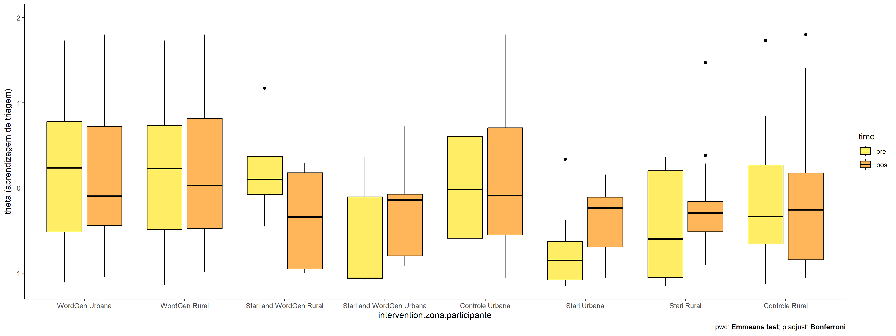<!-- -->

### factores: **intervention:escola**

#### Baseado nos acertos (score) da prova

| var               | intervention      | escola |   n | M (pre) | SE (pre) | M (unadj) | SE (unadj) | M (adj) | SE (adj) |
|:------------------|:------------------|:-------|----:|--------:|---------:|----------:|-----------:|--------:|---------:|
| pos_score.triagem | Controle          | E1     |  13 |   5.462 |    0.656 |     5.615 |      0.738 |   5.326 |    0.518 |
| pos_score.triagem | Controle          | E2     |  29 |   4.379 |    0.524 |     4.724 |      0.548 |   5.207 |    0.348 |
| pos_score.triagem | Controle          | E3     |  19 |   5.000 |    0.501 |     4.684 |      0.617 |   4.724 |    0.428 |
| pos_score.triagem | Controle          | E4     |  19 |   5.789 |    0.475 |     5.474 |      0.618 |   4.951 |    0.429 |
| pos_score.triagem | Controle          | E5     |  59 |   4.966 |    0.317 |     4.492 |      0.334 |   4.556 |    0.243 |
| pos_score.triagem | Controle          | E6     |  14 |   6.357 |    0.753 |     5.429 |      0.782 |   4.501 |    0.502 |
| pos_score.triagem | Stari and WordGen | E5     |   6 |   3.167 |    0.654 |     4.167 |      0.401 |   5.514 |    0.766 |
| pos_score.triagem | Stari             | E2     |   7 |   2.000 |    0.218 |     2.714 |      0.522 |   4.893 |    0.718 |
| pos_score.triagem | Stari             | E3     |   6 |   3.500 |    0.671 |     3.167 |      0.601 |   4.276 |    0.765 |
| pos_score.triagem | Stari             | E5     |  13 |   3.692 |    0.524 |     3.692 |      0.624 |   4.665 |    0.521 |
| pos_score.triagem | Stari             | E6     |   5 |   2.600 |    0.510 |     3.800 |      0.663 |   5.551 |    0.841 |
| pos_score.triagem | WordGen           | E1     |   8 |   5.500 |    1.165 |     5.875 |      1.217 |   5.558 |    0.660 |
| pos_score.triagem | WordGen           | E2     |  21 |   4.190 |    0.580 |     4.000 |      0.396 |   4.617 |    0.409 |
| pos_score.triagem | WordGen           | E3     |  14 |   5.786 |    0.743 |     5.429 |      0.789 |   4.908 |    0.500 |
| pos_score.triagem | WordGen           | E4     |  11 |   6.909 |    0.791 |     6.182 |      0.861 |   4.860 |    0.568 |
| pos_score.triagem | WordGen           | E5     |  49 |   5.673 |    0.378 |     5.469 |      0.352 |   5.029 |    0.268 |
| pos_score.triagem | WordGen           | E6     |  11 |   6.364 |    0.877 |     5.182 |      0.893 |   4.249 |    0.565 |

|     | intervention | escola | group1   | group2            | estimate | conf.low | conf.high |    se | statistic |     p | p.adj | p.adj.signif |
|:----|:-------------|:-------|:---------|:------------------|---------:|---------:|----------:|------:|----------:|------:|------:|:-------------|
| 2   | NA           | E1     | Controle | WordGen           |   -0.232 |   -1.882 |     1.417 | 0.838 |    -0.277 | 0.782 | 0.782 | ns           |
| 7   | NA           | E2     | Controle | Stari             |    0.313 |   -1.247 |     1.873 | 0.792 |     0.395 | 0.693 | 1.000 | ns           |
| 8   | NA           | E2     | Controle | WordGen           |    0.589 |   -0.463 |     1.641 | 0.534 |     1.103 | 0.271 | 0.813 | ns           |
| 10  | NA           | E2     | Stari    | WordGen           |    0.276 |   -1.337 |     1.890 | 0.820 |     0.337 | 0.736 | 1.000 | ns           |
| 13  | NA           | E3     | Controle | Stari             |    0.448 |   -1.276 |     2.172 | 0.876 |     0.511 | 0.610 | 1.000 | ns           |
| 14  | NA           | E3     | Controle | WordGen           |   -0.184 |   -1.479 |     1.111 | 0.658 |    -0.280 | 0.780 | 1.000 | ns           |
| 16  | NA           | E3     | Stari    | WordGen           |   -0.632 |   -2.434 |     1.170 | 0.916 |    -0.690 | 0.491 | 1.000 | ns           |
| 20  | NA           | E4     | Controle | WordGen           |    0.090 |   -1.304 |     1.485 | 0.708 |     0.127 | 0.899 | 0.899 | ns           |
| 25  | NA           | E5     | Controle | Stari             |   -0.109 |   -1.239 |     1.021 | 0.574 |    -0.190 | 0.849 | 1.000 | ns           |
| 26  | NA           | E5     | Controle | WordGen           |   -0.473 |   -1.186 |     0.239 | 0.362 |    -1.308 | 0.192 | 1.000 | ns           |
| 27  | NA           | E5     | Controle | Stari and WordGen |   -0.958 |   -2.539 |     0.622 | 0.803 |    -1.193 | 0.234 | 1.000 | ns           |
| 28  | NA           | E5     | Stari    | WordGen           |   -0.364 |   -1.522 |     0.794 | 0.588 |    -0.619 | 0.536 | 1.000 | ns           |
| 29  | NA           | E5     | Stari    | Stari and WordGen |   -0.849 |   -2.662 |     0.963 | 0.921 |    -0.922 | 0.357 | 1.000 | ns           |
| 30  | NA           | E5     | WordGen  | Stari and WordGen |   -0.485 |   -2.088 |     1.118 | 0.814 |    -0.596 | 0.552 | 1.000 | ns           |
| 31  | NA           | E6     | Controle | Stari             |   -1.051 |   -2.991 |     0.890 | 0.986 |    -1.066 | 0.287 | 0.862 | ns           |
| 32  | NA           | E6     | Controle | WordGen           |    0.251 |   -1.228 |     1.731 | 0.751 |     0.335 | 0.738 | 1.000 | ns           |
| 34  | NA           | E6     | Stari    | WordGen           |    1.302 |   -0.705 |     3.309 | 1.020 |     1.277 | 0.203 | 0.608 | ns           |
| 38  | NA           | E1     | Controle | WordGen           |   -0.038 |   -2.244 |     2.167 | 1.120 |    -0.034 | 0.973 | 0.973 | ns           |
| 43  | NA           | E2     | Controle | Stari             |    2.379 |    0.312 |     4.446 | 1.050 |     2.266 | 0.024 | 0.073 | ns           |
| 44  | NA           | E2     | Controle | WordGen           |    0.189 |   -1.217 |     1.595 | 0.714 |     0.264 | 0.792 | 1.000 | ns           |
| 46  | NA           | E2     | Stari    | WordGen           |   -2.190 |   -4.332 |    -0.048 | 1.088 |    -2.013 | 0.045 | 0.135 | ns           |
| 49  | NA           | E3     | Controle | Stari             |    1.500 |   -0.798 |     3.798 | 1.168 |     1.285 | 0.200 | 0.600 | ns           |
| 50  | NA           | E3     | Controle | WordGen           |   -0.786 |   -2.514 |     0.943 | 0.878 |    -0.895 | 0.372 | 1.000 | ns           |
| 52  | NA           | E3     | Stari    | WordGen           |   -2.286 |   -4.681 |     0.109 | 1.217 |    -1.879 | 0.061 | 0.184 | ns           |
| 56  | NA           | E4     | Controle | WordGen           |   -1.120 |   -2.979 |     0.740 | 0.945 |    -1.185 | 0.237 | 0.237 | ns           |
| 61  | NA           | E5     | Controle | Stari             |    1.274 |   -0.230 |     2.778 | 0.764 |     1.667 | 0.097 | 0.579 | ns           |
| 62  | NA           | E5     | Controle | WordGen           |   -0.707 |   -1.656 |     0.241 | 0.482 |    -1.468 | 0.143 | 0.860 | ns           |
| 63  | NA           | E5     | Controle | Stari and WordGen |    1.799 |   -0.304 |     3.903 | 1.068 |     1.684 | 0.093 | 0.560 | ns           |
| 64  | NA           | E5     | Stari    | WordGen           |   -1.981 |   -3.512 |    -0.450 | 0.778 |    -2.547 | 0.011 | 0.068 | ns           |
| 65  | NA           | E5     | Stari    | Stari and WordGen |    0.526 |   -1.897 |     2.948 | 1.231 |     0.427 | 0.670 | 1.000 | ns           |
| 66  | NA           | E5     | WordGen  | Stari and WordGen |    2.507 |    0.384 |     4.630 | 1.079 |     2.324 | 0.021 | 0.125 | ns           |
| 67  | NA           | E6     | Controle | Stari             |    3.757 |    1.200 |     6.314 | 1.299 |     2.892 | 0.004 | 0.012 | \*           |
| 68  | NA           | E6     | Controle | WordGen           |   -0.006 |   -1.984 |     1.971 | 1.005 |    -0.006 | 0.995 | 1.000 | ns           |
| 70  | NA           | E6     | Stari    | WordGen           |   -3.764 |   -6.411 |    -1.116 | 1.345 |    -2.798 | 0.005 | 0.016 | \*           |
| 73  | Controle     | NA     | E1       | E2                |    0.120 |   -1.109 |     1.348 | 0.624 |     0.191 | 0.848 | 1.000 | ns           |
| 74  | Controle     | NA     | E1       | E3                |    0.602 |   -0.720 |     1.924 | 0.672 |     0.896 | 0.371 | 1.000 | ns           |
| 75  | Controle     | NA     | E1       | E4                |    0.376 |   -0.946 |     1.697 | 0.671 |     0.559 | 0.576 | 1.000 | ns           |
| 76  | Controle     | NA     | E1       | E5                |    0.771 |   -0.355 |     1.896 | 0.572 |     1.347 | 0.179 | 1.000 | ns           |
| 77  | Controle     | NA     | E1       | E6                |    0.825 |   -0.591 |     2.242 | 0.719 |     1.147 | 0.252 | 1.000 | ns           |
| 78  | Controle     | NA     | E2       | E3                |    0.483 |   -0.602 |     1.567 | 0.551 |     0.875 | 0.382 | 1.000 | ns           |
| 79  | Controle     | NA     | E2       | E4                |    0.256 |   -0.834 |     1.346 | 0.554 |     0.462 | 0.644 | 1.000 | ns           |
| 80  | Controle     | NA     | E2       | E5                |    0.651 |   -0.183 |     1.485 | 0.424 |     1.536 | 0.126 | 1.000 | ns           |
| 81  | Controle     | NA     | E2       | E6                |    0.706 |   -0.501 |     1.913 | 0.613 |     1.151 | 0.251 | 1.000 | ns           |
| 82  | Controle     | NA     | E3       | E4                |   -0.226 |   -1.420 |     0.967 | 0.606 |    -0.374 | 0.709 | 1.000 | ns           |
| 83  | Controle     | NA     | E3       | E5                |    0.169 |   -0.800 |     1.137 | 0.492 |     0.343 | 0.732 | 1.000 | ns           |
| 84  | Controle     | NA     | E3       | E6                |    0.223 |   -1.075 |     1.522 | 0.660 |     0.339 | 0.735 | 1.000 | ns           |
| 85  | Controle     | NA     | E4       | E5                |    0.395 |   -0.576 |     1.366 | 0.493 |     0.801 | 0.424 | 1.000 | ns           |
| 86  | Controle     | NA     | E4       | E6                |    0.450 |   -0.844 |     1.744 | 0.657 |     0.684 | 0.494 | 1.000 | ns           |
| 87  | Controle     | NA     | E5       | E6                |    0.055 |   -1.043 |     1.153 | 0.558 |     0.098 | 0.922 | 1.000 | ns           |
| 93  | Stari        | NA     | E2       | E3                |    0.617 |   -1.429 |     2.664 | 1.040 |     0.594 | 0.553 | 1.000 | ns           |
| 95  | Stari        | NA     | E2       | E5                |    0.229 |   -1.499 |     1.956 | 0.878 |     0.261 | 0.795 | 1.000 | ns           |
| 96  | Stari        | NA     | E2       | E6                |   -0.658 |   -2.808 |     1.492 | 1.092 |    -0.602 | 0.548 | 1.000 | ns           |
| 98  | Stari        | NA     | E3       | E5                |   -0.389 |   -2.200 |     1.423 | 0.921 |    -0.422 | 0.673 | 1.000 | ns           |
| 99  | Stari        | NA     | E3       | E6                |   -1.275 |   -3.499 |     0.949 | 1.130 |    -1.128 | 0.260 | 1.000 | ns           |
| 102 | Stari        | NA     | E5       | E6                |   -0.887 |   -2.821 |     1.048 | 0.983 |    -0.902 | 0.368 | 1.000 | ns           |
| 103 | WordGen      | NA     | E1       | E2                |    0.941 |   -0.588 |     2.471 | 0.777 |     1.211 | 0.227 | 1.000 | ns           |
| 104 | WordGen      | NA     | E1       | E3                |    0.650 |   -0.977 |     2.277 | 0.827 |     0.786 | 0.432 | 1.000 | ns           |
| 105 | WordGen      | NA     | E1       | E4                |    0.698 |   -1.012 |     2.408 | 0.869 |     0.803 | 0.422 | 1.000 | ns           |
| 106 | WordGen      | NA     | E1       | E5                |    0.529 |   -0.871 |     1.929 | 0.711 |     0.744 | 0.457 | 1.000 | ns           |
| 107 | WordGen      | NA     | E1       | E6                |    1.309 |   -0.398 |     3.016 | 0.867 |     1.509 | 0.132 | 1.000 | ns           |
| 108 | WordGen      | NA     | E2       | E3                |   -0.291 |   -1.565 |     0.983 | 0.647 |    -0.450 | 0.653 | 1.000 | ns           |
| 109 | WordGen      | NA     | E2       | E4                |   -0.243 |   -1.630 |     1.143 | 0.704 |    -0.345 | 0.730 | 1.000 | ns           |
| 110 | WordGen      | NA     | E2       | E5                |   -0.412 |   -1.378 |     0.554 | 0.491 |    -0.839 | 0.402 | 1.000 | ns           |
| 111 | WordGen      | NA     | E2       | E6                |    0.368 |   -1.011 |     1.747 | 0.701 |     0.525 | 0.600 | 1.000 | ns           |
| 112 | WordGen      | NA     | E3       | E4                |    0.048 |   -1.434 |     1.530 | 0.753 |     0.064 | 0.949 | 1.000 | ns           |
| 113 | WordGen      | NA     | E3       | E5                |   -0.121 |   -1.233 |     0.992 | 0.565 |    -0.214 | 0.831 | 1.000 | ns           |
| 114 | WordGen      | NA     | E3       | E6                |    0.659 |   -0.821 |     2.139 | 0.752 |     0.876 | 0.382 | 1.000 | ns           |
| 115 | WordGen      | NA     | E4       | E5                |   -0.169 |   -1.398 |     1.061 | 0.625 |    -0.270 | 0.787 | 1.000 | ns           |
| 116 | WordGen      | NA     | E4       | E6                |    0.611 |   -0.955 |     2.177 | 0.796 |     0.768 | 0.443 | 1.000 | ns           |
| 117 | WordGen      | NA     | E5       | E6                |    0.780 |   -0.447 |     2.006 | 0.623 |     1.252 | 0.212 | 1.000 | ns           |
| 133 | Controle     | NA     | E1       | E2                |    1.082 |   -0.556 |     2.720 | 0.832 |     1.300 | 0.195 | 1.000 | ns           |
| 134 | Controle     | NA     | E1       | E3                |    0.462 |   -1.305 |     2.228 | 0.898 |     0.514 | 0.607 | 1.000 | ns           |
| 135 | Controle     | NA     | E1       | E4                |   -0.328 |   -2.094 |     1.439 | 0.898 |    -0.365 | 0.715 | 1.000 | ns           |
| 136 | Controle     | NA     | E1       | E5                |    0.495 |   -1.008 |     1.999 | 0.764 |     0.648 | 0.517 | 1.000 | ns           |
| 137 | Controle     | NA     | E1       | E6                |   -0.896 |   -2.786 |     0.995 | 0.960 |    -0.933 | 0.352 | 1.000 | ns           |
| 138 | Controle     | NA     | E2       | E3                |   -0.621 |   -2.069 |     0.828 | 0.736 |    -0.843 | 0.400 | 1.000 | ns           |
| 139 | Controle     | NA     | E2       | E4                |   -1.410 |   -2.859 |     0.038 | 0.736 |    -1.916 | 0.056 | 0.845 | ns           |
| 140 | Controle     | NA     | E2       | E5                |   -0.587 |   -1.700 |     0.526 | 0.565 |    -1.038 | 0.300 | 1.000 | ns           |
| 141 | Controle     | NA     | E2       | E6                |   -1.978 |   -3.575 |    -0.381 | 0.811 |    -2.437 | 0.015 | 0.231 | ns           |
| 142 | Controle     | NA     | E3       | E4                |   -0.789 |   -2.382 |     0.803 | 0.809 |    -0.976 | 0.330 | 1.000 | ns           |
| 143 | Controle     | NA     | E3       | E5                |    0.034 |   -1.261 |     1.329 | 0.658 |     0.052 | 0.959 | 1.000 | ns           |
| 144 | Controle     | NA     | E3       | E6                |   -1.357 |   -3.086 |     0.372 | 0.878 |    -1.545 | 0.123 | 1.000 | ns           |
| 145 | Controle     | NA     | E4       | E5                |    0.823 |   -0.471 |     2.118 | 0.658 |     1.252 | 0.212 | 1.000 | ns           |
| 146 | Controle     | NA     | E4       | E6                |   -0.568 |   -2.296 |     1.161 | 0.878 |    -0.646 | 0.519 | 1.000 | ns           |
| 147 | Controle     | NA     | E5       | E6                |   -1.391 |   -2.850 |     0.068 | 0.741 |    -1.877 | 0.062 | 0.924 | ns           |
| 153 | Stari        | NA     | E2       | E3                |   -1.500 |   -4.231 |     1.231 | 1.387 |    -1.081 | 0.280 | 1.000 | ns           |
| 155 | Stari        | NA     | E2       | E5                |   -1.692 |   -3.993 |     0.609 | 1.169 |    -1.448 | 0.149 | 0.893 | ns           |
| 156 | Stari        | NA     | E2       | E6                |   -0.600 |   -3.474 |     2.274 | 1.460 |    -0.411 | 0.681 | 1.000 | ns           |
| 158 | Stari        | NA     | E3       | E5                |   -0.192 |   -2.615 |     2.230 | 1.231 |    -0.156 | 0.876 | 1.000 | ns           |
| 159 | Stari        | NA     | E3       | E6                |    0.900 |   -2.072 |     3.872 | 1.510 |     0.596 | 0.552 | 1.000 | ns           |
| 162 | Stari        | NA     | E5       | E6                |    1.092 |   -1.490 |     3.675 | 1.312 |     0.832 | 0.406 | 1.000 | ns           |
| 163 | WordGen      | NA     | E1       | E2                |    1.310 |   -0.730 |     3.349 | 1.036 |     1.264 | 0.207 | 1.000 | ns           |
| 164 | WordGen      | NA     | E1       | E3                |   -0.286 |   -2.461 |     1.889 | 1.105 |    -0.259 | 0.796 | 1.000 | ns           |
| 165 | WordGen      | NA     | E1       | E4                |   -1.409 |   -3.690 |     0.871 | 1.159 |    -1.216 | 0.225 | 1.000 | ns           |
| 166 | WordGen      | NA     | E1       | E5                |   -0.173 |   -2.045 |     1.698 | 0.951 |    -0.182 | 0.855 | 1.000 | ns           |
| 167 | WordGen      | NA     | E1       | E6                |   -0.864 |   -3.144 |     1.417 | 1.159 |    -0.745 | 0.457 | 1.000 | ns           |
| 168 | WordGen      | NA     | E2       | E3                |   -1.595 |   -3.289 |     0.098 | 0.860 |    -1.854 | 0.065 | 0.971 | ns           |
| 169 | WordGen      | NA     | E2       | E4                |   -2.719 |   -4.545 |    -0.892 | 0.928 |    -2.929 | 0.004 | 0.055 | ns           |
| 170 | WordGen      | NA     | E2       | E5                |   -1.483 |   -2.763 |    -0.203 | 0.650 |    -2.280 | 0.023 | 0.350 | ns           |
| 171 | WordGen      | NA     | E2       | E6                |   -2.173 |   -4.000 |    -0.346 | 0.928 |    -2.342 | 0.020 | 0.298 | ns           |
| 172 | WordGen      | NA     | E3       | E4                |   -1.123 |   -3.101 |     0.854 | 1.005 |    -1.118 | 0.264 | 1.000 | ns           |
| 173 | WordGen      | NA     | E3       | E5                |    0.112 |   -1.375 |     1.600 | 0.756 |     0.149 | 0.882 | 1.000 | ns           |
| 174 | WordGen      | NA     | E3       | E6                |   -0.578 |   -2.555 |     1.400 | 1.005 |    -0.575 | 0.566 | 1.000 | ns           |
| 175 | WordGen      | NA     | E4       | E5                |    1.236 |   -0.402 |     2.873 | 0.832 |     1.485 | 0.139 | 1.000 | ns           |
| 176 | WordGen      | NA     | E4       | E6                |    0.545 |   -1.547 |     2.638 | 1.063 |     0.513 | 0.608 | 1.000 | ns           |
| 177 | WordGen      | NA     | E5       | E6                |   -0.690 |   -2.328 |     0.947 | 0.832 |    -0.830 | 0.407 | 1.000 | ns           |

| escola | group1 | group2 | estimate | conf.low | conf.high |    se | statistic |     p | p.adj | p.adj.signif |
|:-------|:-------|:-------|---------:|---------:|----------:|------:|----------:|------:|------:|:-------------|
| E1     | pre    | pos    |   -0.154 |   -2.106 |     1.799 | 0.994 |    -0.155 | 0.877 | 0.877 | ns           |
| E2     | pre    | pos    |   -0.345 |   -1.652 |     0.962 | 0.666 |    -0.518 | 0.605 | 0.605 | ns           |
| E3     | pre    | pos    |    0.316 |   -1.299 |     1.931 | 0.822 |     0.384 | 0.701 | 0.701 | ns           |
| E4     | pre    | pos    |    0.316 |   -1.299 |     1.931 | 0.822 |     0.384 | 0.701 | 0.701 | ns           |
| E5     | pre    | pos    |    0.475 |   -0.442 |     1.391 | 0.467 |     1.017 | 0.310 | 0.310 | ns           |
| E6     | pre    | pos    |    0.929 |   -0.953 |     2.810 | 0.958 |     0.969 | 0.333 | 0.333 | ns           |
| E2     | pre    | pos    |   -0.714 |   -3.375 |     1.946 | 1.355 |    -0.527 | 0.598 | 0.598 | ns           |
| E3     | pre    | pos    |    0.333 |   -2.541 |     3.207 | 1.463 |     0.228 | 0.820 | 0.820 | ns           |
| E5     | pre    | pos    |    0.000 |   -1.952 |     1.952 | 0.994 |     0.000 | 1.000 | 1.000 | ns           |
| E6     | pre    | pos    |   -1.200 |   -4.348 |     1.948 | 1.603 |    -0.749 | 0.454 | 0.454 | ns           |
| E1     | pre    | pos    |   -0.375 |   -2.864 |     2.114 | 1.267 |    -0.296 | 0.767 | 0.767 | ns           |
| E2     | pre    | pos    |    0.190 |   -1.346 |     1.727 | 0.782 |     0.244 | 0.808 | 0.808 | ns           |
| E3     | pre    | pos    |    0.357 |   -1.524 |     2.239 | 0.958 |     0.373 | 0.709 | 0.709 | ns           |
| E4     | pre    | pos    |    0.727 |   -1.395 |     2.850 | 1.081 |     0.673 | 0.501 | 0.501 | ns           |
| E5     | pre    | pos    |    0.204 |   -0.802 |     1.210 | 0.512 |     0.399 | 0.690 | 0.690 | ns           |
| E6     | pre    | pos    |    1.182 |   -0.941 |     3.304 | 1.081 |     1.094 | 0.275 | 0.275 | ns           |
| E5     | pre    | pos    |   -1.000 |   -3.874 |     1.874 | 1.463 |    -0.683 | 0.495 | 0.495 | ns           |

<!-- -->

    ## Scale for colour is already present.
    ## Adding another scale for colour, which will replace the existing scale.

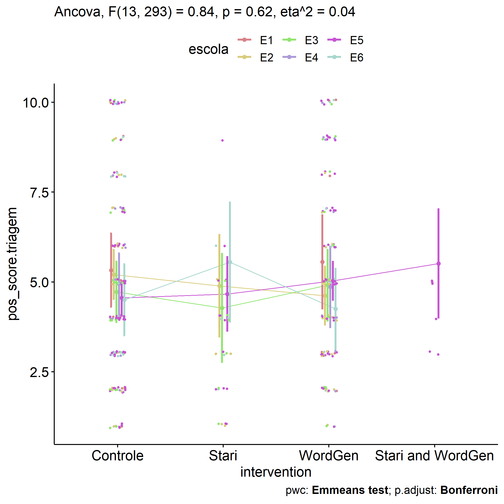<!-- -->

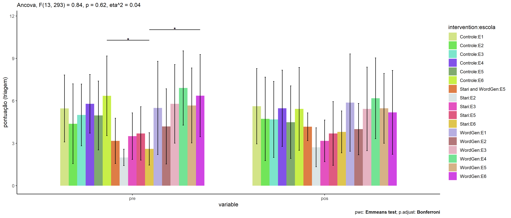<!-- -->

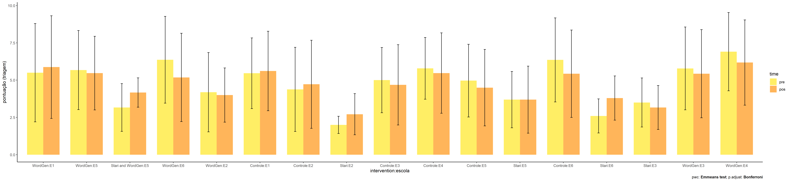<!-- -->

#### Baseado nas estimativas da aprendizagem (theta - traço latente) mediante TRI aplicado as respostas da prova

| var                   | intervention      | escola |   n | M (pre) | SE (pre) | M (unadj) | SE (unadj) | M (adj) | SE (adj) |
|:----------------------|:------------------|:-------|----:|--------:|---------:|----------:|-----------:|--------:|---------:|
| pos_score_tri.triagem | Controle          | E1     |  13 |   0.126 |    0.202 |     0.212 |      0.230 |   0.134 |    0.166 |
| pos_score_tri.triagem | Controle          | E2     |  29 |  -0.202 |    0.160 |     0.090 |      0.160 |   0.243 |    0.111 |
| pos_score_tri.triagem | Controle          | E3     |  19 |  -0.048 |    0.177 |     0.038 |      0.202 |   0.083 |    0.137 |
| pos_score_tri.triagem | Controle          | E4     |  19 |   0.286 |    0.153 |     0.162 |      0.199 |  -0.029 |    0.138 |
| pos_score_tri.triagem | Controle          | E5     |  59 |  -0.083 |    0.110 |    -0.136 |      0.112 |  -0.067 |    0.078 |
| pos_score_tri.triagem | Controle          | E6     |  14 |   0.404 |    0.249 |     0.068 |      0.260 |  -0.206 |    0.161 |
| pos_score_tri.triagem | Stari and WordGen | E5     |   6 |  -0.556 |    0.252 |    -0.386 |      0.231 |   0.017 |    0.245 |
| pos_score_tri.triagem | Stari             | E2     |   7 |  -0.868 |    0.087 |    -0.525 |      0.151 |   0.099 |    0.229 |
| pos_score_tri.triagem | Stari             | E3     |   6 |  -0.426 |    0.240 |    -0.219 |      0.118 |   0.093 |    0.245 |
| pos_score_tri.triagem | Stari             | E5     |  13 |  -0.398 |    0.157 |    -0.194 |      0.183 |   0.098 |    0.167 |
| pos_score_tri.triagem | Stari             | E6     |   5 |  -0.821 |    0.107 |    -0.406 |      0.170 |   0.184 |    0.270 |
| pos_score_tri.triagem | WordGen           | E1     |   8 |   0.281 |    0.333 |     0.485 |      0.347 |   0.298 |    0.212 |
| pos_score_tri.triagem | WordGen           | E2     |  21 |  -0.192 |    0.186 |    -0.278 |      0.123 |  -0.131 |    0.131 |
| pos_score_tri.triagem | WordGen           | E3     |  14 |   0.286 |    0.209 |     0.162 |      0.241 |  -0.029 |    0.160 |
| pos_score_tri.triagem | WordGen           | E4     |  11 |   0.625 |    0.240 |     0.382 |      0.288 |  -0.048 |    0.182 |
| pos_score_tri.triagem | WordGen           | E5     |  49 |   0.225 |    0.124 |     0.215 |      0.114 |   0.067 |    0.086 |
| pos_score_tri.triagem | WordGen           | E6     |  11 |   0.429 |    0.297 |    -0.049 |      0.326 |  -0.341 |    0.181 |

|     | intervention | escola | group1   | group2            | estimate | conf.low | conf.high |    se | statistic |     p | p.adj | p.adj.signif |
|:----|:-------------|:-------|:---------|:------------------|---------:|---------:|----------:|------:|----------:|------:|------:|:-------------|
| 2   | NA           | E1     | Controle | WordGen           |   -0.163 |   -0.692 |     0.366 | 0.269 |    -0.608 | 0.544 | 0.544 | ns           |
| 7   | NA           | E2     | Controle | Stari             |    0.144 |   -0.354 |     0.643 | 0.253 |     0.570 | 0.569 | 1.000 | ns           |
| 8   | NA           | E2     | Controle | WordGen           |    0.375 |    0.037 |     0.712 | 0.171 |     2.186 | 0.030 | 0.089 | ns           |
| 10  | NA           | E2     | Stari    | WordGen           |    0.230 |   -0.287 |     0.747 | 0.263 |     0.876 | 0.382 | 1.000 | ns           |
| 13  | NA           | E3     | Controle | Stari             |   -0.009 |   -0.561 |     0.543 | 0.280 |    -0.033 | 0.973 | 1.000 | ns           |
| 14  | NA           | E3     | Controle | WordGen           |    0.113 |   -0.303 |     0.528 | 0.211 |     0.534 | 0.594 | 1.000 | ns           |
| 16  | NA           | E3     | Stari    | WordGen           |    0.122 |   -0.455 |     0.700 | 0.293 |     0.416 | 0.678 | 1.000 | ns           |
| 20  | NA           | E4     | Controle | WordGen           |    0.019 |   -0.428 |     0.466 | 0.227 |     0.084 | 0.933 | 0.933 | ns           |
| 25  | NA           | E5     | Controle | Stari             |   -0.165 |   -0.526 |     0.197 | 0.184 |    -0.898 | 0.370 | 1.000 | ns           |
| 26  | NA           | E5     | Controle | WordGen           |   -0.134 |   -0.363 |     0.095 | 0.116 |    -1.153 | 0.250 | 1.000 | ns           |
| 27  | NA           | E5     | Controle | Stari and WordGen |   -0.085 |   -0.590 |     0.421 | 0.257 |    -0.329 | 0.743 | 1.000 | ns           |
| 28  | NA           | E5     | Stari    | WordGen           |    0.031 |   -0.340 |     0.402 | 0.188 |     0.163 | 0.870 | 1.000 | ns           |
| 29  | NA           | E5     | Stari    | Stari and WordGen |    0.080 |   -0.501 |     0.661 | 0.295 |     0.272 | 0.786 | 1.000 | ns           |
| 30  | NA           | E5     | WordGen  | Stari and WordGen |    0.050 |   -0.464 |     0.563 | 0.261 |     0.190 | 0.849 | 1.000 | ns           |
| 31  | NA           | E6     | Controle | Stari             |   -0.391 |   -1.013 |     0.231 | 0.316 |    -1.236 | 0.217 | 0.652 | ns           |
| 32  | NA           | E6     | Controle | WordGen           |    0.135 |   -0.339 |     0.609 | 0.241 |     0.559 | 0.576 | 1.000 | ns           |
| 34  | NA           | E6     | Stari    | WordGen           |    0.525 |   -0.118 |     1.169 | 0.327 |     1.607 | 0.109 | 0.328 | ns           |
| 38  | NA           | E1     | Controle | WordGen           |   -0.155 |   -0.871 |     0.560 | 0.363 |    -0.428 | 0.669 | 0.669 | ns           |
| 43  | NA           | E2     | Controle | Stari             |    0.666 |   -0.004 |     1.336 | 0.340 |     1.957 | 0.051 | 0.154 | ns           |
| 44  | NA           | E2     | Controle | WordGen           |   -0.009 |   -0.465 |     0.447 | 0.232 |    -0.041 | 0.967 | 1.000 | ns           |
| 46  | NA           | E2     | Stari    | WordGen           |   -0.676 |   -1.370 |     0.019 | 0.353 |    -1.915 | 0.056 | 0.169 | ns           |
| 49  | NA           | E3     | Controle | Stari             |    0.378 |   -0.367 |     1.123 | 0.379 |     0.998 | 0.319 | 0.957 | ns           |
| 50  | NA           | E3     | Controle | WordGen           |   -0.335 |   -0.895 |     0.226 | 0.285 |    -1.175 | 0.241 | 0.722 | ns           |
| 52  | NA           | E3     | Stari    | WordGen           |   -0.713 |   -1.489 |     0.064 | 0.395 |    -1.806 | 0.072 | 0.216 | ns           |
| 56  | NA           | E4     | Controle | WordGen           |   -0.339 |   -0.942 |     0.264 | 0.306 |    -1.107 | 0.269 | 0.269 | ns           |
| 61  | NA           | E5     | Controle | Stari             |    0.315 |   -0.172 |     0.803 | 0.248 |     1.273 | 0.204 | 1.000 | ns           |
| 62  | NA           | E5     | Controle | WordGen           |   -0.308 |   -0.616 |    -0.001 | 0.156 |    -1.972 | 0.050 | 0.298 | ns           |
| 63  | NA           | E5     | Controle | Stari and WordGen |    0.473 |   -0.209 |     1.155 | 0.346 |     1.366 | 0.173 | 1.000 | ns           |
| 64  | NA           | E5     | Stari    | WordGen           |   -0.623 |   -1.120 |    -0.127 | 0.252 |    -2.472 | 0.014 | 0.084 | ns           |
| 65  | NA           | E5     | Stari    | Stari and WordGen |    0.158 |   -0.627 |     0.944 | 0.399 |     0.396 | 0.692 | 1.000 | ns           |
| 66  | NA           | E5     | WordGen  | Stari and WordGen |    0.782 |    0.093 |     1.470 | 0.350 |     2.235 | 0.026 | 0.157 | ns           |
| 67  | NA           | E6     | Controle | Stari             |    1.225 |    0.396 |     2.055 | 0.421 |     2.909 | 0.004 | 0.012 | \*           |
| 68  | NA           | E6     | Controle | WordGen           |   -0.024 |   -0.666 |     0.617 | 0.326 |    -0.075 | 0.940 | 1.000 | ns           |
| 70  | NA           | E6     | Stari    | WordGen           |   -1.250 |   -2.108 |    -0.392 | 0.436 |    -2.866 | 0.004 | 0.013 | \*           |
| 73  | Controle     | NA     | E1       | E2                |   -0.109 |   -0.503 |     0.285 | 0.200 |    -0.546 | 0.586 | 1.000 | ns           |
| 74  | Controle     | NA     | E1       | E3                |    0.051 |   -0.373 |     0.475 | 0.215 |     0.237 | 0.813 | 1.000 | ns           |
| 75  | Controle     | NA     | E1       | E4                |    0.163 |   -0.261 |     0.587 | 0.215 |     0.756 | 0.450 | 1.000 | ns           |
| 76  | Controle     | NA     | E1       | E5                |    0.201 |   -0.160 |     0.562 | 0.183 |     1.098 | 0.273 | 1.000 | ns           |
| 77  | Controle     | NA     | E1       | E6                |    0.341 |   -0.113 |     0.794 | 0.231 |     1.477 | 0.141 | 1.000 | ns           |
| 78  | Controle     | NA     | E2       | E3                |    0.160 |   -0.187 |     0.508 | 0.177 |     0.907 | 0.365 | 1.000 | ns           |
| 79  | Controle     | NA     | E2       | E4                |    0.272 |   -0.078 |     0.622 | 0.178 |     1.530 | 0.127 | 1.000 | ns           |
| 80  | Controle     | NA     | E2       | E5                |    0.311 |    0.043 |     0.578 | 0.136 |     2.289 | 0.023 | 0.343 | ns           |
| 81  | Controle     | NA     | E2       | E6                |    0.450 |    0.063 |     0.836 | 0.196 |     2.291 | 0.023 | 0.341 | ns           |
| 82  | Controle     | NA     | E3       | E4                |    0.112 |   -0.271 |     0.495 | 0.195 |     0.575 | 0.566 | 1.000 | ns           |
| 83  | Controle     | NA     | E3       | E5                |    0.150 |   -0.160 |     0.461 | 0.158 |     0.954 | 0.341 | 1.000 | ns           |
| 84  | Controle     | NA     | E3       | E6                |    0.290 |   -0.127 |     0.706 | 0.211 |     1.370 | 0.172 | 1.000 | ns           |
| 85  | Controle     | NA     | E4       | E5                |    0.039 |   -0.273 |     0.351 | 0.159 |     0.243 | 0.808 | 1.000 | ns           |
| 86  | Controle     | NA     | E4       | E6                |    0.178 |   -0.237 |     0.592 | 0.211 |     0.844 | 0.399 | 1.000 | ns           |
| 87  | Controle     | NA     | E5       | E6                |    0.139 |   -0.213 |     0.492 | 0.179 |     0.778 | 0.437 | 1.000 | ns           |
| 93  | Stari        | NA     | E2       | E3                |    0.006 |   -0.649 |     0.662 | 0.333 |     0.019 | 0.985 | 1.000 | ns           |
| 95  | Stari        | NA     | E2       | E5                |    0.001 |   -0.552 |     0.554 | 0.281 |     0.004 | 0.997 | 1.000 | ns           |
| 96  | Stari        | NA     | E2       | E6                |   -0.085 |   -0.774 |     0.604 | 0.350 |    -0.244 | 0.808 | 1.000 | ns           |
| 98  | Stari        | NA     | E3       | E5                |   -0.005 |   -0.586 |     0.576 | 0.295 |    -0.017 | 0.986 | 1.000 | ns           |
| 99  | Stari        | NA     | E3       | E6                |   -0.092 |   -0.805 |     0.622 | 0.362 |    -0.253 | 0.801 | 1.000 | ns           |
| 102 | Stari        | NA     | E5       | E6                |   -0.086 |   -0.707 |     0.534 | 0.315 |    -0.274 | 0.784 | 1.000 | ns           |
| 103 | WordGen      | NA     | E1       | E2                |    0.429 |   -0.062 |     0.919 | 0.249 |     1.720 | 0.087 | 1.000 | ns           |
| 104 | WordGen      | NA     | E1       | E3                |    0.327 |   -0.195 |     0.848 | 0.265 |     1.234 | 0.218 | 1.000 | ns           |
| 105 | WordGen      | NA     | E1       | E4                |    0.345 |   -0.202 |     0.893 | 0.278 |     1.240 | 0.216 | 1.000 | ns           |
| 106 | WordGen      | NA     | E1       | E5                |    0.231 |   -0.218 |     0.679 | 0.228 |     1.011 | 0.313 | 1.000 | ns           |
| 107 | WordGen      | NA     | E1       | E6                |    0.639 |    0.092 |     1.186 | 0.278 |     2.299 | 0.022 | 0.334 | ns           |
| 108 | WordGen      | NA     | E2       | E3                |   -0.102 |   -0.510 |     0.306 | 0.207 |    -0.490 | 0.624 | 1.000 | ns           |
| 109 | WordGen      | NA     | E2       | E4                |   -0.084 |   -0.527 |     0.360 | 0.225 |    -0.371 | 0.711 | 1.000 | ns           |
| 110 | WordGen      | NA     | E2       | E5                |   -0.198 |   -0.507 |     0.111 | 0.157 |    -1.262 | 0.208 | 1.000 | ns           |
| 111 | WordGen      | NA     | E2       | E6                |    0.210 |   -0.231 |     0.651 | 0.224 |     0.937 | 0.350 | 1.000 | ns           |
| 112 | WordGen      | NA     | E3       | E4                |    0.018 |   -0.457 |     0.493 | 0.241 |     0.075 | 0.940 | 1.000 | ns           |
| 113 | WordGen      | NA     | E3       | E5                |   -0.096 |   -0.453 |     0.260 | 0.181 |    -0.532 | 0.595 | 1.000 | ns           |
| 114 | WordGen      | NA     | E3       | E6                |    0.312 |   -0.163 |     0.786 | 0.241 |     1.294 | 0.197 | 1.000 | ns           |
| 115 | WordGen      | NA     | E4       | E5                |   -0.115 |   -0.509 |     0.280 | 0.200 |    -0.572 | 0.568 | 1.000 | ns           |
| 116 | WordGen      | NA     | E4       | E6                |    0.294 |   -0.208 |     0.796 | 0.255 |     1.151 | 0.251 | 1.000 | ns           |
| 117 | WordGen      | NA     | E5       | E6                |    0.408 |    0.015 |     0.801 | 0.200 |     2.044 | 0.042 | 0.628 | ns           |
| 133 | Controle     | NA     | E1       | E2                |    0.328 |   -0.204 |     0.859 | 0.270 |     1.214 | 0.226 | 1.000 | ns           |
| 134 | Controle     | NA     | E1       | E3                |    0.174 |   -0.399 |     0.747 | 0.291 |     0.598 | 0.550 | 1.000 | ns           |
| 135 | Controle     | NA     | E1       | E4                |   -0.160 |   -0.733 |     0.413 | 0.291 |    -0.549 | 0.583 | 1.000 | ns           |
| 136 | Controle     | NA     | E1       | E5                |    0.209 |   -0.279 |     0.696 | 0.248 |     0.842 | 0.401 | 1.000 | ns           |
| 137 | Controle     | NA     | E1       | E6                |   -0.279 |   -0.892 |     0.334 | 0.311 |    -0.895 | 0.372 | 1.000 | ns           |
| 138 | Controle     | NA     | E2       | E3                |   -0.153 |   -0.623 |     0.316 | 0.239 |    -0.643 | 0.521 | 1.000 | ns           |
| 139 | Controle     | NA     | E2       | E4                |   -0.487 |   -0.957 |    -0.018 | 0.239 |    -2.042 | 0.042 | 0.631 | ns           |
| 140 | Controle     | NA     | E2       | E5                |   -0.119 |   -0.480 |     0.242 | 0.183 |    -0.649 | 0.517 | 1.000 | ns           |
| 141 | Controle     | NA     | E2       | E6                |   -0.606 |   -1.124 |    -0.088 | 0.263 |    -2.304 | 0.022 | 0.329 | ns           |
| 142 | Controle     | NA     | E3       | E4                |   -0.334 |   -0.850 |     0.182 | 0.262 |    -1.273 | 0.204 | 1.000 | ns           |
| 143 | Controle     | NA     | E3       | E5                |    0.034 |   -0.385 |     0.454 | 0.213 |     0.162 | 0.872 | 1.000 | ns           |
| 144 | Controle     | NA     | E3       | E6                |   -0.453 |   -1.013 |     0.108 | 0.285 |    -1.590 | 0.113 | 1.000 | ns           |
| 145 | Controle     | NA     | E4       | E5                |    0.368 |   -0.051 |     0.788 | 0.213 |     1.727 | 0.085 | 1.000 | ns           |
| 146 | Controle     | NA     | E4       | E6                |   -0.119 |   -0.679 |     0.442 | 0.285 |    -0.417 | 0.677 | 1.000 | ns           |
| 147 | Controle     | NA     | E5       | E6                |   -0.487 |   -0.960 |    -0.014 | 0.240 |    -2.027 | 0.044 | 0.654 | ns           |
| 153 | Stari        | NA     | E2       | E3                |   -0.442 |   -1.327 |     0.444 | 0.450 |    -0.982 | 0.327 | 1.000 | ns           |
| 155 | Stari        | NA     | E2       | E5                |   -0.470 |   -1.216 |     0.276 | 0.379 |    -1.240 | 0.216 | 1.000 | ns           |
| 156 | Stari        | NA     | E2       | E6                |   -0.047 |   -0.979 |     0.885 | 0.473 |    -0.099 | 0.921 | 1.000 | ns           |
| 158 | Stari        | NA     | E3       | E5                |   -0.028 |   -0.814 |     0.757 | 0.399 |    -0.071 | 0.944 | 1.000 | ns           |
| 159 | Stari        | NA     | E3       | E6                |    0.395 |   -0.569 |     1.358 | 0.490 |     0.806 | 0.421 | 1.000 | ns           |
| 162 | Stari        | NA     | E5       | E6                |    0.423 |   -0.414 |     1.260 | 0.425 |     0.994 | 0.321 | 1.000 | ns           |
| 163 | WordGen      | NA     | E1       | E2                |    0.474 |   -0.188 |     1.135 | 0.336 |     1.410 | 0.160 | 1.000 | ns           |
| 164 | WordGen      | NA     | E1       | E3                |   -0.005 |   -0.710 |     0.700 | 0.358 |    -0.014 | 0.989 | 1.000 | ns           |
| 165 | WordGen      | NA     | E1       | E4                |   -0.343 |   -1.083 |     0.396 | 0.376 |    -0.914 | 0.362 | 1.000 | ns           |
| 166 | WordGen      | NA     | E1       | E5                |    0.056 |   -0.551 |     0.663 | 0.308 |     0.181 | 0.856 | 1.000 | ns           |
| 167 | WordGen      | NA     | E1       | E6                |   -0.148 |   -0.887 |     0.592 | 0.376 |    -0.393 | 0.695 | 1.000 | ns           |
| 168 | WordGen      | NA     | E2       | E3                |   -0.479 |   -1.028 |     0.070 | 0.279 |    -1.716 | 0.087 | 1.000 | ns           |
| 169 | WordGen      | NA     | E2       | E4                |   -0.817 |   -1.409 |    -0.225 | 0.301 |    -2.714 | 0.007 | 0.106 | ns           |
| 170 | WordGen      | NA     | E2       | E5                |   -0.418 |   -0.833 |    -0.003 | 0.211 |    -1.981 | 0.049 | 0.729 | ns           |
| 171 | WordGen      | NA     | E2       | E6                |   -0.621 |   -1.214 |    -0.029 | 0.301 |    -2.064 | 0.040 | 0.598 | ns           |
| 172 | WordGen      | NA     | E3       | E4                |   -0.338 |   -0.979 |     0.303 | 0.326 |    -1.038 | 0.300 | 1.000 | ns           |
| 173 | WordGen      | NA     | E3       | E5                |    0.061 |   -0.421 |     0.543 | 0.245 |     0.249 | 0.803 | 1.000 | ns           |
| 174 | WordGen      | NA     | E3       | E6                |   -0.142 |   -0.784 |     0.499 | 0.326 |    -0.437 | 0.662 | 1.000 | ns           |
| 175 | WordGen      | NA     | E4       | E5                |    0.399 |   -0.132 |     0.930 | 0.270 |     1.480 | 0.140 | 1.000 | ns           |
| 176 | WordGen      | NA     | E4       | E6                |    0.196 |   -0.483 |     0.874 | 0.345 |     0.568 | 0.571 | 1.000 | ns           |
| 177 | WordGen      | NA     | E5       | E6                |   -0.204 |   -0.734 |     0.327 | 0.270 |    -0.754 | 0.451 | 1.000 | ns           |

| intervention      | escola | group1 | group2 | estimate | conf.low | conf.high |    se | statistic |     p | p.adj | p.adj.signif |
|:------------------|:-------|:-------|:-------|---------:|---------:|----------:|------:|----------:|------:|------:|:-------------|
| Controle          | E1     | pre    | pos    |   -0.086 |   -0.716 |     0.543 | 0.321 |    -0.269 | 0.788 | 0.788 | ns           |
| Controle          | E2     | pre    | pos    |   -0.292 |   -0.713 |     0.130 | 0.215 |    -1.360 | 0.174 | 0.174 | ns           |
| Controle          | E3     | pre    | pos    |   -0.087 |   -0.607 |     0.434 | 0.265 |    -0.327 | 0.744 | 0.744 | ns           |
| Controle          | E4     | pre    | pos    |    0.123 |   -0.397 |     0.644 | 0.265 |     0.466 | 0.642 | 0.642 | ns           |
| Controle          | E5     | pre    | pos    |    0.054 |   -0.242 |     0.349 | 0.150 |     0.357 | 0.722 | 0.722 | ns           |
| Controle          | E6     | pre    | pos    |    0.336 |   -0.270 |     0.943 | 0.309 |     1.089 | 0.277 | 0.277 | ns           |
| Stari             | E2     | pre    | pos    |   -0.344 |   -1.201 |     0.514 | 0.437 |    -0.786 | 0.432 | 0.432 | ns           |
| Stari             | E3     | pre    | pos    |   -0.207 |   -1.134 |     0.719 | 0.472 |    -0.439 | 0.661 | 0.661 | ns           |
| Stari             | E5     | pre    | pos    |   -0.204 |   -0.834 |     0.426 | 0.321 |    -0.637 | 0.525 | 0.525 | ns           |
| Stari             | E6     | pre    | pos    |   -0.415 |   -1.430 |     0.600 | 0.517 |    -0.803 | 0.422 | 0.422 | ns           |
| WordGen           | E1     | pre    | pos    |   -0.204 |   -1.006 |     0.599 | 0.409 |    -0.499 | 0.618 | 0.618 | ns           |
| WordGen           | E2     | pre    | pos    |    0.085 |   -0.410 |     0.581 | 0.252 |     0.339 | 0.735 | 0.735 | ns           |
| WordGen           | E3     | pre    | pos    |    0.125 |   -0.482 |     0.731 | 0.309 |     0.403 | 0.687 | 0.687 | ns           |
| WordGen           | E4     | pre    | pos    |    0.242 |   -0.442 |     0.927 | 0.348 |     0.695 | 0.487 | 0.487 | ns           |
| WordGen           | E5     | pre    | pos    |    0.010 |   -0.314 |     0.334 | 0.165 |     0.062 | 0.951 | 0.951 | ns           |
| WordGen           | E6     | pre    | pos    |    0.478 |   -0.206 |     1.163 | 0.348 |     1.372 | 0.170 | 0.170 | ns           |
| Stari and WordGen | E5     | pre    | pos    |   -0.170 |   -1.097 |     0.756 | 0.472 |    -0.361 | 0.718 | 0.718 | ns           |

<!-- -->

    ## Scale for colour is already present.
    ## Adding another scale for colour, which will replace the existing scale.

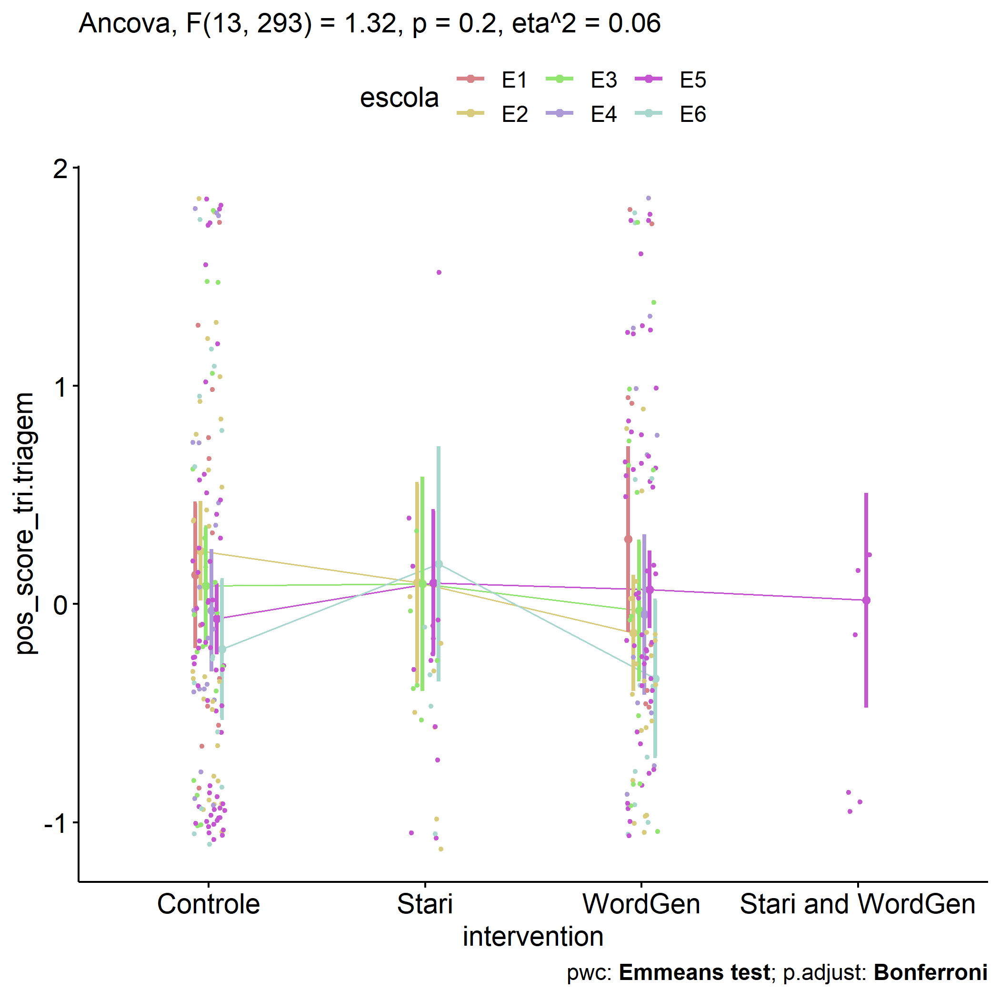<!-- -->

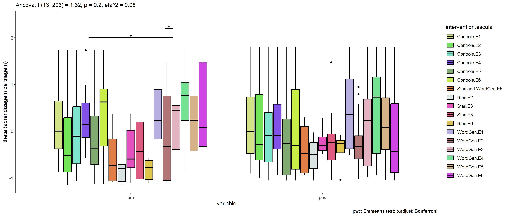<!-- -->

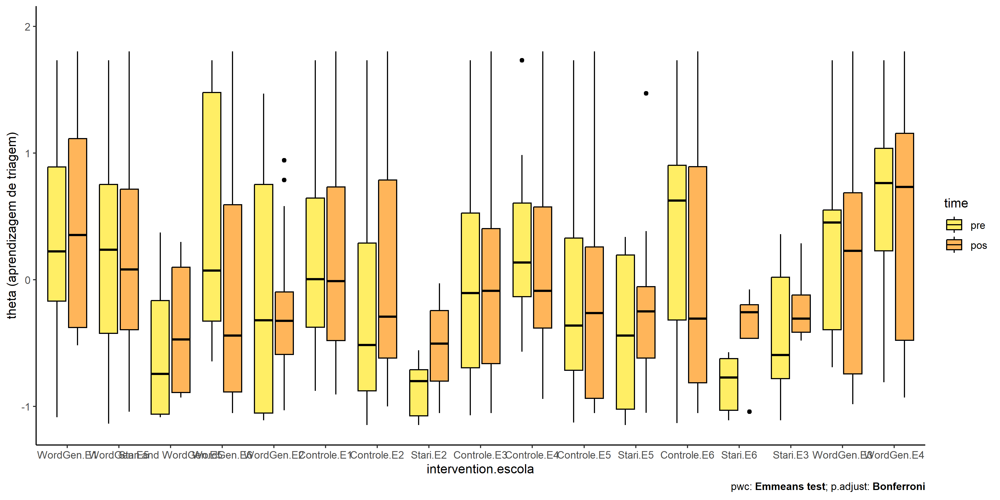<!-- -->

### factores: **intervention:monitor**

#### Baseado nos acertos (score) da prova

| var               | intervention | monitor |   n | M (pre) | SE (pre) | M (unadj) | SE (unadj) | M (adj) | SE (adj) |
|:------------------|:-------------|:--------|----:|--------:|---------:|----------:|-----------:|--------:|---------:|
| pos_score.triagem | Stari        | ML      |   6 |   3.500 |    0.671 |     3.167 |      0.601 |   4.496 |    0.708 |
| pos_score.triagem | Stari        | VL      |   5 |   2.600 |    0.510 |     3.800 |      0.663 |   5.752 |    0.785 |
| pos_score.triagem | WordGen      | AC      |   9 |   5.333 |    1.014 |     4.111 |      0.588 |   4.172 |    0.570 |
| pos_score.triagem | WordGen      | CE      |  11 |   6.909 |    0.791 |     6.182 |      0.861 |   5.152 |    0.524 |
| pos_score.triagem | WordGen      | EA      |  10 |   6.400 |    0.872 |     6.100 |      0.752 |   5.423 |    0.544 |
| pos_score.triagem | WordGen      | GR      |  15 |   5.200 |    0.490 |     4.667 |      0.566 |   4.820 |    0.442 |
| pos_score.triagem | WordGen      | JC      |   9 |   5.556 |    1.119 |     7.222 |      0.703 |   7.129 |    0.570 |
| pos_score.triagem | WordGen      | MF      |  12 |   6.250 |    0.799 |     5.083 |      0.763 |   4.510 |    0.496 |
| pos_score.triagem | WordGen      | ML      |  14 |   5.786 |    0.743 |     5.429 |      0.789 |   5.177 |    0.458 |
| pos_score.triagem | WordGen      | MM      |  11 |   3.273 |    0.648 |     4.000 |      0.603 |   5.487 |    0.533 |
| pos_score.triagem | WordGen      | PR      |   8 |   5.500 |    1.165 |     5.875 |      1.217 |   5.821 |    0.605 |
| pos_score.triagem | WordGen      | VL      |  11 |   6.364 |    0.877 |     5.182 |      0.893 |   4.530 |    0.519 |

|     | intervention | monitor | group1 | group2  | estimate | conf.low | conf.high |    se | statistic | p       | p.adj | p.adj.signif |
|:----|:-------------|:--------|:-------|:--------|---------:|---------:|----------:|------:|----------:|:--------|------:|:-------------|
| 7   | NA           | ML      | Stari  | WordGen |   -0.680 |   -2.358 |     0.998 | 0.847 |    -0.804 | 0.423   | 0.423 | ns           |
| 10  | NA           | VL      | Stari  | WordGen |    1.222 |   -0.664 |     3.109 | 0.952 |     1.285 | 0.202   | 0.202 | ns           |
| 17  | NA           | ML      | Stari  | WordGen |   -2.286 |   -4.843 |     0.271 | 1.290 |    -1.772 | 0.079   | 0.079 | ns           |
| 20  | NA           | VL      | Stari  | WordGen |   -3.764 |   -6.590 |    -0.937 | 1.426 |    -2.639 | 0.01    | 0.010 | \*\*         |
| 62  | Stari        | NA      | ML     | VL      |   -1.256 |   -3.312 |     0.800 | 1.037 |    -1.211 | 0.229   | 0.229 | ns           |
| 66  | WordGen      | NA      | AC     | CE      |   -0.980 |   -2.516 |     0.556 | 0.775 |    -1.265 | 0.209   | 1.000 | ns           |
| 67  | WordGen      | NA      | AC     | EA      |   -1.251 |   -2.814 |     0.312 | 0.789 |    -1.586 | 0.116   | 1.000 | ns           |
| 68  | WordGen      | NA      | AC     | GR      |   -0.648 |   -2.077 |     0.782 | 0.721 |    -0.898 | 0.371   | 1.000 | ns           |
| 69  | WordGen      | NA      | AC     | JC      |   -2.957 |   -4.556 |    -1.359 | 0.806 |    -3.667 | \<0.001 | 0.017 | \*           |
| 70  | WordGen      | NA      | AC     | MF      |   -0.338 |   -1.837 |     1.161 | 0.756 |    -0.447 | 0.656   | 1.000 | ns           |
| 71  | WordGen      | NA      | AC     | ML      |   -1.004 |   -2.454 |     0.445 | 0.731 |    -1.373 | 0.172   | 1.000 | ns           |
| 72  | WordGen      | NA      | AC     | MM      |   -1.315 |   -2.859 |     0.230 | 0.779 |    -1.687 | 0.094   | 1.000 | ns           |
| 73  | WordGen      | NA      | AC     | PR      |   -1.649 |   -3.296 |    -0.001 | 0.831 |    -1.983 | 0.05    | 1.000 | ns           |
| 74  | WordGen      | NA      | AC     | VL      |   -0.358 |   -1.887 |     1.171 | 0.771 |    -0.464 | 0.644   | 1.000 | ns           |
| 75  | WordGen      | NA      | CE     | EA      |   -0.270 |   -1.753 |     1.212 | 0.748 |    -0.362 | 0.718   | 1.000 | ns           |
| 76  | WordGen      | NA      | CE     | GR      |    0.333 |   -1.030 |     1.695 | 0.687 |     0.484 | 0.629   | 1.000 | ns           |
| 77  | WordGen      | NA      | CE     | JC      |   -1.977 |   -3.510 |    -0.444 | 0.773 |    -2.556 | 0.012   | 0.539 | ns           |
| 78  | WordGen      | NA      | CE     | MF      |    0.642 |   -0.775 |     2.060 | 0.715 |     0.898 | 0.371   | 1.000 | ns           |
| 79  | WordGen      | NA      | CE     | ML      |   -0.024 |   -1.397 |     1.349 | 0.693 |    -0.035 | 0.972   | 1.000 | ns           |
| 80  | WordGen      | NA      | CE     | MM      |   -0.334 |   -1.847 |     1.179 | 0.763 |    -0.438 | 0.662   | 1.000 | ns           |
| 81  | WordGen      | NA      | CE     | PR      |   -0.668 |   -2.253 |     0.917 | 0.800 |    -0.836 | 0.405   | 1.000 | ns           |
| 82  | WordGen      | NA      | CE     | VL      |    0.623 |   -0.825 |     2.070 | 0.730 |     0.853 | 0.396   | 1.000 | ns           |
| 83  | WordGen      | NA      | EA     | GR      |    0.603 |   -0.789 |     1.995 | 0.702 |     0.859 | 0.392   | 1.000 | ns           |
| 84  | WordGen      | NA      | EA     | JC      |   -1.707 |   -3.268 |    -0.145 | 0.788 |    -2.167 | 0.032   | 1.000 | ns           |
| 85  | WordGen      | NA      | EA     | MF      |    0.913 |   -0.539 |     2.365 | 0.732 |     1.246 | 0.215   | 1.000 | ns           |
| 86  | WordGen      | NA      | EA     | ML      |    0.246 |   -1.159 |     1.652 | 0.709 |     0.347 | 0.729   | 1.000 | ns           |
| 87  | WordGen      | NA      | EA     | MM      |   -0.064 |   -1.594 |     1.466 | 0.772 |    -0.083 | 0.934   | 1.000 | ns           |
| 88  | WordGen      | NA      | EA     | PR      |   -0.398 |   -2.010 |     1.214 | 0.813 |    -0.489 | 0.626   | 1.000 | ns           |
| 89  | WordGen      | NA      | EA     | VL      |    0.893 |   -0.588 |     2.374 | 0.747 |     1.195 | 0.235   | 1.000 | ns           |
| 90  | WordGen      | NA      | GR     | JC      |   -2.310 |   -3.740 |    -0.879 | 0.722 |    -3.201 | 0.002   | 0.081 | ns           |
| 91  | WordGen      | NA      | GR     | MF      |    0.310 |   -1.010 |     1.629 | 0.666 |     0.466 | 0.642   | 1.000 | ns           |
| 92  | WordGen      | NA      | GR     | ML      |   -0.357 |   -1.619 |     0.905 | 0.637 |    -0.560 | 0.577   | 1.000 | ns           |
| 93  | WordGen      | NA      | GR     | MM      |   -0.667 |   -2.033 |     0.700 | 0.689 |    -0.967 | 0.336   | 1.000 | ns           |
| 94  | WordGen      | NA      | GR     | PR      |   -1.001 |   -2.486 |     0.484 | 0.749 |    -1.336 | 0.184   | 1.000 | ns           |
| 95  | WordGen      | NA      | GR     | VL      |    0.290 |   -1.063 |     1.643 | 0.683 |     0.425 | 0.672   | 1.000 | ns           |
| 96  | WordGen      | NA      | JC     | MF      |    2.619 |    1.122 |     4.117 | 0.755 |     3.467 | \<0.001 | 0.034 | \*           |
| 97  | WordGen      | NA      | JC     | ML      |    1.953 |    0.504 |     3.402 | 0.731 |     2.672 | 0.009   | 0.392 | ns           |
| 98  | WordGen      | NA      | JC     | MM      |    1.643 |    0.093 |     3.192 | 0.782 |     2.101 | 0.038   | 1.000 | ns           |
| 99  | WordGen      | NA      | JC     | PR      |    1.309 |   -0.339 |     2.956 | 0.831 |     1.575 | 0.118   | 1.000 | ns           |
| 100 | WordGen      | NA      | JC     | VL      |    2.600 |    1.072 |     4.127 | 0.770 |     3.374 | 0.001   | 0.046 | \*           |
| 101 | WordGen      | NA      | MF     | ML      |   -0.667 |   -2.002 |     0.669 | 0.674 |    -0.990 | 0.325   | 1.000 | ns           |
| 102 | WordGen      | NA      | MF     | MM      |   -0.977 |   -2.439 |     0.485 | 0.737 |    -1.325 | 0.188   | 1.000 | ns           |
| 103 | WordGen      | NA      | MF     | PR      |   -1.311 |   -2.861 |     0.240 | 0.782 |    -1.676 | 0.097   | 1.000 | ns           |
| 104 | WordGen      | NA      | MF     | VL      |   -0.020 |   -1.435 |     1.395 | 0.714 |    -0.028 | 0.978   | 1.000 | ns           |
| 105 | WordGen      | NA      | ML     | MM      |   -0.310 |   -1.711 |     1.090 | 0.707 |    -0.439 | 0.661   | 1.000 | ns           |
| 106 | WordGen      | NA      | ML     | PR      |   -0.644 |   -2.147 |     0.859 | 0.758 |    -0.849 | 0.398   | 1.000 | ns           |
| 107 | WordGen      | NA      | ML     | VL      |    0.647 |   -0.721 |     2.015 | 0.690 |     0.937 | 0.351   | 1.000 | ns           |
| 108 | WordGen      | NA      | MM     | PR      |   -0.334 |   -1.933 |     1.265 | 0.807 |    -0.414 | 0.68    | 1.000 | ns           |
| 109 | WordGen      | NA      | MM     | VL      |    0.957 |   -0.538 |     2.452 | 0.754 |     1.269 | 0.207   | 1.000 | ns           |
| 110 | WordGen      | NA      | PR     | VL      |    1.291 |   -0.288 |     2.870 | 0.797 |     1.620 | 0.108   | 1.000 | ns           |
| 152 | Stari        | NA      | ML     | VL      |    0.900 |   -2.273 |     4.073 | 1.601 |     0.562 | 0.575   | 0.575 | ns           |
| 156 | WordGen      | NA      | AC     | CE      |   -1.576 |   -3.931 |     0.780 | 1.188 |    -1.326 | 0.188   | 1.000 | ns           |
| 157 | WordGen      | NA      | AC     | EA      |   -1.067 |   -3.474 |     1.341 | 1.215 |    -0.878 | 0.382   | 1.000 | ns           |
| 158 | WordGen      | NA      | AC     | GR      |    0.133 |   -2.076 |     2.343 | 1.115 |     0.120 | 0.905   | 1.000 | ns           |
| 159 | WordGen      | NA      | AC     | JC      |   -0.222 |   -2.692 |     2.248 | 1.246 |    -0.178 | 0.859   | 1.000 | ns           |
| 160 | WordGen      | NA      | AC     | MF      |   -0.917 |   -3.227 |     1.394 | 1.166 |    -0.786 | 0.433   | 1.000 | ns           |
| 161 | WordGen      | NA      | AC     | ML      |   -0.452 |   -2.691 |     1.786 | 1.130 |    -0.400 | 0.69    | 1.000 | ns           |
| 162 | WordGen      | NA      | AC     | MM      |    2.061 |   -0.295 |     4.416 | 1.188 |     1.734 | 0.086   | 1.000 | ns           |
| 163 | WordGen      | NA      | AC     | PR      |   -0.167 |   -2.713 |     2.380 | 1.285 |    -0.130 | 0.897   | 1.000 | ns           |
| 164 | WordGen      | NA      | AC     | VL      |   -1.030 |   -3.386 |     1.325 | 1.188 |    -0.867 | 0.388   | 1.000 | ns           |
| 165 | WordGen      | NA      | CE     | EA      |    0.509 |   -1.781 |     2.799 | 1.155 |     0.441 | 0.66    | 1.000 | ns           |
| 166 | WordGen      | NA      | CE     | GR      |    1.709 |   -0.371 |     3.789 | 1.050 |     1.628 | 0.106   | 1.000 | ns           |
| 167 | WordGen      | NA      | CE     | JC      |    1.354 |   -1.002 |     3.709 | 1.188 |     1.139 | 0.257   | 1.000 | ns           |
| 168 | WordGen      | NA      | CE     | MF      |    0.659 |   -1.528 |     2.846 | 1.104 |     0.597 | 0.552   | 1.000 | ns           |
| 169 | WordGen      | NA      | CE     | ML      |    1.123 |   -0.988 |     3.235 | 1.065 |     1.055 | 0.294   | 1.000 | ns           |
| 170 | WordGen      | NA      | CE     | MM      |    3.636 |    1.402 |     5.871 | 1.127 |     3.225 | 0.002   | 0.075 | ns           |
| 171 | WordGen      | NA      | CE     | PR      |    1.409 |   -1.026 |     3.844 | 1.229 |     1.147 | 0.254   | 1.000 | ns           |
| 172 | WordGen      | NA      | CE     | VL      |    0.545 |   -1.689 |     2.780 | 1.127 |     0.484 | 0.629   | 1.000 | ns           |
| 173 | WordGen      | NA      | EA     | GR      |    1.200 |   -0.939 |     3.339 | 1.079 |     1.112 | 0.269   | 1.000 | ns           |
| 174 | WordGen      | NA      | EA     | JC      |    0.844 |   -1.563 |     3.252 | 1.215 |     0.695 | 0.488   | 1.000 | ns           |
| 175 | WordGen      | NA      | EA     | MF      |    0.150 |   -2.094 |     2.394 | 1.132 |     0.133 | 0.895   | 1.000 | ns           |
| 176 | WordGen      | NA      | EA     | ML      |    0.614 |   -1.555 |     2.784 | 1.095 |     0.561 | 0.576   | 1.000 | ns           |
| 177 | WordGen      | NA      | EA     | MM      |    3.127 |    0.838 |     5.417 | 1.155 |     2.707 | 0.008   | 0.355 | ns           |
| 178 | WordGen      | NA      | EA     | PR      |    0.900 |   -1.586 |     3.386 | 1.254 |     0.718 | 0.475   | 1.000 | ns           |
| 179 | WordGen      | NA      | EA     | VL      |    0.036 |   -2.253 |     2.326 | 1.155 |     0.031 | 0.975   | 1.000 | ns           |
| 180 | WordGen      | NA      | GR     | JC      |   -0.356 |   -2.565 |     1.854 | 1.115 |    -0.319 | 0.75    | 1.000 | ns           |
| 181 | WordGen      | NA      | GR     | MF      |   -1.050 |   -3.080 |     0.980 | 1.024 |    -1.025 | 0.307   | 1.000 | ns           |
| 182 | WordGen      | NA      | GR     | ML      |   -0.586 |   -2.533 |     1.362 | 0.983 |    -0.596 | 0.552   | 1.000 | ns           |
| 183 | WordGen      | NA      | GR     | MM      |    1.927 |   -0.153 |     4.007 | 1.050 |     1.836 | 0.069   | 1.000 | ns           |
| 184 | WordGen      | NA      | GR     | PR      |   -0.300 |   -2.594 |     1.994 | 1.158 |    -0.259 | 0.796   | 1.000 | ns           |
| 185 | WordGen      | NA      | GR     | VL      |   -1.164 |   -3.244 |     0.917 | 1.050 |    -1.109 | 0.27    | 1.000 | ns           |
| 186 | WordGen      | NA      | JC     | MF      |   -0.694 |   -3.005 |     1.616 | 1.166 |    -0.596 | 0.553   | 1.000 | ns           |
| 187 | WordGen      | NA      | JC     | ML      |   -0.230 |   -2.469 |     2.009 | 1.130 |    -0.204 | 0.839   | 1.000 | ns           |
| 188 | WordGen      | NA      | JC     | MM      |    2.283 |   -0.072 |     4.638 | 1.188 |     1.921 | 0.057   | 1.000 | ns           |
| 189 | WordGen      | NA      | JC     | PR      |    0.056 |   -2.491 |     2.602 | 1.285 |     0.043 | 0.966   | 1.000 | ns           |
| 190 | WordGen      | NA      | JC     | VL      |   -0.808 |   -3.163 |     1.547 | 1.188 |    -0.680 | 0.498   | 1.000 | ns           |
| 191 | WordGen      | NA      | MF     | ML      |    0.464 |   -1.597 |     2.526 | 1.040 |     0.446 | 0.656   | 1.000 | ns           |
| 192 | WordGen      | NA      | MF     | MM      |    2.977 |    0.790 |     5.165 | 1.104 |     2.698 | 0.008   | 0.364 | ns           |
| 193 | WordGen      | NA      | MF     | PR      |    0.750 |   -1.642 |     3.142 | 1.207 |     0.621 | 0.536   | 1.000 | ns           |
| 194 | WordGen      | NA      | MF     | VL      |   -0.114 |   -2.301 |     2.074 | 1.104 |    -0.103 | 0.918   | 1.000 | ns           |
| 195 | WordGen      | NA      | ML     | MM      |    2.513 |    0.402 |     4.624 | 1.065 |     2.359 | 0.02    | 0.905 | ns           |
| 196 | WordGen      | NA      | ML     | PR      |    0.286 |   -2.037 |     2.608 | 1.172 |     0.244 | 0.808   | 1.000 | ns           |
| 197 | WordGen      | NA      | ML     | VL      |   -0.578 |   -2.689 |     1.533 | 1.065 |    -0.543 | 0.589   | 1.000 | ns           |
| 198 | WordGen      | NA      | MM     | PR      |   -2.227 |   -4.662 |     0.208 | 1.229 |    -1.813 | 0.073   | 1.000 | ns           |
| 199 | WordGen      | NA      | MM     | VL      |   -3.091 |   -5.325 |    -0.856 | 1.127 |    -2.742 | 0.007   | 0.322 | ns           |
| 200 | WordGen      | NA      | PR     | VL      |   -0.864 |   -3.299 |     1.571 | 1.229 |    -0.703 | 0.484   | 1.000 | ns           |

| monitor | group1 | group2 | estimate | conf.low | conf.high |    se | statistic |     p | p.adj | p.adj.signif |
|:--------|:-------|:-------|---------:|---------:|----------:|------:|----------:|------:|------:|:-------------|
| ML      | pre    | pos    |    0.333 |   -2.594 |     3.261 | 1.485 |     0.224 | 0.823 | 0.823 | ns           |
| VL      | pre    | pos    |   -1.200 |   -4.407 |     2.007 | 1.627 |    -0.738 | 0.462 | 0.462 | ns           |
| AC      | pre    | pos    |    1.222 |   -1.168 |     3.612 | 1.213 |     1.008 | 0.315 | 0.315 | ns           |
| CE      | pre    | pos    |    0.727 |   -1.435 |     2.889 | 1.097 |     0.663 | 0.508 | 0.508 | ns           |
| EA      | pre    | pos    |    0.300 |   -1.968 |     2.568 | 1.150 |     0.261 | 0.795 | 0.795 | ns           |
| GR      | pre    | pos    |    0.533 |   -1.318 |     2.385 | 0.939 |     0.568 | 0.571 | 0.571 | ns           |
| JC      | pre    | pos    |   -1.667 |   -4.057 |     0.724 | 1.213 |    -1.374 | 0.171 | 0.171 | ns           |
| MF      | pre    | pos    |    1.167 |   -0.903 |     3.237 | 1.050 |     1.111 | 0.268 | 0.268 | ns           |
| ML      | pre    | pos    |    0.357 |   -1.559 |     2.274 | 0.972 |     0.367 | 0.714 | 0.714 | ns           |
| MM      | pre    | pos    |   -0.727 |   -2.889 |     1.435 | 1.097 |    -0.663 | 0.508 | 0.508 | ns           |
| PR      | pre    | pos    |   -0.375 |   -2.910 |     2.160 | 1.286 |    -0.292 | 0.771 | 0.771 | ns           |
| VL      | pre    | pos    |    1.182 |   -0.980 |     3.344 | 1.097 |     1.077 | 0.283 | 0.283 | ns           |

    ## Scale for colour is already present.
    ## Adding another scale for colour, which will replace the existing scale.

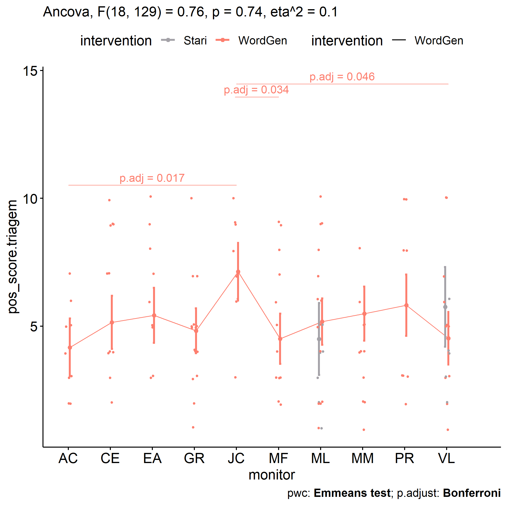<!-- -->

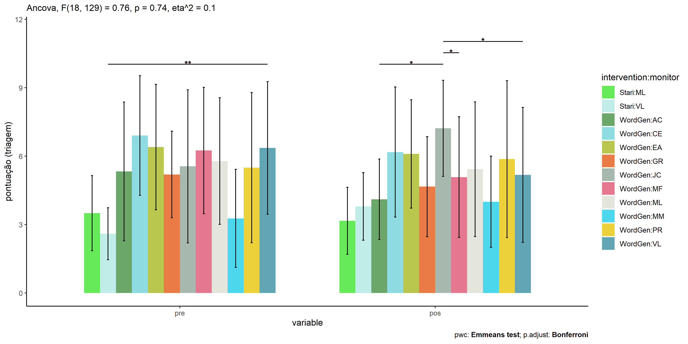<!-- -->

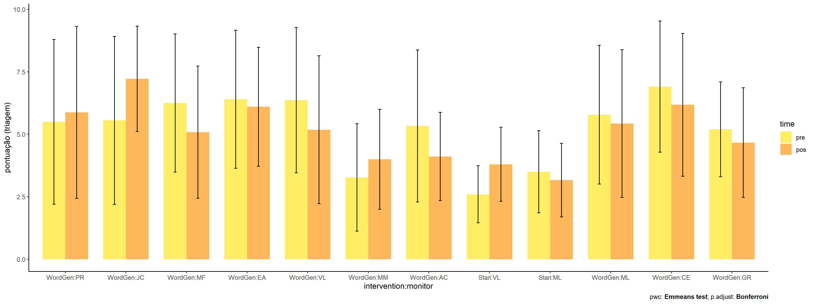<!-- -->

#### Baseado nas estimativas da aprendizagem (theta - traço latente) mediante TRI aplicado as respostas da prova

| var                   | intervention | monitor |   n | M (pre) | SE (pre) | M (unadj) | SE (unadj) | M (adj) | SE (adj) |
|:----------------------|:-------------|:--------|----:|--------:|---------:|----------:|-----------:|--------:|---------:|
| pos_score_tri.triagem | Stari        | ML      |   6 |  -0.426 |    0.240 |    -0.219 |      0.118 |   0.169 |    0.231 |
| pos_score_tri.triagem | Stari        | VL      |   5 |  -0.821 |    0.107 |    -0.406 |      0.170 |   0.247 |    0.257 |
| pos_score_tri.triagem | WordGen      | AC      |   9 |   0.149 |    0.292 |    -0.195 |      0.200 |  -0.193 |    0.186 |
| pos_score_tri.triagem | WordGen      | CE      |  11 |   0.625 |    0.240 |     0.382 |      0.288 |   0.065 |    0.171 |
| pos_score_tri.triagem | WordGen      | EA      |  10 |   0.451 |    0.271 |     0.383 |      0.266 |   0.183 |    0.178 |
| pos_score_tri.triagem | WordGen      | GR      |  15 |   0.003 |    0.172 |    -0.110 |      0.181 |  -0.010 |    0.144 |
| pos_score_tri.triagem | WordGen      | JC      |   9 |   0.155 |    0.362 |     0.856 |      0.206 |   0.854 |    0.186 |
| pos_score_tri.triagem | WordGen      | MF      |  12 |   0.433 |    0.292 |     0.155 |      0.234 |  -0.034 |    0.162 |
| pos_score_tri.triagem | WordGen      | ML      |  14 |   0.286 |    0.209 |     0.162 |      0.241 |   0.072 |    0.149 |
| pos_score_tri.triagem | WordGen      | MM      |  11 |  -0.479 |    0.241 |    -0.338 |      0.176 |   0.085 |    0.173 |
| pos_score_tri.triagem | WordGen      | PR      |   8 |   0.281 |    0.333 |     0.485 |      0.347 |   0.398 |    0.198 |
| pos_score_tri.triagem | WordGen      | VL      |  11 |   0.429 |    0.297 |    -0.049 |      0.326 |  -0.235 |    0.169 |

|     | intervention | monitor | group1 | group2  | estimate | conf.low | conf.high |    se | statistic | p       | p.adj | p.adj.signif |
|:----|:-------------|:--------|:-------|:--------|---------:|---------:|----------:|------:|----------:|:--------|------:|:-------------|
| 7   | NA           | ML      | Stari  | WordGen |    0.097 |   -0.450 |     0.645 | 0.276 |     0.352 | 0.725   | 0.725 | ns           |
| 10  | NA           | VL      | Stari  | WordGen |    0.482 |   -0.135 |     1.099 | 0.311 |     1.548 | 0.125   | 0.125 | ns           |
| 17  | NA           | ML      | Stari  | WordGen |   -0.713 |   -1.532 |     0.106 | 0.413 |    -1.724 | 0.087   | 0.087 | ns           |
| 20  | NA           | VL      | Stari  | WordGen |   -1.250 |   -2.155 |    -0.345 | 0.457 |    -2.736 | 0.007   | 0.007 | \*\*         |
| 62  | Stari        | NA      | ML     | VL      |   -0.078 |   -0.750 |     0.594 | 0.339 |    -0.230 | 0.819   | 0.819 | ns           |
| 66  | WordGen      | NA      | AC     | CE      |   -0.258 |   -0.759 |     0.243 | 0.253 |    -1.022 | 0.309   | 1.000 | ns           |
| 67  | WordGen      | NA      | AC     | EA      |   -0.376 |   -0.886 |     0.134 | 0.257 |    -1.461 | 0.147   | 1.000 | ns           |
| 68  | WordGen      | NA      | AC     | GR      |   -0.183 |   -0.650 |     0.284 | 0.236 |    -0.777 | 0.439   | 1.000 | ns           |
| 69  | WordGen      | NA      | AC     | JC      |   -1.047 |   -1.568 |    -0.525 | 0.263 |    -3.977 | \<0.001 | 0.006 | \*\*         |
| 70  | WordGen      | NA      | AC     | MF      |   -0.159 |   -0.648 |     0.330 | 0.247 |    -0.644 | 0.521   | 1.000 | ns           |
| 71  | WordGen      | NA      | AC     | ML      |   -0.265 |   -0.738 |     0.209 | 0.239 |    -1.109 | 0.27    | 1.000 | ns           |
| 72  | WordGen      | NA      | AC     | MM      |   -0.278 |   -0.782 |     0.226 | 0.254 |    -1.094 | 0.276   | 1.000 | ns           |
| 73  | WordGen      | NA      | AC     | PR      |   -0.591 |   -1.129 |    -0.053 | 0.271 |    -2.179 | 0.032   | 1.000 | ns           |
| 74  | WordGen      | NA      | AC     | VL      |    0.042 |   -0.457 |     0.541 | 0.252 |     0.167 | 0.867   | 1.000 | ns           |
| 75  | WordGen      | NA      | CE     | EA      |   -0.118 |   -0.602 |     0.366 | 0.244 |    -0.482 | 0.631   | 1.000 | ns           |
| 76  | WordGen      | NA      | CE     | GR      |    0.075 |   -0.371 |     0.521 | 0.225 |     0.334 | 0.739   | 1.000 | ns           |
| 77  | WordGen      | NA      | CE     | JC      |   -0.788 |   -1.289 |    -0.288 | 0.253 |    -3.120 | 0.002   | 0.104 | ns           |
| 78  | WordGen      | NA      | CE     | MF      |    0.099 |   -0.363 |     0.562 | 0.233 |     0.426 | 0.671   | 1.000 | ns           |
| 79  | WordGen      | NA      | CE     | ML      |   -0.006 |   -0.454 |     0.442 | 0.226 |    -0.028 | 0.978   | 1.000 | ns           |
| 80  | WordGen      | NA      | CE     | MM      |   -0.020 |   -0.511 |     0.472 | 0.248 |    -0.079 | 0.937   | 1.000 | ns           |
| 81  | WordGen      | NA      | CE     | PR      |   -0.333 |   -0.849 |     0.183 | 0.260 |    -1.280 | 0.203   | 1.000 | ns           |
| 82  | WordGen      | NA      | CE     | VL      |    0.300 |   -0.172 |     0.773 | 0.238 |     1.260 | 0.21    | 1.000 | ns           |
| 83  | WordGen      | NA      | EA     | GR      |    0.193 |   -0.263 |     0.648 | 0.230 |     0.839 | 0.403   | 1.000 | ns           |
| 84  | WordGen      | NA      | EA     | JC      |   -0.671 |   -1.181 |    -0.161 | 0.257 |    -2.608 | 0.01    | 0.468 | ns           |
| 85  | WordGen      | NA      | EA     | MF      |    0.217 |   -0.257 |     0.691 | 0.239 |     0.908 | 0.366   | 1.000 | ns           |
| 86  | WordGen      | NA      | EA     | ML      |    0.111 |   -0.347 |     0.570 | 0.231 |     0.481 | 0.632   | 1.000 | ns           |
| 87  | WordGen      | NA      | EA     | MM      |    0.098 |   -0.399 |     0.595 | 0.251 |     0.390 | 0.697   | 1.000 | ns           |
| 88  | WordGen      | NA      | EA     | PR      |   -0.216 |   -0.741 |     0.310 | 0.265 |    -0.813 | 0.418   | 1.000 | ns           |
| 89  | WordGen      | NA      | EA     | VL      |    0.418 |   -0.066 |     0.902 | 0.244 |     1.713 | 0.09    | 1.000 | ns           |
| 90  | WordGen      | NA      | GR     | JC      |   -0.864 |   -1.331 |    -0.397 | 0.236 |    -3.665 | \<0.001 | 0.017 | \*           |
| 91  | WordGen      | NA      | GR     | MF      |    0.024 |   -0.408 |     0.456 | 0.218 |     0.111 | 0.912   | 1.000 | ns           |
| 92  | WordGen      | NA      | GR     | ML      |   -0.082 |   -0.494 |     0.331 | 0.208 |    -0.391 | 0.696   | 1.000 | ns           |
| 93  | WordGen      | NA      | GR     | MM      |   -0.095 |   -0.538 |     0.349 | 0.224 |    -0.424 | 0.673   | 1.000 | ns           |
| 94  | WordGen      | NA      | GR     | PR      |   -0.408 |   -0.894 |     0.077 | 0.245 |    -1.666 | 0.099   | 1.000 | ns           |
| 95  | WordGen      | NA      | GR     | VL      |    0.225 |   -0.217 |     0.668 | 0.223 |     1.009 | 0.315   | 1.000 | ns           |
| 96  | WordGen      | NA      | JC     | MF      |    0.888 |    0.399 |     1.377 | 0.247 |     3.597 | \<0.001 | 0.022 | \*           |
| 97  | WordGen      | NA      | JC     | ML      |    0.782 |    0.309 |     1.255 | 0.239 |     3.277 | 0.001   | 0.064 | ns           |
| 98  | WordGen      | NA      | JC     | MM      |    0.769 |    0.265 |     1.273 | 0.254 |     3.025 | 0.003   | 0.140 | ns           |
| 99  | WordGen      | NA      | JC     | PR      |    0.455 |   -0.083 |     0.993 | 0.271 |     1.678 | 0.096   | 1.000 | ns           |
| 100 | WordGen      | NA      | JC     | VL      |    1.089 |    0.590 |     1.587 | 0.252 |     4.329 | \<0.001 | 0.002 | \*\*         |
| 101 | WordGen      | NA      | MF     | ML      |   -0.106 |   -0.542 |     0.330 | 0.220 |    -0.481 | 0.632   | 1.000 | ns           |
| 102 | WordGen      | NA      | MF     | MM      |   -0.119 |   -0.595 |     0.357 | 0.240 |    -0.496 | 0.621   | 1.000 | ns           |
| 103 | WordGen      | NA      | MF     | PR      |   -0.433 |   -0.938 |     0.073 | 0.255 |    -1.696 | 0.093   | 1.000 | ns           |
| 104 | WordGen      | NA      | MF     | VL      |    0.201 |   -0.261 |     0.663 | 0.233 |     0.862 | 0.39    | 1.000 | ns           |
| 105 | WordGen      | NA      | ML     | MM      |   -0.013 |   -0.469 |     0.443 | 0.230 |    -0.058 | 0.954   | 1.000 | ns           |
| 106 | WordGen      | NA      | ML     | PR      |   -0.327 |   -0.817 |     0.164 | 0.247 |    -1.321 | 0.189   | 1.000 | ns           |
| 107 | WordGen      | NA      | ML     | VL      |    0.307 |   -0.140 |     0.753 | 0.225 |     1.362 | 0.176   | 1.000 | ns           |
| 108 | WordGen      | NA      | MM     | PR      |   -0.314 |   -0.836 |     0.209 | 0.264 |    -1.188 | 0.237   | 1.000 | ns           |
| 109 | WordGen      | NA      | MM     | VL      |    0.320 |   -0.165 |     0.805 | 0.245 |     1.307 | 0.194   | 1.000 | ns           |
| 110 | WordGen      | NA      | PR     | VL      |    0.634 |    0.119 |     1.148 | 0.260 |     2.440 | 0.016   | 0.733 | ns           |
| 152 | Stari        | NA      | ML     | VL      |    0.395 |   -0.622 |     1.411 | 0.513 |     0.770 | 0.443   | 0.443 | ns           |
| 156 | WordGen      | NA      | AC     | CE      |   -0.476 |   -1.230 |     0.279 | 0.381 |    -1.249 | 0.214   | 1.000 | ns           |
| 157 | WordGen      | NA      | AC     | EA      |   -0.301 |   -1.073 |     0.470 | 0.389 |    -0.775 | 0.44    | 1.000 | ns           |
| 158 | WordGen      | NA      | AC     | GR      |    0.147 |   -0.561 |     0.854 | 0.357 |     0.410 | 0.682   | 1.000 | ns           |
| 159 | WordGen      | NA      | AC     | JC      |   -0.006 |   -0.797 |     0.786 | 0.399 |    -0.014 | 0.989   | 1.000 | ns           |
| 160 | WordGen      | NA      | AC     | MF      |   -0.284 |   -1.025 |     0.456 | 0.373 |    -0.761 | 0.448   | 1.000 | ns           |
| 161 | WordGen      | NA      | AC     | ML      |   -0.137 |   -0.855 |     0.580 | 0.362 |    -0.380 | 0.705   | 1.000 | ns           |
| 162 | WordGen      | NA      | AC     | MM      |    0.628 |   -0.126 |     1.382 | 0.381 |     1.650 | 0.102   | 1.000 | ns           |
| 163 | WordGen      | NA      | AC     | PR      |   -0.132 |   -0.948 |     0.683 | 0.412 |    -0.321 | 0.749   | 1.000 | ns           |
| 164 | WordGen      | NA      | AC     | VL      |   -0.280 |   -1.034 |     0.475 | 0.381 |    -0.735 | 0.464   | 1.000 | ns           |
| 165 | WordGen      | NA      | CE     | EA      |    0.174 |   -0.559 |     0.907 | 0.370 |     0.470 | 0.639   | 1.000 | ns           |
| 166 | WordGen      | NA      | CE     | GR      |    0.622 |   -0.044 |     1.288 | 0.336 |     1.850 | 0.067   | 1.000 | ns           |
| 167 | WordGen      | NA      | CE     | JC      |    0.470 |   -0.285 |     1.224 | 0.381 |     1.234 | 0.22    | 1.000 | ns           |
| 168 | WordGen      | NA      | CE     | MF      |    0.191 |   -0.510 |     0.892 | 0.354 |     0.541 | 0.59    | 1.000 | ns           |
| 169 | WordGen      | NA      | CE     | ML      |    0.338 |   -0.338 |     1.015 | 0.341 |     0.991 | 0.324   | 1.000 | ns           |
| 170 | WordGen      | NA      | CE     | MM      |    1.104 |    0.388 |     1.819 | 0.361 |     3.056 | 0.003   | 0.127 | ns           |
| 171 | WordGen      | NA      | CE     | PR      |    0.343 |   -0.437 |     1.123 | 0.394 |     0.872 | 0.385   | 1.000 | ns           |
| 172 | WordGen      | NA      | CE     | VL      |    0.196 |   -0.520 |     0.911 | 0.361 |     0.542 | 0.589   | 1.000 | ns           |
| 173 | WordGen      | NA      | EA     | GR      |    0.448 |   -0.237 |     1.133 | 0.346 |     1.296 | 0.198   | 1.000 | ns           |
| 174 | WordGen      | NA      | EA     | JC      |    0.296 |   -0.475 |     1.067 | 0.389 |     0.760 | 0.449   | 1.000 | ns           |
| 175 | WordGen      | NA      | EA     | MF      |    0.017 |   -0.702 |     0.736 | 0.363 |     0.047 | 0.962   | 1.000 | ns           |
| 176 | WordGen      | NA      | EA     | ML      |    0.164 |   -0.531 |     0.859 | 0.351 |     0.468 | 0.641   | 1.000 | ns           |
| 177 | WordGen      | NA      | EA     | MM      |    0.929 |    0.196 |     1.663 | 0.370 |     2.512 | 0.013   | 0.607 | ns           |
| 178 | WordGen      | NA      | EA     | PR      |    0.169 |   -0.627 |     0.966 | 0.402 |     0.421 | 0.674   | 1.000 | ns           |
| 179 | WordGen      | NA      | EA     | VL      |    0.022 |   -0.712 |     0.755 | 0.370 |     0.059 | 0.953   | 1.000 | ns           |
| 180 | WordGen      | NA      | GR     | JC      |   -0.152 |   -0.860 |     0.556 | 0.357 |    -0.426 | 0.671   | 1.000 | ns           |
| 181 | WordGen      | NA      | GR     | MF      |   -0.431 |   -1.081 |     0.219 | 0.328 |    -1.314 | 0.192   | 1.000 | ns           |
| 182 | WordGen      | NA      | GR     | ML      |   -0.284 |   -0.908 |     0.340 | 0.315 |    -0.902 | 0.369   | 1.000 | ns           |
| 183 | WordGen      | NA      | GR     | MM      |    0.481 |   -0.185 |     1.148 | 0.336 |     1.432 | 0.155   | 1.000 | ns           |
| 184 | WordGen      | NA      | GR     | PR      |   -0.279 |   -1.014 |     0.456 | 0.371 |    -0.752 | 0.454   | 1.000 | ns           |
| 185 | WordGen      | NA      | GR     | VL      |   -0.426 |   -1.093 |     0.240 | 0.336 |    -1.268 | 0.207   | 1.000 | ns           |
| 186 | WordGen      | NA      | JC     | MF      |   -0.279 |   -1.019 |     0.461 | 0.373 |    -0.746 | 0.457   | 1.000 | ns           |
| 187 | WordGen      | NA      | JC     | ML      |   -0.132 |   -0.849 |     0.585 | 0.362 |    -0.364 | 0.717   | 1.000 | ns           |
| 188 | WordGen      | NA      | JC     | MM      |    0.634 |   -0.121 |     1.388 | 0.381 |     1.664 | 0.099   | 1.000 | ns           |
| 189 | WordGen      | NA      | JC     | PR      |   -0.127 |   -0.942 |     0.689 | 0.412 |    -0.308 | 0.759   | 1.000 | ns           |
| 190 | WordGen      | NA      | JC     | VL      |   -0.274 |   -1.029 |     0.480 | 0.381 |    -0.720 | 0.473   | 1.000 | ns           |
| 191 | WordGen      | NA      | MF     | ML      |    0.147 |   -0.513 |     0.807 | 0.333 |     0.441 | 0.66    | 1.000 | ns           |
| 192 | WordGen      | NA      | MF     | MM      |    0.912 |    0.212 |     1.613 | 0.354 |     2.581 | 0.011   | 0.504 | ns           |
| 193 | WordGen      | NA      | MF     | PR      |    0.152 |   -0.614 |     0.918 | 0.387 |     0.394 | 0.695   | 1.000 | ns           |
| 194 | WordGen      | NA      | MF     | VL      |    0.005 |   -0.696 |     0.705 | 0.354 |     0.013 | 0.99    | 1.000 | ns           |
| 195 | WordGen      | NA      | ML     | MM      |    0.765 |    0.089 |     1.442 | 0.341 |     2.243 | 0.027   | 1.000 | ns           |
| 196 | WordGen      | NA      | ML     | PR      |    0.005 |   -0.739 |     0.749 | 0.375 |     0.014 | 0.989   | 1.000 | ns           |
| 197 | WordGen      | NA      | ML     | VL      |   -0.142 |   -0.819 |     0.534 | 0.341 |    -0.418 | 0.677   | 1.000 | ns           |
| 198 | WordGen      | NA      | MM     | PR      |   -0.760 |   -1.540 |     0.020 | 0.394 |    -1.932 | 0.056   | 1.000 | ns           |
| 199 | WordGen      | NA      | MM     | VL      |   -0.908 |   -1.624 |    -0.192 | 0.361 |    -2.514 | 0.013   | 0.603 | ns           |
| 200 | WordGen      | NA      | PR     | VL      |   -0.148 |   -0.928 |     0.632 | 0.394 |    -0.375 | 0.708   | 1.000 | ns           |

| intervention | monitor | group1 | group2 | estimate | conf.low | conf.high |    se | statistic |     p | p.adj | p.adj.signif |
|:-------------|:--------|:-------|:-------|---------:|---------:|----------:|------:|----------:|------:|------:|:-------------|
| Stari        | ML      | pre    | pos    |   -0.207 |   -1.142 |     0.727 | 0.474 |    -0.437 | 0.663 | 0.663 | ns           |
| Stari        | VL      | pre    | pos    |   -0.415 |   -1.439 |     0.609 | 0.519 |    -0.799 | 0.425 | 0.425 | ns           |
| WordGen      | AC      | pre    | pos    |    0.344 |   -0.419 |     1.107 | 0.387 |     0.889 | 0.375 | 0.375 | ns           |
| WordGen      | CE      | pre    | pos    |    0.242 |   -0.448 |     0.932 | 0.350 |     0.692 | 0.490 | 0.490 | ns           |
| WordGen      | EA      | pre    | pos    |    0.067 |   -0.657 |     0.791 | 0.367 |     0.183 | 0.855 | 0.855 | ns           |
| WordGen      | GR      | pre    | pos    |    0.113 |   -0.478 |     0.704 | 0.300 |     0.376 | 0.707 | 0.707 | ns           |
| WordGen      | JC      | pre    | pos    |   -0.701 |   -1.464 |     0.062 | 0.387 |    -1.810 | 0.072 | 0.072 | ns           |
| WordGen      | MF      | pre    | pos    |    0.279 |   -0.382 |     0.940 | 0.335 |     0.831 | 0.407 | 0.407 | ns           |
| WordGen      | ML      | pre    | pos    |    0.125 |   -0.487 |     0.736 | 0.310 |     0.401 | 0.689 | 0.689 | ns           |
| WordGen      | MM      | pre    | pos    |   -0.140 |   -0.831 |     0.550 | 0.350 |    -0.401 | 0.689 | 0.689 | ns           |
| WordGen      | PR      | pre    | pos    |   -0.204 |   -1.013 |     0.605 | 0.411 |    -0.497 | 0.620 | 0.620 | ns           |
| WordGen      | VL      | pre    | pos    |    0.478 |   -0.212 |     1.168 | 0.350 |     1.366 | 0.173 | 0.173 | ns           |

    ## Scale for colour is already present.
    ## Adding another scale for colour, which will replace the existing scale.

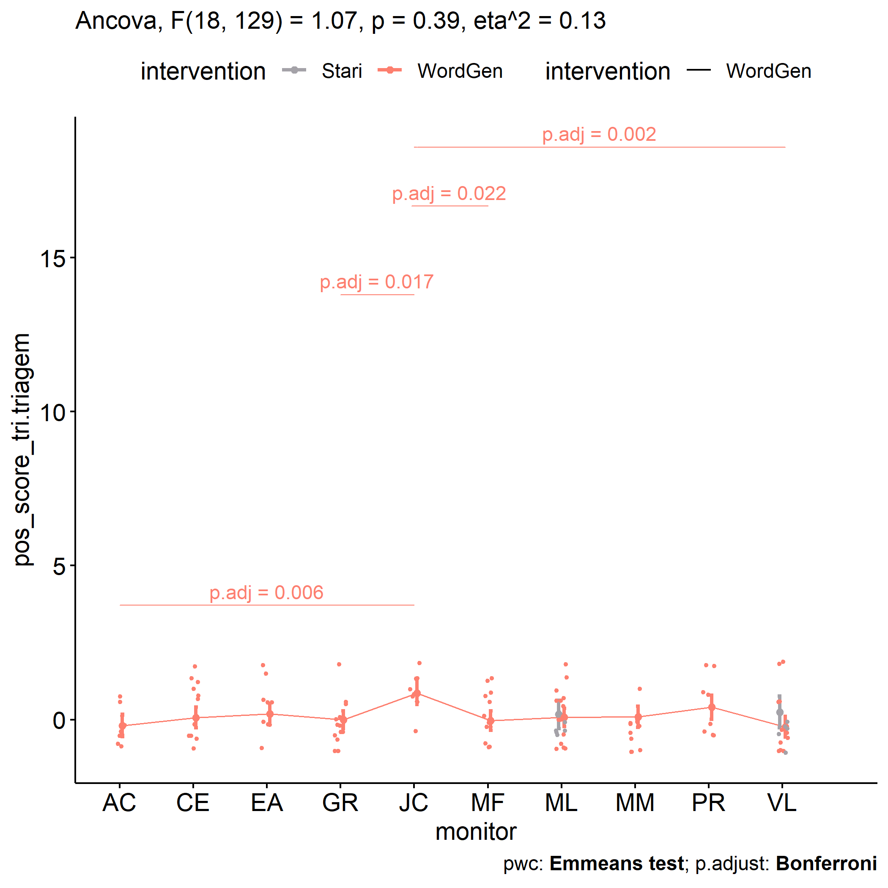<!-- -->

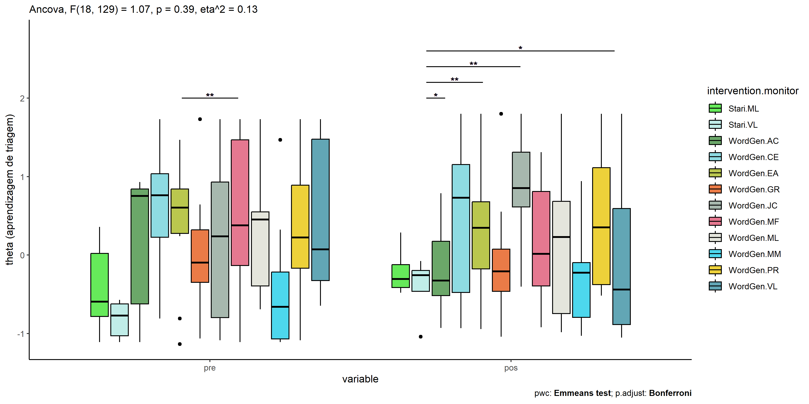<!-- -->

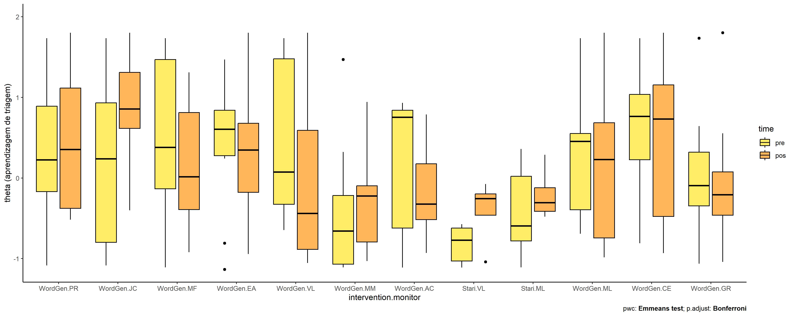<!-- -->

### factores: **intervention:monitor.genero**

#### Baseado nos acertos (score) da prova

| var               | intervention      | monitor.genero |   n | M (pre) | SE (pre) | M (unadj) | SE (unadj) | M (adj) | SE (adj) |
|:------------------|:------------------|:---------------|----:|--------:|---------:|----------:|-----------:|--------:|---------:|
| pos_score.triagem | Stari and WordGen | M              |   5 |   6.000 |    0.548 |     4.600 |      0.678 |   4.013 |    0.799 |
| pos_score.triagem | Stari             | F              |  21 |   3.095 |    0.330 |     3.286 |      0.346 |   4.515 |    0.406 |
| pos_score.triagem | Stari             | M              |  11 |   2.455 |    0.413 |     3.091 |      0.667 |   4.720 |    0.559 |
| pos_score.triagem | WordGen           | F              |  72 |   5.389 |    0.316 |     4.792 |      0.290 |   4.587 |    0.211 |
| pos_score.triagem | WordGen           | M              |  38 |   6.158 |    0.475 |     6.342 |      0.430 |   5.657 |    0.296 |

|     | intervention | monitor.genero | group1  | group2            | estimate | conf.low | conf.high |    se | statistic | p       | p.adj   | p.adj.signif |
|:----|:-------------|:---------------|:--------|:------------------|---------:|---------:|----------:|------:|----------:|:--------|:--------|:-------------|
| 1   | NA           | F              | Stari   | WordGen           |   -0.072 |   -0.987 |     0.842 | 0.462 |    -0.156 | 0.876   | 0.876   | ns           |
| 4   | NA           | M              | Stari   | WordGen           |   -0.936 |   -2.219 |     0.346 | 0.649 |    -1.444 | 0.151   | 0.453   | ns           |
| 5   | NA           | M              | Stari   | Stari and WordGen |    0.707 |   -1.238 |     2.652 | 0.984 |     0.719 | 0.474   | 1       | ns           |
| 6   | NA           | M              | WordGen | Stari and WordGen |    1.643 |   -0.033 |     3.319 | 0.848 |     1.939 | 0.055   | 0.164   | ns           |
| 7   | NA           | F              | Stari   | WordGen           |   -2.294 |   -3.527 |    -1.060 | 0.624 |    -3.676 | \<0.001 | \<0.001 | \*\*\*       |
| 10  | NA           | M              | Stari   | WordGen           |   -3.703 |   -5.406 |    -2.001 | 0.861 |    -4.300 | \<0.001 | \<0.001 | \*\*\*\*     |
| 11  | NA           | M              | Stari   | Stari and WordGen |   -3.545 |   -6.228 |    -0.863 | 1.357 |    -2.613 | 0.01    | 0.03    | \*           |
| 12  | NA           | M              | WordGen | Stari and WordGen |    0.158 |   -2.208 |     2.524 | 1.197 |     0.132 | 0.895   | 1       | ns           |
| 13  | Stari        | NA             | F       | M                 |   -0.206 |   -1.519 |     1.108 | 0.664 |    -0.310 | 0.757   | 0.757   | ns           |
| 14  | WordGen      | NA             | F       | M                 |   -1.070 |   -1.782 |    -0.358 | 0.360 |    -2.970 | 0.004   | 0.004   | \*\*         |
| 16  | Stari        | NA             | F       | M                 |    0.641 |   -1.210 |     2.492 | 0.936 |     0.684 | 0.495   | 0.495   | ns           |
| 17  | WordGen      | NA             | F       | M                 |   -0.769 |   -1.766 |     0.228 | 0.504 |    -1.525 | 0.13    | 0.13    | ns           |

| monitor.genero | group1 | group2 | estimate | conf.low | conf.high |    se | statistic |     p | p.adj | p.adj.signif |
|:---------------|:-------|:-------|---------:|---------:|----------:|------:|----------:|------:|------:|:-------------|
| F              | pre    | pos    |   -0.190 |   -1.676 |     1.295 | 0.754 |    -0.252 | 0.801 | 0.801 | ns           |
| M              | pre    | pos    |   -0.636 |   -2.688 |     1.416 | 1.042 |    -0.610 | 0.542 | 0.542 | ns           |
| F              | pre    | pos    |    0.597 |   -0.205 |     1.399 | 0.407 |     1.466 | 0.144 | 0.144 | ns           |
| M              | pre    | pos    |   -0.184 |   -1.288 |     0.920 | 0.561 |    -0.328 | 0.743 | 0.743 | ns           |
| M              | pre    | pos    |    1.400 |   -1.644 |     4.444 | 1.546 |     0.905 | 0.366 | 0.366 | ns           |

    ## Scale for colour is already present.
    ## Adding another scale for colour, which will replace the existing scale.

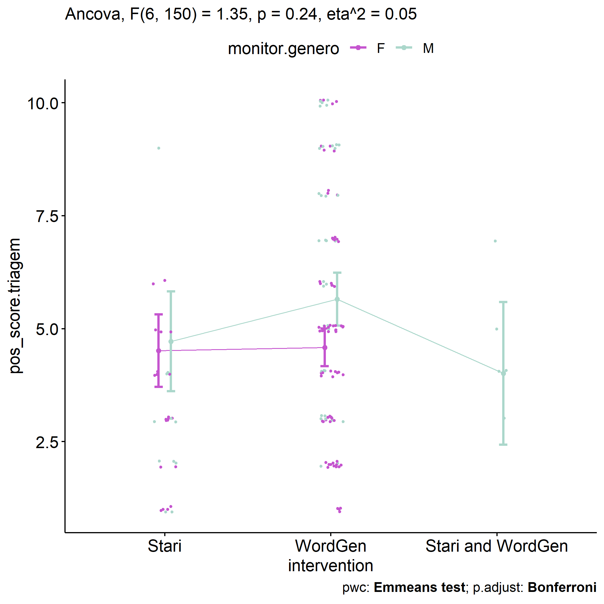<!-- -->

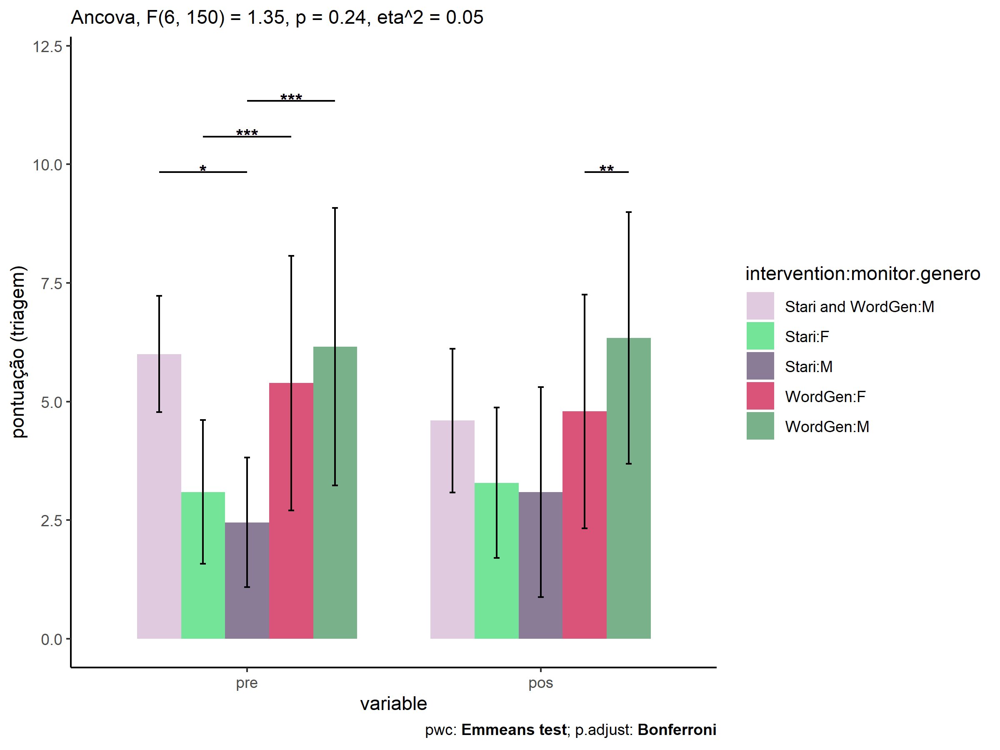<!-- -->

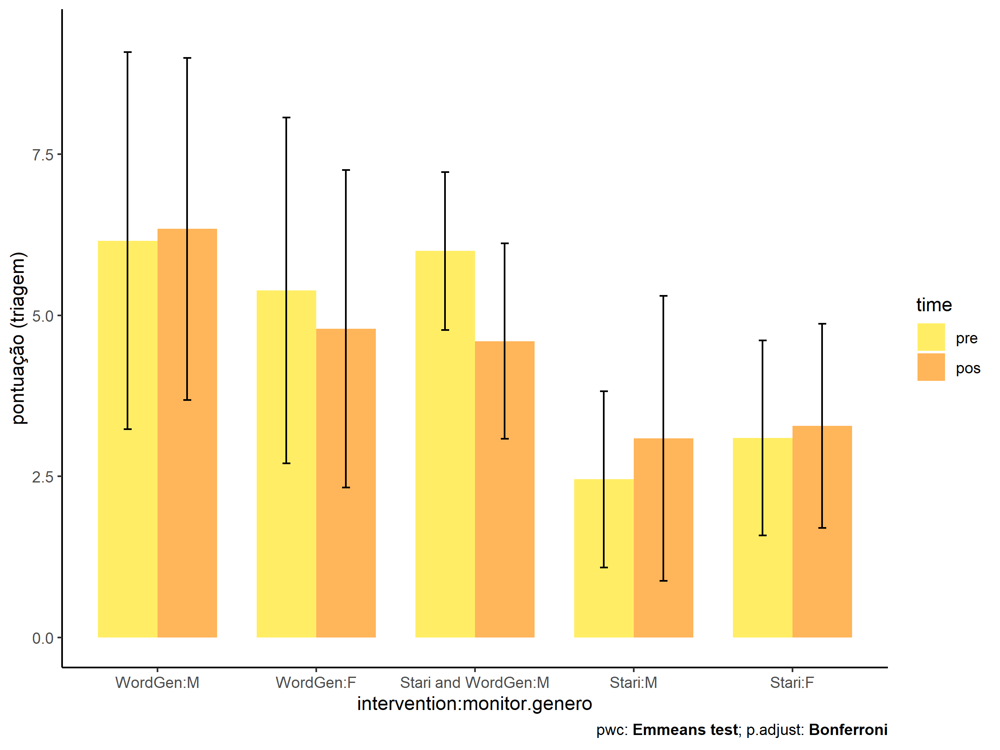<!-- -->

#### Baseado nas estimativas da aprendizagem (theta - traço latente) mediante TRI aplicado as respostas da prova

| var                   | intervention      | monitor.genero |   n | M (pre) | SE (pre) | M (unadj) | SE (unadj) | M (adj) | SE (adj) |
|:----------------------|:------------------|:---------------|----:|--------:|---------:|----------:|-----------:|--------:|---------:|
| pos_score_tri.triagem | Stari and WordGen | M              |   5 |   0.381 |    0.217 |    -0.091 |      0.278 |  -0.293 |    0.261 |
| pos_score_tri.triagem | Stari             | F              |  21 |  -0.555 |    0.106 |    -0.370 |      0.089 |  -0.005 |    0.132 |
| pos_score_tri.triagem | Stari             | M              |  11 |  -0.757 |    0.123 |    -0.337 |      0.212 |   0.152 |    0.182 |
| pos_score_tri.triagem | WordGen           | F              |  72 |   0.139 |    0.103 |    -0.049 |      0.094 |  -0.105 |    0.069 |
| pos_score_tri.triagem | WordGen           | M              |  38 |   0.395 |    0.146 |     0.516 |      0.138 |   0.305 |    0.097 |

|     | intervention | monitor.genero | group1  | group2            | estimate | conf.low | conf.high |    se | statistic | p       | p.adj   | p.adj.signif |
|:----|:-------------|:---------------|:--------|:------------------|---------:|---------:|----------:|------:|----------:|:--------|:--------|:-------------|
| 1   | NA           | F              | Stari   | WordGen           |    0.100 |   -0.197 |     0.397 | 0.150 |     0.666 | 0.506   | 0.506   | ns           |
| 4   | NA           | M              | Stari   | WordGen           |   -0.154 |   -0.571 |     0.264 | 0.211 |    -0.728 | 0.468   | 1       | ns           |
| 5   | NA           | M              | Stari   | Stari and WordGen |    0.445 |   -0.190 |     1.080 | 0.321 |     1.386 | 0.168   | 0.503   | ns           |
| 6   | NA           | M              | WordGen | Stari and WordGen |    0.599 |    0.052 |     1.146 | 0.277 |     2.165 | 0.032   | 0.096   | ns           |
| 7   | NA           | F              | Stari   | WordGen           |   -0.694 |   -1.088 |    -0.300 | 0.199 |    -3.485 | \<0.001 | \<0.001 | \*\*\*       |
| 10  | NA           | M              | Stari   | WordGen           |   -1.153 |   -1.696 |    -0.609 | 0.275 |    -4.192 | \<0.001 | \<0.001 | \*\*\*       |
| 11  | NA           | M              | Stari   | Stari and WordGen |   -1.138 |   -1.994 |    -0.282 | 0.433 |    -2.628 | 0.01    | 0.029   | \*           |
| 12  | NA           | M              | WordGen | Stari and WordGen |    0.014 |   -0.741 |     0.769 | 0.382 |     0.038 | 0.97    | 1       | ns           |
| 13  | Stari        | NA             | F       | M                 |   -0.157 |   -0.585 |     0.272 | 0.217 |    -0.723 | 0.471   | 0.471   | ns           |
| 14  | WordGen      | NA             | F       | M                 |   -0.410 |   -0.643 |    -0.178 | 0.118 |    -3.489 | \<0.001 | \<0.001 | \*\*\*       |
| 16  | Stari        | NA             | F       | M                 |    0.203 |   -0.388 |     0.793 | 0.299 |     0.678 | 0.499   | 0.499   | ns           |
| 17  | WordGen      | NA             | F       | M                 |   -0.256 |   -0.574 |     0.063 | 0.161 |    -1.589 | 0.114   | 0.114   | ns           |

| intervention      | monitor.genero | group1 | group2 | estimate | conf.low | conf.high |    se | statistic |     p | p.adj | p.adj.signif |
|:------------------|:---------------|:-------|:-------|---------:|---------:|----------:|------:|----------:|------:|------:|:-------------|
| Stari             | F              | pre    | pos    |   -0.184 |   -0.658 |     0.290 | 0.241 |    -0.765 | 0.445 | 0.445 | ns           |
| Stari             | M              | pre    | pos    |   -0.421 |   -1.076 |     0.234 | 0.333 |    -1.264 | 0.207 | 0.207 | ns           |
| WordGen           | F              | pre    | pos    |    0.189 |   -0.067 |     0.445 | 0.130 |     1.451 | 0.148 | 0.148 | ns           |
| WordGen           | M              | pre    | pos    |   -0.121 |   -0.473 |     0.231 | 0.179 |    -0.676 | 0.499 | 0.499 | ns           |
| Stari and WordGen | M              | pre    | pos    |    0.472 |   -0.499 |     1.444 | 0.494 |     0.957 | 0.340 | 0.340 | ns           |

    ## Scale for colour is already present.
    ## Adding another scale for colour, which will replace the existing scale.

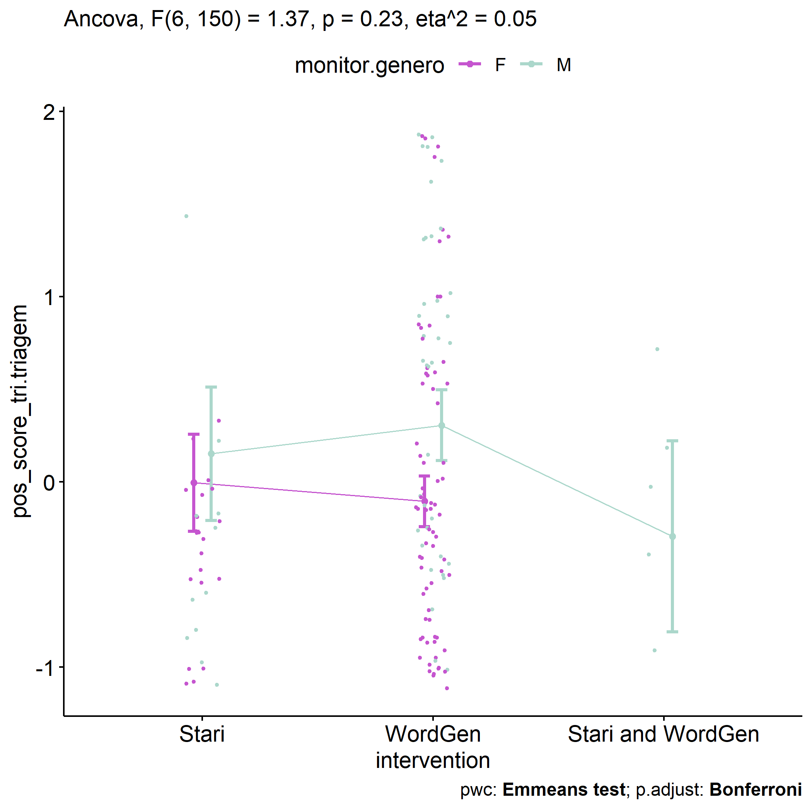<!-- -->

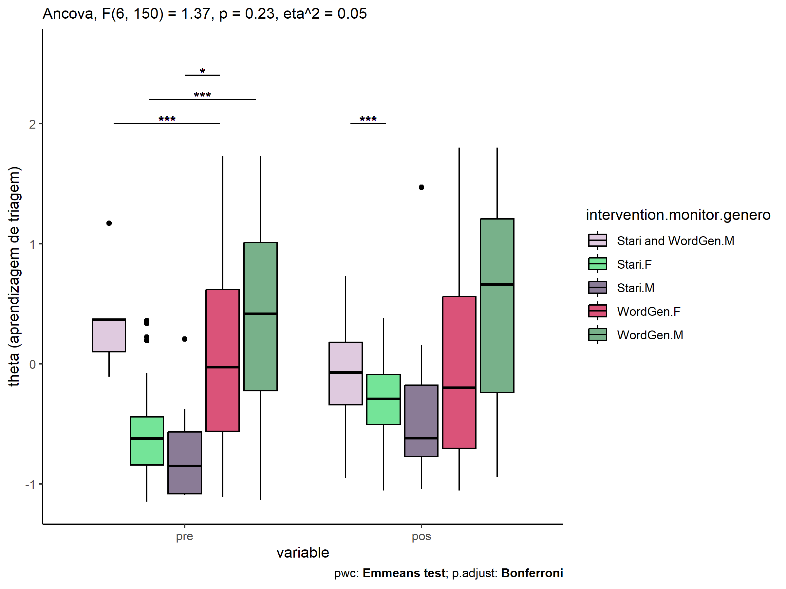<!-- -->

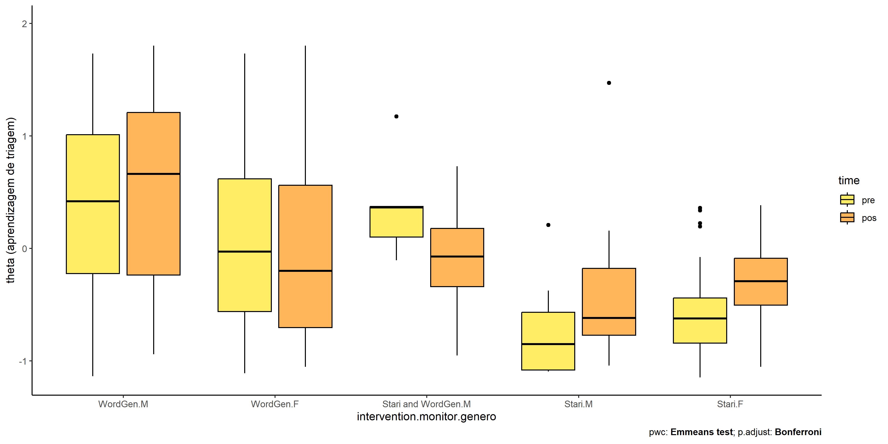<!-- -->

### factores: **intervention:monitor.formacao**

#### Baseado nos acertos (score) da prova

| var               | intervention | monitor.formacao           |   n | M (pre) | SE (pre) | M (unadj) | SE (unadj) | M (adj) | SE (adj) |
|:------------------|:-------------|:---------------------------|----:|--------:|---------:|----------:|-----------:|--------:|---------:|
| pos_score.triagem | Stari        | Ciencias Biologicas        |   6 |   3.500 |    0.671 |     3.167 |      0.601 |   4.434 |    0.751 |
| pos_score.triagem | Stari        | Matematica                 |   5 |   4.400 |    0.812 |     4.800 |      1.319 |   5.461 |    0.814 |
| pos_score.triagem | Stari        | Servico Social             |   5 |   2.600 |    0.510 |     3.800 |      0.663 |   5.673 |    0.832 |
| pos_score.triagem | WordGen      | Arquitetura e Urbanismo    |   9 |   5.556 |    1.119 |     7.222 |      0.703 |   7.105 |    0.605 |
| pos_score.triagem | WordGen      | Ciencias Biologicas        |  14 |   5.786 |    0.743 |     5.429 |      0.789 |   5.156 |    0.486 |
| pos_score.triagem | WordGen      | Comunicacao Social         |  11 |   6.909 |    0.791 |     6.182 |      0.861 |   5.152 |    0.556 |
| pos_score.triagem | WordGen      | Historia                   |   8 |   5.500 |    1.165 |     5.875 |      1.217 |   5.795 |    0.642 |
| pos_score.triagem | WordGen      | Letras - Lingua Portuguesa |  12 |   6.250 |    0.799 |     5.083 |      0.763 |   4.498 |    0.527 |
| pos_score.triagem | WordGen      | Matematica                 |  25 |   5.680 |    0.461 |     5.240 |      0.466 |   5.039 |    0.364 |
| pos_score.triagem | WordGen      | Nutricao                   |  11 |   3.273 |    0.648 |     4.000 |      0.603 |   5.420 |    0.564 |
| pos_score.triagem | WordGen      | Pedagogia                  |   9 |   5.333 |    1.014 |     4.111 |      0.588 |   4.143 |    0.605 |
| pos_score.triagem | WordGen      | Servico Social             |  11 |   6.364 |    0.877 |     5.182 |      0.893 |   4.520 |    0.551 |

|     | intervention | monitor.formacao    | group1                  | group2              | estimate | conf.low | conf.high |    se | statistic | p       | p.adj | p.adj.signif |
|:----|:-------------|:--------------------|:------------------------|:--------------------|---------:|---------:|----------:|------:|----------:|:--------|------:|:-------------|
| 2   | NA           | Ciencias Biologicas | Stari                   | WordGen             |   -0.722 |   -2.501 |     1.057 | 0.898 |    -0.804 | 0.423   | 0.423 | ns           |
| 6   | NA           | Matematica          | Stari                   | WordGen             |    0.422 |   -1.347 |     2.192 | 0.893 |     0.473 | 0.637   | 0.637 | ns           |
| 9   | NA           | Servico Social      | Stari                   | WordGen             |    1.153 |   -0.846 |     3.152 | 1.009 |     1.143 | 0.255   | 0.255 | ns           |
| 11  | NA           | Ciencias Biologicas | Stari                   | WordGen             |   -2.286 |   -4.820 |     0.249 | 1.279 |    -1.786 | 0.077   | 0.077 | ns           |
| 15  | NA           | Matematica          | Stari                   | WordGen             |   -1.280 |   -3.825 |     1.265 | 1.285 |    -0.996 | 0.321   | 0.321 | ns           |
| 18  | NA           | Servico Social      | Stari                   | WordGen             |   -3.764 |   -6.565 |    -0.962 | 1.414 |    -2.661 | 0.009   | 0.009 | \*\*         |
| 30  | Stari        | NA                  | Ciencias Biologicas     | Matematica          |   -1.027 |   -3.208 |     1.154 | 1.101 |    -0.933 | 0.353   | 1.000 | ns           |
| 33  | Stari        | NA                  | Ciencias Biologicas     | Servico Social      |   -1.240 |   -3.420 |     0.941 | 1.101 |    -1.126 | 0.262   | 0.787 | ns           |
| 51  | Stari        | NA                  | Matematica              | Servico Social      |   -0.212 |   -2.499 |     2.074 | 1.154 |    -0.184 | 0.854   | 1.000 | ns           |
| 55  | WordGen      | NA                  | Arquitetura e Urbanismo | Ciencias Biologicas |    1.949 |    0.412 |     3.485 | 0.776 |     2.512 | 0.013   | 0.483 | ns           |
| 56  | WordGen      | NA                  | Arquitetura e Urbanismo | Comunicacao Social  |    1.952 |    0.326 |     3.578 | 0.821 |     2.379 | 0.019   | 0.685 | ns           |
| 57  | WordGen      | NA                  | Arquitetura e Urbanismo | Historia            |    1.310 |   -0.438 |     3.057 | 0.882 |     1.485 | 0.14    | 1.000 | ns           |
| 58  | WordGen      | NA                  | Arquitetura e Urbanismo | Letras              |    2.607 |    1.018 |     4.195 | 0.802 |     3.252 | 0.002   | 0.054 | ns           |
| 59  | WordGen      | NA                  | Arquitetura e Urbanismo | Matematica          |    2.066 |    0.668 |     3.464 | 0.706 |     2.928 | 0.004   | 0.149 | ns           |
| 60  | WordGen      | NA                  | Arquitetura e Urbanismo | Nutricao            |    1.685 |    0.042 |     3.327 | 0.829 |     2.032 | 0.045   | 1.000 | ns           |
| 61  | WordGen      | NA                  | Arquitetura e Urbanismo | Pedagogia           |    2.961 |    1.266 |     4.657 | 0.856 |     3.461 | \<0.001 | 0.027 | \*           |
| 62  | WordGen      | NA                  | Arquitetura e Urbanismo | Servico Social      |    2.585 |    0.965 |     4.204 | 0.818 |     3.162 | 0.002   | 0.073 | ns           |
| 63  | WordGen      | NA                  | Ciencias Biologicas     | Comunicacao Social  |    0.003 |   -1.453 |     1.460 | 0.735 |     0.005 | 0.996   | 1.000 | ns           |
| 64  | WordGen      | NA                  | Ciencias Biologicas     | Historia            |   -0.639 |   -2.233 |     0.955 | 0.805 |    -0.794 | 0.429   | 1.000 | ns           |
| 65  | WordGen      | NA                  | Ciencias Biologicas     | Letras              |    0.658 |   -0.758 |     2.074 | 0.715 |     0.921 | 0.359   | 1.000 | ns           |
| 66  | WordGen      | NA                  | Ciencias Biologicas     | Matematica          |    0.117 |   -1.083 |     1.318 | 0.606 |     0.194 | 0.847   | 1.000 | ns           |
| 67  | WordGen      | NA                  | Ciencias Biologicas     | Nutricao            |   -0.264 |   -1.749 |     1.220 | 0.749 |    -0.353 | 0.725   | 1.000 | ns           |
| 68  | WordGen      | NA                  | Ciencias Biologicas     | Pedagogia           |    1.013 |   -0.525 |     2.550 | 0.776 |     1.305 | 0.195   | 1.000 | ns           |
| 69  | WordGen      | NA                  | Ciencias Biologicas     | Servico Social      |    0.636 |   -0.815 |     2.087 | 0.732 |     0.869 | 0.387   | 1.000 | ns           |
| 70  | WordGen      | NA                  | Comunicacao Social      | Historia            |   -0.642 |   -2.323 |     1.038 | 0.848 |    -0.757 | 0.451   | 1.000 | ns           |
| 71  | WordGen      | NA                  | Comunicacao Social      | Letras              |    0.655 |   -0.849 |     2.158 | 0.759 |     0.862 | 0.39    | 1.000 | ns           |
| 72  | WordGen      | NA                  | Comunicacao Social      | Matematica          |    0.114 |   -1.197 |     1.425 | 0.662 |     0.172 | 0.864   | 1.000 | ns           |
| 73  | WordGen      | NA                  | Comunicacao Social      | Nutricao            |   -0.268 |   -1.871 |     1.335 | 0.809 |    -0.331 | 0.741   | 1.000 | ns           |
| 74  | WordGen      | NA                  | Comunicacao Social      | Pedagogia           |    1.009 |   -0.620 |     2.638 | 0.822 |     1.228 | 0.222   | 1.000 | ns           |
| 75  | WordGen      | NA                  | Comunicacao Social      | Servico Social      |    0.633 |   -0.902 |     2.168 | 0.775 |     0.816 | 0.416   | 1.000 | ns           |
| 76  | WordGen      | NA                  | Historia                | Letras              |    1.297 |   -0.347 |     2.941 | 0.830 |     1.563 | 0.121   | 1.000 | ns           |
| 77  | WordGen      | NA                  | Historia                | Matematica          |    0.756 |   -0.705 |     2.217 | 0.737 |     1.026 | 0.307   | 1.000 | ns           |
| 78  | WordGen      | NA                  | Historia                | Nutricao            |    0.375 |   -1.321 |     2.070 | 0.856 |     0.438 | 0.662   | 1.000 | ns           |
| 79  | WordGen      | NA                  | Historia                | Pedagogia           |    1.652 |   -0.096 |     3.399 | 0.882 |     1.872 | 0.064   | 1.000 | ns           |
| 80  | WordGen      | NA                  | Historia                | Servico Social      |    1.275 |   -0.400 |     2.950 | 0.845 |     1.508 | 0.134   | 1.000 | ns           |
| 81  | WordGen      | NA                  | Letras                  | Lingua Portuguesa   |   -0.541 |   -1.806 |     0.724 | 0.639 |    -0.847 | 0.399   | 1.000 | ns           |
| 82  | WordGen      | NA                  | Letras                  | Lingua Portuguesa   |   -0.922 |   -2.471 |     0.627 | 0.782 |    -1.179 | 0.241   | 1.000 | ns           |
| 83  | WordGen      | NA                  | Letras                  | Lingua Portuguesa   |    0.355 |   -1.235 |     1.945 | 0.803 |     0.442 | 0.659   | 1.000 | ns           |
| 84  | WordGen      | NA                  | Letras                  | Lingua Portuguesa   |   -0.022 |   -1.523 |     1.479 | 0.758 |    -0.029 | 0.977   | 1.000 | ns           |
| 85  | WordGen      | NA                  | Matematica              | Nutricao            |   -0.382 |   -1.719 |     0.956 | 0.675 |    -0.565 | 0.573   | 1.000 | ns           |
| 86  | WordGen      | NA                  | Matematica              | Pedagogia           |    0.895 |   -0.503 |     2.294 | 0.706 |     1.268 | 0.207   | 1.000 | ns           |
| 87  | WordGen      | NA                  | Matematica              | Servico Social      |    0.519 |   -0.785 |     1.823 | 0.658 |     0.788 | 0.432   | 1.000 | ns           |
| 88  | WordGen      | NA                  | Nutricao                | Pedagogia           |    1.277 |   -0.361 |     2.915 | 0.827 |     1.545 | 0.125   | 1.000 | ns           |
| 89  | WordGen      | NA                  | Nutricao                | Servico Social      |    0.900 |   -0.684 |     2.484 | 0.799 |     1.126 | 0.263   | 1.000 | ns           |
| 90  | WordGen      | NA                  | Pedagogia               | Servico Social      |   -0.377 |   -1.998 |     1.245 | 0.819 |    -0.460 | 0.646   | 1.000 | ns           |
| 102 | Stari        | NA                  | Ciencias Biologicas     | Matematica          |   -0.900 |   -4.045 |     2.245 | 1.588 |    -0.567 | 0.572   | 1.000 | ns           |
| 105 | Stari        | NA                  | Ciencias Biologicas     | Servico Social      |    0.900 |   -2.245 |     4.045 | 1.588 |     0.567 | 0.572   | 1.000 | ns           |
| 123 | Stari        | NA                  | Matematica              | Servico Social      |    1.800 |   -1.485 |     5.085 | 1.658 |     1.085 | 0.28    | 0.840 | ns           |
| 127 | WordGen      | NA                  | Arquitetura e Urbanismo | Ciencias Biologicas |   -0.230 |   -2.449 |     1.989 | 1.120 |    -0.205 | 0.838   | 1.000 | ns           |
| 128 | WordGen      | NA                  | Arquitetura e Urbanismo | Comunicacao Social  |   -1.354 |   -3.688 |     0.981 | 1.179 |    -1.148 | 0.253   | 1.000 | ns           |
| 129 | WordGen      | NA                  | Arquitetura e Urbanismo | Historia            |    0.056 |   -2.468 |     2.580 | 1.274 |     0.044 | 0.965   | 1.000 | ns           |
| 130 | WordGen      | NA                  | Arquitetura e Urbanismo | Letras              |   -0.694 |   -2.985 |     1.596 | 1.156 |    -0.601 | 0.549   | 1.000 | ns           |
| 131 | WordGen      | NA                  | Arquitetura e Urbanismo | Matematica          |   -0.124 |   -2.144 |     1.895 | 1.019 |    -0.122 | 0.903   | 1.000 | ns           |
| 132 | WordGen      | NA                  | Arquitetura e Urbanismo | Nutricao            |    2.283 |   -0.052 |     4.618 | 1.179 |     1.937 | 0.055   | 1.000 | ns           |
| 133 | WordGen      | NA                  | Arquitetura e Urbanismo | Pedagogia           |    0.222 |   -2.226 |     2.671 | 1.236 |     0.180 | 0.858   | 1.000 | ns           |
| 134 | WordGen      | NA                  | Arquitetura e Urbanismo | Servico Social      |   -0.808 |   -3.143 |     1.527 | 1.179 |    -0.686 | 0.494   | 1.000 | ns           |
| 135 | WordGen      | NA                  | Ciencias Biologicas     | Comunicacao Social  |   -1.123 |   -3.216 |     0.970 | 1.056 |    -1.063 | 0.29    | 1.000 | ns           |
| 136 | WordGen      | NA                  | Ciencias Biologicas     | Historia            |    0.286 |   -2.016 |     2.588 | 1.162 |     0.246 | 0.806   | 1.000 | ns           |
| 137 | WordGen      | NA                  | Ciencias Biologicas     | Letras              |   -0.464 |   -2.508 |     1.579 | 1.032 |    -0.450 | 0.653   | 1.000 | ns           |
| 138 | WordGen      | NA                  | Ciencias Biologicas     | Matematica          |    0.106 |   -1.628 |     1.840 | 0.875 |     0.121 | 0.904   | 1.000 | ns           |
| 139 | WordGen      | NA                  | Ciencias Biologicas     | Nutricao            |    2.513 |    0.420 |     4.606 | 1.056 |     2.379 | 0.019   | 0.685 | ns           |
| 140 | WordGen      | NA                  | Ciencias Biologicas     | Pedagogia           |    0.452 |   -1.767 |     2.672 | 1.120 |     0.404 | 0.687   | 1.000 | ns           |
| 141 | WordGen      | NA                  | Ciencias Biologicas     | Servico Social      |   -0.578 |   -2.671 |     1.515 | 1.056 |    -0.547 | 0.585   | 1.000 | ns           |
| 142 | WordGen      | NA                  | Comunicacao Social      | Historia            |    1.409 |   -1.005 |     3.823 | 1.218 |     1.157 | 0.25    | 1.000 | ns           |
| 143 | WordGen      | NA                  | Comunicacao Social      | Letras              |    0.659 |   -1.509 |     2.827 | 1.095 |     0.602 | 0.548   | 1.000 | ns           |
| 144 | WordGen      | NA                  | Comunicacao Social      | Matematica          |    1.229 |   -0.650 |     3.108 | 0.949 |     1.296 | 0.198   | 1.000 | ns           |
| 145 | WordGen      | NA                  | Comunicacao Social      | Nutricao            |    3.636 |    1.421 |     5.851 | 1.118 |     3.252 | 0.002   | 0.054 | ns           |
| 146 | WordGen      | NA                  | Comunicacao Social      | Pedagogia           |    1.576 |   -0.759 |     3.910 | 1.179 |     1.337 | 0.184   | 1.000 | ns           |
| 147 | WordGen      | NA                  | Comunicacao Social      | Servico Social      |    0.545 |   -1.669 |     2.760 | 1.118 |     0.488 | 0.627   | 1.000 | ns           |
| 148 | WordGen      | NA                  | Historia                | Letras              |   -0.750 |   -3.121 |     1.621 | 1.197 |    -0.627 | 0.532   | 1.000 | ns           |
| 149 | WordGen      | NA                  | Historia                | Matematica          |   -0.180 |   -2.290 |     1.930 | 1.065 |    -0.169 | 0.866   | 1.000 | ns           |
| 150 | WordGen      | NA                  | Historia                | Nutricao            |    2.227 |   -0.186 |     4.641 | 1.218 |     1.828 | 0.07    | 1.000 | ns           |
| 151 | WordGen      | NA                  | Historia                | Pedagogia           |    0.167 |   -2.357 |     2.691 | 1.274 |     0.131 | 0.896   | 1.000 | ns           |
| 152 | WordGen      | NA                  | Historia                | Servico Social      |   -0.864 |   -3.277 |     1.550 | 1.218 |    -0.709 | 0.48    | 1.000 | ns           |
| 153 | WordGen      | NA                  | Letras                  | Lingua Portuguesa   |    0.570 |   -1.254 |     2.394 | 0.921 |     0.619 | 0.537   | 1.000 | ns           |
| 154 | WordGen      | NA                  | Letras                  | Lingua Portuguesa   |    2.977 |    0.809 |     5.146 | 1.095 |     2.720 | 0.008   | 0.272 | ns           |
| 155 | WordGen      | NA                  | Letras                  | Lingua Portuguesa   |    0.917 |   -1.374 |     3.207 | 1.156 |     0.793 | 0.43    | 1.000 | ns           |
| 156 | WordGen      | NA                  | Letras                  | Lingua Portuguesa   |   -0.114 |   -2.282 |     2.055 | 1.095 |    -0.104 | 0.917   | 1.000 | ns           |
| 157 | WordGen      | NA                  | Matematica              | Nutricao            |    2.407 |    0.528 |     4.287 | 0.949 |     2.537 | 0.013   | 0.451 | ns           |
| 158 | WordGen      | NA                  | Matematica              | Pedagogia           |    0.347 |   -1.673 |     2.366 | 1.019 |     0.340 | 0.734   | 1.000 | ns           |
| 159 | WordGen      | NA                  | Matematica              | Servico Social      |   -0.684 |   -2.563 |     1.196 | 0.949 |    -0.721 | 0.473   | 1.000 | ns           |
| 160 | WordGen      | NA                  | Nutricao                | Pedagogia           |   -2.061 |   -4.395 |     0.274 | 1.179 |    -1.748 | 0.083   | 1.000 | ns           |
| 161 | WordGen      | NA                  | Nutricao                | Servico Social      |   -3.091 |   -5.306 |    -0.876 | 1.118 |    -2.764 | 0.007   | 0.239 | ns           |
| 162 | WordGen      | NA                  | Pedagogia               | Servico Social      |   -1.030 |   -3.365 |     1.304 | 1.179 |    -0.874 | 0.384   | 1.000 | ns           |

| monitor.formacao           | group1 | group2 | estimate | conf.low | conf.high |    se | statistic |     p | p.adj | p.adj.signif |
|:---------------------------|:-------|:-------|---------:|---------:|----------:|------:|----------:|------:|------:|:-------------|
| Ciencias Biologicas        | pre    | pos    |    0.333 |   -2.596 |     3.263 | 1.487 |     0.224 | 0.823 | 0.823 | ns           |
| Matematica                 | pre    | pos    |   -0.400 |   -3.609 |     2.809 | 1.629 |    -0.246 | 0.806 | 0.806 | ns           |
| Servico Social             | pre    | pos    |   -1.200 |   -4.409 |     2.009 | 1.629 |    -0.737 | 0.462 | 0.462 | ns           |
| Arquitetura e Urbanismo    | pre    | pos    |   -1.667 |   -4.058 |     0.725 | 1.214 |    -1.373 | 0.171 | 0.171 | ns           |
| Ciencias Biologicas        | pre    | pos    |    0.357 |   -1.561 |     2.275 | 0.973 |     0.367 | 0.714 | 0.714 | ns           |
| Comunicacao Social         | pre    | pos    |    0.727 |   -1.436 |     2.891 | 1.098 |     0.662 | 0.508 | 0.508 | ns           |
| Historia                   | pre    | pos    |   -0.375 |   -2.912 |     2.162 | 1.287 |    -0.291 | 0.771 | 0.771 | ns           |
| Letras - Lingua Portuguesa | pre    | pos    |    1.167 |   -0.905 |     3.238 | 1.051 |     1.110 | 0.268 | 0.268 | ns           |
| Matematica                 | pre    | pos    |    0.440 |   -0.995 |     1.875 | 0.728 |     0.604 | 0.546 | 0.546 | ns           |
| Nutricao                   | pre    | pos    |   -0.727 |   -2.891 |     1.436 | 1.098 |    -0.662 | 0.508 | 0.508 | ns           |
| Pedagogia                  | pre    | pos    |    1.222 |   -1.170 |     3.614 | 1.214 |     1.007 | 0.315 | 0.315 | ns           |
| Servico Social             | pre    | pos    |    1.182 |   -0.982 |     3.345 | 1.098 |     1.076 | 0.283 | 0.283 | ns           |

    ## Scale for colour is already present.
    ## Adding another scale for colour, which will replace the existing scale.

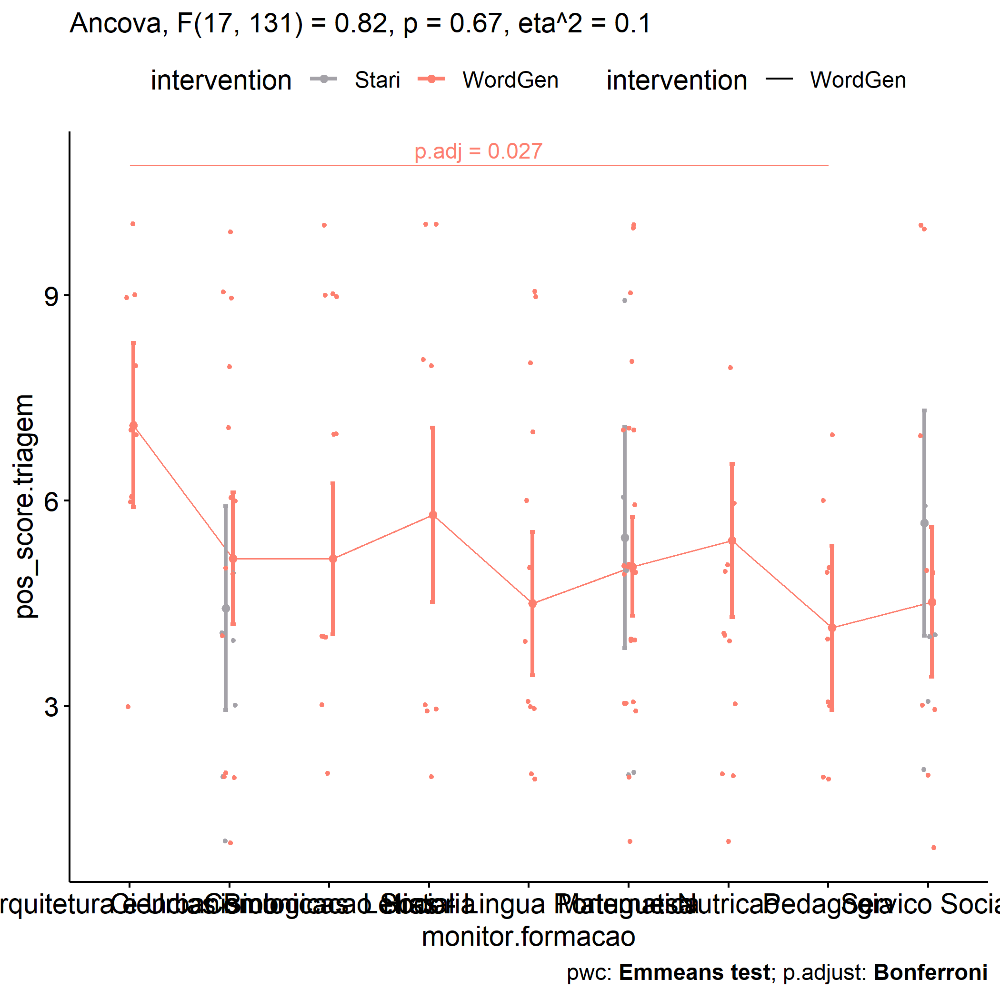<!-- -->

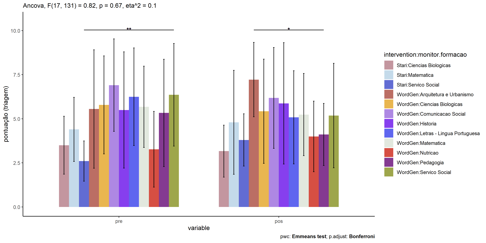<!-- -->

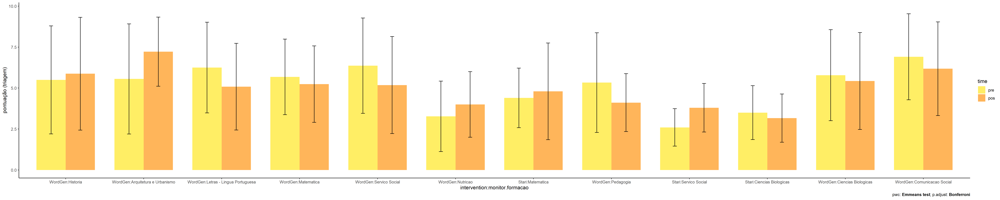<!-- -->

#### Baseado nas estimativas da aprendizagem (theta - traço latente) mediante TRI aplicado as respostas da prova

| var                   | intervention | monitor.formacao           |   n | M (pre) | SE (pre) | M (unadj) | SE (unadj) | M (adj) | SE (adj) |
|:----------------------|:-------------|:---------------------------|----:|--------:|---------:|----------:|-----------:|--------:|---------:|
| pos_score_tri.triagem | Stari        | Ciencias Biologicas        |   6 |  -0.426 |    0.240 |    -0.219 |      0.118 |   0.149 |    0.241 |
| pos_score_tri.triagem | Stari        | Matematica                 |   5 |  -0.180 |    0.275 |     0.180 |      0.360 |   0.387 |    0.262 |
| pos_score_tri.triagem | Stari        | Servico Social             |   5 |  -0.821 |    0.107 |    -0.406 |      0.170 |   0.219 |    0.269 |
| pos_score_tri.triagem | WordGen      | Arquitetura e Urbanismo    |   9 |   0.155 |    0.362 |     0.856 |      0.206 |   0.845 |    0.195 |
| pos_score_tri.triagem | WordGen      | Ciencias Biologicas        |  14 |   0.286 |    0.209 |     0.162 |      0.241 |   0.066 |    0.156 |
| pos_score_tri.triagem | WordGen      | Comunicacao Social         |  11 |   0.625 |    0.240 |     0.382 |      0.288 |   0.066 |    0.179 |
| pos_score_tri.triagem | WordGen      | Historia                   |   8 |   0.281 |    0.333 |     0.485 |      0.347 |   0.392 |    0.207 |
| pos_score_tri.triagem | WordGen      | Letras - Lingua Portuguesa |  12 |   0.433 |    0.292 |     0.155 |      0.234 |  -0.037 |    0.170 |
| pos_score_tri.triagem | WordGen      | Matematica                 |  25 |   0.182 |    0.153 |     0.087 |      0.157 |   0.059 |    0.117 |
| pos_score_tri.triagem | WordGen      | Nutricao                   |  11 |  -0.479 |    0.241 |    -0.338 |      0.176 |   0.064 |    0.181 |
| pos_score_tri.triagem | WordGen      | Pedagogia                  |   9 |   0.149 |    0.292 |    -0.195 |      0.200 |  -0.202 |    0.195 |
| pos_score_tri.triagem | WordGen      | Servico Social             |  11 |   0.429 |    0.297 |    -0.049 |      0.326 |  -0.238 |    0.177 |

|     | intervention | monitor.formacao    | group1                  | group2              | estimate | conf.low | conf.high |    se | statistic | p       | p.adj | p.adj.signif |
|:----|:-------------|:--------------------|:------------------------|:--------------------|---------:|---------:|----------:|------:|----------:|:--------|------:|:-------------|
| 2   | NA           | Ciencias Biologicas | Stari                   | WordGen             |    0.083 |   -0.489 |     0.656 | 0.289 |     0.289 | 0.773   | 0.773 | ns           |
| 6   | NA           | Matematica          | Stari                   | WordGen             |    0.328 |   -0.241 |     0.897 | 0.287 |     1.143 | 0.256   | 0.256 | ns           |
| 9   | NA           | Servico Social      | Stari                   | WordGen             |    0.457 |   -0.187 |     1.102 | 0.326 |     1.405 | 0.163   | 0.163 | ns           |
| 11  | NA           | Ciencias Biologicas | Stari                   | WordGen             |   -0.713 |   -1.527 |     0.102 | 0.411 |    -1.734 | 0.086   | 0.086 | ns           |
| 15  | NA           | Matematica          | Stari                   | WordGen             |   -0.362 |   -1.179 |     0.456 | 0.413 |    -0.877 | 0.382   | 0.382 | ns           |
| 18  | NA           | Servico Social      | Stari                   | WordGen             |   -1.250 |   -2.150 |    -0.350 | 0.454 |    -2.751 | 0.007   | 0.007 | \*\*         |
| 30  | Stari        | NA                  | Ciencias Biologicas     | Matematica          |   -0.238 |   -0.940 |     0.463 | 0.354 |    -0.673 | 0.502   | 1.000 | ns           |
| 33  | Stari        | NA                  | Ciencias Biologicas     | Servico Social      |   -0.070 |   -0.773 |     0.633 | 0.355 |    -0.198 | 0.844   | 1.000 | ns           |
| 51  | Stari        | NA                  | Matematica              | Servico Social      |    0.168 |   -0.569 |     0.905 | 0.372 |     0.452 | 0.652   | 1.000 | ns           |
| 55  | WordGen      | NA                  | Arquitetura e Urbanismo | Ciencias Biologicas |    0.780 |    0.285 |     1.275 | 0.250 |     3.120 | 0.002   | 0.083 | ns           |
| 56  | WordGen      | NA                  | Arquitetura e Urbanismo | Comunicacao Social  |    0.779 |    0.255 |     1.303 | 0.264 |     2.947 | 0.004   | 0.140 | ns           |
| 57  | WordGen      | NA                  | Arquitetura e Urbanismo | Historia            |    0.453 |   -0.110 |     1.016 | 0.284 |     1.594 | 0.114   | 1.000 | ns           |
| 58  | WordGen      | NA                  | Arquitetura e Urbanismo | Letras              |    0.882 |    0.371 |     1.394 | 0.258 |     3.416 | \<0.001 | 0.032 | \*           |
| 59  | WordGen      | NA                  | Arquitetura e Urbanismo | Matematica          |    0.786 |    0.336 |     1.236 | 0.227 |     3.460 | \<0.001 | 0.028 | \*           |
| 60  | WordGen      | NA                  | Arquitetura e Urbanismo | Nutricao            |    0.781 |    0.254 |     1.308 | 0.266 |     2.938 | 0.004   | 0.144 | ns           |
| 61  | WordGen      | NA                  | Arquitetura e Urbanismo | Pedagogia           |    1.047 |    0.501 |     1.593 | 0.275 |     3.800 | \<0.001 | 0.008 | \*\*         |
| 62  | WordGen      | NA                  | Arquitetura e Urbanismo | Servico Social      |    1.083 |    0.562 |     1.605 | 0.263 |     4.115 | \<0.001 | 0.003 | \*\*         |
| 63  | WordGen      | NA                  | Ciencias Biologicas     | Comunicacao Social  |    0.000 |   -0.469 |     0.468 | 0.236 |    -0.001 | 0.999   | 1.000 | ns           |
| 64  | WordGen      | NA                  | Ciencias Biologicas     | Historia            |   -0.327 |   -0.840 |     0.186 | 0.259 |    -1.261 | 0.21    | 1.000 | ns           |
| 65  | WordGen      | NA                  | Ciencias Biologicas     | Letras              |    0.103 |   -0.353 |     0.559 | 0.230 |     0.447 | 0.656   | 1.000 | ns           |
| 66  | WordGen      | NA                  | Ciencias Biologicas     | Matematica          |    0.006 |   -0.380 |     0.393 | 0.195 |     0.033 | 0.974   | 1.000 | ns           |
| 67  | WordGen      | NA                  | Ciencias Biologicas     | Nutricao            |    0.002 |   -0.475 |     0.478 | 0.241 |     0.007 | 0.994   | 1.000 | ns           |
| 68  | WordGen      | NA                  | Ciencias Biologicas     | Pedagogia           |    0.267 |   -0.228 |     0.762 | 0.250 |     1.070 | 0.287   | 1.000 | ns           |
| 69  | WordGen      | NA                  | Ciencias Biologicas     | Servico Social      |    0.304 |   -0.163 |     0.771 | 0.236 |     1.290 | 0.2     | 1.000 | ns           |
| 70  | WordGen      | NA                  | Comunicacao Social      | Historia            |   -0.326 |   -0.866 |     0.213 | 0.272 |    -1.198 | 0.233   | 1.000 | ns           |
| 71  | WordGen      | NA                  | Comunicacao Social      | Letras              |    0.103 |   -0.381 |     0.587 | 0.244 |     0.422 | 0.674   | 1.000 | ns           |
| 72  | WordGen      | NA                  | Comunicacao Social      | Matematica          |    0.007 |   -0.416 |     0.430 | 0.213 |     0.031 | 0.975   | 1.000 | ns           |
| 73  | WordGen      | NA                  | Comunicacao Social      | Nutricao            |    0.002 |   -0.512 |     0.516 | 0.259 |     0.008 | 0.994   | 1.000 | ns           |
| 74  | WordGen      | NA                  | Comunicacao Social      | Pedagogia           |    0.268 |   -0.256 |     0.792 | 0.264 |     1.012 | 0.314   | 1.000 | ns           |
| 75  | WordGen      | NA                  | Comunicacao Social      | Servico Social      |    0.304 |   -0.190 |     0.799 | 0.250 |     1.219 | 0.225   | 1.000 | ns           |
| 76  | WordGen      | NA                  | Historia                | Letras              |    0.430 |   -0.099 |     0.958 | 0.267 |     1.609 | 0.11    | 1.000 | ns           |
| 77  | WordGen      | NA                  | Historia                | Matematica          |    0.333 |   -0.137 |     0.804 | 0.237 |     1.403 | 0.163   | 1.000 | ns           |
| 78  | WordGen      | NA                  | Historia                | Nutricao            |    0.328 |   -0.218 |     0.875 | 0.276 |     1.190 | 0.237   | 1.000 | ns           |
| 79  | WordGen      | NA                  | Historia                | Pedagogia           |    0.594 |    0.031 |     1.157 | 0.284 |     2.091 | 0.039   | 1.000 | ns           |
| 80  | WordGen      | NA                  | Historia                | Servico Social      |    0.631 |    0.092 |     1.169 | 0.272 |     2.321 | 0.022   | 0.795 | ns           |
| 81  | WordGen      | NA                  | Letras                  | Lingua Portuguesa   |   -0.096 |   -0.504 |     0.311 | 0.206 |    -0.468 | 0.64    | 1.000 | ns           |
| 82  | WordGen      | NA                  | Letras                  | Lingua Portuguesa   |   -0.101 |   -0.599 |     0.396 | 0.251 |    -0.403 | 0.688   | 1.000 | ns           |
| 83  | WordGen      | NA                  | Letras                  | Lingua Portuguesa   |    0.164 |   -0.347 |     0.676 | 0.258 |     0.637 | 0.526   | 1.000 | ns           |
| 84  | WordGen      | NA                  | Letras                  | Lingua Portuguesa   |    0.201 |   -0.282 |     0.684 | 0.244 |     0.824 | 0.412   | 1.000 | ns           |
| 85  | WordGen      | NA                  | Matematica              | Nutricao            |   -0.005 |   -0.432 |     0.423 | 0.216 |    -0.022 | 0.982   | 1.000 | ns           |
| 86  | WordGen      | NA                  | Matematica              | Pedagogia           |    0.261 |   -0.189 |     0.711 | 0.227 |     1.148 | 0.253   | 1.000 | ns           |
| 87  | WordGen      | NA                  | Matematica              | Servico Social      |    0.298 |   -0.123 |     0.718 | 0.212 |     1.403 | 0.163   | 1.000 | ns           |
| 88  | WordGen      | NA                  | Nutricao                | Pedagogia           |    0.266 |   -0.261 |     0.792 | 0.266 |     0.999 | 0.32    | 1.000 | ns           |
| 89  | WordGen      | NA                  | Nutricao                | Servico Social      |    0.302 |   -0.205 |     0.810 | 0.256 |     1.180 | 0.24    | 1.000 | ns           |
| 90  | WordGen      | NA                  | Pedagogia               | Servico Social      |    0.037 |   -0.485 |     0.558 | 0.263 |     0.139 | 0.89    | 1.000 | ns           |
| 102 | Stari        | NA                  | Ciencias Biologicas     | Matematica          |   -0.246 |   -1.257 |     0.765 | 0.510 |    -0.482 | 0.631   | 1.000 | ns           |
| 105 | Stari        | NA                  | Ciencias Biologicas     | Servico Social      |    0.395 |   -0.616 |     1.405 | 0.510 |     0.774 | 0.441   | 1.000 | ns           |
| 123 | Stari        | NA                  | Matematica              | Servico Social      |    0.641 |   -0.415 |     1.696 | 0.533 |     1.203 | 0.232   | 0.695 | ns           |
| 127 | WordGen      | NA                  | Arquitetura e Urbanismo | Ciencias Biologicas |   -0.132 |   -0.845 |     0.581 | 0.360 |    -0.366 | 0.715   | 1.000 | ns           |
| 128 | WordGen      | NA                  | Arquitetura e Urbanismo | Comunicacao Social  |   -0.470 |   -1.220 |     0.280 | 0.379 |    -1.241 | 0.217   | 1.000 | ns           |
| 129 | WordGen      | NA                  | Arquitetura e Urbanismo | Historia            |   -0.127 |   -0.937 |     0.684 | 0.409 |    -0.309 | 0.758   | 1.000 | ns           |
| 130 | WordGen      | NA                  | Arquitetura e Urbanismo | Letras              |   -0.279 |   -1.015 |     0.457 | 0.371 |    -0.750 | 0.455   | 1.000 | ns           |
| 131 | WordGen      | NA                  | Arquitetura e Urbanismo | Matematica          |   -0.027 |   -0.676 |     0.622 | 0.327 |    -0.083 | 0.934   | 1.000 | ns           |
| 132 | WordGen      | NA                  | Arquitetura e Urbanismo | Nutricao            |    0.634 |   -0.116 |     1.384 | 0.379 |     1.673 | 0.097   | 1.000 | ns           |
| 133 | WordGen      | NA                  | Arquitetura e Urbanismo | Pedagogia           |    0.006 |   -0.781 |     0.792 | 0.397 |     0.014 | 0.989   | 1.000 | ns           |
| 134 | WordGen      | NA                  | Arquitetura e Urbanismo | Servico Social      |   -0.274 |   -1.024 |     0.476 | 0.379 |    -0.724 | 0.47    | 1.000 | ns           |
| 135 | WordGen      | NA                  | Ciencias Biologicas     | Comunicacao Social  |   -0.338 |   -1.011 |     0.334 | 0.339 |    -0.996 | 0.321   | 1.000 | ns           |
| 136 | WordGen      | NA                  | Ciencias Biologicas     | Historia            |    0.005 |   -0.734 |     0.745 | 0.373 |     0.014 | 0.989   | 1.000 | ns           |
| 137 | WordGen      | NA                  | Ciencias Biologicas     | Letras              |   -0.147 |   -0.804 |     0.510 | 0.331 |    -0.444 | 0.658   | 1.000 | ns           |
| 138 | WordGen      | NA                  | Ciencias Biologicas     | Matematica          |    0.105 |   -0.452 |     0.662 | 0.281 |     0.372 | 0.71    | 1.000 | ns           |
| 139 | WordGen      | NA                  | Ciencias Biologicas     | Nutricao            |    0.765 |    0.093 |     1.438 | 0.339 |     2.255 | 0.026   | 0.938 | ns           |
| 140 | WordGen      | NA                  | Ciencias Biologicas     | Pedagogia           |    0.137 |   -0.576 |     0.850 | 0.360 |     0.382 | 0.703   | 1.000 | ns           |
| 141 | WordGen      | NA                  | Ciencias Biologicas     | Servico Social      |   -0.142 |   -0.815 |     0.530 | 0.339 |    -0.420 | 0.675   | 1.000 | ns           |
| 142 | WordGen      | NA                  | Comunicacao Social      | Historia            |    0.343 |   -0.432 |     1.119 | 0.391 |     0.877 | 0.382   | 1.000 | ns           |
| 143 | WordGen      | NA                  | Comunicacao Social      | Letras              |    0.191 |   -0.505 |     0.888 | 0.352 |     0.544 | 0.588   | 1.000 | ns           |
| 144 | WordGen      | NA                  | Comunicacao Social      | Matematica          |    0.443 |   -0.161 |     1.047 | 0.305 |     1.453 | 0.149   | 1.000 | ns           |
| 145 | WordGen      | NA                  | Comunicacao Social      | Nutricao            |    1.104 |    0.392 |     1.815 | 0.359 |     3.072 | 0.003   | 0.096 | ns           |
| 146 | WordGen      | NA                  | Comunicacao Social      | Pedagogia           |    0.476 |   -0.275 |     1.226 | 0.379 |     1.256 | 0.212   | 1.000 | ns           |
| 147 | WordGen      | NA                  | Comunicacao Social      | Servico Social      |    0.196 |   -0.516 |     0.907 | 0.359 |     0.545 | 0.587   | 1.000 | ns           |
| 148 | WordGen      | NA                  | Historia                | Letras              |   -0.152 |   -0.914 |     0.610 | 0.385 |    -0.396 | 0.693   | 1.000 | ns           |
| 149 | WordGen      | NA                  | Historia                | Matematica          |    0.100 |   -0.578 |     0.777 | 0.342 |     0.291 | 0.772   | 1.000 | ns           |
| 150 | WordGen      | NA                  | Historia                | Nutricao            |    0.760 |   -0.015 |     1.536 | 0.391 |     1.942 | 0.055   | 1.000 | ns           |
| 151 | WordGen      | NA                  | Historia                | Pedagogia           |    0.132 |   -0.679 |     0.943 | 0.409 |     0.323 | 0.747   | 1.000 | ns           |
| 152 | WordGen      | NA                  | Historia                | Servico Social      |   -0.148 |   -0.923 |     0.628 | 0.391 |    -0.377 | 0.707   | 1.000 | ns           |
| 153 | WordGen      | NA                  | Letras                  | Lingua Portuguesa   |    0.252 |   -0.334 |     0.838 | 0.296 |     0.851 | 0.397   | 1.000 | ns           |
| 154 | WordGen      | NA                  | Letras                  | Lingua Portuguesa   |    0.912 |    0.216 |     1.609 | 0.352 |     2.594 | 0.011   | 0.386 | ns           |
| 155 | WordGen      | NA                  | Letras                  | Lingua Portuguesa   |    0.284 |   -0.452 |     1.020 | 0.371 |     0.765 | 0.446   | 1.000 | ns           |
| 156 | WordGen      | NA                  | Letras                  | Lingua Portuguesa   |    0.005 |   -0.692 |     0.701 | 0.352 |     0.013 | 0.99    | 1.000 | ns           |
| 157 | WordGen      | NA                  | Matematica              | Nutricao            |    0.661 |    0.057 |     1.264 | 0.305 |     2.167 | 0.032   | 1.000 | ns           |
| 158 | WordGen      | NA                  | Matematica              | Pedagogia           |    0.033 |   -0.616 |     0.681 | 0.327 |     0.100 | 0.921   | 1.000 | ns           |
| 159 | WordGen      | NA                  | Matematica              | Servico Social      |   -0.247 |   -0.851 |     0.357 | 0.305 |    -0.811 | 0.419   | 1.000 | ns           |
| 160 | WordGen      | NA                  | Nutricao                | Pedagogia           |   -0.628 |   -1.378 |     0.122 | 0.379 |    -1.659 | 0.1     | 1.000 | ns           |
| 161 | WordGen      | NA                  | Nutricao                | Servico Social      |   -0.908 |   -1.619 |    -0.196 | 0.359 |    -2.527 | 0.013   | 0.463 | ns           |
| 162 | WordGen      | NA                  | Pedagogia               | Servico Social      |   -0.280 |   -1.030 |     0.470 | 0.379 |    -0.739 | 0.461   | 1.000 | ns           |

| intervention | monitor.formacao           | group1 | group2 | estimate | conf.low | conf.high |    se | statistic |     p | p.adj | p.adj.signif |
|:-------------|:---------------------------|:-------|:-------|---------:|---------:|----------:|------:|----------:|------:|------:|:-------------|
| Stari        | Ciencias Biologicas        | pre    | pos    |   -0.207 |   -1.142 |     0.727 | 0.474 |    -0.437 | 0.663 | 0.663 | ns           |
| Stari        | Matematica                 | pre    | pos    |   -0.360 |   -1.383 |     0.664 | 0.520 |    -0.693 | 0.489 | 0.489 | ns           |
| Stari        | Servico Social             | pre    | pos    |   -0.415 |   -1.439 |     0.609 | 0.520 |    -0.799 | 0.425 | 0.425 | ns           |
| WordGen      | Arquitetura e Urbanismo    | pre    | pos    |   -0.701 |   -1.464 |     0.062 | 0.387 |    -1.810 | 0.072 | 0.072 | ns           |
| WordGen      | Ciencias Biologicas        | pre    | pos    |    0.125 |   -0.487 |     0.736 | 0.310 |     0.401 | 0.689 | 0.689 | ns           |
| WordGen      | Comunicacao Social         | pre    | pos    |    0.242 |   -0.448 |     0.932 | 0.350 |     0.692 | 0.490 | 0.490 | ns           |
| WordGen      | Historia                   | pre    | pos    |   -0.204 |   -1.013 |     0.605 | 0.411 |    -0.496 | 0.620 | 0.620 | ns           |
| WordGen      | Letras - Lingua Portuguesa | pre    | pos    |    0.279 |   -0.382 |     0.939 | 0.335 |     0.831 | 0.407 | 0.407 | ns           |
| WordGen      | Matematica                 | pre    | pos    |    0.095 |   -0.363 |     0.552 | 0.232 |     0.407 | 0.684 | 0.684 | ns           |
| WordGen      | Nutricao                   | pre    | pos    |   -0.140 |   -0.831 |     0.550 | 0.350 |    -0.401 | 0.689 | 0.689 | ns           |
| WordGen      | Pedagogia                  | pre    | pos    |    0.344 |   -0.419 |     1.107 | 0.387 |     0.889 | 0.375 | 0.375 | ns           |
| WordGen      | Servico Social             | pre    | pos    |    0.478 |   -0.212 |     1.168 | 0.350 |     1.365 | 0.173 | 0.173 | ns           |

    ## Scale for colour is already present.
    ## Adding another scale for colour, which will replace the existing scale.

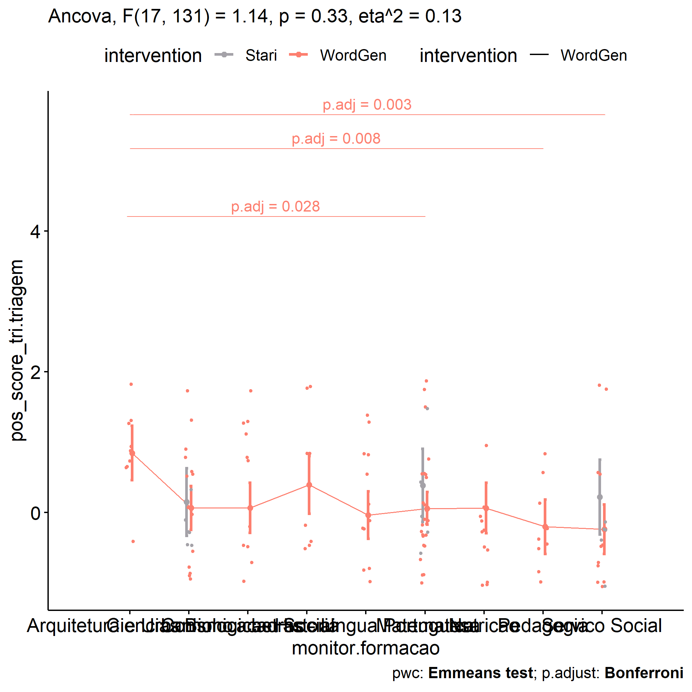<!-- -->

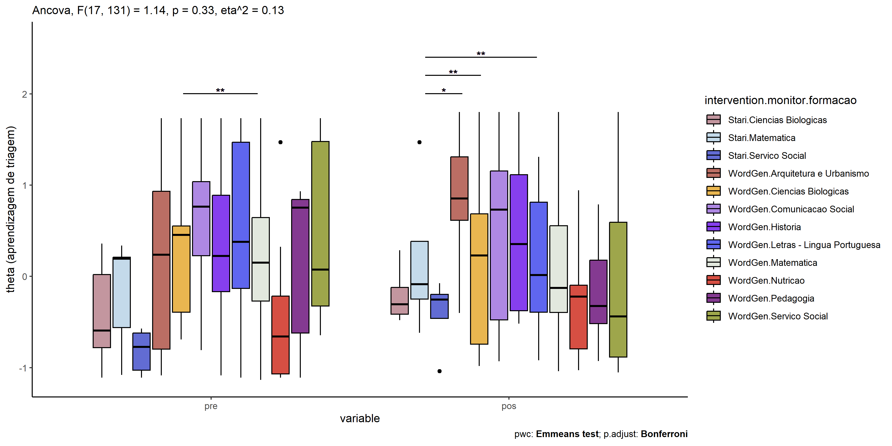<!-- -->

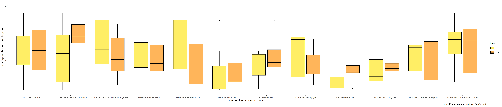<!-- -->

### factores: **intervention:monitor.titulacao**

#### Baseado nos acertos (score) da prova

| var               | intervention | monitor.titulacao |   n | M (pre) | SE (pre) | M (unadj) | SE (unadj) | M (adj) | SE (adj) |
|:------------------|:-------------|:------------------|----:|--------:|---------:|----------:|-----------:|--------:|---------:|
| pos_score.triagem | Stari        | ensino medio      |  25 |   2.920 |    0.294 |     3.200 |      0.311 |   4.602 |    0.390 |
| pos_score.triagem | Stari        | graduacao         |   6 |   2.833 |    0.703 |     3.333 |      1.174 |   4.792 |    0.763 |
| pos_score.triagem | WordGen      | ensino medio      |  80 |   5.425 |    0.309 |     5.250 |      0.299 |   5.003 |    0.207 |
| pos_score.triagem | WordGen      | especializacao    |  11 |   6.909 |    0.791 |     6.182 |      0.861 |   4.958 |    0.566 |
| pos_score.triagem | WordGen      | graduacao         |  19 |   5.895 |    0.657 |     5.158 |      0.526 |   4.602 |    0.425 |

|     | intervention | monitor.titulacao | group1         | group2         | estimate | conf.low | conf.high |    se | statistic | p       | p.adj   | p.adj.signif |
|:----|:-------------|:------------------|:---------------|:---------------|---------:|---------:|----------:|------:|----------:|:--------|:--------|:-------------|
| 1   | NA           | ensino medio      | Stari          | WordGen        |   -0.401 |   -1.289 |     0.486 | 0.449 |    -0.894 | 0.373   | 0.373   | ns           |
| 3   | NA           | graduacao         | Stari          | WordGen        |    0.190 |   -1.553 |     1.934 | 0.881 |     0.216 | 0.829   | 0.829   | ns           |
| 4   | NA           | ensino medio      | Stari          | WordGen        |   -2.505 |   -3.662 |    -1.348 | 0.585 |    -4.281 | \<0.001 | \<0.001 | \*\*\*\*     |
| 6   | NA           | graduacao         | Stari          | WordGen        |   -3.061 |   -5.426 |    -0.696 | 1.196 |    -2.560 | 0.012   | 0.012   | \*           |
| 8   | Stari        | NA                | ensino medio   | graduacao      |   -0.190 |   -1.843 |     1.463 | 0.836 |    -0.228 | 0.82    | 0.82    | ns           |
| 10  | WordGen      | NA                | ensino medio   | especializacao |    0.045 |   -1.138 |     1.228 | 0.598 |     0.075 | 0.94    | 1       | ns           |
| 11  | WordGen      | NA                | ensino medio   | graduacao      |    0.401 |   -0.528 |     1.331 | 0.470 |     0.854 | 0.395   | 1       | ns           |
| 12  | WordGen      | NA                | especializacao | graduacao      |    0.356 |   -1.027 |     1.739 | 0.699 |     0.509 | 0.611   | 1       | ns           |
| 14  | Stari        | NA                | ensino medio   | graduacao      |    0.087 |   -2.209 |     2.382 | 1.161 |     0.075 | 0.941   | 0.941   | ns           |
| 16  | WordGen      | NA                | ensino medio   | especializacao |   -1.484 |   -3.108 |     0.140 | 0.821 |    -1.807 | 0.073   | 0.219   | ns           |
| 17  | WordGen      | NA                | ensino medio   | graduacao      |   -0.470 |   -1.759 |     0.819 | 0.652 |    -0.721 | 0.472   | 1       | ns           |
| 18  | WordGen      | NA                | especializacao | graduacao      |    1.014 |   -0.899 |     2.928 | 0.968 |     1.048 | 0.296   | 0.889   | ns           |

| monitor.titulacao | group1 | group2 | estimate | conf.low | conf.high |    se | statistic |     p | p.adj | p.adj.signif |
|:------------------|:-------|:-------|---------:|---------:|----------:|------:|----------:|------:|------:|:-------------|
| ensino medio      | pre    | pos    |   -0.280 |   -1.683 |     1.123 | 0.713 |    -0.393 | 0.695 | 0.695 | ns           |
| graduacao         | pre    | pos    |   -0.500 |   -3.364 |     2.364 | 1.455 |    -0.344 | 0.731 | 0.731 | ns           |
| ensino medio      | pre    | pos    |    0.175 |   -0.609 |     0.959 | 0.398 |     0.439 | 0.661 | 0.661 | ns           |
| especializacao    | pre    | pos    |    0.727 |   -1.388 |     2.843 | 1.075 |     0.677 | 0.499 | 0.499 | ns           |
| graduacao         | pre    | pos    |    0.737 |   -0.873 |     2.347 | 0.818 |     0.901 | 0.368 | 0.368 | ns           |

    ## Scale for colour is already present.
    ## Adding another scale for colour, which will replace the existing scale.

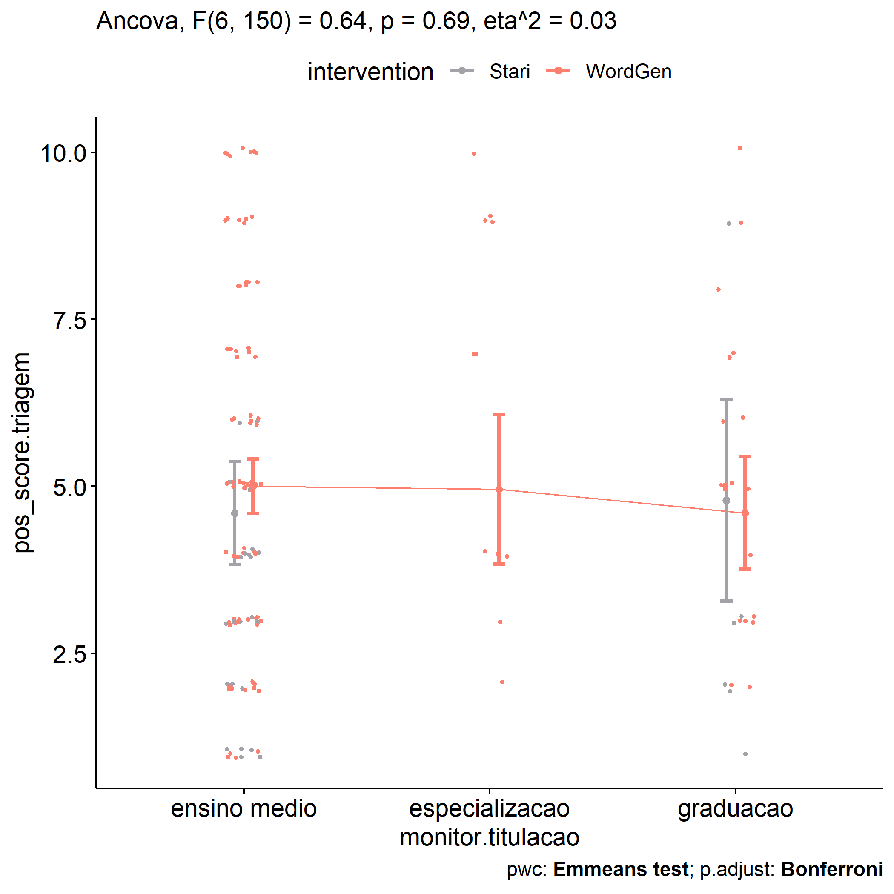<!-- -->

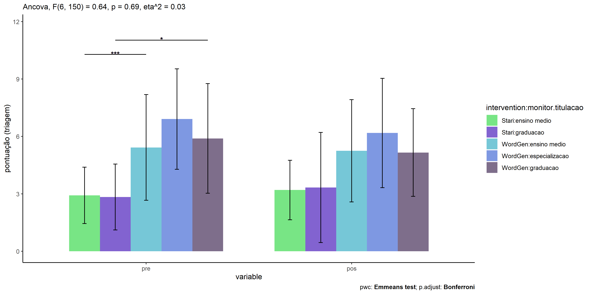<!-- -->

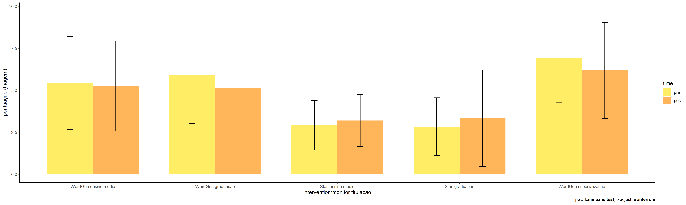<!-- -->

#### Baseado nas estimativas da aprendizagem (theta - traço latente) mediante TRI aplicado as respostas da prova

| var                   | intervention | monitor.titulacao |   n | M (pre) | SE (pre) | M (unadj) | SE (unadj) | M (adj) | SE (adj) |
|:----------------------|:-------------|:------------------|----:|--------:|---------:|----------:|-----------:|--------:|---------:|
| pos_score_tri.triagem | Stari        | ensino medio      |  25 |  -0.606 |    0.093 |    -0.403 |      0.084 |   0.016 |    0.127 |
| pos_score_tri.triagem | Stari        | graduacao         |   6 |  -0.742 |    0.210 |    -0.198 |      0.355 |   0.309 |    0.251 |
| pos_score_tri.triagem | WordGen      | ensino medio      |  80 |   0.154 |    0.101 |     0.122 |      0.097 |   0.047 |    0.068 |
| pos_score_tri.triagem | WordGen      | especializacao    |  11 |   0.625 |    0.240 |     0.382 |      0.288 |   0.002 |    0.185 |
| pos_score_tri.triagem | WordGen      | graduacao         |  19 |   0.308 |    0.196 |     0.109 |      0.178 |  -0.065 |    0.139 |

|     | intervention | monitor.titulacao | group1         | group2         | estimate | conf.low | conf.high |    se | statistic | p       | p.adj   | p.adj.signif |
|:----|:-------------|:------------------|:---------------|:---------------|---------:|---------:|----------:|------:|----------:|:--------|:--------|:-------------|
| 1   | NA           | ensino medio      | Stari          | WordGen        |   -0.032 |   -0.321 |     0.257 | 0.146 |    -0.217 | 0.829   | 0.829   | ns           |
| 3   | NA           | graduacao         | Stari          | WordGen        |    0.374 |   -0.199 |     0.947 | 0.290 |     1.291 | 0.199   | 0.199   | ns           |
| 4   | NA           | ensino medio      | Stari          | WordGen        |   -0.760 |   -1.129 |    -0.391 | 0.187 |    -4.076 | \<0.001 | \<0.001 | \*\*\*\*     |
| 6   | NA           | graduacao         | Stari          | WordGen        |   -1.050 |   -1.804 |    -0.296 | 0.381 |    -2.755 | 0.007   | 0.007   | \*\*         |
| 8   | Stari        | NA                | ensino medio   | graduacao      |   -0.293 |   -0.835 |     0.249 | 0.274 |    -1.070 | 0.286   | 0.286   | ns           |
| 10  | WordGen      | NA                | ensino medio   | especializacao |    0.045 |   -0.343 |     0.433 | 0.196 |     0.230 | 0.819   | 1       | ns           |
| 11  | WordGen      | NA                | ensino medio   | graduacao      |    0.113 |   -0.192 |     0.417 | 0.154 |     0.731 | 0.466   | 1       | ns           |
| 12  | WordGen      | NA                | especializacao | graduacao      |    0.068 |   -0.386 |     0.521 | 0.229 |     0.295 | 0.769   | 1       | ns           |
| 14  | Stari        | NA                | ensino medio   | graduacao      |    0.136 |   -0.595 |     0.868 | 0.370 |     0.368 | 0.713   | 0.713   | ns           |
| 16  | WordGen      | NA                | ensino medio   | especializacao |   -0.470 |   -0.988 |     0.047 | 0.262 |    -1.797 | 0.075   | 0.224   | ns           |
| 17  | WordGen      | NA                | ensino medio   | graduacao      |   -0.153 |   -0.564 |     0.257 | 0.208 |    -0.739 | 0.461   | 1       | ns           |
| 18  | WordGen      | NA                | especializacao | graduacao      |    0.317 |   -0.293 |     0.927 | 0.308 |     1.027 | 0.306   | 0.918   | ns           |

| intervention | monitor.titulacao | group1 | group2 | estimate | conf.low | conf.high |    se | statistic |     p | p.adj | p.adj.signif |
|:-------------|:------------------|:-------|:-------|---------:|---------:|----------:|------:|----------:|------:|------:|:-------------|
| Stari        | ensino medio      | pre    | pos    |   -0.203 |   -0.653 |     0.246 | 0.228 |    -0.892 | 0.373 | 0.373 | ns           |
| Stari        | graduacao         | pre    | pos    |   -0.545 |   -1.461 |     0.372 | 0.466 |    -1.169 | 0.243 | 0.243 | ns           |
| WordGen      | ensino medio      | pre    | pos    |    0.032 |   -0.219 |     0.283 | 0.128 |     0.250 | 0.802 | 0.802 | ns           |
| WordGen      | especializacao    | pre    | pos    |    0.242 |   -0.435 |     0.919 | 0.344 |     0.704 | 0.482 | 0.482 | ns           |
| WordGen      | graduacao         | pre    | pos    |    0.198 |   -0.317 |     0.714 | 0.262 |     0.758 | 0.449 | 0.449 | ns           |

    ## Scale for colour is already present.
    ## Adding another scale for colour, which will replace the existing scale.

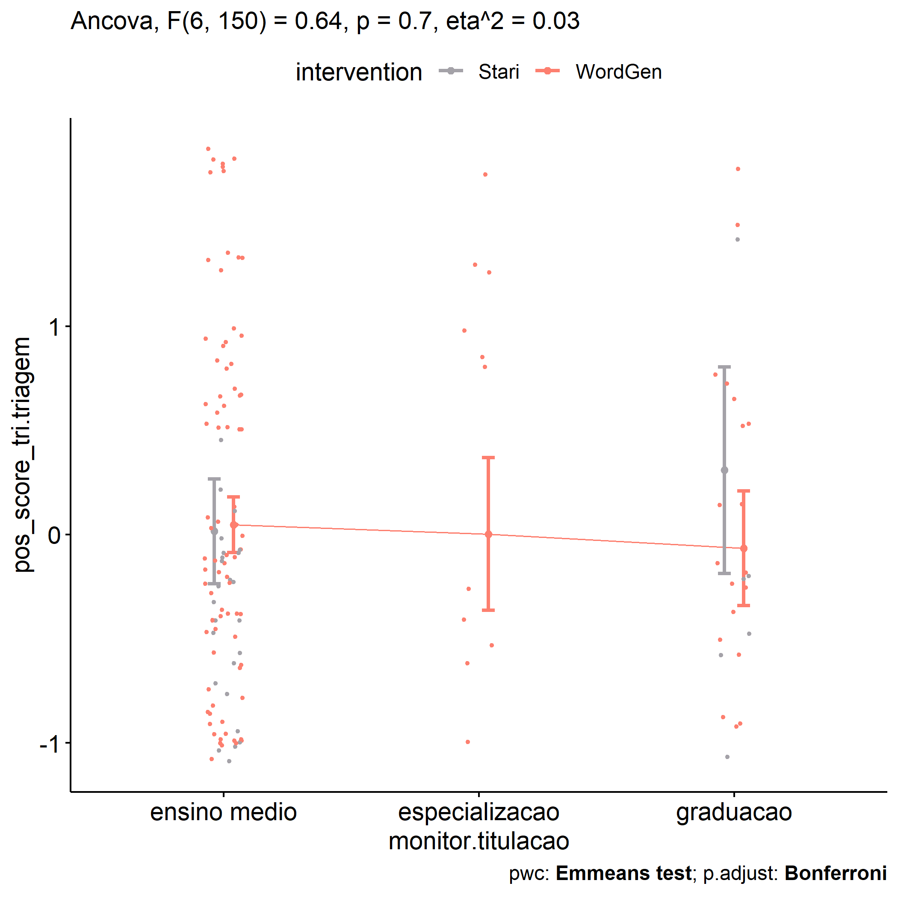<!-- -->

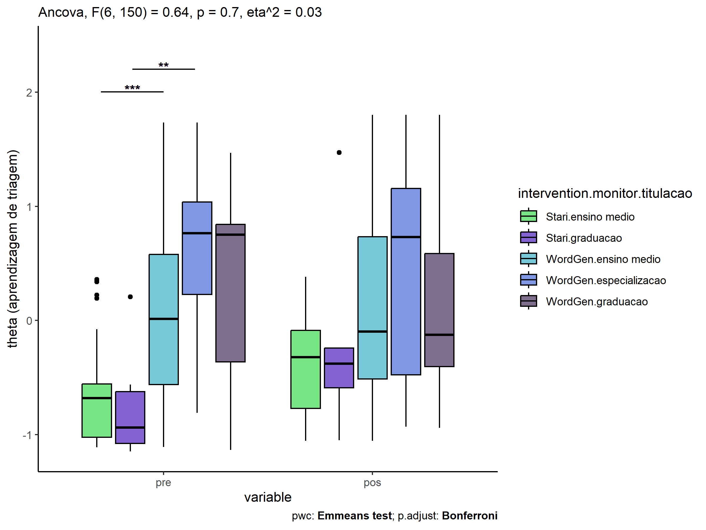<!-- -->

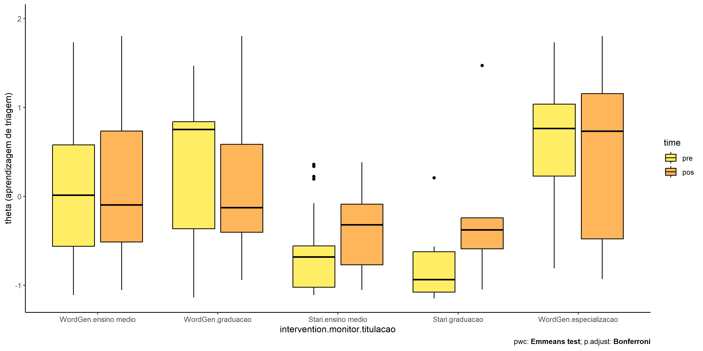<!-- -->

### factores: **intervention:monitor.experiencia**

#### Baseado nos acertos (score) da prova

| var               | intervention      | monitor.experiencia |   n | M (pre) | SE (pre) | M (unadj) | SE (unadj) | M (adj) | SE (adj) |
|:------------------|:------------------|:--------------------|----:|--------:|---------:|----------:|-----------:|--------:|---------:|
| pos_score.triagem | Stari and WordGen | até 01 ano          |   9 |   4.667 |    0.601 |     4.333 |      0.441 |   4.548 |    0.607 |
| pos_score.triagem | Stari             | \> 01 ano           |   7 |   2.000 |    0.309 |     2.143 |      0.404 |   4.041 |    0.711 |
| pos_score.triagem | Stari             | até 01 ano          |  25 |   3.120 |    0.307 |     3.520 |      0.370 |   4.711 |    0.381 |
| pos_score.triagem | WordGen           | \> 01 ano           |  17 |   5.412 |    0.743 |     4.941 |      0.667 |   4.685 |    0.442 |
| pos_score.triagem | WordGen           | até 01 ano          |  93 |   5.699 |    0.284 |     5.398 |      0.271 |   4.961 |    0.193 |

|     | intervention | monitor.experiencia | group1    | group2            | estimate | conf.low | conf.high |    se | statistic | p       | p.adj   | p.adj.signif |
|:----|:-------------|:--------------------|:----------|:------------------|---------:|---------:|----------:|------:|----------:|:--------|:--------|:-------------|
| 1   | NA           | \> 01 ano           | Stari     | WordGen           |   -0.645 |   -2.310 |     1.020 | 0.842 |    -0.765 | 0.445   | 0.445   | ns           |
| 4   | NA           | até 01 ano          | Stari     | WordGen           |   -0.250 |   -1.116 |     0.616 | 0.438 |    -0.571 | 0.569   | 1       | ns           |
| 5   | NA           | até 01 ano          | Stari     | Stari and WordGen |    0.163 |   -1.247 |     1.573 | 0.714 |     0.228 | 0.82    | 1       | ns           |
| 6   | NA           | até 01 ano          | WordGen   | Stari and WordGen |    0.413 |   -0.849 |     1.675 | 0.638 |     0.647 | 0.519   | 1       | ns           |
| 7   | NA           | \> 01 ano           | Stari     | WordGen           |   -3.412 |   -5.650 |    -1.174 | 1.132 |    -3.013 | 0.003   | 0.003   | \*\*         |
| 10  | NA           | até 01 ano          | Stari     | WordGen           |   -2.579 |   -3.702 |    -1.456 | 0.568 |    -4.540 | \<0.001 | \<0.001 | \*\*\*\*     |
| 11  | NA           | até 01 ano          | Stari     | Stari and WordGen |   -1.547 |   -3.484 |     0.391 | 0.980 |    -1.578 | 0.117   | 0.35    | ns           |
| 12  | NA           | até 01 ano          | WordGen   | Stari and WordGen |    1.032 |   -0.707 |     2.772 | 0.880 |     1.173 | 0.243   | 0.729   | ns           |
| 13  | Stari        | NA                  | \> 01 ano | até 01 ano        |   -0.670 |   -2.214 |     0.874 | 0.781 |    -0.858 | 0.392   | 0.392   | ns           |
| 14  | WordGen      | NA                  | \> 01 ano | até 01 ano        |   -0.275 |   -1.225 |     0.674 | 0.480 |    -0.573 | 0.567   | 0.567   | ns           |
| 16  | Stari        | NA                  | \> 01 ano | até 01 ano        |   -1.120 |   -3.251 |     1.011 | 1.078 |    -1.039 | 0.301   | 0.301   | ns           |
| 17  | WordGen      | NA                  | \> 01 ano | até 01 ano        |   -0.287 |   -1.602 |     1.027 | 0.665 |    -0.432 | 0.667   | 0.667   | ns           |

| monitor.experiencia | group1 | group2 | estimate | conf.low | conf.high |    se | statistic |     p | p.adj | p.adj.signif |
|:--------------------|:-------|:-------|---------:|---------:|----------:|------:|----------:|------:|------:|:-------------|
| \> 01 ano           | pre    | pos    |   -0.143 |   -2.739 |     2.454 | 1.319 |    -0.108 | 0.914 | 0.914 | ns           |
| até 01 ano          | pre    | pos    |   -0.400 |   -1.774 |     0.974 | 0.698 |    -0.573 | 0.567 | 0.567 | ns           |
| \> 01 ano           | pre    | pos    |    0.471 |   -1.195 |     2.137 | 0.847 |     0.556 | 0.579 | 0.579 | ns           |
| até 01 ano          | pre    | pos    |    0.301 |   -0.411 |     1.013 | 0.362 |     0.832 | 0.406 | 0.406 | ns           |
| até 01 ano          | pre    | pos    |    0.333 |   -1.956 |     2.623 | 1.163 |     0.287 | 0.775 | 0.775 | ns           |

    ## Scale for colour is already present.
    ## Adding another scale for colour, which will replace the existing scale.

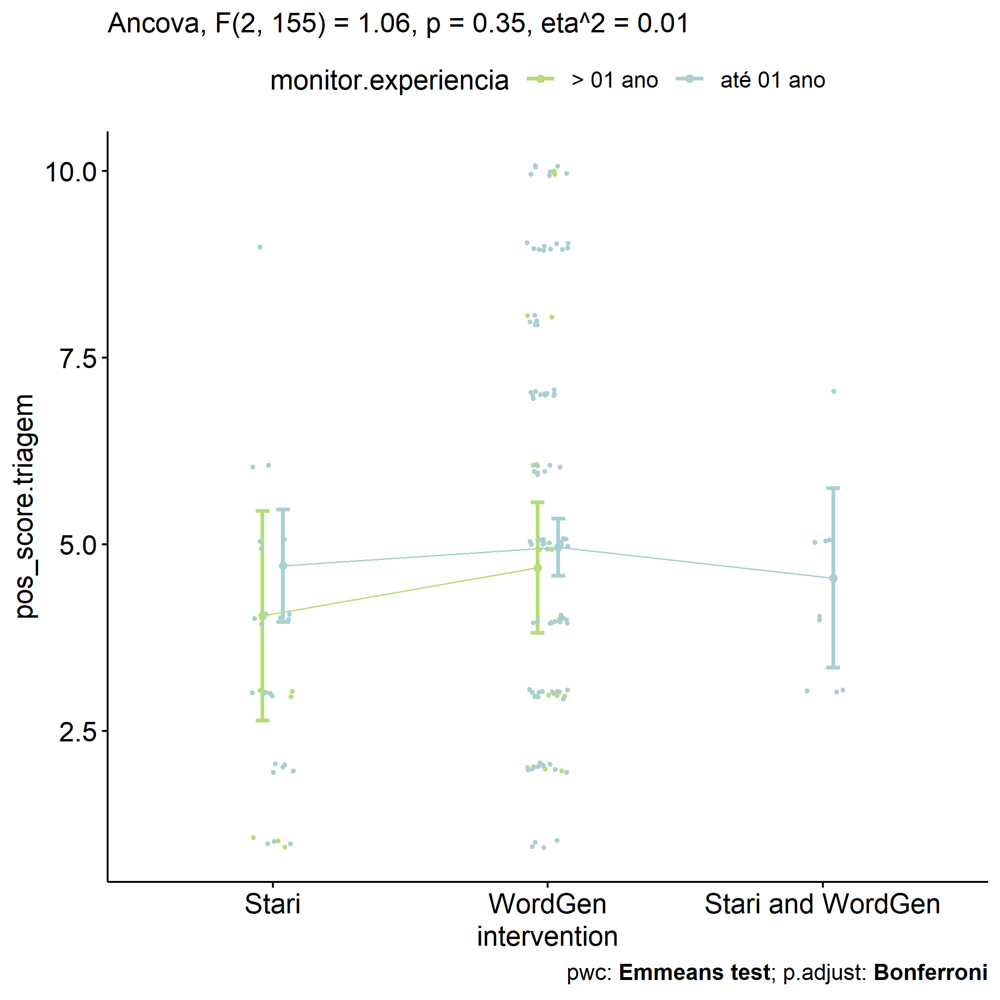<!-- -->

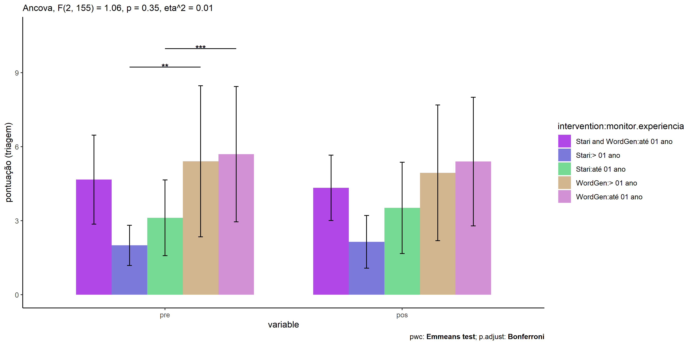<!-- -->

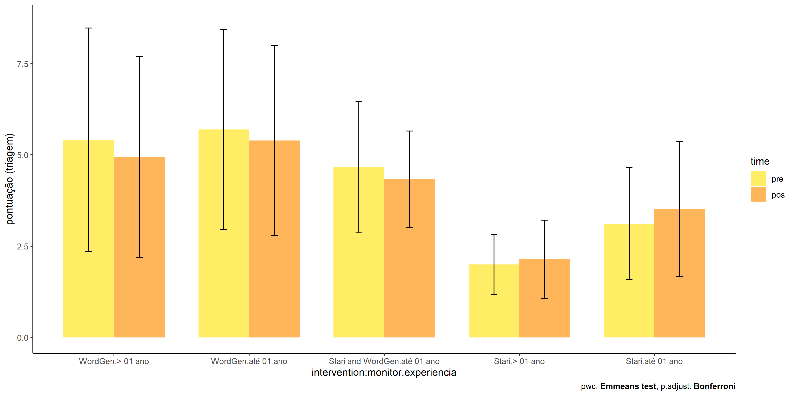<!-- -->

#### Baseado nas estimativas da aprendizagem (theta - traço latente) mediante TRI aplicado as respostas da prova

| var                   | intervention      | monitor.experiencia |   n | M (pre) | SE (pre) | M (unadj) | SE (unadj) | M (adj) | SE (adj) |
|:----------------------|:------------------|:--------------------|----:|--------:|---------:|----------:|-----------:|--------:|---------:|
| pos_score_tri.triagem | Stari and WordGen | até 01 ano          |   9 |  -0.068 |    0.216 |    -0.248 |      0.201 |  -0.188 |    0.203 |
| pos_score_tri.triagem | Stari             | \> 01 ano           |   7 |  -0.981 |    0.058 |    -0.732 |      0.113 |  -0.110 |    0.238 |
| pos_score_tri.triagem | Stari             | até 01 ano          |  25 |  -0.525 |    0.095 |    -0.254 |      0.104 |   0.087 |    0.126 |
| pos_score_tri.triagem | WordGen           | \> 01 ano           |  17 |   0.211 |    0.214 |     0.125 |      0.206 |   0.013 |    0.148 |
| pos_score_tri.triagem | WordGen           | até 01 ano          |  93 |   0.231 |    0.093 |     0.150 |      0.089 |   0.026 |    0.064 |

|     | intervention | monitor.experiencia | group1    | group2            | estimate | conf.low | conf.high |    se | statistic | p       | p.adj   | p.adj.signif |
|:----|:-------------|:--------------------|:----------|:------------------|---------:|---------:|----------:|------:|----------:|:--------|:--------|:-------------|
| 1   | NA           | \> 01 ano           | Stari     | WordGen           |   -0.124 |   -0.683 |     0.436 | 0.283 |    -0.437 | 0.663   | 0.663   | ns           |
| 4   | NA           | até 01 ano          | Stari     | WordGen           |    0.061 |   -0.226 |     0.347 | 0.145 |     0.418 | 0.676   | 1       | ns           |
| 5   | NA           | até 01 ano          | Stari     | Stari and WordGen |    0.275 |   -0.196 |     0.745 | 0.238 |     1.155 | 0.25    | 0.75    | ns           |
| 6   | NA           | até 01 ano          | WordGen   | Stari and WordGen |    0.214 |   -0.207 |     0.635 | 0.213 |     1.006 | 0.316   | 0.949   | ns           |
| 7   | NA           | \> 01 ano           | Stari     | WordGen           |   -1.192 |   -1.907 |    -0.477 | 0.362 |    -3.295 | 0.001   | 0.001   | \*\*         |
| 10  | NA           | até 01 ano          | Stari     | WordGen           |   -0.755 |   -1.114 |    -0.397 | 0.181 |    -4.162 | \<0.001 | \<0.001 | \*\*\*       |
| 11  | NA           | até 01 ano          | Stari     | Stari and WordGen |   -0.457 |   -1.076 |     0.162 | 0.313 |    -1.459 | 0.147   | 0.44    | ns           |
| 12  | NA           | até 01 ano          | WordGen   | Stari and WordGen |    0.299 |   -0.257 |     0.854 | 0.281 |     1.062 | 0.29    | 0.87    | ns           |
| 13  | Stari        | NA                  | \> 01 ano | até 01 ano        |   -0.197 |   -0.714 |     0.320 | 0.261 |    -0.753 | 0.453   | 0.453   | ns           |
| 14  | WordGen      | NA                  | \> 01 ano | até 01 ano        |   -0.013 |   -0.330 |     0.304 | 0.160 |    -0.080 | 0.936   | 0.936   | ns           |
| 16  | Stari        | NA                  | \> 01 ano | até 01 ano        |   -0.456 |   -1.137 |     0.225 | 0.344 |    -1.324 | 0.188   | 0.188   | ns           |
| 17  | WordGen      | NA                  | \> 01 ano | até 01 ano        |   -0.020 |   -0.440 |     0.400 | 0.213 |    -0.092 | 0.927   | 0.927   | ns           |

| intervention      | monitor.experiencia | group1 | group2 | estimate | conf.low | conf.high |    se | statistic |     p | p.adj | p.adj.signif |
|:------------------|:--------------------|:-------|:-------|---------:|---------:|----------:|------:|----------:|------:|------:|:-------------|
| Stari             | \> 01 ano           | pre    | pos    |   -0.249 |   -1.084 |     0.587 | 0.425 |    -0.586 | 0.558 | 0.558 | ns           |
| Stari             | até 01 ano          | pre    | pos    |   -0.270 |   -0.712 |     0.172 | 0.225 |    -1.203 | 0.230 | 0.230 | ns           |
| WordGen           | \> 01 ano           | pre    | pos    |    0.086 |   -0.450 |     0.622 | 0.272 |     0.316 | 0.752 | 0.752 | ns           |
| WordGen           | até 01 ano          | pre    | pos    |    0.081 |   -0.148 |     0.310 | 0.116 |     0.695 | 0.488 | 0.488 | ns           |
| Stari and WordGen | até 01 ano          | pre    | pos    |    0.180 |   -0.557 |     0.917 | 0.374 |     0.481 | 0.631 | 0.631 | ns           |

    ## Scale for colour is already present.
    ## Adding another scale for colour, which will replace the existing scale.

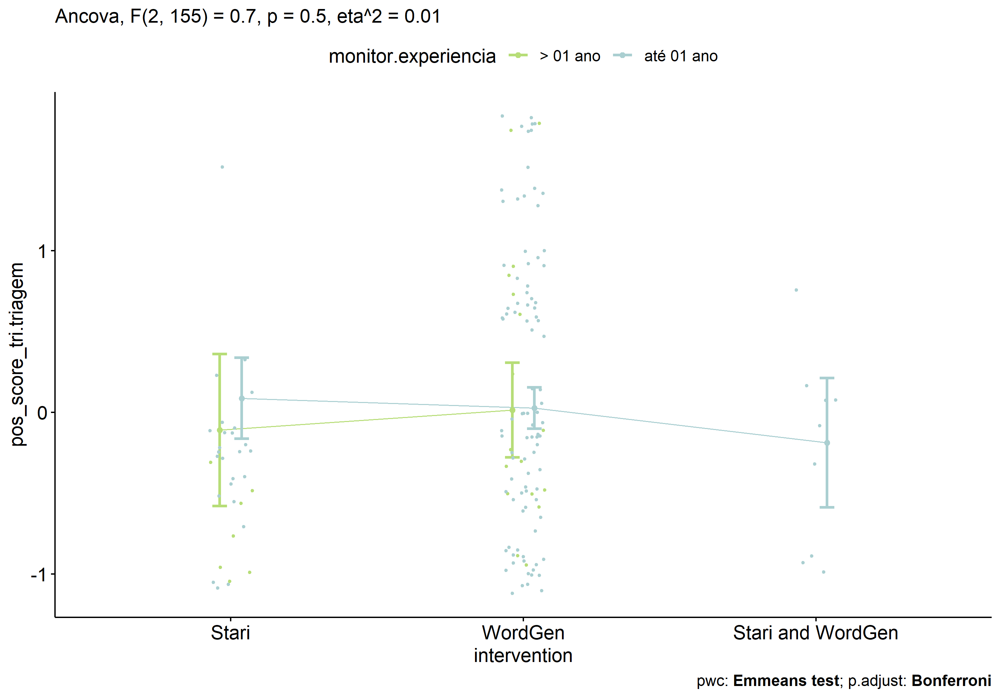<!-- -->

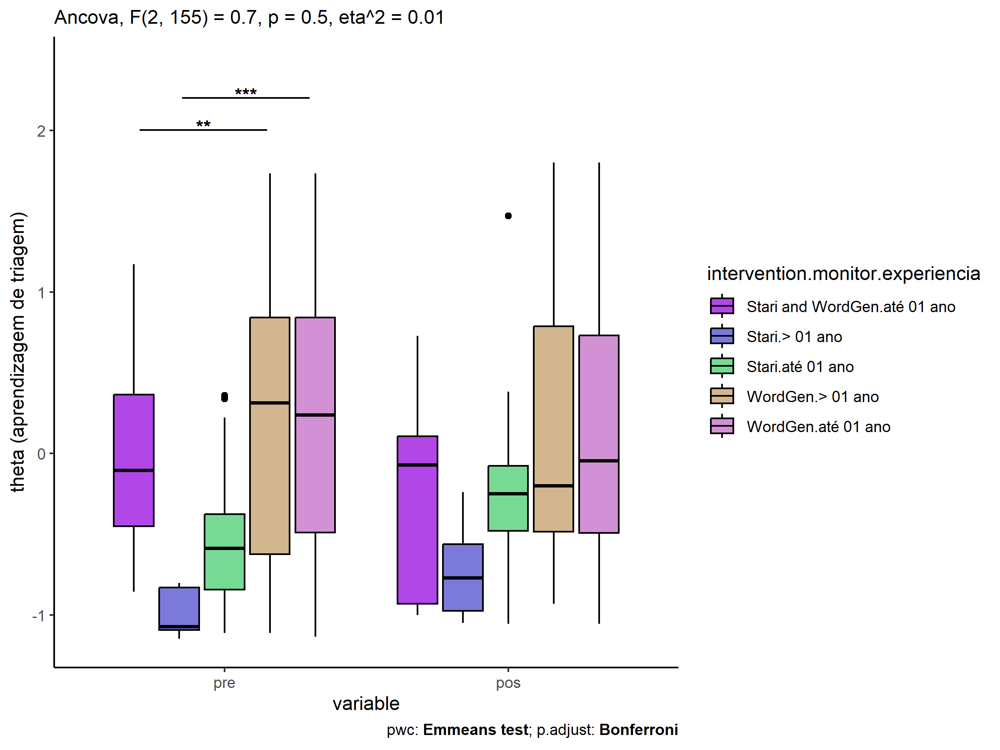<!-- -->

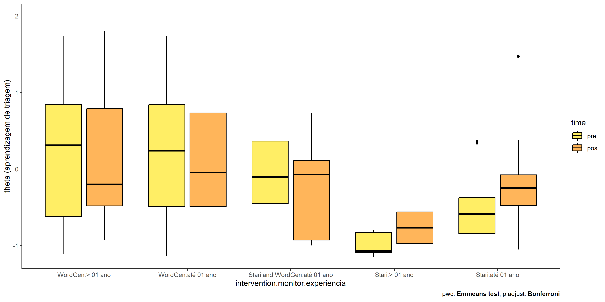<!-- -->
